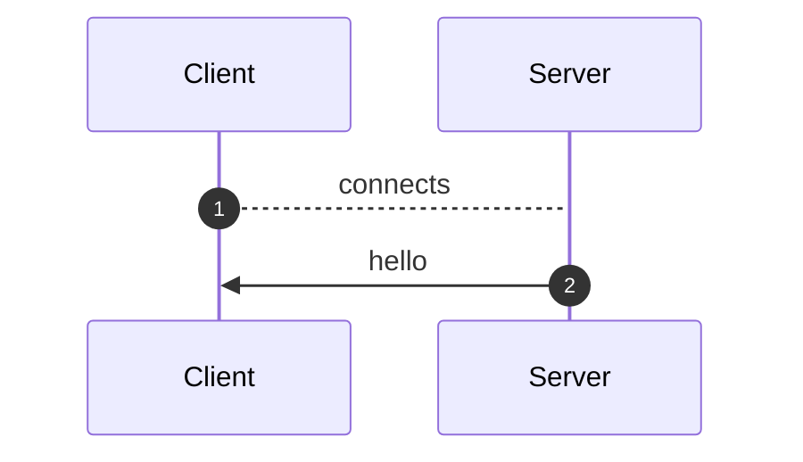
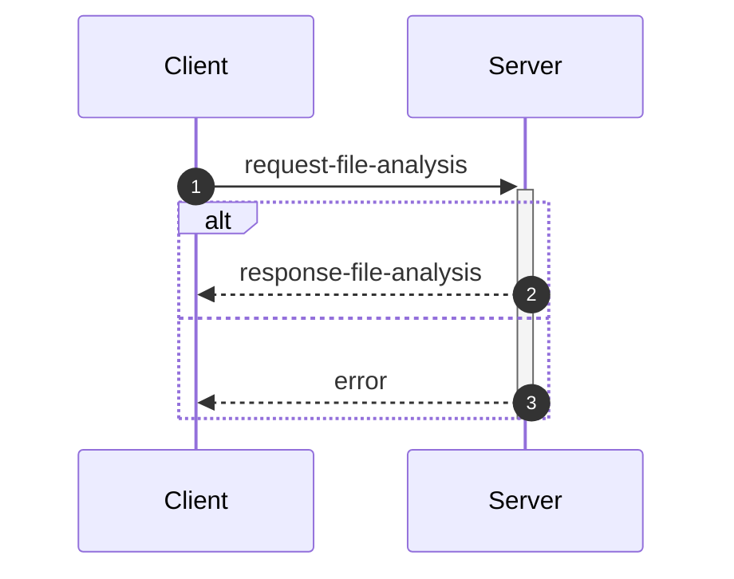
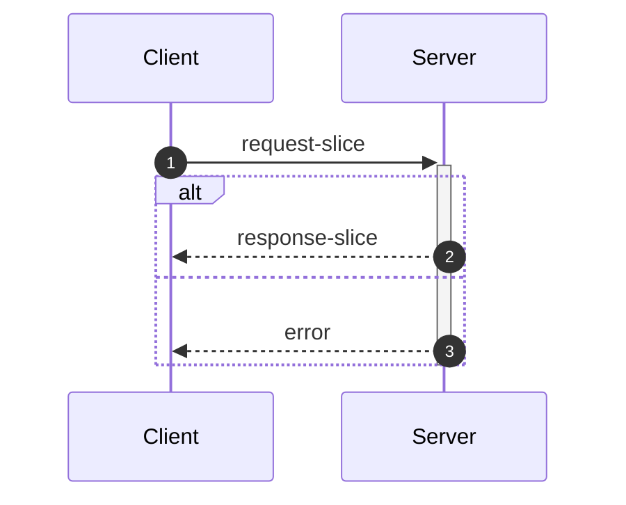
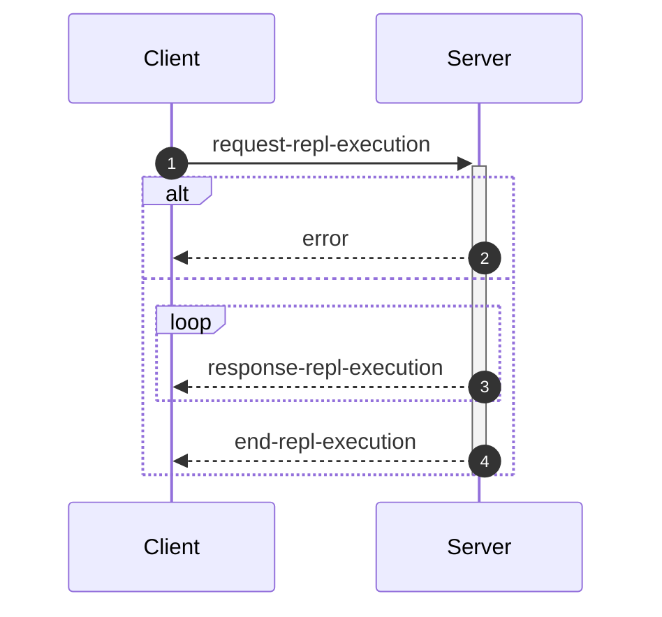

_This document was generated from '[src/documentation/wiki-interface.ts](https://github.com/flowr-analysis/flowr/tree/main//src/documentation/wiki-interface.ts)' on 2026-07-28, 15:09:07 UTC presenting an overview of flowR's interface (v2.13.4, using R v4.5.0). Please do not edit this file/wiki page directly._

Although far from being as detailed as the in-depth explanation of [_flowR_](https://github.com/flowr-analysis/flowr/wiki/core),
this wiki page explains how to interface with _flowR_ in more detail.
In general, command line arguments and other options provide short descriptions on hover over.

* [💻 Using the REPL](#using-the-repl)
* [⚙️ Configuring FlowR](#configuring-flowr)
* [⚒️ Writing Code](#writing-code)
* [💬 Communicating with the Server](#communicating-with-the-server)

<a id='using-the-repl'></a>
## 💻 Using the REPL


> [!NOTE]
> To execute arbitrary R commands with a repl request, _flowR_ has to be started explicitly with <span title="Description (Command Line Argument): Allow to access the underlying R session when using flowR (security warning: this allows the execution of arbitrary R code!)">`--r-session-access`</span>.
> Please be aware that this introduces a security risk and note that this relies on the [`r-shell` engine](https://github.com/flowr-analysis/flowr/wiki/engines) .

Although primarily meant for users to explore,
there is nothing which forbids simply calling _flowR_ as a subprocess to use standard-in, -output, and -error
for communication (although you can access the REPL using the server as well,
with the [REPL Request](#message-request-repl-execution) message).

The read-eval-print loop&nbsp;(REPL) works relatively simple.
You can submit an expression (using <kbd>Enter</kbd>),
which is interpreted as an R&nbsp;expression by default but interpreted as a *command* if it starts with a colon (`:`).
The best command to get started with the REPL is <span title="Description (Repl Command): Show help information (aliases: :h, :?)">`:help`</span>.
Besides, you can leave the REPL either with the command <span title="Description (Repl Command): End the repl (aliases: :q, :exit)">`:quit`</span> or by pressing <kbd>Ctrl</kbd>+<kbd>C</kbd> twice.
When writing a *command*, you may press <kbd>Tab</kbd> to get a list of completions, if available.
Multiple commands can be entered in a single line by separating them with a semicolon (`;`), e.g. `:parse "x<-2"; :df*`.
If a command is given without R code, the REPL will re-use R code given in a previous command.
The prior example will hence return first the parsed AST of the program and then the dataflow graph for `"x <- 2"`.

> [!NOTE]
> If you develop flowR, you may want to launch the repl using the `npm run main-dev` command, this way, you get a non-minified version of flowR with debug information and hot-reloading of source files.

<details>
<summary>Available Commands</summary>

We currently offer the following commands (this with a `[*]` suffix are available with and without the star):


| Command | Description |
| ------- | ----------- |
| **<span title="Description (Repl Command): End the repl (aliases: :q, :exit)">:quit</span>** | End the repl (aliases: **:<span title="Alias of ':quit'. End the repl">q</span>**, **:<span title="Alias of ':quit'. End the repl">exit</span>**) |
| **<span title="Description (Repl Command): Execute the given code as R code. This requires the `--r-session-access` flag to be set and requires the r-shell engine. (aliases: :e, :r)">:execute</span>** | Execute the given code as R code. This requires the `--r-session-access` flag to be set and requires the r-shell engine. (aliases: **:<span title="Alias of ':execute'. Execute the given code as R code. This requires the `--r-session-access` flag to be set and requires the r-shell engine.">e</span>**, **:<span title="Alias of ':execute'. Execute the given code as R code. This requires the `--r-session-access` flag to be set and requires the r-shell engine.">r</span>**) |
| **<span title="Description (Repl Command): Get mermaid code for the control-flow graph of R code (aliases: :cfg, :cf)">:controlflow[*]</span>** | Get mermaid code for the control-flow graph of R code (star: Returns the URL to mermaid.live) (aliases: **:<span title="Alias of ':controlflow'. Get mermaid code for the control-flow graph of R code">cfg</span>**, **:<span title="Alias of ':controlflow'. Get mermaid code for the control-flow graph of R code">cf</span>**) |
| **<span title="Description (Repl Command): Get mermaid code for the control-flow graph with basic blocks (aliases: :cfgb, :cfb)">:controlflowbb[*]</span>** | Get mermaid code for the control-flow graph with basic blocks (star: Returns the URL to mermaid.live) (aliases: **:<span title="Alias of ':controlflowbb'. Get mermaid code for the control-flow graph with basic blocks">cfgb</span>**, **:<span title="Alias of ':controlflowbb'. Get mermaid code for the control-flow graph with basic blocks">cfb</span>**) |
| **<span title="Description (Repl Command): Get mermaid code for the dataflow graph (aliases: :d, :df)">:dataflow[*]</span>** | Get mermaid code for the dataflow graph (star: Returns the URL to mermaid.live) (aliases: **:<span title="Alias of ':dataflow'. Get mermaid code for the dataflow graph">d</span>**, **:<span title="Alias of ':dataflow'. Get mermaid code for the dataflow graph">df</span>**) |
| **<span title="Description (Repl Command): Get mermaid code for the normalized AST of R code (aliases: :n)">:normalize[*]</span>** | Get mermaid code for the normalized AST of R code (star: Returns the URL to mermaid.live) (alias: **:<span title="Alias of ':normalize'. Get mermaid code for the normalized AST of R code">n</span>**) |
| **<span title="Description (Repl Command): Get mermaid code for the simplified dataflow graph (aliases: :ds, :dfs)">:dataflowsimple[*]</span>** | Get mermaid code for the simplified dataflow graph (star: Returns the URL to mermaid.live) (aliases: **:<span title="Alias of ':dataflowsimple'. Get mermaid code for the simplified dataflow graph">ds</span>**, **:<span title="Alias of ':dataflowsimple'. Get mermaid code for the simplified dataflow graph">dfs</span>**) |
| **<span title="Description (Repl Command): Inspect and extend the signature database: `query` (identical to :query @signature), `add <path>` to mount another database/source, `download` to fetch the full-history database. (aliases: :sig)">:signature</span>** | Inspect and extend the signature database: `query` (identical to :query @signature), `add <path>` to mount another database/source, `download` to fetch the full-history database. (alias: **:<span title="Alias of ':signature'. Inspect and extend the signature database: `query` (identical to :query @signature), `add <path>` to mount another database/source, `download` to fetch the full-history database.">sig</span>**) |
| **<span title="Description (Repl Command): Just calculates the DFG, but only prints summary info (aliases: :d#, :df#)">:dataflowsilent</span>** | Just calculates the DFG, but only prints summary info (aliases: **:<span title="Alias of ':dataflowsilent'. Just calculates the DFG, but only prints summary info">d#</span>**, **:<span title="Alias of ':dataflowsilent'. Just calculates the DFG, but only prints summary info">df#</span>**) |
| **<span title="Description (Repl Command): Prints ASCII Art of the parsed, unmodified AST (aliases: :p)">:parse</span>** | Prints ASCII Art of the parsed, unmodified AST (alias: **:<span title="Alias of ':parse'. Prints ASCII Art of the parsed, unmodified AST">p</span>**) |
| **<span title="Description (Repl Command): Prints the version of flowR as well as the current version of R">:version</span>** | Prints the version of flowR as well as the current version of R
| **<span title="Description (Repl Command): Query the given R code (use 'help' for more information)">:query[*]</span>** | Query the given R code (use 'help' for more information) (star: Similar to query, but returns the output in json format.)
| **<span title="Description (Repl Command): Returns an ASCII representation of the dataflow graph (aliases: :df!)">:dataflowascii</span>** | Returns an ASCII representation of the dataflow graph (alias: **:<span title="Alias of ':dataflowascii'. Returns an ASCII representation of the dataflow graph">df!</span>**) |
| **<span title="Description (Repl Command): Returns summarization stats for the normalized AST (aliases: :n#)">:normalize#</span>** | Returns summarization stats for the normalized AST (alias: **:<span title="Alias of ':normalize#'. Returns summarization stats for the normalized AST">n#</span>**) |
| **<span title="Description (Repl Command): Show help information (aliases: :h, :?)">:help</span>** | Show help information (aliases: **:<span title="Alias of ':help'. Show help information">h</span>**, **:<span title="Alias of ':help'. Show help information">?</span>**) |


</details>


> [!TIP]
> 
> As indicated by the examples before, all REPL commands that operate on code keep track of the state.
> Hence, if you run a command like <span title="Description (Repl Command, starred version): Returns the URL to mermaid.live; Base Command: Get mermaid code for the dataflow graph (aliases: :d*, :df*)">`:dataflow*`</span> without providing R code,
> the REPL will re-use the R code provided in a previous command.
> Likewise, doing this will benefit from incrementality!
> If you request the dataflow graph with `:df* x <- 2 * y` and then want to see the parsed AST with `:parse`,
> the REPL will re-use previously obtained information and not re-parse the code again.
> 		


Generally, many commands offer shortcut versions in the REPL. Many queries, for example, offer a shortened format (see the example below).
Of special note, the [Config Query](https://github.com/flowr-analysis/flowr/wiki/%5BQuery%5D-Config)
can be used to also modify the currently active configuration of _flowR_ within the REPL (see the [wiki page](https://github.com/flowr-analysis/flowr/wiki/%5BQuery%5D-Config) for more information).

### Example: Retrieving the Dataflow Graph

To retrieve a URL to the [mermaid](https://mermaid.js.org/) diagram of the dataflow of a given expression,
use <span title="Description (Repl Command, starred version): Returns the URL to mermaid.live; Base Command: Get mermaid code for the dataflow graph (aliases: :d*, :df*)">`:dataflow*`</span> (or <span title="Description (Repl Command): Get mermaid code for the dataflow graph (aliases: :d, :df)">`:dataflow`</span> to get the mermaid code in the cli):


```shell
$ docker run -it --rm eagleoutice/flowr # or npm run flowr 
flowR repl v2.13.4, R grammar v14 (tree-sitter engine)
R> :dataflow* y <- 1 + x
```

<details>
<summary style='color:gray'>Output</summary>


```text
https://mermaid.live/view#base64:eyJjb2RlIjoiZmxvd2NoYXJ0IEJUXG4gICAgMXt7XCJgKiM5MTtSTnVtYmVyIzkzOyogKioxKipcbiAgICAgICoxLjYqICgqKmlkOiAxKiopYFwifX1cbiAgICUlIE5vIGVkZ2VzIGZvdW5kIGZvciAxXG4gICAgMihbXCJgKiM5MTtSU3ltYm9sIzkzOyogKip4KipcbiAgICAgICoxLjEwKiAoKippZDogMioqKWBcIl0pXG4gICAlJSBObyBlZGdlcyBmb3VuZCBmb3IgMlxuICAgIDNbW1wiYCojOTE7UkJpbmFyeU9wIzkzOyogYmFzZSM1ODsjNTg7KiojNDM7KipcbiAgICAgICoxLjYtMTAqICgqKmlkOiAzKiopXG4gICAgYXJnOiAoMSwgMilgXCJdXVxuICAgIGJ1aWx0LWluOl9bXCJgQnVpbHQtSW46XG4jNDM7YFwiXVxuICAgIHN0eWxlIGJ1aWx0LWluOl8gc3Ryb2tlOmdyYXksZmlsbDpncmF5LHN0cm9rZS13aWR0aDoycHgsb3BhY2l0eTouODtcbiAgICAwW1wiYCojOTE7UlN5bWJvbCM5MzsqICoqeSoqXG4gICAgICAqMS4xKiAoKippZDogMCoqLCB2OiAzKWBcIl1cbiAgICA0W1tcImAqIzkxO1JCaW5hcnlPcCM5MzsqIGJhc2UjNTg7IzU4OyoqIzYwOyM0NTsqKlxuICAgICAgKjEuMS0xMCogKCoqaWQ6IDQqKilcbiAgICBhcmc6ICgwLCAzKWBcIl1dXG4gICAgYnVpbHQtaW46Xy1bXCJgQnVpbHQtSW46XG4jNjA7IzQ1O2BcIl1cbiAgICBzdHlsZSBidWlsdC1pbjpfLSBzdHJva2U6Z3JheSxmaWxsOmdyYXksc3Ryb2tlLXdpZHRoOjJweCxvcGFjaXR5Oi44O1xuICAgIDMgLS0+fFwicmVhZHMsIGFyZ1wifCAxXG4gICAgMyAtLT58XCJyZWFkcywgYXJnXCJ8IDJcbiAgICAzIC0uLT58XCJyZWFkcywgY2FsbHNcInwgYnVpbHQtaW46X1xuICAgIGxpbmtTdHlsZSAyIHN0cm9rZTpncmF5O1xuICAgIDAgLS0+fFwiZGVmaW5lZC1ieVwifCAzXG4gICAgMCAtLT58XCJkZWZpbmVkLWJ5XCJ8IDRcbiAgICA0IC0tPnxcInJlYWRzLCBhcmdcInwgM1xuICAgIDQgLS0+fFwicmV0dXJucywgYXJnXCJ8IDBcbiAgICA0IC0uLT58XCJyZWFkcywgY2FsbHNcInwgYnVpbHQtaW46Xy1cbiAgICBsaW5rU3R5bGUgNyBzdHJva2U6Z3JheTsiLCJtZXJtYWlkIjp7ImF1dG9TeW5jIjp0cnVlfX0=
```


Retrieve the dataflow graph of the expression `y <- 1 + x`. It looks like this:


```mermaid
flowchart LR
    1{{"`*#91;RNumber#93;* **1**
      *1.6* (**id: 1**)`"}}
   %% No edges found for 1
    2(["`*#91;RSymbol#93;* **x**
      *1.10* (**id: 2**)`"])
   %% No edges found for 2
    3[["`*#91;RBinaryOp#93;* base#58;#58;**#43;**
      *1.6-10* (**id: 3**)
    arg: (1, 2)`"]]
    built-in:_["`Built-In:
#43;`"]
    style built-in:_ stroke:gray,fill:gray,stroke-width:2px,opacity:.8;
    0["`*#91;RSymbol#93;* **y**
      *1.1* (**id: 0**, v: 3)`"]
    4[["`*#91;RBinaryOp#93;* base#58;#58;**#60;#45;**
      *1.1-10* (**id: 4**)
    arg: (0, 3)`"]]
    built-in:_-["`Built-In:
#60;#45;`"]
    style built-in:_- stroke:gray,fill:gray,stroke-width:2px,opacity:.8;
    3 -->|"reads, arg"| 1
    3 -->|"reads, arg"| 2
    3 -.->|"reads, calls"| built-in:_
    linkStyle 2 stroke:gray;
    0 -->|"defined-by"| 3
    0 -->|"defined-by"| 4
    4 -->|"reads, arg"| 3
    4 -->|"returns, arg"| 0
    4 -.->|"reads, calls"| built-in:_-
    linkStyle 7 stroke:gray;
```

	
<details>

<summary style="color:gray">R Code of the Dataflow Graph</summary>

The analysis required _0.7 ms_ (including parse and normalize, using the [tree-sitter](https://github.com/flowr-analysis/flowr/wiki/Engines) engine) within the generation environment. No [signature database](https://github.com/flowr-analysis/flowr/wiki/Signature-Database) is mounted for these generated graphs, so `library()` calls attach no package exports; base-R names are still qualified via the generated base-package store (e.g. `acf` as `stats::acf`). 
We encountered no unknown side effects during the analysis.


```r
y <- 1 + x
```


</details>


</details>


For small graphs like this, <span title="Description (Repl Command): Returns an ASCII representation of the dataflow graph (aliases: :df!)">`:dataflowascii`</span> also provides an ASCII representation directly in the REPL:


```shell
$ docker run -it --rm eagleoutice/flowr # or npm run flowr 
flowR repl v2.13.4, R grammar v14 (tree-sitter engine)
R> :df! y <- 1 + x
```

<details open>
<summary style='color:gray'>Output</summary>


```text
                        0<1>0
                   ┌────| 1 |
    ┌────────┐     │    0---0
 c<4>c       └──c<3>c
 |<- |  v<0>v┌──| + |
 c---c──| y |┘  c---c   u<2>u
        v---v      └────| x |
                        u---u
Edges:
3 -> 1: reads, arg  3 -> 2: reads, arg
4 -> 3: reads, arg  4 -> 0: returns, arg
0 -> 3: defined-by  0 -> 4: defined-by
```


Retrieve the dataflow graph of the expression `y <- 1 + x` as ASCII art.

</details>


For the slicing with <span title="Description (Repl Command): Static backwards executable slicer for R">`:slicer`</span>, you have access to the same [magic comments](#slice-magic-comments) as with the [slice request](#message-request-slice).
Pass `--inline` to splice resolvable `source()` calls into the reconstruction so the slice is a single self-contained R text (the same as the static slice query's `inlineSources` flag).
See `--help` for more flags!

### Example: Interfacing with the File System

Many commands that allow for an R-expression (like <span title="Description (Repl Command, starred version): Returns the URL to mermaid.live; Base Command: Get mermaid code for the dataflow graph (aliases: :d*, :df*)">`:dataflow*`</span>) allow for a file as well
if the argument starts with `file://`.
If you are working from the root directory of the _flowR_ repository, the following gives you the parsed AST of the example file using the <span title="Description (Repl Command): Prints ASCII Art of the parsed, unmodified AST (aliases: :p)">`:parse`</span> command:

> **Watch mode**: Replace `file://` with `watch://` to enter watch mode.
> flowR runs the command immediately and then re-runs it every time the file (or any file inside the folder) changes.
> Enter any other command to leave watch mode.
> For example: `:df watch://analysis.R`


```shell
$ docker run -it --rm eagleoutice/flowr # or npm run flowr 
flowR repl v2.13.4, R grammar v14 (tree-sitter engine)
R> :parse file://test/testfiles/example.R
```

<details>
<summary style='color:gray'>Output</summary>


```text
File: test/testfiles/example.R

program
├ binaryoperator
│ ├ identifier "sum" (1:1─4)
│ ├ <- "<-" (1:5─7)
│ ╰ float "0" (1:8─9)
├ binaryoperator
│ ├ identifier "product" (2:1─8)
│ ├ <- "<-" (2:9─11)
│ ╰ float "1" (2:12─13)
├ binaryoperator
│ ├ identifier "w" (3:1─2)
│ ├ <- "<-" (3:3─5)
│ ╰ float "7" (3:6─7)
├ binaryoperator
│ ├ identifier "N" (4:1─2)
│ ├ <- "<-" (4:3─5)
│ ╰ float "10" (4:6─8)
├ forstatement
│ ├ for "for" (6:1─4)
│ ├ ( "(" (6:5─6)
│ ├ identifier "i" (6:6─7)
│ ├ in "in" (6:8─10)
│ ├ binaryoperator
│ │ ├ float "1" (6:11─12)
│ │ ├ : ":" (6:12─13)
│ │ ╰ parenthesizedexpression
│ │   ├ ( "(" (6:13─14)
│ │   ├ binaryoperator
│ │   │ ├ identifier "N" (6:14─15)
│ │   │ ├ - "-" (6:15─16)
│ │   │ ╰ float "1" (6:16─17)
│ │   ╰ ) ")" (6:17─18)
│ ├ ) ")" (6:18─19)
│ ╰ bracedexpression
│   ├ { "{" (6:20─21)
│   ├ binaryoperator
│   │ ├ identifier "sum" (7:3─6)
│   │ ├ <- "<-" (7:7─9)
│   │ ╰ binaryoperator
│   │   ├ binaryoperator
│   │   │ ├ identifier "sum" (7:10─13)
│   │   │ ├ + "+" (7:14─15)
│   │   │ ╰ identifier "i" (7:16─17)
│   │   ├ + "+" (7:18─19)
│   │   ╰ identifier "w" (7:20─21)
│   ├ binaryoperator
│   │ ├ identifier "product" (8:3─10)
│   │ ├ <- "<-" (8:11─13)
│   │ ╰ binaryoperator
│   │   ├ identifier "product" (8:14─21)
│   │   ├  "" (8:22─23)
│   │   ╰ identifier "i" (8:24─25)
│   ╰ } "}" (9:1─2)
├ call
│ ├ identifier "cat" (11:1─4)
│ ╰ arguments
│   ├ ( "(" (11:4─5)
│   ├ argument
│   │ ╰ string
│   │   ├ " "\"" (11:5─6)
│   │   ├ stringcontent "Sum:" (11:6─10)
│   │   ╰ " "\"" (11:10─11)
│   ├ comma "," (11:11─12)
│   ├ argument
│   │ ╰ identifier "sum" (11:13─16)
│   ├ comma "," (11:16─17)
│   ├ argument
│   │ ╰ string
│   │   ├ " "\"" (11:18─19)
│   │   ├ stringcontent
│   │   │ ╰ escapesequence "\\n" (11:19─21)
│   │   ╰ " "\"" (11:21─22)
│   ╰ ) ")" (11:22─23)
╰ call
  ├ identifier "cat" (12:1─4)
  ╰ arguments
    ├ ( "(" (12:4─5)
    ├ argument
    │ ╰ string
    │   ├ " "\"" (12:5─6)
    │   ├ stringcontent "Product:" (12:6─14)
    │   ╰ " "\"" (12:14─15)
    ├ comma "," (12:15─16)
    ├ argument
    │ ╰ identifier "product" (12:17─24)
    ├ comma "," (12:24─25)
    ├ argument
    │ ╰ string
    │   ├ " "\"" (12:26─27)
    │   ├ stringcontent
    │   │ ╰ escapesequence "\\n" (12:27─29)
    │   ╰ " "\"" (12:29─30)
    ╰ ) ")" (12:30─31)
```


Retrieve the parsed AST of the example file.

<details>

<summary>File Content</summary>


```r
sum <- 0
product <- 1
w <- 7
N <- 10

for (i in 1:(N-1)) {
  sum <- sum + i + w
  product <- product * i
}

cat("Sum:", sum, "\n")
cat("Product:", product, "\n")
```


</details>

As _flowR_ directly transforms this AST the output focuses on being human-readable instead of being machine-readable.
		

</details>


### Example: Run a Query

You can run any query supported by _flowR_ using the <span title="Description (Repl Command): Query the given R code (use 'help' for more information)">`:query`</span> command.
For example, to obtain the shapes of all data frames in a given piece of code, you can run:


```shell
$ docker run -it --rm eagleoutice/flowr # or npm run flowr 
flowR repl v2.13.4, R grammar v14 (tree-sitter engine)
R> :query @absint df-shape "x <- data.frame(a = 1:10, b = 1:10)\ny <- x$a"
```

<details open>
<summary style='color:gray'>Output</summary>


```text
Query: absint (2 ms)
   ╰ $12: (colnames: [{"a", "b"}, {}], cols: [2, 2], rows: [10, 10])
   ╰ $0: (colnames: [{"a", "b"}, {}], cols: [2, 2], rows: [10, 10])
All queries together required ≈5 ms (1ms accuracy, total 5 ms)
```


Retrieve the shapes of all data frames in the given code.

</details>


To run the linter on a file, you can use (in this example, we just issue the `dead-code` linter on a small piece of code):


```shell
$ docker run -it --rm eagleoutice/flowr # or npm run flowr 
flowR repl v2.13.4, R grammar v14 (tree-sitter engine)
R> :query @linter rules:dead-code "if(FALSE) x <- 2"
```

<details open>
<summary style='color:gray'>Output</summary>


```text
Query: linter (3 ms)
   ╰ Dead Code (dead-code):
       ╰ certain:
           ╰ Code at 1.11-16
       ╰ Metadata: searchTimeMs: 3, processTimeMs: 0
All queries together required ≈3 ms (1ms accuracy, total 3 ms)
```


Run the linter on the given code, with only the `dead-code` rule enabled.

</details>


For more information on the available queries, please check out the [Query API](https://github.com/flowr-analysis/flowr/wiki/query-api).


<a id='configuring-flowr'></a>
## ⚙️ Configuring FlowR


When running _flowR_, you may want to specify some behaviors with a dedicated configuration file.
By default, flowR looks for a file named `flowr.json` in the current working directory (or any higher directory).
You can also specify a different file with <span title="Description (Command Line Argument): The name of the configuration file to use">`--config-file`</span> or pass the configuration inline using <span title="Description (Command Line Argument): The flowR configuration to use, as a JSON string">`--config-json`</span>.
To inspect the current configuration, you can run flowr with the <span title="Description (Command Line Argument): Run with verbose logging (will be passed to the corresponding script)">`--verbose`</span> flag, or use the `config` [Query](https://github.com/flowr-analysis/flowr/wiki/query-api).
Within the REPL this works by running the following:


```shell
:query @config
```


To work with the <a href="https://github.com/flowr-analysis/flowr/tree/main/src/config.ts#L132"><code><span title="The configuration file format for flowR.">FlowrConfig</span></code></a> you can use the provided helper objects alongside its methods like
<a href="https://github.com/flowr-analysis/flowr/tree/main/src/config.ts#L772"><code><span title="Creates a new flowr config that has the updated values.">FlowrConfig::<b>amend</b></span></code></a>.
The schema below documents every option; the ones you most likely want are:

- <a href="https://github.com/flowr-analysis/flowr/wiki/Interface#configuring-flowr" title="Configuration Option (boolean): Whether source calls should be ignored, causing {@link processSourceCall}&#39;s behavior to be skipped.">ignoreSourceCalls</a>: ignore source calls when analyzing the code, i.e., ignore the inclusion of other files.
- <a href="https://github.com/flowr-analysis/flowr/wiki/Interface#configuring-flowr" title="Configuration Option (boolean): Whether load calls should be ignored, causing {@link processLoadCall}&#39;s behavior to be skipped.">ignoreLoadCalls</a>: ignore load calls when analyzing the code, i.e., ignore the loading of r-data files.
- <a href="https://github.com/flowr-analysis/flowr/wiki/Interface#configuring-flowr" title="Configuration Option (object): Do you want to overwrite (parts) of the builtin definition?">semantics.environment.overwriteBuiltIns</a>: overwrite _flowR_'s handling of built-in functions, or clear the preset definitions entirely.
  See [Configure BuiltIn Semantics](#configure-builtin-semantics) for more information.
- <a href="https://github.com/flowr-analysis/flowr/wiki/Interface#configuring-flowr" title="Configuration Option (string): How to resolve variables and their values. (one of &quot;disabled&quot;, &quot;alias&quot;, &quot;builtin&quot;)">solver.variables</a>: how to resolve variables and their values (`disabled`, `alias`, `builtin`).
- <a href="https://github.com/flowr-analysis/flowr/wiki/Interface#configuring-flowr" title="Configuration Option (array): The engine or set of engines to use for interacting with R code. An empty array means all available engines will be used.">engines</a> and <a href="https://github.com/flowr-analysis/flowr/wiki/Interface#configuring-flowr" title="Configuration Option (string): The default engine to use for interacting with R code. If this is undefined, an arbitrary engine from the specified list will be used. (one of &quot;tree-sitter&quot;, &quot;r-shell&quot;)">defaultEngine</a>: the engines used to interact with R code, see the [Engines wiki page](https://github.com/flowr-analysis/flowr/wiki/engines).
- <a href="https://github.com/flowr-analysis/flowr/wiki/Interface#configuring-flowr" title="Configuration Option (array): Files a framework loads on its own, without any source() call (e.g. global.R in a shiny app), in the order they are loaded; flowR orders the matching project files accordingly and analyzes them as one program. Entries are case-insensitive globs matched against the file path, a plain name matches any file with that name, and entries matching no project file are warned about. Usually set per project kind via specializeConfig.">project.implicitSources</a>: the files a framework loads without any `source()` call, in the order in which they are
  loaded. Entries are globs (e.g. `R/*.R`) matched against the file path ignoring capitalization; one matching no file is reported.
- <a href="https://github.com/flowr-analysis/flowr/wiki/Interface#configuring-flowr" title="Configuration Option (object): Overwrite (parts of) the configuration depending on the project kind flowR detects, e.g. to give a shiny app its implicit sources.">specializeConfig</a>: overwrite (parts of) the configuration depending on the kind of project _flowR_ detects
  (e.g. `shiny-app`), which is how a shiny app gets its implicit sources by default. What you configure directly wins.
- <a href="https://github.com/flowr-analysis/flowr/wiki/Interface#configuring-flowr" title="Configuration Option (string): Overwrite the project kind flowR would otherwise infer from the analyzed files, e.g. when auto-detection guesses wrong. (one of &quot;package&quot;, &quot;script&quot;, &quot;shiny-app&quot;, &quot;notebook&quot;, &quot;project&quot;, &quot;unknown&quot;)">project.useProjectType</a>: skip that detection and force a project kind yourself, when auto-detection guesses wrong.
- <a href="https://github.com/flowr-analysis/flowr/wiki/Interface#configuring-flowr" title="Configuration Option (array): The default plugins to load when creating a new instance of FlowrAnalyzer">defaultPlugins</a> and <a href="https://github.com/flowr-analysis/flowr/wiki/Interface#configuring-flowr" title="Configuration Option (array): The plugins to load in REPL mode">repl.plugins</a>: the plugins to load for a new <a href="https://github.com/flowr-analysis/flowr/tree/main/src/project/flowr-analyzer.ts#L167"><code><span title="Central class for conducting analyses with FlowR. Use the FlowrAnalyzerBuilder to create a new instance. If you want the original pattern of creating a pipeline and running all steps, you can still do this with FlowrAnalyzer#runFull . To inspect the context of the analyzer, use FlowrAnalyzer#inspectContext (if you are a plugin and need to modify it, use FlowrAnalyzer#context instead).">FlowrAnalyzer</span></code></a> and in the REPL
  (use `flowr:default` to reference the former).

So you can configure _flowR_ by adding a file like the following:

<details>

<summary>Example Configuration File</summary>


```json
{
  "ignoreSourceCalls": true,
  "ignoreLoadCalls": true,
  "semantics": {
    "environment": {
      "overwriteBuiltIns": {
        "definitions": [
          {
            "type": "function",
            "names": [
              "foo"
            ],
            "processor": "builtin:assign",
            "config": {}
          }
        ]
      }
    }
  },
  "defaultPlugins": [
    "file:description",
    "versions:description"
  ],
  "repl": {
    "quickStats": false,
    "dfProcessorHeat": false,
    "hints": true,
    "plugins": [
      "flowr:default"
    ]
  },
  "project": {
    "resolveUnknownPathsOnDisk": true,
    "implicitSources": [
      "global.R",
      "app.R"
    ]
  },
  "linter": {
    "disabledRules": []
  },
  "specializeConfig": {
    "shiny-app": {
      "project": {
        "implicitSources": [
          "global.R",
          "ui.R",
          "server.R",
          "app.R"
        ]
      }
    }
  },
  "engines": [
    {
      "type": "r-shell"
    }
  ],
  "solver": {
    "variables": "alias",
    "evalStrings": true,
    "trackEnvironments": true,
    "sigdb": {
      "enabled": true,
      "loadProjectDependencies": true,
      "eagerlyLoad": false,
      "eagerlyLoadExports": false,
      "linkBaseR": false,
      "linkDescriptionDependencies": false
    },
    "resolveSource": {
      "dropPaths": "no",
      "ignoreCapitalization": true,
      "inferWorkingDirectory": "active-script",
      "searchPath": []
    },
    "instrument": {},
    "slicer": {
      "threshold": 50
    }
  },
  "abstractInterpretation": {
    "wideningThreshold": 4,
    "dataFrame": {
      "maxColNames": 20,
      "readLoadedData": {
        "readExternalFiles": true,
        "maxReadLines": 1000000
      }
    }
  },
  "gas": {
    "thresholds": {
      "memory": {
        "problematic": 0.7,
        "critical": 0.9
      },
      "timeMs": {
        "problematic": 100000,
        "critical": 120000
      }
    },
    "features": {}
  }
}
```


</details>

<details>
<a id='configure-builtin-semantics'></a>
<summary>Configure Built-In Semantics</summary>


`semantics/environment/overwriteBuiltins` accepts two keys:

- `loadDefaults` (boolean, initially `true`): If set to `true`, the default built-in definitions are loaded before applying the custom definitions. Setting this flag to `false` explicitly disables the loading of the default definitions.
- `definitions` (array, initially empty): Allows to overwrite or define new built-in elements. Each object within must have a `type` which is one of the below. Furthermore, they may define a string array of `names` which specifies the identifiers to bind the definitions to. You may use `assumePrimitive` to specify whether _flowR_ should assume that this is a primitive non-library definition (so you probably just do not want to specify the key).

  | Type            | Description                                                                                                                                                                                                                                                                                              | Example                                                                                                    |
  | --------------- | -------------------------------------------------------------------------------------------------------------------------------------------------------------------------------------------------------------------------------------------------------------------------------------------------------- | ---------------------------------------------------------------------------------------------------------- |
  | `constant`    | Additionally allows for a `value` this should resolve to.                                                                                                                                                                                                                                                | `{ type: 'constant', names: ['NULL', 'NA'],  value: null }`                                                |
  | `function`    | Is a rather flexible way to define and bind built-in functions. For the time, we do not have extensive documentation to cover all the cases, so please either consult the sources with the `default-builtin-config.ts` or open a [new issue](https://github.com/flowr-analysis/flowr/issues/new/choose). | `{ type: 'function', names: ['next'], processor: 'builtin:d', config: { cfg: ExitPointType.Next } }` |
  | `replacement` | A comfortable way to specify replacement functions like `$<-` or `names<-`. `suffixes` describes the... suffixes to attach automatically. | `{ type: 'replacement', suffixes: ['<-', '<<-'], names: ['[', '[['] }` |


</details>

<details>

<summary style='color:gray'>Full Configuration-File Schema</summary>

- _The configuration file format for flowR._ (object)
    - **logLevel** [optional] _flowR's global minimum log level, applied when the config is loaded._ (string)
        Only allows: 'silly', 'trace', 'debug', 'info', 'warn', 'error', 'fatal'
    - **ignoreSourceCalls** [optional] _Whether source calls should be ignored, causing {@link processSourceCall}'s behavior to be skipped._ (boolean)
    - **ignoreLoadCalls** [optional] _Whether load calls should be ignored, causing {@link processLoadCall}'s behavior to be skipped._ (boolean)
    - **semantics** _Configure language semantics and how flowR handles them._ (object)
        - **environment** [optional] _Semantics regarding how to handle the R environment._ (object)
            - **overwriteBuiltIns** [optional] _Do you want to overwrite (parts) of the builtin definition?_ (object)
                - **loadDefaults** [optional] _Should the default configuration still be loaded?_ (boolean)
                - **definitions** [optional] _The definitions to load/overwrite._ (array)
                Valid item types:
                    - (object)
    - **defaultPlugins** [optional] _The default plugins to load when creating a new instance of FlowrAnalyzer_ (array)
    Valid item types:
        - (alternatives)
            - (string)
            - (array)
    - **repl** _Configuration options for the REPL._ (object)
        - **quickStats** [optional] _Whether to show quick stats in the REPL after each evaluation._ (boolean)
        - **dfProcessorHeat** [optional] _This instruments the dataflow processors to count how often each processor is called._ (boolean)
        - **hints** [optional] _Whether to show dim inline hints on the empty prompt (automatically disabled on non-interactive terminals)._ (boolean)
        - **plugins** [optional] _The plugins to load in REPL mode_ (array)
        Valid item types:
            - (alternatives)
                - (string)
                - (array)
        - **autoUseFileProtocol** [optional] _Prepend the file protocol to a repl input that looks like a path, instead of only warning about it._ (boolean)
        - **queryStats** [optional] _Whether `:query` closes with the line stating how long the queries took (`:query*` never prints it)._ (boolean)
        - **showPlugins** [optional] _Whether `:version` grays out the plugins that did not activate during the last analysis._ (boolean)
    - **project** _Project specific configuration options._ (object)
        - **resolveUnknownPathsOnDisk** [optional] _Whether to resolve unknown paths loaded by the r project disk when trying to source/analyze files._ (boolean)
        - **failOnInaccessiblePath** [optional] _Whether a directory that cannot be traversed during file discovery (e.g. due to permissions) aborts the analysis; when false (the default) such paths are logged and skipped._ (boolean)
        - **basePackages** [optional] _The packages considered part of R itself (base and recommended); if unset, flowR uses its built-in list._ (array)
        Valid item types:
            - (string)
        - **implicitSources** [optional] _Files a framework loads on its own, without any source() call (e.g. global.R in a shiny app), in the order they are loaded; flowR orders the matching project files accordingly and analyzes them as one program. Entries are case-insensitive globs matched against the file path, a plain name matches any file with that name, and entries matching no project file are warned about. Usually set per project kind via specializeConfig._ (array)
        Valid item types:
            - (string)
        - **useProjectType** [optional] _Overwrite the project kind flowR would otherwise infer from the analyzed files, e.g. when auto-detection guesses wrong._ (string)
            Only allows: 'package', 'script', 'shiny-app', 'notebook', 'project', 'unknown'
        - **discovery** [optional] _Scoping options for the default project discovery._ (object)
            - **full** [optional] _Collect every file below the project root (greedy) instead of only the files the detected project kind needs (default false)._ (boolean)
            - **perKind** [optional] _Per-kind include/exclude glob overrides layered on the default scoping._ (object)
            - **ignore** [optional] _Case-insensitive globs that drop matching files from the intelligent discovery, regardless of kind (e.g. .Renviron to ignore environment files)._ (array)
            Valid item types:
                - (string)
        - **classification** [optional] _Overrides for the signals flowR uses to classify the project kind._ (object)
            - **shinyDescriptionTypes** [optional] _DESCRIPTION Type: values that mark a shiny app._ (array)
            Valid item types:
                - (string)
            - **shinyEntryFiles** [optional] _File names a shiny app is assembled from._ (array)
            Valid item types:
                - (string)
            - **shinyUsagePattern** [optional] _Regex source evidencing shiny usage in an entry file._ (string)
            - **notebookExtensions** [optional] _File extensions marking a notebook._ (array)
            Valid item types:
                - (string)
    - **linter** _Linter configuration options._ (object)
        - **disabledRules** _Linting rule names excluded from the default rule set (a rule requested explicitly via a linter query still runs). Usually set per project kind via specializeConfig._ (array)
        Valid item types:
            - (string)
    - **inputSources** [optional] _Further frameworks the input-sources analysis should know about; entries are added to flowR's defaults._ (object)
        - **pure** [optional] _Functions that only pass the constantness of their arguments on._ (array)
        Valid item types:
            - (string)
        - **param** [optional] _Functions whose result is a 'param' input._ (array)
        Valid item types:
            - (string)
        - **file** [optional] _Functions whose result is a 'file' input._ (array)
        Valid item types:
            - (string)
        - **tempfile** [optional] _Functions whose result is a 'tempfile' input._ (array)
        Valid item types:
            - (string)
        - **net** [optional] _Functions whose result is a 'net' input._ (array)
        Valid item types:
            - (string)
        - **rand** [optional] _Functions whose result is a 'rand' input._ (array)
        Valid item types:
            - (string)
        - **system** [optional] _Functions whose result is a 'system' input._ (array)
        Valid item types:
            - (string)
        - **ffi** [optional] _Functions whose result is a 'ffi' input._ (array)
        Valid item types:
            - (string)
        - **lang** [optional] _Functions whose result is a 'lang' input._ (array)
        Valid item types:
            - (string)
        - **options** [optional] _Functions whose result is a 'options' input._ (array)
        Valid item types:
            - (string)
        - **user** [optional] _Functions whose result is a 'user' input._ (array)
        Valid item types:
            - (string)
        - **const** [optional] _Functions whose result is a 'const' input._ (array)
        Valid item types:
            - (string)
        - **scope** [optional] _Functions whose result is a 'scope' input._ (array)
        Valid item types:
            - (string)
        - **dconst** [optional] _Functions whose result is a 'dconst' input._ (array)
        Valid item types:
            - (string)
        - **unknown** [optional] _Functions whose result is a 'unknown' input._ (array)
        Valid item types:
            - (string)
        - **linkedObjects** [optional] _Objects a framework provides without a definition in the code, e.g. shiny's input._ (array)
        Valid item types:
            - (object)
        - **linkedEntryPoints** [optional] _Calls that hand a function to a framework, which binds its objects to the parameters by position._ (array)
        Valid item types:
            - (object)
    - **specializeConfig** [optional] _Overwrite (parts of) the configuration depending on the project kind flowR detects, e.g. to give a shiny app its implicit sources._ (object)
    - **engines** _The engine or set of engines to use for interacting with R code. An empty array means all available engines will be used._ (array)
    Valid item types:
        - (alternatives)
            - _The configuration for the tree sitter engine._ (object)
                - **type** [required] _Use the tree sitter engine._ (string)
                    Only allows: 'tree-sitter'
                - **wasmPath** [optional] _The path to the tree-sitter-r WASM binary to use. If this is undefined, this uses the default path._ (string)
                - **treeSitterWasmPath** [optional] _The path to the tree-sitter WASM binary to use. If this is undefined, this uses the default path._ (string)
                - **lax** [optional] _Whether to use the lax parser for parsing R code (allowing for syntax errors). If this is undefined, the strict parser will be used._ (boolean)
            - _The configuration for the R shell engine._ (object)
                - **type** [required] _Use the R shell engine._ (string)
                    Only allows: 'r-shell'
                - **rPath** [optional] _The path to the R executable to use. If this is undefined, this uses the default path._ (string)
    - **defaultEngine** [optional] _The default engine to use for interacting with R code. If this is undefined, an arbitrary engine from the specified list will be used._ (string)
        Only allows: 'tree-sitter', 'r-shell'
    - **solver** _How to resolve constants, constraints, cells, ..._ (object)
        - **variables** _How to resolve variables and their values._ (string)
            Only allows: 'disabled', 'alias', 'builtin'
        - **evalStrings** _Should we include eval(parse(text="...")) calls in the dataflow graph?_ (boolean)
        - **trackEnvironments** [optional] _Track user-created environments (new.env, assign/get/local with envir=, dollar-assign, attach). When false, all envir-style calls fall through conservatively._ (boolean)
        - **sigdb** _Resolving library exports from a signature database._ (object)
            - **enabled** [optional] _Resolve library()/use() exports from a signature database (default true); when false no database is consulted._ (boolean)
            - **loadProjectDependencies** [optional] _Load the project's declared dependencies from its metadata files (DESCRIPTION Imports/Depends, rproject.toml, renv.lock, rv.lock) (default true); when false these files are not read for dependencies._ (boolean)
            - **eagerlyLoad** [optional] _Parse the database up front rather than on the first package load (default false, ignored if disabled)._ (boolean)
            - **eagerlyLoadExports** [optional] _Add a vertex for every export on load rather than on demand (default false); keeps the dataflow graph small._ (boolean)
            - **assumedRVersion** [optional] _R version assumed when resolving versioned (base-R) exports: a pin like "4.5" or "auto" to detect the installed R (default "auto")._ (string)
            - **linkBaseR** [optional] _Eagerly attach base-R namespaces so bare base calls resolve without library() (default false)._ (boolean)
            - **linkBaseRCalls** [optional] _Add a lightweight Reads edge from a bare base-R call to its signature-database function vertex (default false; base-R qualification is edge-free otherwise)._ (boolean)
            - **linkPackageCalls** [optional] _Add a lightweight Reads edge from a resolved package call to its signature-database function vertex (default false)._ (boolean)
            - **linkDescriptionDependencies** [optional] _Eagerly attach the namespaces of the project's declared DESCRIPTION dependencies (Imports/Depends) so their exports resolve without an explicit library() (default false)._ (boolean)
            - **warmInBackground** [optional] _Decompress the hot shards (base + most-downloaded) in a background task on startup so the first library() lookup is warm (default false; for long-running servers/REPLs)._ (boolean)
            - **additionalPaths** [optional] _Extra directories or bundle/manifest files searched for signature databases (alongside the shipped default and $FLOWR_SIGDB_DIR); a downloaded full-history bundle placed here is mounted automatically._ (array)
            Valid item types:
                - (string)
            - **downloadRepo** [optional] _GitHub owner/repo the full-history bundle is downloaded from via ":signature download" (default "flowr-analysis/flowr", release tag "sigdb-v<flowR-version>")._ (string)
            - **autoSync** [optional] _On startup, re-download shards whose committed sigdb.remote.json hash no longer matches the cache, in the background (default false; opt-in network sync after a git pull)._ (boolean)
            - **versionSelection** [optional] _When a project constrains a dependency, resolve to the newest (default), oldest, or system-installed version satisfying it; system needs R and falls back to newest. Base-R packages always resolve against the assumed R version._ (string)
                Only allows: 'newest', 'oldest', 'system'
            - **versionOverrides** [optional] _Force an exact version for specific packages (name -> version), overriding both the project constraint and the versionSelection policy (default {})._ (object)
        - **versionManagement** _Policies for reasoning about dependency versions._ (object)
            - **linkedVersionGroups** [optional] _Groups of packages that must resolve to the same version; version guessing intersects each group so its members stay mutually compatible (default [])._ (array)
            Valid item types:
                - (array)
                Valid item types:
                    - (string)
        - **instrument** (object)
            - **dataflowExtractors** [optional] _These keys are only intended for use within code, allowing to instrument the dataflow analyzer!_ (any)
        - **resolveSource** [optional] _If lax source calls are active, flowR searches for sourced files much more freely, based on the configurations you give it. This option is only in effect if `ignoreSourceCalls` is set to false._ (object)
            - **dropPaths** _Allow to drop the first or all parts of the sourced path, if it is relative._ (string)
                Only allows: 'no', 'once', 'all'
            - **ignoreCapitalization** _Search for filenames matching in the lowercase._ (boolean)
            - **inferWorkingDirectory** _Try to infer the working directory from the main or any script to analyze._ (string)
                Only allows: 'no', 'main-script', 'active-script', 'any-script'
            - **searchPath** _Additionally search in these paths._ (array)
            Valid item types:
                - (string)
            - **repeatedSourceLimit** [optional] _How often the same file can be sourced within a single run? Please be aware: in case of cyclic sources this may not reach a fixpoint so give this a sensible limit._ (number)
            - **applyReplacements** _Provide name replacements for loaded files_ (array)
            Valid item types:
                - (object)
            - **assumeFilesExist** [optional] _Assume a sourced file is always there, making what it defines certain instead of conditional on the source call._ (boolean)
        - **slicer** [optional] _The configuration for the slicer._ (object)
            - **threshold** [optional] _The maximum number of iterations to perform on a single function call during slicing._ (number)
            - **autoExtend** [optional] _If set, the slicer will gain an additional post-pass._ (boolean)
    - **abstractInterpretation** _The configuration options for abstract interpretation._ (object)
        - **wideningThreshold** _The threshold for the number of visitations of a node at which widening should be performed to ensure the termination of the fixpoint iteration._ (number)
        - **dataFrame** _The configuration of the shape inference for data frames._ (object)
            - **maxColNames** _The maximum number of columns names to infer for data frames before over-approximating the column names to top._ (number)
            - **readLoadedData** _Configuration options for reading data frame shapes from loaded external data files, such as CSV files._ (object)
                - **readExternalFiles** _Whether data frame shapes should be extracted from loaded external files, such as CSV files._ (boolean)
                - **maxReadLines** _The maximum number of lines to read when extracting data frame shapes from loaded files, such as CSV files._ (number)
    - **gas** [optional] _Resource-usage guard (gas) configuration. All feature factors default to 0 (disabled). See https://github.com/flowr-analysis/flowr/wiki/Core#gas-resource-guard._ (object)
        - **thresholds** [optional] _Shared thresholds for all gas checks (scaled by per-feature factor)._ (object)
            - **memory** [optional] _Heap-usage fraction thresholds (0-1)._ (object)
                - **problematic** [optional] _Heap fraction (0-1) above which Problematic is returned._ (number)
                - **critical** [optional] _Heap fraction (0-1) above which Critical is returned._ (number)
            - **timeMs** [optional] _Elapsed analysis time thresholds in milliseconds._ (object)
                - **problematic** [optional] _Elapsed ms above which Problematic is returned._ (number)
                - **critical** [optional] _Elapsed ms above which Critical is returned._ (number)
        - **features** [optional] _Per-feature sensitivity factors. 0 or absent disables gas checking for that feature. A factor of 2 makes the feature twice as sensitive. Recognised keys: `source`, `side-effect-linking`, `linter`._ (object)
        - **heapProvider** [optional] _Custom heap statistics source (programmatic configs only), overriding the built-in v8/performance.memory detection._ (function)

</details>

	

<a id='writing-code'></a>
## ⚒️ Writing Code

_flowR_ can be used as a [module](https://www.npmjs.com/package/@eagleoutice/flowr) and offers several main classes and interfaces that are interesting for extension writers 
(see the [Visual Studio Code extension](https://marketplace.visualstudio.com/items?itemName=code-inspect.vscode-flowr) or the [Core](https://github.com/flowr-analysis/flowr/wiki/core) wiki page for more information).

### Creating Analyses with _flowR_

Nowadays, instances of the <a href="https://github.com/flowr-analysis/flowr/tree/main/src/project/flowr-analyzer.ts#L167"><code><span title="Central class for conducting analyses with FlowR. Use the FlowrAnalyzerBuilder to create a new instance. If you want the original pattern of creating a pipeline and running all steps, you can still do this with FlowrAnalyzer#runFull . To inspect the context of the analyzer, use FlowrAnalyzer#inspectContext (if you are a plugin and need to modify it, use FlowrAnalyzer#context instead).">FlowrAnalyzer</span></code></a> should be used as central frontend to get analysis results from _flowR_.
For example, a program slice can be created like this:


```ts
const analyzer = await new FlowrAnalyzerBuilder()
    .setEngine('tree-sitter')
    .build();
analyzer.addRequest('x <- 1\ny <- x\nx');
const result = await analyzer.query([
    {
        type:     'static-slice',
        criteria: ['3@x']
    }
]);
//console.log(result['static-slice']);
```


For more information, please have a look at the [Analyzer](https://github.com/flowr-analysis/flowr/wiki/analyzer) wiki page, which explains how to construct and use the <a href="https://github.com/flowr-analysis/flowr/tree/main/src/project/flowr-analyzer.ts#L167"><code><span title="Central class for conducting analyses with FlowR. Use the FlowrAnalyzerBuilder to create a new instance. If you want the original pattern of creating a pipeline and running all steps, you can still do this with FlowrAnalyzer#runFull . To inspect the context of the analyzer, use FlowrAnalyzer#inspectContext (if you are a plugin and need to modify it, use FlowrAnalyzer#context instead).">FlowrAnalyzer</span></code></a> in more detail.
To work with specific perspectives, you can also consult the respective pages like the [Dataflow Graph](https://github.com/flowr-analysis/flowr/wiki/dataflow-graph) or the [Abstract Interpretation](https://github.com/flowr-analysis/flowr/wiki/abstract-interpretation) wiki pages.
### The Pipeline Executor (Low-Level Interface)

Once, in the beginning, _flowR_ was meant to produce a dataflow graph merely to provide *program slices*. 
However, with continuous updates, the [Dataflow Graph](https://github.com/flowr-analysis/flowr/wiki/dataflow-graph) repeatedly proves to be the more interesting part.
With this, we restructured _flowR_'s originally *hardcoded* pipeline to be far more flexible. 
Now, it can be theoretically extended or replaced with arbitrary steps, optional steps, and what we call 'decorations' of these steps. 
In short, a slicing pipeline using the <a href="https://github.com/flowr-analysis/flowr/tree/main/src/core/pipeline-executor.ts#L97"><code><span title="**Please note:** The PipelineExecutor is now considered to be a rather low-level API for flowR. While it still works and is the basis for all other layers, we strongly recommend using the FlowrAnalyzer and its builder to create and use an analyzer instance that is pre-configured for your use-case. The pipeline executor allows to execute arbitrary pipelines in a step-by-step fashion. If you are not...">PipelineExecutor</span></code></a> looks like this:


```ts

const slicer = new PipelineExecutor(DEFAULT_SLICING_PIPELINE, {
  parser:    new RShell(),
  request:   requestFromInput('x <- 1\nx + 1'),
  criterion: ['2@x']
})
const slice = await slicer.allRemainingSteps()
// console.log(slice.reconstruct.code)
```


<details><summary>More Information</summary>


If you compare this, with what you would have done with the old (and removed) `SteppingSlicer`, 
this essentially just requires you to replace the `SteppingSlicer` with the <a href="https://github.com/flowr-analysis/flowr/tree/main/src/core/pipeline-executor.ts#L97"><code><span title="**Please note:** The PipelineExecutor is now considered to be a rather low-level API for flowR. While it still works and is the basis for all other layers, we strongly recommend using the FlowrAnalyzer and its builder to create and use an analyzer instance that is pre-configured for your use-case. The pipeline executor allows to execute arbitrary pipelines in a step-by-step fashion. If you are not...">PipelineExecutor</span></code></a>
and to pass the <a href="https://github.com/flowr-analysis/flowr/tree/main/src/core/steps/pipeline/default-pipelines.ts#L18"><code>DEFAULT_SLICING_PIPELINE</code></a> as the first argument.
The <a href="https://github.com/flowr-analysis/flowr/tree/main/src/core/pipeline-executor.ts#L97"><code><span title="**Please note:** The PipelineExecutor is now considered to be a rather low-level API for flowR. While it still works and is the basis for all other layers, we strongly recommend using the FlowrAnalyzer and its builder to create and use an analyzer instance that is pre-configured for your use-case. The pipeline executor allows to execute arbitrary pipelines in a step-by-step fashion. If you are not...">PipelineExecutor</span></code></a>...

1. Provides structures to investigate the results of all intermediate steps
2. Can be executed step-by-step
3. Can repeat steps (e.g., to calculate multiple slices on the same input)

See the in-code documentation for more information.


</details>

### Using the <a href="https://github.com/flowr-analysis/flowr/tree/main/src/r-bridge/shell.ts#L143"><code><span title="The RShell represents an interactive session with the R interpreter. You can configure it by RShellOptions . At the moment we are using a live R session (and not networking etc.) to communicate with R easily, which allows us to install packages etc. However, this might and probably will change in the future (leaving this as a legacy mode :D)">RShell</span></code></a> to Interact with R

The <a href="https://github.com/flowr-analysis/flowr/tree/main/src/r-bridge/shell.ts#L143"><code><span title="The RShell represents an interactive session with the R interpreter. You can configure it by RShellOptions . At the moment we are using a live R session (and not networking etc.) to communicate with R easily, which allows us to install packages etc. However, this might and probably will change in the future (leaving this as a legacy mode :D)">RShell</span></code></a> class allows interfacing with the `R`&nbsp;ecosystem installed on the host system.
Please have a look at [flowR's Engines](https://github.com/flowr-analysis/flowr/wiki/engines) for more information on alternatives (for example, the <a href="https://github.com/flowr-analysis/flowr/tree/main/src/r-bridge/lang-4.x/tree-sitter/tree-sitter-executor.ts#L18"><code><span title="Synchronous and (way) faster alternative to the RShell using tree-sitter.">TreeSitterExecutor</span></code></a>).


> [!IMPORTANT]
> 
> Each <a href="https://github.com/flowr-analysis/flowr/tree/main/src/r-bridge/shell.ts#L143"><code><span title="The RShell represents an interactive session with the R interpreter. You can configure it by RShellOptions . At the moment we are using a live R session (and not networking etc.) to communicate with R easily, which allows us to install packages etc. However, this might and probably will change in the future (leaving this as a legacy mode :D)">RShell</span></code></a> controls a new instance of the R&nbsp;interpreter, 
> make sure to call <code><a href="https://github.com/flowr-analysis/flowr/tree/main/src/r-bridge/shell.ts#L351"><span title="Close the current R session, makes the object effectively invalid (can no longer be reopened etc.)">RShell::<i>close</i></span></a>()</code> when you are done.


You can start a new "session" simply by constructing a new object with <code>new <a href="https://github.com/flowr-analysis/flowr/tree/main/src/r-bridge/shell.ts#L143"><span title="The RShell represents an interactive session with the R interpreter. You can configure it by RShellOptions . At the moment we are using a live R session (and not networking etc.) to communicate with R easily, which allows us to install packages etc. However, this might and probably will change in the future (leaving this as a legacy mode :D)">RShell</span></a>()</code>.

However, there are several options that may be of interest 
(e.g., to automatically revive the shell in case of errors or to control the name location of the R process on the system).

With a shell object (let's call it `shell`), you can execute R code by using <a href="https://github.com/flowr-analysis/flowr/tree/main/src/r-bridge/shell.ts#L212"><code><span title="sends the given command directly to the current R session will not do anything to alter input markers!">RShell::<i>sendCommand</i></span></code></a>,
for example <code>shell.<a href="https://github.com/flowr-analysis/flowr/tree/main/src/r-bridge/shell.ts#L212"><span title="sends the given command directly to the current R session will not do anything to alter input markers!">sendCommand</span></a>("1 + 1")</code>.
However, this does not return anything, so if you want to collect the output of your command, use
<a href="https://github.com/flowr-analysis/flowr/tree/main/src/r-bridge/shell.ts#L295"><code><span title="Send a command and collect the output">RShell::<i>sendCommandWithOutput</i></span></code></a> instead.


<a id='communicating-with-the-server'></a>
## 💬 Communicating with the Server


As explained in the [Overview](https://github.com/flowr-analysis/flowr/wiki/overview), you can simply run the [TCP](https://de.wikipedia.org/wiki/Transmission_Control_Protocol)&nbsp;server by adding the <span title="Description (Command Line Argument): Do not drop into a repl, but instead start a server on the given port (default: 1042) and listen for messages.">`--server`</span> flag (and, due to the interactive mode, exit with the conventional <kbd>CTRL</kbd>+<kbd>C</kbd>).
Currently, every connection is handled by the same underlying `RShell` - so the server is not designed to handle many clients at a time.
Additionally, the server is not well guarded against attacks (e.g., you can theoretically spawn an arbitrary number of&nbsp;RShell sessions on the target machine).

Every message has to be given in a single line (i.e., without a newline in-between) and end with a newline character. Nevertheless, we will pretty-print example given in the following segments for the ease of reading.


> [!NOTE]
> 
> The default <span title="Description (Command Line Argument): Do not drop into a repl, but instead start a server on the given port (default: 1042) and listen for messages.">`--server`</span> uses a simple [TCP](https://de.wikipedia.org/wiki/Transmission_Control_Protocol)
> connection. If you want _flowR_ to expose a [WebSocket](https://de.wikipedia.org/wiki/WebSocket) server instead, add the <span title="Description (Command Line Argument): If the server flag is set, use websocket for messaging">`--ws`</span> flag (i.e., <span title="Description (Command Line Argument): Do not drop into a repl, but instead start a server on the given port (default: 1042) and listen for messages.">`--server`</span> <span title="Description (Command Line Argument): If the server flag is set, use websocket for messaging">`--ws`</span>) when starting _flowR_ from the command line.


<ul><li>
<a id="message-hello"></a>
<b>Hello</b> Message (<code>hello</code>) 
<details>

<summary style="color:gray"> View Details. <i>The server informs the client about the successful connection and provides Meta-Information.</i> </summary>


```mermaid
sequenceDiagram
    autonumber
    participant Client
    participant Server

    
    Client-->Server: connects
    Server->>Client: hello
	
```


	
After launching _flowR_, for example, with <code>docker run -it --rm eagleoutice/flowr <span title="Description (Command Line Argument): Do not drop into a repl, but instead start a server on the given port (default: 1042) and listen for messages.">-<span/>-server</span></code>&nbsp;(🐳️), simply connecting should present you with a `hello` message, that amongst others should reveal the versions of&nbsp;_flowR_ and&nbsp;R, using the [semver 2.0](https://semver.org/spec/v2.0.0.html) versioning scheme.
The message looks like this:


```json
{
  "type": "hello",
  "clientName": "client-0",
  "versions": {
    "flowr": "2.13.4",
    "r": "4.5.0",
    "engine": "r-shell"
  }
}
```


There are currently a few messages that you can send after the hello message.
If you want to _slice_ a piece of R code you first have to send an [analysis request](#message-request-file-analysis), so that you can send one or multiple slice requests afterward.
Requests for the [REPL](#message-request-repl) are independent of that.
	

<hr>


<details>
<summary style="color:gray">Message schema (<code>hello</code>)</summary>

For the definition of the hello message, please see it's implementation at [`./src/cli/repl/server/messages/message-hello.ts`](https://github.com/flowr-analysis/flowr/tree/main/./src/cli/repl/server/messages/message-hello.ts).

- [required] (object)
    - **type** [required] _The type of the hello message._ (string)
        Only allows: 'hello'
    - **id** [forbidden] _The id of the message is always undefined (as it is the initial message and not requested)._ (any)
    - **clientName** [required] _A unique name that is assigned to each client. It has no semantic meaning and is only used/useful for debugging._ (string)
    - **versions** [required] (object)
        - **flowr** [required] _The version of the flowr server running in semver format._ (string)
        - **r** [required] _The version of the underlying R shell running in semver format._ (string)
        - **engine** [required] _The parser backend that is used to parse the R code._ (string)

</details>


<hr>

</details>
	</li>

<li>
<a id="message-request-file-analysis"></a>
<b>Analysis</b> Message (<code>request-file-analysis</code>) 
<details>

<summary style="color:gray"> View Details. <i>The server builds the dataflow graph for a given input file (or a set of files).</i> </summary>


```mermaid
sequenceDiagram
    autonumber
    participant Client
    participant Server

    
    Client->>+Server: request-file-analysis
    alt
        Server-->>Client: response-file-analysis
    else
        Server-->>Client: error
    end
    deactivate  Server
	
```


	
The request allows the server to analyze a file and prepare it for slicing.
The message can contain a `filetoken`, which is used to identify the file in later slice or query requests (if you do not add one, the request will not be stored and therefore, it is not available for subsequent requests).

> **Please note!**\
> If you want to send and process a lot of analysis requests, but do not want to slice them, please do not pass the `filetoken` field. This will save the server a lot of memory allocation.

Furthermore, the request must contain either a `content` field to directly pass the file's content or a `filepath` field which contains the path to the file (this path must be accessible for the server to be useful).
If you add the `id` field, the answer will use the same `id` so you can match requests and the corresponding answers.
See the implementation of the request-file-analysis message for more information.

You can drop one or more stored file tokens by adding the `invalidateToken` field (a single token or an array of tokens).
The server frees the corresponding analyses _after_ it has answered the request.

> **Tip!**\
> If you only want to drop tokens, you do not need a separate message: send a `request-file-analysis` that contains _just_ the `invalidateToken` field (and no `content` or `filepath`).
> Such a request behaves like an empty file analysis and the server replies with an empty `results` object.
> Because invalidation happens after the response, you may even pass the _current_ `filetoken` in `invalidateToken` to analyze a file once and have the server forget it right after you received the results.


<details>
<summary>Example of the <code>request-file-analysis</code> Message</summary>

_Note:_ even though we pretty-print these messages, they are sent as a single line, ending with a newline.

The following lists all messages that were sent and received in case you want to reproduce the scenario:

<ol>
<li> <code>hello</code> (response)
<details> 

<summary> Show Details </summary>

The first message is always a hello message.


```json
{
  "type": "hello",
  "clientName": "client-0",
  "versions": {
    "flowr": "2.13.4",
    "r": "4.5.0",
    "engine": "r-shell"
  }
}
```


</details>
</li>

<li> <b><code>request-file-analysis</code> (request)</b>
<details open> 

<summary> Show Details </summary>

Let's suppose you simply want to analyze the following script:
 
```r
x <- 1
x + 1
```

 For this, you can send the following request:


```json
{
  "type": "request-file-analysis",
  "id": "1",
  "filetoken": "x",
  "content": "x <- 1\nx + 1"
}
```


</details>
</li>

<li> <code>response-file-analysis</code> (response)
<details> 

<summary> Show Details </summary>


The `results` field of the response effectively contains three keys of importance:

- `parse`: which contains 1:1 the parse result in CSV format that we received from the `RShell` (i.e., the AST produced by the parser of the R interpreter).
- `normalize`: which contains the normalized AST, including ids (see the `info` field and the [Normalized AST](https://github.com/flowr-analysis/flowr/wiki/normalized-ast) wiki page).
- `dataflow`: especially important is the `graph` field which contains the dataflow graph as a set of root vertices (see the [Dataflow Graph](https://github.com/flowr-analysis/flowr/wiki/dataflow-graph) wiki page).
			


_As the code is pretty long, we inhibit pretty printing and syntax highlighting (JSON, hiding built-in):_

```text
{"type":"response-file-analysis","format":"json","id":"1","results":{"parse":{"files":[{"parsed":"[1,1,1,6,7,0,\"expr\",false,\"x <- 1\"],[1,1,1,1,1,3,\"SYMBOL\",true,\"x\"],[1,1,1,1,3,7,\"expr\",false,\"x\"],[1,3,1,4,2,7,\"LEFT_ASSIGN\",true,\"<-\"],[1,6,1,6,4,5,\"NUM_CONST\",true,\"1\"],[1,6,1,6,5,7,\"expr\",false,\"1\"],[2,1,2,5,16,0,\"expr\",false,\"x + 1\"],[2,1,2,1,10,12,\"SYMBOL\",true,\"x\"],[2,1,2,1,12,16,\"expr\",false,\"x\"],[2,3,2,3,11,16,\"'+'\",true,\"+\"],[2,5,2,5,13,14,\"NUM_CONST\",true,\"1\"],[2,5,2,5,14,16,\"expr\",false,\"1\"]","filePath":"/tmp/tmp-10743-2SEIrwg9NQR0-.R"}],".meta":{"timing":2}},"normalize":{"ast":{"type":"RProject","files":[{"root":{"type":"RExpressionList","children":[{"type":"RBinaryOp","location":[1,3,1,4],"lhs":{"type":"RSymbol","location":[1,1,1,1],"content":"x","lexeme":"x","info":{"fullRange":[1,1,1,1],"adToks":[],"id":0,"parent":2,"role":"bin-l","index":0,"nest":0,"file":"/tmp/tmp-10743-2SEIrwg9NQR0-.R"}},"rhs":{"location":[1,6,1,6],"lexeme":"1","info":{"fullRange":[1,6,1,6],"adToks":[],"id":1,"parent":2,"role":"bin-r","index":1,"nest":0,"file":"/tmp/tmp-10743-2SEIrwg9NQR0-.R"},"type":"RNumber","content":{"num":1,"complexNumber":false,"markedAsInt":false}},"operator":"<-","lexeme":"<-","info":{"fullRange":[1,1,1,6],"adToks":[],"id":2,"parent":6,"nest":0,"file":"/tmp/tmp-10743-2SEIrwg9NQR0-.R","index":0,"role":"el-c"}},{"type":"RBinaryOp","location":[2,3,2,3],"lhs":{"type":"RSymbol","location":[2,1,2,1],"content":"x","lexeme":"x","info":{"fullRange":[2,1,2,1],"adToks":[],"id":3,"parent":5,"role":"bin-l","index":0,"nest":0,"file":"/tmp/tmp-10743-2SEIrwg9NQR0-.R"}},"rhs":{"location":[2,5,2,5],"lexeme":"1","info":{"fullRange":[2,5,2,5],"adToks":[],"id":4,"parent":5,"role":"bin-r","index":1,"nest":0,"file":"/tmp/tmp-10743-2SEIrwg9NQR0-.R"},"type":"RNumber","content":{"num":1,"complexNumber":false,"markedAsInt":false}},"operator":"+","lexeme":"+","info":{"fullRange":[2,1,2,5],"adToks":[],"id":5,"parent":6,"nest":0,"file":"/tmp/tmp-10743-2SEIrwg9NQR0-.R","index":1,"role":"el-c"}}],"info":{"adToks":[],"id":6,"nest":0,"file":"/tmp/tmp-10743-2SEIrwg9NQR0-.R","role":"root","index":0}},"filePath":"/tmp/tmp-10743-2SEIrwg9NQR0-.R"}],"info":{"id":7}},".meta":{"timing":0}},"dataflow":{"unknownReferences":[],"in":[{"nodeId":2,"name":"<-","type":2},{"nodeId":5,"name":"+","type":2}],"out":[{"nodeId":0,"name":"x","type":4,"definedAt":2,"value":[1]}],"environment":{"current":{"id":1843,"parent":"<BuiltInEnvironment>","memory":[["x",[{"nodeId":0,"name":"x","type":4,"definedAt":2,"value":[1]}]]],"globalEnv":true},"level":0},"graph":{"rootVertices":[1,0,2,3,4,5],"vertexInformation":[[1,{"tag":"value","id":1}],[0,{"tag":"vdef","id":0,"source":[1]}],[2,{"tag":"fcall","id":2,"name":"<-","onlyBuiltin":true,"args":[{"nodeId":0,"type":32},{"nodeId":1,"type":32}],"origin":["builtin:assign"]}],[3,{"tag":"use","id":3}],[4,{"tag":"value","id":4}],[5,{"tag":"fcall","id":5,"name":"+","onlyBuiltin":true,"args":[{"nodeId":3,"type":32},{"nodeId":4,"type":32}],"origin":["builtin:d"]}]],"edgeInformation":[[2,[[1,{"types":65}],[0,{"types":72}],["built-in:<-",{"types":5}]]],[0,[[1,{"types":2}],[2,{"types":2}]]],[3,[[0,{"types":1}]]],[5,[[3,{"types":65}],[4,{"types":65}],["built-in:+",{"types":5}]]]],"_unknownSideEffects":[]},"entryPoint":2,"exitPoints":[{"type":0,"nodeId":5}],"hooks":[],".meta":{"timing":2}}}}
```


</details>
</li>
</ol>

The complete round-trip took 12.7 ms (including time required to validate the messages, start, and stop the internal mock server).

</details>


You receive an error if, for whatever reason, the analysis fails (e.g., the message or code you sent contained syntax errors).
It contains a human-readable description *why* the analysis failed (see the error message implementation for more details).


<details>
<summary>Example Error Message</summary>

_Note:_ even though we pretty-print these messages, they are sent as a single line, ending with a newline.

The following lists all messages that were sent and received in case you want to reproduce the scenario:

<ol>
<li> <code>hello</code> (response)
<details> 

<summary> Show Details </summary>

The first message is always a hello message.


```json
{
  "type": "hello",
  "clientName": "client-0",
  "versions": {
    "flowr": "2.13.4",
    "r": "4.5.0",
    "engine": "r-shell"
  }
}
```


</details>
</li>

<li> <code>request-file-analysis</code> (request)
<details> 

<summary> Show Details </summary>


```json
{
  "type": "request-file-analysis",
  "id": "1",
  "filename": "sample.R",
  "content": "x <-"
}
```


</details>
</li>

<li> <b><code>error</code> (response)</b>
<details open> 

<summary> Show Details </summary>


```json
{
  "id": "1",
  "type": "error",
  "fatal": false,
  "reason": "Error while analyzing file sample.R: GuardError: unable to parse R code (see the log for more information) for request {\"request\":\"text\",\"content\":\"x <-\"}}\n Report a Bug: https://github.com/flowr-analysis/flowr/issues/new?body=%3C!%2D%2D%20Please%20describe%20your%20issue%20in%20more%20detail%20below!%20%2D%2D%3E%0A%0A%0A%3C!%2D%2D%20Automatically%20generated%20issue%20metadata%2C%20please%20do%20not%20edit%20or%20delete%20content%20below%20this%20line%20%2D%2D%3E%0A%2D%2D%2D%0A%0AflowR%20version%3A%202.13.4%0Anode%20version%3A%20v25.6.1%0Anode%20arch%3A%20x64%0Anode%20platform%3A%20linux%0Amessage%3A%20%60unable%20to%20parse%20R%20code%20%28see%20the%20log%20for%20more%20information%29%20for%20request%20%7B%22request%22%3A%22text%22%2C%22content%22%3A%22x%20%3C%2D%22%7D%7D%60%0Astack%20trace%3A%0A%60%60%60%0A%20%20%20%20at%20guard%20%28%3C%3E%2Fsrc%2Futil%2Fassert.ts%3A128%3A9%29%0A%20%20%20%20at%20guardRetrievedOutput%20%28%3C%3E%2Fsrc%2Fr%2Dbridge%2Fretriever.ts%3A229%3A7%29%0A%20%20%20%20at%20%2Fhome%2Frunner%2Fwork%2Fflowr%2Fflowr%2Fsrc%2Fr%2Dbridge%2Fretriever.ts%3A190%3A4%0A%20%20%20%20at%20processTicksAndRejections%20%28node%3Ainternal%2Fprocess%2Ftask_queues%3A104%3A5%29%0A%20%20%20%20at%20async%20Object.parseRequests%20%5Bas%20processor%5D%20%28%3C%3E%2Fsrc%2Fr%2Dbridge%2Fparser.ts%3A98%3A19%29%0A%20%20%20%20at%20async%20PipelineExecutor.nextStep%20%28%3C%3E%2Fsrc%2Fcore%2Fpipeline%2Dexecutor.ts%3A192%3A25%29%0A%20%20%20%20at%20async%20FlowrAnalyzerCache.runTapeUntil%20%28%3C%3E%2Fsrc%2Fproject%2Fcache%2Fflowr%2Danalyzer%2Dcache.ts%3A101%3A4%29%0A%20%20%20%20at%20async%20FlowRServerConnection.sendFileAnalysisResponse%20%28%3C%3E%2Fsrc%2Fcli%2Frepl%2Fserver%2Fconnection.ts%3A216%3A53%29%0A%60%60%60%0A%0A%2D%2D%2D%0A%09"
}
```


</details>
</li>
</ol>

The complete round-trip took 7.1 ms (including time required to validate the messages, start, and stop the internal mock server).

</details>


&nbsp;

<a id="analysis-include-cfg"></a>
**Including the Control Flow Graph**

While _flowR_ does (for the time being) not use an explicit control flow graph but instead relies on control-dependency edges within the dataflow graph, 
the respective structure can still be exposed using the server (note that, as this feature is not needed within _flowR_, it is tested significantly less - 
so please create a [new issue](https://github.com/flowr-analysis/flowr/issues/new/choose) for any bug you may encounter).
For this, the analysis request may add `cfg: true` to its list of options.


<details>
<summary>Requesting a Control Flow Graph</summary>

_Note:_ even though we pretty-print these messages, they are sent as a single line, ending with a newline.

The following lists all messages that were sent and received in case you want to reproduce the scenario:

<ol>
<li> <code>hello</code> (response)
<details> 

<summary> Show Details </summary>

The first message is always a hello message.


```json
{
  "type": "hello",
  "clientName": "client-0",
  "versions": {
    "flowr": "2.13.4",
    "r": "4.5.0",
    "engine": "r-shell"
  }
}
```


</details>
</li>

<li> <b><code>request-file-analysis</code> (request)</b>
<details open> 

<summary> Show Details </summary>


```json
{
  "type": "request-file-analysis",
  "id": "1",
  "filetoken": "x",
  "content": "if(unknown > 0) { x <- 2 } else { x <- 5 }\nfor(i in 1:x) { print(x); print(i) }",
  "cfg": true
}
```


</details>
</li>

<li> <code>response-file-analysis</code> (response)
<details> 

<summary> Show Details </summary>


The response looks basically the same as a response sent without the `cfg` flag. However, additionally it contains a `cfg` field. 
If you are interested in a visual representation of the control flow graph, see the 
[visualization with mermaid](https://mermaid.live/view#base64:eyJjb2RlIjoiZmxvd2NoYXJ0IEJUXG4gICAgbjMyKFtcImBSRXhwcmVzc2lvbkxpc3QgKDMyKWBcIl0pXG4gICAgbjE1W1wiYFJJZlRoZW5FbHNlICgxNSlcbiMzNDtpZih1bmtub3duICM2MjsgMCkgIzEyMzsgeCAjNjA7IzQ1OyAyICMxMjU7IGVsc2UgIzEyMzsgeCAjNjA7IzQ1OyA1ICMxMjU7IzM0O2BcIl1cbiAgICBuMTUtZVtbMTUtZV1dXG4gICAgbjAoW1wiYFJTeW1ib2wgKDApXG4jMzQ7dW5rbm93biMzNDtgXCJdKVxuICAgIG4xKFtcImBSTnVtYmVyICgxKVxuIzM0OzAjMzQ7YFwiXSlcbiAgICBuMihbXCJgUkJpbmFyeU9wICgyKVxuIzM0O3Vua25vd24gIzYyOyAwIzM0O2BcIl0pXG4gICAgbjItZVtbMi1lXV1cbiAgICBuOChbXCJgUkV4cHJlc3Npb25MaXN0ICg4KWBcIl0pXG4gICAgbjUoW1wiYFJTeW1ib2wgKDUpXG4jMzQ7eCMzNDtgXCJdKVxuICAgIG42KFtcImBSTnVtYmVyICg2KVxuIzM0OzIjMzQ7YFwiXSlcbiAgICBuNyhbXCJgUkJpbmFyeU9wICg3KVxuIzM0O3ggIzYwOyM0NTsgMiMzNDtgXCJdKVxuICAgIG43LWVbWzctZV1dXG4gICAgbjgtZVtbOC1lXV1cbiAgICBuMTQoW1wiYFJFeHByZXNzaW9uTGlzdCAoMTQpYFwiXSlcbiAgICBuMTEoW1wiYFJTeW1ib2wgKDExKVxuIzM0O3gjMzQ7YFwiXSlcbiAgICBuMTIoW1wiYFJOdW1iZXIgKDEyKVxuIzM0OzUjMzQ7YFwiXSlcbiAgICBuMTMoW1wiYFJCaW5hcnlPcCAoMTMpXG4jMzQ7eCAjNjA7IzQ1OyA1IzM0O2BcIl0pXG4gICAgbjEzLWVbWzEzLWVdXVxuICAgIG4xNC1lW1sxNC1lXV1cbiAgICBuMTYoW1wiYFJTeW1ib2wgKDE2KVxuIzM0O2kjMzQ7YFwiXSlcbiAgICBuMzFbXCJgUkZvckxvb3AgKDMxKVxuIzM0O2ZvcihpIGluIDEjNTg7eCkgIzEyMzsgcHJpbnQoeCk7IHByaW50KGkpICMxMjU7IzM0O2BcIl1cbiAgICBuMTcoW1wiYFJOdW1iZXIgKDE3KVxuIzM0OzEjMzQ7YFwiXSlcbiAgICBuMTgoW1wiYFJTeW1ib2wgKDE4KVxuIzM0O3gjMzQ7YFwiXSlcbiAgICBuMTkoW1wiYFJCaW5hcnlPcCAoMTkpXG4jMzQ7MSM1ODt4IzM0O2BcIl0pXG4gICAgbjE5LWVbWzE5LWVdXVxuICAgIG4zMChbXCJgUkV4cHJlc3Npb25MaXN0ICgzMClgXCJdKVxuICAgIG4yMihbXCJgUlN5bWJvbCAoMjIpXG4jMzQ7cHJpbnQoeCkjMzQ7YFwiXSlcbiAgICBuMjVbXCJgUkZ1bmN0aW9uQ2FsbCAoMjUpXG4jMzQ7cHJpbnQoeCkjMzQ7YFwiXVxuICAgIG4yNS1lW1syNS1lXV1cbiAgICBuMjQoW1wiYFJBcmd1bWVudCAoMjQpXG4jMzQ7eCMzNDtgXCJdKVxuICAgIG4yMyhbXCJgUlN5bWJvbCAoMjMpXG4jMzQ7eCMzNDtgXCJdKVxuICAgIG4yNC1lW1syNC1lXV1cbiAgICBuMjYoW1wiYFJTeW1ib2wgKDI2KVxuIzM0O3ByaW50KGkpIzM0O2BcIl0pXG4gICAgbjI5W1wiYFJGdW5jdGlvbkNhbGwgKDI5KVxuIzM0O3ByaW50KGkpIzM0O2BcIl1cbiAgICBuMjktZVtbMjktZV1dXG4gICAgbjI4KFtcImBSQXJndW1lbnQgKDI4KVxuIzM0O2kjMzQ7YFwiXSlcbiAgICBuMjcoW1wiYFJTeW1ib2wgKDI3KVxuIzM0O2kjMzQ7YFwiXSlcbiAgICBuMjgtZVtbMjgtZV1dXG4gICAgbjMwLWVbWzMwLWVdXVxuICAgIG4zMS1lW1szMS1lXV1cbiAgICBuMzItZVtbMzItZV1dXG4gICAgbjE1IC0uLT58XCJGRFwifCBuMzJcbiAgICBuMSAtLi0+fFwiRkRcInwgbjBcbiAgICBuMCAtLi0+fFwiRkRcInwgbjJcbiAgICBuMi1lIC0uLT58XCJGRFwifCBuMVxuICAgIG43IC0uLT58XCJGRFwifCBuOFxuICAgIG42IC0uLT58XCJGRFwifCBuNVxuICAgIG41IC0uLT58XCJGRFwifCBuN1xuICAgIG43LWUgLS4tPnxcIkZEXCJ8IG42XG4gICAgbjgtZSAtLi0+fFwiRkRcInwgbjctZVxuICAgIG4xMyAtLi0+fFwiRkRcInwgbjE0XG4gICAgbjEyIC0uLT58XCJGRFwifCBuMTFcbiAgICBuMTEgLS4tPnxcIkZEXCJ8IG4xM1xuICAgIG4xMy1lIC0uLT58XCJGRFwifCBuMTJcbiAgICBuMTQtZSAtLi0+fFwiRkRcInwgbjEzLWVcbiAgICBuOCAtLT58XCJDRCAoVFJVRSlcInwgbjItZVxuICAgIG4xNCAtLT58XCJDRCAoRkFMU0UpXCJ8IG4yLWVcbiAgICBuMiAtLi0+fFwiRkRcInwgbjE1XG4gICAgbjE1LWUgLS4tPnxcIkZEXCJ8IG44LWVcbiAgICBuMTUtZSAtLi0+fFwiRkRcInwgbjE0LWVcbiAgICBuMzEgLS4tPnxcIkZEXCJ8IG4xNS1lXG4gICAgbjMxIC0uLT58XCJGRFwifCBuMzAtZVxuICAgIG4xOCAtLi0+fFwiRkRcInwgbjE3XG4gICAgbjE3IC0uLT58XCJGRFwifCBuMTlcbiAgICBuMTktZSAtLi0+fFwiRkRcInwgbjE4XG4gICAgbjI1IC0uLT58XCJGRFwifCBuMzBcbiAgICBuMjIgLS4tPnxcIkZEXCJ8IG4yNVxuICAgIG4yMyAtLi0+fFwiRkRcInwgbjI0XG4gICAgbjI0LWUgLS4tPnxcIkZEXCJ8IG4yM1xuICAgIG4yNCAtLi0+fFwiRkRcInwgbjIyXG4gICAgbjI1LWUgLS4tPnxcIkZEXCJ8IG4yNC1lXG4gICAgbjI5IC0uLT58XCJGRFwifCBuMjUtZVxuICAgIG4yNiAtLi0+fFwiRkRcInwgbjI5XG4gICAgbjI3IC0uLT58XCJGRFwifCBuMjhcbiAgICBuMjgtZSAtLi0+fFwiRkRcInwgbjI3XG4gICAgbjI4IC0uLT58XCJGRFwifCBuMjZcbiAgICBuMjktZSAtLi0+fFwiRkRcInwgbjI4LWVcbiAgICBuMzAtZSAtLi0+fFwiRkRcInwgbjI5LWVcbiAgICBuMTkgLS4tPnxcIkZEXCJ8IG4zMVxuICAgIG4xNiAtLi0+fFwiRkRcInwgbjE5LWVcbiAgICBuMzAgLS0+fFwiQ0QgKFRSVUUpXCJ8IG4xNlxuICAgIG4zMS1lIC0tPnxcIkNEIChGQUxTRSlcInwgbjE2XG4gICAgbjMyLWUgLS4tPnxcIkZEXCJ8IG4zMS1lXG4gICAgc3R5bGUgbjMyIHN0cm9rZTpjeWFuLHN0cm9rZS13aWR0aDo2LjVweDsgICAgc3R5bGUgbjMyLWUgc3Ryb2tlOmdyZWVuLHN0cm9rZS13aWR0aDo2LjVweDsiLCJtZXJtYWlkIjp7ImF1dG9TeW5jIjp0cnVlfX0=).
			


_As the code is pretty long, we inhibit pretty printing and syntax highlighting (JSON, hiding built-in):_

```text
{"type":"response-file-analysis","format":"json","id":"1","cfg":{"returns":[],"entryPoints":[32],"exitPoints":["32-e"],"breaks":[],"nexts":[],"graph":{"roots":[32,15,"15-e",0,1,2,"2-e",8,5,6,7,"7-e","8-e",14,11,12,13,"13-e","14-e",16,31,17,18,19,"19-e",30,22,25,"25-e",24,23,"24-e",26,29,"29-e",28,27,"28-e","30-e","31-e","32-e"],"vtxInfos":[[32,[2,32,null,["32-e"]]],[15,[1,15,["2-e"],["15-e"]]],["15-e","15-e"],[0,[2,0]],[1,[2,1]],[2,[2,2,null,["2-e"]]],["2-e","2-e"],[8,[2,8,null,["8-e"]]],[5,[2,5]],[6,[2,6]],[7,[2,7,null,["7-e"]]],["7-e","7-e"],["8-e","8-e"],[14,[2,14,null,["14-e"]]],[11,[2,11]],[12,[2,12]],[13,[2,13,null,["13-e"]]],["13-e","13-e"],["14-e","14-e"],[16,[2,16]],[31,[1,31,[16],["31-e"]]],[17,[2,17]],[18,[2,18]],[19,[2,19,null,["19-e"]]],["19-e","19-e"],[30,[2,30,null,["30-e"]]],[22,[2,22]],[25,[1,25,[22],["25-e"]]],["25-e","25-e"],[24,[2,24,[24],["24-e"]]],[23,[2,23]],["24-e","24-e"],[26,[2,26]],[29,[1,29,[26],["29-e"]]],["29-e","29-e"],[28,[2,28,[28],["28-e"]]],[27,[2,27]],["28-e","28-e"],["30-e","30-e"],["31-e","31-e"],["32-e","32-e"]],"bbChildren":[],"edgeInfos":[[15,[[32,0]]],[1,[[0,0]]],[0,[[2,0]]],["2-e",[[1,0]]],[7,[[8,0]]],[6,[[5,0]]],[5,[[7,0]]],["7-e",[[6,0]]],["8-e",[["7-e",0]]],[13,[[14,0]]],[12,[[11,0]]],[11,[[13,0]]],["13-e",[[12,0]]],["14-e",[["13-e",0]]],[8,[["2-e",[15,"TRUE"]]]],[14,[["2-e",[15,"FALSE"]]]],[2,[[15,0]]],["15-e",[["8-e",0],["14-e",0]]],[31,[["15-e",0],["30-e",0]]],[18,[[17,0]]],[17,[[19,0]]],["19-e",[[18,0]]],[25,[[30,0]]],[22,[[25,0]]],[23,[[24,0]]],["24-e",[[23,0]]],[24,[[22,0]]],["25-e",[["24-e",0]]],[29,[["25-e",0]]],[26,[[29,0]]],[27,[[28,0]]],["28-e",[[27,0]]],[28,[[26,0]]],["29-e",[["28-e",0]]],["30-e",[["29-e",0]]],[19,[[31,0]]],[16,[["19-e",0]]],[30,[[16,[31,"TRUE"]]]],["31-e",[[16,[31,"FALSE"]]]],["32-e",[["31-e",0]]]],"_mayBB":false}},"results":{"parse":{"files":[{"parsed":"[1,1,1,42,38,0,\"expr\",false,\"if(unknown > 0) { x <- 2 } else { x <- 5 }\"],[1,1,1,2,1,38,\"IF\",true,\"if\"],[1,3,1,3,2,38,\"'('\",true,\"(\"],[1,4,1,14,9,38,\"expr\",false,\"unknown > 0\"],[1,4,1,10,3,5,\"SYMBOL\",true,\"unknown\"],[1,4,1,10,5,9,\"expr\",false,\"unknown\"],[1,12,1,12,4,9,\"GT\",true,\">\"],[1,14,1,14,6,7,\"NUM_CONST\",true,\"0\"],[1,14,1,14,7,9,\"expr\",false,\"0\"],[1,15,1,15,8,38,\"')'\",true,\")\"],[1,17,1,26,22,38,\"expr\",false,\"{ x <- 2 }\"],[1,17,1,17,12,22,\"'{'\",true,\"{\"],[1,19,1,24,19,22,\"expr\",false,\"x <- 2\"],[1,19,1,19,13,15,\"SYMBOL\",true,\"x\"],[1,19,1,19,15,19,\"expr\",false,\"x\"],[1,21,1,22,14,19,\"LEFT_ASSIGN\",true,\"<-\"],[1,24,1,24,16,17,\"NUM_CONST\",true,\"2\"],[1,24,1,24,17,19,\"expr\",false,\"2\"],[1,26,1,26,18,22,\"'}'\",true,\"}\"],[1,28,1,31,23,38,\"ELSE\",true,\"else\"],[1,33,1,42,35,38,\"expr\",false,\"{ x <- 5 }\"],[1,33,1,33,25,35,\"'{'\",true,\"{\"],[1,35,1,40,32,35,\"expr\",false,\"x <- 5\"],[1,35,1,35,26,28,\"SYMBOL\",true,\"x\"],[1,35,1,35,28,32,\"expr\",false,\"x\"],[1,37,1,38,27,32,\"LEFT_ASSIGN\",true,\"<-\"],[1,40,1,40,29,30,\"NUM_CONST\",true,\"5\"],[1,40,1,40,30,32,\"expr\",false,\"5\"],[1,42,1,42,31,35,\"'}'\",true,\"}\"],[2,1,2,36,84,0,\"expr\",false,\"for(i in 1:x) { print(x); print(i) }\"],[2,1,2,3,41,84,\"FOR\",true,\"for\"],[2,4,2,13,53,84,\"forcond\",false,\"(i in 1:x)\"],[2,4,2,4,42,53,\"'('\",true,\"(\"],[2,5,2,5,43,53,\"SYMBOL\",true,\"i\"],[2,7,2,8,44,53,\"IN\",true,\"in\"],[2,10,2,12,51,53,\"expr\",false,\"1:x\"],[2,10,2,10,45,46,\"NUM_CONST\",true,\"1\"],[2,10,2,10,46,51,\"expr\",false,\"1\"],[2,11,2,11,47,51,\"':'\",true,\":\"],[2,12,2,12,48,50,\"SYMBOL\",true,\"x\"],[2,12,2,12,50,51,\"expr\",false,\"x\"],[2,13,2,13,49,53,\"')'\",true,\")\"],[2,15,2,36,81,84,\"expr\",false,\"{ print(x); print(i) }\"],[2,15,2,15,54,81,\"'{'\",true,\"{\"],[2,17,2,24,64,81,\"expr\",false,\"print(x)\"],[2,17,2,21,55,57,\"SYMBOL_FUNCTION_CALL\",true,\"print\"],[2,17,2,21,57,64,\"expr\",false,\"print\"],[2,22,2,22,56,64,\"'('\",true,\"(\"],[2,23,2,23,58,60,\"SYMBOL\",true,\"x\"],[2,23,2,23,60,64,\"expr\",false,\"x\"],[2,24,2,24,59,64,\"')'\",true,\")\"],[2,25,2,25,65,81,\"';'\",true,\";\"],[2,27,2,34,77,81,\"expr\",false,\"print(i)\"],[2,27,2,31,68,70,\"SYMBOL_FUNCTION_CALL\",true,\"print\"],[2,27,2,31,70,77,\"expr\",false,\"print\"],[2,32,2,32,69,77,\"'('\",true,\"(\"],[2,33,2,33,71,73,\"SYMBOL\",true,\"i\"],[2,33,2,33,73,77,\"expr\",false,\"i\"],[2,34,2,34,72,77,\"')'\",true,\")\"],[2,36,2,36,78,81,\"'}'\",true,\"}\"]","filePath":"/tmp/tmp-10743-jGGok0mwKvIQ-.R"}],".meta":{"timing":2}},"normalize":{"ast":{"type":"RProject","files":[{"root":{"type":"RExpressionList","children":[{"type":"RIfThenElse","condition":{"type":"RBinaryOp","location":[1,12,1,12],"lhs":{"type":"RSymbol","location":[1,4,1,10],"content":"unknown","lexeme":"unknown","info":{"fullRange":[1,4,1,10],"adToks":[],"id":0,"parent":2,"role":"bin-l","index":0,"nest":1,"file":"/tmp/tmp-10743-jGGok0mwKvIQ-.R"}},"rhs":{"location":[1,14,1,14],"lexeme":"0","info":{"fullRange":[1,14,1,14],"adToks":[],"id":1,"parent":2,"role":"bin-r","index":1,"nest":1,"file":"/tmp/tmp-10743-jGGok0mwKvIQ-.R"},"type":"RNumber","content":{"num":0,"complexNumber":false,"markedAsInt":false}},"operator":">","lexeme":">","info":{"fullRange":[1,4,1,14],"adToks":[],"id":2,"parent":15,"nest":1,"file":"/tmp/tmp-10743-jGGok0mwKvIQ-.R","role":"if-c"}},"then":{"type":"RExpressionList","children":[{"type":"RBinaryOp","location":[1,21,1,22],"lhs":{"type":"RSymbol","location":[1,19,1,19],"content":"x","lexeme":"x","info":{"fullRange":[1,19,1,19],"adToks":[],"id":5,"parent":7,"role":"bin-l","index":0,"nest":1,"file":"/tmp/tmp-10743-jGGok0mwKvIQ-.R"}},"rhs":{"location":[1,24,1,24],"lexeme":"2","info":{"fullRange":[1,24,1,24],"adToks":[],"id":6,"parent":7,"role":"bin-r","index":1,"nest":1,"file":"/tmp/tmp-10743-jGGok0mwKvIQ-.R"},"type":"RNumber","content":{"num":2,"complexNumber":false,"markedAsInt":false}},"operator":"<-","lexeme":"<-","info":{"fullRange":[1,19,1,24],"adToks":[],"id":7,"parent":8,"nest":1,"file":"/tmp/tmp-10743-jGGok0mwKvIQ-.R","index":0,"role":"el-c"}}],"grouping":[{"type":"RSymbol","location":[1,17,1,17],"content":"{","lexeme":"{","info":{"fullRange":[1,17,1,26],"adToks":[],"id":3,"role":"el-g","index":0,"nest":1,"file":"/tmp/tmp-10743-jGGok0mwKvIQ-.R"}},{"type":"RSymbol","location":[1,26,1,26],"content":"}","lexeme":"}","info":{"fullRange":[1,17,1,26],"adToks":[],"id":4,"role":"el-g","index":0,"nest":1,"file":"/tmp/tmp-10743-jGGok0mwKvIQ-.R"}}],"info":{"adToks":[],"id":8,"parent":15,"nest":1,"file":"/tmp/tmp-10743-jGGok0mwKvIQ-.R","index":1,"role":"if-then"}},"location":[1,1,1,2],"lexeme":"if","info":{"fullRange":[1,1,1,42],"adToks":[],"id":15,"parent":32,"nest":1,"file":"/tmp/tmp-10743-jGGok0mwKvIQ-.R","index":0,"role":"el-c"},"otherwise":{"type":"RExpressionList","children":[{"type":"RBinaryOp","location":[1,37,1,38],"lhs":{"type":"RSymbol","location":[1,35,1,35],"content":"x","lexeme":"x","info":{"fullRange":[1,35,1,35],"adToks":[],"id":11,"parent":13,"role":"bin-l","index":0,"nest":1,"file":"/tmp/tmp-10743-jGGok0mwKvIQ-.R"}},"rhs":{"location":[1,40,1,40],"lexeme":"5","info":{"fullRange":[1,40,1,40],"adToks":[],"id":12,"parent":13,"role":"bin-r","index":1,"nest":1,"file":"/tmp/tmp-10743-jGGok0mwKvIQ-.R"},"type":"RNumber","content":{"num":5,"complexNumber":false,"markedAsInt":false}},"operator":"<-","lexeme":"<-","info":{"fullRange":[1,35,1,40],"adToks":[],"id":13,"parent":14,"nest":1,"file":"/tmp/tmp-10743-jGGok0mwKvIQ-.R","index":0,"role":"el-c"}}],"grouping":[{"type":"RSymbol","location":[1,33,1,33],"content":"{","lexeme":"{","info":{"fullRange":[1,33,1,42],"adToks":[],"id":9,"role":"el-g","index":0,"nest":1,"file":"/tmp/tmp-10743-jGGok0mwKvIQ-.R"}},{"type":"RSymbol","location":[1,42,1,42],"content":"}","lexeme":"}","info":{"fullRange":[1,33,1,42],"adToks":[],"id":10,"role":"el-g","index":0,"nest":1,"file":"/tmp/tmp-10743-jGGok0mwKvIQ-.R"}}],"info":{"adToks":[],"id":14,"parent":15,"nest":1,"file":"/tmp/tmp-10743-jGGok0mwKvIQ-.R","index":2,"role":"if-other"}}},{"type":"RForLoop","variable":{"type":"RSymbol","location":[2,5,2,5],"content":"i","lexeme":"i","info":{"adToks":[],"id":16,"parent":31,"role":"for-var","index":0,"nest":1,"file":"/tmp/tmp-10743-jGGok0mwKvIQ-.R"}},"vector":{"type":"RBinaryOp","location":[2,11,2,11],"lhs":{"location":[2,10,2,10],"lexeme":"1","info":{"fullRange":[2,10,2,10],"adToks":[],"id":17,"parent":19,"role":"bin-l","index":0,"nest":1,"file":"/tmp/tmp-10743-jGGok0mwKvIQ-.R"},"type":"RNumber","content":{"num":1,"complexNumber":false,"markedAsInt":false}},"rhs":{"type":"RSymbol","location":[2,12,2,12],"content":"x","lexeme":"x","info":{"fullRange":[2,12,2,12],"adToks":[],"id":18,"parent":19,"role":"bin-r","index":1,"nest":1,"file":"/tmp/tmp-10743-jGGok0mwKvIQ-.R"}},"operator":":","lexeme":":","info":{"fullRange":[2,10,2,12],"adToks":[],"id":19,"parent":31,"nest":1,"file":"/tmp/tmp-10743-jGGok0mwKvIQ-.R","index":1,"role":"for-vec"}},"body":{"type":"RExpressionList","children":[{"type":"RFunctionCall","named":true,"location":[2,17,2,21],"lexeme":"print","functionName":{"type":"RSymbol","location":[2,17,2,21],"content":"print","lexeme":"print","info":{"fullRange":[2,17,2,24],"adToks":[],"id":22,"parent":25,"role":"call-name","index":0,"nest":1,"file":"/tmp/tmp-10743-jGGok0mwKvIQ-.R"}},"arguments":[{"type":"RArgument","location":[2,23,2,23],"lexeme":"x","value":{"type":"RSymbol","location":[2,23,2,23],"content":"x","lexeme":"x","info":{"fullRange":[2,23,2,23],"adToks":[],"id":23,"parent":24,"role":"arg-v","index":0,"nest":1,"file":"/tmp/tmp-10743-jGGok0mwKvIQ-.R"}},"info":{"fullRange":[2,23,2,23],"adToks":[],"id":24,"parent":25,"nest":1,"file":"/tmp/tmp-10743-jGGok0mwKvIQ-.R","index":1,"role":"call-arg"}}],"info":{"fullRange":[2,17,2,24],"adToks":[],"id":25,"parent":30,"nest":1,"file":"/tmp/tmp-10743-jGGok0mwKvIQ-.R","index":0,"role":"el-c"}},{"type":"RFunctionCall","named":true,"location":[2,27,2,31],"lexeme":"print","functionName":{"type":"RSymbol","location":[2,27,2,31],"content":"print","lexeme":"print","info":{"fullRange":[2,27,2,34],"adToks":[],"id":26,"parent":29,"role":"call-name","index":0,"nest":1,"file":"/tmp/tmp-10743-jGGok0mwKvIQ-.R"}},"arguments":[{"type":"RArgument","location":[2,33,2,33],"lexeme":"i","value":{"type":"RSymbol","location":[2,33,2,33],"content":"i","lexeme":"i","info":{"fullRange":[2,33,2,33],"adToks":[],"id":27,"parent":28,"role":"arg-v","index":0,"nest":1,"file":"/tmp/tmp-10743-jGGok0mwKvIQ-.R"}},"info":{"fullRange":[2,33,2,33],"adToks":[],"id":28,"parent":29,"nest":1,"file":"/tmp/tmp-10743-jGGok0mwKvIQ-.R","index":1,"role":"call-arg"}}],"info":{"fullRange":[2,27,2,34],"adToks":[],"id":29,"parent":30,"nest":1,"file":"/tmp/tmp-10743-jGGok0mwKvIQ-.R","index":1,"role":"el-c"}}],"grouping":[{"type":"RSymbol","location":[2,15,2,15],"content":"{","lexeme":"{","info":{"fullRange":[2,15,2,36],"adToks":[],"id":20,"role":"el-g","index":0,"nest":1,"file":"/tmp/tmp-10743-jGGok0mwKvIQ-.R"}},{"type":"RSymbol","location":[2,36,2,36],"content":"}","lexeme":"}","info":{"fullRange":[2,15,2,36],"adToks":[],"id":21,"role":"el-g","index":0,"nest":1,"file":"/tmp/tmp-10743-jGGok0mwKvIQ-.R"}}],"info":{"adToks":[],"id":30,"parent":31,"nest":1,"file":"/tmp/tmp-10743-jGGok0mwKvIQ-.R","index":2,"role":"for-b"}},"lexeme":"for","info":{"fullRange":[2,1,2,36],"adToks":[],"id":31,"parent":32,"nest":1,"file":"/tmp/tmp-10743-jGGok0mwKvIQ-.R","index":1,"role":"el-c"},"location":[2,1,2,3]}],"info":{"adToks":[],"id":32,"nest":0,"file":"/tmp/tmp-10743-jGGok0mwKvIQ-.R","role":"root","index":0}},"filePath":"/tmp/tmp-10743-jGGok0mwKvIQ-.R"}],"info":{"id":33}},".meta":{"timing":0}},"dataflow":{"unknownReferences":[],"in":[{"nodeId":15,"name":"if","type":2},{"nodeId":0,"name":"unknown","type":1},{"nodeId":2,"name":">","type":2},{"nodeId":7,"name":"<-","cds":[{"id":15,"when":true}],"type":2},{"nodeId":13,"name":"<-","cds":[{"id":15,"when":false}],"type":2},{"nodeId":8,"name":"{","cds":[{"id":15,"when":true}],"type":2},{"nodeId":14,"name":"{","cds":[{"id":15,"when":false}],"type":2},{"nodeId":31,"name":"for","type":2},{"nodeId":27,"name":"i","type":4},{"nodeId":19,"name":":","type":2},{"nodeId":25,"name":"print","type":2},{"nodeId":29,"name":"print","type":2}],"out":[{"nodeId":5,"name":"x","type":4,"definedAt":7,"cds":[{"id":15,"when":true}],"value":[6]},{"nodeId":11,"name":"x","type":4,"definedAt":13,"cds":[{"id":15,"when":false}],"value":[12]},{"nodeId":16,"name":"i","type":1}],"environment":{"current":{"id":1916,"parent":"<BuiltInEnvironment>","memory":[["x",[{"nodeId":5,"name":"x","type":4,"definedAt":7,"cds":[{"id":15,"when":true},{"id":15,"when":false}],"value":[6]},{"nodeId":11,"name":"x","type":4,"definedAt":13,"cds":[{"id":15,"when":true},{"id":15,"when":false}],"value":[12]}]],["i",[{"nodeId":16,"name":"i","type":4,"definedAt":31}]]],"globalEnv":true},"level":0},"graph":{"rootVertices":[0,1,2,6,5,7,8,12,11,13,14,15,16,17,18,19,23,25,27,29,30,31],"vertexInformation":[[0,{"tag":"use","id":0}],[1,{"tag":"value","id":1}],[2,{"tag":"fcall","id":2,"name":">","onlyBuiltin":true,"args":[{"nodeId":0,"type":32},{"nodeId":1,"type":32}],"origin":["builtin:d"]}],[6,{"tag":"value","id":6}],[5,{"tag":"vdef","id":5,"cds":[{"id":15,"when":true}],"source":[6]}],[7,{"tag":"fcall","id":7,"name":"<-","onlyBuiltin":true,"cds":[{"id":15,"when":true}],"args":[{"nodeId":5,"type":32},{"nodeId":6,"type":32}],"origin":["builtin:assign"]}],[8,{"tag":"fcall","id":8,"name":"{","onlyBuiltin":true,"cds":[{"id":15,"when":true}],"args":[{"nodeId":7,"type":32}],"origin":["builtin:el"]}],[12,{"tag":"value","id":12}],[11,{"tag":"vdef","id":11,"cds":[{"id":15,"when":false}],"source":[12]}],[13,{"tag":"fcall","id":13,"name":"<-","onlyBuiltin":true,"cds":[{"id":15,"when":false}],"args":[{"nodeId":11,"type":32},{"nodeId":12,"type":32}],"origin":["builtin:assign"]}],[14,{"tag":"fcall","id":14,"name":"{","onlyBuiltin":true,"cds":[{"id":15,"when":false}],"args":[{"nodeId":13,"type":32}],"origin":["builtin:el"]}],[15,{"tag":"fcall","id":15,"name":"if","onlyBuiltin":true,"args":[{"nodeId":2,"type":32},{"nodeId":8,"type":32},{"nodeId":14,"type":32}],"origin":["builtin:ite"]}],[16,{"tag":"vdef","id":16,"source":[19]}],[17,{"tag":"value","id":17}],[18,{"tag":"use","id":18}],[19,{"tag":"fcall","id":19,"name":":","onlyBuiltin":true,"args":[{"nodeId":17,"type":32},{"nodeId":18,"type":32}],"origin":["builtin:d"]}],[23,{"tag":"use","id":23,"cds":[{"id":31,"when":true}]}],[25,{"tag":"fcall","id":25,"name":"print","onlyBuiltin":true,"cds":[{"id":31,"when":true}],"args":[{"nodeId":23,"type":32}],"origin":["builtin:d"]}],[27,{"tag":"use","id":27,"cds":[{"id":31,"when":true}]}],[29,{"tag":"fcall","id":29,"name":"print","onlyBuiltin":true,"cds":[{"id":31,"when":true}],"args":[{"nodeId":27,"type":32}],"origin":["builtin:d"]}],[30,{"tag":"fcall","id":30,"name":"{","onlyBuiltin":true,"cds":[{"id":31,"when":true}],"args":[{"nodeId":25,"type":32},{"nodeId":29,"type":32}],"origin":["builtin:el"]}],[31,{"tag":"fcall","id":31,"name":"for","onlyBuiltin":true,"args":[{"nodeId":16,"type":32},{"nodeId":19,"type":32},{"nodeId":30,"type":32}],"origin":["builtin:fl"]}]],"edgeInformation":[[2,[[0,{"types":65}],[1,{"types":65}],["built-in:>",{"types":5}]]],[7,[[6,{"types":65}],[5,{"types":72}],["built-in:<-",{"types":5}]]],[5,[[6,{"types":2}],[7,{"types":2}]]],[8,[[7,{"types":72}],["built-in:{",{"types":5}]]],[15,[[8,{"types":72}],[14,{"types":72}],[2,{"types":65}],["built-in:if",{"types":5}]]],[13,[[12,{"types":65}],[11,{"types":72}],["built-in:<-",{"types":5}]]],[11,[[12,{"types":2}],[13,{"types":2}]]],[14,[[13,{"types":72}],["built-in:{",{"types":5}]]],[19,[[17,{"types":65}],[18,{"types":65}],["built-in::",{"types":5}]]],[18,[[5,{"types":1}],[11,{"types":1}]]],[25,[[23,{"types":73}],["built-in:print",{"types":5}]]],[23,[[5,{"types":1}],[11,{"types":1}]]],[29,[[27,{"types":73}],["built-in:print",{"types":5}]]],[27,[[16,{"types":1}]]],[30,[[25,{"types":64}],[29,{"types":72}],["built-in:{",{"types":5}]]],[16,[[19,{"types":2}]]],[31,[[16,{"types":64}],[19,{"types":65}],[30,{"types":320}],["built-in:for",{"types":5}]]]],"_unknownSideEffects":[{"id":25,"linkTo":{"type":"link-to-last-call","callName":{}}},{"id":29,"linkTo":{"type":"link-to-last-call","callName":{}}}]},"entryPoint":15,"exitPoints":[{"type":0,"nodeId":31}],"hooks":[],"cfgQuick":{"graph":{"roots":[32,15,"15-e",0,1,2,"2-e",8,5,6,7,"7-e","8-e",14,11,12,13,"13-e","14-e",16,31,17,18,19,"19-e",30,22,25,"25-e",24,23,"24-e",26,29,"29-e",28,27,"28-e","30-e","31-e","32-e"],"vtxInfos":[[32,[2,32,null,["32-e"]]],[15,[1,15,["2-e"],["15-e"]]],["15-e","15-e"],[0,[2,0]],[1,[2,1]],[2,[2,2,null,["2-e"]]],["2-e","2-e"],[8,[2,8,null,["8-e"]]],[5,[2,5]],[6,[2,6]],[7,[2,7,null,["7-e"]]],["7-e","7-e"],["8-e","8-e"],[14,[2,14,null,["14-e"]]],[11,[2,11]],[12,[2,12]],[13,[2,13,null,["13-e"]]],["13-e","13-e"],["14-e","14-e"],[16,[2,16]],[31,[1,31,[16],["31-e"]]],[17,[2,17]],[18,[2,18]],[19,[2,19,null,["19-e"]]],["19-e","19-e"],[30,[2,30,null,["30-e"]]],[22,[2,22]],[25,[1,25,[22],["25-e"]]],["25-e","25-e"],[24,[2,24,[24],["24-e"]]],[23,[2,23]],["24-e","24-e"],[26,[2,26]],[29,[1,29,[26],["29-e"]]],["29-e","29-e"],[28,[2,28,[28],["28-e"]]],[27,[2,27]],["28-e","28-e"],["30-e","30-e"],["31-e","31-e"],["32-e","32-e"]],"bbChildren":[],"edgeInfos":[[15,[[32,0]]],[1,[[0,0]]],[0,[[2,0]]],["2-e",[[1,0]]],[7,[[8,0]]],[6,[[5,0]]],[5,[[7,0]]],["7-e",[[6,0]]],["8-e",[["7-e",0]]],[13,[[14,0]]],[12,[[11,0]]],[11,[[13,0]]],["13-e",[[12,0]]],["14-e",[["13-e",0]]],[8,[["2-e",[15,"TRUE"]]]],[14,[["2-e",[15,"FALSE"]]]],[2,[[15,0]]],["15-e",[["8-e",0],["14-e",0]]],[31,[["15-e",0],["30-e",0]]],[18,[[17,0]]],[17,[[19,0]]],["19-e",[[18,0]]],[25,[[30,0]]],[22,[[25,0]]],[23,[[24,0]]],["24-e",[[23,0]]],[24,[[22,0]]],["25-e",[["24-e",0]]],[29,[["25-e",0]]],[26,[[29,0]]],[27,[[28,0]]],["28-e",[[27,0]]],[28,[[26,0]]],["29-e",[["28-e",0]]],["30-e",[["29-e",0]]],[19,[[31,0]]],[16,[["19-e",0]]],[30,[[16,[31,"TRUE"]]]],["31-e",[[16,[31,"FALSE"]]]],["32-e",[["31-e",0]]]],"_mayBB":false},"breaks":[],"nexts":[],"returns":[],"exitPoints":["32-e"],"entryPoints":[32]},".meta":{"timing":4}}}}
```


</details>
</li>
</ol>

The complete round-trip took 12.0 ms (including time required to validate the messages, start, and stop the internal mock server).

</details>


&nbsp;

<a id="analysis-format-n-quads"></a>
**Retrieve the Output as RDF N-Quads**

The default response is formatted as JSON.
However, by specifying `format: "n-quads"`, you can retrieve the individual results (e.g., the [Normalized AST](https://github.com/flowr-analysis/flowr/wiki/normalized-ast)),
as [RDF N-Quads](https://www.w3.org/TR/n-quads/).
This works with and without the control flow graph as described [above](#analysis-include-cfg).


<details>
<summary>Requesting RDF N-Quads</summary>

_Note:_ even though we pretty-print these messages, they are sent as a single line, ending with a newline.

The following lists all messages that were sent and received in case you want to reproduce the scenario:

<ol>
<li> <code>hello</code> (response)
<details> 

<summary> Show Details </summary>

The first message is always a hello message.


```json
{
  "type": "hello",
  "clientName": "client-0",
  "versions": {
    "flowr": "2.13.4",
    "r": "4.5.0",
    "engine": "r-shell"
  }
}
```


</details>
</li>

<li> <b><code>request-file-analysis</code> (request)</b>
<details open> 

<summary> Show Details </summary>


```json
{
  "type": "request-file-analysis",
  "id": "1",
  "filetoken": "x",
  "content": "x <- 1\nx + 1",
  "format": "n-quads",
  "cfg": true
}
```


</details>
</li>

<li> <code>response-file-analysis</code> (response)
<details> 

<summary> Show Details </summary>


Please note, that the base message format is still JSON. Only the individual results get converted. 
While the context is derived from the `filename`, we currently offer no way to customize other parts of the quads 
(please open a [new issue](https://github.com/flowr-analysis/flowr/issues/new/choose) if you require this).

			


_As the code is pretty long, we inhibit pretty printing and syntax highlighting (JSON, hiding built-in):_

```text
{"type":"response-file-analysis","format":"n-quads","id":"1","cfg":"<https://uni-ulm.de/r-ast/unknown/0> <https://uni-ulm.de/r-ast/rootIds> \"6\"^^<http://www.w3.org/2001/XMLSchema#integer> <unknown> .\n<https://uni-ulm.de/r-ast/unknown/0> <https://uni-ulm.de/r-ast/rootIds> \"0\"^^<http://www.w3.org/2001/XMLSchema#integer> <unknown> .\n<https://uni-ulm.de/r-ast/unknown/0> <https://uni-ulm.de/r-ast/rootIds> \"1\"^^<http://www.w3.org/2001/XMLSchema#integer> <unknown> .\n<https://uni-ulm.de/r-ast/unknown/0> <https://uni-ulm.de/r-ast/rootIds> \"2\"^^<http://www.w3.org/2001/XMLSchema#integer> <unknown> .\n<https://uni-ulm.de/r-ast/unknown/0> <https://uni-ulm.de/r-ast/rootIds> \"2-e\" <unknown> .\n<https://uni-ulm.de/r-ast/unknown/0> <https://uni-ulm.de/r-ast/rootIds> \"3\"^^<http://www.w3.org/2001/XMLSchema#integer> <unknown> .\n<https://uni-ulm.de/r-ast/unknown/0> <https://uni-ulm.de/r-ast/rootIds> \"4\"^^<http://www.w3.org/2001/XMLSchema#integer> <unknown> .\n<https://uni-ulm.de/r-ast/unknown/0> <https://uni-ulm.de/r-ast/rootIds> \"5\"^^<http://www.w3.org/2001/XMLSchema#integer> <unknown> .\n<https://uni-ulm.de/r-ast/unknown/0> <https://uni-ulm.de/r-ast/rootIds> \"5-e\" <unknown> .\n<https://uni-ulm.de/r-ast/unknown/0> <https://uni-ulm.de/r-ast/rootIds> \"6-e\" <unknown> .\n<https://uni-ulm.de/r-ast/unknown/0> <https://uni-ulm.de/r-ast/vertices> <https://uni-ulm.de/r-ast/unknown/1> <unknown> .\n<https://uni-ulm.de/r-ast/unknown/1> <https://uni-ulm.de/r-ast/next> <https://uni-ulm.de/r-ast/unknown/2> <unknown> .\n<https://uni-ulm.de/r-ast/unknown/1> <https://uni-ulm.de/r-ast/id> \"6\"^^<http://www.w3.org/2001/XMLSchema#integer> <unknown> .\n<https://uni-ulm.de/r-ast/unknown/0> <https://uni-ulm.de/r-ast/vertices> <https://uni-ulm.de/r-ast/unknown/2> <unknown> .\n<https://uni-ulm.de/r-ast/unknown/2> <https://uni-ulm.de/r-ast/next> <https://uni-ulm.de/r-ast/unknown/3> <unknown> .\n<https://uni-ulm.de/r-ast/unknown/2> <https://uni-ulm.de/r-ast/id> \"0\"^^<http://www.w3.org/2001/XMLSchema#integer> <unknown> .\n<https://uni-ulm.de/r-ast/unknown/0> <https://uni-ulm.de/r-ast/vertices> <https://uni-ulm.de/r-ast/unknown/3> <unknown> .\n<https://uni-ulm.de/r-ast/unknown/3> <https://uni-ulm.de/r-ast/next> <https://uni-ulm.de/r-ast/unknown/4> <unknown> .\n<https://uni-ulm.de/r-ast/unknown/3> <https://uni-ulm.de/r-ast/id> \"1\"^^<http://www.w3.org/2001/XMLSchema#integer> <unknown> .\n<https://uni-ulm.de/r-ast/unknown/0> <https://uni-ulm.de/r-ast/vertices> <https://uni-ulm.de/r-ast/unknown/4> <unknown> .\n<https://uni-ulm.de/r-ast/unknown/4> <https://uni-ulm.de/r-ast/next> <https://uni-ulm.de/r-ast/unknown/5> <unknown> .\n<https://uni-ulm.de/r-ast/unknown/4> <https://uni-ulm.de/r-ast/id> \"2\"^^<http://www.w3.org/2001/XMLSchema#integer> <unknown> .\n<https://uni-ulm.de/r-ast/unknown/0> <https://uni-ulm.de/r-ast/vertices> <https://uni-ulm.de/r-ast/unknown/5> <unknown> .\n<https://uni-ulm.de/r-ast/unknown/5> <https://uni-ulm.de/r-ast/next> <https://uni-ulm.de/r-ast/unknown/6> <unknown> .\n<https://uni-ulm.de/r-ast/unknown/5> <https://uni-ulm.de/r-ast/id> \"2-e\" <unknown> .\n<https://uni-ulm.de/r-ast/unknown/0> <https://uni-ulm.de/r-ast/vertices> <https://uni-ulm.de/r-ast/unknown/6> <unknown> .\n<https://uni-ulm.de/r-ast/unknown/6> <https://uni-ulm.de/r-ast/next> <https://uni-ulm.de/r-ast/unknown/7> <unknown> .\n<https://uni-ulm.de/r-ast/unknown/6> <https://uni-ulm.de/r-ast/id> \"3\"^^<http://www.w3.org/2001/XMLSchema#integer> <unknown> .\n<https://uni-ulm.de/r-ast/unknown/0> <https://uni-ulm.de/r-ast/vertices> <https://uni-ulm.de/r-ast/unknown/7> <unknown> .\n<https://uni-ulm.de/r-ast/unknown/7> <https://uni-ulm.de/r-ast/next> <https://uni-ulm.de/r-ast/unknown/8> <unknown> .\n<https://uni-ulm.de/r-ast/unknown/7> <https://uni-ulm.de/r-ast/id> \"4\"^^<http://www.w3.org/2001/XMLSchema#integer> <unknown> .\n<https://uni-ulm.de/r-ast/unknown/0> <https://uni-ulm.de/r-ast/vertices> <https://uni-ulm.de/r-ast/unknown/8> <unknown> .\n<https://uni-ulm.de/r-ast/unknown/8> <https://uni-ulm.de/r-ast/next> <https://uni-ulm.de/r-ast/unknown/9> <unknown> .\n<https://uni-ulm.de/r-ast/unknown/8> <https://uni-ulm.de/r-ast/id> \"5\"^^<http://www.w3.org/2001/XMLSchema#integer> <unknown> .\n<https://uni-ulm.de/r-ast/unknown/0> <https://uni-ulm.de/r-ast/vertices> <https://uni-ulm.de/r-ast/unknown/9> <unknown> .\n<https://uni-ulm.de/r-ast/unknown/9> <https://uni-ulm.de/r-ast/next> <https://uni-ulm.de/r-ast/unknown/10> <unknown> .\n<https://uni-ulm.de/r-ast/unknown/9> <https://uni-ulm.de/r-ast/id> \"5-e\" <unknown> .\n<https://uni-ulm.de/r-ast/unknown/0> <https://uni-ulm.de/r-ast/vertices> <https://uni-ulm.de/r-ast/unknown/10> <unknown> .\n<https://uni-ulm.de/r-ast/unknown/10> <https://uni-ulm.de/r-ast/id> \"6-e\" <unknown> .\n<https://uni-ulm.de/r-ast/unknown/0> <https://uni-ulm.de/r-ast/edges> <https://uni-ulm.de/r-ast/unknown/11> <unknown> .\n<https://uni-ulm.de/r-ast/unknown/11> <https://uni-ulm.de/r-ast/next> <https://uni-ulm.de/r-ast/unknown/12> <unknown> .\n<https://uni-ulm.de/r-ast/unknown/11> <https://uni-ulm.de/r-ast/from> \"2\"^^<http://www.w3.org/2001/XMLSchema#integer> <unknown> .\n<https://uni-ulm.de/r-ast/unknown/11> <https://uni-ulm.de/r-ast/to> \"6\"^^<http://www.w3.org/2001/XMLSchema#integer> <unknown> .\n<https://uni-ulm.de/r-ast/unknown/11> <https://uni-ulm.de/r-ast/type> \"0\"^^<http://www.w3.org/2001/XMLSchema#integer> <unknown> .\n<https://uni-ulm.de/r-ast/unknown/0> <https://uni-ulm.de/r-ast/edges> <https://uni-ulm.de/r-ast/unknown/12> <unknown> .\n<https://uni-ulm.de/r-ast/unknown/12> <https://uni-ulm.de/r-ast/next> <https://uni-ulm.de/r-ast/unknown/13> <unknown> .\n<https://uni-ulm.de/r-ast/unknown/12> <https://uni-ulm.de/r-ast/from> \"1\"^^<http://www.w3.org/2001/XMLSchema#integer> <unknown> .\n<https://uni-ulm.de/r-ast/unknown/12> <https://uni-ulm.de/r-ast/to> \"0\"^^<http://www.w3.org/2001/XMLSchema#integer> <unknown> .\n<https://uni-ulm.de/r-ast/unknown/12> <https://uni-ulm.de/r-ast/type> \"0\"^^<http://www.w3.org/2001/XMLSchema#integer> <unknown> .\n<https://uni-ulm.de/r-ast/unknown/0> <https://uni-ulm.de/r-ast/edges> <https://uni-ulm.de/r-ast/unknown/13> <unknown> .\n<https://uni-ulm.de/r-ast/unknown/13> <https://uni-ulm.de/r-ast/next> <https://uni-ulm.de/r-ast/unknown/14> <unknown> .\n<https://uni-ulm.de/r-ast/unknown/13> <https://uni-ulm.de/r-ast/from> \"0\"^^<http://www.w3.org/2001/XMLSchema#integer> <unknown> .\n<https://uni-ulm.de/r-ast/unknown/13> <https://uni-ulm.de/r-ast/to> \"2\"^^<http://www.w3.org/2001/XMLSchema#integer> <unknown> .\n<https://uni-ulm.de/r-ast/unknown/13> <https://uni-ulm.de/r-ast/type> \"0\"^^<http://www.w3.org/2001/XMLSchema#integer> <unknown> .\n<https://uni-ulm.de/r-ast/unknown/0> <https://uni-ulm.de/r-ast/edges> <https://uni-ulm.de/r-ast/unknown/14> <unknown> .\n<https://uni-ulm.de/r-ast/unknown/14> <https://uni-ulm.de/r-ast/next> <https://uni-ulm.de/r-ast/unknown/15> <unknown> .\n<https://uni-ulm.de/r-ast/unknown/14> <https://uni-ulm.de/r-ast/from> \"2-e\" <unknown> .\n<https://uni-ulm.de/r-ast/unknown/14> <https://uni-ulm.de/r-ast/to> \"1\"^^<http://www.w3.org/2001/XMLSchema#integer> <unknown> .\n<https://uni-ulm.de/r-ast/unknown/14> <https://uni-ulm.de/r-ast/type> \"0\"^^<http://www.w3.org/2001/XMLSchema#integer> <unknown> .\n<https://uni-ulm.de/r-ast/unknown/0> <https://uni-ulm.de/r-ast/edges> <https://uni-ulm.de/r-ast/unknown/15> <unknown> .\n<https://uni-ulm.de/r-ast/unknown/15> <https://uni-ulm.de/r-ast/next> <https://uni-ulm.de/r-ast/unknown/16> <unknown> .\n<https://uni-ulm.de/r-ast/unknown/15> <https://uni-ulm.de/r-ast/from> \"5\"^^<http://www.w3.org/2001/XMLSchema#integer> <unknown> .\n<https://uni-ulm.de/r-ast/unknown/15> <https://uni-ulm.de/r-ast/to> \"2-e\" <unknown> .\n<https://uni-ulm.de/r-ast/unknown/15> <https://uni-ulm.de/r-ast/type> \"0\"^^<http://www.w3.org/2001/XMLSchema#integer> <unknown> .\n<https://uni-ulm.de/r-ast/unknown/0> <https://uni-ulm.de/r-ast/edges> <https://uni-ulm.de/r-ast/unknown/16> <unknown> .\n<https://uni-ulm.de/r-ast/unknown/16> <https://uni-ulm.de/r-ast/next> <https://uni-ulm.de/r-ast/unknown/17> <unknown> .\n<https://uni-ulm.de/r-ast/unknown/16> <https://uni-ulm.de/r-ast/from> \"4\"^^<http://www.w3.org/2001/XMLSchema#integer> <unknown> .\n<https://uni-ulm.de/r-ast/unknown/16> <https://uni-ulm.de/r-ast/to> \"3\"^^<http://www.w3.org/2001/XMLSchema#integer> <unknown> .\n<https://uni-ulm.de/r-ast/unknown/16> <https://uni-ulm.de/r-ast/type> \"0\"^^<http://www.w3.org/2001/XMLSchema#integer> <unknown> .\n<https://uni-ulm.de/r-ast/unknown/0> <https://uni-ulm.de/r-ast/edges> <https://uni-ulm.de/r-ast/unknown/17> <unknown> .\n<https://uni-ulm.de/r-ast/unknown/17> <https://uni-ulm.de/r-ast/next> <https://uni-ulm.de/r-ast/unknown/18> <unknown> .\n<https://uni-ulm.de/r-ast/unknown/17> <https://uni-ulm.de/r-ast/from> \"3\"^^<http://www.w3.org/2001/XMLSchema#integer> <unknown> .\n<https://uni-ulm.de/r-ast/unknown/17> <https://uni-ulm.de/r-ast/to> \"5\"^^<http://www.w3.org/2001/XMLSchema#integer> <unknown> .\n<https://uni-ulm.de/r-ast/unknown/17> <https://uni-ulm.de/r-ast/type> \"0\"^^<http://www.w3.org/2001/XMLSchema#integer> <unknown> .\n<https://uni-ulm.de/r-ast/unknown/0> <https://uni-ulm.de/r-ast/edges> <https://uni-ulm.de/r-ast/unknown/18> <unknown> .\n<https://uni-ulm.de/r-ast/unknown/18> <https://uni-ulm.de/r-ast/next> <https://uni-ulm.de/r-ast/unknown/19> <unknown> .\n<https://uni-ulm.de/r-ast/unknown/18> <https://uni-ulm.de/r-ast/from> \"5-e\" <unknown> .\n<https://uni-ulm.de/r-ast/unknown/18> <https://uni-ulm.de/r-ast/to> \"4\"^^<http://www.w3.org/2001/XMLSchema#integer> <unknown> .\n<https://uni-ulm.de/r-ast/unknown/18> <https://uni-ulm.de/r-ast/type> \"0\"^^<http://www.w3.org/2001/XMLSchema#integer> <unknown> .\n<https://uni-ulm.de/r-ast/unknown/0> <https://uni-ulm.de/r-ast/edges> <https://uni-ulm.de/r-ast/unknown/19> <unknown> .\n<https://uni-ulm.de/r-ast/unknown/19> <https://uni-ulm.de/r-ast/from> \"6-e\" <unknown> .\n<https://uni-ulm.de/r-ast/unknown/19> <https://uni-ulm.de/r-ast/to> \"5-e\" <unknown> .\n<https://uni-ulm.de/r-ast/unknown/19> <https://uni-ulm.de/r-ast/type> \"0\"^^<http://www.w3.org/2001/XMLSchema#integer> <unknown> .\n<https://uni-ulm.de/r-ast/unknown/0> <https://uni-ulm.de/r-ast/entryPoints> \"6\"^^<http://www.w3.org/2001/XMLSchema#integer> <unknown> .\n<https://uni-ulm.de/r-ast/unknown/0> <https://uni-ulm.de/r-ast/exitPoints> \"6-e\" <unknown> .\n","results":{"parse":"<https://uni-ulm.de/r-ast/unknown/0> <https://uni-ulm.de/r-ast/token> \"exprlist\" <unknown> .\n<https://uni-ulm.de/r-ast/unknown/0> <https://uni-ulm.de/r-ast/text> \"\" <unknown> .\n<https://uni-ulm.de/r-ast/unknown/0> <https://uni-ulm.de/r-ast/id> \"0\"^^<http://www.w3.org/2001/XMLSchema#integer> <unknown> .\n<https://uni-ulm.de/r-ast/unknown/0> <https://uni-ulm.de/r-ast/parent> \"0\"^^<http://www.w3.org/2001/XMLSchema#integer> <unknown> .\n<https://uni-ulm.de/r-ast/unknown/0> <https://uni-ulm.de/r-ast/line1> \"1\"^^<http://www.w3.org/2001/XMLSchema#integer> <unknown> .\n<https://uni-ulm.de/r-ast/unknown/0> <https://uni-ulm.de/r-ast/col1> \"1\"^^<http://www.w3.org/2001/XMLSchema#integer> <unknown> .\n<https://uni-ulm.de/r-ast/unknown/0> <https://uni-ulm.de/r-ast/line2> \"2\"^^<http://www.w3.org/2001/XMLSchema#integer> <unknown> .\n<https://uni-ulm.de/r-ast/unknown/0> <https://uni-ulm.de/r-ast/col2> \"5\"^^<http://www.w3.org/2001/XMLSchema#integer> <unknown> .\n<https://uni-ulm.de/r-ast/unknown/0> <https://uni-ulm.de/r-ast/children> <https://uni-ulm.de/r-ast/unknown/1> <unknown> .\n<https://uni-ulm.de/r-ast/unknown/1> <https://uni-ulm.de/r-ast/next> <https://uni-ulm.de/r-ast/unknown/2> <unknown> .\n<https://uni-ulm.de/r-ast/unknown/1> <https://uni-ulm.de/r-ast/line1> \"1\"^^<http://www.w3.org/2001/XMLSchema#integer> <unknown> .\n<https://uni-ulm.de/r-ast/unknown/1> <https://uni-ulm.de/r-ast/col1> \"1\"^^<http://www.w3.org/2001/XMLSchema#integer> <unknown> .\n<https://uni-ulm.de/r-ast/unknown/1> <https://uni-ulm.de/r-ast/line2> \"1\"^^<http://www.w3.org/2001/XMLSchema#integer> <unknown> .\n<https://uni-ulm.de/r-ast/unknown/1> <https://uni-ulm.de/r-ast/col2> \"6\"^^<http://www.w3.org/2001/XMLSchema#integer> <unknown> .\n<https://uni-ulm.de/r-ast/unknown/1> <https://uni-ulm.de/r-ast/id> \"7\"^^<http://www.w3.org/2001/XMLSchema#integer> <unknown> .\n<https://uni-ulm.de/r-ast/unknown/1> <https://uni-ulm.de/r-ast/parent> \"0\"^^<http://www.w3.org/2001/XMLSchema#integer> <unknown> .\n<https://uni-ulm.de/r-ast/unknown/1> <https://uni-ulm.de/r-ast/token> \"expr\" <unknown> .\n<https://uni-ulm.de/r-ast/unknown/1> <https://uni-ulm.de/r-ast/terminal> \"false\"^^<http://www.w3.org/2001/XMLSchema#boolean> <unknown> .\n<https://uni-ulm.de/r-ast/unknown/1> <https://uni-ulm.de/r-ast/text> \"x <- 1\" <unknown> .\n<https://uni-ulm.de/r-ast/unknown/1> <https://uni-ulm.de/r-ast/children> <https://uni-ulm.de/r-ast/unknown/3> <unknown> .\n<https://uni-ulm.de/r-ast/unknown/3> <https://uni-ulm.de/r-ast/next> <https://uni-ulm.de/r-ast/unknown/4> <unknown> .\n<https://uni-ulm.de/r-ast/unknown/3> <https://uni-ulm.de/r-ast/line1> \"1\"^^<http://www.w3.org/2001/XMLSchema#integer> <unknown> .\n<https://uni-ulm.de/r-ast/unknown/3> <https://uni-ulm.de/r-ast/col1> \"1\"^^<http://www.w3.org/2001/XMLSchema#integer> <unknown> .\n<https://uni-ulm.de/r-ast/unknown/3> <https://uni-ulm.de/r-ast/line2> \"1\"^^<http://www.w3.org/2001/XMLSchema#integer> <unknown> .\n<https://uni-ulm.de/r-ast/unknown/3> <https://uni-ulm.de/r-ast/col2> \"1\"^^<http://www.w3.org/2001/XMLSchema#integer> <unknown> .\n<https://uni-ulm.de/r-ast/unknown/3> <https://uni-ulm.de/r-ast/id> \"3\"^^<http://www.w3.org/2001/XMLSchema#integer> <unknown> .\n<https://uni-ulm.de/r-ast/unknown/3> <https://uni-ulm.de/r-ast/parent> \"7\"^^<http://www.w3.org/2001/XMLSchema#integer> <unknown> .\n<https://uni-ulm.de/r-ast/unknown/3> <https://uni-ulm.de/r-ast/token> \"expr\" <unknown> .\n<https://uni-ulm.de/r-ast/unknown/3> <https://uni-ulm.de/r-ast/terminal> \"false\"^^<http://www.w3.org/2001/XMLSchema#boolean> <unknown> .\n<https://uni-ulm.de/r-ast/unknown/3> <https://uni-ulm.de/r-ast/text> \"x\" <unknown> .\n<https://uni-ulm.de/r-ast/unknown/3> <https://uni-ulm.de/r-ast/children> <https://uni-ulm.de/r-ast/unknown/5> <unknown> .\n<https://uni-ulm.de/r-ast/unknown/5> <https://uni-ulm.de/r-ast/line1> \"1\"^^<http://www.w3.org/2001/XMLSchema#integer> <unknown> .\n<https://uni-ulm.de/r-ast/unknown/5> <https://uni-ulm.de/r-ast/col1> \"1\"^^<http://www.w3.org/2001/XMLSchema#integer> <unknown> .\n<https://uni-ulm.de/r-ast/unknown/5> <https://uni-ulm.de/r-ast/line2> \"1\"^^<http://www.w3.org/2001/XMLSchema#integer> <unknown> .\n<https://uni-ulm.de/r-ast/unknown/5> <https://uni-ulm.de/r-ast/col2> \"1\"^^<http://www.w3.org/2001/XMLSchema#integer> <unknown> .\n<https://uni-ulm.de/r-ast/unknown/5> <https://uni-ulm.de/r-ast/id> \"1\"^^<http://www.w3.org/2001/XMLSchema#integer> <unknown> .\n<https://uni-ulm.de/r-ast/unknown/5> <https://uni-ulm.de/r-ast/parent> \"3\"^^<http://www.w3.org/2001/XMLSchema#integer> <unknown> .\n<https://uni-ulm.de/r-ast/unknown/5> <https://uni-ulm.de/r-ast/token> \"SYMBOL\" <unknown> .\n<https://uni-ulm.de/r-ast/unknown/5> <https://uni-ulm.de/r-ast/terminal> \"true\"^^<http://www.w3.org/2001/XMLSchema#boolean> <unknown> .\n<https://uni-ulm.de/r-ast/unknown/5> <https://uni-ulm.de/r-ast/text> \"x\" <unknown> .\n<https://uni-ulm.de/r-ast/unknown/1> <https://uni-ulm.de/r-ast/children> <https://uni-ulm.de/r-ast/unknown/4> <unknown> .\n<https://uni-ulm.de/r-ast/unknown/4> <https://uni-ulm.de/r-ast/next> <https://uni-ulm.de/r-ast/unknown/6> <unknown> .\n<https://uni-ulm.de/r-ast/unknown/4> <https://uni-ulm.de/r-ast/line1> \"1\"^^<http://www.w3.org/2001/XMLSchema#integer> <unknown> .\n<https://uni-ulm.de/r-ast/unknown/4> <https://uni-ulm.de/r-ast/col1> \"3\"^^<http://www.w3.org/2001/XMLSchema#integer> <unknown> .\n<https://uni-ulm.de/r-ast/unknown/4> <https://uni-ulm.de/r-ast/line2> \"1\"^^<http://www.w3.org/2001/XMLSchema#integer> <unknown> .\n<https://uni-ulm.de/r-ast/unknown/4> <https://uni-ulm.de/r-ast/col2> \"4\"^^<http://www.w3.org/2001/XMLSchema#integer> <unknown> .\n<https://uni-ulm.de/r-ast/unknown/4> <https://uni-ulm.de/r-ast/id> \"2\"^^<http://www.w3.org/2001/XMLSchema#integer> <unknown> .\n<https://uni-ulm.de/r-ast/unknown/4> <https://uni-ulm.de/r-ast/parent> \"7\"^^<http://www.w3.org/2001/XMLSchema#integer> <unknown> .\n<https://uni-ulm.de/r-ast/unknown/4> <https://uni-ulm.de/r-ast/token> \"LEFT_ASSIGN\" <unknown> .\n<https://uni-ulm.de/r-ast/unknown/4> <https://uni-ulm.de/r-ast/terminal> \"true\"^^<http://www.w3.org/2001/XMLSchema#boolean> <unknown> .\n<https://uni-ulm.de/r-ast/unknown/4> <https://uni-ulm.de/r-ast/text> \"<-\" <unknown> .\n<https://uni-ulm.de/r-ast/unknown/1> <https://uni-ulm.de/r-ast/children> <https://uni-ulm.de/r-ast/unknown/6> <unknown> .\n<https://uni-ulm.de/r-ast/unknown/6> <https://uni-ulm.de/r-ast/line1> \"1\"^^<http://www.w3.org/2001/XMLSchema#integer> <unknown> .\n<https://uni-ulm.de/r-ast/unknown/6> <https://uni-ulm.de/r-ast/col1> \"6\"^^<http://www.w3.org/2001/XMLSchema#integer> <unknown> .\n<https://uni-ulm.de/r-ast/unknown/6> <https://uni-ulm.de/r-ast/line2> \"1\"^^<http://www.w3.org/2001/XMLSchema#integer> <unknown> .\n<https://uni-ulm.de/r-ast/unknown/6> <https://uni-ulm.de/r-ast/col2> \"6\"^^<http://www.w3.org/2001/XMLSchema#integer> <unknown> .\n<https://uni-ulm.de/r-ast/unknown/6> <https://uni-ulm.de/r-ast/id> \"5\"^^<http://www.w3.org/2001/XMLSchema#integer> <unknown> .\n<https://uni-ulm.de/r-ast/unknown/6> <https://uni-ulm.de/r-ast/parent> \"7\"^^<http://www.w3.org/2001/XMLSchema#integer> <unknown> .\n<https://uni-ulm.de/r-ast/unknown/6> <https://uni-ulm.de/r-ast/token> \"expr\" <unknown> .\n<https://uni-ulm.de/r-ast/unknown/6> <https://uni-ulm.de/r-ast/terminal> \"false\"^^<http://www.w3.org/2001/XMLSchema#boolean> <unknown> .\n<https://uni-ulm.de/r-ast/unknown/6> <https://uni-ulm.de/r-ast/text> \"1\" <unknown> .\n<https://uni-ulm.de/r-ast/unknown/6> <https://uni-ulm.de/r-ast/children> <https://uni-ulm.de/r-ast/unknown/7> <unknown> .\n<https://uni-ulm.de/r-ast/unknown/7> <https://uni-ulm.de/r-ast/line1> \"1\"^^<http://www.w3.org/2001/XMLSchema#integer> <unknown> .\n<https://uni-ulm.de/r-ast/unknown/7> <https://uni-ulm.de/r-ast/col1> \"6\"^^<http://www.w3.org/2001/XMLSchema#integer> <unknown> .\n<https://uni-ulm.de/r-ast/unknown/7> <https://uni-ulm.de/r-ast/line2> \"1\"^^<http://www.w3.org/2001/XMLSchema#integer> <unknown> .\n<https://uni-ulm.de/r-ast/unknown/7> <https://uni-ulm.de/r-ast/col2> \"6\"^^<http://www.w3.org/2001/XMLSchema#integer> <unknown> .\n<https://uni-ulm.de/r-ast/unknown/7> <https://uni-ulm.de/r-ast/id> \"4\"^^<http://www.w3.org/2001/XMLSchema#integer> <unknown> .\n<https://uni-ulm.de/r-ast/unknown/7> <https://uni-ulm.de/r-ast/parent> \"5\"^^<http://www.w3.org/2001/XMLSchema#integer> <unknown> .\n<https://uni-ulm.de/r-ast/unknown/7> <https://uni-ulm.de/r-ast/token> \"NUM_CONST\" <unknown> .\n<https://uni-ulm.de/r-ast/unknown/7> <https://uni-ulm.de/r-ast/terminal> \"true\"^^<http://www.w3.org/2001/XMLSchema#boolean> <unknown> .\n<https://uni-ulm.de/r-ast/unknown/7> <https://uni-ulm.de/r-ast/text> \"1\" <unknown> .\n<https://uni-ulm.de/r-ast/unknown/0> <https://uni-ulm.de/r-ast/children> <https://uni-ulm.de/r-ast/unknown/2> <unknown> .\n<https://uni-ulm.de/r-ast/unknown/2> <https://uni-ulm.de/r-ast/line1> \"2\"^^<http://www.w3.org/2001/XMLSchema#integer> <unknown> .\n<https://uni-ulm.de/r-ast/unknown/2> <https://uni-ulm.de/r-ast/col1> \"1\"^^<http://www.w3.org/2001/XMLSchema#integer> <unknown> .\n<https://uni-ulm.de/r-ast/unknown/2> <https://uni-ulm.de/r-ast/line2> \"2\"^^<http://www.w3.org/2001/XMLSchema#integer> <unknown> .\n<https://uni-ulm.de/r-ast/unknown/2> <https://uni-ulm.de/r-ast/col2> \"5\"^^<http://www.w3.org/2001/XMLSchema#integer> <unknown> .\n<https://uni-ulm.de/r-ast/unknown/2> <https://uni-ulm.de/r-ast/id> \"16\"^^<http://www.w3.org/2001/XMLSchema#integer> <unknown> .\n<https://uni-ulm.de/r-ast/unknown/2> <https://uni-ulm.de/r-ast/parent> \"0\"^^<http://www.w3.org/2001/XMLSchema#integer> <unknown> .\n<https://uni-ulm.de/r-ast/unknown/2> <https://uni-ulm.de/r-ast/token> \"expr\" <unknown> .\n<https://uni-ulm.de/r-ast/unknown/2> <https://uni-ulm.de/r-ast/terminal> \"false\"^^<http://www.w3.org/2001/XMLSchema#boolean> <unknown> .\n<https://uni-ulm.de/r-ast/unknown/2> <https://uni-ulm.de/r-ast/text> \"x + 1\" <unknown> .\n<https://uni-ulm.de/r-ast/unknown/2> <https://uni-ulm.de/r-ast/children> <https://uni-ulm.de/r-ast/unknown/8> <unknown> .\n<https://uni-ulm.de/r-ast/unknown/8> <https://uni-ulm.de/r-ast/next> <https://uni-ulm.de/r-ast/unknown/9> <unknown> .\n<https://uni-ulm.de/r-ast/unknown/8> <https://uni-ulm.de/r-ast/line1> \"2\"^^<http://www.w3.org/2001/XMLSchema#integer> <unknown> .\n<https://uni-ulm.de/r-ast/unknown/8> <https://uni-ulm.de/r-ast/col1> \"1\"^^<http://www.w3.org/2001/XMLSchema#integer> <unknown> .\n<https://uni-ulm.de/r-ast/unknown/8> <https://uni-ulm.de/r-ast/line2> \"2\"^^<http://www.w3.org/2001/XMLSchema#integer> <unknown> .\n<https://uni-ulm.de/r-ast/unknown/8> <https://uni-ulm.de/r-ast/col2> \"1\"^^<http://www.w3.org/2001/XMLSchema#integer> <unknown> .\n<https://uni-ulm.de/r-ast/unknown/8> <https://uni-ulm.de/r-ast/id> \"12\"^^<http://www.w3.org/2001/XMLSchema#integer> <unknown> .\n<https://uni-ulm.de/r-ast/unknown/8> <https://uni-ulm.de/r-ast/parent> \"16\"^^<http://www.w3.org/2001/XMLSchema#integer> <unknown> .\n<https://uni-ulm.de/r-ast/unknown/8> <https://uni-ulm.de/r-ast/token> \"expr\" <unknown> .\n<https://uni-ulm.de/r-ast/unknown/8> <https://uni-ulm.de/r-ast/terminal> \"false\"^^<http://www.w3.org/2001/XMLSchema#boolean> <unknown> .\n<https://uni-ulm.de/r-ast/unknown/8> <https://uni-ulm.de/r-ast/text> \"x\" <unknown> .\n<https://uni-ulm.de/r-ast/unknown/8> <https://uni-ulm.de/r-ast/children> <https://uni-ulm.de/r-ast/unknown/10> <unknown> .\n<https://uni-ulm.de/r-ast/unknown/10> <https://uni-ulm.de/r-ast/line1> \"2\"^^<http://www.w3.org/2001/XMLSchema#integer> <unknown> .\n<https://uni-ulm.de/r-ast/unknown/10> <https://uni-ulm.de/r-ast/col1> \"1\"^^<http://www.w3.org/2001/XMLSchema#integer> <unknown> .\n<https://uni-ulm.de/r-ast/unknown/10> <https://uni-ulm.de/r-ast/line2> \"2\"^^<http://www.w3.org/2001/XMLSchema#integer> <unknown> .\n<https://uni-ulm.de/r-ast/unknown/10> <https://uni-ulm.de/r-ast/col2> \"1\"^^<http://www.w3.org/2001/XMLSchema#integer> <unknown> .\n<https://uni-ulm.de/r-ast/unknown/10> <https://uni-ulm.de/r-ast/id> \"10\"^^<http://www.w3.org/2001/XMLSchema#integer> <unknown> .\n<https://uni-ulm.de/r-ast/unknown/10> <https://uni-ulm.de/r-ast/parent> \"12\"^^<http://www.w3.org/2001/XMLSchema#integer> <unknown> .\n<https://uni-ulm.de/r-ast/unknown/10> <https://uni-ulm.de/r-ast/token> \"SYMBOL\" <unknown> .\n<https://uni-ulm.de/r-ast/unknown/10> <https://uni-ulm.de/r-ast/terminal> \"true\"^^<http://www.w3.org/2001/XMLSchema#boolean> <unknown> .\n<https://uni-ulm.de/r-ast/unknown/10> <https://uni-ulm.de/r-ast/text> \"x\" <unknown> .\n<https://uni-ulm.de/r-ast/unknown/2> <https://uni-ulm.de/r-ast/children> <https://uni-ulm.de/r-ast/unknown/9> <unknown> .\n<https://uni-ulm.de/r-ast/unknown/9> <https://uni-ulm.de/r-ast/next> <https://uni-ulm.de/r-ast/unknown/11> <unknown> .\n<https://uni-ulm.de/r-ast/unknown/9> <https://uni-ulm.de/r-ast/line1> \"2\"^^<http://www.w3.org/2001/XMLSchema#integer> <unknown> .\n<https://uni-ulm.de/r-ast/unknown/9> <https://uni-ulm.de/r-ast/col1> \"3\"^^<http://www.w3.org/2001/XMLSchema#integer> <unknown> .\n<https://uni-ulm.de/r-ast/unknown/9> <https://uni-ulm.de/r-ast/line2> \"2\"^^<http://www.w3.org/2001/XMLSchema#integer> <unknown> .\n<https://uni-ulm.de/r-ast/unknown/9> <https://uni-ulm.de/r-ast/col2> \"3\"^^<http://www.w3.org/2001/XMLSchema#integer> <unknown> .\n<https://uni-ulm.de/r-ast/unknown/9> <https://uni-ulm.de/r-ast/id> \"11\"^^<http://www.w3.org/2001/XMLSchema#integer> <unknown> .\n<https://uni-ulm.de/r-ast/unknown/9> <https://uni-ulm.de/r-ast/parent> \"16\"^^<http://www.w3.org/2001/XMLSchema#integer> <unknown> .\n<https://uni-ulm.de/r-ast/unknown/9> <https://uni-ulm.de/r-ast/token> \"+\" <unknown> .\n<https://uni-ulm.de/r-ast/unknown/9> <https://uni-ulm.de/r-ast/terminal> \"true\"^^<http://www.w3.org/2001/XMLSchema#boolean> <unknown> .\n<https://uni-ulm.de/r-ast/unknown/9> <https://uni-ulm.de/r-ast/text> \"+\" <unknown> .\n<https://uni-ulm.de/r-ast/unknown/2> <https://uni-ulm.de/r-ast/children> <https://uni-ulm.de/r-ast/unknown/11> <unknown> .\n<https://uni-ulm.de/r-ast/unknown/11> <https://uni-ulm.de/r-ast/line1> \"2\"^^<http://www.w3.org/2001/XMLSchema#integer> <unknown> .\n<https://uni-ulm.de/r-ast/unknown/11> <https://uni-ulm.de/r-ast/col1> \"5\"^^<http://www.w3.org/2001/XMLSchema#integer> <unknown> .\n<https://uni-ulm.de/r-ast/unknown/11> <https://uni-ulm.de/r-ast/line2> \"2\"^^<http://www.w3.org/2001/XMLSchema#integer> <unknown> .\n<https://uni-ulm.de/r-ast/unknown/11> <https://uni-ulm.de/r-ast/col2> \"5\"^^<http://www.w3.org/2001/XMLSchema#integer> <unknown> .\n<https://uni-ulm.de/r-ast/unknown/11> <https://uni-ulm.de/r-ast/id> \"14\"^^<http://www.w3.org/2001/XMLSchema#integer> <unknown> .\n<https://uni-ulm.de/r-ast/unknown/11> <https://uni-ulm.de/r-ast/parent> \"16\"^^<http://www.w3.org/2001/XMLSchema#integer> <unknown> .\n<https://uni-ulm.de/r-ast/unknown/11> <https://uni-ulm.de/r-ast/token> \"expr\" <unknown> .\n<https://uni-ulm.de/r-ast/unknown/11> <https://uni-ulm.de/r-ast/terminal> \"false\"^^<http://www.w3.org/2001/XMLSchema#boolean> <unknown> .\n<https://uni-ulm.de/r-ast/unknown/11> <https://uni-ulm.de/r-ast/text> \"1\" <unknown> .\n<https://uni-ulm.de/r-ast/unknown/11> <https://uni-ulm.de/r-ast/children> <https://uni-ulm.de/r-ast/unknown/12> <unknown> .\n<https://uni-ulm.de/r-ast/unknown/12> <https://uni-ulm.de/r-ast/line1> \"2\"^^<http://www.w3.org/2001/XMLSchema#integer> <unknown> .\n<https://uni-ulm.de/r-ast/unknown/12> <https://uni-ulm.de/r-ast/col1> \"5\"^^<http://www.w3.org/2001/XMLSchema#integer> <unknown> .\n<https://uni-ulm.de/r-ast/unknown/12> <https://uni-ulm.de/r-ast/line2> \"2\"^^<http://www.w3.org/2001/XMLSchema#integer> <unknown> .\n<https://uni-ulm.de/r-ast/unknown/12> <https://uni-ulm.de/r-ast/col2> \"5\"^^<http://www.w3.org/2001/XMLSchema#integer> <unknown> .\n<https://uni-ulm.de/r-ast/unknown/12> <https://uni-ulm.de/r-ast/id> \"13\"^^<http://www.w3.org/2001/XMLSchema#integer> <unknown> .\n<https://uni-ulm.de/r-ast/unknown/12> <https://uni-ulm.de/r-ast/parent> \"14\"^^<http://www.w3.org/2001/XMLSchema#integer> <unknown> .\n<https://uni-ulm.de/r-ast/unknown/12> <https://uni-ulm.de/r-ast/token> \"NUM_CONST\" <unknown> .\n<https://uni-ulm.de/r-ast/unknown/12> <https://uni-ulm.de/r-ast/terminal> \"true\"^^<http://www.w3.org/2001/XMLSchema#boolean> <unknown> .\n<https://uni-ulm.de/r-ast/unknown/12> <https://uni-ulm.de/r-ast/text> \"1\" <unknown> .\n<https://uni-ulm.de/r-ast/unknown/0> <https://uni-ulm.de/r-ast/terminal> \"false\"^^<http://www.w3.org/2001/XMLSchema#boolean> <unknown> .\n","normalize":"<https://uni-ulm.de/r-ast/unknown/0> <https://uni-ulm.de/r-ast/type> \"RExpressionList\" <unknown> .\n<https://uni-ulm.de/r-ast/unknown/0> <https://uni-ulm.de/r-ast/children> <https://uni-ulm.de/r-ast/unknown/1> <unknown> .\n<https://uni-ulm.de/r-ast/unknown/1> <https://uni-ulm.de/r-ast/next> <https://uni-ulm.de/r-ast/unknown/2> <unknown> .\n<https://uni-ulm.de/r-ast/unknown/1> <https://uni-ulm.de/r-ast/type> \"RBinaryOp\" <unknown> .\n<https://uni-ulm.de/r-ast/unknown/1> <https://uni-ulm.de/r-ast/location> \"1\"^^<http://www.w3.org/2001/XMLSchema#integer> <unknown> .\n<https://uni-ulm.de/r-ast/unknown/1> <https://uni-ulm.de/r-ast/location> \"3\"^^<http://www.w3.org/2001/XMLSchema#integer> <unknown> .\n<https://uni-ulm.de/r-ast/unknown/1> <https://uni-ulm.de/r-ast/location> \"1\"^^<http://www.w3.org/2001/XMLSchema#integer> <unknown> .\n<https://uni-ulm.de/r-ast/unknown/1> <https://uni-ulm.de/r-ast/location> \"4\"^^<http://www.w3.org/2001/XMLSchema#integer> <unknown> .\n<https://uni-ulm.de/r-ast/unknown/1> <https://uni-ulm.de/r-ast/lhs> <https://uni-ulm.de/r-ast/unknown/3> <unknown> .\n<https://uni-ulm.de/r-ast/unknown/3> <https://uni-ulm.de/r-ast/type> \"RSymbol\" <unknown> .\n<https://uni-ulm.de/r-ast/unknown/3> <https://uni-ulm.de/r-ast/location> \"1\"^^<http://www.w3.org/2001/XMLSchema#integer> <unknown> .\n<https://uni-ulm.de/r-ast/unknown/3> <https://uni-ulm.de/r-ast/location> \"1\"^^<http://www.w3.org/2001/XMLSchema#integer> <unknown> .\n<https://uni-ulm.de/r-ast/unknown/3> <https://uni-ulm.de/r-ast/location> \"1\"^^<http://www.w3.org/2001/XMLSchema#integer> <unknown> .\n<https://uni-ulm.de/r-ast/unknown/3> <https://uni-ulm.de/r-ast/location> \"1\"^^<http://www.w3.org/2001/XMLSchema#integer> <unknown> .\n<https://uni-ulm.de/r-ast/unknown/3> <https://uni-ulm.de/r-ast/content> \"x\" <unknown> .\n<https://uni-ulm.de/r-ast/unknown/3> <https://uni-ulm.de/r-ast/lexeme> \"x\" <unknown> .\n<https://uni-ulm.de/r-ast/unknown/1> <https://uni-ulm.de/r-ast/rhs> <https://uni-ulm.de/r-ast/unknown/4> <unknown> .\n<https://uni-ulm.de/r-ast/unknown/4> <https://uni-ulm.de/r-ast/location> \"1\"^^<http://www.w3.org/2001/XMLSchema#integer> <unknown> .\n<https://uni-ulm.de/r-ast/unknown/4> <https://uni-ulm.de/r-ast/location> \"6\"^^<http://www.w3.org/2001/XMLSchema#integer> <unknown> .\n<https://uni-ulm.de/r-ast/unknown/4> <https://uni-ulm.de/r-ast/location> \"1\"^^<http://www.w3.org/2001/XMLSchema#integer> <unknown> .\n<https://uni-ulm.de/r-ast/unknown/4> <https://uni-ulm.de/r-ast/location> \"6\"^^<http://www.w3.org/2001/XMLSchema#integer> <unknown> .\n<https://uni-ulm.de/r-ast/unknown/4> <https://uni-ulm.de/r-ast/lexeme> \"1\" <unknown> .\n<https://uni-ulm.de/r-ast/unknown/4> <https://uni-ulm.de/r-ast/type> \"RNumber\" <unknown> .\n<https://uni-ulm.de/r-ast/unknown/4> <https://uni-ulm.de/r-ast/content> <https://uni-ulm.de/r-ast/unknown/5> <unknown> .\n<https://uni-ulm.de/r-ast/unknown/5> <https://uni-ulm.de/r-ast/num> \"1\"^^<http://www.w3.org/2001/XMLSchema#integer> <unknown> .\n<https://uni-ulm.de/r-ast/unknown/1> <https://uni-ulm.de/r-ast/operator> \"<-\" <unknown> .\n<https://uni-ulm.de/r-ast/unknown/1> <https://uni-ulm.de/r-ast/lexeme> \"<-\" <unknown> .\n<https://uni-ulm.de/r-ast/unknown/0> <https://uni-ulm.de/r-ast/children> <https://uni-ulm.de/r-ast/unknown/2> <unknown> .\n<https://uni-ulm.de/r-ast/unknown/2> <https://uni-ulm.de/r-ast/type> \"RBinaryOp\" <unknown> .\n<https://uni-ulm.de/r-ast/unknown/2> <https://uni-ulm.de/r-ast/location> \"2\"^^<http://www.w3.org/2001/XMLSchema#integer> <unknown> .\n<https://uni-ulm.de/r-ast/unknown/2> <https://uni-ulm.de/r-ast/location> \"3\"^^<http://www.w3.org/2001/XMLSchema#integer> <unknown> .\n<https://uni-ulm.de/r-ast/unknown/2> <https://uni-ulm.de/r-ast/location> \"2\"^^<http://www.w3.org/2001/XMLSchema#integer> <unknown> .\n<https://uni-ulm.de/r-ast/unknown/2> <https://uni-ulm.de/r-ast/location> \"3\"^^<http://www.w3.org/2001/XMLSchema#integer> <unknown> .\n<https://uni-ulm.de/r-ast/unknown/2> <https://uni-ulm.de/r-ast/lhs> <https://uni-ulm.de/r-ast/unknown/6> <unknown> .\n<https://uni-ulm.de/r-ast/unknown/6> <https://uni-ulm.de/r-ast/type> \"RSymbol\" <unknown> .\n<https://uni-ulm.de/r-ast/unknown/6> <https://uni-ulm.de/r-ast/location> \"2\"^^<http://www.w3.org/2001/XMLSchema#integer> <unknown> .\n<https://uni-ulm.de/r-ast/unknown/6> <https://uni-ulm.de/r-ast/location> \"1\"^^<http://www.w3.org/2001/XMLSchema#integer> <unknown> .\n<https://uni-ulm.de/r-ast/unknown/6> <https://uni-ulm.de/r-ast/location> \"2\"^^<http://www.w3.org/2001/XMLSchema#integer> <unknown> .\n<https://uni-ulm.de/r-ast/unknown/6> <https://uni-ulm.de/r-ast/location> \"1\"^^<http://www.w3.org/2001/XMLSchema#integer> <unknown> .\n<https://uni-ulm.de/r-ast/unknown/6> <https://uni-ulm.de/r-ast/content> \"x\" <unknown> .\n<https://uni-ulm.de/r-ast/unknown/6> <https://uni-ulm.de/r-ast/lexeme> \"x\" <unknown> .\n<https://uni-ulm.de/r-ast/unknown/2> <https://uni-ulm.de/r-ast/rhs> <https://uni-ulm.de/r-ast/unknown/7> <unknown> .\n<https://uni-ulm.de/r-ast/unknown/7> <https://uni-ulm.de/r-ast/location> \"2\"^^<http://www.w3.org/2001/XMLSchema#integer> <unknown> .\n<https://uni-ulm.de/r-ast/unknown/7> <https://uni-ulm.de/r-ast/location> \"5\"^^<http://www.w3.org/2001/XMLSchema#integer> <unknown> .\n<https://uni-ulm.de/r-ast/unknown/7> <https://uni-ulm.de/r-ast/location> \"2\"^^<http://www.w3.org/2001/XMLSchema#integer> <unknown> .\n<https://uni-ulm.de/r-ast/unknown/7> <https://uni-ulm.de/r-ast/location> \"5\"^^<http://www.w3.org/2001/XMLSchema#integer> <unknown> .\n<https://uni-ulm.de/r-ast/unknown/7> <https://uni-ulm.de/r-ast/lexeme> \"1\" <unknown> .\n<https://uni-ulm.de/r-ast/unknown/7> <https://uni-ulm.de/r-ast/type> \"RNumber\" <unknown> .\n<https://uni-ulm.de/r-ast/unknown/7> <https://uni-ulm.de/r-ast/content> <https://uni-ulm.de/r-ast/unknown/8> <unknown> .\n<https://uni-ulm.de/r-ast/unknown/8> <https://uni-ulm.de/r-ast/num> \"1\"^^<http://www.w3.org/2001/XMLSchema#integer> <unknown> .\n<https://uni-ulm.de/r-ast/unknown/2> <https://uni-ulm.de/r-ast/operator> \"+\" <unknown> .\n<https://uni-ulm.de/r-ast/unknown/2> <https://uni-ulm.de/r-ast/lexeme> \"+\" <unknown> .\n","dataflow":"<https://uni-ulm.de/r-ast/unknown/0> <https://uni-ulm.de/r-ast/rootIds> \"1\"^^<http://www.w3.org/2001/XMLSchema#integer> <unknown> .\n<https://uni-ulm.de/r-ast/unknown/0> <https://uni-ulm.de/r-ast/rootIds> \"0\"^^<http://www.w3.org/2001/XMLSchema#integer> <unknown> .\n<https://uni-ulm.de/r-ast/unknown/0> <https://uni-ulm.de/r-ast/rootIds> \"2\"^^<http://www.w3.org/2001/XMLSchema#integer> <unknown> .\n<https://uni-ulm.de/r-ast/unknown/0> <https://uni-ulm.de/r-ast/rootIds> \"3\"^^<http://www.w3.org/2001/XMLSchema#integer> <unknown> .\n<https://uni-ulm.de/r-ast/unknown/0> <https://uni-ulm.de/r-ast/rootIds> \"4\"^^<http://www.w3.org/2001/XMLSchema#integer> <unknown> .\n<https://uni-ulm.de/r-ast/unknown/0> <https://uni-ulm.de/r-ast/rootIds> \"5\"^^<http://www.w3.org/2001/XMLSchema#integer> <unknown> .\n<https://uni-ulm.de/r-ast/unknown/0> <https://uni-ulm.de/r-ast/vertices> <https://uni-ulm.de/r-ast/unknown/1> <unknown> .\n<https://uni-ulm.de/r-ast/unknown/1> <https://uni-ulm.de/r-ast/next> <https://uni-ulm.de/r-ast/unknown/2> <unknown> .\n<https://uni-ulm.de/r-ast/unknown/1> <https://uni-ulm.de/r-ast/tag> \"value\" <unknown> .\n<https://uni-ulm.de/r-ast/unknown/1> <https://uni-ulm.de/r-ast/id> \"1\"^^<http://www.w3.org/2001/XMLSchema#integer> <unknown> .\n<https://uni-ulm.de/r-ast/unknown/0> <https://uni-ulm.de/r-ast/vertices> <https://uni-ulm.de/r-ast/unknown/2> <unknown> .\n<https://uni-ulm.de/r-ast/unknown/2> <https://uni-ulm.de/r-ast/next> <https://uni-ulm.de/r-ast/unknown/3> <unknown> .\n<https://uni-ulm.de/r-ast/unknown/2> <https://uni-ulm.de/r-ast/tag> \"vdef\" <unknown> .\n<https://uni-ulm.de/r-ast/unknown/2> <https://uni-ulm.de/r-ast/id> \"0\"^^<http://www.w3.org/2001/XMLSchema#integer> <unknown> .\n<https://uni-ulm.de/r-ast/unknown/2> <https://uni-ulm.de/r-ast/source> \"1\"^^<http://www.w3.org/2001/XMLSchema#integer> <unknown> .\n<https://uni-ulm.de/r-ast/unknown/0> <https://uni-ulm.de/r-ast/vertices> <https://uni-ulm.de/r-ast/unknown/3> <unknown> .\n<https://uni-ulm.de/r-ast/unknown/3> <https://uni-ulm.de/r-ast/next> <https://uni-ulm.de/r-ast/unknown/4> <unknown> .\n<https://uni-ulm.de/r-ast/unknown/3> <https://uni-ulm.de/r-ast/tag> \"fcall\" <unknown> .\n<https://uni-ulm.de/r-ast/unknown/3> <https://uni-ulm.de/r-ast/id> \"2\"^^<http://www.w3.org/2001/XMLSchema#integer> <unknown> .\n<https://uni-ulm.de/r-ast/unknown/3> <https://uni-ulm.de/r-ast/name> \"<-\" <unknown> .\n<https://uni-ulm.de/r-ast/unknown/3> <https://uni-ulm.de/r-ast/onlyBuiltin> \"true\"^^<http://www.w3.org/2001/XMLSchema#boolean> <unknown> .\n<https://uni-ulm.de/r-ast/unknown/3> <https://uni-ulm.de/r-ast/args> <https://uni-ulm.de/r-ast/unknown/5> <unknown> .\n<https://uni-ulm.de/r-ast/unknown/5> <https://uni-ulm.de/r-ast/next> <https://uni-ulm.de/r-ast/unknown/6> <unknown> .\n<https://uni-ulm.de/r-ast/unknown/5> <https://uni-ulm.de/r-ast/nodeId> \"0\"^^<http://www.w3.org/2001/XMLSchema#integer> <unknown> .\n<https://uni-ulm.de/r-ast/unknown/5> <https://uni-ulm.de/r-ast/type> \"32\"^^<http://www.w3.org/2001/XMLSchema#integer> <unknown> .\n<https://uni-ulm.de/r-ast/unknown/3> <https://uni-ulm.de/r-ast/args> <https://uni-ulm.de/r-ast/unknown/6> <unknown> .\n<https://uni-ulm.de/r-ast/unknown/6> <https://uni-ulm.de/r-ast/nodeId> \"1\"^^<http://www.w3.org/2001/XMLSchema#integer> <unknown> .\n<https://uni-ulm.de/r-ast/unknown/6> <https://uni-ulm.de/r-ast/type> \"32\"^^<http://www.w3.org/2001/XMLSchema#integer> <unknown> .\n<https://uni-ulm.de/r-ast/unknown/3> <https://uni-ulm.de/r-ast/origin> \"builtin:assign\" <unknown> .\n<https://uni-ulm.de/r-ast/unknown/0> <https://uni-ulm.de/r-ast/vertices> <https://uni-ulm.de/r-ast/unknown/4> <unknown> .\n<https://uni-ulm.de/r-ast/unknown/4> <https://uni-ulm.de/r-ast/next> <https://uni-ulm.de/r-ast/unknown/7> <unknown> .\n<https://uni-ulm.de/r-ast/unknown/4> <https://uni-ulm.de/r-ast/tag> \"use\" <unknown> .\n<https://uni-ulm.de/r-ast/unknown/4> <https://uni-ulm.de/r-ast/id> \"3\"^^<http://www.w3.org/2001/XMLSchema#integer> <unknown> .\n<https://uni-ulm.de/r-ast/unknown/0> <https://uni-ulm.de/r-ast/vertices> <https://uni-ulm.de/r-ast/unknown/7> <unknown> .\n<https://uni-ulm.de/r-ast/unknown/7> <https://uni-ulm.de/r-ast/next> <https://uni-ulm.de/r-ast/unknown/8> <unknown> .\n<https://uni-ulm.de/r-ast/unknown/7> <https://uni-ulm.de/r-ast/tag> \"value\" <unknown> .\n<https://uni-ulm.de/r-ast/unknown/7> <https://uni-ulm.de/r-ast/id> \"4\"^^<http://www.w3.org/2001/XMLSchema#integer> <unknown> .\n<https://uni-ulm.de/r-ast/unknown/0> <https://uni-ulm.de/r-ast/vertices> <https://uni-ulm.de/r-ast/unknown/8> <unknown> .\n<https://uni-ulm.de/r-ast/unknown/8> <https://uni-ulm.de/r-ast/tag> \"fcall\" <unknown> .\n<https://uni-ulm.de/r-ast/unknown/8> <https://uni-ulm.de/r-ast/id> \"5\"^^<http://www.w3.org/2001/XMLSchema#integer> <unknown> .\n<https://uni-ulm.de/r-ast/unknown/8> <https://uni-ulm.de/r-ast/name> \"+\" <unknown> .\n<https://uni-ulm.de/r-ast/unknown/8> <https://uni-ulm.de/r-ast/onlyBuiltin> \"true\"^^<http://www.w3.org/2001/XMLSchema#boolean> <unknown> .\n<https://uni-ulm.de/r-ast/unknown/8> <https://uni-ulm.de/r-ast/args> <https://uni-ulm.de/r-ast/unknown/9> <unknown> .\n<https://uni-ulm.de/r-ast/unknown/9> <https://uni-ulm.de/r-ast/next> <https://uni-ulm.de/r-ast/unknown/10> <unknown> .\n<https://uni-ulm.de/r-ast/unknown/9> <https://uni-ulm.de/r-ast/nodeId> \"3\"^^<http://www.w3.org/2001/XMLSchema#integer> <unknown> .\n<https://uni-ulm.de/r-ast/unknown/9> <https://uni-ulm.de/r-ast/type> \"32\"^^<http://www.w3.org/2001/XMLSchema#integer> <unknown> .\n<https://uni-ulm.de/r-ast/unknown/8> <https://uni-ulm.de/r-ast/args> <https://uni-ulm.de/r-ast/unknown/10> <unknown> .\n<https://uni-ulm.de/r-ast/unknown/10> <https://uni-ulm.de/r-ast/nodeId> \"4\"^^<http://www.w3.org/2001/XMLSchema#integer> <unknown> .\n<https://uni-ulm.de/r-ast/unknown/10> <https://uni-ulm.de/r-ast/type> \"32\"^^<http://www.w3.org/2001/XMLSchema#integer> <unknown> .\n<https://uni-ulm.de/r-ast/unknown/8> <https://uni-ulm.de/r-ast/origin> \"builtin:d\" <unknown> .\n<https://uni-ulm.de/r-ast/unknown/0> <https://uni-ulm.de/r-ast/edges> <https://uni-ulm.de/r-ast/unknown/11> <unknown> .\n<https://uni-ulm.de/r-ast/unknown/11> <https://uni-ulm.de/r-ast/next> <https://uni-ulm.de/r-ast/unknown/12> <unknown> .\n<https://uni-ulm.de/r-ast/unknown/11> <https://uni-ulm.de/r-ast/from> \"2\"^^<http://www.w3.org/2001/XMLSchema#integer> <unknown> .\n<https://uni-ulm.de/r-ast/unknown/11> <https://uni-ulm.de/r-ast/to> \"1\"^^<http://www.w3.org/2001/XMLSchema#integer> <unknown> .\n<https://uni-ulm.de/r-ast/unknown/11> <https://uni-ulm.de/r-ast/type> \"reads\" <unknown> .\n<https://uni-ulm.de/r-ast/unknown/11> <https://uni-ulm.de/r-ast/type> \"arg\" <unknown> .\n<https://uni-ulm.de/r-ast/unknown/0> <https://uni-ulm.de/r-ast/edges> <https://uni-ulm.de/r-ast/unknown/12> <unknown> .\n<https://uni-ulm.de/r-ast/unknown/12> <https://uni-ulm.de/r-ast/next> <https://uni-ulm.de/r-ast/unknown/13> <unknown> .\n<https://uni-ulm.de/r-ast/unknown/12> <https://uni-ulm.de/r-ast/from> \"2\"^^<http://www.w3.org/2001/XMLSchema#integer> <unknown> .\n<https://uni-ulm.de/r-ast/unknown/12> <https://uni-ulm.de/r-ast/to> \"0\"^^<http://www.w3.org/2001/XMLSchema#integer> <unknown> .\n<https://uni-ulm.de/r-ast/unknown/12> <https://uni-ulm.de/r-ast/type> \"returns\" <unknown> .\n<https://uni-ulm.de/r-ast/unknown/12> <https://uni-ulm.de/r-ast/type> \"arg\" <unknown> .\n<https://uni-ulm.de/r-ast/unknown/0> <https://uni-ulm.de/r-ast/edges> <https://uni-ulm.de/r-ast/unknown/13> <unknown> .\n<https://uni-ulm.de/r-ast/unknown/13> <https://uni-ulm.de/r-ast/next> <https://uni-ulm.de/r-ast/unknown/14> <unknown> .\n<https://uni-ulm.de/r-ast/unknown/13> <https://uni-ulm.de/r-ast/from> \"2\"^^<http://www.w3.org/2001/XMLSchema#integer> <unknown> .\n<https://uni-ulm.de/r-ast/unknown/13> <https://uni-ulm.de/r-ast/to> \"built-in:<-\" <unknown> .\n<https://uni-ulm.de/r-ast/unknown/13> <https://uni-ulm.de/r-ast/type> \"reads\" <unknown> .\n<https://uni-ulm.de/r-ast/unknown/13> <https://uni-ulm.de/r-ast/type> \"calls\" <unknown> .\n<https://uni-ulm.de/r-ast/unknown/0> <https://uni-ulm.de/r-ast/edges> <https://uni-ulm.de/r-ast/unknown/14> <unknown> .\n<https://uni-ulm.de/r-ast/unknown/14> <https://uni-ulm.de/r-ast/next> <https://uni-ulm.de/r-ast/unknown/15> <unknown> .\n<https://uni-ulm.de/r-ast/unknown/14> <https://uni-ulm.de/r-ast/from> \"0\"^^<http://www.w3.org/2001/XMLSchema#integer> <unknown> .\n<https://uni-ulm.de/r-ast/unknown/14> <https://uni-ulm.de/r-ast/to> \"1\"^^<http://www.w3.org/2001/XMLSchema#integer> <unknown> .\n<https://uni-ulm.de/r-ast/unknown/14> <https://uni-ulm.de/r-ast/type> \"defined-by\" <unknown> .\n<https://uni-ulm.de/r-ast/unknown/0> <https://uni-ulm.de/r-ast/edges> <https://uni-ulm.de/r-ast/unknown/15> <unknown> .\n<https://uni-ulm.de/r-ast/unknown/15> <https://uni-ulm.de/r-ast/next> <https://uni-ulm.de/r-ast/unknown/16> <unknown> .\n<https://uni-ulm.de/r-ast/unknown/15> <https://uni-ulm.de/r-ast/from> \"0\"^^<http://www.w3.org/2001/XMLSchema#integer> <unknown> .\n<https://uni-ulm.de/r-ast/unknown/15> <https://uni-ulm.de/r-ast/to> \"2\"^^<http://www.w3.org/2001/XMLSchema#integer> <unknown> .\n<https://uni-ulm.de/r-ast/unknown/15> <https://uni-ulm.de/r-ast/type> \"defined-by\" <unknown> .\n<https://uni-ulm.de/r-ast/unknown/0> <https://uni-ulm.de/r-ast/edges> <https://uni-ulm.de/r-ast/unknown/16> <unknown> .\n<https://uni-ulm.de/r-ast/unknown/16> <https://uni-ulm.de/r-ast/next> <https://uni-ulm.de/r-ast/unknown/17> <unknown> .\n<https://uni-ulm.de/r-ast/unknown/16> <https://uni-ulm.de/r-ast/from> \"3\"^^<http://www.w3.org/2001/XMLSchema#integer> <unknown> .\n<https://uni-ulm.de/r-ast/unknown/16> <https://uni-ulm.de/r-ast/to> \"0\"^^<http://www.w3.org/2001/XMLSchema#integer> <unknown> .\n<https://uni-ulm.de/r-ast/unknown/16> <https://uni-ulm.de/r-ast/type> \"reads\" <unknown> .\n<https://uni-ulm.de/r-ast/unknown/0> <https://uni-ulm.de/r-ast/edges> <https://uni-ulm.de/r-ast/unknown/17> <unknown> .\n<https://uni-ulm.de/r-ast/unknown/17> <https://uni-ulm.de/r-ast/next> <https://uni-ulm.de/r-ast/unknown/18> <unknown> .\n<https://uni-ulm.de/r-ast/unknown/17> <https://uni-ulm.de/r-ast/from> \"5\"^^<http://www.w3.org/2001/XMLSchema#integer> <unknown> .\n<https://uni-ulm.de/r-ast/unknown/17> <https://uni-ulm.de/r-ast/to> \"3\"^^<http://www.w3.org/2001/XMLSchema#integer> <unknown> .\n<https://uni-ulm.de/r-ast/unknown/17> <https://uni-ulm.de/r-ast/type> \"reads\" <unknown> .\n<https://uni-ulm.de/r-ast/unknown/17> <https://uni-ulm.de/r-ast/type> \"arg\" <unknown> .\n<https://uni-ulm.de/r-ast/unknown/0> <https://uni-ulm.de/r-ast/edges> <https://uni-ulm.de/r-ast/unknown/18> <unknown> .\n<https://uni-ulm.de/r-ast/unknown/18> <https://uni-ulm.de/r-ast/next> <https://uni-ulm.de/r-ast/unknown/19> <unknown> .\n<https://uni-ulm.de/r-ast/unknown/18> <https://uni-ulm.de/r-ast/from> \"5\"^^<http://www.w3.org/2001/XMLSchema#integer> <unknown> .\n<https://uni-ulm.de/r-ast/unknown/18> <https://uni-ulm.de/r-ast/to> \"4\"^^<http://www.w3.org/2001/XMLSchema#integer> <unknown> .\n<https://uni-ulm.de/r-ast/unknown/18> <https://uni-ulm.de/r-ast/type> \"reads\" <unknown> .\n<https://uni-ulm.de/r-ast/unknown/18> <https://uni-ulm.de/r-ast/type> \"arg\" <unknown> .\n<https://uni-ulm.de/r-ast/unknown/0> <https://uni-ulm.de/r-ast/edges> <https://uni-ulm.de/r-ast/unknown/19> <unknown> .\n<https://uni-ulm.de/r-ast/unknown/19> <https://uni-ulm.de/r-ast/from> \"5\"^^<http://www.w3.org/2001/XMLSchema#integer> <unknown> .\n<https://uni-ulm.de/r-ast/unknown/19> <https://uni-ulm.de/r-ast/to> \"built-in:+\" <unknown> .\n<https://uni-ulm.de/r-ast/unknown/19> <https://uni-ulm.de/r-ast/type> \"reads\" <unknown> .\n<https://uni-ulm.de/r-ast/unknown/19> <https://uni-ulm.de/r-ast/type> \"calls\" <unknown> .\n"}}
```


</details>
</li>
</ol>

The complete round-trip took 9.3 ms (including time required to validate the messages, start, and stop the internal mock server).

</details>


<a id="analysis-format-compact"></a>
**Retrieve the Output in a Compacted Form**

The default response is formatted as JSON. But this can get very big quickly.
By specifying `format: "compact"`, you can retrieve the results heavily compacted (using [lz-string](https://www.npmjs.com/package/lz-string)).
This works with and without the control flow graph as described [above](#analysis-include-cfg).


<details>
<summary>Requesting Compacted Results</summary>

_Note:_ even though we pretty-print these messages, they are sent as a single line, ending with a newline.

The following lists all messages that were sent and received in case you want to reproduce the scenario:

<ol>
<li> <code>hello</code> (response)
<details> 

<summary> Show Details </summary>

The first message is always a hello message.


```json
{
  "type": "hello",
  "clientName": "client-0",
  "versions": {
    "flowr": "2.13.4",
    "r": "4.5.0",
    "engine": "r-shell"
  }
}
```


</details>
</li>

<li> <b><code>request-file-analysis</code> (request)</b>
<details open> 

<summary> Show Details </summary>


```json
{
  "type": "request-file-analysis",
  "id": "1",
  "filetoken": "x",
  "content": "x <- 1\nx + 1",
  "format": "compact",
  "cfg": true
}
```


</details>
</li>

<li> <code>response-file-analysis</code> (response)
<details> 

<summary> Show Details </summary>


Please note, that the base message format is still JSON. Only the individual results are printed as binary objects.
			


_As the code is pretty long, we inhibit pretty printing and syntax highlighting (JSON, hiding built-in):_

```text
{"type":"response-file-analysis","format":"compact","id":"1","cfg":"ᯡ࠳䅬̀坐ᶡ乀஠洢琣℥犸ŜHߐএ妔Ǔ㗠ߙ⣬啕㑡偍ȱ琢᩠ѐې矏ġ巊☼Ćモ<M⥡䊵ᖻ■ƫCଠጮ᧾ၸƸ堠壐ː獞姣柾䀻䨣D帠ڊ℃⃱ヰᚱ砸-幊ᗭャ╥ස܉㑳ᚑ䝂斱㎬❅ⷜ㥀઻㖊⩞斻㇪㦄Დ⹹坲劇ᷲ嶧椑З禲廕ਔ䠠䁠ె均䐠䵁炒稨㋢䈨ᨾੈ䞄猒桦͔愆⭂畳⪭朾ݛᴗ寡歺ỽ烰綑紬簧䧠ӄ䃔ဳ㏝琠ὠזन0䤺䌥䊘儡!㻸倠 ","results":"ᯡࠣ䄬Ԁ朥ᢠ⹰ڀ■㚑䤦檲ⲐŒ≎ĸó⻀ᬵǸ吠拀ຨ㠠禥Ꮚᐰᨀ㢦瀠‣怫₱⧠ᝪ劭᫺⨡䲂ƴŔƄ¤Ȅ„Ƞ峀˙憮牲凃㮓✾㸢䉧溔㤦⫋㗈L⨠ጳ౬怪ဣࠠ吡稠䄽ຠበเβ嫹籡㉮唦㴵᱀૦ᗨˈ඲â፼仂⃎晀吮㥳䰚呕睎⽟аⱊᔁ甥⏈兕ਦᬧ䲛敔Ⲱͳ敫玱畖Դ㎿Ⲏ㔊瀍吮❔ٕ垤柺㹃㻲䒦椾†犍倅㦩嬻䛈声←厯⩔ⵖ䏁᭸崹䰸㥍憅䱩玭፿ᯄ偬ₔଠH₶\"晠ȉᘠ᛬φᥒԥ䒂䊺ಠڴ⑬⠠օ!ᰠ᪼İŝኹ'‡ᑠO奢˫瓘ዡŁയ◀[<撠債╵Ȥᨠ筈ẼᇀOȹĠ⁐▧⤢Ⲳ堵椣旄否栵怠ㆷ喉Ꮠ㱈ȹ嫝㞏怋ህ墸涡䃰ᮁ嚃⅝⊘㥬憨⠼ࢋ䚝㽠㽊᢭桄劃©భ常劓䬂ళ⥢啦३憳᫺㏄䰉1䛱䋗淮睗䃘㑵㱛乸ᗄ籪洐瀭ⲭ愲䚴۽瓀㘬̯ᑠ⛷㕢狊ႂᅃ㐡団渵⭢䢨ᬼڢ㝄԰䀰斡䡩撈摹斉ංϡၟ梋い栘捺⃩᤬᫫奮⏩祡≋䕉⍈ᖅ⦈䃁渉嬮柊᜾慳校毛睤Ƞ⡃梈体憙⼻沉漦ῲᾇ朘㽏搛⢟湺ൄ氦䂠愦ഹԠ㣘ᢚၩᒦ୿洺〠泪ザ⛨㥎⯫祁♈▉❊ᖒኺ歼䎁❘˅ⵕ捆×⢉᳓✄浦▣㡧ᴄ哤ଓ氰ĉ⁷扢券র擄ิⵋ⎋絈ũ浒ୀ瞎ߘ̼匦㣳朋佫涚潅滁Ӌ┘得枣䓀ᖊ࡯უⶄႦ瓐᫤ಣᶤ䳜Ẇ࣋ቦᕂ囅㪰ፘ͘Ơ撐晥⡽⩚壚惹⁆拹ⶊმ㭼ؒ๭Z⢱檹圑敘杙捥㭜“晵滚㴍揗ᢠ梙૎ᩴ碪忧滻䋚檱ჴ筆墣㑉ᨄ檉叴䁥ᔦ唘Ꮔ㬍᪥甔ᣫ笃ᮥ䲢ᦇࢻᓔ⤁樢盺῔Ⅵ䓥状ᛤ㤏媢绞យ⧁䱇櫑ጤ羐䔮ዤ̯攐ᤦ岰ଧᇭ᧴凔᯴ㄌ㎦䴜ᆅऋᩥ泵堻˩挅இ忮䂏Ὢ粰ۘʾ׌痐姑ⵈ匷ࡘ債ᎄ幥劷ᦶ䊰ි猜噡㷏創ᨒ勬ƥ仯Ǯ㣷㧄̮嬞㻵㒴᷷瓙㖤燥㱔৵㹕䗣⥔㓋⑎壙僕䣏汷㵚婆⏑㐛揉㺭懞媼ᗁ徬嗑呪ఉ墹ሕዠ匂⟇䥊⦮೐V燅㉖৕㙾ᦺ璢ᠡ绊㖍ⲻ畃⪊缡籠⤨ʡ嬠།璌⇊綍∘㘅ᰢ䁼䖎ඃᡔ⫋⷇͒ဌ̭Ч✪疎㩂◀ᬻ⎞ΰٿ杬绯絽&唭僸ኇ悋☡㠮繳⸢Ὠ䨌䤢禼ீሷ孹ዔ&瘰㬤岪ˈ嚢墨ⴠ䍁傊㻑ᬻʠ楄䳀ธ暸⡂ᡰ媠੐䜩⍩懐䰩〩⬱ڨ䊰ᤰ⊦史᷄䩜נု⢆ڀጱːㄡ栮ӿᇅ䕍戱ᄳၦ䢠⩍⎨㒦嵗䩾ᗇ⃜ٱ㪪兤䥘ạŵᘘ偯珣エ恫ّ䍪ㆮᛂ⪨ᆴ㕃呪殽㚪婼௱Ⱦɞ᠂♗ᇢ⋤〹ـ㖨恻༞㯦৮ᬃ㴩ɠⅅಒ➤䡩⡐乨⍡崜┡䤢ዀ⤣≨ˤ縭␣౩缺㇉ͲṾ区ⵄ㉶┄䬲⢴倉㪲牣Ἥ՝掰㔦壁䜘佬䳺䮠䆼咪ਲ਼፜妤ࢄ㒊櫔筯棲䵹犼䤛ᆡ㍄䏲⫤碸昄廫䀣䡉砤⤾ᓓ幌刢★庅⑬彭᭐Ъ䎹ৎ䊓㩃勚㠆窒₢塊ቛ䤹䞽㓙ᾃፑઘᚄ屧摌䥮ⴎ䳙汽悭ᠫ啘姀Ȣ⌬敔暪䋜୙≷ո奩哖䨺㤶Ⱳʬ穏೪⾅೉旘当㙑㋜▅ቿ朢僉劭挅੻䠰ற瓘犔⦷扫ᑼ忩⬎⿙并䖖ᏹ䩏⫍༵岘嘲俩櫳௵੻ᓹ۸⹃Ǥ㉤吤ᓔ䛋䓮余楸䂮崋䈭氕㔴沟ᘄ悉娷⤭獶ᗥᨂ织勃♔⒖暤泂ᡷ๵ൣ°ĝ㇈狂㯴慲㒸暎曼䯭᩷Ñ删⣁珣㣵ᑥ㟠ຎ悜淍㓷ธ喋৛Ⱍ㗕恛㝶䆋⚧⫭砨ⶾ嗂◙䪍ゖ❷㟚綉独䩕౲㕣坺ᛓ牅Ⳕʖ瞮仪哤䞴㪫ࢊ屺ㅚఇ⩴穹瑾梍㪉ઙ笸綷叻ᛁᯞ㼔䱧矆樊廨⮽⵰崯崚剐僿⓶ቛ枞埬䬂⠩㡑☑ર昧⅟⣔䃭皊濈຾佣䱙緋傊囿ࡃ㻧ࣶ࿡弎嫟栩ᩙ㶈㰦廏ڝ㘶涜≡䔽ࡊᥕṕ縔㿻悄折抴ኪǑ洈燲汃ጵᏜ㟫䷄´硬ঈ乑戢⦪⦰畓䐌㛳㟌ߔ置㣒䲎䃏ᨉᣳ㻻編㢠㚐ڴⰡ倬乒朸ỤΓ幙僒䅡™䃊஥栵⊈ᕠ.ツめ⒦啛玖㐚䢎ஜ抵扂≄Ⱨ䨽ē偐⎂〲ᦋᚒ瞭ᒊ⒠ᆢቆ䉄\"ቄ剔ፀධ䒠D䒳Ⴉ!⒩᮱ख़䒠Ƣት⫔ጤⓄ䑨1⑩姷ᛍอⴽℲ⣂ሠݲሠòቝɄ%唙䷴凥㶶玎㎛㥏㴑溵䕊恫uᰡ痭ᭇ䚟ۘ翶漝涵篆㣂扄別Ⅴ䮆‴棍᪰悱ဪᅅ㹶扄⎋ㅤ䪘⵨䠠ᇳ岩Ȍ紱ჸ㉊ኃ狔係*ᖈ亠瘥␌岦Ἆ暸㧘⽇堢玱⻙ᒶ⡀ኒ✾ⷩ希㧙ল暚栌籒祋嚏ࢳ戼+惾䁂╨㸤␦Ġ䔄Ú甛㫥獫䶡ΰǰ㠭婀ʁᆸ㚍֖櫤㊳幩珊ↇ㚗⏴犷㛂漙竼⥣廪ᶬ㶦⿫㟓楎眎撃ኴ㡿㳃㊫磝墀竔禕å䵎簳ą慾嗲ો䘤⯴䃷ᬨⱶ䷎怣㡢䢳瘅䍦仒婼䉗㷭囂抎࿯ῼㄎᨏớ䙊◤ἓᾑ䔴倠繒㊑ᆓ佬燭㯿䪑ᨢ潰ז咥æ䌠煭兏㖫ь玱⪼࿓塣緰匡ᗾᓆŒና怴㈹䚰䑾禛⽑徨Ϟ簓⦕增䠄⭠Ⰰ俉禿婟ᾷ䍀䉏揰ᘡ㴲緷星澭希枎罰•籉ⶀᯡ䀩爍෾搓瞡ⷔ椡䍦䁽儁抌峧‽緧楞樑䁌糨Þဗ䂬䇟桸䀐૒Ͱᬡ朗⿁ⴰաᠪᬥᑩÊ㠩Έ昛未嘮ឦΏ済ᰮ㿞Ϳ漈研翉Έ⹡ᡒ⢯ͥ䱠側䨪䦍渆夨㏌䎲ܢБ亯㰰ᘎጷ⢆䊏斡Ĩ㾳紐ၡ㠗䵘䋨ᰞ椬ཏ䒆⢁⭠ਭ烰ࡾ┮j䉤⤁砰㏝ሀⅨЧ㯊梔᪞祗傟䋕ǘ〈ྩ䏂䚁᠓俈䋌ቡᬮ⨽䍂ᠱ㿐⡧䉎溞䲮䑤ɒ䊡䢪ҁ絢᧡䐬㦵ͪጱ氭ᢎ̲ᡡㄭ⒄䎌၆┱咜ҢᛲᲩভᶍ◱䊩Ẳ䒗潨⣀ᘹ⏔ἡオ玼ᓦᅑྲ࿑䋽ࡁ猩ࡱόᛱ璨瑨6ᴠ䦮摪㶒ዾ琗汴Įᷞ❀䱫凸ᯁ潗Დ傚ἄᖫྣ⊤ᆁ撮ၷ緖ᅡ㲴㲍抂⟱攫Ვ戮ᮑ੶䁑␞䰱珀呩䳊ᜪ⡮ݒ掂᫑瞯Ⱳ⍖᫱‑沊䶱ᥴᲟ≠Ᏺɯ紥ᖭȸᬣRⅇѮ犩䲅⌔ဲ⩫䃍ᐉ᝱㢬㿃⎤ᖩᚩ粎ጞᾂ㙩剽ጵ潁扩ʝͥᇩ԰勑+߈䍠ᯌ፽༩埖秂卝҈啫炋搏漱幬粖ጥᕁ嶮檒匕᥉䔩ቶ劵ᯉ怑౦ͯ䗁⟐橹縈ᛘ坪犚ክሑඨ੤䊥ខ潬┱ᎍᵉ浓ٳ卢◈䯠㊔托Ⴉᙨぢ紵挑㑫㲟卑ᳱᒫ᪛⍴漹ᔒᲄ㍜ẞ拯䪓叫ʠೇ渺勭өᓮ禭㌋ᴑ䰪暁劙္繯暐㏭᫆囪㟏⋅ṹ稪ພ燗憠㐠㼽掆ᗡ孱䁔率᪩窩晳⍌ḑ绬᚟綷Ᏹ᭩ᱽϔ擙᧨‴獯Ჰ䩥㳟洹Ჹ䵫᱾獏ᶙ彮暗㎓᧙ⶩڎ扯ᄜ⟪㹉㌯ღ䝑繼ğ᩠班繶儃惹␓庇厯ᤙ⡎䅞卛ᛑ෪粇爧ᯙ௪Ⅰ଍ᄙ᱈䀼㱀娥ͤ嘬੝ḱш幹੿ᗹҫ牾㋗ᚱ慩᪨ல୥࣬Ŷ䶠夙婉ᅧੀਔ寯屡டᄈʔ智狿ấ卮湾Ꮠ幅⅋慴㎘卥效६ǟ䨪⦯㩳㐏ὡ癊楹夈嚥䙈繮ዐ偊⍎楸ࣘ徥䍌㺑䪔僮〡焼玹Ḇ㝌幉䩑ᭅ⃩ㅽ䏜岥Ϩ㦖䶢僮楂㞨䰇ᢩ孲䖝㉰嵅ى᩠⮞ខӏ源ዧ᷆䳌䕼樇റ੏榜଼湸犇㚟̝ፅ獈憅䪗၊狌ᕶ⭧ឱ燨ᕭ࣯ᴉ砢恊劂娅㎫䴤ッҵ湩▀㌛ᠵ濪ඕ叒囵揩䶌㋊⭉撣曔狽ᧂ䩋䲍呶囕㜭禚玊坅⧍⧎歡⿕筍⥼ᓮ廕ڒ㹑1✢烯疓㏯澕䟉窊狦岉ৎ㆚⮖ἕᣩ⥮⬼栭⟊⵲䗾她ཌྷ㶝ˁ庹ω喊⭆怕籮ဣ毁妕ႊ⊚᮲ഭੰ❘劁傅浔ᎇዞ嵵燍癿櫟᫆㊈䩼歮ὡ窍㥺¨⢸撣㙍煼䌕ኌ㦻䷹妀亍晝┱啭♌慣⬒⁍ຊ玈嫍߈戣᚜氙园妉୮塉⍍↌ὗ熫毭勍►媕埍冂䦗檛ᅍ竈⥠嗕岰嶋䅈夵峍⚏֑對媍ږᨥ჏Ꮽ⓭६劝寡玌卯毉奍ᮋ擗嫉௡枎煠搝ⴽ很㎾㘖⎙羍䖊㍳崙ઍ㺘婌偹䤏壖㰟Ⴭ濡㭱玠埠柮澮巉⑵Ί冐ଋ冴⋍ඈ㭍偽祍ㆈ扻喱㌊⮜㭩ኂ砤ံ⎋噝෢岭儯䄖䜎消̛啝ქ佸嫣喍䌉睾抷娥ᘈ掼㫢峽䨍潬窐ŝ笍ţ媆✤槫䏜稷ᣝ搈箃宲Ν絣⾇㬊姝㬭ཥ箿嶝㧇㽠穋吥禩澟稺✝昮疘ۏ僲狧煐䩓偕䍍䄉嫎⧒硅枝௷嗽Ꮟ羺ٿ傣ⰹ穙㪧儑䈹䳑ܯຝ圌徚۠Έ泠卑ᬭ壙䨸㓃޸㞔氻ᦒ᪉喅羨焒⃘㜁ḽᄀ笯嘣⠋䃨䚸㙃䗠勉磼ᯅ䷉ᕳ㬁ⳃ㜉ݾ㮐㘝漋塶䚚ႝ⯍媱䘹揠䠫疒ށ巆䬾ન檔㎣倎ᶊᬋ澃祴悹ۄ㮊༸ᮡ᭚䱵㡈植吳䈝矯椞إ☳怿ᄙ糢㓃䍡䔝笂怊吁䔛㮔㌃㓍卽㷲㠳हï୔㒳仄━ᬅ忍ᬻ獩♊㇍㎈皒⬔㬃岸૞❝్溊礄䝬㚳劸甅♴乳摀䄋٢㟳䊋䄘⠜劭嚻擛♭复溺ᓢ㪚⃓冸勅ႍӉㆸ⽯ⓖ㏓帻祱檒㡃笰ᴆ㴪㜳稨峤ᩭ䗓淁┊㎫ڴ榹ᴌ曮㊊ួ殩䟑宊澸㏉砡㐳Ď榰ᘾ㜓縸䝶篡㬓墹磿☡㗍᩶䎨ᝓ嘅ᑼ䌏毁㐵䱿䌏⚚⾺梔⓱ពㄝ㖼ᩉᚮ㢕⡾孬ᝉ㞫⮸⋥ᝩドქ剷磩㪳ẳᘺ⦲৫橺⎖ᜉ㞁幸猖刑㠓罳ଟ៕ˡ䰦䄳曜ᐅ䅿构⛼おቦ↏晵巡տ斈ᒋ⭋⹽⚙ㄭ㰙ż攓䙂㋳侺⢹噐ҋ䭹欋嫪収䝸嫼垽ᶪ܎哻ࠝ␋䫈᩿ޥ㸝嶬ܒ柎㴹罁榐换⨀ᯧ❾䮢㟓ጰ✎㣑㸽ᅽ沚㠞擫ɻ✏ijヮ烡جǓʈ፾秉㚸ㅻ䶒㣨㛓㘻啑圙㝗䤻晹ᣋ㜋ヮԇ㛺ᙰ㩭摇盵圻㇝̽汿㝋㥋嵽Ԑ睋ㅪ峾␵ቘ⁛嬼㦲癷㞻۾ᴍុ㼃⋽杒癎ុ᝼坼ᕗ㊛䁹⪘᫋㺞⁽弊垺㪓⦏墣睞徻⥸勰ᭁᬸ㗹唍呀ࠛ函滤檫劊⁘揑冭ਪ䓠䑇㘢⤧㯎恊毌࿻╻㵪ཝƑ槹ǭᛠ痝䡝⇮ཕ洧塜塜ห㢧ⱛ⇢瞽ቢ窗缟嚚⃧಑漞ྛḧ┵ㇱშ相੘∂˜煪㾀戝̀⏃⸌䂵᳟㊂⾃榽砈ፀ៪澒侈ᨣ孶⧥ᐠը名ᬉ睚寰㏵稩睮ᓃ⑝ṙ䋯ڗㄋᲹ檯ࠡ㎪⠠ི析喓䶾癃栖㶳䁪崇✦㬳线ഒ➖໳熼攖㰞圫䍘0䜇孷䘇佴撷὚䗯☂煪'灅翴㦜䯚簅搡灉䀼Y李ᓀ~╾猇勵㥳嶧欝⟥ᷕ㵼⥶᝕㪃磬㌓垹᫾䝽]ᝆျ䕈/䭷ጷ෡⸥╗㓝㫼ᗦ煪⤠䷠▶絗㲳ⷼ濯㮊旛ง⺢礆凝瘈⾖ᒗ䇟不哮瓗緛笗⹬╀揜㓮僗儗珞渟啾煪%ᆝ斏ࠣ箦弌‿䶚妳ࠣ簎㒫篎廆恄徙ߠ㻉举儕宭‚䤾അ簍ᵣ愎烉䠄㲽焾外篴㴔伾ᤔ㒌㻽昿羑➤㷷䰏㔒ࠁ監皾ᓊ抈㾲擥洗毛ޓ牎ស當ၲ䳶羒᠕忸䱾⤒氟⢫盛⤁栎ⲯ⸡猓栉哋羿澓榘˃乿ᳱⱟ律潿摺埵ᨻ次䜑垲㵋礼䜒伅㽄ᡠ⋰㠛㹛眮Ԑ↻㻛獽᜝៍㳛湺眜䝹⋴姾䈒ထ㷑㥿䈞೉㺣恅嬝࿛䷺আଚ䴄缧⨏䠥弔纫߾爘䀼綛㌜羕ώ秳恵☑᝜罓無ᘚ犯⌚祗⃟暦紦歒对o℔㫞ᣕ瀚綗斠羙澭戯扟⺊濱继曟䐗a簳⪴维瀔⿤憟昗䤵┪墿㼒ㄭ絫宝䤅-咤㵧唓#繘獟䀥廓縿殟稓㿛仓亚唙柤ḏ䶟癄翛糷氟䌔竄淈抻Ⱍࠦ剣᭑緆䕞བἛ俪˜૮䠿Έᙱ⨑⡭塄ɭ珏ġ㐧‿⃆ţᮚ朠☡梑㿱⼠䠿䑀ⷾ䰙㟆ₔ狘㮀ᴹĢ㐭ᨻ㸱礭͠᛬Ლᝂ恻Ŀ科◠偘琮ů䂦㦱Ŵ倎ᄦᚮ˜䇿箙䕀䷸㚡Σ䄗娄਀⥤㛣㸏ഠ幝ᇈხ᪢沣緷⃩緽獇ṡ㴥ᨍ猡䅚ߨἧ㈣栃⡚愔ά๔ỡĦ槥な㩞⃸ᢅޢฯ类悷̷ሒ᧼垳䣈傗峡ӈᤴ㡢是摼ᄇ㢭Л厪ἧ汨䢟䈞向ⴉҴम⥼ì䏂ࢨ䍪杨Ԧ炻ʾމ䑰巸ᨒ啪罛תै⾂⢩䬋珂Õڋⴉ⇐⹡乯瞖䉎Ⴐ⥁፳㨹桾⇄楙ǰ拱Ⴑ䀶⠥縅⋉䦞䇺䇁ᡴ憼偤ለⓢ狂ⱈㄙ䍶अජ熦ᐉ䇂纠ݗ撩Ӣᭇ䭯僨㑮࠹អ咥䥉㢔撘ڤ䋐媢㎶࠯睇䐄ঘ㤪⌥牮碑傿ݨ᜕ӣ伨瘱㺇⑶࠸≡傤䱮Ѩ慝݌ᅐ䑂«䍡ࣸ⍚෸⇰㑙ႋᢚ盧ߊŨץቴ偎愵䉑ࡄ⤱浐䤿䑺Tᦢᅐ漐媥䨶妈喨൬䖁穤
摻㌐䛪໨权䎱屚ࣚ⌗䐄㊒杫ᒌ䜹Ӆٙ么擃朮ᗵ䂩⏛烰㍾ጰ攵櫈␻ᄰඃ㙂—窳⤘ĕ᜘㻤絧ێ⒃䱆䠘憰䕁刂䩎ਬ⊍ழ㻱ゑ⠊潕凴䁲䢜ঀ㚪䉀ቯ⊇ᚔ⣱፱細瑠凞䖚Ἀ塃ڤ♧⤆᷁બ㦁磤㘴䓜ㅗぶಈऑ㚭媼澔戣੄㞂泤㌲璍䆉䒯ࣛ⚀淔⸳᤟⢑ˬᱦ䃥ᑣⱥㄶ筊ᖏiථ昱⎘Ѕ≠⟱⮂⌦䂝㇤䎖ᮿஃ尐Ҩ₞戾ૉð㛻➋汬煝处ၸ⌂䖨䑹㤖氵ᘴ⦱竪笻撖熍窯䗝ἂ岪♖檃揻拔㌱ⲥ⼳䡵ᄤ犦ᢠ⥃咩ᛱ␠ί爠⒡䐣䌪籤⇿䛡ڈ屈羨書⼿拋ਉਠ偅攱ʟ燇䓫搘䋄䁕湈͙⌵ᝠ䈑呆箂康ⅸ➠ᢈำ⮭፫ԙ緎䌢➞㗡㸷䱽ᬄ␡ᨳ㔲࡯刽ʇ粃௛䁄呆ᢱࡻॵ僱ᵋ㻁汫翲籎፨䠩֚癇䀲ኀ䤤▵⍝ἲ洬ॗ壱ጅࡲ∑᥆䉮ృ圅娝曄䟀沔兎幍ቔ䶢⟄絅俌璡ノ珙⑄戠晪撢ᄋቌ䲲⸴㭄糌៕犳Ӡ༊⾂槳㥅㩡拜伬ᷩⲑ產၀亞␥ၭ݃繠嵾⒨刭ß䫁⸉㾫ᑄ⥃⪚Ũ⍢䎐ұᔄ卼噀ᶡᙥ㳋䩤ↀȵᖈᕄ✁傡粔協॑ᣉ楐⥠ᑟ倪ࠅẞͳᭀ䑕哲᳀݊㔒⫄唰ध⧎⧮᳴紤怠偞ᓀ喐獊⸠૆挠珈楬ݚ⯍⺑⟳緩㔂v传ⶉ෇ǥ檔楝☩旔欔嫲ヲ怸ū㍠ݜ∘亶㩥抷➠ᗣ⧳杫嵇㔎半䰳䈉ᯄ⺷㧗æ੹ᐔ汥怯絓哷历䪈⠹ڐ₠搤¯ᬭ᷆⑒ລ殰㤘㏁七垉ᧆ窺沂è擖׍ഄᮢ扐焅籦䯦⒦䇥峫┡ᱳ⟃ἔ䥒㒭⥈䔰恤ㅊ㟑໢档㐳ᥠ爮᫬捓㕭⍄ಬ㋧ଜ↹皆禽弱ѭ❑᪟㣒ᄯ㥘ೝ勾䢓噹ࢆᤧ範灊枠ᛌ滘哯流杭㎤஀⽉䦇7吪¼有ᥡǒ糯䭔ಬ券ᓖ⊴ැ⠮扅䦮杛ᝈ毒囮十术㉉₴㨠䬠䧩㉿妧稧ᝈ炒Ǭ筇Ⳇ䏣䥇Ų槆巧>᳛䟧ᒤṘ⡩❑᳨爵䪈⸨∰Ꮌ㸱⊓⍮❨痒戯ᕸ岾⍫䲰㳙㍆玺㳋〴䈊୙ν嘢᝖峲玥疏厦暆憶⪷㤼摤ᆴឝ巪Ψ㲥⦙䢓䲙ᦲ䖶Ҕร晹ᄠᴓ㳯Q㴃∇䤢ᖙ䅚垰ṥᔚ䉏ᨥᕅ僫η壝琘䙝䤙孄ᴦ㺁禀͚ᖜ䴅儀㧴粣牒䗞↼栆忁䨲㧝晙ᖜ栴斠䀭᳡扟䠡ⵙ簇䌨繳⅀ᖟ᱀墢ᄩൡ磧緲䏞䠙䁛ၼ墚֦❢Ả烜⡊᭓確Ӏ䭢㒑級恁┺⠴慑ᡬ峢烀僋堽ዊठᶴᠡ樦㸥碦䄈ߍⱡ⛮൸㡷榩ϔȘ㌩獅推”ᜆ८प㘗ࣅşׁ䡰䭁〠ᑽ䇘壼¸ʠ㱠䃑ュಔ৴⳱╲ઁῢᢟᡀϤݰࣹ犨䩑ᡘȔⲬ༈تਥ庢᧪ᑙᾎ㲪▰劾⹅੫ᓒ⯥᜵ᲊ兾䕺៸墤⹨䅈ᣋ塃ਸ⋼೥ଶ侥ㅦ烖ឈ嵂᜔繉磘䡍ରส⇮㒵⭊ृ图ᝦᵢ乂妯㣃ᥫ粓䍲᱅㬵梩券┺ᜤ宸ᑪ⽥䓋๣′⧑㇅滠剷ァ╎ᑞ៲䞫嵳ᓀ漱䩴ⷮޠ檷㑷⥦偳ᙤ奞ㆪㅏᣍ劮䪲⿑⟅濩䙺熈Ƀᑲ䉢Ⅺ羗泟抪䬢⢉≅媵ṧᥳ┫ᝤ噠⭪嚧䓆悋૶⯂΅啑๾䥣焿ᘄ啲ᦠ捍癏犣䯦⫉ⴅ᪷㬣᥼wᘺೲ䦫睌壉狤䫚⪣໠⸊Ų熙瀦ᖄ偌纜棊೔ሽȞⵡ㿴ɵŵ㗉敏អ妒桋ى峅包䨾⾉ℵ亷乽榃䖖ࢲ庪晪㎦拆弮⬑⫉ᑰ䉷灺䳀嗄吤兒媫哏壂ૈ⪁⩹⹅䙷Ṵ䕣䕈嗸⩊杋ᣎ狐➕ⰙⲦ䠵廥㙾ᕨᔴ坕ĺⳋ㓍䋞䬘⪵⦅㤵㠢ऊ╣燛᝚◈㻊䓉璵欃䬸⽅㥵倃橱╼喗ᕺ夒䷊惋嫋㵯⭞⪱♡杶䉨䠰嗥ᜊᄚ⇊❈䫊૳⮔⪵㬅换ᙴൢ嗋ᝊ園嶙燍ዃଞ拕⢓䓕Զ㱲䚏䗕喲嚺嚋嶥Ӗ㋆欣ⶂ࠼ჶᅻ㕪嘖嗸☂眲㵀ໍڏЮྜ⤁湒䝷⊯啝哖太宊ᛊ渳嫥⯛⬭㟕⸋戥ᵶլㅮ兪㘑䐡堥㥾搗ⱝℑ潠杶嵼瘆唆宒䞊⭊㋄欕欌ᅝ▒涴穢続兵ዧ䴕㯊㕩懮ᒣ◫Ӑᦤᐪ爥⑛㗈∨圠カᘲ䎮=㤅⥐២延䇡瑋؇捩᧢就屍弲ᡲゾ愠ڡ埠搨⼴࠭硍Þᆀఇ㚹眡瀲栝ゕ㿴䐄࢙㜛摄ᖸᬻ塒DŽܜנ汽⪈ᠩѻ䂨䕶䃥¦挊䢊☿䌆௰澁⬭嫰硷䎗傺ሱ咈ㄻ⒏⥏戰⋞ໃ㎔Ⱉ棷⽎㑺⣢✚䦨䚋㇃椈Ÿ਺㡵潒ྥ㍨癮ᮑ唠⠺粉廓摨᫃暣㡭塖䓿͸¨㝁嵆娺汌懋䋥᭮乳⍸≔䣳㐹඾䁱勋৑㪉ㄿ⛍瘌榓⒖ߤ㋽㍢槁ᄅ嫔喺瑶㧕曪⁀溬ਭᡗቇΘ与㓩ॆ巋⢉ピ᛫爄槣㞥⣗亪卹磑㟥嗆攺湡◕桔嬌။⫰祢攢⯖╭е寜禑᙮ḱ๋ⱪ渃ⳍ繗▩⭯䷵㘙孶拪ඉ⇉䊰婐涋㱍屖⋶㨠け㒉幦皺和带䛌簬栵ᆍ墐急Ⓚ乏㗭卢㚁Ꭳ奤粩ࠫ͠᠍㏵崢學උ㗵墼ª床嗀㚰ä栫≭⃕奻墱僿㔣垅⦺Ń⏐ༀ㫴ኣ『䅔䇿ె停㞣并瑚䊊侤✘㰜氫⩭ᒖ哤➃ฃ䐳寜尰㉣㡨匑檩仳ེ亖紬⮉ᵎ㛍兮兛ㄊ◁༚㯣⯐徽㵢׽嵵䤼矫吒殹粒࿽⼌෥櫻⸽ᥔ嫱憉洽㑽噠ᗺ熌槑ᚽᰎ毳⋰噋䀩垍娄㫙⿧㺒ᬌ☥滍㭖滇㟭䏗᫼㭡巸㑥徦䪻✋痂滛婐›⒍ő淶瞊㥤䍵ဲ㤼⼈劻䁝咳搚ⵝ抖⧽獷巻㔛孆塺ȋ᷈Ἀ嫴渋㳽寖۵㞊ⵖ瓡乀⚛爋畑t篮副᧼嫷朿⵳䛰ƛ娠ⳁ橧ア⫔ॗ⍴ڦ牂᤾㵰縙捧兞礰Ⱛ娲ᩞȄཌͩਰ㉏⵻䩌ᅦ淮੒ᓇع䉂ॴ㈇⚥羸࿵侖巙痣嫼䕀照䐰框䅈浊۔↉㞏ㅃ固找όᬛ稏母因筚泛ⳝ比ዹ⾒ⷵ眭孾璛簊䀰绦筑亠瘣帅羷篓禔⡿屘ẛ堌堶缛笿浠᨝揸Ѫ傋ᱥ斟幤Ớ缋翘庠٭樠泽ᯕ懽厄㶰༺䙌㈦偎₂䪉憘ӷ㟑渮ᷱ睬ᵚ畅喡並ဉ祩级灿櫝䓴砖䡔僙ͧ㗩墎劻䜍ㄤẪ笸ᨻ㚭宗硟㝢㵸擺ϡ侐઴☡㽃紁ᅟ堡痆Ⱞヺξ璀㯎劧؈⧚䇕ߚ潳㺣ိ㑞î䎕瓸㞁互昺મ猽祘䉞רĮ笶࣢Ƨ扤㾎厭根参䈅ګ橗⚔༯䯰惲⵬ཻ唖䂀ㄸ䒊!ލ䱈暚碬䱜璫䓥༐㰚䁩唹ᒑᆧډ洰映㰗䑛᱄䎺䈰㐘ㄦ 怡⇆娫楛ⵃ唬㉑儖⎶瑧垱溧倡ᒀ憦䟵澏㋠⢭橘籥Ⴍ౴咱矛ⴿ㒏ǁ拄ᨈ渝ሮ㿸ᣯ綴ೈ㺖磦琽ߔǼ䚋濨沠౧晔澓捫ཚ≸⚙㶬粀ۮ旖ᯯ╃ᜯ嫶ᣡള྘㎱皧ྍ寇燘ܥ䦤箜崐จ䔀䍴癘㒶恆⌽㢝ᇰ⚎ᳰ戳弭⅗⽷㼈࠸㱩䍘ᴎ・仫ٟ൬䊳⺗汔ᄅ縈佘㦩灆圹抇圀ࠚ濤窃ޮ混ⓢ巖搪㫎廤牄☲䠽ˆ䅈㩃ㅭ⤩ᔃ㦵к】厧㼍⒋র➣淤犃焗ᡘ礋ࡐ˪ㅉ哇㰵ነ標♊઼⥤睂௬慆䨋䇠䃳⌫䪾㊕⧀⠟澐氳湭♛唍巶䱚㬩纜纽媋⴪㢁䷓㴜瓁獠攊Ꮹ೒䀎竇沼檓䧏۝᧴暃㬖⍛圡䎹䱓䇖ạ⒥咜ᨚԓᡌ柘ᑬ珶䔒ਸ俦㛩䦚嶌窌Ị箙ᢠ潳ဠ䭟僳㸍乴㨲㜠纤ᚑ᫸戢☌玃❯ᩝ瞕㍴ྂ㒹枧㜹碙姟߃渼揓䲅᝝泵⓸㡽᫑冇䞳⇻拒曍㚔櫓㣮❑唉㷩仮㏩俆䒽溅燬㉗᯼漆䧢ྥ峠獌▃ᴙ䉦嬻຀ਃ李ᯌ瀣班煝甚㏱畞㮙惒恿㲔ሻݫᣐ絲⬮㼳̇珃乒㥹兀Ꮋ纆䈕ەἤ砫㹯籘䱌ଡ䳷撥嬆䩁墅稃穪⺵児ᇭᕝ糪口೶㼉痧~檉始柃棂禓䆇㣖⋳ժ䤱㦄俦䉸ẁ䖷⚸奜煓㏬杔˺㐘⽧剅伷稒⦟䘁⚤幮┢⺖䓔椊௑仚㫩䬶Ჽ䦝䗐ࠇ᱄殫ૢ⥚ዡ䐊ⵡ㕲㉘᩻ⲑ昄᠈寲粓忮䙝ጝ㍘⻆㇥䠷ⰹ㦟㦣ڢ寙夼撒⣝ⓤ瘞厥㝥忧扺Ẁ昆᛼ᶂ擫屏擒洍巑⽉㍿㙷籿։昍朼恊痫磏峓糲⭲〞㭡嬷楿禁◠坢幂篬ዏ磝愁⯏佳滵楶砄ẝׯᘳỊ笫嫍糖㌇ௌྕ㰵厛፼㺗䁵㌆彌扽䓎ⓙ䋧叞⹖㙕䁶␌両㗻㊖姦㚱ᠣ嬩ଜ୔侙䷄燶㵻ḡᘞ坊嵺畋ⲭ櫙嫣⭃瑽㸸㠷稓㶑漇㢸㉂帋续⣔䵹䷟ⳮ✵潶㝺ಗ缛垬岚璋箮㋗⽼䑺⪣㎵殘⃿綟䘛朢Ẩ瞓䂭䓞⬃୰涙㑕晦岸涞ඥ杸᫦摃曍之䛭ᭌ࡚㊘ءኳᚗ墳憸⚆疻徯䇐⛤䭤渭㖥楖⦿᎒ৈ筸ᤆ樠⺌㻓⿄寲濹㛎寛㶽㯒悞篪⥢晓ཌྷ滜⛰嬭䷼㙍䬦␊⟙ⷆ䎭头楝☨⼡ᗏㄶ淀▍璆ᖿ榅㖽㛶夺瑻ɯ䗔㜓嶶湚歭䣳廻宗淍㖽淡Ƞ௡惘油欱䲧㎜ᢗ㹀㮉㗻垽尶痻㓍懐㜋㍩皧㸽志慱䞈‼瞣宗⸨泣ഢࡺ捹澀ˠ䊗䈾ⶀⷺ枕彺罻ྎ෗♅㯅漻涹䲖᷹❫⡦Ბ庠ƥ㝎㗑⬒㬭滇㬭篗晼箎䱴匸畈濛ፆ咸䱋᱇⹧㴵冲⯼丬ซ圙寎挃ឌỖ✓㯳滗〸ᬀ媦澕ณ硏嵾慻瀡⽁␢ᥣ穟㔬扒徻澉Ḛ皬庼犛ᐏ䛔㜋篯溻㐣漛嵳㦩ѕ瞀僾撚࠿嶏崎䭃渳ゝ䪖䟹ட緍垇审晻ޫゟ㼌௰䨞毸䄮Ⳣྌ嗄မ奡粛㐼⽗䋢ᯱ環箘٘ؼㄟ䑅益⁡䖝⏎ྷ䆇⯠ڐ疸㌛忡垉䨝盵ề昻損材ǽᠢᾶ摃䥆下䤛䏚摁䱠㛣㐖喾凢Ї瑣㺑碮㿹䦏縉ཐ㡲᭧䴽ᨽ᰹䎺ᴤ᎘ᐮ孶C⡛໎嵊ཧ౎࿙ሚ݆᳝㝬Ꭿᓖ徂ᆀ䏞心䝐笼ლ䲭҉⃘窠ᮮ͸䤗緉ཏᵑ沠䢼炞㽊⠗湠ुᄜ೫ᄗ䶪໤㮔敋伾梑䬅᭦漄箽䮝奛濍ᐹ惹學涐䘻⊝侂㮰浰碃侶滸愇搓眊㠩穖暿磓磢䞟㢬珣䢮桿㔀搂串㬑楇庽䠮ᨊ䝭݌籃眙ゕ焐෡晏擹犇➏㿛᧱䞩ᷰ繳嘮涤⤎秝佳࿾ᜌ紦幠㹕粫⻷㘝䝮䝚甍᷉的㳛∇㮽ᨵ䁍栀ࣚ彨⫵泅☲撦Ⅱ㺦㝧倏⚔⧴珧Ῥ窓䖷ⰼ䌆P⺚ၐ洷౽᷻ᚵᏇⳠ碾缽᳷⮘㷧㛕嬾珇N㺓樝ߌྱ扫啯⦆጗⪸筌ج۰ᐣ猪䖭尜㢒痫娡⣗掀号了㡥搇挼ᚗ◷室ⲦK僎巽䬓䰎⾑㳐Ꭵ缪ᶁ屑÷掆š哠⫿⬊淍⺕㼜۠絿ẚለ堐庾ㅋ䧮教⌆⯕〕ɕ撠፽疜ઉ尜㨺秋毎嗿㬝䏥㘹ب⪥涽彞⎿䞙Ἇ㉋屏ٿ㴚䯩⾱㦾恐烿Δ昍呉嵠⃮ᦘ㔸㔈嗺ଯ槭枻⣿䦚ἁ栂忦瞋絷勛医ᯔ倈ᗍ缛ᘗ㼦৴㰍⬊珝殯ミ椚氏ᙋ㩥绷⓽䠤渗ᮉ峫栋灯ⅅČy⇌༘瘄㠌枟姥ច峺矻楮嗛ᴀᡉ漷㵹纗҆ន㬠⢐㰈ᒛ䂼ᛚ䴛寸濫㧊暷漿⮙㮉砖иㆠ␎⧳⧅寢⹏枝旇㻌掜䬕矣⻾畋朎搠囵硚澯᜝羫粄噐۴⯜睴⦃ގㅚ眝援๪㮲掗ݽ榣Ϥྨ㾐ଧ孶䘿ᇶ㯕䜔ṝ紗ν庐А尋彝㾛砱䒟燩簉嚸繝歺㥿㦔桇Ⲷ╏彋眾䯝᜚䟵溏㡭悗㐍䠧揷ཛྷ㱛姧惎ʘ䁨桞枓㰁琑敫ᔔ⸇㟱幾耛䢿›਋ߡ潸䝳漯㡰䴙䨜㯜㹹籋䦏䡛ଏ⟺ὐ翃搯噂䅢᪷㮗ᨑ拇梏唒稓➴῔筣繇䑽椑✖༡䈙穛佩ᆜ剦ޞᲜ⸌⿯璶ႛ㐅ࠖ㼖穇斏亟،䁄張恐潏⾋ഩ༿慿扊曑琼▘㘢䒭㝲籉欗ݝ痗㷫俠猵現畾写ᢲ堖廪穋涐ᘰ㾐䐕櫦䐕硻悾皙眄䷆徠秫疨桚䜚㏮橃㷺ٗ汿瀠稷ᡡ幯汮䪜垱ໟ燢ܿ渥眳問ᦟ眐枩ἆ緻掏ϟ崔澔་䀍煛狵䚠珗䬩佌亣丏რ㼓㏻❚㵵㣽睯䶝丕堏彦㪈Ⰿૣ弚刏姠἖Ხ〮羙㴏篠㹇嫫汏⍜䀨䠝㕁⽟㰌囿呹璢ᖿ澂㻶累㦾䌑件⮫㳥㴗动ከ㽐俀㘢⒇戥摞媒䟠῰湳甇晟ឞ搘⊖㸦㹊桿灟濖༁㳬紌祏呯ޝ嘟矀彮翳挿檝毻᠍ᾄ䯠䝏枾⟑㎥䈴┲篷粲᡿༞⠐⿖徽綷噞寗氐䏮役ᙗ惿䫀塃ℳ偂ᢖݩײ炘ገ㟻⡰Η揿ࠡ㸑栏矼粘篯榷紝㚀 ₣礯摿渪ЖG弰⏳籨㊞ᶤᏓᾩⶱ糕甿ẜ䌗柺忱盧缏䪟㨘ᢌ忀维ᇯ翄㟧愝寯⓵籷罿磾榜丈࿀ἳ㠷旟侜悻㙿㿡耞ᬏ岟⸘ㇻῑ罝碿犯旿ԑ䯪彶罧箎償䤡倐㿚繇紿緿ᯇ糳砚箞耚䵿漟灟稓倜翣磇棟⤜䰑ᜀ㽇纋翁㸟◓瀟䘊耉կ篿潞ᰔ⟳羑粟簿䵟⥞呜➙掓ḅ⟥嶬㽠縠ȳ祭㓦⼟吟㪞У囹噖‾濾城伥纮㲏穠ॿ洠⭟።㐣尘㣇砆}䷞ā纀ԓ硾牷映㆟С同倧耕့䶪徥Ö绤ʀӯ着᳠㡟㬞ᓝଚ䀩刍ᯧ徳ė㹼˅戰ྀᗟ帡₞㕄ᨃ╕‷ၝቐ禔Ŷ尺禀रṇ䱠䉈ᔢ甩堫䠏ၕₑ×庳緽窸඿摇嵏ᓾ✌ℙ㈖堁ぃ㾼㽳Ƌ㰯歫玜愗䷠瀡㎝ᓙ栮怴竹㾽㵯Őി竒╏䈰㍇㛬᥀⇘耑㐃猪ႄ⵫ŷ瘖⎀㎈殡䉣㸦䎭《摑ᲀᣰ၂䎓㻪縜߇㗠ᆹ䅀献✕౒橠܎琷皾䑗䊕ϳ歰ঈ抰Ᵽ㻦৥崻㈫璏ჿၡ㼨绷簢ۿ疚棰㌷᎚嚐㐪㽲⢯␦ޢℹ䅩ɤ᫔୨ᇱ䴐Ħ⺣Ҋ爫ႇ桊翅弦ǿᲾ᧬ූⵐ㋦ຢ㴰ㄦ縒㠂ㄢや㝍ẕ㵐≌௸憰℃❡᤭崦乕琹㿢澺瞂绅σ楼ࢗ梠က䐤探მĮ㐳壾炚⃮䚹ξ԰㝸῱厀䟡⊢娤⼕㚀㡋௑惴挜⃨׌㋠֨㮖ᇾ客૰℮ⰵ棺⇌კڏϟ櫰ะᮀ⚏ᙞ屣儛縨㈼ɥ檻䉟媋ฅ檃倰ᗯ垃⑁ᖢ夤師䈳桊䡰䃦廔䍤ۻ唄ᩐ㌹ᓁ㯉尠ଣ㱏ᑚ灠⽢⅞䆩ߔ൸ᡈ⊰幡ᅣԥ簮∽㟠⾰䨥Ⅽ֭Ӵຉ楈ᣰ▂ᮌ㎢⴬噆ѓǚ僧䄽˩ܔ㈴ᥨ⃀澡ᩣ䄙椨ఁ㑊梇㭪䇖䈣ۙ◔ᤠ͑ශᔑ憦猰Ⰳ摉桴Ⴧ䇎䎮ᯢ୘浨Ɒ俁ॢ攥〈筯硂梔ヶ㑧疂Ԍ玓એ啰潁ባ傥ጩ搲䱝灺ロȂ䏔ۻ兌᮸ⴠⓡ၁⚪ⲷᘨ㑠䢟澒愺䈥޲᪸ࣸ㑰綁ೣඥ毲瘷㯳ೄ烛㳦䇂⦼࡟憐㹞⛨秢樥य伆桙梆僡慕䎕֚ཬ᷿岐璚砠玦㜠吷㳥㡹烛呌ၖ䠺凜᫝Ẁ盌磣粤愫㨽呁ࡽセƃ䉱ۻ劤䷔䃣 ⏅嵰✦両痺ᆨ࣍⪯䌎Ҏ੸Ὸ㘐犁慣Ấ垕ุ㱇硱ጨᄾ嵪ᢁৈḵ䊀忼屃甥₯⸳㽶Ѷ炡憏䊧۶़ᘘ㔨懁囬ѥᨩ֌䜯ҏ妄㣖䂈၃玂ᚡඐ嫁ᡂ༤ጩ㨴㣺墂࣍䆿Ϡޜಀᖵ䮨愪♃汧₅ҥṪFₖھⓛ䭉ഃ℈㥀弱㹣⒥ҭ㰳呉Ҝ缺ᄦ㴈䛻呲Ễ⓭Ʀ獃᰺夬᫡罡㢔ݣ績嗝碼㙴ẟ䌗ᾁ㉃灧Ҩ稺቉ࡣピᇱ甕ǹ஺ຘべぱ੢㔦氠䭊叴欦尾ᆾ∤䞎ࣂᯘヨ疡⼜♦Ȯ䟍੟灮⣪⑷奞砵ೲა㭨䖁䓢穧崨ᤷ牟⡠⣳ᅡʪ䐵狝䗡䣣ᚮ䉥ㆤ〔┲籊增䢯懴≒䛋爘ᅕ䗈斮ᛂ簋❃ڋਗ਼存梤凯䎔䗌ྜ᱘⽰矁婂奦塓⥁㩿炚梣囁ᆾ᮴ໜ╰㩀䳱勂灧㪬唻橉㑡烬兣Μ㢌㏺ᓰ垈畡㤵ᘡ縬奁䑥璑⣇懧⋜䚽ࡺᕤ⌈䨱⯃ͤ䟳㴺㡟灨ᣍၾ椀ЙĚ䐚佗໴⢂⃙ǂᄻ扄䒟࣎儵⎞䘎๢ᲄ₈撱₢ࣤ憪丸ᙿ䑔ᢿ泮䡩䒢瑲ರɀΞ玣䀚奀ጵ♆䱱棴ㅚ⍋҃ೂᖬ⣨罱☝坤⌔㌴㐺䲋ě帢挭īದᴬ⽔ᰀ䋢瓥戨区媱䌬⠶㇉˱䗭૴᧬ⵈ枞璝㳥ƫ匯ᙊⱲ壨㸤戭䗖ྶᐴ䙸持窃㘐যᬼ噓㡲⤒ᄨ⎜䙂৊Ḙ⻈璚㎂ᣡථ䌻㙒䤡ᢹ憿㸝䒖चᴤ㖸奱䅃獤㖮唼婐౾᢯ㅡ挕ဵ灮ᨇ䂸妊ᘹǧ↫✷Ⱨ塼ハ儮揜䔕౺Ῐ‸湑㶢玚厪⋍癄ஶ㣮拁ህ䞖曈承¸䎑䤢⇧ࢩ⬶晜咄㣴凱捎䚷๩湼㒸妌ᠡ෥⮨⊬ṑ屿夈㇢䶹䒇थ捜㼰筱གྷ㍧妮眲ቅ汬㤞熫ᴧ䟯૒旮嚘淒禂௤▩̎ᡐ䒂⼢ㆇ抺ޒऊዜ⯘竑ἂᯥ箩欷๕䇜壋燲䎩䙿सኜ㥀ரრၪ␨弽ٟ籽偱熍扱䒗༮Ჴ⧸啱⠂◤徫᜼ܠ䲈Ӡূ悳䒠䧜ᚢ㠘権檭䟨⬑₵䅏ɽ売ሙ択䕧ྡᎬㄤ䄑搳ᡄnႶṗʔ(投戩䓔ጽ⑸⏠嬩报઻䢓ᘷ㹂ᱣ礕熿䊙䜌ুὌ㶤翡ल㱆ⵕ傲ׯѼ磮㒤≀⚕୶Ꮨ㡤影涂扇㞫䢴兑䑨夈ㅌ⏩䐳ิ擼㪘弑䅬㟧ឫ朾䙍㲓墱ॺቄ䕀䩞ᆂ㽏Ʃ市婺ײ伲ׯ泇ᶖ←挳倳ฑᮌ㤸檩嘂䉇汬梳⇩折䓀䦆崜⚟࿯佌㡄䙐漳䤣䋓ᢳ煅⼵䒶䅖ዴⓅࣱ—⪤皩ٜ㯧剩⯡䅋኏礐嚚ቍ䙙੼ᶌ㨸䵩Բ⩄ѩ䂳牎ɣ䔈䥘Ϳ䒯噩ᎏׄ敩犳㕆義ḻ㥱≸擠Ⴡዺ♛उẔ㣘煩ᢲ㩇疬帳ྨ㊄擤傉቉ڄ䴆䊑䒤櫑炳橆≪ᒺᅉ㊉⓽৻ዧ䞌䭩᱉屸抩宲ߤ牯ȷ䥐牡┃䤫፮└云ኂ㗤巩䐂㽆㱬䨮ᙍኄ✺ɛ፡⟤ᚹጒ㼘凩亲兄ㄒ粻ग़౤ᓠ憸昅䓂丞ᐹ䎤泑ᶽ痧浕媅Ռᱩ梮ㆯ拚⑂䰸ᯌ㾸楑米桇屬㵣ሿ榺┒ḱ渊╻ྶᳪ㾄枑䄳デ普挹祂䪏ⓝㆬ拸礳੩᱊㣣ઑ橳斘ɮ䘌湄䓋┈⧼勾◢䥙ᤂㄴ狩㥳䡱٫兌ㅚಏ活恜尨☊䲕䚜Ꮄ琩妳ץ纨粶啀⪗攃⤦勄♓ॕᱫ᝴䡎㖼孚㡭稀♝橹唂⦖ት❺伉ᮊ⤴寉╨ᄛ繮䌳畍ኅဥৠዽⓔ䪙ᤈㅴ筩䭲峧助媲⡐⩵ᔘ槪ኦⓦ俈ᚲ
ਡᥲ嶚⾯沫畛瑩ᓢ䦡叩⚆䯕᪜㳔夑⋳⍄倣捬ю᪊橶椧̳▉੅᥺㿴潉溂ᧅ㺑ڹ浍婡ཧ⦲招⒂ඕ᫕ჳ໩ͭ橘挫ጋ汆㉡㣓入挙✮䷅拷彸紉㈃ே䕕缷ᡃ媗㒼燗掳⑺䣽ᖊ⮔傉㫳⏅儫劳ᡆ犋䒺㇩Õグǹნ㸔䋌俳Ӆ窱ी᪍瓺楃剕➸䰥᜚␔烑㑲Æ⥒䆻絎ËԈㄷࣹ捺੕ራ唬甀掘㷄䪫皶⅊媛撰ᦱ綣➡䳣ᐮ嬬攉牒梆⬣Ⓗ¡㩹奅燙ᐐ書䨣ᡚ㵔帉こ杇疪ή奎哌瓞ᙌ刼㪞቞᭥寠缩䯳毆ㆬ欱偑㊚唎᥆ዤ无ଞᵜ⥬擉欃斠⋕娳奖奒師ℵ刨搮䳽ᑚ㎬伉傝狦瓪榾䥨㊅䴝ᦔ㉗mਓ氠彸䎹͓Ⲅ祮ᦱ捔ٹ䲻㻦捼搾䶓ᚲ㸿ع䅉濹ᣮ㲲损ኌԖ᥺捬旸࠷潌⤿ჩ粝㏆ᒥ伱浍ᚂ碵槙捂曜享ᨆ㙌瞹磓ⶻ奪ᨠ㹈㊆⳿煙⌴❵䡵᮶☴狉ᣓ㊇祯庶⍊牜⣑熙⎇♉৹᏶䀔緑睓඄૮㖽嵘嚍嶙㆝㉃⚁䬎Ⱌ℈爤ᡨ᷅曯小歔䊀洜套剬攵且ቶ₸勹ᑨ厅撅咯㟭ቼ沽䧇㉶搼䢋Ỗⵔ慹ቓⶄᓮ䌾㭀皉洈楸ᡛ╾⎊ᶶ⌔絹╳垄擬怷ፔ䙣泗⥄ᤓ⟡ͩᖪ⠔栚媃ᛥ斫䪰教䈴᳌y㌘⛎䲳Ṣ㒴籉㯒岆睯䎳㓡剔ೊᨔ向敃䴝ᓪ⠤䡹瀳㢆㺩網䵚穭沱妑㏖枭䲆᫼⋌弜姲䑂捩ֵ杙⊕ᳰ焠㐛◑主ီ◌乙獒Ӧ积梻͙ੱ䔄ᨒጔ⍍䤍ᅐ㦌嵹䆓ڇר涵獛๯䲤夤扵栍䨹ႎ◿ⴉᴼ㭅䷨嶵敎五䳾焨ቪ✃䵆ᆃ䄌姙Ꮢ㦦ᑯ昹㝜橴䲪঄劕断俦ᤖⷼ珹᳢➇̯↲ⵁ䲃泐祘㏯❸䷇ᖚ⛼攩㆓㬄盪䞲伤ᡸ礟⇕掶医ඍᦒ⏔琤嶲 峪䖷᥄⹺὆㦹䐃䕮䩏᝔ࢼ憙殲ʆ繨↽݋窓㲧咤獝昡䤓ᗎ㜌䃡篒༄㱬劄ᙔ乬ವᥣ狙梯䱇᎒⧨᭘⌄忆柯璂⽏ᙹ㳾禬狖敷䮞ኂ㆜紙㈂߉✢⾶䥞籍ѕንᎤ曆➶Პ⩜ᝁ夓䲇嗫ⶺ彁予峱姬爣撢狟᪞⢼䠙぀ࢸ⤤ጴ䓯繲ᣕ㤣㍫曆倛ᅾ⎜刁⪌儳翪㑊䩨ⴹᣰ䤐୿勘䠠呍ᓤ垙→㸅Ῠ䁷睕纑炸Ը਷娟䵑ᰞ⡺ᕑ࿒栵㸓ହ⃓Ŧ崌؀ଫ礌୙ዷ夢䔥傒三塌ହ⃌䆕˛䤣淨ᘫಙᮞ≌縙倫甆ᡏ琼惞⚋ʸլ拧柿掰呁⤬笆ᠫ朱Ŭ⤥⃝↕̅祷㌿晨⻸ᘐ♢桞搫娶㑋䁶僌ॆ栽לଅ毲㓒ⲡ⻢斩ᄪ䧇揮箹䝕⪅㳈Ճ甼ᝋ埐屡⡺Ꭵᅭ䠴㉨㡳Ôᆐ˵娂ଳ望倏Ṏ⬿ࡥળ᰷䉉毭檩ↁ偺ԢைᛰⲨ妖㠌纥宓Ąߩ᡾䣇ᆉ፲䘀狲ᘟ䤅ᘱ㫂䣉崫礵䁌ᑼ佟湡˚䔲吞א⿈寡⛘禖ऒ᠀恍瑰棚湯峌㦑ੳ曻噠呑⋢怙↫㰶ᴣច⃁ㅬ㴐姎૤ᓏ䪈咾☜朙Ἢ〷ᙌ瑷壚㥂拾ְ獛斄ⵘ墦㢂䊙冫Ḷ⁌ԽÐŭᓱ礧ାᑃ䡇ᦑ㞢皥瓒欺䱊塴՘↊拾樋ଔᚌⶨ嵁⠼沥䀒弴ᑉ埫磜ㅃむ⥵થ協佞ᐑ╂䣩㨪ဆ䅋౾Ә兢⌔▣Ꮂᘟ䥤图䤲煙罭㔴၉劵㣝憕㔂ᨃ୺ᑜ⫄圑☂獅粓㷹翬䨡䃋ᅷዴָ䯂ᓼ⧍ឡ➂洖ᠫ㲶ŭ㉼䠼⦅ጮ╢槔ᚄ⭤唩。各俓⤄狮ɸ棂↓⌍䗾୥ᕊ⾤嶁Ⳃ充㥫䪴硋ቾ僛熟⋘╱ⅅ\"⬛᜾⍲䣥༪䊴᥏恴擕㔿挒姦䩝ᐺⷔ勁㒂᪥囲殣᐀㘡尡撙粧䒡䬾傦⬞ع⚲䙙㩫ᮇՍ橰⣪ᦐ㋈ª䦃ᜡ杈唩⡒戢೫↶挥灰祃庅拪╈ଡ╯䭌宱⫼痥杫璶煏䑰៹ũ㌇䕓௰ៗ亘娑㾔噥䏳֫积㜲Ãㅶ勍䕾ఎᜌ⪤忚⁂崉◳㊴⭏䆳ݕ䩼₶族剱栄炳ᜁ⅒儹⓫⺴䕍♲⃕㦄匃燜੃ėዔ匡㔒挹筪砅݉ɲ᳌ॱ䊨╅ଟ晾Ⲵ嬙㐂懒䧂瓺獏䙸⍘ٮ狦攳௏ᤞ⾌姺⺒䩩缲徶ೇѿॄቭ㋏㥻䰟ឋ䷼効㐯వᯠ灴獎≻˕ቹዕ≴ఐ堒⸼匱✲搅㱫䶴恌ᅽ᳟֑㌖祴੫᜞⩓ᛞ㨜夅瞃溴ᣍŰ拄禅瀫剫࣒ᗗጠӑḪ瞙⇓䱶灉ⅾ᳏⥰娡ᕢ⫐嘟ਂ塅ⷐ病焑㶵繌ㅹ均ų˒ᕭ䭻ᭉ⳺ॉ㵢崅濲朶ᕈ癹͔妋㳂ᖗ䩨囼⹬奅㾒妵ת涷❎ᥱ磌䦙䋌䘆த喀ⴲ姅⩢皵⁊洶э⊸ᙫ䆍ഓ┾մ埀‼夢㜒曅ᭊ⺶Ì㉱᳄榅杰営ఄ䛈⪤壌ⴜ确䣫奷▯⥰惛⦋૵光⨵䘵ⴢ劌⺒敹狫㕷㳏偻狀慸䤚Ōிᜥ⬔垙嵂獑ᯐ怒ⲷ㿆牌Ᾰ┋ᖢ䨻ᐥ⹪坬Š十怘⻉⽀樦忻㍂犨攵䤆嚡➆䫛NJ噅篫⑷䒮ᡵ䟦ᵜ欕啐䪄્⡺凢Ȣ⧵リ䊅狉⵿䨭媅昸嗣Ⰲ嚭⠢幕ⷲ䤚ϋⁱ⻏簹竞畽晿善⤗䭪䪢咡ᔊ恕ݠ㖛⽍ࡷૉ概㌄ᕩ⯾唁猦咈࠺俵撋Ⱘ⇎ࡊ㫈熅ႋ嗍嵡嗽⧦嚟䢊嬉䑊䶄壋屶拃疖᪱磘櫱嘳ⷆ怕㖊墢暊噷ỏ噺竗㕳猝嗌殍䪝⫦垕㾨ṕ俽㽵׊ᕴ櫄喅᫒啨欥啜理媕ⱺ䗵䆊ᥣ熕䎳姴⵪嬑㖟㍅嗹⫆卍㺊戒㜲㊤ᗌ歴回㖎碈偌欎呻⨵椕㒺怅犋扴ᇋ湶‷畭嬚㘆樿怫⾺岄傁⾂忋㻶稳孾䝁涙㳍ᕼ毨囂൚堽⏺栴ᤊ曶䃀䰺Ū涜櫄畐ᓹ団⻼弭⸊䯕捜㓷灧❿ᛁ䵡㫠૾歠僲⟄⮵㼺畤及ᗷ範浰ᓃ䶖㪨畚⭅۷⹊⽽⬷㮕䬊旴ょ᫥⻄ⶉ檧ⱕ僕吴ⴼ啍⾸毕∋滐䟊㑋竘㶌爤痧夀ˋ⩼廍⓺䬕刋墶泈䥷囀ᠦ嫭疓橗咪㘚唙䕚栴㐊᧵歋䍷潙涊૜疗⭏唷⾺嚝⦚瀺ᐡฐ䇉坷㫝綖䘷ՠ䪁坿⫮宝❚縕ὡ᝴氠罸䥆彏櫿疍䎞唏䆠晥ځ᠕㍝❶ႊႬ䇑榴᫕䖠ᮉᜠ潿ᯍ㩺缕琺ࠉろ䝱瓉΂峕Фಌ䩹ᐲᝣ⇚焵់䷶嫋浻濶䎝䥊纼ᮼ䦖ᒖὣ☤嘕簺䡴䂉㝸ૂⷀ䛡繐ቸူ㑞ଜ傽ⲭ示䉕䧋ݿ狌⍤檠悢⌄㜃犏◃㹦䪚研羓㠤᣼凔ᵸ䬐疌ᯙ含癑嫮 䶭皐ٖႳⲌ㇙Ӑ㫭斆ᬜ嘸⽱墭␈⸔㬺織⥤䨢㇗墰⛻ෆ᪸嚘榊屰㗚嶚傺ጀ౓䓰木፳䜞䗩ᯂ堟⯣ᤉ⠦䢭䈻㯷ࢋဦ䧟炁✍础䔳嘈䂖䕨͢ƅ廜ึ䪍咱⧒䠵⛬族ע㒉⺊怄ⷸ繭絬畔☨㓴槃垼ʾ丅ᯟɴ榬嬐䓆炠偈嫒儁殮ೆ疁䩚䷳᫛爩⫾巕➚帕筋ₚᚈ⫣ᧅ㎀曩䵨玖㓴୚ₓ㲩᷀琅લ㜥ህ㓎卹暦䢧敎㓩ߐ✃⭆炭䞊ᙗ⊏ࣳ烖玝➛䴹ℾ㖾畈搓ⷐ῭⟡ⶥẉ❧⧛ᠫ偡ᑡ熡啙䴜⊓⬠⫴➩フ䶔䍶哛皋暵ฆ᫴㙸沮契⨶橍ݠ烖㩊ዳׄ䮚ᛨ⷇ᰊ㩃仴䌟吚䉍ⴉ䃔ᵕ㽠Ⱑ䮉ピ㨎ᩂ㟔涖ዔ㊚睭᩺涡榏㋴ͺͣ戶ⵂ宗秦杼拫⇄ၥΘ狔橣硼烐আ⛜൘孂㒔瀅奪⮆働玺૗皎⋷㧙⮆炚☳᮱㝬淞ྈ᎐ਭ♺ዔຊ嫲爺ዏԕ敼寑㒘清姜㪤亩⑺協皎嫲痖䩽玍䶷䇿❚淕孂⿶䏜డ㟫Д勲槚ᆽ✁‘嫱㓔檁剕⧚梭籺ㅗ༮⛻ෝ䨺㛍⦼ఓ㛆桭娨䤢梍᮰བྷ䆎୴牄㴵㚫䷕孶㑅⬺布㝚廤䛺㗕♪˸症㎗㛭䧽⧩㠟᠎䒻℆瑍ᇺ翵喉厱症䭮嫜䴢孛㞮浥叽⣶栴৻⿳䟂໷淌᭭г氥䄉ቊ槽厒ྖ砀Ϻጀ庈櫹痞㭦曝疚孍㔌浝巉ᄖ嬍䎺俗侎勼䗌䨾倽扟ଊ㞞濴৫㵲嘍㧻揵ࢌ⻽වނ⩲✟嬑刡洝噳⤨㶰⋺䟗ᆈ䰼䏜孫㚶෹孞㒈濝墧㍰඀ᑛ⿗儊ᇹ䏂殈਴涥嬴䐀䕣奧⃖怡⍡㒖媎ᕶρ㮎囡ⷨ嫈癑浉䲕ⴂ⦍橚䲕䧮滼㗗玒竵痫⨶㠊氙墝⍖筕ᰋ㥖澊瓴巔❨ᜑᶄ寄矉棃夕ᡶ桍z璔甍㋰ᷘ䵾䝇喹檒㑳⼣凧╮岕婺窗ᮍ㻶㧑ຑ交ḕᩦ㙔浽噛⴮热戡ᕖ型䧾㏝獾᛼ᵞᰐ痙渓切㏚䦍λ㵗崌滳ᗔㄲ圅䵐ǎ㛀汼䒷⇬䩽ⱚ姖ᔍù姓䞍仕ᷩ㩸碦泳屷㗮䧍矺〠徊秸⯜獵⺷洡㯒㔥欑去Ⰶ洖╺඗抎䗺叞垍ѓ淵㨼㒩潽媫⚮怉嫚⣔憋෶峘寛嚰ᶍ᪏㘅毝偷㊎䘕⅚粕┎⋱巚㝥⻛ᵭ字Ȕ⭫娡ቶ綽ϛ妔ᔌ姾揋᩸⻇᷇㪄䂥⿟䊗㾎緽坛㆔⌎ᇱᯍ瞅⛬ᵌ㩅嗑橳儧⢆檒㣚㾖箎秼ߝ瞙༁嶏尚睞沤⠛㤖嬞墚ߕψ擳ᷞ㞋ວ昍嫠㝦溹僷㟁ఽ䒛礖崎䳳篂㞉ẻ恴实瞋〛哗㥮湝ᶻ№ਈ㻶්྅㛭ᷤ箊㒓湧嵷㔾甍ƒᤕ缊揶每ݪ滪嵜稱₉渋僲ᢾ皽榻瓕䖈᧿។⮆偀ᵸ嬥瓳渷刷⏖䍝ヺଖ嘊䯿痏⽪庤嵖㭶痒溵偝㻖粜懺᜔㦏ᷰ⇒睠Ἃᷱ婗㠋殎䳯⒎䱍瞚䩶ᮉ淵柅佭撟㵭㫾㛈涋巏✾忝痛ܖຉ混៑筤廅嘓ᮯቖ梋南✀峽⢫䱔猊㯷⟐ཱỤ絑笑瘷滳宗㱖䷍ཁ壅嗋㺍෌往㛨洮穌畛⯯匏⨎綝䬚㈕氈䛱濔彸仔紦㯥砎滋庿╰暝㲫ƕ䐊䓰㑞侇⻢綮㬛璷溧噪ዚ倍⮚െℏ䗹吾ޕố畺篇砇欝姟㖞䲝昛ijဎ槱巐此滫絊孩㪂梔减㞞仵ᆛ↔圉忶㗐⧇弓㴪寔疝沉喟ℾ硝䔄熖ඉ߹嗋殓礛㥆ડ眠ᾛ娠氞思卺̋Ɋ䋱䗿卭✋綈ۦ㒂殕尧⭞暍௛丗㈏时㟝௔បЉ嫟疰—Š拖泍ᣚ㺕紉᯶忊沔㛤͞笻瓕檿孴⚞䌣࢚䰮⸉䟾悙䃩ẽ䷸ڵ疨ỉ庻㌖縣祛༕࠹㿳埑官䇷淳ᯤྉ樥Ჟ⁞栴䴧尕䀾廻⟘䄒滓㷚߀甕槰㜧㑱㭝榛㐬ࠋ৲傟℈ໝ絜د痵梉Ā氞䧍甧儔㞉⡝㿕ୣ䆹Ѓ箺癯滵嬼⤤毝¦刯஍ᗵ寊ᄓ⛚Ω㰕㕪横➰㭡憽ᒧ㿇わ忳㳖⃤综⸁簗盗湨㤣Dzᯡ稛㪔⸍⑚桺惡ໞ䵋篗皝沀㤷⎐ᚣ䜦஖఼⡙࿏䄌ǟᶇ笔ీẈ㒟㸮皽湚䠬嗰᧶ᢔð⇺旁稪ྐᴉ嬀晖檍砧是ᘼᛳ翚ཀྵ圄嶖ڪ皅洀㨰澶硣ᨳ㘕䔉汑⢜獮懱䌬㬍癋潨㙐採伝渋ॴ導已寁烨䇷洿ܤ࿧毷婛〡凝᮱纔昸ⅰ゙愂戂䎡筗男槹叽㭮奈狠י磈ɜ䠡औ椪㢊稿瘄ᤨ㽐汁圑玲ᰖᄸ扒㿃̲ᇿ㶨箬瘽濕忧⊱翭嫺⬴炈ý䒎ヶ囃䐘䝸ᖖ毄㚗㕡羍⹦⾔〉⻿梗筭朅淾窥ຂᷨ㰰斱䐣㮒浴ቍ寰梌愌⇏㶳嫗畸῀㲫⠴痆⍠佈㏠᧵咝㠮凘ࢣ⭬矻⪐㴟≞䤣棺ڮ㧶礬㒆Ὥ刅ⓚ䞮㕝潘ㅗⳞ秣皧ᤔⴺᑖ碌潧初䌷ܱ敼᫸㙇㋲ᙣ嶧杗䌿ᑕ璈⽯冷ΰ䛼൴᢬㆐瓁仄㞣㸖⨻硒䒌往⇔㴢箹ྠᱻ咀瞡潽䒒ḭ嘽晝࢕杰ᓥ⍌޷ᗴ淌㹈愁湃㙦㻔़㙜ᢉ⤈⫮掕䝾瘈䙣夐槁刽≛༮挼毿ಂࣿ凖̣䝧ຜᬧ偧ゑ䢣䳧ⳕ㬌䙘䝍㣳懕䵏٫ൌ᭏姘憑䙣ᦚጕ܍呞墘᾿㈛䍗ݏྮ᪟廓㘁䑣Śឯᬺ籝㲙夏㻻⏮䟦࿸⾔㢈滱䚘濧⫖᤿⫸Ⲍऄ熽ⷳ䚞㚞Ṕ㠤棺侃᩻偬¼汖㲚㎄炒悑ೋ痏⧏堏㴩母姚砭┺ᙙ梒椑䇽㵡箐伦澢㔨洩抒᪦᪯型⁐„⣶滦Ꮧ穻໒ἕ唠繱礍噆―悼㷳抜䄒ਚᎦ㫳࿻潨㊋ⲑ䡃ᅊᎯ漽湘䲔┍憣㷉䚴亻浘㥰玾瀃െጕ税Ş䟔ԙ凙፽ۍ൝洇墘羑亳绦⎬栺ㅔ㯋⼬Ȅᷳࠓฮ⡒ㇰ簱䐳䟦㴮᲻ㅒ⏖㣭䧖ፋ䜱晲Ҵ◄疶灳१僶岾穔㊄䔉㇚嵡➅ઘ᯻帴櫩潣䚻缗ܻ╝⃙䞍爇䎍宬亱ᦠ㟳㡞惣縧楯␉⹐椥ᓤ䧑᷵➒侎Ὺ㬴澑浳䓇ᖬ媿ቒ抜䄖刟掓ᯋ埬╠㗴瀑珃癆㊭੍曵⛠㓭Ȏ口❿㝰ᷓ墤旱䥣⒚䐖忇⹜㲅㓨缗ᆲ䞆റᾒ㲐矶榳㨛晭眏矰ᒆஔ樛␉ٗ㑽᯴㗘痖杕ˆ煯三嵖ੀ⓼∓卣⠍๵ᤛ厸汮桝楆㹶撹湘窙哺仆㶍⛡乳漹崯∁翣晇璖厎ɜ犖ᕴ⧘捑➝ນᬃ團揾嫣墆橮㬸㿯咕㕙縱句䙡䱉ᨥᡬ瘖敓ኆ᠕倸敒䒎㔖⧟樕⠎仐檊ツ榹䥳㖦峬⪹硔碠杤盲㏤♑䲼ḽ匿⡹石眛ਧ憼⥝ᚏӦ㺢፛⛠促ᡬ㤤獮糓䩆潭ጼ歛寏ㄌ曊⎾厠௉᳘㦷↱乣䣇Ѭ喾͑暝Ⳮ䈄崯㮁ᒅ桖㬇⎖玉⯇⣗嶽㍝䏗វ䧛㍊䘽牖䱜㜌糔䚣暆䨕窿◰㧃↔㻛卞枓瘛᳦ㆀ箹狃⥫懬欽⥟ⲇ㏕凬珢朖俒Ạ㴼睙畓崇圮厉㵙ᢆ烥㧘獙稴໻ᩮ㺘碼凃寇ޭ䘸坛碆牕㨒㵛ᯋ供᷎㈓㑹䇳䒛㷭䀎䳾溚ྉ້县➎亅ṣ导怹捵₇൮޸癕犈䝨秕䎳栆䵚ᬚ㨸狁祽᫇篮㌎㳼䚌杮ᆮᎰ܅བⶔ㲜珞廽狛Ů₁㹚઎䭫燞玤ا䷋ᢎ㙿✑剳䪦綮᾿⧸㺈枙せ緘ߵ盃᩾ㄔ给壓◆咲攋罒Ɠ㶜ሁ㓦䅬࡭歅ƀ䛙䠓惚⯬㤸᳹䆄惄繏綤ᛰⷯ承屼挥熓砇爮㾺乐溙㾜熲௅朗侼欎㰔浮紓吆暭岿ş媕㳭䆭珉晭㞯᭜㖢ᵁ碫ᨶ丕桸祛ƙ஄䗏絸უ䴲ᩀѬ敥債؆孵妹懷䆐崆凲⏤䙫俈夊㼴漎娎᠆晌便珲犊洁䦻㏚៘䶶᳑㞜狁熽硙彮⼽Ք纕僾䇭஭檐⸴ᬞ㝂楑瀓ࢆ冯弽ポ熋ᴖ৭ᵨ柌ⳃ᷑㯢畹紫悷੯紌⃕ক杹ᒖ௒柒⽯ᥔ㗻䴙瓃㊆き޼ῴᆊ䔈ੜ䬫✕仒歇凢滅呓ᰧ硬⁼ⓝઞ拰◒䯆ឨ眽᳈㛯⑩瓭㜶ር䎊ೝ䆖䌎׮䬢ᜡཝ氥婜瞱塍⮻∬䙽Üᦚ孪旑䯲ᙆⳄ嬉㢓㸥缳➇㒯ၽボಌ泺槃丆柠ⶂᮉ㚬揅盫⦶䞯乹㣚旁洍◤㤬枅䶷港堂筞䁫֧㉌發糛ທ匋ᛘ綱៳传墉ؒ箥䢕㬷䯮♿惓ゅᴅ◥Ꮐ囯಺泄㤸泥䗫ᚶ坏ᖽ䋝Ɓ挕秭ᴸ噴䲂尡㨇⇅氓⧺穬ା峕Ɲ䴁ᗽᕯ㯲ⶤ嫅㊂焆璃㒧巯ฏ♖䢊⋷ǜ␍䘱⽬崅㊉䶁狝并瑭ሹ塒珂૬旜玜ᘫ乘婬㭊砵妫哆絔牻奐淇儆嘜䬪垲〜忙㢠担盓烛ᕖ䑹ॗ᪐ⳮᜭ䬢囻එᩅ㧴簷んᱼᷮ⽁Ւ䒚㍽⨏䬤ߦ⸤寙㱊焆嵳㦶懔劽翷犚ጉ縧Ꮓ䄍⸼ᴂ㖜榵嬓᝷╮ऍ☨Ɩ攕ᇭ巽ᚼ俤婉㯔煵僋㴶㧌精˘䝘└嘟独ڞ仫ᨗ史矵岣䶶Ǎൺۗ⶜ഊ㧖歭ᚶ⳼䓭㒌然掍島㓌汻拔䦖狫㘂殧᭶໇ẹ兺擡樫琶⢭Ū惟斞ᬅ稖൩堔⽎嬟哚梥橳摛潏㕹导䶍㞏ຣ⮃堘⴦嫾㸪焑嘋呶囎䜏ⷸຕ牀妧毜㪿⼇炍㾰挙泃痷Ӗ䔹ở䄽竤姷殠㞻▧ᣅ㭌槑畋இ㡖⁻幞㶉⫳喫͌坳䵡待㙪ĕ嚋ᔚя⽼绞㺔㓫⋷綆穐洢庁㞚狕呎ᨦ䎮ᦻ⁕ኚଗᛱ殐圣Ɱ媆㙘檡活旧䝎ⅸ兖㦆䓦৓歬㟧⽊墙㟦汵炫㷛⊍⎍䇱ΐ童粉ᰕ欐漴夶㼪投樝ᲇ⧭哿㋗⶗嫮ᒸ䯨寔溶屳ぺ烵䘋৶ڍ碹䟾㎙ċ伎ᶵ會㐩塅㋆硭涻埧皏嵸Ὕ斆爡禵母䘳⼞婄棻㯭梋⽗㟯㺼䧙䖎䤯ෘ毞㛷⵸棽㒸籍䪳烗滎㱺竛ҍ糱下㎢㝬漩德圜硍垃癶䳯橽䭜⮋嬔⸏殃⟺琴㒺㩥᳍毋爧経⣻៵喋ܐੇ嵼ᜓⴐ徉㶶焭类޷⛌๺㣔溇哭䶻䏹䞅䶬ᯬ㗶昵挻䝗䲏᳿ෝⲕ朁㜏·䜟琹棻ㅶ悭仅ፇ㫏崊࡜梋጑᧻紉۩ⅳᨓ㥶炭劣᱖ត᡼፞玔猚⇅䵯㝎洍嵊哐昍䯓Ṧ懔幾槷⒆㳪ᆠ㬥។簆嫫㽖桭刻⮰惔宺翼ޒᔪ笭悩Ōㆍ䔌᢮渠㉛ɝ⤍廹ᓘ斌撚ᷬ㮶Ǒ浹ࡇ㊮罊Შ䐕夠侅⏙牯㠹㱊㯿䇑溅忥リ槭䃞狠ᔍ怠㏜‸仲䝚㮴矉澳忇㊛ތ➁纖崌䗸㧚极㜛ḑ㯼睥滻ᄇ㱎簐໸ᝅᴏ㧽௧ឈ咓ᷙ寲睁滖㉷ぎ掊喱⶗杷㶇晱䚸兏⧯漉䭍溆盻㮮涽殆宖磱ⷼ洱㞕漆㝺仩磠噹ᆗ㽦⇽犻ᦗ伌㷸ߛ㙿漟അ癞癛ȿ拎扎࿽䟛ᤖ憵倧䟓䞈἞巿⚩砝䧧岖㵻ଢ଼沛泠⌃㷸晳絏ᐤ㦻㬾矰Ʒ媷㏂槽暛ᾖ嘌妸ᢂ瞑弟劬Э矆䑇夏㇔そ纓⋶夘导矞ྒ弔椂笯⣹竞ث῱◽䔛⒜㬌竸䏓䮀⾬緑㹩㊻棏增⊶⩝䦛斘唔妰篛徚ℝ෹淚瞋漧忏㏞濹ౣ䆄⼎࿼⑞澄廴緹᭎眇漿岟垴熝彻ఖཱ埿䂁瞋㻵␷㯭᱉杯夗㰡筁旫淇€姻ῑ侎庰ι悌珷涠㱠筂☝硌㭬㼏籀濣⾗洙᧟␈ຐᵔᑀ紾ಝ瑛䕩৖᪐篗⒈绬润ᬫ眕浏夯㐎暣瘛䃭吽䆎䍘硩ፚᷗ䉜ໂၥᶣ㝪縭潻编䚧硚䗹䙦硍倡ޗ⡄ᱳeÀ㿨ἧ᤮筢ᑜ稬儗弁㗧⯍䷄ṃ嬌ແ烜᩵俍爼౟濁儓ᖄᩳߙ䇁滈ࡾⶁ汸擹稖㝎䑙梛籁戍䐝ƃɜᴕ䲤䈁樝孻擥⨼ᑝ㿗℄绣ϸݬ࿼ἤ㡐簞灹ầ⢩ㄽ䂖炓आ懺䅆爭∌Ễ㬶ằ戙࡛෫愼屜翖ᄗ⇧䏼䜰ᕾ䴟捈罀䍃䵡槠ᦴ⧢椀椞㷓䐚⮱ໟ混埈礍ዃ瞸⺯ാ挕䨹篽ᢻსݬ䞤Ჟ岀燱揸烧柃拗俦䇫ᑌ壄Mᜁ玄濆愌ⶪ煹歫ᇶᄽ灝ᓞ㥝㈘䘣ڧ࿓摖ᑝ䄕᜚ᮤ殗圖ဢ⻩㤑ၺ㷞箎་槼㣾đ礃秧┳ㅨ横⻧痏睏揲䷘ำ倀㩡ဩ犆翡の䀇䦮ࢢ⻤弬᐀᳍๤ἴ㺘爌㸳佧禮梼᧦棷ᒵ㓋祂㑺๬浬㶀涩缳淒ቯᲱ៊ᶍ᲼廭掤൓䁖噂㢸绱擃宕㯊咿෺㟇┚䨏㫪ℐ簚᜝⸄琩滙幛㬔ʼ਌犚㫐⧲窾/悎⇧傥檕♳峰繹᧨क़⇒攔⨂后Ò乵᷇ጎ垕⥳峇䴄䯶澦罏攔疉叁❒ᛂẊ㯚妉椚巇捯㍵滍᾿ྟ涔㪠⺻ཧ畋Ạ窞澃䣇⃂ẽ∶㽷໓樏㫹環瀵᷽⢬疉殅尧䃯冼怤䚒ഞ洲㏾畀䔙ứ堮局ᝩ䰻ㆮ㬽ੜ䲑唁᧯媼朴ᩓ἗ⱀຝ⑦⮑䙮൯ᅜ⛚攞㕵㎧⟭乙旦╚剞፺咇秊嶼Ꮳ⪚焑娍叾枦橈㘖㥞庣㔣古߉⦖ɜ౩ᴑ欥户⁓侃ὖ委特綖唇旯哤⢊办Ҥ䀮琉⟺伋攖㴢䢉疓快痯⣙㕝䪑⇜稔吗Ⴑⓞᢒ౴礙暑ঽ䊷嶎୞㊒䔚秡受枧ᡳᱦ׬ԙ榺孇⢩䗅㍟⃱̂稀嗿柴毠帏׼猥榚䁧㻷⦰NJ矆美۳ᐟ➕瞧᷵嫬慉漊䀧亨ᚽ姄樢ⰰ罄倢˦䄉嚾㨝ᢞ䪰⴨彡㑿棜㲝儈㧦珦឴⹸峱㲆兣㴠ጷ⩏ⱼӘ㺒̝稝娲悬寰岽〜煅楲ᒷᔹぼᵺ熗紞㖐௻₲⼝௉弪ᬙ慫䝬ᵏ灖仍溠挔旧௢⟥俴屿ⱉૹ曫䟨፯耑皦嚑曷᱓䮡札倜澑㶒罨䤃焷秊㹿᳚⽺篽塕掦䧂毶䰙ᅲ砆湍厇Ѕᅿ兟偡ଔᘅ㏤沖宄廽⮌煒䈣之⠮㉭ᅚ᚟̟ⶈઅ䝉硳ẵ㪵㸣ⶳ圇燚⾿⫝̸⺝ᴚᘌⶢⴤ⽶僵㣻偭㺊弇◯䊕伺㍙㻠௖᱋厈ئ廜䈺熅絳具᫗ɬ栽ඖ໢⳨民䆃⿛⳶㻪竒疋奷㫯婍烟ῐ஑ཥ⯍㍣㟆ⰽ㶖㚠绳昣爧皼⛜ຕ猂㓬毉䷊为泰᳔砢烳滇㎶潿敞嶙猖ᗾ氁宿⼾幀屧ိ惙᜻䯩ᦽ杞ᷴ媐⧧䯢垊⿞㝣㼴繆狁哇梛協珡ᅉ玄⍁㲆䭻ྑ⼚㷸簩羃傋璎㣼愻۱䜞绹হ䬱đ免㾺紖纅䁍媎獿䛚涟ຘ⨞௜淔䘶ⵜ毆簮䆻戃䆶粬⤇玘ᬔ痷⧒柣⽅岀׬礡狹䆇㚮㭿捛嶜疎ᵴ寇堊澅峍㾠夥爻綳䒛㫽᫙绛笛䷴ᇃ㝟㙢流㰡㫭洅淗墎㾿懘痴媞淹㖦䣖漠ⷼ沈፩綞䝻徻廿ේ嗚៟棾滏㝔њ忕婺㘽撟ᡋஎ幎儂←眙ⷵ玤㠖暀峉ᩖ笕怫琇ྶ箖㓝Ƙ༚眗∟培潥┽㢙㾽縓䫷૯೽䎉垝笎ญ毴石᠋尵壌缊磮壗族㗽噽玔ᚵ減ᰞ玑乳彛㪤㧽痻䅻爏瓿㇣单檋A紳⥞潸໵巰Ẩ熛憗巗կ滝⾐弘孌槔χ玗峒୥㙇┋峋㐎෾ᷚ㞚Ἁᣥ箬䬻⽊岻ᱧ᚝拥䐗᳎磽狜͐⬊縉寵㟽ᜏ廒崁䚵橭䛓੏䱿⣛㆗⷗済ࠁវ⽀㲏㤛ツ擶傷幎ၜә⥒䈜Ј䯚េವ㓦㮵㾣猛犗≯䷾ᒼᄟ㼆ᨌ箺Α溈澰ᣖ瑣梻䂇䀏ᒏ垏➙圁᷶偷䰗ᨲ嶼太电楛振⺏䱝䰋焘䬛ܐ深࿕ᘺ⃝ᬎ热繛䲯ȏ塿䙟嚘漗縉ޱఙង㾭㿞烃窛䫷珮㷽羮ẛ䜛樖探㟿侨㵹㵁絓⃧僗ᶻ瞽䅿ᶐ榀亃毡矟ᜀ嵛㺺玀欋縗៎Ꮾ⍸焗圃ᘖ㗺䧨㰈㷘耕㦙撧丗傾䒗條⛖ਅׯ䆱圼癕Ϣ温繃憩礣圅挰佘ㄙ朗㗹富俓⽲㸄羃㶳瓇啗╻盿揜⤖झ绪䞿睍⺪㹉ᢾ瘲緻庯濇凿ㄭ枙憟渘㮤༳檰㶩漉焽翉暽冿嗿窙䅅䜒㏠䞢佊濌㴗ẹ畠ⷛ䫯㜖俼ᩡ儛標狻ި佭囂㵸禩瀸煛寗䂾⭿炚掘∟㐝喸埭Ᾰ㽬潁繊枆支ゎ㗾忟垓㨕㫩尛倊ὣ岋㨦絃泓怫䰾≿磙愖㦔௼ࠔမ῍ὤ笑緲樷娯ࡾ䆯幍䄜䘎䶛喸㝸溁廢績缫汎矋⒏䣍ঘ䮕᪄繶Mⱖ囚䱲緱α䥧拗瀏ᙝ⛛״暜ᡍ៊〛溉㽿䯅畳焾䡗痎˟暛䌔㨁ఁ曁⾖ợ㐪缚㷵燋峋奿䮾ښ姿皑ⓢ埆簍Ỻ展㱵縔惧粗嬾彜拹紞᪏珺任ဗ渼㲿㳈㯋犵䍨絾೟䲚⮘ሐ吐䟜矦Ế⼣㮕缊曇婻ヺ畝ݸⓘ昗׳埥佑ῆ㗔纽㏓⏻塗䪎杌掞ଟ䘔⯭滝嶑廮㳦紖玘Ҥ᧫໠ቀ㽿嬟䬈ᯢ枱瞂幺沆糏栣愴⦏⤾㓽㒘䗖熆尜㟕朤廥疩母縻礵穋ᆎ⳾㪛Ζ嘉㷣㇅叝庵㵽漞㾜緋篏ⶾ揞}㜗刘̓仮瀕弑㹖籭系痥紏㛾曌䒛⼝清ӯ㧪澦ΐ㺆碍碓斷䫽㈆篞▜睙⸛瓼㠘睉席㵽峾甔擶䪏簎槝䅺ଗ嘘搛毃漾῏弶笳克糷堏㤔㫞䯘䗙⼐؝砗季ṵ㲺梣禓᳷堿睷炝₞⾟昌߯矵ស弩㿸磣熛瀘刿㒎Ǖ䂛̟Ȑ揲᠌ဌ⻀繛底瓓汖䔿灿汼૸㈟Ȋ㯨尚濏滇尫㮆瞻氛䆏ᅾ⟜䏝⼗漁㰀ឹ䭕幡㻊㶞疕窯窛⋾䧞⨹礞⸏搅埖୲瀄㲋㶳甑珧䊿㕟嫼咿㞔␞䟴便⽗ႄ缑籾㓫硗粿叾ǖǞ㴜㐔෮瞱䭜Ἤ㹨糣瞓磷梏绻⺟焜䤝窛ఓ䠐㝣徽盡緊㱫掗硿⫿溟揟㨘帘篮侵瀇ᬂ翿䀓瘪愗偯嵗凌⚟ἕ吓䘖࿄彠库㵜婋离簉圿熎狌⬞瞟గ篺䠃位忸翎罎燻摯咏杞庍䞜ᤘḃ栓⯏ᾂ庶㖕翣硛緵溯湟歽䜜嘛Ⰻࠝ⾡快Ḷ亩碓秼獧筿ᅆ昖⺙嬚䴙᧾⿫អ㽖㶍缽炗罈䢿㮺☓夝ḛ氈氕ⷼ弇㾞㕨䷛爫⣏حٽ潰۴☎ࡈ䈫濼㒬ౌ綈夆灇煏歾柟䓚弚◀⯣矷澧咴㒫婸3文児ᱟ槟ẟ⼝㨏掱ဂ坸㾽ヘᩆ析ᗵ䜿碹㈛Ǟ᪞㌘ࠅ扎㡰䅸昑緕㎸泧啹ൟੜ䤝笙␗ᤰ宩⺨᜔縤熐㗿మ圿瀢ℰ洁〥ࠊ㒖㜁ᯢ潭応‫絟瀐㾿佟簌徛叏㸜仛͔物悗町榍ᮿ櫃砇廑埝׷䈞❻櫃协`抺㑤ピ煷盏愍ᢞ浞֟嘪ᰘ俴勝怈Ṫ㵁綨ᆗ爯紺ᴴடⳉ㨠氕ぉ吟⿷㘎繙叽√尿桺⢟愌ሞ㸚娍ဓ㔗怕㿶耒续粳氂Ǿಟޔ樞␝᥇繾津戹᝹㾠࢟Ꮁ峅祿做䮟籉ᐝ渘䰉≑䀜罝ৠ⩠嗖❿祫刦縄ᗜ珦ゥඈ怎㾮悽翫ƛ罏琏扈ᖟ䧎㘝塗㠗瀘ڠ羻カ搿䢝嘏紬媟宁崅ጩ᠚砗箵㿴羭羅罵缯磋∠㫟䅿牍燫㠙倒空沯ᕍⓇ翷簯箮➼厷⠅綎♂堜䀘‏䀂㿒㺃羯缹䂟窌䭙ිⶶ㲒ᰟՈ Կ湘w൐嵉ⴥᴴ崲ᴣᵊ啔㵄奘|䄳瀬㛚⟁㾩徭做o濃ԣ䓅㾸獎T䑗絊䰻ぎrⵎ㥁㰥㕟朮t῏ڲˆ偁砿㟖㦳†榡”ద忑⁉aم䁓kᴥ簻}幊孜M⮵勆偌倸䂛†䓁›䭗}䁏•䩄䂔䂀䂞簴䂜഻㷔瀲娶䜮䂖ا忖挢䁼2䁾⑖䂂尣煙䂞ᵝ偙坛ᬺə圵嘡䁨羱iv稳ȣ䁣煛䂐⥂瘠ᴽј擏ㅕлᥝЯ㚳䘳䁡翆孑䂉䂝䑀ⁿ䁯㚣焬₎き攣呒情䥌倪₃䂌䂇q䁩Œ羧ู:≐疹⢺₃紫㐪␡䁅瑊偌倦〢呏⼶琹⁥⁵债₝䑌偝ⁱ⑌停‽偒ɓ₋⁥ж穑⁲ⴣ煟₝綵⁡༫䠦ƺ挨恭₍Ρ券⁷nₕ噚ਡ⁠㞱⁩჉₊⁙⁻ₕ⁸悋愽ₚ恣⁺倭ⱎ恦悅⁧₁繑≗⁾悞₿⁶恫䵚㛀恭悏⽒ⁿ渳₞䂆₁䁫䁯Ž⁰嘲∲悐檰恥悑悃⁣恮恺悀ၡ恠႞悛₇ₙ恱恥⁾匫㐭ⱂ崳⁣呉恷₊₊႙悋悊咼䁤ₜ恸瘧㕖扁₞损悌ႆ悈悍悇⍈ႄႁ恵ၻ⁦ၨ屉ႏ⁽䈴ၹ悊㷀悝႘⫝̸㘽摟揗႘敜䂼ࠥᔩჟԮ簲䕇₀傃絒⠽䉔椽悔㕙籔傝緜傁ᶯ႐䀲偿ႚ␠偷┰傇h傃ف繘偤䌱㔠呂傈Ⴎ䀭偍ⱘ␣乑偤璾紥၆䥍傒᢭循㾷晝偶ᴰ奈⍎婍䍞ҵ劧偣儳擄⁣敜<⠧ᝅ⤱欧場吨稯傛儯穄ぺ䁬に䥔翁妶‰噔p崢よ嵚洿灘〪6硄䠼„ᵞ浟Ԧ㱔ബPむ䜸も␩䐩ⵘ๛アゎ⢪ぢጼᘮᬼᘵ嘱ばと〨ぶ⠠琨稴弱ざゖјₙᝄᨯ䨴⁻ਯも崦䏖梵⑋᱇⁣€炖ًど゛べみ呗んぶぶ硏ᠱ䂕⴨炄ᩝ⎨樴)哉倣乔炍縸梺#帾炆䥔爥灼火むも炛げ灷゜㸸灩堿もF灱–灵ŕ灩炃䙔牀乚梭炉炌檮ज़叞ळ䘢炉゜䝙と䑊炂ᥛ炇炜䂗災䈵ၞत浂ŀ为࡬穏㬿ᘫ䐦ᩌ㖳でቚ„䗄࢝炔࢈な火灺炂ࡠ灬ര炌瀮炝ℾࡩࢌ㗘SЫр两災ቋ࢚㖺⊫ࡣ樰橔┾ᩁࡺአ䢜䫞⠬䠨䡫喹࢑づࢇぢ瑜࢏て災࡯䴣࢛惉帴弯ࢀ䡶P䢄䗆絇ࢂ夶䢞ࡤ䡾䢈瀣ゑ࡮䢄䡰娡ㄷ傌䷗ࡩ䡰䢆瀱帮ㄽ਴ࡲ灬ࡵࡠ抭ࡪ䡷jࢗ牑䢚s䡴䢍䡱အ䢖絜所⡵䢐䢈⡱∤仒㻕≞䫖ُ浛ごᰱ㠸恟⭎㠠捉ᡜၺ傥䂌偲⯞䪼⡣絇偹㥄倩⢏健┪⡤Թ.၆⢑V⢗偊Ӎ⡶Ӏ᱕⼩㈡ၹ⼧䔤㕆栥⢓兂Տ⡻児䅀梇偹䁒䄤ᜨ梑〸條㘵⢕࠺⢈恌届ശ⢃⎻偓⡱㡋⢎䠷⡢䑇⡢ᩎ⢕䁙⡻兔桽悡梈梒䄫㥄梅ေ桥䡻Ĭ䎲ጺ⠭梜彋払縴弣桢ԡ⡮獝桪M梘慜A績ᩛᑊྼ⃖䤫䡟㮠ᢜᅏ梈ᡫ傐ᢁ縵၍傑炙㘨ᢟ梍偷͞摁哟⊭তM媥╛䢃炇䢓灶᥊ᢒ䡰ࡎ䍁ᢅ䝁ᡠ☤瓅䤲ࡅᡵ噚灲F䁍嵕᡹㯗䰳ᡣ᱈E䥛᡿ℨGᡡ䍈V簣匱甯抠塶㵎剚傓ᔸᔶ傛恷䴧₅瀮ࡿి㕗牐塺䁲塥ᐲ䑅䤺塵嘶̢⡂剅⤼⠮䁍ึ硄傔㴦塡䌲䑊塺墏ㅎ&塳䘶墎㠯⤾塡塲⡕塛サᏁ絆甼栯灁偠〵墟悯塥ᐠ)ဎၘ㬦ᛸ❸㬠Ǹ⒮ᵿ䖝ڐ෸㗐䖻ٽᩝᡘ㛹ၘ⊴ o眽᱄᱅ၻⱞ汆?ⱒ᱀皺᱃6᱃汁᱕䆳᱖沽ᱍ伽伷墱;似⪪こ冨汕䆮屟灵屚屆屍ㆮ属展᪱屌屄㺻屍屝屔撩翣ᏼ梪祽弮庻䂪ʲỪ刭䂴ᑻ忳碾㱗怮䔧庿ڽ搫戻番栦䗣Ƨ㱑庬䀶核䰵☹㱈╡碤籍塽6簥㱞䍼籕㱇暴#㱕浠匯㱕䐯㱜⨠籔砷ᑒ籁㱏瘸⢴㗰✻籅㱒☥6်籗墳ဤɚ籊欭㱛栱籘枹籑簰主ᥤ吩Ȩ籄㺢ɔɖ╩庣ɈɄ㱞╹ࣿ六䂿ɋẦɍ栮ɏ䄱⤽ᱩɃƺ∿㱃媳〭ə皵婧籋ഹ忹䉗ɕ䉰౗੮⵰㢬⵱⺱⵹椥⿣ᐩᑗ墨≜Ḯ⢬≉ᑕ桒≄⦳♸∦㿶仱侼翷撷㻶䈩⢼瘤滩≍塱岦䨲䠤㨳娭炮瘷≟≖㵶䱍ァ⨤怰栣呋汓缨托堤払窩檮扏≊娠扅撫≁扑㱙ᡃ払扔扉挱䒳娲扚打䁑ア扊扛㑆扄樮≍≓扐⁚ቜ堶ቍX䀶቟啮䁅ቊ欠ቆ娨ቂቄቜ扅搻቟屘悩砽ቀ㊭቗扑㵾¤ᠣ橩ᡅK前ƪ剙⑷⡜皲ቆ℮剆б䠦㡁朶夹⇩⌠䉖⛨塎䔻䆮倣爩窷ㄠ㉑⺠㉉㜭✷墷簩挻ᯨ怮:簿嵶窲ቘ倭✶沧ᐪ圯眱眱䊾㉑㉆㵺帳搵㉗圠憦圭伦眿共'㉉瑗伷圷䢿籁未牎甭嬱ㅡ㲥牋槧栧庳⠰⪢焩㗽⿡栲⠵嘢0纠怡㺦ڿ䊡ၘ၆␩縶呗恔⊻Ⓔ嶱⺡੘煦̲怰⪺䧧磧煻牑栲䉌˹⚫牍ੀ焯牀皠ੈ੄ੌੇ暢੗恑ၓ㠦ੈ尮ਗ਼缻੃੐⦣⠪䠸Ȫ翰㔰䩙䩘ᅳ⠠怲䗸ȹ漲怯䩍䩓㓯嶨ⵧ牅ữຠ皯㉉㉃欺摉汒䘬⩚縭栻砯尮庮咪栨疹䈶㤥⩘䀽␯檮䰽刡⌶䙦氹ȭ冮栲濴ㄴဣ⑏䁘⩋㌯ᬵ䩞橃䩕̨⩟䩍廦紡⸶ᐽ牓㿮㐳橞氻橛̣労桛⩅稳䁉⩐䩗牊⩅剘昱欦䗿橇嶱⺣橎ᩎᐧ嶩㜰否㉖㉂劤⡅搥ᩅ䂥㉄ቆ砡㉖⩆娿ᩑU䆪‷簠憢婋✹椦‪㜷墮婎䔦>暬8ᩆື᰾᪲㸹⩟䊦⩀牞⩔㉕䆱婉傱婏☴㜾婍ㆮ婖㜩挻ᩊ7ᩌ嶴婂ᐹ婚ಭ婈⊣婀䩝⿷婙㉈牑交㺲㩟灯㩓㢳䏲撽䢩婆䤧ᩝ牁㩈碴珪㚹橛☤穏汲怵嘤穐ᱱ穙穊欦㩎㩊ੁAⱔ申⠩穔珵嘦㢱㐡木⵿穓䏢䨠,䄦᠗Ԧᘏ愠Ԉβᰏ潈Ὀј૖֙౟旝ଦᣎ䬦ᤦጦᜦႦỏ沦᪦Ầᡲឲദᶦხ Љ⌷箭⌿䌸䌱ਤ⌳&䌿垯ᘵ座⌸坧⌱┣⌹㉣挵㖨疠⌰㭤挲挽氬渷⼧挰籣⌽挾ᴿ棉⌵ᴱ⥦猯琠ⳣⴥ妢曢爠筢.┧⽧ጿ硃匽箪ᮩ➯棅箠㌷⊨匷,匰縪匸皡医ᐩ渤ᰠ〨曀夹㨪Ɋ⌿ㄬ㌼䞥㹯倍〨Ꭾ猱䞫஢㌹㉥箯猿䞠匱㩮㌷ᔵ㌾匲Ὣ㌰ⸯ㌸猷,猽㨠ᴲὤର଻㙪䬻箭箥ဠ଻汥箭䬲ସ慦㌱㌷)ଵ#㌴␬䔷䰪㨯慥'ଳ䈄猱䉊猲㔧䬶䬹猼⡡਻㔢欹䬼璥箨䠣䬶士欶䬴熤⬱ଳᰭ㌽ହ渭6〭⬹总⬳ 猿⬰䬸欼䬰ᔨᬱ猸幥猱欶䞧欽欳婍٩暬㐩䀽⿍➠䙠㬲㈎琯㸺Ὡὧ丧ᵦ 潬☡ὢ唵ὡէ㬱唶ᘦ⻠彬栴彯Ɗ彤煯嬱䀨㬶਱戵嬽眯笸ܾ潫⒮ྩ潩ܳྭ潩㬿㬴笳㬷⽯㬼席ጨ䜱ᘬ䜶笿ὠ 崭笵懣㔰ᔪ㬾ྮ戵彨Ꭴ✸᷇嬻⒬‫筨兪纣✽䆪ℷ潠Ὡ⥬䘫㬺戢䜾ὦ䜸ὧ丢笾朵䜱笳䜲洧䜵䰠✾㜯嬽✼䊮ਸ਼✾ᜳ✱ܰ䔩␩䊉Ꮝ匪㬼Ⱞ缊(朵㬾䜶唳ὦὨ栵朲朾别朶启朾扈彣篯䜴戲地圴ܺ✰玥㜻ᅆ&䌃⤱೪ऀ㒡圻ᐠ䱊公ὧ☡眰笿圵眽Ὢ惫ὣȠ᜶㜼形᜴戸眱彬ܾ穪⌎*㬰ܴ㬵䊍➥༻⒨伷㸻潦吩眵ὦ朵伷眽㬱䜳ὢ㜹笻䜾㜱༱澠伸ܲ樣༷ᩩ⼿㾊伵ᤤᾮ✶㿮眽伴䜳Ὠ弩朰⼸㜹䜳墭䜶༳笶⮡⼿嬼✵᜻⼲ἱ✵絪㬱᜴漳᜾㬺漽漽眰ఫ眺䜸弸༽଼⼸᜶听᜻笴ભἿ✲✸㈺㛯弿⼿㜻Ἳ⒪圱伿䍫眵圴強㬹漷圶弴㜼༾笺㜵笶⼻弻墠漹㼽⼻㜼㼿嬹㼱ܻᴆḷ㑭٥ㆆ眿ܼ朰༻伲䜸栽娽朸⼴༿ᒥ漻㼸䀠㔼弹弰ἱ㜷笶/てἿ㩆·ᅫ䂶㬸八✎估朹¶弳³↧´缼䜼䂸缺䂾䂺笷漺༾缾༹缺匠䙦₵⼸㼲ܶ㍦²₴¸漺穈Ⴜ✷ܹ估䜰䂽圴༳₶启°㜼㘤䂿伴悻漷ὦ悺⼱悴Ἶ彬₺ἳ⼰₻傹ἵᡈႳἺႼ₺ソĹ₺䂽₳墫ᐠ傰༼缰悼㜶弼悷机悶缹傸Ἲ᜼䡢グ㼿䂸㡋炿㾍悿᜸地䨺¼₳缹スႵ³似䜷Ⴗシ₳ὤ炸笽Ⴑ䵡弾炲⼴ᜱ缽傻墬ࢹࢿ炰ョ䢽㜳竨咢䀯ਹຆ䡬Ħ恧䔶琮眳ࢾ漻Ⴒ傺䢾弳眹䂸樤煥⢶⢳㜴㼸㡉梲ᓯ吧梲䃧ᄪ⢳⢾圵ゼ梳ズ强䂼缶梶إ庠ᢲᢽ梿悽䝬ᢽ⢾繤眼㬳瀅䌈慧⢵₷ࢴ梸傲梱䂱䢸᜴户幫圠⢴潮㢾墶ܴ伴圾㑧⼵㼽琥Ⴘ㢹ᢲ䂼梳ᢲ㢷㰦㢸碻缳械ヮ㢴Ⴓ倁ἵ愶糨ҾႱ⥫墽タ墵ᢱ碶傲༱点簯ᢼ漴墰怂ҳ㢵✿✲㹢㼴碶琢碽³Ҿ碸㢹碾傸䒳碷Ἲ䒴繣䒶瀁㼽㜰学㼱₽ࢷ墳地㢰炿Һ缹䢾ⒻⒺᘩ㢹䙨Ҹ¼һ⒨㽡܂»㔨Ҽᒻ䒴朼撸梻ҼⒾ撿漾梻ᝪ㬱ᒷ碼墵㉬咺㜨㷡潣䑊眹沥ұᢸⒸ悷Ҵ⼵碸咿䱤䟫撸ᙢ緬䤍ᱧ梼¼眱ࢧ㒹ᒹ地㒲撾Ὧゼ笿₺撵Ὢ炼為Ⓓ撱梲ᢷ䂿傻梴಴₰瞪Ҳ㬿嬲琱Ⴝ㼿⢺朳Ҹ栻㐽ᢼ䜼䘴⒰༻璲缰咹炽䂳傱ಹ⒰タ䲲⢽⢿䲺穇梺ⲵࢷಽᒽିࢼ䲼㒴༶䲴㒸㢹䲻ᢵ䢵傽炲㔪墶⢱ⲹ㒿侥沴Ռ䘸ᄺ㬿㐺ᄼᲲ漾ᢺ碸䲶吧ⲷᒳὨ沼為傲㒿璺㢵庭㒻⒢琻河⾦岴ⲵ㑩ܺḰ璼圲ἱḷ㼯咹Ჶ璸栲氢䲳ὣ䙮䲳璿ᒱ傲洣縹㜴㲰Ⲱࢷ岷炮ⲽḿᱩ粼㲱⸡ᲰⒾ㲽弸䢴༳㲴沱䲿㲸䒶吤粸ಲⲽḷ悶✳粳偤✿岹墲㠌䊼璿䒻ࢸʻᐩ㲿ⲽ଺ʰ岼梲沺㒵崭ʻ楮䊺咸Ꭽ岽恩㍡䀦䘻ᎏ㍧⊱䊿ಳႳⲽ璳朱ʹ䢽弽䢴⤢⭧┵㬾䭬ဤᗩ岷㍤ኾ繨抿⊼耍䝡ኼ抽ⲳ眻圸⊻Ჴ༺沺吧抹ἧ㬷Ⴜ㸳ኹ⊴繣ኵ嚭劳㛭効Ⲽ碶漰䲱漾抸䂾䢼岵䂱༰⸭?抲弴ત㊲኱೧劸婤኿㒺䊺䲡ኾ·咿粵䊳ᒻ₵㲼傻ᒾʴ岰䒵抳䊳抺势㊾劾朹劷⼣犺粰ヤ䪷ᜲ咽ܶ忪㜨撵ⲽҶ璻㲱抾઱撵張ા沱㲵䄬粴ᒵ䪿ʷ㜿嬱ᒵ嚡咲ᒰ㲿暠檱䊺㊺抳眰缸劶撸⪽䲶沵炶⪺ᰩ༲檳势缹⪶ᡫ岲䃃伧㈵ኾ壥✳圯泉ҿ犰梶抾ὧȥ᪲炼䜶媺Ɐ䪼䘬⊽㊼栱䨭΢暌ྭ⯁無沼シ᪾媲᪶粹᪺ⱡ䡮ⲵ媽᪺ᒹ⢲ᢻ㪼嵇犴撻䪸શ吨窱媳Ὣ窺ષ㲳檰粶吨㪿戧䶢㪿斬䄮㪸未窻窽㪸⢰窿᪲慍ᱨႾ䪶壬ࢲ咼㊷䒲抷㼿઻ケ環⪲ળ媿唹押⪳弱䜣䊾⪳䂻✅䚲犿䡬₷⪶ѭ润硢暽䪼碻䚳六ା≦㺢⚴傱弻ᅯ媵崠剩᭠斣⨴戳┬Ṍګ㙩ᚻ⶯䪮䄡皡ె壩䪨嚾窲㲴媶㊴༿㴷暴㢺笲㔴⪹ണ暳ڲ嚱琼瑪઩ṡⰫ䤪嚶傩⹎曩⹅昽ᣈῤ䕡┮怠ါ汪皳恢!皴桡皻癤敯䉏皸ഴ敧ᕬ挶炩␭嘺朵庡楨ွີ惭ູ㉩ᰯີ㖡楢຺嬦ັື渥庨亸຺琽亽ㅮ灧弯᝭梠㞫弣咬ͭ·㼢亸嵪ີ␡亵ᨭℤ缧⺱刭㾪⺴⺶溠籠¦溶汁Ⱕㅯ礈啧⊥⺹ݣ⺾ີ䊰倂嬷䤣溴祩渨㰸Ꭹẹ縼璧Ặଅ㙈庰Ẽຽ⺶亻⺺Ẵ 欰汨啡䜠㰷戫ặ庰末溴๥Ẵຽㅪ亾亵庱耎ếㄪ㺲ȣẰ玫溷皴憠ຶ纱㺱尥㺹庾漶ẽവㅯ庴纽๤祬㧁ᰠ㞦ƹ纳佨奬Ẵ溷簧纳崽㊡Ƹ纸㺸噦ƽ弡ᰤ庼峁䆺庹㺾庽㺻纽康㺶抭䆰⸤Ƶ䉏␣礂䂡ư࠵↾䧈慨ẽƱ庲Ằ↻㺽വ㋤䆰㺹ⶩ㐻↱ㆫ↹䆳姮憱↳䆵纷䆳纶㊿ƶⴾ熧憽Ẳ䆴桨ᆳ礁䨹㉧⨹ƽ纼憾ᆸ↶憸冼䆵憷ᆱ䨴夏滦壣䐦牀憿᱄憻Ƴ娡冰䆱Ặᠨƻᆻ㙤ㆲ㺴祫ᖬᒋᎅㅬ熵佢ㆶ㱆ㆳ㺱々ㆿ㺴熻眩憴㰼ƾ晧ㄮᡮ熶硪㪼Ფ熩熽ࡍ熲憻熹ᆰᔡ琡঺↷ㆰɅা咁㡫⽇㢶ࢸέ⯉㥌亶庴ếা冺憷熱Π⦷奆䦳决ᚵ⦼⽎঱峣㍫ᎂ䦴榳ᨿ↼⦸憿䆶⦸䦳紷⼪榸瘳⦼ষ⦼⎡屭疠弩犼似m卫犷㼡ᆱਫᠵ浮ᘼ䥡⦵㓡ᦳᆻ⦼澎妶ⱥ䪰࠷䨧ᜅ∩ㆻ砈妲嵬妾奪妺ᠥ⪴঻ế妾繡ᄩ⫏筮暨㙏挴㦰妶砱ਤ妸絭ശ䝩⫍⪵ů㦴噅筭ᙊୂ䃠ָ⌎耋榽哈ⰺ㦵禱㦳禳ਢְ䚵㢶ֲַၢѯ偯ᰯἹ㬽ÅԷ巄␧⨾䨻ᜫ䨻娬䊪⤾䖱瑦຺婩▹婭►琺㚵䔆ູՋ汪㚹Շᑢ於污儴潮斻涨乫ᐣ䖵☻斿斸剨ᖽ洪琺乧於㴪प乧繍┵紵桨乣ᖷ巃┻ܾ㙮徠喹Ծ᥍冼ᦰロᖱ喸ȧ嵧․栮副憶糯ᐨ㖼㖱ࡦ㖴㖽剣ᬧ
Ꭵ㖱㖻⺩〭㸢䀭㖰㉭ࣩ吢疶疼呈攼疳㸭疻ܦ画㴼溧疺疸疾♄മ㞡牡⯩පᖻ愻යᖰ籨㬽ഩᧉᖵ⤡㔯斷惪焧ය喿ㄡ䶸䶾稸猯䶹ᄨ嶨搪挍洠࠶ⶳ⌊ᖸᱧ尣伭ⶲ崯࠵ⶳ䖼䖪愡ᖽ඿棋ส団䶾ᩥ缷愭涰ⶹ方䙥涾涿⾦涿屣䧮ᶲ㱧ᑢᶱᶸ坫ᶵ摣瀴喵紳⍤冻ᖽ४嶷ᑧ喳ሩ嶿࠾嶹尣⍫塭嶹಼b塬㶽摮㶴䔱ᡮ㶼㩡ᡨ⼪ᶻ揤憫ᐯ㶳涳㤵缴網綸ᶶ弬ᶱ綳㐪ᶾ䆱ᡧᶾɈνᶸᱣ)ᐢο摨⶿ᢡβᑤ勋ο屢㖺㾠䎶沣疳红䎱ቡ溱䎻䴬ၪ瘡ⶱ摇䎳牫䶲㔥៤ᖸ䅨⎹な⺪ᄷ‱࡮‵mε䱣⎹Ҭ焸ㄵ吩⨻涿䒢掴䔲掸曪ࢱ⢼濠ᱬ⎽ݯ硃 㖯ᷩ垏琣಴Ꮆ㖮Ꮄ档ᎸᲿ䭢Ⱙ˃᪷瑣㽁掲Ὢ厷ᤏ₩厾ⓧ綹⽫屧厷䀰㒡㵭內簩禸ⵡ㦾婦怀ᠰ掳⋭㎿㾌ᤷ'㔰ᔹ㉨玼玹媁圵䑊ᡫ䯡Ⱝ玺䨩ᰦఠ㜪戭ന஻缥度玶甸ေலᔰ末䠩ㆮ玷箧ர⏠䮾暶琥玷Ѯ⹄䈧ѯ玺ஶ•஺㑧Ὡ戢爯ࠥ⤴㖴憡怄↱᤯ஹஸ坤䮺申ரন㸬嶫玽䮿በ喾䮸ᡭ䚰㘢Ὣ眭咮ౌⰯ抷殶瑨ຍ❭ఢ圡浢圫䨽ᖱ殻档倨怨Ꭽ᮲殶䑪䔽䠤宸檵犱↩〪宵䮹殻ಽ琪惫眡䕯䠹ᮻ疽宷玹ࡢᔼබƥ家宰朧᮱㟏殴窴檷ԯ㮴ᮺ⨻怋榵庪箰Ⱘ箴␧᮸Ꭽ箽⴪⨾潠䖾爭䎨㵮炥䡪ޱᅬ䐩ᱪ㊭ڶ抯ᮼ粽޲䂫޹޺⩧௬㷣⪲䞾޷޸殻偃㖰ᖴ殼㉯޷Ȭ⺤䞰䩠喲➵伤䞴桭ᖲ➴疰ධ烉吤枺ᶠ䞵㔳ڿ弪枸甾攵戲枾ර天大ڋᎇ஽ລ佭䔋Ƶ庪ឿ⻀籭ឺ㟎ᐩᱠᚉ㉠垾炤垵㖡ឳ伵庢垷㐦垰籭垳欆ᶷ吩℉涿癢侎㬱垾漽䔃㌶笰䬪㞾䷏⚾ધ㞼ᠼద礁⌌砲瞻੦瞼թᥤ浥ᨮ㎳浣⬽䀣า䄨㐦甤࠻㵬ܩයᅫᐡ瞶ᆫä䐻ྷ吨䃬璫ᐨ瘭堻䦿掾⴦侱␽ᵨ浨給㎳ֱ㎻砄⸸㽦ᄯ嶲ㅬ䶲甭྽侳⧊琺侹⿈砺㉩⿍㗏㸥焽猩呢澲咥佯瞶嵯慩䵠൮孮.斫祊㡬⢧䶯ᦿᢼ澷㸥澰昢爩澼湯禰唯ᾲ怃㒩怊徿᰸⾰ྐྵ怲㎿ㅮ䂽㵫䵧朲圡ㆾ⦴䦷䤮䚢煨暤潮㾺旬⹢㶲㠉Ќ⎺偨̀ᥣ妧嵡ద簆壭㸧㣡⥡ᾼ絮羳㎴ᶸᙥ羽ࠌɈλ㚳磀䎿㚴熯ᦰ敧睩ㄺ⼨㐫嬢爣㐧┽ാζ{㕮᰹{㕧彩剫籨ှ᪺剨搤㮷瞌⁴㾼孭>䰹ݠ䈥⁦⁳཈搧刦咾ధ⁲ⶣඥ癏往恶厸ͩ⁾❡䰵⁦恳㽉恵罬℀ၶ汇⎼恸獌窵偧‱ၷ⊤瀺岳ၾ噡䂤ၶ咾ၲ噤疺ቡ疹〠剧ᤸⴿ夵崿昮ਠ嚠┱ᔼ┴み㼣ਯᜩᐭ嘯礰圦┴玱┵睦䁹吠副㤷礸噢灵扤疲ᴨᔳ災䆩崷ᔻ㵮まഺふᔾば琩ば圣ひ┷ぼ԰灾ⰮԱ㦿弧灺琼䡵灺䔳ਮ⢹緯弩䡷⊠ࡲⴹ爬ࡲぴ┶ࡼ瘱ࡴ玵ࡺ഻砊┷ࡺ԰䡹┴䡹含䡳ध績灷Ä桴㦈怹〩䡱涿㈱桹ᐤ⎻夷偼ⴸ㤸ぼ瘲ࡲ⡳樮ࡹ䘱⡽ふ⡳ᄫࡾ┿⡴灸桽桲廂崦灷䝡灶塰ᡲဵ眼枼咩ᨯ灼ᡷ洴ࡾ᡼⡹വᡶ⡳ᡵぽࡿ慣⡴塾◬灸㡲↩塶ȭ塵眴疺八桳ᪿ弭硷䡲㡰ぴ瘮㡵洱ഹᔵ㡹⌮⡻㡿᡻ Ի⡸灷慪塿硲桰摠社桲硽怢ⶺ䔸湧掽䡺帧㬦圼䭨㐤ⴺ㡸⡲Ѿᔹ᡺琭᡹ࡷ᡻ぷѸ硸䡺㾼⺯䑽猲䑱摦䑺⣢摵෋λ䰧斿ᑇ㾵亣摸㐧摱㪡䠽䐴䡴ᑲᑶ稸㾩ᑳ怯媪涹ᶷၾ禱澪湃㹥瑥㮾䷮洅⤢壢ą䴂洆ᑽ㕍഻呴皮စ䈵ⴌ恪㕀烆卬呾ᑴ摻恥㑺䡳㑾ᡢ䤰㕯䂮⤵佯ၼ⑮瑻䴠ㄵ㶸䤶ᑤ䦬摯棎䦭঱⥥瑶ᤴ౸䪠籪౵䦶椫℩ᡢ䡆澾㼨咥(䱿ᷩ瑲呺ᖠ䱲翣ុ㎳斣䱴䱾⓫℮ṁ䱹怂ⱻ䱱⺽琡౺匪䱺Ɀ⻂䀩味扭ሄⱱ┮ᰠ塩␬ᢷ箮決塥汵䐴㑱㦳汼Ⱗ決琴ᱹ汰ᔸ䦤⍧箪㸥᱿汵嵍ളᱳ㑱ᤵㄼ瑿g别ᐨ㞌䱳䁮屹屻㑰᱿㑳Ⴃ屾ឈဳడ屼㱿ᖥ䀦㱶眮曤㱻眪࠵䱻墪㱷䪨坤籹㚷౺㱴槥䡳㤁籶䨪ᢵ壍ള籶/䨳ᑻᛮ屹籶傮屻ᱳ㱹㱻ᱸ㑿ᱱ㦺㱻ɹ瀹ɺ屺प㱿ᅨ摃㸹㱱䉵⁏㱷㑷榹單屳䉿⎲ɼ喧\"朤全摆汻ΰᐮ棃汻≹䁷ɴᵍര承㚰籦扳䁺摅౯曁פ叫扼找䵏慫羻墮叠ቾ㏣渢湯扼曉┄秮甆攃愾౾禼㾹箺䈾䇇ᛇ珩⎧㌊媤׬廡爩☿徏剶㿫ᠲቲ涬稣☵㫋ص琠玭㓣ᵏ䥤ݬᄹᐣ摩ᐮį偠牸氬牺牷ᱲ批怺㉷⼣ᄹ牼ᇨ坠ੴ嚪牷᭪䩩㰣䊲䖯幤䎴《䞰弥ੱţ੷屿ɻ砇牼筯੹ੴ▬䩰祤੤汳椤㐡ੱ䀨䩺簬䩾੼Ⲫִ⩲䩳牶䩺禹᾵⩳㴤ℭ‽᭬瀉䩿㾈⩼Ⲭ嶦ຶ⾠学橵橵␣橸ት噌ቷ⩻ᝧ橷硠ᩱᜥ‵䕡筮᩽橺㲇ḷ᩼穆৏筤⩿橲㇄ᩲᭂᩲ㾰≷䤡橰弮婶ো而橿䩲ㄯ婲ᦆ摋㇎⩰㩹٤ᄡŧቶ壮㩴࿆炧㩳ਬ㉼剺卣婿⩹橻㩸㵦穷笭ᩢ㩻᩶婻穿㩷㦤穼䠬愡侹緡ٵٽ⩴ቻ牺᩺䝧橷ٸ橴ٴ繢䙰㰷㦶婱᩹⩹橻䙽牰䙻⩵究ᩳ䙺ᑽᩳ›橶♾ٷ橾牨䰱宾㼡ٷ♿ټ᩸䙲♼䙶婼晶䙳ᩱ䙹晴℩搸婶婲▷䙰㩼ᙸ♺晼♺剱晹橶ᙼ㩳晿禴ᙹ䖽䙹橴䒃憪婲噱✭乏䀱穾䩷婷橺噿㑁♲橰ҿ噹噺㤌⮡滅ậ䩶懭ᱹ㙲⬍ੳ㙾ᙵ婶晵ᙺ匧⻅㙰發Τ㙺㩰म癿㙴䩳㙾Ⅼᑿᑰᑽ猫摲๷ၸ䁯ᨵ稳အ๻⨭䖱䨻唾檻ᨧ冼أ簮愧唿暷☪ဇ䌧໬ѻ瀮∯带悤乶䢽乵LJႫ໣仮嵫䨾๿摸ျ⹰呼璫䀮䴶壬湾头獭㲣丶穠㭩⬽६氦瘩޺戫縥ѹ⡴款‫瘹头湽ⴷ箬湹䴸慦亥湸縯慫湹尯湺溠刽ṻ ⑷㡱⦾Ṵ桫ṳⴺथ㘲湿棌㹾湱⥠幷㘽湼幱㴺幾䨮瘭䨮夲ṻ⑴↾•㘴潦㹰本㹲㹻ᎍ繾㹿ṹ湵㹴幹怲广⭯㹸Ṽ⠬ṳ㡺Ṻ繳瘿幰㹻涥ⴣ繳᪸执ṽ恴簨幸䑻砊Ź〦幰繴Ṵ繽Ų繽ഴ副䱳徤䅸㹵⤪䅼䅵ၾⅻ䴩幱ⁱ䅴ŵ䅱ਣ䅷䅱Ű慼繳幰㱱ഩᅪ≿ত䅹ṽ˫扡ⅾⱰ扪ᅵ4慶า慻⨫㹶Űṱ幸ⅽ广ᡴ㱢ᅳ䎸䴶兽䀤ᅵ⤩扯ⅳⅼ箶㱩关 慱湵ᅿ婣湷ᅻ䅾ű幵ż关庿౾ᅾ兺琻兵兽兹ڠ⑴ݭ梬ㅽᤶ壣䑹煶ೆ䅹沩㹽ᅾ堆慽ㅱ瘫ㅻ᡽慻婻ㄶ䎩缬Τ焷ॵ煶煾琡煿ॼㅿ兰晷ڦ䥼䥸ॷ㼬ॾㅳ㹱滧湾ॽ䨩ॽѿㅷ煾䥸ဵ⥻䥹ⅾ煽〩䥵ᦹ籣䑷䥽琠⥽㹲Źㅾ慸养ܤⅽॸ⎠⑳⥰⑲䥺楴楿㢴䒢᥶楺ݨŲॱㅼ⥷㹰共ॾ⥳Žള䑼᥸楲䥼㉮᥷䦰ඬ㖽ᥲ❦ㅹ楽䅽楺⥰ⅷ楷ㅹ⮲㘡㖸坭奿⥽㥽剩干景奰㥾汄㥼Ų㥰奿ᅾ幼奴兵ॲ兺ಣ㥺琽奲䥿Ἂ੃她侰दղဪ祱楱祺慺㥴奸繱㥿祿ㅽշ慽綵㒶弍煳偭䕴祳䑇䕻ջ᥸⥵極祵ㅴ䕴Ṳ奼ⅱ㦾䕸ှ䕽ṿ扪䅳煿棎ቯⅿ繾䅼
䅺ॸ䕳祼䕵幺䕵㥺数䥶ⅼቭቪᅸ數ᅼ敻ᎄᕱ䥾整ॼ╼㥰䕶╳楻祲䕱⥸ᕶᕴ煰籣ᕰ敾㞁䀤敷㓯啱ᅸ慹敼慽敼啶㥶夶啺奱㦾≪ⅿ慵璣ᰠ㕻⧤㕷兵ᕳ᪷㕹ᕴᝮ祳ᅾ琣敿䅹ŷ祾啽ഹ畵啲ᕵ籤畵畼橄嚡չ緮〴╳畾㕷䴸奻敾㥿敼൱㦵〸坯ൿ㥿ൻ൳㤇䵷ᕿ䥰啿ջᅱ㕱╸ൽ㕽╳慵䵻亼ĩᐫ啿ථ⾹〯䵰楌㶰䵺㕷ᥴ⥼䵽祰൵╰᥵ᐼ浸ှ浿㥾浺浼庼浲ㅱ㹲⵻當ॱ⵹慿楰ճ䶤ᵸ坦ᵿ㥵瀳䕿⇏〳մ⵾楳ᵴ䵿ᴲ䵷浴൳㕳慱嵲㱽嵳䕻掱ۋᕸ❩㵵ᵰŸ䵿ᥳ浾╺䵹⵾䵺㵳ॲ㔮㵲籿㵲䥳枼‮ᵷࡀͱ浵敽ᔳ޻〩డ匳/᮶⵲絲啷敱ばᕽരͷ箻➸㡆甿絹䍴ͳ姢ͺͶ㕾ͺ䞹͹〭ͻͷ畾⵶絰嵹㥲䍳⮵圮䍸⢽䍿㥿瘳䍶糬捻嵳ᥴ絾ぷᵹ⍲㵽⵵絲$丰ユ捰本捲捽➪፾捸㥹浾ㅵ捿畱慿浴嵺惨፴潡፰未丶፼n卹፶祽፽湻፱⍼㵵⵰ᵽཡ⸰ュ卶卿䕿棎卿䍷᥿卿͹㕵⍼䍻幺㍴潭㍸㹽罫ᄯᄨ優稨䄪㢫估✩儩眪㕠洮™प吩⾼ദ䴪᤽ճ⁺⩪繭␪ݮ凮ᐨ㾮ㅺ倦怨㨭⠪吠ⷯ䙥ጯ〽入㘽‫吨幢䧣攥ฬ溴ࠦ怤⭵帯⴫䄤㰣簧簥唵獪୷ᠬ娩礽⭲䀪àᄫ璻縫䰢伤〡ⰿ态㬵睫獾弧簩儩倠Ī歺㢩ሮ᭳Ī䨡㢪⯧䶰᭸䀩⬿䡄࠭倥⭶‮ᤰ帡ةÅ䀮ࠩ孺戢୶⭺ࠧ孳⠨㭼␩歺ħ⽩ī歹ᐯ歷ȸ᭺Ⅎ᭸┩ث᭸ħ䢫昮筻Ġ孿ࡢ㔮఺扦孺吢 戫䭳〿䭰㨢倪倡Ԭᰦଧ孹⭵Ĭᰨ性᭴儭匨⨣ݽฦ୲倦怠⭺歿㈬ᰢ䝵ࠡ䝶䂵䝻䀭倥㘰䝿䝶㐪❳⠥㘱學䝲椥⠧孰㭰杵儤杺भ匧瘬❾杳太吩ٵ嵄䒵℣ሩ娪␠䡊㕢๺᝸穃氣ᴨ䈮弮杺ܥ๵昦吪收師吡帩ⶫ孱㐤  "}
```


</details>
</li>
</ol>

The complete round-trip took 53.6 ms (including time required to validate the messages, start, and stop the internal mock server).

</details>

	

<hr>

<details>
<summary style="color:gray">Message schema (<code>request-file-analysis</code>)</summary>

For the definition of the hello message, please see it's implementation at [`./src/cli/repl/server/messages/message-analysis.ts`](https://github.com/flowr-analysis/flowr/tree/main/./src/cli/repl/server/messages/message-analysis.ts).

- (object)
    - **type** [required] _The type of the message._ (string)
        Only allows: 'request-file-analysis'
    - **id** [optional] _You may pass an id to link requests with responses (they get the same id)._ (string)
    - **filetoken** [optional] _A unique token to identify the file for subsequent requests. Only use this if you plan to send more queries!_ (string)
    - **filename** [optional] _A human-readable name of the file, only for debugging purposes._ (string)
    - **content** [optional] _The content of the file or an R expression (either give this or the filepath)._ (string)
    - **filepath** [optional] _The path to the file(s) on the local machine (either give this or the content)._ (alternatives)
        - (string)
        - (array)
        Valid item types:
            - (string)
    - **cfg** [optional] _If you want to extract the control flow information of the file._ (boolean)
    - **format** [optional] _The format of the results, if missing we assume json._ (string)
        Only allows: 'json', 'n-quads', 'compact'
    - **invalidateToken** [optional] _One or more file tokens to drop from the server store after this request has been answered._ (alternatives)
        - (string)
        - (array)
        Valid item types:
            - (string)

</details>

<details>
<summary style="color:gray">Message schema (<code>response-file-analysis</code>)</summary>

For the definition of the hello message, please see it's implementation at [`./src/cli/repl/server/messages/message-analysis.ts`](https://github.com/flowr-analysis/flowr/tree/main/./src/cli/repl/server/messages/message-analysis.ts).

- [required] _The response to a file analysis request (based on the `format` field)._ (alternatives)
    - _The response in JSON format._ (object)
        - **type** [required] _The type of the message._ (string)
            Only allows: 'response-file-analysis'
        - **id** [optional] _The id of the message, if you passed one in the request._ (string)
        - **format** [required] _The format of the results in json format._ (string)
            Only allows: 'json'
        - **results** [required] _The results of the analysis (one field per step)._ (object)
        - **cfg** [optional] _The control flow information of the file, only present if requested._ (object)
    - _The response as n-quads._ (object)
        - **type** [required] _The type of the message._ (string)
            Only allows: 'response-file-analysis'
        - **id** [optional] _The id of the message, if you passed one in the request._ (string)
        - **format** [required] _The format of the results in n-quads format._ (string)
            Only allows: 'n-quads'
        - **results** [required] _The results of the analysis (one field per step). Quads are presented as string._ (object)
        - **cfg** [optional] _The control flow information of the file, only present if requested._ (string)
    - (object)
        - **type** [required] _The type of the message._ (string)
            Only allows: 'response-file-analysis'
        - **id** [optional] _The id of the message, if you passed one in the request._ (string)
        - **format** [required] _The format of the results in bson format._ (string)
            Only allows: 'bson'
        - **results** [required] _The results of the analysis (one field per step)._ (string)
        - **cfg** [optional] _The control flow information of the file, only present if requested._ (string)

</details>


<hr>

</details>
	</li>

<li>
<a id="message-request-slice"></a>
<b>Slice</b> Message (<code>request-slice</code>) 
<details>

<summary style="color:gray"> View Details. <i>(<a href="https://github.com/flowr-analysis/flowr/wiki/Query%20API">deprecated</a>) The server slices a file based on the given criteria.</i> </summary>


```mermaid
sequenceDiagram
    autonumber
    participant Client
    participant Server

    
    Client->>+Server: request-slice

    alt
        Server-->>Client: response-slice
    else
        Server-->>Client: error
    end
    deactivate  Server
	
```


**We deprecated the slice request in favor of the `static-slice` [Query](https://github.com/flowr-analysis/flowr/wiki/query-api).**

To slice, you have to send a file analysis request first. The `filetoken` you assign is of use here as you can re-use it to repeatedly slice the same file.
Besides that, you only need to add an array of slicing criteria, using one of the formats described on the [terminology wiki page](https://github.com/flowr-analysis/flowr/wiki/Terminology#slicing-criterion) 
(however, instead of using `;`, you can simply pass separate array elements).
See the implementation of the request-slice message for more information.

Additionally, you may pass `"noMagicComments": true` to disable the automatic selection of elements based on magic comments (see below).


<details>
<summary>Example of the <code>request-slice</code> Message</summary>

_Note:_ even though we pretty-print these messages, they are sent as a single line, ending with a newline.

The following lists all messages that were sent and received in case you want to reproduce the scenario:

<ol>
<li> <code>hello</code> (response)
<details> 

<summary> Show Details </summary>

The first message is always a hello message.


```json
{
  "type": "hello",
  "clientName": "client-0",
  "versions": {
    "flowr": "2.13.4",
    "r": "4.5.0",
    "engine": "r-shell"
  }
}
```


</details>
</li>

<li> <code>request-file-analysis</code> (request)
<details> 

<summary> Show Details </summary>

Let's assume you want to slice the following script:

```r
x <- 1
x + 1
```


For this we first request the analysis, using a `filetoken` of `x` to slice the file in the next request.


```json
{
  "type": "request-file-analysis",
  "id": "1",
  "filetoken": "x",
  "content": "x <- 1\nx + 1"
}
```


</details>
</li>

<li> <code>response-file-analysis</code> (response)
<details> 

<summary> Show Details </summary>


See [above](#message-request-file-analysis) for the general structure of the response.
			


_As the code is pretty long, we inhibit pretty printing and syntax highlighting (JSON, hiding built-in):_

```text
{"type":"response-file-analysis","format":"json","id":"1","results":{"parse":{"files":[{"parsed":"[1,1,1,6,7,0,\"expr\",false,\"x <- 1\"],[1,1,1,1,1,3,\"SYMBOL\",true,\"x\"],[1,1,1,1,3,7,\"expr\",false,\"x\"],[1,3,1,4,2,7,\"LEFT_ASSIGN\",true,\"<-\"],[1,6,1,6,4,5,\"NUM_CONST\",true,\"1\"],[1,6,1,6,5,7,\"expr\",false,\"1\"],[2,1,2,5,16,0,\"expr\",false,\"x + 1\"],[2,1,2,1,10,12,\"SYMBOL\",true,\"x\"],[2,1,2,1,12,16,\"expr\",false,\"x\"],[2,3,2,3,11,16,\"'+'\",true,\"+\"],[2,5,2,5,13,14,\"NUM_CONST\",true,\"1\"],[2,5,2,5,14,16,\"expr\",false,\"1\"]","filePath":"/tmp/tmp-10743-rRSHYuTY4hwO-.R"}],".meta":{"timing":3}},"normalize":{"ast":{"type":"RProject","files":[{"root":{"type":"RExpressionList","children":[{"type":"RBinaryOp","location":[1,3,1,4],"lhs":{"type":"RSymbol","location":[1,1,1,1],"content":"x","lexeme":"x","info":{"fullRange":[1,1,1,1],"adToks":[],"id":0,"parent":2,"role":"bin-l","index":0,"nest":0,"file":"/tmp/tmp-10743-rRSHYuTY4hwO-.R"}},"rhs":{"location":[1,6,1,6],"lexeme":"1","info":{"fullRange":[1,6,1,6],"adToks":[],"id":1,"parent":2,"role":"bin-r","index":1,"nest":0,"file":"/tmp/tmp-10743-rRSHYuTY4hwO-.R"},"type":"RNumber","content":{"num":1,"complexNumber":false,"markedAsInt":false}},"operator":"<-","lexeme":"<-","info":{"fullRange":[1,1,1,6],"adToks":[],"id":2,"parent":6,"nest":0,"file":"/tmp/tmp-10743-rRSHYuTY4hwO-.R","index":0,"role":"el-c"}},{"type":"RBinaryOp","location":[2,3,2,3],"lhs":{"type":"RSymbol","location":[2,1,2,1],"content":"x","lexeme":"x","info":{"fullRange":[2,1,2,1],"adToks":[],"id":3,"parent":5,"role":"bin-l","index":0,"nest":0,"file":"/tmp/tmp-10743-rRSHYuTY4hwO-.R"}},"rhs":{"location":[2,5,2,5],"lexeme":"1","info":{"fullRange":[2,5,2,5],"adToks":[],"id":4,"parent":5,"role":"bin-r","index":1,"nest":0,"file":"/tmp/tmp-10743-rRSHYuTY4hwO-.R"},"type":"RNumber","content":{"num":1,"complexNumber":false,"markedAsInt":false}},"operator":"+","lexeme":"+","info":{"fullRange":[2,1,2,5],"adToks":[],"id":5,"parent":6,"nest":0,"file":"/tmp/tmp-10743-rRSHYuTY4hwO-.R","index":1,"role":"el-c"}}],"info":{"adToks":[],"id":6,"nest":0,"file":"/tmp/tmp-10743-rRSHYuTY4hwO-.R","role":"root","index":0}},"filePath":"/tmp/tmp-10743-rRSHYuTY4hwO-.R"}],"info":{"id":7}},".meta":{"timing":0}},"dataflow":{"unknownReferences":[],"in":[{"nodeId":2,"name":"<-","type":2},{"nodeId":5,"name":"+","type":2}],"out":[{"nodeId":0,"name":"x","type":4,"definedAt":2,"value":[1]}],"environment":{"current":{"id":1937,"parent":"<BuiltInEnvironment>","memory":[["x",[{"nodeId":0,"name":"x","type":4,"definedAt":2,"value":[1]}]]],"globalEnv":true},"level":0},"graph":{"rootVertices":[1,0,2,3,4,5],"vertexInformation":[[1,{"tag":"value","id":1}],[0,{"tag":"vdef","id":0,"source":[1]}],[2,{"tag":"fcall","id":2,"name":"<-","onlyBuiltin":true,"args":[{"nodeId":0,"type":32},{"nodeId":1,"type":32}],"origin":["builtin:assign"]}],[3,{"tag":"use","id":3}],[4,{"tag":"value","id":4}],[5,{"tag":"fcall","id":5,"name":"+","onlyBuiltin":true,"args":[{"nodeId":3,"type":32},{"nodeId":4,"type":32}],"origin":["builtin:d"]}]],"edgeInformation":[[2,[[1,{"types":65}],[0,{"types":72}],["built-in:<-",{"types":5}]]],[0,[[1,{"types":2}],[2,{"types":2}]]],[3,[[0,{"types":1}]]],[5,[[3,{"types":65}],[4,{"types":65}],["built-in:+",{"types":5}]]]],"_unknownSideEffects":[]},"entryPoint":2,"exitPoints":[{"type":0,"nodeId":5}],"hooks":[],".meta":{"timing":3}}}}
```


</details>
</li>

<li> <b><code>request-slice</code> (request)</b>
<details open> 

<summary> Show Details </summary>

Of course, the second slice criterion `2:1` is redundant for the input, as they refer to the same variable. It is only for demonstration purposes.


```json
{
  "type": "request-slice",
  "id": "2",
  "filetoken": "x",
  "criterion": [
    "2@x",
    "2:1"
  ]
}
```


</details>
</li>

<li> <code>response-slice</code> (response)
<details> 

<summary> Show Details </summary>


The `results` field of the response contains two keys of importance:

- `slice`: which contains the result of the slicing (e.g., the ids included in the slice in `result`).
- `reconstruct`: contains the reconstructed code, as well as additional meta information. 
                   The automatically selected lines correspond to additional filters (e.g., magic comments) which force the unconditiojnal inclusion of certain elements.


```json
{
  "type": "response-slice",
  "id": "2",
  "results": {}
}
```


</details>
</li>
</ol>

The complete round-trip took 11.8 ms (including time required to validate the messages, start, and stop the internal mock server).

</details>


The semantics of the error message are similar. If, for example, the slicing criterion is invalid or the `filetoken` is unknown, _flowR_ will respond with an error.

&nbsp;

<a id="slice-magic-comments"></a>
**Magic Comments**


Within a document that is to be sliced, you can use magic comments to influence the slicing process:

- `# flowr@include_next_line` will cause the next line to be included, independent of if it is important for the slice.
- `# flowr@include_this_line` will cause the current line to be included, independent of if it is important for the slice.
- `# flowr@include_start` and `# flowr@include_end` will cause the lines between them to be included, independent of if they are important for the slice. These magic comments can be nested but should appear on a separate line.

	

<hr>

<details>
<summary style="color:gray">Message schema (<code>request-slice</code>)</summary>

For the definition of the hello message, please see it's implementation at [`./src/cli/repl/server/messages/message-slice.ts`](https://github.com/flowr-analysis/flowr/tree/main/./src/cli/repl/server/messages/message-slice.ts).

- (object)
    - **type** [required] _The type of the message._ (string)
        Only allows: 'request-slice'
    - **id** [optional] _The id of the message, if you passed one in the request._ (string)
    - **filetoken** [required] _The filetoken of the file to slice must be the same as with the analysis request._ (string)
    - **criterion** [required] _The slicing criteria to use._ (array)
    Valid item types:
        - (string)
    - **direction** _The direction to slice in. Defaults to backward slicing if unset._ (string)
        Only allows: 'backward', 'forward'

</details>

<details>
<summary style="color:gray">Message schema (<code>response-slice</code>)</summary>

For the definition of the hello message, please see it's implementation at [`./src/cli/repl/server/messages/message-slice.ts`](https://github.com/flowr-analysis/flowr/tree/main/./src/cli/repl/server/messages/message-slice.ts).

- _The response to a slice request._ (object)
    - **type** [required] _The type of the message._ (string)
        Only allows: 'response-slice'
    - **id** [optional] _The id of the message, if you passed one in the request._ (string)
    - **results** [required] _The results of the slice (one field per step slicing step)._ (object)

</details>


<hr>

</details>
	</li>

<li>
<a id="message-request-repl-execution"></a>
<b>REPL</b> Message (<code>request-repl-execution</code>) 
<details>

<summary style="color:gray"> View Details. <i>Access the read evaluate print loop of flowR.</i> </summary>


```mermaid
sequenceDiagram
    autonumber
    participant Client
    participant Server

    
    Client->>+Server: request-repl-execution

    alt
        Server-->>Client: error
    else

    loop
        Server-->>Client: response-repl-execution
    end
        Server-->>Client: end-repl-execution

    end

    deactivate  Server
	
```


> [!WARNING]
> To execute arbitrary R commands with a request, the server has to be started explicitly with <span title="Description (Command Line Argument): Allow to access the underlying R session when using flowR (security warning: this allows the execution of arbitrary R code!)">`--r-session-access`</span>.
> Please be aware that this introduces a security risk.


The REPL execution message allows to send a REPL command to receive its output. 
For more on the REPL, see the [introduction](https://github.com/flowr-analysis/flowr/wiki/overview#the-read-eval-print-loop-repl), or the [description below](#using-the-repl).
You only have to pass the command you want to execute in the `expression` field. 
Furthermore, you can set the `ansi` field to `true` if you are interested in output formatted using [ANSI escape codes](https://en.wikipedia.org/wiki/ANSI_escape_code).
We strongly recommend you to make use of the `id` field to link answers with requests as you can theoretically request the execution of multiple scripts at the same time, which then happens in parallel.

> [!WARNING]
> There is currently no automatic sandboxing or safeguarding against such requests. They simply execute the respective&nbsp;R code on your machine. 
> Please be very careful (and do not use <span title="Description (Command Line Argument): Allow to access the underlying R session when using flowR (security warning: this allows the execution of arbitrary R code!)">`--r-session-access`</span> if you are unsure).


The answer on such a request is different from the other messages as the `response-repl-execution` message may be sent multiple times. 
This allows to better handle requests that require more time but already output intermediate results.
You can detect the end of the execution by receiving the `end-repl-execution` message.

The semantics of the error message are similar to that of the other messages.

<details>
<summary>Example of the <code>request-slice</code> Message</summary>

_Note:_ even though we pretty-print these messages, they are sent as a single line, ending with a newline.

The following lists all messages that were sent and received in case you want to reproduce the scenario:

<ol>
<li> <code>hello</code> (response)
<details> 

<summary> Show Details </summary>

The first message is always a hello message.


```json
{
  "type": "hello",
  "clientName": "client-0",
  "versions": {
    "flowr": "2.13.4",
    "r": "4.5.0",
    "engine": "r-shell"
  }
}
```


</details>
</li>

<li> <b><code>request-repl-execution</code> (request)</b>
<details open> 

<summary> Show Details </summary>


```json
{
  "type": "request-repl-execution",
  "id": "1",
  "expression": ":help"
}
```


</details>
</li>

<li> <code>response-repl-execution</code> (response)
<details> 

<summary> Show Details </summary>


The `stream` field (either `stdout` or `stderr`) informs you of the output's origin: either the standard output or the standard error channel. After this message follows the end marker.


<details>
<summary>Pretty-Printed Result</summary>


```text

If enabled ('--r-session-access' and if using the 'r-shell' engine), you can just enter R expressions which get evaluated right away:
R> 1 + 1
[1] 2

Besides that, you can use the following commands. The scripts can accept further arguments. In general, those ending with [*] may be called with and without the star. 
There are the following basic commands:
  :controlflow[*]     Get mermaid code for the control-flow graph of R code (star: Returns the URL to mermaid.live) (aliases: :cfg, :cf)
     variants: :controlflowbb[*] (:cfgb, :cfb)
  :dataflow[*]        Get mermaid code for the dataflow graph (star: Returns the URL to mermaid.live) (aliases: :d, :df)
     variants: :dataflowascii (:df!), :dataflowsilent (:d#, :df#), :dataflowsimple[*] (:ds, :dfs)
  :execute            Execute the given code as R code. This requires the `--r-session-access` flag to be set and requires the r-shell engine. (aliases: :e, :r)
  :help               Show help information (aliases: :h, :?)
  :normalize[*]       Get mermaid code for the normalized AST of R code (star: Returns the URL to mermaid.live) (alias: :n)
     variants: :normalize# (:n#)
  :parse              Prints ASCII Art of the parsed, unmodified AST (alias: :p)
  :query[*]           Query the given R code (use 'help' for more information) (star: Similar to query, but returns the output in json format.)
  :quit               End the repl (aliases: :q, :exit)
  :signature          Inspect and extend the signature database: `query` (identical to :query @signature), `add <path>` to mount another database/source, `download` to fetch the full-history database. (alias: :sig)
  :version            Prints the version of flowR as well as the current version of R

Furthermore, you can directly call the following scripts which accept arguments. If you are unsure, try to add --help after the command.
  :benchmark          Benchmark the static backwards slicer
  :export-quads       Export quads of the normalized AST of a given R code file
  :slicer             Static backwards executable slicer for R
  :summarizer         Summarize the results of the benchmark

You can combine commands by separating them with a semicolon ;.

Commands that accept a file path support two path prefixes:
  file://<path>   run the command once on the given file or folder
  watch://<path>  re-run the command whenever the file (or any file in the folder) changes
                     Press Ctrl+C or enter any other command to leave watch mode.

You are running flowR v2.13.4 (use :version for details). Check for newer releases and per-install upgrade steps (Docker, npm, source) at:
  https://github.com/flowr-analysis/flowr/releases
```


</details>
				


```json
{
  "type": "response-repl-execution",
  "id": "1",
  "result": "\nIf enabled ('--r-session-access' and if using the 'r-shell' engine), you can just enter R expressions which get evaluated right away:\nR> 1 + 1\n[1] 2\n\nBesides that, you can use the following commands. The scripts can accept further arguments. In general, those ending with [*] may be called with and without the star. \nThere are the following basic commands:\n  :controlflow[*]     Get mermaid code for the control-flow graph of R code (star: Returns the URL to mermaid.live) (aliases: :cfg, :cf)\n     variants: :controlflowbb[*] (:cfgb, :cfb)\n  :dataflow[*]        Get mermaid code for the dataflow graph (star: Returns the URL to mermaid.live) (aliases: :d, :df)\n     variants: :dataflowascii (:df!), :dataflowsilent (:d#, :df#), :dataflowsimple[*] (:ds, :dfs)\n  :execute            Execute the given code as R code. This requires the `--r-session-access` flag to be set and requires the r-shell engine. (aliases: :e, :r)\n  :help               Show help information (aliases: :h, :?)\n  :normalize[*]       Get mermaid code for the normalized AST of R code (star: Returns the URL to mermaid.live) (alias: :n)\n     variants: :normalize# (:n#)\n  :parse              Prints ASCII Art of the parsed, unmodified AST (alias: :p)\n  :query[*]           Query the given R code (use 'help' for more information) (star: Similar to query, but returns the output in json format.)\n  :quit               End the repl (aliases: :q, :exit)\n  :signature          Inspect and extend the signature database: `query` (identical to :query @signature), `add <path>` to mount another database/source, `download` to fetch the full-history database. (alias: :sig)\n  :version            Prints the version of flowR as well as the current version of R\n\nFurthermore, you can directly call the following scripts which accept arguments. If you are unsure, try to add --help after the command.\n  :benchmark          Benchmark the static backwards slicer\n  :export-quads       Export quads of the normalized AST of a given R code file\n  :slicer             Static backwards executable slicer for R\n  :summarizer         Summarize the results of the benchmark\n\nYou can combine commands by separating them with a semicolon ;.\n\nCommands that accept a file path support two path prefixes:\n  file://<path>   run the command once on the given file or folder\n  watch://<path>  re-run the command whenever the file (or any file in the folder) changes\n                     Press Ctrl+C or enter any other command to leave watch mode.\n\nYou are running flowR v2.13.4 (use :version for details). Check for newer releases and per-install upgrade steps (Docker, npm, source) at:\n  https://github.com/flowr-analysis/flowr/releases\n",
  "stream": "stdout"
}
```


</details>
</li>

<li> <code>end-repl-execution</code> (response)
<details> 

<summary> Show Details </summary>


```json
{
  "type": "end-repl-execution",
  "id": "1"
}
```


</details>
</li>
</ol>

The complete round-trip took 1.9 ms (including time required to validate the messages, start, and stop the internal mock server).

</details>

	

<hr>

<details>
<summary style="color:gray">Message schema (<code>request-repl-execution</code>)</summary>

For the definition of the hello message, please see it's implementation at [`./src/cli/repl/server/messages/message-repl.ts`](https://github.com/flowr-analysis/flowr/tree/main/./src/cli/repl/server/messages/message-repl.ts).

- (object)
    - **type** [required] _The type of the message._ (string)
        Only allows: 'request-repl-execution'
    - **id** [optional] _The id of the message, will be the same for the request._ (string)
    - **ansi** [optional] _Should ansi formatting be enabled for the response? Is `false` by default._ (boolean)
    - **expression** [required] _The expression to execute._ (string)

</details>

<details>
<summary style="color:gray">Message schema (<code>response-repl-execution</code>)</summary>

For the definition of the hello message, please see it's implementation at [`./src/cli/repl/server/messages/message-repl.ts`](https://github.com/flowr-analysis/flowr/tree/main/./src/cli/repl/server/messages/message-repl.ts).

- (object)
    - **type** [required] _The type of the message._ (string)
        Only allows: 'response-repl-execution'
    - **id** [optional] _The id of the message, will be the same for the request._ (string)
    - **stream** [required] _The stream the message is from._ (string)
        Only allows: 'stdout', 'stderr'
    - **result** [required] _The output of the execution._ (string)

</details>

<details>
<summary style="color:gray">Message schema (<code>end-repl-execution</code>)</summary>

For the definition of the hello message, please see it's implementation at [`./src/cli/repl/server/messages/message-repl.ts`](https://github.com/flowr-analysis/flowr/tree/main/./src/cli/repl/server/messages/message-repl.ts).

- (object)
    - **type** [required] _The type of the message._ (string)
        Only allows: 'end-repl-execution'
    - **id** [optional] _The id of the message, will be the same for the request._ (string)

</details>


<hr>

</details>
	</li>

<li>
<a id="message-request-query"></a>
<b>Query</b> Message (<code>request-query</code>) 
<details>

<summary style="color:gray"> View Details. <i>Query an analysis result for specific information.</i> </summary>


```mermaid
sequenceDiagram
    autonumber
    participant Client
    participant Server

    
    Client->>+Server: request-query

    alt
        Server-->>Client: response-query
    else
        Server-->>Client: error
    end
    deactivate  Server
	
```


To send queries, you have to send an [analysis request](#message-request-file-analysis) first. The `filetoken` you assign is of use here as you can re-use it to repeatedly query the same file.
This message provides direct access to _flowR_'s Query API. Please consult the [Query API documentation](https://github.com/flowr-analysis/flowr/wiki/query-api) for more information.


<details>
<summary>Example of the <code>request-query</code> Message</summary>

_Note:_ even though we pretty-print these messages, they are sent as a single line, ending with a newline.

The following lists all messages that were sent and received in case you want to reproduce the scenario:

<ol>
<li> <code>hello</code> (response)
<details> 

<summary> Show Details </summary>

The first message is always a hello message.


```json
{
  "type": "hello",
  "clientName": "client-0",
  "versions": {
    "flowr": "2.13.4",
    "r": "4.5.0",
    "engine": "r-shell"
  }
}
```


</details>
</li>

<li> <code>request-file-analysis</code> (request)
<details> 

<summary> Show Details </summary>

Let's assume you want to query the following script:

```r
library(ggplot)
library(dplyr)
library(readr)

# read data with read_csv
data <- read_csv('data.csv')
data2 <- read_csv('data2.csv')

m <- mean(data$x) 
print(m)

data %>%
	ggplot(aes(x = x, y = y)) +
	geom_point()
	
plot(data2$x, data2$y)
points(data2$x, data2$y)
	
print(mean(data2$k))
```
.

For this we first request the analysis, using a dummy `filetoken` of `x` to slice the file in the next request.


```json
{
  "type": "request-file-analysis",
  "id": "1",
  "filetoken": "x",
  "content": "library(ggplot)\nlibrary(dplyr)\nlibrary(readr)\n\n# read data with read_csv\ndata <- read_csv('data.csv')\ndata2 <- read_csv('data2.csv')\n\nm <- mean(data$x) \nprint(m)\n\ndata %>%\n\tggplot(aes(x = x, y = y)) +\n\tgeom_point()\n\t\nplot(data2$x, data2$y)\npoints(data2$x, data2$y)\n\t\nprint(mean(data2$k))"
}
```


</details>
</li>

<li> <code>response-file-analysis</code> (response)
<details> 

<summary> Show Details </summary>


See [above](#message-request-file-analysis) for the general structure of the response.
			


_As the code is pretty long, we inhibit pretty printing and syntax highlighting (JSON, hiding built-in):_

```text
{"type":"response-file-analysis","format":"json","id":"1","results":{"parse":{"files":[{"parsed":"[1,1,1,15,10,0,\"expr\",false,\"library(ggplot)\"],[1,1,1,7,1,3,\"SYMBOL_FUNCTION_CALL\",true,\"library\"],[1,1,1,7,3,10,\"expr\",false,\"library\"],[1,8,1,8,2,10,\"'('\",true,\"(\"],[1,9,1,14,4,6,\"SYMBOL\",true,\"ggplot\"],[1,9,1,14,6,10,\"expr\",false,\"ggplot\"],[1,15,1,15,5,10,\"')'\",true,\")\"],[2,1,2,14,23,0,\"expr\",false,\"library(dplyr)\"],[2,1,2,7,14,16,\"SYMBOL_FUNCTION_CALL\",true,\"library\"],[2,1,2,7,16,23,\"expr\",false,\"library\"],[2,8,2,8,15,23,\"'('\",true,\"(\"],[2,9,2,13,17,19,\"SYMBOL\",true,\"dplyr\"],[2,9,2,13,19,23,\"expr\",false,\"dplyr\"],[2,14,2,14,18,23,\"')'\",true,\")\"],[3,1,3,14,36,0,\"expr\",false,\"library(readr)\"],[3,1,3,7,27,29,\"SYMBOL_FUNCTION_CALL\",true,\"library\"],[3,1,3,7,29,36,\"expr\",false,\"library\"],[3,8,3,8,28,36,\"'('\",true,\"(\"],[3,9,3,13,30,32,\"SYMBOL\",true,\"readr\"],[3,9,3,13,32,36,\"expr\",false,\"readr\"],[3,14,3,14,31,36,\"')'\",true,\")\"],[5,1,5,25,42,-59,\"COMMENT\",true,\"# read data with read_csv\"],[6,1,6,28,59,0,\"expr\",false,\"data <- read_csv('data.csv')\"],[6,1,6,4,45,47,\"SYMBOL\",true,\"data\"],[6,1,6,4,47,59,\"expr\",false,\"data\"],[6,6,6,7,46,59,\"LEFT_ASSIGN\",true,\"<-\"],[6,9,6,28,57,59,\"expr\",false,\"read_csv('data.csv')\"],[6,9,6,16,48,50,\"SYMBOL_FUNCTION_CALL\",true,\"read_csv\"],[6,9,6,16,50,57,\"expr\",false,\"read_csv\"],[6,17,6,17,49,57,\"'('\",true,\"(\"],[6,18,6,27,51,53,\"STR_CONST\",true,\"'data.csv'\"],[6,18,6,27,53,57,\"expr\",false,\"'data.csv'\"],[6,28,6,28,52,57,\"')'\",true,\")\"],[7,1,7,30,76,0,\"expr\",false,\"data2 <- read_csv('data2.csv')\"],[7,1,7,5,62,64,\"SYMBOL\",true,\"data2\"],[7,1,7,5,64,76,\"expr\",false,\"data2\"],[7,7,7,8,63,76,\"LEFT_ASSIGN\",true,\"<-\"],[7,10,7,30,74,76,\"expr\",false,\"read_csv('data2.csv')\"],[7,10,7,17,65,67,\"SYMBOL_FUNCTION_CALL\",true,\"read_csv\"],[7,10,7,17,67,74,\"expr\",false,\"read_csv\"],[7,18,7,18,66,74,\"'('\",true,\"(\"],[7,19,7,29,68,70,\"STR_CONST\",true,\"'data2.csv'\"],[7,19,7,29,70,74,\"expr\",false,\"'data2.csv'\"],[7,30,7,30,69,74,\"')'\",true,\")\"],[9,1,9,17,98,0,\"expr\",false,\"m <- mean(data$x)\"],[9,1,9,1,81,83,\"SYMBOL\",true,\"m\"],[9,1,9,1,83,98,\"expr\",false,\"m\"],[9,3,9,4,82,98,\"LEFT_ASSIGN\",true,\"<-\"],[9,6,9,17,96,98,\"expr\",false,\"mean(data$x)\"],[9,6,9,9,84,86,\"SYMBOL_FUNCTION_CALL\",true,\"mean\"],[9,6,9,9,86,96,\"expr\",false,\"mean\"],[9,10,9,10,85,96,\"'('\",true,\"(\"],[9,11,9,16,91,96,\"expr\",false,\"data$x\"],[9,11,9,14,87,89,\"SYMBOL\",true,\"data\"],[9,11,9,14,89,91,\"expr\",false,\"data\"],[9,15,9,15,88,91,\"'$'\",true,\"$\"],[9,16,9,16,90,91,\"SYMBOL\",true,\"x\"],[9,17,9,17,92,96,\"')'\",true,\")\"],[10,1,10,8,110,0,\"expr\",false,\"print(m)\"],[10,1,10,5,101,103,\"SYMBOL_FUNCTION_CALL\",true,\"print\"],[10,1,10,5,103,110,\"expr\",false,\"print\"],[10,6,10,6,102,110,\"'('\",true,\"(\"],[10,7,10,7,104,106,\"SYMBOL\",true,\"m\"],[10,7,10,7,106,110,\"expr\",false,\"m\"],[10,8,10,8,105,110,\"')'\",true,\")\"],[12,1,14,20,158,0,\"expr\",false,\"data %>%\\n\\tggplot(aes(x = x, y = y)) +\\n\\tgeom_point()\"],[12,1,13,33,149,158,\"expr\",false,\"data %>%\\n\\tggplot(aes(x = x, y = y))\"],[12,1,12,4,116,118,\"SYMBOL\",true,\"data\"],[12,1,12,4,118,149,\"expr\",false,\"data\"],[12,6,12,8,117,149,\"SPECIAL\",true,\"%>%\"],[13,9,13,33,147,149,\"expr\",false,\"ggplot(aes(x = x, y = y))\"],[13,9,13,14,120,122,\"SYMBOL_FUNCTION_CALL\",true,\"ggplot\"],[13,9,13,14,122,147,\"expr\",false,\"ggplot\"],[13,15,13,15,121,147,\"'('\",true,\"(\"],[13,16,13,32,142,147,\"expr\",false,\"aes(x = x, y = y)\"],[13,16,13,18,123,125,\"SYMBOL_FUNCTION_CALL\",true,\"aes\"],[13,16,13,18,125,142,\"expr\",false,\"aes\"],[13,19,13,19,124,142,\"'('\",true,\"(\"],[13,20,13,20,126,142,\"SYMBOL_SUB\",true,\"x\"],[13,22,13,22,127,142,\"EQ_SUB\",true,\"=\"],[13,24,13,24,128,130,\"SYMBOL\",true,\"x\"],[13,24,13,24,130,142,\"expr\",false,\"x\"],[13,25,13,25,129,142,\"','\",true,\",\"],[13,27,13,27,134,142,\"SYMBOL_SUB\",true,\"y\"],[13,29,13,29,135,142,\"EQ_SUB\",true,\"=\"],[13,31,13,31,136,138,\"SYMBOL\",true,\"y\"],[13,31,13,31,138,142,\"expr\",false,\"y\"],[13,32,13,32,137,142,\"')'\",true,\")\"],[13,33,13,33,143,147,\"')'\",true,\")\"],[13,35,13,35,148,158,\"'+'\",true,\"+\"],[14,9,14,20,156,158,\"expr\",false,\"geom_point()\"],[14,9,14,18,151,153,\"SYMBOL_FUNCTION_CALL\",true,\"geom_point\"],[14,9,14,18,153,156,\"expr\",false,\"geom_point\"],[14,19,14,19,152,156,\"'('\",true,\"(\"],[14,20,14,20,154,156,\"')'\",true,\")\"],[16,1,16,22,184,0,\"expr\",false,\"plot(data2$x, data2$y)\"],[16,1,16,4,163,165,\"SYMBOL_FUNCTION_CALL\",true,\"plot\"],[16,1,16,4,165,184,\"expr\",false,\"plot\"],[16,5,16,5,164,184,\"'('\",true,\"(\"],[16,6,16,12,170,184,\"expr\",false,\"data2$x\"],[16,6,16,10,166,168,\"SYMBOL\",true,\"data2\"],[16,6,16,10,168,170,\"expr\",false,\"data2\"],[16,11,16,11,167,170,\"'$'\",true,\"$\"],[16,12,16,12,169,170,\"SYMBOL\",true,\"x\"],[16,13,16,13,171,184,\"','\",true,\",\"],[16,15,16,21,179,184,\"expr\",false,\"data2$y\"],[16,15,16,19,175,177,\"SYMBOL\",true,\"data2\"],[16,15,16,19,177,179,\"expr\",false,\"data2\"],[16,20,16,20,176,179,\"'$'\",true,\"$\"],[16,21,16,21,178,179,\"SYMBOL\",true,\"y\"],[16,22,16,22,180,184,\"')'\",true,\")\"],[17,1,17,24,209,0,\"expr\",false,\"points(data2$x, data2$y)\"],[17,1,17,6,188,190,\"SYMBOL_FUNCTION_CALL\",true,\"points\"],[17,1,17,6,190,209,\"expr\",false,\"points\"],[17,7,17,7,189,209,\"'('\",true,\"(\"],[17,8,17,14,195,209,\"expr\",false,\"data2$x\"],[17,8,17,12,191,193,\"SYMBOL\",true,\"data2\"],[17,8,17,12,193,195,\"expr\",false,\"data2\"],[17,13,17,13,192,195,\"'$'\",true,\"$\"],[17,14,17,14,194,195,\"SYMBOL\",true,\"x\"],[17,15,17,15,196,209,\"','\",true,\",\"],[17,17,17,23,204,209,\"expr\",false,\"data2$y\"],[17,17,17,21,200,202,\"SYMBOL\",true,\"data2\"],[17,17,17,21,202,204,\"expr\",false,\"data2\"],[17,22,17,22,201,204,\"'$'\",true,\"$\"],[17,23,17,23,203,204,\"SYMBOL\",true,\"y\"],[17,24,17,24,205,209,\"')'\",true,\")\"],[19,1,19,20,235,0,\"expr\",false,\"print(mean(data2$k))\"],[19,1,19,5,215,217,\"SYMBOL_FUNCTION_CALL\",true,\"print\"],[19,1,19,5,217,235,\"expr\",false,\"print\"],[19,6,19,6,216,235,\"'('\",true,\"(\"],[19,7,19,19,230,235,\"expr\",false,\"mean(data2$k)\"],[19,7,19,10,218,220,\"SYMBOL_FUNCTION_CALL\",true,\"mean\"],[19,7,19,10,220,230,\"expr\",false,\"mean\"],[19,11,19,11,219,230,\"'('\",true,\"(\"],[19,12,19,18,225,230,\"expr\",false,\"data2$k\"],[19,12,19,16,221,223,\"SYMBOL\",true,\"data2\"],[19,12,19,16,223,225,\"expr\",false,\"data2\"],[19,17,19,17,222,225,\"'$'\",true,\"$\"],[19,18,19,18,224,225,\"SYMBOL\",true,\"k\"],[19,19,19,19,226,230,\"')'\",true,\")\"],[19,20,19,20,231,235,\"')'\",true,\")\"]","filePath":"/tmp/tmp-10743-j9yhusURR7OG-.R"}],".meta":{"timing":3}},"normalize":{"ast":{"type":"RProject","files":[{"root":{"type":"RExpressionList","children":[{"type":"RFunctionCall","named":true,"location":[1,1,1,7],"lexeme":"library","functionName":{"type":"RSymbol","location":[1,1,1,7],"content":"library","lexeme":"library","info":{"fullRange":[1,1,1,15],"adToks":[],"id":0,"parent":3,"role":"call-name","index":0,"nest":0,"file":"/tmp/tmp-10743-j9yhusURR7OG-.R"}},"arguments":[{"type":"RArgument","location":[1,9,1,14],"lexeme":"ggplot","value":{"type":"RSymbol","location":[1,9,1,14],"content":"ggplot","lexeme":"ggplot","info":{"fullRange":[1,9,1,14],"adToks":[],"id":1,"parent":2,"role":"arg-v","index":0,"nest":0,"file":"/tmp/tmp-10743-j9yhusURR7OG-.R"}},"info":{"fullRange":[1,9,1,14],"adToks":[],"id":2,"parent":3,"nest":0,"file":"/tmp/tmp-10743-j9yhusURR7OG-.R","index":1,"role":"call-arg"}}],"info":{"fullRange":[1,1,1,15],"adToks":[],"id":3,"parent":90,"nest":0,"file":"/tmp/tmp-10743-j9yhusURR7OG-.R","index":0,"role":"el-c"}},{"type":"RFunctionCall","named":true,"location":[2,1,2,7],"lexeme":"library","functionName":{"type":"RSymbol","location":[2,1,2,7],"content":"library","lexeme":"library","info":{"fullRange":[2,1,2,14],"adToks":[],"id":4,"parent":7,"role":"call-name","index":0,"nest":0,"file":"/tmp/tmp-10743-j9yhusURR7OG-.R"}},"arguments":[{"type":"RArgument","location":[2,9,2,13],"lexeme":"dplyr","value":{"type":"RSymbol","location":[2,9,2,13],"content":"dplyr","lexeme":"dplyr","info":{"fullRange":[2,9,2,13],"adToks":[],"id":5,"parent":6,"role":"arg-v","index":0,"nest":0,"file":"/tmp/tmp-10743-j9yhusURR7OG-.R"}},"info":{"fullRange":[2,9,2,13],"adToks":[],"id":6,"parent":7,"nest":0,"file":"/tmp/tmp-10743-j9yhusURR7OG-.R","index":1,"role":"call-arg"}}],"info":{"fullRange":[2,1,2,14],"adToks":[],"id":7,"parent":90,"nest":0,"file":"/tmp/tmp-10743-j9yhusURR7OG-.R","index":1,"role":"el-c"}},{"type":"RFunctionCall","named":true,"location":[3,1,3,7],"lexeme":"library","functionName":{"type":"RSymbol","location":[3,1,3,7],"content":"library","lexeme":"library","info":{"fullRange":[3,1,3,14],"adToks":[],"id":8,"parent":11,"role":"call-name","index":0,"nest":0,"file":"/tmp/tmp-10743-j9yhusURR7OG-.R"}},"arguments":[{"type":"RArgument","location":[3,9,3,13],"lexeme":"readr","value":{"type":"RSymbol","location":[3,9,3,13],"content":"readr","lexeme":"readr","info":{"fullRange":[3,9,3,13],"adToks":[],"id":9,"parent":10,"role":"arg-v","index":0,"nest":0,"file":"/tmp/tmp-10743-j9yhusURR7OG-.R"}},"info":{"fullRange":[3,9,3,13],"adToks":[],"id":10,"parent":11,"nest":0,"file":"/tmp/tmp-10743-j9yhusURR7OG-.R","index":1,"role":"call-arg"}}],"info":{"fullRange":[3,1,3,14],"adToks":[],"id":11,"parent":90,"nest":0,"file":"/tmp/tmp-10743-j9yhusURR7OG-.R","index":2,"role":"el-c"}},{"type":"RBinaryOp","location":[6,6,6,7],"lhs":{"type":"RSymbol","location":[6,1,6,4],"content":"data","lexeme":"data","info":{"fullRange":[6,1,6,4],"adToks":[],"id":12,"parent":17,"role":"bin-l","index":0,"nest":0,"file":"/tmp/tmp-10743-j9yhusURR7OG-.R"}},"rhs":{"type":"RFunctionCall","named":true,"location":[6,9,6,16],"lexeme":"read_csv","functionName":{"type":"RSymbol","location":[6,9,6,16],"content":"read_csv","lexeme":"read_csv","info":{"fullRange":[6,9,6,28],"adToks":[],"id":13,"parent":16,"role":"call-name","index":0,"nest":0,"file":"/tmp/tmp-10743-j9yhusURR7OG-.R"}},"arguments":[{"type":"RArgument","location":[6,18,6,27],"lexeme":"'data.csv'","value":{"type":"RString","location":[6,18,6,27],"content":{"str":"data.csv","quotes":"'"},"lexeme":"'data.csv'","info":{"fullRange":[6,18,6,27],"adToks":[],"id":14,"parent":15,"role":"arg-v","index":0,"nest":0,"file":"/tmp/tmp-10743-j9yhusURR7OG-.R"}},"info":{"fullRange":[6,18,6,27],"adToks":[],"id":15,"parent":16,"nest":0,"file":"/tmp/tmp-10743-j9yhusURR7OG-.R","index":1,"role":"call-arg"}}],"info":{"fullRange":[6,9,6,28],"adToks":[],"id":16,"parent":17,"nest":0,"file":"/tmp/tmp-10743-j9yhusURR7OG-.R","index":1,"role":"bin-r"}},"operator":"<-","lexeme":"<-","info":{"fullRange":[6,1,6,28],"adToks":[{"type":"RComment","location":[5,1,5,25],"lexeme":"# read data with read_csv","info":{"fullRange":[6,1,6,28],"adToks":[]}}],"id":17,"parent":90,"nest":0,"file":"/tmp/tmp-10743-j9yhusURR7OG-.R","index":3,"role":"el-c"}},{"type":"RBinaryOp","location":[7,7,7,8],"lhs":{"type":"RSymbol","location":[7,1,7,5],"content":"data2","lexeme":"data2","info":{"fullRange":[7,1,7,5],"adToks":[],"id":18,"parent":23,"role":"bin-l","index":0,"nest":0,"file":"/tmp/tmp-10743-j9yhusURR7OG-.R"}},"rhs":{"type":"RFunctionCall","named":true,"location":[7,10,7,17],"lexeme":"read_csv","functionName":{"type":"RSymbol","location":[7,10,7,17],"content":"read_csv","lexeme":"read_csv","info":{"fullRange":[7,10,7,30],"adToks":[],"id":19,"parent":22,"role":"call-name","index":0,"nest":0,"file":"/tmp/tmp-10743-j9yhusURR7OG-.R"}},"arguments":[{"type":"RArgument","location":[7,19,7,29],"lexeme":"'data2.csv'","value":{"type":"RString","location":[7,19,7,29],"content":{"str":"data2.csv","quotes":"'"},"lexeme":"'data2.csv'","info":{"fullRange":[7,19,7,29],"adToks":[],"id":20,"parent":21,"role":"arg-v","index":0,"nest":0,"file":"/tmp/tmp-10743-j9yhusURR7OG-.R"}},"info":{"fullRange":[7,19,7,29],"adToks":[],"id":21,"parent":22,"nest":0,"file":"/tmp/tmp-10743-j9yhusURR7OG-.R","index":1,"role":"call-arg"}}],"info":{"fullRange":[7,10,7,30],"adToks":[],"id":22,"parent":23,"nest":0,"file":"/tmp/tmp-10743-j9yhusURR7OG-.R","index":1,"role":"bin-r"}},"operator":"<-","lexeme":"<-","info":{"fullRange":[7,1,7,30],"adToks":[],"id":23,"parent":90,"nest":0,"file":"/tmp/tmp-10743-j9yhusURR7OG-.R","index":4,"role":"el-c"}},{"type":"RBinaryOp","location":[9,3,9,4],"lhs":{"type":"RSymbol","location":[9,1,9,1],"content":"m","lexeme":"m","info":{"fullRange":[9,1,9,1],"adToks":[],"id":24,"parent":32,"role":"bin-l","index":0,"nest":0,"file":"/tmp/tmp-10743-j9yhusURR7OG-.R"}},"rhs":{"type":"RFunctionCall","named":true,"location":[9,6,9,9],"lexeme":"mean","functionName":{"type":"RSymbol","location":[9,6,9,9],"content":"mean","lexeme":"mean","info":{"fullRange":[9,6,9,17],"adToks":[],"id":25,"parent":31,"role":"call-name","index":0,"nest":0,"file":"/tmp/tmp-10743-j9yhusURR7OG-.R"}},"arguments":[{"type":"RArgument","location":[9,11,9,16],"lexeme":"data$x","value":{"type":"RAccess","location":[9,15,9,15],"lexeme":"$","accessed":{"type":"RSymbol","location":[9,11,9,14],"content":"data","lexeme":"data","info":{"fullRange":[9,11,9,14],"adToks":[],"id":26,"parent":29,"role":"acc","index":0,"nest":0,"file":"/tmp/tmp-10743-j9yhusURR7OG-.R"}},"operator":"$","access":[{"type":"RArgument","location":[9,16,9,16],"lexeme":"x","value":{"type":"RSymbol","location":[9,16,9,16],"content":"x","lexeme":"x","info":{"fullRange":[9,16,9,16],"adToks":[],"id":27,"parent":28,"role":"arg-v","index":0,"nest":0,"file":"/tmp/tmp-10743-j9yhusURR7OG-.R"}},"info":{"fullRange":[9,16,9,16],"adToks":[],"id":28,"parent":29,"nest":0,"file":"/tmp/tmp-10743-j9yhusURR7OG-.R","index":1,"role":"idx-acc"}}],"info":{"fullRange":[9,11,9,16],"adToks":[],"id":29,"parent":30,"nest":0,"file":"/tmp/tmp-10743-j9yhusURR7OG-.R","index":0,"role":"arg-v"}},"info":{"fullRange":[9,11,9,16],"adToks":[],"id":30,"parent":31,"nest":0,"file":"/tmp/tmp-10743-j9yhusURR7OG-.R","index":1,"role":"call-arg"}}],"info":{"fullRange":[9,6,9,17],"adToks":[],"id":31,"parent":32,"nest":0,"file":"/tmp/tmp-10743-j9yhusURR7OG-.R","index":1,"role":"bin-r"}},"operator":"<-","lexeme":"<-","info":{"fullRange":[9,1,9,17],"adToks":[],"id":32,"parent":90,"nest":0,"file":"/tmp/tmp-10743-j9yhusURR7OG-.R","index":5,"role":"el-c"}},{"type":"RFunctionCall","named":true,"location":[10,1,10,5],"lexeme":"print","functionName":{"type":"RSymbol","location":[10,1,10,5],"content":"print","lexeme":"print","info":{"fullRange":[10,1,10,8],"adToks":[],"id":33,"parent":36,"role":"call-name","index":0,"nest":0,"file":"/tmp/tmp-10743-j9yhusURR7OG-.R"}},"arguments":[{"type":"RArgument","location":[10,7,10,7],"lexeme":"m","value":{"type":"RSymbol","location":[10,7,10,7],"content":"m","lexeme":"m","info":{"fullRange":[10,7,10,7],"adToks":[],"id":34,"parent":35,"role":"arg-v","index":0,"nest":0,"file":"/tmp/tmp-10743-j9yhusURR7OG-.R"}},"info":{"fullRange":[10,7,10,7],"adToks":[],"id":35,"parent":36,"nest":0,"file":"/tmp/tmp-10743-j9yhusURR7OG-.R","index":1,"role":"call-arg"}}],"info":{"fullRange":[10,1,10,8],"adToks":[],"id":36,"parent":90,"nest":0,"file":"/tmp/tmp-10743-j9yhusURR7OG-.R","index":6,"role":"el-c"}},{"type":"RBinaryOp","location":[13,35,13,35],"lhs":{"type":"RFunctionCall","named":true,"infixSpecial":true,"lexeme":"data %>%\n\tggplot(aes(x = x, y = y))","location":[12,6,12,8],"functionName":{"type":"RSymbol","location":[12,6,12,8],"lexeme":"%>%","content":"%>%","info":{"id":37,"parent":52,"role":"call-name","index":0,"nest":0,"file":"/tmp/tmp-10743-j9yhusURR7OG-.R"}},"arguments":[{"type":"RArgument","location":[12,1,12,4],"value":{"type":"RSymbol","location":[12,1,12,4],"content":"data","lexeme":"data","info":{"fullRange":[12,1,12,4],"adToks":[],"id":38,"parent":39,"role":"arg-v","index":0,"nest":0,"file":"/tmp/tmp-10743-j9yhusURR7OG-.R"}},"lexeme":"data","info":{"id":39,"parent":52,"nest":0,"file":"/tmp/tmp-10743-j9yhusURR7OG-.R","index":1,"role":"call-arg"}},{"type":"RArgument","location":[13,9,13,14],"value":{"type":"RFunctionCall","named":true,"location":[13,9,13,14],"lexeme":"ggplot","functionName":{"type":"RSymbol","location":[13,9,13,14],"content":"ggplot","lexeme":"ggplot","info":{"fullRange":[13,9,13,33],"adToks":[],"id":40,"parent":50,"role":"call-name","index":0,"nest":0,"file":"/tmp/tmp-10743-j9yhusURR7OG-.R"}},"arguments":[{"type":"RArgument","location":[13,16,13,32],"lexeme":"aes(x = x, y = y)","value":{"type":"RFunctionCall","named":true,"location":[13,16,13,18],"lexeme":"aes","functionName":{"type":"RSymbol","location":[13,16,13,18],"content":"aes","lexeme":"aes","info":{"fullRange":[13,16,13,32],"adToks":[],"id":41,"parent":48,"role":"call-name","index":0,"nest":0,"file":"/tmp/tmp-10743-j9yhusURR7OG-.R"}},"arguments":[{"type":"RArgument","location":[13,20,13,20],"lexeme":"x","name":{"type":"RSymbol","location":[13,20,13,20],"content":"x","lexeme":"x","info":{"fullRange":[13,20,13,20],"adToks":[],"id":42,"parent":44,"role":"arg-n","index":0,"nest":0,"file":"/tmp/tmp-10743-j9yhusURR7OG-.R"}},"value":{"type":"RSymbol","location":[13,24,13,24],"content":"x","lexeme":"x","info":{"fullRange":[13,24,13,24],"adToks":[],"id":43,"parent":44,"role":"arg-v","index":1,"nest":0,"file":"/tmp/tmp-10743-j9yhusURR7OG-.R"}},"info":{"fullRange":[13,20,13,20],"adToks":[],"id":44,"parent":48,"nest":0,"file":"/tmp/tmp-10743-j9yhusURR7OG-.R","index":1,"role":"call-arg"}},{"type":"RArgument","location":[13,27,13,27],"lexeme":"y","name":{"type":"RSymbol","location":[13,27,13,27],"content":"y","lexeme":"y","info":{"fullRange":[13,27,13,27],"adToks":[],"id":45,"parent":47,"role":"arg-n","index":0,"nest":0,"file":"/tmp/tmp-10743-j9yhusURR7OG-.R"}},"value":{"type":"RSymbol","location":[13,31,13,31],"content":"y","lexeme":"y","info":{"fullRange":[13,31,13,31],"adToks":[],"id":46,"parent":47,"role":"arg-v","index":1,"nest":0,"file":"/tmp/tmp-10743-j9yhusURR7OG-.R"}},"info":{"fullRange":[13,27,13,27],"adToks":[],"id":47,"parent":48,"nest":0,"file":"/tmp/tmp-10743-j9yhusURR7OG-.R","index":2,"role":"call-arg"}}],"info":{"fullRange":[13,16,13,32],"adToks":[],"id":48,"parent":49,"nest":0,"file":"/tmp/tmp-10743-j9yhusURR7OG-.R","index":0,"role":"arg-v"}},"info":{"fullRange":[13,16,13,32],"adToks":[],"id":49,"parent":50,"nest":0,"file":"/tmp/tmp-10743-j9yhusURR7OG-.R","index":1,"role":"call-arg"}}],"info":{"fullRange":[13,9,13,33],"adToks":[],"id":50,"parent":51,"nest":0,"file":"/tmp/tmp-10743-j9yhusURR7OG-.R","index":0,"role":"arg-v"}},"lexeme":"ggplot","info":{"id":51,"parent":52,"nest":0,"file":"/tmp/tmp-10743-j9yhusURR7OG-.R","index":2,"role":"call-arg"}}],"info":{"adToks":[],"id":52,"parent":55,"nest":0,"file":"/tmp/tmp-10743-j9yhusURR7OG-.R","role":"bin-l"}},"rhs":{"type":"RFunctionCall","named":true,"location":[14,9,14,18],"lexeme":"geom_point","functionName":{"type":"RSymbol","location":[14,9,14,18],"content":"geom_point","lexeme":"geom_point","info":{"fullRange":[14,9,14,20],"adToks":[],"id":53,"parent":54,"role":"call-name","index":0,"nest":0,"file":"/tmp/tmp-10743-j9yhusURR7OG-.R"}},"arguments":[],"info":{"fullRange":[14,9,14,20],"adToks":[],"id":54,"parent":55,"nest":0,"file":"/tmp/tmp-10743-j9yhusURR7OG-.R","index":1,"role":"bin-r"}},"operator":"+","lexeme":"+","info":{"fullRange":[12,1,14,20],"adToks":[],"id":55,"parent":90,"nest":0,"file":"/tmp/tmp-10743-j9yhusURR7OG-.R","index":7,"role":"el-c"}},{"type":"RFunctionCall","named":true,"location":[16,1,16,4],"lexeme":"plot","functionName":{"type":"RSymbol","location":[16,1,16,4],"content":"plot","lexeme":"plot","info":{"fullRange":[16,1,16,22],"adToks":[],"id":56,"parent":67,"role":"call-name","index":0,"nest":0,"file":"/tmp/tmp-10743-j9yhusURR7OG-.R"}},"arguments":[{"type":"RArgument","location":[16,6,16,12],"lexeme":"data2$x","value":{"type":"RAccess","location":[16,11,16,11],"lexeme":"$","accessed":{"type":"RSymbol","location":[16,6,16,10],"content":"data2","lexeme":"data2","info":{"fullRange":[16,6,16,10],"adToks":[],"id":57,"parent":60,"role":"acc","index":0,"nest":0,"file":"/tmp/tmp-10743-j9yhusURR7OG-.R"}},"operator":"$","access":[{"type":"RArgument","location":[16,12,16,12],"lexeme":"x","value":{"type":"RSymbol","location":[16,12,16,12],"content":"x","lexeme":"x","info":{"fullRange":[16,12,16,12],"adToks":[],"id":58,"parent":59,"role":"arg-v","index":0,"nest":0,"file":"/tmp/tmp-10743-j9yhusURR7OG-.R"}},"info":{"fullRange":[16,12,16,12],"adToks":[],"id":59,"parent":60,"nest":0,"file":"/tmp/tmp-10743-j9yhusURR7OG-.R","index":1,"role":"idx-acc"}}],"info":{"fullRange":[16,6,16,12],"adToks":[],"id":60,"parent":61,"nest":0,"file":"/tmp/tmp-10743-j9yhusURR7OG-.R","index":0,"role":"arg-v"}},"info":{"fullRange":[16,6,16,12],"adToks":[],"id":61,"parent":67,"nest":0,"file":"/tmp/tmp-10743-j9yhusURR7OG-.R","index":1,"role":"call-arg"}},{"type":"RArgument","location":[16,15,16,21],"lexeme":"data2$y","value":{"type":"RAccess","location":[16,20,16,20],"lexeme":"$","accessed":{"type":"RSymbol","location":[16,15,16,19],"content":"data2","lexeme":"data2","info":{"fullRange":[16,15,16,19],"adToks":[],"id":62,"parent":65,"role":"acc","index":0,"nest":0,"file":"/tmp/tmp-10743-j9yhusURR7OG-.R"}},"operator":"$","access":[{"type":"RArgument","location":[16,21,16,21],"lexeme":"y","value":{"type":"RSymbol","location":[16,21,16,21],"content":"y","lexeme":"y","info":{"fullRange":[16,21,16,21],"adToks":[],"id":63,"parent":64,"role":"arg-v","index":0,"nest":0,"file":"/tmp/tmp-10743-j9yhusURR7OG-.R"}},"info":{"fullRange":[16,21,16,21],"adToks":[],"id":64,"parent":65,"nest":0,"file":"/tmp/tmp-10743-j9yhusURR7OG-.R","index":1,"role":"idx-acc"}}],"info":{"fullRange":[16,15,16,21],"adToks":[],"id":65,"parent":66,"nest":0,"file":"/tmp/tmp-10743-j9yhusURR7OG-.R","index":0,"role":"arg-v"}},"info":{"fullRange":[16,15,16,21],"adToks":[],"id":66,"parent":67,"nest":0,"file":"/tmp/tmp-10743-j9yhusURR7OG-.R","index":2,"role":"call-arg"}}],"info":{"fullRange":[16,1,16,22],"adToks":[],"id":67,"parent":90,"nest":0,"file":"/tmp/tmp-10743-j9yhusURR7OG-.R","index":8,"role":"el-c"}},{"type":"RFunctionCall","named":true,"location":[17,1,17,6],"lexeme":"points","functionName":{"type":"RSymbol","location":[17,1,17,6],"content":"points","lexeme":"points","info":{"fullRange":[17,1,17,24],"adToks":[],"id":68,"parent":79,"role":"call-name","index":0,"nest":0,"file":"/tmp/tmp-10743-j9yhusURR7OG-.R"}},"arguments":[{"type":"RArgument","location":[17,8,17,14],"lexeme":"data2$x","value":{"type":"RAccess","location":[17,13,17,13],"lexeme":"$","accessed":{"type":"RSymbol","location":[17,8,17,12],"content":"data2","lexeme":"data2","info":{"fullRange":[17,8,17,12],"adToks":[],"id":69,"parent":72,"role":"acc","index":0,"nest":0,"file":"/tmp/tmp-10743-j9yhusURR7OG-.R"}},"operator":"$","access":[{"type":"RArgument","location":[17,14,17,14],"lexeme":"x","value":{"type":"RSymbol","location":[17,14,17,14],"content":"x","lexeme":"x","info":{"fullRange":[17,14,17,14],"adToks":[],"id":70,"parent":71,"role":"arg-v","index":0,"nest":0,"file":"/tmp/tmp-10743-j9yhusURR7OG-.R"}},"info":{"fullRange":[17,14,17,14],"adToks":[],"id":71,"parent":72,"nest":0,"file":"/tmp/tmp-10743-j9yhusURR7OG-.R","index":1,"role":"idx-acc"}}],"info":{"fullRange":[17,8,17,14],"adToks":[],"id":72,"parent":73,"nest":0,"file":"/tmp/tmp-10743-j9yhusURR7OG-.R","index":0,"role":"arg-v"}},"info":{"fullRange":[17,8,17,14],"adToks":[],"id":73,"parent":79,"nest":0,"file":"/tmp/tmp-10743-j9yhusURR7OG-.R","index":1,"role":"call-arg"}},{"type":"RArgument","location":[17,17,17,23],"lexeme":"data2$y","value":{"type":"RAccess","location":[17,22,17,22],"lexeme":"$","accessed":{"type":"RSymbol","location":[17,17,17,21],"content":"data2","lexeme":"data2","info":{"fullRange":[17,17,17,21],"adToks":[],"id":74,"parent":77,"role":"acc","index":0,"nest":0,"file":"/tmp/tmp-10743-j9yhusURR7OG-.R"}},"operator":"$","access":[{"type":"RArgument","location":[17,23,17,23],"lexeme":"y","value":{"type":"RSymbol","location":[17,23,17,23],"content":"y","lexeme":"y","info":{"fullRange":[17,23,17,23],"adToks":[],"id":75,"parent":76,"role":"arg-v","index":0,"nest":0,"file":"/tmp/tmp-10743-j9yhusURR7OG-.R"}},"info":{"fullRange":[17,23,17,23],"adToks":[],"id":76,"parent":77,"nest":0,"file":"/tmp/tmp-10743-j9yhusURR7OG-.R","index":1,"role":"idx-acc"}}],"info":{"fullRange":[17,17,17,23],"adToks":[],"id":77,"parent":78,"nest":0,"file":"/tmp/tmp-10743-j9yhusURR7OG-.R","index":0,"role":"arg-v"}},"info":{"fullRange":[17,17,17,23],"adToks":[],"id":78,"parent":79,"nest":0,"file":"/tmp/tmp-10743-j9yhusURR7OG-.R","index":2,"role":"call-arg"}}],"info":{"fullRange":[17,1,17,24],"adToks":[],"id":79,"parent":90,"nest":0,"file":"/tmp/tmp-10743-j9yhusURR7OG-.R","index":9,"role":"el-c"}},{"type":"RFunctionCall","named":true,"location":[19,1,19,5],"lexeme":"print","functionName":{"type":"RSymbol","location":[19,1,19,5],"content":"print","lexeme":"print","info":{"fullRange":[19,1,19,20],"adToks":[],"id":80,"parent":89,"role":"call-name","index":0,"nest":0,"file":"/tmp/tmp-10743-j9yhusURR7OG-.R"}},"arguments":[{"type":"RArgument","location":[19,7,19,19],"lexeme":"mean(data2$k)","value":{"type":"RFunctionCall","named":true,"location":[19,7,19,10],"lexeme":"mean","functionName":{"type":"RSymbol","location":[19,7,19,10],"content":"mean","lexeme":"mean","info":{"fullRange":[19,7,19,19],"adToks":[],"id":81,"parent":87,"role":"call-name","index":0,"nest":0,"file":"/tmp/tmp-10743-j9yhusURR7OG-.R"}},"arguments":[{"type":"RArgument","location":[19,12,19,18],"lexeme":"data2$k","value":{"type":"RAccess","location":[19,17,19,17],"lexeme":"$","accessed":{"type":"RSymbol","location":[19,12,19,16],"content":"data2","lexeme":"data2","info":{"fullRange":[19,12,19,16],"adToks":[],"id":82,"parent":85,"role":"acc","index":0,"nest":0,"file":"/tmp/tmp-10743-j9yhusURR7OG-.R"}},"operator":"$","access":[{"type":"RArgument","location":[19,18,19,18],"lexeme":"k","value":{"type":"RSymbol","location":[19,18,19,18],"content":"k","lexeme":"k","info":{"fullRange":[19,18,19,18],"adToks":[],"id":83,"parent":84,"role":"arg-v","index":0,"nest":0,"file":"/tmp/tmp-10743-j9yhusURR7OG-.R"}},"info":{"fullRange":[19,18,19,18],"adToks":[],"id":84,"parent":85,"nest":0,"file":"/tmp/tmp-10743-j9yhusURR7OG-.R","index":1,"role":"idx-acc"}}],"info":{"fullRange":[19,12,19,18],"adToks":[],"id":85,"parent":86,"nest":0,"file":"/tmp/tmp-10743-j9yhusURR7OG-.R","index":0,"role":"arg-v"}},"info":{"fullRange":[19,12,19,18],"adToks":[],"id":86,"parent":87,"nest":0,"file":"/tmp/tmp-10743-j9yhusURR7OG-.R","index":1,"role":"call-arg"}}],"info":{"fullRange":[19,7,19,19],"adToks":[],"id":87,"parent":88,"nest":0,"file":"/tmp/tmp-10743-j9yhusURR7OG-.R","index":0,"role":"arg-v"}},"info":{"fullRange":[19,7,19,19],"adToks":[],"id":88,"parent":89,"nest":0,"file":"/tmp/tmp-10743-j9yhusURR7OG-.R","index":1,"role":"call-arg"}}],"info":{"fullRange":[19,1,19,20],"adToks":[],"id":89,"parent":90,"nest":0,"file":"/tmp/tmp-10743-j9yhusURR7OG-.R","index":10,"role":"el-c"}}],"info":{"adToks":[],"id":90,"nest":0,"file":"/tmp/tmp-10743-j9yhusURR7OG-.R","role":"root","index":0}},"filePath":"/tmp/tmp-10743-j9yhusURR7OG-.R"}],"info":{"id":91}},".meta":{"timing":1}},"dataflow":{"unknownReferences":[],"in":[{"nodeId":3,"name":"library","type":2},{"nodeId":7,"name":"library","type":2},{"nodeId":11,"name":"library","type":2},{"nodeId":17,"name":"<-","type":2},{"nodeId":23,"name":"<-","type":2},{"nodeId":32,"name":"<-","type":2},{"nodeId":16,"name":"read_csv","type":2},{"nodeId":22,"name":"read_csv","type":2},{"nodeId":29,"name":"$","type":2},{"nodeId":60,"name":"$","type":2},{"nodeId":65,"name":"$","type":2},{"nodeId":72,"name":"$","type":2},{"nodeId":77,"name":"$","type":2},{"nodeId":85,"name":"$","type":2},{"nodeId":31,"name":"mean","type":2},{"nodeId":87,"name":"mean","type":2},{"nodeId":36,"name":"print","type":2},{"nodeId":89,"name":"print","type":2},{"nodeId":43,"name":"x","type":1},{"nodeId":46,"name":"y","type":1},{"nodeId":48,"name":"aes","type":2},{"nodeId":50,"name":"ggplot","type":2},{"nodeId":52,"name":"%>%","type":2},{"nodeId":54,"name":"geom_point","type":2},{"nodeId":55,"name":"+","type":2},{"nodeId":67,"name":"plot","type":2},{"nodeId":79,"name":"points","type":2}],"out":[{"nodeId":12,"name":"data","type":1,"definedAt":17,"value":[]},{"nodeId":18,"name":"data2","type":1,"definedAt":23,"value":[]},{"nodeId":24,"name":"m","type":1,"definedAt":32,"value":[31]}],"environment":{"current":{"id":1987,"parent":{"id":1957,"parent":{"id":1952,"parent":{"id":1947,"parent":"<BuiltInEnvironment>","memory":[[" library-load",[{"name":[" library-load","ggplot",false],"type":2,"nodeId":3,"definedAt":3}]]],"n":"ggplot","t":"lns"},"memory":[[" library-load",[{"name":[" library-load","dplyr",false],"type":2,"nodeId":7,"definedAt":7}]]],"n":"dplyr","t":"lns"},"memory":[[" library-load",[{"name":[" library-load","readr",false],"type":2,"nodeId":11,"definedAt":11}]]],"n":"readr","t":"lns"},"memory":[["data",[{"nodeId":12,"name":"data","type":1,"definedAt":17,"value":[]}]],["data2",[{"nodeId":18,"name":"data2","type":1,"definedAt":23,"value":[]}]],["m",[{"nodeId":24,"name":"m","type":1,"definedAt":32,"value":[31]}]]],"globalEnv":true},"level":0},"graph":{"rootVertices":[1,3,5,7,9,11,14,16,12,17,20,22,18,23,26,27,29,31,24,32,34,36,38,43,44,46,47,48,50,52,54,55,57,58,60,62,63,65,67,69,70,72,74,75,77,79,82,83,85,87,89],"vertexInformation":[[1,{"tag":"value","id":1}],[3,{"tag":"fcall","id":3,"name":"library","onlyBuiltin":true,"args":[{"nodeId":1,"type":32}],"origin":["builtin:lib"]}],[5,{"tag":"value","id":5}],[7,{"tag":"fcall","id":7,"name":"library","onlyBuiltin":true,"args":[{"nodeId":5,"type":32}],"origin":["builtin:lib"]}],[9,{"tag":"value","id":9}],[11,{"tag":"fcall","id":11,"name":"library","onlyBuiltin":true,"args":[{"nodeId":9,"type":32}],"origin":["builtin:lib"]}],[14,{"tag":"value","id":14}],[16,{"tag":"fcall","id":16,"environment":{"current":{"id":1965,"parent":{"id":1964,"parent":{"id":1963,"parent":{"id":1962,"parent":"<BuiltInEnvironment>","memory":[[" library-load",[{"name":[" library-load","ggplot",false],"type":2,"nodeId":3,"definedAt":3}]]],"n":"ggplot","t":"lns"},"memory":[[" library-load",[{"name":[" library-load","dplyr",false],"type":2,"nodeId":7,"definedAt":7}]]],"n":"dplyr","t":"lns"},"memory":[[" library-load",[{"name":[" library-load","readr",false],"type":2,"nodeId":11,"definedAt":11}]]],"n":"readr","t":"lns"},"memory":[],"globalEnv":true},"level":0},"name":"read_csv","onlyBuiltin":false,"args":[{"nodeId":14,"type":32}],"origin":["function"]}],[12,{"tag":"vdef","id":12,"source":[16]}],[17,{"tag":"fcall","id":17,"name":"<-","onlyBuiltin":true,"args":[{"nodeId":12,"type":32},{"nodeId":16,"type":32}],"origin":["builtin:assign"]}],[20,{"tag":"value","id":20}],[22,{"tag":"fcall","id":22,"environment":{"current":{"id":1975,"parent":{"id":1974,"parent":{"id":1973,"parent":{"id":1972,"parent":"<BuiltInEnvironment>","memory":[[" library-load",[{"name":[" library-load","ggplot",false],"type":2,"nodeId":3,"definedAt":3}]]],"n":"ggplot","t":"lns"},"memory":[[" library-load",[{"name":[" library-load","dplyr",false],"type":2,"nodeId":7,"definedAt":7}]]],"n":"dplyr","t":"lns"},"memory":[[" library-load",[{"name":[" library-load","readr",false],"type":2,"nodeId":11,"definedAt":11}]]],"n":"readr","t":"lns"},"memory":[["data",[{"nodeId":12,"name":"data","type":1,"definedAt":17,"value":[]}]]],"globalEnv":true},"level":0},"name":"read_csv","onlyBuiltin":false,"args":[{"nodeId":20,"type":32}],"origin":["function"]}],[18,{"tag":"vdef","id":18,"source":[22]}],[23,{"tag":"fcall","id":23,"name":"<-","onlyBuiltin":true,"args":[{"nodeId":18,"type":32},{"nodeId":22,"type":32}],"origin":["builtin:assign"]}],[26,{"tag":"use","id":26}],[27,{"tag":"value","id":27}],[29,{"tag":"fcall","id":29,"name":"$","onlyBuiltin":true,"args":[{"nodeId":26,"type":32},{"nodeId":27,"type":32}],"origin":["builtin:acc"]}],[31,{"tag":"fcall","id":31,"name":"mean","onlyBuiltin":true,"args":[{"nodeId":29,"type":32}],"origin":["builtin:d"]}],[24,{"tag":"vdef","id":24,"source":[31]}],[32,{"tag":"fcall","id":32,"name":"<-","onlyBuiltin":true,"args":[{"nodeId":24,"type":32},{"nodeId":31,"type":32}],"origin":["builtin:assign"]}],[34,{"tag":"use","id":34}],[36,{"tag":"fcall","id":36,"name":"print","onlyBuiltin":true,"args":[{"nodeId":34,"type":32}],"origin":["builtin:d"]}],[38,{"tag":"use","id":38}],[43,{"tag":"use","id":43}],[44,{"tag":"use","id":44}],[46,{"tag":"use","id":46}],[47,{"tag":"use","id":47}],[48,{"tag":"fcall","id":48,"name":"aes","onlyBuiltin":true,"args":[{"nodeId":44,"valueId":43,"name":"x","type":32},{"nodeId":47,"valueId":46,"name":"y","type":32}],"origin":["builtin:d"]}],[50,{"tag":"fcall","id":50,"name":"ggplot","onlyBuiltin":true,"args":[{"nodeId":38,"type":2},{"nodeId":48,"type":32}],"origin":["builtin:d"]}],[52,{"tag":"fcall","id":52,"name":"%>%","onlyBuiltin":true,"args":[{"nodeId":38,"type":32},{"nodeId":50,"type":32}],"origin":["builtin:pipe"]}],[54,{"tag":"fcall","id":54,"name":"geom_point","onlyBuiltin":true,"args":[],"origin":["builtin:d"]}],[55,{"tag":"fcall","id":55,"name":"+","onlyBuiltin":true,"args":[{"nodeId":52,"type":32},{"nodeId":54,"type":32}],"origin":["builtin:d"]}],[57,{"tag":"use","id":57}],[58,{"tag":"value","id":58}],[60,{"tag":"fcall","id":60,"name":"$","onlyBuiltin":true,"args":[{"nodeId":57,"type":32},{"nodeId":58,"type":32}],"origin":["builtin:acc"]}],[62,{"tag":"use","id":62}],[63,{"tag":"value","id":63}],[65,{"tag":"fcall","id":65,"name":"$","onlyBuiltin":true,"args":[{"nodeId":62,"type":32},{"nodeId":63,"type":32}],"origin":["builtin:acc"]}],[67,{"tag":"fcall","id":67,"name":"plot","onlyBuiltin":true,"args":[{"nodeId":60,"type":32},{"nodeId":65,"type":32}],"origin":["builtin:d"]}],[69,{"tag":"use","id":69}],[70,{"tag":"value","id":70}],[72,{"tag":"fcall","id":72,"name":"$","onlyBuiltin":true,"args":[{"nodeId":69,"type":32},{"nodeId":70,"type":32}],"origin":["builtin:acc"]}],[74,{"tag":"use","id":74}],[75,{"tag":"value","id":75}],[77,{"tag":"fcall","id":77,"name":"$","onlyBuiltin":true,"args":[{"nodeId":74,"type":32},{"nodeId":75,"type":32}],"origin":["builtin:acc"]}],[79,{"tag":"fcall","id":79,"name":"points","onlyBuiltin":true,"args":[{"nodeId":72,"type":32},{"nodeId":77,"type":32}],"origin":["builtin:d"]}],[82,{"tag":"use","id":82}],[83,{"tag":"value","id":83}],[85,{"tag":"fcall","id":85,"name":"$","onlyBuiltin":true,"args":[{"nodeId":82,"type":32},{"nodeId":83,"type":32}],"origin":["builtin:acc"]}],[87,{"tag":"fcall","id":87,"name":"mean","onlyBuiltin":true,"args":[{"nodeId":85,"type":32}],"origin":["builtin:d"]}],[89,{"tag":"fcall","id":89,"name":"print","onlyBuiltin":true,"args":[{"nodeId":87,"type":32}],"origin":["builtin:d"]}]],"edgeInformation":[[3,[[1,{"types":64}],["built-in:library",{"types":5}]]],[7,[[5,{"types":64}],["built-in:library",{"types":5}]]],[11,[[9,{"types":64}],["built-in:library",{"types":5}]]],[16,[[14,{"types":64}]]],[17,[[16,{"types":65}],[12,{"types":72}],["built-in:<-",{"types":5}]]],[12,[[16,{"types":2}],[17,{"types":2}]]],[22,[[20,{"types":64}]]],[23,[[22,{"types":65}],[18,{"types":72}],["built-in:<-",{"types":5}]]],[18,[[22,{"types":2}],[23,{"types":2}]]],[26,[[12,{"types":1}]]],[29,[[26,{"types":73}],[27,{"types":65}],["built-in:$",{"types":5}]]],[31,[[29,{"types":65}],["built-in:mean",{"types":5}]]],[32,[[31,{"types":65}],[24,{"types":72}],["built-in:<-",{"types":5}]]],[24,[[31,{"types":2}],[32,{"types":2}]]],[36,[[34,{"types":73}],["built-in:print",{"types":5}]]],[34,[[24,{"types":1}]]],[38,[[12,{"types":1}]]],[52,[[38,{"types":64}],[50,{"types":72}],["built-in:%>%",{"types":5}]]],[44,[[43,{"types":1}]]],[48,[[44,{"types":321}],[47,{"types":321}],[43,{"types":256}],[46,{"types":256}],["built-in:aes",{"types":5}]]],[47,[[46,{"types":1}]]],[50,[[48,{"types":65}],[38,{"types":65}],["built-in:ggplot",{"types":5}]]],[55,[[52,{"types":65}],[54,{"types":65}],["built-in:+",{"types":5}]]],[54,[["built-in:geom_point",{"types":5}],[50,{"types":1}]]],[57,[[18,{"types":1}]]],[60,[[57,{"types":73}],[58,{"types":65}],["built-in:$",{"types":5}]]],[67,[[60,{"types":65}],[65,{"types":65}],["built-in:plot",{"types":5}]]],[62,[[18,{"types":1}]]],[65,[[62,{"types":73}],[63,{"types":65}],["built-in:$",{"types":5}]]],[69,[[18,{"types":1}]]],[72,[[69,{"types":73}],[70,{"types":65}],["built-in:$",{"types":5}]]],[79,[[72,{"types":65}],[77,{"types":65}],["built-in:points",{"types":5}],[67,{"types":1}]]],[74,[[18,{"types":1}]]],[77,[[74,{"types":73}],[75,{"types":65}],["built-in:$",{"types":5}]]],[82,[[18,{"types":1}]]],[85,[[82,{"types":73}],[83,{"types":65}],["built-in:$",{"types":5}]]],[87,[[85,{"types":65}],["built-in:mean",{"types":5}]]],[89,[[87,{"types":73}],["built-in:print",{"types":5}]]]],"_unknownSideEffects":[3,7,11,{"id":36,"linkTo":{"type":"link-to-last-call","callName":{}}},{"id":50,"linkTo":{"type":"link-to-last-call","callName":{}}},{"id":67,"linkTo":{"type":"link-to-last-call","callName":{}}},{"id":89,"linkTo":{"type":"link-to-last-call","callName":{}}}]},"entryPoint":3,"exitPoints":[{"type":0,"nodeId":89}],"hooks":[],"cfgQuick":{"graph":{"roots":[90,0,3,"3-e",2,1,"2-e",4,7,"7-e",6,5,"6-e",8,11,"11-e",10,9,"10-e",12,13,16,"16-e",15,14,"15-e",17,"17-e",18,19,22,"22-e",21,20,"21-e",23,"23-e",24,25,31,"31-e",30,26,29,28,27,"28-e","29-e","30-e",32,"32-e",33,36,"36-e",35,34,"35-e",37,52,"52-e",39,38,"39-e",51,40,50,"50-e",49,41,48,"48-e",44,42,43,"44-e",47,45,46,"47-e","49-e","51-e",53,54,"54-e",55,"55-e",56,67,"67-e",61,57,60,59,58,"59-e","60-e","61-e",66,62,65,64,63,"64-e","65-e","66-e",68,79,"79-e",73,69,72,71,70,"71-e","72-e","73-e",78,74,77,76,75,"76-e","77-e","78-e",80,89,"89-e",88,81,87,"87-e",86,82,85,84,83,"84-e","85-e","86-e","88-e","90-e"],"vtxInfos":[[90,[2,90,null,["90-e"]]],[0,[2,0]],[3,[1,3,[0],["3-e"]]],["3-e","3-e"],[2,[2,2,[2],["2-e"]]],[1,[2,1]],["2-e","2-e"],[4,[2,4]],[7,[1,7,[4],["7-e"]]],["7-e","7-e"],[6,[2,6,[6],["6-e"]]],[5,[2,5]],["6-e","6-e"],[8,[2,8]],[11,[1,11,[8],["11-e"]]],["11-e","11-e"],[10,[2,10,[10],["10-e"]]],[9,[2,9]],["10-e","10-e"],[12,[2,12]],[13,[2,13]],[16,[2,16,[13],["16-e"]]],["16-e","16-e"],[15,[2,15,[15],["15-e"]]],[14,[2,14]],["15-e","15-e"],[17,[2,17,null,["17-e"]]],["17-e","17-e"],[18,[2,18]],[19,[2,19]],[22,[2,22,[19],["22-e"]]],["22-e","22-e"],[21,[2,21,[21],["21-e"]]],[20,[2,20]],["21-e","21-e"],[23,[2,23,null,["23-e"]]],["23-e","23-e"],[24,[2,24]],[25,[2,25]],[31,[2,31,[25],["31-e"]]],["31-e","31-e"],[30,[2,30,[30],["30-e"]]],[26,[2,26]],[29,[2,29,[26],["29-e"]]],[28,[2,28,[28],["28-e"]]],[27,[2,27]],["28-e","28-e"],["29-e","29-e"],["30-e","30-e"],[32,[2,32,null,["32-e"]]],["32-e","32-e"],[33,[2,33]],[36,[1,36,[33],["36-e"]]],["36-e","36-e"],[35,[2,35,[35],["35-e"]]],[34,[2,34]],["35-e","35-e"],[37,[2,37]],[52,[2,52,[37],["52-e"]]],["52-e","52-e"],[39,[2,39,[39],["39-e"]]],[38,[2,38]],["39-e","39-e"],[51,[2,51,[51],["51-e"]]],[40,[2,40]],[50,[2,50,[40],["50-e"]]],["50-e","50-e"],[49,[2,49,[49],["49-e"]]],[41,[2,41]],[48,[2,48,[41],["48-e"]]],["48-e","48-e"],[44,[2,44,[42],["44-e"]]],[42,[2,42]],[43,[2,43]],["44-e","44-e"],[47,[2,47,[45],["47-e"]]],[45,[2,45]],[46,[2,46]],["47-e","47-e"],["49-e","49-e"],["51-e","51-e"],[53,[2,53]],[54,[2,54,[53],["54-e"]]],["54-e","54-e"],[55,[2,55,null,["55-e"]]],["55-e","55-e"],[56,[2,56]],[67,[1,67,[56],["67-e"]]],["67-e","67-e"],[61,[2,61,[61],["61-e"]]],[57,[2,57]],[60,[2,60,[57],["60-e"]]],[59,[2,59,[59],["59-e"]]],[58,[2,58]],["59-e","59-e"],["60-e","60-e"],["61-e","61-e"],[66,[2,66,[66],["66-e"]]],[62,[2,62]],[65,[2,65,[62],["65-e"]]],[64,[2,64,[64],["64-e"]]],[63,[2,63]],["64-e","64-e"],["65-e","65-e"],["66-e","66-e"],[68,[2,68]],[79,[1,79,[68],["79-e"]]],["79-e","79-e"],[73,[2,73,[73],["73-e"]]],[69,[2,69]],[72,[2,72,[69],["72-e"]]],[71,[2,71,[71],["71-e"]]],[70,[2,70]],["71-e","71-e"],["72-e","72-e"],["73-e","73-e"],[78,[2,78,[78],["78-e"]]],[74,[2,74]],[77,[2,77,[74],["77-e"]]],[76,[2,76,[76],["76-e"]]],[75,[2,75]],["76-e","76-e"],["77-e","77-e"],["78-e","78-e"],[80,[2,80]],[89,[1,89,[80],["89-e"]]],["89-e","89-e"],[88,[2,88,[88],["88-e"]]],[81,[2,81]],[87,[2,87,[81],["87-e"]]],["87-e","87-e"],[86,[2,86,[86],["86-e"]]],[82,[2,82]],[85,[2,85,[82],["85-e"]]],[84,[2,84,[84],["84-e"]]],[83,[2,83]],["84-e","84-e"],["85-e","85-e"],["86-e","86-e"],["88-e","88-e"],["90-e","90-e"]],"bbChildren":[],"edgeInfos":[[3,[[90,0]]],[0,[[3,0]]],[1,[[2,0]]],["2-e",[[1,0]]],[2,[[0,0]]],["3-e",[["2-e",0]]],[7,[["3-e",0]]],[4,[[7,0]]],[5,[[6,0]]],["6-e",[[5,0]]],[6,[[4,0]]],["7-e",[["6-e",0]]],[11,[["7-e",0]]],[8,[[11,0]]],[9,[[10,0]]],["10-e",[[9,0]]],[10,[[8,0]]],["11-e",[["10-e",0]]],[17,[["11-e",0]]],[13,[[16,0]]],[14,[[15,0]]],["15-e",[[14,0]]],[15,[[13,0]]],["16-e",[["15-e",0]]],[16,[[12,0]]],[12,[[17,0]]],["17-e",[["16-e",0]]],[23,[["17-e",0]]],[19,[[22,0]]],[20,[[21,0]]],["21-e",[[20,0]]],[21,[[19,0]]],["22-e",[["21-e",0]]],[22,[[18,0]]],[18,[[23,0]]],["23-e",[["22-e",0]]],[32,[["23-e",0]]],[25,[[31,0]]],[26,[[29,0]]],[27,[[28,0]]],["28-e",[[27,0]]],[28,[[26,0]]],["29-e",[["28-e",0]]],[29,[[30,0]]],["30-e",[["29-e",0]]],[30,[[25,0]]],["31-e",[["30-e",0]]],[31,[[24,0]]],[24,[[32,0]]],["32-e",[["31-e",0]]],[36,[["32-e",0]]],[33,[[36,0]]],[34,[[35,0]]],["35-e",[[34,0]]],[35,[[33,0]]],["36-e",[["35-e",0]]],[55,[["36-e",0]]],[37,[[52,0]]],[38,[[39,0]]],["39-e",[[38,0]]],[39,[[37,0]]],[40,[[50,0]]],[41,[[48,0]]],[42,[[44,0]]],[43,[[42,0]]],["44-e",[[43,0]]],[44,[[41,0]]],[45,[[47,0]]],[46,[[45,0]]],["47-e",[[46,0]]],[47,[["44-e",0]]],["48-e",[["47-e",0]]],[48,[[49,0]]],["49-e",[["48-e",0]]],[49,[[40,0]]],["50-e",[["49-e",0]]],[50,[[51,0]]],["51-e",[["50-e",0]]],[51,[["39-e",0]]],["52-e",[["51-e",0]]],[53,[[54,0]]],["54-e",[[53,0]]],[54,[["52-e",0]]],[52,[[55,0]]],["55-e",[["54-e",0]]],[67,[["55-e",0]]],[56,[[67,0]]],[57,[[60,0]]],[58,[[59,0]]],["59-e",[[58,0]]],[59,[[57,0]]],["60-e",[["59-e",0]]],[60,[[61,0]]],["61-e",[["60-e",0]]],[61,[[56,0]]],[62,[[65,0]]],[63,[[64,0]]],["64-e",[[63,0]]],[64,[[62,0]]],["65-e",[["64-e",0]]],[65,[[66,0]]],["66-e",[["65-e",0]]],[66,[["61-e",0]]],["67-e",[["66-e",0]]],[79,[["67-e",0]]],[68,[[79,0]]],[69,[[72,0]]],[70,[[71,0]]],["71-e",[[70,0]]],[71,[[69,0]]],["72-e",[["71-e",0]]],[72,[[73,0]]],["73-e",[["72-e",0]]],[73,[[68,0]]],[74,[[77,0]]],[75,[[76,0]]],["76-e",[[75,0]]],[76,[[74,0]]],["77-e",[["76-e",0]]],[77,[[78,0]]],["78-e",[["77-e",0]]],[78,[["73-e",0]]],["79-e",[["78-e",0]]],[89,[["79-e",0]]],[80,[[89,0]]],[81,[[87,0]]],[82,[[85,0]]],[83,[[84,0]]],["84-e",[[83,0]]],[84,[[82,0]]],["85-e",[["84-e",0]]],[85,[[86,0]]],["86-e",[["85-e",0]]],[86,[[81,0]]],["87-e",[["86-e",0]]],[87,[[88,0]]],["88-e",[["87-e",0]]],[88,[[80,0]]],["89-e",[["88-e",0]]],["90-e",[["89-e",0]]]],"_mayBB":false},"breaks":[],"nexts":[],"returns":[],"exitPoints":["90-e"],"entryPoints":[90]},".meta":{"timing":4}}}}
```


</details>
</li>

<li> <b><code>request-query</code> (request)</b>
<details open> 

<summary> Show Details </summary>


```json
{
  "type": "request-query",
  "id": "2",
  "filetoken": "x",
  "query": [
    {
      "type": "compound",
      "query": "call-context",
      "commonArguments": {
        "kind": "visualize",
        "subkind": "text",
        "callTargets": "global"
      },
      "arguments": [
        {
          "callName": "^mean$"
        },
        {
          "callName": "^print$",
          "callTargets": "local"
        }
      ]
    }
  ]
}
```


</details>
</li>

<li> <code>response-query</code> (response)
<details> 

<summary> Show Details </summary>


```json
{
  "type": "response-query",
  "id": "2",
  "results": {
    "call-context": {
      ".meta": {
        "timing": 0
      },
      "kinds": {
        "visualize": {
          "subkinds": {
            "text": [
              {
                "id": 31,
                "name": "mean",
                "calls": [
                  "built-in"
                ]
              },
              {
                "id": 87,
                "name": "mean",
                "calls": [
                  "built-in"
                ]
              }
            ]
          }
        }
      }
    },
    ".meta": {
      "timing": 0
    }
  }
}
```


</details>
</li>
</ol>

The complete round-trip took 22.4 ms (including time required to validate the messages, start, and stop the internal mock server).

</details>


	

<hr>

<details>
<summary style="color:gray">Message schema (<code>request-query</code>)</summary>

For the definition of the hello message, please see it's implementation at [`./src/cli/repl/server/messages/message-query.ts`](https://github.com/flowr-analysis/flowr/tree/main/./src/cli/repl/server/messages/message-query.ts).

- _Request a query to be run on the file analysis information._ (object)
    - **type** [required] _The type of the message._ (string)
        Only allows: 'request-query'
    - **id** [optional] _If you give the id, the response will be sent to the client with the same id._ (string)
    - **filetoken** [required] _The filetoken of the file/data retrieved from the analysis request._ (string)
    - **query** [required] _The query to run on the file analysis information._ (array)
    Valid item types:
        - _A virtual or an active query!_ (alternatives)
            - _Supported queries_ (alternatives)
                - _Call context query used to find calls in the dataflow graph_ (object)
                    - **type** [required] _The type of the query._ (string)
                        Only allows: 'call-context'
                    - **callName** [required] _Regex regarding the function name!_ (string)
                    - **callNameExact** [optional] _Should we automatically add the `^` and `$` anchors to the regex to make it an exact match?_ (boolean)
                    - **kind** [optional] _The kind of the call, this can be used to group calls together (e.g., linking `plot` to `visualize`). Defaults to `.`_ (string)
                    - **subkind** [optional] _The subkind of the call, this can be used to uniquely identify the respective call type when grouping the output (e.g., the normalized name, linking `ggplot` to `plot`). Defaults to `.`_ (string)
                    - **callTargets** [optional] _Call targets the function may have. This defaults to `any`. Request this specifically to gain all call targets we can resolve._ (string)
                        Only allows: 'global', 'must-include-global', 'local', 'must-include-local', 'any'
                    - **callTargetNamespace** [optional] _Only keep calls that resolve to (or are explicitly qualified with) this package (e.g. `bar` to find `bar::foo`)._ (string)
                    - **ignoreParameterValues** [optional] _Should we ignore default values for parameters in the results?_ (boolean)
                    - **includeAliases** [optional] _Consider a case like `f <- function_of_interest`, do you want uses of `f` to be included in the results?_ (boolean)
                    - **fileFilter** [optional] _Filter that, when set, a node's file attribute must match to be considered_ (object)
                        - **fileFilter** [required] _Regex that a node's file attribute must match to be considered_ (string)
                        - **includeUndefinedFiles** [optional] _If `fileFilter` is set, but a nodes `file` attribute is `undefined`, should we include it in the results? Defaults to `true`._ (boolean)
                    - **linkTo** [optional] _Links the current call to the last call of the given kind. This way, you can link a call like `points` to the latest graphics plot etc._ (alternatives)
                        - (alternatives)
                            - _Links the current call to the last call of the given kind. This way, you can link a call like `points` to the latest graphics plot etc._ (object)
                                - **type** [required] _The type of the linkTo sub-query._ (string)
                                    Only allows: 'link-to-last-call'
                                - **callName** [required] _Test regarding the function name of the last call. Similar to `callName`, strings are interpreted as a regular expression, and string arrays are checked for containment._ (alternatives)
                                    - (string)
                                    - (array)
                                    Valid item types:
                                        - (string)
                                - **ignoreIf** [optional] _Should we ignore this (source) call? Currently, there is no well working serialization for this._ (function)
                                - **cascadeIf** [optional] _Should we continue searching after the link was created? Currently, there is no well working serialization for this._ (function)
                                - **attachLinkInfo** [optional] _Additional information to attach to the link._ (object)
                            - _Allows to link nested calls to their parent calls. This way, you can link an `assert_equal` call to the parent `test_that` call etc._ (object)
                                - **type** [required] _The type of the linkTo sub-query._ (string)
                                    Only allows: 'link-to-nested-call'
                                - **callName** [required] _Test regarding the function name of the last call. Similar to `callName`, strings are interpreted as a regular expression, and string arrays are checked for containment._ (alternatives)
                                    - (string)
                                    - (array)
                                    Valid item types:
                                        - (string)
                                - **ignoreIf** [optional] _Should we ignore this (source) call? Currently, there is no well working serialization for this._ (function)
                                - **attachLinkInfo** [optional] _Additional information to attach to the link._ (object)
                        - (array)
                        Valid item types:
                            - (alternatives)
                                - _Links the current call to the last call of the given kind. This way, you can link a call like `points` to the latest graphics plot etc._ (object)
                                    - **type** [required] _The type of the linkTo sub-query._ (string)
                                        Only allows: 'link-to-last-call'
                                    - **callName** [required] _Test regarding the function name of the last call. Similar to `callName`, strings are interpreted as a regular expression, and string arrays are checked for containment._ (alternatives)
                                        - (string)
                                        - (array)
                                        Valid item types:
                                            - (string)
                                    - **ignoreIf** [optional] _Should we ignore this (source) call? Currently, there is no well working serialization for this._ (function)
                                    - **cascadeIf** [optional] _Should we continue searching after the link was created? Currently, there is no well working serialization for this._ (function)
                                    - **attachLinkInfo** [optional] _Additional information to attach to the link._ (object)
                                - _Allows to link nested calls to their parent calls. This way, you can link an `assert_equal` call to the parent `test_that` call etc._ (object)
                                    - **type** [required] _The type of the linkTo sub-query._ (string)
                                        Only allows: 'link-to-nested-call'
                                    - **callName** [required] _Test regarding the function name of the last call. Similar to `callName`, strings are interpreted as a regular expression, and string arrays are checked for containment._ (alternatives)
                                        - (string)
                                        - (array)
                                        Valid item types:
                                            - (string)
                                    - **ignoreIf** [optional] _Should we ignore this (source) call? Currently, there is no well working serialization for this._ (function)
                                    - **attachLinkInfo** [optional] _Additional information to attach to the link._ (object)
                - _The config query retrieves the current configuration of the flowR instance and optionally also updates it._ (object)
                    - **type** [required] _The type of the query._ (string)
                        Only allows: 'config'
                    - **update** [optional] _An optional partial configuration to update the current configuration with before returning it. Only the provided fields will be updated, all other fields will remain unchanged._ (object)
                    - **inspect** [optional] _An optional `.`-separated path (as a string array) to read a single configuration value instead of returning the whole configuration._ (array)
                    Valid item types:
                        - (string)
                    - **reset** [optional] _If true, discard every prior update and revert to the config the analyzer was created with, before returning it._ (boolean)
                - _The control flow query provides the control flow graph of the analysis, optionally simplified._ (object)
                    - **type** [required] _The type of the query._ (string)
                        Only allows: 'control-flow'
                    - **config** [optional] _Optional configuration for the control flow query._ (object)
                        - **simplificationPasses** _The simplification passes to apply to the control flow graph. If unset, the default simplification order will be used._ (array)
                        Valid item types:
                            - (string)
                                Only allows: 'unique-cf-sets', 'analyze-dead-code', 'remove-dead-code', 'to-basic-blocks'
                - _A query to compute the Call Graph of the analyzed project._ (object)
                    - **type** [required] _The type of the query._ (string)
                        Only allows: 'call-graph'
                    - **expandLibraryInternals** [optional] _Expand library/built-in leaf calls into their internal callees via the signature database (default false)._ (boolean)
                - _The dataflow query simply returns the dataflow graph, there is no need to pass it multiple times!_ (object)
                    - **type** [required] _The type of the query._ (string)
                        Only allows: 'dataflow'
                - _Either returns all function definitions alongside whether they are recursive, or just those matching the filters._ (object)
                    - **type** [required] _The type of the query._ (string)
                        Only allows: 'does-call'
                    - **queryId** [optional] _An optional unique identifier for this query, to identify it in the output._ (string)
                    - **call** _The function from which calls are being made. This is a slicing criterion that resolves to a function definition node._ (string)
                    - **calls** [required] _The constraints on which functions are being called. This can be a combination of name-based or id-based constraints, combined with logical operators (and, or, one-of)._ (object)
                    - **expandLibraryInternals** [optional] _Expand a reached library/built-in leaf call into its internal callees via the signature database and match constraints against those too (default false)._ (boolean)
                - _The dataflow-lens query returns a simplified view on the dataflow graph_ (object)
                    - **type** [required] _The type of the query._ (string)
                        Only allows: 'dataflow-lens'
                - _The abstract interpretation query retrieves inferred abstract values_ (object)
                    - **type** [required] _The type of the query._ (string)
                        Only allows: 'absint'
                    - **inference** [required] _The type of abstract interpretation inference._ (string)
                        Only allows: 'df-shape'
                    - **criteria** [optional] _The slicing criteria of the nodes to get the inferred abstract values for._ (array)
                    Valid item types:
                        - (string)
                - _The file query finds files in the project based on their roles and path patterns._ (object)
                    - **type** [required] _The type of the query._ (string)
                        Only allows: 'files'
                    - **roles** [optional] _Optional roles of the files to query. If not provided, all roles are considered._ (array)
                    Valid item types:
                        - (string)
                            Only allows: 'description', 'namespace', 'news', 'vignette', 'test', 'install', 'data', 'license', 'virtual-env', 'manifest', 'startup', 'environment', 'source', 'other'
                    - **matchesPathRegex** [optional] _An optional regular expression to match the file paths against._ (string)
                - _The id map query retrieves the id map from the normalized AST._ (object)
                    - **type** [required] _The type of the query._ (string)
                        Only allows: 'id-map'
                - _The normalized AST query simply returns the normalized AST, there is no need to pass it multiple times!_ (object)
                    - **type** [required] _The type of the query._ (string)
                        Only allows: 'normalized-ast'
                - _The cluster query calculates and returns all clusters in the dataflow graph._ (object)
                    - **type** [required] _The type of the query._ (string)
                        Only allows: 'dataflow-cluster'
                - _Slice query used to slice the dataflow graph_ (object)
                    - **type** [required] _The type of the query._ (string)
                        Only allows: 'static-slice'
                    - **criteria** [required] _The slicing criteria to use._ (array)
                    Valid item types:
                        - (string)
                    - **direction** [optional] _The direction to slice in. Defaults to backward slicing if unset._ (string)
                        Only allows: 'backward', 'forward'
                    - **noReconstruction** [optional] _Do not reconstruct the slice into readable code._ (boolean)
                    - **noMagicComments** [optional] _Should the magic comments (force-including lines within the slice) be ignored?_ (boolean)
                    - **inlineSources** [optional] _Inline resolvable source() calls into the reconstruction so the result is a single self-contained R text._ (boolean)
                    - **inlineFull** [optional] _Inline all files into the reconstruction, in flowR's loading order and independent of whether they are sourced explicitly; "banner" precedes every file with a banner comment naming it._ (alternatives)
                        - (boolean)
                        - (string)
                            Only allows: 'banner'
                    - **includeCallees** [optional] _If set (and slicing backward), continue the slice past a function-definition boundary, also including the definition's binding and call sites._ (boolean)
                - _Provenance query definition_ (object)
                    - **type** [required] _The type of the query._ (string)
                        Only allows: 'provenance'
                    - **criterion** [required] _The slicing criterion to use._ (string)
                    - **restrictFdef** [required] _Whether to stop on fdef boundaries._ (boolean)
                - _Input Sources query definition_ (object)
                    - **type** [required] _The type of the query._ (string)
                        Only allows: 'input-sources'
                    - **criterion** [required] _The slicing criterion or array of criteria to use._ (alternatives)
                        - (string)
                        - (array)
                        Valid item types:
                            - (string)
                    - **config** [optional] (object)
                        - **pure** [optional] _Deterministic/pure functions: functions that preserve constantness of their inputs (e.g., arithmetic, parse)._ (array)
                        Valid item types:
                            - (string)
                        - **file** [optional] _Functions that read from the filesystem and produce data (e.g., read.csv, readRDS)._ (array)
                        Valid item types:
                            - (string)
                        - **tempfile** [optional] _Functions that produce temporary file paths (sub-type of File; e.g., tempfile, tempdir)._ (array)
                        Valid item types:
                            - (string)
                        - **net** [optional] _Functions that fetch data from the network (e.g., download.file, url connections)._ (array)
                        Valid item types:
                            - (string)
                        - **rand** [optional] _Functions that produce randomness (e.g., runif, rnorm)._ (array)
                        Valid item types:
                            - (string)
                        - **system** [optional] _Functions that execute system commands (e.g., system, system2, shell, pipe)._ (array)
                        Valid item types:
                            - (string)
                        - **ffi** [optional] _Functions that call native code via the R FFI (.C, .Call, .Fortran, .External, dyn.load)._ (array)
                        Valid item types:
                            - (string)
                        - **lang** [optional] _Functions that produce language objects (e.g., substitute, quote, bquote, expression)._ (array)
                        Valid item types:
                            - (string)
                        - **options** [optional] _Functions that access or set global options (e.g., options, getOption)._ (array)
                        Valid item types:
                            - (string)
                        - **user** [optional] _Functions that read interactive user input (e.g., file.choose, readline, menu, askYesNo)._ (array)
                        Valid item types:
                            - (string)
                        - **linkedObjects** [optional] _Objects a framework provides without a definition in the code, e.g. shiny's input._ (array)
                        Valid item types:
                            - (object)
                                - **name** [required] _Name of the object, e.g. input._ (string)
                                - **type** [required] _How reads of the object (or of its fields) are classified._ (string)
                                    Only allows: 'param', 'file', 'tempfile', 'net', 'rand', 'system', 'ffi', 'lang', 'options', 'user', 'const', 'scope', 'dconst', 'unknown'
                                - **withParams** [optional] _Only link the object if the function binding it declares all of these parameters as well._ (array)
                                Valid item types:
                                    - (string)
                        - **linkedEntryPoints** [optional] _Calls that hand a function to a framework, which binds its objects to the parameters by position._ (array)
                        Valid item types:
                            - (object)
                                - **call** [required] _The call taking the function, e.g. shiny::shinyApp._ (string)
                                - **argName** [required] _Name of the argument holding the function._ (string)
                                - **argIdx** [required] _Index of that argument when it is passed positionally._ (number)
                                - **params** [required] _Which linkedObject the framework binds to each parameter, by position._ (array)
                                Valid item types:
                                    - (string)
                                        Only allows: 'null'
                - _The dependencies query retrieves and returns the set of all dependencies in the dataflow graph, which includes libraries, sourced files, read data, and written data._ (object)
                    - **type** [required] _The type of the query._ (string)
                        Only allows: 'dependencies'
                    - **ignoreDefaultFunctions** [optional] _Should the set of functions that are detected by default be ignored/skipped? Defaults to false._ (boolean)
                    - **libraryFunctions** [optional] _The set of library functions to search for._ (array)
                    Valid item types:
                        - (object)
                            - **name** [required] _The name of the library function._ (string)
                            - **package** [optional] _The package name of the library function_ (string)
                            - **argIdx** [optional] _The index of the argument that contains the library name._ (number)
                            - **argName** [optional] _The name of the argument that contains the library name._ (string)
                    - **sourceFunctions** [optional] _The set of source functions to search for._ (array)
                    Valid item types:
                        - (object)
                            - **name** [required] _The name of the library function._ (string)
                            - **package** [optional] _The package name of the library function_ (string)
                            - **argIdx** [optional] _The index of the argument that contains the library name._ (number)
                            - **argName** [optional] _The name of the argument that contains the library name._ (string)
                    - **readFunctions** [optional] _The set of read functions to search for._ (array)
                    Valid item types:
                        - (object)
                            - **name** [required] _The name of the library function._ (string)
                            - **package** [optional] _The package name of the library function_ (string)
                            - **argIdx** [optional] _The index of the argument that contains the library name._ (number)
                            - **argName** [optional] _The name of the argument that contains the library name._ (string)
                    - **writeFunctions** [optional] _The set of write functions to search for._ (array)
                    Valid item types:
                        - (object)
                            - **name** [required] _The name of the library function._ (string)
                            - **package** [optional] _The package name of the library function_ (string)
                            - **argIdx** [optional] _The index of the argument that contains the library name._ (number)
                            - **argName** [optional] _The name of the argument that contains the library name._ (string)
                    - **visualizeFunctions** [optional] _The set of visualize functions to search for._ (array)
                    Valid item types:
                        - (object)
                            - **name** [required] _The name of the library function._ (string)
                            - **package** [optional] _The package name of the library function_ (string)
                            - **argIdx** [optional] _The index of the argument that contains the library name._ (number)
                            - **argName** [optional] _The name of the argument that contains the library name._ (string)
                    - **testFunctions** [optional] _The set of test functions to search for._ (array)
                    Valid item types:
                        - (object)
                            - **name** [required] _The name of the library function._ (string)
                            - **package** [optional] _The package name of the library function_ (string)
                            - **argIdx** [optional] _The index of the argument that contains the library name._ (number)
                            - **argName** [optional] _The name of the argument that contains the library name._ (string)
                    - **enabledCategories** [optional] _A set of flags that determines what types of dependencies are searched for. If unset, all dependency types are searched for._ (array)
                    Valid item types:
                        - (string)
                    - **additionalCategories** [optional] _A set of additional, user-supplied dependency categories, whose results will be included in the query return value._ (object)
                        Only allows: '[object Object]'
                - _The location map query retrieves the location of every id in the ast._ (object)
                    - **type** [required] _The type of the query._ (string)
                        Only allows: 'location-map'
                    - **ids** [optional] _Optional list of ids to filter the results by._ (array)
                    Valid item types:
                        - (string)
                - _The search query searches the normalized AST and dataflow graph for nodes that match the given search query._ (object)
                    - **type** [required] _The type of the query._ (string)
                        Only allows: 'search'
                    - **search** [required] _The search query to execute._ (object)
                - _Happens-Before tracks whether a always happens before b._ (object)
                    - **type** [required] _The type of the query._ (string)
                        Only allows: 'happens-before'
                    - **a** [required] _The first slicing criterion._ (string)
                    - **b** [required] _The second slicing criterion._ (string)
                - _Query to inspect which functions throw exceptions._ (object)
                    - **type** [required] _The type of the query._ (string)
                        Only allows: 'inspect-exception'
                    - **filter** [optional] _If given, only function definitions that match one of the given slicing criteria are considered. Each criterion can be either `line:column`, `line@variable-name`, or `$id`, where the latter directly specifies the node id of the function definition to be considered._ (array)
                    Valid item types:
                        - [required] (string)
                - _Either returns all function definitions alongside whether they are higher-order functions, or just those matching the filters._ (object)
                    - **type** [required] _The type of the query._ (string)
                        Only allows: 'inspect-higher-order'
                    - **filter** [optional] _If given, only function definitions that match one of the given slicing criteria are considered. Each criterion can be either `line:column`, `line@variable-name`, or `$id`, where the latter directly specifies the node id of the function definition to be considered._ (array)
                    Valid item types:
                        - [required] (string)
                - _Either returns all function definitions alongside whether they are recursive, or just those matching the filters._ (object)
                    - **type** [required] _The type of the query._ (string)
                        Only allows: 'inspect-recursion'
                    - **filter** [optional] _If given, only function definitions that match one of the given slicing criteria are considered. Each criterion can be either `line:column`, `line@variable-name`, or `$id`, where the latter directly specifies the node id of the function definition to be considered._ (array)
                    Valid item types:
                        - [required] (string)
                - _The resolve value query used to get definitions of an identifier_ (object)
                    - **type** [required] _The type of the query._ (string)
                        Only allows: 'resolve-value'
                    - **criteria** [required] _The slicing criteria to use._ (array)
                    Valid item types:
                        - (string)
                - _The project query provides information on the analyzed project._ (object)
                    - **type** [required] _The type of the query._ (string)
                        Only allows: 'project'
                    - **withDf** [optional] _Whether to include Dataflow information in the result._ (boolean)
                - _Inspects the loaded signature database(s): loaded databases, a package, a function, or wildcard matches (optionally filtered by parameter name or required-parameter count)._ (object)
                    - **type** [required] _The type of the query._ (string)
                        Only allows: 'signature'
                    - **package** [optional] _The package to inspect (glob wildcards allowed); omit for a summary of the loaded databases._ (string)
                    - **function** [optional] _A function/symbol to inspect (glob wildcards allowed)._ (string)
                    - **version** [optional] _A version spec: an exact version, a glob (3.*), a semver range (>=3.0.0, 3.x), or a release-date bound (<=2026, >=2021.05 in YYYY.MM.DD)._ (string)
                    - **parameters** [optional] _Keep only functions that have a parameter matching every one of these names (glob wildcards allowed, position-independent)._ (array)
                    Valid item types:
                        - (string)
                    - **requiredParameters** [optional] _Keep only functions with exactly this many required (no-default) parameters, excluding `...`._ (number)
                    - **callGraph** [optional] _For a single function, also render its transitive call graph as a mermaid.live link (`--cg`)._ (boolean)
                - _The resolve value query used to get definitions of an identifier_ (object)
                    - **type** [required] _The type of the query._ (string)
                        Only allows: 'origin'
                    - **criterion** [required] _The slicing criteria to use_ (string)
                - _The linter query lints for the given set of rules and returns the result._ (object)
                    - **type** [required] _The type of the query._ (string)
                        Only allows: 'linter'
                    - **format** [optional] _Print the findings in a machine-readable format instead of the human-readable summary._ (string)
                        Only allows: 'text', 'sarif', 'github'
                    - **rules** _The rules to lint for. If unset, all rules will be included._ (array)
                    Valid item types:
                        - (string)
                            Only allows: 'deprecated-functions', 'file-path-validity', 'seeded-randomness', 'absolute-file-paths', 'unused-definitions', 'naming-convention', 'network-functions', 'dataframe-access-validation', 'dead-code', 'useless-loop', 'problematic-inputs', 'stop-call', 'roxygen-arguments', 'software-has-license', 'software-has-tests', 'no-leaked-credentials', 'undefined-symbol', 'syntactically-valid'
                        - (object)
                            - **name** [required] (string)
                                Only allows: 'deprecated-functions', 'file-path-validity', 'seeded-randomness', 'absolute-file-paths', 'unused-definitions', 'naming-convention', 'network-functions', 'dataframe-access-validation', 'dead-code', 'useless-loop', 'problematic-inputs', 'stop-call', 'roxygen-arguments', 'software-has-license', 'software-has-tests', 'no-leaked-credentials', 'undefined-symbol', 'syntactically-valid'
                            - **config** (object)
                - _Dice query: selects only paths from the given start nodes that reach the given end nodes._ (object)
                    - **type** [required] _The type of the query._ (string)
                        Only allows: 'dice'
                    - **from** [required] _Slicing criteria for the start of the dice (forward slice seeds)._ (array)
                    Valid item types:
                        - (string)
                    - **to** [required] _Slicing criteria for the end of the dice (backward slice seeds)._ (array)
                    Valid item types:
                        - (string)
                    - **noReconstruction** [optional] _Do not reconstruct the slice into readable code._ (boolean)
                    - **noMagicComments** [optional] _Should the magic comments (force-including lines within the slice) be ignored?_ (boolean)
                    - **inlineSources** [optional] _Inline resolvable source() calls into the reconstruction so the result is a single self-contained R text._ (boolean)
                    - **inlineFull** [optional] _Inline all files into the reconstruction, in flowR's loading order and independent of whether they are sourced explicitly; "banner" precedes every file with a banner comment naming it._ (alternatives)
                        - (boolean)
                        - (string)
                            Only allows: 'banner'
                    - **includeCallees** [optional] _If set (and slicing backward), continue the slice past a function-definition boundary, also including the definition's binding and call sites._ (boolean)
                - _Guesses the possible version range of every dependency from declared constraints and signature-database usage._ (object)
                    - **type** [required] _The type of the query._ (string)
                        Only allows: 'guess-dep-versions'
                    - **packages** [optional] _Restrict the guess to these packages; omit to guess for every declared and used dependency._ (array)
                    Valid item types:
                        - (string)
                    - **date** [optional] _Only consider versions released on or before this day, written YYYY.MM.DD (also YYYY or YYYY.MM)._ (string)
                    - **maxCandidates** [optional] _Cap the number of candidate versions listed per dependency._ (number)
                    - **maxIterations** [optional] _Bound both fixpoint loops (mutual transitive refinement and arc consistency)._ (number)
                    - **clean** [optional] _Ignore the project declared constraints (DESCRIPTION/lockfile/transitive); guess purely from code usage and the date/R bounds._ (boolean)
                    - **disabled** [optional] _Exclude these evidence sources from consideration entirely (repl: --disabled followed by their one-letter codes, e.g. --disabled ds for declared+signature)._ (array)
                    Valid item types:
                        - (string)
                            Only allows: 'declared', 'transitive', 'signature', 'date', 'base-r', 'available', 'indirect'
                    - **explode** [optional] _Also explode the guessed space into concrete per-dependency version assignments._ (object)
                        - **order** [optional] _Iterate each dependency newest-first (default) or oldest-first._ (string)
                            Only allows: 'newest', 'oldest'
                        - **prefer** [optional] _A version to prefer per dependency when it survives the constraints._ (object)
                        - **limit** [optional] _Cap the number of concrete assignments produced._ (number)
            - _Virtual queries (used for structure)_ (alternatives)
                - _Compound query used to combine queries of the same type_ (object)
                    - **type** [required] _The type of the query._ (string)
                        Only allows: 'compound'
                    - **query** [required] _The query to run on the file analysis information._ (string)
                    - **commonArguments** [required] _Common arguments for all queries._ (object)
                    - **arguments** [required] _Arguments for each query._ (array)
                    Valid item types:
                        - (object)

</details>

<details>
<summary style="color:gray">Message schema (<code>response-query</code>)</summary>

For the definition of the hello message, please see it's implementation at [`./src/cli/repl/server/messages/message-query.ts`](https://github.com/flowr-analysis/flowr/tree/main/./src/cli/repl/server/messages/message-query.ts).

- _The response to a query request._ (object)
    - **type** [required] (string)
        Only allows: 'response-query'
    - **id** [optional] _The id of the message, will be the same for the request._ (string)
    - **results** [required] _The results of the query._ (object)

</details>


<hr>

</details>
	</li>

</ul>

### 📡 Ways of Connecting

If you are interested in clients that communicate with _flowR_, please check out the [R adapter](https://github.com/flowr-analysis/flowr-r-adapter)
as well as the [Visual Studio Code extension](https://github.com/flowr-analysis/vscode-flowr).

<ol>

<li>
<a id="using-netcat-without-websocket"></a>Using Netcat

<details>

<summary>Without Websocket</summary>

Suppose, you want to launch the server using a docker container. Then, start the server by (forwarding the internal default port):


```shell
docker run -p1042:1042 -it --rm eagleoutice/flowr --server
```


Now, using a tool like [_netcat_](https://linux.die.net/man/1/nc) to connect:


```shell
nc 127.0.0.1 1042
```


Within the started session, type the following message (as a single line) and press enter to see the response:


```json
{"type":"request-file-analysis","content":"x <- 1","id":"1"}
```


</details>
</li>

<li> Using Python
<details>
<summary>Without Websocket</summary>

In Python, a similar process would look like this. After starting the server as with using [netcat](#using-netcat-without-websocket), you can use the following script to connect:


```python

import socket

with socket.socket(socket.AF_INET, socket.SOCK_STREAM) as s:
    s.connect(('127.0.0.1', 1042))
    print(s.recv(4096))  # for the hello message

    s.send(b'{"type":"request-file-analysis","content":"x <- 1","id":"1"}\n')

    print(s.recv(65536))  # for the response (please use a more sophisticated mechanism)
```


</details>
</li>

</ol>


