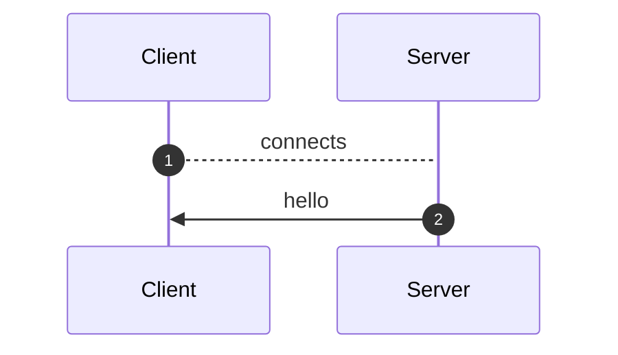
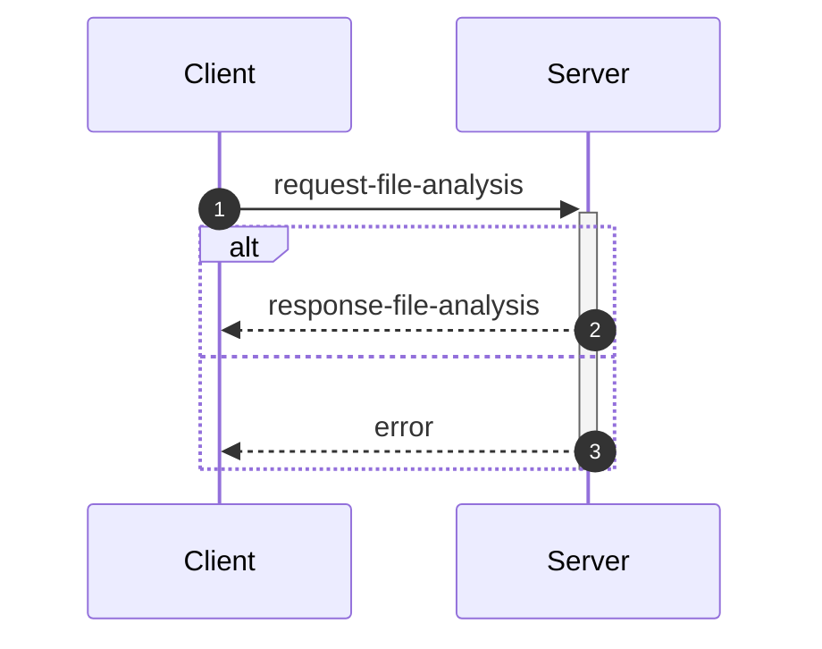
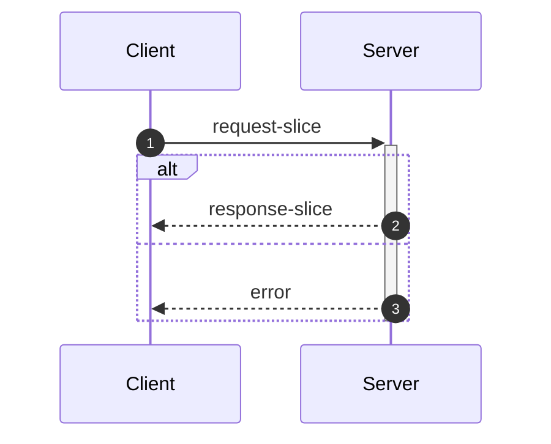
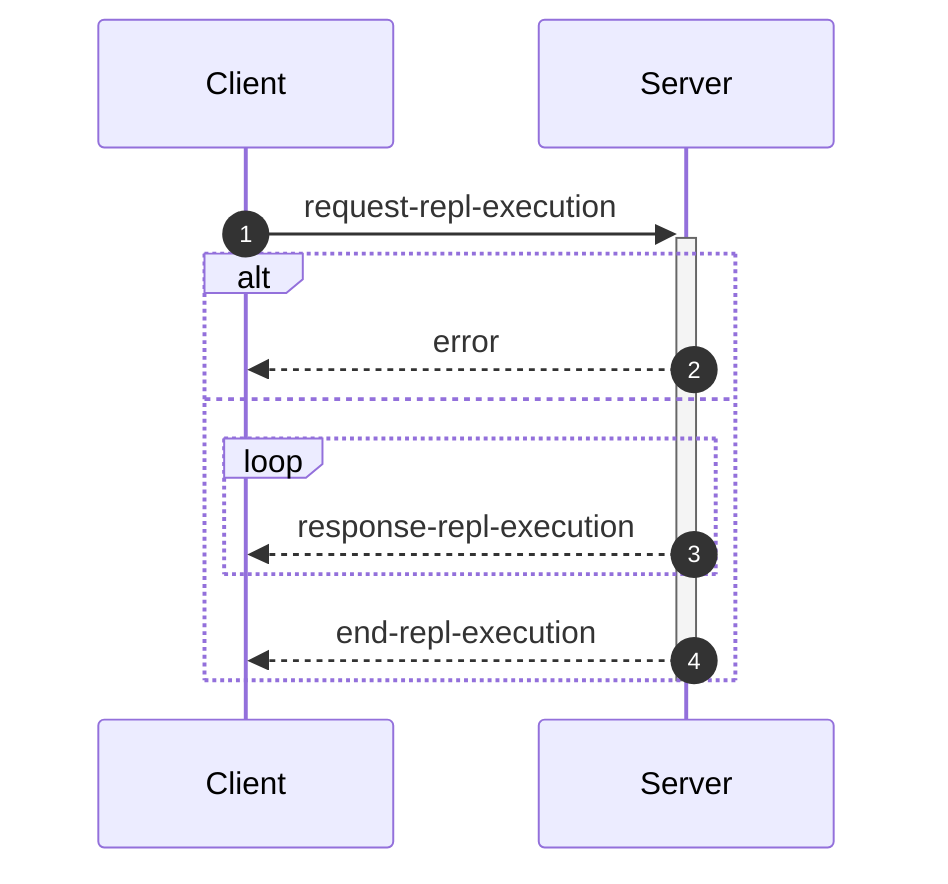

_<span title="an overview of flowR's interface">Generated</span> from '[wiki-interface.ts](https://github.com/flowr-analysis/flowr/tree/main/src/documentation/wiki-interface.ts "src/documentation/wiki-interface.ts")' on 2026-09-09, 15:40:41 UTC (v2.15.8, R v4.6.1), do not edit directly._


Although far from being as detailed as the in-depth explanation of [_flowR_](https://github.com/flowr-analysis/flowr/wiki/Core),
this wiki page explains how to interface with _flowR_ in more detail.
In general, command line arguments and other options provide short descriptions on hover over.

* [💻 Using the REPL](#using-the-repl)
* [⚙️ Configuring FlowR](#configuring-flowr)
* [⚒️ Writing Code](#writing-code)
* [💬 Communicating with the Server](#communicating-with-the-server)

<a id='using-the-repl'></a>
## 💻 Using the REPL


> [!NOTE]
> To execute arbitrary R commands with a repl request, _flowR_ has to be started explicitly with <span title="Description (Command Line Argument): Allow to access the underlying R session when using flowR (security warning: this allows the execution of arbitrary R code!)">`--r-session-access`</span>.
> Please be aware that this introduces a security risk and note that this relies on the [`r-shell` engine](https://github.com/flowr-analysis/flowr/wiki/Engines) .

Although primarily meant for users to explore,
there is nothing which forbids simply calling _flowR_ as a subprocess to use standard-in, -output, and -error
for communication (although you can access the REPL using the server as well,
with the [REPL Request](#message-request-repl-execution) message).

The read-eval-print loop&nbsp;(REPL) works relatively simple.
You can submit an expression (using <kbd>Enter</kbd>),
which is interpreted as an R&nbsp;expression by default but interpreted as a *command* if it starts with a colon (`:`).
The best command to get started with the REPL is <span title="Description (Repl Command): Show help information (aliases: :h, :?)">`:help`</span>.
Besides, you can leave the REPL either with the command <span title="Description (Repl Command): End the repl (aliases: :q, :exit)">`:quit`</span> or by pressing <kbd>Ctrl</kbd>+<kbd>C</kbd> twice.
When writing a *command*, you may press <kbd>Tab</kbd> to get a list of completions, if available.
Multiple commands can be entered in a single line by separating them with a semicolon (`;`), e.g. `:parse "x<-2"; :df*`.
If a command is given without R code, the REPL will re-use R code given in a previous command.
The prior example will hence return first the parsed AST of the program and then the dataflow graph for `"x <- 2"`.

> [!NOTE]
> If you develop flowR, you may want to launch the repl using the `npm run main-dev` command, this way, you get a non-minified version of flowR with debug information and hot-reloading of source files.

<details>
<summary>Available Commands</summary>

We currently offer the following commands (this with a `[*]` suffix are available with and without the star):


| Command | Description |
| ------- | ----------- |
| **<span title="Description (Repl Command): End the repl (aliases: :q, :exit)">:quit</span>** | End the repl (aliases: **:<span title="Alias of ':quit'. End the repl">q</span>**, **:<span title="Alias of ':quit'. End the repl">exit</span>**) |
| **<span title="Description (Repl Command): Execute the given code as R code. This requires the `--r-session-access` flag to be set and requires the r-shell engine. (aliases: :e, :r)">:execute</span>** | Execute the given code as R code. This requires the `--r-session-access` flag to be set and requires the r-shell engine. (aliases: **:<span title="Alias of ':execute'. Execute the given code as R code. This requires the `--r-session-access` flag to be set and requires the r-shell engine.">e</span>**, **:<span title="Alias of ':execute'. Execute the given code as R code. This requires the `--r-session-access` flag to be set and requires the r-shell engine.">r</span>**) |
| **<span title="Description (Repl Command): Get mermaid code for the control-flow graph of R code (aliases: :cfg, :cf)">:controlflow[*]</span>** | Get mermaid code for the control-flow graph of R code (star: Returns the URL to mermaid.live) (aliases: **:<span title="Alias of ':controlflow'. Get mermaid code for the control-flow graph of R code">cfg</span>**, **:<span title="Alias of ':controlflow'. Get mermaid code for the control-flow graph of R code">cf</span>**) |
| **<span title="Description (Repl Command): Get mermaid code for the control-flow graph with basic blocks (aliases: :cfgb, :cfb)">:controlflowbb[*]</span>** | Get mermaid code for the control-flow graph with basic blocks (star: Returns the URL to mermaid.live) (aliases: **:<span title="Alias of ':controlflowbb'. Get mermaid code for the control-flow graph with basic blocks">cfgb</span>**, **:<span title="Alias of ':controlflowbb'. Get mermaid code for the control-flow graph with basic blocks">cfb</span>**) |
| **<span title="Description (Repl Command): Get mermaid code for the dataflow graph (aliases: :d, :df)">:dataflow[*]</span>** | Get mermaid code for the dataflow graph (star: Returns the URL to mermaid.live) (aliases: **:<span title="Alias of ':dataflow'. Get mermaid code for the dataflow graph">d</span>**, **:<span title="Alias of ':dataflow'. Get mermaid code for the dataflow graph">df</span>**) |
| **<span title="Description (Repl Command): Get mermaid code for the normalized AST of R code (aliases: :n)">:normalize[*]</span>** | Get mermaid code for the normalized AST of R code (star: Returns the URL to mermaid.live) (alias: **:<span title="Alias of ':normalize'. Get mermaid code for the normalized AST of R code">n</span>**) |
| **<span title="Description (Repl Command): Get mermaid code for the simplified dataflow graph (aliases: :ds, :dfs)">:dataflowsimple[*]</span>** | Get mermaid code for the simplified dataflow graph (star: Returns the URL to mermaid.live) (aliases: **:<span title="Alias of ':dataflowsimple'. Get mermaid code for the simplified dataflow graph">ds</span>**, **:<span title="Alias of ':dataflowsimple'. Get mermaid code for the simplified dataflow graph">dfs</span>**) |
| **<span title="Description (Repl Command): Inspect and extend the signature database: `query` (identical to :query @signature), `info <name>` for where a function comes from (identical to :query @function-info), `add <path>` to mount another database/source, `download` to fetch the full-history database. (aliases: :sig)">:signature</span>** | Inspect and extend the signature database: `query` (identical to :query @signature), `info <name>` for where a function comes from (identical to :query @function-info), `add <path>` to mount another database/source, `download` to fetch the full-history database. (alias: **:<span title="Alias of ':signature'. Inspect and extend the signature database: `query` (identical to :query @signature), `info <name>` for where a function comes from (identical to :query @function-info), `add <path>` to mount another database/source, `download` to fetch the full-history database.">sig</span>**) |
| **<span title="Description (Repl Command): Just calculates the DFG, but only prints summary info (aliases: :d#, :df#)">:dataflowsilent</span>** | Just calculates the DFG, but only prints summary info (aliases: **:<span title="Alias of ':dataflowsilent'. Just calculates the DFG, but only prints summary info">d#</span>**, **:<span title="Alias of ':dataflowsilent'. Just calculates the DFG, but only prints summary info">df#</span>**) |
| **<span title="Description (Repl Command): Prints ASCII Art of the parsed, unmodified AST (aliases: :p)">:parse</span>** | Prints ASCII Art of the parsed, unmodified AST (alias: **:<span title="Alias of ':parse'. Prints ASCII Art of the parsed, unmodified AST">p</span>**) |
| **<span title="Description (Repl Command): Prints the version of flowR as well as the current version of R">:version</span>** | Prints the version of flowR as well as the current version of R
| **<span title="Description (Repl Command): Query the given R code (use 'help' for more information)">:query[*]</span>** | Query the given R code (use 'help' for more information) (star: Similar to query, but returns the output in json format.)
| **<span title="Description (Repl Command): Returns an ASCII representation of the dataflow graph (aliases: :df!)">:dataflowascii</span>** | Returns an ASCII representation of the dataflow graph (alias: **:<span title="Alias of ':dataflowascii'. Returns an ASCII representation of the dataflow graph">df!</span>**) |
| **<span title="Description (Repl Command): Returns summarization stats for the normalized AST (aliases: :n#)">:normalize#</span>** | Returns summarization stats for the normalized AST (alias: **:<span title="Alias of ':normalize#'. Returns summarization stats for the normalized AST">n#</span>**) |
| **<span title="Description (Repl Command): Show help information (aliases: :h, :?)">:help</span>** | Show help information (aliases: **:<span title="Alias of ':help'. Show help information">h</span>**, **:<span title="Alias of ':help'. Show help information">?</span>**) |


</details>


> [!TIP]
> 
> As indicated by the examples before, all REPL commands that operate on code keep track of the state.
> Hence, if you run a command like <span title="Description (Repl Command, starred version): Returns the URL to mermaid.live; Base Command: Get mermaid code for the dataflow graph (aliases: :d*, :df*)">`:dataflow*`</span> without providing R code,
> the REPL will re-use the R code provided in a previous command.
> Likewise, doing this will benefit from incrementality!
> If you request the dataflow graph with `:df* x <- 2 * y` and then want to see the parsed AST with `:parse`,
> the REPL will re-use previously obtained information and not re-parse the code again.
> 		


Generally, many commands offer shortcut versions in the REPL. Many queries, for example, offer a shortened format (see the example below).
Of special note, the [Config Query](https://github.com/flowr-analysis/flowr/wiki/%5BQuery%5D-Config)
can be used to also modify the currently active configuration of _flowR_ within the REPL (see the [wiki page](https://github.com/flowr-analysis/flowr/wiki/%5BQuery%5D-Config) for more information).

### Example: Retrieving the Dataflow Graph

To retrieve a URL to the [mermaid](https://mermaid.js.org/) diagram of the dataflow of a given expression,
use <span title="Description (Repl Command, starred version): Returns the URL to mermaid.live; Base Command: Get mermaid code for the dataflow graph (aliases: :d*, :df*)">`:dataflow*`</span> (or <span title="Description (Repl Command): Get mermaid code for the dataflow graph (aliases: :d, :df)">`:dataflow`</span> to get the mermaid code in the cli):


```shell
$ docker run -it --rm eagleoutice/flowr # or npm run flowr 
flowR repl v2.15.8, R grammar v14 (tree-sitter engine)
R> :dataflow* y <- 1 + x
```

<details>
<summary style='color:gray'>Output</summary>


```text
https://mermaid.live/view#base64:eyJjb2RlIjoiZmxvd2NoYXJ0IFREXG4gICAgMXt7XCJgKiM5MTtSTnVtYmVyIzkzOyogKioxKipcbiAgICAgICoxLjYqICgqKmlkOiAxKiopYFwifX1cbiAgICAyKFtcImAqIzkxO1JTeW1ib2wjOTM7KiAqKngqKlxuICAgICAgKjEuMTAqICgqKmlkOiAyKiopYFwiXSlcbiAgICAzW1tcImAqIzkxO1JCaW5hcnlPcCM5MzsqIGJhc2UjNTg7IzU4OyoqIzQzOyoqXG4gICAgICAqMS42LTEwKiAoKippZDogMyoqKVxuICAgIGFyZzogKDEsIDIpYFwiXV1cbiAgICBidWlsdC1pbjpfW1wiYEJ1aWx0LUluOlxuIzQzO2BcIl1cbiAgICBzdHlsZSBidWlsdC1pbjpfIHN0cm9rZTpncmF5LGZpbGw6Z3JheSxzdHJva2Utd2lkdGg6MnB4LG9wYWNpdHk6Ljg7XG4gICAgMFtcImAqIzkxO1JTeW1ib2wjOTM7KiAqKnkqKlxuICAgICAgKjEuMSogKCoqaWQ6IDAqKiwgdjogMylgXCJdXG4gICAgNFtbXCJgKiM5MTtSQmluYXJ5T3AjOTM7KiBiYXNlIzU4OyM1ODsqKiM2MDsjNDU7KipcbiAgICAgICoxLjEtMTAqICgqKmlkOiA0KiopXG4gICAgYXJnOiAoMCwgMylgXCJdXVxuICAgIGJ1aWx0LWluOl8tW1wiYEJ1aWx0LUluOlxuIzYwOyM0NTtgXCJdXG4gICAgc3R5bGUgYnVpbHQtaW46Xy0gc3Ryb2tlOmdyYXksZmlsbDpncmF5LHN0cm9rZS13aWR0aDoycHgsb3BhY2l0eTouODtcbiAgICAxIC0uLT58XCJmbG93XCJ8IDJcbiAgICBsaW5rU3R5bGUgMCBzdHJva2U6Z3JheSxjb2xvcjpncmF5O1xuICAgIDIgLS4tPnxcImZsb3dcInwgM1xuICAgIGxpbmtTdHlsZSAxIHN0cm9rZTpncmF5LGNvbG9yOmdyYXk7XG4gICAgMyAtLT58XCJyZWFkcywgYXJnXCJ8IDFcbiAgICAzIC0tPnxcInJlYWRzLCBhcmdcInwgMlxuICAgIDMgLS4tPnxcImZsb3dcInwgMFxuICAgIGxpbmtTdHlsZSA0IHN0cm9rZTpncmF5LGNvbG9yOmdyYXk7XG4gICAgMyAtLi0+fFwicmVhZHMsIGNhbGxzXCJ8IGJ1aWx0LWluOl9cbiAgICBsaW5rU3R5bGUgNSBzdHJva2U6Z3JheTtcbiAgICAwIC0tPnxcImRlZmluZWQtYnksIGZsb3dcInwgNFxuICAgIDAgLS0+fFwiZGVmaW5lZC1ieVwifCAzXG4gICAgNCAtLT58XCJyZWFkcywgYXJnXCJ8IDNcbiAgICA0IC0tPnxcInJldHVybnMsIGFyZ1wifCAwXG4gICAgNCAtLi0+fFwicmVhZHMsIGNhbGxzXCJ8IGJ1aWx0LWluOl8tXG4gICAgbGlua1N0eWxlIDEwIHN0cm9rZTpncmF5OyIsIm1lcm1haWQiOnsiYXV0b1N5bmMiOnRydWV9fQ==
```


Retrieve the dataflow graph of the expression `y <- 1 + x`. It looks like this:


```mermaid
flowchart LR
    1{{"`*#91;RNumber#93;* **1**
      *1.6* (**id: 1**)`"}}
    2(["`*#91;RSymbol#93;* **x**
      *1.10* (**id: 2**)`"])
    3[["`*#91;RBinaryOp#93;* base#58;#58;**#43;**
      *1.6-10* (**id: 3**)
    arg: (1, 2)`"]]
    built-in:_["`Built-In:
#43;`"]
    style built-in:_ stroke:gray,fill:gray,stroke-width:2px,opacity:.8;
    0["`*#91;RSymbol#93;* **y**
      *1.1* (**id: 0**, v: 3)`"]
    4[["`*#91;RBinaryOp#93;* base#58;#58;**#60;#45;**
      *1.1-10* (**id: 4**)
    arg: (0, 3)`"]]
    built-in:_-["`Built-In:
#60;#45;`"]
    style built-in:_- stroke:gray,fill:gray,stroke-width:2px,opacity:.8;
    1 -.->|"flow"| 2
    linkStyle 0 stroke:gray,color:gray;
    2 -.->|"flow"| 3
    linkStyle 1 stroke:gray,color:gray;
    3 -->|"reads, arg"| 1
    3 -->|"reads, arg"| 2
    3 -.->|"flow"| 0
    linkStyle 4 stroke:gray,color:gray;
    3 -.->|"reads, calls"| built-in:_
    linkStyle 5 stroke:gray;
    0 -->|"defined-by, flow"| 4
    0 -->|"defined-by"| 3
    4 -->|"reads, arg"| 3
    4 -->|"returns, arg"| 0
    4 -.->|"reads, calls"| built-in:_-
    linkStyle 10 stroke:gray;
```

	
<details>

<summary style="color:gray">R Code of the Dataflow Graph</summary>

The analysis ran (including parse and normalize, using the [tree-sitter](https://github.com/flowr-analysis/flowr/wiki/Engines) engine) within the generation environment. No [signature database](https://github.com/flowr-analysis/flowr/wiki/Signature-Database) is mounted for these generated graphs, so `library()` calls attach no package exports; base-R names are still qualified via the generated base-package store (e.g. `acf` as `stats::acf`). 
We encountered no unknown side effects during the analysis.


```r
y <- 1 + x
```


</details>


</details>


For small graphs like this, <span title="Description (Repl Command): Returns an ASCII representation of the dataflow graph (aliases: :df!)">`:dataflowascii`</span> also provides an ASCII representation directly in the REPL:


```shell
$ docker run -it --rm eagleoutice/flowr # or npm run flowr 
flowR repl v2.15.8, R grammar v14 (tree-sitter engine)
R> :df! y <- 1 + x
```

<details open>
<summary style='color:gray'>Output</summary>


```text
           ┌────────────u<2>u
        c<3>c   0<1>0   | x |
    ┌───| + |───| 1 |───u---u
    │   c---c   0---0
 c<4>c     │
 |<- |     └────────────v<0>v
 c---c──────────────────| y |
                        v---v
Edges:
3 -> 1: reads, arg          3 -> 2: reads, arg
3 -> 0: flows-to            1 -> 2: flows-to
2 -> 3: flows-to            4 -> 3: reads, arg
4 -> 0: returns, arg        0 -> 4: defined-by, flows-to
0 -> 3: defined-by
```


Retrieve the dataflow graph of the expression `y <- 1 + x` as ASCII art.

</details>


For the slicing with <span title="Description (Repl Command): Static backwards executable slicer for R">`:slicer`</span>, you have access to the same [magic comments](#slice-magic-comments) as with the [slice request](#message-request-slice).
Pass `--inline` to splice resolvable `source()` calls into the reconstruction so the slice is a single self-contained R text (the same as the static slice query's `inlineSources` flag).
See `--help` for more flags!

### Example: Interfacing with the File System

Many commands that allow for an R-expression (like <span title="Description (Repl Command, starred version): Returns the URL to mermaid.live; Base Command: Get mermaid code for the dataflow graph (aliases: :d*, :df*)">`:dataflow*`</span>) allow for a file as well
if the argument starts with `file://`.
If you are working from the root directory of the _flowR_ repository, the following gives you the parsed AST of the example file using the <span title="Description (Repl Command): Prints ASCII Art of the parsed, unmodified AST (aliases: :p)">`:parse`</span> command:

> **Watch mode**: Replace `file://` with `watch://` to enter watch mode.
> flowR runs the command immediately and then re-runs it every time the file (or any file inside the folder) changes.
> Enter any other command to leave watch mode.
> For example: `:df watch://analysis.R`


```shell
$ docker run -it --rm eagleoutice/flowr # or npm run flowr 
flowR repl v2.15.8, R grammar v14 (tree-sitter engine)
R> :parse file://test/testfiles/example.R
```

<details>
<summary style='color:gray'>Output</summary>


```text
File: test/testfiles/example.R

program
├ binaryoperator
│ ├ identifier "sum" (1:1─4)
│ ├ <- "<-" (1:5─7)
│ ╰ float "0" (1:8─9)
├ binaryoperator
│ ├ identifier "product" (2:1─8)
│ ├ <- "<-" (2:9─11)
│ ╰ float "1" (2:12─13)
├ binaryoperator
│ ├ identifier "w" (3:1─2)
│ ├ <- "<-" (3:3─5)
│ ╰ float "7" (3:6─7)
├ binaryoperator
│ ├ identifier "N" (4:1─2)
│ ├ <- "<-" (4:3─5)
│ ╰ float "10" (4:6─8)
├ forstatement
│ ├ for "for" (6:1─4)
│ ├ ( "(" (6:5─6)
│ ├ identifier "i" (6:6─7)
│ ├ in "in" (6:8─10)
│ ├ binaryoperator
│ │ ├ float "1" (6:11─12)
│ │ ├ : ":" (6:12─13)
│ │ ╰ parenthesizedexpression
│ │   ├ ( "(" (6:13─14)
│ │   ├ binaryoperator
│ │   │ ├ identifier "N" (6:14─15)
│ │   │ ├ - "-" (6:15─16)
│ │   │ ╰ float "1" (6:16─17)
│ │   ╰ ) ")" (6:17─18)
│ ├ ) ")" (6:18─19)
│ ╰ bracedexpression
│   ├ { "{" (6:20─21)
│   ├ binaryoperator
│   │ ├ identifier "sum" (7:3─6)
│   │ ├ <- "<-" (7:7─9)
│   │ ╰ binaryoperator
│   │   ├ binaryoperator
│   │   │ ├ identifier "sum" (7:10─13)
│   │   │ ├ + "+" (7:14─15)
│   │   │ ╰ identifier "i" (7:16─17)
│   │   ├ + "+" (7:18─19)
│   │   ╰ identifier "w" (7:20─21)
│   ├ binaryoperator
│   │ ├ identifier "product" (8:3─10)
│   │ ├ <- "<-" (8:11─13)
│   │ ╰ binaryoperator
│   │   ├ identifier "product" (8:14─21)
│   │   ├  "" (8:22─23)
│   │   ╰ identifier "i" (8:24─25)
│   ╰ } "}" (9:1─2)
├ call
│ ├ identifier "cat" (11:1─4)
│ ╰ arguments
│   ├ ( "(" (11:4─5)
│   ├ argument
│   │ ╰ string
│   │   ├ " "\"" (11:5─6)
│   │   ├ stringcontent "Sum:" (11:6─10)
│   │   ╰ " "\"" (11:10─11)
│   ├ comma "," (11:11─12)
│   ├ argument
│   │ ╰ identifier "sum" (11:13─16)
│   ├ comma "," (11:16─17)
│   ├ argument
│   │ ╰ string
│   │   ├ " "\"" (11:18─19)
│   │   ├ stringcontent
│   │   │ ╰ escapesequence "\\n" (11:19─21)
│   │   ╰ " "\"" (11:21─22)
│   ╰ ) ")" (11:22─23)
╰ call
  ├ identifier "cat" (12:1─4)
  ╰ arguments
    ├ ( "(" (12:4─5)
    ├ argument
    │ ╰ string
    │   ├ " "\"" (12:5─6)
    │   ├ stringcontent "Product:" (12:6─14)
    │   ╰ " "\"" (12:14─15)
    ├ comma "," (12:15─16)
    ├ argument
    │ ╰ identifier "product" (12:17─24)
    ├ comma "," (12:24─25)
    ├ argument
    │ ╰ string
    │   ├ " "\"" (12:26─27)
    │   ├ stringcontent
    │   │ ╰ escapesequence "\\n" (12:27─29)
    │   ╰ " "\"" (12:29─30)
    ╰ ) ")" (12:30─31)
```


Retrieve the parsed AST of the example file.

<details>

<summary>File Content</summary>


```r
sum <- 0
product <- 1
w <- 7
N <- 10

for (i in 1:(N-1)) {
  sum <- sum + i + w
  product <- product * i
}

cat("Sum:", sum, "\n")
cat("Product:", product, "\n")
```


</details>

As _flowR_ directly transforms this AST the output focuses on being human-readable instead of being machine-readable.
		

</details>


### Example: Run a Query

You can run any query supported by _flowR_ using the <span title="Description (Repl Command): Query the given R code (use 'help' for more information)">`:query`</span> command.
For example, to obtain the shapes of all data frames in a given piece of code, you can run:


```shell
$ docker run -it --rm eagleoutice/flowr # or npm run flowr 
flowR repl v2.15.8, R grammar v14 (tree-sitter engine)
R> :query @absint df-shape "x <- data.frame(a = 1:10, b = 1:10)\ny <- x$a"
```

<details open>
<summary style='color:gray'>Output</summary>


```text
Query: absint (1 ms)
```


Retrieve the shapes of all data frames in the given code.

</details>


To run the linter on a file, you can use (in this example, we just issue the `dead-code` linter on a small piece of code):


```shell
$ docker run -it --rm eagleoutice/flowr # or npm run flowr 
flowR repl v2.15.8, R grammar v14 (tree-sitter engine)
R> :query @linter rules:dead-code "if(FALSE) x <- 2"
```

<details open>
<summary style='color:gray'>Output</summary>


```text
Query: linter (1 ms)
   ╰ Dead Code (dead-code):
       ╰ certain:
           ╰ Code at 1.11-16
```


Run the linter on the given code, with only the `dead-code` rule enabled.

</details>


For more information on the available queries, please check out the [Query API](https://github.com/flowr-analysis/flowr/wiki/Query-API).


<a id='configuring-flowr'></a>
## ⚙️ Configuring FlowR


When running _flowR_, you may want to specify some behaviors with a dedicated configuration file.
By default, flowR looks for a file named `flowr.json` in the current working directory (or any higher directory).
You can also specify a different file with <span title="Description (Command Line Argument): The name of the configuration file to use">`--config-file`</span> or pass the configuration inline using <span title="Description (Command Line Argument): The flowR configuration to use, as a JSON string">`--config-json`</span>.
To inspect the current configuration, you can run flowr with the <span title="Description (Command Line Argument): Run with verbose logging (will be passed to the corresponding script)">`--verbose`</span> flag, or use the `config` [Query](https://github.com/flowr-analysis/flowr/wiki/Query-API).
Within the REPL this works by running the following:


```shell
:query @config
```


To work with the <a href="https://github.com/flowr-analysis/flowr/tree/main/src/config.ts#L107"><code><span title="The configuration file format for flowR.">FlowrConfig</span></code></a> you can use the provided helper objects alongside its methods like
<a href="https://github.com/flowr-analysis/flowr/tree/main/src/config.ts#L856"><code><span title="Creates a new flowr config that has the updated values.">FlowrConfig::<b>amend</b></span></code></a>.
The schema below documents every option; the ones you most likely want are:

- <a href="https://github.com/flowr-analysis/flowr/wiki/Interface#configuring-flowr" title="Configuration Option (boolean): Whether source calls should be ignored, causing {@link processSourceCall}&#39;s behavior to be skipped.">ignoreSourceCalls</a>: ignore source calls when analyzing the code, i.e., ignore the inclusion of other files.
- <a href="https://github.com/flowr-analysis/flowr/wiki/Interface#configuring-flowr" title="Configuration Option (boolean): Whether load calls should be ignored, causing {@link processLoadCall}&#39;s behavior to be skipped.">ignoreLoadCalls</a>: ignore load calls when analyzing the code, i.e., ignore the loading of r-data files.
- <a href="https://github.com/flowr-analysis/flowr/wiki/Interface#configuring-flowr" title="Configuration Option (object): Do you want to overwrite (parts) of the builtin definition?">semantics.environment.overwriteBuiltIns</a>: overwrite _flowR_'s handling of built-in functions, or clear the preset definitions entirely.
  See [Configure BuiltIn Semantics](#configure-builtin-semantics) for more information.
- <a href="https://github.com/flowr-analysis/flowr/wiki/Interface#configuring-flowr" title="Configuration Option (string): How to resolve variables and their values. (one of &quot;disabled&quot;, &quot;alias&quot;, &quot;builtin&quot;)">solver.variables</a>: how to resolve variables and their values (`disabled`, `alias`, `builtin`).
- <a href="https://github.com/flowr-analysis/flowr/wiki/Interface#configuring-flowr" title="Configuration Option (array): The engine or set of engines to use for interacting with R code. An empty array means all available engines will be used.">engines</a> and <a href="https://github.com/flowr-analysis/flowr/wiki/Interface#configuring-flowr" title="Configuration Option (string): The default engine to use for interacting with R code. If this is undefined, an arbitrary engine from the specified list will be used. (one of &quot;tree-sitter&quot;, &quot;r-shell&quot;)">defaultEngine</a>: the engines used to interact with R code, see the [Engines wiki page](https://github.com/flowr-analysis/flowr/wiki/Engines).
- <a href="https://github.com/flowr-analysis/flowr/wiki/Interface#configuring-flowr" title="Configuration Option (array): Files a framework loads on its own, without any source() call (e.g. global.R in a shiny app), in the order they are loaded; flowR orders the matching project files accordingly and analyzes them as one program. Entries are case-insensitive globs matched against the file path, a plain name matches any file with that name, and entries matching no project file are warned about. Usually set per project kind via specializeConfig.">project.implicitSources</a>: the files a framework loads without any `source()` call, in the order in which they are
  loaded. Entries are globs (e.g. `R/*.R`) matched against the file path ignoring capitalization; one matching no file is reported.
- <a href="https://github.com/flowr-analysis/flowr/wiki/Interface#configuring-flowr" title="Configuration Option (object): Overwrite (parts of) the configuration depending on the project kind flowR detects, e.g. to give a shiny app its implicit sources.">specializeConfig</a>: overwrite (parts of) the configuration depending on the kind of project _flowR_ detects
  (e.g. `shiny-app`), which is how a shiny app gets its implicit sources by default. What you configure directly wins.
- <a href="https://github.com/flowr-analysis/flowr/wiki/Interface#configuring-flowr" title="Configuration Option (string): Overwrite the project kind flowR would otherwise infer from the analyzed files, e.g. when auto-detection guesses wrong. (one of &quot;package&quot;, &quot;script&quot;, &quot;shiny-app&quot;, &quot;notebook&quot;, &quot;project&quot;, &quot;unknown&quot;)">project.useProjectType</a>: skip that detection and force a project kind yourself, when auto-detection guesses wrong.
- <a href="https://github.com/flowr-analysis/flowr/wiki/Interface#configuring-flowr" title="Configuration Option (array): The default plugins to load when creating a new instance of FlowrAnalyzer">defaultPlugins</a> and <a href="https://github.com/flowr-analysis/flowr/wiki/Interface#configuring-flowr" title="Configuration Option (array): The plugins to load in REPL mode">repl.plugins</a>: the plugins to load for a new <a href="https://github.com/flowr-analysis/flowr/tree/main/src/project/flowr-analyzer.ts#L202"><code><span title="Central class for conducting analyses with FlowR. Use the FlowrAnalyzerBuilder to create a new instance. If you want the original pattern of creating a pipeline and running all steps, you can still do this with FlowrAnalyzer#runFull . To inspect the context of the analyzer, use FlowrAnalyzer#inspectContext (if you are a plugin and need to modify it, use FlowrAnalyzer#context instead).">FlowrAnalyzer</span></code></a> and in the REPL
  (use `flowr:default` to reference the former).

So you can configure _flowR_ by adding a file like the following:

<details>

<summary>Example Configuration File</summary>


```json
{
  "ignoreSourceCalls": true,
  "ignoreLoadCalls": true,
  "semantics": {
    "environment": {
      "overwriteBuiltIns": {
        "definitions": [
          {
            "type": "function",
            "names": [
              "foo"
            ],
            "processor": "builtin:assign",
            "config": {}
          }
        ]
      }
    }
  },
  "defaultPlugins": [
    "file:description",
    "versions:description"
  ],
  "repl": {
    "quickStats": false,
    "dfProcessorHeat": false,
    "hints": true,
    "plugins": [
      "flowr:default"
    ]
  },
  "project": {
    "resolveUnknownPathsOnDisk": true,
    "implicitSources": [
      "global.R",
      "app.R"
    ]
  },
  "linter": {
    "disabledRules": []
  },
  "specializeConfig": {
    "shiny-app": {
      "project": {
        "implicitSources": [
          "global.R",
          "ui.R",
          "server.R",
          "app.R"
        ]
      }
    }
  },
  "engines": [
    {
      "type": "r-shell"
    }
  ],
  "solver": {
    "variables": "alias",
    "evalStrings": true,
    "trackEnvironments": true,
    "sigdb": {
      "enabled": true,
      "loadProjectDependencies": true,
      "eagerlyLoad": false,
      "eagerlyLoadExports": false,
      "linkBaseR": false,
      "linkDescriptionDependencies": false
    },
    "resolveSource": {
      "dropPaths": "no",
      "ignoreCapitalization": true,
      "inferWorkingDirectory": "active-script",
      "searchPath": []
    },
    "instrument": {},
    "slicer": {
      "threshold": 50
    }
  },
  "abstractInterpretation": {
    "wideningThreshold": 4,
    "followCalls": true,
    "dataFrame": {
      "maxColNames": 20,
      "readLoadedData": {
        "readExternalFiles": true,
        "maxReadLines": 1000000
      }
    }
  },
  "incremental": {
    "alwaysIncremental": false,
    "parsing": {
      "activated": false,
      "heuristics": {
        "activated": true,
        "mtime": true,
        "linesFrom": 500,
        "bytesFrom": 50000,
        "alwaysWithEdits": false,
        "minFiles": 1
      }
    }
  },
  "gas": {
    "thresholds": {
      "memory": {
        "problematic": 0.7,
        "critical": 0.9
      },
      "timeMs": {
        "problematic": 100000,
        "critical": 120000
      }
    },
    "features": {}
  }
}
```


</details>

<details>
<a id='configure-builtin-semantics'></a>
<summary>Configure Built-In Semantics</summary>


`semantics/environment/overwriteBuiltins` accepts two keys:

- `loadDefaults` (boolean, initially `true`): If set to `true`, the default built-in definitions are loaded before applying the custom definitions. Setting this flag to `false` explicitly disables the loading of the default definitions.
- `definitions` (array, initially empty): Allows to overwrite or define new built-in elements. Each object within must have a `type` which is one of the below. Furthermore, they may define a string array of `names` which specifies the identifiers to bind the definitions to. You may use `assumePrimitive` to specify whether _flowR_ should assume that this is a primitive non-library definition (so you probably just do not want to specify the key).

  | Type            | Description                                                                                                                                                                                                                                                                                              | Example                                                                                                    |
  | --------------- | -------------------------------------------------------------------------------------------------------------------------------------------------------------------------------------------------------------------------------------------------------------------------------------------------------- | ---------------------------------------------------------------------------------------------------------- |
  | `constant`    | Additionally allows for a `value` this should resolve to.                                                                                                                                                                                                                                                | `{ type: 'constant', names: ['NULL', 'NA'],  value: null }`                                                |
  | `function`    | Is a rather flexible way to define and bind built-in functions. For the time, we do not have extensive documentation to cover all the cases, so please either consult the sources with the `default-builtin-config.ts` or open a [new issue](https://github.com/flowr-analysis/flowr/issues/new/choose). | `{ type: 'function', names: ['next'], processor: 'builtin:d', config: { cfg: ExitPointType.Next } }` |
  | `replacement` | A comfortable way to specify replacement functions like `$<-` or `names<-`. `suffixes` describes the... suffixes to attach automatically. | `{ type: 'replacement', suffixes: ['<-', '<<-'], names: ['[', '[['] }` |


</details>

<details>

<summary style='color:gray'>Full Configuration-File Schema</summary>

- _The configuration file format for flowR._ (object)
    - **logLevel** [optional] _flowR's global minimum log level, applied when the config is loaded._ (string)
        Only allows: 'silly', 'trace', 'debug', 'info', 'warn', 'error', 'fatal'
    - **ignoreSourceCalls** [optional] _Whether source calls should be ignored, causing {@link processSourceCall}'s behavior to be skipped._ (boolean)
    - **ignoreLoadCalls** [optional] _Whether load calls should be ignored, causing {@link processLoadCall}'s behavior to be skipped._ (boolean)
    - **semantics** _Configure language semantics and how flowR handles them._ (object)
        - **environment** [optional] _Semantics regarding how to handle the R environment._ (object)
            - **overwriteBuiltIns** [optional] _Do you want to overwrite (parts) of the builtin definition?_ (object)
                - **loadDefaults** [optional] _Should the default configuration still be loaded?_ (boolean)
                - **definitions** [optional] _The definitions to load/overwrite._ (array)
                Valid item types:
                    - (object)
    - **defaultPlugins** [optional] _The default plugins to load when creating a new instance of FlowrAnalyzer_ (array)
    Valid item types:
        - (alternatives)
            - (string)
            - (array)
    - **repl** _Configuration options for the REPL._ (object)
        - **quickStats** [optional] _Whether to show quick stats in the REPL after each evaluation._ (boolean)
        - **dfProcessorHeat** [optional] _This instruments the dataflow processors to count how often each processor is called._ (boolean)
        - **hints** [optional] _Whether to show dim inline hints on the empty prompt (automatically disabled on non-interactive terminals)._ (boolean)
        - **plugins** [optional] _The plugins to load in REPL mode_ (array)
        Valid item types:
            - (alternatives)
                - (string)
                - (array)
        - **autoUseFileProtocol** [optional] _Prepend the file protocol to a repl input that looks like a path, instead of only warning about it._ (boolean)
        - **queryStats** [optional] _Whether `:query` closes with the line stating how long the queries took (`:query*` never prints it)._ (boolean)
        - **showPlugins** [optional] _Whether `:version` grays out the plugins that did not activate during the last analysis._ (boolean)
    - **project** _Project specific configuration options._ (object)
        - **resolveUnknownPathsOnDisk** [optional] _Whether to resolve unknown paths loaded by the r project disk when trying to source/analyze files._ (boolean)
        - **failOnInaccessiblePath** [optional] _Whether a directory that cannot be traversed during file discovery (e.g. due to permissions) aborts the analysis; when false (the default) such paths are logged and skipped._ (boolean)
        - **basePackages** [optional] _The packages considered part of R itself (base and recommended); if unset, flowR uses its built-in list._ (array)
        Valid item types:
            - (string)
        - **implicitSources** [optional] _Files a framework loads on its own, without any source() call (e.g. global.R in a shiny app), in the order they are loaded; flowR orders the matching project files accordingly and analyzes them as one program. Entries are case-insensitive globs matched against the file path, a plain name matches any file with that name, and entries matching no project file are warned about. Usually set per project kind via specializeConfig._ (array)
        Valid item types:
            - (string)
        - **useProjectType** [optional] _Overwrite the project kind flowR would otherwise infer from the analyzed files, e.g. when auto-detection guesses wrong._ (string)
            Only allows: 'package', 'script', 'shiny-app', 'notebook', 'project', 'unknown'
        - **assumeImplicitEcho** [optional] _Whether the top level of the analyzed code is echoed, so that every visible result printed there is collected as an output by the dependencies query (default true, false for a package)._ (boolean)
        - **discovery** [optional] _Scoping options for the default project discovery._ (object)
            - **full** [optional] _Collect every file below the project root (greedy) instead of only the files the detected project kind needs (default false)._ (boolean)
            - **perKind** [optional] _Per-kind include/exclude glob overrides layered on the default scoping._ (object)
            - **ignore** [optional] _Case-insensitive globs that drop matching files from the intelligent discovery, regardless of kind (e.g. .Renviron to ignore environment files)._ (array)
            Valid item types:
                - (string)
        - **classification** [optional] _Overrides for the signals flowR uses to classify the project kind._ (object)
            - **shinyDescriptionTypes** [optional] _DESCRIPTION Type: values that mark a shiny app._ (array)
            Valid item types:
                - (string)
            - **shinyEntryFiles** [optional] _File names a shiny app is assembled from._ (array)
            Valid item types:
                - (string)
            - **shinyUsagePattern** [optional] _Regex source evidencing shiny usage in an entry file._ (string)
            - **notebookExtensions** [optional] _File extensions marking a notebook._ (array)
            Valid item types:
                - (string)
    - **linter** _Linter configuration options._ (object)
        - **disabledRules** _Linting rule names excluded from the default rule set (a rule requested explicitly via a linter query still runs). Usually set per project kind via specializeConfig._ (array)
        Valid item types:
            - (string)
    - **inputSources** [optional] _Further frameworks the input-sources analysis should know about; entries are added to flowR's defaults._ (object)
        - **pure** [optional] _Functions that only pass the constantness of their arguments on._ (array)
        Valid item types:
            - (string)
        - **param** [optional] _Functions whose result is a 'param' input._ (array)
        Valid item types:
            - (string)
        - **file** [optional] _Functions whose result is a 'file' input._ (array)
        Valid item types:
            - (string)
        - **tempfile** [optional] _Functions whose result is a 'tempfile' input._ (array)
        Valid item types:
            - (string)
        - **glob** [optional] _Functions whose result is a 'glob' input._ (array)
        Valid item types:
            - (string)
        - **net** [optional] _Functions whose result is a 'net' input._ (array)
        Valid item types:
            - (string)
        - **rand** [optional] _Functions whose result is a 'rand' input._ (array)
        Valid item types:
            - (string)
        - **system** [optional] _Functions whose result is a 'system' input._ (array)
        Valid item types:
            - (string)
        - **ffi** [optional] _Functions whose result is a 'ffi' input._ (array)
        Valid item types:
            - (string)
        - **lang** [optional] _Functions whose result is a 'lang' input._ (array)
        Valid item types:
            - (string)
        - **options** [optional] _Functions whose result is a 'options' input._ (array)
        Valid item types:
            - (string)
        - **cmdline** [optional] _Functions whose result is a 'cmdline' input._ (array)
        Valid item types:
            - (string)
        - **user** [optional] _Functions whose result is a 'user' input._ (array)
        Valid item types:
            - (string)
        - **const** [optional] _Functions whose result is a 'const' input._ (array)
        Valid item types:
            - (string)
        - **scope** [optional] _Functions whose result is a 'scope' input._ (array)
        Valid item types:
            - (string)
        - **dconst** [optional] _Functions whose result is a 'dconst' input._ (array)
        Valid item types:
            - (string)
        - **unknown** [optional] _Functions whose result is a 'unknown' input._ (array)
        Valid item types:
            - (string)
        - **linkedObjects** [optional] _Objects a framework provides without a definition in the code, e.g. shiny's input._ (array)
        Valid item types:
            - (object)
        - **linkedEntryPoints** [optional] _Calls that hand a function to a framework, which binds its objects to the parameters by position._ (array)
        Valid item types:
            - (object)
    - **specializeConfig** [optional] _Overwrite (parts of) the configuration depending on the project kind flowR detects, e.g. to give a shiny app its implicit sources._ (object)
    - **engines** _The engine or set of engines to use for interacting with R code. An empty array means all available engines will be used._ (array)
    Valid item types:
        - (alternatives)
            - _The configuration for the tree sitter engine._ (object)
                - **type** [required] _Use the tree sitter engine._ (string)
                    Only allows: 'tree-sitter'
                - **wasmPath** [optional] _The path to the tree-sitter-r WASM binary to use. If this is undefined, this uses the default path._ (string)
                - **treeSitterWasmPath** [optional] _The path to the tree-sitter WASM binary to use. If this is undefined, this uses the default path._ (string)
                - **lax** [optional] _Whether to use the lax parser for parsing R code (allowing for syntax errors). If this is undefined, the strict parser will be used._ (boolean)
            - _The configuration for the R shell engine._ (object)
                - **type** [required] _Use the R shell engine._ (string)
                    Only allows: 'r-shell'
                - **rPath** [optional] _The path to the R executable to use. If this is undefined, this uses the default path._ (string)
                - **pipeBind** [optional] _Whether to enable R's experimental pipe-bind operator "=>" by setting _R_USE_PIPEBIND_ for the R session (default false); R itself keeps this off by default, as it is experimental and has never shipped in a release version of R._ (boolean)
    - **defaultEngine** [optional] _The default engine to use for interacting with R code. If this is undefined, an arbitrary engine from the specified list will be used._ (string)
        Only allows: 'tree-sitter', 'r-shell'
    - **solver** _How to resolve constants, constraints, cells, ..._ (object)
        - **variables** _How to resolve variables and their values._ (string)
            Only allows: 'disabled', 'alias', 'builtin'
        - **evalStrings** _Should we include eval(parse(text="...")) calls in the dataflow graph?_ (boolean)
        - **trackEnvironments** [optional] _Track user-created environments (new.env, assign/get/local with envir=, dollar-assign, attach). When false, all envir-style calls fall through conservatively._ (boolean)
        - **sigdb** _Resolving library exports from a signature database._ (object)
            - **enabled** [optional] _Resolve library()/use() exports from a signature database (default true); when false no database is consulted._ (boolean)
            - **loadProjectDependencies** [optional] _Load the project's declared dependencies from its metadata files (DESCRIPTION Imports/Depends, rproject.toml, uvr.toml, renv.lock, rv.lock, uvr.lock) (default true); when false these files are not read for dependencies._ (boolean)
            - **eagerlyLoad** [optional] _Parse the database up front rather than on the first package load (default false, ignored if disabled)._ (boolean)
            - **eagerlyLoadExports** [optional] _Add a vertex for every export on load rather than on demand (default false); keeps the dataflow graph small._ (boolean)
            - **assumedRVersion** [optional] _R version assumed when resolving versioned (base-R) exports: a pin like "4.5" or "auto" to detect the installed R (default "auto")._ (string)
            - **linkBaseR** [optional] _Eagerly attach base-R namespaces so bare base calls resolve without library() (default false)._ (boolean)
            - **linkBaseRCalls** [optional] _Add a lightweight Reads edge from a bare base-R call to its signature-database function vertex (default false; base-R qualification is edge-free otherwise)._ (boolean)
            - **linkPackageCalls** [optional] _Add a lightweight Reads edge from a resolved package call to its signature-database function vertex (default false)._ (boolean)
            - **linkDescriptionDependencies** [optional] _Eagerly attach the namespaces of the project's declared DESCRIPTION dependencies (Imports/Depends) so their exports resolve without an explicit library() (default false)._ (boolean)
            - **warmInBackground** [optional] _Decompress the hot shards (base + most-downloaded) in a background task on startup so the first library() lookup is warm (default false; for long-running servers/REPLs)._ (boolean)
            - **additionalPaths** [optional] _Extra directories or bundle/manifest files searched for signature databases (alongside the shipped default and $FLOWR_SIGDB_DIR); a downloaded full-history bundle placed here is mounted automatically._ (array)
            Valid item types:
                - (string)
            - **downloadRepo** [optional] _GitHub owner/repo the full-history bundle is downloaded from via ":signature download" (default "flowr-analysis/flowr", release tag "sigdb-v<flowR-version>")._ (string)
            - **autoSync** [optional] _On startup, re-download shards whose committed sigdb.remote.json hash no longer matches the cache, in the background (default false; opt-in network sync after a git pull)._ (boolean)
            - **installedLibrary** [optional] _Recovering packages no signature database knows from the copy installed on this machine._ (object)
                - **enabled** [required] _Recover packages no signature database knows from their installed copy (default false)._ (boolean)
                - **paths** [optional] _Library directories to search; when empty they are discovered from the environment and the project._ (array)
                Valid item types:
                    - (string)
                - **useEnvironment** [optional] _Search the libraries R_LIBS_USER/R_LIBS/R_LIBS_SITE name (default true)._ (boolean)
                - **useProjectLibrary** [optional] _Search a project-local renv/packrat library (default true)._ (boolean)
                - **maxDepth** [optional] _How far to descend into the nested layout of a project-local library (default 3)._ (number)
                - **packages** [optional] _Only recover packages whose name matches one of these regular expressions; empty means any._ (array)
                Valid item types:
                    - (string)
            - **blobCacheBudgetMb** [optional] _How many MiB of decoded package blobs every open bundle may hold together (default 16)._ (number)
            - **versionSelection** [optional] _When a project constrains a dependency, resolve to the newest (default), oldest, or system-installed version satisfying it; system needs R and falls back to newest. Base-R packages always resolve against the assumed R version._ (string)
                Only allows: 'newest', 'oldest', 'system'
            - **versionOverrides** [optional] _Force an exact version for specific packages (name -> version), overriding both the project constraint and the versionSelection policy (default {})._ (object)
        - **versionManagement** _Policies for reasoning about dependency versions._ (object)
            - **linkedVersionGroups** [optional] _Groups of packages that must resolve to the same version; version guessing intersects each group so its members stay mutually compatible (default [])._ (array)
            Valid item types:
                - (array)
                Valid item types:
                    - (string)
        - **assumeAttachedPackages** [optional] _Packages to treat as attached without a `library()` call, so what the built-in configuration states about them applies to the analyzed code. The base packages R attaches on startup already resolve without it._ (array)
        Valid item types:
            - (string)
        - **transitiveSideEffectRounds** [optional] _How many rounds the transitive side-effect fixpoint may run before it is cut off (default 32); the propagation stops on its own as soon as a round adds nothing._ (number)
        - **instrument** (object)
            - **dataflowExtractors** [optional] _These keys are only intended for use within code, allowing to instrument the dataflow analyzer!_ (any)
        - **resolveSource** [optional] _If lax source calls are active, flowR searches for sourced files much more freely, based on the configurations you give it. This option is only in effect if `ignoreSourceCalls` is set to false._ (object)
            - **dropPaths** _Allow to drop the first or all parts of the sourced path, if it is relative._ (string)
                Only allows: 'no', 'once', 'all'
            - **ignoreCapitalization** _Search for filenames matching in the lowercase._ (boolean)
            - **inferWorkingDirectory** _Try to infer the working directory from the main or any script to analyze._ (string)
                Only allows: 'no', 'main-script', 'active-script', 'any-script'
            - **searchPath** _Additionally search in these paths._ (array)
            Valid item types:
                - (string)
            - **repeatedSourceLimit** [optional] _How often the same file can be sourced within a single run? Please be aware: in case of cyclic sources this may not reach a fixpoint so give this a sensible limit._ (number)
            - **applyReplacements** _Provide name replacements for loaded files_ (array)
            Valid item types:
                - (object)
            - **assumeFilesExist** [optional] _Assume a sourced file is always there, making what it defines certain instead of conditional on the source call._ (boolean)
        - **slicer** [optional] _The configuration for the slicer._ (object)
            - **threshold** [optional] _The maximum number of iterations to perform on a single function call during slicing._ (number)
            - **autoExtend** [optional] _If set, the slicer will gain an additional post-pass._ (boolean)
    - **abstractInterpretation** _The configuration options for abstract interpretation._ (object)
        - **wideningThreshold** _The threshold for the number of visitations of a node at which widening should be performed to ensure the termination of the fixpoint iteration._ (number)
        - **followCalls** _Whether the abstract interpretation is interprocedural, i.e. whether it steps into the functions a call may dispatch to._ (boolean)
        - **dataFrame** _The configuration of the shape inference for data frames._ (object)
            - **maxColNames** _The maximum number of columns names to infer for data frames before over-approximating the column names to top._ (number)
            - **readLoadedData** _Configuration options for reading data frame shapes from loaded external data files, such as CSV files._ (object)
                - **readExternalFiles** _Whether data frame shapes should be extracted from loaded external files, such as CSV files._ (boolean)
                - **maxReadLines** _The maximum number of lines to read when extracting data frame shapes from loaded files, such as CSV files._ (number)
    - **incremental** (object)
        - **alwaysIncremental** _Always take the incremental path, regardless of heuristics._ (boolean)
        - **parsing** (object)
            - **activated** _If set, incremental parsing will be used._ (boolean)
            - **heuristics** (object)
                - **activated** [optional] _If set, the heuristics for incremental parsing will be used._ (boolean)
                - **mtime** [optional] _Skip reparsing entirely if the file's modification time is unchanged since the last parse._ (boolean)
                - **linesFrom** [optional] _Only consider incremental parsing for files with at least this many lines._ (number)
                - **bytesFrom** [optional] _Only consider incremental parsing for files with at least this many bytes._ (number)
                - **alwaysWithEdits** [optional] _Always take the incremental path whenever there is a computed edit region, regardless of the other thresholds._ (boolean)
                - **minFiles** [optional] _Only apply these heuristics once the project has at least this many files loaded._ (number)
    - **gas** [optional] _Resource-usage guard (gas) configuration. All feature factors default to 0 (disabled). See https://github.com/flowr-analysis/flowr/wiki/Core#gas-resource-guard._ (object)
        - **thresholds** [optional] _Thresholds for all gas checks (scaled by per-feature factor), boundable per feature._ (object)
            - **memory** [optional] _Heap-usage fraction thresholds (0-1), either shared or given per feature key (with `default` covering the rest)._ (object)
                - **problematic** [optional] _Heap fraction (0-1) above which Problematic is returned, for every feature without an entry of its own._ (number)
                - **critical** [optional] _Heap fraction (0-1) above which Critical is returned, for every feature without an entry of its own._ (number)
            - **timeMs** [optional] _Elapsed analysis time thresholds in milliseconds, either shared or given per feature key (with `default` covering the rest)._ (object)
                - **problematic** [optional] _Elapsed ms above which Problematic is returned, for every feature without an entry of its own._ (number)
                - **critical** [optional] _Elapsed ms above which Critical is returned, for every feature without an entry of its own._ (number)
            - **steps** [optional] _Processed-AST-node thresholds, counted rather than sampled; only a key that arms a budget (`dataflow`) reads them._ (object)
                - **problematic** [optional] _Processed AST nodes above which Problematic is returned, for every feature without an entry of its own._ (number)
                - **critical** [optional] _Processed AST nodes above which the extraction is cut short, for every feature without an entry of its own._ (number)
            - **vertices** [optional] _Created-dataflow-vertex thresholds, counted like `steps`._ (object)
                - **problematic** [optional] _Created dataflow vertices above which Problematic is returned, for every feature without an entry of its own._ (number)
                - **critical** [optional] _Created dataflow vertices above which the extraction is cut short, for every feature without an entry of its own._ (number)
        - **features** [optional] _Per-feature sensitivity factors. 0 or absent disables gas checking for that feature. A factor of 2 makes the feature twice as sensitive. Recognised keys: `source`, `side-effect-linking`, `linter`, `slicer`, `dataflow`._ (object)
        - **countedCheckEvery** [optional] _How many counted steps pass between two clock reads while an armed budget also carries a timeMs bound (default 64); trades overshoot against the cost of reading the clock._ (number)
        - **heapProvider** [optional] _Custom heap statistics source (programmatic configs only), overriding the built-in v8/performance.memory detection._ (function)

</details>

	

<a id='writing-code'></a>
## ⚒️ Writing Code

_flowR_ can be used as a [module](https://www.npmjs.com/package/@eagleoutice/flowr) and offers several main classes and interfaces that are interesting for extension writers 
(see the [Visual Studio Code extension](https://marketplace.visualstudio.com/items?itemName=code-inspect.vscode-flowr) or the [Core](https://github.com/flowr-analysis/flowr/wiki/Core) wiki page for more information).

### Creating Analyses with _flowR_

Nowadays, instances of the <a href="https://github.com/flowr-analysis/flowr/tree/main/src/project/flowr-analyzer.ts#L202"><code><span title="Central class for conducting analyses with FlowR. Use the FlowrAnalyzerBuilder to create a new instance. If you want the original pattern of creating a pipeline and running all steps, you can still do this with FlowrAnalyzer#runFull . To inspect the context of the analyzer, use FlowrAnalyzer#inspectContext (if you are a plugin and need to modify it, use FlowrAnalyzer#context instead).">FlowrAnalyzer</span></code></a> should be used as central frontend to get analysis results from _flowR_.
The entry points an analysis is written against are re-exported from the package root (`import { FlowrAnalyzerBuilder } from '@eagleoutice/flowr'`);
everything else stays reachable under its own path, as in `@eagleoutice/flowr/dataflow/graph/graph`.
For example, a program slice can be created like this:


```ts
const analyzer = await new FlowrAnalyzerBuilder()
    .setEngine('tree-sitter')
    .build();
analyzer.addRequest('x <- 1\ny <- x\nx');
const result = await analyzer.query([
    {
        type:     'static-slice',
        criteria: ['3@x']
    }
]);
//console.log(result['static-slice']);
```


For more information, please have a look at the [Analyzer](https://github.com/flowr-analysis/flowr/wiki/Analyzer) wiki page, which explains how to construct and use the <a href="https://github.com/flowr-analysis/flowr/tree/main/src/project/flowr-analyzer.ts#L202"><code><span title="Central class for conducting analyses with FlowR. Use the FlowrAnalyzerBuilder to create a new instance. If you want the original pattern of creating a pipeline and running all steps, you can still do this with FlowrAnalyzer#runFull . To inspect the context of the analyzer, use FlowrAnalyzer#inspectContext (if you are a plugin and need to modify it, use FlowrAnalyzer#context instead).">FlowrAnalyzer</span></code></a> in more detail.
To work with specific perspectives, you can also consult the respective pages like the [Dataflow Graph](https://github.com/flowr-analysis/flowr/wiki/Dataflow-Graph) or the [Abstract Interpretation](https://github.com/flowr-analysis/flowr/wiki/Abstract-Interpretation) wiki pages.
### The Pipeline Executor (Low-Level Interface)

Once, in the beginning, _flowR_ was meant to produce a dataflow graph merely to provide *program slices*. 
However, with continuous updates, the [Dataflow Graph](https://github.com/flowr-analysis/flowr/wiki/Dataflow-Graph) repeatedly proves to be the more interesting part.
With this, we restructured _flowR_'s originally *hardcoded* pipeline to be far more flexible. 
Now, it can be theoretically extended or replaced with arbitrary steps, optional steps, and what we call 'decorations' of these steps. 
In short, a slicing pipeline using the <a href="https://github.com/flowr-analysis/flowr/tree/main/src/core/pipeline-executor.ts#L97"><code><span title="**Please note:** The PipelineExecutor is now considered to be a rather low-level API for flowR. While it still works and is the basis for all other layers, we strongly recommend using the FlowrAnalyzer and its builder to create and use an analyzer instance that is pre-configured for your use-case. The pipeline executor allows to execute arbitrary pipelines in a step-by-step fashion. If you are not...">PipelineExecutor</span></code></a> looks like this:


```ts

const slicer = new PipelineExecutor(DEFAULT_SLICING_PIPELINE, {
  parser:    new RShell(),
  request:   requestFromInput('x <- 1\nx + 1'),
  criterion: ['2@x']
})
const slice = await slicer.allRemainingSteps()
// console.log(slice.reconstruct.code)
```


<details><summary>More Information</summary>


If you compare this, with what you would have done with the old (and removed) `SteppingSlicer`, 
this essentially just requires you to replace the `SteppingSlicer` with the <a href="https://github.com/flowr-analysis/flowr/tree/main/src/core/pipeline-executor.ts#L97"><code><span title="**Please note:** The PipelineExecutor is now considered to be a rather low-level API for flowR. While it still works and is the basis for all other layers, we strongly recommend using the FlowrAnalyzer and its builder to create and use an analyzer instance that is pre-configured for your use-case. The pipeline executor allows to execute arbitrary pipelines in a step-by-step fashion. If you are not...">PipelineExecutor</span></code></a>
and to pass the <a href="https://github.com/flowr-analysis/flowr/tree/main/src/core/steps/pipeline/default-pipelines.ts#L18"><code>DEFAULT_SLICING_PIPELINE</code></a> as the first argument.
The <a href="https://github.com/flowr-analysis/flowr/tree/main/src/core/pipeline-executor.ts#L97"><code><span title="**Please note:** The PipelineExecutor is now considered to be a rather low-level API for flowR. While it still works and is the basis for all other layers, we strongly recommend using the FlowrAnalyzer and its builder to create and use an analyzer instance that is pre-configured for your use-case. The pipeline executor allows to execute arbitrary pipelines in a step-by-step fashion. If you are not...">PipelineExecutor</span></code></a>...

1. Provides structures to investigate the results of all intermediate steps
2. Can be executed step-by-step
3. Can repeat steps (e.g., to calculate multiple slices on the same input)

See the in-code documentation for more information.


</details>

### Using the <a href="https://github.com/flowr-analysis/flowr/tree/main/src/r-bridge/shell.ts#L145"><code><span title="The RShell represents an interactive session with the R interpreter. You can configure it by RShellOptions . At the moment we are using a live R session (and not networking etc.) to communicate with R easily, which allows us to install packages etc. However, this might and probably will change in the future (leaving this as a legacy mode :D)">RShell</span></code></a> to Interact with R

The <a href="https://github.com/flowr-analysis/flowr/tree/main/src/r-bridge/shell.ts#L145"><code><span title="The RShell represents an interactive session with the R interpreter. You can configure it by RShellOptions . At the moment we are using a live R session (and not networking etc.) to communicate with R easily, which allows us to install packages etc. However, this might and probably will change in the future (leaving this as a legacy mode :D)">RShell</span></code></a> class allows interfacing with the `R`&nbsp;ecosystem installed on the host system.
Please have a look at [flowR's Engines](https://github.com/flowr-analysis/flowr/wiki/Engines) for more information on alternatives (for example, the <a href="https://github.com/flowr-analysis/flowr/tree/main/src/r-bridge/lang-4.x/tree-sitter/tree-sitter-executor.ts#L20"><code><span title="Synchronous and (way) faster alternative to the RShell using tree-sitter.">TreeSitterExecutor</span></code></a>).


> [!IMPORTANT]
> 
> Each <a href="https://github.com/flowr-analysis/flowr/tree/main/src/r-bridge/shell.ts#L145"><code><span title="The RShell represents an interactive session with the R interpreter. You can configure it by RShellOptions . At the moment we are using a live R session (and not networking etc.) to communicate with R easily, which allows us to install packages etc. However, this might and probably will change in the future (leaving this as a legacy mode :D)">RShell</span></code></a> controls a new instance of the R&nbsp;interpreter, 
> make sure to call <code><a href="https://github.com/flowr-analysis/flowr/tree/main/src/r-bridge/shell.ts#L356"><span title="Close the current R session, makes the object effectively invalid (can no longer be reopened etc.)">RShell::<i>close</i></span></a>()</code> when you are done.


You can start a new "session" simply by constructing a new object with <code>new <a href="https://github.com/flowr-analysis/flowr/tree/main/src/r-bridge/shell.ts#L145"><span title="The RShell represents an interactive session with the R interpreter. You can configure it by RShellOptions . At the moment we are using a live R session (and not networking etc.) to communicate with R easily, which allows us to install packages etc. However, this might and probably will change in the future (leaving this as a legacy mode :D)">RShell</span></a>()</code>.

However, there are several options that may be of interest 
(e.g., to automatically revive the shell in case of errors or to control the name location of the R process on the system).

With a shell object (let's call it `shell`), you can execute R code by using <a href="https://github.com/flowr-analysis/flowr/tree/main/src/r-bridge/shell.ts#L214"><code><span title="sends the given command directly to the current R session will not do anything to alter input markers!">RShell::<i>sendCommand</i></span></code></a>,
for example <code>shell.<a href="https://github.com/flowr-analysis/flowr/tree/main/src/r-bridge/shell.ts#L214"><span title="sends the given command directly to the current R session will not do anything to alter input markers!">sendCommand</span></a>("1 + 1")</code>.
However, this does not return anything, so if you want to collect the output of your command, use
<a href="https://github.com/flowr-analysis/flowr/tree/main/src/r-bridge/shell.ts#L297"><code><span title="Send a command and collect the output">RShell::<i>sendCommandWithOutput</i></span></code></a> instead.


<a id='communicating-with-the-server'></a>
## 💬 Communicating with the Server


As explained in the [Overview](https://github.com/flowr-analysis/flowr/wiki/Overview), you can simply run the [TCP](https://de.wikipedia.org/wiki/Transmission_Control_Protocol)&nbsp;server by adding the <span title="Description (Command Line Argument): Do not drop into a repl, but instead start a server on the given port (default: 1042) and listen for messages.">`--server`</span> flag (and, due to the interactive mode, exit with the conventional <kbd>CTRL</kbd>+<kbd>C</kbd>).
Currently, every connection is handled by the same underlying `RShell` - so the server is not designed to handle many clients at a time.
Additionally, the server is not well guarded against attacks (e.g., you can theoretically spawn an arbitrary number of&nbsp;RShell sessions on the target machine).

Every message has to be given in a single line (i.e., without a newline in-between) and end with a newline character. Nevertheless, we will pretty-print example given in the following segments for the ease of reading.


> [!NOTE]
> 
> The default <span title="Description (Command Line Argument): Do not drop into a repl, but instead start a server on the given port (default: 1042) and listen for messages.">`--server`</span> uses a simple [TCP](https://de.wikipedia.org/wiki/Transmission_Control_Protocol)
> connection. If you want _flowR_ to expose a [WebSocket](https://de.wikipedia.org/wiki/WebSocket) server instead, add the <span title="Description (Command Line Argument): If the server flag is set, use websocket for messaging">`--ws`</span> flag (i.e., <span title="Description (Command Line Argument): Do not drop into a repl, but instead start a server on the given port (default: 1042) and listen for messages.">`--server`</span> <span title="Description (Command Line Argument): If the server flag is set, use websocket for messaging">`--ws`</span>) when starting _flowR_ from the command line.


<ul><li>
<a id="message-hello"></a>
<b>Hello</b> Message (<code>hello</code>) 
<details>

<summary style="color:gray"> View Details. <i>The server informs the client about the successful connection and provides Meta-Information.</i> </summary>


```mermaid
sequenceDiagram
    autonumber
    participant Client
    participant Server

    
    Client-->Server: connects
    Server->>Client: hello
	
```


	
After launching _flowR_, for example, with <code>docker run -it --rm eagleoutice/flowr <span title="Description (Command Line Argument): Do not drop into a repl, but instead start a server on the given port (default: 1042) and listen for messages.">-<span/>-server</span></code>&nbsp;(🐳️), simply connecting should present you with a `hello` message, that amongst others should reveal the versions of&nbsp;_flowR_ and&nbsp;R, using the [semver 2.0](https://semver.org/spec/v2.0.0.html) versioning scheme.
The message looks like this:


```json
{
  "type": "hello",
  "clientName": "client-0",
  "versions": {
    "flowr": "2.15.8",
    "r": "4.6.1",
    "engine": "r-shell"
  }
}
```


There are currently a few messages that you can send after the hello message.
If you want to _slice_ a piece of R code you first have to send an [analysis request](#message-request-file-analysis), so that you can send one or multiple slice requests afterward.
Requests for the [REPL](#message-request-repl-execution) are independent of that.
	

<hr>


<details>
<summary style="color:gray">Message schema (<code>hello</code>)</summary>

For the definition of the hello message, please see it's implementation at [`./src/cli/repl/server/messages/message-hello.ts`](https://github.com/flowr-analysis/flowr/tree/main/src/cli/repl/server/messages/message-hello.ts).

- [required] (object)
    - **type** [required] _The type of the hello message._ (string)
        Only allows: 'hello'
    - **id** [forbidden] _The id of the message is always undefined (as it is the initial message and not requested)._ (any)
    - **clientName** [required] _A unique name that is assigned to each client. It has no semantic meaning and is only used/useful for debugging._ (string)
    - **versions** [required] (object)
        - **flowr** [required] _The version of the flowr server running in semver format._ (string)
        - **r** [required] _The version of the underlying R shell running in semver format._ (string)
        - **engine** [required] _The parser backend that is used to parse the R code._ (string)

</details>


<hr>

</details>
	</li>

<li>
<a id="message-request-file-analysis"></a>
<b>Analysis</b> Message (<code>request-file-analysis</code>) 
<details>

<summary style="color:gray"> View Details. <i>The server builds the dataflow graph for a given input file (or a set of files).</i> </summary>


```mermaid
sequenceDiagram
    autonumber
    participant Client
    participant Server

    
    Client->>+Server: request-file-analysis
    alt
        Server-->>Client: response-file-analysis
    else
        Server-->>Client: error
    end
    deactivate  Server
	
```


	
The request allows the server to analyze a file and prepare it for slicing.
The message can contain a `filetoken`, which is used to identify the file in later slice or query requests (if you do not add one, the request will not be stored and therefore, it is not available for subsequent requests).

> **Please note!**\
> If you want to send and process a lot of analysis requests, but do not want to slice them, please do not pass the `filetoken` field. This will save the server a lot of memory allocation.

Furthermore, the request must contain either a `content` field to directly pass the file's content or a `filepath` field which contains the path to the file (this path must be accessible for the server to be useful).
If you add the `id` field, the answer will use the same `id` so you can match requests and the corresponding answers.
See the implementation of the request-file-analysis message for more information.

You can drop one or more stored file tokens by adding the `invalidateToken` field (a single token or an array of tokens).
The server frees the corresponding analyses _after_ it has answered the request.

> **Tip!**\
> If you only want to drop tokens, you do not need a separate message: send a `request-file-analysis` that contains _just_ the `invalidateToken` field (and no `content` or `filepath`).
> Such a request behaves like an empty file analysis and the server replies with an empty `results` object.
> Because invalidation happens after the response, you may even pass the _current_ `filetoken` in `invalidateToken` to analyze a file once and have the server forget it right after you received the results.


<details>
<summary>Example of the <code>request-file-analysis</code> Message</summary>

_Note:_ even though we pretty-print these messages, they are sent as a single line, ending with a newline.

The following lists all messages that were sent and received in case you want to reproduce the scenario:

<ol>
<li> <code>hello</code> (response)
<details> 

<summary> Show Details </summary>

The first message is always a hello message.


```json
{
  "type": "hello",
  "clientName": "client-0",
  "versions": {
    "flowr": "2.15.8",
    "r": "4.6.1",
    "engine": "r-shell"
  }
}
```


</details>
</li>

<li> <b><code>request-file-analysis</code> (request)</b>
<details open> 

<summary> Show Details </summary>

Let's suppose you simply want to analyze the following script:
 
```r
x <- 1
x + 1
```

 For this, you can send the following request:


```json
{
  "type": "request-file-analysis",
  "id": "1",
  "filetoken": "x",
  "content": "x <- 1\nx + 1"
}
```


</details>
</li>

<li> <code>response-file-analysis</code> (response)
<details> 

<summary> Show Details </summary>


The `results` field of the response effectively contains three keys of importance:

- `parse`: which contains 1:1 the parse result in CSV format that we received from the `RShell` (i.e., the AST produced by the parser of the R interpreter).
- `normalize`: which contains the normalized AST, including ids (see the `info` field and the [Normalized AST](https://github.com/flowr-analysis/flowr/wiki/Normalized-AST) wiki page).
- `dataflow`: especially important is the `graph` field which contains the dataflow graph as a set of root vertices (see the [Dataflow Graph](https://github.com/flowr-analysis/flowr/wiki/Dataflow-Graph) wiki page).
			


_As the code is pretty long, we inhibit pretty printing and syntax highlighting (JSON, hiding built-in):_

```text
{"type":"response-file-analysis","format":"json","id":"1","results":{"parse":{"files":[{"parsed":"[1,1,1,6,7,0,\"expr\",false,\"x <- 1\"],[1,1,1,1,1,3,\"SYMBOL\",true,\"x\"],[1,1,1,1,3,7,\"expr\",false,\"x\"],[1,3,1,4,2,7,\"LEFT_ASSIGN\",true,\"<-\"],[1,6,1,6,4,5,\"NUM_CONST\",true,\"1\"],[1,6,1,6,5,7,\"expr\",false,\"1\"],[2,1,2,5,16,0,\"expr\",false,\"x + 1\"],[2,1,2,1,10,12,\"SYMBOL\",true,\"x\"],[2,1,2,1,12,16,\"expr\",false,\"x\"],[2,3,2,3,11,16,\"'+'\",true,\"+\"],[2,5,2,5,13,14,\"NUM_CONST\",true,\"1\"],[2,5,2,5,14,16,\"expr\",false,\"1\"]","filePath":"/tmp/tmp-117642-TIXTBDxSdzF3-.R"}],".meta":{}},"normalize":{"ast":{"type":"RProject","files":[{"root":{"type":"RExpressionList","children":[{"type":"RBinaryOp","location":[1,3,1,4],"lhs":{"type":"RSymbol","location":[1,1,1,1],"content":"x","lexeme":"x","info":{"fullRange":[1,1,1,1],"adToks":[],"id":0,"parent":2,"role":"bin-l","index":0,"nest":0,"file":"/tmp/tmp-117642-TIXTBDxSdzF3-.R"}},"rhs":{"location":[1,6,1,6],"lexeme":"1","info":{"fullRange":[1,6,1,6],"adToks":[],"id":1,"parent":2,"role":"bin-r","index":1,"nest":0,"file":"/tmp/tmp-117642-TIXTBDxSdzF3-.R"},"type":"RNumber","content":{"num":1,"complexNumber":false,"markedAsInt":false}},"operator":"<-","lexeme":"<-","info":{"fullRange":[1,1,1,6],"adToks":[],"id":2,"parent":6,"nest":0,"file":"/tmp/tmp-117642-TIXTBDxSdzF3-.R","index":0,"role":"el-c"}},{"type":"RBinaryOp","location":[2,3,2,3],"lhs":{"type":"RSymbol","location":[2,1,2,1],"content":"x","lexeme":"x","info":{"fullRange":[2,1,2,1],"adToks":[],"id":3,"parent":5,"role":"bin-l","index":0,"nest":0,"file":"/tmp/tmp-117642-TIXTBDxSdzF3-.R"}},"rhs":{"location":[2,5,2,5],"lexeme":"1","info":{"fullRange":[2,5,2,5],"adToks":[],"id":4,"parent":5,"role":"bin-r","index":1,"nest":0,"file":"/tmp/tmp-117642-TIXTBDxSdzF3-.R"},"type":"RNumber","content":{"num":1,"complexNumber":false,"markedAsInt":false}},"operator":"+","lexeme":"+","info":{"fullRange":[2,1,2,5],"adToks":[],"id":5,"parent":6,"nest":0,"file":"/tmp/tmp-117642-TIXTBDxSdzF3-.R","index":1,"role":"el-c"}}],"info":{"adToks":[],"id":6,"nest":0,"file":"/tmp/tmp-117642-TIXTBDxSdzF3-.R","role":"root","index":0}},"filePath":"/tmp/tmp-117642-TIXTBDxSdzF3-.R"}],"info":{"id":7}},".meta":{}},"dataflow":{"unknownReferences":[],"in":[{"nodeId":2,"name":"<-","type":2},{"nodeId":5,"name":"+","type":2}],"out":[{"nodeId":0,"name":"x","type":4,"definedAt":2,"value":[1]}],"environment":{"current":{"id":1317,"parent":"<BuiltInEnvironment>","memory":[["x",[{"nodeId":0,"name":"x","type":4,"definedAt":2,"value":[1]}]]],"globalEnv":true},"level":0},"graph":{"rootVertices":[1,0,2,3,4,5],"vertexInformation":[[1,{"tag":"value","id":1}],[0,{"tag":"vdef","id":0,"source":[1]}],[2,{"tag":"fcall","id":2,"name":"<-","onlyBuiltin":true,"args":[{"nodeId":0,"type":32},{"nodeId":1,"type":32}],"origin":["builtin:assign"]}],[3,{"tag":"use","id":3}],[4,{"tag":"value","id":4}],[5,{"tag":"fcall","id":5,"name":"+","onlyBuiltin":true,"args":[{"nodeId":3,"type":32},{"nodeId":4,"type":32}],"origin":["builtin:d"]}]],"edgeInformation":[[2,[[1,{"types":65}],[0,{"types":72}],["built-in:<-",{"types":5}],[3,{"types":4096}]]],[1,[[0,{"types":4096}]]],[0,[[2,{"types":4098}],[1,{"types":2}]]],[5,[[3,{"types":65}],[4,{"types":65}],["built-in:+",{"types":5}]]],[3,[[0,{"types":1}],[4,{"types":4096}]]],[4,[[5,{"types":4096}]]]],"_unknownSideEffects":[]},"entryPoint":2,"cfgEntry":1,"exitPoints":[{"type":0,"nodeId":5}],"hooks":[],".meta":{}}}}
```


</details>
</li>
</ol>

The complete round-trip covers validating the messages as well as starting and stopping the internal mock server.

</details>


You receive an error if, for whatever reason, the analysis fails (e.g., the message or code you sent contained syntax errors).
It contains a human-readable description *why* the analysis failed (see the error message implementation for more details).


<details>
<summary>Example Error Message</summary>

_Note:_ even though we pretty-print these messages, they are sent as a single line, ending with a newline.

The following lists all messages that were sent and received in case you want to reproduce the scenario:

<ol>
<li> <code>hello</code> (response)
<details> 

<summary> Show Details </summary>

The first message is always a hello message.


```json
{
  "type": "hello",
  "clientName": "client-0",
  "versions": {
    "flowr": "2.15.8",
    "r": "4.6.1",
    "engine": "r-shell"
  }
}
```


</details>
</li>

<li> <code>request-file-analysis</code> (request)
<details> 

<summary> Show Details </summary>


```json
{
  "type": "request-file-analysis",
  "id": "1",
  "filename": "sample.R",
  "content": "x <-"
}
```


</details>
</li>

<li> <b><code>error</code> (response)</b>
<details open> 

<summary> Show Details </summary>


```json
{
  "id": "1",
  "type": "error",
  "fatal": false,
  "reason": "Error while analyzing file sample.R: GuardError: unable to parse R code (see the log for more information) for request {\"request\":\"text\",\"content\":\"x <-\"}}\n Report a Bug: https://github.com/flowr-analysis/flowr/issues/new?body=%3C!%2D%2D%20Please%20describe%20your%20issue%20in%20more%20detail%20below!%20%2D%2D%3E%0A%0A%0A%3C!%2D%2D%20Automatically%20generated%20issue%20metadata%2C%20please%20do%20not%20edit%20or%20delete%20content%20below%20this%20line%20%2D%2D%3E%0A%2D%2D%2D%0A%0AflowR%20version%3A%202.15.8%0Anode%20version%3A%20v22.13.1%0Anode%20arch%3A%20x64%0Anode%20platform%3A%20linux%0Amessage%3A%20%60unable%20to%20parse%20R%20code%20%28see%20the%20log%20for%20more%20information%29%20for%20request%20%7B%22request%22%3A%22text%22%2C%22content%22%3A%22x%20%3C%2D%22%7D%7D%60%0Astack%20trace%3A%0A%60%60%60%0A%20%20%20%20at%20guard%20%28%3C%3E%2Fsrc%2Futil%2Fassert.ts%3A128%3A9%29%0A%20%20%20%20at%20guardRetrievedOutput%20%28%3C%3E%2Fsrc%2Fr%2Dbridge%2Fretriever.ts%3A167%3A7%29%0A%20%20%20%20at%20%2Fhome%2Fhappy%2Dfeet%2Fgit%2Fphd%2Fflowr%2Dfield%2Fflowr%2Fsrc%2Fr%2Dbridge%2Fretriever.ts%3A123%3A4%0A%20%20%20%20at%20processTicksAndRejections%20%28node%3Ainternal%2Fprocess%2Ftask_queues%3A105%3A5%29%0A%20%20%20%20at%20async%20Object.parseRequests%20%5Bas%20processor%5D%20%28%3C%3E%2Fsrc%2Fr%2Dbridge%2Fparser.ts%3A108%3A19%29%0A%20%20%20%20at%20async%20PipelineExecutor.nextStep%20%28%3C%3E%2Fsrc%2Fcore%2Fpipeline%2Dexecutor.ts%3A192%3A25%29%0A%20%20%20%20at%20async%20FlowrAnalyzerCache.stepTapeUntil%20%28%3C%3E%2Fsrc%2Fproject%2Fcache%2Fflowr%2Danalyzer%2Dcache.ts%3A117%3A4%29%0A%20%20%20%20at%20async%20FlowRServerConnection.sendFileAnalysisResponse%20%28%3C%3E%2Fsrc%2Fcli%2Frepl%2Fserver%2Fconnection.ts%3A216%3A53%29%0A%60%60%60%0A%0A%2D%2D%2D%0A%09"
}
```


</details>
</li>
</ol>

The complete round-trip covers validating the messages as well as starting and stopping the internal mock server.

</details>


&nbsp;

<a id="analysis-include-cfg"></a>
**Including the Control Flow Graph**

The control flow graph is a view on the dataflow graph: the dataflow analysis records the control flow while it walks
the program, and the graph projects those edges on demand. The server can expose that structure as well (please create
a [new issue](https://github.com/flowr-analysis/flowr/issues/new/choose) for any bug you may encounter).
For this, the analysis request may add `cfg: true` to its list of options.


<details>
<summary>Requesting a Control Flow Graph</summary>

_Note:_ even though we pretty-print these messages, they are sent as a single line, ending with a newline.

The following lists all messages that were sent and received in case you want to reproduce the scenario:

<ol>
<li> <code>hello</code> (response)
<details> 

<summary> Show Details </summary>

The first message is always a hello message.


```json
{
  "type": "hello",
  "clientName": "client-0",
  "versions": {
    "flowr": "2.15.8",
    "r": "4.6.1",
    "engine": "r-shell"
  }
}
```


</details>
</li>

<li> <b><code>request-file-analysis</code> (request)</b>
<details open> 

<summary> Show Details </summary>


```json
{
  "type": "request-file-analysis",
  "id": "1",
  "filetoken": "x",
  "content": "if(unknown > 0) { x <- 2 } else { x <- 5 }\nfor(i in 1:x) { print(x); print(i) }",
  "cfg": true
}
```


</details>
</li>

<li> <code>response-file-analysis</code> (response)
<details> 

<summary> Show Details </summary>


The response looks basically the same as a response sent without the `cfg` flag. However, additionally it contains a `cfg` field. 
If you are interested in a visual representation of the control flow graph, see the 
[visualization with mermaid](https://mermaid.live/view#base64:eyJjb2RlIjoiZmxvd2NoYXJ0IFREXG4gICAgbjAoW1wiYFJTeW1ib2wgKDApXG4qKnVua25vd24qKmBcIl0pXG4gICAgbjEoW1wiYFJOdW1iZXIgKDEpXG4qKjAqKmBcIl0pXG4gICAgbjIoW1wiYFJCaW5hcnlPcCAoMilcbioqdW5rbm93biAjNjI7IDAqKmBcIl0pXG4gICAgbjYoW1wiYFJOdW1iZXIgKDYpXG4qKjIqKmBcIl0pXG4gICAgbjUoW1wiYFJTeW1ib2wgKDUpXG4qKngqKmBcIl0pXG4gICAgbjdbXCJgUkJpbmFyeU9wICg3KVxuKip4ICM2MDsjNDU7IDIqKmBcIl1cbiAgICBuOChbXCJgUkV4cHJlc3Npb25MaXN0ICg4KWBcIl0pXG4gICAgbjEyKFtcImBSTnVtYmVyICgxMilcbioqNSoqYFwiXSlcbiAgICBuMTEoW1wiYFJTeW1ib2wgKDExKVxuKip4KipgXCJdKVxuICAgIG4xM1tcImBSQmluYXJ5T3AgKDEzKVxuKip4ICM2MDsjNDU7IDUqKmBcIl1cbiAgICBuMTQoW1wiYFJFeHByZXNzaW9uTGlzdCAoMTQpYFwiXSlcbiAgICBuMTVbXCJgUklmVGhlbkVsc2UgKDE1KVxuKippZih1bmtub3duICM2MjsgMCkgIzEyMzsgeCAjNjA7IzQ1OyAyICMxMjU7IGVsc2UgIzEyMzsgeCAjNjA7IzQ1OyA1ICMxMjU7KipgXCJdXG4gICAgbjE2KFtcImBSU3ltYm9sICgxNilcbioqaSoqYFwiXSlcbiAgICBuMTcoW1wiYFJOdW1iZXIgKDE3KVxuKioxKipgXCJdKVxuICAgIG4xOChbXCJgUlN5bWJvbCAoMTgpXG4qKngqKmBcIl0pXG4gICAgbjE5KFtcImBSQmluYXJ5T3AgKDE5KVxuKioxIzU4O3gqKmBcIl0pXG4gICAgbjIzKFtcImBSU3ltYm9sICgyMylcbioqeCoqYFwiXSlcbiAgICBuMjVbXCJgUkZ1bmN0aW9uQ2FsbCAoMjUpXG4qKnByaW50KHgpKipgXCJdXG4gICAgbjI3KFtcImBSU3ltYm9sICgyNylcbioqaSoqYFwiXSlcbiAgICBuMjlbXCJgUkZ1bmN0aW9uQ2FsbCAoMjkpXG4qKnByaW50KGkpKipgXCJdXG4gICAgbjMwKFtcImBSRXhwcmVzc2lvbkxpc3QgKDMwKWBcIl0pXG4gICAgbjMxW1wiYFJGb3JMb29wICgzMSlcbioqZm9yKGkgaW4gMSM1ODt4KSAjMTIzOyBwcmludCh4KTsgcHJpbnQoaSkgIzEyNTsqKmBcIl1cbiAgICBuMiAtLi0+fFwiYnJhbmNoIG9uIHVua25vd24gIzYyOyAwICgyKSBpZiBUXCJ8IG42XG4gICAgbjIgLS4tPnxcImJyYW5jaCBvbiB1bmtub3duICM2MjsgMCAoMikgaWYgRlwifCBuMTJcbiAgICBuMCAtLT58XCJmbG93cyB0b1wifCBuMVxuICAgIG4xIC0tPnxcImZsb3dzIHRvXCJ8IG4yXG4gICAgbjcgLS0+fFwiZmxvd3MgdG9cInwgbjhcbiAgICBuNiAtLT58XCJmbG93cyB0b1wifCBuNVxuICAgIG41IC0tPnxcImZsb3dzIHRvXCJ8IG43XG4gICAgbjggLS0+fFwiZmxvd3MgdG9cInwgbjE1XG4gICAgbjE1IC0tPnxcImZsb3dzIHRvXCJ8IG4xN1xuICAgIG4xMyAtLT58XCJmbG93cyB0b1wifCBuMTRcbiAgICBuMTIgLS0+fFwiZmxvd3MgdG9cInwgbjExXG4gICAgbjExIC0tPnxcImZsb3dzIHRvXCJ8IG4xM1xuICAgIG4xNCAtLT58XCJmbG93cyB0b1wifCBuMTVcbiAgICBuMTkgLS0+fFwiZmxvd3MgdG9cInwgbjE2XG4gICAgbjE4IC0tPnxcImZsb3dzIHRvXCJ8IG4xOVxuICAgIG4xNyAtLT58XCJmbG93cyB0b1wifCBuMThcbiAgICBuMjUgLS0+fFwiZmxvd3MgdG9cInwgbjI3XG4gICAgbjIzIC0tPnxcImZsb3dzIHRvXCJ8IG4yNVxuICAgIG4yOSAtLT58XCJmbG93cyB0b1wifCBuMzBcbiAgICBuMjcgLS0+fFwiZmxvd3MgdG9cInwgbjI5XG4gICAgbjMwIC0tPnxcImZsb3dzIHRvXCJ8IG4xNlxuICAgIG4xNiAtLi0+fFwiYnJhbmNoIG9uIGkgKDE2KSBpZiBUXCJ8IG4yM1xuICAgIG4xNiAtLi0+fFwiYnJhbmNoIG9uIGkgKDE2KSBpZiBGXCJ8IG4zMVxuICAgIHN0eWxlIG4wIHN0cm9rZTpjeWFuLHN0cm9rZS13aWR0aDo2LjVweDsgICAgc3R5bGUgbjMxIHN0cm9rZTpncmVlbixzdHJva2Utd2lkdGg6Ni41cHg7IiwibWVybWFpZCI6eyJhdXRvU3luYyI6dHJ1ZX19).
			


_As the code is pretty long, we inhibit pretty printing and syntax highlighting (JSON, hiding built-in):_

```text
{"type":"response-file-analysis","format":"json","id":"1","cfg":{"graph":{"roots":[0,1,2,6,5,7,8,12,11,13,14,15,16,17,18,19,23,25,27,29,30,31],"vtxInfos":[[0,[2,0]],[1,[2,1]],[2,[2,2]],[6,[2,6]],[5,[2,5]],[7,[1,7]],[8,[2,8]],[12,[2,12]],[11,[2,11]],[13,[1,13]],[14,[2,14]],[15,[1,15]],[16,[2,16]],[17,[2,17]],[18,[2,18]],[19,[2,19]],[23,[2,23]],[25,[1,25]],[27,[2,27]],[29,[1,29]],[30,[2,30]],[31,[1,31]]],"bbChildren":[],"edgeInfos":[[2,[[6,{"id":15,"when":true}],[12,{"id":15,"when":false}]]],[0,[[1,0]]],[1,[[2,0]]],[7,[[8,0]]],[6,[[5,0]]],[5,[[7,0]]],[8,[[15,0]]],[15,[[17,0]]],[13,[[14,0]]],[12,[[11,0]]],[11,[[13,0]]],[14,[[15,0]]],[19,[[16,0]]],[18,[[19,0]]],[17,[[18,0]]],[25,[[27,0]]],[23,[[25,0]]],[29,[[30,0]]],[27,[[29,0]]],[30,[[16,0]]],[16,[[23,{"id":31,"when":true}],[31,{"id":31,"when":false}]]]],"mayHaveBasicBlocks":false},"entryPoints":[0],"exitPoints":[31],"returns":[],"breaks":[],"nexts":[]},"results":{"parse":{"files":[{"parsed":"[1,1,1,42,38,0,\"expr\",false,\"if(unknown > 0) { x <- 2 } else { x <- 5 }\"],[1,1,1,2,1,38,\"IF\",true,\"if\"],[1,3,1,3,2,38,\"'('\",true,\"(\"],[1,4,1,14,9,38,\"expr\",false,\"unknown > 0\"],[1,4,1,10,3,5,\"SYMBOL\",true,\"unknown\"],[1,4,1,10,5,9,\"expr\",false,\"unknown\"],[1,12,1,12,4,9,\"GT\",true,\">\"],[1,14,1,14,6,7,\"NUM_CONST\",true,\"0\"],[1,14,1,14,7,9,\"expr\",false,\"0\"],[1,15,1,15,8,38,\"')'\",true,\")\"],[1,17,1,26,22,38,\"expr\",false,\"{ x <- 2 }\"],[1,17,1,17,12,22,\"'{'\",true,\"{\"],[1,19,1,24,19,22,\"expr\",false,\"x <- 2\"],[1,19,1,19,13,15,\"SYMBOL\",true,\"x\"],[1,19,1,19,15,19,\"expr\",false,\"x\"],[1,21,1,22,14,19,\"LEFT_ASSIGN\",true,\"<-\"],[1,24,1,24,16,17,\"NUM_CONST\",true,\"2\"],[1,24,1,24,17,19,\"expr\",false,\"2\"],[1,26,1,26,18,22,\"'}'\",true,\"}\"],[1,28,1,31,23,38,\"ELSE\",true,\"else\"],[1,33,1,42,35,38,\"expr\",false,\"{ x <- 5 }\"],[1,33,1,33,25,35,\"'{'\",true,\"{\"],[1,35,1,40,32,35,\"expr\",false,\"x <- 5\"],[1,35,1,35,26,28,\"SYMBOL\",true,\"x\"],[1,35,1,35,28,32,\"expr\",false,\"x\"],[1,37,1,38,27,32,\"LEFT_ASSIGN\",true,\"<-\"],[1,40,1,40,29,30,\"NUM_CONST\",true,\"5\"],[1,40,1,40,30,32,\"expr\",false,\"5\"],[1,42,1,42,31,35,\"'}'\",true,\"}\"],[2,1,2,36,84,0,\"expr\",false,\"for(i in 1:x) { print(x); print(i) }\"],[2,1,2,3,41,84,\"FOR\",true,\"for\"],[2,4,2,13,53,84,\"forcond\",false,\"(i in 1:x)\"],[2,4,2,4,42,53,\"'('\",true,\"(\"],[2,5,2,5,43,53,\"SYMBOL\",true,\"i\"],[2,7,2,8,44,53,\"IN\",true,\"in\"],[2,10,2,12,51,53,\"expr\",false,\"1:x\"],[2,10,2,10,45,46,\"NUM_CONST\",true,\"1\"],[2,10,2,10,46,51,\"expr\",false,\"1\"],[2,11,2,11,47,51,\"':'\",true,\":\"],[2,12,2,12,48,50,\"SYMBOL\",true,\"x\"],[2,12,2,12,50,51,\"expr\",false,\"x\"],[2,13,2,13,49,53,\"')'\",true,\")\"],[2,15,2,36,81,84,\"expr\",false,\"{ print(x); print(i) }\"],[2,15,2,15,54,81,\"'{'\",true,\"{\"],[2,17,2,24,64,81,\"expr\",false,\"print(x)\"],[2,17,2,21,55,57,\"SYMBOL_FUNCTION_CALL\",true,\"print\"],[2,17,2,21,57,64,\"expr\",false,\"print\"],[2,22,2,22,56,64,\"'('\",true,\"(\"],[2,23,2,23,58,60,\"SYMBOL\",true,\"x\"],[2,23,2,23,60,64,\"expr\",false,\"x\"],[2,24,2,24,59,64,\"')'\",true,\")\"],[2,25,2,25,65,81,\"';'\",true,\";\"],[2,27,2,34,77,81,\"expr\",false,\"print(i)\"],[2,27,2,31,68,70,\"SYMBOL_FUNCTION_CALL\",true,\"print\"],[2,27,2,31,70,77,\"expr\",false,\"print\"],[2,32,2,32,69,77,\"'('\",true,\"(\"],[2,33,2,33,71,73,\"SYMBOL\",true,\"i\"],[2,33,2,33,73,77,\"expr\",false,\"i\"],[2,34,2,34,72,77,\"')'\",true,\")\"],[2,36,2,36,78,81,\"'}'\",true,\"}\"]","filePath":"/tmp/tmp-117642-fMZvETBCdiXK-.R"}],".meta":{}},"normalize":{"ast":{"type":"RProject","files":[{"root":{"type":"RExpressionList","children":[{"type":"RIfThenElse","condition":{"type":"RBinaryOp","location":[1,12,1,12],"lhs":{"type":"RSymbol","location":[1,4,1,10],"content":"unknown","lexeme":"unknown","info":{"fullRange":[1,4,1,10],"adToks":[],"id":0,"parent":2,"role":"bin-l","index":0,"nest":1,"file":"/tmp/tmp-117642-fMZvETBCdiXK-.R"}},"rhs":{"location":[1,14,1,14],"lexeme":"0","info":{"fullRange":[1,14,1,14],"adToks":[],"id":1,"parent":2,"role":"bin-r","index":1,"nest":1,"file":"/tmp/tmp-117642-fMZvETBCdiXK-.R"},"type":"RNumber","content":{"num":0,"complexNumber":false,"markedAsInt":false}},"operator":">","lexeme":">","info":{"fullRange":[1,4,1,14],"adToks":[],"id":2,"parent":15,"nest":1,"file":"/tmp/tmp-117642-fMZvETBCdiXK-.R","role":"if-c"}},"then":{"type":"RExpressionList","children":[{"type":"RBinaryOp","location":[1,21,1,22],"lhs":{"type":"RSymbol","location":[1,19,1,19],"content":"x","lexeme":"x","info":{"fullRange":[1,19,1,19],"adToks":[],"id":5,"parent":7,"role":"bin-l","index":0,"nest":1,"file":"/tmp/tmp-117642-fMZvETBCdiXK-.R"}},"rhs":{"location":[1,24,1,24],"lexeme":"2","info":{"fullRange":[1,24,1,24],"adToks":[],"id":6,"parent":7,"role":"bin-r","index":1,"nest":1,"file":"/tmp/tmp-117642-fMZvETBCdiXK-.R"},"type":"RNumber","content":{"num":2,"complexNumber":false,"markedAsInt":false}},"operator":"<-","lexeme":"<-","info":{"fullRange":[1,19,1,24],"adToks":[],"id":7,"parent":8,"nest":1,"file":"/tmp/tmp-117642-fMZvETBCdiXK-.R","index":0,"role":"el-c"}}],"grouping":[{"type":"RSymbol","location":[1,17,1,17],"content":"{","lexeme":"{","info":{"fullRange":[1,17,1,26],"adToks":[],"id":3,"role":"el-g","index":0,"nest":1,"file":"/tmp/tmp-117642-fMZvETBCdiXK-.R"}},{"type":"RSymbol","location":[1,26,1,26],"content":"}","lexeme":"}","info":{"fullRange":[1,17,1,26],"adToks":[],"id":4,"role":"el-g","index":0,"nest":1,"file":"/tmp/tmp-117642-fMZvETBCdiXK-.R"}}],"info":{"adToks":[],"id":8,"parent":15,"nest":1,"file":"/tmp/tmp-117642-fMZvETBCdiXK-.R","index":1,"role":"if-then"}},"location":[1,1,1,2],"lexeme":"if","info":{"fullRange":[1,1,1,42],"adToks":[],"id":15,"parent":32,"nest":1,"file":"/tmp/tmp-117642-fMZvETBCdiXK-.R","index":0,"role":"el-c"},"otherwise":{"type":"RExpressionList","children":[{"type":"RBinaryOp","location":[1,37,1,38],"lhs":{"type":"RSymbol","location":[1,35,1,35],"content":"x","lexeme":"x","info":{"fullRange":[1,35,1,35],"adToks":[],"id":11,"parent":13,"role":"bin-l","index":0,"nest":1,"file":"/tmp/tmp-117642-fMZvETBCdiXK-.R"}},"rhs":{"location":[1,40,1,40],"lexeme":"5","info":{"fullRange":[1,40,1,40],"adToks":[],"id":12,"parent":13,"role":"bin-r","index":1,"nest":1,"file":"/tmp/tmp-117642-fMZvETBCdiXK-.R"},"type":"RNumber","content":{"num":5,"complexNumber":false,"markedAsInt":false}},"operator":"<-","lexeme":"<-","info":{"fullRange":[1,35,1,40],"adToks":[],"id":13,"parent":14,"nest":1,"file":"/tmp/tmp-117642-fMZvETBCdiXK-.R","index":0,"role":"el-c"}}],"grouping":[{"type":"RSymbol","location":[1,33,1,33],"content":"{","lexeme":"{","info":{"fullRange":[1,33,1,42],"adToks":[],"id":9,"role":"el-g","index":0,"nest":1,"file":"/tmp/tmp-117642-fMZvETBCdiXK-.R"}},{"type":"RSymbol","location":[1,42,1,42],"content":"}","lexeme":"}","info":{"fullRange":[1,33,1,42],"adToks":[],"id":10,"role":"el-g","index":0,"nest":1,"file":"/tmp/tmp-117642-fMZvETBCdiXK-.R"}}],"info":{"adToks":[],"id":14,"parent":15,"nest":1,"file":"/tmp/tmp-117642-fMZvETBCdiXK-.R","index":2,"role":"if-other"}}},{"type":"RForLoop","variable":{"type":"RSymbol","location":[2,5,2,5],"content":"i","lexeme":"i","info":{"adToks":[],"id":16,"parent":31,"role":"for-var","index":0,"nest":1,"file":"/tmp/tmp-117642-fMZvETBCdiXK-.R"}},"vector":{"type":"RBinaryOp","location":[2,11,2,11],"lhs":{"location":[2,10,2,10],"lexeme":"1","info":{"fullRange":[2,10,2,10],"adToks":[],"id":17,"parent":19,"role":"bin-l","index":0,"nest":1,"file":"/tmp/tmp-117642-fMZvETBCdiXK-.R"},"type":"RNumber","content":{"num":1,"complexNumber":false,"markedAsInt":false}},"rhs":{"type":"RSymbol","location":[2,12,2,12],"content":"x","lexeme":"x","info":{"fullRange":[2,12,2,12],"adToks":[],"id":18,"parent":19,"role":"bin-r","index":1,"nest":1,"file":"/tmp/tmp-117642-fMZvETBCdiXK-.R"}},"operator":":","lexeme":":","info":{"fullRange":[2,10,2,12],"adToks":[],"id":19,"parent":31,"nest":1,"file":"/tmp/tmp-117642-fMZvETBCdiXK-.R","index":1,"role":"for-vec"}},"body":{"type":"RExpressionList","children":[{"type":"RFunctionCall","named":true,"location":[2,17,2,21],"lexeme":"print","functionName":{"type":"RSymbol","location":[2,17,2,21],"content":"print","lexeme":"print","info":{"fullRange":[2,17,2,24],"adToks":[],"id":22,"parent":25,"role":"call-name","index":0,"nest":1,"file":"/tmp/tmp-117642-fMZvETBCdiXK-.R"}},"arguments":[{"type":"RArgument","location":[2,23,2,23],"lexeme":"x","value":{"type":"RSymbol","location":[2,23,2,23],"content":"x","lexeme":"x","info":{"fullRange":[2,23,2,23],"adToks":[],"id":23,"parent":24,"role":"arg-v","index":0,"nest":1,"file":"/tmp/tmp-117642-fMZvETBCdiXK-.R"}},"info":{"fullRange":[2,23,2,23],"adToks":[],"id":24,"parent":25,"nest":1,"file":"/tmp/tmp-117642-fMZvETBCdiXK-.R","index":1,"role":"call-arg"}}],"info":{"fullRange":[2,17,2,24],"adToks":[],"id":25,"parent":30,"nest":1,"file":"/tmp/tmp-117642-fMZvETBCdiXK-.R","index":0,"role":"el-c"}},{"type":"RFunctionCall","named":true,"location":[2,27,2,31],"lexeme":"print","functionName":{"type":"RSymbol","location":[2,27,2,31],"content":"print","lexeme":"print","info":{"fullRange":[2,27,2,34],"adToks":[],"id":26,"parent":29,"role":"call-name","index":0,"nest":1,"file":"/tmp/tmp-117642-fMZvETBCdiXK-.R"}},"arguments":[{"type":"RArgument","location":[2,33,2,33],"lexeme":"i","value":{"type":"RSymbol","location":[2,33,2,33],"content":"i","lexeme":"i","info":{"fullRange":[2,33,2,33],"adToks":[],"id":27,"parent":28,"role":"arg-v","index":0,"nest":1,"file":"/tmp/tmp-117642-fMZvETBCdiXK-.R"}},"info":{"fullRange":[2,33,2,33],"adToks":[],"id":28,"parent":29,"nest":1,"file":"/tmp/tmp-117642-fMZvETBCdiXK-.R","index":1,"role":"call-arg"}}],"info":{"fullRange":[2,27,2,34],"adToks":[],"id":29,"parent":30,"nest":1,"file":"/tmp/tmp-117642-fMZvETBCdiXK-.R","index":1,"role":"el-c"}}],"grouping":[{"type":"RSymbol","location":[2,15,2,15],"content":"{","lexeme":"{","info":{"fullRange":[2,15,2,36],"adToks":[],"id":20,"role":"el-g","index":0,"nest":1,"file":"/tmp/tmp-117642-fMZvETBCdiXK-.R"}},{"type":"RSymbol","location":[2,36,2,36],"content":"}","lexeme":"}","info":{"fullRange":[2,15,2,36],"adToks":[],"id":21,"role":"el-g","index":0,"nest":1,"file":"/tmp/tmp-117642-fMZvETBCdiXK-.R"}}],"info":{"adToks":[],"id":30,"parent":31,"nest":1,"file":"/tmp/tmp-117642-fMZvETBCdiXK-.R","index":2,"role":"for-b"}},"lexeme":"for","info":{"fullRange":[2,1,2,36],"adToks":[],"id":31,"parent":32,"nest":1,"file":"/tmp/tmp-117642-fMZvETBCdiXK-.R","index":1,"role":"el-c"},"location":[2,1,2,3]}],"info":{"adToks":[],"id":32,"nest":0,"file":"/tmp/tmp-117642-fMZvETBCdiXK-.R","role":"root","index":0}},"filePath":"/tmp/tmp-117642-fMZvETBCdiXK-.R"}],"info":{"id":33}},".meta":{}},"dataflow":{"unknownReferences":[],"in":[{"nodeId":15,"name":"if","type":2},{"nodeId":0,"name":"unknown","type":1024},{"nodeId":2,"name":">","type":2},{"nodeId":7,"name":"<-","cds":[{"id":15,"when":true}],"type":2},{"nodeId":13,"name":"<-","cds":[{"id":15,"when":false}],"type":2},{"nodeId":8,"name":"{","cds":[{"id":15,"when":true}],"type":2},{"nodeId":14,"name":"{","cds":[{"id":15,"when":false}],"type":2},{"nodeId":31,"name":"for","type":2},{"nodeId":19,"name":":","type":2},{"nodeId":25,"name":"print","type":2},{"nodeId":29,"name":"print","type":2}],"out":[{"nodeId":5,"name":"x","type":4,"definedAt":7,"cds":[{"id":15,"when":true}],"value":[6]},{"nodeId":11,"name":"x","type":4,"definedAt":13,"cds":[{"id":15,"when":false}],"value":[12]},{"nodeId":16,"name":"i","type":1}],"environment":{"current":{"id":1339,"parent":"<BuiltInEnvironment>","memory":[["x",[{"nodeId":5,"name":"x","type":4,"definedAt":7,"cds":[{"id":15,"when":true}],"value":[6]},{"nodeId":11,"name":"x","type":4,"definedAt":13,"cds":[{"id":15,"when":false}],"value":[12]}]],["i",[{"nodeId":16,"name":"i","type":4,"definedAt":31,"value":[19],"iterated":true}]]],"globalEnv":true},"level":0},"graph":{"rootVertices":[0,1,2,6,5,7,8,12,11,13,14,15,16,17,18,19,23,25,27,29,30,31],"vertexInformation":[[0,{"tag":"use","id":0}],[1,{"tag":"value","id":1}],[2,{"tag":"fcall","id":2,"name":">","onlyBuiltin":true,"args":[{"nodeId":0,"type":32},{"nodeId":1,"type":32}],"origin":["builtin:d"]}],[6,{"tag":"value","id":6}],[5,{"tag":"vdef","id":5,"cds":[{"id":15,"when":true}],"source":[6]}],[7,{"tag":"fcall","id":7,"name":"<-","onlyBuiltin":true,"cds":[{"id":15,"when":true}],"args":[{"nodeId":5,"type":32},{"nodeId":6,"type":32}],"origin":["builtin:assign"]}],[8,{"tag":"fcall","id":8,"name":"{","onlyBuiltin":true,"cds":[{"id":15,"when":true}],"args":[{"nodeId":7,"type":32}],"origin":["builtin:el"]}],[12,{"tag":"value","id":12}],[11,{"tag":"vdef","id":11,"cds":[{"id":15,"when":false}],"source":[12]}],[13,{"tag":"fcall","id":13,"name":"<-","onlyBuiltin":true,"cds":[{"id":15,"when":false}],"args":[{"nodeId":11,"type":32},{"nodeId":12,"type":32}],"origin":["builtin:assign"]}],[14,{"tag":"fcall","id":14,"name":"{","onlyBuiltin":true,"cds":[{"id":15,"when":false}],"args":[{"nodeId":13,"type":32}],"origin":["builtin:el"]}],[15,{"tag":"fcall","id":15,"name":"if","onlyBuiltin":true,"args":[{"nodeId":2,"type":32},{"nodeId":8,"type":32},{"nodeId":14,"type":32}],"origin":["builtin:ite"]}],[16,{"tag":"vdef","id":16,"source":[19]}],[17,{"tag":"value","id":17}],[18,{"tag":"use","id":18}],[19,{"tag":"fcall","id":19,"name":":","onlyBuiltin":true,"args":[{"nodeId":17,"type":32},{"nodeId":18,"type":32}],"origin":["builtin:d"]}],[23,{"tag":"use","id":23,"cds":[{"id":31,"when":true}]}],[25,{"tag":"fcall","id":25,"name":"print","onlyBuiltin":true,"cds":[{"id":31,"when":true}],"args":[{"nodeId":23,"type":32}],"origin":["builtin:d"]}],[27,{"tag":"use","id":27,"cds":[{"id":31,"when":true}]}],[29,{"tag":"fcall","id":29,"name":"print","onlyBuiltin":true,"cds":[{"id":31,"when":true}],"args":[{"nodeId":27,"type":32}],"origin":["builtin:d"]}],[30,{"tag":"fcall","id":30,"name":"{","onlyBuiltin":true,"cds":[{"id":31,"when":true}],"args":[{"nodeId":25,"type":32},{"nodeId":29,"type":32}],"origin":["builtin:el"]}],[31,{"tag":"fcall","id":31,"name":"for","onlyBuiltin":true,"args":[{"nodeId":16,"type":32},{"nodeId":19,"type":32},{"nodeId":30,"type":32}],"origin":["builtin:fl"]}]],"edgeInformation":[[2,[[0,{"types":65}],[1,{"types":65}],[6,{"types":8192,"cd":{"id":15,"when":true}}],[12,{"types":8192,"cd":{"id":15,"when":false}}],["built-in:>",{"types":5}]]],[0,[[1,{"types":4096}]]],[1,[[2,{"types":4096}]]],[7,[[6,{"types":65}],[5,{"types":72}],["built-in:<-",{"types":5}],[8,{"types":4096}]]],[6,[[5,{"types":4096}]]],[5,[[7,{"types":4098}],[6,{"types":2}]]],[8,[[7,{"types":72}],["built-in:{",{"types":5}],[15,{"types":4096}]]],[15,[[8,{"types":72}],[14,{"types":72}],[2,{"types":65}],["built-in:if",{"types":5}],[17,{"types":4096}]]],[13,[[12,{"types":65}],[11,{"types":72}],["built-in:<-",{"types":5}],[14,{"types":4096}]]],[12,[[11,{"types":4096}]]],[11,[[13,{"types":4098}],[12,{"types":2}]]],[14,[[13,{"types":72}],["built-in:{",{"types":5}],[15,{"types":4096}]]],[19,[[17,{"types":65}],[18,{"types":65}],[16,{"types":4096}],["built-in::",{"types":5}]]],[18,[[5,{"types":1}],[11,{"types":1}],[19,{"types":4096}]]],[17,[[18,{"types":4096}]]],[25,[[23,{"types":73}],["built-in:print",{"types":5}],[27,{"types":4096}]]],[23,[[5,{"types":1}],[11,{"types":1}],[25,{"types":4096}]]],[29,[[27,{"types":73}],["built-in:print",{"types":5}],[30,{"types":4096}]]],[27,[[16,{"types":1}],[29,{"types":4096}]]],[30,[[25,{"types":64}],[29,{"types":72}],["built-in:{",{"types":5}],[16,{"types":4096}]]],[16,[[19,{"types":2}],[23,{"types":8192,"cd":{"id":31,"when":true}}],[31,{"types":8192,"cd":{"id":31,"when":false}}]]],[31,[[16,{"types":64}],[19,{"types":65}],[30,{"types":320}],["built-in:for",{"types":5}]]]],"_unknownSideEffects":[{"id":25,"linkTo":{"type":"link-to-last-call","callName":{}}},{"id":29,"linkTo":{"type":"link-to-last-call","callName":{}}}]},"entryPoint":15,"cfgEntry":0,"exitPoints":[{"type":0,"nodeId":31}],"hooks":[],".meta":{}}}}
```


</details>
</li>
</ol>

The complete round-trip covers validating the messages as well as starting and stopping the internal mock server.

</details>


&nbsp;

<a id="analysis-format-n-quads"></a>
**Retrieve the Output as RDF N-Quads**

The default response is formatted as JSON.
However, by specifying `format: "n-quads"`, you can retrieve the individual results (e.g., the [Normalized AST](https://github.com/flowr-analysis/flowr/wiki/Normalized-AST)),
as [RDF N-Quads](https://www.w3.org/TR/n-quads/).
This works with and without the control flow graph as described [above](#analysis-include-cfg).


<details>
<summary>Requesting RDF N-Quads</summary>

_Note:_ even though we pretty-print these messages, they are sent as a single line, ending with a newline.

The following lists all messages that were sent and received in case you want to reproduce the scenario:

<ol>
<li> <code>hello</code> (response)
<details> 

<summary> Show Details </summary>

The first message is always a hello message.


```json
{
  "type": "hello",
  "clientName": "client-0",
  "versions": {
    "flowr": "2.15.8",
    "r": "4.6.1",
    "engine": "r-shell"
  }
}
```


</details>
</li>

<li> <b><code>request-file-analysis</code> (request)</b>
<details open> 

<summary> Show Details </summary>


```json
{
  "type": "request-file-analysis",
  "id": "1",
  "filetoken": "x",
  "content": "x <- 1\nx + 1",
  "format": "n-quads",
  "cfg": true
}
```


</details>
</li>

<li> <code>response-file-analysis</code> (response)
<details> 

<summary> Show Details </summary>


Please note, that the base message format is still JSON. Only the individual results get converted. 
While the context is derived from the `filename`, we currently offer no way to customize other parts of the quads 
(please open a [new issue](https://github.com/flowr-analysis/flowr/issues/new/choose) if you require this).

			


_As the code is pretty long, we inhibit pretty printing and syntax highlighting (JSON, hiding built-in):_

```text
{"type":"response-file-analysis","format":"n-quads","id":"1","cfg":"<https://uni-ulm.de/r-ast/unknown/0> <https://uni-ulm.de/r-ast/rootIds> \"1\"^^<http://www.w3.org/2001/XMLSchema#integer> <unknown> .\n<https://uni-ulm.de/r-ast/unknown/0> <https://uni-ulm.de/r-ast/rootIds> \"0\"^^<http://www.w3.org/2001/XMLSchema#integer> <unknown> .\n<https://uni-ulm.de/r-ast/unknown/0> <https://uni-ulm.de/r-ast/rootIds> \"2\"^^<http://www.w3.org/2001/XMLSchema#integer> <unknown> .\n<https://uni-ulm.de/r-ast/unknown/0> <https://uni-ulm.de/r-ast/rootIds> \"3\"^^<http://www.w3.org/2001/XMLSchema#integer> <unknown> .\n<https://uni-ulm.de/r-ast/unknown/0> <https://uni-ulm.de/r-ast/rootIds> \"4\"^^<http://www.w3.org/2001/XMLSchema#integer> <unknown> .\n<https://uni-ulm.de/r-ast/unknown/0> <https://uni-ulm.de/r-ast/rootIds> \"5\"^^<http://www.w3.org/2001/XMLSchema#integer> <unknown> .\n<https://uni-ulm.de/r-ast/unknown/0> <https://uni-ulm.de/r-ast/vertices> <https://uni-ulm.de/r-ast/unknown/1> <unknown> .\n<https://uni-ulm.de/r-ast/unknown/1> <https://uni-ulm.de/r-ast/next> <https://uni-ulm.de/r-ast/unknown/2> <unknown> .\n<https://uni-ulm.de/r-ast/unknown/1> <https://uni-ulm.de/r-ast/id> \"1\"^^<http://www.w3.org/2001/XMLSchema#integer> <unknown> .\n<https://uni-ulm.de/r-ast/unknown/0> <https://uni-ulm.de/r-ast/vertices> <https://uni-ulm.de/r-ast/unknown/2> <unknown> .\n<https://uni-ulm.de/r-ast/unknown/2> <https://uni-ulm.de/r-ast/next> <https://uni-ulm.de/r-ast/unknown/3> <unknown> .\n<https://uni-ulm.de/r-ast/unknown/2> <https://uni-ulm.de/r-ast/id> \"0\"^^<http://www.w3.org/2001/XMLSchema#integer> <unknown> .\n<https://uni-ulm.de/r-ast/unknown/0> <https://uni-ulm.de/r-ast/vertices> <https://uni-ulm.de/r-ast/unknown/3> <unknown> .\n<https://uni-ulm.de/r-ast/unknown/3> <https://uni-ulm.de/r-ast/next> <https://uni-ulm.de/r-ast/unknown/4> <unknown> .\n<https://uni-ulm.de/r-ast/unknown/3> <https://uni-ulm.de/r-ast/id> \"2\"^^<http://www.w3.org/2001/XMLSchema#integer> <unknown> .\n<https://uni-ulm.de/r-ast/unknown/0> <https://uni-ulm.de/r-ast/vertices> <https://uni-ulm.de/r-ast/unknown/4> <unknown> .\n<https://uni-ulm.de/r-ast/unknown/4> <https://uni-ulm.de/r-ast/next> <https://uni-ulm.de/r-ast/unknown/5> <unknown> .\n<https://uni-ulm.de/r-ast/unknown/4> <https://uni-ulm.de/r-ast/id> \"3\"^^<http://www.w3.org/2001/XMLSchema#integer> <unknown> .\n<https://uni-ulm.de/r-ast/unknown/0> <https://uni-ulm.de/r-ast/vertices> <https://uni-ulm.de/r-ast/unknown/5> <unknown> .\n<https://uni-ulm.de/r-ast/unknown/5> <https://uni-ulm.de/r-ast/next> <https://uni-ulm.de/r-ast/unknown/6> <unknown> .\n<https://uni-ulm.de/r-ast/unknown/5> <https://uni-ulm.de/r-ast/id> \"4\"^^<http://www.w3.org/2001/XMLSchema#integer> <unknown> .\n<https://uni-ulm.de/r-ast/unknown/0> <https://uni-ulm.de/r-ast/vertices> <https://uni-ulm.de/r-ast/unknown/6> <unknown> .\n<https://uni-ulm.de/r-ast/unknown/6> <https://uni-ulm.de/r-ast/id> \"5\"^^<http://www.w3.org/2001/XMLSchema#integer> <unknown> .\n<https://uni-ulm.de/r-ast/unknown/0> <https://uni-ulm.de/r-ast/edges> <https://uni-ulm.de/r-ast/unknown/7> <unknown> .\n<https://uni-ulm.de/r-ast/unknown/7> <https://uni-ulm.de/r-ast/next> <https://uni-ulm.de/r-ast/unknown/8> <unknown> .\n<https://uni-ulm.de/r-ast/unknown/7> <https://uni-ulm.de/r-ast/from> \"2\"^^<http://www.w3.org/2001/XMLSchema#integer> <unknown> .\n<https://uni-ulm.de/r-ast/unknown/7> <https://uni-ulm.de/r-ast/to> \"3\"^^<http://www.w3.org/2001/XMLSchema#integer> <unknown> .\n<https://uni-ulm.de/r-ast/unknown/7> <https://uni-ulm.de/r-ast/type> \"0\"^^<http://www.w3.org/2001/XMLSchema#integer> <unknown> .\n<https://uni-ulm.de/r-ast/unknown/0> <https://uni-ulm.de/r-ast/edges> <https://uni-ulm.de/r-ast/unknown/8> <unknown> .\n<https://uni-ulm.de/r-ast/unknown/8> <https://uni-ulm.de/r-ast/next> <https://uni-ulm.de/r-ast/unknown/9> <unknown> .\n<https://uni-ulm.de/r-ast/unknown/8> <https://uni-ulm.de/r-ast/from> \"1\"^^<http://www.w3.org/2001/XMLSchema#integer> <unknown> .\n<https://uni-ulm.de/r-ast/unknown/8> <https://uni-ulm.de/r-ast/to> \"0\"^^<http://www.w3.org/2001/XMLSchema#integer> <unknown> .\n<https://uni-ulm.de/r-ast/unknown/8> <https://uni-ulm.de/r-ast/type> \"0\"^^<http://www.w3.org/2001/XMLSchema#integer> <unknown> .\n<https://uni-ulm.de/r-ast/unknown/0> <https://uni-ulm.de/r-ast/edges> <https://uni-ulm.de/r-ast/unknown/9> <unknown> .\n<https://uni-ulm.de/r-ast/unknown/9> <https://uni-ulm.de/r-ast/next> <https://uni-ulm.de/r-ast/unknown/10> <unknown> .\n<https://uni-ulm.de/r-ast/unknown/9> <https://uni-ulm.de/r-ast/from> \"0\"^^<http://www.w3.org/2001/XMLSchema#integer> <unknown> .\n<https://uni-ulm.de/r-ast/unknown/9> <https://uni-ulm.de/r-ast/to> \"2\"^^<http://www.w3.org/2001/XMLSchema#integer> <unknown> .\n<https://uni-ulm.de/r-ast/unknown/9> <https://uni-ulm.de/r-ast/type> \"0\"^^<http://www.w3.org/2001/XMLSchema#integer> <unknown> .\n<https://uni-ulm.de/r-ast/unknown/0> <https://uni-ulm.de/r-ast/edges> <https://uni-ulm.de/r-ast/unknown/10> <unknown> .\n<https://uni-ulm.de/r-ast/unknown/10> <https://uni-ulm.de/r-ast/next> <https://uni-ulm.de/r-ast/unknown/11> <unknown> .\n<https://uni-ulm.de/r-ast/unknown/10> <https://uni-ulm.de/r-ast/from> \"3\"^^<http://www.w3.org/2001/XMLSchema#integer> <unknown> .\n<https://uni-ulm.de/r-ast/unknown/10> <https://uni-ulm.de/r-ast/to> \"4\"^^<http://www.w3.org/2001/XMLSchema#integer> <unknown> .\n<https://uni-ulm.de/r-ast/unknown/10> <https://uni-ulm.de/r-ast/type> \"0\"^^<http://www.w3.org/2001/XMLSchema#integer> <unknown> .\n<https://uni-ulm.de/r-ast/unknown/0> <https://uni-ulm.de/r-ast/edges> <https://uni-ulm.de/r-ast/unknown/11> <unknown> .\n<https://uni-ulm.de/r-ast/unknown/11> <https://uni-ulm.de/r-ast/from> \"4\"^^<http://www.w3.org/2001/XMLSchema#integer> <unknown> .\n<https://uni-ulm.de/r-ast/unknown/11> <https://uni-ulm.de/r-ast/to> \"5\"^^<http://www.w3.org/2001/XMLSchema#integer> <unknown> .\n<https://uni-ulm.de/r-ast/unknown/11> <https://uni-ulm.de/r-ast/type> \"0\"^^<http://www.w3.org/2001/XMLSchema#integer> <unknown> .\n<https://uni-ulm.de/r-ast/unknown/0> <https://uni-ulm.de/r-ast/entryPoints> \"1\"^^<http://www.w3.org/2001/XMLSchema#integer> <unknown> .\n<https://uni-ulm.de/r-ast/unknown/0> <https://uni-ulm.de/r-ast/exitPoints> \"5\"^^<http://www.w3.org/2001/XMLSchema#integer> <unknown> .\n","results":{"parse":"<https://uni-ulm.de/r-ast/unknown/0> <https://uni-ulm.de/r-ast/token> \"exprlist\" <unknown> .\n<https://uni-ulm.de/r-ast/unknown/0> <https://uni-ulm.de/r-ast/text> \"\" <unknown> .\n<https://uni-ulm.de/r-ast/unknown/0> <https://uni-ulm.de/r-ast/id> \"0\"^^<http://www.w3.org/2001/XMLSchema#integer> <unknown> .\n<https://uni-ulm.de/r-ast/unknown/0> <https://uni-ulm.de/r-ast/parent> \"0\"^^<http://www.w3.org/2001/XMLSchema#integer> <unknown> .\n<https://uni-ulm.de/r-ast/unknown/0> <https://uni-ulm.de/r-ast/line1> \"1\"^^<http://www.w3.org/2001/XMLSchema#integer> <unknown> .\n<https://uni-ulm.de/r-ast/unknown/0> <https://uni-ulm.de/r-ast/col1> \"1\"^^<http://www.w3.org/2001/XMLSchema#integer> <unknown> .\n<https://uni-ulm.de/r-ast/unknown/0> <https://uni-ulm.de/r-ast/line2> \"2\"^^<http://www.w3.org/2001/XMLSchema#integer> <unknown> .\n<https://uni-ulm.de/r-ast/unknown/0> <https://uni-ulm.de/r-ast/col2> \"5\"^^<http://www.w3.org/2001/XMLSchema#integer> <unknown> .\n<https://uni-ulm.de/r-ast/unknown/0> <https://uni-ulm.de/r-ast/children> <https://uni-ulm.de/r-ast/unknown/1> <unknown> .\n<https://uni-ulm.de/r-ast/unknown/1> <https://uni-ulm.de/r-ast/next> <https://uni-ulm.de/r-ast/unknown/2> <unknown> .\n<https://uni-ulm.de/r-ast/unknown/1> <https://uni-ulm.de/r-ast/line1> \"1\"^^<http://www.w3.org/2001/XMLSchema#integer> <unknown> .\n<https://uni-ulm.de/r-ast/unknown/1> <https://uni-ulm.de/r-ast/col1> \"1\"^^<http://www.w3.org/2001/XMLSchema#integer> <unknown> .\n<https://uni-ulm.de/r-ast/unknown/1> <https://uni-ulm.de/r-ast/line2> \"1\"^^<http://www.w3.org/2001/XMLSchema#integer> <unknown> .\n<https://uni-ulm.de/r-ast/unknown/1> <https://uni-ulm.de/r-ast/col2> \"6\"^^<http://www.w3.org/2001/XMLSchema#integer> <unknown> .\n<https://uni-ulm.de/r-ast/unknown/1> <https://uni-ulm.de/r-ast/id> \"7\"^^<http://www.w3.org/2001/XMLSchema#integer> <unknown> .\n<https://uni-ulm.de/r-ast/unknown/1> <https://uni-ulm.de/r-ast/parent> \"0\"^^<http://www.w3.org/2001/XMLSchema#integer> <unknown> .\n<https://uni-ulm.de/r-ast/unknown/1> <https://uni-ulm.de/r-ast/token> \"expr\" <unknown> .\n<https://uni-ulm.de/r-ast/unknown/1> <https://uni-ulm.de/r-ast/terminal> \"false\"^^<http://www.w3.org/2001/XMLSchema#boolean> <unknown> .\n<https://uni-ulm.de/r-ast/unknown/1> <https://uni-ulm.de/r-ast/text> \"x <- 1\" <unknown> .\n<https://uni-ulm.de/r-ast/unknown/1> <https://uni-ulm.de/r-ast/children> <https://uni-ulm.de/r-ast/unknown/3> <unknown> .\n<https://uni-ulm.de/r-ast/unknown/3> <https://uni-ulm.de/r-ast/next> <https://uni-ulm.de/r-ast/unknown/4> <unknown> .\n<https://uni-ulm.de/r-ast/unknown/3> <https://uni-ulm.de/r-ast/line1> \"1\"^^<http://www.w3.org/2001/XMLSchema#integer> <unknown> .\n<https://uni-ulm.de/r-ast/unknown/3> <https://uni-ulm.de/r-ast/col1> \"1\"^^<http://www.w3.org/2001/XMLSchema#integer> <unknown> .\n<https://uni-ulm.de/r-ast/unknown/3> <https://uni-ulm.de/r-ast/line2> \"1\"^^<http://www.w3.org/2001/XMLSchema#integer> <unknown> .\n<https://uni-ulm.de/r-ast/unknown/3> <https://uni-ulm.de/r-ast/col2> \"1\"^^<http://www.w3.org/2001/XMLSchema#integer> <unknown> .\n<https://uni-ulm.de/r-ast/unknown/3> <https://uni-ulm.de/r-ast/id> \"3\"^^<http://www.w3.org/2001/XMLSchema#integer> <unknown> .\n<https://uni-ulm.de/r-ast/unknown/3> <https://uni-ulm.de/r-ast/parent> \"7\"^^<http://www.w3.org/2001/XMLSchema#integer> <unknown> .\n<https://uni-ulm.de/r-ast/unknown/3> <https://uni-ulm.de/r-ast/token> \"expr\" <unknown> .\n<https://uni-ulm.de/r-ast/unknown/3> <https://uni-ulm.de/r-ast/terminal> \"false\"^^<http://www.w3.org/2001/XMLSchema#boolean> <unknown> .\n<https://uni-ulm.de/r-ast/unknown/3> <https://uni-ulm.de/r-ast/text> \"x\" <unknown> .\n<https://uni-ulm.de/r-ast/unknown/3> <https://uni-ulm.de/r-ast/children> <https://uni-ulm.de/r-ast/unknown/5> <unknown> .\n<https://uni-ulm.de/r-ast/unknown/5> <https://uni-ulm.de/r-ast/line1> \"1\"^^<http://www.w3.org/2001/XMLSchema#integer> <unknown> .\n<https://uni-ulm.de/r-ast/unknown/5> <https://uni-ulm.de/r-ast/col1> \"1\"^^<http://www.w3.org/2001/XMLSchema#integer> <unknown> .\n<https://uni-ulm.de/r-ast/unknown/5> <https://uni-ulm.de/r-ast/line2> \"1\"^^<http://www.w3.org/2001/XMLSchema#integer> <unknown> .\n<https://uni-ulm.de/r-ast/unknown/5> <https://uni-ulm.de/r-ast/col2> \"1\"^^<http://www.w3.org/2001/XMLSchema#integer> <unknown> .\n<https://uni-ulm.de/r-ast/unknown/5> <https://uni-ulm.de/r-ast/id> \"1\"^^<http://www.w3.org/2001/XMLSchema#integer> <unknown> .\n<https://uni-ulm.de/r-ast/unknown/5> <https://uni-ulm.de/r-ast/parent> \"3\"^^<http://www.w3.org/2001/XMLSchema#integer> <unknown> .\n<https://uni-ulm.de/r-ast/unknown/5> <https://uni-ulm.de/r-ast/token> \"SYMBOL\" <unknown> .\n<https://uni-ulm.de/r-ast/unknown/5> <https://uni-ulm.de/r-ast/terminal> \"true\"^^<http://www.w3.org/2001/XMLSchema#boolean> <unknown> .\n<https://uni-ulm.de/r-ast/unknown/5> <https://uni-ulm.de/r-ast/text> \"x\" <unknown> .\n<https://uni-ulm.de/r-ast/unknown/1> <https://uni-ulm.de/r-ast/children> <https://uni-ulm.de/r-ast/unknown/4> <unknown> .\n<https://uni-ulm.de/r-ast/unknown/4> <https://uni-ulm.de/r-ast/next> <https://uni-ulm.de/r-ast/unknown/6> <unknown> .\n<https://uni-ulm.de/r-ast/unknown/4> <https://uni-ulm.de/r-ast/line1> \"1\"^^<http://www.w3.org/2001/XMLSchema#integer> <unknown> .\n<https://uni-ulm.de/r-ast/unknown/4> <https://uni-ulm.de/r-ast/col1> \"3\"^^<http://www.w3.org/2001/XMLSchema#integer> <unknown> .\n<https://uni-ulm.de/r-ast/unknown/4> <https://uni-ulm.de/r-ast/line2> \"1\"^^<http://www.w3.org/2001/XMLSchema#integer> <unknown> .\n<https://uni-ulm.de/r-ast/unknown/4> <https://uni-ulm.de/r-ast/col2> \"4\"^^<http://www.w3.org/2001/XMLSchema#integer> <unknown> .\n<https://uni-ulm.de/r-ast/unknown/4> <https://uni-ulm.de/r-ast/id> \"2\"^^<http://www.w3.org/2001/XMLSchema#integer> <unknown> .\n<https://uni-ulm.de/r-ast/unknown/4> <https://uni-ulm.de/r-ast/parent> \"7\"^^<http://www.w3.org/2001/XMLSchema#integer> <unknown> .\n<https://uni-ulm.de/r-ast/unknown/4> <https://uni-ulm.de/r-ast/token> \"LEFT_ASSIGN\" <unknown> .\n<https://uni-ulm.de/r-ast/unknown/4> <https://uni-ulm.de/r-ast/terminal> \"true\"^^<http://www.w3.org/2001/XMLSchema#boolean> <unknown> .\n<https://uni-ulm.de/r-ast/unknown/4> <https://uni-ulm.de/r-ast/text> \"<-\" <unknown> .\n<https://uni-ulm.de/r-ast/unknown/1> <https://uni-ulm.de/r-ast/children> <https://uni-ulm.de/r-ast/unknown/6> <unknown> .\n<https://uni-ulm.de/r-ast/unknown/6> <https://uni-ulm.de/r-ast/line1> \"1\"^^<http://www.w3.org/2001/XMLSchema#integer> <unknown> .\n<https://uni-ulm.de/r-ast/unknown/6> <https://uni-ulm.de/r-ast/col1> \"6\"^^<http://www.w3.org/2001/XMLSchema#integer> <unknown> .\n<https://uni-ulm.de/r-ast/unknown/6> <https://uni-ulm.de/r-ast/line2> \"1\"^^<http://www.w3.org/2001/XMLSchema#integer> <unknown> .\n<https://uni-ulm.de/r-ast/unknown/6> <https://uni-ulm.de/r-ast/col2> \"6\"^^<http://www.w3.org/2001/XMLSchema#integer> <unknown> .\n<https://uni-ulm.de/r-ast/unknown/6> <https://uni-ulm.de/r-ast/id> \"5\"^^<http://www.w3.org/2001/XMLSchema#integer> <unknown> .\n<https://uni-ulm.de/r-ast/unknown/6> <https://uni-ulm.de/r-ast/parent> \"7\"^^<http://www.w3.org/2001/XMLSchema#integer> <unknown> .\n<https://uni-ulm.de/r-ast/unknown/6> <https://uni-ulm.de/r-ast/token> \"expr\" <unknown> .\n<https://uni-ulm.de/r-ast/unknown/6> <https://uni-ulm.de/r-ast/terminal> \"false\"^^<http://www.w3.org/2001/XMLSchema#boolean> <unknown> .\n<https://uni-ulm.de/r-ast/unknown/6> <https://uni-ulm.de/r-ast/text> \"1\" <unknown> .\n<https://uni-ulm.de/r-ast/unknown/6> <https://uni-ulm.de/r-ast/children> <https://uni-ulm.de/r-ast/unknown/7> <unknown> .\n<https://uni-ulm.de/r-ast/unknown/7> <https://uni-ulm.de/r-ast/line1> \"1\"^^<http://www.w3.org/2001/XMLSchema#integer> <unknown> .\n<https://uni-ulm.de/r-ast/unknown/7> <https://uni-ulm.de/r-ast/col1> \"6\"^^<http://www.w3.org/2001/XMLSchema#integer> <unknown> .\n<https://uni-ulm.de/r-ast/unknown/7> <https://uni-ulm.de/r-ast/line2> \"1\"^^<http://www.w3.org/2001/XMLSchema#integer> <unknown> .\n<https://uni-ulm.de/r-ast/unknown/7> <https://uni-ulm.de/r-ast/col2> \"6\"^^<http://www.w3.org/2001/XMLSchema#integer> <unknown> .\n<https://uni-ulm.de/r-ast/unknown/7> <https://uni-ulm.de/r-ast/id> \"4\"^^<http://www.w3.org/2001/XMLSchema#integer> <unknown> .\n<https://uni-ulm.de/r-ast/unknown/7> <https://uni-ulm.de/r-ast/parent> \"5\"^^<http://www.w3.org/2001/XMLSchema#integer> <unknown> .\n<https://uni-ulm.de/r-ast/unknown/7> <https://uni-ulm.de/r-ast/token> \"NUM_CONST\" <unknown> .\n<https://uni-ulm.de/r-ast/unknown/7> <https://uni-ulm.de/r-ast/terminal> \"true\"^^<http://www.w3.org/2001/XMLSchema#boolean> <unknown> .\n<https://uni-ulm.de/r-ast/unknown/7> <https://uni-ulm.de/r-ast/text> \"1\" <unknown> .\n<https://uni-ulm.de/r-ast/unknown/0> <https://uni-ulm.de/r-ast/children> <https://uni-ulm.de/r-ast/unknown/2> <unknown> .\n<https://uni-ulm.de/r-ast/unknown/2> <https://uni-ulm.de/r-ast/line1> \"2\"^^<http://www.w3.org/2001/XMLSchema#integer> <unknown> .\n<https://uni-ulm.de/r-ast/unknown/2> <https://uni-ulm.de/r-ast/col1> \"1\"^^<http://www.w3.org/2001/XMLSchema#integer> <unknown> .\n<https://uni-ulm.de/r-ast/unknown/2> <https://uni-ulm.de/r-ast/line2> \"2\"^^<http://www.w3.org/2001/XMLSchema#integer> <unknown> .\n<https://uni-ulm.de/r-ast/unknown/2> <https://uni-ulm.de/r-ast/col2> \"5\"^^<http://www.w3.org/2001/XMLSchema#integer> <unknown> .\n<https://uni-ulm.de/r-ast/unknown/2> <https://uni-ulm.de/r-ast/id> \"16\"^^<http://www.w3.org/2001/XMLSchema#integer> <unknown> .\n<https://uni-ulm.de/r-ast/unknown/2> <https://uni-ulm.de/r-ast/parent> \"0\"^^<http://www.w3.org/2001/XMLSchema#integer> <unknown> .\n<https://uni-ulm.de/r-ast/unknown/2> <https://uni-ulm.de/r-ast/token> \"expr\" <unknown> .\n<https://uni-ulm.de/r-ast/unknown/2> <https://uni-ulm.de/r-ast/terminal> \"false\"^^<http://www.w3.org/2001/XMLSchema#boolean> <unknown> .\n<https://uni-ulm.de/r-ast/unknown/2> <https://uni-ulm.de/r-ast/text> \"x + 1\" <unknown> .\n<https://uni-ulm.de/r-ast/unknown/2> <https://uni-ulm.de/r-ast/children> <https://uni-ulm.de/r-ast/unknown/8> <unknown> .\n<https://uni-ulm.de/r-ast/unknown/8> <https://uni-ulm.de/r-ast/next> <https://uni-ulm.de/r-ast/unknown/9> <unknown> .\n<https://uni-ulm.de/r-ast/unknown/8> <https://uni-ulm.de/r-ast/line1> \"2\"^^<http://www.w3.org/2001/XMLSchema#integer> <unknown> .\n<https://uni-ulm.de/r-ast/unknown/8> <https://uni-ulm.de/r-ast/col1> \"1\"^^<http://www.w3.org/2001/XMLSchema#integer> <unknown> .\n<https://uni-ulm.de/r-ast/unknown/8> <https://uni-ulm.de/r-ast/line2> \"2\"^^<http://www.w3.org/2001/XMLSchema#integer> <unknown> .\n<https://uni-ulm.de/r-ast/unknown/8> <https://uni-ulm.de/r-ast/col2> \"1\"^^<http://www.w3.org/2001/XMLSchema#integer> <unknown> .\n<https://uni-ulm.de/r-ast/unknown/8> <https://uni-ulm.de/r-ast/id> \"12\"^^<http://www.w3.org/2001/XMLSchema#integer> <unknown> .\n<https://uni-ulm.de/r-ast/unknown/8> <https://uni-ulm.de/r-ast/parent> \"16\"^^<http://www.w3.org/2001/XMLSchema#integer> <unknown> .\n<https://uni-ulm.de/r-ast/unknown/8> <https://uni-ulm.de/r-ast/token> \"expr\" <unknown> .\n<https://uni-ulm.de/r-ast/unknown/8> <https://uni-ulm.de/r-ast/terminal> \"false\"^^<http://www.w3.org/2001/XMLSchema#boolean> <unknown> .\n<https://uni-ulm.de/r-ast/unknown/8> <https://uni-ulm.de/r-ast/text> \"x\" <unknown> .\n<https://uni-ulm.de/r-ast/unknown/8> <https://uni-ulm.de/r-ast/children> <https://uni-ulm.de/r-ast/unknown/10> <unknown> .\n<https://uni-ulm.de/r-ast/unknown/10> <https://uni-ulm.de/r-ast/line1> \"2\"^^<http://www.w3.org/2001/XMLSchema#integer> <unknown> .\n<https://uni-ulm.de/r-ast/unknown/10> <https://uni-ulm.de/r-ast/col1> \"1\"^^<http://www.w3.org/2001/XMLSchema#integer> <unknown> .\n<https://uni-ulm.de/r-ast/unknown/10> <https://uni-ulm.de/r-ast/line2> \"2\"^^<http://www.w3.org/2001/XMLSchema#integer> <unknown> .\n<https://uni-ulm.de/r-ast/unknown/10> <https://uni-ulm.de/r-ast/col2> \"1\"^^<http://www.w3.org/2001/XMLSchema#integer> <unknown> .\n<https://uni-ulm.de/r-ast/unknown/10> <https://uni-ulm.de/r-ast/id> \"10\"^^<http://www.w3.org/2001/XMLSchema#integer> <unknown> .\n<https://uni-ulm.de/r-ast/unknown/10> <https://uni-ulm.de/r-ast/parent> \"12\"^^<http://www.w3.org/2001/XMLSchema#integer> <unknown> .\n<https://uni-ulm.de/r-ast/unknown/10> <https://uni-ulm.de/r-ast/token> \"SYMBOL\" <unknown> .\n<https://uni-ulm.de/r-ast/unknown/10> <https://uni-ulm.de/r-ast/terminal> \"true\"^^<http://www.w3.org/2001/XMLSchema#boolean> <unknown> .\n<https://uni-ulm.de/r-ast/unknown/10> <https://uni-ulm.de/r-ast/text> \"x\" <unknown> .\n<https://uni-ulm.de/r-ast/unknown/2> <https://uni-ulm.de/r-ast/children> <https://uni-ulm.de/r-ast/unknown/9> <unknown> .\n<https://uni-ulm.de/r-ast/unknown/9> <https://uni-ulm.de/r-ast/next> <https://uni-ulm.de/r-ast/unknown/11> <unknown> .\n<https://uni-ulm.de/r-ast/unknown/9> <https://uni-ulm.de/r-ast/line1> \"2\"^^<http://www.w3.org/2001/XMLSchema#integer> <unknown> .\n<https://uni-ulm.de/r-ast/unknown/9> <https://uni-ulm.de/r-ast/col1> \"3\"^^<http://www.w3.org/2001/XMLSchema#integer> <unknown> .\n<https://uni-ulm.de/r-ast/unknown/9> <https://uni-ulm.de/r-ast/line2> \"2\"^^<http://www.w3.org/2001/XMLSchema#integer> <unknown> .\n<https://uni-ulm.de/r-ast/unknown/9> <https://uni-ulm.de/r-ast/col2> \"3\"^^<http://www.w3.org/2001/XMLSchema#integer> <unknown> .\n<https://uni-ulm.de/r-ast/unknown/9> <https://uni-ulm.de/r-ast/id> \"11\"^^<http://www.w3.org/2001/XMLSchema#integer> <unknown> .\n<https://uni-ulm.de/r-ast/unknown/9> <https://uni-ulm.de/r-ast/parent> \"16\"^^<http://www.w3.org/2001/XMLSchema#integer> <unk
... [23500 more characters cut, run the example to see the whole response]
```


</details>
</li>
</ol>

The complete round-trip covers validating the messages as well as starting and stopping the internal mock server.

</details>


<a id="analysis-format-compact"></a>
**Retrieve the Output in a Compacted Form**

The default response is formatted as JSON. But this can get very big quickly.
By specifying `format: "compact"`, you can retrieve the results heavily compacted (using [lz-string](https://www.npmjs.com/package/lz-string)).
This works with and without the control flow graph as described [above](#analysis-include-cfg).


<details>
<summary>Requesting Compacted Results</summary>

_Note:_ even though we pretty-print these messages, they are sent as a single line, ending with a newline.

The following lists all messages that were sent and received in case you want to reproduce the scenario:

<ol>
<li> <code>hello</code> (response)
<details> 

<summary> Show Details </summary>

The first message is always a hello message.


```json
{
  "type": "hello",
  "clientName": "client-0",
  "versions": {
    "flowr": "2.15.8",
    "r": "4.6.1",
    "engine": "r-shell"
  }
}
```


</details>
</li>

<li> <b><code>request-file-analysis</code> (request)</b>
<details open> 

<summary> Show Details </summary>


```json
{
  "type": "request-file-analysis",
  "id": "1",
  "filetoken": "x",
  "content": "x <- 1\nx + 1",
  "format": "compact",
  "cfg": true
}
```


</details>
</li>

<li> <code>response-file-analysis</code> (response)
<details> 

<summary> Show Details </summary>


Please note, that the base message format is still JSON. Only the individual results are printed as binary objects.
			


_As the code is pretty long, we inhibit pretty printing and syntax highlighting (JSON, hiding built-in):_

```text
{"type":"response-file-analysis","format":"compact","id":"1","cfg":"ᯡ࡙䂼ࢀܠ墠⹰ₛ⨢灓䤦栱䀭&℡ᤨ೨‶™堥樲Wؠ㰤䠧〬檧ᅎŢ尵礻ᬅᜲ╌⋈夥峴獊嗳䧊彬⢳ʰfጡ䊐ŌŒlဢ䲙獑җ㘱瞠傱▊祵ᄨ咸䕍ᖳ䮦嗵㢔ᤉ㛎άᜀג䀢㰠ተ噧0䨫րٔᓺ僪ö⅞ᐭ䬱怫熆㢀⃒*呋བ༲⻱拐挗笧䉬ᙇؠᗢϧ玑ᥙℋ⹌ṧܴ眱䋴  ","results":"ᯡࠣ䄬Ԁ朥ᢠ⹰ڀ■㚑䤦檲ⲐŒ≎ĸó⻀ᬵǸ吠拀ຨ㠠禥Ꮚᐰᨀ㢦瀠‣怫₱⧠ᝪ劭᫺⨡䲂ƴŔƄ¤Ȅ„Ƞ峀˙憮牲凃㮓✾㸢䉧溔㤦⫋㗈L⨠ጳ౬怪ဣࠠ吡稠䄽ຠበเβ嫹籡㉮唦㴵᱀૦ᗨˈ඲â፼仂⃎晀吮㥳䰚呕睎⽟аⱊᔁ甥⏈兕ਦᬧ䲛敔Ⲱͳ敫玱畖Դ㎿Ⲏ㔊瀍吮❔ٕ垤柺㹃㻲䒦椾†犍倅㦩嬻䛈声←厯⩔ⵖ䏁᭸崹䰸㥍憅䱩玭፿ᯄ偬ₔଠH₶\"晠ȉᘠ᛬φᥒԢ䒁棁Ѧ‡㐠眨侰Ũ⠠᷅䀤㩳㥆䙠ǰjဠఌ傠猚⸩だ䡰ዦ䏲桱‮㉠⋪狊䄢䔠㶴཮ࣰ7䄬䂠းያ咡ᘠᏬ֔䀪楊ǔv㠠ಅ畺┌༪ʦ㛏ⷷ琦搥㙆ᮀごۺᖸ桯⢹๳ᢂਧʪি㿸ొ䙃㨫璸恂⌣㙦ᓜ竘䌤橰䵱䉲㡴滑䴉㼚․㇔ㄍ枛忭灎ഭⲯ玶ᖅἳ孜ᰳ⭃㡤凅Ǘ㵈ඣàᔰ৕浰岊䐸䑨洠㗈箣⫰剂ۧðᮓ᩶呒悄᪒ᩒẒ婦墡灨-૸ՐƑ嚰㉬匭㌌厶猜偱ଂ䩱䬒䥰嫀⒖稽䯗櫫俐唔ࢗ溧儡4ԕઇ䌒幗伖ᨯ冯瓯嘐繿䠓维ာ圂䐩€ご䇂䙢䂼㸮Ẩ੮⇥怕䚸ၖ㉸△㈼䮵爢塳લ婵䪪䕲媉廕摖ړ䃊⫰漂堫㫂䗪⁲⎔㉸ᮦ㧎㕬⃏ỡ.䨧㹄ᕁ䂹ᙨ䖻ʩV䁒䀴仳გྖ瀧偓旐⮯Ẏ化廗弑⼊ᡪ婏且纘ɫ䦤ᯨヶ䔬↚㰫ㆦラ懆㼨奤㫭ᆖⓏ⧽㹫亡丠恒ቑ⪶佷ຌ⇒㙰ד㙶䚪⻝圢粧።๴ⲗ✋㊑亓䆕兝传ᴓᶔ滾㞕浌ざṅ㮯ᗜ⫈य㜃⼕㑪㖝䗌⃺ᩮ祕ڍ畀८䆊ℭ榽❫√⌬㈣⓫戆オ奄㛯ᆶ幫᷀ྋ儧∴ⳬ⃍㈌㎩緈ဏ焯䚺ూ㇏৐〗Ӱ祍䌪∪䈎␣䅈歪痈紫疸✽憆€姤⛫ሖ㛐嵡呎于ⓑ㷩㐥稔忨祖䡉灚潹☘婎䂑㢠╩╔䖉⍋㧹㱉ûὌᖄ߾綅▼喌瀸Ⲽ搾班㞺⃐淎┽㭭⅝⃯䯸㜺⭃セ⬳㱽ੳ㍭Ǔⲧ䶫㦉绅㯰㖂㩟ட兞䬸縿瘉煾ത畿൪䣟䍩䙓朥斣░岲剸棫£⼾⯃⢿⯊偞竟䤤ら⍲橚啐ᩦ哷纉㢠到Ԡ皜寱壂帕媜呰⪐ԣ㥵剗䜀擉囖帬撟䩆娰ƾᖺ痳䴵Ļව罟斦八纡䀼L样嵈氪㐀㗅ØԞ槉Ĭ昕けș師偒ਜ਼આ缠Ζ࡛ż䔯ŵ䉢栴ᥥ፲ඨɦජ䀹ᅬ倬庺⧁Kฃ䎥比歮ඤ恫ɪ墪ᑄᒡ䢪ᕕằ浏刀⸡š䍐㌡ᣨᤄ䠳䣍ἥ൜⤎キࢹɔ䐪刊ᖈ摃Hㄢ糕煺☨㸵ை㔴⓳䈈࠭⧿䴥缢ᢨ䘤堳ഴ㌲爊᫈䄥⍲ͦ嚥椈䠣棢൨䌿熡᪃㤪ፌ㲦嵐ʳ⎫恨䮑༻案ᘢၥኢ⳥⊘Ⓢ⑮⑃⋼Ņéല㡎ሲ⃥䪑䗄橣哏ᒉ暹䧶ᶳ㥊В㵆穣◙è⍂䬑吾䆌⒂ł另㻅恟Ⓤ⊠䔑䳌愠ᦺᛔ济縔⢦㪒枔牥沬ڹ⬳ㅙᄃ⍏妊⬇⚛䟠ㅮ碥䰑⺼ज़ᜠ筓㏖⟆ʸ̥㻩䓷≙ȱ榫Ṳᝄૡ⢲源摜欶⤑䡥Ḫ秓ᄃ獗抶㕆纐ុ⡊拠⧉౹⓰ġ冪㉺⭦ဴᒼ剫᳢ⳉ撪⳴孪䵉૒㝰䙺ᛴ杊斎⻥瞷ᧅᬪ㽝䮥⚵㜯᝴穈䁼䟅䎷䇧ᢳ䥚⮒᥶祰敀ᶨ恴⪑ᵲ啶䜓ṗ୅㰇亏朊拏⪌䄌眱䀲ᕂ⨢௔㵷↉敪淌⁙⊕᭢疎埊着⪼しᶐ䊦秉抲䨑噱⥱尺㇒⏩㥥攱䂘仌樸Ҡ⠋ധᬳ廙䫕㿵㍮㕠纉勘֭ာ䘜岋祒尀᝗〡㗶窋䜑⫕䓷疌嫺瀽媋プ卣售册竦ⵍ䵴䷆ᥛ巁嬙㤠⍫㞆簧嚫⤙㱿ᷡᣚ剁欲ű橌⋊䦍梭⦥᭶旧媚懕梄㧕ṽ疾侌媤欙ɱ⧏冺‱ᇯ㈶枕瞞榨ǡ䧑⟳红带㍗孟㼵憐␡䏏䑴䍐ᴦ緥吧ះ橹ₔ⩺ಁ導⼝⧖儭ͮᑧᢐ吀理ᄔ坱娍⇠ᬕ屖⶛墡無窰ቋᾒ䞑簉漋ⴣ悽挮咴⠵䚇㶭条ຸ撹燻ข繒ª㑆ዟ媏⋆ᓣ哨㪾懖ᾩ⯻痺㪃窋䒴烶哥䵩䚻盏橣䐫㎟嘠栺⚹⹭䴐◙劼桙⃀傡⁵!ᰱݠ唳⃊ 㡢熠䋴ᨄ叭稛ᡣ乛献圱ऱᆂŰ琧伡榽৤˫᳗䭪㳂᥄¬ࢱᨱဠࢱႱ悹Œ䉄!ቄ䲤③䑨:⑨ᙄ,ࢱ䵨¸ᅅቂ†䕂✎ု䭶䬦用䠠൨䠠ᵨ䠠ͨ䤔ࢰ礧晜犭ᗼ屻㡑縔㧧➜嘽⬢ⱜ唀ߍ㓢忣潘䄗㤖ᖝ棼ⓑॉźȥ䙂╔⭭ⓐ⑨憨䧿᷑ऩ塘兇ṋ⇺အᑤ䙌侇梩ۡᅱ኿ᗆ惥૔❤㮢娖湳࿗㍮ᴔ垳氣缙༴䩧ᐰ൙厠垄搭ᴃᵲ୛㐏娴㯤┑ܡ洊栬ᨡॊ∐ᅀ䯂㤠Ⅾ㹝㖘匆慡憍怪Ჸ㒅ර➕ု⭱䩮乇侹疽䗥漩嚾ᗳ㰇皐痖瞳侁䭜殿▃庬䐺㣡㸒曬ែ简缜⿀ᓑ◿ʀⳘ䂙㱷摌圸ཏ⤭⺌ᣑ⴮䊋圃Ղ⛷䬬ක斉㤯ⸯ᝹䗁嵟⚚礃庪䷬杮福唁䠝⏾༣吠῔䲼㑼珂媓㜖㙼⚡㯴‚帒刴̺ఠ┩㦠ކ⃢̤‷ᦗ圣ᑱ᳐ѯ䤘ᆢࢥ姨稸怴㦶፣⌈⇎叭矚碓ܖ斍焊〦懇Ḡ捁争Ѥ砃ᯣ狶斗焞媿⸛炝涶ᓃ眿┘㴦㺌⎿ಣѰገ֠㾑砣ᐧ皀̘ߩ⊏⚫ѩ攫ijà唪哻纯痃◺睾⛡၀瀘ᵺ悗䆠ᨃ洽廏猏᯻૪䇂䇀巃懹䌙䝠'߸ij熠ᔛ䁝棷䊠戨搶ʼn眠Ἑ၊梫獠埰う剸ழล㙴绪ᆀ嬥桕ᙷ㕀戢㑖䅆悕“ΰ庬ടը恳擼༔ȧ矿撼䆀ᒱ摏壪Ꭰܲ⨢䁌ˈѩ怢ဳȫ㞥呕♐዇☚㣧沚㟀尛婻廲冰‘汍梖࡟⎧᱕ǎ଀ަɇ慕ᐐ䁥㱇憘ೃ㹨ቇ⅄ྛɤᵠt梯ᢇඊ៾⒨ၔ䈼ᨰ✭䡦⎷斱ʪѾ␜ᨁ₮ᑲⶴ⣱ఓ▾䎊ᄊᩣ咛籘柁ᦪ㑦≺ᢡ㚨瑪ʷ朁沬ᒏ䈦Ꮁ悩ᑳ收ṑ崯㶬戽†㵹䛤⦢亅㣅䐠╂款䣭䔔ゃ㤶烝䔌㢃ᘏ㢳䑴㣌地甠ʳŚ煆㗘瓊䅑ᇫર櫦㒭ᆽ඘箦穃煼̘僧呄ð佈䢹ᳺी䧄ᡇᷭ㒆ஸ垻૸।䦤揦婁਍ঘ娤兝燛൤䇤䙛৴䷤痛煚䥕ಈ榤ᡜ䦎砕㕥䙚懐䪘憐㙉䧻ఈ查奇熢匴儥ⷦ仂䪸伛ᑠÜ浯ɧ絘毉ᩭ塽Ꮆé⑭䩻ᐚᣉⱪ᪗Ᏽᛪ⍨㪠Ĩ窲⒫冲✂ᘺㅷ✺㥃⚸䒹⚄㦳笽㒶╊⧥㺿㓋硴埲ເ^㻇晝皩䢘䧇慌樋ঐ睤䍇ㆁ俸䒇牵᨟௤瓊ፁ橲ɬ䕅ᳲ妉倔䚆͛᥻૔䋇䍋৕䥌佇╲天䮔惄扂৾丩㲅嵓䈟睬綧楋᥽ຌ䭇獛煸䤼櫇毳䙫䣌徇❳榣䴃ᒢ䝂⧔䢌秅͇ᦒ䭤繥孕⛛乼硥瑊祀仈煇筞冚ฤ䐅絅ㆳ䱟㑺憩妏Åѩ৿禥䪙Ⰷ॓央䣉⠵罸०䒜朅Ջ榼ㆢ棁䃟㤳䡟׆㉋生䧉㛃✼ѴȢ噇჌ցࢸ篸䣏窌➔毁㝀榚ໂ备ᩎি䯀መ罆㧤䔬㱚䍃Ⅸ灌噆ᣌ䗇๋ᬰ嵊奂䮅㏇彅䗉ੜ瀅㺠◊㚲璆㣺┮倠㼤䬂 ⵋ嚈Ɵᳩࢢ吽Źᤰፏ㊅㴔删䐴怮wេⵋ嶵ㆭٜᩏ礢ௗេⰡᨻ䪸奉êẖ凧澲䠳キ儙̠ᤦ䀨⫵Åধ㉅䫩挅㽎ॠኼ搅坎刣喨ˆ浌䊟喒凡㑏嚋ઢ儠჊㲸⭣व棋࿝䭐己⿄▐ழ⑵毯ᆑⷺ儊⋠樥Ⴠڠ⿂㺐劔囪廈㩕䄦卅⥬晴䦢嘘 ֍⪂僵揮⣓⬸ҵ✷ඟ⫆嫅㴩涄殯ϵᠣ䩑壼䚠◇㥫簧ὥ矕疙樦喕罈ṹ⯶ὕ僎䀭⫂動抷䕭Ŗ嫵熅ᶃ歎凵ᅊ㦣橼䆕◆㦏䫈䶕㩎⚑ⵒ啨䲑ᕧ獲ụ݀啢毊儵῏啿歘凕ࢶ➼î嵺ত栩梡媭ҏŬ㍬⽭ᰡᵹ殘侵⇬‴ᯏൕî捯冑娕◌ᎌ⬺廕ӌͶኙ彞㓍᚟咅堚廉Ⴔん漄懌Ⅱ歮勍棡敞䮄儁ƈ絵⫞偭㫋୺櫾䋵榎殊嬕壭乖⭽孴䛭奶狇ᬽ媕㞏䪿ᨻᒍ↉᭨寭嫕翎宊䶚帍㴐㭶嬅ऽដ檐ᬅǸ捤嶐䁝匽攍➜籑傍ѯ箅⮴⾭旊፼⩩奍⷏擏⭓嗸妏䚤ᯅ╽᭡❭㪵媕䯥੔㈎䢭佋嶑⶚廽伎⹞媆囥濩捡㬶帕愎ᎋ捩吭缏ὀ篋࿕篋㞂竉䫽┊ᘳ縀宕撌䎉橐ෝ徍㆞㬑媍挈守㫅帽䐎Ὢ笛垝拠㫈傊庽矕㽤⩯冥䆈佱㭥刽㌈ͥ㫊圝ࠊ㧇筯䌝෡䄦嫜初ᠾ羉妟庝ℍ綉㮇幽₈睭槠㵊᰿丣喒Èጢ淗㬗嵹浱ჹپ庥搾ᮁ㩏倣ᨏ䡶ۑᱣ刿Κ⫈㧣∹㐥䔀㯽❑䩙䂰㵉ؼ佹寰㹍⮉征揱⿣⸿䭻ᑤ㘲ԏ睼唕塃縈㝻㭔㙌ᴉ䶘筰㕝椼孼窍坈℥歸夅嗹֋棭䝗傜浢壶⤯๣柭⽼偼ㄠ㜼篍ݪ吝ि羔穐㫣怿侉殜䀃༾䞗䚂㊠眸‮⨭ं⟖椅ܪ嚳⪎ྀ⯇ᦣ䢺扱⯲㓃笻㊩⛉匝岼攄䩊⩳㲼ṡ♂㘽礼凅ᴋ巣罵ᓣ啃Ơའ攎竜㱶㺸೸䛟ᇥ䊽㓧፦㌠ົ冷⛹⭓嚈❭⨺㭳凈咺枒㠳䲎ℕ穠㳂涻暹♀媂掿䙏✇໓↹ൡ⪶㶓ᶼᤉ劄ㆃ啑䃣⠂㉓䞹ᴔۉ⻍宼止ࠞ㹓刍䌨⚸㘳垿ណ௧ࡥࢳ侤⯲⵭Ꮑ咼⥕沫ⴥ卶ቛ别㰾甐吹摸峡ᩛ窍汫ḅˠ季勠ࢤะᬭݓ䩿拻ᔹ㉫占㪵ᑇ晞㉺㦷ហṓ᤺㮷䌉㢓ဧ狯ᛍৈ⩥Ê氋怊ॸ狢㬏漮඿峥⑵㨫祌熒䉆ѥ簫礫ᙕ㠄ݰ⁠ᳵ㗭㍺欓❒ᯋ硺͵嚭㪂⭸㮱写㼎㝼㓻欹ᮋ氯嫶ጭೝ⾾玻嘽愠⇌̜ڍ渻歹笗⌍㿋㚸㩖Ԍ㚓悶⛿瓒䵴伻峷᫓〬⽻䥭堃㠋䓸犞㚡氻楰囿畃ӄ獼䛰䟅❻㡅䛬䘳㙋᛿杉暹尲⻽ဣ哀ཻ睿窰睻㡻枯㜉㛥㙛滺㬐▇せԋ@㙧㛪ᗼ笎枓兓⧹⢟坴懛⃽✏㜰࢛坐曮㚡㱶ᗹ䛤眓噝䮈監噏㕻罱弑樳垈础ˮұ喳㙲维㮾㠍߽繳监ᠧ嬼甒䙊⤧㿳帱ᱍ㧦њ匈ຕ㵛₉∜眰ʧ᳌Ὄ⚡撧㴬┒✥㤛౞ᔞາ〳揼熩ས⪋ར渺癊⤠佤圐཯嚧垨盭☀ϔ㋼垻ྸ綧慙┒皸眠ᘡ㈓坄絇㯹漙༗㎥攷燾囥㙇祝㼚眄砚㣣䩄ü呧矗樁信旛ሎ匚ྴ焲ᐣ⨞盺㪇੧ᨍ༔ᔇ㈅瓫䥕㦛⣺㦫؉งୟ擼㙅弫┨创曜碋浘哟何㨇䙥أ㞟㏽ᴿ竟伽㐷⚹׿獐ᄷ㚸旲⺛㧦䋝Í㙼䆛捙೥⾏㖷潾䋸⽓⾷ᦹ嗪㟀繳壝㘙〉૛὚㜚⹊秛乚ᛮ⿐垷᭚Ο侚猷匲丈㘳刈夏糼唓敷❔ⷼ㫻㺃畟פ滑ᇗ旟㮖ฮ痪ᾈ㫂滶⣲ᥞҥ漚␧⸨֖⸺狇畦㘅㶎祒⡘ⳬཬ∗疳歙漯哽ⴎ差ມ糽㔈⨃㊠㌗灝⧂濋夯᧙帘ṡ砯皌樳歡磗傎㶐潇㷗䛝㷾瀁爭梊搑滩禯わ⏶⨑曗楴ⷽỖ耕墛㸀咹焠粖⏸ἅ೯璞ိ刏恥ڟ竂漥籏๘㸋橦紗營⨆࿂㑏籌國俾湏斟Śὑ℻ᓘ僽➞瘍ቶԫẁ罏ݘ牦澭炤䪝䞕幟㻞羶⾈役㔏熾₋῭硇䅴樰巐簏櫥⓪Č挏વ斐㿽睏巘Ⱁ⛰Ŀ江ߴ䶏枈ḋ氐暼挠ᔜ䠁Ṿ缤䣥泛ᙱ㘏ㅼ柴ț䛏拕៷儧㜠睵࠙枋綿侞䟥彋楸綐埳䷻砚球․偈⟷㓛㋏䀛畏燪ԟ䡝皏᪲ᨨᗉ⋏⟓㏩Ỻ㉟ș琊翤焲戡塈ᕳ嗘擘㊿瘭簲渝瀍ࡨӿ樞⣌繩⽟Ⱔ】㺡媟␏ῠᲙ紟㸘怅͡翼粜椴缪㉿䙞啓䰎殺㜚௡檕Ӵ͵毰罴帟ドᆎ栥盇⮬䉙穟濗ᐣ㭳㗻眮崭琊䤊䠤粅⏉ຣ础ᾠ紼煓翽䡈粮オ劺Ꮉਁ䨵ᢰ磳↠楝䐭㣺䝘䵛璇婆ሤᤀ害竉秠῏⛭砪ὲ↊Ƞࢩ䠡團㨌႑⺚ࡃ沝㩜彲䞻ཱི嗴ྷᩡ娧਌{⚫㮈ᓀ竜娫ィ⃮⸞ 咲砧ဈ䁅ၶٿ栠笢浐㡅碌㨕İ൲ᏹ尴嶤⓺䁧䙠嶢Į杺⽚ฟ珰⸾㚸䈱災䫾ڑ䌰䏘␣ 澚緳㙨⿾否⠇傄Ҝ篣䛠䮝弑ᮣჀ浝Ä๶䖸⩩呎⩢灚俿ḁḬᇱ孁籊⟈㱰䲀ᔃၶਜ਼㥕泟݄洬㑈䡒䍌È⠎悰ع䙚Ỷ᧋⧀喭穓ᇹ彾䈬೗処ᦦ渍ᡮ⠮傌ᐛ⢣樖䪻ゥ䋏矰㹡✰฽䎡愮冰䏐䶢戯⫴手䌮ຐチㅸḻზ偃ߤេϣ㠆塃楻Ϥୀ丞樦∾枳䑐ǟ汐棢砬ɓ㵨ॡ炚䝰⢛䫇组ᚆ᪛攳╔☬㽳ࣖ㐨⍠Ѯ㒧㧆溱儘䖯泥क䢩ᣪ⌲甅烤⼱ᅘ稏溩ᇬ㧓⪘㍂䴫⟷᭯㔅΄㑰剥㜁ֺٔ䟀ᆨ潃粮懷啑≹ཱ䐺咧ᨾₐ␨䔦浠悅ʭ᣸⤔⍌㒡ख〤侄呿瓂䅚࡫ၢ­墨棜Ⳓ࿝尶Ċᢄᑵ窆简溈擙墔ᩐ䭻硅͏吾ᠠ㴻羸ℳ祮⩗㋣ᘆ穓椌ᱣ໏䆎ࠓ㈅౲ᇥ媥摰繩ⴇ䳸䅑䊐犬⮁໡㒏ᑽ䇧惺ྍૃ嫖㡈ർ損嘀㿴ዧ揁ळ碸͒桨疂䟵ዶᣠ扮࿩ố晸稆沉ᚴ૸ǽလ㶫揯棝䰣හ⬲摢笽䎸燐桇⨀⡜㎪㙄㣵ᤇਇ䚑尐߬矖㇆䙏䳈愃寓ˡ㣖䳗૤⍞㗥罩灝ှਲᚘ䞥ᚬ⧳⣥掘ݜ⤑楱⼷絒㨣ਲ᜘樽ፕ䡌⭯提甜⼌✉㱊ߒ㫠╣文ᆂ墵ŋ❒拹⚢㘑⁄皡粂ॿ䠎ᇩ⠲⤅䅂刬ጟⅅ䯱⇘眹㏗๟䔣➤境玒噆桡䵙૝修⩆傲ᑶሻ䍆ᨐ篹䱫纻⢕抈专婴乄ᢷ㲔↹ց᪂ἳĔ竰䢯
伿䢑寤ᴹ䂆盢Ⓝ慤䵨㓇兄棛䊎瞂㰩扇㨲汳擊ⓑᄅ㫝汯ᷯ䔕ዙ呞ᮑ楆眱ɩਛ㦹Ꮿ△㡪ᨼ๢≩㝓䕱孆環䱳攎╞ ᾲ坑䀵播扔䱠ᦩཆࢿ暮䥭⤦ᡊѳ繨㳸ᒮጏĪ㮩给奩抄⧶┱Ḙ瞲拒救ᒪ䤪䬲㑰㓆瘵撒䆞➉឴汲穮⢲ⓒ努䱗䗩硘ኾ㊒།⓾៘挳焒畑Ⓖᰲ䵒㕉沚ળ⩺ਏ㦭ᤄ䥳⭒௮㭢⍣ݞ࠱⣅Ἆ䁭ⓙ⣇∐絲㍢ⵙ咥洆䰐⾮㗥搏䊑傜䗹䷴憂㾯ⵀ㺜∿畂㤉௄ڵ屩榠⚣䲤竘֫䙗᜺䧗⛺㥚㷄㻤溧ও䁥⫗⡲峱枤粛岒亪㛉磤઺ٿၱ栭ᔬ塓ᖭ慨⽐Œ䈟䬹ᲇ䚻檔↘擃ᯈ䉣䓨捃℡嘉Ҫ俑͠榰厾䆜䆶ਾᙌᅂ㍔䣱梡戒㊹㪆ಳ㳛河⭳ዓѨᛂ㮰䣱㈢㔒♉攱䴇ੳ䐲攐ᩬ庤૬濦瓈å䢦⺮㨲毥᚜ᦠ⇙ⷬ籩嫩凩ⴗ妒坶ちࢲ澪ߕ夤朞≮㛳㛩珺沩᥵㓶⽢䲣ૂ婷ບ摛ᢌ染è݁樣ê焊⽢ᄇᚻ٨ໞ旫ᾲғï䝁模ⳣ供ᥙ滅㲽梿如姇ၔ䃌ໂ㐿ᡈ㡳之Ù兡ா五奀Ƈᐭ⦓旨ൖ岣⏩猦壙࠹᮰ᱴ㥞擨潭Ⲓ啳㝐೼㶋㑛䟺ᜇᮄṬᨄ䗣ᗼ䩵愄᭓㞌ᵖ玚␾ሇ絨䟈ℽ斃⥼瞓置ϥ嶟抗䭮䟊㯛⸷碍慼橽湜揽ᷬ孫㳣㏯䬛䕑桧㧄㹿琲磋樯ⰒѰ坏ⲻ狥ㄞ㕾厅㫉埊奧ᦓ樯㍜盬照糀㗠⨇徾Ԋ爾㙞ᇀ础墈⿃毮摒涀桃Ƿࢾ⢤㥂䅲֏޴᫤煸ш䙊声愆㒕仑䨷獤⮤կӏ䏼犩稒兎䋰牛ශ◶ԊⰪ慵ؔᘲᯢ圫瑊罏⃠ᐪ䰁㶥㠚冹ᆗԱ᎐ָ穲ⴭᢡ⊣ෝ䨞冁ဣ䑴ۊ䖠月墜揹⫷䉋摂⧜ⱥ昵玨ㅹ䔣◌䪂礪㕅矨㵢⊼⫒⊙೨ⱽ媋䖠枘实ᛁ਒穟拘籎两ⶉ☷㚸缠▁䔤儿ᢍ㱏ᕆ烝䌻惄ֹ儴傌ᛚ刖䙐塍ᰒ䔕娢㔶㉾營冰㰛挭婡╎㠠差੫奶⻢勰㲏㞩↩㕧⤵䦕椺૓䁥⇓്Ⓚ㒾䮊⫌䀆窷឴妰敕᝔厈播៴ûዜᓚⴍ䲅⚷枸妈㲌毭ࡴⲰ⍈咷喕䬸⍡㷥俫ಁ䦋╓ᕒ⌤௽ж浇㋌ĖⰦ㬅පᱼ儥╌牪桨珪ㅳᇥ匉䩸㓨䐅⊚䬣㑅檅ᑤˠ⡡ۯ㳒⬾㱁⩵䄶乇弾皚庐堑᧥㢪㕃ෳ݄⮮牥⇴䡂Ⱗ摊ℓ⑂屶⹋磋仭ዿ攱ছ䱼䎄䥰▔䕵ᝪ䭪瞌㣏扏䠳Ư䷂态ツ䥾斒ᗏੲ剌斪㳏彄䋇ᦥⰝҵ淒ᑱ⪍ব囒啊媫桊婆⌡⮞䨵㹵勤᥿畄喻ч≪亠斡′怡಩⬵㖵͵搌㕿ᖈ૊塽㫊磈嫈櫁堦俵ヵ⭴奰畻嗽掫Ẋ埋囍糇儋∍Ⰴᇵ䬣曢疏営垱ߊ歊؁ࡑዪ叾慅⹕罷㩀ᕰ᫩坆ࠬ暋ཉ8桪慡┧录䶑垰㥦秶䓂ឈ槫ᤴ᧾⪅瑾猻䚞㏅洡⚷ㄏዓ፲♰だᑙ⊔*䀧ߕᭋ怤く偻䅝䛠偕䗌ᛛ݉欨㙵孰㌘怡孞ᄩᒿᒲ堘௉ౙ㫟ᖕ䩙ず䲷⭷⩫溜̼亪噄攬⻛㫪䮐༠⌕ⷴ坺㲞㡫呞嗒榨喦္窽毴ⱖ䈖⾷ᢎ৞⦜㣸ిỵۯ㻓笋樿传㰭⯶炷:᳏喰⼦篝柎⇚ዔ㦳烠պ⽥札䎇∇圁怜上⟔柫܀௽Ӫ෹┴ᔳ䏅ൈ㟣杦燼璊汝䄪Ⅱ瑐䶭交䄷梅㰼㚠ᱦ朸粌曳⹐੤槊⬲˶ƹ፭㺀Ē᧒䋳ᬃ䧟㋫珫⢳ㅭ窱⓾厌䢞ᑪӆ恫㪈槜✜؀毳㴭㵕⺁㙌ĩ囪康㷜循ㅎ朙猌殩☡傛ွ䅎疶欘栺搬㺌⃨侉憝̡傕䪺ᠾ֖Ơ柙弧㦣࢕᫑伸尌澧䅍揘ድ㦦Zƙ樯బᦈױᚢ崇ǫ⾹仉梾䮆ⶣ塥⡶堪ᖌ旈曖䲊哋㬮竕䫰京ئś浤䳊㱭姃V寈Ꮻ⚆㧢竺惀᧍㟕妻Ѵ䎈痚曎嫹⇊劍绕封᭸涭㕍埶䏈瀠ྪ塹捖殑╭῵⨥䒦洢ℊ၆庤䞊淁橉檫ⲳ↥㐪歶牝㘒ᘦ囘䮋ㇲᒣ媹㋼䜍㔶攲᭡箑Ⴃ⡿瀖祔⏋່弹組⎒ِ৵ㅅ㭬痲㝊澞ែ䤍巆媪ℋⰭ⃕纹䯬ȱậ坿泺斀澏㛐㫎毡渍〽Ǵ维ᵼÀ疴匮䇌ᜆ㵉໫察才ⶽ咗㩏㮚妸璶孺ⷪ礎㷐件毾浇Ⰽ犔ǿ浤嵀皮彮癍⪇ྥ຾㴵濗ᄽࠓⰬ䞚嶪営忖庢矌ۓ栬兌⡀䍽ョ濩琥ᤫ玻奕⎂湮寀㕦揩ⴂ䮐渠挢箤䊎瑤俳ઙ۩ᯁ漕㦹櫷㊶尓Ⱟ䴱笑嗎墺斝∍濹⚹㶕欩↜外ͷ浰ᶂ畠ถ奕䏍䯜㬙㨯য㱝䂄ིⷶՁ痐䙆害嘡巋紓櫋欳➾ஔᇸᦔÆ痶–⧚㘏㳽庱⪬䤹寝屇Ⱓ佛䲨㙀Ǝ儛⧈⍗甗宝氿〵⌖柾猭㸢↬੆猚㌅嗜実屷沋⮝ᦒ⻹ⰺ紼咙⪜朹䗌῁㛡⣯槤္Ⱄ埴從灷⡉峞凘ᰋ㟫㺷简⾟⪑ࢱ桿⤨㺑㐥Ḿ㣀ⅎ给⫫㑰߄ᏽ枦䢴ą䁯▊嘞Ⱖ䨐❯䛚塧浠挝厦壹〺͜碀㺗㙓濎揰䇒⯈࿻䒣究仾垥͉✄塂杪撫淓⑱戸ᰦ⺅牕汇ᑛ̭ᘏ䗡欦઒扳䈎ݤ瘀箣᳊翢ᾜ࢑瞤ᅠㅬሿ㿢䅵䷶⃉ⳅ⠔呞䛈ϒ້䂞窧᪎ᨷ⇋䲯槚嶕壛猹僣䴸珜ᔨ砢ᮤ寃㡚簠ᢙ彼㈯庇地慶ສ峻ᮦ໅㯉ᣰ㶜᦬✑ⱨə䝄ᆾယ䈱簽㚣Ⴛྈ䜱ড়㤢ऻؽ廅欖Ⰽ朱箧䑍矝㜬䟮疀娠㐡㡕樨練࠴㑱咣ᨼ⒒㌄䝝ը灀璬怦⣸瘝憤㶱捝礸ർ凼毼⍏同⺮䈃椅䂝པ㶿ቧ漩⒒ᡔ䝴搸碃抬១烻⏺哗孑琔ⶋ娿冱箌᣸慃㷶唎ᤍ⎳࿴㬁吡嬽㒟䴏䱮ᤸ捑㗥岡夁ᇧ惼㦑峧㨯ⓗ攝䠕ј磑␉亻㣨捤ᒜᣑ孈༹粉燵䞌瀺䒠ݢ䔧㤃䌵ᅄ暠⑆瞦沅燑䟛X檃䝘⅜‴Ꮗౌ㺑厹炼⊚ো䘳垜ᛠ樓Уԕඖֲ㲾㰁ᒻ粇ㇷ䜖᭤搃౬㥋ⓥጸ̂㖱繇勄犞䨎♩ᢩᐐ⩮㫱䩥Ⓜ乒㊩畧漻咈൉✆᭘磍繮仌ᓭ␮䃸੸㲘抾䷂⧳ॕỴ矰摮⩛夜揌俪〻Р媼刧⧦➵᾵営歭ൟ棣岙䜰௉撚㚍㋽榳⚵⧀㦳獯甮䓱捩嬚㾉幆⪼㞼᧎儊৐ؐઉ繘⒝∐√㏎䑣ƹ咍䧰栚ྫྷ畓࣮祕೻ᑉ乆㬹伫Ẽ狄绝Ռͬ榣î兜ഖ㍠棶べ䁆粿窥姒時⑨۠㣂紮欮䂭ク叹徆κຉ䦦晆ᾄ狜ᇭ怯洀玹ූ㑹倉㶻二㧟棎࣌礝ጯ渽M㐑璆㥙䢆䃴溕娋ٯ㕜毓᪱礩䀦烼Ǝ㲁咚亁広[栗ᦰ櫃ਉ㍙㔊䱏䷞㚙硦泃纆梛柵ᢊⷣኬ⃞ㆆ㎒亜㿗ᐶຼ呗瞏ڃ⿩∓␚䴴剙夏倚᝕Ⳇᚻ䆚㇃⇐堢瀳઱ミ⑋匩椸ȥ稶峊獦䗰ើᳰ泳濮ࣖ槃ଡ଼䵎㤉䕩ᱻƙ䉒懝ூ櫓㙆ӛ厔卌ⳡづ甇煫ঋ䘓晪玲羫琣ʻ礑␗ശĀ桇刽憕䗸ᚄ嵘㍫㕎⑈䌊ㅊⶉ㕥笘瞣殱ࣗ䯌妨憹⥎᭓糲㜖⿤㪅搒傹妁並䐆䋅ૐ慌睞䷏䯣䁠5䒷纻榚▼杋护殐像䋔唄㍜ⰺ㈵羷䒺庉狨憰䆪။⟯巭䫡炛䱥㺹帶徿榆ᖿ㴪巪璫目妍⬑⮹⿅ತὀ刃斛槸ᱺ宊擋㫭⋜猛଼䰆ܠ⭷䚽喙㧳ࢦ夺狫仴‧ℭ琐9橁窷ソ䧮㗂恉到禫䣍᳕ᴅ⭮በە䋷᭹ᦙᗄ᚜斺樠秌㛔嫸ፓ⸽㢹筶㎍㇢痋囘᧢晩㻎盐疫氋ⷝ㙕䩷板嶏痆嘮峚砋恍ᣒ佁ᇀ滝ㄭ篷寔綘秡ڞ塺渻翍仚㶪᬴槃㈭恊獗昱瘝⚜揦獞ೌ⩝嫱獭丨㉭䅗棽♌:㛩巭㒰剢ড়冐⑌濣㒃໶䣽⦳䷚㜿倆搻ᯌ⏹⳰⯇墫㨒縷絸ᦟኃ噺ᵚ纻䦎䶊წ䠾䵆㋕侹⫿㻋䶷䲙嫆愖涏环ጀௌ㤻㻍卷䅨䀭晰惹姃⫻ᮌ洫囧䘚泙㇩ϖ瑂㮀ⷻ櫉⒖窋攳妲暁ᆡ澅᩵佲翋ӫर眡亮懴ᄍ竅㍷卯⺸伽䰍Ẉ䞝͈瞹亇ؖdž叓඼㯹沊ไ曗ࠥ➊ⓐ盯噙㰅₋䯒㭴േ姷㜦䓁䤡祿⛶盖框⍛ጊ僲滻㰈㒗㠿㋍炎␸ₜ懾䵎縠ᜍ䟘瞚㮳ᚤ榽熻司瘱漇剧妾昵件淺⻸Ó溠㜞Ҭᖢ珪ᖜ母庆㌼瑁ⴧ搠檀琡己ᲀ伀䖭䳿怭䢩ǡȒ⤥ò懻✏㻎㺋܅傩簥᜔ᘞ瀔ム̡ἕᏆ䞠绒᢬߼䳈緺啯嬠ᴛ≢⿒U笼攜徝纱࿻≦稂ſ姉ḛ换㿘ൾֵ烠砝吠Z˘З壈㢵ㆰƯᢗ㷜ܳ橀犝噰⡛咅ᱜ㢏徬༛ઔ糉眳篷䳟㍜尖䞋ᄗ˰␒⚼ᖧ㳴梛⾽߆溸䃃宁ᐶӇ羍໸㭔玧ᤣႚ䇿ݷ氨碚炮喥टΩ༣⥁晧㤦඿呜㹪Ự琣媯䅂㤙ƿ穨⒡米皎䟳燼ࠚᷳ旣娗㱘ϓ糬ྏ妱䈛⬿Ῐ∄䟤Ὠ瘝燣㼌Ԋ梟癴㮑沫匰怨ਏ☷⳺ರᠡ䐧翊ϐ勛Ԗ磇劽ʘೡ䝦ᾤ纣呯ə䔗Ϙ俤㡩盧撿䢗ᇳ撵Ầ൳䗳ᥜą向圛㑉炇坐檒Ὡ❀ൊ廣䋵畞焘推佋㚉糧喼☦ᇦ䊐壝枃䩮њᄛ縎䯆㦑歇冼ǚ㶭⟆奱ቐ纜栣4⸍栒宝圇ᠣ溘稍➧沤碃狯൘瑃ϓ࿐㣑殇㑩㑤⟞枡嘼碳燮᪓㴃琞熦㵱杇抎㴮秠檿ᴘ㎁छ尦挒梥倒≹汇䎬䲘׶ݢẌ翰ᡏ㭚䤃綣二㶱枭䅲熚䂦⟪Წ罣煸Ⳝ澙≼⨽ɢ㓛㹿ⷕ秢ݟ᱔牫敎擞䔜Ʈ䏖㶡ȷ溽਍ׯ❬快ᾨ罎ℇ㌙௚埨彵硷卺⻂督▦峻澫灯䟽紘䮫瘡㽹砷䩽斞׾枪峝泋捏ᙋ㦶䪌ࢱ㻩杷杸䶐瞭⓻㇒ਯႏ垩杻玫⿥㶶樄僾㖚燥朸滦眽尰ӵϦ稜煳㿶䉗␽纐ᬅ㴉師潬姮᳟㤌嶴溉䮬旝އ፟೹㸮斎涻桮㱛朐⪚䌋㮭紇乽᳦清䁄玨㉢᧵䍿㽖彡濙眭瑷䣾玝෻⩃峕ㇻ䦎⣜‾С漇㧏䘐変犚᎚瞳མ㏘䒭桝沣竛⽏宵矡㴒ݿ㎫漝筆׬圜』㯓l窊␪྅◛ᴰ燬癶Ҏ翎ⶴ帬⼐簏澐䬌ன㼿淜Ϭ䬛尢碛晘怲䕼䵵၉㥝棂帐䄂㽞̀㶦ḧ嬎Ếဲᡒ你篐 屝暜拄྿条粛泎梲㻥ߎᳰ篋Ⱇ扞㓾巳࿸㵸柨㸾窿礀޴X碣犅Ͻⰱ姲ཎڏ廛漾᝭缋尊泟㢳硭២澩ᅇ孀㶑獦戏ઝ傾䊞ṇ吳昐඾斵☃绔㲏ὧ墿䐠標⠆Ῥ私ዯ㙝ൿ惢丂㼨・䂾傚਒䞢ᔅ㣁灴ṟᴑ猘Ǟ㻐㎵ர˟ᔋ䶍紴㼽杯᭽Ƒ☄䅉Ჩ紡熾㿍ᨒ帨彐䡠汞ო甁桦䮿敥烕㯑ⰱ䠪䪜煟䷳椗匿䦓ᇜई屜燝↾檢ᅕ១⧰㠺㴨䯕ᴩ㼁ᇦ䆕瀫䅿祂ᘊᕲ徨݋淯㵟碝⯷䷸B痽ᐖ䶞䕅埇চ箋獏匰圙᡾喝㲫桋盿సb⍁幪篜ᒏ䫸⬙䝍圴廵筗儕玞☞筅怄㯻筕柜籜篮᠏㳙煝ᇾ⎛ผ䠗Ị纵砒毜㆐毽潖✿䰱柾ͮ瀵瞤痯䛍瓛ҟ㔘⯠ュ㼝皗磿ᖚ䬔㐀㺆紧溏摜∘篳擨羁沯团爒⎣☎დ㲹⠏Ꮭ缙ⶥྠ缃秥࡟疜ᐇ㺂㻑ᝠᚿ㰭⨓澦㷀竐䩺汅ޛ␘㟦㽋㙢༵㭠懪ɛ佷䀃积淾䔞㘋ॱ㺜⸷神䣡抣䄞ヨ⅏⎦廞媥ᝈ澦廞絧櫐⦝䬓៶傜䏫纮ዞ㉔制珰⿙磷缢代瘞㠊婽桗吏姟ܟ簙㡟ીŶ䨠ᴡД稃猽⼄眄⒟初ᰇ◝∉粷礏㮝फ᠃忑⍛煗䕎漙➼࿏㸯౯淨攟瘔⾙㽱糧燤传ܝਢ濎甤⢏濿掝樝篦㼸緺疢冫盗帋礲㹔ᎏ摟༜稂瞃㿭綧竓᝝渘㘁㓙继糗悏➰ᨕ俥ឝ紀吥℟⏶သ⑅纻累绛勽樏”棝ᢖ໺嶂堟渜ლⳭᰉ䪩氢㐚㯽垾℀Ⅰɹ⊜垩耖橛ෟ死ᜟ⩠毡栛猢䷄仨䷘⦀ǀη礖ð潓刟⸞宜瀚✁䀱䀬涙猈͐ܫᇉ࢛僐㚰ⷽ䐢ࠫᓅ㟿቙澗纊籂≝凉Șɽ⭶ẕ羊ᾥ¬斢狛瀧仮⅓桍畣曆䘐⤡⋕᝘࠯梧䁈猵䅦恊㵀ޑ眰ᅽ屿⮾翜ؘ撀耈毷㾱粝级屄չ瓰ᶧ䧀Ṍ䝝䐢琮㩎⁉牅ª⻪ɫ積琀ႀ⋱ò䏽ئⷷ⨏⬱㙞䂥ɱ硰૧汇䪯⟞䬣娹ⰵ㠾㬶悟䃗Ƒ氤㠨୭昰①啌バ暹᪒̋弾刦杩纡嗬ׂⓝ斾嚽ບ⌙㗺∪ွ䎹变⃰䇄䕔ү嚉扰㵙ౡ䃬焥✕繥忥Ꮚ⃑ⲅȴ䧍瘩Ӱ⢛᭒Ľ瘤∭ቅ桜Ӆ⃒ẋᶂ磨揈ኰ㪠乡Ả㘤娫ញ桄୍簨J栢֚ីᜠᆀ彡瀀̦✒Љ护ぱḱỄ▶ی࢏ₐ⑀狌斢䬥烰吾塞₀悺䇶㤣⯥煯⸀㾀䗡柄朥昩⭣摡校㙗ያ͞ѵ⏟瀈䂷ডᣝ㜦幃氾㵷灡傟䅥畁֜གྷⱠఠ∨砅ࢦ向奏桚炆惒ǐౖ㰃埕摱ᣆੁ䂄ࢥᄪᐰ⑴巓✱⻱㵂㯤ર䢰⻷⹁灣㾸ґ䞌摔䡥ᩆễȤ㤘揣楨↊㕡ⶣ奊ᤫ㓬槻䢜͊ۥづۑ灮䉈㡣ゖ⹣亙耂Ȳ׵侮ყ䆾㳱፻㍧敮䉄㘎ᅘ៙䓴ᭃᑟ䆭䩯˲㸝℺ஞ⛨〯❁剥嚥䶒吲р⢛╜↭˙Ԏ疨⠛執⭡㝣ᯙ⴩漏լះఱ∞䎙Ҙໄᨨ㧰僁๩䆥犐ౢ㑎Ⴢ眸慄ሜᇑ疴᩽䀯ˁ㷼ᢦᘔ⠳ᗽ⢇瞕滮㳄窿猝晁䥣ା秀祰䟲ሉⱋ法䤭䅙䊯㩁犘ᖀ⟦ⶁར暦更㈎汍䞨ㄊ慿崛ܸ๴ὄ׿ẁₑ玚嬬฼ⱟ箠烸戒㲐競ࠬၧ哱ඁ␉璡挭「᱂䟓ㄜ懰ᗛ׎஬ᵘ⯰戠嗢ڠ匨❨ⷴ⠧ゑộ㵫婾ໜሉ崧✁什猙琕ጉ㯦⌶彣Ἃ⑰䉅犙◈෿X⯼≀⑔ແ弶篓眺⠮Ѭ-䚀ᬎ䭈ᝮӭ甁嶖浏㱆栭烯牧䋦㥎炪䖘㴨搁䷜ᅁ䌧扌Ṱ䣑ࢧ堷搮穬勭䡏ӸՎ⿁尀橣᱆弥ⓜ䒓灑䃷愣❂ᱜ䞾㜱™䫐ഢ帡␣䣒烐務䈉ĩࢄⴘ⚨秐抰⏳佴ि榡䣟伲᪪⎤䜁ᘞ੪ᓭ࿡஁⚉ܨ ䷮䒊䃨㼘॔䖀ϲᬐ㝨䚺㦢ᛡᘭ夹濡㔬䣚ᄰ䐌䔼ිᡛ៞✾⤢檚㲯㠴礩摾殜䡝䑮䰜㔌ᗓ៨愌孡娰ᚲ䔷ⱔ䟕ࢳ廒⏀⫥౼昴㴆ੱ䇸ᑹ䁲攰版ᒂ⤇ᇺಒ䔦㍪მୈ愌ڌ䖡䁰唰䁞ᑤ稠凰ᗊ䛅ൟ棴⛞⼠兔浦犯礿䩐ᒟ䣅扊⍘扶Ίᡛᣰ【ݠ恈䚩痯ࣺ⒗⤈ਲ਼⋦䚥ൟ杔❰♱ก奦嚬甲Ű摯⣃䳚懕ŕဝ比㦈櫬⻠㚺拴ط傪)棲恚ӓ׵঺ᅆ䬈敀禑絤⺬㴸儰㭉あ怨㐶䪝༔⠄㎈洱淃牢纨⇌⩔羨ᣬ氢ↄ䝶દ᜴⹠己ⷃ㍥怦䌶ٟ篌ᣬ汯␑䡍ᓦᥤ㯰Ҭ竂ኈ熬墈⳨ⁱᣬ永r䝶ࣆỡ 䆱䂃偋⦮桪䙘硦㴬凋ᥓ偠ଶ挓嚍ݑ媂ӧ㑕猰婟篏ᣡ氲∢⌱㋃⩄⽖ᣑ絡祉禯崽僦Ɽ夝兌抵䗫ಪᎴ♈共槃ࣤ⓵ਤ⩅璛沕㊅⍶ㆎይ䃏䆉᧑㯠ଛ璯猷⭪汥砵ㇸ⎀ǎ᝖ᦻᙟضヅ↪涨⬷⭡ⶩ᢬㚾䔧㆙ଆἿ䆖ा碃๦綯ᛡ㩰沑ⱈ~Ḑ݃፠ూឺ㖁攃⧥䘒儰䙞䱤䴬焼梥䓓࿮ᯭ႖і〴旤㚫匴䩏᲍猰᙮护ַཛ䕬俦㢱沙䷥攥㜹⹎沅庖熽掹䞁ࡈ愈Ϙ年ݱ澠Є猼秬ᲂQ燫㒝䜋൳͜⿍↑汃௧۷ⷍ䰩䭓䕲癘䂓'盀Ⲟ፠㠐じ绒㢬᷁幗ᠰ窅指扏竌撶᫇傯᱑Ϭ暰䳅满ᠥ䒒䐧䇌B⁓㊛༜⮠ኾ着翤岰嵥婴粂壉ᩦय़㉜瞠ᨯᦡ఩綈峑樠弥㸴⠮䁿悕冣狋┼Ԧڊ⌠斠cྫ满‬⬼ԐƠ敨●࡮䥘ᔊ␘ᨱℓ⡨眵吮䉢ү⁨ፏ䌁ୡἤᙀ☩棡塆ਥ瀂଴ો磕恠核⛰䩽T䱤匩燰呆紥ᵮ㸼≣䎓刏〸⑈亱ᯛ嫩∩搲᱇偮炿㸷䊔䒞৛䔤⠓сႵ౶⪩嘩橆ƴ墸兏稴䓁䚫䂖筈之Ă⾈㹾ᷤ婇塮弩慃ʞ䒯䌚ࢬ⒯⅑᱂㢤梩㤳ెᱩ坤⍡巇౗८Ꮸ桐䥤᳢ケቩ䐱䱅㞂碲䅗找䓌দዚ̇⋈Ȫ呄䖩ࢳ䥄⑪䰶䥋㠬䒨䠮ዬБެ渐㓛ᵩڳ傤塩䀦慛኎䒾डነ◲≉ၢ⼀䢩ⱨⵄ䴤㒳॔寈攃℃ኜ它ឯ܆印糩綈ዣ㠡ᠢ䀾ၚ窛僈愼⇌䣹ᇽસ〤梉䥠䀧䐧⠬㙙硽←Ė✻琩ၲ⢩ݰ忩❅䵢吢㠼潎ɋ⚓ᐅ怭᠅横Ḉ䊔纹ὄ䂴ⲳ㩚撪擽䦻ᐈ䆉ʡส㾄侀䎳㝉墢㲽䜴⡅攋䤻榎╥ߙፃឌᔠ䔨ʁ乨䰢祑䒗算䧊〡✜䰦⹪㺄既恳ℑ䡤ʼ奟ᰯ8⥗዁⚊ƅ႒Ⲝᇩᷠ䣅ⴠ岳〦箺ᓍ䦝በ灜䴂䎪⼴䧩ɲ䌢幩咤祎⡊沔ᤗ倾ǜ䦘⭪㬮㵉ੲ猤ᥩ簰敋㬸ᔕ䤰厛ǒ䮠Ǫ⸴坉Ѳ勇乩⊰ᕋ㠰唚၂升ᄿ༵᫁๴瓉≳⫇瘫檺硐੡̪⥅ക┇⁕ᾊ㟐㠐ᶳۆ慯是Օ瑏ᒻᑖ匥┺俩ᦪ⺲㏉垨㣇८᱆Ő惗哉䇔午Ꮚ俀栺➑ら䓳ࠡ䍮䊱൉㵔㔃䧑吙⑆䲭᯸ᇴ椀哲栳卯ᯥ䵃䥖值樂䊼憖䫵Ⴝɼ⡾⦃ᲂݩ䥢ⵁ婦Ъ楁友┎ҳ漺⻴榉⛲牢罃妡畅彉ᓖ䳃叐犮䵣ੂ᰹ன❑無睮毋Ҽ㩭擄ၳ劭⓮䭀ݚ㔴按₲⧄抔ኻᕔᜦ璮⑧刢₳ልᣦᤔ怈⏳ӈཀྵ纺⃸婳ᓵ䦵叱⑾侅Ḧ㳴瓩䭳㟆浪岿㵎犃甐ۯ剓⑈₩Uᒧ㑚ೳ祋䙵抶ᖿ窅͸䦚ࢨ昞䕄դ弱ஞ匌ᒆ猡。͝␹唚Ⴐ㍭❡䪭ᆊ㘈㰹竲㝅ᝫᚴ絆⪚೷⥧ᤉ㭳◣ẌἬ尉䬑㒅⣬弰᩺♦稧⣗懗煟ǖ≠୳A丱₅ᣭ瘢捛⚕瓖ၼ㈷⑮䣥ᾗ䗔晤嗳⽅ǂ⦾卐ೕ䲵ᦣ堫⟆ཱུῊ⭬嬹捳䛁瓨熼㥐暂ഃ᧜㋟ᆪ䶘䏐⍔嶸ೳ䭑䩳缿䄠ሻ磗癿棟䓗愍᛿᧬涡㳳䯐ᷰ笿⋽ᙚⲹᔈ壠î䥐Ҩ⓬磌嘳婄籮璿煔㡔琰-䗿èǯതম⋰㨐□柧㚯攴䰴刧纡䷑߲౅ᐟ側Ⱖ䂅΅揖䀧摻㷀ഓ⇃㏻इ◫ᾶヌ吸Ⲳ㩅㡩璹⭇ɕⳃ⃕㐊枛吩ͽ᭚⭹䞰㥀㫯獮䑂㴯Ⲫ⺖娑ܞ㊻᫝䪀挡㇒㳛⊡昦楍犳沢汻妆料䳐v═˹ዓ幆偯ᖷ䥜瑀〺妕㊍U䴔Ӷⵘ猨緓Ɫ໯帄呖䢘倭丷㋥㈆䒈朖㰄毹牔䚢桥昧⃴巎᳂恉扜❹ᄛᬦ㮐㟹⓳⨤ዠ㗩㭍匱ᴜ㦿斌⥉犇Ṧ嚢હ琬皢㧯㶷3⸼沿夯剽尝⟇ᇩμ䓩䗽挅ᗇ䄮桯桜ᄹ㨚䄅栋❇ᷪ⪼兹溌⌅䖇₻ᝋ牴愍㦪猞➟ऌƶ⑫㘌排㉲᛫ᖼ孂噾ᣕ儋㉏䆣䢧Ꮦ㧌䞰墓䍂䦤㜉㗹宪᳟ⲁ᎗稨㝗ᑆ༰㰠䗽⃁㍱畧ўࣄ㳌滛ᅌEިੈী㍹狁㗂Ⱖ␯䵫䈧磶㤓⃐A畆঎‼痙ₒ喆䇪涸歗㙫ⴋ悍㍷ₛ䢽掻䫷᷎㭸缆眶䭭ཉ⎣㴀禐ķ㥢ࠦΪ䐫ᢙ᎓拺朥瀨ཁ富㴘禩玳曀կẾ₊ ⴓ㫣⼣欬⢠幮⒵姖狕䊷伧ᷖ⨼廹⬒ޅ劤箵෱序岿ĭ䣑ጯ䠿᧋䏜摰䗽᠇䷭微㸷ᣒ᥈w牧槿䌂ബ嘜椙ᴉⰆǨᢼ݌䀶糇㧛獋撀ۏἮ⻇ᣎ⧼⠅࡫Ὰ押窳糏福珻枛䦘৐ᆗ࠙栒湡⿩拍-纘妜՟猗㮯䦠¾⥜潔ᔒ信叨枿὚嚖㳅禙狡戝䬉ᑾ•䦙ී༄矨垺睟㹼᳣禕犻㫀睛᪞➠䈥榬䐵㍳㌃㽃Ƒ炾䛘ਲ਼利㐿ᷬ⋄እஒⰵ᛫碼⽍㚐̎Վ犁昐⾗ẋ廜娥ᄪ瀵䑍⑥䒭↔䋔ֽ猷㧈⼰櫡ἱ᧱懳䒐渖㡾僃劉Ⳣ祺௸ᔈⴀ噾㈼伥̫怴࿭垱懺ţ㳓؆ቌᑘ⎰攁⥼塑㬫䞤旫冸㝙篆灁㱦൝䖓┒ξᖤ➥亳ᨶ牫硰放溆洍稅琔ᜍ䢠偁≂攎⢪╆扈≠獼⠶⌋秖ஏ朾௨廱㓶՘⇳矦䴴支䴰冗䋕祖猠ᗑװ啱㨼䵥カ䘵я䪄棟湡皞䔽஬㦔⻢᱑㍧ʔ礱ഺ⻀ၺ⻯ㆌ歨恈ட撈⫗ᰁ⁄䜥ޓķᷭ䱶睝噢拏㧢ஶᓗ䵳಑ℂ椙搓䤷ガ籺㣁纜甬⻢冴ᕯࣗℓ䐲棥翓挷㑋ᑽᣈᆕ⋧䕕玾᜿亨剂▂纚恫渋噍焉壒珘ዐ°䮏懙䙢࢑⊌戦細朶㱨屳烄冕挟ח୊ᑂ⢘墁⨂吥ګ☵幏䤿䂤䥩㕉׈੖ᛨ⻢Ὰኲ恅瀂᝸➫䠌仰ි࣬䥔䪁ᚴ⯗Ἡ㼂弙傫簷䉌ⴉ࣓䥲丸䔸䩙ኣ㓧Б⼲䙖ͫ⺃෭ༀ楼楼瞖䥥୎ᗲ⵻ᜩ⁂卅ᕪ怶橈橸◫⦋抽◣ሯㅺ⨽掁ひ澠儒纵₀❭怤廌㰼⸱䩔朵䬐崩䀜絅䝫಴䁎ѷᣝ⥪ኸֈ䫢✤㚬厩Ⓑ㇅哥憶砅䞩玢ᾨ䣡䔵ᵸ⁼༭橡㲢唙扠㐆桏撯榱㺎㳰暟狸ᙆ⩴唉╒扅噫䢷奉ᡵ瓌扯劢屵䭋ㄺ⨴妓䖤ᦅ᠅䦢⅌䢏᳛७勑䔩䨽ព⹬埁▲嫅⌫ζᙌ粄棘匲状窙䪾怶Ⲟ⡏ṅਅ㢴撶屏㶡᪪䦝ヺ斳獈ᝯ什孞㍜紥囫䰇珯䩶峃㹨Ჾ敻䭵ᗚ⣬壱㯲皅ྪᒠ偌乴೘硣狑▜㡓憚ᙢ務㹒枅痫ᰅÉ䱲˞ㅾ犷䕫ੀ咷敢偉㜲唅಍沒⁩翏ᄹᡅွÔⅨ䙯㇂啨Ẫ穚岂溠㭊屹䋐ֆ犼ᗎ䬐唿䳬墙㼢㌵㩊౵⏅䅲མ硬qᗌ⩈䙻傴ňᜒ䖅⺉੶὎ㅩ拞楠ી׸⮹ᜁ⽬徥㔲炵㚸橶䟫ҋ磒珉䬐禚呚䞫ᄊᝉ⹒欥⹋婵♍楲瓗䅮狖▢⯠咮Ⲣ図᪐㶵䥊帅摊ഴၳἠዉԲ☑塥ⵤᧅ㶜擥犪尵磈祺ː数䫂ᖪ秢員⦠内⌻ì仠ਸ਼洂摶㰣\"რ稗ඪ嗮͊忩㴂掵披煴湈呻泛㦊⬏ᗺ䮜喪捜ૢӊ畵䑼㥷住E櫁ᱵ⫢喽嗭ថƐ勅㵌㣵ၲ᩵罈慲狑ᕽ拰Չ⨤嘨⡂備⍊䂙擠犠⛍Ṿ䃎ն抹喆䪖嘸∲ᦉ㔊笤珊桵᳊楰䫙⥪檰䗍⯶唹⫺尉㌊緀毋⑷獏ᅿ⛼楹欞䱇⪋ᰀ䛔洶⚇㧅ႊ垢拏䵼狞畻䫧喉䮗ᗕ⸼呒⿪绅ࢊ矢䇋畳ა疅朡禍䊤ţ⨦囸ㄑ㡕᷋㖘伱嵿⫂ㆃ⫄喚Ⱈ吹⹦塥⏊䏌ಋ⓷㻋ṻ竑糞᪪㖇␧歠Ҵ厱㎬؊᫃ケ拉印擉喐દ㕨橾埅⦆孾䁺绵峋⦨䗍囡䨼喉㬭愊⫥哣⯚孭㦊檅⑫ဵ᧌浰囕懖⪼㕲⯐䞋Ɫ卌倵㉙ڴ໵㚳྿礮ṹʷ易䃈ᖊĜ坡◒亙Ύ䰵櫋婰櫒⵽ᬗᕯ⫶埴⨼峭㔺簥䬪ߓ᩿᷌櫋䶘Ī冮欎慤ि⃸䲠䶅㞊ᐄ⡊筶糇浳㋇䤞欸៖⯶娽⥒哕擋ᇶ᧋䭳狎ᶓ⌅䁰ⓓ咓⡚嶍㌇ຕ儢㺠ᰑ翯滆ẞ㪯㖥橏ɖ⮿᳹↢宅ᘒ嗴◉坾ແඑ嫚䖺䩙ᓃ⨃䩁⽲斘撢Ƶ䣍捱䛹ၽ℩₴掳᤿⧆ᑝ⊰ƕ竫噐䯈佶⻊㶀㫸旖䮉᝷⣼孽㺺櫵܋凷睉箾ビ㶋㝳畬揬吭⥝䣅ⶸ䉌籉穃⌱東Ϲ禈笏㕔ஏ呏䠮員㈚欅׊烶磏㽿⻖⵷窭啟檂᠍悡夹⏚䫕䠅ᵊ₈㮭廍狖竷㔷橧啿⼾娙㳚甕快䇷Ή佺绁㵱嬞敆欻埕⺎倻ڦ偵䗽ျ篎㥬㭷烈㤉┿㈞猡䪜屝⻒氅۫澶䯊⃱⻆㵻ڥ╽䫐嚀梮墭⯪弭㘊栱ᯭ繋ᇍ罐䜃慸D㒑៤ⴂ⼒猤嬺ㆷⰠ⣹盌㵪䛤ൿ䮰㙷⳱怙⌦尕㴺䯷嵊㲤◿䎚笓׃䔼㝋⸡傰剆秼渡ᕤ䩗䓺ᛀ矌ڦฎ᪸㟿⥡幍㘲札䎊綶㳈๺㛟Έ狫㱩᫂㛇⥝主ወ䷮礑䚡㞯ቺ掮㡏做䷛㑲㓘殡屽Ω䙭濪奖柉擳凟掂窾෫橝ᛏⶮ嘳₦投媻៤Ⲋ汴槅压䱆䴦㷁奌溓䌣㷆婭ᰋ嵕㲈棴绋⎗ઽᗚ᪦㐴渁宣㘊秕㚸೻揠ᨂ⇚፨ݵ䴾㦷あ㙕攃㕆劭氊嵕緌擽燏㎏䚣㗮䮮㝝⭙彍⁦䈌枺㯴绋潿⛹獭㸼ਪ㓬⨇⯁壃⣚犭ⶺ彔窉糶䇖ඟ朆嘚⪐㓏⦮嚍㐶䌾㌵㍕Ъᣇ煿⇖灡㖹㌔Ꮰ˅复㴚篕摺湕册佱䗗㍶᜝㖁欒㓕⪮偫㰚氥䦺昘ᦉ㭶◂䖒䎊ⷱ㗞凗঵哫㌚篭䘻棔皍・秝ͮᜉ㔿民㚬汅屳ⴺ篼ᆉ敕↋ჸ㗖縴灹恾׿枺殼ಳ⼸寭ᑺὖ総㋲嗈ᵺ圌ⵜ娡㞐楙剓㡆柅熻䙖䑏ọ㗒殍暪䷢殣㜗Ⱳ崣⒝ᒍ䠻狗梌⫾䧙⮚䛵⵼婿听欁徳⠶䃍㰺䋔䪌垫ෘ䍰ې涚फ㞱勪໧ਠ⟒柒了⮎囶筑ஓᛷฐ᪽㗿⤅媻㴪篍程㳕熈᣼׉嵤朜浞㵄煶殏ṋ㕑֍祱痗䮋⮦Ŷ㮜㚶ⵍ孴㚘業嬋ⵖ䜭೺㷔旋盳䷜玑ᜒ洓季㜺栫歛㾝㌐ሔ䶴ណ㛹槕孺䚶උ孛㞒漍娋⭖罍ᵻ˕㍋૩㷈筷㪬㙭䬛晇㊱唠㢜竭⑻埖册糼痕㮊ۧ渉媘嘬欕嶻㸖溍俺ᧉ殨䋹曘筩瘰ᶷ簾㦅剞䊮ᇖ䋍ݺ䫕ℏ廳ϖ畼໣䴨㭿㚟ⷽ别ゖ绍磄ҕඍ绺䱯匾ົ敩樶♸ݮ匍⢮䊍ቚ䧕䤈㽽䧑⦆皷涜嬈睁毽壧ⴼ琵湚ᢖ㯎շ磁❽ი䩝檘皉櫝凳∮渍ᗻ撕䔎棿ϓ᭴伍ⷞ嫦㔲殳僫ʰ㚽Ὼ⪖⺐䵩叟宻浧仌ᇫយௐⳛ嗮斠睚㉱࿆丠佚乥༊㘝ᩬ疎櫵叛♮䌽û慖哦秵氭枅゙滺巐䑅滖氇㥎䮽᭡爒श秳䯂ᱠȠ嵡㪪改桙嬅⤆戽㟺ᚖ疉ᘬ䁕羳Ὤ↚実䢮灋劷⟷᩽四ㅈᏂ䜇ᐭ坥盉溝㮼㤇♋壺⣤好䗊ཱུ⬎䧳⯐⭧䢚嵝緿Ԭச図៎罽拽⦖⺓ⷽ毂ሠ*⡜緛䬅秫方筍⺟䲾匟⨉㊿䄠ࢗ㬨绽㼴磊⒌伽ᇑ縿ၨ犓⪜㟀瀓អ⺠⃩垩曫෰㰌⍔寋滣勊㣕ɐ䨧✄䈾簠ₔ๵嶋嵾㯄ኀ㎚兒ᦁ甡ॏ䌯⾼灝䰪夕䀃櫊IJ㖇们ᚤ竁ᙱ梸怆℘妹簌䬃㚵丬‷⺗甍⫄穸毺ʸ໦喭ࢍ嫊ग拌叻愺侏㕺㶦摘梦澋槯㟚䶾稰̊⼰¿䰠⻜ἕ浠狀掐ᖔܞ֔浝棐怚槆᤿忲⽼廼㫫䖅瑐䘢Śᒚ䤚㥠朔ᘍ䇱⟈扸ດ䠦ÿℏ琠䉞Ị⠤樐᠐೫傩Ⴙ捸໽ᴶ箳暆䟗嚚൰᳀Ⳡ痉参㲧ᐨᾑ␫㵍凃璧澨ʿୖᲝ咠༖䍕悾梺ᘶኟ㷰爦䤇殽⦡౞䏺䢙Ҫ䐍㯌⿋Თ倩嵥㌍盇沗巯垢⯝Ĩ怰㸈χ¨䠯廆涞笀㘧每匿⣞䗒⾋㸕吉߷⬲ᾜ㻋ₒ䄳疷景幟⿞煤ചⰡ㐍⦦⿜ᾍ㩆㶣倧癠䁏品ണ⦝尭崖ᘈu̶彺㺡绮笘ᇛ樰䈎䏞緍潡稔吉࿹Ή㽤㼁緡筇疯殟匿㪞䬤䠛䈕໨晨怳ᾖ㻼ڙ笊恮䈟岿㳾搣䲥ࠗ⸊⯻㟇⭔㼓維穠ፗ澗専ܞ䎰㰚溠​俴翝⠫绁縊䁇矊ԟ剠纞攝ᠦݠ⠹࿰“礰Dž緹篈ร኿咿㛁㔂⬱㎩㠼㊷榦恜࠰榐ᩯ甏悆晿ၡ犙㹐•狫㪬叡ੴ఩ೕ磳偲盟◀ɀ⌠甧㸰lۈ縪羢帽㶧㒘ཎጀび吲璭婀攖䌏৾௒➏㚡斶㡮昒ಔᖨ㵌煭߽㮥ᢴ燁汭䛍簻晫ᓼ䬘ᵩ⎽ᡠ㢝絠⫱硇䐭抹͙ᨤ偁䅛ĆǪZᝇc獙㥨撅䐭嬴䡗㡿㫩ګ椄᧏䦷㉠倽椢Ԭ擃戋帪␪峝䪇㪬❤ᦠର栧⦜噰ฐ䨾ᤷ噯皵漇桃䉺ཛ૴ૢ᷀刵⎕瀄珤ᇳ屶儝∘䍾怩⌄瘸㉸Ԡ⼐纀䑩嘏滼౦ヸㄹ䏽䒩甴ᧃⶀᚊ汄籈㼘䮦濌⭎濝ᱵ桒ᡴ൛浏槺⮈ᬦᮦᬭᏫ硚⻧ャ懠䍛䘖ซ瑘㻞夁槾厧‡岥إ瘿焝娢࢓焴⊛滿嵪㴁眚㤤毄⧰䉔✸敉䨶疛絧঍Ƙ㤦哗㏣熵䧙⤤ᝳ帽噔径ᇡ汷⨂ᥔh攁淍㝡漬懣ㄢ傝桌灥櫜ㅖ͐⣄㓺ዺף玘ệᄻ⠵໤䣼粜⎤䜤҃㘐㥨ᒱ燀牦㼮篌ᯆ猥M偳Ͱυ෧掴㹓~暉弨挡Ỡ暳䐤恔炌ੑ䁓⟘䦫ᩤ墁勃繫佨䴽䩝㋄Ⳏ搫ㆢ岍೩⌸㨸ǁ䉣ᯱ橛洸礧ᢕ呏䃣䐨懽ཱྀຼྈ昚ℕ䉥䡢巵ᑙ璒౞䇮䏁䠛䉼熬㠚ᐠच䓦伊ތ▰昹ᤅ杰é祸⊓䮒▱➼傉༉噀к᪴ႈ折峤緷䃟厱䙭᠍ǡ墁暝⎤坮砳⤰椓 ⫹Ȩ椆ᢷᵅ㽑示ᠠᅆ㐆癕瑰㣿ㆫ́檍睁侤䢮㓠歮糢礱㐹倡࠷滈爁掁䕷๽གྷⳂҝ㜃娺扃玣儀䨧‭嵽炲ى஝უỚ␦㤠洜᣻ᑠ㪭梧㤎燦浩→儠牜㊘榱淐䫡⒈嗂ếᨯ硙滋勚╅◺撳წሑ瘱溨ເ!ኣ探㓫㘑戃ᠡ䞯緶׳粐䛟燲嗡㯯བᒵᔎᄱ瘃ч塥悸㪠 ⨯ʩ戳ϧ澬傼織⭃ӹൌᎠ⚥敿᠚侤珼ℳ恈‡⢾愱⊁橂Šᒤ䔤䶮䥑⷟Ⱁ䔸忨怣弥Ϋ䍓䔜㪴廷㩤伾लい祩炳敆⺅堎׵ኆⓤ恙ጾ᧗排ᥒᐈ灩挴䮼晭ᗁܼ篊h⣍泟䥜䀣䌫Ḡ⹰ણೳ䄮岾濉扊ᣯ凛Ꮇᵾ䯈柞ఀḱၳ耜䄭ৃ㨨犌䁃፿⃯惔⦰ු٠ᅉ紣വ伋੐暻ઓ⣭Ä㡦⟅劥ᨌ㶤⹞㳰瞱ឈ⑑瘏ხ㶤穥Г䈈䚩佰㧕Ꮥ᪲䐃ᨮ㔔ێɂ⻐һ盙瓟㟨〺⁄᝕㽳祙敮Ⱒ槩⪁㕕⧾姊ࠊ䳕ᯁ۴甤ݳ㋄⁇㪹俩㒎ơ楫ણ⚏榊ڳ䞖ڶ槙೉ᒬ撰巹抩湑畆卺䜷ೝ掿à庽ډ溕䯲╪埦佷ᓹᓁ⏉䓜࡚䏈។类៳ਔ┱ਁ缺ፆ㔛䡋号䂎侮叚㛥⦠揳ᔙ佬䡭橗䥛ݏ槬疾䁂Ä䵎漷䴹匈˥℡ᘾ擉េᕋ籿拻棑䲗抸᦬溤䏘细溋⦺瞉ᥢ㔍⧉区ط໕ᩇ仴耍⧃㗇㭩਄畗㩳壧拺㍰嗉俏໾且敢尊Ⓕ粔眴嘠⢆J氵梇䝇䨦ゆヷᄘ瓳毬婹Ǧ㕒暖㔎惲˺暾⯭ᤆ㣔毉罓㚸㰢䖼́㚍ய䮘䩶ᦉ痹㏖㻽੻ᕳ⸦ᓚ祫⭜暆㯛杂ۊࠄ畛᷇唪䛅㷓约戧簃傡珋㄁྘ᩂᆲ畂ᆞᦍÔ㵆˸ᧅ涃♔焲塘㧘玿瓓侱倫喴܁皕ᔂ׮瘸Ẉ怵⣲㧖䧉景䜳ᠬ㐾޾㺓㾑♫㔥ᘢᴳ婈椶珲䇋⏗ῶ䜽Ӡᘁて䁬Ꮍ繥䁎瓺䥨妺燠棥䯨䷠ྡ簰絆ᅂ栆ᙑ⚿ᠲ撷厦о慡எ㭺္㩚⸇巬瞹埫些㴎㈔慑晃䲿᦬庳Ꮤ㾓禲䖅箸ན䊐ᕐ秮ᒵ晳俖䴝沜愙余₢忭獧㝘ɥ硅禰ጘ⎠》⛞㭺᜙愓⌲࿭澺མ୎皭ᒄ獠燋与杮㳹㐥砓ˇ巶み罘㺞࿕罄㺁⛾ಡ㏈༒ᵼ嵄㢰剭ၺ坘庈够Ƶ环杂ƪ杆䐂䓉䊔拁ҫ羡杬Ϩ怪惞㩘疲䏠墋䆺」㬓ⓑ䔡䩆愷䨡樦爦䷆ᄗᄎᘁ㿢琴㽚潁䉎ਅࣗ改䌗ৱ撷ᴕሣ敆唵㶺礎㈐媣斸൪惨噣傞曫ɣ䩶Ѐ䰷⽾燝煠˒椼⹛屴ါ秢䲲匞橪䰦㠌杹箰༐瑍㓓獗皓ᖅ᫧ቬ夙呝澶㒝ᝊዙ梛ᘣ扽縡烟ⴠ晕戨勳禸奩ぱ䫥吸ᬶҬ嗇壗1拱ⴇ஛ᓼ〟ඊ㩬ᦆ⦘ᑺή⣋ဣ4ၖ㽈ࢎ᝘⌰ò˦Ⲡ፠澕Ⳳᘒ⤵奔䘺◙㥉♷䋊 㙓ᦥ䛆C⇨㍪㍀縨椊൜䬩៲⹝䦵䓸㩪禫䝡ॏ剏϶ᄬ⳸ው₹Į佐䀹ヲ篰፫摊汢婿㓙吳勽㠾䮽޶ゑω㧘ᚋ⬤➷㾠㒡᪶‹㌪チ䰛⃨ʹ濛湼楠䃫༨憄ٸౡ䵏熿碭悎⅙星૧⏜繌潎嘐泪㖾佒慲狽硼⯃NJ⑿ഴψ潱態䆘רⶡ৮䆗擉旬㣲夠䒵ി⽪渭■㛔孎ɷ㋟ᦝ瞌ቬ䮇┖⨶Ϊެ♊⻫䬶濫澻帧憖籊䗡୎憹ห◩㓜ᯅ攉ڀ䨒摃๖琷狼䠩଩ႄ昧抵䪢ಢ巀ዛ⪑婾ᑬ㭦യ斵⯻ጾ⌲ö೓᳅爨海劰⑺湁␯果е椫暮䦽ᄕ㜼抙終⼉ୌ煸拚⌮恔旙䲤堀̨ȧ⭪焅䝋䁂焀祾㋘缱᫹⹐沑ⅲʗⅶ䅀㝊㣹笻啉㍹曛❮є泌懙ᙌⳄႵ㡲橜ㅫ㠡╏䩺䆫孅Ԇ嗈ᢵៗʹ壩ᅨ寥娤ǧ焂╮㭐ፅ唁ᨐፆ灀̶崨㩺愑䷹บ唨❻ᓒⶏᬐ㴫戓⃃揥Ʃ㡰曩羮丑毎ᶤ滓ኲ犔㾁捥㈷Ⱅᫍひ疩岴廷㩩㑿檫ᦍ愵䑷ᏽ償䠒庤波㹕熸纹ㅯ睿㍰᩷㫯疤傧䑋ነ嵎敀ᮥ伂㰑ᥡú擞円˴喵௸琾⥟ᱜ䎚滉ḋș才浿Ǖᆒ玮ෟ桒ųሲᑃ㍅ؠ⭶〡䟎㜻勈䠴⬀岢䧪ᚅⵁ宰㖚犅䲬ㄶ侈瑾已⎘硩ෝᤑ䢨溷㑃㱹ݚᐻ㝀れջ䇐⥌䜕孪᭯懈滱師僦恥爻਷炰ⅼ孮掍ઢ税።㞏ໆᗳ㞧ྈ撦䐁⒌砃৙嶙䛴䷁䦟损䘟ஞ㐮ۭ䪑┉ᶢॼ䠋᰽媿碢㎁圫扽㚄ᘜ⨞঻㹳⚦䮖秀甠9్桜ࣗ纔•㨭ƀ劕⦥⁃䁖恘ጻ啘涩倬ೇ媍ㅆ䗝䎺ᛣ吠^˗ℑૹ䗗உ拵䑄孫啲汩᷌ㆶ烆ᙻ乗⪂䫾懪⮜ᛴⷒ宀䜵仍ᑒ䴪泪ᘻ䅱ᆍ狻纬⮄㻈淍洝᧪泶᷿氤攒࿋囨΍ᱧැ᩸圁ⶡᰒអ‵帳㡤䈇ᰠ剠䢍帕ᕶ爺幨‰䢏囬ƽҰ㍌濁䗻凡ሮ罆ฤ笲⩴$㐽ڝඍ寳㤜䐍䡄杩熱惀淘䀸ॏ淴ᑛ㘣Ѝ巍࢖簖৻㷹溢㝽巛⮑⾡∘㯳㛩䀨⏅柢欈׍ᵇ၈ᇆ㷚箚磰ᷟ宿㟠ਲ਼嬤䗐兔稦ગ癮㣁䕫㎝⤚絃፞♄Ⱟⓗ榓䖽丑ࢱ氠Фቅ枔䛭᷑碔皇䱓廜㯮礐潛㣬㟚䈄岸㶁٬璨᫏䙱䀡ڰ㒏㋭嵻А唕ℸ㏑㊨ൔ希ᳲ皑⬋弶⯎殖◩㦖埈ᗹ㳗൚⼂撃㯪睔簋樱㋦泔桊㲆䲳㟲煑㽘滫喝㮊疊ᬙ歄ီ擽㹂璲㌌澓ᯒ嵢演栺࣠ृ潪⏗㭀牭嫛罀ᬏ夿㯑㊥䴊䉲ዶ疣汒ᐯ⠎摝怲帅䡪瞲滫窭栽ԗௌ杦ë䗄㞞卽箰㏩஬䉻卤煒䪋㶼⏋哃人ᄴ㟮耎恻ਡᨢ㳿㯑纙एᇴ哗㈿⢗奎怮摱没)䄛篼࿟➝摊׃⎟檼⋯奟梸▕㊲䌉䍻ὺ⢸⶟͞綬䥂㝘冒朧ކ栨⛪䀃㦠崣⿓柵☫⬣簝摯泴䰃䗈᜘ਠ䣷䝌弌翗㸧缉∜⮝᧎ⷨ䷙㰬∅奫Ṹ嫌浽瓖戰ǧ昑ⁿ៙〠↕㹺↸ṥ搮᫡摦ឤ疋勿旮䐈 亃䒒ˤ滠૰架䠢ዣ嫘斖⭒㗍䮜Ꮸἴ☜䠡戕䁚戯ӎずᨫ繑漣Ϣ⭫ᘣ⺤夡Ṩཿ᭩䀂槮㈋ۀĀ㌝φ⭀簟澟妰禖婔ྴ䐖卵瑆ᨢ儔缆䌴〉瓔ᱴ䮽㻗彣戈㵴ṃ冸ϑ㔻∟卽ࠞ⫬᰸㥃ᒺ代䦧弩ಡ紧ᢔ㾟模灧仑⟑䴈㨄㣘嗣侧㊇ؿɢ碖焝绬妋筕䷼Ὲ㾛࿢؝皲縝焼㉫瓅अ缃ຖࠤ㠺⧄㥷媧ृ乧判㴓扝撞孥⼖灖奃瑛⾪È煼坾奧檮⛨䉜‥⤒总ⴔ㱍྆࢔㱨禠䄝䊛䶵兎穚䯲㟙㬵ॎٮ沂ἳ欪␜ⲃ䉧媯哹啗ಟㄔ寔掼礉ຘ⤵獰祑爹ۧ㲯⎨癘乃夌死㩲ʎ⑂✄㿶䮱焠ᰘ⮧䆩乜ᒜ穮爅奞Ჯ༸઼㹘甓ޑ◧殯庯巑㲖⁁爛揿䴟ᐐ䒠徐⼼揈΁ᇣ㦧ᬼ稆箝ҨᏝ猎ֻ䵡ऎ㊩罺〄⚅Ᲊ䞹炓⤩渿磛妖祟昺爀粄羟ἓ庵㧆㞽Ⳃ䃺⫌␂壔ছ淀▘↺⪛㳻欖Ⰼᒸ㸍㯁䨑炦❒㓽嚩倬਀洝牄戗Ⓙ⼈ᛀᔅ䲄稏ϲ䋫Ǹ毄紙平䲅݇禡Ჾ⿝厉份嘖㊿敎㤊㾤ᔍ䞢幽䍯唴ᣮ㊶獚㐽㓃ᥜ㊽氥䭔拌狺♇梕ߦ㘈⋤⚵ѩ叼絳̥燝兎Ⴝಥ䎋ṷℐ͟⛛斀Ĺ㷰¶囑燑ʬ糼嵈ɓᶐ池䘨䳕Ჯ睺ɸ杷⡓✥䬵䈹桓瘼峯᳍ࢀ㠊ഔཎ₂枙佫汥Წ畸غᤠ೯ऀፙ測䴛琻䠨䐆戚⵱ᐓ嫆渊᪇䲩疿㳼㚘▂⇰ᩒ柎瑫ᾁ攼緪烓焖䬡夠歘召䦎㨒ࠪ㲵佊儻ϕ㭾᧹䆹░ⓣ殄ゕਤ㴜䦿憖ㄟ䠆勦⬆歄⬧籯⇍⿽࢐ⶶ绺熟⬮㙒хї࡭ⰺ樇积ᝰ䍮䛐㐴䨲⡐䮼Ⓙ䅠墟㷩ⳟⴇ⿯佲桞泜ᓋ⠲珺条䠉犷㛔嗛ᇵ䑳杷〾㨸ₑ◵䈊縟᭘娝ᚌ宰磛喗ཽ㎜㈼⾏ᆓᦕנ旜޴ྍⱓۢ笮䪫咋⥸⧎䮗畝䌂ቇజ⯶⛅ᕠਂ灓ณ倧Ƹ瑼嵻䂒)䗢崶ᝐƤ巑㰀磛偫峬慏╮Ⱑ栬㝗绠䯍ℊ⾳μ孢災ἣ櫋䃠剾圎榑化⇽ϥឆ⾔弁ᙗቚ௱ᶷྯ噫瓚縨㌁䘑䯅߄┼幐ቂ禅穪瞷䮸㊪団傫珘⁋Ϣ≥䆢嶷枬憠⊫䴷兏桽峘䦒㌃䥄⮰坑⽸Ἑ㦢耄湹穷ハṾヨḨ⼼ᗹ稙ࡊ楒崐巂碵纫牷低檉䫛䀩䬚ؓᗪ怭⻘怀໠ͅ瑭␘૎䩍⫘ᦓ⬋׽⯟ŝ⼂录㥌ᩕ沆⪷咷筍୵泞妑ᆅ⮤圣⿤崭㪺祚庋士禑捽ⳛⳕ嬒Æ䄱នᣤ峺怙㼡珫烡䇮氾烙翉ᪧʰ綮ᆂ塝y㻪瞵㟚䉭࣎穿竝㦟⌌痥斡䴇䍎徲宀砪筍渔៏䳏⪉亐䨫䫬᯾珿⺋ˍ㨔㒳ᙨ簨Е寰⧦嫐ℇ森㰭か卂ැ㷦盡缤ᭇ㑶⣏ㅾⳟ䌘曛媨㠒ຉ岫᭥湙猑ⓓĨᖼ珀暕䜈旭璧⬨漛Ǚ㰚缊獎碼繒Ⲿ὚ஔᴆ峰᪋㍃קᶅ㺅㵍疻甇㠌ạ᧝ច斶⸛ᯨូ濼従㯉㯭挫癗㝶拾㵼∆攐ⷿ仐毣仌ᓋ㣌珕礐竗⃯⩾嗘ϟ檃ⷮ焮㟰າ帰㨆糕栋䯋Ə䛽㌍ᮖ愜渀䎤奝⛇ᵆ徲籥礐毗䞏䏹〦䘬眃懷粕䩩滹忛㫶稍炋牗ᾏ䝿⫟箙梔Ḑ寴᥁漣彞㼮穤䵛撗ิ盾惜➓⼌ཨ炦埩漵ᳩ熎熽竩ߗ启᡾珛殛眑ฉ毂砅潖₫㨟≝狻擗竏؂旛垞◃已宯筘ై彄帊綄巉澲獷玕Ӛ䘨榌ǡ瀶䮍ឭ⎋㷊畕濜b澷姼⑺炖幍䗸⠳垦漍ⰶ刜㷘е䎰㫠搽怠傖疜昛箠悿瀀⁀⇯ऄ᭻稧䃠䁟ጧฦ䨥䇥஬槯潚嵀㢋枆瑐〯㡹࣎㹾炑㴁㗶ᖵ኱䀺တ㧜焲቟ो棷罁〠Ϋ㴙́ᖽºǦ嶦妠ఝ熍繨䧏ⱽ旛厞欐狯緄৴㌣泩㼁禜❚ܗ㍷䕃橽澚ę勽旃瞴は彦ᢃ䟪⾱㬹Ἇ࿼ᦡ悑✹㐰噃栟䋢䄂㠮档櫛猗ƹ籝΃侑ᗀ揼晃ྟ僫Ჭ࠯㊽斄㫨畃竳⿖宋ྀЦ峮ᐶ㊸㵜䋑焃枾㞯楤ᅂ囦㭬琲ᴖ疺᪡Ẍ㌤禲䔃氠ய䈜㉒祪牕䒼ᏺ婨俸㦲㷺ҩ煚ѐ㜐⧷ℑ攦攚䅭U㋓➀㊟ể˔簆⛳䅩䙆⫳䑧咓尳∊㒙硗༥␄竆╦☀員㚾㥝ટᇇᐹ氥㻜伣ἧ皩ᲃᆉ糇紉䪿棅⃡唖䄴⠬䇁䟧ጺ㳚䉄˳牔ワ煇墓窛ॐ㹿犝稯挗桳໥泯㛽㉢òޣઅ⌡㮸⑶籊㊽拃㯑滆ᴄ瑟䬲ⷯ紪ͩ庛窓罬燥ᷗ䝁柧碭楮ቷ⨬㨐翓緬௥ਣ搭搭偗ஜ笯䛦Ճ䙺ⴭ溯䯉᠌䰁紑ᵝ㣺稩槝ᣒ檻搽噚痑ࣺ㙷癿忪横☚׍⃋坏㠸∣消珓ඛ㵏彞什ᎁ㚞⤟䝆䮝㯿⿤溦娗㘺秽缮ި≫㌛昈庨垾⿅璤ঠ媪嘢櫾祝Ч搾䨃䬐ᩣ桐֧⤇恕䠣峵祌媲罏䒛Ԣ㘒㠈椁我ⰽ⿭灏װ䖮䬾⑇缷᷶囟球㭳೚徜䈌慘絶凌籅愋曷允潾仟汨䒺Ⱓ㹝Ӡ澴䆣㵳⢼㣋橈⑇࿣ဍ媀ゴฃ䋄䓰濡幕㵾ࣻ቏嵗揑ࣿ汕⎝䐴炃毯揪礇悊攘勭献኿㦱囏؃壷椧枨嘑⟭ঝᮯ甸䦭糗㏷灁⫾ෟへ掏厺尖൪漴梄䊛䏫摛狧ᔢ㵾㴖✾䜖瘖ᯧ㞫༕律揕珍籛拷涼㫿嫶㘽ԓ䱣㯦⡲獵箻㼔䶍筛緗冏囝㯝䀤㏺㘀䦥瞣䯋᳗历紽焛書尣վⷜ੫㜕᯾㰝矲瀇ԋ㺶簽狮ڣ㨦㫿᪦綿䬙よ篧瞳潿廯㸹㝒ᘧ沵㌏ў㐸ᵠザష琓⒨䤸㽑㱡粭缛暗啁ᮣ㟸䙮戕➙ᰉ樼ῦ絷ਫ਼精憻杗续ᑗ⟳欼眜␍侸ჹ⺐侣௱碏↻捃癧Ᏺ0嶞἟淔᎑某毖䈋㳞վ㖪簋ᣐ埊磶◤杷⺋㐯䙿₸ၠ䬷Ẍۇ捯䌿强傀ẙ培抴堡਑▗买⶛劓㍤ඳ宻栝ӏ甄ཾᄊ㷹ᓍῊ㸹眉碎㬇磳㮿怀䫲塆樦ڞ朆䰟໼ย羒㈫繘睗䄿巀䃝勺⟕㤌榮㽇㹫㯩㭫⠓綔扏偻ӣ䞦䌘易ↀ⑏㫱⾤ᔩव綪垸䚱煀敁泝ठ䚞攙⬅嶩௷畩䃞М࿭珁䭿翑ᣵ৉噜氈櫕塗កᾇ戕笶भ㩌䙉栿ᱰ吽㻜•䏢ᚁ忀⼀縭璵翦嬗瓈募⺀׍嬔ᛄφ濟卆ᬄ耟畨瑠ᘑ㜔⬹穣̙减௬砝繺ㆴɒ㭚䏕悇䋠漡᝟ả⼟粞⚔矼ま甠筄ᬋῲភ潕Ͽ੼侟嘔⸜য়砟痹午枡喛泳眗糹㧫䡮ⴙȞڨ簍㍪䃘瀈╮繃糅Ꭿ渿娿ࢳ䭜䎝ᵬ⠒岀 㽀羼煝䚛睧咯楟ߟ墐ᡮᐞ椚粝⛻ဘҗ䚏ඉ徟䖠ᔫ斦ਪ㲹ọ栗㴉橎㽄Ḫ㧇ௌ⪉翳છ஺㍓庚䰱⽛⽕柲瘻㢅纵㎷灏槤㫟⽮䴾瘙濰橶⢧䙈啗⟦ㆋ结叱榗溉掟撊ᜇ盕䞄冭Ԁ渆耙眹⥸⇼◿淜ޞ㝡ᮩբ⣽槭焫䀂㺸甋簯立梺㢦䈡ьǿ䄭ဆᥬ檀翞夂痔掯篗慞⛘巟┾෾漹ᨌ⌨ᕼ㐎罋慶̗㕐ⓟ䈹∥絑䙩困ށཋ⒦淀ఫ绛幯籋⏿喟榲浄ٟ㠓᥊ 澫抗䍓細̭棿旽冟䅰樝ࠚሸ„[旽䗡暭ᴼ⾿燏滓છ䮯ࢭ䠟໗㚘ᆗ擅罿ιᶛ╷砾灗猟⠃Ⱎᆟ〒寗燡翝㿋㸢䬿篿竇἟旍㾾ⷎ帟䌕抱爥耙㿗࿏纫檸ᗫ瘟嫆ᷳ䑑堊Ůട刄Ѷᓤ孿塺῿䞾ొъः䴊ᴃ倇䮨Ⴣ徘䷿䐟喨ሠ⎟妧䉄唠⓷䐾传Ⓝ䆎ᐘ䉩ᐘ勱য়塤䏽帾Რ㕷䌇厡塠ᰈ官䫤ᐸ崠㸟䅡䷹廝䔶ᚶ႐ࡅ勥᫉吸䂉`㔑ਕ徤ᮡ劳ౠ㞡妙屡劢塡嬹՞٠⯺剡幝冇幵囸ႠਤṴừ䨄ັ嫐৏੃䉁刄ឬ加㥹厠㕝嶝ᏹ䇉仵ᮉ᫉䃮੃䫹呠㻠❊ᵯ姭䰳低䗠∐巾፞䜠㡆䏠ℳ帞࿠⤳䲫康䪕匽亐ቬᪿᓛΈ䝴ᑀ㡖䉀⯠⦞䟠㥤ᩀ㯐պీ⌠Ṁ⚕Ჷ啀⸠ᵀ㹀㕫嗐Ɵੀ⭰Ⴠ⾘䝣凢ी⽕Ӏ㨤噬䪀忉哀⚟ᛄ䢿嫤䒝ᦿ䗀㯉ˀ㌟勜ව㫄塃土䶴߀㊹噤唊ᔐቀ‽䆤咀㐶Ꮐ㰟側ʀ㋘ি䉄劀タ咿䭰෬਎价䚭߀ⶀ⪀㷂ዀ⮀㴖䞾ᾀ⧛忉与事刎䞀㟓䓖՟䎲Ԁ✾噛䠾倔ŰŴ䊼ާ䎿塄਀ぇ䗸䁧峀㞀⯀ぴЀ☀㛀⧃䀰Ⰰ㑙䆌Ʉ彰ӿ䬯䵳ðş䁒᪀㨠⨄Ƥ到⟗啑ᤰ㘰⁗䘰㍰ৰࢋҿ䮣ᘰ✰㢦䕱İ㋿啬ᴰ㬰㜰ↀ⬰⸠Ⴐ㸰䇧低䟧墰㠀⚀⧤צᔰ⌒嵨䕻Ꮠἰ⨰‽䄢ቐް⸰⇒Ұ⑟䍮ৱ偰⢌屰┰⿯年๴ះ壥ᙰⓕ䌀㋀⻥๰㏇䧃啰⥰㕫䅰ᢧ嘀ⷛ忴Έ䝰〰➿忱ట儰㥀㐝坰⠰㿀⋄ჰ⫰ⰰ↤廌Ằ㨰⹰ৰ⩨凟夷夁ᑟ彄ᇰ⟧䊯嗰㎰ⶃኈ彘ᇥ厃᳸ਲ਼ᇸၟ䦰
ɦؗԏᨨሦ售䇭ᡐ㉐㘠₉๐⑐㉟奶ᾛ优䮃屖姅勘徰❐ઠ䕐⻉䯹䫥ȍω塽Ϙ勠ɾ᧳写嫐㏰ᰖᷨ႕ᗋႥ႕ࣰႰ䢾ᡉạࡾឮ儤᮷傳咭୹䍔偖ᮘװ•͔冼䒼䒐㿡ᘰ⿐⽡䬿䠟䒪䀳太䤃䍜ঐ彰Ⱌݐ⎐圈䆊࣐⩕䳠屐┏೐⫠㷰ᷳ勠㜋仐⃽ᛐ䀁䜐㽕䡬佘ௐ☎ᦤ䗷ᚋỐ⍳ұჰʐ⠹䈽༼䚐㠐⍢Ẑ⤰崞尗䜅䄐๐喐∨㜩ǡ੿力ᘨ㋞啐ኅĐ⎇ቐẰነ㵹啮Ĩ╝ῆᐼࣅ౩䆠帐≽።२䭹媽ɨ台Ό᥏䃹啇Ӟᬨⱑᬨ㜜Ĩ㏩䘝෩ᦨ∝ᚸ䔨⏯Ґ㩌ƽđᶨ⃈ᨊᨉh⣼÷ᵐڇឍ嚸嶟ฟԯἧ奿໏ۀ㦚׳傕࣏ɽ֠录伨㨇䛣彲剨㑮ቨ㬯ᩖ彠婖彨嘯٠ḯབ姜尗儗ᣨ⡀䘐ᨦ倯䀵໯䐯峨凨㢥廐劅ᓨ㳨㔮䭳崗䗨ⷿ২ⁿ࿨⽑ᶥ䄶᪜འᬠÜ፡Ḑ᱈☠ቈ㋘叨㸠įዀⰢو⹈㹐台䂘䱈≈㴐ំῨ↋ᰏ䭍཈⊺È㹈㪜ฯᅈ⋨ↅᡈ㣈㴏䏐哗ᗨ⛈✏坈㫈⟦᝹䷝׈㠏䓨Ⳉ⳨⋈⥐⯝ψ䀏䬨媒䣈㗈㋽ᆤܼҝᲈ㚸䅈㦜勀⪈⭏䍈㇮䫐ܼ࿥Ǜ䮚਻ኛ᫛嶈㔰䉦ڈ⥈　ⰱஈ㲠⢈≶䶈㺠㨛ᑰỌՁᥚᔩ囑Ჰ䣰ଈⲛᣰᜈ⾛ᷨ⊚ྈ㋈㛛Ȉ㬈⧚؈㵼Ԉ㕑ᵗለ✈㐑套ገ⠈㟧ஐ⋄࠸∸㪈㯈⯨㋀☸⨈⻈㮝尸㤸㊢௣寏ਁ匸㿏ྐ㽄͜ኘᴨᯨ⦐ぴ¸㖏ৃ䲸エ圪௣堏嗟ᆰᏈ㨐䂸㱢ጸᢸ㰗䂸㏈㔹ڸ㨿䅚ᜠᐭ䀽垸⩥䝚ᄗऩ䷧ᯓ咐ไต䫁午ᏸᝈ੥䇰่๼᝸॔嬎垑匇x〔ី⾸⸀⿐Ἥ彺ᡸ⚩娘ឬ䉸⋭劼婸⚁ඨ᝸⻸Ÿ⩜ॸ㲏叁啸⼑弭䈑嵸⨑䈭嫩ὸ⸑僸⧽壸⮑੸⏸᳸㉥丼ƕ典㈔ჷ廸⇸㕑ᦜ٥䞸㍸ⳂႱ੘ⷸ㦪ϸ㕧౸⣬ቸ㓸㿸◱勸㹸⇕䛸㑘⥷䟱利䵸㙘⃱᫔୸⨸㓤ᵆᅘ㘲ᥘ㑸⣸㾸ᵘ㱰ᗐፘ⯸‘ݘ⑘㥸⨝䆷䪀䫘⫂ḥ೘㳘⽐⽢૘㫘•ᛘ⯸㵍屸⇘⓸⧘⳸⭘ⷘ㡘⽘㏘ⷆᐆ‰Ҙ⿘⮞݆པ႘⯝䱉ᑍᬠᒘ㯰Ი㾓式߸㘭嚘◘㙸⡘㫸㟰ᛸ♤ᙞẰᖘ㯳䮘℘⎘✉መₘ⹘⼐䘘☠ዸ⡸⫡Ѹ⊘㹏䴘≭䌘⭈X㭘㆘㜘㽘Ⱋ幎䠘㟷䐘㮘㩘㘵ኊᨢᘘ⏙䂊ത㠘へ㩹䀤⃸┘㝚Ф◥䰌亘㗘⹸⨤⼘ⱘ⎙唤㵄三䲦䈌ጤ㚤㤤╩Ƥ╘䦤➘㮗哱ᴽᆤⲕဘ㜤☐ဤ₤⩲ࢤ⿸㰤㺘㲤✘㊤⃘㋾ᖤ⬤㞙噤㶤⸘⇉Ƥ⎤⎀⻡ᮤㄘⷰᤘ⦯䪘㻈ژ⒤㌘⋸≤㝘㨤㦘♤⏝ᕷ䕤⥤㷰դ㕤㮏儵᫠ྤ㷸⼤㏸⡤㊥媘㟸⍘Ɽ㗘↘㉤☤㻩ˤ㊳凤㦤⼵䂆໤㚶䶩…卤ㅐפ╘㻘⽤㏤Ⱔ♸⣤㬘ⓤ⩤㘤⃎๋嵐⩄㫤㦆᝸✟ౄ㩄⨳墠ၤ❤ⵘ㽤㧘㯤㝈៤ⵄ㿤㸆ୄ⥿䩄⑄㫌回ᣉ屄㾉嚼ᗄ①ࣄ㭤㕘♬ᘽ兄⃤⫄╄⩶ʤ⻄ⷆଠպဟ䧃劄ⷄ㫤㚄㯄㷄㱻Ƅ㠘⟄㙄⻘㯸⏤㴘⢄㥄㣀ۄ⏘⻸⊄⯄⺤㰡ք⧸㚉ᬘ೘Ⱈ‽䌆ᬤ♪ោ㹄₄㮄㋄㞄㾄⦘㄄㳖ᜨ寘⧃圄㧄㠄⦄㱹徉ጄ⤤✤㧤⁤㼤Ⳅ㿄㇘➄∤⸄㓤␄ㆍᠴ␏䠄Ⰴ␴㵺䊸䬄⭍ࠆᴤ⽸㶄⠤㔘⮄㐤☴⭘㣤℄㼘㗣̴⟫嵐㬴⼄ⵍᶘ⬴㊴℘ⶄ㰴㗤㈴⑤⯤㘄⸴㵄⇭ᆴ┄┖Іᐘ㈕ỽ墤‴⪘䗃妴Ⓞ∴⿄㶴⥄∤㒴㸄㲴㳹廇䫹廇姄㱴㑴㩦嵴㐴⥘⼴ⷤ㸲ٴ㢴⟤㹴㸴ㅴ⎲௃僾塴⾅ᴄ⯽᪙ʹ⨠庺ɴ㓄㩴ゴ㢤☄⹴㕄Ⲵ⪤㴩᪙ኴ围㺄㛴⻴㿧Ǵㇴ⩴㈄㨴ⷴ㱤⏴ⅴ⯴㋜ஙǙ䁔㫤⣊ၔ⚭॔㭴⛘㝴ⶴ◴㑤㘄㣴㮴⸤⎢ਿ庰ᧄ⥔㥔⯮䃰৤❴▴⹄㎄⅄㨄㒤㫄㝔㲄⎲᷊Ş᳔㧄㺾埰ᓔⒾ䆾䑔㖴⿄≀ධᰘ᱔㻔⒄⫸㛄ⳤ㋜ϔ㭕Ⴞ巔⚔⯔㮵ດⵔⲘ⍔㿔ゔ㛔⢴≔⣴⩔⓴♔ぴઔ㬮ϔ㫴⦨屾应⮺Ѿ伄㜴⫔⎄㊘⳰ඔ⨄⎔⒔じ㒄⿤⊔㗏᱾倹ᴔ㧄㐔㔔ねԔ㟔㫔✔Ⳕ伔㢔ヤ⾄㇔㘔⬣඾媄⛰㓤ᰔ㫤☩䠔⽢Ĭ⦔⤘▔㯍劒ô㎔⬘㨔㲔ℴ↸ᢩ匇᤬〔Ĭㄬ㸌Ҭ┬⭤⴬ⅵ塤⭔⎴㘴㰬⼬ぐ¬⌻Წ〔಩咬㣌ᶬ⊬♄⬔㨘ᴬ㝤㼔㗴㈔⮴⧔⻵垩匇஬ⶬ㽄㓛ᶬ䀔㑸㾬㳄や⬬⋸⑬∬Ⲡᱬ⌻ᙬ㫤⒰ᆪ䀽䝬㶪䐋ᅝὬ␹垣䩛䌗ᴤ䈞ᨗ຤֤ῆא㪽ᦱዥᣬ㻘埗堔䑝˝ኛஐҁ丈㾐◡域᪷䠝᭺䈨啮ᩄ偕᳹᤟ᢨ⑴ನ㜋卼ዬ㥤ſڝờ๘䍞Ꮼ〔 øब䓸वᙔ༽ᙓᙛᙒ屮ῲ堵缧呤7ᙋᙘ令第噛ᙜሸ儮∡∢ጹȷ™◻ȡ䨵瘸䈫渲䈦噞矩叴ᨰ牁㉑д䰨推籏ᢥዪລ᱕‭䀨琺倭⠲ᾥ溢၍佽੹㸺䀭ᾷ㰼᫲嬫䈶↨ိ䀥㙌䀤䈤䷦ᰵన㣳㣳噎〸ȷ紦穸ᅫ䈰㟴㩆⟨急ር欨噬廱噄䄦ᡍ㐰类緤䄮㔭癜栭⠣Ꮵᴦ䃪ュ༰碪䈨ျ‧㙍䐵䋠癓‡㰷<ြํ㙄砯䰦ๆ倾ๅ2癜ȳ僦ȶ癞癎៾吺嗷Kడ䨽癌癗ℿ䰨乇癊栯癁癗䮧้㮾冻侤䀠␾㙂㔫㉹㸪ဩ㙌癑搼ⱀ皫㙓乎場㠼峦๝瘸吢਴㠧久‬เȴ㠽儤ᘮ䀫噕‹㸻㙊⹉&⹎⹋㈷乍乏乀ᠺ⹅䀤ᘫὨ္㙙⹌婾⹆倹㸲⹋乛∼⹖๋⹙簢ᘨ⹘嘠ᰴ⹖᰾⹛‱⹆湀縦๎่湕⹞⹜္㸥๛湗⹍⹝⹊根ဴ௭篠ቻ破䰻㠫㐢䙣⚯䙹䈮モ∧ヹ̽䯮ṑ浯䷧ȩФ䄼⹜⬼埧䰽⠺⬳㰯⠻㰴䬯㰢栨  "}
```


</details>
</li>
</ol>

The complete round-trip covers validating the messages as well as starting and stopping the internal mock server.

</details>

	

<hr>

<details>
<summary style="color:gray">Message schema (<code>request-file-analysis</code>)</summary>

For the definition of the hello message, please see it's implementation at [`./src/cli/repl/server/messages/message-analysis.ts`](https://github.com/flowr-analysis/flowr/tree/main/src/cli/repl/server/messages/message-analysis.ts).

- (object)
    - **type** [required] _The type of the message._ (string)
        Only allows: 'request-file-analysis'
    - **id** [optional] _You may pass an id to link requests with responses (they get the same id)._ (string)
    - **filetoken** [optional] _A unique token to identify the file for subsequent requests. Only use this if you plan to send more queries!_ (string)
    - **filename** [optional] _A human-readable name of the file, only for debugging purposes._ (string)
    - **content** [optional] _The content of the file or an R expression (either give this or the filepath)._ (string)
    - **filepath** [optional] _The path to the file(s) on the local machine (either give this or the content)._ (alternatives)
        - (string)
        - (array)
        Valid item types:
            - (string)
    - **cfg** [optional] _If you want to extract the control flow information of the file._ (boolean)
    - **format** [optional] _The format of the results, if missing we assume json._ (string)
        Only allows: 'json', 'n-quads', 'compact'
    - **invalidateToken** [optional] _One or more file tokens to drop from the server store after this request has been answered._ (alternatives)
        - (string)
        - (array)
        Valid item types:
            - (string)

</details>

<details>
<summary style="color:gray">Message schema (<code>response-file-analysis</code>)</summary>

For the definition of the hello message, please see it's implementation at [`./src/cli/repl/server/messages/message-analysis.ts`](https://github.com/flowr-analysis/flowr/tree/main/src/cli/repl/server/messages/message-analysis.ts).

- [required] _The response to a file analysis request (based on the `format` field)._ (alternatives)
    - _The response in JSON format._ (object)
        - **type** [required] _The type of the message._ (string)
            Only allows: 'response-file-analysis'
        - **id** [optional] _The id of the message, if you passed one in the request._ (string)
        - **format** [required] _The format of the results in json format._ (string)
            Only allows: 'json'
        - **results** [required] _The results of the analysis (one field per step)._ (object)
        - **cfg** [optional] _The control flow information of the file, only present if requested._ (object)
    - _The response as n-quads._ (object)
        - **type** [required] _The type of the message._ (string)
            Only allows: 'response-file-analysis'
        - **id** [optional] _The id of the message, if you passed one in the request._ (string)
        - **format** [required] _The format of the results in n-quads format._ (string)
            Only allows: 'n-quads'
        - **results** [required] _The results of the analysis (one field per step). Quads are presented as string._ (object)
        - **cfg** [optional] _The control flow information of the file, only present if requested._ (string)
    - (object)
        - **type** [required] _The type of the message._ (string)
            Only allows: 'response-file-analysis'
        - **id** [optional] _The id of the message, if you passed one in the request._ (string)
        - **format** [required] _The format of the results in bson format._ (string)
            Only allows: 'bson'
        - **results** [required] _The results of the analysis (one field per step)._ (string)
        - **cfg** [optional] _The control flow information of the file, only present if requested._ (string)

</details>


<hr>

</details>
	</li>

<li>
<a id="message-request-slice"></a>
<b>Slice</b> Message (<code>request-slice</code>) 
<details>

<summary style="color:gray"> View Details. <i>(<a href="https://github.com/flowr-analysis/flowr/wiki/Query%20API">deprecated</a>) The server slices a file based on the given criteria.</i> </summary>


```mermaid
sequenceDiagram
    autonumber
    participant Client
    participant Server

    
    Client->>+Server: request-slice

    alt
        Server-->>Client: response-slice
    else
        Server-->>Client: error
    end
    deactivate  Server
	
```


**We deprecated the slice request in favor of the `static-slice` [Query](https://github.com/flowr-analysis/flowr/wiki/Query-API).**

To slice, you have to send a file analysis request first. The `filetoken` you assign is of use here as you can re-use it to repeatedly slice the same file.
Besides that, you only need to add an array of slicing criteria, using one of the formats described on the [terminology wiki page](https://github.com/flowr-analysis/flowr/wiki/Terminology#slicing-criterion) 
(however, instead of using `;`, you can simply pass separate array elements).
See the implementation of the request-slice message for more information.

Additionally, you may pass `"noMagicComments": true` to disable the automatic selection of elements based on magic comments (see below).


<details>
<summary>Example of the <code>request-slice</code> Message</summary>

_Note:_ even though we pretty-print these messages, they are sent as a single line, ending with a newline.

The following lists all messages that were sent and received in case you want to reproduce the scenario:

<ol>
<li> <code>hello</code> (response)
<details> 

<summary> Show Details </summary>

The first message is always a hello message.


```json
{
  "type": "hello",
  "clientName": "client-0",
  "versions": {
    "flowr": "2.15.8",
    "r": "4.6.1",
    "engine": "r-shell"
  }
}
```


</details>
</li>

<li> <code>request-file-analysis</code> (request)
<details> 

<summary> Show Details </summary>

Let's assume you want to slice the following script:

```r
x <- 1
x + 1
```


For this we first request the analysis, using a `filetoken` of `x` to slice the file in the next request.


```json
{
  "type": "request-file-analysis",
  "id": "1",
  "filetoken": "x",
  "content": "x <- 1\nx + 1"
}
```


</details>
</li>

<li> <code>response-file-analysis</code> (response)
<details> 

<summary> Show Details </summary>


See [above](#message-request-file-analysis) for the general structure of the response.
			


_As the code is pretty long, we inhibit pretty printing and syntax highlighting (JSON, hiding built-in):_

```text
{"type":"response-file-analysis","format":"json","id":"1","results":{"parse":{"files":[{"parsed":"[1,1,1,6,7,0,\"expr\",false,\"x <- 1\"],[1,1,1,1,1,3,\"SYMBOL\",true,\"x\"],[1,1,1,1,3,7,\"expr\",false,\"x\"],[1,3,1,4,2,7,\"LEFT_ASSIGN\",true,\"<-\"],[1,6,1,6,4,5,\"NUM_CONST\",true,\"1\"],[1,6,1,6,5,7,\"expr\",false,\"1\"],[2,1,2,5,16,0,\"expr\",false,\"x + 1\"],[2,1,2,1,10,12,\"SYMBOL\",true,\"x\"],[2,1,2,1,12,16,\"expr\",false,\"x\"],[2,3,2,3,11,16,\"'+'\",true,\"+\"],[2,5,2,5,13,14,\"NUM_CONST\",true,\"1\"],[2,5,2,5,14,16,\"expr\",false,\"1\"]","filePath":"/tmp/tmp-117642-ZEjJ9tE7NF1x-.R"}],".meta":{}},"normalize":{"ast":{"type":"RProject","files":[{"root":{"type":"RExpressionList","children":[{"type":"RBinaryOp","location":[1,3,1,4],"lhs":{"type":"RSymbol","location":[1,1,1,1],"content":"x","lexeme":"x","info":{"fullRange":[1,1,1,1],"adToks":[],"id":0,"parent":2,"role":"bin-l","index":0,"nest":0,"file":"/tmp/tmp-117642-ZEjJ9tE7NF1x-.R"}},"rhs":{"location":[1,6,1,6],"lexeme":"1","info":{"fullRange":[1,6,1,6],"adToks":[],"id":1,"parent":2,"role":"bin-r","index":1,"nest":0,"file":"/tmp/tmp-117642-ZEjJ9tE7NF1x-.R"},"type":"RNumber","content":{"num":1,"complexNumber":false,"markedAsInt":false}},"operator":"<-","lexeme":"<-","info":{"fullRange":[1,1,1,6],"adToks":[],"id":2,"parent":6,"nest":0,"file":"/tmp/tmp-117642-ZEjJ9tE7NF1x-.R","index":0,"role":"el-c"}},{"type":"RBinaryOp","location":[2,3,2,3],"lhs":{"type":"RSymbol","location":[2,1,2,1],"content":"x","lexeme":"x","info":{"fullRange":[2,1,2,1],"adToks":[],"id":3,"parent":5,"role":"bin-l","index":0,"nest":0,"file":"/tmp/tmp-117642-ZEjJ9tE7NF1x-.R"}},"rhs":{"location":[2,5,2,5],"lexeme":"1","info":{"fullRange":[2,5,2,5],"adToks":[],"id":4,"parent":5,"role":"bin-r","index":1,"nest":0,"file":"/tmp/tmp-117642-ZEjJ9tE7NF1x-.R"},"type":"RNumber","content":{"num":1,"complexNumber":false,"markedAsInt":false}},"operator":"+","lexeme":"+","info":{"fullRange":[2,1,2,5],"adToks":[],"id":5,"parent":6,"nest":0,"file":"/tmp/tmp-117642-ZEjJ9tE7NF1x-.R","index":1,"role":"el-c"}}],"info":{"adToks":[],"id":6,"nest":0,"file":"/tmp/tmp-117642-ZEjJ9tE7NF1x-.R","role":"root","index":0}},"filePath":"/tmp/tmp-117642-ZEjJ9tE7NF1x-.R"}],"info":{"id":7}},".meta":{}},"dataflow":{"unknownReferences":[],"in":[{"nodeId":2,"name":"<-","type":2},{"nodeId":5,"name":"+","type":2}],"out":[{"nodeId":0,"name":"x","type":4,"definedAt":2,"value":[1]}],"environment":{"current":{"id":1345,"parent":"<BuiltInEnvironment>","memory":[["x",[{"nodeId":0,"name":"x","type":4,"definedAt":2,"value":[1]}]]],"globalEnv":true},"level":0},"graph":{"rootVertices":[1,0,2,3,4,5],"vertexInformation":[[1,{"tag":"value","id":1}],[0,{"tag":"vdef","id":0,"source":[1]}],[2,{"tag":"fcall","id":2,"name":"<-","onlyBuiltin":true,"args":[{"nodeId":0,"type":32},{"nodeId":1,"type":32}],"origin":["builtin:assign"]}],[3,{"tag":"use","id":3}],[4,{"tag":"value","id":4}],[5,{"tag":"fcall","id":5,"name":"+","onlyBuiltin":true,"args":[{"nodeId":3,"type":32},{"nodeId":4,"type":32}],"origin":["builtin:d"]}]],"edgeInformation":[[2,[[1,{"types":65}],[0,{"types":72}],["built-in:<-",{"types":5}],[3,{"types":4096}]]],[1,[[0,{"types":4096}]]],[0,[[2,{"types":4098}],[1,{"types":2}]]],[5,[[3,{"types":65}],[4,{"types":65}],["built-in:+",{"types":5}]]],[3,[[0,{"types":1}],[4,{"types":4096}]]],[4,[[5,{"types":4096}]]]],"_unknownSideEffects":[]},"entryPoint":2,"cfgEntry":1,"exitPoints":[{"type":0,"nodeId":5}],"hooks":[],".meta":{}}}}
```


</details>
</li>

<li> <b><code>request-slice</code> (request)</b>
<details open> 

<summary> Show Details </summary>

Of course, the second slice criterion `2:1` is redundant for the input, as they refer to the same variable. It is only for demonstration purposes.


```json
{
  "type": "request-slice",
  "id": "2",
  "filetoken": "x",
  "criterion": [
    "2@x",
    "2:1"
  ]
}
```


</details>
</li>

<li> <code>response-slice</code> (response)
<details> 

<summary> Show Details </summary>


The `results` field of the response contains two keys of importance:

- `slice`: which contains the result of the slicing (e.g., the ids included in the slice in `result`).
- `reconstruct`: contains the reconstructed code, as well as additional meta information. 
                   The automatically selected lines correspond to additional filters (e.g., magic comments) which force the unconditional inclusion of certain elements.


```json
{
  "type": "response-slice",
  "id": "2",
  "results": {}
}
```


</details>
</li>
</ol>

The complete round-trip covers validating the messages as well as starting and stopping the internal mock server.

</details>


The semantics of the error message are similar. If, for example, the slicing criterion is invalid or the `filetoken` is unknown, _flowR_ will respond with an error.

&nbsp;

<a id="slice-magic-comments"></a>
**Magic Comments**


Within a document that is to be sliced, you can use magic comments to influence the slicing process:

- `# flowr@include_next_line` will cause the next line to be included, independent of if it is important for the slice.
- `# flowr@include_this_line` will cause the current line to be included, independent of if it is important for the slice.
- `# flowr@include_start` and `# flowr@include_end` will cause the lines between them to be included, independent of if they are important for the slice. These magic comments can be nested but should appear on a separate line.

	

<hr>

<details>
<summary style="color:gray">Message schema (<code>request-slice</code>)</summary>

For the definition of the hello message, please see it's implementation at [`./src/cli/repl/server/messages/message-slice.ts`](https://github.com/flowr-analysis/flowr/tree/main/src/cli/repl/server/messages/message-slice.ts).

- (object)
    - **type** [required] _The type of the message._ (string)
        Only allows: 'request-slice'
    - **id** [optional] _The id of the message, if you passed one in the request._ (string)
    - **filetoken** [required] _The filetoken of the file to slice must be the same as with the analysis request._ (string)
    - **criterion** [required] _The slicing criteria to use._ (array)
    Valid item types:
        - (string)
    - **direction** _The direction to slice in. Defaults to backward slicing if unset._ (string)
        Only allows: 'backward', 'forward'

</details>

<details>
<summary style="color:gray">Message schema (<code>response-slice</code>)</summary>

For the definition of the hello message, please see it's implementation at [`./src/cli/repl/server/messages/message-slice.ts`](https://github.com/flowr-analysis/flowr/tree/main/src/cli/repl/server/messages/message-slice.ts).

- _The response to a slice request._ (object)
    - **type** [required] _The type of the message._ (string)
        Only allows: 'response-slice'
    - **id** [optional] _The id of the message, if you passed one in the request._ (string)
    - **results** [required] _The results of the slice (one field per step slicing step)._ (object)

</details>


<hr>

</details>
	</li>

<li>
<a id="message-request-repl-execution"></a>
<b>REPL</b> Message (<code>request-repl-execution</code>) 
<details>

<summary style="color:gray"> View Details. <i>Access the read evaluate print loop of flowR.</i> </summary>


```mermaid
sequenceDiagram
    autonumber
    participant Client
    participant Server

    
    Client->>+Server: request-repl-execution

    alt
        Server-->>Client: error
    else

    loop
        Server-->>Client: response-repl-execution
    end
        Server-->>Client: end-repl-execution

    end

    deactivate  Server
	
```


> [!WARNING]
> To execute arbitrary R commands with a request, the server has to be started explicitly with <span title="Description (Command Line Argument): Allow to access the underlying R session when using flowR (security warning: this allows the execution of arbitrary R code!)">`--r-session-access`</span>.
> Please be aware that this introduces a security risk.


The REPL execution message allows to send a REPL command to receive its output. 
For more on the REPL, see the [introduction](https://github.com/flowr-analysis/flowr/wiki/Overview#the-read-eval-print-loop-repl), or the [description below](#using-the-repl).
You only have to pass the command you want to execute in the `expression` field. 
Furthermore, you can set the `ansi` field to `true` if you are interested in output formatted using [ANSI escape codes](https://en.wikipedia.org/wiki/ANSI_escape_code).
We strongly recommend you to make use of the `id` field to link answers with requests as you can theoretically request the execution of multiple scripts at the same time, which then happens in parallel.

> [!WARNING]
> There is currently no automatic sandboxing or safeguarding against such requests. They simply execute the respective&nbsp;R code on your machine. 
> Please be very careful (and do not use <span title="Description (Command Line Argument): Allow to access the underlying R session when using flowR (security warning: this allows the execution of arbitrary R code!)">`--r-session-access`</span> if you are unsure).


The answer on such a request is different from the other messages as the `response-repl-execution` message may be sent multiple times. 
This allows to better handle requests that require more time but already output intermediate results.
You can detect the end of the execution by receiving the `end-repl-execution` message.

The semantics of the error message are similar to that of the other messages.

<details>
<summary>Example of the <code>request-slice</code> Message</summary>

_Note:_ even though we pretty-print these messages, they are sent as a single line, ending with a newline.

The following lists all messages that were sent and received in case you want to reproduce the scenario:

<ol>
<li> <code>hello</code> (response)
<details> 

<summary> Show Details </summary>

The first message is always a hello message.


```json
{
  "type": "hello",
  "clientName": "client-0",
  "versions": {
    "flowr": "2.15.8",
    "r": "4.6.1",
    "engine": "r-shell"
  }
}
```


</details>
</li>

<li> <b><code>request-repl-execution</code> (request)</b>
<details open> 

<summary> Show Details </summary>


```json
{
  "type": "request-repl-execution",
  "id": "1",
  "expression": ":help"
}
```


</details>
</li>

<li> <code>response-repl-execution</code> (response)
<details> 

<summary> Show Details </summary>


The `stream` field (either `stdout` or `stderr`) informs you of the output's origin: either the standard output or the standard error channel. After this message follows the end marker.


<details>
<summary>Pretty-Printed Result</summary>


```text

If enabled ('--r-session-access' and if using the 'r-shell' engine), you can just enter R expressions which get evaluated right away:
R> 1 + 1
[1] 2

Besides that, you can use the following commands. The scripts can accept further arguments. In general, those ending with [*] may be called with and without the star. 
There are the following basic commands:
  :controlflow[*]     Get mermaid code for the control-flow graph of R code (star: Returns the URL to mermaid.live) (aliases: :cfg, :cf)
     variants: :controlflowbb[*] (:cfgb, :cfb)
  :dataflow[*]        Get mermaid code for the dataflow graph (star: Returns the URL to mermaid.live) (aliases: :d, :df)
     variants: :dataflowascii (:df!), :dataflowsilent (:d#, :df#), :dataflowsimple[*] (:ds, :dfs)
  :execute            Execute the given code as R code. This requires the `--r-session-access` flag to be set and requires the r-shell engine. (aliases: :e, :r)
  :help               Show help information (aliases: :h, :?)
  :normalize[*]       Get mermaid code for the normalized AST of R code (star: Returns the URL to mermaid.live) (alias: :n)
     variants: :normalize# (:n#)
  :parse              Prints ASCII Art of the parsed, unmodified AST (alias: :p)
  :query[*]           Query the given R code (use 'help' for more information) (star: Similar to query, but returns the output in json format.)
  :quit               End the repl (aliases: :q, :exit)
  :signature          Inspect and extend the signature database: `query` (identical to :query @signature), `info <name>` for where a function comes from (identical to :query @function-info), `add <path>` to mount another database/source, `download` to fetch the full-history database. (alias: :sig)
  :version            Prints the version of flowR as well as the current version of R

Furthermore, you can directly call the following scripts which accept arguments. If you are unsure, try to add --help after the command.
  :benchmark          Benchmark the static backwards slicer
  :slicer             Static backwards executable slicer for R
  :summarizer         Summarize the results of the benchmark

You can combine commands by separating them with a semicolon ;.

Commands that accept a file path support two path prefixes:
  file://<path>   run the command once on the given file or folder
  watch://<path>  re-run the command whenever the file (or any file in the folder) changes
                     Press Ctrl+C or enter any other command to leave watch mode.

You are running flowR v2.15.8 (use :version for details). Check for newer releases and per-install upgrade steps (Docker, npm, source) at:
  https://github.com/flowr-analysis/flowr/releases
```


</details>
				


```json
{
  "type": "response-repl-execution",
  "id": "1",
  "result": "\nIf enabled ('--r-session-access' and if using the 'r-shell' engine), you can just enter R expressions which get evaluated right away:\nR> 1 + 1\n[1] 2\n\nBesides that, you can use the following commands. The scripts can accept further arguments. In general, those ending with [*] may be called with and without the star. \nThere are the following basic commands:\n  :controlflow[*]     Get mermaid code for the control-flow graph of R code (star: Returns the URL to mermaid.live) (aliases: :cfg, :cf)\n     variants: :controlflowbb[*] (:cfgb, :cfb)\n  :dataflow[*]        Get mermaid code for the dataflow graph (star: Returns the URL to mermaid.live) (aliases: :d, :df)\n     variants: :dataflowascii (:df!), :dataflowsilent (:d#, :df#), :dataflowsimple[*] (:ds, :dfs)\n  :execute            Execute the given code as R code. This requires the `--r-session-access` flag to be set and requires the r-shell engine. (aliases: :e, :r)\n  :help               Show help information (aliases: :h, :?)\n  :normalize[*]       Get mermaid code for the normalized AST of R code (star: Returns the URL to mermaid.live) (alias: :n)\n     variants: :normalize# (:n#)\n  :parse              Prints ASCII Art of the parsed, unmodified AST (alias: :p)\n  :query[*]           Query the given R code (use 'help' for more information) (star: Similar to query, but returns the output in json format.)\n  :quit               End the repl (aliases: :q, :exit)\n  :signature          Inspect and extend the signature database: `query` (identical to :query @signature), `info <name>` for where a function comes from (identical to :query @function-info), `add <path>` to mount another database/source, `download` to fetch the full-history database. (alias: :sig)\n  :version            Prints the version of flowR as well as the current version of R\n\nFurthermore, you can directly call the following scripts which accept arguments. If you are unsure, try to add --help after the command.\n  :benchmark          Benchmark the static backwards slicer\n  :slicer             Static backwards executable slicer for R\n  :summarizer         Summarize the results of the benchmark\n\nYou can combine commands by separating them with a semicolon ;.\n\nCommands that accept a file path support two path prefixes:\n  file://<path>   run the command once on the given file or folder\n  watch://<path>  re-run the command whenever the file (or any file in the folder) changes\n                     Press Ctrl+C or enter any other command to leave watch mode.\n\nYou are running flowR v2.15.8 (use :version for details). Check for newer releases and per-install upgrade steps (Docker, npm, source) at:\n  https://github.com/flowr-analysis/flowr/releases\n",
  "stream": "stdout"
}
```


</details>
</li>

<li> <code>end-repl-execution</code> (response)
<details> 

<summary> Show Details </summary>


```json
{
  "type": "end-repl-execution",
  "id": "1"
}
```


</details>
</li>
</ol>

The complete round-trip covers validating the messages as well as starting and stopping the internal mock server.

</details>

	

<hr>

<details>
<summary style="color:gray">Message schema (<code>request-repl-execution</code>)</summary>

For the definition of the hello message, please see it's implementation at [`./src/cli/repl/server/messages/message-repl.ts`](https://github.com/flowr-analysis/flowr/tree/main/src/cli/repl/server/messages/message-repl.ts).

- (object)
    - **type** [required] _The type of the message._ (string)
        Only allows: 'request-repl-execution'
    - **id** [optional] _The id of the message, will be the same for the request._ (string)
    - **ansi** [optional] _Should ansi formatting be enabled for the response? Is `false` by default._ (boolean)
    - **expression** [required] _The expression to execute._ (string)

</details>

<details>
<summary style="color:gray">Message schema (<code>response-repl-execution</code>)</summary>

For the definition of the hello message, please see it's implementation at [`./src/cli/repl/server/messages/message-repl.ts`](https://github.com/flowr-analysis/flowr/tree/main/src/cli/repl/server/messages/message-repl.ts).

- (object)
    - **type** [required] _The type of the message._ (string)
        Only allows: 'response-repl-execution'
    - **id** [optional] _The id of the message, will be the same for the request._ (string)
    - **stream** [required] _The stream the message is from._ (string)
        Only allows: 'stdout', 'stderr'
    - **result** [required] _The output of the execution._ (string)

</details>

<details>
<summary style="color:gray">Message schema (<code>end-repl-execution</code>)</summary>

For the definition of the hello message, please see it's implementation at [`./src/cli/repl/server/messages/message-repl.ts`](https://github.com/flowr-analysis/flowr/tree/main/src/cli/repl/server/messages/message-repl.ts).

- (object)
    - **type** [required] _The type of the message._ (string)
        Only allows: 'end-repl-execution'
    - **id** [optional] _The id of the message, will be the same for the request._ (string)

</details>


<hr>

</details>
	</li>

<li>
<a id="message-request-query"></a>
<b>Query</b> Message (<code>request-query</code>) 
<details>

<summary style="color:gray"> View Details. <i>Query an analysis result for specific information.</i> </summary>


```mermaid
sequenceDiagram
    autonumber
    participant Client
    participant Server

    
    Client->>+Server: request-query

    alt
        Server-->>Client: response-query
    else
        Server-->>Client: error
    end
    deactivate  Server
	
```


To send queries, you have to send an [analysis request](#message-request-file-analysis) first. The `filetoken` you assign is of use here as you can re-use it to repeatedly query the same file.
This message provides direct access to _flowR_'s Query API. Please consult the [Query API documentation](https://github.com/flowr-analysis/flowr/wiki/Query-API) for more information.


<details>
<summary>Example of the <code>request-query</code> Message</summary>

_Note:_ even though we pretty-print these messages, they are sent as a single line, ending with a newline.

The following lists all messages that were sent and received in case you want to reproduce the scenario:

<ol>
<li> <code>hello</code> (response)
<details> 

<summary> Show Details </summary>

The first message is always a hello message.


```json
{
  "type": "hello",
  "clientName": "client-0",
  "versions": {
    "flowr": "2.15.8",
    "r": "4.6.1",
    "engine": "r-shell"
  }
}
```


</details>
</li>

<li> <code>request-file-analysis</code> (request)
<details> 

<summary> Show Details </summary>

Let's assume you want to query the following script:

```r
library(ggplot)
library(dplyr)
library(readr)

# read data with read_csv
data <- read_csv('data.csv')
data2 <- read_csv('data2.csv')

m <- mean(data$x) 
print(m)

data %>%
	ggplot(aes(x = x, y = y)) +
	geom_point()
	
plot(data2$x, data2$y)
points(data2$x, data2$y)
	
print(mean(data2$k))
```
.

For this we first request the analysis, using a dummy `filetoken` of `x` to slice the file in the next request.


```json
{
  "type": "request-file-analysis",
  "id": "1",
  "filetoken": "x",
  "content": "library(ggplot)\nlibrary(dplyr)\nlibrary(readr)\n\n# read data with read_csv\ndata <- read_csv('data.csv')\ndata2 <- read_csv('data2.csv')\n\nm <- mean(data$x) \nprint(m)\n\ndata %>%\n\tggplot(aes(x = x, y = y)) +\n\tgeom_point()\n\t\nplot(data2$x, data2$y)\npoints(data2$x, data2$y)\n\t\nprint(mean(data2$k))"
}
```


</details>
</li>

<li> <code>response-file-analysis</code> (response)
<details> 

<summary> Show Details </summary>


See [above](#message-request-file-analysis) for the general structure of the response.
			


_As the code is pretty long, we inhibit pretty printing and syntax highlighting (JSON, hiding built-in):_

```text
{"type":"response-file-analysis","format":"json","id":"1","results":{"parse":{"files":[{"parsed":"[1,1,1,15,10,0,\"expr\",false,\"library(ggplot)\"],[1,1,1,7,1,3,\"SYMBOL_FUNCTION_CALL\",true,\"library\"],[1,1,1,7,3,10,\"expr\",false,\"library\"],[1,8,1,8,2,10,\"'('\",true,\"(\"],[1,9,1,14,4,6,\"SYMBOL\",true,\"ggplot\"],[1,9,1,14,6,10,\"expr\",false,\"ggplot\"],[1,15,1,15,5,10,\"')'\",true,\")\"],[2,1,2,14,23,0,\"expr\",false,\"library(dplyr)\"],[2,1,2,7,14,16,\"SYMBOL_FUNCTION_CALL\",true,\"library\"],[2,1,2,7,16,23,\"expr\",false,\"library\"],[2,8,2,8,15,23,\"'('\",true,\"(\"],[2,9,2,13,17,19,\"SYMBOL\",true,\"dplyr\"],[2,9,2,13,19,23,\"expr\",false,\"dplyr\"],[2,14,2,14,18,23,\"')'\",true,\")\"],[3,1,3,14,36,0,\"expr\",false,\"library(readr)\"],[3,1,3,7,27,29,\"SYMBOL_FUNCTION_CALL\",true,\"library\"],[3,1,3,7,29,36,\"expr\",false,\"library\"],[3,8,3,8,28,36,\"'('\",true,\"(\"],[3,9,3,13,30,32,\"SYMBOL\",true,\"readr\"],[3,9,3,13,32,36,\"expr\",false,\"readr\"],[3,14,3,14,31,36,\"')'\",true,\")\"],[5,1,5,25,42,-59,\"COMMENT\",true,\"# read data with read_csv\"],[6,1,6,28,59,0,\"expr\",false,\"data <- read_csv('data.csv')\"],[6,1,6,4,45,47,\"SYMBOL\",true,\"data\"],[6,1,6,4,47,59,\"expr\",false,\"data\"],[6,6,6,7,46,59,\"LEFT_ASSIGN\",true,\"<-\"],[6,9,6,28,57,59,\"expr\",false,\"read_csv('data.csv')\"],[6,9,6,16,48,50,\"SYMBOL_FUNCTION_CALL\",true,\"read_csv\"],[6,9,6,16,50,57,\"expr\",false,\"read_csv\"],[6,17,6,17,49,57,\"'('\",true,\"(\"],[6,18,6,27,51,53,\"STR_CONST\",true,\"'data.csv'\"],[6,18,6,27,53,57,\"expr\",false,\"'data.csv'\"],[6,28,6,28,52,57,\"')'\",true,\")\"],[7,1,7,30,76,0,\"expr\",false,\"data2 <- read_csv('data2.csv')\"],[7,1,7,5,62,64,\"SYMBOL\",true,\"data2\"],[7,1,7,5,64,76,\"expr\",false,\"data2\"],[7,7,7,8,63,76,\"LEFT_ASSIGN\",true,\"<-\"],[7,10,7,30,74,76,\"expr\",false,\"read_csv('data2.csv')\"],[7,10,7,17,65,67,\"SYMBOL_FUNCTION_CALL\",true,\"read_csv\"],[7,10,7,17,67,74,\"expr\",false,\"read_csv\"],[7,18,7,18,66,74,\"'('\",true,\"(\"],[7,19,7,29,68,70,\"STR_CONST\",true,\"'data2.csv'\"],[7,19,7,29,70,74,\"expr\",false,\"'data2.csv'\"],[7,30,7,30,69,74,\"')'\",true,\")\"],[9,1,9,17,98,0,\"expr\",false,\"m <- mean(data$x)\"],[9,1,9,1,81,83,\"SYMBOL\",true,\"m\"],[9,1,9,1,83,98,\"expr\",false,\"m\"],[9,3,9,4,82,98,\"LEFT_ASSIGN\",true,\"<-\"],[9,6,9,17,96,98,\"expr\",false,\"mean(data$x)\"],[9,6,9,9,84,86,\"SYMBOL_FUNCTION_CALL\",true,\"mean\"],[9,6,9,9,86,96,\"expr\",false,\"mean\"],[9,10,9,10,85,96,\"'('\",true,\"(\"],[9,11,9,16,91,96,\"expr\",false,\"data$x\"],[9,11,9,14,87,89,\"SYMBOL\",true,\"data\"],[9,11,9,14,89,91,\"expr\",false,\"data\"],[9,15,9,15,88,91,\"'$'\",true,\"$\"],[9,16,9,16,90,91,\"SYMBOL\",true,\"x\"],[9,17,9,17,92,96,\"')'\",true,\")\"],[10,1,10,8,110,0,\"expr\",false,\"print(m)\"],[10,1,10,5,101,103,\"SYMBOL_FUNCTION_CALL\",true,\"print\"],[10,1,10,5,103,110,\"expr\",false,\"print\"],[10,6,10,6,102,110,\"'('\",true,\"(\"],[10,7,10,7,104,106,\"SYMBOL\",true,\"m\"],[10,7,10,7,106,110,\"expr\",false,\"m\"],[10,8,10,8,105,110,\"')'\",true,\")\"],[12,1,14,20,158,0,\"expr\",false,\"data %>%\\n\\tggplot(aes(x = x, y = y)) +\\n\\tgeom_point()\"],[12,1,13,33,149,158,\"expr\",false,\"data %>%\\n\\tggplot(aes(x = x, y = y))\"],[12,1,12,4,116,118,\"SYMBOL\",true,\"data\"],[12,1,12,4,118,149,\"expr\",false,\"data\"],[12,6,12,8,117,149,\"SPECIAL\",true,\"%>%\"],[13,9,13,33,147,149,\"expr\",false,\"ggplot(aes(x = x, y = y))\"],[13,9,13,14,120,122,\"SYMBOL_FUNCTION_CALL\",true,\"ggplot\"],[13,9,13,14,122,147,\"expr\",false,\"ggplot\"],[13,15,13,15,121,147,\"'('\",true,\"(\"],[13,16,13,32,142,147,\"expr\",false,\"aes(x = x, y = y)\"],[13,16,13,18,123,125,\"SYMBOL_FUNCTION_CALL\",true,\"aes\"],[13,16,13,18,125,142,\"expr\",false,\"aes\"],[13,19,13,19,124,142,\"'('\",true,\"(\"],[13,20,13,20,126,142,\"SYMBOL_SUB\",true,\"x\"],[13,22,13,22,127,142,\"EQ_SUB\",true,\"=\"],[13,24,13,24,128,130,\"SYMBOL\",true,\"x\"],[13,24,13,24,130,142,\"expr\",false,\"x\"],[13,25,13,25,129,142,\"','\",true,\",\"],[13,27,13,27,134,142,\"SYMBOL_SUB\",true,\"y\"],[13,29,13,29,135,142,\"EQ_SUB\",true,\"=\"],[13,31,13,31,136,138,\"SYMBOL\",true,\"y\"],[13,31,13,31,138,142,\"expr\",false,\"y\"],[13,32,13,32,137,142,\"')'\",true,\")\"],[13,33,13,33,143,147,\"')'\",true,\")\"],[13,35,13,35,148,158,\"'+'\",true,\"+\"],[14,9,14,20,156,158,\"expr\",false,\"geom_point()\"],[14,9,14,18,151,153,\"SYMBOL_FUNCTION_CALL\",true,\"geom_point\"],[14,9,14,18,153,156,\"expr\",false,\"geom_point\"],[14,19,14,19,152,156,\"'('\",true,\"(\"],[14,20,14,20,154,156,\"')'\",true,\")\"],[16,1,16,22,184,0,\"expr\",false,\"plot(data2$x, data2$y)\"],[16,1,16,4,163,165,\"SYMBOL_FUNCTION_CALL\",true,\"plot\"],[16,1,16,4,165,184,\"expr\",false,\"plot\"],[16,5,16,5,164,184,\"'('\",true,\"(\"],[16,6,16,12,170,184,\"expr\",false,\"data2$x\"],[16,6,16,10,166,168,\"SYMBOL\",true,\"data2\"],[16,6,16,10,168,170,\"expr\",false,\"data2\"],[16,11,16,11,167,170,\"'$'\",true,\"$\"],[16,12,16,12,169,170,\"SYMBOL\",true,\"x\"],[16,13,16,13,171,184,\"','\",true,\",\"],[16,15,16,21,179,184,\"expr\",false,\"data2$y\"],[16,15,16,19,175,177,\"SYMBOL\",true,\"data2\"],[16,15,16,19,177,179,\"expr\",false,\"data2\"],[16,20,16,20,176,179,\"'$'\",true,\"$\"],[16,21,16,21,178,179,\"SYMBOL\",true,\"y\"],[16,22,16,22,180,184,\"')'\",true,\")\"],[17,1,17,24,209,0,\"expr\",false,\"points(data2$x, data2$y)\"],[17,1,17,6,188,190,\"SYMBOL_FUNCTION_CALL\",true,\"points\"],[17,1,17,6,190,209,\"expr\",false,\"points\"],[17,7,17,7,189,209,\"'('\",true,\"(\"],[17,8,17,14,195,209,\"expr\",false,\"data2$x\"],[17,8,17,12,191,193,\"SYMBOL\",true,\"data2\"],[17,8,17,12,193,195,\"expr\",false,\"data2\"],[17,13,17,13,192,195,\"'$'\",true,\"$\"],[17,14,17,14,194,195,\"SYMBOL\",true,\"x\"],[17,15,17,15,196,209,\"','\",true,\",\"],[17,17,17,23,204,209,\"expr\",false,\"data2$y\"],[17,17,17,21,200,202,\"SYMBOL\",true,\"data2\"],[17,17,17,21,202,204,\"expr\",false,\"data2\"],[17,22,17,22,201,204,\"'$'\",true,\"$\"],[17,23,17,23,203,204,\"SYMBOL\",true,\"y\"],[17,24,17,24,205,209,\"')'\",true,\")\"],[19,1,19,20,235,0,\"expr\",false,\"print(mean(data2$k))\"],[19,1,19,5,215,217,\"SYMBOL_FUNCTION_CALL\",true,\"print\"],[19,1,19,5,217,235,\"expr\",false,\"print\"],[19,6,19,6,216,235,\"'('\",true,\"(\"],[19,7,19,19,230,235,\"expr\",false,\"mean(data2$k)\"],[19,7,19,10,218,220,\"SYMBOL_FUNCTION_CALL\",true,\"mean\"],[19,7,19,10,220,230,\"expr\",false,\"mean\"],[19,11,19,11,219,230,\"'('\",true,\"(\"],[19,12,19,18,225,230,\"expr\",false,\"data2$k\"],[19,12,19,16,221,223,\"SYMBOL\",true,\"data2\"],[19,12,19,16,223,225,\"expr\",false,\"data2\"],[19,17,19,17,222,225,\"'$'\",true,\"$\"],[19,18,19,18,224,225,\"SYMBOL\",true,\"k\"],[19,19,19,19,226,230,\"')'\",true,\")\"],[19,20,19,20,231,235,\"')'\",true,\")\"]","filePath":"/tmp/tmp-117642-Va0mZ9CpsZl3-.R"}],".meta":{}},"normalize":{"ast":{"type":"RProject","files":[{"root":{"type":"RExpressionList","children":[{"type":"RFunctionCall","named":true,"location":[1,1,1,7],"lexeme":"library","functionName":{"type":"RSymbol","location":[1,1,1,7],"content":"library","lexeme":"library","info":{"fullRange":[1,1,1,15],"adToks":[],"id":0,"parent":3,"role":"call-name","index":0,"nest":0,"file":"/tmp/tmp-117642-Va0mZ9CpsZl3-.R"}},"arguments":[{"type":"RArgument","location":[1,9,1,14],"lexeme":"ggplot","value":{"type":"RSymbol","location":[1,9,1,14],"content":"ggplot","lexeme":"ggplot","info":{"fullRange":[1,9,1,14],"adToks":[],"id":1,"parent":2,"role":"arg-v","index":0,"nest":0,"file":"/tmp/tmp-117642-Va0mZ9CpsZl3-.R"}},"info":{"fullRange":[1,9,1,14],"adToks":[],"id":2,"parent":3,"nest":0,"file":"/tmp/tmp-117642-Va0mZ9CpsZl3-.R","index":1,"role":"call-arg"}}],"info":{"fullRange":[1,1,1,15],"adToks":[],"id":3,"parent":90,"nest":0,"file":"/tmp/tmp-117642-Va0mZ9CpsZl3-.R","index":0,"role":"el-c"}},{"type":"RFunctionCall","named":true,"location":[2,1,2,7],"lexeme":"library","functionName":{"type":"RSymbol","location":[2,1,2,7],"content":"library","lexeme":"library","info":{"fullRange":[2,1,2,14],"adToks":[],"id":4,"parent":7,"role":"call-name","index":0,"nest":0,"file":"/tmp/tmp-117642-Va0mZ9CpsZl3-.R"}},"arguments":[{"type":"RArgument","location":[2,9,2,13],"lexeme":"dplyr","value":{"type":"RSymbol","location":[2,9,2,13],"content":"dplyr","lexeme":"dplyr","info":{"fullRange":[2,9,2,13],"adToks":[],"id":5,"parent":6,"role":"arg-v","index":0,"nest":0,"file":"/tmp/tmp-117642-Va0mZ9CpsZl3-.R"}},"info":{"fullRange":[2,9,2,13],"adToks":[],"id":6,"parent":7,"nest":0,"file":"/tmp/tmp-117642-Va0mZ9CpsZl3-.R","index":1,"role":"call-arg"}}],"info":{"fullRange":[2,1,2,14],"adToks":[],"id":7,"parent":90,"nest":0,"file":"/tmp/tmp-117642-Va0mZ9CpsZl3-.R","index":1,"role":"el-c"}},{"type":"RFunctionCall","named":true,"location":[3,1,3,7],"lexeme":"library","functionName":{"type":"RSymbol","location":[3,1,3,7],"content":"library","lexeme":"library","info":{"fullRange":[3,1,3,14],"adToks":[],"id":8,"parent":11,"role":"call-name","index":0,"nest":0,"file":"/tmp/tmp-117642-Va0mZ9CpsZl3-.R"}},"arguments":[{"type":"RArgument","location":[3,9,3,13],"lexeme":"readr","value":{"type":"RSymbol","location":[3,9,3,13],"content":"readr","lexeme":"readr","info":{"fullRange":[3,9,3,13],"adToks":[],"id":9,"parent":10,"role":"arg-v","index":0,"nest":0,"file":"/tmp/tmp-117642-Va0mZ9CpsZl3-.R"}},"info":{"fullRange":[3,9,3,13],"adToks":[],"id":10,"parent":11,"nest":0,"file":"/tmp/tmp-117642-Va0mZ9CpsZl3-.R","index":1,"role":"call-arg"}}],"info":{"fullRange":[3,1,3,14],"adToks":[],"id":11,"parent":90,"nest":0,"file":"/tmp/tmp-117642-Va0mZ9CpsZl3-.R","index":2,"role":"el-c"}},{"type":"RBinaryOp","location":[6,6,6,7],"lhs":{"type":"RSymbol","location":[6,1,6,4],"content":"data","lexeme":"data","info":{"fullRange":[6,1,6,4],"adToks":[],"id":12,"parent":17,"role":"bin-l","index":0,"nest":0,"file":"/tmp/tmp-117642-Va0mZ9CpsZl3-.R"}},"rhs":{"type":"RFunctionCall","named":true,"location":[6,9,6,16],"lexeme":"read_csv","functionName":{"type":"RSymbol","location":[6,9,6,16],"content":"read_csv","lexeme":"read_csv","info":{"fullRange":[6,9,6,28],"adToks":[],"id":13,"parent":16,"role":"call-name","index":0,"nest":0,"file":"/tmp/tmp-117642-Va0mZ9CpsZl3-.R"}},"arguments":[{"type":"RArgument","location":[6,18,6,27],"lexeme":"'data.csv'","value":{"type":"RString","location":[6,18,6,27],"content":{"str":"data.csv","quotes":"'"},"lexeme":"'data.csv'","info":{"fullRange":[6,18,6,27],"adToks":[],"id":14,"parent":15,"role":"arg-v","index":0,"nest":0,"file":"/tmp/tmp-117642-Va0mZ9CpsZl3-.R"}},"info":{"fullRange":[6,18,6,27],"adToks":[],"id":15,"parent":16,"nest":0,"file":"/tmp/tmp-117642-Va0mZ9CpsZl3-.R","index":1,"role":"call-arg"}}],"info":{"fullRange":[6,9,6,28],"adToks":[],"id":16,"parent":17,"nest":0,"file":"/tmp/tmp-117642-Va0mZ9CpsZl3-.R","index":1,"role":"bin-r"}},"operator":"<-","lexeme":"<-","info":{"fullRange":[6,1,6,28],"adToks":[{"type":"RComment","location":[5,1,5,25],"lexeme":"# read data with read_csv","info":{"fullRange":[6,1,6,28],"adToks":[]}}],"id":17,"parent":90,"nest":0,"file":"/tmp/tmp-117642-Va0mZ9CpsZl3-.R","index":3,"role":"el-c"}},{"type":"RBinaryOp","location":[7,7,7,8],"lhs":{"type":"RSymbol","location":[7,1,7,5],"content":"data2","lexeme":"data2","info":{"fullRange":[7,1,7,5],"adToks":[],"id":18,"parent":23,"role":"bin-l","index":0,"nest":0,"file":"/tmp/tmp-117642-Va0mZ9CpsZl3-.R"}},"rhs":{"type":"RFunctionCall","named":true,"location":[7,10,7,17],"lexeme":"read_csv","functionName":{"type":"RSymbol","location":[7,10,7,17],"content":"read_csv","lexeme":"read_csv","info":{"fullRange":[7,10,7,30],"adToks":[],"id":19,"parent":22,"role":"call-name","index":0,"nest":0,"file":"/tmp/tmp-117642-Va0mZ9CpsZl3-.R"}},"arguments":[{"type":"RArgument","location":[7,19,7,29],"lexeme":"'data2.csv'","value":{"type":"RString","location":[7,19,7,29],"content":{"str":"data2.csv","quotes":"'"},"lexeme":"'data2.csv'","info":{"fullRange":[7,19,7,29],"adToks":[],"id":20,"parent":21,"role":"arg-v","index":0,"nest":0,"file":"/tmp/tmp-117642-Va0mZ9CpsZl3-.R"}},"info":{"fullRange":[7,19,7,29],"adToks":[],"id":21,"parent":22,"nest":0,"file":"/tmp/tmp-117642-Va0mZ9CpsZl3-.R","index":1,"role":"call-arg"}}],"info":{"fullRange":[7,10,7,30],"adToks":[],"id":22,"parent":23,"nest":0,"file":"/tmp/tmp-117642-Va0mZ9CpsZl3-.R","index":1,"role":"bin-r"}},"operator":"<-","lexeme":"<-","info":{"fullRange":[7,1,7,30],"adToks":[],"id":23,"parent":90,"nest":0,"file":"/tmp/tmp-117642-Va0mZ9CpsZl3-.R","index":4,"role":"el-c"}},{"type":"RBinaryOp","location":[9,3,9,4],"lhs":{"type":"RSymbol","location":[9,1,9,1],"content":"m","lexeme":"m","info":{"fullRange":[9,1,9,1],"adToks":[],"id":24,"parent":32,"role":"bin-l","index":0,"nest":0,"file":"/tmp/tmp-117642-Va0mZ9CpsZl3-.R"}},"rhs":{"type":"RFunctionCall","named":true,"location":[9,6,9,9],"lexeme":"mean","functionName":{"type":"RSymbol","location":[9,6,9,9],"content":"mean","lexeme":"mean","info":{"fullRange":[9,6,9,17],"adToks":[],"id":25,"parent":31,"role":"call-name","index":0,"nest":0,"file":"/tmp/tmp-117642-Va0mZ9CpsZl3-.R"}},"arguments":[{"type":"RArgument","location":[9,11,9,16],"lexeme":"data$x","value":{"type":"RAccess","location":[9,15,9,15],"lexeme":"$","accessed":{"type":"RSymbol","location":[9,11,9,14],"content":"data","lexeme":"data","info":{"fullRange":[9,11,9,14],"adToks":[],"id":26,"parent":29,"role":"acc","index":0,"nest":0,"file":"/tmp/tmp-117642-Va0mZ9CpsZl3-.R"}},"operator":"$","access":[{"type":"RArgument","location":[9,16,9,16],"lexeme":"x","value":{"type":"RSymbol","location":[9,16,9,16],"content":"x","lexeme":"x","info":{"fullRange":[9,16,9,16],"adToks":[],"id":27,"parent":28,"role":"arg-v","index":0,"nest":0,"file":"/tmp/tmp-117642-Va0mZ9CpsZl3-.R"}},"info":{"fullRange":[9,16,9,16],"adToks":[],"id":28,"parent":29,"nest":0,"file":"/tmp/tmp-117642-Va0mZ9CpsZl3-.R","index":1,"role":"idx-acc"}}],"info":{"fullRange":[9,11,9,16],"adToks":[],"id":29,"parent":30,"nest":0,"file":"/tmp/tmp-117642-Va0mZ9CpsZl3-.R","index":0,"role":"arg-v"}},"info":{"fullRange":[9,11,9,16],"adToks":[],"id":30,"parent":31,"nest":0,"file":"/tmp/tmp-117642-Va0mZ9CpsZl3-.R","index":1,"role":"call-arg"}}],"info":{"fullRange":[9,6,9,17],"adToks":[],"id":31,"parent":32,"nest":0,"file":"/tmp/tmp-117642-Va0mZ9CpsZl3-.R","index":1,"role":"bin-r"}},"operator":"<-","lexeme":"<-","info":{"fullRange":[9,1,9,17],"adToks":[],"id":32,"parent":90,"nest":0,"file":"/tmp/tmp-117642-Va0mZ9CpsZl3-.R","index":5,"role":"el-c"}},{"type":"RFunctionCall","named":true,"location":[10,1,10,5],"lexeme":"print","functionName":{"type":"RSymbol","location":[10,1,10,5],"content":"print","lexeme":"print","info":{"fullRange":[10,1,10,8],"adToks":[],"id":33,"parent":36,"role":"call-name","index":0,"nest":0,"file":"/tmp/tmp-117642-Va0mZ9CpsZl3-.R"}},"arguments":[{"type":"RArgument","location":[10,7,10,7],"lexeme":"m","value":{"type":"RSymbol","location":[10,7,10,7],"content":"m","lexeme":"m","info":{"fullRange":[10,7,10,7],"adToks":[],"id":34,"parent":35,"role":"arg-v","index":0,"nest":0,"file":"/tmp/tmp-117642-Va0mZ9CpsZl3-.R"}},"info":{"fullRange":[10,7,10,7],"adToks":[],"id":35,"parent":36,"nest":0,"file":"/tmp/tmp-117642-Va0mZ9CpsZl3-.R","index":1,"role":"call-arg"}}],"info":{"fullRange":[10,1,10,8],"adToks":[],"id":36,"parent":90,"nest":0,"file":"/tmp/tmp-117642-Va0mZ9CpsZl3-.R","index":6,"role":"el-c"}},{"type":"RBinaryOp","location":[13,35,13,35],"lhs":{"type":"RFunctionCall","named":true,"infixSpecial":true,"lexeme":"data %>%\n\tggplot(aes(x = x, y = y))","location":[12,6,12,8],"functionName":{"type":"RSymbol","location":[12,6,12,8],"lexeme":"%>%","content":"%>%","info":{"id":37,"parent":52,"role":"call-name","index":0,"nest":0,"file":"/tmp/tmp-117642-Va0mZ9CpsZl3-.R"}},"arguments":[{"type":"RArgument","location":[12,1,12,4],"value":{"type":"RSymbol","location":[12,1,12,4],"content":"data","lexeme":"data","info":{"fullRange":[12,1,12,4],"adToks":[],"id":38,"parent":39,"role":"arg-v","index":0,"nest":0,"file":"/tmp/tmp-117642-Va0mZ9CpsZl3-.R"}},"lexeme":"data","info":{"id":39,"parent":52,"nest":0,"file":"/tmp/tmp-117642-Va0mZ9CpsZl3-.R","index":1,"role":"call-arg"}},{"type":"RArgument","location":[13,9,13,14],"value":{"type":"RFunctionCall","named":true,"location":[13,9,13,14],"lexeme":"ggplot","functionName":{"type":"RSymbol","location":[13,9,13,14],"content":"ggplot","lexeme":"ggplot","info":{"fullRange":[13,9,13,33],"adToks":[],"id":40,"parent":50,"role":"call-name","index":0,"nest":0,"file":"/tmp/tmp-117642-Va0mZ9CpsZl3-.R"}},"arguments":[{"type":"RArgument","location":[13,16,13,32],"lexeme":"aes(x = x, y = y)","value":{"type":"RFunctionCall","named":true,"location":[13,16,13,18],"lexeme":"aes","functionName":{"type":"RSymbol","location":[13,16,13,18],"content":"aes","lexeme":"aes","info":{"fullRange":[13,16,13,32],"adToks":[],"id":41,"parent":48,"role":"call-name","index":0,"nest":0,"file":"/tmp/tmp-117642-Va0mZ9CpsZl3-.R"}},"arguments":[{"type":"RArgument","location":[13,20,13,20],"lexeme":"x","name":{"type":"RSymbol","location":[13,20,13,20],"content":"x","lexeme":"x","info":{"fullRange":[13,20,13,20],"adToks":[],"id":42,"parent":44,"role":"arg-n","index":0,"nest":0,"file":"/tmp/tmp-117642-Va0mZ9CpsZl3-.R"}},"value":{"type":"RSymbol","location":[13,24,13,24],"content":"x","lexeme":"x","info":{"fullRange":[13,24,13,24],"adToks":[],"id":43,"parent":44,"role":"arg-v","index":1,"nest":0,"file":"/tmp/tmp-117642-Va0mZ9CpsZl3-.R"}},"info":{"fullRange":[13,20,13,20],"adToks":[],"id":44,"parent":48,"nest":0,"file":"/tmp/tmp-117642-Va0mZ9CpsZl3-.R","index":1,"role":"call-arg"}},{"type":"RArgument","location":[13,27,13,27],"lexeme":"y","name":{"type":"RSymbol","location":[13,27,13,27],"content":"y","lexeme":"y","info":{"fullRange":[13,27,13,27],"adToks":[],"id":45,"parent":47,"role":"arg-n","index":0,"nest":0,"file":"/tmp/tmp-117642-Va0mZ9CpsZl3-.R"}},"value":{"type":"RSymbol","location":[13,31,13,31],"content":"y","lexeme":"y","info":{"fullRange":[13,31,13,31],"adToks":[],"id":46,"parent":47,"role":"arg-v","index":1,"nest":0,"file":"/tmp/tmp-117642-Va0mZ9CpsZl3-.R"}},"info":{"fullRange":[13,27,13,27],"adToks":[],"id":47,"parent":48,"nest":0,"file":"/tmp/tmp-117642-Va0mZ9CpsZl3-.R","index":2,"role":"call-arg"}}],"info":{"fullRange":[13,16,13,32],"adToks":[],"id":48,"parent":49,"nest":0,"file":"/tmp/tmp-117642-Va0mZ9CpsZl3-.R","index":0,"role":"arg-v"}},"info":{"fullRange":[13,16,13,32],"adToks":[],"id":49,"parent":50,"nest":0,"file":"/tmp/tmp-117642-Va0mZ9CpsZl3-.R","index":1,"role":"call-arg"}}],"info":{"fullRange":[13,9,13,33],"adToks":[],"id":50,"parent":51,"nest":0,"file":"/tmp/tmp-117642-Va0mZ9CpsZl3-.R","index":0,"role":"arg-v"}},"lexeme":"ggplot","info":{"id":51,"parent":52,"nest":0,"file":"/tmp/tmp-117642-Va0mZ9CpsZl3-.R","index":2,"role":"call-arg"}}],"info":{"adToks":[],"id":52,"parent":55,"nest":0,"file":"/tmp/tmp-117642-Va0mZ9CpsZl3-.R","role":"bin-l"}},"rhs":{"type":"RFunctionCall","named":true,"location":[14,9,14,18],"lexeme":"geom_point","functionName":{"type":"RSymbol","location":[14,9,14,18],"content":"geom_point","lexeme":"geom_point","info":{"fullRange":[14,9,14,20],"adToks":[],"id":53,"parent":54,"role":"call-name","index":0,"nest":0,"file":"/tmp/tmp-117642-Va0mZ9CpsZl3-.R"}},"arguments":[],"info":{"fullRange":[14,9,14,20],"adToks":[],"id":54,"parent":55,"nest":0,"file":"/tmp/tmp-117642-Va0mZ9CpsZl3-.R","index":1,"role":"bin-r"}},"operator":"+","lexeme":"+","info":{"fullRange":[12,1,14,20],"adToks":[],"id":55,"parent":90,"nest":0,"file":"/tmp/tmp-117642-Va0mZ9CpsZl3-.R","index":7,"role":"el-c"}},{"type":"RFunctionCall","named":true,"location":[16,1,16,4],"lexeme":"plot","functionName":{"type":"RSymbol","location":[16,1,16,4],"content":"plot","lexeme":"plot","info":{"fullRange":[16,1,16,22],"adToks":[],"id":56,"parent":67,"role":"call-name","index":0,"nest":0,"file":"/tmp/tmp-117642-Va0mZ9CpsZl3-.R"}},"arguments":[{"type":"RArgument","location":[16,6,16,12],"lexeme":"data2$x","value":{"type":"RAccess","location":[16,11,16,11],"lexeme":"$","accessed":{"type":"RSymbol","location":[16,6,16,10],"content":"data2","
... [679174 more characters cut, run the example to see the whole response]
```


</details>
</li>

<li> <b><code>request-query</code> (request)</b>
<details open> 

<summary> Show Details </summary>


```json
{
  "type": "request-query",
  "id": "2",
  "filetoken": "x",
  "query": [
    {
      "type": "compound",
      "query": "call-context",
      "commonArguments": {
        "kind": "visualize",
        "subkind": "text",
        "callTargets": "global"
      },
      "arguments": [
        {
          "callName": "^mean$"
        },
        {
          "callName": "^print$",
          "callTargets": "local"
        }
      ]
    }
  ]
}
```


</details>
</li>

<li> <code>response-query</code> (response)
<details> 

<summary> Show Details </summary>


```json
{
  "type": "response-query",
  "id": "2",
  "results": {
    "call-context": {
      ".meta": {},
      "kinds": {
        "visualize": {
          "subkinds": {
            "text": [
              {
                "id": 31,
                "name": "mean",
                "calls": [
                  "built-in"
                ]
              },
              {
                "id": 87,
                "name": "mean",
                "calls": [
                  "built-in"
                ]
              }
            ]
          }
        }
      }
    },
    ".meta": {}
  }
}
```


</details>
</li>
</ol>

The complete round-trip covers validating the messages as well as starting and stopping the internal mock server.

</details>


	

<hr>

<details>
<summary style="color:gray">Message schema (<code>request-query</code>)</summary>

For the definition of the hello message, please see it's implementation at [`./src/cli/repl/server/messages/message-query.ts`](https://github.com/flowr-analysis/flowr/tree/main/src/cli/repl/server/messages/message-query.ts).

- _Request a query to be run on the file analysis information._ (object)
    - **type** [required] _The type of the message._ (string)
        Only allows: 'request-query'
    - **id** [optional] _If you give the id, the response will be sent to the client with the same id._ (string)
    - **filetoken** [required] _The filetoken of the file/data retrieved from the analysis request._ (string)
    - **query** [required] _The query to run on the file analysis information._ (array)
    Valid item types:
        - _A virtual or an active query!_ (alternatives)
            - _Supported queries_ (alternatives)
                - _Call context query used to find calls in the dataflow graph_ (object)
                    - **type** [required] _The type of the query._ (string)
                        Only allows: 'call-context'
                    - **callName** [required] _Regex regarding the function name!_ (string)
                    - **callNameExact** [optional] _Should we automatically add the `^` and `$` anchors to the regex to make it an exact match?_ (boolean)
                    - **kind** [optional] _The kind of the call, this can be used to group calls together (e.g., linking `plot` to `visualize`). Defaults to `.`_ (string)
                    - **subkind** [optional] _The subkind of the call, this can be used to uniquely identify the respective call type when grouping the output (e.g., the normalized name, linking `ggplot` to `plot`). Defaults to `.`_ (string)
                    - **callTargets** [optional] _Call targets the function may have. This defaults to `any`. Request this specifically to gain all call targets we can resolve._ (string)
                        Only allows: 'global', 'must-include-global', 'local', 'must-include-local', 'any'
                    - **callTargetNamespace** [optional] _Only keep calls that resolve to (or are explicitly qualified with) this package (e.g. `bar` to find `bar::foo`)._ (string)
                    - **ignoreParameterValues** [optional] _Should we ignore default values for parameters in the results?_ (boolean)
                    - **includeAliases** [optional] _Consider a case like `f <- function_of_interest`, do you want uses of `f` to be included in the results?_ (boolean)
                    - **fileFilter** [optional] _Filter that, when set, a node's file attribute must match to be considered_ (object)
                        - **fileFilter** [required] _Regex that a node's file attribute must match to be considered_ (string)
                        - **includeUndefinedFiles** [optional] _If `fileFilter` is set, but a nodes `file` attribute is `undefined`, should we include it in the results? Defaults to `true`._ (boolean)
                    - **linkTo** [optional] _Links the current call to the last call of the given kind. This way, you can link a call like `points` to the latest graphics plot etc._ (alternatives)
                        - (alternatives)
                            - _Links the current call to the last call of the given kind. This way, you can link a call like `points` to the latest graphics plot etc._ (object)
                                - **type** [required] _The type of the linkTo sub-query._ (string)
                                    Only allows: 'link-to-last-call'
                                - **callName** [required] _Test regarding the function name of the last call. Similar to `callName`, strings are interpreted as a regular expression, and string arrays are checked for containment._ (alternatives)
                                    - (string)
                                    - (array)
                                    Valid item types:
                                        - (string)
                                - **ignoreIf** [optional] _Should we ignore this (source) call? Currently, there is no well working serialization for this._ (function)
                                - **cascadeIf** [optional] _Should we continue searching after the link was created? Currently, there is no well working serialization for this._ (function)
                                - **attachLinkInfo** [optional] _Additional information to attach to the link._ (object)
                            - _Allows to link nested calls to their parent calls. This way, you can link an `assert_equal` call to the parent `test_that` call etc._ (object)
                                - **type** [required] _The type of the linkTo sub-query._ (string)
                                    Only allows: 'link-to-nested-call'
                                - **callName** [required] _Test regarding the function name of the last call. Similar to `callName`, strings are interpreted as a regular expression, and string arrays are checked for containment._ (alternatives)
                                    - (string)
                                    - (array)
                                    Valid item types:
                                        - (string)
                                - **ignoreIf** [optional] _Should we ignore this (source) call? Currently, there is no well working serialization for this._ (function)
                                - **attachLinkInfo** [optional] _Additional information to attach to the link._ (object)
                        - (array)
                        Valid item types:
                            - (alternatives)
                                - _Links the current call to the last call of the given kind. This way, you can link a call like `points` to the latest graphics plot etc._ (object)
                                    - **type** [required] _The type of the linkTo sub-query._ (string)
                                        Only allows: 'link-to-last-call'
                                    - **callName** [required] _Test regarding the function name of the last call. Similar to `callName`, strings are interpreted as a regular expression, and string arrays are checked for containment._ (alternatives)
                                        - (string)
                                        - (array)
                                        Valid item types:
                                            - (string)
                                    - **ignoreIf** [optional] _Should we ignore this (source) call? Currently, there is no well working serialization for this._ (function)
                                    - **cascadeIf** [optional] _Should we continue searching after the link was created? Currently, there is no well working serialization for this._ (function)
                                    - **attachLinkInfo** [optional] _Additional information to attach to the link._ (object)
                                - _Allows to link nested calls to their parent calls. This way, you can link an `assert_equal` call to the parent `test_that` call etc._ (object)
                                    - **type** [required] _The type of the linkTo sub-query._ (string)
                                        Only allows: 'link-to-nested-call'
                                    - **callName** [required] _Test regarding the function name of the last call. Similar to `callName`, strings are interpreted as a regular expression, and string arrays are checked for containment._ (alternatives)
                                        - (string)
                                        - (array)
                                        Valid item types:
                                            - (string)
                                    - **ignoreIf** [optional] _Should we ignore this (source) call? Currently, there is no well working serialization for this._ (function)
                                    - **attachLinkInfo** [optional] _Additional information to attach to the link._ (object)
                - _The config query retrieves the current configuration of the flowR instance and optionally also updates it._ (object)
                    - **type** [required] _The type of the query._ (string)
                        Only allows: 'config'
                    - **update** [optional] _An optional partial configuration to update the current configuration with before returning it. Only the provided fields will be updated, all other fields will remain unchanged._ (object)
                    - **inspect** [optional] _An optional `.`-separated path (as a string array) to read a single configuration value instead of returning the whole configuration._ (array)
                    Valid item types:
                        - (string)
                    - **reset** [optional] _If true, discard every prior update and revert to the config the analyzer was created with, before returning it._ (boolean)
                - _The control flow query provides the control flow graph of the analysis, optionally simplified._ (object)
                    - **type** [required] _The type of the query._ (string)
                        Only allows: 'control-flow'
                    - **config** [optional] _Optional configuration for the control flow query._ (object)
                        - **simplificationPasses** _The simplification passes to apply to the control flow graph. If unset, the default simplification order will be used._ (array)
                        Valid item types:
                            - (string)
                                Only allows: 'unique-cf-sets', 'analyze-dead-code', 'remove-dead-code', 'to-basic-blocks'
                - _A query to compute the Call Graph of the analyzed project._ (object)
                    - **type** [required] _The type of the query._ (string)
                        Only allows: 'call-graph'
                    - **expandLibraryInternals** [optional] _Expand library/built-in leaf calls into their internal callees via the signature database (default false)._ (boolean)
                    - **reportUnreachable** [optional] _Also report the calls that top-level execution never reaches (default false)._ (boolean)
                - _The dataflow query simply returns the dataflow graph, there is no need to pass it multiple times!_ (object)
                    - **type** [required] _The type of the query._ (string)
                        Only allows: 'dataflow'
                - _Either returns all function definitions alongside whether they are recursive, or just those matching the filters._ (object)
                    - **type** [required] _The type of the query._ (string)
                        Only allows: 'does-call'
                    - **queryId** [optional] _An optional unique identifier for this query, to identify it in the output._ (string)
                    - **call** _The function from which calls are being made. This is a slicing criterion that resolves to a function definition node._ (string)
                    - **calls** [required] _The constraints on which functions are being called. This can be a combination of name-based or id-based constraints, combined with logical operators (and, or, one-of)._ (object)
                    - **expandLibraryInternals** [optional] _Expand a reached library/built-in leaf call into its internal callees via the signature database and match constraints against those too (default false)._ (boolean)
                - _The dataflow-lens query returns a simplified view on the dataflow graph_ (object)
                    - **type** [required] _The type of the query._ (string)
                        Only allows: 'dataflow-lens'
                - _The abstract interpretation query retrieves inferred abstract values_ (object)
                    - **type** [required] _The type of the query._ (string)
                        Only allows: 'absint'
                    - **inference** [required] _The type of abstract interpretation inference._ (string)
                        Only allows: 'df-shape'
                    - **criteria** [optional] _The slicing criteria of the nodes to get the inferred abstract values for._ (array)
                    Valid item types:
                        - (string)
                - _The file query finds files in the project based on their roles and path patterns._ (object)
                    - **type** [required] _The type of the query._ (string)
                        Only allows: 'files'
                    - **roles** [optional] _Optional roles of the files to query. If not provided, all roles are considered._ (array)
                    Valid item types:
                        - (string)
                            Only allows: 'description', 'namespace', 'news', 'vignette', 'test', 'install', 'data', 'documentation', 'license', 'virtual-env', 'manifest', 'startup', 'environment', 'source', 'other'
                    - **matchesPathRegex** [optional] _An optional regular expression to match the file paths against._ (string)
                - _The id map query retrieves the id map from the normalized AST._ (object)
                    - **type** [required] _The type of the query._ (string)
                        Only allows: 'id-map'
                - _The normalized AST query simply returns the normalized AST, there is no need to pass it multiple times!_ (object)
                    - **type** [required] _The type of the query._ (string)
                        Only allows: 'normalized-ast'
                - _The cluster query calculates and returns all clusters in the dataflow graph._ (object)
                    - **type** [required] _The type of the query._ (string)
                        Only allows: 'dataflow-cluster'
                - _Slice query used to slice the dataflow graph_ (object)
                    - **type** [required] _The type of the query._ (string)
                        Only allows: 'static-slice'
                    - **criteria** [required] _The slicing criteria to use._ (array)
                    Valid item types:
                        - (string)
                    - **direction** [optional] _The direction to slice in. Defaults to backward slicing if unset._ (string)
                        Only allows: 'backward', 'forward'
                    - **name** [optional] _What to call this slice: the results are keyed by it instead of by the serialized query._ (string)
                    - **noReconstruction** [optional] _Do not reconstruct the slice into readable code._ (boolean)
                    - **noMagicComments** [optional] _Should the magic comments (force-including lines within the slice) be ignored?_ (boolean)
                    - **inlineSources** [optional] _Inline resolvable source() calls into the reconstruction so the result is a single self-contained R text._ (boolean)
                    - **inlineFull** [optional] _Inline all files into the reconstruction, in flowR's loading order and independent of whether they are sourced explicitly; "banner" precedes every file with a banner comment naming it._ (alternatives)
                        - (boolean)
                        - (string)
                            Only allows: 'banner'
                    - **includeCallees** [optional] _If set (and slicing backward), continue the slice past a function-definition boundary, also including the definition's binding and call sites._ (boolean)
                    - **perFile** [optional] _Reconstruct the slice as the project's files, reported in `reconstruct.files` in loading order with their paths, instead of only the entry file._ (boolean)
                    - **reportPackages** [optional] _Also report the packages the slice calls into, i.e. what this selection needs installed rather than what the whole program loads._ (boolean)
                - _Provenance query definition_ (object)
                    - **type** [required] _The type of the query._ (string)
                        Only allows: 'provenance'
                    - **criterion** [required] _The slicing criterion to use._ (string)
                    - **restrictFdef** [required] _Whether to stop on fdef boundaries._ (boolean)
                - _Input Sources query definition_ (object)
                    - **type** [required] _The type of the query._ (string)
                        Only allows: 'input-sources'
                    - **criterion** [required] _The slicing criterion or array of criteria to use._ (alternatives)
                        - (string)
                        - (array)
                        Valid item types:
                            - (string)
                    - **config** [optional] (object)
                        - **pure** [optional] _Deterministic/pure functions: functions that preserve constantness of their inputs (e.g., arithmetic, parse)._ (array)
                        Valid item types:
                            - (string)
                        - **file** [optional] _Functions that read from the filesystem and produce data (e.g., read.csv, readRDS)._ (array)
                        Valid item types:
                            - (string)
                        - **tempfile** [optional] _Functions that produce a temporary file path, which on its own touches no file system (e.g., tempfile, tempdir)._ (array)
                        Valid item types:
                            - (string)
                        - **glob** [optional] _Functions that answer with the paths they match at run time (e.g., list.files, Sys.glob)._ (array)
                        Valid item types:
                            - (string)
                        - **net** [optional] _Functions that fetch data from the network (e.g., download.file, url connections)._ (array)
                        Valid item types:
                            - (string)
                        - **rand** [optional] _Functions that produce randomness (e.g., runif, rnorm)._ (array)
                        Valid item types:
                            - (string)
                        - **system** [optional] _Functions that execute system commands (e.g., system, system2, shell, pipe)._ (array)
                        Valid item types:
                            - (string)
                        - **ffi** [optional] _Functions that call native code via the R FFI (.C, .Call, .Fortran, .External, dyn.load)._ (array)
                        Valid item types:
                            - (string)
                        - **lang** [optional] _Functions that produce language objects (e.g., substitute, quote, bquote, expression)._ (array)
                        Valid item types:
                            - (string)
                        - **options** [optional] _Functions that access or set global options (e.g., options, getOption)._ (array)
                        Valid item types:
                            - (string)
                        - **cmdline** [optional] _Functions that hand back what the program was invoked with (e.g., commandArgs)._ (array)
                        Valid item types:
                            - (string)
                        - **user** [optional] _Functions that read interactive user input (e.g., file.choose, readline, menu, askYesNo)._ (array)
                        Valid item types:
                            - (string)
                        - **linkedObjects** [optional] _Objects a framework provides without a definition in the code, e.g. shiny's input._ (array)
                        Valid item types:
                            - (object)
                                - **name** [required] _Name of the object, e.g. input._ (string)
                                - **type** [required] _How reads of the object (or of its fields) are classified._ (string)
                                    Only allows: 'param', 'file', 'tempfile', 'glob', 'net', 'rand', 'system', 'ffi', 'lang', 'options', 'cmdline', 'user', 'const', 'scope', 'dconst', 'unknown'
                                - **withParams** [optional] _Only link the object if the function binding it declares all of these parameters as well._ (array)
                                Valid item types:
                                    - (string)
                        - **linkedEntryPoints** [optional] _Calls that hand a function to a framework, which binds its objects to the parameters by position._ (array)
                        Valid item types:
                            - (object)
                                - **call** [required] _The call taking the function, e.g. shiny::shinyApp._ (string)
                                - **argName** [required] _Name of the argument holding the function._ (string)
                                - **argIdx** [required] _Index of that argument when it is passed positionally._ (number)
                                - **params** [required] _Which linkedObject the framework binds to each parameter, by position._ (array)
                                Valid item types:
                                    - (string)
                                        Only allows: 'null'
                - _The dependencies query retrieves and returns the set of all dependencies in the dataflow graph, which includes libraries, sourced files, read data, and written data._ (object)
                    - **type** [required] _The type of the query._ (string)
                        Only allows: 'dependencies'
                    - **ignoreDefaultFunctions** [optional] _Should the set of functions that are detected by default be ignored/skipped? Defaults to false._ (boolean)
                    - **libraryFunctions** [optional] _The set of library functions to search for._ (array)
                    Valid item types:
                        - (object)
                            - **name** [required] _The name of the library function._ (string)
                            - **package** [optional] _The package name of the library function_ (string)
                            - **argIdx** [optional] _The index of the argument that contains the library name._ (number)
                            - **argName** [optional] _The name of the argument that contains the library name._ (string)
                    - **remoteFunctions** [optional] _The set of remote functions to search for._ (array)
                    Valid item types:
                        - (object)
                            - **name** [required] _The name of the library function._ (string)
                            - **package** [optional] _The package name of the library function_ (string)
                            - **argIdx** [optional] _The index of the argument that contains the library name._ (number)
                            - **argName** [optional] _The name of the argument that contains the library name._ (string)
                    - **sourceFunctions** [optional] _The set of source functions to search for._ (array)
                    Valid item types:
                        - (object)
                            - **name** [required] _The name of the library function._ (string)
                            - **package** [optional] _The package name of the library function_ (string)
                            - **argIdx** [optional] _The index of the argument that contains the library name._ (number)
                            - **argName** [optional] _The name of the argument that contains the library name._ (string)
                    - **readFunctions** [optional] _The set of read functions to search for._ (array)
                    Valid item types:
                        - (object)
                            - **name** [required] _The name of the library function._ (string)
                            - **package** [optional] _The package name of the library function_ (string)
                            - **argIdx** [optional] _The index of the argument that contains the library name._ (number)
                            - **argName** [optional] _The name of the argument that contains the library name._ (string)
                    - **writeFunctions** [optional] _The set of write functions to search for._ (array)
                    Valid item types:
                        - (object)
                            - **name** [required] _The name of the library function._ (string)
                            - **package** [optional] _The package name of the library function_ (string)
                            - **argIdx** [optional] _The index of the argument that contains the library name._ (number)
                            - **argName** [optional] _The name of the argument that contains the library name._ (string)
                    - **visualizeFunctions** [optional] _The set of visualize functions to search for._ (array)
                    Valid item types:
                        - (object)
                            - **name** [required] _The name of the library function._ (string)
                            - **package** [optional] _The package name of the library function_ (string)
                            - **argIdx** [optional] _The index of the argument that contains the library name._ (number)
                            - **argName** [optional] _The name of the argument that contains the library name._ (string)
                    - **testFunctions** [optional] _The set of test functions to search for._ (array)
                    Valid item types:
                        - (object)
                            - **name** [required] _The name of the library function._ (string)
                            - **package** [optional] _The package name of the library function_ (string)
                            - **argIdx** [optional] _The index of the argument that contains the library name._ (number)
                            - **argName** [optional] _The name of the argument that contains the library name._ (string)
                    - **statisticsFunctions** [optional] _The set of statistics functions to search for._ (array)
                    Valid item types:
                        - (object)
                            - **name** [required] _The name of the library function._ (string)
                            - **package** [optional] _The package name of the library function_ (string)
                            - **argIdx** [optional] _The index of the argument that contains the library name._ (number)
                            - **argName** [optional] _The name of the argument that contains the library name._ (string)
                    - **enabledCategories** [optional] _A set of flags that determines what types of dependencies are searched for. If unset, all dependency types are searched for._ (array)
                    Valid item types:
                        - (string)
                    - **assumedPackages** [optional] _Also report the base packages R attaches on startup (e.g. `stats` for a bare `sd()`) that the code uses but never asks for explicitly, as `library` entries marked `implicit`. `base` is reported too, additionally marked `alwaysAttached`. Defaults to false._ (boolean)
                    - **additionalCategories** [optional] _A set of additional, user-supplied dependency categories, whose results will be included in the query return value. Using the name of a built-in category extends it instead of replacing it._ (object)
                        Only allows: '[object Object]'
                - _The location map query retrieves the location of every id in the ast._ (object)
                    - **type** [required] _The type of the query._ (string)
                        Only allows: 'location-map'
                    - **ids** [optional] _Optional list of ids to filter the results by._ (array)
                    Valid item types:
                        - (string)
                    - **span** [optional] _How much of the source the reported range covers: the token itself (default), the whole subtree of the node, or the top-level statement it belongs to._ (string)
                        Only allows: 'token', 'full', 'statement'
                - _The search query searches the normalized AST and dataflow graph for nodes that match the given search query._ (object)
                    - **type** [required] _The type of the query._ (string)
                        Only allows: 'search'
                    - **search** [required] _The search query to execute._ (object)
                - _Happens-Before tracks whether a always happens before b._ (object)
                    - **type** [required] _The type of the query._ (string)
                        Only allows: 'happens-before'
                    - **a** [required] _The first slicing criterion._ (string)
                    - **b** [required] _The second slicing criterion._ (string)
                - _Query to inspect which functions throw exceptions._ (object)
                    - **type** [required] _The type of the query._ (string)
                        Only allows: 'inspect-exception'
                    - **filter** [optional] _If given, only function definitions that match one of the given slicing criteria are considered. Each criterion can be either `line:column`, `line@variable-name`, or `$id`, where the latter directly specifies the node id of the function definition to be considered._ (array)
                    Valid item types:
                        - [required] (string)
                - _Either returns all function definitions alongside whether they are higher-order functions, or just those matching the filters._ (object)
                    - **type** [required] _The type of the query._ (string)
                        Only allows: 'inspect-higher-order'
                    - **filter** [optional] _If given, only function definitions that match one of the given slicing criteria are considered. Each criterion can be either `line:column`, `line@variable-name`, or `$id`, where the latter directly specifies the node id of the function definition to be considered._ (array)
                    Valid item types:
                        - [required] (string)
                - _Either returns all function definitions alongside whether they are recursive, or just those matching the filters._ (object)
                    - **type** [required] _The type of the query._ (string)
                        Only allows: 'inspect-recursion'
                    - **filter** [optional] _If given, only function definitions that match one of the given slicing criteria are considered. Each criterion can be either `line:column`, `line@variable-name`, or `$id`, where the latter directly specifies the node id of the function definition to be considered._ (array)
                    Valid item types:
                        - [required] (string)
                - _Either returns all function definitions alongside what they and their formals do, or just those matching the filters._ (object)
                    - **type** [required] _The type of the query._ (string)
                        Only allows: 'inspect-fn-props'
                    - **filter** [optional] _If given, only function definitions that match one of the given slicing criteria are considered. Each criterion can be either `line:column`, `line@variable-name`, or `$id`, where the latter directly specifies the node id of the function definition to be considered._ (array)
                    Valid item types:
                        - [required] (string)
                    - **maxDepth** [optional] _How far a value is followed back through names and calls when deciding what a formal stands for (default 6)._ (number)
                    - **only** [optional] _Infer only what the formals do, or only what the function itself does; both are inferred when this is left out._ (string)
                        Only allows: 'arguments', 'function'
                    - **formals** [optional] _Keep only the formals written as one of these names._ (array)
                    Valid item types:
                        - (string)
                    - **props** [optional] _Keep only these properties, named as the ArgProp/CallProp/SemanticCallTag members they are._ (array)
                    Valid item types:
                        - (string)
                            Only allows: 'Forced', 'NoDefault', 'Alias', 'Value', 'Shape', 'Flag', 'Resource', 'Written', 'Nse', 'Callee', 'Presence', 'Bounds', 'Atomic', 'Handle', 'Lazy', 'Injectable', 'Pure', 'MayPure', 'Throws', 'Invisible', 'Generic', 'Method', 'Scope', 'NonDet', 'Ambient', 'Configures', 'Ffi', 'Lang', 'Strict', 'Concurrent', 'Primitive', 'Random', 'File', 'TempFile', 'Network', 'Process', 'User', 'CommandLine', 'Glob', 'Graphics', 'Database', 'Opens', 'Closes', 'Reads', 'Writes', 'Prints', 'Narrows', 'Statistics', 'Deprecated', 'Eval', 'Html', 'JavaScript'
                - _The resolve value query used to get definitions of an identifier_ (object)
                    - **type** [required] _The type of the query._ (string)
                        Only allows: 'resolve-value'
                    - **criteria** [required] _The slicing criteria to use._ (array)
                    Valid item types:
                        - (string)
                - _The project query provides information on the analyzed project._ (object)
                    - **type** [required] _The type of the query._ (string)
                        Only allows: 'project'
                    - **withDf** [optional] _Whether to include Dataflow information in the result._ (boolean)
                - _Inspects the loaded signature database(s): loaded databases, a package, a function, or wildcard matches (optionally filtered by parameter name or required-parameter count). Names no database records are answered from flowR's own built-in configuration instead and marked as such._ (object)
                    - **type** [required] _The type of the query._ (string)
                        Only allows: 'signature'
                    - **package** [optional] _The package to inspect (glob wildcards allowed); omit for a summary of the loaded databases._ (string)
                    - **function** [optional] _A function/symbol to inspect (glob wildcards allowed)._ (string)
                    - **version** [optional] _A version spec: an exact version, a glob (3.*), a semver range (>=3.0.0, 3.x), or a release-date bound (<=2026, >=2021.05 in YYYY.MM.DD)._ (string)
                    - **parameters** [optional] _Keep only functions that have a parameter matching every one of these names (glob wildcards allowed, position-independent)._ (array)
                    Valid item types:
                        - (string)
                    - **requiredParameters** [optional] _Keep only functions with exactly this many required (no-default) parameters, excluding `...`._ (number)
                    - **callGraph** [optional] _For a single function, also render its transitive call graph as a mermaid.live link (`--cg`)._ (boolean)
                    - **callGraphMaxNodes** [optional] _How many nodes the rendered call graph may hold before the expansion stops (default 300, `--cg-max <n>`)._ (number)
                - _The resolve value query used to get definitions of an identifier_ (object)
                    - **type** [required] _The type of the query._ (string)
                        Only allows: 'origin'
                    - **criterion** [required] _The slicing criteria to use_ (string)
                - _The linter query lints for the given set of rules and returns the result._ (object)
                    - **type** [required] _The type of the query._ (string)
                        Only allows: 'linter'
                    - **format** [optional] _Print the findings in a machine-readable format instead of the human-readable summary._ (string)
                        Only allows: 'text', 'sarif', 'github'
                    - **rules** _The rules to lint for. If unset, all rules will be included._ (array)
                    Valid item types:
                        - (string)
                            Only allows: 'deprecated-functions', 'file-path-validity', 'seeded-randomness', 'absolute-file-paths', 'unused-definitions', 'naming-convention', 'network-functions', 'dataframe-access-validation', 'dead-code', 'useless-loop', 'problematic-inputs', 'stop-call', 'roxygen-arguments', 'software-has-license', 'software-has-tests', 'no-leaked-credentials', 'undefined-symbol', 'unused-import', 'syntactically-valid', 'unclosed-connection', 'unescaped-arguments', 'namespace-access'
                        - (object)
                            - **name** [required] (string)
                                Only allows: 'deprecated-functions', 'file-path-validity', 'seeded-randomness', 'absolute-file-paths', 'unused-definitions', 'naming-convention', 'network-functions', 'dataframe-access-validation', 'dead-code', 'useless-loop', 'problematic-inputs', 'stop-call', 'roxygen-arguments', 'software-has-license', 'software-has-tests', 'no-leaked-credentials', 'undefined-symbol', 'unused-import', 'syntactically-valid', 'unclosed-connection', 'unescaped-arguments', 'namespace-access'
                            - **config** (object)
                - _Dice query: selects only paths from the given start nodes that reach the given end nodes._ (object)
                    - **type** [required] _The type of the query._ (string)
                        Only allows: 'dice'
                    - **from** [required] _Slicing criteria for the start of the dice (forward slice seeds)._ (array)
                    Valid item types:
                        - (string)
                    - **to** [required] _Slicing criteria for the end of the dice (backward slice seeds)._ (array)
                    Valid item types:
                        - (string)
                    - **name** [optional] _What to call this slice: the results are keyed by it instead of by the serialized query._ (string)
                    - **noReconstruction** [optional] _Do not reconstruct the slice into readable code._ (boolean)
                    - **noMagicComments** [optional] _Should the magic comments (force-including lines within the slice) be ignored?_ (boolean)
                    - **inlineSources** [optional] _Inline resolvable source() calls into the reconstruction so the result is a single self-contained R text._ (boolean)
                    - **inlineFull** [optional] _Inline all files into the reconstruction, in flowR's loading order and independent of whether they are sourced explicitly; "banner" precedes every file with a banner comment naming it._ (alternatives)
                        - (boolean)
                        - (string)
                            Only allows: 'banner'
                    - **includeCallees** [optional] _If set (and slicing backward), continue the slice past a function-definition boundary, also including the definition's binding and call sites._ (boolean)
                    - **perFile** [optional] _Reconstruct the slice as the project's files, reported in `reconstruct.files` in loading order with their paths, instead of only the entry file._ (boolean)
                    - **reportPackages** [optional] _Also report the packages the slice calls into, i.e. what this selection needs installed rather than what the whole program loads._ (boolean)
                - _Guesses the possible version range of every dependency from declared constraints and signature-database usage._ (object)
                    - **type** [required] _The type of the query._ (string)
                        Only allows: 'guess-dep-versions'
                    - **packages** [optional] _Restrict the guess to these packages; omit to guess for every declared and used dependency._ (array)
                    Valid item types:
                        - (string)
                    - **date** [optional] _Only consider versions released on or before this day, written YYYY.MM.DD (also YYYY or YYYY.MM)._ (string)
                    - **maxCandidates** [optional] _Cap the number of candidate versions listed per dependency._ (number)
                    - **maxIterations** [optional] _Bound both fixpoint loops (mutual transitive refinement and arc consistency)._ (number)
                    - **clean** [optional] _Ignore the project declared constraints (DESCRIPTION/lockfile/transitive); guess purely from code usage and the date/R bounds._ (boolean)
                    - **disabled** [optional] _Exclude these evidence sources from consideration entirely (repl: --disabled followed by their one-letter codes, e.g. --disabled ds for declared+signature)._ (array)
                    Valid item types:
                        - (string)
                            Only allows: 'declared', 'transitive', 'signature', 'date', 'base-r', 'available', 'indirect'
                    - **explode** [optional] _Also explode the guessed space into concrete per-dependency version assignments._ (object)
                        - **order** [optional] _Iterate each dependency newest-first (default) or oldest-first._ (string)
                            Only allows: 'newest', 'oldest'
                        - **prefer** [optional] _A version to prefer per dependency when it survives the constraints._ (object)
                        - **limit** [optional] _Cap the number of version combinations considered. Combinations whose versions cannot be loaded together are skipped, so fewer assignments may come out._ (number)
                - _Reports which packages export a function name, its signature/details in each, and whether flowR itself carries a built-in definition for it._ (object)
                    - **type** [required] _The type of the query._ (string)
                        Only allows: 'function-info'
                    - **name** [required] _The bare function/symbol name to look up._ (string)
                    - **packages** [optional] _Restrict the package list to these names; every exporting package is considered when omitted._ (array)
                    Valid item types:
                        - (string)
            - _Virtual queries (used for structure)_ (alternatives)
                - _Compound query used to combine queries of the same type_ (object)
                    - **type** [required] _The type of the query._ (string)
                        Only allows: 'compound'
                    - **query** [required] _The query to run on the file analysis information._ (string)
                    - **commonArguments** [required] _Common arguments for all queries._ (object)
                    - **arguments** [required] _Arguments for each query._ (array)
                    Valid item types:
                        - (object)

</details>

<details>
<summary style="color:gray">Message schema (<code>response-query</code>)</summary>

For the definition of the hello message, please see it's implementation at [`./src/cli/repl/server/messages/message-query.ts`](https://github.com/flowr-analysis/flowr/tree/main/src/cli/repl/server/messages/message-query.ts).

- _The response to a query request._ (object)
    - **type** [required] (string)
        Only allows: 'response-query'
    - **id** [optional] _The id of the message, will be the same for the request._ (string)
    - **results** [required] _The results of the query._ (object)

</details>


<hr>

</details>
	</li>

</ul>

### 📡 Ways of Connecting

If you are interested in clients that communicate with _flowR_, please check out the [R adapter](https://github.com/flowr-analysis/flowr-r-adapter)
as well as the [Visual Studio Code extension](https://github.com/flowr-analysis/vscode-flowr).

<ol>

<li>
<a id="using-netcat-without-websocket"></a>Using Netcat

<details>

<summary>Without Websocket</summary>

Suppose, you want to launch the server using a docker container. Then, start the server by (forwarding the internal default port):


```shell
docker run -p1042:1042 -it --rm eagleoutice/flowr --server
```


Now, using a tool like [_netcat_](https://linux.die.net/man/1/nc) to connect:


```shell
nc 127.0.0.1 1042
```


Within the started session, type the following message (as a single line) and press enter to see the response:


```json
{"type":"request-file-analysis","content":"x <- 1","id":"1"}
```


</details>
</li>

<li> Using Python
<details>
<summary>Without Websocket</summary>

In Python, a similar process would look like this. After starting the server as with using [netcat](#using-netcat-without-websocket), you can use the following script to connect:


```python

import socket

with socket.socket(socket.AF_INET, socket.SOCK_STREAM) as s:
    s.connect(('127.0.0.1', 1042))
    print(s.recv(4096))  # for the hello message

    s.send(b'{"type":"request-file-analysis","content":"x <- 1","id":"1"}\n')

    print(s.recv(65536))  # for the response (please use a more sophisticated mechanism)
```


</details>
</li>

</ol>


