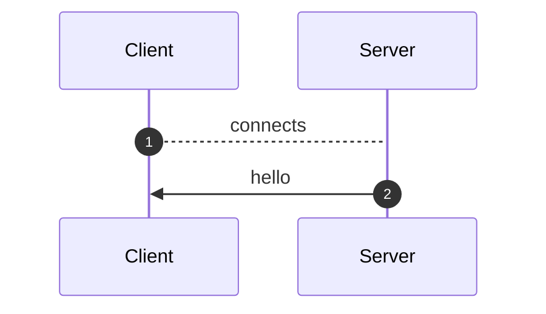
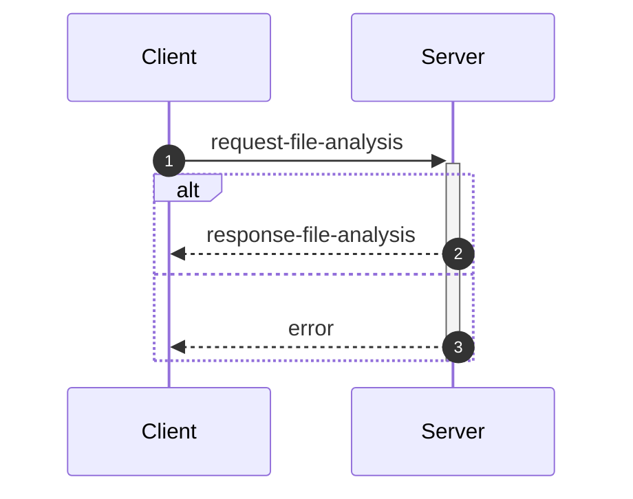
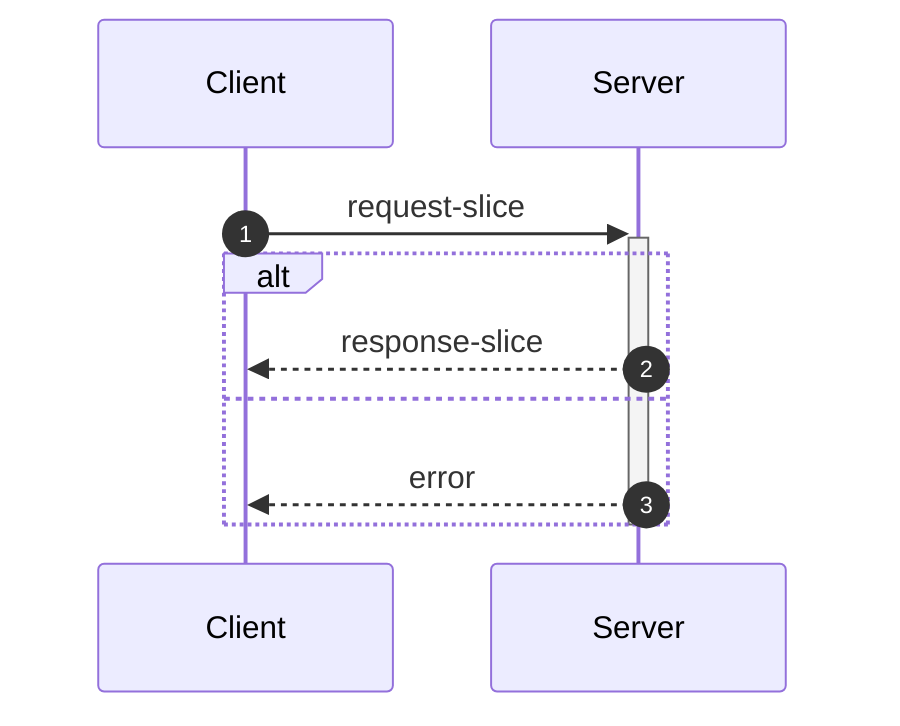
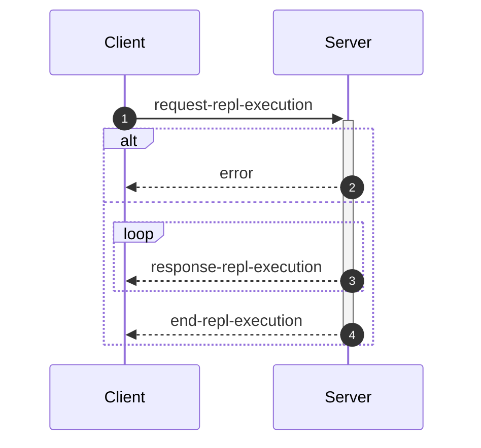

_This document was generated from '[src/documentation/wiki-interface.ts](https://github.com/flowr-analysis/flowr/tree/main//src/documentation/wiki-interface.ts)' on 2026-07-29, 16:53:06 UTC presenting an overview of flowR's interface (v2.13.4, using R v4.5.0). Please do not edit this file/wiki page directly._

Although far from being as detailed as the in-depth explanation of [_flowR_](https://github.com/flowr-analysis/flowr/wiki/core),
this wiki page explains how to interface with _flowR_ in more detail.
In general, command line arguments and other options provide short descriptions on hover over.

* [💻 Using the REPL](#using-the-repl)
* [⚙️ Configuring FlowR](#configuring-flowr)
* [⚒️ Writing Code](#writing-code)
* [💬 Communicating with the Server](#communicating-with-the-server)

<a id='using-the-repl'></a>
## 💻 Using the REPL


> [!NOTE]
> To execute arbitrary R commands with a repl request, _flowR_ has to be started explicitly with <span title="Description (Command Line Argument): Allow to access the underlying R session when using flowR (security warning: this allows the execution of arbitrary R code!)">`--r-session-access`</span>.
> Please be aware that this introduces a security risk and note that this relies on the [`r-shell` engine](https://github.com/flowr-analysis/flowr/wiki/engines) .

Although primarily meant for users to explore,
there is nothing which forbids simply calling _flowR_ as a subprocess to use standard-in, -output, and -error
for communication (although you can access the REPL using the server as well,
with the [REPL Request](#message-request-repl-execution) message).

The read-eval-print loop&nbsp;(REPL) works relatively simple.
You can submit an expression (using <kbd>Enter</kbd>),
which is interpreted as an R&nbsp;expression by default but interpreted as a *command* if it starts with a colon (`:`).
The best command to get started with the REPL is <span title="Description (Repl Command): Show help information (aliases: :h, :?)">`:help`</span>.
Besides, you can leave the REPL either with the command <span title="Description (Repl Command): End the repl (aliases: :q, :exit)">`:quit`</span> or by pressing <kbd>Ctrl</kbd>+<kbd>C</kbd> twice.
When writing a *command*, you may press <kbd>Tab</kbd> to get a list of completions, if available.
Multiple commands can be entered in a single line by separating them with a semicolon (`;`), e.g. `:parse "x<-2"; :df*`.
If a command is given without R code, the REPL will re-use R code given in a previous command.
The prior example will hence return first the parsed AST of the program and then the dataflow graph for `"x <- 2"`.

> [!NOTE]
> If you develop flowR, you may want to launch the repl using the `npm run main-dev` command, this way, you get a non-minified version of flowR with debug information and hot-reloading of source files.

<details>
<summary>Available Commands</summary>

We currently offer the following commands (this with a `[*]` suffix are available with and without the star):


| Command | Description |
| ------- | ----------- |
| **<span title="Description (Repl Command): End the repl (aliases: :q, :exit)">:quit</span>** | End the repl (aliases: **:<span title="Alias of ':quit'. End the repl">q</span>**, **:<span title="Alias of ':quit'. End the repl">exit</span>**) |
| **<span title="Description (Repl Command): Execute the given code as R code. This requires the `--r-session-access` flag to be set and requires the r-shell engine. (aliases: :e, :r)">:execute</span>** | Execute the given code as R code. This requires the `--r-session-access` flag to be set and requires the r-shell engine. (aliases: **:<span title="Alias of ':execute'. Execute the given code as R code. This requires the `--r-session-access` flag to be set and requires the r-shell engine.">e</span>**, **:<span title="Alias of ':execute'. Execute the given code as R code. This requires the `--r-session-access` flag to be set and requires the r-shell engine.">r</span>**) |
| **<span title="Description (Repl Command): Get mermaid code for the control-flow graph of R code (aliases: :cfg, :cf)">:controlflow[*]</span>** | Get mermaid code for the control-flow graph of R code (star: Returns the URL to mermaid.live) (aliases: **:<span title="Alias of ':controlflow'. Get mermaid code for the control-flow graph of R code">cfg</span>**, **:<span title="Alias of ':controlflow'. Get mermaid code for the control-flow graph of R code">cf</span>**) |
| **<span title="Description (Repl Command): Get mermaid code for the control-flow graph with basic blocks (aliases: :cfgb, :cfb)">:controlflowbb[*]</span>** | Get mermaid code for the control-flow graph with basic blocks (star: Returns the URL to mermaid.live) (aliases: **:<span title="Alias of ':controlflowbb'. Get mermaid code for the control-flow graph with basic blocks">cfgb</span>**, **:<span title="Alias of ':controlflowbb'. Get mermaid code for the control-flow graph with basic blocks">cfb</span>**) |
| **<span title="Description (Repl Command): Get mermaid code for the dataflow graph (aliases: :d, :df)">:dataflow[*]</span>** | Get mermaid code for the dataflow graph (star: Returns the URL to mermaid.live) (aliases: **:<span title="Alias of ':dataflow'. Get mermaid code for the dataflow graph">d</span>**, **:<span title="Alias of ':dataflow'. Get mermaid code for the dataflow graph">df</span>**) |
| **<span title="Description (Repl Command): Get mermaid code for the normalized AST of R code (aliases: :n)">:normalize[*]</span>** | Get mermaid code for the normalized AST of R code (star: Returns the URL to mermaid.live) (alias: **:<span title="Alias of ':normalize'. Get mermaid code for the normalized AST of R code">n</span>**) |
| **<span title="Description (Repl Command): Get mermaid code for the simplified dataflow graph (aliases: :ds, :dfs)">:dataflowsimple[*]</span>** | Get mermaid code for the simplified dataflow graph (star: Returns the URL to mermaid.live) (aliases: **:<span title="Alias of ':dataflowsimple'. Get mermaid code for the simplified dataflow graph">ds</span>**, **:<span title="Alias of ':dataflowsimple'. Get mermaid code for the simplified dataflow graph">dfs</span>**) |
| **<span title="Description (Repl Command): Inspect and extend the signature database: `query` (identical to :query @signature), `add <path>` to mount another database/source, `download` to fetch the full-history database. (aliases: :sig)">:signature</span>** | Inspect and extend the signature database: `query` (identical to :query @signature), `add <path>` to mount another database/source, `download` to fetch the full-history database. (alias: **:<span title="Alias of ':signature'. Inspect and extend the signature database: `query` (identical to :query @signature), `add <path>` to mount another database/source, `download` to fetch the full-history database.">sig</span>**) |
| **<span title="Description (Repl Command): Just calculates the DFG, but only prints summary info (aliases: :d#, :df#)">:dataflowsilent</span>** | Just calculates the DFG, but only prints summary info (aliases: **:<span title="Alias of ':dataflowsilent'. Just calculates the DFG, but only prints summary info">d#</span>**, **:<span title="Alias of ':dataflowsilent'. Just calculates the DFG, but only prints summary info">df#</span>**) |
| **<span title="Description (Repl Command): Prints ASCII Art of the parsed, unmodified AST (aliases: :p)">:parse</span>** | Prints ASCII Art of the parsed, unmodified AST (alias: **:<span title="Alias of ':parse'. Prints ASCII Art of the parsed, unmodified AST">p</span>**) |
| **<span title="Description (Repl Command): Prints the version of flowR as well as the current version of R">:version</span>** | Prints the version of flowR as well as the current version of R
| **<span title="Description (Repl Command): Query the given R code (use 'help' for more information)">:query[*]</span>** | Query the given R code (use 'help' for more information) (star: Similar to query, but returns the output in json format.)
| **<span title="Description (Repl Command): Returns an ASCII representation of the dataflow graph (aliases: :df!)">:dataflowascii</span>** | Returns an ASCII representation of the dataflow graph (alias: **:<span title="Alias of ':dataflowascii'. Returns an ASCII representation of the dataflow graph">df!</span>**) |
| **<span title="Description (Repl Command): Returns summarization stats for the normalized AST (aliases: :n#)">:normalize#</span>** | Returns summarization stats for the normalized AST (alias: **:<span title="Alias of ':normalize#'. Returns summarization stats for the normalized AST">n#</span>**) |
| **<span title="Description (Repl Command): Show help information (aliases: :h, :?)">:help</span>** | Show help information (aliases: **:<span title="Alias of ':help'. Show help information">h</span>**, **:<span title="Alias of ':help'. Show help information">?</span>**) |


</details>


> [!TIP]
> 
> As indicated by the examples before, all REPL commands that operate on code keep track of the state.
> Hence, if you run a command like <span title="Description (Repl Command, starred version): Returns the URL to mermaid.live; Base Command: Get mermaid code for the dataflow graph (aliases: :d*, :df*)">`:dataflow*`</span> without providing R code,
> the REPL will re-use the R code provided in a previous command.
> Likewise, doing this will benefit from incrementality!
> If you request the dataflow graph with `:df* x <- 2 * y` and then want to see the parsed AST with `:parse`,
> the REPL will re-use previously obtained information and not re-parse the code again.
> 		


Generally, many commands offer shortcut versions in the REPL. Many queries, for example, offer a shortened format (see the example below).
Of special note, the [Config Query](https://github.com/flowr-analysis/flowr/wiki/%5BQuery%5D-Config)
can be used to also modify the currently active configuration of _flowR_ within the REPL (see the [wiki page](https://github.com/flowr-analysis/flowr/wiki/%5BQuery%5D-Config) for more information).

### Example: Retrieving the Dataflow Graph

To retrieve a URL to the [mermaid](https://mermaid.js.org/) diagram of the dataflow of a given expression,
use <span title="Description (Repl Command, starred version): Returns the URL to mermaid.live; Base Command: Get mermaid code for the dataflow graph (aliases: :d*, :df*)">`:dataflow*`</span> (or <span title="Description (Repl Command): Get mermaid code for the dataflow graph (aliases: :d, :df)">`:dataflow`</span> to get the mermaid code in the cli):


```shell
$ docker run -it --rm eagleoutice/flowr # or npm run flowr 
flowR repl v2.13.4, R grammar v14 (tree-sitter engine)
R> :dataflow* y <- 1 + x
```

<details>
<summary style='color:gray'>Output</summary>


```text
https://mermaid.live/view#base64:eyJjb2RlIjoiZmxvd2NoYXJ0IEJUXG4gICAgMXt7XCJgKiM5MTtSTnVtYmVyIzkzOyogKioxKipcbiAgICAgICoxLjYqICgqKmlkOiAxKiopYFwifX1cbiAgICUlIE5vIGVkZ2VzIGZvdW5kIGZvciAxXG4gICAgMihbXCJgKiM5MTtSU3ltYm9sIzkzOyogKip4KipcbiAgICAgICoxLjEwKiAoKippZDogMioqKWBcIl0pXG4gICAlJSBObyBlZGdlcyBmb3VuZCBmb3IgMlxuICAgIDNbW1wiYCojOTE7UkJpbmFyeU9wIzkzOyogYmFzZSM1ODsjNTg7KiojNDM7KipcbiAgICAgICoxLjYtMTAqICgqKmlkOiAzKiopXG4gICAgYXJnOiAoMSwgMilgXCJdXVxuICAgIGJ1aWx0LWluOl9bXCJgQnVpbHQtSW46XG4jNDM7YFwiXVxuICAgIHN0eWxlIGJ1aWx0LWluOl8gc3Ryb2tlOmdyYXksZmlsbDpncmF5LHN0cm9rZS13aWR0aDoycHgsb3BhY2l0eTouODtcbiAgICAwW1wiYCojOTE7UlN5bWJvbCM5MzsqICoqeSoqXG4gICAgICAqMS4xKiAoKippZDogMCoqLCB2OiAzKWBcIl1cbiAgICA0W1tcImAqIzkxO1JCaW5hcnlPcCM5MzsqIGJhc2UjNTg7IzU4OyoqIzYwOyM0NTsqKlxuICAgICAgKjEuMS0xMCogKCoqaWQ6IDQqKilcbiAgICBhcmc6ICgwLCAzKWBcIl1dXG4gICAgYnVpbHQtaW46Xy1bXCJgQnVpbHQtSW46XG4jNjA7IzQ1O2BcIl1cbiAgICBzdHlsZSBidWlsdC1pbjpfLSBzdHJva2U6Z3JheSxmaWxsOmdyYXksc3Ryb2tlLXdpZHRoOjJweCxvcGFjaXR5Oi44O1xuICAgIDMgLS0+fFwicmVhZHMsIGFyZ1wifCAxXG4gICAgMyAtLT58XCJyZWFkcywgYXJnXCJ8IDJcbiAgICAzIC0uLT58XCJyZWFkcywgY2FsbHNcInwgYnVpbHQtaW46X1xuICAgIGxpbmtTdHlsZSAyIHN0cm9rZTpncmF5O1xuICAgIDAgLS0+fFwiZGVmaW5lZC1ieVwifCAzXG4gICAgMCAtLT58XCJkZWZpbmVkLWJ5XCJ8IDRcbiAgICA0IC0tPnxcInJlYWRzLCBhcmdcInwgM1xuICAgIDQgLS0+fFwicmV0dXJucywgYXJnXCJ8IDBcbiAgICA0IC0uLT58XCJyZWFkcywgY2FsbHNcInwgYnVpbHQtaW46Xy1cbiAgICBsaW5rU3R5bGUgNyBzdHJva2U6Z3JheTsiLCJtZXJtYWlkIjp7ImF1dG9TeW5jIjp0cnVlfX0=
```


Retrieve the dataflow graph of the expression `y <- 1 + x`. It looks like this:


```mermaid
flowchart LR
    1{{"`*#91;RNumber#93;* **1**
      *1.6* (**id: 1**)`"}}
   %% No edges found for 1
    2(["`*#91;RSymbol#93;* **x**
      *1.10* (**id: 2**)`"])
   %% No edges found for 2
    3[["`*#91;RBinaryOp#93;* base#58;#58;**#43;**
      *1.6-10* (**id: 3**)
    arg: (1, 2)`"]]
    built-in:_["`Built-In:
#43;`"]
    style built-in:_ stroke:gray,fill:gray,stroke-width:2px,opacity:.8;
    0["`*#91;RSymbol#93;* **y**
      *1.1* (**id: 0**, v: 3)`"]
    4[["`*#91;RBinaryOp#93;* base#58;#58;**#60;#45;**
      *1.1-10* (**id: 4**)
    arg: (0, 3)`"]]
    built-in:_-["`Built-In:
#60;#45;`"]
    style built-in:_- stroke:gray,fill:gray,stroke-width:2px,opacity:.8;
    3 -->|"reads, arg"| 1
    3 -->|"reads, arg"| 2
    3 -.->|"reads, calls"| built-in:_
    linkStyle 2 stroke:gray;
    0 -->|"defined-by"| 3
    0 -->|"defined-by"| 4
    4 -->|"reads, arg"| 3
    4 -->|"returns, arg"| 0
    4 -.->|"reads, calls"| built-in:_-
    linkStyle 7 stroke:gray;
```

	
<details>

<summary style="color:gray">R Code of the Dataflow Graph</summary>

The analysis required _0.7 ms_ (including parse and normalize, using the [tree-sitter](https://github.com/flowr-analysis/flowr/wiki/Engines) engine) within the generation environment. No [signature database](https://github.com/flowr-analysis/flowr/wiki/Signature-Database) is mounted for these generated graphs, so `library()` calls attach no package exports; base-R names are still qualified via the generated base-package store (e.g. `acf` as `stats::acf`). 
We encountered no unknown side effects during the analysis.


```r
y <- 1 + x
```


</details>


</details>


For small graphs like this, <span title="Description (Repl Command): Returns an ASCII representation of the dataflow graph (aliases: :df!)">`:dataflowascii`</span> also provides an ASCII representation directly in the REPL:


```shell
$ docker run -it --rm eagleoutice/flowr # or npm run flowr 
flowR repl v2.13.4, R grammar v14 (tree-sitter engine)
R> :df! y <- 1 + x
```

<details open>
<summary style='color:gray'>Output</summary>


```text
                        0<1>0
                   ┌────| 1 |
    ┌────────┐     │    0---0
 c<4>c       └──c<3>c
 |<- |  v<0>v┌──| + |
 c---c──| y |┘  c---c   u<2>u
        v---v      └────| x |
                        u---u
Edges:
3 -> 1: reads, arg  3 -> 2: reads, arg
4 -> 3: reads, arg  4 -> 0: returns, arg
0 -> 3: defined-by  0 -> 4: defined-by
```


Retrieve the dataflow graph of the expression `y <- 1 + x` as ASCII art.

</details>


For the slicing with <span title="Description (Repl Command): Static backwards executable slicer for R">`:slicer`</span>, you have access to the same [magic comments](#slice-magic-comments) as with the [slice request](#message-request-slice).
Pass `--inline` to splice resolvable `source()` calls into the reconstruction so the slice is a single self-contained R text (the same as the static slice query's `inlineSources` flag).
See `--help` for more flags!

### Example: Interfacing with the File System

Many commands that allow for an R-expression (like <span title="Description (Repl Command, starred version): Returns the URL to mermaid.live; Base Command: Get mermaid code for the dataflow graph (aliases: :d*, :df*)">`:dataflow*`</span>) allow for a file as well
if the argument starts with `file://`.
If you are working from the root directory of the _flowR_ repository, the following gives you the parsed AST of the example file using the <span title="Description (Repl Command): Prints ASCII Art of the parsed, unmodified AST (aliases: :p)">`:parse`</span> command:

> **Watch mode**: Replace `file://` with `watch://` to enter watch mode.
> flowR runs the command immediately and then re-runs it every time the file (or any file inside the folder) changes.
> Enter any other command to leave watch mode.
> For example: `:df watch://analysis.R`


```shell
$ docker run -it --rm eagleoutice/flowr # or npm run flowr 
flowR repl v2.13.4, R grammar v14 (tree-sitter engine)
R> :parse file://test/testfiles/example.R
```

<details>
<summary style='color:gray'>Output</summary>


```text
File: test/testfiles/example.R

program
├ binaryoperator
│ ├ identifier "sum" (1:1─4)
│ ├ <- "<-" (1:5─7)
│ ╰ float "0" (1:8─9)
├ binaryoperator
│ ├ identifier "product" (2:1─8)
│ ├ <- "<-" (2:9─11)
│ ╰ float "1" (2:12─13)
├ binaryoperator
│ ├ identifier "w" (3:1─2)
│ ├ <- "<-" (3:3─5)
│ ╰ float "7" (3:6─7)
├ binaryoperator
│ ├ identifier "N" (4:1─2)
│ ├ <- "<-" (4:3─5)
│ ╰ float "10" (4:6─8)
├ forstatement
│ ├ for "for" (6:1─4)
│ ├ ( "(" (6:5─6)
│ ├ identifier "i" (6:6─7)
│ ├ in "in" (6:8─10)
│ ├ binaryoperator
│ │ ├ float "1" (6:11─12)
│ │ ├ : ":" (6:12─13)
│ │ ╰ parenthesizedexpression
│ │   ├ ( "(" (6:13─14)
│ │   ├ binaryoperator
│ │   │ ├ identifier "N" (6:14─15)
│ │   │ ├ - "-" (6:15─16)
│ │   │ ╰ float "1" (6:16─17)
│ │   ╰ ) ")" (6:17─18)
│ ├ ) ")" (6:18─19)
│ ╰ bracedexpression
│   ├ { "{" (6:20─21)
│   ├ binaryoperator
│   │ ├ identifier "sum" (7:3─6)
│   │ ├ <- "<-" (7:7─9)
│   │ ╰ binaryoperator
│   │   ├ binaryoperator
│   │   │ ├ identifier "sum" (7:10─13)
│   │   │ ├ + "+" (7:14─15)
│   │   │ ╰ identifier "i" (7:16─17)
│   │   ├ + "+" (7:18─19)
│   │   ╰ identifier "w" (7:20─21)
│   ├ binaryoperator
│   │ ├ identifier "product" (8:3─10)
│   │ ├ <- "<-" (8:11─13)
│   │ ╰ binaryoperator
│   │   ├ identifier "product" (8:14─21)
│   │   ├  "" (8:22─23)
│   │   ╰ identifier "i" (8:24─25)
│   ╰ } "}" (9:1─2)
├ call
│ ├ identifier "cat" (11:1─4)
│ ╰ arguments
│   ├ ( "(" (11:4─5)
│   ├ argument
│   │ ╰ string
│   │   ├ " "\"" (11:5─6)
│   │   ├ stringcontent "Sum:" (11:6─10)
│   │   ╰ " "\"" (11:10─11)
│   ├ comma "," (11:11─12)
│   ├ argument
│   │ ╰ identifier "sum" (11:13─16)
│   ├ comma "," (11:16─17)
│   ├ argument
│   │ ╰ string
│   │   ├ " "\"" (11:18─19)
│   │   ├ stringcontent
│   │   │ ╰ escapesequence "\\n" (11:19─21)
│   │   ╰ " "\"" (11:21─22)
│   ╰ ) ")" (11:22─23)
╰ call
  ├ identifier "cat" (12:1─4)
  ╰ arguments
    ├ ( "(" (12:4─5)
    ├ argument
    │ ╰ string
    │   ├ " "\"" (12:5─6)
    │   ├ stringcontent "Product:" (12:6─14)
    │   ╰ " "\"" (12:14─15)
    ├ comma "," (12:15─16)
    ├ argument
    │ ╰ identifier "product" (12:17─24)
    ├ comma "," (12:24─25)
    ├ argument
    │ ╰ string
    │   ├ " "\"" (12:26─27)
    │   ├ stringcontent
    │   │ ╰ escapesequence "\\n" (12:27─29)
    │   ╰ " "\"" (12:29─30)
    ╰ ) ")" (12:30─31)
```


Retrieve the parsed AST of the example file.

<details>

<summary>File Content</summary>


```r
sum <- 0
product <- 1
w <- 7
N <- 10

for (i in 1:(N-1)) {
  sum <- sum + i + w
  product <- product * i
}

cat("Sum:", sum, "\n")
cat("Product:", product, "\n")
```


</details>

As _flowR_ directly transforms this AST the output focuses on being human-readable instead of being machine-readable.
		

</details>


### Example: Run a Query

You can run any query supported by _flowR_ using the <span title="Description (Repl Command): Query the given R code (use 'help' for more information)">`:query`</span> command.
For example, to obtain the shapes of all data frames in a given piece of code, you can run:


```shell
$ docker run -it --rm eagleoutice/flowr # or npm run flowr 
flowR repl v2.13.4, R grammar v14 (tree-sitter engine)
R> :query @absint df-shape "x <- data.frame(a = 1:10, b = 1:10)\ny <- x$a"
```

<details open>
<summary style='color:gray'>Output</summary>


```text
Query: absint (1 ms)
   ╰ $12: (colnames: [{"a", "b"}, {}], cols: [2, 2], rows: [10, 10])
   ╰ $0: (colnames: [{"a", "b"}, {}], cols: [2, 2], rows: [10, 10])
All queries together required ≈4 ms (1ms accuracy, total 4 ms)
```


Retrieve the shapes of all data frames in the given code.

</details>


To run the linter on a file, you can use (in this example, we just issue the `dead-code` linter on a small piece of code):


```shell
$ docker run -it --rm eagleoutice/flowr # or npm run flowr 
flowR repl v2.13.4, R grammar v14 (tree-sitter engine)
R> :query @linter rules:dead-code "if(FALSE) x <- 2"
```

<details open>
<summary style='color:gray'>Output</summary>


```text
Query: linter (4 ms)
   ╰ Dead Code (dead-code):
       ╰ certain:
           ╰ Code at 1.11-16
       ╰ Metadata: searchTimeMs: 3, processTimeMs: 1
All queries together required ≈4 ms (1ms accuracy, total 4 ms)
```


Run the linter on the given code, with only the `dead-code` rule enabled.

</details>


For more information on the available queries, please check out the [Query API](https://github.com/flowr-analysis/flowr/wiki/query-api).


<a id='configuring-flowr'></a>
## ⚙️ Configuring FlowR


When running _flowR_, you may want to specify some behaviors with a dedicated configuration file.
By default, flowR looks for a file named `flowr.json` in the current working directory (or any higher directory).
You can also specify a different file with <span title="Description (Command Line Argument): The name of the configuration file to use">`--config-file`</span> or pass the configuration inline using <span title="Description (Command Line Argument): The flowR configuration to use, as a JSON string">`--config-json`</span>.
To inspect the current configuration, you can run flowr with the <span title="Description (Command Line Argument): Run with verbose logging (will be passed to the corresponding script)">`--verbose`</span> flag, or use the `config` [Query](https://github.com/flowr-analysis/flowr/wiki/query-api).
Within the REPL this works by running the following:


```shell
:query @config
```


To work with the <a href="https://github.com/flowr-analysis/flowr/tree/main/src/config.ts#L132"><code><span title="The configuration file format for flowR.">FlowrConfig</span></code></a> you can use the provided helper objects alongside its methods like
<a href="https://github.com/flowr-analysis/flowr/tree/main/src/config.ts#L783"><code><span title="Creates a new flowr config that has the updated values.">FlowrConfig::<b>amend</b></span></code></a>.
The schema below documents every option; the ones you most likely want are:

- <a href="https://github.com/flowr-analysis/flowr/wiki/Interface#configuring-flowr" title="Configuration Option (boolean): Whether source calls should be ignored, causing {@link processSourceCall}&#39;s behavior to be skipped.">ignoreSourceCalls</a>: ignore source calls when analyzing the code, i.e., ignore the inclusion of other files.
- <a href="https://github.com/flowr-analysis/flowr/wiki/Interface#configuring-flowr" title="Configuration Option (boolean): Whether load calls should be ignored, causing {@link processLoadCall}&#39;s behavior to be skipped.">ignoreLoadCalls</a>: ignore load calls when analyzing the code, i.e., ignore the loading of r-data files.
- <a href="https://github.com/flowr-analysis/flowr/wiki/Interface#configuring-flowr" title="Configuration Option (object): Do you want to overwrite (parts) of the builtin definition?">semantics.environment.overwriteBuiltIns</a>: overwrite _flowR_'s handling of built-in functions, or clear the preset definitions entirely.
  See [Configure BuiltIn Semantics](#configure-builtin-semantics) for more information.
- <a href="https://github.com/flowr-analysis/flowr/wiki/Interface#configuring-flowr" title="Configuration Option (string): How to resolve variables and their values. (one of &quot;disabled&quot;, &quot;alias&quot;, &quot;builtin&quot;)">solver.variables</a>: how to resolve variables and their values (`disabled`, `alias`, `builtin`).
- <a href="https://github.com/flowr-analysis/flowr/wiki/Interface#configuring-flowr" title="Configuration Option (array): The engine or set of engines to use for interacting with R code. An empty array means all available engines will be used.">engines</a> and <a href="https://github.com/flowr-analysis/flowr/wiki/Interface#configuring-flowr" title="Configuration Option (string): The default engine to use for interacting with R code. If this is undefined, an arbitrary engine from the specified list will be used. (one of &quot;tree-sitter&quot;, &quot;r-shell&quot;)">defaultEngine</a>: the engines used to interact with R code, see the [Engines wiki page](https://github.com/flowr-analysis/flowr/wiki/engines).
- <a href="https://github.com/flowr-analysis/flowr/wiki/Interface#configuring-flowr" title="Configuration Option (array): Files a framework loads on its own, without any source() call (e.g. global.R in a shiny app), in the order they are loaded; flowR orders the matching project files accordingly and analyzes them as one program. Entries are case-insensitive globs matched against the file path, a plain name matches any file with that name, and entries matching no project file are warned about. Usually set per project kind via specializeConfig.">project.implicitSources</a>: the files a framework loads without any `source()` call, in the order in which they are
  loaded. Entries are globs (e.g. `R/*.R`) matched against the file path ignoring capitalization; one matching no file is reported.
- <a href="https://github.com/flowr-analysis/flowr/wiki/Interface#configuring-flowr" title="Configuration Option (object): Overwrite (parts of) the configuration depending on the project kind flowR detects, e.g. to give a shiny app its implicit sources.">specializeConfig</a>: overwrite (parts of) the configuration depending on the kind of project _flowR_ detects
  (e.g. `shiny-app`), which is how a shiny app gets its implicit sources by default. What you configure directly wins.
- <a href="https://github.com/flowr-analysis/flowr/wiki/Interface#configuring-flowr" title="Configuration Option (string): Overwrite the project kind flowR would otherwise infer from the analyzed files, e.g. when auto-detection guesses wrong. (one of &quot;package&quot;, &quot;script&quot;, &quot;shiny-app&quot;, &quot;notebook&quot;, &quot;project&quot;, &quot;unknown&quot;)">project.useProjectType</a>: skip that detection and force a project kind yourself, when auto-detection guesses wrong.
- <a href="https://github.com/flowr-analysis/flowr/wiki/Interface#configuring-flowr" title="Configuration Option (array): The default plugins to load when creating a new instance of FlowrAnalyzer">defaultPlugins</a> and <a href="https://github.com/flowr-analysis/flowr/wiki/Interface#configuring-flowr" title="Configuration Option (array): The plugins to load in REPL mode">repl.plugins</a>: the plugins to load for a new <a href="https://github.com/flowr-analysis/flowr/tree/main/src/project/flowr-analyzer.ts#L173"><code><span title="Central class for conducting analyses with FlowR. Use the FlowrAnalyzerBuilder to create a new instance. If you want the original pattern of creating a pipeline and running all steps, you can still do this with FlowrAnalyzer#runFull . To inspect the context of the analyzer, use FlowrAnalyzer#inspectContext (if you are a plugin and need to modify it, use FlowrAnalyzer#context instead).">FlowrAnalyzer</span></code></a> and in the REPL
  (use `flowr:default` to reference the former).

So you can configure _flowR_ by adding a file like the following:

<details>

<summary>Example Configuration File</summary>


```json
{
  "ignoreSourceCalls": true,
  "ignoreLoadCalls": true,
  "semantics": {
    "environment": {
      "overwriteBuiltIns": {
        "definitions": [
          {
            "type": "function",
            "names": [
              "foo"
            ],
            "processor": "builtin:assign",
            "config": {}
          }
        ]
      }
    }
  },
  "defaultPlugins": [
    "file:description",
    "versions:description"
  ],
  "repl": {
    "quickStats": false,
    "dfProcessorHeat": false,
    "hints": true,
    "plugins": [
      "flowr:default"
    ]
  },
  "project": {
    "resolveUnknownPathsOnDisk": true,
    "implicitSources": [
      "global.R",
      "app.R"
    ]
  },
  "linter": {
    "disabledRules": []
  },
  "specializeConfig": {
    "shiny-app": {
      "project": {
        "implicitSources": [
          "global.R",
          "ui.R",
          "server.R",
          "app.R"
        ]
      }
    }
  },
  "engines": [
    {
      "type": "r-shell"
    }
  ],
  "solver": {
    "variables": "alias",
    "evalStrings": true,
    "trackEnvironments": true,
    "sigdb": {
      "enabled": true,
      "loadProjectDependencies": true,
      "eagerlyLoad": false,
      "eagerlyLoadExports": false,
      "linkBaseR": false,
      "linkDescriptionDependencies": false
    },
    "resolveSource": {
      "dropPaths": "no",
      "ignoreCapitalization": true,
      "inferWorkingDirectory": "active-script",
      "searchPath": []
    },
    "instrument": {},
    "slicer": {
      "threshold": 50
    }
  },
  "abstractInterpretation": {
    "wideningThreshold": 4,
    "dataFrame": {
      "maxColNames": 20,
      "readLoadedData": {
        "readExternalFiles": true,
        "maxReadLines": 1000000
      }
    }
  },
  "incrementalParsing": {
    "activated": false
  },
  "gas": {
    "thresholds": {
      "memory": {
        "problematic": 0.7,
        "critical": 0.9
      },
      "timeMs": {
        "problematic": 100000,
        "critical": 120000
      }
    },
    "features": {}
  }
}
```


</details>

<details>
<a id='configure-builtin-semantics'></a>
<summary>Configure Built-In Semantics</summary>


`semantics/environment/overwriteBuiltins` accepts two keys:

- `loadDefaults` (boolean, initially `true`): If set to `true`, the default built-in definitions are loaded before applying the custom definitions. Setting this flag to `false` explicitly disables the loading of the default definitions.
- `definitions` (array, initially empty): Allows to overwrite or define new built-in elements. Each object within must have a `type` which is one of the below. Furthermore, they may define a string array of `names` which specifies the identifiers to bind the definitions to. You may use `assumePrimitive` to specify whether _flowR_ should assume that this is a primitive non-library definition (so you probably just do not want to specify the key).

  | Type            | Description                                                                                                                                                                                                                                                                                              | Example                                                                                                    |
  | --------------- | -------------------------------------------------------------------------------------------------------------------------------------------------------------------------------------------------------------------------------------------------------------------------------------------------------- | ---------------------------------------------------------------------------------------------------------- |
  | `constant`    | Additionally allows for a `value` this should resolve to.                                                                                                                                                                                                                                                | `{ type: 'constant', names: ['NULL', 'NA'],  value: null }`                                                |
  | `function`    | Is a rather flexible way to define and bind built-in functions. For the time, we do not have extensive documentation to cover all the cases, so please either consult the sources with the `default-builtin-config.ts` or open a [new issue](https://github.com/flowr-analysis/flowr/issues/new/choose). | `{ type: 'function', names: ['next'], processor: 'builtin:d', config: { cfg: ExitPointType.Next } }` |
  | `replacement` | A comfortable way to specify replacement functions like `$<-` or `names<-`. `suffixes` describes the... suffixes to attach automatically. | `{ type: 'replacement', suffixes: ['<-', '<<-'], names: ['[', '[['] }` |


</details>

<details>

<summary style='color:gray'>Full Configuration-File Schema</summary>

- _The configuration file format for flowR._ (object)
    - **logLevel** [optional] _flowR's global minimum log level, applied when the config is loaded._ (string)
        Only allows: 'silly', 'trace', 'debug', 'info', 'warn', 'error', 'fatal'
    - **ignoreSourceCalls** [optional] _Whether source calls should be ignored, causing {@link processSourceCall}'s behavior to be skipped._ (boolean)
    - **ignoreLoadCalls** [optional] _Whether load calls should be ignored, causing {@link processLoadCall}'s behavior to be skipped._ (boolean)
    - **semantics** _Configure language semantics and how flowR handles them._ (object)
        - **environment** [optional] _Semantics regarding how to handle the R environment._ (object)
            - **overwriteBuiltIns** [optional] _Do you want to overwrite (parts) of the builtin definition?_ (object)
                - **loadDefaults** [optional] _Should the default configuration still be loaded?_ (boolean)
                - **definitions** [optional] _The definitions to load/overwrite._ (array)
                Valid item types:
                    - (object)
    - **defaultPlugins** [optional] _The default plugins to load when creating a new instance of FlowrAnalyzer_ (array)
    Valid item types:
        - (alternatives)
            - (string)
            - (array)
    - **repl** _Configuration options for the REPL._ (object)
        - **quickStats** [optional] _Whether to show quick stats in the REPL after each evaluation._ (boolean)
        - **dfProcessorHeat** [optional] _This instruments the dataflow processors to count how often each processor is called._ (boolean)
        - **hints** [optional] _Whether to show dim inline hints on the empty prompt (automatically disabled on non-interactive terminals)._ (boolean)
        - **plugins** [optional] _The plugins to load in REPL mode_ (array)
        Valid item types:
            - (alternatives)
                - (string)
                - (array)
        - **autoUseFileProtocol** [optional] _Prepend the file protocol to a repl input that looks like a path, instead of only warning about it._ (boolean)
        - **queryStats** [optional] _Whether `:query` closes with the line stating how long the queries took (`:query*` never prints it)._ (boolean)
        - **showPlugins** [optional] _Whether `:version` grays out the plugins that did not activate during the last analysis._ (boolean)
    - **project** _Project specific configuration options._ (object)
        - **resolveUnknownPathsOnDisk** [optional] _Whether to resolve unknown paths loaded by the r project disk when trying to source/analyze files._ (boolean)
        - **failOnInaccessiblePath** [optional] _Whether a directory that cannot be traversed during file discovery (e.g. due to permissions) aborts the analysis; when false (the default) such paths are logged and skipped._ (boolean)
        - **basePackages** [optional] _The packages considered part of R itself (base and recommended); if unset, flowR uses its built-in list._ (array)
        Valid item types:
            - (string)
        - **implicitSources** [optional] _Files a framework loads on its own, without any source() call (e.g. global.R in a shiny app), in the order they are loaded; flowR orders the matching project files accordingly and analyzes them as one program. Entries are case-insensitive globs matched against the file path, a plain name matches any file with that name, and entries matching no project file are warned about. Usually set per project kind via specializeConfig._ (array)
        Valid item types:
            - (string)
        - **useProjectType** [optional] _Overwrite the project kind flowR would otherwise infer from the analyzed files, e.g. when auto-detection guesses wrong._ (string)
            Only allows: 'package', 'script', 'shiny-app', 'notebook', 'project', 'unknown'
        - **discovery** [optional] _Scoping options for the default project discovery._ (object)
            - **full** [optional] _Collect every file below the project root (greedy) instead of only the files the detected project kind needs (default false)._ (boolean)
            - **perKind** [optional] _Per-kind include/exclude glob overrides layered on the default scoping._ (object)
            - **ignore** [optional] _Case-insensitive globs that drop matching files from the intelligent discovery, regardless of kind (e.g. .Renviron to ignore environment files)._ (array)
            Valid item types:
                - (string)
        - **classification** [optional] _Overrides for the signals flowR uses to classify the project kind._ (object)
            - **shinyDescriptionTypes** [optional] _DESCRIPTION Type: values that mark a shiny app._ (array)
            Valid item types:
                - (string)
            - **shinyEntryFiles** [optional] _File names a shiny app is assembled from._ (array)
            Valid item types:
                - (string)
            - **shinyUsagePattern** [optional] _Regex source evidencing shiny usage in an entry file._ (string)
            - **notebookExtensions** [optional] _File extensions marking a notebook._ (array)
            Valid item types:
                - (string)
    - **linter** _Linter configuration options._ (object)
        - **disabledRules** _Linting rule names excluded from the default rule set (a rule requested explicitly via a linter query still runs). Usually set per project kind via specializeConfig._ (array)
        Valid item types:
            - (string)
    - **inputSources** [optional] _Further frameworks the input-sources analysis should know about; entries are added to flowR's defaults._ (object)
        - **pure** [optional] _Functions that only pass the constantness of their arguments on._ (array)
        Valid item types:
            - (string)
        - **param** [optional] _Functions whose result is a 'param' input._ (array)
        Valid item types:
            - (string)
        - **file** [optional] _Functions whose result is a 'file' input._ (array)
        Valid item types:
            - (string)
        - **tempfile** [optional] _Functions whose result is a 'tempfile' input._ (array)
        Valid item types:
            - (string)
        - **net** [optional] _Functions whose result is a 'net' input._ (array)
        Valid item types:
            - (string)
        - **rand** [optional] _Functions whose result is a 'rand' input._ (array)
        Valid item types:
            - (string)
        - **system** [optional] _Functions whose result is a 'system' input._ (array)
        Valid item types:
            - (string)
        - **ffi** [optional] _Functions whose result is a 'ffi' input._ (array)
        Valid item types:
            - (string)
        - **lang** [optional] _Functions whose result is a 'lang' input._ (array)
        Valid item types:
            - (string)
        - **options** [optional] _Functions whose result is a 'options' input._ (array)
        Valid item types:
            - (string)
        - **user** [optional] _Functions whose result is a 'user' input._ (array)
        Valid item types:
            - (string)
        - **const** [optional] _Functions whose result is a 'const' input._ (array)
        Valid item types:
            - (string)
        - **scope** [optional] _Functions whose result is a 'scope' input._ (array)
        Valid item types:
            - (string)
        - **dconst** [optional] _Functions whose result is a 'dconst' input._ (array)
        Valid item types:
            - (string)
        - **unknown** [optional] _Functions whose result is a 'unknown' input._ (array)
        Valid item types:
            - (string)
        - **linkedObjects** [optional] _Objects a framework provides without a definition in the code, e.g. shiny's input._ (array)
        Valid item types:
            - (object)
        - **linkedEntryPoints** [optional] _Calls that hand a function to a framework, which binds its objects to the parameters by position._ (array)
        Valid item types:
            - (object)
    - **specializeConfig** [optional] _Overwrite (parts of) the configuration depending on the project kind flowR detects, e.g. to give a shiny app its implicit sources._ (object)
    - **engines** _The engine or set of engines to use for interacting with R code. An empty array means all available engines will be used._ (array)
    Valid item types:
        - (alternatives)
            - _The configuration for the tree sitter engine._ (object)
                - **type** [required] _Use the tree sitter engine._ (string)
                    Only allows: 'tree-sitter'
                - **wasmPath** [optional] _The path to the tree-sitter-r WASM binary to use. If this is undefined, this uses the default path._ (string)
                - **treeSitterWasmPath** [optional] _The path to the tree-sitter WASM binary to use. If this is undefined, this uses the default path._ (string)
                - **lax** [optional] _Whether to use the lax parser for parsing R code (allowing for syntax errors). If this is undefined, the strict parser will be used._ (boolean)
            - _The configuration for the R shell engine._ (object)
                - **type** [required] _Use the R shell engine._ (string)
                    Only allows: 'r-shell'
                - **rPath** [optional] _The path to the R executable to use. If this is undefined, this uses the default path._ (string)
    - **defaultEngine** [optional] _The default engine to use for interacting with R code. If this is undefined, an arbitrary engine from the specified list will be used._ (string)
        Only allows: 'tree-sitter', 'r-shell'
    - **solver** _How to resolve constants, constraints, cells, ..._ (object)
        - **variables** _How to resolve variables and their values._ (string)
            Only allows: 'disabled', 'alias', 'builtin'
        - **evalStrings** _Should we include eval(parse(text="...")) calls in the dataflow graph?_ (boolean)
        - **trackEnvironments** [optional] _Track user-created environments (new.env, assign/get/local with envir=, dollar-assign, attach). When false, all envir-style calls fall through conservatively._ (boolean)
        - **sigdb** _Resolving library exports from a signature database._ (object)
            - **enabled** [optional] _Resolve library()/use() exports from a signature database (default true); when false no database is consulted._ (boolean)
            - **loadProjectDependencies** [optional] _Load the project's declared dependencies from its metadata files (DESCRIPTION Imports/Depends, rproject.toml, renv.lock, rv.lock) (default true); when false these files are not read for dependencies._ (boolean)
            - **eagerlyLoad** [optional] _Parse the database up front rather than on the first package load (default false, ignored if disabled)._ (boolean)
            - **eagerlyLoadExports** [optional] _Add a vertex for every export on load rather than on demand (default false); keeps the dataflow graph small._ (boolean)
            - **assumedRVersion** [optional] _R version assumed when resolving versioned (base-R) exports: a pin like "4.5" or "auto" to detect the installed R (default "auto")._ (string)
            - **linkBaseR** [optional] _Eagerly attach base-R namespaces so bare base calls resolve without library() (default false)._ (boolean)
            - **linkBaseRCalls** [optional] _Add a lightweight Reads edge from a bare base-R call to its signature-database function vertex (default false; base-R qualification is edge-free otherwise)._ (boolean)
            - **linkPackageCalls** [optional] _Add a lightweight Reads edge from a resolved package call to its signature-database function vertex (default false)._ (boolean)
            - **linkDescriptionDependencies** [optional] _Eagerly attach the namespaces of the project's declared DESCRIPTION dependencies (Imports/Depends) so their exports resolve without an explicit library() (default false)._ (boolean)
            - **warmInBackground** [optional] _Decompress the hot shards (base + most-downloaded) in a background task on startup so the first library() lookup is warm (default false; for long-running servers/REPLs)._ (boolean)
            - **additionalPaths** [optional] _Extra directories or bundle/manifest files searched for signature databases (alongside the shipped default and $FLOWR_SIGDB_DIR); a downloaded full-history bundle placed here is mounted automatically._ (array)
            Valid item types:
                - (string)
            - **downloadRepo** [optional] _GitHub owner/repo the full-history bundle is downloaded from via ":signature download" (default "flowr-analysis/flowr", release tag "sigdb-v<flowR-version>")._ (string)
            - **autoSync** [optional] _On startup, re-download shards whose committed sigdb.remote.json hash no longer matches the cache, in the background (default false; opt-in network sync after a git pull)._ (boolean)
            - **versionSelection** [optional] _When a project constrains a dependency, resolve to the newest (default), oldest, or system-installed version satisfying it; system needs R and falls back to newest. Base-R packages always resolve against the assumed R version._ (string)
                Only allows: 'newest', 'oldest', 'system'
            - **versionOverrides** [optional] _Force an exact version for specific packages (name -> version), overriding both the project constraint and the versionSelection policy (default {})._ (object)
        - **versionManagement** _Policies for reasoning about dependency versions._ (object)
            - **linkedVersionGroups** [optional] _Groups of packages that must resolve to the same version; version guessing intersects each group so its members stay mutually compatible (default [])._ (array)
            Valid item types:
                - (array)
                Valid item types:
                    - (string)
        - **instrument** (object)
            - **dataflowExtractors** [optional] _These keys are only intended for use within code, allowing to instrument the dataflow analyzer!_ (any)
        - **resolveSource** [optional] _If lax source calls are active, flowR searches for sourced files much more freely, based on the configurations you give it. This option is only in effect if `ignoreSourceCalls` is set to false._ (object)
            - **dropPaths** _Allow to drop the first or all parts of the sourced path, if it is relative._ (string)
                Only allows: 'no', 'once', 'all'
            - **ignoreCapitalization** _Search for filenames matching in the lowercase._ (boolean)
            - **inferWorkingDirectory** _Try to infer the working directory from the main or any script to analyze._ (string)
                Only allows: 'no', 'main-script', 'active-script', 'any-script'
            - **searchPath** _Additionally search in these paths._ (array)
            Valid item types:
                - (string)
            - **repeatedSourceLimit** [optional] _How often the same file can be sourced within a single run? Please be aware: in case of cyclic sources this may not reach a fixpoint so give this a sensible limit._ (number)
            - **applyReplacements** _Provide name replacements for loaded files_ (array)
            Valid item types:
                - (object)
            - **assumeFilesExist** [optional] _Assume a sourced file is always there, making what it defines certain instead of conditional on the source call._ (boolean)
        - **slicer** [optional] _The configuration for the slicer._ (object)
            - **threshold** [optional] _The maximum number of iterations to perform on a single function call during slicing._ (number)
            - **autoExtend** [optional] _If set, the slicer will gain an additional post-pass._ (boolean)
    - **abstractInterpretation** _The configuration options for abstract interpretation._ (object)
        - **wideningThreshold** _The threshold for the number of visitations of a node at which widening should be performed to ensure the termination of the fixpoint iteration._ (number)
        - **dataFrame** _The configuration of the shape inference for data frames._ (object)
            - **maxColNames** _The maximum number of columns names to infer for data frames before over-approximating the column names to top._ (number)
            - **readLoadedData** _Configuration options for reading data frame shapes from loaded external data files, such as CSV files._ (object)
                - **readExternalFiles** _Whether data frame shapes should be extracted from loaded external files, such as CSV files._ (boolean)
                - **maxReadLines** _The maximum number of lines to read when extracting data frame shapes from loaded files, such as CSV files._ (number)
    - **incrementalParsing** (object)
        - **activated** _If set, incremental parsing will be used._ (boolean)
    - **gas** [optional] _Resource-usage guard (gas) configuration. All feature factors default to 0 (disabled). See https://github.com/flowr-analysis/flowr/wiki/Core#gas-resource-guard._ (object)
        - **thresholds** [optional] _Shared thresholds for all gas checks (scaled by per-feature factor)._ (object)
            - **memory** [optional] _Heap-usage fraction thresholds (0-1)._ (object)
                - **problematic** [optional] _Heap fraction (0-1) above which Problematic is returned._ (number)
                - **critical** [optional] _Heap fraction (0-1) above which Critical is returned._ (number)
            - **timeMs** [optional] _Elapsed analysis time thresholds in milliseconds._ (object)
                - **problematic** [optional] _Elapsed ms above which Problematic is returned._ (number)
                - **critical** [optional] _Elapsed ms above which Critical is returned._ (number)
        - **features** [optional] _Per-feature sensitivity factors. 0 or absent disables gas checking for that feature. A factor of 2 makes the feature twice as sensitive. Recognised keys: `source`, `side-effect-linking`, `linter`._ (object)
        - **heapProvider** [optional] _Custom heap statistics source (programmatic configs only), overriding the built-in v8/performance.memory detection._ (function)

</details>

	

<a id='writing-code'></a>
## ⚒️ Writing Code

_flowR_ can be used as a [module](https://www.npmjs.com/package/@eagleoutice/flowr) and offers several main classes and interfaces that are interesting for extension writers 
(see the [Visual Studio Code extension](https://marketplace.visualstudio.com/items?itemName=code-inspect.vscode-flowr) or the [Core](https://github.com/flowr-analysis/flowr/wiki/core) wiki page for more information).

### Creating Analyses with _flowR_

Nowadays, instances of the <a href="https://github.com/flowr-analysis/flowr/tree/main/src/project/flowr-analyzer.ts#L173"><code><span title="Central class for conducting analyses with FlowR. Use the FlowrAnalyzerBuilder to create a new instance. If you want the original pattern of creating a pipeline and running all steps, you can still do this with FlowrAnalyzer#runFull . To inspect the context of the analyzer, use FlowrAnalyzer#inspectContext (if you are a plugin and need to modify it, use FlowrAnalyzer#context instead).">FlowrAnalyzer</span></code></a> should be used as central frontend to get analysis results from _flowR_.
For example, a program slice can be created like this:


```ts
const analyzer = await new FlowrAnalyzerBuilder()
    .setEngine('tree-sitter')
    .build();
analyzer.addRequest('x <- 1\ny <- x\nx');
const result = await analyzer.query([
    {
        type:     'static-slice',
        criteria: ['3@x']
    }
]);
//console.log(result['static-slice']);
```


For more information, please have a look at the [Analyzer](https://github.com/flowr-analysis/flowr/wiki/analyzer) wiki page, which explains how to construct and use the <a href="https://github.com/flowr-analysis/flowr/tree/main/src/project/flowr-analyzer.ts#L173"><code><span title="Central class for conducting analyses with FlowR. Use the FlowrAnalyzerBuilder to create a new instance. If you want the original pattern of creating a pipeline and running all steps, you can still do this with FlowrAnalyzer#runFull . To inspect the context of the analyzer, use FlowrAnalyzer#inspectContext (if you are a plugin and need to modify it, use FlowrAnalyzer#context instead).">FlowrAnalyzer</span></code></a> in more detail.
To work with specific perspectives, you can also consult the respective pages like the [Dataflow Graph](https://github.com/flowr-analysis/flowr/wiki/dataflow-graph) or the [Abstract Interpretation](https://github.com/flowr-analysis/flowr/wiki/abstract-interpretation) wiki pages.
### The Pipeline Executor (Low-Level Interface)

Once, in the beginning, _flowR_ was meant to produce a dataflow graph merely to provide *program slices*. 
However, with continuous updates, the [Dataflow Graph](https://github.com/flowr-analysis/flowr/wiki/dataflow-graph) repeatedly proves to be the more interesting part.
With this, we restructured _flowR_'s originally *hardcoded* pipeline to be far more flexible. 
Now, it can be theoretically extended or replaced with arbitrary steps, optional steps, and what we call 'decorations' of these steps. 
In short, a slicing pipeline using the <a href="https://github.com/flowr-analysis/flowr/tree/main/src/core/pipeline-executor.ts#L97"><code><span title="**Please note:** The PipelineExecutor is now considered to be a rather low-level API for flowR. While it still works and is the basis for all other layers, we strongly recommend using the FlowrAnalyzer and its builder to create and use an analyzer instance that is pre-configured for your use-case. The pipeline executor allows to execute arbitrary pipelines in a step-by-step fashion. If you are not...">PipelineExecutor</span></code></a> looks like this:


```ts

const slicer = new PipelineExecutor(DEFAULT_SLICING_PIPELINE, {
  parser:    new RShell(),
  request:   requestFromInput('x <- 1\nx + 1'),
  criterion: ['2@x']
})
const slice = await slicer.allRemainingSteps()
// console.log(slice.reconstruct.code)
```


<details><summary>More Information</summary>


If you compare this, with what you would have done with the old (and removed) `SteppingSlicer`, 
this essentially just requires you to replace the `SteppingSlicer` with the <a href="https://github.com/flowr-analysis/flowr/tree/main/src/core/pipeline-executor.ts#L97"><code><span title="**Please note:** The PipelineExecutor is now considered to be a rather low-level API for flowR. While it still works and is the basis for all other layers, we strongly recommend using the FlowrAnalyzer and its builder to create and use an analyzer instance that is pre-configured for your use-case. The pipeline executor allows to execute arbitrary pipelines in a step-by-step fashion. If you are not...">PipelineExecutor</span></code></a>
and to pass the <a href="https://github.com/flowr-analysis/flowr/tree/main/src/core/steps/pipeline/default-pipelines.ts#L18"><code>DEFAULT_SLICING_PIPELINE</code></a> as the first argument.
The <a href="https://github.com/flowr-analysis/flowr/tree/main/src/core/pipeline-executor.ts#L97"><code><span title="**Please note:** The PipelineExecutor is now considered to be a rather low-level API for flowR. While it still works and is the basis for all other layers, we strongly recommend using the FlowrAnalyzer and its builder to create and use an analyzer instance that is pre-configured for your use-case. The pipeline executor allows to execute arbitrary pipelines in a step-by-step fashion. If you are not...">PipelineExecutor</span></code></a>...

1. Provides structures to investigate the results of all intermediate steps
2. Can be executed step-by-step
3. Can repeat steps (e.g., to calculate multiple slices on the same input)

See the in-code documentation for more information.


</details>

### Using the <a href="https://github.com/flowr-analysis/flowr/tree/main/src/r-bridge/shell.ts#L143"><code><span title="The RShell represents an interactive session with the R interpreter. You can configure it by RShellOptions . At the moment we are using a live R session (and not networking etc.) to communicate with R easily, which allows us to install packages etc. However, this might and probably will change in the future (leaving this as a legacy mode :D)">RShell</span></code></a> to Interact with R

The <a href="https://github.com/flowr-analysis/flowr/tree/main/src/r-bridge/shell.ts#L143"><code><span title="The RShell represents an interactive session with the R interpreter. You can configure it by RShellOptions . At the moment we are using a live R session (and not networking etc.) to communicate with R easily, which allows us to install packages etc. However, this might and probably will change in the future (leaving this as a legacy mode :D)">RShell</span></code></a> class allows interfacing with the `R`&nbsp;ecosystem installed on the host system.
Please have a look at [flowR's Engines](https://github.com/flowr-analysis/flowr/wiki/engines) for more information on alternatives (for example, the <a href="https://github.com/flowr-analysis/flowr/tree/main/src/r-bridge/lang-4.x/tree-sitter/tree-sitter-executor.ts#L20"><code><span title="Synchronous and (way) faster alternative to the RShell using tree-sitter.">TreeSitterExecutor</span></code></a>).


> [!IMPORTANT]
> 
> Each <a href="https://github.com/flowr-analysis/flowr/tree/main/src/r-bridge/shell.ts#L143"><code><span title="The RShell represents an interactive session with the R interpreter. You can configure it by RShellOptions . At the moment we are using a live R session (and not networking etc.) to communicate with R easily, which allows us to install packages etc. However, this might and probably will change in the future (leaving this as a legacy mode :D)">RShell</span></code></a> controls a new instance of the R&nbsp;interpreter, 
> make sure to call <code><a href="https://github.com/flowr-analysis/flowr/tree/main/src/r-bridge/shell.ts#L352"><span title="Close the current R session, makes the object effectively invalid (can no longer be reopened etc.)">RShell::<i>close</i></span></a>()</code> when you are done.


You can start a new "session" simply by constructing a new object with <code>new <a href="https://github.com/flowr-analysis/flowr/tree/main/src/r-bridge/shell.ts#L143"><span title="The RShell represents an interactive session with the R interpreter. You can configure it by RShellOptions . At the moment we are using a live R session (and not networking etc.) to communicate with R easily, which allows us to install packages etc. However, this might and probably will change in the future (leaving this as a legacy mode :D)">RShell</span></a>()</code>.

However, there are several options that may be of interest 
(e.g., to automatically revive the shell in case of errors or to control the name location of the R process on the system).

With a shell object (let's call it `shell`), you can execute R code by using <a href="https://github.com/flowr-analysis/flowr/tree/main/src/r-bridge/shell.ts#L213"><code><span title="sends the given command directly to the current R session will not do anything to alter input markers!">RShell::<i>sendCommand</i></span></code></a>,
for example <code>shell.<a href="https://github.com/flowr-analysis/flowr/tree/main/src/r-bridge/shell.ts#L213"><span title="sends the given command directly to the current R session will not do anything to alter input markers!">sendCommand</span></a>("1 + 1")</code>.
However, this does not return anything, so if you want to collect the output of your command, use
<a href="https://github.com/flowr-analysis/flowr/tree/main/src/r-bridge/shell.ts#L296"><code><span title="Send a command and collect the output">RShell::<i>sendCommandWithOutput</i></span></code></a> instead.


<a id='communicating-with-the-server'></a>
## 💬 Communicating with the Server


As explained in the [Overview](https://github.com/flowr-analysis/flowr/wiki/overview), you can simply run the [TCP](https://de.wikipedia.org/wiki/Transmission_Control_Protocol)&nbsp;server by adding the <span title="Description (Command Line Argument): Do not drop into a repl, but instead start a server on the given port (default: 1042) and listen for messages.">`--server`</span> flag (and, due to the interactive mode, exit with the conventional <kbd>CTRL</kbd>+<kbd>C</kbd>).
Currently, every connection is handled by the same underlying `RShell` - so the server is not designed to handle many clients at a time.
Additionally, the server is not well guarded against attacks (e.g., you can theoretically spawn an arbitrary number of&nbsp;RShell sessions on the target machine).

Every message has to be given in a single line (i.e., without a newline in-between) and end with a newline character. Nevertheless, we will pretty-print example given in the following segments for the ease of reading.


> [!NOTE]
> 
> The default <span title="Description (Command Line Argument): Do not drop into a repl, but instead start a server on the given port (default: 1042) and listen for messages.">`--server`</span> uses a simple [TCP](https://de.wikipedia.org/wiki/Transmission_Control_Protocol)
> connection. If you want _flowR_ to expose a [WebSocket](https://de.wikipedia.org/wiki/WebSocket) server instead, add the <span title="Description (Command Line Argument): If the server flag is set, use websocket for messaging">`--ws`</span> flag (i.e., <span title="Description (Command Line Argument): Do not drop into a repl, but instead start a server on the given port (default: 1042) and listen for messages.">`--server`</span> <span title="Description (Command Line Argument): If the server flag is set, use websocket for messaging">`--ws`</span>) when starting _flowR_ from the command line.


<ul><li>
<a id="message-hello"></a>
<b>Hello</b> Message (<code>hello</code>) 
<details>

<summary style="color:gray"> View Details. <i>The server informs the client about the successful connection and provides Meta-Information.</i> </summary>


```mermaid
sequenceDiagram
    autonumber
    participant Client
    participant Server

    
    Client-->Server: connects
    Server->>Client: hello
	
```


	
After launching _flowR_, for example, with <code>docker run -it --rm eagleoutice/flowr <span title="Description (Command Line Argument): Do not drop into a repl, but instead start a server on the given port (default: 1042) and listen for messages.">-<span/>-server</span></code>&nbsp;(🐳️), simply connecting should present you with a `hello` message, that amongst others should reveal the versions of&nbsp;_flowR_ and&nbsp;R, using the [semver 2.0](https://semver.org/spec/v2.0.0.html) versioning scheme.
The message looks like this:


```json
{
  "type": "hello",
  "clientName": "client-0",
  "versions": {
    "flowr": "2.13.4",
    "r": "4.5.0",
    "engine": "r-shell"
  }
}
```


There are currently a few messages that you can send after the hello message.
If you want to _slice_ a piece of R code you first have to send an [analysis request](#message-request-file-analysis), so that you can send one or multiple slice requests afterward.
Requests for the [REPL](#message-request-repl) are independent of that.
	

<hr>


<details>
<summary style="color:gray">Message schema (<code>hello</code>)</summary>

For the definition of the hello message, please see it's implementation at [`./src/cli/repl/server/messages/message-hello.ts`](https://github.com/flowr-analysis/flowr/tree/main/./src/cli/repl/server/messages/message-hello.ts).

- [required] (object)
    - **type** [required] _The type of the hello message._ (string)
        Only allows: 'hello'
    - **id** [forbidden] _The id of the message is always undefined (as it is the initial message and not requested)._ (any)
    - **clientName** [required] _A unique name that is assigned to each client. It has no semantic meaning and is only used/useful for debugging._ (string)
    - **versions** [required] (object)
        - **flowr** [required] _The version of the flowr server running in semver format._ (string)
        - **r** [required] _The version of the underlying R shell running in semver format._ (string)
        - **engine** [required] _The parser backend that is used to parse the R code._ (string)

</details>


<hr>

</details>
	</li>

<li>
<a id="message-request-file-analysis"></a>
<b>Analysis</b> Message (<code>request-file-analysis</code>) 
<details>

<summary style="color:gray"> View Details. <i>The server builds the dataflow graph for a given input file (or a set of files).</i> </summary>


```mermaid
sequenceDiagram
    autonumber
    participant Client
    participant Server

    
    Client->>+Server: request-file-analysis
    alt
        Server-->>Client: response-file-analysis
    else
        Server-->>Client: error
    end
    deactivate  Server
	
```


	
The request allows the server to analyze a file and prepare it for slicing.
The message can contain a `filetoken`, which is used to identify the file in later slice or query requests (if you do not add one, the request will not be stored and therefore, it is not available for subsequent requests).

> **Please note!**\
> If you want to send and process a lot of analysis requests, but do not want to slice them, please do not pass the `filetoken` field. This will save the server a lot of memory allocation.

Furthermore, the request must contain either a `content` field to directly pass the file's content or a `filepath` field which contains the path to the file (this path must be accessible for the server to be useful).
If you add the `id` field, the answer will use the same `id` so you can match requests and the corresponding answers.
See the implementation of the request-file-analysis message for more information.

You can drop one or more stored file tokens by adding the `invalidateToken` field (a single token or an array of tokens).
The server frees the corresponding analyses _after_ it has answered the request.

> **Tip!**\
> If you only want to drop tokens, you do not need a separate message: send a `request-file-analysis` that contains _just_ the `invalidateToken` field (and no `content` or `filepath`).
> Such a request behaves like an empty file analysis and the server replies with an empty `results` object.
> Because invalidation happens after the response, you may even pass the _current_ `filetoken` in `invalidateToken` to analyze a file once and have the server forget it right after you received the results.


<details>
<summary>Example of the <code>request-file-analysis</code> Message</summary>

_Note:_ even though we pretty-print these messages, they are sent as a single line, ending with a newline.

The following lists all messages that were sent and received in case you want to reproduce the scenario:

<ol>
<li> <code>hello</code> (response)
<details> 

<summary> Show Details </summary>

The first message is always a hello message.


```json
{
  "type": "hello",
  "clientName": "client-0",
  "versions": {
    "flowr": "2.13.4",
    "r": "4.5.0",
    "engine": "r-shell"
  }
}
```


</details>
</li>

<li> <b><code>request-file-analysis</code> (request)</b>
<details open> 

<summary> Show Details </summary>

Let's suppose you simply want to analyze the following script:
 
```r
x <- 1
x + 1
```

 For this, you can send the following request:


```json
{
  "type": "request-file-analysis",
  "id": "1",
  "filetoken": "x",
  "content": "x <- 1\nx + 1"
}
```


</details>
</li>

<li> <code>response-file-analysis</code> (response)
<details> 

<summary> Show Details </summary>


The `results` field of the response effectively contains three keys of importance:

- `parse`: which contains 1:1 the parse result in CSV format that we received from the `RShell` (i.e., the AST produced by the parser of the R interpreter).
- `normalize`: which contains the normalized AST, including ids (see the `info` field and the [Normalized AST](https://github.com/flowr-analysis/flowr/wiki/normalized-ast) wiki page).
- `dataflow`: especially important is the `graph` field which contains the dataflow graph as a set of root vertices (see the [Dataflow Graph](https://github.com/flowr-analysis/flowr/wiki/dataflow-graph) wiki page).
			


_As the code is pretty long, we inhibit pretty printing and syntax highlighting (JSON, hiding built-in):_

```text
{"type":"response-file-analysis","format":"json","id":"1","results":{"parse":{"files":[{"parsed":"[1,1,1,6,7,0,\"expr\",false,\"x <- 1\"],[1,1,1,1,1,3,\"SYMBOL\",true,\"x\"],[1,1,1,1,3,7,\"expr\",false,\"x\"],[1,3,1,4,2,7,\"LEFT_ASSIGN\",true,\"<-\"],[1,6,1,6,4,5,\"NUM_CONST\",true,\"1\"],[1,6,1,6,5,7,\"expr\",false,\"1\"],[2,1,2,5,16,0,\"expr\",false,\"x + 1\"],[2,1,2,1,10,12,\"SYMBOL\",true,\"x\"],[2,1,2,1,12,16,\"expr\",false,\"x\"],[2,3,2,3,11,16,\"'+'\",true,\"+\"],[2,5,2,5,13,14,\"NUM_CONST\",true,\"1\"],[2,5,2,5,14,16,\"expr\",false,\"1\"]","filePath":"/tmp/tmp-10806-HqUmooHmU24d-.R"}],".meta":{"timing":2}},"normalize":{"ast":{"type":"RProject","files":[{"root":{"type":"RExpressionList","children":[{"type":"RBinaryOp","location":[1,3,1,4],"lhs":{"type":"RSymbol","location":[1,1,1,1],"content":"x","lexeme":"x","info":{"fullRange":[1,1,1,1],"adToks":[],"id":0,"parent":2,"role":"bin-l","index":0,"nest":0,"file":"/tmp/tmp-10806-HqUmooHmU24d-.R"}},"rhs":{"location":[1,6,1,6],"lexeme":"1","info":{"fullRange":[1,6,1,6],"adToks":[],"id":1,"parent":2,"role":"bin-r","index":1,"nest":0,"file":"/tmp/tmp-10806-HqUmooHmU24d-.R"},"type":"RNumber","content":{"num":1,"complexNumber":false,"markedAsInt":false}},"operator":"<-","lexeme":"<-","info":{"fullRange":[1,1,1,6],"adToks":[],"id":2,"parent":6,"nest":0,"file":"/tmp/tmp-10806-HqUmooHmU24d-.R","index":0,"role":"el-c"}},{"type":"RBinaryOp","location":[2,3,2,3],"lhs":{"type":"RSymbol","location":[2,1,2,1],"content":"x","lexeme":"x","info":{"fullRange":[2,1,2,1],"adToks":[],"id":3,"parent":5,"role":"bin-l","index":0,"nest":0,"file":"/tmp/tmp-10806-HqUmooHmU24d-.R"}},"rhs":{"location":[2,5,2,5],"lexeme":"1","info":{"fullRange":[2,5,2,5],"adToks":[],"id":4,"parent":5,"role":"bin-r","index":1,"nest":0,"file":"/tmp/tmp-10806-HqUmooHmU24d-.R"},"type":"RNumber","content":{"num":1,"complexNumber":false,"markedAsInt":false}},"operator":"+","lexeme":"+","info":{"fullRange":[2,1,2,5],"adToks":[],"id":5,"parent":6,"nest":0,"file":"/tmp/tmp-10806-HqUmooHmU24d-.R","index":1,"role":"el-c"}}],"info":{"adToks":[],"id":6,"nest":0,"file":"/tmp/tmp-10806-HqUmooHmU24d-.R","role":"root","index":0}},"filePath":"/tmp/tmp-10806-HqUmooHmU24d-.R"}],"info":{"id":7}},".meta":{"timing":0}},"dataflow":{"unknownReferences":[],"in":[{"nodeId":2,"name":"<-","type":2},{"nodeId":5,"name":"+","type":2}],"out":[{"nodeId":0,"name":"x","type":4,"definedAt":2,"value":[1]}],"environment":{"current":{"id":2299,"parent":"<BuiltInEnvironment>","memory":[["x",[{"nodeId":0,"name":"x","type":4,"definedAt":2,"value":[1]}]]],"globalEnv":true},"level":0},"graph":{"rootVertices":[1,0,2,3,4,5],"vertexInformation":[[1,{"tag":"value","id":1}],[0,{"tag":"vdef","id":0,"source":[1]}],[2,{"tag":"fcall","id":2,"name":"<-","onlyBuiltin":true,"args":[{"nodeId":0,"type":32},{"nodeId":1,"type":32}],"origin":["builtin:assign"]}],[3,{"tag":"use","id":3}],[4,{"tag":"value","id":4}],[5,{"tag":"fcall","id":5,"name":"+","onlyBuiltin":true,"args":[{"nodeId":3,"type":32},{"nodeId":4,"type":32}],"origin":["builtin:d"]}]],"edgeInformation":[[2,[[1,{"types":65}],[0,{"types":72}],["built-in:<-",{"types":5}]]],[0,[[1,{"types":2}],[2,{"types":2}]]],[3,[[0,{"types":1}]]],[5,[[3,{"types":65}],[4,{"types":65}],["built-in:+",{"types":5}]]]],"_unknownSideEffects":[]},"entryPoint":2,"exitPoints":[{"type":0,"nodeId":5}],"hooks":[],".meta":{"timing":2}}}}
```


</details>
</li>
</ol>

The complete round-trip took 14.3 ms (including time required to validate the messages, start, and stop the internal mock server).

</details>


You receive an error if, for whatever reason, the analysis fails (e.g., the message or code you sent contained syntax errors).
It contains a human-readable description *why* the analysis failed (see the error message implementation for more details).


<details>
<summary>Example Error Message</summary>

_Note:_ even though we pretty-print these messages, they are sent as a single line, ending with a newline.

The following lists all messages that were sent and received in case you want to reproduce the scenario:

<ol>
<li> <code>hello</code> (response)
<details> 

<summary> Show Details </summary>

The first message is always a hello message.


```json
{
  "type": "hello",
  "clientName": "client-0",
  "versions": {
    "flowr": "2.13.4",
    "r": "4.5.0",
    "engine": "r-shell"
  }
}
```


</details>
</li>

<li> <code>request-file-analysis</code> (request)
<details> 

<summary> Show Details </summary>


```json
{
  "type": "request-file-analysis",
  "id": "1",
  "filename": "sample.R",
  "content": "x <-"
}
```


</details>
</li>

<li> <b><code>error</code> (response)</b>
<details open> 

<summary> Show Details </summary>


```json
{
  "id": "1",
  "type": "error",
  "fatal": false,
  "reason": "Error while analyzing file sample.R: GuardError: unable to parse R code (see the log for more information) for request {\"request\":\"text\",\"content\":\"x <-\"}}\n Report a Bug: https://github.com/flowr-analysis/flowr/issues/new?body=%3C!%2D%2D%20Please%20describe%20your%20issue%20in%20more%20detail%20below!%20%2D%2D%3E%0A%0A%0A%3C!%2D%2D%20Automatically%20generated%20issue%20metadata%2C%20please%20do%20not%20edit%20or%20delete%20content%20below%20this%20line%20%2D%2D%3E%0A%2D%2D%2D%0A%0AflowR%20version%3A%202.13.4%0Anode%20version%3A%20v25.6.1%0Anode%20arch%3A%20x64%0Anode%20platform%3A%20linux%0Amessage%3A%20%60unable%20to%20parse%20R%20code%20%28see%20the%20log%20for%20more%20information%29%20for%20request%20%7B%22request%22%3A%22text%22%2C%22content%22%3A%22x%20%3C%2D%22%7D%7D%60%0Astack%20trace%3A%0A%60%60%60%0A%20%20%20%20at%20guard%20%28%3C%3E%2Fsrc%2Futil%2Fassert.ts%3A128%3A9%29%0A%20%20%20%20at%20guardRetrievedOutput%20%28%3C%3E%2Fsrc%2Fr%2Dbridge%2Fretriever.ts%3A229%3A7%29%0A%20%20%20%20at%20%2Fhome%2Frunner%2Fwork%2Fflowr%2Fflowr%2Fsrc%2Fr%2Dbridge%2Fretriever.ts%3A190%3A4%0A%20%20%20%20at%20processTicksAndRejections%20%28node%3Ainternal%2Fprocess%2Ftask_queues%3A104%3A5%29%0A%20%20%20%20at%20async%20Object.parseRequests%20%5Bas%20processor%5D%20%28%3C%3E%2Fsrc%2Fr%2Dbridge%2Fparser.ts%3A108%3A19%29%0A%20%20%20%20at%20async%20PipelineExecutor.nextStep%20%28%3C%3E%2Fsrc%2Fcore%2Fpipeline%2Dexecutor.ts%3A192%3A25%29%0A%20%20%20%20at%20async%20FlowrAnalyzerCache.runTapeUntil%20%28%3C%3E%2Fsrc%2Fproject%2Fcache%2Fflowr%2Danalyzer%2Dcache.ts%3A113%3A4%29%0A%20%20%20%20at%20async%20FlowRServerConnection.sendFileAnalysisResponse%20%28%3C%3E%2Fsrc%2Fcli%2Frepl%2Fserver%2Fconnection.ts%3A216%3A53%29%0A%60%60%60%0A%0A%2D%2D%2D%0A%09"
}
```


</details>
</li>
</ol>

The complete round-trip took 7.8 ms (including time required to validate the messages, start, and stop the internal mock server).

</details>


&nbsp;

<a id="analysis-include-cfg"></a>
**Including the Control Flow Graph**

While _flowR_ does (for the time being) not use an explicit control flow graph but instead relies on control-dependency edges within the dataflow graph, 
the respective structure can still be exposed using the server (note that, as this feature is not needed within _flowR_, it is tested significantly less - 
so please create a [new issue](https://github.com/flowr-analysis/flowr/issues/new/choose) for any bug you may encounter).
For this, the analysis request may add `cfg: true` to its list of options.


<details>
<summary>Requesting a Control Flow Graph</summary>

_Note:_ even though we pretty-print these messages, they are sent as a single line, ending with a newline.

The following lists all messages that were sent and received in case you want to reproduce the scenario:

<ol>
<li> <code>hello</code> (response)
<details> 

<summary> Show Details </summary>

The first message is always a hello message.


```json
{
  "type": "hello",
  "clientName": "client-0",
  "versions": {
    "flowr": "2.13.4",
    "r": "4.5.0",
    "engine": "r-shell"
  }
}
```


</details>
</li>

<li> <b><code>request-file-analysis</code> (request)</b>
<details open> 

<summary> Show Details </summary>


```json
{
  "type": "request-file-analysis",
  "id": "1",
  "filetoken": "x",
  "content": "if(unknown > 0) { x <- 2 } else { x <- 5 }\nfor(i in 1:x) { print(x); print(i) }",
  "cfg": true
}
```


</details>
</li>

<li> <code>response-file-analysis</code> (response)
<details> 

<summary> Show Details </summary>


The response looks basically the same as a response sent without the `cfg` flag. However, additionally it contains a `cfg` field. 
If you are interested in a visual representation of the control flow graph, see the 
[visualization with mermaid](https://mermaid.live/view#base64:eyJjb2RlIjoiZmxvd2NoYXJ0IEJUXG4gICAgbjMyKFtcImBSRXhwcmVzc2lvbkxpc3QgKDMyKWBcIl0pXG4gICAgbjE1W1wiYFJJZlRoZW5FbHNlICgxNSlcbiMzNDtpZih1bmtub3duICM2MjsgMCkgIzEyMzsgeCAjNjA7IzQ1OyAyICMxMjU7IGVsc2UgIzEyMzsgeCAjNjA7IzQ1OyA1ICMxMjU7IzM0O2BcIl1cbiAgICBuMTUtZVtbMTUtZV1dXG4gICAgbjAoW1wiYFJTeW1ib2wgKDApXG4jMzQ7dW5rbm93biMzNDtgXCJdKVxuICAgIG4xKFtcImBSTnVtYmVyICgxKVxuIzM0OzAjMzQ7YFwiXSlcbiAgICBuMihbXCJgUkJpbmFyeU9wICgyKVxuIzM0O3Vua25vd24gIzYyOyAwIzM0O2BcIl0pXG4gICAgbjItZVtbMi1lXV1cbiAgICBuOChbXCJgUkV4cHJlc3Npb25MaXN0ICg4KWBcIl0pXG4gICAgbjUoW1wiYFJTeW1ib2wgKDUpXG4jMzQ7eCMzNDtgXCJdKVxuICAgIG42KFtcImBSTnVtYmVyICg2KVxuIzM0OzIjMzQ7YFwiXSlcbiAgICBuNyhbXCJgUkJpbmFyeU9wICg3KVxuIzM0O3ggIzYwOyM0NTsgMiMzNDtgXCJdKVxuICAgIG43LWVbWzctZV1dXG4gICAgbjgtZVtbOC1lXV1cbiAgICBuMTQoW1wiYFJFeHByZXNzaW9uTGlzdCAoMTQpYFwiXSlcbiAgICBuMTEoW1wiYFJTeW1ib2wgKDExKVxuIzM0O3gjMzQ7YFwiXSlcbiAgICBuMTIoW1wiYFJOdW1iZXIgKDEyKVxuIzM0OzUjMzQ7YFwiXSlcbiAgICBuMTMoW1wiYFJCaW5hcnlPcCAoMTMpXG4jMzQ7eCAjNjA7IzQ1OyA1IzM0O2BcIl0pXG4gICAgbjEzLWVbWzEzLWVdXVxuICAgIG4xNC1lW1sxNC1lXV1cbiAgICBuMTYoW1wiYFJTeW1ib2wgKDE2KVxuIzM0O2kjMzQ7YFwiXSlcbiAgICBuMzFbXCJgUkZvckxvb3AgKDMxKVxuIzM0O2ZvcihpIGluIDEjNTg7eCkgIzEyMzsgcHJpbnQoeCk7IHByaW50KGkpICMxMjU7IzM0O2BcIl1cbiAgICBuMTcoW1wiYFJOdW1iZXIgKDE3KVxuIzM0OzEjMzQ7YFwiXSlcbiAgICBuMTgoW1wiYFJTeW1ib2wgKDE4KVxuIzM0O3gjMzQ7YFwiXSlcbiAgICBuMTkoW1wiYFJCaW5hcnlPcCAoMTkpXG4jMzQ7MSM1ODt4IzM0O2BcIl0pXG4gICAgbjE5LWVbWzE5LWVdXVxuICAgIG4zMChbXCJgUkV4cHJlc3Npb25MaXN0ICgzMClgXCJdKVxuICAgIG4yMihbXCJgUlN5bWJvbCAoMjIpXG4jMzQ7cHJpbnQoeCkjMzQ7YFwiXSlcbiAgICBuMjVbXCJgUkZ1bmN0aW9uQ2FsbCAoMjUpXG4jMzQ7cHJpbnQoeCkjMzQ7YFwiXVxuICAgIG4yNS1lW1syNS1lXV1cbiAgICBuMjQoW1wiYFJBcmd1bWVudCAoMjQpXG4jMzQ7eCMzNDtgXCJdKVxuICAgIG4yMyhbXCJgUlN5bWJvbCAoMjMpXG4jMzQ7eCMzNDtgXCJdKVxuICAgIG4yNC1lW1syNC1lXV1cbiAgICBuMjYoW1wiYFJTeW1ib2wgKDI2KVxuIzM0O3ByaW50KGkpIzM0O2BcIl0pXG4gICAgbjI5W1wiYFJGdW5jdGlvbkNhbGwgKDI5KVxuIzM0O3ByaW50KGkpIzM0O2BcIl1cbiAgICBuMjktZVtbMjktZV1dXG4gICAgbjI4KFtcImBSQXJndW1lbnQgKDI4KVxuIzM0O2kjMzQ7YFwiXSlcbiAgICBuMjcoW1wiYFJTeW1ib2wgKDI3KVxuIzM0O2kjMzQ7YFwiXSlcbiAgICBuMjgtZVtbMjgtZV1dXG4gICAgbjMwLWVbWzMwLWVdXVxuICAgIG4zMS1lW1szMS1lXV1cbiAgICBuMzItZVtbMzItZV1dXG4gICAgbjE1IC0uLT58XCJGRFwifCBuMzJcbiAgICBuMSAtLi0+fFwiRkRcInwgbjBcbiAgICBuMCAtLi0+fFwiRkRcInwgbjJcbiAgICBuMi1lIC0uLT58XCJGRFwifCBuMVxuICAgIG43IC0uLT58XCJGRFwifCBuOFxuICAgIG42IC0uLT58XCJGRFwifCBuNVxuICAgIG41IC0uLT58XCJGRFwifCBuN1xuICAgIG43LWUgLS4tPnxcIkZEXCJ8IG42XG4gICAgbjgtZSAtLi0+fFwiRkRcInwgbjctZVxuICAgIG4xMyAtLi0+fFwiRkRcInwgbjE0XG4gICAgbjEyIC0uLT58XCJGRFwifCBuMTFcbiAgICBuMTEgLS4tPnxcIkZEXCJ8IG4xM1xuICAgIG4xMy1lIC0uLT58XCJGRFwifCBuMTJcbiAgICBuMTQtZSAtLi0+fFwiRkRcInwgbjEzLWVcbiAgICBuOCAtLT58XCJDRCAoVFJVRSlcInwgbjItZVxuICAgIG4xNCAtLT58XCJDRCAoRkFMU0UpXCJ8IG4yLWVcbiAgICBuMiAtLi0+fFwiRkRcInwgbjE1XG4gICAgbjE1LWUgLS4tPnxcIkZEXCJ8IG44LWVcbiAgICBuMTUtZSAtLi0+fFwiRkRcInwgbjE0LWVcbiAgICBuMzEgLS4tPnxcIkZEXCJ8IG4xNS1lXG4gICAgbjMxIC0uLT58XCJGRFwifCBuMzAtZVxuICAgIG4xOCAtLi0+fFwiRkRcInwgbjE3XG4gICAgbjE3IC0uLT58XCJGRFwifCBuMTlcbiAgICBuMTktZSAtLi0+fFwiRkRcInwgbjE4XG4gICAgbjI1IC0uLT58XCJGRFwifCBuMzBcbiAgICBuMjIgLS4tPnxcIkZEXCJ8IG4yNVxuICAgIG4yMyAtLi0+fFwiRkRcInwgbjI0XG4gICAgbjI0LWUgLS4tPnxcIkZEXCJ8IG4yM1xuICAgIG4yNCAtLi0+fFwiRkRcInwgbjIyXG4gICAgbjI1LWUgLS4tPnxcIkZEXCJ8IG4yNC1lXG4gICAgbjI5IC0uLT58XCJGRFwifCBuMjUtZVxuICAgIG4yNiAtLi0+fFwiRkRcInwgbjI5XG4gICAgbjI3IC0uLT58XCJGRFwifCBuMjhcbiAgICBuMjgtZSAtLi0+fFwiRkRcInwgbjI3XG4gICAgbjI4IC0uLT58XCJGRFwifCBuMjZcbiAgICBuMjktZSAtLi0+fFwiRkRcInwgbjI4LWVcbiAgICBuMzAtZSAtLi0+fFwiRkRcInwgbjI5LWVcbiAgICBuMTkgLS4tPnxcIkZEXCJ8IG4zMVxuICAgIG4xNiAtLi0+fFwiRkRcInwgbjE5LWVcbiAgICBuMzAgLS0+fFwiQ0QgKFRSVUUpXCJ8IG4xNlxuICAgIG4zMS1lIC0tPnxcIkNEIChGQUxTRSlcInwgbjE2XG4gICAgbjMyLWUgLS4tPnxcIkZEXCJ8IG4zMS1lXG4gICAgc3R5bGUgbjMyIHN0cm9rZTpjeWFuLHN0cm9rZS13aWR0aDo2LjVweDsgICAgc3R5bGUgbjMyLWUgc3Ryb2tlOmdyZWVuLHN0cm9rZS13aWR0aDo2LjVweDsiLCJtZXJtYWlkIjp7ImF1dG9TeW5jIjp0cnVlfX0=).
			


_As the code is pretty long, we inhibit pretty printing and syntax highlighting (JSON, hiding built-in):_

```text
{"type":"response-file-analysis","format":"json","id":"1","cfg":{"returns":[],"entryPoints":[32],"exitPoints":["32-e"],"breaks":[],"nexts":[],"graph":{"roots":[32,15,"15-e",0,1,2,"2-e",8,5,6,7,"7-e","8-e",14,11,12,13,"13-e","14-e",16,31,17,18,19,"19-e",30,22,25,"25-e",24,23,"24-e",26,29,"29-e",28,27,"28-e","30-e","31-e","32-e"],"vtxInfos":[[32,[2,32,null,["32-e"]]],[15,[1,15,["2-e"],["15-e"]]],["15-e","15-e"],[0,[2,0]],[1,[2,1]],[2,[2,2,null,["2-e"]]],["2-e","2-e"],[8,[2,8,null,["8-e"]]],[5,[2,5]],[6,[2,6]],[7,[2,7,null,["7-e"]]],["7-e","7-e"],["8-e","8-e"],[14,[2,14,null,["14-e"]]],[11,[2,11]],[12,[2,12]],[13,[2,13,null,["13-e"]]],["13-e","13-e"],["14-e","14-e"],[16,[2,16]],[31,[1,31,[16],["31-e"]]],[17,[2,17]],[18,[2,18]],[19,[2,19,null,["19-e"]]],["19-e","19-e"],[30,[2,30,null,["30-e"]]],[22,[2,22]],[25,[1,25,[22],["25-e"]]],["25-e","25-e"],[24,[2,24,[24],["24-e"]]],[23,[2,23]],["24-e","24-e"],[26,[2,26]],[29,[1,29,[26],["29-e"]]],["29-e","29-e"],[28,[2,28,[28],["28-e"]]],[27,[2,27]],["28-e","28-e"],["30-e","30-e"],["31-e","31-e"],["32-e","32-e"]],"bbChildren":[],"edgeInfos":[[15,[[32,0]]],[1,[[0,0]]],[0,[[2,0]]],["2-e",[[1,0]]],[7,[[8,0]]],[6,[[5,0]]],[5,[[7,0]]],["7-e",[[6,0]]],["8-e",[["7-e",0]]],[13,[[14,0]]],[12,[[11,0]]],[11,[[13,0]]],["13-e",[[12,0]]],["14-e",[["13-e",0]]],[8,[["2-e",[15,"TRUE"]]]],[14,[["2-e",[15,"FALSE"]]]],[2,[[15,0]]],["15-e",[["8-e",0],["14-e",0]]],[31,[["15-e",0],["30-e",0]]],[18,[[17,0]]],[17,[[19,0]]],["19-e",[[18,0]]],[25,[[30,0]]],[22,[[25,0]]],[23,[[24,0]]],["24-e",[[23,0]]],[24,[[22,0]]],["25-e",[["24-e",0]]],[29,[["25-e",0]]],[26,[[29,0]]],[27,[[28,0]]],["28-e",[[27,0]]],[28,[[26,0]]],["29-e",[["28-e",0]]],["30-e",[["29-e",0]]],[19,[[31,0]]],[16,[["19-e",0]]],[30,[[16,[31,"TRUE"]]]],["31-e",[[16,[31,"FALSE"]]]],["32-e",[["31-e",0]]]],"_mayBB":false}},"results":{"parse":{"files":[{"parsed":"[1,1,1,42,38,0,\"expr\",false,\"if(unknown > 0) { x <- 2 } else { x <- 5 }\"],[1,1,1,2,1,38,\"IF\",true,\"if\"],[1,3,1,3,2,38,\"'('\",true,\"(\"],[1,4,1,14,9,38,\"expr\",false,\"unknown > 0\"],[1,4,1,10,3,5,\"SYMBOL\",true,\"unknown\"],[1,4,1,10,5,9,\"expr\",false,\"unknown\"],[1,12,1,12,4,9,\"GT\",true,\">\"],[1,14,1,14,6,7,\"NUM_CONST\",true,\"0\"],[1,14,1,14,7,9,\"expr\",false,\"0\"],[1,15,1,15,8,38,\"')'\",true,\")\"],[1,17,1,26,22,38,\"expr\",false,\"{ x <- 2 }\"],[1,17,1,17,12,22,\"'{'\",true,\"{\"],[1,19,1,24,19,22,\"expr\",false,\"x <- 2\"],[1,19,1,19,13,15,\"SYMBOL\",true,\"x\"],[1,19,1,19,15,19,\"expr\",false,\"x\"],[1,21,1,22,14,19,\"LEFT_ASSIGN\",true,\"<-\"],[1,24,1,24,16,17,\"NUM_CONST\",true,\"2\"],[1,24,1,24,17,19,\"expr\",false,\"2\"],[1,26,1,26,18,22,\"'}'\",true,\"}\"],[1,28,1,31,23,38,\"ELSE\",true,\"else\"],[1,33,1,42,35,38,\"expr\",false,\"{ x <- 5 }\"],[1,33,1,33,25,35,\"'{'\",true,\"{\"],[1,35,1,40,32,35,\"expr\",false,\"x <- 5\"],[1,35,1,35,26,28,\"SYMBOL\",true,\"x\"],[1,35,1,35,28,32,\"expr\",false,\"x\"],[1,37,1,38,27,32,\"LEFT_ASSIGN\",true,\"<-\"],[1,40,1,40,29,30,\"NUM_CONST\",true,\"5\"],[1,40,1,40,30,32,\"expr\",false,\"5\"],[1,42,1,42,31,35,\"'}'\",true,\"}\"],[2,1,2,36,84,0,\"expr\",false,\"for(i in 1:x) { print(x); print(i) }\"],[2,1,2,3,41,84,\"FOR\",true,\"for\"],[2,4,2,13,53,84,\"forcond\",false,\"(i in 1:x)\"],[2,4,2,4,42,53,\"'('\",true,\"(\"],[2,5,2,5,43,53,\"SYMBOL\",true,\"i\"],[2,7,2,8,44,53,\"IN\",true,\"in\"],[2,10,2,12,51,53,\"expr\",false,\"1:x\"],[2,10,2,10,45,46,\"NUM_CONST\",true,\"1\"],[2,10,2,10,46,51,\"expr\",false,\"1\"],[2,11,2,11,47,51,\"':'\",true,\":\"],[2,12,2,12,48,50,\"SYMBOL\",true,\"x\"],[2,12,2,12,50,51,\"expr\",false,\"x\"],[2,13,2,13,49,53,\"')'\",true,\")\"],[2,15,2,36,81,84,\"expr\",false,\"{ print(x); print(i) }\"],[2,15,2,15,54,81,\"'{'\",true,\"{\"],[2,17,2,24,64,81,\"expr\",false,\"print(x)\"],[2,17,2,21,55,57,\"SYMBOL_FUNCTION_CALL\",true,\"print\"],[2,17,2,21,57,64,\"expr\",false,\"print\"],[2,22,2,22,56,64,\"'('\",true,\"(\"],[2,23,2,23,58,60,\"SYMBOL\",true,\"x\"],[2,23,2,23,60,64,\"expr\",false,\"x\"],[2,24,2,24,59,64,\"')'\",true,\")\"],[2,25,2,25,65,81,\"';'\",true,\";\"],[2,27,2,34,77,81,\"expr\",false,\"print(i)\"],[2,27,2,31,68,70,\"SYMBOL_FUNCTION_CALL\",true,\"print\"],[2,27,2,31,70,77,\"expr\",false,\"print\"],[2,32,2,32,69,77,\"'('\",true,\"(\"],[2,33,2,33,71,73,\"SYMBOL\",true,\"i\"],[2,33,2,33,73,77,\"expr\",false,\"i\"],[2,34,2,34,72,77,\"')'\",true,\")\"],[2,36,2,36,78,81,\"'}'\",true,\"}\"]","filePath":"/tmp/tmp-10806-HVhmQmLu9Oo5-.R"}],".meta":{"timing":3}},"normalize":{"ast":{"type":"RProject","files":[{"root":{"type":"RExpressionList","children":[{"type":"RIfThenElse","condition":{"type":"RBinaryOp","location":[1,12,1,12],"lhs":{"type":"RSymbol","location":[1,4,1,10],"content":"unknown","lexeme":"unknown","info":{"fullRange":[1,4,1,10],"adToks":[],"id":0,"parent":2,"role":"bin-l","index":0,"nest":1,"file":"/tmp/tmp-10806-HVhmQmLu9Oo5-.R"}},"rhs":{"location":[1,14,1,14],"lexeme":"0","info":{"fullRange":[1,14,1,14],"adToks":[],"id":1,"parent":2,"role":"bin-r","index":1,"nest":1,"file":"/tmp/tmp-10806-HVhmQmLu9Oo5-.R"},"type":"RNumber","content":{"num":0,"complexNumber":false,"markedAsInt":false}},"operator":">","lexeme":">","info":{"fullRange":[1,4,1,14],"adToks":[],"id":2,"parent":15,"nest":1,"file":"/tmp/tmp-10806-HVhmQmLu9Oo5-.R","role":"if-c"}},"then":{"type":"RExpressionList","children":[{"type":"RBinaryOp","location":[1,21,1,22],"lhs":{"type":"RSymbol","location":[1,19,1,19],"content":"x","lexeme":"x","info":{"fullRange":[1,19,1,19],"adToks":[],"id":5,"parent":7,"role":"bin-l","index":0,"nest":1,"file":"/tmp/tmp-10806-HVhmQmLu9Oo5-.R"}},"rhs":{"location":[1,24,1,24],"lexeme":"2","info":{"fullRange":[1,24,1,24],"adToks":[],"id":6,"parent":7,"role":"bin-r","index":1,"nest":1,"file":"/tmp/tmp-10806-HVhmQmLu9Oo5-.R"},"type":"RNumber","content":{"num":2,"complexNumber":false,"markedAsInt":false}},"operator":"<-","lexeme":"<-","info":{"fullRange":[1,19,1,24],"adToks":[],"id":7,"parent":8,"nest":1,"file":"/tmp/tmp-10806-HVhmQmLu9Oo5-.R","index":0,"role":"el-c"}}],"grouping":[{"type":"RSymbol","location":[1,17,1,17],"content":"{","lexeme":"{","info":{"fullRange":[1,17,1,26],"adToks":[],"id":3,"role":"el-g","index":0,"nest":1,"file":"/tmp/tmp-10806-HVhmQmLu9Oo5-.R"}},{"type":"RSymbol","location":[1,26,1,26],"content":"}","lexeme":"}","info":{"fullRange":[1,17,1,26],"adToks":[],"id":4,"role":"el-g","index":0,"nest":1,"file":"/tmp/tmp-10806-HVhmQmLu9Oo5-.R"}}],"info":{"adToks":[],"id":8,"parent":15,"nest":1,"file":"/tmp/tmp-10806-HVhmQmLu9Oo5-.R","index":1,"role":"if-then"}},"location":[1,1,1,2],"lexeme":"if","info":{"fullRange":[1,1,1,42],"adToks":[],"id":15,"parent":32,"nest":1,"file":"/tmp/tmp-10806-HVhmQmLu9Oo5-.R","index":0,"role":"el-c"},"otherwise":{"type":"RExpressionList","children":[{"type":"RBinaryOp","location":[1,37,1,38],"lhs":{"type":"RSymbol","location":[1,35,1,35],"content":"x","lexeme":"x","info":{"fullRange":[1,35,1,35],"adToks":[],"id":11,"parent":13,"role":"bin-l","index":0,"nest":1,"file":"/tmp/tmp-10806-HVhmQmLu9Oo5-.R"}},"rhs":{"location":[1,40,1,40],"lexeme":"5","info":{"fullRange":[1,40,1,40],"adToks":[],"id":12,"parent":13,"role":"bin-r","index":1,"nest":1,"file":"/tmp/tmp-10806-HVhmQmLu9Oo5-.R"},"type":"RNumber","content":{"num":5,"complexNumber":false,"markedAsInt":false}},"operator":"<-","lexeme":"<-","info":{"fullRange":[1,35,1,40],"adToks":[],"id":13,"parent":14,"nest":1,"file":"/tmp/tmp-10806-HVhmQmLu9Oo5-.R","index":0,"role":"el-c"}}],"grouping":[{"type":"RSymbol","location":[1,33,1,33],"content":"{","lexeme":"{","info":{"fullRange":[1,33,1,42],"adToks":[],"id":9,"role":"el-g","index":0,"nest":1,"file":"/tmp/tmp-10806-HVhmQmLu9Oo5-.R"}},{"type":"RSymbol","location":[1,42,1,42],"content":"}","lexeme":"}","info":{"fullRange":[1,33,1,42],"adToks":[],"id":10,"role":"el-g","index":0,"nest":1,"file":"/tmp/tmp-10806-HVhmQmLu9Oo5-.R"}}],"info":{"adToks":[],"id":14,"parent":15,"nest":1,"file":"/tmp/tmp-10806-HVhmQmLu9Oo5-.R","index":2,"role":"if-other"}}},{"type":"RForLoop","variable":{"type":"RSymbol","location":[2,5,2,5],"content":"i","lexeme":"i","info":{"adToks":[],"id":16,"parent":31,"role":"for-var","index":0,"nest":1,"file":"/tmp/tmp-10806-HVhmQmLu9Oo5-.R"}},"vector":{"type":"RBinaryOp","location":[2,11,2,11],"lhs":{"location":[2,10,2,10],"lexeme":"1","info":{"fullRange":[2,10,2,10],"adToks":[],"id":17,"parent":19,"role":"bin-l","index":0,"nest":1,"file":"/tmp/tmp-10806-HVhmQmLu9Oo5-.R"},"type":"RNumber","content":{"num":1,"complexNumber":false,"markedAsInt":false}},"rhs":{"type":"RSymbol","location":[2,12,2,12],"content":"x","lexeme":"x","info":{"fullRange":[2,12,2,12],"adToks":[],"id":18,"parent":19,"role":"bin-r","index":1,"nest":1,"file":"/tmp/tmp-10806-HVhmQmLu9Oo5-.R"}},"operator":":","lexeme":":","info":{"fullRange":[2,10,2,12],"adToks":[],"id":19,"parent":31,"nest":1,"file":"/tmp/tmp-10806-HVhmQmLu9Oo5-.R","index":1,"role":"for-vec"}},"body":{"type":"RExpressionList","children":[{"type":"RFunctionCall","named":true,"location":[2,17,2,21],"lexeme":"print","functionName":{"type":"RSymbol","location":[2,17,2,21],"content":"print","lexeme":"print","info":{"fullRange":[2,17,2,24],"adToks":[],"id":22,"parent":25,"role":"call-name","index":0,"nest":1,"file":"/tmp/tmp-10806-HVhmQmLu9Oo5-.R"}},"arguments":[{"type":"RArgument","location":[2,23,2,23],"lexeme":"x","value":{"type":"RSymbol","location":[2,23,2,23],"content":"x","lexeme":"x","info":{"fullRange":[2,23,2,23],"adToks":[],"id":23,"parent":24,"role":"arg-v","index":0,"nest":1,"file":"/tmp/tmp-10806-HVhmQmLu9Oo5-.R"}},"info":{"fullRange":[2,23,2,23],"adToks":[],"id":24,"parent":25,"nest":1,"file":"/tmp/tmp-10806-HVhmQmLu9Oo5-.R","index":1,"role":"call-arg"}}],"info":{"fullRange":[2,17,2,24],"adToks":[],"id":25,"parent":30,"nest":1,"file":"/tmp/tmp-10806-HVhmQmLu9Oo5-.R","index":0,"role":"el-c"}},{"type":"RFunctionCall","named":true,"location":[2,27,2,31],"lexeme":"print","functionName":{"type":"RSymbol","location":[2,27,2,31],"content":"print","lexeme":"print","info":{"fullRange":[2,27,2,34],"adToks":[],"id":26,"parent":29,"role":"call-name","index":0,"nest":1,"file":"/tmp/tmp-10806-HVhmQmLu9Oo5-.R"}},"arguments":[{"type":"RArgument","location":[2,33,2,33],"lexeme":"i","value":{"type":"RSymbol","location":[2,33,2,33],"content":"i","lexeme":"i","info":{"fullRange":[2,33,2,33],"adToks":[],"id":27,"parent":28,"role":"arg-v","index":0,"nest":1,"file":"/tmp/tmp-10806-HVhmQmLu9Oo5-.R"}},"info":{"fullRange":[2,33,2,33],"adToks":[],"id":28,"parent":29,"nest":1,"file":"/tmp/tmp-10806-HVhmQmLu9Oo5-.R","index":1,"role":"call-arg"}}],"info":{"fullRange":[2,27,2,34],"adToks":[],"id":29,"parent":30,"nest":1,"file":"/tmp/tmp-10806-HVhmQmLu9Oo5-.R","index":1,"role":"el-c"}}],"grouping":[{"type":"RSymbol","location":[2,15,2,15],"content":"{","lexeme":"{","info":{"fullRange":[2,15,2,36],"adToks":[],"id":20,"role":"el-g","index":0,"nest":1,"file":"/tmp/tmp-10806-HVhmQmLu9Oo5-.R"}},{"type":"RSymbol","location":[2,36,2,36],"content":"}","lexeme":"}","info":{"fullRange":[2,15,2,36],"adToks":[],"id":21,"role":"el-g","index":0,"nest":1,"file":"/tmp/tmp-10806-HVhmQmLu9Oo5-.R"}}],"info":{"adToks":[],"id":30,"parent":31,"nest":1,"file":"/tmp/tmp-10806-HVhmQmLu9Oo5-.R","index":2,"role":"for-b"}},"lexeme":"for","info":{"fullRange":[2,1,2,36],"adToks":[],"id":31,"parent":32,"nest":1,"file":"/tmp/tmp-10806-HVhmQmLu9Oo5-.R","index":1,"role":"el-c"},"location":[2,1,2,3]}],"info":{"adToks":[],"id":32,"nest":0,"file":"/tmp/tmp-10806-HVhmQmLu9Oo5-.R","role":"root","index":0}},"filePath":"/tmp/tmp-10806-HVhmQmLu9Oo5-.R"}],"info":{"id":33}},".meta":{"timing":0}},"dataflow":{"unknownReferences":[],"in":[{"nodeId":15,"name":"if","type":2},{"nodeId":0,"name":"unknown","type":1},{"nodeId":2,"name":">","type":2},{"nodeId":7,"name":"<-","cds":[{"id":15,"when":true}],"type":2},{"nodeId":13,"name":"<-","cds":[{"id":15,"when":false}],"type":2},{"nodeId":8,"name":"{","cds":[{"id":15,"when":true}],"type":2},{"nodeId":14,"name":"{","cds":[{"id":15,"when":false}],"type":2},{"nodeId":31,"name":"for","type":2},{"nodeId":27,"name":"i","type":4},{"nodeId":19,"name":":","type":2},{"nodeId":25,"name":"print","type":2},{"nodeId":29,"name":"print","type":2}],"out":[{"nodeId":5,"name":"x","type":4,"definedAt":7,"cds":[{"id":15,"when":true}],"value":[6]},{"nodeId":11,"name":"x","type":4,"definedAt":13,"cds":[{"id":15,"when":false}],"value":[12]},{"nodeId":16,"name":"i","type":1}],"environment":{"current":{"id":2372,"parent":"<BuiltInEnvironment>","memory":[["x",[{"nodeId":5,"name":"x","type":4,"definedAt":7,"cds":[{"id":15,"when":true},{"id":15,"when":false}],"value":[6]},{"nodeId":11,"name":"x","type":4,"definedAt":13,"cds":[{"id":15,"when":true},{"id":15,"when":false}],"value":[12]}]],["i",[{"nodeId":16,"name":"i","type":4,"definedAt":31}]]],"globalEnv":true},"level":0},"graph":{"rootVertices":[0,1,2,6,5,7,8,12,11,13,14,15,16,17,18,19,23,25,27,29,30,31],"vertexInformation":[[0,{"tag":"use","id":0}],[1,{"tag":"value","id":1}],[2,{"tag":"fcall","id":2,"name":">","onlyBuiltin":true,"args":[{"nodeId":0,"type":32},{"nodeId":1,"type":32}],"origin":["builtin:d"]}],[6,{"tag":"value","id":6}],[5,{"tag":"vdef","id":5,"cds":[{"id":15,"when":true}],"source":[6]}],[7,{"tag":"fcall","id":7,"name":"<-","onlyBuiltin":true,"cds":[{"id":15,"when":true}],"args":[{"nodeId":5,"type":32},{"nodeId":6,"type":32}],"origin":["builtin:assign"]}],[8,{"tag":"fcall","id":8,"name":"{","onlyBuiltin":true,"cds":[{"id":15,"when":true}],"args":[{"nodeId":7,"type":32}],"origin":["builtin:el"]}],[12,{"tag":"value","id":12}],[11,{"tag":"vdef","id":11,"cds":[{"id":15,"when":false}],"source":[12]}],[13,{"tag":"fcall","id":13,"name":"<-","onlyBuiltin":true,"cds":[{"id":15,"when":false}],"args":[{"nodeId":11,"type":32},{"nodeId":12,"type":32}],"origin":["builtin:assign"]}],[14,{"tag":"fcall","id":14,"name":"{","onlyBuiltin":true,"cds":[{"id":15,"when":false}],"args":[{"nodeId":13,"type":32}],"origin":["builtin:el"]}],[15,{"tag":"fcall","id":15,"name":"if","onlyBuiltin":true,"args":[{"nodeId":2,"type":32},{"nodeId":8,"type":32},{"nodeId":14,"type":32}],"origin":["builtin:ite"]}],[16,{"tag":"vdef","id":16,"source":[19]}],[17,{"tag":"value","id":17}],[18,{"tag":"use","id":18}],[19,{"tag":"fcall","id":19,"name":":","onlyBuiltin":true,"args":[{"nodeId":17,"type":32},{"nodeId":18,"type":32}],"origin":["builtin:d"]}],[23,{"tag":"use","id":23,"cds":[{"id":31,"when":true}]}],[25,{"tag":"fcall","id":25,"name":"print","onlyBuiltin":true,"cds":[{"id":31,"when":true}],"args":[{"nodeId":23,"type":32}],"origin":["builtin:d"]}],[27,{"tag":"use","id":27,"cds":[{"id":31,"when":true}]}],[29,{"tag":"fcall","id":29,"name":"print","onlyBuiltin":true,"cds":[{"id":31,"when":true}],"args":[{"nodeId":27,"type":32}],"origin":["builtin:d"]}],[30,{"tag":"fcall","id":30,"name":"{","onlyBuiltin":true,"cds":[{"id":31,"when":true}],"args":[{"nodeId":25,"type":32},{"nodeId":29,"type":32}],"origin":["builtin:el"]}],[31,{"tag":"fcall","id":31,"name":"for","onlyBuiltin":true,"args":[{"nodeId":16,"type":32},{"nodeId":19,"type":32},{"nodeId":30,"type":32}],"origin":["builtin:fl"]}]],"edgeInformation":[[2,[[0,{"types":65}],[1,{"types":65}],["built-in:>",{"types":5}]]],[7,[[6,{"types":65}],[5,{"types":72}],["built-in:<-",{"types":5}]]],[5,[[6,{"types":2}],[7,{"types":2}]]],[8,[[7,{"types":72}],["built-in:{",{"types":5}]]],[15,[[8,{"types":72}],[14,{"types":72}],[2,{"types":65}],["built-in:if",{"types":5}]]],[13,[[12,{"types":65}],[11,{"types":72}],["built-in:<-",{"types":5}]]],[11,[[12,{"types":2}],[13,{"types":2}]]],[14,[[13,{"types":72}],["built-in:{",{"types":5}]]],[19,[[17,{"types":65}],[18,{"types":65}],["built-in::",{"types":5}]]],[18,[[5,{"types":1}],[11,{"types":1}]]],[25,[[23,{"types":73}],["built-in:print",{"types":5}]]],[23,[[5,{"types":1}],[11,{"types":1}]]],[29,[[27,{"types":73}],["built-in:print",{"types":5}]]],[27,[[16,{"types":1}]]],[30,[[25,{"types":64}],[29,{"types":72}],["built-in:{",{"types":5}]]],[16,[[19,{"types":2}]]],[31,[[16,{"types":64}],[19,{"types":65}],[30,{"types":320}],["built-in:for",{"types":5}]]]],"_unknownSideEffects":[{"id":25,"linkTo":{"type":"link-to-last-call","callName":{}}},{"id":29,"linkTo":{"type":"link-to-last-call","callName":{}}}]},"entryPoint":15,"exitPoints":[{"type":0,"nodeId":31}],"hooks":[],"cfgQuick":{"graph":{"roots":[32,15,"15-e",0,1,2,"2-e",8,5,6,7,"7-e","8-e",14,11,12,13,"13-e","14-e",16,31,17,18,19,"19-e",30,22,25,"25-e",24,23,"24-e",26,29,"29-e",28,27,"28-e","30-e","31-e","32-e"],"vtxInfos":[[32,[2,32,null,["32-e"]]],[15,[1,15,["2-e"],["15-e"]]],["15-e","15-e"],[0,[2,0]],[1,[2,1]],[2,[2,2,null,["2-e"]]],["2-e","2-e"],[8,[2,8,null,["8-e"]]],[5,[2,5]],[6,[2,6]],[7,[2,7,null,["7-e"]]],["7-e","7-e"],["8-e","8-e"],[14,[2,14,null,["14-e"]]],[11,[2,11]],[12,[2,12]],[13,[2,13,null,["13-e"]]],["13-e","13-e"],["14-e","14-e"],[16,[2,16]],[31,[1,31,[16],["31-e"]]],[17,[2,17]],[18,[2,18]],[19,[2,19,null,["19-e"]]],["19-e","19-e"],[30,[2,30,null,["30-e"]]],[22,[2,22]],[25,[1,25,[22],["25-e"]]],["25-e","25-e"],[24,[2,24,[24],["24-e"]]],[23,[2,23]],["24-e","24-e"],[26,[2,26]],[29,[1,29,[26],["29-e"]]],["29-e","29-e"],[28,[2,28,[28],["28-e"]]],[27,[2,27]],["28-e","28-e"],["30-e","30-e"],["31-e","31-e"],["32-e","32-e"]],"bbChildren":[],"edgeInfos":[[15,[[32,0]]],[1,[[0,0]]],[0,[[2,0]]],["2-e",[[1,0]]],[7,[[8,0]]],[6,[[5,0]]],[5,[[7,0]]],["7-e",[[6,0]]],["8-e",[["7-e",0]]],[13,[[14,0]]],[12,[[11,0]]],[11,[[13,0]]],["13-e",[[12,0]]],["14-e",[["13-e",0]]],[8,[["2-e",[15,"TRUE"]]]],[14,[["2-e",[15,"FALSE"]]]],[2,[[15,0]]],["15-e",[["8-e",0],["14-e",0]]],[31,[["15-e",0],["30-e",0]]],[18,[[17,0]]],[17,[[19,0]]],["19-e",[[18,0]]],[25,[[30,0]]],[22,[[25,0]]],[23,[[24,0]]],["24-e",[[23,0]]],[24,[[22,0]]],["25-e",[["24-e",0]]],[29,[["25-e",0]]],[26,[[29,0]]],[27,[[28,0]]],["28-e",[[27,0]]],[28,[[26,0]]],["29-e",[["28-e",0]]],["30-e",[["29-e",0]]],[19,[[31,0]]],[16,[["19-e",0]]],[30,[[16,[31,"TRUE"]]]],["31-e",[[16,[31,"FALSE"]]]],["32-e",[["31-e",0]]]],"_mayBB":false},"breaks":[],"nexts":[],"returns":[],"exitPoints":["32-e"],"entryPoints":[32]},".meta":{"timing":3}}}}
```


</details>
</li>
</ol>

The complete round-trip took 12.2 ms (including time required to validate the messages, start, and stop the internal mock server).

</details>


&nbsp;

<a id="analysis-format-n-quads"></a>
**Retrieve the Output as RDF N-Quads**

The default response is formatted as JSON.
However, by specifying `format: "n-quads"`, you can retrieve the individual results (e.g., the [Normalized AST](https://github.com/flowr-analysis/flowr/wiki/normalized-ast)),
as [RDF N-Quads](https://www.w3.org/TR/n-quads/).
This works with and without the control flow graph as described [above](#analysis-include-cfg).


<details>
<summary>Requesting RDF N-Quads</summary>

_Note:_ even though we pretty-print these messages, they are sent as a single line, ending with a newline.

The following lists all messages that were sent and received in case you want to reproduce the scenario:

<ol>
<li> <code>hello</code> (response)
<details> 

<summary> Show Details </summary>

The first message is always a hello message.


```json
{
  "type": "hello",
  "clientName": "client-0",
  "versions": {
    "flowr": "2.13.4",
    "r": "4.5.0",
    "engine": "r-shell"
  }
}
```


</details>
</li>

<li> <b><code>request-file-analysis</code> (request)</b>
<details open> 

<summary> Show Details </summary>


```json
{
  "type": "request-file-analysis",
  "id": "1",
  "filetoken": "x",
  "content": "x <- 1\nx + 1",
  "format": "n-quads",
  "cfg": true
}
```


</details>
</li>

<li> <code>response-file-analysis</code> (response)
<details> 

<summary> Show Details </summary>


Please note, that the base message format is still JSON. Only the individual results get converted. 
While the context is derived from the `filename`, we currently offer no way to customize other parts of the quads 
(please open a [new issue](https://github.com/flowr-analysis/flowr/issues/new/choose) if you require this).

			


_As the code is pretty long, we inhibit pretty printing and syntax highlighting (JSON, hiding built-in):_

```text
{"type":"response-file-analysis","format":"n-quads","id":"1","cfg":"<https://uni-ulm.de/r-ast/unknown/0> <https://uni-ulm.de/r-ast/rootIds> \"6\"^^<http://www.w3.org/2001/XMLSchema#integer> <unknown> .\n<https://uni-ulm.de/r-ast/unknown/0> <https://uni-ulm.de/r-ast/rootIds> \"0\"^^<http://www.w3.org/2001/XMLSchema#integer> <unknown> .\n<https://uni-ulm.de/r-ast/unknown/0> <https://uni-ulm.de/r-ast/rootIds> \"1\"^^<http://www.w3.org/2001/XMLSchema#integer> <unknown> .\n<https://uni-ulm.de/r-ast/unknown/0> <https://uni-ulm.de/r-ast/rootIds> \"2\"^^<http://www.w3.org/2001/XMLSchema#integer> <unknown> .\n<https://uni-ulm.de/r-ast/unknown/0> <https://uni-ulm.de/r-ast/rootIds> \"2-e\" <unknown> .\n<https://uni-ulm.de/r-ast/unknown/0> <https://uni-ulm.de/r-ast/rootIds> \"3\"^^<http://www.w3.org/2001/XMLSchema#integer> <unknown> .\n<https://uni-ulm.de/r-ast/unknown/0> <https://uni-ulm.de/r-ast/rootIds> \"4\"^^<http://www.w3.org/2001/XMLSchema#integer> <unknown> .\n<https://uni-ulm.de/r-ast/unknown/0> <https://uni-ulm.de/r-ast/rootIds> \"5\"^^<http://www.w3.org/2001/XMLSchema#integer> <unknown> .\n<https://uni-ulm.de/r-ast/unknown/0> <https://uni-ulm.de/r-ast/rootIds> \"5-e\" <unknown> .\n<https://uni-ulm.de/r-ast/unknown/0> <https://uni-ulm.de/r-ast/rootIds> \"6-e\" <unknown> .\n<https://uni-ulm.de/r-ast/unknown/0> <https://uni-ulm.de/r-ast/vertices> <https://uni-ulm.de/r-ast/unknown/1> <unknown> .\n<https://uni-ulm.de/r-ast/unknown/1> <https://uni-ulm.de/r-ast/next> <https://uni-ulm.de/r-ast/unknown/2> <unknown> .\n<https://uni-ulm.de/r-ast/unknown/1> <https://uni-ulm.de/r-ast/id> \"6\"^^<http://www.w3.org/2001/XMLSchema#integer> <unknown> .\n<https://uni-ulm.de/r-ast/unknown/0> <https://uni-ulm.de/r-ast/vertices> <https://uni-ulm.de/r-ast/unknown/2> <unknown> .\n<https://uni-ulm.de/r-ast/unknown/2> <https://uni-ulm.de/r-ast/next> <https://uni-ulm.de/r-ast/unknown/3> <unknown> .\n<https://uni-ulm.de/r-ast/unknown/2> <https://uni-ulm.de/r-ast/id> \"0\"^^<http://www.w3.org/2001/XMLSchema#integer> <unknown> .\n<https://uni-ulm.de/r-ast/unknown/0> <https://uni-ulm.de/r-ast/vertices> <https://uni-ulm.de/r-ast/unknown/3> <unknown> .\n<https://uni-ulm.de/r-ast/unknown/3> <https://uni-ulm.de/r-ast/next> <https://uni-ulm.de/r-ast/unknown/4> <unknown> .\n<https://uni-ulm.de/r-ast/unknown/3> <https://uni-ulm.de/r-ast/id> \"1\"^^<http://www.w3.org/2001/XMLSchema#integer> <unknown> .\n<https://uni-ulm.de/r-ast/unknown/0> <https://uni-ulm.de/r-ast/vertices> <https://uni-ulm.de/r-ast/unknown/4> <unknown> .\n<https://uni-ulm.de/r-ast/unknown/4> <https://uni-ulm.de/r-ast/next> <https://uni-ulm.de/r-ast/unknown/5> <unknown> .\n<https://uni-ulm.de/r-ast/unknown/4> <https://uni-ulm.de/r-ast/id> \"2\"^^<http://www.w3.org/2001/XMLSchema#integer> <unknown> .\n<https://uni-ulm.de/r-ast/unknown/0> <https://uni-ulm.de/r-ast/vertices> <https://uni-ulm.de/r-ast/unknown/5> <unknown> .\n<https://uni-ulm.de/r-ast/unknown/5> <https://uni-ulm.de/r-ast/next> <https://uni-ulm.de/r-ast/unknown/6> <unknown> .\n<https://uni-ulm.de/r-ast/unknown/5> <https://uni-ulm.de/r-ast/id> \"2-e\" <unknown> .\n<https://uni-ulm.de/r-ast/unknown/0> <https://uni-ulm.de/r-ast/vertices> <https://uni-ulm.de/r-ast/unknown/6> <unknown> .\n<https://uni-ulm.de/r-ast/unknown/6> <https://uni-ulm.de/r-ast/next> <https://uni-ulm.de/r-ast/unknown/7> <unknown> .\n<https://uni-ulm.de/r-ast/unknown/6> <https://uni-ulm.de/r-ast/id> \"3\"^^<http://www.w3.org/2001/XMLSchema#integer> <unknown> .\n<https://uni-ulm.de/r-ast/unknown/0> <https://uni-ulm.de/r-ast/vertices> <https://uni-ulm.de/r-ast/unknown/7> <unknown> .\n<https://uni-ulm.de/r-ast/unknown/7> <https://uni-ulm.de/r-ast/next> <https://uni-ulm.de/r-ast/unknown/8> <unknown> .\n<https://uni-ulm.de/r-ast/unknown/7> <https://uni-ulm.de/r-ast/id> \"4\"^^<http://www.w3.org/2001/XMLSchema#integer> <unknown> .\n<https://uni-ulm.de/r-ast/unknown/0> <https://uni-ulm.de/r-ast/vertices> <https://uni-ulm.de/r-ast/unknown/8> <unknown> .\n<https://uni-ulm.de/r-ast/unknown/8> <https://uni-ulm.de/r-ast/next> <https://uni-ulm.de/r-ast/unknown/9> <unknown> .\n<https://uni-ulm.de/r-ast/unknown/8> <https://uni-ulm.de/r-ast/id> \"5\"^^<http://www.w3.org/2001/XMLSchema#integer> <unknown> .\n<https://uni-ulm.de/r-ast/unknown/0> <https://uni-ulm.de/r-ast/vertices> <https://uni-ulm.de/r-ast/unknown/9> <unknown> .\n<https://uni-ulm.de/r-ast/unknown/9> <https://uni-ulm.de/r-ast/next> <https://uni-ulm.de/r-ast/unknown/10> <unknown> .\n<https://uni-ulm.de/r-ast/unknown/9> <https://uni-ulm.de/r-ast/id> \"5-e\" <unknown> .\n<https://uni-ulm.de/r-ast/unknown/0> <https://uni-ulm.de/r-ast/vertices> <https://uni-ulm.de/r-ast/unknown/10> <unknown> .\n<https://uni-ulm.de/r-ast/unknown/10> <https://uni-ulm.de/r-ast/id> \"6-e\" <unknown> .\n<https://uni-ulm.de/r-ast/unknown/0> <https://uni-ulm.de/r-ast/edges> <https://uni-ulm.de/r-ast/unknown/11> <unknown> .\n<https://uni-ulm.de/r-ast/unknown/11> <https://uni-ulm.de/r-ast/next> <https://uni-ulm.de/r-ast/unknown/12> <unknown> .\n<https://uni-ulm.de/r-ast/unknown/11> <https://uni-ulm.de/r-ast/from> \"2\"^^<http://www.w3.org/2001/XMLSchema#integer> <unknown> .\n<https://uni-ulm.de/r-ast/unknown/11> <https://uni-ulm.de/r-ast/to> \"6\"^^<http://www.w3.org/2001/XMLSchema#integer> <unknown> .\n<https://uni-ulm.de/r-ast/unknown/11> <https://uni-ulm.de/r-ast/type> \"0\"^^<http://www.w3.org/2001/XMLSchema#integer> <unknown> .\n<https://uni-ulm.de/r-ast/unknown/0> <https://uni-ulm.de/r-ast/edges> <https://uni-ulm.de/r-ast/unknown/12> <unknown> .\n<https://uni-ulm.de/r-ast/unknown/12> <https://uni-ulm.de/r-ast/next> <https://uni-ulm.de/r-ast/unknown/13> <unknown> .\n<https://uni-ulm.de/r-ast/unknown/12> <https://uni-ulm.de/r-ast/from> \"1\"^^<http://www.w3.org/2001/XMLSchema#integer> <unknown> .\n<https://uni-ulm.de/r-ast/unknown/12> <https://uni-ulm.de/r-ast/to> \"0\"^^<http://www.w3.org/2001/XMLSchema#integer> <unknown> .\n<https://uni-ulm.de/r-ast/unknown/12> <https://uni-ulm.de/r-ast/type> \"0\"^^<http://www.w3.org/2001/XMLSchema#integer> <unknown> .\n<https://uni-ulm.de/r-ast/unknown/0> <https://uni-ulm.de/r-ast/edges> <https://uni-ulm.de/r-ast/unknown/13> <unknown> .\n<https://uni-ulm.de/r-ast/unknown/13> <https://uni-ulm.de/r-ast/next> <https://uni-ulm.de/r-ast/unknown/14> <unknown> .\n<https://uni-ulm.de/r-ast/unknown/13> <https://uni-ulm.de/r-ast/from> \"0\"^^<http://www.w3.org/2001/XMLSchema#integer> <unknown> .\n<https://uni-ulm.de/r-ast/unknown/13> <https://uni-ulm.de/r-ast/to> \"2\"^^<http://www.w3.org/2001/XMLSchema#integer> <unknown> .\n<https://uni-ulm.de/r-ast/unknown/13> <https://uni-ulm.de/r-ast/type> \"0\"^^<http://www.w3.org/2001/XMLSchema#integer> <unknown> .\n<https://uni-ulm.de/r-ast/unknown/0> <https://uni-ulm.de/r-ast/edges> <https://uni-ulm.de/r-ast/unknown/14> <unknown> .\n<https://uni-ulm.de/r-ast/unknown/14> <https://uni-ulm.de/r-ast/next> <https://uni-ulm.de/r-ast/unknown/15> <unknown> .\n<https://uni-ulm.de/r-ast/unknown/14> <https://uni-ulm.de/r-ast/from> \"2-e\" <unknown> .\n<https://uni-ulm.de/r-ast/unknown/14> <https://uni-ulm.de/r-ast/to> \"1\"^^<http://www.w3.org/2001/XMLSchema#integer> <unknown> .\n<https://uni-ulm.de/r-ast/unknown/14> <https://uni-ulm.de/r-ast/type> \"0\"^^<http://www.w3.org/2001/XMLSchema#integer> <unknown> .\n<https://uni-ulm.de/r-ast/unknown/0> <https://uni-ulm.de/r-ast/edges> <https://uni-ulm.de/r-ast/unknown/15> <unknown> .\n<https://uni-ulm.de/r-ast/unknown/15> <https://uni-ulm.de/r-ast/next> <https://uni-ulm.de/r-ast/unknown/16> <unknown> .\n<https://uni-ulm.de/r-ast/unknown/15> <https://uni-ulm.de/r-ast/from> \"5\"^^<http://www.w3.org/2001/XMLSchema#integer> <unknown> .\n<https://uni-ulm.de/r-ast/unknown/15> <https://uni-ulm.de/r-ast/to> \"2-e\" <unknown> .\n<https://uni-ulm.de/r-ast/unknown/15> <https://uni-ulm.de/r-ast/type> \"0\"^^<http://www.w3.org/2001/XMLSchema#integer> <unknown> .\n<https://uni-ulm.de/r-ast/unknown/0> <https://uni-ulm.de/r-ast/edges> <https://uni-ulm.de/r-ast/unknown/16> <unknown> .\n<https://uni-ulm.de/r-ast/unknown/16> <https://uni-ulm.de/r-ast/next> <https://uni-ulm.de/r-ast/unknown/17> <unknown> .\n<https://uni-ulm.de/r-ast/unknown/16> <https://uni-ulm.de/r-ast/from> \"4\"^^<http://www.w3.org/2001/XMLSchema#integer> <unknown> .\n<https://uni-ulm.de/r-ast/unknown/16> <https://uni-ulm.de/r-ast/to> \"3\"^^<http://www.w3.org/2001/XMLSchema#integer> <unknown> .\n<https://uni-ulm.de/r-ast/unknown/16> <https://uni-ulm.de/r-ast/type> \"0\"^^<http://www.w3.org/2001/XMLSchema#integer> <unknown> .\n<https://uni-ulm.de/r-ast/unknown/0> <https://uni-ulm.de/r-ast/edges> <https://uni-ulm.de/r-ast/unknown/17> <unknown> .\n<https://uni-ulm.de/r-ast/unknown/17> <https://uni-ulm.de/r-ast/next> <https://uni-ulm.de/r-ast/unknown/18> <unknown> .\n<https://uni-ulm.de/r-ast/unknown/17> <https://uni-ulm.de/r-ast/from> \"3\"^^<http://www.w3.org/2001/XMLSchema#integer> <unknown> .\n<https://uni-ulm.de/r-ast/unknown/17> <https://uni-ulm.de/r-ast/to> \"5\"^^<http://www.w3.org/2001/XMLSchema#integer> <unknown> .\n<https://uni-ulm.de/r-ast/unknown/17> <https://uni-ulm.de/r-ast/type> \"0\"^^<http://www.w3.org/2001/XMLSchema#integer> <unknown> .\n<https://uni-ulm.de/r-ast/unknown/0> <https://uni-ulm.de/r-ast/edges> <https://uni-ulm.de/r-ast/unknown/18> <unknown> .\n<https://uni-ulm.de/r-ast/unknown/18> <https://uni-ulm.de/r-ast/next> <https://uni-ulm.de/r-ast/unknown/19> <unknown> .\n<https://uni-ulm.de/r-ast/unknown/18> <https://uni-ulm.de/r-ast/from> \"5-e\" <unknown> .\n<https://uni-ulm.de/r-ast/unknown/18> <https://uni-ulm.de/r-ast/to> \"4\"^^<http://www.w3.org/2001/XMLSchema#integer> <unknown> .\n<https://uni-ulm.de/r-ast/unknown/18> <https://uni-ulm.de/r-ast/type> \"0\"^^<http://www.w3.org/2001/XMLSchema#integer> <unknown> .\n<https://uni-ulm.de/r-ast/unknown/0> <https://uni-ulm.de/r-ast/edges> <https://uni-ulm.de/r-ast/unknown/19> <unknown> .\n<https://uni-ulm.de/r-ast/unknown/19> <https://uni-ulm.de/r-ast/from> \"6-e\" <unknown> .\n<https://uni-ulm.de/r-ast/unknown/19> <https://uni-ulm.de/r-ast/to> \"5-e\" <unknown> .\n<https://uni-ulm.de/r-ast/unknown/19> <https://uni-ulm.de/r-ast/type> \"0\"^^<http://www.w3.org/2001/XMLSchema#integer> <unknown> .\n<https://uni-ulm.de/r-ast/unknown/0> <https://uni-ulm.de/r-ast/entryPoints> \"6\"^^<http://www.w3.org/2001/XMLSchema#integer> <unknown> .\n<https://uni-ulm.de/r-ast/unknown/0> <https://uni-ulm.de/r-ast/exitPoints> \"6-e\" <unknown> .\n","results":{"parse":"<https://uni-ulm.de/r-ast/unknown/0> <https://uni-ulm.de/r-ast/token> \"exprlist\" <unknown> .\n<https://uni-ulm.de/r-ast/unknown/0> <https://uni-ulm.de/r-ast/text> \"\" <unknown> .\n<https://uni-ulm.de/r-ast/unknown/0> <https://uni-ulm.de/r-ast/id> \"0\"^^<http://www.w3.org/2001/XMLSchema#integer> <unknown> .\n<https://uni-ulm.de/r-ast/unknown/0> <https://uni-ulm.de/r-ast/parent> \"0\"^^<http://www.w3.org/2001/XMLSchema#integer> <unknown> .\n<https://uni-ulm.de/r-ast/unknown/0> <https://uni-ulm.de/r-ast/line1> \"1\"^^<http://www.w3.org/2001/XMLSchema#integer> <unknown> .\n<https://uni-ulm.de/r-ast/unknown/0> <https://uni-ulm.de/r-ast/col1> \"1\"^^<http://www.w3.org/2001/XMLSchema#integer> <unknown> .\n<https://uni-ulm.de/r-ast/unknown/0> <https://uni-ulm.de/r-ast/line2> \"2\"^^<http://www.w3.org/2001/XMLSchema#integer> <unknown> .\n<https://uni-ulm.de/r-ast/unknown/0> <https://uni-ulm.de/r-ast/col2> \"5\"^^<http://www.w3.org/2001/XMLSchema#integer> <unknown> .\n<https://uni-ulm.de/r-ast/unknown/0> <https://uni-ulm.de/r-ast/children> <https://uni-ulm.de/r-ast/unknown/1> <unknown> .\n<https://uni-ulm.de/r-ast/unknown/1> <https://uni-ulm.de/r-ast/next> <https://uni-ulm.de/r-ast/unknown/2> <unknown> .\n<https://uni-ulm.de/r-ast/unknown/1> <https://uni-ulm.de/r-ast/line1> \"1\"^^<http://www.w3.org/2001/XMLSchema#integer> <unknown> .\n<https://uni-ulm.de/r-ast/unknown/1> <https://uni-ulm.de/r-ast/col1> \"1\"^^<http://www.w3.org/2001/XMLSchema#integer> <unknown> .\n<https://uni-ulm.de/r-ast/unknown/1> <https://uni-ulm.de/r-ast/line2> \"1\"^^<http://www.w3.org/2001/XMLSchema#integer> <unknown> .\n<https://uni-ulm.de/r-ast/unknown/1> <https://uni-ulm.de/r-ast/col2> \"6\"^^<http://www.w3.org/2001/XMLSchema#integer> <unknown> .\n<https://uni-ulm.de/r-ast/unknown/1> <https://uni-ulm.de/r-ast/id> \"7\"^^<http://www.w3.org/2001/XMLSchema#integer> <unknown> .\n<https://uni-ulm.de/r-ast/unknown/1> <https://uni-ulm.de/r-ast/parent> \"0\"^^<http://www.w3.org/2001/XMLSchema#integer> <unknown> .\n<https://uni-ulm.de/r-ast/unknown/1> <https://uni-ulm.de/r-ast/token> \"expr\" <unknown> .\n<https://uni-ulm.de/r-ast/unknown/1> <https://uni-ulm.de/r-ast/terminal> \"false\"^^<http://www.w3.org/2001/XMLSchema#boolean> <unknown> .\n<https://uni-ulm.de/r-ast/unknown/1> <https://uni-ulm.de/r-ast/text> \"x <- 1\" <unknown> .\n<https://uni-ulm.de/r-ast/unknown/1> <https://uni-ulm.de/r-ast/children> <https://uni-ulm.de/r-ast/unknown/3> <unknown> .\n<https://uni-ulm.de/r-ast/unknown/3> <https://uni-ulm.de/r-ast/next> <https://uni-ulm.de/r-ast/unknown/4> <unknown> .\n<https://uni-ulm.de/r-ast/unknown/3> <https://uni-ulm.de/r-ast/line1> \"1\"^^<http://www.w3.org/2001/XMLSchema#integer> <unknown> .\n<https://uni-ulm.de/r-ast/unknown/3> <https://uni-ulm.de/r-ast/col1> \"1\"^^<http://www.w3.org/2001/XMLSchema#integer> <unknown> .\n<https://uni-ulm.de/r-ast/unknown/3> <https://uni-ulm.de/r-ast/line2> \"1\"^^<http://www.w3.org/2001/XMLSchema#integer> <unknown> .\n<https://uni-ulm.de/r-ast/unknown/3> <https://uni-ulm.de/r-ast/col2> \"1\"^^<http://www.w3.org/2001/XMLSchema#integer> <unknown> .\n<https://uni-ulm.de/r-ast/unknown/3> <https://uni-ulm.de/r-ast/id> \"3\"^^<http://www.w3.org/2001/XMLSchema#integer> <unknown> .\n<https://uni-ulm.de/r-ast/unknown/3> <https://uni-ulm.de/r-ast/parent> \"7\"^^<http://www.w3.org/2001/XMLSchema#integer> <unknown> .\n<https://uni-ulm.de/r-ast/unknown/3> <https://uni-ulm.de/r-ast/token> \"expr\" <unknown> .\n<https://uni-ulm.de/r-ast/unknown/3> <https://uni-ulm.de/r-ast/terminal> \"false\"^^<http://www.w3.org/2001/XMLSchema#boolean> <unknown> .\n<https://uni-ulm.de/r-ast/unknown/3> <https://uni-ulm.de/r-ast/text> \"x\" <unknown> .\n<https://uni-ulm.de/r-ast/unknown/3> <https://uni-ulm.de/r-ast/children> <https://uni-ulm.de/r-ast/unknown/5> <unknown> .\n<https://uni-ulm.de/r-ast/unknown/5> <https://uni-ulm.de/r-ast/line1> \"1\"^^<http://www.w3.org/2001/XMLSchema#integer> <unknown> .\n<https://uni-ulm.de/r-ast/unknown/5> <https://uni-ulm.de/r-ast/col1> \"1\"^^<http://www.w3.org/2001/XMLSchema#integer> <unknown> .\n<https://uni-ulm.de/r-ast/unknown/5> <https://uni-ulm.de/r-ast/line2> \"1\"^^<http://www.w3.org/2001/XMLSchema#integer> <unknown> .\n<https://uni-ulm.de/r-ast/unknown/5> <https://uni-ulm.de/r-ast/col2> \"1\"^^<http://www.w3.org/2001/XMLSchema#integer> <unknown> .\n<https://uni-ulm.de/r-ast/unknown/5> <https://uni-ulm.de/r-ast/id> \"1\"^^<http://www.w3.org/2001/XMLSchema#integer> <unknown> .\n<https://uni-ulm.de/r-ast/unknown/5> <https://uni-ulm.de/r-ast/parent> \"3\"^^<http://www.w3.org/2001/XMLSchema#integer> <unknown> .\n<https://uni-ulm.de/r-ast/unknown/5> <https://uni-ulm.de/r-ast/token> \"SYMBOL\" <unknown> .\n<https://uni-ulm.de/r-ast/unknown/5> <https://uni-ulm.de/r-ast/terminal> \"true\"^^<http://www.w3.org/2001/XMLSchema#boolean> <unknown> .\n<https://uni-ulm.de/r-ast/unknown/5> <https://uni-ulm.de/r-ast/text> \"x\" <unknown> .\n<https://uni-ulm.de/r-ast/unknown/1> <https://uni-ulm.de/r-ast/children> <https://uni-ulm.de/r-ast/unknown/4> <unknown> .\n<https://uni-ulm.de/r-ast/unknown/4> <https://uni-ulm.de/r-ast/next> <https://uni-ulm.de/r-ast/unknown/6> <unknown> .\n<https://uni-ulm.de/r-ast/unknown/4> <https://uni-ulm.de/r-ast/line1> \"1\"^^<http://www.w3.org/2001/XMLSchema#integer> <unknown> .\n<https://uni-ulm.de/r-ast/unknown/4> <https://uni-ulm.de/r-ast/col1> \"3\"^^<http://www.w3.org/2001/XMLSchema#integer> <unknown> .\n<https://uni-ulm.de/r-ast/unknown/4> <https://uni-ulm.de/r-ast/line2> \"1\"^^<http://www.w3.org/2001/XMLSchema#integer> <unknown> .\n<https://uni-ulm.de/r-ast/unknown/4> <https://uni-ulm.de/r-ast/col2> \"4\"^^<http://www.w3.org/2001/XMLSchema#integer> <unknown> .\n<https://uni-ulm.de/r-ast/unknown/4> <https://uni-ulm.de/r-ast/id> \"2\"^^<http://www.w3.org/2001/XMLSchema#integer> <unknown> .\n<https://uni-ulm.de/r-ast/unknown/4> <https://uni-ulm.de/r-ast/parent> \"7\"^^<http://www.w3.org/2001/XMLSchema#integer> <unknown> .\n<https://uni-ulm.de/r-ast/unknown/4> <https://uni-ulm.de/r-ast/token> \"LEFT_ASSIGN\" <unknown> .\n<https://uni-ulm.de/r-ast/unknown/4> <https://uni-ulm.de/r-ast/terminal> \"true\"^^<http://www.w3.org/2001/XMLSchema#boolean> <unknown> .\n<https://uni-ulm.de/r-ast/unknown/4> <https://uni-ulm.de/r-ast/text> \"<-\" <unknown> .\n<https://uni-ulm.de/r-ast/unknown/1> <https://uni-ulm.de/r-ast/children> <https://uni-ulm.de/r-ast/unknown/6> <unknown> .\n<https://uni-ulm.de/r-ast/unknown/6> <https://uni-ulm.de/r-ast/line1> \"1\"^^<http://www.w3.org/2001/XMLSchema#integer> <unknown> .\n<https://uni-ulm.de/r-ast/unknown/6> <https://uni-ulm.de/r-ast/col1> \"6\"^^<http://www.w3.org/2001/XMLSchema#integer> <unknown> .\n<https://uni-ulm.de/r-ast/unknown/6> <https://uni-ulm.de/r-ast/line2> \"1\"^^<http://www.w3.org/2001/XMLSchema#integer> <unknown> .\n<https://uni-ulm.de/r-ast/unknown/6> <https://uni-ulm.de/r-ast/col2> \"6\"^^<http://www.w3.org/2001/XMLSchema#integer> <unknown> .\n<https://uni-ulm.de/r-ast/unknown/6> <https://uni-ulm.de/r-ast/id> \"5\"^^<http://www.w3.org/2001/XMLSchema#integer> <unknown> .\n<https://uni-ulm.de/r-ast/unknown/6> <https://uni-ulm.de/r-ast/parent> \"7\"^^<http://www.w3.org/2001/XMLSchema#integer> <unknown> .\n<https://uni-ulm.de/r-ast/unknown/6> <https://uni-ulm.de/r-ast/token> \"expr\" <unknown> .\n<https://uni-ulm.de/r-ast/unknown/6> <https://uni-ulm.de/r-ast/terminal> \"false\"^^<http://www.w3.org/2001/XMLSchema#boolean> <unknown> .\n<https://uni-ulm.de/r-ast/unknown/6> <https://uni-ulm.de/r-ast/text> \"1\" <unknown> .\n<https://uni-ulm.de/r-ast/unknown/6> <https://uni-ulm.de/r-ast/children> <https://uni-ulm.de/r-ast/unknown/7> <unknown> .\n<https://uni-ulm.de/r-ast/unknown/7> <https://uni-ulm.de/r-ast/line1> \"1\"^^<http://www.w3.org/2001/XMLSchema#integer> <unknown> .\n<https://uni-ulm.de/r-ast/unknown/7> <https://uni-ulm.de/r-ast/col1> \"6\"^^<http://www.w3.org/2001/XMLSchema#integer> <unknown> .\n<https://uni-ulm.de/r-ast/unknown/7> <https://uni-ulm.de/r-ast/line2> \"1\"^^<http://www.w3.org/2001/XMLSchema#integer> <unknown> .\n<https://uni-ulm.de/r-ast/unknown/7> <https://uni-ulm.de/r-ast/col2> \"6\"^^<http://www.w3.org/2001/XMLSchema#integer> <unknown> .\n<https://uni-ulm.de/r-ast/unknown/7> <https://uni-ulm.de/r-ast/id> \"4\"^^<http://www.w3.org/2001/XMLSchema#integer> <unknown> .\n<https://uni-ulm.de/r-ast/unknown/7> <https://uni-ulm.de/r-ast/parent> \"5\"^^<http://www.w3.org/2001/XMLSchema#integer> <unknown> .\n<https://uni-ulm.de/r-ast/unknown/7> <https://uni-ulm.de/r-ast/token> \"NUM_CONST\" <unknown> .\n<https://uni-ulm.de/r-ast/unknown/7> <https://uni-ulm.de/r-ast/terminal> \"true\"^^<http://www.w3.org/2001/XMLSchema#boolean> <unknown> .\n<https://uni-ulm.de/r-ast/unknown/7> <https://uni-ulm.de/r-ast/text> \"1\" <unknown> .\n<https://uni-ulm.de/r-ast/unknown/0> <https://uni-ulm.de/r-ast/children> <https://uni-ulm.de/r-ast/unknown/2> <unknown> .\n<https://uni-ulm.de/r-ast/unknown/2> <https://uni-ulm.de/r-ast/line1> \"2\"^^<http://www.w3.org/2001/XMLSchema#integer> <unknown> .\n<https://uni-ulm.de/r-ast/unknown/2> <https://uni-ulm.de/r-ast/col1> \"1\"^^<http://www.w3.org/2001/XMLSchema#integer> <unknown> .\n<https://uni-ulm.de/r-ast/unknown/2> <https://uni-ulm.de/r-ast/line2> \"2\"^^<http://www.w3.org/2001/XMLSchema#integer> <unknown> .\n<https://uni-ulm.de/r-ast/unknown/2> <https://uni-ulm.de/r-ast/col2> \"5\"^^<http://www.w3.org/2001/XMLSchema#integer> <unknown> .\n<https://uni-ulm.de/r-ast/unknown/2> <https://uni-ulm.de/r-ast/id> \"16\"^^<http://www.w3.org/2001/XMLSchema#integer> <unknown> .\n<https://uni-ulm.de/r-ast/unknown/2> <https://uni-ulm.de/r-ast/parent> \"0\"^^<http://www.w3.org/2001/XMLSchema#integer> <unknown> .\n<https://uni-ulm.de/r-ast/unknown/2> <https://uni-ulm.de/r-ast/token> \"expr\" <unknown> .\n<https://uni-ulm.de/r-ast/unknown/2> <https://uni-ulm.de/r-ast/terminal> \"false\"^^<http://www.w3.org/2001/XMLSchema#boolean> <unknown> .\n<https://uni-ulm.de/r-ast/unknown/2> <https://uni-ulm.de/r-ast/text> \"x + 1\" <unknown> .\n<https://uni-ulm.de/r-ast/unknown/2> <https://uni-ulm.de/r-ast/children> <https://uni-ulm.de/r-ast/unknown/8> <unknown> .\n<https://uni-ulm.de/r-ast/unknown/8> <https://uni-ulm.de/r-ast/next> <https://uni-ulm.de/r-ast/unknown/9> <unknown> .\n<https://uni-ulm.de/r-ast/unknown/8> <https://uni-ulm.de/r-ast/line1> \"2\"^^<http://www.w3.org/2001/XMLSchema#integer> <unknown> .\n<https://uni-ulm.de/r-ast/unknown/8> <https://uni-ulm.de/r-ast/col1> \"1\"^^<http://www.w3.org/2001/XMLSchema#integer> <unknown> .\n<https://uni-ulm.de/r-ast/unknown/8> <https://uni-ulm.de/r-ast/line2> \"2\"^^<http://www.w3.org/2001/XMLSchema#integer> <unknown> .\n<https://uni-ulm.de/r-ast/unknown/8> <https://uni-ulm.de/r-ast/col2> \"1\"^^<http://www.w3.org/2001/XMLSchema#integer> <unknown> .\n<https://uni-ulm.de/r-ast/unknown/8> <https://uni-ulm.de/r-ast/id> \"12\"^^<http://www.w3.org/2001/XMLSchema#integer> <unknown> .\n<https://uni-ulm.de/r-ast/unknown/8> <https://uni-ulm.de/r-ast/parent> \"16\"^^<http://www.w3.org/2001/XMLSchema#integer> <unknown> .\n<https://uni-ulm.de/r-ast/unknown/8> <https://uni-ulm.de/r-ast/token> \"expr\" <unknown> .\n<https://uni-ulm.de/r-ast/unknown/8> <https://uni-ulm.de/r-ast/terminal> \"false\"^^<http://www.w3.org/2001/XMLSchema#boolean> <unknown> .\n<https://uni-ulm.de/r-ast/unknown/8> <https://uni-ulm.de/r-ast/text> \"x\" <unknown> .\n<https://uni-ulm.de/r-ast/unknown/8> <https://uni-ulm.de/r-ast/children> <https://uni-ulm.de/r-ast/unknown/10> <unknown> .\n<https://uni-ulm.de/r-ast/unknown/10> <https://uni-ulm.de/r-ast/line1> \"2\"^^<http://www.w3.org/2001/XMLSchema#integer> <unknown> .\n<https://uni-ulm.de/r-ast/unknown/10> <https://uni-ulm.de/r-ast/col1> \"1\"^^<http://www.w3.org/2001/XMLSchema#integer> <unknown> .\n<https://uni-ulm.de/r-ast/unknown/10> <https://uni-ulm.de/r-ast/line2> \"2\"^^<http://www.w3.org/2001/XMLSchema#integer> <unknown> .\n<https://uni-ulm.de/r-ast/unknown/10> <https://uni-ulm.de/r-ast/col2> \"1\"^^<http://www.w3.org/2001/XMLSchema#integer> <unknown> .\n<https://uni-ulm.de/r-ast/unknown/10> <https://uni-ulm.de/r-ast/id> \"10\"^^<http://www.w3.org/2001/XMLSchema#integer> <unknown> .\n<https://uni-ulm.de/r-ast/unknown/10> <https://uni-ulm.de/r-ast/parent> \"12\"^^<http://www.w3.org/2001/XMLSchema#integer> <unknown> .\n<https://uni-ulm.de/r-ast/unknown/10> <https://uni-ulm.de/r-ast/token> \"SYMBOL\" <unknown> .\n<https://uni-ulm.de/r-ast/unknown/10> <https://uni-ulm.de/r-ast/terminal> \"true\"^^<http://www.w3.org/2001/XMLSchema#boolean> <unknown> .\n<https://uni-ulm.de/r-ast/unknown/10> <https://uni-ulm.de/r-ast/text> \"x\" <unknown> .\n<https://uni-ulm.de/r-ast/unknown/2> <https://uni-ulm.de/r-ast/children> <https://uni-ulm.de/r-ast/unknown/9> <unknown> .\n<https://uni-ulm.de/r-ast/unknown/9> <https://uni-ulm.de/r-ast/next> <https://uni-ulm.de/r-ast/unknown/11> <unknown> .\n<https://uni-ulm.de/r-ast/unknown/9> <https://uni-ulm.de/r-ast/line1> \"2\"^^<http://www.w3.org/2001/XMLSchema#integer> <unknown> .\n<https://uni-ulm.de/r-ast/unknown/9> <https://uni-ulm.de/r-ast/col1> \"3\"^^<http://www.w3.org/2001/XMLSchema#integer> <unknown> .\n<https://uni-ulm.de/r-ast/unknown/9> <https://uni-ulm.de/r-ast/line2> \"2\"^^<http://www.w3.org/2001/XMLSchema#integer> <unknown> .\n<https://uni-ulm.de/r-ast/unknown/9> <https://uni-ulm.de/r-ast/col2> \"3\"^^<http://www.w3.org/2001/XMLSchema#integer> <unknown> .\n<https://uni-ulm.de/r-ast/unknown/9> <https://uni-ulm.de/r-ast/id> \"11\"^^<http://www.w3.org/2001/XMLSchema#integer> <unknown> .\n<https://uni-ulm.de/r-ast/unknown/9> <https://uni-ulm.de/r-ast/parent> \"16\"^^<http://www.w3.org/2001/XMLSchema#integer> <unknown> .\n<https://uni-ulm.de/r-ast/unknown/9> <https://uni-ulm.de/r-ast/token> \"+\" <unknown> .\n<https://uni-ulm.de/r-ast/unknown/9> <https://uni-ulm.de/r-ast/terminal> \"true\"^^<http://www.w3.org/2001/XMLSchema#boolean> <unknown> .\n<https://uni-ulm.de/r-ast/unknown/9> <https://uni-ulm.de/r-ast/text> \"+\" <unknown> .\n<https://uni-ulm.de/r-ast/unknown/2> <https://uni-ulm.de/r-ast/children> <https://uni-ulm.de/r-ast/unknown/11> <unknown> .\n<https://uni-ulm.de/r-ast/unknown/11> <https://uni-ulm.de/r-ast/line1> \"2\"^^<http://www.w3.org/2001/XMLSchema#integer> <unknown> .\n<https://uni-ulm.de/r-ast/unknown/11> <https://uni-ulm.de/r-ast/col1> \"5\"^^<http://www.w3.org/2001/XMLSchema#integer> <unknown> .\n<https://uni-ulm.de/r-ast/unknown/11> <https://uni-ulm.de/r-ast/line2> \"2\"^^<http://www.w3.org/2001/XMLSchema#integer> <unknown> .\n<https://uni-ulm.de/r-ast/unknown/11> <https://uni-ulm.de/r-ast/col2> \"5\"^^<http://www.w3.org/2001/XMLSchema#integer> <unknown> .\n<https://uni-ulm.de/r-ast/unknown/11> <https://uni-ulm.de/r-ast/id> \"14\"^^<http://www.w3.org/2001/XMLSchema#integer> <unknown> .\n<https://uni-ulm.de/r-ast/unknown/11> <https://uni-ulm.de/r-ast/parent> \"16\"^^<http://www.w3.org/2001/XMLSchema#integer> <unknown> .\n<https://uni-ulm.de/r-ast/unknown/11> <https://uni-ulm.de/r-ast/token> \"expr\" <unknown> .\n<https://uni-ulm.de/r-ast/unknown/11> <https://uni-ulm.de/r-ast/terminal> \"false\"^^<http://www.w3.org/2001/XMLSchema#boolean> <unknown> .\n<https://uni-ulm.de/r-ast/unknown/11> <https://uni-ulm.de/r-ast/text> \"1\" <unknown> .\n<https://uni-ulm.de/r-ast/unknown/11> <https://uni-ulm.de/r-ast/children> <https://uni-ulm.de/r-ast/unknown/12> <unknown> .\n<https://uni-ulm.de/r-ast/unknown/12> <https://uni-ulm.de/r-ast/line1> \"2\"^^<http://www.w3.org/2001/XMLSchema#integer> <unknown> .\n<https://uni-ulm.de/r-ast/unknown/12> <https://uni-ulm.de/r-ast/col1> \"5\"^^<http://www.w3.org/2001/XMLSchema#integer> <unknown> .\n<https://uni-ulm.de/r-ast/unknown/12> <https://uni-ulm.de/r-ast/line2> \"2\"^^<http://www.w3.org/2001/XMLSchema#integer> <unknown> .\n<https://uni-ulm.de/r-ast/unknown/12> <https://uni-ulm.de/r-ast/col2> \"5\"^^<http://www.w3.org/2001/XMLSchema#integer> <unknown> .\n<https://uni-ulm.de/r-ast/unknown/12> <https://uni-ulm.de/r-ast/id> \"13\"^^<http://www.w3.org/2001/XMLSchema#integer> <unknown> .\n<https://uni-ulm.de/r-ast/unknown/12> <https://uni-ulm.de/r-ast/parent> \"14\"^^<http://www.w3.org/2001/XMLSchema#integer> <unknown> .\n<https://uni-ulm.de/r-ast/unknown/12> <https://uni-ulm.de/r-ast/token> \"NUM_CONST\" <unknown> .\n<https://uni-ulm.de/r-ast/unknown/12> <https://uni-ulm.de/r-ast/terminal> \"true\"^^<http://www.w3.org/2001/XMLSchema#boolean> <unknown> .\n<https://uni-ulm.de/r-ast/unknown/12> <https://uni-ulm.de/r-ast/text> \"1\" <unknown> .\n<https://uni-ulm.de/r-ast/unknown/0> <https://uni-ulm.de/r-ast/terminal> \"false\"^^<http://www.w3.org/2001/XMLSchema#boolean> <unknown> .\n","normalize":"<https://uni-ulm.de/r-ast/unknown/0> <https://uni-ulm.de/r-ast/type> \"RExpressionList\" <unknown> .\n<https://uni-ulm.de/r-ast/unknown/0> <https://uni-ulm.de/r-ast/children> <https://uni-ulm.de/r-ast/unknown/1> <unknown> .\n<https://uni-ulm.de/r-ast/unknown/1> <https://uni-ulm.de/r-ast/next> <https://uni-ulm.de/r-ast/unknown/2> <unknown> .\n<https://uni-ulm.de/r-ast/unknown/1> <https://uni-ulm.de/r-ast/type> \"RBinaryOp\" <unknown> .\n<https://uni-ulm.de/r-ast/unknown/1> <https://uni-ulm.de/r-ast/location> \"1\"^^<http://www.w3.org/2001/XMLSchema#integer> <unknown> .\n<https://uni-ulm.de/r-ast/unknown/1> <https://uni-ulm.de/r-ast/location> \"3\"^^<http://www.w3.org/2001/XMLSchema#integer> <unknown> .\n<https://uni-ulm.de/r-ast/unknown/1> <https://uni-ulm.de/r-ast/location> \"1\"^^<http://www.w3.org/2001/XMLSchema#integer> <unknown> .\n<https://uni-ulm.de/r-ast/unknown/1> <https://uni-ulm.de/r-ast/location> \"4\"^^<http://www.w3.org/2001/XMLSchema#integer> <unknown> .\n<https://uni-ulm.de/r-ast/unknown/1> <https://uni-ulm.de/r-ast/lhs> <https://uni-ulm.de/r-ast/unknown/3> <unknown> .\n<https://uni-ulm.de/r-ast/unknown/3> <https://uni-ulm.de/r-ast/type> \"RSymbol\" <unknown> .\n<https://uni-ulm.de/r-ast/unknown/3> <https://uni-ulm.de/r-ast/location> \"1\"^^<http://www.w3.org/2001/XMLSchema#integer> <unknown> .\n<https://uni-ulm.de/r-ast/unknown/3> <https://uni-ulm.de/r-ast/location> \"1\"^^<http://www.w3.org/2001/XMLSchema#integer> <unknown> .\n<https://uni-ulm.de/r-ast/unknown/3> <https://uni-ulm.de/r-ast/location> \"1\"^^<http://www.w3.org/2001/XMLSchema#integer> <unknown> .\n<https://uni-ulm.de/r-ast/unknown/3> <https://uni-ulm.de/r-ast/location> \"1\"^^<http://www.w3.org/2001/XMLSchema#integer> <unknown> .\n<https://uni-ulm.de/r-ast/unknown/3> <https://uni-ulm.de/r-ast/content> \"x\" <unknown> .\n<https://uni-ulm.de/r-ast/unknown/3> <https://uni-ulm.de/r-ast/lexeme> \"x\" <unknown> .\n<https://uni-ulm.de/r-ast/unknown/1> <https://uni-ulm.de/r-ast/rhs> <https://uni-ulm.de/r-ast/unknown/4> <unknown> .\n<https://uni-ulm.de/r-ast/unknown/4> <https://uni-ulm.de/r-ast/location> \"1\"^^<http://www.w3.org/2001/XMLSchema#integer> <unknown> .\n<https://uni-ulm.de/r-ast/unknown/4> <https://uni-ulm.de/r-ast/location> \"6\"^^<http://www.w3.org/2001/XMLSchema#integer> <unknown> .\n<https://uni-ulm.de/r-ast/unknown/4> <https://uni-ulm.de/r-ast/location> \"1\"^^<http://www.w3.org/2001/XMLSchema#integer> <unknown> .\n<https://uni-ulm.de/r-ast/unknown/4> <https://uni-ulm.de/r-ast/location> \"6\"^^<http://www.w3.org/2001/XMLSchema#integer> <unknown> .\n<https://uni-ulm.de/r-ast/unknown/4> <https://uni-ulm.de/r-ast/lexeme> \"1\" <unknown> .\n<https://uni-ulm.de/r-ast/unknown/4> <https://uni-ulm.de/r-ast/type> \"RNumber\" <unknown> .\n<https://uni-ulm.de/r-ast/unknown/4> <https://uni-ulm.de/r-ast/content> <https://uni-ulm.de/r-ast/unknown/5> <unknown> .\n<https://uni-ulm.de/r-ast/unknown/5> <https://uni-ulm.de/r-ast/num> \"1\"^^<http://www.w3.org/2001/XMLSchema#integer> <unknown> .\n<https://uni-ulm.de/r-ast/unknown/1> <https://uni-ulm.de/r-ast/operator> \"<-\" <unknown> .\n<https://uni-ulm.de/r-ast/unknown/1> <https://uni-ulm.de/r-ast/lexeme> \"<-\" <unknown> .\n<https://uni-ulm.de/r-ast/unknown/0> <https://uni-ulm.de/r-ast/children> <https://uni-ulm.de/r-ast/unknown/2> <unknown> .\n<https://uni-ulm.de/r-ast/unknown/2> <https://uni-ulm.de/r-ast/type> \"RBinaryOp\" <unknown> .\n<https://uni-ulm.de/r-ast/unknown/2> <https://uni-ulm.de/r-ast/location> \"2\"^^<http://www.w3.org/2001/XMLSchema#integer> <unknown> .\n<https://uni-ulm.de/r-ast/unknown/2> <https://uni-ulm.de/r-ast/location> \"3\"^^<http://www.w3.org/2001/XMLSchema#integer> <unknown> .\n<https://uni-ulm.de/r-ast/unknown/2> <https://uni-ulm.de/r-ast/location> \"2\"^^<http://www.w3.org/2001/XMLSchema#integer> <unknown> .\n<https://uni-ulm.de/r-ast/unknown/2> <https://uni-ulm.de/r-ast/location> \"3\"^^<http://www.w3.org/2001/XMLSchema#integer> <unknown> .\n<https://uni-ulm.de/r-ast/unknown/2> <https://uni-ulm.de/r-ast/lhs> <https://uni-ulm.de/r-ast/unknown/6> <unknown> .\n<https://uni-ulm.de/r-ast/unknown/6> <https://uni-ulm.de/r-ast/type> \"RSymbol\" <unknown> .\n<https://uni-ulm.de/r-ast/unknown/6> <https://uni-ulm.de/r-ast/location> \"2\"^^<http://www.w3.org/2001/XMLSchema#integer> <unknown> .\n<https://uni-ulm.de/r-ast/unknown/6> <https://uni-ulm.de/r-ast/location> \"1\"^^<http://www.w3.org/2001/XMLSchema#integer> <unknown> .\n<https://uni-ulm.de/r-ast/unknown/6> <https://uni-ulm.de/r-ast/location> \"2\"^^<http://www.w3.org/2001/XMLSchema#integer> <unknown> .\n<https://uni-ulm.de/r-ast/unknown/6> <https://uni-ulm.de/r-ast/location> \"1\"^^<http://www.w3.org/2001/XMLSchema#integer> <unknown> .\n<https://uni-ulm.de/r-ast/unknown/6> <https://uni-ulm.de/r-ast/content> \"x\" <unknown> .\n<https://uni-ulm.de/r-ast/unknown/6> <https://uni-ulm.de/r-ast/lexeme> \"x\" <unknown> .\n<https://uni-ulm.de/r-ast/unknown/2> <https://uni-ulm.de/r-ast/rhs> <https://uni-ulm.de/r-ast/unknown/7> <unknown> .\n<https://uni-ulm.de/r-ast/unknown/7> <https://uni-ulm.de/r-ast/location> \"2\"^^<http://www.w3.org/2001/XMLSchema#integer> <unknown> .\n<https://uni-ulm.de/r-ast/unknown/7> <https://uni-ulm.de/r-ast/location> \"5\"^^<http://www.w3.org/2001/XMLSchema#integer> <unknown> .\n<https://uni-ulm.de/r-ast/unknown/7> <https://uni-ulm.de/r-ast/location> \"2\"^^<http://www.w3.org/2001/XMLSchema#integer> <unknown> .\n<https://uni-ulm.de/r-ast/unknown/7> <https://uni-ulm.de/r-ast/location> \"5\"^^<http://www.w3.org/2001/XMLSchema#integer> <unknown> .\n<https://uni-ulm.de/r-ast/unknown/7> <https://uni-ulm.de/r-ast/lexeme> \"1\" <unknown> .\n<https://uni-ulm.de/r-ast/unknown/7> <https://uni-ulm.de/r-ast/type> \"RNumber\" <unknown> .\n<https://uni-ulm.de/r-ast/unknown/7> <https://uni-ulm.de/r-ast/content> <https://uni-ulm.de/r-ast/unknown/8> <unknown> .\n<https://uni-ulm.de/r-ast/unknown/8> <https://uni-ulm.de/r-ast/num> \"1\"^^<http://www.w3.org/2001/XMLSchema#integer> <unknown> .\n<https://uni-ulm.de/r-ast/unknown/2> <https://uni-ulm.de/r-ast/operator> \"+\" <unknown> .\n<https://uni-ulm.de/r-ast/unknown/2> <https://uni-ulm.de/r-ast/lexeme> \"+\" <unknown> .\n","dataflow":"<https://uni-ulm.de/r-ast/unknown/0> <https://uni-ulm.de/r-ast/rootIds> \"1\"^^<http://www.w3.org/2001/XMLSchema#integer> <unknown> .\n<https://uni-ulm.de/r-ast/unknown/0> <https://uni-ulm.de/r-ast/rootIds> \"0\"^^<http://www.w3.org/2001/XMLSchema#integer> <unknown> .\n<https://uni-ulm.de/r-ast/unknown/0> <https://uni-ulm.de/r-ast/rootIds> \"2\"^^<http://www.w3.org/2001/XMLSchema#integer> <unknown> .\n<https://uni-ulm.de/r-ast/unknown/0> <https://uni-ulm.de/r-ast/rootIds> \"3\"^^<http://www.w3.org/2001/XMLSchema#integer> <unknown> .\n<https://uni-ulm.de/r-ast/unknown/0> <https://uni-ulm.de/r-ast/rootIds> \"4\"^^<http://www.w3.org/2001/XMLSchema#integer> <unknown> .\n<https://uni-ulm.de/r-ast/unknown/0> <https://uni-ulm.de/r-ast/rootIds> \"5\"^^<http://www.w3.org/2001/XMLSchema#integer> <unknown> .\n<https://uni-ulm.de/r-ast/unknown/0> <https://uni-ulm.de/r-ast/vertices> <https://uni-ulm.de/r-ast/unknown/1> <unknown> .\n<https://uni-ulm.de/r-ast/unknown/1> <https://uni-ulm.de/r-ast/next> <https://uni-ulm.de/r-ast/unknown/2> <unknown> .\n<https://uni-ulm.de/r-ast/unknown/1> <https://uni-ulm.de/r-ast/tag> \"value\" <unknown> .\n<https://uni-ulm.de/r-ast/unknown/1> <https://uni-ulm.de/r-ast/id> \"1\"^^<http://www.w3.org/2001/XMLSchema#integer> <unknown> .\n<https://uni-ulm.de/r-ast/unknown/0> <https://uni-ulm.de/r-ast/vertices> <https://uni-ulm.de/r-ast/unknown/2> <unknown> .\n<https://uni-ulm.de/r-ast/unknown/2> <https://uni-ulm.de/r-ast/next> <https://uni-ulm.de/r-ast/unknown/3> <unknown> .\n<https://uni-ulm.de/r-ast/unknown/2> <https://uni-ulm.de/r-ast/tag> \"vdef\" <unknown> .\n<https://uni-ulm.de/r-ast/unknown/2> <https://uni-ulm.de/r-ast/id> \"0\"^^<http://www.w3.org/2001/XMLSchema#integer> <unknown> .\n<https://uni-ulm.de/r-ast/unknown/2> <https://uni-ulm.de/r-ast/source> \"1\"^^<http://www.w3.org/2001/XMLSchema#integer> <unknown> .\n<https://uni-ulm.de/r-ast/unknown/0> <https://uni-ulm.de/r-ast/vertices> <https://uni-ulm.de/r-ast/unknown/3> <unknown> .\n<https://uni-ulm.de/r-ast/unknown/3> <https://uni-ulm.de/r-ast/next> <https://uni-ulm.de/r-ast/unknown/4> <unknown> .\n<https://uni-ulm.de/r-ast/unknown/3> <https://uni-ulm.de/r-ast/tag> \"fcall\" <unknown> .\n<https://uni-ulm.de/r-ast/unknown/3> <https://uni-ulm.de/r-ast/id> \"2\"^^<http://www.w3.org/2001/XMLSchema#integer> <unknown> .\n<https://uni-ulm.de/r-ast/unknown/3> <https://uni-ulm.de/r-ast/name> \"<-\" <unknown> .\n<https://uni-ulm.de/r-ast/unknown/3> <https://uni-ulm.de/r-ast/onlyBuiltin> \"true\"^^<http://www.w3.org/2001/XMLSchema#boolean> <unknown> .\n<https://uni-ulm.de/r-ast/unknown/3> <https://uni-ulm.de/r-ast/args> <https://uni-ulm.de/r-ast/unknown/5> <unknown> .\n<https://uni-ulm.de/r-ast/unknown/5> <https://uni-ulm.de/r-ast/next> <https://uni-ulm.de/r-ast/unknown/6> <unknown> .\n<https://uni-ulm.de/r-ast/unknown/5> <https://uni-ulm.de/r-ast/nodeId> \"0\"^^<http://www.w3.org/2001/XMLSchema#integer> <unknown> .\n<https://uni-ulm.de/r-ast/unknown/5> <https://uni-ulm.de/r-ast/type> \"32\"^^<http://www.w3.org/2001/XMLSchema#integer> <unknown> .\n<https://uni-ulm.de/r-ast/unknown/3> <https://uni-ulm.de/r-ast/args> <https://uni-ulm.de/r-ast/unknown/6> <unknown> .\n<https://uni-ulm.de/r-ast/unknown/6> <https://uni-ulm.de/r-ast/nodeId> \"1\"^^<http://www.w3.org/2001/XMLSchema#integer> <unknown> .\n<https://uni-ulm.de/r-ast/unknown/6> <https://uni-ulm.de/r-ast/type> \"32\"^^<http://www.w3.org/2001/XMLSchema#integer> <unknown> .\n<https://uni-ulm.de/r-ast/unknown/3> <https://uni-ulm.de/r-ast/origin> \"builtin:assign\" <unknown> .\n<https://uni-ulm.de/r-ast/unknown/0> <https://uni-ulm.de/r-ast/vertices> <https://uni-ulm.de/r-ast/unknown/4> <unknown> .\n<https://uni-ulm.de/r-ast/unknown/4> <https://uni-ulm.de/r-ast/next> <https://uni-ulm.de/r-ast/unknown/7> <unknown> .\n<https://uni-ulm.de/r-ast/unknown/4> <https://uni-ulm.de/r-ast/tag> \"use\" <unknown> .\n<https://uni-ulm.de/r-ast/unknown/4> <https://uni-ulm.de/r-ast/id> \"3\"^^<http://www.w3.org/2001/XMLSchema#integer> <unknown> .\n<https://uni-ulm.de/r-ast/unknown/0> <https://uni-ulm.de/r-ast/vertices> <https://uni-ulm.de/r-ast/unknown/7> <unknown> .\n<https://uni-ulm.de/r-ast/unknown/7> <https://uni-ulm.de/r-ast/next> <https://uni-ulm.de/r-ast/unknown/8> <unknown> .\n<https://uni-ulm.de/r-ast/unknown/7> <https://uni-ulm.de/r-ast/tag> \"value\" <unknown> .\n<https://uni-ulm.de/r-ast/unknown/7> <https://uni-ulm.de/r-ast/id> \"4\"^^<http://www.w3.org/2001/XMLSchema#integer> <unknown> .\n<https://uni-ulm.de/r-ast/unknown/0> <https://uni-ulm.de/r-ast/vertices> <https://uni-ulm.de/r-ast/unknown/8> <unknown> .\n<https://uni-ulm.de/r-ast/unknown/8> <https://uni-ulm.de/r-ast/tag> \"fcall\" <unknown> .\n<https://uni-ulm.de/r-ast/unknown/8> <https://uni-ulm.de/r-ast/id> \"5\"^^<http://www.w3.org/2001/XMLSchema#integer> <unknown> .\n<https://uni-ulm.de/r-ast/unknown/8> <https://uni-ulm.de/r-ast/name> \"+\" <unknown> .\n<https://uni-ulm.de/r-ast/unknown/8> <https://uni-ulm.de/r-ast/onlyBuiltin> \"true\"^^<http://www.w3.org/2001/XMLSchema#boolean> <unknown> .\n<https://uni-ulm.de/r-ast/unknown/8> <https://uni-ulm.de/r-ast/args> <https://uni-ulm.de/r-ast/unknown/9> <unknown> .\n<https://uni-ulm.de/r-ast/unknown/9> <https://uni-ulm.de/r-ast/next> <https://uni-ulm.de/r-ast/unknown/10> <unknown> .\n<https://uni-ulm.de/r-ast/unknown/9> <https://uni-ulm.de/r-ast/nodeId> \"3\"^^<http://www.w3.org/2001/XMLSchema#integer> <unknown> .\n<https://uni-ulm.de/r-ast/unknown/9> <https://uni-ulm.de/r-ast/type> \"32\"^^<http://www.w3.org/2001/XMLSchema#integer> <unknown> .\n<https://uni-ulm.de/r-ast/unknown/8> <https://uni-ulm.de/r-ast/args> <https://uni-ulm.de/r-ast/unknown/10> <unknown> .\n<https://uni-ulm.de/r-ast/unknown/10> <https://uni-ulm.de/r-ast/nodeId> \"4\"^^<http://www.w3.org/2001/XMLSchema#integer> <unknown> .\n<https://uni-ulm.de/r-ast/unknown/10> <https://uni-ulm.de/r-ast/type> \"32\"^^<http://www.w3.org/2001/XMLSchema#integer> <unknown> .\n<https://uni-ulm.de/r-ast/unknown/8> <https://uni-ulm.de/r-ast/origin> \"builtin:d\" <unknown> .\n<https://uni-ulm.de/r-ast/unknown/0> <https://uni-ulm.de/r-ast/edges> <https://uni-ulm.de/r-ast/unknown/11> <unknown> .\n<https://uni-ulm.de/r-ast/unknown/11> <https://uni-ulm.de/r-ast/next> <https://uni-ulm.de/r-ast/unknown/12> <unknown> .\n<https://uni-ulm.de/r-ast/unknown/11> <https://uni-ulm.de/r-ast/from> \"2\"^^<http://www.w3.org/2001/XMLSchema#integer> <unknown> .\n<https://uni-ulm.de/r-ast/unknown/11> <https://uni-ulm.de/r-ast/to> \"1\"^^<http://www.w3.org/2001/XMLSchema#integer> <unknown> .\n<https://uni-ulm.de/r-ast/unknown/11> <https://uni-ulm.de/r-ast/type> \"reads\" <unknown> .\n<https://uni-ulm.de/r-ast/unknown/11> <https://uni-ulm.de/r-ast/type> \"arg\" <unknown> .\n<https://uni-ulm.de/r-ast/unknown/0> <https://uni-ulm.de/r-ast/edges> <https://uni-ulm.de/r-ast/unknown/12> <unknown> .\n<https://uni-ulm.de/r-ast/unknown/12> <https://uni-ulm.de/r-ast/next> <https://uni-ulm.de/r-ast/unknown/13> <unknown> .\n<https://uni-ulm.de/r-ast/unknown/12> <https://uni-ulm.de/r-ast/from> \"2\"^^<http://www.w3.org/2001/XMLSchema#integer> <unknown> .\n<https://uni-ulm.de/r-ast/unknown/12> <https://uni-ulm.de/r-ast/to> \"0\"^^<http://www.w3.org/2001/XMLSchema#integer> <unknown> .\n<https://uni-ulm.de/r-ast/unknown/12> <https://uni-ulm.de/r-ast/type> \"returns\" <unknown> .\n<https://uni-ulm.de/r-ast/unknown/12> <https://uni-ulm.de/r-ast/type> \"arg\" <unknown> .\n<https://uni-ulm.de/r-ast/unknown/0> <https://uni-ulm.de/r-ast/edges> <https://uni-ulm.de/r-ast/unknown/13> <unknown> .\n<https://uni-ulm.de/r-ast/unknown/13> <https://uni-ulm.de/r-ast/next> <https://uni-ulm.de/r-ast/unknown/14> <unknown> .\n<https://uni-ulm.de/r-ast/unknown/13> <https://uni-ulm.de/r-ast/from> \"2\"^^<http://www.w3.org/2001/XMLSchema#integer> <unknown> .\n<https://uni-ulm.de/r-ast/unknown/13> <https://uni-ulm.de/r-ast/to> \"built-in:<-\" <unknown> .\n<https://uni-ulm.de/r-ast/unknown/13> <https://uni-ulm.de/r-ast/type> \"reads\" <unknown> .\n<https://uni-ulm.de/r-ast/unknown/13> <https://uni-ulm.de/r-ast/type> \"calls\" <unknown> .\n<https://uni-ulm.de/r-ast/unknown/0> <https://uni-ulm.de/r-ast/edges> <https://uni-ulm.de/r-ast/unknown/14> <unknown> .\n<https://uni-ulm.de/r-ast/unknown/14> <https://uni-ulm.de/r-ast/next> <https://uni-ulm.de/r-ast/unknown/15> <unknown> .\n<https://uni-ulm.de/r-ast/unknown/14> <https://uni-ulm.de/r-ast/from> \"0\"^^<http://www.w3.org/2001/XMLSchema#integer> <unknown> .\n<https://uni-ulm.de/r-ast/unknown/14> <https://uni-ulm.de/r-ast/to> \"1\"^^<http://www.w3.org/2001/XMLSchema#integer> <unknown> .\n<https://uni-ulm.de/r-ast/unknown/14> <https://uni-ulm.de/r-ast/type> \"defined-by\" <unknown> .\n<https://uni-ulm.de/r-ast/unknown/0> <https://uni-ulm.de/r-ast/edges> <https://uni-ulm.de/r-ast/unknown/15> <unknown> .\n<https://uni-ulm.de/r-ast/unknown/15> <https://uni-ulm.de/r-ast/next> <https://uni-ulm.de/r-ast/unknown/16> <unknown> .\n<https://uni-ulm.de/r-ast/unknown/15> <https://uni-ulm.de/r-ast/from> \"0\"^^<http://www.w3.org/2001/XMLSchema#integer> <unknown> .\n<https://uni-ulm.de/r-ast/unknown/15> <https://uni-ulm.de/r-ast/to> \"2\"^^<http://www.w3.org/2001/XMLSchema#integer> <unknown> .\n<https://uni-ulm.de/r-ast/unknown/15> <https://uni-ulm.de/r-ast/type> \"defined-by\" <unknown> .\n<https://uni-ulm.de/r-ast/unknown/0> <https://uni-ulm.de/r-ast/edges> <https://uni-ulm.de/r-ast/unknown/16> <unknown> .\n<https://uni-ulm.de/r-ast/unknown/16> <https://uni-ulm.de/r-ast/next> <https://uni-ulm.de/r-ast/unknown/17> <unknown> .\n<https://uni-ulm.de/r-ast/unknown/16> <https://uni-ulm.de/r-ast/from> \"3\"^^<http://www.w3.org/2001/XMLSchema#integer> <unknown> .\n<https://uni-ulm.de/r-ast/unknown/16> <https://uni-ulm.de/r-ast/to> \"0\"^^<http://www.w3.org/2001/XMLSchema#integer> <unknown> .\n<https://uni-ulm.de/r-ast/unknown/16> <https://uni-ulm.de/r-ast/type> \"reads\" <unknown> .\n<https://uni-ulm.de/r-ast/unknown/0> <https://uni-ulm.de/r-ast/edges> <https://uni-ulm.de/r-ast/unknown/17> <unknown> .\n<https://uni-ulm.de/r-ast/unknown/17> <https://uni-ulm.de/r-ast/next> <https://uni-ulm.de/r-ast/unknown/18> <unknown> .\n<https://uni-ulm.de/r-ast/unknown/17> <https://uni-ulm.de/r-ast/from> \"5\"^^<http://www.w3.org/2001/XMLSchema#integer> <unknown> .\n<https://uni-ulm.de/r-ast/unknown/17> <https://uni-ulm.de/r-ast/to> \"3\"^^<http://www.w3.org/2001/XMLSchema#integer> <unknown> .\n<https://uni-ulm.de/r-ast/unknown/17> <https://uni-ulm.de/r-ast/type> \"reads\" <unknown> .\n<https://uni-ulm.de/r-ast/unknown/17> <https://uni-ulm.de/r-ast/type> \"arg\" <unknown> .\n<https://uni-ulm.de/r-ast/unknown/0> <https://uni-ulm.de/r-ast/edges> <https://uni-ulm.de/r-ast/unknown/18> <unknown> .\n<https://uni-ulm.de/r-ast/unknown/18> <https://uni-ulm.de/r-ast/next> <https://uni-ulm.de/r-ast/unknown/19> <unknown> .\n<https://uni-ulm.de/r-ast/unknown/18> <https://uni-ulm.de/r-ast/from> \"5\"^^<http://www.w3.org/2001/XMLSchema#integer> <unknown> .\n<https://uni-ulm.de/r-ast/unknown/18> <https://uni-ulm.de/r-ast/to> \"4\"^^<http://www.w3.org/2001/XMLSchema#integer> <unknown> .\n<https://uni-ulm.de/r-ast/unknown/18> <https://uni-ulm.de/r-ast/type> \"reads\" <unknown> .\n<https://uni-ulm.de/r-ast/unknown/18> <https://uni-ulm.de/r-ast/type> \"arg\" <unknown> .\n<https://uni-ulm.de/r-ast/unknown/0> <https://uni-ulm.de/r-ast/edges> <https://uni-ulm.de/r-ast/unknown/19> <unknown> .\n<https://uni-ulm.de/r-ast/unknown/19> <https://uni-ulm.de/r-ast/from> \"5\"^^<http://www.w3.org/2001/XMLSchema#integer> <unknown> .\n<https://uni-ulm.de/r-ast/unknown/19> <https://uni-ulm.de/r-ast/to> \"built-in:+\" <unknown> .\n<https://uni-ulm.de/r-ast/unknown/19> <https://uni-ulm.de/r-ast/type> \"reads\" <unknown> .\n<https://uni-ulm.de/r-ast/unknown/19> <https://uni-ulm.de/r-ast/type> \"calls\" <unknown> .\n"}}
```


</details>
</li>
</ol>

The complete round-trip took 8.3 ms (including time required to validate the messages, start, and stop the internal mock server).

</details>


<a id="analysis-format-compact"></a>
**Retrieve the Output in a Compacted Form**

The default response is formatted as JSON. But this can get very big quickly.
By specifying `format: "compact"`, you can retrieve the results heavily compacted (using [lz-string](https://www.npmjs.com/package/lz-string)).
This works with and without the control flow graph as described [above](#analysis-include-cfg).


<details>
<summary>Requesting Compacted Results</summary>

_Note:_ even though we pretty-print these messages, they are sent as a single line, ending with a newline.

The following lists all messages that were sent and received in case you want to reproduce the scenario:

<ol>
<li> <code>hello</code> (response)
<details> 

<summary> Show Details </summary>

The first message is always a hello message.


```json
{
  "type": "hello",
  "clientName": "client-0",
  "versions": {
    "flowr": "2.13.4",
    "r": "4.5.0",
    "engine": "r-shell"
  }
}
```


</details>
</li>

<li> <b><code>request-file-analysis</code> (request)</b>
<details open> 

<summary> Show Details </summary>


```json
{
  "type": "request-file-analysis",
  "id": "1",
  "filetoken": "x",
  "content": "x <- 1\nx + 1",
  "format": "compact",
  "cfg": true
}
```


</details>
</li>

<li> <code>response-file-analysis</code> (response)
<details> 

<summary> Show Details </summary>


Please note, that the base message format is still JSON. Only the individual results are printed as binary objects.
			


_As the code is pretty long, we inhibit pretty printing and syntax highlighting (JSON, hiding built-in):_

```text
{"type":"response-file-analysis","format":"compact","id":"1","cfg":"ᯡ࠳䅬̀坐ᶡ乀஠洢琣℥犸ŜHߐএ妔Ǔ㗠ߙ⣬啕㑡偍ȱ琢᩠ѐې矏ġ巊☼Ćモ<M⥡䊵ᖻ■ƫCଠጮ᧾ၸƸ堠壐ː獞姣柾䀻䨣D帠ڊ℃⃱ヰᚱ砸-幊ᗭャ╥ස܉㑳ᚑ䝂斱㎬❅ⷜ㥀઻㖊⩞斻㇪㦄Დ⹹坲劇ᷲ嶧椑З禲廕ਔ䠠䁠ె均䐠䵁炒稨㋢䈨ᨾੈ䞄猒桦͔愆⭂畳⪭朾ݛᴗ寡歺ỽ烰綑紬簧䧠ӄ䃔ဳ㏝琠ὠזन0䤺䌥䊘儡!㻸倠 ","results":"ᯡࠣ䄬Ԁ朥ᢠ⹰ڀ■㚑䤦檲ⲐŒ≎ĸó⻀ᬵǸ吠拀ຨ㠠禥Ꮚᐰᨀ㢦瀠‣怫₱⧠ᝪ劭᫺⨡䲂ƴŔƄ¤Ȅ„Ƞ峀˙憮牲凃㮓✾㸢䉧溔㤦⫋㗈L⨠ጳ౬怪ဣࠠ吡稠䄽ຠበเβ嫹籡㉮唦㴵᱀૦ᗨˈ඲â፼仂⃎晀吮㥳䰚呕睎⽟аⱊᔁ甥⏈兕ਦᬧ䲛敔Ⲱͳ敫玱畖Դ㎿Ⲏ㔊瀍吮❔ٕ垤柺㹃㻲䒦椾†犍倅㦩嬻䛈声←厯⩔ⵖ䏁᭸崹䰸㥍憅䱩玭፿ᯄ偬ₔଠH₶\"晠ȉᘠ᛬φᥒԥ䀠㡸㨬佫栠甠Ѿ䳄fGὠŨĆᤠݠň䀠⿒䈣䰉㡅䄢Ⅰ䬺ཫ†㮉⤡ୋ䫊Ф㐡癰㵘⍠~ђȠ䂀䭎判堠佐ᗲKⓈ۰Ź怠ㆷ喉Ꮠ㱈ਹ嫝㝿倻ဵ墸涡䃰᭱嚃⅝⊄㥬憨⠼҈⚝羀ナ᦭桏劃©భ夸匓欂ళ⥢㕦३慳㫦㏅簉ᅭ冧㝛漞㞡㢈㖄㾼壋ᔘ仹焀䵹෢Ꭽᐭ帉₌దÈ䁭垊䌃⩀扂⎈Ǎ⏼൶䊱ࡖᰭ×ᧅ㕣ᘦ⁥㇃ᄇᗌ㖨༤䈟ᇍ䁳䀇ඉ̈́摐歁擙ཏ撥⣁ᔔ೏ᒵׂɧ㟁泛㻄崛կ₧ἀ㴰ࠡ↯ᇊ㷯☍㶏㓏㰸罤籿㰉緟」†斄㑳ᑢŠ悁ʭಥX尴㴰⒴䎫​൐₌敐䭆教㝋攥ノᓅⳈ呵ᗆ下⹣㇇ᰪ勍㬃አ寄㖼利᏷⍅䇘Ꮂ獴截稌ࠠ瓀ᰂⅲ఩䢄刡௨䠣㐣ᐡ┍ᤫᆗ㜯崣⹳͘娆瑏ᘃ㴏㌎傤嗌絿ࠇ䇤瀵ዜ䌭㖰䈷勠欸㌬瘺㌐䖸⏌椶吀溿ᎇ₇P಩౵◇嗧⬰治ᐢ泻ᗍ⌷⾋䃞⇩傧┶ᷳ⫹᷇ⴏᲈ侇䀮㳦屗ឳ巖猸ಯㅵ拪伹Ⱈ巻㥷ᵲጺ後欰㚪檲戣⣆佲´吾ᩔ戹歆娻橐署㎐禰⋌焳㋨族ቮ栣守廱Զጿ䩸嬱拞樣笘縅⚦グ櫤䰻緢⑒䲁䊾̀宲ƀ䓵危樿台捅䚐妿䍌儲⎌煐牓ࡲᕼ䦄竁栣琉ι犍⁳慕盞ୖᗍஂ焯ଲ䪂䮩空狒塲ǖṰ⫨⟙筪卑⩹翰姹偙暺睔䂁愦櫍㚲䏚䆹䛐癐垦繒嚵ㅾ劭汓ᬆ䋱㗟ॽ瘊梱ཥ瀎氃坼◅䙛ᙳ糔ᬑ狘⚩⃚抳ಊᚭທ絲岎Ⓣ೔㋠ó䜵䣰⛦櫇矝င䄸⩱哕໊䰭㇊㐧煜⁉Т䁛.眔㘱厝㚱穔઼š⹵㒭燈Ṋ㗍厣᥏玲䚤φ䖍㍛暪䈕䛳忏烣㠓卿㠞坮㒊䎈㘥ᨐ᫰䁼Ÿⶐ䄗剄疈䃜朥栩ԍ噩ⴠǛн䍎⊣低ɔ戶䃁䒉᪯Ⱡቐ水ͩઅe瑠ࢩ儌䴽i䋘䀐䔭䊀▤╸䇁␬䒱⧉璮榝༢瀨ϴᦣᠩ䉡氷⃘ᮝ䚮ᗗѥ䑬䌺∥⤕ु㈺瑞▘燧縏ե樺䔲ࣀ稤ʹ㠊䇟伭≃Ōᣥ൉䙘窭⩀䅱咡凫⚕婊椐⽦࢘घ復᣼䜩଱䄄ᢡ噃ƌ▫ᑪ❘殭璄ഡҴ㇩Ḳⅅ⃢㥃െ琑ᐦ␨亡␭ीଲѕာㅇ粉䛄൬禚䲉㒱䥹Ꮃ癅ᐚ⻆岰柣Ⅿ㢴ୡ噈㇞Ᏺፖ匀ႄ啂䊤䓬嚁ȹ䴲嫍ỳ穔剶㳇ሾ撀೭ᄔ䫑Ṇᦘ൲坆㉼㸡੧䙌瞫ᒠ䷹㠯奻Ꮢ絀ᓠࡈຄ⛚㇭梮䬉Ά槩Ȫ惈䦎⒄ẕ凸叨䳤⨀垷ᦑ惒幙㊲㠇ũ媢乌ˊ䫥䩭0ഹ卉勔❧炉敌睨峲旅穰槨如䠴㏱㝇⪇ᚅ㝍挗侹኶斐嵪峓㢙㋅牤̄⍊ᴆ⮩亶㧤媃䫗䬎㾵兦ڂ滊婗䮑籵ᗿẓ㽗⬵㵳㈧ヘ䘤䤂൵⢾啐嗊㵎⠽⛱ᵫ嘊橉壡⿑ὸ痢;⛏ப㏥㵩䖦忈䛉௕㥤ノ᮰癆ŀሚ⎁柚䱮䋶⫕浺三妻姎Ń␠冝朦凋皕⍭砡䶺䖺瓒嫄⩔╥囦瓎嫤Ս曾⸍债⧉婛㗴吤ᓔ䟊ᛂ⼕燵ⵕ傊痃਻ゔ❡➖䲊紙澭䗼䷻ᕳड⤊ᙁ嶄ᛮ籫眍⥝㏸෎䍃ཁ嬏㴕㮙唎慏㊠䶝䩼冩ƚ㏀婹㬗୯␡烬㻢䚝翵崿娒忎ਠ滷扊↸ຣ㻜泝恑嗐忻⢝ۿ㫕禅専ࢊ㲢ᣣ㡑礤场Œ䟯┮ĂŢ䠼檻樉碠緩▍撁嫘縔椅嘎紻纰Ѫᐬ揌㮦璑D箮㊁嗎犯䧡Ჵ延͆὆盆ⅴ欭û☶根৤׳乀匢彻䩌杄浬箎瞞榾槃湱〦䁲㖛沓☢ⷬᔆ䇪ԥЪˈㅡ࢔ձᨪ凹౲ᠸ偣ᖿ—ᯓ俻Ꮮ㞊焱ᄲᙀᔮ䂙丼窮ᥑೕ䭙デ䩕በ࣡ळℲÂቂᠳိ䡤䀠ቤ䦰䒲⢩#⒩᳤䀡䄲૊娳Ʉ剤␠ࣄ⑹戡㦊桀搡樱ဠ᪱ሒᅀ-ᅃ桂†⴯乳ာ⯹㝗㍛㨰癯༉ⷺ嘤墙⧠⧼楌㨆碛⮎缍䬛単䦂ቲ˔Ы౤䪈嚺䢀䢱䌱ᇞ㮂ባ㎮≦㱶䗔†ļᷨ䠾柱भ䍂允Ὃℚဨ其䔈ވ⯾痨ㇹ唩䚹ᨒ㶠ㅟᅒ⥨犢eѱ猁䷑毹瓦㫄ᚖ枿㥉㞨䨂ร姵倸㐢ቴ䐀≩ᝤ爡ኬ絚猓◭䌣泻䁄㥐棤᭖䥚†⣃ᒿ沏ὓ歟௓徣婘⬡ᚏ紝伍㻽ඃ浒繻仧ẗ౹ͯᑎ㹹塥汾氠㱫琥ᚉ㰀䰧ᜰÎ䬉ѵ挠ᘊ⏋䶦ᙋ⇰⶙峁⑨㬒愝㭹ⵎ␋缂欱㉗䠍倎ᢖ开禲挎渂÷䈣媠Жㆳ䞄瞜㎮㛿䛳䓰ᮚ䀭嫄ᐦ䨸ު㚮㷌ⱀ玸䰲矝⸕᱙屋㟛⥄祾漱৿ᴆ☻綜ఓࠆ㨤࿈嚠㟢ᾃ煞咚㻏٠䑿䟀Ⱑ睞ݪ凡ₓ碗簄ⶨᐶ絊䯉猛筫纂ㆠච䔾Q䟳⚱㟫幾ㅓ⠧䁋⡚栏ਛߴ㼃熠┙䠦㺗灡ಢ῭ἀԬᠡ忣繢偠䐧⣠ƨ㠍ԥ၎櫶לఢ伾梻盿৫㯮બ੔㌥洶ວ煠矁偒纸ໟ㯂濾缘ுℤ忤䆞⍀綫㡗䇌௏ෛ㳱jঀ懑埬⋳ឡ␧❺Ȍ੓ᰦᳫ绩߰爧࿨ↇ烟إう纓⒰䄧Ὸ䇄ণᶒ籯ℨᜧ⸁倯἟矓ധ㕼憶ગȨ⤠๰एⰧ㧤挔䂨朁ⱀ㹖পᶥ⿪㼂ઐ帤屈䣒ྐ弻ᑡᇺ䉨䱪翰ᅉわㅦ≌♪่呦ెᅛ灋㪥橁Ƞ瀰疥崸∖ର丧ᱚ⇎ඟ㲤㱍凅உ㥥៸ᅝጸ玘峤À࿄㑱ଡ兯㊈䜦䱎ફ๸篩篫兣痐稤㉛IJ২惥牍慃ై䋧Ყㄽਟ⊘⩞弊໸琠噄Ǘ஘䯁塖ᇒ㖘吣ᴣ儾⟸標剈燂೨罥义縷ุ暰ᑉ猟త濺♚䆟ഘ䁇㹎櫰Ӫᕲ工㔋ॐ層ɧॡ揸䩧㩐煂࢐噦灁缇౧◧慃懄䯤䓦Ṋ㇒㖄忱浺⣁䇐ᠣሤ⡤皨䰧ᩃ源各簪՘⧩ൠ商穒ে࿄䱆᥎ਏ焐哄Ո⤪炘怚㥁幺䦴抩浸䁥䟴ᇂ痿ই⑄坚擬榾䙔ᗆ㩂䤧ତ畅穙⥲൴儧啁भ傔䗇ᵏ⥯୰䦺͉楾䏕㬁侠憋଴䛧॑Q䩪㥇敝榪䥘癤商Ⅼ䣴痤升屁䡔窦ୖ兓焴捤ፈ䧒㛴ᘀᗸৎ䴤稛䅆䥰䧬僥摙䧷ௌ折元䦈䢏⾄䵞ㆵ䅠♲毴⧦௔䎙䝂㥠䩟ᎄ穘熮௄矆獏椾஼矛奟⦣佰眄༮橐àᨢᾧ爂䴀洦作禉䵨䮄㵉⧹佼构ੁᙇ䭜緦先ᆟড়峦䉣禯晨╃繯癳丘䎚Îàⴢ峇潝ᄰ䫬嬆牍⥽俬簅罆ׯ䠌弄罒ָ⤢瘷ན׺䊯㗆崶槛熘䤴‬䕎佬䐆㍕㤣ਔ繥⹃ֿ乨⤷₷㧁丳⎹⃋䗔⶿㳦Ӑ棵䝂徳⭆㧴ⴂ碵惒䤹䥼浄壃㦈〔犩䓘桘Ⰲ䵘ӓؒ⹂岴‣甀Ⳝ曧⽘攤璌䌴Ⴭ奾䥢濇哃憂⥒亴䭞Ħ⮒况Æ_杅؆ፗ禼Ⱂ槐ᓍ榬⹲箄彖ॽ䢨ᕡ栣┫ೢ桴ˌ儣䯢沶糟斀⏕ᠠ碰ᕕ䢏㹵⼼ᗭ䯒柇ὑ斌⼌䉸䫇䗥俼䦻櫌⛲✗ᦵ˖㥵䇼䶷惕妵⹢䍅᳍禧㎊涚磃斮㌺者⩲处數瘪⣅兆㎺䌃䙗喪Ⲫ户ᣚঊ⤺僊囆䑿䣪敤བ㒋⦺暶暪ᢑ䱺璵⣞Ƿ⺔䛴⋂啯䰺欵獉ᘐˠょ㽔疯⸚咇晈槩˭⨆滀䨗⹺掺䇜พ୊猇㛅◛⶜笶໮ව偦究烀ැ瀄惇懘ශ᚜ㄠᅾˉ䤊具呔丄涬扔ᕊᔮ⨺䵷僐盔歌乖瓐Ǻ儆䕗৊勔渼慴擄晢棌䍕ᓙ෱⻊埴奘䂄渶坖⛎ଂ濌墻控⥂梚掺㗖⦗䳺寵ვ█淊懹痗⨟⺘䦸ⷌ⚎㙁㊃ሣ増䎒ᕖ䗑朖沖珗橲⵻⿒啴姎ⷷഖ斡ᷟᡞ濒ဂ燚派歠ϖ䏛淺揪岖᷈籟䁏ᯔ痎ੁ湨᪕悤ⱏ⽊罷廄淑⿺綨珏ᴧ矴ㄣ⏌᧑澮溗叕ⓜ䣄࠶巊姳䫮羋┭崧瑎剗緃疛⽦僊篊䣵檮睗♄挃澎䠥砶ֲ⩐䐴幑㷸⡖毷௘淈歎椗汫᪛ᐛ࿁⟅ⷔཾ椣ཋ⻔啈暔懋ㇷ泪㫶᝖旻槺䞅矌渄ಞ䵦⏖巳氘倕ቊ綤Ҩ旨洨簯㏞䓆案ϰ⴬␮緈渏榪樷䯑ঐἡ戭翎帜⢞栮㜫͘ġ丗⃊崭Ꭲ⨆懺ͷ仵㰠ࢌ䏭湨┬ഩΏ楦䠕傟㴸ᢁ厗珙䏓▁丬’ָὁ䂭⢄Ƃ᪁斃碴施浾揶碜⏒ᾢ✕௑祛洁烷㢁嬔ᵁ弯♵⌤燎渭瓟̦ᥱ䛫悤䍯沁缭䀦棙䃆㛗濖Ϫ᪁掯Ზ甊᰾䃶䯋䍿桞璬Ᲊ搞਑䨗翌綔ᤩ瓩㲜፫䏕ᨓ籁㕰欎宯㕹Ꮿ氰懗墆ⶡ泼痥㊃准ᤱ窧ઌ♜Ҁ嗄梂旺勉棈箠㶬溶獖㻐匩ら嵈箴叱ᨉᝮ痮橕晾勴悛⫣ῂ彶㒅ϒ椉秖㪸⎝ᥑඑኈ棣᷉劅侢㏭᪶儔ʇ⍡᪙᛬ᚒᎆᨆ佫ຘ壋ᳶ抔㯞ᨉᬹ䗭嚙ҁ榖嬯⚃䏈ᡙ孕ղ猩漮攕⊉單㐙毬線獏ὁ殮Ẅ拀媥澬媏㏛氩俯汮௭櫡⨗Ǝଈ忮墺⤦椆亥洬穠䭤塥滯粙௿ᩪ奎ࡗ司怍ᵌי⋅䝪ㅍ檇劌婧໭緊䯺ᶆ剷㦓ୠ峪䦻֕㏢夹瑔憀ኇ抵擮犃琙ᾉ玵઒椤婧͍䖄଺待幵楪໲墙䥌䱻ᩦ屵圗ᖍ千汙䎋䶄⮇ᦾ侺ඌ⚇悕燎ᒗ⬾峕䚭ᣓ珓᭵䉻嶕殫ᲅ晭ഡ毆乀牣㾣䭩䣌㩲掇⠴尅䦗⦐⬾౭情掌᭚宥㚏ᎌ♄䚢ۮ擤小―䫎涕୯Ⴭ庍燎ਵ寕▂䅽婥崕禵ፕ嬸ލ溎綏搉堵傔ዧ宝奭槭䪅㕺瘍倵掚ᦄ嗛⩬浆⯆堩㙋㊄ণ嫱埮㎀妫嫴७㆟ᰝ僽时䘲枭沺㰶磧清爬΀卡屛⸍⾁孑殥ᰎ⿞ㆱ䔬ఢ猤棷墏‍Აܺ炝幬涔淕墍⠼ċ㲮媽掻愜ܺ湢∾㮓嘊ྮ☼ޑజ巽䤏暑楠㤝綕慷ݠ㯕㠏ሯ䦫拣畔䳶䠔㿝䰕⚊寰㴞氿ᑥ䜠乞盎ᮟ媜㱾Ⓩ秘ࠅ᳔碾厑篵妣剷斚➳婹峍┞䷸侬⌿巕ⶺ㿣敍὎擷ࢠ⺿┺⣀噬Ѡ唑æ㹁糤洌෶ӣ妌᯾枾䀤夽甍᭹䱓䉺崑朾㵓禾ⰲ栁娉᾿崔梖啁㵙㔛巺嚫䙚ℚ毓焐䉽Ǭ朽䘫喽匎櫞暓窥⁰巌櫔⺃㞷Ü㾂③䉮¶㫋攨㱊ɴ甫䦪㶧☲㥓ಡ䫘圫ࣄ祽㠲圱ۋ浾ܞ執ഋ檥炟媽㯕!⧺礆㧟⤗⽪瓂绘䱀滊⍷痞沲⬶磞曘Ҽ漍⍨秛䊩溶瞹ዝ痥⿖秗懙淧䏮翗᏾檩漍†㵳怖后ឞ哋嶵朎喗㰍庭慌㾜篁ᾊ吏㎘尜岹䚎箔⯫崕怾殔߾´琿ހ䟊ӝ柄㤗㔠ʲ਋矺噇坿ህ㞝䐧䛼㈄ཀྵ⽇䓿䲟嬄穇䵀䨖᜹ᨉ⅟娂侟㥧櫽怠㝣㿇䞤稃估紝䭞税樠؅䰉ẚ⽏㺛↟漥籏悛嗲⮵瓯玹ᣒ弍†䈥㺓癷ࠬ㞵㷟䵿唖䟺㶐ጾ䥱㟽㽚糾ଗ㔠Ȓᘄ抾縛櫜؆潢緛嵝㘃慞粷䔿筳澖劰ៜɦ῞竗翝笐 翗棟⹞ 粻盈搃潆箧掻帄濞幻痾渄⽁绘冞爒ཝᛏ璟琁⍽嶳ᒣఉလ竇犜㘘ὃ㩪殜氊⽙算糦ਆ㜼硏届䠂」簗枟ᑣ璖穇⾝䘌㼣碯奞堈俦䜿原㄄暤绿旞玮㽏⏗盀䔬ҵ硫ȝഢ⽭㯧䦨瀄侖喂⧝垑Ï祏敝䰜㥆戯俀ᇬ忕抿篿歿঩Ɫ᯶ᾓ㲯瓲᫾㻘᠀篕抦秏涿ཀྵ䠫媠žᐢ堯⣤缴籛惏䂡ⲙգ䁨(ኀΠǽࠢ恆癊懅ľพ乸䱥䀩倬֟朩ၸ报г‶䅟䐈䇣࠿ㄫȔڣ䖿㍜澃偄㱺͸ೂᆡⓨ䐵⑂⼌㧚͵✣尭灎ę籆а⥊䔥搾ၾ帡ᐈᮇ⡨䚠⃪ēɀㆠ㵡ḥ砶⾠䆨х䖀幙ة㯥悭㗷Ս垞♚病灭䄴Ɛក嚢⽥桃慉Ი唠ゞẰ∶ፎ‪䂸໖㲣㊇䑑Ⴀ䊢೰⥞洦⨤炁泉Մᜀ䩢यⶮ橼䁺ݑʞ绱䨾ず℺߸᪯⎢䈬押傴Ʉ൹ׁ卩҉⢖咆䰐⍟⤁㘬摟䂽Βਵេ嚥స䁘憖儶݈ᙨ倭䱞イ粰и㻁嗚ᨴ䫂愥⭛歆ᛣ╱䱆Y₤ڬᭈ撤ᯫᢑ愡૴ᰰ噣ℭ౞戫䏚㕘チ玦ู㢖⠧תౢ෵✮瑇剹䏞क⃚़ᔤࠤ擊慁ҌሁB㼩ପᄕ縞ౘ〱⮦㸰瑃伒᯼昋᱉㌭≀ঋᑡ࡙就宦ℽ㣖ᄴ䌂ᅐ䯝⒫≌♹䌗䛴ँ秨ᘸ㡽ᄰRᏵ㹂樬ю储≦ઈ⇔婧瞦撘檐䛀ኂÃ璯๣੯䈭䖒ഒ♥昼牌儫⍌Ꭲᝂ㜮ేპ⎴⋸㍰kᔲ碚䉚䕊፨懢⋆瓣ᴿϔ砍ᚁ㍧㥭㡰愮ܒ᧐槂㓄㓠縱⋺଴◱㥱Ꮟᣌ愽䍪ڙァ犨وᢾᘚॸ⵱ݤᨴ瑴ᆧڦᗸ④准䑋棙″ฬ㐁௢ⵂ熹憦䗜Ὃ຃氪癰䢭⋢ॄ㽑泤⊁璄愷жᮔ⟣➳➯烴挻ઉ䎱づ⌶塭廤䑅倈祌ک᦯壋丆ᘈ⌤⠺ⴷயⓃ䚆䌠撱▯屉犉捻⃄㻲͡䜱嚬燙䓻⧘冃ਗ之⢰楉晬㸱斸朲涤܋䖎ᕕ؂㮨䙖Â⎃໘䄦䯤ܽ㱵碇䜞歘☃䶯⻫磻揻ए凱䵥և粒煛ҡ樤粁况盠݈̓Ƣ㥡Ჺ䄸ɬ㇠⒘⼤䟀䞯ᶤ礕氰䴐㗱䬤䕯㑷㈐ٞᴀ儳恩懨䓇㢫ͣ䬑㡲ഠ䎧亗䗮ᐤ啠✠⹁婦ገ䶜↩婆ᄌ㳏䤔⛰⑄漃䠓៮⡩Ᏻ瞜呩櫤师墽嫁䆡⅘坜曒⥖㢰䍄䮴ᩩ䏐忬㺼䧉㏉፤䒴㾬㞻┵⍸䵧䭩ᵅկዅॆ㈹⽑ρ梫嵤歆̍排䋩䵅⒵㿕㲾✑Ὼ㎳⵳ቴ擼┞䌒㜁歆粰㪹ሡ➊䘴稌怣奔擄召䬲㼑ᐙ⊴}⪖◥Ᏺ⩳喣敨ᔁᏕ≪㿩ᙇ㲽劔⤵欵឴姌䅮䙩⒅ቑຏ䐮⛄㒹੯䧹☽䤸㭳癩⇽咶洚䴪⿉瓆Ⲻ家⦼❈䔠⣲٭买㒱挥಴㊒ᕅ丂摰儫䥁ḓ╲㙯墽㔅剚Ꮊ㵢緆ᤷ㔽傘墵Ᏺ㧳緰Ŗ㼩ዚ䪺ⵈ⠠⺷⩠⓷ⓗ➇ᇁᖱ㕏㽧ᦏŒ圉㷧溵⪗⥢吝ዘ䮼彫季桻當侟删佢㚲Ӊ㹶⑝ᕲ㴭㭪㲡഑䒮亊䘹䓇熲怴Ǹ无Ѭ䑳ᥫ⍊畍兡䣎傹ࢇ呂♱ᥚঀ݈␠భ᥎ᡶ㋻儊⊹ႆ䉢䀦᧵◶濄ᝒ氭捌愱㋹仄ৼ羰䲷ڛ䦭狫Ꮼ倲㓪㲳⢁㨚䢂⥹棫Რ劅楆ა佨Ồ捩版Ⳙᶕ䶲㤑內垁㚖䋟孙߄尲໯⥜䲵㌾䱖ㇹ䶆侌癨҂㈻ᱴ榳绯ᕐ഑፰䵶㳹▫精ᙼᑡ放ό勥晬ݖ煔削䢜⳹噻Ꮁዋ槩䪇ᙆᧄ⠥妴攜玌慖ⵙ焇ᑬ⺝ᨁ䧀|䠤皤䍥㭗ኳᆠộ斅䎸穫㥰ė഼津ⷩ㛮i楢䠾ⷙ疦ㆰ浅〦焗ἴ焓⭓‹ຒਕ䵳亙؆䮱咙㦄Ժ೜懲囬穉㴙珯㙀rᯪ≌檋䦸䠖䢜噔䝳㇫㒴㍧佮ⷄ␅̹属䥛晬ᦜ爒⿭呪Ö掏伟巙ϧ㮶繫幌寚จ寂睓ὕ咺㗠⽔㠱䀄傿㺚社䇪ஈ䜘廭獶˛⏑ᑘ㶄ऊ䲲䅾՗⑀垔䀪䥴Ⴠ㊗⎠⬄圥䨴㺲⛜ㅖ䈦ᢸ吢⡏♜ᢰ牒䮖ℑ㘵ᡶ౵㦟♐峢䚂皔᱆⣝⍸⬱ㅱश嶶Ⅻቲᜊᝈ䘪憐⣘梼੕̈́ⴠᝅ劎㺆Ժᝲᭂ别ཀྵ⃇࣍ਤ⵶儁匵掺ᅼ假⟕⽌劄⡋壜㕴狷乑㦱◆᤼兩䑮ᚘ啈䶫漬䃇⌈૥厘⨁砷ᆿ繱䕜ᖤ吨禫緁⃐ዑᡰ⳪༼ȶฺ䥨秽䖯᳂੪ဥ㡊㲵ଅө㵥囦⑶䲟㇎ថ幢粃綬ᓇ拺䮧ࢁ▼㘰揮⦉ሠ撰听岪䚔᱃匘䬔〉㵥戣恡㿒瘴⫎惌厫⍌念㴊䰄ⷑ⚅渇ソ㚕们䕌岲槂ߖ棑峽પ⻥༱⺶䎽७◈ឌ偒绫杋⾼ወʲⱑ㭅ࠅ湽乲▖刱⪜火㽫䊭狌䭨䢞㰅⭣䠲ဵ仿ᑐⱅဒ惏峗猕珘勧ὰ⁵⠳մ⹲牏ᢠ㑼㽎摝㳔⩪煈务࠘ɦ䖑猏ᜌ刲䂴㟬䓑ʧ䯷䦠ᤚ你⤫䕸ġ፲僮ठ栠歔擭⃭ჶ⺅Ẵዡ斋ᕹ曲妀㵊⦫宥䬁㤍➾㜐㡷䙵ኳ㧒㉪卄㓑჈拑璥⯅⽧ܵ⭙啽ᙔ光媹ᣐ䔌瞩ᙞ㌒挆ࢽ廅°൱嚳倴⚹ᒈ්ѩ⩘檾⯭傕㤵洇浽≿冏ܺʳ㳃硃竉櫮捭佾⌁彴熽↋慧ަ庛Ⳣ➡䛞⤘歗䳽䧒乤㈲≪唧䗦忾㊋䭎宵㌌樣⸡寵㍵斳窏䅸䖨嗪凋䇋ᝑ璣⫓䣕ㄠ۴䁌䜷㥰Ӡۺ瀓操Ⴤ犷ᓛ⣙ⓤ价孽䓘ˌᖮ峊樝䙈仛ᳶ㥬ૉᄘ᭢縰熙㘽䍜ᕲ䯊䋄⻙烆毗⿁⫄䠂〤玪畀㧠Қ猳ᱏ൒䬗㋯ⵜ䏮⛶ཷ㶄⼓ୂউဓ㘣㻒㪤̠⤝㽱⛶彸⹈䨣熶唢柫㐶ǝૉ樯ോ凕䣴幁ͭໜŠᨀ␻忊╥܏ਢⅣㄭⓆ⬊㊇䄔䉵淪律地ᇈ䛆櫨欳Q嫚䲽⎊൙ᒠݦ昻ࠣ准癆ૹʠ⁑๕㽰捷඄枇៦唻沊洶䜁ᰈ梞⮭⒑᭹፨ʩ撾弦嚒ᯉᇝ祔劻Ⱓ俹✹悹卯യ柎֤纋㯮♳⛰⩠椙⋕绳㔨厅畁噝ᦆ愊Ń姇˙ᯫ⫔㌥ᔇ⳷⵬◊㗡娲皵墳槕䊠媔湡⡍姴˽䒽䵈堏ֆ凪屌滞抈尌滓凭⁕പ݉䦠㦨ᓆ瘋傎ᨬ⃕ᬒ棳☠瓗擾ᖳ䙹㒙圂䈂窏旇暴ᷪ潌䵍灵᫼஍䷗䋵勒憻ᚎ䭔⋢嫂泫㱭搴ۼ捧傥㠙僶呺㖌ෘ拉婦檻≍盖塽殔浜ᝍ剖狻枫Ἠ䪩䬅ⶼ䊺㉶卵ক畵ᆺ⠸僊ಏ牽箌獎樝䀪恔殱涝浅枅唪桩➏硡癊⪾橫☭ߕ壼݈䴰㩵圌啨唀䧉䋄娣෈嚐࠸ⴲ玄煆ሇ䲜ㄪ㷎瓙⛣墱涧㘱㫕㡃ݱ磞䚤䞾Äᥡ罚⤲㭺氡ⲽ⨶㫹ᡱᶀ³僡E璦惴擧ᶹ汢㔽掴狴䪻᷸ᮇᯮ紋䩃᪥湳Ꭵ澄㙍⯵笅ᙣං眪Ꭾ羉㌈὎䈱㭪沓ೲ⠠巬⍭廲瑟Ỏ曚䷋毟拰䢏䊠⓽䧴䧠繹巹撻垊♡呕⯎ਜ਼㭀棗㶙➗ᣴ睽否̛ኪ埚މᾮ粻㱽沚㟽ⓔ䏷㔥籰ѧ庎䌺刎杂ớ⢺߬ȼᑶᏴ㑒㵺瘕搾䈃⨏⟉媼穕嚱⥥㭶௿呫淪ᐈღ碪䩈竄廟㍽஡⸩笕洹ᵥ㷚㕗庢皒案Ꮚ劖୘氁▥᜕␺ݚ秝睑対䳢瑈ⱒ㻡箄ࢃ⢥沔槹⒄緆䢌努䣪怵䳌廦ᪧ梃㶝ㆵዷ徎⫃䰄唠晪㐍ࡂ皳箸楉㺂瀁攢㙖᪖囒ᄞ瞋ވ勏坟⡃˔嶙㰔忱啽ᕶ㬟墈⠫尦⻞໵ሢ┠扅㠖筼㮒䑫穝ᔡ剺䠾䙿筣痝氮ⴣ侄㏲啵␨ཱུ喡䯓Ḍ႗沦հ甖㖽爭ࡕ形Ƙ౑妀ᔧ式珑䇻嫊❹ࢠ᪸᷽㒇䠼ໟ怎击⾋傁紖ࠀڔ䧕ᄬ滆痆祫䃂岳ದ㠺仈∕猄ᶣ㆝奐呕ᇅ䂵擂儡㚦਽傞Ʀᮔ᧎ⓙ㕕㔩⹳尴䎧䊪橃嘿╙櫃૊❟匞瘆汑歡䶳ט㞍ឦ⣋ᕁ䆪宂梐渣ὢ姢焃榞෸㓺䑦㶍Ҥ⨿ܣ䶔⟣笮歶煳䏁ణ仜屦嘿㢊杌䠜ᥔ⹰毊ᡠ湮涛ᛆᑱ倰䇏⛄ჹ刟瓀塣䎤⩚䳖㧓Ք㨢宦ⵈϋ䈍⡚Ạ࠽䂬剖⾿␟秒標ϸ沠䐬壾⯒ᴈ楍庮䟬䦅䵔㞔㘷ዧႈ₊剔᩹፸綍寢ⴇ㔤ࢶĿર㰍⌏硸燋嫗業仾熓垸㣥描旈ヾ㷦✽よ⼓䙬ȩ㢵し㕯㤇掰㝼㨲ⷧཫ粁㺯ٽ甤汬箬㛦Ĉฆ㜜㺑䱇倿炝综䰟瘤愑桬睿ᝢ፧ൂ㔩秦㨣ᘥkJॸ擤箭॓⺉ጠ借慅ᷧҾኆ䨆ᭉ᪄硄禪奝⓶㢇഼㕩䥆㎂岎䦹㬹ᬄ楍乯祐⓱捥炴㭊奦Ň岚⧺☿䡴祐ㅯ乘唏ቝ奠៩഍䑩э䴙⨉ᴩஃ殨畚Բⶆ䲩‥㛀巩䀯䢟Ѫ漠泾婶浟㓻ŕ坴㝺啩௷․樗撍ᨵⷳᲭ⠲甀㌮乴柼᷇憹⋊墂Ãᾔ玥₮љ劭䀥斸儜沇熾ڏ૤œᨬ痊ⶒ俸⳥䥩⫖撶妇緫.⡺䢫ᫌ曓ይ㝅坕㏭ൖ嫻㎇⁏䀵฽܀̌沉濈筓筠獷歃仹䞊㶽ກ娋䕛ᢼ筙槬歝䓝᷑仐壙旧៏Ⴥ㧧䟡ᬄ䎓ൖ䶣妉⍄哧Ẓ攆ঀ᳉ᛓ杌ᡑ㶵䴶๹杽噥ࣾ㝑搇墵㓛瓘❼欫嘓姧䡵糨浿亢忞䩋为⍆Ȕ఻☢楍ࡍ狌₼倰⼘㌥尶綸硶ⅸ៲ᩫ┫⡎㼱䀮䃚斉嶥渶➹畖㠼ᚭ作碫屏伴㸩ః䕚㼟ȭ呾纋㤨స廟㦫੍バが奔⿞ギ瀂ᠤ熉䅦᠗㠂殫㉌䓘ጅଢⴐ⪞䐬剸珔׽ෆ䶲瑫噍ྦྷዽ㤸Μᇺ洀婼ᆜ䄽ᜓ⫓䗙䵌ྴ䂺綆ⵁ㶑ᰰ䁊㲘甚؆፝㾨南㹟ԟ☣煶х杭湽⢋㦦礼夒憓坃添⋴改∔ᛙ䭄慺◂H坕Ṍ瓩㍮㳑䚹㏬㙅㡄磘ᦋiᘒӒ広™ㅑ䟫䫢Ⱉ⸉㾂ⅷᜂ㛜喯䗠ᛐϕ〩崍䫡笕⻵㞵獷築⚆喨崊崊漮ᙇ㻆櫾ຊ㐭㵧⢵嘢፣嫑囑吀篰㷻絛4歟㙭ㄭࠥ嘡▃ᛵ垫᳒溋ᓎ村嫻ヱ䫚ድ䉧倡㖋㖾匮嬤睃ௌ囕溁ᘳ⻽㒶᧷搶堯ṧ围榚漋缅撋ᜪᗦᤝ㔕綨罼嶊䃀㘪崦攵ᵯ㻜䓬毤㦯⸭皓ჹ戠姙ත昚竦糂䯱૳爈滃㶖乗獏䄪↎⩆窋唦懟ㄶ䋤潑啭䞇ሁ䤰崒✹⿆狠柕㇞粫ᯆം㏲∕㕄䦭㹲㚊慥㚻↌Ǘⷀ孩㒫㲭宧᪒ཚ⠹㠄奤昖ψ㙠圙㏊澄㔤栂弸ẇ燎ⷷ⾆梫ᆂռᕮ०㟕㢞ℒ䳺ᧀ湞埰俷”珕⠾屋咖厐ຟ㜶暈纄抗㜇Ⲋ樄後杲㛵亡渫删ሐ斦墔撨盯ဨ漓喥ዃ༄⏼沸䒽䱦啃➃⌝枅ᱜ翔䴎檱瓽↩湧㳮⵲䷏枛料䘓库➫࠮ိ⻬⸑準ᱽ沖᪦秖斳ᠻ媱夼➈㳝泯㭌ܱΌ䄖緽亇姾眪䴲岛愣䏆ᳯ㭓汾偑窋䏾␡㶭㣬ι篺㮉䤂䪂算䱰Š⦱Სюᠷ㦶ܨ恎⠡෫⅃磆滌嘠ࣷ⅃ؠᡎ䙢婬娛඲朸㻷ყ滼᪝矙柸ṃ維㤙ᛞ沃⭛•ԃၰҪണ䖳忻倷綳縟巏ဧⓊ悔䝈ܣ枠畠䘯㔱ᢇ粢က㩞耐搿璦㻽Ö㔰爠ᘮ㟿䘡ઢྯᙁᘛ嬏ᵜ懷筄Ჿ㹣䀯ᑞ䇝䏋ↈ㧡杓ᠣ墝್ુ䍄ؠㄡ೻㾖♎愈⇔ቧ椼㢓缉ݟ箐窣漮䋗ऑ⏉๫䰱眛岬璔刟ᯧ癃ჲắ⠏捂搅ྨ㵱殧ᘤ碘窆⤆Ჸ燼㖯ᙙΚ揗࿑ᕓ䷧⣕粙ㇽ䞨᷈窯ਮă℅䥠侌㾲Ƞ卙ⴇਔ偞Ῥ␳䩲ㅙㅁτ࿴㳟則愈抐㈝ݙ乸瞵Ꭼ䋋续P…᥾坛勆䪓Y➵᳈爳䎮ᅚ椙ך为㨎Ç㰎೵熹✠䩔眍疤⣎瀸㏑卒㴩疎㑀Ḩ䃸柽Ყ㶁ǧ縰㨤✋㜮᥹槇ⲽ䊔喎✩㏌猵偘埾愐揼ྶ㡙祚穳㏝⧾宆妾⧘⸆੼椢㎶乆׹睩㮽咃⇱枔ᴔ祐容᝛ণ㘣盀ਥ梭ᙆ㐦摃 ፼⨫懮恙ᴇ᧸⼍⍮俘࠺㷒猗嬡Ⴢ牒彛惜䌚த姑㭥渷掾ઐ斝㯐⌲煊䶠❸寔擩⫛䣗ⲉࡼ堥ײ⨬幸ӫ糮吨猄乳␧䮸⸠㒷⷗ɑҢ廘ឫ歎ӜᶴⰑ⹩㨙櫮好Ⴂ㹃ᷓ≖ᮂ楏濋⬖䣭⹌䦅涷冩曎嘈垿䯖Ũ㻁枰⋈殽⼈㧄⇰繁椉䨸®仐缟ǀ煞䅯䤸圃岙抠絿▔ᕛ圮嶚紋䱘煛Ṫ๊ʣ㴕槷甏㔿㘔ਵ䅿忊䊏䱓Ῑ䰜⽖൭楗圧涑෵仱巆犞羓侥⃄⏂杫㲬᳗ᕥ⨯તធ↰玳孯壼圚寒́⸙旾␉䮚眈䩽䍙㯍殶䏏眆°塙Ԩᮜ䛾媑湨瞙Ⲯ糬䳋坚ༀ኉仦䫈ᆠ帳天᷹㺐⏴灓亂潚滉⬇䪕⤦䧰榼ዞ㸑睌⟎秛眏⤕漓县യ㭊欗妶⫖縙療䊞猣倎᙭弋㰛潶璝羗柿ᮗ姿矹枞皤ᯖ翝ᥛ䁨ẏ㣽瀯Ⴄ䄑⧡砀㸽䂧欎䷎戔篰䣯䏅竻䉞朰϶矈㾀ԛ䲦⿚᳾櫄婨称䮨憌殰䜺矨㾱箐娿ᕛȑ甔¸祝殨Ⓓ‭炌䜭狐䇢汻㗟㈷䉾は猃振䟇䔟␐侕晦଴□⨊℺ᠿ౒洌ᵯ䵜滁ঽ煲㳩爰䅌樁刏⍝ổS筯礭哽㏦候䆉猃এ䐤ᘻ␪濼篱ᅻᢍ態ⷤⴗ˼ሄ⯯ᢙ⮙砯ᾔ疌琪䣝䏔㻃〣崇㎓䁩熟㧒⟚溢祟䑏ᦼ༺䯯䭶㨅灹琀䴤㫈㴂弽⽪⁏竼䈽䰅俳⚡≷篋冟ᘊ⹗ḵ4ຌ㋟࠮氉泦㲅烻癯叝昔Ծ念府ᒏ摼ʼn屌⽰Կ՗尠㎙⩂௰䄈Ҁຠ䦼渏㧬ゖ竵瘷綨玙⓱㠌爮纻柯ㅐ众\"⿓㿭疗䖲ⰥЬ⢕庠秗吝䤮吋尃椷㻽粗䷾纊垞㟦底婫禗笌ȑ⯫ਗ㹝燨ࡣ⾞翖ሊ἖窙̏䂝ዼ䟡১䡠ฐ棾㨼搎Œ㻦䲧樏ᢜ䔥羖瀜攌碯庭㤟損✊㹚礠圿໶ᨗ㯣潤纕៬䌊ᔘ睙俹朹磧簁櫬᎔柠忱廮ᡯ瑞翺琚ۼ㼥礕栍ᦞ䘚㓞⩵Ậ漟ဘ㸲⸐ᙵ忶秓㎿⛾Ế埭䯞⼽᳏秿玞帐ᬔ厶绷掏擮㱄ᰂ㰆网冗姞⥕←؈砆羗玝䯷䘜篽忳᷵總域ࡼ˓对ᡎ缗紖䤝⮕㜈倊ࣧ盻䑟ⴘ爱濗㾃綥⊡⭚ᐛ済⑙罌㼿枖弝䠖圢㹳羄ൟ䷠箚⿸㿹缷牃继⎵Ū῏ṻ种翏ូ猚ⴓ㿁粖灷侞桻㨃⯩ೱ嵍斦烏匘௠濻​籗够ɗ灶徰㞻缿棏戣Ⱊ濩㿃岗祏洟帝㜘䈺缛繿感䜞䉭渘缥绚烌䘞ఝ᠏埉罛稯真⨹ပ俩耋繿瞼䘂ᶥᜂ箱⺟磺П涛埿Ѹ㨡྘䈲⨃᧤盒ࡠ纴籋䨠ภ᭒䦟ຆᱼ䚢耗〃ϾㄸゟԈᕬ䤀௛ʮ切㱴䓈Ḱࠨ矌໪䃙Ď窺⢒剎畷惌啊࿞壔␧㻃倿៬ᔦέ〳䱒槰়枘喠䮴㸣疺稖瀿᳴㥒☹໷緛㉨ঠ⡀⨑ⲡ汴8䇕䠲涶株䉰匊ɇ秾㞰ᩛୠ揖焝㎳琪ൌ㐯罏歅ႆϲ䬈ഺ䆀㾢┡ᳬ㍪䰫孎㿱挱び竎Μ箳㎤䶀ℊޡ̢֙簯睄䍭ැ⃋ĩ⧛窤࿐ṫ勐ሺ᛹㷲⎵῏ࡁ格䄐䅻䢲Ѯ抨ቊ儠⤘ 䤥ڳ⼪㽫ⱖ倴䇄ʿऴࣨ᧊䐻㥡囈嶠氥ᘦ糫淏஌䇕ЊҴൌ拰㊰˘䲢曹†琲᲼翉あ恽䵢䨬഍⛰⮒⣡廭崦噵琶Ⱜぼ⃘†͢䰑Ӑ၀㕀吂ᖢ瘦⨨㠹塕啇ℒ㫁☖԰੶橘ߠ恖⎣䛻㘮䐱㡕唦ǟⴎؐ✸ᔘ刀䪤֨圥㈮਌ご㥈㆔⺣嵑㮄ธᴐ㒖၁┢仸ᰪȲ涡ᅏ䑇LJ痁Ѻ╸᧢䴀叨筡ហᄪ氼偁悜ჸ↊Όڿ剔ި╱㉁爄Ҧ愫ȸ぀祉჻⃮Ά僡嗤䒋ᑉᵁ寠ᛑ嘭ᐺᶩ䢙碟ŀ汙գ䆍䋏劅㞌㊍䡩拇ⰺᶧ屔惣ᩃ啧ᅨಈ᝽䨠᭖ᘣ⊦䛁ᝁᑒボ僶唘瓰¨䕊䰕印盁ड़㨥ᔨᵧ呛ホ惬⇱ɭࠌᔼ䚽̠㬀⮼ధ㮁娷㑘࢈橇⅖䀩拊଍月㫥॔⚕Ⲫ猦֍။䤿僙‡䉽֣ᄬᘸ㲰䉮䣣ⱓཀᨩ㰷紦ⴤ懝塳⢼୔҈ℚઁ怈暧䄯ጀ౑ᢑ㕰䢏䇵䭩ㅥ≸╫ᡡ㙣ހ⬬঍ొ䃍ㄉᙘ㕋A憰澦子⮁䜍ཚ㐠䐦寢徧䈼⁙䃋ࣇ㋣⇸㝐≬凩Ʀ攫᯦硎碡均挜ॻᣲ๱ິʸῡ悜¦圩瘩灔-ᐸ•ǯ䉿ɔπᵚⱠ̄㝲䜢㺬␮桃硛Ӿ㤢㋶熀ҵஐ纀絔嚐弪㘴牦ᗏ籈ɋᲟ߈挶෠Ӡਠ碠疩梤℧ㄸ҈࣪挙䁏扊ኦȠṀᵠ懐ᯫ架☧:ѽ佾恷䊊卯畻䒤㢌ड䟄羥筆㇂≟偵⑩㤔畨䚹ዂ‘㟶‱⡂恦笠䄹吩䑬ࣃₐ⎪ᦰBᖮࣰᨱ䷡ᡤ岀桭̠猾ࢻ㳜⍂E☯⸘㒨煀ˤ䯋慱暇≏夭汹ᄭɑ㥔ญ䵤㏅ࡄ䙂⁧᢭朡䄽䑶࣎ᇯ⅄䛁৐຤⡨淰ᅂ崡䒩х嬵ὄ䣂ᄧ䗔䟱ຳ⻄↿ັ⚜㹤«眣怤撐䣍Ⴐ∬䒑୒Ⴄ⋨娐łᡦಫ夹਷҃䤟籎⏄䝫琒ᯯ䟨削㽃♪䡧┸⺿⑭䣚၁⋸䖥൒ᩞḨ眀⣃籥Ⲭषੇѳኑᆝ㢼䗻慪ἠ㢬㩱⛵㥤缯▥牅હ䁾儬∢䔡ൊᰴⲄၱỠᅦ⪮ℷ扆ᒁ⤌ᇂ⎐䕅⠊Ẵ⭑ৢ姠ᒤ䳦ⴽ橞ㄮ䁾准▖䘅࿤⁴⹈煱㠡捦悯ᔽ払䐵⣹冕∶䑕੪䂔㺨櫱㴑步ⴂ㴺剞ㅒ汝凶淞䘽ૺⲔ⎨冱僂獦⚩焽ᩀ૕⤋ᆗ␌䙍ऐ䠔㨈䊱㟂吨ᆬ紲⚻ᒕ嬡则⊦䞽ฌ؜и猱ゃ坤↬夽وಜ⣠䰡尲梕़ᶇፈ䰊ῃ᳦ؚ樯穏⑮ᢱ凖␑䒵ദᦔ㳨䥑棂㕦抯ጿ⩛息ᴡ刟哜䗺䑨࣬⡐䎘榃⳥̵᭄䉅呑䢮ㄷ⏅u༦ኤ⁸契斂ᓥ䒪╯ᙑಖㅥᄻ⌼愻୦ᥤℇ࿚殃ͧ咥挾䄠䲘⣾ㄨ≫䤋්᱌㼈瞡ᐍ殒努╥≔ộ枙䔑Ɣᄣ牽怨⑘垤梌溡ᖮऺ扌瑺壮ᅎ揗Ǜદሌ⽸䣑㣈㻥⒫㔹ใ庳㕜煔̰䛡ʠ∼㖓Q皂獦ᶮ猸♙ᱹt燗⍝䛣ࢊᶼ㗨剴㌃᮹ⴀ眶ጴ䠸☼拆▛䞘枰涬㻸抑欂৤禨欵㩘䠬棡ㅵ搕䙅ఞ氌ⷈ愑ҹ禙⠵⼺現ㄭ硣狗䥬䤏ைሥ䔜ⲑ孃燦熪ጳṒಃ㢬煾拓䕏৮ᤔ䄘渄殔␢ྮՁ䙉䱼ᑇ⼔≧䘥ାᾘ啸攑䶃Ⱡ᮫伳فᑣ棍攂掉䞟ೖᬆᷮ㽁巔೨ၫᕢ悶碚ʛ慀Ƃ䆋䒺ኀߢ㻑㷢ޤ⾠幂㱎й烛烱䅧ȸ⒃Ⲉฐಠ㴐偠憷䴣ἤ堬簶棎䆠˅עዠٌԠ㗝⛫䋧҂䅙䚫ᮆ⨠㤅磸㇬ł㟶ᨩ㠠瞦᱄䎧'ʒ㣜ॉ䃏ذ䱜ቢ㔐稁䨳庣ち傾㸾䉭偦া䆸┊ກۢⶔ✩抁屆硩氎柢぀䒣拍儜厥ᛮ⌂⹿㉎校ᯨ矖宄㸻抏⮜⋒ᐄ▄⑱᳂⪘圀唳剂䒨梼⅊籉Ӫ桚Ꮾ檽Ьޚ交䌩ᡄ繂ጷىㅅ䑕䓪ㅜጸ͌ח泂੉Ꭹ䔌Ň潵匿煃⺠䥊盾ᎆ硔佱䰲⌤䊩⭡塅䀥悿䅝≧偂१䈲➰䣜ែ█Ʃ璳䙆㉫ᢳ䥊硛ӽ⁼ሺ䘴义Ꮤ忀ᕠ俜䵅̣䨢䁜䮭ⓩ盁ၯC䟵≼ᧄ丁㤳ⵆ䉯㒴兓剪䔎䥑᎚⚈侩᷂⊤物樲楅౩ᢵ䥅䊛䡼䤼ጆ➘ࡹᾂ㞹⎩ᖲ姊๪䔣/䤡㜲瀳疈⌆ė涍声㑉ⵣ䰤䅁㒶ἳɧⓎ䦊ᎏ䚮̴B⠴曢ᨰ䖢ᅬᦅ෠䩬ᓃ窤涚߰࠴ṻᤄ権掲⅄㹪悱㥃ઔ┆燈䱾䎴䤐䭂㉻ⵉᦤ灢ᕳ稠塿䪞偡⥧ፉ⑒佑Ẫ⬄晉㙳〺繴犲⑸⪟䈥㤂ವ☪䯪䦷ᢹ⛉ㅳ框八㒲6ኟ⒧䥣ቲ▰ƙᆲ⦤癩嘳卅Ⱪ粶䊿毟劐ú叩㤥揖䦷๷⾦睳䫙楯઺㥑䪁响঄ኲ╰䪛੒㘄䓩⭳ὄ浫撷㕍縣唇桮厳š䦕ᘊ⡷ᢸ渡烳握ഉ䵈粙炚⦞召␦俙ᐺ㈄䢉紳曇䙬媸敛ቬ攄Ñ匜䏦䰃เݔ兀Ⲣᧅ㇇䞩ヵ㏇磠勖挫刔ㄭᝈͨ✨⇃揥䠢ຸ娪栱愥烃删◎䝴࿭䘨㓀産⇀忡檋ɹ抍夜和ᆰ灑ሮᬱ喤⺶┄倢瓑䢿䵏⩹撿ₛᅌϥި҈ী଩㋁淂䏅㇤礷嬶塋惺慦然乜ᲊ㝤槉噀ᗅ幬䲽㕃M㔜䧿᤻⟶䚁࢚⏂ᙡᘰ⟆捲ం䕴⾮咳䤷匹❸࠙Κ☠ḉ߳╱Ὤ㼢絟䜻瓶㢊峟✳ȝၒ㡔烩㏀懄⵭ᢹൂ抔㔏䥖ጓᅡ侽᪦㲷⋞๭溦嵩⋃᰷䁓哢瑈卧ɾ䫣ᅨ᜔縉䟳⠣Ὤ㬅愼庹೯樟煈曼䮩ᰚⓔ䧉枳㑇䍪嚾ㅆ媍哖ᨊ䡘旳гῦ㲷ᦹ䵲Ⰻ籑ᶅd㊭䴖檈㉅┑⋃᠚⨄梉⁒ᇇ⭪粻᥈暝哬温同撪䈎ְ⡌懶ྩᱣᇲ䀯捓ᗄⳌ㬆㉤枾䬳 ⵬凉䵓翇㓬ᢰ捝犞䲿ᦕ匜旦䠫ᓺ㐢ᱹ粕冇ᵪ搲⭑㪹⳷⤧වå䭹潶㡬偩ⓓᡄⓩ憷䍆⚑ၙ᧏刻⏞佃዆␼⩹䃳ॆ䭭冺䥇⚖Ⲱᥱ勠昹䥥䊆ㅨ፹啬㦸屧ᖺ哲禣Ⲿ楝౉E䦋ᰊ⌬禩盒劇烫丨⍋⡜䳿悪㉟▀лႊ㢌熉凒媄㳬䶹ⵑ䚗䲶᧞㐆攵亣᪨峬噡忒嚇晃䰸䅎⧂€㥞厕❅䱍ᾖ⍬揹೓侅㋭㶳䭊㊌沸椥㈻➝侽Ḯ❓㡙揨娀⛗渡ݝٴᲷᥐ珈断䠣ὦ⤼瓹晓⤆壪綵ᗱ檂ᦞҵ㐑栒爀䳊⻬喀朹㩥ᭅহ䅕暚ⴗᨅ剾朡䪃ႆⴼ䍙秣傇祩玺浌淌峮㧧䨄⍆ӄπڨḡ殌〠嗪刮坜毑惜樛㉩攲зᜮ㡼䣩佒窄凯ƿⵓ␢泒ú犷⬋䣷႞ዌ仙㖒⼄ⷐ礤❬ᱣ僙฻䈀⍧ൠ૶㽴槙䆳焄䗬⎶᝝白ᳯ妰㍑旳ܗᠾ㹼櫪┓ⱁ淀厭浖Ᵽᥬ祤玼撻䭇ᜆⳔ䗙冒庆狨綿䭊⹵ᣒ9⃓⃇三殾⻴۸㴡⒣㕭᥌潕庒泓楦爥昷䨷᱾⺬旙㟓昆揬垿ད乢㒮礵㋭奯佻ὑᮠ㿀㜓囸៭涵婿予㳞禆爧摭䪯ᙾ㫼峹爓匇杩⾽ὕ㊩糙秶䰦㪍仯ἡᇮ㔱⼓঄篨澿屎犌ᴐ稆猧暷䫗ᨦ⛼穙㮒ਆ̣㧡⧯癹孀ؗ獠⢪ɞඞ㪐簜䠫Ⰷᅩ޹㵌ṭ೪㥣玱攟䡟᫭Ỽ勨⠫⠆ೳ䁸ݍ盒の祀犊㥮ᙀ島⶜戥ᓒ〇哯Ꮄ筒Ṹ攈祃玟敷䲕ᾆ⒢継砄ᐴ⿩᷌䰺Ɔ䣚眖㐀ᘓ什崮㚢婹⸓掅䵪羼Ὗ㺄峣秵獸䌨⯠巡㋠⵹ₓ暲㡉⋌ݛ↗㳨㧝牄ᒭ侟ᷞ♢漙瀒㎆塌⡸畗↊䊷㳖஘ᑷᜇ᳊㭢冒未纡瑌㾰ベ繿┃Ո୒敐⯿ᆡⅢ嘥*搢ᗨ硷マ楛䋿₼੅⫘⻖沮Ꮲ廹漪䠶㟩᡽აڌ䌔ֶ୐៑䬨嫤ू呥ܐ䔶᱉⎬䜠↟惆䇨灊ᙰ⡠唞ⵂ冥ߒᤶ偎摳❂⺝ᴋԩ劊ᒠ⵹⏱ア啨᪪व㛩璤ᣎ冈䊦䕔ஜ᝔【傮あ䖥媒嘶䉈侴浌ㅷ㳌䆋ੀ៚ุ厞㇬₹撪吶♏ࡽᣍ續拦ך㌄ᜤⴈ峑⤜榹涫䔷呇汰ᣈ⻐⃱㫁˜ᜳ䱐劑㺢䒙ጓ昶⹍摲ࣟᅪ挈᥂䅢քତ忕呥ஒ䣡ᔴ㜪㐹䉳堨䊳礋猺វ⩏ᦱ⪼猥礫圷ō屸ఱঌኧ䗁ᒁᒈ⴩ག࿪ᨄ㡫懥ᨨ剻⊨䥣粴䖿જᛟ䨘刞➜糥kଵ牎ᦰ⣊ᐳ䚚◝ବ槲⫄崑㸀䃮惓睸⪔䩴獀媉᳆䗇੉搤⣘厱㮲偅幪₷杫sᓟ᡽糩┢浸⊾àđᦌ䝒䄒䚴䵊਽㱈熜匔☝獑ᗀ⾈垶∬䷥┫垦്丩㓋䅫平怾䮭ᖲ⼔漊↜囉⓳䆶效ᶻ㓕䥦ዶ䘟୵ᒔ⮯ᬉㇴ偼⇲ଁ㈮♼ೃ⩲㓍ҩ䉣ᙸɘ⟡ݒ碅排䎄ᕋ㉺ニᆌ㋇┵牽ᘂ⮔岹㭒澌潫⦃嵨㙳吳᥾㋜࠰ñ܆⣵摀ᯒ内⾪冷浉䙹擎ᦓ勻㦞崙ᝆⴌ忹╔劉᧫㹁嵯乽䀢ۇ唅敐㔓旪⡏᩹㩒狅⧓指䝋羹᳓⥽ᢉ敋䮷╖⹊伊㞗Ⱥ凍倣圩剷⻥榮焋◉૆ᔮ⪰剙╲喅划㖴㕏扰睆榦ᱶ㨗䩔殿曄堎∩㠵熪⢵䑌䙷⃗㥼挏攧䯋ᑮ⻠增ᨪ童㎍殢ネÌ痻٦板ڤ⠹Ȗ䪄徾ⓒ巅俪箷⧩ⅻ糍մ猂ᖤ⩽♑⿽Ậ䷬ሰࡋ哆⃇ㅳᶱ䦁拗旧੟ᓔ⻂嶩⬂䊅嫪䴄磊੹ᡫᨾ䐠旪ၨᑅႜ夥㵢⊵ ⾶兏㹰䋘㥨䫀䖠䮑᠞⮔囅⼐〵㎍䙷碣䘁夥填㥏⹳䌤ᓮ૒厸থԄ䷪ᆷ㝌兼ዉ֞犸祫੄呆䶱䶅㧪倐䯪杳坩奲狀熳岤ᥧ勶㥥ⶣᬅ㣒巹ᷪ㩵㳉关狇䦟䲳斪ℂ噁䤪劆ڐ㊀棋柒䬬煴䅁擌妄▦爤埡Ⲱ娅㴂瞵ᘪ᥶૪敶․喑ዯ㠵⫥ᛰ䝪Ӟ⒂䦨滋ᕵ䪣䅾狈╹拟䗃䪟᜙ⱒ夊₊筵㡱㍵䩌䀭Ⴘ䳘䜭ᗣ⩈嚭⩴媵㑪纵煋却፪⵳஥檊檭᪮ᦚ圌⩜暕⾪絥櫊⍷㓊兽嫏╺劣ᖹ⨠囑ݼ֕⑌瘵瓀ㄊ䁶δ૎敵⋚真⮌呅ⰼ徕⻊磵摋楷啍㵶瓄൫䪼㨆䠡呏ℌ࠭㸲吅獙娤♍嵱嫂൸櫯禵䮈啭⮦奅ⴺ幵ň壵⣷粨㸬旍ഺ㗗メ哒⿦嗕㻊婵䛋ヷ᫋㵽彠籃᪼晸ƙ培㑇⽨఺ൈ瓠䁸䗎ᗃ૷ᩰ檻▗⮊吳⤄崭⎺䯵⺊溴ᤥ୽ᛂ䵷ɩ㖂欲䪅抖䇄⠺姜⃙۵᧋≹嫁䅴᪦啘䬖嚳⡚傍⹨媅䞊ᑦ峤既ద株b怬䏍夥愖嘍ⴠୁ㉊宵燈⭺曚涛᫻㖃猳ᑛ⹀娸Z䗌枊燶㷎筴峒怩焈ⅇ撏䌆ў═ᝒ䚕䋢␣㏉縣◨ઠ猆㖁櫍嘳⢺屭⧊䙙ᛋⱡ̀᝺䱈嵪狼疅欇ះ⻬ጜ壚箕ㄌ䆒䬮⥵拁䳆⹡瘆櫔噷⸘嵽㥺咕㿫盵᭨ཹⱉᵣၱᚇ◞্䵀岷儠㆘ซ揶Ӊ㍵⻉⵭嫑ᗱ欜啖䧾嵅◾ؕㅪⶤ缥ᕺݖ絷匒甶樯啯⩞夽┚崕㖋ໆῌ彻ጷ絸劶ᕵ䳏磠⡶␣⹰㸞愊湶䏋硾໚㶑竽嗇氖啖伡婿䭀樭⩕Šⴄ燅䇋ᝓ窩痐ᬯ喸⧎匭㕺綕溊ᠢ炋⃶㛲䍰⹓缈斈⟿⭀呚冦䰵⫋䲴忌佾擘䍬端瘔⨻唕杞ࠝ㈪⬭㊪宙ᢊ潾ᇍ䎌嫼㕩⩜噋⨁傣㨊巕瀊৅⒊慺好⍶拁᧸ᨤ昑䳫䤣㾪䜭Ⱥ㌵悏㽳嫙⍲ܙ痀䰔㜈棓ᮃ⭎㐶ᔋǵᨠ疯˹捻灷ඛ檊嘰殞壃␚戭》摕歏䝽盋捱❰䵎ᩚ恐♔ࣞ㓲痖୨煕ⵌ楿廋䎙㋌╯Ⰳᕸ浱哺ㅆ炭嚩ㅗ擊㪹廄࿈ᒄ下⬄㙻Ⱁ兹⒦䫕ᔻ䅕ፌ⹴⧱㦏ሬ崑ᬚ吤䐫䵃㡜峕ᠻ♕ࢉ哻懐᎟܎㕽ᩔ㘹匹娢劆䴱殍卖秭䅻槒压笎ඣ᪴㖄権怞⁦峭涊㷱媌堧ņ䏔偩㣃炻©烚寓㤆悂瀀ڤ燎᣺䧗捪暬䴫௶㒬殔媇ጆ槭ᶻ嫃庋璉秕厚灖࠲ᩡ窹急寝㼦緭纻啕Ẋ牲秈禚રⶖ䃡㞲灥堫Ⱳ榼砠ả猢˰ѝட搶犱姚㛞⯙吃㈶揭䝫㗶㧈㓰䵗ஆᚢ⸃ᭆࣲ濥味㓮㽉䓹⃴⇖䨪旔ᡛ᜝פ尅呜潩幫㒦絭䶻⍖㦍䚍旑ඒᜑ⶝慅㜥⢵⡥㺷ጵྫ摵ᚋ⓰瓍入ᛒෂ嫽ᝃ䊂凑⎇ӊ汻唶ۉ瓻ᇙŹ䜟ശᮁ㗐⼈徳⓬ⵥ㊫珨⎖᫷⻹歺佳ⵤ孵㑺根崫Ⲓ樵㡺粷嶋㸯㗑晐㛂䵽䬓拚歗䤻⟊痵宻廗剈⣺姀ᎅ䚭䷧䯙囦洭嫍Ĥ᲍⦻粐婰╍哠宗ሹ㖆嬙㘔汴尋⡶嵭沺哕᭭㇨ⷖᒶ⃦淅宫㋰䊔ृ䯐Ⴤઽ杶䂊♢䀣孷㚨]孝㓄楅啻⨶䶍娋⽖ᵬ໼琸㮈盙啠ࢧ㖠܍儤ࣆ納仺毕當宅巘㮗䜞ⷄ嬥㚊渵坻❶崍嗺嶡㺉璯巇㮛㚥浛尚⎍僦嚏༖瞍ጃ惔➋ᙱ嗈䵹眔済⯿㒮洝幫䠮琍߻寗㮊拁晪筨盌⫝̸嬳㝅⢚园㫶戅孺䷅䄏䇵䡓ދ⾙䔛嬗㡼䰍待㸞㸽㿹җ授⳾㗉ᮅ嚴淈㨣㟁溣ᩧ㋐⼵⿋⭉ᤏᇺſ㮝႕淝寺㞼椨䑛㮮䤍෻ӗ䞊ỹ᷌䮉盺洠㬙ᖑ樃嶻▖䌍⅚䯕䩋䧻巃厘⡡᷷嫟㞩樝嘙ⶆ娽⺪ᢕ㔈仭䏄杤༄䃪㭟㓡橳创㳘䷵ૺ櫔֍绻⧆㮀㚡ඊ㯠甆㔓剼⶜ঽ撡傕瞏秿υ⭨㫇ᷧ婼甬歭孛⅔枽ⱚ曹挍懿晨㮜ॴ確牔砎浫広儖斍㵛㩷Ẍ᧳໘杢盌崽瓬璵潩භ⿮䌍噻㝉ލ嗳受គ઴ᶹᬪ疿ⲃ彷⦓㞽仚埒媍b㵚ᮛ纔⶧勧㑴樕啛⩮宽ٛ珇܈෼巛玁⭙嶫⬩ラȾ噵⏺૽珕ඕ⽮憼㭋嚑憓姝㋎搭䰨૆⤮摕砻⧔涊᧽͕悊溻涆奖疧㔨柂ᲕḊ㋺廕䌊ᶻ䍚♡೹ᥤ㉎暱仛ᅦ⧎䩵ᛚ֗椉巿ᵅ睶㔒⹐箪喍瘜᢯㮎矽仒羗㫨ϴ㯑䚲䲻姇㭡睁梮坧⺪箽溋璣ሏጆ⟊匵൓幈嗾痍ⱹ媯㠎槹翛ޔ䣫疳䟄྘⺩ᵇ嬟㝩榫哺⺾䏽挤枘ᡂ叴ˬ⽢໏巷化矃桛屦Ⅼ癝悛㞇䜌䧻柊㝴Ớ㄄竒ك淀┅䘖搅㎘堡瘉旳寒♯溳娇䂚旓湛峆⼾坝㳛ུ∎ᏽᯎ䰱廎帄峽眕榝、ጞ⭚ᾚᾕ䔏夭ៜ澞滋㴪簚曻漝ᵧ㫖擽㸺┗嗏篴ៃ⅂㼌⓼üե卯彯㙦捝ச枇昌嶸埄睴㼓巩嬝㙭⯎军⅔䦴甚焖㐋孫᰷桔偖懞樻畗欌ᥧ㇮亝儛ᤗ⸌៹࿌瞜䚺ᶅ竕㒪棭坹㗞粦㓪ᐔ癮窀濇⺪⥙緼摱眧歧峯⌾歝焚ᴗᘎ䟱ᯍ⽼㺷㶡䃮堚ɿ匊㆞璢ᒼ校⥯ⷽ亲罩廎緒竣琷梯宯㣞愝ᤚ簗ڏ䟴䳖罱❻縝敘ᢉ泌കਦ扵簚氕昌Ͼ柉⽽庵㵜筼砏棷堸ࠡ欽䥣ሹ⿇䮅尭㞈ᴘ8ࠎ睏添刿∞依丛倮怊哺埞ć纣紮獵媀ᩯ厠磃㏽㘱䓙⋶せ䗤ûⲵ絬筍眰᪟嗟☡伝ਦ冗⼊ᗽ͇फǘ㶌ۣ壠ʼ͘೚䙺夦潧瀻᯺忇䃦绞τا瞰ᮠ㱀淎爭桒㈮⺠睹⭑⃰ᔩ⫨燾畠ᇈ妀祡䝹渦稖‹寲翋ℒ暽̦㭁皨᾽ᶀ瘎了漧᷇晁呿㡞䯒Მ䆲節㚻毐㮿▾纝ₚ䘔尿⫿及睾䈋ൾ٢൜ฐ㚰疢஌欼眈⑭Ճ䢙ٸ⇰ͼۂ࿏榨㔠湁繝௛晖嬈硞毞㩫䞙⣙ۼ⚜ࡈ㨂㯾完࿲堯ᢈ㧋淉♶㻮絅ߛ矈ᶨ㿿⫁榝槺࠮㰼毷梋僲㼝₽ކ䇥睷ઞ䖁涣ᦛ怮‍౜炜ヰ绩䍴ܰධאǎ᐀䫣䵬ಐዑᆾ墐䄆懾ϻݙ盠Ძ开秾懣噁⿄獕㺹૞梐笜嘎䌏甬ᩀ㉐拁壣箛䶖਍呒碚ㄖ⪢㠰䬞ཡ჉朤唒ཌว竅䀻⡞⢉惣懡Ύڲ෴῰㽚㸩Ƀ᳭ҭ⅏ታ孉瞏焒⏕ဦ໊此㄀款琝ⱦ☕瘽䟰㢊ऋ⫊⎘ى皒Ὓ⦙偾䶦੡粭਼灐ₕℝᇾ綬䟗睒ᾟ奠穎堝ӳ⢩Կ綸ᒄ⽨ᩥ䅂歙偅㝴㝭ᧃ⡽炦璯∼㡗濇ㄈᇐ㸀䚽璳⧩崦㎀仃ᐦ೗㔻ᙫ撻⣲䢄䀱ȕ瓉⥓Έ旱寃羧⊯氼ᩐ撟䃹Ƿͯޑ๢Ὲ㝬௱燀坧䟰宎㩝ಇ棳决む椼㋥۴淈歔㰀Ěᕔ഻ᑔ㒒⣠䈉⏛箅ನ᢬㠸۱暃㓦Ἤ㌽♞㶦椚唨㛺䘻༪ᵤ〨省偃䱦劭怎ᙛ傏࣪⇨捭䞯㧦Ṭ㻊䥑䣕搧榯ጸ九㢌⣠ㆩ⍡䠂ཙ汨㑯㋱綍歧媯✾⋱岍ú刄捏⊔竬滴㿘碘䩃煒涯儿晐岗レ凾搁䠑మ᯼㢄㫑搃₂掬ᅣ₊孒㣦冯搎唕༴ᰔ㩰戡悃䴧垬笾㱚岒彣㚧⍟䙥䌮Ἔ㘧ᐑ尃ࢫ㺠紼㙜䲙Ԋশ掇䘠伬ᣤ㲈榱瞃℧恬Ⰻ࿸畆棦৸掆淨䳤ⱬ㯘摺籝⿧⯸、硕䊓ڙ爑⍄຺݊ᡇ妗░䤳硻媬ᢾ㹟⊙䔟䇰䡖䝼䊦ƺⲪ䭱犃䥆皢㼹也璏ᤐৎᎯ޷ౢᢢ㩤窶盃祇剮悺兛劙䄞䦢噦⛄仍䦕濻㙬ҳ捆᙮紹⡜劈Ԝ熰ᏼ⟊ൺ泲㿤澲䶳獇倡䐳䅜䠯⓽䧗援Ν攜ᶦ䷈摉綳䢧㡮⼹㥞功ᝬᜄ䍶䚆瑥ᷠᬎラ犃䣆澬氽䥒ᛆ愋ৣ娌✇ຑᤤ㼴燾扳㻧䥬Ἳ敒抟攅䇄ፑସ佁᪪㇐挑檳勇墮䌻煙◒Ԛ爔Ꭽ➤䰨愇Ị⺩牠浵㼖༾♞᪛ᣣỂ半➼䷉ᴊ㇄拱枳ⶻ媯⚺⟳㒃㓻熺䖬➖䵉ᰢ㗐砱䧃㋇愔⪻幟沜多槾朞➖䴍ᠾ搀睉壳߇ㄕ缹੐犐瓽戃匤⟔ඕᤒ㏴筩吳⧆⽭惨敒ᛆ关婷嶏䘸๴㊚㌬睱樃㙆㡮Ļ慐Ⲙᣢ↤吞婎䵵᫚㲸縹巃មᖮ栺┭䪉⚃ন絍⚎෕᡺ㇴ棑儳ユ婬Ҿ♑⚐㓥ᦦ口➝æ᪊㌱⮹䇳ᣇ浬人ⵙ䚜彠ᧆ㍂殰伓᫼㿴掹坓㟧嵵潴ㅟᚍឣ仺⎓⚼䲵ᰶ㝬朱睳浻í窹୴嚋᳟䧣㏆➳෇䴪㶟⟚σē樅禹⍛ઑ㓶姟卋❥䶙Ỗ㍄ᥜ想率⛬䗌妷揊攁劇⌮ᭉ仮Ὰ㇌栉䢃旇杮ᦻ㭜䲏泡ᨋ፡暔㕬滖㚓⁙窤᭧縩涿㙚䚊礋䦩䏌䜅཰ᮘ㪼玉榓㟦᠓᤬ㅙ⺓䢖㨊㐁曛༝᪮㖬晙嫳㤇㷒殺䭛皃崏ჱ匨殢嗁ᤶ忼笺䞝喇䣬玸㭛⚐䔖娟叚曥伡♦叫㿩焓ᾇ䁰犼䵔ẟᓻ槶搃栋䲈Ზ㵜秹璓嗇⍗㔼刯䪙㴝⧱厠⇴砑樉Έ朙䢓䝆䝮㬼ᙘ㺙峨姙珑栈丌䍎㲸爙瑓ᐠ山䘋䍔Ɯ侖稌ጿ⠙䳳ᳶ㼜硹䤝珺竬劻捖Ƃ⾟䨆Ӡ៽嫏Თᫎㆩ丫Ӭ䙕䞺䃟㚀ⳤ㦬㐅♻䲿ᮙ冸緼怓䦋㑍弾⏴窜̂᧢叛晘倏᪾㓼縥耍纛竮へ❘ຄ㣵἖㍜狽ངō䉠᮹䝓焷ቍ緷ヴ↚ᓩָ஄ᚷഐ將彈根磓ᩆ擱摻僔᪌⌎䗬xþᣰ烼㗈⚐≾Κ䎗䱻㎢㲐䋴弖௥❘⻠弁ㅢ琙椝稆±決᭖ڒ爥䖩戂♓೪ใ僌䋑䋁ᖇ๏ࡸ佚↑崄㨕ఊ篹ಷᥡ㿂禢⬓ᔫ绮䉺♮⊟䆈亼掊晿倁ᮩ㹢洉攫垆淯䖽擟◐䴖冬䭉朗๶È僿ㆩ礄Ử䠕ᾼ絑沈勻秗௅ᙜ⹀徾㫲槅叕㼶䍏婾䍙尫ẚ㧯⌹䝆Ⲕ庡ー柅籫眶ࡌ攈哐玳㗚י䮏䜵㒏᳓婥⇥练ʶ彮徿⍖内㌏׭జ᠕㘘展婔楨⨳⟆ཏ摹䣸ᢉ拸㦷ொᙂ璟ᵹ㟢礥濓捡ᡯ精㳚庘焃৐⮕晘⿼ṉ㺒濅濫⮷罎⹣ⱕ溉ଓ畀䭳䟌㮢峥㤪秥瑋▶╏䴾὞⦔糦ᘌ嶣✺ഷ৔㞗㮢㡲⟇响உ拑福ૹ昏䬩ᛆබᭀժ玎䍋ᑷ瓍Σ㹝░䔀嗦Ⰺ杞Ⳣ嶅㆒捥熓㌷䦯ս狙寕㳨એ䎶柞㖿ᴙ愢椹瑫㸇䳎᜸䫗֒猔喻⍪堔⼺宜㺌扥熫⤷ϯ䧀筚愢欇璷䰅嬴⻕᪥㸔籵睝␆敍㾿Ⳟ㖏⋷妻㌭ᄔⱷᦲ㟒煩䅳ṉ㦮䕹櫚ʞ䳮姯௿暥Ꮪ嘥㒷⫄ස戱毬㔋⛕底䋤㘃䭽ᛱ伊夕㐒惵毣᥶۬⾻磞䶊ഈ樗崬嚾件嶪⇊涥囋坷❎୸㯿喊⬉㖻⌭囹ᇵᯱѻ⳵籵歶䕷晾⣘妅䫱㗖⮌䙙⽄壴㱚攵椋Ŷ䰕楹ῴ涗ᬛ旈殎堑⻢居㘊繕竫ᶕ㳏㦰૝Ὲ⫹疱⮥ᘫ⳦妾㌌篵䥋ᆊ䠕小棔綐ጊ㘀䭮棩佺壡㋬籕嘨㳷㧭抺୙ᖑጌ痒殀梠⼞彡㤦油梫敲ㆯ浹ᣝᆇ乢ෟ⮟嚣皎嫝㞼甉弋纶歌ὸᣟΖ⌅嗪Ꮛᗈ䳫ṃㄊ絅现㚐櫙᪹凝㭌㫬▵ఎ噛⼁徥㢊盅䌻㩗ͮྶ丨掍磣硚ऐⓏ皣䢲㦉ᡭ剉Ӻ免ᑾ㇑ᶝ嫸ᇾᏓ是ⰱ娳㯰㚅㾳㕖⊌囐别㒂㗎䷮㔈㙂೚工㷚犕嬻╖矌哻㩸ᕯ✐䜲䒚㜑有床㏁䇭䮻⍗ᇍヺǔ皘嫷㗄䯙䌨溪䷴崆燉去儈⺯ൽ㧛厂᜚喼氟坐沼弉㺆煭䵣⭖͍祍姓ஆईʧ᭹㚔澥塬㼈汉囤峗֍᣾櫖㎁⛹凫᭤堏⳹嵋㒈ቹ䠵˗ඎ梾媋原煇ᧅᄚ㝣劕娍廿Ⅵ䲻ፖ䳎⫹廙疏ۿ旚ブ㜚澕忓ㇶ挲᝻㿝涎䏇❠ᕈ涋眗糖㝶沪侹塖椅䉻糷墏ü盚Ξ礀ʧ᯻㝙旭奻㛊㗺䁻緇歺瓿浑玀܄秷௫᙮濒孛㠥⨍䷳᳗㾏狿痙஑盫ⷨ孏㘮渡塞㯲維䦋罗ᦍ狴紌殈໭䙛昁㞣䵥孧㲼糍残ⓖ喌碽◛⮚曳᳼專瞢溃婉宆礑喫སɰᳺ叝䞔曻㗑寞㝮湽ᨛ㨽ẽ痻ष٥䋽⾊㲢祦ᷞ㯋䯡泖岇㮮禽甋⌇◎泼㨠ឌ仰嶫旜瞝ⲱ娋㎊柼戻⭶⌎擸嗔枟ᳫᆯ絲省汙幷㕦殽䧛⑗㴍竼㳕坁曵巧⮿㰖溫夻㯎札䵻緷榌Ҏ䷐安土淾対盺濃႓ㄬ捕帓⇴䈌䆸㏜瞜⻾嶻揤➩⿵帛㤬瘾剛愗嗏᛻⯙的໦㷻㍺瞦涎妗㲖昽徻し㚏㶻ᯐඐ༏倷᭹盋氭ᷯ㕬朽瘋ᤖ恬ᦺ僜➗✍㶮㐔ؼ溗宷ᦎ篽灛ᮗ玎⎰洣ʡ珈私嬭盥浗嶗の緽縻Ԗ缌䟼獖މ໿ⷳ⯈盡偍廗㇇⯽猛䱇每拺㯟侚Ἄ縗ᎉ㘷濗婿㴴ԩ椻䍔簌濸ߙ劶滰ؕ愇Ⓕʎ܈㗝㪍氛◵佨㿽槨㾃ܑ総᭰癞洷嶇㎬綽䐻犉瀏㾤翝澃圏緘ޱৄෙ娆㥦椭惛ইᠾ㗺œ㎊㻴㶹箥盽汭塥㕖紣䔻⌷✏旹悝ℂ漆縜ஶ⛒⸜◗㭢猕扻戮㺎◽ᙝ箕䑔渖ࠒ皸ḣ壂㫎瑣䜧䏗庍恹Ǖ箍伟Ϫަᜰầ┰篮橐ⶮⴖ樼≾䧘瞛⼃㷃导ຄᳮ尀瀶獣劧Çᆣᒔ寒ঘ涆涷箱癯涐㺰稖棣岧Ö楍㧻ⓛ枃㔀帏ࠕ督䱘㿰甁戣沧⠯爽ỹ匈啣✏巑匱ཧຏ幩俜啽䉧ᘅ砾㳼炘च༉ή᯲瘼潄㴦㫒园幧ᄮᠽૹ⫓曡⇱ป㮡稨‘㴠痢簣噧墖☌⩛稣瞀凫⏮㍯癬ᵾÉ毑ͣ佧ረ㍯㐍㷛ই㫾嘀䝎རᾔ㩤㯑ṽ盎䆯Ď㫽⯔夂∄Ḛ䜤场ἷ幐焞摜Ⴇח䔼摿傕㖋ụভ㭵ဒⱣ宛㘒檕憧䎗䴼䋼Ზ㤌戉揀殻瞆涇嶻㠁稙穧⤯᤽査ႝᖞ༏䘖䟱㚶渧帿㳑瑩⩧ᆮⲍ䙙岜焎爖揻㯂⓷漙ӗ㭸禃䙇單圾壹◞㾐仧帎㗳㛑ᴨ㣤篮搵惛੮弾㩻Ⲟ箃㈟搌䝦睡ᴺȥ㴱搵媱৵㒉緖抚ᤙ᜕ⶦ❭ྫྷ῞䵒嫒塳浤၉᪠̌ዪ⤔๤穩✮核獲㡹㙊渳䖻Ů嬾屛䪝ʡ⧽緺㨲俕Ὢ㼴灴ᠥ厂һ窼䵟ᓻ᪒爏Ꮬ㮎➈睉屄绍㳳栛䄷ⴳᵜ甠悼樘䪗⺉晸ᴮ⌔簊䇰෭ਖ㨽珻咗┗㬆揨ދ䠇▊㳓堹硑ຆ㣯庽͚᪙ᔟ伅ဲ䴠䌃ᲆ㳔籑竳汇㹯礏煟俙ᮐᠮ㎡碹倆ྺ㷬皹瑭佣ഩ窿江ڝ㤍⧩㎠⟅囕ὶ㼖ਉ磳缰ⳮ䴥损皜洇燸К⠍伹ᶡ娼熅孾秇懯㶾╚笎定拢奁枹↖滜底㡡恃濧گ檿⍝畛എ㨚琎枫乯ᱎ㱭暞࠙㧇㸀ㅠ䝜䢖ᴒ᨞现䝑何瓾㫜璹縓帇௮ࣀႲំ㔘槦तᲸ洮〞ᤠ穙綃吇৯ʾ㕟᪔̗ᡞ兹枠⼟ᰳ㊐捹湄ᨚ嚕桼ࡧ✍Ԁ娜䶩㯗྘ỡ㹔缗❗⨇案摼濴Ꮞ㔀⤽ᆚ枲ᮈ嵨燬ឥ簫䐇䡏挽⍙㺘㴍稑叚᝙䊰幪䀂瑸⴫燇ㇸ篤Ü䪞ገㇻ旖។佻Ḃ㿔熞泓夠㣯剼⣜岣ᶽ娽㏧⺐Ʒᳳ嬀䲙潫縇祏㢿神䆑唊ㇺ球ឿ伛Ṷϛ㜹爢瘇据乼祜᚛㔀峡市᝶⿭ộ㽅椅敷ఊ杯⦺憰槷ഒ怨⮹᝻侊ᱡ㢬秥稓擧埯斿˙኏䤋嚪⮱៪ᄃ―湁ๅ฽⢛ݕ暼狛斔ཁ滸௽߳癒Ḏ㣒炙椥漷䥯䕼ݸ榘欉Х嬨ͫљ䧩䩸Ⓣ粕䫇⋮皿ࠉ䆕ᤝ嘉儌ᵽ⸪卼变㱍䮁宷ɏ与捸㪙㾖ᝬ毰ᵻ݆徽䮻涌㏋䁝䷏䢮䃟㵑⬈䇵Ⱁ杪⸩ᵍ㣣坆㞋劝ࠦ坽巗㺵{䁝毹垝⹜怋奌㒴楋戀⟏據ờ㎮䵄㿜༱繝⼄泝㱂炩篫柷噁ཽҁ継ᆮ橏假埆␱帝㺚紺纋渋㏎⩾墦⎙㜫ၮᯑᠨ滚୻㑆牜澍祷ワㅼᓟᦚ㬔娙Ϡ恄溳瑓㹜䢸劫庨㴈咠ⱇ翝㧃媫ᯄ筢岟“㥠簹治䇷એ汽拟䊑ᤑ਋䐚仢Ź彊瀶票Ꮋ姄溏䉚租㷾有ⷰ宰Ӝ湫れ宰䏁坻熫綎㒮⟹䖞ᜊ丑㎺㜽企活㫜ʍ纡巗殱ࣩ摆㎗᜜䴧〦䡾峭ᆎġ堉昂⽗⼤皢ᶖ㸩㿆⑁䛨䯁俗᳖㭒疍炋斷䢎ଲϙ䏅眓ᐯ尐瞮濽崧㵮稽矻仗瞏㦠崧泟眷槭䏦ǜ漫彡ₔɽ擫乇啯੿揝喞䋖ⷶP㒠䦫康ⳮ竽狛䞗ᄴsᏘ瘧㖁椹໰圥⼰×㺢䐽梛冀ሎ兽䷞粑㜖ᷠ氝䏲滆ᱯ㤖砾㦦ഗ䫡挲⫨ྙ弘㷮簓洋濓峴䗛㏭歛䪗㐎审⻾Γ垔绩Τ埋漳岿㫞禖桍弗䰏ỿ⿛⷟伕巾寛焖䃗Ѕ㺹ぅ৻䒫⃍䁞䫞咖䤑㸝㰊㞭濘巵㰠帣瀧煦瓆Ծ傜䄓惯縔ઁî屧㝷㴎碍緻縯ᩱ㷿ל溟ἆ䧽㰞垾⿾幵ᦞ篭沧愯寡䑟献ㄑ䀠䏥߼ྨ㙣忇㠼甙㰧矗ㄎ禾擜ᶓ崑稜⮺坨Ά弨筮穃毛琴㶎≝£㮝漝帝஫眺ẫ嶈給穖紻磻䧯嬼⯜椐ጔƉ䟽ཕ৴㽈繖筢ᾮᆀⅩ婞沟実㈇硃䟫㣌⹄㳧㾡眽斛䑗Ṏ⡟巛殖爁椳䟕㟡Ἄ㷰䞑猠১䶯撡尡㣀ᨠ挄࿚篤倚䁼⧥帠縃犻北稿㞮宺ኛ朝ᐒ⟅༩Ẳ㴾␍漍縎䎰Ḿ⑞寙唗Ⱞ叽篝ߛ乮幀籪砳懼竗㴱㕝࢜⚑戚吏⟆倝ọᯃᔁ緣楨Ĩ朾紎⚞ᨭ᨟⏡㶣ࠀ湞嶔耀煓粧哯䶗῾寙ㄟ殚㐜⟳睚且張巀保畛䶷ᚿᕽ媚䆝㜘揬尓俚⽳ᑸ笞簽礇漯⨎㧼ҙ䴙稟䐂䟥伯澶㵫㠩粣篇毯㭷⩟ᩑ洙ἆ຤ឥྊỊ㱔箆磍禦ኁⶒ㵜ᗞအ朏⏵柃块ῄ㷼稺瓣梇晏汿晞゙ጟ朋௲寍ྦྷỏ峛㦠ࠍ泛玒䞾೜⏞梞✚Ḏ⟿࿫漫䲢箱笓懄᭏㊿⟿֛匝缔Ꮷ䞿佷潅㻤紑疳曃䌗华㳟犛䟗⮉亃柹、ἦ㻗㵞痋燼≏案㷽㚙䪐洝㸑堙侘ี㻠繵督渋䅯㜖ে䶟㞒㘌句堇䳆᝿帯㬙穃窽槯㨹篽憝枓ሠ㛵߈砆澍㻝㶯㫾繝䛏灾㻝㜦ʟ㾐ᯢ㞰濜ṕ峂紹獓捗畏暾幝䗜䜖ܘఊ柰》Ὁ㺋㺉紫澻䖏⳿煜䊞䔖ਙ⢦ⶐེ幠幧㴅焻皧咏᜖燎ᵛ䜟缊Ꮳ䟸侨⹾㰮綑烻燧樷䵉恝㎟唒爚牌矼⾲Ṙ幫㬂秳瓗劗䢿盾រ圗圖封垭眭ᅻ㽪碵煛碗涗᭮䗝垞㾖娓㰎垹⾇帱₪碝瑛樗嶏掏߾ཱྀ䴗圓篺ケ㝛朄嶖竝甝羷䙻瀿㿝務䥾Л㷷砘佝湀糬羣猧瀗墏໾䫝Ĝᤒ枖⏸ྡྷ瞺ᾰ繡羲⦃煗㸿帾竾嶛众戜䟲瞿ྖ心㼖罚炀簧唿巿䛾嶟㼞ḕ簉堏筍弿㾼㫔砧猗昿Ḯ◜֛༝㤫Ⰾ叢ύ忤缑礙笫灕瘯瓚揽㶜澖䈊ϥ砗០㺄㿎紳猫篷䐯‾㡜⊟弟名⟮ࠑ⿡湄精糓筇怷控㾯媜澘漒合簍侽⾚㺌纑縁碳纫䙯ᒾ¥劝⌙尯柦俙垇眩㱇㷝砷矯楯损偰紜䑢ఎࠛ㰗睇ỪἮ痣瑽畏桿傎䊝ࣙਓ䐇␔ઌ徑㻻嶅罞缳杗䝗ዟ䷟䮙⌒Ⱊ䠗៺Ὕ弶嶃㯝罍檷畿琏▝⬚⮝䰎߾嬅㞿ᩈ絫⠬ї畻捿㠿䶜ᛞ⦗✌గ㯡忺潪纭红䷍狏牏峾࢜⤝瘕开䝪࿇⯴᾵᷃㼫燳槯溿櫾⣝㜟㨑㰓㟩ဖῷႶ绵笳繗悇纏⹾原㮙丙䜎㟹㠇彫㿎縋㭻炛玹䡿ਫ਼℞挜丘⸏៪柦ཱ㾙徣缺䕻愿爗䞿ྟ农଒簒䏡瀐瀈㼤粽耑灷珽機⺎͝⮝ᾔࠟ帆⿵彄罫岍彎畯猿乿揟࿾ᴝȔ⠁借濊潝湉羬羭篗渵⹝੟㽜⍅寷㐘瘍柳後纪㸓礷硏笏烟獩ᛌ⷗⾓将៪楽笸彚糲籫焯渏枏㲞ⴜ⌚㞘Ⰳ埥㟕㼤㼞ኋ筗珏狇敟嶾屟䢙嘞䠞瀗ަ徚羑纉级类瘿玿඿䂗㬞帗娟埡矱⾳ᛟ滄綅瘿榿䆯粞糞ਞ䰒㐘ᷣ᠇濿澳翤篹痗樏帯ޞ⏕⼟㰓∀濰᠋潲續減緻筝泇䚟㯞ߜ羛⌑堚⟰⿙睘縫纛綯瘅繟榟ܞ㣜够宛☀簂➩爴爜絔ఫ硟梠㒟▾䄿ఘ砟渞᠆䰕痓໋㰯砾⑟璯燗䡿ᘡ綟☘敾␐㟭缳缡㵯礣獟槷漟ľ䧝℘㠑怆㾔瞦䀆缰綸縫篏竷䱇ミܞ☙“⭈䠃㿰㿷䀀系祧瞖甆㜗ᙔ˒ᕯƹ瘠ࣼԠྡՖ皏牛熯瞟灇爗睛璠౵−Ơ୉畠ࣔ䌠ະㅭ炖爷瞳矠ಧ烣玏炁盦㙅瑯珕㙯畋瘙獯焯狞疷無砖瞠䒙璀ມ烘瀳疏瑠ய癠ॗ瑝砇牷煯瘮玀ள石獧矏瓀ࢉࠛ矯瞠ಿ炓牗監瞇環ಇ燀ీਇ痟疎甆㟟猧爟皟矺瀣燩焛狳灰৳琀૰ࠠೠ෰෗瘇牥牢׉瓯皗焋矐ृ猷知畽癟瘀ੰઐઉ狛狍璉猻灣烓珕㟵盓瘨ಝ瞵矰ಡ㑐ધ畀࢕疭畟琇焨൰࿳焨཯燯狐฿爱畁睨໰เ౏牟疇生璃盨༁痨્烯烐௅獠ৠਞ燻㚵盈ঠ෈ෞ熰ช皇牏焐ཀ஧瓞炈൯ʈञ甽熥爈ඩ瘯珗瞽爴䓌͋᜝疃炸ࡗᕣ甶瞛熨ༀྏ甐࡯猸ऴƸࡒヅ皛睸ਵ扎᝕琻犗炰੕灘࠯熈द玈ࡈॐ୛琀ॻ琈ນ狸๘ຶ变രะঐ૯砀௯熟矢痫疨୵片と౯烁䆐ྷ炀໏甸ࣾ猨ඝ犍璐ࢤඓ犤࡟矓益狘ॏ疿疤ࠫ咝焽炘୤๝睻珐ઉ瑘๳瓷痉玗猘ഀட瞈ైॸഏ痐૴ߤ࠯琐ู猻焸৐ओ珕㓄~➘น瞄એ獣熏睄೘ट狄൤଄ॾ⍇瑀༄཭烻焆睃瞘৻狃獘࿞瑤ྉ牠ഈท珋痭皃瀸৛皴ೕ甕璙炴ࡀ༞灔௨଀ࣄ๤ੈ૴埴ഴ૴൞炴࠻犘ठའ༠ऻ琻璔ৠࡤ༷灅琴൴ཛ痘ஔ࣠๻疔ઠઔ෠౨ී甄ీ૓疐઱瞐ೄਔఀน犬त२ඳ癫牎研ດ྘਎烬චคධ౟瞰༔౉盄੕瞎燬க獌ฬྔ࣓炉ֽ炬༞瑽灴ඉ熬஌睔਴ࠤओ痌஁畇燔૞矽眤ࣈാ甡狸䍏燥犌໙熌ࢎ煴์൤఼ࣗ璢䔼໑瘧猦䀽⇰฽⌱皪焗砄ౌຼಕ猟爠ॼಓᛛ甆㝼ก痘঴তཛྷ෴औஐඌੌ௼่ࡻ犘೴૤૜क獜๤䄻甜॔໼੤࿜ྨ࿼ੋ烌૤䟀༞獓牳瘼୙烧眢ම໧珬ඈࡠ୔လཱུ焌ကঢ೸๭皢౳珸ಯ狷Ơ˿盠㗢ी䔭玢ྸ࿷畔࠴෼ࠢಜഌॖ烟犳琤ூज੎璞㌜ংพ㚬ॽ珜ૂॢఢൌྂမآ௡瘞㞩瑻㞜ৰྴൄຨी੸ୀ়ൢଲࡹ癜࿹犱㔲ཏ牞炠ིଝ甂ࢶ眂਀ྫྷଐ๨˰ฤ੧狲೪瞋疹睁睌ࣃ珹盒ਜਘ඲நขূ೒ऽ叒཈ཨཌ࿛獷㚠೬ত௶珒༼௥璼ࡡ爂ဘంఁ瞒૴ࠪૌ࣠෤හ଻盒ප಄స໠ࠬ࿒ࣘৼ࿲ྲࢪတ൪ฒऴ瓢ৄ෉猒ഢ೾瘵瑔ཊଯ瞅焬瞢མౢೂ໪࢜೔ఇ烊๬૊௢࿁僰඄ࣁ䃐ೊਾ琊࣪ࢊ૪๸ࡒ൸୤ୈฌ࿳矟爨ࣙ獫瑂ఇ瞙燲ೖ瘅町৪঒น牺ྊ஥癒瞩瑩琳⃃矺ྃ⠃∪๽痲઼ઊໂঊඎ牚ິ܃⛛痚ः⏺୒೨ດ晉熚ড়प఑瓚ຒ໚ி瘐૴ਓ猤঄က੪ত൞琪લࡍ熲੢ପ఍畢ࢦඪດྊࢉՊ༤ྲྀÃ烦਺ரజ஦ࢃ琚ଂ䜼Ջ睶Ͳି琈熤ആ㍆਄ୂૼ࢒ඦਚ༪঒ೆॿ眿畋皆ࡿ琠๰ࣿ犅珇熅瑺ྥ烮発௩矕琘ྦࢪ೺࠶௡固൭璑半ชટ睷瑄ࣧ痨൚ৃ甛烦痆琤疀఺଴༞熺ஶಏ盓瞶ໆࡐ຦࿨ऺலຊ઻㛶෾犺ะ੼༤౩猦੘ཉ璦ನ೵㚲བ෦ࢆଶ঒ખ੦ొ೟燚਒बঘ௕㏌༦ీಌદࡸদಊ୺૖਩癰৽珖༮༌ହ眊ఁ眆સ࿖目ਸ਼ॵ然ভ瘚໖૟璶ແ勤ॱ獎୿痮࿒燮໙˺൶ઋ睶ੑ牅猈ປ狺ਏ矎෎යંညਵ猯煂୊燆ఄெྮೖ૚ॎ๰ࢅ矂೗疊࠾ମࢉÜখน璲ྖຍ㔖ࣂࣖ઒ಆࡆॾໜ๨೾玃灖੾੶ಂൾྍ瘾࿬ੴࢷ珦஋熓煲ಳ疾୞ໜৌఙ瑭牖ஞ୭矮ົ烶৖煏㒙盟爰শয়烒ื珏畞ਊౖ༞ຎૣ畐౒ଡූ૤ࡡആସरࣃ爝瑷男盦ࡌ༖࡮ࢾ੮ൡೡஷ甎࠰෗喞ࣿ焞ࣁມ๐๢৾ಾෂુ०ഞऌ拗煥皖ࢡ໴੶玖ࣞൖථଖ๴ਖ࿦࿁ഁमྔ਋犴ଁ࠮ଡ଼௶呣熱ແଗ皿瞌ࢪॻ玕熱༒ࡔ྘௶癔ಎ੐ࡱईེࡆ૱໔࣎๖珔࡝珪໭煪ചଂࣚ௡๎ࡁఆ狦ࢄ௤ཬȎࡄಢ࠭琇煄୾ࣽ㍄ാ૾ശ਱࢑น炋痶೾的೮ࢣ珉瞘઩ຮ਑੟ヾผ࠱௑ு࢑ඩ཮୉睩ৎ眒ྑ຀ଡ炏眑ਁનୖ೾෡༾࿑ྻ猸ഩສ๖炩࣒ആず྘ࢉ๚໑ཚപఱ௞ྦྷ献䏚ဃ╒ళ➪෉煞ऑਆ扄ઉ睞अ瓞ࡢ০๩ཉ൩೉಑ହ࿾໛珪࢞ຂຢ䅕畾愂૬ক痴೹లྱธ੎ஹป砂ཹ෹ංట燹क珹஌噼௱犉ડ໡ໞଔෞਛ矉ಙ൒ఏ璖൹ౚਙઙഔඬ஌଺ौཉ熜੊ி牞༤ෘ࢐খລฤৱ౸࿆३ถࡆ஥௻瞼࠮灎琻琨୊௕ㇸಸఎ༸෸ྀဃ瑩ထ୉໾॥ัॾࣸਰ௥ළບ࿙ত࡫矻爾กག੩৞उஙຫ睅眥ཉ猙द઩෩຅犞ใ睥ຘ࡙ಒ఩ഉྖ瘵࿄૴ྵ৞焺〼৯熹熁疉ॺ൵牙ૅ࢑ࣵോ烵༒࣊ೱ๖玊ࡥமࠩ৵਩ྐྵ௶玊ुଵ癞ළೊ౾કမොෑඹ෵ྐྵ൞知࣡砅ਕࢅ৏焝琊ॕฏ琺ཕခଅ๥໕ख़ఁ璺॑ଭࡶॡ೶医炮ඥ఻玩੉खॉഅঙ༅૶૥ઘ८ග࣭ࣩ਎ูཱྀ࣫癰༁ࢹ྅ෆ೪ࣅ঵ਅ௠પ੡ీ୦द௹眰ँ଍ে瓵ึ௃疋皍ैཁ甇狴ญॶ琎焦ซ瓑൅爕旊ಹ࿊ູભകভ࣒ঽ༱஽༓瑜ఱ玚ྖ瑩畜વ੥ൽඵฮౝ࢚৽໎ຖ瞾ཡൕঢ়கଚൺढ़฽ປ皾୉痕྾ྩ灱琒খ༝෬౽౴ࠥ௲ອ൝ྡ䔮癦્琝ඊ䙬Ҩ䑨ˉ䊒ᔪ↣೼Σྖ抒ႝ৑ྉणஙബň䎠ţ೐ͣഘባ௣ྣࡌ枱ܘ⛨ࠃ䁣໖擌݃஠Ӄਜͣࢭ൉হ೅୽ස๏ƒเуਈ៼ԃૃୃဃਜǻͦ揃ଃळལஉ༚ૣີ㄃ࣃဃ䂳ഘᐃླำళॳଃ焧掳࿃૘㒳૵౎࿃王狳ଃ੯剓ृၽ䝚⌂䗤䜯瀤᎟㚚ⓓௌᗳ࠽ঋ疻皵㗓౶䋓੯厓࿓ജឧ惓ྐ琮␟㍆䞐璓ࡎఽও്㌓หྣᐫࢣン⃓ଌ̎ⅼ厅⛖挓࡫ട㠅⠍ഫຓ༛疓ফ୫੫াࢢ➫ग़恋஫௓ด晘煫ফ࣋ః矬琑ࢍඃઍ෫࣓োഓ໋૱╲ജ↋੤㋳✋੄ㄫਞ঎ಫ烽猓౞ࠋຫఋൄそ↫อ嗹ン匓ර࡙㋭ཾ৭ཅಋ૕஋灻റͳ懙㕯ᆻ໻ौᖂ喅䆫਌晁瀫࣓൛ඛ熮अ୻ॽஃ೻ज़ವ∂䂻௓೛࣮౟Ó஻ା猓๵四࿍ฺ಍ࣻஙਛූᆛ୆䏙㘓௓୚儭㞻ফວॅோ୅ࢋ௛ઋࢫ஧඼ɭ㜚僓ྦྷୋ༧ྵ䚀电ੋ௓ࡨ䃵䓫఻ඡ໘࠱创࿧஋ഛেན௓ࡱ瑬睛ಇമ狛ྩ໩畻๧௭঳୧࣓ઇປ૧ඇഅ➛ොהףඁ⍹䙃େডำ牱ର㊷ࢷ৬挷ື໤䑷෺eͫ剸ᓦ᝷ࣆӷഔѤᄇ౵焾༇థශକ຿׷਌߷௯Ƈፖ慷ै䛗ঁW๼ប˗࿬әۥぁ➗ಋヅで༱猇ཻࠧࡓஙࢗࣷగ੯匯௷ࢯ୷༷ࣷଛ್ॄ䈗࿹㏺登ฑ੧ਯ१ਧີ㊯໗෻౓◯गࢧశ䙯ࠬ⃕撊ʫ╏ઁ❏ဝ்ॗ೯ਇຝ৯૏࿀₭搮গ䑏ಋ㍏ஏત枚⛓ઈᆼښ⃇Ʒু඙ີ㐿࿮䞏ඳ¿฿ඉ儵Ⴚ㓭㖏࿹兖้ఁঃ૯यౕ㉿ન獃㛿ཝ䎝䜼၂ࢌ灟੓搛࿏๽ಏ࿛ஙय़ಿ卖懟डස䋁䄛♣☀ϝ䒦㘠族ൿ৛ൗรએ്㒟೾˻坅怠䤟೉䖟ఎ̦䆆熟ೝ䈫ઠ䩝ା૟ີ㗃䂾牯噠䪠丄䔱׽更擠䰠獟૞ਣकౠ伍㇠䪿౔䅀䭗憪拶䅥◺狀䠻භ࿫瞷྽ᇀ俶䋹ን拶䈜癒惘㒲牕疼Ѵ皃෭ୗିഌ牊瘀䲞န癔甀䵑㎬瓄ڤପ睔熰䤿௱஬ࡑ࿊皢䁰䷒璴灰䨜爀Ҟۙܕሢ杔燰䶺֭䍭ហ䳕೿ะ乔牐䯰䵐倒瑐伀װ䥐䰪燂癔珞ص掰䶐䷐倀䷛೟൧ဓ㎬玐䣲琨䨜焳㙫ऐ䲴用䰾ড疟爐䰰俭೐䢨䠶呋ஔ癢盶∪癔璡䙯⋢烨䦠ݯ✐䨟ీ䰐䪼睔瓨䣲畈䤨丰ְ䬾玬瑬⎍痍ଟရࣟந万တ䮢瓈䣲痈䧲瑀ڒ璴眈䭐䰧࣐䶈乔琈䯐丸䥭㋪睔瀿Ŝ灐乔犸䮉⠈丯਽ີ㎬玸俘ཪ疸䩼燲癒挘䅀֔㈈䨀不䓤䗸䧊ဝ炈佟ৡ౸伫ਸ䢊烧੘䭆䝎ླྀ䧘䱘䰤䟘䧲盐俸䠪ゐ䷈恸䣿੸䡨亢䞘䣰䠤䬘供஬犬߬Ÿ╔眨䠤䤒Ҥ䣼౛犹ࣘ丘䫘么䫐䶤䲂▔煓̤佤䩅䄀䥈䗞㑯ಌ炰俤䱰䱙స䵤䢊煄䨤䢓䟾Dz灯௩౒癔瘛੗৕烕࠸䰘付䫎甧ୖ晬牛ਔݔ睠ܘ⋄ρДҒ拌熸䲴琴䫴͌̎☔̴侤䮠౤亙ຈ䰟ഄ䣕㈴䦴䴴䳌瓤了ဴ䮮䚴䤴䮴仴䮘䧤䴔׮䍌ȼࢄ䣓⑐䵔䴮䆮斅ຨ优ࡈ䳣൴䣄䦤䢤䣤佔䳗搲瞔仄᝔䌔佒ಒ瑉´佹ฬ䯀䴿ྨ䭴䬧┸䲴狇Ȝ瘔后׺Ę䡬䯄╟঄䦨五亳ඔ乐瀨俻≬仄䥬䩬䨜甅唌ࠏ௎戼焹⋍敄亵໯ဘ䯃䓌䵀䥨䱼炌䬈䯝䊀ేઌ亢䆠䶢அ୘俠侕ঔ䩀䭴伌䣢௴猸䠪ზ曪痘䦘䤘仸䯘仌九਼䮔䬦䚼䦔̰䴌䥼亘䭼亱ઘย挌喱෼佨柼䨘丐䷌䷖瑍଻珼仧Ь౜䬹⟼伒़䯎ಱ掌倗೼མ乴丟੼䥑炏璜䵋珶璜俔଻琨䦔ઘย伬䩰䨥॰䢑ෘଢ䬇琻瘨䷥ࢉې䪐䴨੢䤤䥢䥜䥴䬜䢙琇癢俰亶ഘ䲐伕ሎ཰俌೾睰伢䭄䤄倞ఇ烂䬩஄ઽ烒လ䩧⊜䳉拚Ӣ䴜䩈伜些玂䰷࡭໙؂䫝ກࢨȲ䏜仜䴭଎௿焲䫜䡼䡠䬂䧢侎୎ല䠶囜䠧睿牲䦲䰢䲾瞈䤢䱪৲䳂䧌佄伂䲘௲䷔ᕱ࢔ྈ䩕ૄ䢲䧄么ᄂ䱈䭜䧂䶝ૄ䭲俖琵◙༤น熲䱅༒䡒䱼侲䭾珠ฒ係䢉Ӳ䱢䱝甲ンࠫ熍८璪䶲佐仂乒䭤໮玪䡞௕ㅪ䯝⏴ࣧ瞒䤞৪俒䰼䠪䣀ෂ௪䪁৪䨎༤䰔䪤䤁น烊䮤侪侄䥤䩪䧊䷔䯅੢䦊伒ഈ䷝࿖甊䰒䮲䲒䩪䠪࿲䥁ഈ伒ࣿ癲候ܲ倒ི䯿眺乜上䡪䲊䡲䬸଺个䧉ৎ঺䬪䪥ඔૠܘℎ㊪䤿烎盺䥿珺俊䳘䧫ື㑚䢔৺䶺ϝ䝒䱪໚䥚䶞ผ䭂䣑憜䵚乤佚作䲂ผ䪁ࠢ伪亚䲮࿳爚俨䢏ૢ䱊䮎ಡਚ䤪亜䢼䦘భ㟴临䶴侴䤞઴䱦䫴亴ܴ侺䢊䴚䪒䷂൦䳴䩔䣦䧴䤼ຢࡦ䡆书䶞ൈ井෮䗨侚䵜䩒䩺倀૆䪁཈䡝痘௪䫬఻煊䤦䪈䴂倊䲆來䦒䮢䪘୊伪䥌䫌䱅༶䴟໭୿࠰䰆䢆䰪䱺ঌ䭪䬖熌䶞৬ය䲺乾૞烶丒䨆䩤俆䱪䲆䱦ਸ೶䨡റಈ೺䤦௶琤䧒䰤䫦䭚䳶ࣚ䢏矖䥁྘䶞ย䦚䢡炵揠䩴䡀䡊倆䱶䲂ජ䯖ࡳ皐亽४ි䡄䫔䴑๊ઉ眆世䩽ࡖ䬦䰮䩊䡹଻煊云ࡪ੕煄䫲䳓࿼Ӵׇ煼理જ೜䷃౎䯆䥮䡶䭮䷘ૣቸ䜘䰟琻珎䣎䶞༒䬖䯶䱮䰣࠼䫬仢䨮䷂ൺ䮍༞狖䳮౦ഖ番䬖䣪䤣埶䤜䢒从䢦䴦ඪ䳪佖䲾䬗圤পା䩾䬊仙ž䷋࠯බ䶨侶䩖䰎䲪౾䤣嘺䵞䵾䤦ව໒䰦䫊හ俪䨎伦䭴ાਸ਼䵮ဎහ伒૆䧒了亾倖䲞䵮侾䯶皆䥁ආ䴒侍৲䭂佪俲丞伎䪝ฎ䭮丙爊亦䤺伪俦䱔书䱅ୡ䩦乔䢞䮡䪞佛瘙狡佦䳦亦䩁䱆䫌睱ૈ䱄佾狱ை䡽௏ဌ䲝໵ா亞䬸ூ䭺仙˰䮆䶔ಳ㗱Ǵᔆ䢔ก俍䂖䤚䪖䬚䥒䲾爱乑㏚䲱佳㐁供ু乖珢䵐䯖佢俢䦡䪁俳ਫ਼䭮䧖䭱䷐䮖䯱伮䤾俅畼䳋໶䵯畑䷾䮜䲁䣣သ䦁䡁䥑䫼仹甮䳼䧸䫪䲂ූ䷞䭢䷰䳎䱞䱺乞䵞疖䦑侖伪䴑佑䳾矖䣱䷑䯡䠡䶁䭤਩䰾䢩䤤䨲䮎䪺俖焎佬䪔䴦䰑䧦䠺乖瀾倅௶瘾䴡ీల䱅୉䤱䱖們䡡䵉䦂䥶䲱憂位ොՁբ䡥ډ䱕┎二ຩ亁仱侾䱡侉䶊䮉䧁Ē䫞䫞眆ୖ仆伹䣩䭯ࡩయฆ䶾三䮩䩙烲䩜䵲䬩শາ䵹䡾එ侼䱅஼䦼䷡䨉仉䰉䱀࿹仼俉䭙䴋ଡ俳犹䫹䲶䥹䬲丑䡹乙䩹䱀ෙ䲙俉侙䥲䨲倍憉䫾䨹䰙䳉䫎䱹佛琺丹依๖瘙䤹乑伞獉䬖䣉䪩䪳঩俑䡬૞烉佹䢉䫚֞๱侐今䫞燥䪙䠮䥥価࿥䱑佖䡅以䦊仆䷊䣤䱅䯑䤥䵥伞燅倌⃥亅䪉⛖䩱䫅䯖䫅䨥䧩䬱䷦䰁玅乆䪢ປ爵䨲䭁䣡䧒䢵䧡丅亙䷩䲆䠡獆佡䦵䥁ີ䩆仹䥺䯙䲡䦶ࢹ䶵䩅䢅䥅䧙䲶෵亦䳵䲙䨎ഖ䷞䯕㌢䱥䯳ଫྵ䠩䱀म䱩仕䭭᝶䢡䬑䮉䭒䱙䫱䦙䢑伞牡䦑䥡䭾乖瓕䦖ࠡ猐䴉䢼༉丕䢕䧱䴭俱䤁伖䨲䪶䪜䵭䨕俕倅䯩䷮๶䶒俎୶䡖ൂ䴕䣂䷕䪓ଛ狭乖䫞瞁䱩䢉́仙䮙癶䬖佭䯵俅䰕䲅䢍䵌佖䵭侕伥仆䪥䯅乥䡕伺ࢦ࠹䡞൦࠹佁๕䵩伩䧵亹俈䦶伟໩䮵䣍䲕伞獕伙䬽亁ୖ䩕೑䪜䳙䫑䡤䩮䦾俵䮍䱒෕෽䰜䵕෽䤊䠮ࢹ䧒䷶䯙䦍䰽䵝伺পൖ䡉䨮ସ࢝何伪䬞䫕䢉Ȟ䪭个ভ䳭䰞ઊ䱀ม䮞䧆䢧Ӵ憺仮癍厣䥮瀽䩙䮭䷝猺侣䤘㙕侣䰋儻偖嗆䄙ၪ摻噁Ֆ埣俳ሣ䭚௕仫ॽ䱮疻噃䯣䡶䐇㐂䢹剃䥃䢃䦁ឌ圩兪⓫䜩劝䥣仃䷝爫䈃乾匑友ᐎл偶↑̳䯩㕅ஹ乮䰅䬣䶐璳䪞僓Ꮭ䉉啻Ꮑ冡扻኶്䫫ཌྷ䡳䪸睳䡑副呓仡偘挠䌹✳䩬䄱·ˠԻ决俾䳬亝䵣䣽盓䣓侻刉֓䷓䭥唅哢疹刓䫟☕䕜䄴ϝᖅᒪۈ狂䦝䮙堓䶐↍嚫䫃↦⒱扃儌䷇k䴕别䤫俶ᜫ䱒䨽䮔哩ᑫ仉㖳ϫ䩉叩埃俺佌䱉啋䭊䝫侺្ያ倒䶩佢克䲖䕆䞸ニ事䡶䎕ᔮ䆋䴕ጋ䤋佱䛋䴫䶬̻囫䲫䲉嘋佼亊䘑վ愋䦸╭挌Ӊ斁֚க掻䦪悪瓌ˋ䫴ძ䫜Ꮛ䰊久䮚垭愕掉䡻佻他ܭ捳恍慻乛䵒挵枻䭻䩻䡶▵旛䱻䣻丫䧋䬫主俋䯻䩰劐凛䵻些䠱朙戱杅撛䰛佻䶻䱛䦗慣ᕭ撧䰫䳻䮛䨻䱹傫亓䡡报愨╣Ꮧ䇷∯摍憧䯭杛䪭暧佗栅挵攖囐瘆ຨ噇䷎⠋䮧䰻丌䥑嘥䦙䥧伛䱓Ç俱搧䡥昧䠵慇䬳 Â䁅珯⣢䪰䒱䤢䒰⼰ࢆ摀値煁'珯ጅ珫㇆㸤㇫矇䯮嚷扇⥖淩޵怡䢣⨡啦梣桂3፤㊵ଅ㴲⤰篳毨⯪形ᲃᗮ㪂樢ἧ寕⯭ष⾰毬ᐢ毪㉤㸷皀寬ງ㯯ᯭز⢴寬淒樦篪嬒浃寭嗯⯬毬匱毩㥧篯䀤毓ᢃ晶䟭ᣑ严坡䄁 溕渲ⵓ⯪㾴㯫堦㯫䉡瘳瘷℁⟫઄៨இ娣杶ஂᎀ睴ᝦ߯㷬柫ߨ᳣柬ℂ╢厀睵滀埫ނ嘧夗昦焱䚀኷傦短竦埨⏮硲柫䀠Ṁ矨⤀イ咆杇࿫矨⌕ң䨠寱⋀⿮⯪߯⟯寭ߪ㯭ᷯ槧圲൥晖⿨ᆵᒱ⒠ᠧả⨣䨢昤᪆ه⺢ῩῪ亱喢忭␦Ὺᒣ䨧䐧坅扢㲣䨦快寵㍣倡䨂╧濪♀瞄㦧翫ণ`㮅㤥⮕᥅H忪搔成柮࿫埮满µ濫䵖O忬㿭``L忬Ῠ㿩忯⨣忩恏⁊亱㿪睃㿫⁉Ὺṱ翯㈥У翬恈毀ഒ㛂䁊恏㶨⿪䁅く⣤࿫㊩࿫⨤⁋圡穣濭柴။恊く偍ᶲࡊ㿨၏⨤翭Ῡ၎灧㿮䡌偍翨硧ぎ杅ぉ⚥䡋㿪⿨桎囁⯫⿩߭埬濫竦⥤㥠ࡌ㺷ࡈ恋Mࡏ䡍恈䡎塊၏⨦桋洢䡉塍෦翪⡎屦㿭㿪狄が㡌哥岦⇇硏礵◳䄣䴵柲帵g叇坅ь㺱┠ิю俯硉凥岧憨юࠡ⑊я⒡юㄳэर䑌㣢睆䑈ᆱ䢧⇆⑈䯱校娠ਧҢ偀གྷ⑉ࣕ绦厄݆厂᧒⏯燮尃⸁ᒷ⨡祃値儃氀㰇⅂㑈㻆ᎆṣ❧撁梁ో墆潖灈ˇ䀧䔠筵径睂檢໇ోࡅ䶄ᶡ䀦ⱉ緀汏睃ⷪᾪ潱澕イ༬䘡…漤䤤௨唱௪帵➣䢱䀣䱊㥷㬢ኡᢧ汈毆燡ц⺥⸣片䤢樠᱉ᦪ籎㱋掷㋥㧐ɍ竢屍䱍ا䱎攡庣ߒɊᱎ漥猠㯭ұ柮ᙆ絢䛴ⶇ櫣姤ྭ溯㿥㎥㝇⣡ɉ屋ɋ屌ⱌ㋁≏㤦᱉ⱂ࿮㉵擅ᕤ≈ేჀ扈眠睕ᨢ偆扊䨵䒅Ṣㅑ扌݇㉉㉊婳才屈Ǡ䉎ᚢ䉉狣቉悠剏䢲剋両剉ⱂ૦牏剏㤥ṥ撃䩋睂֐塀ᡫ⩎ɉ䱏扌瘤ቌ䉎቎䉍ੋ䉏⯨≌ӡ偍౤删橈⨧心Ḡ⋀婎塇籉䩧䯨振ⶂ⛡㢤⭢ጬ橎屏版ⱋ橏ྑ቎イᩏ੍㒴䩊ᒣ⡆≍㩊㩈穎溳アᦂ䛴⛗㩍㢭඀䙋፣㒄ጯୱ㩌㩉♊怦ᒃ♈緳版ቈ੏屌⒦੉ᘤي灉ᩈቇٌ晈Ֆ晊渥晋摥ァ䙉ڃ䙋㩉噈ᔡ䤧噈㩏䙋㙉晍㟀晎癍♍㟄積ɉ橌ᙊቋ穈ᩍ䉊ً檱َ䩉悢噈ํ噈癊๎䙍溵偡㙏䯬้濄㏇䴨㚖堥⟯䌦儢䎥ㄢ⎂ඳ眡嶲債┠▧湌䆀津呠洠㺵్㏀㹎撃ᕠ忣樃ဥṋ嶷Ṏྫ㨣楔繎ᥒሧ悠䭢⁎峵⤱珁㹍౏珄䅏ޡ湌㹍ᘣᠠ䏂Ɓ䅌判⅏璁ɧ㹏ᷩṋఠឱ繏厣繌ʼnṌŋ椣Ō⢥ň䭢幈揁⅋⅏绕稧䅍ⅈ䏂嬃兎撁先㩉均ந䶇┧ㅈ凳稃Ⅲ㏨᮫㦡†煋斂䛶煍Ä慅㤥ݢ删㑌挰Ǥ䥊煡劢婵㍢㏨䥊着⥊㑍⥋嶤⥈┃䥋⥎䥈䁳没筰槱氨䀢ݲ浇晍้穊੏䪄᥍ᙎ漣㩱᥌❳ᮄ㥏⇢惑⋂℣㥍竡䉊․栤㪰祎૯ೣ呍ҥ!⋁Ռ嫤㪳Պ搵&Ṥް䦕濕䕈緲㩤摊ଲ愱摏桌㼡㿪带塅ᆧ䀦絠╉緇敋媦⢡⋆ᕍ竧㖴┣ᩥ徇䔡栧秦漠䔡⋤㪵ᕊ搶⢢ᕎᕍ᥃痧⣧ᕋ眣ಆ啍啉熣ᆡ㘰ᦁܵ䴥縤朳Ƈဢ㕋ᮃ痣媠!ᅠᇭᚕ᝾䡵ᔕᓠõᖕ㐋ਭᒹ㌭᜺⣳曌ᗳMឲ燭ᗺ䀠)′亶ᚷルᚵ⪶嚵窴㚷〡ڶ〈皶䘅暁榣亷䦒亴怂怂䲰䀁䫃塓㧘犵怢ᵨ纴獐纶㺵㺷ⷐ䀂䀃ㆫ‶䌅ƷƷ䦒↴椲䨇ெ瘱㑚ߢᵨỰ獑绱紱澢簠ᘲ熶晛筪婪䀠㲡㱠嵙ड故䓪⦷早䠢洢ഁ皴Ḱষ३ㆵᦷ஀殱ᘻ漄ދ妵熷咀ݫ㴢䦶哘亃⦷㇚甁榶墡榵ཉᰇ㦶晛嚰⃑⠱礐㦵䓢㈠倢戠禶䲳ᖶ営ষ焱禵崠ֶ墣䦵ⴣֶৢ䖶䪣ၣ榴⧑䠠㖴禷䦑⶷幠昱zᖴ僨ᶷⶵ঵畨䦷猡㱢䦵垨⦵ᾡ⽫ⴧ殪㘣䶴庶ᦴ欴斵ⷁ䷐殲䎵欹槊༹ᒵ䘆ᑒ峣㓳夣⬂簇考摡悠☣Ꮅ塑勲攱㜋Ꮄ༳ݚ勑׈篱㔪㊡漶樊䮶癙朩ᨅ̅䮴啪榪殴ϣ箳ᶈ伅ް宴㼈櫃眆㸷宷嗐箴⋳㔢䬣塩孡抵䟛䶑楢⤡޴⭡䫁㯱†䰣倩䢵䚵ហ咵滣䞶➷㓛困޴➷ݣ佃᮶䑢⬡垴䞶ॆ᩹瞵怠ྴ㼉䜰⭡枵筃疨枵⾴឵ㅩិ㰓宵侶箴侴徵昇ࠠ徶樉瘅㾶綀⾷孡澴樆澷架皵᥁㮴〪羷⓰羷㞷侂考凈况矢䌢䧙䪡ၵ淳爷ቪិỡᰅၷ༢ᤢ害斴灵ኃ䦤㔉⸵強崩樣幣ẵ㭀␅ં晙᭲䡷␃䜂䲱羢௃箑డ爑㓘⯡㲢ぷ㧉羡㈪犡昁‱尃焱塴㡵宁㡵↠硵嵋ఁ㈫ࠂ䉢ဢᰀ㔈ᑴ怱㮷ᑴ扢Ա斴䆵摶׀ᄀ׻剰㝊㪵穑㔣㺨Ł僓疨ᴢ素嫢爑㷲⬣摩⼨栅㰅㜠⏰伶厶ʂ刅㵓ᑡ帴㈅Ꮄ厷沘☠笪癨玵✐ợ玴橰౶杲瑴䁤⁃㺪佁䵂䕨㋳౶ᴡ扴༴浓筘䱶女石䱴握ⱷ㸰汷᥋汶簆ᱴ撣ᱷ⡡籵屷碶ቶ扶濚㔡⤠䁡䶨ῂⰠ扷岘啧冱㔢㣒橶縆ᠩ婷╅ᡒூ剶ቶ䱶㉵⼪䑴澣䑷嬶ᶢ磣穴㡢⮣ᆢ挊ഀ宲塣佀掫ࠠ㒡㦪̣婣㶷ণ厷〠䠴㌆㓂䈡渋彃㩴㩴懠穵捑೓๴ং䱺⢀握抢≵㧪箁故涣湷咀披䨶ᙵ⃣沩♷創䱵⑵ዀ湵ṷ抣䉴෰滆ŷ湷␁ણᡴ塷焰∶岡ŷñ⺫ٶ漣塶䙶枃䙶䁵慂硵硵䷑␠ѷ晀搠縂䲰ॵ䫃嘴拓幷䕩箣▪䟡၀澷ᅵ䑵其ᅴᾶဣ㧋ॴ獓ॴ瓣市ॷⷐॵ䐂ூ慵‣慷ᝪ᥷沪䥵䀣䥶漪⥵౴敪⊠䙶㡷兵⡶䜠奶㥵ᐈ祵玳濅ள濆綃祶ն⠆⑶ਣ繶㕶㙪䋨㿅唺Ⱐ嫠夳匹䵴⵶瀰Ձ慶≷նƶ㕁㔣䵶㕴嫢ᢰᚡ⠳筘嵷਩浠!䦝⫀ਝ⫊牀½ȏ䰌䒊௏gę`刁犉ぜႣ⮸梣⬝⬣⮣⭣⪉牃⨵Ã⪃⩑⮵娌‣⬳⫤怠׊倩䗋⧊懋ᅠ᧊姊Ṹê൪Ḱ旋䲈旊盀◊⣈ⷋƒ⇊ᗋ羁㝁᧊皹始㗊燋地淊䷈○䷊峊᪕׋㳊Შᕘ瀡⸅淀ӑ䚵⹡㗄‡ുໄᏊ䨔毊䔑漐㰐᪕Ԑ寊嶑友㏋࿡珋称䯊啨ⓠ〠ء媳汊ᝠ爭リ挐篋➓璐瞀殪攐篊䔑ܐ࿋♩ԐΉ吐及ơߊ瀡䟋ோ珄柊倠⎡៊䓳埋☬矊䷅忊࿋擘炋倐␐刡Ή囹Ԑ⢋㿋㟨ߊ棊䂊倡⟊䒡ᡩ䂈映❠垤悊៊埊瀠㟊坡煤ഐᢊ懘俋㕸吩梊濊␑ड⢊㯊沋ᢋ䣩墊珋ẵ䂊瓡₋㼪֠⒋≤撊ႋᦼ傊䘬る堑᲋璊厙ಊ㦹ԑ㊊巄仱加䗲ٽ㷅ʰᠠ檊数㫫†Ꮔ㇥㏅燥揄燩䓡叅ڋ緡❥揅௅⋡䯄皡⯅ዔ㦡݊繨媊㪋ँඪ⿊㴁ᐳ媋澂⭙ፁᒭʰ∥⻫υ䏅㷡緡䚋ⱠᏄ⯡ኀᚋ拠৅叅䓡䂉皋瀒毅噵事㙩ᐲ∥⮪嚐纋戤播ʱ䐠᠐Ƌ䱐䖋㳫䓫檡↋d揅ᆋ⚊叄ㆊ⏅ᚋ熊㚊䦋殓毁⦊事ᯄ֋▋怠Ẋ㦋ᐳ֋㺋ᐳ■᛭℄纋䎋㪋斊ڊඊ፠ᆊᖋᏄ௄㏅ඊ䷄ঊ䯄⯄⦋ຊᯄ䥰掊ᚪඪ㯄綋ʱ掊䕨孽㻵䲲₰窋檠气喋፡傄榩王暋厊᩠嚋ᆋ䶊皋ⶋ╅涋ᮋ䡸䱵妊吨敨厃⺀纊㺋䓩Ċ溋㻑枋㞋ㆋ㍋䮋㐀暋疊憊熋䮊⾊殊涊ᮋᐨ䥰羋⪊㱰㾊䕘ℋ澂ᤋ疸⥩㦊࣬孩愋ដ䚋熊ㄊ疋ஊऊ㞊䤋䦊⤋乴ᶋ椊䔋倁㶋㾊ⴋ帹綋▋Ԋ崊〫┋唊儊㞋ᔊ஋ᄋ䃤ʊ甊澋檠ᾊ椊律㴋㮊䶪㤊猊䞊ފ㮋㸹宋╽紋⌋垊₋䌋瞋焋ྊ䶋ڐⶊ຋ഋᾋ䇱欋猋ẋ畨䎊㮊巄㳢ࡋ樰⭘✲溡愋ᖋ攋䮊燨叄摪ྊ挋Ơ犠⚱ㄊ̊⫤₊ጊ✊慵榋✀ㅹ☙夋岬怠嵣⠀爋ᤊƊ≲䄊斊滪玊嬋㎊冊弊䈊珄ʊȊ唊嬊歋嚊䜋⾊戊榋ᶊ⨋ℊ㈋䪭ਊ䄊看纊ʭਊ䆋嫫ᎊ漋憋熋Ἃ檡弋笋㼋揄؊⌊㼋屁܋ঊ昋残✊㌋地伋ช㶊箊吩吊禊啁吊΋䨊▊紊渋㨊娊帋缋㨊例帊瞊焊型䘋例☋䤋澋⤊ሊ櫨刊氋ᜋ箊≲Ⰺซ掊上≲倊愊ᰋᨋḋڐ㰊嬊簊㰋冋㨋䠊஋␊栊匊᠋ᘊࣁ⬋㐊ଋ㈊》㜊乨⁀㗩㮪寵槫࠺ᎋ樊压㸋嬊ʋ㖋Ћᠻ䀋∊䵠宊࠺⠠଀㘊書⠺␺盙䐺䠺℘ڡ吺栺↋ᰋ​耊䀊␋⮋甊徠姙琻溊琊壪ᐺ瞍滘卌ㇳ缩➊䶱⼊䰺Ἂࠋ㰊氻㚊栊姉徊洊簺粳Ⱥ䨊儓庋ℋ䆋庠ᠺ垊尊刻ⰻऋ⠊᰻爻樺夋਻岅㤊盙ᦋᓰ烄ᴊ樋఺​ሺⰺ䐋砻غ澋䘻Ƌ䴸携׈ᴋ愒嶋檋络∺猊瘺娻渊㎋䰻ȋ稻㔋⸻瞡渺㠊㰻债夤⨺ည纨ᜊ樺⬊ᬋ瀊䐋㨺为砺㈻䜋к傩⤺债國ᛈᜋ㸺ƕ⣸⧙ᐳ¨఺℺ሺ㞊㠺笊垊⸻䀺䘺姙唻㣸帻ڈ⨺㔺㞁璳䦓ກᑔ䮂戻᤻ᠻ夺ᄻ为示搋⃠稨਻㰺ἕ䘂䔱吻眊᪊㴹䬻㔺溡娻漊ഺ怊㸋䴻熊Њ䴻㏅:⮋㈺洺ḱ簻刊昻羅欺⪊㉪᪔纊䴫ᨻᬻ℻̊₋尋䓹ᄺ₊䌪ጻᠺ✺кഋ戋ᶋ⯹ⴋ猻㘊₺ഁ吺Ⴚ㘸傺伻⸋栻⼻喊玊暋Ἳጻ䮊㼻؊䐋缻儻搊䂺䐻秩ᳬ䴪崻ḹセ⁈䌻ʱ眺揽撻傺瀊ࢻ画漺怋⢻㤻梺冱㼺䠊区爻㌻ᐲ䒻场㑕༻洹ᦋ䣫⬺庋Ɗ棫◡⌺㨻䰺叄涠强ʋ筸治䜺Ჺ᰻檡૫䂻ᣫ䔻箊㕁♙撴傻ᣫ泉㪺抺⼊ኻ嬺಺暊㊺梺㞋犻ᢺ缺䪻ጋԸ磫乄ڻ㠋琊人紻ʺ㡕溻䄺⼻璻堺怋暻䲻ᚺ稺墻㚻⇁⪺岻⊻亻糵㦋媺᧹䈠䙪揽繄ᠠ晪枋䚺ḋฺ઺䮊儻ⴺ皻匊䕀伪䧥寡䢺ḱ঺ᛑ䒺⼐►㒨ᖺ⢄喻㒻瘺夻愻嚻笺ػ妺ㄺ⁠䊊╋娊⒨㖺斻㬨ᖺ祰喺⥨㖻伻窊攊榺䌊䆺ƺ∊㢻ºᘊ涺㬪ᶺ⦑䇱嶻㲻矸綻畄䦺⬺Ļ⧸熻伋‡戺ฺ㬺暊笻㏅䀋ܻࠋ઻䶻氺㦺怺玺ܪᶺ帋Ә㮻ᆺ孄侺⪊㔺上ᔺ瑓抺璺޻⚺ᦺ㔊厺ⶻ㢺榋劻櫡䂻澺᪻琊ᴻ౲ᤋ澺㴋ʰၻ䎺ដ㺺缋㬋枻ᦻz垻昊事⁻掠ީほᴺ⮻㵘纋㴺徤֋ᨀԂ攒唱綊ᑺᬻ窋ࢺ堺缋尊灡ᕙ咠䘋熊ⱻ利羻⭊↻瀓ᥡ⚑ᬍ喹ㅜṁ᠊屨㑻ⱻ侻悻ᱺ燙粴Һɐቺズ牻剺瑺ᨋ疻ฺ叅䩻汻䮋䩺㤻治ឺ机皻类籡䟰䉻㇐⡁≺䬺䩻㑻焺┻฀傺㩺摺≲灻囹吋ࡻ為疺挺劻簋㊺缊枺;㱺㎺㡺匊恺宋堊ၺ㶻呻਋⑺⓱⢑ƈ核⩺嬺掺₊帩䑑屺縋侊䶤塻瀒⾨ᭅᇑ⻐㱉ㅻ䫱䲫ㅻ編ᡀ䷱注㒃嵱ኼ⌫珃徺ṻኻ婺ῲ楺稊缊䉫去╄⥺ᙻἪ敺㕻湱䰘㵻憸氀侬᳨侭慫㆕⍻墔㴍猱氠ȡ♨㍻慱໅獺㦹獻哙桤嘭ˤ数ㅥ፤妸ᕪ愻瘓㶥ࡘ㔸㡪㐠封⫈᭻䲈ㅤ傹᝺ʅ坻㻐孻䧤㭻漊㕰ณ缙㲑䝺䐩桙㝺䷈⊡᝻楹ະᅽᚲ̺嬱䵹縱洱᭻˥孺䆹㭺儊Ḓ᠁僻㧡佺ݻ⽺័湠Щᮑ᷀哈⃺û䳫禤壺惺㒐僥䢉ӻ⽊ჺེ僻漊Β૊㹪䣻梉䓻牡ಪ嚐喠桤ᆸ桤斲朐䳺噤⾵睺䌒憸咡烻፡ᓻᡊ⽻㓻⳺ಪ籡೺僤懹䳺⣉勺睻⓺㳻ེ榻˺䳋䋺ḱ㋻䊙拺㳘噤抁⋺㋻᳻惻桥ჺູ系羡䫻㋅⎡⫻圱㫻瓻᫻㸭竻䞰厠᷉໺⓻ۺ擻䛺ᓻ唒哻惠㓺⹱仺㛺䂐↹໺໻⑸㨸厠峻狺ᕥૺ筺曺၅㨒㻺厸懺拺ǻ䉙৺ӻج䓻槺⻻ᮠ䛺糺ỻ⾒㧊᛻燻ᵐ㰰绺᫻䧻䀲◻⼃崅৺㸓ح懻⻺ૻ擺䫻Ỻ䋺䗻⿑ᗺᤀ旺䲪㦹嗻⑹䶥倳╽峻ᇺ䷻出ⷺ⫺淺䋀循巻೺㡫䶤泻瀐㢡痻姺滻㧻䷻秺廻᛻ᵐ挡᷺೻唫寺㫺噥䧑ૣҲ桤䟺ᾔ䏻బ⏺儊ㇻő᯻ށ⟻ᬉ叺嫻੘䛀㡈査቉濺姻梅䏻滺毺宓揻稓牉Ώ绻巺焕䉺䜈㩋ῌῄΏ㿍װ៻ᠬ埻㗠㟻筻[㵈做ෲ俻䬃ㅜ泭≈ຐ嵹綈硛ń孩灛⮕࡚˺揻曻哻⡛㺑ㅜ䀴ẑᡚ恛ћ࿸߈㐁ᮻ尝䦱ⱚ⾓翻癥ᰫ滤⥫䉥䔫紪垡☘౛炅ᱛࢉᔻ囸箠徺溡䡛㱚槥籛㙥ɛ⒈᣸䧻⁚夥剚㒨㑀妬合໰喭ㄓ毺㵄㺍ᜪਜ਼珥䩛㶩婛穚ᅻکᙛ㇉㙚⨃㩚妬๚唓ٚ㝅䙛≤籚晛竊傩癚猺ऺᇫ㹚粲㭡縻汛䅚⩺ḓᾫ⹊⣻ᾫ㏻㬒Јʈ஡澃㵻吳冸捻圱䥛䞙ͺ嗸ຸ㗹Ҳ㕻䫭⺱৸㥛毤㦹祚⁃䫙Թ᷀盈䋙ᕛ㛸₨䥰ᕚᅛ䲉൛߀昨䋘ŭՋ㫋ᢪ૩䫘ᵛḒ嵚୻愩浚๊͚⁡㯺㦹㵚⍛層盀ઠ琠䴠硨⣉㍛獛ᡩ͛地䭚୚䆠琠嚑歚⭛朒㟠⠡䭛ど嶹ᘡ筛ݚ㮤漓❚᭚㕊坋畋ぐ❛㟠杚չ懀Ⱘ爘揼檋ী⽛⭚ঁ潚什䵚ࣹ佚ᅚ疅划啛අ䃚畚䡩桙⹀罛彺僛ⵛᮑಡ⊲⃚᪕管ᕘ犳᷀楛ᵐࣚ棛Ꮹ㓤⣛ࣛ㨙庸ɀ禴䵚⥨䓛㕚彛㩨擛僛㓤㇠㉡據ۑ汀᭨⭵೚ݨᓚ䋁㓚禵Ⳛ≄擛Ⳛӻ絛䔸㍄㸓糚审˚ᣛ添䋚㉡⋚ᒉᵚ˚ၛ㥉സ㋛ロ㉫㕚ᐓ縒⽱❈博吒䷈⡉᫚⓬⥘乑へ㚡擛㸸ۚ稁䛚招泛⛚䛛哛+姰四瓛≱㺠漨幈ਭ仛按笱彰仚䳚祸廛㳛໚滚恩⻚᭩杛㻺ǚ写㓤㈬懚懸凔ⓚ॔⻡棛櫛⌱燚㣛㛚ᚉ䧚䊈ᯱ⊈ᯱᖘ痙吪倘浤ᠥᄈ笓ହᯪ䮉◛ᯱ摈⯫䧹⧛㳰嗚㉺ⰰ⓸䈄珕伩墔Ἠ丘ơᒺ䟪嬁墄泚䠭巚䴪䪂ᷛ⁈ㇸం঺斠劍棪ৄ⏚ᣃ᷹揚ߨ䛛ᇄ䗨௚Ⱂ泥⏥珥羡ṛ恅ᓤℨᇹ哸䑥˰ᡅ㬉䯛晄܉䟛澂ᑊ瀡浊坊倨៚埛㵋湻庠乹䚨◭⵽嘉ㄙ审濚䇪桱喤䋁㟚杊䦈翚❋┨啐矛ᵊ䦱㤠ₛ翚庻†俚ቈ⿛䚨嚡ΊⱡΊঋᱡ⹡焠䡋獚乑侒廻䬠䥰ႛ滹ₚ䦈қᘠ䒚䍑浛゛羼᪕㵛ᒚ㉚箻斋傅ᬈະ泩■╋䲛夹ᭃ⣅ㆡ䬀⁅䬁ᑪ䋀㒚喠࢛㎁డ8ᒚ䊚቉朓夠ኚ咛䪜媡力⿚璛溠ಛ珅ᬈ妩痤粚漒છ䊛坚畊ᝋᘡ媛ኚ㭥డ㮜ⲛᑺ༊⚀㨠⚛沚偫װㇻཥ嚚䖠暚䒠嚛潥ບ淁礹ᘹㅠ㛌源甤在ʭ庚ṡ㺚煉㹑智穑⊛ᯅƛ⾥䢠↛ݔ᪒偺冚㰰㆛䢩㠉浛災ᘨ榚᭚ϰ憛ᩰᆚ൛ᦚ⭛樀ᆚፚ֛ど朓ཛ䝚ᖚϐ㦚ର݋傈㚘坚杋㝚ㅐ᪘硩䂛揱ᳪ⤨ᭀⱽ碩㭼⛺⣑ⷤ绤Ḱႚᶛ䒛嶛晣䮀ォᾣ♩᎚䂩徣װ続佻燫ⵥཀྵ㎚ı徢䷈殚皡䢰೛窡䴃㻴❹Ⳉ〫ச榻㭽⟊㚊畱ޚ͝噚磨巨䞚‪↡3窲氫ྛ䀹供繤毚煤ᯛ♚寛Ἣ䙹弨ቁ૚ࡤ㽚ᦩ䨫⾛慑⟅ఫ愛窠婸⧀໡䰪氫焚嘪ᾚ翥毚埤恄䷥ᅡ᭪Ě䚠⻁⫛你ℛ஺ঀ犠䤚᎝ఫ┚參媨㰹\\࿡ᶛ朩唛矡ᚰ禪㾛ᤚ捥৤៥㈰㳬硉㢱䟱皚㹛狀㔚䴚ೡ⹡̛ᛘ壪ഛ剠㯪⎨窰的㌛㢪ⴚ㟥癤⟤瑠歋柤痥例䬁孠ᑛ໊噸猚仄仑皰㌚㞁擑㒉ᕉ䄉⣨糨湤畈෫㢳寤冠ғ囸㟡挅碨級歛眚⟛㓤伛沓绚䜩䍺嬅㻛⍺皛嬛ქ檄珪䘀䚡㮁⹠㚡之ⷻ呚欪Ț䃤㻚ᖩ䫥冰灩ႉ፩喉枸绩ಡ檚⣉ᆠ㨛ᬚ嫊䀑⽙滨ؚ嚉ಡ穡㙻稚怡檚ௐᘛ⏛Ҳ⃀․孨砨☛喈擀‥瘚必䒬ḛ擄㸈笓嘛ଓ䐡Кᰪ稪㬚ঀᠤ␛ࠀ帛㙻ᐛ偙朓徨嬄媠⾩ⱊ瓋⣋淀坥番ℹ哋ൊ漰晊尚ມㅡ猀嫠㔒ᙊ㥋៛皊癋幚厹䰚㮩㋪桸↹㠛䮩朒䏪掹ᘡ〛橑㋊捋ᰛፊ勊㽋᥊ࠛ♫៚㈀⠚奋ᙋ噋᠛ⵅ晚欪媠‚揹瀚ᾨp媡ㅠ㐺Ɲ䠧᝝Ⱊ䚠⣊狊䀚撁彊簚'㲁ࠛ䀧㺡…垤栚ဧ㙊倧堚䝋ᘠ⠧㾀ᩊရ䉙栦瞌ူ⠧⽛呒Ⱗ惚₰怚ೊ幠尛砧͊㵡&䠚‧Ὃ㉁奋ᐧ祊㐦〦琦穼܁砛簉ယ爧㺠Ӛ坰ᚰ㧡䝚喋‚氚㠧簧䀚㰛耛䈦䐦䀧䠛戧➓性㥋ဦ竅倧忰ᨧὙਦ恡䨦喋朓dᰧ䈺䏈媠渧叫㨧怛稦砦耚Ч䘦撁䐦昧⠛ሦ嘦否㘦㈦瘧帧橋璩ᩋ禤带䍤樦ର毡俊瀛曙╽㰦ᰛ縧∡尚楊䄧⺠∦␦搧≤ᐧᄧ刦瘠漒夦దद䰦䤦┱㕸໻ܩ禡Ը樕嵛䷨廚洦㰡声В搛ớ⴦䚡洦紦檉崧䌧㴧扫ᠰか቉㿪嘒̧牉။㓤ạ濫猰孑癈⑊歑滚䶱嘒ઐ嬦猈㗚佑⿺⎨瑁⡉埄甛䝩✦撔㶛Ⱃ湛ᑛᩡ挘侤姐圧朦ࠈ⼧墄䬉⣣⼦氈瑁澬ἦ敱ᰫ⳱༧罋㼧圧挰˩૙₧⼦盁Ꭰ⺩槪倩ェ⡉ᒡ炧␚眧ㇺ桱䂦ḱࢧ■⢧姩墧䢧␸欧栥㑄倨柠楄¦搚⣑ᢧ櫑撧䲈撦⒦௙䕉䪂ᜦ⚁᳨媂ᒦ梦咦⨘伧地沧䲧ዸ⋩沧ಧ危㝉ʦ啺ᾕ¦禱咦ঀ粧笉㓥㊦狛眘杈怡⠦䴥᳨ὴޫኧ檱劧 ⋨᪦ʦ⳩窧ಧ㒦᳨⋩㒧紧Ყ彐㪦䟘⳩暧㯈暦ದ碔⋩徤嶕⚦⳨⺧皔㬧ᒦ嚧岦勫溦㮸㓹亦㮸ウ廚憠缚᪕ࢦ憧ਚᚧ濭ᡊ没㺦墧↧⍺䷉ᆦ卺瞉㗭䦥ᷭ猧ᚦ䂧昙秚ᷨ⒦祹ວ⅀紳ⓛ╼媦爽⺁滈⇙ᇹ䶛祩挲㺡▦॔⌳妧ㆦ䳋◜奼⌲䶒庠ࣉ崲ㅔ彨嶼䁹ㅕΦㆦ䷬垥⼛垫䎦䶽ᇰ彩⻄ౘΦ䶼ᰲ㇫傲惰ᙹⶦ控≤Ꭶᤈ䕼ᙹፔ↑咳ᐰ௑Ṡ湪ƃ䞦嚵ᰪ宦䋁弄ጔ⺽穫㤸你塍䜛欣䶡㙉㺠၁Ᲊᗪ᭡⾧澧⢦涧癥ឧ䈩ᾧ㺡徦Ϭʈ䁦⁧⼃䚡㓉盼慚⢄䦚㐀懱煛殧ᇭ控嬛磅偧坁で䴒䜒疦抩灦でग़婚ᡦ峨檘ộ珺૨偧㶰⑦澠摦Ღ羧ᅡ䡚䂦ᆁడ瞙桦呧曑㑦É䠙挛䑦ᱦᙴ䑧㶰合ᡦ瑦ᮧ羧䈚嚧䱧ⱦ㹛䉦ׁ䑀㡦Ⴥ䉦ᐈᡦ璐ຸ䕸烅硧痣⩦ᄢ₰ឧ扦䱧ᨠⱦ暪⒨ᩦ⩦咡㥹塧⛤੧㶱♧沢۝ŋ䩦枉ࣽ橦๦㼔⣽⎦⡧ᮦ穦劧ቦ䙦ᙚ⹧答湧ܓᙦⓅ繧睼䩧噧ܸ≀檙䮦揽ᑦࡧᅦ甥檘≦Ṧ执⹛眦沠㹦汧照縰兦䥧㉧牦Ⅶᅦ㥧१䗪唛䩦値݅敦⪙㾧≦౦幧媧ᥧ剧噦値ᙧ䣤㱧䵦⪙慦ࡦ枈䉧噦㵦㕦⥦畦楧梦瀁㰨٦剧䙧繧㾀Ϩէ浧嵦ࣰ嵦湳䑁㬫㐺♦≙ϣ㩧䍦咧൧፧噧歧卦牧䅦獦䭦⁂照⹜ᔀެ᪔杧抜ᝧ癌㩧座౧幧捧㹧ށ坦ᔻ〠ᅐ䅦浧岄♦ఝ疨欧䱽ѐ籧㋹䒙æ嶳ۑᱧ湦भ⡦学ቧ佦ઐ惧侳⑧籧祦䝧擙䉽惧䣦嫹⅀㴦ᴦ倩㣦紦嘒䯉䞫䒡䩡ጦҋ斊䣹䭊漺瓠䣹䓠ⶓ哧楻溠經ᴀ嶵ழë瓧⥼慡᱀⭋䈊瓠ߠḈவ勊ᚡ侤ጦ磧䲈Ӧ硵瞴Ⲧự勦✔೪壨狧峛搝䜛ạ凈堡摦਩暱櫧㠲䜂㕰喙ᦘ昑ᤒכ嫦熠澤吩ⶨ㫦懹欈的瑁狦⼒㰘⠑䛦ܘ盧䲈㛦ӻ坻碈ਜ਼盦燺爛ᏻ廧䲈ᳺ歺扙籒⦂⯛珓晅ࣺ继癀䲅̪嚥䵉௛䫛会竦䲰矺惩⚩೅嫚᧧燦㩋洧௱ᶥ敉Τק宔凧ฒୈ䗧ࠃ兹സ接罧䵈⬈᪔⡉ᬉ砽◧綥㵈曈ܧ䜙ⅉ淧某⡉ح㟋綉↥傊◧⧦ᏺউܨ緧汲ᅋϦ劋╈籠㓙㓍䫛ಫ珦Ⰳೄⷧ❈䯧剄姦榨珧洬播縹⡈༚༺㌹䧦㍓㟻⏦堋篧㇧㓤ᴸ囄⴦ߧ⇧㰌廚⟦ᇦ夊⏧凧ࢰ俧᧦ᇛῦ㧧㥉ߚщߚ䚌毦ⲱG嫚ᡅ糙С䑊揼ⱺ䫦䁆濦旦噹࿰瑋㓤う⫦⎨䡆⨐渵၆⨐灇㻦ࡆঁ⡇瀡撈⡆ᡇ污墰效冈ᑆ團䣺䭄ὺⲰ呇嫚效䤫䈡䌤剛㝁㶸瞨⽺䝺㽸棻㲑⹋毨ᇋ㶸ᒉ汆ᆹ➪廦徫砽ས硇ⷧ䗺叻捚ᗺ瓦๸Ṫ簡᫦㟑䩆䝵ቇ畦嶰槧癀䊛篺捛㛺ੇ篺ᐉ┘吉♇宔則婇柧粨樈澘⁚Ⴥ♆Ủ噤擨廦桤❢૝ᙇ׻濦ව䇧粉≚砂僤䳨䩇⳺⹆剛ዻ湆䜃Ṇ呛硇淺ⅆ橚ዺ煇撚䟠ቌֵඵ湫浛ⶴ✔兇廻幇䩁㵛᥆ه旺夥祇⥇僓䒡ᝀ爨᳨ᕇ勳晅奆㩆痑啇煇狫െ氀仱ᕆ篔浆㕆㱰畇噇䩁ႌة繆沕ᵇ䗑ඍਓ⪦痸䉪䊱ؒᙆ婆幆ㅆ寉⍇升癇狫୆䨒氁ඌ⠡璡爬篔ᭆ孆嵇涡㍇兆㉇ 㭆͇᷵ډፇᭆ昬碕❇恛ǚ㭆ቌ筆査筆嬛ョ䁇㲧㝇但䵇底὇殩⚰澦榩䗚氈Çכ䏧檰吪⽦挨⃆䃇姩㗱䌧ך京ࠦㄛᒋ☬ኁ筅㇪ᧁ䣆咊ᠠ棆㻧忛渫彛〧嶡弩壇㣆䗪䣇窳ⓇჅ≰४䴡甉婸Ὂ瓇⨂⿦݆潆⼒䆁急浠叙↘ᷩ㓇瓆嚠ડゴ涠↸糇羊晍ᘡⶡ緥㇫዆榳⟦ݑ汨䴓綼㋇皙㓤䫇岘濍䩁ࢧ綽㇚ᆦ廛嫆৚૝竦✡ཤ竇ߑ棚⦧⛇ᮠ烛᫆廚筄ࢧ㛆⃅䷦⼓䛇ধ㑉粘ᛆ滆枠↧ܩ綼満悛㊀嫆媠细磇⎠૆⛆㻆䇇઼Ệ犡㻇⊑⛊㜓ᛊ৆惆嶰懆介漓擆েࣆઠ罧丕᧌媡姇㝦儲ᕔ䛇ે秆㧆╚宬❛旆技嚫᎚ὧ㧆揽㗇׆⇆几⻆歚犠症ᗧ䲈䷇痆⁃ࢧℝ筤廛䀜仇纘淆ঁ緆ᄝ准䦜㭤廚ʡ恃ҳࢦ珆ຳ䗇仆䴓ெ㦥准䯇某Ꮗ᪠亡禠㋦烀㯆瀠篇⽭ۇ⯇懇べ䥜⟆㣺夤䟇埆櫋ú呻䝨㜦狆◆ۊᇉܦ♁˃灅ᶡះ䟺Ḧ㺀悪翆⯧ᇧ柇䡸䂇䀜儸ႇ╜ⴧ礅⇻䴄⷇ࠡ没ĩ籪仚炇㎸梇ԅょ箠汛堭ᢇ璡㮻㔓₆炱䢇ↁ̦威☘挧䴅爊溁榫㻵友ࢇ⒆䴓㒆㟆書Ⲇ‰⁰࿧䪝ᲆ〫唼㕰䲇彰㲆㾈䊇䞰㲇洧ቛ㰌抇ᩛ䧇⎠ʆ⹰劇⩚祸ઇ䜀ⷐ柠憡⩇㎰檆⽆㑄泆⒆⢇▸媇椀斠彩檆֙چ溘∌巛価姌⧦炱憀急簙䐡祭䶘了樍㴪䢦䯈假ҳ檦Ӑ乐₇⿦皆唠ຆ峄窧㺇䡇ῆ⯙ↇẆ㷦〠澠稡堠䘁ቈ熆ইⲘ⏇告䆇ᨠ㿚揧䦇ᠱⲘ䛋眃ㆇ熇㦆瘉円囧ฉ▆曧ࢇ皇ᦆ䋐憆瀠斆屧瀙䒬疆斆ݹ▆㛦稚ⶆᶇ㡇榇䆆ְ嶇⻧淘䶇擘泐纇㙈盦㋨㹡㾤喡⩲榇⎡喆妆櫨㎇ᨙ䜓羅䮆埰䃰ᕈ啳ᰧᮆ呆玆ⵀᦇஆ穐佰禴呇禆Լ➆宇䏛䚠ʠ䞚䱈歫䟈᪔⣙㞆㏹加྆篸ⳇŐஆ䕚䚠⾆Ʃ澆ᬁ枇ډ來瞆澆絫䣘㞇ℇ㎙ᄇ⾆喇ކ㾆羆䡪䎇⮆書ℇㄇ⊆ၐỴࣚ᷈Ӑ䟠备൘㍇㪇㶆㖇犇ᤆ䡊ԇ牡Ạ㘠暰䀥㺀↹㤇礆匦澠␫撠䟡杨䦆ⴇᡩ洇佨奇݆ⲁ焇牉䴆皡ⴇ欪ᴆ⁠唆㔆ㅹ溁䲫ㆆ崆洆ᴆᮆ㝱㞇䠬ੀ掸䃰⬆エޫ唽奇徇ሒᬆ瑀嬆ᷡጆ禡匆ᝊ܇⬆瞪䬇冡ᇤ߇ぐ䃱㜆紆䔇率̆㠚༇䟘倁唇✆甇䰧漆縛ᩱ㤆ᎀ瘡ະ෇呓ȇ䈇֩ᩇ伆ކ綇澱戆ᢑ爹ἆ匆㼇禥爆∆⁂亇务ॡ✘氉媋娆ᬘ䚍㬇⼆ц稇ᇐ؆≙इ⣄吩ᨇ稇⁉ᨇⶠ緸䗩媊ฆ䗇୔䘇㈆㋙丆Ơˉ䑁ᘇ㡦Ł瘇帆秩媋֡宆†匨␆望ᅇ紆笆噹ᐇаᘇℇ縆ᐇ务␆瘇媋㭤ㅴ᪕ᨇᰇ纇ⳇ屚⍦㈆┆理澆㴙ఇ⾇䰆㰆紘⎩媊⬆皅㠇Ά分ࠆ徇䘇ḇ加砆░㸆䰇૘ဇᎲ澠်ᖇ穠᪇ⴱ耇⎇瀠ඇ؆㐇〆䋀琦6掇ᖇ癡灨琦嚑〶怷疇ᖆఱ‶Ά⎊箪堷涇ဆṆ倶Ḇ〶砶掇嶆హ㹁ᇘ䦽␷怷滦⥙勦䈇⹡㺠ć䳛瀡శ᭠ⰷԇ倆ݑ㐇រ䐡氷䰶絪░䚇ੁ㾊శ瘠᰷愇⛊ȷᰶ媭ᘠ㈶䈷့分̇䐶數媠਷硚ର∶嚑綼ᨶ畄䅍ᘠ甡䊘噋䖉ᛊ䘶ᠠ☷㕺猣竅渇䠇Ӈط䘶Ạ戩䖉ㅔ㨶媡昷ᘶָ܃ᖡ㘆䖹帷⡀昆ળॵ㘶䞇疙縷㸷䈷⸷䰙愷ķ僨䐡㜇䏡浆᪕塆श深媆ℷ椋勧⤶䨨䚇ㅕ㜇䰆⤷穡ष緵勦⬇षⰶ瀠收母з䨷㰷ᓚ䐠唶氨⸶彩礶嚑塇ശ㉻塇㰇攷㸹勧崷唷吇㔷倷㓨䐡紶䴶∷ⴶ户⌷㤙攷⊆礷穠▙円㤇猶堡ଶ纆伇尷嬓䌷ࢰጶଶ疇㤶ⴶ䀶䙹㬷⬷笶猶彨⬆欶庇搇䴷㺡᜷笶尷㇊嬷⨶㬷ㅕ眶䬷ᄷܶ᫧䜶漶瑀圷䟼✷ᒋ䴘ᦉ·㰆ᬶ伶䲰男搱₶标·䰇㜷㜆悷ࣆ䆝凲䃺园䨽᫊倆ႷƆ⼶ශ綼⢶㫠Ӑ巨䘠㹀磑ị构ᛋɨ⋴ʰ畹咷䳇瑓ោᤶ⹱乡䤠㒷䛠䒷ᘠⒷ斡帛㣺璶◚厙ᝧ⏫俋廫༶׺䠇ℷ溡䊷ሆ㚠Ჶ岶ோ㙺大ᭋ⛋㙲眇⫍㶌䬂䨷ᬷႷ嬶碷枅ˈற㊷Ⓐ㲶熭檶໣厂᧪稛晻⊶建傶㇦嚷ࠁڷ岶嘛智憌㶍悶抶⨶瘶欪┱ҷ痨状撷垌绨⊡⮧ࢄ㠶寵㵨↷毵溶㚶㪷ⳑ䆷瀡↶ܶ瑪㊶纶䚶嘛熷⹠冷൩Ⲷ䦁ǩ䆷≁冷ᡋ㚶佀ᆶַἷ䦷ື犷㤹禷溁妷᳁㶍ᦷ液俇拑䆷疷ᆶ㶲㬆䐶庶垧⶷੫涷䛸∷ਉᖶƶ⎇㶶ᶍබ弄掷⇰斶禶ျ㪌斷᪷墷䔆኶ᆶ涶ஷ㜶䎷⦶亷営玷厷㖶⃰㎷㍔ஶ墶ặ䖶碷殷ζ⦷䒶榶㨶ַ糙牁⯹糆渴ྷ徥ֶ䳊架临⾷糆娷ㅕ᮷垷宷嘆粃ྶ拆娀㘚䫉ⴈ⣛⯙箇屁瞙䝆〷ၷ䟙翈ࡷ缆㺠⣚ᶆၷಡ嶇偶ᄡぶ㴈桷Ά䡷ᡶᎆ产ⷽ⁷⊧⑶⣚澷眦㡶Ꮨ级偰摷ㆡ䰆熡䁍琚✧ⅳᑶ㼧汶灙ஶẶ㑶灶筩㼦౷䒡᠇ɷᑶ沉নⱶ恶ป搇䅛ቶ偶㔶媷㽅㑶ḱ㉷⁷⯘㕻㐛ग़牷碘᧸ູ婷剶梷嫀㕻究簇⽇੶煱㡷䖺究橷䟘᩷娙噷䡷柑⩷硶憶ℙ乶䑷⾲憕奆籶煛筁⁷嶆癶ᛦ婷繷䑶稘๶ṷ儆᳼ⅷṷ愭幷ᙷ楛慶剙·ŷ╛ॶ琷栙罁媘将揼筀奷♶㪇晷✥簘祶䦷縙嵑侚䤪宠㟡敷奷ҲⰜ㉡啶╷嚷ᡊ䴓畷睚㕶ᴱ㜷೻弨൷᥷䣆Ҹ緡ㄠ㵷ᴧ吃だ䍶吒➶建䴒䵩捷䴸嵷❙ͷ䍶ͷ䐠࿅□⪶ẓち⭶⁰呷ࠇ屁桙᭷揫ᵷ娶୶⭷ݶ⚨ᤃ࿆᚛຀䖠᝷祷幷亩㝷╶凙嬳晣ൌ䖸᱆੶䮶䕷ම匥䝶ฤ䎹框㎡狑歶忆挀ᓱ俥፶⵷罊惷䃶佷⠤ヶ䌛Ẽ㢃䰃垽䣶Ꮫ✳೅睷暪棶䝶儷ᾼ㣶䖘祶ㅊᗘ䓷洂狆壶ⷙ⓶㱱獷罶ᵷ䓶◘哷䈆⓷䣆ㅊ䳷䵶䳊䴓㥶⳷ᙀᤀ㓷儤絷窳⳷壧㍰˷弨䋶〡⾠氇䳷˶㳷ዶ吇擷紇᳷⋶瀡拶狶ఆ罷糶瓷㋶㚠勶氁䲔⺡൷島⅛℅ⵍ䟆᱊嫷㲆ᕔᓶ㊧竷曶哶烷ₕ㛷۶㋷澃殠Ჶ媉滷泷楦⁩Ỷຶ家喷仸垶ᶸ窷祫䝚⮲Ὂ㭶痊㠛㶍⇶绷羶Ƿ䰦ㇶᇷ墰ಒୋᓅⱉ⧷ㇷჷ涧摉᧶ᇷ沷绶⎶夥㓰槶匚ҙࣧ◶⃶狐ᗶ姷ὶẶ㲐搨㗷秶燷Ჶ㞶吨ᣧ懷槶⧷吼ၣ搇㓱䀰廷㭶෷緷⇥㺷燶䗷眂ಓ䀰䥑ࣦϷ♨᷶϶㱷㢚ࣧ瑽盌Ḉ滷׷䚶書௷⏶傤毶䶶坶忤⋵௷姷延宱䟷⏶׷揶寶㌤៶凥䭷䤡琦ʅち࿶ᠦ痷䯶Ḱ䵩⿶é䎶㟷破⿷琦䭘ဲ⠧䀷祴V穽椷紆෶忶⁖揷ⷶv⮅恖仛ᭉべ䱬搇ٶ䕉ᘠ桖䄷ᡅ奇䏷ܨ塖箆䇷纶翷ጨ⡉ї㜛ԉ塖㿩呗϶凷垫㑖ⷶ⑗㙺ᑗ泓倍煸㜍᭹⟶䏷䢪屗䑖混皍ֹ巷竼᧶䆂獌瑖ϋ㺑⧷扖䱖ɖ焕剖䉗Ꭴ≗㽹ዴ㉗屗瑗⍱⩖籗㿷㙻皠≗⪆⭦¤Έᇷ቗⍱ؚ᯷執㩖粚丙縶縶İ睶偗帙㙖執灖৷糷㙖䕫჋囹㠡僊孨䟰坪俠䖷㳡Ҋ䋋ᅄᥠ滠㥡掑⠁∧␧戧൪䨔㹗厑猰㹖幖᪔⥖兗ױ繗嵫٘㚷䅗益慗⻠圩ⱡ㣊兗Ω戧劋珅፫⭉楖抁斑⥖揼畖ᥗ碨套ᕫŗ澶祖ら䔸ฆ俱ʪ翠敗ㅖᕖ瓠ᵫ擙ൗ㕖㕖╫捗㻐ⵗ恙㥖畡祗䌓慖䕗䔠絗☧敖㒊৅䍗䵪㕖䍑ᧁ畗Ҳ掩㹖₱卖㥖䅖獗ᵖՖ㵗滠⭖ㅖ攧唧愨㮨䷈ݖ䥖昩㭖筗搆ݗݖ䶱䝖浗眧ⵀ⅖嵛嵖ᅗ䕗块┦煗睖恨ỉ⽗佖➈殩㭖䱊⋙プⷁὖ⠁彗ឥ浖杖࣊᝖䃗䔡╗⭖͗歖噹ࣗ懚ᆆ匨䓖〠磊澈擖╗㛧璠ὖ䵖繗⁰Ŗ棗㽖ᵗᣖୗ՗㵖⃖愦Ӗц擖漧㓖僗粶媥洱擗烖෧䊷码堡䣗庡⣗➷ⳗ⅗泗᝗ᅖ懘㝖惖䚐ዖ⋗典᫗‌ᓗ˱嫖勖潖ᡖ㹉竗擗勖溡㋗㍖恉杗૗壗哗➓⫗͖ঈ⛖嫗ຑ዗⛗僗㥉俋ۗ䶶罨廗瓖䝗೗奖㽗㭶罗獖዇ୗ㵗㣖໖㳗泰ᤦᯪ倡㫗ỗ嘠盖ш廖曗ডǗⵗ䳖⇗狖Öᇖ坖峖歗㘦仗❹嫚槖ỗ䱀ࡩ廗߷⟐嗗绖彗᧖㍗❖囖泗懖᳖坖凗⃗໖▶᭚࿈痖绨嗗嗗䊺۩ϗ痖⣗ූ❗棖ⷖ૖淖䫗䃗ᷗ峗䗖㷗֛ḉ⏗哵㭳⋗Ᲊ䝳ᯗ橐ᛗ䷗罖嵗秗䫗盖巖㇖攁寗ᄉ寗ৗ專ᯖ⧗囸ཱི滖数篖取ߖ壖䭖盗兗⟖䯖綄៖搈埗埗侨烖㉹澨䣖揖㋖Ꮧ䇖徇㧗ߗ淗䟗ῗ௖ㄧø㞨თⶹ䢖勖ᗗ–䣖䏖宺⦘梗࿗㯖႗姖傖ᣖ㏗×濗ח磗忖䩸ₗ䓗ᷦ澨瓖᪈眤䂗ᚶ䲗ₖ俗Җ狖⒖秗゗䕖௖䗗࢖▷ၩ曦㸛ⲗ梗ಖಖⲖኖ卖Თᛗ⿖㛗撖粗ᒖʖ炐䊖扸ಗᅵ㗱増汚捇槗Ἣ侠䳗Თ受岖珖㣖⫖志䪖䌈䭇彺⨓埖㪖媗℄皖悗曖㊗篖懖撗᳗ગ㝗搛ހ捆䘓᪗埗㫛ᘡ皗䠂䄚䆖亖᧗窖䇖䒖㰷傖濗ᇖ暖࢖睗⒉↖䦉ƖƗ↖矗䣚ᦗ㪗俖Ⳗ岖ゖ⚖ῗ絖店㓺ዚ䜘ዺ斗哖☒䆼㯖暵☒∠㦖⺖⿖準䟗㲖গ粖䦖㊦渒㳅疗ᯗ喖匡ᦖ揽专碗劗ᆖ姗ږ犗㏗㛖ᒖ▖峅嶖㓸渒喗猱稩䆖寴⮗憖窗䐠ڗ㊖ⶖ㲗⚖⟗গ店柗㐈翗㈩埖⮗⮖湶䐈ῗᥖ䶖禖䚖֗厗ẖ櫖ᐚ㰉➗∨䮗ᓗ璡ព¥㴩ඖ掖䷗䶗囖厗濗侗巖ưー܈ڡ埖羖㾖䴥ㄖᮗ㦖㧗禖熖ז愖柖ɷத⡇儗埗㪛䐠焖痸礗羖宖冖䁋军㘡冠䯊〡⊚⤗犗熖ޖᶖ䞗✀傚⊚㦊杋㤗洖Ԗ朐䔗䔗宗䍋攖纚唖㔖ྗ⤖㥠㎖⾗嘀ⴗ⺛琋ᴖᗖ㍪崗瀑猗ख㊖尛嬓㆖甖ᷗ涖䪗ᶗ珄ݪ夤䬖抁猖ଖ૨䜗䬖Ė㥗⬗Ⴗ欖№ẖ嬗㎖䷄笖曹✖抁䝫䜖䦱⼖朖┗掗緊欗㔖㜗ᬖഗ嬖䴖搠潪夤἖⼗Ηҳ⼗㴗┖㼖圖缗準椖眖጗⽪䨕列佗⎐牀欆཈䡁瘁㎊♐⭠⾀ⵡ䯁瑡ᑁ孀檡ԚǀӖིࡡ䓠㖦㋖伄痆ᛘ信⨠氠ݡ唠檡毵睘棇☓䉥斑吠窠煘搠漫ᗡ爰䄠氡Зֻ䑀硁䞡㾡⑙祫☖珡筠䁀ℹֺ⠠䲄屁:翡禡਀状ᚰ㔒㫫㨖㜁羡塀㶤䭡ᔱቡ⠗ぁ࢚°坔佀༪⒱睊昖⨡娡ᐖ搡⑋ᇡ惠䰗愠瀗Ⱡ␖局㐪䄠㔡䀗䒠ᰖ恀ৄ偀㰗㺠簗婱童ࠗ䁀勀რ堗栗瘁㳡䠮灁㠗〮䌉䖪Ї➔䟀尡䐡籠㸗⢩㙥斐儡縖Ⱆ๠⼆䰖ᐗ偁ો堗堮烀䕠Ⴡ⇆⅁搖⨡⨠Ⱞ暠䰖儠尮筷昖〖ᰯ㐮吮搖⺀㔡斑〖琮އ怗ᐮ疡吮䂹ກ㻠簮唠氮檡Ⲷ䷭᰻羀㉠᭡㷤㖹䐋⌡縱㨯瞔綡رࡠ㜀⨮檡㺆⃠徠叄㕋毠窡ᯠ䂐筶ᚠ䀠 "}
```


</details>
</li>
</ol>

The complete round-trip took 63.6 ms (including time required to validate the messages, start, and stop the internal mock server).

</details>

	

<hr>

<details>
<summary style="color:gray">Message schema (<code>request-file-analysis</code>)</summary>

For the definition of the hello message, please see it's implementation at [`./src/cli/repl/server/messages/message-analysis.ts`](https://github.com/flowr-analysis/flowr/tree/main/./src/cli/repl/server/messages/message-analysis.ts).

- (object)
    - **type** [required] _The type of the message._ (string)
        Only allows: 'request-file-analysis'
    - **id** [optional] _You may pass an id to link requests with responses (they get the same id)._ (string)
    - **filetoken** [optional] _A unique token to identify the file for subsequent requests. Only use this if you plan to send more queries!_ (string)
    - **filename** [optional] _A human-readable name of the file, only for debugging purposes._ (string)
    - **content** [optional] _The content of the file or an R expression (either give this or the filepath)._ (string)
    - **filepath** [optional] _The path to the file(s) on the local machine (either give this or the content)._ (alternatives)
        - (string)
        - (array)
        Valid item types:
            - (string)
    - **cfg** [optional] _If you want to extract the control flow information of the file._ (boolean)
    - **format** [optional] _The format of the results, if missing we assume json._ (string)
        Only allows: 'json', 'n-quads', 'compact'
    - **invalidateToken** [optional] _One or more file tokens to drop from the server store after this request has been answered._ (alternatives)
        - (string)
        - (array)
        Valid item types:
            - (string)

</details>

<details>
<summary style="color:gray">Message schema (<code>response-file-analysis</code>)</summary>

For the definition of the hello message, please see it's implementation at [`./src/cli/repl/server/messages/message-analysis.ts`](https://github.com/flowr-analysis/flowr/tree/main/./src/cli/repl/server/messages/message-analysis.ts).

- [required] _The response to a file analysis request (based on the `format` field)._ (alternatives)
    - _The response in JSON format._ (object)
        - **type** [required] _The type of the message._ (string)
            Only allows: 'response-file-analysis'
        - **id** [optional] _The id of the message, if you passed one in the request._ (string)
        - **format** [required] _The format of the results in json format._ (string)
            Only allows: 'json'
        - **results** [required] _The results of the analysis (one field per step)._ (object)
        - **cfg** [optional] _The control flow information of the file, only present if requested._ (object)
    - _The response as n-quads._ (object)
        - **type** [required] _The type of the message._ (string)
            Only allows: 'response-file-analysis'
        - **id** [optional] _The id of the message, if you passed one in the request._ (string)
        - **format** [required] _The format of the results in n-quads format._ (string)
            Only allows: 'n-quads'
        - **results** [required] _The results of the analysis (one field per step). Quads are presented as string._ (object)
        - **cfg** [optional] _The control flow information of the file, only present if requested._ (string)
    - (object)
        - **type** [required] _The type of the message._ (string)
            Only allows: 'response-file-analysis'
        - **id** [optional] _The id of the message, if you passed one in the request._ (string)
        - **format** [required] _The format of the results in bson format._ (string)
            Only allows: 'bson'
        - **results** [required] _The results of the analysis (one field per step)._ (string)
        - **cfg** [optional] _The control flow information of the file, only present if requested._ (string)

</details>


<hr>

</details>
	</li>

<li>
<a id="message-request-slice"></a>
<b>Slice</b> Message (<code>request-slice</code>) 
<details>

<summary style="color:gray"> View Details. <i>(<a href="https://github.com/flowr-analysis/flowr/wiki/Query%20API">deprecated</a>) The server slices a file based on the given criteria.</i> </summary>


```mermaid
sequenceDiagram
    autonumber
    participant Client
    participant Server

    
    Client->>+Server: request-slice

    alt
        Server-->>Client: response-slice
    else
        Server-->>Client: error
    end
    deactivate  Server
	
```


**We deprecated the slice request in favor of the `static-slice` [Query](https://github.com/flowr-analysis/flowr/wiki/query-api).**

To slice, you have to send a file analysis request first. The `filetoken` you assign is of use here as you can re-use it to repeatedly slice the same file.
Besides that, you only need to add an array of slicing criteria, using one of the formats described on the [terminology wiki page](https://github.com/flowr-analysis/flowr/wiki/Terminology#slicing-criterion) 
(however, instead of using `;`, you can simply pass separate array elements).
See the implementation of the request-slice message for more information.

Additionally, you may pass `"noMagicComments": true` to disable the automatic selection of elements based on magic comments (see below).


<details>
<summary>Example of the <code>request-slice</code> Message</summary>

_Note:_ even though we pretty-print these messages, they are sent as a single line, ending with a newline.

The following lists all messages that were sent and received in case you want to reproduce the scenario:

<ol>
<li> <code>hello</code> (response)
<details> 

<summary> Show Details </summary>

The first message is always a hello message.


```json
{
  "type": "hello",
  "clientName": "client-0",
  "versions": {
    "flowr": "2.13.4",
    "r": "4.5.0",
    "engine": "r-shell"
  }
}
```


</details>
</li>

<li> <code>request-file-analysis</code> (request)
<details> 

<summary> Show Details </summary>

Let's assume you want to slice the following script:

```r
x <- 1
x + 1
```


For this we first request the analysis, using a `filetoken` of `x` to slice the file in the next request.


```json
{
  "type": "request-file-analysis",
  "id": "1",
  "filetoken": "x",
  "content": "x <- 1\nx + 1"
}
```


</details>
</li>

<li> <code>response-file-analysis</code> (response)
<details> 

<summary> Show Details </summary>


See [above](#message-request-file-analysis) for the general structure of the response.
			


_As the code is pretty long, we inhibit pretty printing and syntax highlighting (JSON, hiding built-in):_

```text
{"type":"response-file-analysis","format":"json","id":"1","results":{"parse":{"files":[{"parsed":"[1,1,1,6,7,0,\"expr\",false,\"x <- 1\"],[1,1,1,1,1,3,\"SYMBOL\",true,\"x\"],[1,1,1,1,3,7,\"expr\",false,\"x\"],[1,3,1,4,2,7,\"LEFT_ASSIGN\",true,\"<-\"],[1,6,1,6,4,5,\"NUM_CONST\",true,\"1\"],[1,6,1,6,5,7,\"expr\",false,\"1\"],[2,1,2,5,16,0,\"expr\",false,\"x + 1\"],[2,1,2,1,10,12,\"SYMBOL\",true,\"x\"],[2,1,2,1,12,16,\"expr\",false,\"x\"],[2,3,2,3,11,16,\"'+'\",true,\"+\"],[2,5,2,5,13,14,\"NUM_CONST\",true,\"1\"],[2,5,2,5,14,16,\"expr\",false,\"1\"]","filePath":"/tmp/tmp-10806-uNhGJEZxGeNU-.R"}],".meta":{"timing":2}},"normalize":{"ast":{"type":"RProject","files":[{"root":{"type":"RExpressionList","children":[{"type":"RBinaryOp","location":[1,3,1,4],"lhs":{"type":"RSymbol","location":[1,1,1,1],"content":"x","lexeme":"x","info":{"fullRange":[1,1,1,1],"adToks":[],"id":0,"parent":2,"role":"bin-l","index":0,"nest":0,"file":"/tmp/tmp-10806-uNhGJEZxGeNU-.R"}},"rhs":{"location":[1,6,1,6],"lexeme":"1","info":{"fullRange":[1,6,1,6],"adToks":[],"id":1,"parent":2,"role":"bin-r","index":1,"nest":0,"file":"/tmp/tmp-10806-uNhGJEZxGeNU-.R"},"type":"RNumber","content":{"num":1,"complexNumber":false,"markedAsInt":false}},"operator":"<-","lexeme":"<-","info":{"fullRange":[1,1,1,6],"adToks":[],"id":2,"parent":6,"nest":0,"file":"/tmp/tmp-10806-uNhGJEZxGeNU-.R","index":0,"role":"el-c"}},{"type":"RBinaryOp","location":[2,3,2,3],"lhs":{"type":"RSymbol","location":[2,1,2,1],"content":"x","lexeme":"x","info":{"fullRange":[2,1,2,1],"adToks":[],"id":3,"parent":5,"role":"bin-l","index":0,"nest":0,"file":"/tmp/tmp-10806-uNhGJEZxGeNU-.R"}},"rhs":{"location":[2,5,2,5],"lexeme":"1","info":{"fullRange":[2,5,2,5],"adToks":[],"id":4,"parent":5,"role":"bin-r","index":1,"nest":0,"file":"/tmp/tmp-10806-uNhGJEZxGeNU-.R"},"type":"RNumber","content":{"num":1,"complexNumber":false,"markedAsInt":false}},"operator":"+","lexeme":"+","info":{"fullRange":[2,1,2,5],"adToks":[],"id":5,"parent":6,"nest":0,"file":"/tmp/tmp-10806-uNhGJEZxGeNU-.R","index":1,"role":"el-c"}}],"info":{"adToks":[],"id":6,"nest":0,"file":"/tmp/tmp-10806-uNhGJEZxGeNU-.R","role":"root","index":0}},"filePath":"/tmp/tmp-10806-uNhGJEZxGeNU-.R"}],"info":{"id":7}},".meta":{"timing":0}},"dataflow":{"unknownReferences":[],"in":[{"nodeId":2,"name":"<-","type":2},{"nodeId":5,"name":"+","type":2}],"out":[{"nodeId":0,"name":"x","type":4,"definedAt":2,"value":[1]}],"environment":{"current":{"id":2393,"parent":"<BuiltInEnvironment>","memory":[["x",[{"nodeId":0,"name":"x","type":4,"definedAt":2,"value":[1]}]]],"globalEnv":true},"level":0},"graph":{"rootVertices":[1,0,2,3,4,5],"vertexInformation":[[1,{"tag":"value","id":1}],[0,{"tag":"vdef","id":0,"source":[1]}],[2,{"tag":"fcall","id":2,"name":"<-","onlyBuiltin":true,"args":[{"nodeId":0,"type":32},{"nodeId":1,"type":32}],"origin":["builtin:assign"]}],[3,{"tag":"use","id":3}],[4,{"tag":"value","id":4}],[5,{"tag":"fcall","id":5,"name":"+","onlyBuiltin":true,"args":[{"nodeId":3,"type":32},{"nodeId":4,"type":32}],"origin":["builtin:d"]}]],"edgeInformation":[[2,[[1,{"types":65}],[0,{"types":72}],["built-in:<-",{"types":5}]]],[0,[[1,{"types":2}],[2,{"types":2}]]],[3,[[0,{"types":1}]]],[5,[[3,{"types":65}],[4,{"types":65}],["built-in:+",{"types":5}]]]],"_unknownSideEffects":[]},"entryPoint":2,"exitPoints":[{"type":0,"nodeId":5}],"hooks":[],".meta":{"timing":3}}}}
```


</details>
</li>

<li> <b><code>request-slice</code> (request)</b>
<details open> 

<summary> Show Details </summary>

Of course, the second slice criterion `2:1` is redundant for the input, as they refer to the same variable. It is only for demonstration purposes.


```json
{
  "type": "request-slice",
  "id": "2",
  "filetoken": "x",
  "criterion": [
    "2@x",
    "2:1"
  ]
}
```


</details>
</li>

<li> <code>response-slice</code> (response)
<details> 

<summary> Show Details </summary>


The `results` field of the response contains two keys of importance:

- `slice`: which contains the result of the slicing (e.g., the ids included in the slice in `result`).
- `reconstruct`: contains the reconstructed code, as well as additional meta information. 
                   The automatically selected lines correspond to additional filters (e.g., magic comments) which force the unconditiojnal inclusion of certain elements.


```json
{
  "type": "response-slice",
  "id": "2",
  "results": {}
}
```


</details>
</li>
</ol>

The complete round-trip took 11.2 ms (including time required to validate the messages, start, and stop the internal mock server).

</details>


The semantics of the error message are similar. If, for example, the slicing criterion is invalid or the `filetoken` is unknown, _flowR_ will respond with an error.

&nbsp;

<a id="slice-magic-comments"></a>
**Magic Comments**


Within a document that is to be sliced, you can use magic comments to influence the slicing process:

- `# flowr@include_next_line` will cause the next line to be included, independent of if it is important for the slice.
- `# flowr@include_this_line` will cause the current line to be included, independent of if it is important for the slice.
- `# flowr@include_start` and `# flowr@include_end` will cause the lines between them to be included, independent of if they are important for the slice. These magic comments can be nested but should appear on a separate line.

	

<hr>

<details>
<summary style="color:gray">Message schema (<code>request-slice</code>)</summary>

For the definition of the hello message, please see it's implementation at [`./src/cli/repl/server/messages/message-slice.ts`](https://github.com/flowr-analysis/flowr/tree/main/./src/cli/repl/server/messages/message-slice.ts).

- (object)
    - **type** [required] _The type of the message._ (string)
        Only allows: 'request-slice'
    - **id** [optional] _The id of the message, if you passed one in the request._ (string)
    - **filetoken** [required] _The filetoken of the file to slice must be the same as with the analysis request._ (string)
    - **criterion** [required] _The slicing criteria to use._ (array)
    Valid item types:
        - (string)
    - **direction** _The direction to slice in. Defaults to backward slicing if unset._ (string)
        Only allows: 'backward', 'forward'

</details>

<details>
<summary style="color:gray">Message schema (<code>response-slice</code>)</summary>

For the definition of the hello message, please see it's implementation at [`./src/cli/repl/server/messages/message-slice.ts`](https://github.com/flowr-analysis/flowr/tree/main/./src/cli/repl/server/messages/message-slice.ts).

- _The response to a slice request._ (object)
    - **type** [required] _The type of the message._ (string)
        Only allows: 'response-slice'
    - **id** [optional] _The id of the message, if you passed one in the request._ (string)
    - **results** [required] _The results of the slice (one field per step slicing step)._ (object)

</details>


<hr>

</details>
	</li>

<li>
<a id="message-request-repl-execution"></a>
<b>REPL</b> Message (<code>request-repl-execution</code>) 
<details>

<summary style="color:gray"> View Details. <i>Access the read evaluate print loop of flowR.</i> </summary>


```mermaid
sequenceDiagram
    autonumber
    participant Client
    participant Server

    
    Client->>+Server: request-repl-execution

    alt
        Server-->>Client: error
    else

    loop
        Server-->>Client: response-repl-execution
    end
        Server-->>Client: end-repl-execution

    end

    deactivate  Server
	
```


> [!WARNING]
> To execute arbitrary R commands with a request, the server has to be started explicitly with <span title="Description (Command Line Argument): Allow to access the underlying R session when using flowR (security warning: this allows the execution of arbitrary R code!)">`--r-session-access`</span>.
> Please be aware that this introduces a security risk.


The REPL execution message allows to send a REPL command to receive its output. 
For more on the REPL, see the [introduction](https://github.com/flowr-analysis/flowr/wiki/overview#the-read-eval-print-loop-repl), or the [description below](#using-the-repl).
You only have to pass the command you want to execute in the `expression` field. 
Furthermore, you can set the `ansi` field to `true` if you are interested in output formatted using [ANSI escape codes](https://en.wikipedia.org/wiki/ANSI_escape_code).
We strongly recommend you to make use of the `id` field to link answers with requests as you can theoretically request the execution of multiple scripts at the same time, which then happens in parallel.

> [!WARNING]
> There is currently no automatic sandboxing or safeguarding against such requests. They simply execute the respective&nbsp;R code on your machine. 
> Please be very careful (and do not use <span title="Description (Command Line Argument): Allow to access the underlying R session when using flowR (security warning: this allows the execution of arbitrary R code!)">`--r-session-access`</span> if you are unsure).


The answer on such a request is different from the other messages as the `response-repl-execution` message may be sent multiple times. 
This allows to better handle requests that require more time but already output intermediate results.
You can detect the end of the execution by receiving the `end-repl-execution` message.

The semantics of the error message are similar to that of the other messages.

<details>
<summary>Example of the <code>request-slice</code> Message</summary>

_Note:_ even though we pretty-print these messages, they are sent as a single line, ending with a newline.

The following lists all messages that were sent and received in case you want to reproduce the scenario:

<ol>
<li> <code>hello</code> (response)
<details> 

<summary> Show Details </summary>

The first message is always a hello message.


```json
{
  "type": "hello",
  "clientName": "client-0",
  "versions": {
    "flowr": "2.13.4",
    "r": "4.5.0",
    "engine": "r-shell"
  }
}
```


</details>
</li>

<li> <b><code>request-repl-execution</code> (request)</b>
<details open> 

<summary> Show Details </summary>


```json
{
  "type": "request-repl-execution",
  "id": "1",
  "expression": ":help"
}
```


</details>
</li>

<li> <code>response-repl-execution</code> (response)
<details> 

<summary> Show Details </summary>


The `stream` field (either `stdout` or `stderr`) informs you of the output's origin: either the standard output or the standard error channel. After this message follows the end marker.


<details>
<summary>Pretty-Printed Result</summary>


```text

If enabled ('--r-session-access' and if using the 'r-shell' engine), you can just enter R expressions which get evaluated right away:
R> 1 + 1
[1] 2

Besides that, you can use the following commands. The scripts can accept further arguments. In general, those ending with [*] may be called with and without the star. 
There are the following basic commands:
  :controlflow[*]     Get mermaid code for the control-flow graph of R code (star: Returns the URL to mermaid.live) (aliases: :cfg, :cf)
     variants: :controlflowbb[*] (:cfgb, :cfb)
  :dataflow[*]        Get mermaid code for the dataflow graph (star: Returns the URL to mermaid.live) (aliases: :d, :df)
     variants: :dataflowascii (:df!), :dataflowsilent (:d#, :df#), :dataflowsimple[*] (:ds, :dfs)
  :execute            Execute the given code as R code. This requires the `--r-session-access` flag to be set and requires the r-shell engine. (aliases: :e, :r)
  :help               Show help information (aliases: :h, :?)
  :normalize[*]       Get mermaid code for the normalized AST of R code (star: Returns the URL to mermaid.live) (alias: :n)
     variants: :normalize# (:n#)
  :parse              Prints ASCII Art of the parsed, unmodified AST (alias: :p)
  :query[*]           Query the given R code (use 'help' for more information) (star: Similar to query, but returns the output in json format.)
  :quit               End the repl (aliases: :q, :exit)
  :signature          Inspect and extend the signature database: `query` (identical to :query @signature), `add <path>` to mount another database/source, `download` to fetch the full-history database. (alias: :sig)
  :version            Prints the version of flowR as well as the current version of R

Furthermore, you can directly call the following scripts which accept arguments. If you are unsure, try to add --help after the command.
  :benchmark          Benchmark the static backwards slicer
  :export-quads       Export quads of the normalized AST of a given R code file
  :slicer             Static backwards executable slicer for R
  :summarizer         Summarize the results of the benchmark

You can combine commands by separating them with a semicolon ;.

Commands that accept a file path support two path prefixes:
  file://<path>   run the command once on the given file or folder
  watch://<path>  re-run the command whenever the file (or any file in the folder) changes
                     Press Ctrl+C or enter any other command to leave watch mode.

You are running flowR v2.13.4 (use :version for details). Check for newer releases and per-install upgrade steps (Docker, npm, source) at:
  https://github.com/flowr-analysis/flowr/releases
```


</details>
				


```json
{
  "type": "response-repl-execution",
  "id": "1",
  "result": "\nIf enabled ('--r-session-access' and if using the 'r-shell' engine), you can just enter R expressions which get evaluated right away:\nR> 1 + 1\n[1] 2\n\nBesides that, you can use the following commands. The scripts can accept further arguments. In general, those ending with [*] may be called with and without the star. \nThere are the following basic commands:\n  :controlflow[*]     Get mermaid code for the control-flow graph of R code (star: Returns the URL to mermaid.live) (aliases: :cfg, :cf)\n     variants: :controlflowbb[*] (:cfgb, :cfb)\n  :dataflow[*]        Get mermaid code for the dataflow graph (star: Returns the URL to mermaid.live) (aliases: :d, :df)\n     variants: :dataflowascii (:df!), :dataflowsilent (:d#, :df#), :dataflowsimple[*] (:ds, :dfs)\n  :execute            Execute the given code as R code. This requires the `--r-session-access` flag to be set and requires the r-shell engine. (aliases: :e, :r)\n  :help               Show help information (aliases: :h, :?)\n  :normalize[*]       Get mermaid code for the normalized AST of R code (star: Returns the URL to mermaid.live) (alias: :n)\n     variants: :normalize# (:n#)\n  :parse              Prints ASCII Art of the parsed, unmodified AST (alias: :p)\n  :query[*]           Query the given R code (use 'help' for more information) (star: Similar to query, but returns the output in json format.)\n  :quit               End the repl (aliases: :q, :exit)\n  :signature          Inspect and extend the signature database: `query` (identical to :query @signature), `add <path>` to mount another database/source, `download` to fetch the full-history database. (alias: :sig)\n  :version            Prints the version of flowR as well as the current version of R\n\nFurthermore, you can directly call the following scripts which accept arguments. If you are unsure, try to add --help after the command.\n  :benchmark          Benchmark the static backwards slicer\n  :export-quads       Export quads of the normalized AST of a given R code file\n  :slicer             Static backwards executable slicer for R\n  :summarizer         Summarize the results of the benchmark\n\nYou can combine commands by separating them with a semicolon ;.\n\nCommands that accept a file path support two path prefixes:\n  file://<path>   run the command once on the given file or folder\n  watch://<path>  re-run the command whenever the file (or any file in the folder) changes\n                     Press Ctrl+C or enter any other command to leave watch mode.\n\nYou are running flowR v2.13.4 (use :version for details). Check for newer releases and per-install upgrade steps (Docker, npm, source) at:\n  https://github.com/flowr-analysis/flowr/releases\n",
  "stream": "stdout"
}
```


</details>
</li>

<li> <code>end-repl-execution</code> (response)
<details> 

<summary> Show Details </summary>


```json
{
  "type": "end-repl-execution",
  "id": "1"
}
```


</details>
</li>
</ol>

The complete round-trip took 2.0 ms (including time required to validate the messages, start, and stop the internal mock server).

</details>

	

<hr>

<details>
<summary style="color:gray">Message schema (<code>request-repl-execution</code>)</summary>

For the definition of the hello message, please see it's implementation at [`./src/cli/repl/server/messages/message-repl.ts`](https://github.com/flowr-analysis/flowr/tree/main/./src/cli/repl/server/messages/message-repl.ts).

- (object)
    - **type** [required] _The type of the message._ (string)
        Only allows: 'request-repl-execution'
    - **id** [optional] _The id of the message, will be the same for the request._ (string)
    - **ansi** [optional] _Should ansi formatting be enabled for the response? Is `false` by default._ (boolean)
    - **expression** [required] _The expression to execute._ (string)

</details>

<details>
<summary style="color:gray">Message schema (<code>response-repl-execution</code>)</summary>

For the definition of the hello message, please see it's implementation at [`./src/cli/repl/server/messages/message-repl.ts`](https://github.com/flowr-analysis/flowr/tree/main/./src/cli/repl/server/messages/message-repl.ts).

- (object)
    - **type** [required] _The type of the message._ (string)
        Only allows: 'response-repl-execution'
    - **id** [optional] _The id of the message, will be the same for the request._ (string)
    - **stream** [required] _The stream the message is from._ (string)
        Only allows: 'stdout', 'stderr'
    - **result** [required] _The output of the execution._ (string)

</details>

<details>
<summary style="color:gray">Message schema (<code>end-repl-execution</code>)</summary>

For the definition of the hello message, please see it's implementation at [`./src/cli/repl/server/messages/message-repl.ts`](https://github.com/flowr-analysis/flowr/tree/main/./src/cli/repl/server/messages/message-repl.ts).

- (object)
    - **type** [required] _The type of the message._ (string)
        Only allows: 'end-repl-execution'
    - **id** [optional] _The id of the message, will be the same for the request._ (string)

</details>


<hr>

</details>
	</li>

<li>
<a id="message-request-query"></a>
<b>Query</b> Message (<code>request-query</code>) 
<details>

<summary style="color:gray"> View Details. <i>Query an analysis result for specific information.</i> </summary>


```mermaid
sequenceDiagram
    autonumber
    participant Client
    participant Server

    
    Client->>+Server: request-query

    alt
        Server-->>Client: response-query
    else
        Server-->>Client: error
    end
    deactivate  Server
	
```


To send queries, you have to send an [analysis request](#message-request-file-analysis) first. The `filetoken` you assign is of use here as you can re-use it to repeatedly query the same file.
This message provides direct access to _flowR_'s Query API. Please consult the [Query API documentation](https://github.com/flowr-analysis/flowr/wiki/query-api) for more information.


<details>
<summary>Example of the <code>request-query</code> Message</summary>

_Note:_ even though we pretty-print these messages, they are sent as a single line, ending with a newline.

The following lists all messages that were sent and received in case you want to reproduce the scenario:

<ol>
<li> <code>hello</code> (response)
<details> 

<summary> Show Details </summary>

The first message is always a hello message.


```json
{
  "type": "hello",
  "clientName": "client-0",
  "versions": {
    "flowr": "2.13.4",
    "r": "4.5.0",
    "engine": "r-shell"
  }
}
```


</details>
</li>

<li> <code>request-file-analysis</code> (request)
<details> 

<summary> Show Details </summary>

Let's assume you want to query the following script:

```r
library(ggplot)
library(dplyr)
library(readr)

# read data with read_csv
data <- read_csv('data.csv')
data2 <- read_csv('data2.csv')

m <- mean(data$x) 
print(m)

data %>%
	ggplot(aes(x = x, y = y)) +
	geom_point()
	
plot(data2$x, data2$y)
points(data2$x, data2$y)
	
print(mean(data2$k))
```
.

For this we first request the analysis, using a dummy `filetoken` of `x` to slice the file in the next request.


```json
{
  "type": "request-file-analysis",
  "id": "1",
  "filetoken": "x",
  "content": "library(ggplot)\nlibrary(dplyr)\nlibrary(readr)\n\n# read data with read_csv\ndata <- read_csv('data.csv')\ndata2 <- read_csv('data2.csv')\n\nm <- mean(data$x) \nprint(m)\n\ndata %>%\n\tggplot(aes(x = x, y = y)) +\n\tgeom_point()\n\t\nplot(data2$x, data2$y)\npoints(data2$x, data2$y)\n\t\nprint(mean(data2$k))"
}
```


</details>
</li>

<li> <code>response-file-analysis</code> (response)
<details> 

<summary> Show Details </summary>


See [above](#message-request-file-analysis) for the general structure of the response.
			


_As the code is pretty long, we inhibit pretty printing and syntax highlighting (JSON, hiding built-in):_

```text
{"type":"response-file-analysis","format":"json","id":"1","results":{"parse":{"files":[{"parsed":"[1,1,1,15,10,0,\"expr\",false,\"library(ggplot)\"],[1,1,1,7,1,3,\"SYMBOL_FUNCTION_CALL\",true,\"library\"],[1,1,1,7,3,10,\"expr\",false,\"library\"],[1,8,1,8,2,10,\"'('\",true,\"(\"],[1,9,1,14,4,6,\"SYMBOL\",true,\"ggplot\"],[1,9,1,14,6,10,\"expr\",false,\"ggplot\"],[1,15,1,15,5,10,\"')'\",true,\")\"],[2,1,2,14,23,0,\"expr\",false,\"library(dplyr)\"],[2,1,2,7,14,16,\"SYMBOL_FUNCTION_CALL\",true,\"library\"],[2,1,2,7,16,23,\"expr\",false,\"library\"],[2,8,2,8,15,23,\"'('\",true,\"(\"],[2,9,2,13,17,19,\"SYMBOL\",true,\"dplyr\"],[2,9,2,13,19,23,\"expr\",false,\"dplyr\"],[2,14,2,14,18,23,\"')'\",true,\")\"],[3,1,3,14,36,0,\"expr\",false,\"library(readr)\"],[3,1,3,7,27,29,\"SYMBOL_FUNCTION_CALL\",true,\"library\"],[3,1,3,7,29,36,\"expr\",false,\"library\"],[3,8,3,8,28,36,\"'('\",true,\"(\"],[3,9,3,13,30,32,\"SYMBOL\",true,\"readr\"],[3,9,3,13,32,36,\"expr\",false,\"readr\"],[3,14,3,14,31,36,\"')'\",true,\")\"],[5,1,5,25,42,-59,\"COMMENT\",true,\"# read data with read_csv\"],[6,1,6,28,59,0,\"expr\",false,\"data <- read_csv('data.csv')\"],[6,1,6,4,45,47,\"SYMBOL\",true,\"data\"],[6,1,6,4,47,59,\"expr\",false,\"data\"],[6,6,6,7,46,59,\"LEFT_ASSIGN\",true,\"<-\"],[6,9,6,28,57,59,\"expr\",false,\"read_csv('data.csv')\"],[6,9,6,16,48,50,\"SYMBOL_FUNCTION_CALL\",true,\"read_csv\"],[6,9,6,16,50,57,\"expr\",false,\"read_csv\"],[6,17,6,17,49,57,\"'('\",true,\"(\"],[6,18,6,27,51,53,\"STR_CONST\",true,\"'data.csv'\"],[6,18,6,27,53,57,\"expr\",false,\"'data.csv'\"],[6,28,6,28,52,57,\"')'\",true,\")\"],[7,1,7,30,76,0,\"expr\",false,\"data2 <- read_csv('data2.csv')\"],[7,1,7,5,62,64,\"SYMBOL\",true,\"data2\"],[7,1,7,5,64,76,\"expr\",false,\"data2\"],[7,7,7,8,63,76,\"LEFT_ASSIGN\",true,\"<-\"],[7,10,7,30,74,76,\"expr\",false,\"read_csv('data2.csv')\"],[7,10,7,17,65,67,\"SYMBOL_FUNCTION_CALL\",true,\"read_csv\"],[7,10,7,17,67,74,\"expr\",false,\"read_csv\"],[7,18,7,18,66,74,\"'('\",true,\"(\"],[7,19,7,29,68,70,\"STR_CONST\",true,\"'data2.csv'\"],[7,19,7,29,70,74,\"expr\",false,\"'data2.csv'\"],[7,30,7,30,69,74,\"')'\",true,\")\"],[9,1,9,17,98,0,\"expr\",false,\"m <- mean(data$x)\"],[9,1,9,1,81,83,\"SYMBOL\",true,\"m\"],[9,1,9,1,83,98,\"expr\",false,\"m\"],[9,3,9,4,82,98,\"LEFT_ASSIGN\",true,\"<-\"],[9,6,9,17,96,98,\"expr\",false,\"mean(data$x)\"],[9,6,9,9,84,86,\"SYMBOL_FUNCTION_CALL\",true,\"mean\"],[9,6,9,9,86,96,\"expr\",false,\"mean\"],[9,10,9,10,85,96,\"'('\",true,\"(\"],[9,11,9,16,91,96,\"expr\",false,\"data$x\"],[9,11,9,14,87,89,\"SYMBOL\",true,\"data\"],[9,11,9,14,89,91,\"expr\",false,\"data\"],[9,15,9,15,88,91,\"'$'\",true,\"$\"],[9,16,9,16,90,91,\"SYMBOL\",true,\"x\"],[9,17,9,17,92,96,\"')'\",true,\")\"],[10,1,10,8,110,0,\"expr\",false,\"print(m)\"],[10,1,10,5,101,103,\"SYMBOL_FUNCTION_CALL\",true,\"print\"],[10,1,10,5,103,110,\"expr\",false,\"print\"],[10,6,10,6,102,110,\"'('\",true,\"(\"],[10,7,10,7,104,106,\"SYMBOL\",true,\"m\"],[10,7,10,7,106,110,\"expr\",false,\"m\"],[10,8,10,8,105,110,\"')'\",true,\")\"],[12,1,14,20,158,0,\"expr\",false,\"data %>%\\n\\tggplot(aes(x = x, y = y)) +\\n\\tgeom_point()\"],[12,1,13,33,149,158,\"expr\",false,\"data %>%\\n\\tggplot(aes(x = x, y = y))\"],[12,1,12,4,116,118,\"SYMBOL\",true,\"data\"],[12,1,12,4,118,149,\"expr\",false,\"data\"],[12,6,12,8,117,149,\"SPECIAL\",true,\"%>%\"],[13,9,13,33,147,149,\"expr\",false,\"ggplot(aes(x = x, y = y))\"],[13,9,13,14,120,122,\"SYMBOL_FUNCTION_CALL\",true,\"ggplot\"],[13,9,13,14,122,147,\"expr\",false,\"ggplot\"],[13,15,13,15,121,147,\"'('\",true,\"(\"],[13,16,13,32,142,147,\"expr\",false,\"aes(x = x, y = y)\"],[13,16,13,18,123,125,\"SYMBOL_FUNCTION_CALL\",true,\"aes\"],[13,16,13,18,125,142,\"expr\",false,\"aes\"],[13,19,13,19,124,142,\"'('\",true,\"(\"],[13,20,13,20,126,142,\"SYMBOL_SUB\",true,\"x\"],[13,22,13,22,127,142,\"EQ_SUB\",true,\"=\"],[13,24,13,24,128,130,\"SYMBOL\",true,\"x\"],[13,24,13,24,130,142,\"expr\",false,\"x\"],[13,25,13,25,129,142,\"','\",true,\",\"],[13,27,13,27,134,142,\"SYMBOL_SUB\",true,\"y\"],[13,29,13,29,135,142,\"EQ_SUB\",true,\"=\"],[13,31,13,31,136,138,\"SYMBOL\",true,\"y\"],[13,31,13,31,138,142,\"expr\",false,\"y\"],[13,32,13,32,137,142,\"')'\",true,\")\"],[13,33,13,33,143,147,\"')'\",true,\")\"],[13,35,13,35,148,158,\"'+'\",true,\"+\"],[14,9,14,20,156,158,\"expr\",false,\"geom_point()\"],[14,9,14,18,151,153,\"SYMBOL_FUNCTION_CALL\",true,\"geom_point\"],[14,9,14,18,153,156,\"expr\",false,\"geom_point\"],[14,19,14,19,152,156,\"'('\",true,\"(\"],[14,20,14,20,154,156,\"')'\",true,\")\"],[16,1,16,22,184,0,\"expr\",false,\"plot(data2$x, data2$y)\"],[16,1,16,4,163,165,\"SYMBOL_FUNCTION_CALL\",true,\"plot\"],[16,1,16,4,165,184,\"expr\",false,\"plot\"],[16,5,16,5,164,184,\"'('\",true,\"(\"],[16,6,16,12,170,184,\"expr\",false,\"data2$x\"],[16,6,16,10,166,168,\"SYMBOL\",true,\"data2\"],[16,6,16,10,168,170,\"expr\",false,\"data2\"],[16,11,16,11,167,170,\"'$'\",true,\"$\"],[16,12,16,12,169,170,\"SYMBOL\",true,\"x\"],[16,13,16,13,171,184,\"','\",true,\",\"],[16,15,16,21,179,184,\"expr\",false,\"data2$y\"],[16,15,16,19,175,177,\"SYMBOL\",true,\"data2\"],[16,15,16,19,177,179,\"expr\",false,\"data2\"],[16,20,16,20,176,179,\"'$'\",true,\"$\"],[16,21,16,21,178,179,\"SYMBOL\",true,\"y\"],[16,22,16,22,180,184,\"')'\",true,\")\"],[17,1,17,24,209,0,\"expr\",false,\"points(data2$x, data2$y)\"],[17,1,17,6,188,190,\"SYMBOL_FUNCTION_CALL\",true,\"points\"],[17,1,17,6,190,209,\"expr\",false,\"points\"],[17,7,17,7,189,209,\"'('\",true,\"(\"],[17,8,17,14,195,209,\"expr\",false,\"data2$x\"],[17,8,17,12,191,193,\"SYMBOL\",true,\"data2\"],[17,8,17,12,193,195,\"expr\",false,\"data2\"],[17,13,17,13,192,195,\"'$'\",true,\"$\"],[17,14,17,14,194,195,\"SYMBOL\",true,\"x\"],[17,15,17,15,196,209,\"','\",true,\",\"],[17,17,17,23,204,209,\"expr\",false,\"data2$y\"],[17,17,17,21,200,202,\"SYMBOL\",true,\"data2\"],[17,17,17,21,202,204,\"expr\",false,\"data2\"],[17,22,17,22,201,204,\"'$'\",true,\"$\"],[17,23,17,23,203,204,\"SYMBOL\",true,\"y\"],[17,24,17,24,205,209,\"')'\",true,\")\"],[19,1,19,20,235,0,\"expr\",false,\"print(mean(data2$k))\"],[19,1,19,5,215,217,\"SYMBOL_FUNCTION_CALL\",true,\"print\"],[19,1,19,5,217,235,\"expr\",false,\"print\"],[19,6,19,6,216,235,\"'('\",true,\"(\"],[19,7,19,19,230,235,\"expr\",false,\"mean(data2$k)\"],[19,7,19,10,218,220,\"SYMBOL_FUNCTION_CALL\",true,\"mean\"],[19,7,19,10,220,230,\"expr\",false,\"mean\"],[19,11,19,11,219,230,\"'('\",true,\"(\"],[19,12,19,18,225,230,\"expr\",false,\"data2$k\"],[19,12,19,16,221,223,\"SYMBOL\",true,\"data2\"],[19,12,19,16,223,225,\"expr\",false,\"data2\"],[19,17,19,17,222,225,\"'$'\",true,\"$\"],[19,18,19,18,224,225,\"SYMBOL\",true,\"k\"],[19,19,19,19,226,230,\"')'\",true,\")\"],[19,20,19,20,231,235,\"')'\",true,\")\"]","filePath":"/tmp/tmp-10806-2VyYBrAzwb7f-.R"}],".meta":{"timing":4}},"normalize":{"ast":{"type":"RProject","files":[{"root":{"type":"RExpressionList","children":[{"type":"RFunctionCall","named":true,"location":[1,1,1,7],"lexeme":"library","functionName":{"type":"RSymbol","location":[1,1,1,7],"content":"library","lexeme":"library","info":{"fullRange":[1,1,1,15],"adToks":[],"id":0,"parent":3,"role":"call-name","index":0,"nest":0,"file":"/tmp/tmp-10806-2VyYBrAzwb7f-.R"}},"arguments":[{"type":"RArgument","location":[1,9,1,14],"lexeme":"ggplot","value":{"type":"RSymbol","location":[1,9,1,14],"content":"ggplot","lexeme":"ggplot","info":{"fullRange":[1,9,1,14],"adToks":[],"id":1,"parent":2,"role":"arg-v","index":0,"nest":0,"file":"/tmp/tmp-10806-2VyYBrAzwb7f-.R"}},"info":{"fullRange":[1,9,1,14],"adToks":[],"id":2,"parent":3,"nest":0,"file":"/tmp/tmp-10806-2VyYBrAzwb7f-.R","index":1,"role":"call-arg"}}],"info":{"fullRange":[1,1,1,15],"adToks":[],"id":3,"parent":90,"nest":0,"file":"/tmp/tmp-10806-2VyYBrAzwb7f-.R","index":0,"role":"el-c"}},{"type":"RFunctionCall","named":true,"location":[2,1,2,7],"lexeme":"library","functionName":{"type":"RSymbol","location":[2,1,2,7],"content":"library","lexeme":"library","info":{"fullRange":[2,1,2,14],"adToks":[],"id":4,"parent":7,"role":"call-name","index":0,"nest":0,"file":"/tmp/tmp-10806-2VyYBrAzwb7f-.R"}},"arguments":[{"type":"RArgument","location":[2,9,2,13],"lexeme":"dplyr","value":{"type":"RSymbol","location":[2,9,2,13],"content":"dplyr","lexeme":"dplyr","info":{"fullRange":[2,9,2,13],"adToks":[],"id":5,"parent":6,"role":"arg-v","index":0,"nest":0,"file":"/tmp/tmp-10806-2VyYBrAzwb7f-.R"}},"info":{"fullRange":[2,9,2,13],"adToks":[],"id":6,"parent":7,"nest":0,"file":"/tmp/tmp-10806-2VyYBrAzwb7f-.R","index":1,"role":"call-arg"}}],"info":{"fullRange":[2,1,2,14],"adToks":[],"id":7,"parent":90,"nest":0,"file":"/tmp/tmp-10806-2VyYBrAzwb7f-.R","index":1,"role":"el-c"}},{"type":"RFunctionCall","named":true,"location":[3,1,3,7],"lexeme":"library","functionName":{"type":"RSymbol","location":[3,1,3,7],"content":"library","lexeme":"library","info":{"fullRange":[3,1,3,14],"adToks":[],"id":8,"parent":11,"role":"call-name","index":0,"nest":0,"file":"/tmp/tmp-10806-2VyYBrAzwb7f-.R"}},"arguments":[{"type":"RArgument","location":[3,9,3,13],"lexeme":"readr","value":{"type":"RSymbol","location":[3,9,3,13],"content":"readr","lexeme":"readr","info":{"fullRange":[3,9,3,13],"adToks":[],"id":9,"parent":10,"role":"arg-v","index":0,"nest":0,"file":"/tmp/tmp-10806-2VyYBrAzwb7f-.R"}},"info":{"fullRange":[3,9,3,13],"adToks":[],"id":10,"parent":11,"nest":0,"file":"/tmp/tmp-10806-2VyYBrAzwb7f-.R","index":1,"role":"call-arg"}}],"info":{"fullRange":[3,1,3,14],"adToks":[],"id":11,"parent":90,"nest":0,"file":"/tmp/tmp-10806-2VyYBrAzwb7f-.R","index":2,"role":"el-c"}},{"type":"RBinaryOp","location":[6,6,6,7],"lhs":{"type":"RSymbol","location":[6,1,6,4],"content":"data","lexeme":"data","info":{"fullRange":[6,1,6,4],"adToks":[],"id":12,"parent":17,"role":"bin-l","index":0,"nest":0,"file":"/tmp/tmp-10806-2VyYBrAzwb7f-.R"}},"rhs":{"type":"RFunctionCall","named":true,"location":[6,9,6,16],"lexeme":"read_csv","functionName":{"type":"RSymbol","location":[6,9,6,16],"content":"read_csv","lexeme":"read_csv","info":{"fullRange":[6,9,6,28],"adToks":[],"id":13,"parent":16,"role":"call-name","index":0,"nest":0,"file":"/tmp/tmp-10806-2VyYBrAzwb7f-.R"}},"arguments":[{"type":"RArgument","location":[6,18,6,27],"lexeme":"'data.csv'","value":{"type":"RString","location":[6,18,6,27],"content":{"str":"data.csv","quotes":"'"},"lexeme":"'data.csv'","info":{"fullRange":[6,18,6,27],"adToks":[],"id":14,"parent":15,"role":"arg-v","index":0,"nest":0,"file":"/tmp/tmp-10806-2VyYBrAzwb7f-.R"}},"info":{"fullRange":[6,18,6,27],"adToks":[],"id":15,"parent":16,"nest":0,"file":"/tmp/tmp-10806-2VyYBrAzwb7f-.R","index":1,"role":"call-arg"}}],"info":{"fullRange":[6,9,6,28],"adToks":[],"id":16,"parent":17,"nest":0,"file":"/tmp/tmp-10806-2VyYBrAzwb7f-.R","index":1,"role":"bin-r"}},"operator":"<-","lexeme":"<-","info":{"fullRange":[6,1,6,28],"adToks":[{"type":"RComment","location":[5,1,5,25],"lexeme":"# read data with read_csv","info":{"fullRange":[6,1,6,28],"adToks":[]}}],"id":17,"parent":90,"nest":0,"file":"/tmp/tmp-10806-2VyYBrAzwb7f-.R","index":3,"role":"el-c"}},{"type":"RBinaryOp","location":[7,7,7,8],"lhs":{"type":"RSymbol","location":[7,1,7,5],"content":"data2","lexeme":"data2","info":{"fullRange":[7,1,7,5],"adToks":[],"id":18,"parent":23,"role":"bin-l","index":0,"nest":0,"file":"/tmp/tmp-10806-2VyYBrAzwb7f-.R"}},"rhs":{"type":"RFunctionCall","named":true,"location":[7,10,7,17],"lexeme":"read_csv","functionName":{"type":"RSymbol","location":[7,10,7,17],"content":"read_csv","lexeme":"read_csv","info":{"fullRange":[7,10,7,30],"adToks":[],"id":19,"parent":22,"role":"call-name","index":0,"nest":0,"file":"/tmp/tmp-10806-2VyYBrAzwb7f-.R"}},"arguments":[{"type":"RArgument","location":[7,19,7,29],"lexeme":"'data2.csv'","value":{"type":"RString","location":[7,19,7,29],"content":{"str":"data2.csv","quotes":"'"},"lexeme":"'data2.csv'","info":{"fullRange":[7,19,7,29],"adToks":[],"id":20,"parent":21,"role":"arg-v","index":0,"nest":0,"file":"/tmp/tmp-10806-2VyYBrAzwb7f-.R"}},"info":{"fullRange":[7,19,7,29],"adToks":[],"id":21,"parent":22,"nest":0,"file":"/tmp/tmp-10806-2VyYBrAzwb7f-.R","index":1,"role":"call-arg"}}],"info":{"fullRange":[7,10,7,30],"adToks":[],"id":22,"parent":23,"nest":0,"file":"/tmp/tmp-10806-2VyYBrAzwb7f-.R","index":1,"role":"bin-r"}},"operator":"<-","lexeme":"<-","info":{"fullRange":[7,1,7,30],"adToks":[],"id":23,"parent":90,"nest":0,"file":"/tmp/tmp-10806-2VyYBrAzwb7f-.R","index":4,"role":"el-c"}},{"type":"RBinaryOp","location":[9,3,9,4],"lhs":{"type":"RSymbol","location":[9,1,9,1],"content":"m","lexeme":"m","info":{"fullRange":[9,1,9,1],"adToks":[],"id":24,"parent":32,"role":"bin-l","index":0,"nest":0,"file":"/tmp/tmp-10806-2VyYBrAzwb7f-.R"}},"rhs":{"type":"RFunctionCall","named":true,"location":[9,6,9,9],"lexeme":"mean","functionName":{"type":"RSymbol","location":[9,6,9,9],"content":"mean","lexeme":"mean","info":{"fullRange":[9,6,9,17],"adToks":[],"id":25,"parent":31,"role":"call-name","index":0,"nest":0,"file":"/tmp/tmp-10806-2VyYBrAzwb7f-.R"}},"arguments":[{"type":"RArgument","location":[9,11,9,16],"lexeme":"data$x","value":{"type":"RAccess","location":[9,15,9,15],"lexeme":"$","accessed":{"type":"RSymbol","location":[9,11,9,14],"content":"data","lexeme":"data","info":{"fullRange":[9,11,9,14],"adToks":[],"id":26,"parent":29,"role":"acc","index":0,"nest":0,"file":"/tmp/tmp-10806-2VyYBrAzwb7f-.R"}},"operator":"$","access":[{"type":"RArgument","location":[9,16,9,16],"lexeme":"x","value":{"type":"RSymbol","location":[9,16,9,16],"content":"x","lexeme":"x","info":{"fullRange":[9,16,9,16],"adToks":[],"id":27,"parent":28,"role":"arg-v","index":0,"nest":0,"file":"/tmp/tmp-10806-2VyYBrAzwb7f-.R"}},"info":{"fullRange":[9,16,9,16],"adToks":[],"id":28,"parent":29,"nest":0,"file":"/tmp/tmp-10806-2VyYBrAzwb7f-.R","index":1,"role":"idx-acc"}}],"info":{"fullRange":[9,11,9,16],"adToks":[],"id":29,"parent":30,"nest":0,"file":"/tmp/tmp-10806-2VyYBrAzwb7f-.R","index":0,"role":"arg-v"}},"info":{"fullRange":[9,11,9,16],"adToks":[],"id":30,"parent":31,"nest":0,"file":"/tmp/tmp-10806-2VyYBrAzwb7f-.R","index":1,"role":"call-arg"}}],"info":{"fullRange":[9,6,9,17],"adToks":[],"id":31,"parent":32,"nest":0,"file":"/tmp/tmp-10806-2VyYBrAzwb7f-.R","index":1,"role":"bin-r"}},"operator":"<-","lexeme":"<-","info":{"fullRange":[9,1,9,17],"adToks":[],"id":32,"parent":90,"nest":0,"file":"/tmp/tmp-10806-2VyYBrAzwb7f-.R","index":5,"role":"el-c"}},{"type":"RFunctionCall","named":true,"location":[10,1,10,5],"lexeme":"print","functionName":{"type":"RSymbol","location":[10,1,10,5],"content":"print","lexeme":"print","info":{"fullRange":[10,1,10,8],"adToks":[],"id":33,"parent":36,"role":"call-name","index":0,"nest":0,"file":"/tmp/tmp-10806-2VyYBrAzwb7f-.R"}},"arguments":[{"type":"RArgument","location":[10,7,10,7],"lexeme":"m","value":{"type":"RSymbol","location":[10,7,10,7],"content":"m","lexeme":"m","info":{"fullRange":[10,7,10,7],"adToks":[],"id":34,"parent":35,"role":"arg-v","index":0,"nest":0,"file":"/tmp/tmp-10806-2VyYBrAzwb7f-.R"}},"info":{"fullRange":[10,7,10,7],"adToks":[],"id":35,"parent":36,"nest":0,"file":"/tmp/tmp-10806-2VyYBrAzwb7f-.R","index":1,"role":"call-arg"}}],"info":{"fullRange":[10,1,10,8],"adToks":[],"id":36,"parent":90,"nest":0,"file":"/tmp/tmp-10806-2VyYBrAzwb7f-.R","index":6,"role":"el-c"}},{"type":"RBinaryOp","location":[13,35,13,35],"lhs":{"type":"RFunctionCall","named":true,"infixSpecial":true,"lexeme":"data %>%\n\tggplot(aes(x = x, y = y))","location":[12,6,12,8],"functionName":{"type":"RSymbol","location":[12,6,12,8],"lexeme":"%>%","content":"%>%","info":{"id":37,"parent":52,"role":"call-name","index":0,"nest":0,"file":"/tmp/tmp-10806-2VyYBrAzwb7f-.R"}},"arguments":[{"type":"RArgument","location":[12,1,12,4],"value":{"type":"RSymbol","location":[12,1,12,4],"content":"data","lexeme":"data","info":{"fullRange":[12,1,12,4],"adToks":[],"id":38,"parent":39,"role":"arg-v","index":0,"nest":0,"file":"/tmp/tmp-10806-2VyYBrAzwb7f-.R"}},"lexeme":"data","info":{"id":39,"parent":52,"nest":0,"file":"/tmp/tmp-10806-2VyYBrAzwb7f-.R","index":1,"role":"call-arg"}},{"type":"RArgument","location":[13,9,13,14],"value":{"type":"RFunctionCall","named":true,"location":[13,9,13,14],"lexeme":"ggplot","functionName":{"type":"RSymbol","location":[13,9,13,14],"content":"ggplot","lexeme":"ggplot","info":{"fullRange":[13,9,13,33],"adToks":[],"id":40,"parent":50,"role":"call-name","index":0,"nest":0,"file":"/tmp/tmp-10806-2VyYBrAzwb7f-.R"}},"arguments":[{"type":"RArgument","location":[13,16,13,32],"lexeme":"aes(x = x, y = y)","value":{"type":"RFunctionCall","named":true,"location":[13,16,13,18],"lexeme":"aes","functionName":{"type":"RSymbol","location":[13,16,13,18],"content":"aes","lexeme":"aes","info":{"fullRange":[13,16,13,32],"adToks":[],"id":41,"parent":48,"role":"call-name","index":0,"nest":0,"file":"/tmp/tmp-10806-2VyYBrAzwb7f-.R"}},"arguments":[{"type":"RArgument","location":[13,20,13,20],"lexeme":"x","name":{"type":"RSymbol","location":[13,20,13,20],"content":"x","lexeme":"x","info":{"fullRange":[13,20,13,20],"adToks":[],"id":42,"parent":44,"role":"arg-n","index":0,"nest":0,"file":"/tmp/tmp-10806-2VyYBrAzwb7f-.R"}},"value":{"type":"RSymbol","location":[13,24,13,24],"content":"x","lexeme":"x","info":{"fullRange":[13,24,13,24],"adToks":[],"id":43,"parent":44,"role":"arg-v","index":1,"nest":0,"file":"/tmp/tmp-10806-2VyYBrAzwb7f-.R"}},"info":{"fullRange":[13,20,13,20],"adToks":[],"id":44,"parent":48,"nest":0,"file":"/tmp/tmp-10806-2VyYBrAzwb7f-.R","index":1,"role":"call-arg"}},{"type":"RArgument","location":[13,27,13,27],"lexeme":"y","name":{"type":"RSymbol","location":[13,27,13,27],"content":"y","lexeme":"y","info":{"fullRange":[13,27,13,27],"adToks":[],"id":45,"parent":47,"role":"arg-n","index":0,"nest":0,"file":"/tmp/tmp-10806-2VyYBrAzwb7f-.R"}},"value":{"type":"RSymbol","location":[13,31,13,31],"content":"y","lexeme":"y","info":{"fullRange":[13,31,13,31],"adToks":[],"id":46,"parent":47,"role":"arg-v","index":1,"nest":0,"file":"/tmp/tmp-10806-2VyYBrAzwb7f-.R"}},"info":{"fullRange":[13,27,13,27],"adToks":[],"id":47,"parent":48,"nest":0,"file":"/tmp/tmp-10806-2VyYBrAzwb7f-.R","index":2,"role":"call-arg"}}],"info":{"fullRange":[13,16,13,32],"adToks":[],"id":48,"parent":49,"nest":0,"file":"/tmp/tmp-10806-2VyYBrAzwb7f-.R","index":0,"role":"arg-v"}},"info":{"fullRange":[13,16,13,32],"adToks":[],"id":49,"parent":50,"nest":0,"file":"/tmp/tmp-10806-2VyYBrAzwb7f-.R","index":1,"role":"call-arg"}}],"info":{"fullRange":[13,9,13,33],"adToks":[],"id":50,"parent":51,"nest":0,"file":"/tmp/tmp-10806-2VyYBrAzwb7f-.R","index":0,"role":"arg-v"}},"lexeme":"ggplot","info":{"id":51,"parent":52,"nest":0,"file":"/tmp/tmp-10806-2VyYBrAzwb7f-.R","index":2,"role":"call-arg"}}],"info":{"adToks":[],"id":52,"parent":55,"nest":0,"file":"/tmp/tmp-10806-2VyYBrAzwb7f-.R","role":"bin-l"}},"rhs":{"type":"RFunctionCall","named":true,"location":[14,9,14,18],"lexeme":"geom_point","functionName":{"type":"RSymbol","location":[14,9,14,18],"content":"geom_point","lexeme":"geom_point","info":{"fullRange":[14,9,14,20],"adToks":[],"id":53,"parent":54,"role":"call-name","index":0,"nest":0,"file":"/tmp/tmp-10806-2VyYBrAzwb7f-.R"}},"arguments":[],"info":{"fullRange":[14,9,14,20],"adToks":[],"id":54,"parent":55,"nest":0,"file":"/tmp/tmp-10806-2VyYBrAzwb7f-.R","index":1,"role":"bin-r"}},"operator":"+","lexeme":"+","info":{"fullRange":[12,1,14,20],"adToks":[],"id":55,"parent":90,"nest":0,"file":"/tmp/tmp-10806-2VyYBrAzwb7f-.R","index":7,"role":"el-c"}},{"type":"RFunctionCall","named":true,"location":[16,1,16,4],"lexeme":"plot","functionName":{"type":"RSymbol","location":[16,1,16,4],"content":"plot","lexeme":"plot","info":{"fullRange":[16,1,16,22],"adToks":[],"id":56,"parent":67,"role":"call-name","index":0,"nest":0,"file":"/tmp/tmp-10806-2VyYBrAzwb7f-.R"}},"arguments":[{"type":"RArgument","location":[16,6,16,12],"lexeme":"data2$x","value":{"type":"RAccess","location":[16,11,16,11],"lexeme":"$","accessed":{"type":"RSymbol","location":[16,6,16,10],"content":"data2","lexeme":"data2","info":{"fullRange":[16,6,16,10],"adToks":[],"id":57,"parent":60,"role":"acc","index":0,"nest":0,"file":"/tmp/tmp-10806-2VyYBrAzwb7f-.R"}},"operator":"$","access":[{"type":"RArgument","location":[16,12,16,12],"lexeme":"x","value":{"type":"RSymbol","location":[16,12,16,12],"content":"x","lexeme":"x","info":{"fullRange":[16,12,16,12],"adToks":[],"id":58,"parent":59,"role":"arg-v","index":0,"nest":0,"file":"/tmp/tmp-10806-2VyYBrAzwb7f-.R"}},"info":{"fullRange":[16,12,16,12],"adToks":[],"id":59,"parent":60,"nest":0,"file":"/tmp/tmp-10806-2VyYBrAzwb7f-.R","index":1,"role":"idx-acc"}}],"info":{"fullRange":[16,6,16,12],"adToks":[],"id":60,"parent":61,"nest":0,"file":"/tmp/tmp-10806-2VyYBrAzwb7f-.R","index":0,"role":"arg-v"}},"info":{"fullRange":[16,6,16,12],"adToks":[],"id":61,"parent":67,"nest":0,"file":"/tmp/tmp-10806-2VyYBrAzwb7f-.R","index":1,"role":"call-arg"}},{"type":"RArgument","location":[16,15,16,21],"lexeme":"data2$y","value":{"type":"RAccess","location":[16,20,16,20],"lexeme":"$","accessed":{"type":"RSymbol","location":[16,15,16,19],"content":"data2","lexeme":"data2","info":{"fullRange":[16,15,16,19],"adToks":[],"id":62,"parent":65,"role":"acc","index":0,"nest":0,"file":"/tmp/tmp-10806-2VyYBrAzwb7f-.R"}},"operator":"$","access":[{"type":"RArgument","location":[16,21,16,21],"lexeme":"y","value":{"type":"RSymbol","location":[16,21,16,21],"content":"y","lexeme":"y","info":{"fullRange":[16,21,16,21],"adToks":[],"id":63,"parent":64,"role":"arg-v","index":0,"nest":0,"file":"/tmp/tmp-10806-2VyYBrAzwb7f-.R"}},"info":{"fullRange":[16,21,16,21],"adToks":[],"id":64,"parent":65,"nest":0,"file":"/tmp/tmp-10806-2VyYBrAzwb7f-.R","index":1,"role":"idx-acc"}}],"info":{"fullRange":[16,15,16,21],"adToks":[],"id":65,"parent":66,"nest":0,"file":"/tmp/tmp-10806-2VyYBrAzwb7f-.R","index":0,"role":"arg-v"}},"info":{"fullRange":[16,15,16,21],"adToks":[],"id":66,"parent":67,"nest":0,"file":"/tmp/tmp-10806-2VyYBrAzwb7f-.R","index":2,"role":"call-arg"}}],"info":{"fullRange":[16,1,16,22],"adToks":[],"id":67,"parent":90,"nest":0,"file":"/tmp/tmp-10806-2VyYBrAzwb7f-.R","index":8,"role":"el-c"}},{"type":"RFunctionCall","named":true,"location":[17,1,17,6],"lexeme":"points","functionName":{"type":"RSymbol","location":[17,1,17,6],"content":"points","lexeme":"points","info":{"fullRange":[17,1,17,24],"adToks":[],"id":68,"parent":79,"role":"call-name","index":0,"nest":0,"file":"/tmp/tmp-10806-2VyYBrAzwb7f-.R"}},"arguments":[{"type":"RArgument","location":[17,8,17,14],"lexeme":"data2$x","value":{"type":"RAccess","location":[17,13,17,13],"lexeme":"$","accessed":{"type":"RSymbol","location":[17,8,17,12],"content":"data2","lexeme":"data2","info":{"fullRange":[17,8,17,12],"adToks":[],"id":69,"parent":72,"role":"acc","index":0,"nest":0,"file":"/tmp/tmp-10806-2VyYBrAzwb7f-.R"}},"operator":"$","access":[{"type":"RArgument","location":[17,14,17,14],"lexeme":"x","value":{"type":"RSymbol","location":[17,14,17,14],"content":"x","lexeme":"x","info":{"fullRange":[17,14,17,14],"adToks":[],"id":70,"parent":71,"role":"arg-v","index":0,"nest":0,"file":"/tmp/tmp-10806-2VyYBrAzwb7f-.R"}},"info":{"fullRange":[17,14,17,14],"adToks":[],"id":71,"parent":72,"nest":0,"file":"/tmp/tmp-10806-2VyYBrAzwb7f-.R","index":1,"role":"idx-acc"}}],"info":{"fullRange":[17,8,17,14],"adToks":[],"id":72,"parent":73,"nest":0,"file":"/tmp/tmp-10806-2VyYBrAzwb7f-.R","index":0,"role":"arg-v"}},"info":{"fullRange":[17,8,17,14],"adToks":[],"id":73,"parent":79,"nest":0,"file":"/tmp/tmp-10806-2VyYBrAzwb7f-.R","index":1,"role":"call-arg"}},{"type":"RArgument","location":[17,17,17,23],"lexeme":"data2$y","value":{"type":"RAccess","location":[17,22,17,22],"lexeme":"$","accessed":{"type":"RSymbol","location":[17,17,17,21],"content":"data2","lexeme":"data2","info":{"fullRange":[17,17,17,21],"adToks":[],"id":74,"parent":77,"role":"acc","index":0,"nest":0,"file":"/tmp/tmp-10806-2VyYBrAzwb7f-.R"}},"operator":"$","access":[{"type":"RArgument","location":[17,23,17,23],"lexeme":"y","value":{"type":"RSymbol","location":[17,23,17,23],"content":"y","lexeme":"y","info":{"fullRange":[17,23,17,23],"adToks":[],"id":75,"parent":76,"role":"arg-v","index":0,"nest":0,"file":"/tmp/tmp-10806-2VyYBrAzwb7f-.R"}},"info":{"fullRange":[17,23,17,23],"adToks":[],"id":76,"parent":77,"nest":0,"file":"/tmp/tmp-10806-2VyYBrAzwb7f-.R","index":1,"role":"idx-acc"}}],"info":{"fullRange":[17,17,17,23],"adToks":[],"id":77,"parent":78,"nest":0,"file":"/tmp/tmp-10806-2VyYBrAzwb7f-.R","index":0,"role":"arg-v"}},"info":{"fullRange":[17,17,17,23],"adToks":[],"id":78,"parent":79,"nest":0,"file":"/tmp/tmp-10806-2VyYBrAzwb7f-.R","index":2,"role":"call-arg"}}],"info":{"fullRange":[17,1,17,24],"adToks":[],"id":79,"parent":90,"nest":0,"file":"/tmp/tmp-10806-2VyYBrAzwb7f-.R","index":9,"role":"el-c"}},{"type":"RFunctionCall","named":true,"location":[19,1,19,5],"lexeme":"print","functionName":{"type":"RSymbol","location":[19,1,19,5],"content":"print","lexeme":"print","info":{"fullRange":[19,1,19,20],"adToks":[],"id":80,"parent":89,"role":"call-name","index":0,"nest":0,"file":"/tmp/tmp-10806-2VyYBrAzwb7f-.R"}},"arguments":[{"type":"RArgument","location":[19,7,19,19],"lexeme":"mean(data2$k)","value":{"type":"RFunctionCall","named":true,"location":[19,7,19,10],"lexeme":"mean","functionName":{"type":"RSymbol","location":[19,7,19,10],"content":"mean","lexeme":"mean","info":{"fullRange":[19,7,19,19],"adToks":[],"id":81,"parent":87,"role":"call-name","index":0,"nest":0,"file":"/tmp/tmp-10806-2VyYBrAzwb7f-.R"}},"arguments":[{"type":"RArgument","location":[19,12,19,18],"lexeme":"data2$k","value":{"type":"RAccess","location":[19,17,19,17],"lexeme":"$","accessed":{"type":"RSymbol","location":[19,12,19,16],"content":"data2","lexeme":"data2","info":{"fullRange":[19,12,19,16],"adToks":[],"id":82,"parent":85,"role":"acc","index":0,"nest":0,"file":"/tmp/tmp-10806-2VyYBrAzwb7f-.R"}},"operator":"$","access":[{"type":"RArgument","location":[19,18,19,18],"lexeme":"k","value":{"type":"RSymbol","location":[19,18,19,18],"content":"k","lexeme":"k","info":{"fullRange":[19,18,19,18],"adToks":[],"id":83,"parent":84,"role":"arg-v","index":0,"nest":0,"file":"/tmp/tmp-10806-2VyYBrAzwb7f-.R"}},"info":{"fullRange":[19,18,19,18],"adToks":[],"id":84,"parent":85,"nest":0,"file":"/tmp/tmp-10806-2VyYBrAzwb7f-.R","index":1,"role":"idx-acc"}}],"info":{"fullRange":[19,12,19,18],"adToks":[],"id":85,"parent":86,"nest":0,"file":"/tmp/tmp-10806-2VyYBrAzwb7f-.R","index":0,"role":"arg-v"}},"info":{"fullRange":[19,12,19,18],"adToks":[],"id":86,"parent":87,"nest":0,"file":"/tmp/tmp-10806-2VyYBrAzwb7f-.R","index":1,"role":"call-arg"}}],"info":{"fullRange":[19,7,19,19],"adToks":[],"id":87,"parent":88,"nest":0,"file":"/tmp/tmp-10806-2VyYBrAzwb7f-.R","index":0,"role":"arg-v"}},"info":{"fullRange":[19,7,19,19],"adToks":[],"id":88,"parent":89,"nest":0,"file":"/tmp/tmp-10806-2VyYBrAzwb7f-.R","index":1,"role":"call-arg"}}],"info":{"fullRange":[19,1,19,20],"adToks":[],"id":89,"parent":90,"nest":0,"file":"/tmp/tmp-10806-2VyYBrAzwb7f-.R","index":10,"role":"el-c"}}],"info":{"adToks":[],"id":90,"nest":0,"file":"/tmp/tmp-10806-2VyYBrAzwb7f-.R","role":"root","index":0}},"filePath":"/tmp/tmp-10806-2VyYBrAzwb7f-.R"}],"info":{"id":91}},".meta":{"timing":1}},"dataflow":{"unknownReferences":[],"in":[{"nodeId":3,"name":"library","type":2},{"nodeId":7,"name":"library","type":2},{"nodeId":11,"name":"library","type":2},{"nodeId":17,"name":"<-","type":2},{"nodeId":23,"name":"<-","type":2},{"nodeId":32,"name":"<-","type":2},{"nodeId":16,"name":"read_csv","type":2},{"nodeId":22,"name":"read_csv","type":2},{"nodeId":29,"name":"$","type":2},{"nodeId":60,"name":"$","type":2},{"nodeId":65,"name":"$","type":2},{"nodeId":72,"name":"$","type":2},{"nodeId":77,"name":"$","type":2},{"nodeId":85,"name":"$","type":2},{"nodeId":31,"name":"mean","type":2},{"nodeId":87,"name":"mean","type":2},{"nodeId":36,"name":"print","type":2},{"nodeId":89,"name":"print","type":2},{"nodeId":43,"name":"x","type":1},{"nodeId":46,"name":"y","type":1},{"nodeId":48,"name":"aes","type":2},{"nodeId":50,"name":"ggplot","type":2},{"nodeId":52,"name":"%>%","type":2},{"nodeId":54,"name":"geom_point","type":2},{"nodeId":55,"name":"+","type":2},{"nodeId":67,"name":"plot","type":2},{"nodeId":79,"name":"points","type":2}],"out":[{"nodeId":12,"name":"data","type":1,"definedAt":17,"value":[]},{"nodeId":18,"name":"data2","type":1,"definedAt":23,"value":[]},{"nodeId":24,"name":"m","type":1,"definedAt":32,"value":[31]}],"environment":{"current":{"id":2443,"parent":{"id":2413,"parent":{"id":2408,"parent":{"id":2403,"parent":"<BuiltInEnvironment>","memory":[[" library-load",[{"name":[" library-load","ggplot",false],"type":2,"nodeId":3,"definedAt":3}]]],"n":"ggplot","t":"lns"},"memory":[[" library-load",[{"name":[" library-load","dplyr",false],"type":2,"nodeId":7,"definedAt":7}]]],"n":"dplyr","t":"lns"},"memory":[[" library-load",[{"name":[" library-load","readr",false],"type":2,"nodeId":11,"definedAt":11}]]],"n":"readr","t":"lns"},"memory":[["data",[{"nodeId":12,"name":"data","type":1,"definedAt":17,"value":[]}]],["data2",[{"nodeId":18,"name":"data2","type":1,"definedAt":23,"value":[]}]],["m",[{"nodeId":24,"name":"m","type":1,"definedAt":32,"value":[31]}]]],"globalEnv":true},"level":0},"graph":{"rootVertices":[1,3,5,7,9,11,14,16,12,17,20,22,18,23,26,27,29,31,24,32,34,36,38,43,44,46,47,48,50,52,54,55,57,58,60,62,63,65,67,69,70,72,74,75,77,79,82,83,85,87,89],"vertexInformation":[[1,{"tag":"value","id":1}],[3,{"tag":"fcall","id":3,"name":"library","onlyBuiltin":true,"args":[{"nodeId":1,"type":32}],"origin":["builtin:lib"]}],[5,{"tag":"value","id":5}],[7,{"tag":"fcall","id":7,"name":"library","onlyBuiltin":true,"args":[{"nodeId":5,"type":32}],"origin":["builtin:lib"]}],[9,{"tag":"value","id":9}],[11,{"tag":"fcall","id":11,"name":"library","onlyBuiltin":true,"args":[{"nodeId":9,"type":32}],"origin":["builtin:lib"]}],[14,{"tag":"value","id":14}],[16,{"tag":"fcall","id":16,"environment":{"current":{"id":2421,"parent":{"id":2420,"parent":{"id":2419,"parent":{"id":2418,"parent":"<BuiltInEnvironment>","memory":[[" library-load",[{"name":[" library-load","ggplot",false],"type":2,"nodeId":3,"definedAt":3}]]],"n":"ggplot","t":"lns"},"memory":[[" library-load",[{"name":[" library-load","dplyr",false],"type":2,"nodeId":7,"definedAt":7}]]],"n":"dplyr","t":"lns"},"memory":[[" library-load",[{"name":[" library-load","readr",false],"type":2,"nodeId":11,"definedAt":11}]]],"n":"readr","t":"lns"},"memory":[],"globalEnv":true},"level":0},"name":"read_csv","onlyBuiltin":false,"args":[{"nodeId":14,"type":32}],"origin":["function"]}],[12,{"tag":"vdef","id":12,"source":[16]}],[17,{"tag":"fcall","id":17,"name":"<-","onlyBuiltin":true,"args":[{"nodeId":12,"type":32},{"nodeId":16,"type":32}],"origin":["builtin:assign"]}],[20,{"tag":"value","id":20}],[22,{"tag":"fcall","id":22,"environment":{"current":{"id":2431,"parent":{"id":2430,"parent":{"id":2429,"parent":{"id":2428,"parent":"<BuiltInEnvironment>","memory":[[" library-load",[{"name":[" library-load","ggplot",false],"type":2,"nodeId":3,"definedAt":3}]]],"n":"ggplot","t":"lns"},"memory":[[" library-load",[{"name":[" library-load","dplyr",false],"type":2,"nodeId":7,"definedAt":7}]]],"n":"dplyr","t":"lns"},"memory":[[" library-load",[{"name":[" library-load","readr",false],"type":2,"nodeId":11,"definedAt":11}]]],"n":"readr","t":"lns"},"memory":[["data",[{"nodeId":12,"name":"data","type":1,"definedAt":17,"value":[]}]]],"globalEnv":true},"level":0},"name":"read_csv","onlyBuiltin":false,"args":[{"nodeId":20,"type":32}],"origin":["function"]}],[18,{"tag":"vdef","id":18,"source":[22]}],[23,{"tag":"fcall","id":23,"name":"<-","onlyBuiltin":true,"args":[{"nodeId":18,"type":32},{"nodeId":22,"type":32}],"origin":["builtin:assign"]}],[26,{"tag":"use","id":26}],[27,{"tag":"value","id":27}],[29,{"tag":"fcall","id":29,"name":"$","onlyBuiltin":true,"args":[{"nodeId":26,"type":32},{"nodeId":27,"type":32}],"origin":["builtin:acc"]}],[31,{"tag":"fcall","id":31,"name":"mean","onlyBuiltin":true,"args":[{"nodeId":29,"type":32}],"origin":["builtin:d"]}],[24,{"tag":"vdef","id":24,"source":[31]}],[32,{"tag":"fcall","id":32,"name":"<-","onlyBuiltin":true,"args":[{"nodeId":24,"type":32},{"nodeId":31,"type":32}],"origin":["builtin:assign"]}],[34,{"tag":"use","id":34}],[36,{"tag":"fcall","id":36,"name":"print","onlyBuiltin":true,"args":[{"nodeId":34,"type":32}],"origin":["builtin:d"]}],[38,{"tag":"use","id":38}],[43,{"tag":"use","id":43}],[44,{"tag":"use","id":44}],[46,{"tag":"use","id":46}],[47,{"tag":"use","id":47}],[48,{"tag":"fcall","id":48,"name":"aes","onlyBuiltin":true,"args":[{"nodeId":44,"valueId":43,"name":"x","type":32},{"nodeId":47,"valueId":46,"name":"y","type":32}],"origin":["builtin:d"]}],[50,{"tag":"fcall","id":50,"name":"ggplot","onlyBuiltin":true,"args":[{"nodeId":38,"type":2},{"nodeId":48,"type":32}],"origin":["builtin:d"]}],[52,{"tag":"fcall","id":52,"name":"%>%","onlyBuiltin":true,"args":[{"nodeId":38,"type":32},{"nodeId":50,"type":32}],"origin":["builtin:pipe"]}],[54,{"tag":"fcall","id":54,"name":"geom_point","onlyBuiltin":true,"args":[],"origin":["builtin:d"]}],[55,{"tag":"fcall","id":55,"name":"+","onlyBuiltin":true,"args":[{"nodeId":52,"type":32},{"nodeId":54,"type":32}],"origin":["builtin:d"]}],[57,{"tag":"use","id":57}],[58,{"tag":"value","id":58}],[60,{"tag":"fcall","id":60,"name":"$","onlyBuiltin":true,"args":[{"nodeId":57,"type":32},{"nodeId":58,"type":32}],"origin":["builtin:acc"]}],[62,{"tag":"use","id":62}],[63,{"tag":"value","id":63}],[65,{"tag":"fcall","id":65,"name":"$","onlyBuiltin":true,"args":[{"nodeId":62,"type":32},{"nodeId":63,"type":32}],"origin":["builtin:acc"]}],[67,{"tag":"fcall","id":67,"name":"plot","onlyBuiltin":true,"args":[{"nodeId":60,"type":32},{"nodeId":65,"type":32}],"origin":["builtin:d"]}],[69,{"tag":"use","id":69}],[70,{"tag":"value","id":70}],[72,{"tag":"fcall","id":72,"name":"$","onlyBuiltin":true,"args":[{"nodeId":69,"type":32},{"nodeId":70,"type":32}],"origin":["builtin:acc"]}],[74,{"tag":"use","id":74}],[75,{"tag":"value","id":75}],[77,{"tag":"fcall","id":77,"name":"$","onlyBuiltin":true,"args":[{"nodeId":74,"type":32},{"nodeId":75,"type":32}],"origin":["builtin:acc"]}],[79,{"tag":"fcall","id":79,"name":"points","onlyBuiltin":true,"args":[{"nodeId":72,"type":32},{"nodeId":77,"type":32}],"origin":["builtin:d"]}],[82,{"tag":"use","id":82}],[83,{"tag":"value","id":83}],[85,{"tag":"fcall","id":85,"name":"$","onlyBuiltin":true,"args":[{"nodeId":82,"type":32},{"nodeId":83,"type":32}],"origin":["builtin:acc"]}],[87,{"tag":"fcall","id":87,"name":"mean","onlyBuiltin":true,"args":[{"nodeId":85,"type":32}],"origin":["builtin:d"]}],[89,{"tag":"fcall","id":89,"name":"print","onlyBuiltin":true,"args":[{"nodeId":87,"type":32}],"origin":["builtin:d"]}]],"edgeInformation":[[3,[[1,{"types":64}],["built-in:library",{"types":5}]]],[7,[[5,{"types":64}],["built-in:library",{"types":5}]]],[11,[[9,{"types":64}],["built-in:library",{"types":5}]]],[16,[[14,{"types":64}]]],[17,[[16,{"types":65}],[12,{"types":72}],["built-in:<-",{"types":5}]]],[12,[[16,{"types":2}],[17,{"types":2}]]],[22,[[20,{"types":64}]]],[23,[[22,{"types":65}],[18,{"types":72}],["built-in:<-",{"types":5}]]],[18,[[22,{"types":2}],[23,{"types":2}]]],[26,[[12,{"types":1}]]],[29,[[26,{"types":73}],[27,{"types":65}],["built-in:$",{"types":5}]]],[31,[[29,{"types":65}],["built-in:mean",{"types":5}]]],[32,[[31,{"types":65}],[24,{"types":72}],["built-in:<-",{"types":5}]]],[24,[[31,{"types":2}],[32,{"types":2}]]],[36,[[34,{"types":73}],["built-in:print",{"types":5}]]],[34,[[24,{"types":1}]]],[38,[[12,{"types":1}]]],[52,[[38,{"types":64}],[50,{"types":72}],["built-in:%>%",{"types":5}]]],[44,[[43,{"types":1}]]],[48,[[44,{"types":321}],[47,{"types":321}],[43,{"types":256}],[46,{"types":256}],["built-in:aes",{"types":5}]]],[47,[[46,{"types":1}]]],[50,[[48,{"types":65}],[38,{"types":65}],["built-in:ggplot",{"types":5}]]],[55,[[52,{"types":65}],[54,{"types":65}],["built-in:+",{"types":5}]]],[54,[["built-in:geom_point",{"types":5}],[50,{"types":1}]]],[57,[[18,{"types":1}]]],[60,[[57,{"types":73}],[58,{"types":65}],["built-in:$",{"types":5}]]],[67,[[60,{"types":65}],[65,{"types":65}],["built-in:plot",{"types":5}]]],[62,[[18,{"types":1}]]],[65,[[62,{"types":73}],[63,{"types":65}],["built-in:$",{"types":5}]]],[69,[[18,{"types":1}]]],[72,[[69,{"types":73}],[70,{"types":65}],["built-in:$",{"types":5}]]],[79,[[72,{"types":65}],[77,{"types":65}],["built-in:points",{"types":5}],[67,{"types":1}]]],[74,[[18,{"types":1}]]],[77,[[74,{"types":73}],[75,{"types":65}],["built-in:$",{"types":5}]]],[82,[[18,{"types":1}]]],[85,[[82,{"types":73}],[83,{"types":65}],["built-in:$",{"types":5}]]],[87,[[85,{"types":65}],["built-in:mean",{"types":5}]]],[89,[[87,{"types":73}],["built-in:print",{"types":5}]]]],"_unknownSideEffects":[3,7,11,{"id":36,"linkTo":{"type":"link-to-last-call","callName":{}}},{"id":50,"linkTo":{"type":"link-to-last-call","callName":{}}},{"id":67,"linkTo":{"type":"link-to-last-call","callName":{}}},{"id":89,"linkTo":{"type":"link-to-last-call","callName":{}}}]},"entryPoint":3,"exitPoints":[{"type":0,"nodeId":89}],"hooks":[],"cfgQuick":{"graph":{"roots":[90,0,3,"3-e",2,1,"2-e",4,7,"7-e",6,5,"6-e",8,11,"11-e",10,9,"10-e",12,13,16,"16-e",15,14,"15-e",17,"17-e",18,19,22,"22-e",21,20,"21-e",23,"23-e",24,25,31,"31-e",30,26,29,28,27,"28-e","29-e","30-e",32,"32-e",33,36,"36-e",35,34,"35-e",37,52,"52-e",39,38,"39-e",51,40,50,"50-e",49,41,48,"48-e",44,42,43,"44-e",47,45,46,"47-e","49-e","51-e",53,54,"54-e",55,"55-e",56,67,"67-e",61,57,60,59,58,"59-e","60-e","61-e",66,62,65,64,63,"64-e","65-e","66-e",68,79,"79-e",73,69,72,71,70,"71-e","72-e","73-e",78,74,77,76,75,"76-e","77-e","78-e",80,89,"89-e",88,81,87,"87-e",86,82,85,84,83,"84-e","85-e","86-e","88-e","90-e"],"vtxInfos":[[90,[2,90,null,["90-e"]]],[0,[2,0]],[3,[1,3,[0],["3-e"]]],["3-e","3-e"],[2,[2,2,[2],["2-e"]]],[1,[2,1]],["2-e","2-e"],[4,[2,4]],[7,[1,7,[4],["7-e"]]],["7-e","7-e"],[6,[2,6,[6],["6-e"]]],[5,[2,5]],["6-e","6-e"],[8,[2,8]],[11,[1,11,[8],["11-e"]]],["11-e","11-e"],[10,[2,10,[10],["10-e"]]],[9,[2,9]],["10-e","10-e"],[12,[2,12]],[13,[2,13]],[16,[2,16,[13],["16-e"]]],["16-e","16-e"],[15,[2,15,[15],["15-e"]]],[14,[2,14]],["15-e","15-e"],[17,[2,17,null,["17-e"]]],["17-e","17-e"],[18,[2,18]],[19,[2,19]],[22,[2,22,[19],["22-e"]]],["22-e","22-e"],[21,[2,21,[21],["21-e"]]],[20,[2,20]],["21-e","21-e"],[23,[2,23,null,["23-e"]]],["23-e","23-e"],[24,[2,24]],[25,[2,25]],[31,[2,31,[25],["31-e"]]],["31-e","31-e"],[30,[2,30,[30],["30-e"]]],[26,[2,26]],[29,[2,29,[26],["29-e"]]],[28,[2,28,[28],["28-e"]]],[27,[2,27]],["28-e","28-e"],["29-e","29-e"],["30-e","30-e"],[32,[2,32,null,["32-e"]]],["32-e","32-e"],[33,[2,33]],[36,[1,36,[33],["36-e"]]],["36-e","36-e"],[35,[2,35,[35],["35-e"]]],[34,[2,34]],["35-e","35-e"],[37,[2,37]],[52,[2,52,[37],["52-e"]]],["52-e","52-e"],[39,[2,39,[39],["39-e"]]],[38,[2,38]],["39-e","39-e"],[51,[2,51,[51],["51-e"]]],[40,[2,40]],[50,[2,50,[40],["50-e"]]],["50-e","50-e"],[49,[2,49,[49],["49-e"]]],[41,[2,41]],[48,[2,48,[41],["48-e"]]],["48-e","48-e"],[44,[2,44,[42],["44-e"]]],[42,[2,42]],[43,[2,43]],["44-e","44-e"],[47,[2,47,[45],["47-e"]]],[45,[2,45]],[46,[2,46]],["47-e","47-e"],["49-e","49-e"],["51-e","51-e"],[53,[2,53]],[54,[2,54,[53],["54-e"]]],["54-e","54-e"],[55,[2,55,null,["55-e"]]],["55-e","55-e"],[56,[2,56]],[67,[1,67,[56],["67-e"]]],["67-e","67-e"],[61,[2,61,[61],["61-e"]]],[57,[2,57]],[60,[2,60,[57],["60-e"]]],[59,[2,59,[59],["59-e"]]],[58,[2,58]],["59-e","59-e"],["60-e","60-e"],["61-e","61-e"],[66,[2,66,[66],["66-e"]]],[62,[2,62]],[65,[2,65,[62],["65-e"]]],[64,[2,64,[64],["64-e"]]],[63,[2,63]],["64-e","64-e"],["65-e","65-e"],["66-e","66-e"],[68,[2,68]],[79,[1,79,[68],["79-e"]]],["79-e","79-e"],[73,[2,73,[73],["73-e"]]],[69,[2,69]],[72,[2,72,[69],["72-e"]]],[71,[2,71,[71],["71-e"]]],[70,[2,70]],["71-e","71-e"],["72-e","72-e"],["73-e","73-e"],[78,[2,78,[78],["78-e"]]],[74,[2,74]],[77,[2,77,[74],["77-e"]]],[76,[2,76,[76],["76-e"]]],[75,[2,75]],["76-e","76-e"],["77-e","77-e"],["78-e","78-e"],[80,[2,80]],[89,[1,89,[80],["89-e"]]],["89-e","89-e"],[88,[2,88,[88],["88-e"]]],[81,[2,81]],[87,[2,87,[81],["87-e"]]],["87-e","87-e"],[86,[2,86,[86],["86-e"]]],[82,[2,82]],[85,[2,85,[82],["85-e"]]],[84,[2,84,[84],["84-e"]]],[83,[2,83]],["84-e","84-e"],["85-e","85-e"],["86-e","86-e"],["88-e","88-e"],["90-e","90-e"]],"bbChildren":[],"edgeInfos":[[3,[[90,0]]],[0,[[3,0]]],[1,[[2,0]]],["2-e",[[1,0]]],[2,[[0,0]]],["3-e",[["2-e",0]]],[7,[["3-e",0]]],[4,[[7,0]]],[5,[[6,0]]],["6-e",[[5,0]]],[6,[[4,0]]],["7-e",[["6-e",0]]],[11,[["7-e",0]]],[8,[[11,0]]],[9,[[10,0]]],["10-e",[[9,0]]],[10,[[8,0]]],["11-e",[["10-e",0]]],[17,[["11-e",0]]],[13,[[16,0]]],[14,[[15,0]]],["15-e",[[14,0]]],[15,[[13,0]]],["16-e",[["15-e",0]]],[16,[[12,0]]],[12,[[17,0]]],["17-e",[["16-e",0]]],[23,[["17-e",0]]],[19,[[22,0]]],[20,[[21,0]]],["21-e",[[20,0]]],[21,[[19,0]]],["22-e",[["21-e",0]]],[22,[[18,0]]],[18,[[23,0]]],["23-e",[["22-e",0]]],[32,[["23-e",0]]],[25,[[31,0]]],[26,[[29,0]]],[27,[[28,0]]],["28-e",[[27,0]]],[28,[[26,0]]],["29-e",[["28-e",0]]],[29,[[30,0]]],["30-e",[["29-e",0]]],[30,[[25,0]]],["31-e",[["30-e",0]]],[31,[[24,0]]],[24,[[32,0]]],["32-e",[["31-e",0]]],[36,[["32-e",0]]],[33,[[36,0]]],[34,[[35,0]]],["35-e",[[34,0]]],[35,[[33,0]]],["36-e",[["35-e",0]]],[55,[["36-e",0]]],[37,[[52,0]]],[38,[[39,0]]],["39-e",[[38,0]]],[39,[[37,0]]],[40,[[50,0]]],[41,[[48,0]]],[42,[[44,0]]],[43,[[42,0]]],["44-e",[[43,0]]],[44,[[41,0]]],[45,[[47,0]]],[46,[[45,0]]],["47-e",[[46,0]]],[47,[["44-e",0]]],["48-e",[["47-e",0]]],[48,[[49,0]]],["49-e",[["48-e",0]]],[49,[[40,0]]],["50-e",[["49-e",0]]],[50,[[51,0]]],["51-e",[["50-e",0]]],[51,[["39-e",0]]],["52-e",[["51-e",0]]],[53,[[54,0]]],["54-e",[[53,0]]],[54,[["52-e",0]]],[52,[[55,0]]],["55-e",[["54-e",0]]],[67,[["55-e",0]]],[56,[[67,0]]],[57,[[60,0]]],[58,[[59,0]]],["59-e",[[58,0]]],[59,[[57,0]]],["60-e",[["59-e",0]]],[60,[[61,0]]],["61-e",[["60-e",0]]],[61,[[56,0]]],[62,[[65,0]]],[63,[[64,0]]],["64-e",[[63,0]]],[64,[[62,0]]],["65-e",[["64-e",0]]],[65,[[66,0]]],["66-e",[["65-e",0]]],[66,[["61-e",0]]],["67-e",[["66-e",0]]],[79,[["67-e",0]]],[68,[[79,0]]],[69,[[72,0]]],[70,[[71,0]]],["71-e",[[70,0]]],[71,[[69,0]]],["72-e",[["71-e",0]]],[72,[[73,0]]],["73-e",[["72-e",0]]],[73,[[68,0]]],[74,[[77,0]]],[75,[[76,0]]],["76-e",[[75,0]]],[76,[[74,0]]],["77-e",[["76-e",0]]],[77,[[78,0]]],["78-e",[["77-e",0]]],[78,[["73-e",0]]],["79-e",[["78-e",0]]],[89,[["79-e",0]]],[80,[[89,0]]],[81,[[87,0]]],[82,[[85,0]]],[83,[[84,0]]],["84-e",[[83,0]]],[84,[[82,0]]],["85-e",[["84-e",0]]],[85,[[86,0]]],["86-e",[["85-e",0]]],[86,[[81,0]]],["87-e",[["86-e",0]]],[87,[[88,0]]],["88-e",[["87-e",0]]],[88,[[80,0]]],["89-e",[["88-e",0]]],["90-e",[["89-e",0]]]],"_mayBB":false},"breaks":[],"nexts":[],"returns":[],"exitPoints":["90-e"],"entryPoints":[90]},".meta":{"timing":3}}}}
```


</details>
</li>

<li> <b><code>request-query</code> (request)</b>
<details open> 

<summary> Show Details </summary>


```json
{
  "type": "request-query",
  "id": "2",
  "filetoken": "x",
  "query": [
    {
      "type": "compound",
      "query": "call-context",
      "commonArguments": {
        "kind": "visualize",
        "subkind": "text",
        "callTargets": "global"
      },
      "arguments": [
        {
          "callName": "^mean$"
        },
        {
          "callName": "^print$",
          "callTargets": "local"
        }
      ]
    }
  ]
}
```


</details>
</li>

<li> <code>response-query</code> (response)
<details> 

<summary> Show Details </summary>


```json
{
  "type": "response-query",
  "id": "2",
  "results": {
    "call-context": {
      ".meta": {
        "timing": 0
      },
      "kinds": {
        "visualize": {
          "subkinds": {
            "text": [
              {
                "id": 31,
                "name": "mean",
                "calls": [
                  "built-in"
                ]
              },
              {
                "id": 87,
                "name": "mean",
                "calls": [
                  "built-in"
                ]
              }
            ]
          }
        }
      }
    },
    ".meta": {
      "timing": 0
    }
  }
}
```


</details>
</li>
</ol>

The complete round-trip took 25.6 ms (including time required to validate the messages, start, and stop the internal mock server).

</details>


	

<hr>

<details>
<summary style="color:gray">Message schema (<code>request-query</code>)</summary>

For the definition of the hello message, please see it's implementation at [`./src/cli/repl/server/messages/message-query.ts`](https://github.com/flowr-analysis/flowr/tree/main/./src/cli/repl/server/messages/message-query.ts).

- _Request a query to be run on the file analysis information._ (object)
    - **type** [required] _The type of the message._ (string)
        Only allows: 'request-query'
    - **id** [optional] _If you give the id, the response will be sent to the client with the same id._ (string)
    - **filetoken** [required] _The filetoken of the file/data retrieved from the analysis request._ (string)
    - **query** [required] _The query to run on the file analysis information._ (array)
    Valid item types:
        - _A virtual or an active query!_ (alternatives)
            - _Supported queries_ (alternatives)
                - _Call context query used to find calls in the dataflow graph_ (object)
                    - **type** [required] _The type of the query._ (string)
                        Only allows: 'call-context'
                    - **callName** [required] _Regex regarding the function name!_ (string)
                    - **callNameExact** [optional] _Should we automatically add the `^` and `$` anchors to the regex to make it an exact match?_ (boolean)
                    - **kind** [optional] _The kind of the call, this can be used to group calls together (e.g., linking `plot` to `visualize`). Defaults to `.`_ (string)
                    - **subkind** [optional] _The subkind of the call, this can be used to uniquely identify the respective call type when grouping the output (e.g., the normalized name, linking `ggplot` to `plot`). Defaults to `.`_ (string)
                    - **callTargets** [optional] _Call targets the function may have. This defaults to `any`. Request this specifically to gain all call targets we can resolve._ (string)
                        Only allows: 'global', 'must-include-global', 'local', 'must-include-local', 'any'
                    - **callTargetNamespace** [optional] _Only keep calls that resolve to (or are explicitly qualified with) this package (e.g. `bar` to find `bar::foo`)._ (string)
                    - **ignoreParameterValues** [optional] _Should we ignore default values for parameters in the results?_ (boolean)
                    - **includeAliases** [optional] _Consider a case like `f <- function_of_interest`, do you want uses of `f` to be included in the results?_ (boolean)
                    - **fileFilter** [optional] _Filter that, when set, a node's file attribute must match to be considered_ (object)
                        - **fileFilter** [required] _Regex that a node's file attribute must match to be considered_ (string)
                        - **includeUndefinedFiles** [optional] _If `fileFilter` is set, but a nodes `file` attribute is `undefined`, should we include it in the results? Defaults to `true`._ (boolean)
                    - **linkTo** [optional] _Links the current call to the last call of the given kind. This way, you can link a call like `points` to the latest graphics plot etc._ (alternatives)
                        - (alternatives)
                            - _Links the current call to the last call of the given kind. This way, you can link a call like `points` to the latest graphics plot etc._ (object)
                                - **type** [required] _The type of the linkTo sub-query._ (string)
                                    Only allows: 'link-to-last-call'
                                - **callName** [required] _Test regarding the function name of the last call. Similar to `callName`, strings are interpreted as a regular expression, and string arrays are checked for containment._ (alternatives)
                                    - (string)
                                    - (array)
                                    Valid item types:
                                        - (string)
                                - **ignoreIf** [optional] _Should we ignore this (source) call? Currently, there is no well working serialization for this._ (function)
                                - **cascadeIf** [optional] _Should we continue searching after the link was created? Currently, there is no well working serialization for this._ (function)
                                - **attachLinkInfo** [optional] _Additional information to attach to the link._ (object)
                            - _Allows to link nested calls to their parent calls. This way, you can link an `assert_equal` call to the parent `test_that` call etc._ (object)
                                - **type** [required] _The type of the linkTo sub-query._ (string)
                                    Only allows: 'link-to-nested-call'
                                - **callName** [required] _Test regarding the function name of the last call. Similar to `callName`, strings are interpreted as a regular expression, and string arrays are checked for containment._ (alternatives)
                                    - (string)
                                    - (array)
                                    Valid item types:
                                        - (string)
                                - **ignoreIf** [optional] _Should we ignore this (source) call? Currently, there is no well working serialization for this._ (function)
                                - **attachLinkInfo** [optional] _Additional information to attach to the link._ (object)
                        - (array)
                        Valid item types:
                            - (alternatives)
                                - _Links the current call to the last call of the given kind. This way, you can link a call like `points` to the latest graphics plot etc._ (object)
                                    - **type** [required] _The type of the linkTo sub-query._ (string)
                                        Only allows: 'link-to-last-call'
                                    - **callName** [required] _Test regarding the function name of the last call. Similar to `callName`, strings are interpreted as a regular expression, and string arrays are checked for containment._ (alternatives)
                                        - (string)
                                        - (array)
                                        Valid item types:
                                            - (string)
                                    - **ignoreIf** [optional] _Should we ignore this (source) call? Currently, there is no well working serialization for this._ (function)
                                    - **cascadeIf** [optional] _Should we continue searching after the link was created? Currently, there is no well working serialization for this._ (function)
                                    - **attachLinkInfo** [optional] _Additional information to attach to the link._ (object)
                                - _Allows to link nested calls to their parent calls. This way, you can link an `assert_equal` call to the parent `test_that` call etc._ (object)
                                    - **type** [required] _The type of the linkTo sub-query._ (string)
                                        Only allows: 'link-to-nested-call'
                                    - **callName** [required] _Test regarding the function name of the last call. Similar to `callName`, strings are interpreted as a regular expression, and string arrays are checked for containment._ (alternatives)
                                        - (string)
                                        - (array)
                                        Valid item types:
                                            - (string)
                                    - **ignoreIf** [optional] _Should we ignore this (source) call? Currently, there is no well working serialization for this._ (function)
                                    - **attachLinkInfo** [optional] _Additional information to attach to the link._ (object)
                - _The config query retrieves the current configuration of the flowR instance and optionally also updates it._ (object)
                    - **type** [required] _The type of the query._ (string)
                        Only allows: 'config'
                    - **update** [optional] _An optional partial configuration to update the current configuration with before returning it. Only the provided fields will be updated, all other fields will remain unchanged._ (object)
                    - **inspect** [optional] _An optional `.`-separated path (as a string array) to read a single configuration value instead of returning the whole configuration._ (array)
                    Valid item types:
                        - (string)
                    - **reset** [optional] _If true, discard every prior update and revert to the config the analyzer was created with, before returning it._ (boolean)
                - _The control flow query provides the control flow graph of the analysis, optionally simplified._ (object)
                    - **type** [required] _The type of the query._ (string)
                        Only allows: 'control-flow'
                    - **config** [optional] _Optional configuration for the control flow query._ (object)
                        - **simplificationPasses** _The simplification passes to apply to the control flow graph. If unset, the default simplification order will be used._ (array)
                        Valid item types:
                            - (string)
                                Only allows: 'unique-cf-sets', 'analyze-dead-code', 'remove-dead-code', 'to-basic-blocks'
                - _A query to compute the Call Graph of the analyzed project._ (object)
                    - **type** [required] _The type of the query._ (string)
                        Only allows: 'call-graph'
                    - **expandLibraryInternals** [optional] _Expand library/built-in leaf calls into their internal callees via the signature database (default false)._ (boolean)
                - _The dataflow query simply returns the dataflow graph, there is no need to pass it multiple times!_ (object)
                    - **type** [required] _The type of the query._ (string)
                        Only allows: 'dataflow'
                - _Either returns all function definitions alongside whether they are recursive, or just those matching the filters._ (object)
                    - **type** [required] _The type of the query._ (string)
                        Only allows: 'does-call'
                    - **queryId** [optional] _An optional unique identifier for this query, to identify it in the output._ (string)
                    - **call** _The function from which calls are being made. This is a slicing criterion that resolves to a function definition node._ (string)
                    - **calls** [required] _The constraints on which functions are being called. This can be a combination of name-based or id-based constraints, combined with logical operators (and, or, one-of)._ (object)
                    - **expandLibraryInternals** [optional] _Expand a reached library/built-in leaf call into its internal callees via the signature database and match constraints against those too (default false)._ (boolean)
                - _The dataflow-lens query returns a simplified view on the dataflow graph_ (object)
                    - **type** [required] _The type of the query._ (string)
                        Only allows: 'dataflow-lens'
                - _The abstract interpretation query retrieves inferred abstract values_ (object)
                    - **type** [required] _The type of the query._ (string)
                        Only allows: 'absint'
                    - **inference** [required] _The type of abstract interpretation inference._ (string)
                        Only allows: 'df-shape'
                    - **criteria** [optional] _The slicing criteria of the nodes to get the inferred abstract values for._ (array)
                    Valid item types:
                        - (string)
                - _The file query finds files in the project based on their roles and path patterns._ (object)
                    - **type** [required] _The type of the query._ (string)
                        Only allows: 'files'
                    - **roles** [optional] _Optional roles of the files to query. If not provided, all roles are considered._ (array)
                    Valid item types:
                        - (string)
                            Only allows: 'description', 'namespace', 'news', 'vignette', 'test', 'install', 'data', 'license', 'virtual-env', 'manifest', 'startup', 'environment', 'source', 'other'
                    - **matchesPathRegex** [optional] _An optional regular expression to match the file paths against._ (string)
                - _The id map query retrieves the id map from the normalized AST._ (object)
                    - **type** [required] _The type of the query._ (string)
                        Only allows: 'id-map'
                - _The normalized AST query simply returns the normalized AST, there is no need to pass it multiple times!_ (object)
                    - **type** [required] _The type of the query._ (string)
                        Only allows: 'normalized-ast'
                - _The cluster query calculates and returns all clusters in the dataflow graph._ (object)
                    - **type** [required] _The type of the query._ (string)
                        Only allows: 'dataflow-cluster'
                - _Slice query used to slice the dataflow graph_ (object)
                    - **type** [required] _The type of the query._ (string)
                        Only allows: 'static-slice'
                    - **criteria** [required] _The slicing criteria to use._ (array)
                    Valid item types:
                        - (string)
                    - **direction** [optional] _The direction to slice in. Defaults to backward slicing if unset._ (string)
                        Only allows: 'backward', 'forward'
                    - **noReconstruction** [optional] _Do not reconstruct the slice into readable code._ (boolean)
                    - **noMagicComments** [optional] _Should the magic comments (force-including lines within the slice) be ignored?_ (boolean)
                    - **inlineSources** [optional] _Inline resolvable source() calls into the reconstruction so the result is a single self-contained R text._ (boolean)
                    - **inlineFull** [optional] _Inline all files into the reconstruction, in flowR's loading order and independent of whether they are sourced explicitly; "banner" precedes every file with a banner comment naming it._ (alternatives)
                        - (boolean)
                        - (string)
                            Only allows: 'banner'
                    - **includeCallees** [optional] _If set (and slicing backward), continue the slice past a function-definition boundary, also including the definition's binding and call sites._ (boolean)
                - _Provenance query definition_ (object)
                    - **type** [required] _The type of the query._ (string)
                        Only allows: 'provenance'
                    - **criterion** [required] _The slicing criterion to use._ (string)
                    - **restrictFdef** [required] _Whether to stop on fdef boundaries._ (boolean)
                - _Input Sources query definition_ (object)
                    - **type** [required] _The type of the query._ (string)
                        Only allows: 'input-sources'
                    - **criterion** [required] _The slicing criterion or array of criteria to use._ (alternatives)
                        - (string)
                        - (array)
                        Valid item types:
                            - (string)
                    - **config** [optional] (object)
                        - **pure** [optional] _Deterministic/pure functions: functions that preserve constantness of their inputs (e.g., arithmetic, parse)._ (array)
                        Valid item types:
                            - (string)
                        - **file** [optional] _Functions that read from the filesystem and produce data (e.g., read.csv, readRDS)._ (array)
                        Valid item types:
                            - (string)
                        - **tempfile** [optional] _Functions that produce a temporary file path, which on its own touches no file system (e.g., tempfile, tempdir)._ (array)
                        Valid item types:
                            - (string)
                        - **net** [optional] _Functions that fetch data from the network (e.g., download.file, url connections)._ (array)
                        Valid item types:
                            - (string)
                        - **rand** [optional] _Functions that produce randomness (e.g., runif, rnorm)._ (array)
                        Valid item types:
                            - (string)
                        - **system** [optional] _Functions that execute system commands (e.g., system, system2, shell, pipe)._ (array)
                        Valid item types:
                            - (string)
                        - **ffi** [optional] _Functions that call native code via the R FFI (.C, .Call, .Fortran, .External, dyn.load)._ (array)
                        Valid item types:
                            - (string)
                        - **lang** [optional] _Functions that produce language objects (e.g., substitute, quote, bquote, expression)._ (array)
                        Valid item types:
                            - (string)
                        - **options** [optional] _Functions that access or set global options (e.g., options, getOption)._ (array)
                        Valid item types:
                            - (string)
                        - **user** [optional] _Functions that read interactive user input (e.g., file.choose, readline, menu, askYesNo)._ (array)
                        Valid item types:
                            - (string)
                        - **linkedObjects** [optional] _Objects a framework provides without a definition in the code, e.g. shiny's input._ (array)
                        Valid item types:
                            - (object)
                                - **name** [required] _Name of the object, e.g. input._ (string)
                                - **type** [required] _How reads of the object (or of its fields) are classified._ (string)
                                    Only allows: 'param', 'file', 'tempfile', 'net', 'rand', 'system', 'ffi', 'lang', 'options', 'user', 'const', 'scope', 'dconst', 'unknown'
                                - **withParams** [optional] _Only link the object if the function binding it declares all of these parameters as well._ (array)
                                Valid item types:
                                    - (string)
                        - **linkedEntryPoints** [optional] _Calls that hand a function to a framework, which binds its objects to the parameters by position._ (array)
                        Valid item types:
                            - (object)
                                - **call** [required] _The call taking the function, e.g. shiny::shinyApp._ (string)
                                - **argName** [required] _Name of the argument holding the function._ (string)
                                - **argIdx** [required] _Index of that argument when it is passed positionally._ (number)
                                - **params** [required] _Which linkedObject the framework binds to each parameter, by position._ (array)
                                Valid item types:
                                    - (string)
                                        Only allows: 'null'
                - _The dependencies query retrieves and returns the set of all dependencies in the dataflow graph, which includes libraries, sourced files, read data, and written data._ (object)
                    - **type** [required] _The type of the query._ (string)
                        Only allows: 'dependencies'
                    - **ignoreDefaultFunctions** [optional] _Should the set of functions that are detected by default be ignored/skipped? Defaults to false._ (boolean)
                    - **libraryFunctions** [optional] _The set of library functions to search for._ (array)
                    Valid item types:
                        - (object)
                            - **name** [required] _The name of the library function._ (string)
                            - **package** [optional] _The package name of the library function_ (string)
                            - **argIdx** [optional] _The index of the argument that contains the library name._ (number)
                            - **argName** [optional] _The name of the argument that contains the library name._ (string)
                    - **sourceFunctions** [optional] _The set of source functions to search for._ (array)
                    Valid item types:
                        - (object)
                            - **name** [required] _The name of the library function._ (string)
                            - **package** [optional] _The package name of the library function_ (string)
                            - **argIdx** [optional] _The index of the argument that contains the library name._ (number)
                            - **argName** [optional] _The name of the argument that contains the library name._ (string)
                    - **readFunctions** [optional] _The set of read functions to search for._ (array)
                    Valid item types:
                        - (object)
                            - **name** [required] _The name of the library function._ (string)
                            - **package** [optional] _The package name of the library function_ (string)
                            - **argIdx** [optional] _The index of the argument that contains the library name._ (number)
                            - **argName** [optional] _The name of the argument that contains the library name._ (string)
                    - **writeFunctions** [optional] _The set of write functions to search for._ (array)
                    Valid item types:
                        - (object)
                            - **name** [required] _The name of the library function._ (string)
                            - **package** [optional] _The package name of the library function_ (string)
                            - **argIdx** [optional] _The index of the argument that contains the library name._ (number)
                            - **argName** [optional] _The name of the argument that contains the library name._ (string)
                    - **visualizeFunctions** [optional] _The set of visualize functions to search for._ (array)
                    Valid item types:
                        - (object)
                            - **name** [required] _The name of the library function._ (string)
                            - **package** [optional] _The package name of the library function_ (string)
                            - **argIdx** [optional] _The index of the argument that contains the library name._ (number)
                            - **argName** [optional] _The name of the argument that contains the library name._ (string)
                    - **testFunctions** [optional] _The set of test functions to search for._ (array)
                    Valid item types:
                        - (object)
                            - **name** [required] _The name of the library function._ (string)
                            - **package** [optional] _The package name of the library function_ (string)
                            - **argIdx** [optional] _The index of the argument that contains the library name._ (number)
                            - **argName** [optional] _The name of the argument that contains the library name._ (string)
                    - **enabledCategories** [optional] _A set of flags that determines what types of dependencies are searched for. If unset, all dependency types are searched for._ (array)
                    Valid item types:
                        - (string)
                    - **additionalCategories** [optional] _A set of additional, user-supplied dependency categories, whose results will be included in the query return value._ (object)
                        Only allows: '[object Object]'
                - _The location map query retrieves the location of every id in the ast._ (object)
                    - **type** [required] _The type of the query._ (string)
                        Only allows: 'location-map'
                    - **ids** [optional] _Optional list of ids to filter the results by._ (array)
                    Valid item types:
                        - (string)
                - _The search query searches the normalized AST and dataflow graph for nodes that match the given search query._ (object)
                    - **type** [required] _The type of the query._ (string)
                        Only allows: 'search'
                    - **search** [required] _The search query to execute._ (object)
                - _Happens-Before tracks whether a always happens before b._ (object)
                    - **type** [required] _The type of the query._ (string)
                        Only allows: 'happens-before'
                    - **a** [required] _The first slicing criterion._ (string)
                    - **b** [required] _The second slicing criterion._ (string)
                - _Query to inspect which functions throw exceptions._ (object)
                    - **type** [required] _The type of the query._ (string)
                        Only allows: 'inspect-exception'
                    - **filter** [optional] _If given, only function definitions that match one of the given slicing criteria are considered. Each criterion can be either `line:column`, `line@variable-name`, or `$id`, where the latter directly specifies the node id of the function definition to be considered._ (array)
                    Valid item types:
                        - [required] (string)
                - _Either returns all function definitions alongside whether they are higher-order functions, or just those matching the filters._ (object)
                    - **type** [required] _The type of the query._ (string)
                        Only allows: 'inspect-higher-order'
                    - **filter** [optional] _If given, only function definitions that match one of the given slicing criteria are considered. Each criterion can be either `line:column`, `line@variable-name`, or `$id`, where the latter directly specifies the node id of the function definition to be considered._ (array)
                    Valid item types:
                        - [required] (string)
                - _Either returns all function definitions alongside whether they are recursive, or just those matching the filters._ (object)
                    - **type** [required] _The type of the query._ (string)
                        Only allows: 'inspect-recursion'
                    - **filter** [optional] _If given, only function definitions that match one of the given slicing criteria are considered. Each criterion can be either `line:column`, `line@variable-name`, or `$id`, where the latter directly specifies the node id of the function definition to be considered._ (array)
                    Valid item types:
                        - [required] (string)
                - _The resolve value query used to get definitions of an identifier_ (object)
                    - **type** [required] _The type of the query._ (string)
                        Only allows: 'resolve-value'
                    - **criteria** [required] _The slicing criteria to use._ (array)
                    Valid item types:
                        - (string)
                - _The project query provides information on the analyzed project._ (object)
                    - **type** [required] _The type of the query._ (string)
                        Only allows: 'project'
                    - **withDf** [optional] _Whether to include Dataflow information in the result._ (boolean)
                - _Inspects the loaded signature database(s): loaded databases, a package, a function, or wildcard matches (optionally filtered by parameter name or required-parameter count)._ (object)
                    - **type** [required] _The type of the query._ (string)
                        Only allows: 'signature'
                    - **package** [optional] _The package to inspect (glob wildcards allowed); omit for a summary of the loaded databases._ (string)
                    - **function** [optional] _A function/symbol to inspect (glob wildcards allowed)._ (string)
                    - **version** [optional] _A version spec: an exact version, a glob (3.*), a semver range (>=3.0.0, 3.x), or a release-date bound (<=2026, >=2021.05 in YYYY.MM.DD)._ (string)
                    - **parameters** [optional] _Keep only functions that have a parameter matching every one of these names (glob wildcards allowed, position-independent)._ (array)
                    Valid item types:
                        - (string)
                    - **requiredParameters** [optional] _Keep only functions with exactly this many required (no-default) parameters, excluding `...`._ (number)
                    - **callGraph** [optional] _For a single function, also render its transitive call graph as a mermaid.live link (`--cg`)._ (boolean)
                - _The resolve value query used to get definitions of an identifier_ (object)
                    - **type** [required] _The type of the query._ (string)
                        Only allows: 'origin'
                    - **criterion** [required] _The slicing criteria to use_ (string)
                - _The linter query lints for the given set of rules and returns the result._ (object)
                    - **type** [required] _The type of the query._ (string)
                        Only allows: 'linter'
                    - **format** [optional] _Print the findings in a machine-readable format instead of the human-readable summary._ (string)
                        Only allows: 'text', 'sarif', 'github'
                    - **rules** _The rules to lint for. If unset, all rules will be included._ (array)
                    Valid item types:
                        - (string)
                            Only allows: 'deprecated-functions', 'file-path-validity', 'seeded-randomness', 'absolute-file-paths', 'unused-definitions', 'naming-convention', 'network-functions', 'dataframe-access-validation', 'dead-code', 'useless-loop', 'problematic-inputs', 'stop-call', 'roxygen-arguments', 'software-has-license', 'software-has-tests', 'no-leaked-credentials', 'undefined-symbol', 'syntactically-valid'
                        - (object)
                            - **name** [required] (string)
                                Only allows: 'deprecated-functions', 'file-path-validity', 'seeded-randomness', 'absolute-file-paths', 'unused-definitions', 'naming-convention', 'network-functions', 'dataframe-access-validation', 'dead-code', 'useless-loop', 'problematic-inputs', 'stop-call', 'roxygen-arguments', 'software-has-license', 'software-has-tests', 'no-leaked-credentials', 'undefined-symbol', 'syntactically-valid'
                            - **config** (object)
                - _Dice query: selects only paths from the given start nodes that reach the given end nodes._ (object)
                    - **type** [required] _The type of the query._ (string)
                        Only allows: 'dice'
                    - **from** [required] _Slicing criteria for the start of the dice (forward slice seeds)._ (array)
                    Valid item types:
                        - (string)
                    - **to** [required] _Slicing criteria for the end of the dice (backward slice seeds)._ (array)
                    Valid item types:
                        - (string)
                    - **noReconstruction** [optional] _Do not reconstruct the slice into readable code._ (boolean)
                    - **noMagicComments** [optional] _Should the magic comments (force-including lines within the slice) be ignored?_ (boolean)
                    - **inlineSources** [optional] _Inline resolvable source() calls into the reconstruction so the result is a single self-contained R text._ (boolean)
                    - **inlineFull** [optional] _Inline all files into the reconstruction, in flowR's loading order and independent of whether they are sourced explicitly; "banner" precedes every file with a banner comment naming it._ (alternatives)
                        - (boolean)
                        - (string)
                            Only allows: 'banner'
                    - **includeCallees** [optional] _If set (and slicing backward), continue the slice past a function-definition boundary, also including the definition's binding and call sites._ (boolean)
                - _Guesses the possible version range of every dependency from declared constraints and signature-database usage._ (object)
                    - **type** [required] _The type of the query._ (string)
                        Only allows: 'guess-dep-versions'
                    - **packages** [optional] _Restrict the guess to these packages; omit to guess for every declared and used dependency._ (array)
                    Valid item types:
                        - (string)
                    - **date** [optional] _Only consider versions released on or before this day, written YYYY.MM.DD (also YYYY or YYYY.MM)._ (string)
                    - **maxCandidates** [optional] _Cap the number of candidate versions listed per dependency._ (number)
                    - **maxIterations** [optional] _Bound both fixpoint loops (mutual transitive refinement and arc consistency)._ (number)
                    - **clean** [optional] _Ignore the project declared constraints (DESCRIPTION/lockfile/transitive); guess purely from code usage and the date/R bounds._ (boolean)
                    - **disabled** [optional] _Exclude these evidence sources from consideration entirely (repl: --disabled followed by their one-letter codes, e.g. --disabled ds for declared+signature)._ (array)
                    Valid item types:
                        - (string)
                            Only allows: 'declared', 'transitive', 'signature', 'date', 'base-r', 'available', 'indirect'
                    - **explode** [optional] _Also explode the guessed space into concrete per-dependency version assignments._ (object)
                        - **order** [optional] _Iterate each dependency newest-first (default) or oldest-first._ (string)
                            Only allows: 'newest', 'oldest'
                        - **prefer** [optional] _A version to prefer per dependency when it survives the constraints._ (object)
                        - **limit** [optional] _Cap the number of concrete assignments produced._ (number)
            - _Virtual queries (used for structure)_ (alternatives)
                - _Compound query used to combine queries of the same type_ (object)
                    - **type** [required] _The type of the query._ (string)
                        Only allows: 'compound'
                    - **query** [required] _The query to run on the file analysis information._ (string)
                    - **commonArguments** [required] _Common arguments for all queries._ (object)
                    - **arguments** [required] _Arguments for each query._ (array)
                    Valid item types:
                        - (object)

</details>

<details>
<summary style="color:gray">Message schema (<code>response-query</code>)</summary>

For the definition of the hello message, please see it's implementation at [`./src/cli/repl/server/messages/message-query.ts`](https://github.com/flowr-analysis/flowr/tree/main/./src/cli/repl/server/messages/message-query.ts).

- _The response to a query request._ (object)
    - **type** [required] (string)
        Only allows: 'response-query'
    - **id** [optional] _The id of the message, will be the same for the request._ (string)
    - **results** [required] _The results of the query._ (object)

</details>


<hr>

</details>
	</li>

</ul>

### 📡 Ways of Connecting

If you are interested in clients that communicate with _flowR_, please check out the [R adapter](https://github.com/flowr-analysis/flowr-r-adapter)
as well as the [Visual Studio Code extension](https://github.com/flowr-analysis/vscode-flowr).

<ol>

<li>
<a id="using-netcat-without-websocket"></a>Using Netcat

<details>

<summary>Without Websocket</summary>

Suppose, you want to launch the server using a docker container. Then, start the server by (forwarding the internal default port):


```shell
docker run -p1042:1042 -it --rm eagleoutice/flowr --server
```


Now, using a tool like [_netcat_](https://linux.die.net/man/1/nc) to connect:


```shell
nc 127.0.0.1 1042
```


Within the started session, type the following message (as a single line) and press enter to see the response:


```json
{"type":"request-file-analysis","content":"x <- 1","id":"1"}
```


</details>
</li>

<li> Using Python
<details>
<summary>Without Websocket</summary>

In Python, a similar process would look like this. After starting the server as with using [netcat](#using-netcat-without-websocket), you can use the following script to connect:


```python

import socket

with socket.socket(socket.AF_INET, socket.SOCK_STREAM) as s:
    s.connect(('127.0.0.1', 1042))
    print(s.recv(4096))  # for the hello message

    s.send(b'{"type":"request-file-analysis","content":"x <- 1","id":"1"}\n')

    print(s.recv(65536))  # for the response (please use a more sophisticated mechanism)
```


</details>
</li>

</ol>


