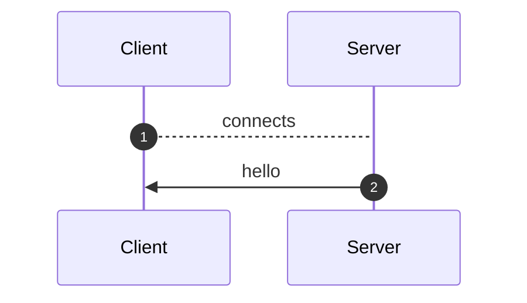
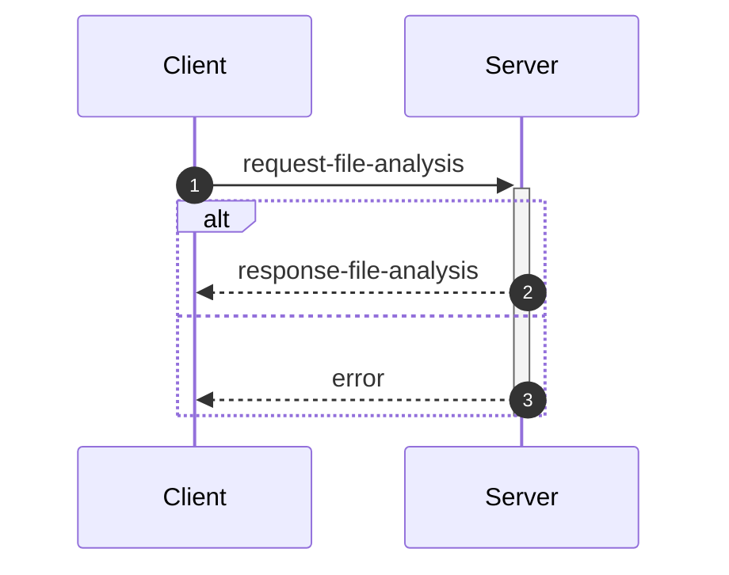
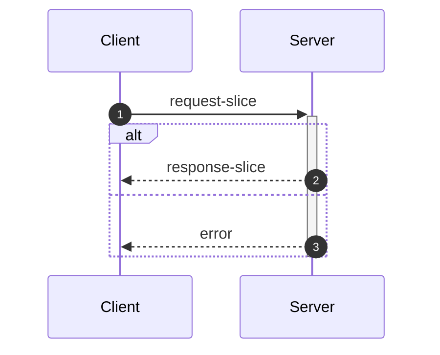
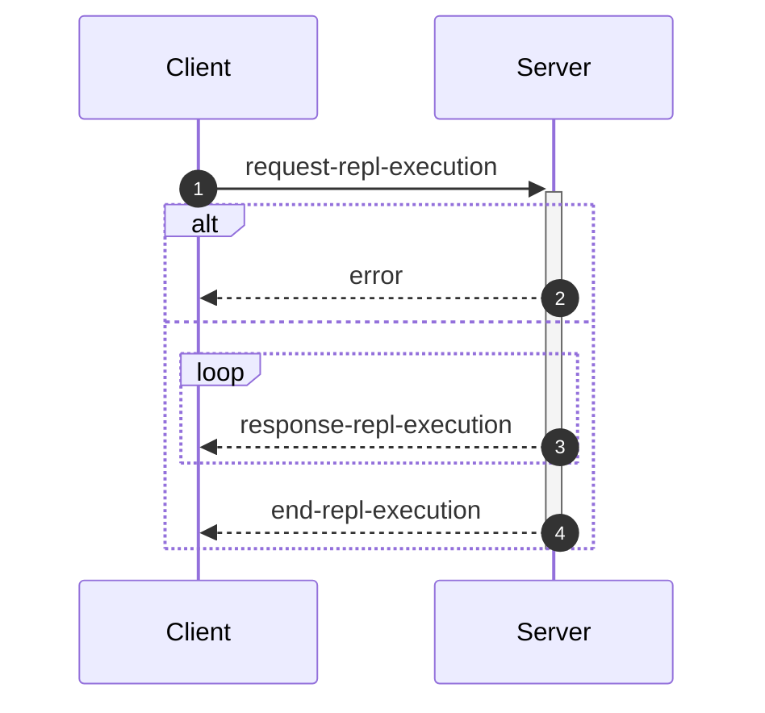

_<span title="an overview of flowR's interface">Generated</span> from '[wiki-interface.ts](https://github.com/flowr-analysis/flowr/tree/main/src/documentation/wiki-interface.ts "src/documentation/wiki-interface.ts")' on 2026-09-15, 21:18:21 UTC (v2.15.8, R v4.6.1), do not edit directly._

Although far from being as detailed as the in-depth explanation of [_flowR_](https://github.com/flowr-analysis/flowr/wiki/Core),
this wiki page explains how to interface with _flowR_ in more detail.
In general, command line arguments and other options provide short descriptions on hover over.

* [💻 Using the REPL](#using-the-repl)
* [⚙️ Configuring FlowR](#configuring-flowr)
* [⚒️ Writing Code](#writing-code)
* [💬 Communicating with the Server](#communicating-with-the-server)

<a id='using-the-repl'></a>
## 💻 Using the REPL

> [!NOTE]
> To execute arbitrary R commands with a repl request, _flowR_ has to be started explicitly with <span title="Description (Command Line Argument): Allow to access the underlying R session when using flowR (security warning: this allows the execution of arbitrary R code!)">`--r-session-access`</span>.
> Please be aware that this introduces a security risk and note that this relies on the [`r-shell` engine](https://github.com/flowr-analysis/flowr/wiki/Engines) .

Although primarily meant for users to explore,
there is nothing which forbids simply calling _flowR_ as a subprocess to use standard-in, -output, and -error
for communication (although you can access the REPL using the server as well,
with the [REPL Request](#message-request-repl-execution) message).

The read-eval-print loop&nbsp;(REPL) works relatively simple.
You can submit an expression (using <kbd>Enter</kbd>),
which is interpreted as an R&nbsp;expression by default but interpreted as a *command* if it starts with a colon (`:`).
The best command to get started with the REPL is <span title="Description (Repl Command): Show help information (aliases: :h, :?)">`:help`</span>.
Besides, you can leave the REPL either with the command <span title="Description (Repl Command): End the repl (aliases: :q, :exit)">`:quit`</span> or by pressing <kbd>Ctrl</kbd>+<kbd>C</kbd> twice.
When writing a *command*, you may press <kbd>Tab</kbd> to get a list of completions, if available.
Multiple commands can be entered in a single line by separating them with a semicolon (`;`), e.g. `:parse "x<-2"; :df*`.
If a command is given without R code, the REPL will re-use R code given in a previous command.
The prior example will hence return first the parsed AST of the program and then the dataflow graph for `"x <- 2"`.

> [!NOTE]
> If you develop flowR, you may want to launch the repl using the `npm run main-dev` command, this way, you get a non-minified version of flowR with debug information and hot-reloading of source files.

<details>
<summary>Available Commands</summary>

We currently offer the following commands (this with a `[*]` suffix are available with and without the star):

| Command | Description |
| ------- | ----------- |
| **<span title="Description (Repl Command): End the repl (aliases: :q, :exit)">:quit</span>** | End the repl (aliases: **:<span title="Alias of ':quit'. End the repl">q</span>**, **:<span title="Alias of ':quit'. End the repl">exit</span>**) |
| **<span title="Description (Repl Command): Execute the given code as R code. This requires the `--r-session-access` flag to be set and requires the r-shell engine. (aliases: :e, :r)">:execute</span>** | Execute the given code as R code. This requires the `--r-session-access` flag to be set and requires the r-shell engine. (aliases: **:<span title="Alias of ':execute'. Execute the given code as R code. This requires the `--r-session-access` flag to be set and requires the r-shell engine.">e</span>**, **:<span title="Alias of ':execute'. Execute the given code as R code. This requires the `--r-session-access` flag to be set and requires the r-shell engine.">r</span>**) |
| **<span title="Description (Repl Command): Get mermaid code for the control-flow graph of R code (aliases: :cfg, :cf)">:controlflow[*]</span>** | Get mermaid code for the control-flow graph of R code (star: Returns the URL to mermaid.live) (aliases: **:<span title="Alias of ':controlflow'. Get mermaid code for the control-flow graph of R code">cfg</span>**, **:<span title="Alias of ':controlflow'. Get mermaid code for the control-flow graph of R code">cf</span>**) |
| **<span title="Description (Repl Command): Get mermaid code for the control-flow graph with basic blocks (aliases: :cfgb, :cfb)">:controlflowbb[*]</span>** | Get mermaid code for the control-flow graph with basic blocks (star: Returns the URL to mermaid.live) (aliases: **:<span title="Alias of ':controlflowbb'. Get mermaid code for the control-flow graph with basic blocks">cfgb</span>**, **:<span title="Alias of ':controlflowbb'. Get mermaid code for the control-flow graph with basic blocks">cfb</span>**) |
| **<span title="Description (Repl Command): Get mermaid code for the dataflow graph (aliases: :d, :df)">:dataflow[*]</span>** | Get mermaid code for the dataflow graph (star: Returns the URL to mermaid.live) (aliases: **:<span title="Alias of ':dataflow'. Get mermaid code for the dataflow graph">d</span>**, **:<span title="Alias of ':dataflow'. Get mermaid code for the dataflow graph">df</span>**) |
| **<span title="Description (Repl Command): Get mermaid code for the normalized AST of R code (aliases: :n)">:normalize[*]</span>** | Get mermaid code for the normalized AST of R code (star: Returns the URL to mermaid.live) (alias: **:<span title="Alias of ':normalize'. Get mermaid code for the normalized AST of R code">n</span>**) |
| **<span title="Description (Repl Command): Get mermaid code for the simplified dataflow graph (aliases: :ds, :dfs)">:dataflowsimple[*]</span>** | Get mermaid code for the simplified dataflow graph (star: Returns the URL to mermaid.live) (aliases: **:<span title="Alias of ':dataflowsimple'. Get mermaid code for the simplified dataflow graph">ds</span>**, **:<span title="Alias of ':dataflowsimple'. Get mermaid code for the simplified dataflow graph">dfs</span>**) |
| **<span title="Description (Repl Command): Inspect and extend the signature database: `query` (identical to :query @signature), `info <name>` for where a function comes from (identical to :query @function-info), `add <path>` to mount another database/source, `download` to fetch the full-history database. (aliases: :sig)">:signature</span>** | Inspect and extend the signature database: `query` (identical to :query @signature), `info <name>` for where a function comes from (identical to :query @function-info), `add <path>` to mount another database/source, `download` to fetch the full-history database. (alias: **:<span title="Alias of ':signature'. Inspect and extend the signature database: `query` (identical to :query @signature), `info <name>` for where a function comes from (identical to :query @function-info), `add <path>` to mount another database/source, `download` to fetch the full-history database.">sig</span>**) |
| **<span title="Description (Repl Command): Just calculates the DFG, but only prints summary info (aliases: :d#, :df#)">:dataflowsilent</span>** | Just calculates the DFG, but only prints summary info (aliases: **:<span title="Alias of ':dataflowsilent'. Just calculates the DFG, but only prints summary info">d#</span>**, **:<span title="Alias of ':dataflowsilent'. Just calculates the DFG, but only prints summary info">df#</span>**) |
| **<span title="Description (Repl Command): Prints ASCII Art of the parsed, unmodified AST (aliases: :p)">:parse</span>** | Prints ASCII Art of the parsed, unmodified AST (alias: **:<span title="Alias of ':parse'. Prints ASCII Art of the parsed, unmodified AST">p</span>**) |
| **<span title="Description (Repl Command): Prints the version of flowR as well as the current version of R">:version</span>** | Prints the version of flowR as well as the current version of R
| **<span title="Description (Repl Command): Query the given R code (use 'help' for more information)">:query[*]</span>** | Query the given R code (use 'help' for more information) (star: Similar to query, but returns the output in json format.)
| **<span title="Description (Repl Command): Returns an ASCII representation of the dataflow graph (aliases: :df!)">:dataflowascii</span>** | Returns an ASCII representation of the dataflow graph (alias: **:<span title="Alias of ':dataflowascii'. Returns an ASCII representation of the dataflow graph">df!</span>**) |
| **<span title="Description (Repl Command): Returns summarization stats for the normalized AST (aliases: :n#)">:normalize#</span>** | Returns summarization stats for the normalized AST (alias: **:<span title="Alias of ':normalize#'. Returns summarization stats for the normalized AST">n#</span>**) |
| **<span title="Description (Repl Command): Show help information (aliases: :h, :?)">:help</span>** | Show help information (aliases: **:<span title="Alias of ':help'. Show help information">h</span>**, **:<span title="Alias of ':help'. Show help information">?</span>**) |

</details>

> [!TIP]
> 
> As indicated by the examples before, all REPL commands that operate on code keep track of the state.
> Hence, if you run a command like <span title="Description (Repl Command, starred version): Returns the URL to mermaid.live; Base Command: Get mermaid code for the dataflow graph (aliases: :d*, :df*)">`:dataflow*`</span> without providing R code,
> the REPL will re-use the R code provided in a previous command.
> Likewise, doing this will benefit from incrementality!
> If you request the dataflow graph with `:df* x <- 2 * y` and then want to see the parsed AST with `:parse`,
> the REPL will re-use previously obtained information and not re-parse the code again.
> 		

Generally, many commands offer shortcut versions in the REPL. Many queries, for example, offer a shortened format (see the example below).
Of special note, the [Config Query](https://github.com/flowr-analysis/flowr/wiki/%5BQuery%5D-Config)
can be used to also modify the currently active configuration of _flowR_ within the REPL (see the [wiki page](https://github.com/flowr-analysis/flowr/wiki/%5BQuery%5D-Config) for more information).

### Example: Retrieving the Dataflow Graph

To retrieve a URL to the [mermaid](https://mermaid.js.org/) diagram of the dataflow of a given expression,
use <span title="Description (Repl Command, starred version): Returns the URL to mermaid.live; Base Command: Get mermaid code for the dataflow graph (aliases: :d*, :df*)">`:dataflow*`</span> (or <span title="Description (Repl Command): Get mermaid code for the dataflow graph (aliases: :d, :df)">`:dataflow`</span> to get the mermaid code in the cli):

```shell
$ docker run -it --rm eagleoutice/flowr # or npm run flowr 
flowR repl v2.15.8, R grammar v14 (tree-sitter engine)
R> :dataflow* y <- 1 + x
```

<details>
<summary style='color:gray'>Output</summary>

```text
https://mermaid.live/view#base64:eyJjb2RlIjoiZmxvd2NoYXJ0IFREXG4gICAgMXt7XCJgKiM5MTtSTnVtYmVyIzkzOyogKioxKipcbiAgICAgICoxLjYqICgqKmlkOiAxKiopYFwifX1cbiAgICAyKFtcImAqIzkxO1JTeW1ib2wjOTM7KiAqKngqKlxuICAgICAgKjEuMTAqICgqKmlkOiAyKiopYFwiXSlcbiAgICAzW1tcImAqIzkxO1JCaW5hcnlPcCM5MzsqIGJhc2UjNTg7IzU4OyoqIzQzOyoqXG4gICAgICAqMS42LTEwKiAoKippZDogMyoqKVxuICAgIGFyZzogKDEsIDIpYFwiXV1cbiAgICBidWlsdC1pbjpfW1wiYEJ1aWx0LUluOlxuIzQzO2BcIl1cbiAgICBzdHlsZSBidWlsdC1pbjpfIHN0cm9rZTpncmF5LGZpbGw6Z3JheSxzdHJva2Utd2lkdGg6MnB4LG9wYWNpdHk6Ljg7XG4gICAgMFtcImAqIzkxO1JTeW1ib2wjOTM7KiAqKnkqKlxuICAgICAgKjEuMSogKCoqaWQ6IDAqKiwgdjogMylgXCJdXG4gICAgNFtbXCJgKiM5MTtSQmluYXJ5T3AjOTM7KiBiYXNlIzU4OyM1ODsqKiM2MDsjNDU7KipcbiAgICAgICoxLjEtMTAqICgqKmlkOiA0KiopXG4gICAgYXJnOiAoMCwgMylgXCJdXVxuICAgIGJ1aWx0LWluOl8tW1wiYEJ1aWx0LUluOlxuIzYwOyM0NTtgXCJdXG4gICAgc3R5bGUgYnVpbHQtaW46Xy0gc3Ryb2tlOmdyYXksZmlsbDpncmF5LHN0cm9rZS13aWR0aDoycHgsb3BhY2l0eTouODtcbiAgICAxIC0uLT58XCJmbG93XCJ8IDJcbiAgICBsaW5rU3R5bGUgMCBzdHJva2U6Z3JheSxjb2xvcjpncmF5O1xuICAgIDIgLS4tPnxcImZsb3dcInwgM1xuICAgIGxpbmtTdHlsZSAxIHN0cm9rZTpncmF5LGNvbG9yOmdyYXk7XG4gICAgMyAtLT58XCJyZWFkcywgYXJnXCJ8IDFcbiAgICAzIC0tPnxcInJlYWRzLCBhcmdcInwgMlxuICAgIDMgLS4tPnxcImZsb3dcInwgMFxuICAgIGxpbmtTdHlsZSA0IHN0cm9rZTpncmF5LGNvbG9yOmdyYXk7XG4gICAgMyAtLi0+fFwicmVhZHMsIGNhbGxzXCJ8IGJ1aWx0LWluOl9cbiAgICBsaW5rU3R5bGUgNSBzdHJva2U6Z3JheTtcbiAgICAwIC0tPnxcImRlZmluZWQtYnksIGZsb3dcInwgNFxuICAgIDAgLS0+fFwiZGVmaW5lZC1ieVwifCAzXG4gICAgNCAtLT58XCJyZWFkcywgYXJnXCJ8IDNcbiAgICA0IC0tPnxcInJldHVybnMsIGFyZ1wifCAwXG4gICAgNCAtLi0+fFwicmVhZHMsIGNhbGxzXCJ8IGJ1aWx0LWluOl8tXG4gICAgbGlua1N0eWxlIDEwIHN0cm9rZTpncmF5OyIsIm1lcm1haWQiOnsiYXV0b1N5bmMiOnRydWV9fQ==
```

Retrieve the dataflow graph of the expression `y <- 1 + x`. It looks like this:


```mermaid
flowchart LR
    1{{"`*#91;RNumber#93;* **1**
      *1.6* (**id: 1**)`"}}
    2(["`*#91;RSymbol#93;* **x**
      *1.10* (**id: 2**)`"])
    3[["`*#91;RBinaryOp#93;* base#58;#58;**#43;**
      *1.6-10* (**id: 3**)
    arg: (1, 2)`"]]
    built-in:_["`Built-In:
#43;`"]
    style built-in:_ stroke:gray,fill:gray,stroke-width:2px,opacity:.8;
    0["`*#91;RSymbol#93;* **y**
      *1.1* (**id: 0**, v: 3)`"]
    4[["`*#91;RBinaryOp#93;* base#58;#58;**#60;#45;**
      *1.1-10* (**id: 4**)
    arg: (0, 3)`"]]
    built-in:_-["`Built-In:
#60;#45;`"]
    style built-in:_- stroke:gray,fill:gray,stroke-width:2px,opacity:.8;
    1 -.->|"flow"| 2
    linkStyle 0 stroke:gray,color:gray;
    2 -.->|"flow"| 3
    linkStyle 1 stroke:gray,color:gray;
    3 -->|"reads, arg"| 1
    3 -->|"reads, arg"| 2
    3 -.->|"flow"| 0
    linkStyle 4 stroke:gray,color:gray;
    3 -.->|"reads, calls"| built-in:_
    linkStyle 5 stroke:gray;
    0 -->|"defined-by, flow"| 4
    0 -->|"defined-by"| 3
    4 -->|"reads, arg"| 3
    4 -->|"returns, arg"| 0
    4 -.->|"reads, calls"| built-in:_-
    linkStyle 10 stroke:gray;
```

<details>

<summary style="color:gray">R Code of the Dataflow Graph</summary>

The analysis ran (including parse and normalize, using the [tree-sitter](https://github.com/flowr-analysis/flowr/wiki/Engines) engine) within the generation environment. No [signature database](https://github.com/flowr-analysis/flowr/wiki/Signature-Database) is mounted for these generated graphs, so `library()` calls attach no package exports; base-R names are still qualified via the generated base-package store (e.g. `acf` as `stats::acf`). 
We encountered no unknown side effects during the analysis.

```r
y <- 1 + x
```

</details>

</details>

For small graphs like this, <span title="Description (Repl Command): Returns an ASCII representation of the dataflow graph (aliases: :df!)">`:dataflowascii`</span> also provides an ASCII representation directly in the REPL:

```shell
$ docker run -it --rm eagleoutice/flowr # or npm run flowr 
flowR repl v2.15.8, R grammar v14 (tree-sitter engine)
R> :df! y <- 1 + x
```

<details open>
<summary style='color:gray'>Output</summary>

```text
                        v<0>v
 c<4>c──────────────────| y |
 |<- |     ┌────────────v---v
 c---c     │
    │   c<3>c   0<1>0
    └───| + |───| 1 |───u<2>u
        c---c   0---0   | x |
           └────────────u---u
Edges:
3 -> 1: reads, arg          3 -> 2: reads, arg
3 -> 0: flows-to            1 -> 2: flows-to
2 -> 3: flows-to            4 -> 3: reads, arg
4 -> 0: returns, arg        0 -> 4: defined-by, flows-to
0 -> 3: defined-by
```

Retrieve the dataflow graph of the expression `y <- 1 + x` as ASCII art.

</details>

For the slicing with <span title="Description (Repl Command): Static backwards executable slicer for R">`:slicer`</span>, you have access to the same [magic comments](#slice-magic-comments) as with the [slice request](#message-request-slice).
Pass `--inline` to splice resolvable `source()` calls into the reconstruction so the slice is a single self-contained R text (the same as the static slice query's `inlineSources` flag).
See `--help` for more flags!

### Example: Interfacing with the File System

Many commands that allow for an R-expression (like <span title="Description (Repl Command, starred version): Returns the URL to mermaid.live; Base Command: Get mermaid code for the dataflow graph (aliases: :d*, :df*)">`:dataflow*`</span>) allow for a file as well
if the argument starts with `file://`.
If you are working from the root directory of the _flowR_ repository, the following gives you the parsed AST of the example file using the <span title="Description (Repl Command): Prints ASCII Art of the parsed, unmodified AST (aliases: :p)">`:parse`</span> command:

> **Watch mode**: Replace `file://` with `watch://` to enter watch mode.
> flowR runs the command immediately and then re-runs it every time the file (or any file inside the folder) changes.
> Enter any other command to leave watch mode.
> For example: `:df watch://analysis.R`

```shell
$ docker run -it --rm eagleoutice/flowr # or npm run flowr 
flowR repl v2.15.8, R grammar v14 (tree-sitter engine)
R> :parse file://test/testfiles/example.R
```

<details>
<summary style='color:gray'>Output</summary>

```text
File: test/testfiles/example.R

program
├ binaryoperator
│ ├ identifier "sum" (1:1─4)
│ ├ <- "<-" (1:5─7)
│ ╰ float "0" (1:8─9)
├ binaryoperator
│ ├ identifier "product" (2:1─8)
│ ├ <- "<-" (2:9─11)
│ ╰ float "1" (2:12─13)
├ binaryoperator
│ ├ identifier "w" (3:1─2)
│ ├ <- "<-" (3:3─5)
│ ╰ float "7" (3:6─7)
├ binaryoperator
│ ├ identifier "N" (4:1─2)
│ ├ <- "<-" (4:3─5)
│ ╰ float "10" (4:6─8)
├ forstatement
│ ├ for "for" (6:1─4)
│ ├ ( "(" (6:5─6)
│ ├ identifier "i" (6:6─7)
│ ├ in "in" (6:8─10)
│ ├ binaryoperator
│ │ ├ float "1" (6:11─12)
│ │ ├ : ":" (6:12─13)
│ │ ╰ parenthesizedexpression
│ │   ├ ( "(" (6:13─14)
│ │   ├ binaryoperator
│ │   │ ├ identifier "N" (6:14─15)
│ │   │ ├ - "-" (6:15─16)
│ │   │ ╰ float "1" (6:16─17)
│ │   ╰ ) ")" (6:17─18)
│ ├ ) ")" (6:18─19)
│ ╰ bracedexpression
│   ├ { "{" (6:20─21)
│   ├ binaryoperator
│   │ ├ identifier "sum" (7:3─6)
│   │ ├ <- "<-" (7:7─9)
│   │ ╰ binaryoperator
│   │   ├ binaryoperator
│   │   │ ├ identifier "sum" (7:10─13)
│   │   │ ├ + "+" (7:14─15)
│   │   │ ╰ identifier "i" (7:16─17)
│   │   ├ + "+" (7:18─19)
│   │   ╰ identifier "w" (7:20─21)
│   ├ binaryoperator
│   │ ├ identifier "product" (8:3─10)
│   │ ├ <- "<-" (8:11─13)
│   │ ╰ binaryoperator
│   │   ├ identifier "product" (8:14─21)
│   │   ├  "" (8:22─23)
│   │   ╰ identifier "i" (8:24─25)
│   ╰ } "}" (9:1─2)
├ call
│ ├ identifier "cat" (11:1─4)
│ ╰ arguments
│   ├ ( "(" (11:4─5)
│   ├ argument
│   │ ╰ string
│   │   ├ " "\"" (11:5─6)
│   │   ├ stringcontent "Sum:" (11:6─10)
│   │   ╰ " "\"" (11:10─11)
│   ├ comma "," (11:11─12)
│   ├ argument
│   │ ╰ identifier "sum" (11:13─16)
│   ├ comma "," (11:16─17)
│   ├ argument
│   │ ╰ string
│   │   ├ " "\"" (11:18─19)
│   │   ├ stringcontent
│   │   │ ╰ escapesequence "\\n" (11:19─21)
│   │   ╰ " "\"" (11:21─22)
│   ╰ ) ")" (11:22─23)
╰ call
  ├ identifier "cat" (12:1─4)
  ╰ arguments
    ├ ( "(" (12:4─5)
    ├ argument
    │ ╰ string
    │   ├ " "\"" (12:5─6)
    │   ├ stringcontent "Product:" (12:6─14)
    │   ╰ " "\"" (12:14─15)
    ├ comma "," (12:15─16)
    ├ argument
    │ ╰ identifier "product" (12:17─24)
    ├ comma "," (12:24─25)
    ├ argument
    │ ╰ string
    │   ├ " "\"" (12:26─27)
    │   ├ stringcontent
    │   │ ╰ escapesequence "\\n" (12:27─29)
    │   ╰ " "\"" (12:29─30)
    ╰ ) ")" (12:30─31)
```

Retrieve the parsed AST of the example file.

<details>

<summary>File Content</summary>

```r
sum <- 0
product <- 1
w <- 7
N <- 10

for (i in 1:(N-1)) {
  sum <- sum + i + w
  product <- product * i
}

cat("Sum:", sum, "\n")
cat("Product:", product, "\n")
```

</details>

As _flowR_ directly transforms this AST the output focuses on being human-readable instead of being machine-readable.
		
</details>

### Example: Run a Query

You can run any query supported by _flowR_ using the <span title="Description (Repl Command): Query the given R code (use 'help' for more information)">`:query`</span> command.
For example, to obtain the shapes of all data frames in a given piece of code, you can run:

```shell
$ docker run -it --rm eagleoutice/flowr # or npm run flowr 
flowR repl v2.15.8, R grammar v14 (tree-sitter engine)
R> :query @absint df-shape "x <- data.frame(a = 1:10, b = 1:10)\ny <- x$a"
```

<details open>
<summary style='color:gray'>Output</summary>

```text
Query: absint (1 ms)
```

Retrieve the shapes of all data frames in the given code.

</details>

To run the linter on a file, you can use (in this example, we just issue the `dead-code` linter on a small piece of code):

```shell
$ docker run -it --rm eagleoutice/flowr # or npm run flowr 
flowR repl v2.15.8, R grammar v14 (tree-sitter engine)
R> :query @linter rules:dead-code "if(FALSE) x <- 2"
```

<details open>
<summary style='color:gray'>Output</summary>

```text
Query: linter (3 ms)
   ╰ Dead Code (dead-code):
       ╰ certain:
           ╰ Code at 1.11-16
```

Run the linter on the given code, with only the `dead-code` rule enabled.

</details>

For more information on the available queries, please check out the [Query API](https://github.com/flowr-analysis/flowr/wiki/Query-API).

<a id='configuring-flowr'></a>
## ⚙️ Configuring FlowR

When running _flowR_, you may want to specify some behaviors with a dedicated configuration file.
By default, flowR looks for a file named `flowr.json` in the current working directory (or any higher directory).
You can also specify a different file with <span title="Description (Command Line Argument): The name of the configuration file to use">`--config-file`</span> or pass the configuration inline using <span title="Description (Command Line Argument): The flowR configuration to use, as a JSON string">`--config-json`</span>.
To inspect the current configuration, you can run flowr with the <span title="Description (Command Line Argument): Run with verbose logging (will be passed to the corresponding script)">`--verbose`</span> flag, or use the `config` [Query](https://github.com/flowr-analysis/flowr/wiki/Query-API).
Within the REPL this works by running the following:

```shell
:query @config
```

To work with the <a href="https://github.com/flowr-analysis/flowr/tree/main/src/config.ts#L108"><code><span title="The configuration file format for flowR.">FlowrConfig</span></code></a> you can use the provided helper objects alongside its methods like
<a href="https://github.com/flowr-analysis/flowr/tree/main/src/config.ts#L862"><code><span title="Creates a new flowr config that has the updated values.">FlowrConfig::<b>amend</b></span></code></a>.
The schema below documents every option; the ones you most likely want are:

- <a href="https://github.com/flowr-analysis/flowr/wiki/Interface#configuring-flowr" title="Configuration Option (boolean): Whether source calls should be ignored, causing {@link processSourceCall}&#39;s behavior to be skipped.">ignoreSourceCalls</a>: ignore source calls when analyzing the code, i.e., ignore the inclusion of other files.
- <a href="https://github.com/flowr-analysis/flowr/wiki/Interface#configuring-flowr" title="Configuration Option (boolean): Whether load calls should be ignored, causing {@link processLoadCall}&#39;s behavior to be skipped.">ignoreLoadCalls</a>: ignore load calls when analyzing the code, i.e., ignore the loading of r-data files.
- <a href="https://github.com/flowr-analysis/flowr/wiki/Interface#configuring-flowr" title="Configuration Option (object): Do you want to overwrite (parts) of the builtin definition?">semantics.environment.overwriteBuiltIns</a>: overwrite _flowR_'s handling of built-in functions, or clear the preset definitions entirely.
  See [Configure BuiltIn Semantics](#configure-builtin-semantics) for more information.
- <a href="https://github.com/flowr-analysis/flowr/wiki/Interface#configuring-flowr" title="Configuration Option (string): How to resolve variables and their values. (one of &quot;disabled&quot;, &quot;alias&quot;, &quot;builtin&quot;)">solver.variables</a>: how to resolve variables and their values (`disabled`, `alias`, `builtin`).
- <a href="https://github.com/flowr-analysis/flowr/wiki/Interface#configuring-flowr" title="Configuration Option (array): The engine or set of engines to use for interacting with R code. An empty array means all available engines will be used.">engines</a> and <a href="https://github.com/flowr-analysis/flowr/wiki/Interface#configuring-flowr" title="Configuration Option (string): The default engine to use for interacting with R code. If this is undefined, an arbitrary engine from the specified list will be used. (one of &quot;tree-sitter&quot;, &quot;r-shell&quot;)">defaultEngine</a>: the engines used to interact with R code, see the [Engines wiki page](https://github.com/flowr-analysis/flowr/wiki/Engines).
- <a href="https://github.com/flowr-analysis/flowr/wiki/Interface#configuring-flowr" title="Configuration Option (array): Files a framework loads on its own, without any source() call (e.g. global.R in a shiny app), in the order they are loaded; flowR orders the matching project files accordingly and analyzes them as one program. Entries are case-insensitive globs matched against the file path, a plain name matches any file with that name, and entries matching no project file are warned about. Usually set per project kind via specializeConfig.">project.implicitSources</a>: the files a framework loads without any `source()` call, in the order in which they are
  loaded. Entries are globs (e.g. `R/*.R`) matched against the file path ignoring capitalization; one matching no file is reported.
- <a href="https://github.com/flowr-analysis/flowr/wiki/Interface#configuring-flowr" title="Configuration Option (object): Overwrite (parts of) the configuration depending on the project kind flowR detects, e.g. to give a shiny app its implicit sources.">specializeConfig</a>: overwrite (parts of) the configuration depending on the kind of project _flowR_ detects
  (e.g. `shiny-app`), which is how a shiny app gets its implicit sources by default. What you configure directly wins.
- <a href="https://github.com/flowr-analysis/flowr/wiki/Interface#configuring-flowr" title="Configuration Option (string): Overwrite the project kind flowR would otherwise infer from the analyzed files, e.g. when auto-detection guesses wrong. (one of &quot;package&quot;, &quot;script&quot;, &quot;shiny-app&quot;, &quot;notebook&quot;, &quot;project&quot;, &quot;unknown&quot;)">project.useProjectType</a>: skip that detection and force a project kind yourself, when auto-detection guesses wrong.
- <a href="https://github.com/flowr-analysis/flowr/wiki/Interface#configuring-flowr" title="Configuration Option (array): The default plugins to load when creating a new instance of FlowrAnalyzer">defaultPlugins</a> and <a href="https://github.com/flowr-analysis/flowr/wiki/Interface#configuring-flowr" title="Configuration Option (array): The plugins to load in REPL mode">repl.plugins</a>: the plugins to load for a new <a href="https://github.com/flowr-analysis/flowr/tree/main/src/project/flowr-analyzer.ts#L202"><code><span title="Central class for conducting analyses with FlowR. Use the FlowrAnalyzerBuilder to create a new instance. If you want the original pattern of creating a pipeline and running all steps, you can still do this with FlowrAnalyzer#runFull . To inspect the context of the analyzer, use FlowrAnalyzer#inspectContext (if you are a plugin and need to modify it, use FlowrAnalyzer#context instead).">FlowrAnalyzer</span></code></a> and in the REPL
  (use `flowr:default` to reference the former).

So you can configure _flowR_ by adding a file like the following:

<details>

<summary>Example Configuration File</summary>

```json
{
  "ignoreSourceCalls": true,
  "ignoreLoadCalls": true,
  "semantics": {
    "environment": {
      "overwriteBuiltIns": {
        "definitions": [
          {
            "type": "function",
            "names": [
              "foo"
            ],
            "processor": "builtin:assign",
            "config": {}
          }
        ]
      }
    }
  },
  "defaultPlugins": [
    "file:description",
    "versions:description"
  ],
  "repl": {
    "quickStats": false,
    "dfProcessorHeat": false,
    "hints": true,
    "plugins": [
      "flowr:default"
    ]
  },
  "project": {
    "resolveUnknownPathsOnDisk": true,
    "implicitSources": [
      "global.R",
      "app.R"
    ]
  },
  "linter": {
    "disabledRules": []
  },
  "specializeConfig": {
    "shiny-app": {
      "project": {
        "implicitSources": [
          "global.R",
          "ui.R",
          "server.R",
          "app.R"
        ]
      }
    }
  },
  "engines": [
    {
      "type": "r-shell"
    }
  ],
  "solver": {
    "variables": "alias",
    "evalStrings": true,
    "trackEnvironments": true,
    "sigdb": {
      "enabled": true,
      "loadProjectDependencies": true,
      "eagerlyLoad": false,
      "eagerlyLoadExports": false,
      "linkBaseR": false,
      "linkDescriptionDependencies": false
    },
    "resolveSource": {
      "dropPaths": "no",
      "ignoreCapitalization": true,
      "inferWorkingDirectory": "active-script",
      "searchPath": []
    },
    "instrument": {},
    "slicer": {
      "threshold": 50
    }
  },
  "abstractInterpretation": {
    "wideningThreshold": 4,
    "followCalls": true,
    "dataFrame": {
      "maxColNames": 20,
      "readLoadedData": {
        "readExternalFiles": true,
        "maxReadLines": 1000000
      }
    }
  },
  "incremental": {
    "alwaysIncremental": false,
    "parsing": {
      "activated": false,
      "heuristics": {
        "activated": true,
        "mtime": true,
        "linesFrom": 500,
        "bytesFrom": 50000,
        "alwaysWithEdits": false,
        "minFiles": 1
      }
    }
  },
  "gas": {
    "thresholds": {
      "memory": {
        "problematic": 0.7,
        "critical": 0.9
      },
      "timeMs": {
        "problematic": 100000,
        "critical": 120000
      }
    },
    "features": {}
  }
}
```

</details>

<details>
<a id='configure-builtin-semantics'></a>
<summary>Configure Built-In Semantics</summary>

`semantics/environment/overwriteBuiltins` accepts two keys:

- `loadDefaults` (boolean, initially `true`): If set to `true`, the default built-in definitions are loaded before applying the custom definitions. Setting this flag to `false` explicitly disables the loading of the default definitions.
- `definitions` (array, initially empty): Allows to overwrite or define new built-in elements. Each object within must have a `type` which is one of the below. Furthermore, they may define a string array of `names` which specifies the identifiers to bind the definitions to. You may use `assumePrimitive` to specify whether _flowR_ should assume that this is a primitive non-library definition (so you probably just do not want to specify the key).

  | Type            | Description                                                                                                                                                                                                                                                                                              | Example                                                                                                    |
  | --------------- | -------------------------------------------------------------------------------------------------------------------------------------------------------------------------------------------------------------------------------------------------------------------------------------------------------- | ---------------------------------------------------------------------------------------------------------- |
  | `constant`    | Additionally allows for a `value` this should resolve to.                                                                                                                                                                                                                                                | `{ type: 'constant', names: ['NULL', 'NA'],  value: null }`                                                |
  | `function`    | Is a rather flexible way to define and bind built-in functions. For the time, we do not have extensive documentation to cover all the cases, so please either consult the sources with the `default-builtin-config.ts` or open a [new issue](https://github.com/flowr-analysis/flowr/issues/new/choose). | `{ type: 'function', names: ['next'], processor: 'builtin:d', config: { cfg: ExitPointType.Next } }` |
  | `replacement` | A comfortable way to specify replacement functions like `$<-` or `names<-`. `suffixes` describes the... suffixes to attach automatically. | `{ type: 'replacement', suffixes: ['<-', '<<-'], names: ['[', '[['] }` |

</details>

<details>

<summary style='color:gray'>Full Configuration-File Schema</summary>

- _The configuration file format for flowR._ (object)
    - **logLevel** [optional] _flowR's global minimum log level, applied when the config is loaded._ (string)
        Only allows: 'silly', 'trace', 'debug', 'info', 'warn', 'error', 'fatal'
    - **ignoreSourceCalls** [optional] _Whether source calls should be ignored, causing {@link processSourceCall}'s behavior to be skipped._ (boolean)
    - **ignoreLoadCalls** [optional] _Whether load calls should be ignored, causing {@link processLoadCall}'s behavior to be skipped._ (boolean)
    - **semantics** _Configure language semantics and how flowR handles them._ (object)
        - **environment** [optional] _Semantics regarding how to handle the R environment._ (object)
            - **overwriteBuiltIns** [optional] _Do you want to overwrite (parts) of the builtin definition?_ (object)
                - **loadDefaults** [optional] _Should the default configuration still be loaded?_ (boolean)
                - **definitions** [optional] _The definitions to load/overwrite._ (array)
                Valid item types:
                    - (object)
    - **defaultPlugins** [optional] _The default plugins to load when creating a new instance of FlowrAnalyzer_ (array)
    Valid item types:
        - (alternatives)
            - (string)
            - (array)
    - **repl** _Configuration options for the REPL._ (object)
        - **quickStats** [optional] _Whether to show quick stats in the REPL after each evaluation._ (boolean)
        - **dfProcessorHeat** [optional] _This instruments the dataflow processors to count how often each processor is called._ (boolean)
        - **hints** [optional] _Whether to show dim inline hints on the empty prompt (automatically disabled on non-interactive terminals)._ (boolean)
        - **plugins** [optional] _The plugins to load in REPL mode_ (array)
        Valid item types:
            - (alternatives)
                - (string)
                - (array)
        - **autoUseFileProtocol** [optional] _Prepend the file protocol to a repl input that looks like a path, instead of only warning about it._ (boolean)
        - **queryStats** [optional] _Whether `:query` closes with the line stating how long the queries took (`:query*` never prints it)._ (boolean)
        - **showPlugins** [optional] _Whether `:version` grays out the plugins that did not activate during the last analysis._ (boolean)
    - **project** _Project specific configuration options._ (object)
        - **resolveUnknownPathsOnDisk** [optional] _Whether to resolve unknown paths loaded by the r project disk when trying to source/analyze files._ (boolean)
        - **failOnInaccessiblePath** [optional] _Whether a directory that cannot be traversed during file discovery (e.g. due to permissions) aborts the analysis; when false (the default) such paths are logged and skipped._ (boolean)
        - **basePackages** [optional] _The packages considered part of R itself (base and recommended); if unset, flowR uses its built-in list._ (array)
        Valid item types:
            - (string)
        - **implicitSources** [optional] _Files a framework loads on its own, without any source() call (e.g. global.R in a shiny app), in the order they are loaded; flowR orders the matching project files accordingly and analyzes them as one program. Entries are case-insensitive globs matched against the file path, a plain name matches any file with that name, and entries matching no project file are warned about. Usually set per project kind via specializeConfig._ (array)
        Valid item types:
            - (string)
        - **useProjectType** [optional] _Overwrite the project kind flowR would otherwise infer from the analyzed files, e.g. when auto-detection guesses wrong._ (string)
            Only allows: 'package', 'script', 'shiny-app', 'notebook', 'project', 'unknown'
        - **assumeImplicitEcho** [optional] _Whether the top level of the analyzed code is echoed, so that every visible result printed there is collected as an output by the dependencies query (default true, false for a package)._ (boolean)
        - **discovery** [optional] _Scoping options for the default project discovery._ (object)
            - **full** [optional] _Collect every file below the project root (greedy) instead of only the files the detected project kind needs (default false)._ (boolean)
            - **perKind** [optional] _Per-kind include/exclude glob overrides layered on the default scoping._ (object)
            - **ignore** [optional] _Case-insensitive globs that drop matching files from the intelligent discovery, regardless of kind (e.g. .Renviron to ignore environment files)._ (array)
            Valid item types:
                - (string)
        - **classification** [optional] _Overrides for the signals flowR uses to classify the project kind._ (object)
            - **shinyDescriptionTypes** [optional] _DESCRIPTION Type: values that mark a shiny app._ (array)
            Valid item types:
                - (string)
            - **shinyEntryFiles** [optional] _File names a shiny app is assembled from._ (array)
            Valid item types:
                - (string)
            - **shinyUsagePattern** [optional] _Regex source evidencing shiny usage in an entry file._ (string)
            - **notebookExtensions** [optional] _File extensions marking a notebook._ (array)
            Valid item types:
                - (string)
    - **linter** _Linter configuration options._ (object)
        - **disabledRules** _Linting rule names excluded from the default rule set (a rule requested explicitly via a linter query still runs). Usually set per project kind via specializeConfig._ (array)
        Valid item types:
            - (string)
    - **inputSources** [optional] _Further frameworks the input-sources analysis should know about; entries are added to flowR's defaults._ (object)
        - **pure** [optional] _Functions that only pass the constantness of their arguments on._ (array)
        Valid item types:
            - (string)
        - **param** [optional] _Functions whose result is a 'param' input._ (array)
        Valid item types:
            - (string)
        - **file** [optional] _Functions whose result is a 'file' input._ (array)
        Valid item types:
            - (string)
        - **tempfile** [optional] _Functions whose result is a 'tempfile' input._ (array)
        Valid item types:
            - (string)
        - **glob** [optional] _Functions whose result is a 'glob' input._ (array)
        Valid item types:
            - (string)
        - **net** [optional] _Functions whose result is a 'net' input._ (array)
        Valid item types:
            - (string)
        - **rand** [optional] _Functions whose result is a 'rand' input._ (array)
        Valid item types:
            - (string)
        - **system** [optional] _Functions whose result is a 'system' input._ (array)
        Valid item types:
            - (string)
        - **ffi** [optional] _Functions whose result is a 'ffi' input._ (array)
        Valid item types:
            - (string)
        - **lang** [optional] _Functions whose result is a 'lang' input._ (array)
        Valid item types:
            - (string)
        - **options** [optional] _Functions whose result is a 'options' input._ (array)
        Valid item types:
            - (string)
        - **cmdline** [optional] _Functions whose result is a 'cmdline' input._ (array)
        Valid item types:
            - (string)
        - **user** [optional] _Functions whose result is a 'user' input._ (array)
        Valid item types:
            - (string)
        - **const** [optional] _Functions whose result is a 'const' input._ (array)
        Valid item types:
            - (string)
        - **scope** [optional] _Functions whose result is a 'scope' input._ (array)
        Valid item types:
            - (string)
        - **dconst** [optional] _Functions whose result is a 'dconst' input._ (array)
        Valid item types:
            - (string)
        - **unknown** [optional] _Functions whose result is a 'unknown' input._ (array)
        Valid item types:
            - (string)
        - **linkedObjects** [optional] _Objects a framework provides without a definition in the code, e.g. shiny's input._ (array)
        Valid item types:
            - (object)
        - **linkedEntryPoints** [optional] _Calls that hand a function to a framework, which binds its objects to the parameters by position._ (array)
        Valid item types:
            - (object)
    - **specializeConfig** [optional] _Overwrite (parts of) the configuration depending on the project kind flowR detects, e.g. to give a shiny app its implicit sources._ (object)
    - **engines** _The engine or set of engines to use for interacting with R code. An empty array means all available engines will be used._ (array)
    Valid item types:
        - (alternatives)
            - _The configuration for the tree sitter engine._ (object)
                - **type** [required] _Use the tree sitter engine._ (string)
                    Only allows: 'tree-sitter'
                - **wasmPath** [optional] _The path to the tree-sitter-r WASM binary to use. If this is undefined, this uses the default path._ (string)
                - **treeSitterWasmPath** [optional] _The path to the tree-sitter WASM binary to use. If this is undefined, this uses the default path._ (string)
                - **lax** [optional] _Whether to use the lax parser for parsing R code (allowing for syntax errors). If this is undefined, the strict parser will be used._ (boolean)
            - _The configuration for the R shell engine._ (object)
                - **type** [required] _Use the R shell engine._ (string)
                    Only allows: 'r-shell'
                - **rPath** [optional] _The path to the R executable to use. If this is undefined, this uses the default path._ (string)
                - **pipeBind** [optional] _Whether to enable R's experimental pipe-bind operator "=>" by setting _R_USE_PIPEBIND_ for the R session (default false); R itself keeps this off by default, as it is experimental and has never shipped in a release version of R._ (boolean)
    - **defaultEngine** [optional] _The default engine to use for interacting with R code. If this is undefined, an arbitrary engine from the specified list will be used._ (string)
        Only allows: 'tree-sitter', 'r-shell'
    - **solver** _How to resolve constants, constraints, cells, ..._ (object)
        - **variables** _How to resolve variables and their values._ (string)
            Only allows: 'disabled', 'alias', 'builtin'
        - **evalStrings** _Should we include eval(parse(text="...")) calls in the dataflow graph?_ (boolean)
        - **trackEnvironments** [optional] _Track user-created environments (new.env, assign/get/local with envir=, dollar-assign, attach). When false, all envir-style calls fall through conservatively._ (boolean)
        - **sigdb** _Resolving library exports from a signature database._ (object)
            - **enabled** [optional] _Resolve library()/use() exports from a signature database (default true); when false no database is consulted._ (boolean)
            - **loadProjectDependencies** [optional] _Load the project's declared dependencies from its metadata files (DESCRIPTION Imports/Depends, rproject.toml, uvr.toml, renv.lock, rv.lock, uvr.lock) (default true); when false these files are not read for dependencies._ (boolean)
            - **eagerlyLoad** [optional] _Parse the database up front rather than on the first package load (default false, ignored if disabled)._ (boolean)
            - **eagerlyLoadExports** [optional] _Add a vertex for every export on load rather than on demand (default false); keeps the dataflow graph small._ (boolean)
            - **assumedRVersion** [optional] _R version assumed when resolving versioned (base-R) exports: a pin like "4.5" or "auto" to detect the installed R (default "auto")._ (string)
            - **linkBaseR** [optional] _Eagerly attach base-R namespaces so bare base calls resolve without library() (default false)._ (boolean)
            - **linkBaseRCalls** [optional] _Add a lightweight Reads edge from a bare base-R call to its signature-database function vertex (default false; base-R qualification is edge-free otherwise)._ (boolean)
            - **linkPackageCalls** [optional] _Add a lightweight Reads edge from a resolved package call to its signature-database function vertex (default false)._ (boolean)
            - **linkDescriptionDependencies** [optional] _Eagerly attach the namespaces of the project's declared DESCRIPTION dependencies (Imports/Depends) so their exports resolve without an explicit library() (default false)._ (boolean)
            - **warmInBackground** [optional] _Decompress the hot shards (base + most-downloaded) in a background task on startup so the first library() lookup is warm (default false; for long-running servers/REPLs)._ (boolean)
            - **additionalPaths** [optional] _Extra directories or bundle/manifest files searched for signature databases (alongside the shipped default and $FLOWR_SIGDB_DIR); a downloaded full-history bundle placed here is mounted automatically._ (array)
            Valid item types:
                - (string)
            - **downloadRepo** [optional] _GitHub owner/repo the full-history bundle is downloaded from via ":signature download" (default "flowr-analysis/flowr", release tag "sigdb-v<flowR-version>")._ (string)
            - **autoSync** [optional] _On startup, re-download shards whose committed sigdb.remote.json hash no longer matches the cache, in the background (default false; opt-in network sync after a git pull)._ (boolean)
            - **installedLibrary** [optional] _Recovering packages no signature database knows from the copy installed on this machine._ (object)
                - **enabled** [required] _Recover packages no signature database knows from their installed copy (default false)._ (boolean)
                - **paths** [optional] _Library directories to search; when empty they are discovered from the environment and the project._ (array)
                Valid item types:
                    - (string)
                - **useEnvironment** [optional] _Search the libraries R_LIBS_USER/R_LIBS/R_LIBS_SITE name (default true)._ (boolean)
                - **useProjectLibrary** [optional] _Search a project-local renv/packrat library (default true)._ (boolean)
                - **maxDepth** [optional] _How far to descend into the nested layout of a project-local library (default 3)._ (number)
                - **packages** [optional] _Only recover packages whose name matches one of these regular expressions; empty means any._ (array)
                Valid item types:
                    - (string)
            - **blobCacheBudgetMb** [optional] _How many MiB of decoded package blobs every open bundle may hold together (default 16)._ (number)
            - **versionSelection** [optional] _When a project constrains a dependency, resolve to the newest (default), oldest, or system-installed version satisfying it; system needs R and falls back to newest. Base-R packages always resolve against the assumed R version._ (string)
                Only allows: 'newest', 'oldest', 'system'
            - **versionOverrides** [optional] _Force an exact version for specific packages (name -> version), overriding both the project constraint and the versionSelection policy (default {})._ (object)
        - **versionManagement** _Policies for reasoning about dependency versions._ (object)
            - **linkedVersionGroups** [optional] _Groups of packages that must resolve to the same version; version guessing intersects each group so its members stay mutually compatible (default [])._ (array)
            Valid item types:
                - (array)
                Valid item types:
                    - (string)
        - **assumeAttachedPackages** [optional] _Packages to treat as attached without a `library()` call, so what the built-in configuration states about them applies to the analyzed code. The base packages R attaches on startup already resolve without it._ (array)
        Valid item types:
            - (string)
        - **transitiveSideEffectRounds** [optional] _How many rounds the transitive side-effect fixpoint may run before it is cut off (default 32); the propagation stops on its own as soon as a round adds nothing._ (number)
        - **maxOverlayDepth** [optional] _How many binding overlays may stack on one environment frame before a write flattens them (default 4); a pure performance knob, trading lookup cost against copy cost without changing any result._ (number)
        - **instrument** (object)
            - **dataflowExtractors** [optional] _These keys are only intended for use within code, allowing to instrument the dataflow analyzer!_ (any)
        - **resolveSource** [optional] _If lax source calls are active, flowR searches for sourced files much more freely, based on the configurations you give it. This option is only in effect if `ignoreSourceCalls` is set to false._ (object)
            - **dropPaths** _Allow to drop the first or all parts of the sourced path, if it is relative._ (string)
                Only allows: 'no', 'once', 'all'
            - **ignoreCapitalization** _Search for filenames matching in the lowercase._ (boolean)
            - **inferWorkingDirectory** _Try to infer the working directory from the main or any script to analyze._ (string)
                Only allows: 'no', 'main-script', 'active-script', 'any-script'
            - **searchPath** _Additionally search in these paths._ (array)
            Valid item types:
                - (string)
            - **repeatedSourceLimit** [optional] _How often the same file can be sourced within a single run? Please be aware: in case of cyclic sources this may not reach a fixpoint so give this a sensible limit._ (number)
            - **applyReplacements** _Provide name replacements for loaded files_ (array)
            Valid item types:
                - (object)
            - **assumeFilesExist** [optional] _Assume a sourced file is always there, making what it defines certain instead of conditional on the source call._ (boolean)
        - **slicer** [optional] _The configuration for the slicer._ (object)
            - **threshold** [optional] _The maximum number of iterations to perform on a single function call during slicing._ (number)
            - **autoExtend** [optional] _If set, the slicer will gain an additional post-pass._ (boolean)
    - **abstractInterpretation** _The configuration options for abstract interpretation._ (object)
        - **wideningThreshold** _The threshold for the number of visitations of a node at which widening should be performed to ensure the termination of the fixpoint iteration._ (number)
        - **followCalls** _Whether the abstract interpretation is interprocedural, i.e. whether it steps into the functions a call may dispatch to._ (boolean)
        - **dataFrame** _The configuration of the shape inference for data frames._ (object)
            - **maxColNames** _The maximum number of columns names to infer for data frames before over-approximating the column names to top._ (number)
            - **readLoadedData** _Configuration options for reading data frame shapes from loaded external data files, such as CSV files._ (object)
                - **readExternalFiles** _Whether data frame shapes should be extracted from loaded external files, such as CSV files._ (boolean)
                - **maxReadLines** _The maximum number of lines to read when extracting data frame shapes from loaded files, such as CSV files._ (number)
    - **incremental** (object)
        - **alwaysIncremental** _Always take the incremental path, regardless of heuristics._ (boolean)
        - **parsing** (object)
            - **activated** _If set, incremental parsing will be used._ (boolean)
            - **heuristics** (object)
                - **activated** [optional] _If set, the heuristics for incremental parsing will be used._ (boolean)
                - **mtime** [optional] _Skip reparsing entirely if the file's modification time is unchanged since the last parse._ (boolean)
                - **linesFrom** [optional] _Only consider incremental parsing for files with at least this many lines._ (number)
                - **bytesFrom** [optional] _Only consider incremental parsing for files with at least this many bytes._ (number)
                - **alwaysWithEdits** [optional] _Always take the incremental path whenever there is a computed edit region, regardless of the other thresholds._ (boolean)
                - **minFiles** [optional] _Only apply these heuristics once the project has at least this many files loaded._ (number)
    - **gas** [optional] _Resource-usage guard (gas) configuration. All feature factors default to 0 (disabled). See https://github.com/flowr-analysis/flowr/wiki/Core#gas-resource-guard._ (object)
        - **thresholds** [optional] _Thresholds for all gas checks (scaled by per-feature factor), boundable per feature._ (object)
            - **memory** [optional] _Heap-usage fraction thresholds (0-1), either shared or given per feature key (with `default` covering the rest)._ (object)
                - **problematic** [optional] _Heap fraction (0-1) above which Problematic is returned, for every feature without an entry of its own._ (number)
                - **critical** [optional] _Heap fraction (0-1) above which Critical is returned, for every feature without an entry of its own._ (number)
            - **timeMs** [optional] _Elapsed analysis time thresholds in milliseconds, either shared or given per feature key (with `default` covering the rest)._ (object)
                - **problematic** [optional] _Elapsed ms above which Problematic is returned, for every feature without an entry of its own._ (number)
                - **critical** [optional] _Elapsed ms above which Critical is returned, for every feature without an entry of its own._ (number)
            - **steps** [optional] _Processed-AST-node thresholds, counted rather than sampled; only a key that arms a budget (`dataflow`) reads them._ (object)
                - **problematic** [optional] _Processed AST nodes above which Problematic is returned, for every feature without an entry of its own._ (number)
                - **critical** [optional] _Processed AST nodes above which the extraction is cut short, for every feature without an entry of its own._ (number)
            - **vertices** [optional] _Created-dataflow-vertex thresholds, counted like `steps`._ (object)
                - **problematic** [optional] _Created dataflow vertices above which Problematic is returned, for every feature without an entry of its own._ (number)
                - **critical** [optional] _Created dataflow vertices above which the extraction is cut short, for every feature without an entry of its own._ (number)
        - **features** [optional] _Per-feature sensitivity factors. 0 or absent disables gas checking for that feature. A factor of 2 makes the feature twice as sensitive. Recognised keys: `source`, `side-effect-linking`, `linter`, `slicer`, `dataflow`._ (object)
        - **countedCheckEvery** [optional] _How many counted steps pass between two accountings of an armed check, be it a dataflow budget or the slicer's traversal (default 128); trades overshoot against the cost of the check._ (number)
        - **heapProvider** [optional] _Custom heap statistics source (programmatic configs only), overriding the built-in v8/performance.memory detection._ (function)

</details>

<a id='writing-code'></a>
## ⚒️ Writing Code

_flowR_ can be used as a [module](https://www.npmjs.com/package/@eagleoutice/flowr) and offers several main classes and interfaces that are interesting for extension writers 
(see the [Visual Studio Code extension](https://marketplace.visualstudio.com/items?itemName=code-inspect.vscode-flowr) or the [Core](https://github.com/flowr-analysis/flowr/wiki/Core) wiki page for more information).

### Creating Analyses with _flowR_

Nowadays, instances of the <a href="https://github.com/flowr-analysis/flowr/tree/main/src/project/flowr-analyzer.ts#L202"><code><span title="Central class for conducting analyses with FlowR. Use the FlowrAnalyzerBuilder to create a new instance. If you want the original pattern of creating a pipeline and running all steps, you can still do this with FlowrAnalyzer#runFull . To inspect the context of the analyzer, use FlowrAnalyzer#inspectContext (if you are a plugin and need to modify it, use FlowrAnalyzer#context instead).">FlowrAnalyzer</span></code></a> should be used as central frontend to get analysis results from _flowR_.
The entry points an analysis is written against are re-exported from the package root (`import { FlowrAnalyzerBuilder } from '@eagleoutice/flowr'`);
everything else stays reachable under its own path, as in `@eagleoutice/flowr/dataflow/graph/graph`.
For example, a program slice can be created like this:

```ts
const analyzer = await new FlowrAnalyzerBuilder()
    .setEngine('tree-sitter')
    .build();
analyzer.addRequest('x <- 1\ny <- x\nx');
const result = await analyzer.query([
    {
        type:     'static-slice',
        criteria: ['3@x']
    }
]);
//console.log(result['static-slice']);
```

For more information, please have a look at the [Analyzer](https://github.com/flowr-analysis/flowr/wiki/Analyzer) wiki page, which explains how to construct and use the <a href="https://github.com/flowr-analysis/flowr/tree/main/src/project/flowr-analyzer.ts#L202"><code><span title="Central class for conducting analyses with FlowR. Use the FlowrAnalyzerBuilder to create a new instance. If you want the original pattern of creating a pipeline and running all steps, you can still do this with FlowrAnalyzer#runFull . To inspect the context of the analyzer, use FlowrAnalyzer#inspectContext (if you are a plugin and need to modify it, use FlowrAnalyzer#context instead).">FlowrAnalyzer</span></code></a> in more detail.
To work with specific perspectives, you can also consult the respective pages like the [Dataflow Graph](https://github.com/flowr-analysis/flowr/wiki/Dataflow-Graph) or the [Abstract Interpretation](https://github.com/flowr-analysis/flowr/wiki/Abstract-Interpretation) wiki pages.
### The Pipeline Executor (Low-Level Interface)

Once, in the beginning, _flowR_ was meant to produce a dataflow graph merely to provide *program slices*. 
However, with continuous updates, the [Dataflow Graph](https://github.com/flowr-analysis/flowr/wiki/Dataflow-Graph) repeatedly proves to be the more interesting part.
With this, we restructured _flowR_'s originally *hardcoded* pipeline to be far more flexible. 
Now, it can be theoretically extended or replaced with arbitrary steps, optional steps, and what we call 'decorations' of these steps. 
In short, a slicing pipeline using the <a href="https://github.com/flowr-analysis/flowr/tree/main/src/core/pipeline-executor.ts#L97"><code><span title="**Please note:** The PipelineExecutor is now considered to be a rather low-level API for flowR. While it still works and is the basis for all other layers, we strongly recommend using the FlowrAnalyzer and its builder to create and use an analyzer instance that is pre-configured for your use-case. The pipeline executor allows to execute arbitrary pipelines in a step-by-step fashion. If you are not...">PipelineExecutor</span></code></a> looks like this:

```ts

const slicer = new PipelineExecutor(DEFAULT_SLICING_PIPELINE, {
  parser:    new RShell(),
  request:   requestFromInput('x <- 1\nx + 1'),
  criterion: ['2@x']
})
const slice = await slicer.allRemainingSteps()
// console.log(slice.reconstruct.code)
```

<details><summary>More Information</summary>

If you compare this, with what you would have done with the old (and removed) `SteppingSlicer`, 
this essentially just requires you to replace the `SteppingSlicer` with the <a href="https://github.com/flowr-analysis/flowr/tree/main/src/core/pipeline-executor.ts#L97"><code><span title="**Please note:** The PipelineExecutor is now considered to be a rather low-level API for flowR. While it still works and is the basis for all other layers, we strongly recommend using the FlowrAnalyzer and its builder to create and use an analyzer instance that is pre-configured for your use-case. The pipeline executor allows to execute arbitrary pipelines in a step-by-step fashion. If you are not...">PipelineExecutor</span></code></a>
and to pass the <a href="https://github.com/flowr-analysis/flowr/tree/main/src/core/steps/pipeline/default-pipelines.ts#L18"><code>DEFAULT_SLICING_PIPELINE</code></a> as the first argument.
The <a href="https://github.com/flowr-analysis/flowr/tree/main/src/core/pipeline-executor.ts#L97"><code><span title="**Please note:** The PipelineExecutor is now considered to be a rather low-level API for flowR. While it still works and is the basis for all other layers, we strongly recommend using the FlowrAnalyzer and its builder to create and use an analyzer instance that is pre-configured for your use-case. The pipeline executor allows to execute arbitrary pipelines in a step-by-step fashion. If you are not...">PipelineExecutor</span></code></a>...

1. Provides structures to investigate the results of all intermediate steps
2. Can be executed step-by-step
3. Can repeat steps (e.g., to calculate multiple slices on the same input)

See the in-code documentation for more information.

</details>

### Using the <a href="https://github.com/flowr-analysis/flowr/tree/main/src/r-bridge/shell.ts#L143"><code><span title="The RShell represents an interactive session with the R interpreter. You can configure it by RShellOptions . At the moment we are using a live R session (and not networking etc.) to communicate with R easily, which allows us to install packages etc. However, this might and probably will change in the future (leaving this as a legacy mode :D)">RShell</span></code></a> to Interact with R

The <a href="https://github.com/flowr-analysis/flowr/tree/main/src/r-bridge/shell.ts#L143"><code><span title="The RShell represents an interactive session with the R interpreter. You can configure it by RShellOptions . At the moment we are using a live R session (and not networking etc.) to communicate with R easily, which allows us to install packages etc. However, this might and probably will change in the future (leaving this as a legacy mode :D)">RShell</span></code></a> class allows interfacing with the `R`&nbsp;ecosystem installed on the host system.
Please have a look at [flowR's Engines](https://github.com/flowr-analysis/flowr/wiki/Engines) for more information on alternatives (for example, the <a href="https://github.com/flowr-analysis/flowr/tree/main/src/r-bridge/lang-4.x/tree-sitter/tree-sitter-executor.ts#L20"><code><span title="Synchronous and (way) faster alternative to the RShell using tree-sitter.">TreeSitterExecutor</span></code></a>).

> [!IMPORTANT]
> 
> Each <a href="https://github.com/flowr-analysis/flowr/tree/main/src/r-bridge/shell.ts#L143"><code><span title="The RShell represents an interactive session with the R interpreter. You can configure it by RShellOptions . At the moment we are using a live R session (and not networking etc.) to communicate with R easily, which allows us to install packages etc. However, this might and probably will change in the future (leaving this as a legacy mode :D)">RShell</span></code></a> controls a new instance of the R&nbsp;interpreter, 
> make sure to call <code><a href="https://github.com/flowr-analysis/flowr/tree/main/src/r-bridge/shell.ts#L353"><span title="Close the current R session, makes the object effectively invalid (can no longer be reopened etc.)">RShell::<i>close</i></span></a>()</code> when you are done.

You can start a new "session" simply by constructing a new object with <code>new <a href="https://github.com/flowr-analysis/flowr/tree/main/src/r-bridge/shell.ts#L143"><span title="The RShell represents an interactive session with the R interpreter. You can configure it by RShellOptions . At the moment we are using a live R session (and not networking etc.) to communicate with R easily, which allows us to install packages etc. However, this might and probably will change in the future (leaving this as a legacy mode :D)">RShell</span></a>()</code>.

However, there are several options that may be of interest 
(e.g., to automatically revive the shell in case of errors or to control the name location of the R process on the system).

With a shell object (let's call it `shell`), you can execute R code by using <a href="https://github.com/flowr-analysis/flowr/tree/main/src/r-bridge/shell.ts#L212"><code><span title="sends the given command directly to the current R session will not do anything to alter input markers!">RShell::<i>sendCommand</i></span></code></a>,
for example <code>shell.<a href="https://github.com/flowr-analysis/flowr/tree/main/src/r-bridge/shell.ts#L212"><span title="sends the given command directly to the current R session will not do anything to alter input markers!">sendCommand</span></a>("1 + 1")</code>.
However, this does not return anything, so if you want to collect the output of your command, use
<a href="https://github.com/flowr-analysis/flowr/tree/main/src/r-bridge/shell.ts#L295"><code><span title="Send a command and collect the output">RShell::<i>sendCommandWithOutput</i></span></code></a> instead.

<a id='communicating-with-the-server'></a>
## 💬 Communicating with the Server

As explained in the [Overview](https://github.com/flowr-analysis/flowr/wiki/Overview), you can simply run the [TCP](https://de.wikipedia.org/wiki/Transmission_Control_Protocol)&nbsp;server by adding the <span title="Description (Command Line Argument): Do not drop into a repl, but instead start a server on the given port (default: 1042) and listen for messages.">`--server`</span> flag (and, due to the interactive mode, exit with the conventional <kbd>CTRL</kbd>+<kbd>C</kbd>).
Currently, every connection is handled by the same underlying `RShell` - so the server is not designed to handle many clients at a time.
Additionally, the server is not well guarded against attacks (e.g., you can theoretically spawn an arbitrary number of&nbsp;RShell sessions on the target machine).

Every message has to be given in a single line (i.e., without a newline in-between) and end with a newline character. Nevertheless, we will pretty-print example given in the following segments for the ease of reading.

> [!NOTE]
> 
> The default <span title="Description (Command Line Argument): Do not drop into a repl, but instead start a server on the given port (default: 1042) and listen for messages.">`--server`</span> uses a simple [TCP](https://de.wikipedia.org/wiki/Transmission_Control_Protocol)
> connection. If you want _flowR_ to expose a [WebSocket](https://de.wikipedia.org/wiki/WebSocket) server instead, add the <span title="Description (Command Line Argument): If the server flag is set, use websocket for messaging">`--ws`</span> flag (i.e., <span title="Description (Command Line Argument): Do not drop into a repl, but instead start a server on the given port (default: 1042) and listen for messages.">`--server`</span> <span title="Description (Command Line Argument): If the server flag is set, use websocket for messaging">`--ws`</span>) when starting _flowR_ from the command line.

<ul><li>
<a id="message-hello"></a>
<b>Hello</b> Message (<code>hello</code>) 
<details>

<summary style="color:gray"> View Details. <i>The server informs the client about the successful connection and provides Meta-Information.</i> </summary>


```mermaid
sequenceDiagram
    autonumber
    participant Client
    participant Server

    
    Client-->Server: connects
    Server->>Client: hello
	
```

After launching _flowR_, for example, with <code>docker run -it --rm eagleoutice/flowr <span title="Description (Command Line Argument): Do not drop into a repl, but instead start a server on the given port (default: 1042) and listen for messages.">-<span/>-server</span></code>&nbsp;(🐳️), simply connecting should present you with a `hello` message, that amongst others should reveal the versions of&nbsp;_flowR_ and&nbsp;R, using the [semver 2.0](https://semver.org/spec/v2.0.0.html) versioning scheme.
The message looks like this:

```json
{
  "type": "hello",
  "clientName": "client-0",
  "versions": {
    "flowr": "2.15.8",
    "r": "4.6.1",
    "engine": "r-shell"
  }
}
```

There are currently a few messages that you can send after the hello message.
If you want to _slice_ a piece of R code you first have to send an [analysis request](#message-request-file-analysis), so that you can send one or multiple slice requests afterward.
Requests for the [REPL](#message-request-repl-execution) are independent of that.
	
<hr>

<details>
<summary style="color:gray">Message schema (<code>hello</code>)</summary>

For the definition of the hello message, please see it's implementation at [`./src/cli/repl/server/messages/message-hello.ts`](https://github.com/flowr-analysis/flowr/tree/main/src/cli/repl/server/messages/message-hello.ts).

- [required] (object)
    - **type** [required] _The type of the hello message._ (string)
        Only allows: 'hello'
    - **id** [forbidden] _The id of the message is always undefined (as it is the initial message and not requested)._ (any)
    - **clientName** [required] _A unique name that is assigned to each client. It has no semantic meaning and is only used/useful for debugging._ (string)
    - **versions** [required] (object)
        - **flowr** [required] _The version of the flowr server running in semver format._ (string)
        - **r** [required] _The version of the underlying R shell running in semver format._ (string)
        - **engine** [required] _The parser backend that is used to parse the R code._ (string)

</details>

<hr>

</details>
	</li>

<li>
<a id="message-request-file-analysis"></a>
<b>Analysis</b> Message (<code>request-file-analysis</code>) 
<details>

<summary style="color:gray"> View Details. <i>The server builds the dataflow graph for a given input file (or a set of files).</i> </summary>


```mermaid
sequenceDiagram
    autonumber
    participant Client
    participant Server

    
    Client->>+Server: request-file-analysis
    alt
        Server-->>Client: response-file-analysis
    else
        Server-->>Client: error
    end
    deactivate  Server
	
```

The request allows the server to analyze a file and prepare it for slicing.
The message can contain a `filetoken`, which is used to identify the file in later slice or query requests (if you do not add one, the request will not be stored and therefore, it is not available for subsequent requests).

> **Please note!**\
> If you want to send and process a lot of analysis requests, but do not want to slice them, please do not pass the `filetoken` field. This will save the server a lot of memory allocation.

Furthermore, the request must contain either a `content` field to directly pass the file's content or a `filepath` field which contains the path to the file (this path must be accessible for the server to be useful).
If you add the `id` field, the answer will use the same `id` so you can match requests and the corresponding answers.
See the implementation of the request-file-analysis message for more information.

You can drop one or more stored file tokens by adding the `invalidateToken` field (a single token or an array of tokens).
The server frees the corresponding analyses _after_ it has answered the request.

> **Tip!**\
> If you only want to drop tokens, you do not need a separate message: send a `request-file-analysis` that contains _just_ the `invalidateToken` field (and no `content` or `filepath`).
> Such a request behaves like an empty file analysis and the server replies with an empty `results` object.
> Because invalidation happens after the response, you may even pass the _current_ `filetoken` in `invalidateToken` to analyze a file once and have the server forget it right after you received the results.

<details>
<summary>Example of the <code>request-file-analysis</code> Message</summary>

_Note:_ even though we pretty-print these messages, they are sent as a single line, ending with a newline.

The following lists all messages that were sent and received in case you want to reproduce the scenario:

<ol>
<li> <code>hello</code> (response)
<details> 

<summary> Show Details </summary>

The first message is always a hello message.

```json
{"type":"hello","clientName":"client-0","versions":{"flowr":"2.15.8","r":"4.6.1","engine":"r-shell"}}
```

</details>
</li>

<li> <b><code>request-file-analysis</code> (request)</b>
<details open> 

<summary> Show Details </summary>

Let's suppose you simply want to analyze the following script:
 
```r
x <- 1
x + 1
```

 For this, you can send the following request:

```json
{"type":"request-file-analysis","id":"1","filetoken":"x","content":"x <- 1\nx + 1"}
```

</details>
</li>

<li> <code>response-file-analysis</code> (response)
<details> 

<summary> Show Details </summary>

The `results` field of the response effectively contains three keys of importance:

- `parse`: which contains 1:1 the parse result in CSV format that we received from the `RShell` (i.e., the AST produced by the parser of the R interpreter).
- `normalize`: which contains the normalized AST, including ids (see the `info` field and the [Normalized AST](https://github.com/flowr-analysis/flowr/wiki/Normalized-AST) wiki page).
- `dataflow`: especially important is the `graph` field which contains the dataflow graph as a set of root vertices (see the [Dataflow Graph](https://github.com/flowr-analysis/flowr/wiki/Dataflow-Graph) wiki page).
			
_As the code is pretty long, we inhibit pretty printing and syntax highlighting (JSON, hiding built-in):_

```text
{"type":"response-file-analysis","format":"json","id":"1","results":{"parse":{"files":[{"parsed":"[1,1,1,6,7,0,\"expr\",false,\"x <- 1\"],[1,1,1,1,1,3,\"SYMBOL\",true,\"x\"],[1,1,1,1,3,7,\"expr\",false,\"x\"],[1,3,1,4,2,7,\"LEFT_ASSIGN\",true,\"<-\"],[1,6,1,6,4,5,\"NUM_CONST\",true,\"1\"],[1,6,1,6,5,7,\"expr\",false,\"1\"],[2,1,2,5,16,0,\"expr\",false,\"x + 1\"],[2,1,2,1,10,12,\"SYMBOL\",true,\"x\"],[2,1,2,1,12,16,\"expr\",false,\"x\"],[2,3,2,3,11,16,\"'+'\",true,\"+\"],[2,5,2,5,13,14,\"NUM_CONST\",true,\"1\"],[2,5,2,5,14,16,\"expr\",false,\"1\"]","filePath":"/tmp/tmp-1383394-wcCXQ6bMm2Uq-.R"}],".meta":{}},"normalize":{"ast":{"type":"RProject","files":[{"root":{"type":"RExpressionList","children":[{"type":"RBinaryOp","location":[1,3,1,4],"lhs":{"type":"RSymbol","location":[1,1,1,1],"content":"x","lexeme":"x","info":{"fullRange":[1,1,1,1],"adToks":[],"id":0,"parent":2,"role":"bin-l","index":0,"nest":0,"file":"/tmp/tmp-1383394-wcCXQ6bMm2Uq-.R"}},"rhs":{"location":[1,6,1,6],"lexeme":"1","info":{"fullRange":[1,6,1,6],"adToks":[],"id":1,"parent":2,"role":"bin-r","index":1,"nest":0,"file":"/tmp/tmp-1383394-wcCXQ6bMm2Uq-.R"},"type":"RNumber","content":{"num":1,"complexNumber":false,"markedAsInt":false}},"operator":"<-","lexeme":"<-","info":{"fullRange":[1,1,1,6],"adToks":[],"id":2,"parent":6,"nest":0,"file":"/tmp/tmp-1383394-wcCXQ6bMm2Uq-.R","index":0,"role":"el-c"}},{"type":"RBinaryOp","location":[2,3,2,3],"lhs":{"type":"RSymbol","location":[2,1,2,1],"content":"x","lexeme":"x","info":{"fullRange":[2,1,2,1],"adToks":[],"id":3,"parent":5,"role":"bin-l","index":0,"nest":0,"file":"/tmp/tmp-1383394-wcCXQ6bMm2Uq-.R"}},"rhs":{"location":[2,5,2,5],"lexeme":"1","info":{"fullRange":[2,5,2,5],"adToks":[],"id":4,"parent":5,"role":"bin-r","index":1,"nest":0,"file":"/tmp/tmp-1383394-wcCXQ6bMm2Uq-.R"},"type":"RNumber","content":{"num":1,"complexNumber":false,"markedAsInt":false}},"operator":"+","lexeme":"+","info":{"fullRange":[2,1,2,5],"adToks":[],"id":5,"parent":6,"nest":0,"file":"/tmp/tmp-1383394-wcCXQ6bMm2Uq-.R","index":1,"role":"el-c"}}],"info":{"adToks":[],"id":6,"nest":0,"file":"/tmp/tmp-1383394-wcCXQ6bMm2Uq-.R","role":"root","index":0}},"filePath":"/tmp/tmp-1383394-wcCXQ6bMm2Uq-.R"}],"info":{"id":7}},".meta":{}},"dataflow":{"unknownReferences":[],"in":[{"nodeId":2,"name":"<-","type":2},{"nodeId":5,"name":"+","type":2}],"out":[{"nodeId":0,"name":"x","type":4,"definedAt":2,"value":[1]}],"environment":{"current":{"id":1379,"parent":"<BuiltInEnvironment>","memory":[["x",[{"nodeId":0,"name":"x","type":4,"definedAt":2,"value":[1]}]]],"globalEnv":true},"level":0},"graph":{"rootVertices":[1,0,2,3,4,5],"vertexInformation":[[1,{"tag":"value","id":1}],[0,{"tag":"vdef","id":0,"source":[1]}],[2,{"tag":"fcall","id":2,"name":"<-","onlyBuiltin":true,"args":[{"nodeId":0,"type":32},{"nodeId":1,"type":32}],"origin":["builtin:assign"]}],[3,{"tag":"use","id":3}],[4,{"tag":"value","id":4}],[5,{"tag":"fcall","id":5,"name":"+","onlyBuiltin":true,"args":[{"nodeId":3,"type":32},{"nodeId":4,"type":32}],"origin":["builtin:d"]}]],"edgeInformation":[[2,[[1,{"types":65}],[0,{"types":72}],["built-in:<-",{"types":5}],[3,{"types":4096}]]],[1,[[0,{"types":4096}]]],[0,[[2,{"types":4098}],[1,{"types":2}]]],[5,[[3,{"types":65}],[4,{"types":65}],["built-in:+",{"types":5}]]],[3,[[0,{"types":1}],[4,{"types":4096}]]],[4,[[5,{"types":4096}]]]],"_unknownSideEffects":[]},"entryPoint":2,"cfgEntry":1,"exitPoints":[{"type":0,"nodeId":5}],"hooks":[],".meta":{}}}}
```

</details>
</li>
</ol>

The complete round-trip covers validating the messages as well as starting and stopping the internal mock server.

</details>

You receive an error if, for whatever reason, the analysis fails (e.g., the message or code you sent contained syntax errors).
It contains a human-readable description *why* the analysis failed (see the error message implementation for more details).

<details>
<summary>Example Error Message</summary>

_Note:_ even though we pretty-print these messages, they are sent as a single line, ending with a newline.

The following lists all messages that were sent and received in case you want to reproduce the scenario:

<ol>
<li> <code>hello</code> (response)
<details> 

<summary> Show Details </summary>

The first message is always a hello message.

```json
{"type":"hello","clientName":"client-0","versions":{"flowr":"2.15.8","r":"4.6.1","engine":"r-shell"}}
```

</details>
</li>

<li> <code>request-file-analysis</code> (request)
<details> 

<summary> Show Details </summary>

```json
{"type":"request-file-analysis","id":"1","filename":"sample.R","content":"x <-"}
```

</details>
</li>

<li> <b><code>error</code> (response)</b>
<details open> 

<summary> Show Details </summary>

```json
{
  "id": "1",
  "type": "error",
  "fatal": false,
  "reason": "Error while analyzing file sample.R: GuardError: unable to parse R code (see the log for more information) for request {\"request\":\"text\",\"content\":\"x <-\"}}\n Report a Bug: https://github.com/flowr-analysis/flowr/issues/new?body=%3C!%2D%2D%20Please%20describe%20your%20issue%20in%20more%20detail%20below!%20%2D%2D%3E%0A%0A%0A%3C!%2D%2D%20Automatically%20generated%20issue%20metadata%2C%20please%20do%20not%20edit%20or%20delete%20content%20below%20this%20line%20%2D%2D%3E%0A%2D%2D%2D%0A%0AflowR%20version%3A%202.15.8%0Anode%20version%3A%20v22.13.1%0Anode%20arch%3A%20x64%0Anode%20platform%3A%20linux%0Amessage%3A%20%60unable%20to%20parse%20R%20code%20%28see%20the%20log%20for%20more%20information%29%20for%20request%20%7B%22request%22%3A%22text%22%2C%22content%22%3A%22x%20%3C%2D%22%7D%7D%60%0Astack%20trace%3A%0A%60%60%60%0A%20%20%20%20at%20guard%20%28%3C%3E%2Fsrc%2Futil%2Fassert.ts%3A128%3A9%29%0A%20%20%20%20at%20guardRetrievedOutput%20%28%3C%3E%2Fsrc%2Fr%2Dbridge%2Fretriever.ts%3A167%3A7%29%0A%20%20%20%20at%20%2Fhome%2Fhappy%2Dfeet%2Fgit%2Fphd%2Fflowr%2Dfield%2Fflowr%2Fsrc%2Fr%2Dbridge%2Fretriever.ts%3A123%3A4%0A%20%20%20%20at%20processTicksAndRejections%20%28node%3Ainternal%2Fprocess%2Ftask_queues%3A105%3A5%29%0A%20%20%20%20at%20async%20Object.parseRequests%20%5Bas%20processor%5D%20%28%3C%3E%2Fsrc%2Fr%2Dbridge%2Fparser.ts%3A108%3A19%29%0A%20%20%20%20at%20async%20PipelineExecutor.nextStep%20%28%3C%3E%2Fsrc%2Fcore%2Fpipeline%2Dexecutor.ts%3A192%3A25%29%0A%20%20%20%20at%20async%20FlowrAnalyzerCache.stepTapeUntil%20%28%3C%3E%2Fsrc%2Fproject%2Fcache%2Fflowr%2Danalyzer%2Dcache.ts%3A117%3A4%29%0A%20%20%20%20at%20async%20FlowRServerConnection.sendFileAnalysisResponse%20%28%3C%3E%2Fsrc%2Fcli%2Frepl%2Fserver%2Fconnection.ts%3A216%3A53%29%0A%60%60%60%0A%0A%2D%2D%2D%0A%09"
}
```

</details>
</li>
</ol>

The complete round-trip covers validating the messages as well as starting and stopping the internal mock server.

</details>

&nbsp;

<a id="analysis-include-cfg"></a>
**Including the Control Flow Graph**

The control flow graph is a view on the dataflow graph: the dataflow analysis records the control flow while it walks
the program, and the graph projects those edges on demand. The server can expose that structure as well (please create
a [new issue](https://github.com/flowr-analysis/flowr/issues/new/choose) for any bug you may encounter).
For this, the analysis request may add `cfg: true` to its list of options.

<details>
<summary>Requesting a Control Flow Graph</summary>

_Note:_ even though we pretty-print these messages, they are sent as a single line, ending with a newline.

The following lists all messages that were sent and received in case you want to reproduce the scenario:

<ol>
<li> <code>hello</code> (response)
<details> 

<summary> Show Details </summary>

The first message is always a hello message.

```json
{"type":"hello","clientName":"client-0","versions":{"flowr":"2.15.8","r":"4.6.1","engine":"r-shell"}}
```

</details>
</li>

<li> <b><code>request-file-analysis</code> (request)</b>
<details open> 

<summary> Show Details </summary>

```json
{
  "type": "request-file-analysis",
  "id": "1",
  "filetoken": "x",
  "content": "if(unknown > 0) { x <- 2 } else { x <- 5 }\nfor(i in 1:x) { print(x); print(i) }",
  "cfg": true
}
```

</details>
</li>

<li> <code>response-file-analysis</code> (response)
<details> 

<summary> Show Details </summary>

The response looks basically the same as a response sent without the `cfg` flag. However, additionally it contains a `cfg` field. 
If you are interested in a visual representation of the control flow graph, see the 
[visualization with mermaid](https://mermaid.live/view#base64:eyJjb2RlIjoiZmxvd2NoYXJ0IFREXG4gICAgbjAoW1wiYFJTeW1ib2wgKDApXG4qKnVua25vd24qKmBcIl0pXG4gICAgbjEoW1wiYFJOdW1iZXIgKDEpXG4qKjAqKmBcIl0pXG4gICAgbjIoW1wiYFJCaW5hcnlPcCAoMilcbioqdW5rbm93biAjNjI7IDAqKmBcIl0pXG4gICAgbjYoW1wiYFJOdW1iZXIgKDYpXG4qKjIqKmBcIl0pXG4gICAgbjUoW1wiYFJTeW1ib2wgKDUpXG4qKngqKmBcIl0pXG4gICAgbjdbXCJgUkJpbmFyeU9wICg3KVxuKip4ICM2MDsjNDU7IDIqKmBcIl1cbiAgICBuOChbXCJgUkV4cHJlc3Npb25MaXN0ICg4KWBcIl0pXG4gICAgbjEyKFtcImBSTnVtYmVyICgxMilcbioqNSoqYFwiXSlcbiAgICBuMTEoW1wiYFJTeW1ib2wgKDExKVxuKip4KipgXCJdKVxuICAgIG4xM1tcImBSQmluYXJ5T3AgKDEzKVxuKip4ICM2MDsjNDU7IDUqKmBcIl1cbiAgICBuMTQoW1wiYFJFeHByZXNzaW9uTGlzdCAoMTQpYFwiXSlcbiAgICBuMTVbXCJgUklmVGhlbkVsc2UgKDE1KVxuKippZih1bmtub3duICM2MjsgMCkgIzEyMzsgeCAjNjA7IzQ1OyAyICMxMjU7IGVsc2UgIzEyMzsgeCAjNjA7IzQ1OyA1ICMxMjU7KipgXCJdXG4gICAgbjE2KFtcImBSU3ltYm9sICgxNilcbioqaSoqYFwiXSlcbiAgICBuMTcoW1wiYFJOdW1iZXIgKDE3KVxuKioxKipgXCJdKVxuICAgIG4xOChbXCJgUlN5bWJvbCAoMTgpXG4qKngqKmBcIl0pXG4gICAgbjE5KFtcImBSQmluYXJ5T3AgKDE5KVxuKioxIzU4O3gqKmBcIl0pXG4gICAgbjIzKFtcImBSU3ltYm9sICgyMylcbioqeCoqYFwiXSlcbiAgICBuMjVbXCJgUkZ1bmN0aW9uQ2FsbCAoMjUpXG4qKnByaW50KHgpKipgXCJdXG4gICAgbjI3KFtcImBSU3ltYm9sICgyNylcbioqaSoqYFwiXSlcbiAgICBuMjlbXCJgUkZ1bmN0aW9uQ2FsbCAoMjkpXG4qKnByaW50KGkpKipgXCJdXG4gICAgbjMwKFtcImBSRXhwcmVzc2lvbkxpc3QgKDMwKWBcIl0pXG4gICAgbjMxW1wiYFJGb3JMb29wICgzMSlcbioqZm9yKGkgaW4gMSM1ODt4KSAjMTIzOyBwcmludCh4KTsgcHJpbnQoaSkgIzEyNTsqKmBcIl1cbiAgICBuMiAtLi0+fFwiYnJhbmNoIG9uIHVua25vd24gIzYyOyAwICgyKSBpZiBUXCJ8IG42XG4gICAgbjIgLS4tPnxcImJyYW5jaCBvbiB1bmtub3duICM2MjsgMCAoMikgaWYgRlwifCBuMTJcbiAgICBuMCAtLT58XCJmbG93cyB0b1wifCBuMVxuICAgIG4xIC0tPnxcImZsb3dzIHRvXCJ8IG4yXG4gICAgbjcgLS0+fFwiZmxvd3MgdG9cInwgbjhcbiAgICBuNiAtLT58XCJmbG93cyB0b1wifCBuNVxuICAgIG41IC0tPnxcImZsb3dzIHRvXCJ8IG43XG4gICAgbjggLS0+fFwiZmxvd3MgdG9cInwgbjE1XG4gICAgbjE1IC0tPnxcImZsb3dzIHRvXCJ8IG4xN1xuICAgIG4xMyAtLT58XCJmbG93cyB0b1wifCBuMTRcbiAgICBuMTIgLS0+fFwiZmxvd3MgdG9cInwgbjExXG4gICAgbjExIC0tPnxcImZsb3dzIHRvXCJ8IG4xM1xuICAgIG4xNCAtLT58XCJmbG93cyB0b1wifCBuMTVcbiAgICBuMTkgLS0+fFwiZmxvd3MgdG9cInwgbjE2XG4gICAgbjE4IC0tPnxcImZsb3dzIHRvXCJ8IG4xOVxuICAgIG4xNyAtLT58XCJmbG93cyB0b1wifCBuMThcbiAgICBuMjUgLS0+fFwiZmxvd3MgdG9cInwgbjI3XG4gICAgbjIzIC0tPnxcImZsb3dzIHRvXCJ8IG4yNVxuICAgIG4yOSAtLT58XCJmbG93cyB0b1wifCBuMzBcbiAgICBuMjcgLS0+fFwiZmxvd3MgdG9cInwgbjI5XG4gICAgbjMwIC0tPnxcImZsb3dzIHRvXCJ8IG4xNlxuICAgIG4xNiAtLi0+fFwiYnJhbmNoIG9uIGkgKDE2KSBpZiBUXCJ8IG4yM1xuICAgIG4xNiAtLi0+fFwiYnJhbmNoIG9uIGkgKDE2KSBpZiBGXCJ8IG4zMVxuICAgIHN0eWxlIG4wIHN0cm9rZTpjeWFuLHN0cm9rZS13aWR0aDo2LjVweDsgICAgc3R5bGUgbjMxIHN0cm9rZTpncmVlbixzdHJva2Utd2lkdGg6Ni41cHg7IiwibWVybWFpZCI6eyJhdXRvU3luYyI6dHJ1ZX19).
			
_As the code is pretty long, we inhibit pretty printing and syntax highlighting (JSON, hiding built-in):_

```text
{"type":"response-file-analysis","format":"json","id":"1","cfg":{"graph":{"roots":[0,1,2,6,5,7,8,12,11,13,14,15,16,17,18,19,23,25,27,29,30,31],"vtxInfos":[[0,[2,0]],[1,[2,1]],[2,[2,2]],[6,[2,6]],[5,[2,5]],[7,[1,7]],[8,[2,8]],[12,[2,12]],[11,[2,11]],[13,[1,13]],[14,[2,14]],[15,[1,15]],[16,[2,16]],[17,[2,17]],[18,[2,18]],[19,[2,19]],[23,[2,23]],[25,[1,25]],[27,[2,27]],[29,[1,29]],[30,[2,30]],[31,[1,31]]],"bbChildren":[],"edgeInfos":[[2,[[6,{"id":15,"when":true}],[12,{"id":15,"when":false}]]],[0,[[1,0]]],[1,[[2,0]]],[7,[[8,0]]],[6,[[5,0]]],[5,[[7,0]]],[8,[[15,0]]],[15,[[17,0]]],[13,[[14,0]]],[12,[[11,0]]],[11,[[13,0]]],[14,[[15,0]]],[19,[[16,0]]],[18,[[19,0]]],[17,[[18,0]]],[25,[[27,0]]],[23,[[25,0]]],[29,[[30,0]]],[27,[[29,0]]],[30,[[16,0]]],[16,[[23,{"id":31,"when":true}],[31,{"id":31,"when":false}]]]],"mayHaveBasicBlocks":false},"entryPoints":[0],"exitPoints":[31],"returns":[],"breaks":[],"nexts":[]},"results":{"parse":{"files":[{"parsed":"[1,1,1,42,38,0,\"expr\",false,\"if(unknown > 0) { x <- 2 } else { x <- 5 }\"],[1,1,1,2,1,38,\"IF\",true,\"if\"],[1,3,1,3,2,38,\"'('\",true,\"(\"],[1,4,1,14,9,38,\"expr\",false,\"unknown > 0\"],[1,4,1,10,3,5,\"SYMBOL\",true,\"unknown\"],[1,4,1,10,5,9,\"expr\",false,\"unknown\"],[1,12,1,12,4,9,\"GT\",true,\">\"],[1,14,1,14,6,7,\"NUM_CONST\",true,\"0\"],[1,14,1,14,7,9,\"expr\",false,\"0\"],[1,15,1,15,8,38,\"')'\",true,\")\"],[1,17,1,26,22,38,\"expr\",false,\"{ x <- 2 }\"],[1,17,1,17,12,22,\"'{'\",true,\"{\"],[1,19,1,24,19,22,\"expr\",false,\"x <- 2\"],[1,19,1,19,13,15,\"SYMBOL\",true,\"x\"],[1,19,1,19,15,19,\"expr\",false,\"x\"],[1,21,1,22,14,19,\"LEFT_ASSIGN\",true,\"<-\"],[1,24,1,24,16,17,\"NUM_CONST\",true,\"2\"],[1,24,1,24,17,19,\"expr\",false,\"2\"],[1,26,1,26,18,22,\"'}'\",true,\"}\"],[1,28,1,31,23,38,\"ELSE\",true,\"else\"],[1,33,1,42,35,38,\"expr\",false,\"{ x <- 5 }\"],[1,33,1,33,25,35,\"'{'\",true,\"{\"],[1,35,1,40,32,35,\"expr\",false,\"x <- 5\"],[1,35,1,35,26,28,\"SYMBOL\",true,\"x\"],[1,35,1,35,28,32,\"expr\",false,\"x\"],[1,37,1,38,27,32,\"LEFT_ASSIGN\",true,\"<-\"],[1,40,1,40,29,30,\"NUM_CONST\",true,\"5\"],[1,40,1,40,30,32,\"expr\",false,\"5\"],[1,42,1,42,31,35,\"'}'\",true,\"}\"],[2,1,2,36,84,0,\"expr\",false,\"for(i in 1:x) { print(x); print(i) }\"],[2,1,2,3,41,84,\"FOR\",true,\"for\"],[2,4,2,13,53,84,\"forcond\",false,\"(i in 1:x)\"],[2,4,2,4,42,53,\"'('\",true,\"(\"],[2,5,2,5,43,53,\"SYMBOL\",true,\"i\"],[2,7,2,8,44,53,\"IN\",true,\"in\"],[2,10,2,12,51,53,\"expr\",false,\"1:x\"],[2,10,2,10,45,46,\"NUM_CONST\",true,\"1\"],[2,10,2,10,46,51,\"expr\",false,\"1\"],[2,11,2,11,47,51,\"':'\",true,\":\"],[2,12,2,12,48,50,\"SYMBOL\",true,\"x\"],[2,12,2,12,50,51,\"expr\",false,\"x\"],[2,13,2,13,49,53,\"')'\",true,\")\"],[2,15,2,36,81,84,\"expr\",false,\"{ print(x); print(i) }\"],[2,15,2,15,54,81,\"'{'\",true,\"{\"],[2,17,2,24,64,81,\"expr\",false,\"print(x)\"],[2,17,2,21,55,57,\"SYMBOL_FUNCTION_CALL\",true,\"print\"],[2,17,2,21,57,64,\"expr\",false,\"print\"],[2,22,2,22,56,64,\"'('\",true,\"(\"],[2,23,2,23,58,60,\"SYMBOL\",true,\"x\"],[2,23,2,23,60,64,\"expr\",false,\"x\"],[2,24,2,24,59,64,\"')'\",true,\")\"],[2,25,2,25,65,81,\"';'\",true,\";\"],[2,27,2,34,77,81,\"expr\",false,\"print(i)\"],[2,27,2,31,68,70,\"SYMBOL_FUNCTION_CALL\",true,\"print\"],[2,27,2,31,70,77,\"expr\",false,\"print\"],[2,32,2,32,69,77,\"'('\",true,\"(\"],[2,33,2,33,71,73,\"SYMBOL\",true,\"i\"],[2,33,2,33,73,77,\"expr\",false,\"i\"],[2,34,2,34,72,77,\"')'\",true,\")\"],[2,36,2,36,78,81,\"'}'\",true,\"}\"]","filePath":"/tmp/tmp-1383394-fd0acq0zSUYJ-.R"}],".meta":{}},"normalize":{"ast":{"type":"RProject","files":[{"root":{"type":"RExpressionList","children":[{"type":"RIfThenElse","condition":{"type":"RBinaryOp","location":[1,12,1,12],"lhs":{"type":"RSymbol","location":[1,4,1,10],"content":"unknown","lexeme":"unknown","info":{"fullRange":[1,4,1,10],"adToks":[],"id":0,"parent":2,"role":"bin-l","index":0,"nest":1,"file":"/tmp/tmp-1383394-fd0acq0zSUYJ-.R"}},"rhs":{"location":[1,14,1,14],"lexeme":"0","info":{"fullRange":[1,14,1,14],"adToks":[],"id":1,"parent":2,"role":"bin-r","index":1,"nest":1,"file":"/tmp/tmp-1383394-fd0acq0zSUYJ-.R"},"type":"RNumber","content":{"num":0,"complexNumber":false,"markedAsInt":false}},"operator":">","lexeme":">","info":{"fullRange":[1,4,1,14],"adToks":[],"id":2,"parent":15,"nest":1,"file":"/tmp/tmp-1383394-fd0acq0zSUYJ-.R","role":"if-c"}},"then":{"type":"RExpressionList","children":[{"type":"RBinaryOp","location":[1,21,1,22],"lhs":{"type":"RSymbol","location":[1,19,1,19],"content":"x","lexeme":"x","info":{"fullRange":[1,19,1,19],"adToks":[],"id":5,"parent":7,"role":"bin-l","index":0,"nest":1,"file":"/tmp/tmp-1383394-fd0acq0zSUYJ-.R"}},"rhs":{"location":[1,24,1,24],"lexeme":"2","info":{"fullRange":[1,24,1,24],"adToks":[],"id":6,"parent":7,"role":"bin-r","index":1,"nest":1,"file":"/tmp/tmp-1383394-fd0acq0zSUYJ-.R"},"type":"RNumber","content":{"num":2,"complexNumber":false,"markedAsInt":false}},"operator":"<-","lexeme":"<-","info":{"fullRange":[1,19,1,24],"adToks":[],"id":7,"parent":8,"nest":1,"file":"/tmp/tmp-1383394-fd0acq0zSUYJ-.R","index":0,"role":"el-c"}}],"grouping":[{"type":"RSymbol","location":[1,17,1,17],"content":"{","lexeme":"{","info":{"fullRange":[1,17,1,26],"adToks":[],"id":3,"role":"el-g","index":0,"nest":1,"file":"/tmp/tmp-1383394-fd0acq0zSUYJ-.R"}},{"type":"RSymbol","location":[1,26,1,26],"content":"}","lexeme":"}","info":{"fullRange":[1,17,1,26],"adToks":[],"id":4,"role":"el-g","index":0,"nest":1,"file":"/tmp/tmp-1383394-fd0acq0zSUYJ-.R"}}],"info":{"adToks":[],"id":8,"parent":15,"nest":1,"file":"/tmp/tmp-1383394-fd0acq0zSUYJ-.R","index":1,"role":"if-then"}},"location":[1,1,1,2],"lexeme":"if","info":{"fullRange":[1,1,1,42],"adToks":[],"id":15,"parent":32,"nest":1,"file":"/tmp/tmp-1383394-fd0acq0zSUYJ-.R","index":0,"role":"el-c"},"otherwise":{"type":"RExpressionList","children":[{"type":"RBinaryOp","location":[1,37,1,38],"lhs":{"type":"RSymbol","location":[1,35,1,35],"content":"x","lexeme":"x","info":{"fullRange":[1,35,1,35],"adToks":[],"id":11,"parent":13,"role":"bin-l","index":0,"nest":1,"file":"/tmp/tmp-1383394-fd0acq0zSUYJ-.R"}},"rhs":{"location":[1,40,1,40],"lexeme":"5","info":{"fullRange":[1,40,1,40],"adToks":[],"id":12,"parent":13,"role":"bin-r","index":1,"nest":1,"file":"/tmp/tmp-1383394-fd0acq0zSUYJ-.R"},"type":"RNumber","content":{"num":5,"complexNumber":false,"markedAsInt":false}},"operator":"<-","lexeme":"<-","info":{"fullRange":[1,35,1,40],"adToks":[],"id":13,"parent":14,"nest":1,"file":"/tmp/tmp-1383394-fd0acq0zSUYJ-.R","index":0,"role":"el-c"}}],"grouping":[{"type":"RSymbol","location":[1,33,1,33],"content":"{","lexeme":"{","info":{"fullRange":[1,33,1,42],"adToks":[],"id":9,"role":"el-g","index":0,"nest":1,"file":"/tmp/tmp-1383394-fd0acq0zSUYJ-.R"}},{"type":"RSymbol","location":[1,42,1,42],"content":"}","lexeme":"}","info":{"fullRange":[1,33,1,42],"adToks":[],"id":10,"role":"el-g","index":0,"nest":1,"file":"/tmp/tmp-1383394-fd0acq0zSUYJ-.R"}}],"info":{"adToks":[],"id":14,"parent":15,"nest":1,"file":"/tmp/tmp-1383394-fd0acq0zSUYJ-.R","index":2,"role":"if-other"}}},{"type":"RForLoop","variable":{"type":"RSymbol","location":[2,5,2,5],"content":"i","lexeme":"i","info":{"adToks":[],"id":16,"parent":31,"role":"for-var","index":0,"nest":1,"file":"/tmp/tmp-1383394-fd0acq0zSUYJ-.R"}},"vector":{"type":"RBinaryOp","location":[2,11,2,11],"lhs":{"location":[2,10,2,10],"lexeme":"1","info":{"fullRange":[2,10,2,10],"adToks":[],"id":17,"parent":19,"role":"bin-l","index":0,"nest":1,"file":"/tmp/tmp-1383394-fd0acq0zSUYJ-.R"},"type":"RNumber","content":{"num":1,"complexNumber":false,"markedAsInt":false}},"rhs":{"type":"RSymbol","location":[2,12,2,12],"content":"x","lexeme":"x","info":{"fullRange":[2,12,2,12],"adToks":[],"id":18,"parent":19,"role":"bin-r","index":1,"nest":1,"file":"/tmp/tmp-1383394-fd0acq0zSUYJ-.R"}},"operator":":","lexeme":":","info":{"fullRange":[2,10,2,12],"adToks":[],"id":19,"parent":31,"nest":1,"file":"/tmp/tmp-1383394-fd0acq0zSUYJ-.R","index":1,"role":"for-vec"}},"body":{"type":"RExpressionList","children":[{"type":"RFunctionCall","named":true,"location":[2,17,2,21],"lexeme":"print","functionName":{"type":"RSymbol","location":[2,17,2,21],"content":"print","lexeme":"print","info":{"fullRange":[2,17,2,24],"adToks":[],"id":22,"parent":25,"role":"call-name","index":0,"nest":1,"file":"/tmp/tmp-1383394-fd0acq0zSUYJ-.R"}},"arguments":[{"type":"RArgument","location":[2,23,2,23],"lexeme":"x","value":{"type":"RSymbol","location":[2,23,2,23],"content":"x","lexeme":"x","info":{"fullRange":[2,23,2,23],"adToks":[],"id":23,"parent":24,"role":"arg-v","index":0,"nest":1,"file":"/tmp/tmp-1383394-fd0acq0zSUYJ-.R"}},"info":{"fullRange":[2,23,2,23],"adToks":[],"id":24,"parent":25,"nest":1,"file":"/tmp/tmp-1383394-fd0acq0zSUYJ-.R","index":1,"role":"call-arg"}}],"info":{"fullRange":[2,17,2,24],"adToks":[],"id":25,"parent":30,"nest":1,"file":"/tmp/tmp-1383394-fd0acq0zSUYJ-.R","index":0,"role":"el-c"}},{"type":"RFunctionCall","named":true,"location":[2,27,2,31],"lexeme":"print","functionName":{"type":"RSymbol","location":[2,27,2,31],"content":"print","lexeme":"print","info":{"fullRange":[2,27,2,34],"adToks":[],"id":26,"parent":29,"role":"call-name","index":0,"nest":1,"file":"/tmp/tmp-1383394-fd0acq0zSUYJ-.R"}},"arguments":[{"type":"RArgument","location":[2,33,2,33],"lexeme":"i","value":{"type":"RSymbol","location":[2,33,2,33],"content":"i","lexeme":"i","info":{"fullRange":[2,33,2,33],"adToks":[],"id":27,"parent":28,"role":"arg-v","index":0,"nest":1,"file":"/tmp/tmp-1383394-fd0acq0zSUYJ-.R"}},"info":{"fullRange":[2,33,2,33],"adToks":[],"id":28,"parent":29,"nest":1,"file":"/tmp/tmp-1383394-fd0acq0zSUYJ-.R","index":1,"role":"call-arg"}}],"info":{"fullRange":[2,27,2,34],"adToks":[],"id":29,"parent":30,"nest":1,"file":"/tmp/tmp-1383394-fd0acq0zSUYJ-.R","index":1,"role":"el-c"}}],"grouping":[{"type":"RSymbol","location":[2,15,2,15],"content":"{","lexeme":"{","info":{"fullRange":[2,15,2,36],"adToks":[],"id":20,"role":"el-g","index":0,"nest":1,"file":"/tmp/tmp-1383394-fd0acq0zSUYJ-.R"}},{"type":"RSymbol","location":[2,36,2,36],"content":"}","lexeme":"}","info":{"fullRange":[2,15,2,36],"adToks":[],"id":21,"role":"el-g","index":0,"nest":1,"file":"/tmp/tmp-1383394-fd0acq0zSUYJ-.R"}}],"info":{"adToks":[],"id":30,"parent":31,"nest":1,"file":"/tmp/tmp-1383394-fd0acq0zSUYJ-.R","index":2,"role":"for-b"}},"lexeme":"for","info":{"fullRange":[2,1,2,36],"adToks":[],"id":31,"parent":32,"nest":1,"file":"/tmp/tmp-1383394-fd0acq0zSUYJ-.R","index":1,"role":"el-c"},"location":[2,1,2,3]}],"info":{"adToks":[],"id":32,"nest":0,"file":"/tmp/tmp-1383394-fd0acq0zSUYJ-.R","role":"root","index":0}},"filePath":"/tmp/tmp-1383394-fd0acq0zSUYJ-.R"}],"info":{"id":33}},".meta":{}},"dataflow":{"unknownReferences":[],"in":[{"nodeId":15,"name":"if","type":2},{"nodeId":0,"name":"unknown","type":1024},{"nodeId":2,"name":">","type":2},{"nodeId":7,"name":"<-","cds":[{"id":15,"when":true}],"type":2},{"nodeId":13,"name":"<-","cds":[{"id":15,"when":false}],"type":2},{"nodeId":8,"name":"{","cds":[{"id":15,"when":true}],"type":2},{"nodeId":14,"name":"{","cds":[{"id":15,"when":false}],"type":2},{"nodeId":31,"name":"for","type":2},{"nodeId":19,"name":":","type":2},{"nodeId":25,"name":"print","type":2},{"nodeId":29,"name":"print","type":2}],"out":[{"nodeId":5,"name":"x","type":4,"definedAt":7,"cds":[{"id":15,"when":true}],"value":[6]},{"nodeId":11,"name":"x","type":4,"definedAt":13,"cds":[{"id":15,"when":false}],"value":[12]},{"nodeId":16,"name":"i","type":1}],"environment":{"current":{"id":1401,"parent":"<BuiltInEnvironment>","memory":[["x",[{"nodeId":5,"name":"x","type":4,"definedAt":7,"cds":[{"id":15,"when":true}],"value":[6]},{"nodeId":11,"name":"x","type":4,"definedAt":13,"cds":[{"id":15,"when":false}],"value":[12]}]],["i",[{"nodeId":16,"name":"i","type":4,"definedAt":31,"value":[19],"iterated":true}]]],"globalEnv":true},"level":0},"graph":{"rootVertices":[0,1,2,6,5,7,8,12,11,13,14,15,16,17,18,19,23,25,27,29,30,31],"vertexInformation":[[0,{"tag":"use","id":0}],[1,{"tag":"value","id":1}],[2,{"tag":"fcall","id":2,"name":">","onlyBuiltin":true,"args":[{"nodeId":0,"type":32},{"nodeId":1,"type":32}],"origin":["builtin:d"]}],[6,{"tag":"value","id":6}],[5,{"tag":"vdef","id":5,"cds":[{"id":15,"when":true}],"source":[6]}],[7,{"tag":"fcall","id":7,"name":"<-","onlyBuiltin":true,"cds":[{"id":15,"when":true}],"args":[{"nodeId":5,"type":32},{"nodeId":6,"type":32}],"origin":["builtin:assign"]}],[8,{"tag":"fcall","id":8,"name":"{","onlyBuiltin":true,"cds":[{"id":15,"when":true}],"args":[{"nodeId":7,"type":32}],"origin":["builtin:el"]}],[12,{"tag":"value","id":12}],[11,{"tag":"vdef","id":11,"cds":[{"id":15,"when":false}],"source":[12]}],[13,{"tag":"fcall","id":13,"name":"<-","onlyBuiltin":true,"cds":[{"id":15,"when":false}],"args":[{"nodeId":11,"type":32},{"nodeId":12,"type":32}],"origin":["builtin:assign"]}],[14,{"tag":"fcall","id":14,"name":"{","onlyBuiltin":true,"cds":[{"id":15,"when":false}],"args":[{"nodeId":13,"type":32}],"origin":["builtin:el"]}],[15,{"tag":"fcall","id":15,"name":"if","onlyBuiltin":true,"args":[{"nodeId":2,"type":32},{"nodeId":8,"type":32},{"nodeId":14,"type":32}],"origin":["builtin:ite"]}],[16,{"tag":"vdef","id":16,"source":[19]}],[17,{"tag":"value","id":17}],[18,{"tag":"use","id":18}],[19,{"tag":"fcall","id":19,"name":":","onlyBuiltin":true,"args":[{"nodeId":17,"type":32},{"nodeId":18,"type":32}],"origin":["builtin:d"]}],[23,{"tag":"use","id":23,"cds":[{"id":31,"when":true}]}],[25,{"tag":"fcall","id":25,"name":"print","onlyBuiltin":true,"cds":[{"id":31,"when":true}],"args":[{"nodeId":23,"type":32}],"origin":["builtin:d"]}],[27,{"tag":"use","id":27,"cds":[{"id":31,"when":true}]}],[29,{"tag":"fcall","id":29,"name":"print","onlyBuiltin":true,"cds":[{"id":31,"when":true}],"args":[{"nodeId":27,"type":32}],"origin":["builtin:d"]}],[30,{"tag":"fcall","id":30,"name":"{","onlyBuiltin":true,"cds":[{"id":31,"when":true}],"args":[{"nodeId":25,"type":32},{"nodeId":29,"type":32}],"origin":["builtin:el"]}],[31,{"tag":"fcall","id":31,"name":"for","onlyBuiltin":true,"args":[{"nodeId":16,"type":32},{"nodeId":19,"type":32},{"nodeId":30,"type":32}],"origin":["builtin:fl"]}]],"edgeInformation":[[2,[[0,{"types":65}],[1,{"types":65}],[6,{"types":8192,"cd":{"id":15,"when":true}}],[12,{"types":8192,"cd":{"id":15,"when":false}}],["built-in:>",{"types":5}]]],[0,[[1,{"types":4096}]]],[1,[[2,{"types":4096}]]],[7,[[6,{"types":65}],[5,{"types":72}],["built-in:<-",{"types":5}],[8,{"types":4096}]]],[6,[[5,{"types":4096}]]],[5,[[7,{"types":4098}],[6,{"types":2}]]],[8,[[7,{"types":72}],["built-in:{",{"types":5}],[15,{"types":4096}]]],[15,[[8,{"types":72}],[14,{"types":72}],[2,{"types":65}],["built-in:if",{"types":5}],[17,{"types":4096}]]],[13,[[12,{"types":65}],[11,{"types":72}],["built-in:<-",{"types":5}],[14,{"types":4096}]]],[12,[[11,{"types":4096}]]],[11,[[13,{"types":4098}],[12,{"types":2}]]],[14,[[13,{"types":72}],["built-in:{",{"types":5}],[15,{"types":4096}]]],[19,[[17,{"types":65}],[18,{"types":65}],[16,{"types":4096}],["built-in::",{"types":5}]]],[18,[[5,{"types":1}],[11,{"types":1}],[19,{"types":4096}]]],[17,[[18,{"types":4096}]]],[25,[[23,{"types":73}],["built-in:print",{"types":5}],[27,{"types":4096}]]],[23,[[5,{"types":1}],[11,{"types":1}],[25,{"types":4096}]]],[29,[[27,{"types":73}],["built-in:print",{"types":5}],[30,{"types":4096}]]],[27,[[16,{"types":1}],[29,{"types":4096}]]],[30,[[25,{"types":64}],[29,{"types":72}],["built-in:{",{"types":5}],[16,{"types":4096}]]],[16,[[19,{"types":2}],[23,{"types":8192,"cd":{"id":31,"when":true}}],[31,{"types":8192,"cd":{"id":31,"when":false}}]]],[31,[[16,{"types":64}],[19,{"types":65}],[30,{"types":320}],["built-in:for",{"types":5}]]]],"_unknownSideEffects":[{"id":25,"linkTo":{"type":"link-to-last-call","callName":{}}},{"id":29,"linkTo":{"type":"link-to-last-call","callName":{}}}]},"entryPoint":15,"cfgEntry":0,"exitPoints":[{"type":0,"nodeId":31}],"hooks":[],".meta":{}}}}
```

</details>
</li>
</ol>

The complete round-trip covers validating the messages as well as starting and stopping the internal mock server.

</details>

&nbsp;

<a id="analysis-format-n-quads"></a>
**Retrieve the Output as RDF N-Quads**

The default response is formatted as JSON.
However, by specifying `format: "n-quads"`, you can retrieve the individual results (e.g., the [Normalized AST](https://github.com/flowr-analysis/flowr/wiki/Normalized-AST)),
as [RDF N-Quads](https://www.w3.org/TR/n-quads/).
This works with and without the control flow graph as described [above](#analysis-include-cfg).

<details>
<summary>Requesting RDF N-Quads</summary>

_Note:_ even though we pretty-print these messages, they are sent as a single line, ending with a newline.

The following lists all messages that were sent and received in case you want to reproduce the scenario:

<ol>
<li> <code>hello</code> (response)
<details> 

<summary> Show Details </summary>

The first message is always a hello message.

```json
{"type":"hello","clientName":"client-0","versions":{"flowr":"2.15.8","r":"4.6.1","engine":"r-shell"}}
```

</details>
</li>

<li> <b><code>request-file-analysis</code> (request)</b>
<details open> 

<summary> Show Details </summary>

```json
{"type":"request-file-analysis","id":"1","filetoken":"x","content":"x <- 1\nx + 1","format":"n-quads","cfg":true}
```

</details>
</li>

<li> <code>response-file-analysis</code> (response)
<details> 

<summary> Show Details </summary>

Please note, that the base message format is still JSON. Only the individual results get converted. 
While the context is derived from the `filename`, we currently offer no way to customize other parts of the quads 
(please open a [new issue](https://github.com/flowr-analysis/flowr/issues/new/choose) if you require this).

_As the code is pretty long, we inhibit pretty printing and syntax highlighting (JSON, hiding built-in):_

```text
{"type":"response-file-analysis","format":"n-quads","id":"1","cfg":"<https://uni-ulm.de/r-ast/unknown/0> <https://uni-ulm.de/r-ast/rootIds> \"1\"^^<http://www.w3.org/2001/XMLSchema#integer> <unknown> .\n<https://uni-ulm.de/r-ast/unknown/0> <https://uni-ulm.de/r-ast/rootIds> \"0\"^^<http://www.w3.org/2001/XMLSchema#integer> <unknown> .\n<https://uni-ulm.de/r-ast/unknown/0> <https://uni-ulm.de/r-ast/rootIds> \"2\"^^<http://www.w3.org/2001/XMLSchema#integer> <unknown> .\n<https://uni-ulm.de/r-ast/unknown/0> <https://uni-ulm.de/r-ast/rootIds> \"3\"^^<http://www.w3.org/2001/XMLSchema#integer> <unknown> .\n<https://uni-ulm.de/r-ast/unknown/0> <https://uni-ulm.de/r-ast/rootIds> \"4\"^^<http://www.w3.org/2001/XMLSchema#integer> <unknown> .\n<https://uni-ulm.de/r-ast/unknown/0> <https://uni-ulm.de/r-ast/rootIds> \"5\"^^<http://www.w3.org/2001/XMLSchema#integer> <unknown> .\n<https://uni-ulm.de/r-ast/unknown/0> <https://uni-ulm.de/r-ast/vertices> <https://uni-ulm.de/r-ast/unknown/1> <unknown> .\n<https://uni-ulm.de/r-ast/unknown/1> <https://uni-ulm.de/r-ast/next> <https://uni-ulm.de/r-ast/unknown/2> <unknown> .\n<https://uni-ulm.de/r-ast/unknown/1> <https://uni-ulm.de/r-ast/id> \"1\"^^<http://www.w3.org/2001/XMLSchema#integer> <unknown> .\n<https://uni-ulm.de/r-ast/unknown/0> <https://uni-ulm.de/r-ast/vertices> <https://uni-ulm.de/r-ast/unknown/2> <unknown> .\n<https://uni-ulm.de/r-ast/unknown/2> <https://uni-ulm.de/r-ast/next> <https://uni-ulm.de/r-ast/unknown/3> <unknown> .\n<https://uni-ulm.de/r-ast/unknown/2> <https://uni-ulm.de/r-ast/id> \"0\"^^<http://www.w3.org/2001/XMLSchema#integer> <unknown> .\n<https://uni-ulm.de/r-ast/unknown/0> <https://uni-ulm.de/r-ast/vertices> <https://uni-ulm.de/r-ast/unknown/3> <unknown> .\n<https://uni-ulm.de/r-ast/unknown/3> <https://uni-ulm.de/r-ast/next> <https://uni-ulm.de/r-ast/unknown/4> <unknown> .\n<https://uni-ulm.de/r-ast/unknown/3> <https://uni-ulm.de/r-ast/id> \"2\"^^<http://www.w3.org/2001/XMLSchema#integer> <unknown> .\n<https://uni-ulm.de/r-ast/unknown/0> <https://uni-ulm.de/r-ast/vertices> <https://uni-ulm.de/r-ast/unknown/4> <unknown> .\n<https://uni-ulm.de/r-ast/unknown/4> <https://uni-ulm.de/r-ast/next> <https://uni-ulm.de/r-ast/unknown/5> <unknown> .\n<https://uni-ulm.de/r-ast/unknown/4> <https://uni-ulm.de/r-ast/id> \"3\"^^<http://www.w3.org/2001/XMLSchema#integer> <unknown> .\n<https://uni-ulm.de/r-ast/unknown/0> <https://uni-ulm.de/r-ast/vertices> <https://uni-ulm.de/r-ast/unknown/5> <unknown> .\n<https://uni-ulm.de/r-ast/unknown/5> <https://uni-ulm.de/r-ast/next> <https://uni-ulm.de/r-ast/unknown/6> <unknown> .\n<https://uni-ulm.de/r-ast/unknown/5> <https://uni-ulm.de/r-ast/id> \"4\"^^<http://www.w3.org/2001/XMLSchema#integer> <unknown> .\n<https://uni-ulm.de/r-ast/unknown/0> <https://uni-ulm.de/r-ast/vertices> <https://uni-ulm.de/r-ast/unknown/6> <unknown> .\n<https://uni-ulm.de/r-ast/unknown/6> <https://uni-ulm.de/r-ast/id> \"5\"^^<http://www.w3.org/2001/XMLSchema#integer> <unknown> .\n<https://uni-ulm.de/r-ast/unknown/0> <https://uni-ulm.de/r-ast/edges> <https://uni-ulm.de/r-ast/unknown/7> <unknown> .\n<https://uni-ulm.de/r-ast/unknown/7> <https://uni-ulm.de/r-ast/next> <https://uni-ulm.de/r-ast/unknown/8> <unknown> .\n<https://uni-ulm.de/r-ast/unknown/7> <https://uni-ulm.de/r-ast/from> \"2\"^^<http://www.w3.org/2001/XMLSchema#integer> <unknown> .\n<https://uni-ulm.de/r-ast/unknown/7> <https://uni-ulm.de/r-ast/to> \"3\"^^<http://www.w3.org/2001/XMLSchema#integer> <unknown> .\n<https://uni-ulm.de/r-ast/unknown/7> <https://uni-ulm.de/r-ast/type> \"0\"^^<http://www.w3.org/2001/XMLSchema#integer> <unknown> .\n<https://uni-ulm.de/r-ast/unknown/0> <https://uni-ulm.de/r-ast/edges> <https://uni-ulm.de/r-ast/unknown/8> <unknown> .\n<https://uni-ulm.de/r-ast/unknown/8> <https://uni-ulm.de/r-ast/next> <https://uni-ulm.de/r-ast/unknown/9> <unknown> .\n<https://uni-ulm.de/r-ast/unknown/8> <https://uni-ulm.de/r-ast/from> \"1\"^^<http://www.w3.org/2001/XMLSchema#integer> <unknown> .\n<https://uni-ulm.de/r-ast/unknown/8> <https://uni-ulm.de/r-ast/to> \"0\"^^<http://www.w3.org/2001/XMLSchema#integer> <unknown> .\n<https://uni-ulm.de/r-ast/unknown/8> <https://uni-ulm.de/r-ast/type> \"0\"^^<http://www.w3.org/2001/XMLSchema#integer> <unknown> .\n<https://uni-ulm.de/r-ast/unknown/0> <https://uni-ulm.de/r-ast/edges> <https://uni-ulm.de/r-ast/unknown/9> <unknown> .\n<https://uni-ulm.de/r-ast/unknown/9> <https://uni-ulm.de/r-ast/next> <https://uni-ulm.de/r-ast/unknown/10> <unknown> .\n<https://uni-ulm.de/r-ast/unknown/9> <https://uni-ulm.de/r-ast/from> \"0\"^^<http://www.w3.org/2001/XMLSchema#integer> <unknown> .\n<https://uni-ulm.de/r-ast/unknown/9> <https://uni-ulm.de/r-ast/to> \"2\"^^<http://www.w3.org/2001/XMLSchema#integer> <unknown> .\n<https://uni-ulm.de/r-ast/unknown/9> <https://uni-ulm.de/r-ast/type> \"0\"^^<http://www.w3.org/2001/XMLSchema#integer> <unknown> .\n<https://uni-ulm.de/r-ast/unknown/0> <https://uni-ulm.de/r-ast/edges> <https://uni-ulm.de/r-ast/unknown/10> <unknown> .\n<https://uni-ulm.de/r-ast/unknown/10> <https://uni-ulm.de/r-ast/next> <https://uni-ulm.de/r-ast/unknown/11> <unknown> .\n<https://uni-ulm.de/r-ast/unknown/10> <https://uni-ulm.de/r-ast/from> \"3\"^^<http://www.w3.org/2001/XMLSchema#integer> <unknown> .\n<https://uni-ulm.de/r-ast/unknown/10> <https://uni-ulm.de/r-ast/to> \"4\"^^<http://www.w3.org/2001/XMLSchema#integer> <unknown> .\n<https://uni-ulm.de/r-ast/unknown/10> <https://uni-ulm.de/r-ast/type> \"0\"^^<http://www.w3.org/2001/XMLSchema#integer> <unknown> .\n<https://uni-ulm.de/r-ast/unknown/0> <https://uni-ulm.de/r-ast/edges> <https://uni-ulm.de/r-ast/unknown/11> <unknown> .\n<https://uni-ulm.de/r-ast/unknown/11> <https://uni-ulm.de/r-ast/from> \"4\"^^<http://www.w3.org/2001/XMLSchema#integer> <unknown> .\n<https://uni-ulm.de/r-ast/unknown/11> <https://uni-ulm.de/r-ast/to> \"5\"^^<http://www.w3.org/2001/XMLSchema#integer> <unknown> .\n<https://uni-ulm.de/r-ast/unknown/11> <https://uni-ulm.de/r-ast/type> \"0\"^^<http://www.w3.org/2001/XMLSchema#integer> <unknown> .\n<https://uni-ulm.de/r-ast/unknown/0> <https://uni-ulm.de/r-ast/entryPoints> \"1\"^^<http://www.w3.org/2001/XMLSchema#integer> <unknown> .\n<https://uni-ulm.de/r-ast/unknown/0> <https://uni-ulm.de/r-ast/exitPoints> \"5\"^^<http://www.w3.org/2001/XMLSchema#integer> <unknown> .\n","results":{"parse":"<https://uni-ulm.de/r-ast/unknown/0> <https://uni-ulm.de/r-ast/token> \"exprlist\" <unknown> .\n<https://uni-ulm.de/r-ast/unknown/0> <https://uni-ulm.de/r-ast/text> \"\" <unknown> .\n<https://uni-ulm.de/r-ast/unknown/0> <https://uni-ulm.de/r-ast/id> \"0\"^^<http://www.w3.org/2001/XMLSchema#integer> <unknown> .\n<https://uni-ulm.de/r-ast/unknown/0> <https://uni-ulm.de/r-ast/parent> \"0\"^^<http://www.w3.org/2001/XMLSchema#integer> <unknown> .\n<https://uni-ulm.de/r-ast/unknown/0> <https://uni-ulm.de/r-ast/line1> \"1\"^^<http://www.w3.org/2001/XMLSchema#integer> <unknown> .\n<https://uni-ulm.de/r-ast/unknown/0> <https://uni-ulm.de/r-ast/col1> \"1\"^^<http://www.w3.org/2001/XMLSchema#integer> <unknown> .\n<https://uni-ulm.de/r-ast/unknown/0> <https://uni-ulm.de/r-ast/line2> \"2\"^^<http://www.w3.org/2001/XMLSchema#integer> <unknown> .\n<https://uni-ulm.de/r-ast/unknown/0> <https://uni-ulm.de/r-ast/col2> \"5\"^^<http://www.w3.org/2001/XMLSchema#integer> <unknown> .\n<https://uni-ulm.de/r-ast/unknown/0> <https://uni-ulm.de/r-ast/children> <https://uni-ulm.de/r-ast/unknown/1> <unknown> .\n<https://uni-ulm.de/r-ast/unknown/1> <https://uni-ulm.de/r-ast/next> <https://uni-ulm.de/r-ast/unknown/2> <unknown> .\n<https://uni-ulm.de/r-ast/unknown/1> <https://uni-ulm.de/r-ast/line1> \"1\"^^<http://www.w3.org/2001/XMLSchema#integer> <unknown> .\n<https://uni-ulm.de/r-ast/unknown/1> <https://uni-ulm.de/r-ast/col1> \"1\"^^<http://www.w3.org/2001/XMLSchema#integer> <unknown> .\n<https://uni-ulm.de/r-ast/unknown/1> <https://uni-ulm.de/r-ast/line2> \"1\"^^<http://www.w3.org/2001/XMLSchema#integer> <unknown> .\n<https://uni-ulm.de/r-ast/unknown/1> <https://uni-ulm.de/r-ast/col2> \"6\"^^<http://www.w3.org/2001/XMLSchema#integer> <unknown> .\n<https://uni-ulm.de/r-ast/unknown/1> <https://uni-ulm.de/r-ast/id> \"7\"^^<http://www.w3.org/2001/XMLSchema#integer> <unknown> .\n<https://uni-ulm.de/r-ast/unknown/1> <https://uni-ulm.de/r-ast/parent> \"0\"^^<http://www.w3.org/2001/XMLSchema#integer> <unknown> .\n<https://uni-ulm.de/r-ast/unknown/1> <https://uni-ulm.de/r-ast/token> \"expr\" <unknown> .\n<https://uni-ulm.de/r-ast/unknown/1> <https://uni-ulm.de/r-ast/terminal> \"false\"^^<http://www.w3.org/2001/XMLSchema#boolean> <unknown> .\n<https://uni-ulm.de/r-ast/unknown/1> <https://uni-ulm.de/r-ast/text> \"x <- 1\" <unknown> .\n<https://uni-ulm.de/r-ast/unknown/1> <https://uni-ulm.de/r-ast/children> <https://uni-ulm.de/r-ast/unknown/3> <unknown> .\n<https://uni-ulm.de/r-ast/unknown/3> <https://uni-ulm.de/r-ast/next> <https://uni-ulm.de/r-ast/unknown/4> <unknown> .\n<https://uni-ulm.de/r-ast/unknown/3> <https://uni-ulm.de/r-ast/line1> \"1\"^^<http://www.w3.org/2001/XMLSchema#integer> <unknown> .\n<https://uni-ulm.de/r-ast/unknown/3> <https://uni-ulm.de/r-ast/col1> \"1\"^^<http://www.w3.org/2001/XMLSchema#integer> <unknown> .\n<https://uni-ulm.de/r-ast/unknown/3> <https://uni-ulm.de/r-ast/line2> \"1\"^^<http://www.w3.org/2001/XMLSchema#integer> <unknown> .\n<https://uni-ulm.de/r-ast/unknown/3> <https://uni-ulm.de/r-ast/col2> \"1\"^^<http://www.w3.org/2001/XMLSchema#integer> <unknown> .\n<https://uni-ulm.de/r-ast/unknown/3> <https://uni-ulm.de/r-ast/id> \"3\"^^<http://www.w3.org/2001/XMLSchema#integer> <unknown> .\n<https://uni-ulm.de/r-ast/unknown/3> <https://uni-ulm.de/r-ast/parent> \"7\"^^<http://www.w3.org/2001/XMLSchema#integer> <unknown> .\n<https://uni-ulm.de/r-ast/unknown/3> <https://uni-ulm.de/r-ast/token> \"expr\" <unknown> .\n<https://uni-ulm.de/r-ast/unknown/3> <https://uni-ulm.de/r-ast/terminal> \"false\"^^<http://www.w3.org/2001/XMLSchema#boolean> <unknown> .\n<https://uni-ulm.de/r-ast/unknown/3> <https://uni-ulm.de/r-ast/text> \"x\" <unknown> .\n<https://uni-ulm.de/r-ast/unknown/3> <https://uni-ulm.de/r-ast/children> <https://uni-ulm.de/r-ast/unknown/5> <unknown> .\n<https://uni-ulm.de/r-ast/unknown/5> <https://uni-ulm.de/r-ast/line1> \"1\"^^<http://www.w3.org/2001/XMLSchema#integer> <unknown> .\n<https://uni-ulm.de/r-ast/unknown/5> <https://uni-ulm.de/r-ast/col1> \"1\"^^<http://www.w3.org/2001/XMLSchema#integer> <unknown> .\n<https://uni-ulm.de/r-ast/unknown/5> <https://uni-ulm.de/r-ast/line2> \"1\"^^<http://www.w3.org/2001/XMLSchema#integer> <unknown> .\n<https://uni-ulm.de/r-ast/unknown/5> <https://uni-ulm.de/r-ast/col2> \"1\"^^<http://www.w3.org/2001/XMLSchema#integer> <unknown> .\n<https://uni-ulm.de/r-ast/unknown/5> <https://uni-ulm.de/r-ast/id> \"1\"^^<http://www.w3.org/2001/XMLSchema#integer> <unknown> .\n<https://uni-ulm.de/r-ast/unknown/5> <https://uni-ulm.de/r-ast/parent> \"3\"^^<http://www.w3.org/2001/XMLSchema#integer> <unknown> .\n<https://uni-ulm.de/r-ast/unknown/5> <https://uni-ulm.de/r-ast/token> \"SYMBOL\" <unknown> .\n<https://uni-ulm.de/r-ast/unknown/5> <https://uni-ulm.de/r-ast/terminal> \"true\"^^<http://www.w3.org/2001/XMLSchema#boolean> <unknown> .\n<https://uni-ulm.de/r-ast/unknown/5> <https://uni-ulm.de/r-ast/text> \"x\" <unknown> .\n<https://uni-ulm.de/r-ast/unknown/1> <https://uni-ulm.de/r-ast/children> <https://uni-ulm.de/r-ast/unknown/4> <unknown> .\n<https://uni-ulm.de/r-ast/unknown/4> <https://uni-ulm.de/r-ast/next> <https://uni-ulm.de/r-ast/unknown/6> <unknown> .\n<https://uni-ulm.de/r-ast/unknown/4> <https://uni-ulm.de/r-ast/line1> \"1\"^^<http://www.w3.org/2001/XMLSchema#integer> <unknown> .\n<https://uni-ulm.de/r-ast/unknown/4> <https://uni-ulm.de/r-ast/col1> \"3\"^^<http://www.w3.org/2001/XMLSchema#integer> <unknown> .\n<https://uni-ulm.de/r-ast/unknown/4> <https://uni-ulm.de/r-ast/line2> \"1\"^^<http://www.w3.org/2001/XMLSchema#integer> <unknown> .\n<https://uni-ulm.de/r-ast/unknown/4> <https://uni-ulm.de/r-ast/col2> \"4\"^^<http://www.w3.org/2001/XMLSchema#integer> <unknown> .\n<https://uni-ulm.de/r-ast/unknown/4> <https://uni-ulm.de/r-ast/id> \"2\"^^<http://www.w3.org/2001/XMLSchema#integer> <unknown> .\n<https://uni-ulm.de/r-ast/unknown/4> <https://uni-ulm.de/r-ast/parent> \"7\"^^<http://www.w3.org/2001/XMLSchema#integer> <unknown> .\n<https://uni-ulm.de/r-ast/unknown/4> <https://uni-ulm.de/r-ast/token> \"LEFT_ASSIGN\" <unknown> .\n<https://uni-ulm.de/r-ast/unknown/4> <https://uni-ulm.de/r-ast/terminal> \"true\"^^<http://www.w3.org/2001/XMLSchema#boolean> <unknown> .\n<https://uni-ulm.de/r-ast/unknown/4> <https://uni-ulm.de/r-ast/text> \"<-\" <unknown> .\n<https://uni-ulm.de/r-ast/unknown/1> <https://uni-ulm.de/r-ast/children> <https://uni-ulm.de/r-ast/unknown/6> <unknown> .\n<https://uni-ulm.de/r-ast/unknown/6> <https://uni-ulm.de/r-ast/line1> \"1\"^^<http://www.w3.org/2001/XMLSchema#integer> <unknown> .\n<https://uni-ulm.de/r-ast/unknown/6> <https://uni-ulm.de/r-ast/col1> \"6\"^^<http://www.w3.org/2001/XMLSchema#integer> <unknown> .\n<https://uni-ulm.de/r-ast/unknown/6> <https://uni-ulm.de/r-ast/line2> \"1\"^^<http://www.w3.org/2001/XMLSchema#integer> <unknown> .\n<https://uni-ulm.de/r-ast/unknown/6> <https://uni-ulm.de/r-ast/col2> \"6\"^^<http://www.w3.org/2001/XMLSchema#integer> <unknown> .\n<https://uni-ulm.de/r-ast/unknown/6> <https://uni-ulm.de/r-ast/id> \"5\"^^<http://www.w3.org/2001/XMLSchema#integer> <unknown> .\n<https://uni-ulm.de/r-ast/unknown/6> <https://uni-ulm.de/r-ast/parent> \"7\"^^<http://www.w3.org/2001/XMLSchema#integer> <unknown> .\n<https://uni-ulm.de/r-ast/unknown/6> <https://uni-ulm.de/r-ast/token> \"expr\" <unknown> .\n<https://uni-ulm.de/r-ast/unknown/6> <https://uni-ulm.de/r-ast/terminal> \"false\"^^<http://www.w3.org/2001/XMLSchema#boolean> <unknown> .\n<https://uni-ulm.de/r-ast/unknown/6> <https://uni-ulm.de/r-ast/text> \"1\" <unknown> .\n<https://uni-ulm.de/r-ast/unknown/6> <https://uni-ulm.de/r-ast/children> <https://uni-ulm.de/r-ast/unknown/7> <unknown> .\n<https://uni-ulm.de/r-ast/unknown/7> <https://uni-ulm.de/r-ast/line1> \"1\"^^<http://www.w3.org/2001/XMLSchema#integer> <unknown> .\n<https://uni-ulm.de/r-ast/unknown/7> <https://uni-ulm.de/r-ast/col1> \"6\"^^<http://www.w3.org/2001/XMLSchema#integer> <unknown> .\n<https://uni-ulm.de/r-ast/unknown/7> <https://uni-ulm.de/r-ast/line2> \"1\"^^<http://www.w3.org/2001/XMLSchema#integer> <unknown> .\n<https://uni-ulm.de/r-ast/unknown/7> <https://uni-ulm.de/r-ast/col2> \"6\"^^<http://www.w3.org/2001/XMLSchema#integer> <unknown> .\n<https://uni-ulm.de/r-ast/unknown/7> <https://uni-ulm.de/r-ast/id> \"4\"^^<http://www.w3.org/2001/XMLSchema#integer> <unknown> .\n<https://uni-ulm.de/r-ast/unknown/7> <https://uni-ulm.de/r-ast/parent> \"5\"^^<http://www.w3.org/2001/XMLSchema#integer> <unknown> .\n<https://uni-ulm.de/r-ast/unknown/7> <https://uni-ulm.de/r-ast/token> \"NUM_CONST\" <unknown> .\n<https://uni-ulm.de/r-ast/unknown/7> <https://uni-ulm.de/r-ast/terminal> \"true\"^^<http://www.w3.org/2001/XMLSchema#boolean> <unknown> .\n<https://uni-ulm.de/r-ast/unknown/7> <https://uni-ulm.de/r-ast/text> \"1\" <unknown> .\n<https://uni-ulm.de/r-ast/unknown/0> <https://uni-ulm.de/r-ast/children> <https://uni-ulm.de/r-ast/unknown/2> <unknown> .\n<https://uni-ulm.de/r-ast/unknown/2> <https://uni-ulm.de/r-ast/line1> \"2\"^^<http://www.w3.org/2001/XMLSchema#integer> <unknown> .\n<https://uni-ulm.de/r-ast/unknown/2> <https://uni-ulm.de/r-ast/col1> \"1\"^^<http://www.w3.org/2001/XMLSchema#integer> <unknown> .\n<https://uni-ulm.de/r-ast/unknown/2> <https://uni-ulm.de/r-ast/line2> \"2\"^^<http://www.w3.org/2001/XMLSchema#integer> <unknown> .\n<https://uni-ulm.de/r-ast/unknown/2> <https://uni-ulm.de/r-ast/col2> \"5\"^^<http://www.w3.org/2001/XMLSchema#integer> <unknown> .\n<https://uni-ulm.de/r-ast/unknown/2> <https://uni-ulm.de/r-ast/id> \"16\"^^<http://www.w3.org/2001/XMLSchema#integer> <unknown> .\n<https://uni-ulm.de/r-ast/unknown/2> <https://uni-ulm.de/r-ast/parent> \"0\"^^<http://www.w3.org/2001/XMLSchema#integer> <unknown> .\n<https://uni-ulm.de/r-ast/unknown/2> <https://uni-ulm.de/r-ast/token> \"expr\" <unknown> .\n<https://uni-ulm.de/r-ast/unknown/2> <https://uni-ulm.de/r-ast/terminal> \"false\"^^<http://www.w3.org/2001/XMLSchema#boolean> <unknown> .\n<https://uni-ulm.de/r-ast/unknown/2> <https://uni-ulm.de/r-ast/text> \"x + 1\" <unknown> .\n<https://uni-ulm.de/r-ast/unknown/2> <https://uni-ulm.de/r-ast/children> <https://uni-ulm.de/r-ast/unknown/8> <unknown> .\n<https://uni-ulm.de/r-ast/unknown/8> <https://uni-ulm.de/r-ast/next> <https://uni-ulm.de/r-ast/unknown/9> <unknown> .\n<https://uni-ulm.de/r-ast/unknown/8> <https://uni-ulm.de/r-ast/line1> \"2\"^^<http://www.w3.org/2001/XMLSchema#integer> <unknown> .\n<https://uni-ulm.de/r-ast/unknown/8> <https://uni-ulm.de/r-ast/col1> \"1\"^^<http://www.w3.org/2001/XMLSchema#integer> <unknown> .\n<https://uni-ulm.de/r-ast/unknown/8> <https://uni-ulm.de/r-ast/line2> \"2\"^^<http://www.w3.org/2001/XMLSchema#integer> <unknown> .\n<https://uni-ulm.de/r-ast/unknown/8> <https://uni-ulm.de/r-ast/col2> \"1\"^^<http://www.w3.org/2001/XMLSchema#integer> <unknown> .\n<https://uni-ulm.de/r-ast/unknown/8> <https://uni-ulm.de/r-ast/id> \"12\"^^<http://www.w3.org/2001/XMLSchema#integer> <unknown> .\n<https://uni-ulm.de/r-ast/unknown/8> <https://uni-ulm.de/r-ast/parent> \"16\"^^<http://www.w3.org/2001/XMLSchema#integer> <unknown> .\n<https://uni-ulm.de/r-ast/unknown/8> <https://uni-ulm.de/r-ast/token> \"expr\" <unknown> .\n<https://uni-ulm.de/r-ast/unknown/8> <https://uni-ulm.de/r-ast/terminal> \"false\"^^<http://www.w3.org/2001/XMLSchema#boolean> <unknown> .\n<https://uni-ulm.de/r-ast/unknown/8> <https://uni-ulm.de/r-ast/text> \"x\" <unknown> .\n<https://uni-ulm.de/r-ast/unknown/8> <https://uni-ulm.de/r-ast/children> <https://uni-ulm.de/r-ast/unknown/10> <unknown> .\n<https://uni-ulm.de/r-ast/unknown/10> <https://uni-ulm.de/r-ast/line1> \"2\"^^<http://www.w3.org/2001/XMLSchema#integer> <unknown> .\n<https://uni-ulm.de/r-ast/unknown/10> <https://uni-ulm.de/r-ast/col1> \"1\"^^<http://www.w3.org/2001/XMLSchema#integer> <unknown> .\n<https://uni-ulm.de/r-ast/unknown/10> <https://uni-ulm.de/r-ast/line2> \"2\"^^<http://www.w3.org/2001/XMLSchema#integer> <unknown> .\n<https://uni-ulm.de/r-ast/unknown/10> <https://uni-ulm.de/r-ast/col2> \"1\"^^<http://www.w3.org/2001/XMLSchema#integer> <unknown> .\n<https://uni-ulm.de/r-ast/unknown/10> <https://uni-ulm.de/r-ast/id> \"10\"^^<http://www.w3.org/2001/XMLSchema#integer> <unknown> .\n<https://uni-ulm.de/r-ast/unknown/10> <https://uni-ulm.de/r-ast/parent> \"12\"^^<http://www.w3.org/2001/XMLSchema#integer> <unknown> .\n<https://uni-ulm.de/r-ast/unknown/10> <https://uni-ulm.de/r-ast/token> \"SYMBOL\" <unknown> .\n<https://uni-ulm.de/r-ast/unknown/10> <https://uni-ulm.de/r-ast/terminal> \"true\"^^<http://www.w3.org/2001/XMLSchema#boolean> <unknown> .\n<https://uni-ulm.de/r-ast/unknown/10> <https://uni-ulm.de/r-ast/text> \"x\" <unknown> .\n<https://uni-ulm.de/r-ast/unknown/2> <https://uni-ulm.de/r-ast/children> <https://uni-ulm.de/r-ast/unknown/9> <unknown> .\n<https://uni-ulm.de/r-ast/unknown/9> <https://uni-ulm.de/r-ast/next> <https://uni-ulm.de/r-ast/unknown/11> <unknown> .\n<https://uni-ulm.de/r-ast/unknown/9> <https://uni-ulm.de/r-ast/line1> \"2\"^^<http://www.w3.org/2001/XMLSchema#integer> <unknown> .\n<https://uni-ulm.de/r-ast/unknown/9> <https://uni-ulm.de/r-ast/col1> \"3\"^^<http://www.w3.org/2001/XMLSchema#integer> <unknown> .\n<https://uni-ulm.de/r-ast/unknown/9> <https://uni-ulm.de/r-ast/line2> \"2\"^^<http://www.w3.org/2001/XMLSchema#integer> <unknown> .\n<https://uni-ulm.de/r-ast/unknown/9> <https://uni-ulm.de/r-ast/col2> \"3\"^^<http://www.w3.org/2001/XMLSchema#integer> <unknown> .\n<https://uni-ulm.de/r-ast/unknown/9> <https://uni-ulm.de/r-ast/id> \"11\"^^<http://www.w3.org/2001/XMLSchema#integer> <unknown> .\n<https://uni-ulm.de/r-ast/unknown/9> <https://uni-ulm.de/r-ast/parent> \"16\"^^<http://www.w3.org/2001/XMLSchema#integer> <unk
... [23500 more characters cut, run the example to see the whole response]
```

</details>
</li>
</ol>

The complete round-trip covers validating the messages as well as starting and stopping the internal mock server.

</details>

<a id="analysis-format-compact"></a>
**Retrieve the Output in a Compacted Form**

The default response is formatted as JSON. But this can get very big quickly.
By specifying `format: "compact"`, you can retrieve the results heavily compacted (using [lz-string](https://www.npmjs.com/package/lz-string)).
This works with and without the control flow graph as described [above](#analysis-include-cfg).

<details>
<summary>Requesting Compacted Results</summary>

_Note:_ even though we pretty-print these messages, they are sent as a single line, ending with a newline.

The following lists all messages that were sent and received in case you want to reproduce the scenario:

<ol>
<li> <code>hello</code> (response)
<details> 

<summary> Show Details </summary>

The first message is always a hello message.

```json
{"type":"hello","clientName":"client-0","versions":{"flowr":"2.15.8","r":"4.6.1","engine":"r-shell"}}
```

</details>
</li>

<li> <b><code>request-file-analysis</code> (request)</b>
<details open> 

<summary> Show Details </summary>

```json
{"type":"request-file-analysis","id":"1","filetoken":"x","content":"x <- 1\nx + 1","format":"compact","cfg":true}
```

</details>
</li>

<li> <code>response-file-analysis</code> (response)
<details> 

<summary> Show Details </summary>

Please note, that the base message format is still JSON. Only the individual results are printed as binary objects.
			
_As the code is pretty long, we inhibit pretty printing and syntax highlighting (JSON, hiding built-in):_

```text
{"type":"response-file-analysis","format":"compact","id":"1","cfg":"ᯡ࡙䂼ࢀܠ墠⹰ₛ⨢灓䤦栱䀭&℡ᤨ೨‶™堥樲Wؠ㰤䠧〬檧ᅎŢ尵礻ᬅᜲ╌⋈夥峴獊嗳䧊彬⢳ʰfጡ䊐ŌŒlဢ䲙獑җ㘱瞠傱▊祵ᄨ咸䕍ᖳ䮦嗵㢔ᤉ㛎άᜀג䀢㰠ተ噧0䨫րٔᓺ僪ö⅞ᐭ䬱怫熆㢀⃒*呋བ༲⻱拐挗笧䉬ᙇؠᗢϧ玑ᥙℋ⹌ṧܴ眱䋴  ","results":"ᯡࠣ䄬Ԁ朥ᢠ⹰ڀ■㚑䤦檲ⲐŒ≎ĸó⻀ᬵǸ吠拀ຨ㠠禥Ꮚᐰᨀ㢦瀠‣怫₱⧠ᝪ劭᫺⨡䲂ƴŔƄ¤Ȅ„Ƞ峀˙憮牲凃㮓✾㸢䉧溔㤦⫋㗈L⨠ጳ౬怪ဣࠠ吡稠䄽ຠበเβ嫹籡㉮唦㴵᱀૦ᗨˈ඲â፼仂⃎晀吮㥳䰚呕睎⽟аⱊᔁ甥⏈兕ਦᬧ䲛敔Ⲱͳ敫玱畖Դ㎿Ⲏ㔊瀍吮❔ٕ垤柺㹃㻲䒦椾†犍倅㦩嬻䛈声←厯⩔ⵖ䏁᭸崹䰸㥍憅䱩玭፿ᯄ偬ₔଠH₶\"晠ȉᘠ᛬φᥒԳ†㥔䴠৪ࣩঌ亠əֺᕶጄŽ䲬䀣倠䩀7況ƅ穼ঀ䂰偅䚧勰=䀮㉡桪勊䄢ഠ㶴཮ࣰ7䄬䂠းዣ咡ᘠᏬ֔䄒楊ǔv㠠ಅ畺┌༪ʦ㛏ⷷ琦撙㙆ᮀご۸㖸桯⢹๳ᢂਧȺি㿸࿪䙃㨫璸恂⌣㙦ᓜ竘䌤橰啱䉲㡴滑䴉㼚․㇔ㄍ枛忭灎വⲯ玶ᖅἳ孜ᰣ⭃㡤凅Ǘ㵈ඣã攰৕浰峊䐸䑨洠㗈箥⫰剂ۧðᮒⁱХٸದ书䙧乶䣶ၜठƦ嬡☠⹕刬䦲懌䎲狜徴ੂ䱰䪺ᩳ䪪䋲婰Җ稽䯓櫫俐唔ࢗ溧儡4Ԕ᪇䌒幗伖ᨯ䖯瓯嘐繿䠓维ာ嚦䕕Ȁげ䆦䙢䁜℮Ẩᙩ⇥怕䚸ၖ㋸△㊼䞳爢塵ଂ䩱䨪奲媉廕摖ړ䀺⫰渪㠫㪦巪⃒⎔㉸ᮣ㤾⍬⃏ỡ.䨧㹄ᕁ䂹Ū⁑⪩V䁒䀴仳გྖ瀧偔ᖐ㞯Ẏ化廗弑⼊౪婏且纘ᩩŶ傣礬᫵Ⅸヨ䆼ⓩ᧘⋨ᇶ㢫妄⇬⬅⭯疀⺔ڐ̡䢱奴嫚岔焭䧒䁍䷒嬔⦕盘ఄᲺ࢕冃嵑涳䚓丫䆩皘ć䴋厓秛䤏ㆡ夗ᖜ⫈৕㡭㷗ඒ㔲㗋眍ㄦ梒⿩咫らÊ☬榨⃭瘚㴪ᦸㆱฆ㼪奤㛭ሄ㇬敔㒕çㆭᴰ冃㇥⎪煜〽⃠桨㺬梇्⩫䆟局⎉ㄢ⏪㈮䅾␧䆸睫畸挪൸セ憶ォ奄㻨兮㛕嵡䉎亾ⓔ綂琠ؔ䡎祖呉灦擾䖻૷䖩㢦◉═斶䭉料⩉ûࣉᖄࡘε㎹嗼永Ⲝ爸஍⡺⁨毋ଢ଼⽫℣㣭⭘⢸欳ⲹ殮⺏䯴⦋။ⶈ浟䋎竭㉬⟒瀗➪眹⏣㝟Ⰳ㒾毳㝻ᝈ楑䛒烷丟卋䜄䪷揆Ⱕ෤獼丄暎⩕掺㝨ᆤ昊卶櫉彲᫆岙篤ʰ䁈ϐĎ潦戺矶橿䍾⧠ᐳ敶䣾ᣣ狆嫺ѓሞ偈㐰૬敿⵽ɂ㛕僺–繄㈡嚆຀ሤ⪪梍۠卞Š䰨⶘చ≢牨Ɍࡽp巺ᒵ剪ィ堵摰ᐵ悦䥈栴᤭ͳ䶨ɦජ䂙ᅬ倫籡⨰ⰥᲠ䶥硶᭮ඤ恫ժ墠慨಩ㅣ⨉໲紾̀ࠧ呓͐঩䄤ᢠ琨䉿䣱ኮ玨撩䡃①വ儴ᕣ⺠ᗏ૲灾ψ嵤棂⚼འ䃊䰜瀿絀䉤ぅ䎸懄壷૱ᕤऊ᪱婋㖎彥ⵑԸ夯磓࣑岭ॖᆡ呙䧥笴⟘枭瑌ฑ㿪䘡ᐲ楚ቂ╡⊒℺ᜆै٨ᢴ䆚ႂ⑘扲ぇʅ䛄㵭祆䦉䲽䧠ள䁁礊⇅怰昴簦ᒿ఑乊ㅝᕲ͑卜䗄橺䟄牤嚁عᴽ嬑ሡ॔䍲Ӥ⪏✌绨悁䤠䨵䧎䙓โ㎼✅怡旬垬㤈൉溹⥁ሒ彛㌊⑉䀸⨼汭㨳䭙⺼奷ᛓ惒઩ሆ䚘撑໯甄⨀箱爓Ḃ罉㏪㕅Ɩ᛻э拵璩嶺⳰ġ决㍺㝦憁䞼旭ዞ乨㩻䪬峳⣖投̶⚍ᙲ㵋狜⩉䉽䄨姫⋜⫗ᾶ䆎⁠⹦㌃䤉⒱㤠嶓⫀⪾⤣汦˜晏⣝⫔米祅ᱪ⭐ୌ⽶䆌厄ހ碬Ʊ䥮喑᧋泇⩌⧴嶐䏚经⊳ⲹ罳㓎吺ᛊ⮞♴䦊撤碌䛹ಕ〈煊凈〲_䩕๷呄孏䌘毕奦丐ƻ堻ᬀ੔Ẁ唄梎㣲潭঵䴬嵻㉚ᨩ㙗續呆戢㜒榍⫴෉娃㧚૭᯵஍圔䄏㚯⤹枼ᖭ噻珛父⢵䩬瘚欉໥ҩ䒯ᒕ଱Ệે㥆筽嘾爎۷➱ۿ䧷力᷊欶⮖ᅨ╞畍哤䕝䧰ⶽᆛ䗗原㆕撁⁞媭Ǵㆭ歾綼尛⃞ᅲೠ瑓瘆娈Ǎ⤅㻼䏈㴛㗀檽弳ⴻ栄帻∕溵Ỽ̶ᅦ⟉ܟ㷅ワ噾潯䑻潪枊⏆処⿃㬃㮔䉧ຢ橱⁆ᶅ䁝喌ㆂ抓䜰ࣶ⃨ǩ缾冻⤝䐧Ꮐ區⪃ࠟ㔆୰ഩ戡槾ឳ䕓掳᪇投⟛㵮㦕侞媫T³珽Ꮤ㈲⺞❔ᙰ⡈⁰ᕦ爨䏀⪦ᔌ䷩఻䨁佇ᴋ仹尽竏ᶓ偷ࢩࢱㄾ⢔෬夔璉婸旌徳㔱䥀Ҁ䒩傩 䒩­磨΄ᅀ)ᅄ摂†⥂†楂⛑ဠつ䛊嚤悩ᒱठɉौ梠㙺媈ᯈ≠Š≠Ċ≠:≧偤䀠娫ᙦ橀坒皌惷㙅䲹Ӄ婋偵䂶࣊㠥⁇㦬೴䴁巍帛幋睮煅䑩␪栰ᙑॉ兺㕃䅂⌬≮納䑨囱抩ᴒ㪱ᄪᅁ䬧娔≣ト呩埪樞䐠呵党㻽᪯崒璙㔢㍧䚌侀৭拆牲Ⳁ䂉暼᳒篸㒷ࠩ∴䦼姻ᶡ繯㗛扄碧\"翷倨䥲ྡड䁠⅙–州໕㳲玀℆㜀ᄈ䀩䍦⃹娥椠⫕ౄ祒㴊䦹疽⣽信很寞㻗偰矒䔃ྍ卄玼⼗ṓ毛㳡㭱憐૭䩏挖恣櫳旴ʶ㓛灬η֚坈⫎ᠱ⽲ͼ汑ㅺ຦母撪≧垶ĺ⛪榒ჼད士৘羜缑ϐ柜砏ޡ᛿⮼巳䚢䀣祑䧧㉼婓൝潖毤栨絠ᗺ刴̺ద▙㦠㞆⃢ତ‷᢯圡咁ᱤᕣ偨䩱ыɻ绩篓啣ఢ䝒悒⡦⼜䨿叚綻嗯帔઀ۣ❜æẹ椨䐏ບ掾㢠〆罭⊻Ҝ搇ઈϞኝ吋Ἧ⁏厨䰃႑त崡〬Ṟ΅ᴝ䰢影竈專䠋⥹∰⊀䠋ⅅᨠ㸜㜎㮟箰㠣⃍せ惠഑皣澏簗䏭䚏⃣≐⻰焎憜揀ఢᐅἹ磠ຜ瀾璋所㴤㈢䃌箠ᔝᠵ㑵笀䀉砶兢۪ᢣ篍㽕ઐ㮣䰲漧箛佢䰵㙰⦧ᐝ㸆惗嬔儤㹠ᄏ⏀ⴜ䅯儶˩ᥢ綦兘Αዀᐨᅨ䧠ɀጠடڰ㋭么䅪㧉仼盄ຍᣐ⠜烀ἧᢠ⇢溤焓竘㷢㠹烎Ę⑂唠ࣀ䜘㑂㨲9ɰ㗝弁⣰⠠ડᇶଇ㵧߭ᄤp䮤ѻᆋ猐繥籐凕ᐨ灥穛Ⅺ㚈帙⧾暝埈案椡凟珫❊晅兙ஈ䘤㩍慪২笙版㈞࠸煤੄㈁࿩ዧ䙚ᅼ疸案/❑⒯て䲎᳑〨撚拚ᮡ漭沟⋜႑憫ҌⱠऑ㎭宷᲎ᨪ%ᆢ㜃ڏ㣮⡢㕂⬿ვ䔉ୃᬽ梽䒴Ⰲ尣磲䕉丳ظጭ᧢㰲㒩ԗ㬈䫣猼䣞榢⒳炼礖䝂㏃⢾磾䘌㰃ἴ㤟䓲㒲䂵℃ᮒ㺽㔼棫ې㊲サᣑ䟸Ⅎ⼳劆✄␂ᢴ⢮☜㻜䊹⣃ࠟ䵳⃀~㛅⅕發痴嵆᱁䧫ʄ瘥允⦧࿸狅䩈樘仇ڹൔਠу橹Ꮦ䅩㮩塥䓽Ᲊ璭ᩪቍዩ๩媂創᪊㽨㪄挍⠉偰?ὲ式罤敜⓲䢶㒭䜦㹳ⲹ䓡䞦ⳃ⦻擊䓆㺼判䳟笹峒榰ಬ攦⏣嬵㔁䖦㄂ᆹᦊ朶⍲喿➘柚⑳ऽҿ⒤埓纺备ْ⭒ඳ棰柒⃒䪂ᴈ擤㟄⎺ՉȖ⨌庸᳎㧎㒓ࢾᳬ旜❒㎵䓻╉䞓஽峝➢㛃Ⓙ泦䞛䰲㞻岹⑿嶰䣥ᴏ厒ቅԅ糖杘划㲵ऀ⑞⨓悴㑻撎㑳庵材➡㨓⚷ᔍ䠝ఓ㕅咉恡ડ㾶⣸ᘺါもⴞ◡㐵ᱡ瓻劎⃳异⋞ڠ㵓箷‮⏞⮂橂䁰懣嫳㨸䝶斴⪪䁷播᪑ᗲᖰ壞棚㸪疾㒯栝ப䪊ካ枛呫⃀žႵ⥎櫪⧌栠㽁⥻燿ᢄ瓓䨕睲䠣偳Xݘ矛ᓆ癵䙔㔒䣕椄⹬䵛Ⳗ旴ⶈ弆㉜楺䚿㎩k䉖䓞ఠ携þ⵴⒴☢䂬R楛᳌ຽ䡄杉〤棳攥ㄣ甥☂䯕⩶硊⨔伲嚅㳋磄㐒䁵˘⇥ጪ䴢⋏稙ዪ竇拏嫕ⴥᆃ唢䡰͠㿱潌⥣䱠㍴ᴺ愍⬲崶㳂þ⿩⾶䌤嗡⭒戵呿琱⪪擪竕唣⮲耙ᛟ嗧䊊䰢巽撾⍠㫱泈ᑰ⫼矛᫒沛⡚殷═᧣ⴺ媫䛟斡⪺祵ᣛ甓⻊媩仗㖍Ⳛ漴ࣃ♿⣴࿷槱ᕖⷂ⇵㿠㤴〟⡕⤽๙ⷂ晤ᣙ摃ⱊ䏶⛌嗁⶚島⋖効玠᎛挫₷ℚ䠢懜එⲔ䉴拇{⧺瘃勛啿⢆䚷峅懨樔⩔糚3⪚晔曍畵⭈獗៯畽䠦盵ൾ仭Ⲵᒁ௫撽⺢槷㛖ⷱ䟪⭔彞䖏䥦巵૗䷅⤪䃔燁㗮ᆶ峗嗒䵑三᧕嗃⒔樅͊ᕱ䵼皊䏕祰㕨滶杖痝ග汖皅ნᕢ橳⯕䕷䩮浺熺䏁⩆揆䞃ി㗢ږ狖放ᶩ湿ɖ歎䔼桊睗૏淳⠮泵τ渙ᚊ媕㬴⸘⼶杋䯆栩泎瓗㛒碦䚬௰⇁斵䢶泀寍巫䃶悄珋䶃⨆援ැ崵⾚烗ᯖ粝滌⒗㯗帔抎檕ଣ纰⪦掷㯃‹椖筕㷗ᵃ濮礔廍০浆禖矁㷕滺众ମ䷤͡㨶DZⵇ⭺盶῕縸⫚湷㏀緣濚椔㇟涳渮燦㻃絯漞壗櫎櫭ⴞ琔埚㉭᙮簖改ͅ爞扗矉ಧ氡爗ịඇ楎䘗㛃͒憡啕筹嘄᥾么㫃㸗䭡紭矙ॣ樖倬௔絊ु甖攥䏷滁直墎䷙◧Ⱇ⇊᷻⬱欮彗̠᯶外࢈淜᤮璬‷ຶ橼䖫᫆⎔淬ীヂ⍻槞泀ಘ棿泮夆㷞⌼ᡁ罕ௐⷅ梡妮ྺϵ涡痗㛜挰┥⇀⛕Ϧ㠑羶撇ⶈ洁䨕ࢇ䎵⺑痀ʐ⎖嘩瘑粃㣐♑垖㥵嶯‾䚅䊏Ḛ湱掯俌兹ᫎ姻结Ꮙῇ⹣攤悋ㄎ燶⒃♕ᯉ桯㷜ᐖᤡ癖咜Њᗉ絭㒋乍᭻㋈娺按Ḳ巊爬㎍ᯡ抯‚㷽ᦩ楗⚜悕⫁哬暎䵢ז恮៑洶櫑孖敝吙ᩱ䎮䂖Ꮽ⧹糗嚊浚Ẏ䇭淘繎ᵞᛀ篗ᓭ点檵㲖⢏ᢠ߯緫͹潟ṭ࿀匷᩹唕咏率搥玚څḟᾥ䈡槎栨Ⓦ㿻㺃ᗟὥ尓绸௶Ỗ⧯䆜獽ṁ狭碏ஸ寙皬䉹嗴奀㵙㋗ȯ㛥睴妅嫒ῌ呍䂟熼峭ⵍ㧠Ⱁ䐑坌᪓㴹ᰍ⭏㦂◜嶩䳌ኗ剒崥⒀〣梌岁坵㧭⬺弅䝖⺔䷚妠՘㲃㏝ᙕ浔庑㒯朵筍㧢㖪居燮ཐᶴ婳⏏䖑ట甕惎喎㢪忕矚劉歧ᦜ䪯嶗十嬕支溄ዱ尕痎富ᶛ᳉䪌犏緖ᤉ䑏䦚ᐓⵢ礂ヒቫ砒穨☫䢱ᑪ㛙䮘䴪娅჏㷹᭲皗ᆃ䲕ᰖ疍戓疋涳榀Ѣܴ䴦䅕垍ᖂ扣宍桉䕦㹳瞍巉➊ƍᤜ寙籟寑᾽䴌嶳⢴䚡↔⪏嬋嵔㐚ʢ⭬ṓఛ㋟䇷⯪每呈䅥嵆稌ᮚ䆡┥㨥ㆋ⭪瀟ᰎ斒㧏⣰䓡ド⛿崽垺䌴䁍徾傏翠椓溕曕斍ਟ忝奤愉篦㕣珘‡䎍ᔎ擮穡椘猭䷶羑ޗ尣潬ऍܺ㓃桊犮呇廵矙椔హ夒䤾灉ࠄ䀘猾ǻ毦㈃絚⌵┏姣捬䲏婢㾢ဌ澍⢄㶩撾䞪䞼偳砿ⶊâ㶽潫唊⟌㶘䃖㤖ᏺ㱳䠾ဨ柊㲩ᠢ儁䞿幓▽഻宬ⵃ暧ᄈݶ㰃䚹洚壏峃疽忖杞㮣愔箏箒㵆施ㄉ➝圫曷⶚䮺㣑᱾甍䏡㪓䀾抑᠎㴅᱾䅮碤犣熺猁栚㴫奦଄枥㥪屌壟漙㣳㉏⬁୤㷩掬ഔ丕㴙漾掎䮨ދ寪徃桻䞫垸ܗ䝭㳭煿ᴅ֊ហ⇱㤞庰Ԕ❽䶎ᮨ{惿笑㝌Ȼ櫼䜋㝩㮱䓽化剓㭫塾眒ព卻尡㜔ઑ䖴␢泖垼叛䏾拌㝖ᱛ冎橥G㦓潬异䣑⬋坘șᗶ夁㵂ᾗ杭ṳ箱∐៷墭哾攒㠒㮧爎㌂⠈筐硟岸ݯ㫧捁䄚❨粩⭽䩂࿠㳧巊⨘俊徒ྼਆ伬碫综禂䯨罇劸∀០縭䭜挒ቜ翓瑟䔙倔䎓篽甈卧㷝橝ඁ佂织䗎ᘋ柶夔㼭䏑浅犇潨㘍洱桧僷夗ᇨ⭇䥽ᓿ⽺羖祿Қ潮槫央٧⼿尓䚸㘖䎌硣瑮㨂濝ᤗ珜⢙㟽㠯䛫ẘ寗濎窗㜃⼵橮埜不毞羷楾␁帑繷䖪搊ᾭ沗仵ǟ㕑粶矶ఁὒ㭗䄥縟焺罚灖渟ἷ⿇ۜ撔⽲寕㎜㒄佒笛峞伕ῒ䆏暜䉣忩ί搭㿅緎禧很㘁ζ᳝瀕夜忒祧從⸜㾨῏崞册䀜ᣅᡱఏ㾖摃䌟も㧫稏欝缚忢῿戳氄⏶壴ࣚ小ރ崙ⰽ☇⑸࣊犝堂䜿硽澧•⥳‥;ᦕ烑ᕊ瀦撃羲暟筿潾㐢㚂࿧坐Ϥ暟໰瘊䔉ᖻ繁რ֠氣┕咡Ѩ或⎍囖䬘吆⃁ņ㠰ᔠេ㒓䀡㩨ɢⓌࣼ〘⋌₏㺨ں仠倢ᙇ灔੻烰ȴ᪤堘纁ㄨ䆂ڭ檟ࡌ䅣䁃佨䢭ܥẴ栈Ỡ䁼滆卨Ṁ樢㨩濲ኂŒ¥ᅚⷠ䔎Ⓒ亍笔䒀䦢ౢ㋿㝥ʝ癰⭆䙡吵䀦䈆筰᯳ජ㯳塀䭞㸟成㓡♹桍寐碼٘᪏ଜ崕瓸㰠䉘኏宊㻉嫍䎥䇘٨ᱟባ䭱ῦ䖙ϟ眀⬞⴦♡埒⅋⫀ተ癣भ䋽猦嵇燠㔖瞘㿅⮧⹤ޗ沯ӵӰ硖劌刉䞯䋖⨧考㿕℠嫴၀晣䌩⋪僛痐୨⇁乲搅㺱庪৔ᨀ惣瘀ⱎ↘䌺ൾ弚帘秈伤䅘妇淕㻣଀䑀傸䊦൘ⲁ䐠㘍㡾㹞᧴᭐挽耀毱烶䎟畸㞡抧㲆熲漅᣷⍟⿣ِᡖ剪⅞❐㏲䬥瀸䁘ᅏ䂜ἠ埢䔮㢮ࢢⱬ儰ʂ滚儿✶儑爼᷵⹂᧳䡈䮜䉶࠸㰁朲ह䜾倸䞹〞ᕃ企ိ7絸༇঱᠙ᘰ偡Ⅰု朮㽢㰮≟ርⅲ億㏰੢瞈ѽ哢䝒ᛏ⑨戫带䣇䋁ཨ⤁Ⴓ攰刾ᠮѼᕿ㶙檬⩈䡑⍌´㏦଱男䘾㹗ᯋ⫨䛝ᚩ䬳䄍⋜ਸ㛱ᮤ洴秝ᳮ䠂ሯᯃ箐㩍ン⡝ൠ㧱㴚ᦉѹ૰䒄ᮐ直↬⻱ऒ⌥ୱ;棧氍ಈᒴ။╟ᣝ㵃♆ᣅ̃ඩ孑┩㔤㒆ᅼ玆ᴞ⢃癷ٕ⢠Щ㟔ⲱŦ抃!ᚦ䜺ẋ֨䶩⽨ʍ峮围ೞほ炃䷂晪ڰ栎෢㶩⽤䉔Ħ甔╚䧧✹撙缝䟬旣ᑬ儨剌嶆璭ʼ䀁簐䴿◆熦䎎ᒣङޮ乕䢺౯ੜ⿑ቸܶ▰煮Ү᪘ᜃ玪汔捇捯ത◦′℁䱵䄯ᨛ䨟ㅂ⻒ٮ㍿㕂㕇䒑濥䜹ᚨ岞ᥚཻഃ耄ᨾԔ氷࡛䜑旧䂲墉᫨⑁᪠渲⧖㾨⠦ϖ熠ᢩ炥¿ς㻥毎ᵗ㤲㜫ᅄ䒼峿憯䖩毦㸺⚫᳆堢៘淢Ɑ巣塋⎟ত⌘᭢ຉ⊑ื篦ᱨ₲䈑煍墰䥤俪ᕶ㠢〢᷋ᄿ應ኈវᱨ叵Ⓗ痔䥓卩͆ྍ㗒Ⴭ榤ᮀֳ汬≔䶓᎞嘯䮼筇槩灖滎⓹᱘奥湭⁕攇祧戜㻁ឥ侏牱⻸▴⫞ⰽ⾫皢ᒷ᎘߄ߢ噦㰯ઈ⧚╉䒴侤㹫䕛䐻娋噈喱礋੆䉶媮㡞ᙱŲ㜯ᕇᔃℜ᛻幚᫅娀㗍䦅⟷⽴樢畩巺歚匮䟪◉ᶒ㠼⩤৭❵Ꮞᑳ澅畞丣൨䩷忉䛆㲶₲廃✔䥔翍᫔Ն札ᡗަ䉩㫪暺⪗Ṗ䎑ᯘ䊳ࠤ浇ࢶ⎤䢬⭰䁆爲⒚৉⛤ᇨ拲ᙂ嵑Ⴑ㷍಺⇉ᓙ皿瞧樅ݍỏ⧳ࡨᗰೂ厖䭼㩩ٰາ璉楙㣝ᐬ篜热͋甐㎂㍞቉䝇㷦䙤楦䆣䫨䆬澖浜㝐吆䱔࠾ಇ⡃䚀丧✃ᆔ疃᭨ፆ甀ዡ䩯幮檄渿♹槄斤ម͒湴歹䲺Ꮔ䫚ⲹ祄圌ᚋ楼柣ὐ繒⥪㕝㽪㎍瓆❎຅△ᾪ奨撵ኬ朳櫪㵘㼮㎁䨆♞熆㺹噫ᦼ✻Ṱ磓㒓₸杶⍣מᛑ䊅᠀⢊⨩欶᭤拰໩属泥ᴜ乔ᄑࠦ榽檤⦀ԉᬸ媩⻪乃悧渜䴮⺡处〹檝㫕❇ሄ厣㕄厣洘瑊乮⺢㧣糂瞺榎窒䑾ᘑᡑ䵙೓㋪ᕎ⃙㥅ຶ᚞㦷拧⚄娨怡攬ჶ珻䥖ら║௬ぷ㧈ؗ᛼玓ᅇ畾䠠啌俴ʙὧ欲E碅䃧䥠媩珮湕娯焝ಹಙ樆޶櫘祶婤䦊ᯙⲬὈପ獭亓ှงᱢ㹢ᛚ晀Μ栃❂エ糀玥㚞㔙➄炀ᛋ湷擵⼜渓擮ᦵᕈ[曕娘淛䁽溃䛤炛ᤢ樣恍ম๶⍒Ý冹纆⮶儬ײⓀ厐丫⃀ᠺʍ尨Ⲗⴥ⃛侲6בᬰ厐甫⃀⻵ⳛ⨈⣶⁺䨶䧄慽礫媢䓰㺁ᄀプ劎ଭ؁㦥栶羶儠䕢ᗿṂ絙㘕៵䢹୎卞⁺犊䑽㐩㸮⚫᷷㲫ʗ寰崇䏶乳䝥㭦㾼䯙תᒛႏ☬矨壜ὺ䤃獩嘙澑汻ᙺኆᝩᔂ䦼乊㕰ᾎ揜⪡␒圵⺋熊ǔᣅ┣ዂ憩⩃䭐䮼ⷠ䁅㛛≲㏖缔烗枌果繍㵮ዒ䔧珞⽦死帷憛㆟Ԇᬲ䱴⩏擕ė䍳བ嵑⌇⠇㕊嫗ᯄ嚩Ἑć牌䵲䩝䢉⋺㰅㩳ㅺ䒝⫪ވⳁ⫶淠㋁䩦⦾⦖⽃ል㊔䦃ᕠ౒様⚗䳑㌕儓瘉ㄞඵ᩾亟▟Ꮆ扭㾜孋絕㋻䲸ଠ᥀䓋㜉ⱙ斷ឌ劬涪ㅴೝȵ௎⣙⫐澇㗦禌凕ᄒᮌᔃ宕糀株፨⣬剁涨⍡౞岷穼὾⁋罌ᙜ⢲挻〥倅䘧䈊఩團硘怞ᤢݪ暸佛䩹䷉ࠒ祘ㅿ䖁զ▲帛ᴥ㣌拀䫶⍌ׅ㲵ስ禶Ⅱ⅄嗹ᓪ啜矬㋊䫚㷍㜀ࡩ媶㌱ㅀ啦ᒢ忙㭊⩋૆点⫝̸⿛๺ἴᕵպॲ咛ᵒᄠ⫋彃⬘ȕ昰ㄑ缊夲႟㫊囯ᇪ奥䛏⍃⋎㥍⢺㍰搦䢿㖚ǥ៼凞ᥪ仉䁎䂯⬳䷿ʰ䘆夷櫂秢ᚡᄳⅭἭⅥ丬ᒆⷖ࿵んሂ健ᒎԳ❒沊㜬ۚ䢏ᵳ⡉⯬瓶䊲ඇ✗䛚姭✝副ױ䪱㐋伋䳕ᤒ喆໎㗹咽᝺嚋䇈⣬Ӑ毣乍⩕祙᭾⶛ᥝ哶嶋㍴⭡ᔭᐦ檧⫠ᖤ恶奼毞㖣䞐潉ⰱ䤐偽⬍喧ⲽ㨩奡坼Ɇ༅坓䇛‹㇋滓⹚掇⯜㺕涫˂忉ざ䐍⑭ѠⰥХ᫽歏⹹ㄕ䯴ම㐾⧸吵斔慳ੌ㣤䫺䣭睖⼐䋅澶䙰⋀兡ঀ☑⤥孛窭ᧀ涣㣮愴㽋沒Ḣ獩ᒦ尻縬Ñۉ掰潓䍙ɔ䰣⥾䗥昖䒦椺ㅍ摽ڣ牴⫃⻙⑷翨掝ᱨ㟍䑊示畍璽䜑ቅ⤛処㩔㎰捡഼㕑坨熹㲋瓕ఢ᪔͌Ԡ䬣䚀䎇ᑨ㗩嘠抺㒈廅㾙瓐涳㹭ൔ䴊厞丁፺撆窻㍦὏✓᭔桬㭭ᅔ惶卢䷳ㇿᚆ厺沈ᇌ帹䎵ஸ㊭བྷጣ㎗氾敁娆䷣䆏秔ઃ⇎⿑㡵㿤䉩஖層䠑嘜䘲淌䋭ध崵⇳㉄ଚ㻏白値榖དྷጓ怤礶і䯰ي‌㚷燄く偻䁝䅻⥕熈䊦焆將ڟ୰ؤ怢嬴煔擥匨壂嶉病斟歯⡹崕䆄ⴉⰥⶅᚕ咈烺ᗎ㇌筙寚渋◩刂囸篒䶝其ౠ⛻㳪廨䳑婷ࡈ☜瀤囍኎減㓼ᖖ䋺፫丶⵲ሾ涰⥍瀛䊼筣ि㔅掴ራ宏㟧相ͪ瀧㳎–漃悥჻㪸℮囃㏩䋟椐㬂௣㨎җች圵斈璻ᖲ䙛⠮峕໐ǰ㔽⻹涐৵ᶁ浖ᦃ微䍨Ὄ反ᒇ礀ȴҽ䝴᧵➆ᶄ௳壮埋䴍叜ཛ絲༓⡉ෆ称玥Ṣ甹ᑎ伊⤭೒僢⩃䭞᭭碸晵⧅绳䌚༳᭪⋖䝅މ㭰ൈま媳⸰浡崺暵既ǣ攭ᯅ⊟ⱐǰ฾淚劃㞄Ợ砍ᶎ淚按㯑漋㍏䂗㖉⹔䕶悟䫾畛寳ӵȉ᧤ỻ㫍桐Оᾗ秿兤亓䅧僡ႛ缵⓱Ỏ׹䡯㩝撷糆佬㴱ᔙ垊ӵ㨎⟞幂竓欯❝ⴖ䅪劐䠡✛嬶戠㘏㳕仾䲻櫕㋕⺑寿❓ⷻ㤗华怰瞄礫ᛀ᩷砒㽍縹੬⭮⢅㙽୲ᩉⵍ俙䖖嘌໋㸠嫗櫿妓䇒梱᭻፻㤉᧧廃氥揦㘜Ô㋴Ὢ繱㗖仚昜㦍䬯ᛪ恇橋ⷅ樖㟽篒絵㙏岅ᬚ疊፱圐卯毀㔝ࣖK澈Н瞿刢昚঎忘ѻ筧梟⃍䨔忺⭻絫癵嚡砚瀧⿏纣䪴暿ဣ吤ࡖ朱綾䆱嬾䔺盇ၺ怠嬏氻♐◵௫ᯃ㇏熰ヤ欦㐽႟啣ቯ殟ᮣ揷౷㪋橻䎐á摩㈳࢖抡峪⤀淊䍄⩻ჷ㘽㛠ʀ垻稈௓䩒ۓ⇾咽䘛ዾඔ滊೏慶䬚怍㿘嚺実梋⼣庹㑔ヽǶΈ䀒犧簋捚悝箭歀巣沕澶ℎᷕ坠͡䎊㳂ғ懈泣唨櫥ࢯ⓶⃱㴑㇘ム下㐹⿳ᴉᎂᩨ懣䒬勦厬摘䏃屄ᣠ☋灗ᇢ䛣楈發ࣖ⬠⤌尭埥嵱磋双曬党䜒ᡟ⫃㲭ᠰ⣲敤疔ヂ悧䕪揗冯䪦ẟ๜Ղο此㈘呔䊠耊ᾱ‾䡩ػ࢝䲃䬠倻焊捞垝悮數්䏒恽䛢‘徃䎭澲㣳㻣柡契疂ဤ岅䫒㪢䈧⁐ᑗ䃷㣹榻硒夺䯻ിᾺ峏䚎ୢ埦歹᱋ᑀᐁᙶᤲ坘₻ʖ⍒䗁‘擮确ႂ䫐ȭ呁ு娜ᐣᑽ঻䊑ᴈ絕⊈穐⓶槏㖂㈋೩䒾ಒ䨟ⷨὰ湝᪙磳礃搛◃䑸殂⮐渺⚭恸ఛ⋶䎒慟婱屍䕍塎䟉⃅ࢋ䔍居ᮂ⴩㊫╞䝐匲㒉佉厝㚤傦ὕ➛ୢ⬢㦺ശ廞檆⪵槉䇂油ઞ㄃⚒猀娠㐢䅗橁嵶䷕⮉岥木慏⧯‭ᰨࣳᠣⵔ甐碪伡⬐䏆㚿嗍ણ猢ᤛ៳淘㱠恤㍁仔ᯉ冃窼䘰槅ᧃ᳐ᙓ㭬埪㓲半㞦㧈□ᆹ劒ᨀ䚦⮬昽ӯ㬮甒㎾䳒㱹嚇ࣉ暞ấ䬃ᠲ㿩佃୚摥碍佖㦹䯆ᖻ横妴栞燾忹盭䭟ⴑㆭ䷺䗹椆㶽汜⇖周”ჰ໮祑ㄫઈŎ㞘ᶆ綸⣭槝⇋ᵆ䎓ⷬ坞ᴟ厜⭝棙無䮼ᚚ殗憌޿ᡠ嗯⹝櫝玹珞ԙ礇㮽歿㦯❩厜爓డ歞㳾皖倡㈙倶ⶻ庛㕒杹ജޓ䄬畗崂㎣䳶㯳㰶枾暀ᨃᡐ尊ጮᬢ䬪体琕瓢ᄈķᒢᆋ秤ᚷผ焓⶗䣙⌆㍀⹪ᾧР౽稶秽磤乀᢫ਯ㣶ᷗନ⺲㒥倆⡸Ẉ㨟䒴⚡ᠫⱌ⽟㝀䭰ⷪᎀఀӵ䆍㧕⎴塢࡫♮䤿泲㌲⼊ᧅ檶䱽䦔׾䨅૲煫告磗┅ϝံ㕥炶㑻এ稊犄墌笫൐᳗䌕嚩øࢴ⿀䶁栦嘦欜堪桋჏㕜猅㐂ⷁ䀑ᡶ瀤֘ᖳ♜宲欔罎ዑଝᲉ䓹ㄩ䆚妮䀻▧䞔幢晋坍ᓣ䬆௉ⶹㆂ╶㹼䒲籬W܀ᝋ⏊⅝睃⬸͕㑵度╽ঌ嗚ᚴ攊篋⫎❙猇ᓣ⳺˵営য犐滙坭⯲甫乄ᛜ挏रВ㔦凁㛥㖒ග噌╲ދ䝌瓛ሲ毑⺳⢕絁湻ඍᖾᯖ嫚暋㋑⛛嬎ั䔸ക燷䕽ᶔ喡柮孈帋槌䳝⫫ଶဣ㧥浩▢ᘡ仕ᙿ᧵䳐㉄站䔔⯟⾵㸱呗坿㊛坨㘱岚素ᠣ䄷ᳺ䎙Ⲉ㟺ṖӼ⎏ᄏ堚奦炋翙ମ✈殸沣潭备畽咹㧣㦛࡝㣳ᨅ仚䜄䮗䊓㊵䷶㕹ң丕❐瘒ᢐࠡ⬢竵ㇽ⭎㗘㓗㋼綗嗊㜪嗂惫卲ᗒ娸告洣㉍䡖拸⩗ⶹ㝯ᮆ翅䣠傯਼對⽡斍䈁ս⮉෷♼巆牫ތ淘曹吖犛㔍䗖奡Ⅎ簥㦍忺摄糡怬໧௮湳㲭纶煿垢᷈癑娖滴┌䏘笄lቕ㼠㷽⠅ބ䷫局ۮ棐ʋ⅛洀䎑潍㜩熖倡枌帜矝媼矄ⴍ毚⻾㯹⎣㆜䦗㧾禋Ṷ⍻忎琳઎溵⻿歠㫷㑝徖纽ᦈ涽岛嵲毛䁀៛ᑄ殠瀗㻅紖淽枍㶱白㌾羻秚⟞漎筭澭㔷㈖㯺㖃疠盠ǝ⓶糠௟⓫㰗氰ẍ珇ᗽ㮀㗍㝆⏞痖䠍俛㫥䒟江㼝梇㕅ሴ䡇県壑ሧ㸏䎅续᭟潘䜣怯⋼‵ϻ眻寔悛氼㿚ⓡ簎濭枣䴗䃽煜帙枊⚤繨Ṍ懒⋤ㇴἍ弣䈵࡟䞌ᝦ皈㥮秛怼㢔戃氘滼㓢ශ偟熟Ñ⡼攬ᦧ᧴绖战⨂ᴨ痣稖吿䤒⏧噷倕㎛甼໶因楉㚦妭ᥤ婙屈揰⣔㦊侽孎䒘䀹䜡㪭嫺纮ⅴᤁ㳆㦙牧⿔ᬼ⌊㈓䠊䇝ᧃ瞯጗璝䎌泯ⵆ䛧ׅ岗㔸⟿᝭潮埪䴋䔊̃孂㜪㙇宴⩺䨛斔甪ರァ禡ί೸侒㾰滧㬹杰緁✽䏨㰁䕮祛嫅ฦ氀߉橋ᛘ町㕃✬⟳彮ᠠ㰼澛厡ݾ樟ຆૠ㒈ૄ⷗౏Ắذ嚤弭唭筷໸乐㞒䋠欏烖⭃渨椙ᒢⲐ僸䴚㸧ਠ᎒ᡡ縳᯾爌稪ᢀƧ攓㶫了▁傇Իڒ⪸枀l瑨ᓮ班䴞ᢙ亷汪忼斾橨欑‹Ṥ䇓燀孞䑕叩䢎㳷ቍ䎾潲㨟糰巑壨ᒆ⣚◾珽㔾㴹睈ូ㵕丮ᲿḶ僓冰䭜扰ఀ⻡৏㰷桶↝㹺ᝀˢ糠籏⧹燅௚ֽ⢍⽰佴ᜱ䘁⩸峨ഓ毯磞䴐䮩宩Ņ瀇㉾嚗൨᝴後眮朒᳘㌀珆⾮㦅稉杷Ῡᐵ某澛䌠㛎睚⹟䯡⼑㼵簚ᦾ垶ᘂ枲峌琫䳏ᓜ洞⯺〒⟵昷ᕽຕ秲䝫␺立ⶖ㚦␬‚F῁溹㽼Δก圸✺玫僎曝燢毙严囕秜羿ួᗪ绀彲秀粼懜܅æ⹝㡥磬⻡Ҟ෶揮て烺序ᇚഌ⎌⿦㵕縇Ӿ㶘熴柉嵀䦟⚏孟ጞ氅䜁᳍祷㡽喝懷䰱廞悔凂搫‬B㛺嬮疎ৼ急ᷬ睕屜睻䃎㇜㜓⢯位㼙湗ণ宐ⅇ㞒峏揻䑏ຯ䷱㰅澧䁍禷ᇼយ琲瞍⣎繉䎤෎瀭箾⺭㽽擷櫯֓市㟍床ᢛ憍歙ἒ罓溉㣝瓴࿼灅㑍矣嶚穊䎤學㈶燈曇࢔࿉挶禜煔㜭帞翛䣏㯚✘߬⒯㬣燷叿厕Н䵸䀌瑛䮏桞䇞䟷渖儰箎ᝒᥣ䡮䯘㳵␛朏Қ㜔⯝滻㽃琯好⤑ϭ࿹嶥滧縝ϝ⬉䟙盘礃琴痐⠠䪆笺㲅ᒓⶎ⍘漀䠄ဒ⇳憯╝஑卉俆ῡक㛽ൽ༶柶㘔窙灯捝厐琖礨㽉篤綿࿰佔ઙ∸ড㖱䃞ⰣƓ囮㿶箫儯⛅؜៏Ṍ紅๏晻ᠺ睄㯻㡁ै᩿ᩓ樍㮣ᾟ㮓惬ⳝϖ㐁㠊岤䦷癿⤉㸿䎝⿱構祓ล·᧛栛ል喋夿㋙⦋摖䮞癧䱡擢Ǭ䟉Ǧ຀͞僝㛤仓⽉㦈礖⷏嫝෮䒂⾝叭磷䓲嶣埏䗟㨠჻瞒ᛟ㞖氚᳐ਥ⾭ڱ⊜瘕⢔૏捀垏㨦眔恭⿤ɦ఻图ฏ三矹䞺硱嗏ࡥও稀ᴍ廕択໳沦帘Ẩ⌞㚛搅䟝∐篯ୈɿ̗斯実丁࿯弹俻簚䏜㬑䋀΅巈䪯扟咭᥼埳᱁筧竏戣ᾠ愰䞻㽃眗䑃唜ス䉝忞硛砏ㅼ羿框በ絓ᨯ噚⾢㐖倈㻉竌ᦿ旡戓溬ጭ囃絏䑾洚搃倓徑稇缿ぃ䨗៺毧⛫耑䩴礐星⿇ḵ羭摯┵⿌䞸佨䜿䟯塟糔ᰕÃ˹㻕䪇仯㞛䰎嫹ⅶ࠵ᣉ⏦罧瞷懱暍瀏͑ᾝḒ竼罻疗奥潛Ნ椋ⶭʔ׿丌ᐞ稛徥⪛痡ಠ㼞ု瀖㸣硅撯䜸Ⴊ࿬砍歌禗偽㜟垥‍漏䧏栳Іᐙ咑祭翯憯䊬᨞簎砼羘砗総扞đ糑㿷嶷硱֞ℚ堔檉慻秼㒿樜ギᓬ署䵏璏䟟伺砗濾缓耏怯᛽ࠝ䀨耝殷簯怕ᐜ䲻䀵罰ࣟ憟歺澬ఆ算结盟埞娞砗ῥ䀓砿澟埋ࠜ縘㿧系烕Ⲥ䜁␞寘怪ᇥ㰇戵㿚㾕经絗秜盿栿哿ᆞМ耚䠔䠉⿺Ῐ»䌈Ę䌨አശ䑗㝴丱উ峃䳩濮o㽂⁈₀槺ڧ൤ॿÔ怜戛倯ည㿢檡°Ƽ͐੦Ѫ‘彐ਰ㨈侊砬樠ᅰₘ㾙㻯絓箇眞䍠㌘ᴡ咑దᲆ滥传t㼺ɂИغܰỽ˅➀㸢戥旁㴧❪V紽Ěͱᠴ畐ᨄ᳠暡⠜〤怑䠻掮⁢䂦ș紗㣈বۀ㌠孚欢倢氫瀱槯恠⃺҆⒘ƈৰᢊ厛ࢦࢢ䘤䵳⠌焢䁳䃑⸰唵⯾慟樍ട╂炣إЩ᧣ࡗ႒空᰺ᤪߗ╩⦜ᓀ籡⿜判㠒倷巵ၴᕿ搹З冄࿩كዀ箚劝洤Ы䐽৽䈧あ娺␦ޜ㙊濻঑ᫌυ堢⠨䄧巧摑Ȫñネ示昸Ử䖀櫌憣⤣⼠琷佸䷓笫࠳Ѐʌ࣠ැ㖗⻔΢匧ሮⰹᡈ灩惃ሻ˖Ԕா俜囄᭾䋠穣欖ဦ硈䵄䃢咝綣秬ࢯ搒䖞ࠀ䰭䇹⁖ᗎ縺Ȩ癅欏䇇㧙ܻ曠㍀䃞侢䙂າ琱ѫ炓悢㸰䔻dz痸ጣ䶡แ槅唦縬‶ᗠࢗ䂩绨䎑ҫ燄ᜯ䧀㪌⊔⾠ᤩ七硙房愒Ⅷ糧答๫䫰㬰獁呄㥈ℱ㈽፭埜偊壓スճ炴ᾀ㶰奁斜ě㤬>⓰⾬僒䛊䏒抸甙榨⻯㛁呣竓ˢ⹌Ᏺ殩簦䣡粂վ匄ᤲ࿏⑨䬬ᰊ矴ᤇ呝灩了湚䋕ގᇄჺ姗⟁傅ڤザᨸ῵産ℍ临䋧穚औḳ嫵ݶ侼璧ⶆ㜂ᑗ⢖焤愭┝ڃ煗桿䐒め䭣珳䰗ص尹ᢊƘ憤┒⡠ֶ么㉰朖潬斥唭稺ȭᡡ㽠憈䣓ٿ擗愛ᓐ尠狢౫嬬瘼缽墉फ़慉䌋ܻ炌ḟ啎☜榥⎘嘔㙀᱂势ヾ懒槰ずƃ䞬巐持ᇈ⌦竓爏篤㢐㽶戁╷ࠊݼᗸ←戁傀⥱䀦㳆䓢硦፪㜔⥳ܮଟ溮ᖃゞ㰔箥ᓦိ㱗ে焗ↇ䕔㪜畘ᩨ㳷⣎卢੠弬丸呖ፓ㞃༟䊟гℛ梸⮐⑞璝㲙മ漄࿬⯋炫庙䌀䕣熔ᨓ䤨絘曽₸ᅕ㉄≎⾷繍慤㶗禡ঌ᧷彽᯦拔Λ✵瘁䝺Ⓓࢤ⛦⢉୍璩澤☳ⰱלࡤ૳嘎䗵Ѱࢬ愽哿ܔ扂ᛗ䫰ዾ劝剥欗焸毫竎垟砪⍅Ȟ凣橄㵐掁ᶴ䒚猪ඏ䉙⒑ὺ≨㱢⏉ಣ⎱䛏㓞⥣䑦㠃㈿䤣䡢傣溁䉵۰焂ᝄ㼗㳾㹂噤磗澦䪦⾤ᾟᇈᓨўཷ漀㒯ᔁ劉澘嚠Թ扄侷䣀凑⊑牤䕻濋䕨儡ݸᄛಮ䀷ᑃ翛⾇ᄱ緂䞅ཪኄ㮨嚼ዂᩦ⨓糬䩃ᒋ漸≑⊗史Ӳỿ坺Ꮁ䣂ၧબ㸋⩌咚ᄎ六⍌䘸᠒䢈ϐൾ┝⩥vഺᩞྻ弲⅞⥕Ϩࡪ ⱨ溱岨␤岬ᡊ䈲濛᭍水嘚硨䕤曲䗅ᘊٱ您䰡疡є⇎⠬渰䗩掾煱⠇䒈䷀㇃寚㲫ᤳ殪㒓梹儭綊↦ʼℽᖱ῱䈔സᅃ䳧⎱紵塝漟⁂Ψ㜔⋠ᣖከ尀ㆣ憭፤ِ漽祔ㅃ斮琊˜Ũᰳᴎ䌌䭨熯⫯ᱡၻℎ绖憪⊋✪ⱬ⼸烖狃Ջ椥挾室塽堮㩋䋹䓓傒ၯ䊸摑ṣ⾱礩⾬IJ䨧ᵹ憼揙歺ึᒃዐ哑෣庡䆭猰仭双壎憖憲⢨ቧ澨⫧ᖲ㤅峥䂤⬽੃ⲝᣎ䅦授狺P䞌峸䡱傂੓䆬匽੊沑壏ᆮ授牽㋙✌㝈祑ݝქ㉰笱᳡䱻ŗ㇔㡠㥼儮ᨌ➸矑▃ፁ‣ܿ癋偨㣆˜DZ楇༮ῌ㉘煱ᔂ燦ኪ✻⎸桐Ч⁷ᔓ䑫拴晬≘䑑⤃乁⟧朵哫⾪湊燥掲⬻˴༌㞘ⳁ⾃旧⊪㜳⹖㷏ক᳍授熖݂枷᎛㒘㙍□丳䴾湞汶╡爃抽䟝ാᑜ㥅㙖窼盨垫㜶⹚㱧嚕焨唭嬗ཾᮼ⸠║ᦝ䉣ྫ欷㙇汧噳燜ঋ䞕抿Ҝ╈䯡䩠疢楒欲䟹籠祲熉扛䖄儞ᦣ᜘䏌䀃⊤〤㬳៤ɯȭ燿拗䜧圡ႁ୘䌑堳࿤ਓ❣塀䱾惖Ɉፀ⑿࣎ᛰ㌤漑ă⚒ね凤晐ቝ歋䩄ጕ˺ۖᘡŸ窑Ⲵᑅ䡯悵桁䉵Ԅ䪦䁝䙻ఖᘜ㬤䏑㾂Eᤇザ⅖䜤⥚ᴔ̍䢨䯜འ㴘䇑Ⲵቅ澧伴ǭ䂼䔈㣔㦇㨍㑆ᡀ䜐滀宂㉄㶅ᄇ幛⿘ܢ㺺拰␲൓䲤⛸滔Ḳ奈倷炳疼宸ࡆ犈Ǥ⃓⏖│◤椡䬳ճⱨ竮煀␢䔔ຕ浴䢘乩⛝䬅ᡩ唂㹇ϰ䒿ő⊉乐䥙㦗䠢旬ఖ䊈篜⒳⹓⡯䬳兎䊅帬䥉ሢ◯㛔愈ፄ絘矡倓台㛎⥜廔䓼䨈ⱊ⑊㈎Ე嫄劚欕妣ނ䐶䥓䨮ြ惚͘ણ瓰ਤВሼᒂ幫婭昢㕮粯⒮䦝ɍ䒯૩ᮘ㑀㜘俙烦汲彪奙昴᥶!ࢉ禙ùቜ»ᒒড⍄㶅灣䥩ʏ墚トᏴ⟀䱠ϰ䟐ॆ㝈发樣张縰栮䁿惵几৫┼ྚ׶⌠斠c٫廡‽ᝉ㾜悈䐏㯼䢥Ὦነ㞬䵠挛㜃䊶ㆡ੧㒇⳯፾✭ङႤᙀ㟩棡㽄⃦ō搡竇湰⧄榱⟟䑥ኇʴ橉ㅭ囓ᅭ弩╃婋ᄦ⥼উ✎⃥ᾜ଴柩屳⿣煯ƥ栨䩩ᒶ仮㣩▴▅ᓪ⣼Ḓॳ泆䅡劾䳱㡔壎䦝刅✽Ώ攒⏰௩⹳࿣ㅪ粷敘壂_䦺榩⒫إᩊ㙆⫉䕳㐛澔媹⺱糒ᔋ慴剹✚ۺ䤊ⴴ凬乲潆畭犳祀⪌⠹⑵ȏ⪲䣕ጊ㼎㨨⩳⠨ᵯڲ䴾䪈㔗碆¤䍉㙼᧝年䊉፠䧅斫㨩畛䩮ᓜ⤦劭⑒␭ᐪ⑎㧉牲燆㔣⚼㐣ᩭ慴榩劯ځ掎⪾੽⎉ਃ೩斦瀢〥\\⁹瓫棑䌀䔍᷺㗚㵐⠩㭱䖡/࠮倰沃ᒦ䂸䗠нᑀヴ慉琴㵠㽀亴ᬪ倩恏䉄ࣕ棖䭭⮑䈴◚仅篅᭨㛎喷㪋᪖椣力ⓝř俺⯔瘉糠⏇坴焦嵓ฬ璻£㸇✖䡍ሯ䖔毴䷐吡呇ູᵂ〦璸㈄䗗╉䍝ႚ⋉㈉䏳ᅂ⡧Ẻ摱٬ಫ槃悘ž䨽᎚㝨Ө䱒珱Ὢ紪絖⒛瓯椯厛Ğ䰞䠚ⴲ9⁒䒅䃬䒦嵖⡂水ᡗ倾Ǝ俬✦✁ਹ⛳㶥ჩ䬾㵙歅甛楸㊸䄁䣴ަ㢔唘凲㮡࣮亻ᵋ穭璪ᧃ䂦⠞䫰䭲ຬ有ࡓ厤ӭ碉捛益ഋ∢㊮ㄩ䡳ᓤဤ⸹慓碅⓮㺼͊㪍碙ᦄ㌝┒ॳᵦ⊀㠹Ḥ❇縁榱৯⽎瓚Ҽ㍙㠥䰳Ầ⏔方廳暇䓫ֳ氠䙸瓹ᨖ㉟▎ՓṦ⦔䍄ᝓ㠰ï㦵㾳暟才⃾㋃߲ᏳᶋṼ㝲不䖆睁ᦸ獏婥䳄契㊗Àឫᩦ⑬特䅲㊱勭摣㌾䙶䳲㒅㉬熵䩣ूᝥ㵱ࣥ焠۩̶¢噳Ⲽࣵ㋨曵䭀ྲྀ⒬批䫒䪄㪥㜊͓♭२᧝ᡦ昤䓑␆⺬⣹窐⎅⹔攽眨皝掑奁㉄擾乢ൖ⧌泹乁玄ᳬ䶸嵅嚊Ⳅ溋㍒曈╪ᕇ傄摨⨲姊㛯籦㭆烐ᳰ⣄䀮䥮ፈ᧝尼満ण䚆⻪䖴戦的Ⲻ姶㋞䉝䡫᝚⦌䩹⑨涄ᚐ綽䭭♡Ἷ妹㐞朖吣ᬳؼ摙䦲箄䉢厴⡌ʩ\"᜘抎▸亞Ҁ嶙ᨹⵀ垅ᇭڣ材桝洂₏劾摎乻ᢠ༼猴ʓ⓳姮㎳㡦⺚禂䆜㎵☷别Ἦ㮼扙廠抅性玸ᝃ຃⳱㥘獈搫⚌ᦶ⛬♹䭸䓳癮Ⴈस牨ᜰ䳻Ꮹஅ䵏␶❅ⅹ⧔ⴊ炒猴㦪嬸z奆ƾ⣝䶪ය❴佉㳲㓡婣፤㐽砬䁂硐…燍ɿɸজֈⅰ㻢嫩ଧᦹ硦ࣰᥫ́᧨㑧⾶㛮㺙䉃倢༱甌块券გ稝᳼儛䰗ှ〄炙瞳∇畯޻儲ṽ砸祖䄃暚oይᶤ㊙㉐捁召཯㱗ⴶ㳝湨㥼䕩൏ቛა洙浅ನ䶂Ḱ浳ᩗ匶ᳮ夋旃䡲ဎ═⎙䵳ᣄ䏭暺潞Ⲗ栮秱玃柊昏᥽͚ℙแ䐄礬儱ὓ睔糩ᙙ䁷攋垟ᚘゕ൞峠Ἲ㟒ᨨ愯纚咤⑻狋♮嗿ᔆ⦹㑸ࣹ〇毤tⰹ抛䙢礠榟敀ⲞⓡᎼ枆㭡ᴆ㟫䀭圾幾糣㧀姛燠⾧ⴾ᫴篱䰫࿪㹨橇琻墢࡚׍压栀⸗ᷞ㋠␥䄓糦恊峨惏⡝ʳ᳔ఘ១䫁懸൤毶櫤Ⴣ糵㍤潛橸㳳礦怬䡿伏ᖞ⡄น┓垠叩撣瘲េ侈廡粰熲倆Ẉ࠮ᢥ痰碣性弅჈抌塅慌牄ᕓ⏐埗径■擁焢ഢ㐨佊吻㑫éł檨䍱໋᣸㘀ᎀ愲摉㞻畆瑀ぅս犛旈ⱯḄ༜匈ᴪ禘崒ᨆᗰ慦Ú擢梼១疓挐ᎀ㸎口࿪朥瀦チ嫉⌋׮୞⋘⦠༁㏢䍔漪ῢ籏硷簰ᅫᰵ偸î礛ܨ岞㉂司琓ㄶ呋瞻㽓ⅰ糬僚ਪ碄⤥ᖱ⺪ᥤ䪫攷ᖗ⑱ノ]眥䘁㔒⫿Բ⓼䙘祥ᐕ㱡䮵汽ო੡納⧭猚᠒䪨噠ق昙礓樶ቋ౿㽂ㆊ⋈廏ᵇ擬Ɽጁ#ǥ嬄唵牎ⱳਾ箫簿䕛૊ᕡ嚠ࠑ㤙х䖪窘屋㡱烋憊?֞ૺ凔⭆䇱⑂睥傑✵㵨䑹㣀ㅭ抵֗ਲᐯ䲘岱㰗㹾粫漶䭮᡿ᣚ঑拉䕋૶៲⧐弭屢糖⺐沴㥩扳䵏⪟⊨禤䬂ᒬ⣰冠ୢ䐙⣼ʛ剎剾શㆆ≒䑼䰞᠈⡈尀἗ᝅᑬ就✶༱⽊·彭◼䪀Ɗ䷤冑⃴䅅⤒䌷ॏ瞳㽌⦓括⺲䪵ᝪ⭼਑㤲㙆嵪ȵ措㉾穑䆌Ჱ֊ႜ䈗ᖞ᪂⫧῅㐰掇㴥瑷擟ॠ勓◗௏撲⫔幑╂淅䩪劷ͪ㩼堤⺢䠰昛ᰡᘴ⾚᰹㎤ᝮ犐▇㕊禤ⳟ⦁勾╞千ៗ䰴屑㼂楅兪঴⥋⑿㓕ᦍዀᲅ䬵ᔪ琤弔❈ᚈ窐䩃㵗浩ӓ㷀猂皱䄞ᒼ⡔增㴂䒅፪冶㯩䙿࣒楲⋴秭䭾ᘞ㎌尤䔮Dz燫Ꮆ᥉癷ौ㦐狓ת෇㢤㕂⿵ఠ؅ᤪ㲵࿫乶潌纍㊫◃଻ᕜⱬ埫仲寥ⷫ哥㱖㼃㳉ㅲ劯░የᮾ⢨慔䗬ਰᇪ▴D䅰䭸照哛旓䫋៮⧌崹⢲沅ᗪ撵坈䩼䳕奨咹▉䩬ᛸ㎢忙㽂瀵琼姁ౣɼӶ巕撧հ䴈垶⦼坁├嗥乁侶ネ㹽㓃祾ཏ斻䨨噚⾌寳ᗛ㩘ϫ㦵扭ॵ槬ⅵ⽊湒⩪竾⺼嚑㖪罅㑋ழノ⹽拉妎શ旿䬤喪䵐岸ᙪ怵滪ቷ傖塵⯼⦳䎄礏巌嚆䴠ู┪搅䔫桵Տ噿ೝ禚狝֚⫭☱⮴枅㭒倵䏫桛㠠տ➺恽嵮ࢯ㒼秢⯈傩㇂剅暪⢴ɏ≼࣋兺୧ᘒ௸嘬⩼屉∂尅牪㩴㝌Ẋ䳂伴⫾ᴂ⩵ᘆ⽊峫ᥐฅ噥࿳䭴Ҍ拙╾ዴᕯ䭼嗶⮬嫙㭢垵⦪ິ೎硇⫝̸շ㋜⻡⬇婕⣜叚娪䧹桘ᒢ❍䉳⣞ॣ⌙恭୕ͅ⭤吱㏂桥Ẫ䡴哎噱櫝╻䬎嗸⮚唵⼒偅㟪揅ⶕᘡ䣉晵⫈禜櫳料ᔓ找⡜˵⣲䐅ԫ儶㫉㹲ᓇ䕿⫊◅⫝̸ᯝⴺ堛岊漲䗘ᝄ怢䦅␧‣ࠠㆵ䎁噲ަ全ჾ∵╋ή᳎絽㣗畷ଟ嗺⭆ᔣ⿲壸夺橕悃Ŷ䳈㵹⋌䵢ᫌㆊၥí⨻ᵸ冺䱅⁅᥵壍ᩴ㫋啶ઢ啘⪩哆⥆婭ᖺ燥慬ᑵ柑୳ペ㠪㤃犹扑呶⿜嶭㭊朵䵊Ӷ㳏ᵿ櫘ඏ⚉㕚煊噸⾚ᏍㅁĢ৪笶㟐櫩氡㖛᫝喍⮼唝⼆堕㽊䁕උ䓵⻌൳㾸浽櫀喆⪪⑟ㅖ凑㱣ࢅ㏠ᠠ㼭᭳ˌ硇р畁樰啻⳦她⭊坕攫䝶秊㭰ᛟ֋嫸䴁櫀ɧⴖ啭㽺屩䴋姷Ỉ姣ዛ䀶勹嗖㡫坐⡤䇭㕪懵䔊㳵㓏⭺仇敩㓟ᖦ⨫᪷Ⳇ噕㯺礮䬋創್ᡫ䙓䞬䫡瘊塞嗧ⴆ僙㻚䏕۪⧴幈嵲⫈⵼ጱ畜ࢧ喣⢛ĭ㤉ֵ刋媢征䥼ℭ䖭峙ᕦ⨯啾˱ሠۚ䇵ᝋ盷燌㭸⛞㶆嫅瘍檊䔨͞嗽㰺侕⸋篴徤έヂ斑㼰勧樫ᠠ瀖⹝ㅺ粕⨋暶濍使㻉ᦎ䫫嗍毎坟⤡嬧ེ櫥廫忴抰痍>䕧ዝ⺽㔾❷⻖岉㛺湕ᰋ⫵濊㝰绅涂ۗ㘕焦榩⽂姝▎̭⪄䳷樑䉁尲涃ᥫ瘍⯏坯⺡刅ナ玕к接梍᪥懑ㅺܛ溲ᰝ啰燝⨤㎯ʭ瞄ᆚ拏呸䓘䡒ዶ䗮ზ嚂⣪屣Ⰺ狕㲊ᑔ悊僷ǘ啡䊯䗢Ⱎሟ㑱廝㥲底獋䩕ㄨ瞸⓳㶡䦏䆫⩉͍⣱叓ᶊ皭粱㩗勋Ѱ㇉ⵢ㫈െ᪤㠓⻁塍㵚儵㋅窧沏୻扣捫䚫↼巢ݴ⼑圵▊䘀ⴻ⢴璈扼ৗ㖌㬐ඳ櫴吨沩叵㱲䢭䘊煗ⲏ垮䧄斗㬊㖓汍Х爴ਢ⑏❭࠲ㅵᛉ擻營፪⫀䵛⯑ᚴ湢儣⋆䑭㳋♗҉䓶他䎌勏䕪づʠ侔峣㯎⫭࠳䱨㲍ㅋ姏厖✕ഩ⭔㕅⠩廱ⵊ棭ఋ⅖⚋坽᧝斕⚻▿䬐哗⬱媬崪ᆨ砊᯶㿉ⷩൣ玓岔䴡咺㖘淈咓㖊扵缺Ֆʊᓹ㧗䎉ڮᗦ᪆㕤歚孳㋦榉ᑘ䵗⒏㴸壳፵䩺稵䔣ឍ狠ޫ⭆䡍磊惔予䋼᧚୶ዋ七ᰖ嘐毖女ㄶ䏭幋粛ẍࣱ掣煹⥼䙈㕑㗤䩅寖䜱ᔂ╳旵㳖૿㋇栺䛒⶙᭮㙢潙巕⚶汍᲋烗䢎㋺㫆厜暷䶼嫱㜗᜵娓⇦稭㢳簴纨♍怨堬㹓ⶤ᪈╪淩囕◂峍哊૗璋勳㛙⭮⪭ᖊ嬙坂泵凫㝂♥久ᛗ疎⓼㩫ݙ圑滉熭ʔ䴵姪༛ҍ⪢ᤘ涌೻ᗊ䭥曥ⷷᯪ㛼淪従㵶揭㹋法檌⳶ம㡏偨淈᪸㞜櫍ⱻ㓖坮拺崘ߕ囹㹠玉᛻⸀對㓆檕刳◶䤭㝺⫶㶋佾㇁㶊ᛖ畂⨻㓙␅唃㕜ဒ㙝瘵炊绩峤䭯䜃䶞᫻㚍⻅崋ⅺ䓭೻籕溉ᵵ痃⭠盧疑ᬁᯮ橩凓⨳㴍☤僉ৱ⫌ב㮙ᜅ活⬪㛆潽勥㗶冭啻姕瞍曶旞͡㛷䷥≵⮮殾楸ཱུṪ੭客炋宆㶼ݽ䛵ฝ᭡㓪泅嫛㨖枍෻瓕憏㫴仑嵼暣浔ᰟ㓄癔ग़冦緵䜺珻怤ᇱω彞㨸糴㪻㗾汣勛⨖䞍ኺ梕徏ӵ䷗㮟㛇䷟媧㕀瀗䭧㧆䠕嚻死⤎㾥ᰶ㠦ᄦ伂㬇ź澶ᢻ⦖僭摛䲕䚍ㇽ淝筳ᛯ浼㬓㔑溸友㛣㒽䥛ʕ㺎ৼ㩦!亷ൂ䈖㞔濹圧ㄆ瓍㭻࿕↉⇲揕筺伖ᴾ孔盠漃冃㝮焍義ᚔ㺊ゼළ㜠⼄磥̶煠š⋞㕅ѽ⣚ᰆ澈೰叙᭲仝෈㭼瘸澓喧⵺丽潛ϖ紋燽掤㝄⻼䕦㨭㖙ੋ圷㈙ⶠᵽ凔圐殠巑ឝ盥ᵬ㭲瓙涊圇㈦䜽攊店㔉称᫐杝⻳洵娽㏵泈柢ᛃŭ㩛ඔᤌ㧿ᗕ坪伔嶁᭚璙洃号⠖彽ⶋ缳㒊ෲ㏅㝖䛈ᩳⳃᨽ檻傧⇮姭䝻玖榍⧱䯙㝶⻪൙㮚瘅瀋冕夎楽惛嶒䩌ৣ庸妍⺺㳿㨺皽涍字⌎煭כ涔漊䳵毛ޔ⛼᷑ᬫ㑳栛受㒮漲㕹变ݏ䵼燊⻍櫬㵇㰌産潛剓ⵖ垍࢛᧔圎痶㇗ខ眘㵪ㄚ勸楱吧㞩ⵝ䲚㯊劊揺柗ཫ㚪ⶬ㪼睉櫛壗✆眍⢛妔戌号䏛⭿会碝⧹痝歝帎੾绁ᑬ妙㬡伉愦㭴໚峉㶵癸շ寙ޚ㔀眪倵ᖏ⧳巜佣漕嵯㭖畀ᓷ宑孾斀勜矚㵎寲城澂廡䪾吺囅燔෫䤆ờΚ尵稏ϴ寒ཹἈ㷾宁甡〈ᥐ㛀簞ᵃ⎧䘈ᗵ㟋ិ弜漎尽痤䳋沿㯝⮾㞚♆姪夀⯧ᾎ弇ঞ簗朳樯婯⼎泭ᆛྖ᥌䟿:ὶ缵冑笝㖒濠涿㍞幥䙜фఌ柺Ԡ%ᮎĝ嚈怷⓬灶ᝈ↥ᙒ֡䂧痤䠿坮䘭㹍㴛宛忤弮㭌ᦚ㛨䘃稡◰ٍᚩᠥ㯊ؚᵚဏ俲䕞悡✢朐Ȍ८⻛响㲞崠፲䮨硨୩㿟瘺⍭⃇箐检⳰漟☞嬺栰旷᧎畫᰸䀵㫐Ѧ篧琬䢷ᱨռၺ耛↉总Ϗ㐪いᶐ㪦㰅堓殂儠瑀⃩⓼〯⒲䏈㏌燊Ʒං綉磿呪⯒㽐บ氚ᠮ㠌ኺᡱ/粙䙐߹Lॆ䲁㌜ឲ䨦ⱁ恑祍悝㫃呼䴭喅Ĩᧀ㠿⭊忩憳楀ద㺤桜Ģ⡈тࣤᅒ悛ᓢ๢㖠硚礕唥嫾傺⃩瑵⃒䃓ʅ剮侲ᙰả抰∮᭧ᡐゞံŚᱶݲè᭢挙ᆠ¨癠攰䐹ቷ㹳惣ᩧ⡦ڧ毧斄⢀瑣c伲怬㠌屹ႏ筙䈔䈒݀ጨ↠佞ա磎吩硃攏ዳ炕㖎䇧Кۍ̤Ṑ㖰浰㖣㲧ᖂ䰾ᑖ吶惣ƛ΅ڒམᵔ䬀斠㮣║礮䈹层梄ʲ㩡ϻ㥌้⧟兀炴咣媧ㄭц䁪ႶŒ↩ډݔຓ注㄀槡䆣缦ᴮ਻ᡛ⢀愉∌䐓ܒ๴ᴀ䝐罡䤙側測㰽᲋❟婅Ⱨ⣻ࠌ༨ᣘ㇨崡碣䰦̯∺౗ႄヲ䈑䎅ᅆཙݨ㸈ᚁ䵣䶦檢ᘺ¬墜儅䇿䏙ي෸ᤷਨ滁䇣䚦ḯ⸼琿㷶⡜ᆷኯჼ䫂᭣ᛋ۠Ȱⓓ㛖␿睅䁧ࣷ䊸偶䂝柚䍀㠄င峬昤䧱瞕㒈ᥑ䀣ᆽ䧬籷珟8᪗Ρ罞㓅梬粵≛痽䦚弅ᳰ瓤ඃ⠷士⓾條煫糩䟬Ļ࿉碞㳾ᴶ糐䞓戴㖂䈽㐘䛍攅熰橔൨獐䂃Κ䆅剈ᾨ૥ᢶ㹔擀↢㬡是䨲穛ㆍ⏑⧰⮰喨໖ᒰ⳰㒬皬ᢷ㩔恶潾Ⴂ⴬緝༎⚛撜ᙨझࠪฆ५ᩓ\"椑枚Ƞ儤ઊԁଧDZ䃔稔㨇⫇Ⰿ璁㲜㇈ؽ㗒䉾ⷬ㫭ɑ咃⭦Ǣ浧㙄惤堪C灂懰⥐ệ宁峑䎦峦琳皤奊›桚ઝĵ慪᥼泿杮Ổ⎬嚬爯吭䑂沟ၫ㈆揞䅜ᚊẨ῔ઑ仃⁄ᶮ砪癓⣧壯㽞揀Ŝ䊦.৘拺न☐⩂吼ɓ捀ⵀ燏䊽㊷椾᳿ෞআ潁欅㎯᭱狏㲗嫕佊⁋⬯䅕䎟枔⯰潺㟦⚠㼽癛Ꮝ桂爈㢼ⅺᯚּ׶䮬स✣殬綢楪⣡Ýೂᖼڦ夞᩿༘琑嵘ᝢ桯⼠慐ʂ㒳͐˖䈙࿮甔පࢩ璕剬倬䙨Ѧᠡ癆Ⲽ⁆LJɢ冬শ⵴淙߹Ѭ倦ᅐ扫䓯ৈᬛფ⚏㚼ࡄ瞒Ↄ僡冯ⴾᚠ㫴┗䡪捋㎧ค䕦ୄ湄䢳侰⩅ᎄ擰浥ш䌠搒✁䂒ᶈ᯴ᝩ篱ᵆ㘶䀠㛁㊕ۂۇ㧌惌俀甠ঠ厤ᘥ䫢↶灏䎹䒛ࣹ೼␔ڐᗮ䮼֜਩梠株䎥媯䨱橃㒍䕥⦸ೃΎ擿ℛ෩攥။६⚳䚲䪊➗䚔叢䙇嗰ᶛᒩከ筱⁜厤م沾ઢ်⍔叮⚲乱Ⳋㅡ㺼᪨۴൮洊䢪Ḿ௒⠽Ĝಢ倚䲲Ⰸ䊼媃⛇桙呥ʭ墱哳⨀ⷉⅲ匼瞊㧴碬び䫠Ш〥䭢ᭅ㐿灛緾碫⥁搧ᙦᲠó㨍嬲䅠\"⛻䒔槖䓳㛆〠㪻䢄㸯犜樇嫫➣啠⫂╄倌翘絈榬亻䒴㪔ਠ!㛼忇❮媺䵑㪆㓭樌—❗ᡝ‗咸皙ᯘ㟇堀䀧絗ॗ甑ਲᓌ䔰ű➧ၰ毉砒矠ℂ䧭㵓㲀Ⲝᨔ㏴̇墳ᥦ㪬玛㩓ಆ䁨㕴ɕÃ礸|㎎㉾佗䆦Ფ玱燤␠⓯庮卝ᚷὣ૳吶ዠ႞−ဖd㝀撘㹢坵ᒉ䭏⤆畲䙈挬俣᷶ả呙፴堁㸣㬴歔⭹歓橗₂曨ή㘔ਜ¼㟡孠搠⶿汙ᕱ挹㍬奆栈丝䱧໬硺໓櫆珹䀱⴯ᤢᛅ䄄终䱻⬋⛄㽘ਸ禌ࢠಮ燄沰歡䔉⧫糧⎪椃ᏺ伌思㸦羆瘚䈬䒬ሲ怾湶⊹朖瀧᱊䐼筜嚠ㄇಬ䪾㉛ຏ㋜㧲㊩柌ᭈᜂ㲸ᱚ熼楅㧮嫴模橲ቄ伜加➎䬈牽倎᤾Ḗ⤆䲭ᡡ⿤弳僈㦫ᲈ橏桳乛䖠䖝௓⡓Ⴧ庨扊Ըᢄ༙溋昢槛䀾㗒㠌妓ሇ᠑䞼⫧庂糐ᤙ瑠㐈সႾ㩭᎙䦼丆㞁埀䐤畝掃禨樝╢ʤ׌㮸䯢ಓ弑ㅓ☲㽖䕎粠פ⧮煓京圡㢳䅦↓ᄇ䗯䎾ཝᥫ䖢࡬ش⛶᣻ᖟ崀億劓ᬭቺ⁹毎ƍ剺窕猺ቢℐɁ㯙ዐ㟃ᠡ஁武቗柫᭓䐸଱娉ືṾ嗅㒓猆᜘娶᝔䆁㻆ֺ琑⛦➰奓䙢爗㩝巴ⷱ㈍ᘣ溦Ă殈ை䜗㤱䦁ㄼ摟ࠐ捙㾆ބễᆕ竄䖵㡬Ӥॐ䍷彛勐↫㮚弓ᙬ㣭䴣禫๬奔➪䖸徖㯼㺽Ҩលᵫᱭ攪Ჟᒧ䖨砫䔸Šố㋞⻥希孇ፁ瘌磘圸˯䘑搊礎抽࣍ۜ壥䤫室煎䬠ⓕⴠᤁ䔳C∯෍᳑㓛ᇹ粭ߐ圇㗢巋㝀ㅗoᎠ煒擈ዩׅ彐ਉ؇缒剼刮䦍娫儶䮍ᘵ攄㒑㗲楅淩匷⹍怣瓛岵䬵㒌䭭吝睸傹㮲碢䝤粷⽲ɽ壕硴ጅ㢷୦ᙦⶴ㘉㑚᷅乲១ᭌ窷泓妝擰॑䮍傆ⵠ⺹㎲爉䷴ַ榈ᥡ壝⦅㌟秏冻᛺䫜幙㤜强㛼澷Ⳳ䩋启ᤪೣሳ䢬显ⴤ庐╲炅㗫䢡ㅒ繻桍皚欹⡶⋀Ⴎろ牐Ǹ☣඘੦獎᥃峝঳ᙪ㇆Å榪t➚ᡴݲ㛼睩仑典拑ԶƸ塜䭴㐑ⱁ䰵Ѫ浑啋琼垱䠁䕈㝸㭈ۃ㼗捌ð宊們忾䏀䃍涤ࡴ嘨傊ƉȆࢳ吷㊡᦮㰤䦄卋㗤䂆ॺƸẂ㴞秏႟枊⁇ᶹ摜玩Ὃѧ潤㖁Տῆ䋮穴吢௯睺帜߉㖺׋羅俇㑬૜ᖙ䣂ّ⬪灟໫⊵㜠ٵ翝㥶启㜤⫟ℹ䣯填⳵燩㖹檦噠ؠ⡠樢ፂᕽ炬※⑒᳠恭Ï曳₀ቬ✔愸䝷琷ⶽฯ熀ⵖ㗝ⱐ嚖䕲Å⦶㺙ᰐๆ⥙ռ㨫㖑⸦债欥⏾䟟䂕㫺滵ᒨ户㝇忤搭溟偦嘸毾䄃⻝ⴂࢺ祕䛀哶䷠㍸㺪ᶄ歖⦁磘䓘Ꮾ帜හ୼夠䭹ႉ獹ᴦ‬᭯გ殮᥍ㄘ❗Ꮊ磂♹㋭筄㜤礩束㉵絧欧攩搌俍㺂漕事᎐㚃癯л哟ᠳশᐅᙃ䣺܁➌᪑⫫᝽᪣ݽ䎫婓嫨સ᭎᯿慧儍㤊勠⨻淸氕崡㫓悁⑁つ價ቝ⽺㔵㠒⚵琐㩶壍䖣僙歼˻偍歳㍹䂀ተ䊴纭窋ᗒ䩭书厵玥氿摚䖖䄝睭扭㘱ᛝ״䷷沍⫪㇗嘲欰㗬ࠬ㞏➍ᢪⅨݾ崨禬⳯ㆯ筌厓笆棙挍椋⿐夣㡦໠֋፹ڏ怦࠯な۬✬ᰐ㜀沖塁ኦ盭昼䓁⤡寅䭫䑕ᕙ㳿巌ⱼ淙廠漤ຜ湾扖⋏㵻精ᖏ櫼 歡囨浏䃚㫦瀄䢋㱗⸴枂⫔㜾ܾᗼ䒆㬁愡䧱㺘払女⷇嫸‥秐㒟朋⧊乇ؽµ孠༆恍挙歹簀ᗢ┪㖃ឪ框導恺滓▽Ẁ⫉吥婗᪢㵽ᇓ䖌椦⷗Ⱔ坹⸿䀨䤒᎕ވ綳㢌書⺥㎀晚嘳㌽㚙ⱛ王㫖祈ᘭ䑶䣎㟒䠢䖈ҫ簼僻㠜䭞䦫㢈ᴵ䔻畸咍ࡋ敔᪴㛭঑嬦價⿣ᡛ㩪湄篻窐㈢卅㉃算㤬€皀š汰⧣⢰ᡊ〤⦶瞡⻼拒ᵮ眗⧄Ⓡ噟ሲ嵱㴬㢵翻矃羏㓧䙫箓㶯淂摧᦮溙՛㬊笵惉䂗㜸䇸缦ނ༜ᷤ䖷㞉⳽宧㎒焽吣ᒗԄ慻♟䞔䴏঎㮵㦻䗂㎷⫭ࢽ吠ኖ䦌ᦹ契溝㊄秾ŋ琖☋浮䧸ჭ眚姠䖉罹䝟奜帽㮟懻ዺ焫循᪄㵞峚偰!䡭澍捗㯏∠Ꮐ妷˅ο䨢ᰥ㙘ᆆ夨皩䡵₶㲯Ⴜӓ䋗ፂⷹ᧩㞔ਠ?ₛ淙䈍ⷹ寛ᖑ爣帎嫮矑俰墭䈎簒つᘡ岠緾㢦྄朸㷳㬶矣氾ᯁ㔔攑歄唷禰䉃狯⼼漟帚㡁瘻⭷底介ɝ泳垗仨ܺ។咤儹㷳⣕眏䢧娯㮮昪悛ʗᑫ➓䀪␩伖皀疾⃔ᒠߙ஦泠㗰㨷ᑌጻ俚ᰮ䌟䖐㑠㏉䌤♅ぞ枽燲ḗ悰嵇䙡ʦոባ筜䣣㌯崿㛺Ო䙌⨗亓崥᫜徎ἂ綰੯眻潱ļ€ᇷ㩋節ኔ◹㣎徕ᒘᨡ洐杯洿巿㋗ణ摄寙຅癕䂜疭ڴ簩憱Ǐ౴姈楖掹决☉㨧傖悑៺歛!Ì䔨ᰣ嶚䰵ᤣ纴㐮幠た䍒ℝ瑩Π庸珖狮䷼䭚㛌绺েᣠ¥቟悌仳㷀傰ٯ໫Ờ㱍⦣䦼ᘮ傈塘呵ᄙ欻ЖԼ๢摍‹ᡗᦄಧḯ挛䗺˛䝁窷稗䓢ທ恽ㆰ猆䉣曥㸬厫䍭ᅁ惼戉ᣀኒ࿠ᑡ桻⧡熕䒋⠨丿ই⢞⒁䬐淡ܣ䠔ᵒ᫰䄛ૣ盝៤✯⡖墘繽䔉甈叮囪凚ѥ᪶愙棠妑੓䅚窵冾㉿珿灾⹗ℑⴴ昑彺潖ᙀ㔾椁ᶇ羰巖₟垅作復媤旪ḒኯѦ竵礃˄刑ღ㉣籊Ẉˈ纡曃䍭印洽䵻䒸ᤚ⋄㬥嬠哦ᷟᩛ㬕ખᡘ綳⧣ᆮ娼琰า娅⇝ᢣ宬㥓䇑琥堽䬡俠倡᧐ᶌ抛粝䞧รྞ媬଺旴唋ぁᝲ灧ড়焉⓹揈殻䆫墎奫㚺筨ѹ䃠纵幝曗ਢ幑᷸䞒㙄洎嵰㋔紼ர嗇Ԣ⁧䧓଻㔛㗌ᰈ焱ᴎ搕ወൃ婄㎮嗍៰䊘㎗燱傂䯛爀渲㠥悆懼柴欇㍛䤥䯒掿㊝䗆毇ຓⷹ婤穯䔃䰐枯爘ͤ╣擦ե䘨栶㟽☤甆㗗⮳䒉㬝⊼捫ډ㿙䪐䧯ࡳཀྵᦋ␶ᦊ౳䧣敯ኼل㈧琹糬ણ恓屭个㡴犤痝⛇絮勄丽檕唝⧥禎ࢻว嬨䁌潉攋⋇ᬌ㚼啚翱㻵槵叱〥䵦ॶ矔祐吉֮⃑ƾ倶ښ᡺廏Υ၉爻⩅岽ⴹ椹⃑壯宣捚䲹ഒ怪㳜籩伩榻⵽⚹篖⃑඘妼௨矉䙷᧦䎡Ϡ䰮䪢㘱淉棃垸⫮䘂㙘⚗ӡ姭㏀େܧ佶㼸瞼娃ཇ㫯ۄ㐒㘈㔘⨃⛡朠䳧ᶩ溎䏢漹⢉彯仐ᠹ羨办䎌玾ଵᑷḕ揩⻙灶ٳᑸ⏌᝞⭖₫㨗惿٧乼㝭८⼨䋥佰竢渤ჿ䲌ϤǴ೏兙昁ૣዴǃ䘪婕參␽兇位ݳᚖ嘒⠁ࢠ嵷䯿䂑㶯ⅇ䰯▐婸瓞紃᫓彮᪠١牒つ䲮暏⓻揙ᵙ㐥兛椊ײ痆а࿚瀱㭙⍱㴽€Ⅷԏ剝ᒎ悍ㇲ䨋䫄⽓ྱ㧐勜䑶刷໌斠䁉୚窰洅‴篨祺ᯓᡜ痬斫玡㨌≾櫈俊煓㷃穩ខߝm䡽ဤᥣ噙柒研㤦庐円䣠婟村䃙Ο䔥῎䳊ߒ᥏疵澱ᦘ佔ਠᗨ寖㘻⥹㳣ㅪ佹汧倡⊏DŽ焢猔弶⢆Ꭺ啘䆆्㻑ឞ渤睎ݲ㋩ᮻম旭䯴́⻰潊䜨ᾅ熞惓耑㤢拘䖛咉旣ᝊ悭磼岅㯏䨅砭侷⽎竈Ƥ礬㒖汖㖣剚竔Ἳ怪箱ࡋ憻曢璼䉽䓤䬔↼⮻䋭⺌潥㷸綰ᭋ沪䫣᪣㫙℣䬕ᘈ樫・⛽捠Ḍŕ潸ゼɳ攎廅䍓厐朄⵶狪瞌ↂ㾝㙩纃塋婮䬾㓽寲外梁悸_垟啍㨊礸ौ妻絡ᓂ劢惗㰣簥旽㰝ཆ⏟䀺磿᎖㶻噯絿仝ಞᆳ㶢䬊⭙垄溜㲃㖺榳檻埈墿ɾ㧤宀෪Ꭴᰈᱪ礛ᡘ擩盃⢡咏ü㖆ΐ嶔෹.⟭෱并堤稕缗⚓๮᧮৙᫣綗廅ᰃ坏懮ᶃ㸤爭牭塗㵹梼厹⎖ᶞ䷧殶⟄澉彳㹦珀ౢ凧紛᪡מ☢ᶆ⛳ᮼ㝌漑徣㪋♍硻獇呮糾Ⱗஜⱹ縸䊤䯄ⓕ嶚敥㐭穻粻䳶狽姘㻫圛㨑᯾㝽埭庪搽ⵢ榤㛝愠墿伷宐恹◑悬㠚漹巽⚆粍玨㹗㔹஀ᷟ㮕䔒淪尗入䂣巛㪖罍畈䈀猑仼䞯䞛ᚴ᷷害⳸溭嵎堮縯䥤ગಏ烼࡬嘫伎Y᮷䇸Ɖ心垟ઽ栩ᓗᾎ㋽緙-伛䝙㯮㟆㚙徧㮩ὔ招牗Ỷ仌玸ි涉欆ᰔ瞦湄汗㪎絿䂛䷋∎׾䨔杛漘嫸繂簬湧巷㾳㘩燛糗排վ墼䒥ܚ梟⩈⩵༶Ჺ并炭柺厔滥ዼෛ⾚ԉ㫾痵烻澠澂㹽㌠ᬕ嗬摯䒾䨓ۻ夙ᑚෟ矌榋嶞ؖ羥擱崨⪬毳䧠㲜▩⓱㱝ㄓ౭೟㮡猝碤㪻汣ᒌໝነ涗⻳㖠ཱྀ濯幣⳴ࠝ炥搎囎ㆾⶊᩆ∙欰Ⰸ࿒渾杩姞簣晻䜗╗签῝ⶲ缕䏮廀᠔仲䡰細䄵皛縎ㄷᑝ᳾嫥ᶬ䐋ᄩཉ⺠䣰礘罽缫䌯澎䱟埚⻕戍挛泮သⓔ満礓ᛛϰᔯℿ潧⒜疑✃嗶ය㠆Ḽ崼掱繖ⲛ抯⣷౜欥⤕暝⏮繭ྐྵ㋼㸹币篳ፙ憯』⫾嫛叅䀺ᡄ䟞坁Ọ㾁庒纕皧䎗晗⿼㏛徚爛⏻ި㞈䣭服㨡ۣ枧捷犼ᅟ粙᎕涘㫈⟑ྑ澫嶤禢命糜ᔯᬾㅟ撜枕暞ᏰࠇཀྵẴ䶘筩管͇䚻ⲿ屜᫙䎘㎹ḕ䯔ᰍ渨㾋琹琳瞃抗ᡊ嗾㷚Ō㩅毐丏့໵の廘缕㪕劋僱ㅝ㏟Ζ嶏爜病ᐘ俳椛ѱॾᅇ看◷坉㯘⤨㶙搽よ➖ŀ⇔究瞓恐ϯ㠠瑃偂អ父䐗插ᾳήӪșᾛ妗㸡旼溟ࠏᤔᡗ柢沗坾ᰲ㵺絝恢峻䣡冮೸绛刁牙Ზ甛Ꮼ涀ࠛו暳噏ᴡᨢ柚Ɠ%珳☟䑓ẩ崸籣㫽礭浗ឲ儇⚞㌐㕺璻䪙佢㞪⍦峘竓繕䛯姷Ǐ檟夕暃幑ഈ姂幎㶓ᵙ瞔㠷糷ʆ㭦⊡ኖ憛ϲ淺⽆塹㲺埅祥㶷熡歸䥽玭縳ˈ毽᣶㑓ᶎ᧘㫦£䵭僠䷲⭐晧ᬚ䁬毫ᣨ䢫㇊⭌㻻䈋盺៏୾㣛⶘ī㘕甦䴊〕炝㿫␕窠䉗巀⽿ເ䌠Ἢ⮛僢㟀⩕㙅㑉㸍ᓅ憌䪷Γˆ溼ⵛ焰根ሙ⭿ℙỚ䉄ә瓴Ⳁᓿᄇ⋍⁍⸗㳍㟧狒䅝䋔Ḱ㫻榁祹ғ᝽ㆦ⦓渔ೢ槹㓲ᄓᷙ㬄煻柠潬᛿㹢㮙᧥ḋೣ禭癐⮰όᬼᚾ灆拢⢷ᑙ呦㼯㣕䢮矘敠▝瓛她ᡬ秳劸緿縅澰弞歳㧬穩奛伐Ẓ硤䒛樢渐㎫奍䯤ᨣ嬳搭健⭸ڐ༲ƈ⹎㈍崒朽෎ཛ弗䡍㨄ྦ㥢礍榧ᕽ罇ᶹᾋ涎൚㔥√㕳ᡮ簍᪐烿矆㬕䞂㨮縿䓹嚦䍬㾆ↄ䔒◘歰嘵俢囪㙳㝉缧實ႜ椘刐扬䟪獖ᾮ砮ⴆ㮙㮐摱緣䞿民广ǃ$㌞唷牐⮏䎭䀃玴牁䱇║劝ƃ彄吐硈ĥ䪄Ҋ᠔孑ᰢ徦஥ॻ怮३庝≊䱤砞ⱬᄔ綉緤憇獯嵑㥳⇆䬣澤䕁栅၇῝ވ࿩簵ᲇ紨帷庹䣆ᴘ㦝ᕅ柳倝⩪ઞⲭયᘣ㎖挿浂㮦䴚券吂᠜䒳᳗惢綠ૠ_ႇ摚⍁ᦟ௚䘞䏏囸⢿ὢ⾮ᤅ竉睻癟ٿ狞ᠵ䬚嘣⮳㶽溙ဿ撘㑤῭ᒇ棏爡䫿ፂᬛ嘐Ž樔獺忀ᗤᤅ笁倠掦䒂㯙⎟猛㻹⒃堁㽎徙∪殅ҩ㊐犏狿睤㦝䌛沉尒᠛俛䍑䀝ׁഋ皇络᷼⷟ƨ真䢾䰀䵞瓡ⷻ㹒绽祣⭇憯枿壁废༘☗⛡矣ࢫ忿㾾ᤱ危ಪⱐⰧ杳孳ȟ弟␚᠋濸徯䊐☣紭ḯ樯偿ゟ຅粶☗䙷㠄ᾢ徵⺱卪ᱻ眷烈纨䛥ᤞ籔䘟殠ᥲ约窤dž緉涻縿⭶䮝纾㽋ғ㘀榍笎杶↯毬坖枑㉄秐Ῥ彡灂檶䓑拤ð忝弢㸮糞耗婌犰˷⨽孽ṻⲽᰱ⼐⮤ᦾⅵ涂篛䗄濇砿庹慏稛జĢ咨御㽢络⦪ᛜྗᅿ䣗淜ҽ㔢尔妓捬㫞䎢㾂䍫笷ᥤ◠勱翼㺟ׂ灠砈ֳ怔㢏⌂⟻笾㰿纼㤿㍻ᒞ湮䠗␃橸䤰Ꮴ䃴䇑窊ڵ潃ᬻ䞯孬㩔䌧簹䷦箷怤奯哻䲏㐌ᴘᏔⴞ᲏㚸堙䆤怜ᶥ⾶䤵伶晀࡫磖ʺ጑⬼ᜟ撯ဘ娉὾罽Ა㞉竑桠᝹峦㫦㙕࠙届 ᇺ稾瑦↍籗嚸⽟緡␩๣炘嵤琈淒䢛Èᦓ缃ŏ 忟憟獌І൶ቚ缾态䯆翝湼粗終ྜᢱ泫䤓׿䁕吾ఙ琯獛翴煷绫㶏緒侟拰₳⨟氢䢟溣䳟樠ᬪ⨺⠟惺䲪⌠៌Ⱏ掟渜䠯Ė᳧ࠠ标洠᧟浪⦠ᄺհ䵒⅒␈楯挨䡹湒⟲Ⲃ侚䈪慟滐䍌渫捒⌈䍠ὔ恠ᡇ±⇄䂛橩䐁撛Ⳉ榛抐滁➿௛掹歅歃Ǡᕠ᪊࿏؀抐晀ᰀ毟े濹捿೷投䱀ᾧ⻟࡭འዀᄐ䂇⢟ֶ栞濗ࣀἿ⹃␐䚃ǀ὿׀ᤔࢲ⸅ࢎ䒅暤䯀ᣯ慏⩀ᦀḦ䙵ʩ䍟櫶洀Ꮐᶠ浤櫿⸀䷎՟梲一ᑠ໖䕁慠捁星ྚ䨜榏⪊ոҁ溉涻抷䍟旇䌥₤ܰ᫣ਰᯁ掀Ⴟ⪊ࢰᑟ憴䚅栀ἠප䔟࢚俠ጥ⺺䡀ᜀဧ惠揅ะẎࡰṀῷ櫥䯚䯠ᮛ橰ፙ汃۠ჀἀᬸЧ楰ᔝ⿇⫰ᷠᝰỸ䄇憅擰᎞⣟恖䑐ᶘɚ挙Ё慰ሧ瀋⸴䅐ᡠ樱棐ጃⰅ຀ᝂ䴕ٰᨤà招ઊ≀ᥒېᘠ᝝䢐᪴楍ఉ拰ᬎݙ濲⇰ᠧ晦ௐᕰᴂ൧毤૙抙暐ደ䎷ಡ消䳛戰Ꮑ樗ܬ榏೛渦䅘⵾䤒૜⧝䐼擳䶐ဧ敨棂摁捱䗨߻ࡘொ拂䄨᎖䨨ከ攙䃑暨榨ᾉ旻敲桨棱➨曼䁨渄摨淦ȁ扻浦淦ࡠŒ࣊෍澲ؤ浸গ侉沈晦َ⊰ᓘ䓢氁漨ቼ櫂斶䩭м涏淢ڨᎨ᱈ኵࡏ棎榙惵ⅈẙ愀䜀愐፵͈ᴙ梲䓈ᬙ漿产淸୍ఞ杘نĠ⠌澧橶淈ᆠைᬠ佈Ᏸᗗ⇈ᢈႇ⊈႞䦈ᚻ撈ኈᲭ櫸฿俽懡⸪┛揃䬁Èᛂ়洈ᯀ⚼月ᬧ歲ܠỪ⬠ᴠᨸᑴ䘈Ẉ὾ȸᗘ໹恐ሲସᏑ椲ಪ⪘߈ጥ⪸᭼ۯԸ᧠ᆠᔏԠ⤺⨺⚸ᔠ়ᷕ挆༵歛ⲆସṸᷫθῐᴂ൸ṗ⡸᩸ᧈ͸Ჭ櫟⦃懸ᶸ၂จẵ梟⮈Ჟ☢䓦⎫攻⛥瀞཈ౘᬠ٠჉杸ᓀ᯳Řላ敘፮₸ᢠØቘ៰Ⲫ⟈ؓʺ⨺◘ᅋ⧍୘ៀሺ⌥俈Ԃ沔䧘᪘ቸᨩ䪘ᔈĽ䴇折ᇈ஘ᎅ⤸ᏸᴸ᪊ƘᤘមᶠᄘᜠԘᤜ䜓౟淗䀤᭸ᬘ᮸Ύഋ暅枇氩䅄涘ᷘጥ⺡सତῘᠹ࢘ᚰ῀ᴂ¤ᒤᵟ挤៘ᵍ൛植ڻ擊䨄d᝻濴䪤᷑ཐሽྤ᠆晘䵤ᒻ沭潈ෞ䓠ᚭ柑擤ᵘᏅ䷰ᘤᥝ櫤Ộ᫼揤ᓘᇘᨺ╶຋樯歈ౄᎁ欖䧤ὸᾲಪ⹄ᚘ዗ୄᔤᅗ䱼⩜͊批䋄Ἄঀᙤᬘᝓȴ೙䱠̤ȓⴗ≎䇄ᛄ᪠䟄᷿䍊楙欕↴掄៌₤Ꮈ২⇄ᨼ漢悊浛潝۲䙞䤞䨈ਝ௅昞䘄ၭЄ᧘樨ⱽ䠄ᴀ䨘⦟ྭ倅Ԓ䮕⺢ͧ浌湼௢滭䗘䂈̈ն䍲暡⧟ʜ搈ઘᚢف䰇捫曓暒ⳐἺ涄႘ݴ⹗浸䥚湴ᤢ℄᪆歐⥗䷿䌄᫢漈҅拂悝氄ዟдᗢ״ᦀਆ摮≜Ĵῥ懺ಯఽ伪䒔⊴᳑溴ᗞ䢡▴᎚殴ᦘ⑘抗曳䑴ᘦ䉴ើࡔⲗศ䕅浓淔ᝅ檸Ãݴ‐⽨ິᬄᵗߔᲁ介Ȯ༺伄ሴṔᘞ䟁ɬ⿢滭䦾ঀ˖଀ⶴ჋䤐ᆔᝠ䆔ᴞߔ჌深䥸‬Ῐ߱䫴⡵ҔᎯ䇢憄ࣸ䈬ᱴໂ䉹浡ܬ᪎ۧ亸ջ䱞椢⒰⨘湛榈潴ᓠ⪠⋠⿽ࡒ⌬ᷰ䴑䌴斳ਆ涔᪛撉掃↬ᢩ䆬ᜯ䖇Ⓗ挘·☜ⲗ䍀ગ侷⒁⭥橾䄨䎇⑈⋬᠓ⴏ䉗淛ॐ⶷憷涚䙌᪼⻬᧬ᴗ≷檗扌ᙄ䯌楷恶䩌Ⴊ愿༘߀චپѿৌ᷌᢮ߌ⍌ἠڗ䯸ᬡ׌ᙇ悌ᨿ溣䚌ῌ᷂䓌ၭŸ枎䛌ᄌኟ浌὞ʗ䲌ᗬ᷺侌ዟ渐▌᝝䥌ᮽ䤌᭺䐌῟ⰱ䴌ᘟ樹ₔᯍҌᨱ⯸ᠼᜤ⢱瀌ኯℼ῟⣨䀴੒䕸֮܌ᨘǬᨌᲄ፯▼᯴⾛䫢֮ళ杍ϐ䬿沑汳恹丐ᥜ₸伌ូ᜼᜘ጕ捼᥼ᱼᑳ愳滼ᶇ䢈ն೨伽ঔ滄䧃䒈߼᮳䲈࡜ᱳ佼ᄞ殼ᭌ᯸ᾇ䩜ၜ᧴歄◤⽄≜ῼώŜ᪄䋓䯼Ờ፷♘ᲆཛྷᯜᤢ⬼ኌዼᴂ࢜ᙜᇼ᱑曜ᦜᝡ௉湔⿹枾ؠિ䕜ᔜፁެ݌Ꮼ᪊Ԝጿ䊐搜᜿䩜䯉昼ც䐢ᆟ欜ᯉ漜ፐ␙Ⳕ᧜䨢Ṇ伔├ᚼᶋ஠ߖ挥⊢ሖ撓۷䚔曋䎯濆஦愡⠌ஓ৤ਢն椶惎ಌک據比毤亢ὴ昖棴潢ᴋ֢ᠬ樜َ⊒ྡྷᷘ૸౤ᑢᱰɢᱶ晢ᰈŢᠾ⼬浢Ე䊢Ṫ沢᭢ᩔ梖棬䳢ᥔ櫢Ꭺ滢᪊恢ᷢᕄ柢ᢴཎࡂរÇ旬扔朲⻞łᤲ‚᪢Ό沂ᆢᐤ䝂ᳫ䮢ᴖǢᏞ⡢ᛂỂ၂ᑂὂɂᩂ዗ڂᵂ䋺ʂ῜ᇆ૫͂ᜅংᎢᛢቌஂᜈ᫂ြंᧂᴂᏂ‑ԋޜ䠂፱һ؂Ḃᥴ᷵ࠂ Ⴉ࠲Ⴢᾖ橘ӂᄴ䋂᮴Ϣᣢᩢᔲ᷂ᑇ滑挻ʐ溲ᢲᢀ俈²ᆷ䝲ᘂẂᭂᄨ䶢ᶲᓧ枲ᚖ槢ᾂᄲሖ扲Ṣᙲሓ椟潨ܲነ懎䢂በ䣲ᦺརẟ扒Ჲᳲဲ᫲ዢ᭕懲ሲ᳂ᷲḲၴलၒᥢḀ䕒Კ晒ῒጠؖ朙曵ҡචʲ᜜⃾䚭⚒ḺⲒგᦲᓒὂዒᏨ⧲ᩮ枂᧒ᱢ៲ῢᩲᯒᵿޖஒᾈ⦌俵ຒᾒᓿ*ᴂ➒ፒᚍKᨪᣢᦢᔒᖂᰲᓴ໒ሒᡲᄂḒᇂᏒ᱂ᦏପធᬥ株ᆒᅒႸ䀪ᦒᰈ池ᩪᄒᘡֲጒᲓܒᒶ既Ẫ᯲ᬮВᶪጂ᮪ᤱ䅀ᥪḪᶀപᨙ橪ᆲᵪᢪᐲᣂᛒᾲᇒᓪᗒᦪᔂᡒᴥ槪ዘ᎒ኒḯκ晪ᑠᄸ䦋ࡊḈͪዮ湙ཪၲ‌tൊᰒᎪᔻƭ斂䋊፲ᄭ䋊᫊Ⴕ汻䶊ᕪᗊ᱊Ỳᬒᙊᗲᚪႊᱢ᷒ᗂ᠒὾ঋૐ⇋ӊᇼ泠䘌掊᥸ᇆ୍֠ɀ৊ᜈ්ᶂ៊ᅊሊቪ拪ᖪḊኊ‑ĺᘌ慴䰺ᔺᦊᠱⶺᲒᨺ၈柺ƺᔺᴺᢸԊ᭪ፉ༺ἊᑲᘊᴲṲẺᾺᖺ᤺ၺᮺᎋིፏ䱔⓲ᅢ慺Ꮚ᮲ᬊἒᘲ᥊ᘒᲺፊᐊ០䗺ᆍ掲䥚ᆒ᛺ᰋѪᩪ枌䍚᫺ᏺጘ۲᥺ᰪ恚ცᏲᕊᩚᲊỪ᰾䳚Ḍ䳚ᠺᄭ䀻෺ቹ䈢↚ᓢ᯺᜺ᗚῊᑲᒊᛪጲᰊẚᕚᏠ᜚᭚ᕬ䖚ᵒ᡺Ὓ䂻Ú᫚ᱠ໚៺អ᪪ᑚᢺᱲ᫪᪺ႚኾ䨚ᒐኯ⼦᪚ᐜ湹淘ࠚᲲ摹智ḴⰦ᳒ᨦᎂḦᣪᤦᔚጦጚᄰឹ橂暹汪ᄺ樁榀ߪΌ榦ᖦᬺᲪᄞ湊፺ᆪ៚ᴚჺ὾ѹ掖䥦ᕦṭ຦ᮒ⁆ᄊጺᮚ᳦ᨲᡦᤚᇦቦᗦᴵҵࣖ供䱆ር̵ݦᐂᵭཆἪᆂᙆᩊኪ᫦ᄦ᭺ᱦὺᑒ῏懲䛴䋆ᕦᖵࡆᏇ濈ࣦ᷆Ꮂᘦំ᥆ᛂᢆᭊ᱒ᶇ潨Ɔᎆᖆᖃ䦆ᮆᛚᮦរᯆᜊῆỦጌദᒆᶩ䜴ⴟ戆ᕦᰠ氈ฆᷗ䜶᠆Ꭶᴒឦᄰে䨤ņᏚቚᘶኺᄶ᪹䜠梆借⬶ᱶႶჾ䒶ᲶሦᶂẶᾐ˦ᰶᔆᄲ᝺ᬆ᷍⡶᪠䅶᛺ၠ昪៑䱠楶ံỨᆶᐶᡚჶᢊᵆᾶ‗ౠ掠⏶ᇶ᏶ᙶቄ䍖ቆṺ ᪶ᵶၖ᝶ᑖᶶᯢጆṚ᷷慖ኇ৶Ღሠ”歖ᄸ䒖ზᶦᕶι槚ᡖᷚᨒᒺ᮶ᙚᚺᷔ戔溣䪖ὮҖᲖᵸ伖ᚖᬺᦖᒩൺሶ᣶ᗖᤖ᫬ഖ᝝䘖Ὦด或᷵मḖᮚᰖᯊᾚႺᕆᾖῚᩦᠸࢬ溣䌮ᄮ᫆᪲ᗮम᯶᳖ἮῺᶖᄚᨶḡ޶ᳶᓄ憮᝝侮ᇶ႖⾗溭⨝䂁䚋䄽ಯ༭榡䮸౿䖚䓢Ǣ໋Ϸ倄᪘䋂䉨࢏ࡧ懆౎Ὥ▹䆮䜁䶮䘜ⴞ⤃೸ⓚ䗣⑗䶈➊⋟ఢ䯰⦡佡৮⯷䗘ഁটའ⚱䯎ᡲ⤭⒎ᨪ †ҭ窆Ҧ㜽审㜵㜳㜺么䠲χ䙊…䲇㜽㜸⌅朮眳㜱दࢨ儬儭঩䄥⢠漏䜫儮献ℤ㎂ራℯ崪否⸈ഫᄢ㔲ⴴ䈣瘨ᗥ唶ቤᖉ爠㳩縪倦怮㨭⠪吭形ძ吴䂋济弭‭兄㸩༲㰣ሢ䄫䀦怡⼶
ᐪ䈄严䘠殌戭༲倥ࠠ漰筏Ⳋᄧ稃䬸໪伤〡⤯㎯矏嚄༴゠ȫ儨᥄稄オ㫭娫Ἲ含฀亪㨭኉䡣੩漻䀭倣漵䃭⼴䀩倫⼾ࠫ弸▁帨䀥㼤ࠣ⠫弲䀧漻Ĥ嶈䄦栂Ἱᄦἷ祁ἱ㘤クأἱĥ‮缳ᔡ佈弱Ĭ弶檪弽㹪ἱ⯩瓭㟢‬ሬ⼷檣㵎弥ࠦ⼳缶ī䤵⠫⼿⼼䂹帨±乡匦⨭Ԫᰪ䂴ࠣ弱䂾㼲侎㐣༷栮弮䂲爪ᰡᚆ₲禦怯´䂽₸™侎炄࠮⼼₸²禣⠮弤₼悷儠₲倬㼼₺ଫ⼿缦ว䂼丫眲倭倩₴悷Ⱛ磤ࠬႿ悻₽Ⴛ䀮࠮弥㼼₺傳༺听䠦縉᠉㣍簣瘭尯娮݅❮ᝇኌ㐣ᄭ〠㲋ሡ␎ジ凇氤第䈤エႱ㻄倈ᘦ吮涇師吠㸭剮ᝁ㐤吤  "}
```

</details>
</li>
</ol>

The complete round-trip covers validating the messages as well as starting and stopping the internal mock server.

</details>

<hr>

<details>
<summary style="color:gray">Message schema (<code>request-file-analysis</code>)</summary>

For the definition of the hello message, please see it's implementation at [`./src/cli/repl/server/messages/message-analysis.ts`](https://github.com/flowr-analysis/flowr/tree/main/src/cli/repl/server/messages/message-analysis.ts).

- (object)
    - **type** [required] _The type of the message._ (string)
        Only allows: 'request-file-analysis'
    - **id** [optional] _You may pass an id to link requests with responses (they get the same id)._ (string)
    - **filetoken** [optional] _A unique token to identify the file for subsequent requests. Only use this if you plan to send more queries!_ (string)
    - **filename** [optional] _A human-readable name of the file, only for debugging purposes._ (string)
    - **content** [optional] _The content of the file or an R expression (either give this or the filepath)._ (string)
    - **filepath** [optional] _The path to the file(s) on the local machine (either give this or the content)._ (alternatives)
        - (string)
        - (array)
        Valid item types:
            - (string)
    - **cfg** [optional] _If you want to extract the control flow information of the file._ (boolean)
    - **format** [optional] _The format of the results, if missing we assume json._ (string)
        Only allows: 'json', 'n-quads', 'compact'
    - **invalidateToken** [optional] _One or more file tokens to drop from the server store after this request has been answered._ (alternatives)
        - (string)
        - (array)
        Valid item types:
            - (string)

</details>

<details>
<summary style="color:gray">Message schema (<code>response-file-analysis</code>)</summary>

For the definition of the hello message, please see it's implementation at [`./src/cli/repl/server/messages/message-analysis.ts`](https://github.com/flowr-analysis/flowr/tree/main/src/cli/repl/server/messages/message-analysis.ts).

- [required] _The response to a file analysis request (based on the `format` field)._ (alternatives)
    - _The response in JSON format._ (object)
        - **type** [required] _The type of the message._ (string)
            Only allows: 'response-file-analysis'
        - **id** [optional] _The id of the message, if you passed one in the request._ (string)
        - **format** [required] _The format of the results in json format._ (string)
            Only allows: 'json'
        - **results** [required] _The results of the analysis (one field per step)._ (object)
        - **cfg** [optional] _The control flow information of the file, only present if requested._ (object)
    - _The response as n-quads._ (object)
        - **type** [required] _The type of the message._ (string)
            Only allows: 'response-file-analysis'
        - **id** [optional] _The id of the message, if you passed one in the request._ (string)
        - **format** [required] _The format of the results in n-quads format._ (string)
            Only allows: 'n-quads'
        - **results** [required] _The results of the analysis (one field per step). Quads are presented as string._ (object)
        - **cfg** [optional] _The control flow information of the file, only present if requested._ (string)
    - (object)
        - **type** [required] _The type of the message._ (string)
            Only allows: 'response-file-analysis'
        - **id** [optional] _The id of the message, if you passed one in the request._ (string)
        - **format** [required] _The format of the results in bson format._ (string)
            Only allows: 'bson'
        - **results** [required] _The results of the analysis (one field per step)._ (string)
        - **cfg** [optional] _The control flow information of the file, only present if requested._ (string)

</details>

<hr>

</details>
	</li>

<li>
<a id="message-request-slice"></a>
<b>Slice</b> Message (<code>request-slice</code>) 
<details>

<summary style="color:gray"> View Details. <i>(<a href="https://github.com/flowr-analysis/flowr/wiki/Query%20API">deprecated</a>) The server slices a file based on the given criteria.</i> </summary>


```mermaid
sequenceDiagram
    autonumber
    participant Client
    participant Server

    
    Client->>+Server: request-slice

    alt
        Server-->>Client: response-slice
    else
        Server-->>Client: error
    end
    deactivate  Server
	
```

**We deprecated the slice request in favor of the `static-slice` [Query](https://github.com/flowr-analysis/flowr/wiki/Query-API).**

To slice, you have to send a file analysis request first. The `filetoken` you assign is of use here as you can re-use it to repeatedly slice the same file.
Besides that, you only need to add an array of slicing criteria, using one of the formats described on the [terminology wiki page](https://github.com/flowr-analysis/flowr/wiki/Terminology#slicing-criterion) 
(however, instead of using `;`, you can simply pass separate array elements).
See the implementation of the request-slice message for more information.

Additionally, you may pass `"noMagicComments": true` to disable the automatic selection of elements based on magic comments (see below).

<details>
<summary>Example of the <code>request-slice</code> Message</summary>

_Note:_ even though we pretty-print these messages, they are sent as a single line, ending with a newline.

The following lists all messages that were sent and received in case you want to reproduce the scenario:

<ol>
<li> <code>hello</code> (response)
<details> 

<summary> Show Details </summary>

The first message is always a hello message.

```json
{"type":"hello","clientName":"client-0","versions":{"flowr":"2.15.8","r":"4.6.1","engine":"r-shell"}}
```

</details>
</li>

<li> <code>request-file-analysis</code> (request)
<details> 

<summary> Show Details </summary>

Let's assume you want to slice the following script:

```r
x <- 1
x + 1
```

For this we first request the analysis, using a `filetoken` of `x` to slice the file in the next request.

```json
{"type":"request-file-analysis","id":"1","filetoken":"x","content":"x <- 1\nx + 1"}
```

</details>
</li>

<li> <code>response-file-analysis</code> (response)
<details> 

<summary> Show Details </summary>

See [above](#message-request-file-analysis) for the general structure of the response.
			
_As the code is pretty long, we inhibit pretty printing and syntax highlighting (JSON, hiding built-in):_

```text
{"type":"response-file-analysis","format":"json","id":"1","results":{"parse":{"files":[{"parsed":"[1,1,1,6,7,0,\"expr\",false,\"x <- 1\"],[1,1,1,1,1,3,\"SYMBOL\",true,\"x\"],[1,1,1,1,3,7,\"expr\",false,\"x\"],[1,3,1,4,2,7,\"LEFT_ASSIGN\",true,\"<-\"],[1,6,1,6,4,5,\"NUM_CONST\",true,\"1\"],[1,6,1,6,5,7,\"expr\",false,\"1\"],[2,1,2,5,16,0,\"expr\",false,\"x + 1\"],[2,1,2,1,10,12,\"SYMBOL\",true,\"x\"],[2,1,2,1,12,16,\"expr\",false,\"x\"],[2,3,2,3,11,16,\"'+'\",true,\"+\"],[2,5,2,5,13,14,\"NUM_CONST\",true,\"1\"],[2,5,2,5,14,16,\"expr\",false,\"1\"]","filePath":"/tmp/tmp-1383394-0YomivIINY3R-.R"}],".meta":{}},"normalize":{"ast":{"type":"RProject","files":[{"root":{"type":"RExpressionList","children":[{"type":"RBinaryOp","location":[1,3,1,4],"lhs":{"type":"RSymbol","location":[1,1,1,1],"content":"x","lexeme":"x","info":{"fullRange":[1,1,1,1],"adToks":[],"id":0,"parent":2,"role":"bin-l","index":0,"nest":0,"file":"/tmp/tmp-1383394-0YomivIINY3R-.R"}},"rhs":{"location":[1,6,1,6],"lexeme":"1","info":{"fullRange":[1,6,1,6],"adToks":[],"id":1,"parent":2,"role":"bin-r","index":1,"nest":0,"file":"/tmp/tmp-1383394-0YomivIINY3R-.R"},"type":"RNumber","content":{"num":1,"complexNumber":false,"markedAsInt":false}},"operator":"<-","lexeme":"<-","info":{"fullRange":[1,1,1,6],"adToks":[],"id":2,"parent":6,"nest":0,"file":"/tmp/tmp-1383394-0YomivIINY3R-.R","index":0,"role":"el-c"}},{"type":"RBinaryOp","location":[2,3,2,3],"lhs":{"type":"RSymbol","location":[2,1,2,1],"content":"x","lexeme":"x","info":{"fullRange":[2,1,2,1],"adToks":[],"id":3,"parent":5,"role":"bin-l","index":0,"nest":0,"file":"/tmp/tmp-1383394-0YomivIINY3R-.R"}},"rhs":{"location":[2,5,2,5],"lexeme":"1","info":{"fullRange":[2,5,2,5],"adToks":[],"id":4,"parent":5,"role":"bin-r","index":1,"nest":0,"file":"/tmp/tmp-1383394-0YomivIINY3R-.R"},"type":"RNumber","content":{"num":1,"complexNumber":false,"markedAsInt":false}},"operator":"+","lexeme":"+","info":{"fullRange":[2,1,2,5],"adToks":[],"id":5,"parent":6,"nest":0,"file":"/tmp/tmp-1383394-0YomivIINY3R-.R","index":1,"role":"el-c"}}],"info":{"adToks":[],"id":6,"nest":0,"file":"/tmp/tmp-1383394-0YomivIINY3R-.R","role":"root","index":0}},"filePath":"/tmp/tmp-1383394-0YomivIINY3R-.R"}],"info":{"id":7}},".meta":{}},"dataflow":{"unknownReferences":[],"in":[{"nodeId":2,"name":"<-","type":2},{"nodeId":5,"name":"+","type":2}],"out":[{"nodeId":0,"name":"x","type":4,"definedAt":2,"value":[1]}],"environment":{"current":{"id":1407,"parent":"<BuiltInEnvironment>","memory":[["x",[{"nodeId":0,"name":"x","type":4,"definedAt":2,"value":[1]}]]],"globalEnv":true},"level":0},"graph":{"rootVertices":[1,0,2,3,4,5],"vertexInformation":[[1,{"tag":"value","id":1}],[0,{"tag":"vdef","id":0,"source":[1]}],[2,{"tag":"fcall","id":2,"name":"<-","onlyBuiltin":true,"args":[{"nodeId":0,"type":32},{"nodeId":1,"type":32}],"origin":["builtin:assign"]}],[3,{"tag":"use","id":3}],[4,{"tag":"value","id":4}],[5,{"tag":"fcall","id":5,"name":"+","onlyBuiltin":true,"args":[{"nodeId":3,"type":32},{"nodeId":4,"type":32}],"origin":["builtin:d"]}]],"edgeInformation":[[2,[[1,{"types":65}],[0,{"types":72}],["built-in:<-",{"types":5}],[3,{"types":4096}]]],[1,[[0,{"types":4096}]]],[0,[[2,{"types":4098}],[1,{"types":2}]]],[5,[[3,{"types":65}],[4,{"types":65}],["built-in:+",{"types":5}]]],[3,[[0,{"types":1}],[4,{"types":4096}]]],[4,[[5,{"types":4096}]]]],"_unknownSideEffects":[]},"entryPoint":2,"cfgEntry":1,"exitPoints":[{"type":0,"nodeId":5}],"hooks":[],".meta":{}}}}
```

</details>
</li>

<li> <b><code>request-slice</code> (request)</b>
<details open> 

<summary> Show Details </summary>

Of course, the second slice criterion `2:1` is redundant for the input, as they refer to the same variable. It is only for demonstration purposes.

```json
{"type":"request-slice","id":"2","filetoken":"x","criterion":["2@x","2:1"]}
```

</details>
</li>

<li> <code>response-slice</code> (response)
<details> 

<summary> Show Details </summary>

The `results` field of the response contains two keys of importance:

- `slice`: which contains the result of the slicing (e.g., the ids included in the slice in `result`).
- `reconstruct`: contains the reconstructed code, as well as additional meta information. 
                   The automatically selected lines correspond to additional filters (e.g., magic comments) which force the unconditional inclusion of certain elements.

```json
{"type":"response-slice","id":"2","results":{}}
```

</details>
</li>
</ol>

The complete round-trip covers validating the messages as well as starting and stopping the internal mock server.

</details>

The semantics of the error message are similar. If, for example, the slicing criterion is invalid or the `filetoken` is unknown, _flowR_ will respond with an error.

&nbsp;

<a id="slice-magic-comments"></a>
**Magic Comments**

Within a document that is to be sliced, you can use magic comments to influence the slicing process:

- `# flowr@include_next_line` will cause the next line to be included, independent of if it is important for the slice.
- `# flowr@include_this_line` will cause the current line to be included, independent of if it is important for the slice.
- `# flowr@include_start` and `# flowr@include_end` will cause the lines between them to be included, independent of if they are important for the slice. These magic comments can be nested but should appear on a separate line.

<hr>

<details>
<summary style="color:gray">Message schema (<code>request-slice</code>)</summary>

For the definition of the hello message, please see it's implementation at [`./src/cli/repl/server/messages/message-slice.ts`](https://github.com/flowr-analysis/flowr/tree/main/src/cli/repl/server/messages/message-slice.ts).

- (object)
    - **type** [required] _The type of the message._ (string)
        Only allows: 'request-slice'
    - **id** [optional] _The id of the message, if you passed one in the request._ (string)
    - **filetoken** [required] _The filetoken of the file to slice must be the same as with the analysis request._ (string)
    - **criterion** [required] _The slicing criteria to use._ (array)
    Valid item types:
        - (string)
    - **direction** _The direction to slice in. Defaults to backward slicing if unset._ (string)
        Only allows: 'backward', 'forward'

</details>

<details>
<summary style="color:gray">Message schema (<code>response-slice</code>)</summary>

For the definition of the hello message, please see it's implementation at [`./src/cli/repl/server/messages/message-slice.ts`](https://github.com/flowr-analysis/flowr/tree/main/src/cli/repl/server/messages/message-slice.ts).

- _The response to a slice request._ (object)
    - **type** [required] _The type of the message._ (string)
        Only allows: 'response-slice'
    - **id** [optional] _The id of the message, if you passed one in the request._ (string)
    - **results** [required] _The results of the slice (one field per step slicing step)._ (object)

</details>

<hr>

</details>
	</li>

<li>
<a id="message-request-repl-execution"></a>
<b>REPL</b> Message (<code>request-repl-execution</code>) 
<details>

<summary style="color:gray"> View Details. <i>Access the read evaluate print loop of flowR.</i> </summary>


```mermaid
sequenceDiagram
    autonumber
    participant Client
    participant Server

    
    Client->>+Server: request-repl-execution

    alt
        Server-->>Client: error
    else

    loop
        Server-->>Client: response-repl-execution
    end
        Server-->>Client: end-repl-execution

    end

    deactivate  Server
	
```

> [!WARNING]
> To execute arbitrary R commands with a request, the server has to be started explicitly with <span title="Description (Command Line Argument): Allow to access the underlying R session when using flowR (security warning: this allows the execution of arbitrary R code!)">`--r-session-access`</span>.
> Please be aware that this introduces a security risk.

The REPL execution message allows to send a REPL command to receive its output. 
For more on the REPL, see the [introduction](https://github.com/flowr-analysis/flowr/wiki/Overview#the-read-eval-print-loop-repl), or the [description below](#using-the-repl).
You only have to pass the command you want to execute in the `expression` field. 
Furthermore, you can set the `ansi` field to `true` if you are interested in output formatted using [ANSI escape codes](https://en.wikipedia.org/wiki/ANSI_escape_code).
We strongly recommend you to make use of the `id` field to link answers with requests as you can theoretically request the execution of multiple scripts at the same time, which then happens in parallel.

> [!WARNING]
> There is currently no automatic sandboxing or safeguarding against such requests. They simply execute the respective&nbsp;R code on your machine. 
> Please be very careful (and do not use <span title="Description (Command Line Argument): Allow to access the underlying R session when using flowR (security warning: this allows the execution of arbitrary R code!)">`--r-session-access`</span> if you are unsure).

The answer on such a request is different from the other messages as the `response-repl-execution` message may be sent multiple times. 
This allows to better handle requests that require more time but already output intermediate results.
You can detect the end of the execution by receiving the `end-repl-execution` message.

The semantics of the error message are similar to that of the other messages.

<details>
<summary>Example of the <code>request-slice</code> Message</summary>

_Note:_ even though we pretty-print these messages, they are sent as a single line, ending with a newline.

The following lists all messages that were sent and received in case you want to reproduce the scenario:

<ol>
<li> <code>hello</code> (response)
<details> 

<summary> Show Details </summary>

The first message is always a hello message.

```json
{"type":"hello","clientName":"client-0","versions":{"flowr":"2.15.8","r":"4.6.1","engine":"r-shell"}}
```

</details>
</li>

<li> <b><code>request-repl-execution</code> (request)</b>
<details open> 

<summary> Show Details </summary>

```json
{"type":"request-repl-execution","id":"1","expression":":help"}
```

</details>
</li>

<li> <code>response-repl-execution</code> (response)
<details> 

<summary> Show Details </summary>

The `stream` field (either `stdout` or `stderr`) informs you of the output's origin: either the standard output or the standard error channel. After this message follows the end marker.

<details>
<summary>Pretty-Printed Result</summary>

```text

If enabled ('--r-session-access' and if using the 'r-shell' engine), you can just enter R expressions which get evaluated right away:
R> 1 + 1
[1] 2

Besides that, you can use the following commands. The scripts can accept further arguments. In general, those ending with [*] may be called with and without the star. 
There are the following basic commands:
  :controlflow[*]     Get mermaid code for the control-flow graph of R code (star: Returns the URL to mermaid.live) (aliases: :cfg, :cf)
     variants: :controlflowbb[*] (:cfgb, :cfb)
  :dataflow[*]        Get mermaid code for the dataflow graph (star: Returns the URL to mermaid.live) (aliases: :d, :df)
     variants: :dataflowascii (:df!), :dataflowsilent (:d#, :df#), :dataflowsimple[*] (:ds, :dfs)
  :execute            Execute the given code as R code. This requires the `--r-session-access` flag to be set and requires the r-shell engine. (aliases: :e, :r)
  :help               Show help information (aliases: :h, :?)
  :normalize[*]       Get mermaid code for the normalized AST of R code (star: Returns the URL to mermaid.live) (alias: :n)
     variants: :normalize# (:n#)
  :parse              Prints ASCII Art of the parsed, unmodified AST (alias: :p)
  :query[*]           Query the given R code (use 'help' for more information) (star: Similar to query, but returns the output in json format.)
  :quit               End the repl (aliases: :q, :exit)
  :signature          Inspect and extend the signature database: `query` (identical to :query @signature), `info <name>` for where a function comes from (identical to :query @function-info), `add <path>` to mount another database/source, `download` to fetch the full-history database. (alias: :sig)
  :version            Prints the version of flowR as well as the current version of R

Furthermore, you can directly call the following scripts which accept arguments. If you are unsure, try to add --help after the command.
  :benchmark          Benchmark the static backwards slicer
  :slicer             Static backwards executable slicer for R
  :summarizer         Summarize the results of the benchmark

You can combine commands by separating them with a semicolon ;.

Commands that accept a file path support two path prefixes:
  file://<path>   run the command once on the given file or folder
  watch://<path>  re-run the command whenever the file (or any file in the folder) changes
                     Press Ctrl+C or enter any other command to leave watch mode.

You are running flowR v2.15.8 (use :version for details). Check for newer releases and per-install upgrade steps (Docker, npm, source) at:
  https://github.com/flowr-analysis/flowr/releases
```

</details>
				
```json
{
  "type": "response-repl-execution",
  "id": "1",
  "result": "\nIf enabled ('--r-session-access' and if using the 'r-shell' engine), you can just enter R expressions which get evaluated right away:\nR> 1 + 1\n[1] 2\n\nBesides that, you can use the following commands. The scripts can accept further arguments. In general, those ending with [*] may be called with and without the star. \nThere are the following basic commands:\n  :controlflow[*]     Get mermaid code for the control-flow graph of R code (star: Returns the URL to mermaid.live) (aliases: :cfg, :cf)\n     variants: :controlflowbb[*] (:cfgb, :cfb)\n  :dataflow[*]        Get mermaid code for the dataflow graph (star: Returns the URL to mermaid.live) (aliases: :d, :df)\n     variants: :dataflowascii (:df!), :dataflowsilent (:d#, :df#), :dataflowsimple[*] (:ds, :dfs)\n  :execute            Execute the given code as R code. This requires the `--r-session-access` flag to be set and requires the r-shell engine. (aliases: :e, :r)\n  :help               Show help information (aliases: :h, :?)\n  :normalize[*]       Get mermaid code for the normalized AST of R code (star: Returns the URL to mermaid.live) (alias: :n)\n     variants: :normalize# (:n#)\n  :parse              Prints ASCII Art of the parsed, unmodified AST (alias: :p)\n  :query[*]           Query the given R code (use 'help' for more information) (star: Similar to query, but returns the output in json format.)\n  :quit               End the repl (aliases: :q, :exit)\n  :signature          Inspect and extend the signature database: `query` (identical to :query @signature), `info <name>` for where a function comes from (identical to :query @function-info), `add <path>` to mount another database/source, `download` to fetch the full-history database. (alias: :sig)\n  :version            Prints the version of flowR as well as the current version of R\n\nFurthermore, you can directly call the following scripts which accept arguments. If you are unsure, try to add --help after the command.\n  :benchmark          Benchmark the static backwards slicer\n  :slicer             Static backwards executable slicer for R\n  :summarizer         Summarize the results of the benchmark\n\nYou can combine commands by separating them with a semicolon ;.\n\nCommands that accept a file path support two path prefixes:\n  file://<path>   run the command once on the given file or folder\n  watch://<path>  re-run the command whenever the file (or any file in the folder) changes\n                     Press Ctrl+C or enter any other command to leave watch mode.\n\nYou are running flowR v2.15.8 (use :version for details). Check for newer releases and per-install upgrade steps (Docker, npm, source) at:\n  https://github.com/flowr-analysis/flowr/releases\n",
  "stream": "stdout"
}
```

</details>
</li>

<li> <code>end-repl-execution</code> (response)
<details> 

<summary> Show Details </summary>

```json
{"type":"end-repl-execution","id":"1"}
```

</details>
</li>
</ol>

The complete round-trip covers validating the messages as well as starting and stopping the internal mock server.

</details>

<hr>

<details>
<summary style="color:gray">Message schema (<code>request-repl-execution</code>)</summary>

For the definition of the hello message, please see it's implementation at [`./src/cli/repl/server/messages/message-repl.ts`](https://github.com/flowr-analysis/flowr/tree/main/src/cli/repl/server/messages/message-repl.ts).

- (object)
    - **type** [required] _The type of the message._ (string)
        Only allows: 'request-repl-execution'
    - **id** [optional] _The id of the message, will be the same for the request._ (string)
    - **ansi** [optional] _Should ansi formatting be enabled for the response? Is `false` by default._ (boolean)
    - **expression** [required] _The expression to execute._ (string)

</details>

<details>
<summary style="color:gray">Message schema (<code>response-repl-execution</code>)</summary>

For the definition of the hello message, please see it's implementation at [`./src/cli/repl/server/messages/message-repl.ts`](https://github.com/flowr-analysis/flowr/tree/main/src/cli/repl/server/messages/message-repl.ts).

- (object)
    - **type** [required] _The type of the message._ (string)
        Only allows: 'response-repl-execution'
    - **id** [optional] _The id of the message, will be the same for the request._ (string)
    - **stream** [required] _The stream the message is from._ (string)
        Only allows: 'stdout', 'stderr'
    - **result** [required] _The output of the execution._ (string)

</details>

<details>
<summary style="color:gray">Message schema (<code>end-repl-execution</code>)</summary>

For the definition of the hello message, please see it's implementation at [`./src/cli/repl/server/messages/message-repl.ts`](https://github.com/flowr-analysis/flowr/tree/main/src/cli/repl/server/messages/message-repl.ts).

- (object)
    - **type** [required] _The type of the message._ (string)
        Only allows: 'end-repl-execution'
    - **id** [optional] _The id of the message, will be the same for the request._ (string)

</details>

<hr>

</details>
	</li>

<li>
<a id="message-request-query"></a>
<b>Query</b> Message (<code>request-query</code>) 
<details>

<summary style="color:gray"> View Details. <i>Query an analysis result for specific information.</i> </summary>


```mermaid
sequenceDiagram
    autonumber
    participant Client
    participant Server

    
    Client->>+Server: request-query

    alt
        Server-->>Client: response-query
    else
        Server-->>Client: error
    end
    deactivate  Server
	
```

To send queries, you have to send an [analysis request](#message-request-file-analysis) first. The `filetoken` you assign is of use here as you can re-use it to repeatedly query the same file.
This message provides direct access to _flowR_'s Query API. Please consult the [Query API documentation](https://github.com/flowr-analysis/flowr/wiki/Query-API) for more information.

<details>
<summary>Example of the <code>request-query</code> Message</summary>

_Note:_ even though we pretty-print these messages, they are sent as a single line, ending with a newline.

The following lists all messages that were sent and received in case you want to reproduce the scenario:

<ol>
<li> <code>hello</code> (response)
<details> 

<summary> Show Details </summary>

The first message is always a hello message.

```json
{"type":"hello","clientName":"client-0","versions":{"flowr":"2.15.8","r":"4.6.1","engine":"r-shell"}}
```

</details>
</li>

<li> <code>request-file-analysis</code> (request)
<details> 

<summary> Show Details </summary>

Let's assume you want to query the following script:

```r
library(ggplot)
library(dplyr)
library(readr)

# read data with read_csv
data <- read_csv('data.csv')
data2 <- read_csv('data2.csv')

m <- mean(data$x) 
print(m)

data %>%
	ggplot(aes(x = x, y = y)) +
	geom_point()
	
plot(data2$x, data2$y)
points(data2$x, data2$y)
	
print(mean(data2$k))
```
.

For this we first request the analysis, using a dummy `filetoken` of `x` to slice the file in the next request.

```json
{
  "type": "request-file-analysis",
  "id": "1",
  "filetoken": "x",
  "content": "library(ggplot)\nlibrary(dplyr)\nlibrary(readr)\n\n# read data with read_csv\ndata <- read_csv('data.csv')\ndata2 <- read_csv('data2.csv')\n\nm <- mean(data$x) \nprint(m)\n\ndata %>%\n\tggplot(aes(x = x, y = y)) +\n\tgeom_point()\n\t\nplot(data2$x, data2$y)\npoints(data2$x, data2$y)\n\t\nprint(mean(data2$k))"
}
```

</details>
</li>

<li> <code>response-file-analysis</code> (response)
<details> 

<summary> Show Details </summary>

See [above](#message-request-file-analysis) for the general structure of the response.
			
_As the code is pretty long, we inhibit pretty printing and syntax highlighting (JSON, hiding built-in):_

```text
{"type":"response-file-analysis","format":"json","id":"1","results":{"parse":{"files":[{"parsed":"[1,1,1,15,10,0,\"expr\",false,\"library(ggplot)\"],[1,1,1,7,1,3,\"SYMBOL_FUNCTION_CALL\",true,\"library\"],[1,1,1,7,3,10,\"expr\",false,\"library\"],[1,8,1,8,2,10,\"'('\",true,\"(\"],[1,9,1,14,4,6,\"SYMBOL\",true,\"ggplot\"],[1,9,1,14,6,10,\"expr\",false,\"ggplot\"],[1,15,1,15,5,10,\"')'\",true,\")\"],[2,1,2,14,23,0,\"expr\",false,\"library(dplyr)\"],[2,1,2,7,14,16,\"SYMBOL_FUNCTION_CALL\",true,\"library\"],[2,1,2,7,16,23,\"expr\",false,\"library\"],[2,8,2,8,15,23,\"'('\",true,\"(\"],[2,9,2,13,17,19,\"SYMBOL\",true,\"dplyr\"],[2,9,2,13,19,23,\"expr\",false,\"dplyr\"],[2,14,2,14,18,23,\"')'\",true,\")\"],[3,1,3,14,36,0,\"expr\",false,\"library(readr)\"],[3,1,3,7,27,29,\"SYMBOL_FUNCTION_CALL\",true,\"library\"],[3,1,3,7,29,36,\"expr\",false,\"library\"],[3,8,3,8,28,36,\"'('\",true,\"(\"],[3,9,3,13,30,32,\"SYMBOL\",true,\"readr\"],[3,9,3,13,32,36,\"expr\",false,\"readr\"],[3,14,3,14,31,36,\"')'\",true,\")\"],[5,1,5,25,42,-59,\"COMMENT\",true,\"# read data with read_csv\"],[6,1,6,28,59,0,\"expr\",false,\"data <- read_csv('data.csv')\"],[6,1,6,4,45,47,\"SYMBOL\",true,\"data\"],[6,1,6,4,47,59,\"expr\",false,\"data\"],[6,6,6,7,46,59,\"LEFT_ASSIGN\",true,\"<-\"],[6,9,6,28,57,59,\"expr\",false,\"read_csv('data.csv')\"],[6,9,6,16,48,50,\"SYMBOL_FUNCTION_CALL\",true,\"read_csv\"],[6,9,6,16,50,57,\"expr\",false,\"read_csv\"],[6,17,6,17,49,57,\"'('\",true,\"(\"],[6,18,6,27,51,53,\"STR_CONST\",true,\"'data.csv'\"],[6,18,6,27,53,57,\"expr\",false,\"'data.csv'\"],[6,28,6,28,52,57,\"')'\",true,\")\"],[7,1,7,30,76,0,\"expr\",false,\"data2 <- read_csv('data2.csv')\"],[7,1,7,5,62,64,\"SYMBOL\",true,\"data2\"],[7,1,7,5,64,76,\"expr\",false,\"data2\"],[7,7,7,8,63,76,\"LEFT_ASSIGN\",true,\"<-\"],[7,10,7,30,74,76,\"expr\",false,\"read_csv('data2.csv')\"],[7,10,7,17,65,67,\"SYMBOL_FUNCTION_CALL\",true,\"read_csv\"],[7,10,7,17,67,74,\"expr\",false,\"read_csv\"],[7,18,7,18,66,74,\"'('\",true,\"(\"],[7,19,7,29,68,70,\"STR_CONST\",true,\"'data2.csv'\"],[7,19,7,29,70,74,\"expr\",false,\"'data2.csv'\"],[7,30,7,30,69,74,\"')'\",true,\")\"],[9,1,9,17,98,0,\"expr\",false,\"m <- mean(data$x)\"],[9,1,9,1,81,83,\"SYMBOL\",true,\"m\"],[9,1,9,1,83,98,\"expr\",false,\"m\"],[9,3,9,4,82,98,\"LEFT_ASSIGN\",true,\"<-\"],[9,6,9,17,96,98,\"expr\",false,\"mean(data$x)\"],[9,6,9,9,84,86,\"SYMBOL_FUNCTION_CALL\",true,\"mean\"],[9,6,9,9,86,96,\"expr\",false,\"mean\"],[9,10,9,10,85,96,\"'('\",true,\"(\"],[9,11,9,16,91,96,\"expr\",false,\"data$x\"],[9,11,9,14,87,89,\"SYMBOL\",true,\"data\"],[9,11,9,14,89,91,\"expr\",false,\"data\"],[9,15,9,15,88,91,\"'$'\",true,\"$\"],[9,16,9,16,90,91,\"SYMBOL\",true,\"x\"],[9,17,9,17,92,96,\"')'\",true,\")\"],[10,1,10,8,110,0,\"expr\",false,\"print(m)\"],[10,1,10,5,101,103,\"SYMBOL_FUNCTION_CALL\",true,\"print\"],[10,1,10,5,103,110,\"expr\",false,\"print\"],[10,6,10,6,102,110,\"'('\",true,\"(\"],[10,7,10,7,104,106,\"SYMBOL\",true,\"m\"],[10,7,10,7,106,110,\"expr\",false,\"m\"],[10,8,10,8,105,110,\"')'\",true,\")\"],[12,1,14,20,158,0,\"expr\",false,\"data %>%\\n\\tggplot(aes(x = x, y = y)) +\\n\\tgeom_point()\"],[12,1,13,33,149,158,\"expr\",false,\"data %>%\\n\\tggplot(aes(x = x, y = y))\"],[12,1,12,4,116,118,\"SYMBOL\",true,\"data\"],[12,1,12,4,118,149,\"expr\",false,\"data\"],[12,6,12,8,117,149,\"SPECIAL\",true,\"%>%\"],[13,9,13,33,147,149,\"expr\",false,\"ggplot(aes(x = x, y = y))\"],[13,9,13,14,120,122,\"SYMBOL_FUNCTION_CALL\",true,\"ggplot\"],[13,9,13,14,122,147,\"expr\",false,\"ggplot\"],[13,15,13,15,121,147,\"'('\",true,\"(\"],[13,16,13,32,142,147,\"expr\",false,\"aes(x = x, y = y)\"],[13,16,13,18,123,125,\"SYMBOL_FUNCTION_CALL\",true,\"aes\"],[13,16,13,18,125,142,\"expr\",false,\"aes\"],[13,19,13,19,124,142,\"'('\",true,\"(\"],[13,20,13,20,126,142,\"SYMBOL_SUB\",true,\"x\"],[13,22,13,22,127,142,\"EQ_SUB\",true,\"=\"],[13,24,13,24,128,130,\"SYMBOL\",true,\"x\"],[13,24,13,24,130,142,\"expr\",false,\"x\"],[13,25,13,25,129,142,\"','\",true,\",\"],[13,27,13,27,134,142,\"SYMBOL_SUB\",true,\"y\"],[13,29,13,29,135,142,\"EQ_SUB\",true,\"=\"],[13,31,13,31,136,138,\"SYMBOL\",true,\"y\"],[13,31,13,31,138,142,\"expr\",false,\"y\"],[13,32,13,32,137,142,\"')'\",true,\")\"],[13,33,13,33,143,147,\"')'\",true,\")\"],[13,35,13,35,148,158,\"'+'\",true,\"+\"],[14,9,14,20,156,158,\"expr\",false,\"geom_point()\"],[14,9,14,18,151,153,\"SYMBOL_FUNCTION_CALL\",true,\"geom_point\"],[14,9,14,18,153,156,\"expr\",false,\"geom_point\"],[14,19,14,19,152,156,\"'('\",true,\"(\"],[14,20,14,20,154,156,\"')'\",true,\")\"],[16,1,16,22,184,0,\"expr\",false,\"plot(data2$x, data2$y)\"],[16,1,16,4,163,165,\"SYMBOL_FUNCTION_CALL\",true,\"plot\"],[16,1,16,4,165,184,\"expr\",false,\"plot\"],[16,5,16,5,164,184,\"'('\",true,\"(\"],[16,6,16,12,170,184,\"expr\",false,\"data2$x\"],[16,6,16,10,166,168,\"SYMBOL\",true,\"data2\"],[16,6,16,10,168,170,\"expr\",false,\"data2\"],[16,11,16,11,167,170,\"'$'\",true,\"$\"],[16,12,16,12,169,170,\"SYMBOL\",true,\"x\"],[16,13,16,13,171,184,\"','\",true,\",\"],[16,15,16,21,179,184,\"expr\",false,\"data2$y\"],[16,15,16,19,175,177,\"SYMBOL\",true,\"data2\"],[16,15,16,19,177,179,\"expr\",false,\"data2\"],[16,20,16,20,176,179,\"'$'\",true,\"$\"],[16,21,16,21,178,179,\"SYMBOL\",true,\"y\"],[16,22,16,22,180,184,\"')'\",true,\")\"],[17,1,17,24,209,0,\"expr\",false,\"points(data2$x, data2$y)\"],[17,1,17,6,188,190,\"SYMBOL_FUNCTION_CALL\",true,\"points\"],[17,1,17,6,190,209,\"expr\",false,\"points\"],[17,7,17,7,189,209,\"'('\",true,\"(\"],[17,8,17,14,195,209,\"expr\",false,\"data2$x\"],[17,8,17,12,191,193,\"SYMBOL\",true,\"data2\"],[17,8,17,12,193,195,\"expr\",false,\"data2\"],[17,13,17,13,192,195,\"'$'\",true,\"$\"],[17,14,17,14,194,195,\"SYMBOL\",true,\"x\"],[17,15,17,15,196,209,\"','\",true,\",\"],[17,17,17,23,204,209,\"expr\",false,\"data2$y\"],[17,17,17,21,200,202,\"SYMBOL\",true,\"data2\"],[17,17,17,21,202,204,\"expr\",false,\"data2\"],[17,22,17,22,201,204,\"'$'\",true,\"$\"],[17,23,17,23,203,204,\"SYMBOL\",true,\"y\"],[17,24,17,24,205,209,\"')'\",true,\")\"],[19,1,19,20,235,0,\"expr\",false,\"print(mean(data2$k))\"],[19,1,19,5,215,217,\"SYMBOL_FUNCTION_CALL\",true,\"print\"],[19,1,19,5,217,235,\"expr\",false,\"print\"],[19,6,19,6,216,235,\"'('\",true,\"(\"],[19,7,19,19,230,235,\"expr\",false,\"mean(data2$k)\"],[19,7,19,10,218,220,\"SYMBOL_FUNCTION_CALL\",true,\"mean\"],[19,7,19,10,220,230,\"expr\",false,\"mean\"],[19,11,19,11,219,230,\"'('\",true,\"(\"],[19,12,19,18,225,230,\"expr\",false,\"data2$k\"],[19,12,19,16,221,223,\"SYMBOL\",true,\"data2\"],[19,12,19,16,223,225,\"expr\",false,\"data2\"],[19,17,19,17,222,225,\"'$'\",true,\"$\"],[19,18,19,18,224,225,\"SYMBOL\",true,\"k\"],[19,19,19,19,226,230,\"')'\",true,\")\"],[19,20,19,20,231,235,\"')'\",true,\")\"]","filePath":"/tmp/tmp-1383394-E36dxFd0vXXk-.R"}],".meta":{}},"normalize":{"ast":{"type":"RProject","files":[{"root":{"type":"RExpressionList","children":[{"type":"RFunctionCall","named":true,"location":[1,1,1,7],"lexeme":"library","functionName":{"type":"RSymbol","location":[1,1,1,7],"content":"library","lexeme":"library","info":{"fullRange":[1,1,1,15],"adToks":[],"id":0,"parent":3,"role":"call-name","index":0,"nest":0,"file":"/tmp/tmp-1383394-E36dxFd0vXXk-.R"}},"arguments":[{"type":"RArgument","location":[1,9,1,14],"lexeme":"ggplot","value":{"type":"RSymbol","location":[1,9,1,14],"content":"ggplot","lexeme":"ggplot","info":{"fullRange":[1,9,1,14],"adToks":[],"id":1,"parent":2,"role":"arg-v","index":0,"nest":0,"file":"/tmp/tmp-1383394-E36dxFd0vXXk-.R"}},"info":{"fullRange":[1,9,1,14],"adToks":[],"id":2,"parent":3,"nest":0,"file":"/tmp/tmp-1383394-E36dxFd0vXXk-.R","index":1,"role":"call-arg"}}],"info":{"fullRange":[1,1,1,15],"adToks":[],"id":3,"parent":90,"nest":0,"file":"/tmp/tmp-1383394-E36dxFd0vXXk-.R","index":0,"role":"el-c"}},{"type":"RFunctionCall","named":true,"location":[2,1,2,7],"lexeme":"library","functionName":{"type":"RSymbol","location":[2,1,2,7],"content":"library","lexeme":"library","info":{"fullRange":[2,1,2,14],"adToks":[],"id":4,"parent":7,"role":"call-name","index":0,"nest":0,"file":"/tmp/tmp-1383394-E36dxFd0vXXk-.R"}},"arguments":[{"type":"RArgument","location":[2,9,2,13],"lexeme":"dplyr","value":{"type":"RSymbol","location":[2,9,2,13],"content":"dplyr","lexeme":"dplyr","info":{"fullRange":[2,9,2,13],"adToks":[],"id":5,"parent":6,"role":"arg-v","index":0,"nest":0,"file":"/tmp/tmp-1383394-E36dxFd0vXXk-.R"}},"info":{"fullRange":[2,9,2,13],"adToks":[],"id":6,"parent":7,"nest":0,"file":"/tmp/tmp-1383394-E36dxFd0vXXk-.R","index":1,"role":"call-arg"}}],"info":{"fullRange":[2,1,2,14],"adToks":[],"id":7,"parent":90,"nest":0,"file":"/tmp/tmp-1383394-E36dxFd0vXXk-.R","index":1,"role":"el-c"}},{"type":"RFunctionCall","named":true,"location":[3,1,3,7],"lexeme":"library","functionName":{"type":"RSymbol","location":[3,1,3,7],"content":"library","lexeme":"library","info":{"fullRange":[3,1,3,14],"adToks":[],"id":8,"parent":11,"role":"call-name","index":0,"nest":0,"file":"/tmp/tmp-1383394-E36dxFd0vXXk-.R"}},"arguments":[{"type":"RArgument","location":[3,9,3,13],"lexeme":"readr","value":{"type":"RSymbol","location":[3,9,3,13],"content":"readr","lexeme":"readr","info":{"fullRange":[3,9,3,13],"adToks":[],"id":9,"parent":10,"role":"arg-v","index":0,"nest":0,"file":"/tmp/tmp-1383394-E36dxFd0vXXk-.R"}},"info":{"fullRange":[3,9,3,13],"adToks":[],"id":10,"parent":11,"nest":0,"file":"/tmp/tmp-1383394-E36dxFd0vXXk-.R","index":1,"role":"call-arg"}}],"info":{"fullRange":[3,1,3,14],"adToks":[],"id":11,"parent":90,"nest":0,"file":"/tmp/tmp-1383394-E36dxFd0vXXk-.R","index":2,"role":"el-c"}},{"type":"RBinaryOp","location":[6,6,6,7],"lhs":{"type":"RSymbol","location":[6,1,6,4],"content":"data","lexeme":"data","info":{"fullRange":[6,1,6,4],"adToks":[],"id":12,"parent":17,"role":"bin-l","index":0,"nest":0,"file":"/tmp/tmp-1383394-E36dxFd0vXXk-.R"}},"rhs":{"type":"RFunctionCall","named":true,"location":[6,9,6,16],"lexeme":"read_csv","functionName":{"type":"RSymbol","location":[6,9,6,16],"content":"read_csv","lexeme":"read_csv","info":{"fullRange":[6,9,6,28],"adToks":[],"id":13,"parent":16,"role":"call-name","index":0,"nest":0,"file":"/tmp/tmp-1383394-E36dxFd0vXXk-.R"}},"arguments":[{"type":"RArgument","location":[6,18,6,27],"lexeme":"'data.csv'","value":{"type":"RString","location":[6,18,6,27],"content":{"str":"data.csv","quotes":"'"},"lexeme":"'data.csv'","info":{"fullRange":[6,18,6,27],"adToks":[],"id":14,"parent":15,"role":"arg-v","index":0,"nest":0,"file":"/tmp/tmp-1383394-E36dxFd0vXXk-.R"}},"info":{"fullRange":[6,18,6,27],"adToks":[],"id":15,"parent":16,"nest":0,"file":"/tmp/tmp-1383394-E36dxFd0vXXk-.R","index":1,"role":"call-arg"}}],"info":{"fullRange":[6,9,6,28],"adToks":[],"id":16,"parent":17,"nest":0,"file":"/tmp/tmp-1383394-E36dxFd0vXXk-.R","index":1,"role":"bin-r"}},"operator":"<-","lexeme":"<-","info":{"fullRange":[6,1,6,28],"adToks":[{"type":"RComment","location":[5,1,5,25],"lexeme":"# read data with read_csv","info":{"fullRange":[6,1,6,28],"adToks":[]}}],"id":17,"parent":90,"nest":0,"file":"/tmp/tmp-1383394-E36dxFd0vXXk-.R","index":3,"role":"el-c"}},{"type":"RBinaryOp","location":[7,7,7,8],"lhs":{"type":"RSymbol","location":[7,1,7,5],"content":"data2","lexeme":"data2","info":{"fullRange":[7,1,7,5],"adToks":[],"id":18,"parent":23,"role":"bin-l","index":0,"nest":0,"file":"/tmp/tmp-1383394-E36dxFd0vXXk-.R"}},"rhs":{"type":"RFunctionCall","named":true,"location":[7,10,7,17],"lexeme":"read_csv","functionName":{"type":"RSymbol","location":[7,10,7,17],"content":"read_csv","lexeme":"read_csv","info":{"fullRange":[7,10,7,30],"adToks":[],"id":19,"parent":22,"role":"call-name","index":0,"nest":0,"file":"/tmp/tmp-1383394-E36dxFd0vXXk-.R"}},"arguments":[{"type":"RArgument","location":[7,19,7,29],"lexeme":"'data2.csv'","value":{"type":"RString","location":[7,19,7,29],"content":{"str":"data2.csv","quotes":"'"},"lexeme":"'data2.csv'","info":{"fullRange":[7,19,7,29],"adToks":[],"id":20,"parent":21,"role":"arg-v","index":0,"nest":0,"file":"/tmp/tmp-1383394-E36dxFd0vXXk-.R"}},"info":{"fullRange":[7,19,7,29],"adToks":[],"id":21,"parent":22,"nest":0,"file":"/tmp/tmp-1383394-E36dxFd0vXXk-.R","index":1,"role":"call-arg"}}],"info":{"fullRange":[7,10,7,30],"adToks":[],"id":22,"parent":23,"nest":0,"file":"/tmp/tmp-1383394-E36dxFd0vXXk-.R","index":1,"role":"bin-r"}},"operator":"<-","lexeme":"<-","info":{"fullRange":[7,1,7,30],"adToks":[],"id":23,"parent":90,"nest":0,"file":"/tmp/tmp-1383394-E36dxFd0vXXk-.R","index":4,"role":"el-c"}},{"type":"RBinaryOp","location":[9,3,9,4],"lhs":{"type":"RSymbol","location":[9,1,9,1],"content":"m","lexeme":"m","info":{"fullRange":[9,1,9,1],"adToks":[],"id":24,"parent":32,"role":"bin-l","index":0,"nest":0,"file":"/tmp/tmp-1383394-E36dxFd0vXXk-.R"}},"rhs":{"type":"RFunctionCall","named":true,"location":[9,6,9,9],"lexeme":"mean","functionName":{"type":"RSymbol","location":[9,6,9,9],"content":"mean","lexeme":"mean","info":{"fullRange":[9,6,9,17],"adToks":[],"id":25,"parent":31,"role":"call-name","index":0,"nest":0,"file":"/tmp/tmp-1383394-E36dxFd0vXXk-.R"}},"arguments":[{"type":"RArgument","location":[9,11,9,16],"lexeme":"data$x","value":{"type":"RAccess","location":[9,15,9,15],"lexeme":"$","accessed":{"type":"RSymbol","location":[9,11,9,14],"content":"data","lexeme":"data","info":{"fullRange":[9,11,9,14],"adToks":[],"id":26,"parent":29,"role":"acc","index":0,"nest":0,"file":"/tmp/tmp-1383394-E36dxFd0vXXk-.R"}},"operator":"$","access":[{"type":"RArgument","location":[9,16,9,16],"lexeme":"x","value":{"type":"RSymbol","location":[9,16,9,16],"content":"x","lexeme":"x","info":{"fullRange":[9,16,9,16],"adToks":[],"id":27,"parent":28,"role":"arg-v","index":0,"nest":0,"file":"/tmp/tmp-1383394-E36dxFd0vXXk-.R"}},"info":{"fullRange":[9,16,9,16],"adToks":[],"id":28,"parent":29,"nest":0,"file":"/tmp/tmp-1383394-E36dxFd0vXXk-.R","index":1,"role":"idx-acc"}}],"info":{"fullRange":[9,11,9,16],"adToks":[],"id":29,"parent":30,"nest":0,"file":"/tmp/tmp-1383394-E36dxFd0vXXk-.R","index":0,"role":"arg-v"}},"info":{"fullRange":[9,11,9,16],"adToks":[],"id":30,"parent":31,"nest":0,"file":"/tmp/tmp-1383394-E36dxFd0vXXk-.R","index":1,"role":"call-arg"}}],"info":{"fullRange":[9,6,9,17],"adToks":[],"id":31,"parent":32,"nest":0,"file":"/tmp/tmp-1383394-E36dxFd0vXXk-.R","index":1,"role":"bin-r"}},"operator":"<-","lexeme":"<-","info":{"fullRange":[9,1,9,17],"adToks":[],"id":32,"parent":90,"nest":0,"file":"/tmp/tmp-1383394-E36dxFd0vXXk-.R","index":5,"role":"el-c"}},{"type":"RFunctionCall","named":true,"location":[10,1,10,5],"lexeme":"print","functionName":{"type":"RSymbol","location":[10,1,10,5],"content":"print","lexeme":"print","info":{"fullRange":[10,1,10,8],"adToks":[],"id":33,"parent":36,"role":"call-name","index":0,"nest":0,"file":"/tmp/tmp-1383394-E36dxFd0vXXk-.R"}},"arguments":[{"type":"RArgument","location":[10,7,10,7],"lexeme":"m","value":{"type":"RSymbol","location":[10,7,10,7],"content":"m","lexeme":"m","info":{"fullRange":[10,7,10,7],"adToks":[],"id":34,"parent":35,"role":"arg-v","index":0,"nest":0,"file":"/tmp/tmp-1383394-E36dxFd0vXXk-.R"}},"info":{"fullRange":[10,7,10,7],"adToks":[],"id":35,"parent":36,"nest":0,"file":"/tmp/tmp-1383394-E36dxFd0vXXk-.R","index":1,"role":"call-arg"}}],"info":{"fullRange":[10,1,10,8],"adToks":[],"id":36,"parent":90,"nest":0,"file":"/tmp/tmp-1383394-E36dxFd0vXXk-.R","index":6,"role":"el-c"}},{"type":"RBinaryOp","location":[13,35,13,35],"lhs":{"type":"RFunctionCall","named":true,"infixSpecial":true,"lexeme":"data %>%\n\tggplot(aes(x = x, y = y))","location":[12,6,12,8],"functionName":{"type":"RSymbol","location":[12,6,12,8],"lexeme":"%>%","content":"%>%","info":{"id":37,"parent":52,"role":"call-name","index":0,"nest":0,"file":"/tmp/tmp-1383394-E36dxFd0vXXk-.R"}},"arguments":[{"type":"RArgument","location":[12,1,12,4],"value":{"type":"RSymbol","location":[12,1,12,4],"content":"data","lexeme":"data","info":{"fullRange":[12,1,12,4],"adToks":[],"id":38,"parent":39,"role":"arg-v","index":0,"nest":0,"file":"/tmp/tmp-1383394-E36dxFd0vXXk-.R"}},"lexeme":"data","info":{"id":39,"parent":52,"nest":0,"file":"/tmp/tmp-1383394-E36dxFd0vXXk-.R","index":1,"role":"call-arg"}},{"type":"RArgument","location":[13,9,13,14],"value":{"type":"RFunctionCall","named":true,"location":[13,9,13,14],"lexeme":"ggplot","functionName":{"type":"RSymbol","location":[13,9,13,14],"content":"ggplot","lexeme":"ggplot","info":{"fullRange":[13,9,13,33],"adToks":[],"id":40,"parent":50,"role":"call-name","index":0,"nest":0,"file":"/tmp/tmp-1383394-E36dxFd0vXXk-.R"}},"arguments":[{"type":"RArgument","location":[13,16,13,32],"lexeme":"aes(x = x, y = y)","value":{"type":"RFunctionCall","named":true,"location":[13,16,13,18],"lexeme":"aes","functionName":{"type":"RSymbol","location":[13,16,13,18],"content":"aes","lexeme":"aes","info":{"fullRange":[13,16,13,32],"adToks":[],"id":41,"parent":48,"role":"call-name","index":0,"nest":0,"file":"/tmp/tmp-1383394-E36dxFd0vXXk-.R"}},"arguments":[{"type":"RArgument","location":[13,20,13,20],"lexeme":"x","name":{"type":"RSymbol","location":[13,20,13,20],"content":"x","lexeme":"x","info":{"fullRange":[13,20,13,20],"adToks":[],"id":42,"parent":44,"role":"arg-n","index":0,"nest":0,"file":"/tmp/tmp-1383394-E36dxFd0vXXk-.R"}},"value":{"type":"RSymbol","location":[13,24,13,24],"content":"x","lexeme":"x","info":{"fullRange":[13,24,13,24],"adToks":[],"id":43,"parent":44,"role":"arg-v","index":1,"nest":0,"file":"/tmp/tmp-1383394-E36dxFd0vXXk-.R"}},"info":{"fullRange":[13,20,13,20],"adToks":[],"id":44,"parent":48,"nest":0,"file":"/tmp/tmp-1383394-E36dxFd0vXXk-.R","index":1,"role":"call-arg"}},{"type":"RArgument","location":[13,27,13,27],"lexeme":"y","name":{"type":"RSymbol","location":[13,27,13,27],"content":"y","lexeme":"y","info":{"fullRange":[13,27,13,27],"adToks":[],"id":45,"parent":47,"role":"arg-n","index":0,"nest":0,"file":"/tmp/tmp-1383394-E36dxFd0vXXk-.R"}},"value":{"type":"RSymbol","location":[13,31,13,31],"content":"y","lexeme":"y","info":{"fullRange":[13,31,13,31],"adToks":[],"id":46,"parent":47,"role":"arg-v","index":1,"nest":0,"file":"/tmp/tmp-1383394-E36dxFd0vXXk-.R"}},"info":{"fullRange":[13,27,13,27],"adToks":[],"id":47,"parent":48,"nest":0,"file":"/tmp/tmp-1383394-E36dxFd0vXXk-.R","index":2,"role":"call-arg"}}],"info":{"fullRange":[13,16,13,32],"adToks":[],"id":48,"parent":49,"nest":0,"file":"/tmp/tmp-1383394-E36dxFd0vXXk-.R","index":0,"role":"arg-v"}},"info":{"fullRange":[13,16,13,32],"adToks":[],"id":49,"parent":50,"nest":0,"file":"/tmp/tmp-1383394-E36dxFd0vXXk-.R","index":1,"role":"call-arg"}}],"info":{"fullRange":[13,9,13,33],"adToks":[],"id":50,"parent":51,"nest":0,"file":"/tmp/tmp-1383394-E36dxFd0vXXk-.R","index":0,"role":"arg-v"}},"lexeme":"ggplot","info":{"id":51,"parent":52,"nest":0,"file":"/tmp/tmp-1383394-E36dxFd0vXXk-.R","index":2,"role":"call-arg"}}],"info":{"adToks":[],"id":52,"parent":55,"nest":0,"file":"/tmp/tmp-1383394-E36dxFd0vXXk-.R","role":"bin-l"}},"rhs":{"type":"RFunctionCall","named":true,"location":[14,9,14,18],"lexeme":"geom_point","functionName":{"type":"RSymbol","location":[14,9,14,18],"content":"geom_point","lexeme":"geom_point","info":{"fullRange":[14,9,14,20],"adToks":[],"id":53,"parent":54,"role":"call-name","index":0,"nest":0,"file":"/tmp/tmp-1383394-E36dxFd0vXXk-.R"}},"arguments":[],"info":{"fullRange":[14,9,14,20],"adToks":[],"id":54,"parent":55,"nest":0,"file":"/tmp/tmp-1383394-E36dxFd0vXXk-.R","index":1,"role":"bin-r"}},"operator":"+","lexeme":"+","info":{"fullRange":[12,1,14,20],"adToks":[],"id":55,"parent":90,"nest":0,"file":"/tmp/tmp-1383394-E36dxFd0vXXk-.R","index":7,"role":"el-c"}},{"type":"RFunctionCall","named":true,"location":[16,1,16,4],"lexeme":"plot","functionName":{"type":"RSymbol","location":[16,1,16,4],"content":"plot","lexeme":"plot","info":{"fullRange":[16,1,16,22],"adToks":[],"id":56,"parent":67,"role":"call-name","index":0,"nest":0,"file":"/tmp/tmp-1383394-E36dxFd0vXXk-.R"}},"arguments":[{"type":"RArgument","location":[16,6,16,12],"lexeme":"data2$x","value":{"type":"RAccess","location":[16,11,16,11],"lexeme":"$","accessed":{"t
... [679771 more characters cut, run the example to see the whole response]
```

</details>
</li>

<li> <b><code>request-query</code> (request)</b>
<details open> 

<summary> Show Details </summary>

```json
{
  "type": "request-query",
  "id": "2",
  "filetoken": "x",
  "query": [
    {
      "type": "compound",
      "query": "call-context",
      "commonArguments": {"kind":"visualize","subkind":"text","callTargets":"global"},
      "arguments": [{"callName":"^mean$"},{"callName":"^print$","callTargets":"local"}]
    }
  ]
}
```

</details>
</li>

<li> <code>response-query</code> (response)
<details> 

<summary> Show Details </summary>

```json
{
  "type": "response-query",
  "id": "2",
  "results": {
    "call-context": {".meta":{},"kinds":{"visualize":{"subkinds":{"text":[{"id":31,"name":"mean","calls":["built-in"]},{"id":87,"name":"mean","calls":["built-in"]}]}}}},
    ".meta": {}
  }
}
```

</details>
</li>
</ol>

The complete round-trip covers validating the messages as well as starting and stopping the internal mock server.

</details>

<hr>

<details>
<summary style="color:gray">Message schema (<code>request-query</code>)</summary>

For the definition of the hello message, please see it's implementation at [`./src/cli/repl/server/messages/message-query.ts`](https://github.com/flowr-analysis/flowr/tree/main/src/cli/repl/server/messages/message-query.ts).

- _Request a query to be run on the file analysis information._ (object)
    - **type** [required] _The type of the message._ (string)
        Only allows: 'request-query'
    - **id** [optional] _If you give the id, the response will be sent to the client with the same id._ (string)
    - **filetoken** [required] _The filetoken of the file/data retrieved from the analysis request._ (string)
    - **query** [required] _The query to run on the file analysis information._ (array)
    Valid item types:
        - _A virtual or an active query!_ (alternatives)
            - _Supported queries_ (alternatives)
                - _Call context query used to find calls in the dataflow graph_ (object)
                    - **type** [required] _The type of the query._ (string)
                        Only allows: 'call-context'
                    - **callName** [required] _Regex regarding the function name!_ (string)
                    - **callNameExact** [optional] _Should we automatically add the `^` and `$` anchors to the regex to make it an exact match?_ (boolean)
                    - **kind** [optional] _The kind of the call, this can be used to group calls together (e.g., linking `plot` to `visualize`). Defaults to `.`_ (string)
                    - **subkind** [optional] _The subkind of the call, this can be used to uniquely identify the respective call type when grouping the output (e.g., the normalized name, linking `ggplot` to `plot`). Defaults to `.`_ (string)
                    - **callTargets** [optional] _Call targets the function may have. This defaults to `any`. Request this specifically to gain all call targets we can resolve._ (string)
                        Only allows: 'global', 'must-include-global', 'local', 'must-include-local', 'any'
                    - **callTargetNamespace** [optional] _Only keep calls that resolve to (or are explicitly qualified with) this package (e.g. `bar` to find `bar::foo`)._ (string)
                    - **ignoreParameterValues** [optional] _Should we ignore default values for parameters in the results?_ (boolean)
                    - **includeAliases** [optional] _Consider a case like `f <- function_of_interest`, do you want uses of `f` to be included in the results?_ (boolean)
                    - **fileFilter** [optional] _Filter that, when set, a node's file attribute must match to be considered_ (object)
                        - **fileFilter** [required] _Regex that a node's file attribute must match to be considered_ (string)
                        - **includeUndefinedFiles** [optional] _If `fileFilter` is set, but a nodes `file` attribute is `undefined`, should we include it in the results? Defaults to `true`._ (boolean)
                    - **linkTo** [optional] _Links the current call to the last call of the given kind. This way, you can link a call like `points` to the latest graphics plot etc._ (alternatives)
                        - (alternatives)
                            - _Links the current call to the last call of the given kind. This way, you can link a call like `points` to the latest graphics plot etc._ (object)
                                - **type** [required] _The type of the linkTo sub-query._ (string)
                                    Only allows: 'link-to-last-call'
                                - **callName** [required] _Test regarding the function name of the last call. Similar to `callName`, strings are interpreted as a regular expression, and string arrays are checked for containment._ (alternatives)
                                    - (string)
                                    - (array)
                                    Valid item types:
                                        - (string)
                                - **ignoreIf** [optional] _Should we ignore this (source) call? Currently, there is no well working serialization for this._ (function)
                                - **cascadeIf** [optional] _Should we continue searching after the link was created? Currently, there is no well working serialization for this._ (function)
                                - **attachLinkInfo** [optional] _Additional information to attach to the link._ (object)
                            - _Allows to link nested calls to their parent calls. This way, you can link an `assert_equal` call to the parent `test_that` call etc._ (object)
                                - **type** [required] _The type of the linkTo sub-query._ (string)
                                    Only allows: 'link-to-nested-call'
                                - **callName** [required] _Test regarding the function name of the last call. Similar to `callName`, strings are interpreted as a regular expression, and string arrays are checked for containment._ (alternatives)
                                    - (string)
                                    - (array)
                                    Valid item types:
                                        - (string)
                                - **ignoreIf** [optional] _Should we ignore this (source) call? Currently, there is no well working serialization for this._ (function)
                                - **attachLinkInfo** [optional] _Additional information to attach to the link._ (object)
                        - (array)
                        Valid item types:
                            - (alternatives)
                                - _Links the current call to the last call of the given kind. This way, you can link a call like `points` to the latest graphics plot etc._ (object)
                                    - **type** [required] _The type of the linkTo sub-query._ (string)
                                        Only allows: 'link-to-last-call'
                                    - **callName** [required] _Test regarding the function name of the last call. Similar to `callName`, strings are interpreted as a regular expression, and string arrays are checked for containment._ (alternatives)
                                        - (string)
                                        - (array)
                                        Valid item types:
                                            - (string)
                                    - **ignoreIf** [optional] _Should we ignore this (source) call? Currently, there is no well working serialization for this._ (function)
                                    - **cascadeIf** [optional] _Should we continue searching after the link was created? Currently, there is no well working serialization for this._ (function)
                                    - **attachLinkInfo** [optional] _Additional information to attach to the link._ (object)
                                - _Allows to link nested calls to their parent calls. This way, you can link an `assert_equal` call to the parent `test_that` call etc._ (object)
                                    - **type** [required] _The type of the linkTo sub-query._ (string)
                                        Only allows: 'link-to-nested-call'
                                    - **callName** [required] _Test regarding the function name of the last call. Similar to `callName`, strings are interpreted as a regular expression, and string arrays are checked for containment._ (alternatives)
                                        - (string)
                                        - (array)
                                        Valid item types:
                                            - (string)
                                    - **ignoreIf** [optional] _Should we ignore this (source) call? Currently, there is no well working serialization for this._ (function)
                                    - **attachLinkInfo** [optional] _Additional information to attach to the link._ (object)
                - _The config query retrieves the current configuration of the flowR instance and optionally also updates it._ (object)
                    - **type** [required] _The type of the query._ (string)
                        Only allows: 'config'
                    - **update** [optional] _An optional partial configuration to update the current configuration with before returning it. Only the provided fields will be updated, all other fields will remain unchanged._ (object)
                    - **inspect** [optional] _An optional `.`-separated path (as a string array) to read a single configuration value instead of returning the whole configuration._ (array)
                    Valid item types:
                        - (string)
                    - **reset** [optional] _If true, discard every prior update and revert to the config the analyzer was created with, before returning it._ (boolean)
                - _The control flow query provides the control flow graph of the analysis, optionally simplified._ (object)
                    - **type** [required] _The type of the query._ (string)
                        Only allows: 'control-flow'
                    - **config** [optional] _Optional configuration for the control flow query._ (object)
                        - **simplificationPasses** _The simplification passes to apply to the control flow graph. If unset, the default simplification order will be used._ (array)
                        Valid item types:
                            - (string)
                                Only allows: 'unique-cf-sets', 'analyze-dead-code', 'remove-dead-code', 'to-basic-blocks'
                - _A query to compute the Call Graph of the analyzed project._ (object)
                    - **type** [required] _The type of the query._ (string)
                        Only allows: 'call-graph'
                    - **expandLibraryInternals** [optional] _Expand library/built-in leaf calls into their internal callees via the signature database (default false)._ (boolean)
                    - **reportUnreachable** [optional] _Also report the calls that top-level execution never reaches (default false)._ (boolean)
                - _The dataflow query simply returns the dataflow graph, there is no need to pass it multiple times!_ (object)
                    - **type** [required] _The type of the query._ (string)
                        Only allows: 'dataflow'
                - _Either returns all function definitions alongside whether they are recursive, or just those matching the filters._ (object)
                    - **type** [required] _The type of the query._ (string)
                        Only allows: 'does-call'
                    - **queryId** [optional] _An optional unique identifier for this query, to identify it in the output._ (string)
                    - **call** _The function from which calls are being made. This is a slicing criterion that resolves to a function definition node._ (string)
                    - **calls** [required] _The constraints on which functions are being called. This can be a combination of name-based or id-based constraints, combined with logical operators (and, or, one-of)._ (object)
                    - **expandLibraryInternals** [optional] _Expand a reached library/built-in leaf call into its internal callees via the signature database and match constraints against those too (default false)._ (boolean)
                - _The dataflow-lens query returns a simplified view on the dataflow graph_ (object)
                    - **type** [required] _The type of the query._ (string)
                        Only allows: 'dataflow-lens'
                - _The abstract interpretation query retrieves inferred abstract values_ (object)
                    - **type** [required] _The type of the query._ (string)
                        Only allows: 'absint'
                    - **inference** [required] _The type of abstract interpretation inference._ (string)
                        Only allows: 'df-shape'
                    - **criteria** [optional] _The slicing criteria of the nodes to get the inferred abstract values for._ (array)
                    Valid item types:
                        - (string)
                - _The file query finds files in the project based on their roles and path patterns._ (object)
                    - **type** [required] _The type of the query._ (string)
                        Only allows: 'files'
                    - **roles** [optional] _Optional roles of the files to query. If not provided, all roles are considered._ (array)
                    Valid item types:
                        - (string)
                            Only allows: 'description', 'namespace', 'news', 'vignette', 'test', 'install', 'data', 'documentation', 'license', 'virtual-env', 'manifest', 'startup', 'environment', 'source', 'other'
                    - **matchesPathRegex** [optional] _An optional regular expression to match the file paths against._ (string)
                - _The id map query retrieves the id map from the normalized AST._ (object)
                    - **type** [required] _The type of the query._ (string)
                        Only allows: 'id-map'
                - _The normalized AST query simply returns the normalized AST, there is no need to pass it multiple times!_ (object)
                    - **type** [required] _The type of the query._ (string)
                        Only allows: 'normalized-ast'
                - _The cluster query calculates and returns all clusters in the dataflow graph._ (object)
                    - **type** [required] _The type of the query._ (string)
                        Only allows: 'dataflow-cluster'
                - _Slice query used to slice the dataflow graph_ (object)
                    - **type** [required] _The type of the query._ (string)
                        Only allows: 'static-slice'
                    - **criteria** [required] _The slicing criteria to use._ (array)
                    Valid item types:
                        - (string)
                    - **direction** [optional] _The direction to slice in. Defaults to backward slicing if unset._ (string)
                        Only allows: 'backward', 'forward'
                    - **name** [optional] _What to call this slice: the results are keyed by it instead of by the serialized query._ (string)
                    - **noReconstruction** [optional] _Do not reconstruct the slice into readable code._ (boolean)
                    - **noMagicComments** [optional] _Should the magic comments (force-including lines within the slice) be ignored?_ (boolean)
                    - **inlineSources** [optional] _Inline resolvable source() calls into the reconstruction so the result is a single self-contained R text._ (boolean)
                    - **inlineFull** [optional] _Inline all files into the reconstruction, in flowR's loading order and independent of whether they are sourced explicitly; "banner" precedes every file with a banner comment naming it._ (alternatives)
                        - (boolean)
                        - (string)
                            Only allows: 'banner'
                    - **includeCallees** [optional] _If set (and slicing backward), continue the slice past a function-definition boundary, also including the definition's binding and call sites._ (boolean)
                    - **perFile** [optional] _Reconstruct the slice as the project's files, reported in `reconstruct.files` in loading order with their paths, instead of only the entry file._ (boolean)
                    - **reportPackages** [optional] _Also report the packages the slice calls into, i.e. what this selection needs installed rather than what the whole program loads._ (boolean)
                - _Provenance query definition_ (object)
                    - **type** [required] _The type of the query._ (string)
                        Only allows: 'provenance'
                    - **criterion** [required] _The slicing criterion to use._ (string)
                    - **restrictFdef** [required] _Whether to stop on fdef boundaries._ (boolean)
                - _Input Sources query definition_ (object)
                    - **type** [required] _The type of the query._ (string)
                        Only allows: 'input-sources'
                    - **criterion** [required] _The slicing criterion or array of criteria to use._ (alternatives)
                        - (string)
                        - (array)
                        Valid item types:
                            - (string)
                    - **config** [optional] (object)
                        - **pure** [optional] _Deterministic/pure functions: functions that preserve constantness of their inputs (e.g., arithmetic, parse)._ (array)
                        Valid item types:
                            - (string)
                        - **file** [optional] _Functions that read from the filesystem and produce data (e.g., read.csv, readRDS)._ (array)
                        Valid item types:
                            - (string)
                        - **tempfile** [optional] _Functions that produce a temporary file path, which on its own touches no file system (e.g., tempfile, tempdir)._ (array)
                        Valid item types:
                            - (string)
                        - **glob** [optional] _Functions that answer with the paths they match at run time (e.g., list.files, Sys.glob)._ (array)
                        Valid item types:
                            - (string)
                        - **net** [optional] _Functions that fetch data from the network (e.g., download.file, url connections)._ (array)
                        Valid item types:
                            - (string)
                        - **rand** [optional] _Functions that produce randomness (e.g., runif, rnorm)._ (array)
                        Valid item types:
                            - (string)
                        - **system** [optional] _Functions that execute system commands (e.g., system, system2, shell, pipe)._ (array)
                        Valid item types:
                            - (string)
                        - **ffi** [optional] _Functions that call native code via the R FFI (.C, .Call, .Fortran, .External, dyn.load)._ (array)
                        Valid item types:
                            - (string)
                        - **lang** [optional] _Functions that produce language objects (e.g., substitute, quote, bquote, expression)._ (array)
                        Valid item types:
                            - (string)
                        - **options** [optional] _Functions that access or set global options (e.g., options, getOption)._ (array)
                        Valid item types:
                            - (string)
                        - **cmdline** [optional] _Functions that hand back what the program was invoked with (e.g., commandArgs)._ (array)
                        Valid item types:
                            - (string)
                        - **user** [optional] _Functions that read interactive user input (e.g., file.choose, readline, menu, askYesNo)._ (array)
                        Valid item types:
                            - (string)
                        - **linkedObjects** [optional] _Objects a framework provides without a definition in the code, e.g. shiny's input._ (array)
                        Valid item types:
                            - (object)
                                - **name** [required] _Name of the object, e.g. input._ (string)
                                - **type** [required] _How reads of the object (or of its fields) are classified._ (string)
                                    Only allows: 'param', 'file', 'tempfile', 'glob', 'net', 'rand', 'system', 'ffi', 'lang', 'options', 'cmdline', 'user', 'const', 'scope', 'dconst', 'unknown'
                                - **withParams** [optional] _Only link the object if the function binding it declares all of these parameters as well._ (array)
                                Valid item types:
                                    - (string)
                        - **linkedEntryPoints** [optional] _Calls that hand a function to a framework, which binds its objects to the parameters by position._ (array)
                        Valid item types:
                            - (object)
                                - **call** [required] _The call taking the function, e.g. shiny::shinyApp._ (string)
                                - **argName** [required] _Name of the argument holding the function._ (string)
                                - **argIdx** [required] _Index of that argument when it is passed positionally._ (number)
                                - **params** [required] _Which linkedObject the framework binds to each parameter, by position._ (array)
                                Valid item types:
                                    - (string)
                                        Only allows: 'null'
                - _The dependencies query retrieves and returns the set of all dependencies in the dataflow graph, which includes libraries, sourced files, read data, and written data._ (object)
                    - **type** [required] _The type of the query._ (string)
                        Only allows: 'dependencies'
                    - **ignoreDefaultFunctions** [optional] _Should the set of functions that are detected by default be ignored/skipped? Defaults to false._ (boolean)
                    - **libraryFunctions** [optional] _The set of library functions to search for._ (array)
                    Valid item types:
                        - (object)
                            - **name** [required] _The name of the library function._ (string)
                            - **package** [optional] _The package name of the library function_ (string)
                            - **argIdx** [optional] _The index of the argument that contains the library name._ (number)
                            - **argName** [optional] _The name of the argument that contains the library name._ (string)
                    - **remoteFunctions** [optional] _The set of remote functions to search for._ (array)
                    Valid item types:
                        - (object)
                            - **name** [required] _The name of the library function._ (string)
                            - **package** [optional] _The package name of the library function_ (string)
                            - **argIdx** [optional] _The index of the argument that contains the library name._ (number)
                            - **argName** [optional] _The name of the argument that contains the library name._ (string)
                    - **sourceFunctions** [optional] _The set of source functions to search for._ (array)
                    Valid item types:
                        - (object)
                            - **name** [required] _The name of the library function._ (string)
                            - **package** [optional] _The package name of the library function_ (string)
                            - **argIdx** [optional] _The index of the argument that contains the library name._ (number)
                            - **argName** [optional] _The name of the argument that contains the library name._ (string)
                    - **readFunctions** [optional] _The set of read functions to search for._ (array)
                    Valid item types:
                        - (object)
                            - **name** [required] _The name of the library function._ (string)
                            - **package** [optional] _The package name of the library function_ (string)
                            - **argIdx** [optional] _The index of the argument that contains the library name._ (number)
                            - **argName** [optional] _The name of the argument that contains the library name._ (string)
                    - **writeFunctions** [optional] _The set of write functions to search for._ (array)
                    Valid item types:
                        - (object)
                            - **name** [required] _The name of the library function._ (string)
                            - **package** [optional] _The package name of the library function_ (string)
                            - **argIdx** [optional] _The index of the argument that contains the library name._ (number)
                            - **argName** [optional] _The name of the argument that contains the library name._ (string)
                    - **visualizeFunctions** [optional] _The set of visualize functions to search for._ (array)
                    Valid item types:
                        - (object)
                            - **name** [required] _The name of the library function._ (string)
                            - **package** [optional] _The package name of the library function_ (string)
                            - **argIdx** [optional] _The index of the argument that contains the library name._ (number)
                            - **argName** [optional] _The name of the argument that contains the library name._ (string)
                    - **testFunctions** [optional] _The set of test functions to search for._ (array)
                    Valid item types:
                        - (object)
                            - **name** [required] _The name of the library function._ (string)
                            - **package** [optional] _The package name of the library function_ (string)
                            - **argIdx** [optional] _The index of the argument that contains the library name._ (number)
                            - **argName** [optional] _The name of the argument that contains the library name._ (string)
                    - **statisticsFunctions** [optional] _The set of statistics functions to search for._ (array)
                    Valid item types:
                        - (object)
                            - **name** [required] _The name of the library function._ (string)
                            - **package** [optional] _The package name of the library function_ (string)
                            - **argIdx** [optional] _The index of the argument that contains the library name._ (number)
                            - **argName** [optional] _The name of the argument that contains the library name._ (string)
                    - **enabledCategories** [optional] _A set of flags that determines what types of dependencies are searched for. If unset, all dependency types are searched for._ (array)
                    Valid item types:
                        - (string)
                    - **assumedPackages** [optional] _Also report the base packages R attaches on startup (e.g. `stats` for a bare `sd()`) that the code uses but never asks for explicitly, as `library` entries marked `implicit`. `base` is reported too, additionally marked `alwaysAttached`. Defaults to false._ (boolean)
                    - **additionalCategories** [optional] _A set of additional, user-supplied dependency categories, whose results will be included in the query return value. Using the name of a built-in category extends it instead of replacing it._ (object)
                        Only allows: '[object Object]'
                - _The location map query retrieves the location of every id in the ast._ (object)
                    - **type** [required] _The type of the query._ (string)
                        Only allows: 'location-map'
                    - **ids** [optional] _Optional list of ids to filter the results by._ (array)
                    Valid item types:
                        - (string)
                    - **span** [optional] _How much of the source the reported range covers: the token itself (default), the whole subtree of the node, or the top-level statement it belongs to._ (string)
                        Only allows: 'token', 'full', 'statement'
                - _The search query searches the normalized AST and dataflow graph for nodes that match the given search query._ (object)
                    - **type** [required] _The type of the query._ (string)
                        Only allows: 'search'
                    - **search** [required] _The search query to execute._ (object)
                - _Happens-Before tracks whether a always happens before b._ (object)
                    - **type** [required] _The type of the query._ (string)
                        Only allows: 'happens-before'
                    - **a** [required] _The first slicing criterion._ (string)
                    - **b** [required] _The second slicing criterion._ (string)
                - _Query to inspect which functions throw exceptions._ (object)
                    - **type** [required] _The type of the query._ (string)
                        Only allows: 'inspect-exception'
                    - **filter** [optional] _If given, only function definitions that match one of the given slicing criteria are considered. Each criterion can be either `line:column`, `line@variable-name`, or `$id`, where the latter directly specifies the node id of the function definition to be considered._ (array)
                    Valid item types:
                        - [required] (string)
                - _Either returns all function definitions alongside whether they are higher-order functions, or just those matching the filters._ (object)
                    - **type** [required] _The type of the query._ (string)
                        Only allows: 'inspect-higher-order'
                    - **filter** [optional] _If given, only function definitions that match one of the given slicing criteria are considered. Each criterion can be either `line:column`, `line@variable-name`, or `$id`, where the latter directly specifies the node id of the function definition to be considered._ (array)
                    Valid item types:
                        - [required] (string)
                - _Either returns all function definitions alongside whether they are recursive, or just those matching the filters._ (object)
                    - **type** [required] _The type of the query._ (string)
                        Only allows: 'inspect-recursion'
                    - **filter** [optional] _If given, only function definitions that match one of the given slicing criteria are considered. Each criterion can be either `line:column`, `line@variable-name`, or `$id`, where the latter directly specifies the node id of the function definition to be considered._ (array)
                    Valid item types:
                        - [required] (string)
                - _Either returns all function definitions alongside what they and their formals do, or just those matching the filters._ (object)
                    - **type** [required] _The type of the query._ (string)
                        Only allows: 'inspect-fn-props'
                    - **filter** [optional] _If given, only function definitions that match one of the given slicing criteria are considered. Each criterion can be either `line:column`, `line@variable-name`, or `$id`, where the latter directly specifies the node id of the function definition to be considered._ (array)
                    Valid item types:
                        - [required] (string)
                    - **maxDepth** [optional] _How far a value is followed back through names and calls when deciding what a formal stands for (default 6)._ (number)
                    - **only** [optional] _Infer only what the formals do, or only what the function itself does; both are inferred when this is left out._ (string)
                        Only allows: 'arguments', 'function'
                    - **formals** [optional] _Keep only the formals written as one of these names._ (array)
                    Valid item types:
                        - (string)
                    - **props** [optional] _Keep only these properties, named as the ArgProp/CallProp/SemanticCallTag members they are._ (array)
                    Valid item types:
                        - (string)
                            Only allows: 'Forced', 'NoDefault', 'Alias', 'Value', 'Shape', 'Flag', 'Resource', 'Written', 'Nse', 'Callee', 'Presence', 'Bounds', 'Atomic', 'Handle', 'Lazy', 'Injectable', 'Pure', 'MayPure', 'Throws', 'Invisible', 'Generic', 'Method', 'Scope', 'NonDet', 'Ambient', 'Configures', 'Ffi', 'Lang', 'Strict', 'Concurrent', 'Primitive', 'Random', 'File', 'TempFile', 'Network', 'Process', 'User', 'CommandLine', 'Glob', 'Graphics', 'Database', 'Opens', 'Closes', 'Reads', 'Writes', 'Prints', 'Narrows', 'Statistics', 'Deprecated', 'Eval', 'Html', 'JavaScript'
                - _The resolve value query used to get definitions of an identifier_ (object)
                    - **type** [required] _The type of the query._ (string)
                        Only allows: 'resolve-value'
                    - **criteria** [required] _The slicing criteria to use._ (array)
                    Valid item types:
                        - (string)
                - _The project query provides information on the analyzed project._ (object)
                    - **type** [required] _The type of the query._ (string)
                        Only allows: 'project'
                    - **withDf** [optional] _Whether to include Dataflow information in the result._ (boolean)
                - _Inspects the loaded signature database(s): loaded databases, a package, a function, or wildcard matches (optionally filtered by parameter name or required-parameter count). Names no database records are answered from flowR's own built-in configuration instead and marked as such._ (object)
                    - **type** [required] _The type of the query._ (string)
                        Only allows: 'signature'
                    - **package** [optional] _The package to inspect (glob wildcards allowed); omit for a summary of the loaded databases._ (string)
                    - **function** [optional] _A function/symbol to inspect (glob wildcards allowed)._ (string)
                    - **version** [optional] _A version spec: an exact version, a glob (3.*), a semver range (>=3.0.0, 3.x), or a release-date bound (<=2026, >=2021.05 in YYYY.MM.DD)._ (string)
                    - **parameters** [optional] _Keep only functions that have a parameter matching every one of these names (glob wildcards allowed, position-independent)._ (array)
                    Valid item types:
                        - (string)
                    - **requiredParameters** [optional] _Keep only functions with exactly this many required (no-default) parameters, excluding `...`._ (number)
                    - **callGraph** [optional] _For a single function, also render its transitive call graph as a mermaid.live link (`--cg`)._ (boolean)
                    - **callGraphMaxNodes** [optional] _How many nodes the rendered call graph may hold before the expansion stops (default 300, `--cg-max <n>`)._ (number)
                - _The resolve value query used to get definitions of an identifier_ (object)
                    - **type** [required] _The type of the query._ (string)
                        Only allows: 'origin'
                    - **criterion** [required] _The slicing criteria to use_ (string)
                - _The linter query lints for the given set of rules and returns the result._ (object)
                    - **type** [required] _The type of the query._ (string)
                        Only allows: 'linter'
                    - **format** [optional] _Print the findings in a machine-readable format instead of the human-readable summary._ (string)
                        Only allows: 'text', 'sarif', 'github'
                    - **rules** _The rules to lint for. If unset, all rules will be included._ (array)
                    Valid item types:
                        - (string)
                            Only allows: 'deprecated-functions', 'file-path-validity', 'seeded-randomness', 'absolute-file-paths', 'unused-definitions', 'naming-convention', 'network-functions', 'dataframe-access-validation', 'dead-code', 'useless-loop', 'problematic-inputs', 'stop-call', 'roxygen-arguments', 'software-has-license', 'software-has-tests', 'no-leaked-credentials', 'undefined-symbol', 'unused-import', 'syntactically-valid', 'unclosed-connection', 'unescaped-arguments', 'namespace-access'
                        - (object)
                            - **name** [required] (string)
                                Only allows: 'deprecated-functions', 'file-path-validity', 'seeded-randomness', 'absolute-file-paths', 'unused-definitions', 'naming-convention', 'network-functions', 'dataframe-access-validation', 'dead-code', 'useless-loop', 'problematic-inputs', 'stop-call', 'roxygen-arguments', 'software-has-license', 'software-has-tests', 'no-leaked-credentials', 'undefined-symbol', 'unused-import', 'syntactically-valid', 'unclosed-connection', 'unescaped-arguments', 'namespace-access'
                            - **config** (object)
                - _Dice query: selects only paths from the given start nodes that reach the given end nodes._ (object)
                    - **type** [required] _The type of the query._ (string)
                        Only allows: 'dice'
                    - **from** [required] _Slicing criteria for the start of the dice (forward slice seeds)._ (array)
                    Valid item types:
                        - (string)
                    - **to** [required] _Slicing criteria for the end of the dice (backward slice seeds)._ (array)
                    Valid item types:
                        - (string)
                    - **name** [optional] _What to call this slice: the results are keyed by it instead of by the serialized query._ (string)
                    - **noReconstruction** [optional] _Do not reconstruct the slice into readable code._ (boolean)
                    - **noMagicComments** [optional] _Should the magic comments (force-including lines within the slice) be ignored?_ (boolean)
                    - **inlineSources** [optional] _Inline resolvable source() calls into the reconstruction so the result is a single self-contained R text._ (boolean)
                    - **inlineFull** [optional] _Inline all files into the reconstruction, in flowR's loading order and independent of whether they are sourced explicitly; "banner" precedes every file with a banner comment naming it._ (alternatives)
                        - (boolean)
                        - (string)
                            Only allows: 'banner'
                    - **includeCallees** [optional] _If set (and slicing backward), continue the slice past a function-definition boundary, also including the definition's binding and call sites._ (boolean)
                    - **perFile** [optional] _Reconstruct the slice as the project's files, reported in `reconstruct.files` in loading order with their paths, instead of only the entry file._ (boolean)
                    - **reportPackages** [optional] _Also report the packages the slice calls into, i.e. what this selection needs installed rather than what the whole program loads._ (boolean)
                - _Guesses the possible version range of every dependency from declared constraints and signature-database usage._ (object)
                    - **type** [required] _The type of the query._ (string)
                        Only allows: 'guess-dep-versions'
                    - **packages** [optional] _Restrict the guess to these packages; omit to guess for every declared and used dependency._ (array)
                    Valid item types:
                        - (string)
                    - **date** [optional] _Only consider versions released on or before this day, written YYYY.MM.DD (also YYYY or YYYY.MM)._ (string)
                    - **maxCandidates** [optional] _Cap the number of candidate versions listed per dependency._ (number)
                    - **maxIterations** [optional] _Bound both fixpoint loops (mutual transitive refinement and arc consistency)._ (number)
                    - **clean** [optional] _Ignore the project declared constraints (DESCRIPTION/lockfile/transitive); guess purely from code usage and the date/R bounds._ (boolean)
                    - **disabled** [optional] _Exclude these evidence sources from consideration entirely (repl: --disabled followed by their one-letter codes, e.g. --disabled ds for declared+signature)._ (array)
                    Valid item types:
                        - (string)
                            Only allows: 'declared', 'transitive', 'signature', 'date', 'base-r', 'available', 'indirect'
                    - **explode** [optional] _Also explode the guessed space into concrete per-dependency version assignments._ (object)
                        - **order** [optional] _Iterate each dependency newest-first (default) or oldest-first._ (string)
                            Only allows: 'newest', 'oldest'
                        - **prefer** [optional] _A version to prefer per dependency when it survives the constraints._ (object)
                        - **limit** [optional] _Cap the number of version combinations considered. Combinations whose versions cannot be loaded together are skipped, so fewer assignments may come out._ (number)
                - _Reports which packages export a function name, its signature/details in each, and whether flowR itself carries a built-in definition for it._ (object)
                    - **type** [required] _The type of the query._ (string)
                        Only allows: 'function-info'
                    - **name** [required] _The bare function/symbol name to look up._ (string)
                    - **packages** [optional] _Restrict the package list to these names; every exporting package is considered when omitted._ (array)
                    Valid item types:
                        - (string)
            - _Virtual queries (used for structure)_ (alternatives)
                - _Compound query used to combine queries of the same type_ (object)
                    - **type** [required] _The type of the query._ (string)
                        Only allows: 'compound'
                    - **query** [required] _The query to run on the file analysis information._ (string)
                    - **commonArguments** [required] _Common arguments for all queries._ (object)
                    - **arguments** [required] _Arguments for each query._ (array)
                    Valid item types:
                        - (object)

</details>

<details>
<summary style="color:gray">Message schema (<code>response-query</code>)</summary>

For the definition of the hello message, please see it's implementation at [`./src/cli/repl/server/messages/message-query.ts`](https://github.com/flowr-analysis/flowr/tree/main/src/cli/repl/server/messages/message-query.ts).

- _The response to a query request._ (object)
    - **type** [required] (string)
        Only allows: 'response-query'
    - **id** [optional] _The id of the message, will be the same for the request._ (string)
    - **results** [required] _The results of the query._ (object)

</details>

<hr>

</details>
	</li>

</ul>

### 📡 Ways of Connecting

If you are interested in clients that communicate with _flowR_, please check out the [R adapter](https://github.com/flowr-analysis/flowr-r-adapter)
as well as the [Visual Studio Code extension](https://github.com/flowr-analysis/vscode-flowr).

<ol>

<li>
<a id="using-netcat-without-websocket"></a>Using Netcat

<details>

<summary>Without Websocket</summary>

Suppose, you want to launch the server using a docker container. Then, start the server by (forwarding the internal default port):

```shell
docker run -p1042:1042 -it --rm eagleoutice/flowr --server
```

Now, using a tool like [_netcat_](https://linux.die.net/man/1/nc) to connect:

```shell
nc 127.0.0.1 1042
```

Within the started session, type the following message (as a single line) and press enter to see the response:

```json
{"type":"request-file-analysis","content":"x <- 1","id":"1"}
```

</details>
</li>

<li> Using Python
<details>
<summary>Without Websocket</summary>

In Python, a similar process would look like this. After starting the server as with using [netcat](#using-netcat-without-websocket), you can use the following script to connect:

```python

import socket

with socket.socket(socket.AF_INET, socket.SOCK_STREAM) as s:
    s.connect(('127.0.0.1', 1042))
    print(s.recv(4096))  # for the hello message

    s.send(b'{"type":"request-file-analysis","content":"x <- 1","id":"1"}\n')

    print(s.recv(65536))  # for the response (please use a more sophisticated mechanism)
```

</details>
</li>

</ol>
