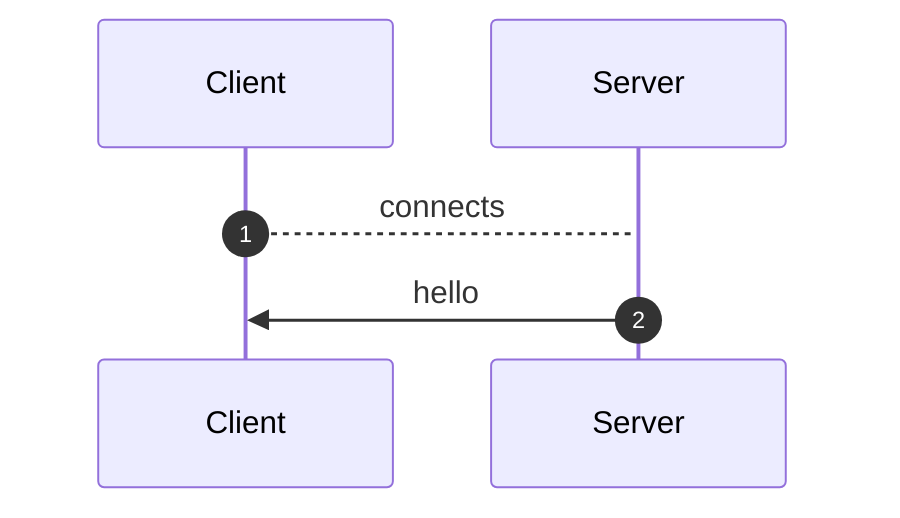
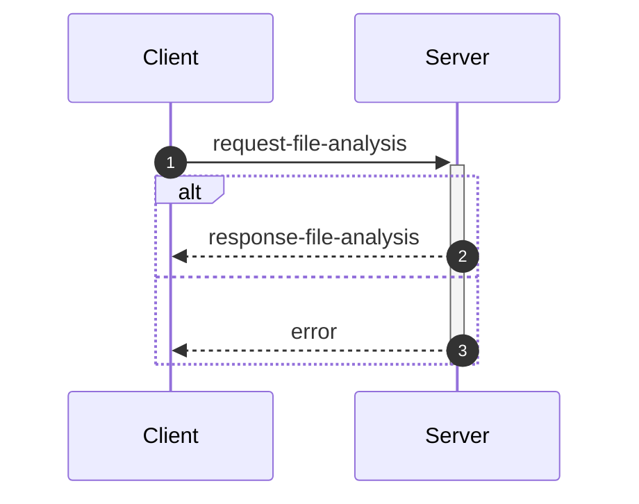
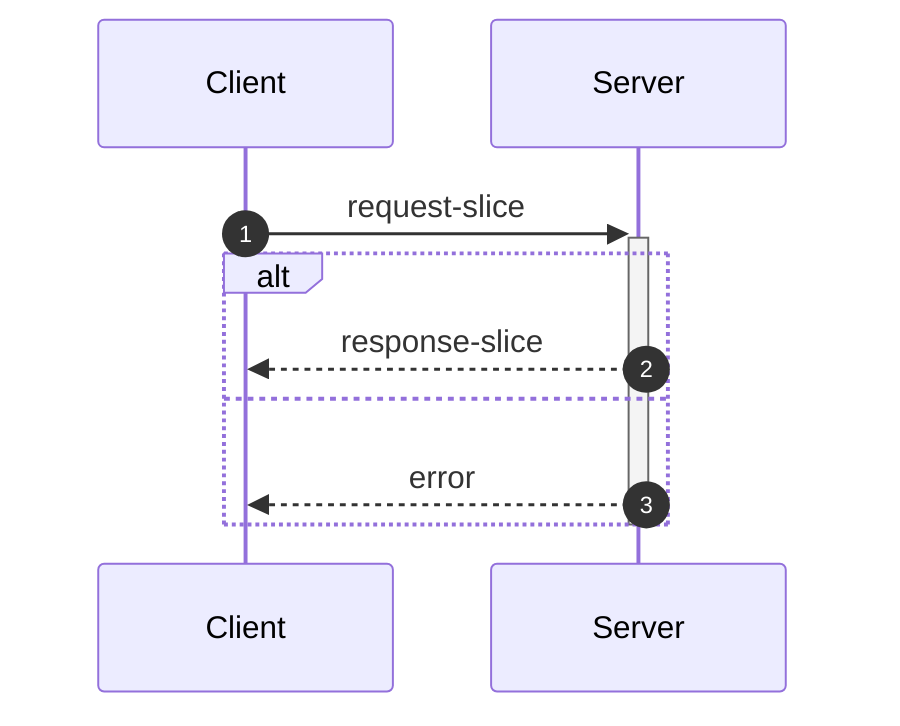
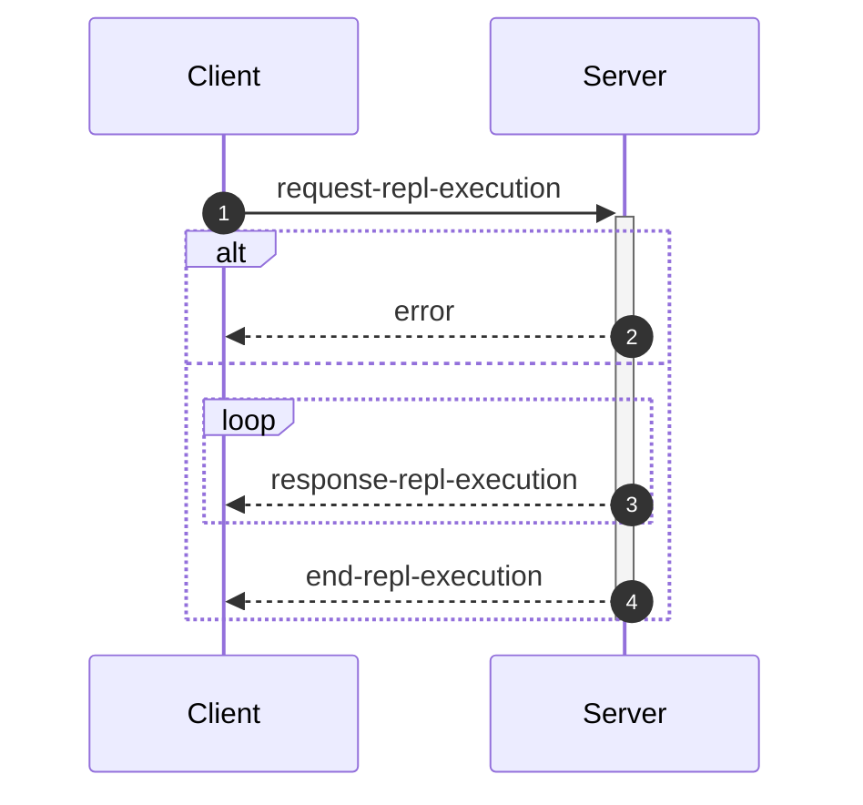

_This document was generated from '[src/documentation/wiki-interface.ts](https://github.com/flowr-analysis/flowr/tree/main//src/documentation/wiki-interface.ts)' on 2026-07-27, 08:47:24 UTC presenting an overview of flowR's interface (v2.13.4, using R v4.5.0). Please do not edit this file/wiki page directly._

Although far from being as detailed as the in-depth explanation of [_flowR_](https://github.com/flowr-analysis/flowr/wiki/core),
this wiki page explains how to interface with _flowR_ in more detail.
In general, command line arguments and other options provide short descriptions on hover over.

* [💻 Using the REPL](#using-the-repl)
* [⚙️ Configuring FlowR](#configuring-flowr)
* [⚒️ Writing Code](#writing-code)
* [💬 Communicating with the Server](#communicating-with-the-server)

<a id='using-the-repl'></a>
## 💻 Using the REPL


> [!NOTE]
> To execute arbitrary R commands with a repl request, _flowR_ has to be started explicitly with <span title="Description (Command Line Argument): Allow to access the underlying R session when using flowR (security warning: this allows the execution of arbitrary R code!)">`--r-session-access`</span>.
> Please be aware that this introduces a security risk and note that this relies on the [`r-shell` engine](https://github.com/flowr-analysis/flowr/wiki/engines) .

Although primarily meant for users to explore,
there is nothing which forbids simply calling _flowR_ as a subprocess to use standard-in, -output, and -error
for communication (although you can access the REPL using the server as well,
with the [REPL Request](#message-request-repl-execution) message).

The read-eval-print loop&nbsp;(REPL) works relatively simple.
You can submit an expression (using <kbd>Enter</kbd>),
which is interpreted as an R&nbsp;expression by default but interpreted as a *command* if it starts with a colon (`:`).
The best command to get started with the REPL is <span title="Description (Repl Command): Show help information (aliases: :h, :?)">`:help`</span>.
Besides, you can leave the REPL either with the command <span title="Description (Repl Command): End the repl (aliases: :q, :exit)">`:quit`</span> or by pressing <kbd>Ctrl</kbd>+<kbd>C</kbd> twice.
When writing a *command*, you may press <kbd>Tab</kbd> to get a list of completions, if available.
Multiple commands can be entered in a single line by separating them with a semicolon (`;`), e.g. `:parse "x<-2"; :df*`.
If a command is given without R code, the REPL will re-use R code given in a previous command.
The prior example will hence return first the parsed AST of the program and then the dataflow graph for `"x <- 2"`.

> [!NOTE]
> If you develop flowR, you may want to launch the repl using the `npm run main-dev` command, this way, you get a non-minified version of flowR with debug information and hot-reloading of source files.

<details>
<summary>Available Commands</summary>

We currently offer the following commands (this with a `[*]` suffix are available with and without the star):


| Command | Description |
| ------- | ----------- |
| **<span title="Description (Repl Command): End the repl (aliases: :q, :exit)">:quit</span>** | End the repl (aliases: **:<span title="Alias of ':quit'. End the repl">q</span>**, **:<span title="Alias of ':quit'. End the repl">exit</span>**) |
| **<span title="Description (Repl Command): Execute the given code as R code. This requires the `--r-session-access` flag to be set and requires the r-shell engine. (aliases: :e, :r)">:execute</span>** | Execute the given code as R code. This requires the `--r-session-access` flag to be set and requires the r-shell engine. (aliases: **:<span title="Alias of ':execute'. Execute the given code as R code. This requires the `--r-session-access` flag to be set and requires the r-shell engine.">e</span>**, **:<span title="Alias of ':execute'. Execute the given code as R code. This requires the `--r-session-access` flag to be set and requires the r-shell engine.">r</span>**) |
| **<span title="Description (Repl Command): Get mermaid code for the control-flow graph of R code (aliases: :cfg, :cf)">:controlflow[*]</span>** | Get mermaid code for the control-flow graph of R code (star: Returns the URL to mermaid.live) (aliases: **:<span title="Alias of ':controlflow'. Get mermaid code for the control-flow graph of R code">cfg</span>**, **:<span title="Alias of ':controlflow'. Get mermaid code for the control-flow graph of R code">cf</span>**) |
| **<span title="Description (Repl Command): Get mermaid code for the control-flow graph with basic blocks (aliases: :cfgb, :cfb)">:controlflowbb[*]</span>** | Get mermaid code for the control-flow graph with basic blocks (star: Returns the URL to mermaid.live) (aliases: **:<span title="Alias of ':controlflowbb'. Get mermaid code for the control-flow graph with basic blocks">cfgb</span>**, **:<span title="Alias of ':controlflowbb'. Get mermaid code for the control-flow graph with basic blocks">cfb</span>**) |
| **<span title="Description (Repl Command): Get mermaid code for the dataflow graph (aliases: :d, :df)">:dataflow[*]</span>** | Get mermaid code for the dataflow graph (star: Returns the URL to mermaid.live) (aliases: **:<span title="Alias of ':dataflow'. Get mermaid code for the dataflow graph">d</span>**, **:<span title="Alias of ':dataflow'. Get mermaid code for the dataflow graph">df</span>**) |
| **<span title="Description (Repl Command): Get mermaid code for the normalized AST of R code (aliases: :n)">:normalize[*]</span>** | Get mermaid code for the normalized AST of R code (star: Returns the URL to mermaid.live) (alias: **:<span title="Alias of ':normalize'. Get mermaid code for the normalized AST of R code">n</span>**) |
| **<span title="Description (Repl Command): Get mermaid code for the simplified dataflow graph (aliases: :ds, :dfs)">:dataflowsimple[*]</span>** | Get mermaid code for the simplified dataflow graph (star: Returns the URL to mermaid.live) (aliases: **:<span title="Alias of ':dataflowsimple'. Get mermaid code for the simplified dataflow graph">ds</span>**, **:<span title="Alias of ':dataflowsimple'. Get mermaid code for the simplified dataflow graph">dfs</span>**) |
| **<span title="Description (Repl Command): Inspect and extend the signature database: `query` (identical to :query @signature), `add <path>` to mount another database/source, `download` to fetch the full-history database. (aliases: :sig)">:signature</span>** | Inspect and extend the signature database: `query` (identical to :query @signature), `add <path>` to mount another database/source, `download` to fetch the full-history database. (alias: **:<span title="Alias of ':signature'. Inspect and extend the signature database: `query` (identical to :query @signature), `add <path>` to mount another database/source, `download` to fetch the full-history database.">sig</span>**) |
| **<span title="Description (Repl Command): Just calculates the DFG, but only prints summary info (aliases: :d#, :df#)">:dataflowsilent</span>** | Just calculates the DFG, but only prints summary info (aliases: **:<span title="Alias of ':dataflowsilent'. Just calculates the DFG, but only prints summary info">d#</span>**, **:<span title="Alias of ':dataflowsilent'. Just calculates the DFG, but only prints summary info">df#</span>**) |
| **<span title="Description (Repl Command): Prints ASCII Art of the parsed, unmodified AST (aliases: :p)">:parse</span>** | Prints ASCII Art of the parsed, unmodified AST (alias: **:<span title="Alias of ':parse'. Prints ASCII Art of the parsed, unmodified AST">p</span>**) |
| **<span title="Description (Repl Command): Prints the version of flowR as well as the current version of R">:version</span>** | Prints the version of flowR as well as the current version of R
| **<span title="Description (Repl Command): Query the given R code (use 'help' for more information)">:query[*]</span>** | Query the given R code (use 'help' for more information) (star: Similar to query, but returns the output in json format.)
| **<span title="Description (Repl Command): Returns an ASCII representation of the dataflow graph (aliases: :df!)">:dataflowascii</span>** | Returns an ASCII representation of the dataflow graph (alias: **:<span title="Alias of ':dataflowascii'. Returns an ASCII representation of the dataflow graph">df!</span>**) |
| **<span title="Description (Repl Command): Returns summarization stats for the normalized AST (aliases: :n#)">:normalize#</span>** | Returns summarization stats for the normalized AST (alias: **:<span title="Alias of ':normalize#'. Returns summarization stats for the normalized AST">n#</span>**) |
| **<span title="Description (Repl Command): Show help information (aliases: :h, :?)">:help</span>** | Show help information (aliases: **:<span title="Alias of ':help'. Show help information">h</span>**, **:<span title="Alias of ':help'. Show help information">?</span>**) |


</details>


> [!TIP]
> 
> As indicated by the examples before, all REPL commands that operate on code keep track of the state.
> Hence, if you run a command like <span title="Description (Repl Command, starred version): Returns the URL to mermaid.live; Base Command: Get mermaid code for the dataflow graph (aliases: :d*, :df*)">`:dataflow*`</span> without providing R code,
> the REPL will re-use the R code provided in a previous command.
> Likewise, doing this will benefit from incrementality!
> If you request the dataflow graph with `:df* x <- 2 * y` and then want to see the parsed AST with `:parse`,
> the REPL will re-use previously obtained information and not re-parse the code again.
> 		


Generally, many commands offer shortcut versions in the REPL. Many queries, for example, offer a shortened format (see the example below).
Of special note, the [Config Query](https://github.com/flowr-analysis/flowr/wiki/%5BQuery%5D-Config)
can be used to also modify the currently active configuration of _flowR_ within the REPL (see the [wiki page](https://github.com/flowr-analysis/flowr/wiki/%5BQuery%5D-Config) for more information).

### Example: Retrieving the Dataflow Graph

To retrieve a URL to the [mermaid](https://mermaid.js.org/) diagram of the dataflow of a given expression,
use <span title="Description (Repl Command, starred version): Returns the URL to mermaid.live; Base Command: Get mermaid code for the dataflow graph (aliases: :d*, :df*)">`:dataflow*`</span> (or <span title="Description (Repl Command): Get mermaid code for the dataflow graph (aliases: :d, :df)">`:dataflow`</span> to get the mermaid code in the cli):


```shell
$ docker run -it --rm eagleoutice/flowr # or npm run flowr 
flowR repl v2.13.4, R grammar v14 (tree-sitter engine)
R> :dataflow* y <- 1 + x
```

<details>
<summary style='color:gray'>Output</summary>


```text
https://mermaid.live/view#base64:eyJjb2RlIjoiZmxvd2NoYXJ0IEJUXG4gICAgMXt7XCJgKiM5MTtSTnVtYmVyIzkzOyogKioxKipcbiAgICAgICoxLjYqICgqKmlkOiAxKiopYFwifX1cbiAgICUlIE5vIGVkZ2VzIGZvdW5kIGZvciAxXG4gICAgMihbXCJgKiM5MTtSU3ltYm9sIzkzOyogKip4KipcbiAgICAgICoxLjEwKiAoKippZDogMioqKWBcIl0pXG4gICAlJSBObyBlZGdlcyBmb3VuZCBmb3IgMlxuICAgIDNbW1wiYCojOTE7UkJpbmFyeU9wIzkzOyogYmFzZSM1ODsjNTg7KiojNDM7KipcbiAgICAgICoxLjYtMTAqICgqKmlkOiAzKiopXG4gICAgYXJnOiAoMSwgMilgXCJdXVxuICAgIGJ1aWx0LWluOl9bXCJgQnVpbHQtSW46XG4jNDM7YFwiXVxuICAgIHN0eWxlIGJ1aWx0LWluOl8gc3Ryb2tlOmdyYXksZmlsbDpncmF5LHN0cm9rZS13aWR0aDoycHgsb3BhY2l0eTouODtcbiAgICAwW1wiYCojOTE7UlN5bWJvbCM5MzsqICoqeSoqXG4gICAgICAqMS4xKiAoKippZDogMCoqLCB2OiAzKWBcIl1cbiAgICA0W1tcImAqIzkxO1JCaW5hcnlPcCM5MzsqIGJhc2UjNTg7IzU4OyoqIzYwOyM0NTsqKlxuICAgICAgKjEuMS0xMCogKCoqaWQ6IDQqKilcbiAgICBhcmc6ICgwLCAzKWBcIl1dXG4gICAgYnVpbHQtaW46Xy1bXCJgQnVpbHQtSW46XG4jNjA7IzQ1O2BcIl1cbiAgICBzdHlsZSBidWlsdC1pbjpfLSBzdHJva2U6Z3JheSxmaWxsOmdyYXksc3Ryb2tlLXdpZHRoOjJweCxvcGFjaXR5Oi44O1xuICAgIDMgLS0+fFwicmVhZHMsIGFyZ1wifCAxXG4gICAgMyAtLT58XCJyZWFkcywgYXJnXCJ8IDJcbiAgICAzIC0uLT58XCJyZWFkcywgY2FsbHNcInwgYnVpbHQtaW46X1xuICAgIGxpbmtTdHlsZSAyIHN0cm9rZTpncmF5O1xuICAgIDAgLS0+fFwiZGVmaW5lZC1ieVwifCAzXG4gICAgMCAtLT58XCJkZWZpbmVkLWJ5XCJ8IDRcbiAgICA0IC0tPnxcInJlYWRzLCBhcmdcInwgM1xuICAgIDQgLS0+fFwicmV0dXJucywgYXJnXCJ8IDBcbiAgICA0IC0uLT58XCJyZWFkcywgY2FsbHNcInwgYnVpbHQtaW46Xy1cbiAgICBsaW5rU3R5bGUgNyBzdHJva2U6Z3JheTsiLCJtZXJtYWlkIjp7ImF1dG9TeW5jIjp0cnVlfX0=
```


Retrieve the dataflow graph of the expression `y <- 1 + x`. It looks like this:


```mermaid
flowchart LR
    1{{"`*#91;RNumber#93;* **1**
      *1.6* (**id: 1**)`"}}
   %% No edges found for 1
    2(["`*#91;RSymbol#93;* **x**
      *1.10* (**id: 2**)`"])
   %% No edges found for 2
    3[["`*#91;RBinaryOp#93;* base#58;#58;**#43;**
      *1.6-10* (**id: 3**)
    arg: (1, 2)`"]]
    built-in:_["`Built-In:
#43;`"]
    style built-in:_ stroke:gray,fill:gray,stroke-width:2px,opacity:.8;
    0["`*#91;RSymbol#93;* **y**
      *1.1* (**id: 0**, v: 3)`"]
    4[["`*#91;RBinaryOp#93;* base#58;#58;**#60;#45;**
      *1.1-10* (**id: 4**)
    arg: (0, 3)`"]]
    built-in:_-["`Built-In:
#60;#45;`"]
    style built-in:_- stroke:gray,fill:gray,stroke-width:2px,opacity:.8;
    3 -->|"reads, arg"| 1
    3 -->|"reads, arg"| 2
    3 -.->|"reads, calls"| built-in:_
    linkStyle 2 stroke:gray;
    0 -->|"defined-by"| 3
    0 -->|"defined-by"| 4
    4 -->|"reads, arg"| 3
    4 -->|"returns, arg"| 0
    4 -.->|"reads, calls"| built-in:_-
    linkStyle 7 stroke:gray;
```

	
<details>

<summary style="color:gray">R Code of the Dataflow Graph</summary>

The analysis required _0.8 ms_ (including parse and normalize, using the [tree-sitter](https://github.com/flowr-analysis/flowr/wiki/Engines) engine) within the generation environment. No [signature database](https://github.com/flowr-analysis/flowr/wiki/Signature-Database) is mounted for these generated graphs, so `library()` calls attach no package exports; base-R names are still qualified via the generated base-package store (e.g. `acf` as `stats::acf`). 
We encountered no unknown side effects during the analysis.


```r
y <- 1 + x
```


</details>


</details>


For small graphs like this, <span title="Description (Repl Command): Returns an ASCII representation of the dataflow graph (aliases: :df!)">`:dataflowascii`</span> also provides an ASCII representation directly in the REPL:


```shell
$ docker run -it --rm eagleoutice/flowr # or npm run flowr 
flowR repl v2.13.4, R grammar v14 (tree-sitter engine)
R> :df! y <- 1 + x
```

<details open>
<summary style='color:gray'>Output</summary>


```text
                        0<1>0
                   ┌────| 1 |
    ┌────────┐     │    0---0
 c<4>c       └──c<3>c
 |<- |  v<0>v┌──| + |
 c---c──| y |┘  c---c   u<2>u
        v---v      └────| x |
                        u---u
Edges:
3 -> 1: reads, arg  3 -> 2: reads, arg
4 -> 3: reads, arg  4 -> 0: returns, arg
0 -> 3: defined-by  0 -> 4: defined-by
```


Retrieve the dataflow graph of the expression `y <- 1 + x` as ASCII art.

</details>


For the slicing with <span title="Description (Repl Command): Static backwards executable slicer for R">`:slicer`</span>, you have access to the same [magic comments](#slice-magic-comments) as with the [slice request](#message-request-slice).
Pass `--inline` to splice resolvable `source()` calls into the reconstruction so the slice is a single self-contained R text (the same as the static slice query's `inlineSources` flag).
See `--help` for more flags!

### Example: Interfacing with the File System

Many commands that allow for an R-expression (like <span title="Description (Repl Command, starred version): Returns the URL to mermaid.live; Base Command: Get mermaid code for the dataflow graph (aliases: :d*, :df*)">`:dataflow*`</span>) allow for a file as well
if the argument starts with `file://`.
If you are working from the root directory of the _flowR_ repository, the following gives you the parsed AST of the example file using the <span title="Description (Repl Command): Prints ASCII Art of the parsed, unmodified AST (aliases: :p)">`:parse`</span> command:

> **Watch mode**: Replace `file://` with `watch://` to enter watch mode.
> flowR runs the command immediately and then re-runs it every time the file (or any file inside the folder) changes.
> Enter any other command to leave watch mode.
> For example: `:df watch://analysis.R`


```shell
$ docker run -it --rm eagleoutice/flowr # or npm run flowr 
flowR repl v2.13.4, R grammar v14 (tree-sitter engine)
R> :parse file://test/testfiles/example.R
```

<details>
<summary style='color:gray'>Output</summary>


```text
File: test/testfiles/example.R

program
├ binaryoperator
│ ├ identifier "sum" (1:1─4)
│ ├ <- "<-" (1:5─7)
│ ╰ float "0" (1:8─9)
├ binaryoperator
│ ├ identifier "product" (2:1─8)
│ ├ <- "<-" (2:9─11)
│ ╰ float "1" (2:12─13)
├ binaryoperator
│ ├ identifier "w" (3:1─2)
│ ├ <- "<-" (3:3─5)
│ ╰ float "7" (3:6─7)
├ binaryoperator
│ ├ identifier "N" (4:1─2)
│ ├ <- "<-" (4:3─5)
│ ╰ float "10" (4:6─8)
├ forstatement
│ ├ for "for" (6:1─4)
│ ├ ( "(" (6:5─6)
│ ├ identifier "i" (6:6─7)
│ ├ in "in" (6:8─10)
│ ├ binaryoperator
│ │ ├ float "1" (6:11─12)
│ │ ├ : ":" (6:12─13)
│ │ ╰ parenthesizedexpression
│ │   ├ ( "(" (6:13─14)
│ │   ├ binaryoperator
│ │   │ ├ identifier "N" (6:14─15)
│ │   │ ├ - "-" (6:15─16)
│ │   │ ╰ float "1" (6:16─17)
│ │   ╰ ) ")" (6:17─18)
│ ├ ) ")" (6:18─19)
│ ╰ bracedexpression
│   ├ { "{" (6:20─21)
│   ├ binaryoperator
│   │ ├ identifier "sum" (7:3─6)
│   │ ├ <- "<-" (7:7─9)
│   │ ╰ binaryoperator
│   │   ├ binaryoperator
│   │   │ ├ identifier "sum" (7:10─13)
│   │   │ ├ + "+" (7:14─15)
│   │   │ ╰ identifier "i" (7:16─17)
│   │   ├ + "+" (7:18─19)
│   │   ╰ identifier "w" (7:20─21)
│   ├ binaryoperator
│   │ ├ identifier "product" (8:3─10)
│   │ ├ <- "<-" (8:11─13)
│   │ ╰ binaryoperator
│   │   ├ identifier "product" (8:14─21)
│   │   ├  "" (8:22─23)
│   │   ╰ identifier "i" (8:24─25)
│   ╰ } "}" (9:1─2)
├ call
│ ├ identifier "cat" (11:1─4)
│ ╰ arguments
│   ├ ( "(" (11:4─5)
│   ├ argument
│   │ ╰ string
│   │   ├ " "\"" (11:5─6)
│   │   ├ stringcontent "Sum:" (11:6─10)
│   │   ╰ " "\"" (11:10─11)
│   ├ comma "," (11:11─12)
│   ├ argument
│   │ ╰ identifier "sum" (11:13─16)
│   ├ comma "," (11:16─17)
│   ├ argument
│   │ ╰ string
│   │   ├ " "\"" (11:18─19)
│   │   ├ stringcontent
│   │   │ ╰ escapesequence "\\n" (11:19─21)
│   │   ╰ " "\"" (11:21─22)
│   ╰ ) ")" (11:22─23)
╰ call
  ├ identifier "cat" (12:1─4)
  ╰ arguments
    ├ ( "(" (12:4─5)
    ├ argument
    │ ╰ string
    │   ├ " "\"" (12:5─6)
    │   ├ stringcontent "Product:" (12:6─14)
    │   ╰ " "\"" (12:14─15)
    ├ comma "," (12:15─16)
    ├ argument
    │ ╰ identifier "product" (12:17─24)
    ├ comma "," (12:24─25)
    ├ argument
    │ ╰ string
    │   ├ " "\"" (12:26─27)
    │   ├ stringcontent
    │   │ ╰ escapesequence "\\n" (12:27─29)
    │   ╰ " "\"" (12:29─30)
    ╰ ) ")" (12:30─31)
```


Retrieve the parsed AST of the example file.

<details>

<summary>File Content</summary>


```r
sum <- 0
product <- 1
w <- 7
N <- 10

for (i in 1:(N-1)) {
  sum <- sum + i + w
  product <- product * i
}

cat("Sum:", sum, "\n")
cat("Product:", product, "\n")
```


</details>

As _flowR_ directly transforms this AST the output focuses on being human-readable instead of being machine-readable.
		

</details>


### Example: Run a Query

You can run any query supported by _flowR_ using the <span title="Description (Repl Command): Query the given R code (use 'help' for more information)">`:query`</span> command.
For example, to obtain the shapes of all data frames in a given piece of code, you can run:


```shell
$ docker run -it --rm eagleoutice/flowr # or npm run flowr 
flowR repl v2.13.4, R grammar v14 (tree-sitter engine)
R> :query @absint df-shape "x <- data.frame(a = 1:10, b = 1:10)\ny <- x$a"
```

<details open>
<summary style='color:gray'>Output</summary>


```text
Query: absint (2 ms)
   ╰ $12: (colnames: [{"a", "b"}, {}], cols: [2, 2], rows: [10, 10])
   ╰ $0: (colnames: [{"a", "b"}, {}], cols: [2, 2], rows: [10, 10])
All queries together required ≈7 ms (1ms accuracy, total 7 ms)
```


Retrieve the shapes of all data frames in the given code.

</details>


To run the linter on a file, you can use (in this example, we just issue the `dead-code` linter on a small piece of code):


```shell
$ docker run -it --rm eagleoutice/flowr # or npm run flowr 
flowR repl v2.13.4, R grammar v14 (tree-sitter engine)
R> :query @linter rules:dead-code "if(FALSE) x <- 2"
```

<details open>
<summary style='color:gray'>Output</summary>


```text
Query: linter (3 ms)
   ╰ Dead Code (dead-code):
       ╰ certain:
           ╰ Code at 1.11-16
       ╰ Metadata: searchTimeMs: 3, processTimeMs: 0
All queries together required ≈3 ms (1ms accuracy, total 3 ms)
```


Run the linter on the given code, with only the `dead-code` rule enabled.

</details>


For more information on the available queries, please check out the [Query API](https://github.com/flowr-analysis/flowr/wiki/query-api).


<a id='configuring-flowr'></a>
## ⚙️ Configuring FlowR


When running _flowR_, you may want to specify some behaviors with a dedicated configuration file.
By default, flowR looks for a file named `flowr.json` in the current working directory (or any higher directory).
You can also specify a different file with <span title="Description (Command Line Argument): The name of the configuration file to use">`--config-file`</span> or pass the configuration inline using <span title="Description (Command Line Argument): The flowR configuration to use, as a JSON string">`--config-json`</span>.
To inspect the current configuration, you can run flowr with the <span title="Description (Command Line Argument): Run with verbose logging (will be passed to the corresponding script)">`--verbose`</span> flag, or use the `config` [Query](https://github.com/flowr-analysis/flowr/wiki/query-api).
Within the REPL this works by running the following:


```shell
:query @config
```


To work with the <a href="https://github.com/flowr-analysis/flowr/tree/main/src/config.ts#L132"><code><span title="The configuration file format for flowR.">FlowrConfig</span></code></a> you can use the provided helper objects alongside its methods like
<a href="https://github.com/flowr-analysis/flowr/tree/main/src/config.ts#L772"><code><span title="Creates a new flowr config that has the updated values.">FlowrConfig::<b>amend</b></span></code></a>.
The schema below documents every option; the ones you most likely want are:

- <a href="https://github.com/flowr-analysis/flowr/wiki/Interface#configuring-flowr" title="Configuration Option (boolean): Whether source calls should be ignored, causing {@link processSourceCall}&#39;s behavior to be skipped.">ignoreSourceCalls</a>: ignore source calls when analyzing the code, i.e., ignore the inclusion of other files.
- <a href="https://github.com/flowr-analysis/flowr/wiki/Interface#configuring-flowr" title="Configuration Option (boolean): Whether load calls should be ignored, causing {@link processLoadCall}&#39;s behavior to be skipped.">ignoreLoadCalls</a>: ignore load calls when analyzing the code, i.e., ignore the loading of r-data files.
- <a href="https://github.com/flowr-analysis/flowr/wiki/Interface#configuring-flowr" title="Configuration Option (object): Do you want to overwrite (parts) of the builtin definition?">semantics.environment.overwriteBuiltIns</a>: overwrite _flowR_'s handling of built-in functions, or clear the preset definitions entirely.
  See [Configure BuiltIn Semantics](#configure-builtin-semantics) for more information.
- <a href="https://github.com/flowr-analysis/flowr/wiki/Interface#configuring-flowr" title="Configuration Option (string): How to resolve variables and their values. (one of &quot;disabled&quot;, &quot;alias&quot;, &quot;builtin&quot;)">solver.variables</a>: how to resolve variables and their values (`disabled`, `alias`, `builtin`).
- <a href="https://github.com/flowr-analysis/flowr/wiki/Interface#configuring-flowr" title="Configuration Option (array): The engine or set of engines to use for interacting with R code. An empty array means all available engines will be used.">engines</a> and <a href="https://github.com/flowr-analysis/flowr/wiki/Interface#configuring-flowr" title="Configuration Option (string): The default engine to use for interacting with R code. If this is undefined, an arbitrary engine from the specified list will be used. (one of &quot;tree-sitter&quot;, &quot;r-shell&quot;)">defaultEngine</a>: the engines used to interact with R code, see the [Engines wiki page](https://github.com/flowr-analysis/flowr/wiki/engines).
- <a href="https://github.com/flowr-analysis/flowr/wiki/Interface#configuring-flowr" title="Configuration Option (array): Files a framework loads on its own, without any source() call (e.g. global.R in a shiny app), in the order they are loaded; flowR orders the matching project files accordingly and analyzes them as one program. Entries are case-insensitive globs matched against the file path, a plain name matches any file with that name, and entries matching no project file are warned about. Usually set per project kind via specializeConfig.">project.implicitSources</a>: the files a framework loads without any `source()` call, in the order in which they are
  loaded. Entries are globs (e.g. `R/*.R`) matched against the file path ignoring capitalization; one matching no file is reported.
- <a href="https://github.com/flowr-analysis/flowr/wiki/Interface#configuring-flowr" title="Configuration Option (object): Overwrite (parts of) the configuration depending on the project kind flowR detects, e.g. to give a shiny app its implicit sources.">specializeConfig</a>: overwrite (parts of) the configuration depending on the kind of project _flowR_ detects
  (e.g. `shiny-app`), which is how a shiny app gets its implicit sources by default. What you configure directly wins.
- <a href="https://github.com/flowr-analysis/flowr/wiki/Interface#configuring-flowr" title="Configuration Option (string): Overwrite the project kind flowR would otherwise infer from the analyzed files, e.g. when auto-detection guesses wrong. (one of &quot;package&quot;, &quot;script&quot;, &quot;shiny-app&quot;, &quot;notebook&quot;, &quot;project&quot;, &quot;unknown&quot;)">project.useProjectType</a>: skip that detection and force a project kind yourself, when auto-detection guesses wrong.
- <a href="https://github.com/flowr-analysis/flowr/wiki/Interface#configuring-flowr" title="Configuration Option (array): The default plugins to load when creating a new instance of FlowrAnalyzer">defaultPlugins</a> and <a href="https://github.com/flowr-analysis/flowr/wiki/Interface#configuring-flowr" title="Configuration Option (array): The plugins to load in REPL mode">repl.plugins</a>: the plugins to load for a new <a href="https://github.com/flowr-analysis/flowr/tree/main/src/project/flowr-analyzer.ts#L167"><code><span title="Central class for conducting analyses with FlowR. Use the FlowrAnalyzerBuilder to create a new instance. If you want the original pattern of creating a pipeline and running all steps, you can still do this with FlowrAnalyzer#runFull . To inspect the context of the analyzer, use FlowrAnalyzer#inspectContext (if you are a plugin and need to modify it, use FlowrAnalyzer#context instead).">FlowrAnalyzer</span></code></a> and in the REPL
  (use `flowr:default` to reference the former).

So you can configure _flowR_ by adding a file like the following:

<details>

<summary>Example Configuration File</summary>


```json
{
  "ignoreSourceCalls": true,
  "ignoreLoadCalls": true,
  "semantics": {
    "environment": {
      "overwriteBuiltIns": {
        "definitions": [
          {
            "type": "function",
            "names": [
              "foo"
            ],
            "processor": "builtin:assign",
            "config": {}
          }
        ]
      }
    }
  },
  "defaultPlugins": [
    "file:description",
    "versions:description"
  ],
  "repl": {
    "quickStats": false,
    "dfProcessorHeat": false,
    "hints": true,
    "plugins": [
      "flowr:default"
    ]
  },
  "project": {
    "resolveUnknownPathsOnDisk": true,
    "implicitSources": [
      "global.R",
      "app.R"
    ]
  },
  "linter": {
    "disabledRules": []
  },
  "specializeConfig": {
    "shiny-app": {
      "project": {
        "implicitSources": [
          "global.R",
          "ui.R",
          "server.R",
          "app.R"
        ]
      }
    }
  },
  "engines": [
    {
      "type": "r-shell"
    }
  ],
  "solver": {
    "variables": "alias",
    "evalStrings": true,
    "trackEnvironments": true,
    "sigdb": {
      "enabled": true,
      "loadProjectDependencies": true,
      "eagerlyLoad": false,
      "eagerlyLoadExports": false,
      "linkBaseR": false,
      "linkDescriptionDependencies": false
    },
    "resolveSource": {
      "dropPaths": "no",
      "ignoreCapitalization": true,
      "inferWorkingDirectory": "active-script",
      "searchPath": []
    },
    "instrument": {},
    "slicer": {
      "threshold": 50
    }
  },
  "abstractInterpretation": {
    "wideningThreshold": 4,
    "dataFrame": {
      "maxColNames": 20,
      "readLoadedData": {
        "readExternalFiles": true,
        "maxReadLines": 1000000
      }
    }
  },
  "gas": {
    "thresholds": {
      "memory": {
        "problematic": 0.7,
        "critical": 0.9
      },
      "timeMs": {
        "problematic": 100000,
        "critical": 120000
      }
    },
    "features": {}
  }
}
```


</details>

<details>
<a id='configure-builtin-semantics'></a>
<summary>Configure Built-In Semantics</summary>


`semantics/environment/overwriteBuiltins` accepts two keys:

- `loadDefaults` (boolean, initially `true`): If set to `true`, the default built-in definitions are loaded before applying the custom definitions. Setting this flag to `false` explicitly disables the loading of the default definitions.
- `definitions` (array, initially empty): Allows to overwrite or define new built-in elements. Each object within must have a `type` which is one of the below. Furthermore, they may define a string array of `names` which specifies the identifiers to bind the definitions to. You may use `assumePrimitive` to specify whether _flowR_ should assume that this is a primitive non-library definition (so you probably just do not want to specify the key).

  | Type            | Description                                                                                                                                                                                                                                                                                              | Example                                                                                                    |
  | --------------- | -------------------------------------------------------------------------------------------------------------------------------------------------------------------------------------------------------------------------------------------------------------------------------------------------------- | ---------------------------------------------------------------------------------------------------------- |
  | `constant`    | Additionally allows for a `value` this should resolve to.                                                                                                                                                                                                                                                | `{ type: 'constant', names: ['NULL', 'NA'],  value: null }`                                                |
  | `function`    | Is a rather flexible way to define and bind built-in functions. For the time, we do not have extensive documentation to cover all the cases, so please either consult the sources with the `default-builtin-config.ts` or open a [new issue](https://github.com/flowr-analysis/flowr/issues/new/choose). | `{ type: 'function', names: ['next'], processor: 'builtin:d', config: { cfg: ExitPointType.Next } }` |
  | `replacement` | A comfortable way to specify replacement functions like `$<-` or `names<-`. `suffixes` describes the... suffixes to attach automatically. | `{ type: 'replacement', suffixes: ['<-', '<<-'], names: ['[', '[['] }` |


</details>

<details>

<summary style='color:gray'>Full Configuration-File Schema</summary>

- _The configuration file format for flowR._ (object)
    - **logLevel** [optional] _flowR's global minimum log level, applied when the config is loaded._ (string)
        Only allows: 'silly', 'trace', 'debug', 'info', 'warn', 'error', 'fatal'
    - **ignoreSourceCalls** [optional] _Whether source calls should be ignored, causing {@link processSourceCall}'s behavior to be skipped._ (boolean)
    - **ignoreLoadCalls** [optional] _Whether load calls should be ignored, causing {@link processLoadCall}'s behavior to be skipped._ (boolean)
    - **semantics** _Configure language semantics and how flowR handles them._ (object)
        - **environment** [optional] _Semantics regarding how to handle the R environment._ (object)
            - **overwriteBuiltIns** [optional] _Do you want to overwrite (parts) of the builtin definition?_ (object)
                - **loadDefaults** [optional] _Should the default configuration still be loaded?_ (boolean)
                - **definitions** [optional] _The definitions to load/overwrite._ (array)
                Valid item types:
                    - (object)
    - **defaultPlugins** [optional] _The default plugins to load when creating a new instance of FlowrAnalyzer_ (array)
    Valid item types:
        - (alternatives)
            - (string)
            - (array)
    - **repl** _Configuration options for the REPL._ (object)
        - **quickStats** [optional] _Whether to show quick stats in the REPL after each evaluation._ (boolean)
        - **dfProcessorHeat** [optional] _This instruments the dataflow processors to count how often each processor is called._ (boolean)
        - **hints** [optional] _Whether to show dim inline hints on the empty prompt (automatically disabled on non-interactive terminals)._ (boolean)
        - **plugins** [optional] _The plugins to load in REPL mode_ (array)
        Valid item types:
            - (alternatives)
                - (string)
                - (array)
        - **autoUseFileProtocol** [optional] _Prepend the file protocol to a repl input that looks like a path, instead of only warning about it._ (boolean)
        - **queryStats** [optional] _Whether `:query` closes with the line stating how long the queries took (`:query*` never prints it)._ (boolean)
        - **showPlugins** [optional] _Whether `:version` grays out the plugins that did not activate during the last analysis._ (boolean)
    - **project** _Project specific configuration options._ (object)
        - **resolveUnknownPathsOnDisk** [optional] _Whether to resolve unknown paths loaded by the r project disk when trying to source/analyze files._ (boolean)
        - **failOnInaccessiblePath** [optional] _Whether a directory that cannot be traversed during file discovery (e.g. due to permissions) aborts the analysis; when false (the default) such paths are logged and skipped._ (boolean)
        - **basePackages** [optional] _The packages considered part of R itself (base and recommended); if unset, flowR uses its built-in list._ (array)
        Valid item types:
            - (string)
        - **implicitSources** [optional] _Files a framework loads on its own, without any source() call (e.g. global.R in a shiny app), in the order they are loaded; flowR orders the matching project files accordingly and analyzes them as one program. Entries are case-insensitive globs matched against the file path, a plain name matches any file with that name, and entries matching no project file are warned about. Usually set per project kind via specializeConfig._ (array)
        Valid item types:
            - (string)
        - **useProjectType** [optional] _Overwrite the project kind flowR would otherwise infer from the analyzed files, e.g. when auto-detection guesses wrong._ (string)
            Only allows: 'package', 'script', 'shiny-app', 'notebook', 'project', 'unknown'
        - **discovery** [optional] _Scoping options for the default project discovery._ (object)
            - **full** [optional] _Collect every file below the project root (greedy) instead of only the files the detected project kind needs (default false)._ (boolean)
            - **perKind** [optional] _Per-kind include/exclude glob overrides layered on the default scoping._ (object)
            - **ignore** [optional] _Case-insensitive globs that drop matching files from the intelligent discovery, regardless of kind (e.g. .Renviron to ignore environment files)._ (array)
            Valid item types:
                - (string)
        - **classification** [optional] _Overrides for the signals flowR uses to classify the project kind._ (object)
            - **shinyDescriptionTypes** [optional] _DESCRIPTION Type: values that mark a shiny app._ (array)
            Valid item types:
                - (string)
            - **shinyEntryFiles** [optional] _File names a shiny app is assembled from._ (array)
            Valid item types:
                - (string)
            - **shinyUsagePattern** [optional] _Regex source evidencing shiny usage in an entry file._ (string)
            - **notebookExtensions** [optional] _File extensions marking a notebook._ (array)
            Valid item types:
                - (string)
    - **linter** _Linter configuration options._ (object)
        - **disabledRules** _Linting rule names excluded from the default rule set (a rule requested explicitly via a linter query still runs). Usually set per project kind via specializeConfig._ (array)
        Valid item types:
            - (string)
    - **inputSources** [optional] _Further frameworks the input-sources analysis should know about; entries are added to flowR's defaults._ (object)
        - **pure** [optional] _Functions that only pass the constantness of their arguments on._ (array)
        Valid item types:
            - (string)
        - **param** [optional] _Functions whose result is a 'param' input._ (array)
        Valid item types:
            - (string)
        - **file** [optional] _Functions whose result is a 'file' input._ (array)
        Valid item types:
            - (string)
        - **tempfile** [optional] _Functions whose result is a 'tempfile' input._ (array)
        Valid item types:
            - (string)
        - **net** [optional] _Functions whose result is a 'net' input._ (array)
        Valid item types:
            - (string)
        - **rand** [optional] _Functions whose result is a 'rand' input._ (array)
        Valid item types:
            - (string)
        - **system** [optional] _Functions whose result is a 'system' input._ (array)
        Valid item types:
            - (string)
        - **ffi** [optional] _Functions whose result is a 'ffi' input._ (array)
        Valid item types:
            - (string)
        - **lang** [optional] _Functions whose result is a 'lang' input._ (array)
        Valid item types:
            - (string)
        - **options** [optional] _Functions whose result is a 'options' input._ (array)
        Valid item types:
            - (string)
        - **user** [optional] _Functions whose result is a 'user' input._ (array)
        Valid item types:
            - (string)
        - **const** [optional] _Functions whose result is a 'const' input._ (array)
        Valid item types:
            - (string)
        - **scope** [optional] _Functions whose result is a 'scope' input._ (array)
        Valid item types:
            - (string)
        - **dconst** [optional] _Functions whose result is a 'dconst' input._ (array)
        Valid item types:
            - (string)
        - **unknown** [optional] _Functions whose result is a 'unknown' input._ (array)
        Valid item types:
            - (string)
        - **linkedObjects** [optional] _Objects a framework provides without a definition in the code, e.g. shiny's input._ (array)
        Valid item types:
            - (object)
        - **linkedEntryPoints** [optional] _Calls that hand a function to a framework, which binds its objects to the parameters by position._ (array)
        Valid item types:
            - (object)
    - **specializeConfig** [optional] _Overwrite (parts of) the configuration depending on the project kind flowR detects, e.g. to give a shiny app its implicit sources._ (object)
    - **engines** _The engine or set of engines to use for interacting with R code. An empty array means all available engines will be used._ (array)
    Valid item types:
        - (alternatives)
            - _The configuration for the tree sitter engine._ (object)
                - **type** [required] _Use the tree sitter engine._ (string)
                    Only allows: 'tree-sitter'
                - **wasmPath** [optional] _The path to the tree-sitter-r WASM binary to use. If this is undefined, this uses the default path._ (string)
                - **treeSitterWasmPath** [optional] _The path to the tree-sitter WASM binary to use. If this is undefined, this uses the default path._ (string)
                - **lax** [optional] _Whether to use the lax parser for parsing R code (allowing for syntax errors). If this is undefined, the strict parser will be used._ (boolean)
            - _The configuration for the R shell engine._ (object)
                - **type** [required] _Use the R shell engine._ (string)
                    Only allows: 'r-shell'
                - **rPath** [optional] _The path to the R executable to use. If this is undefined, this uses the default path._ (string)
    - **defaultEngine** [optional] _The default engine to use for interacting with R code. If this is undefined, an arbitrary engine from the specified list will be used._ (string)
        Only allows: 'tree-sitter', 'r-shell'
    - **solver** _How to resolve constants, constraints, cells, ..._ (object)
        - **variables** _How to resolve variables and their values._ (string)
            Only allows: 'disabled', 'alias', 'builtin'
        - **evalStrings** _Should we include eval(parse(text="...")) calls in the dataflow graph?_ (boolean)
        - **trackEnvironments** [optional] _Track user-created environments (new.env, assign/get/local with envir=, dollar-assign, attach). When false, all envir-style calls fall through conservatively._ (boolean)
        - **sigdb** _Resolving library exports from a signature database._ (object)
            - **enabled** [optional] _Resolve library()/use() exports from a signature database (default true); when false no database is consulted._ (boolean)
            - **loadProjectDependencies** [optional] _Load the project's declared dependencies from its metadata files (DESCRIPTION Imports/Depends, rproject.toml, renv.lock, rv.lock) (default true); when false these files are not read for dependencies._ (boolean)
            - **eagerlyLoad** [optional] _Parse the database up front rather than on the first package load (default false, ignored if disabled)._ (boolean)
            - **eagerlyLoadExports** [optional] _Add a vertex for every export on load rather than on demand (default false); keeps the dataflow graph small._ (boolean)
            - **assumedRVersion** [optional] _R version assumed when resolving versioned (base-R) exports: a pin like "4.5" or "auto" to detect the installed R (default "auto")._ (string)
            - **linkBaseR** [optional] _Eagerly attach base-R namespaces so bare base calls resolve without library() (default false)._ (boolean)
            - **linkBaseRCalls** [optional] _Add a lightweight Reads edge from a bare base-R call to its signature-database function vertex (default false; base-R qualification is edge-free otherwise)._ (boolean)
            - **linkPackageCalls** [optional] _Add a lightweight Reads edge from a resolved package call to its signature-database function vertex (default false)._ (boolean)
            - **linkDescriptionDependencies** [optional] _Eagerly attach the namespaces of the project's declared DESCRIPTION dependencies (Imports/Depends) so their exports resolve without an explicit library() (default false)._ (boolean)
            - **warmInBackground** [optional] _Decompress the hot shards (base + most-downloaded) in a background task on startup so the first library() lookup is warm (default false; for long-running servers/REPLs)._ (boolean)
            - **additionalPaths** [optional] _Extra directories or bundle/manifest files searched for signature databases (alongside the shipped default and $FLOWR_SIGDB_DIR); a downloaded full-history bundle placed here is mounted automatically._ (array)
            Valid item types:
                - (string)
            - **downloadRepo** [optional] _GitHub owner/repo the full-history bundle is downloaded from via ":signature download" (default "flowr-analysis/flowr", release tag "sigdb-v<flowR-version>")._ (string)
            - **autoSync** [optional] _On startup, re-download shards whose committed sigdb.remote.json hash no longer matches the cache, in the background (default false; opt-in network sync after a git pull)._ (boolean)
            - **versionSelection** [optional] _When a project constrains a dependency, resolve to the newest (default), oldest, or system-installed version satisfying it; system needs R and falls back to newest. Base-R packages always resolve against the assumed R version._ (string)
                Only allows: 'newest', 'oldest', 'system'
            - **versionOverrides** [optional] _Force an exact version for specific packages (name -> version), overriding both the project constraint and the versionSelection policy (default {})._ (object)
        - **versionManagement** _Policies for reasoning about dependency versions._ (object)
            - **linkedVersionGroups** [optional] _Groups of packages that must resolve to the same version; version guessing intersects each group so its members stay mutually compatible (default [])._ (array)
            Valid item types:
                - (array)
                Valid item types:
                    - (string)
        - **instrument** (object)
            - **dataflowExtractors** [optional] _These keys are only intended for use within code, allowing to instrument the dataflow analyzer!_ (any)
        - **resolveSource** [optional] _If lax source calls are active, flowR searches for sourced files much more freely, based on the configurations you give it. This option is only in effect if `ignoreSourceCalls` is set to false._ (object)
            - **dropPaths** _Allow to drop the first or all parts of the sourced path, if it is relative._ (string)
                Only allows: 'no', 'once', 'all'
            - **ignoreCapitalization** _Search for filenames matching in the lowercase._ (boolean)
            - **inferWorkingDirectory** _Try to infer the working directory from the main or any script to analyze._ (string)
                Only allows: 'no', 'main-script', 'active-script', 'any-script'
            - **searchPath** _Additionally search in these paths._ (array)
            Valid item types:
                - (string)
            - **repeatedSourceLimit** [optional] _How often the same file can be sourced within a single run? Please be aware: in case of cyclic sources this may not reach a fixpoint so give this a sensible limit._ (number)
            - **applyReplacements** _Provide name replacements for loaded files_ (array)
            Valid item types:
                - (object)
            - **assumeFilesExist** [optional] _Assume a sourced file is always there, making what it defines certain instead of conditional on the source call._ (boolean)
        - **slicer** [optional] _The configuration for the slicer._ (object)
            - **threshold** [optional] _The maximum number of iterations to perform on a single function call during slicing._ (number)
            - **autoExtend** [optional] _If set, the slicer will gain an additional post-pass._ (boolean)
    - **abstractInterpretation** _The configuration options for abstract interpretation._ (object)
        - **wideningThreshold** _The threshold for the number of visitations of a node at which widening should be performed to ensure the termination of the fixpoint iteration._ (number)
        - **dataFrame** _The configuration of the shape inference for data frames._ (object)
            - **maxColNames** _The maximum number of columns names to infer for data frames before over-approximating the column names to top._ (number)
            - **readLoadedData** _Configuration options for reading data frame shapes from loaded external data files, such as CSV files._ (object)
                - **readExternalFiles** _Whether data frame shapes should be extracted from loaded external files, such as CSV files._ (boolean)
                - **maxReadLines** _The maximum number of lines to read when extracting data frame shapes from loaded files, such as CSV files._ (number)
    - **gas** [optional] _Resource-usage guard (gas) configuration. All feature factors default to 0 (disabled). See https://github.com/flowr-analysis/flowr/wiki/Core#gas-resource-guard._ (object)
        - **thresholds** [optional] _Shared thresholds for all gas checks (scaled by per-feature factor)._ (object)
            - **memory** [optional] _Heap-usage fraction thresholds (0-1)._ (object)
                - **problematic** [optional] _Heap fraction (0-1) above which Problematic is returned._ (number)
                - **critical** [optional] _Heap fraction (0-1) above which Critical is returned._ (number)
            - **timeMs** [optional] _Elapsed analysis time thresholds in milliseconds._ (object)
                - **problematic** [optional] _Elapsed ms above which Problematic is returned._ (number)
                - **critical** [optional] _Elapsed ms above which Critical is returned._ (number)
        - **features** [optional] _Per-feature sensitivity factors. 0 or absent disables gas checking for that feature. A factor of 2 makes the feature twice as sensitive. Recognised keys: `source`, `side-effect-linking`, `linter`._ (object)
        - **heapProvider** [optional] _Custom heap statistics source (programmatic configs only), overriding the built-in v8/performance.memory detection._ (function)

</details>

	

<a id='writing-code'></a>
## ⚒️ Writing Code

_flowR_ can be used as a [module](https://www.npmjs.com/package/@eagleoutice/flowr) and offers several main classes and interfaces that are interesting for extension writers 
(see the [Visual Studio Code extension](https://marketplace.visualstudio.com/items?itemName=code-inspect.vscode-flowr) or the [Core](https://github.com/flowr-analysis/flowr/wiki/core) wiki page for more information).

### Creating Analyses with _flowR_

Nowadays, instances of the <a href="https://github.com/flowr-analysis/flowr/tree/main/src/project/flowr-analyzer.ts#L167"><code><span title="Central class for conducting analyses with FlowR. Use the FlowrAnalyzerBuilder to create a new instance. If you want the original pattern of creating a pipeline and running all steps, you can still do this with FlowrAnalyzer#runFull . To inspect the context of the analyzer, use FlowrAnalyzer#inspectContext (if you are a plugin and need to modify it, use FlowrAnalyzer#context instead).">FlowrAnalyzer</span></code></a> should be used as central frontend to get analysis results from _flowR_.
For example, a program slice can be created like this:


```ts
const analyzer = await new FlowrAnalyzerBuilder()
    .setEngine('tree-sitter')
    .build();
analyzer.addRequest('x <- 1\ny <- x\nx');
const result = await analyzer.query([
    {
        type:     'static-slice',
        criteria: ['3@x']
    }
]);
//console.log(result['static-slice']);
```


For more information, please have a look at the [Analyzer](https://github.com/flowr-analysis/flowr/wiki/analyzer) wiki page, which explains how to construct and use the <a href="https://github.com/flowr-analysis/flowr/tree/main/src/project/flowr-analyzer.ts#L167"><code><span title="Central class for conducting analyses with FlowR. Use the FlowrAnalyzerBuilder to create a new instance. If you want the original pattern of creating a pipeline and running all steps, you can still do this with FlowrAnalyzer#runFull . To inspect the context of the analyzer, use FlowrAnalyzer#inspectContext (if you are a plugin and need to modify it, use FlowrAnalyzer#context instead).">FlowrAnalyzer</span></code></a> in more detail.
To work with specific perspectives, you can also consult the respective pages like the [Dataflow Graph](https://github.com/flowr-analysis/flowr/wiki/dataflow-graph) or the [Abstract Interpretation](https://github.com/flowr-analysis/flowr/wiki/abstract-interpretation) wiki pages.
### The Pipeline Executor (Low-Level Interface)

Once, in the beginning, _flowR_ was meant to produce a dataflow graph merely to provide *program slices*. 
However, with continuous updates, the [Dataflow Graph](https://github.com/flowr-analysis/flowr/wiki/dataflow-graph) repeatedly proves to be the more interesting part.
With this, we restructured _flowR_'s originally *hardcoded* pipeline to be far more flexible. 
Now, it can be theoretically extended or replaced with arbitrary steps, optional steps, and what we call 'decorations' of these steps. 
In short, a slicing pipeline using the <a href="https://github.com/flowr-analysis/flowr/tree/main/src/core/pipeline-executor.ts#L97"><code><span title="**Please note:** The PipelineExecutor is now considered to be a rather low-level API for flowR. While it still works and is the basis for all other layers, we strongly recommend using the FlowrAnalyzer and its builder to create and use an analyzer instance that is pre-configured for your use-case. The pipeline executor allows to execute arbitrary pipelines in a step-by-step fashion. If you are not...">PipelineExecutor</span></code></a> looks like this:


```ts

const slicer = new PipelineExecutor(DEFAULT_SLICING_PIPELINE, {
  parser:    new RShell(),
  request:   requestFromInput('x <- 1\nx + 1'),
  criterion: ['2@x']
})
const slice = await slicer.allRemainingSteps()
// console.log(slice.reconstruct.code)
```


<details><summary>More Information</summary>


If you compare this, with what you would have done with the old (and removed) `SteppingSlicer`, 
this essentially just requires you to replace the `SteppingSlicer` with the <a href="https://github.com/flowr-analysis/flowr/tree/main/src/core/pipeline-executor.ts#L97"><code><span title="**Please note:** The PipelineExecutor is now considered to be a rather low-level API for flowR. While it still works and is the basis for all other layers, we strongly recommend using the FlowrAnalyzer and its builder to create and use an analyzer instance that is pre-configured for your use-case. The pipeline executor allows to execute arbitrary pipelines in a step-by-step fashion. If you are not...">PipelineExecutor</span></code></a>
and to pass the <a href="https://github.com/flowr-analysis/flowr/tree/main/src/core/steps/pipeline/default-pipelines.ts#L18"><code>DEFAULT_SLICING_PIPELINE</code></a> as the first argument.
The <a href="https://github.com/flowr-analysis/flowr/tree/main/src/core/pipeline-executor.ts#L97"><code><span title="**Please note:** The PipelineExecutor is now considered to be a rather low-level API for flowR. While it still works and is the basis for all other layers, we strongly recommend using the FlowrAnalyzer and its builder to create and use an analyzer instance that is pre-configured for your use-case. The pipeline executor allows to execute arbitrary pipelines in a step-by-step fashion. If you are not...">PipelineExecutor</span></code></a>...

1. Provides structures to investigate the results of all intermediate steps
2. Can be executed step-by-step
3. Can repeat steps (e.g., to calculate multiple slices on the same input)

See the in-code documentation for more information.


</details>

### Using the <a href="https://github.com/flowr-analysis/flowr/tree/main/src/r-bridge/shell.ts#L143"><code><span title="The RShell represents an interactive session with the R interpreter. You can configure it by RShellOptions . At the moment we are using a live R session (and not networking etc.) to communicate with R easily, which allows us to install packages etc. However, this might and probably will change in the future (leaving this as a legacy mode :D)">RShell</span></code></a> to Interact with R

The <a href="https://github.com/flowr-analysis/flowr/tree/main/src/r-bridge/shell.ts#L143"><code><span title="The RShell represents an interactive session with the R interpreter. You can configure it by RShellOptions . At the moment we are using a live R session (and not networking etc.) to communicate with R easily, which allows us to install packages etc. However, this might and probably will change in the future (leaving this as a legacy mode :D)">RShell</span></code></a> class allows interfacing with the `R`&nbsp;ecosystem installed on the host system.
Please have a look at [flowR's Engines](https://github.com/flowr-analysis/flowr/wiki/engines) for more information on alternatives (for example, the <a href="https://github.com/flowr-analysis/flowr/tree/main/src/r-bridge/lang-4.x/tree-sitter/tree-sitter-executor.ts#L18"><code><span title="Synchronous and (way) faster alternative to the RShell using tree-sitter.">TreeSitterExecutor</span></code></a>).


> [!IMPORTANT]
> 
> Each <a href="https://github.com/flowr-analysis/flowr/tree/main/src/r-bridge/shell.ts#L143"><code><span title="The RShell represents an interactive session with the R interpreter. You can configure it by RShellOptions . At the moment we are using a live R session (and not networking etc.) to communicate with R easily, which allows us to install packages etc. However, this might and probably will change in the future (leaving this as a legacy mode :D)">RShell</span></code></a> controls a new instance of the R&nbsp;interpreter, 
> make sure to call <code><a href="https://github.com/flowr-analysis/flowr/tree/main/src/r-bridge/shell.ts#L351"><span title="Close the current R session, makes the object effectively invalid (can no longer be reopened etc.)">RShell::<i>close</i></span></a>()</code> when you are done.


You can start a new "session" simply by constructing a new object with <code>new <a href="https://github.com/flowr-analysis/flowr/tree/main/src/r-bridge/shell.ts#L143"><span title="The RShell represents an interactive session with the R interpreter. You can configure it by RShellOptions . At the moment we are using a live R session (and not networking etc.) to communicate with R easily, which allows us to install packages etc. However, this might and probably will change in the future (leaving this as a legacy mode :D)">RShell</span></a>()</code>.

However, there are several options that may be of interest 
(e.g., to automatically revive the shell in case of errors or to control the name location of the R process on the system).

With a shell object (let's call it `shell`), you can execute R code by using <a href="https://github.com/flowr-analysis/flowr/tree/main/src/r-bridge/shell.ts#L212"><code><span title="sends the given command directly to the current R session will not do anything to alter input markers!">RShell::<i>sendCommand</i></span></code></a>,
for example <code>shell.<a href="https://github.com/flowr-analysis/flowr/tree/main/src/r-bridge/shell.ts#L212"><span title="sends the given command directly to the current R session will not do anything to alter input markers!">sendCommand</span></a>("1 + 1")</code>.
However, this does not return anything, so if you want to collect the output of your command, use
<a href="https://github.com/flowr-analysis/flowr/tree/main/src/r-bridge/shell.ts#L295"><code><span title="Send a command and collect the output">RShell::<i>sendCommandWithOutput</i></span></code></a> instead.


<a id='communicating-with-the-server'></a>
## 💬 Communicating with the Server


As explained in the [Overview](https://github.com/flowr-analysis/flowr/wiki/overview), you can simply run the [TCP](https://de.wikipedia.org/wiki/Transmission_Control_Protocol)&nbsp;server by adding the <span title="Description (Command Line Argument): Do not drop into a repl, but instead start a server on the given port (default: 1042) and listen for messages.">`--server`</span> flag (and, due to the interactive mode, exit with the conventional <kbd>CTRL</kbd>+<kbd>C</kbd>).
Currently, every connection is handled by the same underlying `RShell` - so the server is not designed to handle many clients at a time.
Additionally, the server is not well guarded against attacks (e.g., you can theoretically spawn an arbitrary number of&nbsp;RShell sessions on the target machine).

Every message has to be given in a single line (i.e., without a newline in-between) and end with a newline character. Nevertheless, we will pretty-print example given in the following segments for the ease of reading.


> [!NOTE]
> 
> The default <span title="Description (Command Line Argument): Do not drop into a repl, but instead start a server on the given port (default: 1042) and listen for messages.">`--server`</span> uses a simple [TCP](https://de.wikipedia.org/wiki/Transmission_Control_Protocol)
> connection. If you want _flowR_ to expose a [WebSocket](https://de.wikipedia.org/wiki/WebSocket) server instead, add the <span title="Description (Command Line Argument): If the server flag is set, use websocket for messaging">`--ws`</span> flag (i.e., <span title="Description (Command Line Argument): Do not drop into a repl, but instead start a server on the given port (default: 1042) and listen for messages.">`--server`</span> <span title="Description (Command Line Argument): If the server flag is set, use websocket for messaging">`--ws`</span>) when starting _flowR_ from the command line.


<ul><li>
<a id="message-hello"></a>
<b>Hello</b> Message (<code>hello</code>) 
<details>

<summary style="color:gray"> View Details. <i>The server informs the client about the successful connection and provides Meta-Information.</i> </summary>


```mermaid
sequenceDiagram
    autonumber
    participant Client
    participant Server

    
    Client-->Server: connects
    Server->>Client: hello
	
```


	
After launching _flowR_, for example, with <code>docker run -it --rm eagleoutice/flowr <span title="Description (Command Line Argument): Do not drop into a repl, but instead start a server on the given port (default: 1042) and listen for messages.">-<span/>-server</span></code>&nbsp;(🐳️), simply connecting should present you with a `hello` message, that amongst others should reveal the versions of&nbsp;_flowR_ and&nbsp;R, using the [semver 2.0](https://semver.org/spec/v2.0.0.html) versioning scheme.
The message looks like this:


```json
{
  "type": "hello",
  "clientName": "client-0",
  "versions": {
    "flowr": "2.13.4",
    "r": "4.5.0",
    "engine": "r-shell"
  }
}
```


There are currently a few messages that you can send after the hello message.
If you want to _slice_ a piece of R code you first have to send an [analysis request](#message-request-file-analysis), so that you can send one or multiple slice requests afterward.
Requests for the [REPL](#message-request-repl) are independent of that.
	

<hr>


<details>
<summary style="color:gray">Message schema (<code>hello</code>)</summary>

For the definition of the hello message, please see it's implementation at [`./src/cli/repl/server/messages/message-hello.ts`](https://github.com/flowr-analysis/flowr/tree/main/./src/cli/repl/server/messages/message-hello.ts).

- [required] (object)
    - **type** [required] _The type of the hello message._ (string)
        Only allows: 'hello'
    - **id** [forbidden] _The id of the message is always undefined (as it is the initial message and not requested)._ (any)
    - **clientName** [required] _A unique name that is assigned to each client. It has no semantic meaning and is only used/useful for debugging._ (string)
    - **versions** [required] (object)
        - **flowr** [required] _The version of the flowr server running in semver format._ (string)
        - **r** [required] _The version of the underlying R shell running in semver format._ (string)
        - **engine** [required] _The parser backend that is used to parse the R code._ (string)

</details>


<hr>

</details>
	</li>

<li>
<a id="message-request-file-analysis"></a>
<b>Analysis</b> Message (<code>request-file-analysis</code>) 
<details>

<summary style="color:gray"> View Details. <i>The server builds the dataflow graph for a given input file (or a set of files).</i> </summary>


```mermaid
sequenceDiagram
    autonumber
    participant Client
    participant Server

    
    Client->>+Server: request-file-analysis
    alt
        Server-->>Client: response-file-analysis
    else
        Server-->>Client: error
    end
    deactivate  Server
	
```


	
The request allows the server to analyze a file and prepare it for slicing.
The message can contain a `filetoken`, which is used to identify the file in later slice or query requests (if you do not add one, the request will not be stored and therefore, it is not available for subsequent requests).

> **Please note!**\
> If you want to send and process a lot of analysis requests, but do not want to slice them, please do not pass the `filetoken` field. This will save the server a lot of memory allocation.

Furthermore, the request must contain either a `content` field to directly pass the file's content or a `filepath` field which contains the path to the file (this path must be accessible for the server to be useful).
If you add the `id` field, the answer will use the same `id` so you can match requests and the corresponding answers.
See the implementation of the request-file-analysis message for more information.

You can drop one or more stored file tokens by adding the `invalidateToken` field (a single token or an array of tokens).
The server frees the corresponding analyses _after_ it has answered the request.

> **Tip!**\
> If you only want to drop tokens, you do not need a separate message: send a `request-file-analysis` that contains _just_ the `invalidateToken` field (and no `content` or `filepath`).
> Such a request behaves like an empty file analysis and the server replies with an empty `results` object.
> Because invalidation happens after the response, you may even pass the _current_ `filetoken` in `invalidateToken` to analyze a file once and have the server forget it right after you received the results.


<details>
<summary>Example of the <code>request-file-analysis</code> Message</summary>

_Note:_ even though we pretty-print these messages, they are sent as a single line, ending with a newline.

The following lists all messages that were sent and received in case you want to reproduce the scenario:

<ol>
<li> <code>hello</code> (response)
<details> 

<summary> Show Details </summary>

The first message is always a hello message.


```json
{
  "type": "hello",
  "clientName": "client-0",
  "versions": {
    "flowr": "2.13.4",
    "r": "4.5.0",
    "engine": "r-shell"
  }
}
```


</details>
</li>

<li> <b><code>request-file-analysis</code> (request)</b>
<details open> 

<summary> Show Details </summary>

Let's suppose you simply want to analyze the following script:
 
```r
x <- 1
x + 1
```

 For this, you can send the following request:


```json
{
  "type": "request-file-analysis",
  "id": "1",
  "filetoken": "x",
  "content": "x <- 1\nx + 1"
}
```


</details>
</li>

<li> <code>response-file-analysis</code> (response)
<details> 

<summary> Show Details </summary>


The `results` field of the response effectively contains three keys of importance:

- `parse`: which contains 1:1 the parse result in CSV format that we received from the `RShell` (i.e., the AST produced by the parser of the R interpreter).
- `normalize`: which contains the normalized AST, including ids (see the `info` field and the [Normalized AST](https://github.com/flowr-analysis/flowr/wiki/normalized-ast) wiki page).
- `dataflow`: especially important is the `graph` field which contains the dataflow graph as a set of root vertices (see the [Dataflow Graph](https://github.com/flowr-analysis/flowr/wiki/dataflow-graph) wiki page).
			


_As the code is pretty long, we inhibit pretty printing and syntax highlighting (JSON, hiding built-in):_

```text
{"type":"response-file-analysis","format":"json","id":"1","results":{"parse":{"files":[{"parsed":"[1,1,1,6,7,0,\"expr\",false,\"x <- 1\"],[1,1,1,1,1,3,\"SYMBOL\",true,\"x\"],[1,1,1,1,3,7,\"expr\",false,\"x\"],[1,3,1,4,2,7,\"LEFT_ASSIGN\",true,\"<-\"],[1,6,1,6,4,5,\"NUM_CONST\",true,\"1\"],[1,6,1,6,5,7,\"expr\",false,\"1\"],[2,1,2,5,16,0,\"expr\",false,\"x + 1\"],[2,1,2,1,10,12,\"SYMBOL\",true,\"x\"],[2,1,2,1,12,16,\"expr\",false,\"x\"],[2,3,2,3,11,16,\"'+'\",true,\"+\"],[2,5,2,5,13,14,\"NUM_CONST\",true,\"1\"],[2,5,2,5,14,16,\"expr\",false,\"1\"]","filePath":"/tmp/tmp-10754-kEMSSSrP9FFL-.R"}],".meta":{"timing":2}},"normalize":{"ast":{"type":"RProject","files":[{"root":{"type":"RExpressionList","children":[{"type":"RBinaryOp","location":[1,3,1,4],"lhs":{"type":"RSymbol","location":[1,1,1,1],"content":"x","lexeme":"x","info":{"fullRange":[1,1,1,1],"adToks":[],"id":0,"parent":2,"role":"bin-l","index":0,"nest":0,"file":"/tmp/tmp-10754-kEMSSSrP9FFL-.R"}},"rhs":{"location":[1,6,1,6],"lexeme":"1","info":{"fullRange":[1,6,1,6],"adToks":[],"id":1,"parent":2,"role":"bin-r","index":1,"nest":0,"file":"/tmp/tmp-10754-kEMSSSrP9FFL-.R"},"type":"RNumber","content":{"num":1,"complexNumber":false,"markedAsInt":false}},"operator":"<-","lexeme":"<-","info":{"fullRange":[1,1,1,6],"adToks":[],"id":2,"parent":6,"nest":0,"file":"/tmp/tmp-10754-kEMSSSrP9FFL-.R","index":0,"role":"el-c"}},{"type":"RBinaryOp","location":[2,3,2,3],"lhs":{"type":"RSymbol","location":[2,1,2,1],"content":"x","lexeme":"x","info":{"fullRange":[2,1,2,1],"adToks":[],"id":3,"parent":5,"role":"bin-l","index":0,"nest":0,"file":"/tmp/tmp-10754-kEMSSSrP9FFL-.R"}},"rhs":{"location":[2,5,2,5],"lexeme":"1","info":{"fullRange":[2,5,2,5],"adToks":[],"id":4,"parent":5,"role":"bin-r","index":1,"nest":0,"file":"/tmp/tmp-10754-kEMSSSrP9FFL-.R"},"type":"RNumber","content":{"num":1,"complexNumber":false,"markedAsInt":false}},"operator":"+","lexeme":"+","info":{"fullRange":[2,1,2,5],"adToks":[],"id":5,"parent":6,"nest":0,"file":"/tmp/tmp-10754-kEMSSSrP9FFL-.R","index":1,"role":"el-c"}}],"info":{"adToks":[],"id":6,"nest":0,"file":"/tmp/tmp-10754-kEMSSSrP9FFL-.R","role":"root","index":0}},"filePath":"/tmp/tmp-10754-kEMSSSrP9FFL-.R"}],"info":{"id":7}},".meta":{"timing":0}},"dataflow":{"unknownReferences":[],"in":[{"nodeId":2,"name":"<-","type":2},{"nodeId":5,"name":"+","type":2}],"out":[{"nodeId":0,"name":"x","type":4,"definedAt":2,"value":[1]}],"environment":{"current":{"id":1843,"parent":"<BuiltInEnvironment>","memory":[["x",[{"nodeId":0,"name":"x","type":4,"definedAt":2,"value":[1]}]]],"globalEnv":true},"level":0},"graph":{"rootVertices":[1,0,2,3,4,5],"vertexInformation":[[1,{"tag":"value","id":1}],[0,{"tag":"vdef","id":0,"source":[1]}],[2,{"tag":"fcall","id":2,"name":"<-","onlyBuiltin":true,"args":[{"nodeId":0,"type":32},{"nodeId":1,"type":32}],"origin":["builtin:assign"]}],[3,{"tag":"use","id":3}],[4,{"tag":"value","id":4}],[5,{"tag":"fcall","id":5,"name":"+","onlyBuiltin":true,"args":[{"nodeId":3,"type":32},{"nodeId":4,"type":32}],"origin":["builtin:d"]}]],"edgeInformation":[[2,[[1,{"types":65}],[0,{"types":72}],["built-in:<-",{"types":5}]]],[0,[[1,{"types":2}],[2,{"types":2}]]],[3,[[0,{"types":1}]]],[5,[[3,{"types":65}],[4,{"types":65}],["built-in:+",{"types":5}]]]],"_unknownSideEffects":[]},"entryPoint":2,"exitPoints":[{"type":0,"nodeId":5}],"hooks":[],".meta":{"timing":3}}}}
```


</details>
</li>
</ol>

The complete round-trip took 12.4 ms (including time required to validate the messages, start, and stop the internal mock server).

</details>


You receive an error if, for whatever reason, the analysis fails (e.g., the message or code you sent contained syntax errors).
It contains a human-readable description *why* the analysis failed (see the error message implementation for more details).


<details>
<summary>Example Error Message</summary>

_Note:_ even though we pretty-print these messages, they are sent as a single line, ending with a newline.

The following lists all messages that were sent and received in case you want to reproduce the scenario:

<ol>
<li> <code>hello</code> (response)
<details> 

<summary> Show Details </summary>

The first message is always a hello message.


```json
{
  "type": "hello",
  "clientName": "client-0",
  "versions": {
    "flowr": "2.13.4",
    "r": "4.5.0",
    "engine": "r-shell"
  }
}
```


</details>
</li>

<li> <code>request-file-analysis</code> (request)
<details> 

<summary> Show Details </summary>


```json
{
  "type": "request-file-analysis",
  "id": "1",
  "filename": "sample.R",
  "content": "x <-"
}
```


</details>
</li>

<li> <b><code>error</code> (response)</b>
<details open> 

<summary> Show Details </summary>


```json
{
  "id": "1",
  "type": "error",
  "fatal": false,
  "reason": "Error while analyzing file sample.R: GuardError: unable to parse R code (see the log for more information) for request {\"request\":\"text\",\"content\":\"x <-\"}}\n Report a Bug: https://github.com/flowr-analysis/flowr/issues/new?body=%3C!%2D%2D%20Please%20describe%20your%20issue%20in%20more%20detail%20below!%20%2D%2D%3E%0A%0A%0A%3C!%2D%2D%20Automatically%20generated%20issue%20metadata%2C%20please%20do%20not%20edit%20or%20delete%20content%20below%20this%20line%20%2D%2D%3E%0A%2D%2D%2D%0A%0AflowR%20version%3A%202.13.4%0Anode%20version%3A%20v25.6.1%0Anode%20arch%3A%20x64%0Anode%20platform%3A%20linux%0Amessage%3A%20%60unable%20to%20parse%20R%20code%20%28see%20the%20log%20for%20more%20information%29%20for%20request%20%7B%22request%22%3A%22text%22%2C%22content%22%3A%22x%20%3C%2D%22%7D%7D%60%0Astack%20trace%3A%0A%60%60%60%0A%20%20%20%20at%20guard%20%28%3C%3E%2Fsrc%2Futil%2Fassert.ts%3A128%3A9%29%0A%20%20%20%20at%20guardRetrievedOutput%20%28%3C%3E%2Fsrc%2Fr%2Dbridge%2Fretriever.ts%3A229%3A7%29%0A%20%20%20%20at%20%2Fhome%2Frunner%2Fwork%2Fflowr%2Fflowr%2Fsrc%2Fr%2Dbridge%2Fretriever.ts%3A190%3A4%0A%20%20%20%20at%20processTicksAndRejections%20%28node%3Ainternal%2Fprocess%2Ftask_queues%3A104%3A5%29%0A%20%20%20%20at%20async%20Object.parseRequests%20%5Bas%20processor%5D%20%28%3C%3E%2Fsrc%2Fr%2Dbridge%2Fparser.ts%3A98%3A19%29%0A%20%20%20%20at%20async%20PipelineExecutor.nextStep%20%28%3C%3E%2Fsrc%2Fcore%2Fpipeline%2Dexecutor.ts%3A192%3A25%29%0A%20%20%20%20at%20async%20FlowrAnalyzerCache.runTapeUntil%20%28%3C%3E%2Fsrc%2Fproject%2Fcache%2Fflowr%2Danalyzer%2Dcache.ts%3A101%3A4%29%0A%20%20%20%20at%20async%20FlowRServerConnection.sendFileAnalysisResponse%20%28%3C%3E%2Fsrc%2Fcli%2Frepl%2Fserver%2Fconnection.ts%3A216%3A53%29%0A%60%60%60%0A%0A%2D%2D%2D%0A%09"
}
```


</details>
</li>
</ol>

The complete round-trip took 7.1 ms (including time required to validate the messages, start, and stop the internal mock server).

</details>


&nbsp;

<a id="analysis-include-cfg"></a>
**Including the Control Flow Graph**

While _flowR_ does (for the time being) not use an explicit control flow graph but instead relies on control-dependency edges within the dataflow graph, 
the respective structure can still be exposed using the server (note that, as this feature is not needed within _flowR_, it is tested significantly less - 
so please create a [new issue](https://github.com/flowr-analysis/flowr/issues/new/choose) for any bug you may encounter).
For this, the analysis request may add `cfg: true` to its list of options.


<details>
<summary>Requesting a Control Flow Graph</summary>

_Note:_ even though we pretty-print these messages, they are sent as a single line, ending with a newline.

The following lists all messages that were sent and received in case you want to reproduce the scenario:

<ol>
<li> <code>hello</code> (response)
<details> 

<summary> Show Details </summary>

The first message is always a hello message.


```json
{
  "type": "hello",
  "clientName": "client-0",
  "versions": {
    "flowr": "2.13.4",
    "r": "4.5.0",
    "engine": "r-shell"
  }
}
```


</details>
</li>

<li> <b><code>request-file-analysis</code> (request)</b>
<details open> 

<summary> Show Details </summary>


```json
{
  "type": "request-file-analysis",
  "id": "1",
  "filetoken": "x",
  "content": "if(unknown > 0) { x <- 2 } else { x <- 5 }\nfor(i in 1:x) { print(x); print(i) }",
  "cfg": true
}
```


</details>
</li>

<li> <code>response-file-analysis</code> (response)
<details> 

<summary> Show Details </summary>


The response looks basically the same as a response sent without the `cfg` flag. However, additionally it contains a `cfg` field. 
If you are interested in a visual representation of the control flow graph, see the 
[visualization with mermaid](https://mermaid.live/view#base64:eyJjb2RlIjoiZmxvd2NoYXJ0IEJUXG4gICAgbjMyKFtcImBSRXhwcmVzc2lvbkxpc3QgKDMyKWBcIl0pXG4gICAgbjE1W1wiYFJJZlRoZW5FbHNlICgxNSlcbiMzNDtpZih1bmtub3duICM2MjsgMCkgIzEyMzsgeCAjNjA7IzQ1OyAyICMxMjU7IGVsc2UgIzEyMzsgeCAjNjA7IzQ1OyA1ICMxMjU7IzM0O2BcIl1cbiAgICBuMTUtZVtbMTUtZV1dXG4gICAgbjAoW1wiYFJTeW1ib2wgKDApXG4jMzQ7dW5rbm93biMzNDtgXCJdKVxuICAgIG4xKFtcImBSTnVtYmVyICgxKVxuIzM0OzAjMzQ7YFwiXSlcbiAgICBuMihbXCJgUkJpbmFyeU9wICgyKVxuIzM0O3Vua25vd24gIzYyOyAwIzM0O2BcIl0pXG4gICAgbjItZVtbMi1lXV1cbiAgICBuOChbXCJgUkV4cHJlc3Npb25MaXN0ICg4KWBcIl0pXG4gICAgbjUoW1wiYFJTeW1ib2wgKDUpXG4jMzQ7eCMzNDtgXCJdKVxuICAgIG42KFtcImBSTnVtYmVyICg2KVxuIzM0OzIjMzQ7YFwiXSlcbiAgICBuNyhbXCJgUkJpbmFyeU9wICg3KVxuIzM0O3ggIzYwOyM0NTsgMiMzNDtgXCJdKVxuICAgIG43LWVbWzctZV1dXG4gICAgbjgtZVtbOC1lXV1cbiAgICBuMTQoW1wiYFJFeHByZXNzaW9uTGlzdCAoMTQpYFwiXSlcbiAgICBuMTEoW1wiYFJTeW1ib2wgKDExKVxuIzM0O3gjMzQ7YFwiXSlcbiAgICBuMTIoW1wiYFJOdW1iZXIgKDEyKVxuIzM0OzUjMzQ7YFwiXSlcbiAgICBuMTMoW1wiYFJCaW5hcnlPcCAoMTMpXG4jMzQ7eCAjNjA7IzQ1OyA1IzM0O2BcIl0pXG4gICAgbjEzLWVbWzEzLWVdXVxuICAgIG4xNC1lW1sxNC1lXV1cbiAgICBuMTYoW1wiYFJTeW1ib2wgKDE2KVxuIzM0O2kjMzQ7YFwiXSlcbiAgICBuMzFbXCJgUkZvckxvb3AgKDMxKVxuIzM0O2ZvcihpIGluIDEjNTg7eCkgIzEyMzsgcHJpbnQoeCk7IHByaW50KGkpICMxMjU7IzM0O2BcIl1cbiAgICBuMTcoW1wiYFJOdW1iZXIgKDE3KVxuIzM0OzEjMzQ7YFwiXSlcbiAgICBuMTgoW1wiYFJTeW1ib2wgKDE4KVxuIzM0O3gjMzQ7YFwiXSlcbiAgICBuMTkoW1wiYFJCaW5hcnlPcCAoMTkpXG4jMzQ7MSM1ODt4IzM0O2BcIl0pXG4gICAgbjE5LWVbWzE5LWVdXVxuICAgIG4zMChbXCJgUkV4cHJlc3Npb25MaXN0ICgzMClgXCJdKVxuICAgIG4yMihbXCJgUlN5bWJvbCAoMjIpXG4jMzQ7cHJpbnQoeCkjMzQ7YFwiXSlcbiAgICBuMjVbXCJgUkZ1bmN0aW9uQ2FsbCAoMjUpXG4jMzQ7cHJpbnQoeCkjMzQ7YFwiXVxuICAgIG4yNS1lW1syNS1lXV1cbiAgICBuMjQoW1wiYFJBcmd1bWVudCAoMjQpXG4jMzQ7eCMzNDtgXCJdKVxuICAgIG4yMyhbXCJgUlN5bWJvbCAoMjMpXG4jMzQ7eCMzNDtgXCJdKVxuICAgIG4yNC1lW1syNC1lXV1cbiAgICBuMjYoW1wiYFJTeW1ib2wgKDI2KVxuIzM0O3ByaW50KGkpIzM0O2BcIl0pXG4gICAgbjI5W1wiYFJGdW5jdGlvbkNhbGwgKDI5KVxuIzM0O3ByaW50KGkpIzM0O2BcIl1cbiAgICBuMjktZVtbMjktZV1dXG4gICAgbjI4KFtcImBSQXJndW1lbnQgKDI4KVxuIzM0O2kjMzQ7YFwiXSlcbiAgICBuMjcoW1wiYFJTeW1ib2wgKDI3KVxuIzM0O2kjMzQ7YFwiXSlcbiAgICBuMjgtZVtbMjgtZV1dXG4gICAgbjMwLWVbWzMwLWVdXVxuICAgIG4zMS1lW1szMS1lXV1cbiAgICBuMzItZVtbMzItZV1dXG4gICAgbjE1IC0uLT58XCJGRFwifCBuMzJcbiAgICBuMSAtLi0+fFwiRkRcInwgbjBcbiAgICBuMCAtLi0+fFwiRkRcInwgbjJcbiAgICBuMi1lIC0uLT58XCJGRFwifCBuMVxuICAgIG43IC0uLT58XCJGRFwifCBuOFxuICAgIG42IC0uLT58XCJGRFwifCBuNVxuICAgIG41IC0uLT58XCJGRFwifCBuN1xuICAgIG43LWUgLS4tPnxcIkZEXCJ8IG42XG4gICAgbjgtZSAtLi0+fFwiRkRcInwgbjctZVxuICAgIG4xMyAtLi0+fFwiRkRcInwgbjE0XG4gICAgbjEyIC0uLT58XCJGRFwifCBuMTFcbiAgICBuMTEgLS4tPnxcIkZEXCJ8IG4xM1xuICAgIG4xMy1lIC0uLT58XCJGRFwifCBuMTJcbiAgICBuMTQtZSAtLi0+fFwiRkRcInwgbjEzLWVcbiAgICBuOCAtLT58XCJDRCAoVFJVRSlcInwgbjItZVxuICAgIG4xNCAtLT58XCJDRCAoRkFMU0UpXCJ8IG4yLWVcbiAgICBuMiAtLi0+fFwiRkRcInwgbjE1XG4gICAgbjE1LWUgLS4tPnxcIkZEXCJ8IG44LWVcbiAgICBuMTUtZSAtLi0+fFwiRkRcInwgbjE0LWVcbiAgICBuMzEgLS4tPnxcIkZEXCJ8IG4xNS1lXG4gICAgbjMxIC0uLT58XCJGRFwifCBuMzAtZVxuICAgIG4xOCAtLi0+fFwiRkRcInwgbjE3XG4gICAgbjE3IC0uLT58XCJGRFwifCBuMTlcbiAgICBuMTktZSAtLi0+fFwiRkRcInwgbjE4XG4gICAgbjI1IC0uLT58XCJGRFwifCBuMzBcbiAgICBuMjIgLS4tPnxcIkZEXCJ8IG4yNVxuICAgIG4yMyAtLi0+fFwiRkRcInwgbjI0XG4gICAgbjI0LWUgLS4tPnxcIkZEXCJ8IG4yM1xuICAgIG4yNCAtLi0+fFwiRkRcInwgbjIyXG4gICAgbjI1LWUgLS4tPnxcIkZEXCJ8IG4yNC1lXG4gICAgbjI5IC0uLT58XCJGRFwifCBuMjUtZVxuICAgIG4yNiAtLi0+fFwiRkRcInwgbjI5XG4gICAgbjI3IC0uLT58XCJGRFwifCBuMjhcbiAgICBuMjgtZSAtLi0+fFwiRkRcInwgbjI3XG4gICAgbjI4IC0uLT58XCJGRFwifCBuMjZcbiAgICBuMjktZSAtLi0+fFwiRkRcInwgbjI4LWVcbiAgICBuMzAtZSAtLi0+fFwiRkRcInwgbjI5LWVcbiAgICBuMTkgLS4tPnxcIkZEXCJ8IG4zMVxuICAgIG4xNiAtLi0+fFwiRkRcInwgbjE5LWVcbiAgICBuMzAgLS0+fFwiQ0QgKFRSVUUpXCJ8IG4xNlxuICAgIG4zMS1lIC0tPnxcIkNEIChGQUxTRSlcInwgbjE2XG4gICAgbjMyLWUgLS4tPnxcIkZEXCJ8IG4zMS1lXG4gICAgc3R5bGUgbjMyIHN0cm9rZTpjeWFuLHN0cm9rZS13aWR0aDo2LjVweDsgICAgc3R5bGUgbjMyLWUgc3Ryb2tlOmdyZWVuLHN0cm9rZS13aWR0aDo2LjVweDsiLCJtZXJtYWlkIjp7ImF1dG9TeW5jIjp0cnVlfX0=).
			


_As the code is pretty long, we inhibit pretty printing and syntax highlighting (JSON, hiding built-in):_

```text
{"type":"response-file-analysis","format":"json","id":"1","cfg":{"returns":[],"entryPoints":[32],"exitPoints":["32-e"],"breaks":[],"nexts":[],"graph":{"roots":[32,15,"15-e",0,1,2,"2-e",8,5,6,7,"7-e","8-e",14,11,12,13,"13-e","14-e",16,31,17,18,19,"19-e",30,22,25,"25-e",24,23,"24-e",26,29,"29-e",28,27,"28-e","30-e","31-e","32-e"],"vtxInfos":[[32,[2,32,null,["32-e"]]],[15,[1,15,["2-e"],["15-e"]]],["15-e","15-e"],[0,[2,0]],[1,[2,1]],[2,[2,2,null,["2-e"]]],["2-e","2-e"],[8,[2,8,null,["8-e"]]],[5,[2,5]],[6,[2,6]],[7,[2,7,null,["7-e"]]],["7-e","7-e"],["8-e","8-e"],[14,[2,14,null,["14-e"]]],[11,[2,11]],[12,[2,12]],[13,[2,13,null,["13-e"]]],["13-e","13-e"],["14-e","14-e"],[16,[2,16]],[31,[1,31,[16],["31-e"]]],[17,[2,17]],[18,[2,18]],[19,[2,19,null,["19-e"]]],["19-e","19-e"],[30,[2,30,null,["30-e"]]],[22,[2,22]],[25,[1,25,[22],["25-e"]]],["25-e","25-e"],[24,[2,24,[24],["24-e"]]],[23,[2,23]],["24-e","24-e"],[26,[2,26]],[29,[1,29,[26],["29-e"]]],["29-e","29-e"],[28,[2,28,[28],["28-e"]]],[27,[2,27]],["28-e","28-e"],["30-e","30-e"],["31-e","31-e"],["32-e","32-e"]],"bbChildren":[],"edgeInfos":[[15,[[32,0]]],[1,[[0,0]]],[0,[[2,0]]],["2-e",[[1,0]]],[7,[[8,0]]],[6,[[5,0]]],[5,[[7,0]]],["7-e",[[6,0]]],["8-e",[["7-e",0]]],[13,[[14,0]]],[12,[[11,0]]],[11,[[13,0]]],["13-e",[[12,0]]],["14-e",[["13-e",0]]],[8,[["2-e",[15,"TRUE"]]]],[14,[["2-e",[15,"FALSE"]]]],[2,[[15,0]]],["15-e",[["8-e",0],["14-e",0]]],[31,[["15-e",0],["30-e",0]]],[18,[[17,0]]],[17,[[19,0]]],["19-e",[[18,0]]],[25,[[30,0]]],[22,[[25,0]]],[23,[[24,0]]],["24-e",[[23,0]]],[24,[[22,0]]],["25-e",[["24-e",0]]],[29,[["25-e",0]]],[26,[[29,0]]],[27,[[28,0]]],["28-e",[[27,0]]],[28,[[26,0]]],["29-e",[["28-e",0]]],["30-e",[["29-e",0]]],[19,[[31,0]]],[16,[["19-e",0]]],[30,[[16,[31,"TRUE"]]]],["31-e",[[16,[31,"FALSE"]]]],["32-e",[["31-e",0]]]],"_mayBB":false}},"results":{"parse":{"files":[{"parsed":"[1,1,1,42,38,0,\"expr\",false,\"if(unknown > 0) { x <- 2 } else { x <- 5 }\"],[1,1,1,2,1,38,\"IF\",true,\"if\"],[1,3,1,3,2,38,\"'('\",true,\"(\"],[1,4,1,14,9,38,\"expr\",false,\"unknown > 0\"],[1,4,1,10,3,5,\"SYMBOL\",true,\"unknown\"],[1,4,1,10,5,9,\"expr\",false,\"unknown\"],[1,12,1,12,4,9,\"GT\",true,\">\"],[1,14,1,14,6,7,\"NUM_CONST\",true,\"0\"],[1,14,1,14,7,9,\"expr\",false,\"0\"],[1,15,1,15,8,38,\"')'\",true,\")\"],[1,17,1,26,22,38,\"expr\",false,\"{ x <- 2 }\"],[1,17,1,17,12,22,\"'{'\",true,\"{\"],[1,19,1,24,19,22,\"expr\",false,\"x <- 2\"],[1,19,1,19,13,15,\"SYMBOL\",true,\"x\"],[1,19,1,19,15,19,\"expr\",false,\"x\"],[1,21,1,22,14,19,\"LEFT_ASSIGN\",true,\"<-\"],[1,24,1,24,16,17,\"NUM_CONST\",true,\"2\"],[1,24,1,24,17,19,\"expr\",false,\"2\"],[1,26,1,26,18,22,\"'}'\",true,\"}\"],[1,28,1,31,23,38,\"ELSE\",true,\"else\"],[1,33,1,42,35,38,\"expr\",false,\"{ x <- 5 }\"],[1,33,1,33,25,35,\"'{'\",true,\"{\"],[1,35,1,40,32,35,\"expr\",false,\"x <- 5\"],[1,35,1,35,26,28,\"SYMBOL\",true,\"x\"],[1,35,1,35,28,32,\"expr\",false,\"x\"],[1,37,1,38,27,32,\"LEFT_ASSIGN\",true,\"<-\"],[1,40,1,40,29,30,\"NUM_CONST\",true,\"5\"],[1,40,1,40,30,32,\"expr\",false,\"5\"],[1,42,1,42,31,35,\"'}'\",true,\"}\"],[2,1,2,36,84,0,\"expr\",false,\"for(i in 1:x) { print(x); print(i) }\"],[2,1,2,3,41,84,\"FOR\",true,\"for\"],[2,4,2,13,53,84,\"forcond\",false,\"(i in 1:x)\"],[2,4,2,4,42,53,\"'('\",true,\"(\"],[2,5,2,5,43,53,\"SYMBOL\",true,\"i\"],[2,7,2,8,44,53,\"IN\",true,\"in\"],[2,10,2,12,51,53,\"expr\",false,\"1:x\"],[2,10,2,10,45,46,\"NUM_CONST\",true,\"1\"],[2,10,2,10,46,51,\"expr\",false,\"1\"],[2,11,2,11,47,51,\"':'\",true,\":\"],[2,12,2,12,48,50,\"SYMBOL\",true,\"x\"],[2,12,2,12,50,51,\"expr\",false,\"x\"],[2,13,2,13,49,53,\"')'\",true,\")\"],[2,15,2,36,81,84,\"expr\",false,\"{ print(x); print(i) }\"],[2,15,2,15,54,81,\"'{'\",true,\"{\"],[2,17,2,24,64,81,\"expr\",false,\"print(x)\"],[2,17,2,21,55,57,\"SYMBOL_FUNCTION_CALL\",true,\"print\"],[2,17,2,21,57,64,\"expr\",false,\"print\"],[2,22,2,22,56,64,\"'('\",true,\"(\"],[2,23,2,23,58,60,\"SYMBOL\",true,\"x\"],[2,23,2,23,60,64,\"expr\",false,\"x\"],[2,24,2,24,59,64,\"')'\",true,\")\"],[2,25,2,25,65,81,\"';'\",true,\";\"],[2,27,2,34,77,81,\"expr\",false,\"print(i)\"],[2,27,2,31,68,70,\"SYMBOL_FUNCTION_CALL\",true,\"print\"],[2,27,2,31,70,77,\"expr\",false,\"print\"],[2,32,2,32,69,77,\"'('\",true,\"(\"],[2,33,2,33,71,73,\"SYMBOL\",true,\"i\"],[2,33,2,33,73,77,\"expr\",false,\"i\"],[2,34,2,34,72,77,\"')'\",true,\")\"],[2,36,2,36,78,81,\"'}'\",true,\"}\"]","filePath":"/tmp/tmp-10754-FYnAN8TaCHdD-.R"}],".meta":{"timing":3}},"normalize":{"ast":{"type":"RProject","files":[{"root":{"type":"RExpressionList","children":[{"type":"RIfThenElse","condition":{"type":"RBinaryOp","location":[1,12,1,12],"lhs":{"type":"RSymbol","location":[1,4,1,10],"content":"unknown","lexeme":"unknown","info":{"fullRange":[1,4,1,10],"adToks":[],"id":0,"parent":2,"role":"bin-l","index":0,"nest":1,"file":"/tmp/tmp-10754-FYnAN8TaCHdD-.R"}},"rhs":{"location":[1,14,1,14],"lexeme":"0","info":{"fullRange":[1,14,1,14],"adToks":[],"id":1,"parent":2,"role":"bin-r","index":1,"nest":1,"file":"/tmp/tmp-10754-FYnAN8TaCHdD-.R"},"type":"RNumber","content":{"num":0,"complexNumber":false,"markedAsInt":false}},"operator":">","lexeme":">","info":{"fullRange":[1,4,1,14],"adToks":[],"id":2,"parent":15,"nest":1,"file":"/tmp/tmp-10754-FYnAN8TaCHdD-.R","role":"if-c"}},"then":{"type":"RExpressionList","children":[{"type":"RBinaryOp","location":[1,21,1,22],"lhs":{"type":"RSymbol","location":[1,19,1,19],"content":"x","lexeme":"x","info":{"fullRange":[1,19,1,19],"adToks":[],"id":5,"parent":7,"role":"bin-l","index":0,"nest":1,"file":"/tmp/tmp-10754-FYnAN8TaCHdD-.R"}},"rhs":{"location":[1,24,1,24],"lexeme":"2","info":{"fullRange":[1,24,1,24],"adToks":[],"id":6,"parent":7,"role":"bin-r","index":1,"nest":1,"file":"/tmp/tmp-10754-FYnAN8TaCHdD-.R"},"type":"RNumber","content":{"num":2,"complexNumber":false,"markedAsInt":false}},"operator":"<-","lexeme":"<-","info":{"fullRange":[1,19,1,24],"adToks":[],"id":7,"parent":8,"nest":1,"file":"/tmp/tmp-10754-FYnAN8TaCHdD-.R","index":0,"role":"el-c"}}],"grouping":[{"type":"RSymbol","location":[1,17,1,17],"content":"{","lexeme":"{","info":{"fullRange":[1,17,1,26],"adToks":[],"id":3,"role":"el-g","index":0,"nest":1,"file":"/tmp/tmp-10754-FYnAN8TaCHdD-.R"}},{"type":"RSymbol","location":[1,26,1,26],"content":"}","lexeme":"}","info":{"fullRange":[1,17,1,26],"adToks":[],"id":4,"role":"el-g","index":0,"nest":1,"file":"/tmp/tmp-10754-FYnAN8TaCHdD-.R"}}],"info":{"adToks":[],"id":8,"parent":15,"nest":1,"file":"/tmp/tmp-10754-FYnAN8TaCHdD-.R","index":1,"role":"if-then"}},"location":[1,1,1,2],"lexeme":"if","info":{"fullRange":[1,1,1,42],"adToks":[],"id":15,"parent":32,"nest":1,"file":"/tmp/tmp-10754-FYnAN8TaCHdD-.R","index":0,"role":"el-c"},"otherwise":{"type":"RExpressionList","children":[{"type":"RBinaryOp","location":[1,37,1,38],"lhs":{"type":"RSymbol","location":[1,35,1,35],"content":"x","lexeme":"x","info":{"fullRange":[1,35,1,35],"adToks":[],"id":11,"parent":13,"role":"bin-l","index":0,"nest":1,"file":"/tmp/tmp-10754-FYnAN8TaCHdD-.R"}},"rhs":{"location":[1,40,1,40],"lexeme":"5","info":{"fullRange":[1,40,1,40],"adToks":[],"id":12,"parent":13,"role":"bin-r","index":1,"nest":1,"file":"/tmp/tmp-10754-FYnAN8TaCHdD-.R"},"type":"RNumber","content":{"num":5,"complexNumber":false,"markedAsInt":false}},"operator":"<-","lexeme":"<-","info":{"fullRange":[1,35,1,40],"adToks":[],"id":13,"parent":14,"nest":1,"file":"/tmp/tmp-10754-FYnAN8TaCHdD-.R","index":0,"role":"el-c"}}],"grouping":[{"type":"RSymbol","location":[1,33,1,33],"content":"{","lexeme":"{","info":{"fullRange":[1,33,1,42],"adToks":[],"id":9,"role":"el-g","index":0,"nest":1,"file":"/tmp/tmp-10754-FYnAN8TaCHdD-.R"}},{"type":"RSymbol","location":[1,42,1,42],"content":"}","lexeme":"}","info":{"fullRange":[1,33,1,42],"adToks":[],"id":10,"role":"el-g","index":0,"nest":1,"file":"/tmp/tmp-10754-FYnAN8TaCHdD-.R"}}],"info":{"adToks":[],"id":14,"parent":15,"nest":1,"file":"/tmp/tmp-10754-FYnAN8TaCHdD-.R","index":2,"role":"if-other"}}},{"type":"RForLoop","variable":{"type":"RSymbol","location":[2,5,2,5],"content":"i","lexeme":"i","info":{"adToks":[],"id":16,"parent":31,"role":"for-var","index":0,"nest":1,"file":"/tmp/tmp-10754-FYnAN8TaCHdD-.R"}},"vector":{"type":"RBinaryOp","location":[2,11,2,11],"lhs":{"location":[2,10,2,10],"lexeme":"1","info":{"fullRange":[2,10,2,10],"adToks":[],"id":17,"parent":19,"role":"bin-l","index":0,"nest":1,"file":"/tmp/tmp-10754-FYnAN8TaCHdD-.R"},"type":"RNumber","content":{"num":1,"complexNumber":false,"markedAsInt":false}},"rhs":{"type":"RSymbol","location":[2,12,2,12],"content":"x","lexeme":"x","info":{"fullRange":[2,12,2,12],"adToks":[],"id":18,"parent":19,"role":"bin-r","index":1,"nest":1,"file":"/tmp/tmp-10754-FYnAN8TaCHdD-.R"}},"operator":":","lexeme":":","info":{"fullRange":[2,10,2,12],"adToks":[],"id":19,"parent":31,"nest":1,"file":"/tmp/tmp-10754-FYnAN8TaCHdD-.R","index":1,"role":"for-vec"}},"body":{"type":"RExpressionList","children":[{"type":"RFunctionCall","named":true,"location":[2,17,2,21],"lexeme":"print","functionName":{"type":"RSymbol","location":[2,17,2,21],"content":"print","lexeme":"print","info":{"fullRange":[2,17,2,24],"adToks":[],"id":22,"parent":25,"role":"call-name","index":0,"nest":1,"file":"/tmp/tmp-10754-FYnAN8TaCHdD-.R"}},"arguments":[{"type":"RArgument","location":[2,23,2,23],"lexeme":"x","value":{"type":"RSymbol","location":[2,23,2,23],"content":"x","lexeme":"x","info":{"fullRange":[2,23,2,23],"adToks":[],"id":23,"parent":24,"role":"arg-v","index":0,"nest":1,"file":"/tmp/tmp-10754-FYnAN8TaCHdD-.R"}},"info":{"fullRange":[2,23,2,23],"adToks":[],"id":24,"parent":25,"nest":1,"file":"/tmp/tmp-10754-FYnAN8TaCHdD-.R","index":1,"role":"call-arg"}}],"info":{"fullRange":[2,17,2,24],"adToks":[],"id":25,"parent":30,"nest":1,"file":"/tmp/tmp-10754-FYnAN8TaCHdD-.R","index":0,"role":"el-c"}},{"type":"RFunctionCall","named":true,"location":[2,27,2,31],"lexeme":"print","functionName":{"type":"RSymbol","location":[2,27,2,31],"content":"print","lexeme":"print","info":{"fullRange":[2,27,2,34],"adToks":[],"id":26,"parent":29,"role":"call-name","index":0,"nest":1,"file":"/tmp/tmp-10754-FYnAN8TaCHdD-.R"}},"arguments":[{"type":"RArgument","location":[2,33,2,33],"lexeme":"i","value":{"type":"RSymbol","location":[2,33,2,33],"content":"i","lexeme":"i","info":{"fullRange":[2,33,2,33],"adToks":[],"id":27,"parent":28,"role":"arg-v","index":0,"nest":1,"file":"/tmp/tmp-10754-FYnAN8TaCHdD-.R"}},"info":{"fullRange":[2,33,2,33],"adToks":[],"id":28,"parent":29,"nest":1,"file":"/tmp/tmp-10754-FYnAN8TaCHdD-.R","index":1,"role":"call-arg"}}],"info":{"fullRange":[2,27,2,34],"adToks":[],"id":29,"parent":30,"nest":1,"file":"/tmp/tmp-10754-FYnAN8TaCHdD-.R","index":1,"role":"el-c"}}],"grouping":[{"type":"RSymbol","location":[2,15,2,15],"content":"{","lexeme":"{","info":{"fullRange":[2,15,2,36],"adToks":[],"id":20,"role":"el-g","index":0,"nest":1,"file":"/tmp/tmp-10754-FYnAN8TaCHdD-.R"}},{"type":"RSymbol","location":[2,36,2,36],"content":"}","lexeme":"}","info":{"fullRange":[2,15,2,36],"adToks":[],"id":21,"role":"el-g","index":0,"nest":1,"file":"/tmp/tmp-10754-FYnAN8TaCHdD-.R"}}],"info":{"adToks":[],"id":30,"parent":31,"nest":1,"file":"/tmp/tmp-10754-FYnAN8TaCHdD-.R","index":2,"role":"for-b"}},"lexeme":"for","info":{"fullRange":[2,1,2,36],"adToks":[],"id":31,"parent":32,"nest":1,"file":"/tmp/tmp-10754-FYnAN8TaCHdD-.R","index":1,"role":"el-c"},"location":[2,1,2,3]}],"info":{"adToks":[],"id":32,"nest":0,"file":"/tmp/tmp-10754-FYnAN8TaCHdD-.R","role":"root","index":0}},"filePath":"/tmp/tmp-10754-FYnAN8TaCHdD-.R"}],"info":{"id":33}},".meta":{"timing":0}},"dataflow":{"unknownReferences":[],"in":[{"nodeId":15,"name":"if","type":2},{"nodeId":0,"name":"unknown","type":1},{"nodeId":2,"name":">","type":2},{"nodeId":7,"name":"<-","cds":[{"id":15,"when":true}],"type":2},{"nodeId":13,"name":"<-","cds":[{"id":15,"when":false}],"type":2},{"nodeId":8,"name":"{","cds":[{"id":15,"when":true}],"type":2},{"nodeId":14,"name":"{","cds":[{"id":15,"when":false}],"type":2},{"nodeId":31,"name":"for","type":2},{"nodeId":27,"name":"i","type":4},{"nodeId":19,"name":":","type":2},{"nodeId":25,"name":"print","type":2},{"nodeId":29,"name":"print","type":2}],"out":[{"nodeId":5,"name":"x","type":4,"definedAt":7,"cds":[{"id":15,"when":true}],"value":[6]},{"nodeId":11,"name":"x","type":4,"definedAt":13,"cds":[{"id":15,"when":false}],"value":[12]},{"nodeId":16,"name":"i","type":1}],"environment":{"current":{"id":1916,"parent":"<BuiltInEnvironment>","memory":[["x",[{"nodeId":5,"name":"x","type":4,"definedAt":7,"cds":[{"id":15,"when":true},{"id":15,"when":false}],"value":[6]},{"nodeId":11,"name":"x","type":4,"definedAt":13,"cds":[{"id":15,"when":true},{"id":15,"when":false}],"value":[12]}]],["i",[{"nodeId":16,"name":"i","type":4,"definedAt":31}]]],"globalEnv":true},"level":0},"graph":{"rootVertices":[0,1,2,6,5,7,8,12,11,13,14,15,16,17,18,19,23,25,27,29,30,31],"vertexInformation":[[0,{"tag":"use","id":0}],[1,{"tag":"value","id":1}],[2,{"tag":"fcall","id":2,"name":">","onlyBuiltin":true,"args":[{"nodeId":0,"type":32},{"nodeId":1,"type":32}],"origin":["builtin:d"]}],[6,{"tag":"value","id":6}],[5,{"tag":"vdef","id":5,"cds":[{"id":15,"when":true}],"source":[6]}],[7,{"tag":"fcall","id":7,"name":"<-","onlyBuiltin":true,"cds":[{"id":15,"when":true}],"args":[{"nodeId":5,"type":32},{"nodeId":6,"type":32}],"origin":["builtin:assign"]}],[8,{"tag":"fcall","id":8,"name":"{","onlyBuiltin":true,"cds":[{"id":15,"when":true}],"args":[{"nodeId":7,"type":32}],"origin":["builtin:el"]}],[12,{"tag":"value","id":12}],[11,{"tag":"vdef","id":11,"cds":[{"id":15,"when":false}],"source":[12]}],[13,{"tag":"fcall","id":13,"name":"<-","onlyBuiltin":true,"cds":[{"id":15,"when":false}],"args":[{"nodeId":11,"type":32},{"nodeId":12,"type":32}],"origin":["builtin:assign"]}],[14,{"tag":"fcall","id":14,"name":"{","onlyBuiltin":true,"cds":[{"id":15,"when":false}],"args":[{"nodeId":13,"type":32}],"origin":["builtin:el"]}],[15,{"tag":"fcall","id":15,"name":"if","onlyBuiltin":true,"args":[{"nodeId":2,"type":32},{"nodeId":8,"type":32},{"nodeId":14,"type":32}],"origin":["builtin:ite"]}],[16,{"tag":"vdef","id":16,"source":[19]}],[17,{"tag":"value","id":17}],[18,{"tag":"use","id":18}],[19,{"tag":"fcall","id":19,"name":":","onlyBuiltin":true,"args":[{"nodeId":17,"type":32},{"nodeId":18,"type":32}],"origin":["builtin:d"]}],[23,{"tag":"use","id":23,"cds":[{"id":31,"when":true}]}],[25,{"tag":"fcall","id":25,"name":"print","onlyBuiltin":true,"cds":[{"id":31,"when":true}],"args":[{"nodeId":23,"type":32}],"origin":["builtin:d"]}],[27,{"tag":"use","id":27,"cds":[{"id":31,"when":true}]}],[29,{"tag":"fcall","id":29,"name":"print","onlyBuiltin":true,"cds":[{"id":31,"when":true}],"args":[{"nodeId":27,"type":32}],"origin":["builtin:d"]}],[30,{"tag":"fcall","id":30,"name":"{","onlyBuiltin":true,"cds":[{"id":31,"when":true}],"args":[{"nodeId":25,"type":32},{"nodeId":29,"type":32}],"origin":["builtin:el"]}],[31,{"tag":"fcall","id":31,"name":"for","onlyBuiltin":true,"args":[{"nodeId":16,"type":32},{"nodeId":19,"type":32},{"nodeId":30,"type":32}],"origin":["builtin:fl"]}]],"edgeInformation":[[2,[[0,{"types":65}],[1,{"types":65}],["built-in:>",{"types":5}]]],[7,[[6,{"types":65}],[5,{"types":72}],["built-in:<-",{"types":5}]]],[5,[[6,{"types":2}],[7,{"types":2}]]],[8,[[7,{"types":72}],["built-in:{",{"types":5}]]],[15,[[8,{"types":72}],[14,{"types":72}],[2,{"types":65}],["built-in:if",{"types":5}]]],[13,[[12,{"types":65}],[11,{"types":72}],["built-in:<-",{"types":5}]]],[11,[[12,{"types":2}],[13,{"types":2}]]],[14,[[13,{"types":72}],["built-in:{",{"types":5}]]],[19,[[17,{"types":65}],[18,{"types":65}],["built-in::",{"types":5}]]],[18,[[5,{"types":1}],[11,{"types":1}]]],[25,[[23,{"types":73}],["built-in:print",{"types":5}]]],[23,[[5,{"types":1}],[11,{"types":1}]]],[29,[[27,{"types":73}],["built-in:print",{"types":5}]]],[27,[[16,{"types":1}]]],[30,[[25,{"types":64}],[29,{"types":72}],["built-in:{",{"types":5}]]],[16,[[19,{"types":2}]]],[31,[[16,{"types":64}],[19,{"types":65}],[30,{"types":320}],["built-in:for",{"types":5}]]]],"_unknownSideEffects":[{"id":25,"linkTo":{"type":"link-to-last-call","callName":{}}},{"id":29,"linkTo":{"type":"link-to-last-call","callName":{}}}]},"entryPoint":15,"exitPoints":[{"type":0,"nodeId":31}],"hooks":[],"cfgQuick":{"graph":{"roots":[32,15,"15-e",0,1,2,"2-e",8,5,6,7,"7-e","8-e",14,11,12,13,"13-e","14-e",16,31,17,18,19,"19-e",30,22,25,"25-e",24,23,"24-e",26,29,"29-e",28,27,"28-e","30-e","31-e","32-e"],"vtxInfos":[[32,[2,32,null,["32-e"]]],[15,[1,15,["2-e"],["15-e"]]],["15-e","15-e"],[0,[2,0]],[1,[2,1]],[2,[2,2,null,["2-e"]]],["2-e","2-e"],[8,[2,8,null,["8-e"]]],[5,[2,5]],[6,[2,6]],[7,[2,7,null,["7-e"]]],["7-e","7-e"],["8-e","8-e"],[14,[2,14,null,["14-e"]]],[11,[2,11]],[12,[2,12]],[13,[2,13,null,["13-e"]]],["13-e","13-e"],["14-e","14-e"],[16,[2,16]],[31,[1,31,[16],["31-e"]]],[17,[2,17]],[18,[2,18]],[19,[2,19,null,["19-e"]]],["19-e","19-e"],[30,[2,30,null,["30-e"]]],[22,[2,22]],[25,[1,25,[22],["25-e"]]],["25-e","25-e"],[24,[2,24,[24],["24-e"]]],[23,[2,23]],["24-e","24-e"],[26,[2,26]],[29,[1,29,[26],["29-e"]]],["29-e","29-e"],[28,[2,28,[28],["28-e"]]],[27,[2,27]],["28-e","28-e"],["30-e","30-e"],["31-e","31-e"],["32-e","32-e"]],"bbChildren":[],"edgeInfos":[[15,[[32,0]]],[1,[[0,0]]],[0,[[2,0]]],["2-e",[[1,0]]],[7,[[8,0]]],[6,[[5,0]]],[5,[[7,0]]],["7-e",[[6,0]]],["8-e",[["7-e",0]]],[13,[[14,0]]],[12,[[11,0]]],[11,[[13,0]]],["13-e",[[12,0]]],["14-e",[["13-e",0]]],[8,[["2-e",[15,"TRUE"]]]],[14,[["2-e",[15,"FALSE"]]]],[2,[[15,0]]],["15-e",[["8-e",0],["14-e",0]]],[31,[["15-e",0],["30-e",0]]],[18,[[17,0]]],[17,[[19,0]]],["19-e",[[18,0]]],[25,[[30,0]]],[22,[[25,0]]],[23,[[24,0]]],["24-e",[[23,0]]],[24,[[22,0]]],["25-e",[["24-e",0]]],[29,[["25-e",0]]],[26,[[29,0]]],[27,[[28,0]]],["28-e",[[27,0]]],[28,[[26,0]]],["29-e",[["28-e",0]]],["30-e",[["29-e",0]]],[19,[[31,0]]],[16,[["19-e",0]]],[30,[[16,[31,"TRUE"]]]],["31-e",[[16,[31,"FALSE"]]]],["32-e",[["31-e",0]]]],"_mayBB":false},"breaks":[],"nexts":[],"returns":[],"exitPoints":["32-e"],"entryPoints":[32]},".meta":{"timing":3}}}}
```


</details>
</li>
</ol>

The complete round-trip took 11.6 ms (including time required to validate the messages, start, and stop the internal mock server).

</details>


&nbsp;

<a id="analysis-format-n-quads"></a>
**Retrieve the Output as RDF N-Quads**

The default response is formatted as JSON.
However, by specifying `format: "n-quads"`, you can retrieve the individual results (e.g., the [Normalized AST](https://github.com/flowr-analysis/flowr/wiki/normalized-ast)),
as [RDF N-Quads](https://www.w3.org/TR/n-quads/).
This works with and without the control flow graph as described [above](#analysis-include-cfg).


<details>
<summary>Requesting RDF N-Quads</summary>

_Note:_ even though we pretty-print these messages, they are sent as a single line, ending with a newline.

The following lists all messages that were sent and received in case you want to reproduce the scenario:

<ol>
<li> <code>hello</code> (response)
<details> 

<summary> Show Details </summary>

The first message is always a hello message.


```json
{
  "type": "hello",
  "clientName": "client-0",
  "versions": {
    "flowr": "2.13.4",
    "r": "4.5.0",
    "engine": "r-shell"
  }
}
```


</details>
</li>

<li> <b><code>request-file-analysis</code> (request)</b>
<details open> 

<summary> Show Details </summary>


```json
{
  "type": "request-file-analysis",
  "id": "1",
  "filetoken": "x",
  "content": "x <- 1\nx + 1",
  "format": "n-quads",
  "cfg": true
}
```


</details>
</li>

<li> <code>response-file-analysis</code> (response)
<details> 

<summary> Show Details </summary>


Please note, that the base message format is still JSON. Only the individual results get converted. 
While the context is derived from the `filename`, we currently offer no way to customize other parts of the quads 
(please open a [new issue](https://github.com/flowr-analysis/flowr/issues/new/choose) if you require this).

			


_As the code is pretty long, we inhibit pretty printing and syntax highlighting (JSON, hiding built-in):_

```text
{"type":"response-file-analysis","format":"n-quads","id":"1","cfg":"<https://uni-ulm.de/r-ast/unknown/0> <https://uni-ulm.de/r-ast/rootIds> \"6\"^^<http://www.w3.org/2001/XMLSchema#integer> <unknown> .\n<https://uni-ulm.de/r-ast/unknown/0> <https://uni-ulm.de/r-ast/rootIds> \"0\"^^<http://www.w3.org/2001/XMLSchema#integer> <unknown> .\n<https://uni-ulm.de/r-ast/unknown/0> <https://uni-ulm.de/r-ast/rootIds> \"1\"^^<http://www.w3.org/2001/XMLSchema#integer> <unknown> .\n<https://uni-ulm.de/r-ast/unknown/0> <https://uni-ulm.de/r-ast/rootIds> \"2\"^^<http://www.w3.org/2001/XMLSchema#integer> <unknown> .\n<https://uni-ulm.de/r-ast/unknown/0> <https://uni-ulm.de/r-ast/rootIds> \"2-e\" <unknown> .\n<https://uni-ulm.de/r-ast/unknown/0> <https://uni-ulm.de/r-ast/rootIds> \"3\"^^<http://www.w3.org/2001/XMLSchema#integer> <unknown> .\n<https://uni-ulm.de/r-ast/unknown/0> <https://uni-ulm.de/r-ast/rootIds> \"4\"^^<http://www.w3.org/2001/XMLSchema#integer> <unknown> .\n<https://uni-ulm.de/r-ast/unknown/0> <https://uni-ulm.de/r-ast/rootIds> \"5\"^^<http://www.w3.org/2001/XMLSchema#integer> <unknown> .\n<https://uni-ulm.de/r-ast/unknown/0> <https://uni-ulm.de/r-ast/rootIds> \"5-e\" <unknown> .\n<https://uni-ulm.de/r-ast/unknown/0> <https://uni-ulm.de/r-ast/rootIds> \"6-e\" <unknown> .\n<https://uni-ulm.de/r-ast/unknown/0> <https://uni-ulm.de/r-ast/vertices> <https://uni-ulm.de/r-ast/unknown/1> <unknown> .\n<https://uni-ulm.de/r-ast/unknown/1> <https://uni-ulm.de/r-ast/next> <https://uni-ulm.de/r-ast/unknown/2> <unknown> .\n<https://uni-ulm.de/r-ast/unknown/1> <https://uni-ulm.de/r-ast/id> \"6\"^^<http://www.w3.org/2001/XMLSchema#integer> <unknown> .\n<https://uni-ulm.de/r-ast/unknown/0> <https://uni-ulm.de/r-ast/vertices> <https://uni-ulm.de/r-ast/unknown/2> <unknown> .\n<https://uni-ulm.de/r-ast/unknown/2> <https://uni-ulm.de/r-ast/next> <https://uni-ulm.de/r-ast/unknown/3> <unknown> .\n<https://uni-ulm.de/r-ast/unknown/2> <https://uni-ulm.de/r-ast/id> \"0\"^^<http://www.w3.org/2001/XMLSchema#integer> <unknown> .\n<https://uni-ulm.de/r-ast/unknown/0> <https://uni-ulm.de/r-ast/vertices> <https://uni-ulm.de/r-ast/unknown/3> <unknown> .\n<https://uni-ulm.de/r-ast/unknown/3> <https://uni-ulm.de/r-ast/next> <https://uni-ulm.de/r-ast/unknown/4> <unknown> .\n<https://uni-ulm.de/r-ast/unknown/3> <https://uni-ulm.de/r-ast/id> \"1\"^^<http://www.w3.org/2001/XMLSchema#integer> <unknown> .\n<https://uni-ulm.de/r-ast/unknown/0> <https://uni-ulm.de/r-ast/vertices> <https://uni-ulm.de/r-ast/unknown/4> <unknown> .\n<https://uni-ulm.de/r-ast/unknown/4> <https://uni-ulm.de/r-ast/next> <https://uni-ulm.de/r-ast/unknown/5> <unknown> .\n<https://uni-ulm.de/r-ast/unknown/4> <https://uni-ulm.de/r-ast/id> \"2\"^^<http://www.w3.org/2001/XMLSchema#integer> <unknown> .\n<https://uni-ulm.de/r-ast/unknown/0> <https://uni-ulm.de/r-ast/vertices> <https://uni-ulm.de/r-ast/unknown/5> <unknown> .\n<https://uni-ulm.de/r-ast/unknown/5> <https://uni-ulm.de/r-ast/next> <https://uni-ulm.de/r-ast/unknown/6> <unknown> .\n<https://uni-ulm.de/r-ast/unknown/5> <https://uni-ulm.de/r-ast/id> \"2-e\" <unknown> .\n<https://uni-ulm.de/r-ast/unknown/0> <https://uni-ulm.de/r-ast/vertices> <https://uni-ulm.de/r-ast/unknown/6> <unknown> .\n<https://uni-ulm.de/r-ast/unknown/6> <https://uni-ulm.de/r-ast/next> <https://uni-ulm.de/r-ast/unknown/7> <unknown> .\n<https://uni-ulm.de/r-ast/unknown/6> <https://uni-ulm.de/r-ast/id> \"3\"^^<http://www.w3.org/2001/XMLSchema#integer> <unknown> .\n<https://uni-ulm.de/r-ast/unknown/0> <https://uni-ulm.de/r-ast/vertices> <https://uni-ulm.de/r-ast/unknown/7> <unknown> .\n<https://uni-ulm.de/r-ast/unknown/7> <https://uni-ulm.de/r-ast/next> <https://uni-ulm.de/r-ast/unknown/8> <unknown> .\n<https://uni-ulm.de/r-ast/unknown/7> <https://uni-ulm.de/r-ast/id> \"4\"^^<http://www.w3.org/2001/XMLSchema#integer> <unknown> .\n<https://uni-ulm.de/r-ast/unknown/0> <https://uni-ulm.de/r-ast/vertices> <https://uni-ulm.de/r-ast/unknown/8> <unknown> .\n<https://uni-ulm.de/r-ast/unknown/8> <https://uni-ulm.de/r-ast/next> <https://uni-ulm.de/r-ast/unknown/9> <unknown> .\n<https://uni-ulm.de/r-ast/unknown/8> <https://uni-ulm.de/r-ast/id> \"5\"^^<http://www.w3.org/2001/XMLSchema#integer> <unknown> .\n<https://uni-ulm.de/r-ast/unknown/0> <https://uni-ulm.de/r-ast/vertices> <https://uni-ulm.de/r-ast/unknown/9> <unknown> .\n<https://uni-ulm.de/r-ast/unknown/9> <https://uni-ulm.de/r-ast/next> <https://uni-ulm.de/r-ast/unknown/10> <unknown> .\n<https://uni-ulm.de/r-ast/unknown/9> <https://uni-ulm.de/r-ast/id> \"5-e\" <unknown> .\n<https://uni-ulm.de/r-ast/unknown/0> <https://uni-ulm.de/r-ast/vertices> <https://uni-ulm.de/r-ast/unknown/10> <unknown> .\n<https://uni-ulm.de/r-ast/unknown/10> <https://uni-ulm.de/r-ast/id> \"6-e\" <unknown> .\n<https://uni-ulm.de/r-ast/unknown/0> <https://uni-ulm.de/r-ast/edges> <https://uni-ulm.de/r-ast/unknown/11> <unknown> .\n<https://uni-ulm.de/r-ast/unknown/11> <https://uni-ulm.de/r-ast/next> <https://uni-ulm.de/r-ast/unknown/12> <unknown> .\n<https://uni-ulm.de/r-ast/unknown/11> <https://uni-ulm.de/r-ast/from> \"2\"^^<http://www.w3.org/2001/XMLSchema#integer> <unknown> .\n<https://uni-ulm.de/r-ast/unknown/11> <https://uni-ulm.de/r-ast/to> \"6\"^^<http://www.w3.org/2001/XMLSchema#integer> <unknown> .\n<https://uni-ulm.de/r-ast/unknown/11> <https://uni-ulm.de/r-ast/type> \"0\"^^<http://www.w3.org/2001/XMLSchema#integer> <unknown> .\n<https://uni-ulm.de/r-ast/unknown/0> <https://uni-ulm.de/r-ast/edges> <https://uni-ulm.de/r-ast/unknown/12> <unknown> .\n<https://uni-ulm.de/r-ast/unknown/12> <https://uni-ulm.de/r-ast/next> <https://uni-ulm.de/r-ast/unknown/13> <unknown> .\n<https://uni-ulm.de/r-ast/unknown/12> <https://uni-ulm.de/r-ast/from> \"1\"^^<http://www.w3.org/2001/XMLSchema#integer> <unknown> .\n<https://uni-ulm.de/r-ast/unknown/12> <https://uni-ulm.de/r-ast/to> \"0\"^^<http://www.w3.org/2001/XMLSchema#integer> <unknown> .\n<https://uni-ulm.de/r-ast/unknown/12> <https://uni-ulm.de/r-ast/type> \"0\"^^<http://www.w3.org/2001/XMLSchema#integer> <unknown> .\n<https://uni-ulm.de/r-ast/unknown/0> <https://uni-ulm.de/r-ast/edges> <https://uni-ulm.de/r-ast/unknown/13> <unknown> .\n<https://uni-ulm.de/r-ast/unknown/13> <https://uni-ulm.de/r-ast/next> <https://uni-ulm.de/r-ast/unknown/14> <unknown> .\n<https://uni-ulm.de/r-ast/unknown/13> <https://uni-ulm.de/r-ast/from> \"0\"^^<http://www.w3.org/2001/XMLSchema#integer> <unknown> .\n<https://uni-ulm.de/r-ast/unknown/13> <https://uni-ulm.de/r-ast/to> \"2\"^^<http://www.w3.org/2001/XMLSchema#integer> <unknown> .\n<https://uni-ulm.de/r-ast/unknown/13> <https://uni-ulm.de/r-ast/type> \"0\"^^<http://www.w3.org/2001/XMLSchema#integer> <unknown> .\n<https://uni-ulm.de/r-ast/unknown/0> <https://uni-ulm.de/r-ast/edges> <https://uni-ulm.de/r-ast/unknown/14> <unknown> .\n<https://uni-ulm.de/r-ast/unknown/14> <https://uni-ulm.de/r-ast/next> <https://uni-ulm.de/r-ast/unknown/15> <unknown> .\n<https://uni-ulm.de/r-ast/unknown/14> <https://uni-ulm.de/r-ast/from> \"2-e\" <unknown> .\n<https://uni-ulm.de/r-ast/unknown/14> <https://uni-ulm.de/r-ast/to> \"1\"^^<http://www.w3.org/2001/XMLSchema#integer> <unknown> .\n<https://uni-ulm.de/r-ast/unknown/14> <https://uni-ulm.de/r-ast/type> \"0\"^^<http://www.w3.org/2001/XMLSchema#integer> <unknown> .\n<https://uni-ulm.de/r-ast/unknown/0> <https://uni-ulm.de/r-ast/edges> <https://uni-ulm.de/r-ast/unknown/15> <unknown> .\n<https://uni-ulm.de/r-ast/unknown/15> <https://uni-ulm.de/r-ast/next> <https://uni-ulm.de/r-ast/unknown/16> <unknown> .\n<https://uni-ulm.de/r-ast/unknown/15> <https://uni-ulm.de/r-ast/from> \"5\"^^<http://www.w3.org/2001/XMLSchema#integer> <unknown> .\n<https://uni-ulm.de/r-ast/unknown/15> <https://uni-ulm.de/r-ast/to> \"2-e\" <unknown> .\n<https://uni-ulm.de/r-ast/unknown/15> <https://uni-ulm.de/r-ast/type> \"0\"^^<http://www.w3.org/2001/XMLSchema#integer> <unknown> .\n<https://uni-ulm.de/r-ast/unknown/0> <https://uni-ulm.de/r-ast/edges> <https://uni-ulm.de/r-ast/unknown/16> <unknown> .\n<https://uni-ulm.de/r-ast/unknown/16> <https://uni-ulm.de/r-ast/next> <https://uni-ulm.de/r-ast/unknown/17> <unknown> .\n<https://uni-ulm.de/r-ast/unknown/16> <https://uni-ulm.de/r-ast/from> \"4\"^^<http://www.w3.org/2001/XMLSchema#integer> <unknown> .\n<https://uni-ulm.de/r-ast/unknown/16> <https://uni-ulm.de/r-ast/to> \"3\"^^<http://www.w3.org/2001/XMLSchema#integer> <unknown> .\n<https://uni-ulm.de/r-ast/unknown/16> <https://uni-ulm.de/r-ast/type> \"0\"^^<http://www.w3.org/2001/XMLSchema#integer> <unknown> .\n<https://uni-ulm.de/r-ast/unknown/0> <https://uni-ulm.de/r-ast/edges> <https://uni-ulm.de/r-ast/unknown/17> <unknown> .\n<https://uni-ulm.de/r-ast/unknown/17> <https://uni-ulm.de/r-ast/next> <https://uni-ulm.de/r-ast/unknown/18> <unknown> .\n<https://uni-ulm.de/r-ast/unknown/17> <https://uni-ulm.de/r-ast/from> \"3\"^^<http://www.w3.org/2001/XMLSchema#integer> <unknown> .\n<https://uni-ulm.de/r-ast/unknown/17> <https://uni-ulm.de/r-ast/to> \"5\"^^<http://www.w3.org/2001/XMLSchema#integer> <unknown> .\n<https://uni-ulm.de/r-ast/unknown/17> <https://uni-ulm.de/r-ast/type> \"0\"^^<http://www.w3.org/2001/XMLSchema#integer> <unknown> .\n<https://uni-ulm.de/r-ast/unknown/0> <https://uni-ulm.de/r-ast/edges> <https://uni-ulm.de/r-ast/unknown/18> <unknown> .\n<https://uni-ulm.de/r-ast/unknown/18> <https://uni-ulm.de/r-ast/next> <https://uni-ulm.de/r-ast/unknown/19> <unknown> .\n<https://uni-ulm.de/r-ast/unknown/18> <https://uni-ulm.de/r-ast/from> \"5-e\" <unknown> .\n<https://uni-ulm.de/r-ast/unknown/18> <https://uni-ulm.de/r-ast/to> \"4\"^^<http://www.w3.org/2001/XMLSchema#integer> <unknown> .\n<https://uni-ulm.de/r-ast/unknown/18> <https://uni-ulm.de/r-ast/type> \"0\"^^<http://www.w3.org/2001/XMLSchema#integer> <unknown> .\n<https://uni-ulm.de/r-ast/unknown/0> <https://uni-ulm.de/r-ast/edges> <https://uni-ulm.de/r-ast/unknown/19> <unknown> .\n<https://uni-ulm.de/r-ast/unknown/19> <https://uni-ulm.de/r-ast/from> \"6-e\" <unknown> .\n<https://uni-ulm.de/r-ast/unknown/19> <https://uni-ulm.de/r-ast/to> \"5-e\" <unknown> .\n<https://uni-ulm.de/r-ast/unknown/19> <https://uni-ulm.de/r-ast/type> \"0\"^^<http://www.w3.org/2001/XMLSchema#integer> <unknown> .\n<https://uni-ulm.de/r-ast/unknown/0> <https://uni-ulm.de/r-ast/entryPoints> \"6\"^^<http://www.w3.org/2001/XMLSchema#integer> <unknown> .\n<https://uni-ulm.de/r-ast/unknown/0> <https://uni-ulm.de/r-ast/exitPoints> \"6-e\" <unknown> .\n","results":{"parse":"<https://uni-ulm.de/r-ast/unknown/0> <https://uni-ulm.de/r-ast/token> \"exprlist\" <unknown> .\n<https://uni-ulm.de/r-ast/unknown/0> <https://uni-ulm.de/r-ast/text> \"\" <unknown> .\n<https://uni-ulm.de/r-ast/unknown/0> <https://uni-ulm.de/r-ast/id> \"0\"^^<http://www.w3.org/2001/XMLSchema#integer> <unknown> .\n<https://uni-ulm.de/r-ast/unknown/0> <https://uni-ulm.de/r-ast/parent> \"0\"^^<http://www.w3.org/2001/XMLSchema#integer> <unknown> .\n<https://uni-ulm.de/r-ast/unknown/0> <https://uni-ulm.de/r-ast/line1> \"1\"^^<http://www.w3.org/2001/XMLSchema#integer> <unknown> .\n<https://uni-ulm.de/r-ast/unknown/0> <https://uni-ulm.de/r-ast/col1> \"1\"^^<http://www.w3.org/2001/XMLSchema#integer> <unknown> .\n<https://uni-ulm.de/r-ast/unknown/0> <https://uni-ulm.de/r-ast/line2> \"2\"^^<http://www.w3.org/2001/XMLSchema#integer> <unknown> .\n<https://uni-ulm.de/r-ast/unknown/0> <https://uni-ulm.de/r-ast/col2> \"5\"^^<http://www.w3.org/2001/XMLSchema#integer> <unknown> .\n<https://uni-ulm.de/r-ast/unknown/0> <https://uni-ulm.de/r-ast/children> <https://uni-ulm.de/r-ast/unknown/1> <unknown> .\n<https://uni-ulm.de/r-ast/unknown/1> <https://uni-ulm.de/r-ast/next> <https://uni-ulm.de/r-ast/unknown/2> <unknown> .\n<https://uni-ulm.de/r-ast/unknown/1> <https://uni-ulm.de/r-ast/line1> \"1\"^^<http://www.w3.org/2001/XMLSchema#integer> <unknown> .\n<https://uni-ulm.de/r-ast/unknown/1> <https://uni-ulm.de/r-ast/col1> \"1\"^^<http://www.w3.org/2001/XMLSchema#integer> <unknown> .\n<https://uni-ulm.de/r-ast/unknown/1> <https://uni-ulm.de/r-ast/line2> \"1\"^^<http://www.w3.org/2001/XMLSchema#integer> <unknown> .\n<https://uni-ulm.de/r-ast/unknown/1> <https://uni-ulm.de/r-ast/col2> \"6\"^^<http://www.w3.org/2001/XMLSchema#integer> <unknown> .\n<https://uni-ulm.de/r-ast/unknown/1> <https://uni-ulm.de/r-ast/id> \"7\"^^<http://www.w3.org/2001/XMLSchema#integer> <unknown> .\n<https://uni-ulm.de/r-ast/unknown/1> <https://uni-ulm.de/r-ast/parent> \"0\"^^<http://www.w3.org/2001/XMLSchema#integer> <unknown> .\n<https://uni-ulm.de/r-ast/unknown/1> <https://uni-ulm.de/r-ast/token> \"expr\" <unknown> .\n<https://uni-ulm.de/r-ast/unknown/1> <https://uni-ulm.de/r-ast/terminal> \"false\"^^<http://www.w3.org/2001/XMLSchema#boolean> <unknown> .\n<https://uni-ulm.de/r-ast/unknown/1> <https://uni-ulm.de/r-ast/text> \"x <- 1\" <unknown> .\n<https://uni-ulm.de/r-ast/unknown/1> <https://uni-ulm.de/r-ast/children> <https://uni-ulm.de/r-ast/unknown/3> <unknown> .\n<https://uni-ulm.de/r-ast/unknown/3> <https://uni-ulm.de/r-ast/next> <https://uni-ulm.de/r-ast/unknown/4> <unknown> .\n<https://uni-ulm.de/r-ast/unknown/3> <https://uni-ulm.de/r-ast/line1> \"1\"^^<http://www.w3.org/2001/XMLSchema#integer> <unknown> .\n<https://uni-ulm.de/r-ast/unknown/3> <https://uni-ulm.de/r-ast/col1> \"1\"^^<http://www.w3.org/2001/XMLSchema#integer> <unknown> .\n<https://uni-ulm.de/r-ast/unknown/3> <https://uni-ulm.de/r-ast/line2> \"1\"^^<http://www.w3.org/2001/XMLSchema#integer> <unknown> .\n<https://uni-ulm.de/r-ast/unknown/3> <https://uni-ulm.de/r-ast/col2> \"1\"^^<http://www.w3.org/2001/XMLSchema#integer> <unknown> .\n<https://uni-ulm.de/r-ast/unknown/3> <https://uni-ulm.de/r-ast/id> \"3\"^^<http://www.w3.org/2001/XMLSchema#integer> <unknown> .\n<https://uni-ulm.de/r-ast/unknown/3> <https://uni-ulm.de/r-ast/parent> \"7\"^^<http://www.w3.org/2001/XMLSchema#integer> <unknown> .\n<https://uni-ulm.de/r-ast/unknown/3> <https://uni-ulm.de/r-ast/token> \"expr\" <unknown> .\n<https://uni-ulm.de/r-ast/unknown/3> <https://uni-ulm.de/r-ast/terminal> \"false\"^^<http://www.w3.org/2001/XMLSchema#boolean> <unknown> .\n<https://uni-ulm.de/r-ast/unknown/3> <https://uni-ulm.de/r-ast/text> \"x\" <unknown> .\n<https://uni-ulm.de/r-ast/unknown/3> <https://uni-ulm.de/r-ast/children> <https://uni-ulm.de/r-ast/unknown/5> <unknown> .\n<https://uni-ulm.de/r-ast/unknown/5> <https://uni-ulm.de/r-ast/line1> \"1\"^^<http://www.w3.org/2001/XMLSchema#integer> <unknown> .\n<https://uni-ulm.de/r-ast/unknown/5> <https://uni-ulm.de/r-ast/col1> \"1\"^^<http://www.w3.org/2001/XMLSchema#integer> <unknown> .\n<https://uni-ulm.de/r-ast/unknown/5> <https://uni-ulm.de/r-ast/line2> \"1\"^^<http://www.w3.org/2001/XMLSchema#integer> <unknown> .\n<https://uni-ulm.de/r-ast/unknown/5> <https://uni-ulm.de/r-ast/col2> \"1\"^^<http://www.w3.org/2001/XMLSchema#integer> <unknown> .\n<https://uni-ulm.de/r-ast/unknown/5> <https://uni-ulm.de/r-ast/id> \"1\"^^<http://www.w3.org/2001/XMLSchema#integer> <unknown> .\n<https://uni-ulm.de/r-ast/unknown/5> <https://uni-ulm.de/r-ast/parent> \"3\"^^<http://www.w3.org/2001/XMLSchema#integer> <unknown> .\n<https://uni-ulm.de/r-ast/unknown/5> <https://uni-ulm.de/r-ast/token> \"SYMBOL\" <unknown> .\n<https://uni-ulm.de/r-ast/unknown/5> <https://uni-ulm.de/r-ast/terminal> \"true\"^^<http://www.w3.org/2001/XMLSchema#boolean> <unknown> .\n<https://uni-ulm.de/r-ast/unknown/5> <https://uni-ulm.de/r-ast/text> \"x\" <unknown> .\n<https://uni-ulm.de/r-ast/unknown/1> <https://uni-ulm.de/r-ast/children> <https://uni-ulm.de/r-ast/unknown/4> <unknown> .\n<https://uni-ulm.de/r-ast/unknown/4> <https://uni-ulm.de/r-ast/next> <https://uni-ulm.de/r-ast/unknown/6> <unknown> .\n<https://uni-ulm.de/r-ast/unknown/4> <https://uni-ulm.de/r-ast/line1> \"1\"^^<http://www.w3.org/2001/XMLSchema#integer> <unknown> .\n<https://uni-ulm.de/r-ast/unknown/4> <https://uni-ulm.de/r-ast/col1> \"3\"^^<http://www.w3.org/2001/XMLSchema#integer> <unknown> .\n<https://uni-ulm.de/r-ast/unknown/4> <https://uni-ulm.de/r-ast/line2> \"1\"^^<http://www.w3.org/2001/XMLSchema#integer> <unknown> .\n<https://uni-ulm.de/r-ast/unknown/4> <https://uni-ulm.de/r-ast/col2> \"4\"^^<http://www.w3.org/2001/XMLSchema#integer> <unknown> .\n<https://uni-ulm.de/r-ast/unknown/4> <https://uni-ulm.de/r-ast/id> \"2\"^^<http://www.w3.org/2001/XMLSchema#integer> <unknown> .\n<https://uni-ulm.de/r-ast/unknown/4> <https://uni-ulm.de/r-ast/parent> \"7\"^^<http://www.w3.org/2001/XMLSchema#integer> <unknown> .\n<https://uni-ulm.de/r-ast/unknown/4> <https://uni-ulm.de/r-ast/token> \"LEFT_ASSIGN\" <unknown> .\n<https://uni-ulm.de/r-ast/unknown/4> <https://uni-ulm.de/r-ast/terminal> \"true\"^^<http://www.w3.org/2001/XMLSchema#boolean> <unknown> .\n<https://uni-ulm.de/r-ast/unknown/4> <https://uni-ulm.de/r-ast/text> \"<-\" <unknown> .\n<https://uni-ulm.de/r-ast/unknown/1> <https://uni-ulm.de/r-ast/children> <https://uni-ulm.de/r-ast/unknown/6> <unknown> .\n<https://uni-ulm.de/r-ast/unknown/6> <https://uni-ulm.de/r-ast/line1> \"1\"^^<http://www.w3.org/2001/XMLSchema#integer> <unknown> .\n<https://uni-ulm.de/r-ast/unknown/6> <https://uni-ulm.de/r-ast/col1> \"6\"^^<http://www.w3.org/2001/XMLSchema#integer> <unknown> .\n<https://uni-ulm.de/r-ast/unknown/6> <https://uni-ulm.de/r-ast/line2> \"1\"^^<http://www.w3.org/2001/XMLSchema#integer> <unknown> .\n<https://uni-ulm.de/r-ast/unknown/6> <https://uni-ulm.de/r-ast/col2> \"6\"^^<http://www.w3.org/2001/XMLSchema#integer> <unknown> .\n<https://uni-ulm.de/r-ast/unknown/6> <https://uni-ulm.de/r-ast/id> \"5\"^^<http://www.w3.org/2001/XMLSchema#integer> <unknown> .\n<https://uni-ulm.de/r-ast/unknown/6> <https://uni-ulm.de/r-ast/parent> \"7\"^^<http://www.w3.org/2001/XMLSchema#integer> <unknown> .\n<https://uni-ulm.de/r-ast/unknown/6> <https://uni-ulm.de/r-ast/token> \"expr\" <unknown> .\n<https://uni-ulm.de/r-ast/unknown/6> <https://uni-ulm.de/r-ast/terminal> \"false\"^^<http://www.w3.org/2001/XMLSchema#boolean> <unknown> .\n<https://uni-ulm.de/r-ast/unknown/6> <https://uni-ulm.de/r-ast/text> \"1\" <unknown> .\n<https://uni-ulm.de/r-ast/unknown/6> <https://uni-ulm.de/r-ast/children> <https://uni-ulm.de/r-ast/unknown/7> <unknown> .\n<https://uni-ulm.de/r-ast/unknown/7> <https://uni-ulm.de/r-ast/line1> \"1\"^^<http://www.w3.org/2001/XMLSchema#integer> <unknown> .\n<https://uni-ulm.de/r-ast/unknown/7> <https://uni-ulm.de/r-ast/col1> \"6\"^^<http://www.w3.org/2001/XMLSchema#integer> <unknown> .\n<https://uni-ulm.de/r-ast/unknown/7> <https://uni-ulm.de/r-ast/line2> \"1\"^^<http://www.w3.org/2001/XMLSchema#integer> <unknown> .\n<https://uni-ulm.de/r-ast/unknown/7> <https://uni-ulm.de/r-ast/col2> \"6\"^^<http://www.w3.org/2001/XMLSchema#integer> <unknown> .\n<https://uni-ulm.de/r-ast/unknown/7> <https://uni-ulm.de/r-ast/id> \"4\"^^<http://www.w3.org/2001/XMLSchema#integer> <unknown> .\n<https://uni-ulm.de/r-ast/unknown/7> <https://uni-ulm.de/r-ast/parent> \"5\"^^<http://www.w3.org/2001/XMLSchema#integer> <unknown> .\n<https://uni-ulm.de/r-ast/unknown/7> <https://uni-ulm.de/r-ast/token> \"NUM_CONST\" <unknown> .\n<https://uni-ulm.de/r-ast/unknown/7> <https://uni-ulm.de/r-ast/terminal> \"true\"^^<http://www.w3.org/2001/XMLSchema#boolean> <unknown> .\n<https://uni-ulm.de/r-ast/unknown/7> <https://uni-ulm.de/r-ast/text> \"1\" <unknown> .\n<https://uni-ulm.de/r-ast/unknown/0> <https://uni-ulm.de/r-ast/children> <https://uni-ulm.de/r-ast/unknown/2> <unknown> .\n<https://uni-ulm.de/r-ast/unknown/2> <https://uni-ulm.de/r-ast/line1> \"2\"^^<http://www.w3.org/2001/XMLSchema#integer> <unknown> .\n<https://uni-ulm.de/r-ast/unknown/2> <https://uni-ulm.de/r-ast/col1> \"1\"^^<http://www.w3.org/2001/XMLSchema#integer> <unknown> .\n<https://uni-ulm.de/r-ast/unknown/2> <https://uni-ulm.de/r-ast/line2> \"2\"^^<http://www.w3.org/2001/XMLSchema#integer> <unknown> .\n<https://uni-ulm.de/r-ast/unknown/2> <https://uni-ulm.de/r-ast/col2> \"5\"^^<http://www.w3.org/2001/XMLSchema#integer> <unknown> .\n<https://uni-ulm.de/r-ast/unknown/2> <https://uni-ulm.de/r-ast/id> \"16\"^^<http://www.w3.org/2001/XMLSchema#integer> <unknown> .\n<https://uni-ulm.de/r-ast/unknown/2> <https://uni-ulm.de/r-ast/parent> \"0\"^^<http://www.w3.org/2001/XMLSchema#integer> <unknown> .\n<https://uni-ulm.de/r-ast/unknown/2> <https://uni-ulm.de/r-ast/token> \"expr\" <unknown> .\n<https://uni-ulm.de/r-ast/unknown/2> <https://uni-ulm.de/r-ast/terminal> \"false\"^^<http://www.w3.org/2001/XMLSchema#boolean> <unknown> .\n<https://uni-ulm.de/r-ast/unknown/2> <https://uni-ulm.de/r-ast/text> \"x + 1\" <unknown> .\n<https://uni-ulm.de/r-ast/unknown/2> <https://uni-ulm.de/r-ast/children> <https://uni-ulm.de/r-ast/unknown/8> <unknown> .\n<https://uni-ulm.de/r-ast/unknown/8> <https://uni-ulm.de/r-ast/next> <https://uni-ulm.de/r-ast/unknown/9> <unknown> .\n<https://uni-ulm.de/r-ast/unknown/8> <https://uni-ulm.de/r-ast/line1> \"2\"^^<http://www.w3.org/2001/XMLSchema#integer> <unknown> .\n<https://uni-ulm.de/r-ast/unknown/8> <https://uni-ulm.de/r-ast/col1> \"1\"^^<http://www.w3.org/2001/XMLSchema#integer> <unknown> .\n<https://uni-ulm.de/r-ast/unknown/8> <https://uni-ulm.de/r-ast/line2> \"2\"^^<http://www.w3.org/2001/XMLSchema#integer> <unknown> .\n<https://uni-ulm.de/r-ast/unknown/8> <https://uni-ulm.de/r-ast/col2> \"1\"^^<http://www.w3.org/2001/XMLSchema#integer> <unknown> .\n<https://uni-ulm.de/r-ast/unknown/8> <https://uni-ulm.de/r-ast/id> \"12\"^^<http://www.w3.org/2001/XMLSchema#integer> <unknown> .\n<https://uni-ulm.de/r-ast/unknown/8> <https://uni-ulm.de/r-ast/parent> \"16\"^^<http://www.w3.org/2001/XMLSchema#integer> <unknown> .\n<https://uni-ulm.de/r-ast/unknown/8> <https://uni-ulm.de/r-ast/token> \"expr\" <unknown> .\n<https://uni-ulm.de/r-ast/unknown/8> <https://uni-ulm.de/r-ast/terminal> \"false\"^^<http://www.w3.org/2001/XMLSchema#boolean> <unknown> .\n<https://uni-ulm.de/r-ast/unknown/8> <https://uni-ulm.de/r-ast/text> \"x\" <unknown> .\n<https://uni-ulm.de/r-ast/unknown/8> <https://uni-ulm.de/r-ast/children> <https://uni-ulm.de/r-ast/unknown/10> <unknown> .\n<https://uni-ulm.de/r-ast/unknown/10> <https://uni-ulm.de/r-ast/line1> \"2\"^^<http://www.w3.org/2001/XMLSchema#integer> <unknown> .\n<https://uni-ulm.de/r-ast/unknown/10> <https://uni-ulm.de/r-ast/col1> \"1\"^^<http://www.w3.org/2001/XMLSchema#integer> <unknown> .\n<https://uni-ulm.de/r-ast/unknown/10> <https://uni-ulm.de/r-ast/line2> \"2\"^^<http://www.w3.org/2001/XMLSchema#integer> <unknown> .\n<https://uni-ulm.de/r-ast/unknown/10> <https://uni-ulm.de/r-ast/col2> \"1\"^^<http://www.w3.org/2001/XMLSchema#integer> <unknown> .\n<https://uni-ulm.de/r-ast/unknown/10> <https://uni-ulm.de/r-ast/id> \"10\"^^<http://www.w3.org/2001/XMLSchema#integer> <unknown> .\n<https://uni-ulm.de/r-ast/unknown/10> <https://uni-ulm.de/r-ast/parent> \"12\"^^<http://www.w3.org/2001/XMLSchema#integer> <unknown> .\n<https://uni-ulm.de/r-ast/unknown/10> <https://uni-ulm.de/r-ast/token> \"SYMBOL\" <unknown> .\n<https://uni-ulm.de/r-ast/unknown/10> <https://uni-ulm.de/r-ast/terminal> \"true\"^^<http://www.w3.org/2001/XMLSchema#boolean> <unknown> .\n<https://uni-ulm.de/r-ast/unknown/10> <https://uni-ulm.de/r-ast/text> \"x\" <unknown> .\n<https://uni-ulm.de/r-ast/unknown/2> <https://uni-ulm.de/r-ast/children> <https://uni-ulm.de/r-ast/unknown/9> <unknown> .\n<https://uni-ulm.de/r-ast/unknown/9> <https://uni-ulm.de/r-ast/next> <https://uni-ulm.de/r-ast/unknown/11> <unknown> .\n<https://uni-ulm.de/r-ast/unknown/9> <https://uni-ulm.de/r-ast/line1> \"2\"^^<http://www.w3.org/2001/XMLSchema#integer> <unknown> .\n<https://uni-ulm.de/r-ast/unknown/9> <https://uni-ulm.de/r-ast/col1> \"3\"^^<http://www.w3.org/2001/XMLSchema#integer> <unknown> .\n<https://uni-ulm.de/r-ast/unknown/9> <https://uni-ulm.de/r-ast/line2> \"2\"^^<http://www.w3.org/2001/XMLSchema#integer> <unknown> .\n<https://uni-ulm.de/r-ast/unknown/9> <https://uni-ulm.de/r-ast/col2> \"3\"^^<http://www.w3.org/2001/XMLSchema#integer> <unknown> .\n<https://uni-ulm.de/r-ast/unknown/9> <https://uni-ulm.de/r-ast/id> \"11\"^^<http://www.w3.org/2001/XMLSchema#integer> <unknown> .\n<https://uni-ulm.de/r-ast/unknown/9> <https://uni-ulm.de/r-ast/parent> \"16\"^^<http://www.w3.org/2001/XMLSchema#integer> <unknown> .\n<https://uni-ulm.de/r-ast/unknown/9> <https://uni-ulm.de/r-ast/token> \"+\" <unknown> .\n<https://uni-ulm.de/r-ast/unknown/9> <https://uni-ulm.de/r-ast/terminal> \"true\"^^<http://www.w3.org/2001/XMLSchema#boolean> <unknown> .\n<https://uni-ulm.de/r-ast/unknown/9> <https://uni-ulm.de/r-ast/text> \"+\" <unknown> .\n<https://uni-ulm.de/r-ast/unknown/2> <https://uni-ulm.de/r-ast/children> <https://uni-ulm.de/r-ast/unknown/11> <unknown> .\n<https://uni-ulm.de/r-ast/unknown/11> <https://uni-ulm.de/r-ast/line1> \"2\"^^<http://www.w3.org/2001/XMLSchema#integer> <unknown> .\n<https://uni-ulm.de/r-ast/unknown/11> <https://uni-ulm.de/r-ast/col1> \"5\"^^<http://www.w3.org/2001/XMLSchema#integer> <unknown> .\n<https://uni-ulm.de/r-ast/unknown/11> <https://uni-ulm.de/r-ast/line2> \"2\"^^<http://www.w3.org/2001/XMLSchema#integer> <unknown> .\n<https://uni-ulm.de/r-ast/unknown/11> <https://uni-ulm.de/r-ast/col2> \"5\"^^<http://www.w3.org/2001/XMLSchema#integer> <unknown> .\n<https://uni-ulm.de/r-ast/unknown/11> <https://uni-ulm.de/r-ast/id> \"14\"^^<http://www.w3.org/2001/XMLSchema#integer> <unknown> .\n<https://uni-ulm.de/r-ast/unknown/11> <https://uni-ulm.de/r-ast/parent> \"16\"^^<http://www.w3.org/2001/XMLSchema#integer> <unknown> .\n<https://uni-ulm.de/r-ast/unknown/11> <https://uni-ulm.de/r-ast/token> \"expr\" <unknown> .\n<https://uni-ulm.de/r-ast/unknown/11> <https://uni-ulm.de/r-ast/terminal> \"false\"^^<http://www.w3.org/2001/XMLSchema#boolean> <unknown> .\n<https://uni-ulm.de/r-ast/unknown/11> <https://uni-ulm.de/r-ast/text> \"1\" <unknown> .\n<https://uni-ulm.de/r-ast/unknown/11> <https://uni-ulm.de/r-ast/children> <https://uni-ulm.de/r-ast/unknown/12> <unknown> .\n<https://uni-ulm.de/r-ast/unknown/12> <https://uni-ulm.de/r-ast/line1> \"2\"^^<http://www.w3.org/2001/XMLSchema#integer> <unknown> .\n<https://uni-ulm.de/r-ast/unknown/12> <https://uni-ulm.de/r-ast/col1> \"5\"^^<http://www.w3.org/2001/XMLSchema#integer> <unknown> .\n<https://uni-ulm.de/r-ast/unknown/12> <https://uni-ulm.de/r-ast/line2> \"2\"^^<http://www.w3.org/2001/XMLSchema#integer> <unknown> .\n<https://uni-ulm.de/r-ast/unknown/12> <https://uni-ulm.de/r-ast/col2> \"5\"^^<http://www.w3.org/2001/XMLSchema#integer> <unknown> .\n<https://uni-ulm.de/r-ast/unknown/12> <https://uni-ulm.de/r-ast/id> \"13\"^^<http://www.w3.org/2001/XMLSchema#integer> <unknown> .\n<https://uni-ulm.de/r-ast/unknown/12> <https://uni-ulm.de/r-ast/parent> \"14\"^^<http://www.w3.org/2001/XMLSchema#integer> <unknown> .\n<https://uni-ulm.de/r-ast/unknown/12> <https://uni-ulm.de/r-ast/token> \"NUM_CONST\" <unknown> .\n<https://uni-ulm.de/r-ast/unknown/12> <https://uni-ulm.de/r-ast/terminal> \"true\"^^<http://www.w3.org/2001/XMLSchema#boolean> <unknown> .\n<https://uni-ulm.de/r-ast/unknown/12> <https://uni-ulm.de/r-ast/text> \"1\" <unknown> .\n<https://uni-ulm.de/r-ast/unknown/0> <https://uni-ulm.de/r-ast/terminal> \"false\"^^<http://www.w3.org/2001/XMLSchema#boolean> <unknown> .\n","normalize":"<https://uni-ulm.de/r-ast/unknown/0> <https://uni-ulm.de/r-ast/type> \"RExpressionList\" <unknown> .\n<https://uni-ulm.de/r-ast/unknown/0> <https://uni-ulm.de/r-ast/children> <https://uni-ulm.de/r-ast/unknown/1> <unknown> .\n<https://uni-ulm.de/r-ast/unknown/1> <https://uni-ulm.de/r-ast/next> <https://uni-ulm.de/r-ast/unknown/2> <unknown> .\n<https://uni-ulm.de/r-ast/unknown/1> <https://uni-ulm.de/r-ast/type> \"RBinaryOp\" <unknown> .\n<https://uni-ulm.de/r-ast/unknown/1> <https://uni-ulm.de/r-ast/location> \"1\"^^<http://www.w3.org/2001/XMLSchema#integer> <unknown> .\n<https://uni-ulm.de/r-ast/unknown/1> <https://uni-ulm.de/r-ast/location> \"3\"^^<http://www.w3.org/2001/XMLSchema#integer> <unknown> .\n<https://uni-ulm.de/r-ast/unknown/1> <https://uni-ulm.de/r-ast/location> \"1\"^^<http://www.w3.org/2001/XMLSchema#integer> <unknown> .\n<https://uni-ulm.de/r-ast/unknown/1> <https://uni-ulm.de/r-ast/location> \"4\"^^<http://www.w3.org/2001/XMLSchema#integer> <unknown> .\n<https://uni-ulm.de/r-ast/unknown/1> <https://uni-ulm.de/r-ast/lhs> <https://uni-ulm.de/r-ast/unknown/3> <unknown> .\n<https://uni-ulm.de/r-ast/unknown/3> <https://uni-ulm.de/r-ast/type> \"RSymbol\" <unknown> .\n<https://uni-ulm.de/r-ast/unknown/3> <https://uni-ulm.de/r-ast/location> \"1\"^^<http://www.w3.org/2001/XMLSchema#integer> <unknown> .\n<https://uni-ulm.de/r-ast/unknown/3> <https://uni-ulm.de/r-ast/location> \"1\"^^<http://www.w3.org/2001/XMLSchema#integer> <unknown> .\n<https://uni-ulm.de/r-ast/unknown/3> <https://uni-ulm.de/r-ast/location> \"1\"^^<http://www.w3.org/2001/XMLSchema#integer> <unknown> .\n<https://uni-ulm.de/r-ast/unknown/3> <https://uni-ulm.de/r-ast/location> \"1\"^^<http://www.w3.org/2001/XMLSchema#integer> <unknown> .\n<https://uni-ulm.de/r-ast/unknown/3> <https://uni-ulm.de/r-ast/content> \"x\" <unknown> .\n<https://uni-ulm.de/r-ast/unknown/3> <https://uni-ulm.de/r-ast/lexeme> \"x\" <unknown> .\n<https://uni-ulm.de/r-ast/unknown/1> <https://uni-ulm.de/r-ast/rhs> <https://uni-ulm.de/r-ast/unknown/4> <unknown> .\n<https://uni-ulm.de/r-ast/unknown/4> <https://uni-ulm.de/r-ast/location> \"1\"^^<http://www.w3.org/2001/XMLSchema#integer> <unknown> .\n<https://uni-ulm.de/r-ast/unknown/4> <https://uni-ulm.de/r-ast/location> \"6\"^^<http://www.w3.org/2001/XMLSchema#integer> <unknown> .\n<https://uni-ulm.de/r-ast/unknown/4> <https://uni-ulm.de/r-ast/location> \"1\"^^<http://www.w3.org/2001/XMLSchema#integer> <unknown> .\n<https://uni-ulm.de/r-ast/unknown/4> <https://uni-ulm.de/r-ast/location> \"6\"^^<http://www.w3.org/2001/XMLSchema#integer> <unknown> .\n<https://uni-ulm.de/r-ast/unknown/4> <https://uni-ulm.de/r-ast/lexeme> \"1\" <unknown> .\n<https://uni-ulm.de/r-ast/unknown/4> <https://uni-ulm.de/r-ast/type> \"RNumber\" <unknown> .\n<https://uni-ulm.de/r-ast/unknown/4> <https://uni-ulm.de/r-ast/content> <https://uni-ulm.de/r-ast/unknown/5> <unknown> .\n<https://uni-ulm.de/r-ast/unknown/5> <https://uni-ulm.de/r-ast/num> \"1\"^^<http://www.w3.org/2001/XMLSchema#integer> <unknown> .\n<https://uni-ulm.de/r-ast/unknown/1> <https://uni-ulm.de/r-ast/operator> \"<-\" <unknown> .\n<https://uni-ulm.de/r-ast/unknown/1> <https://uni-ulm.de/r-ast/lexeme> \"<-\" <unknown> .\n<https://uni-ulm.de/r-ast/unknown/0> <https://uni-ulm.de/r-ast/children> <https://uni-ulm.de/r-ast/unknown/2> <unknown> .\n<https://uni-ulm.de/r-ast/unknown/2> <https://uni-ulm.de/r-ast/type> \"RBinaryOp\" <unknown> .\n<https://uni-ulm.de/r-ast/unknown/2> <https://uni-ulm.de/r-ast/location> \"2\"^^<http://www.w3.org/2001/XMLSchema#integer> <unknown> .\n<https://uni-ulm.de/r-ast/unknown/2> <https://uni-ulm.de/r-ast/location> \"3\"^^<http://www.w3.org/2001/XMLSchema#integer> <unknown> .\n<https://uni-ulm.de/r-ast/unknown/2> <https://uni-ulm.de/r-ast/location> \"2\"^^<http://www.w3.org/2001/XMLSchema#integer> <unknown> .\n<https://uni-ulm.de/r-ast/unknown/2> <https://uni-ulm.de/r-ast/location> \"3\"^^<http://www.w3.org/2001/XMLSchema#integer> <unknown> .\n<https://uni-ulm.de/r-ast/unknown/2> <https://uni-ulm.de/r-ast/lhs> <https://uni-ulm.de/r-ast/unknown/6> <unknown> .\n<https://uni-ulm.de/r-ast/unknown/6> <https://uni-ulm.de/r-ast/type> \"RSymbol\" <unknown> .\n<https://uni-ulm.de/r-ast/unknown/6> <https://uni-ulm.de/r-ast/location> \"2\"^^<http://www.w3.org/2001/XMLSchema#integer> <unknown> .\n<https://uni-ulm.de/r-ast/unknown/6> <https://uni-ulm.de/r-ast/location> \"1\"^^<http://www.w3.org/2001/XMLSchema#integer> <unknown> .\n<https://uni-ulm.de/r-ast/unknown/6> <https://uni-ulm.de/r-ast/location> \"2\"^^<http://www.w3.org/2001/XMLSchema#integer> <unknown> .\n<https://uni-ulm.de/r-ast/unknown/6> <https://uni-ulm.de/r-ast/location> \"1\"^^<http://www.w3.org/2001/XMLSchema#integer> <unknown> .\n<https://uni-ulm.de/r-ast/unknown/6> <https://uni-ulm.de/r-ast/content> \"x\" <unknown> .\n<https://uni-ulm.de/r-ast/unknown/6> <https://uni-ulm.de/r-ast/lexeme> \"x\" <unknown> .\n<https://uni-ulm.de/r-ast/unknown/2> <https://uni-ulm.de/r-ast/rhs> <https://uni-ulm.de/r-ast/unknown/7> <unknown> .\n<https://uni-ulm.de/r-ast/unknown/7> <https://uni-ulm.de/r-ast/location> \"2\"^^<http://www.w3.org/2001/XMLSchema#integer> <unknown> .\n<https://uni-ulm.de/r-ast/unknown/7> <https://uni-ulm.de/r-ast/location> \"5\"^^<http://www.w3.org/2001/XMLSchema#integer> <unknown> .\n<https://uni-ulm.de/r-ast/unknown/7> <https://uni-ulm.de/r-ast/location> \"2\"^^<http://www.w3.org/2001/XMLSchema#integer> <unknown> .\n<https://uni-ulm.de/r-ast/unknown/7> <https://uni-ulm.de/r-ast/location> \"5\"^^<http://www.w3.org/2001/XMLSchema#integer> <unknown> .\n<https://uni-ulm.de/r-ast/unknown/7> <https://uni-ulm.de/r-ast/lexeme> \"1\" <unknown> .\n<https://uni-ulm.de/r-ast/unknown/7> <https://uni-ulm.de/r-ast/type> \"RNumber\" <unknown> .\n<https://uni-ulm.de/r-ast/unknown/7> <https://uni-ulm.de/r-ast/content> <https://uni-ulm.de/r-ast/unknown/8> <unknown> .\n<https://uni-ulm.de/r-ast/unknown/8> <https://uni-ulm.de/r-ast/num> \"1\"^^<http://www.w3.org/2001/XMLSchema#integer> <unknown> .\n<https://uni-ulm.de/r-ast/unknown/2> <https://uni-ulm.de/r-ast/operator> \"+\" <unknown> .\n<https://uni-ulm.de/r-ast/unknown/2> <https://uni-ulm.de/r-ast/lexeme> \"+\" <unknown> .\n","dataflow":"<https://uni-ulm.de/r-ast/unknown/0> <https://uni-ulm.de/r-ast/rootIds> \"1\"^^<http://www.w3.org/2001/XMLSchema#integer> <unknown> .\n<https://uni-ulm.de/r-ast/unknown/0> <https://uni-ulm.de/r-ast/rootIds> \"0\"^^<http://www.w3.org/2001/XMLSchema#integer> <unknown> .\n<https://uni-ulm.de/r-ast/unknown/0> <https://uni-ulm.de/r-ast/rootIds> \"2\"^^<http://www.w3.org/2001/XMLSchema#integer> <unknown> .\n<https://uni-ulm.de/r-ast/unknown/0> <https://uni-ulm.de/r-ast/rootIds> \"3\"^^<http://www.w3.org/2001/XMLSchema#integer> <unknown> .\n<https://uni-ulm.de/r-ast/unknown/0> <https://uni-ulm.de/r-ast/rootIds> \"4\"^^<http://www.w3.org/2001/XMLSchema#integer> <unknown> .\n<https://uni-ulm.de/r-ast/unknown/0> <https://uni-ulm.de/r-ast/rootIds> \"5\"^^<http://www.w3.org/2001/XMLSchema#integer> <unknown> .\n<https://uni-ulm.de/r-ast/unknown/0> <https://uni-ulm.de/r-ast/vertices> <https://uni-ulm.de/r-ast/unknown/1> <unknown> .\n<https://uni-ulm.de/r-ast/unknown/1> <https://uni-ulm.de/r-ast/next> <https://uni-ulm.de/r-ast/unknown/2> <unknown> .\n<https://uni-ulm.de/r-ast/unknown/1> <https://uni-ulm.de/r-ast/tag> \"value\" <unknown> .\n<https://uni-ulm.de/r-ast/unknown/1> <https://uni-ulm.de/r-ast/id> \"1\"^^<http://www.w3.org/2001/XMLSchema#integer> <unknown> .\n<https://uni-ulm.de/r-ast/unknown/0> <https://uni-ulm.de/r-ast/vertices> <https://uni-ulm.de/r-ast/unknown/2> <unknown> .\n<https://uni-ulm.de/r-ast/unknown/2> <https://uni-ulm.de/r-ast/next> <https://uni-ulm.de/r-ast/unknown/3> <unknown> .\n<https://uni-ulm.de/r-ast/unknown/2> <https://uni-ulm.de/r-ast/tag> \"vdef\" <unknown> .\n<https://uni-ulm.de/r-ast/unknown/2> <https://uni-ulm.de/r-ast/id> \"0\"^^<http://www.w3.org/2001/XMLSchema#integer> <unknown> .\n<https://uni-ulm.de/r-ast/unknown/2> <https://uni-ulm.de/r-ast/source> \"1\"^^<http://www.w3.org/2001/XMLSchema#integer> <unknown> .\n<https://uni-ulm.de/r-ast/unknown/0> <https://uni-ulm.de/r-ast/vertices> <https://uni-ulm.de/r-ast/unknown/3> <unknown> .\n<https://uni-ulm.de/r-ast/unknown/3> <https://uni-ulm.de/r-ast/next> <https://uni-ulm.de/r-ast/unknown/4> <unknown> .\n<https://uni-ulm.de/r-ast/unknown/3> <https://uni-ulm.de/r-ast/tag> \"fcall\" <unknown> .\n<https://uni-ulm.de/r-ast/unknown/3> <https://uni-ulm.de/r-ast/id> \"2\"^^<http://www.w3.org/2001/XMLSchema#integer> <unknown> .\n<https://uni-ulm.de/r-ast/unknown/3> <https://uni-ulm.de/r-ast/name> \"<-\" <unknown> .\n<https://uni-ulm.de/r-ast/unknown/3> <https://uni-ulm.de/r-ast/onlyBuiltin> \"true\"^^<http://www.w3.org/2001/XMLSchema#boolean> <unknown> .\n<https://uni-ulm.de/r-ast/unknown/3> <https://uni-ulm.de/r-ast/args> <https://uni-ulm.de/r-ast/unknown/5> <unknown> .\n<https://uni-ulm.de/r-ast/unknown/5> <https://uni-ulm.de/r-ast/next> <https://uni-ulm.de/r-ast/unknown/6> <unknown> .\n<https://uni-ulm.de/r-ast/unknown/5> <https://uni-ulm.de/r-ast/nodeId> \"0\"^^<http://www.w3.org/2001/XMLSchema#integer> <unknown> .\n<https://uni-ulm.de/r-ast/unknown/5> <https://uni-ulm.de/r-ast/type> \"32\"^^<http://www.w3.org/2001/XMLSchema#integer> <unknown> .\n<https://uni-ulm.de/r-ast/unknown/3> <https://uni-ulm.de/r-ast/args> <https://uni-ulm.de/r-ast/unknown/6> <unknown> .\n<https://uni-ulm.de/r-ast/unknown/6> <https://uni-ulm.de/r-ast/nodeId> \"1\"^^<http://www.w3.org/2001/XMLSchema#integer> <unknown> .\n<https://uni-ulm.de/r-ast/unknown/6> <https://uni-ulm.de/r-ast/type> \"32\"^^<http://www.w3.org/2001/XMLSchema#integer> <unknown> .\n<https://uni-ulm.de/r-ast/unknown/3> <https://uni-ulm.de/r-ast/origin> \"builtin:assign\" <unknown> .\n<https://uni-ulm.de/r-ast/unknown/0> <https://uni-ulm.de/r-ast/vertices> <https://uni-ulm.de/r-ast/unknown/4> <unknown> .\n<https://uni-ulm.de/r-ast/unknown/4> <https://uni-ulm.de/r-ast/next> <https://uni-ulm.de/r-ast/unknown/7> <unknown> .\n<https://uni-ulm.de/r-ast/unknown/4> <https://uni-ulm.de/r-ast/tag> \"use\" <unknown> .\n<https://uni-ulm.de/r-ast/unknown/4> <https://uni-ulm.de/r-ast/id> \"3\"^^<http://www.w3.org/2001/XMLSchema#integer> <unknown> .\n<https://uni-ulm.de/r-ast/unknown/0> <https://uni-ulm.de/r-ast/vertices> <https://uni-ulm.de/r-ast/unknown/7> <unknown> .\n<https://uni-ulm.de/r-ast/unknown/7> <https://uni-ulm.de/r-ast/next> <https://uni-ulm.de/r-ast/unknown/8> <unknown> .\n<https://uni-ulm.de/r-ast/unknown/7> <https://uni-ulm.de/r-ast/tag> \"value\" <unknown> .\n<https://uni-ulm.de/r-ast/unknown/7> <https://uni-ulm.de/r-ast/id> \"4\"^^<http://www.w3.org/2001/XMLSchema#integer> <unknown> .\n<https://uni-ulm.de/r-ast/unknown/0> <https://uni-ulm.de/r-ast/vertices> <https://uni-ulm.de/r-ast/unknown/8> <unknown> .\n<https://uni-ulm.de/r-ast/unknown/8> <https://uni-ulm.de/r-ast/tag> \"fcall\" <unknown> .\n<https://uni-ulm.de/r-ast/unknown/8> <https://uni-ulm.de/r-ast/id> \"5\"^^<http://www.w3.org/2001/XMLSchema#integer> <unknown> .\n<https://uni-ulm.de/r-ast/unknown/8> <https://uni-ulm.de/r-ast/name> \"+\" <unknown> .\n<https://uni-ulm.de/r-ast/unknown/8> <https://uni-ulm.de/r-ast/onlyBuiltin> \"true\"^^<http://www.w3.org/2001/XMLSchema#boolean> <unknown> .\n<https://uni-ulm.de/r-ast/unknown/8> <https://uni-ulm.de/r-ast/args> <https://uni-ulm.de/r-ast/unknown/9> <unknown> .\n<https://uni-ulm.de/r-ast/unknown/9> <https://uni-ulm.de/r-ast/next> <https://uni-ulm.de/r-ast/unknown/10> <unknown> .\n<https://uni-ulm.de/r-ast/unknown/9> <https://uni-ulm.de/r-ast/nodeId> \"3\"^^<http://www.w3.org/2001/XMLSchema#integer> <unknown> .\n<https://uni-ulm.de/r-ast/unknown/9> <https://uni-ulm.de/r-ast/type> \"32\"^^<http://www.w3.org/2001/XMLSchema#integer> <unknown> .\n<https://uni-ulm.de/r-ast/unknown/8> <https://uni-ulm.de/r-ast/args> <https://uni-ulm.de/r-ast/unknown/10> <unknown> .\n<https://uni-ulm.de/r-ast/unknown/10> <https://uni-ulm.de/r-ast/nodeId> \"4\"^^<http://www.w3.org/2001/XMLSchema#integer> <unknown> .\n<https://uni-ulm.de/r-ast/unknown/10> <https://uni-ulm.de/r-ast/type> \"32\"^^<http://www.w3.org/2001/XMLSchema#integer> <unknown> .\n<https://uni-ulm.de/r-ast/unknown/8> <https://uni-ulm.de/r-ast/origin> \"builtin:d\" <unknown> .\n<https://uni-ulm.de/r-ast/unknown/0> <https://uni-ulm.de/r-ast/edges> <https://uni-ulm.de/r-ast/unknown/11> <unknown> .\n<https://uni-ulm.de/r-ast/unknown/11> <https://uni-ulm.de/r-ast/next> <https://uni-ulm.de/r-ast/unknown/12> <unknown> .\n<https://uni-ulm.de/r-ast/unknown/11> <https://uni-ulm.de/r-ast/from> \"2\"^^<http://www.w3.org/2001/XMLSchema#integer> <unknown> .\n<https://uni-ulm.de/r-ast/unknown/11> <https://uni-ulm.de/r-ast/to> \"1\"^^<http://www.w3.org/2001/XMLSchema#integer> <unknown> .\n<https://uni-ulm.de/r-ast/unknown/11> <https://uni-ulm.de/r-ast/type> \"reads\" <unknown> .\n<https://uni-ulm.de/r-ast/unknown/11> <https://uni-ulm.de/r-ast/type> \"arg\" <unknown> .\n<https://uni-ulm.de/r-ast/unknown/0> <https://uni-ulm.de/r-ast/edges> <https://uni-ulm.de/r-ast/unknown/12> <unknown> .\n<https://uni-ulm.de/r-ast/unknown/12> <https://uni-ulm.de/r-ast/next> <https://uni-ulm.de/r-ast/unknown/13> <unknown> .\n<https://uni-ulm.de/r-ast/unknown/12> <https://uni-ulm.de/r-ast/from> \"2\"^^<http://www.w3.org/2001/XMLSchema#integer> <unknown> .\n<https://uni-ulm.de/r-ast/unknown/12> <https://uni-ulm.de/r-ast/to> \"0\"^^<http://www.w3.org/2001/XMLSchema#integer> <unknown> .\n<https://uni-ulm.de/r-ast/unknown/12> <https://uni-ulm.de/r-ast/type> \"returns\" <unknown> .\n<https://uni-ulm.de/r-ast/unknown/12> <https://uni-ulm.de/r-ast/type> \"arg\" <unknown> .\n<https://uni-ulm.de/r-ast/unknown/0> <https://uni-ulm.de/r-ast/edges> <https://uni-ulm.de/r-ast/unknown/13> <unknown> .\n<https://uni-ulm.de/r-ast/unknown/13> <https://uni-ulm.de/r-ast/next> <https://uni-ulm.de/r-ast/unknown/14> <unknown> .\n<https://uni-ulm.de/r-ast/unknown/13> <https://uni-ulm.de/r-ast/from> \"2\"^^<http://www.w3.org/2001/XMLSchema#integer> <unknown> .\n<https://uni-ulm.de/r-ast/unknown/13> <https://uni-ulm.de/r-ast/to> \"built-in:<-\" <unknown> .\n<https://uni-ulm.de/r-ast/unknown/13> <https://uni-ulm.de/r-ast/type> \"reads\" <unknown> .\n<https://uni-ulm.de/r-ast/unknown/13> <https://uni-ulm.de/r-ast/type> \"calls\" <unknown> .\n<https://uni-ulm.de/r-ast/unknown/0> <https://uni-ulm.de/r-ast/edges> <https://uni-ulm.de/r-ast/unknown/14> <unknown> .\n<https://uni-ulm.de/r-ast/unknown/14> <https://uni-ulm.de/r-ast/next> <https://uni-ulm.de/r-ast/unknown/15> <unknown> .\n<https://uni-ulm.de/r-ast/unknown/14> <https://uni-ulm.de/r-ast/from> \"0\"^^<http://www.w3.org/2001/XMLSchema#integer> <unknown> .\n<https://uni-ulm.de/r-ast/unknown/14> <https://uni-ulm.de/r-ast/to> \"1\"^^<http://www.w3.org/2001/XMLSchema#integer> <unknown> .\n<https://uni-ulm.de/r-ast/unknown/14> <https://uni-ulm.de/r-ast/type> \"defined-by\" <unknown> .\n<https://uni-ulm.de/r-ast/unknown/0> <https://uni-ulm.de/r-ast/edges> <https://uni-ulm.de/r-ast/unknown/15> <unknown> .\n<https://uni-ulm.de/r-ast/unknown/15> <https://uni-ulm.de/r-ast/next> <https://uni-ulm.de/r-ast/unknown/16> <unknown> .\n<https://uni-ulm.de/r-ast/unknown/15> <https://uni-ulm.de/r-ast/from> \"0\"^^<http://www.w3.org/2001/XMLSchema#integer> <unknown> .\n<https://uni-ulm.de/r-ast/unknown/15> <https://uni-ulm.de/r-ast/to> \"2\"^^<http://www.w3.org/2001/XMLSchema#integer> <unknown> .\n<https://uni-ulm.de/r-ast/unknown/15> <https://uni-ulm.de/r-ast/type> \"defined-by\" <unknown> .\n<https://uni-ulm.de/r-ast/unknown/0> <https://uni-ulm.de/r-ast/edges> <https://uni-ulm.de/r-ast/unknown/16> <unknown> .\n<https://uni-ulm.de/r-ast/unknown/16> <https://uni-ulm.de/r-ast/next> <https://uni-ulm.de/r-ast/unknown/17> <unknown> .\n<https://uni-ulm.de/r-ast/unknown/16> <https://uni-ulm.de/r-ast/from> \"3\"^^<http://www.w3.org/2001/XMLSchema#integer> <unknown> .\n<https://uni-ulm.de/r-ast/unknown/16> <https://uni-ulm.de/r-ast/to> \"0\"^^<http://www.w3.org/2001/XMLSchema#integer> <unknown> .\n<https://uni-ulm.de/r-ast/unknown/16> <https://uni-ulm.de/r-ast/type> \"reads\" <unknown> .\n<https://uni-ulm.de/r-ast/unknown/0> <https://uni-ulm.de/r-ast/edges> <https://uni-ulm.de/r-ast/unknown/17> <unknown> .\n<https://uni-ulm.de/r-ast/unknown/17> <https://uni-ulm.de/r-ast/next> <https://uni-ulm.de/r-ast/unknown/18> <unknown> .\n<https://uni-ulm.de/r-ast/unknown/17> <https://uni-ulm.de/r-ast/from> \"5\"^^<http://www.w3.org/2001/XMLSchema#integer> <unknown> .\n<https://uni-ulm.de/r-ast/unknown/17> <https://uni-ulm.de/r-ast/to> \"3\"^^<http://www.w3.org/2001/XMLSchema#integer> <unknown> .\n<https://uni-ulm.de/r-ast/unknown/17> <https://uni-ulm.de/r-ast/type> \"reads\" <unknown> .\n<https://uni-ulm.de/r-ast/unknown/17> <https://uni-ulm.de/r-ast/type> \"arg\" <unknown> .\n<https://uni-ulm.de/r-ast/unknown/0> <https://uni-ulm.de/r-ast/edges> <https://uni-ulm.de/r-ast/unknown/18> <unknown> .\n<https://uni-ulm.de/r-ast/unknown/18> <https://uni-ulm.de/r-ast/next> <https://uni-ulm.de/r-ast/unknown/19> <unknown> .\n<https://uni-ulm.de/r-ast/unknown/18> <https://uni-ulm.de/r-ast/from> \"5\"^^<http://www.w3.org/2001/XMLSchema#integer> <unknown> .\n<https://uni-ulm.de/r-ast/unknown/18> <https://uni-ulm.de/r-ast/to> \"4\"^^<http://www.w3.org/2001/XMLSchema#integer> <unknown> .\n<https://uni-ulm.de/r-ast/unknown/18> <https://uni-ulm.de/r-ast/type> \"reads\" <unknown> .\n<https://uni-ulm.de/r-ast/unknown/18> <https://uni-ulm.de/r-ast/type> \"arg\" <unknown> .\n<https://uni-ulm.de/r-ast/unknown/0> <https://uni-ulm.de/r-ast/edges> <https://uni-ulm.de/r-ast/unknown/19> <unknown> .\n<https://uni-ulm.de/r-ast/unknown/19> <https://uni-ulm.de/r-ast/from> \"5\"^^<http://www.w3.org/2001/XMLSchema#integer> <unknown> .\n<https://uni-ulm.de/r-ast/unknown/19> <https://uni-ulm.de/r-ast/to> \"built-in:+\" <unknown> .\n<https://uni-ulm.de/r-ast/unknown/19> <https://uni-ulm.de/r-ast/type> \"reads\" <unknown> .\n<https://uni-ulm.de/r-ast/unknown/19> <https://uni-ulm.de/r-ast/type> \"calls\" <unknown> .\n"}}
```


</details>
</li>
</ol>

The complete round-trip took 8.8 ms (including time required to validate the messages, start, and stop the internal mock server).

</details>


<a id="analysis-format-compact"></a>
**Retrieve the Output in a Compacted Form**

The default response is formatted as JSON. But this can get very big quickly.
By specifying `format: "compact"`, you can retrieve the results heavily compacted (using [lz-string](https://www.npmjs.com/package/lz-string)).
This works with and without the control flow graph as described [above](#analysis-include-cfg).


<details>
<summary>Requesting Compacted Results</summary>

_Note:_ even though we pretty-print these messages, they are sent as a single line, ending with a newline.

The following lists all messages that were sent and received in case you want to reproduce the scenario:

<ol>
<li> <code>hello</code> (response)
<details> 

<summary> Show Details </summary>

The first message is always a hello message.


```json
{
  "type": "hello",
  "clientName": "client-0",
  "versions": {
    "flowr": "2.13.4",
    "r": "4.5.0",
    "engine": "r-shell"
  }
}
```


</details>
</li>

<li> <b><code>request-file-analysis</code> (request)</b>
<details open> 

<summary> Show Details </summary>


```json
{
  "type": "request-file-analysis",
  "id": "1",
  "filetoken": "x",
  "content": "x <- 1\nx + 1",
  "format": "compact",
  "cfg": true
}
```


</details>
</li>

<li> <code>response-file-analysis</code> (response)
<details> 

<summary> Show Details </summary>


Please note, that the base message format is still JSON. Only the individual results are printed as binary objects.
			


_As the code is pretty long, we inhibit pretty printing and syntax highlighting (JSON, hiding built-in):_

```text
{"type":"response-file-analysis","format":"compact","id":"1","cfg":"ᯡ࠳䅬̀坐ᶡ乀஠洢琣℥犸ŜHߐএ妔Ǔ㗠ߙ⣬啕㑡偍ȱ琢᩠ѐې矏ġ巊☼Ćモ<M⥡䊵ᖻ■ƫCଠጮ᧾ၸƸ堠壐ː獞姣柾䀻䨣D帠ڊ℃⃱ヰᚱ砸-幊ᗭャ╥ස܉㑳ᚑ䝂斱㎬❅ⷜ㥀઻㖊⩞斻㇪㦄Დ⹹坲劇ᷲ嶧椑З禲廕ਔ䠠䁠ె均䐠䵁炒稨㋢䈨ᨾੈ䞄猒桦͔愆⭂畳⪭朾ݛᴗ寡歺ỽ烰綑紬簧䧠ӄ䃔ဳ㏝琠ὠזन0䤺䌥䊘儡!㻸倠 ","results":"ᯡࠣ䄬Ԁ朥ᢠ⹰ڀ■㚑䤦檲ⲐŒ≎ĸó⻀ᬵǸ吠拀ຨ㠠禥Ꮚᐰᨀ㢦瀠‣怫₱⧠ᝪ劭᫺⨡䲂ƴŔƄ¤Ȅ„Ƞ峀˙憮牲凃㮓✾㸢䉧溔㤦⫋㗈L⨠ጳ౬怪ဣࠠ吡稠䄽ຠበเβ嫹籡㉮唦㴵᱀૦ᗨˈ඲â፼仂⃎晀吮㥳䰚呕睎⽟аⱊᔁ甥⏈兕ਦᬧ䲛敔Ⲱͳ敫玱畖Դ㎿Ⲏ㔊瀍吮❔ٕ垤柺㹃㻲䒦椾†犍倅㦩嬻䛈声←厯⩔ⵖ䏁᭸崹䰸㥍憅䱩玭፿ᯄ偬ₔଠH₶\"晠ȉᘠ᛬φᥒԥ䒁⫁ಠ˕ᎂ$䀨瀡ൔ戡䚅敒ᤠݠň䀠⿒䈡䰉㡅䄢Ⅰ䬺ཫ†㬠ᳩÂᖪ唤TĖ⡝᱃†⼤ᤢ`に᭲ɸoᠥ椡旄吺漅怠㇇妉Ꮠ㱈Ⱦ孝垏怋ᄅ墸涡䃰歡嚃⁝⊘㥬憨⠼‹䟝㽠㝊᤭栯劃©ౕ常劓䬂ళ⥢ᕦ३憳᫺㏁簉憕冥㟻伎㞡㢈ᖘ㮼塋┘䫹焀畹෢ጭᑕ嘉₌ద݈䆭ដ䌁⩀扂ⶈǍ䏼ն䊱ࡖᰭŽ䠴℠↶́䋁冰㏅呕䐯ɡ㾡因䧏熭㒣ኅ梋ចᲯᐄ䋈圵ዔ垴䪥嘢䎷厌᷎偼㶥⟀ή珽ࠨÁޡ噝⟙瓝垱嗝璟ₜ俋瞝ῗ盀翙ご䦰ढǘࡔ㈴ރち瑠ኂౌ㿔㓠Ǔტⲻᄄ峏ဴ⊸傴勌側摪㗍㤭䒼灒䳕⯔䠣⺡咓⛋仕ಶ܀๳乳ࡋ某⁝加⾩ըう⚲䠸⽕ᛕ堔倥ᗔ摌䛽屎瀭妔ं⟋卜឵燝௚䐳ᛃ皜澾̳…呀ṣ˔䢜৳࿳究๓㡹䡃ᚑࡵ֊䴋䂔瀬瀦Ʊ應ી㫈熂疣㊠䶫㓔咜眍㠷摙ᨠ烂⏊㕻揄皽㏕ଌ砡枸⮺焒寖檂ơ瑋ᱩ⼃敿௛㝒燋䊝⨍ං۱ቧ䧈厗⤠઄ॲ炖侊婪ෲ梃ᐊ䙮൓硥䩃嚂潃䏈Ǻ㑾梥ୃ෫䲋ྂ徊ț㲍瓆䌰䯋⊔༝慄ᡫࡔ᮲恤঒‬੦ᩧ⹧⡯⽢外॒碙䱂噩ි⮀㈫䋓䩌使ᴠ庝ሒ⁊砒㱆廷ↆ擕ᆔ⹁㆜⩬䥹൫书⤪⁖懪祹ԗᾑⲆ斓‚଻ᨦ᳣⬆䡔ᦊ系ⳳ䡷⯳㌆໦૰濦⫸洶ڤ潳ᛀ妃㎜浃ᾱ⬕㕨䢯⌗环ዺᶧ㵪㾷;ṷ⍱၎厂㑦橫٫䓎佄咦ᡒ恟⧧ଐ桇⬉㢇嗲ҁ緺僴嫒㏵ک坳縑ÄဪΌ[䯱堦䘑娧想䪐Ԧ㤵展䛀烊噖嘬擿䠨ᨰᚸᗵ䴈䐶彻ⵋ箞㑔罺㘖怂生拉嚦悳ἡⴰנᰔ䵐ྚ≧㉨ϭぽİ仸擅倠ᯐ䇸⌄⢅ⓔ૨ↈȸڽ⤕壸水ũኅO敔)您฼欟䃣汙ඥۢぅ䏥Ⱡᩢ੠摮ଊ佩㚧椐ᜠ䁝↸ᦠ䰤ೡ䐧⃸ᶝڦᕗࡤ䑬䈺∡⣕ੁሲ瑾↙ᚭ̐ᥥ橊䔲デ㨤Ŵ᠌䇿䜭䉃Ōᣤ൉䙘媮⩀䙱咮凫⚕婒梐⽧灸घ復᣼䜩଱䃄ᢡ噃ƌⰚ漸❘殭瑤มҴ㇩Ḳⅅ⃢㥂൚爑ᐦ␨䲡␭ीଲ硕ာㅇ粉䛄൯㦚䲉㒱䥹Ꮃ䱩≲㿅檓䤬屔ᔗ੡ᐲ抦ᰂ㵒㎊⸢ٲ剈⡬䴒昰↱克⫳浟⍪㖇䪒␌䘥䴂ཀྵ⬽抃ឲ筎.⃇怱⒘勮磒䠩ា禵ᅒ組泠Jຄⓚ৭梮䬉徻槩Ȫ惈䤎⒆ṵ匄綬䳤⨀妲焿გ╙㏚㌇㆗ɔ恎唂暠ࠩ౓ᓳᩊஐⴅॼᖂ敆勺⢉摹ㅨ੓棜㍉㶷勇ᜂ糭壥䬑ᖴ䦟ᰪ䋆䯷ழ⦎⁠⹧匃䧱♿ौ冒罅⯙㼆祺ᗸ來⣝Ⳕ㱶爂塪㽇⭬⽴⥬厄ᮁ㢬ܱ䤲倰勲ᫎፚ㴇▂ɚ珎ࡗ⿵味㈜垳ǚ桽⑗䵸圴枫窾䪭ᣱᇻᨲ㊨慼㥷唬ɠ㸕䛃䪩潳թ劃᧛ᮒ⽔楼˦䠡⊧伭捴儵张㧛ȓ㛕卼㠂嗌✍〕囷č嵺׍ᨽ⭗恁㚚嚩ᜆ⧕䇹ᵽ弋症䭒⣴ㅩ售嶈嫯䢵㋰৻幚㭊匲๱橌⇊熉䔈⾽⥳榇军⇅槄⨇沃百侌媤漙篲ㄿ庻⟊筁⺕㕢瑞琊䣢䎝፸䤏Ḛ归⮩⁅惥៤⩣ᠽԝ⋲͗始㻀㪚㴮ㄇ盎䇌宜₭笼⍸㼦篚欟⁄椅痁瀺竜ᨕ塻㘑दᒔ⃈擴磷矱羏Ƴਃ੿ੈۧ㏃䝫ガ䱴休彎㚰ɳ慐◂㣧ࠩ♉♣哮࿑孭廐ỳ絑拪㇚˜柄捭箏睁戡姠ᩱ〦䁒㣫ᲀ笰෮礆䃪ԥЪˈ⸷⁵ী唠X᱑䁘∺唏䷹倊⇘⸓੷ࢩࢱㄮ⢔Ϯ䃡ඩ䁨旌姫幔凉ሠ䘨䢺ࢰ(䢲䣰䲠㙢ኞ≄䲤␠Մ␠ൄ┆ሠب䥵㋰䰱ኲᅀeᅂ杼峔㡙㒕Ѩ-⑨=⑨#⑨稨䠠୳獗⥧ଖⷭ峭眄弓Ꮪ⬴喡ᘡ⪐Ϸ᪌伹縺爟⯛ߖ⮎䴂䖨䥨እ्䲠ৄ媊⚢≭摤䌙ⶨ䤭囥ऩ獕ᅄਮ牄䟝瑤䎁䣈䢯勰㺨H旄㩣堵俜爸篛᪁朁㲾怫䱥ᬄ刹₠慬ᒙ㝆矑朄㩫ᨋΐ烫擮廜≯࢐OΚ©ᕁ砱းТᎰԋᐅ氇䵎㘴๠ݡ怶梠ত䚁廔ᗻ⬱䩮祇仉ֽ姽ཱི䩽媫㰇殑┮獈癉瘹㽏廯ⓛ寛ᆬ䩱憕犭䩏挖憣狳旴̶㓛灬η֚垨⫎ᠱ⽲ͼ汁㉺㛛•昪≯垶഻嫲榒ࣾ眶墫য়彜羑⏘柜笎ᣉᜰ篬緦ᑲ䀣磩䧤䗮㵓䝕濞⇤栳㵠ۺ刴ĺథ䕖䓝ᙌၓ䙥⪐㿮愯睢䰤垘劸ǐ慯q䢇橢ᆛ瘍㳦繀༛澭⇶戚ἱⴠ⾢㻇暞検籾ಢࣟའ堩瑫睿᠟㹖矓ᷛ絠Ƿ烅㖣⼦ç䏔㞛࿯帥㛳␤ഺǖ䞧㇒猽—眿┛⟦Ó獀̘㿮ɒܟↁ翠⫨ൠ氧᯽㺥㑠ᔤ恐水兄ˉ恄织᠏᱊塘常ෟៀ灙缘ඟᯃ忳组ু㤤惩≜शㄢ䅧棪◗㞺摁仒๨Ⱘ࿦㩝灠埘䱽↺য়ᘤс繯珠䄥忮㔂ୀ瀛⑀㳞ᆹ↦ⴻ䣷䍠↙ᑘŊऱ⎥恡伔䎡Հွ湋⇰樛擾䈞೴㬁ౄ㹆પᦤ忮㻂ૐ䤤汉⢖ನ恧绡ℾ೛㨚㉚ᄰཪਦ≈ᆧ用朦ၑ晴ൈ䱧ご懘౨愥䑕ᆲැ䂹ᑦ冐ረ孨牄♔痕ᝦ੄穪ᇿ㵂⊠墅໰簥䉋亐匸䓤㹨㻦ඔ₧䱄Ⅴ໐孧剃兀x琢♛ᅉ痨䮛俿ㅰј眚Ტ㇮䞀溧㳼煮䈈宰噌㸭ਰ䖧ቘ䅿相䔥牱燗঩ὧᑌ燷ࡘ淤⥺åచづ亢兆㋈屉ⅈᳫඨ櫧幝ㅩ೸此翧㇊㙤䕱Ř爝ठ佨ॏ琴剔ࢀ氬éشᅛ䩆ㆵ௰䁩⥖˔俄嵥扑纭ะ噄婇燘䰘綩奆䦔䱷㲧ॄਔഴ䝄ᑢ䫤L⻀ഠ滐䦔㱅廻暪䤔⇂問䇏࿟㱦祓燸䰴咦癛⧪䯴擆ᑄ䥺䩴滆翤ㄸफ़ᚧợ⦇矀欂嵋䨈䩔䟤㙀⤲਴嶧㵁ᑤ䷔瓇㓬᥮䴩⛀⼡䧳ऀ䉄奁䄫瑷௥免爞䳤獤剌樍൳㲄叨熱䴐稛୞⧮佌ਣ劯㢊䵔ፄ卛晕䯌珦かᦦ䨄䂇祟᧡佔檺孉廝઴禇案㦛䛿ء倾粗ම圦浦ó䶼橇橇ᥭ೐矧筐娟發佤浄熔໳ጄ杁s䵜牢⤵爠璄犆㕌熛䳜瘆絛᧽䷬朅㙄᧛ड़縑ὑ磅䱜䌺᳧禐М椣佗禺䎯΅࿮禾乜搅⃊Ԛ䴌嫤㝋熿䠼漄⽉Ԡ⯔䐄烂‘炢样甲塐⤔硤Ⴢ禄⦜垄቏䦙䫼婧Մ橀⹨ⴴ⍐պ㘢搆棄䔼⢠߲潞焤⸜緀৳ᦋ䮜稶䵛㦘仢碵ӏձ丂䴷ᓀ═̞⡉♝業俜紧壋◆揂娶ᣃ祘䫢䃉೛◀⌂縶೑秦⧲䍙䀻䒓亄瞹峂磆⣤沵ͅ䖖༒爴ཁ旺㘪䍙⒩幂⾼扆浪ᘕ䥢璴ᣄ椡⸘嶤ዟ㧠䬼皺㋒ᗓ⎼㑤⣟☐ⲓ㦁䦽娜ఔ䲷䳃ֶ⧼䃋䫐啹ⴼ幧䝀嗴⍜珇怫Ê䦪枵乖㐱䊬ቷ㥅ᖡ䰌恷㽈㗶仪孷ཆ㗑䫉ⳇሯ᫳䮔暪⣎㇖兺嫵屗昋䷊岵⛕⛛ⴥ㻷法▐博竴᧱磤eⰫ䍟嗭佟㷶ệ構䬺燄⛙䘉ⷸ篴捅╙ⲓ⁕ỉ㕪រ斄㳕瘔દ窄ໆ嗉Ⲻ翷煘䀯⺦旴䇉ਈ湨㑔⥾ᴂ䦦䆷㓰䶼䬚畷䛗妟⬜檹䧂⦓ⵘ紧槕斈с⊃ር塗䆒௴䧑暎㞆斢㧗ᤕᑦ啕ᣓԭ⯩Ô㧋䷂泔⻃ࠬ娓〆孖旄ⷺ情ೕ׀籿䙏⽖䫕ᚊ槶廔䖪◿⨌䓗櫁┢囶牢痖т摶狕᧜ᗦ濖槔᧨栴䋜何ፔ╒䨖漧䷒䵟⻆擔淏ዾ櫄⼧ᷛ䔣ပ㒖緁亙培ง緖ᗉ䵮琄⧕稂棒䆆⏞拹瀜䋕㼥浧丢弣Ὓ㹚盅ᅴ්䗠⯎穱૔㗁泖䆗擕䗃঎噥䯉⸑浄䦫怰䁹෎夗圪狶䁞⏺ᯛ㗀ఎ唔䌶㶂欮嗖ே嶛੾栴埃ຑ欪玖⟗㵓槠ԗ比Ԯ榹ⰳ❞༓桼挗࿃涮湨ต甭㶽毊朕汔㴷溞瘖暽紣棎倷晇㸟梉ᰗᡛ嘀᫞䍫䬯䓢⣮䃶ೖφ櫙⛩悷Ḕ⽾垔仟纈ᦞ䈭゛椅樾䏦ࢆ㋤ᡜ㨖寒縈ᬠ㗃㌼䳤汖挆⢁劬ẁ淳れ旨槆喷繃䏩́室碔䎣汞堭῎͂᪁墬ᜢ䩇掐溶㛄啭殥㊭寄ᶙ淡堗㯎慺ᨈ䈕⻖橦ᢇ༢⁏嗨ᶦ皺Ⲙ⩃⧱丮㿘痈每㶯散ʄ᪱淈㲀渤椊ㅵ惃⏖垮ࠗ彟␘ᠵᡯœ䐇猩劬ദᐗ殪翈侦ᐍ深䮭勖䶕睩恬⒄⳱͜剬㪱Ꭴ殶绔沏䵅ᣉ䛕䷃姩⯱殮犀⬙ᤔプ㧋掲ᵑ婮䪃厵Ṳ㥭Ⴂόᤩ彮ৎЁ‒䩖媏ግᥖ揗㪈匩樉ˮ䚂䪴䛔ዅ䚁㵝ዹ仮碏敧⧩悯池玹瑉屯桂猰湖᛭㚥Ꮙ乌⩳⚄珓᭙䧈店⹆Ủ淋㺁乇急偬ϛ♠墙寯碂ᵻ漥毮抇掝ᠥ囔楦เ峮垴冒௟⺥偶㆞௝ᨉ㺈懱፤巹䐕嚀棄婙懵↚浐峅幍⺁଴嵅䋄䌶䦿捅橬穬壉♨❏⦉෸寅嶦禃䭺䟥忯絬Ⱌ嫴ଦ〪ѯᬐ侶֟ᶱᮑ䃈䤹ן᥶眤ᖟᗀ凍ⳍ㦕ᨅ䑕瀄֓Ꮾᢩ䭮㺉⊆壠ᇎⶇ⯎歊仚ᶂ殒应癈ᯚ厌―࿎⫀榜ḵ砖癐ᯫộ璅粧◣ഩ➣⼽ᶚ⸩廬䱡᭙拥碔䖗㈉堧ፌ঍ᯜѭ䍛䌤ᡐ۬㇀䶛曅媁䖎㗩捁嫭墎哦尅壾⒏ᦄ拍寍䍛掽守奡楕Ⴟ孶岍䜔ಗ㆝峍擎疔Ꮳ峍䕊玙ၴ侁Ď沑晫好庌ᮘ珔庍箭இᳫ壘庌嶒嶐哽䨎ƅ⨀櫍稙Ɩ篊庉槭◞戯崚纍▂䭠沤沁垆取傠‎䞗㬳⩎䧉ă๦䉔⡊ጢႽ堩␽滛Ë⻐㾍ᖍ畈㤔ק➄ݔ嬣圖ℕݘ㳷㐾愒愐㡍戽ㄍܫ应焫槿簞娉̼㇧㰘㸌砽ᑵ䝤䍃宀⤁ިȃ䕊綣ࠔࢡອ㟂ɴ猝䦪㶯⚗忀䲠彋㷪㷀栮浹✴倠ᕂ俔毇崊潡佷桇嵘劭ᄔ礆ଡ଼᧽䏌犇⩜‥义†㵫ᷢ嗮㚛墯Ό癮Ŋ玽᰹汯窜㏩᷸㭯䚓ᏹ瀚屎ഀbᮾ浾ើ㵳ቼ紊᝝ឫ䕈?䂷罱昒⼋澷ဣ䃆ć᳘加ƙᖛ䮾䭵敮瘿Ⱅἴ盵疑╸峵榯捑䯮庄殚ᶔĔ岸䂎ᓀ^⵼䱼㜥㠵ᓽ匕殐圻䕉␢㜡ᙻ瓽牭㞓㽝淋ᜌ㞽㨫掺䜗埁㷸凾ܞ㟖卛勿眏毽㥑ᒣ༑叺䋾䏿伛㠞喛䕈4䘗ᗜ 渺篑ž㘊晬 濙剏滚窻²縄ἡ竆㢚䏶湔耊⒘㎷濔甯ϛ䋆ᾱ犗䒚揻潱珲㲘搁凑算ᢟ緥ḱ睾⿝叨ᾧ嬯媘劫ু繫ጷ㏿⼌ᷯ䣘帟呸䅪㍻編忶羂㆙⏫〝≏嬍⎧Ῑ㉝㠧䯯ῆ勏纟㷯☀મ㦜獥ㄞ総㶟ᆊ彴梏Ⱖ᯦幩瓏䅢ᯪ㮵粰愡ୡ怍礏屘Ꮱڍ笏䶔尔廕猏㦋尀傅୲枚ߨ㿥盥斞࠘㋅稯¶气㼎㮈▸Ⰺ㎳簽⟞‶篳牌ᾛ䠂“瘍䰓練綗杯ŵ៤崓糯䐤堋䯽ఋ擽̟ᨻ琻⳪澄]ϱ欘拷䀋痿ᘣ縇㿷࡟झ㧋㽧笿ᬞ࿼ħ灭⩳筳㿱㼳؟៾⑵ᑊ抝篩䑗畎渔਴V刱甾召/礃䴞6端碟⸟柭缎㫮㨊吇ἰ矞㘟墳缏獿〞௳檳㛃ઍ〔›䤬泧犺Ԙ㳸簎㽈Ȁ⭚⿜㗁ᥥ⟥⅖悰ॗ仜Х倽ʸԬ渋ᰡᠧ⇥罥㰢⟞Ⴁ㞚々庹dz䬁涠璄Щ偄梍硧恔ഠ子爈岫ƌҟ曥ᜣ䄃偘՞ȹ晤ղ㿘䐰婘Ȃޟ渆ᒣ㞆娴ฮɞ枰➡┱嬭矜㐢礔䛀䍘樫㈯睽͇瞗䲼礥琴柗䰦Ԉὀ簽䠯ᾭℋϰ๐⣰笤л✵䅉殙΀憴Ḩ㡟熏ɼ౼寨枒幮⋂䇾猤ዀ䑱愫ᡟᆐ䎽摔ဎ么簿ㅂ∞ࠚ俥㏄ተ⑙▐͒ຨ≂ോᵍ搻䊌ઘ᷆ᅣ瞀柪啋紌ᝈⓁ㶩≆⯏亨˴᧍㏄ۦ㤦㥟巺ࣘ䉡⒤䵭梇↙ڳ⤄ݢ୤䉦9‷瞵૆☚ފڤ慳ڒ䄰篁ጫ䪩チ䐆൸⎴㘫䘸俆ګ稠᳿ቄጨ沾ⵞ䍁兘₄帪制Ⓟ懳ሀᨲૢ権乸 岾ྰ☁摉ష䥛慦䊜ᵀ寴ጮ㱃塥禽ᅸ₁द䈲ㅘᅃԔ᳐䓢ႨɎത⎁ഈ㞁筡億䇌戋嬼ᛈՀ᜴䥲䃛Ѷࣤ₱⑧㓢⒞ᆈð昨䓢㯤樦⡺旂噀㕒ᖧ椱Cᆍ䯢ፈ㭃Ხ๦焈⌉෾ྱ䧫ᵌ净僄ኴᤆ㣃ኯ᱘坶Ʌ༏䍡䶘䱣ᑷ⫁ႌ䑠㖭墨ǿ橭␀ϴ封笳甼᫙ᆮズ ٢ᒦ䞪⣘⡑৔⹱筧䇥Ή㳶䝲ŪȐ□婊ࢠ䥝়姱⍤䵧瑣儢䜚ᘈ篂您ᨱ᤽⎸皤⩑斧挱塲጑䛽䅸ᇁ䏥婖檓㷳ࠬ⢱嶫㌱䱫凖׆ᱜ⌍ᦣ㛡㡬搝⇤୐焺̴儭ㄵ䑻泈嗜ń㙛ᡥ฀ྵडὦⶩ఺ȕ䜲෸溜ⶮ濠ቁț࢘⫄絡宍᷏ㅓ䔖掰䆁பᙂᆅ揻ぴ塱♧歋沏ᇻ䗗橞᜔箪牉᣻⦯ྏ૱䱥㈵㱮ⅴ䐳䨸戡⒮剄嬥ဠ๟䠡ሦီో焱ޞጤᧂ烃繃ᮁ㲟ૌ⟄⠢䂷ᑤਟ䚾ፏဂલ÷㣀അ౴崢ߦ傻涪穽ցḠ䇀㡭⹔䵌ᐇ狚఩Ḛ圥硾㆔殱ဤ桭周⅞䡔ি熬⼎²傸扤↌╶䍤瓌窧ㅏ缫烘䵂⁄ᘋ墾h䦢␱ᙵഔ籫㑐⓾捤䮴Ⅹߤ撺क़ギ家栗᪳溣ㇲ䓚磔䣲㘩ẳ璶㻓別䋛伅Ⴓࠣ᥋ረ䏌䣒㉩㡱河狐廷䩬ጠ㯉㶫❭撵椧଒㱐睅㇫吨䂢㨙ဴ䅔Ძ礢疙ቂ俴̞⪥㟉縬傱⒭∈Ձപ෠ቤ厲䶒墠瘤夵狎⤱֠ࡴ旀咱ᮺ䊛燲䳰ⓤ拇ⓡ╗ᄞ䁈ᾴ稘൬沢ჶ卨犠᳉叩⪲呠␽⛙❘獳琳\"䄘劢嗣䳉㠠⪻ణ仃═ᴉ⻔㧥Ὧ睅厨ź㰡㗄㚲ܷ⧳┕ᡇᛳ⯲歩䍫€Ս䴠ᴑࠂ㩹椷੽Ḡ圭❯ᵎ璽叚䳊の߄溱㩽曼̸⦄俳ㄷ_瓮卾䶺⧁₄᧮ȣူɜ汔皹ჯ娷⹡搁亦㞮巄暻檋ㆨ̓ዸᛔ㎷⸫ࣣ䎷焺⼹ሺܶ獍ᐤ煭Ậ篲ⓩ剕Ⓜᑣı䓉廤㬣⅕偬朣䡘歓೭啕ರ㉑䬼Ⱁڇ妻暖粤ᅕ᳤樝拨䑝攀㌖䮚⇮妄↸搿滢䃋Ḡ嫓㬂卟㒧ᵕ丰ⶡ㳆▼Ž偈ʓᯄ攤۫獞⳰㉒䢀勹ੲ㛡※ࢶ♛ᴌ峃⻪孚䲧ᱝ䣅ɱ栢Ⱒ❅䦞昿格峃䇨ݓ沽㊺༮Ⓖի⚺眼˜猎Ἴ戰礁ⅅ᳤獃䡶⧁塂ࡠ乱硥૭൙ᵃ囫࡜喂犙ൎ㉡猅䲻争狍䁲ைⴄຖ堨峺獫丷嗞主ᦻٹ⩽撓ᄰ穰帖睘แ爵☆⇮㈄晪ᙸᇰ㠯ᦄ䐠班獜å犭޾㠨嘆Ԋ幠礴刊ࣜ栴咶䍜๾挗䰂ᤖ␆沿㐹禧斠ഈ嘒㎱䎡杳爯佪᜙ړᾺ绚⡩朗ᤄ嘓⁳ᘢT猧ञ‥㔇澾ృ祭Ҡ嘜炢戨䑄㔧挿獪༚ Č䆒戈ᘹᴨ稫䌑⃈泯抈ኢ⴩凧琋¥ᓉ⎳Ӥ慒猫䊢䋎悔䫈␠癰性⡉礇怺πổㄥ᭘㖁慿♄ᛰ簁䱇䲷เǰ宸╘⑉埼⊴ԜᚦⅢⲥ䀠冖ڂ掐ʀਡ焢˥䎄ヰ❱㍥ᕫ䦤缨憜悠༰ᵠ⎇䩂⣤愀߱㉐寀ᡈ⠶稨杈億緙牉ᙢ䪙㢴⥌勩⼴屴燊䖚ᖈ徂䈱㥂Ӏ拎悬⿁᎐㌴Ⱳ㸵䘋䋸巂璨寳磇挂⃔Ⱡ㡉ݙ創Ⳉ⒮官崸甪㢪晝抬敏目ᕨ炵汻∦䢁ᒈ尲満兎㴶ዌ㠭i⛥䚷㬢䥽䈥ᓘ儘彪Ṏ畬劣㱦⥱❘ḣ⩽兽☊䅬夲攙䙉䓜拖䩚⩩㻥ặ㽆ᦋ䗀ࢬ兪ㄩՋ緿㌟੊Ⱙ⇅ࢶ橴礼敭ᑌ崲夡ⵌ娾ኻnj⭹㚨බ哤㦚┯䒜垲啨昣೗壟䨮⼹⫅㎴橽氬斐ż傈㍪♏峒拇䬲⬉⨬㬡㟈ի䖇䀸喲䃓稓⋈㋰䢔࠙㔥罰ॴյ囇ᓜ帪旫⃌ᣆ状䮶⢙㷅Ѷ㩾㦗▮ᗸ≪穋᥎主઺籙⯥⫄旒ॿ䆊㊢嚲倲䓪橎勞抨⫁⦥⦅㢶᥼祲ᔮᓂ垁⣋᳌招䫡᷵々㈺⁶笵妘啀呲哴҉㋍勖ଚⰁ⩵▵摵怨⏉ᔯ䜌崉⛁竊዇剷⮮ⲁ㲵整㾯⥥ᖒ嗼喊揪㛋ˎ櫍畝ⴙ⩥ᤧᵺू⁢圴寈䐉ۉ᳂⫈⭭ⷱ⩵段ന奰㔪囌峊寪瘇䛔䪬Ⱋ૵⇮ዴᑹ煪᧞ᛶ噪媊姎瘴ዹ䪻Ⱝ▨悐䍸䖍啊基垁ឫ屩璠㫔᧜ၘ㸑⎧㣪ᵽਫ਼唖勺摊淈嫓㡮欵⼍ⱕ廵㟏࠴畸ᕑ䕚䕈埦ဦ怵斛࿽ㄕϥ㴣ᵺ疓垺厺淪᷉ⳉ䪳⯷⯐䔕ᗫ㙳椫瘊䕴䬾㏵滉啇ݘ刭ᝌዠ☰偋䠵ᄍ品ࡂ尡䉌塺๘•掵ⓠ弪筶ݛ僌ᖿൄ末て烆籨恩䚛Рᨤ弣၁㲰⁗潔̘䖠⾽媇帛䁫―䇵署ྰ∅小Ⴐ嚀沎惨ڰᰐᜣ㆕䧀恄ᆎɂᙺഴȻொ⇉ᢞஸ⽣㶥ⱖ正慾ൾ䊈䡦懁䒍ᇝⓟࡡଘ㪭䷱〇⍽㳙冉〈ᰊ♂᧍䚯⏀ր⢉慷㳠㸵䵃奘淦吡₋燆窯ᅀ檯ᨭ慖惺᎜඀Ɂ岦璺梋ビێ଴浚㥭疁ࣲ⎕傄㒚Ŧ䫍䛥槙䒝᫗埓◭ᇸἱ䮕䴫⚤䎶櫲嚋兹曷ᭉ£㩐⡔惼䢼ข㟙嵄Ⓔ盍⇅䋰婏䞳✭帵⋶㩊䷇拥弶嚻ᒍ㤥ᚷ⃲毐䃍䭡攣ᐩ⻹ᕔၶ漒旤奈硄㣍ㅋ㞭㋗磵ᙅⵞ㝵堆浻ୈ㗅ۆ੢棣㗍烖烹உ校䃥准礻媊凂砺᫓灓⁴䗕懣5ኢ㣝坖甩妦ਮ攳牄⁌ഠ忕佺琪涀㗍坶䊐Ɋ秊嚡婠̳⁍ॕ˶斎抦䎝吮嶵⚈ҭ໠㮡歰䨭㿚Ӳޜ〺䄑帮祻儊৊㸱ᰁ瀓き⥔出匱ᶬ㞮ၮ漓て䤭慂䯧⩆㭬㶊㧻瑑ⷄ瓙嫖䕚䔍䏉ᚤ㰉漭⻢纖用ព當⒓彎俫⺇燨㾕㯐㜷⮍㢔擲歧ׇ㒕冖夠型䗓⛤媔濛⽭獢壎F巖枱欅㼽秨毑ᠷ㫕泻㪽彖໼殑洦瞁儶縺⪍ᯏ嚫㬎棠ȍᇔӧ㝻巉攲൴䁩撑㯂䪎Ė副ဉ㔗৹➗䵾瞍后沺憈ߌ盀篂歳㟍玖滸᭵巉㓻匦㢡ᨏ䟏哤ų潚䥜枒歿Ო㕮᭠؎栠㊣⤭䈩⭰⓽ᕰᨹ䢨撙畣瘇ാ䔚摡ざ桨椘ް㳐േ䡡䣝㖎⭐䔻㝘⣨劼ᡆन╱䞽ᨷ纀㽶㷺眇圮殒ᒥ䔾ဣ₺ӃⓈ᫱ׅ川䒮妋Ƙ㛐氏柟⻖嬣洋㌍㌗⻰䮅㷩㝷屖涛刏濊c笻泦㨣堮瞷繿滯旱↞焀税忒恻簏沟㔠栗ྀᅊ䇌焷ᘞ夰笋篏缂稠ᥗ⠣㎔滷ޖ䶱癠㲊⣑䠺䃙ƪ⣇؀፽廧㡘睧嵐甋咶嘦㠸㿇敇簏䆟⬖፳忺⃲䌄ഽ坆懚䪎ᯅ䐰穋沀梍婖淿愝崩疃ᶈ༧巠⩱ᠥ粯玤䔞性嚹す䎈ປ冡滚䨼េ✊۴Ἃ㵭稬䁕儘͚෷厁嶦㧫ᢈ⩛䲗愂ᄘ杀ћ汸⌨пऱ線乗₆亪޴ᩏ⣽᧰㱞⽣ͩ㕐㶎叺ơ䒂ᇈ$ᷖッᨋ扒ㄓ剎ጴ㯡瀊ņ咄凤䘼ᧇ㑣ᠡ濾წ炲ಊࡡ码䐸翋%ں桏┍㒮呑䣦䏹๻儾幧㨾䀤冣غί㷝䬡≗⤃焴䉔ㅲ剧弍㒝凜ڧર柃㠔䡙羀损癰㋁移挻傔Ựޒ᧏㽃㈠ㄿᣳ㷯ൌ㴉ঁᨅ癓熠᭛ᛸ潝ᒬ属歸挤㑬㸁乧娼㷖溿䜀ᰶ☳渒珠㟂Ꭲ൳夁剻¹ಕ戔䝡᧘獣࡮籕ӽ㵽節₁煆ഀ珙䎎㭌ᤜ㕒੭㧿ヰ䎷矂㴁晇䂺岇া宠​㼳榬ṛ㝽ጪ盻၉櫚笳䢱ᡪₔۂӁ梭䕕⑄厭晴ႉ㿦丽篕ᇌ♡ḯ㜳䦯䏼愃捌⃠୉䓆劽灴䧣⠅ᣈ⪑┱岨⼳Һ◎ଢͭ౎⪙䧵⚡‟㷣は㥕ᤎ取睺ㄉ汇稓窖槍㑉憦㛭琑劧䴣Ꮘ佄㋩翛檿㊓⧮⛜ᬔ杳᦭毹എ尦ຆヮ⛸稥ሶ刐栈Ꮼ惓漀兓佺Ꮸ⢂㼹孆☊痓槐立渄戣㵬䀢ⴞ䍭矖㥱桩尣稰姤殃ࠩ៓䶭ᵜ椗巵䵰㶩劇ḽ岇戆朜ắ㢓໮ㆴ崗㍵ᎁ憔櫦䖾ṭޏ૫᫕姳⫭捙᳦叅睆㭙但㺺ኗ㦷䝑䣼澓㮻Ԡ㸶猣䳑ᖬ理ऺ沌㦠➯᳘滓䀯佗䔗吉佧唙渇˫Ɲ燰䢌ᵌ拣畩ⱙ籬ி亮㣩斆䒠亏禺ߴ᫴簳恍祟焂バⰦ㍿ሶ殺⢦憷枯楉㩶䓠䝔唗獊伬㍹篇圼ƛ⧆曏ắ⊫旮ֽ拹୬ᕊ⑥斲㼺ঀ禦ᙽ᪂攓䓭体ᳰஉ倁㴾䢶㱿柩☞ឥᨲ祙ᐩ㧺ዳ⏈⻦㬉歆ⱸ犖☖ᛠᾼ炳⹌⬩┈䬦࿉㔥啩ʠ榍㇧ឰ忂潫燮罚ᤔ䰕䴁㪹䜶⁽ゅ昝昬ᨪ漆䅢ԩ⌕ጳ堚丵崶缿ঈ禣ី宐疫ፎ烟ያ㏖盥㳅䶝奿熜ᗇៗᲓË坏拞狯獩⵩䀙洦汿▟斥ᜢ崪碫潐䫟挗Υ⻞㵯㭷╻徰稔᝜塬立汎櫗狹䮼⻐㷵灶丌䶑秾ŵ䮺糓খዙጆା伙㣹壶Ź࿘⠥垍䧺朹婤怮汄ⰐⳲ㸆㚳䝹疔砤堚峊疋响㉗⬆欭ⲯ冕碁恿柭痧㮽抁䢪矏筕⋲㖆㜝㍙ᱷ㵹嶈ㇿ簎幒爋减湙䫽㶒ᆉ⨭乷⸁Ο瘞᠏ᰨ穃差ɖጙ⮬ⵣ㘅僷᤺犃㘘㘷ᶀ欻Ⴏ᫖㣎᭔泐℉爀ᠤ䩬姾掯ʁᦻ嚎繞ۡᬲⴳ㡕嘷⓹⚜䷨⛃涀掻⠡㧑竭㺲潫㾅嫚漍皕滫ț潉┫ᣬ㳗㬑᭢汖㞑壖ⰹ࿉ἅ㚺๖摳┕ᡎ㰤囝䑻㚡ᗗ冸嚟▵嚕孺撋册फ़ᛱ寮登㤋ⵖ⍮箎淿㛕嚗✤ࠣ伧̃㊇ⱦ㈽瘐懽碡淅垎庖灻垍勗ۡ寍䵇娽碖绿զ᷁“帮淽塃㌤㐨↋ඇ㶠ଢ࢙৾㖡㞋᷶綋綌㷘㜍ᢵ溷㲏㚆ㇸ瞅ᵭℸ燦稠ص峙囥⯩汗㪽汗滿ᦓ淺ㅲ䲃哃㼌䲺劂ヌ炽㤽瑶䙩⾘⡐㟎将滛஬巐竹ᯭ潯㫽䂁⮤樻㷴㟯惞疛֏䀥㲥ဨ支椝呓࣪纏㷄砋婒窓䨌俞᫱寏潟㪍倯㰎畭晤ჷ嶢䎛ለ₞痞珚ⲯ㡭䈖⧺ᾄ⸟盖嶾渧ᦌṍ䈝篐⽢⠛⾂ў㌨㷒嚰䀆攧爍傑㳾ନ潧剣一ᤀᢑ䏞Ⴗ嫉Ħᘕ໘㹾ֽ⼠᧣嚁䰊缦巆⠗孴窧ᢏ࿗᳠ߔ怨繻ႮⒺ㟎␎་Ⴆㄡ嬭俺嚚䜨྿儭秧扙羆◟矄㳡繨派㒔桴炆ຈ琰瘀做浸ĕℌ㫚擈㴼ヘ㼄䠈Ჸ猕浐乜勺綨䖢༚纮᳣沐䌊㋴ዅ̃樠湘ං⏿盄㳜瓧㈢⊓䈙糉῿㤠⒤䐐㍌䏾㙈㬱淳ᓎ㲛⇦⮴活㮳準⸖攏㻴凇Ά涃嗢ᢍਖ㶩湣㕣憮㹻㮃ο࿯寉恇棻᪟拯挪ḝ打伮≛↝厣ྪ㡩毧Ⓘ窖⁘柊ᵔ᳓炯尅䇷䏠㜧ᣟᎇ䦽ᷝ缌杦Ṅ督祮塛㘱⏛朖㵬⾘㯓琺神磷牍㭽堖ᵚᴋ叔盇妱猍޽溔桶×ᾠ⌊絁⭷㊵ᡫሹԥ稹崾㿝᧱❳似罓槮ᙽをஸá㨈䃣㑼㆔瞌婴亽㌣抛粔獽⸁眽嫶沛亼Ù积⠔Ố㹧ॎ啝▸䯽⪃泐ᡐ歠倯䱊ᙖ瀑懫坎栥⋿ජ佾㦹愷྿ಐ姽᝾渱㈸Î䋚瞖⯮⿙㷥狠丷籈痚烤ſමȊ匡⮝⯋㛕㧵氐ᬣ疜稈䟂忢窙䓎❛ᔅஹ⻵㯴ࣷሠ䶗嘐⧆瀑梋曏⻚垝氖༵墄ᡁ⨷㚖紙ພḄ篝䣎烜ᦝ琊⽅㹥暛ã䎜ෳ៖僆甡͘昁咁参垈ⱟ❗ẍ⎞☈箧ᾪ缻巏畾䬖䲌滲㿀囗簌埵簸❱濕⯋众⹝䌟␋⿜壍椷筽᎖″㟼淆獏῏䅝Ҵϐ…ې㰃垱忓Ḟ朴嶶王徏╚圌玠惇㱽疇秼ᆸ帍洞⇡激刎ʐ嬊㐎澃㽍曋᩿㲝⸅淇忸ႁ䘡࿙❭⚶漩㣟ḗᚽ竓ฒ⯷弭㮛哏ᯛဢ嬷愋㹜尗繏熲壠᭱⼓嵱▬ᷙ䔋尗཰㥉湫෼ᶛ☬༰㹁締ⰾ浺ᢜ䝹滶ᯰ礗珼ຖ秠࿢濎紕縎恦ሟ䝇濆媃礗ⶉ斝旳‽㉹ᓞ糏岚⼔尊ί㧝慗ǽ俖‿ོ㴑焎朿˘ਂţℛᷭ澧俧ᕌ叱㞽彦禛耎⊜Ȍ⟌ἧ㦂ᵯ㱝慢㐆⠑漑禇烎◞ℌ⯝ᾈ糣纯ၜ墪Ԩ橽淼柧િ⇞叫柭Ṱ绳洯碾ᆗ⏥᯸㰦ࠇ椎㵄䘒䤸Ḙ爑㟑㽟剸䈍侴Ό篻梿ᗞ㨜្²籷ã㳝㷄㑄㲟ڟ࣋᫧傑ᘁ堪ቕ嵫烇⯼ᴗ国睎㲣䱷供喚䘄扪忺筋棏嗣ᡡ緢࿷⤺࿷憏ʛ娇宲㚺縣杏ᙃℊᰉ佛⢭箈᣿㆟䀽桼愦祟ㅚ⨒幤㬟䜨Ჟ㠷屮哜星寣Ṅ箻瞏ො༞珳㷰㯍翗䔏䭲ᨣ仾ⱆ㳒㨮㟜䌡篭侍ᴉ畵掗嵞㘖㟶忞紹槁⿜⬮簊䟞朠篸惁䁛縅珟漡碾歏ポഒB―咥㴝濒实冇刨嚟㶩筻瑝暚௦㭹⹍猵現䩀䩁糢㺡堩ᆿ࠷ᄚ槪ἠ罣㥯县ᤜ帛ခ৹砹磋↟䄟㻸㮥獓珓擞兜Ḗ堟庢絛罯ಟ⨗⾌忔網✢᳟ẙụ了ࡱᑫ潿牨憜㰙ῡ㻺纗百多滿⿢ཚ綄壿Μ⪢惕Ү䂨懸ᵄᝫ䈀䯁徍Ⅰ෿ྜ‥矧῟従爃潟♿琕妠纽ȯ摟ᆟ㡈࿸¾羡཯煁䨘瘰们繅㙧狷咜稒௿ᾊ罧嬿篞⨝栀懒纣筰䝟纱弿Ж潝፷煿綟掛☒㟀㺠籭恿᜞㸓ʍ妝缧耘毞爝㠁䞌继紗抟䩟វᏦ⽊絻紿淚䐞␦㿡缋碿璟瞜溿獯怋減耊㖟㰟䄟柮䀓缯抿⌝␒⿤审粿秏纥砝ᛯ䀞់翄ᕟ澟㴘濱Ὧ緧爟炞㔝┚儑ḇ෬瞵ἶ癑紣砠࡯敕匹㰞倝樘ီ宆壹›㾚廚㰷穙營椠▟㐡ⴜ䴩倮瀁抿徸Ɩ㜘Χ禠Ꮿ憛䥿ᠡ䘜ဦ俒䀿翴䁾㙊縴˻笰ঠ፟岠猡愝氘匔ⰊF䟔漾繬Ͻ禐ષࡠ㶠圞砥ș咰枭ᓵ|䄔䣣旰պ炋斠①碾ㄢࣀ含呆恎῜䃵Ǥ˾穯瞗檀㚟Ⴞ瓜厙ᯑЅ䟺徥䂭纑絬׍灟ⵏ专Ͼ㜣䀥且匇⁛s殅纕畜Ӡ㒟櫩ᓞࡡ䲽孓⒡܃翥侯䱈䆱㕌տ培ඡ䷃⸦भ砺๕㿋ფ熠捠䂪෭筋砐ẽ圠䚆ң䱙᯴ル⤠ᮻ偿媚ჾ৴཯ⵠ◃੡ㄭ笸✶璍䡏凜䎜䄥籃筿瀨ᮟ嘋⍡䱼上姡偉絩≝းḩ҆Մर櫰ⵀ䝦叠й㨬ᇋ䡌䆿⃋纶簸ޜ犘材㛹㓡䬸㨩瑡䐻矩復䐩䆱峔秵烡࣐⾃١έᴤ摖琺㣷傅缫㺋嶫窴ຯ▐⇿∠㾢ဳศ䌌љ偮掛䈉͚᪄ຘᑡ嶀罦䶢ἥਪ栱㯵妡惌⻧ͳ਑̀ᛑ䬠ᙁ淸䞚渨⭡љぷ⎉ې䌄᧜༟⭠㡠涡᧜多焮䐏硁䢐ष⪎ञ槌㞷⦮䁠坞嶭Ⴄ嘪搲硎࡯⃊Ⅲ̺竲രᮎ厰棡䲄劥滆瀠Ⱝ烜儋䄡㴩ޚلỰ㖀惁੢礤䔬ᐷ灙࢕弡㹢⠵Քᙔ፰㧇࿀⍡ᖨ淖丩㑒墸წ܊䌾Ҕୄᯱ䡰敁ʣ㸤椮Ї⑀⾥僋↽浊ۺࠬᬅᛰ搠೤㚤叧ػ䱡⾯Ⴧⅰ䊾ۚ๘漨ⴃ㕁ㅢ㺤┫ᐵే浟悫⇱䍹儿喨Ꮣ䷬⧞啣㲤䤮䈴䱇ၪㄗ䆉䍔ު໰ᮎ䓐溁㐡ጧ¥ᩉ㉼塁儢∟㷫Ҋ࠴Ṩ⎀檁兣疤㌬㘷⽫塽潬㊳䌍焺ک⚐℟ס礙ᭃ末⠴⑞㮻ℇ↺䌧Ӷ෴ᘈ㵐瞞燣刋怣丱尢偽猵憇䌎卐䃺₊䜐欔禣嫓振爳э梖傤↕䊌֮।ᮎ䨲㛲̬羥ຶ畡ᰪ㠧垈䙀⋕⩞௘ᇘ⦀羁埣䦧Ԭ稲巴㢁炿慤䱀䒚畈憤⛀硶ঢ羒炯吵ɝ㡭絸ᅻ䈧מ਼᭸⒐堁呃ڦ子ᄴ桄ᗀ停ᇞ攥úǀ䂯䶨娤㗢檤您㰰䱅桱掊憨⋖ڜ༠Ḑㆠ噶⹃щ᢯ㄽƴሴ祈¹Ǹ᪙ጎⳄ㎭ρ撢籥礭ሴቕ灮僄ሓ粈䐹珂ᮎ全窱ፔػ䲬炊摐欧紥懰ᴯ碚圗抑奰稞௼綥䢯䄼ቃ梈䣄ℭ䋰䝧嗴ބ㚈㨁䆅䅤⤩吻〢Ⳋ佳ⰺ炘䚙࠲ᷘ⊨漁䍃嘥㰑ᤸ࡚Ổ⤟䅙⍉ᅾ攛恴㍨䋡浂ᖦጫ椾瑀摿䤝℡⍬䔤੊ၷ䬖ᜦ⌬婚व䘱㿱ᑫ烊戚≟ݱ࣪᫏䠀䓶ᛃᙘ媫濍Წ᧌⤊洃∲䝞ෲᛐ㸐焁㵣度梪攺惭⒥榟䈋∮媤䚘湰㬑ᕡ梢㍦䪫䄽橒咏⣅儧䍒䔬ฑ懑侈卢巃唥摴堧硒撦ᄷ凥⊿ܽ଒᪔ↈ唱ூ⡥⺬ലὭ璉感䅀捔䆛⎠ࠄЊည㳼㭱↩̄ڨ䒏ࢲሜ⋚䑵บ៘㤨熱ǃብȨ⌳ي㢀奞ჰ抟㍚ⅆራ䅨㉠ࢠป中耊撠䱵ᢺㅧ⍱䔉ೌᆬ㊨噑⍃絥᠖崱௱䲁傊㇌Ў砫ࡔь㈸瑑㳱⾢ଫ匷ࡂ䲊橦ೱ⁹䛄୦᝔⭰村㓃ḛ刕猴ٖ䱜壉ㅪ捁砳ࡖᛸ㹸偲ᦃ஧榭埠♜沒壭慩⏨䑁ฒᢨ⛈码㫃刉䶯⌤㙚಍壪␤抇ڝ砖ᇸ␈琱嚂敦ү䴱噚咒棠㆘扝䔧௴䁷䅘枾ʂ旈墄ٍܽᱽㄾ憑䋞䑛༒Ᏼㆈ缁ƒ㣥瘫上义૗墰⹹捛ત䞶᫃᷻জʂ෦␩ܼ≅ⱻᤒ冱捲䝧೚᩼㥇㦑劂旐怤㜵⹁੐磦熞揁䜪㚆ᆼ␷഑籣浤㲭䴾晛屨䢷ㅑ搛䙌琾὜⫫᝚娃㛫斨⼱ᙄ௘惢ᆩ㰩䖿ઈᷨ⏈䬑⼃櫤箨漷湇ⱼ㣶ܒ拏䝪ๆᦜ⒀䨑撡习䌠䅉၂粔᤟燖䅧䗗०ᇼ㱘牱➂啥ᾩᜲ繌屨ᰢ㇀ጠ⒫ɮሢ✐娩怃⡇⩖ὁ⯥ɶӜখ捨䠇ਚᔼ㸤乑䐲ϧၬ悰Ř䉸磼ৰC৷ࡆደ䲕ᆁ༢汇਴⪎⇬塽碨焯揷䚞ਆᯐ⚤糑瘳缤⑩点㓶䉨᝜ᆓ捙刱ࢡ᧴⵸企愲絧㖫ࢽ幎≲䓦ᅂ揁䓑ཆၬ㡳᎑樂篦Ց弼幏Ლᣕ燮扤█䢲ᒢ⤘䖩糜ن瞪榈ᝪ㱨᝟㊼痹ף౮䁬㟤淑撃⩆垪ࢿㅓ≭݇ਂኢ►琑᨜㽞㳑悳棣㱮␮૬扯䒵㱶ቺӸ䭱ኴ⍤翱⨳婄ᤑ漾䥅⼦ӌ䧟揢娈䣖ᤄ⦐痑梂㕄ᑩ⢰ᅆɯ䣘मᏂ─ඞ቞奄䷜ᚳᕇ䩭咻繄碍敥ঃሠ䊤䮉ᤌ⏄秱挃䕄扩梿噒硬㹁䦳ሲ䇄䣄ᦲ㎺০ሳ⫧䉯⢹ै劈䓅䧅᎔➌䬾᷒ⵄ烆熃੆湨ἳ䥜ࡾⓣ䤥Ꭾ⑌䵙Ᏺ㧤䦩圲睆ྩ粹煇桘壔䦱ᲈऌ䴥ἰ媄䯩簂䝆㩪䒱䏫犌┈㄰匣ڃាኪ㠘傆ำ㋤皗圿㓶榴ᓐ煇≙䙟ଉႪむ滑纃ⓧ煯₾煑畔䢟⚉Ꮸ硧㟉ᖌ㹸獉綳ᷦѭ䊿ᥛಇ撪⧝ጕ䙓ஃ摬⥄烉挬⧧⥯ᘀग़៓㢲ውᏁ➒䮙ᜪ┄掩䑳䭅敮Ⅴ᥎䓑䔈㇟㗏Ē灁៊ㇶ⨐乳偆晬᜷穃牺咡⧿Ꭽ␺䪱ᣬ⓴煌嵲⃙嚒洉慗枡ᤗ⦆厩◸䥵ᶊ㯄淉⑲滅ᕀ䐏祚౯哔䦴䀴✠䮕ዲ⨄揁䕳浆⵪猾䩆橩⃡⥴吃❈䨹ጺ㻀婩翠⠤敪瘉㹟㉏唏兄匪☦佅ᦺ⻴樑狲揥୭ಲ䀯൐ი構⥻␼౭ᗄ⢴斉罳㳇㦨暵秤᪇㓖椤㴽♫଍ᆨ㗴櫴䍬㭄ൗ⤃ౌ䯏ス䤥拮䔷అᱚ㚷୾綃珅䞬⺾ᓷ籼悮槽劓䛿๭ᆊ⎔嗉ⷲ䇅歭ຶ䑎䩬悻䧎኉䝄˵䉠ބ䌑矲૒㽬ኵŏ橤⒠槗压⒮䣵Ẃ〴尉࿳䋥全ʹ⓪ڏ瓘ˌᏁ䑼⎇ඈ⣴䡎呒厣ก皲⩏婹ӊ樏በ晧瘭Ḧ㌬做汓Ꮗ䣫↹Ⱝኔȥ榆撷䜄俣ᮂ⠬愉瓲矅䃯Ჿ噘๚據勓匘壒䢑樘䤘洶漣籆⽯⺹䙓ⱦ䃥䨊变撸䬳ᜠⰘ甑╓዇⮯ᘡ૶桮擺擪硍Ѷ䡃ၚ㎔儉乒㯆䈗䬻卋⚚╁䦶㐔旱佼Ŕ⟯〢綂ຄ೭ㆳ敘晧೰ᦆ㊍笻ඓႚ㗬婩碜ᢆӇ㾄捙牫ജ䧐ᏸ斋൓កⁿ㳑⒜䍇爕亰制㱧㓔妫扷✇ಫᬒ㩌枹壓庇拭㚎敐校磁䦹㎟䔅౱ᵶⅴ湹ᡳ䫄拭䦿敞穹ೋ䤑⋧䘅ලᣄ➄佹翳盧峬㖰⭙嚖甂姖瘅䘕䢭ᦦ⯙】σ䠰慀皷᭞濟Ⳳণ㐒擾䥓ᑶ㟰䥹ʂ䮄兂䶷ᆶ剝彔䦓㊖⚽䥻႒⇌竹㓳ք䣭㖰博ಙ沣姇㏃▀愍ᖙ෈癹௳疅ᕮ嶳ፓ|䳲᤯㋽⒰揭ᜤൄ噉ῳ 榬嬷ᙎ⩣ᓆࡰ狐ƅ䰁᫚㉬礩剳烅滪熻嵞๭匦䣰㋈柲俧ᒮ㐔卉′ↇ䁭憹穇癪㔋楗㉦日任Ṗㆸ殑૒簒杬Ⴋൄᙷᴅ৴獣䐡倍ᛦ㢌䁙ᛒ㤇䳨ጻ束⊌ഄ⥦Ꮀ柨䯱ೖ⏔䓡旒疆׬ᦼᝃ㙷䴌㥞㈲搳ॷῖ⢄䇙ឝ㏄璑沶㝂癷ᓚ㧲㎛䑀䥉ᮮ㒸䖮ϒ朄仩昸兟ᢅ崓⥲㉈▲䧷ᙖ㼸揹㞓侄猩ᶼౝ٩㒦ㆯ㋣攁佝ᶂ㚼嘉ᮓᑅ䗭殳孊Ṫ㰰憃搝۷๺䲌㗔早໳倲癨翆獊ᙼ撱㦈粹暆ྮᕚ⣜泰⊓؇⹨঻祁ڔ᳏槭爾刳䴗ᠦ⏬囙寒̧滨㮱煒䦰売㥐㉴支䬇≞ゼ䷩䝀洁ல纻Ὗ冩㳜妅玛晓䫻ᕾ⸘䦩䘓琅䞨ỉᰩ㹺ⓛ灔ჴ䧴丳᪹Ṹ爙⤐岦揮ㆾ坍㚊粦㧂獦杓䠯ራ䬜標⊒ 䂠⊁␰䱲፟票拵搭䵏᪺䀌䖙ฒ䞥⧒䑯罉僊⥁㒄换⏠⶞䬂•僔匲帅ש瞴罂ſ峷秧䊀ᒀ⡾栞㓤瀙ↈ哤㻫⁵矬ⲅˬԺ珐ហⱏ提ⴄ䭾搪ᐶ䇪㟆惐ⲅ˒״଎␯㝀塌㈄渙࣓砆䁏厸惟傓̙᧌઀ᕓିᾟ๢傥⑓殸恏ᱤՁ␵̕״ஷ敽䲟᥁㮀埡ᤫℛ၎桹僎ź䋐␻ₔᜐ⮷⽩勩㈥㬫ᙄ䑊⚿ཛ溆ᳵ⦵狀ᒯ咐峎廢焥ↈ临䕖ⁱ䥁慬˰䗠୶枨Ɐᰎ㿜磙Ⲝℴ⩬灾ࣇ⽗⩅Ԧ䆈ᐨ⻀孡㉂旹忓稶淬ΰὄ憚⊼䗄䵪ឣ䭨堞⎴塥檪⋆瑏摶Ð冒㴟㤤ଊᑪ倘ᛡ㻂漥ᬃ旸⏨徣×兣⌋㥞狑旤⥯ᮎ夢僥ପ者ٍ灰琬嶵ʥ䕑珢曘⬰勞⧂劙᠓ᰄ籉䁼壓兾按撫஘ᙣ䴏ᖱ㔂戹憪ਆ䙌硹ÐᒔˠՔ卧搼Ⲙ傮₼日師娷勫Ⲋナ慰ᔁ׋஛⟌⯰姑㙂璥ₓ㈵翪籰僆彏挑䒭䆡╴⨶䳲㴘俥ᒪ⍅案㾺ӌ㆘ጂ䔩௱ᘬ乨堞┲定⑫䔇絕呰䃆䩵挗׵厨枬ⶈ儑⪲寥ឫ䲷燭瞇罇栦ˌ䕼䭰ᚂ⺨厑⛔帥ᶫ㏸恍牸Օ䦒ₑ▴䱙ᔫ⛰妱ⴲ呅㾪侲㻭⎳䭘ঃ⊩׭௖មⴴ哉㸲疥㊪䒵敎⩳惌䦚䌏䘝ଁᙥȔ)Ⰼ岙൪⌴㱊ੰ擟ųድ咟௪机⤔傉㛲䪥冨樶孭⸬価塚瀧ሇ爾ሦⲚ䈹㐘ᢅᩪᤅ楌涼ᓗ⥡⍈旡䫀Ɋ▬尧᳂呅⃫ࠨ㍍ٻష䅣撮禷୉ᓀⰥᕞⳒ湥⮓圷ᵏ剻䓞ᅠ径Յ䮾ᓬ⽠廾㨂查緲夶ཬᙏ杝屨ʭ䕺䫖ᖘ⿘寑⨲缉ª珅᝭䩱Ⳟ٬ᳶ⦑ɻᛞ䥧ᾳ䉬宥Ӫ䒅ፍ㩲ᓕᥩ˵斲䮯䜐⢬ϼ䫲䰥叫ಇ测徴᳄२狐╦ੁᒴⰟᦙ㉲氅侫۪⚫压䳞ᦁഀᥛ䬻ᑬ⻜搙㷒枉㧪⥇籪繸㊼ᆜ⒰䥕䫝斎〜巎㞒䪅停ぷ⼣䅳䳙ঌ૴䦄䫵॰⿢忩㢒䱥ᱫྵ煎㙳Ð䖔猜ᗥ䯻数⥌尙⣬嬙栒掷嶯㩰拔գળ攷䁎䥌⋨囼䰠ዤ硋帅ۮㅻ䃅֘狝╢栤唩⫢堜➪悵㛣嚷䏥癷磑䖆岼լ૨啖ⶌ泅⎈Ⓟ甪玷㽫ᱸ哃妄ೲ旍犨嗾⥂宑㥒撵緪晴ᝋ㙽᳘敧拒☆૒ី⸲喡㑪暵⤫婵Ë㑸ვ઀奎ה㏭ᒘᕲ庡’搩寫᪴泉㩸ˑ䥤犳▷ᵢ噸⾲᫁⨲拑㐓慚⍎敽ᙝ╣̍◌⭶䓅⡶ᡵ㐪䧑㧫ᖇ䭍啽狞䆏䪣ւ␈Ӑ⺜尵⯲帆璫䳦滢翩㉽纻䣐纁Ꮜ嘪⢌倵㥊浐NJ䲦老㫅㲽⠺羍䲫䩃ᑶ⎺娥ᶺ⬌ۊ墷潍ᅾቘ慶Ἰ甓⯶哢⦰⫕↊笨ࠩ❵䍊ষ䫅㕾⡖榷ᢂ圭⾪婕‪磵㝪␈ໍť㫟炇欛喗ᦞ喱⏾ⵊ⨪判友÷洡嘍㳔ⅼ⫇▩䮰啅⾚厧䰺懀₊㽷ᇍぁۘ⃉櫃䖴䇎囖甦垕✺娞⇊毆჊㖲拎煻ય嗸橧挃⭦塭㚺翵嗊戫᧊奼竞妋櫽啯䰖囓ⷖ⨕⬺巵㹀磶㾕絴ᛈ啳⪲喴櫪啃ⰶ唓侺槵ㆊ᝶׏┯䗶๮東㕊毥嘝䲶垅⪺䳕秋ߩ屩䨰囓⵲嬙啛惂䃓⯚再⡷⏵劊羷䧏॰䛏㥹啖氉垻⢟M㺊熲䆥㶪绍筻桮涚Ყ㘅狔喓⽂媨㔊悕ྋ⁰揋᭺ʢよՋ㘓⪳哠历嬭㮒籕㟊⻷഑卷䄽ᶜ媦㔥欠⮛ⴢ䍩ằ⹵粋唲仈坿溳㕠劮㗹橃唉Ⲵ᭽㣉㶕ⱽ淶⯋᝱䆼欵㪱㗇⨽ヶ䋶偱㒒哕㺃⻵ߏ㫢ỉ像欁痓䠳圾掠્⦒竕ᎊ⯶䟎扻㋂╾媠怺歗嗯⣾剉堊吆ᔋⁱ俈杷Ⳏൿ㴇㗈⬓嗽Ⳟ命㺊娕☋䂈値㟢ۆ嵽欗痺᡼ᔢ⦦嶝⭚渕ᴋ矷㴤嵳〣綂Ⓔ糟⮟嗖บ叞أᤴᦤ念䴕ᵸ䇐䉒ۧ♰櫶ᘠ淄尣㶜滕榋篷傈῅䇖ᵧ勄ඪ狴ူ㇒⦄偨崭܋䑴廎㝺櫏㖏㽺ถⓋ窐溒◸凸紭ᠲ執炊ⅲDž嶀⪩㚢ᬧ磠䦀䁡䄘Ⱂ䊕㉗撊ࣶ⛌ᶟ䫑ള⨣ȩற宯䧝ᚭ示⨋忳緭怰排䛰疂⯣嗐漆偏壦歘羢㙗姠᣸䉭㇑䜄ዡ歗ᖸ氒墁㵦払矁㟱沋磱┧栩䛾扡ᮌ㚸檂娃◊煡圊瘊䊈䮠ヮ፣᱀䵮ᰚᝄ溪思⼬揅›≖ࢍ潼⇌䀺✟䆥ᯗ悢ᑮ埂Ǻᕀനֶ笐㡺⧖剥⛪⁵᭓ᛜᜩ凅㧊羱㞃祗畓哱ᡁ即⚮庐ચ㞴欜ॳ♒毢ኻ䈢䃂櫪䎧⹘㊻喦⤊㝬欏䡅⮚盵Ḋ矷泍Ȉ姁⬬暵䶣ᭆ㕃䷹印ⴉǭ牅㚣侴⩡尴䞵勚䶇ᨺ∿ᓙ嵄ỡᮭⲻ䉖᷈壽ড়⍯䋻丕Ḏ㟅ҙ嚛哃࿭㛠罖ἥ㘴秅ᴽ✌惮䄤儧䘦唆㐑৭Ⱑ⭱ṅ䋶㗲ൺ匏姏ᩴ㞸歱妃㉚擥⡻⣗洣䋹棈䭬ᚲ⸈孁㚼濉梮㭲ఞ倊ࣕ㏆˰瓵紡〦ⷅ䋱柘梩廳㗸䫱䨋嵔榋㘧◝䭰ඈയࡹ㒪淿朻ᶓ୍ڰ䄴ฃ䫳⤯憓䋠▹ᬐ㔂沩凳㾶敉ⶺ䋗予⫿姙୽朅ⴻ䈉ᡬ湥嵓✘᷀෠⡕ᦈ䫰㧊殓䢈䫜᏷ᖒ滥刃㞶朑樲㩅ᆊ䳳姚歫固⦗䷖㑾ޝᴋ㛶沩㽺༐〥彌࿲䭫✈䚕ᮤǦ步勳⦦䣵✋≗熉䓼㱙ᮌ㜖⢉嫕⚐⿭媻⅖桂␫⇔湠㳾ט⵳䢱瑵婎㛶浹債Ⲋ瞭崊笲ᮉ囵᥈ஃ嚽䷽孖➕❅怜忚ኍλ僔䞋罶嗆乧嚾ⵚ欒㐪洍幛㔶侕⍻⁰➍㽮Ẩ㭿㛐淴ၯ〶τ䣋➖䷨㷺徠ྈ䮢秃⮇圙活ᬗ嘊法叓㔖盄䏺毖ຊ㻾㷚䮒ᛒ⣚䂗ज⯉帛⽰❍番埕枏ུ⇑㮔㚠ᶩ⥩ᰞ毦䠧㐖奭䑀癡ஊỼ䗂を༒浍婸㞆洙凃㼖戽ൠ㖠儍㻾䏈䞆ຫⷀ⡳㘶桲ޢᔮ攽˻&ഥ出様啸ລ淚嬥㝂櫃壧㓆ㇵ㎩◗⤊ㇶ❛㮑囿䷫歷坍⡹忋〆戕೻泴濍擻㷋卲盱ᵀ寤疲溳廇⊮援慻⃔Ƌ凳叕䭠眂㖚Ჾ嚇⧩六㰮䜽ᕚ燶榋槼淕筹曤㧦㨰矴椹壳㖖复㑛䍗ࠤ哺巎➙众䶘宐甘濣圇㟮䞽伊◔ຍ瓾珓㭬囱䑪家㓠ۙ媣㆒ችݒ⦕ㄊ書叔Ά曮ᷖ㫴睅榃戻㍮煽坚⛗徉䀢緋极⼓䵵㩿㐥滩吷⯦亍⾻㏹ᖈ㗿৚ដ会嵔ჯ㝵梑則㶖橍ᩚ翆欉⋳׌㝺猂漎婠痔槝垷⼖䅽䧚៵ԋ燵Ꮩ୦眉崵㬌畖棼߱ⵎ栤䥻皔༎旰叒枛໌榁㪼皽溲ȵ㼞৽緛瞖崍䗱௘䝤滗嶵᭐瓑梶囧⥮䐽↻⧩按緻淛析἗帄㮦痞瀋崛㈱‍揺氚戈Ỵໃ፬眙巌㨿៖次崻㪆䍽庤ゖሏ揺珚㍯溩巄篏Ų減巍䀎勽敛㤔皍ϸ⟁筸㛈㶵孔眳淉凯㤾畽咛叔ר揷篋ཻ⻜ᵋ㭊甓桥LJ㟎䍨抛媗⚏勶ᗀ果廱ⴺ䂠疂氷卯㡾䡽໺ക䎈⯺埊⾟囝㵊稲瓹浻囫㩶䄕竻爓ވ寱旜睡۫崠篌睦棽忏ⷚ㍝ᇚプ帊⥸淇㝷Ặ㵗ም畕殙嫃㗎盝Ლ缗圌᯸㧇㝼廧洲窶埬湜䣻⇎䳽ᮢ玕≎ン䯉潽Ỡ㵤笳瓧毧塿㭮淽烺㛗岦抶囍秔㛒綡孃㑛棓唍⽞䯝⟛瘖Ⰹ䟷⿂᭧㻲綂㫳琹漷忛㫎窝ᕣᨕ牌׶࿊፡儚㶽㬫癙氏剿㨾奈䬊㿕⸈㒹Ϟᝦ傘ᷴ竧喋溿徿Ⱆ朝嘚㈗᠌Ѭ㿛❦監ⴳ㭏瓊浅榫⇲䛝帚㭴䘍ײ密罹囡⚾篭瑊滳嘗㇆嘝қ愖Ꮃ䗸㗄ᾆ囏ⷯ損撸⨧尠縎栣〚耖䶈ௌ࣊୦ឞ䵕ᯏ痀ᬹ冫ⷶ瀽ⴛ᧔⼎㟽䟟᝹弔⻰巰࿆欟噠翰ԣૻ㋔按秷珄潺绋ㇱ嬰ഛ沏勷⪞浱ᨚబ∊す㟆ᾛȆ̈́窖㞀᩷噀竆窍䯻砯攌㯴₅置廦渂ݿ㝬漰㷇⠴爝ě⁲㐾濶š箍ἂϫ㫭眈ả号❡尽入洗☍偐ῌ❪䈝π㬗甐ᡟ坷⇄Σ〚⛗吾䏱巅ℕ维⴮ڄྯ溋奟㭶沑␳⼔Ⱥ䡜ⷔ坶滈䏭ᬈๅ濵啋⡉ṡ洧ڔ刽纽䇞罭狹̳箑㞧濿嫿㥁搬ݨ漧栍槱㟕ᄋ↋̤㬚㓏滿娗ㆡ摽痠娮᰸ⷸゑ℄㻞ϐܜ疿毰゠私初硛媗㤊⁒坠杸懰͡ދᚧ案㷠珆殣᣻⧗怿ᡜ墐孯缈㵆宲痸ᩋ妷㎡档㹻愬桭埶Ꮗュ∓䵛ݦ౑毗壏㵁壣ฦ㰗㟌╲濚睪溧䍂ݿ㒜ᰰ㼿⽾植䀦䜔湧秳ᢁա䈇Ϋުว泿呿➆侕浚擃䬠ᜇ拀ऒ․⏳⑉懋梟垰摁糣ウ寧乨濸䒃ࣩ纬౨䞝癃湓増㻶缽੧罖殉ⱳ䇀Ζᇙ䍺媮ဂᶀ嗻⺱姽唧緕㤹㷱㿅㮟⇿浗᮷㞛樴㦨睁灣ᙦိ淫㕰䣖潣⇓ϑ۝癮櫿喀纡牍⁳嚺ഢ㳁传杶凕恚䞀∭ⵓ徍⧡琝च␯⎈ᩙ杫摑冸絖䞵ጊṙ唗㴁䓽㌛术娼揱㒈僻懓㴾䠖౼ᱧᖐ殁墽䭨央瘿᳾ಜ僷凁㵞䙼๢ᮐ㕰扑䗣劦㪱席矹⢏惪ᇒ綡۱琫溄㸠熎冣帧㶖ᇨ硖増ᤔ⇷ᵠ匵೐Ṽ坳㛑磃Χ㢭夹竰⒑夐懅⏁⭛෶ᶛ埂᤮揣⚦䢕ऌ㱛ಓ⾜ㆨ⎞䛸మᴼ㨐氾䄽䇦∮㌽㋵毒ᤂ᳕捯۶㓜᥌㓐泞會צ᤬昈䯴ᯖ儚戀纝䠎೼᳜㹘樞竭垦ᄬԈ幜沋焕爆揝箍ཚἸ㾁㷱懃㭦ᨃ㼽⫸撝⮁㇐⎳䚕㝮ᨙ娘磱怳⎊㶬榎䅐ʓヹ爉䷢䇫Ǥ㋏囝⛞忝瑇⻖朋恕ᒈ备⇫⏦ޕ甧淢㰻㸩呃㑇২樸橞巍àƱ⍻㬸仿榌㫨篶吣祧揖墸翷ʑ睯਒Ϩ⠈丹歬㾏㵁䧍㇦€䓈也㲗㤂ㇱᏗح盆ᩲ㪏㔁散些㾬㒸䯷柘ԚỰᐆ䜄䶔᫔㔗㎾戃緦㩯笹๓₉䓱滍㱐ް睬Ῥ㡙⃩䝣灦ၮἹ瑘犍䓩໹捖⛸䳎ᱧᥨቱᚳ噻䅬┾䍺犛棱䦲Ꮕ䜊甥ᶴ⨀澎硳⭇㴮᪏篼᲍ᔕ̆ᷗ䞾ූ湒㩤昡彭愛̯砿╝࿅㣣␴匲⛤睵ᷪ㷘罉汳㷧㕮ኼ噒檜䣫਒Ϻ䠟෬滎彑ᔡ坳㿧亯墹䩔⣗᭵ᬡ協ߚ伭ᶝ嵠目戳ᝦ┭ሊ࿺纽㤑熵千篼䙪ᶸ㑤緩燣彻♭栏ᥗ察彠冸ⷳ⠍࿄᣽冔潱圃囻᳴઻䕞㟆瓸⢡᎑߮䴭῔㥴搎亃ㅛ℗Ⓓ祻ኇ㤃樆厊㪹痕ᬦ㥯㲆瑝ާ缯ᢿ出䷘ओ䧸啱✃೥Ḕ㨄殮尃ྚ欮憻⥙沁罞凵唇硦伶ᤦツ栴慓埻ᓬ䦸忶䂃ᓪᇙ叹✟⟵Ὶ㫣⧉䊳⚆╭嘺獑⪇想戣ᴳ孩伱ᣦ㊐碖䲝ↇ彯尌⠿ڑ└姜ጹ稨䴍ᬢ㺬慑搳䵛狮⢻㵔䲓ⴎ滝䏓᫉ບ丠⻄猁晽٦㤮⊼ᅒ嚘೧ᨕ㍖޲瑝涤冷⃹殽෻䷅⺽⋾皕䴖໼帒✍䳊ᢗ䣺ㄑ寓狲ᨯᦺ⟷檝ᝡ暭ױ笎䴛ᷯ堌猹䖣溇䪭╏ݓⲕ┝ㆽ件䝓伫᯺㻨稡璓崇哮玾屚䷅甄憻䌵會䴇桰㮌楙稃抒䚮溼Ṗᢂ崏憻䣵柩甌滎㸌盙䟭円ݮል睕翚㎛㨈㷄㫆亝ᷚ㦴礮澓‡൵Ƽ㕘ẃ壷䧂ᵃ曶๯Ὰ㔈氉梃䪧斔檿潙䯙玒᧓ᵘ䙘习᮴㳹㗱爓会算䬌ՙƥ礈⧚ⵏ䜛丰ᠾ㛌懙妝᯦䥮⨻癘纝➁秃ḅ䄏眀ί媬榙䏳笆拭ᚺ剫Ꮟ糨׭瘐䞥儺Ր⅗Ⲵ֢ᬆ`̉⽑撀玆ֳʳ磟瘰孡㝟ঞ熓ష䗯徿䡙纊㣣㨅縓䙨⺷᯾㺓⯙濳㕛珮侻ᩖ犜Ԟ槵獖ٗ仇ᥕ幜洑昨璧扌桺㟷Ↄ攌؄ⶲᛟ皀䌮㑨梠ᅓᔶ䉴ឺ浶暇ݾע玺䝩༲᥎㻂揉米㯚柘徻ᣒ㺟佫䧋㎦⚍伈异㙸狥帓䪧䚗愆絙㲔ᓳ秶䎚ݔ⹗⧡㡰氙岫ⓧ㿬↺䙞粕䌗䗌珸❔畃ố㊬盥漫喇瑏ɼ⥟珑˴◷ᶄ凸⻫ứ㵜擱垎㐇劭䦹䃔Ẑ罰䗊Ꮐ⤒ⱍ᯶㫫Ⲿ䜫㪶僬瀿慑Ƒጔ⨛ୡᛪ⺸幃岔狁孝ᅇ单屸䡖෈㌖׺௘᝚Ⱘ尤㴗〶椓幦惕⺍ࡒᦔ̐昊测ᛦ⽨墹㊲毅懭砷籭ᶽ剜䆕䌐㇓㎋⚮㞻ἡ㖨淅婓ື孍♺Ṟ㦅挋ᚧ㏕ᜱ摓ᶶ㙿㡞徫洚Ōᘽ䣓妓猌㧾䯌嬃癤彮㰢懄៫渶⇵汾⽙ᦟ˭䆴玵᜴亢孜㊋㊱撃㌶ᝌ婺峜嚖ଔ֧௷杔璂奲ㆪ瀥枽ڷ⿭➋楐Ⲛ狴ؖ㎤垔啝潩㘲檵䦫䎻冭刾睜㟝᣺⇉୼ܑ࿖ᡥ㵒玵䧆㖧䬖祻兔䢆惫亨⭓ᜓ丐塎㤂楑泋恶晎劻瓳䦎擣㚾䎺堒ⱊ幩䀒缅戣ષ嫯䌌哺ᆄ⓼槡㍘屖Ⱚ完㗤梵杳災䇬熐睙㲤ᓪሉ䶕⟞ⰰἹ㠲漅烋䎺畭晻۲䪗罿䨈䯇砼亮ϕ㢐玩嘓♶毬嵽ᕘ⏕ᡀ׻Ᏼ䝖瞔媒㼲棅滳䕶䋍瑹曓犘ଂᴁᏲ堟䭐ᨚ㭌柾佫彶爮㙸۔㖈᫽㘐㏉曻ⵔ婹㎒ፕ凓䑻ූ獹勓㆏૲◻䭍垫⸼浸㪼窆䖋ጧ⡏偹≔Ջ̟ᘘ殷柸㕆忱㳚氞匋∷⥯ᄏ㳝喆澒㗕巜㨭ⶮ态㐺殙硋䏦城兺嫚ᯝ㞀㧷䢢昿⼑檝㮿䇕繣ఇ㊯坼ዺᒄ竾җ欲板⸡庍ᘼ抵泓⛧哌ⶽ惹Ǝ礙病⭮噌೒嵮㔦綵奈϶姌合ო㶓笙秱卍୿疻棣㐪禥帋䫶僘栺๘暍ô䨈⯼孧ⷢ尭ㅚ榹夃⨧㒏᜾᳙ւ䓹斺ጸ⛯ⵑ弽㳊戅弻ㅷ䉍眍৕ූݤ෣欷燄濷⯣㱲摹籋৷⠔熽❖厝䫽㗾歘劂⽂滳㩺煭䆋䍶៌❸᧗抆ᾙ丄ώ㯘癷ᮭ偆悵䪻慗㚎弿姞疀紗ᖻ䠧晷⻖ᡭ㰚梳⎍潗⇍㳽彝窒✆ᗚ⑜㜃⼙孽㖃⎕劃烖⩯䋿㫙熋欌ᇗ獦㟍丩嵓㱆繾尓惖嶯奺㍟⦖ⴑⷎ毱㟟ⶭᾋ偱劉椴狗⻏䠿瓑⎌彶嗌ᯠ⢾疐寭㏢緅登䑗熌ṽ᫐㦉拳㦾卖㚎྆ᶶ㙐潑坻ᡷಎ᳾㇜玜㜕ㇷᮥ寜඾ᰟ傇⎍䕻ɖ㪴䲽櫞珈ℓ⇌䯤枏珄ᭅլ柭敻䉖䨬烸巜憐䴛䷳䰉ڶ㕝峛㏖瓊勣៖⻬礻۲禛❽ᆹ獈䘡水廳澺歍系⅖䢍⹣˲溋羐ᷨ呋混Ʉӑ䷖Ꮠ扛㠡䤌क⏖箄匃ᗓለ睑湸ۧ㖄₽䩛糈牂࿶搢㶵༇䥽悅烉涞ۧ㦶缵䍋❖̛䬠受!休‚㭪ᴉ湳廇㹮纽䨌巑ᶧ秺珒ខ朋ᶥ尌知澓崷㮌䎽烛⿡㮀岴珝枔⼼巂凬眆潫岧㫹䥽䃛්噥㗿ᵽ疿ᥦ᪂䓝❟㯆ⳗ㦻宍湛㚗ⶺ添捥㞓㑥巷㮹嶊㭇挢妄䗽紹ޗ䪌旾㯑瞀Ἅ妟㰜㎷夛夌࢟૛ࣘ㾖Ἄ揻ٶ䀾Ữ᷀簚瞝ᩇ怖✾燹疌ⴗ㈏㌡஭瞃᥯瓼倱暍沛彠پ橽享➗ᨌ緺埒暀憫左簞䩐ၗ庺Ⴞ揝䛱䄗秭୺搂澓弘㷪篳⎫汝⎇挘ᡌ罥ពᐍሑ毓殂໮ⶡ㹓盥祅䪏⋞戙੹⤖☏ᘂ史晣漎縉Д㞇㜋巏㰾绝伛㾄ㄮֱ㯘㾑ᄛ㶲筳瞄泛宿㲞爞平䘖綌⿸㵦從Ƨ巍筵ၽ潔烇ᵞ揽瀧沧ᝏ㚽ɒ枌绦㷚穠࿇Ǔ使㘡焣沩᠗惑浑篟炣㼭㷿㐄朝࿀㧠瓰傣璘㈗儎ᕄ⛸槣滽ᇃ筓㘸汏寷㓞摝俛ᨯ堎͖傖ךഃ慄䴈盾ऐ㪨䄴瘭嵋硗㶏篺ᨿ愊ឆᦋ恖䀤᷽₰繬Ĵʡ㽀簼摝洨儃桒䏾箥圽⻖㚰碮毐㪧䌐楶㻗䢐ㄟ㺦䏬喰楬ἆڧ㫀↙㖧ㆃᎇ柹峚ᄇ∏炧ߖန֬ऐ珶㈲ާ⠖涏ጵ⢐儕绽γ第ྀᵐ㾐簱惣瀛䆄稽≅䒖ǻ䇬⎻ފһ䯵ߐ窱汸穧ࠄℌ㝏Ғ焓绸䏽ܾྒᱠ喚㐟ೃ粢ಮ㔥✠晱✫⎣␙目ဉ⹤㬟㝾廃揔䪯庁㩜㒛௶⢇澔抌䌤ᵒḰ爞熣䝧ྃ䌿ắ૾㼺݌僒抰Ô宧䶳㺻ϑ㙋䖇ⵌ䝸䒗䄔匙攕䠂ᠬᨼ㻯ჸ儖ϴ專渳ⷾ寸䀩㭅揤䆉眛淘㯏➑綘ϧ掯朽ᑭ䕃⡉㬿囟峟ཪ㜀㡮㾡椤䁇䦻缥䅙羾♘∩㬲籐侠狔㤰籱稃䟑确㴿晛⊐朻⍼創勏撩冈㥓㕑疣㙇籯㛨䥜牤廈痔犒筗ะ㝮ú墩抃筧ኮ淵滊劜㞉庽ᐊ⟝歉ϣ瀈尕㞳假㬆礍毰ઐ⟓䨉櫡❫檘ϿǙܾ䈷⧵᥯㍣禄杀━۫Ᏹ➪俘˪㥴皼䯚巵╮犾㎲⽳㸻糟Ᏻ嗆亥᳨媨秉漊旇␊皿൝䵷㫔纜㸟㗱模㪌㴿哌稣樛㶮⊽ʨ窕ࡹ絼㫯⟝殇兣䁴瞕≓嗇ⶶ瀾͞䚓2᧨㐛㑩供咢ᐄ筆恚炠嵆ろ䙙沔⤒㇦厤杞檓ᱰ棬篽゠㨕ᄹⷦᥘ㕜䔑ᬋᐙ啵丽ὖ㤇᜹ᔊ䤘䶊冿曊皐伭⨋䏦柖供ḻ⣁培攚稭吮估ễ◸ऐㅄ珧ⰷঽî㶬糺曳䦇痺县᝞匱⇊䨘ሲ[俅ᾊ㯏ᏹ琪⇇嗮罏坝⌅唖⧥ܓ柲仼䉥ጘ懨ㅳ搇᧤⚖੾痘ⴙ䧪ᐋ朦仿Ḽ慬焸ᝐᐇ⚊沽≆ᚵ䴝ͤ஫枢垟έ⼢篜ន䰷☊Ľ筽♠ۋ庻緘᭬倝᷷帼睶歓Ӈ㯊>㩀媖暣⠩っ籞䀨ऺφ媙栔戚⩠㑂紥冟⌑爖䏁朻伸幱㦂獥熺䔭琠䱽⣝㆐ጁ秨గ栖桫ɒ潢犕䀓䒷╨剼咅䆐疋䗿琙嗠⺍ɩ㰔⻆籈氇Վᵐ瓟䃺㫗㨣௳᜼⼩ἶ㽲熝ツ⮇᭎ὀ䵟翫娺姧ᬼ烮⸧᱖䀓㷥痫終⎯䑿曉禜猉㶋澖惷ฺ⚫⽺〄䕫徻㣖䶼ྴ䖞䔞䄤⯰垵伳ㇺ液箕ⷓ䓪࠮㣍⁙䥔䔈娜ఝ㗀⦶᳇慬穵橵砭㙮宿䜉㺝⬑㨔琈埑㘩㐱㵺䍵掎䅕秊箽᝞৶㲉䴅笠⻸烎䷀ᠺ笒ࢋ䖷畮䕼櫼॓ₔ㗸㬩㍃⿦֭㼍㍹筋櫫嗎敽歞棗䌜绠ⷤ㴵⻕䴭庹ゕ痹娣筯ᠯ䠿媑ᬐ㧷䮩卓⻆㛊㢋㍠狳怫䍯㪽乻㶟ᔚ瘇䯸垛⾦溝㲚碢焼䁗̄岎⽄暗ᴘ睲槡✾⼪巉㼙崭米碻䪦势∎䳳伤䓇䶱ಥ熺ⶌ㷥㰉瞃灇綮䇏凙掓Ҍ᭦ᰛ箄⚆ⱤϦ䓕纋珻禶Ö槛䶞ᬋ㘜㨁⠘⼓㛲᡹㔓⺻灚ڏޮٻ牑⎿一毳坽⛫Ἥ㲶熠ᝓ搧䮆ֽ婙涟എ瘓嗘畲溾忋㶶狕縢搷䢏癮ል殔欇笏氎㝰䚭崝夫㒥瀥歗㎷㛾懙纟܃坲樛㞅嘺⋻㰡㞓㇀䵇瘚ᶎ纎箜㜊圈弟⎛㫝峰ᄊ绶榉増ሜ惌ⷚ磚䎩ף尅㝷丱忻ᦢ狄棻毷O侼㹻淹匔؀㰋寽ࠞ徇㴵ᒕ戅纗矮⭼⭜㎖ෆ帗毘㟗⽳彬忎灶拓篋捚拿ᛝ垖妗䷰婷㠌瀛䷦㥮納樱林垎֏䟟厝䜮䳷⧌§瑭┛㶀㭶睠穃䘏׾盼ᕟ㬕㷢簂泓⛰຿䷾狨ⴵ墽Ꮞ狍俘㞘眉师範挷湒ⲍ㳊犌焼娗ଶ࿼狛掗䬐ೡ⯋矆潵徔寞竪玦᩷⥖᫬⣞㆝⌍䗽㛿㟀ᾤ帑㲡燝損䊳፺䉾磘䄐ጅ⓪ࠐ࿂⼈庤㉵匹湵縯䰏䧽फ़㞘劐䐝箸染溈෧㧃㹠拻儯⊎ƽ翜凞川Ḇ室瞺䅾⿼桪皒摋呷┏ౝ㧞ㄖ⿏䐂Ⰼᯣ㝤㻴墉̔毛䍗礎㉜ߞ憞ᤞ娃㯿矄Ṥ〄嶱繕缛䊯樎⭿余瞗繘税ᰏ⟻ษ從㹁疅璧瓭̾䋼皏庖֜痣▢㦯⼧弜客甍窋䶣⯏矼廘余ඃ䏾宬培垊❁濁眃翵昇ሾ㟾䊚ᇿ∕᫸➴᝞٦岓彴༫㡇碯ه搮宷ౢ㴁䐇᯽垆滒㻭㵩瞳維癯劾哽ᖏ実༑⏸␗筊ẟ峕㩉磄抛填瞎穟㺾䞝䑗ḇ؟㠁渰㱯⩡癇㯇䒗织᪖䚞垟樆Ҷᯩ伢Ḫ㳋㻑珼窇唡㜎⭝寺㾐椦䐏⠇䮌Ṃ㵖媩疃晇䂃䔎滾ʙ⶟䈋กࠝ倖嚂彔纁絓㲧磋ᶻᑝ䇙垚缞巭柵歆瀎㿈紮燍栻璯㋯N゙ট指Ϲ旰⾐῰䀄绔紳毧睫⡾桜↚ٞ磖В៚㘎嚁嶃㦦笫碛籏ホ廍ᇞ⋔☂ⷴ榳祸Õヺ嬊ㅫ睤๦┿૿㿜夕ᬌᝳᨐ惔廉䀏㧅綞⺷啯䒚⃿囘ଟᨎ௱枤⾧᪥㷸笭偋簉睷䛎狎斞⺘ᨊ枟姥ጪ庻濔箊烵煷石̿燾沚紓இ琘槟侊㮌㿿㢑犝狁滏䩶ൃ疘㌞㈉⸀䟢俢ἓ弸窙㰭混篋᪾榍䎋唔ᶁጃ៼ᝮ弶㳤纹図窕仭ྎ惾⧛᳓ธⰞ៱⽗㬖痦筙猻珻瘀戰杌㬠䢡綞氞⯀漫ṧ嶪禋ㆻ狟 ѱ◝⒙厕刂᛻䖺瀑廷ᰲ笷噇⻗碏摷棌䗙㎙樌෺埅眭䚶伖穵疗㰙縓盏滝㚛༘ƕ対䠀௮㭛㿶篥磻煗玏圷珝宛᫒ል㰗㞴፝杋㸸续离懗懯ᙾ⮕䞻漙ᘓ崅㠏厑怃峆硕疖玛右፺⧟濛✖ֈ⯾堃ဏ⺯㲘绞类汮䓏獾忝揱欚⼂ᜅ㯠᠗忾洬祵犋∯旬獾悟嵿䈕ș㸟័Ὗ彴帞籅羃振䘏䀂䢝凘۶Ȍజߣཨ忐㿑㪣礎秷勯ヺᒟ䆟㆐⮁䠜߉潂瀋㻟㪾灍涻序『ל䖙ἒ༕㯿㮥澠庆⳶礥竉瘛嗷機樍ச✙⢇搙㟟ྶ廸⵫㾱燍癯叧伾ઝ唞殒劝己ယὲ㺝㳼䆳篧熙协惿犞侘۸ܙ琑俰㝛幦ⴐ籑祃猯巯捿⇟箍㨟䐒␗樌⿮ῡ崮纗嬧盉煏෿憝⮟㨟༝栂砃潚㹷㾼殫羝翯塋Ͼ䅞瓾䛑᨜篶修៸㺲索秭甒棏暏濆岟䗛䫑Ⱋ帜⿿澊ᾮ㳖羃绛糛䞏ᅞ凟ᴚ秖Ḑ搀瞯῭⻜綪穹嗷缯意睷㩟㤟ⶖᰒ堍⿌―㸦罌硺㩇懯枓䴿涜䒻៹㨆氊㐄枙㽌帩糹痗粗䇿糂⊝溉៮搔砏⿃⿵㞒箽縙啂㜏䡍⋜ᡔᦗ㵠᭱៘⃢ࡏ㾑剐ビ痂掻䂿䓟⶛἞ጊ簉ᚡ⼯彿㸾剱剎榀oᖾ䓠焟✜稝㰕柟๤㾪嶁粕䌀梻ᷠ坶Ჟ抅䠌ܘ標䰀ᾷ࡙慢փ៧盵亃㌾善㔜⤒␗氅࿼摢湅㩀寳砳䗡垜ず岟䀩ѣ㎥䀴Έ凹室漫㵖缑O生㿡纞㴟濒縎仝砒㬌ೳ䦥ǿ咋◔溟⪯徾竦弔᝾࠙ᶏ⪮䳜罟ઉ儱䋳䕿嫟ϔ戛㔘ᘞ塈瀂㽲䬖翀祉璧癀䗿䡟璈瑰⸝㋅栣⿵䃆倝㽽埛礆侕ࠊ炟↉∟ϐ䠙砊柔㿭叾翵罻翫筗牯⾨ޘ㈜ᷳ⠙န撿禛㐷ࢄ嶅縠∜书犷斞䄊⸟烄倗㠂⿅ࣥ耓純✡⤢囹ᶟ敎䠻瞰圓伩䈴㗂翙繛ʗ罌؏糟俟烀嘞⛙堖惽忿䀀ᨣ翍䉏႞∖域瑒樞润玴䱄怋忿湵罳繗綷絷籟拍ࠡ欞֟䣗䝍怆㿫榋㉜哕኿罿灟湙Ẓ乽ᾷ痙ᢪ怑耀翝義绩禯繟粆ȟ槒ⴄ㛩㙹燨瀜ᓀ ᒟ㤀ż㓢瓅㐴瑲瑨琬瓊哱環ǖ攀ƒү䁑嬉ấ繆绶䄈ş㺬ᐮኵ纃䳘òჿ瓊ろ䃘ũ㓙撥瀵唟᱘Ű络ᩨ਺䀧悝廹晬ƻ☤ǰ〺绤ƥÄĤᢶìŌ琷炌Ɩ磊洐Õ⹶䨺䁒䂂ȌƺኤȎ⳼ƖÜǶ⢲DzƢț灲Ȑ㒍癳䁪桺ᱚǸᠼǞ绻పƐjƙჺƪ瀯䔆Ș璖䄆崌沈आ屶堦Ń繤ńŻ桬࠮į䔎ǡ⒫堠瓔ᄃዝ䑴ႌ撔ၝ婮ᡮħ纺泦džȖႡƞŝ娯䑑Ǚ䃗ᐮ僫ʶ⑒䁉ƮǒƼŦńǓ縼㢄‰ࣣ嚅⊉Ư瑍偉ဦ·偊䁒䀹䀪僝㱻傅ĵƶ䂉Ȗၒ䄕ťၒ䄑Ö䃨࣭ǍȄၻ棥ũ㐯䔝ȗ癵Ĥ㳮‸ڋృŕǔฦ䢁żřǶ夈⠥ġ幥ń䋅ljąƍǵƃǏҕȋĭNJ䁕ホĻƵĽƧ磥ࣽƛșʝŻŎ㔉媣ŗǝ㳩Ɵ㡭ȚƹƦŎŜǙŢ塩࡫ǣ⩣ķǧƭįśƋƠ䄧Ġ䈛ȍƽȇŧĵƚ䱍偕オ瑭Į僇ŽljLj䈇ǏNJ劒ıȓƃ堽哻ࢥțടǐ䆻ǃǗƽೀ䆰䆧Ŵ䆍ĸ䅂烄䇝Ɩࡰ䆇lj皣Ȕ䈁⬑増ᄟ໼䈃ᔒː‴呄䌜ᑛ灪ᒽƢ䆯瑩ₖࣳ⒗DZ唇烲䈗眒䆤癜䇢j䆜䈉ဢ䅽ᑢ䆼ł䆬ᢧ礂䄲౥吢傪䇀䉚ö䃕㄁ီ㣦䄳力琴䂺ⓖ䇨扖繉繿ᤖ䅸瑢擁೚棖ഘቶ䨾䄮䑯኱įᔐÑ‼岵⑧ⴎ恲偃桞䈎䑟梱䆊ő䅎⓳约晸dž声Ţ琩䇂甋㓟䄁䁈»怲ₐư甛㔜ᐹ烰㑐á䆢ᲁ䆩၆၅㔀㤍䈩䇙≉䄨䲐塘沐塶塥䅡䅁䁁䆹‣偃桲籥䃹䅸ᄁȄ岰桞⡱ƌ⡝䆪琺໻≵჌炽ĭɓ䇸ᣍ䅅䈍䆅䆞僽䇭䅹䆻恜恦ǵ㑃䆰椕ใ⡰F剆䀮㣳䇗碃⊈.碛䆺⓳䠷䆓䅍䆡䆫䈍䃫䅽䈑碃䇦悝䆨»䅤ǻ䅴ӷ䅇䆮ᣳ䢢㤋≗䇇䇓⩘┎优⑮ᠫ䇅䈒ᴅ䅂჋䆨攏䆿䈒ǿ䆖ࡴ䄘␳㒨Ң㢈⅓棝沜塎း棑噭䄼䤈Ʋᚰ∗䇰⇁䅋䅏䆋䆨℣䅐㑣䅓䁛䈕Ҙ⅄⇑圀lწႢ㠳䆔䣌∉嚉ੌℯ⡣⣱ᒘ梤ↈ䨢−⪙⃲⁂ⅎ嚄⇥䄴↽䄫儐⇝䄻䆔⅞㐬∏ˆ硲籜↢ⅸâ↲ᚻ璼↪摺∘Ⅎ↚⇃䀭䇤⅚↲Ⅲ栥䑾䇒㛼ⅆⅢ℻䁦硙䒔⡰Ⅻ䅐ⅴ℣੔⅊ⅼň⇿䣦∈Ůⅲ⇖Ⅴ䀦⇻甓ࢡⅶ⇢⇁Ⅵ࠲㫩竵च⫸ᣟ㔍䁐炥悃ĝⱙ怣ౄ愐䆊䈶ǒ䅩⼚⪑ℯ璾䆅摞䁅⇞䄵ᑉℰᒄX䂹⇤ùⅾ䃈ዕⅸበ烵㱅䠤䆅㰾ᐱ吻‵⇮䒨ᓝ↎䓢ң↾䆆êа屃⇥䂃∕塵ⅴ₉⇃Ò烈㑹↭໎䃭↥惍⅚⁽KႽℨ棙⇶ą↎䓳↗ȧ⇃⇪э撳↴䁧ℶ↌ђ๨䳉⁗−糏ࣷ硲簯ℨᐥ⅛䴗ⅈ×∃Ԑ§碘椌僈㺑˺⓮ℝ渠成䓟⇀慎䇠憧硴䃖䇧䈅塀戟⇖䅼ഛႦ匝੔☰Ö樵ᔎ↯䆾⇯䅸擈懪↠⃚ತ憶Ფ愡ᠳ劶⒨₴慶夋䅨ºÖ瓴憅滾ぬ愬烀¶┌憝р¼愦ೀû瀮䱧呟ਢ慹瓚䤊䇬咀呺䈏ž㐽ķ䁘↜ゝ哿䣢憊Ū愴偪Ⴖ⒊慶塸഑₪䢵ⓑ⁚Ô㢻悲䇱琺愦౪჊憊懝䓘:慮᡺慙恝⒚愦憩⁶愍䉴产璻哓⃿䂦䄡䁶戟ɞ愴倠D㿘䄁永宁ᶁ氠ށቘ疞ᘔ槠㞁团ᚌᦔ椔愁宄䄁ੰ ş岔炰炴䆍ㄛジヨ炣媈炬x炯イ烶٬烻㊔烖㲖㱾扤Ž㲑⩉䃮䙃ヶٚ焟䅶焊為烕䙚焚烴橦烒炱窎烖焖烳ቇ缬侓≋斖籚窎Ɉ੨筊䡖ɰ冎罯抙烿Zᐾ窜ᩗ၏࢏啫›ᜬؽ烦穒;⁂ふᢅ烁ᔧ戳烖憔;瀵焚ඓ烵炿ᩰ-烷㔢䱝炶ၝ焑⠣炳恼僫炥焟墁≱坡᲏炵烩ᠴx䂋烾扬䀰ऋ烋ⱕ烏⁧焃ẇ炧灢㢌斂偤ࡃ炱稨ࣰࣹᕆ稬ࣀࢱ焙ᖄ⎞䕖ʜ࣌稸ࣷ⁘ࣞѥ⒔煄ࢬډ࢝炮橭䁔इ婶椿烌㒆羆ࣶࣼॠー⥙㕡扑㕥㩥㖇␵㾔偄僾扁ऐ硙≑ࣄ僷⃩ࢱ♭ᦁ࠹罺㭦㺓罿ች笺ࡅ∫堳㭅ࣖ慦爺⡪‱桮桗䊛塽झࣹ畺フ䈥⠳#‮像ワ籃ं怳ࣷ橇⩛ࣝ࣊栣ࢷቍࢧࣥ焄悯ࣷࣳࣇ౦ቮ桫ऋ࣮å䈫࣋ऍ傻ࢳ⡙࣯ࣕ࣡Ĉ䤒恸䣔Ăx䤞啚´䣋Ⱐ䢺桀䢨䢰䤓इႌ䤞焃ɧ悔䢡䩔䣿ࣥ疘Ȱ怯⥄悵ъ䣔ي䤅ᅽℓ婨䢹њ䤈ၦ‹悧ᱺ撅݅ఢࣹᭂ惚ᒎٚ䀯䡇橽䐡䣥㨡䣅展᱾房灇ಌ潃XK炞畻橨䤂䁕ᱻ㊌偊屟屧屦ઙ䣥䢹疊砯ၵ䣾尣غ屖㰻岞䕤=䣇僾㱾屾⊟炧᱋䣛呖汥䔥爷䣏➏‾稭⁡⨫䑅垕㾛‿₞
c稣%稸᪞ਤ䄀䄉၇硺僿ñઍኊ癥㨤⤃䔸౫a⪊✿挿䖏䢧࣐அᩏ䣔⢣䑟䢣娠⣀⢰⣐⢿ᨨ⣿ä䂭怸⣢灘⤋粌⢬⣡⚕⁊⁀ࡋ罡呢⤆⤀䔭‣jᝀࢇ㱫^⣖⣭卞癁㔿䢴筜㨣婝䣅䢯ⲋჇリᡑ⤋硷⁏恾灚穚剫⁃噆ࡹ搵⤂Uၟ⩺ゖ䠥౺ᦋいࡖ䙻㽱䑰䀭პā⣍䱜汶⤛⢮⣴ు⤞⣖笻琥㠸傗䣭罹偯⣛わ⤌మ䩳ℍ⢷桮Å⣢⣿䣉⢶䤃ᡧⰺស⢾癥㨯⣘棸倾癅尢倹䣹䢪䨱ℇဴ梶ȵ䢰䤋急䣹⢺梜棤öى?瀣ت棍ᲇ␹I屾扚棚ᐸ›ᩐ€梸㨼炘橩碅⤞ਹ⢣䤙⣱䣶٦棆䉦棝ᡱ岚棕䙚棹屇ಌ棈|棒癲椐傆椈㉖棁ਮ梢⤕㽾椅䣃䣦㨱穩椟䅝棭扮ཫኖ≆梺␼椗䢥棃扳佉媇⤍ᠳ棟ㅫž″棠照椇棋ⰹ棙棈⢤¥ン吭⁇棳侞‹戥倧᱁㖟森༪⠠Rи忼ᐸ域Р⏀๨濟㳀峀ᄀ᫸ᘄㄟ᜔ⰸ拚ⰸ搸䰸尸䈸竟㈸樸稸慨幨㐸瘸䍘 ࿅౿湕ಞಂಘ⠱౬:ಞ幜塶稽ಂ崽౥ᐭಅ䤯౵噃嘡ౡ洳౫ಗこ㡽㰿ౣ焭ಗಘ璟⋅౴瑥┻䱟倡㌭㐶昫᭓䠣洨Yᐽ㴼䲟悮䲗湈湅ṟ⊷渡䱽ੂ䱼R䲝硊䲃娦䱬倧㠰瀡䁃᪢摥案ࣉಝ䑑䲒ḵ神㿕䁀乛䱦Ṍ⸩䲅䤷湟䲞Ḣ䱥楙䱼呵䲚䱨絍䲞㡝䲃䱼S䱵栠瑨細Ⱡⲍ奊ⲏ湗渴䀠ⲏㄷ湖ⱨⲃԹ䱥䱼Dⱴ-䱱ၒᑾ〩桟Դ<Ɱ޳䱦࣋䱩吾ⱺⲇ䲑ℤ⢍含Ⲇⲓ刷湂‮ⱺ捏ⱺⱳ䘱ⱤⲔ灕䲔Ⱨ㡔y䁕ⲇⱬ#䲝ⱢⲃⲒⱠ呀汧䲂礷䱧ⱺḿⲗⱮ棔᥇ᨱ偆•㻕Ḣᤡ汩䞻偝碈組絎㠼甹_㴱ᠤ紪呴紤ᔽ汦咈堹㬢絓⁲絜׊紳䕞汦A汸⡧ࡶ沗屟沀Მ㵍ቘ㹇㵄ᱬ㹗㵅沝汳汭汽㵝汲硔䱂Ი塒ᱻ沜素羶瑗汷ܭ呠呉沘㹛ࡶ絀丱ᲀ皾沍ቑO浂䕋稭Ზىѿ㴠絅┲ᡍ汫ࠪᲘ紺ᲀ絎㠫沛ᱶᱧ汮ᱫ㐾ᱶ〡Კ属沕Გ੘⡹Ი屭ᱤᱢᑅ၆ৄ他䱉沑せ篈Cᱵ沚ᱺ呬紸絃⁷ᱫᱺ䡏ᲊ偟Მࣂ累潞ᱳࡪ屢屰Ᲊᱣ丵岌䒸:஭⑤㍈⎡刦屬倢ナ䕐絍ᠧ屣沞屷岔絋͌絔ࠠ屹岒紨屳ࢃ屦結Მ楉௘I池ᱱ汶৕Ḵ㲍ቂ㱽碏㵊假屴紻ᱶ㱿岕汦ᱬ紩岇沎Კ層㱧㸢㲀Დ⠬㱼楅㲝緊㱴搰繙ᱹ罛岖㱲ᱬ終籇ᱡ㲁岆ᱮ扖ᱸ㱯汹⸥㲞沑ᱴ岍㱨籥ᱷ畉汤屳㱬岙沋㲗㲗屠く岊ᲂ粀㲔ⲑ㲀岊偐岏汰⩔粝ᱩᲁ䢉孞粝㲝岌粍ቊ屦㲞൏屶屲籽沇㱾屺籱岐㲛沉屷汹㲎粎戣㲅粕㲍岑粞沅籤᲌玸硽兔ᤵ䖻岜Დᱠ㲎㱪ᲃₖ梗ᲁ㱰㲜刷㲍粂!咒粆籠籥屿汸]䄸粝梸ɼ䕎ɹ沂䕍ᯚ㱣ᲄɺ籬ɭؼɳ粒Გʃ粊ʚʋ汿㲈㲛粘㲇粊䰢᤹ɵ㲁籨ᱹ䴸ɩɰʃ㲋检䊑ᱼᲆ㱢ᱢʖ屰㱭ʊ停ɡ山堲ʞ㱳ʏ㱼紻ʉ㱧ɰ粚絑ʈ籭㱡ʎ䊄籴惀䉬粈䊑ʉ䊔҅ʊʕɮ戬倢䉠㲓籣ʑ屺粓ɿ᲋ɻ粆䊀粈岒℩䉡粞ʁ惏䊝緗ʜ岂屢⢈ʑɯ粅䊄䉴ɮ㲒ᱼ䉽䉽ɬ紳䊃沔䉦㔦粛䉩㱰屧粖䊎扐⊄⊟䉡䌾⊕屯歂刪\\⢄㦺ℰлľᒋ偛屬⊛㲌䉪䊊⊚籯岆ɣ⠳䔵≹≭山粁惇≨匾倿≪̼䑉≭⊚屵䊓≭䊊粊ʓ类⊈ᠶ稠扨抗⊟ʖᵐ投⊛礳岑汯㾶௃Խ≵ɼ≳⊂䉫≦ɦ⊀屳ࡾ祎尡≳㵙抚扸ᱲ㱲岙儽㱵籷倴䊁抄扪ʓ≬扩抍瀹抃抏籯≡䍙扰䉮㾤籷ѻ獀ኘ䉥╎投䊞扴执扺䉨㱧䉧灜抓㱲扢羨ቭ扵Ოᱩ礩米抋倫抔ɬኛ抁抇抚䊂ቯ扼粊ታ礮ቻ㾥粕屢洹籥ʔ≾扮屡扣䊜ኋ粆⊙ኍቨ塅抆᥀ኀʐኍቁ紤ᮨʍ呀ነ劎ታᲓኃ⊌ኑኛኟ㲛⊌嵉汤剿抒扵䥒劉屁眧㴮჋岇㈴ቤ抁ኃɼቱ㱷抂办ㄲ὏ኀ夫睒⏔焿⊐ʓ層∽劄劆屡剫ኘ絝䊓沝ʋቴ絋䊓䊉ኇቧ≨找ʞ䊏≰㉱ɣ幈ቩ沞汫偤䊕粝⊋ᱬኃ₍傔抒Გᡱበ㲏剫籢劇䊖ɮ䉤㊅ቡ䊞㉩⊕⊞㊋梿⊉㉴≼㊔劔Ⲝ⊒㊑剰㱺㉱劁抆㊌扶≶䊗䉩告批≥㊅办㸷㉰ᓒᢀ䒉沝傈䒐牫㲘抋抂㊊倽㉼剬絃㊓䊊䉩功劉扶穕劍ራ傏㉭㸺牱㉵兄ᲈ硣劒屨籤硽籞劄牻劃〪㉬紮ᥚ㉯劜剦䉫㐯碅山牡㉠≾牿䉙㊔碜煇犑犙㠤牡ኙ犖粂≰㱭牳㉦㊝犂ኊ倳犀㉩㊔硿ɹᱯ牮䄱Პ犆扩忒ઓ办ኌ⊀੬偅犝㊔Ⲉ੢犓≫㊉剶瑔એ╚ઊ劀乖犗Ņ䴦:ᢌ䷝䴽੦જ㉬䉭㊗副ᱤઆ⊖粖≱␩ⴽᑵ沚ⵐ䀰坆牽䴰䪛祃ઝઓ翖ᴤ䪓ક㉯岎岁ઌ牰㲋㉪倿઄簽汼䊑硬䪅ੳ礬䩶婖䩭孖䪅㊓扻㱢㉧㲛ંʚ⊒牶ɤ㲞㡔Ÿ੪籰⨱䩨䩤㌾䪂椰䪝劊ઊ㈤䪘ɾ功牶੬劍ɵ犒䊌劘ੲ牢ቷ੮੯ઊ䪝䪚䪛ᲆ䩽㰯䪋牡䌲⩼屪劔ᱺ罉屃ት㊔ቻ劍牧ઘ⩧ቶ籴⪛㉥犆ѓ牰剶⪜੽岞汤剶娦剨剡犟ᨣ⩦ઉ䪋੯屣粂䩻ኁ⪖㉻㉷䉹⪈灄㱫⩮䪟粅⩸慎牪ʮ㰽䡴䪚挵ᱮ屟㋄ኟ䩣≻ઘ経࠴橫䊒ᱺ檉ㅞ⩲ᡑક䪓ₚ⡔ห᧐㹕⺧䐧㊑䉼檚橨橻犄檉ㄦ⅙㉶檔檈劅≨抍檒璿䩳኎⪀⪊偃橦橬絏檈⩽牯⩣犊偁橿࠾㘩檟ᘲљ檃᱋檏檕檁≣檜橫Ӕ煀䊚⩺捐≪劑䩾ቫ੽粜⪍䉧剡⩨⩮檞咇ઑ⩮籦ᰮઙ⩮ʍ᮶ᩫ䪞⅑ɽ⩸ᅗ㘻愫᪖⪓抎ᩮ䕔ⲙह稩ᩲ䉦粌䕞橶琢䥄洣ᘭ⡳࡭ᑐ磐ᩍ奄媍㙞⨺Ч娤ズ捆⩂媛橩牲橹䩰㲝瑿ᩱ抋汩呱⪄㐯ᩬᩪ婧傓先⩄礥ぎ⑊婺䉅㣛ᭅ㢷ᢔ拀缲ᔥᑛ 䁏ㅋ婯Ĩ'婳℧媏夳ᕞࣟ媀㑳ᔼ啓౻䉅ၖ墋ᱶ稧╀䂔㩷͔㪅䥐停㩵嘧┨㩺永㩤㪏㠶穂㪀㪋傖㪕䕛䄾籜嵗∡幎簮剐ൔල簪㪂畈㩵ဦ㪄栵г簽㩶砯穉㩱㩻㨣焠Ȼ㩻ゥ〵䕟揂唽ਵ㪄ᴭ㪘㩶੢㾪汾␯㩳攧㡁炀乄窇碓刼穸⮵壂穠窐㪕㩺㪍㪈穰羳Ᵽㅂ唦ᰡ炏ࡌ穾穣ᱏ㩰㤴穰㪕䕊㪚㩶穧翘窝䑉窐ࠬ穣乏㩿婳ؠ㩻穥窚瀵窆窛㱸窔㑵䕞穳窔㤳救暤瀡常ڇ穮㵂敐穳㪏瀿穮璕䨤ڃ突窂夸ږ簤瀲窒犦ڊ窅窚窕窏窖穽穻੖ڞ㠰ٶࣝု措Ȥ٠⁵ښ⛃Հ窔٦穨穡ڍ窔㑵䬲١窅㙅傍٥䙍چٮ杛٥ٮٷ穾ٯ穹䪜ٹ㒛䘿ڔ穪ٳ⅀䙯掦⢅䤽⢄ڗ窓ژ䚁ٻڂ䚒ٷټ䙦⡲揟㬺挮ျ䢣ڜ炳ڌږ栦䙢٤穸恀ڌ䚍失䙩穳敌噐凌䶵䕓䙶㴩䙹点䙭穥㾵䚝穳䚏屇ٱ炐ڛ᤽䑘慛䙻慉檐爳䙇䚔⃗䙫ڏ䚄䙠呛値⚉ٽ䙠ࢴ⚚冥慍㲽扸⊀๕⻅擒㩺穰窜⚚䚋ٿ䙤ม♾撺♮䙬婵⚑㳘♦猭䵌䶪♳♬條ڑ⚃ڞٹ⚂♯瑽㱋⚃塭⚐♽⚑ฦ煗嘢籇䪒㲐Ŗ䵏䩽簤䚘⡌恷㕘墒┥♵匤晬䚍⚓㷚晹ㄶ⩠₎⠼寅ࡅ䚏忂晪畒暚敊暈怵⩰⚌窞暛礤䑅⫟浛ᩁ壟౱晢晻悘⠲暃畔㑺ᵅ⫕⩴՝晲墷浔壈Ⲫ̠ᚁ௛翏⚖勁ら晷晥景暔⠨ᙢ᩵扸ᙨᙼ䄨ᅞ䄼灜粅汵ьᑾ皱ွ⢚⢌屎⡮桒੉⒚ᙧ儸㪊楅ᚆ楕ᚋ傉婶Ꮈ㪄ᓏㅉ媄ᒼ儫ᚓㄦ䑳㵛ᚏ㙂㤬倮ᙵᢏ᚟ᚂ䥀嚗㑋傊㤿ᚑ瑈⑊㤿磕ᑷ瑷⅂㤬噾皭ᒌᲙ奚縢嚄ᒘ擖䚐晡䍔噦噠࠾甽3⁚䥟ٻ猼偁嚑噤ℹ噱嚖䤬氽@丵噥嚍㩅䀵砪U噡䥔⌦倫噻嚒僃ᒓ嚕硗噼᰻咍璓㨿嚋嚃嚙ᢰ㑙帧䤥⽄㙰嚏Ҍ㚈噣煁沔㑄曄噵␥呟ᙿ͋䐼㚊嚝䐦㚂㚛梃䱞㚄䑂癃။ௗ㐠⁹㙭ை嚀煎瀮㱕㙪瑜⁵㙮ᚒᘫФ嚔㚟⊬㡊嬮㚘椷籿ї㙡㚇ᚆᤷ㚛㚝㸻㚞焮❘癩焼儨癤皂嵌癷ᄯ䁲噷瑭ല䚌嚔╊發儾嚔䡆皜ₚ癦瀭ൎ慖的㊐Ī慑皗ᅙ癲ᑤ慙皑椤慁㱈皏༳ج偝癯㙭摷米癫皀発籐癧皕偈皚٤愼皘ࣀດ皀焬/倨ຟᅁ㚜戤๨儲䫌ພ焩嚉縢๻㈯噯稪๤䤧㩦ຎ㑐䄫堥㙧Ⴞ๯䥎㙩吴弰嚂Ձ຅䅉㩈䑽d⅙tŔ๶ㄭຄቓ䒁䒆偅⢏㚞ራ๲ᑫ຃ᭈ≥⊓㼠煑ດᵟ悬ȡ噜睆巟倬㉰乹噘乳ℬ亀犞⴩いબ橿儭粧๨絊乼揝Ɇ亙ጿ皅㵎焾乾a別畖䕏灇暁㔥暚椺羠恣๭୕亝緐摼=呠咅䥃亓了榦屶჈慎⼥し乪⡐倸〡尫ࡔ㑀⺏簶稻乻咀䁤⹨呣ᱎ⁅䙛乿渼⹡༢⺛᪋倷乼ᅙ㣂࠼ᅟ予⹹(⺉儼紧ࡓ䡜‵⑱噳ئ羱٤摜⺄⺂崲⺋呬⹠☡硒癏亖⺜䤢嚚⺀慖᪞堨絏屖剘パた੿⹻兀㧕ᵔ〪尧㔪屎⢔噧⺏℮䁃@乔湫⹺ᅊᒖ′溃⩷䩥م䁊湶⺇⺌㉷偋͏尦ᕞ₄溏嚖湿亄ℨ咐㙸ض湺湣᰼湥廟⹳橳⩼ᑝ湰溉⢎翏♶穋湡ぃ湱ြ満乗溕㑉⢛㴢ᙻ䡖แ畛䈶ⅈṤ䕒၄煉䩔᩻ੜ溓犔ṪɌẄẉ⤼⽑眭⩪ẘṼẃ⺎䂭噠噳⺑䥜Ẍࡑ㨲Ṣ⤢噩Ṷ㰲ṳ⅔噩ṳ噠㙣䊦倳Ẉ瘢ṵ呬᪞籋ẃ咛ᑷ࡫ẘ㚎摆搼᧌䶼⺔㨶㵖Ꮜٶ穈庝㪣煔庉廒汐橍倠姅䤢庄煒幵嘤幮㱶穊庛䉚幣焮干幤ቓ剁N偅χ㚟太㷙沆庛㲖Ꭽ䱻汢Ⱕ庚㛝᪘⩃庐悐〻接௓悛庌⥇庐ᕄ攳㕄桙乯㔭Ⲗ,㢒С倻吰₍用᱄㚈䔬偗幸䙌̲ၢ㺎偂͓刬倣塖悎⚟ນ㑆㹥႔畃㕃甹乬ᙥ亏徱㢁紸䑞癩䕒㙫吼㹾㹭⛋偦㺅㻃悉䥅㻕嚽砷䒗䱆兛㹪制㴰㹺畟Ն㔠㕚浘[ᙏ擉慑∾㙜暜扻㺍硏㺝ᡓ䠯㺓㥟晢吲繪羭剆羦纜灩㺐㺇i亝䕚ʕ畎㔿ᱪ尥䚙♲♾⑚ᨫ䕃ᨳ㴵纋ᝑ㤩癩忄࿑ຊ䅀஠攮显甤〻澺挵砽挥╔纓男繭买皀奏纔ῐࣀຍ婯抢ຝ婳䙜晣ᔿ嵅䒉㰡倾汓䡕倽ᒔ㒘ຄƍ啘灬ƍ唾絆䥏煀䂘檊䥃ေ湿嶹Ɖ纒浔šやᵜ࠵ŅŬ㳃၎䠺劘ぃũ㘬㘷壞緓ź亀ഭƙᴦふŇŭ粯ŷ絑ϐ䅻ソ๻ƃ䳓橶䄽”䅽ਲ਼䂊犜䆚夦Ɉ䅺剴䅪夳嚈䤧嚅䀢䤼撁㒞摶瑿ᠸ⠢娡ᑤ咑ᒉ䆝籔⡜尯倶塟摢尹ᑳ乥ᑷ嵆Ŧ倢䥝摿撂奛䅷ळ器瑀咟䆖ن瑼咍电䆘㑥䅴呵䆝倭䅢屝䅩ᒃ䆐ᒓ䆙じᑥ暞籀↋偺↏䆊ᒔ⡙⊇睞簮ⅽ੐Ⅹ㑧䠸↙䅱ᒄ↓墔ⅳ二ↈ㒏忉ᒂↈᒒↅᒊⅦ倡Ⅼ␿硷䅼ˋⅱ旃…䀮Ⅷ㚝䢗Ⅿ倱ຎ撁䆑㒁摩䆓墘↙↗⠴ↆᢕⅽ䆍Ⅼ䐢↙ᑳ↋䅫ⅿⅪ窪瑇䅾ᵗ䆆憐慨䁷岓Ẓ判栰ⅸ慿㒈ⅴ慹ↄ㒌憅↜憍䅼↟՝↊憙᜻䅩慩خ憈࠾慷屳嚊䔠慬檞簿憁↙憑䆃堵慷㑤㒄咍憅వⅣ慲憌翀ᑣⅫ䅿Ԧ慰ᆛⅣᄣ摷↛憗)㚊ᒃ㤿๾Ⅺ硝氺岒ⴡ倱㑥慩↘ᆘ呬慫值慬ↂ慣䆂ᅫ慪Ⅵ纑㨱ᆗ䲚ᅧᅆᆉ⍛ᅴ㛌ຎ〿᚜僃繶㩟ᅡ偀入樦ₖႊↈ冘养桨Ɲ縬兯^橋㚄皂䆛晧㹋㢭礷儵溚㝛㎵␪挨ζ㎫㏄冕哔㑡关婘㾶ࡵ㏓ʼn咣䊺䴺兴冋ᆏō兦↝冘愪②啞ə⑶㴲䆑ᄷ冎㐡䑵皂⑸儲♓ᅟ⋚♔♥╏典撈ㆂ⨣焤ㅶ♻␭ф愪⃇㺙籂刴*㆜眯冚冈噒ㅫ缬庍乯ᙞㆊ㆙ጭј磖ㆆ翙ㅡㅥ㩷偔ㆊ䰦ㅥ㆝㪪.兯॔䟉ㅥᑘ瀢慅ၐ承渷ㆊ慏ㅶႉ入暟㆑぀熋傈煯ㅠ咂☱ി温硌煰煶瓔㒜熝兤摵䑻农Ŏ䠬偁嶺ㅮĶ煮煣冐煳公䉞熘巀䁬ざ煹熜嘶E煻屛ᭉ熏屈₎ㆎ戥煾⩂嵋熅媂ㅥ煳❎Ⅽ揗熊⡈扶拔㒟煸^⢜册嬶煯煺䈶煢熝煭煢煩兲煥晥煢ই䁬०熈␥熜䕃Ⴍ硭熖ॵ³熃兿⚆嘶熞ঝຘ঒嘼+ᰲ䕃ჇㆌທဴƟ⋟ㅣ८Ƃ॰瓔㒓ঝ婣煇ঞƋႴㅟ᪤ᜲ传䥻চ㓟ԠƎ扚佐䦙佗㠫㤰䦓᫅Ꮃ杛去ᎯѴ㆛晹纇溊࢚ڼ媿佅฽䯊樰ᝒ筛䡅ᢞ綱䥹罌悘䥫㘳栭ᡵ櫌ᢇ倣乕匬瓞┰ᵐ䑯倯ᄯ倸ў䅓䦃〻䥧䦂熛ইe䥽㰬䑯䦐䝂嵐⥲娧䥼浊⤥瀮੪ᙞ礲๱㿊Ṣ籌⥤՜⦁煲এ忀⦓洲⥬⥱ᘺ⥣攰⥋ㅯ⑁偔⥦*⥫瀺⥴⦑㉈ᚉ⦚⦟䦆⦋晬纍⥭瑁ѕ”浓㾮⦝綩⦑㉒瘸㩹㸢浇⦏⥵ၟ⥨䥶墸䦃⦌嵀楿慐楤尵vᔧ洴楿⦉熼碂榓梸⛟浉⥰楩䛈楨泘榙纑ॾ⑗⥢簶楸⛏羻⥱⥩䐱楨斻Ⴭ䚵⦑榄ᤰ䐤Ղ䥺挵楰㺻䉃榔⠹䥺䦊䵞楳⥯⥣榁畇榟汔楙楢榆楠ᥳ楽晋榒″і㺇睔ᦌ᥽⦈䥠⥤榊ᵀ概ᥫ⦈ᥳ祚ᥡ災暆榔業⥯⥡᥿䦒ᥣ⦏榄榞ᥤ兼業g⦅ᥴᦀ榛䥂て溙籔ᦃᥲ᥸楪ᦙ᥺ᦆ楻ᦆᦜ榖᥯ᦁчၪ榆楩ᚁᦑ楸奩ᥧ᥹ᥦ䦗᥯⦄她榟ᦟ暈妆ᙾ᥯⥲ᆯئ榚奥᱖㣞—楶⦁榀楦妝僕ᦛ⥠ቱ奮妉揑⸧㪴稾⥻ܼ煭奩⮼⦝奴妎榇ᦌ妊䰽㫍妓妐้奥楠␷女妊⦝妙Ը兲冐冗䰠冘㦂䆂Ŝ桷桬䁔㥭⡖ᙦ⢎咛⩬栾䙰ᡗ瀻о咟᪍ᡈ㾾఼㬸ᆏ䀹࠾砻Ɋ㥺≾㥴ڼ䉌㬮㭚畎⡴㥰冀䁣㦒冓剎Z㑺挻㦚摳䵕爮㡻椡浅Ⲕ╓か塄ṫ࠯硌ᅭⅳⲙO墆撋㦕㑿渻㦆㒃Ժ㩏㥣硟Ԡ祦瀰禋㨢䡼禌翝ᆃ慥♴祳™祭㒈␵墛㦟⊹祷㥥╒祽塿㥺祥瑦祺⠻堶⡚撘祣ᅱڙ)塳㵅祣᰹禙禌䶿祵祲祯㦍禊禇š禝ⴳ票禑‸禝慤祧祯塱禑福㘵㑟祬檃ू祿ƃ瀪祪ᆏ徤օ䁆禓禈禋祼֛禔㑲䤱ㅮ繊թ祵␦պ֌䅵֎㐮禕Ɩֈ֎֘⡞ց֔֓ջ禞禑煤㑄䔥জ♊լ禔୏ॕյㅣत䕴‹ո㢛խ⠣禄֐禖祩վ祲慱煘䕮ຂ㒆䖖H䕵⑇ळ֝֓湹焮䕬S֗㦌䖞楟㦂䕡մ֖禌պ䕮穲ㅴ䕶䖋偡䖎䕾䖄ᩑᅰᵗ∹䖔摺捞ᅯ䕸㋆և㈭祼䖚忇ս䖛堣䕢慿ա榍䑺็籐ำ䒂▏䖇䕻偗䕲╹䕱䖓᥼ᩆ╺╨╽簸╵䖝祧㭀祴╶⠬╼ᅳ䖀╶▀䂍╡╭շ䖕䀮╴暇煞ᆁ╷偑╽禘խ䕷ժ䕼᱉ռ▁๑ᆝ░ᆚ╧▋▝扲ቘ文█ᴨ֘▕䕹▃禒䖔╵▜֔㒞ᅸ敫▚░䤴敾♠㙑噼敩ᵅ䕯╾տ╥░ր斃䖅⺑堥嚂崾敳╽斖䤮祫ᤱ斑斛ド數֙斒敲䕶祺斊䖌▚䖈㉝斋偾斚▜篈⣞敮㹠⑄ᕨ䀧斗▗敧ե斊敫禕数ᕳ䕼ᖀ䖗癵剺箿䕮䄾ᖋ敮Ⴡᕢᕢ敩▏▏斍䖊ᖈ禚敹ե晶ᖀ䁶ᕼ禟द֟䖟⋘䤳հն֑.դ╪ᖟ敺ᖎ祦ᖍ敧ᖒ▅֐䥔䤤䕫ᕨ䕻ᖌ䷈喖╷ᖈ╹ᕹ斒ᖅᖟ╠ᖚᖕ╨善喋䕣煜喓ᖙ嶦Kᕽ匱喔䕫կᕻտᕺ喅敺撆啦敥暙थհ䕷剔灑喍❉喁䖌啬檃啬啰崷斜䕻偟ᕱլրᕶ喔㑯喎喘啷煋喏喓⢲婔ᖇ睙䂉ᖟ啵啾㑪敠啵数啸㕥晵䂂崲㕳敲㕢㕭揁㖂啱▒啲ᕢ䖕喕ᕨ㕽啽ᖟ֎㖎㩰Я倡喜㘵㺅䀱㕣ⓑ皒㕥喂斉╺㕿斐㖍ᖐ整偻㖀䁷㕳敷㕧㖒穻㖙䖕禙㕠㖄▕㕯հ斐ᕮ㙈疂嵄畳敷䂞ᖝ۝䂜ᖉ㕷▜疊㖜璚㖀疈㖝喟֖疙煾疞ᖏ๤᪢喁ᴭ疌疐ժ㕲斟㕵ᕦ㕭㕶㕥疜╩吵疛煳疚╯ẑ4畼⃐඗㖏ᖔ呬ẍ䁄〦䱬\\溅㖛疚喀喕䆐喔㒐ൿ溍ẁ悻呰൮ඈ൮杘൤අ啴ඊṬඅ䀼ൢ඀㕵㖇疒畭斚൭⹶尶ඁ≾൳斟增ൻ猻ൡ疜斋畵䆂畭඙畽㖏畨2㡡䍇ൣ᰻ඛඕḤ䵷൩敯㕵䖏൰㖗հ疊疋̨䵳㵔䵣᱊㢄䶐Ķ䵬䶇敼䵿㥢䶕൹疍㖐疔㴥㡡䍎䶆䵱ᖟ⊶䵱ං敱䵲൭喍ൺൡ祥䵳㴽䵩禗経䑜䑂䐫栢щ扎㱡᱆䑇屉唣㐹Ш␪倭㺐㐺㑈摼ᖝƉ⥋祕၈ᵚ䜢庁縵䖊䀻!桕‪倡㝞ᤴ䱝䂖䔵墕.偂礪✯ᑄ㠶砰※Iⶆ硝㐮с灗灏瀶呷䴤⵼怲桇摽⵪H̠䑏副硎〪㰱䀥ゞ羥汷崠⶚籏灆䑆䁟砧ⶉ戤䠴涔Ъ⠥扉⼾㚐涂EⲞ₰⁖䁍⵹X撜硘ᠥюX‮浫ࡘⶅⶈ⁁浭
涑ု⵨н㴤Р浯倰浼ࡨ涉Ҙ涁ᐤᠢ浠о∯ᠷ浬ђ涜℩员るॆ浪倩?ࠡ⵭䁱⶞株䁊䀤ᑐ瀸ⱁ浭ⶄѐ灃B浲䑖䰡⡜ᵴ㡄⵪䀻Qⵧ⵽䡐灚ᵴ⁖ᵺʎᶎV䀵墒ᵱᶉ倥ᵭ‵墖浪ᵫ␵⁁涑涓ᵶ䑋ᶈ⑖䱏堹ᵷᵮ搪倬᥶璲ኅє䠦桉ဢ⃉啘㥤嶃梯〬琢࡚簷ᵸ᱌㦇ᡊ偋ᒊ砮做硅㙙ᶙ倰  "}
```


</details>
</li>
</ol>

The complete round-trip took 52.9 ms (including time required to validate the messages, start, and stop the internal mock server).

</details>

	

<hr>

<details>
<summary style="color:gray">Message schema (<code>request-file-analysis</code>)</summary>

For the definition of the hello message, please see it's implementation at [`./src/cli/repl/server/messages/message-analysis.ts`](https://github.com/flowr-analysis/flowr/tree/main/./src/cli/repl/server/messages/message-analysis.ts).

- (object)
    - **type** [required] _The type of the message._ (string)
        Only allows: 'request-file-analysis'
    - **id** [optional] _You may pass an id to link requests with responses (they get the same id)._ (string)
    - **filetoken** [optional] _A unique token to identify the file for subsequent requests. Only use this if you plan to send more queries!_ (string)
    - **filename** [optional] _A human-readable name of the file, only for debugging purposes._ (string)
    - **content** [optional] _The content of the file or an R expression (either give this or the filepath)._ (string)
    - **filepath** [optional] _The path to the file(s) on the local machine (either give this or the content)._ (alternatives)
        - (string)
        - (array)
        Valid item types:
            - (string)
    - **cfg** [optional] _If you want to extract the control flow information of the file._ (boolean)
    - **format** [optional] _The format of the results, if missing we assume json._ (string)
        Only allows: 'json', 'n-quads', 'compact'
    - **invalidateToken** [optional] _One or more file tokens to drop from the server store after this request has been answered._ (alternatives)
        - (string)
        - (array)
        Valid item types:
            - (string)

</details>

<details>
<summary style="color:gray">Message schema (<code>response-file-analysis</code>)</summary>

For the definition of the hello message, please see it's implementation at [`./src/cli/repl/server/messages/message-analysis.ts`](https://github.com/flowr-analysis/flowr/tree/main/./src/cli/repl/server/messages/message-analysis.ts).

- [required] _The response to a file analysis request (based on the `format` field)._ (alternatives)
    - _The response in JSON format._ (object)
        - **type** [required] _The type of the message._ (string)
            Only allows: 'response-file-analysis'
        - **id** [optional] _The id of the message, if you passed one in the request._ (string)
        - **format** [required] _The format of the results in json format._ (string)
            Only allows: 'json'
        - **results** [required] _The results of the analysis (one field per step)._ (object)
        - **cfg** [optional] _The control flow information of the file, only present if requested._ (object)
    - _The response as n-quads._ (object)
        - **type** [required] _The type of the message._ (string)
            Only allows: 'response-file-analysis'
        - **id** [optional] _The id of the message, if you passed one in the request._ (string)
        - **format** [required] _The format of the results in n-quads format._ (string)
            Only allows: 'n-quads'
        - **results** [required] _The results of the analysis (one field per step). Quads are presented as string._ (object)
        - **cfg** [optional] _The control flow information of the file, only present if requested._ (string)
    - (object)
        - **type** [required] _The type of the message._ (string)
            Only allows: 'response-file-analysis'
        - **id** [optional] _The id of the message, if you passed one in the request._ (string)
        - **format** [required] _The format of the results in bson format._ (string)
            Only allows: 'bson'
        - **results** [required] _The results of the analysis (one field per step)._ (string)
        - **cfg** [optional] _The control flow information of the file, only present if requested._ (string)

</details>


<hr>

</details>
	</li>

<li>
<a id="message-request-slice"></a>
<b>Slice</b> Message (<code>request-slice</code>) 
<details>

<summary style="color:gray"> View Details. <i>(<a href="https://github.com/flowr-analysis/flowr/wiki/Query%20API">deprecated</a>) The server slices a file based on the given criteria.</i> </summary>


```mermaid
sequenceDiagram
    autonumber
    participant Client
    participant Server

    
    Client->>+Server: request-slice

    alt
        Server-->>Client: response-slice
    else
        Server-->>Client: error
    end
    deactivate  Server
	
```


**We deprecated the slice request in favor of the `static-slice` [Query](https://github.com/flowr-analysis/flowr/wiki/query-api).**

To slice, you have to send a file analysis request first. The `filetoken` you assign is of use here as you can re-use it to repeatedly slice the same file.
Besides that, you only need to add an array of slicing criteria, using one of the formats described on the [terminology wiki page](https://github.com/flowr-analysis/flowr/wiki/Terminology#slicing-criterion) 
(however, instead of using `;`, you can simply pass separate array elements).
See the implementation of the request-slice message for more information.

Additionally, you may pass `"noMagicComments": true` to disable the automatic selection of elements based on magic comments (see below).


<details>
<summary>Example of the <code>request-slice</code> Message</summary>

_Note:_ even though we pretty-print these messages, they are sent as a single line, ending with a newline.

The following lists all messages that were sent and received in case you want to reproduce the scenario:

<ol>
<li> <code>hello</code> (response)
<details> 

<summary> Show Details </summary>

The first message is always a hello message.


```json
{
  "type": "hello",
  "clientName": "client-0",
  "versions": {
    "flowr": "2.13.4",
    "r": "4.5.0",
    "engine": "r-shell"
  }
}
```


</details>
</li>

<li> <code>request-file-analysis</code> (request)
<details> 

<summary> Show Details </summary>

Let's assume you want to slice the following script:

```r
x <- 1
x + 1
```


For this we first request the analysis, using a `filetoken` of `x` to slice the file in the next request.


```json
{
  "type": "request-file-analysis",
  "id": "1",
  "filetoken": "x",
  "content": "x <- 1\nx + 1"
}
```


</details>
</li>

<li> <code>response-file-analysis</code> (response)
<details> 

<summary> Show Details </summary>


See [above](#message-request-file-analysis) for the general structure of the response.
			


_As the code is pretty long, we inhibit pretty printing and syntax highlighting (JSON, hiding built-in):_

```text
{"type":"response-file-analysis","format":"json","id":"1","results":{"parse":{"files":[{"parsed":"[1,1,1,6,7,0,\"expr\",false,\"x <- 1\"],[1,1,1,1,1,3,\"SYMBOL\",true,\"x\"],[1,1,1,1,3,7,\"expr\",false,\"x\"],[1,3,1,4,2,7,\"LEFT_ASSIGN\",true,\"<-\"],[1,6,1,6,4,5,\"NUM_CONST\",true,\"1\"],[1,6,1,6,5,7,\"expr\",false,\"1\"],[2,1,2,5,16,0,\"expr\",false,\"x + 1\"],[2,1,2,1,10,12,\"SYMBOL\",true,\"x\"],[2,1,2,1,12,16,\"expr\",false,\"x\"],[2,3,2,3,11,16,\"'+'\",true,\"+\"],[2,5,2,5,13,14,\"NUM_CONST\",true,\"1\"],[2,5,2,5,14,16,\"expr\",false,\"1\"]","filePath":"/tmp/tmp-10754-5xk3HbzrXpuY-.R"}],".meta":{"timing":1}},"normalize":{"ast":{"type":"RProject","files":[{"root":{"type":"RExpressionList","children":[{"type":"RBinaryOp","location":[1,3,1,4],"lhs":{"type":"RSymbol","location":[1,1,1,1],"content":"x","lexeme":"x","info":{"fullRange":[1,1,1,1],"adToks":[],"id":0,"parent":2,"role":"bin-l","index":0,"nest":0,"file":"/tmp/tmp-10754-5xk3HbzrXpuY-.R"}},"rhs":{"location":[1,6,1,6],"lexeme":"1","info":{"fullRange":[1,6,1,6],"adToks":[],"id":1,"parent":2,"role":"bin-r","index":1,"nest":0,"file":"/tmp/tmp-10754-5xk3HbzrXpuY-.R"},"type":"RNumber","content":{"num":1,"complexNumber":false,"markedAsInt":false}},"operator":"<-","lexeme":"<-","info":{"fullRange":[1,1,1,6],"adToks":[],"id":2,"parent":6,"nest":0,"file":"/tmp/tmp-10754-5xk3HbzrXpuY-.R","index":0,"role":"el-c"}},{"type":"RBinaryOp","location":[2,3,2,3],"lhs":{"type":"RSymbol","location":[2,1,2,1],"content":"x","lexeme":"x","info":{"fullRange":[2,1,2,1],"adToks":[],"id":3,"parent":5,"role":"bin-l","index":0,"nest":0,"file":"/tmp/tmp-10754-5xk3HbzrXpuY-.R"}},"rhs":{"location":[2,5,2,5],"lexeme":"1","info":{"fullRange":[2,5,2,5],"adToks":[],"id":4,"parent":5,"role":"bin-r","index":1,"nest":0,"file":"/tmp/tmp-10754-5xk3HbzrXpuY-.R"},"type":"RNumber","content":{"num":1,"complexNumber":false,"markedAsInt":false}},"operator":"+","lexeme":"+","info":{"fullRange":[2,1,2,5],"adToks":[],"id":5,"parent":6,"nest":0,"file":"/tmp/tmp-10754-5xk3HbzrXpuY-.R","index":1,"role":"el-c"}}],"info":{"adToks":[],"id":6,"nest":0,"file":"/tmp/tmp-10754-5xk3HbzrXpuY-.R","role":"root","index":0}},"filePath":"/tmp/tmp-10754-5xk3HbzrXpuY-.R"}],"info":{"id":7}},".meta":{"timing":0}},"dataflow":{"unknownReferences":[],"in":[{"nodeId":2,"name":"<-","type":2},{"nodeId":5,"name":"+","type":2}],"out":[{"nodeId":0,"name":"x","type":4,"definedAt":2,"value":[1]}],"environment":{"current":{"id":1937,"parent":"<BuiltInEnvironment>","memory":[["x",[{"nodeId":0,"name":"x","type":4,"definedAt":2,"value":[1]}]]],"globalEnv":true},"level":0},"graph":{"rootVertices":[1,0,2,3,4,5],"vertexInformation":[[1,{"tag":"value","id":1}],[0,{"tag":"vdef","id":0,"source":[1]}],[2,{"tag":"fcall","id":2,"name":"<-","onlyBuiltin":true,"args":[{"nodeId":0,"type":32},{"nodeId":1,"type":32}],"origin":["builtin:assign"]}],[3,{"tag":"use","id":3}],[4,{"tag":"value","id":4}],[5,{"tag":"fcall","id":5,"name":"+","onlyBuiltin":true,"args":[{"nodeId":3,"type":32},{"nodeId":4,"type":32}],"origin":["builtin:d"]}]],"edgeInformation":[[2,[[1,{"types":65}],[0,{"types":72}],["built-in:<-",{"types":5}]]],[0,[[1,{"types":2}],[2,{"types":2}]]],[3,[[0,{"types":1}]]],[5,[[3,{"types":65}],[4,{"types":65}],["built-in:+",{"types":5}]]]],"_unknownSideEffects":[]},"entryPoint":2,"exitPoints":[{"type":0,"nodeId":5}],"hooks":[],".meta":{"timing":3}}}}
```


</details>
</li>

<li> <b><code>request-slice</code> (request)</b>
<details open> 

<summary> Show Details </summary>

Of course, the second slice criterion `2:1` is redundant for the input, as they refer to the same variable. It is only for demonstration purposes.


```json
{
  "type": "request-slice",
  "id": "2",
  "filetoken": "x",
  "criterion": [
    "2@x",
    "2:1"
  ]
}
```


</details>
</li>

<li> <code>response-slice</code> (response)
<details> 

<summary> Show Details </summary>


The `results` field of the response contains two keys of importance:

- `slice`: which contains the result of the slicing (e.g., the ids included in the slice in `result`).
- `reconstruct`: contains the reconstructed code, as well as additional meta information. 
                   The automatically selected lines correspond to additional filters (e.g., magic comments) which force the unconditiojnal inclusion of certain elements.


```json
{
  "type": "response-slice",
  "id": "2",
  "results": {}
}
```


</details>
</li>
</ol>

The complete round-trip took 9.6 ms (including time required to validate the messages, start, and stop the internal mock server).

</details>


The semantics of the error message are similar. If, for example, the slicing criterion is invalid or the `filetoken` is unknown, _flowR_ will respond with an error.

&nbsp;

<a id="slice-magic-comments"></a>
**Magic Comments**


Within a document that is to be sliced, you can use magic comments to influence the slicing process:

- `# flowr@include_next_line` will cause the next line to be included, independent of if it is important for the slice.
- `# flowr@include_this_line` will cause the current line to be included, independent of if it is important for the slice.
- `# flowr@include_start` and `# flowr@include_end` will cause the lines between them to be included, independent of if they are important for the slice. These magic comments can be nested but should appear on a separate line.

	

<hr>

<details>
<summary style="color:gray">Message schema (<code>request-slice</code>)</summary>

For the definition of the hello message, please see it's implementation at [`./src/cli/repl/server/messages/message-slice.ts`](https://github.com/flowr-analysis/flowr/tree/main/./src/cli/repl/server/messages/message-slice.ts).

- (object)
    - **type** [required] _The type of the message._ (string)
        Only allows: 'request-slice'
    - **id** [optional] _The id of the message, if you passed one in the request._ (string)
    - **filetoken** [required] _The filetoken of the file to slice must be the same as with the analysis request._ (string)
    - **criterion** [required] _The slicing criteria to use._ (array)
    Valid item types:
        - (string)
    - **direction** _The direction to slice in. Defaults to backward slicing if unset._ (string)
        Only allows: 'backward', 'forward'

</details>

<details>
<summary style="color:gray">Message schema (<code>response-slice</code>)</summary>

For the definition of the hello message, please see it's implementation at [`./src/cli/repl/server/messages/message-slice.ts`](https://github.com/flowr-analysis/flowr/tree/main/./src/cli/repl/server/messages/message-slice.ts).

- _The response to a slice request._ (object)
    - **type** [required] _The type of the message._ (string)
        Only allows: 'response-slice'
    - **id** [optional] _The id of the message, if you passed one in the request._ (string)
    - **results** [required] _The results of the slice (one field per step slicing step)._ (object)

</details>


<hr>

</details>
	</li>

<li>
<a id="message-request-repl-execution"></a>
<b>REPL</b> Message (<code>request-repl-execution</code>) 
<details>

<summary style="color:gray"> View Details. <i>Access the read evaluate print loop of flowR.</i> </summary>


```mermaid
sequenceDiagram
    autonumber
    participant Client
    participant Server

    
    Client->>+Server: request-repl-execution

    alt
        Server-->>Client: error
    else

    loop
        Server-->>Client: response-repl-execution
    end
        Server-->>Client: end-repl-execution

    end

    deactivate  Server
	
```


> [!WARNING]
> To execute arbitrary R commands with a request, the server has to be started explicitly with <span title="Description (Command Line Argument): Allow to access the underlying R session when using flowR (security warning: this allows the execution of arbitrary R code!)">`--r-session-access`</span>.
> Please be aware that this introduces a security risk.


The REPL execution message allows to send a REPL command to receive its output. 
For more on the REPL, see the [introduction](https://github.com/flowr-analysis/flowr/wiki/overview#the-read-eval-print-loop-repl), or the [description below](#using-the-repl).
You only have to pass the command you want to execute in the `expression` field. 
Furthermore, you can set the `ansi` field to `true` if you are interested in output formatted using [ANSI escape codes](https://en.wikipedia.org/wiki/ANSI_escape_code).
We strongly recommend you to make use of the `id` field to link answers with requests as you can theoretically request the execution of multiple scripts at the same time, which then happens in parallel.

> [!WARNING]
> There is currently no automatic sandboxing or safeguarding against such requests. They simply execute the respective&nbsp;R code on your machine. 
> Please be very careful (and do not use <span title="Description (Command Line Argument): Allow to access the underlying R session when using flowR (security warning: this allows the execution of arbitrary R code!)">`--r-session-access`</span> if you are unsure).


The answer on such a request is different from the other messages as the `response-repl-execution` message may be sent multiple times. 
This allows to better handle requests that require more time but already output intermediate results.
You can detect the end of the execution by receiving the `end-repl-execution` message.

The semantics of the error message are similar to that of the other messages.

<details>
<summary>Example of the <code>request-slice</code> Message</summary>

_Note:_ even though we pretty-print these messages, they are sent as a single line, ending with a newline.

The following lists all messages that were sent and received in case you want to reproduce the scenario:

<ol>
<li> <code>hello</code> (response)
<details> 

<summary> Show Details </summary>

The first message is always a hello message.


```json
{
  "type": "hello",
  "clientName": "client-0",
  "versions": {
    "flowr": "2.13.4",
    "r": "4.5.0",
    "engine": "r-shell"
  }
}
```


</details>
</li>

<li> <b><code>request-repl-execution</code> (request)</b>
<details open> 

<summary> Show Details </summary>


```json
{
  "type": "request-repl-execution",
  "id": "1",
  "expression": ":help"
}
```


</details>
</li>

<li> <code>response-repl-execution</code> (response)
<details> 

<summary> Show Details </summary>


The `stream` field (either `stdout` or `stderr`) informs you of the output's origin: either the standard output or the standard error channel. After this message follows the end marker.


<details>
<summary>Pretty-Printed Result</summary>


```text

If enabled ('--r-session-access' and if using the 'r-shell' engine), you can just enter R expressions which get evaluated right away:
R> 1 + 1
[1] 2

Besides that, you can use the following commands. The scripts can accept further arguments. In general, those ending with [*] may be called with and without the star. 
There are the following basic commands:
  :controlflow[*]     Get mermaid code for the control-flow graph of R code (star: Returns the URL to mermaid.live) (aliases: :cfg, :cf)
     variants: :controlflowbb[*] (:cfgb, :cfb)
  :dataflow[*]        Get mermaid code for the dataflow graph (star: Returns the URL to mermaid.live) (aliases: :d, :df)
     variants: :dataflowascii (:df!), :dataflowsilent (:d#, :df#), :dataflowsimple[*] (:ds, :dfs)
  :execute            Execute the given code as R code. This requires the `--r-session-access` flag to be set and requires the r-shell engine. (aliases: :e, :r)
  :help               Show help information (aliases: :h, :?)
  :normalize[*]       Get mermaid code for the normalized AST of R code (star: Returns the URL to mermaid.live) (alias: :n)
     variants: :normalize# (:n#)
  :parse              Prints ASCII Art of the parsed, unmodified AST (alias: :p)
  :query[*]           Query the given R code (use 'help' for more information) (star: Similar to query, but returns the output in json format.)
  :quit               End the repl (aliases: :q, :exit)
  :signature          Inspect and extend the signature database: `query` (identical to :query @signature), `add <path>` to mount another database/source, `download` to fetch the full-history database. (alias: :sig)
  :version            Prints the version of flowR as well as the current version of R

Furthermore, you can directly call the following scripts which accept arguments. If you are unsure, try to add --help after the command.
  :benchmark          Benchmark the static backwards slicer
  :export-quads       Export quads of the normalized AST of a given R code file
  :slicer             Static backwards executable slicer for R
  :summarizer         Summarize the results of the benchmark

You can combine commands by separating them with a semicolon ;.

Commands that accept a file path support two path prefixes:
  file://<path>   run the command once on the given file or folder
  watch://<path>  re-run the command whenever the file (or any file in the folder) changes
                     Press Ctrl+C or enter any other command to leave watch mode.

You are running flowR v2.13.4 (use :version for details). Check for newer releases and per-install upgrade steps (Docker, npm, source) at:
  https://github.com/flowr-analysis/flowr/releases
```


</details>
				


```json
{
  "type": "response-repl-execution",
  "id": "1",
  "result": "\nIf enabled ('--r-session-access' and if using the 'r-shell' engine), you can just enter R expressions which get evaluated right away:\nR> 1 + 1\n[1] 2\n\nBesides that, you can use the following commands. The scripts can accept further arguments. In general, those ending with [*] may be called with and without the star. \nThere are the following basic commands:\n  :controlflow[*]     Get mermaid code for the control-flow graph of R code (star: Returns the URL to mermaid.live) (aliases: :cfg, :cf)\n     variants: :controlflowbb[*] (:cfgb, :cfb)\n  :dataflow[*]        Get mermaid code for the dataflow graph (star: Returns the URL to mermaid.live) (aliases: :d, :df)\n     variants: :dataflowascii (:df!), :dataflowsilent (:d#, :df#), :dataflowsimple[*] (:ds, :dfs)\n  :execute            Execute the given code as R code. This requires the `--r-session-access` flag to be set and requires the r-shell engine. (aliases: :e, :r)\n  :help               Show help information (aliases: :h, :?)\n  :normalize[*]       Get mermaid code for the normalized AST of R code (star: Returns the URL to mermaid.live) (alias: :n)\n     variants: :normalize# (:n#)\n  :parse              Prints ASCII Art of the parsed, unmodified AST (alias: :p)\n  :query[*]           Query the given R code (use 'help' for more information) (star: Similar to query, but returns the output in json format.)\n  :quit               End the repl (aliases: :q, :exit)\n  :signature          Inspect and extend the signature database: `query` (identical to :query @signature), `add <path>` to mount another database/source, `download` to fetch the full-history database. (alias: :sig)\n  :version            Prints the version of flowR as well as the current version of R\n\nFurthermore, you can directly call the following scripts which accept arguments. If you are unsure, try to add --help after the command.\n  :benchmark          Benchmark the static backwards slicer\n  :export-quads       Export quads of the normalized AST of a given R code file\n  :slicer             Static backwards executable slicer for R\n  :summarizer         Summarize the results of the benchmark\n\nYou can combine commands by separating them with a semicolon ;.\n\nCommands that accept a file path support two path prefixes:\n  file://<path>   run the command once on the given file or folder\n  watch://<path>  re-run the command whenever the file (or any file in the folder) changes\n                     Press Ctrl+C or enter any other command to leave watch mode.\n\nYou are running flowR v2.13.4 (use :version for details). Check for newer releases and per-install upgrade steps (Docker, npm, source) at:\n  https://github.com/flowr-analysis/flowr/releases\n",
  "stream": "stdout"
}
```


</details>
</li>

<li> <code>end-repl-execution</code> (response)
<details> 

<summary> Show Details </summary>


```json
{
  "type": "end-repl-execution",
  "id": "1"
}
```


</details>
</li>
</ol>

The complete round-trip took 2.0 ms (including time required to validate the messages, start, and stop the internal mock server).

</details>

	

<hr>

<details>
<summary style="color:gray">Message schema (<code>request-repl-execution</code>)</summary>

For the definition of the hello message, please see it's implementation at [`./src/cli/repl/server/messages/message-repl.ts`](https://github.com/flowr-analysis/flowr/tree/main/./src/cli/repl/server/messages/message-repl.ts).

- (object)
    - **type** [required] _The type of the message._ (string)
        Only allows: 'request-repl-execution'
    - **id** [optional] _The id of the message, will be the same for the request._ (string)
    - **ansi** [optional] _Should ansi formatting be enabled for the response? Is `false` by default._ (boolean)
    - **expression** [required] _The expression to execute._ (string)

</details>

<details>
<summary style="color:gray">Message schema (<code>response-repl-execution</code>)</summary>

For the definition of the hello message, please see it's implementation at [`./src/cli/repl/server/messages/message-repl.ts`](https://github.com/flowr-analysis/flowr/tree/main/./src/cli/repl/server/messages/message-repl.ts).

- (object)
    - **type** [required] _The type of the message._ (string)
        Only allows: 'response-repl-execution'
    - **id** [optional] _The id of the message, will be the same for the request._ (string)
    - **stream** [required] _The stream the message is from._ (string)
        Only allows: 'stdout', 'stderr'
    - **result** [required] _The output of the execution._ (string)

</details>

<details>
<summary style="color:gray">Message schema (<code>end-repl-execution</code>)</summary>

For the definition of the hello message, please see it's implementation at [`./src/cli/repl/server/messages/message-repl.ts`](https://github.com/flowr-analysis/flowr/tree/main/./src/cli/repl/server/messages/message-repl.ts).

- (object)
    - **type** [required] _The type of the message._ (string)
        Only allows: 'end-repl-execution'
    - **id** [optional] _The id of the message, will be the same for the request._ (string)

</details>


<hr>

</details>
	</li>

<li>
<a id="message-request-query"></a>
<b>Query</b> Message (<code>request-query</code>) 
<details>

<summary style="color:gray"> View Details. <i>Query an analysis result for specific information.</i> </summary>


```mermaid
sequenceDiagram
    autonumber
    participant Client
    participant Server

    
    Client->>+Server: request-query

    alt
        Server-->>Client: response-query
    else
        Server-->>Client: error
    end
    deactivate  Server
	
```


To send queries, you have to send an [analysis request](#message-request-file-analysis) first. The `filetoken` you assign is of use here as you can re-use it to repeatedly query the same file.
This message provides direct access to _flowR_'s Query API. Please consult the [Query API documentation](https://github.com/flowr-analysis/flowr/wiki/query-api) for more information.


<details>
<summary>Example of the <code>request-query</code> Message</summary>

_Note:_ even though we pretty-print these messages, they are sent as a single line, ending with a newline.

The following lists all messages that were sent and received in case you want to reproduce the scenario:

<ol>
<li> <code>hello</code> (response)
<details> 

<summary> Show Details </summary>

The first message is always a hello message.


```json
{
  "type": "hello",
  "clientName": "client-0",
  "versions": {
    "flowr": "2.13.4",
    "r": "4.5.0",
    "engine": "r-shell"
  }
}
```


</details>
</li>

<li> <code>request-file-analysis</code> (request)
<details> 

<summary> Show Details </summary>

Let's assume you want to query the following script:

```r
library(ggplot)
library(dplyr)
library(readr)

# read data with read_csv
data <- read_csv('data.csv')
data2 <- read_csv('data2.csv')

m <- mean(data$x) 
print(m)

data %>%
	ggplot(aes(x = x, y = y)) +
	geom_point()
	
plot(data2$x, data2$y)
points(data2$x, data2$y)
	
print(mean(data2$k))
```
.

For this we first request the analysis, using a dummy `filetoken` of `x` to slice the file in the next request.


```json
{
  "type": "request-file-analysis",
  "id": "1",
  "filetoken": "x",
  "content": "library(ggplot)\nlibrary(dplyr)\nlibrary(readr)\n\n# read data with read_csv\ndata <- read_csv('data.csv')\ndata2 <- read_csv('data2.csv')\n\nm <- mean(data$x) \nprint(m)\n\ndata %>%\n\tggplot(aes(x = x, y = y)) +\n\tgeom_point()\n\t\nplot(data2$x, data2$y)\npoints(data2$x, data2$y)\n\t\nprint(mean(data2$k))"
}
```


</details>
</li>

<li> <code>response-file-analysis</code> (response)
<details> 

<summary> Show Details </summary>


See [above](#message-request-file-analysis) for the general structure of the response.
			


_As the code is pretty long, we inhibit pretty printing and syntax highlighting (JSON, hiding built-in):_

```text
{"type":"response-file-analysis","format":"json","id":"1","results":{"parse":{"files":[{"parsed":"[1,1,1,15,10,0,\"expr\",false,\"library(ggplot)\"],[1,1,1,7,1,3,\"SYMBOL_FUNCTION_CALL\",true,\"library\"],[1,1,1,7,3,10,\"expr\",false,\"library\"],[1,8,1,8,2,10,\"'('\",true,\"(\"],[1,9,1,14,4,6,\"SYMBOL\",true,\"ggplot\"],[1,9,1,14,6,10,\"expr\",false,\"ggplot\"],[1,15,1,15,5,10,\"')'\",true,\")\"],[2,1,2,14,23,0,\"expr\",false,\"library(dplyr)\"],[2,1,2,7,14,16,\"SYMBOL_FUNCTION_CALL\",true,\"library\"],[2,1,2,7,16,23,\"expr\",false,\"library\"],[2,8,2,8,15,23,\"'('\",true,\"(\"],[2,9,2,13,17,19,\"SYMBOL\",true,\"dplyr\"],[2,9,2,13,19,23,\"expr\",false,\"dplyr\"],[2,14,2,14,18,23,\"')'\",true,\")\"],[3,1,3,14,36,0,\"expr\",false,\"library(readr)\"],[3,1,3,7,27,29,\"SYMBOL_FUNCTION_CALL\",true,\"library\"],[3,1,3,7,29,36,\"expr\",false,\"library\"],[3,8,3,8,28,36,\"'('\",true,\"(\"],[3,9,3,13,30,32,\"SYMBOL\",true,\"readr\"],[3,9,3,13,32,36,\"expr\",false,\"readr\"],[3,14,3,14,31,36,\"')'\",true,\")\"],[5,1,5,25,42,-59,\"COMMENT\",true,\"# read data with read_csv\"],[6,1,6,28,59,0,\"expr\",false,\"data <- read_csv('data.csv')\"],[6,1,6,4,45,47,\"SYMBOL\",true,\"data\"],[6,1,6,4,47,59,\"expr\",false,\"data\"],[6,6,6,7,46,59,\"LEFT_ASSIGN\",true,\"<-\"],[6,9,6,28,57,59,\"expr\",false,\"read_csv('data.csv')\"],[6,9,6,16,48,50,\"SYMBOL_FUNCTION_CALL\",true,\"read_csv\"],[6,9,6,16,50,57,\"expr\",false,\"read_csv\"],[6,17,6,17,49,57,\"'('\",true,\"(\"],[6,18,6,27,51,53,\"STR_CONST\",true,\"'data.csv'\"],[6,18,6,27,53,57,\"expr\",false,\"'data.csv'\"],[6,28,6,28,52,57,\"')'\",true,\")\"],[7,1,7,30,76,0,\"expr\",false,\"data2 <- read_csv('data2.csv')\"],[7,1,7,5,62,64,\"SYMBOL\",true,\"data2\"],[7,1,7,5,64,76,\"expr\",false,\"data2\"],[7,7,7,8,63,76,\"LEFT_ASSIGN\",true,\"<-\"],[7,10,7,30,74,76,\"expr\",false,\"read_csv('data2.csv')\"],[7,10,7,17,65,67,\"SYMBOL_FUNCTION_CALL\",true,\"read_csv\"],[7,10,7,17,67,74,\"expr\",false,\"read_csv\"],[7,18,7,18,66,74,\"'('\",true,\"(\"],[7,19,7,29,68,70,\"STR_CONST\",true,\"'data2.csv'\"],[7,19,7,29,70,74,\"expr\",false,\"'data2.csv'\"],[7,30,7,30,69,74,\"')'\",true,\")\"],[9,1,9,17,98,0,\"expr\",false,\"m <- mean(data$x)\"],[9,1,9,1,81,83,\"SYMBOL\",true,\"m\"],[9,1,9,1,83,98,\"expr\",false,\"m\"],[9,3,9,4,82,98,\"LEFT_ASSIGN\",true,\"<-\"],[9,6,9,17,96,98,\"expr\",false,\"mean(data$x)\"],[9,6,9,9,84,86,\"SYMBOL_FUNCTION_CALL\",true,\"mean\"],[9,6,9,9,86,96,\"expr\",false,\"mean\"],[9,10,9,10,85,96,\"'('\",true,\"(\"],[9,11,9,16,91,96,\"expr\",false,\"data$x\"],[9,11,9,14,87,89,\"SYMBOL\",true,\"data\"],[9,11,9,14,89,91,\"expr\",false,\"data\"],[9,15,9,15,88,91,\"'$'\",true,\"$\"],[9,16,9,16,90,91,\"SYMBOL\",true,\"x\"],[9,17,9,17,92,96,\"')'\",true,\")\"],[10,1,10,8,110,0,\"expr\",false,\"print(m)\"],[10,1,10,5,101,103,\"SYMBOL_FUNCTION_CALL\",true,\"print\"],[10,1,10,5,103,110,\"expr\",false,\"print\"],[10,6,10,6,102,110,\"'('\",true,\"(\"],[10,7,10,7,104,106,\"SYMBOL\",true,\"m\"],[10,7,10,7,106,110,\"expr\",false,\"m\"],[10,8,10,8,105,110,\"')'\",true,\")\"],[12,1,14,20,158,0,\"expr\",false,\"data %>%\\n\\tggplot(aes(x = x, y = y)) +\\n\\tgeom_point()\"],[12,1,13,33,149,158,\"expr\",false,\"data %>%\\n\\tggplot(aes(x = x, y = y))\"],[12,1,12,4,116,118,\"SYMBOL\",true,\"data\"],[12,1,12,4,118,149,\"expr\",false,\"data\"],[12,6,12,8,117,149,\"SPECIAL\",true,\"%>%\"],[13,9,13,33,147,149,\"expr\",false,\"ggplot(aes(x = x, y = y))\"],[13,9,13,14,120,122,\"SYMBOL_FUNCTION_CALL\",true,\"ggplot\"],[13,9,13,14,122,147,\"expr\",false,\"ggplot\"],[13,15,13,15,121,147,\"'('\",true,\"(\"],[13,16,13,32,142,147,\"expr\",false,\"aes(x = x, y = y)\"],[13,16,13,18,123,125,\"SYMBOL_FUNCTION_CALL\",true,\"aes\"],[13,16,13,18,125,142,\"expr\",false,\"aes\"],[13,19,13,19,124,142,\"'('\",true,\"(\"],[13,20,13,20,126,142,\"SYMBOL_SUB\",true,\"x\"],[13,22,13,22,127,142,\"EQ_SUB\",true,\"=\"],[13,24,13,24,128,130,\"SYMBOL\",true,\"x\"],[13,24,13,24,130,142,\"expr\",false,\"x\"],[13,25,13,25,129,142,\"','\",true,\",\"],[13,27,13,27,134,142,\"SYMBOL_SUB\",true,\"y\"],[13,29,13,29,135,142,\"EQ_SUB\",true,\"=\"],[13,31,13,31,136,138,\"SYMBOL\",true,\"y\"],[13,31,13,31,138,142,\"expr\",false,\"y\"],[13,32,13,32,137,142,\"')'\",true,\")\"],[13,33,13,33,143,147,\"')'\",true,\")\"],[13,35,13,35,148,158,\"'+'\",true,\"+\"],[14,9,14,20,156,158,\"expr\",false,\"geom_point()\"],[14,9,14,18,151,153,\"SYMBOL_FUNCTION_CALL\",true,\"geom_point\"],[14,9,14,18,153,156,\"expr\",false,\"geom_point\"],[14,19,14,19,152,156,\"'('\",true,\"(\"],[14,20,14,20,154,156,\"')'\",true,\")\"],[16,1,16,22,184,0,\"expr\",false,\"plot(data2$x, data2$y)\"],[16,1,16,4,163,165,\"SYMBOL_FUNCTION_CALL\",true,\"plot\"],[16,1,16,4,165,184,\"expr\",false,\"plot\"],[16,5,16,5,164,184,\"'('\",true,\"(\"],[16,6,16,12,170,184,\"expr\",false,\"data2$x\"],[16,6,16,10,166,168,\"SYMBOL\",true,\"data2\"],[16,6,16,10,168,170,\"expr\",false,\"data2\"],[16,11,16,11,167,170,\"'$'\",true,\"$\"],[16,12,16,12,169,170,\"SYMBOL\",true,\"x\"],[16,13,16,13,171,184,\"','\",true,\",\"],[16,15,16,21,179,184,\"expr\",false,\"data2$y\"],[16,15,16,19,175,177,\"SYMBOL\",true,\"data2\"],[16,15,16,19,177,179,\"expr\",false,\"data2\"],[16,20,16,20,176,179,\"'$'\",true,\"$\"],[16,21,16,21,178,179,\"SYMBOL\",true,\"y\"],[16,22,16,22,180,184,\"')'\",true,\")\"],[17,1,17,24,209,0,\"expr\",false,\"points(data2$x, data2$y)\"],[17,1,17,6,188,190,\"SYMBOL_FUNCTION_CALL\",true,\"points\"],[17,1,17,6,190,209,\"expr\",false,\"points\"],[17,7,17,7,189,209,\"'('\",true,\"(\"],[17,8,17,14,195,209,\"expr\",false,\"data2$x\"],[17,8,17,12,191,193,\"SYMBOL\",true,\"data2\"],[17,8,17,12,193,195,\"expr\",false,\"data2\"],[17,13,17,13,192,195,\"'$'\",true,\"$\"],[17,14,17,14,194,195,\"SYMBOL\",true,\"x\"],[17,15,17,15,196,209,\"','\",true,\",\"],[17,17,17,23,204,209,\"expr\",false,\"data2$y\"],[17,17,17,21,200,202,\"SYMBOL\",true,\"data2\"],[17,17,17,21,202,204,\"expr\",false,\"data2\"],[17,22,17,22,201,204,\"'$'\",true,\"$\"],[17,23,17,23,203,204,\"SYMBOL\",true,\"y\"],[17,24,17,24,205,209,\"')'\",true,\")\"],[19,1,19,20,235,0,\"expr\",false,\"print(mean(data2$k))\"],[19,1,19,5,215,217,\"SYMBOL_FUNCTION_CALL\",true,\"print\"],[19,1,19,5,217,235,\"expr\",false,\"print\"],[19,6,19,6,216,235,\"'('\",true,\"(\"],[19,7,19,19,230,235,\"expr\",false,\"mean(data2$k)\"],[19,7,19,10,218,220,\"SYMBOL_FUNCTION_CALL\",true,\"mean\"],[19,7,19,10,220,230,\"expr\",false,\"mean\"],[19,11,19,11,219,230,\"'('\",true,\"(\"],[19,12,19,18,225,230,\"expr\",false,\"data2$k\"],[19,12,19,16,221,223,\"SYMBOL\",true,\"data2\"],[19,12,19,16,223,225,\"expr\",false,\"data2\"],[19,17,19,17,222,225,\"'$'\",true,\"$\"],[19,18,19,18,224,225,\"SYMBOL\",true,\"k\"],[19,19,19,19,226,230,\"')'\",true,\")\"],[19,20,19,20,231,235,\"')'\",true,\")\"]","filePath":"/tmp/tmp-10754-z5AXlxTSDf7f-.R"}],".meta":{"timing":4}},"normalize":{"ast":{"type":"RProject","files":[{"root":{"type":"RExpressionList","children":[{"type":"RFunctionCall","named":true,"location":[1,1,1,7],"lexeme":"library","functionName":{"type":"RSymbol","location":[1,1,1,7],"content":"library","lexeme":"library","info":{"fullRange":[1,1,1,15],"adToks":[],"id":0,"parent":3,"role":"call-name","index":0,"nest":0,"file":"/tmp/tmp-10754-z5AXlxTSDf7f-.R"}},"arguments":[{"type":"RArgument","location":[1,9,1,14],"lexeme":"ggplot","value":{"type":"RSymbol","location":[1,9,1,14],"content":"ggplot","lexeme":"ggplot","info":{"fullRange":[1,9,1,14],"adToks":[],"id":1,"parent":2,"role":"arg-v","index":0,"nest":0,"file":"/tmp/tmp-10754-z5AXlxTSDf7f-.R"}},"info":{"fullRange":[1,9,1,14],"adToks":[],"id":2,"parent":3,"nest":0,"file":"/tmp/tmp-10754-z5AXlxTSDf7f-.R","index":1,"role":"call-arg"}}],"info":{"fullRange":[1,1,1,15],"adToks":[],"id":3,"parent":90,"nest":0,"file":"/tmp/tmp-10754-z5AXlxTSDf7f-.R","index":0,"role":"el-c"}},{"type":"RFunctionCall","named":true,"location":[2,1,2,7],"lexeme":"library","functionName":{"type":"RSymbol","location":[2,1,2,7],"content":"library","lexeme":"library","info":{"fullRange":[2,1,2,14],"adToks":[],"id":4,"parent":7,"role":"call-name","index":0,"nest":0,"file":"/tmp/tmp-10754-z5AXlxTSDf7f-.R"}},"arguments":[{"type":"RArgument","location":[2,9,2,13],"lexeme":"dplyr","value":{"type":"RSymbol","location":[2,9,2,13],"content":"dplyr","lexeme":"dplyr","info":{"fullRange":[2,9,2,13],"adToks":[],"id":5,"parent":6,"role":"arg-v","index":0,"nest":0,"file":"/tmp/tmp-10754-z5AXlxTSDf7f-.R"}},"info":{"fullRange":[2,9,2,13],"adToks":[],"id":6,"parent":7,"nest":0,"file":"/tmp/tmp-10754-z5AXlxTSDf7f-.R","index":1,"role":"call-arg"}}],"info":{"fullRange":[2,1,2,14],"adToks":[],"id":7,"parent":90,"nest":0,"file":"/tmp/tmp-10754-z5AXlxTSDf7f-.R","index":1,"role":"el-c"}},{"type":"RFunctionCall","named":true,"location":[3,1,3,7],"lexeme":"library","functionName":{"type":"RSymbol","location":[3,1,3,7],"content":"library","lexeme":"library","info":{"fullRange":[3,1,3,14],"adToks":[],"id":8,"parent":11,"role":"call-name","index":0,"nest":0,"file":"/tmp/tmp-10754-z5AXlxTSDf7f-.R"}},"arguments":[{"type":"RArgument","location":[3,9,3,13],"lexeme":"readr","value":{"type":"RSymbol","location":[3,9,3,13],"content":"readr","lexeme":"readr","info":{"fullRange":[3,9,3,13],"adToks":[],"id":9,"parent":10,"role":"arg-v","index":0,"nest":0,"file":"/tmp/tmp-10754-z5AXlxTSDf7f-.R"}},"info":{"fullRange":[3,9,3,13],"adToks":[],"id":10,"parent":11,"nest":0,"file":"/tmp/tmp-10754-z5AXlxTSDf7f-.R","index":1,"role":"call-arg"}}],"info":{"fullRange":[3,1,3,14],"adToks":[],"id":11,"parent":90,"nest":0,"file":"/tmp/tmp-10754-z5AXlxTSDf7f-.R","index":2,"role":"el-c"}},{"type":"RBinaryOp","location":[6,6,6,7],"lhs":{"type":"RSymbol","location":[6,1,6,4],"content":"data","lexeme":"data","info":{"fullRange":[6,1,6,4],"adToks":[],"id":12,"parent":17,"role":"bin-l","index":0,"nest":0,"file":"/tmp/tmp-10754-z5AXlxTSDf7f-.R"}},"rhs":{"type":"RFunctionCall","named":true,"location":[6,9,6,16],"lexeme":"read_csv","functionName":{"type":"RSymbol","location":[6,9,6,16],"content":"read_csv","lexeme":"read_csv","info":{"fullRange":[6,9,6,28],"adToks":[],"id":13,"parent":16,"role":"call-name","index":0,"nest":0,"file":"/tmp/tmp-10754-z5AXlxTSDf7f-.R"}},"arguments":[{"type":"RArgument","location":[6,18,6,27],"lexeme":"'data.csv'","value":{"type":"RString","location":[6,18,6,27],"content":{"str":"data.csv","quotes":"'"},"lexeme":"'data.csv'","info":{"fullRange":[6,18,6,27],"adToks":[],"id":14,"parent":15,"role":"arg-v","index":0,"nest":0,"file":"/tmp/tmp-10754-z5AXlxTSDf7f-.R"}},"info":{"fullRange":[6,18,6,27],"adToks":[],"id":15,"parent":16,"nest":0,"file":"/tmp/tmp-10754-z5AXlxTSDf7f-.R","index":1,"role":"call-arg"}}],"info":{"fullRange":[6,9,6,28],"adToks":[],"id":16,"parent":17,"nest":0,"file":"/tmp/tmp-10754-z5AXlxTSDf7f-.R","index":1,"role":"bin-r"}},"operator":"<-","lexeme":"<-","info":{"fullRange":[6,1,6,28],"adToks":[{"type":"RComment","location":[5,1,5,25],"lexeme":"# read data with read_csv","info":{"fullRange":[6,1,6,28],"adToks":[]}}],"id":17,"parent":90,"nest":0,"file":"/tmp/tmp-10754-z5AXlxTSDf7f-.R","index":3,"role":"el-c"}},{"type":"RBinaryOp","location":[7,7,7,8],"lhs":{"type":"RSymbol","location":[7,1,7,5],"content":"data2","lexeme":"data2","info":{"fullRange":[7,1,7,5],"adToks":[],"id":18,"parent":23,"role":"bin-l","index":0,"nest":0,"file":"/tmp/tmp-10754-z5AXlxTSDf7f-.R"}},"rhs":{"type":"RFunctionCall","named":true,"location":[7,10,7,17],"lexeme":"read_csv","functionName":{"type":"RSymbol","location":[7,10,7,17],"content":"read_csv","lexeme":"read_csv","info":{"fullRange":[7,10,7,30],"adToks":[],"id":19,"parent":22,"role":"call-name","index":0,"nest":0,"file":"/tmp/tmp-10754-z5AXlxTSDf7f-.R"}},"arguments":[{"type":"RArgument","location":[7,19,7,29],"lexeme":"'data2.csv'","value":{"type":"RString","location":[7,19,7,29],"content":{"str":"data2.csv","quotes":"'"},"lexeme":"'data2.csv'","info":{"fullRange":[7,19,7,29],"adToks":[],"id":20,"parent":21,"role":"arg-v","index":0,"nest":0,"file":"/tmp/tmp-10754-z5AXlxTSDf7f-.R"}},"info":{"fullRange":[7,19,7,29],"adToks":[],"id":21,"parent":22,"nest":0,"file":"/tmp/tmp-10754-z5AXlxTSDf7f-.R","index":1,"role":"call-arg"}}],"info":{"fullRange":[7,10,7,30],"adToks":[],"id":22,"parent":23,"nest":0,"file":"/tmp/tmp-10754-z5AXlxTSDf7f-.R","index":1,"role":"bin-r"}},"operator":"<-","lexeme":"<-","info":{"fullRange":[7,1,7,30],"adToks":[],"id":23,"parent":90,"nest":0,"file":"/tmp/tmp-10754-z5AXlxTSDf7f-.R","index":4,"role":"el-c"}},{"type":"RBinaryOp","location":[9,3,9,4],"lhs":{"type":"RSymbol","location":[9,1,9,1],"content":"m","lexeme":"m","info":{"fullRange":[9,1,9,1],"adToks":[],"id":24,"parent":32,"role":"bin-l","index":0,"nest":0,"file":"/tmp/tmp-10754-z5AXlxTSDf7f-.R"}},"rhs":{"type":"RFunctionCall","named":true,"location":[9,6,9,9],"lexeme":"mean","functionName":{"type":"RSymbol","location":[9,6,9,9],"content":"mean","lexeme":"mean","info":{"fullRange":[9,6,9,17],"adToks":[],"id":25,"parent":31,"role":"call-name","index":0,"nest":0,"file":"/tmp/tmp-10754-z5AXlxTSDf7f-.R"}},"arguments":[{"type":"RArgument","location":[9,11,9,16],"lexeme":"data$x","value":{"type":"RAccess","location":[9,15,9,15],"lexeme":"$","accessed":{"type":"RSymbol","location":[9,11,9,14],"content":"data","lexeme":"data","info":{"fullRange":[9,11,9,14],"adToks":[],"id":26,"parent":29,"role":"acc","index":0,"nest":0,"file":"/tmp/tmp-10754-z5AXlxTSDf7f-.R"}},"operator":"$","access":[{"type":"RArgument","location":[9,16,9,16],"lexeme":"x","value":{"type":"RSymbol","location":[9,16,9,16],"content":"x","lexeme":"x","info":{"fullRange":[9,16,9,16],"adToks":[],"id":27,"parent":28,"role":"arg-v","index":0,"nest":0,"file":"/tmp/tmp-10754-z5AXlxTSDf7f-.R"}},"info":{"fullRange":[9,16,9,16],"adToks":[],"id":28,"parent":29,"nest":0,"file":"/tmp/tmp-10754-z5AXlxTSDf7f-.R","index":1,"role":"idx-acc"}}],"info":{"fullRange":[9,11,9,16],"adToks":[],"id":29,"parent":30,"nest":0,"file":"/tmp/tmp-10754-z5AXlxTSDf7f-.R","index":0,"role":"arg-v"}},"info":{"fullRange":[9,11,9,16],"adToks":[],"id":30,"parent":31,"nest":0,"file":"/tmp/tmp-10754-z5AXlxTSDf7f-.R","index":1,"role":"call-arg"}}],"info":{"fullRange":[9,6,9,17],"adToks":[],"id":31,"parent":32,"nest":0,"file":"/tmp/tmp-10754-z5AXlxTSDf7f-.R","index":1,"role":"bin-r"}},"operator":"<-","lexeme":"<-","info":{"fullRange":[9,1,9,17],"adToks":[],"id":32,"parent":90,"nest":0,"file":"/tmp/tmp-10754-z5AXlxTSDf7f-.R","index":5,"role":"el-c"}},{"type":"RFunctionCall","named":true,"location":[10,1,10,5],"lexeme":"print","functionName":{"type":"RSymbol","location":[10,1,10,5],"content":"print","lexeme":"print","info":{"fullRange":[10,1,10,8],"adToks":[],"id":33,"parent":36,"role":"call-name","index":0,"nest":0,"file":"/tmp/tmp-10754-z5AXlxTSDf7f-.R"}},"arguments":[{"type":"RArgument","location":[10,7,10,7],"lexeme":"m","value":{"type":"RSymbol","location":[10,7,10,7],"content":"m","lexeme":"m","info":{"fullRange":[10,7,10,7],"adToks":[],"id":34,"parent":35,"role":"arg-v","index":0,"nest":0,"file":"/tmp/tmp-10754-z5AXlxTSDf7f-.R"}},"info":{"fullRange":[10,7,10,7],"adToks":[],"id":35,"parent":36,"nest":0,"file":"/tmp/tmp-10754-z5AXlxTSDf7f-.R","index":1,"role":"call-arg"}}],"info":{"fullRange":[10,1,10,8],"adToks":[],"id":36,"parent":90,"nest":0,"file":"/tmp/tmp-10754-z5AXlxTSDf7f-.R","index":6,"role":"el-c"}},{"type":"RBinaryOp","location":[13,35,13,35],"lhs":{"type":"RFunctionCall","named":true,"infixSpecial":true,"lexeme":"data %>%\n\tggplot(aes(x = x, y = y))","location":[12,6,12,8],"functionName":{"type":"RSymbol","location":[12,6,12,8],"lexeme":"%>%","content":"%>%","info":{"id":37,"parent":52,"role":"call-name","index":0,"nest":0,"file":"/tmp/tmp-10754-z5AXlxTSDf7f-.R"}},"arguments":[{"type":"RArgument","location":[12,1,12,4],"value":{"type":"RSymbol","location":[12,1,12,4],"content":"data","lexeme":"data","info":{"fullRange":[12,1,12,4],"adToks":[],"id":38,"parent":39,"role":"arg-v","index":0,"nest":0,"file":"/tmp/tmp-10754-z5AXlxTSDf7f-.R"}},"lexeme":"data","info":{"id":39,"parent":52,"nest":0,"file":"/tmp/tmp-10754-z5AXlxTSDf7f-.R","index":1,"role":"call-arg"}},{"type":"RArgument","location":[13,9,13,14],"value":{"type":"RFunctionCall","named":true,"location":[13,9,13,14],"lexeme":"ggplot","functionName":{"type":"RSymbol","location":[13,9,13,14],"content":"ggplot","lexeme":"ggplot","info":{"fullRange":[13,9,13,33],"adToks":[],"id":40,"parent":50,"role":"call-name","index":0,"nest":0,"file":"/tmp/tmp-10754-z5AXlxTSDf7f-.R"}},"arguments":[{"type":"RArgument","location":[13,16,13,32],"lexeme":"aes(x = x, y = y)","value":{"type":"RFunctionCall","named":true,"location":[13,16,13,18],"lexeme":"aes","functionName":{"type":"RSymbol","location":[13,16,13,18],"content":"aes","lexeme":"aes","info":{"fullRange":[13,16,13,32],"adToks":[],"id":41,"parent":48,"role":"call-name","index":0,"nest":0,"file":"/tmp/tmp-10754-z5AXlxTSDf7f-.R"}},"arguments":[{"type":"RArgument","location":[13,20,13,20],"lexeme":"x","name":{"type":"RSymbol","location":[13,20,13,20],"content":"x","lexeme":"x","info":{"fullRange":[13,20,13,20],"adToks":[],"id":42,"parent":44,"role":"arg-n","index":0,"nest":0,"file":"/tmp/tmp-10754-z5AXlxTSDf7f-.R"}},"value":{"type":"RSymbol","location":[13,24,13,24],"content":"x","lexeme":"x","info":{"fullRange":[13,24,13,24],"adToks":[],"id":43,"parent":44,"role":"arg-v","index":1,"nest":0,"file":"/tmp/tmp-10754-z5AXlxTSDf7f-.R"}},"info":{"fullRange":[13,20,13,20],"adToks":[],"id":44,"parent":48,"nest":0,"file":"/tmp/tmp-10754-z5AXlxTSDf7f-.R","index":1,"role":"call-arg"}},{"type":"RArgument","location":[13,27,13,27],"lexeme":"y","name":{"type":"RSymbol","location":[13,27,13,27],"content":"y","lexeme":"y","info":{"fullRange":[13,27,13,27],"adToks":[],"id":45,"parent":47,"role":"arg-n","index":0,"nest":0,"file":"/tmp/tmp-10754-z5AXlxTSDf7f-.R"}},"value":{"type":"RSymbol","location":[13,31,13,31],"content":"y","lexeme":"y","info":{"fullRange":[13,31,13,31],"adToks":[],"id":46,"parent":47,"role":"arg-v","index":1,"nest":0,"file":"/tmp/tmp-10754-z5AXlxTSDf7f-.R"}},"info":{"fullRange":[13,27,13,27],"adToks":[],"id":47,"parent":48,"nest":0,"file":"/tmp/tmp-10754-z5AXlxTSDf7f-.R","index":2,"role":"call-arg"}}],"info":{"fullRange":[13,16,13,32],"adToks":[],"id":48,"parent":49,"nest":0,"file":"/tmp/tmp-10754-z5AXlxTSDf7f-.R","index":0,"role":"arg-v"}},"info":{"fullRange":[13,16,13,32],"adToks":[],"id":49,"parent":50,"nest":0,"file":"/tmp/tmp-10754-z5AXlxTSDf7f-.R","index":1,"role":"call-arg"}}],"info":{"fullRange":[13,9,13,33],"adToks":[],"id":50,"parent":51,"nest":0,"file":"/tmp/tmp-10754-z5AXlxTSDf7f-.R","index":0,"role":"arg-v"}},"lexeme":"ggplot","info":{"id":51,"parent":52,"nest":0,"file":"/tmp/tmp-10754-z5AXlxTSDf7f-.R","index":2,"role":"call-arg"}}],"info":{"adToks":[],"id":52,"parent":55,"nest":0,"file":"/tmp/tmp-10754-z5AXlxTSDf7f-.R","role":"bin-l"}},"rhs":{"type":"RFunctionCall","named":true,"location":[14,9,14,18],"lexeme":"geom_point","functionName":{"type":"RSymbol","location":[14,9,14,18],"content":"geom_point","lexeme":"geom_point","info":{"fullRange":[14,9,14,20],"adToks":[],"id":53,"parent":54,"role":"call-name","index":0,"nest":0,"file":"/tmp/tmp-10754-z5AXlxTSDf7f-.R"}},"arguments":[],"info":{"fullRange":[14,9,14,20],"adToks":[],"id":54,"parent":55,"nest":0,"file":"/tmp/tmp-10754-z5AXlxTSDf7f-.R","index":1,"role":"bin-r"}},"operator":"+","lexeme":"+","info":{"fullRange":[12,1,14,20],"adToks":[],"id":55,"parent":90,"nest":0,"file":"/tmp/tmp-10754-z5AXlxTSDf7f-.R","index":7,"role":"el-c"}},{"type":"RFunctionCall","named":true,"location":[16,1,16,4],"lexeme":"plot","functionName":{"type":"RSymbol","location":[16,1,16,4],"content":"plot","lexeme":"plot","info":{"fullRange":[16,1,16,22],"adToks":[],"id":56,"parent":67,"role":"call-name","index":0,"nest":0,"file":"/tmp/tmp-10754-z5AXlxTSDf7f-.R"}},"arguments":[{"type":"RArgument","location":[16,6,16,12],"lexeme":"data2$x","value":{"type":"RAccess","location":[16,11,16,11],"lexeme":"$","accessed":{"type":"RSymbol","location":[16,6,16,10],"content":"data2","lexeme":"data2","info":{"fullRange":[16,6,16,10],"adToks":[],"id":57,"parent":60,"role":"acc","index":0,"nest":0,"file":"/tmp/tmp-10754-z5AXlxTSDf7f-.R"}},"operator":"$","access":[{"type":"RArgument","location":[16,12,16,12],"lexeme":"x","value":{"type":"RSymbol","location":[16,12,16,12],"content":"x","lexeme":"x","info":{"fullRange":[16,12,16,12],"adToks":[],"id":58,"parent":59,"role":"arg-v","index":0,"nest":0,"file":"/tmp/tmp-10754-z5AXlxTSDf7f-.R"}},"info":{"fullRange":[16,12,16,12],"adToks":[],"id":59,"parent":60,"nest":0,"file":"/tmp/tmp-10754-z5AXlxTSDf7f-.R","index":1,"role":"idx-acc"}}],"info":{"fullRange":[16,6,16,12],"adToks":[],"id":60,"parent":61,"nest":0,"file":"/tmp/tmp-10754-z5AXlxTSDf7f-.R","index":0,"role":"arg-v"}},"info":{"fullRange":[16,6,16,12],"adToks":[],"id":61,"parent":67,"nest":0,"file":"/tmp/tmp-10754-z5AXlxTSDf7f-.R","index":1,"role":"call-arg"}},{"type":"RArgument","location":[16,15,16,21],"lexeme":"data2$y","value":{"type":"RAccess","location":[16,20,16,20],"lexeme":"$","accessed":{"type":"RSymbol","location":[16,15,16,19],"content":"data2","lexeme":"data2","info":{"fullRange":[16,15,16,19],"adToks":[],"id":62,"parent":65,"role":"acc","index":0,"nest":0,"file":"/tmp/tmp-10754-z5AXlxTSDf7f-.R"}},"operator":"$","access":[{"type":"RArgument","location":[16,21,16,21],"lexeme":"y","value":{"type":"RSymbol","location":[16,21,16,21],"content":"y","lexeme":"y","info":{"fullRange":[16,21,16,21],"adToks":[],"id":63,"parent":64,"role":"arg-v","index":0,"nest":0,"file":"/tmp/tmp-10754-z5AXlxTSDf7f-.R"}},"info":{"fullRange":[16,21,16,21],"adToks":[],"id":64,"parent":65,"nest":0,"file":"/tmp/tmp-10754-z5AXlxTSDf7f-.R","index":1,"role":"idx-acc"}}],"info":{"fullRange":[16,15,16,21],"adToks":[],"id":65,"parent":66,"nest":0,"file":"/tmp/tmp-10754-z5AXlxTSDf7f-.R","index":0,"role":"arg-v"}},"info":{"fullRange":[16,15,16,21],"adToks":[],"id":66,"parent":67,"nest":0,"file":"/tmp/tmp-10754-z5AXlxTSDf7f-.R","index":2,"role":"call-arg"}}],"info":{"fullRange":[16,1,16,22],"adToks":[],"id":67,"parent":90,"nest":0,"file":"/tmp/tmp-10754-z5AXlxTSDf7f-.R","index":8,"role":"el-c"}},{"type":"RFunctionCall","named":true,"location":[17,1,17,6],"lexeme":"points","functionName":{"type":"RSymbol","location":[17,1,17,6],"content":"points","lexeme":"points","info":{"fullRange":[17,1,17,24],"adToks":[],"id":68,"parent":79,"role":"call-name","index":0,"nest":0,"file":"/tmp/tmp-10754-z5AXlxTSDf7f-.R"}},"arguments":[{"type":"RArgument","location":[17,8,17,14],"lexeme":"data2$x","value":{"type":"RAccess","location":[17,13,17,13],"lexeme":"$","accessed":{"type":"RSymbol","location":[17,8,17,12],"content":"data2","lexeme":"data2","info":{"fullRange":[17,8,17,12],"adToks":[],"id":69,"parent":72,"role":"acc","index":0,"nest":0,"file":"/tmp/tmp-10754-z5AXlxTSDf7f-.R"}},"operator":"$","access":[{"type":"RArgument","location":[17,14,17,14],"lexeme":"x","value":{"type":"RSymbol","location":[17,14,17,14],"content":"x","lexeme":"x","info":{"fullRange":[17,14,17,14],"adToks":[],"id":70,"parent":71,"role":"arg-v","index":0,"nest":0,"file":"/tmp/tmp-10754-z5AXlxTSDf7f-.R"}},"info":{"fullRange":[17,14,17,14],"adToks":[],"id":71,"parent":72,"nest":0,"file":"/tmp/tmp-10754-z5AXlxTSDf7f-.R","index":1,"role":"idx-acc"}}],"info":{"fullRange":[17,8,17,14],"adToks":[],"id":72,"parent":73,"nest":0,"file":"/tmp/tmp-10754-z5AXlxTSDf7f-.R","index":0,"role":"arg-v"}},"info":{"fullRange":[17,8,17,14],"adToks":[],"id":73,"parent":79,"nest":0,"file":"/tmp/tmp-10754-z5AXlxTSDf7f-.R","index":1,"role":"call-arg"}},{"type":"RArgument","location":[17,17,17,23],"lexeme":"data2$y","value":{"type":"RAccess","location":[17,22,17,22],"lexeme":"$","accessed":{"type":"RSymbol","location":[17,17,17,21],"content":"data2","lexeme":"data2","info":{"fullRange":[17,17,17,21],"adToks":[],"id":74,"parent":77,"role":"acc","index":0,"nest":0,"file":"/tmp/tmp-10754-z5AXlxTSDf7f-.R"}},"operator":"$","access":[{"type":"RArgument","location":[17,23,17,23],"lexeme":"y","value":{"type":"RSymbol","location":[17,23,17,23],"content":"y","lexeme":"y","info":{"fullRange":[17,23,17,23],"adToks":[],"id":75,"parent":76,"role":"arg-v","index":0,"nest":0,"file":"/tmp/tmp-10754-z5AXlxTSDf7f-.R"}},"info":{"fullRange":[17,23,17,23],"adToks":[],"id":76,"parent":77,"nest":0,"file":"/tmp/tmp-10754-z5AXlxTSDf7f-.R","index":1,"role":"idx-acc"}}],"info":{"fullRange":[17,17,17,23],"adToks":[],"id":77,"parent":78,"nest":0,"file":"/tmp/tmp-10754-z5AXlxTSDf7f-.R","index":0,"role":"arg-v"}},"info":{"fullRange":[17,17,17,23],"adToks":[],"id":78,"parent":79,"nest":0,"file":"/tmp/tmp-10754-z5AXlxTSDf7f-.R","index":2,"role":"call-arg"}}],"info":{"fullRange":[17,1,17,24],"adToks":[],"id":79,"parent":90,"nest":0,"file":"/tmp/tmp-10754-z5AXlxTSDf7f-.R","index":9,"role":"el-c"}},{"type":"RFunctionCall","named":true,"location":[19,1,19,5],"lexeme":"print","functionName":{"type":"RSymbol","location":[19,1,19,5],"content":"print","lexeme":"print","info":{"fullRange":[19,1,19,20],"adToks":[],"id":80,"parent":89,"role":"call-name","index":0,"nest":0,"file":"/tmp/tmp-10754-z5AXlxTSDf7f-.R"}},"arguments":[{"type":"RArgument","location":[19,7,19,19],"lexeme":"mean(data2$k)","value":{"type":"RFunctionCall","named":true,"location":[19,7,19,10],"lexeme":"mean","functionName":{"type":"RSymbol","location":[19,7,19,10],"content":"mean","lexeme":"mean","info":{"fullRange":[19,7,19,19],"adToks":[],"id":81,"parent":87,"role":"call-name","index":0,"nest":0,"file":"/tmp/tmp-10754-z5AXlxTSDf7f-.R"}},"arguments":[{"type":"RArgument","location":[19,12,19,18],"lexeme":"data2$k","value":{"type":"RAccess","location":[19,17,19,17],"lexeme":"$","accessed":{"type":"RSymbol","location":[19,12,19,16],"content":"data2","lexeme":"data2","info":{"fullRange":[19,12,19,16],"adToks":[],"id":82,"parent":85,"role":"acc","index":0,"nest":0,"file":"/tmp/tmp-10754-z5AXlxTSDf7f-.R"}},"operator":"$","access":[{"type":"RArgument","location":[19,18,19,18],"lexeme":"k","value":{"type":"RSymbol","location":[19,18,19,18],"content":"k","lexeme":"k","info":{"fullRange":[19,18,19,18],"adToks":[],"id":83,"parent":84,"role":"arg-v","index":0,"nest":0,"file":"/tmp/tmp-10754-z5AXlxTSDf7f-.R"}},"info":{"fullRange":[19,18,19,18],"adToks":[],"id":84,"parent":85,"nest":0,"file":"/tmp/tmp-10754-z5AXlxTSDf7f-.R","index":1,"role":"idx-acc"}}],"info":{"fullRange":[19,12,19,18],"adToks":[],"id":85,"parent":86,"nest":0,"file":"/tmp/tmp-10754-z5AXlxTSDf7f-.R","index":0,"role":"arg-v"}},"info":{"fullRange":[19,12,19,18],"adToks":[],"id":86,"parent":87,"nest":0,"file":"/tmp/tmp-10754-z5AXlxTSDf7f-.R","index":1,"role":"call-arg"}}],"info":{"fullRange":[19,7,19,19],"adToks":[],"id":87,"parent":88,"nest":0,"file":"/tmp/tmp-10754-z5AXlxTSDf7f-.R","index":0,"role":"arg-v"}},"info":{"fullRange":[19,7,19,19],"adToks":[],"id":88,"parent":89,"nest":0,"file":"/tmp/tmp-10754-z5AXlxTSDf7f-.R","index":1,"role":"call-arg"}}],"info":{"fullRange":[19,1,19,20],"adToks":[],"id":89,"parent":90,"nest":0,"file":"/tmp/tmp-10754-z5AXlxTSDf7f-.R","index":10,"role":"el-c"}}],"info":{"adToks":[],"id":90,"nest":0,"file":"/tmp/tmp-10754-z5AXlxTSDf7f-.R","role":"root","index":0}},"filePath":"/tmp/tmp-10754-z5AXlxTSDf7f-.R"}],"info":{"id":91}},".meta":{"timing":0}},"dataflow":{"unknownReferences":[],"in":[{"nodeId":3,"name":"library","type":2},{"nodeId":7,"name":"library","type":2},{"nodeId":11,"name":"library","type":2},{"nodeId":17,"name":"<-","type":2},{"nodeId":23,"name":"<-","type":2},{"nodeId":32,"name":"<-","type":2},{"nodeId":16,"name":"read_csv","type":2},{"nodeId":22,"name":"read_csv","type":2},{"nodeId":29,"name":"$","type":2},{"nodeId":60,"name":"$","type":2},{"nodeId":65,"name":"$","type":2},{"nodeId":72,"name":"$","type":2},{"nodeId":77,"name":"$","type":2},{"nodeId":85,"name":"$","type":2},{"nodeId":31,"name":"mean","type":2},{"nodeId":87,"name":"mean","type":2},{"nodeId":36,"name":"print","type":2},{"nodeId":89,"name":"print","type":2},{"nodeId":43,"name":"x","type":1},{"nodeId":46,"name":"y","type":1},{"nodeId":48,"name":"aes","type":2},{"nodeId":50,"name":"ggplot","type":2},{"nodeId":52,"name":"%>%","type":2},{"nodeId":54,"name":"geom_point","type":2},{"nodeId":55,"name":"+","type":2},{"nodeId":67,"name":"plot","type":2},{"nodeId":79,"name":"points","type":2}],"out":[{"nodeId":12,"name":"data","type":1,"definedAt":17,"value":[]},{"nodeId":18,"name":"data2","type":1,"definedAt":23,"value":[]},{"nodeId":24,"name":"m","type":1,"definedAt":32,"value":[31]}],"environment":{"current":{"id":1987,"parent":{"id":1957,"parent":{"id":1952,"parent":{"id":1947,"parent":"<BuiltInEnvironment>","memory":[[" library-load",[{"name":[" library-load","ggplot",false],"type":2,"nodeId":3,"definedAt":3}]]],"n":"ggplot","t":"lns"},"memory":[[" library-load",[{"name":[" library-load","dplyr",false],"type":2,"nodeId":7,"definedAt":7}]]],"n":"dplyr","t":"lns"},"memory":[[" library-load",[{"name":[" library-load","readr",false],"type":2,"nodeId":11,"definedAt":11}]]],"n":"readr","t":"lns"},"memory":[["data",[{"nodeId":12,"name":"data","type":1,"definedAt":17,"value":[]}]],["data2",[{"nodeId":18,"name":"data2","type":1,"definedAt":23,"value":[]}]],["m",[{"nodeId":24,"name":"m","type":1,"definedAt":32,"value":[31]}]]],"globalEnv":true},"level":0},"graph":{"rootVertices":[1,3,5,7,9,11,14,16,12,17,20,22,18,23,26,27,29,31,24,32,34,36,38,43,44,46,47,48,50,52,54,55,57,58,60,62,63,65,67,69,70,72,74,75,77,79,82,83,85,87,89],"vertexInformation":[[1,{"tag":"value","id":1}],[3,{"tag":"fcall","id":3,"name":"library","onlyBuiltin":true,"args":[{"nodeId":1,"type":32}],"origin":["builtin:lib"]}],[5,{"tag":"value","id":5}],[7,{"tag":"fcall","id":7,"name":"library","onlyBuiltin":true,"args":[{"nodeId":5,"type":32}],"origin":["builtin:lib"]}],[9,{"tag":"value","id":9}],[11,{"tag":"fcall","id":11,"name":"library","onlyBuiltin":true,"args":[{"nodeId":9,"type":32}],"origin":["builtin:lib"]}],[14,{"tag":"value","id":14}],[16,{"tag":"fcall","id":16,"environment":{"current":{"id":1965,"parent":{"id":1964,"parent":{"id":1963,"parent":{"id":1962,"parent":"<BuiltInEnvironment>","memory":[[" library-load",[{"name":[" library-load","ggplot",false],"type":2,"nodeId":3,"definedAt":3}]]],"n":"ggplot","t":"lns"},"memory":[[" library-load",[{"name":[" library-load","dplyr",false],"type":2,"nodeId":7,"definedAt":7}]]],"n":"dplyr","t":"lns"},"memory":[[" library-load",[{"name":[" library-load","readr",false],"type":2,"nodeId":11,"definedAt":11}]]],"n":"readr","t":"lns"},"memory":[],"globalEnv":true},"level":0},"name":"read_csv","onlyBuiltin":false,"args":[{"nodeId":14,"type":32}],"origin":["function"]}],[12,{"tag":"vdef","id":12,"source":[16]}],[17,{"tag":"fcall","id":17,"name":"<-","onlyBuiltin":true,"args":[{"nodeId":12,"type":32},{"nodeId":16,"type":32}],"origin":["builtin:assign"]}],[20,{"tag":"value","id":20}],[22,{"tag":"fcall","id":22,"environment":{"current":{"id":1975,"parent":{"id":1974,"parent":{"id":1973,"parent":{"id":1972,"parent":"<BuiltInEnvironment>","memory":[[" library-load",[{"name":[" library-load","ggplot",false],"type":2,"nodeId":3,"definedAt":3}]]],"n":"ggplot","t":"lns"},"memory":[[" library-load",[{"name":[" library-load","dplyr",false],"type":2,"nodeId":7,"definedAt":7}]]],"n":"dplyr","t":"lns"},"memory":[[" library-load",[{"name":[" library-load","readr",false],"type":2,"nodeId":11,"definedAt":11}]]],"n":"readr","t":"lns"},"memory":[["data",[{"nodeId":12,"name":"data","type":1,"definedAt":17,"value":[]}]]],"globalEnv":true},"level":0},"name":"read_csv","onlyBuiltin":false,"args":[{"nodeId":20,"type":32}],"origin":["function"]}],[18,{"tag":"vdef","id":18,"source":[22]}],[23,{"tag":"fcall","id":23,"name":"<-","onlyBuiltin":true,"args":[{"nodeId":18,"type":32},{"nodeId":22,"type":32}],"origin":["builtin:assign"]}],[26,{"tag":"use","id":26}],[27,{"tag":"value","id":27}],[29,{"tag":"fcall","id":29,"name":"$","onlyBuiltin":true,"args":[{"nodeId":26,"type":32},{"nodeId":27,"type":32}],"origin":["builtin:acc"]}],[31,{"tag":"fcall","id":31,"name":"mean","onlyBuiltin":true,"args":[{"nodeId":29,"type":32}],"origin":["builtin:d"]}],[24,{"tag":"vdef","id":24,"source":[31]}],[32,{"tag":"fcall","id":32,"name":"<-","onlyBuiltin":true,"args":[{"nodeId":24,"type":32},{"nodeId":31,"type":32}],"origin":["builtin:assign"]}],[34,{"tag":"use","id":34}],[36,{"tag":"fcall","id":36,"name":"print","onlyBuiltin":true,"args":[{"nodeId":34,"type":32}],"origin":["builtin:d"]}],[38,{"tag":"use","id":38}],[43,{"tag":"use","id":43}],[44,{"tag":"use","id":44}],[46,{"tag":"use","id":46}],[47,{"tag":"use","id":47}],[48,{"tag":"fcall","id":48,"name":"aes","onlyBuiltin":true,"args":[{"nodeId":44,"valueId":43,"name":"x","type":32},{"nodeId":47,"valueId":46,"name":"y","type":32}],"origin":["builtin:d"]}],[50,{"tag":"fcall","id":50,"name":"ggplot","onlyBuiltin":true,"args":[{"nodeId":38,"type":2},{"nodeId":48,"type":32}],"origin":["builtin:d"]}],[52,{"tag":"fcall","id":52,"name":"%>%","onlyBuiltin":true,"args":[{"nodeId":38,"type":32},{"nodeId":50,"type":32}],"origin":["builtin:pipe"]}],[54,{"tag":"fcall","id":54,"name":"geom_point","onlyBuiltin":true,"args":[],"origin":["builtin:d"]}],[55,{"tag":"fcall","id":55,"name":"+","onlyBuiltin":true,"args":[{"nodeId":52,"type":32},{"nodeId":54,"type":32}],"origin":["builtin:d"]}],[57,{"tag":"use","id":57}],[58,{"tag":"value","id":58}],[60,{"tag":"fcall","id":60,"name":"$","onlyBuiltin":true,"args":[{"nodeId":57,"type":32},{"nodeId":58,"type":32}],"origin":["builtin:acc"]}],[62,{"tag":"use","id":62}],[63,{"tag":"value","id":63}],[65,{"tag":"fcall","id":65,"name":"$","onlyBuiltin":true,"args":[{"nodeId":62,"type":32},{"nodeId":63,"type":32}],"origin":["builtin:acc"]}],[67,{"tag":"fcall","id":67,"name":"plot","onlyBuiltin":true,"args":[{"nodeId":60,"type":32},{"nodeId":65,"type":32}],"origin":["builtin:d"]}],[69,{"tag":"use","id":69}],[70,{"tag":"value","id":70}],[72,{"tag":"fcall","id":72,"name":"$","onlyBuiltin":true,"args":[{"nodeId":69,"type":32},{"nodeId":70,"type":32}],"origin":["builtin:acc"]}],[74,{"tag":"use","id":74}],[75,{"tag":"value","id":75}],[77,{"tag":"fcall","id":77,"name":"$","onlyBuiltin":true,"args":[{"nodeId":74,"type":32},{"nodeId":75,"type":32}],"origin":["builtin:acc"]}],[79,{"tag":"fcall","id":79,"name":"points","onlyBuiltin":true,"args":[{"nodeId":72,"type":32},{"nodeId":77,"type":32}],"origin":["builtin:d"]}],[82,{"tag":"use","id":82}],[83,{"tag":"value","id":83}],[85,{"tag":"fcall","id":85,"name":"$","onlyBuiltin":true,"args":[{"nodeId":82,"type":32},{"nodeId":83,"type":32}],"origin":["builtin:acc"]}],[87,{"tag":"fcall","id":87,"name":"mean","onlyBuiltin":true,"args":[{"nodeId":85,"type":32}],"origin":["builtin:d"]}],[89,{"tag":"fcall","id":89,"name":"print","onlyBuiltin":true,"args":[{"nodeId":87,"type":32}],"origin":["builtin:d"]}]],"edgeInformation":[[3,[[1,{"types":64}],["built-in:library",{"types":5}]]],[7,[[5,{"types":64}],["built-in:library",{"types":5}]]],[11,[[9,{"types":64}],["built-in:library",{"types":5}]]],[16,[[14,{"types":64}]]],[17,[[16,{"types":65}],[12,{"types":72}],["built-in:<-",{"types":5}]]],[12,[[16,{"types":2}],[17,{"types":2}]]],[22,[[20,{"types":64}]]],[23,[[22,{"types":65}],[18,{"types":72}],["built-in:<-",{"types":5}]]],[18,[[22,{"types":2}],[23,{"types":2}]]],[26,[[12,{"types":1}]]],[29,[[26,{"types":73}],[27,{"types":65}],["built-in:$",{"types":5}]]],[31,[[29,{"types":65}],["built-in:mean",{"types":5}]]],[32,[[31,{"types":65}],[24,{"types":72}],["built-in:<-",{"types":5}]]],[24,[[31,{"types":2}],[32,{"types":2}]]],[36,[[34,{"types":73}],["built-in:print",{"types":5}]]],[34,[[24,{"types":1}]]],[38,[[12,{"types":1}]]],[52,[[38,{"types":64}],[50,{"types":72}],["built-in:%>%",{"types":5}]]],[44,[[43,{"types":1}]]],[48,[[44,{"types":321}],[47,{"types":321}],[43,{"types":256}],[46,{"types":256}],["built-in:aes",{"types":5}]]],[47,[[46,{"types":1}]]],[50,[[48,{"types":65}],[38,{"types":65}],["built-in:ggplot",{"types":5}]]],[55,[[52,{"types":65}],[54,{"types":65}],["built-in:+",{"types":5}]]],[54,[["built-in:geom_point",{"types":5}],[50,{"types":1}]]],[57,[[18,{"types":1}]]],[60,[[57,{"types":73}],[58,{"types":65}],["built-in:$",{"types":5}]]],[67,[[60,{"types":65}],[65,{"types":65}],["built-in:plot",{"types":5}]]],[62,[[18,{"types":1}]]],[65,[[62,{"types":73}],[63,{"types":65}],["built-in:$",{"types":5}]]],[69,[[18,{"types":1}]]],[72,[[69,{"types":73}],[70,{"types":65}],["built-in:$",{"types":5}]]],[79,[[72,{"types":65}],[77,{"types":65}],["built-in:points",{"types":5}],[67,{"types":1}]]],[74,[[18,{"types":1}]]],[77,[[74,{"types":73}],[75,{"types":65}],["built-in:$",{"types":5}]]],[82,[[18,{"types":1}]]],[85,[[82,{"types":73}],[83,{"types":65}],["built-in:$",{"types":5}]]],[87,[[85,{"types":65}],["built-in:mean",{"types":5}]]],[89,[[87,{"types":73}],["built-in:print",{"types":5}]]]],"_unknownSideEffects":[3,7,11,{"id":36,"linkTo":{"type":"link-to-last-call","callName":{}}},{"id":50,"linkTo":{"type":"link-to-last-call","callName":{}}},{"id":67,"linkTo":{"type":"link-to-last-call","callName":{}}},{"id":89,"linkTo":{"type":"link-to-last-call","callName":{}}}]},"entryPoint":3,"exitPoints":[{"type":0,"nodeId":89}],"hooks":[],"cfgQuick":{"graph":{"roots":[90,0,3,"3-e",2,1,"2-e",4,7,"7-e",6,5,"6-e",8,11,"11-e",10,9,"10-e",12,13,16,"16-e",15,14,"15-e",17,"17-e",18,19,22,"22-e",21,20,"21-e",23,"23-e",24,25,31,"31-e",30,26,29,28,27,"28-e","29-e","30-e",32,"32-e",33,36,"36-e",35,34,"35-e",37,52,"52-e",39,38,"39-e",51,40,50,"50-e",49,41,48,"48-e",44,42,43,"44-e",47,45,46,"47-e","49-e","51-e",53,54,"54-e",55,"55-e",56,67,"67-e",61,57,60,59,58,"59-e","60-e","61-e",66,62,65,64,63,"64-e","65-e","66-e",68,79,"79-e",73,69,72,71,70,"71-e","72-e","73-e",78,74,77,76,75,"76-e","77-e","78-e",80,89,"89-e",88,81,87,"87-e",86,82,85,84,83,"84-e","85-e","86-e","88-e","90-e"],"vtxInfos":[[90,[2,90,null,["90-e"]]],[0,[2,0]],[3,[1,3,[0],["3-e"]]],["3-e","3-e"],[2,[2,2,[2],["2-e"]]],[1,[2,1]],["2-e","2-e"],[4,[2,4]],[7,[1,7,[4],["7-e"]]],["7-e","7-e"],[6,[2,6,[6],["6-e"]]],[5,[2,5]],["6-e","6-e"],[8,[2,8]],[11,[1,11,[8],["11-e"]]],["11-e","11-e"],[10,[2,10,[10],["10-e"]]],[9,[2,9]],["10-e","10-e"],[12,[2,12]],[13,[2,13]],[16,[2,16,[13],["16-e"]]],["16-e","16-e"],[15,[2,15,[15],["15-e"]]],[14,[2,14]],["15-e","15-e"],[17,[2,17,null,["17-e"]]],["17-e","17-e"],[18,[2,18]],[19,[2,19]],[22,[2,22,[19],["22-e"]]],["22-e","22-e"],[21,[2,21,[21],["21-e"]]],[20,[2,20]],["21-e","21-e"],[23,[2,23,null,["23-e"]]],["23-e","23-e"],[24,[2,24]],[25,[2,25]],[31,[2,31,[25],["31-e"]]],["31-e","31-e"],[30,[2,30,[30],["30-e"]]],[26,[2,26]],[29,[2,29,[26],["29-e"]]],[28,[2,28,[28],["28-e"]]],[27,[2,27]],["28-e","28-e"],["29-e","29-e"],["30-e","30-e"],[32,[2,32,null,["32-e"]]],["32-e","32-e"],[33,[2,33]],[36,[1,36,[33],["36-e"]]],["36-e","36-e"],[35,[2,35,[35],["35-e"]]],[34,[2,34]],["35-e","35-e"],[37,[2,37]],[52,[2,52,[37],["52-e"]]],["52-e","52-e"],[39,[2,39,[39],["39-e"]]],[38,[2,38]],["39-e","39-e"],[51,[2,51,[51],["51-e"]]],[40,[2,40]],[50,[2,50,[40],["50-e"]]],["50-e","50-e"],[49,[2,49,[49],["49-e"]]],[41,[2,41]],[48,[2,48,[41],["48-e"]]],["48-e","48-e"],[44,[2,44,[42],["44-e"]]],[42,[2,42]],[43,[2,43]],["44-e","44-e"],[47,[2,47,[45],["47-e"]]],[45,[2,45]],[46,[2,46]],["47-e","47-e"],["49-e","49-e"],["51-e","51-e"],[53,[2,53]],[54,[2,54,[53],["54-e"]]],["54-e","54-e"],[55,[2,55,null,["55-e"]]],["55-e","55-e"],[56,[2,56]],[67,[1,67,[56],["67-e"]]],["67-e","67-e"],[61,[2,61,[61],["61-e"]]],[57,[2,57]],[60,[2,60,[57],["60-e"]]],[59,[2,59,[59],["59-e"]]],[58,[2,58]],["59-e","59-e"],["60-e","60-e"],["61-e","61-e"],[66,[2,66,[66],["66-e"]]],[62,[2,62]],[65,[2,65,[62],["65-e"]]],[64,[2,64,[64],["64-e"]]],[63,[2,63]],["64-e","64-e"],["65-e","65-e"],["66-e","66-e"],[68,[2,68]],[79,[1,79,[68],["79-e"]]],["79-e","79-e"],[73,[2,73,[73],["73-e"]]],[69,[2,69]],[72,[2,72,[69],["72-e"]]],[71,[2,71,[71],["71-e"]]],[70,[2,70]],["71-e","71-e"],["72-e","72-e"],["73-e","73-e"],[78,[2,78,[78],["78-e"]]],[74,[2,74]],[77,[2,77,[74],["77-e"]]],[76,[2,76,[76],["76-e"]]],[75,[2,75]],["76-e","76-e"],["77-e","77-e"],["78-e","78-e"],[80,[2,80]],[89,[1,89,[80],["89-e"]]],["89-e","89-e"],[88,[2,88,[88],["88-e"]]],[81,[2,81]],[87,[2,87,[81],["87-e"]]],["87-e","87-e"],[86,[2,86,[86],["86-e"]]],[82,[2,82]],[85,[2,85,[82],["85-e"]]],[84,[2,84,[84],["84-e"]]],[83,[2,83]],["84-e","84-e"],["85-e","85-e"],["86-e","86-e"],["88-e","88-e"],["90-e","90-e"]],"bbChildren":[],"edgeInfos":[[3,[[90,0]]],[0,[[3,0]]],[1,[[2,0]]],["2-e",[[1,0]]],[2,[[0,0]]],["3-e",[["2-e",0]]],[7,[["3-e",0]]],[4,[[7,0]]],[5,[[6,0]]],["6-e",[[5,0]]],[6,[[4,0]]],["7-e",[["6-e",0]]],[11,[["7-e",0]]],[8,[[11,0]]],[9,[[10,0]]],["10-e",[[9,0]]],[10,[[8,0]]],["11-e",[["10-e",0]]],[17,[["11-e",0]]],[13,[[16,0]]],[14,[[15,0]]],["15-e",[[14,0]]],[15,[[13,0]]],["16-e",[["15-e",0]]],[16,[[12,0]]],[12,[[17,0]]],["17-e",[["16-e",0]]],[23,[["17-e",0]]],[19,[[22,0]]],[20,[[21,0]]],["21-e",[[20,0]]],[21,[[19,0]]],["22-e",[["21-e",0]]],[22,[[18,0]]],[18,[[23,0]]],["23-e",[["22-e",0]]],[32,[["23-e",0]]],[25,[[31,0]]],[26,[[29,0]]],[27,[[28,0]]],["28-e",[[27,0]]],[28,[[26,0]]],["29-e",[["28-e",0]]],[29,[[30,0]]],["30-e",[["29-e",0]]],[30,[[25,0]]],["31-e",[["30-e",0]]],[31,[[24,0]]],[24,[[32,0]]],["32-e",[["31-e",0]]],[36,[["32-e",0]]],[33,[[36,0]]],[34,[[35,0]]],["35-e",[[34,0]]],[35,[[33,0]]],["36-e",[["35-e",0]]],[55,[["36-e",0]]],[37,[[52,0]]],[38,[[39,0]]],["39-e",[[38,0]]],[39,[[37,0]]],[40,[[50,0]]],[41,[[48,0]]],[42,[[44,0]]],[43,[[42,0]]],["44-e",[[43,0]]],[44,[[41,0]]],[45,[[47,0]]],[46,[[45,0]]],["47-e",[[46,0]]],[47,[["44-e",0]]],["48-e",[["47-e",0]]],[48,[[49,0]]],["49-e",[["48-e",0]]],[49,[[40,0]]],["50-e",[["49-e",0]]],[50,[[51,0]]],["51-e",[["50-e",0]]],[51,[["39-e",0]]],["52-e",[["51-e",0]]],[53,[[54,0]]],["54-e",[[53,0]]],[54,[["52-e",0]]],[52,[[55,0]]],["55-e",[["54-e",0]]],[67,[["55-e",0]]],[56,[[67,0]]],[57,[[60,0]]],[58,[[59,0]]],["59-e",[[58,0]]],[59,[[57,0]]],["60-e",[["59-e",0]]],[60,[[61,0]]],["61-e",[["60-e",0]]],[61,[[56,0]]],[62,[[65,0]]],[63,[[64,0]]],["64-e",[[63,0]]],[64,[[62,0]]],["65-e",[["64-e",0]]],[65,[[66,0]]],["66-e",[["65-e",0]]],[66,[["61-e",0]]],["67-e",[["66-e",0]]],[79,[["67-e",0]]],[68,[[79,0]]],[69,[[72,0]]],[70,[[71,0]]],["71-e",[[70,0]]],[71,[[69,0]]],["72-e",[["71-e",0]]],[72,[[73,0]]],["73-e",[["72-e",0]]],[73,[[68,0]]],[74,[[77,0]]],[75,[[76,0]]],["76-e",[[75,0]]],[76,[[74,0]]],["77-e",[["76-e",0]]],[77,[[78,0]]],["78-e",[["77-e",0]]],[78,[["73-e",0]]],["79-e",[["78-e",0]]],[89,[["79-e",0]]],[80,[[89,0]]],[81,[[87,0]]],[82,[[85,0]]],[83,[[84,0]]],["84-e",[[83,0]]],[84,[[82,0]]],["85-e",[["84-e",0]]],[85,[[86,0]]],["86-e",[["85-e",0]]],[86,[[81,0]]],["87-e",[["86-e",0]]],[87,[[88,0]]],["88-e",[["87-e",0]]],[88,[[80,0]]],["89-e",[["88-e",0]]],["90-e",[["89-e",0]]]],"_mayBB":false},"breaks":[],"nexts":[],"returns":[],"exitPoints":["90-e"],"entryPoints":[90]},".meta":{"timing":4}}}}
```


</details>
</li>

<li> <b><code>request-query</code> (request)</b>
<details open> 

<summary> Show Details </summary>


```json
{
  "type": "request-query",
  "id": "2",
  "filetoken": "x",
  "query": [
    {
      "type": "compound",
      "query": "call-context",
      "commonArguments": {
        "kind": "visualize",
        "subkind": "text",
        "callTargets": "global"
      },
      "arguments": [
        {
          "callName": "^mean$"
        },
        {
          "callName": "^print$",
          "callTargets": "local"
        }
      ]
    }
  ]
}
```


</details>
</li>

<li> <code>response-query</code> (response)
<details> 

<summary> Show Details </summary>


```json
{
  "type": "response-query",
  "id": "2",
  "results": {
    "call-context": {
      ".meta": {
        "timing": 0
      },
      "kinds": {
        "visualize": {
          "subkinds": {
            "text": [
              {
                "id": 31,
                "name": "mean",
                "calls": [
                  "built-in"
                ]
              },
              {
                "id": 87,
                "name": "mean",
                "calls": [
                  "built-in"
                ]
              }
            ]
          }
        }
      }
    },
    ".meta": {
      "timing": 0
    }
  }
}
```


</details>
</li>
</ol>

The complete round-trip took 21.5 ms (including time required to validate the messages, start, and stop the internal mock server).

</details>


	

<hr>

<details>
<summary style="color:gray">Message schema (<code>request-query</code>)</summary>

For the definition of the hello message, please see it's implementation at [`./src/cli/repl/server/messages/message-query.ts`](https://github.com/flowr-analysis/flowr/tree/main/./src/cli/repl/server/messages/message-query.ts).

- _Request a query to be run on the file analysis information._ (object)
    - **type** [required] _The type of the message._ (string)
        Only allows: 'request-query'
    - **id** [optional] _If you give the id, the response will be sent to the client with the same id._ (string)
    - **filetoken** [required] _The filetoken of the file/data retrieved from the analysis request._ (string)
    - **query** [required] _The query to run on the file analysis information._ (array)
    Valid item types:
        - _A virtual or an active query!_ (alternatives)
            - _Supported queries_ (alternatives)
                - _Call context query used to find calls in the dataflow graph_ (object)
                    - **type** [required] _The type of the query._ (string)
                        Only allows: 'call-context'
                    - **callName** [required] _Regex regarding the function name!_ (string)
                    - **callNameExact** [optional] _Should we automatically add the `^` and `$` anchors to the regex to make it an exact match?_ (boolean)
                    - **kind** [optional] _The kind of the call, this can be used to group calls together (e.g., linking `plot` to `visualize`). Defaults to `.`_ (string)
                    - **subkind** [optional] _The subkind of the call, this can be used to uniquely identify the respective call type when grouping the output (e.g., the normalized name, linking `ggplot` to `plot`). Defaults to `.`_ (string)
                    - **callTargets** [optional] _Call targets the function may have. This defaults to `any`. Request this specifically to gain all call targets we can resolve._ (string)
                        Only allows: 'global', 'must-include-global', 'local', 'must-include-local', 'any'
                    - **callTargetNamespace** [optional] _Only keep calls that resolve to (or are explicitly qualified with) this package (e.g. `bar` to find `bar::foo`)._ (string)
                    - **ignoreParameterValues** [optional] _Should we ignore default values for parameters in the results?_ (boolean)
                    - **includeAliases** [optional] _Consider a case like `f <- function_of_interest`, do you want uses of `f` to be included in the results?_ (boolean)
                    - **fileFilter** [optional] _Filter that, when set, a node's file attribute must match to be considered_ (object)
                        - **fileFilter** [required] _Regex that a node's file attribute must match to be considered_ (string)
                        - **includeUndefinedFiles** [optional] _If `fileFilter` is set, but a nodes `file` attribute is `undefined`, should we include it in the results? Defaults to `true`._ (boolean)
                    - **linkTo** [optional] _Links the current call to the last call of the given kind. This way, you can link a call like `points` to the latest graphics plot etc._ (alternatives)
                        - (alternatives)
                            - _Links the current call to the last call of the given kind. This way, you can link a call like `points` to the latest graphics plot etc._ (object)
                                - **type** [required] _The type of the linkTo sub-query._ (string)
                                    Only allows: 'link-to-last-call'
                                - **callName** [required] _Test regarding the function name of the last call. Similar to `callName`, strings are interpreted as a regular expression, and string arrays are checked for containment._ (alternatives)
                                    - (string)
                                    - (array)
                                    Valid item types:
                                        - (string)
                                - **ignoreIf** [optional] _Should we ignore this (source) call? Currently, there is no well working serialization for this._ (function)
                                - **cascadeIf** [optional] _Should we continue searching after the link was created? Currently, there is no well working serialization for this._ (function)
                                - **attachLinkInfo** [optional] _Additional information to attach to the link._ (object)
                            - _Allows to link nested calls to their parent calls. This way, you can link an `assert_equal` call to the parent `test_that` call etc._ (object)
                                - **type** [required] _The type of the linkTo sub-query._ (string)
                                    Only allows: 'link-to-nested-call'
                                - **callName** [required] _Test regarding the function name of the last call. Similar to `callName`, strings are interpreted as a regular expression, and string arrays are checked for containment._ (alternatives)
                                    - (string)
                                    - (array)
                                    Valid item types:
                                        - (string)
                                - **ignoreIf** [optional] _Should we ignore this (source) call? Currently, there is no well working serialization for this._ (function)
                                - **attachLinkInfo** [optional] _Additional information to attach to the link._ (object)
                        - (array)
                        Valid item types:
                            - (alternatives)
                                - _Links the current call to the last call of the given kind. This way, you can link a call like `points` to the latest graphics plot etc._ (object)
                                    - **type** [required] _The type of the linkTo sub-query._ (string)
                                        Only allows: 'link-to-last-call'
                                    - **callName** [required] _Test regarding the function name of the last call. Similar to `callName`, strings are interpreted as a regular expression, and string arrays are checked for containment._ (alternatives)
                                        - (string)
                                        - (array)
                                        Valid item types:
                                            - (string)
                                    - **ignoreIf** [optional] _Should we ignore this (source) call? Currently, there is no well working serialization for this._ (function)
                                    - **cascadeIf** [optional] _Should we continue searching after the link was created? Currently, there is no well working serialization for this._ (function)
                                    - **attachLinkInfo** [optional] _Additional information to attach to the link._ (object)
                                - _Allows to link nested calls to their parent calls. This way, you can link an `assert_equal` call to the parent `test_that` call etc._ (object)
                                    - **type** [required] _The type of the linkTo sub-query._ (string)
                                        Only allows: 'link-to-nested-call'
                                    - **callName** [required] _Test regarding the function name of the last call. Similar to `callName`, strings are interpreted as a regular expression, and string arrays are checked for containment._ (alternatives)
                                        - (string)
                                        - (array)
                                        Valid item types:
                                            - (string)
                                    - **ignoreIf** [optional] _Should we ignore this (source) call? Currently, there is no well working serialization for this._ (function)
                                    - **attachLinkInfo** [optional] _Additional information to attach to the link._ (object)
                - _The config query retrieves the current configuration of the flowR instance and optionally also updates it._ (object)
                    - **type** [required] _The type of the query._ (string)
                        Only allows: 'config'
                    - **update** [optional] _An optional partial configuration to update the current configuration with before returning it. Only the provided fields will be updated, all other fields will remain unchanged._ (object)
                    - **inspect** [optional] _An optional `.`-separated path (as a string array) to read a single configuration value instead of returning the whole configuration._ (array)
                    Valid item types:
                        - (string)
                    - **reset** [optional] _If true, discard every prior update and revert to the config the analyzer was created with, before returning it._ (boolean)
                - _The control flow query provides the control flow graph of the analysis, optionally simplified._ (object)
                    - **type** [required] _The type of the query._ (string)
                        Only allows: 'control-flow'
                    - **config** [optional] _Optional configuration for the control flow query._ (object)
                        - **simplificationPasses** _The simplification passes to apply to the control flow graph. If unset, the default simplification order will be used._ (array)
                        Valid item types:
                            - (string)
                                Only allows: 'unique-cf-sets', 'analyze-dead-code', 'remove-dead-code', 'to-basic-blocks'
                - _A query to compute the Call Graph of the analyzed project._ (object)
                    - **type** [required] _The type of the query._ (string)
                        Only allows: 'call-graph'
                    - **expandLibraryInternals** [optional] _Expand library/built-in leaf calls into their internal callees via the signature database (default false)._ (boolean)
                - _The dataflow query simply returns the dataflow graph, there is no need to pass it multiple times!_ (object)
                    - **type** [required] _The type of the query._ (string)
                        Only allows: 'dataflow'
                - _Either returns all function definitions alongside whether they are recursive, or just those matching the filters._ (object)
                    - **type** [required] _The type of the query._ (string)
                        Only allows: 'does-call'
                    - **queryId** [optional] _An optional unique identifier for this query, to identify it in the output._ (string)
                    - **call** _The function from which calls are being made. This is a slicing criterion that resolves to a function definition node._ (string)
                    - **calls** [required] _The constraints on which functions are being called. This can be a combination of name-based or id-based constraints, combined with logical operators (and, or, one-of)._ (object)
                    - **expandLibraryInternals** [optional] _Expand a reached library/built-in leaf call into its internal callees via the signature database and match constraints against those too (default false)._ (boolean)
                - _The dataflow-lens query returns a simplified view on the dataflow graph_ (object)
                    - **type** [required] _The type of the query._ (string)
                        Only allows: 'dataflow-lens'
                - _The abstract interpretation query retrieves inferred abstract values_ (object)
                    - **type** [required] _The type of the query._ (string)
                        Only allows: 'absint'
                    - **inference** [required] _The type of abstract interpretation inference._ (string)
                        Only allows: 'df-shape'
                    - **criteria** [optional] _The slicing criteria of the nodes to get the inferred abstract values for._ (array)
                    Valid item types:
                        - (string)
                - _The file query finds files in the project based on their roles and path patterns._ (object)
                    - **type** [required] _The type of the query._ (string)
                        Only allows: 'files'
                    - **roles** [optional] _Optional roles of the files to query. If not provided, all roles are considered._ (array)
                    Valid item types:
                        - (string)
                            Only allows: 'description', 'namespace', 'news', 'vignette', 'test', 'install', 'data', 'license', 'virtual-env', 'manifest', 'startup', 'environment', 'source', 'other'
                    - **matchesPathRegex** [optional] _An optional regular expression to match the file paths against._ (string)
                - _The id map query retrieves the id map from the normalized AST._ (object)
                    - **type** [required] _The type of the query._ (string)
                        Only allows: 'id-map'
                - _The normalized AST query simply returns the normalized AST, there is no need to pass it multiple times!_ (object)
                    - **type** [required] _The type of the query._ (string)
                        Only allows: 'normalized-ast'
                - _The cluster query calculates and returns all clusters in the dataflow graph._ (object)
                    - **type** [required] _The type of the query._ (string)
                        Only allows: 'dataflow-cluster'
                - _Slice query used to slice the dataflow graph_ (object)
                    - **type** [required] _The type of the query._ (string)
                        Only allows: 'static-slice'
                    - **criteria** [required] _The slicing criteria to use._ (array)
                    Valid item types:
                        - (string)
                    - **direction** [optional] _The direction to slice in. Defaults to backward slicing if unset._ (string)
                        Only allows: 'backward', 'forward'
                    - **noReconstruction** [optional] _Do not reconstruct the slice into readable code._ (boolean)
                    - **noMagicComments** [optional] _Should the magic comments (force-including lines within the slice) be ignored?_ (boolean)
                    - **inlineSources** [optional] _Inline resolvable source() calls into the reconstruction so the result is a single self-contained R text._ (boolean)
                    - **inlineFull** [optional] _Inline all files into the reconstruction, in flowR's loading order and independent of whether they are sourced explicitly; "banner" precedes every file with a banner comment naming it._ (alternatives)
                        - (boolean)
                        - (string)
                            Only allows: 'banner'
                    - **includeCallees** [optional] _If set (and slicing backward), continue the slice past a function-definition boundary, also including the definition's binding and call sites._ (boolean)
                - _Provenance query definition_ (object)
                    - **type** [required] _The type of the query._ (string)
                        Only allows: 'provenance'
                    - **criterion** [required] _The slicing criterion to use._ (string)
                    - **restrictFdef** [required] _Whether to stop on fdef boundaries._ (boolean)
                - _Input Sources query definition_ (object)
                    - **type** [required] _The type of the query._ (string)
                        Only allows: 'input-sources'
                    - **criterion** [required] _The slicing criterion or array of criteria to use._ (alternatives)
                        - (string)
                        - (array)
                        Valid item types:
                            - (string)
                    - **config** [optional] (object)
                        - **pure** [optional] _Deterministic/pure functions: functions that preserve constantness of their inputs (e.g., arithmetic, parse)._ (array)
                        Valid item types:
                            - (string)
                        - **file** [optional] _Functions that read from the filesystem and produce data (e.g., read.csv, readRDS)._ (array)
                        Valid item types:
                            - (string)
                        - **tempfile** [optional] _Functions that produce temporary file paths (sub-type of File; e.g., tempfile, tempdir)._ (array)
                        Valid item types:
                            - (string)
                        - **net** [optional] _Functions that fetch data from the network (e.g., download.file, url connections)._ (array)
                        Valid item types:
                            - (string)
                        - **rand** [optional] _Functions that produce randomness (e.g., runif, rnorm)._ (array)
                        Valid item types:
                            - (string)
                        - **system** [optional] _Functions that execute system commands (e.g., system, system2, shell, pipe)._ (array)
                        Valid item types:
                            - (string)
                        - **ffi** [optional] _Functions that call native code via the R FFI (.C, .Call, .Fortran, .External, dyn.load)._ (array)
                        Valid item types:
                            - (string)
                        - **lang** [optional] _Functions that produce language objects (e.g., substitute, quote, bquote, expression)._ (array)
                        Valid item types:
                            - (string)
                        - **options** [optional] _Functions that access or set global options (e.g., options, getOption)._ (array)
                        Valid item types:
                            - (string)
                        - **user** [optional] _Functions that read interactive user input (e.g., file.choose, readline, menu, askYesNo)._ (array)
                        Valid item types:
                            - (string)
                        - **linkedObjects** [optional] _Objects a framework provides without a definition in the code, e.g. shiny's input._ (array)
                        Valid item types:
                            - (object)
                                - **name** [required] _Name of the object, e.g. input._ (string)
                                - **type** [required] _How reads of the object (or of its fields) are classified._ (string)
                                    Only allows: 'param', 'file', 'tempfile', 'net', 'rand', 'system', 'ffi', 'lang', 'options', 'user', 'const', 'scope', 'dconst', 'unknown'
                                - **withParams** [optional] _Only link the object if the function binding it declares all of these parameters as well._ (array)
                                Valid item types:
                                    - (string)
                        - **linkedEntryPoints** [optional] _Calls that hand a function to a framework, which binds its objects to the parameters by position._ (array)
                        Valid item types:
                            - (object)
                                - **call** [required] _The call taking the function, e.g. shiny::shinyApp._ (string)
                                - **argName** [required] _Name of the argument holding the function._ (string)
                                - **argIdx** [required] _Index of that argument when it is passed positionally._ (number)
                                - **params** [required] _Which linkedObject the framework binds to each parameter, by position._ (array)
                                Valid item types:
                                    - (string)
                                        Only allows: 'null'
                - _The dependencies query retrieves and returns the set of all dependencies in the dataflow graph, which includes libraries, sourced files, read data, and written data._ (object)
                    - **type** [required] _The type of the query._ (string)
                        Only allows: 'dependencies'
                    - **ignoreDefaultFunctions** [optional] _Should the set of functions that are detected by default be ignored/skipped? Defaults to false._ (boolean)
                    - **libraryFunctions** [optional] _The set of library functions to search for._ (array)
                    Valid item types:
                        - (object)
                            - **name** [required] _The name of the library function._ (string)
                            - **package** [optional] _The package name of the library function_ (string)
                            - **argIdx** [optional] _The index of the argument that contains the library name._ (number)
                            - **argName** [optional] _The name of the argument that contains the library name._ (string)
                    - **sourceFunctions** [optional] _The set of source functions to search for._ (array)
                    Valid item types:
                        - (object)
                            - **name** [required] _The name of the library function._ (string)
                            - **package** [optional] _The package name of the library function_ (string)
                            - **argIdx** [optional] _The index of the argument that contains the library name._ (number)
                            - **argName** [optional] _The name of the argument that contains the library name._ (string)
                    - **readFunctions** [optional] _The set of read functions to search for._ (array)
                    Valid item types:
                        - (object)
                            - **name** [required] _The name of the library function._ (string)
                            - **package** [optional] _The package name of the library function_ (string)
                            - **argIdx** [optional] _The index of the argument that contains the library name._ (number)
                            - **argName** [optional] _The name of the argument that contains the library name._ (string)
                    - **writeFunctions** [optional] _The set of write functions to search for._ (array)
                    Valid item types:
                        - (object)
                            - **name** [required] _The name of the library function._ (string)
                            - **package** [optional] _The package name of the library function_ (string)
                            - **argIdx** [optional] _The index of the argument that contains the library name._ (number)
                            - **argName** [optional] _The name of the argument that contains the library name._ (string)
                    - **visualizeFunctions** [optional] _The set of visualize functions to search for._ (array)
                    Valid item types:
                        - (object)
                            - **name** [required] _The name of the library function._ (string)
                            - **package** [optional] _The package name of the library function_ (string)
                            - **argIdx** [optional] _The index of the argument that contains the library name._ (number)
                            - **argName** [optional] _The name of the argument that contains the library name._ (string)
                    - **testFunctions** [optional] _The set of test functions to search for._ (array)
                    Valid item types:
                        - (object)
                            - **name** [required] _The name of the library function._ (string)
                            - **package** [optional] _The package name of the library function_ (string)
                            - **argIdx** [optional] _The index of the argument that contains the library name._ (number)
                            - **argName** [optional] _The name of the argument that contains the library name._ (string)
                    - **enabledCategories** [optional] _A set of flags that determines what types of dependencies are searched for. If unset, all dependency types are searched for._ (array)
                    Valid item types:
                        - (string)
                    - **additionalCategories** [optional] _A set of additional, user-supplied dependency categories, whose results will be included in the query return value._ (object)
                        Only allows: '[object Object]'
                - _The location map query retrieves the location of every id in the ast._ (object)
                    - **type** [required] _The type of the query._ (string)
                        Only allows: 'location-map'
                    - **ids** [optional] _Optional list of ids to filter the results by._ (array)
                    Valid item types:
                        - (string)
                - _The search query searches the normalized AST and dataflow graph for nodes that match the given search query._ (object)
                    - **type** [required] _The type of the query._ (string)
                        Only allows: 'search'
                    - **search** [required] _The search query to execute._ (object)
                - _Happens-Before tracks whether a always happens before b._ (object)
                    - **type** [required] _The type of the query._ (string)
                        Only allows: 'happens-before'
                    - **a** [required] _The first slicing criterion._ (string)
                    - **b** [required] _The second slicing criterion._ (string)
                - _Query to inspect which functions throw exceptions._ (object)
                    - **type** [required] _The type of the query._ (string)
                        Only allows: 'inspect-exception'
                    - **filter** [optional] _If given, only function definitions that match one of the given slicing criteria are considered. Each criterion can be either `line:column`, `line@variable-name`, or `$id`, where the latter directly specifies the node id of the function definition to be considered._ (array)
                    Valid item types:
                        - [required] (string)
                - _Either returns all function definitions alongside whether they are higher-order functions, or just those matching the filters._ (object)
                    - **type** [required] _The type of the query._ (string)
                        Only allows: 'inspect-higher-order'
                    - **filter** [optional] _If given, only function definitions that match one of the given slicing criteria are considered. Each criterion can be either `line:column`, `line@variable-name`, or `$id`, where the latter directly specifies the node id of the function definition to be considered._ (array)
                    Valid item types:
                        - [required] (string)
                - _Either returns all function definitions alongside whether they are recursive, or just those matching the filters._ (object)
                    - **type** [required] _The type of the query._ (string)
                        Only allows: 'inspect-recursion'
                    - **filter** [optional] _If given, only function definitions that match one of the given slicing criteria are considered. Each criterion can be either `line:column`, `line@variable-name`, or `$id`, where the latter directly specifies the node id of the function definition to be considered._ (array)
                    Valid item types:
                        - [required] (string)
                - _The resolve value query used to get definitions of an identifier_ (object)
                    - **type** [required] _The type of the query._ (string)
                        Only allows: 'resolve-value'
                    - **criteria** [required] _The slicing criteria to use._ (array)
                    Valid item types:
                        - (string)
                - _The project query provides information on the analyzed project._ (object)
                    - **type** [required] _The type of the query._ (string)
                        Only allows: 'project'
                    - **withDf** [optional] _Whether to include Dataflow information in the result._ (boolean)
                - _Inspects the loaded signature database(s): loaded databases, a package, a function, or wildcard matches (optionally filtered by parameter name or required-parameter count)._ (object)
                    - **type** [required] _The type of the query._ (string)
                        Only allows: 'signature'
                    - **package** [optional] _The package to inspect (glob wildcards allowed); omit for a summary of the loaded databases._ (string)
                    - **function** [optional] _A function/symbol to inspect (glob wildcards allowed)._ (string)
                    - **version** [optional] _A version spec: an exact version, a glob (3.*), a semver range (>=3.0.0, 3.x), or a release-date bound (<=2026, >=2021.05 in YYYY.MM.DD)._ (string)
                    - **parameters** [optional] _Keep only functions that have a parameter matching every one of these names (glob wildcards allowed, position-independent)._ (array)
                    Valid item types:
                        - (string)
                    - **requiredParameters** [optional] _Keep only functions with exactly this many required (no-default) parameters, excluding `...`._ (number)
                    - **callGraph** [optional] _For a single function, also render its transitive call graph as a mermaid.live link (`--cg`)._ (boolean)
                - _The resolve value query used to get definitions of an identifier_ (object)
                    - **type** [required] _The type of the query._ (string)
                        Only allows: 'origin'
                    - **criterion** [required] _The slicing criteria to use_ (string)
                - _The linter query lints for the given set of rules and returns the result._ (object)
                    - **type** [required] _The type of the query._ (string)
                        Only allows: 'linter'
                    - **format** [optional] _Print the findings in a machine-readable format instead of the human-readable summary._ (string)
                        Only allows: 'text', 'sarif', 'github'
                    - **rules** _The rules to lint for. If unset, all rules will be included._ (array)
                    Valid item types:
                        - (string)
                            Only allows: 'deprecated-functions', 'file-path-validity', 'seeded-randomness', 'absolute-file-paths', 'unused-definitions', 'naming-convention', 'network-functions', 'dataframe-access-validation', 'dead-code', 'useless-loop', 'problematic-inputs', 'stop-call', 'roxygen-arguments', 'software-has-license', 'software-has-tests', 'no-leaked-credentials', 'undefined-symbol', 'syntactically-valid'
                        - (object)
                            - **name** [required] (string)
                                Only allows: 'deprecated-functions', 'file-path-validity', 'seeded-randomness', 'absolute-file-paths', 'unused-definitions', 'naming-convention', 'network-functions', 'dataframe-access-validation', 'dead-code', 'useless-loop', 'problematic-inputs', 'stop-call', 'roxygen-arguments', 'software-has-license', 'software-has-tests', 'no-leaked-credentials', 'undefined-symbol', 'syntactically-valid'
                            - **config** (object)
                - _Dice query: selects only paths from the given start nodes that reach the given end nodes._ (object)
                    - **type** [required] _The type of the query._ (string)
                        Only allows: 'dice'
                    - **from** [required] _Slicing criteria for the start of the dice (forward slice seeds)._ (array)
                    Valid item types:
                        - (string)
                    - **to** [required] _Slicing criteria for the end of the dice (backward slice seeds)._ (array)
                    Valid item types:
                        - (string)
                    - **noReconstruction** [optional] _Do not reconstruct the slice into readable code._ (boolean)
                    - **noMagicComments** [optional] _Should the magic comments (force-including lines within the slice) be ignored?_ (boolean)
                    - **inlineSources** [optional] _Inline resolvable source() calls into the reconstruction so the result is a single self-contained R text._ (boolean)
                    - **inlineFull** [optional] _Inline all files into the reconstruction, in flowR's loading order and independent of whether they are sourced explicitly; "banner" precedes every file with a banner comment naming it._ (alternatives)
                        - (boolean)
                        - (string)
                            Only allows: 'banner'
                    - **includeCallees** [optional] _If set (and slicing backward), continue the slice past a function-definition boundary, also including the definition's binding and call sites._ (boolean)
                - _Guesses the possible version range of every dependency from declared constraints and signature-database usage._ (object)
                    - **type** [required] _The type of the query._ (string)
                        Only allows: 'guess-dep-versions'
                    - **packages** [optional] _Restrict the guess to these packages; omit to guess for every declared and used dependency._ (array)
                    Valid item types:
                        - (string)
                    - **date** [optional] _Only consider versions released on or before this day, written YYYY.MM.DD (also YYYY or YYYY.MM)._ (string)
                    - **maxCandidates** [optional] _Cap the number of candidate versions listed per dependency._ (number)
                    - **maxIterations** [optional] _Bound both fixpoint loops (mutual transitive refinement and arc consistency)._ (number)
                    - **clean** [optional] _Ignore the project declared constraints (DESCRIPTION/lockfile/transitive); guess purely from code usage and the date/R bounds._ (boolean)
                    - **disabled** [optional] _Exclude these evidence sources from consideration entirely (repl: --disabled followed by their one-letter codes, e.g. --disabled ds for declared+signature)._ (array)
                    Valid item types:
                        - (string)
                            Only allows: 'declared', 'transitive', 'signature', 'date', 'base-r', 'available', 'indirect'
                    - **explode** [optional] _Also explode the guessed space into concrete per-dependency version assignments._ (object)
                        - **order** [optional] _Iterate each dependency newest-first (default) or oldest-first._ (string)
                            Only allows: 'newest', 'oldest'
                        - **prefer** [optional] _A version to prefer per dependency when it survives the constraints._ (object)
                        - **limit** [optional] _Cap the number of concrete assignments produced._ (number)
            - _Virtual queries (used for structure)_ (alternatives)
                - _Compound query used to combine queries of the same type_ (object)
                    - **type** [required] _The type of the query._ (string)
                        Only allows: 'compound'
                    - **query** [required] _The query to run on the file analysis information._ (string)
                    - **commonArguments** [required] _Common arguments for all queries._ (object)
                    - **arguments** [required] _Arguments for each query._ (array)
                    Valid item types:
                        - (object)

</details>

<details>
<summary style="color:gray">Message schema (<code>response-query</code>)</summary>

For the definition of the hello message, please see it's implementation at [`./src/cli/repl/server/messages/message-query.ts`](https://github.com/flowr-analysis/flowr/tree/main/./src/cli/repl/server/messages/message-query.ts).

- _The response to a query request._ (object)
    - **type** [required] (string)
        Only allows: 'response-query'
    - **id** [optional] _The id of the message, will be the same for the request._ (string)
    - **results** [required] _The results of the query._ (object)

</details>


<hr>

</details>
	</li>

</ul>

### 📡 Ways of Connecting

If you are interested in clients that communicate with _flowR_, please check out the [R adapter](https://github.com/flowr-analysis/flowr-r-adapter)
as well as the [Visual Studio Code extension](https://github.com/flowr-analysis/vscode-flowr).

<ol>

<li>
<a id="using-netcat-without-websocket"></a>Using Netcat

<details>

<summary>Without Websocket</summary>

Suppose, you want to launch the server using a docker container. Then, start the server by (forwarding the internal default port):


```shell
docker run -p1042:1042 -it --rm eagleoutice/flowr --server
```


Now, using a tool like [_netcat_](https://linux.die.net/man/1/nc) to connect:


```shell
nc 127.0.0.1 1042
```


Within the started session, type the following message (as a single line) and press enter to see the response:


```json
{"type":"request-file-analysis","content":"x <- 1","id":"1"}
```


</details>
</li>

<li> Using Python
<details>
<summary>Without Websocket</summary>

In Python, a similar process would look like this. After starting the server as with using [netcat](#using-netcat-without-websocket), you can use the following script to connect:


```python

import socket

with socket.socket(socket.AF_INET, socket.SOCK_STREAM) as s:
    s.connect(('127.0.0.1', 1042))
    print(s.recv(4096))  # for the hello message

    s.send(b'{"type":"request-file-analysis","content":"x <- 1","id":"1"}\n')

    print(s.recv(65536))  # for the response (please use a more sophisticated mechanism)
```


</details>
</li>

</ol>


