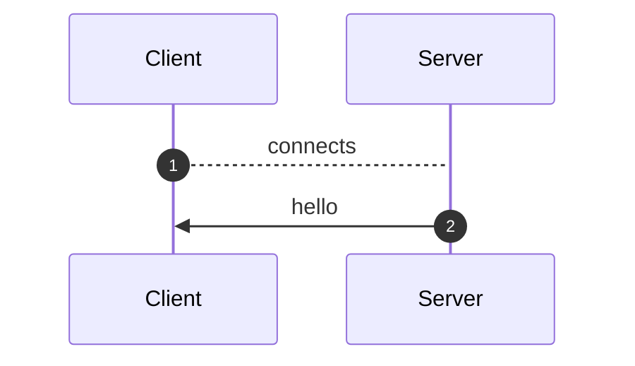
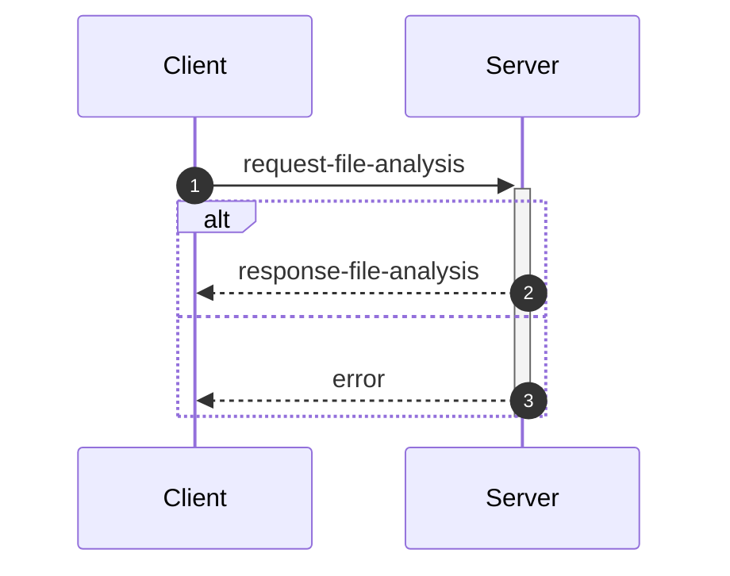
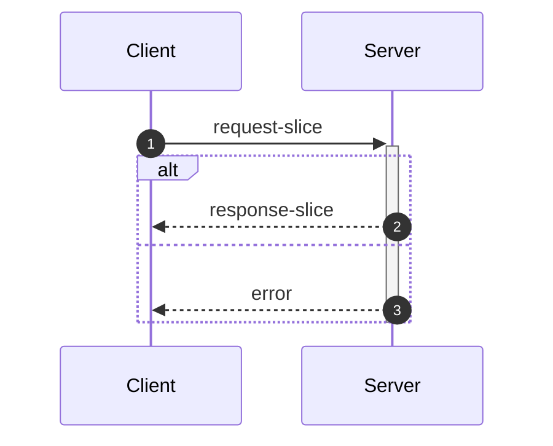
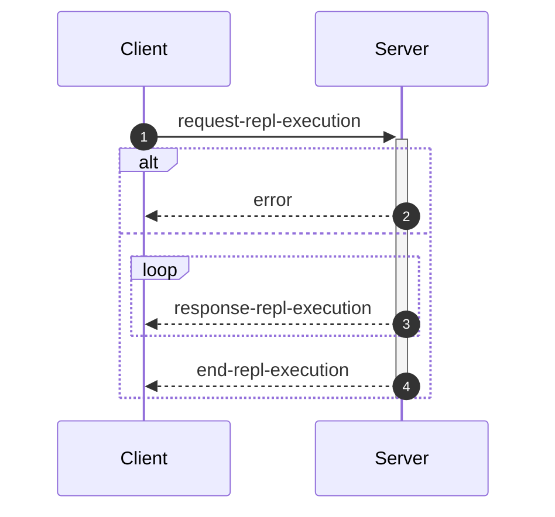

_<span title="an overview of flowR's interface">Generated</span> from '[wiki-interface.ts](https://github.com/flowr-analysis/flowr/tree/main/src/documentation/wiki-interface.ts "src/documentation/wiki-interface.ts")' on 2026-09-08, 07:17:52 UTC (v2.15.8, R v4.6.1), do not edit directly._


Although far from being as detailed as the in-depth explanation of [_flowR_](https://github.com/flowr-analysis/flowr/wiki/Core),
this wiki page explains how to interface with _flowR_ in more detail.
In general, command line arguments and other options provide short descriptions on hover over.

* [💻 Using the REPL](#using-the-repl)
* [⚙️ Configuring FlowR](#configuring-flowr)
* [⚒️ Writing Code](#writing-code)
* [💬 Communicating with the Server](#communicating-with-the-server)

<a id='using-the-repl'></a>
## 💻 Using the REPL


> [!NOTE]
> To execute arbitrary R commands with a repl request, _flowR_ has to be started explicitly with <span title="Description (Command Line Argument): Allow to access the underlying R session when using flowR (security warning: this allows the execution of arbitrary R code!)">`--r-session-access`</span>.
> Please be aware that this introduces a security risk and note that this relies on the [`r-shell` engine](https://github.com/flowr-analysis/flowr/wiki/Engines) .

Although primarily meant for users to explore,
there is nothing which forbids simply calling _flowR_ as a subprocess to use standard-in, -output, and -error
for communication (although you can access the REPL using the server as well,
with the [REPL Request](#message-request-repl-execution) message).

The read-eval-print loop&nbsp;(REPL) works relatively simple.
You can submit an expression (using <kbd>Enter</kbd>),
which is interpreted as an R&nbsp;expression by default but interpreted as a *command* if it starts with a colon (`:`).
The best command to get started with the REPL is <span title="Description (Repl Command): Show help information (aliases: :h, :?)">`:help`</span>.
Besides, you can leave the REPL either with the command <span title="Description (Repl Command): End the repl (aliases: :q, :exit)">`:quit`</span> or by pressing <kbd>Ctrl</kbd>+<kbd>C</kbd> twice.
When writing a *command*, you may press <kbd>Tab</kbd> to get a list of completions, if available.
Multiple commands can be entered in a single line by separating them with a semicolon (`;`), e.g. `:parse "x<-2"; :df*`.
If a command is given without R code, the REPL will re-use R code given in a previous command.
The prior example will hence return first the parsed AST of the program and then the dataflow graph for `"x <- 2"`.

> [!NOTE]
> If you develop flowR, you may want to launch the repl using the `npm run main-dev` command, this way, you get a non-minified version of flowR with debug information and hot-reloading of source files.

<details>
<summary>Available Commands</summary>

We currently offer the following commands (this with a `[*]` suffix are available with and without the star):


| Command | Description |
| ------- | ----------- |
| **<span title="Description (Repl Command): End the repl (aliases: :q, :exit)">:quit</span>** | End the repl (aliases: **:<span title="Alias of ':quit'. End the repl">q</span>**, **:<span title="Alias of ':quit'. End the repl">exit</span>**) |
| **<span title="Description (Repl Command): Execute the given code as R code. This requires the `--r-session-access` flag to be set and requires the r-shell engine. (aliases: :e, :r)">:execute</span>** | Execute the given code as R code. This requires the `--r-session-access` flag to be set and requires the r-shell engine. (aliases: **:<span title="Alias of ':execute'. Execute the given code as R code. This requires the `--r-session-access` flag to be set and requires the r-shell engine.">e</span>**, **:<span title="Alias of ':execute'. Execute the given code as R code. This requires the `--r-session-access` flag to be set and requires the r-shell engine.">r</span>**) |
| **<span title="Description (Repl Command): Get mermaid code for the control-flow graph of R code (aliases: :cfg, :cf)">:controlflow[*]</span>** | Get mermaid code for the control-flow graph of R code (star: Returns the URL to mermaid.live) (aliases: **:<span title="Alias of ':controlflow'. Get mermaid code for the control-flow graph of R code">cfg</span>**, **:<span title="Alias of ':controlflow'. Get mermaid code for the control-flow graph of R code">cf</span>**) |
| **<span title="Description (Repl Command): Get mermaid code for the control-flow graph with basic blocks (aliases: :cfgb, :cfb)">:controlflowbb[*]</span>** | Get mermaid code for the control-flow graph with basic blocks (star: Returns the URL to mermaid.live) (aliases: **:<span title="Alias of ':controlflowbb'. Get mermaid code for the control-flow graph with basic blocks">cfgb</span>**, **:<span title="Alias of ':controlflowbb'. Get mermaid code for the control-flow graph with basic blocks">cfb</span>**) |
| **<span title="Description (Repl Command): Get mermaid code for the dataflow graph (aliases: :d, :df)">:dataflow[*]</span>** | Get mermaid code for the dataflow graph (star: Returns the URL to mermaid.live) (aliases: **:<span title="Alias of ':dataflow'. Get mermaid code for the dataflow graph">d</span>**, **:<span title="Alias of ':dataflow'. Get mermaid code for the dataflow graph">df</span>**) |
| **<span title="Description (Repl Command): Get mermaid code for the normalized AST of R code (aliases: :n)">:normalize[*]</span>** | Get mermaid code for the normalized AST of R code (star: Returns the URL to mermaid.live) (alias: **:<span title="Alias of ':normalize'. Get mermaid code for the normalized AST of R code">n</span>**) |
| **<span title="Description (Repl Command): Get mermaid code for the simplified dataflow graph (aliases: :ds, :dfs)">:dataflowsimple[*]</span>** | Get mermaid code for the simplified dataflow graph (star: Returns the URL to mermaid.live) (aliases: **:<span title="Alias of ':dataflowsimple'. Get mermaid code for the simplified dataflow graph">ds</span>**, **:<span title="Alias of ':dataflowsimple'. Get mermaid code for the simplified dataflow graph">dfs</span>**) |
| **<span title="Description (Repl Command): Inspect and extend the signature database: `query` (identical to :query @signature), `info <name>` for where a function comes from (identical to :query @function-info), `add <path>` to mount another database/source, `download` to fetch the full-history database. (aliases: :sig)">:signature</span>** | Inspect and extend the signature database: `query` (identical to :query @signature), `info <name>` for where a function comes from (identical to :query @function-info), `add <path>` to mount another database/source, `download` to fetch the full-history database. (alias: **:<span title="Alias of ':signature'. Inspect and extend the signature database: `query` (identical to :query @signature), `info <name>` for where a function comes from (identical to :query @function-info), `add <path>` to mount another database/source, `download` to fetch the full-history database.">sig</span>**) |
| **<span title="Description (Repl Command): Just calculates the DFG, but only prints summary info (aliases: :d#, :df#)">:dataflowsilent</span>** | Just calculates the DFG, but only prints summary info (aliases: **:<span title="Alias of ':dataflowsilent'. Just calculates the DFG, but only prints summary info">d#</span>**, **:<span title="Alias of ':dataflowsilent'. Just calculates the DFG, but only prints summary info">df#</span>**) |
| **<span title="Description (Repl Command): Prints ASCII Art of the parsed, unmodified AST (aliases: :p)">:parse</span>** | Prints ASCII Art of the parsed, unmodified AST (alias: **:<span title="Alias of ':parse'. Prints ASCII Art of the parsed, unmodified AST">p</span>**) |
| **<span title="Description (Repl Command): Prints the version of flowR as well as the current version of R">:version</span>** | Prints the version of flowR as well as the current version of R
| **<span title="Description (Repl Command): Query the given R code (use 'help' for more information)">:query[*]</span>** | Query the given R code (use 'help' for more information) (star: Similar to query, but returns the output in json format.)
| **<span title="Description (Repl Command): Returns an ASCII representation of the dataflow graph (aliases: :df!)">:dataflowascii</span>** | Returns an ASCII representation of the dataflow graph (alias: **:<span title="Alias of ':dataflowascii'. Returns an ASCII representation of the dataflow graph">df!</span>**) |
| **<span title="Description (Repl Command): Returns summarization stats for the normalized AST (aliases: :n#)">:normalize#</span>** | Returns summarization stats for the normalized AST (alias: **:<span title="Alias of ':normalize#'. Returns summarization stats for the normalized AST">n#</span>**) |
| **<span title="Description (Repl Command): Show help information (aliases: :h, :?)">:help</span>** | Show help information (aliases: **:<span title="Alias of ':help'. Show help information">h</span>**, **:<span title="Alias of ':help'. Show help information">?</span>**) |


</details>


> [!TIP]
> 
> As indicated by the examples before, all REPL commands that operate on code keep track of the state.
> Hence, if you run a command like <span title="Description (Repl Command, starred version): Returns the URL to mermaid.live; Base Command: Get mermaid code for the dataflow graph (aliases: :d*, :df*)">`:dataflow*`</span> without providing R code,
> the REPL will re-use the R code provided in a previous command.
> Likewise, doing this will benefit from incrementality!
> If you request the dataflow graph with `:df* x <- 2 * y` and then want to see the parsed AST with `:parse`,
> the REPL will re-use previously obtained information and not re-parse the code again.
> 		


Generally, many commands offer shortcut versions in the REPL. Many queries, for example, offer a shortened format (see the example below).
Of special note, the [Config Query](https://github.com/flowr-analysis/flowr/wiki/%5BQuery%5D-Config)
can be used to also modify the currently active configuration of _flowR_ within the REPL (see the [wiki page](https://github.com/flowr-analysis/flowr/wiki/%5BQuery%5D-Config) for more information).

### Example: Retrieving the Dataflow Graph

To retrieve a URL to the [mermaid](https://mermaid.js.org/) diagram of the dataflow of a given expression,
use <span title="Description (Repl Command, starred version): Returns the URL to mermaid.live; Base Command: Get mermaid code for the dataflow graph (aliases: :d*, :df*)">`:dataflow*`</span> (or <span title="Description (Repl Command): Get mermaid code for the dataflow graph (aliases: :d, :df)">`:dataflow`</span> to get the mermaid code in the cli):


```shell
$ docker run -it --rm eagleoutice/flowr # or npm run flowr 
flowR repl v2.15.8, R grammar v14 (tree-sitter engine)
R> :dataflow* y <- 1 + x
```

<details>
<summary style='color:gray'>Output</summary>


```text
https://mermaid.live/view#base64:eyJjb2RlIjoiZmxvd2NoYXJ0IFREXG4gICAgMXt7XCJgKiM5MTtSTnVtYmVyIzkzOyogKioxKipcbiAgICAgICoxLjYqICgqKmlkOiAxKiopYFwifX1cbiAgICAyKFtcImAqIzkxO1JTeW1ib2wjOTM7KiAqKngqKlxuICAgICAgKjEuMTAqICgqKmlkOiAyKiopYFwiXSlcbiAgICAzW1tcImAqIzkxO1JCaW5hcnlPcCM5MzsqIGJhc2UjNTg7IzU4OyoqIzQzOyoqXG4gICAgICAqMS42LTEwKiAoKippZDogMyoqKVxuICAgIGFyZzogKDEsIDIpYFwiXV1cbiAgICBidWlsdC1pbjpfW1wiYEJ1aWx0LUluOlxuIzQzO2BcIl1cbiAgICBzdHlsZSBidWlsdC1pbjpfIHN0cm9rZTpncmF5LGZpbGw6Z3JheSxzdHJva2Utd2lkdGg6MnB4LG9wYWNpdHk6Ljg7XG4gICAgMFtcImAqIzkxO1JTeW1ib2wjOTM7KiAqKnkqKlxuICAgICAgKjEuMSogKCoqaWQ6IDAqKiwgdjogMylgXCJdXG4gICAgNFtbXCJgKiM5MTtSQmluYXJ5T3AjOTM7KiBiYXNlIzU4OyM1ODsqKiM2MDsjNDU7KipcbiAgICAgICoxLjEtMTAqICgqKmlkOiA0KiopXG4gICAgYXJnOiAoMCwgMylgXCJdXVxuICAgIGJ1aWx0LWluOl8tW1wiYEJ1aWx0LUluOlxuIzYwOyM0NTtgXCJdXG4gICAgc3R5bGUgYnVpbHQtaW46Xy0gc3Ryb2tlOmdyYXksZmlsbDpncmF5LHN0cm9rZS13aWR0aDoycHgsb3BhY2l0eTouODtcbiAgICAxIC0uLT58XCJmbG93XCJ8IDJcbiAgICBsaW5rU3R5bGUgMCBzdHJva2U6Z3JheSxjb2xvcjpncmF5O1xuICAgIDIgLS4tPnxcImZsb3dcInwgM1xuICAgIGxpbmtTdHlsZSAxIHN0cm9rZTpncmF5LGNvbG9yOmdyYXk7XG4gICAgMyAtLT58XCJyZWFkcywgYXJnXCJ8IDFcbiAgICAzIC0tPnxcInJlYWRzLCBhcmdcInwgMlxuICAgIDMgLS4tPnxcImZsb3dcInwgMFxuICAgIGxpbmtTdHlsZSA0IHN0cm9rZTpncmF5LGNvbG9yOmdyYXk7XG4gICAgMyAtLi0+fFwicmVhZHMsIGNhbGxzXCJ8IGJ1aWx0LWluOl9cbiAgICBsaW5rU3R5bGUgNSBzdHJva2U6Z3JheTtcbiAgICAwIC0tPnxcImRlZmluZWQtYnksIGZsb3dcInwgNFxuICAgIDAgLS0+fFwiZGVmaW5lZC1ieVwifCAzXG4gICAgNCAtLT58XCJyZWFkcywgYXJnXCJ8IDNcbiAgICA0IC0tPnxcInJldHVybnMsIGFyZ1wifCAwXG4gICAgNCAtLi0+fFwicmVhZHMsIGNhbGxzXCJ8IGJ1aWx0LWluOl8tXG4gICAgbGlua1N0eWxlIDEwIHN0cm9rZTpncmF5OyIsIm1lcm1haWQiOnsiYXV0b1N5bmMiOnRydWV9fQ==
```


Retrieve the dataflow graph of the expression `y <- 1 + x`. It looks like this:


```mermaid
flowchart LR
    1{{"`*#91;RNumber#93;* **1**
      *1.6* (**id: 1**)`"}}
    2(["`*#91;RSymbol#93;* **x**
      *1.10* (**id: 2**)`"])
    3[["`*#91;RBinaryOp#93;* base#58;#58;**#43;**
      *1.6-10* (**id: 3**)
    arg: (1, 2)`"]]
    built-in:_["`Built-In:
#43;`"]
    style built-in:_ stroke:gray,fill:gray,stroke-width:2px,opacity:.8;
    0["`*#91;RSymbol#93;* **y**
      *1.1* (**id: 0**, v: 3)`"]
    4[["`*#91;RBinaryOp#93;* base#58;#58;**#60;#45;**
      *1.1-10* (**id: 4**)
    arg: (0, 3)`"]]
    built-in:_-["`Built-In:
#60;#45;`"]
    style built-in:_- stroke:gray,fill:gray,stroke-width:2px,opacity:.8;
    1 -.->|"flow"| 2
    linkStyle 0 stroke:gray,color:gray;
    2 -.->|"flow"| 3
    linkStyle 1 stroke:gray,color:gray;
    3 -->|"reads, arg"| 1
    3 -->|"reads, arg"| 2
    3 -.->|"flow"| 0
    linkStyle 4 stroke:gray,color:gray;
    3 -.->|"reads, calls"| built-in:_
    linkStyle 5 stroke:gray;
    0 -->|"defined-by, flow"| 4
    0 -->|"defined-by"| 3
    4 -->|"reads, arg"| 3
    4 -->|"returns, arg"| 0
    4 -.->|"reads, calls"| built-in:_-
    linkStyle 10 stroke:gray;
```

	
<details>

<summary style="color:gray">R Code of the Dataflow Graph</summary>

The analysis required _0.8 ms_ and ran (including parse and normalize, using the [tree-sitter](https://github.com/flowr-analysis/flowr/wiki/Engines) engine) within the generation environment. No [signature database](https://github.com/flowr-analysis/flowr/wiki/Signature-Database) is mounted for these generated graphs, so `library()` calls attach no package exports; base-R names are still qualified via the generated base-package store (e.g. `acf` as `stats::acf`). 
We encountered no unknown side effects during the analysis.


```r
y <- 1 + x
```


</details>


</details>


For small graphs like this, <span title="Description (Repl Command): Returns an ASCII representation of the dataflow graph (aliases: :df!)">`:dataflowascii`</span> also provides an ASCII representation directly in the REPL:


```shell
$ docker run -it --rm eagleoutice/flowr # or npm run flowr 
flowR repl v2.15.8, R grammar v14 (tree-sitter engine)
R> :df! y <- 1 + x
```

<details open>
<summary style='color:gray'>Output</summary>


```text
           ┌────────────u<2>u
        c<3>c   0<1>0   | x |
    ┌───| + |───| 1 |───u---u
    │   c---c   0---0
 c<4>c     │
 |<- |     └────────────v<0>v
 c---c──────────────────| y |
                        v---v
Edges:
3 -> 1: reads, arg          3 -> 2: reads, arg
3 -> 0: flows-to            1 -> 2: flows-to
2 -> 3: flows-to            4 -> 3: reads, arg
4 -> 0: returns, arg        0 -> 4: defined-by, flows-to
0 -> 3: defined-by
```


Retrieve the dataflow graph of the expression `y <- 1 + x` as ASCII art.

</details>


For the slicing with <span title="Description (Repl Command): Static backwards executable slicer for R">`:slicer`</span>, you have access to the same [magic comments](#slice-magic-comments) as with the [slice request](#message-request-slice).
Pass `--inline` to splice resolvable `source()` calls into the reconstruction so the slice is a single self-contained R text (the same as the static slice query's `inlineSources` flag).
See `--help` for more flags!

### Example: Interfacing with the File System

Many commands that allow for an R-expression (like <span title="Description (Repl Command, starred version): Returns the URL to mermaid.live; Base Command: Get mermaid code for the dataflow graph (aliases: :d*, :df*)">`:dataflow*`</span>) allow for a file as well
if the argument starts with `file://`.
If you are working from the root directory of the _flowR_ repository, the following gives you the parsed AST of the example file using the <span title="Description (Repl Command): Prints ASCII Art of the parsed, unmodified AST (aliases: :p)">`:parse`</span> command:

> **Watch mode**: Replace `file://` with `watch://` to enter watch mode.
> flowR runs the command immediately and then re-runs it every time the file (or any file inside the folder) changes.
> Enter any other command to leave watch mode.
> For example: `:df watch://analysis.R`


```shell
$ docker run -it --rm eagleoutice/flowr # or npm run flowr 
flowR repl v2.15.8, R grammar v14 (tree-sitter engine)
R> :parse file://test/testfiles/example.R
```

<details>
<summary style='color:gray'>Output</summary>


```text
File: test/testfiles/example.R

program
├ binaryoperator
│ ├ identifier "sum" (1:1─4)
│ ├ <- "<-" (1:5─7)
│ ╰ float "0" (1:8─9)
├ binaryoperator
│ ├ identifier "product" (2:1─8)
│ ├ <- "<-" (2:9─11)
│ ╰ float "1" (2:12─13)
├ binaryoperator
│ ├ identifier "w" (3:1─2)
│ ├ <- "<-" (3:3─5)
│ ╰ float "7" (3:6─7)
├ binaryoperator
│ ├ identifier "N" (4:1─2)
│ ├ <- "<-" (4:3─5)
│ ╰ float "10" (4:6─8)
├ forstatement
│ ├ for "for" (6:1─4)
│ ├ ( "(" (6:5─6)
│ ├ identifier "i" (6:6─7)
│ ├ in "in" (6:8─10)
│ ├ binaryoperator
│ │ ├ float "1" (6:11─12)
│ │ ├ : ":" (6:12─13)
│ │ ╰ parenthesizedexpression
│ │   ├ ( "(" (6:13─14)
│ │   ├ binaryoperator
│ │   │ ├ identifier "N" (6:14─15)
│ │   │ ├ - "-" (6:15─16)
│ │   │ ╰ float "1" (6:16─17)
│ │   ╰ ) ")" (6:17─18)
│ ├ ) ")" (6:18─19)
│ ╰ bracedexpression
│   ├ { "{" (6:20─21)
│   ├ binaryoperator
│   │ ├ identifier "sum" (7:3─6)
│   │ ├ <- "<-" (7:7─9)
│   │ ╰ binaryoperator
│   │   ├ binaryoperator
│   │   │ ├ identifier "sum" (7:10─13)
│   │   │ ├ + "+" (7:14─15)
│   │   │ ╰ identifier "i" (7:16─17)
│   │   ├ + "+" (7:18─19)
│   │   ╰ identifier "w" (7:20─21)
│   ├ binaryoperator
│   │ ├ identifier "product" (8:3─10)
│   │ ├ <- "<-" (8:11─13)
│   │ ╰ binaryoperator
│   │   ├ identifier "product" (8:14─21)
│   │   ├  "" (8:22─23)
│   │   ╰ identifier "i" (8:24─25)
│   ╰ } "}" (9:1─2)
├ call
│ ├ identifier "cat" (11:1─4)
│ ╰ arguments
│   ├ ( "(" (11:4─5)
│   ├ argument
│   │ ╰ string
│   │   ├ " "\"" (11:5─6)
│   │   ├ stringcontent "Sum:" (11:6─10)
│   │   ╰ " "\"" (11:10─11)
│   ├ comma "," (11:11─12)
│   ├ argument
│   │ ╰ identifier "sum" (11:13─16)
│   ├ comma "," (11:16─17)
│   ├ argument
│   │ ╰ string
│   │   ├ " "\"" (11:18─19)
│   │   ├ stringcontent
│   │   │ ╰ escapesequence "\\n" (11:19─21)
│   │   ╰ " "\"" (11:21─22)
│   ╰ ) ")" (11:22─23)
╰ call
  ├ identifier "cat" (12:1─4)
  ╰ arguments
    ├ ( "(" (12:4─5)
    ├ argument
    │ ╰ string
    │   ├ " "\"" (12:5─6)
    │   ├ stringcontent "Product:" (12:6─14)
    │   ╰ " "\"" (12:14─15)
    ├ comma "," (12:15─16)
    ├ argument
    │ ╰ identifier "product" (12:17─24)
    ├ comma "," (12:24─25)
    ├ argument
    │ ╰ string
    │   ├ " "\"" (12:26─27)
    │   ├ stringcontent
    │   │ ╰ escapesequence "\\n" (12:27─29)
    │   ╰ " "\"" (12:29─30)
    ╰ ) ")" (12:30─31)
```


Retrieve the parsed AST of the example file.

<details>

<summary>File Content</summary>


```r
sum <- 0
product <- 1
w <- 7
N <- 10

for (i in 1:(N-1)) {
  sum <- sum + i + w
  product <- product * i
}

cat("Sum:", sum, "\n")
cat("Product:", product, "\n")
```


</details>

As _flowR_ directly transforms this AST the output focuses on being human-readable instead of being machine-readable.
		

</details>


### Example: Run a Query

You can run any query supported by _flowR_ using the <span title="Description (Repl Command): Query the given R code (use 'help' for more information)">`:query`</span> command.
For example, to obtain the shapes of all data frames in a given piece of code, you can run:


```shell
$ docker run -it --rm eagleoutice/flowr # or npm run flowr 
flowR repl v2.15.8, R grammar v14 (tree-sitter engine)
R> :query @absint df-shape "x <- data.frame(a = 1:10, b = 1:10)\ny <- x$a"
```

<details open>
<summary style='color:gray'>Output</summary>


```text
Query: absint (0 ms)
All queries together required ≈0 ms (1ms accuracy, total 0 ms)
```


Retrieve the shapes of all data frames in the given code.

</details>


To run the linter on a file, you can use (in this example, we just issue the `dead-code` linter on a small piece of code):


```shell
$ docker run -it --rm eagleoutice/flowr # or npm run flowr 
flowR repl v2.15.8, R grammar v14 (tree-sitter engine)
R> :query @linter rules:dead-code "if(FALSE) x <- 2"
```

<details open>
<summary style='color:gray'>Output</summary>


```text
Query: linter (0 ms)
   ╰ Dead Code (dead-code):
       ╰ certain:
           ╰ Code at 1.11-16
       ╰ Metadata: searchTimeMs: 0, processTimeMs: 0
All queries together required ≈0 ms (1ms accuracy, total 0 ms)
```


Run the linter on the given code, with only the `dead-code` rule enabled.

</details>


For more information on the available queries, please check out the [Query API](https://github.com/flowr-analysis/flowr/wiki/Query-API).


<a id='configuring-flowr'></a>
## ⚙️ Configuring FlowR


When running _flowR_, you may want to specify some behaviors with a dedicated configuration file.
By default, flowR looks for a file named `flowr.json` in the current working directory (or any higher directory).
You can also specify a different file with <span title="Description (Command Line Argument): The name of the configuration file to use">`--config-file`</span> or pass the configuration inline using <span title="Description (Command Line Argument): The flowR configuration to use, as a JSON string">`--config-json`</span>.
To inspect the current configuration, you can run flowr with the <span title="Description (Command Line Argument): Run with verbose logging (will be passed to the corresponding script)">`--verbose`</span> flag, or use the `config` [Query](https://github.com/flowr-analysis/flowr/wiki/Query-API).
Within the REPL this works by running the following:


```shell
:query @config
```


To work with the <a href="https://github.com/flowr-analysis/flowr/tree/main/src/config.ts#L107"><code><span title="The configuration file format for flowR.">FlowrConfig</span></code></a> you can use the provided helper objects alongside its methods like
<a href="https://github.com/flowr-analysis/flowr/tree/main/src/config.ts#L856"><code><span title="Creates a new flowr config that has the updated values.">FlowrConfig::<b>amend</b></span></code></a>.
The schema below documents every option; the ones you most likely want are:

- <a href="https://github.com/flowr-analysis/flowr/wiki/Interface#configuring-flowr" title="Configuration Option (boolean): Whether source calls should be ignored, causing {@link processSourceCall}&#39;s behavior to be skipped.">ignoreSourceCalls</a>: ignore source calls when analyzing the code, i.e., ignore the inclusion of other files.
- <a href="https://github.com/flowr-analysis/flowr/wiki/Interface#configuring-flowr" title="Configuration Option (boolean): Whether load calls should be ignored, causing {@link processLoadCall}&#39;s behavior to be skipped.">ignoreLoadCalls</a>: ignore load calls when analyzing the code, i.e., ignore the loading of r-data files.
- <a href="https://github.com/flowr-analysis/flowr/wiki/Interface#configuring-flowr" title="Configuration Option (object): Do you want to overwrite (parts) of the builtin definition?">semantics.environment.overwriteBuiltIns</a>: overwrite _flowR_'s handling of built-in functions, or clear the preset definitions entirely.
  See [Configure BuiltIn Semantics](#configure-builtin-semantics) for more information.
- <a href="https://github.com/flowr-analysis/flowr/wiki/Interface#configuring-flowr" title="Configuration Option (string): How to resolve variables and their values. (one of &quot;disabled&quot;, &quot;alias&quot;, &quot;builtin&quot;)">solver.variables</a>: how to resolve variables and their values (`disabled`, `alias`, `builtin`).
- <a href="https://github.com/flowr-analysis/flowr/wiki/Interface#configuring-flowr" title="Configuration Option (array): The engine or set of engines to use for interacting with R code. An empty array means all available engines will be used.">engines</a> and <a href="https://github.com/flowr-analysis/flowr/wiki/Interface#configuring-flowr" title="Configuration Option (string): The default engine to use for interacting with R code. If this is undefined, an arbitrary engine from the specified list will be used. (one of &quot;tree-sitter&quot;, &quot;r-shell&quot;)">defaultEngine</a>: the engines used to interact with R code, see the [Engines wiki page](https://github.com/flowr-analysis/flowr/wiki/Engines).
- <a href="https://github.com/flowr-analysis/flowr/wiki/Interface#configuring-flowr" title="Configuration Option (array): Files a framework loads on its own, without any source() call (e.g. global.R in a shiny app), in the order they are loaded; flowR orders the matching project files accordingly and analyzes them as one program. Entries are case-insensitive globs matched against the file path, a plain name matches any file with that name, and entries matching no project file are warned about. Usually set per project kind via specializeConfig.">project.implicitSources</a>: the files a framework loads without any `source()` call, in the order in which they are
  loaded. Entries are globs (e.g. `R/*.R`) matched against the file path ignoring capitalization; one matching no file is reported.
- <a href="https://github.com/flowr-analysis/flowr/wiki/Interface#configuring-flowr" title="Configuration Option (object): Overwrite (parts of) the configuration depending on the project kind flowR detects, e.g. to give a shiny app its implicit sources.">specializeConfig</a>: overwrite (parts of) the configuration depending on the kind of project _flowR_ detects
  (e.g. `shiny-app`), which is how a shiny app gets its implicit sources by default. What you configure directly wins.
- <a href="https://github.com/flowr-analysis/flowr/wiki/Interface#configuring-flowr" title="Configuration Option (string): Overwrite the project kind flowR would otherwise infer from the analyzed files, e.g. when auto-detection guesses wrong. (one of &quot;package&quot;, &quot;script&quot;, &quot;shiny-app&quot;, &quot;notebook&quot;, &quot;project&quot;, &quot;unknown&quot;)">project.useProjectType</a>: skip that detection and force a project kind yourself, when auto-detection guesses wrong.
- <a href="https://github.com/flowr-analysis/flowr/wiki/Interface#configuring-flowr" title="Configuration Option (array): The default plugins to load when creating a new instance of FlowrAnalyzer">defaultPlugins</a> and <a href="https://github.com/flowr-analysis/flowr/wiki/Interface#configuring-flowr" title="Configuration Option (array): The plugins to load in REPL mode">repl.plugins</a>: the plugins to load for a new <a href="https://github.com/flowr-analysis/flowr/tree/main/src/project/flowr-analyzer.ts#L202"><code><span title="Central class for conducting analyses with FlowR. Use the FlowrAnalyzerBuilder to create a new instance. If you want the original pattern of creating a pipeline and running all steps, you can still do this with FlowrAnalyzer#runFull . To inspect the context of the analyzer, use FlowrAnalyzer#inspectContext (if you are a plugin and need to modify it, use FlowrAnalyzer#context instead).">FlowrAnalyzer</span></code></a> and in the REPL
  (use `flowr:default` to reference the former).

So you can configure _flowR_ by adding a file like the following:

<details>

<summary>Example Configuration File</summary>


```json
{
  "ignoreSourceCalls": true,
  "ignoreLoadCalls": true,
  "semantics": {
    "environment": {
      "overwriteBuiltIns": {
        "definitions": [
          {
            "type": "function",
            "names": [
              "foo"
            ],
            "processor": "builtin:assign",
            "config": {}
          }
        ]
      }
    }
  },
  "defaultPlugins": [
    "file:description",
    "versions:description"
  ],
  "repl": {
    "quickStats": false,
    "dfProcessorHeat": false,
    "hints": true,
    "plugins": [
      "flowr:default"
    ]
  },
  "project": {
    "resolveUnknownPathsOnDisk": true,
    "implicitSources": [
      "global.R",
      "app.R"
    ]
  },
  "linter": {
    "disabledRules": []
  },
  "specializeConfig": {
    "shiny-app": {
      "project": {
        "implicitSources": [
          "global.R",
          "ui.R",
          "server.R",
          "app.R"
        ]
      }
    }
  },
  "engines": [
    {
      "type": "r-shell"
    }
  ],
  "solver": {
    "variables": "alias",
    "evalStrings": true,
    "trackEnvironments": true,
    "sigdb": {
      "enabled": true,
      "loadProjectDependencies": true,
      "eagerlyLoad": false,
      "eagerlyLoadExports": false,
      "linkBaseR": false,
      "linkDescriptionDependencies": false
    },
    "resolveSource": {
      "dropPaths": "no",
      "ignoreCapitalization": true,
      "inferWorkingDirectory": "active-script",
      "searchPath": []
    },
    "instrument": {},
    "slicer": {
      "threshold": 50
    }
  },
  "abstractInterpretation": {
    "wideningThreshold": 4,
    "followCalls": true,
    "dataFrame": {
      "maxColNames": 20,
      "readLoadedData": {
        "readExternalFiles": true,
        "maxReadLines": 1000000
      }
    }
  },
  "incremental": {
    "alwaysIncremental": false,
    "parsing": {
      "activated": false,
      "heuristics": {
        "activated": true,
        "mtime": true,
        "linesFrom": 500,
        "bytesFrom": 50000,
        "alwaysWithEdits": false,
        "minFiles": 1
      }
    }
  },
  "gas": {
    "thresholds": {
      "memory": {
        "problematic": 0.7,
        "critical": 0.9
      },
      "timeMs": {
        "problematic": 100000,
        "critical": 120000
      }
    },
    "features": {}
  }
}
```


</details>

<details>
<a id='configure-builtin-semantics'></a>
<summary>Configure Built-In Semantics</summary>


`semantics/environment/overwriteBuiltins` accepts two keys:

- `loadDefaults` (boolean, initially `true`): If set to `true`, the default built-in definitions are loaded before applying the custom definitions. Setting this flag to `false` explicitly disables the loading of the default definitions.
- `definitions` (array, initially empty): Allows to overwrite or define new built-in elements. Each object within must have a `type` which is one of the below. Furthermore, they may define a string array of `names` which specifies the identifiers to bind the definitions to. You may use `assumePrimitive` to specify whether _flowR_ should assume that this is a primitive non-library definition (so you probably just do not want to specify the key).

  | Type            | Description                                                                                                                                                                                                                                                                                              | Example                                                                                                    |
  | --------------- | -------------------------------------------------------------------------------------------------------------------------------------------------------------------------------------------------------------------------------------------------------------------------------------------------------- | ---------------------------------------------------------------------------------------------------------- |
  | `constant`    | Additionally allows for a `value` this should resolve to.                                                                                                                                                                                                                                                | `{ type: 'constant', names: ['NULL', 'NA'],  value: null }`                                                |
  | `function`    | Is a rather flexible way to define and bind built-in functions. For the time, we do not have extensive documentation to cover all the cases, so please either consult the sources with the `default-builtin-config.ts` or open a [new issue](https://github.com/flowr-analysis/flowr/issues/new/choose). | `{ type: 'function', names: ['next'], processor: 'builtin:d', config: { cfg: ExitPointType.Next } }` |
  | `replacement` | A comfortable way to specify replacement functions like `$<-` or `names<-`. `suffixes` describes the... suffixes to attach automatically. | `{ type: 'replacement', suffixes: ['<-', '<<-'], names: ['[', '[['] }` |


</details>

<details>

<summary style='color:gray'>Full Configuration-File Schema</summary>

- _The configuration file format for flowR._ (object)
    - **logLevel** [optional] _flowR's global minimum log level, applied when the config is loaded._ (string)
        Only allows: 'silly', 'trace', 'debug', 'info', 'warn', 'error', 'fatal'
    - **ignoreSourceCalls** [optional] _Whether source calls should be ignored, causing {@link processSourceCall}'s behavior to be skipped._ (boolean)
    - **ignoreLoadCalls** [optional] _Whether load calls should be ignored, causing {@link processLoadCall}'s behavior to be skipped._ (boolean)
    - **semantics** _Configure language semantics and how flowR handles them._ (object)
        - **environment** [optional] _Semantics regarding how to handle the R environment._ (object)
            - **overwriteBuiltIns** [optional] _Do you want to overwrite (parts) of the builtin definition?_ (object)
                - **loadDefaults** [optional] _Should the default configuration still be loaded?_ (boolean)
                - **definitions** [optional] _The definitions to load/overwrite._ (array)
                Valid item types:
                    - (object)
    - **defaultPlugins** [optional] _The default plugins to load when creating a new instance of FlowrAnalyzer_ (array)
    Valid item types:
        - (alternatives)
            - (string)
            - (array)
    - **repl** _Configuration options for the REPL._ (object)
        - **quickStats** [optional] _Whether to show quick stats in the REPL after each evaluation._ (boolean)
        - **dfProcessorHeat** [optional] _This instruments the dataflow processors to count how often each processor is called._ (boolean)
        - **hints** [optional] _Whether to show dim inline hints on the empty prompt (automatically disabled on non-interactive terminals)._ (boolean)
        - **plugins** [optional] _The plugins to load in REPL mode_ (array)
        Valid item types:
            - (alternatives)
                - (string)
                - (array)
        - **autoUseFileProtocol** [optional] _Prepend the file protocol to a repl input that looks like a path, instead of only warning about it._ (boolean)
        - **queryStats** [optional] _Whether `:query` closes with the line stating how long the queries took (`:query*` never prints it)._ (boolean)
        - **showPlugins** [optional] _Whether `:version` grays out the plugins that did not activate during the last analysis._ (boolean)
    - **project** _Project specific configuration options._ (object)
        - **resolveUnknownPathsOnDisk** [optional] _Whether to resolve unknown paths loaded by the r project disk when trying to source/analyze files._ (boolean)
        - **failOnInaccessiblePath** [optional] _Whether a directory that cannot be traversed during file discovery (e.g. due to permissions) aborts the analysis; when false (the default) such paths are logged and skipped._ (boolean)
        - **basePackages** [optional] _The packages considered part of R itself (base and recommended); if unset, flowR uses its built-in list._ (array)
        Valid item types:
            - (string)
        - **implicitSources** [optional] _Files a framework loads on its own, without any source() call (e.g. global.R in a shiny app), in the order they are loaded; flowR orders the matching project files accordingly and analyzes them as one program. Entries are case-insensitive globs matched against the file path, a plain name matches any file with that name, and entries matching no project file are warned about. Usually set per project kind via specializeConfig._ (array)
        Valid item types:
            - (string)
        - **useProjectType** [optional] _Overwrite the project kind flowR would otherwise infer from the analyzed files, e.g. when auto-detection guesses wrong._ (string)
            Only allows: 'package', 'script', 'shiny-app', 'notebook', 'project', 'unknown'
        - **assumeImplicitEcho** [optional] _Whether the top level of the analyzed code is echoed, so that every visible result printed there is collected as an output by the dependencies query (default true, false for a package)._ (boolean)
        - **discovery** [optional] _Scoping options for the default project discovery._ (object)
            - **full** [optional] _Collect every file below the project root (greedy) instead of only the files the detected project kind needs (default false)._ (boolean)
            - **perKind** [optional] _Per-kind include/exclude glob overrides layered on the default scoping._ (object)
            - **ignore** [optional] _Case-insensitive globs that drop matching files from the intelligent discovery, regardless of kind (e.g. .Renviron to ignore environment files)._ (array)
            Valid item types:
                - (string)
        - **classification** [optional] _Overrides for the signals flowR uses to classify the project kind._ (object)
            - **shinyDescriptionTypes** [optional] _DESCRIPTION Type: values that mark a shiny app._ (array)
            Valid item types:
                - (string)
            - **shinyEntryFiles** [optional] _File names a shiny app is assembled from._ (array)
            Valid item types:
                - (string)
            - **shinyUsagePattern** [optional] _Regex source evidencing shiny usage in an entry file._ (string)
            - **notebookExtensions** [optional] _File extensions marking a notebook._ (array)
            Valid item types:
                - (string)
    - **linter** _Linter configuration options._ (object)
        - **disabledRules** _Linting rule names excluded from the default rule set (a rule requested explicitly via a linter query still runs). Usually set per project kind via specializeConfig._ (array)
        Valid item types:
            - (string)
    - **inputSources** [optional] _Further frameworks the input-sources analysis should know about; entries are added to flowR's defaults._ (object)
        - **pure** [optional] _Functions that only pass the constantness of their arguments on._ (array)
        Valid item types:
            - (string)
        - **param** [optional] _Functions whose result is a 'param' input._ (array)
        Valid item types:
            - (string)
        - **file** [optional] _Functions whose result is a 'file' input._ (array)
        Valid item types:
            - (string)
        - **tempfile** [optional] _Functions whose result is a 'tempfile' input._ (array)
        Valid item types:
            - (string)
        - **glob** [optional] _Functions whose result is a 'glob' input._ (array)
        Valid item types:
            - (string)
        - **net** [optional] _Functions whose result is a 'net' input._ (array)
        Valid item types:
            - (string)
        - **rand** [optional] _Functions whose result is a 'rand' input._ (array)
        Valid item types:
            - (string)
        - **system** [optional] _Functions whose result is a 'system' input._ (array)
        Valid item types:
            - (string)
        - **ffi** [optional] _Functions whose result is a 'ffi' input._ (array)
        Valid item types:
            - (string)
        - **lang** [optional] _Functions whose result is a 'lang' input._ (array)
        Valid item types:
            - (string)
        - **options** [optional] _Functions whose result is a 'options' input._ (array)
        Valid item types:
            - (string)
        - **cmdline** [optional] _Functions whose result is a 'cmdline' input._ (array)
        Valid item types:
            - (string)
        - **user** [optional] _Functions whose result is a 'user' input._ (array)
        Valid item types:
            - (string)
        - **const** [optional] _Functions whose result is a 'const' input._ (array)
        Valid item types:
            - (string)
        - **scope** [optional] _Functions whose result is a 'scope' input._ (array)
        Valid item types:
            - (string)
        - **dconst** [optional] _Functions whose result is a 'dconst' input._ (array)
        Valid item types:
            - (string)
        - **unknown** [optional] _Functions whose result is a 'unknown' input._ (array)
        Valid item types:
            - (string)
        - **linkedObjects** [optional] _Objects a framework provides without a definition in the code, e.g. shiny's input._ (array)
        Valid item types:
            - (object)
        - **linkedEntryPoints** [optional] _Calls that hand a function to a framework, which binds its objects to the parameters by position._ (array)
        Valid item types:
            - (object)
    - **specializeConfig** [optional] _Overwrite (parts of) the configuration depending on the project kind flowR detects, e.g. to give a shiny app its implicit sources._ (object)
    - **engines** _The engine or set of engines to use for interacting with R code. An empty array means all available engines will be used._ (array)
    Valid item types:
        - (alternatives)
            - _The configuration for the tree sitter engine._ (object)
                - **type** [required] _Use the tree sitter engine._ (string)
                    Only allows: 'tree-sitter'
                - **wasmPath** [optional] _The path to the tree-sitter-r WASM binary to use. If this is undefined, this uses the default path._ (string)
                - **treeSitterWasmPath** [optional] _The path to the tree-sitter WASM binary to use. If this is undefined, this uses the default path._ (string)
                - **lax** [optional] _Whether to use the lax parser for parsing R code (allowing for syntax errors). If this is undefined, the strict parser will be used._ (boolean)
            - _The configuration for the R shell engine._ (object)
                - **type** [required] _Use the R shell engine._ (string)
                    Only allows: 'r-shell'
                - **rPath** [optional] _The path to the R executable to use. If this is undefined, this uses the default path._ (string)
                - **pipeBind** [optional] _Whether to enable R's experimental pipe-bind operator "=>" by setting _R_USE_PIPEBIND_ for the R session (default false); R itself keeps this off by default, as it is experimental and has never shipped in a release version of R._ (boolean)
    - **defaultEngine** [optional] _The default engine to use for interacting with R code. If this is undefined, an arbitrary engine from the specified list will be used._ (string)
        Only allows: 'tree-sitter', 'r-shell'
    - **solver** _How to resolve constants, constraints, cells, ..._ (object)
        - **variables** _How to resolve variables and their values._ (string)
            Only allows: 'disabled', 'alias', 'builtin'
        - **evalStrings** _Should we include eval(parse(text="...")) calls in the dataflow graph?_ (boolean)
        - **trackEnvironments** [optional] _Track user-created environments (new.env, assign/get/local with envir=, dollar-assign, attach). When false, all envir-style calls fall through conservatively._ (boolean)
        - **sigdb** _Resolving library exports from a signature database._ (object)
            - **enabled** [optional] _Resolve library()/use() exports from a signature database (default true); when false no database is consulted._ (boolean)
            - **loadProjectDependencies** [optional] _Load the project's declared dependencies from its metadata files (DESCRIPTION Imports/Depends, rproject.toml, uvr.toml, renv.lock, rv.lock, uvr.lock) (default true); when false these files are not read for dependencies._ (boolean)
            - **eagerlyLoad** [optional] _Parse the database up front rather than on the first package load (default false, ignored if disabled)._ (boolean)
            - **eagerlyLoadExports** [optional] _Add a vertex for every export on load rather than on demand (default false); keeps the dataflow graph small._ (boolean)
            - **assumedRVersion** [optional] _R version assumed when resolving versioned (base-R) exports: a pin like "4.5" or "auto" to detect the installed R (default "auto")._ (string)
            - **linkBaseR** [optional] _Eagerly attach base-R namespaces so bare base calls resolve without library() (default false)._ (boolean)
            - **linkBaseRCalls** [optional] _Add a lightweight Reads edge from a bare base-R call to its signature-database function vertex (default false; base-R qualification is edge-free otherwise)._ (boolean)
            - **linkPackageCalls** [optional] _Add a lightweight Reads edge from a resolved package call to its signature-database function vertex (default false)._ (boolean)
            - **linkDescriptionDependencies** [optional] _Eagerly attach the namespaces of the project's declared DESCRIPTION dependencies (Imports/Depends) so their exports resolve without an explicit library() (default false)._ (boolean)
            - **warmInBackground** [optional] _Decompress the hot shards (base + most-downloaded) in a background task on startup so the first library() lookup is warm (default false; for long-running servers/REPLs)._ (boolean)
            - **additionalPaths** [optional] _Extra directories or bundle/manifest files searched for signature databases (alongside the shipped default and $FLOWR_SIGDB_DIR); a downloaded full-history bundle placed here is mounted automatically._ (array)
            Valid item types:
                - (string)
            - **downloadRepo** [optional] _GitHub owner/repo the full-history bundle is downloaded from via ":signature download" (default "flowr-analysis/flowr", release tag "sigdb-v<flowR-version>")._ (string)
            - **autoSync** [optional] _On startup, re-download shards whose committed sigdb.remote.json hash no longer matches the cache, in the background (default false; opt-in network sync after a git pull)._ (boolean)
            - **installedLibrary** [optional] _Recovering packages no signature database knows from the copy installed on this machine._ (object)
                - **enabled** [required] _Recover packages no signature database knows from their installed copy (default false)._ (boolean)
                - **paths** [optional] _Library directories to search; when empty they are discovered from the environment and the project._ (array)
                Valid item types:
                    - (string)
                - **useEnvironment** [optional] _Search the libraries R_LIBS_USER/R_LIBS/R_LIBS_SITE name (default true)._ (boolean)
                - **useProjectLibrary** [optional] _Search a project-local renv/packrat library (default true)._ (boolean)
                - **maxDepth** [optional] _How far to descend into the nested layout of a project-local library (default 3)._ (number)
                - **packages** [optional] _Only recover packages whose name matches one of these regular expressions; empty means any._ (array)
                Valid item types:
                    - (string)
            - **blobCacheBudgetMb** [optional] _How many MiB of decoded package blobs every open bundle may hold together (default 16)._ (number)
            - **versionSelection** [optional] _When a project constrains a dependency, resolve to the newest (default), oldest, or system-installed version satisfying it; system needs R and falls back to newest. Base-R packages always resolve against the assumed R version._ (string)
                Only allows: 'newest', 'oldest', 'system'
            - **versionOverrides** [optional] _Force an exact version for specific packages (name -> version), overriding both the project constraint and the versionSelection policy (default {})._ (object)
        - **versionManagement** _Policies for reasoning about dependency versions._ (object)
            - **linkedVersionGroups** [optional] _Groups of packages that must resolve to the same version; version guessing intersects each group so its members stay mutually compatible (default [])._ (array)
            Valid item types:
                - (array)
                Valid item types:
                    - (string)
        - **assumeAttachedPackages** [optional] _Packages to treat as attached without a `library()` call, so what the built-in configuration states about them applies to the analyzed code. The base packages R attaches on startup already resolve without it._ (array)
        Valid item types:
            - (string)
        - **transitiveSideEffectRounds** [optional] _How many rounds the transitive side-effect fixpoint may run before it is cut off (default 32); the propagation stops on its own as soon as a round adds nothing._ (number)
        - **instrument** (object)
            - **dataflowExtractors** [optional] _These keys are only intended for use within code, allowing to instrument the dataflow analyzer!_ (any)
        - **resolveSource** [optional] _If lax source calls are active, flowR searches for sourced files much more freely, based on the configurations you give it. This option is only in effect if `ignoreSourceCalls` is set to false._ (object)
            - **dropPaths** _Allow to drop the first or all parts of the sourced path, if it is relative._ (string)
                Only allows: 'no', 'once', 'all'
            - **ignoreCapitalization** _Search for filenames matching in the lowercase._ (boolean)
            - **inferWorkingDirectory** _Try to infer the working directory from the main or any script to analyze._ (string)
                Only allows: 'no', 'main-script', 'active-script', 'any-script'
            - **searchPath** _Additionally search in these paths._ (array)
            Valid item types:
                - (string)
            - **repeatedSourceLimit** [optional] _How often the same file can be sourced within a single run? Please be aware: in case of cyclic sources this may not reach a fixpoint so give this a sensible limit._ (number)
            - **applyReplacements** _Provide name replacements for loaded files_ (array)
            Valid item types:
                - (object)
            - **assumeFilesExist** [optional] _Assume a sourced file is always there, making what it defines certain instead of conditional on the source call._ (boolean)
        - **slicer** [optional] _The configuration for the slicer._ (object)
            - **threshold** [optional] _The maximum number of iterations to perform on a single function call during slicing._ (number)
            - **autoExtend** [optional] _If set, the slicer will gain an additional post-pass._ (boolean)
    - **abstractInterpretation** _The configuration options for abstract interpretation._ (object)
        - **wideningThreshold** _The threshold for the number of visitations of a node at which widening should be performed to ensure the termination of the fixpoint iteration._ (number)
        - **followCalls** _Whether the abstract interpretation is interprocedural, i.e. whether it steps into the functions a call may dispatch to._ (boolean)
        - **dataFrame** _The configuration of the shape inference for data frames._ (object)
            - **maxColNames** _The maximum number of columns names to infer for data frames before over-approximating the column names to top._ (number)
            - **readLoadedData** _Configuration options for reading data frame shapes from loaded external data files, such as CSV files._ (object)
                - **readExternalFiles** _Whether data frame shapes should be extracted from loaded external files, such as CSV files._ (boolean)
                - **maxReadLines** _The maximum number of lines to read when extracting data frame shapes from loaded files, such as CSV files._ (number)
    - **incremental** (object)
        - **alwaysIncremental** _Always take the incremental path, regardless of heuristics._ (boolean)
        - **parsing** (object)
            - **activated** _If set, incremental parsing will be used._ (boolean)
            - **heuristics** (object)
                - **activated** [optional] _If set, the heuristics for incremental parsing will be used._ (boolean)
                - **mtime** [optional] _Skip reparsing entirely if the file's modification time is unchanged since the last parse._ (boolean)
                - **linesFrom** [optional] _Only consider incremental parsing for files with at least this many lines._ (number)
                - **bytesFrom** [optional] _Only consider incremental parsing for files with at least this many bytes._ (number)
                - **alwaysWithEdits** [optional] _Always take the incremental path whenever there is a computed edit region, regardless of the other thresholds._ (boolean)
                - **minFiles** [optional] _Only apply these heuristics once the project has at least this many files loaded._ (number)
    - **gas** [optional] _Resource-usage guard (gas) configuration. All feature factors default to 0 (disabled). See https://github.com/flowr-analysis/flowr/wiki/Core#gas-resource-guard._ (object)
        - **thresholds** [optional] _Thresholds for all gas checks (scaled by per-feature factor), boundable per feature._ (object)
            - **memory** [optional] _Heap-usage fraction thresholds (0-1), either shared or given per feature key (with `default` covering the rest)._ (object)
                - **problematic** [optional] _Heap fraction (0-1) above which Problematic is returned, for every feature without an entry of its own._ (number)
                - **critical** [optional] _Heap fraction (0-1) above which Critical is returned, for every feature without an entry of its own._ (number)
            - **timeMs** [optional] _Elapsed analysis time thresholds in milliseconds, either shared or given per feature key (with `default` covering the rest)._ (object)
                - **problematic** [optional] _Elapsed ms above which Problematic is returned, for every feature without an entry of its own._ (number)
                - **critical** [optional] _Elapsed ms above which Critical is returned, for every feature without an entry of its own._ (number)
            - **steps** [optional] _Processed-AST-node thresholds, counted rather than sampled; only a key that arms a budget (`dataflow`) reads them._ (object)
                - **problematic** [optional] _Processed AST nodes above which Problematic is returned, for every feature without an entry of its own._ (number)
                - **critical** [optional] _Processed AST nodes above which the extraction is cut short, for every feature without an entry of its own._ (number)
            - **vertices** [optional] _Created-dataflow-vertex thresholds, counted like `steps`._ (object)
                - **problematic** [optional] _Created dataflow vertices above which Problematic is returned, for every feature without an entry of its own._ (number)
                - **critical** [optional] _Created dataflow vertices above which the extraction is cut short, for every feature without an entry of its own._ (number)
        - **features** [optional] _Per-feature sensitivity factors. 0 or absent disables gas checking for that feature. A factor of 2 makes the feature twice as sensitive. Recognised keys: `source`, `side-effect-linking`, `linter`, `slicer`, `dataflow`._ (object)
        - **countedCheckEvery** [optional] _How many counted steps pass between two clock reads while an armed budget also carries a timeMs bound (default 64); trades overshoot against the cost of reading the clock._ (number)
        - **heapProvider** [optional] _Custom heap statistics source (programmatic configs only), overriding the built-in v8/performance.memory detection._ (function)

</details>

	

<a id='writing-code'></a>
## ⚒️ Writing Code

_flowR_ can be used as a [module](https://www.npmjs.com/package/@eagleoutice/flowr) and offers several main classes and interfaces that are interesting for extension writers 
(see the [Visual Studio Code extension](https://marketplace.visualstudio.com/items?itemName=code-inspect.vscode-flowr) or the [Core](https://github.com/flowr-analysis/flowr/wiki/Core) wiki page for more information).

### Creating Analyses with _flowR_

Nowadays, instances of the <a href="https://github.com/flowr-analysis/flowr/tree/main/src/project/flowr-analyzer.ts#L202"><code><span title="Central class for conducting analyses with FlowR. Use the FlowrAnalyzerBuilder to create a new instance. If you want the original pattern of creating a pipeline and running all steps, you can still do this with FlowrAnalyzer#runFull . To inspect the context of the analyzer, use FlowrAnalyzer#inspectContext (if you are a plugin and need to modify it, use FlowrAnalyzer#context instead).">FlowrAnalyzer</span></code></a> should be used as central frontend to get analysis results from _flowR_.
The entry points an analysis is written against are re-exported from the package root (`import { FlowrAnalyzerBuilder } from '@eagleoutice/flowr'`);
everything else stays reachable under its own path, as in `@eagleoutice/flowr/dataflow/graph/graph`.
For example, a program slice can be created like this:


```ts
const analyzer = await new FlowrAnalyzerBuilder()
    .setEngine('tree-sitter')
    .build();
analyzer.addRequest('x <- 1\ny <- x\nx');
const result = await analyzer.query([
    {
        type:     'static-slice',
        criteria: ['3@x']
    }
]);
//console.log(result['static-slice']);
```


For more information, please have a look at the [Analyzer](https://github.com/flowr-analysis/flowr/wiki/Analyzer) wiki page, which explains how to construct and use the <a href="https://github.com/flowr-analysis/flowr/tree/main/src/project/flowr-analyzer.ts#L202"><code><span title="Central class for conducting analyses with FlowR. Use the FlowrAnalyzerBuilder to create a new instance. If you want the original pattern of creating a pipeline and running all steps, you can still do this with FlowrAnalyzer#runFull . To inspect the context of the analyzer, use FlowrAnalyzer#inspectContext (if you are a plugin and need to modify it, use FlowrAnalyzer#context instead).">FlowrAnalyzer</span></code></a> in more detail.
To work with specific perspectives, you can also consult the respective pages like the [Dataflow Graph](https://github.com/flowr-analysis/flowr/wiki/Dataflow-Graph) or the [Abstract Interpretation](https://github.com/flowr-analysis/flowr/wiki/Abstract-Interpretation) wiki pages.
### The Pipeline Executor (Low-Level Interface)

Once, in the beginning, _flowR_ was meant to produce a dataflow graph merely to provide *program slices*. 
However, with continuous updates, the [Dataflow Graph](https://github.com/flowr-analysis/flowr/wiki/Dataflow-Graph) repeatedly proves to be the more interesting part.
With this, we restructured _flowR_'s originally *hardcoded* pipeline to be far more flexible. 
Now, it can be theoretically extended or replaced with arbitrary steps, optional steps, and what we call 'decorations' of these steps. 
In short, a slicing pipeline using the <a href="https://github.com/flowr-analysis/flowr/tree/main/src/core/pipeline-executor.ts#L97"><code><span title="**Please note:** The PipelineExecutor is now considered to be a rather low-level API for flowR. While it still works and is the basis for all other layers, we strongly recommend using the FlowrAnalyzer and its builder to create and use an analyzer instance that is pre-configured for your use-case. The pipeline executor allows to execute arbitrary pipelines in a step-by-step fashion. If you are not...">PipelineExecutor</span></code></a> looks like this:


```ts

const slicer = new PipelineExecutor(DEFAULT_SLICING_PIPELINE, {
  parser:    new RShell(),
  request:   requestFromInput('x <- 1\nx + 1'),
  criterion: ['2@x']
})
const slice = await slicer.allRemainingSteps()
// console.log(slice.reconstruct.code)
```


<details><summary>More Information</summary>


If you compare this, with what you would have done with the old (and removed) `SteppingSlicer`, 
this essentially just requires you to replace the `SteppingSlicer` with the <a href="https://github.com/flowr-analysis/flowr/tree/main/src/core/pipeline-executor.ts#L97"><code><span title="**Please note:** The PipelineExecutor is now considered to be a rather low-level API for flowR. While it still works and is the basis for all other layers, we strongly recommend using the FlowrAnalyzer and its builder to create and use an analyzer instance that is pre-configured for your use-case. The pipeline executor allows to execute arbitrary pipelines in a step-by-step fashion. If you are not...">PipelineExecutor</span></code></a>
and to pass the <a href="https://github.com/flowr-analysis/flowr/tree/main/src/core/steps/pipeline/default-pipelines.ts#L18"><code>DEFAULT_SLICING_PIPELINE</code></a> as the first argument.
The <a href="https://github.com/flowr-analysis/flowr/tree/main/src/core/pipeline-executor.ts#L97"><code><span title="**Please note:** The PipelineExecutor is now considered to be a rather low-level API for flowR. While it still works and is the basis for all other layers, we strongly recommend using the FlowrAnalyzer and its builder to create and use an analyzer instance that is pre-configured for your use-case. The pipeline executor allows to execute arbitrary pipelines in a step-by-step fashion. If you are not...">PipelineExecutor</span></code></a>...

1. Provides structures to investigate the results of all intermediate steps
2. Can be executed step-by-step
3. Can repeat steps (e.g., to calculate multiple slices on the same input)

See the in-code documentation for more information.


</details>

### Using the <a href="https://github.com/flowr-analysis/flowr/tree/main/src/r-bridge/shell.ts#L141"><code><span title="The RShell represents an interactive session with the R interpreter. You can configure it by RShellOptions . At the moment we are using a live R session (and not networking etc.) to communicate with R easily, which allows us to install packages etc. However, this might and probably will change in the future (leaving this as a legacy mode :D)">RShell</span></code></a> to Interact with R

The <a href="https://github.com/flowr-analysis/flowr/tree/main/src/r-bridge/shell.ts#L141"><code><span title="The RShell represents an interactive session with the R interpreter. You can configure it by RShellOptions . At the moment we are using a live R session (and not networking etc.) to communicate with R easily, which allows us to install packages etc. However, this might and probably will change in the future (leaving this as a legacy mode :D)">RShell</span></code></a> class allows interfacing with the `R`&nbsp;ecosystem installed on the host system.
Please have a look at [flowR's Engines](https://github.com/flowr-analysis/flowr/wiki/Engines) for more information on alternatives (for example, the <a href="https://github.com/flowr-analysis/flowr/tree/main/src/r-bridge/lang-4.x/tree-sitter/tree-sitter-executor.ts#L20"><code><span title="Synchronous and (way) faster alternative to the RShell using tree-sitter.">TreeSitterExecutor</span></code></a>).


> [!IMPORTANT]
> 
> Each <a href="https://github.com/flowr-analysis/flowr/tree/main/src/r-bridge/shell.ts#L141"><code><span title="The RShell represents an interactive session with the R interpreter. You can configure it by RShellOptions . At the moment we are using a live R session (and not networking etc.) to communicate with R easily, which allows us to install packages etc. However, this might and probably will change in the future (leaving this as a legacy mode :D)">RShell</span></code></a> controls a new instance of the R&nbsp;interpreter, 
> make sure to call <code><a href="https://github.com/flowr-analysis/flowr/tree/main/src/r-bridge/shell.ts#L352"><span title="Close the current R session, makes the object effectively invalid (can no longer be reopened etc.)">RShell::<i>close</i></span></a>()</code> when you are done.


You can start a new "session" simply by constructing a new object with <code>new <a href="https://github.com/flowr-analysis/flowr/tree/main/src/r-bridge/shell.ts#L141"><span title="The RShell represents an interactive session with the R interpreter. You can configure it by RShellOptions . At the moment we are using a live R session (and not networking etc.) to communicate with R easily, which allows us to install packages etc. However, this might and probably will change in the future (leaving this as a legacy mode :D)">RShell</span></a>()</code>.

However, there are several options that may be of interest 
(e.g., to automatically revive the shell in case of errors or to control the name location of the R process on the system).

With a shell object (let's call it `shell`), you can execute R code by using <a href="https://github.com/flowr-analysis/flowr/tree/main/src/r-bridge/shell.ts#L210"><code><span title="sends the given command directly to the current R session will not do anything to alter input markers!">RShell::<i>sendCommand</i></span></code></a>,
for example <code>shell.<a href="https://github.com/flowr-analysis/flowr/tree/main/src/r-bridge/shell.ts#L210"><span title="sends the given command directly to the current R session will not do anything to alter input markers!">sendCommand</span></a>("1 + 1")</code>.
However, this does not return anything, so if you want to collect the output of your command, use
<a href="https://github.com/flowr-analysis/flowr/tree/main/src/r-bridge/shell.ts#L293"><code><span title="Send a command and collect the output">RShell::<i>sendCommandWithOutput</i></span></code></a> instead.


<a id='communicating-with-the-server'></a>
## 💬 Communicating with the Server


As explained in the [Overview](https://github.com/flowr-analysis/flowr/wiki/Overview), you can simply run the [TCP](https://de.wikipedia.org/wiki/Transmission_Control_Protocol)&nbsp;server by adding the <span title="Description (Command Line Argument): Do not drop into a repl, but instead start a server on the given port (default: 1042) and listen for messages.">`--server`</span> flag (and, due to the interactive mode, exit with the conventional <kbd>CTRL</kbd>+<kbd>C</kbd>).
Currently, every connection is handled by the same underlying `RShell` - so the server is not designed to handle many clients at a time.
Additionally, the server is not well guarded against attacks (e.g., you can theoretically spawn an arbitrary number of&nbsp;RShell sessions on the target machine).

Every message has to be given in a single line (i.e., without a newline in-between) and end with a newline character. Nevertheless, we will pretty-print example given in the following segments for the ease of reading.


> [!NOTE]
> 
> The default <span title="Description (Command Line Argument): Do not drop into a repl, but instead start a server on the given port (default: 1042) and listen for messages.">`--server`</span> uses a simple [TCP](https://de.wikipedia.org/wiki/Transmission_Control_Protocol)
> connection. If you want _flowR_ to expose a [WebSocket](https://de.wikipedia.org/wiki/WebSocket) server instead, add the <span title="Description (Command Line Argument): If the server flag is set, use websocket for messaging">`--ws`</span> flag (i.e., <span title="Description (Command Line Argument): Do not drop into a repl, but instead start a server on the given port (default: 1042) and listen for messages.">`--server`</span> <span title="Description (Command Line Argument): If the server flag is set, use websocket for messaging">`--ws`</span>) when starting _flowR_ from the command line.


<ul><li>
<a id="message-hello"></a>
<b>Hello</b> Message (<code>hello</code>) 
<details>

<summary style="color:gray"> View Details. <i>The server informs the client about the successful connection and provides Meta-Information.</i> </summary>


```mermaid
sequenceDiagram
    autonumber
    participant Client
    participant Server

    
    Client-->Server: connects
    Server->>Client: hello
	
```


	
After launching _flowR_, for example, with <code>docker run -it --rm eagleoutice/flowr <span title="Description (Command Line Argument): Do not drop into a repl, but instead start a server on the given port (default: 1042) and listen for messages.">-<span/>-server</span></code>&nbsp;(🐳️), simply connecting should present you with a `hello` message, that amongst others should reveal the versions of&nbsp;_flowR_ and&nbsp;R, using the [semver 2.0](https://semver.org/spec/v2.0.0.html) versioning scheme.
The message looks like this:


```json
{
  "type": "hello",
  "clientName": "client-0",
  "versions": {
    "flowr": "2.15.8",
    "r": "4.6.1",
    "engine": "r-shell"
  }
}
```


There are currently a few messages that you can send after the hello message.
If you want to _slice_ a piece of R code you first have to send an [analysis request](#message-request-file-analysis), so that you can send one or multiple slice requests afterward.
Requests for the [REPL](#message-request-repl-execution) are independent of that.
	

<hr>


<details>
<summary style="color:gray">Message schema (<code>hello</code>)</summary>

For the definition of the hello message, please see it's implementation at [`./src/cli/repl/server/messages/message-hello.ts`](https://github.com/flowr-analysis/flowr/tree/main/src/cli/repl/server/messages/message-hello.ts).

- [required] (object)
    - **type** [required] _The type of the hello message._ (string)
        Only allows: 'hello'
    - **id** [forbidden] _The id of the message is always undefined (as it is the initial message and not requested)._ (any)
    - **clientName** [required] _A unique name that is assigned to each client. It has no semantic meaning and is only used/useful for debugging._ (string)
    - **versions** [required] (object)
        - **flowr** [required] _The version of the flowr server running in semver format._ (string)
        - **r** [required] _The version of the underlying R shell running in semver format._ (string)
        - **engine** [required] _The parser backend that is used to parse the R code._ (string)

</details>


<hr>

</details>
	</li>

<li>
<a id="message-request-file-analysis"></a>
<b>Analysis</b> Message (<code>request-file-analysis</code>) 
<details>

<summary style="color:gray"> View Details. <i>The server builds the dataflow graph for a given input file (or a set of files).</i> </summary>


```mermaid
sequenceDiagram
    autonumber
    participant Client
    participant Server

    
    Client->>+Server: request-file-analysis
    alt
        Server-->>Client: response-file-analysis
    else
        Server-->>Client: error
    end
    deactivate  Server
	
```


	
The request allows the server to analyze a file and prepare it for slicing.
The message can contain a `filetoken`, which is used to identify the file in later slice or query requests (if you do not add one, the request will not be stored and therefore, it is not available for subsequent requests).

> **Please note!**\
> If you want to send and process a lot of analysis requests, but do not want to slice them, please do not pass the `filetoken` field. This will save the server a lot of memory allocation.

Furthermore, the request must contain either a `content` field to directly pass the file's content or a `filepath` field which contains the path to the file (this path must be accessible for the server to be useful).
If you add the `id` field, the answer will use the same `id` so you can match requests and the corresponding answers.
See the implementation of the request-file-analysis message for more information.

You can drop one or more stored file tokens by adding the `invalidateToken` field (a single token or an array of tokens).
The server frees the corresponding analyses _after_ it has answered the request.

> **Tip!**\
> If you only want to drop tokens, you do not need a separate message: send a `request-file-analysis` that contains _just_ the `invalidateToken` field (and no `content` or `filepath`).
> Such a request behaves like an empty file analysis and the server replies with an empty `results` object.
> Because invalidation happens after the response, you may even pass the _current_ `filetoken` in `invalidateToken` to analyze a file once and have the server forget it right after you received the results.


<details>
<summary>Example of the <code>request-file-analysis</code> Message</summary>

_Note:_ even though we pretty-print these messages, they are sent as a single line, ending with a newline.

The following lists all messages that were sent and received in case you want to reproduce the scenario:

<ol>
<li> <code>hello</code> (response)
<details> 

<summary> Show Details </summary>

The first message is always a hello message.


```json
{
  "type": "hello",
  "clientName": "client-0",
  "versions": {
    "flowr": "2.15.8",
    "r": "4.6.1",
    "engine": "r-shell"
  }
}
```


</details>
</li>

<li> <b><code>request-file-analysis</code> (request)</b>
<details open> 

<summary> Show Details </summary>

Let's suppose you simply want to analyze the following script:
 
```r
x <- 1
x + 1
```

 For this, you can send the following request:


```json
{
  "type": "request-file-analysis",
  "id": "1",
  "filetoken": "x",
  "content": "x <- 1\nx + 1"
}
```


</details>
</li>

<li> <code>response-file-analysis</code> (response)
<details> 

<summary> Show Details </summary>


The `results` field of the response effectively contains three keys of importance:

- `parse`: which contains 1:1 the parse result in CSV format that we received from the `RShell` (i.e., the AST produced by the parser of the R interpreter).
- `normalize`: which contains the normalized AST, including ids (see the `info` field and the [Normalized AST](https://github.com/flowr-analysis/flowr/wiki/Normalized-AST) wiki page).
- `dataflow`: especially important is the `graph` field which contains the dataflow graph as a set of root vertices (see the [Dataflow Graph](https://github.com/flowr-analysis/flowr/wiki/Dataflow-Graph) wiki page).
			


_As the code is pretty long, we inhibit pretty printing and syntax highlighting (JSON, hiding built-in):_

```text
{"type":"response-file-analysis","format":"json","id":"1","results":{"parse":{"files":[{"parsed":"[1,1,1,6,7,0,\"expr\",false,\"x <- 1\"],[1,1,1,1,1,3,\"SYMBOL\",true,\"x\"],[1,1,1,1,3,7,\"expr\",false,\"x\"],[1,3,1,4,2,7,\"LEFT_ASSIGN\",true,\"<-\"],[1,6,1,6,4,5,\"NUM_CONST\",true,\"1\"],[1,6,1,6,5,7,\"expr\",false,\"1\"],[2,1,2,5,16,0,\"expr\",false,\"x + 1\"],[2,1,2,1,10,12,\"SYMBOL\",true,\"x\"],[2,1,2,1,12,16,\"expr\",false,\"x\"],[2,3,2,3,11,16,\"'+'\",true,\"+\"],[2,5,2,5,13,14,\"NUM_CONST\",true,\"1\"],[2,5,2,5,14,16,\"expr\",false,\"1\"]","filePath":"/tmp/tmp-501418-sWtyrD5jCCob-.R"}],".meta":{"timing":2}},"normalize":{"ast":{"type":"RProject","files":[{"root":{"type":"RExpressionList","children":[{"type":"RBinaryOp","location":[1,3,1,4],"lhs":{"type":"RSymbol","location":[1,1,1,1],"content":"x","lexeme":"x","info":{"fullRange":[1,1,1,1],"adToks":[],"id":0,"parent":2,"role":"bin-l","index":0,"nest":0,"file":"/tmp/tmp-501418-sWtyrD5jCCob-.R"}},"rhs":{"location":[1,6,1,6],"lexeme":"1","info":{"fullRange":[1,6,1,6],"adToks":[],"id":1,"parent":2,"role":"bin-r","index":1,"nest":0,"file":"/tmp/tmp-501418-sWtyrD5jCCob-.R"},"type":"RNumber","content":{"num":1,"complexNumber":false,"markedAsInt":false}},"operator":"<-","lexeme":"<-","info":{"fullRange":[1,1,1,6],"adToks":[],"id":2,"parent":6,"nest":0,"file":"/tmp/tmp-501418-sWtyrD5jCCob-.R","index":0,"role":"el-c"}},{"type":"RBinaryOp","location":[2,3,2,3],"lhs":{"type":"RSymbol","location":[2,1,2,1],"content":"x","lexeme":"x","info":{"fullRange":[2,1,2,1],"adToks":[],"id":3,"parent":5,"role":"bin-l","index":0,"nest":0,"file":"/tmp/tmp-501418-sWtyrD5jCCob-.R"}},"rhs":{"location":[2,5,2,5],"lexeme":"1","info":{"fullRange":[2,5,2,5],"adToks":[],"id":4,"parent":5,"role":"bin-r","index":1,"nest":0,"file":"/tmp/tmp-501418-sWtyrD5jCCob-.R"},"type":"RNumber","content":{"num":1,"complexNumber":false,"markedAsInt":false}},"operator":"+","lexeme":"+","info":{"fullRange":[2,1,2,5],"adToks":[],"id":5,"parent":6,"nest":0,"file":"/tmp/tmp-501418-sWtyrD5jCCob-.R","index":1,"role":"el-c"}}],"info":{"adToks":[],"id":6,"nest":0,"file":"/tmp/tmp-501418-sWtyrD5jCCob-.R","role":"root","index":0}},"filePath":"/tmp/tmp-501418-sWtyrD5jCCob-.R"}],"info":{"id":7}},".meta":{"timing":0}},"dataflow":{"unknownReferences":[],"in":[{"nodeId":2,"name":"<-","type":2},{"nodeId":5,"name":"+","type":2}],"out":[{"nodeId":0,"name":"x","type":4,"definedAt":2,"value":[1]}],"environment":{"current":{"id":1446,"parent":"<BuiltInEnvironment>","memory":[["x",[{"nodeId":0,"name":"x","type":4,"definedAt":2,"value":[1]}]]],"globalEnv":true},"level":0},"graph":{"rootVertices":[1,0,2,3,4,5],"vertexInformation":[[1,{"tag":"value","id":1}],[0,{"tag":"vdef","id":0,"source":[1]}],[2,{"tag":"fcall","id":2,"name":"<-","onlyBuiltin":true,"args":[{"nodeId":0,"type":32},{"nodeId":1,"type":32}],"origin":["builtin:assign"]}],[3,{"tag":"use","id":3}],[4,{"tag":"value","id":4}],[5,{"tag":"fcall","id":5,"name":"+","onlyBuiltin":true,"args":[{"nodeId":3,"type":32},{"nodeId":4,"type":32}],"origin":["builtin:d"]}]],"edgeInformation":[[2,[[1,{"types":65}],[0,{"types":72}],["built-in:<-",{"types":5}],[3,{"types":4096}]]],[1,[[0,{"types":4096}]]],[0,[[2,{"types":4098}],[1,{"types":2}]]],[5,[[3,{"types":65}],[4,{"types":65}],["built-in:+",{"types":5}]]],[3,[[0,{"types":1}],[4,{"types":4096}]]],[4,[[5,{"types":4096}]]]],"_unknownSideEffects":[]},"entryPoint":2,"cfgEntry":1,"exitPoints":[{"type":0,"nodeId":5}],"hooks":[],".meta":{"timing":0}}}}
```


</details>
</li>
</ol>

The complete round-trip took 6.4 ms (including time required to validate the messages, start, and stop the internal mock server).

</details>


You receive an error if, for whatever reason, the analysis fails (e.g., the message or code you sent contained syntax errors).
It contains a human-readable description *why* the analysis failed (see the error message implementation for more details).


<details>
<summary>Example Error Message</summary>

_Note:_ even though we pretty-print these messages, they are sent as a single line, ending with a newline.

The following lists all messages that were sent and received in case you want to reproduce the scenario:

<ol>
<li> <code>hello</code> (response)
<details> 

<summary> Show Details </summary>

The first message is always a hello message.


```json
{
  "type": "hello",
  "clientName": "client-0",
  "versions": {
    "flowr": "2.15.8",
    "r": "4.6.1",
    "engine": "r-shell"
  }
}
```


</details>
</li>

<li> <code>request-file-analysis</code> (request)
<details> 

<summary> Show Details </summary>


```json
{
  "type": "request-file-analysis",
  "id": "1",
  "filename": "sample.R",
  "content": "x <-"
}
```


</details>
</li>

<li> <b><code>error</code> (response)</b>
<details open> 

<summary> Show Details </summary>


```json
{
  "id": "1",
  "type": "error",
  "fatal": false,
  "reason": "Error while analyzing file sample.R: GuardError: unable to parse R code (see the log for more information) for request {\"request\":\"text\",\"content\":\"x <-\"}}\n Report a Bug: https://github.com/flowr-analysis/flowr/issues/new?body=%3C!%2D%2D%20Please%20describe%20your%20issue%20in%20more%20detail%20below!%20%2D%2D%3E%0A%0A%0A%3C!%2D%2D%20Automatically%20generated%20issue%20metadata%2C%20please%20do%20not%20edit%20or%20delete%20content%20below%20this%20line%20%2D%2D%3E%0A%2D%2D%2D%0A%0AflowR%20version%3A%202.15.8%0Anode%20version%3A%20v26.7.0%0Anode%20arch%3A%20x64%0Anode%20platform%3A%20linux%0Amessage%3A%20%60unable%20to%20parse%20R%20code%20%28see%20the%20log%20for%20more%20information%29%20for%20request%20%7B%22request%22%3A%22text%22%2C%22content%22%3A%22x%20%3C%2D%22%7D%7D%60%0Astack%20trace%3A%0A%60%60%60%0A%20%20%20%20at%20guard%20%28%3C%3E%2Fsrc%2Futil%2Fassert.ts%3A128%3A9%29%0A%20%20%20%20at%20guardRetrievedOutput%20%28%3C%3E%2Fsrc%2Fr%2Dbridge%2Fretriever.ts%3A235%3A7%29%0A%20%20%20%20at%20%2Fhome%2Fostwind%2Fgit%2Fphd%2Fflowr%2Dfield%2Fflowr%2Fsrc%2Fr%2Dbridge%2Fretriever.ts%3A191%3A4%0A%20%20%20%20at%20processTicksAndRejections%20%28node%3Ainternal%2Fprocess%2Ftask_queues%3A104%3A5%29%0A%20%20%20%20at%20async%20Object.parseRequests%20%5Bas%20processor%5D%20%28%3C%3E%2Fsrc%2Fr%2Dbridge%2Fparser.ts%3A108%3A19%29%0A%20%20%20%20at%20async%20PipelineExecutor.nextStep%20%28%3C%3E%2Fsrc%2Fcore%2Fpipeline%2Dexecutor.ts%3A192%3A25%29%0A%20%20%20%20at%20async%20FlowrAnalyzerCache.stepTapeUntil%20%28%3C%3E%2Fsrc%2Fproject%2Fcache%2Fflowr%2Danalyzer%2Dcache.ts%3A117%3A4%29%0A%20%20%20%20at%20async%20FlowRServerConnection.sendFileAnalysisResponse%20%28%3C%3E%2Fsrc%2Fcli%2Frepl%2Fserver%2Fconnection.ts%3A216%3A53%29%0A%60%60%60%0A%0A%2D%2D%2D%0A%09"
}
```


</details>
</li>
</ol>

The complete round-trip took 4.4 ms (including time required to validate the messages, start, and stop the internal mock server).

</details>


&nbsp;

<a id="analysis-include-cfg"></a>
**Including the Control Flow Graph**

The control flow graph is a view on the dataflow graph: the dataflow analysis records the control flow while it walks
the program, and the graph projects those edges on demand. The server can expose that structure as well (please create
a [new issue](https://github.com/flowr-analysis/flowr/issues/new/choose) for any bug you may encounter).
For this, the analysis request may add `cfg: true` to its list of options.


<details>
<summary>Requesting a Control Flow Graph</summary>

_Note:_ even though we pretty-print these messages, they are sent as a single line, ending with a newline.

The following lists all messages that were sent and received in case you want to reproduce the scenario:

<ol>
<li> <code>hello</code> (response)
<details> 

<summary> Show Details </summary>

The first message is always a hello message.


```json
{
  "type": "hello",
  "clientName": "client-0",
  "versions": {
    "flowr": "2.15.8",
    "r": "4.6.1",
    "engine": "r-shell"
  }
}
```


</details>
</li>

<li> <b><code>request-file-analysis</code> (request)</b>
<details open> 

<summary> Show Details </summary>


```json
{
  "type": "request-file-analysis",
  "id": "1",
  "filetoken": "x",
  "content": "if(unknown > 0) { x <- 2 } else { x <- 5 }\nfor(i in 1:x) { print(x); print(i) }",
  "cfg": true
}
```


</details>
</li>

<li> <code>response-file-analysis</code> (response)
<details> 

<summary> Show Details </summary>


The response looks basically the same as a response sent without the `cfg` flag. However, additionally it contains a `cfg` field. 
If you are interested in a visual representation of the control flow graph, see the 
[visualization with mermaid](https://mermaid.live/view#base64:eyJjb2RlIjoiZmxvd2NoYXJ0IFREXG4gICAgbjAoW1wiYFJTeW1ib2wgKDApXG4qKnVua25vd24qKmBcIl0pXG4gICAgbjEoW1wiYFJOdW1iZXIgKDEpXG4qKjAqKmBcIl0pXG4gICAgbjIoW1wiYFJCaW5hcnlPcCAoMilcbioqdW5rbm93biAjNjI7IDAqKmBcIl0pXG4gICAgbjYoW1wiYFJOdW1iZXIgKDYpXG4qKjIqKmBcIl0pXG4gICAgbjUoW1wiYFJTeW1ib2wgKDUpXG4qKngqKmBcIl0pXG4gICAgbjdbXCJgUkJpbmFyeU9wICg3KVxuKip4ICM2MDsjNDU7IDIqKmBcIl1cbiAgICBuOChbXCJgUkV4cHJlc3Npb25MaXN0ICg4KWBcIl0pXG4gICAgbjEyKFtcImBSTnVtYmVyICgxMilcbioqNSoqYFwiXSlcbiAgICBuMTEoW1wiYFJTeW1ib2wgKDExKVxuKip4KipgXCJdKVxuICAgIG4xM1tcImBSQmluYXJ5T3AgKDEzKVxuKip4ICM2MDsjNDU7IDUqKmBcIl1cbiAgICBuMTQoW1wiYFJFeHByZXNzaW9uTGlzdCAoMTQpYFwiXSlcbiAgICBuMTVbXCJgUklmVGhlbkVsc2UgKDE1KVxuKippZih1bmtub3duICM2MjsgMCkgIzEyMzsgeCAjNjA7IzQ1OyAyICMxMjU7IGVsc2UgIzEyMzsgeCAjNjA7IzQ1OyA1ICMxMjU7KipgXCJdXG4gICAgbjE2KFtcImBSU3ltYm9sICgxNilcbioqaSoqYFwiXSlcbiAgICBuMTcoW1wiYFJOdW1iZXIgKDE3KVxuKioxKipgXCJdKVxuICAgIG4xOChbXCJgUlN5bWJvbCAoMTgpXG4qKngqKmBcIl0pXG4gICAgbjE5KFtcImBSQmluYXJ5T3AgKDE5KVxuKioxIzU4O3gqKmBcIl0pXG4gICAgbjIzKFtcImBSU3ltYm9sICgyMylcbioqeCoqYFwiXSlcbiAgICBuMjVbXCJgUkZ1bmN0aW9uQ2FsbCAoMjUpXG4qKnByaW50KHgpKipgXCJdXG4gICAgbjI3KFtcImBSU3ltYm9sICgyNylcbioqaSoqYFwiXSlcbiAgICBuMjlbXCJgUkZ1bmN0aW9uQ2FsbCAoMjkpXG4qKnByaW50KGkpKipgXCJdXG4gICAgbjMwKFtcImBSRXhwcmVzc2lvbkxpc3QgKDMwKWBcIl0pXG4gICAgbjMxW1wiYFJGb3JMb29wICgzMSlcbioqZm9yKGkgaW4gMSM1ODt4KSAjMTIzOyBwcmludCh4KTsgcHJpbnQoaSkgIzEyNTsqKmBcIl1cbiAgICBuMiAtLi0+fFwiYnJhbmNoIG9uIHVua25vd24gIzYyOyAwICgyKSBpZiBUXCJ8IG42XG4gICAgbjIgLS4tPnxcImJyYW5jaCBvbiB1bmtub3duICM2MjsgMCAoMikgaWYgRlwifCBuMTJcbiAgICBuMCAtLT58XCJmbG93cyB0b1wifCBuMVxuICAgIG4xIC0tPnxcImZsb3dzIHRvXCJ8IG4yXG4gICAgbjcgLS0+fFwiZmxvd3MgdG9cInwgbjhcbiAgICBuNiAtLT58XCJmbG93cyB0b1wifCBuNVxuICAgIG41IC0tPnxcImZsb3dzIHRvXCJ8IG43XG4gICAgbjggLS0+fFwiZmxvd3MgdG9cInwgbjE1XG4gICAgbjE1IC0tPnxcImZsb3dzIHRvXCJ8IG4xN1xuICAgIG4xMyAtLT58XCJmbG93cyB0b1wifCBuMTRcbiAgICBuMTIgLS0+fFwiZmxvd3MgdG9cInwgbjExXG4gICAgbjExIC0tPnxcImZsb3dzIHRvXCJ8IG4xM1xuICAgIG4xNCAtLT58XCJmbG93cyB0b1wifCBuMTVcbiAgICBuMTkgLS0+fFwiZmxvd3MgdG9cInwgbjE2XG4gICAgbjE4IC0tPnxcImZsb3dzIHRvXCJ8IG4xOVxuICAgIG4xNyAtLT58XCJmbG93cyB0b1wifCBuMThcbiAgICBuMjUgLS0+fFwiZmxvd3MgdG9cInwgbjI3XG4gICAgbjIzIC0tPnxcImZsb3dzIHRvXCJ8IG4yNVxuICAgIG4yOSAtLT58XCJmbG93cyB0b1wifCBuMzBcbiAgICBuMjcgLS0+fFwiZmxvd3MgdG9cInwgbjI5XG4gICAgbjMwIC0tPnxcImZsb3dzIHRvXCJ8IG4xNlxuICAgIG4xNiAtLi0+fFwiYnJhbmNoIG9uIGkgKDE2KSBpZiBUXCJ8IG4yM1xuICAgIG4xNiAtLi0+fFwiYnJhbmNoIG9uIGkgKDE2KSBpZiBGXCJ8IG4zMVxuICAgIHN0eWxlIG4wIHN0cm9rZTpjeWFuLHN0cm9rZS13aWR0aDo2LjVweDsgICAgc3R5bGUgbjMxIHN0cm9rZTpncmVlbixzdHJva2Utd2lkdGg6Ni41cHg7IiwibWVybWFpZCI6eyJhdXRvU3luYyI6dHJ1ZX19).
			


_As the code is pretty long, we inhibit pretty printing and syntax highlighting (JSON, hiding built-in):_

```text
{"type":"response-file-analysis","format":"json","id":"1","cfg":{"graph":{"roots":[0,1,2,6,5,7,8,12,11,13,14,15,16,17,18,19,23,25,27,29,30,31],"vtxInfos":[[0,[2,0]],[1,[2,1]],[2,[2,2]],[6,[2,6]],[5,[2,5]],[7,[1,7]],[8,[2,8]],[12,[2,12]],[11,[2,11]],[13,[1,13]],[14,[2,14]],[15,[1,15]],[16,[2,16]],[17,[2,17]],[18,[2,18]],[19,[2,19]],[23,[2,23]],[25,[1,25]],[27,[2,27]],[29,[1,29]],[30,[2,30]],[31,[1,31]]],"bbChildren":[],"edgeInfos":[[2,[[6,{"id":15,"when":true}],[12,{"id":15,"when":false}]]],[0,[[1,0]]],[1,[[2,0]]],[7,[[8,0]]],[6,[[5,0]]],[5,[[7,0]]],[8,[[15,0]]],[15,[[17,0]]],[13,[[14,0]]],[12,[[11,0]]],[11,[[13,0]]],[14,[[15,0]]],[19,[[16,0]]],[18,[[19,0]]],[17,[[18,0]]],[25,[[27,0]]],[23,[[25,0]]],[29,[[30,0]]],[27,[[29,0]]],[30,[[16,0]]],[16,[[23,{"id":31,"when":true}],[31,{"id":31,"when":false}]]]],"mayHaveBasicBlocks":false},"entryPoints":[0],"exitPoints":[31],"returns":[],"breaks":[],"nexts":[]},"results":{"parse":{"files":[{"parsed":"[1,1,1,42,38,0,\"expr\",false,\"if(unknown > 0) { x <- 2 } else { x <- 5 }\"],[1,1,1,2,1,38,\"IF\",true,\"if\"],[1,3,1,3,2,38,\"'('\",true,\"(\"],[1,4,1,14,9,38,\"expr\",false,\"unknown > 0\"],[1,4,1,10,3,5,\"SYMBOL\",true,\"unknown\"],[1,4,1,10,5,9,\"expr\",false,\"unknown\"],[1,12,1,12,4,9,\"GT\",true,\">\"],[1,14,1,14,6,7,\"NUM_CONST\",true,\"0\"],[1,14,1,14,7,9,\"expr\",false,\"0\"],[1,15,1,15,8,38,\"')'\",true,\")\"],[1,17,1,26,22,38,\"expr\",false,\"{ x <- 2 }\"],[1,17,1,17,12,22,\"'{'\",true,\"{\"],[1,19,1,24,19,22,\"expr\",false,\"x <- 2\"],[1,19,1,19,13,15,\"SYMBOL\",true,\"x\"],[1,19,1,19,15,19,\"expr\",false,\"x\"],[1,21,1,22,14,19,\"LEFT_ASSIGN\",true,\"<-\"],[1,24,1,24,16,17,\"NUM_CONST\",true,\"2\"],[1,24,1,24,17,19,\"expr\",false,\"2\"],[1,26,1,26,18,22,\"'}'\",true,\"}\"],[1,28,1,31,23,38,\"ELSE\",true,\"else\"],[1,33,1,42,35,38,\"expr\",false,\"{ x <- 5 }\"],[1,33,1,33,25,35,\"'{'\",true,\"{\"],[1,35,1,40,32,35,\"expr\",false,\"x <- 5\"],[1,35,1,35,26,28,\"SYMBOL\",true,\"x\"],[1,35,1,35,28,32,\"expr\",false,\"x\"],[1,37,1,38,27,32,\"LEFT_ASSIGN\",true,\"<-\"],[1,40,1,40,29,30,\"NUM_CONST\",true,\"5\"],[1,40,1,40,30,32,\"expr\",false,\"5\"],[1,42,1,42,31,35,\"'}'\",true,\"}\"],[2,1,2,36,84,0,\"expr\",false,\"for(i in 1:x) { print(x); print(i) }\"],[2,1,2,3,41,84,\"FOR\",true,\"for\"],[2,4,2,13,53,84,\"forcond\",false,\"(i in 1:x)\"],[2,4,2,4,42,53,\"'('\",true,\"(\"],[2,5,2,5,43,53,\"SYMBOL\",true,\"i\"],[2,7,2,8,44,53,\"IN\",true,\"in\"],[2,10,2,12,51,53,\"expr\",false,\"1:x\"],[2,10,2,10,45,46,\"NUM_CONST\",true,\"1\"],[2,10,2,10,46,51,\"expr\",false,\"1\"],[2,11,2,11,47,51,\"':'\",true,\":\"],[2,12,2,12,48,50,\"SYMBOL\",true,\"x\"],[2,12,2,12,50,51,\"expr\",false,\"x\"],[2,13,2,13,49,53,\"')'\",true,\")\"],[2,15,2,36,81,84,\"expr\",false,\"{ print(x); print(i) }\"],[2,15,2,15,54,81,\"'{'\",true,\"{\"],[2,17,2,24,64,81,\"expr\",false,\"print(x)\"],[2,17,2,21,55,57,\"SYMBOL_FUNCTION_CALL\",true,\"print\"],[2,17,2,21,57,64,\"expr\",false,\"print\"],[2,22,2,22,56,64,\"'('\",true,\"(\"],[2,23,2,23,58,60,\"SYMBOL\",true,\"x\"],[2,23,2,23,60,64,\"expr\",false,\"x\"],[2,24,2,24,59,64,\"')'\",true,\")\"],[2,25,2,25,65,81,\"';'\",true,\";\"],[2,27,2,34,77,81,\"expr\",false,\"print(i)\"],[2,27,2,31,68,70,\"SYMBOL_FUNCTION_CALL\",true,\"print\"],[2,27,2,31,70,77,\"expr\",false,\"print\"],[2,32,2,32,69,77,\"'('\",true,\"(\"],[2,33,2,33,71,73,\"SYMBOL\",true,\"i\"],[2,33,2,33,73,77,\"expr\",false,\"i\"],[2,34,2,34,72,77,\"')'\",true,\")\"],[2,36,2,36,78,81,\"'}'\",true,\"}\"]","filePath":"/tmp/tmp-501418-Z3staWwFcXv2-.R"}],".meta":{"timing":1}},"normalize":{"ast":{"type":"RProject","files":[{"root":{"type":"RExpressionList","children":[{"type":"RIfThenElse","condition":{"type":"RBinaryOp","location":[1,12,1,12],"lhs":{"type":"RSymbol","location":[1,4,1,10],"content":"unknown","lexeme":"unknown","info":{"fullRange":[1,4,1,10],"adToks":[],"id":0,"parent":2,"role":"bin-l","index":0,"nest":1,"file":"/tmp/tmp-501418-Z3staWwFcXv2-.R"}},"rhs":{"location":[1,14,1,14],"lexeme":"0","info":{"fullRange":[1,14,1,14],"adToks":[],"id":1,"parent":2,"role":"bin-r","index":1,"nest":1,"file":"/tmp/tmp-501418-Z3staWwFcXv2-.R"},"type":"RNumber","content":{"num":0,"complexNumber":false,"markedAsInt":false}},"operator":">","lexeme":">","info":{"fullRange":[1,4,1,14],"adToks":[],"id":2,"parent":15,"nest":1,"file":"/tmp/tmp-501418-Z3staWwFcXv2-.R","role":"if-c"}},"then":{"type":"RExpressionList","children":[{"type":"RBinaryOp","location":[1,21,1,22],"lhs":{"type":"RSymbol","location":[1,19,1,19],"content":"x","lexeme":"x","info":{"fullRange":[1,19,1,19],"adToks":[],"id":5,"parent":7,"role":"bin-l","index":0,"nest":1,"file":"/tmp/tmp-501418-Z3staWwFcXv2-.R"}},"rhs":{"location":[1,24,1,24],"lexeme":"2","info":{"fullRange":[1,24,1,24],"adToks":[],"id":6,"parent":7,"role":"bin-r","index":1,"nest":1,"file":"/tmp/tmp-501418-Z3staWwFcXv2-.R"},"type":"RNumber","content":{"num":2,"complexNumber":false,"markedAsInt":false}},"operator":"<-","lexeme":"<-","info":{"fullRange":[1,19,1,24],"adToks":[],"id":7,"parent":8,"nest":1,"file":"/tmp/tmp-501418-Z3staWwFcXv2-.R","index":0,"role":"el-c"}}],"grouping":[{"type":"RSymbol","location":[1,17,1,17],"content":"{","lexeme":"{","info":{"fullRange":[1,17,1,26],"adToks":[],"id":3,"role":"el-g","index":0,"nest":1,"file":"/tmp/tmp-501418-Z3staWwFcXv2-.R"}},{"type":"RSymbol","location":[1,26,1,26],"content":"}","lexeme":"}","info":{"fullRange":[1,17,1,26],"adToks":[],"id":4,"role":"el-g","index":0,"nest":1,"file":"/tmp/tmp-501418-Z3staWwFcXv2-.R"}}],"info":{"adToks":[],"id":8,"parent":15,"nest":1,"file":"/tmp/tmp-501418-Z3staWwFcXv2-.R","index":1,"role":"if-then"}},"location":[1,1,1,2],"lexeme":"if","info":{"fullRange":[1,1,1,42],"adToks":[],"id":15,"parent":32,"nest":1,"file":"/tmp/tmp-501418-Z3staWwFcXv2-.R","index":0,"role":"el-c"},"otherwise":{"type":"RExpressionList","children":[{"type":"RBinaryOp","location":[1,37,1,38],"lhs":{"type":"RSymbol","location":[1,35,1,35],"content":"x","lexeme":"x","info":{"fullRange":[1,35,1,35],"adToks":[],"id":11,"parent":13,"role":"bin-l","index":0,"nest":1,"file":"/tmp/tmp-501418-Z3staWwFcXv2-.R"}},"rhs":{"location":[1,40,1,40],"lexeme":"5","info":{"fullRange":[1,40,1,40],"adToks":[],"id":12,"parent":13,"role":"bin-r","index":1,"nest":1,"file":"/tmp/tmp-501418-Z3staWwFcXv2-.R"},"type":"RNumber","content":{"num":5,"complexNumber":false,"markedAsInt":false}},"operator":"<-","lexeme":"<-","info":{"fullRange":[1,35,1,40],"adToks":[],"id":13,"parent":14,"nest":1,"file":"/tmp/tmp-501418-Z3staWwFcXv2-.R","index":0,"role":"el-c"}}],"grouping":[{"type":"RSymbol","location":[1,33,1,33],"content":"{","lexeme":"{","info":{"fullRange":[1,33,1,42],"adToks":[],"id":9,"role":"el-g","index":0,"nest":1,"file":"/tmp/tmp-501418-Z3staWwFcXv2-.R"}},{"type":"RSymbol","location":[1,42,1,42],"content":"}","lexeme":"}","info":{"fullRange":[1,33,1,42],"adToks":[],"id":10,"role":"el-g","index":0,"nest":1,"file":"/tmp/tmp-501418-Z3staWwFcXv2-.R"}}],"info":{"adToks":[],"id":14,"parent":15,"nest":1,"file":"/tmp/tmp-501418-Z3staWwFcXv2-.R","index":2,"role":"if-other"}}},{"type":"RForLoop","variable":{"type":"RSymbol","location":[2,5,2,5],"content":"i","lexeme":"i","info":{"adToks":[],"id":16,"parent":31,"role":"for-var","index":0,"nest":1,"file":"/tmp/tmp-501418-Z3staWwFcXv2-.R"}},"vector":{"type":"RBinaryOp","location":[2,11,2,11],"lhs":{"location":[2,10,2,10],"lexeme":"1","info":{"fullRange":[2,10,2,10],"adToks":[],"id":17,"parent":19,"role":"bin-l","index":0,"nest":1,"file":"/tmp/tmp-501418-Z3staWwFcXv2-.R"},"type":"RNumber","content":{"num":1,"complexNumber":false,"markedAsInt":false}},"rhs":{"type":"RSymbol","location":[2,12,2,12],"content":"x","lexeme":"x","info":{"fullRange":[2,12,2,12],"adToks":[],"id":18,"parent":19,"role":"bin-r","index":1,"nest":1,"file":"/tmp/tmp-501418-Z3staWwFcXv2-.R"}},"operator":":","lexeme":":","info":{"fullRange":[2,10,2,12],"adToks":[],"id":19,"parent":31,"nest":1,"file":"/tmp/tmp-501418-Z3staWwFcXv2-.R","index":1,"role":"for-vec"}},"body":{"type":"RExpressionList","children":[{"type":"RFunctionCall","named":true,"location":[2,17,2,21],"lexeme":"print","functionName":{"type":"RSymbol","location":[2,17,2,21],"content":"print","lexeme":"print","info":{"fullRange":[2,17,2,24],"adToks":[],"id":22,"parent":25,"role":"call-name","index":0,"nest":1,"file":"/tmp/tmp-501418-Z3staWwFcXv2-.R"}},"arguments":[{"type":"RArgument","location":[2,23,2,23],"lexeme":"x","value":{"type":"RSymbol","location":[2,23,2,23],"content":"x","lexeme":"x","info":{"fullRange":[2,23,2,23],"adToks":[],"id":23,"parent":24,"role":"arg-v","index":0,"nest":1,"file":"/tmp/tmp-501418-Z3staWwFcXv2-.R"}},"info":{"fullRange":[2,23,2,23],"adToks":[],"id":24,"parent":25,"nest":1,"file":"/tmp/tmp-501418-Z3staWwFcXv2-.R","index":1,"role":"call-arg"}}],"info":{"fullRange":[2,17,2,24],"adToks":[],"id":25,"parent":30,"nest":1,"file":"/tmp/tmp-501418-Z3staWwFcXv2-.R","index":0,"role":"el-c"}},{"type":"RFunctionCall","named":true,"location":[2,27,2,31],"lexeme":"print","functionName":{"type":"RSymbol","location":[2,27,2,31],"content":"print","lexeme":"print","info":{"fullRange":[2,27,2,34],"adToks":[],"id":26,"parent":29,"role":"call-name","index":0,"nest":1,"file":"/tmp/tmp-501418-Z3staWwFcXv2-.R"}},"arguments":[{"type":"RArgument","location":[2,33,2,33],"lexeme":"i","value":{"type":"RSymbol","location":[2,33,2,33],"content":"i","lexeme":"i","info":{"fullRange":[2,33,2,33],"adToks":[],"id":27,"parent":28,"role":"arg-v","index":0,"nest":1,"file":"/tmp/tmp-501418-Z3staWwFcXv2-.R"}},"info":{"fullRange":[2,33,2,33],"adToks":[],"id":28,"parent":29,"nest":1,"file":"/tmp/tmp-501418-Z3staWwFcXv2-.R","index":1,"role":"call-arg"}}],"info":{"fullRange":[2,27,2,34],"adToks":[],"id":29,"parent":30,"nest":1,"file":"/tmp/tmp-501418-Z3staWwFcXv2-.R","index":1,"role":"el-c"}}],"grouping":[{"type":"RSymbol","location":[2,15,2,15],"content":"{","lexeme":"{","info":{"fullRange":[2,15,2,36],"adToks":[],"id":20,"role":"el-g","index":0,"nest":1,"file":"/tmp/tmp-501418-Z3staWwFcXv2-.R"}},{"type":"RSymbol","location":[2,36,2,36],"content":"}","lexeme":"}","info":{"fullRange":[2,15,2,36],"adToks":[],"id":21,"role":"el-g","index":0,"nest":1,"file":"/tmp/tmp-501418-Z3staWwFcXv2-.R"}}],"info":{"adToks":[],"id":30,"parent":31,"nest":1,"file":"/tmp/tmp-501418-Z3staWwFcXv2-.R","index":2,"role":"for-b"}},"lexeme":"for","info":{"fullRange":[2,1,2,36],"adToks":[],"id":31,"parent":32,"nest":1,"file":"/tmp/tmp-501418-Z3staWwFcXv2-.R","index":1,"role":"el-c"},"location":[2,1,2,3]}],"info":{"adToks":[],"id":32,"nest":0,"file":"/tmp/tmp-501418-Z3staWwFcXv2-.R","role":"root","index":0}},"filePath":"/tmp/tmp-501418-Z3staWwFcXv2-.R"}],"info":{"id":33}},".meta":{"timing":1}},"dataflow":{"unknownReferences":[],"in":[{"nodeId":15,"name":"if","type":2},{"nodeId":0,"name":"unknown","type":1024},{"nodeId":2,"name":">","type":2},{"nodeId":7,"name":"<-","cds":[{"id":15,"when":true}],"type":2},{"nodeId":13,"name":"<-","cds":[{"id":15,"when":false}],"type":2},{"nodeId":8,"name":"{","cds":[{"id":15,"when":true}],"type":2},{"nodeId":14,"name":"{","cds":[{"id":15,"when":false}],"type":2},{"nodeId":31,"name":"for","type":2},{"nodeId":19,"name":":","type":2},{"nodeId":25,"name":"print","type":2},{"nodeId":29,"name":"print","type":2}],"out":[{"nodeId":5,"name":"x","type":4,"definedAt":7,"cds":[{"id":15,"when":true}],"value":[6]},{"nodeId":11,"name":"x","type":4,"definedAt":13,"cds":[{"id":15,"when":false}],"value":[12]},{"nodeId":16,"name":"i","type":1}],"environment":{"current":{"id":1468,"parent":"<BuiltInEnvironment>","memory":[["x",[{"nodeId":5,"name":"x","type":4,"definedAt":7,"cds":[{"id":15,"when":true}],"value":[6]},{"nodeId":11,"name":"x","type":4,"definedAt":13,"cds":[{"id":15,"when":false}],"value":[12]}]],["i",[{"nodeId":16,"name":"i","type":4,"definedAt":31,"value":[19],"iterated":true}]]],"globalEnv":true},"level":0},"graph":{"rootVertices":[0,1,2,6,5,7,8,12,11,13,14,15,16,17,18,19,23,25,27,29,30,31],"vertexInformation":[[0,{"tag":"use","id":0}],[1,{"tag":"value","id":1}],[2,{"tag":"fcall","id":2,"name":">","onlyBuiltin":true,"args":[{"nodeId":0,"type":32},{"nodeId":1,"type":32}],"origin":["builtin:d"]}],[6,{"tag":"value","id":6}],[5,{"tag":"vdef","id":5,"cds":[{"id":15,"when":true}],"source":[6]}],[7,{"tag":"fcall","id":7,"name":"<-","onlyBuiltin":true,"cds":[{"id":15,"when":true}],"args":[{"nodeId":5,"type":32},{"nodeId":6,"type":32}],"origin":["builtin:assign"]}],[8,{"tag":"fcall","id":8,"name":"{","onlyBuiltin":true,"cds":[{"id":15,"when":true}],"args":[{"nodeId":7,"type":32}],"origin":["builtin:el"]}],[12,{"tag":"value","id":12}],[11,{"tag":"vdef","id":11,"cds":[{"id":15,"when":false}],"source":[12]}],[13,{"tag":"fcall","id":13,"name":"<-","onlyBuiltin":true,"cds":[{"id":15,"when":false}],"args":[{"nodeId":11,"type":32},{"nodeId":12,"type":32}],"origin":["builtin:assign"]}],[14,{"tag":"fcall","id":14,"name":"{","onlyBuiltin":true,"cds":[{"id":15,"when":false}],"args":[{"nodeId":13,"type":32}],"origin":["builtin:el"]}],[15,{"tag":"fcall","id":15,"name":"if","onlyBuiltin":true,"args":[{"nodeId":2,"type":32},{"nodeId":8,"type":32},{"nodeId":14,"type":32}],"origin":["builtin:ite"]}],[16,{"tag":"vdef","id":16,"source":[19]}],[17,{"tag":"value","id":17}],[18,{"tag":"use","id":18}],[19,{"tag":"fcall","id":19,"name":":","onlyBuiltin":true,"args":[{"nodeId":17,"type":32},{"nodeId":18,"type":32}],"origin":["builtin:d"]}],[23,{"tag":"use","id":23,"cds":[{"id":31,"when":true}]}],[25,{"tag":"fcall","id":25,"name":"print","onlyBuiltin":true,"cds":[{"id":31,"when":true}],"args":[{"nodeId":23,"type":32}],"origin":["builtin:d"]}],[27,{"tag":"use","id":27,"cds":[{"id":31,"when":true}]}],[29,{"tag":"fcall","id":29,"name":"print","onlyBuiltin":true,"cds":[{"id":31,"when":true}],"args":[{"nodeId":27,"type":32}],"origin":["builtin:d"]}],[30,{"tag":"fcall","id":30,"name":"{","onlyBuiltin":true,"cds":[{"id":31,"when":true}],"args":[{"nodeId":25,"type":32},{"nodeId":29,"type":32}],"origin":["builtin:el"]}],[31,{"tag":"fcall","id":31,"name":"for","onlyBuiltin":true,"args":[{"nodeId":16,"type":32},{"nodeId":19,"type":32},{"nodeId":30,"type":32}],"origin":["builtin:fl"]}]],"edgeInformation":[[2,[[0,{"types":65}],[1,{"types":65}],[6,{"types":8192,"cd":{"id":15,"when":true}}],[12,{"types":8192,"cd":{"id":15,"when":false}}],["built-in:>",{"types":5}]]],[0,[[1,{"types":4096}]]],[1,[[2,{"types":4096}]]],[7,[[6,{"types":65}],[5,{"types":72}],["built-in:<-",{"types":5}],[8,{"types":4096}]]],[6,[[5,{"types":4096}]]],[5,[[7,{"types":4098}],[6,{"types":2}]]],[8,[[7,{"types":72}],["built-in:{",{"types":5}],[15,{"types":4096}]]],[15,[[8,{"types":72}],[14,{"types":72}],[2,{"types":65}],["built-in:if",{"types":5}],[17,{"types":4096}]]],[13,[[12,{"types":65}],[11,{"types":72}],["built-in:<-",{"types":5}],[14,{"types":4096}]]],[12,[[11,{"types":4096}]]],[11,[[13,{"types":4098}],[12,{"types":2}]]],[14,[[13,{"types":72}],["built-in:{",{"types":5}],[15,{"types":4096}]]],[19,[[17,{"types":65}],[18,{"types":65}],[16,{"types":4096}],["built-in::",{"types":5}]]],[18,[[5,{"types":1}],[11,{"types":1}],[19,{"types":4096}]]],[17,[[18,{"types":4096}]]],[25,[[23,{"types":73}],["built-in:print",{"types":5}],[27,{"types":4096}]]],[23,[[5,{"types":1}],[11,{"types":1}],[25,{"types":4096}]]],[29,[[27,{"types":73}],["built-in:print",{"types":5}],[30,{"types":4096}]]],[27,[[16,{"types":1}],[29,{"types":4096}]]],[30,[[25,{"types":64}],[29,{"types":72}],["built-in:{",{"types":5}],[16,{"types":4096}]]],[16,[[19,{"types":2}],[23,{"types":8192,"cd":{"id":31,"when":true}}],[31,{"types":8192,"cd":{"id":31,"when":false}}]]],[31,[[16,{"types":64}],[19,{"types":65}],[30,{"types":320}],["built-in:for",{"types":5}]]]],"_unknownSideEffects":[{"id":25,"linkTo":{"type":"link-to-last-call","callName":{}}},{"id":29,"linkTo":{"type":"link-to-last-call","callName":{}}}]},"entryPoint":15,"cfgEntry":0,"exitPoints":[{"type":0,"nodeId":31}],"hooks":[],".meta":{"timing":0}}}}
```


</details>
</li>
</ol>

The complete round-trip took 4.3 ms (including time required to validate the messages, start, and stop the internal mock server).

</details>


&nbsp;

<a id="analysis-format-n-quads"></a>
**Retrieve the Output as RDF N-Quads**

The default response is formatted as JSON.
However, by specifying `format: "n-quads"`, you can retrieve the individual results (e.g., the [Normalized AST](https://github.com/flowr-analysis/flowr/wiki/Normalized-AST)),
as [RDF N-Quads](https://www.w3.org/TR/n-quads/).
This works with and without the control flow graph as described [above](#analysis-include-cfg).


<details>
<summary>Requesting RDF N-Quads</summary>

_Note:_ even though we pretty-print these messages, they are sent as a single line, ending with a newline.

The following lists all messages that were sent and received in case you want to reproduce the scenario:

<ol>
<li> <code>hello</code> (response)
<details> 

<summary> Show Details </summary>

The first message is always a hello message.


```json
{
  "type": "hello",
  "clientName": "client-0",
  "versions": {
    "flowr": "2.15.8",
    "r": "4.6.1",
    "engine": "r-shell"
  }
}
```


</details>
</li>

<li> <b><code>request-file-analysis</code> (request)</b>
<details open> 

<summary> Show Details </summary>


```json
{
  "type": "request-file-analysis",
  "id": "1",
  "filetoken": "x",
  "content": "x <- 1\nx + 1",
  "format": "n-quads",
  "cfg": true
}
```


</details>
</li>

<li> <code>response-file-analysis</code> (response)
<details> 

<summary> Show Details </summary>


Please note, that the base message format is still JSON. Only the individual results get converted. 
While the context is derived from the `filename`, we currently offer no way to customize other parts of the quads 
(please open a [new issue](https://github.com/flowr-analysis/flowr/issues/new/choose) if you require this).

			


_As the code is pretty long, we inhibit pretty printing and syntax highlighting (JSON, hiding built-in):_

```text
{"type":"response-file-analysis","format":"n-quads","id":"1","cfg":"<https://uni-ulm.de/r-ast/unknown/0> <https://uni-ulm.de/r-ast/rootIds> \"1\"^^<http://www.w3.org/2001/XMLSchema#integer> <unknown> .\n<https://uni-ulm.de/r-ast/unknown/0> <https://uni-ulm.de/r-ast/rootIds> \"0\"^^<http://www.w3.org/2001/XMLSchema#integer> <unknown> .\n<https://uni-ulm.de/r-ast/unknown/0> <https://uni-ulm.de/r-ast/rootIds> \"2\"^^<http://www.w3.org/2001/XMLSchema#integer> <unknown> .\n<https://uni-ulm.de/r-ast/unknown/0> <https://uni-ulm.de/r-ast/rootIds> \"3\"^^<http://www.w3.org/2001/XMLSchema#integer> <unknown> .\n<https://uni-ulm.de/r-ast/unknown/0> <https://uni-ulm.de/r-ast/rootIds> \"4\"^^<http://www.w3.org/2001/XMLSchema#integer> <unknown> .\n<https://uni-ulm.de/r-ast/unknown/0> <https://uni-ulm.de/r-ast/rootIds> \"5\"^^<http://www.w3.org/2001/XMLSchema#integer> <unknown> .\n<https://uni-ulm.de/r-ast/unknown/0> <https://uni-ulm.de/r-ast/vertices> <https://uni-ulm.de/r-ast/unknown/1> <unknown> .\n<https://uni-ulm.de/r-ast/unknown/1> <https://uni-ulm.de/r-ast/next> <https://uni-ulm.de/r-ast/unknown/2> <unknown> .\n<https://uni-ulm.de/r-ast/unknown/1> <https://uni-ulm.de/r-ast/id> \"1\"^^<http://www.w3.org/2001/XMLSchema#integer> <unknown> .\n<https://uni-ulm.de/r-ast/unknown/0> <https://uni-ulm.de/r-ast/vertices> <https://uni-ulm.de/r-ast/unknown/2> <unknown> .\n<https://uni-ulm.de/r-ast/unknown/2> <https://uni-ulm.de/r-ast/next> <https://uni-ulm.de/r-ast/unknown/3> <unknown> .\n<https://uni-ulm.de/r-ast/unknown/2> <https://uni-ulm.de/r-ast/id> \"0\"^^<http://www.w3.org/2001/XMLSchema#integer> <unknown> .\n<https://uni-ulm.de/r-ast/unknown/0> <https://uni-ulm.de/r-ast/vertices> <https://uni-ulm.de/r-ast/unknown/3> <unknown> .\n<https://uni-ulm.de/r-ast/unknown/3> <https://uni-ulm.de/r-ast/next> <https://uni-ulm.de/r-ast/unknown/4> <unknown> .\n<https://uni-ulm.de/r-ast/unknown/3> <https://uni-ulm.de/r-ast/id> \"2\"^^<http://www.w3.org/2001/XMLSchema#integer> <unknown> .\n<https://uni-ulm.de/r-ast/unknown/0> <https://uni-ulm.de/r-ast/vertices> <https://uni-ulm.de/r-ast/unknown/4> <unknown> .\n<https://uni-ulm.de/r-ast/unknown/4> <https://uni-ulm.de/r-ast/next> <https://uni-ulm.de/r-ast/unknown/5> <unknown> .\n<https://uni-ulm.de/r-ast/unknown/4> <https://uni-ulm.de/r-ast/id> \"3\"^^<http://www.w3.org/2001/XMLSchema#integer> <unknown> .\n<https://uni-ulm.de/r-ast/unknown/0> <https://uni-ulm.de/r-ast/vertices> <https://uni-ulm.de/r-ast/unknown/5> <unknown> .\n<https://uni-ulm.de/r-ast/unknown/5> <https://uni-ulm.de/r-ast/next> <https://uni-ulm.de/r-ast/unknown/6> <unknown> .\n<https://uni-ulm.de/r-ast/unknown/5> <https://uni-ulm.de/r-ast/id> \"4\"^^<http://www.w3.org/2001/XMLSchema#integer> <unknown> .\n<https://uni-ulm.de/r-ast/unknown/0> <https://uni-ulm.de/r-ast/vertices> <https://uni-ulm.de/r-ast/unknown/6> <unknown> .\n<https://uni-ulm.de/r-ast/unknown/6> <https://uni-ulm.de/r-ast/id> \"5\"^^<http://www.w3.org/2001/XMLSchema#integer> <unknown> .\n<https://uni-ulm.de/r-ast/unknown/0> <https://uni-ulm.de/r-ast/edges> <https://uni-ulm.de/r-ast/unknown/7> <unknown> .\n<https://uni-ulm.de/r-ast/unknown/7> <https://uni-ulm.de/r-ast/next> <https://uni-ulm.de/r-ast/unknown/8> <unknown> .\n<https://uni-ulm.de/r-ast/unknown/7> <https://uni-ulm.de/r-ast/from> \"2\"^^<http://www.w3.org/2001/XMLSchema#integer> <unknown> .\n<https://uni-ulm.de/r-ast/unknown/7> <https://uni-ulm.de/r-ast/to> \"3\"^^<http://www.w3.org/2001/XMLSchema#integer> <unknown> .\n<https://uni-ulm.de/r-ast/unknown/7> <https://uni-ulm.de/r-ast/type> \"0\"^^<http://www.w3.org/2001/XMLSchema#integer> <unknown> .\n<https://uni-ulm.de/r-ast/unknown/0> <https://uni-ulm.de/r-ast/edges> <https://uni-ulm.de/r-ast/unknown/8> <unknown> .\n<https://uni-ulm.de/r-ast/unknown/8> <https://uni-ulm.de/r-ast/next> <https://uni-ulm.de/r-ast/unknown/9> <unknown> .\n<https://uni-ulm.de/r-ast/unknown/8> <https://uni-ulm.de/r-ast/from> \"1\"^^<http://www.w3.org/2001/XMLSchema#integer> <unknown> .\n<https://uni-ulm.de/r-ast/unknown/8> <https://uni-ulm.de/r-ast/to> \"0\"^^<http://www.w3.org/2001/XMLSchema#integer> <unknown> .\n<https://uni-ulm.de/r-ast/unknown/8> <https://uni-ulm.de/r-ast/type> \"0\"^^<http://www.w3.org/2001/XMLSchema#integer> <unknown> .\n<https://uni-ulm.de/r-ast/unknown/0> <https://uni-ulm.de/r-ast/edges> <https://uni-ulm.de/r-ast/unknown/9> <unknown> .\n<https://uni-ulm.de/r-ast/unknown/9> <https://uni-ulm.de/r-ast/next> <https://uni-ulm.de/r-ast/unknown/10> <unknown> .\n<https://uni-ulm.de/r-ast/unknown/9> <https://uni-ulm.de/r-ast/from> \"0\"^^<http://www.w3.org/2001/XMLSchema#integer> <unknown> .\n<https://uni-ulm.de/r-ast/unknown/9> <https://uni-ulm.de/r-ast/to> \"2\"^^<http://www.w3.org/2001/XMLSchema#integer> <unknown> .\n<https://uni-ulm.de/r-ast/unknown/9> <https://uni-ulm.de/r-ast/type> \"0\"^^<http://www.w3.org/2001/XMLSchema#integer> <unknown> .\n<https://uni-ulm.de/r-ast/unknown/0> <https://uni-ulm.de/r-ast/edges> <https://uni-ulm.de/r-ast/unknown/10> <unknown> .\n<https://uni-ulm.de/r-ast/unknown/10> <https://uni-ulm.de/r-ast/next> <https://uni-ulm.de/r-ast/unknown/11> <unknown> .\n<https://uni-ulm.de/r-ast/unknown/10> <https://uni-ulm.de/r-ast/from> \"3\"^^<http://www.w3.org/2001/XMLSchema#integer> <unknown> .\n<https://uni-ulm.de/r-ast/unknown/10> <https://uni-ulm.de/r-ast/to> \"4\"^^<http://www.w3.org/2001/XMLSchema#integer> <unknown> .\n<https://uni-ulm.de/r-ast/unknown/10> <https://uni-ulm.de/r-ast/type> \"0\"^^<http://www.w3.org/2001/XMLSchema#integer> <unknown> .\n<https://uni-ulm.de/r-ast/unknown/0> <https://uni-ulm.de/r-ast/edges> <https://uni-ulm.de/r-ast/unknown/11> <unknown> .\n<https://uni-ulm.de/r-ast/unknown/11> <https://uni-ulm.de/r-ast/from> \"4\"^^<http://www.w3.org/2001/XMLSchema#integer> <unknown> .\n<https://uni-ulm.de/r-ast/unknown/11> <https://uni-ulm.de/r-ast/to> \"5\"^^<http://www.w3.org/2001/XMLSchema#integer> <unknown> .\n<https://uni-ulm.de/r-ast/unknown/11> <https://uni-ulm.de/r-ast/type> \"0\"^^<http://www.w3.org/2001/XMLSchema#integer> <unknown> .\n<https://uni-ulm.de/r-ast/unknown/0> <https://uni-ulm.de/r-ast/entryPoints> \"1\"^^<http://www.w3.org/2001/XMLSchema#integer> <unknown> .\n<https://uni-ulm.de/r-ast/unknown/0> <https://uni-ulm.de/r-ast/exitPoints> \"5\"^^<http://www.w3.org/2001/XMLSchema#integer> <unknown> .\n","results":{"parse":"<https://uni-ulm.de/r-ast/unknown/0> <https://uni-ulm.de/r-ast/token> \"exprlist\" <unknown> .\n<https://uni-ulm.de/r-ast/unknown/0> <https://uni-ulm.de/r-ast/text> \"\" <unknown> .\n<https://uni-ulm.de/r-ast/unknown/0> <https://uni-ulm.de/r-ast/id> \"0\"^^<http://www.w3.org/2001/XMLSchema#integer> <unknown> .\n<https://uni-ulm.de/r-ast/unknown/0> <https://uni-ulm.de/r-ast/parent> \"0\"^^<http://www.w3.org/2001/XMLSchema#integer> <unknown> .\n<https://uni-ulm.de/r-ast/unknown/0> <https://uni-ulm.de/r-ast/line1> \"1\"^^<http://www.w3.org/2001/XMLSchema#integer> <unknown> .\n<https://uni-ulm.de/r-ast/unknown/0> <https://uni-ulm.de/r-ast/col1> \"1\"^^<http://www.w3.org/2001/XMLSchema#integer> <unknown> .\n<https://uni-ulm.de/r-ast/unknown/0> <https://uni-ulm.de/r-ast/line2> \"2\"^^<http://www.w3.org/2001/XMLSchema#integer> <unknown> .\n<https://uni-ulm.de/r-ast/unknown/0> <https://uni-ulm.de/r-ast/col2> \"5\"^^<http://www.w3.org/2001/XMLSchema#integer> <unknown> .\n<https://uni-ulm.de/r-ast/unknown/0> <https://uni-ulm.de/r-ast/children> <https://uni-ulm.de/r-ast/unknown/1> <unknown> .\n<https://uni-ulm.de/r-ast/unknown/1> <https://uni-ulm.de/r-ast/next> <https://uni-ulm.de/r-ast/unknown/2> <unknown> .\n<https://uni-ulm.de/r-ast/unknown/1> <https://uni-ulm.de/r-ast/line1> \"1\"^^<http://www.w3.org/2001/XMLSchema#integer> <unknown> .\n<https://uni-ulm.de/r-ast/unknown/1> <https://uni-ulm.de/r-ast/col1> \"1\"^^<http://www.w3.org/2001/XMLSchema#integer> <unknown> .\n<https://uni-ulm.de/r-ast/unknown/1> <https://uni-ulm.de/r-ast/line2> \"1\"^^<http://www.w3.org/2001/XMLSchema#integer> <unknown> .\n<https://uni-ulm.de/r-ast/unknown/1> <https://uni-ulm.de/r-ast/col2> \"6\"^^<http://www.w3.org/2001/XMLSchema#integer> <unknown> .\n<https://uni-ulm.de/r-ast/unknown/1> <https://uni-ulm.de/r-ast/id> \"7\"^^<http://www.w3.org/2001/XMLSchema#integer> <unknown> .\n<https://uni-ulm.de/r-ast/unknown/1> <https://uni-ulm.de/r-ast/parent> \"0\"^^<http://www.w3.org/2001/XMLSchema#integer> <unknown> .\n<https://uni-ulm.de/r-ast/unknown/1> <https://uni-ulm.de/r-ast/token> \"expr\" <unknown> .\n<https://uni-ulm.de/r-ast/unknown/1> <https://uni-ulm.de/r-ast/terminal> \"false\"^^<http://www.w3.org/2001/XMLSchema#boolean> <unknown> .\n<https://uni-ulm.de/r-ast/unknown/1> <https://uni-ulm.de/r-ast/text> \"x <- 1\" <unknown> .\n<https://uni-ulm.de/r-ast/unknown/1> <https://uni-ulm.de/r-ast/children> <https://uni-ulm.de/r-ast/unknown/3> <unknown> .\n<https://uni-ulm.de/r-ast/unknown/3> <https://uni-ulm.de/r-ast/next> <https://uni-ulm.de/r-ast/unknown/4> <unknown> .\n<https://uni-ulm.de/r-ast/unknown/3> <https://uni-ulm.de/r-ast/line1> \"1\"^^<http://www.w3.org/2001/XMLSchema#integer> <unknown> .\n<https://uni-ulm.de/r-ast/unknown/3> <https://uni-ulm.de/r-ast/col1> \"1\"^^<http://www.w3.org/2001/XMLSchema#integer> <unknown> .\n<https://uni-ulm.de/r-ast/unknown/3> <https://uni-ulm.de/r-ast/line2> \"1\"^^<http://www.w3.org/2001/XMLSchema#integer> <unknown> .\n<https://uni-ulm.de/r-ast/unknown/3> <https://uni-ulm.de/r-ast/col2> \"1\"^^<http://www.w3.org/2001/XMLSchema#integer> <unknown> .\n<https://uni-ulm.de/r-ast/unknown/3> <https://uni-ulm.de/r-ast/id> \"3\"^^<http://www.w3.org/2001/XMLSchema#integer> <unknown> .\n<https://uni-ulm.de/r-ast/unknown/3> <https://uni-ulm.de/r-ast/parent> \"7\"^^<http://www.w3.org/2001/XMLSchema#integer> <unknown> .\n<https://uni-ulm.de/r-ast/unknown/3> <https://uni-ulm.de/r-ast/token> \"expr\" <unknown> .\n<https://uni-ulm.de/r-ast/unknown/3> <https://uni-ulm.de/r-ast/terminal> \"false\"^^<http://www.w3.org/2001/XMLSchema#boolean> <unknown> .\n<https://uni-ulm.de/r-ast/unknown/3> <https://uni-ulm.de/r-ast/text> \"x\" <unknown> .\n<https://uni-ulm.de/r-ast/unknown/3> <https://uni-ulm.de/r-ast/children> <https://uni-ulm.de/r-ast/unknown/5> <unknown> .\n<https://uni-ulm.de/r-ast/unknown/5> <https://uni-ulm.de/r-ast/line1> \"1\"^^<http://www.w3.org/2001/XMLSchema#integer> <unknown> .\n<https://uni-ulm.de/r-ast/unknown/5> <https://uni-ulm.de/r-ast/col1> \"1\"^^<http://www.w3.org/2001/XMLSchema#integer> <unknown> .\n<https://uni-ulm.de/r-ast/unknown/5> <https://uni-ulm.de/r-ast/line2> \"1\"^^<http://www.w3.org/2001/XMLSchema#integer> <unknown> .\n<https://uni-ulm.de/r-ast/unknown/5> <https://uni-ulm.de/r-ast/col2> \"1\"^^<http://www.w3.org/2001/XMLSchema#integer> <unknown> .\n<https://uni-ulm.de/r-ast/unknown/5> <https://uni-ulm.de/r-ast/id> \"1\"^^<http://www.w3.org/2001/XMLSchema#integer> <unknown> .\n<https://uni-ulm.de/r-ast/unknown/5> <https://uni-ulm.de/r-ast/parent> \"3\"^^<http://www.w3.org/2001/XMLSchema#integer> <unknown> .\n<https://uni-ulm.de/r-ast/unknown/5> <https://uni-ulm.de/r-ast/token> \"SYMBOL\" <unknown> .\n<https://uni-ulm.de/r-ast/unknown/5> <https://uni-ulm.de/r-ast/terminal> \"true\"^^<http://www.w3.org/2001/XMLSchema#boolean> <unknown> .\n<https://uni-ulm.de/r-ast/unknown/5> <https://uni-ulm.de/r-ast/text> \"x\" <unknown> .\n<https://uni-ulm.de/r-ast/unknown/1> <https://uni-ulm.de/r-ast/children> <https://uni-ulm.de/r-ast/unknown/4> <unknown> .\n<https://uni-ulm.de/r-ast/unknown/4> <https://uni-ulm.de/r-ast/next> <https://uni-ulm.de/r-ast/unknown/6> <unknown> .\n<https://uni-ulm.de/r-ast/unknown/4> <https://uni-ulm.de/r-ast/line1> \"1\"^^<http://www.w3.org/2001/XMLSchema#integer> <unknown> .\n<https://uni-ulm.de/r-ast/unknown/4> <https://uni-ulm.de/r-ast/col1> \"3\"^^<http://www.w3.org/2001/XMLSchema#integer> <unknown> .\n<https://uni-ulm.de/r-ast/unknown/4> <https://uni-ulm.de/r-ast/line2> \"1\"^^<http://www.w3.org/2001/XMLSchema#integer> <unknown> .\n<https://uni-ulm.de/r-ast/unknown/4> <https://uni-ulm.de/r-ast/col2> \"4\"^^<http://www.w3.org/2001/XMLSchema#integer> <unknown> .\n<https://uni-ulm.de/r-ast/unknown/4> <https://uni-ulm.de/r-ast/id> \"2\"^^<http://www.w3.org/2001/XMLSchema#integer> <unknown> .\n<https://uni-ulm.de/r-ast/unknown/4> <https://uni-ulm.de/r-ast/parent> \"7\"^^<http://www.w3.org/2001/XMLSchema#integer> <unknown> .\n<https://uni-ulm.de/r-ast/unknown/4> <https://uni-ulm.de/r-ast/token> \"LEFT_ASSIGN\" <unknown> .\n<https://uni-ulm.de/r-ast/unknown/4> <https://uni-ulm.de/r-ast/terminal> \"true\"^^<http://www.w3.org/2001/XMLSchema#boolean> <unknown> .\n<https://uni-ulm.de/r-ast/unknown/4> <https://uni-ulm.de/r-ast/text> \"<-\" <unknown> .\n<https://uni-ulm.de/r-ast/unknown/1> <https://uni-ulm.de/r-ast/children> <https://uni-ulm.de/r-ast/unknown/6> <unknown> .\n<https://uni-ulm.de/r-ast/unknown/6> <https://uni-ulm.de/r-ast/line1> \"1\"^^<http://www.w3.org/2001/XMLSchema#integer> <unknown> .\n<https://uni-ulm.de/r-ast/unknown/6> <https://uni-ulm.de/r-ast/col1> \"6\"^^<http://www.w3.org/2001/XMLSchema#integer> <unknown> .\n<https://uni-ulm.de/r-ast/unknown/6> <https://uni-ulm.de/r-ast/line2> \"1\"^^<http://www.w3.org/2001/XMLSchema#integer> <unknown> .\n<https://uni-ulm.de/r-ast/unknown/6> <https://uni-ulm.de/r-ast/col2> \"6\"^^<http://www.w3.org/2001/XMLSchema#integer> <unknown> .\n<https://uni-ulm.de/r-ast/unknown/6> <https://uni-ulm.de/r-ast/id> \"5\"^^<http://www.w3.org/2001/XMLSchema#integer> <unknown> .\n<https://uni-ulm.de/r-ast/unknown/6> <https://uni-ulm.de/r-ast/parent> \"7\"^^<http://www.w3.org/2001/XMLSchema#integer> <unknown> .\n<https://uni-ulm.de/r-ast/unknown/6> <https://uni-ulm.de/r-ast/token> \"expr\" <unknown> .\n<https://uni-ulm.de/r-ast/unknown/6> <https://uni-ulm.de/r-ast/terminal> \"false\"^^<http://www.w3.org/2001/XMLSchema#boolean> <unknown> .\n<https://uni-ulm.de/r-ast/unknown/6> <https://uni-ulm.de/r-ast/text> \"1\" <unknown> .\n<https://uni-ulm.de/r-ast/unknown/6> <https://uni-ulm.de/r-ast/children> <https://uni-ulm.de/r-ast/unknown/7> <unknown> .\n<https://uni-ulm.de/r-ast/unknown/7> <https://uni-ulm.de/r-ast/line1> \"1\"^^<http://www.w3.org/2001/XMLSchema#integer> <unknown> .\n<https://uni-ulm.de/r-ast/unknown/7> <https://uni-ulm.de/r-ast/col1> \"6\"^^<http://www.w3.org/2001/XMLSchema#integer> <unknown> .\n<https://uni-ulm.de/r-ast/unknown/7> <https://uni-ulm.de/r-ast/line2> \"1\"^^<http://www.w3.org/2001/XMLSchema#integer> <unknown> .\n<https://uni-ulm.de/r-ast/unknown/7> <https://uni-ulm.de/r-ast/col2> \"6\"^^<http://www.w3.org/2001/XMLSchema#integer> <unknown> .\n<https://uni-ulm.de/r-ast/unknown/7> <https://uni-ulm.de/r-ast/id> \"4\"^^<http://www.w3.org/2001/XMLSchema#integer> <unknown> .\n<https://uni-ulm.de/r-ast/unknown/7> <https://uni-ulm.de/r-ast/parent> \"5\"^^<http://www.w3.org/2001/XMLSchema#integer> <unknown> .\n<https://uni-ulm.de/r-ast/unknown/7> <https://uni-ulm.de/r-ast/token> \"NUM_CONST\" <unknown> .\n<https://uni-ulm.de/r-ast/unknown/7> <https://uni-ulm.de/r-ast/terminal> \"true\"^^<http://www.w3.org/2001/XMLSchema#boolean> <unknown> .\n<https://uni-ulm.de/r-ast/unknown/7> <https://uni-ulm.de/r-ast/text> \"1\" <unknown> .\n<https://uni-ulm.de/r-ast/unknown/0> <https://uni-ulm.de/r-ast/children> <https://uni-ulm.de/r-ast/unknown/2> <unknown> .\n<https://uni-ulm.de/r-ast/unknown/2> <https://uni-ulm.de/r-ast/line1> \"2\"^^<http://www.w3.org/2001/XMLSchema#integer> <unknown> .\n<https://uni-ulm.de/r-ast/unknown/2> <https://uni-ulm.de/r-ast/col1> \"1\"^^<http://www.w3.org/2001/XMLSchema#integer> <unknown> .\n<https://uni-ulm.de/r-ast/unknown/2> <https://uni-ulm.de/r-ast/line2> \"2\"^^<http://www.w3.org/2001/XMLSchema#integer> <unknown> .\n<https://uni-ulm.de/r-ast/unknown/2> <https://uni-ulm.de/r-ast/col2> \"5\"^^<http://www.w3.org/2001/XMLSchema#integer> <unknown> .\n<https://uni-ulm.de/r-ast/unknown/2> <https://uni-ulm.de/r-ast/id> \"16\"^^<http://www.w3.org/2001/XMLSchema#integer> <unknown> .\n<https://uni-ulm.de/r-ast/unknown/2> <https://uni-ulm.de/r-ast/parent> \"0\"^^<http://www.w3.org/2001/XMLSchema#integer> <unknown> .\n<https://uni-ulm.de/r-ast/unknown/2> <https://uni-ulm.de/r-ast/token> \"expr\" <unknown> .\n<https://uni-ulm.de/r-ast/unknown/2> <https://uni-ulm.de/r-ast/terminal> \"false\"^^<http://www.w3.org/2001/XMLSchema#boolean> <unknown> .\n<https://uni-ulm.de/r-ast/unknown/2> <https://uni-ulm.de/r-ast/text> \"x + 1\" <unknown> .\n<https://uni-ulm.de/r-ast/unknown/2> <https://uni-ulm.de/r-ast/children> <https://uni-ulm.de/r-ast/unknown/8> <unknown> .\n<https://uni-ulm.de/r-ast/unknown/8> <https://uni-ulm.de/r-ast/next> <https://uni-ulm.de/r-ast/unknown/9> <unknown> .\n<https://uni-ulm.de/r-ast/unknown/8> <https://uni-ulm.de/r-ast/line1> \"2\"^^<http://www.w3.org/2001/XMLSchema#integer> <unknown> .\n<https://uni-ulm.de/r-ast/unknown/8> <https://uni-ulm.de/r-ast/col1> \"1\"^^<http://www.w3.org/2001/XMLSchema#integer> <unknown> .\n<https://uni-ulm.de/r-ast/unknown/8> <https://uni-ulm.de/r-ast/line2> \"2\"^^<http://www.w3.org/2001/XMLSchema#integer> <unknown> .\n<https://uni-ulm.de/r-ast/unknown/8> <https://uni-ulm.de/r-ast/col2> \"1\"^^<http://www.w3.org/2001/XMLSchema#integer> <unknown> .\n<https://uni-ulm.de/r-ast/unknown/8> <https://uni-ulm.de/r-ast/id> \"12\"^^<http://www.w3.org/2001/XMLSchema#integer> <unknown> .\n<https://uni-ulm.de/r-ast/unknown/8> <https://uni-ulm.de/r-ast/parent> \"16\"^^<http://www.w3.org/2001/XMLSchema#integer> <unknown> .\n<https://uni-ulm.de/r-ast/unknown/8> <https://uni-ulm.de/r-ast/token> \"expr\" <unknown> .\n<https://uni-ulm.de/r-ast/unknown/8> <https://uni-ulm.de/r-ast/terminal> \"false\"^^<http://www.w3.org/2001/XMLSchema#boolean> <unknown> .\n<https://uni-ulm.de/r-ast/unknown/8> <https://uni-ulm.de/r-ast/text> \"x\" <unknown> .\n<https://uni-ulm.de/r-ast/unknown/8> <https://uni-ulm.de/r-ast/children> <https://uni-ulm.de/r-ast/unknown/10> <unknown> .\n<https://uni-ulm.de/r-ast/unknown/10> <https://uni-ulm.de/r-ast/line1> \"2\"^^<http://www.w3.org/2001/XMLSchema#integer> <unknown> .\n<https://uni-ulm.de/r-ast/unknown/10> <https://uni-ulm.de/r-ast/col1> \"1\"^^<http://www.w3.org/2001/XMLSchema#integer> <unknown> .\n<https://uni-ulm.de/r-ast/unknown/10> <https://uni-ulm.de/r-ast/line2> \"2\"^^<http://www.w3.org/2001/XMLSchema#integer> <unknown> .\n<https://uni-ulm.de/r-ast/unknown/10> <https://uni-ulm.de/r-ast/col2> \"1\"^^<http://www.w3.org/2001/XMLSchema#integer> <unknown> .\n<https://uni-ulm.de/r-ast/unknown/10> <https://uni-ulm.de/r-ast/id> \"10\"^^<http://www.w3.org/2001/XMLSchema#integer> <unknown> .\n<https://uni-ulm.de/r-ast/unknown/10> <https://uni-ulm.de/r-ast/parent> \"12\"^^<http://www.w3.org/2001/XMLSchema#integer> <unknown> .\n<https://uni-ulm.de/r-ast/unknown/10> <https://uni-ulm.de/r-ast/token> \"SYMBOL\" <unknown> .\n<https://uni-ulm.de/r-ast/unknown/10> <https://uni-ulm.de/r-ast/terminal> \"true\"^^<http://www.w3.org/2001/XMLSchema#boolean> <unknown> .\n<https://uni-ulm.de/r-ast/unknown/10> <https://uni-ulm.de/r-ast/text> \"x\" <unknown> .\n<https://uni-ulm.de/r-ast/unknown/2> <https://uni-ulm.de/r-ast/children> <https://uni-ulm.de/r-ast/unknown/9> <unknown> .\n<https://uni-ulm.de/r-ast/unknown/9> <https://uni-ulm.de/r-ast/next> <https://uni-ulm.de/r-ast/unknown/11> <unknown> .\n<https://uni-ulm.de/r-ast/unknown/9> <https://uni-ulm.de/r-ast/line1> \"2\"^^<http://www.w3.org/2001/XMLSchema#integer> <unknown> .\n<https://uni-ulm.de/r-ast/unknown/9> <https://uni-ulm.de/r-ast/col1> \"3\"^^<http://www.w3.org/2001/XMLSchema#integer> <unknown> .\n<https://uni-ulm.de/r-ast/unknown/9> <https://uni-ulm.de/r-ast/line2> \"2\"^^<http://www.w3.org/2001/XMLSchema#integer> <unknown> .\n<https://uni-ulm.de/r-ast/unknown/9> <https://uni-ulm.de/r-ast/col2> \"3\"^^<http://www.w3.org/2001/XMLSchema#integer> <unknown> .\n<https://uni-ulm.de/r-ast/unknown/9> <https://uni-ulm.de/r-ast/id> \"11\"^^<http://www.w3.org/2001/XMLSchema#integer> <unknown> .\n<https://uni-ulm.de/r-ast/unknown/9> <https://uni-ulm.de/r-ast/parent> \"16\"^^<http://www.w3.org/2001/XMLSchema#integer> <unk
... [23500 more characters cut, run the example to see the whole response]
```


</details>
</li>
</ol>

The complete round-trip took 10.0 ms (including time required to validate the messages, start, and stop the internal mock server).

</details>


<a id="analysis-format-compact"></a>
**Retrieve the Output in a Compacted Form**

The default response is formatted as JSON. But this can get very big quickly.
By specifying `format: "compact"`, you can retrieve the results heavily compacted (using [lz-string](https://www.npmjs.com/package/lz-string)).
This works with and without the control flow graph as described [above](#analysis-include-cfg).


<details>
<summary>Requesting Compacted Results</summary>

_Note:_ even though we pretty-print these messages, they are sent as a single line, ending with a newline.

The following lists all messages that were sent and received in case you want to reproduce the scenario:

<ol>
<li> <code>hello</code> (response)
<details> 

<summary> Show Details </summary>

The first message is always a hello message.


```json
{
  "type": "hello",
  "clientName": "client-0",
  "versions": {
    "flowr": "2.15.8",
    "r": "4.6.1",
    "engine": "r-shell"
  }
}
```


</details>
</li>

<li> <b><code>request-file-analysis</code> (request)</b>
<details open> 

<summary> Show Details </summary>


```json
{
  "type": "request-file-analysis",
  "id": "1",
  "filetoken": "x",
  "content": "x <- 1\nx + 1",
  "format": "compact",
  "cfg": true
}
```


</details>
</li>

<li> <code>response-file-analysis</code> (response)
<details> 

<summary> Show Details </summary>


Please note, that the base message format is still JSON. Only the individual results are printed as binary objects.
			


_As the code is pretty long, we inhibit pretty printing and syntax highlighting (JSON, hiding built-in):_

```text
{"type":"response-file-analysis","format":"compact","id":"1","cfg":"ᯡ࡙䂼ࢀܠ墠⹰ₛ⨢灓䤦栱䀭&℡ᤨ೨‶™堥樲Wؠ㰤䠧〬檧ᅎŢ尵礻ᬅᜲ╌⋈夥峴獊嗳䧊彬⢳ʰfጡ䊐ŌŒlဢ䲙獑җ㘱瞠傱▊祵ᄨ咸䕍ᖳ䮦嗵㢔ᤉ㛎άᜀג䀢㰠ተ噧0䨫րٔᓺ僪ö⅞ᐭ䬱怫熆㢀⃒*呋བ༲⻱拐挗笧䉬ᙇؠᗢϧ玑ᥙℋ⹌ṧܴ眱䋴  ","results":"ᯡࠣ䄬Ԁ朥ᢠ⹰ڀ■㚑䤦檲ⲐŒ≎ĸó⻀ᬵǸ吠拀ຨ㠠禥Ꮚᐰᨀ㢦瀠‣怫₱⧠ᝪ劭᫺⨡䲂ƴŔƄ¤Ȅ„Ƞ峀˙憮牲凃㮓✾㸢䉧溔㤦⫋㗈L⨠ጳ౬怪ဣࠠ吡稠䄽ຠበเβ嫹籡㉮唦㴵᱀૦ᗨˈ඲â፼仂⃎晀吮㥳䰚呕睎⽟аⱊᔁ甥⏈兕ਦᬧ䲛敔Ⲱͳ敫玱畖Դ㎿Ⲏ㔊瀍吮❔ٕ垤柺㹃㻲䒦椾†犍倅㦩嬻䛈声←厯⩔ⵖ䏁᭸崹䰸㥍憅䱩玭፿ᯄ偬ₔଠH₶\"晠ȉᘠ᛬φᥒᕥ䃂䈴#䍀Ĵᄴมǰ啦࣪䪈ⰹ'‡ᑠO奢ͫ瓘ዡŁയ◀[<撠倵յȧ樠筈ẼᇀOȹĠ⁐▫⤢Ⱐ➸ഉƅ剴ֈÌ瀠ᣣ棔䧸Ḵحⴾ䯇氕䣒汬㛠悈ᗟ⭑儎兜᳆ヤᐮߵ捾濟涵ద琻楑䁤䘪漬⥙斑ة品㋃ӄ烩䶍᧳㸔䀨斈慻眇㮻恼ᩒ帽杌૲㹅㚘㠺噦炩ͪ֌穰ᬦƥ䩀⎓嫁㦵ࡑࢲ娠殁眬嗁⑤ථ͡᮲ʨ⁐㋠摄灔㉌烔ۑȀ䠿矵堲㐜㇍ႄ䲦අ泇ህ糀嘵⋘咴㋜協ᚴȽẻㄌ㫂爌ᕝ=㯞瑠‥ɝ窩獜឵燝ڽ璃絃皜澧猜㿕ࠝ旞剭䂈န႞冰假ண߂ʲ䢁㘝准ࠕ䳆঄沧ᜄ粠刴⊸傴劼呴ᚪ㗍㤭䊼灊䣔毌䰢⻞冒⚧䫕ಶ܁事䵳ࡋ某‽务⾩ըう▲䡄⽂‵吔倥ᇔ摌䇽尾研祬ଃ➫坝៕痜䯚䘲ᚳ熝澾²䁥呁幣ӕ䡢௲恻౓ږ൒硥䱃噩௒▚䨊研瀦Ʊ懂坕嫈玂疣㊠䶫ピ㑢眍㠷摙ᨠ狂⏊・掴熼珍ଌ砡枹⯚眓宾榃绁煋岙⸂啠䲛㜪矋≳⨌ⶂ۱劗䧉㍿⤠䩴୳炎䬊㪊࿳梃ᐺ⚎དྷѵ乃㙹པₙ洡筽ౚჂ暂֋ྃ᲏浡羟௝㓰愳඘䦢㿘↧䦂Φઘಣ湨֣⣶伊棺ညᢎ᧢暞೒䑭䵃皕㓚LjⲼ湱㖚䌈ؓ瓟䤠殰⨀竡墫ᬥ冪熑j䥲㕪擦⮓妘⤡孞ⱊ搿娚斋᳋泰ᡸ崈ᨇ䵿᩠焛⨷ᶖ䥣㵡䱶塾᥷⍱᣷ᎄ念历䣂獹z䭪欝▇傊抌㲶㿒㶷ᣢᠻᨒ夻Ԛ墻犩㡦঴ぎ䗫ͪ㇙ዅ壱䬠䎞ᵶ掑ᳶ䫐㴕徲Ҁ榊坵᫒㗴ۑ嘜榑ÄဪΌ[叱多嘖媇罵䪐ၱ䨁噐䍅⫖媐㍁绠㽰䂬磋㗓偤⫴婋⌞ῧڟ棬䇨ʠ䦛劭䅆㸣¨঺栵穤䤄䠠ⴀ崡დ姩׀Wィ塅摰бⳤᚡ䆿⣵᣸ⶭ䅠ಲ♰վ䵊ࢬథ৭䈻䚊✭䊀▢╸䟴戴䃨䔴檾䢍ᯱ灎 㵣ᡓ¸ᐽ䆨ݡ㡑簭ṉ㝀䜨䲠ᩤٱ唲ↄᴉ㹲硍̥瀲䗴પቩ掔Ь咿朡忼Ҥ⌢ⰱ䠊ন㣵ੴ₤凉ۂ歲瓔⋱炎䘰垬ᤃ෨ゾㄸ๣䠬䶌⟒䉳䓘潥₯ਜ䒍燞ᢲ慘ቴᑇሡ傎²䂄䜩㠹出ᾢ穞ኜ⿤䲊ⅴ垵唚䥩㒼9“瞲及⸢穮⟠ṯ㣯ஂ̾槅ᷲ㕍昊㳆ᑲ❄㦆࡞佱病ी̲ѕሔ㣄㩦斌䘣環Ձ咼璣ᎃ䍎揮⡲⺄曘䶯¢䮉኿燯ᷓ઱⁢⎆ⶸ̥໨䔇⟹䎺榓᪓ୄૡ⢰湠攬欷Ⳏ䡥ḥ㧮ᕒ湓玆⣄኏撂恵ˌ⠥ⁱ䖴䴠ဲᡶ⇄㑴ᔈ凩᳂ⴉ撬ⱔ坪畉ੌ⭲全朢畊斎⻥岷䖈ᬪ泈⫙⎐祺效䐥搦⯹暻১Ḓ杉⮙㜅ဵ䒀ϫ⋥⹵ୣ䘏ᾲӞ㊞ⓧ㕢坪㙣㚇࣠ㄱᅊĪ䠩䩺⹅╢栘緌㬁ƕᵲ䖦剓绊梽⡖䶘咜擌ዿⱠ烹ขᅪᕚ⢬צ牐擠␡㽈淹䢶啌始䙝᭓㭖獼Ŧ痫猔䴭㬶⸐ֺ檧ᮉ⫔厔㜂沊粿⻕䛷í嶡ᗈᬍ⍗恞㟚卮䔆⦥磷涃廻⻆宕⻖ⵃ斄美囓⺹籸⥶凳ᯅᨵㅂ攽⋤ૌᜉ欕ൻ洽ኚ柘ᮽ੧歶⟾稌眓⦹㷷؞᜛⧑⌲̖ⅱ㛮缎ᣠ ⟸⡏倦潇㬃Ⱞ羟璠㱥⑓ǰ矰ⷠ㖛櫕䨳㔯儛睎婬䔸ᥣ㑑䎐ㅊ㷎㩚₮⣢埤း窰ἕ婜ㅬ㤦⥾泷⣶㤂ᣦ䗎绖⪃մ䩈೦叀犇ⶮᄂΩ搋櫾ፃՑ縐㍦犁☵♢哶೑举᛻湑ᵕ抪㢡竌䙬扭唕๺倌⁋ṣ〦䂲㨋㢄尜㧭䴆䍪⦲吠Ԁ䐱⓰⪥攞㣡纚൒ㅥ㳭侖嶻㋏ᡵ㢨䢩଱㊧ⅼ疬澛ဘ䩻▬孓䔼䥀Ҁ䒩傩 䒩ࢯ礖Ⅎ 䤲♢ሠʲሠڲቓठ̤⑆删☨䥩ࢲ礱጗ࠤ斫₣ဧ⡤䀠橤䀡橤䀠ᩤ䟀䒠Õ卝㬴㽏勴氩垊যᱠϘ⬪喡ᘮ⪐෶᩻丹湼₋巛⋚瑮ᑸ䒴䁍ģ⌱ጺ׆券ቄფⓏ䫸䒬沌⢲伻⤲$㤲ӓ巏≄ᬤ䕤䆜ᚻ瑠Ṥⴣ匍凍㷗ᕧ添㏢ズ┖ư癦擅፪Ф乩拫͚Ж㝮咱侹縎嫭焲㱣䀶㣔̭d䪰簨䥥缼䁋⵿᭸庑㧐䂙ᮐ௕Βᨚ櫱ចⱦᅙ೮㢇⚜៧㨛㯌眭箼姢噻涯左⻫㱝㗖礒岋ጙ矪ᬠ崫涢箱㺠拮វঠ匂…湽Ⴂ岀ೝ⒅㧐䋡㑚ێᮬᒩӢ⌤㐻ׅ撍㯼綁ᛚ猝⨍挖穋圣᷻槟⦤塭ស尪倠纲㊐岭侄续ᯠ⦑ᨧ潰Җ咥¦䌠ॴ⺀৹䡐䍡ࠦ暝痠䔿䝌ȳ㉎׀䉂Ż⬦ᠦ຅䓰⹪ࠢ垃Ḋ幉洍ᯢ哠ඤ亘ʬ㵙刱૿劚窽揄⿵翊⇖矾纪株簣瑞␍椃玂┘搰⋞ᝠⰢޯ䀹⛿㌣⟧帪រᝀ䉺⣈ࢸ㈦⡬䛏盟ᔻ拲件因簘ᕺ恗䆠ਂ洹弗玏๹擤䈚䍀䷃⇢泙䝠᠛篰㻣熠⤙U梷䔠刨搢ĩ眠✚恂桓瑠石၍᪈ીؤ࿫ኔࢀ䔥拴癦㠑ኧ䡌氪刮⸘寺䇯癑Ⱚ㲵䆾䚠團䴫⌌䜰䈤笱⊐Ă╠⠥䁵ĩᰠ∢ゼ䆐恈ᑑ⋐ᝇḥ仯泺㓀䐛ⅽ庌冰ࠚ䱅椆໿ᖥ⒢↖଀⎥㱕愵ថ枧᱕憸ฃࣩ≕ⅿ卛ᑤᕠt储᡹淪ᗾᢨ၈䍌ᨰ欯䂌縌᪱沫㡧䊼ḁ岮䖨NJᲞ䂯⢂Ǫ჊᩠咃緼摑ㆩ咍䌊ጡڪ㑲⌇抱Ⲯ硦⍚ᚱἫᇔ戦ᛁ染ౢ吠ߎᤐ䓰㻭䜳ᣏ秤Ↄऻㄅ䑘㖃椿キ䟔⟃☁㣽䔴⢃䜰唠ʲ繄煒㍘孋繚ᇓर糦㒡ᅖঈ䫥㩉煼Ƙ睦籄À䱈秙ٔটৄG淽㔚ࢸ叹擷煘䬤嗧橊ভෘ汄Ṟऽಘ囥牎扄䷤柤ㅙ癌乣⥧⩏ⅴౄ筙奻䦄䭐䕇⥑ǔ䳸竤᥍煦刴穄ჾ晢䡵\"禵ᠩ⠓᷊厥ᬱ兮䊓⏥ᛱ㖮㲔剱ᗉ票槝䳕჊$ᇊ⼳ᝠ⓳䘸㿥㚽哙䑸㊳ଷ㣶䑒⩲璳ᒱ䫚㳲㘍㕷⑊䀠紊䲸珺⍒煂䲤狡⥆द且燇絅৑䮄䋅奲ᤪ劰ᒅफ़朙䮬仄ፏ⥫ਔ嵅絓ㄡ䯑ㆅ㍂榌埬䒅浗䦁ਤ珆ြᦖ亀栛捃榩䬔䵆ുহཬ夻㭗ƛள┅獕妳咔䞅仪⁝䥐硇⹓概乨䓇婚姏।䬅❋燯㑜忦䩗঍䳈晇位椰䠼崢矮వ侚㾸䉿໏䷌噪繆秡俠䝫㽀টࡔ؄ᝏ䥮䭛⿧Ö礻䫼狧㺵礵ჴ━䂪䀿䥤搷电䤡ຼ綸バ؋瑱ᬳ浙梫䣴僥ࣗ姕௜籦Ὑ᧩ॠゃ⇲⦪ᓐ᱘歅ऴ⻢爅擭䑖䡌䃄፺槰ⷴ劇留ᇿ➂夹ӗ禇㈲䋈?俥ࢨ⛂䩫ᨠ柭剤⃊ݠ穬䑖䬹ᯱ啉2ՐΠᐒಂ䫎慸䍠佑੭إ◪౶­அ䩏⹨䪺ᇈ∓墿硸█㐁䀬䇀ฅ敦㺗案͍࣠៓䪌尮۩٧⒂兜ն၎傴尩ӵ╳˷ṩ㋭ॷ䩟ۚ㽈հ⩘ឲト䰤⫂咊Ⳋẛጄ歵հᙊ偉Ԡ㐦絅琙᳅歶㕽凌໵態文䩀ฅⲵ禐な尵㍋兼୊夵俬⣏⭺偕᥊౲氚墘⛉䁔六䜄㐦ⴽ䬏滹㉎㷓⮖囵ϋ㦎Ⰿ᾵ᇌᖘ氜堵⧏ᖗ叾䕵׌䭖毮忕㫎晢㓮匄㷎ⴵ䩼啤䏍ᆔ㌄撵り嶟㊈嗨㢀ᕯ䯀ŕ⟋ᖈ⭾帵䣈哜㴀ϕ泰䱆䅮䈕梋Ꮐ䷘徆劎↠᭏ີ仩却粒圭䬭具儎岭拋⍨⪆壂Ⲏ啨搹尕䛯絷殘䵭淎Ⴄㅸ弄仏ź橅啍᳃⦕੹傭݇㍸橱夕勎獸䮆占秉⊓⭅冾ং熝Ⰼ沍䖍⤶毅৪ᅳ䪽᫮泵箍勃宵匥߫⭻᭦壂ߌ䶚᪙圕䎋ᆫ宥✍ⴗ䕿玬☽奰᭍嫻࢈緎࠳尅嵈䔎➃᩸ἅ㋭㍲᭕姭ᶎ䵾宙坕纋壓⩓凸⨗᭿檚巕⬉➍寯࿈䣠㵘ᨼ劕㥖㕫㫻壘ྍ橾㩕堍ⶈގ婊傍猊撯㫏䟽䫥ⶉ毖寽檇ச㨫Ξ偎ᶄ᭍僽瘌ඝ犧對⋍⍱㩾嬩㺈綅㬗僝漍澁〵⿈্➓洿怅縎濚媯怍⺎ᝤ篾助堎掴㫮栣摕㞍桛嗝䋫㋘ۓ培勨ງ簎婝​ᾄ䋫刕堺ୢ⮬▣յ摌偬˖䠺库氨㑣砏᭞㩧塽柈掙穐㊩爾ᄐڦ᳣摕搫⃬⭍䝋ჷ݈㱼ᾎℍܣ剽愊侚昘㎝答焙䅷呀厎㾍篅Ã榈ࣴ䧈㲝涋僰㩏咍☋㭲學㣝ᔼᣭ娨娕楢ἦ側㖴緡ჷ⩒彽⬾Ὅ䝽欭и罰䙙劝ᴻࣾ䝣巕欸䀻䠌㲃放Ԉ☰ʵ嵠悽沘㗽筒敼⟴㹹䲌ヹ඲ね椻㊶♻☣沸┖窀㶳༿㪜⍤堝ᄊ㊆尒㎳ӱⓢ嗣Ơ㝧䔆筨㝆暽㔊❹啳स嬫⚀٭Ꮠ卻ᓚ㑓摐䵪☼㝍柒䴉⚹娃玃瓧氆㝳炿妺枃ӳ᧦䳱⟀ズ㗠恔曪㋍䄹⳪ኮ㊓嬎க哎ねࠏ孲䠌櫽慱甗孔㸝吏儚݇墥凥Ⅸ╇瀅⒴ᎉ桊✴㖕˶䆩倣➿唕啾㙎ᮐᙖキഓ㙳樰朗伓⟯⓭xİ绠絶ᛱ㋎᮹感䕩㎫ն勐紧憫ӳ勿練㐽㮖㡱᠚㳫ٸ㭚光ย挍ೳ᛽˫琓礬枘㝆ఖ斖㯎关⇬₊υŐ㑊悘噖㛪楺㧐ゞ濓Ŏ嫔ʞ檓侌唋檵㋋纼ᬖ߃娆ᵽ厡儹㴎ݸ཰殀壂獼˩ួ㇋嬐㫭局ǵ皼㤇㌍ம䖿ᓭ抣刋啹唂䕣㶋ஐ܄柣䅋䒻㊶⧊䌋ᯈ⬒⏃㿳೼̢ᙚ⁻梸夘ゴ䯋⃽䴇♋㪳卽䉾㙞幻塀⛰掻㡼䦽圊㞪ズ⠢眑噜國ᕥ䡬㞚៻᛺ᜑ䗧ㇻճ>切埋滈璼矝㸻㎹濗宿᣻ᑩ⼜窝る秺㧜㟛んϺ⛶㠁垫۹༅垯㿛旿䛢咍ܤᦊ圄堌洛䤋⼇定㚋᯸綇盭幭஋㋀ྰ掘粔⻳䙚℧屺䜟癱ᬧ䧿磌๲嬃ٍ㮴ཛᤳ౛ԗ睥ἧ敼竪ነ瞃㿗弑䕨礒姻㨦焽㳛婟ሞྒྷ姛㿺ᇢ଴⼠巅༉㵀༈牘勭地ߧ㩙刟๸ཧ挱ৼD熛喊异嚏ㅲ⹘嫧毄筇ੜ秃ไ烊ᣦ䩄ƌ喧㏓槡伂峧Ѝ㈕矸爲ᐡ⨑໨抇੣䖀侬翄絚㨒෣̄⵹἞噚☇穡秠睽㯃୹䢕亻㸇畹㧻㛂緁㋹㤵垜瓛挰ײ⾢綻⇿䅪Ȱ癦㓛嬒༰ྷ瀴秫䦯㒇壟刽矬罋ⳛ؛垒笻☲嘙睔瑷㋚⛳⛪紋૞㶠⼯㝇䷭؀២竇䮾痾皂矷য়Ȗ歽巪䥙⇼濣僗䇜๽⹦烷ࣜ−漃吧ᆹǢ㓽ލᗜ㭢單癒媴⸂N珲⿽䬓᪦考竞༖滨殗斷淹崋匧淌帜㩌㲗䜎䅏⼄搯⭢➕㬋㎻綈爋滦缗܈䐆㭻㴖炜䏳㬡積㕠嶕澮縕䯉嘄㞾秗碟姳】砭岜ᘅẑ琕珞浶⧑樯策ᷳ῁燗㢞漂῅໯᪜㏤O䃯⬺婅籰勯㙶ḑť粥♘㷲暾煝⺜㘏⋅獏ᑋ㗺廥穻⁻三ᖢ䞯㶚嬸㠅焻䖟挒廾煯⎛ዎ᳆瘯ᮘᯭ岥Û㟻✍㱽练㠪⯮⻍篱㕧珁⸣祸ᢹ⁕䱅禵㐣߷徦福Қ㘊⯃硷䔘䧙粍ǝ䚰䎉癿溿ᤙᏼἀ丸ⶳዸឝ缿庩䁎㼪祿⠠稢嗫ଊञ媣㼓琏凟ᏸ眀Ӛ箜泷㾰斜㐠⏙ֲ紧挰࿰缅缣㎘䖌㹢₈ၱ勌弎朿༝៘羧盷瘙毥▨΀偶❦煋㦿伉眕喗翟婁။㹍睟瀼㉂绐೟㌝⿭⬗熠К怒㻿爟刦႕漧䑯⚱弑忽弾Ჭ␾ߞ㙱氅䞫⨻⨻欠孴✒俽㮀ȸ㕇宾殘ဲ嫆廻⨕⢠泼⹑壷ݟ墻瘛傡Ⴛ࠽㾺Ɛ硭⾭ᵬ焐攺䰴璁㚟䰡ᆱ☎䎹່硛湠呬Я㿡Ṳά∧嬚೙䑏俋ȝᢨ᱁␢䞓彺ý㴹憁౜砤凂偺滈ܜ拟ᬢ癆ᷭ₹㦄໕ཡ攧摫▰偧碈䖿᾽䙄刼惊˔ರ␊嬥Ἦ䜮偂ͷ䑇㎣䀐壣⠰硧甌埡㠹⣃ˆ䈂⣝憠潥ĭ㡔支ˮ抨㧾哊Єၵᙄǀ࠿ᢢ⚥і༰䤟䘇娼⊊ᰲ䒺傩؎漈Ձ˔᷹湴䐙恵࢞ᯡ尲⁻廇碔䝰沰壠桖㽰К㖈⇁≡䨹〥⅟㬸䏰噑䌕⣩ⶄ䊎灑兦㗚㨵寙㻅猽湐埽ㄪ౩ビධ晸㬎ⶦ昱ၷℿ⤌ᛷᛢૅႵ箃糀㛐㿤厦妇墜慏碬䶐碤᪠ౕㄇ姎ཟˡ籨倍俑䑐ĺ栠杝Ԫ恨殞䌦ෙ䘜漥栅竆儞ݛ⴨䝜䡑磻⍱ಝ瓞帱䋙仉呓㨦䇀ݧⱂ槷悷ࣩ綢ఽ儱̊粂䑭纈䓈推幂涑睶䤍紶君寜絡ऽ㯓⫧䉒Ⴈ瞭撮≜㵊␔㚴ற㙥椸でⒼ䛒Ứ淔翥㯼炮䲗埦侖e畉禪ۿ᫯浨泃尬⩛⢧琽ޥ劁絠ശ禺湾橃ⱝᚬ揵罰⣒᦭ྥ䷎筥庎㼢᳕筽挠⯂-᯽㭔䷈ဉ䏱㝧Ⰹ璘๷爃樸姃痐㡃畆㦦㜛就愦䌻去〳Քᐐ義⟢娨挵⍃ନ㼁㬰㌴㇘処ံẃࡨ⿤性ஜ⌚玠ˑ瑸⌳߉㪙䖄乸簜疫㗥墺Ⲝැᗚ耛㬸⟗兆塖ጙ㽭䢡癐坱採僑叠毛✿Ⲁᄿ⫮ᛷ㔃栁瞮⣫Ϟ೘ㄠᨓᔰᲀ窶㥦ኩ㜂㪬櫵㤄ᥜ߄ᇢ䦧伸炦ⅰ䬞栈䌃㰠幘碤槏๣ᅚ亪☱籼าҳℯ❤涖繊瘨㶼ᛛ党偅䴿㱡熄㎡ᇇᆃ繅䅝碰᎖䌜㤩ῦ儲䓘ਊ珡጖ᨲ⮫⹋炫䉲砑ശ瑆洴毉৵稚晻ᗀ浗䩘᭓壷էձ⡆猳傓㇔ⓞន✳䐲⑕ᣭ払Ǽ㤡Ώ眶扨爉ԁᡄ泼㶗煘䓉䍷㗼▮ՙ䒽ಅक़ݱᐫጲ礒楒ӱᏒຬ❩䶙㒾㮴䥵䖣檄渂ᯖ⥟ⓤ᱌䧢㤘ᄘⲆ䗐Ჳݙᙤ䐃ިᨹ枀Ღू⯩佚梲犌䧃簘䓤妽੨姺擦揸䱱౉⹇紈઒ಢ┥ὤ疍皆╝攈ኺ烪㲑ᯣ⤠柟䦆⛓朄溲兮๕ⓢ叴俴Ὁ䂙抴⪄底♹Ẉ曃࢔㕞擘剬䯪⼾᳅᪺扭䨏㤕ᾄ䙳瘕௣定厛㔺䀁ࣆ欇ᡡ摝猂ᔟ⫭፯䕊㮅剷౔න焛ʹ泖煱礒᛿⊩⥲❥烆捘畼⾉⩄㚷媐ঠ狁ዎ㚂䎮既劍楮䤠ᅚᗄႱ޲⥓䐙▾ⓣⱷἾ瞁጗୊㭎࿈ƻ穪戆⭝䄬娐đҵ䕝絒䠟呾〣ᆺ⩫⦄㉃ᚬ撕ቭ⍙ംӺ埄J廦產⚎愧⒠ڜঁȁあ劊㊩ඍؘ֧䀴⚙ᦍ㰕ⱬ丠ૃ᪮湩䎙侑䖩㵄拡珋椢斤掤磒䲫䵊^㏖䭛ᕊ妆ֽ᪜乡檹括䣩૬垧Ӎ㏈烑䈘毘න䙸䚤狝ᒌ孼۫঺๩䍒Ƶ堹╅ϊ㙬⥀˻ሔ粹熑Ҡ怲左仕௹⧇涹ઃ夺旸䠌寓⇨⪥䬿㉚⒮㟉憄䀤皟♑攁ᩋ֬䴥昬่玬⍮㽰ആ掶⩢㤿⮇ᮼ串䗫ê伿啓們¾䳇ቍې㦃⮷ᦕำ嗪㓴睟吅䮍䷙ঁֶ⩽㧏⟭漍㮂巪⅃༰㱛些ᠾᬇᙇ溓妳昵楜却瞓ᱝ㣂ቢ䱠‎漄喷㱼㥓栔懜寓篩╽⽦䍲依坆搅➸兎礿⭫淏ᯓ㟭䯹ᮆ㷧䮳྾㴅ύ㹪኏攁ữД⅔Էऋ嶒ࠡ⯱ć䐼粤㒁䊋亠䫝☆Ï⡡煡඘⹬砶t槐っ᥅楐冝㑩暠垗玎௧ộ壄ぷ䆗娍䚰喋ㄤ㡌惀垟劈⭁㿹ቤᶸ↛牃䑐康⒲᱋嫡⪎s൞㷾歱硹幸׫ᢠ὞ㄫ戤ᙇ攘搜☱㪺⽁࠭Ƅ憃ᅈ娢猫ࡕヒ⋵ఀڡ㺱䔶瑰偮᪌䠗⥐䄝練奖㓖ਫ਼坑㊎ᤶ⦈䁍䗨㍿䊿㯃檥㣂䴑ન⶚◥⤛⳦每䗱簚榀ⵓጫ當䲢૵ऱ䁱㽦Ⴤ未ઐ筺า灘焗俴䨧綃֚㥅㞇㉻ᷖ▵朩澲摫ᚪ糯捪㊰偩㜖੠≳䉼盵ᓵᙸ烉祎惉匚䪟઩⊱ᢴ᰷ঃ稝曔刲瞲ޕ祈垞䬣旖䆈䋃አ⦓⨳ᑐ仂井ᩈ瓟䢻⊉ᚢ฾ᰪ庳᥶“ᐿᷕⳫfӘ塅Ύ䦞⎼窷๳㡲时䗀沱ぴ⾖ᘪ條啒⢨֠傣ᶼ䥥敡箼垒杳窤織狩㴤䠢⟙℉塱⤸᧖⓾$僲僎↢ѫï䕨ಉ纆焸䕸椤᝞⌨屝䌆㭞૔⪭㒶㔵⑶ℼ窊ᕆ͏ᡤ䋂泃拜䫫牞敇䜵纸極ڀ拯㍒圪橋⮇烅㳊⨳⏥⮵ᄴ㑹㶰㩸咤䣪䟵糎䣈㋹ରҵ㓑剴ᅳ倩えɸ෣J糍⋉⫈絵⯅㑵ળ柋䖆嗪唊塷Ṋ嫉⫈ራ೭⹕㟘ᑶᕳ㖎問㠺哪凋嫈䶰䬛⫽⤅ℵᴐ㐃散ॣਂ尊揊拭⋘᫳⫣ⱬ᤬䍣䬪Օ湑嗋䐰䋫䋍牆䍮䩶Ⱡ䃮㥳ᵾի滋䓺ޭހ千卆ᙗᇀ䁈⋄琠ણ笥㖪ጃ⒀㟀ᮣ嶠傯吳⮭ノ㛶朮㼦僕磠Ӗ⹂⥯竍ᓭⲛ⠸㿕坈䅺䵵凈ᤜ晄䕨簡梢ૌէⰍₕ㞅䨻涘甭ᒄ⡼⬋ڗ⫚横憨Ͻ㱉儷㞱㑷笊䖴嘂䘘我⵹泃橯⮖㈕ⷷᱷ2ᰥ០Ț斳毢恽笕氟⭯䌠䦋崳ᰨഺؾᘦ䂽癊৲往ᯅ䢠ፈ殄ཱིβൾ穁暦䵜梍槱䄪⇖෣㺅㥺㈻ᩤ⇅熈➦慽撊ᣑ≸毎痃㓉々嗦皍ต秋䱈哫ጭ䛝䛢ᬾ狒ㆭ〣㣼捻෵ᇞ傮₻῏㻜⛜猯ಳ⑭欚擼䨮曦筽榪ሢ䋏䧲玝㸀䑋啭媓ᛈච䗭ܸ䞠瘣Ꮞ㹸ፇ⪿啇䬦ٷ㴥㎍㖓⟲൓㯫窉擕朓屬௧叭ٗ弍玆庾㔌憠ມ庑⧆㢀嬢痥卭⃔䋳卸ⵁ㒭᚜㡺瑪໌粩匲榫㩭㉐⛄䮓พ⤅堶䆠⼖◒䪠欚熼Ⴭ刪⋷䯙ⵥ㗛ᒓջ琴䳿攦宪梔䎑㥄⛂歵⵭㪕孶慽㶌嗁⨺戤䁂ⷍ嘆㭌᭥ヽ㜔⥖嶫勈㣖㜈氈沸ⷕ㩵㍶爮㗱◯懔䆊盵撤嬐ëⵏ䋄摱绠獵㖿硙彺掋᥈㧀桩㔣঍┲嗔㭲捳䦷珚ሖ燓侷ⷖⲷ嶃⦉䣜䁂䨄窂橛㞶ߖ熊ຌ攼嬐ⴴ⃛⛕㢗೏#㕭嚷戕Ⱉ毈緁⩁磞楻㌽濖廋箆浀≆固໪ℋ曜໢氖溧⤍ϔᇼ㭽㕈瓽峺汌撅揄渼ፙ溑㌜睠⥶ᮏᔤਓ嶀ᵋℎ侴㪷巽êብ氪䗽⾨帒嚑棎斃⹩⯍壓᭾僼ᮠ⣡戄჎嵁ሬ悎䙛欏ዦۓ夅殊崶滶怯徿啅㜮傺㽚㧇㿧䚥㳌䶺◽䀶䨈条浐畓岮尡⤍川亪Ꮜ̗∡玕ٌ睽差᝸ೖ䨻㼯䟉䚿᫣榁՝·Ᏺ汋㧰ϫ勲溛ˎ⛃⛜嶥➷⢙̕揻⿃明䝸૥ஹԍ䓑∷厽倇⻝痶毽⾋ഢ↬ݦ磨㢦䷔庒懛沷῍㼔篳䝰縝琴傺焛؊ᇜ笇孇樏㘍㈖◥澎瀧⪑噞廙⨌矻庽竺牿⽼琓ϫሶ榦㗆ᗘ樛ᘧ磓⻸⑰߄ý綦༽㾟䕘☀嵲⪜ᙒ凂嘢䪟栿⣴耖⣰⍥ⴇ㤃Ც抚⢗‰䋂答䃣⿰瑷沽ò⨑ᒿ኶悪ᵀ哘䣸ݭ˦㔣㞅そ喦⣲䈰ひ禤␿悍㜽浗惀矅㛛䡘⃪⬏瀴圤ᯛ向ᇹ䇖嵸Ჹ岄撶㉵征傜དᗜ渦㶍炞勬䬯漰悅涸械ᝩ଍㗏ᛘᴛ㲌槅ງ䋡࢑㥣Æᰉñ⻺珈槆匈䡎䍓匣ޘ⩢嗍ԯ䛶㬮嵑䘸㙦ᶧ憨䯜億ఌ抐箹䂛⴪ℾỾೢᐚ奃Ზ㱝㶝哬呣俣㺤㑖焄帱྽潡㐠校ႛ吢䭨ၨ楃愨ķÆ䜝Ҥ㸸ᡧ澗䒍喔䜰⪨瓣嚚੘䣳㗴㐩䭿⯹䔾巹扺䟵Ӑểລ❳䤛僁ฤʩ⍧ᘣ咊凨䝼ᭈ窵崗穝樮晰˔㶢䷁ⴸҝ刀䝚ᯨ篃櫖♐ᣳ慣໒嚁櫧挾翝缭勼䊸潣吂地㣺掓྄パ什䬸ᱏ㇄ᇖḰ䓣䶯泬㤞搗ུュᨠ␣娿⡣䙏泼␃⾬漫ᤆ⎡೘㏈⋧示㗠ਂǞᶸ爃᱉奭Ԍጣొ䬘ⶠ搆࠷爔ڬ瀑ള礒弩䓹捀俬㧸ч䬺㗯ব♐Τ瓃➭奩ⓡᏴ䳂ㆃ㰀墸㯕ᜋ⥹ᩄ摣Ⲯⴱ棵掰伔◩牦悼梈➁⠏僑仰ᬣଭ༻Ꭲ皵坆㓇㊾稸া❡ 毃ቸ‣ᔅ႒䶼㼩働企檅⨚䚍擬㢠祯ⱔᝧⓒᎠ䛉娊㐑ኜড⟩‗䋳ᩬ㙐䔍㰾佒㈲ᵢ灢媞攻ڦာ漺湮ᵛ擱窺佼㊩ᢇẹ㱘ㆤ樃ᰔ焪⃭ໃ㔑䑍౦㻆倢᪼岋⦴◓ᤴ烳䪦ざ㓥䚩øܴ㟀ඁ栺嘢䫋᧌滓ۯ乗擡㏑䶱䓹尡㖿嚐㇤有ᡭᯓ廯⫢㢔ĉ䵸ᝄ槢ຽ暉榫䝩ᶔ搊槬൛┗叶华㏑䡨柤怭㢎Gᱰ珒淬〫峬獘൦㡵ಇʽឨ禳晷ᬔ棳ະ潕㐾珉么䄠Ʀ⤸纒指➒᫜棴矯ౚ峣珢޸㖊䇁ŧ溄᧖⯠忄ᔓ稔㒎波玥䶱䓄ж瞸ຍ㦮䥰嶢瘓勓Ὑ̆㐞ᄸྥ了㠿暉׮暺療易ይÖⴑ䓴ⱶ㣲䆀抋ⲅ劶ᜀ布㲫ᝯე毑〼⿁㙉挲■穉䗪樫א⸃涤ⓚ㣨匠䞑㰙密撉䦊☕䙐帢絑ᕍ䓗ත烺烢ᘲ溶㸽汞㦾ᝈ怗僫缮䭜ᦗ掚⸉嘄℀ဠ嘠䗥⛮⿒窴❎䣟ˢ䮄侊㜅掶㼼চᇺ稊ࡺᷫÎ㝑⥝ᄁ䅁̴㎷༎㮺ᗝ懧ᴒ殫Ῥ糔⢂⯑⸥㒹䉶ㅾ▂ᗥওΠഘㄑ拑擧⑥ⲵ㫉䩷漎禑㦴╊嵊筋䇯⵨欕⬥〞ୢ㜇瀧槦䇖᜔Რோˡ燀惼䭂෵㯥潥ͺ䀻喱圚巂缓積㔄᫯⯃⹪㈲㓷㍹ႌ喬ۄ炠֋烮㣛⫺Ⱅⶱ䧕烷孾㖓ם嘮峚揋珌竔糭஢Э㿕䳶᝺㶈瘉籆孒瞮㟍㛙竵欺⼩瀕䟶㮹ᆞ痧䪦㗬ދᱯԅ܅㼁Ⲅ㹕䧷፽燡ම㚡婺縻呺㇑欉Ⴤ䋣㦞䅖彿⻧痟晦ⅆ欻憵⧟㬜歏⸜㝄嫶氻᎕෿嚭⚆翓⅍ى朌皝⳩উ罷೻⽁䆡㝩妢岻╌㧟曱甩侓㴖⣗㋽憆Š⦼昬ࢻ䷤嗘䎍Ѷ䎫で᭖ᓻ墫ⷕ㞕廆晵掌痝勵ᥔ昮廩滷繀㍂ዩ櫎⦽┲䞎ٷౣ䘎潁伍䭴ڎ抒绿㟊焰秉⧶䩾䚻孖減㜌傗ᶐ壨ᶹᎥ屜橛Ǜ੹㶔▦涄䂽峻Ỻ৻ᷱ᮲ڒ䷥Ғ௕ᮑ奎澜捆䦖䗿䧚巉寯枝㥀愢猢㥲㬶癗㳽䛚⇼ὸ⎔櫅夹క✍嬦沛紽漯㲈ⴌ疬䱌N盯⢟፦㋢؈બ㖨㓳᪮ᨰᚣἭ啔㮇⹸䙐㮐䔥崗烖⧣殀侙ᒢ㿎焇㊇奷ٕ嶐桢繜宒ヿ㲦ࢀ纥㞀ᷭ拿弹f税ⴸ廩⩋涠۝兀᯺卛㷸憗徧㽨Ќᅍ崑G沤䚝懀៿і˃⧟州樠簍Ṵ缝䲸ᷢ壨ͦ䑜෯緃琠㹾歈怽㩖丶ᰰᲆ彥య⼄ᾞ䴃癲⩡碍吼恷矉㲳䂰爠Ḗ帕愈ᘋ⤘㻯⟡㼷耉ሉ߀䱰獀ီ⁝儓㸚ຎ⯾榧笸墘兜ިᱴ䲣圯娩๚⎡࿐㨱爛ᄾすሙ糤႟㞍屖〦夗緹ູ瓁疛ᨿम梘ެ曈紣玵䱛䄍䎷崔㳞沾᜔Ბ㑀䜯湠狵䰘๚㓭痋↲̠ᢠ琖㿗ቧず湄粳掮友䤁⏗໠㫾毧⠿岛燦䠞᱀绣溯ᱞԔ䛃⧲㸬ፇ缴⊜ᇮⰞ㯤磳厸奛ႋ叻拨㱊均⨾ᒒ⨙ລᴏ㐽ܗᩛ䂴佀乾盱狇Ⰾⶃ樓➆Ổ畇ᙯ㏕兀ヂ糰̠ỽկ拜巆材Ό篓癮௾㤞⏡倒㤑璇⢽䒁᧢ዸ፬絳泮Ş焒⋐®㥙炘施溜܇栎䌼盵⧯㱍ᡠ匎á㸉槧☎⺚燲捪ẘ癓緯洬䴉珳百㵇亇㐼碔㔤ᜨத犃摮硛㊯ன盠墄ᄭڮ焷㑚岠ؔ瞂î烟⾆玵ྪ㢙愹{冞㼐❸応稺䕏欅紘䮭⨥㪓ᾊ涗⼌猽ᒊ㛠㽫噩ೞ儞ఁ伈㩉粇ᑾẙ旧߼廜煳癎Ὗଛ✃ຐ㥹穇⥘඙媥䛋ばঘ度囙幍㮓亁㯩綻ᆱ涐݁ᝍẺ耂ᯎ૆源屧嗎琕穾的ᶟ绥柮庇㗃氰ǘጘ毟俑娭恗媤氫侉妳״᭿⧓❔㬐ϋ乽㯑͗䬡㎔ᘙ䟣ӆ离爸灦Ⴇ㖂城狍曗›䎞∘㞙幦絆㖎䡢ä寵倜⟍珗ḭἧ㛝䟝瘮瞱匈䷜ᕬύ䦯⼑祷纠ᅅ灶㰮㗹术ᄝণ綠弽笕泠ᘽ㋦ʧᥩ溂爒紌甎䏚⺤斗ʛ㱠ᔗㇿᱱ汈淶䳙㧋㸏㞴棪㰓ͱ搠偊岊咦昚堋焚ᯞ㼘報㼚強潸氽碠烠力㈅緇嵡箞矂濘礚㮦໴㥢劇䛸㟢提ྂ๡紧傻碚翄ታ湰͞د綿䫕ᷙ䅊᮱笛旃濚㸭޿༞擣紧ᆲ䤗⏥倷弪糿ാ撞ሂ劉渿䜱ݻ߿͘⌕砆ҩ獢ᴩ璚ά䞹澪㽶㺗䜧ㄑ㏎྽神͇墿Ҟဧ⟙Ṁ糔敵䨭㟸ᷩ侔౮羸䨾῝伝䰇竒瀃璣兮䮟煉ྫྷ౸毟यጪ稖䯄Ḹ禅畷ㄸмਝ伫ὊɄ暿★稞糤嵖ྈ㊁〽ⴕ䥇夔ࣨ൪←ᬔ⨕๻侸纳࠷ᶼ埊古⾛䕥砡䞮㡫℧ວ⁗奻⛏༿ጘ⫢Ρ⢅籠ᙾ㚚㈅⯄⿬滠ᰇ眊࿒⯮࿯㟵燏㝚⎞䭒㢑帺᪻祺䴺匒毭炍㾱涷坾睙瘀埽倚秨嵯碉䬒᥄澀ṫᕗ漪㎜䱛䀹忓㳔㺏瓞᜞毦廈㻍瞷尰ᮚᘀ㞽彵叻滤珞༕ྒྷ泿㺬ᆃᘐ槛梈မἪ四痏㯟䤀簒䝡㿍矷羔澜ȏ㸴╡籋吿嵙␇݂⽸綣瞂џ㞞⸃垹澁缋瘊柜ሟẲᾱ㳂⺠㜱ᒍ搁⪆ࣧ䮎梂暝爒䰓⽗㺅繧ሰࣉ娢สᆌ繉抿恾弝尒᾿㶄仯穞倢盉攖愂䓐᭙⑁柊Θな糋畍㮕រὠ侾㺩Ї洘Ɵᇬ៰㬜塇䵯楿ႈ氝⡍㻵经兿㮞猪埪稭浠Ė亠伛洑箣侞ஒ᏿澜㨔毥〫㰻玂㫁䜝䔴濮循㣗橐⮝ܗ絧徎↛箏撛玍䇀ῴ纣繀䞠斜帝堉䖚ྋ偿绁⼙民堔僙粧糴࠶✥Ƒ帏㾏ᕏ䬵稟專垮㏻籏浿笚؁瀛㪼㠗珿枞嘟氉㟹潀⪶啮朜㞊濨ࣣ羷瑿亗⺞弑㾪缷ʉ䷐拷ぽ怖Г甲権獭㑮总侩羪㴒ᴢਢ⋤ѿ஛緵徟圞⠝␲砡羓ː扯⟾ງ快缸ǟ磶䲮⧵䠛怣ࠎ㿲猯罷繃糛˦ᕿ氠⸠〞耝Ḹ䤗ᡏ䰻␨瞂È̈́᥷煻憟儿Ʉኔ澠ϱᖇ筠皥さ惉⤋ௌ喜ϓ姨⼎䇜᪚ᣲ㸩䁆u瞉滬ȧ㬰ߌ็䍓᠞㹜価㠮ࠇᷴ仌㽀璷綪端猖佟媗¡刕簤㒲਎ど偉兓Ụ´Ծ痷楛墿Ṿㄣਘᠬ㨄簭ᖋ嚎㴴ݚბ䱇勌ᓸᔣ㊢Ⱜ࠳䁍⮦༩㹔縔ࠉ痐ᭀ㗠晸彼ၛ堨ᓋ㧧悏⥠壀䰪㣈烿൲ཏ⦞箴砤䉡⼂ऺ皺ᴶȿ⤜܈䆀ᘋ儠ቡ㐢帥ऱ䠹ᡶ玬䂠䇠↰碋旫楟䇟㔞劘㨤牃㮁ǯၮॼ䈒˔㡠瑐ᠻ净槂粢䄦̓ᐋҪ㿔՘㰵К㋼犈ᡷ€妡梢ဢ◁堵く↬Q䆐FԔ搨ᕚ塀属埉崦䌗缁䝦ぼ愊粻Ό޿䆸Ἀ往搲֣Ԥ䚕㌈⎥眨⼷崌屖ޡ倩⿐⾀擔慤皢அ㥃ᡉ灨檝纯㤅㣑璛枇嶀戂㞣㪠㸯⻈љ炔如€°⇶璤ይ䠖㇡Ü䔤䈩ࡦࡖ㯘嶋䅄㢁߿ᓤᦰ⼱๡࠼杘ᄭᰵ燴ႌ䡜庈䐞ֱ䗙挽弰乁㲈࢛ᨪቅㆠ䟀³䇟Ϊ㮲ಐ῰∧ፁ㠕㾙擥崃摇淗ჲژ䌹ݙ珅滰㄰狡䜔珚⚔⇀䃱ໟ医ċ尣棤౨᱈㊣ㆴ㜥㲚ὐ樸繶䡹眦℻䄭Ӓౄᛨ㚉㩁䩣岦澖爍呕㾠僻渦䋧㰜喇洖ǰ綮恴寫㸪࠼⡝䡵悪Ⅽ㧽ܰ䀢⏧廰痁རᰦ桗௧僴篘償Ḫ㳔؜ഄ᫓گ㎾僣Ⱖ匯悄㏪挢桔吥ᘀ笆௖╥ᖰ僞ᄣ䣛ጬ〹㓥㸾ネ⅑ѓ١瑌ᤸ㧰稡㏽ầေᘼ၉➣䃶ẵɼۖຨ⦛啀与ࣣ妧⬯刢瑕Ꮊ礢戏秧׸౬᠛䋐征㇢↥洯嘵ⱐ塧䉃犗惻ι火柁塗㻀ᷣ䚘ᬗ䘿㪲ᾩ弤⻞䊣僫璹洗䜝䀎䣌糓㶵⼄ᄹ䆣䶅砻峫૲䗐⊀ௌ⤡ᶔ奢ʗᡊ✯⯋椣慧䊉ࢋ杬᪰㰨嗀巢恠ᕡث䑽浄慄ᅗァ䬶೔↻᩾᧐㽣ᄠ洀汊怨ୌ䑋灱䄷悝⍢ᡜ䜩┱碅䪒甠帡␭nj཭㜔≺ㇲዏ涤えṨ侉ṫ椠ㄷ⑪旙孶ᆬ⎼Ⱏͅๆ嘀嗐⥔ᱦᜒ焿⁗㞠჉ᆒ㔎Չ౳┄䱨璁坢勐㒬簼䰫Ҍ䣼ᆪ⋩₢૖॓žԾ徜咙崗ᤸၓ䒁䣌婖⋴夊ઽ䎄㻞㗀ᔩ᲋岪ᘾҳ⌽䤞皖ᆅ䩐⌆櫟偈䔤笙塹棰䔻᯿⒟垛ᅝ㓂䓙疀ᄴ㻞⟮ˠ璊劮ࢎ汆ᑮटᅹჀ…ส᫠⃈欺帡㸊䪮䔴㺯摪ㄒ冩⊧ݎᝐᢈ‘᷀㩕൤嬅夰㉗ᑭ൶凭⊼䒥༊ᖨ峠绐ൡᅥ㞧㔻੓周ࡁ冶ⴈ嬬名䩔㻞ހ嵭႐挬ⴼⰦ⸬䤑凋᥶䙲Ʒࡄ⇥ᐠ淃☫䰯熁瑮䚩椏樻⊒䖍ल渚侈傼ς㝦⚀थ扟ᢓ椏ᅿ熜䒕൹䜔ト儁ῃ瘐皯⍉捰౦ࢿᇹ⌄䖟ᄦề冋⳱⢃ፓຂԿ䱁౪䈭ġ⋞䖟ᙦᓡ༈姸㦜幧憮⏡翧䁿彗ḹ楒䚁ೊẬ⭍⥑心䘧⾖匿⾯䑯䐸ᚔ㔹䔊ɩ♔⬈堒嚃䳦窭〽晝䱻䣈冾∲䙽ࢦᖶ彰ɱ沂䌲斶┾せ㢦㙡㺼㘅䓾з檬⽈救ổ䫧⾡匼۶J焥ㆳᢝ窟癆ᶛ䖻⟱䷂忨䩑䌳ᕭ棝㸫ᇦ拌䝾瑣斴⊸䗑ⳕ繉▫䳨Ꮶ䚼ᥔ¢ᆉ吆ถ‌⥕߱炂煥䞂ܶᚷ䱰烨燔樋煝㏃₼⋈慴⫂忩Ꭽ唻♝痑率最㢩䢤曬ದ䭨歜㴃加ந猶ᙂ伩㣒燱掉䑄㏔੼ⵊ⩆愙Ӧ❓⽊簹岙㤐燅燻䘕僮ᰭ䟘惺⧥ᦣㆆ᠄⹍䨮၌悵籤ᨏ䓰త஖Ⲥ牂⢰➩༲忪篒礌悻緬ط಼᧹Ը皂浉朥ࢨ咩㡈籬Ɱ዇拘ʩ瞒ࣞ˄ឲ㷈❪ឪ旄悧粧太䢬׀ݽ枞἟園ᵌ㪡埢澧樣倻砵㑐籲榧͞䅠Ⳑတ㴑≘ᐣ窂缰M圢ӄĵᇧ΍⛟ൢᬎᨩ匃檢の⭫繟粟䩠ৠᎂʠ䲬ย㨬࿂网⽊ྫ䂱窻ɦҮ梍㠸✀䩝ƃᬤ嘐䘳㨹䞨⚡慞䅋ԑ滾䐨⓿Ɂᐢ⸨⤩䅡摆⑤傹皺䉠堸঵⨚㈐䬁ᜌ奤䂩摐ⱅ穗丩則㱹汭ਛ⁕燎昱ဢⱤ䠩䤲⼪ဠ䂻ᅆ䉸䘯Ⲕቱᐈ仱ᴦ卟ẩ潡桇唠ᢽᙻɬნ঳ל╀䏡᪓ᣤ梩ሲ摄ⱪ墱⒪倫敺४ዼ⠉怩ᓢ✩㾩෠汄䉤梶〿䐪㜷䆚ෲ⚄两ᾢⷰ‑ᄲ矢䱨䢶Ś≷⁓䱱Ꮐ◑摱ὢ⹄瘘ಲ䚡㉮㢻仵抛䓵⪙ጡ䐚捦ⴾᬎൎ偱歧㴲䬭怤怪˜䃓桷凃áْ⊄殔檀耂ǂଢ䌮倠汋炋屗Ǭ䭷概♤异仁侳戥ⲱᠪ倩悇紒ࣨ怬䰉ᘒ埄凱䎕犥⹪繏㥈㊒ı䧓ፆ⑝б䍒㲄篩峡ୄ癳ㄨ㥍㊞倭䦐Ö╬䢩ዧᾄ毴痐爰䉤ʼ㥔犛㺓䥭㡺ー䮖⪪や爸到棄੶抹䕙ⵋ攏䨓቞▉عܒ㢴濩䈐䭅㜧䊽揸઒僭䥟Ꮫb䣓䔪㘲౉椩ੂ楩Ჶ弢剀ᔉℓヰ恞䂘ڒ㿆ṉ⮲涓䕭岼厩牡悼⧇ᤩ▢䥅ᨺᲴ崔㾲潢楮᥯╝㮲唚၌厧ǯລạิ凩↡ࣅ渶⊱⾶⪖惔⦀ฑ♬ᛕ჊ヘ༠啲卆羣ኴ╍⩵ᔟ䥋ኡ⒢䷵ᳪ㞄摄䍳泄☥犷㡱籥ẙ⥨൑✑ᇥ—凴嬌䕲䳆媣摪畋塚唅䦺叶⑒䴥ኺ➄敩෨⇆၁䊾ൌ佄㓨䊮卄䫪䡵੎ԩẦ㫳㞳፨劽氱Ч咠榹勗И凭Ꮚ㽔绉哳侳ⳡ犺ᕃ畃㓢岭匸挨䞎⏢㫴㱠⧲⨸崦㚽奍婺傔榴匭Ͳ䭀෺㭴捉ᛲᕅ⊢ᚾ᧡੹㓉ԝᤇ┘䗦⟨㻬㨉㏘ᙑ杨䂃ᵎ䘤癇⨊⃷⛖䥵ᨊↄ矉㟁寇絫皴ൃ楑㔚ᓧ剢⊾䨳淋䭠ᦉ⒴浊慨絯㵀䪵璱ᡍ堵⊲ׂ⮨傟Ầ呓妢䠖಼畔㊇璯䥋匀Ǟ䴍ᗚ㴼༉㳲範୨ằ⒨پ笰᧙喁➡䥡攸ᚘ乢䃀ゆ⵭ឥ䍝٥䔼ቜ㋽簋ᅀ͉䦨放箍ࠠᾥ濬晠䩾೗樈ᇻ╒䵃ᛤ᠔溉ó篇ᰓ冿ݤ٧橩᥂㋽䬉了⟿幔䲁䓳㢆彨ᆿ∴䪊璫ᨚ䂴朲݃᠚⪬羉渄泆၅ⰶെ朧䲪䤃ᡠѬǞᢔ刘ྨ㽒䡙忀弱疢媀絊榨㎛ヶ䣑䶞剷ᗚᚍბ䀤皲〪࢕ೀ㢥ጨ⒴䴩Ẃ㢐┈㟄ڢ弡䠪抪эๅ傳炫ɯ䐽࿪ಸᆉƁᩓ⿳ሼ㥖羴此妎昂朚皠ۨ䪛Ầ戢㶇溶穌䭕ᚚⲨৡኒ枨䬩ᾶ㇄ⅹ氀▅ⴣᖾ琢噠㢫ヵ㏷∬䏋ᡝḰ刔⛓㏘㶅瘸౛嚅ㅖ崝㍛ॏ䋬ྲⱅ׹䋹❓ۮ纻ርᙲけ她㎪✰䲻ា㏰ڨ姓䖆䫪ᯌ孑䴺泶ျ㎻箚෻ᱳ後罬ᛱ匤滩慅ݘࢂ示ࣹ䆚⣈唳撮ヤ價㠠欀䛪㶰͆䕄ⲁ尧㎚ᏽ偌ࠌ㒏㑹ỉ⤆䧮䭎₺⚂⼻⃲㎎暃䥫ᾖ㋠⏹畓⳸⟄Ꮆ⍾事⓵織珅䬠䮈␈αᰰ↓佅⣃嶱嵎㊻Წ夼琑㆓䩕ࡎ❰ベ౥⌇ᗮ䪳ଭ報壂ㆮ捡Ⅶ偉ጠࣄ䦩峓敄⺧稪汧癢泟姵校晾NjẲಸຎ᜽૙猓墰ϧ䑹歍㦐ㄑϠ˝柎㫃၁河࿄揃Ⱥ緫㉅䀤儑ȕŔӋṴු■撠㇈㡢彄朡㐶溄懦旝䭑᪎⃌䗙秓ஆ籡宵⭎溚泔偮玁㣛䯻ᭁ຤䒡⎉∄঒㌂砳〵睠礳㶿ᰛ䢈懾⯼泾焓ሇ⏭䞺䀾Ẃ㳖呟䁳栋ӜŒᝂᚙ劲历㻯ⴭ筀底峪夾℡旼䝏ᘻ䧷⮎欓ぇ巭橣棻庞崃๭犝无˝浘ហ៙ㅸ屢Ʒ攳潍⺭糨㊽爭攻䤩἖㝜䳹紓㾇䫮ឺ彔幰Ჭ秭峗敗伧፾⾜妄䏤埠㌳䍇㽈繤㞆秞Ï㡿䒟ጡ㏜佒校倇禰恳潛ᮿ㲸q犃曳⎯ጜŜ劙㈒潪召侱体ᚁ崌姹狪╨䭗ᙠజ嗙‒Ⰶ囯羾彑溆糼湀ં⟩೐䏱嬢尥渓⠇修ࡽ⣤◖島熽䣄ᔟছ᲎㸜挥㴒䖅៫ひ孆溝崀㥙ᱻ㨐ⷑᘡ⁢呄ᑨ父ᯪ垶ვၼ䋆ܔ঑୍ฯ᯻呟ඥ礫㐶廭侱等䅻࠶֥琞撷䣠ׁ〢置崪嘆䁍澸ベ〧΋Պ牼箸ⷆᩎ㬬䛙廩࣫摐㬾ፓ摂⋇׏牆攇买娞㕢砙◓䀄㡍硶⽛䅰˾աఘᗷ介⭄ᑾӐ砫儷Ǖ⑳⣉晉Ლ榖த烔⽨坡㗢䠙⿓ḷ៨桶彖嚔ᝒ䕀ᶢᗴ䳈哷ፈຈ睼⠆⊣箱棜槔愝咸ଔ᫨䉸常᨜偩Ԫ瀅㉈墲僎㙾⋂稌୔᜴⸸崎㒂䕥ὤ䔪梷涁壇Ž⋙䗉˶᛼⭠唄忊ᠠ箉刴ཐ寎磓熇⊷Ն珒᜔ⷨ嫡㽂燥䆪༅乌垱㣟Ⅸ⊩䔵禞ᚷ冸嚁㈂浑纔㭙繉Ή儥ㅻ⊼棸䪐ᔸ仸妱↢廥Ცܶ䅊ᱰᣓ䅰抽נ௪ᛢ⼸喑⬢㎸⑁᬴ṉ㞺䡏ঋዋ禑㋾壗༘叭侲翥䔫㬷⛮ɾⓋ慡⊳䔠੪ᐤ⯄匩Ⅴ䬀傪琠瞂੺パ⏊ጟ乢䮇ㆋ䢍楋坲美᠒崶ōቾᓒ溄匐◴䭁ᛲ⤸嗉徢伌ͫ㗛啉儉哛ෟ峝◜ᓝ橧䜥昉㝨栠ᨒ⚵䕈⾷棝↍峂䕒䫁០⬸哉┲㜠彫䢴㕈牻♎ᦞ繨硽㡳磉嚁ஐ⇷ḥȫЇदྶ⃎戫☩稉珩ᠦ⩰媉㡒䡅୪咷䍊灹೛㺔㌛ঙ㣓ឱ构墡㕀垼೪䟨ٵ柇ⷱᠿ拃┠䭋ᔦ⧶ȹⰲ嶅㼫㊴ᦔѰ哖剬㋬䲣䪱᝚⾥欉㢅㓜㻫㛥═刣䓗≰扞咻ઓᔪ¯ᾡₜ儥−␴䟮➱⃔奴糬祤䰈ᗯ侐壞㄂瞥䀓疴楈垵ೞ楥擽昗୤៎⦵⢙➲瑡ᔐ㘉眦ੳ壄䥸猓㥕䰚ᖦ⺼壹⽢担ᛪ戊⃍⹷㬨գ䖞᳏捘燺㋄πᚨ਱⦢Ѷ⤢ᅱ␰㳁ጇՂ䪀埯似弥㑒侥⑊㚷之婰擑㥥॒ᔴ⯰䛴Ⱒ咹㠻ఠ湋䑶梬⢠䜡฾猆ᆒ◤唾⨱ᤙ㯂偅櫪ኴ჎ㅺ㣕䖔጖ᗈ⯚ࡩ⧠咢廂癖᥋⁷ặᔿ晦咕બ䕯䫼᠌⽔勅␒䬵濪䶶罊㗩ᰦ呧㋿㧉ɼ垨痷䥿༂给ݳ僺糉㎁Ⳕ⦝૘ᗪ⪸嗹⭲儅┪䌅㑋⬐ˋ㉿拓妍㢤啦Ⰱ棴⥜ƠȰ縙⎬ᥴ朦整㽜斑勱旁⮸ᙑⲼ墥⩊伥㙋圹᳍瑢㰹䉆⪢啟Ჲ埙ⷆჵ⨠፵垪᭺畎瀫ミ㥢孾嘂珡ጥ⯂匙⊒故䫊ᆷ哉繱拎ᖏแ唩䩽ᐩ⮔壕❲技ᔹర᢯橱嫋⅖欁旔⮿᝹⭰兵㕪瓵棋璵㓋⧫哏㕫♅喋䩶圬垔宕₈併්础畒ֶ⃷⥧檫恡Ⰴ嘦ⵊ刁㳊擵㏊ප曌㥷᫒欯櫧炿⩺囬Ⲛ半已濵⃓歴婖㸊㱻疛欌¸櫖ᓱ⺢咕Ⲳ䶵࣋Է泎啱勖啴ᬋ嗸檯ઁ⡠囵䀇ౕ⏥巋‧牵˪⬯㕒ㅃ⨡咵⼺刭㸒楕⫋┴櫍㮰バ磇ᬛ啸⬱唁⢶叓ቪ墹㢌殢擎⁊᫐䵹劳嗀歂垽⽆孕⬊暺䓊ࣷወ㑱䨭ᖘg䫄䍅㮻⥚⮡┒羙䈫㎣ࡏ⨭㳜䅩㋔稗䪈ᑹ⡲啹↪硵及嫷䇈嵿᳊权ኯ㦳્囃䎒嚞㕀橱ஊ垃ራŏ໗庍嫓昖櫯ȶⴿᱹ㊢妅樒㳴䋋獻盓ⶀ嬍㗢橉嚫⮤哩┴投搒⢷◊৪汶↢ᦜ缟碻啇⣄ލ㽒䊬➊䖵㉥㭵⃜妎㫑嗧⫿ᕪ⢤巁ず暵壋怷潂ᚂ滚嶂㋃㗸求۴ၧެ⃅㢵嘊㛵寉❱滝ᵭ狾痹樿᠃⹄囍⥪煕㾊䗴ω歹ۊ疜ዲ礋欱䕤⻢呇Ἒ塱䂙䡲瑣ُ⻌Ẓ㫜攷䨫ᕾ⼎幞ⷺ甥အ⫵Ⳋ፱囀ⶔ勫畅殕噯⺬⼝㯲崕旊௷ٷ䓁细渤₢䪯疇圾⫾尝⇺昅⼊᧴篊松盔͠窳畞櫯嘷⺡嘙⬚䱵愋ᱷ縂惼䇁疊܀ᕫ橌ㆀĻ⨐䅺昚Ḻ䟋㿏惾㳐䎟笂ඛ櫨㒠次叱㔚搭ሊ嚵䟈ヹ㫞Άफ़笈啃啾琱卛ɧὦ兓ᙧ䓮⮾䝝墎㋱ඉ樠㒰模埽❚刕䭋㉗⢏䣹㓓禕匑疴欕喃ᗤ⇏፦橡⌺ࢋ㠣┲䣿捷᪯准᭳噛ⵀ妃㜒瀭缋㙕㷍䅶⫀嵴۱瘞இ៪⢾哣㺊耆₻ዷ槊䝻⹛፦枈碦䅧䐭⺞捘ᯰㅭⅅ䖦䊉潱㇒⍽猉පᯠ㟋⸾唃Ⲻ氭氋⩕仗ᓹ⧇᎞䫇啝᭗䒍㝉勇媛࣭内᯶佈ჾ㇂⍫嫉൑᭝嘣⿮卣⥆抭ᒻ狙杏⓸厤ᅮ皑䷎⧜㛳ങ派ᵹⴌ侭ዙ亍㝵᧌掘✇㖹樺㑌湊垽⢚䕅喻乕ᒈ瓸懛㍽Ⓗ氷᫸㕫⤁儂姬㓒狡䩈挫ᐹ᧝嵿竮由ᰊ㝤槑壓㞺班嫪却悋䩻㓍捷⛑ښᐮ㜋຿惽偣✀㚋ኛ怠ዱ㛒玄ᛑ෰宎㚰濙弫㈆愕࠻ⵕ❊୶䗄⵮紏䶟啩㝻⧥嶭䒶峪ᐲ澺㧂秊䚸⍵曐䵤᪁㗬淅墝ℶ叭䙺⽔ᒋ㳾姐瓆暬ⴹ᫄प毆忳♵ਬ朴Ꭳ✧㡉絿⭬炀䶿㊊㕢淾啋⸶䳍空呕䋉⳸嗝压ᛲ瘌宸㚷䆠ಋヶ忭岺䠶㶈૲<╷竕用炣㑢滾冋⻆嗍欺㛔䝋䫲槁⭻⚶ⷉᯱ㖷⤅哷ၖ䠕廃嫔ᱰ曶䳜悃่Ö敎撹倃䡻⇜墍榺㝖Š䓽ස涍圆䶒᪹㓂濁刓╦竍喸וஉ嶳旖㒇㛰稕禵懱吽幫㱖敍䭺睗ⶋ囻ශ䮜㜄ⶀ橻㝚殡廻Ⱉㄍ潻姗溬໱ή㱔紬畃孋㑪滅喃ℚ唍䏊ුᲊ㛿᷅排䛀畿᫽㔺䉌嗋⨚姸⋪㳨玨ᓁ㽔⭥ᚹ䶲婇㛶棁嬳⦆前孊៴ណ⛶旙女ᕗ涋媿㘦凮ᗟ䞇઺砘纘䲉罽㧀箕㜝瘄᪄㙉⽝傻㦶熕䗻ᵗឋ旤䏏卬ໞ峄㮢⣧⥚₅勠㔽卻䦣䶋໹෗箑真淒媇㙖毣峻⬖殍᯻㧑䗋繷⏜ᵹ໺疩妤瓂ษ⽽⢶漡孬ᒣ┌绺ᷛ箁皺涌㯐瞛⿕夃㼮橍ず⻔ℎ檇棪嵯㜀ᘒ㰃啐㛍懸ជ㌨紻䤵懗圉㏒恕任攏祇ŧ侇ệ㹆灕䒻໕ᎈ泶䧍⮍盬䶺擛爍勓幸᷷᲎权瘴ⴌ⇈珜យ伉⁶䂳焙焫咷㧸唴᝚準旨秴ە禗໫渏ᬨ璿䠹䊟吠呞獢哴㡖圆䯂ញ䞘渻䭲甤僑䄻兎牽㴬ⶔ欎⭩䯐᪅Ⓖ巫᫔甑汋寇⻂䥽ဢ栛䬍ᐆ寳ஏ∮嵩碭㧵檫墠ᚎ矑ဠ ⧎珍湶䥎㪴䳙杒Ἀ䨆ዠ傭㞁後㜋㨻塂吁傃⻧⒞ᠬ态笋淸怪ɰ㩥㋒璎琡僛圚䗃㰠候⹫唡悹羯൧༇斛㬈Ǩ䴤整⡚㟽ῐ⸉缊䏾篟睩ᕆ笀ሚ啩⭾ⵘᢠヵ㯚䵖䷫淳ṓ⚑႙㢂斱痛ᝧ弱㲭⇍㪓㚡☢䅼㻍憎Ự䃓揦㨳準⹯╀筵展温۲弻䰢亵熎㸔ᆡ樣濍厯㊤攢䐠ဂݬᏵ携翑ᨩŠ㲷䠓棇ⓘ兾䇪ହ劢又ᓎ埘煼䪠ᷜ橀▎扩€Ḕࠄހ䀁翤灭悪罒䳺࣢ৌˁ漵勈ె篌䎛柃ᔦ䨡䰻᪪㨭桎笒⏋梍Џⷾ籠甘᧓縍␤㟜䦨Ⅶ䑼䁱ᆋ楻Ꭴ噞糞ᐨἔ㛶ぉ᡽潮崴絁捝Ͻ況ႏⱞ燝]氳翢灨ª澛䝨ѸႸ皚o娿㱞寝攚䫨᷎㯿俗潥ⲏ㵍笣眧瀇໿⻞曹өడ␉䟰濏簭㪒㤧冧皃慠䰞䵞瀚↛受ȍ柶㖧澇噳㷑⇭琠⌿ٿ㽽▝箛禴氉矺矂桚㻯㵭穵'機囿㧞嶝␚䈖氁߰㿂ᾈ刡経ǃ疱䐗塷࿾巈尚琳⼆䨭翄ὡ檢㖔笷瑖晿劏㰜ᬝศᰔ硆濰爪彫傝絷笯瓊¿媟㩰㨝䞛㘗ျ翵濐琹纮綝稧፟涟哷ܡ帝ॄ搖䭧翳⡪㢭搹抔ڄ杔懐ܤT塭続䣫吅せཔ䘨„奎僤簜䢡ᧃ௞ઔ押吊枬〩ႍ愵碷岄ϗ磯璷擜↡匂㨦煙㹏㍿㌶䐭ớ൘㭔瑾瀖卩⸰䅡㍣᎖凣θ㹛㯂烞ᘴ㗻ਁ坟ෙ䂅㯂ܦ任㴶ࠩ矇⡄媓㸑ĸ去צ䂴ࡐ㮀Ⳡ㥢筥籌炎ᔨ䥒勑Ŷ抲؎˾䱁笊碧ⲉ挎瀳Ⴧಚ傆ࡵᯡ፡矾Մᮎ瓙凓ᑅ簹䀠࢑維㺏䣴㶲ല¨㐽ᔍ➤⨉┊⨻唹⢛媬嵯櫌⦰畱≈㉰桁俐⭰䨊娸嬢䀿㰠報ሲ篆矚澈㻾䙽⅒ᒛ籔Ҷ洫㲹Ղ归烫瑈㔓燇૚ͪ㌚瀧丧㊰ⱞᱡレ憸禮ت⭸ܔಐ旡爢▦ᬘ嘹࿆墉㞦懰Ž↣ěژ㒃ἤ┘礱圔䠋璶☫ヨ紵糣古夜ῧׅݪ㋅禚士㚠屑盵㾹憸⍞氧⯻⯾öႿ൘弢䢮⟡≖䒁䞈‹䌰烸䅯喔൘៕㜸籡眯可斷碕甴絠⏇ቁೃ瓄ᦨ猐㙃疦洗ǐ㡙␹ࣱ側⎌䜃梅ʯ䶈ᵡ煍皧ʮૉ࢏䟜ᙻ䉑䂗ル│Őੰ㨥ᦉ̳䆄ㇵ੒䀨⣴戇ᠺ䛃⤓ዹ࣌⽣─絧㞱㨾ت⢘ჼ璃ࡦ䚥ˋ໨㪺㞁晨䒁䚬㳎ᩐ纥嵱兼෾䔍ൣη壨曆ᝰᶔ➗ٲℨಁ⩈\"䬁䙑⡎⢫ᣬቑ灖倠樓ᡥ厵ᡆ兣᳄槍楲⃐᪅ᛠ瑾余ℛឡ心嬮⒈愄儈㺆緫Ԗ౗ⷂ⁝Ҁ繹椊⃲♛杉Ɗ㈉㈾寰ⓖᾔ⃲⏑怣媚⌖୨剭瑞恥ㆩ䂳᷈⋰䓊䄰םឃ䛧毋✸ᴽᙱ∡╥掳᪲䋅⒞悴ݠ㽴瑸䖮䐡穃䱿ⵇᓒ㱼㌹䍎Ḧ棂Ŵ㋤◧䮭炉ࢨ⸷Φ燍搛悘ྶΣ⥍ດ䋰ῠ℗眼㙈㲃歑爟₷䞉䝌⁵ Һ眸৫䷋䠏ೠӼ㖎徘Щ៦傋强敾材㢦湣掖烡࿴ᢢ㭬Ⱙ䋈 ˷㤨乡ᯜ㻘昩搃皓࡯惶⅙粗ຊ夲㰸❽憁ᴜ䈠ᢩ浑䉆ૂဢᅩᡫ䓳㓥੃竩༎ᨛ⬘ြᐹ♆叴ᒩ㺤䀢䕐᭾Ꮌ➘䰴匂ㅥᵑ䨝皓䉮䒹摎ኁ䣴徉ፒ⟑奉Ệ侌❼碹௅❓ὄ礣第媇䡝䫫瓫◘Ẵ՞岨濃ᵇ♯ǖ嵁ㆪἢ栽纚൜优ל䴕װֳ㈠朻㴥㼧䜲⇕偒±✨඘暜䛑䳔桳奧沄㳬彨ᐯ擦ᅔ即႑歐ㅻ⧡姻◂ᄧ㎡炨䡕႞㫙磖ᥛ善磝愜ှ优眖㚕結Ҡ栆楈ㄳ⨈權䆄猅᳐LJὉ刔䋇⢦ী䐩ႛ൝䈹τ碊䰽及ピ囉仃ᰕ䭪庲㕗ɲ䄟䑥吏䒄璻କ垞儢ᷘ㢘Úھ䡕⪔佄籚˗㓫✳噕᳇ᵞ◺㘐⓳夾掉柂捊愕厮抾䷲出㱓㧕᳃㇆焓຾䳡⪄ⳏଙ璧䚋爿柺〧ᅱ痕᱅⽭描㨡࠷找䌰庐暸➆ᔨِ晰夃着⸃窄⍘ेҮ᧴䦱⳺侀橆㚽僊㽳拆䍮䪽൘㪎༤槛嫓☺喭ᕩ⵴弘䍳ቸ⓮懫㕔᭨፭ໝٜǷ匂ᢈㆰ映㳸嫰㰯⨺从⚘㜩⦱叶泼䆽匚㍬曮ᜢ䡒䰂㹥啒暞唝㇒ᤜ朡㭞分䀋␅ஔ纳杋඾ᦀ⪎䄑❺⥒晢⁳爱嫌惮凪㎆涑඿䮪捨㽍лᷦ✁家Ė㸷≑ȑㄹ㧀॔ᛦⵊ⣪ミ㍭䜊䙧ᾜ⠌⭈㻣⿤燭緥幍愭ⳍᐰ玟ャ䱏໦㒼羁怲崇然⣎縸ᴩ䲷姴䎋Ҏ挷ᣍۺᜒĒ㝀☢༪籕粐ᴓ爠Ƈ⟯䠙亳È⼌➓Ḡ䰭悢禸媣ᤓǜ㓙䃎⓽᷒⇈ᣐও䫰滩ா佝⺐暙䄗橢ᇫï᧎㾸▙染瘆榯㴳䓩ⴡ峿⓹㦕曀ȿ᪎㝤犲ஓ⊕槯牪杔⎦ᣧཌྷ王朷䵧ᳮᔜ悔ఓ⑄侠瞻ᝐᓂ㲼ं_枏ᐏᮍڜ綼䨓〷㌄䶂彛Ҹᴍ稇簯枫ᐠ娡㽜夥栓⚝幭婍捨墙禽⁉䡰ᙉᐌ䈛⎜瑙渜缇⏮᮹╚䟸嫆繌匶ᦪ䉬ᐡۛ἗ᆠ妢攉Dzବ溕暎ㅒ槕ࠐ䓑ᰡభ佈ૄ毙⮱㴹帪憁籈ᒒ㫾⃘⼭昁㟪ᾥ函ứ䃹啀㏫⛟斍᫫庣燵ʫᮊ価噼巀嫬㌥㶷ᘮ㟝书ᦾ㶻䁹㈲ᬺ㟘春濬䏦籎༻浚嚒唘熺ė熏物㚺ㄌ枎ᚫ筅壐㚴緺᚝罊⨵㧟㭌ʤ弜ँ㥺⭬嗥罇㔦ի冁ᆡ䖨०᝱๫║㼠Ⳋⳙ䬶̖撡壙㹊哹ᠿᦥ烤㗖ἢ囤ؠ⡠䎝䍀汿ガ‣␱೒mĦ㎓ሷ曤␄猈ᢷ䌄抻⼯䟍北⚜ᆯ䋉Λፍᵬ幹櫃ᥔ兏洧ӓᜭ⠸旎憈䩲ⶤ岐店㍀㏳煓堂㙽坞榜匇偪䮰⯊⻴崭ò懘㍫⥆㺄㢥ᓞ尿㗝ʓ䯿䁔䅹倔І㎐杫π搡劯瓘䀵᳸䚋䮣昦㋔攈䙺ⶃ➓㗠湣⓬睐ݣ㴇㧩怫烗ᩩ㐛ส羅搐惒ᤰ㐎塻䰡⤃㾔⮧ⓍLJዖި儥器ᶷ⤂ᙿ独妐▚偽䰇㬪楌宑⦀ẵ敋罆䅌੽⫆䀮ᑇ洄䯓᠔⹟ᙞㅂ涥璫ึ滠磡盆檑㩳☙᦬慳玨ℌ㥊捨㯉䚁݂磩ߠ瘳牞ʻ⁹㭘狴巨䉖䠺⏫⥷升坧妺⦝匙䖾悭ើ⵩ỼⅨ৮䈨䇳Î浻䗼䖖洓ᑵ⮠坆〛ᴎ㪖䢅䓬ః瀣Ф翢▓䝚傆ⰄᑉⰪ敿涞᱕扝瀐煢刣㝩ᚫ䁥»ຓ܄䧺m㒺桝ⰰ揓⇘瑽狖䡿䬚◐碹ᜀ΄壕ㄢ⛼䰳祶၇牻䳄⦐ኔ؎௫࡝㝣䑜㚌栱畓১羭汤曟[᫪㘃姐牀Ɔ夐㎺漑痚作ୡ䏧䔦斎宬痰叮戇⽋℥ᘏ䚑泙煶⥍祻甧ᆄ伢䗽⡃᠌ჼ䂒ㇺᏙ籫ළ⟎嵡۝ጥ匲疤倡ា乀ſ୚禕獕稶్瑒䠤憛梥籬倯嘲⻨峁ዢ桵恚䦴㤇笻敠熇䋨⑞ଳ曄侞塈䭬ㄭ爸ᤡㆲ☳⇛㲦)⭐ċ堇༲周Ϫ簥惋⤶悎и彗禙礼෰ᥴᛄ亁嵨ᦦ筬㢄瑖稹僼晦嶯竻䠠ᬻ◨湴代㢦伭䰐ɖ䒌տ権ᆝ䌘෴ጴ䥈滝⛃㣦㸭翃㙖䆬敲⧖䎸㑫΃灸㜗熑宅㯦橈⋅伆⟦㮻䃘ⶰ替夔甍䄑⽼䎒൘ᣕ⾓㇇ᷮ珡䶏䑈䑭祭ᯖ䌋ӡೳナ ᤯下岞㞼瑠”ຜ狄慳奠䎡ᛥ塃毆䙫ԩ琩➈浕搫㡷၍䋈 㺉㟎炅娫㈶拥䷨ࣖ緋⋼ज़ஐ᳞痗撩㞚ᎅ屋䶶短䁻᳖弯䖽ቆᆳ╎䨥ᯝਜ泅幣শ情㝻厸ⵒ狹湒⮆㓓ⷧҒ䙡〔昋㎤卍穻ᙖ洵勿㇐ᱧ㎼r₀㠙ㆅ⮒ྎ␠ᗨ௶禣亦㹞䢖ⲹ䁝孜ㆿሮϛ࢘犨᷸䏚副曾⧐煶盿抋━䡠凔⸘䔖疲㠌◖⮍季ⷒ綳㛱๷₌嚮漮߻㲰砽煻ੀ䎠ద猊憚琡囕Ꮟ⣮汽ᧃ☭ᬍ翃㟗侍滺ৡ䞟ԭ临榟瘑涹ᶚ䰵࣭瓃ሔ㝯Ჺ᷼座⿐ᮊ㭣ᩊ⏐0ॐ冽嘻抗Ђ䧸拞➞僫ᷴ䅌瞳㣊୾宺㜒ࡉ仲⟊圽⌧簯䃪廮ଷ柙S濧啞妩岆↗֐䅫䋆垝筦巳䱂癹斫寣ፔߔ崼㦰嬍◽䨅ㆆ⼄෠᧏ᓱ侪◒㿅ɵᛛ䦄欍䖂徬址ኇ海㯘䗽滎巭ᩎ殕㣛䮷䕍翠ߞ㘴滠䇀᮶矗戃樮䣎罪╳捲✊㷼㧶ᑩ竼嵏㯂㧘㝶ᡉ⋈湅湫➦⧂汼ᵚᠲ⹁ሑ穑瞷桋䤹ξ瀩㖃彼毈ㄸ介綜俛䷙⏖☰Ⱪᰰ哨痪ⵡ㗴瘍⤤➊⧞晇ᆥየ׬棗孇㼄༙櫃尊䛃߽⼺䡎㻸ڂ噷嚠⭏尩ᇦ瘊ᵌ悑䚌¢䳉溛ᠳ傉箪܍৏屩ᔚ珗ଛ珚࿠倣竕妚瞅䂋篗眖⻔恙㌈अ姐㙀ݥ橻⨨㖐ἃ凇篗ង䏼必䘞ਅ檉䝧⤷Z欣ᄿḥ喴ࢀཞⒺ彠Ș甼⎰婆瘢䁠ₕତ欄㖲㻱₿Ӯ盃ᓈ᪱汄⠖䟏岑ₕ㎒ǡ倾琇㊶⻰㿆⒪櫭哳䬡撠㘗撹溜ᳬ旧簍ᛁ怰㱻嶞ޣ睬Ეǃ᳆炸ᾍ䩁偱ࠋ矛娚ᦻ嵁洝䮩囆਼⑧⁽篃娶̕ޢጽᩨਰ嗁撾䮨䰲䎊ᤡ稯ڍ兾災仁➱仨㾿憁瓣抧ᛇ侁汚墚儗䦋е箄඗泔ㆰ珁爱擥⼮ḿ桐Ҕㄍ戆灞ʾ࿼Ṱᗲ⽟垤㡧₯ᄽ㠲珶㞝䫭Ⲣ䬕块˄㶮⮁穽斠䲮㡫剝䤣⭘⼡␁⏒㮤਌凨缓ẟㇼኮ珬⩞⒓奣㏖橶ᐾ໦㝔㷶搁皓⺧溻派ɝ哋≤䆧⎢㍌⥲箨㵧倰咃啧⋭ጿ䜴䲞㼮ቴ⏷ራ๵亼挷儞DZ篍斯湓忲沟⼩擎搞ٳȮḫ᭸祮欢㇧姦䯱䤇竴㱌Ҡך没晛ѝ灼᫧䴽潤宯⡌就᥅ẖ淚㗕猓杯⥱⚜䵬䊭㮓خ⏳沄睟歎洫ʗ籲፼涼㣇䥼曅ᐋoᬫ㥷ಜ㎫ᢳ㷸⒯ӫ▞吥㣎揝䮞⪖䙒槹攪捯栥്穴乹尜Ჿ㱩溟ᇽ壴➵ㇻ⑛┇涩〽স亦ၓᙑ吩瘊ၳ爮䒿㒺᷷攗侢㝎⠀䎕嬟䨓捉签䯩奒㚄෸冶區䌄ᓰ♲曤ア㶃᭜㩾偌㋈恧敛䟴続⼾浘然ᤐ⾶塀綗૳沋罆稌Ґ嘤ڬ䁞嘊㴉⁁䶰ޓᐒ炒൩塨溼⮳ᚾ獉⋹౛❖伪熦㢅㾣Ὗ㷇ʵ㤠损ښ㦠ᔈ 柫⃸䋆㶧ਉ涨㟇῀湣㰼Ԧ榖䒳伕⟹夝Ṁ⃬熜㡓朧洆έ捙毋഍圽㏆⭖修瞄ڔ絯ቅ宇㮬ᗩ፜㪘璒幑娅ᦎ杭⋡Á៦瘊☳㝷嚂㮹䛊䙪朏嗾ܷ拝⻚徽≢斓姲හ盏㵽䐿!ᑎ屁Ÿ⫌滆㭳်睰᥈Ⓚ㹎ұ㼦Ɓ৥㪪紊䃛᳚㸅佡穕䐇盯甐Ⲅᩱ璑宷刓⯙᠀ᴺ妉㛤#煮㈮后峸ä瓟ǫ珋漝巒佋瑼痴沣槬ὒ瀽⵾䫟琤ؓ浛㺫俀干屻哴搫䡨䉏⣍ಿ᝜笤䗫緔⯪楰怞㽢粊熸ᘷດ㡽⣟磋䄀䗫ு䴛俺乸ǰ׎⼝昚⛆籾ጤ୛⌗浝ீᝀ¸嵕戲翥澣䰷咣㉼䓞㣅坄崛兵ᜫᦟỔ换熒挫歫帯䐽぀榞妽䘔㘃ᜭ殏䒫᷁इ㡠ᤧᔴ噾氁✇翷ؓן栂⾔屑㳢炅洱㳸歎乿ოᦚ潁旭䰇២ྷ仨䒶䞅氶䑷㠡䡾峞榗⌃昄䰉ួ碂尥䀀爴⾐⺘≎ਧ⿢䖖棅礇௱ណ⹟i㪲㊵炝㘠⋏牿烜斗䬛昑௵䯝ឆൽ氲瓵纅琛↸㩼ၞ▝猛،旕䮱ଢ幉㾊绒款⇜从‾䫘禒禟◸⯀瓡仫□㬢冕ನ瓃㗏⩨櫚䛕㷭桘娮⋥⸲忙㡠筕涨ᯫp୾㵟႖㬄᧳⸠䶘⿖廄༙㔄嵰ɰ䙷⽼棙ᖕⰧ嗴䦦ᑼ∰ℯ坾䩮᠝秐䝧ⱱ㖤ຳ炜䇸ᰒޘᄡⳢ媥㢪檅䐷㿵➵㛚勛旅瘟国㌣փᵾၖヹ涖⪇悏ṽ䣫᫘㬚㘑殻⯋䓗Ặ扝ṡ秵厽ヒ㖽ឯ掘䴘㘍ᤌ㝼ࡻᱸ揅䮭潣⽗䓯ӿ彟ج✒☌嗀⭽⼲平䀔ロ繎孎❷哼嵺姕愌䘠宦⯯侊嵾獶狪縫彗㚪䵬৞穄✁䬢嗝៪㋕䆩㣆璊攋獤䀀䫼ᵽ㵭㌿ਂ實㟵倏乕ᬭ㛭捋嘎Ώ峿∨䳉యⷤ䏇㨡澻Ή㵙䲍琣怷῎᛾㻜嫓ᬊ丆琛㠒瀉峛㻼绿ܕ簠Ⱑǽ㷘⦒妛᷸㮽㠁⾓愧㨄睓ୋ噫䆎䛿םஓ༌丄寃埶漳巻㿕㊽移劗垏渌匩䖐洝与ᚾ瞞澴獵㢳₥碅槬᫇Ⓨ畸礪䖙十旗ॵះ押寨䭽翱䀧⼑㸨ṹᮒ㘤欕Ϧ媄悀ᶑ媶瓽翱沊䋎䀾㰓₟嵔Ƀ冸’⸼䃶ݠ眠Ĥ㐤噉๣৚⫟琥縂ぱ悉↿ፍ㡰ლ帠㨗眉䚏̥㾐ּ૽斺ࠓ伆⻤彝㸸ᓁ喻旯玾䧡ğ眈᫯氽簌ཬ淄䳰અ恕帗㛗滗ߟ嶞䜘㋝⯐堞潧崬搞ᆦ㜲具娾ᙉ垀侓喏ሹ▨怵᠇弼屾縞杅咗䀖⛎汣ጫㅸ䷭宣睔熟屮㼲㤘ⱈ㡇㦇宼ㇰㄒㅯ㬿㮬㟴ᾈᑝڬ磴㜰度磯婝絏Ĉ䍤Ỻᠩ㜗ᷔ敐朹Ʉノắᅂૃ曦孨琷糦䇖⤖Ὥ剘緜䗝䣧绛ጿ竸๭᪼ᵃ畋䠉㔎Ἢ焤秔༃滴ႀ币揎耊䔐䅭V㋓᥎厵᷃ї㥦㮄䈳氠傊䑤咞䴔⇵∋㺏笂㿁䷘Ἷ㣇䱯㭱⻢㐍翵⨑彿ਓᦊ伟DŽ筴禳瘑䞨絡簭桡窵ᄂᩓƃ範ފ㰩᤟塓犞爑氉৯ᇕ碗๯磮㦹ɯ坎ъ䂞୉潣ዯծᦕ綪旿埚ᤃᐎ䝭㥶㲺㩰紖ᾇ抝敘ି燺Ⲕ庰仺皎希狏䋝䢎㎾ὰᛸ㝀嚠汿司柘䠷Ť€䚣厛㙦煤䴇弉欙Þ簓ᛢ卿㒢狾毭䔊檝歲牝渷砆笝㣏⳶䎣ߗሉ♱眈怒㏬㻺䌭徹楧ᎂ涮ጉ粏䘛⃼⛉᭩簡㼂祅考㧉璋㢲磞榝䷢䆟敪י緇嬛ൟ㱧䛫灅倫⚝昚㄁Ѐᘏܮ廀㷠ِᶱ䋞෌䨕哏㶅㛮档孮ཉ搄佥㊪幯ᐸ积奲⏐嘁线㴲喚៮嘞粢垣⿖Ὸ◤乌ೞତ秏䩡ᛜ笹桞॒䊖埓䇚彫掀䣕繢䥄痏䭿糜ⷮ工㸷毽堒⾻噬โ珙懑棴㿏⋒滪⎞欹䟫OḪ矪廪ẉ㞭繸ً奏►䈬䎙欞ค㈾乔濙烽䰆籭缷啗䖀䅾洷ஜ垤⫞㾘埈偮庢笆结晻穷懯㥐嗝斟এฉ⵫⯻ᶷ甔焖磭矏ㇷ皏松䷝㉠༑䨠悳痩澀é痙怭环幗䂏百䀮㦝ᙑ⯜㯫ཕ瓺戹筎窭眻漺㳁箆䯝ྞ₈ณᯨ瞤慲䊱㦎縹森ᴗ凢㝙䟜璋Ⓑॄᡙ枼䨏廎㺪縷壡⭗瘏≢㯸ᱮ缔ؙ䊈࿰⿱˃㺞嚣竛矑耏妖ླ㛬栳㸊㞝紴⺏࿽㛡羟ₛ淣擎產㗜㦘∕嘚筶暡Ḏ瀕⬋㚽晜愵媼産㍵㕊⯈⭈椃か೾䇀⁇⦃緔ද䜿௿䏞⩩崛᝜攅ၩ柋俐㺇᱗⺆暨⁋ߕ㚏坟弒滍渔斸ሥ暘耟ݥ᫇挾䜿䘄攪⼧㧮᐀☆焺ܺ䄔粹嫠ᰛ盗笏晟᭜⾾稴㟢硯僶⹦樈Ⴙ组暇甼㐱媃䚟຿㨜䌱䰗嵩䌞㺢嚆၄㱨ᥨ⥏竁຿篵ᮒ✔建絰た䈈峻㪜ҋԺ棋张擠侤㭣ః緤簵⪱棲絿㥀箎撝㨋戡ᡝƇ昝㹇㏿䏾䑡㻽䯵秃䑠Ἧ獿ܕƖⶅ㍺纑䟽ש‎䅀䘼㮈刷忏惓➯㚛䊔㪫ᷥ⟎䃩Ꮅ欚糦Ϛ㱒䢏糿䫼Ṍ紐磖噇炉ボݝṹ捉甶ⵗ搏़痞㫫䜹䍞䛆潢㫞循摦粦禧恃䊏廿孈ޜ䥙⨕㰂砜禕瑶ᡎ籊䛡Ꮧ櫷直㿟䧧ᮛᙙ毼㟤㑩彮㤎捝窄癦᠏䓿䋘焟䈞ᒜṃ㱪⇟獜׷䕯ଢ଼⌒䢥磣翬㙮␗⤁擪῭྅塷枀卹玡婝敽㳙水炶ូឹ㏻⌃屲䯇䟫寊壐于㵟呯崜ⵜ⡇ᙥ倔ᄱ⾮䲉翘泠⫻燣伢ℾ〩孿䏒䣽ʇ圕ಂ缑翐ᑷ玔ᒞ宏担◥ᘘ种犥ᇁ叫ቊ羨癷࿷耆寪ጦ䈡ᡏϛῦ圳堒微㿔縳燻綋痡䗿使ᷴᬍ稊毘e狊᧮㽦偋ɛ媝㐿桽烜ᚹ䵇ஊఞ享剡䟂槶瘣緋禯礿昼潟攞ᯇ懮仕㠖䤪⼌耖峗䨛秗㹧浖廏瞟㒱帛栗占㋙厶㹖缄睷箇穏燿壝ι伟䳐㠓栋〆ᚓ䪬耖ḓ総白橶㧏⪟灸標㠝Ιㄻ岬㫣縮㵫翓ѫ矟瑡᨞ᔕ๟砘ᚆԸ翏俍翥籷晿烗系἟ʹڽശ㵦害䀚琮ⴒ፵粓⍗糼娊๏᷉ା堜䀒夀ࣙ翶Ⴗ缳紻㎩ᗤփ仧⿉ᐩ析⟤ໄ⟥㞩؝ߤ䬍澑‣癨ଢ଼㐭䈠Ὲ垨㝀ᝥ洜Ὕ䈭᛭昌␈䓱ӑ綡湍湠࿈䠣俈Т䎈⟍㱁琭ᢹ␣భ᦭楝哠㦬粌ᰭ㘐尬䐴㰬戌嵝幡括㓁ୌᮌӰ奀䒭ᖠᆘ帽席毁亅怣ይ栣䶍䰈㛭竉቉խ溑ⱁУ搢帽ᗙ沜ᚌ⸨ⰹ䨢Ἴ㿈刔思狙樣眽䨑㨢弽䶕檠姁揌焌㎡抁夙涕䘣ᶡደ昢ᠠᘢ弐娢渝☀䵬☢ड़瀠瘢ย᷉嘣☣Ổร災䶠䖘嵭Ģ夜崼嘱娣ੀ䵬™粄俌儣ᮙ甍ੁ㾝橄Ո䤢⥅娼愣രᄣᎀ煄䵭㣬俍⤢ℼ濜ⲩ甘繄煅䞠焀䵩愣丢䛁塅攣⩄攣嗠㾜㤣檡亁ប緝ᮩ⤣ⴣ⥐唢㰝⻝䴢璕寕悜Ĝⴣ⯡灼柠洣廬浼ᾔ暨㴣堜奀䵭挢滨ଢ燍㊠˅⡜╕Н皁⬣癜竤䱜⇹㌢✝㴱嬣欣琍㓥䜣㬣๨䔢␹㪠䧜⛥塄㪠⌜ᤢ施䘜矔⍁眢㜣産䴼ἢ䴢弢檠ຠ䕹羝圢缢¢㌣ᤣ唢漢煄༢瀡缢䡕ờ㼣傢¢檍㜣໥噐爝㪰ܣ涜溌⨌帝ᥱ⛜᭸暬䂣䢣抅倱憡ң崢患㴣勹涠撣֐⒢撣௨狀滱渢Ჩੈ䲣ड़㨼ᢢ⼢䆔ᗱⲣ姌ߩ㲢ᕜ䘢ဌྈ䔝吉檡㊠⊣℣〹尜猣ᄣ抣ኢㄢ㢣囀䵬ኢ✢ᩄ煅ᖀ噝┣孱᪣汤؜ᐜ眩岢奁塅㪢嶝壸⚢碣庅篙ங晌Չᛡ弹仡ܜ⪨唣ᩑ皣஘偠῵窕᪈ⶑס㚣涩嚣㺢数㣝恴䛕㡵Ȥ⒢妡㏘溢捩ሢ䏭姉㕭唉◥ᘡ㟩㪽安湤磱溠⿑湠ຈ╹弈瞉窡ᢥ┐⫹繱ঔ䡀ゥ䓜ソ琱◠湌燐㢨窠亠㗈旅䔄椄૬ࣨ㜣⌐丘⻜䛁瀍᜽恵䆢箠Ꭵᬣ᫐屝㎤䄜奀ᆢፑ㠤㺣ඣ䍬ڽ笝ㆢገ⦢匉䦣伭䮢ᐥ䤌ס֢焐硄焑㦣⦣ᅸ疣๝ඣ㠑ऄ唅筭ࡱ涢傤Ⱄ嶢ϸ⎣僉⨌瞣义㘨ǥ⹩侢娔穤㮄暭ᆢ᠙璠㎢哭吀澢圤ⵑā䳭熢ވ箢Ȉ䨰汤枈䤈籥溠䮀ឥ罬⅙纩c嘑c栀澢├㰉⾢樄塣綨⻥հᎢ禘᯸窼侈報ᡢᰉ毈ᑢաᎨ᭸䮍杕⦠探∘榙㘘՝ĭᎣ侕㶘挙深③䤉⦘㖭恑⧌ਬ矝亁ౣ琹瑢䚘䇔⨥⇔嘘忘㈠㿙⻕㘄㞢ť昩⇔㿩⩢ᡕ怈源཈⠙剹川糑㩢䱣č澡牣瀡㿙᜴矜Ϝ٢㑍ᖙ婣噢࢈搀稡堠㨁ܑ⾠乢〠⹢䙢牢੢庣ऐ湣乢ᔣẝ䃹1湢⹣ⷩᦨ㵹䮜皣癣䎝ȥ幢晣੣結㩣ᅣ穠ẝ⮤嶴ㅣ䮝慢⠘徜䤵ጣᮩ䥢璥殝㉢搁忘ॣ㹢籸ㅢ⾔ẍΥ㓥գ㥣㔀ᖠᤁ塔䵢煣╣♢各夢ు䵣㖥㕣䃹嵢濈׼毰೸瘝缘䍣•╢♢㹢夢姼勱䍣Ϡ䅢᣽换篰瘍窡ᖀ椩ৱね⬈綄ڡ正䷹ڠ季㏹擥ձ煣ᵣ悢癀绘筣᭢ᑬ㕣கᝢ᭢ᄑݢ擘䟸止ར槍⵽ᮩ督筢浢卣敢夢彣潩㝣皥㭢潢䥨ᘽ㖘☙惢➤Ѣ癀⨁叠桡窕ࢽᄨ僢攄䪣ᠸ⣣勨烣啣罨ᘽ啢ᮜ庠ᘽȰ壡ࣣ䩣਱㣣䞜俌壣➜ᙑ㠡ῌ洵㓢䢌毑变偬晘▽䎡筀㮍包ᥡ廡㥠䢍緍匁章埼剭➭壸ೣ䢁㓢瓣⍣繀ዣೣ庩䳣⑭⿡亄᳣㪍ᮡ䶠廠橐池⢍✔煠ˢ傀ዝ纬⋣䍈㋣拢拢垬㿍䠩狢殭ૢ៭䫣宨峣櫢ᚭA糢戁ˢ䐽䋣ۢ㋈琁䉌㓣䛢曣曢呱ᛣ䉘泣突Č監⫣峢᫣䔠代⏍旌⻢竢峜ۢỢ่廣廣ᩬⷁዢ䎢൑姁绣悱ǣⳢ䫢ˡ᳣懢໢㻡凢㫢燢䋢䶑坑栍姢┱᾽姢᧢缽ᶰ煐嫣❐秣団ሌ⇢䗢྄ᇣ໢旣㇣庡⻢剀Pᣜ㗣槣⧢㰑ㅑ㗢痘口槣㋢ᛣ昨Ⳣᷢ䎌巢⫢㷢◣㳢儀㇣㫣ᗢ竝㏣ሸ➜争叢ㅐ䟣揢԰殝⟣堡ⷢ䳣௢ૢ掼⯢劁巣ⴅ㷣◣緢㯢滢਑篣簜่祐埢Ꮲ澸㞀浰怰埣柢稹ᑴ䁂ń〠㧢态淣矣丙㛣毢奡ᇢ濢ᗢΰ⬑B绥၂班ᡃ䁂偂痢䃑㡃၂嫢ໄ䑂䷉埢狣㟢团灂材ࡂ㲍䗣䡂緢糣寢桃䏢ͩ絰硂㡂᱃䑃翣⺡C෢ὢ物恃偃ạあᓜẰ瑃泌櫣ృ◣䱃旣ϣ燣Ꮼ䘥䅣籂тᕁ䉂Ƀ洢䉃籂≂⺠扃䇣࿢毣俢ᯣ᫣⡂੃㯣଩B层倠⢌尙ⵑᩃ祢楙浍㩃熠呂䇢ף畠䙃剂㳣᫢牂Ϣ䏣ԡ怤揼ഝ乂橃ㅩ乂ใ摽ᵐᅃ珢Ǣ湃秢㛣ע幂⿣㥠時Ń竣㴰㺄မ癃㱂堡ደ∡ᅃ椝ᓰ帐幬⹃ᶤ䯢㑂᮱ቃ盢㉃ᯣ嫣繃ੂと╂廔磭䵃硃澨浂⑂࣭ᵂ敃穂ṃ⇣ࡃ䙃㕃♂繃濢求⣄浃棄㵂慃㍠矡口禤䑅獂淣煃䯣灂䥂懢䡂㹃䔡⍃ⱃł妉ୃ歐㿨݂⁂䶈獂柢璉䝂偃㵂⭃ᕃэ歃̓幂⡂楃ൂ㶉ᝃ㦈杂翢㍃睐珣↉䝐䭂㟢侠ᕃ扃泣睃瑃ᭂ⡂㭃晃桃☁彂ߢ俍ッ浃ƈⷣՃ九ݑ㭐෣ㅃ㧢㝃䃃⯢ᭂ䍂孃ⷣ仢僃捃᥃棃݃烂擃ὂ枨㤼⣃ኘ┽坃Â矢㣃ق磃གྷ໣Ⴣ楂ৢ㎉ᔽ֑瓂㍃瓃㓃䧝ࠠ˃ᣂぃ壂ك啂ూӃ佂ᙃȜ㳃䬔ഽᮡ㙃展噰咡˂᭭⫃ᒠೃ䐠䃂ዃ⃂剂⥃㹂寣牃᳂橕⃰千⃱㥃᫂嵃Ν囃嫃㫃終俢泃⿢᳂⽃漽᫂ᛃㅱ䫃狝璡櫂⢣㪡盂䳂竃ṃⳃۃ孃䛂ൃ㋃᫨㖥ߣ㱂奰㛂勣俌ǃǃ呃䳃ዃ惂䱂ᇂ捂筃ΰ俥⚽䧂㍃└练抄䗃⋃≃拃䈣囙䁠仂懂㋃僂䛁└┕䤕㱂䗃䗂烹ⷂ旂穂ᗂ៬ᄠ嗂⇂གྷ㗂痂Ⓝ㱙䔕⛉䷃㱃ⴔ淃緜ᴕ浃䫰終㷂緂͂惃磂Ⴢ姃㭂᥃崄唔ⵂ㏜㏂Ꮓ㯂參缹篃᷃⹃ೃ⧂ك㷃眠䯂ۂ♂凣⻂凃禨㏂䗜䟃䢀߂物⿃䟃敂䇃ඍႱ槂⯃泂毃䓂㧃ຬ㡭䃸ῂ⿂ৃ᧣囁⿂⧂䇢㿂ቃ竂㕃勂矃痃纡₃壸も㍃硬濂毩境ῃ穃炂⃃緃䯃仂畃燍ᇃ⢂搠汭䃸碃䢁墂㢃ᶱ璃碃拃҃㣂ς㟃ӂⱂ䂂ᯃೡ咃壸䲃◜⑵ᗝ珄㜩ᓨ⒡滱㓭憽䯙䁄們庅㑀庐ⵑ妢䤉㒩቉抃ᇱụ淜⊃巈⨉⹨ᮠᴬ惥ᾢ⢥䕙䆽歈䫵ᾥ䪑嗱暃ݩỬ༘ຈ␱劅䯘窃㊃ੁ̘⸈窂㫥㳕溂ી ۟घ⛟ࣾㇷ㣞㈞ㆡㅦ←‫咷磄L⛡ㄡㆌ乣ࡑㆡ㇡კࡒ႒ჟᡈၿࢲ⻘瀺Ⴎ烉動ج₴Ⴀ僪䁛㺡倥眃ᆙᄫ
₄怪᳂ᆹ䑱ᚎ⁷೏惊Œç⃵ê䀯㓺琶Ŵ穳ና烴i᜛惤㄄㠼჆䁡Œㆄäა溑悈悵砻嚴%ㅊqƒ㇪㈥਼კ㹦儶䁔㹦åီ壒爡✉ㄸ䢟䀺დ拷游䠺ᤋ⃧㇪䄁ṩ梘ڝ٫㡧䔓㇘úkㆡ瑧䁟䂺k惘āï㆜᜜Ⴈě灡UïㅈKㆰၲ⛐Ⴛㇻㅑ㚱㼎⹿ࣰ恧ㅀၴF怸䠭㌇ㅀႷㆍ⣷㆖თ㇯国ఠ㱄\"₽㆝⠿ና灱]ㆨ煠ᄌ慵?㇃ㄴ焣ᘿㅇ䠥࠰僣䁴煡o㇔熟ㅌĞお䪥㆝“灔熮⃣䂭ࡼ煩ㅊŒD爄焢煘Ⴜ燱穡Ý㈌熈焤⡕“炌熲熺၌煊㈌煂䄔熒ち恬爑恂熯ㅊØĜ煕䃻瀿ㆺ燊煢燼焤⤁“炠爌燶煩㇪䃩—Ṥ㸶኿䂄悻䃻⃈㉂㓿Ḿ⁣ڂႇ܆愘廞然欑渺Ⴈ‸䤊燀ᩁ㻜恊䂫᛻惺䃛惻䙃悆䁠  "}
```


</details>
</li>
</ol>

The complete round-trip took 18.4 ms (including time required to validate the messages, start, and stop the internal mock server).

</details>

	

<hr>

<details>
<summary style="color:gray">Message schema (<code>request-file-analysis</code>)</summary>

For the definition of the hello message, please see it's implementation at [`./src/cli/repl/server/messages/message-analysis.ts`](https://github.com/flowr-analysis/flowr/tree/main/src/cli/repl/server/messages/message-analysis.ts).

- (object)
    - **type** [required] _The type of the message._ (string)
        Only allows: 'request-file-analysis'
    - **id** [optional] _You may pass an id to link requests with responses (they get the same id)._ (string)
    - **filetoken** [optional] _A unique token to identify the file for subsequent requests. Only use this if you plan to send more queries!_ (string)
    - **filename** [optional] _A human-readable name of the file, only for debugging purposes._ (string)
    - **content** [optional] _The content of the file or an R expression (either give this or the filepath)._ (string)
    - **filepath** [optional] _The path to the file(s) on the local machine (either give this or the content)._ (alternatives)
        - (string)
        - (array)
        Valid item types:
            - (string)
    - **cfg** [optional] _If you want to extract the control flow information of the file._ (boolean)
    - **format** [optional] _The format of the results, if missing we assume json._ (string)
        Only allows: 'json', 'n-quads', 'compact'
    - **invalidateToken** [optional] _One or more file tokens to drop from the server store after this request has been answered._ (alternatives)
        - (string)
        - (array)
        Valid item types:
            - (string)

</details>

<details>
<summary style="color:gray">Message schema (<code>response-file-analysis</code>)</summary>

For the definition of the hello message, please see it's implementation at [`./src/cli/repl/server/messages/message-analysis.ts`](https://github.com/flowr-analysis/flowr/tree/main/src/cli/repl/server/messages/message-analysis.ts).

- [required] _The response to a file analysis request (based on the `format` field)._ (alternatives)
    - _The response in JSON format._ (object)
        - **type** [required] _The type of the message._ (string)
            Only allows: 'response-file-analysis'
        - **id** [optional] _The id of the message, if you passed one in the request._ (string)
        - **format** [required] _The format of the results in json format._ (string)
            Only allows: 'json'
        - **results** [required] _The results of the analysis (one field per step)._ (object)
        - **cfg** [optional] _The control flow information of the file, only present if requested._ (object)
    - _The response as n-quads._ (object)
        - **type** [required] _The type of the message._ (string)
            Only allows: 'response-file-analysis'
        - **id** [optional] _The id of the message, if you passed one in the request._ (string)
        - **format** [required] _The format of the results in n-quads format._ (string)
            Only allows: 'n-quads'
        - **results** [required] _The results of the analysis (one field per step). Quads are presented as string._ (object)
        - **cfg** [optional] _The control flow information of the file, only present if requested._ (string)
    - (object)
        - **type** [required] _The type of the message._ (string)
            Only allows: 'response-file-analysis'
        - **id** [optional] _The id of the message, if you passed one in the request._ (string)
        - **format** [required] _The format of the results in bson format._ (string)
            Only allows: 'bson'
        - **results** [required] _The results of the analysis (one field per step)._ (string)
        - **cfg** [optional] _The control flow information of the file, only present if requested._ (string)

</details>


<hr>

</details>
	</li>

<li>
<a id="message-request-slice"></a>
<b>Slice</b> Message (<code>request-slice</code>) 
<details>

<summary style="color:gray"> View Details. <i>(<a href="https://github.com/flowr-analysis/flowr/wiki/Query%20API">deprecated</a>) The server slices a file based on the given criteria.</i> </summary>


```mermaid
sequenceDiagram
    autonumber
    participant Client
    participant Server

    
    Client->>+Server: request-slice

    alt
        Server-->>Client: response-slice
    else
        Server-->>Client: error
    end
    deactivate  Server
	
```


**We deprecated the slice request in favor of the `static-slice` [Query](https://github.com/flowr-analysis/flowr/wiki/Query-API).**

To slice, you have to send a file analysis request first. The `filetoken` you assign is of use here as you can re-use it to repeatedly slice the same file.
Besides that, you only need to add an array of slicing criteria, using one of the formats described on the [terminology wiki page](https://github.com/flowr-analysis/flowr/wiki/Terminology#slicing-criterion) 
(however, instead of using `;`, you can simply pass separate array elements).
See the implementation of the request-slice message for more information.

Additionally, you may pass `"noMagicComments": true` to disable the automatic selection of elements based on magic comments (see below).


<details>
<summary>Example of the <code>request-slice</code> Message</summary>

_Note:_ even though we pretty-print these messages, they are sent as a single line, ending with a newline.

The following lists all messages that were sent and received in case you want to reproduce the scenario:

<ol>
<li> <code>hello</code> (response)
<details> 

<summary> Show Details </summary>

The first message is always a hello message.


```json
{
  "type": "hello",
  "clientName": "client-0",
  "versions": {
    "flowr": "2.15.8",
    "r": "4.6.1",
    "engine": "r-shell"
  }
}
```


</details>
</li>

<li> <code>request-file-analysis</code> (request)
<details> 

<summary> Show Details </summary>

Let's assume you want to slice the following script:

```r
x <- 1
x + 1
```


For this we first request the analysis, using a `filetoken` of `x` to slice the file in the next request.


```json
{
  "type": "request-file-analysis",
  "id": "1",
  "filetoken": "x",
  "content": "x <- 1\nx + 1"
}
```


</details>
</li>

<li> <code>response-file-analysis</code> (response)
<details> 

<summary> Show Details </summary>


See [above](#message-request-file-analysis) for the general structure of the response.
			


_As the code is pretty long, we inhibit pretty printing and syntax highlighting (JSON, hiding built-in):_

```text
{"type":"response-file-analysis","format":"json","id":"1","results":{"parse":{"files":[{"parsed":"[1,1,1,6,7,0,\"expr\",false,\"x <- 1\"],[1,1,1,1,1,3,\"SYMBOL\",true,\"x\"],[1,1,1,1,3,7,\"expr\",false,\"x\"],[1,3,1,4,2,7,\"LEFT_ASSIGN\",true,\"<-\"],[1,6,1,6,4,5,\"NUM_CONST\",true,\"1\"],[1,6,1,6,5,7,\"expr\",false,\"1\"],[2,1,2,5,16,0,\"expr\",false,\"x + 1\"],[2,1,2,1,10,12,\"SYMBOL\",true,\"x\"],[2,1,2,1,12,16,\"expr\",false,\"x\"],[2,3,2,3,11,16,\"'+'\",true,\"+\"],[2,5,2,5,13,14,\"NUM_CONST\",true,\"1\"],[2,5,2,5,14,16,\"expr\",false,\"1\"]","filePath":"/tmp/tmp-501418-2y8K1SXjy57t-.R"}],".meta":{"timing":1}},"normalize":{"ast":{"type":"RProject","files":[{"root":{"type":"RExpressionList","children":[{"type":"RBinaryOp","location":[1,3,1,4],"lhs":{"type":"RSymbol","location":[1,1,1,1],"content":"x","lexeme":"x","info":{"fullRange":[1,1,1,1],"adToks":[],"id":0,"parent":2,"role":"bin-l","index":0,"nest":0,"file":"/tmp/tmp-501418-2y8K1SXjy57t-.R"}},"rhs":{"location":[1,6,1,6],"lexeme":"1","info":{"fullRange":[1,6,1,6],"adToks":[],"id":1,"parent":2,"role":"bin-r","index":1,"nest":0,"file":"/tmp/tmp-501418-2y8K1SXjy57t-.R"},"type":"RNumber","content":{"num":1,"complexNumber":false,"markedAsInt":false}},"operator":"<-","lexeme":"<-","info":{"fullRange":[1,1,1,6],"adToks":[],"id":2,"parent":6,"nest":0,"file":"/tmp/tmp-501418-2y8K1SXjy57t-.R","index":0,"role":"el-c"}},{"type":"RBinaryOp","location":[2,3,2,3],"lhs":{"type":"RSymbol","location":[2,1,2,1],"content":"x","lexeme":"x","info":{"fullRange":[2,1,2,1],"adToks":[],"id":3,"parent":5,"role":"bin-l","index":0,"nest":0,"file":"/tmp/tmp-501418-2y8K1SXjy57t-.R"}},"rhs":{"location":[2,5,2,5],"lexeme":"1","info":{"fullRange":[2,5,2,5],"adToks":[],"id":4,"parent":5,"role":"bin-r","index":1,"nest":0,"file":"/tmp/tmp-501418-2y8K1SXjy57t-.R"},"type":"RNumber","content":{"num":1,"complexNumber":false,"markedAsInt":false}},"operator":"+","lexeme":"+","info":{"fullRange":[2,1,2,5],"adToks":[],"id":5,"parent":6,"nest":0,"file":"/tmp/tmp-501418-2y8K1SXjy57t-.R","index":1,"role":"el-c"}}],"info":{"adToks":[],"id":6,"nest":0,"file":"/tmp/tmp-501418-2y8K1SXjy57t-.R","role":"root","index":0}},"filePath":"/tmp/tmp-501418-2y8K1SXjy57t-.R"}],"info":{"id":7}},".meta":{"timing":0}},"dataflow":{"unknownReferences":[],"in":[{"nodeId":2,"name":"<-","type":2},{"nodeId":5,"name":"+","type":2}],"out":[{"nodeId":0,"name":"x","type":4,"definedAt":2,"value":[1]}],"environment":{"current":{"id":1474,"parent":"<BuiltInEnvironment>","memory":[["x",[{"nodeId":0,"name":"x","type":4,"definedAt":2,"value":[1]}]]],"globalEnv":true},"level":0},"graph":{"rootVertices":[1,0,2,3,4,5],"vertexInformation":[[1,{"tag":"value","id":1}],[0,{"tag":"vdef","id":0,"source":[1]}],[2,{"tag":"fcall","id":2,"name":"<-","onlyBuiltin":true,"args":[{"nodeId":0,"type":32},{"nodeId":1,"type":32}],"origin":["builtin:assign"]}],[3,{"tag":"use","id":3}],[4,{"tag":"value","id":4}],[5,{"tag":"fcall","id":5,"name":"+","onlyBuiltin":true,"args":[{"nodeId":3,"type":32},{"nodeId":4,"type":32}],"origin":["builtin:d"]}]],"edgeInformation":[[2,[[1,{"types":65}],[0,{"types":72}],["built-in:<-",{"types":5}],[3,{"types":4096}]]],[1,[[0,{"types":4096}]]],[0,[[2,{"types":4098}],[1,{"types":2}]]],[5,[[3,{"types":65}],[4,{"types":65}],["built-in:+",{"types":5}]]],[3,[[0,{"types":1}],[4,{"types":4096}]]],[4,[[5,{"types":4096}]]]],"_unknownSideEffects":[]},"entryPoint":2,"cfgEntry":1,"exitPoints":[{"type":0,"nodeId":5}],"hooks":[],".meta":{"timing":0}}}}
```


</details>
</li>

<li> <b><code>request-slice</code> (request)</b>
<details open> 

<summary> Show Details </summary>

Of course, the second slice criterion `2:1` is redundant for the input, as they refer to the same variable. It is only for demonstration purposes.


```json
{
  "type": "request-slice",
  "id": "2",
  "filetoken": "x",
  "criterion": [
    "2@x",
    "2:1"
  ]
}
```


</details>
</li>

<li> <code>response-slice</code> (response)
<details> 

<summary> Show Details </summary>


The `results` field of the response contains two keys of importance:

- `slice`: which contains the result of the slicing (e.g., the ids included in the slice in `result`).
- `reconstruct`: contains the reconstructed code, as well as additional meta information. 
                   The automatically selected lines correspond to additional filters (e.g., magic comments) which force the unconditional inclusion of certain elements.


```json
{
  "type": "response-slice",
  "id": "2",
  "results": {}
}
```


</details>
</li>
</ol>

The complete round-trip took 4.0 ms (including time required to validate the messages, start, and stop the internal mock server).

</details>


The semantics of the error message are similar. If, for example, the slicing criterion is invalid or the `filetoken` is unknown, _flowR_ will respond with an error.

&nbsp;

<a id="slice-magic-comments"></a>
**Magic Comments**


Within a document that is to be sliced, you can use magic comments to influence the slicing process:

- `# flowr@include_next_line` will cause the next line to be included, independent of if it is important for the slice.
- `# flowr@include_this_line` will cause the current line to be included, independent of if it is important for the slice.
- `# flowr@include_start` and `# flowr@include_end` will cause the lines between them to be included, independent of if they are important for the slice. These magic comments can be nested but should appear on a separate line.

	

<hr>

<details>
<summary style="color:gray">Message schema (<code>request-slice</code>)</summary>

For the definition of the hello message, please see it's implementation at [`./src/cli/repl/server/messages/message-slice.ts`](https://github.com/flowr-analysis/flowr/tree/main/src/cli/repl/server/messages/message-slice.ts).

- (object)
    - **type** [required] _The type of the message._ (string)
        Only allows: 'request-slice'
    - **id** [optional] _The id of the message, if you passed one in the request._ (string)
    - **filetoken** [required] _The filetoken of the file to slice must be the same as with the analysis request._ (string)
    - **criterion** [required] _The slicing criteria to use._ (array)
    Valid item types:
        - (string)
    - **direction** _The direction to slice in. Defaults to backward slicing if unset._ (string)
        Only allows: 'backward', 'forward'

</details>

<details>
<summary style="color:gray">Message schema (<code>response-slice</code>)</summary>

For the definition of the hello message, please see it's implementation at [`./src/cli/repl/server/messages/message-slice.ts`](https://github.com/flowr-analysis/flowr/tree/main/src/cli/repl/server/messages/message-slice.ts).

- _The response to a slice request._ (object)
    - **type** [required] _The type of the message._ (string)
        Only allows: 'response-slice'
    - **id** [optional] _The id of the message, if you passed one in the request._ (string)
    - **results** [required] _The results of the slice (one field per step slicing step)._ (object)

</details>


<hr>

</details>
	</li>

<li>
<a id="message-request-repl-execution"></a>
<b>REPL</b> Message (<code>request-repl-execution</code>) 
<details>

<summary style="color:gray"> View Details. <i>Access the read evaluate print loop of flowR.</i> </summary>


```mermaid
sequenceDiagram
    autonumber
    participant Client
    participant Server

    
    Client->>+Server: request-repl-execution

    alt
        Server-->>Client: error
    else

    loop
        Server-->>Client: response-repl-execution
    end
        Server-->>Client: end-repl-execution

    end

    deactivate  Server
	
```


> [!WARNING]
> To execute arbitrary R commands with a request, the server has to be started explicitly with <span title="Description (Command Line Argument): Allow to access the underlying R session when using flowR (security warning: this allows the execution of arbitrary R code!)">`--r-session-access`</span>.
> Please be aware that this introduces a security risk.


The REPL execution message allows to send a REPL command to receive its output. 
For more on the REPL, see the [introduction](https://github.com/flowr-analysis/flowr/wiki/Overview#the-read-eval-print-loop-repl), or the [description below](#using-the-repl).
You only have to pass the command you want to execute in the `expression` field. 
Furthermore, you can set the `ansi` field to `true` if you are interested in output formatted using [ANSI escape codes](https://en.wikipedia.org/wiki/ANSI_escape_code).
We strongly recommend you to make use of the `id` field to link answers with requests as you can theoretically request the execution of multiple scripts at the same time, which then happens in parallel.

> [!WARNING]
> There is currently no automatic sandboxing or safeguarding against such requests. They simply execute the respective&nbsp;R code on your machine. 
> Please be very careful (and do not use <span title="Description (Command Line Argument): Allow to access the underlying R session when using flowR (security warning: this allows the execution of arbitrary R code!)">`--r-session-access`</span> if you are unsure).


The answer on such a request is different from the other messages as the `response-repl-execution` message may be sent multiple times. 
This allows to better handle requests that require more time but already output intermediate results.
You can detect the end of the execution by receiving the `end-repl-execution` message.

The semantics of the error message are similar to that of the other messages.

<details>
<summary>Example of the <code>request-slice</code> Message</summary>

_Note:_ even though we pretty-print these messages, they are sent as a single line, ending with a newline.

The following lists all messages that were sent and received in case you want to reproduce the scenario:

<ol>
<li> <code>hello</code> (response)
<details> 

<summary> Show Details </summary>

The first message is always a hello message.


```json
{
  "type": "hello",
  "clientName": "client-0",
  "versions": {
    "flowr": "2.15.8",
    "r": "4.6.1",
    "engine": "r-shell"
  }
}
```


</details>
</li>

<li> <b><code>request-repl-execution</code> (request)</b>
<details open> 

<summary> Show Details </summary>


```json
{
  "type": "request-repl-execution",
  "id": "1",
  "expression": ":help"
}
```


</details>
</li>

<li> <code>response-repl-execution</code> (response)
<details> 

<summary> Show Details </summary>


The `stream` field (either `stdout` or `stderr`) informs you of the output's origin: either the standard output or the standard error channel. After this message follows the end marker.


<details>
<summary>Pretty-Printed Result</summary>


```text

If enabled ('--r-session-access' and if using the 'r-shell' engine), you can just enter R expressions which get evaluated right away:
R> 1 + 1
[1] 2

Besides that, you can use the following commands. The scripts can accept further arguments. In general, those ending with [*] may be called with and without the star. 
There are the following basic commands:
  :controlflow[*]     Get mermaid code for the control-flow graph of R code (star: Returns the URL to mermaid.live) (aliases: :cfg, :cf)
     variants: :controlflowbb[*] (:cfgb, :cfb)
  :dataflow[*]        Get mermaid code for the dataflow graph (star: Returns the URL to mermaid.live) (aliases: :d, :df)
     variants: :dataflowascii (:df!), :dataflowsilent (:d#, :df#), :dataflowsimple[*] (:ds, :dfs)
  :execute            Execute the given code as R code. This requires the `--r-session-access` flag to be set and requires the r-shell engine. (aliases: :e, :r)
  :help               Show help information (aliases: :h, :?)
  :normalize[*]       Get mermaid code for the normalized AST of R code (star: Returns the URL to mermaid.live) (alias: :n)
     variants: :normalize# (:n#)
  :parse              Prints ASCII Art of the parsed, unmodified AST (alias: :p)
  :query[*]           Query the given R code (use 'help' for more information) (star: Similar to query, but returns the output in json format.)
  :quit               End the repl (aliases: :q, :exit)
  :signature          Inspect and extend the signature database: `query` (identical to :query @signature), `info <name>` for where a function comes from (identical to :query @function-info), `add <path>` to mount another database/source, `download` to fetch the full-history database. (alias: :sig)
  :version            Prints the version of flowR as well as the current version of R

Furthermore, you can directly call the following scripts which accept arguments. If you are unsure, try to add --help after the command.
  :benchmark          Benchmark the static backwards slicer
  :slicer             Static backwards executable slicer for R
  :summarizer         Summarize the results of the benchmark

You can combine commands by separating them with a semicolon ;.

Commands that accept a file path support two path prefixes:
  file://<path>   run the command once on the given file or folder
  watch://<path>  re-run the command whenever the file (or any file in the folder) changes
                     Press Ctrl+C or enter any other command to leave watch mode.

You are running flowR v2.15.8 (use :version for details). Check for newer releases and per-install upgrade steps (Docker, npm, source) at:
  https://github.com/flowr-analysis/flowr/releases
```


</details>
				


```json
{
  "type": "response-repl-execution",
  "id": "1",
  "result": "\nIf enabled ('--r-session-access' and if using the 'r-shell' engine), you can just enter R expressions which get evaluated right away:\nR> 1 + 1\n[1] 2\n\nBesides that, you can use the following commands. The scripts can accept further arguments. In general, those ending with [*] may be called with and without the star. \nThere are the following basic commands:\n  :controlflow[*]     Get mermaid code for the control-flow graph of R code (star: Returns the URL to mermaid.live) (aliases: :cfg, :cf)\n     variants: :controlflowbb[*] (:cfgb, :cfb)\n  :dataflow[*]        Get mermaid code for the dataflow graph (star: Returns the URL to mermaid.live) (aliases: :d, :df)\n     variants: :dataflowascii (:df!), :dataflowsilent (:d#, :df#), :dataflowsimple[*] (:ds, :dfs)\n  :execute            Execute the given code as R code. This requires the `--r-session-access` flag to be set and requires the r-shell engine. (aliases: :e, :r)\n  :help               Show help information (aliases: :h, :?)\n  :normalize[*]       Get mermaid code for the normalized AST of R code (star: Returns the URL to mermaid.live) (alias: :n)\n     variants: :normalize# (:n#)\n  :parse              Prints ASCII Art of the parsed, unmodified AST (alias: :p)\n  :query[*]           Query the given R code (use 'help' for more information) (star: Similar to query, but returns the output in json format.)\n  :quit               End the repl (aliases: :q, :exit)\n  :signature          Inspect and extend the signature database: `query` (identical to :query @signature), `info <name>` for where a function comes from (identical to :query @function-info), `add <path>` to mount another database/source, `download` to fetch the full-history database. (alias: :sig)\n  :version            Prints the version of flowR as well as the current version of R\n\nFurthermore, you can directly call the following scripts which accept arguments. If you are unsure, try to add --help after the command.\n  :benchmark          Benchmark the static backwards slicer\n  :slicer             Static backwards executable slicer for R\n  :summarizer         Summarize the results of the benchmark\n\nYou can combine commands by separating them with a semicolon ;.\n\nCommands that accept a file path support two path prefixes:\n  file://<path>   run the command once on the given file or folder\n  watch://<path>  re-run the command whenever the file (or any file in the folder) changes\n                     Press Ctrl+C or enter any other command to leave watch mode.\n\nYou are running flowR v2.15.8 (use :version for details). Check for newer releases and per-install upgrade steps (Docker, npm, source) at:\n  https://github.com/flowr-analysis/flowr/releases\n",
  "stream": "stdout"
}
```


</details>
</li>

<li> <code>end-repl-execution</code> (response)
<details> 

<summary> Show Details </summary>


```json
{
  "type": "end-repl-execution",
  "id": "1"
}
```


</details>
</li>
</ol>

The complete round-trip took 1.1 ms (including time required to validate the messages, start, and stop the internal mock server).

</details>

	

<hr>

<details>
<summary style="color:gray">Message schema (<code>request-repl-execution</code>)</summary>

For the definition of the hello message, please see it's implementation at [`./src/cli/repl/server/messages/message-repl.ts`](https://github.com/flowr-analysis/flowr/tree/main/src/cli/repl/server/messages/message-repl.ts).

- (object)
    - **type** [required] _The type of the message._ (string)
        Only allows: 'request-repl-execution'
    - **id** [optional] _The id of the message, will be the same for the request._ (string)
    - **ansi** [optional] _Should ansi formatting be enabled for the response? Is `false` by default._ (boolean)
    - **expression** [required] _The expression to execute._ (string)

</details>

<details>
<summary style="color:gray">Message schema (<code>response-repl-execution</code>)</summary>

For the definition of the hello message, please see it's implementation at [`./src/cli/repl/server/messages/message-repl.ts`](https://github.com/flowr-analysis/flowr/tree/main/src/cli/repl/server/messages/message-repl.ts).

- (object)
    - **type** [required] _The type of the message._ (string)
        Only allows: 'response-repl-execution'
    - **id** [optional] _The id of the message, will be the same for the request._ (string)
    - **stream** [required] _The stream the message is from._ (string)
        Only allows: 'stdout', 'stderr'
    - **result** [required] _The output of the execution._ (string)

</details>

<details>
<summary style="color:gray">Message schema (<code>end-repl-execution</code>)</summary>

For the definition of the hello message, please see it's implementation at [`./src/cli/repl/server/messages/message-repl.ts`](https://github.com/flowr-analysis/flowr/tree/main/src/cli/repl/server/messages/message-repl.ts).

- (object)
    - **type** [required] _The type of the message._ (string)
        Only allows: 'end-repl-execution'
    - **id** [optional] _The id of the message, will be the same for the request._ (string)

</details>


<hr>

</details>
	</li>

<li>
<a id="message-request-query"></a>
<b>Query</b> Message (<code>request-query</code>) 
<details>

<summary style="color:gray"> View Details. <i>Query an analysis result for specific information.</i> </summary>


```mermaid
sequenceDiagram
    autonumber
    participant Client
    participant Server

    
    Client->>+Server: request-query

    alt
        Server-->>Client: response-query
    else
        Server-->>Client: error
    end
    deactivate  Server
	
```


To send queries, you have to send an [analysis request](#message-request-file-analysis) first. The `filetoken` you assign is of use here as you can re-use it to repeatedly query the same file.
This message provides direct access to _flowR_'s Query API. Please consult the [Query API documentation](https://github.com/flowr-analysis/flowr/wiki/Query-API) for more information.


<details>
<summary>Example of the <code>request-query</code> Message</summary>

_Note:_ even though we pretty-print these messages, they are sent as a single line, ending with a newline.

The following lists all messages that were sent and received in case you want to reproduce the scenario:

<ol>
<li> <code>hello</code> (response)
<details> 

<summary> Show Details </summary>

The first message is always a hello message.


```json
{
  "type": "hello",
  "clientName": "client-0",
  "versions": {
    "flowr": "2.15.8",
    "r": "4.6.1",
    "engine": "r-shell"
  }
}
```


</details>
</li>

<li> <code>request-file-analysis</code> (request)
<details> 

<summary> Show Details </summary>

Let's assume you want to query the following script:

```r
library(ggplot)
library(dplyr)
library(readr)

# read data with read_csv
data <- read_csv('data.csv')
data2 <- read_csv('data2.csv')

m <- mean(data$x) 
print(m)

data %>%
	ggplot(aes(x = x, y = y)) +
	geom_point()
	
plot(data2$x, data2$y)
points(data2$x, data2$y)
	
print(mean(data2$k))
```
.

For this we first request the analysis, using a dummy `filetoken` of `x` to slice the file in the next request.


```json
{
  "type": "request-file-analysis",
  "id": "1",
  "filetoken": "x",
  "content": "library(ggplot)\nlibrary(dplyr)\nlibrary(readr)\n\n# read data with read_csv\ndata <- read_csv('data.csv')\ndata2 <- read_csv('data2.csv')\n\nm <- mean(data$x) \nprint(m)\n\ndata %>%\n\tggplot(aes(x = x, y = y)) +\n\tgeom_point()\n\t\nplot(data2$x, data2$y)\npoints(data2$x, data2$y)\n\t\nprint(mean(data2$k))"
}
```


</details>
</li>

<li> <code>response-file-analysis</code> (response)
<details> 

<summary> Show Details </summary>


See [above](#message-request-file-analysis) for the general structure of the response.
			


_As the code is pretty long, we inhibit pretty printing and syntax highlighting (JSON, hiding built-in):_

```text
{"type":"response-file-analysis","format":"json","id":"1","results":{"parse":{"files":[{"parsed":"[1,1,1,15,10,0,\"expr\",false,\"library(ggplot)\"],[1,1,1,7,1,3,\"SYMBOL_FUNCTION_CALL\",true,\"library\"],[1,1,1,7,3,10,\"expr\",false,\"library\"],[1,8,1,8,2,10,\"'('\",true,\"(\"],[1,9,1,14,4,6,\"SYMBOL\",true,\"ggplot\"],[1,9,1,14,6,10,\"expr\",false,\"ggplot\"],[1,15,1,15,5,10,\"')'\",true,\")\"],[2,1,2,14,23,0,\"expr\",false,\"library(dplyr)\"],[2,1,2,7,14,16,\"SYMBOL_FUNCTION_CALL\",true,\"library\"],[2,1,2,7,16,23,\"expr\",false,\"library\"],[2,8,2,8,15,23,\"'('\",true,\"(\"],[2,9,2,13,17,19,\"SYMBOL\",true,\"dplyr\"],[2,9,2,13,19,23,\"expr\",false,\"dplyr\"],[2,14,2,14,18,23,\"')'\",true,\")\"],[3,1,3,14,36,0,\"expr\",false,\"library(readr)\"],[3,1,3,7,27,29,\"SYMBOL_FUNCTION_CALL\",true,\"library\"],[3,1,3,7,29,36,\"expr\",false,\"library\"],[3,8,3,8,28,36,\"'('\",true,\"(\"],[3,9,3,13,30,32,\"SYMBOL\",true,\"readr\"],[3,9,3,13,32,36,\"expr\",false,\"readr\"],[3,14,3,14,31,36,\"')'\",true,\")\"],[5,1,5,25,42,-59,\"COMMENT\",true,\"# read data with read_csv\"],[6,1,6,28,59,0,\"expr\",false,\"data <- read_csv('data.csv')\"],[6,1,6,4,45,47,\"SYMBOL\",true,\"data\"],[6,1,6,4,47,59,\"expr\",false,\"data\"],[6,6,6,7,46,59,\"LEFT_ASSIGN\",true,\"<-\"],[6,9,6,28,57,59,\"expr\",false,\"read_csv('data.csv')\"],[6,9,6,16,48,50,\"SYMBOL_FUNCTION_CALL\",true,\"read_csv\"],[6,9,6,16,50,57,\"expr\",false,\"read_csv\"],[6,17,6,17,49,57,\"'('\",true,\"(\"],[6,18,6,27,51,53,\"STR_CONST\",true,\"'data.csv'\"],[6,18,6,27,53,57,\"expr\",false,\"'data.csv'\"],[6,28,6,28,52,57,\"')'\",true,\")\"],[7,1,7,30,76,0,\"expr\",false,\"data2 <- read_csv('data2.csv')\"],[7,1,7,5,62,64,\"SYMBOL\",true,\"data2\"],[7,1,7,5,64,76,\"expr\",false,\"data2\"],[7,7,7,8,63,76,\"LEFT_ASSIGN\",true,\"<-\"],[7,10,7,30,74,76,\"expr\",false,\"read_csv('data2.csv')\"],[7,10,7,17,65,67,\"SYMBOL_FUNCTION_CALL\",true,\"read_csv\"],[7,10,7,17,67,74,\"expr\",false,\"read_csv\"],[7,18,7,18,66,74,\"'('\",true,\"(\"],[7,19,7,29,68,70,\"STR_CONST\",true,\"'data2.csv'\"],[7,19,7,29,70,74,\"expr\",false,\"'data2.csv'\"],[7,30,7,30,69,74,\"')'\",true,\")\"],[9,1,9,17,98,0,\"expr\",false,\"m <- mean(data$x)\"],[9,1,9,1,81,83,\"SYMBOL\",true,\"m\"],[9,1,9,1,83,98,\"expr\",false,\"m\"],[9,3,9,4,82,98,\"LEFT_ASSIGN\",true,\"<-\"],[9,6,9,17,96,98,\"expr\",false,\"mean(data$x)\"],[9,6,9,9,84,86,\"SYMBOL_FUNCTION_CALL\",true,\"mean\"],[9,6,9,9,86,96,\"expr\",false,\"mean\"],[9,10,9,10,85,96,\"'('\",true,\"(\"],[9,11,9,16,91,96,\"expr\",false,\"data$x\"],[9,11,9,14,87,89,\"SYMBOL\",true,\"data\"],[9,11,9,14,89,91,\"expr\",false,\"data\"],[9,15,9,15,88,91,\"'$'\",true,\"$\"],[9,16,9,16,90,91,\"SYMBOL\",true,\"x\"],[9,17,9,17,92,96,\"')'\",true,\")\"],[10,1,10,8,110,0,\"expr\",false,\"print(m)\"],[10,1,10,5,101,103,\"SYMBOL_FUNCTION_CALL\",true,\"print\"],[10,1,10,5,103,110,\"expr\",false,\"print\"],[10,6,10,6,102,110,\"'('\",true,\"(\"],[10,7,10,7,104,106,\"SYMBOL\",true,\"m\"],[10,7,10,7,106,110,\"expr\",false,\"m\"],[10,8,10,8,105,110,\"')'\",true,\")\"],[12,1,14,20,158,0,\"expr\",false,\"data %>%\\n\\tggplot(aes(x = x, y = y)) +\\n\\tgeom_point()\"],[12,1,13,33,149,158,\"expr\",false,\"data %>%\\n\\tggplot(aes(x = x, y = y))\"],[12,1,12,4,116,118,\"SYMBOL\",true,\"data\"],[12,1,12,4,118,149,\"expr\",false,\"data\"],[12,6,12,8,117,149,\"SPECIAL\",true,\"%>%\"],[13,9,13,33,147,149,\"expr\",false,\"ggplot(aes(x = x, y = y))\"],[13,9,13,14,120,122,\"SYMBOL_FUNCTION_CALL\",true,\"ggplot\"],[13,9,13,14,122,147,\"expr\",false,\"ggplot\"],[13,15,13,15,121,147,\"'('\",true,\"(\"],[13,16,13,32,142,147,\"expr\",false,\"aes(x = x, y = y)\"],[13,16,13,18,123,125,\"SYMBOL_FUNCTION_CALL\",true,\"aes\"],[13,16,13,18,125,142,\"expr\",false,\"aes\"],[13,19,13,19,124,142,\"'('\",true,\"(\"],[13,20,13,20,126,142,\"SYMBOL_SUB\",true,\"x\"],[13,22,13,22,127,142,\"EQ_SUB\",true,\"=\"],[13,24,13,24,128,130,\"SYMBOL\",true,\"x\"],[13,24,13,24,130,142,\"expr\",false,\"x\"],[13,25,13,25,129,142,\"','\",true,\",\"],[13,27,13,27,134,142,\"SYMBOL_SUB\",true,\"y\"],[13,29,13,29,135,142,\"EQ_SUB\",true,\"=\"],[13,31,13,31,136,138,\"SYMBOL\",true,\"y\"],[13,31,13,31,138,142,\"expr\",false,\"y\"],[13,32,13,32,137,142,\"')'\",true,\")\"],[13,33,13,33,143,147,\"')'\",true,\")\"],[13,35,13,35,148,158,\"'+'\",true,\"+\"],[14,9,14,20,156,158,\"expr\",false,\"geom_point()\"],[14,9,14,18,151,153,\"SYMBOL_FUNCTION_CALL\",true,\"geom_point\"],[14,9,14,18,153,156,\"expr\",false,\"geom_point\"],[14,19,14,19,152,156,\"'('\",true,\"(\"],[14,20,14,20,154,156,\"')'\",true,\")\"],[16,1,16,22,184,0,\"expr\",false,\"plot(data2$x, data2$y)\"],[16,1,16,4,163,165,\"SYMBOL_FUNCTION_CALL\",true,\"plot\"],[16,1,16,4,165,184,\"expr\",false,\"plot\"],[16,5,16,5,164,184,\"'('\",true,\"(\"],[16,6,16,12,170,184,\"expr\",false,\"data2$x\"],[16,6,16,10,166,168,\"SYMBOL\",true,\"data2\"],[16,6,16,10,168,170,\"expr\",false,\"data2\"],[16,11,16,11,167,170,\"'$'\",true,\"$\"],[16,12,16,12,169,170,\"SYMBOL\",true,\"x\"],[16,13,16,13,171,184,\"','\",true,\",\"],[16,15,16,21,179,184,\"expr\",false,\"data2$y\"],[16,15,16,19,175,177,\"SYMBOL\",true,\"data2\"],[16,15,16,19,177,179,\"expr\",false,\"data2\"],[16,20,16,20,176,179,\"'$'\",true,\"$\"],[16,21,16,21,178,179,\"SYMBOL\",true,\"y\"],[16,22,16,22,180,184,\"')'\",true,\")\"],[17,1,17,24,209,0,\"expr\",false,\"points(data2$x, data2$y)\"],[17,1,17,6,188,190,\"SYMBOL_FUNCTION_CALL\",true,\"points\"],[17,1,17,6,190,209,\"expr\",false,\"points\"],[17,7,17,7,189,209,\"'('\",true,\"(\"],[17,8,17,14,195,209,\"expr\",false,\"data2$x\"],[17,8,17,12,191,193,\"SYMBOL\",true,\"data2\"],[17,8,17,12,193,195,\"expr\",false,\"data2\"],[17,13,17,13,192,195,\"'$'\",true,\"$\"],[17,14,17,14,194,195,\"SYMBOL\",true,\"x\"],[17,15,17,15,196,209,\"','\",true,\",\"],[17,17,17,23,204,209,\"expr\",false,\"data2$y\"],[17,17,17,21,200,202,\"SYMBOL\",true,\"data2\"],[17,17,17,21,202,204,\"expr\",false,\"data2\"],[17,22,17,22,201,204,\"'$'\",true,\"$\"],[17,23,17,23,203,204,\"SYMBOL\",true,\"y\"],[17,24,17,24,205,209,\"')'\",true,\")\"],[19,1,19,20,235,0,\"expr\",false,\"print(mean(data2$k))\"],[19,1,19,5,215,217,\"SYMBOL_FUNCTION_CALL\",true,\"print\"],[19,1,19,5,217,235,\"expr\",false,\"print\"],[19,6,19,6,216,235,\"'('\",true,\"(\"],[19,7,19,19,230,235,\"expr\",false,\"mean(data2$k)\"],[19,7,19,10,218,220,\"SYMBOL_FUNCTION_CALL\",true,\"mean\"],[19,7,19,10,220,230,\"expr\",false,\"mean\"],[19,11,19,11,219,230,\"'('\",true,\"(\"],[19,12,19,18,225,230,\"expr\",false,\"data2$k\"],[19,12,19,16,221,223,\"SYMBOL\",true,\"data2\"],[19,12,19,16,223,225,\"expr\",false,\"data2\"],[19,17,19,17,222,225,\"'$'\",true,\"$\"],[19,18,19,18,224,225,\"SYMBOL\",true,\"k\"],[19,19,19,19,226,230,\"')'\",true,\")\"],[19,20,19,20,231,235,\"')'\",true,\")\"]","filePath":"/tmp/tmp-501418-AtDa2tJcwcPd-.R"}],".meta":{"timing":2}},"normalize":{"ast":{"type":"RProject","files":[{"root":{"type":"RExpressionList","children":[{"type":"RFunctionCall","named":true,"location":[1,1,1,7],"lexeme":"library","functionName":{"type":"RSymbol","location":[1,1,1,7],"content":"library","lexeme":"library","info":{"fullRange":[1,1,1,15],"adToks":[],"id":0,"parent":3,"role":"call-name","index":0,"nest":0,"file":"/tmp/tmp-501418-AtDa2tJcwcPd-.R"}},"arguments":[{"type":"RArgument","location":[1,9,1,14],"lexeme":"ggplot","value":{"type":"RSymbol","location":[1,9,1,14],"content":"ggplot","lexeme":"ggplot","info":{"fullRange":[1,9,1,14],"adToks":[],"id":1,"parent":2,"role":"arg-v","index":0,"nest":0,"file":"/tmp/tmp-501418-AtDa2tJcwcPd-.R"}},"info":{"fullRange":[1,9,1,14],"adToks":[],"id":2,"parent":3,"nest":0,"file":"/tmp/tmp-501418-AtDa2tJcwcPd-.R","index":1,"role":"call-arg"}}],"info":{"fullRange":[1,1,1,15],"adToks":[],"id":3,"parent":90,"nest":0,"file":"/tmp/tmp-501418-AtDa2tJcwcPd-.R","index":0,"role":"el-c"}},{"type":"RFunctionCall","named":true,"location":[2,1,2,7],"lexeme":"library","functionName":{"type":"RSymbol","location":[2,1,2,7],"content":"library","lexeme":"library","info":{"fullRange":[2,1,2,14],"adToks":[],"id":4,"parent":7,"role":"call-name","index":0,"nest":0,"file":"/tmp/tmp-501418-AtDa2tJcwcPd-.R"}},"arguments":[{"type":"RArgument","location":[2,9,2,13],"lexeme":"dplyr","value":{"type":"RSymbol","location":[2,9,2,13],"content":"dplyr","lexeme":"dplyr","info":{"fullRange":[2,9,2,13],"adToks":[],"id":5,"parent":6,"role":"arg-v","index":0,"nest":0,"file":"/tmp/tmp-501418-AtDa2tJcwcPd-.R"}},"info":{"fullRange":[2,9,2,13],"adToks":[],"id":6,"parent":7,"nest":0,"file":"/tmp/tmp-501418-AtDa2tJcwcPd-.R","index":1,"role":"call-arg"}}],"info":{"fullRange":[2,1,2,14],"adToks":[],"id":7,"parent":90,"nest":0,"file":"/tmp/tmp-501418-AtDa2tJcwcPd-.R","index":1,"role":"el-c"}},{"type":"RFunctionCall","named":true,"location":[3,1,3,7],"lexeme":"library","functionName":{"type":"RSymbol","location":[3,1,3,7],"content":"library","lexeme":"library","info":{"fullRange":[3,1,3,14],"adToks":[],"id":8,"parent":11,"role":"call-name","index":0,"nest":0,"file":"/tmp/tmp-501418-AtDa2tJcwcPd-.R"}},"arguments":[{"type":"RArgument","location":[3,9,3,13],"lexeme":"readr","value":{"type":"RSymbol","location":[3,9,3,13],"content":"readr","lexeme":"readr","info":{"fullRange":[3,9,3,13],"adToks":[],"id":9,"parent":10,"role":"arg-v","index":0,"nest":0,"file":"/tmp/tmp-501418-AtDa2tJcwcPd-.R"}},"info":{"fullRange":[3,9,3,13],"adToks":[],"id":10,"parent":11,"nest":0,"file":"/tmp/tmp-501418-AtDa2tJcwcPd-.R","index":1,"role":"call-arg"}}],"info":{"fullRange":[3,1,3,14],"adToks":[],"id":11,"parent":90,"nest":0,"file":"/tmp/tmp-501418-AtDa2tJcwcPd-.R","index":2,"role":"el-c"}},{"type":"RBinaryOp","location":[6,6,6,7],"lhs":{"type":"RSymbol","location":[6,1,6,4],"content":"data","lexeme":"data","info":{"fullRange":[6,1,6,4],"adToks":[],"id":12,"parent":17,"role":"bin-l","index":0,"nest":0,"file":"/tmp/tmp-501418-AtDa2tJcwcPd-.R"}},"rhs":{"type":"RFunctionCall","named":true,"location":[6,9,6,16],"lexeme":"read_csv","functionName":{"type":"RSymbol","location":[6,9,6,16],"content":"read_csv","lexeme":"read_csv","info":{"fullRange":[6,9,6,28],"adToks":[],"id":13,"parent":16,"role":"call-name","index":0,"nest":0,"file":"/tmp/tmp-501418-AtDa2tJcwcPd-.R"}},"arguments":[{"type":"RArgument","location":[6,18,6,27],"lexeme":"'data.csv'","value":{"type":"RString","location":[6,18,6,27],"content":{"str":"data.csv","quotes":"'"},"lexeme":"'data.csv'","info":{"fullRange":[6,18,6,27],"adToks":[],"id":14,"parent":15,"role":"arg-v","index":0,"nest":0,"file":"/tmp/tmp-501418-AtDa2tJcwcPd-.R"}},"info":{"fullRange":[6,18,6,27],"adToks":[],"id":15,"parent":16,"nest":0,"file":"/tmp/tmp-501418-AtDa2tJcwcPd-.R","index":1,"role":"call-arg"}}],"info":{"fullRange":[6,9,6,28],"adToks":[],"id":16,"parent":17,"nest":0,"file":"/tmp/tmp-501418-AtDa2tJcwcPd-.R","index":1,"role":"bin-r"}},"operator":"<-","lexeme":"<-","info":{"fullRange":[6,1,6,28],"adToks":[{"type":"RComment","location":[5,1,5,25],"lexeme":"# read data with read_csv","info":{"fullRange":[6,1,6,28],"adToks":[]}}],"id":17,"parent":90,"nest":0,"file":"/tmp/tmp-501418-AtDa2tJcwcPd-.R","index":3,"role":"el-c"}},{"type":"RBinaryOp","location":[7,7,7,8],"lhs":{"type":"RSymbol","location":[7,1,7,5],"content":"data2","lexeme":"data2","info":{"fullRange":[7,1,7,5],"adToks":[],"id":18,"parent":23,"role":"bin-l","index":0,"nest":0,"file":"/tmp/tmp-501418-AtDa2tJcwcPd-.R"}},"rhs":{"type":"RFunctionCall","named":true,"location":[7,10,7,17],"lexeme":"read_csv","functionName":{"type":"RSymbol","location":[7,10,7,17],"content":"read_csv","lexeme":"read_csv","info":{"fullRange":[7,10,7,30],"adToks":[],"id":19,"parent":22,"role":"call-name","index":0,"nest":0,"file":"/tmp/tmp-501418-AtDa2tJcwcPd-.R"}},"arguments":[{"type":"RArgument","location":[7,19,7,29],"lexeme":"'data2.csv'","value":{"type":"RString","location":[7,19,7,29],"content":{"str":"data2.csv","quotes":"'"},"lexeme":"'data2.csv'","info":{"fullRange":[7,19,7,29],"adToks":[],"id":20,"parent":21,"role":"arg-v","index":0,"nest":0,"file":"/tmp/tmp-501418-AtDa2tJcwcPd-.R"}},"info":{"fullRange":[7,19,7,29],"adToks":[],"id":21,"parent":22,"nest":0,"file":"/tmp/tmp-501418-AtDa2tJcwcPd-.R","index":1,"role":"call-arg"}}],"info":{"fullRange":[7,10,7,30],"adToks":[],"id":22,"parent":23,"nest":0,"file":"/tmp/tmp-501418-AtDa2tJcwcPd-.R","index":1,"role":"bin-r"}},"operator":"<-","lexeme":"<-","info":{"fullRange":[7,1,7,30],"adToks":[],"id":23,"parent":90,"nest":0,"file":"/tmp/tmp-501418-AtDa2tJcwcPd-.R","index":4,"role":"el-c"}},{"type":"RBinaryOp","location":[9,3,9,4],"lhs":{"type":"RSymbol","location":[9,1,9,1],"content":"m","lexeme":"m","info":{"fullRange":[9,1,9,1],"adToks":[],"id":24,"parent":32,"role":"bin-l","index":0,"nest":0,"file":"/tmp/tmp-501418-AtDa2tJcwcPd-.R"}},"rhs":{"type":"RFunctionCall","named":true,"location":[9,6,9,9],"lexeme":"mean","functionName":{"type":"RSymbol","location":[9,6,9,9],"content":"mean","lexeme":"mean","info":{"fullRange":[9,6,9,17],"adToks":[],"id":25,"parent":31,"role":"call-name","index":0,"nest":0,"file":"/tmp/tmp-501418-AtDa2tJcwcPd-.R"}},"arguments":[{"type":"RArgument","location":[9,11,9,16],"lexeme":"data$x","value":{"type":"RAccess","location":[9,15,9,15],"lexeme":"$","accessed":{"type":"RSymbol","location":[9,11,9,14],"content":"data","lexeme":"data","info":{"fullRange":[9,11,9,14],"adToks":[],"id":26,"parent":29,"role":"acc","index":0,"nest":0,"file":"/tmp/tmp-501418-AtDa2tJcwcPd-.R"}},"operator":"$","access":[{"type":"RArgument","location":[9,16,9,16],"lexeme":"x","value":{"type":"RSymbol","location":[9,16,9,16],"content":"x","lexeme":"x","info":{"fullRange":[9,16,9,16],"adToks":[],"id":27,"parent":28,"role":"arg-v","index":0,"nest":0,"file":"/tmp/tmp-501418-AtDa2tJcwcPd-.R"}},"info":{"fullRange":[9,16,9,16],"adToks":[],"id":28,"parent":29,"nest":0,"file":"/tmp/tmp-501418-AtDa2tJcwcPd-.R","index":1,"role":"idx-acc"}}],"info":{"fullRange":[9,11,9,16],"adToks":[],"id":29,"parent":30,"nest":0,"file":"/tmp/tmp-501418-AtDa2tJcwcPd-.R","index":0,"role":"arg-v"}},"info":{"fullRange":[9,11,9,16],"adToks":[],"id":30,"parent":31,"nest":0,"file":"/tmp/tmp-501418-AtDa2tJcwcPd-.R","index":1,"role":"call-arg"}}],"info":{"fullRange":[9,6,9,17],"adToks":[],"id":31,"parent":32,"nest":0,"file":"/tmp/tmp-501418-AtDa2tJcwcPd-.R","index":1,"role":"bin-r"}},"operator":"<-","lexeme":"<-","info":{"fullRange":[9,1,9,17],"adToks":[],"id":32,"parent":90,"nest":0,"file":"/tmp/tmp-501418-AtDa2tJcwcPd-.R","index":5,"role":"el-c"}},{"type":"RFunctionCall","named":true,"location":[10,1,10,5],"lexeme":"print","functionName":{"type":"RSymbol","location":[10,1,10,5],"content":"print","lexeme":"print","info":{"fullRange":[10,1,10,8],"adToks":[],"id":33,"parent":36,"role":"call-name","index":0,"nest":0,"file":"/tmp/tmp-501418-AtDa2tJcwcPd-.R"}},"arguments":[{"type":"RArgument","location":[10,7,10,7],"lexeme":"m","value":{"type":"RSymbol","location":[10,7,10,7],"content":"m","lexeme":"m","info":{"fullRange":[10,7,10,7],"adToks":[],"id":34,"parent":35,"role":"arg-v","index":0,"nest":0,"file":"/tmp/tmp-501418-AtDa2tJcwcPd-.R"}},"info":{"fullRange":[10,7,10,7],"adToks":[],"id":35,"parent":36,"nest":0,"file":"/tmp/tmp-501418-AtDa2tJcwcPd-.R","index":1,"role":"call-arg"}}],"info":{"fullRange":[10,1,10,8],"adToks":[],"id":36,"parent":90,"nest":0,"file":"/tmp/tmp-501418-AtDa2tJcwcPd-.R","index":6,"role":"el-c"}},{"type":"RBinaryOp","location":[13,35,13,35],"lhs":{"type":"RFunctionCall","named":true,"infixSpecial":true,"lexeme":"data %>%\n\tggplot(aes(x = x, y = y))","location":[12,6,12,8],"functionName":{"type":"RSymbol","location":[12,6,12,8],"lexeme":"%>%","content":"%>%","info":{"id":37,"parent":52,"role":"call-name","index":0,"nest":0,"file":"/tmp/tmp-501418-AtDa2tJcwcPd-.R"}},"arguments":[{"type":"RArgument","location":[12,1,12,4],"value":{"type":"RSymbol","location":[12,1,12,4],"content":"data","lexeme":"data","info":{"fullRange":[12,1,12,4],"adToks":[],"id":38,"parent":39,"role":"arg-v","index":0,"nest":0,"file":"/tmp/tmp-501418-AtDa2tJcwcPd-.R"}},"lexeme":"data","info":{"id":39,"parent":52,"nest":0,"file":"/tmp/tmp-501418-AtDa2tJcwcPd-.R","index":1,"role":"call-arg"}},{"type":"RArgument","location":[13,9,13,14],"value":{"type":"RFunctionCall","named":true,"location":[13,9,13,14],"lexeme":"ggplot","functionName":{"type":"RSymbol","location":[13,9,13,14],"content":"ggplot","lexeme":"ggplot","info":{"fullRange":[13,9,13,33],"adToks":[],"id":40,"parent":50,"role":"call-name","index":0,"nest":0,"file":"/tmp/tmp-501418-AtDa2tJcwcPd-.R"}},"arguments":[{"type":"RArgument","location":[13,16,13,32],"lexeme":"aes(x = x, y = y)","value":{"type":"RFunctionCall","named":true,"location":[13,16,13,18],"lexeme":"aes","functionName":{"type":"RSymbol","location":[13,16,13,18],"content":"aes","lexeme":"aes","info":{"fullRange":[13,16,13,32],"adToks":[],"id":41,"parent":48,"role":"call-name","index":0,"nest":0,"file":"/tmp/tmp-501418-AtDa2tJcwcPd-.R"}},"arguments":[{"type":"RArgument","location":[13,20,13,20],"lexeme":"x","name":{"type":"RSymbol","location":[13,20,13,20],"content":"x","lexeme":"x","info":{"fullRange":[13,20,13,20],"adToks":[],"id":42,"parent":44,"role":"arg-n","index":0,"nest":0,"file":"/tmp/tmp-501418-AtDa2tJcwcPd-.R"}},"value":{"type":"RSymbol","location":[13,24,13,24],"content":"x","lexeme":"x","info":{"fullRange":[13,24,13,24],"adToks":[],"id":43,"parent":44,"role":"arg-v","index":1,"nest":0,"file":"/tmp/tmp-501418-AtDa2tJcwcPd-.R"}},"info":{"fullRange":[13,20,13,20],"adToks":[],"id":44,"parent":48,"nest":0,"file":"/tmp/tmp-501418-AtDa2tJcwcPd-.R","index":1,"role":"call-arg"}},{"type":"RArgument","location":[13,27,13,27],"lexeme":"y","name":{"type":"RSymbol","location":[13,27,13,27],"content":"y","lexeme":"y","info":{"fullRange":[13,27,13,27],"adToks":[],"id":45,"parent":47,"role":"arg-n","index":0,"nest":0,"file":"/tmp/tmp-501418-AtDa2tJcwcPd-.R"}},"value":{"type":"RSymbol","location":[13,31,13,31],"content":"y","lexeme":"y","info":{"fullRange":[13,31,13,31],"adToks":[],"id":46,"parent":47,"role":"arg-v","index":1,"nest":0,"file":"/tmp/tmp-501418-AtDa2tJcwcPd-.R"}},"info":{"fullRange":[13,27,13,27],"adToks":[],"id":47,"parent":48,"nest":0,"file":"/tmp/tmp-501418-AtDa2tJcwcPd-.R","index":2,"role":"call-arg"}}],"info":{"fullRange":[13,16,13,32],"adToks":[],"id":48,"parent":49,"nest":0,"file":"/tmp/tmp-501418-AtDa2tJcwcPd-.R","index":0,"role":"arg-v"}},"info":{"fullRange":[13,16,13,32],"adToks":[],"id":49,"parent":50,"nest":0,"file":"/tmp/tmp-501418-AtDa2tJcwcPd-.R","index":1,"role":"call-arg"}}],"info":{"fullRange":[13,9,13,33],"adToks":[],"id":50,"parent":51,"nest":0,"file":"/tmp/tmp-501418-AtDa2tJcwcPd-.R","index":0,"role":"arg-v"}},"lexeme":"ggplot","info":{"id":51,"parent":52,"nest":0,"file":"/tmp/tmp-501418-AtDa2tJcwcPd-.R","index":2,"role":"call-arg"}}],"info":{"adToks":[],"id":52,"parent":55,"nest":0,"file":"/tmp/tmp-501418-AtDa2tJcwcPd-.R","role":"bin-l"}},"rhs":{"type":"RFunctionCall","named":true,"location":[14,9,14,18],"lexeme":"geom_point","functionName":{"type":"RSymbol","location":[14,9,14,18],"content":"geom_point","lexeme":"geom_point","info":{"fullRange":[14,9,14,20],"adToks":[],"id":53,"parent":54,"role":"call-name","index":0,"nest":0,"file":"/tmp/tmp-501418-AtDa2tJcwcPd-.R"}},"arguments":[],"info":{"fullRange":[14,9,14,20],"adToks":[],"id":54,"parent":55,"nest":0,"file":"/tmp/tmp-501418-AtDa2tJcwcPd-.R","index":1,"role":"bin-r"}},"operator":"+","lexeme":"+","info":{"fullRange":[12,1,14,20],"adToks":[],"id":55,"parent":90,"nest":0,"file":"/tmp/tmp-501418-AtDa2tJcwcPd-.R","index":7,"role":"el-c"}},{"type":"RFunctionCall","named":true,"location":[16,1,16,4],"lexeme":"plot","functionName":{"type":"RSymbol","location":[16,1,16,4],"content":"plot","lexeme":"plot","info":{"fullRange":[16,1,16,22],"adToks":[],"id":56,"parent":67,"role":"call-name","index":0,"nest":0,"file":"/tmp/tmp-501418-AtDa2tJcwcPd-.R"}},"arguments":[{"type":"RArgument","location":[16,6,16,12],"lexeme":"data2$x","value":{"type":"RAccess","location":[16,11,16,11],"lexeme":"$","accessed":{"type":"RSymbol","location":[16,6,16,10],"content"
... [679204 more characters cut, run the example to see the whole response]
```


</details>
</li>

<li> <b><code>request-query</code> (request)</b>
<details open> 

<summary> Show Details </summary>


```json
{
  "type": "request-query",
  "id": "2",
  "filetoken": "x",
  "query": [
    {
      "type": "compound",
      "query": "call-context",
      "commonArguments": {
        "kind": "visualize",
        "subkind": "text",
        "callTargets": "global"
      },
      "arguments": [
        {
          "callName": "^mean$"
        },
        {
          "callName": "^print$",
          "callTargets": "local"
        }
      ]
    }
  ]
}
```


</details>
</li>

<li> <code>response-query</code> (response)
<details> 

<summary> Show Details </summary>


```json
{
  "type": "response-query",
  "id": "2",
  "results": {
    "call-context": {
      ".meta": {
        "timing": 0
      },
      "kinds": {
        "visualize": {
          "subkinds": {
            "text": [
              {
                "id": 31,
                "name": "mean",
                "calls": [
                  "built-in"
                ]
              },
              {
                "id": 87,
                "name": "mean",
                "calls": [
                  "built-in"
                ]
              }
            ]
          }
        }
      }
    },
    ".meta": {
      "timing": 0
    }
  }
}
```


</details>
</li>
</ol>

The complete round-trip took 27.1 ms (including time required to validate the messages, start, and stop the internal mock server).

</details>


	

<hr>

<details>
<summary style="color:gray">Message schema (<code>request-query</code>)</summary>

For the definition of the hello message, please see it's implementation at [`./src/cli/repl/server/messages/message-query.ts`](https://github.com/flowr-analysis/flowr/tree/main/src/cli/repl/server/messages/message-query.ts).

- _Request a query to be run on the file analysis information._ (object)
    - **type** [required] _The type of the message._ (string)
        Only allows: 'request-query'
    - **id** [optional] _If you give the id, the response will be sent to the client with the same id._ (string)
    - **filetoken** [required] _The filetoken of the file/data retrieved from the analysis request._ (string)
    - **query** [required] _The query to run on the file analysis information._ (array)
    Valid item types:
        - _A virtual or an active query!_ (alternatives)
            - _Supported queries_ (alternatives)
                - _Call context query used to find calls in the dataflow graph_ (object)
                    - **type** [required] _The type of the query._ (string)
                        Only allows: 'call-context'
                    - **callName** [required] _Regex regarding the function name!_ (string)
                    - **callNameExact** [optional] _Should we automatically add the `^` and `$` anchors to the regex to make it an exact match?_ (boolean)
                    - **kind** [optional] _The kind of the call, this can be used to group calls together (e.g., linking `plot` to `visualize`). Defaults to `.`_ (string)
                    - **subkind** [optional] _The subkind of the call, this can be used to uniquely identify the respective call type when grouping the output (e.g., the normalized name, linking `ggplot` to `plot`). Defaults to `.`_ (string)
                    - **callTargets** [optional] _Call targets the function may have. This defaults to `any`. Request this specifically to gain all call targets we can resolve._ (string)
                        Only allows: 'global', 'must-include-global', 'local', 'must-include-local', 'any'
                    - **callTargetNamespace** [optional] _Only keep calls that resolve to (or are explicitly qualified with) this package (e.g. `bar` to find `bar::foo`)._ (string)
                    - **ignoreParameterValues** [optional] _Should we ignore default values for parameters in the results?_ (boolean)
                    - **includeAliases** [optional] _Consider a case like `f <- function_of_interest`, do you want uses of `f` to be included in the results?_ (boolean)
                    - **fileFilter** [optional] _Filter that, when set, a node's file attribute must match to be considered_ (object)
                        - **fileFilter** [required] _Regex that a node's file attribute must match to be considered_ (string)
                        - **includeUndefinedFiles** [optional] _If `fileFilter` is set, but a nodes `file` attribute is `undefined`, should we include it in the results? Defaults to `true`._ (boolean)
                    - **linkTo** [optional] _Links the current call to the last call of the given kind. This way, you can link a call like `points` to the latest graphics plot etc._ (alternatives)
                        - (alternatives)
                            - _Links the current call to the last call of the given kind. This way, you can link a call like `points` to the latest graphics plot etc._ (object)
                                - **type** [required] _The type of the linkTo sub-query._ (string)
                                    Only allows: 'link-to-last-call'
                                - **callName** [required] _Test regarding the function name of the last call. Similar to `callName`, strings are interpreted as a regular expression, and string arrays are checked for containment._ (alternatives)
                                    - (string)
                                    - (array)
                                    Valid item types:
                                        - (string)
                                - **ignoreIf** [optional] _Should we ignore this (source) call? Currently, there is no well working serialization for this._ (function)
                                - **cascadeIf** [optional] _Should we continue searching after the link was created? Currently, there is no well working serialization for this._ (function)
                                - **attachLinkInfo** [optional] _Additional information to attach to the link._ (object)
                            - _Allows to link nested calls to their parent calls. This way, you can link an `assert_equal` call to the parent `test_that` call etc._ (object)
                                - **type** [required] _The type of the linkTo sub-query._ (string)
                                    Only allows: 'link-to-nested-call'
                                - **callName** [required] _Test regarding the function name of the last call. Similar to `callName`, strings are interpreted as a regular expression, and string arrays are checked for containment._ (alternatives)
                                    - (string)
                                    - (array)
                                    Valid item types:
                                        - (string)
                                - **ignoreIf** [optional] _Should we ignore this (source) call? Currently, there is no well working serialization for this._ (function)
                                - **attachLinkInfo** [optional] _Additional information to attach to the link._ (object)
                        - (array)
                        Valid item types:
                            - (alternatives)
                                - _Links the current call to the last call of the given kind. This way, you can link a call like `points` to the latest graphics plot etc._ (object)
                                    - **type** [required] _The type of the linkTo sub-query._ (string)
                                        Only allows: 'link-to-last-call'
                                    - **callName** [required] _Test regarding the function name of the last call. Similar to `callName`, strings are interpreted as a regular expression, and string arrays are checked for containment._ (alternatives)
                                        - (string)
                                        - (array)
                                        Valid item types:
                                            - (string)
                                    - **ignoreIf** [optional] _Should we ignore this (source) call? Currently, there is no well working serialization for this._ (function)
                                    - **cascadeIf** [optional] _Should we continue searching after the link was created? Currently, there is no well working serialization for this._ (function)
                                    - **attachLinkInfo** [optional] _Additional information to attach to the link._ (object)
                                - _Allows to link nested calls to their parent calls. This way, you can link an `assert_equal` call to the parent `test_that` call etc._ (object)
                                    - **type** [required] _The type of the linkTo sub-query._ (string)
                                        Only allows: 'link-to-nested-call'
                                    - **callName** [required] _Test regarding the function name of the last call. Similar to `callName`, strings are interpreted as a regular expression, and string arrays are checked for containment._ (alternatives)
                                        - (string)
                                        - (array)
                                        Valid item types:
                                            - (string)
                                    - **ignoreIf** [optional] _Should we ignore this (source) call? Currently, there is no well working serialization for this._ (function)
                                    - **attachLinkInfo** [optional] _Additional information to attach to the link._ (object)
                - _The config query retrieves the current configuration of the flowR instance and optionally also updates it._ (object)
                    - **type** [required] _The type of the query._ (string)
                        Only allows: 'config'
                    - **update** [optional] _An optional partial configuration to update the current configuration with before returning it. Only the provided fields will be updated, all other fields will remain unchanged._ (object)
                    - **inspect** [optional] _An optional `.`-separated path (as a string array) to read a single configuration value instead of returning the whole configuration._ (array)
                    Valid item types:
                        - (string)
                    - **reset** [optional] _If true, discard every prior update and revert to the config the analyzer was created with, before returning it._ (boolean)
                - _The control flow query provides the control flow graph of the analysis, optionally simplified._ (object)
                    - **type** [required] _The type of the query._ (string)
                        Only allows: 'control-flow'
                    - **config** [optional] _Optional configuration for the control flow query._ (object)
                        - **simplificationPasses** _The simplification passes to apply to the control flow graph. If unset, the default simplification order will be used._ (array)
                        Valid item types:
                            - (string)
                                Only allows: 'unique-cf-sets', 'analyze-dead-code', 'remove-dead-code', 'to-basic-blocks'
                - _A query to compute the Call Graph of the analyzed project._ (object)
                    - **type** [required] _The type of the query._ (string)
                        Only allows: 'call-graph'
                    - **expandLibraryInternals** [optional] _Expand library/built-in leaf calls into their internal callees via the signature database (default false)._ (boolean)
                    - **reportUnreachable** [optional] _Also report the calls that top-level execution never reaches (default false)._ (boolean)
                - _The dataflow query simply returns the dataflow graph, there is no need to pass it multiple times!_ (object)
                    - **type** [required] _The type of the query._ (string)
                        Only allows: 'dataflow'
                - _Either returns all function definitions alongside whether they are recursive, or just those matching the filters._ (object)
                    - **type** [required] _The type of the query._ (string)
                        Only allows: 'does-call'
                    - **queryId** [optional] _An optional unique identifier for this query, to identify it in the output._ (string)
                    - **call** _The function from which calls are being made. This is a slicing criterion that resolves to a function definition node._ (string)
                    - **calls** [required] _The constraints on which functions are being called. This can be a combination of name-based or id-based constraints, combined with logical operators (and, or, one-of)._ (object)
                    - **expandLibraryInternals** [optional] _Expand a reached library/built-in leaf call into its internal callees via the signature database and match constraints against those too (default false)._ (boolean)
                - _The dataflow-lens query returns a simplified view on the dataflow graph_ (object)
                    - **type** [required] _The type of the query._ (string)
                        Only allows: 'dataflow-lens'
                - _The abstract interpretation query retrieves inferred abstract values_ (object)
                    - **type** [required] _The type of the query._ (string)
                        Only allows: 'absint'
                    - **inference** [required] _The type of abstract interpretation inference._ (string)
                        Only allows: 'df-shape'
                    - **criteria** [optional] _The slicing criteria of the nodes to get the inferred abstract values for._ (array)
                    Valid item types:
                        - (string)
                - _The file query finds files in the project based on their roles and path patterns._ (object)
                    - **type** [required] _The type of the query._ (string)
                        Only allows: 'files'
                    - **roles** [optional] _Optional roles of the files to query. If not provided, all roles are considered._ (array)
                    Valid item types:
                        - (string)
                            Only allows: 'description', 'namespace', 'news', 'vignette', 'test', 'install', 'data', 'documentation', 'license', 'virtual-env', 'manifest', 'startup', 'environment', 'source', 'other'
                    - **matchesPathRegex** [optional] _An optional regular expression to match the file paths against._ (string)
                - _The id map query retrieves the id map from the normalized AST._ (object)
                    - **type** [required] _The type of the query._ (string)
                        Only allows: 'id-map'
                - _The normalized AST query simply returns the normalized AST, there is no need to pass it multiple times!_ (object)
                    - **type** [required] _The type of the query._ (string)
                        Only allows: 'normalized-ast'
                - _The cluster query calculates and returns all clusters in the dataflow graph._ (object)
                    - **type** [required] _The type of the query._ (string)
                        Only allows: 'dataflow-cluster'
                - _Slice query used to slice the dataflow graph_ (object)
                    - **type** [required] _The type of the query._ (string)
                        Only allows: 'static-slice'
                    - **criteria** [required] _The slicing criteria to use._ (array)
                    Valid item types:
                        - (string)
                    - **direction** [optional] _The direction to slice in. Defaults to backward slicing if unset._ (string)
                        Only allows: 'backward', 'forward'
                    - **name** [optional] _What to call this slice: the results are keyed by it instead of by the serialized query._ (string)
                    - **noReconstruction** [optional] _Do not reconstruct the slice into readable code._ (boolean)
                    - **noMagicComments** [optional] _Should the magic comments (force-including lines within the slice) be ignored?_ (boolean)
                    - **inlineSources** [optional] _Inline resolvable source() calls into the reconstruction so the result is a single self-contained R text._ (boolean)
                    - **inlineFull** [optional] _Inline all files into the reconstruction, in flowR's loading order and independent of whether they are sourced explicitly; "banner" precedes every file with a banner comment naming it._ (alternatives)
                        - (boolean)
                        - (string)
                            Only allows: 'banner'
                    - **includeCallees** [optional] _If set (and slicing backward), continue the slice past a function-definition boundary, also including the definition's binding and call sites._ (boolean)
                    - **perFile** [optional] _Reconstruct the slice as the project's files, reported in `reconstruct.files` in loading order with their paths, instead of only the entry file._ (boolean)
                    - **reportPackages** [optional] _Also report the packages the slice calls into, i.e. what this selection needs installed rather than what the whole program loads._ (boolean)
                - _Provenance query definition_ (object)
                    - **type** [required] _The type of the query._ (string)
                        Only allows: 'provenance'
                    - **criterion** [required] _The slicing criterion to use._ (string)
                    - **restrictFdef** [required] _Whether to stop on fdef boundaries._ (boolean)
                - _Input Sources query definition_ (object)
                    - **type** [required] _The type of the query._ (string)
                        Only allows: 'input-sources'
                    - **criterion** [required] _The slicing criterion or array of criteria to use._ (alternatives)
                        - (string)
                        - (array)
                        Valid item types:
                            - (string)
                    - **config** [optional] (object)
                        - **pure** [optional] _Deterministic/pure functions: functions that preserve constantness of their inputs (e.g., arithmetic, parse)._ (array)
                        Valid item types:
                            - (string)
                        - **file** [optional] _Functions that read from the filesystem and produce data (e.g., read.csv, readRDS)._ (array)
                        Valid item types:
                            - (string)
                        - **tempfile** [optional] _Functions that produce a temporary file path, which on its own touches no file system (e.g., tempfile, tempdir)._ (array)
                        Valid item types:
                            - (string)
                        - **glob** [optional] _Functions that answer with the paths they match at run time (e.g., list.files, Sys.glob)._ (array)
                        Valid item types:
                            - (string)
                        - **net** [optional] _Functions that fetch data from the network (e.g., download.file, url connections)._ (array)
                        Valid item types:
                            - (string)
                        - **rand** [optional] _Functions that produce randomness (e.g., runif, rnorm)._ (array)
                        Valid item types:
                            - (string)
                        - **system** [optional] _Functions that execute system commands (e.g., system, system2, shell, pipe)._ (array)
                        Valid item types:
                            - (string)
                        - **ffi** [optional] _Functions that call native code via the R FFI (.C, .Call, .Fortran, .External, dyn.load)._ (array)
                        Valid item types:
                            - (string)
                        - **lang** [optional] _Functions that produce language objects (e.g., substitute, quote, bquote, expression)._ (array)
                        Valid item types:
                            - (string)
                        - **options** [optional] _Functions that access or set global options (e.g., options, getOption)._ (array)
                        Valid item types:
                            - (string)
                        - **cmdline** [optional] _Functions that hand back what the program was invoked with (e.g., commandArgs)._ (array)
                        Valid item types:
                            - (string)
                        - **user** [optional] _Functions that read interactive user input (e.g., file.choose, readline, menu, askYesNo)._ (array)
                        Valid item types:
                            - (string)
                        - **linkedObjects** [optional] _Objects a framework provides without a definition in the code, e.g. shiny's input._ (array)
                        Valid item types:
                            - (object)
                                - **name** [required] _Name of the object, e.g. input._ (string)
                                - **type** [required] _How reads of the object (or of its fields) are classified._ (string)
                                    Only allows: 'param', 'file', 'tempfile', 'glob', 'net', 'rand', 'system', 'ffi', 'lang', 'options', 'cmdline', 'user', 'const', 'scope', 'dconst', 'unknown'
                                - **withParams** [optional] _Only link the object if the function binding it declares all of these parameters as well._ (array)
                                Valid item types:
                                    - (string)
                        - **linkedEntryPoints** [optional] _Calls that hand a function to a framework, which binds its objects to the parameters by position._ (array)
                        Valid item types:
                            - (object)
                                - **call** [required] _The call taking the function, e.g. shiny::shinyApp._ (string)
                                - **argName** [required] _Name of the argument holding the function._ (string)
                                - **argIdx** [required] _Index of that argument when it is passed positionally._ (number)
                                - **params** [required] _Which linkedObject the framework binds to each parameter, by position._ (array)
                                Valid item types:
                                    - (string)
                                        Only allows: 'null'
                - _The dependencies query retrieves and returns the set of all dependencies in the dataflow graph, which includes libraries, sourced files, read data, and written data._ (object)
                    - **type** [required] _The type of the query._ (string)
                        Only allows: 'dependencies'
                    - **ignoreDefaultFunctions** [optional] _Should the set of functions that are detected by default be ignored/skipped? Defaults to false._ (boolean)
                    - **libraryFunctions** [optional] _The set of library functions to search for._ (array)
                    Valid item types:
                        - (object)
                            - **name** [required] _The name of the library function._ (string)
                            - **package** [optional] _The package name of the library function_ (string)
                            - **argIdx** [optional] _The index of the argument that contains the library name._ (number)
                            - **argName** [optional] _The name of the argument that contains the library name._ (string)
                    - **remoteFunctions** [optional] _The set of remote functions to search for._ (array)
                    Valid item types:
                        - (object)
                            - **name** [required] _The name of the library function._ (string)
                            - **package** [optional] _The package name of the library function_ (string)
                            - **argIdx** [optional] _The index of the argument that contains the library name._ (number)
                            - **argName** [optional] _The name of the argument that contains the library name._ (string)
                    - **sourceFunctions** [optional] _The set of source functions to search for._ (array)
                    Valid item types:
                        - (object)
                            - **name** [required] _The name of the library function._ (string)
                            - **package** [optional] _The package name of the library function_ (string)
                            - **argIdx** [optional] _The index of the argument that contains the library name._ (number)
                            - **argName** [optional] _The name of the argument that contains the library name._ (string)
                    - **readFunctions** [optional] _The set of read functions to search for._ (array)
                    Valid item types:
                        - (object)
                            - **name** [required] _The name of the library function._ (string)
                            - **package** [optional] _The package name of the library function_ (string)
                            - **argIdx** [optional] _The index of the argument that contains the library name._ (number)
                            - **argName** [optional] _The name of the argument that contains the library name._ (string)
                    - **writeFunctions** [optional] _The set of write functions to search for._ (array)
                    Valid item types:
                        - (object)
                            - **name** [required] _The name of the library function._ (string)
                            - **package** [optional] _The package name of the library function_ (string)
                            - **argIdx** [optional] _The index of the argument that contains the library name._ (number)
                            - **argName** [optional] _The name of the argument that contains the library name._ (string)
                    - **visualizeFunctions** [optional] _The set of visualize functions to search for._ (array)
                    Valid item types:
                        - (object)
                            - **name** [required] _The name of the library function._ (string)
                            - **package** [optional] _The package name of the library function_ (string)
                            - **argIdx** [optional] _The index of the argument that contains the library name._ (number)
                            - **argName** [optional] _The name of the argument that contains the library name._ (string)
                    - **testFunctions** [optional] _The set of test functions to search for._ (array)
                    Valid item types:
                        - (object)
                            - **name** [required] _The name of the library function._ (string)
                            - **package** [optional] _The package name of the library function_ (string)
                            - **argIdx** [optional] _The index of the argument that contains the library name._ (number)
                            - **argName** [optional] _The name of the argument that contains the library name._ (string)
                    - **statisticsFunctions** [optional] _The set of statistics functions to search for._ (array)
                    Valid item types:
                        - (object)
                            - **name** [required] _The name of the library function._ (string)
                            - **package** [optional] _The package name of the library function_ (string)
                            - **argIdx** [optional] _The index of the argument that contains the library name._ (number)
                            - **argName** [optional] _The name of the argument that contains the library name._ (string)
                    - **enabledCategories** [optional] _A set of flags that determines what types of dependencies are searched for. If unset, all dependency types are searched for._ (array)
                    Valid item types:
                        - (string)
                    - **assumedPackages** [optional] _Also report the base packages R attaches on startup (e.g. `stats` for a bare `sd()`) that the code uses but never asks for explicitly, as `library` entries marked `implicit`. `base` is reported too, additionally marked `alwaysAttached`. Defaults to false._ (boolean)
                    - **additionalCategories** [optional] _A set of additional, user-supplied dependency categories, whose results will be included in the query return value. Using the name of a built-in category extends it instead of replacing it._ (object)
                        Only allows: '[object Object]'
                - _The location map query retrieves the location of every id in the ast._ (object)
                    - **type** [required] _The type of the query._ (string)
                        Only allows: 'location-map'
                    - **ids** [optional] _Optional list of ids to filter the results by._ (array)
                    Valid item types:
                        - (string)
                    - **span** [optional] _How much of the source the reported range covers: the token itself (default), the whole subtree of the node, or the top-level statement it belongs to._ (string)
                        Only allows: 'token', 'full', 'statement'
                - _The search query searches the normalized AST and dataflow graph for nodes that match the given search query._ (object)
                    - **type** [required] _The type of the query._ (string)
                        Only allows: 'search'
                    - **search** [required] _The search query to execute._ (object)
                - _Happens-Before tracks whether a always happens before b._ (object)
                    - **type** [required] _The type of the query._ (string)
                        Only allows: 'happens-before'
                    - **a** [required] _The first slicing criterion._ (string)
                    - **b** [required] _The second slicing criterion._ (string)
                - _Query to inspect which functions throw exceptions._ (object)
                    - **type** [required] _The type of the query._ (string)
                        Only allows: 'inspect-exception'
                    - **filter** [optional] _If given, only function definitions that match one of the given slicing criteria are considered. Each criterion can be either `line:column`, `line@variable-name`, or `$id`, where the latter directly specifies the node id of the function definition to be considered._ (array)
                    Valid item types:
                        - [required] (string)
                - _Either returns all function definitions alongside whether they are higher-order functions, or just those matching the filters._ (object)
                    - **type** [required] _The type of the query._ (string)
                        Only allows: 'inspect-higher-order'
                    - **filter** [optional] _If given, only function definitions that match one of the given slicing criteria are considered. Each criterion can be either `line:column`, `line@variable-name`, or `$id`, where the latter directly specifies the node id of the function definition to be considered._ (array)
                    Valid item types:
                        - [required] (string)
                - _Either returns all function definitions alongside whether they are recursive, or just those matching the filters._ (object)
                    - **type** [required] _The type of the query._ (string)
                        Only allows: 'inspect-recursion'
                    - **filter** [optional] _If given, only function definitions that match one of the given slicing criteria are considered. Each criterion can be either `line:column`, `line@variable-name`, or `$id`, where the latter directly specifies the node id of the function definition to be considered._ (array)
                    Valid item types:
                        - [required] (string)
                - _Either returns all function definitions alongside what they and their formals do, or just those matching the filters._ (object)
                    - **type** [required] _The type of the query._ (string)
                        Only allows: 'inspect-fn-props'
                    - **filter** [optional] _If given, only function definitions that match one of the given slicing criteria are considered. Each criterion can be either `line:column`, `line@variable-name`, or `$id`, where the latter directly specifies the node id of the function definition to be considered._ (array)
                    Valid item types:
                        - [required] (string)
                    - **maxDepth** [optional] _How far a value is followed back through names and calls when deciding what a formal stands for (default 6)._ (number)
                    - **only** [optional] _Infer only what the formals do, or only what the function itself does; both are inferred when this is left out._ (string)
                        Only allows: 'arguments', 'function'
                    - **formals** [optional] _Keep only the formals written as one of these names._ (array)
                    Valid item types:
                        - (string)
                    - **props** [optional] _Keep only these properties, named as the ArgProp/CallProp/SemanticCallTag members they are._ (array)
                    Valid item types:
                        - (string)
                            Only allows: 'Forced', 'NoDefault', 'Alias', 'Value', 'Shape', 'Flag', 'Resource', 'Written', 'Nse', 'Callee', 'Presence', 'Bounds', 'Atomic', 'Handle', 'Lazy', 'Injectable', 'Pure', 'MayPure', 'Throws', 'Invisible', 'Generic', 'Method', 'Scope', 'NonDet', 'Ambient', 'Configures', 'Ffi', 'Lang', 'Strict', 'Concurrent', 'Primitive', 'Random', 'File', 'TempFile', 'Network', 'Process', 'User', 'CommandLine', 'Glob', 'Graphics', 'Database', 'Opens', 'Closes', 'Reads', 'Writes', 'Prints', 'Narrows', 'Statistics', 'Deprecated', 'Eval', 'Html', 'JavaScript'
                - _The resolve value query used to get definitions of an identifier_ (object)
                    - **type** [required] _The type of the query._ (string)
                        Only allows: 'resolve-value'
                    - **criteria** [required] _The slicing criteria to use._ (array)
                    Valid item types:
                        - (string)
                - _The project query provides information on the analyzed project._ (object)
                    - **type** [required] _The type of the query._ (string)
                        Only allows: 'project'
                    - **withDf** [optional] _Whether to include Dataflow information in the result._ (boolean)
                - _Inspects the loaded signature database(s): loaded databases, a package, a function, or wildcard matches (optionally filtered by parameter name or required-parameter count). Names no database records are answered from flowR's own built-in configuration instead and marked as such._ (object)
                    - **type** [required] _The type of the query._ (string)
                        Only allows: 'signature'
                    - **package** [optional] _The package to inspect (glob wildcards allowed); omit for a summary of the loaded databases._ (string)
                    - **function** [optional] _A function/symbol to inspect (glob wildcards allowed)._ (string)
                    - **version** [optional] _A version spec: an exact version, a glob (3.*), a semver range (>=3.0.0, 3.x), or a release-date bound (<=2026, >=2021.05 in YYYY.MM.DD)._ (string)
                    - **parameters** [optional] _Keep only functions that have a parameter matching every one of these names (glob wildcards allowed, position-independent)._ (array)
                    Valid item types:
                        - (string)
                    - **requiredParameters** [optional] _Keep only functions with exactly this many required (no-default) parameters, excluding `...`._ (number)
                    - **callGraph** [optional] _For a single function, also render its transitive call graph as a mermaid.live link (`--cg`)._ (boolean)
                    - **callGraphMaxNodes** [optional] _How many nodes the rendered call graph may hold before the expansion stops (default 300, `--cg-max <n>`)._ (number)
                - _The resolve value query used to get definitions of an identifier_ (object)
                    - **type** [required] _The type of the query._ (string)
                        Only allows: 'origin'
                    - **criterion** [required] _The slicing criteria to use_ (string)
                - _The linter query lints for the given set of rules and returns the result._ (object)
                    - **type** [required] _The type of the query._ (string)
                        Only allows: 'linter'
                    - **format** [optional] _Print the findings in a machine-readable format instead of the human-readable summary._ (string)
                        Only allows: 'text', 'sarif', 'github'
                    - **rules** _The rules to lint for. If unset, all rules will be included._ (array)
                    Valid item types:
                        - (string)
                            Only allows: 'deprecated-functions', 'file-path-validity', 'seeded-randomness', 'absolute-file-paths', 'unused-definitions', 'naming-convention', 'network-functions', 'dataframe-access-validation', 'dead-code', 'useless-loop', 'problematic-inputs', 'stop-call', 'roxygen-arguments', 'software-has-license', 'software-has-tests', 'no-leaked-credentials', 'undefined-symbol', 'unused-import', 'syntactically-valid', 'unclosed-connection', 'unescaped-arguments', 'namespace-access'
                        - (object)
                            - **name** [required] (string)
                                Only allows: 'deprecated-functions', 'file-path-validity', 'seeded-randomness', 'absolute-file-paths', 'unused-definitions', 'naming-convention', 'network-functions', 'dataframe-access-validation', 'dead-code', 'useless-loop', 'problematic-inputs', 'stop-call', 'roxygen-arguments', 'software-has-license', 'software-has-tests', 'no-leaked-credentials', 'undefined-symbol', 'unused-import', 'syntactically-valid', 'unclosed-connection', 'unescaped-arguments', 'namespace-access'
                            - **config** (object)
                - _Dice query: selects only paths from the given start nodes that reach the given end nodes._ (object)
                    - **type** [required] _The type of the query._ (string)
                        Only allows: 'dice'
                    - **from** [required] _Slicing criteria for the start of the dice (forward slice seeds)._ (array)
                    Valid item types:
                        - (string)
                    - **to** [required] _Slicing criteria for the end of the dice (backward slice seeds)._ (array)
                    Valid item types:
                        - (string)
                    - **name** [optional] _What to call this slice: the results are keyed by it instead of by the serialized query._ (string)
                    - **noReconstruction** [optional] _Do not reconstruct the slice into readable code._ (boolean)
                    - **noMagicComments** [optional] _Should the magic comments (force-including lines within the slice) be ignored?_ (boolean)
                    - **inlineSources** [optional] _Inline resolvable source() calls into the reconstruction so the result is a single self-contained R text._ (boolean)
                    - **inlineFull** [optional] _Inline all files into the reconstruction, in flowR's loading order and independent of whether they are sourced explicitly; "banner" precedes every file with a banner comment naming it._ (alternatives)
                        - (boolean)
                        - (string)
                            Only allows: 'banner'
                    - **includeCallees** [optional] _If set (and slicing backward), continue the slice past a function-definition boundary, also including the definition's binding and call sites._ (boolean)
                    - **perFile** [optional] _Reconstruct the slice as the project's files, reported in `reconstruct.files` in loading order with their paths, instead of only the entry file._ (boolean)
                    - **reportPackages** [optional] _Also report the packages the slice calls into, i.e. what this selection needs installed rather than what the whole program loads._ (boolean)
                - _Guesses the possible version range of every dependency from declared constraints and signature-database usage._ (object)
                    - **type** [required] _The type of the query._ (string)
                        Only allows: 'guess-dep-versions'
                    - **packages** [optional] _Restrict the guess to these packages; omit to guess for every declared and used dependency._ (array)
                    Valid item types:
                        - (string)
                    - **date** [optional] _Only consider versions released on or before this day, written YYYY.MM.DD (also YYYY or YYYY.MM)._ (string)
                    - **maxCandidates** [optional] _Cap the number of candidate versions listed per dependency._ (number)
                    - **maxIterations** [optional] _Bound both fixpoint loops (mutual transitive refinement and arc consistency)._ (number)
                    - **clean** [optional] _Ignore the project declared constraints (DESCRIPTION/lockfile/transitive); guess purely from code usage and the date/R bounds._ (boolean)
                    - **disabled** [optional] _Exclude these evidence sources from consideration entirely (repl: --disabled followed by their one-letter codes, e.g. --disabled ds for declared+signature)._ (array)
                    Valid item types:
                        - (string)
                            Only allows: 'declared', 'transitive', 'signature', 'date', 'base-r', 'available', 'indirect'
                    - **explode** [optional] _Also explode the guessed space into concrete per-dependency version assignments._ (object)
                        - **order** [optional] _Iterate each dependency newest-first (default) or oldest-first._ (string)
                            Only allows: 'newest', 'oldest'
                        - **prefer** [optional] _A version to prefer per dependency when it survives the constraints._ (object)
                        - **limit** [optional] _Cap the number of version combinations considered. Combinations whose versions cannot be loaded together are skipped, so fewer assignments may come out._ (number)
                - _Reports which packages export a function name, its signature/details in each, and whether flowR itself carries a built-in definition for it._ (object)
                    - **type** [required] _The type of the query._ (string)
                        Only allows: 'function-info'
                    - **name** [required] _The bare function/symbol name to look up._ (string)
                    - **packages** [optional] _Restrict the package list to these names; every exporting package is considered when omitted._ (array)
                    Valid item types:
                        - (string)
            - _Virtual queries (used for structure)_ (alternatives)
                - _Compound query used to combine queries of the same type_ (object)
                    - **type** [required] _The type of the query._ (string)
                        Only allows: 'compound'
                    - **query** [required] _The query to run on the file analysis information._ (string)
                    - **commonArguments** [required] _Common arguments for all queries._ (object)
                    - **arguments** [required] _Arguments for each query._ (array)
                    Valid item types:
                        - (object)

</details>

<details>
<summary style="color:gray">Message schema (<code>response-query</code>)</summary>

For the definition of the hello message, please see it's implementation at [`./src/cli/repl/server/messages/message-query.ts`](https://github.com/flowr-analysis/flowr/tree/main/src/cli/repl/server/messages/message-query.ts).

- _The response to a query request._ (object)
    - **type** [required] (string)
        Only allows: 'response-query'
    - **id** [optional] _The id of the message, will be the same for the request._ (string)
    - **results** [required] _The results of the query._ (object)

</details>


<hr>

</details>
	</li>

</ul>

### 📡 Ways of Connecting

If you are interested in clients that communicate with _flowR_, please check out the [R adapter](https://github.com/flowr-analysis/flowr-r-adapter)
as well as the [Visual Studio Code extension](https://github.com/flowr-analysis/vscode-flowr).

<ol>

<li>
<a id="using-netcat-without-websocket"></a>Using Netcat

<details>

<summary>Without Websocket</summary>

Suppose, you want to launch the server using a docker container. Then, start the server by (forwarding the internal default port):


```shell
docker run -p1042:1042 -it --rm eagleoutice/flowr --server
```


Now, using a tool like [_netcat_](https://linux.die.net/man/1/nc) to connect:


```shell
nc 127.0.0.1 1042
```


Within the started session, type the following message (as a single line) and press enter to see the response:


```json
{"type":"request-file-analysis","content":"x <- 1","id":"1"}
```


</details>
</li>

<li> Using Python
<details>
<summary>Without Websocket</summary>

In Python, a similar process would look like this. After starting the server as with using [netcat](#using-netcat-without-websocket), you can use the following script to connect:


```python

import socket

with socket.socket(socket.AF_INET, socket.SOCK_STREAM) as s:
    s.connect(('127.0.0.1', 1042))
    print(s.recv(4096))  # for the hello message

    s.send(b'{"type":"request-file-analysis","content":"x <- 1","id":"1"}\n')

    print(s.recv(65536))  # for the response (please use a more sophisticated mechanism)
```


</details>
</li>

</ol>


