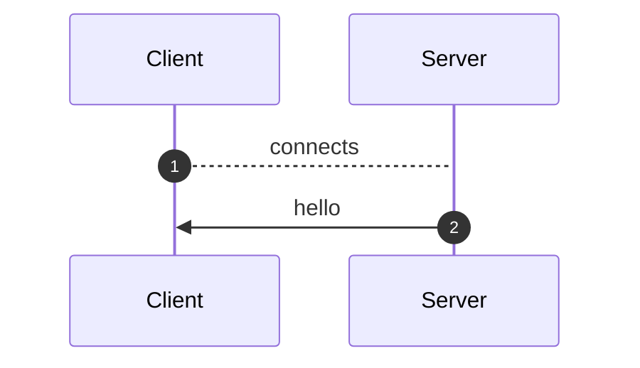
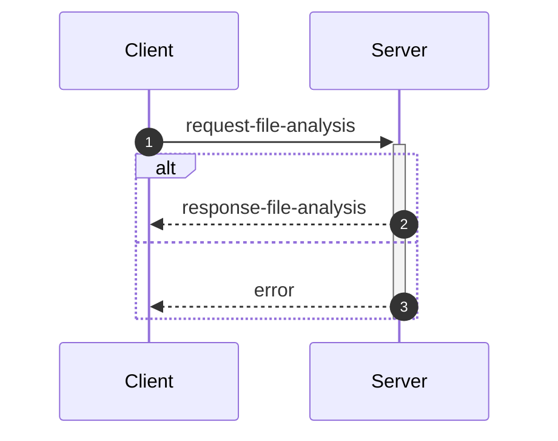
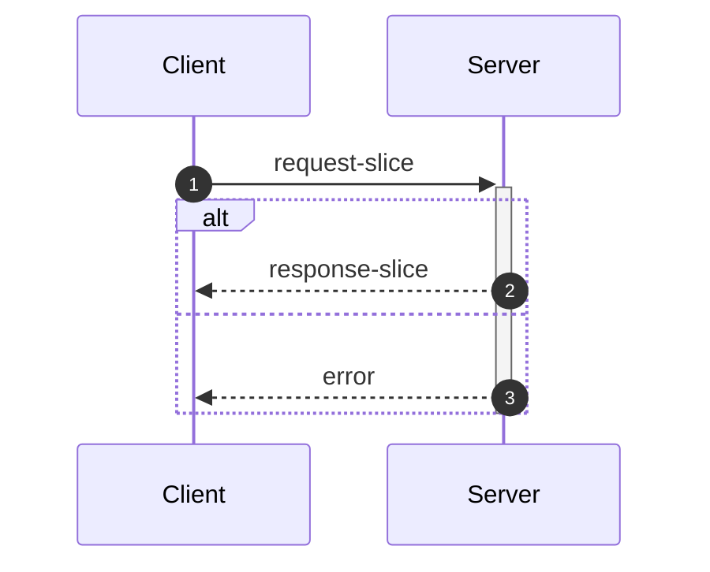
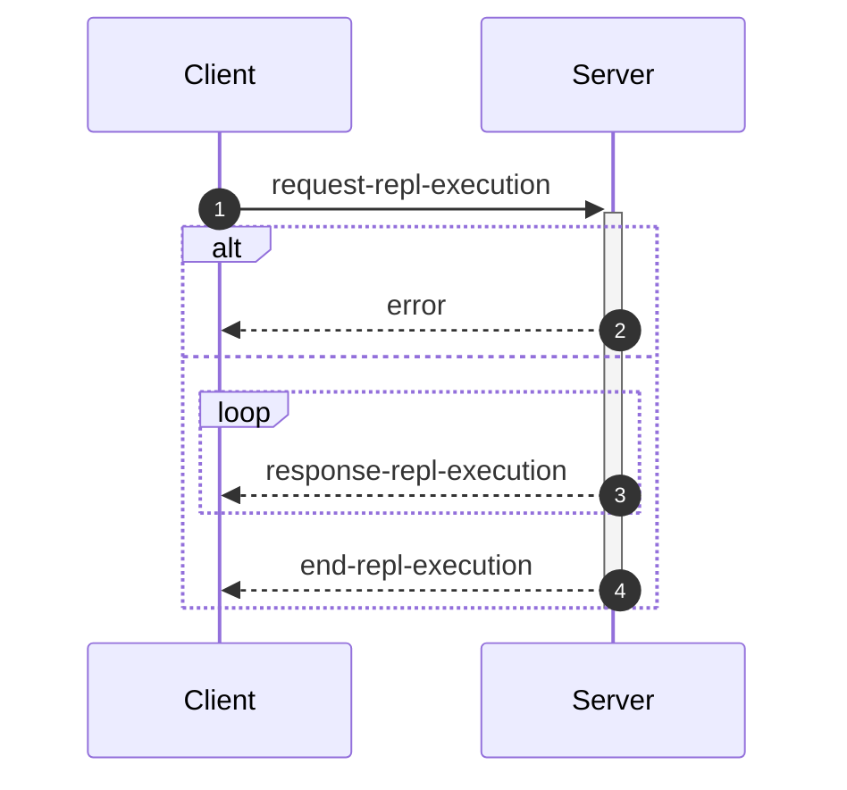

_This document was generated from '[src/documentation/wiki-interface.ts](https://github.com/flowr-analysis/flowr/tree/main//src/documentation/wiki-interface.ts)' on 2026-07-29, 08:19:03 UTC presenting an overview of flowR's interface (v2.13.4, using R v4.5.0). Please do not edit this file/wiki page directly._

Although far from being as detailed as the in-depth explanation of [_flowR_](https://github.com/flowr-analysis/flowr/wiki/core),
this wiki page explains how to interface with _flowR_ in more detail.
In general, command line arguments and other options provide short descriptions on hover over.

* [💻 Using the REPL](#using-the-repl)
* [⚙️ Configuring FlowR](#configuring-flowr)
* [⚒️ Writing Code](#writing-code)
* [💬 Communicating with the Server](#communicating-with-the-server)

<a id='using-the-repl'></a>
## 💻 Using the REPL


> [!NOTE]
> To execute arbitrary R commands with a repl request, _flowR_ has to be started explicitly with <span title="Description (Command Line Argument): Allow to access the underlying R session when using flowR (security warning: this allows the execution of arbitrary R code!)">`--r-session-access`</span>.
> Please be aware that this introduces a security risk and note that this relies on the [`r-shell` engine](https://github.com/flowr-analysis/flowr/wiki/engines) .

Although primarily meant for users to explore,
there is nothing which forbids simply calling _flowR_ as a subprocess to use standard-in, -output, and -error
for communication (although you can access the REPL using the server as well,
with the [REPL Request](#message-request-repl-execution) message).

The read-eval-print loop&nbsp;(REPL) works relatively simple.
You can submit an expression (using <kbd>Enter</kbd>),
which is interpreted as an R&nbsp;expression by default but interpreted as a *command* if it starts with a colon (`:`).
The best command to get started with the REPL is <span title="Description (Repl Command): Show help information (aliases: :h, :?)">`:help`</span>.
Besides, you can leave the REPL either with the command <span title="Description (Repl Command): End the repl (aliases: :q, :exit)">`:quit`</span> or by pressing <kbd>Ctrl</kbd>+<kbd>C</kbd> twice.
When writing a *command*, you may press <kbd>Tab</kbd> to get a list of completions, if available.
Multiple commands can be entered in a single line by separating them with a semicolon (`;`), e.g. `:parse "x<-2"; :df*`.
If a command is given without R code, the REPL will re-use R code given in a previous command.
The prior example will hence return first the parsed AST of the program and then the dataflow graph for `"x <- 2"`.

> [!NOTE]
> If you develop flowR, you may want to launch the repl using the `npm run main-dev` command, this way, you get a non-minified version of flowR with debug information and hot-reloading of source files.

<details>
<summary>Available Commands</summary>

We currently offer the following commands (this with a `[*]` suffix are available with and without the star):


| Command | Description |
| ------- | ----------- |
| **<span title="Description (Repl Command): End the repl (aliases: :q, :exit)">:quit</span>** | End the repl (aliases: **:<span title="Alias of ':quit'. End the repl">q</span>**, **:<span title="Alias of ':quit'. End the repl">exit</span>**) |
| **<span title="Description (Repl Command): Execute the given code as R code. This requires the `--r-session-access` flag to be set and requires the r-shell engine. (aliases: :e, :r)">:execute</span>** | Execute the given code as R code. This requires the `--r-session-access` flag to be set and requires the r-shell engine. (aliases: **:<span title="Alias of ':execute'. Execute the given code as R code. This requires the `--r-session-access` flag to be set and requires the r-shell engine.">e</span>**, **:<span title="Alias of ':execute'. Execute the given code as R code. This requires the `--r-session-access` flag to be set and requires the r-shell engine.">r</span>**) |
| **<span title="Description (Repl Command): Get mermaid code for the control-flow graph of R code (aliases: :cfg, :cf)">:controlflow[*]</span>** | Get mermaid code for the control-flow graph of R code (star: Returns the URL to mermaid.live) (aliases: **:<span title="Alias of ':controlflow'. Get mermaid code for the control-flow graph of R code">cfg</span>**, **:<span title="Alias of ':controlflow'. Get mermaid code for the control-flow graph of R code">cf</span>**) |
| **<span title="Description (Repl Command): Get mermaid code for the control-flow graph with basic blocks (aliases: :cfgb, :cfb)">:controlflowbb[*]</span>** | Get mermaid code for the control-flow graph with basic blocks (star: Returns the URL to mermaid.live) (aliases: **:<span title="Alias of ':controlflowbb'. Get mermaid code for the control-flow graph with basic blocks">cfgb</span>**, **:<span title="Alias of ':controlflowbb'. Get mermaid code for the control-flow graph with basic blocks">cfb</span>**) |
| **<span title="Description (Repl Command): Get mermaid code for the dataflow graph (aliases: :d, :df)">:dataflow[*]</span>** | Get mermaid code for the dataflow graph (star: Returns the URL to mermaid.live) (aliases: **:<span title="Alias of ':dataflow'. Get mermaid code for the dataflow graph">d</span>**, **:<span title="Alias of ':dataflow'. Get mermaid code for the dataflow graph">df</span>**) |
| **<span title="Description (Repl Command): Get mermaid code for the normalized AST of R code (aliases: :n)">:normalize[*]</span>** | Get mermaid code for the normalized AST of R code (star: Returns the URL to mermaid.live) (alias: **:<span title="Alias of ':normalize'. Get mermaid code for the normalized AST of R code">n</span>**) |
| **<span title="Description (Repl Command): Get mermaid code for the simplified dataflow graph (aliases: :ds, :dfs)">:dataflowsimple[*]</span>** | Get mermaid code for the simplified dataflow graph (star: Returns the URL to mermaid.live) (aliases: **:<span title="Alias of ':dataflowsimple'. Get mermaid code for the simplified dataflow graph">ds</span>**, **:<span title="Alias of ':dataflowsimple'. Get mermaid code for the simplified dataflow graph">dfs</span>**) |
| **<span title="Description (Repl Command): Inspect and extend the signature database: `query` (identical to :query @signature), `add <path>` to mount another database/source, `download` to fetch the full-history database. (aliases: :sig)">:signature</span>** | Inspect and extend the signature database: `query` (identical to :query @signature), `add <path>` to mount another database/source, `download` to fetch the full-history database. (alias: **:<span title="Alias of ':signature'. Inspect and extend the signature database: `query` (identical to :query @signature), `add <path>` to mount another database/source, `download` to fetch the full-history database.">sig</span>**) |
| **<span title="Description (Repl Command): Just calculates the DFG, but only prints summary info (aliases: :d#, :df#)">:dataflowsilent</span>** | Just calculates the DFG, but only prints summary info (aliases: **:<span title="Alias of ':dataflowsilent'. Just calculates the DFG, but only prints summary info">d#</span>**, **:<span title="Alias of ':dataflowsilent'. Just calculates the DFG, but only prints summary info">df#</span>**) |
| **<span title="Description (Repl Command): Prints ASCII Art of the parsed, unmodified AST (aliases: :p)">:parse</span>** | Prints ASCII Art of the parsed, unmodified AST (alias: **:<span title="Alias of ':parse'. Prints ASCII Art of the parsed, unmodified AST">p</span>**) |
| **<span title="Description (Repl Command): Prints the version of flowR as well as the current version of R">:version</span>** | Prints the version of flowR as well as the current version of R
| **<span title="Description (Repl Command): Query the given R code (use 'help' for more information)">:query[*]</span>** | Query the given R code (use 'help' for more information) (star: Similar to query, but returns the output in json format.)
| **<span title="Description (Repl Command): Returns an ASCII representation of the dataflow graph (aliases: :df!)">:dataflowascii</span>** | Returns an ASCII representation of the dataflow graph (alias: **:<span title="Alias of ':dataflowascii'. Returns an ASCII representation of the dataflow graph">df!</span>**) |
| **<span title="Description (Repl Command): Returns summarization stats for the normalized AST (aliases: :n#)">:normalize#</span>** | Returns summarization stats for the normalized AST (alias: **:<span title="Alias of ':normalize#'. Returns summarization stats for the normalized AST">n#</span>**) |
| **<span title="Description (Repl Command): Show help information (aliases: :h, :?)">:help</span>** | Show help information (aliases: **:<span title="Alias of ':help'. Show help information">h</span>**, **:<span title="Alias of ':help'. Show help information">?</span>**) |


</details>


> [!TIP]
> 
> As indicated by the examples before, all REPL commands that operate on code keep track of the state.
> Hence, if you run a command like <span title="Description (Repl Command, starred version): Returns the URL to mermaid.live; Base Command: Get mermaid code for the dataflow graph (aliases: :d*, :df*)">`:dataflow*`</span> without providing R code,
> the REPL will re-use the R code provided in a previous command.
> Likewise, doing this will benefit from incrementality!
> If you request the dataflow graph with `:df* x <- 2 * y` and then want to see the parsed AST with `:parse`,
> the REPL will re-use previously obtained information and not re-parse the code again.
> 		


Generally, many commands offer shortcut versions in the REPL. Many queries, for example, offer a shortened format (see the example below).
Of special note, the [Config Query](https://github.com/flowr-analysis/flowr/wiki/%5BQuery%5D-Config)
can be used to also modify the currently active configuration of _flowR_ within the REPL (see the [wiki page](https://github.com/flowr-analysis/flowr/wiki/%5BQuery%5D-Config) for more information).

### Example: Retrieving the Dataflow Graph

To retrieve a URL to the [mermaid](https://mermaid.js.org/) diagram of the dataflow of a given expression,
use <span title="Description (Repl Command, starred version): Returns the URL to mermaid.live; Base Command: Get mermaid code for the dataflow graph (aliases: :d*, :df*)">`:dataflow*`</span> (or <span title="Description (Repl Command): Get mermaid code for the dataflow graph (aliases: :d, :df)">`:dataflow`</span> to get the mermaid code in the cli):


```shell
$ docker run -it --rm eagleoutice/flowr # or npm run flowr 
flowR repl v2.13.4, R grammar v14 (tree-sitter engine)
R> :dataflow* y <- 1 + x
```

<details>
<summary style='color:gray'>Output</summary>


```text
https://mermaid.live/view#base64:eyJjb2RlIjoiZmxvd2NoYXJ0IEJUXG4gICAgMXt7XCJgKiM5MTtSTnVtYmVyIzkzOyogKioxKipcbiAgICAgICoxLjYqICgqKmlkOiAxKiopYFwifX1cbiAgICUlIE5vIGVkZ2VzIGZvdW5kIGZvciAxXG4gICAgMihbXCJgKiM5MTtSU3ltYm9sIzkzOyogKip4KipcbiAgICAgICoxLjEwKiAoKippZDogMioqKWBcIl0pXG4gICAlJSBObyBlZGdlcyBmb3VuZCBmb3IgMlxuICAgIDNbW1wiYCojOTE7UkJpbmFyeU9wIzkzOyogYmFzZSM1ODsjNTg7KiojNDM7KipcbiAgICAgICoxLjYtMTAqICgqKmlkOiAzKiopXG4gICAgYXJnOiAoMSwgMilgXCJdXVxuICAgIGJ1aWx0LWluOl9bXCJgQnVpbHQtSW46XG4jNDM7YFwiXVxuICAgIHN0eWxlIGJ1aWx0LWluOl8gc3Ryb2tlOmdyYXksZmlsbDpncmF5LHN0cm9rZS13aWR0aDoycHgsb3BhY2l0eTouODtcbiAgICAwW1wiYCojOTE7UlN5bWJvbCM5MzsqICoqeSoqXG4gICAgICAqMS4xKiAoKippZDogMCoqLCB2OiAzKWBcIl1cbiAgICA0W1tcImAqIzkxO1JCaW5hcnlPcCM5MzsqIGJhc2UjNTg7IzU4OyoqIzYwOyM0NTsqKlxuICAgICAgKjEuMS0xMCogKCoqaWQ6IDQqKilcbiAgICBhcmc6ICgwLCAzKWBcIl1dXG4gICAgYnVpbHQtaW46Xy1bXCJgQnVpbHQtSW46XG4jNjA7IzQ1O2BcIl1cbiAgICBzdHlsZSBidWlsdC1pbjpfLSBzdHJva2U6Z3JheSxmaWxsOmdyYXksc3Ryb2tlLXdpZHRoOjJweCxvcGFjaXR5Oi44O1xuICAgIDMgLS0+fFwicmVhZHMsIGFyZ1wifCAxXG4gICAgMyAtLT58XCJyZWFkcywgYXJnXCJ8IDJcbiAgICAzIC0uLT58XCJyZWFkcywgY2FsbHNcInwgYnVpbHQtaW46X1xuICAgIGxpbmtTdHlsZSAyIHN0cm9rZTpncmF5O1xuICAgIDAgLS0+fFwiZGVmaW5lZC1ieVwifCAzXG4gICAgMCAtLT58XCJkZWZpbmVkLWJ5XCJ8IDRcbiAgICA0IC0tPnxcInJlYWRzLCBhcmdcInwgM1xuICAgIDQgLS0+fFwicmV0dXJucywgYXJnXCJ8IDBcbiAgICA0IC0uLT58XCJyZWFkcywgY2FsbHNcInwgYnVpbHQtaW46Xy1cbiAgICBsaW5rU3R5bGUgNyBzdHJva2U6Z3JheTsiLCJtZXJtYWlkIjp7ImF1dG9TeW5jIjp0cnVlfX0=
```


Retrieve the dataflow graph of the expression `y <- 1 + x`. It looks like this:


```mermaid
flowchart LR
    1{{"`*#91;RNumber#93;* **1**
      *1.6* (**id: 1**)`"}}
   %% No edges found for 1
    2(["`*#91;RSymbol#93;* **x**
      *1.10* (**id: 2**)`"])
   %% No edges found for 2
    3[["`*#91;RBinaryOp#93;* base#58;#58;**#43;**
      *1.6-10* (**id: 3**)
    arg: (1, 2)`"]]
    built-in:_["`Built-In:
#43;`"]
    style built-in:_ stroke:gray,fill:gray,stroke-width:2px,opacity:.8;
    0["`*#91;RSymbol#93;* **y**
      *1.1* (**id: 0**, v: 3)`"]
    4[["`*#91;RBinaryOp#93;* base#58;#58;**#60;#45;**
      *1.1-10* (**id: 4**)
    arg: (0, 3)`"]]
    built-in:_-["`Built-In:
#60;#45;`"]
    style built-in:_- stroke:gray,fill:gray,stroke-width:2px,opacity:.8;
    3 -->|"reads, arg"| 1
    3 -->|"reads, arg"| 2
    3 -.->|"reads, calls"| built-in:_
    linkStyle 2 stroke:gray;
    0 -->|"defined-by"| 3
    0 -->|"defined-by"| 4
    4 -->|"reads, arg"| 3
    4 -->|"returns, arg"| 0
    4 -.->|"reads, calls"| built-in:_-
    linkStyle 7 stroke:gray;
```

	
<details>

<summary style="color:gray">R Code of the Dataflow Graph</summary>

The analysis required _0.8 ms_ (including parse and normalize, using the [tree-sitter](https://github.com/flowr-analysis/flowr/wiki/Engines) engine) within the generation environment. No [signature database](https://github.com/flowr-analysis/flowr/wiki/Signature-Database) is mounted for these generated graphs, so `library()` calls attach no package exports; base-R names are still qualified via the generated base-package store (e.g. `acf` as `stats::acf`). 
We encountered no unknown side effects during the analysis.


```r
y <- 1 + x
```


</details>


</details>


For small graphs like this, <span title="Description (Repl Command): Returns an ASCII representation of the dataflow graph (aliases: :df!)">`:dataflowascii`</span> also provides an ASCII representation directly in the REPL:


```shell
$ docker run -it --rm eagleoutice/flowr # or npm run flowr 
flowR repl v2.13.4, R grammar v14 (tree-sitter engine)
R> :df! y <- 1 + x
```

<details open>
<summary style='color:gray'>Output</summary>


```text
                        0<1>0
                   ┌────| 1 |
    ┌────────┐     │    0---0
 c<4>c       └──c<3>c
 |<- |  v<0>v┌──| + |
 c---c──| y |┘  c---c   u<2>u
        v---v      └────| x |
                        u---u
Edges:
3 -> 1: reads, arg  3 -> 2: reads, arg
4 -> 3: reads, arg  4 -> 0: returns, arg
0 -> 3: defined-by  0 -> 4: defined-by
```


Retrieve the dataflow graph of the expression `y <- 1 + x` as ASCII art.

</details>


For the slicing with <span title="Description (Repl Command): Static backwards executable slicer for R">`:slicer`</span>, you have access to the same [magic comments](#slice-magic-comments) as with the [slice request](#message-request-slice).
Pass `--inline` to splice resolvable `source()` calls into the reconstruction so the slice is a single self-contained R text (the same as the static slice query's `inlineSources` flag).
See `--help` for more flags!

### Example: Interfacing with the File System

Many commands that allow for an R-expression (like <span title="Description (Repl Command, starred version): Returns the URL to mermaid.live; Base Command: Get mermaid code for the dataflow graph (aliases: :d*, :df*)">`:dataflow*`</span>) allow for a file as well
if the argument starts with `file://`.
If you are working from the root directory of the _flowR_ repository, the following gives you the parsed AST of the example file using the <span title="Description (Repl Command): Prints ASCII Art of the parsed, unmodified AST (aliases: :p)">`:parse`</span> command:

> **Watch mode**: Replace `file://` with `watch://` to enter watch mode.
> flowR runs the command immediately and then re-runs it every time the file (or any file inside the folder) changes.
> Enter any other command to leave watch mode.
> For example: `:df watch://analysis.R`


```shell
$ docker run -it --rm eagleoutice/flowr # or npm run flowr 
flowR repl v2.13.4, R grammar v14 (tree-sitter engine)
R> :parse file://test/testfiles/example.R
```

<details>
<summary style='color:gray'>Output</summary>


```text
File: test/testfiles/example.R

program
├ binaryoperator
│ ├ identifier "sum" (1:1─4)
│ ├ <- "<-" (1:5─7)
│ ╰ float "0" (1:8─9)
├ binaryoperator
│ ├ identifier "product" (2:1─8)
│ ├ <- "<-" (2:9─11)
│ ╰ float "1" (2:12─13)
├ binaryoperator
│ ├ identifier "w" (3:1─2)
│ ├ <- "<-" (3:3─5)
│ ╰ float "7" (3:6─7)
├ binaryoperator
│ ├ identifier "N" (4:1─2)
│ ├ <- "<-" (4:3─5)
│ ╰ float "10" (4:6─8)
├ forstatement
│ ├ for "for" (6:1─4)
│ ├ ( "(" (6:5─6)
│ ├ identifier "i" (6:6─7)
│ ├ in "in" (6:8─10)
│ ├ binaryoperator
│ │ ├ float "1" (6:11─12)
│ │ ├ : ":" (6:12─13)
│ │ ╰ parenthesizedexpression
│ │   ├ ( "(" (6:13─14)
│ │   ├ binaryoperator
│ │   │ ├ identifier "N" (6:14─15)
│ │   │ ├ - "-" (6:15─16)
│ │   │ ╰ float "1" (6:16─17)
│ │   ╰ ) ")" (6:17─18)
│ ├ ) ")" (6:18─19)
│ ╰ bracedexpression
│   ├ { "{" (6:20─21)
│   ├ binaryoperator
│   │ ├ identifier "sum" (7:3─6)
│   │ ├ <- "<-" (7:7─9)
│   │ ╰ binaryoperator
│   │   ├ binaryoperator
│   │   │ ├ identifier "sum" (7:10─13)
│   │   │ ├ + "+" (7:14─15)
│   │   │ ╰ identifier "i" (7:16─17)
│   │   ├ + "+" (7:18─19)
│   │   ╰ identifier "w" (7:20─21)
│   ├ binaryoperator
│   │ ├ identifier "product" (8:3─10)
│   │ ├ <- "<-" (8:11─13)
│   │ ╰ binaryoperator
│   │   ├ identifier "product" (8:14─21)
│   │   ├  "" (8:22─23)
│   │   ╰ identifier "i" (8:24─25)
│   ╰ } "}" (9:1─2)
├ call
│ ├ identifier "cat" (11:1─4)
│ ╰ arguments
│   ├ ( "(" (11:4─5)
│   ├ argument
│   │ ╰ string
│   │   ├ " "\"" (11:5─6)
│   │   ├ stringcontent "Sum:" (11:6─10)
│   │   ╰ " "\"" (11:10─11)
│   ├ comma "," (11:11─12)
│   ├ argument
│   │ ╰ identifier "sum" (11:13─16)
│   ├ comma "," (11:16─17)
│   ├ argument
│   │ ╰ string
│   │   ├ " "\"" (11:18─19)
│   │   ├ stringcontent
│   │   │ ╰ escapesequence "\\n" (11:19─21)
│   │   ╰ " "\"" (11:21─22)
│   ╰ ) ")" (11:22─23)
╰ call
  ├ identifier "cat" (12:1─4)
  ╰ arguments
    ├ ( "(" (12:4─5)
    ├ argument
    │ ╰ string
    │   ├ " "\"" (12:5─6)
    │   ├ stringcontent "Product:" (12:6─14)
    │   ╰ " "\"" (12:14─15)
    ├ comma "," (12:15─16)
    ├ argument
    │ ╰ identifier "product" (12:17─24)
    ├ comma "," (12:24─25)
    ├ argument
    │ ╰ string
    │   ├ " "\"" (12:26─27)
    │   ├ stringcontent
    │   │ ╰ escapesequence "\\n" (12:27─29)
    │   ╰ " "\"" (12:29─30)
    ╰ ) ")" (12:30─31)
```


Retrieve the parsed AST of the example file.

<details>

<summary>File Content</summary>


```r
sum <- 0
product <- 1
w <- 7
N <- 10

for (i in 1:(N-1)) {
  sum <- sum + i + w
  product <- product * i
}

cat("Sum:", sum, "\n")
cat("Product:", product, "\n")
```


</details>

As _flowR_ directly transforms this AST the output focuses on being human-readable instead of being machine-readable.
		

</details>


### Example: Run a Query

You can run any query supported by _flowR_ using the <span title="Description (Repl Command): Query the given R code (use 'help' for more information)">`:query`</span> command.
For example, to obtain the shapes of all data frames in a given piece of code, you can run:


```shell
$ docker run -it --rm eagleoutice/flowr # or npm run flowr 
flowR repl v2.13.4, R grammar v14 (tree-sitter engine)
R> :query @absint df-shape "x <- data.frame(a = 1:10, b = 1:10)\ny <- x$a"
```

<details open>
<summary style='color:gray'>Output</summary>


```text
Query: absint (1 ms)
   ╰ $12: (colnames: [{"a", "b"}, {}], cols: [2, 2], rows: [10, 10])
   ╰ $0: (colnames: [{"a", "b"}, {}], cols: [2, 2], rows: [10, 10])
All queries together required ≈4 ms (1ms accuracy, total 4 ms)
```


Retrieve the shapes of all data frames in the given code.

</details>


To run the linter on a file, you can use (in this example, we just issue the `dead-code` linter on a small piece of code):


```shell
$ docker run -it --rm eagleoutice/flowr # or npm run flowr 
flowR repl v2.13.4, R grammar v14 (tree-sitter engine)
R> :query @linter rules:dead-code "if(FALSE) x <- 2"
```

<details open>
<summary style='color:gray'>Output</summary>


```text
Query: linter (2 ms)
   ╰ Dead Code (dead-code):
       ╰ certain:
           ╰ Code at 1.11-16
       ╰ Metadata: searchTimeMs: 2, processTimeMs: 0
All queries together required ≈2 ms (1ms accuracy, total 3 ms)
```


Run the linter on the given code, with only the `dead-code` rule enabled.

</details>


For more information on the available queries, please check out the [Query API](https://github.com/flowr-analysis/flowr/wiki/query-api).


<a id='configuring-flowr'></a>
## ⚙️ Configuring FlowR


When running _flowR_, you may want to specify some behaviors with a dedicated configuration file.
By default, flowR looks for a file named `flowr.json` in the current working directory (or any higher directory).
You can also specify a different file with <span title="Description (Command Line Argument): The name of the configuration file to use">`--config-file`</span> or pass the configuration inline using <span title="Description (Command Line Argument): The flowR configuration to use, as a JSON string">`--config-json`</span>.
To inspect the current configuration, you can run flowr with the <span title="Description (Command Line Argument): Run with verbose logging (will be passed to the corresponding script)">`--verbose`</span> flag, or use the `config` [Query](https://github.com/flowr-analysis/flowr/wiki/query-api).
Within the REPL this works by running the following:


```shell
:query @config
```


To work with the <a href="https://github.com/flowr-analysis/flowr/tree/main/src/config.ts#L132"><code><span title="The configuration file format for flowR.">FlowrConfig</span></code></a> you can use the provided helper objects alongside its methods like
<a href="https://github.com/flowr-analysis/flowr/tree/main/src/config.ts#L772"><code><span title="Creates a new flowr config that has the updated values.">FlowrConfig::<b>amend</b></span></code></a>.
The schema below documents every option; the ones you most likely want are:

- <a href="https://github.com/flowr-analysis/flowr/wiki/Interface#configuring-flowr" title="Configuration Option (boolean): Whether source calls should be ignored, causing {@link processSourceCall}&#39;s behavior to be skipped.">ignoreSourceCalls</a>: ignore source calls when analyzing the code, i.e., ignore the inclusion of other files.
- <a href="https://github.com/flowr-analysis/flowr/wiki/Interface#configuring-flowr" title="Configuration Option (boolean): Whether load calls should be ignored, causing {@link processLoadCall}&#39;s behavior to be skipped.">ignoreLoadCalls</a>: ignore load calls when analyzing the code, i.e., ignore the loading of r-data files.
- <a href="https://github.com/flowr-analysis/flowr/wiki/Interface#configuring-flowr" title="Configuration Option (object): Do you want to overwrite (parts) of the builtin definition?">semantics.environment.overwriteBuiltIns</a>: overwrite _flowR_'s handling of built-in functions, or clear the preset definitions entirely.
  See [Configure BuiltIn Semantics](#configure-builtin-semantics) for more information.
- <a href="https://github.com/flowr-analysis/flowr/wiki/Interface#configuring-flowr" title="Configuration Option (string): How to resolve variables and their values. (one of &quot;disabled&quot;, &quot;alias&quot;, &quot;builtin&quot;)">solver.variables</a>: how to resolve variables and their values (`disabled`, `alias`, `builtin`).
- <a href="https://github.com/flowr-analysis/flowr/wiki/Interface#configuring-flowr" title="Configuration Option (array): The engine or set of engines to use for interacting with R code. An empty array means all available engines will be used.">engines</a> and <a href="https://github.com/flowr-analysis/flowr/wiki/Interface#configuring-flowr" title="Configuration Option (string): The default engine to use for interacting with R code. If this is undefined, an arbitrary engine from the specified list will be used. (one of &quot;tree-sitter&quot;, &quot;r-shell&quot;)">defaultEngine</a>: the engines used to interact with R code, see the [Engines wiki page](https://github.com/flowr-analysis/flowr/wiki/engines).
- <a href="https://github.com/flowr-analysis/flowr/wiki/Interface#configuring-flowr" title="Configuration Option (array): Files a framework loads on its own, without any source() call (e.g. global.R in a shiny app), in the order they are loaded; flowR orders the matching project files accordingly and analyzes them as one program. Entries are case-insensitive globs matched against the file path, a plain name matches any file with that name, and entries matching no project file are warned about. Usually set per project kind via specializeConfig.">project.implicitSources</a>: the files a framework loads without any `source()` call, in the order in which they are
  loaded. Entries are globs (e.g. `R/*.R`) matched against the file path ignoring capitalization; one matching no file is reported.
- <a href="https://github.com/flowr-analysis/flowr/wiki/Interface#configuring-flowr" title="Configuration Option (object): Overwrite (parts of) the configuration depending on the project kind flowR detects, e.g. to give a shiny app its implicit sources.">specializeConfig</a>: overwrite (parts of) the configuration depending on the kind of project _flowR_ detects
  (e.g. `shiny-app`), which is how a shiny app gets its implicit sources by default. What you configure directly wins.
- <a href="https://github.com/flowr-analysis/flowr/wiki/Interface#configuring-flowr" title="Configuration Option (string): Overwrite the project kind flowR would otherwise infer from the analyzed files, e.g. when auto-detection guesses wrong. (one of &quot;package&quot;, &quot;script&quot;, &quot;shiny-app&quot;, &quot;notebook&quot;, &quot;project&quot;, &quot;unknown&quot;)">project.useProjectType</a>: skip that detection and force a project kind yourself, when auto-detection guesses wrong.
- <a href="https://github.com/flowr-analysis/flowr/wiki/Interface#configuring-flowr" title="Configuration Option (array): The default plugins to load when creating a new instance of FlowrAnalyzer">defaultPlugins</a> and <a href="https://github.com/flowr-analysis/flowr/wiki/Interface#configuring-flowr" title="Configuration Option (array): The plugins to load in REPL mode">repl.plugins</a>: the plugins to load for a new <a href="https://github.com/flowr-analysis/flowr/tree/main/src/project/flowr-analyzer.ts#L167"><code><span title="Central class for conducting analyses with FlowR. Use the FlowrAnalyzerBuilder to create a new instance. If you want the original pattern of creating a pipeline and running all steps, you can still do this with FlowrAnalyzer#runFull . To inspect the context of the analyzer, use FlowrAnalyzer#inspectContext (if you are a plugin and need to modify it, use FlowrAnalyzer#context instead).">FlowrAnalyzer</span></code></a> and in the REPL
  (use `flowr:default` to reference the former).

So you can configure _flowR_ by adding a file like the following:

<details>

<summary>Example Configuration File</summary>


```json
{
  "ignoreSourceCalls": true,
  "ignoreLoadCalls": true,
  "semantics": {
    "environment": {
      "overwriteBuiltIns": {
        "definitions": [
          {
            "type": "function",
            "names": [
              "foo"
            ],
            "processor": "builtin:assign",
            "config": {}
          }
        ]
      }
    }
  },
  "defaultPlugins": [
    "file:description",
    "versions:description"
  ],
  "repl": {
    "quickStats": false,
    "dfProcessorHeat": false,
    "hints": true,
    "plugins": [
      "flowr:default"
    ]
  },
  "project": {
    "resolveUnknownPathsOnDisk": true,
    "implicitSources": [
      "global.R",
      "app.R"
    ]
  },
  "linter": {
    "disabledRules": []
  },
  "specializeConfig": {
    "shiny-app": {
      "project": {
        "implicitSources": [
          "global.R",
          "ui.R",
          "server.R",
          "app.R"
        ]
      }
    }
  },
  "engines": [
    {
      "type": "r-shell"
    }
  ],
  "solver": {
    "variables": "alias",
    "evalStrings": true,
    "trackEnvironments": true,
    "sigdb": {
      "enabled": true,
      "loadProjectDependencies": true,
      "eagerlyLoad": false,
      "eagerlyLoadExports": false,
      "linkBaseR": false,
      "linkDescriptionDependencies": false
    },
    "resolveSource": {
      "dropPaths": "no",
      "ignoreCapitalization": true,
      "inferWorkingDirectory": "active-script",
      "searchPath": []
    },
    "instrument": {},
    "slicer": {
      "threshold": 50
    }
  },
  "abstractInterpretation": {
    "wideningThreshold": 4,
    "dataFrame": {
      "maxColNames": 20,
      "readLoadedData": {
        "readExternalFiles": true,
        "maxReadLines": 1000000
      }
    }
  },
  "gas": {
    "thresholds": {
      "memory": {
        "problematic": 0.7,
        "critical": 0.9
      },
      "timeMs": {
        "problematic": 100000,
        "critical": 120000
      }
    },
    "features": {}
  }
}
```


</details>

<details>
<a id='configure-builtin-semantics'></a>
<summary>Configure Built-In Semantics</summary>


`semantics/environment/overwriteBuiltins` accepts two keys:

- `loadDefaults` (boolean, initially `true`): If set to `true`, the default built-in definitions are loaded before applying the custom definitions. Setting this flag to `false` explicitly disables the loading of the default definitions.
- `definitions` (array, initially empty): Allows to overwrite or define new built-in elements. Each object within must have a `type` which is one of the below. Furthermore, they may define a string array of `names` which specifies the identifiers to bind the definitions to. You may use `assumePrimitive` to specify whether _flowR_ should assume that this is a primitive non-library definition (so you probably just do not want to specify the key).

  | Type            | Description                                                                                                                                                                                                                                                                                              | Example                                                                                                    |
  | --------------- | -------------------------------------------------------------------------------------------------------------------------------------------------------------------------------------------------------------------------------------------------------------------------------------------------------- | ---------------------------------------------------------------------------------------------------------- |
  | `constant`    | Additionally allows for a `value` this should resolve to.                                                                                                                                                                                                                                                | `{ type: 'constant', names: ['NULL', 'NA'],  value: null }`                                                |
  | `function`    | Is a rather flexible way to define and bind built-in functions. For the time, we do not have extensive documentation to cover all the cases, so please either consult the sources with the `default-builtin-config.ts` or open a [new issue](https://github.com/flowr-analysis/flowr/issues/new/choose). | `{ type: 'function', names: ['next'], processor: 'builtin:d', config: { cfg: ExitPointType.Next } }` |
  | `replacement` | A comfortable way to specify replacement functions like `$<-` or `names<-`. `suffixes` describes the... suffixes to attach automatically. | `{ type: 'replacement', suffixes: ['<-', '<<-'], names: ['[', '[['] }` |


</details>

<details>

<summary style='color:gray'>Full Configuration-File Schema</summary>

- _The configuration file format for flowR._ (object)
    - **logLevel** [optional] _flowR's global minimum log level, applied when the config is loaded._ (string)
        Only allows: 'silly', 'trace', 'debug', 'info', 'warn', 'error', 'fatal'
    - **ignoreSourceCalls** [optional] _Whether source calls should be ignored, causing {@link processSourceCall}'s behavior to be skipped._ (boolean)
    - **ignoreLoadCalls** [optional] _Whether load calls should be ignored, causing {@link processLoadCall}'s behavior to be skipped._ (boolean)
    - **semantics** _Configure language semantics and how flowR handles them._ (object)
        - **environment** [optional] _Semantics regarding how to handle the R environment._ (object)
            - **overwriteBuiltIns** [optional] _Do you want to overwrite (parts) of the builtin definition?_ (object)
                - **loadDefaults** [optional] _Should the default configuration still be loaded?_ (boolean)
                - **definitions** [optional] _The definitions to load/overwrite._ (array)
                Valid item types:
                    - (object)
    - **defaultPlugins** [optional] _The default plugins to load when creating a new instance of FlowrAnalyzer_ (array)
    Valid item types:
        - (alternatives)
            - (string)
            - (array)
    - **repl** _Configuration options for the REPL._ (object)
        - **quickStats** [optional] _Whether to show quick stats in the REPL after each evaluation._ (boolean)
        - **dfProcessorHeat** [optional] _This instruments the dataflow processors to count how often each processor is called._ (boolean)
        - **hints** [optional] _Whether to show dim inline hints on the empty prompt (automatically disabled on non-interactive terminals)._ (boolean)
        - **plugins** [optional] _The plugins to load in REPL mode_ (array)
        Valid item types:
            - (alternatives)
                - (string)
                - (array)
        - **autoUseFileProtocol** [optional] _Prepend the file protocol to a repl input that looks like a path, instead of only warning about it._ (boolean)
        - **queryStats** [optional] _Whether `:query` closes with the line stating how long the queries took (`:query*` never prints it)._ (boolean)
        - **showPlugins** [optional] _Whether `:version` grays out the plugins that did not activate during the last analysis._ (boolean)
    - **project** _Project specific configuration options._ (object)
        - **resolveUnknownPathsOnDisk** [optional] _Whether to resolve unknown paths loaded by the r project disk when trying to source/analyze files._ (boolean)
        - **failOnInaccessiblePath** [optional] _Whether a directory that cannot be traversed during file discovery (e.g. due to permissions) aborts the analysis; when false (the default) such paths are logged and skipped._ (boolean)
        - **basePackages** [optional] _The packages considered part of R itself (base and recommended); if unset, flowR uses its built-in list._ (array)
        Valid item types:
            - (string)
        - **implicitSources** [optional] _Files a framework loads on its own, without any source() call (e.g. global.R in a shiny app), in the order they are loaded; flowR orders the matching project files accordingly and analyzes them as one program. Entries are case-insensitive globs matched against the file path, a plain name matches any file with that name, and entries matching no project file are warned about. Usually set per project kind via specializeConfig._ (array)
        Valid item types:
            - (string)
        - **useProjectType** [optional] _Overwrite the project kind flowR would otherwise infer from the analyzed files, e.g. when auto-detection guesses wrong._ (string)
            Only allows: 'package', 'script', 'shiny-app', 'notebook', 'project', 'unknown'
        - **discovery** [optional] _Scoping options for the default project discovery._ (object)
            - **full** [optional] _Collect every file below the project root (greedy) instead of only the files the detected project kind needs (default false)._ (boolean)
            - **perKind** [optional] _Per-kind include/exclude glob overrides layered on the default scoping._ (object)
            - **ignore** [optional] _Case-insensitive globs that drop matching files from the intelligent discovery, regardless of kind (e.g. .Renviron to ignore environment files)._ (array)
            Valid item types:
                - (string)
        - **classification** [optional] _Overrides for the signals flowR uses to classify the project kind._ (object)
            - **shinyDescriptionTypes** [optional] _DESCRIPTION Type: values that mark a shiny app._ (array)
            Valid item types:
                - (string)
            - **shinyEntryFiles** [optional] _File names a shiny app is assembled from._ (array)
            Valid item types:
                - (string)
            - **shinyUsagePattern** [optional] _Regex source evidencing shiny usage in an entry file._ (string)
            - **notebookExtensions** [optional] _File extensions marking a notebook._ (array)
            Valid item types:
                - (string)
    - **linter** _Linter configuration options._ (object)
        - **disabledRules** _Linting rule names excluded from the default rule set (a rule requested explicitly via a linter query still runs). Usually set per project kind via specializeConfig._ (array)
        Valid item types:
            - (string)
    - **inputSources** [optional] _Further frameworks the input-sources analysis should know about; entries are added to flowR's defaults._ (object)
        - **pure** [optional] _Functions that only pass the constantness of their arguments on._ (array)
        Valid item types:
            - (string)
        - **param** [optional] _Functions whose result is a 'param' input._ (array)
        Valid item types:
            - (string)
        - **file** [optional] _Functions whose result is a 'file' input._ (array)
        Valid item types:
            - (string)
        - **tempfile** [optional] _Functions whose result is a 'tempfile' input._ (array)
        Valid item types:
            - (string)
        - **net** [optional] _Functions whose result is a 'net' input._ (array)
        Valid item types:
            - (string)
        - **rand** [optional] _Functions whose result is a 'rand' input._ (array)
        Valid item types:
            - (string)
        - **system** [optional] _Functions whose result is a 'system' input._ (array)
        Valid item types:
            - (string)
        - **ffi** [optional] _Functions whose result is a 'ffi' input._ (array)
        Valid item types:
            - (string)
        - **lang** [optional] _Functions whose result is a 'lang' input._ (array)
        Valid item types:
            - (string)
        - **options** [optional] _Functions whose result is a 'options' input._ (array)
        Valid item types:
            - (string)
        - **user** [optional] _Functions whose result is a 'user' input._ (array)
        Valid item types:
            - (string)
        - **const** [optional] _Functions whose result is a 'const' input._ (array)
        Valid item types:
            - (string)
        - **scope** [optional] _Functions whose result is a 'scope' input._ (array)
        Valid item types:
            - (string)
        - **dconst** [optional] _Functions whose result is a 'dconst' input._ (array)
        Valid item types:
            - (string)
        - **unknown** [optional] _Functions whose result is a 'unknown' input._ (array)
        Valid item types:
            - (string)
        - **linkedObjects** [optional] _Objects a framework provides without a definition in the code, e.g. shiny's input._ (array)
        Valid item types:
            - (object)
        - **linkedEntryPoints** [optional] _Calls that hand a function to a framework, which binds its objects to the parameters by position._ (array)
        Valid item types:
            - (object)
    - **specializeConfig** [optional] _Overwrite (parts of) the configuration depending on the project kind flowR detects, e.g. to give a shiny app its implicit sources._ (object)
    - **engines** _The engine or set of engines to use for interacting with R code. An empty array means all available engines will be used._ (array)
    Valid item types:
        - (alternatives)
            - _The configuration for the tree sitter engine._ (object)
                - **type** [required] _Use the tree sitter engine._ (string)
                    Only allows: 'tree-sitter'
                - **wasmPath** [optional] _The path to the tree-sitter-r WASM binary to use. If this is undefined, this uses the default path._ (string)
                - **treeSitterWasmPath** [optional] _The path to the tree-sitter WASM binary to use. If this is undefined, this uses the default path._ (string)
                - **lax** [optional] _Whether to use the lax parser for parsing R code (allowing for syntax errors). If this is undefined, the strict parser will be used._ (boolean)
            - _The configuration for the R shell engine._ (object)
                - **type** [required] _Use the R shell engine._ (string)
                    Only allows: 'r-shell'
                - **rPath** [optional] _The path to the R executable to use. If this is undefined, this uses the default path._ (string)
    - **defaultEngine** [optional] _The default engine to use for interacting with R code. If this is undefined, an arbitrary engine from the specified list will be used._ (string)
        Only allows: 'tree-sitter', 'r-shell'
    - **solver** _How to resolve constants, constraints, cells, ..._ (object)
        - **variables** _How to resolve variables and their values._ (string)
            Only allows: 'disabled', 'alias', 'builtin'
        - **evalStrings** _Should we include eval(parse(text="...")) calls in the dataflow graph?_ (boolean)
        - **trackEnvironments** [optional] _Track user-created environments (new.env, assign/get/local with envir=, dollar-assign, attach). When false, all envir-style calls fall through conservatively._ (boolean)
        - **sigdb** _Resolving library exports from a signature database._ (object)
            - **enabled** [optional] _Resolve library()/use() exports from a signature database (default true); when false no database is consulted._ (boolean)
            - **loadProjectDependencies** [optional] _Load the project's declared dependencies from its metadata files (DESCRIPTION Imports/Depends, rproject.toml, renv.lock, rv.lock) (default true); when false these files are not read for dependencies._ (boolean)
            - **eagerlyLoad** [optional] _Parse the database up front rather than on the first package load (default false, ignored if disabled)._ (boolean)
            - **eagerlyLoadExports** [optional] _Add a vertex for every export on load rather than on demand (default false); keeps the dataflow graph small._ (boolean)
            - **assumedRVersion** [optional] _R version assumed when resolving versioned (base-R) exports: a pin like "4.5" or "auto" to detect the installed R (default "auto")._ (string)
            - **linkBaseR** [optional] _Eagerly attach base-R namespaces so bare base calls resolve without library() (default false)._ (boolean)
            - **linkBaseRCalls** [optional] _Add a lightweight Reads edge from a bare base-R call to its signature-database function vertex (default false; base-R qualification is edge-free otherwise)._ (boolean)
            - **linkPackageCalls** [optional] _Add a lightweight Reads edge from a resolved package call to its signature-database function vertex (default false)._ (boolean)
            - **linkDescriptionDependencies** [optional] _Eagerly attach the namespaces of the project's declared DESCRIPTION dependencies (Imports/Depends) so their exports resolve without an explicit library() (default false)._ (boolean)
            - **warmInBackground** [optional] _Decompress the hot shards (base + most-downloaded) in a background task on startup so the first library() lookup is warm (default false; for long-running servers/REPLs)._ (boolean)
            - **additionalPaths** [optional] _Extra directories or bundle/manifest files searched for signature databases (alongside the shipped default and $FLOWR_SIGDB_DIR); a downloaded full-history bundle placed here is mounted automatically._ (array)
            Valid item types:
                - (string)
            - **downloadRepo** [optional] _GitHub owner/repo the full-history bundle is downloaded from via ":signature download" (default "flowr-analysis/flowr", release tag "sigdb-v<flowR-version>")._ (string)
            - **autoSync** [optional] _On startup, re-download shards whose committed sigdb.remote.json hash no longer matches the cache, in the background (default false; opt-in network sync after a git pull)._ (boolean)
            - **versionSelection** [optional] _When a project constrains a dependency, resolve to the newest (default), oldest, or system-installed version satisfying it; system needs R and falls back to newest. Base-R packages always resolve against the assumed R version._ (string)
                Only allows: 'newest', 'oldest', 'system'
            - **versionOverrides** [optional] _Force an exact version for specific packages (name -> version), overriding both the project constraint and the versionSelection policy (default {})._ (object)
        - **versionManagement** _Policies for reasoning about dependency versions._ (object)
            - **linkedVersionGroups** [optional] _Groups of packages that must resolve to the same version; version guessing intersects each group so its members stay mutually compatible (default [])._ (array)
            Valid item types:
                - (array)
                Valid item types:
                    - (string)
        - **instrument** (object)
            - **dataflowExtractors** [optional] _These keys are only intended for use within code, allowing to instrument the dataflow analyzer!_ (any)
        - **resolveSource** [optional] _If lax source calls are active, flowR searches for sourced files much more freely, based on the configurations you give it. This option is only in effect if `ignoreSourceCalls` is set to false._ (object)
            - **dropPaths** _Allow to drop the first or all parts of the sourced path, if it is relative._ (string)
                Only allows: 'no', 'once', 'all'
            - **ignoreCapitalization** _Search for filenames matching in the lowercase._ (boolean)
            - **inferWorkingDirectory** _Try to infer the working directory from the main or any script to analyze._ (string)
                Only allows: 'no', 'main-script', 'active-script', 'any-script'
            - **searchPath** _Additionally search in these paths._ (array)
            Valid item types:
                - (string)
            - **repeatedSourceLimit** [optional] _How often the same file can be sourced within a single run? Please be aware: in case of cyclic sources this may not reach a fixpoint so give this a sensible limit._ (number)
            - **applyReplacements** _Provide name replacements for loaded files_ (array)
            Valid item types:
                - (object)
            - **assumeFilesExist** [optional] _Assume a sourced file is always there, making what it defines certain instead of conditional on the source call._ (boolean)
        - **slicer** [optional] _The configuration for the slicer._ (object)
            - **threshold** [optional] _The maximum number of iterations to perform on a single function call during slicing._ (number)
            - **autoExtend** [optional] _If set, the slicer will gain an additional post-pass._ (boolean)
    - **abstractInterpretation** _The configuration options for abstract interpretation._ (object)
        - **wideningThreshold** _The threshold for the number of visitations of a node at which widening should be performed to ensure the termination of the fixpoint iteration._ (number)
        - **dataFrame** _The configuration of the shape inference for data frames._ (object)
            - **maxColNames** _The maximum number of columns names to infer for data frames before over-approximating the column names to top._ (number)
            - **readLoadedData** _Configuration options for reading data frame shapes from loaded external data files, such as CSV files._ (object)
                - **readExternalFiles** _Whether data frame shapes should be extracted from loaded external files, such as CSV files._ (boolean)
                - **maxReadLines** _The maximum number of lines to read when extracting data frame shapes from loaded files, such as CSV files._ (number)
    - **gas** [optional] _Resource-usage guard (gas) configuration. All feature factors default to 0 (disabled). See https://github.com/flowr-analysis/flowr/wiki/Core#gas-resource-guard._ (object)
        - **thresholds** [optional] _Shared thresholds for all gas checks (scaled by per-feature factor)._ (object)
            - **memory** [optional] _Heap-usage fraction thresholds (0-1)._ (object)
                - **problematic** [optional] _Heap fraction (0-1) above which Problematic is returned._ (number)
                - **critical** [optional] _Heap fraction (0-1) above which Critical is returned._ (number)
            - **timeMs** [optional] _Elapsed analysis time thresholds in milliseconds._ (object)
                - **problematic** [optional] _Elapsed ms above which Problematic is returned._ (number)
                - **critical** [optional] _Elapsed ms above which Critical is returned._ (number)
        - **features** [optional] _Per-feature sensitivity factors. 0 or absent disables gas checking for that feature. A factor of 2 makes the feature twice as sensitive. Recognised keys: `source`, `side-effect-linking`, `linter`._ (object)
        - **heapProvider** [optional] _Custom heap statistics source (programmatic configs only), overriding the built-in v8/performance.memory detection._ (function)

</details>

	

<a id='writing-code'></a>
## ⚒️ Writing Code

_flowR_ can be used as a [module](https://www.npmjs.com/package/@eagleoutice/flowr) and offers several main classes and interfaces that are interesting for extension writers 
(see the [Visual Studio Code extension](https://marketplace.visualstudio.com/items?itemName=code-inspect.vscode-flowr) or the [Core](https://github.com/flowr-analysis/flowr/wiki/core) wiki page for more information).

### Creating Analyses with _flowR_

Nowadays, instances of the <a href="https://github.com/flowr-analysis/flowr/tree/main/src/project/flowr-analyzer.ts#L167"><code><span title="Central class for conducting analyses with FlowR. Use the FlowrAnalyzerBuilder to create a new instance. If you want the original pattern of creating a pipeline and running all steps, you can still do this with FlowrAnalyzer#runFull . To inspect the context of the analyzer, use FlowrAnalyzer#inspectContext (if you are a plugin and need to modify it, use FlowrAnalyzer#context instead).">FlowrAnalyzer</span></code></a> should be used as central frontend to get analysis results from _flowR_.
For example, a program slice can be created like this:


```ts
const analyzer = await new FlowrAnalyzerBuilder()
    .setEngine('tree-sitter')
    .build();
analyzer.addRequest('x <- 1\ny <- x\nx');
const result = await analyzer.query([
    {
        type:     'static-slice',
        criteria: ['3@x']
    }
]);
//console.log(result['static-slice']);
```


For more information, please have a look at the [Analyzer](https://github.com/flowr-analysis/flowr/wiki/analyzer) wiki page, which explains how to construct and use the <a href="https://github.com/flowr-analysis/flowr/tree/main/src/project/flowr-analyzer.ts#L167"><code><span title="Central class for conducting analyses with FlowR. Use the FlowrAnalyzerBuilder to create a new instance. If you want the original pattern of creating a pipeline and running all steps, you can still do this with FlowrAnalyzer#runFull . To inspect the context of the analyzer, use FlowrAnalyzer#inspectContext (if you are a plugin and need to modify it, use FlowrAnalyzer#context instead).">FlowrAnalyzer</span></code></a> in more detail.
To work with specific perspectives, you can also consult the respective pages like the [Dataflow Graph](https://github.com/flowr-analysis/flowr/wiki/dataflow-graph) or the [Abstract Interpretation](https://github.com/flowr-analysis/flowr/wiki/abstract-interpretation) wiki pages.
### The Pipeline Executor (Low-Level Interface)

Once, in the beginning, _flowR_ was meant to produce a dataflow graph merely to provide *program slices*. 
However, with continuous updates, the [Dataflow Graph](https://github.com/flowr-analysis/flowr/wiki/dataflow-graph) repeatedly proves to be the more interesting part.
With this, we restructured _flowR_'s originally *hardcoded* pipeline to be far more flexible. 
Now, it can be theoretically extended or replaced with arbitrary steps, optional steps, and what we call 'decorations' of these steps. 
In short, a slicing pipeline using the <a href="https://github.com/flowr-analysis/flowr/tree/main/src/core/pipeline-executor.ts#L97"><code><span title="**Please note:** The PipelineExecutor is now considered to be a rather low-level API for flowR. While it still works and is the basis for all other layers, we strongly recommend using the FlowrAnalyzer and its builder to create and use an analyzer instance that is pre-configured for your use-case. The pipeline executor allows to execute arbitrary pipelines in a step-by-step fashion. If you are not...">PipelineExecutor</span></code></a> looks like this:


```ts

const slicer = new PipelineExecutor(DEFAULT_SLICING_PIPELINE, {
  parser:    new RShell(),
  request:   requestFromInput('x <- 1\nx + 1'),
  criterion: ['2@x']
})
const slice = await slicer.allRemainingSteps()
// console.log(slice.reconstruct.code)
```


<details><summary>More Information</summary>


If you compare this, with what you would have done with the old (and removed) `SteppingSlicer`, 
this essentially just requires you to replace the `SteppingSlicer` with the <a href="https://github.com/flowr-analysis/flowr/tree/main/src/core/pipeline-executor.ts#L97"><code><span title="**Please note:** The PipelineExecutor is now considered to be a rather low-level API for flowR. While it still works and is the basis for all other layers, we strongly recommend using the FlowrAnalyzer and its builder to create and use an analyzer instance that is pre-configured for your use-case. The pipeline executor allows to execute arbitrary pipelines in a step-by-step fashion. If you are not...">PipelineExecutor</span></code></a>
and to pass the <a href="https://github.com/flowr-analysis/flowr/tree/main/src/core/steps/pipeline/default-pipelines.ts#L18"><code>DEFAULT_SLICING_PIPELINE</code></a> as the first argument.
The <a href="https://github.com/flowr-analysis/flowr/tree/main/src/core/pipeline-executor.ts#L97"><code><span title="**Please note:** The PipelineExecutor is now considered to be a rather low-level API for flowR. While it still works and is the basis for all other layers, we strongly recommend using the FlowrAnalyzer and its builder to create and use an analyzer instance that is pre-configured for your use-case. The pipeline executor allows to execute arbitrary pipelines in a step-by-step fashion. If you are not...">PipelineExecutor</span></code></a>...

1. Provides structures to investigate the results of all intermediate steps
2. Can be executed step-by-step
3. Can repeat steps (e.g., to calculate multiple slices on the same input)

See the in-code documentation for more information.


</details>

### Using the <a href="https://github.com/flowr-analysis/flowr/tree/main/src/r-bridge/shell.ts#L143"><code><span title="The RShell represents an interactive session with the R interpreter. You can configure it by RShellOptions . At the moment we are using a live R session (and not networking etc.) to communicate with R easily, which allows us to install packages etc. However, this might and probably will change in the future (leaving this as a legacy mode :D)">RShell</span></code></a> to Interact with R

The <a href="https://github.com/flowr-analysis/flowr/tree/main/src/r-bridge/shell.ts#L143"><code><span title="The RShell represents an interactive session with the R interpreter. You can configure it by RShellOptions . At the moment we are using a live R session (and not networking etc.) to communicate with R easily, which allows us to install packages etc. However, this might and probably will change in the future (leaving this as a legacy mode :D)">RShell</span></code></a> class allows interfacing with the `R`&nbsp;ecosystem installed on the host system.
Please have a look at [flowR's Engines](https://github.com/flowr-analysis/flowr/wiki/engines) for more information on alternatives (for example, the <a href="https://github.com/flowr-analysis/flowr/tree/main/src/r-bridge/lang-4.x/tree-sitter/tree-sitter-executor.ts#L18"><code><span title="Synchronous and (way) faster alternative to the RShell using tree-sitter.">TreeSitterExecutor</span></code></a>).


> [!IMPORTANT]
> 
> Each <a href="https://github.com/flowr-analysis/flowr/tree/main/src/r-bridge/shell.ts#L143"><code><span title="The RShell represents an interactive session with the R interpreter. You can configure it by RShellOptions . At the moment we are using a live R session (and not networking etc.) to communicate with R easily, which allows us to install packages etc. However, this might and probably will change in the future (leaving this as a legacy mode :D)">RShell</span></code></a> controls a new instance of the R&nbsp;interpreter, 
> make sure to call <code><a href="https://github.com/flowr-analysis/flowr/tree/main/src/r-bridge/shell.ts#L351"><span title="Close the current R session, makes the object effectively invalid (can no longer be reopened etc.)">RShell::<i>close</i></span></a>()</code> when you are done.


You can start a new "session" simply by constructing a new object with <code>new <a href="https://github.com/flowr-analysis/flowr/tree/main/src/r-bridge/shell.ts#L143"><span title="The RShell represents an interactive session with the R interpreter. You can configure it by RShellOptions . At the moment we are using a live R session (and not networking etc.) to communicate with R easily, which allows us to install packages etc. However, this might and probably will change in the future (leaving this as a legacy mode :D)">RShell</span></a>()</code>.

However, there are several options that may be of interest 
(e.g., to automatically revive the shell in case of errors or to control the name location of the R process on the system).

With a shell object (let's call it `shell`), you can execute R code by using <a href="https://github.com/flowr-analysis/flowr/tree/main/src/r-bridge/shell.ts#L212"><code><span title="sends the given command directly to the current R session will not do anything to alter input markers!">RShell::<i>sendCommand</i></span></code></a>,
for example <code>shell.<a href="https://github.com/flowr-analysis/flowr/tree/main/src/r-bridge/shell.ts#L212"><span title="sends the given command directly to the current R session will not do anything to alter input markers!">sendCommand</span></a>("1 + 1")</code>.
However, this does not return anything, so if you want to collect the output of your command, use
<a href="https://github.com/flowr-analysis/flowr/tree/main/src/r-bridge/shell.ts#L295"><code><span title="Send a command and collect the output">RShell::<i>sendCommandWithOutput</i></span></code></a> instead.


<a id='communicating-with-the-server'></a>
## 💬 Communicating with the Server


As explained in the [Overview](https://github.com/flowr-analysis/flowr/wiki/overview), you can simply run the [TCP](https://de.wikipedia.org/wiki/Transmission_Control_Protocol)&nbsp;server by adding the <span title="Description (Command Line Argument): Do not drop into a repl, but instead start a server on the given port (default: 1042) and listen for messages.">`--server`</span> flag (and, due to the interactive mode, exit with the conventional <kbd>CTRL</kbd>+<kbd>C</kbd>).
Currently, every connection is handled by the same underlying `RShell` - so the server is not designed to handle many clients at a time.
Additionally, the server is not well guarded against attacks (e.g., you can theoretically spawn an arbitrary number of&nbsp;RShell sessions on the target machine).

Every message has to be given in a single line (i.e., without a newline in-between) and end with a newline character. Nevertheless, we will pretty-print example given in the following segments for the ease of reading.


> [!NOTE]
> 
> The default <span title="Description (Command Line Argument): Do not drop into a repl, but instead start a server on the given port (default: 1042) and listen for messages.">`--server`</span> uses a simple [TCP](https://de.wikipedia.org/wiki/Transmission_Control_Protocol)
> connection. If you want _flowR_ to expose a [WebSocket](https://de.wikipedia.org/wiki/WebSocket) server instead, add the <span title="Description (Command Line Argument): If the server flag is set, use websocket for messaging">`--ws`</span> flag (i.e., <span title="Description (Command Line Argument): Do not drop into a repl, but instead start a server on the given port (default: 1042) and listen for messages.">`--server`</span> <span title="Description (Command Line Argument): If the server flag is set, use websocket for messaging">`--ws`</span>) when starting _flowR_ from the command line.


<ul><li>
<a id="message-hello"></a>
<b>Hello</b> Message (<code>hello</code>) 
<details>

<summary style="color:gray"> View Details. <i>The server informs the client about the successful connection and provides Meta-Information.</i> </summary>


```mermaid
sequenceDiagram
    autonumber
    participant Client
    participant Server

    
    Client-->Server: connects
    Server->>Client: hello
	
```


	
After launching _flowR_, for example, with <code>docker run -it --rm eagleoutice/flowr <span title="Description (Command Line Argument): Do not drop into a repl, but instead start a server on the given port (default: 1042) and listen for messages.">-<span/>-server</span></code>&nbsp;(🐳️), simply connecting should present you with a `hello` message, that amongst others should reveal the versions of&nbsp;_flowR_ and&nbsp;R, using the [semver 2.0](https://semver.org/spec/v2.0.0.html) versioning scheme.
The message looks like this:


```json
{
  "type": "hello",
  "clientName": "client-0",
  "versions": {
    "flowr": "2.13.4",
    "r": "4.5.0",
    "engine": "r-shell"
  }
}
```


There are currently a few messages that you can send after the hello message.
If you want to _slice_ a piece of R code you first have to send an [analysis request](#message-request-file-analysis), so that you can send one or multiple slice requests afterward.
Requests for the [REPL](#message-request-repl) are independent of that.
	

<hr>


<details>
<summary style="color:gray">Message schema (<code>hello</code>)</summary>

For the definition of the hello message, please see it's implementation at [`./src/cli/repl/server/messages/message-hello.ts`](https://github.com/flowr-analysis/flowr/tree/main/./src/cli/repl/server/messages/message-hello.ts).

- [required] (object)
    - **type** [required] _The type of the hello message._ (string)
        Only allows: 'hello'
    - **id** [forbidden] _The id of the message is always undefined (as it is the initial message and not requested)._ (any)
    - **clientName** [required] _A unique name that is assigned to each client. It has no semantic meaning and is only used/useful for debugging._ (string)
    - **versions** [required] (object)
        - **flowr** [required] _The version of the flowr server running in semver format._ (string)
        - **r** [required] _The version of the underlying R shell running in semver format._ (string)
        - **engine** [required] _The parser backend that is used to parse the R code._ (string)

</details>


<hr>

</details>
	</li>

<li>
<a id="message-request-file-analysis"></a>
<b>Analysis</b> Message (<code>request-file-analysis</code>) 
<details>

<summary style="color:gray"> View Details. <i>The server builds the dataflow graph for a given input file (or a set of files).</i> </summary>


```mermaid
sequenceDiagram
    autonumber
    participant Client
    participant Server

    
    Client->>+Server: request-file-analysis
    alt
        Server-->>Client: response-file-analysis
    else
        Server-->>Client: error
    end
    deactivate  Server
	
```


	
The request allows the server to analyze a file and prepare it for slicing.
The message can contain a `filetoken`, which is used to identify the file in later slice or query requests (if you do not add one, the request will not be stored and therefore, it is not available for subsequent requests).

> **Please note!**\
> If you want to send and process a lot of analysis requests, but do not want to slice them, please do not pass the `filetoken` field. This will save the server a lot of memory allocation.

Furthermore, the request must contain either a `content` field to directly pass the file's content or a `filepath` field which contains the path to the file (this path must be accessible for the server to be useful).
If you add the `id` field, the answer will use the same `id` so you can match requests and the corresponding answers.
See the implementation of the request-file-analysis message for more information.

You can drop one or more stored file tokens by adding the `invalidateToken` field (a single token or an array of tokens).
The server frees the corresponding analyses _after_ it has answered the request.

> **Tip!**\
> If you only want to drop tokens, you do not need a separate message: send a `request-file-analysis` that contains _just_ the `invalidateToken` field (and no `content` or `filepath`).
> Such a request behaves like an empty file analysis and the server replies with an empty `results` object.
> Because invalidation happens after the response, you may even pass the _current_ `filetoken` in `invalidateToken` to analyze a file once and have the server forget it right after you received the results.


<details>
<summary>Example of the <code>request-file-analysis</code> Message</summary>

_Note:_ even though we pretty-print these messages, they are sent as a single line, ending with a newline.

The following lists all messages that were sent and received in case you want to reproduce the scenario:

<ol>
<li> <code>hello</code> (response)
<details> 

<summary> Show Details </summary>

The first message is always a hello message.


```json
{
  "type": "hello",
  "clientName": "client-0",
  "versions": {
    "flowr": "2.13.4",
    "r": "4.5.0",
    "engine": "r-shell"
  }
}
```


</details>
</li>

<li> <b><code>request-file-analysis</code> (request)</b>
<details open> 

<summary> Show Details </summary>

Let's suppose you simply want to analyze the following script:
 
```r
x <- 1
x + 1
```

 For this, you can send the following request:


```json
{
  "type": "request-file-analysis",
  "id": "1",
  "filetoken": "x",
  "content": "x <- 1\nx + 1"
}
```


</details>
</li>

<li> <code>response-file-analysis</code> (response)
<details> 

<summary> Show Details </summary>


The `results` field of the response effectively contains three keys of importance:

- `parse`: which contains 1:1 the parse result in CSV format that we received from the `RShell` (i.e., the AST produced by the parser of the R interpreter).
- `normalize`: which contains the normalized AST, including ids (see the `info` field and the [Normalized AST](https://github.com/flowr-analysis/flowr/wiki/normalized-ast) wiki page).
- `dataflow`: especially important is the `graph` field which contains the dataflow graph as a set of root vertices (see the [Dataflow Graph](https://github.com/flowr-analysis/flowr/wiki/dataflow-graph) wiki page).
			


_As the code is pretty long, we inhibit pretty printing and syntax highlighting (JSON, hiding built-in):_

```text
{"type":"response-file-analysis","format":"json","id":"1","results":{"parse":{"files":[{"parsed":"[1,1,1,6,7,0,\"expr\",false,\"x <- 1\"],[1,1,1,1,1,3,\"SYMBOL\",true,\"x\"],[1,1,1,1,3,7,\"expr\",false,\"x\"],[1,3,1,4,2,7,\"LEFT_ASSIGN\",true,\"<-\"],[1,6,1,6,4,5,\"NUM_CONST\",true,\"1\"],[1,6,1,6,5,7,\"expr\",false,\"1\"],[2,1,2,5,16,0,\"expr\",false,\"x + 1\"],[2,1,2,1,10,12,\"SYMBOL\",true,\"x\"],[2,1,2,1,12,16,\"expr\",false,\"x\"],[2,3,2,3,11,16,\"'+'\",true,\"+\"],[2,5,2,5,13,14,\"NUM_CONST\",true,\"1\"],[2,5,2,5,14,16,\"expr\",false,\"1\"]","filePath":"/tmp/tmp-10566-pTF24BV8AnNq-.R"}],".meta":{"timing":2}},"normalize":{"ast":{"type":"RProject","files":[{"root":{"type":"RExpressionList","children":[{"type":"RBinaryOp","location":[1,3,1,4],"lhs":{"type":"RSymbol","location":[1,1,1,1],"content":"x","lexeme":"x","info":{"fullRange":[1,1,1,1],"adToks":[],"id":0,"parent":2,"role":"bin-l","index":0,"nest":0,"file":"/tmp/tmp-10566-pTF24BV8AnNq-.R"}},"rhs":{"location":[1,6,1,6],"lexeme":"1","info":{"fullRange":[1,6,1,6],"adToks":[],"id":1,"parent":2,"role":"bin-r","index":1,"nest":0,"file":"/tmp/tmp-10566-pTF24BV8AnNq-.R"},"type":"RNumber","content":{"num":1,"complexNumber":false,"markedAsInt":false}},"operator":"<-","lexeme":"<-","info":{"fullRange":[1,1,1,6],"adToks":[],"id":2,"parent":6,"nest":0,"file":"/tmp/tmp-10566-pTF24BV8AnNq-.R","index":0,"role":"el-c"}},{"type":"RBinaryOp","location":[2,3,2,3],"lhs":{"type":"RSymbol","location":[2,1,2,1],"content":"x","lexeme":"x","info":{"fullRange":[2,1,2,1],"adToks":[],"id":3,"parent":5,"role":"bin-l","index":0,"nest":0,"file":"/tmp/tmp-10566-pTF24BV8AnNq-.R"}},"rhs":{"location":[2,5,2,5],"lexeme":"1","info":{"fullRange":[2,5,2,5],"adToks":[],"id":4,"parent":5,"role":"bin-r","index":1,"nest":0,"file":"/tmp/tmp-10566-pTF24BV8AnNq-.R"},"type":"RNumber","content":{"num":1,"complexNumber":false,"markedAsInt":false}},"operator":"+","lexeme":"+","info":{"fullRange":[2,1,2,5],"adToks":[],"id":5,"parent":6,"nest":0,"file":"/tmp/tmp-10566-pTF24BV8AnNq-.R","index":1,"role":"el-c"}}],"info":{"adToks":[],"id":6,"nest":0,"file":"/tmp/tmp-10566-pTF24BV8AnNq-.R","role":"root","index":0}},"filePath":"/tmp/tmp-10566-pTF24BV8AnNq-.R"}],"info":{"id":7}},".meta":{"timing":0}},"dataflow":{"unknownReferences":[],"in":[{"nodeId":2,"name":"<-","type":2},{"nodeId":5,"name":"+","type":2}],"out":[{"nodeId":0,"name":"x","type":4,"definedAt":2,"value":[1]}],"environment":{"current":{"id":1828,"parent":"<BuiltInEnvironment>","memory":[["x",[{"nodeId":0,"name":"x","type":4,"definedAt":2,"value":[1]}]]],"globalEnv":true},"level":0},"graph":{"rootVertices":[1,0,2,3,4,5],"vertexInformation":[[1,{"tag":"value","id":1}],[0,{"tag":"vdef","id":0,"source":[1]}],[2,{"tag":"fcall","id":2,"name":"<-","onlyBuiltin":true,"args":[{"nodeId":0,"type":32},{"nodeId":1,"type":32}],"origin":["builtin:assign"]}],[3,{"tag":"use","id":3}],[4,{"tag":"value","id":4}],[5,{"tag":"fcall","id":5,"name":"+","onlyBuiltin":true,"args":[{"nodeId":3,"type":32},{"nodeId":4,"type":32}],"origin":["builtin:d"]}]],"edgeInformation":[[2,[[1,{"types":65}],[0,{"types":72}],["built-in:<-",{"types":5}]]],[0,[[1,{"types":2}],[2,{"types":2}]]],[3,[[0,{"types":1}]]],[5,[[3,{"types":65}],[4,{"types":65}],["built-in:+",{"types":5}]]]],"_unknownSideEffects":[]},"entryPoint":2,"exitPoints":[{"type":0,"nodeId":5}],"hooks":[],".meta":{"timing":2}}}}
```


</details>
</li>
</ol>

The complete round-trip took 11.5 ms (including time required to validate the messages, start, and stop the internal mock server).

</details>


You receive an error if, for whatever reason, the analysis fails (e.g., the message or code you sent contained syntax errors).
It contains a human-readable description *why* the analysis failed (see the error message implementation for more details).


<details>
<summary>Example Error Message</summary>

_Note:_ even though we pretty-print these messages, they are sent as a single line, ending with a newline.

The following lists all messages that were sent and received in case you want to reproduce the scenario:

<ol>
<li> <code>hello</code> (response)
<details> 

<summary> Show Details </summary>

The first message is always a hello message.


```json
{
  "type": "hello",
  "clientName": "client-0",
  "versions": {
    "flowr": "2.13.4",
    "r": "4.5.0",
    "engine": "r-shell"
  }
}
```


</details>
</li>

<li> <code>request-file-analysis</code> (request)
<details> 

<summary> Show Details </summary>


```json
{
  "type": "request-file-analysis",
  "id": "1",
  "filename": "sample.R",
  "content": "x <-"
}
```


</details>
</li>

<li> <b><code>error</code> (response)</b>
<details open> 

<summary> Show Details </summary>


```json
{
  "id": "1",
  "type": "error",
  "fatal": false,
  "reason": "Error while analyzing file sample.R: GuardError: unable to parse R code (see the log for more information) for request {\"request\":\"text\",\"content\":\"x <-\"}}\n Report a Bug: https://github.com/flowr-analysis/flowr/issues/new?body=%3C!%2D%2D%20Please%20describe%20your%20issue%20in%20more%20detail%20below!%20%2D%2D%3E%0A%0A%0A%3C!%2D%2D%20Automatically%20generated%20issue%20metadata%2C%20please%20do%20not%20edit%20or%20delete%20content%20below%20this%20line%20%2D%2D%3E%0A%2D%2D%2D%0A%0AflowR%20version%3A%202.13.4%0Anode%20version%3A%20v25.6.1%0Anode%20arch%3A%20x64%0Anode%20platform%3A%20linux%0Amessage%3A%20%60unable%20to%20parse%20R%20code%20%28see%20the%20log%20for%20more%20information%29%20for%20request%20%7B%22request%22%3A%22text%22%2C%22content%22%3A%22x%20%3C%2D%22%7D%7D%60%0Astack%20trace%3A%0A%60%60%60%0A%20%20%20%20at%20guard%20%28%3C%3E%2Fsrc%2Futil%2Fassert.ts%3A128%3A9%29%0A%20%20%20%20at%20guardRetrievedOutput%20%28%3C%3E%2Fsrc%2Fr%2Dbridge%2Fretriever.ts%3A229%3A7%29%0A%20%20%20%20at%20%2Fhome%2Frunner%2Fwork%2Fflowr%2Fflowr%2Fsrc%2Fr%2Dbridge%2Fretriever.ts%3A190%3A4%0A%20%20%20%20at%20processTicksAndRejections%20%28node%3Ainternal%2Fprocess%2Ftask_queues%3A104%3A5%29%0A%20%20%20%20at%20async%20Object.parseRequests%20%5Bas%20processor%5D%20%28%3C%3E%2Fsrc%2Fr%2Dbridge%2Fparser.ts%3A98%3A19%29%0A%20%20%20%20at%20async%20PipelineExecutor.nextStep%20%28%3C%3E%2Fsrc%2Fcore%2Fpipeline%2Dexecutor.ts%3A192%3A25%29%0A%20%20%20%20at%20async%20FlowrAnalyzerCache.runTapeUntil%20%28%3C%3E%2Fsrc%2Fproject%2Fcache%2Fflowr%2Danalyzer%2Dcache.ts%3A101%3A4%29%0A%20%20%20%20at%20async%20FlowRServerConnection.sendFileAnalysisResponse%20%28%3C%3E%2Fsrc%2Fcli%2Frepl%2Fserver%2Fconnection.ts%3A216%3A53%29%0A%60%60%60%0A%0A%2D%2D%2D%0A%09"
}
```


</details>
</li>
</ol>

The complete round-trip took 6.4 ms (including time required to validate the messages, start, and stop the internal mock server).

</details>


&nbsp;

<a id="analysis-include-cfg"></a>
**Including the Control Flow Graph**

While _flowR_ does (for the time being) not use an explicit control flow graph but instead relies on control-dependency edges within the dataflow graph, 
the respective structure can still be exposed using the server (note that, as this feature is not needed within _flowR_, it is tested significantly less - 
so please create a [new issue](https://github.com/flowr-analysis/flowr/issues/new/choose) for any bug you may encounter).
For this, the analysis request may add `cfg: true` to its list of options.


<details>
<summary>Requesting a Control Flow Graph</summary>

_Note:_ even though we pretty-print these messages, they are sent as a single line, ending with a newline.

The following lists all messages that were sent and received in case you want to reproduce the scenario:

<ol>
<li> <code>hello</code> (response)
<details> 

<summary> Show Details </summary>

The first message is always a hello message.


```json
{
  "type": "hello",
  "clientName": "client-0",
  "versions": {
    "flowr": "2.13.4",
    "r": "4.5.0",
    "engine": "r-shell"
  }
}
```


</details>
</li>

<li> <b><code>request-file-analysis</code> (request)</b>
<details open> 

<summary> Show Details </summary>


```json
{
  "type": "request-file-analysis",
  "id": "1",
  "filetoken": "x",
  "content": "if(unknown > 0) { x <- 2 } else { x <- 5 }\nfor(i in 1:x) { print(x); print(i) }",
  "cfg": true
}
```


</details>
</li>

<li> <code>response-file-analysis</code> (response)
<details> 

<summary> Show Details </summary>


The response looks basically the same as a response sent without the `cfg` flag. However, additionally it contains a `cfg` field. 
If you are interested in a visual representation of the control flow graph, see the 
[visualization with mermaid](https://mermaid.live/view#base64:eyJjb2RlIjoiZmxvd2NoYXJ0IEJUXG4gICAgbjMyKFtcImBSRXhwcmVzc2lvbkxpc3QgKDMyKWBcIl0pXG4gICAgbjE1W1wiYFJJZlRoZW5FbHNlICgxNSlcbiMzNDtpZih1bmtub3duICM2MjsgMCkgIzEyMzsgeCAjNjA7IzQ1OyAyICMxMjU7IGVsc2UgIzEyMzsgeCAjNjA7IzQ1OyA1ICMxMjU7IzM0O2BcIl1cbiAgICBuMTUtZVtbMTUtZV1dXG4gICAgbjAoW1wiYFJTeW1ib2wgKDApXG4jMzQ7dW5rbm93biMzNDtgXCJdKVxuICAgIG4xKFtcImBSTnVtYmVyICgxKVxuIzM0OzAjMzQ7YFwiXSlcbiAgICBuMihbXCJgUkJpbmFyeU9wICgyKVxuIzM0O3Vua25vd24gIzYyOyAwIzM0O2BcIl0pXG4gICAgbjItZVtbMi1lXV1cbiAgICBuOChbXCJgUkV4cHJlc3Npb25MaXN0ICg4KWBcIl0pXG4gICAgbjUoW1wiYFJTeW1ib2wgKDUpXG4jMzQ7eCMzNDtgXCJdKVxuICAgIG42KFtcImBSTnVtYmVyICg2KVxuIzM0OzIjMzQ7YFwiXSlcbiAgICBuNyhbXCJgUkJpbmFyeU9wICg3KVxuIzM0O3ggIzYwOyM0NTsgMiMzNDtgXCJdKVxuICAgIG43LWVbWzctZV1dXG4gICAgbjgtZVtbOC1lXV1cbiAgICBuMTQoW1wiYFJFeHByZXNzaW9uTGlzdCAoMTQpYFwiXSlcbiAgICBuMTEoW1wiYFJTeW1ib2wgKDExKVxuIzM0O3gjMzQ7YFwiXSlcbiAgICBuMTIoW1wiYFJOdW1iZXIgKDEyKVxuIzM0OzUjMzQ7YFwiXSlcbiAgICBuMTMoW1wiYFJCaW5hcnlPcCAoMTMpXG4jMzQ7eCAjNjA7IzQ1OyA1IzM0O2BcIl0pXG4gICAgbjEzLWVbWzEzLWVdXVxuICAgIG4xNC1lW1sxNC1lXV1cbiAgICBuMTYoW1wiYFJTeW1ib2wgKDE2KVxuIzM0O2kjMzQ7YFwiXSlcbiAgICBuMzFbXCJgUkZvckxvb3AgKDMxKVxuIzM0O2ZvcihpIGluIDEjNTg7eCkgIzEyMzsgcHJpbnQoeCk7IHByaW50KGkpICMxMjU7IzM0O2BcIl1cbiAgICBuMTcoW1wiYFJOdW1iZXIgKDE3KVxuIzM0OzEjMzQ7YFwiXSlcbiAgICBuMTgoW1wiYFJTeW1ib2wgKDE4KVxuIzM0O3gjMzQ7YFwiXSlcbiAgICBuMTkoW1wiYFJCaW5hcnlPcCAoMTkpXG4jMzQ7MSM1ODt4IzM0O2BcIl0pXG4gICAgbjE5LWVbWzE5LWVdXVxuICAgIG4zMChbXCJgUkV4cHJlc3Npb25MaXN0ICgzMClgXCJdKVxuICAgIG4yMihbXCJgUlN5bWJvbCAoMjIpXG4jMzQ7cHJpbnQoeCkjMzQ7YFwiXSlcbiAgICBuMjVbXCJgUkZ1bmN0aW9uQ2FsbCAoMjUpXG4jMzQ7cHJpbnQoeCkjMzQ7YFwiXVxuICAgIG4yNS1lW1syNS1lXV1cbiAgICBuMjQoW1wiYFJBcmd1bWVudCAoMjQpXG4jMzQ7eCMzNDtgXCJdKVxuICAgIG4yMyhbXCJgUlN5bWJvbCAoMjMpXG4jMzQ7eCMzNDtgXCJdKVxuICAgIG4yNC1lW1syNC1lXV1cbiAgICBuMjYoW1wiYFJTeW1ib2wgKDI2KVxuIzM0O3ByaW50KGkpIzM0O2BcIl0pXG4gICAgbjI5W1wiYFJGdW5jdGlvbkNhbGwgKDI5KVxuIzM0O3ByaW50KGkpIzM0O2BcIl1cbiAgICBuMjktZVtbMjktZV1dXG4gICAgbjI4KFtcImBSQXJndW1lbnQgKDI4KVxuIzM0O2kjMzQ7YFwiXSlcbiAgICBuMjcoW1wiYFJTeW1ib2wgKDI3KVxuIzM0O2kjMzQ7YFwiXSlcbiAgICBuMjgtZVtbMjgtZV1dXG4gICAgbjMwLWVbWzMwLWVdXVxuICAgIG4zMS1lW1szMS1lXV1cbiAgICBuMzItZVtbMzItZV1dXG4gICAgbjE1IC0uLT58XCJGRFwifCBuMzJcbiAgICBuMSAtLi0+fFwiRkRcInwgbjBcbiAgICBuMCAtLi0+fFwiRkRcInwgbjJcbiAgICBuMi1lIC0uLT58XCJGRFwifCBuMVxuICAgIG43IC0uLT58XCJGRFwifCBuOFxuICAgIG42IC0uLT58XCJGRFwifCBuNVxuICAgIG41IC0uLT58XCJGRFwifCBuN1xuICAgIG43LWUgLS4tPnxcIkZEXCJ8IG42XG4gICAgbjgtZSAtLi0+fFwiRkRcInwgbjctZVxuICAgIG4xMyAtLi0+fFwiRkRcInwgbjE0XG4gICAgbjEyIC0uLT58XCJGRFwifCBuMTFcbiAgICBuMTEgLS4tPnxcIkZEXCJ8IG4xM1xuICAgIG4xMy1lIC0uLT58XCJGRFwifCBuMTJcbiAgICBuMTQtZSAtLi0+fFwiRkRcInwgbjEzLWVcbiAgICBuOCAtLT58XCJDRCAoVFJVRSlcInwgbjItZVxuICAgIG4xNCAtLT58XCJDRCAoRkFMU0UpXCJ8IG4yLWVcbiAgICBuMiAtLi0+fFwiRkRcInwgbjE1XG4gICAgbjE1LWUgLS4tPnxcIkZEXCJ8IG44LWVcbiAgICBuMTUtZSAtLi0+fFwiRkRcInwgbjE0LWVcbiAgICBuMzEgLS4tPnxcIkZEXCJ8IG4xNS1lXG4gICAgbjMxIC0uLT58XCJGRFwifCBuMzAtZVxuICAgIG4xOCAtLi0+fFwiRkRcInwgbjE3XG4gICAgbjE3IC0uLT58XCJGRFwifCBuMTlcbiAgICBuMTktZSAtLi0+fFwiRkRcInwgbjE4XG4gICAgbjI1IC0uLT58XCJGRFwifCBuMzBcbiAgICBuMjIgLS4tPnxcIkZEXCJ8IG4yNVxuICAgIG4yMyAtLi0+fFwiRkRcInwgbjI0XG4gICAgbjI0LWUgLS4tPnxcIkZEXCJ8IG4yM1xuICAgIG4yNCAtLi0+fFwiRkRcInwgbjIyXG4gICAgbjI1LWUgLS4tPnxcIkZEXCJ8IG4yNC1lXG4gICAgbjI5IC0uLT58XCJGRFwifCBuMjUtZVxuICAgIG4yNiAtLi0+fFwiRkRcInwgbjI5XG4gICAgbjI3IC0uLT58XCJGRFwifCBuMjhcbiAgICBuMjgtZSAtLi0+fFwiRkRcInwgbjI3XG4gICAgbjI4IC0uLT58XCJGRFwifCBuMjZcbiAgICBuMjktZSAtLi0+fFwiRkRcInwgbjI4LWVcbiAgICBuMzAtZSAtLi0+fFwiRkRcInwgbjI5LWVcbiAgICBuMTkgLS4tPnxcIkZEXCJ8IG4zMVxuICAgIG4xNiAtLi0+fFwiRkRcInwgbjE5LWVcbiAgICBuMzAgLS0+fFwiQ0QgKFRSVUUpXCJ8IG4xNlxuICAgIG4zMS1lIC0tPnxcIkNEIChGQUxTRSlcInwgbjE2XG4gICAgbjMyLWUgLS4tPnxcIkZEXCJ8IG4zMS1lXG4gICAgc3R5bGUgbjMyIHN0cm9rZTpjeWFuLHN0cm9rZS13aWR0aDo2LjVweDsgICAgc3R5bGUgbjMyLWUgc3Ryb2tlOmdyZWVuLHN0cm9rZS13aWR0aDo2LjVweDsiLCJtZXJtYWlkIjp7ImF1dG9TeW5jIjp0cnVlfX0=).
			


_As the code is pretty long, we inhibit pretty printing and syntax highlighting (JSON, hiding built-in):_

```text
{"type":"response-file-analysis","format":"json","id":"1","cfg":{"returns":[],"entryPoints":[32],"exitPoints":["32-e"],"breaks":[],"nexts":[],"graph":{"roots":[32,15,"15-e",0,1,2,"2-e",8,5,6,7,"7-e","8-e",14,11,12,13,"13-e","14-e",16,31,17,18,19,"19-e",30,22,25,"25-e",24,23,"24-e",26,29,"29-e",28,27,"28-e","30-e","31-e","32-e"],"vtxInfos":[[32,[2,32,null,["32-e"]]],[15,[1,15,["2-e"],["15-e"]]],["15-e","15-e"],[0,[2,0]],[1,[2,1]],[2,[2,2,null,["2-e"]]],["2-e","2-e"],[8,[2,8,null,["8-e"]]],[5,[2,5]],[6,[2,6]],[7,[2,7,null,["7-e"]]],["7-e","7-e"],["8-e","8-e"],[14,[2,14,null,["14-e"]]],[11,[2,11]],[12,[2,12]],[13,[2,13,null,["13-e"]]],["13-e","13-e"],["14-e","14-e"],[16,[2,16]],[31,[1,31,[16],["31-e"]]],[17,[2,17]],[18,[2,18]],[19,[2,19,null,["19-e"]]],["19-e","19-e"],[30,[2,30,null,["30-e"]]],[22,[2,22]],[25,[1,25,[22],["25-e"]]],["25-e","25-e"],[24,[2,24,[24],["24-e"]]],[23,[2,23]],["24-e","24-e"],[26,[2,26]],[29,[1,29,[26],["29-e"]]],["29-e","29-e"],[28,[2,28,[28],["28-e"]]],[27,[2,27]],["28-e","28-e"],["30-e","30-e"],["31-e","31-e"],["32-e","32-e"]],"bbChildren":[],"edgeInfos":[[15,[[32,0]]],[1,[[0,0]]],[0,[[2,0]]],["2-e",[[1,0]]],[7,[[8,0]]],[6,[[5,0]]],[5,[[7,0]]],["7-e",[[6,0]]],["8-e",[["7-e",0]]],[13,[[14,0]]],[12,[[11,0]]],[11,[[13,0]]],["13-e",[[12,0]]],["14-e",[["13-e",0]]],[8,[["2-e",[15,"TRUE"]]]],[14,[["2-e",[15,"FALSE"]]]],[2,[[15,0]]],["15-e",[["8-e",0],["14-e",0]]],[31,[["15-e",0],["30-e",0]]],[18,[[17,0]]],[17,[[19,0]]],["19-e",[[18,0]]],[25,[[30,0]]],[22,[[25,0]]],[23,[[24,0]]],["24-e",[[23,0]]],[24,[[22,0]]],["25-e",[["24-e",0]]],[29,[["25-e",0]]],[26,[[29,0]]],[27,[[28,0]]],["28-e",[[27,0]]],[28,[[26,0]]],["29-e",[["28-e",0]]],["30-e",[["29-e",0]]],[19,[[31,0]]],[16,[["19-e",0]]],[30,[[16,[31,"TRUE"]]]],["31-e",[[16,[31,"FALSE"]]]],["32-e",[["31-e",0]]]],"_mayBB":false}},"results":{"parse":{"files":[{"parsed":"[1,1,1,42,38,0,\"expr\",false,\"if(unknown > 0) { x <- 2 } else { x <- 5 }\"],[1,1,1,2,1,38,\"IF\",true,\"if\"],[1,3,1,3,2,38,\"'('\",true,\"(\"],[1,4,1,14,9,38,\"expr\",false,\"unknown > 0\"],[1,4,1,10,3,5,\"SYMBOL\",true,\"unknown\"],[1,4,1,10,5,9,\"expr\",false,\"unknown\"],[1,12,1,12,4,9,\"GT\",true,\">\"],[1,14,1,14,6,7,\"NUM_CONST\",true,\"0\"],[1,14,1,14,7,9,\"expr\",false,\"0\"],[1,15,1,15,8,38,\"')'\",true,\")\"],[1,17,1,26,22,38,\"expr\",false,\"{ x <- 2 }\"],[1,17,1,17,12,22,\"'{'\",true,\"{\"],[1,19,1,24,19,22,\"expr\",false,\"x <- 2\"],[1,19,1,19,13,15,\"SYMBOL\",true,\"x\"],[1,19,1,19,15,19,\"expr\",false,\"x\"],[1,21,1,22,14,19,\"LEFT_ASSIGN\",true,\"<-\"],[1,24,1,24,16,17,\"NUM_CONST\",true,\"2\"],[1,24,1,24,17,19,\"expr\",false,\"2\"],[1,26,1,26,18,22,\"'}'\",true,\"}\"],[1,28,1,31,23,38,\"ELSE\",true,\"else\"],[1,33,1,42,35,38,\"expr\",false,\"{ x <- 5 }\"],[1,33,1,33,25,35,\"'{'\",true,\"{\"],[1,35,1,40,32,35,\"expr\",false,\"x <- 5\"],[1,35,1,35,26,28,\"SYMBOL\",true,\"x\"],[1,35,1,35,28,32,\"expr\",false,\"x\"],[1,37,1,38,27,32,\"LEFT_ASSIGN\",true,\"<-\"],[1,40,1,40,29,30,\"NUM_CONST\",true,\"5\"],[1,40,1,40,30,32,\"expr\",false,\"5\"],[1,42,1,42,31,35,\"'}'\",true,\"}\"],[2,1,2,36,84,0,\"expr\",false,\"for(i in 1:x) { print(x); print(i) }\"],[2,1,2,3,41,84,\"FOR\",true,\"for\"],[2,4,2,13,53,84,\"forcond\",false,\"(i in 1:x)\"],[2,4,2,4,42,53,\"'('\",true,\"(\"],[2,5,2,5,43,53,\"SYMBOL\",true,\"i\"],[2,7,2,8,44,53,\"IN\",true,\"in\"],[2,10,2,12,51,53,\"expr\",false,\"1:x\"],[2,10,2,10,45,46,\"NUM_CONST\",true,\"1\"],[2,10,2,10,46,51,\"expr\",false,\"1\"],[2,11,2,11,47,51,\"':'\",true,\":\"],[2,12,2,12,48,50,\"SYMBOL\",true,\"x\"],[2,12,2,12,50,51,\"expr\",false,\"x\"],[2,13,2,13,49,53,\"')'\",true,\")\"],[2,15,2,36,81,84,\"expr\",false,\"{ print(x); print(i) }\"],[2,15,2,15,54,81,\"'{'\",true,\"{\"],[2,17,2,24,64,81,\"expr\",false,\"print(x)\"],[2,17,2,21,55,57,\"SYMBOL_FUNCTION_CALL\",true,\"print\"],[2,17,2,21,57,64,\"expr\",false,\"print\"],[2,22,2,22,56,64,\"'('\",true,\"(\"],[2,23,2,23,58,60,\"SYMBOL\",true,\"x\"],[2,23,2,23,60,64,\"expr\",false,\"x\"],[2,24,2,24,59,64,\"')'\",true,\")\"],[2,25,2,25,65,81,\"';'\",true,\";\"],[2,27,2,34,77,81,\"expr\",false,\"print(i)\"],[2,27,2,31,68,70,\"SYMBOL_FUNCTION_CALL\",true,\"print\"],[2,27,2,31,70,77,\"expr\",false,\"print\"],[2,32,2,32,69,77,\"'('\",true,\"(\"],[2,33,2,33,71,73,\"SYMBOL\",true,\"i\"],[2,33,2,33,73,77,\"expr\",false,\"i\"],[2,34,2,34,72,77,\"')'\",true,\")\"],[2,36,2,36,78,81,\"'}'\",true,\"}\"]","filePath":"/tmp/tmp-10566-5vQBts2k9DQA-.R"}],".meta":{"timing":2}},"normalize":{"ast":{"type":"RProject","files":[{"root":{"type":"RExpressionList","children":[{"type":"RIfThenElse","condition":{"type":"RBinaryOp","location":[1,12,1,12],"lhs":{"type":"RSymbol","location":[1,4,1,10],"content":"unknown","lexeme":"unknown","info":{"fullRange":[1,4,1,10],"adToks":[],"id":0,"parent":2,"role":"bin-l","index":0,"nest":1,"file":"/tmp/tmp-10566-5vQBts2k9DQA-.R"}},"rhs":{"location":[1,14,1,14],"lexeme":"0","info":{"fullRange":[1,14,1,14],"adToks":[],"id":1,"parent":2,"role":"bin-r","index":1,"nest":1,"file":"/tmp/tmp-10566-5vQBts2k9DQA-.R"},"type":"RNumber","content":{"num":0,"complexNumber":false,"markedAsInt":false}},"operator":">","lexeme":">","info":{"fullRange":[1,4,1,14],"adToks":[],"id":2,"parent":15,"nest":1,"file":"/tmp/tmp-10566-5vQBts2k9DQA-.R","role":"if-c"}},"then":{"type":"RExpressionList","children":[{"type":"RBinaryOp","location":[1,21,1,22],"lhs":{"type":"RSymbol","location":[1,19,1,19],"content":"x","lexeme":"x","info":{"fullRange":[1,19,1,19],"adToks":[],"id":5,"parent":7,"role":"bin-l","index":0,"nest":1,"file":"/tmp/tmp-10566-5vQBts2k9DQA-.R"}},"rhs":{"location":[1,24,1,24],"lexeme":"2","info":{"fullRange":[1,24,1,24],"adToks":[],"id":6,"parent":7,"role":"bin-r","index":1,"nest":1,"file":"/tmp/tmp-10566-5vQBts2k9DQA-.R"},"type":"RNumber","content":{"num":2,"complexNumber":false,"markedAsInt":false}},"operator":"<-","lexeme":"<-","info":{"fullRange":[1,19,1,24],"adToks":[],"id":7,"parent":8,"nest":1,"file":"/tmp/tmp-10566-5vQBts2k9DQA-.R","index":0,"role":"el-c"}}],"grouping":[{"type":"RSymbol","location":[1,17,1,17],"content":"{","lexeme":"{","info":{"fullRange":[1,17,1,26],"adToks":[],"id":3,"role":"el-g","index":0,"nest":1,"file":"/tmp/tmp-10566-5vQBts2k9DQA-.R"}},{"type":"RSymbol","location":[1,26,1,26],"content":"}","lexeme":"}","info":{"fullRange":[1,17,1,26],"adToks":[],"id":4,"role":"el-g","index":0,"nest":1,"file":"/tmp/tmp-10566-5vQBts2k9DQA-.R"}}],"info":{"adToks":[],"id":8,"parent":15,"nest":1,"file":"/tmp/tmp-10566-5vQBts2k9DQA-.R","index":1,"role":"if-then"}},"location":[1,1,1,2],"lexeme":"if","info":{"fullRange":[1,1,1,42],"adToks":[],"id":15,"parent":32,"nest":1,"file":"/tmp/tmp-10566-5vQBts2k9DQA-.R","index":0,"role":"el-c"},"otherwise":{"type":"RExpressionList","children":[{"type":"RBinaryOp","location":[1,37,1,38],"lhs":{"type":"RSymbol","location":[1,35,1,35],"content":"x","lexeme":"x","info":{"fullRange":[1,35,1,35],"adToks":[],"id":11,"parent":13,"role":"bin-l","index":0,"nest":1,"file":"/tmp/tmp-10566-5vQBts2k9DQA-.R"}},"rhs":{"location":[1,40,1,40],"lexeme":"5","info":{"fullRange":[1,40,1,40],"adToks":[],"id":12,"parent":13,"role":"bin-r","index":1,"nest":1,"file":"/tmp/tmp-10566-5vQBts2k9DQA-.R"},"type":"RNumber","content":{"num":5,"complexNumber":false,"markedAsInt":false}},"operator":"<-","lexeme":"<-","info":{"fullRange":[1,35,1,40],"adToks":[],"id":13,"parent":14,"nest":1,"file":"/tmp/tmp-10566-5vQBts2k9DQA-.R","index":0,"role":"el-c"}}],"grouping":[{"type":"RSymbol","location":[1,33,1,33],"content":"{","lexeme":"{","info":{"fullRange":[1,33,1,42],"adToks":[],"id":9,"role":"el-g","index":0,"nest":1,"file":"/tmp/tmp-10566-5vQBts2k9DQA-.R"}},{"type":"RSymbol","location":[1,42,1,42],"content":"}","lexeme":"}","info":{"fullRange":[1,33,1,42],"adToks":[],"id":10,"role":"el-g","index":0,"nest":1,"file":"/tmp/tmp-10566-5vQBts2k9DQA-.R"}}],"info":{"adToks":[],"id":14,"parent":15,"nest":1,"file":"/tmp/tmp-10566-5vQBts2k9DQA-.R","index":2,"role":"if-other"}}},{"type":"RForLoop","variable":{"type":"RSymbol","location":[2,5,2,5],"content":"i","lexeme":"i","info":{"adToks":[],"id":16,"parent":31,"role":"for-var","index":0,"nest":1,"file":"/tmp/tmp-10566-5vQBts2k9DQA-.R"}},"vector":{"type":"RBinaryOp","location":[2,11,2,11],"lhs":{"location":[2,10,2,10],"lexeme":"1","info":{"fullRange":[2,10,2,10],"adToks":[],"id":17,"parent":19,"role":"bin-l","index":0,"nest":1,"file":"/tmp/tmp-10566-5vQBts2k9DQA-.R"},"type":"RNumber","content":{"num":1,"complexNumber":false,"markedAsInt":false}},"rhs":{"type":"RSymbol","location":[2,12,2,12],"content":"x","lexeme":"x","info":{"fullRange":[2,12,2,12],"adToks":[],"id":18,"parent":19,"role":"bin-r","index":1,"nest":1,"file":"/tmp/tmp-10566-5vQBts2k9DQA-.R"}},"operator":":","lexeme":":","info":{"fullRange":[2,10,2,12],"adToks":[],"id":19,"parent":31,"nest":1,"file":"/tmp/tmp-10566-5vQBts2k9DQA-.R","index":1,"role":"for-vec"}},"body":{"type":"RExpressionList","children":[{"type":"RFunctionCall","named":true,"location":[2,17,2,21],"lexeme":"print","functionName":{"type":"RSymbol","location":[2,17,2,21],"content":"print","lexeme":"print","info":{"fullRange":[2,17,2,24],"adToks":[],"id":22,"parent":25,"role":"call-name","index":0,"nest":1,"file":"/tmp/tmp-10566-5vQBts2k9DQA-.R"}},"arguments":[{"type":"RArgument","location":[2,23,2,23],"lexeme":"x","value":{"type":"RSymbol","location":[2,23,2,23],"content":"x","lexeme":"x","info":{"fullRange":[2,23,2,23],"adToks":[],"id":23,"parent":24,"role":"arg-v","index":0,"nest":1,"file":"/tmp/tmp-10566-5vQBts2k9DQA-.R"}},"info":{"fullRange":[2,23,2,23],"adToks":[],"id":24,"parent":25,"nest":1,"file":"/tmp/tmp-10566-5vQBts2k9DQA-.R","index":1,"role":"call-arg"}}],"info":{"fullRange":[2,17,2,24],"adToks":[],"id":25,"parent":30,"nest":1,"file":"/tmp/tmp-10566-5vQBts2k9DQA-.R","index":0,"role":"el-c"}},{"type":"RFunctionCall","named":true,"location":[2,27,2,31],"lexeme":"print","functionName":{"type":"RSymbol","location":[2,27,2,31],"content":"print","lexeme":"print","info":{"fullRange":[2,27,2,34],"adToks":[],"id":26,"parent":29,"role":"call-name","index":0,"nest":1,"file":"/tmp/tmp-10566-5vQBts2k9DQA-.R"}},"arguments":[{"type":"RArgument","location":[2,33,2,33],"lexeme":"i","value":{"type":"RSymbol","location":[2,33,2,33],"content":"i","lexeme":"i","info":{"fullRange":[2,33,2,33],"adToks":[],"id":27,"parent":28,"role":"arg-v","index":0,"nest":1,"file":"/tmp/tmp-10566-5vQBts2k9DQA-.R"}},"info":{"fullRange":[2,33,2,33],"adToks":[],"id":28,"parent":29,"nest":1,"file":"/tmp/tmp-10566-5vQBts2k9DQA-.R","index":1,"role":"call-arg"}}],"info":{"fullRange":[2,27,2,34],"adToks":[],"id":29,"parent":30,"nest":1,"file":"/tmp/tmp-10566-5vQBts2k9DQA-.R","index":1,"role":"el-c"}}],"grouping":[{"type":"RSymbol","location":[2,15,2,15],"content":"{","lexeme":"{","info":{"fullRange":[2,15,2,36],"adToks":[],"id":20,"role":"el-g","index":0,"nest":1,"file":"/tmp/tmp-10566-5vQBts2k9DQA-.R"}},{"type":"RSymbol","location":[2,36,2,36],"content":"}","lexeme":"}","info":{"fullRange":[2,15,2,36],"adToks":[],"id":21,"role":"el-g","index":0,"nest":1,"file":"/tmp/tmp-10566-5vQBts2k9DQA-.R"}}],"info":{"adToks":[],"id":30,"parent":31,"nest":1,"file":"/tmp/tmp-10566-5vQBts2k9DQA-.R","index":2,"role":"for-b"}},"lexeme":"for","info":{"fullRange":[2,1,2,36],"adToks":[],"id":31,"parent":32,"nest":1,"file":"/tmp/tmp-10566-5vQBts2k9DQA-.R","index":1,"role":"el-c"},"location":[2,1,2,3]}],"info":{"adToks":[],"id":32,"nest":0,"file":"/tmp/tmp-10566-5vQBts2k9DQA-.R","role":"root","index":0}},"filePath":"/tmp/tmp-10566-5vQBts2k9DQA-.R"}],"info":{"id":33}},".meta":{"timing":0}},"dataflow":{"unknownReferences":[],"in":[{"nodeId":15,"name":"if","type":2},{"nodeId":0,"name":"unknown","type":1},{"nodeId":2,"name":">","type":2},{"nodeId":7,"name":"<-","cds":[{"id":15,"when":true}],"type":2},{"nodeId":13,"name":"<-","cds":[{"id":15,"when":false}],"type":2},{"nodeId":8,"name":"{","cds":[{"id":15,"when":true}],"type":2},{"nodeId":14,"name":"{","cds":[{"id":15,"when":false}],"type":2},{"nodeId":31,"name":"for","type":2},{"nodeId":27,"name":"i","type":4},{"nodeId":19,"name":":","type":2},{"nodeId":25,"name":"print","type":2},{"nodeId":29,"name":"print","type":2}],"out":[{"nodeId":5,"name":"x","type":4,"definedAt":7,"cds":[{"id":15,"when":true}],"value":[6]},{"nodeId":11,"name":"x","type":4,"definedAt":13,"cds":[{"id":15,"when":false}],"value":[12]},{"nodeId":16,"name":"i","type":1}],"environment":{"current":{"id":1901,"parent":"<BuiltInEnvironment>","memory":[["x",[{"nodeId":5,"name":"x","type":4,"definedAt":7,"cds":[{"id":15,"when":true},{"id":15,"when":false}],"value":[6]},{"nodeId":11,"name":"x","type":4,"definedAt":13,"cds":[{"id":15,"when":true},{"id":15,"when":false}],"value":[12]}]],["i",[{"nodeId":16,"name":"i","type":4,"definedAt":31}]]],"globalEnv":true},"level":0},"graph":{"rootVertices":[0,1,2,6,5,7,8,12,11,13,14,15,16,17,18,19,23,25,27,29,30,31],"vertexInformation":[[0,{"tag":"use","id":0}],[1,{"tag":"value","id":1}],[2,{"tag":"fcall","id":2,"name":">","onlyBuiltin":true,"args":[{"nodeId":0,"type":32},{"nodeId":1,"type":32}],"origin":["builtin:d"]}],[6,{"tag":"value","id":6}],[5,{"tag":"vdef","id":5,"cds":[{"id":15,"when":true}],"source":[6]}],[7,{"tag":"fcall","id":7,"name":"<-","onlyBuiltin":true,"cds":[{"id":15,"when":true}],"args":[{"nodeId":5,"type":32},{"nodeId":6,"type":32}],"origin":["builtin:assign"]}],[8,{"tag":"fcall","id":8,"name":"{","onlyBuiltin":true,"cds":[{"id":15,"when":true}],"args":[{"nodeId":7,"type":32}],"origin":["builtin:el"]}],[12,{"tag":"value","id":12}],[11,{"tag":"vdef","id":11,"cds":[{"id":15,"when":false}],"source":[12]}],[13,{"tag":"fcall","id":13,"name":"<-","onlyBuiltin":true,"cds":[{"id":15,"when":false}],"args":[{"nodeId":11,"type":32},{"nodeId":12,"type":32}],"origin":["builtin:assign"]}],[14,{"tag":"fcall","id":14,"name":"{","onlyBuiltin":true,"cds":[{"id":15,"when":false}],"args":[{"nodeId":13,"type":32}],"origin":["builtin:el"]}],[15,{"tag":"fcall","id":15,"name":"if","onlyBuiltin":true,"args":[{"nodeId":2,"type":32},{"nodeId":8,"type":32},{"nodeId":14,"type":32}],"origin":["builtin:ite"]}],[16,{"tag":"vdef","id":16,"source":[19]}],[17,{"tag":"value","id":17}],[18,{"tag":"use","id":18}],[19,{"tag":"fcall","id":19,"name":":","onlyBuiltin":true,"args":[{"nodeId":17,"type":32},{"nodeId":18,"type":32}],"origin":["builtin:d"]}],[23,{"tag":"use","id":23,"cds":[{"id":31,"when":true}]}],[25,{"tag":"fcall","id":25,"name":"print","onlyBuiltin":true,"cds":[{"id":31,"when":true}],"args":[{"nodeId":23,"type":32}],"origin":["builtin:d"]}],[27,{"tag":"use","id":27,"cds":[{"id":31,"when":true}]}],[29,{"tag":"fcall","id":29,"name":"print","onlyBuiltin":true,"cds":[{"id":31,"when":true}],"args":[{"nodeId":27,"type":32}],"origin":["builtin:d"]}],[30,{"tag":"fcall","id":30,"name":"{","onlyBuiltin":true,"cds":[{"id":31,"when":true}],"args":[{"nodeId":25,"type":32},{"nodeId":29,"type":32}],"origin":["builtin:el"]}],[31,{"tag":"fcall","id":31,"name":"for","onlyBuiltin":true,"args":[{"nodeId":16,"type":32},{"nodeId":19,"type":32},{"nodeId":30,"type":32}],"origin":["builtin:fl"]}]],"edgeInformation":[[2,[[0,{"types":65}],[1,{"types":65}],["built-in:>",{"types":5}]]],[7,[[6,{"types":65}],[5,{"types":72}],["built-in:<-",{"types":5}]]],[5,[[6,{"types":2}],[7,{"types":2}]]],[8,[[7,{"types":72}],["built-in:{",{"types":5}]]],[15,[[8,{"types":72}],[14,{"types":72}],[2,{"types":65}],["built-in:if",{"types":5}]]],[13,[[12,{"types":65}],[11,{"types":72}],["built-in:<-",{"types":5}]]],[11,[[12,{"types":2}],[13,{"types":2}]]],[14,[[13,{"types":72}],["built-in:{",{"types":5}]]],[19,[[17,{"types":65}],[18,{"types":65}],["built-in::",{"types":5}]]],[18,[[5,{"types":1}],[11,{"types":1}]]],[25,[[23,{"types":73}],["built-in:print",{"types":5}]]],[23,[[5,{"types":1}],[11,{"types":1}]]],[29,[[27,{"types":73}],["built-in:print",{"types":5}]]],[27,[[16,{"types":1}]]],[30,[[25,{"types":64}],[29,{"types":72}],["built-in:{",{"types":5}]]],[16,[[19,{"types":2}]]],[31,[[16,{"types":64}],[19,{"types":65}],[30,{"types":320}],["built-in:for",{"types":5}]]]],"_unknownSideEffects":[{"id":25,"linkTo":{"type":"link-to-last-call","callName":{}}},{"id":29,"linkTo":{"type":"link-to-last-call","callName":{}}}]},"entryPoint":15,"exitPoints":[{"type":0,"nodeId":31}],"hooks":[],"cfgQuick":{"graph":{"roots":[32,15,"15-e",0,1,2,"2-e",8,5,6,7,"7-e","8-e",14,11,12,13,"13-e","14-e",16,31,17,18,19,"19-e",30,22,25,"25-e",24,23,"24-e",26,29,"29-e",28,27,"28-e","30-e","31-e","32-e"],"vtxInfos":[[32,[2,32,null,["32-e"]]],[15,[1,15,["2-e"],["15-e"]]],["15-e","15-e"],[0,[2,0]],[1,[2,1]],[2,[2,2,null,["2-e"]]],["2-e","2-e"],[8,[2,8,null,["8-e"]]],[5,[2,5]],[6,[2,6]],[7,[2,7,null,["7-e"]]],["7-e","7-e"],["8-e","8-e"],[14,[2,14,null,["14-e"]]],[11,[2,11]],[12,[2,12]],[13,[2,13,null,["13-e"]]],["13-e","13-e"],["14-e","14-e"],[16,[2,16]],[31,[1,31,[16],["31-e"]]],[17,[2,17]],[18,[2,18]],[19,[2,19,null,["19-e"]]],["19-e","19-e"],[30,[2,30,null,["30-e"]]],[22,[2,22]],[25,[1,25,[22],["25-e"]]],["25-e","25-e"],[24,[2,24,[24],["24-e"]]],[23,[2,23]],["24-e","24-e"],[26,[2,26]],[29,[1,29,[26],["29-e"]]],["29-e","29-e"],[28,[2,28,[28],["28-e"]]],[27,[2,27]],["28-e","28-e"],["30-e","30-e"],["31-e","31-e"],["32-e","32-e"]],"bbChildren":[],"edgeInfos":[[15,[[32,0]]],[1,[[0,0]]],[0,[[2,0]]],["2-e",[[1,0]]],[7,[[8,0]]],[6,[[5,0]]],[5,[[7,0]]],["7-e",[[6,0]]],["8-e",[["7-e",0]]],[13,[[14,0]]],[12,[[11,0]]],[11,[[13,0]]],["13-e",[[12,0]]],["14-e",[["13-e",0]]],[8,[["2-e",[15,"TRUE"]]]],[14,[["2-e",[15,"FALSE"]]]],[2,[[15,0]]],["15-e",[["8-e",0],["14-e",0]]],[31,[["15-e",0],["30-e",0]]],[18,[[17,0]]],[17,[[19,0]]],["19-e",[[18,0]]],[25,[[30,0]]],[22,[[25,0]]],[23,[[24,0]]],["24-e",[[23,0]]],[24,[[22,0]]],["25-e",[["24-e",0]]],[29,[["25-e",0]]],[26,[[29,0]]],[27,[[28,0]]],["28-e",[[27,0]]],[28,[[26,0]]],["29-e",[["28-e",0]]],["30-e",[["29-e",0]]],[19,[[31,0]]],[16,[["19-e",0]]],[30,[[16,[31,"TRUE"]]]],["31-e",[[16,[31,"FALSE"]]]],["32-e",[["31-e",0]]]],"_mayBB":false},"breaks":[],"nexts":[],"returns":[],"exitPoints":["32-e"],"entryPoints":[32]},".meta":{"timing":3}}}}
```


</details>
</li>
</ol>

The complete round-trip took 9.4 ms (including time required to validate the messages, start, and stop the internal mock server).

</details>


&nbsp;

<a id="analysis-format-n-quads"></a>
**Retrieve the Output as RDF N-Quads**

The default response is formatted as JSON.
However, by specifying `format: "n-quads"`, you can retrieve the individual results (e.g., the [Normalized AST](https://github.com/flowr-analysis/flowr/wiki/normalized-ast)),
as [RDF N-Quads](https://www.w3.org/TR/n-quads/).
This works with and without the control flow graph as described [above](#analysis-include-cfg).


<details>
<summary>Requesting RDF N-Quads</summary>

_Note:_ even though we pretty-print these messages, they are sent as a single line, ending with a newline.

The following lists all messages that were sent and received in case you want to reproduce the scenario:

<ol>
<li> <code>hello</code> (response)
<details> 

<summary> Show Details </summary>

The first message is always a hello message.


```json
{
  "type": "hello",
  "clientName": "client-0",
  "versions": {
    "flowr": "2.13.4",
    "r": "4.5.0",
    "engine": "r-shell"
  }
}
```


</details>
</li>

<li> <b><code>request-file-analysis</code> (request)</b>
<details open> 

<summary> Show Details </summary>


```json
{
  "type": "request-file-analysis",
  "id": "1",
  "filetoken": "x",
  "content": "x <- 1\nx + 1",
  "format": "n-quads",
  "cfg": true
}
```


</details>
</li>

<li> <code>response-file-analysis</code> (response)
<details> 

<summary> Show Details </summary>


Please note, that the base message format is still JSON. Only the individual results get converted. 
While the context is derived from the `filename`, we currently offer no way to customize other parts of the quads 
(please open a [new issue](https://github.com/flowr-analysis/flowr/issues/new/choose) if you require this).

			


_As the code is pretty long, we inhibit pretty printing and syntax highlighting (JSON, hiding built-in):_

```text
{"type":"response-file-analysis","format":"n-quads","id":"1","cfg":"<https://uni-ulm.de/r-ast/unknown/0> <https://uni-ulm.de/r-ast/rootIds> \"6\"^^<http://www.w3.org/2001/XMLSchema#integer> <unknown> .\n<https://uni-ulm.de/r-ast/unknown/0> <https://uni-ulm.de/r-ast/rootIds> \"0\"^^<http://www.w3.org/2001/XMLSchema#integer> <unknown> .\n<https://uni-ulm.de/r-ast/unknown/0> <https://uni-ulm.de/r-ast/rootIds> \"1\"^^<http://www.w3.org/2001/XMLSchema#integer> <unknown> .\n<https://uni-ulm.de/r-ast/unknown/0> <https://uni-ulm.de/r-ast/rootIds> \"2\"^^<http://www.w3.org/2001/XMLSchema#integer> <unknown> .\n<https://uni-ulm.de/r-ast/unknown/0> <https://uni-ulm.de/r-ast/rootIds> \"2-e\" <unknown> .\n<https://uni-ulm.de/r-ast/unknown/0> <https://uni-ulm.de/r-ast/rootIds> \"3\"^^<http://www.w3.org/2001/XMLSchema#integer> <unknown> .\n<https://uni-ulm.de/r-ast/unknown/0> <https://uni-ulm.de/r-ast/rootIds> \"4\"^^<http://www.w3.org/2001/XMLSchema#integer> <unknown> .\n<https://uni-ulm.de/r-ast/unknown/0> <https://uni-ulm.de/r-ast/rootIds> \"5\"^^<http://www.w3.org/2001/XMLSchema#integer> <unknown> .\n<https://uni-ulm.de/r-ast/unknown/0> <https://uni-ulm.de/r-ast/rootIds> \"5-e\" <unknown> .\n<https://uni-ulm.de/r-ast/unknown/0> <https://uni-ulm.de/r-ast/rootIds> \"6-e\" <unknown> .\n<https://uni-ulm.de/r-ast/unknown/0> <https://uni-ulm.de/r-ast/vertices> <https://uni-ulm.de/r-ast/unknown/1> <unknown> .\n<https://uni-ulm.de/r-ast/unknown/1> <https://uni-ulm.de/r-ast/next> <https://uni-ulm.de/r-ast/unknown/2> <unknown> .\n<https://uni-ulm.de/r-ast/unknown/1> <https://uni-ulm.de/r-ast/id> \"6\"^^<http://www.w3.org/2001/XMLSchema#integer> <unknown> .\n<https://uni-ulm.de/r-ast/unknown/0> <https://uni-ulm.de/r-ast/vertices> <https://uni-ulm.de/r-ast/unknown/2> <unknown> .\n<https://uni-ulm.de/r-ast/unknown/2> <https://uni-ulm.de/r-ast/next> <https://uni-ulm.de/r-ast/unknown/3> <unknown> .\n<https://uni-ulm.de/r-ast/unknown/2> <https://uni-ulm.de/r-ast/id> \"0\"^^<http://www.w3.org/2001/XMLSchema#integer> <unknown> .\n<https://uni-ulm.de/r-ast/unknown/0> <https://uni-ulm.de/r-ast/vertices> <https://uni-ulm.de/r-ast/unknown/3> <unknown> .\n<https://uni-ulm.de/r-ast/unknown/3> <https://uni-ulm.de/r-ast/next> <https://uni-ulm.de/r-ast/unknown/4> <unknown> .\n<https://uni-ulm.de/r-ast/unknown/3> <https://uni-ulm.de/r-ast/id> \"1\"^^<http://www.w3.org/2001/XMLSchema#integer> <unknown> .\n<https://uni-ulm.de/r-ast/unknown/0> <https://uni-ulm.de/r-ast/vertices> <https://uni-ulm.de/r-ast/unknown/4> <unknown> .\n<https://uni-ulm.de/r-ast/unknown/4> <https://uni-ulm.de/r-ast/next> <https://uni-ulm.de/r-ast/unknown/5> <unknown> .\n<https://uni-ulm.de/r-ast/unknown/4> <https://uni-ulm.de/r-ast/id> \"2\"^^<http://www.w3.org/2001/XMLSchema#integer> <unknown> .\n<https://uni-ulm.de/r-ast/unknown/0> <https://uni-ulm.de/r-ast/vertices> <https://uni-ulm.de/r-ast/unknown/5> <unknown> .\n<https://uni-ulm.de/r-ast/unknown/5> <https://uni-ulm.de/r-ast/next> <https://uni-ulm.de/r-ast/unknown/6> <unknown> .\n<https://uni-ulm.de/r-ast/unknown/5> <https://uni-ulm.de/r-ast/id> \"2-e\" <unknown> .\n<https://uni-ulm.de/r-ast/unknown/0> <https://uni-ulm.de/r-ast/vertices> <https://uni-ulm.de/r-ast/unknown/6> <unknown> .\n<https://uni-ulm.de/r-ast/unknown/6> <https://uni-ulm.de/r-ast/next> <https://uni-ulm.de/r-ast/unknown/7> <unknown> .\n<https://uni-ulm.de/r-ast/unknown/6> <https://uni-ulm.de/r-ast/id> \"3\"^^<http://www.w3.org/2001/XMLSchema#integer> <unknown> .\n<https://uni-ulm.de/r-ast/unknown/0> <https://uni-ulm.de/r-ast/vertices> <https://uni-ulm.de/r-ast/unknown/7> <unknown> .\n<https://uni-ulm.de/r-ast/unknown/7> <https://uni-ulm.de/r-ast/next> <https://uni-ulm.de/r-ast/unknown/8> <unknown> .\n<https://uni-ulm.de/r-ast/unknown/7> <https://uni-ulm.de/r-ast/id> \"4\"^^<http://www.w3.org/2001/XMLSchema#integer> <unknown> .\n<https://uni-ulm.de/r-ast/unknown/0> <https://uni-ulm.de/r-ast/vertices> <https://uni-ulm.de/r-ast/unknown/8> <unknown> .\n<https://uni-ulm.de/r-ast/unknown/8> <https://uni-ulm.de/r-ast/next> <https://uni-ulm.de/r-ast/unknown/9> <unknown> .\n<https://uni-ulm.de/r-ast/unknown/8> <https://uni-ulm.de/r-ast/id> \"5\"^^<http://www.w3.org/2001/XMLSchema#integer> <unknown> .\n<https://uni-ulm.de/r-ast/unknown/0> <https://uni-ulm.de/r-ast/vertices> <https://uni-ulm.de/r-ast/unknown/9> <unknown> .\n<https://uni-ulm.de/r-ast/unknown/9> <https://uni-ulm.de/r-ast/next> <https://uni-ulm.de/r-ast/unknown/10> <unknown> .\n<https://uni-ulm.de/r-ast/unknown/9> <https://uni-ulm.de/r-ast/id> \"5-e\" <unknown> .\n<https://uni-ulm.de/r-ast/unknown/0> <https://uni-ulm.de/r-ast/vertices> <https://uni-ulm.de/r-ast/unknown/10> <unknown> .\n<https://uni-ulm.de/r-ast/unknown/10> <https://uni-ulm.de/r-ast/id> \"6-e\" <unknown> .\n<https://uni-ulm.de/r-ast/unknown/0> <https://uni-ulm.de/r-ast/edges> <https://uni-ulm.de/r-ast/unknown/11> <unknown> .\n<https://uni-ulm.de/r-ast/unknown/11> <https://uni-ulm.de/r-ast/next> <https://uni-ulm.de/r-ast/unknown/12> <unknown> .\n<https://uni-ulm.de/r-ast/unknown/11> <https://uni-ulm.de/r-ast/from> \"2\"^^<http://www.w3.org/2001/XMLSchema#integer> <unknown> .\n<https://uni-ulm.de/r-ast/unknown/11> <https://uni-ulm.de/r-ast/to> \"6\"^^<http://www.w3.org/2001/XMLSchema#integer> <unknown> .\n<https://uni-ulm.de/r-ast/unknown/11> <https://uni-ulm.de/r-ast/type> \"0\"^^<http://www.w3.org/2001/XMLSchema#integer> <unknown> .\n<https://uni-ulm.de/r-ast/unknown/0> <https://uni-ulm.de/r-ast/edges> <https://uni-ulm.de/r-ast/unknown/12> <unknown> .\n<https://uni-ulm.de/r-ast/unknown/12> <https://uni-ulm.de/r-ast/next> <https://uni-ulm.de/r-ast/unknown/13> <unknown> .\n<https://uni-ulm.de/r-ast/unknown/12> <https://uni-ulm.de/r-ast/from> \"1\"^^<http://www.w3.org/2001/XMLSchema#integer> <unknown> .\n<https://uni-ulm.de/r-ast/unknown/12> <https://uni-ulm.de/r-ast/to> \"0\"^^<http://www.w3.org/2001/XMLSchema#integer> <unknown> .\n<https://uni-ulm.de/r-ast/unknown/12> <https://uni-ulm.de/r-ast/type> \"0\"^^<http://www.w3.org/2001/XMLSchema#integer> <unknown> .\n<https://uni-ulm.de/r-ast/unknown/0> <https://uni-ulm.de/r-ast/edges> <https://uni-ulm.de/r-ast/unknown/13> <unknown> .\n<https://uni-ulm.de/r-ast/unknown/13> <https://uni-ulm.de/r-ast/next> <https://uni-ulm.de/r-ast/unknown/14> <unknown> .\n<https://uni-ulm.de/r-ast/unknown/13> <https://uni-ulm.de/r-ast/from> \"0\"^^<http://www.w3.org/2001/XMLSchema#integer> <unknown> .\n<https://uni-ulm.de/r-ast/unknown/13> <https://uni-ulm.de/r-ast/to> \"2\"^^<http://www.w3.org/2001/XMLSchema#integer> <unknown> .\n<https://uni-ulm.de/r-ast/unknown/13> <https://uni-ulm.de/r-ast/type> \"0\"^^<http://www.w3.org/2001/XMLSchema#integer> <unknown> .\n<https://uni-ulm.de/r-ast/unknown/0> <https://uni-ulm.de/r-ast/edges> <https://uni-ulm.de/r-ast/unknown/14> <unknown> .\n<https://uni-ulm.de/r-ast/unknown/14> <https://uni-ulm.de/r-ast/next> <https://uni-ulm.de/r-ast/unknown/15> <unknown> .\n<https://uni-ulm.de/r-ast/unknown/14> <https://uni-ulm.de/r-ast/from> \"2-e\" <unknown> .\n<https://uni-ulm.de/r-ast/unknown/14> <https://uni-ulm.de/r-ast/to> \"1\"^^<http://www.w3.org/2001/XMLSchema#integer> <unknown> .\n<https://uni-ulm.de/r-ast/unknown/14> <https://uni-ulm.de/r-ast/type> \"0\"^^<http://www.w3.org/2001/XMLSchema#integer> <unknown> .\n<https://uni-ulm.de/r-ast/unknown/0> <https://uni-ulm.de/r-ast/edges> <https://uni-ulm.de/r-ast/unknown/15> <unknown> .\n<https://uni-ulm.de/r-ast/unknown/15> <https://uni-ulm.de/r-ast/next> <https://uni-ulm.de/r-ast/unknown/16> <unknown> .\n<https://uni-ulm.de/r-ast/unknown/15> <https://uni-ulm.de/r-ast/from> \"5\"^^<http://www.w3.org/2001/XMLSchema#integer> <unknown> .\n<https://uni-ulm.de/r-ast/unknown/15> <https://uni-ulm.de/r-ast/to> \"2-e\" <unknown> .\n<https://uni-ulm.de/r-ast/unknown/15> <https://uni-ulm.de/r-ast/type> \"0\"^^<http://www.w3.org/2001/XMLSchema#integer> <unknown> .\n<https://uni-ulm.de/r-ast/unknown/0> <https://uni-ulm.de/r-ast/edges> <https://uni-ulm.de/r-ast/unknown/16> <unknown> .\n<https://uni-ulm.de/r-ast/unknown/16> <https://uni-ulm.de/r-ast/next> <https://uni-ulm.de/r-ast/unknown/17> <unknown> .\n<https://uni-ulm.de/r-ast/unknown/16> <https://uni-ulm.de/r-ast/from> \"4\"^^<http://www.w3.org/2001/XMLSchema#integer> <unknown> .\n<https://uni-ulm.de/r-ast/unknown/16> <https://uni-ulm.de/r-ast/to> \"3\"^^<http://www.w3.org/2001/XMLSchema#integer> <unknown> .\n<https://uni-ulm.de/r-ast/unknown/16> <https://uni-ulm.de/r-ast/type> \"0\"^^<http://www.w3.org/2001/XMLSchema#integer> <unknown> .\n<https://uni-ulm.de/r-ast/unknown/0> <https://uni-ulm.de/r-ast/edges> <https://uni-ulm.de/r-ast/unknown/17> <unknown> .\n<https://uni-ulm.de/r-ast/unknown/17> <https://uni-ulm.de/r-ast/next> <https://uni-ulm.de/r-ast/unknown/18> <unknown> .\n<https://uni-ulm.de/r-ast/unknown/17> <https://uni-ulm.de/r-ast/from> \"3\"^^<http://www.w3.org/2001/XMLSchema#integer> <unknown> .\n<https://uni-ulm.de/r-ast/unknown/17> <https://uni-ulm.de/r-ast/to> \"5\"^^<http://www.w3.org/2001/XMLSchema#integer> <unknown> .\n<https://uni-ulm.de/r-ast/unknown/17> <https://uni-ulm.de/r-ast/type> \"0\"^^<http://www.w3.org/2001/XMLSchema#integer> <unknown> .\n<https://uni-ulm.de/r-ast/unknown/0> <https://uni-ulm.de/r-ast/edges> <https://uni-ulm.de/r-ast/unknown/18> <unknown> .\n<https://uni-ulm.de/r-ast/unknown/18> <https://uni-ulm.de/r-ast/next> <https://uni-ulm.de/r-ast/unknown/19> <unknown> .\n<https://uni-ulm.de/r-ast/unknown/18> <https://uni-ulm.de/r-ast/from> \"5-e\" <unknown> .\n<https://uni-ulm.de/r-ast/unknown/18> <https://uni-ulm.de/r-ast/to> \"4\"^^<http://www.w3.org/2001/XMLSchema#integer> <unknown> .\n<https://uni-ulm.de/r-ast/unknown/18> <https://uni-ulm.de/r-ast/type> \"0\"^^<http://www.w3.org/2001/XMLSchema#integer> <unknown> .\n<https://uni-ulm.de/r-ast/unknown/0> <https://uni-ulm.de/r-ast/edges> <https://uni-ulm.de/r-ast/unknown/19> <unknown> .\n<https://uni-ulm.de/r-ast/unknown/19> <https://uni-ulm.de/r-ast/from> \"6-e\" <unknown> .\n<https://uni-ulm.de/r-ast/unknown/19> <https://uni-ulm.de/r-ast/to> \"5-e\" <unknown> .\n<https://uni-ulm.de/r-ast/unknown/19> <https://uni-ulm.de/r-ast/type> \"0\"^^<http://www.w3.org/2001/XMLSchema#integer> <unknown> .\n<https://uni-ulm.de/r-ast/unknown/0> <https://uni-ulm.de/r-ast/entryPoints> \"6\"^^<http://www.w3.org/2001/XMLSchema#integer> <unknown> .\n<https://uni-ulm.de/r-ast/unknown/0> <https://uni-ulm.de/r-ast/exitPoints> \"6-e\" <unknown> .\n","results":{"parse":"<https://uni-ulm.de/r-ast/unknown/0> <https://uni-ulm.de/r-ast/token> \"exprlist\" <unknown> .\n<https://uni-ulm.de/r-ast/unknown/0> <https://uni-ulm.de/r-ast/text> \"\" <unknown> .\n<https://uni-ulm.de/r-ast/unknown/0> <https://uni-ulm.de/r-ast/id> \"0\"^^<http://www.w3.org/2001/XMLSchema#integer> <unknown> .\n<https://uni-ulm.de/r-ast/unknown/0> <https://uni-ulm.de/r-ast/parent> \"0\"^^<http://www.w3.org/2001/XMLSchema#integer> <unknown> .\n<https://uni-ulm.de/r-ast/unknown/0> <https://uni-ulm.de/r-ast/line1> \"1\"^^<http://www.w3.org/2001/XMLSchema#integer> <unknown> .\n<https://uni-ulm.de/r-ast/unknown/0> <https://uni-ulm.de/r-ast/col1> \"1\"^^<http://www.w3.org/2001/XMLSchema#integer> <unknown> .\n<https://uni-ulm.de/r-ast/unknown/0> <https://uni-ulm.de/r-ast/line2> \"2\"^^<http://www.w3.org/2001/XMLSchema#integer> <unknown> .\n<https://uni-ulm.de/r-ast/unknown/0> <https://uni-ulm.de/r-ast/col2> \"5\"^^<http://www.w3.org/2001/XMLSchema#integer> <unknown> .\n<https://uni-ulm.de/r-ast/unknown/0> <https://uni-ulm.de/r-ast/children> <https://uni-ulm.de/r-ast/unknown/1> <unknown> .\n<https://uni-ulm.de/r-ast/unknown/1> <https://uni-ulm.de/r-ast/next> <https://uni-ulm.de/r-ast/unknown/2> <unknown> .\n<https://uni-ulm.de/r-ast/unknown/1> <https://uni-ulm.de/r-ast/line1> \"1\"^^<http://www.w3.org/2001/XMLSchema#integer> <unknown> .\n<https://uni-ulm.de/r-ast/unknown/1> <https://uni-ulm.de/r-ast/col1> \"1\"^^<http://www.w3.org/2001/XMLSchema#integer> <unknown> .\n<https://uni-ulm.de/r-ast/unknown/1> <https://uni-ulm.de/r-ast/line2> \"1\"^^<http://www.w3.org/2001/XMLSchema#integer> <unknown> .\n<https://uni-ulm.de/r-ast/unknown/1> <https://uni-ulm.de/r-ast/col2> \"6\"^^<http://www.w3.org/2001/XMLSchema#integer> <unknown> .\n<https://uni-ulm.de/r-ast/unknown/1> <https://uni-ulm.de/r-ast/id> \"7\"^^<http://www.w3.org/2001/XMLSchema#integer> <unknown> .\n<https://uni-ulm.de/r-ast/unknown/1> <https://uni-ulm.de/r-ast/parent> \"0\"^^<http://www.w3.org/2001/XMLSchema#integer> <unknown> .\n<https://uni-ulm.de/r-ast/unknown/1> <https://uni-ulm.de/r-ast/token> \"expr\" <unknown> .\n<https://uni-ulm.de/r-ast/unknown/1> <https://uni-ulm.de/r-ast/terminal> \"false\"^^<http://www.w3.org/2001/XMLSchema#boolean> <unknown> .\n<https://uni-ulm.de/r-ast/unknown/1> <https://uni-ulm.de/r-ast/text> \"x <- 1\" <unknown> .\n<https://uni-ulm.de/r-ast/unknown/1> <https://uni-ulm.de/r-ast/children> <https://uni-ulm.de/r-ast/unknown/3> <unknown> .\n<https://uni-ulm.de/r-ast/unknown/3> <https://uni-ulm.de/r-ast/next> <https://uni-ulm.de/r-ast/unknown/4> <unknown> .\n<https://uni-ulm.de/r-ast/unknown/3> <https://uni-ulm.de/r-ast/line1> \"1\"^^<http://www.w3.org/2001/XMLSchema#integer> <unknown> .\n<https://uni-ulm.de/r-ast/unknown/3> <https://uni-ulm.de/r-ast/col1> \"1\"^^<http://www.w3.org/2001/XMLSchema#integer> <unknown> .\n<https://uni-ulm.de/r-ast/unknown/3> <https://uni-ulm.de/r-ast/line2> \"1\"^^<http://www.w3.org/2001/XMLSchema#integer> <unknown> .\n<https://uni-ulm.de/r-ast/unknown/3> <https://uni-ulm.de/r-ast/col2> \"1\"^^<http://www.w3.org/2001/XMLSchema#integer> <unknown> .\n<https://uni-ulm.de/r-ast/unknown/3> <https://uni-ulm.de/r-ast/id> \"3\"^^<http://www.w3.org/2001/XMLSchema#integer> <unknown> .\n<https://uni-ulm.de/r-ast/unknown/3> <https://uni-ulm.de/r-ast/parent> \"7\"^^<http://www.w3.org/2001/XMLSchema#integer> <unknown> .\n<https://uni-ulm.de/r-ast/unknown/3> <https://uni-ulm.de/r-ast/token> \"expr\" <unknown> .\n<https://uni-ulm.de/r-ast/unknown/3> <https://uni-ulm.de/r-ast/terminal> \"false\"^^<http://www.w3.org/2001/XMLSchema#boolean> <unknown> .\n<https://uni-ulm.de/r-ast/unknown/3> <https://uni-ulm.de/r-ast/text> \"x\" <unknown> .\n<https://uni-ulm.de/r-ast/unknown/3> <https://uni-ulm.de/r-ast/children> <https://uni-ulm.de/r-ast/unknown/5> <unknown> .\n<https://uni-ulm.de/r-ast/unknown/5> <https://uni-ulm.de/r-ast/line1> \"1\"^^<http://www.w3.org/2001/XMLSchema#integer> <unknown> .\n<https://uni-ulm.de/r-ast/unknown/5> <https://uni-ulm.de/r-ast/col1> \"1\"^^<http://www.w3.org/2001/XMLSchema#integer> <unknown> .\n<https://uni-ulm.de/r-ast/unknown/5> <https://uni-ulm.de/r-ast/line2> \"1\"^^<http://www.w3.org/2001/XMLSchema#integer> <unknown> .\n<https://uni-ulm.de/r-ast/unknown/5> <https://uni-ulm.de/r-ast/col2> \"1\"^^<http://www.w3.org/2001/XMLSchema#integer> <unknown> .\n<https://uni-ulm.de/r-ast/unknown/5> <https://uni-ulm.de/r-ast/id> \"1\"^^<http://www.w3.org/2001/XMLSchema#integer> <unknown> .\n<https://uni-ulm.de/r-ast/unknown/5> <https://uni-ulm.de/r-ast/parent> \"3\"^^<http://www.w3.org/2001/XMLSchema#integer> <unknown> .\n<https://uni-ulm.de/r-ast/unknown/5> <https://uni-ulm.de/r-ast/token> \"SYMBOL\" <unknown> .\n<https://uni-ulm.de/r-ast/unknown/5> <https://uni-ulm.de/r-ast/terminal> \"true\"^^<http://www.w3.org/2001/XMLSchema#boolean> <unknown> .\n<https://uni-ulm.de/r-ast/unknown/5> <https://uni-ulm.de/r-ast/text> \"x\" <unknown> .\n<https://uni-ulm.de/r-ast/unknown/1> <https://uni-ulm.de/r-ast/children> <https://uni-ulm.de/r-ast/unknown/4> <unknown> .\n<https://uni-ulm.de/r-ast/unknown/4> <https://uni-ulm.de/r-ast/next> <https://uni-ulm.de/r-ast/unknown/6> <unknown> .\n<https://uni-ulm.de/r-ast/unknown/4> <https://uni-ulm.de/r-ast/line1> \"1\"^^<http://www.w3.org/2001/XMLSchema#integer> <unknown> .\n<https://uni-ulm.de/r-ast/unknown/4> <https://uni-ulm.de/r-ast/col1> \"3\"^^<http://www.w3.org/2001/XMLSchema#integer> <unknown> .\n<https://uni-ulm.de/r-ast/unknown/4> <https://uni-ulm.de/r-ast/line2> \"1\"^^<http://www.w3.org/2001/XMLSchema#integer> <unknown> .\n<https://uni-ulm.de/r-ast/unknown/4> <https://uni-ulm.de/r-ast/col2> \"4\"^^<http://www.w3.org/2001/XMLSchema#integer> <unknown> .\n<https://uni-ulm.de/r-ast/unknown/4> <https://uni-ulm.de/r-ast/id> \"2\"^^<http://www.w3.org/2001/XMLSchema#integer> <unknown> .\n<https://uni-ulm.de/r-ast/unknown/4> <https://uni-ulm.de/r-ast/parent> \"7\"^^<http://www.w3.org/2001/XMLSchema#integer> <unknown> .\n<https://uni-ulm.de/r-ast/unknown/4> <https://uni-ulm.de/r-ast/token> \"LEFT_ASSIGN\" <unknown> .\n<https://uni-ulm.de/r-ast/unknown/4> <https://uni-ulm.de/r-ast/terminal> \"true\"^^<http://www.w3.org/2001/XMLSchema#boolean> <unknown> .\n<https://uni-ulm.de/r-ast/unknown/4> <https://uni-ulm.de/r-ast/text> \"<-\" <unknown> .\n<https://uni-ulm.de/r-ast/unknown/1> <https://uni-ulm.de/r-ast/children> <https://uni-ulm.de/r-ast/unknown/6> <unknown> .\n<https://uni-ulm.de/r-ast/unknown/6> <https://uni-ulm.de/r-ast/line1> \"1\"^^<http://www.w3.org/2001/XMLSchema#integer> <unknown> .\n<https://uni-ulm.de/r-ast/unknown/6> <https://uni-ulm.de/r-ast/col1> \"6\"^^<http://www.w3.org/2001/XMLSchema#integer> <unknown> .\n<https://uni-ulm.de/r-ast/unknown/6> <https://uni-ulm.de/r-ast/line2> \"1\"^^<http://www.w3.org/2001/XMLSchema#integer> <unknown> .\n<https://uni-ulm.de/r-ast/unknown/6> <https://uni-ulm.de/r-ast/col2> \"6\"^^<http://www.w3.org/2001/XMLSchema#integer> <unknown> .\n<https://uni-ulm.de/r-ast/unknown/6> <https://uni-ulm.de/r-ast/id> \"5\"^^<http://www.w3.org/2001/XMLSchema#integer> <unknown> .\n<https://uni-ulm.de/r-ast/unknown/6> <https://uni-ulm.de/r-ast/parent> \"7\"^^<http://www.w3.org/2001/XMLSchema#integer> <unknown> .\n<https://uni-ulm.de/r-ast/unknown/6> <https://uni-ulm.de/r-ast/token> \"expr\" <unknown> .\n<https://uni-ulm.de/r-ast/unknown/6> <https://uni-ulm.de/r-ast/terminal> \"false\"^^<http://www.w3.org/2001/XMLSchema#boolean> <unknown> .\n<https://uni-ulm.de/r-ast/unknown/6> <https://uni-ulm.de/r-ast/text> \"1\" <unknown> .\n<https://uni-ulm.de/r-ast/unknown/6> <https://uni-ulm.de/r-ast/children> <https://uni-ulm.de/r-ast/unknown/7> <unknown> .\n<https://uni-ulm.de/r-ast/unknown/7> <https://uni-ulm.de/r-ast/line1> \"1\"^^<http://www.w3.org/2001/XMLSchema#integer> <unknown> .\n<https://uni-ulm.de/r-ast/unknown/7> <https://uni-ulm.de/r-ast/col1> \"6\"^^<http://www.w3.org/2001/XMLSchema#integer> <unknown> .\n<https://uni-ulm.de/r-ast/unknown/7> <https://uni-ulm.de/r-ast/line2> \"1\"^^<http://www.w3.org/2001/XMLSchema#integer> <unknown> .\n<https://uni-ulm.de/r-ast/unknown/7> <https://uni-ulm.de/r-ast/col2> \"6\"^^<http://www.w3.org/2001/XMLSchema#integer> <unknown> .\n<https://uni-ulm.de/r-ast/unknown/7> <https://uni-ulm.de/r-ast/id> \"4\"^^<http://www.w3.org/2001/XMLSchema#integer> <unknown> .\n<https://uni-ulm.de/r-ast/unknown/7> <https://uni-ulm.de/r-ast/parent> \"5\"^^<http://www.w3.org/2001/XMLSchema#integer> <unknown> .\n<https://uni-ulm.de/r-ast/unknown/7> <https://uni-ulm.de/r-ast/token> \"NUM_CONST\" <unknown> .\n<https://uni-ulm.de/r-ast/unknown/7> <https://uni-ulm.de/r-ast/terminal> \"true\"^^<http://www.w3.org/2001/XMLSchema#boolean> <unknown> .\n<https://uni-ulm.de/r-ast/unknown/7> <https://uni-ulm.de/r-ast/text> \"1\" <unknown> .\n<https://uni-ulm.de/r-ast/unknown/0> <https://uni-ulm.de/r-ast/children> <https://uni-ulm.de/r-ast/unknown/2> <unknown> .\n<https://uni-ulm.de/r-ast/unknown/2> <https://uni-ulm.de/r-ast/line1> \"2\"^^<http://www.w3.org/2001/XMLSchema#integer> <unknown> .\n<https://uni-ulm.de/r-ast/unknown/2> <https://uni-ulm.de/r-ast/col1> \"1\"^^<http://www.w3.org/2001/XMLSchema#integer> <unknown> .\n<https://uni-ulm.de/r-ast/unknown/2> <https://uni-ulm.de/r-ast/line2> \"2\"^^<http://www.w3.org/2001/XMLSchema#integer> <unknown> .\n<https://uni-ulm.de/r-ast/unknown/2> <https://uni-ulm.de/r-ast/col2> \"5\"^^<http://www.w3.org/2001/XMLSchema#integer> <unknown> .\n<https://uni-ulm.de/r-ast/unknown/2> <https://uni-ulm.de/r-ast/id> \"16\"^^<http://www.w3.org/2001/XMLSchema#integer> <unknown> .\n<https://uni-ulm.de/r-ast/unknown/2> <https://uni-ulm.de/r-ast/parent> \"0\"^^<http://www.w3.org/2001/XMLSchema#integer> <unknown> .\n<https://uni-ulm.de/r-ast/unknown/2> <https://uni-ulm.de/r-ast/token> \"expr\" <unknown> .\n<https://uni-ulm.de/r-ast/unknown/2> <https://uni-ulm.de/r-ast/terminal> \"false\"^^<http://www.w3.org/2001/XMLSchema#boolean> <unknown> .\n<https://uni-ulm.de/r-ast/unknown/2> <https://uni-ulm.de/r-ast/text> \"x + 1\" <unknown> .\n<https://uni-ulm.de/r-ast/unknown/2> <https://uni-ulm.de/r-ast/children> <https://uni-ulm.de/r-ast/unknown/8> <unknown> .\n<https://uni-ulm.de/r-ast/unknown/8> <https://uni-ulm.de/r-ast/next> <https://uni-ulm.de/r-ast/unknown/9> <unknown> .\n<https://uni-ulm.de/r-ast/unknown/8> <https://uni-ulm.de/r-ast/line1> \"2\"^^<http://www.w3.org/2001/XMLSchema#integer> <unknown> .\n<https://uni-ulm.de/r-ast/unknown/8> <https://uni-ulm.de/r-ast/col1> \"1\"^^<http://www.w3.org/2001/XMLSchema#integer> <unknown> .\n<https://uni-ulm.de/r-ast/unknown/8> <https://uni-ulm.de/r-ast/line2> \"2\"^^<http://www.w3.org/2001/XMLSchema#integer> <unknown> .\n<https://uni-ulm.de/r-ast/unknown/8> <https://uni-ulm.de/r-ast/col2> \"1\"^^<http://www.w3.org/2001/XMLSchema#integer> <unknown> .\n<https://uni-ulm.de/r-ast/unknown/8> <https://uni-ulm.de/r-ast/id> \"12\"^^<http://www.w3.org/2001/XMLSchema#integer> <unknown> .\n<https://uni-ulm.de/r-ast/unknown/8> <https://uni-ulm.de/r-ast/parent> \"16\"^^<http://www.w3.org/2001/XMLSchema#integer> <unknown> .\n<https://uni-ulm.de/r-ast/unknown/8> <https://uni-ulm.de/r-ast/token> \"expr\" <unknown> .\n<https://uni-ulm.de/r-ast/unknown/8> <https://uni-ulm.de/r-ast/terminal> \"false\"^^<http://www.w3.org/2001/XMLSchema#boolean> <unknown> .\n<https://uni-ulm.de/r-ast/unknown/8> <https://uni-ulm.de/r-ast/text> \"x\" <unknown> .\n<https://uni-ulm.de/r-ast/unknown/8> <https://uni-ulm.de/r-ast/children> <https://uni-ulm.de/r-ast/unknown/10> <unknown> .\n<https://uni-ulm.de/r-ast/unknown/10> <https://uni-ulm.de/r-ast/line1> \"2\"^^<http://www.w3.org/2001/XMLSchema#integer> <unknown> .\n<https://uni-ulm.de/r-ast/unknown/10> <https://uni-ulm.de/r-ast/col1> \"1\"^^<http://www.w3.org/2001/XMLSchema#integer> <unknown> .\n<https://uni-ulm.de/r-ast/unknown/10> <https://uni-ulm.de/r-ast/line2> \"2\"^^<http://www.w3.org/2001/XMLSchema#integer> <unknown> .\n<https://uni-ulm.de/r-ast/unknown/10> <https://uni-ulm.de/r-ast/col2> \"1\"^^<http://www.w3.org/2001/XMLSchema#integer> <unknown> .\n<https://uni-ulm.de/r-ast/unknown/10> <https://uni-ulm.de/r-ast/id> \"10\"^^<http://www.w3.org/2001/XMLSchema#integer> <unknown> .\n<https://uni-ulm.de/r-ast/unknown/10> <https://uni-ulm.de/r-ast/parent> \"12\"^^<http://www.w3.org/2001/XMLSchema#integer> <unknown> .\n<https://uni-ulm.de/r-ast/unknown/10> <https://uni-ulm.de/r-ast/token> \"SYMBOL\" <unknown> .\n<https://uni-ulm.de/r-ast/unknown/10> <https://uni-ulm.de/r-ast/terminal> \"true\"^^<http://www.w3.org/2001/XMLSchema#boolean> <unknown> .\n<https://uni-ulm.de/r-ast/unknown/10> <https://uni-ulm.de/r-ast/text> \"x\" <unknown> .\n<https://uni-ulm.de/r-ast/unknown/2> <https://uni-ulm.de/r-ast/children> <https://uni-ulm.de/r-ast/unknown/9> <unknown> .\n<https://uni-ulm.de/r-ast/unknown/9> <https://uni-ulm.de/r-ast/next> <https://uni-ulm.de/r-ast/unknown/11> <unknown> .\n<https://uni-ulm.de/r-ast/unknown/9> <https://uni-ulm.de/r-ast/line1> \"2\"^^<http://www.w3.org/2001/XMLSchema#integer> <unknown> .\n<https://uni-ulm.de/r-ast/unknown/9> <https://uni-ulm.de/r-ast/col1> \"3\"^^<http://www.w3.org/2001/XMLSchema#integer> <unknown> .\n<https://uni-ulm.de/r-ast/unknown/9> <https://uni-ulm.de/r-ast/line2> \"2\"^^<http://www.w3.org/2001/XMLSchema#integer> <unknown> .\n<https://uni-ulm.de/r-ast/unknown/9> <https://uni-ulm.de/r-ast/col2> \"3\"^^<http://www.w3.org/2001/XMLSchema#integer> <unknown> .\n<https://uni-ulm.de/r-ast/unknown/9> <https://uni-ulm.de/r-ast/id> \"11\"^^<http://www.w3.org/2001/XMLSchema#integer> <unknown> .\n<https://uni-ulm.de/r-ast/unknown/9> <https://uni-ulm.de/r-ast/parent> \"16\"^^<http://www.w3.org/2001/XMLSchema#integer> <unknown> .\n<https://uni-ulm.de/r-ast/unknown/9> <https://uni-ulm.de/r-ast/token> \"+\" <unknown> .\n<https://uni-ulm.de/r-ast/unknown/9> <https://uni-ulm.de/r-ast/terminal> \"true\"^^<http://www.w3.org/2001/XMLSchema#boolean> <unknown> .\n<https://uni-ulm.de/r-ast/unknown/9> <https://uni-ulm.de/r-ast/text> \"+\" <unknown> .\n<https://uni-ulm.de/r-ast/unknown/2> <https://uni-ulm.de/r-ast/children> <https://uni-ulm.de/r-ast/unknown/11> <unknown> .\n<https://uni-ulm.de/r-ast/unknown/11> <https://uni-ulm.de/r-ast/line1> \"2\"^^<http://www.w3.org/2001/XMLSchema#integer> <unknown> .\n<https://uni-ulm.de/r-ast/unknown/11> <https://uni-ulm.de/r-ast/col1> \"5\"^^<http://www.w3.org/2001/XMLSchema#integer> <unknown> .\n<https://uni-ulm.de/r-ast/unknown/11> <https://uni-ulm.de/r-ast/line2> \"2\"^^<http://www.w3.org/2001/XMLSchema#integer> <unknown> .\n<https://uni-ulm.de/r-ast/unknown/11> <https://uni-ulm.de/r-ast/col2> \"5\"^^<http://www.w3.org/2001/XMLSchema#integer> <unknown> .\n<https://uni-ulm.de/r-ast/unknown/11> <https://uni-ulm.de/r-ast/id> \"14\"^^<http://www.w3.org/2001/XMLSchema#integer> <unknown> .\n<https://uni-ulm.de/r-ast/unknown/11> <https://uni-ulm.de/r-ast/parent> \"16\"^^<http://www.w3.org/2001/XMLSchema#integer> <unknown> .\n<https://uni-ulm.de/r-ast/unknown/11> <https://uni-ulm.de/r-ast/token> \"expr\" <unknown> .\n<https://uni-ulm.de/r-ast/unknown/11> <https://uni-ulm.de/r-ast/terminal> \"false\"^^<http://www.w3.org/2001/XMLSchema#boolean> <unknown> .\n<https://uni-ulm.de/r-ast/unknown/11> <https://uni-ulm.de/r-ast/text> \"1\" <unknown> .\n<https://uni-ulm.de/r-ast/unknown/11> <https://uni-ulm.de/r-ast/children> <https://uni-ulm.de/r-ast/unknown/12> <unknown> .\n<https://uni-ulm.de/r-ast/unknown/12> <https://uni-ulm.de/r-ast/line1> \"2\"^^<http://www.w3.org/2001/XMLSchema#integer> <unknown> .\n<https://uni-ulm.de/r-ast/unknown/12> <https://uni-ulm.de/r-ast/col1> \"5\"^^<http://www.w3.org/2001/XMLSchema#integer> <unknown> .\n<https://uni-ulm.de/r-ast/unknown/12> <https://uni-ulm.de/r-ast/line2> \"2\"^^<http://www.w3.org/2001/XMLSchema#integer> <unknown> .\n<https://uni-ulm.de/r-ast/unknown/12> <https://uni-ulm.de/r-ast/col2> \"5\"^^<http://www.w3.org/2001/XMLSchema#integer> <unknown> .\n<https://uni-ulm.de/r-ast/unknown/12> <https://uni-ulm.de/r-ast/id> \"13\"^^<http://www.w3.org/2001/XMLSchema#integer> <unknown> .\n<https://uni-ulm.de/r-ast/unknown/12> <https://uni-ulm.de/r-ast/parent> \"14\"^^<http://www.w3.org/2001/XMLSchema#integer> <unknown> .\n<https://uni-ulm.de/r-ast/unknown/12> <https://uni-ulm.de/r-ast/token> \"NUM_CONST\" <unknown> .\n<https://uni-ulm.de/r-ast/unknown/12> <https://uni-ulm.de/r-ast/terminal> \"true\"^^<http://www.w3.org/2001/XMLSchema#boolean> <unknown> .\n<https://uni-ulm.de/r-ast/unknown/12> <https://uni-ulm.de/r-ast/text> \"1\" <unknown> .\n<https://uni-ulm.de/r-ast/unknown/0> <https://uni-ulm.de/r-ast/terminal> \"false\"^^<http://www.w3.org/2001/XMLSchema#boolean> <unknown> .\n","normalize":"<https://uni-ulm.de/r-ast/unknown/0> <https://uni-ulm.de/r-ast/type> \"RExpressionList\" <unknown> .\n<https://uni-ulm.de/r-ast/unknown/0> <https://uni-ulm.de/r-ast/children> <https://uni-ulm.de/r-ast/unknown/1> <unknown> .\n<https://uni-ulm.de/r-ast/unknown/1> <https://uni-ulm.de/r-ast/next> <https://uni-ulm.de/r-ast/unknown/2> <unknown> .\n<https://uni-ulm.de/r-ast/unknown/1> <https://uni-ulm.de/r-ast/type> \"RBinaryOp\" <unknown> .\n<https://uni-ulm.de/r-ast/unknown/1> <https://uni-ulm.de/r-ast/location> \"1\"^^<http://www.w3.org/2001/XMLSchema#integer> <unknown> .\n<https://uni-ulm.de/r-ast/unknown/1> <https://uni-ulm.de/r-ast/location> \"3\"^^<http://www.w3.org/2001/XMLSchema#integer> <unknown> .\n<https://uni-ulm.de/r-ast/unknown/1> <https://uni-ulm.de/r-ast/location> \"1\"^^<http://www.w3.org/2001/XMLSchema#integer> <unknown> .\n<https://uni-ulm.de/r-ast/unknown/1> <https://uni-ulm.de/r-ast/location> \"4\"^^<http://www.w3.org/2001/XMLSchema#integer> <unknown> .\n<https://uni-ulm.de/r-ast/unknown/1> <https://uni-ulm.de/r-ast/lhs> <https://uni-ulm.de/r-ast/unknown/3> <unknown> .\n<https://uni-ulm.de/r-ast/unknown/3> <https://uni-ulm.de/r-ast/type> \"RSymbol\" <unknown> .\n<https://uni-ulm.de/r-ast/unknown/3> <https://uni-ulm.de/r-ast/location> \"1\"^^<http://www.w3.org/2001/XMLSchema#integer> <unknown> .\n<https://uni-ulm.de/r-ast/unknown/3> <https://uni-ulm.de/r-ast/location> \"1\"^^<http://www.w3.org/2001/XMLSchema#integer> <unknown> .\n<https://uni-ulm.de/r-ast/unknown/3> <https://uni-ulm.de/r-ast/location> \"1\"^^<http://www.w3.org/2001/XMLSchema#integer> <unknown> .\n<https://uni-ulm.de/r-ast/unknown/3> <https://uni-ulm.de/r-ast/location> \"1\"^^<http://www.w3.org/2001/XMLSchema#integer> <unknown> .\n<https://uni-ulm.de/r-ast/unknown/3> <https://uni-ulm.de/r-ast/content> \"x\" <unknown> .\n<https://uni-ulm.de/r-ast/unknown/3> <https://uni-ulm.de/r-ast/lexeme> \"x\" <unknown> .\n<https://uni-ulm.de/r-ast/unknown/1> <https://uni-ulm.de/r-ast/rhs> <https://uni-ulm.de/r-ast/unknown/4> <unknown> .\n<https://uni-ulm.de/r-ast/unknown/4> <https://uni-ulm.de/r-ast/location> \"1\"^^<http://www.w3.org/2001/XMLSchema#integer> <unknown> .\n<https://uni-ulm.de/r-ast/unknown/4> <https://uni-ulm.de/r-ast/location> \"6\"^^<http://www.w3.org/2001/XMLSchema#integer> <unknown> .\n<https://uni-ulm.de/r-ast/unknown/4> <https://uni-ulm.de/r-ast/location> \"1\"^^<http://www.w3.org/2001/XMLSchema#integer> <unknown> .\n<https://uni-ulm.de/r-ast/unknown/4> <https://uni-ulm.de/r-ast/location> \"6\"^^<http://www.w3.org/2001/XMLSchema#integer> <unknown> .\n<https://uni-ulm.de/r-ast/unknown/4> <https://uni-ulm.de/r-ast/lexeme> \"1\" <unknown> .\n<https://uni-ulm.de/r-ast/unknown/4> <https://uni-ulm.de/r-ast/type> \"RNumber\" <unknown> .\n<https://uni-ulm.de/r-ast/unknown/4> <https://uni-ulm.de/r-ast/content> <https://uni-ulm.de/r-ast/unknown/5> <unknown> .\n<https://uni-ulm.de/r-ast/unknown/5> <https://uni-ulm.de/r-ast/num> \"1\"^^<http://www.w3.org/2001/XMLSchema#integer> <unknown> .\n<https://uni-ulm.de/r-ast/unknown/1> <https://uni-ulm.de/r-ast/operator> \"<-\" <unknown> .\n<https://uni-ulm.de/r-ast/unknown/1> <https://uni-ulm.de/r-ast/lexeme> \"<-\" <unknown> .\n<https://uni-ulm.de/r-ast/unknown/0> <https://uni-ulm.de/r-ast/children> <https://uni-ulm.de/r-ast/unknown/2> <unknown> .\n<https://uni-ulm.de/r-ast/unknown/2> <https://uni-ulm.de/r-ast/type> \"RBinaryOp\" <unknown> .\n<https://uni-ulm.de/r-ast/unknown/2> <https://uni-ulm.de/r-ast/location> \"2\"^^<http://www.w3.org/2001/XMLSchema#integer> <unknown> .\n<https://uni-ulm.de/r-ast/unknown/2> <https://uni-ulm.de/r-ast/location> \"3\"^^<http://www.w3.org/2001/XMLSchema#integer> <unknown> .\n<https://uni-ulm.de/r-ast/unknown/2> <https://uni-ulm.de/r-ast/location> \"2\"^^<http://www.w3.org/2001/XMLSchema#integer> <unknown> .\n<https://uni-ulm.de/r-ast/unknown/2> <https://uni-ulm.de/r-ast/location> \"3\"^^<http://www.w3.org/2001/XMLSchema#integer> <unknown> .\n<https://uni-ulm.de/r-ast/unknown/2> <https://uni-ulm.de/r-ast/lhs> <https://uni-ulm.de/r-ast/unknown/6> <unknown> .\n<https://uni-ulm.de/r-ast/unknown/6> <https://uni-ulm.de/r-ast/type> \"RSymbol\" <unknown> .\n<https://uni-ulm.de/r-ast/unknown/6> <https://uni-ulm.de/r-ast/location> \"2\"^^<http://www.w3.org/2001/XMLSchema#integer> <unknown> .\n<https://uni-ulm.de/r-ast/unknown/6> <https://uni-ulm.de/r-ast/location> \"1\"^^<http://www.w3.org/2001/XMLSchema#integer> <unknown> .\n<https://uni-ulm.de/r-ast/unknown/6> <https://uni-ulm.de/r-ast/location> \"2\"^^<http://www.w3.org/2001/XMLSchema#integer> <unknown> .\n<https://uni-ulm.de/r-ast/unknown/6> <https://uni-ulm.de/r-ast/location> \"1\"^^<http://www.w3.org/2001/XMLSchema#integer> <unknown> .\n<https://uni-ulm.de/r-ast/unknown/6> <https://uni-ulm.de/r-ast/content> \"x\" <unknown> .\n<https://uni-ulm.de/r-ast/unknown/6> <https://uni-ulm.de/r-ast/lexeme> \"x\" <unknown> .\n<https://uni-ulm.de/r-ast/unknown/2> <https://uni-ulm.de/r-ast/rhs> <https://uni-ulm.de/r-ast/unknown/7> <unknown> .\n<https://uni-ulm.de/r-ast/unknown/7> <https://uni-ulm.de/r-ast/location> \"2\"^^<http://www.w3.org/2001/XMLSchema#integer> <unknown> .\n<https://uni-ulm.de/r-ast/unknown/7> <https://uni-ulm.de/r-ast/location> \"5\"^^<http://www.w3.org/2001/XMLSchema#integer> <unknown> .\n<https://uni-ulm.de/r-ast/unknown/7> <https://uni-ulm.de/r-ast/location> \"2\"^^<http://www.w3.org/2001/XMLSchema#integer> <unknown> .\n<https://uni-ulm.de/r-ast/unknown/7> <https://uni-ulm.de/r-ast/location> \"5\"^^<http://www.w3.org/2001/XMLSchema#integer> <unknown> .\n<https://uni-ulm.de/r-ast/unknown/7> <https://uni-ulm.de/r-ast/lexeme> \"1\" <unknown> .\n<https://uni-ulm.de/r-ast/unknown/7> <https://uni-ulm.de/r-ast/type> \"RNumber\" <unknown> .\n<https://uni-ulm.de/r-ast/unknown/7> <https://uni-ulm.de/r-ast/content> <https://uni-ulm.de/r-ast/unknown/8> <unknown> .\n<https://uni-ulm.de/r-ast/unknown/8> <https://uni-ulm.de/r-ast/num> \"1\"^^<http://www.w3.org/2001/XMLSchema#integer> <unknown> .\n<https://uni-ulm.de/r-ast/unknown/2> <https://uni-ulm.de/r-ast/operator> \"+\" <unknown> .\n<https://uni-ulm.de/r-ast/unknown/2> <https://uni-ulm.de/r-ast/lexeme> \"+\" <unknown> .\n","dataflow":"<https://uni-ulm.de/r-ast/unknown/0> <https://uni-ulm.de/r-ast/rootIds> \"1\"^^<http://www.w3.org/2001/XMLSchema#integer> <unknown> .\n<https://uni-ulm.de/r-ast/unknown/0> <https://uni-ulm.de/r-ast/rootIds> \"0\"^^<http://www.w3.org/2001/XMLSchema#integer> <unknown> .\n<https://uni-ulm.de/r-ast/unknown/0> <https://uni-ulm.de/r-ast/rootIds> \"2\"^^<http://www.w3.org/2001/XMLSchema#integer> <unknown> .\n<https://uni-ulm.de/r-ast/unknown/0> <https://uni-ulm.de/r-ast/rootIds> \"3\"^^<http://www.w3.org/2001/XMLSchema#integer> <unknown> .\n<https://uni-ulm.de/r-ast/unknown/0> <https://uni-ulm.de/r-ast/rootIds> \"4\"^^<http://www.w3.org/2001/XMLSchema#integer> <unknown> .\n<https://uni-ulm.de/r-ast/unknown/0> <https://uni-ulm.de/r-ast/rootIds> \"5\"^^<http://www.w3.org/2001/XMLSchema#integer> <unknown> .\n<https://uni-ulm.de/r-ast/unknown/0> <https://uni-ulm.de/r-ast/vertices> <https://uni-ulm.de/r-ast/unknown/1> <unknown> .\n<https://uni-ulm.de/r-ast/unknown/1> <https://uni-ulm.de/r-ast/next> <https://uni-ulm.de/r-ast/unknown/2> <unknown> .\n<https://uni-ulm.de/r-ast/unknown/1> <https://uni-ulm.de/r-ast/tag> \"value\" <unknown> .\n<https://uni-ulm.de/r-ast/unknown/1> <https://uni-ulm.de/r-ast/id> \"1\"^^<http://www.w3.org/2001/XMLSchema#integer> <unknown> .\n<https://uni-ulm.de/r-ast/unknown/0> <https://uni-ulm.de/r-ast/vertices> <https://uni-ulm.de/r-ast/unknown/2> <unknown> .\n<https://uni-ulm.de/r-ast/unknown/2> <https://uni-ulm.de/r-ast/next> <https://uni-ulm.de/r-ast/unknown/3> <unknown> .\n<https://uni-ulm.de/r-ast/unknown/2> <https://uni-ulm.de/r-ast/tag> \"vdef\" <unknown> .\n<https://uni-ulm.de/r-ast/unknown/2> <https://uni-ulm.de/r-ast/id> \"0\"^^<http://www.w3.org/2001/XMLSchema#integer> <unknown> .\n<https://uni-ulm.de/r-ast/unknown/2> <https://uni-ulm.de/r-ast/source> \"1\"^^<http://www.w3.org/2001/XMLSchema#integer> <unknown> .\n<https://uni-ulm.de/r-ast/unknown/0> <https://uni-ulm.de/r-ast/vertices> <https://uni-ulm.de/r-ast/unknown/3> <unknown> .\n<https://uni-ulm.de/r-ast/unknown/3> <https://uni-ulm.de/r-ast/next> <https://uni-ulm.de/r-ast/unknown/4> <unknown> .\n<https://uni-ulm.de/r-ast/unknown/3> <https://uni-ulm.de/r-ast/tag> \"fcall\" <unknown> .\n<https://uni-ulm.de/r-ast/unknown/3> <https://uni-ulm.de/r-ast/id> \"2\"^^<http://www.w3.org/2001/XMLSchema#integer> <unknown> .\n<https://uni-ulm.de/r-ast/unknown/3> <https://uni-ulm.de/r-ast/name> \"<-\" <unknown> .\n<https://uni-ulm.de/r-ast/unknown/3> <https://uni-ulm.de/r-ast/onlyBuiltin> \"true\"^^<http://www.w3.org/2001/XMLSchema#boolean> <unknown> .\n<https://uni-ulm.de/r-ast/unknown/3> <https://uni-ulm.de/r-ast/args> <https://uni-ulm.de/r-ast/unknown/5> <unknown> .\n<https://uni-ulm.de/r-ast/unknown/5> <https://uni-ulm.de/r-ast/next> <https://uni-ulm.de/r-ast/unknown/6> <unknown> .\n<https://uni-ulm.de/r-ast/unknown/5> <https://uni-ulm.de/r-ast/nodeId> \"0\"^^<http://www.w3.org/2001/XMLSchema#integer> <unknown> .\n<https://uni-ulm.de/r-ast/unknown/5> <https://uni-ulm.de/r-ast/type> \"32\"^^<http://www.w3.org/2001/XMLSchema#integer> <unknown> .\n<https://uni-ulm.de/r-ast/unknown/3> <https://uni-ulm.de/r-ast/args> <https://uni-ulm.de/r-ast/unknown/6> <unknown> .\n<https://uni-ulm.de/r-ast/unknown/6> <https://uni-ulm.de/r-ast/nodeId> \"1\"^^<http://www.w3.org/2001/XMLSchema#integer> <unknown> .\n<https://uni-ulm.de/r-ast/unknown/6> <https://uni-ulm.de/r-ast/type> \"32\"^^<http://www.w3.org/2001/XMLSchema#integer> <unknown> .\n<https://uni-ulm.de/r-ast/unknown/3> <https://uni-ulm.de/r-ast/origin> \"builtin:assign\" <unknown> .\n<https://uni-ulm.de/r-ast/unknown/0> <https://uni-ulm.de/r-ast/vertices> <https://uni-ulm.de/r-ast/unknown/4> <unknown> .\n<https://uni-ulm.de/r-ast/unknown/4> <https://uni-ulm.de/r-ast/next> <https://uni-ulm.de/r-ast/unknown/7> <unknown> .\n<https://uni-ulm.de/r-ast/unknown/4> <https://uni-ulm.de/r-ast/tag> \"use\" <unknown> .\n<https://uni-ulm.de/r-ast/unknown/4> <https://uni-ulm.de/r-ast/id> \"3\"^^<http://www.w3.org/2001/XMLSchema#integer> <unknown> .\n<https://uni-ulm.de/r-ast/unknown/0> <https://uni-ulm.de/r-ast/vertices> <https://uni-ulm.de/r-ast/unknown/7> <unknown> .\n<https://uni-ulm.de/r-ast/unknown/7> <https://uni-ulm.de/r-ast/next> <https://uni-ulm.de/r-ast/unknown/8> <unknown> .\n<https://uni-ulm.de/r-ast/unknown/7> <https://uni-ulm.de/r-ast/tag> \"value\" <unknown> .\n<https://uni-ulm.de/r-ast/unknown/7> <https://uni-ulm.de/r-ast/id> \"4\"^^<http://www.w3.org/2001/XMLSchema#integer> <unknown> .\n<https://uni-ulm.de/r-ast/unknown/0> <https://uni-ulm.de/r-ast/vertices> <https://uni-ulm.de/r-ast/unknown/8> <unknown> .\n<https://uni-ulm.de/r-ast/unknown/8> <https://uni-ulm.de/r-ast/tag> \"fcall\" <unknown> .\n<https://uni-ulm.de/r-ast/unknown/8> <https://uni-ulm.de/r-ast/id> \"5\"^^<http://www.w3.org/2001/XMLSchema#integer> <unknown> .\n<https://uni-ulm.de/r-ast/unknown/8> <https://uni-ulm.de/r-ast/name> \"+\" <unknown> .\n<https://uni-ulm.de/r-ast/unknown/8> <https://uni-ulm.de/r-ast/onlyBuiltin> \"true\"^^<http://www.w3.org/2001/XMLSchema#boolean> <unknown> .\n<https://uni-ulm.de/r-ast/unknown/8> <https://uni-ulm.de/r-ast/args> <https://uni-ulm.de/r-ast/unknown/9> <unknown> .\n<https://uni-ulm.de/r-ast/unknown/9> <https://uni-ulm.de/r-ast/next> <https://uni-ulm.de/r-ast/unknown/10> <unknown> .\n<https://uni-ulm.de/r-ast/unknown/9> <https://uni-ulm.de/r-ast/nodeId> \"3\"^^<http://www.w3.org/2001/XMLSchema#integer> <unknown> .\n<https://uni-ulm.de/r-ast/unknown/9> <https://uni-ulm.de/r-ast/type> \"32\"^^<http://www.w3.org/2001/XMLSchema#integer> <unknown> .\n<https://uni-ulm.de/r-ast/unknown/8> <https://uni-ulm.de/r-ast/args> <https://uni-ulm.de/r-ast/unknown/10> <unknown> .\n<https://uni-ulm.de/r-ast/unknown/10> <https://uni-ulm.de/r-ast/nodeId> \"4\"^^<http://www.w3.org/2001/XMLSchema#integer> <unknown> .\n<https://uni-ulm.de/r-ast/unknown/10> <https://uni-ulm.de/r-ast/type> \"32\"^^<http://www.w3.org/2001/XMLSchema#integer> <unknown> .\n<https://uni-ulm.de/r-ast/unknown/8> <https://uni-ulm.de/r-ast/origin> \"builtin:d\" <unknown> .\n<https://uni-ulm.de/r-ast/unknown/0> <https://uni-ulm.de/r-ast/edges> <https://uni-ulm.de/r-ast/unknown/11> <unknown> .\n<https://uni-ulm.de/r-ast/unknown/11> <https://uni-ulm.de/r-ast/next> <https://uni-ulm.de/r-ast/unknown/12> <unknown> .\n<https://uni-ulm.de/r-ast/unknown/11> <https://uni-ulm.de/r-ast/from> \"2\"^^<http://www.w3.org/2001/XMLSchema#integer> <unknown> .\n<https://uni-ulm.de/r-ast/unknown/11> <https://uni-ulm.de/r-ast/to> \"1\"^^<http://www.w3.org/2001/XMLSchema#integer> <unknown> .\n<https://uni-ulm.de/r-ast/unknown/11> <https://uni-ulm.de/r-ast/type> \"reads\" <unknown> .\n<https://uni-ulm.de/r-ast/unknown/11> <https://uni-ulm.de/r-ast/type> \"arg\" <unknown> .\n<https://uni-ulm.de/r-ast/unknown/0> <https://uni-ulm.de/r-ast/edges> <https://uni-ulm.de/r-ast/unknown/12> <unknown> .\n<https://uni-ulm.de/r-ast/unknown/12> <https://uni-ulm.de/r-ast/next> <https://uni-ulm.de/r-ast/unknown/13> <unknown> .\n<https://uni-ulm.de/r-ast/unknown/12> <https://uni-ulm.de/r-ast/from> \"2\"^^<http://www.w3.org/2001/XMLSchema#integer> <unknown> .\n<https://uni-ulm.de/r-ast/unknown/12> <https://uni-ulm.de/r-ast/to> \"0\"^^<http://www.w3.org/2001/XMLSchema#integer> <unknown> .\n<https://uni-ulm.de/r-ast/unknown/12> <https://uni-ulm.de/r-ast/type> \"returns\" <unknown> .\n<https://uni-ulm.de/r-ast/unknown/12> <https://uni-ulm.de/r-ast/type> \"arg\" <unknown> .\n<https://uni-ulm.de/r-ast/unknown/0> <https://uni-ulm.de/r-ast/edges> <https://uni-ulm.de/r-ast/unknown/13> <unknown> .\n<https://uni-ulm.de/r-ast/unknown/13> <https://uni-ulm.de/r-ast/next> <https://uni-ulm.de/r-ast/unknown/14> <unknown> .\n<https://uni-ulm.de/r-ast/unknown/13> <https://uni-ulm.de/r-ast/from> \"2\"^^<http://www.w3.org/2001/XMLSchema#integer> <unknown> .\n<https://uni-ulm.de/r-ast/unknown/13> <https://uni-ulm.de/r-ast/to> \"built-in:<-\" <unknown> .\n<https://uni-ulm.de/r-ast/unknown/13> <https://uni-ulm.de/r-ast/type> \"reads\" <unknown> .\n<https://uni-ulm.de/r-ast/unknown/13> <https://uni-ulm.de/r-ast/type> \"calls\" <unknown> .\n<https://uni-ulm.de/r-ast/unknown/0> <https://uni-ulm.de/r-ast/edges> <https://uni-ulm.de/r-ast/unknown/14> <unknown> .\n<https://uni-ulm.de/r-ast/unknown/14> <https://uni-ulm.de/r-ast/next> <https://uni-ulm.de/r-ast/unknown/15> <unknown> .\n<https://uni-ulm.de/r-ast/unknown/14> <https://uni-ulm.de/r-ast/from> \"0\"^^<http://www.w3.org/2001/XMLSchema#integer> <unknown> .\n<https://uni-ulm.de/r-ast/unknown/14> <https://uni-ulm.de/r-ast/to> \"1\"^^<http://www.w3.org/2001/XMLSchema#integer> <unknown> .\n<https://uni-ulm.de/r-ast/unknown/14> <https://uni-ulm.de/r-ast/type> \"defined-by\" <unknown> .\n<https://uni-ulm.de/r-ast/unknown/0> <https://uni-ulm.de/r-ast/edges> <https://uni-ulm.de/r-ast/unknown/15> <unknown> .\n<https://uni-ulm.de/r-ast/unknown/15> <https://uni-ulm.de/r-ast/next> <https://uni-ulm.de/r-ast/unknown/16> <unknown> .\n<https://uni-ulm.de/r-ast/unknown/15> <https://uni-ulm.de/r-ast/from> \"0\"^^<http://www.w3.org/2001/XMLSchema#integer> <unknown> .\n<https://uni-ulm.de/r-ast/unknown/15> <https://uni-ulm.de/r-ast/to> \"2\"^^<http://www.w3.org/2001/XMLSchema#integer> <unknown> .\n<https://uni-ulm.de/r-ast/unknown/15> <https://uni-ulm.de/r-ast/type> \"defined-by\" <unknown> .\n<https://uni-ulm.de/r-ast/unknown/0> <https://uni-ulm.de/r-ast/edges> <https://uni-ulm.de/r-ast/unknown/16> <unknown> .\n<https://uni-ulm.de/r-ast/unknown/16> <https://uni-ulm.de/r-ast/next> <https://uni-ulm.de/r-ast/unknown/17> <unknown> .\n<https://uni-ulm.de/r-ast/unknown/16> <https://uni-ulm.de/r-ast/from> \"3\"^^<http://www.w3.org/2001/XMLSchema#integer> <unknown> .\n<https://uni-ulm.de/r-ast/unknown/16> <https://uni-ulm.de/r-ast/to> \"0\"^^<http://www.w3.org/2001/XMLSchema#integer> <unknown> .\n<https://uni-ulm.de/r-ast/unknown/16> <https://uni-ulm.de/r-ast/type> \"reads\" <unknown> .\n<https://uni-ulm.de/r-ast/unknown/0> <https://uni-ulm.de/r-ast/edges> <https://uni-ulm.de/r-ast/unknown/17> <unknown> .\n<https://uni-ulm.de/r-ast/unknown/17> <https://uni-ulm.de/r-ast/next> <https://uni-ulm.de/r-ast/unknown/18> <unknown> .\n<https://uni-ulm.de/r-ast/unknown/17> <https://uni-ulm.de/r-ast/from> \"5\"^^<http://www.w3.org/2001/XMLSchema#integer> <unknown> .\n<https://uni-ulm.de/r-ast/unknown/17> <https://uni-ulm.de/r-ast/to> \"3\"^^<http://www.w3.org/2001/XMLSchema#integer> <unknown> .\n<https://uni-ulm.de/r-ast/unknown/17> <https://uni-ulm.de/r-ast/type> \"reads\" <unknown> .\n<https://uni-ulm.de/r-ast/unknown/17> <https://uni-ulm.de/r-ast/type> \"arg\" <unknown> .\n<https://uni-ulm.de/r-ast/unknown/0> <https://uni-ulm.de/r-ast/edges> <https://uni-ulm.de/r-ast/unknown/18> <unknown> .\n<https://uni-ulm.de/r-ast/unknown/18> <https://uni-ulm.de/r-ast/next> <https://uni-ulm.de/r-ast/unknown/19> <unknown> .\n<https://uni-ulm.de/r-ast/unknown/18> <https://uni-ulm.de/r-ast/from> \"5\"^^<http://www.w3.org/2001/XMLSchema#integer> <unknown> .\n<https://uni-ulm.de/r-ast/unknown/18> <https://uni-ulm.de/r-ast/to> \"4\"^^<http://www.w3.org/2001/XMLSchema#integer> <unknown> .\n<https://uni-ulm.de/r-ast/unknown/18> <https://uni-ulm.de/r-ast/type> \"reads\" <unknown> .\n<https://uni-ulm.de/r-ast/unknown/18> <https://uni-ulm.de/r-ast/type> \"arg\" <unknown> .\n<https://uni-ulm.de/r-ast/unknown/0> <https://uni-ulm.de/r-ast/edges> <https://uni-ulm.de/r-ast/unknown/19> <unknown> .\n<https://uni-ulm.de/r-ast/unknown/19> <https://uni-ulm.de/r-ast/from> \"5\"^^<http://www.w3.org/2001/XMLSchema#integer> <unknown> .\n<https://uni-ulm.de/r-ast/unknown/19> <https://uni-ulm.de/r-ast/to> \"built-in:+\" <unknown> .\n<https://uni-ulm.de/r-ast/unknown/19> <https://uni-ulm.de/r-ast/type> \"reads\" <unknown> .\n<https://uni-ulm.de/r-ast/unknown/19> <https://uni-ulm.de/r-ast/type> \"calls\" <unknown> .\n"}}
```


</details>
</li>
</ol>

The complete round-trip took 26.2 ms (including time required to validate the messages, start, and stop the internal mock server).

</details>


<a id="analysis-format-compact"></a>
**Retrieve the Output in a Compacted Form**

The default response is formatted as JSON. But this can get very big quickly.
By specifying `format: "compact"`, you can retrieve the results heavily compacted (using [lz-string](https://www.npmjs.com/package/lz-string)).
This works with and without the control flow graph as described [above](#analysis-include-cfg).


<details>
<summary>Requesting Compacted Results</summary>

_Note:_ even though we pretty-print these messages, they are sent as a single line, ending with a newline.

The following lists all messages that were sent and received in case you want to reproduce the scenario:

<ol>
<li> <code>hello</code> (response)
<details> 

<summary> Show Details </summary>

The first message is always a hello message.


```json
{
  "type": "hello",
  "clientName": "client-0",
  "versions": {
    "flowr": "2.13.4",
    "r": "4.5.0",
    "engine": "r-shell"
  }
}
```


</details>
</li>

<li> <b><code>request-file-analysis</code> (request)</b>
<details open> 

<summary> Show Details </summary>


```json
{
  "type": "request-file-analysis",
  "id": "1",
  "filetoken": "x",
  "content": "x <- 1\nx + 1",
  "format": "compact",
  "cfg": true
}
```


</details>
</li>

<li> <code>response-file-analysis</code> (response)
<details> 

<summary> Show Details </summary>


Please note, that the base message format is still JSON. Only the individual results are printed as binary objects.
			


_As the code is pretty long, we inhibit pretty printing and syntax highlighting (JSON, hiding built-in):_

```text
{"type":"response-file-analysis","format":"compact","id":"1","cfg":"ᯡ࠳䅬̀坐ᶡ乀஠洢琣℥犸ŜHߐএ妔Ǔ㗠ߙ⣬啕㑡偍ȱ琢᩠ѐې矏ġ巊☼Ćモ<M⥡䊵ᖻ■ƫCଠጮ᧾ၸƸ堠壐ː獞姣柾䀻䨣D帠ڊ℃⃱ヰᚱ砸-幊ᗭャ╥ස܉㑳ᚑ䝂斱㎬❅ⷜ㥀઻㖊⩞斻㇪㦄Დ⹹坲劇ᷲ嶧椑З禲廕ਔ䠠䁠ె均䐠䵁炒稨㋢䈨ᨾੈ䞄猒桦͔愆⭂畳⪭朾ݛᴗ寡歺ỽ烰綑紬簧䧠ӄ䃔ဳ㏝琠ὠזन0䤺䌥䊘儡!㻸倠 ","results":"ᯡࠣ䄬Ԁ朥ᢠ⹰ڀ■㚑䤦檲ⲐŒ≎ĸó⻀ᬵǸ吠拀ຨ㠠禥Ꮚᐰᨀ㢦瀠‣怫₱⧠ᝪ劭᫺⨡䲂ƴŔƄ¤Ȅ„Ƞ峀˙憮牲凃㮓✾㸢䉧溔㤦⫋㗈L⨠ጳ౬怪ဣࠠ吡稠䄽ຠበเβ嫹籡㉮唦㴵᱀૦ᗨˈ඲â፼仂⃎晀吮㥳䰚呕睎⽟аⱊᔁ甥⏈兕ਦᬧ䲛敔Ⲱͳ敫玱畖Դ㎿Ⲏ㔊瀍吮❔ٕ垤柺㹃㻲䒦椾†犍倅㦩嬻䛈声←厯⩔ⵖ䏁᭸崹䰸㥍憅䱩玭፿ᯄ偬ₔଠH₶\"晠ȉᘠ᛬φᥒԥ䋉梔ಠΐ怠楆䧀͹礠Ұ唢૊ᤠݠň䀠⿒䈡䰉㡅䄢Ⅰ䬺ཫ†㬠ᳩÂᖪ唤TĖ⡝᱃†⼤ᤢ`に᭲ɸoᠥ椡旄吺校ⴀQ叹㒳塜ᐢཻỷ㟿疰狸䲍䃠梋⃶㇀Ể≙⚁䑈ภ㟧廟⁗ᔹ܈߲ㆠ䒬᫱౳㧊焬৉ℵ〈─⧺絓儛璠ࣺ棡嬽垏ᯠ屔ૂᯮⲵ犜⎌碐㫌䜁দ䨺欔偖أδ⃦䯕←唰ㄱᛕՃ渥⭢䢨ᬼڡ㝄԰䀰斡䡉梈摙榊ංϡၟ悋や栚捺⃩᤬᫫奮⏫祡≋䕩ⵋ故ↈ䄁昋孮毉᝾慳桡柘ཤȠ⢃悊侓榛⽻撋漦῱ἷ朘㽏搛⢟慸඄氦䂠愤ഹԠ㣘ᒚၩᒥ୿挺〠泪ザ⛨㥎⯨ց♈╉⭈ᖒ᪹歼䎃❘ˆⶕ捆÷₉ᳳ✇ⵦ▣㡧ᴄ哤ଓ氰ྊ┲ર恬䍅႐床ⶋ〉‪⮉䡹௛㢝总㊸᧥佷↙⼻枛ផцⶇ欛彜ๅë⡢㲦֋Ⴄᯅ䃶ႄഌኅ焓ᡥⲲ჊૕᧴䃹怹怬̀⍒ᕠ畑櫧武攣᭶榋⣥揺灏䢒㑡楦䝔櫔➉歛机᷹瀣佑圭樄瞍峤̓桵㢲叧䬞ព湵捴䔚寺᫤ශ⓯፱✎刢ᓈ᫇悽ỷ㓴ះ僦⟷೼ᚄ࣫ᱤ泥兤䝰ϖ棝優ᙆ᮴壖ᇥ㻴Е礛業ځ᝵䒸ᐛ䉨ザႈ㽇䃨ᬄ䁸ᒮ㒮岭傾冥ㆼ᪇炫ᑧⳲង因氵✷ᱹỞ㨣㴚Ⰴ䂕怴硭㷍䋭䦉⋁⌵拞㒷䣴匄㋰刣㘼垵䠯㨗૦㙷᨟僑姀㇬ᫎ㒣↶埭嫍እ㬝᭍ㄌネܜ㋍䛱よ⚭ᦊ׶᭗曒ᘙ૏⭶䔐穌罸祍凸㯷ᐙ㡕爅㩕জ畕፤㻄墄屩甒╨㇣ᘣ窼㣏ڢ㫌䮦㕽ၦ߽唭◈卝⢈䵿柿ࠪ℠傖怣峝ච㒥ා席᳇pஹⱃᲊܪ疃㔀晣綠䇁Ɖ䅳ⳮ䑡㘕痁㼿暦ဋ♞搜⺯籵᫰汒㐀ᗄØ֞䧊ȏ⑩癩™丫倲ର⩥䥫✄愧ル䣁䪲楋᮱倨〺㫃殃㇐⠭ዩ䨡徴栠Ꭲ䂙婘塼筃ᔁ塬Ӑ磋ࠦ䷨䠹ࡂ嵳楍儚ḥ怰߈㌦〳༢ᡑĈଥ⿁僥㜀ࣁর䍨䁪ዃј䉽ᯩ⽅勀帤⣚䙱≥ᴎ䂠⪹粰⠑懀䒀▤ᢣ♑笲凪䐱੕ᅴ㦉仆䙺㘩棜௱⼳煦᮱⅌扐Ҧ၅䒀㖬羛愩䜼燝¢䁜؂㟧ಈ┤䪡Ԅ䑔䷯扰ರ慂ʰቄ䁔✀縮ᒣ౩咭⤾❲൅ዲ⍅㉫ࡈ剭瓺䦒Ʒܙᬃ࡙͸彧㲉➬䵫䂞䩴䔬ਃᅹ䈠㋴█婻✈杮ⴎ乨嶱䃳ᑣ⥂折䒄牮无ừ攘I㜰妾ᗲ繉牾⋅䙯Ⓕᠤ֝伩ᝤ㧺Ỳ煛狪㥁Ũᔲ෪ഛ䫔治㈃Ἢ㰺㊼⸅晱♌䥯ᳬ⼀ڿ祵ቹ倢Ãઆ᪚䑢丩Ტ⦥౹⒴嵫畑௬⤣ڊᚬ祍㌔垅汻᧶ὒṉ㈲⠆Š啲最狒ⷨࠫ䣔墒婁䮂㔆░䕊杍崎⥥ᬻ沪Ꮛᚧ੼㑷煷於俩櫒⦴沮汮ᆡ≜≴ష᩺哤䝪㌋Ⱡ筸痢̋㫙ૌ㞴犟坺Ꮚ۳⤵䊾熺婲ᇊ᫤㎇ɬ儸㎬⬕↠䠧㻱傒ᅓ櫁⅕ಚ㚆癩曊⮠棲h垓⇐樴ⳗ怶㞀⺎嚴榭山㘑吊嫙嬀ᗖ⭾㓆巈朘߭睱入壪囟寧⏖嶍㖒穨᫔⩕dzⶆ弒拄嬜㎖䝶晴扣䩚䖨ᕸ⵱ᤫ㏂⭪┕侐㓚⒨㳻࿝珵渆圻ὖ窬⸖厑瑾硉亭Ⰽ㯸紲ᡰ⿈欲ᘆ㽧枪態碸ᭅ碪䢆ρ激媠欗喗嗮業∔ᾝ旷営澨懖挨挮惮発個磊Ὕᑘ̾厦廚஝㹃䃹ຨԺᫎᤝ婛渘㒂岌䰂䔠夔痑熍ǃࢳ湓断删ઐ✑㡯椂I奉䡵᫣噚槷刦⊏掔玪ᓺ瘒妼䧕ᨍ濸䎨ඇ翁⋠ഡ┝៑弌⁷ἃ䴣ᑼᅠ唽䉂ມ⩆䅴 珐挧エ㙳Ὓ㍿傦デ曩⹂ቂ⋤᳁梗ḣ㱙吉㦷妛䘴㥄䀱䄲።ሠIJኂᠳိ䡤䩈䒳Ⴉ!⒩ྱॉ䒠ƢኅⳔጤⓄ䑨1⑩᧧ᝍخⴽℲ#⤲'⤲ 椲Ảሠ˷㴕桱䋕䯳㍓巉ᛜ焏ૹᖀ▣䪼Ε⚽Ꭶ㮦᲋⯎県䫻剘熂ቲÁ≣㍀ʉᚺ䢀䢲䌱ᄪᮂባ㛑≦㳭⑨1滼䒮矝ࢰ求ᔲ∔娯儠㤹㒮䟖糍發䴿㞚俹䱍ᏸړ䣁岴䍈ဪ㣇ᝌ擭瑙䲩䥦㺇嚘ᥙỷ㞨䨂ม秿⽠ᅅ⑞Ʉ̡$爡涘籚猒◭䄣䠡桘˺ဢぱ䁗嚩㯊牓৮▓啂㎶㧃䪜䯞嚎㴒滩⻼攭䟽嵋斷嵉➒睄㚲੐⿜䧓؈廸ₜ婹㪠ዩវঠ㌎⾵椫ᗦϫ橣⮻Ɍ䭩垀৘Ⅸ䦕狢⎖婺⹠ᰝ拶ᆄ㞗掿⹟㠉箿᷺ᙅ簺秏㭥㉰ž⥒㠱㻯䚓♛濪㢺⠡孴䊠⍣Ñ⛱柕䖤ຓ䣒倗䧻䇽殳㼱澄剨狓幂ᯝἇ䷏塲࣢繖㳮䃣礵倨⣧抝⠕໯嘁䠡਑琫ñ丠↬gೱ⃢䖏䨞ၐᒝ˄殒租籴䙪ᠡ場爀സ結楎粛澶ݒ䁬ɕό䈐忈緧楞ᠦ侹ć攞報䡋緳戞哆羢粋檡堪宽䲍旊ᨯ⁹ᗌ஘ᠥḽ傗柞掵瞣䵸ႈ瘭娬ᵯ榡⽦悍紐ᾞ㝤㿓籨ᵢ㈫瀥ͭա㹷炀䍘᣾嘑ᧂôᇡ䎄濑縊⌢㠪亷㲰ሎ⌷’↬ᆡ琓ࡵ粏殡簨㾼榄ᩡ研⡷綴ᰞ缆碴撌ᦈ僥帺ȓ戡稫䏌ᬢ㪗剌щ 垑ⴹ䐗歆洭䒆兗஁∗墄儼ឞᨖ䢋䎨ἁ≤碅ʜằ碩綰ˢᚖ䐔咆≸Ẵį③␀ᲱḮᓴ᫱Ⲫ恣䊐ᾱȩ䢑␄ሁ倗ᑿఴ⏱堰⒋⒊ᑆ⪕窬挺ᒚԲ䂝Ⴢ䡸㚭ᢂɲᇮᡰ汶拾⁞㬭㩘䊼ᕁ䈫㡸捪ᅑ漪䱨®ᴠ涮呲㶊ᓾ䐖㱴žᤡ❂沓僘ẁ⽖米儆ἄ㎩ྠ扄ᴁ䊪ၫ綎᳴箨椪䊒⨩䁪䒢捠ᘑ義㲀ዩⴠ暫終⋮䇱⍒璏唩ᠼ厮撙揁ᦑʮ岈拿枑┩≯䋉ᅴ䱯㲂戸ᩲ乫紹ᒭȸᬣR⃇n皫沇≌᠂慩䂸剅៱Ხ忀捄ᣩᆨ≫኱ᛩ—㲜卥ṉ禔oᏑ᷁ͬ⩼䓩Ⱡ䋥模儕扩ᝣና泜掉ཤᨣ剤ᤩ䰕摺厁ᓩ⵨⢒ጕ᳆㝫媇剭ᰡ幭㪍剝ᨈ㉷⹑硬ᄖ杨ῖ䌳Ⴔᩯ璏劁ᖑ䵫䢖叨ᘁ癬㱦㏿椹ྪ梆䳫ᝮ䵢幄厖ᷡ牭䩮䌇潎࡭剴ናჩ憪ᒀ㏦ᯉ呭墽㊳朑⣫᪆䱧ᖉ㖩ĵ秲䂘䝭ᩔ去ᘆૡ⁜珡᚞仩窊厓ᇉ㻨ᙰ㌧ᐁ㗨湸獋ᝦݕẋ㲇ጠణ‽碡ῑ帬Ო猿ᖹᕫ撚厛Ἡ䏨ຑ㉣ᵡ㟫䱥㏃ᘑ恋厽爿ᜠ撤剓斞敉⛩㪘ீ嬥硎⩽Ꮫᑑᜭ繩⊕ဥ⇪᪴ଏ䚥柧Ṹ௔ᱥᡋ䅹ୀᰥ撤樬㴷Ⴁ⑋⚆䳈僥ࠢㅷ受ᆑ汋䉭挫ᙱޮ⦧ସ崤禭᪘≰剥煌䆝కո晍⚊⏸僅䍠慷㎗ᏹ᱌ॱ爨吁์⦙ੇኡ畊嘽୰很࿄←ኄ匥歌楮狟 糫慱㍆ᩅՈ䀾ᵠ媅埪奯䰄媥ᠤ罐ᒖኹ旮ↅఈ娵厂㥿௟ᯅ景楨灂Ǩ䉏Ⲍ⫢嘤湯ດ䪂刵᳈‹ᓠϤ⟩䩷䳪喘ӏ功ਣ᠙器ᦃ揊充㽈ᖆ䵺坮楀㟍䮿ᅩ⵱畢犘嶹浏啻䬱ህᅉ垰橠喩໊庅わᰲૣጤ⯴⋅έ竊樷঱࿬慸檲偅ᓏ纇䪆孔巋䵴䬊᷁᷉儩⮏᭔䣦♦櫂囥ᐪ㶇剛ᩕᝋ晡珼居ይই毫ὕᯏㅨᬉ憉撡曝牾咱㟍⥣䷁嬭Ⴍ啶મ僵Žچ⬡扉ㅭ⎈ᯎ娑獯捬ᮡ⚭ɮၑā⌢䳫疅⬯洘᪉嚞櫔尕緭憄次堥㹶㎍᪳ኅ׉䋟᪋ᕭ᪊乥⩷ᓭ檌熝㏱墕坏綗᪑凩妌䭾⩏ᇆݗ玄嫩✼⍪䮔⭔悍╫㎓䬝᠕⺊ঊ嬾᪍捫ͩᩭ岤䎍ᕺǙҸ撧㘽煼䃭榎梋䱝妀⾋昽␵凭Ύ榉毆埪䄌算嫣妈嵦ၞ⯡儆㤎ݢ㯕䜍ℎ⑞租ࡾ㾎ᮚ㯽娍紋䄨姞娙䮌獴㪺嚕复ថ㯫办攍❳婫宽ᜈ䁬犭Ũ㡍箃㌌庉缉᾵㨮儽擏皝㪃厲㼊剋㯟໽⫮⎈窛尲ᳵ沢ધ念᛬澚௭墵▎宊⮇宂縋ᅲ㪷嗍▬みǰ夡ⶔ劾檫引䎪㾚⤖剕欋溄㩮卝₎偧竊ᖝᔉ彿ኬ⼠䈢咃節㧘ஶ婞礎欝⒏㽼ڀ券␿ݭ㬟嵝籈㝺Ꭰ㼣䰻⎻㯠㈩∸愂ڐଣ栉䆗㮲ܤ篩䎪ۖ壡䨻条㰊ⓣ㵦意竇壵簻ά੘ャḾࡹو儭琼烥㬸㭔帽儇簈㗣ஷⳜ঴墭㘽ᒴ܈㭃⦰噟ऑ湝皉惠䟑岙䞭椒䠔㽲䌸椗减啃࿉䣣ࠌ㒘┿䒍䞲ؠ歡晙᢭圝彶壷䘸㰃缽嵁笊妭৉宅䞡嬃唿Ө⍂㤃〾㣺ܔ㘳㼹⓲烩ⲜႯⵢ᭸媣彰ᓷ穬ㆍ績ᵾۆ堣㹷ᓼ捄䀅㊸ᩁ✉揠嘨㪋ٿᰊ亼૛絊㒝⮋坰䠊㎲纽䫚Ҽ㋳⵴䳾帕凴䴹ᔖ䚬✼㸹業✤㝳庉據杠㳝䯩䋚栒よ綹瓠歪Ⲝ綾罤竬㗓ା㖒䷎㓓㒼ᴖ媁⌓⋥᳡嫓塝䣉ⴏ⛕☓䴍ݸ竗ᐕ箺捪専㍾ၹݯ密㺳妺峹晽堓㪗䌗㬢㩳恻⋧册㇓燎⭼⚾㜫籾㝷ڱ㼓對⋡寑㙪䩦婍劑㫓㼲㋫ᛂㆭ損೮枑凫㈮㔐宝⁋磩乩ㅲ䫫⁽ᒤ埕摓梹猟竦㯓嬵䬕៨㢞㕽ᳺ垶㱝䵖Ἦ垎㪃檾䌉ᘨ㮂ͺ㌖岥㚽便婵圉殺䢕欎竊啪杺᫵❖㪋吏഍䒽㻋ಽ窠㝮〻᝼㎖䎯䘻佾഍㪵㟫Ἢ䜛圣㊫⌲⛤ㅁ涉倖␧磅㦓⌷ᙊ⢓㗈⹼⭨栃㏭岌ᛸ厓んൾ梕㞫㝮ቦ䄥晻ዻ≹䓩ឝ㋋⍰盽㚣㗊໻እㆡ╺⛿ܟ孔橛ధ།㚃ニ狽唅㙯ᗎ姹ᆜ皍ㇽᡱ仼盕¹罇ի窗儻櫬ἕ浗ᩁ㮹ᬌ⚛㮭䱲罶癷匪߸㶐╜஘済˾嘼戛洄眂垷㮍敓缏泾㽻䵕ǽ᱃ȸᠡ晑儓㋹ᡛ礜࿵潋湺⼖晷㩹塝⇪㞥㗊摛䈚礉朼ቜ休㮮㲤牘⻦༃㐧塻犹ะ灛哻磓๭٪偞⑐勸Ⅷ₻䴏ş㏧ᾫȚ໫㽧ⱞǭ㷘篧ず㻱朚㑇洁৻ו㝭碍ቶ䟅㚻筨槠ཐ礓獺᪡堔竧ɝ⋸媇ᄠ㣧爎᠙ᮇ婘䨏㊵ǩ䝚ᨱ冡Ⓒࢤ໣予㶇氡䎕䇨盻⽑姬¢琑ᙚ㨄笪ᬇ䞯؄⺈爇⽜堯仸碠䓘稴⽘獙∵厽仹㢠糛⏘侂睞磞⦩⺩ʷ監☏京⵷㉱筈⼯渢䪹玅傓ǜ尠⢼Ǹ䤰矹稀滨␁瀰厥京∌ᵔ⇷䲄ԅ仚㲍᎚痠ǘ䐰湆໗凜㲜潔ᣇ⵷䷹ᐠիᯣ碽系஝氙્玎ᮒ᯼㞽禜඗焳嶲䚱➝儗屽硒嶜寞巍漎宛䛏嵝捏澖┠Ȉ㼓♰缛滆缇堟㷛敩怸㝠稐汞䈒㞞ኧ燿伕基ਜ਼揼㬇睫㱧䷾܅ྈ竹Ͼἂ㟖帕ᅝ槠Ü暞䏣䵹烗劚帏ケ祯㻞吖澴槯㷘紏啙癪$ᇓ烎㪗熉㶓績攝㰞彃恿㞔ឺ硋瑿㓔ㄥ㶲䀠紌禥ᇝ戀Ԩ祷䁝⨃⿘浗噜ᨋ⩦筅ᒣท橎筗砘⸗伴罻痟漇戎翗眍帎並禷䅞㓬ᾪ罗狟㸕〜笀⃞渆⽡纝濉␙瀁祝唌ᳪ⁉祇勜稅㠑縗竟縑熙節䏞䩲径倠⤽㽽痊ܞ䠇徃籿⮛᠚Ἶዿᶘ䃿䑻罿ᩤ㠌怓た戝㟱墫矯匜⟭府᝿ਛ矷䴷磿笚ᷨ繃焆㬘瀄羓仿԰経縩淿救濨罳翗劷´ᴋ碈丞栅ྜྷ➟͠忡㺃絟ៅ倆僇வ吙垫縷篳氿㎝砓厵䑱类Ⴀ㏶䯙缌␨ぐ玟漮䀜糆䁘Ô糕▂੾✚䩩ើ纲⊟撟൜㸳恙㽣礐୅ 縼ʬ⛀㳺倛搅漽湬ڋ柪ᴢ‥䂳<R盀⬌䫡തṄžㆀಈ₢〮珮¯倧ր❄ᄤв݅纂竝俠儐簭ࡒ䑁̯掰⪰勘ↅ瑌Ȅ票ᱠ揥娨桑⃽㴜═㿮悳涁ᝆ䇺૸᥽ả⺠ᡚ睃ʄෑᇡ⬘䀺⤷䈚檀捠笼Ĩ篪㽩Ɇڰ㜺ͣȾゟ㼉ဤ῍㬁ⷔ㿠❿̲࿠⯾ᗛ尹ࡺↄјᚰ䋈犡ᠵ㚛͔旨Ⴡ抧䐸⾸↵̸᳆ᥢ䔮硃µ䧪ேᝀᚢ䱥忓ᔍ߄႟௰ᄩ硭儓ĺ૟兄溧ⵋ憩℮ヺⱁ㰜渔ၜჺ䊋暸㢁┦䩬墘戔䋀䲣㉣皐ᛯ⡍䊚ྸ⛁༥൭ᡡ懙ډ䚐䖉⒖屒㄃䶎ೈ␞檧稷㚣戈Ҭủ㗢⏔⃼烮䏖刘∁妦䈸ぢ慇ш䦣㧢ㄭ⹠ऌ槀疼᠁ᶥଈ䢄ᅠ䠏撐䯣䪆≍烸梜ੑ଱塤ፋᶼມـĸᅃ㨪廠䀩ɡ๘㼖牤嘱らሔ䖲䡸㏙敳屗橶≒⑘㨁䖥祥撛ᅰ䘿䁈䵴ⲩ䀦⡁ÃӪα⵲夹ᒈ≜䓲ᆨ䶘犭䪺⣁⏔ᕴ⩱瘊⩪撗ჯ⭪᠐泃抯橛⣥⋼ത㜺㵤ലᙛ懋Ը䶈姂披⨢䠿䒌呤⹾䐢夿㑐⻦᭘ᕨ啢䪫片኏⍽ୠ༼㭦᤺ಏ冔狒ᷜ⛀ካṦ⣲䤃৾ᅑܒḷᢏᆀ䚫่粂ဧ♘㕨掂൬⅑痫ᛋ咘儦惙ęूʯ⨧焥偢୤㭑⭥⬴爭ㅭ䒊ᧆ㶃ᶭ䙜⢪⠦㑎䏱㈙㴰ᱬ唌厺ḏᙢ㸵㉐㣹⡯晌⯬㧤✽当刍䄺ę゠疯੃㣍扄啤₡囦朻岕傻䚖Ņጃ䊭Ṝ礍掽ࣜỲ»ጰ璘儯䕦ળ∂᤬ῲ梳扅ࡕ䨑滤᳧ᒟ燗⏎᧫ᇂ⦭湓䭬採ࣔ㚱忧潆₵熺䕡ḓഅ窦ᇥ䜨ኬ⃢⼮曥༳⑵⁇̦ᮂ⸲㒖⅓♒ሰ畊巰揻㾊痁粰šছ㟅⸮篦⠮ᐇ熊嚩㦨⢾亯ম夑ዠू䱬游├ዟ൴Ꭹ猛拤ባᇑکᜠゲ缱ヤ㣝璜䂲㟁ไ攥抈䨺☡ᢑྱ╱ث筷唡㔼ㅢㅛ紳姄䧺✉፾△牪啤撸䑔嚜⿤捊㒹羽䥒⓷䨄䆳㜀楱湀嗼䱠ᇪ⽅怳牪dž炥ဴ囉๱໺䦌ጜ≄䖩淩墲宴⥄┺䪴厳ࠅ敔啯Ꮂ伓Ῡ俥㒽ኔ⨞尙៤䩹䙴ᕄᔂ勠ܪ☩ᛧ䨅䩮ㅭ⛥፴炌९૱⑳Ꭺ㈝䘖绅✹䩥⧹⑈䄸ࣲᜨ㦪㓸ᇚ嚺㣉⠣⚲橡৷㯕ᮭ㋳獩䵇㬱反፬㳑׫િ䲁ㆉ⑿䆴厉捩晄瓣厘䧤⧁˸ຶ㲹ᓖ䁷≨毳惔剆攒劔丒⾴࿆洿㩧憨#ᝮ⸀භ兔笽㐭ތ嫩௅Ⓕ窅⥦厣឴皤⣬䁱่Ŕ犔孮凤怩䚀暐杲ᜤ剓欰ፕഖᗩ䡄䘢ቧ᧡⒋৤杮ᾄ彔㓩浒䤺㏞๞‰ⵛ䲲沨匟塥፨楒卢獂䳋攉啀᎜盢ശ剸˲敘ᘔ籒䐩晏㲋⇵༊⢖禇ℇFA㫫᧋໓瞶䗬哃䎥䯞᝹棘㖳ᗁ奄㩠⑞᭬㚆ᕛ圧㍦伜〉㑫涶䀠ᱶ晠樌撸䴰᫤䤄∍ᖖⰞে㴫〨㦌斊䰼䋰垃Ṅ䢭捣乶㜺┇⎺⤲㨑攺ۨ⊒枩材Ⲳ㏣䣼㽙㣄㎷互䥓䢎᱗ㅲ嗮❙䳹˯฻哙⌲殸睓摪⬵Ỉიת㍝泲ᏻ䬶☴⼄ⳋ㳝奄䝛᝼徒䑳ཝ᳿㊭ľ㸖帠䤹灄秢擏᭜徨⯫孃崝㍈厒㖉䥄厸㋞神昘伧᱃嬬䍇ἷ洜㕾㱙痣䧤ڝ冞ၟ᭹㞓䕬権┣玚ਫ਼㈂倆޼墰尤䮿ᨴ篁篩᭚儁㋠⬞㔙䳛侰Ⓥ秀ᙀ帜槓懪劶粭獒疞₲耆䁻䅪ְᗀ徢氪㯠⽒劘ᱡ抖ヰԤ⁴ᚘ㤴ᐠ壡㔪៬僗㳓沀ǁ⢹䃦ள䱣礪۠埢尒ڥナ糇粃䷜Ꭵ䖆ᦹ䢝㧣䡨壢楩΅券̆ୠ⢁⟙ᤵ➰兔؜ᕟᣨ亪惬ࣉ˟ൄ⢆㮥弅⁴㆓㦞Ꮐ凢塒䩍十抭૽䪡⧥欶㌀煢㉮₌≨䒁幏楖䊾ఏ㠑㡢Ĵ䉽γ䢮⚥᠂捀⹮㣌᳾ୂ⮩㷥ᢶᲵ熆戭◐孔湄纪䣜拭૭䧩Ⅵ㱥੾䥱⥹ᓞ瀑㠪届㱎䋤䭖ᅞ⽥墤扷⩬牖䣀ऌ䕫㻇㓀๠䩌⼮⟅抵籨ᦄ˖䎃ᓙ⽒₳೎粼技ڹ㌥㦵ㆽ檼Î免ዒ䳫᭯ⳓʪ懤╙䴠䒐䡪੡☧ᖽ῀璪⹏ݘ狣䯼⫙⸖䪳ࠪᒻ猑ஓᎬ擫ࠀ㳂䶛哌䯩㛅₴籁祳斻䆡欢䁊宪˖奀牖⨐帜堵䖌ज़偒䏮ᥘ媫࣍⹓瓓ஞ〉❑ѵᅽ彆՘嗂又皫披ⲱᶂ刱ⵅ㴵瓇买䦎ᨴ嘔䣘卪憑዁䫂⫽ǜ㾑媄㥱㱴ᔩ㮒巘繋糏侺枖戻෌┵櫦ᬻ斒䰨噪幊箫㋈癊⬀੽ব┵ὥ崽ᕭ㰨咊常僪灍⫓⪵⪎䩬㲵㳥ằ䱿┥ᗀ床如䦨⫖檢掎䬦㘑㕧纆㉰榴䫚嚈籫㿩䫛檥⌥⢴ⷵ᝴攮䨮ᲆ喦儠๘ы哎䬑⏣⿵ℵ䓴啸䊘敌⪚嗊Ɋ槊櫏䵴ኁ⪅⦺糶䍵⒤᤾呑ᚬ磃◍曇ሤ⯋⨭㫕捴恫羱♜暆忩ẃ䷍敶᫟䬙⦴ᢠ⻵溺㭎ᅖᚖ崡ᠰ⫎ካ䫤⯯ゑ䫵ஷㅰ᲌由䘶奺䴋⛠磦㦙⊅䴱╁䬨䍻疌䖝堾异眊泏枠粁掗ⷸ⿤௶ႅ▙楔嘚卾ḋ篤㋘㪧厏ⶼἕ珴ᕆ䨰㦟呞嚒繪்捿ṱ☟ⳡ㰭〣罴梾偸᪥᰷㵀ࢉ盋ૐ᪞ᙣ㈙࿷ƴ䍶ۮ䛶汴坂◕⇚檼抨濵㲭綊ᴨᱩᄦ䍱偊උḯ凎愗ଈ槃㼑䍣媊੼冼㑴捲嚂燍繇Ɏ᯼⨃ⷆ喫ɪ摩烜㛖嬒箊⾩䨺✑᭮⦐⨕⏴ᑥᎀ糪㑱勪為ኌ噞帽珏⩋䢭〇杻▏焿惠嫚侂喪Æ㤺ᑾ⢹㹭癸࿂⎈൞ਖ਼冮⻀∦㷱O᩸ጂ䥁捖㴷዁畺រж瞺尫秎╒⨒煄⅍烗ִ䭳戹ஐᶯㅼጄ䁩暬橋⾂尅౴ӻ消䪀㢚Ũٻ嘔䃲ⴔቨ͠ḙ⺷抷⮗㨎㑹夑㫀㚱㗜囫Ŋ椽ⱉ曕䡰儡旗䄙孆玻禈㦸㚹ᇱ䙫㱙⧖䛺䝚⶞㟭庬᥉១ቝ㜘䪩悫㎍眷图ፊ䥁㚮ᦰೣ粍䅛澍宥䥛㽵毕䥠぀ф䟽塶畊₉2眐犾濵㐍㉰濢⒏浻㟉删㿻湍緌䩆䄓ܧᑉ炔ഩދ⸏㔆ᴮ汛が⏔䝅⯥⹊⹵⻧䳺むᶸ砊垮䊅Ӎ磈优䪑梫㜵矴埬٥ᶌ嘎Ꮺ桲甈૕囒㮥䲇㌑᭔᳦枌㇌嗶Ꮾ楚⨩θ⳪⬡代㨙⽤秽㓀畄䐮幚䪺Ƭ担㜶㨦⪷㌥ᦔ孽櫔㕄䙆忮窣Ď毝抴檇ᄞٰ罁凊ઑ巆瘳ᐒ煻弔䚼ᠧ▥䣗㽰砓㫻殇瘉ံᦎ嵙尡滜嫈㊁∗ⅹ⋗份㖅⑇箧ᠾ绋ለ♷݈䮪䩃厚ߖ曶ྀᴩ畤劲沚⹩ねỘ䩟䧯⥝囕࠲佤ⶶЇ尪䝛崳៛任妾嘇⛝⿉仺檁㧥甫刄ᄡẵ䃍㊖笁ⳉÆ◡๶槟㶥痋澮⁚縎委⻦⏧沢䍰䆶䊻¼緣瑇渾泫㐊筛沪箢㍿⏅ᢨ⤩཈⥞䠏哞砝䴃翼᳣箔ⲿ㙁గ笳ᐳ檔Ꮖ姕⟃ⲯ忐Ҙ䮆䄿㚢ࣔ念䀣絚㗿尞怰㡍帺峦尙ᔞ⧙獗䏹⥓疜桠㒺簦擀䄲悝煲6㣉搮偐ᚋⵅ嫯柮ビᠻₜ廋竜摀耖␬䉏帩䄎嘭ᅖ䱉ᠾ傔᳼ޢ⟠籙ج䗵❸希ෳ䦡嫹㼍傟滿⦘ὴ㳭昮⩪惮㇢ಐ㠆咦㰼傇⁲恰Ӑρ〭౩䃢䍾杈㓡䤚䩰႞⇥۔᳡㵣̮ɣ᳑䎺තơ约ᘾ梁ώ۸Ố楣䴂恾ン䎒ೀ㱾␛㣩㙳ǯތᯰ揣⼁ౙ⃿䍢䣮扨烄毕ݒ;塼䟐昣䂖≜՞啩༪凝⛀壩䀹㘰䑤Ⱇ㬙悸㉓殖⎂޹呾䮸殳櫂ᜒ孒Ṉ猝丮᤽⣱⍙ಔ涼ᙧ䴽Ւ墂ú᥈燝㗇穾Ⅽ䀽ᙴ㛜歧㔿櫓刎䞴⦼咖ⶕ㗯䂆旺狠卑䤌嬄⧞䵵ٲ䵸曄禮垆:挥咰㾴囦।㽹ນ笀͘疉岋怩㤌՗೯墮៕ᖧག燇䛬済笃垬䐿啭掏౜㲰ァ⇱㲑燠➭䤘烪垮䅞圽掰䱇ℑ继䂸⊟ӯ䜱扤緥ᮬᅖ╞磅䐏屴癆ྵᣅ盒ⴙ⟤椝堶䥕ᤜᕐ㚔㭬畇堼Ṏ䫚➨Ὲ癁ࠡᥗѦ痞ᝎ发榅岼惊㬀勵ⴎⱑ岷Ϸ疱哚哎墑婤⊻͉䉘祠⾴瘹殗ҍ兲卩埊㠶竛ࢍ῎⺤洟䷴罵‘❳᳇䉒䌺㙖幻Ⱥ檬榫⚙ᾫᐜ獮൙䆍厦䰾憠ມ幊犃槏➱ᨐ允佯椥䍫፾〦㘉矣篤ڒ糜䛤ⵉጦ⣯浓᫂ة侌岹碇拕丠悖珃ᠰ罃䉚㍝䴂㎜剄ᖹ嬥竉ᚐ妨杫ᠰ䭽䐻⭟♱Ꮶ㮢᝹憇⦿漾姨ᖇߴ㲙⻭畝䏈䫝䴜㡙病栵Վы㫥ḍ䅤燯畳᳷๣獜ㇱ䌇漹⪜⧞嶷Ἰ掓ɩ动㭬㎛哸叙冇㗌ẟૣ曢᮸瑉⒭ཛㄵ玸ᕾ㠑὘仮䁺秂ᖿ᡹㨓Ⅺ偁ࣷ玞倊␙箪᐀纖禈ג眾␫欠彞壘௲ಅ捡ж྾旯ⳃ寴䦠塎の坕ᳳ拰⾱᧞挥塾兖禋ĩ圾⢫ઈ❘洊厉㛠٥俧⑻䍲֋†᾿ㆫ௭⹘㊫஫༁㏃ܷ傐ઢ؈䬘娯⊫㗯ඨጙ㎂⹠ⶀ㺘溆ㆋആⵀ嫂穫婍擖猪捦᭫䨴箬᩻㆑煍 峫⽫⢊೙㴑䭚⽉䤱窷空嗎⥣ᛴ导৑㖵ಌ㝏珪㏘洅䇛橕攮᳍檤Ⴤұ㴩糒狭㰡ⰼ㈹战ⅼ䅺ḹᅚ⹢搲⣎Ⱛ榘፶ᯥ㇞瓇汱▙孿ᝌˋᑉ჌狖㌐⭹々㬢幷䭊ᨢ绻ᴼ壊懓䟶ᤃ䥁䛵《僵弚灶塒劕悈ᮍ⺣彰㫐匏⭽㥍冷⽶ߕⳃㇲ∭搊抋nj⫷玚烛ᓮⷠလ㦺疚槲䤶密Ⅻ痎妶䭬欹㦍㛵䮸填ඌ”ᝇᣀɌᘡ校㬄䧑䃛䳐㢒❿⮸⥃㣈⏞෽悆ỗ❈ㄞ䄣䱴矷歇恜痫城师㜋ܓ滓䲟歯ⵠ̕琵潻ொ඾ܹń⪐撏炴۵殟䊟昭䌄ჽ捵ญ㦾她⸻᤯ᇒ惚絡摳㺭䗷᣹嶏⑛圈ܮ㝰Ḗⴤ✋殑䂅泭翓㞶爷痑嚀؆瀻᪌䇝䜝ᰀ湓㭒惗⳹䎘䷗圜栶睎悲㬭⅕偞ᬰ̵弆㟍ቋ䔰惵屪挫ಌ䗗nᬩਃ䀉仗⫻=ⶺ岅徆縻䙧ᗛ囵导泍⏤絩仺母淝㚥带欻掍䗛䛤宻▛㈍庐滸箃ប冸侖竻ɨ㴍眈ؑ溧㫔懖绿Ꮴ涩䃭填䥛殍䏑玿䴰ć㌍敩⇼㕗ᶴ瞥孮笎㑀Ḡ笙㮌河ㆷߗ╳磧嚸ᳰ˯ѩ圌怮漇㯴漛㝭湴姿䖻巾矿悎湻✎䟓磇㮄厐ށ⡳現摿巺㝡妻㢛ᬑ៝܌᮳溅嗝箧皢洪憦⃹ᨖ疛再ߔ໯䋨฿㎍伖᳼旆緳盽囅ᷱ壎ᢰ糆烂伩ㅠ⪗Ͻᮊ綶啟墑䊛ࠏⳝ獐޻圤䛖〖⒩䄀㝵協΄ᆠ䀀籏ǽ篒涠矶種墽䄺䌲␓囮ἧ籅႒怪ߘ樰灚䨻 宖ცတ㭅ᢍⲇ㛼⩳޶΍墣爯⡜㱭䎮ຈ㹻⛠栣増✼ࣼ䍛䜠Ҋ捽ज⎸欯ു粧羴噳ᇦޖ渙嵃刱ߢ㑶㑤ᐛⳡ桙嗈璚ሔଘߨ緣犹嘦椎ᣝ࿖䃄ᝰ䟪㧐ㇵ䠌滦ᾈ㼰⊓㊗ᇼ枃ᢔ㗧ᡋՁ燩䝼ᵺᰃ箮怠⡕控敁惫佰䌍粞䨸❎Ụ磣㛛҉Ԝ塭㩨㨩皑㒿痱০㚞㓤眃穯ᩞ䲞դ⨥嶸稐犽ᝪ䑵℉⥀簤ؖ_݋㶊係渓㉛㊼⌡⨄ʽ䄹姍兼㷹㗖吖ࡸ«ᑀ㸑᪙伀߂⨔琑峮ص數咺睶䫈ᆠ䴠⋩娄䦐℗㍝吂᯻犥㎲坶渎凰ᬏ઴㐹杓㛌结曯፛䁇㏑睂す溚⮿㭻ƅ枈⅀㜓旆倍๊㠿倐୹掇ⶾ稸秾柯ᳬ獾N䝚熍⇠⼇尥熛⑼溒؝栄箢燽绮僛犻䀴⾀⯥氇᧫ྡྷ懸歄崢箓桏—挋Ṩ⽎⯃㽵牼౅扎⭾柣䪫巯孞怩琞穾㷑ᴠᙾ佶昆ᙰ̥偓柃ీṑ廚乂惹枸橿㦑؏᝘崄䥋捏⋜皃ᬭ⇁橢ḑ缕ᶱ汍壹⸆ோ䀳㕝澮⯩ኹ㝯ྷ≊ඝ嗩埯⫄枑総䛛⋯⯡宇᚜Ðⵂ⪜ 垮㮺瘶㷡㴯㤺㎶倀倭硓㽕㟅ฒ旯䁖࿳垯箼‫㵤漗珉硗䚽怶ญ㭙䗆磲婷୰✈ᓲ便ʈƭ䵏惁ⷫൡ屔祄溏㛟ɚ寪湜彍憭ᖯἧᑕⳳ㇌嗻侎᧟唄ᯉ伓㳹㿗揑ᙟ˗㝙ㆂ㐑✀燝՟㱙漀}旉␾䈧⁃”ŷ㸏᠗冥俱宵⾌≽烆嗿䥜巼㟓帴溻挏䯙引㒶Ţށᮗ瑿⼇㞍㴩稾縼䨏ᮧ弜簋潫㸩ࠗ㠠殙櫼䷽ⶊ䰧栿砬㼙篑佄依懽▏ᖝ縒矰㺀唧䞏㞰䀿⤉濧䧣渠㱟炻ϫ眨㵮ྎ缏䅁垉寇䐨穃紳㩜ޙ¡ဘ㾖㱧吏⒙組㼊ắ㩂䖯ִ夜搞冪㜘竧尠⊝䔆ޮ 签猛稴ऑᐑሬ㼩硳巫去ᕫ懗䨻ン澞痾㞝币秼㿏㯧窿儵⯇⟋漈伵璑恞甕慞佛座堞ㆿ⢙য়簝ᨴ☣槳浭煜帗俽嘾ቧ䲿⡌咧䟷ὗࠓ溂两㪙䭷侖乹繇睯⍿㾛⅏Ẳ窳港࣐⢗琚⾶䍥筣垸榙甆㥂忙Ԡ敏䵒䬙ď⍡㶅琁ᕿ浘ᘐ縦彛㹀቏㽿嬜沆㠕廩糳纎敛媏ឿ᪺線䂏㝭䮖氘䘽㵭痷儏姟➅栞廊㦻採懜掖⧴濍㽴繷疾糪甀⸊彷Ἃ碗羍攔寻⽩㵗ᾷ竾啜帞ᯩ帴㟄ޏ擽㗚樘䚧㶪㲗糿嗼⸌㮧徸㋛涏亿᜘篯亲瞿໸ᕯ杚䤇烨㻺祹灏パ栬縄䦊廷㾒爰憞嵖ဋ⃁给笏೙⢐㐼ἲ䒼簲⢀ℳ拏痪㺠浳ⶲ瓉栫䚥ῑಫ଎徻䴛⹛࠘嘇湊侞ڟ⹛柠們⭑窌ቆ仮ᕭ৴␙籒䉿涭؞૆Ᏻఴ懍䯾䖔䝋泞㹒兜奿䗖盐㋮彃壺ǁዲ䜝ᷕ㨉㾔嵗睿Ổ掕㟨皪␙׎䏞望ં濷ួ绗撏槸㸒᷏䚥䆋堏䵷䂎᙭澹唣紗晗焜噔幵㝑糕ᨿ彈ᖣ䠍修亷䤽俚ವ㗱倝傺繓犙㚟䒉⠀斢縶乾৿㌟ᬰ倝⭺把Ŀ撖㘟滺㇮悌Ōೕ喞㴱༤M繲೉毞嬝榙忶缋硒炟἟㫂ⱁょ്ᅟ繓㨜浆㿫䚫缡扜勢栞俼®纉㿤✟爟砕昍群ቿ濍爐㠟僔捝繡哔䘟㔟䯍ᕝ纆囟疿䇌೘耗⨸Ż秅簞䈳倄祏織ᇺ替⒖䀜栘囃湌嫼ߊ歃ࣂ峯ఛ瓏澟兟ᠡ戝䰚ဩ໫ࢻ扁偭繫⓰׺⇿敏帠絶氢ᠦဖ䀌忰䁭倰ƵჀ:ė槅媠儡”᜘栨5矪礽Ēǽ⦽䭔⚕䓔厠渀ླྀ砥琕榋恄簲ă绢͓㍬㓳挆啗㤶嫌∛瀭墤奺㗀£ᙝ痡࣋煺枹乓㻖㼝Ȧ峐Τ㿽溴‚眀䓿⧀1͵፫ᦡଢ勛丐⠳䩺悀兣Ǡ擀ɘഴⵑ彚ؠ痠濺眕⹩灛恣÷᜞ύȃ䚐ᙎ嗠映¢Ұヰᙃ䰷㧛㽱扏਍êΨᠰ㭵ౡᒢጫᠨខ䡕ၽ奔ŀᣈ⠴ః➀⽠甤㵡ហ䂆搻ˢ傌瘯Ṁ¥̯ᜠṖ删徨䚣ⶺ砓ᐷ攽偹㎅Ōʁ℔ৌ旧୐ㄼ絼捸焦昡籱廆䀨䁻崊穜₸ᩐ⊝ᡶ洩ତ猣擭᣾ႆ䄏้⑽笩ぱ毅呅ᱎ嶢甂劧ጬ桊榶䃃ࢇϛħ疔૪ؠᵠ᐀柠ഡ栠⺶ဧ▇呃䆿⌲הޜᇢ஼ㆸ畚管硣㡏ᡔ㜬岀䊦߁ᎄ搡ұ∖㡣曱䖦瀢〥\\‰ኔℰ䎄䕤Ẩ㈑㞀ᰐᶩ禡/࠮偀氮Ȧ䀮⥆Πந⏷и⺠畓㼖篢⑐㘣ᾓ竐䍧ኀ偤ᩙ།㭁㜝嬤厕䮣ͣ䢇嚄⅘䉑ԖˤỈ౰幁㳠ҥ翵ㄬ摃ลႻt䊉Ф懰䤦ư撲䕣ᄠ㤠緋摟癟煕㉑㷠㨪தᖖð䍚䭢⊧㎡瀭ᑖ䢞繴ख䏩䇪ບψ㲰敁䷠檦溠樿⑐ൃႵ尻〳焊඄Ꮈ嚖Ⴡ禑か䌯ᨽ䏢ᢞམ慨䎍ӂ୤Ṉ⣸Ꮑᓢ㊤ഥ㨴⑝梑硯⇴䍳ܚࢪဈ㉩ႁ娘↥甭䳍㑎熡儘媶䎪䤰䁬ᎈ⵨㏁ὣᩣㄨ昱痻ᢖ灼懪䍵ضਘቸ㟁ᦁ悰ᖤ䴖⺤汖˃ジ懡წ϶଺杘⧐敬兣ᶧ唯㘵ᑕ㢞ᄑ碤䊛ڲੴᾸ㯰崰䇣䢱䲑垨屑࢑၃⇓䈚ܚ䝜ᷨ⚒ຠ秢ᖘ᳤㸴屚撪烣慝䇷נ֌ᭈ㮐糁扢箥猓瘵瑀㢆償⇘楿Ѿஜ⾾ᬐ徺⡃瞧ɠⶤ籗悁粄ᆏ䋞䢞ౌḘ㠐嚁翢溥¨稲呔҆ペ⇥䉯܃❢ᴤ⬐䧁㻔呦Ⴌ咢䉁ၫ㊋⇫䊳܁ઊغᜨ瞁㈡㶤༫ķ瑂䑧ቩ懧͒燦ఫ₸␙⬱矣汦㜫儮縣墇炾ᄪ䌨䘆โၸ㒨冁ㆹ➦呆嘺ቓ⡘䢹撩¸䠒૶沄⌨矄ⱃᩤᒨ渴剟Ѯヵᅀ≔䑚๜Ὧ场㦱橃ྫഩ帵唣摣ࢥࢢ䌾檿㑬ዸ⹨䓁ޱ屧沮渠ܭ⒟ロᇎ≣磽㓻䥸㜺ⁱ䰵Ť僤ᡢ⑾ံ⢰冖䋢䓀䑲Ṉ㥨煀緣橦㼫ᄽ剉ᒎ儑慙⌜ᅹ㐋❴㎿⤁淅䕨犯劃ቔᑥ⤄ㄉ䌌䔺Ǽᙠو厱滂॥勆唺౗൛⤆⚞㓆䗳䕄γ਑ㅲ秂ᅑ߳ㄵ橐墄傿憁≪䔭ဂἴ㰨䨁燂⥤籆ⴻ䦹み䵳儡᣶械Ə氓寣ី䰀ཋ彆㘿䩛咆棨初∠䜍ཊ၄㲨絞⏃掦ậ崿啨ಃ牤劲⋦寤烜ᛔ㘈瘱ࣃ孥⊬ശ⩎ᑫ䢣冎≯ሉ੍換ᛐ槆⣘判ℕᒯ૩攥に¬ဤጄ˄ೄ㔨ῡ㠠¤局䎧+⹗コñࣔ䒠˜ᔐ㔘࿢㞢灠㸮弥త䰣氰f撥è߯Ԥᚩ㳰૘湡查㚭启屟傶ñえƎ痦䑬◳ṑᢩ妢┐῍噉⟅☲ㆄ挐ታ౦ᕌڸ嵑㣙ᚢ涢㌵੅䲒〿䄼掾ޓ྘ᨐ⁸埀由䋦ഥାᙈ䢯䐫戧䖅䟎䘠Ì┐勑䘡䬠䄯㗇噈㪪惪ዱ按搏ڠ۳ऋ㐁ᡱ৥⠩几㙃⠱墪ㆴ䃉䓦ݖᎡူ䍡䚂怣᦭㌰癝桇ᢷ䅜揋⋛ৗ檔P࣑ㆃ嚠▨稥ᙒ悑塠煌↣䞱Ѷ᳌㮗Ԯ│㡹ㆭ窮乙ᲂ孪䤃戨㥇ๆᶼ⪠燑㴃⛧⦨䞫♈岝ᣋ㇅揫䟻೴ᤌ⮸稐嬂糥㸯㬾嘹屯壩㈞掫Ηঔ௼㭨墑ं䏥⠬䶣ᐠ俌⽹煌䕫䎑唞ᨋჸ䌑崃秦縭⼱㙚Ⱪ㢻ㆿ⋗ǻೊỬ⫘发Ђ⻧禨㜵ᴳ汩砶熍挝䒠倖ᝌ㤠࢑窝矦ޭ乍繈᧐刢仅恟䕰䇬Ї䲋⇀爳昤̖奋繜䱩夐জ恷䠜ཾᦌ㐤妑宂ᗥ冮᙮愰柟⁊䄁旈☶ׁጼ⒤䴩疕ᰀ榯禃ᅜ洣ӥ焠ቘᇐ䢿౼㫸圩昳ᘢ㌴噢えⲐ狪Ꮴ⒅摑ᬸ丨㓺彠疩䱭模ㅞ⊜磦५捔♭ёᰢ㏘窩渂偆瑬ࢼᅊ扨≨懂∫厸亼䰲ᕎࢲ㫘乳ᱯゲŏ㱭㤘১挻䖰͞᫼㟸䞑Ă垡ね弳妴揁ઐፒ梤䵊䝷ᥧ⡲哘䕆㶀䒺元㲔ӧ䇐፾ۤ䮖ἲ㖨≩㐲⥅⾫⒴็ɠੌ䥰を╆Չ៶䓄䚮澕⣰Ꮴ⾌᥏⧙⒱怼Ꮒ❛ฆὼへ䟑⚳䥆⾩䬶楇屧┏硽ጘ推̹ᑨ࿍㜠ᶳ䅩࿓උ㻼浔*䧀…ωցҸト浐䮲䓠┲稬䑍ᢚ瑵℞撀䏯ᗔฺᅢ⑦扤㦨乯(愩䈿䵻百ᓀǑ瞯⣢දᥩ䌂ᕄ㡨夁␶ᑜ‣J炵ˍఽ๮ⶨ姸嫡⼦欭宺㉼ӹ䤨ᐆ⚿ଖ᪢⦄䘩氃狥箮٩奐樣Ґ⦓च樘劅ᢳ墲⩮ᶂヅl䒹湁અ䁄⥈勱⛀å᫇ࠐʨᱳ婛煯ᄨ╖劑ᓘ䥨ጶ⑿ૅ᫒✘竩卡瓆幭⨋奝滖哄فɢ⚥ᆼ௠ᝄ睉ᔳፄ䁯犸ᕕ੭⪔⦗慑⚩曥ᳮੴ䠤ᥲぇ瞫䪷⹄䩩磓僨Ꮭ䕄乵᧼㌤筩婳㪲㕭匬㕐檘ݨ榁ፅ檷吂济䥐ℂ夣枢慨媹湖⪁磙䥞劻䞲佞Ỽ㦄垑啲㓇ᖇڰఠ㫜㓁๚厡䡶乭ᤥᤘ⫒㟴倢൪㺉戲竓㓳⦵ᡆ✷೭ᝲㄤ僑╲ׄ啨怮䥝⩦䡒榄Àᇖ䨝┺⿍ᔉ䛲⹣牫ᢍ%婸歇࠽劢ᦺ䭾ᜪ㋴滨Ų〣ᅩ媷ᰮ橦偑⥮厑▀֕ᰮᷴ䱩祳畆ᕫ暰ൈ㩰㔊⧸፣⚔䫩旒㶔洉瞕忆捩䈹〵㪊㣻㠴䃃▖䭭ᱼ⫴䈉ⅳ㛄䕯媶㵈橄哜⥷勊❷হᘊⅴ䄉䟳䵆୮ڶ奝穦擯椬劝ञ並≦䀔灨嘝磦娯种ɼٯᒽ椹劏⟁䩞ᾚ⬬䨩糳桄彮ᚶ絔婱೷䥴㏋▫吳᥅徐शㅓ曳㭬咻济窟㒥䧸㍉➑䤽ሺ⾬央ᵂƣᢶࡧᵛḨ䝪愞ᤙѠ૘᱒佬澩炲ႇ⓮ㆴ╃ٻങ᤼㊿░䵩᳆㼬檹΢೅䱯榴ፑ䣛䳳ᦰࢄⅆӄπڨᕞ續纅⤤ֻ㇦翀ԓ⥝卌暚䶃ᝆⲴ嶹᱓䏆䝨ᆱ啟䚍ᠸÁ㈢攥䥟ݚ㭌硹᚜炨撡䂦ϥ偱䴑噅㌸↹䢃Ẻ≪ಹ歒আ絬ະ獕剳䳕⦉㏧⒅䠬༄ᰭ࣐ᙲᮢ䫬㫦✨犐಻♃㊊来䣓ᵲ⏴嚉潲൅絨劸൑暊ⲷᨊ㋨DžǭਆⅩӹ㉰殁琥ራ䥘哞泣妻合敭䪹ᬶ⺌昹孓织ዪ⦺孓ኗⳒG㍭➀灛ᅦ☣῀⏒捻㠦綶㭚撴䳫奓㎏♕䵅ᳶⅬ狹㛓྄秀人戯皉೑㨨獞柌☫䑈⡃Ꮢ㒒悆ǯᦼݍٵ䴘娀玓╅䱳ዖ╬叹㕓奆თ⎾缻♬筅楌ท䄡䵢᷁ઐፙ仲㤆櫩䖲݅䚖㒥奍㉺Ⓦ例ቺ⊼殹垲洆ᇬ㉁ᝅ຋⑄惇㏈摵䣍὎㊌眉㫒䒠᫬Ꮃ䵁ኄᴇ榄玼暫佻᫤ॼ对瞕䜅㮣䚼杙䒋剄惸狞䤣䪩ᖖ⿔兙涒┅⇪ளݎ䪓泃㥖牭擶䨗Ẏ⇭ⷄ斓Ⅹ⣮޵嵅抝⳧㧒㎽晔䧷᫶㷼祙墒弇妪޻睘⚊㲠秡ᇜ朚دᲔ䓬亙ຒ眆燨㮳杀乿Ყ槎玕杣䱯ᨎ㊼睩洒㺡䏫痀潙⺃ݼ禃ⴱ憧佛ᫎ㮼繙㣓昇士嶺❚庞峄禕狖⚗䭯ᣨ劜暙䪱ंᇤ宺㉈坜系㧾䨍救䵏῾㺌䖙−漅୮஻捀準⒵祳玂ࢿ䶿ᑖ䚜䋙ᶣࠣ柪瞹杂癩㳞秷㊌晅䷿ᕾ⅜椙嬒挆榣徺㽋昿粫禐恢ߗ䬻ᩲᣴ縙⌒崇⛮㾴睋⺌㳪稑琗撛䬭Ჾ∢耙䐑栵J丣࿣Ƽ㾎礱珵敧䬧ἡㆌ朹䆓䠴毭⁾ὁ䩮̍㢝㔈ᓚ厹ℸᆜ憹ᰓ溣ᡍ⾽岽㺄㳭祏犺朳侟ᒡ⼬䝹㗓奄㡈瘩᝕䦼๩Ւ犄⊥ₜ䫡㳌丙礪屰塌ា彘幦糸ױ獨ᐫ䷣ᬚ⍄夙‒Ƣ呌⡱䃍ᄿ䙕Ԭ珨⧃䯍ᭅ䏛㶥焓㳆硉桲⃟乼㲪Ղ੥朸ⱗᕥ凢䊉䳕唅歮䢸愴砦3␸狦媾̨存ቂ䪉ዀ娶屉咿惆ữ́᥾ବᖮ䣀ܮ㠀汥ࢪ刵䁅ᖾࣞᆃ噢䦟㍢✔䣈奆⥂儥㸪瀴㱌⁹䣇䙱䌏禞੪❴⼡懱⡄䦖䊲稲⨬呹〢⢰䈡䕕ீᘃ䥨僱➜勹ဓᐵ㿮偲ッ㙿⊱䗓姖敵♸垈‚䅩庳塁㰖碨ᣗ⎰䁫怩୰˴⻝ά㝢捥Å䴴࿭㑰壝冁⓽䗧૶ᙑᒘ喜ྂ媡Ẳ䌴皑佈橭煤祑䖯珔ᙬⳘ嵑㲢䆥ᚫ夶牉ᒳ磞㲫抠生૧䩩㚠Ɛ〇ἔಬ眦乏౴罄ছ䋐┹ੁ᛼⪤岾㫃ᩘ浒⢵愱翤僒灭紕恴䩔ថ⭘媦㜲曙⮪㌷ъ摹歇ᆒ㳚◬焪ᚊ扬ߩ♼塮枰⟺䛩㎹檦䔸劵㦤௮ᗘⶄ復㼌廙優䠇㩩ੱ␠ટⓉ◀厏ዙ䉢൩ⴲ屶ᴰ尴⿡灷⣞⥠系娌䪎ᓀ⤝፡㘄予捪ᘷ勒㩴Þ⺊⥴☗⌯揚⺆঩⩌侙ᠪⲶⵋ㾽㓐䦍勢ᨖ䮉䄚⯜٩㷽㒅繀ݺ杅粷᥿掶惖Չ崬ぶư媹♲䮥獪䆷㟬ྺ೅ᙵ˛▫୸䊆⻬ژ庒㱅槹歁㍉♳ⳟ⩲㓈⦗⋔窉䆼˹ⶴ恅êጶ曪䱴Ⳝ३㌙䖅䬜ᚖⵏ⫹㛒䎸燫ⳇ㭓㝋㰠楷勔䔍摭ᛆ令尩㿒桅䇪ҷ݉⩻烛ነ禞◫䨷ᓫ䫁઴ࠌ堥䛙㦢坌⑾峙ᆆ狜◻䪵ᒯ䯼囱㭄娅⏫᪀㽎ੳ図榛㌞ጒওᙑ俜娮ⅲ吅戓 彏屽䥒@૜䧟䬁ଘ惜光㚉⩰濴✷絍䩼擁祸ો╣䨾暶⢬幹㔜ስ䷲Ά䣌籵⍚妇砲≴⪓ᔖ⫢凎㡒䑙⚪憶࣏▹ೀᠽ઺方㗘哱Ⲡ䘇൒犥ᓽヲ瀨㾻泇८ଆᖢ஫ᐱ⤼呥⿢梵ⵓ漉ᓋ厥䀷㱕汤狯ᄗ䊮㚐尥㽒咵䋪硴睋䥵˔㦖┕ᕚ⮉柛哒姅▢㵀ᢉⳁ匤⇀狃䊻᎑䥬䪸唹⤬徥㥲侥㟫嵄ᤤ㥾狊㦗≷ᕮ⫴禜⬖䂆㡪囖哙兵Ë⮷ᓀ奭沿ᕆ⬜嘿俼囉⻎ɵ㲲㥷粪籼఺株\"惼ή姵扊創ⴠ㼡煋౷ࡍ慶䫙禄ଟᗰ⯒嗫䤬յ⏶㽩૊ᵶ䫋ᑴ䰭炑₲·悓\\劸ࡑり敡⁴⍷㼤ऋ獡䕾㌄喦⭲哑⻘囥㹪䜵手⦒⛋吼᫛L欑喙⨦围ນ⍕Ⲋ澺涪ಢ孓籴䰩傂⫾祉⭿曍ⶲ况⼂禵㛊坶稪瑷⮮畫榝∻叏擆煏-㼊悅旊佴操祲糅喛櫍䧠歟ᑙ䞦华⭒砀䗫羴瞇浺⣁㖞䫅嗀⯄哛䭺寙☺䊵沲⣵㇎〉䛆慢䒍▌䲅͝牿ᨈ䚺廦࿝ವ潈᥷䛛斓櫈㗭⭒吥⫹ᓭ⺺桵ᅹ⊶࿔୵㬠ᑗ乤爲氊玃⩪嶥⎺䫵䢋楷⇍獺櫋㉦‰㕭攚梋⵫䘯咙ਐ㒋刧愂ਣ㳋॰ኰᗜ獙啋⪊坑⳪䥕溳䛴ᇌᱥ癊䶗偮䲦権䔸䏽檍㌪拵禋ᛶᗈ፲竅⵻欛㕻Ꮭ坚Ⰰ伍♼䲉䦊䛄൫嗢曔榇䬚嘘樰ᘳⵒ屭㎊夅Ԋ燷⍭板⮸擑⫲啭ú挴上嵵㓚桕㻪૴⇊ݽ曖浶㫎妼⩖摷⨴ս⽄宕⬋擸憰筳⍎楟沬ᖆ䮑吧⯎庽㡚何儋姷㉨ུ盙ㅁ偡疅ଡ嗥⿸孍∊硕ī痷ᗌ佼Ⓟ嶋ࢀ⣶⩞尌⨴䨇ᤪ嗙䐑㖐Ǫ䁾㛝䶈竭瘃樻垘⵶嬭↴昕䐊按忊䍪㻉ᠧႫ仿歌̪ࡀ堍⯪悕ࠋ寶ᯎ㽶໕綟笁↝㓿吵⤓举᎑ࠐㅽ柷䵂ᨤ䇑塍䃭֌橧喷䫖嗝⛺吕⨋䷷࣌⃶㥋Ͱ嫍⤄ᯧ扰楞凵䐺昆⍠౔緎ཿ盟Έܔ䕤᭙ᖨ⼉ሇ֦撕ᡱ籖洡Ͳ㻞[停悝橊撙朱坒䃰⬭ᔊ᜶὎᥽懒ॷዼ䕒ᮾ⇨殾嵣⊜ᚭ䤺㌄㴃ᢸⶾ䕿笃ു䈈嘉⮶刣Ⲛ圭ࡊၔ䢎牷廐ั傓෴⮴圣ቑ姱䋦厅᧩ऀ乭㄀Ոͮᬖൻ獘㠈⩆夣㪚睩缻䅧䂕䓺氱䎴䚻礫爹ᝇⷡ娳㕂庥伫歵淎䓱὇⎉⑴䵠ਮ⩤癩劻哆䚌Ժᥔ沏彷㇏㺑۽痤⭊㒻ⰱ尊׆毕⼝稃䪊殅槜祵窼ൗ欐㖤淑儳㍚呭刺縵窌ᓴㄺ㎁䛱ᱬ爅ᦒ⃙惓⁲޵᪻⧴ࢋú凈䦚䜄禒㤶㜅ᓫₓⶆ玌⨱ຠ粄瘮ᒣ嶹窦㗃䑰μ泙儠ᬆ畭↻ᥔ݉⣿㇑卾朇യ᪽Ŝ榙図⢖⏭〠坔₥㭷秂玈ᚲ泫ᱡ㚖ێ奅㛚嵭ㆻ⽵᪋硹׉獵۲䠸寁㖼瀙崫㟄⹺䍫慹憎㳽婪掚竄ⶉੱ㒧⭥嶲✶嗭牺綈ᦋዾ⃫㫉ᜄ䁩㖁㠂櫙媶塆疭䶻慔犌䓸燗ᅫᛮⵌ㖹㒒桫⧞ሆ滮匃㝗半殁䗞⭺瘡䷌櫾㛴滅屋㲆棍攒⫔愀⫶⋝溡嚪悊孞ᒂ濄ث✆呥䯪繂ⶎ嫺秂╦狊ⷹ᭸咪毅已⇶班灺䃗ㆌ㳵㗇歭嚫ⴡ封㜅㔭屦徶敍㰋嫗嶍櫹痋㊗囌ⶶࡃ㘂棙堻ザ羶ࣻ᧕埋ͺ痍䦃窾්䬳㞆檅劋㓖孍⩝姕㦎䑽ⷖ寍⬀ජ学㔊浥吓㢪矍ॻ綇䮏糱䷆⮛ᜟ䶄䓳挥䯕嘴ሆ愍椌ࣔ嶉䛶痃ᶋ㛾൅娧㛄䂽妶䌶礍曃↚Ẏᣵ䷟獶盼浕毇㐶漡帓㺖䍉౻㯗䂓ỳ⓬⍴ᒾ䵥㢄㓾歩囙㍶厍摺ⷖ榋㛷烞箘ᒹ䶒䤠实渴峫٨ 椢缙Č仱ኪځ甁⧤䅥▂䱣ᴊ㤬恠㝲䩔᫊獴㷈孶⫍䧀㪍稄䰣厏媹ᇒ㛫刦俱梮ϝȾ甋⧰㭅ા䮣兊℮昉⑛䍕㊌ỳ姜ᦞ⚦⥄㩦➠甃夵㺰Ἆ硣粕瞍溺ᓒ䞌ಸḐ㎈眫࿃嵊⦮䟭䛊彔ㄋ獼⍐➘ݞᶽᣴ唈䘣娍㋡⚽㉚䧰⤎䆴㵜硌໧⨐㩏ⓩ澙嗙㐆䍭䕚櫴ᥬᇻ೘ಣ仺攊㬰櫙棅奲㈮䰹揲炄植᧷⏜杪್ⵓ婇员桭僪╮彺繚簫碧₆᫫L⼇嬉᫾㖙橓劚⇴嬨㍚⻆ᤌ姼凞❭仕േ孾⑅槄榶䓎斍䪱噅ᚓඅ⯝㍪⺣ᵰ㫤睱棫幊⩮恽᳛䆔夈⧸⯘孤⺰䓽哂砕沪吅ᘠ祊渡〤㴏䊰毛枑亩Ḟ㫺瞅桅ጛ㙖洍矺䖖榡෸珌⻆滧ⳓ䂝ĺ̸ቛ⤪绽嗂ු䊍◵⏄枆⺠嶫㮰瑺⫹彳㚂爍廛⽇༈᷵繿剾漗巛㪳惤㔑枓◒ㇽ㿚窔⎱৸㏒睼漋崫㬰畍楣嚽㈎䝅ớᢔᥪϿ溹᭿䑴㷊խᧀɃ巇∧ᵽ杺႗✋◻珅垙瓻巒㫌砅檛宇☚毽Მ椗爎ⳍ榲౧睩巢㬱➣檋喗㗎刹ٛㄗ漊૷෎㭫滺〵䅝ጿ痏⤝᳋ᜀⵚ㒇怡䯶ψ❿ᔂ㴰笜畣氇冇㏎担滛㭗圈榾夡纶溦䚦箅痪ㅁ䭬䦤ㄮ皚⬕䈌㗳珜➚廾㷲㪢睍椫塻⤾劽垳ҳ⸋痃矏ۍ物恓䈆啛ሯ圤㥾兝㮚㎗匈↳㯆ཽ滧嗏宥痍洷准ⱞ糵瀼〣同♿ὐ䝩ᅼ緄㩃瞱檯副ㇾ奝ⳛ爖⨋时䏕䞛૩䷧猱戇泫ⁿ⅜⌮䒐‚増㟽翨從亲綊篫痧瀇傿⎚䫽僛侗ል㲿ὃ翜⛎綼ल䭧ㅛ⏌⦉ᯖ䘛童伋䭱㯛侄ἇ㸍㨥癇洿刏⽾檝㈠凹敥⿼效恪绱ἄ泧㌂䮷其㝰⸝姀纵墌濰矙垌㼈㵣立盁滖寏ⶮ綝䃊㝔ᄎ᯻ࡱ署೤旖ę墮檠㈯⸞泽➛攖Ⰽ旻翐䎟绚絮ᮨ因ῷ楜Ⅴᙉፌ粐渌䟹柞潢ơ絿竕痛欋偷⤞䔝媁砯䂒抿啇恺ڮ敁໋̀櫿墠拞砝ᐧ焔榉潱緛ኑ哦㵂ܩࢗ㘑⾙๶㬝䡓ᰯ怉珴䂗䄖弐ᕔؠ຀ᰐ器䉡智䴧॔î懿㿅ↈ೜ᵏ窹០᦯奇㍾毝㢚ྔл״ႛ剩ഃά笼೴䑬合姮䈚੠ḭ࠾៲ₚᾉữ綶ٚ異᧷嫀挡湥眧㪖㋴䑛痨⥉缡㔋౧㐿灨㑝㓡岣㈧Ĭ帎ѝよ⾊满К竨̈́ᶆ䣠繁喼悱䤮ᒦ␡ࠨ䭲狭ᠵܭŴᩫ唛ゾ澣緳␯䰿䷴࢏㽨缗㸈㭝痹涙ὰ惰⍣䚚䌬䘻䑟爼䴻灼㵔㎲ആ䚸㇠濞圣爦崯ࠏ曺ࢆ侟⇚㸔ࠂ࿬ᷖ੐瞁澬綦ጬ᳈ⷉ㳾ჹ憿ϝ笜ື椟冀歁督疦⨮㘽偕矇㄄懫䎐ᩎඳ瓉ರ籾猕㯻焯縼ⱓ㢟徆⇽綋د㒌ᱧ嬐悁篣݋䂯ຊɕៗ嵜↸ᆱᡎ㧂ᵬ᏿㐾桃斧悬⨋灓ろ箞∃緌↲࿂ᨿ☐犁敃佼䔮焇⺱ࣴ僣ሚ混橺ོᮈ䀀泞䅃搧䨯ⴉ㱖傃⎓ᆴᲬ䚱๬ᡯ⣨攁粬ĩ㹇⨺㉙ᢁ幼冼⎆آ࿼ᢤ㐟㾡䥃㬦ԯ䤿䑘和ݕᆧᘚ䛁古ᨃ彈懪姃敧椬㨸毰碒ࣧ܆淩筩෰ᠬರ狱䥣䦦暭┹㤢హ㒽䅬⎳ڝ໺Դ㖐眱权宦ਬ砼偓䢑棾∍⎄䜡揤ᨬ㠈毖枭ⓦ圔匹ᩘಃᤚ生嵪嬡྆Ḕ㮸搱碃て檮ऻ牝⟆ऀ初三䚫འp⢈祀㊃拦劬㨒廂䋈⎜∖换ⶲ矒ᬬ㩇㹡眝䔧冮؍䙖ῖ佴ۡ䏽䚉竆ᤞ単棌哃✚Ƭ᳊㟺ಅ⤗ሒ揜䙢ཛྷỌ㸰监擣㗦䶭琊䩐潜椔冯᥶䚶മἀ㡟㒑缝座㘔㛌U奙ჹ燑⍦䠓攔⯠㼰斍㕽⒧㾮Җ䷇⅍䣶ભ掗ݚ෺ᣴ㱨槱粃ᝧԮ¹෍㧩壿燨嗩ࠇ枾ᣢ㖘漱七ᖦ偭ऽ摑᲋ヴ爘⏩Ð䲚ᢒ冤橱紙⾉ؔ圻ᅘ磭㣴㛯᷶䝵๡ὴつ粑戝᫧乗傼ㅘ⿂䓣৺Ꮝ筱๬ᡷ堞崁墳厛ᦳ圽ㅙ岝䓥ㆽ搜䜗ཞὰ㶲⺁璳砋ನ㒼⯹磙ჲഓ挦⟐亶ῤ㗘楡劳⫦㚷眽煟࢈攀䦣Ꮗ䛟ಬᲲ㨘晱激杇㉯⼸摖㊞磯∊̢䟌䶰毴㔄楱悳ܓ挮䒸㥶㳈泙爈叵ᕠ丛⼢㤸漑喣㇦䨕挿࿶碕検⇘匿㯽歄ᷪ㖸懪潹⇒⹮槂喻沙僸৙ጰ➍಑᳌㍿㴡檳Ⅷ抮ۮ喱粜哿Ⳃ吂䠫垾ᶮ媰捆剳懦冮劸㹟犅⓾⚷描氂ပᡘ㥐皉哃Ქ瑬爴祓䊛擢䨍捑䟲䴱ᶤ㷐等歳ै䶯爴䕞ᒶ㬨䃒叟礘Ҷ᰼㻔滉抳ⷆࠕ稽浒⊟㓣䫫吇✤保ᢰṰ繁張⅊㒴厖⑗窚瓷Ỽ፜䟬䱝Ნ㓴犉媳㸻㽮浇㣷᪁斐ᧉ⎴䆷ත㈦㓤晡䬳⽆㚬砏嵖䪑瓳熸㍍➱䴾Ὺ㰔攑䧳@ピㆽᩛ夤ഛ⇖᎗❖丳᪦㘰秉䈃୦೬㪹卝檝䄣੷Ḕ☥䳉溂㕗㜹獓粇Ⳮ䚾䉕㊓䳭䧑ፈĥ乍㉦㌭ॹ瑽Ꮖ妅喴ࡌ᚛ᚃ᧎⏕⛅䱣ᮆ㹔湹䥓⺆ヱ疸畕嚟暗⧡Ḕ❥侃ἶ㛔漹䤃准繮施擴滖ഋ熫䐎㪻ಋᨚト民畣撠ⷐ䠧ṟ和ᴆLmޏ៵梶㽄方燓ᦇ㮭䶾筚⚂礌冺㔁昭౳Ḯ㜄柰⢓崇嵬繁㎨㯓夏呟䐆ʇÎ㐹忸梉渃ਧ滭Ḿ⥞亂㍯娉厳۫价ᵶ㏼掀傓坊ᨧ猼穇ᢇ⁦嚦獕➲佗Ứ㊌珹䟍笧㻮ᖽ⭞悻哥㓻淃朕ရ䠺ゼ旹擓㞇㏮去㝕皃崆㨕玞媬⇞Ỿ㷴綒צ換枮澸⾷察ⳤ㈁卉✯䲛᭮㊜潶䋓݋࿯澸畟纙糴分ጂ䭸གྷ◸㧘ᩡ䉳珚叭徹佘碊ࣷ禥獚䜳ඩ᪡㋜挥哃º瓮☺Ӵ皃佩䧐㍞♻䵀幞㊢慑牣䵫秬᳉橸ẚ獡偅␔✴䊥ᬶ㡢有毓ᇆ΅宼奝纜ប爙厦䅢䵖ᦁ㍶庥瘣穇堮嚺მ㪈洏䦾஭♙侻Ḟ㆒ർᾓ㔶劮倈癞Ƌ夗㧗㙏曫಍᥮㨜粥粍䘆巬ᄿ棑檋⋻ᖄ䏸㪮㟱ῑ㵩ᩥ䜫縆屎ၸ㩝媛䔀⧯渑ڼⶒ␲䀂灲৳汛枮䉾ᥚ熉᳼䗲ாᚩ佣ᣮㆌ籅恫㱛嵭惁ぐߋ昰᧙樤ឍ瘏᪩゜揥䣭⼶佬確ՙᢍጊ妪䮫⛺俴䅎㙴擉挨椆磅掻᭹ẑᴁ妢䰖䚪ⷤ婱ゲ敥䍫媶㇬⎸畐ᦉ匌㨎参䞸⻒῎㵴緅甓喧偮ࢾ磟ᚌ勻槩ⵔ៥ᎅ党㯨ຩ渫⣆壬恸濷Ɖ峢旮Ꮵឩ且嵹㧫㲹媃䦦㭌䒿僘⏁拾昁ፎ怢ⷐ巩㍂玥簓䊷䲗枻ᣚ䆟⓮䑃世➡⸧Ѻ㥙㻅摋᜷⃮摼瓘妋䓩▿ఊ❪ར婚㥙⩱灝㋆壌慺㍟䦝拷◟䯨ᘡ⹰少㚯⏉灝䱶徔⮹棕⺏挕ᗚ猳枆⸄変な愵秫碷⟮ቸ㋚嚍睠秿䏛ڵ䴹Ḷ㑊愮䆫卆䙏摻მ憂䌜৽⎪曝冪廖㩊眴嬓჆㧭ٹ呞䛎䫡㨝᦭ۦ⼬工れ纅縳ۆ耖空狒农ᔑ㧭⯊柍Ⲋ庉㛜槨୘洽ᇯᵸ庾ᖘ䌄喸䯽៹䰥᥹㰂慱篋坶ᵬṶ両疛椝劊ࢄ䒆ཨ橬㔺扜࠳ᦷ९๻慟⪂攂䘟⯪ᛎ⻿ڭし⎅溋䓷ᅷ㫱⑒⋢䡉㖨䯐埞ⱀ居㝇㍕䓳䮷ੴ㉀囙俙嫹⇻؅埿຃䴍㘘珵屋㙶杌空曘涊亓㘗揍嚛⸷ᢂ湺狁䕫晌㏌ᨻ仔㖕糩旳⬹埭⼮峕㱥ⓕ洋ܹ撷υ滕ǣ嫡疦䍬᠙孖峈㫢杅焣⾶湌繽囕⟞嬛㦿珻噏⺾寮㰬䞕簋槷䇳㹁稠憌嬏痼␻†湶寥㫪缕筋⇶෍㝺㛞ⶏ笈ඩ歠㙒⢡屲К竄ྩᬳ巏πҽㅗ徳ᖴ殓᠀⺼孕㚠拵䰋㡖㢎ヿ䮯嶃۶瀿ᦤⷫⶁợヤ濕疋቗母䣼滑⎔㫳෫䛔㛈乑奝㱂䍦଻䕀䯌㹹廙ংۭ㗈ᮞ嚀洑墖圚摭幘婗抏悦≰㶗唜痍ᭆ叵㘖ẅ㮚缵搻䇷犏὿烙䭂笖䷄᭝✔溜⥍㭨瀭墓汧䯎౾❕ᖖዹ䷞ఆᘽ᝖岓㐱⿭檁䵖»潃䉳厄᛬祷ᬲ埼洚婅㪂摾峋\"ᆍ䋹姐琮ঐⷱ䮕ᙸ溅巕㘦磵焻㗷ხ䶾秚䆄嫮ⷧ⬡㟫⾵弹㰶愭娋ᇺ◍櫹㓛盖˱෵氉嚪瀜填㖴犔王⛗ഖ᫾ǟ綎⤐ⶺᐈ昺潖嬻い牭正楖⛌㫻作▛囼ᆭᦳ㠘䶑栳㻖磕宋᪶二ٻ㇗㶖✉丂寒嚚滑͋㯖狍炔緗䆌索盞㶜嫽淾殙㙷ⷆ塆㒜晵䥋䓖◍Ỻ仕㮙၏涯᧕㚦淁❩㉜漹ύ႖኏⽽䷕ⶐ盧෮孫㙳瞝岧㊦耕匋婖ࢍ⩺৓ڨ㜝ⷪ玬ॱ浥Ɏ㳶瘞檋炆Ẏ絹ᷕ箌盲⷟毢ᙴ唳媌ɖ朽䃓痡⽪ᬤ渠や╿ⷅ㐌盀ú℞׮愍熻⏗⒏㚌狘压㊃ⷞ㮊搥溓岓䦮白䝛↖熣˿嫐㖋⫱嫑氊坕沫妳ギ熍类撗㔌䭸毗⦆朙巻⯕㛍䳑姖㏱儅沣㛖澏▹ᣙ箙㛾槾尐㛍䳹志㥩夕嚓彡礎楼Ꮩᶟ♵痧㭘晹⿭徛㜎樕䥻Ӧ朌䎸绖ᝩἁ㦶㰉෫⹦׮拦筝礓͗ҏ⏸ᗐ它眜㷳孋㛝漧⏯ざ秕疛嫗䏮拌ഋ枟⻬㷷㬪ᙗⱉ壓㫖縭䁘▗梎傺㧐ᾅ盻丈䯼ៅ⶷姇ㅾ納擻⁇Ἦ᧺㇛ᾇ焊ᴒ毗ᒼ滏帿㴶璝濫㫶ḏ䳹秙㎅㻻☳䩕眯瀌允໎絵去筶⸏௽䟞澋䜇㸝篽瞣卿怛㶞硍斮】㇌濩ᛙ羄焴⷏⭑㛧溙廇㈎昉斛曦垠㯗翛⎏编渘᭣㚼渞姟㻶漝礛帖਌凸ₖ䞄缒ข㰈㛃䶅墛㌞祝廛ท=㟸㻝⿃ș㷯㯳監澇ᭀ禎璣䦓惖梏䋿ゐğ嫩丑㬨笗溵平㮡怭灛翇䓖⣅⏒䄅漑䘛笲矨涗墠琂怍侪嫖䜯㿹珟Ε∄䎪㯑㚗江怀碾濍暧┯ᨽ塚ࣕ垏ཷ痦௄盲ཛ廰簡檽坻᎖名ዽࣔᄕ懥僶㉕摖宰㼀癎玭沧湗爾ᩮ碞ǧં㊥甊䅙㝒材翽⸪⑧ྉЬ書牗ᮖ绻㸔ޚཐỳ墨猥Ń䪛䙥夽≛⧣Რ凷ᶠ⏁㔂᳡╈痁撥綧㣗漍ᱛ傝琢刀姒ѱ㮺ᵴ㦀䳱煪౮吺᥎࿠ᒝ椞桖ڢᯍ㚫滀㭨爡燣珃Ⲯ崾㣲ಘ柀ㇼ換拥ྺấ峄ٱ璑ŧ㖮㯭婻ಕᄒ份⎩简࿸盜䫸瑞ᶃ䋧喯朾㹎撔๢刕␏⯕ྔᰤ㲟㪢眃智宯ᴽ犡燪᳣糓␞ၛ༬泄㼸絁絃䯧累ঌ੘ʙ㤛爔Ꮟ䞱လ㣥⠦㗍䨳穰籖؎䙚᧐㞐囱帚䟳ྼỂ㡴渣傳砃⚯弿㞤䨧㤜䧵簧䝠࿗湞姀神燃䅧੮嵷己㊓┞৬੒∼௱棵溈珩碮ᙚᢗ䤽懽௘㞔弃ᐃ䝳❮ᰪ㽄⽊䷃矧䅮㦣㳖Ҧ㤗Ȫ➞⟿༨眴痄祡湭栧گ怾墧⪒‿⻂叨䝚伭槊㺈穉ṑᪧᑯ㚽ⷒ吴䤀㣸同❅眃浪㩔犑皸ŧ㭮唤ⵙ䅠ഞ偡⏽洏䤞ᾜ㼬灯⠳篇圗₾♚⏟䔙䨓␈材佂᷆㬄片ภቇㄯᎳ繘嘮䔊唁㷌⠑丮὜㰀禱悳䆇ᳯ榽投嚕䴍乵Ꮸ䝭亜ῑ姤祉捃洧据撼孙䛄ജ⤩✻⟿ཀྵ䕈ゔ瑷Ӄ惦ኣ䧎ㅞʟ备⇣Ꮞ杬些Ṯ㬼睹憪ᔇ䣊Խ⁇ʸ劻⋿␍ӻ仁☎㳊㼼瞃榇咮়ᱚ⚗ʆ㈗掽柼䁯῎㢜甙玜⣉湥㥻彜੊甑崜珇䞫信ᵶ㲈爟␓䘍⿯渥⤐⡙紘㣻㐘㬽仝ᵎ㺴秼瘄䝫ᗺਭ彟䆴巸ᒒ東⥸⿀ⳮ㩙㮁曃絇樯ࡼ絙䪛☣罾௦㵴。㮛凥ቨ宠̷塏抿惙䢙ⴛ娏吗僬⿠㥑㺇ཥ抁ㅲ♎夤罟Ꮬ⌊䈊Ǡូ⹈徑㫨្㦦ᵘὡ䱿લ⦟挅䗧叔ީ侭潆㨌竅汼ὺ㵏੼ᓝՄ匄◨受⠀㛫ᱎ㵂畅禓圷㈡♼㲋ை猒ԥ焸ᒤ㯫兲ې低攦礒㝏⽎㳜刭猐⻳ᵱᝤ⼾Ჱ㲲燥滫䲷䧳繼㳞縥猅⻳ᵙ樑⺔∥㸪督㜒㾷ᛸ䆑㗦珕囨㎶Q䮙⻜Ꮙ㫒耙曫瑷⑏㤵૙䅫䬔̈ư⑙⺃亵㱬坵皺㮀窱繘浂港⛜໾窟ឩ֍Ϙ瘊獄ग़熇姮熾⽟ᚐ̚嘙ఄឹ㊦從圊纴ಋ䳕䴛䭽㫝ඓ䟜㘋䰁P⢓͚٨ྈ\\⽧Ǐ䵼໙䍦Ҥ瘍灙喚倁⼽媸箙秣䝷⏎๱滙▒募昛毻垇〖張㸺磲淲⇍⭜∌璂涚⭑䍁ば㝑乫ᷮ㯐礵獱氳䳇⽾⇞Γ܄䱥绯氈濘㊃㣴౺爻絨屗⚇柲᎗⎐ባ殡毜ྌໃ㲈燵碋煗橖Ώ䧙᎑ㅗ厵毼執愍Ǝ߼熕氂୷⯠懬岠㿉ୌ优⯚✲⾱岅᲼㾅納惗⮱峾䗛乐棡⸐宾㞍琡峡☰س娆槷篎擽⻙殚支痡寎ࠍ佝ῑ㷆筍癋糗⎎ᠢ痝ᮕ笇ฝ寧㠚澶᲏⍶珵瞋䛧䇏᳾嫞箖罼淼௫㞀倆崉㮶甑௻嫷ᾎ⳿線஘༄燖⯋域」ḙ㥮玕浛祷᧏噽⋞宜⊒᷻毬瞡俞岇㹚皽掻煷峎呂䔄ᘮᒽ᷵㯶坕濟Ƿ㬷ص澃扗⦎ぬ旘ល㜊Ḝ㯋䣭滽᏷㨨囍梛殗ⶏ䤠䥥樤㩿䷟䰉瞚䄁嵭㳒玽狋店ⵦ瓼筘疐弘㕊⯋坛漩嵽㱃径৻秷䜗Ẩ㫞ᾛⰴ緵ᮾࠞ࿣峝㿆皵椨ਗ瞏ݮ䯞ᖕ㼟栭篪矺渽岻㱲஢Ǜ怗䞏^ൿ㞑㴄਌毊堙澾丷䀒粍桖婌㲯ㄨ㫜ℐ憈Џ篮坃⽂ᬆ㷈㊡᲻港導績ᇾ榘缋㸁ߢ枑漡峍㻬穩憻砊䚷৾緜嶓∝堳޸睡湀㱃㼲炉程朗砾坽ǝ⶜簶Ḉ篁ྫྷṤ㿍㲾炵碠ិⴎ仫Ῐ䤈䬈ᗶ㰀矌⽣嶉㯤繣灧栗瓎⩞ᢁធ眏⏦䜣༵澳巐示磵翋稗㲅擿Ⲟᄑᔁ؍䮺坄䰌㵠妠׍␛睇娾๝゜㎙旚䈫㮨岯䴇屨绺繝摇掯㙎懾悝ᓘ勜丄➱瞻⿢㲭㩩竮ଧ濷〾ㄼ⫪វ㬛ᐔ⟭࿷仨㰨簎瞳昪ů焿䕽㊜ᨩ䈂揯䠖ིẝ嵆灜绥᜻价ⷡೌㅜᆑ漗䏳殻柅ἶ岉侉糣潉熯ھ僾䚙䤟刎⏰⯗矠Ḣ尸羹綽樧溗榎㭯抚厴刃ᘒ枴但ᾴ㻬稞罳擋副݌慞ᯚச㨐吆䰂俺ἦ㻵㬾琳碛垂㸎᝞ߚ㴗⼕⨙Օ㟫ἴ㰯㧞狓瀓剗漎᭟ᅸ㭳稓瘛簑佅〆䀘緁疓烻斯窰ࣟ咘榑ᤖ珱接圯ὲ㽂礙焷؇瞯氿㣞毟挙἗ᗨᯌ㜫Ῡ䀃㺼牑柇搯⁾巽ᙺ⋐උ㐟枪⼤濈㿵㶊燫绀祯梏狕䇝㔐∌巬੾⽫瀉㴐碪瓫焵䗫塖泟⪜枓☛ช㶿坪弥㸿㮙熣碅忯⵿ᕞ冘喜ؙ䯼埉㬬剚弅㿵笓箷僗ʾ塟⯛挘憪䯳㮧⿶༦䶩㺵矣悇䷗↾煿纚┒䈕䐕堗佄弽㷢粉绍祻䋯愾ᇞ秝ẚ榖᧪篵例濶㽌廭コ畇捫▏㇝㦞愙丄⸖㟐澉ṽ㵦羥类瀷林佾╟㶞挔䘐Ꮸ㞠漢溑㷶縩稻礇䥈筮㏿䝘徟ἐ搆灮濷῱㸼㼔焽泇侏໿௼玟㜟ࢿ将➻垌漐㾊岀䛋礋紏Ǿ垽ޛᆒḇ毽寥⽋徹嵴籚睛离嘯夾幾垜⌞猆㏹砝漦彷崺綵祎桃羗綾᥿供洙㸔搁柵澹Ṃ嚅㸒熛硊砗擏䌿㪚㯛樃氟⟊濝濗㽞籚簛砯亏㝊䂜糘箝稈緵矵࿪帶㺾糣燋涗琯瘎⣿⮛㤞䐓簜䟌ἧ弶㸼缵癫痋䈿_㥿椝弔丞篧ᗙݯ瞝㶊窃疋擋䈿ⰿ翏箘Ȑᐂ㰙㟞佔湗弱纑凵硯漗䉾㊞㖘䴔ゥ߹簄➣ᷩ嵑缁絕斯䳏㙟ļ㤙漘吏簓寵⽭弘缼縚罧睷戏揎᪟䳝纑⸒߽柩Ώ垷㳡✃硫拯犿䨏凝䍂ೖ⭕⠗㞬澘濽ቁ洳焧籯儿桞㗜⚘排ఁ䞅྿ῑ䤰璾磣篻捰ࢿ⭞咟撞伒ᐙ䠃៪潮㻂粱禝皃杏沿桾㢝匙伜㨝Й矬忕㺏㺉籭羷燯晏ⷿ农䋼㮖縇䟣〚ᰌ澮㰤粊牻箋僿ミዼଛ㘓刔㯳㟱怏庩㷕㲾纣暯䀿◞ᒝ猘㨑ఇ巼ࠉ忥⽶縁糃矗瘻洿↎੟亚ܖ䰟ߺ枰⿉幧⾢羅璃擯囏猿ỿ矛⣯竄煆⾲⡛ᓩ恪笣烫掏縗㢾惟◹眝簈䁄矗彟㾮絼䊹烧恛术᥀嵞⛜䬕吅堆濰⿌弎綊綧睗睋哯姿旽䬚眗㈔⯵⿼彭䀒澉碻籛檏䰿繿揟䬜㸝㐌⯱Ῡ砟垚昺ŴᚾƇ筟෡ᴜ恡ᡖ瘂⸞叶彔耎㼵禢䯯窍㞰ƞ㧝☛婥栝嘛⟱徹㿃㻭磇笖怿椯䋟宝樞Ⱁ爇᯺徣㾥徢紙垫竏皧澿僟殝䔜Бᐈ埴倒㝶耂緭砩紏筚ÿ䤾䚜唛暒ᘒ搃◻ᾱ瞽倝緗総犏磟䞞䆟㸜ᰕ砌柫瀂堟嘹缳簖炿沿烴ඞ␎ở␓㰞⯶Ῡ㾉繵㻋㫚碿疿䩿᠏埿᜜昕缌⯺澬羻盓緻粫篏描疟ž䞞⤝㠓␐尃☔俣㻁弗笻牏筟䭏㓾૜挞ጒ渟☁᠈濝绐㵍綇狗耛班┟ស᎞帒‖矨ῷ㝆湷簽穿灿篯彟ᦞ樀⧛懒⸚。忳翄溍羥粏痗率废仇紜倞瘝 者耏濧ṍ㱶ʍᔋ曷借ㆎᬮ灞燞冞䷾媞ໞ瀞़㳒䉾䠡怞῾睊Ⱎⱖ㏞䁞ᡈ㟾㬞ਮܞㄞ㆞杞瓾檾忾堞桾⑞吡揾侞淎䬞搡㞞嬞㭞睾အ戞፾⟾ؾ㈡㗞Ṟ䨡㱞漞ਞ枾㼞἞ݾ慮℞瘶咞⶞屮焞ᰡ㈞峾ม侾ᤞ烾⮾㌞ൠ氎㫞搡圞㐡模憞䰡℡氡ޞ᝞剞夡瀎ȡ⚞垶ᐎ倞礞爞塈䎴ஞ烾䩠殴琡弮✾⮎箞朞ঞㄡጡ䌞吾皾ଡ՞Ⳟ⃎䪾⬞哞絾⬡எᮾ෾᜾Ȿܡ䫞䭾䉾傡媾आ᎞✡㼞窰㜡嘞噞桖࡮厖犎碡Ӟ娾碡砡瀎ພ搞ˎ㕞ᔎ忾Ს䖞ҡᵞ⒡⁎ਾʡС⊡妞䩞∡⠞岡䐞⤡㋾㌡缞㋾ᰞ娡㰞ಞ刞䠞᨞㚡ᘡ⾞罾䨎忎檡溞^憡砞᪡皡∞亡ᴞ卾ݪ坞窡抡媡ᯎᆡ▞⛾徾ਡ娾嶾㼡ᄎ¡૮₞䲞⸞嫾嶾纡淎塾᫞縞叞ۖо䮡ᝮ攡怡榡Ⱑ〡ञ䴡州审〈Ở瞡眡翶粄┢䳞ᾡ犄䈞唡仮₡盞ܡa┢㧞ࡡ策῎忾⼡搡㪡弡管ᄞ尞➡偡瀡ܡ䑡䢡۾䩈塡С孾獞と־矎ኡ檞枡ᄡ䠞ቡ斡籨刡ᇎ⳾䶎^¾穡㱴⦡恡朾ࠎឡ尡䍞晡校桾♡糾䶎梡䛎ᚾ纎屡᧞༾⒞㏮Ӿ䪞㒞ᦡพ崞⎡䍞慡䤡⬾ॡ↡ᯎ㺆ㆡൡẆ噡檎㥡稡絞塞毎揎䵡㧞忎㺆繞浾Ჾ‖罎翶②㸡侶⥾ມ㑡๡੡䕡–⭡㦞佡䭡爡殡挞㜞䩾⁡㵡ᝡΡ溡睡䔞昡㥞á乾㨞縞喡־琾磡⃡㰎ს㬡ࠞ睡䓡ড冡㧞䳡ఞ妞㭾囎ⓡ䳞峎ⓡ嵡ᓡ㔡牡ഡ⹡ዎ勡Ṟዡⳡ㖡綾ᐎ⋡ԡᴰ曡ۡ剡倡瑡乡儡圞嫡炡㛡氎磡瘡㛎ᬾÞኞ羞窰ܾ擡ሾૡ满㝡㍾綞糎⼾㹡⾞㼾婡悎؞ᚡ䷡㻾犞摡❡䞡㧡坡⫡儡὞؞垞⾞ᘞᇡ∾䙡⾞ᯡ㋡姡ၡ握笡䤞䧡㨾ᕡ฾ۮ㛾ᄈ洄煄俞ῡጄᶡാ㶡㧎僡丞䗡埞挄煄㧞ተ⡁䨎盾ਫ਼翡旞ߡᬡ墾㓡悞ࡁ拎с緞ᡁ棡㹾犎ᛡ㽡嫾勡⁁㑾痾綡瑁䎡䱁䍞绡嗡淎懡掾ర^♁ᑁᢾⴾ愡Ꮱ䠞ᙁṞర䭡ゞ࿞搡翶繁忞⤖ᑡ条⏡ぁա橁ཡ慁⽡奁毡Ҟᦊ淡⚾㻎仡㨡䟾䍡䘡䦾䕁ᗡ㴡棾显㶊⌡秞帞ᚡ游珡剁䍾务⽖楎㶞⛾帞௡㈡匞婡㍁ⅾ兡㚾㭁㮡ݡ⥖ġ儞ु䩁メ楁㞞ߞ⌞嫾柞㑞ⱁ䖡᪡翡ቁ緡ὁ呡㽁✞瓡楁ተ婁㴡ᓁ໡ᇡඡ≁挡涡壁曞䄡⟡䥁㦡◎⤞Ꭱ㠞烾玡⍁㲞ᵁ䀞ᢞ᫁᧡呁癁甡១垡珞́᳾櫁儾啁ˡԎ⨾㢞廁嫮ہ㙁౾曁Ⓛ禡羾篡㫡碞⿡⍁⎞糎ᅡ嬾ᔞ挡敡⇁⊾䂡柡㇁዁㟡ᗁ݁⢎敡ᇡ硡況䜡筡Ɏ㿞ϡ㙡嬡䓁ు燁㟡ァ㩁⢎ɡ姁娾䏁ʖࢎ⛾Ꮑ㩾㏁㣁煁䋁罁灁ᯁ䍞㯁㵁柁污䚡᰾䕁ׁ燡◁秞Პୁ㯾⭁䍮ち埡䍞Პ厡炁⻁䒞めᷡ攞䃾䜡㔾㢁⪞⻡ශ毁ⷁ挡㔾㒁沁梞ž㎞㺎䗁岁橾㣞䀡↞ޡு㑁⯁⩁ዎ瞞ᖎᜡ百ⓞٚ梡显墡຾᥆ʁ奡員皁Á亁¾ↁ璡淎ↁᤡ೎䉁埁䠸涾̾ᣁ⽁墖糁彁忁䦁翁劁༡䣁泡Ṟ䫞ف⍁∡扡࣊㕁絡ു勖㱡杊㍡⮁ề⮰㒡拡囎㒡噁㗁ੁ㶁⥁亁峎ཱྀ⧁↎䲡掾欞汞䇡ށㆁˁ癡⋁ء┾湁ǡ猞㓠ᇡ礡⏁棾┡䶁兮涁磁嶁簞ኁ憾⤞崡Ⴡ挡䌡烁ᬞൾ~䳞煾~侁၁ᠾ㿁征΁⬁㋁桾✁䡾⪁ᔁᖁ㐄㖎甁叁允珁惡Ӂ崁ກ΁峎䌁庁⵾ጁ疨孡A㿡䅁ᨁ殁ঁ∁⦁΁翶㡁䩞嘁猄榾䔁ા傁^圞࿁偞㼁濁䏡ᴁ⺡綁紁⛡氎₁⌁紡Ⰱ傁ʞḁ搾lẆ䳞᪾⠁卡䤁ᶁ椁笁拁ఁ暞⭡栁枰䑞ᯎ沾䀱䜜⍁ጞ坁㪁䛾唞粁㳁ᥡ⤁䯁☁琁乞紞犁⣡チ⨁埞េ炎喁氱币ᬁ䇾澁搱܁䀁⨎佡䩞ተ䟁匁ᐡ㱁ᲁᠱ㡞С摁倁洁瀁ᾁ态吱娱摁Ṟ㪡⼞෡窰⧠!罞從䎨皾䄱⠡㣾ᛖᒞⴁ῁㘱ሱั͞揁ℱ࿡ı攱ⰾ⧾⠱⢁岁റᅁ愞缁狡吁妡夁埞琱桾ᴱ䨎⬁༁就⼁⯎䬱䛞砱䶞、␱㐁刱丱㬱㻞ᩖ䉾眱䪎壡嶎ӡ☞؁䈁ᜱԱ⍡䐾᳾ケ极凡嫁⢱嗁嬁䉞礱挱⵾槡岞囎痡⟁淎焱怞寡ಱ攱墱∱偁 䒱䂁岱巁唱ऱ⪁ፁ搡牾獁ܱ䴞ȁ䌱祡Ⴑ獾Ṿ珡䄁⮰⯡獞忾ⳁ企䐠㟎⺱㜁㲱牁ʱ瘱⊱娱朁㴡㪡䫁ᨱ棾斁欱庱皾ඁ弁㴱搁嚁⛁䫡ᛁ櫡ᦱ໡㦁⢎㎁ᨱ琾䭞搡α⽞䆱ɞᓾ䚱冱掱჎⡾㴡⮱Ⳏ⍁ᱞ㄁㉞䉬䐁斱ᤱᐁ㤱悱冱䞱༞౞硁ᢈ䁡翡御䁮碎ᖱ窱侱⌱䵁Ỿ恱࢞ᡱ䢱ᗁ㞁↎᷁ᘱ失朱䡱㮁羾᷁㚱㛎佼໎ᤎ冡䳞籱䆞帆ㅁྱ㑱ற⡱⯎≱᳾橱澤ನ㠠䒠亸⃢◄䅪䷠䙱䗌⃢䈱↱㬁ᆱ䍡რ穱癱䬠乱搜噱ٱ♱斴ᤰ絤沠兘晱嚚䥱㠠楱濠乱ᑱ㉱㚁ұ㹱締ጐ䕱戠慱⌢䵱⥱ᥱॱ⵱兘ⷐ⫼祱浱危⹱㎱瘞͡吶ૠ獱፱䚚筱捱濠ⷐᖬݱ㹘㖴ཱ坾ቱ紱䟡ࡱੱ㭱統ձ䝲͌惱浱㡤埄و暨㲡佤纖ঈᣱ䂱ڱ孱Ӧ磱棱⿊ǒ⣱㔨䣱Ɩ㖆⹬⣱嘆厱⯞捾宁哱㦖᪈䋱瀼㓱嘆ϸ⣱仠Ⲅ緊۔ᇺ㓱竱⺖竔䥡磾偱瞱喱ᇁ疱䷁Ồ狱㡰ℼ䛱ㆾ㆔ᛱ懱᳠答摜⣱琠峀歡ᓼ㓱姱瀾媱笞灱牱ᓱ䓖䗱烤䍶䳱峱◱ㄶ盌䇱㸀⴦礔⏱⤦⓱ñ෱媖䗱珱洦㏱द嫱峱ᚺᰶ曱䇱柱㢺ᕱự痁ᤁ䍡㓱矱稪瞔㿱䄰೸㨶䏱⣱஬Ύ叱灑懔ၞ撞⿁滱㗱㕱⾱忱䇱ࡑ捞ތ呑ᡑᳱ᪈៱ằ㓱簶ഁ୎б✱⑑瑱㋱⣱樶檔䇱偑䧄䇱⑊罦㇌㓱穑䤱熎ᚁ䑑㖱秡乁ⶲ♑姠疶⩑⣱晑汑Ꮞ䭸糱峱墨筸௱痱勱䷱橑ᅑ㯱ੑᅑ䟱᪈ᤎŴ⡑峱ᕑ塑⥡⻱扑嘱⥑癞吶㓱൑䚚䍑儾呞洴㎸共媄୑穱䥑剑䃱Ӧ寠᭠᭑䳔䝑䭑ɨ歑巀㡰⇺䰢㇌坑ನ滠⽑འㅊ䉑筞ቑ๑抁戁à㽑佑㼴⃑❎紴ད犀䃑紐ਢ獑❑佑ᬶ⭑瓑ⓑ䳑⋱㘞ዱ絑ݑ䓑Ñ峑湚拑㳠ர紶睑泑Ñ屑㦱棑ⓑɑ▱縡ё̱䯱楑媖ۑ嫑㢺㾚狑憦ᩑ㝠㻑ῡ㬼竀倴⇑෤ᇑ扱珮㽱䛁廱乑න焪燑㏤䧑䚚⻑૑৑䢼䓪᧠Ɩ㊐ᒌ„⧑楡䜱嵑㭑⯱朮淑ଈ⛎䰪緑《嫚ࢬĤ⇚孑烑῱䁶篑:朡䲶埑፬䘄䠠ᥦ᩶慾ᡰ㿸疢໱⤱硑ᵑ呱Ꮡ໑朮䂑咸㻔梑繶㻘敘᪈昸Ⴈ壱凤湘撑ᱚ⭱拱߾䋑䓖璑㘀䲑墑䒑婆枔䓪湘㫎昄抑ઑ㳑䒡歁ᣎᡞ犑㝎䚚䚑ώ⢈䄰ᶼࢬ皑䃼ᗱడ癑㧑࣑昁坦⺑䯑獨憑Ԃ碼䎈导㙬䦑ⲑ糑Ბ㵞吶㱎ᦑ㻔░╨ⳮ㦴篨秱䝮篮姠䒮ẑ次懁濱䊱䍡淮嶑ᱡ糮ᶑ䶑嫨暮䩠㎾ᇺʮ宑䟑纑柑Ӧޑɾ᱔ᮑ⾾榨暮Ḡ㰀⮰䆲䑔ᾑ渠㾑़᳸➑⎑幱㞮ℑᄑđ扮椑姀儑⇮䫚暮氀䤼箑ᔑㄑ᪑ҁ績ס奮澮唑痮̑ⳮ᣶⛱ằʮ጑悑噑剱⿱戱摑⤑╮畊凱粮㥮Ȅⳮ␸䢔䣮䢮眑焑嬑㉑䡮暮漑ྮȑᠠ炐挑愠㮑㌑Ů爑ἑ憱畱笑䢮௤瞑㆔猑樑ⳮ䈠曮ᡈ瘑ⴑ㉡科绱㈠ʮ⸑㤑澮瘑ⳮ∐㑮ฑ檰䑮ᨑṱ㨑垑暮㐑≮Ǯࠑ剮厑姸ᾨ杠᪈㇡ᄱ斨暮එ㱨ሠ⪦民碱㬑㰑䮑耑們柮幑砑)䍁攑澮徑န䄑砩愑䐩妑媑䒁ౡ机ʮЩ᮱朑搩㾑殑砩着厔甐休ᡈ䣠㳠ሩၱ明ゑ啱⟑掑稑爩戩ౄⵆ〦ᾑ昩ᙸ疑ನ媆甑篮温
玱发ᓮ㸩Ḁ柮縩ⳮ㫑翑‑澮⛑俁␁囑罱㵑֑倩䢮䩑昑⺮栌ᖮ紑瞈ൠ勠Ⲅὠᶄ⍠ம␩䢮琠絤⩠樰彠䌩挩㐩洑⽾⹑ࣚᔑᴩ଩紩欩嘩⽐ʮ㌩崩䬩̩殮䈩䢮਩爢孨㴈勠䴱瀑ᤄ瘩䨩ᘩႩᅔ俱㺑ऑ少缑∩⢩悩籬ྡ癮䢩₩ɸ㒩ⷮ暮淰ጩા粰渑⊁ទ⒩ᛮ⊩␑犩㞰ⳮᢪ洀巀఑媩磤⦢ბᨡ㨩枑ةᔩ竎঄窩∑紑溩⯂⴩ѮǴ溼఑场໠ϑ浑⏑炑稩䤑亩Ṙ憩ᆑ஑↩熩缩丑俸媁ⴱ纮暮ῑ㟄抩畁岑㯮䢮ᶩ幡甩搑疩珴怑⠩とⶑ৮䮩㠑殩ĩ᭱䢑愩䢮䀑栩玑㸨㮩瀩↡忾୬⼜䮁С㾩䲐㶩ᮁΩ㒎䪡瀎⁩䑞復嵬義䢱掩愱簾儱羾ѩ䞩ˑ攩濖㖎呩䩞峎呩ⲡ竎䴑堁忾̑ၩ䘁ဩ䱩ࡩɩ绮ཞ扩ㄑᇡᰩ䔑⸡窰٩夑㢩㛑┩垮䔖皾ᙩ䴑巁䚶ṩ┑ⰱ㟡䞑沱⢎ᅩ嬩ḑƑᐱ䔱棾煩ઁ㢡⾑⍡屩௴梱ⴐ⯀剩₱㼑ᒡᑩᕩᱩ囎㕩㒬ᨱ仁痎ࢠ么ᛴ義绁㫁ಁ㓘㍩畊恩३ኩຩ੩沞ᵁ孩枰筩汱́㝩㡩亱⪡樑ㆡ䊡罩ݩ綩౩浩㰡㽩⼢桩ࣩ䕩暱⑱縩䭩⃘儩൩擱枩ડ⒱磩ᒱ㣩儩ᇡ⡩兩䚶峩惩偩僩灩㟡˩祩潩䲐ᇡ䚎怘囂䶡烾櫩⎄ά槑ぱ癩࢑ど⠎⤞۩㋺篁䚶⻩૚Ⅹ╡磩十䓩嬜擩监盩㓩䇩ⓩ励ᇩ瀱榱⾞䂩⨩♩曦ษ㈨㙩䔩㛩择໩㟡䗩ᘩᔱᗩᒩ㑄⫁䋡罩䑱⮰䘑㑩禑乩杩珞௩㵩↎௩䢱显૩梱柩˩痩姑ҩ物ラ㛁䕁៩篩⭩痎៩籩㡰Ⱐ絤㏆ᮩ䃞烩没ぉ姀俸䯩嵞毩Ῡ娱᣶灉硉媡䊡塉ࡉめ瞌玩憁汩䋩㉩⵩ዩ䍞ɉ㒁屉孢㙴ⵁ䚶汩敁Ἰ㱉㇩๩撡቉䜡㉉狁⢎㱩杁椆猩㴩⬩㼩兩䆶ṉἩ㜩щ㊡ᭁໞ♡朩幉弩〈眩ر秞⼩ᜩ㹉奉᱉㴈ሑ憁䈑䉉䵩筑ᯩ秞䵉牉㕉刑彩瀎滔ḩằ㺱С卉光㪑圾撁娱⭉౉䭉焩縱禩ᖩ㳩滎֩歉఩ỡạ㯡佉ᶱ☾佉梡喡翩懩჉矩綑缡粱ᰑ濩ᙉ¾烉塩ཀྵ癉窰Ӊ獩䫩〞囎ᰩ梱ⳉ䙉䷩⑉ᙉ峎᳉䳩⮰ⳉ梡ቩ懩ቩⵉᓩ৩崾湡幩͉⌑ᄁ焁䏎⇩囡渁姩⽉ᴑܩ亁圞݉㧞廉杉玁復筱畠ᾞ⑩悸箁䪮ᇉ吩࿩䎑弑ᵉ摉㪡଼䶨吩ḱ應締凉啉峩懩ࣉᚩᔡ碩秉℩䧩秞㋩擉恉⹉㻩䡉ৡᩁᗎ᫩ໂ㷉㙑囩ᦩ䒩摉磉寉䛩ᕡᓉ矉秄䢱䯉梱㿉峉柉壉淩審濉氬汱㿉ᇡ݉㩉㻉姉⾁娑悉揉⎞槩狩⭉䢱䈑㏩䍉仉笩ב䠞峎絉ᠡ囎漑⫩叩㫩嶱⃩㢉㢱䄩哩嫉䜡㯩㹩ᓉ嘑ᝉ䕉楉ᅉ睉湉漩圩繉⫉燩ⷩ⒉⾞ᚉ慉溉狩䆉⺉ᕉ䢱ᅩ䲉煩䪉棉怩扉ႉዎ㥩䊉℁ᣩ䧉㡰㳶洰䬢≩⪡ඉ绸ẉ♉犡媉㪡࣠嶉ᤆ⣩没厉ࡎ⍩䳉ᐩ羑䉩⪱ᮉᤑ幩ᦉ湱㦉׉ˉ䞉ԑ夑汱ũ啉㞩ީʼnᢈ⮩ထ沉⡞岉睡䇞愉ᷱ㏉羉ᄉ梡᳉懩⋉ញ歱瑩糉։¾⋉͉勉ᝉԉ㊉繩安儉ᶞ㸑ᥩש̉É晩̉䢱淉މ↎巉曑䝡ᛩ෩₉禉揉峎叉桾㜉䓉ⲁ瞌嵩㩉ͩ䌉แ焉䃁⾞缉猉Ἰᕩ኉㄰㍉㦱橉䚉⨉ȉ凁㴁丱ᦱ寠∰緩㺼㘉䆁坩欉唁娾⽩㬉㤩㞱娩ᬑ҉ᜉ媉ᦁ渉⼉ᶱᕁ燎珉璱㷁⤉⯉梁㖞䠉؉㻱☉ጉ烾変椉ứ⧡堉Ձ歩卩ḉ獉ᆾ䰉㓉㠉帑ဉ⍡絁〹㭩緩縉⼉忉嘉樉⤩◾羾ฉ䣺䣉嶡妉檉᫉ᷞ審搹ແᏩ稉梡刉懩刉綉㳉晉甉娾ਹ͉缉礉安䙩䄉徉䂉皩妩嵉ഉ☹澉㏉徉礉嗩ᘾ祉ഉĹ࠹⥩圱倉ᇎ巩桄ⴉᄹ䢱⤹利ᬉዉᄹ㘹⿩㐉簹ዎ礹㥉ㅡ⵾䴹⪁冉敉挩䲉紹᥉ᬩ攉沑䑉樹圉囎挹㚉拉ຉ╉ጹᡡ⤞㟩Ⰹ㩉᜹瀹ᔹ䏉᪉甹ᠹ歩翩ډᆁ愈⡩ᇡ狉㴉媶枉ⰹ恁᰹➩㰹孁㟡䫉ᆉ㩩௉劉帉穁ઉ䢹㉁ᔉ⯩䬹琉娾窉͉䟩೉↎傹⏁⺎ࢹ߉欑ω吉瞉։㊹橩༉欹Ⓓ揩Ԏ罉䲉ㆩᆩ伹檹⏉媉㲞罉㬹皹䛡䍞䦉㊉թ儹助埉ಡ☑ᰁ¾䞑䆁嚹ᆹ坉ູ䨹有᪹纉禁㺹͉ƹ啉హ憁ᶹ亹ᣉ㔹㢹ᩁ䈹氉⇱ሹ⹉眹㠹䄉䮹睩ㆹ❩হ禁㿩眉悁䞹㼹悹⊹⮰瀉⠉突咱堉綹㞉溹甹ێ㾹㬹⾹⪁哉⮹䲉ࡹ容羹尹㺉ẹ䋡ۡ缹ࢉ⑹瞹簉䚶ಉスⲉ塹ᢹ硹Ἱ⾞ʉ怉ⲉガ㼹䚎ࢬ㿩㉹ᱹ唉Ჹ㼎柩䩹䘦੹ᗎ《߮磊纈概䀊ᙹ᳊㙹⃲ಹ䭁䥩熹朮⿺湠噹妈ဲ㠺㿺慹⹹兹⮉ᝐ㫘༊ᯊ泌㌊方瘹៉朮哘༊濊ⓠ漊旲洀ฆ羼俸❺䏑㪱⟉ᕹ䒉䤎✰嵹ఆ㼰୹努␬ᗲ䔊ᒌ筹㴊㌹㦑ହ䎉㼎㿲㴊ت❹䌊㌬栨ᛴ㵹Ἤ罹Ⱐ䍹䦩捹✉卹䎹岪İᚐჹ⭹䐠᣹ù䌺场䵮⒦ᓹ಼佸篨⧠摲⠲㘺ჩ㔉Ữ⌺獮糆瓹䅩⥚ɸ䃹愤婄Ἰ䟺坠⳹᳹㚂㳹⋩˹䤎徂᫹捺❚櫹垊娊⥹澹纮؊ᅹ曖竹Ỡᾢ⛹≉喹䤎ỹ侈暈֮ǹ廹☊l檈傲愈᧹玈懹峹䔺浉䁹ᡞЊ䗹ྩᓐ漰㷹癲湮㙬劂ૠ㫤Ⴜ仠ⴐ䘰㵬痹䛹䷹櫉㱹淾ൔ䯹叹᯹梐䌌䢼ʼ培毹珹ᇬㄼ⯹㏹稱۸┼䁙矹㗹猢۹凹߹庉᛹宎槬偙㟹珹榌簌ὂ㖤䑙忹䣊啜㴈旼௹Ⓖ孜࡙泹ᇹ䵢ㇹⷹ漹怌᪌ᐼ䥄浲Ԙⱶᩜ汙ə䰐珤⢼䳔ٙ屙翹᎔ᚌ㴒ㄼ拊紖⩀䡙扙穢剙䟹㡙ਖ਼䯌狪љṙᚌ㲈呙㔼┼幙㪐 ਲ⊅᳻॓洛ठॗ঎ऽ煡ᅚ噒uᴐ຅ᴘ犇怰孑哥潒爳Წঋቮ嶈ᴈռi࠵⁠㑭ࡴ牼㸺㐰ॱ๸ᅺᄻᕷᳳᲹ稴ٞ泪ᐭ₝炆嬻Ჲᴓᦛ᳢䁧ᴄ⒀Ⅿ䚟Ჿ䙀岣椕䐭‴䅦ㄠ岨㑁䖘…棏剰峁ᴐ岧ᴍᆇᲨ☬峴崘崂峈䃓٠ࠥ澉Ĺ怴瑇ᐼ岨偉ᤨ峛H峖␹䅙䆜㙪崝⨺峲✠嘰綈䕿ᘬ絪䲚岢煛ᴜ峚䱖峋噼㑾岨ℵ洡峒㣑࠵㙺ࡗ窂剪ࡥ岩፯ⲁ岰㣾性᳼㑵岺࢕峸੝峜恟穛⡃ᵰ刹⁓岭峊ͻ᳉奆峘5⁸污兩吭挫峔⥆桄䠣“栵‹恙⡿ᜭ栯峏峫‫峻࠹⁠㲢䠹ₘ䁑䪆䑰㴐㴍尾㑚Y⹼㑷峮煸਴㳣Ⓠ桿峘䙵ᣑ嘿峥嚌㳭ᣰm峦峑峧島႗ᐷ峔嶗峴䁯岨㳌㳊ƍ戠㲺㳀㳵⁊塆㳺㴏峈㳌㈸㴖㳏峎╤㴑亄㴚㴟澗ੜ㳟峓᣶㲲∰㴓㒂㳜峨崋づ氢䐪㳙᎔㳸㴆㳚㴜㲦㴃榊㲮㴀㳖㲽㲶㳨㴈㳁㡾㲼崤㳄㲿҉㳱㳊塛⡎㴞щ㳛㲸㲹㴋峐峱崙㳏Ⲟᒅ㳤獵㳳㴏崁㳦㲣㲨㴝㳵⁘㴀㳧㲳㳠紘㴀搡㳰䂄㴐紓儬屃㴎㳉梴㰻䢅牔糤慡浘ၯ慔崿䅈иᩑ䨼糔⥄倿е䩆㩣峔糎᰻䡡⤔紁:糬糴䢌紑ⅼ糭↜糿ౌ㉂系⥩ࡽ崊紗ᴽ‹₊塰䠬屒粬:粤摠嚘穠噰掜沺ⳝṍ湧ṫ剿剮⁊ṿ库㙰噹噟ᙨҜ璘榑犍糃窆፛岵⁔硺ㄸB啗噥䩭⡨ౝ粥ʞ暊ҋ粿䚛粵䚕᳹䚇糕᲼煆ड冄〨怴-灩၍᳭঍ि䆃糸偓糊敗〩⡈śठ౾汹摷粪㖇糩ᙩⲆᙄ˯Ⲁ˳粰悓糬偞桨ಎ䶂怿糬࠱峻峘尶崂摸紖ᘴ˛䙼̊㊙䪒⪍墬ᕔ˰ʹ֐̘䠼ʴ̏粭瀾て崂ˑ䱒ʤ屚̖灓匳‬岆㢉䪑̠⚞̈䪛撑̙䩴̘0ʬː˫糓牼˗ႜˤn̐崎˚䱾ˬ≉ʱ˨⃭͹噝̞ˮ䞀䉟䞈䉪䰦ʥˆ˅˾䢵̃さʭ˛᳍ˠ㐽ʷ橪₈䉙″㩓恮㘯ˤదᙂ汇ࠩ㑑悄˥␳Ჶძ˙̔ʮ恥̌̅˖˧ˢʠ斍਺吲ʱ恗˞⡀壐䌀䊧ヒ呆ࠨᰴҎ䵭䬼䌍孠䊳᳷稹ဦᐰ䋬㥒䊺㐪䋀䲰䋹ʳ糦ʫ糘䋛ʤ䊮˄䋚ㄴ䋙恔䋬ࢋ䙂䋀䋨ݜ偪䊶ნ䌀⥸ᙡ䌒䋠ٱ䋑恤̌䌁䊧穗䚙Ȳᙺ䋥䋍悅䊧㮏⑋ʸ䊻˖䋌䋜ˮ䋍岾䊢䡷ʡ䋕䌚䋭䊻糀⤢䋣䑉䋚䊹䋬琡㩺搭傝โ杷ⁿ籣⹒<⁂֌火椲ぞ炓๷䋈᩷䋆䐿⁴⤽糤ᨭ倨⌝紋ቯ䌜丢灑䁿䌂Ÿ䋏₄掏䊬掟塌൱撒㴌⋋⒔᪐⊶噃⚈⋂⋐⊸⋪⁓$版⋢⌘楪⋔᱘⌊ၨ㡤⌍ᙶ⡟䋽壷ₔ⊢灬⋽ဴ഼⌞灾⌜⌈⨲⋺⋊⊨爺⊲恚⋸媁⊩⊤犙䋏㉇ᣵ䋷ᠴ%⌜ባ㥴㥴備⋭楪ʭ⌅⋀ԮԷ၀䳶⡡೪檘L㈦ᑃ⌜ɕ⌖⩳⋣⋉紝⋌㉊ ᚁ˘ᰣ⌓⋭糓ٽ䡒唱涑ࢨ:問刽䋬̆ˁࡕٯ⋣䋀ႁͰ拧癰拥䰵㎓㪗ᵪ䲖˄mŒ䥄ၸ挐๴拯䕰p剌拃Ⲍ䤼拞婰q䩦ࠨ枞㙲妇兖ᅌ紇ᆒ〶糼峵煈㳋悟ʾᡘ‹䙒拃ी䕶拚㠥ࡰ剎拯Ⲟ⦘倻⑗噸倽Tᘭ炐傅Ⲍ䤾拞娥ࡒ⠵岎抾拪䱞挌灘㙁抱拤偋べ搭㤝∼兹倿恱冁ಒi挗㨵屒⠠2ूᨂ秔⌂䄂瘠ଂ乼ᐩᚅ⾆㜂䑥ީ㒼ⵐ؂砮ᨂ奈 ©ᄯ熅煾瓟㆒煬P煽煻ᢣ煦6煮ồ煮䓋煠〿熘ܯ煹ᑂ$ő⥒ॳ䨷㵟湩㹶撺আⴺॲ८ঊ८७僘庑瓗㺗ⓒঔĿⴥঌㄣ㷆抆儿ຖӗ⒦彋๩䃈塕硏䀽ㅛট緅☹擀壛䠧䐵⏅倡䊄擐䥮咹-停⹍纟ᄷॻ㆘ܷ奓组⪠圢䦟䭜䥧উ據磈_ঞ粋晈䦋ࡈ䦈员䥹瀷ኴ溊䦟綩椽卑䓉䦄⫆‪L›䦑⤭䥽䦗ক䥏ॷ倶䥩厮䦝硞᱂巑⠢ф䦌ॹC䥺䦘ܰ⦕≬爷奄Π䡨皤⦒䦚䦙撨䈧䑟ॹ梱၎䥤㥕攤䦙Ẇ恟䥾乱听⦐⦛⨼䥲姒䥼⇑兽⇎䫉⌨絘☤怤ⱛ瘢溋䡌縬䐼ࡕ⦄䴨䶼眽氭⥮ㅔᎽ獓Ʌ㥙䃚⡐ᅭ㤿⦈㰫⤤亇壀䒐楴グ榈ᆉ❉⛒๺敌楿㍒ቈ楥〢楳⬤ಕѐ溭氵ᑅူ瑛㑃䕆倩ぎ極㐳䨭ᴩ䁑Ἴ䐬ॻቈ榍䝖楱榓梩Զ榁楥㐾楪挢楽榐๽㊻榓榑榙娶慛㐹楮ᅯ惉榙楫煵極兪榀䐥せ楺楷榖㐫榅㥋五ᥣᵂᦗ榙㆕䤿極㐠ᥥ楰ᦁᔶᦈᦑ㉈楼ἲᦛ䔱ᦊᦂ䥢ş䬥ᦄ䲢ĩ浛㹣㢾熔琴湵ᦈ塃ၔ救䒥ᦞ☴⥯⒑繳䩑咽※摅榑㉁⺃戯ᦆԯᦓ幎湑⥗砢ㆍ瀱䁁༺瘵㑜傣ᦑ૗砿ⵖ⠹ᐶ㸨盞㹕䤿✼妅砸癅㱇䡒奿䊪㸿ⴻḲআ奯⒂V妊獈榕奯氺ㄥ䦎ঙ奨唠ኹ唠ዏㅹ撦偒ࢯ扁医ᣝ倯偈倡ཝ津〽᢯悱湲湬䡏洡㠽⥠ص๯礨紽㑅⥦ԭ⥪Ṍ㥶䁌繕ԭㄮວ⦜㔧奩Ց๚ⷃ橅䁒ࣆ岉᮳套奣倭刭䓇奩缩㥫房奯悠㥰㦞儨㥠㋘㥽⦑湶灔㥷Z㥽♈榌ɉ㥫㮭㦚倵၀кຄم㥹㦟⾦稦倶㌸祺⹧橅䁜祳ᙓⶦ⌠Ꭿ妝ⵚ崻ᣎ妜奡奨憒〸熄ⴽ㥳擑/㠷囜⸼救ㅭ碵㡚䠭䣙㓄ᑒ⦙ࡃ⦖7ṣ㚚扈‮⻐ᩒ禎䉡㵈禊祤祹礼福禂⺁䱌瘡䉾с㦄ᢘ⊚ຘս堧妅♞ミ㺕祴Ӛ禅㦏妖禑奵㘼੤֌⡞㦈䢳ؼ屜ղኬ爴䀡⠴妔妕䥞㹫䠾֝夲妆僎禞妚瘡禞ᥨ瀪妊妛崹ց測爬䁉幑⥏ճ䨬B㢸RհӖ㡑䢩祮禌奾禓֝֎乡᥿䊠䖆ⴠ䕮䰡帿ո歏ս幅♕մM֜礼䕤⠰䕻ፈ䖟惘䕷奮乤⡃բ妁奿ᠶ֗Ⓠ䖃ả䖞楈犑楔犖䖈刭մա䕵㙔犋磘ݞㄩ凅䁈倠▙憰╨▇嘮䕾䖄㥥䖎ᨠᏐ▔犈倦ढ栦⸼╠╹ᐠ9ᵅ⒱ፅ⧪ᚖᇰᬹ㍰䒞⹰ᢐᦌสၮ〈墳݄݅㌥݅⍅㭅㝅∠ὅ⨤䣅Ⓟⳅ㖥㊫୅⛅⺼ ߻勄䢷勁勉勍䱥勋ᆭ勉壜㣇愠㋓ʠ㋌䨯勔ᒮ㋓᭑勀勞䡤㋔務熼㋟⦹☡㋖ʯ勖㋝⋄㭻勋⋎ಣ嶮0癪娩䬢ᅥ搫ɤ4䨻剰狑佾狞张漡缤㭮弹狁㜤狌狎簢狂崺狗璸䰠怺燮Ⳃ琸Ὤ䑷ഭ狂缵掮㮢֣ᜢ૖缲⼽狔ᒮ弡્缸狟栫狎'狊狕牿狊8㠰૖╘૝Ὤ૛剹૑૜ά䫍㼦㤮弪‱૘咦䫜䫃圳狙䋋૊/狈䠷䧾㲬怤琧灯૆ 䫝㇨䫒琴䓐值૖䫒ૐ嶺૖烙缼⫖缱ီ䫌㖮弾⫕૑ⲹ䫜狎ᅻ૎牽尮扻䫛灳⡯䫀⫒怨⫔ૈ塼૙⫃筗䜦瘺⫙弼櫐牫洨栬杚⁰綾櫐位栣ⓕ⠪牫ᰧᰳ㑬䀾牱㰲☵根牱桧૝牴ⰳ牼筃㨧牡奫糏撺⹃!櫔儦烄੮᫁ᫎ櫎⾸⦬⤮⾳欵擕栾牰᫆牧呧ૃ挼䐱牿᫇᰻硷櫔᫞沫牴ཊ᫛ᠦ᫏䨹櫋᫜ペ櫓渺⹛ㆮ櫘䀷缾ࡺ⹋嫕櫇᫂牳櫈᫇櫕䐯櫄嫀᫚牼嫛剱牼䐺嫂᫉娮嫏牷ഹ櫏嫑᫟კᫌ⤵㫎櫄報ड़杇Һ⹇㫉攠㫃櫉牠嫄㫄竟櫔竊㫋㉦㫃牨澻牧捾嫟牠竃惍㫂ペქ竍䪳咬˵͐䱶⅂縸竆⠡潸㫚㫞㸼㫊竜ⰺ㫊嫜᫁竚奩竍Ⱡ੥嫏暻竑欹櫞᫑櫏ཻ竅櫈竝櫈ۂۜ糆竌ۘག㫋櫒ۆ竚۞竖嫑竉㫇愫۝ۍ竕嫈戮䛕᫔榩嫑ყ剋ۋ᫇䓗ۘی竔ہ牤䛈᫂嫔㫂䛆嫒᫚䛛䂡۝嫆ⓩۉ嶭䛓煫ە㫘剥㫛嫎ᓐⱯی嫉఼竏ے竓⛝␸⛍牾ᜮ㫖ۙᥡ嫇ሱ⛕⛐੽㫎⛗嫛嫞咬⤰站⛓竇۞ᓃ⛒㫋⛟䛗⛝曟⛊ۈ曆ۊ䛎ۆ䛅唹櫑曊曝立兤ᛕ竐牫繜㕞ᒭ䦢㗵栰ۈ㫏䛆竃挸ག瓛曅牮牰⣐曏⛓䑡䩶竌᫒䛜⛐ᛒ⛂儾ᛁ䛃㫖Ł∰綴楞䛓惬.囁ᫍ⛋栯᫓ᛐ嫎牭ᛕ⠣ᛔ䛇曆竇ᛔ嫝回糒嫏曘囁㫂⛌曔䒾ᛛۙ吩᫃᜶四ۚᛂ㈧嫑囙㛅囗᫙ᛛ櫚㫋囆⠧囈⛚㫀㛐⛀嫘㛄⛔㛌⛜㛔囒㛂⦺㛙嫎㛃竕㛃嫆ࡵ㛉⛃᫔楉⛛᫗ۓ㛃曕ᛞ᜷㛟ۋᛀᠯ盋曗囟ᛄᫌ盞㫕⠱㫌囝嚺㛝盖⛞盍盎曉盔楑曕盎ਵ竝㛐㫟盃囐໇㛏㛀嫀曈ໜۏᛑ$盐曖㫟曄囔曙竕㛔ᛞ໕❺㛐竑渰ȫ沪坏ཱ哕仅曝⛋盀䛀囘嫘䛛໐仔⛞㫟牥仅>⸾仏嚣仜⻅掬⻍仆䙯⠮⻋仕囇他牷ເ⛐⻗曂仌㛌䚺⻂⻎盎Ⓩ⻑Ꭷ竍摈ҿ竌尳盛໛⛟仗ᛝ囈⻜ໞ砷⻎፲⻗⩠㙆Ꭼ⤾囓䩣滙囃盕曕⻇໗櫆滐㛄໘ᫎ牸⻑滘Ꭵ᫂┥滘ಽ滑㛜ᓞ⛏ݓ᫔ⱅ擒滄仚滃⻄仞滛⻜盉滙ể愠滏嚮ố盒⚥⛃ہ⻌廙⻃㛊滛㛓Ỏ滋⻎竗Ồồ㫒曆Ọ⺮ị㫁ộ曛䚲ᛒ≉ᛆ廇盘ໟ㛜䛁滁吹廝ໄⰭ廊ᢷ廘滓䭹斫滎㻗䁛椿廝Ỗ廈㻀仁廈囉廛Ꮊ⹔梲囚Ꮉ櫏㻜⵻׾᝼滑ᛍờ囃ờ㻚竀囜Ọ㻇愣⵹滐廆敠㙏⻆ᛏ㫃撮⻁ᛔ%㻒绍㻝ᛓ⻟囎廄Ọ仐囘曞绝嚫统㻚ცǎ櫂㽘牺⹊㽛䛏滀㻏仗盏斫Ớ㫓㽘仈㛓㻜NJ仚᫆什ঠ廚曞盘䇆ᄮ⻜䇀纲䇉ǕễǕ㻐㻘གྷǞ廆竛ǀ⻄仔ǎ绀䇞ۂ儦䇄䇜ᛊ⻏䇍╹櫞DŽ㭱绌⤶䇋璷组Ị绉䇗䈸㻀囍䇖滄Ǐǒ仓砵Ფ⇟䇑䛒悳⇗㺳᫖䓆˟㫟⇊廋ແ䇍DŽ嫕堳dž竑፧Dž⇄㻇ỂເƷਹ㫝嫀ส㻚纵懂䇝势竹䓓岲䇙䓗滛仕Lj嫗盒懅䇀囆懝䇗Ǟ懑廑懙ⓔ⻛懚刭懙绌䙿懕䓜⇉ᇊ⵳懓ໄ竌懄ᇂ懐ǂᇘLj᫓䇔㻃㨾ᇃ⇛ᇌᛛ⇑#ᇃ⾫স‫棇剑ᱣ/棙㻂细⇍㻖懁⇌ແ懄曐䇏ᰮ执峏櫞垱凚ǜΥ凛瓷⢲㇎墦㇇ᇍ囓凐㻛凃㻆ᇋ㻄⻐㇝❘㇋囙☭.㇚净厦㇔售㇑咯㇙ǝ⛗䛋㛐䛘凅㇖绌凂盚仃㇌䱸㇞㸶䛏㇝懊唰燄垱凝绚⁲㇛绍櫞䇏绑䇛囐凇ૐ盛໔减净ᛁ燖É燜㸰Ồ圦帯燜㇅⹛燏⇑㻅㛃৞㇟滊给㇆绗凖ᇟ凞嫘ཋḬ㠨䇏㻖㛔䇁仌⤨绕䛗㻞㻘疰绝斬燕囂燛盀囈䛙⇇凌Ỏ燒ໂ㛄䧃ȣ咩䧋墽燑䒸⧝ৎЫḯ᣺Ɇ⦳㫋⸫ホ㤺⇄ۘৗ⎪⧂৚㫒⧕₯৉ల৐䧔ཝᐣ朰櫱⚢ᜭ截盆囗嫞⧚烊䧊⻂槍⧙仑ᇓ⧚⧎䓒䒲䇑槄懗ᇈড়懘ཌྷ槃䇃⧒槚燇᰷⧍㇜ᨠ槟䐬ܸ槇ᬱȬ槞両槟槒䧀⇝溯⻞⌮槙্໋ໂ䧐ᇅ⻘ᇓ囗盟ໟ৛ᛀᧇ⧕⇌㛏䧒盀⧌䧅懕㛃᧔⧖⧔楖䧞ડẶ䲱姛৛᧐໑Ⴆ䌻⧏囖终は⧃㨲ࢥ籾⍹ᬻહ姒┦䬵䦱姅ㆵȳ䌧⳵佪㧛㽅牂滐৑㇀囍ዓ姀໒嫂攷姉娽姚᧖㔺㧁₠哒⽮㧙决㸻ࣹ㎥曤挾䭥曹䭨ᛦ㤽䀠‸咾秓┻ቩ秓ᚩ科䎽⑿έ秜洿᡻塲ㆿ壛盐ഢ㝕箮Ἡࣆ䀷㸮㚻秝抿ᡧ䆦׈橮ד欷秊ᑿ秅ᛈזな疲⒧烜ח᳚綡ׅ憦ֺׁ扶ㄬֵ֤ᄸ䗇秝⑯秖冠׀䛒䈦縦䗈氭׎び׌׉䂭᳕樸Ⲯ֬䗋紮熼ֻ䗒ᕲ堲䡹㲯塩攩ד≥ג燎筁䳘ח㝄●ᰰ⃏暰◅⡥冲䡵ๅ天◃ʱג䗙ך䗅ᛊ◗䉤㠦◔彏塭ิ⮯䐱◄旎丨◔ᒺ旋◊䡪䗇ᆡ䗙ి◞⋐旝מべ☶旌旁ܣᜨ◃秃ʵ䎥⡯楬◇㡢◛盅旂勍旝均愵◀⃜旗旈ᗒԲ㠼㲹ᗂ䗞旇◑族◀❝勜ఽ旚熵ᗄС◖ֹᗒIJ㠭◄ब嗔◛◜◗◒◛ᗐⳊᗒ㝐攲嗞◞ᗈᅲ嗋䜠ℵᗅ㝋嗏ぢ縤ᗈ潶嗜ᗞ嗚●ᗘ旋ὸ℻旈⃓ᚯ♤嗆㤶㗈ᦸ◂㗘ᗚ嗔ᗈ㗀䛂ᗌ㌨旁ぷ嗔旈嗆㗗㗃匬ׅ㝌׎旓㠡旊䠩族砳㗜㝌㗁ぴ痊㗑◉ࣘは䀼嗐縧ࠥ㗝ᗆ嗓ᗎ嗈䝇ᗛ㗄ܬ〯㗍嗜Σ痊旅⡸嬶㷤㭲䡲ා⦠㗖⽽㗒㐦痉䗉嗇䎢ෛ渱痁ᗕⶦ戸ʶ෋䪯෍ᗜ痃ᗒ痋ᗏ痁嗉ᣎ痟檠䷐嗄ා潤槂墸䪱⫵⫭⊩䷆㕚撾෈ݱෙ旄㗀旂䷚ᗏ䪵䷂┳ළ時ᜡ擤⪩ᜥᱧ剝栢ⷞ䣋璣䷉冤䷗痊ݗ䷗ᗟ䷊䷑ֺ᜸ⷛ䝢ᜣ⷗ÿ㹧燏ཿ汿燆痓㝖ᑤ䑵౮怾笮㸩岫ⷅ䩺淈痁䧄㭾斷዇䷞䡴淘㑷瑷㝋斮ᗇ旆㗛淌䉡ル籣洿ヰ䝙ⷍ淅潞䡬淊壇桬䓑焺䉰ᷟ㇚Ꭼ∡ムᷖ氶痤滆⧇墹᷌᷍绔䰵淂ᐽ淏㑢淙壀䉸᷃痻⸦始᷌川᷍╡㠼廂噧㐿嫝櫒䈻烏峇烙䣂ĥ杞交䳎巁ᱽ冯ঽ冷ᣞ垰㷜䦤秄垧ᆭ撠㷂慃婂䎢㷁ὖឮ㷔䜢⎮纳娣ູ㷅巍䴲Ⴝ㷓娵䚻㷞㖦悢⎹壳峚ዖ䚰緂᳝㝒秇愣⎨緆巫峆⓶淝溺緜緈Ʀ㤮⠮䀩倾䢴ᒭ緃緃䅹秇愻緓緐ᠮ䀯暠ϗ緑紲怲簥'緘䢼熢ϊ簺ϓॶᝒρϚฤː˗剃⠹ϙ䢷崠ᨤ₹ឧ剁櫒ᨠ痧㷒緟⤷σ㷀ּ䏐稥䆹戣㷃ƶ䏄䏟梿ඡ䏉㨥憥䏃匱䠪慕㷜び䏀慑䏒䢷㝗䏂䏐睈⏚䏄嶠Ц␥㷟ώ㉇䈪⏏緛䒹䈮⏅榢⏈ㅥ巆䒱⏙檸剥⏔璾⏖⒣⏞檶ʶ⏙檳嗖線ዎⱣ冸緁纼揈㷇㗔揊揃ᢰ睒揋㠮ⱥ⪹緝䛞噜⢭揄煾᪪⏍㝈ᷠ峗揟㝅緘ቯ挼榺栩⏑咴Ꮯḩ⏆揄㶼⢺Ꮨ⏔⑼ጬᏎ⏔嗕碴檿䶧栽Ꮢ檩䏙嗛Ꮘ墴⑫὿Ꮨ嫫Ꮤ璭痒䔴取璱ϏᏌ叇熲參㤼ᇹ氻䏞湉叆厷Ꮟ粵又榳变村㳚丵材㮬ᘼ㎿綼ᮬ᡿叓ʮ྾抠瓉槐懆抱瓁㧑䓁ᜮ㏁ƪ㏓ᖷ㫚⁣䄷⏅׽⢹䭳ᐥㆿ栴⇇剔㬴⥳㏌⽫⸸珌᩟㏓煿ি磹凔堩᫳夻ቺ珝癙垮珒ᕠ㪱ઽ䭆ྣ珇䭓Ѷ⑭瑸Ѩ川⡡䳀ᡳ枢棆呾ન屢ᚽ珐婤઼Ꮢ籬䨿䳎%㳉Ẹ咱௙௙囸竖ᝯ墷⣩Ъ⪥ᐼ䞶庵䐱޾᤹⬫偧ር௄˟⪢䯁㳕傳匽௄䢷ီ䯒䯇ᇋொ⪧௏墿ூ䞬䀸䯈曓䐥搾အ£総挽筜䷃␬䯝਩䯆䯓ʱ䯑㖾䯑㌿㰧燷௏䧤㭺緕䯞⪥䧋搵牻渭椦ᆤ堧峇⯅喹籕≦ᠩ⸼佉⸰ࣆ帵⯒堣䯃⸱䀯暪毉⯆᥃⠻်每ூ峒急毑毝槁䩻渡碰㑼毖ᝓ毆毟糜㳞ⶹ毕毖墬䨧‱䀠⯷⯚㏖ᛔ刺ᯖᯈ䣔ᷜ勒Ѧᯀ毒ࣖ毞ѣᯐ堮ᯗ㺭ᷝ搻ᜥ徰᪸⦰寜ࡹࠧ檦ᬪᧈ䔮毙竜寀Ⅎ寐᪥捷⵹᫁寘寉梨溰緙⧴緁⯇寐紦寝ㄮ寋㷏寐Ϛᯞ毛寛ϖ㳛ᖳ緝毅π㯉哈䔳糕㺦㯗線氭όᯕ㯘䢡⨽㈰偬㖱䯞㴯⦯ת痙⬠౼Რ篊偶ʢ篞偡㘦梨䡔ᒶ篛⢾篓欸篕׆䪬㡼Ჱ篔ᄹ篖ʫ篖栨䡝⏗⠧཈睨⎾嚵櫕篒燏ׯ狔᫏⏈ߚễᇌ⺰䀮ߎ並⠸ᠠ乇⅊⽍ߙ溣ߏᑹ᡿珈䑥౨௟⫛7妤∩揈䡰䏉樱৏䨵߃ڥጺ੭ཋߞ䟒ᕦ⠾ᐤ䓊⽍䟀佝ӏ珃㑠ே瑿㑾䡼ӟ⢬䟎揙琲䟎碲潓䟋⽟⪵䟍康旣籮⨻䷶簣瓈ҭ庩⟞椯⦪᷄㑳⡷呸呴汨天擴䪹儬ܢᗊ梭⟆簣⟞䰥搽⟞掵䝜柚␬౭劲᤺⺹柜洫⟗瑼㐶౺摾౯味罍物⸻㐿᷊嬵柇ቬ㧕椹柊瘼Ҿᝮ䙷冶撪璵ᲺҲ㓈祒刲簹㉸咵៊杋璴柟緒ᠤɶʣំ⭉焲双秓Ꮥ碢秚撦痘簣橬瓘帠栻㘥携栺᳔㗍ⷚ䄸埔䑡㊭埖䡡ᤷ抴Უ㒿榼妺ܱ䠯毚ከ㟀ះ籮扱≹㱾笴㟝熱䠯␦凂ᠦ㟃䦵昦珎㉈਺玫ᱽ❒㟑扳㰿榰笣㟟㟟佮穎㟋癒刮ྱ㟃ᷙ槓亵杂矎坂᷄巄悦矍ප縤矟੬坩矗⃺㯁ࢡ団⠥ࢧⳚ⋉䋑ⳓ搨糍˞峃˛吨糞栶氶⸧栫Ⱚɹ峘᳋牬᳔⫈坒ࢼ擐榶ַ矋炸峈㨥熲怷࿜洪拟㳞⡤࿜拓㳏泒࿗棉௎⸮࿟泎⸥峉௉࿝㱶ᷛ糀保ণ⠷࿜ϖ氾⻗Ꮳ⠻俄瓀࿚担䋃㋔࿜俛㳒俚࿆俉稳⡡࿕峉係剥俈̲怿俊ሱ泃࿈ᅯ俆㑜䊳⿇栺⏗竒㳙⿇᧭友璨俖⋘࿝㣔⿁峜⿝㣊࿚俖࿚⿞䡶⿑俔᳙俅࿊挧⿉㨽࿝⺳࿐濗⿏杙牶πΐ欴濈࿁氢濌俊濂࿆濊俆࿖俉峞俑࿅濁⿍濛糈Ή濌Ч濙牼ϙ࡯⿔滝紮椭␸濛椤ῆ拐糜῎峌⿊῜䘶濖῁濊∡῎⿉῏⫒淈均῁況ᢩ泓ώ៩᡿㷛⿃ᄿ䖽毖掲≄忘⿔係忒῅栢⿎濎ῆ⿁忙濝峅Έ⿈㿝忀墳忎㩹㰪櫉ᗜ⢯ᠮ纼㝴哅Ĵ叇㿇䀬溪睈囱⿓ა翀样㿄翎熲翚翓煽栩ೌ檸䳈㝞矞᪸䳀峚ೇ猷唬䮬猧Ꮫᝍ翑ᬯ翀叔㱯ଧ෍劺䈱ય㩥⟆ਦ椪*”⥯⦳㝇䴨ឲᱴᤲ歲節䋃š„⎺䈮਷Œ㦿“–䯢縹˜ᤵŠ嬸䂐䂘䠽ώ€䂑Ž丢㠼㢱哄䢹䂕વ䂙潌翅ⷍ䠺➭†帽䂄堳䂝抰ₒ䠵䂔猤Ɽ䢸簲₋䂄泡䳗䂎޿䂁匸侫汱䮥₄ⁱ㎼➹橂੺ᅯ␬᪸ᩎ矛䂕旔栲䂇愶ᠿ₞⩟⪼悛ₑⓏₖ㔥Ⓥ?ₛ渵翈悒ᗄ悏䂄擑悞悓ʺ悉㔠砳₆㪬'俆繼悝㠨႐悎₇䂔悑焴႕ᐯ扴›୯₌ႇ坏₆ₙ㎵႕ₖ₌㓾ₚ႙☼悆₈⮱悒₀႖ࡴ坽႑悔傞畛椼䂗⤷႘ᖯₒ傚㑲擂傝䦪ᯔ叔ᠤ埄㭽䂃傝埔習႘悃␮傏䨻傅曶ʤゔ䑻㲩准㵓ႏ傛ႊႚ➤ׅ㜫ྺ熦ゎ熵₝⏄Ⓔ㋻㤦傎䇥春䚿掬Ꭱ礽τ繘凫㹃粰繅悟傍悞ݛ栰繊㭓栳䶤炍⧡㵽燣粥炞燫ႏ擧灻៏粽炋氪紷嵬ታ䶯炟悐ㅐ痷燫⧵煜哚杞矐៌䷜翇ሻ㧷╭絽᜷兊࢓煷器⳱䙉琭ᣒ炎ゞ䡧炓ࢧ࢝縴凱棁炎穃搥Ⳳៜ㓃㐿媧栴ȱᲪ㓇栮䢁䢓炟᭻炈េ绉䢅䢆䕼㏛䢅ᴡ䢃籼嚨ⷱ巗亸⢊爴⢍䢀筣䢞࢑㿟䢱寎㸤ᴻ巃杛摤䉼⢉⢂⽐格⢆⠩欶Ꮌ友ᷛ⢗⢁ᥢ႟ࢂᐹෂ䂌ᘱ䀱箬某條欯⢑垭⢄㤧⢎梘梈⢄㤬⢝梊⢄Ǧ⢌ᷚ炘搳‪梃Ⴤᢡ⢓履⢎ѩᷜ⢛亽⢓㢪䠭禰䚤ᢆ࿧ᆭ禶る炓⡼梖傒梚梀䉺ᢉᢌ⸬ᢋ杖ềᢇ䜷ᢊᢄ㤸墀ͭ◾ᢇᢂ墍左࢕悎ࢗ梙⬽䠠ᢋᢎ᷈墆ᢇ䗿ᢝϋ⢌境墟䗭梑⢙Ơ∫⮿㿆ਧ墐㢄ᄸ㢈殤梕ᢀ䢟᷉墓ᢈᢖ戼㢆毲㢅徺㢊稻䠳杛墈墈㢝㢇哅哝⢍ྪ墌墍ྥᢝ䢍ᢞ㢇㌹墐ᢆ梔碃⮳㢛㢑梑⢍⮠㢁ᷬ溤碑⢆ᢆ㢂碎㢖⢀ゟ梖碛ᢗ墄翋墙碝碓煥㢓獛䠺ˁᯁ梨墀ⶸ๓㝝ᢀԦ碕墇㇁҆҇瘥㊩碂ᢌ墑Ҕ墑⢝矣࣪䉨墘䒔睠ž墌㓑墚碑㢎碈䒌丵ጬҏҁ䒖4Ҹ䮹槾̨梒喬䮳䒍ㅃᬾ梋梊仧梜勁㢅墉㢄术䒞䕀⒘梑碕⢃ᜤ᧿䒈⠾梅璪翘翔㢗樨翏㿎坍ⲩ䣘䠩␽⒃䫙巉࣐ᫌ糍⻛烙痈ధ砵䈬撔Ịᙉ㭇أ煭㣗怼䐷㰻㸴撎糛剭撀Ľ煹煴櫂毟璭⒛⒓ʫ⒒䴴榥०˜ᬢᒄཪⓜ曚ᒙ⏜࿲ៃ栴侫?⢓亶椥ᒛ乐䙐ഫ瞲⒮䝜㡭᪳ᒆ㝔ᇣᒖᠱ᥮š⺺䈦ᒚᝎ㞯ᒜ䫦䞢咕⺪咓嗎ׇ嗁ו槥ස旆✩摼ㆧ咜㽋ⵑ䙓៞嵚ộठෆ带௔⑾௄⪻珞川䅠㢨㒐組ɳ咇揂㒁႖㍾㒐埁ભつ䒄㭫㒄と๚咕坒䷛⪳揟㒙殴⑯㒞紩ぴ᪥渲᪹悜旹㒃䤮暤–ᱧⴹ璘㝼⢢㗔ૅફ璝⥔ᣱ璏媷璝亭㒔㪥ၸ䫕᪯䐰⎣䩷晗㢲ಋ䩣咔㒘璏᪨ێಉ➠Ꮠ⃊ಗ䝥喦㒇嫞ᩧಇ࣠ಙ☢线ಝ抸䲊㒃㴴反។埄䲁ಈ璅埂翃㒘ಕ璐焲䲂场ၸ毜䪲௟璑ಞ䲖媫䲄䊨層㦰䀫䳎㉒⧞ᒛ䲎䲕ුᤣ紿绤દⲍ珞Ⲁ㜯ṸⲞἢⲘ夬㒏䨬Ⲉ䀡ήⲅⲝ䐠䤧᪴ʰ沍㮽旎ៗ璥䂮䪸沄䊧᪪彘‪㾼て爲熵ࢸׅ䗃▭䗏圽᳍㲱沜ㆻ沓嗋ׇ嗋הᣥґ嗋咏䨺毁痟㗔෕ᣚⸯ沈ෘ◌෇ࣸ᲏䷊ⲛ咁ᲆ䷗淊᲌ස籫䯋籧ᲈᲊ碐䲅⢦ອ佡緐墋䯅咅⡶㱉淏塺ѕ槩Ვⷅ᲌ᲆ岇淚㗊Გ䡢岶哕◊岇剃◆6岜旾岃Ⲃ㌤旚є岌⺷岃岒刺緟兵ㅮᣁ⯆㲓͐䙐㲉ಏ㌰緁㲅岂㯞㲅ㅮ㥏縢爣₹㎯㲂ㅄ፹㲗䲟䮰粃㲘扼粓㸫洿㲚ᅦ粈粎ⵤ粑岇ረ⫬悬㲑䢵粑᥹⣇哶块ᖸ・坄ཀྵ粔ᲅ粟粓坕嗃Კ䭴ʖ坓㸸ュ>䠯坄㭻粎ʐ㝀㲀岇䲙粟䮶ʞʘෂʄ歫ʂ畫㪿ʞ䷖ࢯ粌᳻ʖශ粘屨ʊ㝈䊂䊂粅㭶䊀為椾䢈ی㏘璥䊂㏀䲚ὂ潑焠⢕䊒紽抯䊂㏄哑⨷⠿⢤૖㠢☾ำࣿ࿋堼⊝Ὢ⊐璀Ԧὖዃ俎⊎\"⊃1⊛哖⊌⊃⊁⊔䉶礵壉倦ڧ妺糄抟ױ㒓屾岊倴္〥ྷ垤㏅壜抔抒栮⠥䅵堶ָ抔抄哅報㑮䳫≶䮢䒘㒀̨䒪检৯抜璄಑\"ኈና殽䂀৮䏌㖡ኀ䷿䏄ኈࡤ瀲Ѵ发ኇ㷌゛ንኗ忁∽䂄砺⊙ኔ叄劉⊄㠬ኋኗ⚽䮯ኖ劉䂟ነٳ橌劜⢠৵昩奋էᒓኇ愥ኙ劉傓ᚯ劃劐ዘᝉ䣮ᝋ䊍䤺劇愠৴㊇⊔㊄哎⠼䒖҃细ናω㊒劒ᰧ功⤭㊑䒈㺣玧㊍䒞๐ᠦ⠶篐犙㊚惔犀璂㊘太㊑焲犗㊞㷜Ρ犌犑办Ꮓ៵劜榯㡛ᒚᝋ㊙☽䂐⟤ₔ叚埸ሽ䂚嘯㯋傔叜ઔ䂎ْ剻劊棌ઋšኑઞ偠ઑ㷱栯ᠲᒋ⨭ઝ⠣ઋ䝶䲖犏犀ₘઝઓટ⪧઎/ઍ珂ઇ剎ɇ犒㊈䪓ⲉઙ䲛劦̷ౣ堫犊ස䛃Ó䪗≉㒗犊棑™ᠷ䪟⪨⪄⪍Ꮗ♾㺫Ꮢ⪍Ⲅ㠢ᘢ䀸ᘿᗓ♮叙⪂⪟㠠淞⽺⪝⪃㊑>⪑⪏Ꮫḩ岶翓♺囜$狄Ⓖ檆犎⪁⪐⪒檝抵昩᱖礮Ԡ㒁囹檕櫍䍰യ⪊棃䊤᫽ভ檒ԭ檗㿑淜敐᪙淊檉+檚熴᪛淁㊺᪘渤㬸簴ᠭᒇ㬱᪒䊒剾岒᪛⾦ອร䊡㵩᪆᮵᪞瞼㛰珞Ԡ狽኎匴ᘩྯ瞭㣲㮹砪䳥㽑悂⬯挫ઑ႑媉䬹媇⪒媓‼⯏嬩ႝ媖Ⲕ⑴႟媃璈⠯※8師䪴㪜㪝䮠䪄㠫媇媘䪪㪏Ľ䮯拎䷉㪂㪐亭Ⲿ(咘享㪜➬咓媊倪媟榸㪇㪈㞦ᚨ㖴窀窓㪙媟媪咀▯㪎窅䙉䥩杈窛媞笴窑咕㞢窛⃳窙咖嚻搾ࡲ堾楖㪙刭突㪒ᐸځ梞㛊ڑ紫*ᠨۊះ矞ڈㅸ沔ڃ∼ړ熥ڑڌ䄵㪅╤ധڊ珐栺嘬ߌ碤Ӊֹ凘䚔䚈格䚔疪抄㒍䤾㪖㷀栤䚐দ䚕㣜窀墌⺰䎵䚃㢶䚏⷇䚚䚀䎪䚍䚐窘窑焰⚔⚓䚝ϒ⚓Ჩ檑̨啳䏜㲩䬿㰱⚏嶿Ჟ碚炉䚐攥⚍⚝縭縦怦椷ྦྷ昶ַ⚁¶㶤⪨⠫作䠮ܿ㰵璲㪚暃䅮暀⻰ʍʑ䚓ډ璊暖栦暈⋞暏ᰣ栰暗ᠭ䦭昹棋暊'暙暔˞%ڄ䚟烶∥熦ᚃ㓛⢽烓婘粍暈ⳃ暝濑ᚎᚘࣄРᚈ暘ᚌᯛᚆ梾䏤മ呥媒㳅ڜ嚕暓⚌㌻⚋ᚙ町嚟暔䱠嚄暃⿊嚉㻩焥⚌㘮怽椯癏Ῐጻ嚗嚌段ʖ嚂媓ᚔ┨㚚䜨㺠暕嚄ᚈᅪ㚏嚓殥ࣈ栾ᐧ➬㦾ᫍ㚌枣⚆䒕窜⚔ᤳ㚞⍻㚀⶷䚌碮䂐皂枭劾᫅報㦸璺皟栲幉䥾岞嚀皈栦皋粤皚䚜皍皁的⎾ᫀ堡⍄㭥㚀ບ䅑粝ᚎ㪂㚉タ皚ҳ皍䚛的ຏ皆䚟䞮皉ບ੮岜ຌڟ㚊ຕຎㄶ຃㢻皑确㥪皈栶ᚚ⺾᫔云ᲃ຃ڋຓⲜ亞窉焻䠴皕≰侮亜窨⠽໑窀窑ڽ争媛㪋亇㚔⒜㚆云ࢇ亊窏␴䌬䢹⿖ᚴ⺓亜⺖夦⺖窑咃粡⺛㪋窝ຌ㚏㚝窚થ⺜➫窔庻戥䝘䧧⺉窐⒨䀧嚅搧栿䚓れ溎怣㐪溒亃⺙थ皁撢ᒜ溎溃䚋嚁㵹ە準溒溕㣄响溏溎磔ዐẞ満⺇ᗙ溏䨠৴ẃ溗᪆ಯ暺ẗ溊溄哎倴⮨᳎抴ዕẃ=ẞ㏕ᚌຑ溝暘⺆禣⠫ẇẕิ堾ẅዄ庍ẝ栿滹宨ᙂ堫㚃⒐㔹Ы物庆嚗㚉溒ຑ᾵庑庈皅溢庎∳厡庉ȿ应溞<嚐㰶粄߈䀲㺟崭᪃䉹皛庎ᒖ㺀㰾㺜庁㵼嚘炂ᒎ㺇₼㺎6ᚊ㺚溞0纜䫼Ẕ⯒ẅ㺄纚䈨纋地㺋㺛溈䀴纋ླྀቢᒐ五狜䫱咭纀䞶纜纁䳒纟欻纟⢷纎ẇ校纉嶨ƃ纅纜䊾纏␢宯㪙⚓㺎Ƙ㪃庐⺓⺂ڔƜ嚞ƃ媎纉ƕᒞⶶƋ;ƌᓃ㴰㺖ᚘ䆂嚌粬䆚䈢䆕Ƃẙ㺜紺䆊6䆗Ɔ಼Ɓ㚁㵼䆅ƒİ䆃⊙ຟ䶷䆝纎䆂纁䆈䔰↟䞳溍䆎⺔暏Ə䆈亇瓥绩᥆⊗寱㲜媉㺈庈樠৥ↇⰩ䬫ನ怫戭璪庑↖徥Ⓓဴ⤬֡敼憁溓庐庋⺊挩搬憚⃷ↈ櫀憍矓ὡ憜憇ʸ᜿抗㒊櫙ᓚ憍Ƌ広↛⊯憄㚙憟↌堭憏潴ᆝ䒁ↄ㥒䆕㊗竹晏纅ⷀƓ↔穻嚳㤼ᆕ憆凋↓ᆎࢩ哚ኪᧀᆞ䆘ᆔ縰冔縻ᆒᆁ㟊᧓⛰۸↟纔↙㻰䲪冒狆凛嚺ܪ㠦ഥ搿畷披冔棗冄冄↌冊㒻冉䩵侰㺜ີ冐憛⃿冇冃濩ⶫ冐∯册憆▥ᆀろᆒ㒩ㆍ㆔Ɗㆌ㊢ᆍ冖㖻㆓冝ໞ۾ㆍ㏐淋冂䨷竼熁冕ᆉ冘氪熈棌㆐㆒↜ࣚ栺ㆊᆐى熌熜ㆄ熚熕ㆅㆀঙㆈ㆑冄ㆇ熘ᴤ঍熏㆏ↇᆈ熔熒ক▷崤ং玪ঝ⺆憃ᚌ冟呧㆒ㆃ熟ㆎঅዙㆄ㦦∠঵抏Ṥ䦖࡮熃ㆁ熎Т䦕抚এখচ冎❎䦓矒坿㠬:྾湃䦁ྡ璔ᱢ㎬ڧ䦚玶ન⦔矚ㄣ䦉⺆坢⦞亝ڂေ箸ʘ㤺⦁命䧩⦙嬯␰Ⳮ඼傒凣䦊䦚炎⦀⦌悝⦛ḻ⸥=ϖᠣ⦍䦚㦿˜榒咞刦榔অ⷟⦁⦔為榇⦆ᠮ䂕榌䶡ೂ碢榋䦇剑巗榀矉㲊争榋巏㈸榅㎾㧆净ᦂᦓ嚞㧐ᦕ㟟⿏戾ᦖᦞ珕牄ɾ岔ᦘ㷋旵ᦎㄪᦏ暥ᦔ⦒ᕦᦕ⦙ೇ榘榍⺔㚃঍ᔾ⦌ᦊ爢妞亟ᦃᜤ妑䠢咗Χᦔ妊㷈ᗡ妙窃፳ᦖ妛ᦛ妔妄)妁㷃妕妟窅㔹爽碧₆ú㦏⊗⦛⑬㮦㦗ຐ㺆瞥㦃匿⢦␲簶⨧߅㝋㦎ϗ㦍ຊ妐ᆝౡだ禇㦃㦕䆈㺆㗂禞㦃߂䆻ᰶဠ禅බй禋䏤禇ᗊ棟咽禆⓴Ɔ↭禅禑禘䀵੤堡ᆟ咴֎Ա㦁䡿බв֕㦋溃ᜢ֛㓋ݏ繌ᅎҏ戰堷䙆ઋ♍ 庄ᾭ墻ց֒底䝍֒ᕥ㓖ㆩ沓禔⯜ೂ熣㺄䖂䵹ฤ㦦㠠次ᆎХ䖒柁榀り棝䖎䴹瑿禐侴ⸯ䖗ᅟ䩍癎燴▍ᦖઑ㺄ᦌگ惆瘻媠█㹂▜䖞禟⢴峒厥㦝▋䖏⦙㦏⊋▍熝㦏▂⽗㈳▜戹᪛㔵▎4峗嚚ւѵ㬨禊斌斞䖆禂䵡斚斍⻬宴斖爦5砡ຊ宭斌斗斆៘ᦟ֍ᔷ▇⅝文斚栯斀斘ྫ斗嚈ᖙ៏縬歹栲禈斖㒅᮶糲䪞Ⳁᖝ檉皆▌悅ᖇᖋ料斏暫ᖕᖒ斝▀笹憋䦦喛▂㋗䦮喒冟ঙ䦈㖱䦞曣ᆃ壖ψᵅ˞喓㋉⿇喕㱧ↅ喐熇濐㖑柞શ⴪糈㖔ʪ㖋喝㆏梎䪮㖗喙喉䦔㖅晙㖈㖟ጪ⒚㖄壄㭱⒜㖏䪚把亓֠疗㖋ᆄ㖆㆜ά疃壜⴩勸㭪ⷖⴼĶ斀ᓙ಩疗ᑵ㖅憕喃㖁櫽㭡∠疙疈犪⒐ඁ㖁喙猸ඃ疝㠳熆净උᑵ~疃ㅆ㏕ᮯ糲ක䖞ₓ㒥ඞ呸㖍㖊疘羳ඏ疎శйဥ⿊憥✥⿔ඟ喏䨿咸䶐㑓疀熗඗穨䶟俘ֆ䶋Ꮥ禌䶇᧡㺃ᦄ疖փ䶍䶏携඀֏䶑ᥡલ怦奐ຊⷞᏜⶔຊ䊇䶉璜榺⶛උ疝㖛ⷁⶆ沘凱ⶑڳⶂ䶖ᒘ㤻ⶊඒ疋熇ڱⶔ♲矉ඔ˥疇ᓕ๵䖠涇ඈ涕ừ˺未㖃˶㖂婅涇ⶕ疛⊹涆涝喞䶞涟⊻涒榄е敥涋t嗲涒勑⁤ᶇ涐ⶒᶺᶈᶒᲫ⺬㟝ঔ禒ᶇᒹᶗ涀䦟⾳殫ᥴᄡᆗᶆ嫏喗ⶇᒷ庂疎涆净嶏筆㤷<䋌㖦嶗㜼㟙砰ӎⶢ纇䰳䫚዆皓紫Ø倡嶆忊⿄䫋㉰磘ಾ嶓壋䋄䢦嶒䋋璫㴹嶞簿纍嶋拂ɭᐵ氫ᐻ簯嶞激㶁䩨㶌⺢㶛䋘ሷ圶嶄㭿㶁嶋ᱩ嶉㣅嶎㶆吡㶆␳嶙㶕䐵㶆῟嶔櫛剶㣜Ψ經壇㶜㶃綖扴続磙忋⚞㶙没约綁⢮綞綒⿝㶉綐㶋㶑䢿㶝Ⳉ溢娠綇剋ゲ㶛椺㶌綖㶕ᆀΎ䋑㶅氤·嶃筜Ά㿅忕炤䊕䚡Η㶊㲁ΑΎ㉙΅Λ㤭Η綂ẋΟ⋇΋嶍氬㶁⽐䎎忒Ⴛࢺኖ䎂䎊榓ゼ䎒咈⎛ᨮ䎂縡䎄䶵嶒綐Ε䎖綟Γ䎚㿛䎟犿シ䎅䪋⨪炬⎀⎕刵⎌⎚䎉ᦑ3⎛#䎑嶘䀦㶏綎嚙䎃嶉㶏΄掍㶈䎁矝”⎑朤ષ⎘掎Ξય憙縸排ⳗ晋掖ㄦ<⎋栲⎜經Ά⎛Κ綆掛嶌Ή⎃㶛⪿掘⻿ડᎇ排㏌峠ᎃ䎜䪹᎐ᎈ᎕栤ᎃ΃ㆊ授Ί᎝䎆᎖忎ᎎƸ᜻掘咚ᆒ厝ᎃ掑䑪櫟⎀㚋᪱厘綞䉾Լ掉䎜ᎅ䎒᎗Κ᎗嶁綂΁࢖戹㿉᎚怾厄ᆜ㎉厓᷇ⴱ厇ᎁᠣ厝΂掂媐厎⎖掔厑綘㎙ಳ㿌㎊,㶐䢣䅺㎊矅笼䢾㎋殬掉㎋厚棂᎐኏厝䎀㎋䎜厇ሿ寅ኴ玛⎙⧣᎑䙔玌玏᎙㎉杕㎗厍䎅㶁玖᎒Η⃍㯕玐玂㎘ⱥ㊹罨玉උՐᎍ厊㶑㎑䎚⎚率厖玈எ綄஌厌ஆ帱ட⪱ச஘䮞ஃ֖凖஄․掄綂玍ஂ綃ச掎玘஀䎔஋㎂⩲䮚历散䮟㎚ㆦࢥ᎓▯䮉எ㱧綊⎞䮝嶈厉䮇அ䮏஍䮊㐼簭⎆᮰⮚ஂࢪ䎗掆é⮇玕ஔ⮌ᎁ䮂⮛஘倣㎈㎎⢞喰⮉喣⮝玞ࢸ⎈冝羪殔掓厝ஜ⮍㎟厚⮓㎘殕⬲殔䎀⊣殅᎝榿䎛榯殛綖䮛⮀厛厑䮟⮎掐㎁掞笻殓䮊䙆殏⎛⎛坌䮅㊉ᮙக΋⮔ᎄᮗ⮉殞玅殈殘䎙☠ʈ憲坚உᮙᮚ坄宓⮄⮓ᮟ綔ᮏ⮞⎂ᮑ玟ஊ䶌ʝ抬宛⎋揜宏ཱི宍ᮞ䎃ᮟ᎖宛ᮐ஁宗க殀宛咔⟆⓱插㮒怺ஓ宋宆䙾㮗宂⎟宏玉満஋஁宐殊ᮘ旆㮗咆㮇䮊䞮㝁㮂噺㝊守ᮆ宒掎宇ᮋᐴ㮟ᮑ掐單栰畴窸箛⎌箄箄႘箜箞殌⮊經㮝㎎箇㮆ႎ㝊悋箛⎔患箅ᮢޙ㮘᎕㮊玑殘㮖掐ޙ⎄悹烜㏀⺤䮃ޒދⶢޛ箒玁殏箘Κ᎛㮅ޙ☬交䳋ޛ⎚セވ场䞆ޗᎎހ䞖⎑ޙ殑⎆⮍殅榈灺኎䞏ž䠳玈ຏ⠺䮝厚宀㮊箈㮟箘䞙މ玖戹ォ咏䞚஄ᯘ䀦䞓梱➏ގ䮁䋂寖怪ᠺ狆.毚箅䞗ᮍ䞌㮁箑嫙䯛ᯆځ㳁➄˟䞇剕➍➘ᮒ拓➄寇➏➜➈䞄厊➙宔測果㯂枕㳐箒判磙➔㢨ឞ䞁㎄➄㠨糟玟➂➐枒縩宋㎄=磏嚴ណ丨មច夽ឌវ玞殊ឝ㮆ឝ枙䮈枞箛ቹឝ溫ណ丫磃ឋ昪垛ភ玙撗䘺ឍ枘厖箏ᮈށ䩾ӏ嚶垒垆枎㉊垞枅嶏ទ䚃㮐垔Γ枑ន垝溿垗㶛㜺∾ᚗ岾ȳ焼竏฽∽渳䑩᳞䐬䈫㈥⠼⟙樥ᨲ΋Ձм䐠炚䠷᎛⳴犎掾簵‭䀠琺倥⠿畫綪⊉箝⡷场䀧⠰嶬䀩᳂ᰥनိ䀽瞃㰶娻ȸ砧砫ඣ壓㞜䈿㐩㐲ᚠ྅0婳ᝬ仛簯ᠩḠ熎椪ɧ᫑㞕㸯砽∦み簮儲␻ྊȥᐧ焹Ͷ戢Ô㪢㲫㞅※‿瞌䀴ⳏ䈹ᣈြဦ侕䐫瞏䈶Ὀဦ倹侘䠮྘Ȼ剼ȩ྇栥ྃ┭䱽ྀȿਢఠ侗ྒྷ焧䰲⾚ȸ侘⾁∬侐掉ݨ稫䀸䀿䐩瞇梧桷圪ဵ瞊ྞ搢ຂྏ瞂ȭ䋐侑⾗ἷ㜬ਪ劈ሷ瞅‵‪澜ᣎ〿⾖堬ᖛ㞊侎澘澀澙ℭ澗&倷场侄澌ڂྉ侐ᾃڂྛ℧氡澟䰦澅⠬憌㓽⇂䈦␣㐾㑻ㆴ仂䈯㿅ᾌݷ堪㨱е㸪值䈽䱷⒓䰵⠴㳅㰧⠭㰡ܥ़栨  "}
```


</details>
</li>
</ol>

The complete round-trip took 47.8 ms (including time required to validate the messages, start, and stop the internal mock server).

</details>

	

<hr>

<details>
<summary style="color:gray">Message schema (<code>request-file-analysis</code>)</summary>

For the definition of the hello message, please see it's implementation at [`./src/cli/repl/server/messages/message-analysis.ts`](https://github.com/flowr-analysis/flowr/tree/main/./src/cli/repl/server/messages/message-analysis.ts).

- (object)
    - **type** [required] _The type of the message._ (string)
        Only allows: 'request-file-analysis'
    - **id** [optional] _You may pass an id to link requests with responses (they get the same id)._ (string)
    - **filetoken** [optional] _A unique token to identify the file for subsequent requests. Only use this if you plan to send more queries!_ (string)
    - **filename** [optional] _A human-readable name of the file, only for debugging purposes._ (string)
    - **content** [optional] _The content of the file or an R expression (either give this or the filepath)._ (string)
    - **filepath** [optional] _The path to the file(s) on the local machine (either give this or the content)._ (alternatives)
        - (string)
        - (array)
        Valid item types:
            - (string)
    - **cfg** [optional] _If you want to extract the control flow information of the file._ (boolean)
    - **format** [optional] _The format of the results, if missing we assume json._ (string)
        Only allows: 'json', 'n-quads', 'compact'
    - **invalidateToken** [optional] _One or more file tokens to drop from the server store after this request has been answered._ (alternatives)
        - (string)
        - (array)
        Valid item types:
            - (string)

</details>

<details>
<summary style="color:gray">Message schema (<code>response-file-analysis</code>)</summary>

For the definition of the hello message, please see it's implementation at [`./src/cli/repl/server/messages/message-analysis.ts`](https://github.com/flowr-analysis/flowr/tree/main/./src/cli/repl/server/messages/message-analysis.ts).

- [required] _The response to a file analysis request (based on the `format` field)._ (alternatives)
    - _The response in JSON format._ (object)
        - **type** [required] _The type of the message._ (string)
            Only allows: 'response-file-analysis'
        - **id** [optional] _The id of the message, if you passed one in the request._ (string)
        - **format** [required] _The format of the results in json format._ (string)
            Only allows: 'json'
        - **results** [required] _The results of the analysis (one field per step)._ (object)
        - **cfg** [optional] _The control flow information of the file, only present if requested._ (object)
    - _The response as n-quads._ (object)
        - **type** [required] _The type of the message._ (string)
            Only allows: 'response-file-analysis'
        - **id** [optional] _The id of the message, if you passed one in the request._ (string)
        - **format** [required] _The format of the results in n-quads format._ (string)
            Only allows: 'n-quads'
        - **results** [required] _The results of the analysis (one field per step). Quads are presented as string._ (object)
        - **cfg** [optional] _The control flow information of the file, only present if requested._ (string)
    - (object)
        - **type** [required] _The type of the message._ (string)
            Only allows: 'response-file-analysis'
        - **id** [optional] _The id of the message, if you passed one in the request._ (string)
        - **format** [required] _The format of the results in bson format._ (string)
            Only allows: 'bson'
        - **results** [required] _The results of the analysis (one field per step)._ (string)
        - **cfg** [optional] _The control flow information of the file, only present if requested._ (string)

</details>


<hr>

</details>
	</li>

<li>
<a id="message-request-slice"></a>
<b>Slice</b> Message (<code>request-slice</code>) 
<details>

<summary style="color:gray"> View Details. <i>(<a href="https://github.com/flowr-analysis/flowr/wiki/Query%20API">deprecated</a>) The server slices a file based on the given criteria.</i> </summary>


```mermaid
sequenceDiagram
    autonumber
    participant Client
    participant Server

    
    Client->>+Server: request-slice

    alt
        Server-->>Client: response-slice
    else
        Server-->>Client: error
    end
    deactivate  Server
	
```


**We deprecated the slice request in favor of the `static-slice` [Query](https://github.com/flowr-analysis/flowr/wiki/query-api).**

To slice, you have to send a file analysis request first. The `filetoken` you assign is of use here as you can re-use it to repeatedly slice the same file.
Besides that, you only need to add an array of slicing criteria, using one of the formats described on the [terminology wiki page](https://github.com/flowr-analysis/flowr/wiki/Terminology#slicing-criterion) 
(however, instead of using `;`, you can simply pass separate array elements).
See the implementation of the request-slice message for more information.

Additionally, you may pass `"noMagicComments": true` to disable the automatic selection of elements based on magic comments (see below).


<details>
<summary>Example of the <code>request-slice</code> Message</summary>

_Note:_ even though we pretty-print these messages, they are sent as a single line, ending with a newline.

The following lists all messages that were sent and received in case you want to reproduce the scenario:

<ol>
<li> <code>hello</code> (response)
<details> 

<summary> Show Details </summary>

The first message is always a hello message.


```json
{
  "type": "hello",
  "clientName": "client-0",
  "versions": {
    "flowr": "2.13.4",
    "r": "4.5.0",
    "engine": "r-shell"
  }
}
```


</details>
</li>

<li> <code>request-file-analysis</code> (request)
<details> 

<summary> Show Details </summary>

Let's assume you want to slice the following script:

```r
x <- 1
x + 1
```


For this we first request the analysis, using a `filetoken` of `x` to slice the file in the next request.


```json
{
  "type": "request-file-analysis",
  "id": "1",
  "filetoken": "x",
  "content": "x <- 1\nx + 1"
}
```


</details>
</li>

<li> <code>response-file-analysis</code> (response)
<details> 

<summary> Show Details </summary>


See [above](#message-request-file-analysis) for the general structure of the response.
			


_As the code is pretty long, we inhibit pretty printing and syntax highlighting (JSON, hiding built-in):_

```text
{"type":"response-file-analysis","format":"json","id":"1","results":{"parse":{"files":[{"parsed":"[1,1,1,6,7,0,\"expr\",false,\"x <- 1\"],[1,1,1,1,1,3,\"SYMBOL\",true,\"x\"],[1,1,1,1,3,7,\"expr\",false,\"x\"],[1,3,1,4,2,7,\"LEFT_ASSIGN\",true,\"<-\"],[1,6,1,6,4,5,\"NUM_CONST\",true,\"1\"],[1,6,1,6,5,7,\"expr\",false,\"1\"],[2,1,2,5,16,0,\"expr\",false,\"x + 1\"],[2,1,2,1,10,12,\"SYMBOL\",true,\"x\"],[2,1,2,1,12,16,\"expr\",false,\"x\"],[2,3,2,3,11,16,\"'+'\",true,\"+\"],[2,5,2,5,13,14,\"NUM_CONST\",true,\"1\"],[2,5,2,5,14,16,\"expr\",false,\"1\"]","filePath":"/tmp/tmp-10566-J2Pq8OgHhg8g-.R"}],".meta":{"timing":2}},"normalize":{"ast":{"type":"RProject","files":[{"root":{"type":"RExpressionList","children":[{"type":"RBinaryOp","location":[1,3,1,4],"lhs":{"type":"RSymbol","location":[1,1,1,1],"content":"x","lexeme":"x","info":{"fullRange":[1,1,1,1],"adToks":[],"id":0,"parent":2,"role":"bin-l","index":0,"nest":0,"file":"/tmp/tmp-10566-J2Pq8OgHhg8g-.R"}},"rhs":{"location":[1,6,1,6],"lexeme":"1","info":{"fullRange":[1,6,1,6],"adToks":[],"id":1,"parent":2,"role":"bin-r","index":1,"nest":0,"file":"/tmp/tmp-10566-J2Pq8OgHhg8g-.R"},"type":"RNumber","content":{"num":1,"complexNumber":false,"markedAsInt":false}},"operator":"<-","lexeme":"<-","info":{"fullRange":[1,1,1,6],"adToks":[],"id":2,"parent":6,"nest":0,"file":"/tmp/tmp-10566-J2Pq8OgHhg8g-.R","index":0,"role":"el-c"}},{"type":"RBinaryOp","location":[2,3,2,3],"lhs":{"type":"RSymbol","location":[2,1,2,1],"content":"x","lexeme":"x","info":{"fullRange":[2,1,2,1],"adToks":[],"id":3,"parent":5,"role":"bin-l","index":0,"nest":0,"file":"/tmp/tmp-10566-J2Pq8OgHhg8g-.R"}},"rhs":{"location":[2,5,2,5],"lexeme":"1","info":{"fullRange":[2,5,2,5],"adToks":[],"id":4,"parent":5,"role":"bin-r","index":1,"nest":0,"file":"/tmp/tmp-10566-J2Pq8OgHhg8g-.R"},"type":"RNumber","content":{"num":1,"complexNumber":false,"markedAsInt":false}},"operator":"+","lexeme":"+","info":{"fullRange":[2,1,2,5],"adToks":[],"id":5,"parent":6,"nest":0,"file":"/tmp/tmp-10566-J2Pq8OgHhg8g-.R","index":1,"role":"el-c"}}],"info":{"adToks":[],"id":6,"nest":0,"file":"/tmp/tmp-10566-J2Pq8OgHhg8g-.R","role":"root","index":0}},"filePath":"/tmp/tmp-10566-J2Pq8OgHhg8g-.R"}],"info":{"id":7}},".meta":{"timing":0}},"dataflow":{"unknownReferences":[],"in":[{"nodeId":2,"name":"<-","type":2},{"nodeId":5,"name":"+","type":2}],"out":[{"nodeId":0,"name":"x","type":4,"definedAt":2,"value":[1]}],"environment":{"current":{"id":1922,"parent":"<BuiltInEnvironment>","memory":[["x",[{"nodeId":0,"name":"x","type":4,"definedAt":2,"value":[1]}]]],"globalEnv":true},"level":0},"graph":{"rootVertices":[1,0,2,3,4,5],"vertexInformation":[[1,{"tag":"value","id":1}],[0,{"tag":"vdef","id":0,"source":[1]}],[2,{"tag":"fcall","id":2,"name":"<-","onlyBuiltin":true,"args":[{"nodeId":0,"type":32},{"nodeId":1,"type":32}],"origin":["builtin:assign"]}],[3,{"tag":"use","id":3}],[4,{"tag":"value","id":4}],[5,{"tag":"fcall","id":5,"name":"+","onlyBuiltin":true,"args":[{"nodeId":3,"type":32},{"nodeId":4,"type":32}],"origin":["builtin:d"]}]],"edgeInformation":[[2,[[1,{"types":65}],[0,{"types":72}],["built-in:<-",{"types":5}]]],[0,[[1,{"types":2}],[2,{"types":2}]]],[3,[[0,{"types":1}]]],[5,[[3,{"types":65}],[4,{"types":65}],["built-in:+",{"types":5}]]]],"_unknownSideEffects":[]},"entryPoint":2,"exitPoints":[{"type":0,"nodeId":5}],"hooks":[],".meta":{"timing":2}}}}
```


</details>
</li>

<li> <b><code>request-slice</code> (request)</b>
<details open> 

<summary> Show Details </summary>

Of course, the second slice criterion `2:1` is redundant for the input, as they refer to the same variable. It is only for demonstration purposes.


```json
{
  "type": "request-slice",
  "id": "2",
  "filetoken": "x",
  "criterion": [
    "2@x",
    "2:1"
  ]
}
```


</details>
</li>

<li> <code>response-slice</code> (response)
<details> 

<summary> Show Details </summary>


The `results` field of the response contains two keys of importance:

- `slice`: which contains the result of the slicing (e.g., the ids included in the slice in `result`).
- `reconstruct`: contains the reconstructed code, as well as additional meta information. 
                   The automatically selected lines correspond to additional filters (e.g., magic comments) which force the unconditiojnal inclusion of certain elements.


```json
{
  "type": "response-slice",
  "id": "2",
  "results": {}
}
```


</details>
</li>
</ol>

The complete round-trip took 8.9 ms (including time required to validate the messages, start, and stop the internal mock server).

</details>


The semantics of the error message are similar. If, for example, the slicing criterion is invalid or the `filetoken` is unknown, _flowR_ will respond with an error.

&nbsp;

<a id="slice-magic-comments"></a>
**Magic Comments**


Within a document that is to be sliced, you can use magic comments to influence the slicing process:

- `# flowr@include_next_line` will cause the next line to be included, independent of if it is important for the slice.
- `# flowr@include_this_line` will cause the current line to be included, independent of if it is important for the slice.
- `# flowr@include_start` and `# flowr@include_end` will cause the lines between them to be included, independent of if they are important for the slice. These magic comments can be nested but should appear on a separate line.

	

<hr>

<details>
<summary style="color:gray">Message schema (<code>request-slice</code>)</summary>

For the definition of the hello message, please see it's implementation at [`./src/cli/repl/server/messages/message-slice.ts`](https://github.com/flowr-analysis/flowr/tree/main/./src/cli/repl/server/messages/message-slice.ts).

- (object)
    - **type** [required] _The type of the message._ (string)
        Only allows: 'request-slice'
    - **id** [optional] _The id of the message, if you passed one in the request._ (string)
    - **filetoken** [required] _The filetoken of the file to slice must be the same as with the analysis request._ (string)
    - **criterion** [required] _The slicing criteria to use._ (array)
    Valid item types:
        - (string)
    - **direction** _The direction to slice in. Defaults to backward slicing if unset._ (string)
        Only allows: 'backward', 'forward'

</details>

<details>
<summary style="color:gray">Message schema (<code>response-slice</code>)</summary>

For the definition of the hello message, please see it's implementation at [`./src/cli/repl/server/messages/message-slice.ts`](https://github.com/flowr-analysis/flowr/tree/main/./src/cli/repl/server/messages/message-slice.ts).

- _The response to a slice request._ (object)
    - **type** [required] _The type of the message._ (string)
        Only allows: 'response-slice'
    - **id** [optional] _The id of the message, if you passed one in the request._ (string)
    - **results** [required] _The results of the slice (one field per step slicing step)._ (object)

</details>


<hr>

</details>
	</li>

<li>
<a id="message-request-repl-execution"></a>
<b>REPL</b> Message (<code>request-repl-execution</code>) 
<details>

<summary style="color:gray"> View Details. <i>Access the read evaluate print loop of flowR.</i> </summary>


```mermaid
sequenceDiagram
    autonumber
    participant Client
    participant Server

    
    Client->>+Server: request-repl-execution

    alt
        Server-->>Client: error
    else

    loop
        Server-->>Client: response-repl-execution
    end
        Server-->>Client: end-repl-execution

    end

    deactivate  Server
	
```


> [!WARNING]
> To execute arbitrary R commands with a request, the server has to be started explicitly with <span title="Description (Command Line Argument): Allow to access the underlying R session when using flowR (security warning: this allows the execution of arbitrary R code!)">`--r-session-access`</span>.
> Please be aware that this introduces a security risk.


The REPL execution message allows to send a REPL command to receive its output. 
For more on the REPL, see the [introduction](https://github.com/flowr-analysis/flowr/wiki/overview#the-read-eval-print-loop-repl), or the [description below](#using-the-repl).
You only have to pass the command you want to execute in the `expression` field. 
Furthermore, you can set the `ansi` field to `true` if you are interested in output formatted using [ANSI escape codes](https://en.wikipedia.org/wiki/ANSI_escape_code).
We strongly recommend you to make use of the `id` field to link answers with requests as you can theoretically request the execution of multiple scripts at the same time, which then happens in parallel.

> [!WARNING]
> There is currently no automatic sandboxing or safeguarding against such requests. They simply execute the respective&nbsp;R code on your machine. 
> Please be very careful (and do not use <span title="Description (Command Line Argument): Allow to access the underlying R session when using flowR (security warning: this allows the execution of arbitrary R code!)">`--r-session-access`</span> if you are unsure).


The answer on such a request is different from the other messages as the `response-repl-execution` message may be sent multiple times. 
This allows to better handle requests that require more time but already output intermediate results.
You can detect the end of the execution by receiving the `end-repl-execution` message.

The semantics of the error message are similar to that of the other messages.

<details>
<summary>Example of the <code>request-slice</code> Message</summary>

_Note:_ even though we pretty-print these messages, they are sent as a single line, ending with a newline.

The following lists all messages that were sent and received in case you want to reproduce the scenario:

<ol>
<li> <code>hello</code> (response)
<details> 

<summary> Show Details </summary>

The first message is always a hello message.


```json
{
  "type": "hello",
  "clientName": "client-0",
  "versions": {
    "flowr": "2.13.4",
    "r": "4.5.0",
    "engine": "r-shell"
  }
}
```


</details>
</li>

<li> <b><code>request-repl-execution</code> (request)</b>
<details open> 

<summary> Show Details </summary>


```json
{
  "type": "request-repl-execution",
  "id": "1",
  "expression": ":help"
}
```


</details>
</li>

<li> <code>response-repl-execution</code> (response)
<details> 

<summary> Show Details </summary>


The `stream` field (either `stdout` or `stderr`) informs you of the output's origin: either the standard output or the standard error channel. After this message follows the end marker.


<details>
<summary>Pretty-Printed Result</summary>


```text

If enabled ('--r-session-access' and if using the 'r-shell' engine), you can just enter R expressions which get evaluated right away:
R> 1 + 1
[1] 2

Besides that, you can use the following commands. The scripts can accept further arguments. In general, those ending with [*] may be called with and without the star. 
There are the following basic commands:
  :controlflow[*]     Get mermaid code for the control-flow graph of R code (star: Returns the URL to mermaid.live) (aliases: :cfg, :cf)
     variants: :controlflowbb[*] (:cfgb, :cfb)
  :dataflow[*]        Get mermaid code for the dataflow graph (star: Returns the URL to mermaid.live) (aliases: :d, :df)
     variants: :dataflowascii (:df!), :dataflowsilent (:d#, :df#), :dataflowsimple[*] (:ds, :dfs)
  :execute            Execute the given code as R code. This requires the `--r-session-access` flag to be set and requires the r-shell engine. (aliases: :e, :r)
  :help               Show help information (aliases: :h, :?)
  :normalize[*]       Get mermaid code for the normalized AST of R code (star: Returns the URL to mermaid.live) (alias: :n)
     variants: :normalize# (:n#)
  :parse              Prints ASCII Art of the parsed, unmodified AST (alias: :p)
  :query[*]           Query the given R code (use 'help' for more information) (star: Similar to query, but returns the output in json format.)
  :quit               End the repl (aliases: :q, :exit)
  :signature          Inspect and extend the signature database: `query` (identical to :query @signature), `add <path>` to mount another database/source, `download` to fetch the full-history database. (alias: :sig)
  :version            Prints the version of flowR as well as the current version of R

Furthermore, you can directly call the following scripts which accept arguments. If you are unsure, try to add --help after the command.
  :benchmark          Benchmark the static backwards slicer
  :export-quads       Export quads of the normalized AST of a given R code file
  :slicer             Static backwards executable slicer for R
  :summarizer         Summarize the results of the benchmark

You can combine commands by separating them with a semicolon ;.

Commands that accept a file path support two path prefixes:
  file://<path>   run the command once on the given file or folder
  watch://<path>  re-run the command whenever the file (or any file in the folder) changes
                     Press Ctrl+C or enter any other command to leave watch mode.

You are running flowR v2.13.4 (use :version for details). Check for newer releases and per-install upgrade steps (Docker, npm, source) at:
  https://github.com/flowr-analysis/flowr/releases
```


</details>
				


```json
{
  "type": "response-repl-execution",
  "id": "1",
  "result": "\nIf enabled ('--r-session-access' and if using the 'r-shell' engine), you can just enter R expressions which get evaluated right away:\nR> 1 + 1\n[1] 2\n\nBesides that, you can use the following commands. The scripts can accept further arguments. In general, those ending with [*] may be called with and without the star. \nThere are the following basic commands:\n  :controlflow[*]     Get mermaid code for the control-flow graph of R code (star: Returns the URL to mermaid.live) (aliases: :cfg, :cf)\n     variants: :controlflowbb[*] (:cfgb, :cfb)\n  :dataflow[*]        Get mermaid code for the dataflow graph (star: Returns the URL to mermaid.live) (aliases: :d, :df)\n     variants: :dataflowascii (:df!), :dataflowsilent (:d#, :df#), :dataflowsimple[*] (:ds, :dfs)\n  :execute            Execute the given code as R code. This requires the `--r-session-access` flag to be set and requires the r-shell engine. (aliases: :e, :r)\n  :help               Show help information (aliases: :h, :?)\n  :normalize[*]       Get mermaid code for the normalized AST of R code (star: Returns the URL to mermaid.live) (alias: :n)\n     variants: :normalize# (:n#)\n  :parse              Prints ASCII Art of the parsed, unmodified AST (alias: :p)\n  :query[*]           Query the given R code (use 'help' for more information) (star: Similar to query, but returns the output in json format.)\n  :quit               End the repl (aliases: :q, :exit)\n  :signature          Inspect and extend the signature database: `query` (identical to :query @signature), `add <path>` to mount another database/source, `download` to fetch the full-history database. (alias: :sig)\n  :version            Prints the version of flowR as well as the current version of R\n\nFurthermore, you can directly call the following scripts which accept arguments. If you are unsure, try to add --help after the command.\n  :benchmark          Benchmark the static backwards slicer\n  :export-quads       Export quads of the normalized AST of a given R code file\n  :slicer             Static backwards executable slicer for R\n  :summarizer         Summarize the results of the benchmark\n\nYou can combine commands by separating them with a semicolon ;.\n\nCommands that accept a file path support two path prefixes:\n  file://<path>   run the command once on the given file or folder\n  watch://<path>  re-run the command whenever the file (or any file in the folder) changes\n                     Press Ctrl+C or enter any other command to leave watch mode.\n\nYou are running flowR v2.13.4 (use :version for details). Check for newer releases and per-install upgrade steps (Docker, npm, source) at:\n  https://github.com/flowr-analysis/flowr/releases\n",
  "stream": "stdout"
}
```


</details>
</li>

<li> <code>end-repl-execution</code> (response)
<details> 

<summary> Show Details </summary>


```json
{
  "type": "end-repl-execution",
  "id": "1"
}
```


</details>
</li>
</ol>

The complete round-trip took 1.9 ms (including time required to validate the messages, start, and stop the internal mock server).

</details>

	

<hr>

<details>
<summary style="color:gray">Message schema (<code>request-repl-execution</code>)</summary>

For the definition of the hello message, please see it's implementation at [`./src/cli/repl/server/messages/message-repl.ts`](https://github.com/flowr-analysis/flowr/tree/main/./src/cli/repl/server/messages/message-repl.ts).

- (object)
    - **type** [required] _The type of the message._ (string)
        Only allows: 'request-repl-execution'
    - **id** [optional] _The id of the message, will be the same for the request._ (string)
    - **ansi** [optional] _Should ansi formatting be enabled for the response? Is `false` by default._ (boolean)
    - **expression** [required] _The expression to execute._ (string)

</details>

<details>
<summary style="color:gray">Message schema (<code>response-repl-execution</code>)</summary>

For the definition of the hello message, please see it's implementation at [`./src/cli/repl/server/messages/message-repl.ts`](https://github.com/flowr-analysis/flowr/tree/main/./src/cli/repl/server/messages/message-repl.ts).

- (object)
    - **type** [required] _The type of the message._ (string)
        Only allows: 'response-repl-execution'
    - **id** [optional] _The id of the message, will be the same for the request._ (string)
    - **stream** [required] _The stream the message is from._ (string)
        Only allows: 'stdout', 'stderr'
    - **result** [required] _The output of the execution._ (string)

</details>

<details>
<summary style="color:gray">Message schema (<code>end-repl-execution</code>)</summary>

For the definition of the hello message, please see it's implementation at [`./src/cli/repl/server/messages/message-repl.ts`](https://github.com/flowr-analysis/flowr/tree/main/./src/cli/repl/server/messages/message-repl.ts).

- (object)
    - **type** [required] _The type of the message._ (string)
        Only allows: 'end-repl-execution'
    - **id** [optional] _The id of the message, will be the same for the request._ (string)

</details>


<hr>

</details>
	</li>

<li>
<a id="message-request-query"></a>
<b>Query</b> Message (<code>request-query</code>) 
<details>

<summary style="color:gray"> View Details. <i>Query an analysis result for specific information.</i> </summary>


```mermaid
sequenceDiagram
    autonumber
    participant Client
    participant Server

    
    Client->>+Server: request-query

    alt
        Server-->>Client: response-query
    else
        Server-->>Client: error
    end
    deactivate  Server
	
```


To send queries, you have to send an [analysis request](#message-request-file-analysis) first. The `filetoken` you assign is of use here as you can re-use it to repeatedly query the same file.
This message provides direct access to _flowR_'s Query API. Please consult the [Query API documentation](https://github.com/flowr-analysis/flowr/wiki/query-api) for more information.


<details>
<summary>Example of the <code>request-query</code> Message</summary>

_Note:_ even though we pretty-print these messages, they are sent as a single line, ending with a newline.

The following lists all messages that were sent and received in case you want to reproduce the scenario:

<ol>
<li> <code>hello</code> (response)
<details> 

<summary> Show Details </summary>

The first message is always a hello message.


```json
{
  "type": "hello",
  "clientName": "client-0",
  "versions": {
    "flowr": "2.13.4",
    "r": "4.5.0",
    "engine": "r-shell"
  }
}
```


</details>
</li>

<li> <code>request-file-analysis</code> (request)
<details> 

<summary> Show Details </summary>

Let's assume you want to query the following script:

```r
library(ggplot)
library(dplyr)
library(readr)

# read data with read_csv
data <- read_csv('data.csv')
data2 <- read_csv('data2.csv')

m <- mean(data$x) 
print(m)

data %>%
	ggplot(aes(x = x, y = y)) +
	geom_point()
	
plot(data2$x, data2$y)
points(data2$x, data2$y)
	
print(mean(data2$k))
```
.

For this we first request the analysis, using a dummy `filetoken` of `x` to slice the file in the next request.


```json
{
  "type": "request-file-analysis",
  "id": "1",
  "filetoken": "x",
  "content": "library(ggplot)\nlibrary(dplyr)\nlibrary(readr)\n\n# read data with read_csv\ndata <- read_csv('data.csv')\ndata2 <- read_csv('data2.csv')\n\nm <- mean(data$x) \nprint(m)\n\ndata %>%\n\tggplot(aes(x = x, y = y)) +\n\tgeom_point()\n\t\nplot(data2$x, data2$y)\npoints(data2$x, data2$y)\n\t\nprint(mean(data2$k))"
}
```


</details>
</li>

<li> <code>response-file-analysis</code> (response)
<details> 

<summary> Show Details </summary>


See [above](#message-request-file-analysis) for the general structure of the response.
			


_As the code is pretty long, we inhibit pretty printing and syntax highlighting (JSON, hiding built-in):_

```text
{"type":"response-file-analysis","format":"json","id":"1","results":{"parse":{"files":[{"parsed":"[1,1,1,15,10,0,\"expr\",false,\"library(ggplot)\"],[1,1,1,7,1,3,\"SYMBOL_FUNCTION_CALL\",true,\"library\"],[1,1,1,7,3,10,\"expr\",false,\"library\"],[1,8,1,8,2,10,\"'('\",true,\"(\"],[1,9,1,14,4,6,\"SYMBOL\",true,\"ggplot\"],[1,9,1,14,6,10,\"expr\",false,\"ggplot\"],[1,15,1,15,5,10,\"')'\",true,\")\"],[2,1,2,14,23,0,\"expr\",false,\"library(dplyr)\"],[2,1,2,7,14,16,\"SYMBOL_FUNCTION_CALL\",true,\"library\"],[2,1,2,7,16,23,\"expr\",false,\"library\"],[2,8,2,8,15,23,\"'('\",true,\"(\"],[2,9,2,13,17,19,\"SYMBOL\",true,\"dplyr\"],[2,9,2,13,19,23,\"expr\",false,\"dplyr\"],[2,14,2,14,18,23,\"')'\",true,\")\"],[3,1,3,14,36,0,\"expr\",false,\"library(readr)\"],[3,1,3,7,27,29,\"SYMBOL_FUNCTION_CALL\",true,\"library\"],[3,1,3,7,29,36,\"expr\",false,\"library\"],[3,8,3,8,28,36,\"'('\",true,\"(\"],[3,9,3,13,30,32,\"SYMBOL\",true,\"readr\"],[3,9,3,13,32,36,\"expr\",false,\"readr\"],[3,14,3,14,31,36,\"')'\",true,\")\"],[5,1,5,25,42,-59,\"COMMENT\",true,\"# read data with read_csv\"],[6,1,6,28,59,0,\"expr\",false,\"data <- read_csv('data.csv')\"],[6,1,6,4,45,47,\"SYMBOL\",true,\"data\"],[6,1,6,4,47,59,\"expr\",false,\"data\"],[6,6,6,7,46,59,\"LEFT_ASSIGN\",true,\"<-\"],[6,9,6,28,57,59,\"expr\",false,\"read_csv('data.csv')\"],[6,9,6,16,48,50,\"SYMBOL_FUNCTION_CALL\",true,\"read_csv\"],[6,9,6,16,50,57,\"expr\",false,\"read_csv\"],[6,17,6,17,49,57,\"'('\",true,\"(\"],[6,18,6,27,51,53,\"STR_CONST\",true,\"'data.csv'\"],[6,18,6,27,53,57,\"expr\",false,\"'data.csv'\"],[6,28,6,28,52,57,\"')'\",true,\")\"],[7,1,7,30,76,0,\"expr\",false,\"data2 <- read_csv('data2.csv')\"],[7,1,7,5,62,64,\"SYMBOL\",true,\"data2\"],[7,1,7,5,64,76,\"expr\",false,\"data2\"],[7,7,7,8,63,76,\"LEFT_ASSIGN\",true,\"<-\"],[7,10,7,30,74,76,\"expr\",false,\"read_csv('data2.csv')\"],[7,10,7,17,65,67,\"SYMBOL_FUNCTION_CALL\",true,\"read_csv\"],[7,10,7,17,67,74,\"expr\",false,\"read_csv\"],[7,18,7,18,66,74,\"'('\",true,\"(\"],[7,19,7,29,68,70,\"STR_CONST\",true,\"'data2.csv'\"],[7,19,7,29,70,74,\"expr\",false,\"'data2.csv'\"],[7,30,7,30,69,74,\"')'\",true,\")\"],[9,1,9,17,98,0,\"expr\",false,\"m <- mean(data$x)\"],[9,1,9,1,81,83,\"SYMBOL\",true,\"m\"],[9,1,9,1,83,98,\"expr\",false,\"m\"],[9,3,9,4,82,98,\"LEFT_ASSIGN\",true,\"<-\"],[9,6,9,17,96,98,\"expr\",false,\"mean(data$x)\"],[9,6,9,9,84,86,\"SYMBOL_FUNCTION_CALL\",true,\"mean\"],[9,6,9,9,86,96,\"expr\",false,\"mean\"],[9,10,9,10,85,96,\"'('\",true,\"(\"],[9,11,9,16,91,96,\"expr\",false,\"data$x\"],[9,11,9,14,87,89,\"SYMBOL\",true,\"data\"],[9,11,9,14,89,91,\"expr\",false,\"data\"],[9,15,9,15,88,91,\"'$'\",true,\"$\"],[9,16,9,16,90,91,\"SYMBOL\",true,\"x\"],[9,17,9,17,92,96,\"')'\",true,\")\"],[10,1,10,8,110,0,\"expr\",false,\"print(m)\"],[10,1,10,5,101,103,\"SYMBOL_FUNCTION_CALL\",true,\"print\"],[10,1,10,5,103,110,\"expr\",false,\"print\"],[10,6,10,6,102,110,\"'('\",true,\"(\"],[10,7,10,7,104,106,\"SYMBOL\",true,\"m\"],[10,7,10,7,106,110,\"expr\",false,\"m\"],[10,8,10,8,105,110,\"')'\",true,\")\"],[12,1,14,20,158,0,\"expr\",false,\"data %>%\\n\\tggplot(aes(x = x, y = y)) +\\n\\tgeom_point()\"],[12,1,13,33,149,158,\"expr\",false,\"data %>%\\n\\tggplot(aes(x = x, y = y))\"],[12,1,12,4,116,118,\"SYMBOL\",true,\"data\"],[12,1,12,4,118,149,\"expr\",false,\"data\"],[12,6,12,8,117,149,\"SPECIAL\",true,\"%>%\"],[13,9,13,33,147,149,\"expr\",false,\"ggplot(aes(x = x, y = y))\"],[13,9,13,14,120,122,\"SYMBOL_FUNCTION_CALL\",true,\"ggplot\"],[13,9,13,14,122,147,\"expr\",false,\"ggplot\"],[13,15,13,15,121,147,\"'('\",true,\"(\"],[13,16,13,32,142,147,\"expr\",false,\"aes(x = x, y = y)\"],[13,16,13,18,123,125,\"SYMBOL_FUNCTION_CALL\",true,\"aes\"],[13,16,13,18,125,142,\"expr\",false,\"aes\"],[13,19,13,19,124,142,\"'('\",true,\"(\"],[13,20,13,20,126,142,\"SYMBOL_SUB\",true,\"x\"],[13,22,13,22,127,142,\"EQ_SUB\",true,\"=\"],[13,24,13,24,128,130,\"SYMBOL\",true,\"x\"],[13,24,13,24,130,142,\"expr\",false,\"x\"],[13,25,13,25,129,142,\"','\",true,\",\"],[13,27,13,27,134,142,\"SYMBOL_SUB\",true,\"y\"],[13,29,13,29,135,142,\"EQ_SUB\",true,\"=\"],[13,31,13,31,136,138,\"SYMBOL\",true,\"y\"],[13,31,13,31,138,142,\"expr\",false,\"y\"],[13,32,13,32,137,142,\"')'\",true,\")\"],[13,33,13,33,143,147,\"')'\",true,\")\"],[13,35,13,35,148,158,\"'+'\",true,\"+\"],[14,9,14,20,156,158,\"expr\",false,\"geom_point()\"],[14,9,14,18,151,153,\"SYMBOL_FUNCTION_CALL\",true,\"geom_point\"],[14,9,14,18,153,156,\"expr\",false,\"geom_point\"],[14,19,14,19,152,156,\"'('\",true,\"(\"],[14,20,14,20,154,156,\"')'\",true,\")\"],[16,1,16,22,184,0,\"expr\",false,\"plot(data2$x, data2$y)\"],[16,1,16,4,163,165,\"SYMBOL_FUNCTION_CALL\",true,\"plot\"],[16,1,16,4,165,184,\"expr\",false,\"plot\"],[16,5,16,5,164,184,\"'('\",true,\"(\"],[16,6,16,12,170,184,\"expr\",false,\"data2$x\"],[16,6,16,10,166,168,\"SYMBOL\",true,\"data2\"],[16,6,16,10,168,170,\"expr\",false,\"data2\"],[16,11,16,11,167,170,\"'$'\",true,\"$\"],[16,12,16,12,169,170,\"SYMBOL\",true,\"x\"],[16,13,16,13,171,184,\"','\",true,\",\"],[16,15,16,21,179,184,\"expr\",false,\"data2$y\"],[16,15,16,19,175,177,\"SYMBOL\",true,\"data2\"],[16,15,16,19,177,179,\"expr\",false,\"data2\"],[16,20,16,20,176,179,\"'$'\",true,\"$\"],[16,21,16,21,178,179,\"SYMBOL\",true,\"y\"],[16,22,16,22,180,184,\"')'\",true,\")\"],[17,1,17,24,209,0,\"expr\",false,\"points(data2$x, data2$y)\"],[17,1,17,6,188,190,\"SYMBOL_FUNCTION_CALL\",true,\"points\"],[17,1,17,6,190,209,\"expr\",false,\"points\"],[17,7,17,7,189,209,\"'('\",true,\"(\"],[17,8,17,14,195,209,\"expr\",false,\"data2$x\"],[17,8,17,12,191,193,\"SYMBOL\",true,\"data2\"],[17,8,17,12,193,195,\"expr\",false,\"data2\"],[17,13,17,13,192,195,\"'$'\",true,\"$\"],[17,14,17,14,194,195,\"SYMBOL\",true,\"x\"],[17,15,17,15,196,209,\"','\",true,\",\"],[17,17,17,23,204,209,\"expr\",false,\"data2$y\"],[17,17,17,21,200,202,\"SYMBOL\",true,\"data2\"],[17,17,17,21,202,204,\"expr\",false,\"data2\"],[17,22,17,22,201,204,\"'$'\",true,\"$\"],[17,23,17,23,203,204,\"SYMBOL\",true,\"y\"],[17,24,17,24,205,209,\"')'\",true,\")\"],[19,1,19,20,235,0,\"expr\",false,\"print(mean(data2$k))\"],[19,1,19,5,215,217,\"SYMBOL_FUNCTION_CALL\",true,\"print\"],[19,1,19,5,217,235,\"expr\",false,\"print\"],[19,6,19,6,216,235,\"'('\",true,\"(\"],[19,7,19,19,230,235,\"expr\",false,\"mean(data2$k)\"],[19,7,19,10,218,220,\"SYMBOL_FUNCTION_CALL\",true,\"mean\"],[19,7,19,10,220,230,\"expr\",false,\"mean\"],[19,11,19,11,219,230,\"'('\",true,\"(\"],[19,12,19,18,225,230,\"expr\",false,\"data2$k\"],[19,12,19,16,221,223,\"SYMBOL\",true,\"data2\"],[19,12,19,16,223,225,\"expr\",false,\"data2\"],[19,17,19,17,222,225,\"'$'\",true,\"$\"],[19,18,19,18,224,225,\"SYMBOL\",true,\"k\"],[19,19,19,19,226,230,\"')'\",true,\")\"],[19,20,19,20,231,235,\"')'\",true,\")\"]","filePath":"/tmp/tmp-10566-GDpxJ0TEllL3-.R"}],".meta":{"timing":3}},"normalize":{"ast":{"type":"RProject","files":[{"root":{"type":"RExpressionList","children":[{"type":"RFunctionCall","named":true,"location":[1,1,1,7],"lexeme":"library","functionName":{"type":"RSymbol","location":[1,1,1,7],"content":"library","lexeme":"library","info":{"fullRange":[1,1,1,15],"adToks":[],"id":0,"parent":3,"role":"call-name","index":0,"nest":0,"file":"/tmp/tmp-10566-GDpxJ0TEllL3-.R"}},"arguments":[{"type":"RArgument","location":[1,9,1,14],"lexeme":"ggplot","value":{"type":"RSymbol","location":[1,9,1,14],"content":"ggplot","lexeme":"ggplot","info":{"fullRange":[1,9,1,14],"adToks":[],"id":1,"parent":2,"role":"arg-v","index":0,"nest":0,"file":"/tmp/tmp-10566-GDpxJ0TEllL3-.R"}},"info":{"fullRange":[1,9,1,14],"adToks":[],"id":2,"parent":3,"nest":0,"file":"/tmp/tmp-10566-GDpxJ0TEllL3-.R","index":1,"role":"call-arg"}}],"info":{"fullRange":[1,1,1,15],"adToks":[],"id":3,"parent":90,"nest":0,"file":"/tmp/tmp-10566-GDpxJ0TEllL3-.R","index":0,"role":"el-c"}},{"type":"RFunctionCall","named":true,"location":[2,1,2,7],"lexeme":"library","functionName":{"type":"RSymbol","location":[2,1,2,7],"content":"library","lexeme":"library","info":{"fullRange":[2,1,2,14],"adToks":[],"id":4,"parent":7,"role":"call-name","index":0,"nest":0,"file":"/tmp/tmp-10566-GDpxJ0TEllL3-.R"}},"arguments":[{"type":"RArgument","location":[2,9,2,13],"lexeme":"dplyr","value":{"type":"RSymbol","location":[2,9,2,13],"content":"dplyr","lexeme":"dplyr","info":{"fullRange":[2,9,2,13],"adToks":[],"id":5,"parent":6,"role":"arg-v","index":0,"nest":0,"file":"/tmp/tmp-10566-GDpxJ0TEllL3-.R"}},"info":{"fullRange":[2,9,2,13],"adToks":[],"id":6,"parent":7,"nest":0,"file":"/tmp/tmp-10566-GDpxJ0TEllL3-.R","index":1,"role":"call-arg"}}],"info":{"fullRange":[2,1,2,14],"adToks":[],"id":7,"parent":90,"nest":0,"file":"/tmp/tmp-10566-GDpxJ0TEllL3-.R","index":1,"role":"el-c"}},{"type":"RFunctionCall","named":true,"location":[3,1,3,7],"lexeme":"library","functionName":{"type":"RSymbol","location":[3,1,3,7],"content":"library","lexeme":"library","info":{"fullRange":[3,1,3,14],"adToks":[],"id":8,"parent":11,"role":"call-name","index":0,"nest":0,"file":"/tmp/tmp-10566-GDpxJ0TEllL3-.R"}},"arguments":[{"type":"RArgument","location":[3,9,3,13],"lexeme":"readr","value":{"type":"RSymbol","location":[3,9,3,13],"content":"readr","lexeme":"readr","info":{"fullRange":[3,9,3,13],"adToks":[],"id":9,"parent":10,"role":"arg-v","index":0,"nest":0,"file":"/tmp/tmp-10566-GDpxJ0TEllL3-.R"}},"info":{"fullRange":[3,9,3,13],"adToks":[],"id":10,"parent":11,"nest":0,"file":"/tmp/tmp-10566-GDpxJ0TEllL3-.R","index":1,"role":"call-arg"}}],"info":{"fullRange":[3,1,3,14],"adToks":[],"id":11,"parent":90,"nest":0,"file":"/tmp/tmp-10566-GDpxJ0TEllL3-.R","index":2,"role":"el-c"}},{"type":"RBinaryOp","location":[6,6,6,7],"lhs":{"type":"RSymbol","location":[6,1,6,4],"content":"data","lexeme":"data","info":{"fullRange":[6,1,6,4],"adToks":[],"id":12,"parent":17,"role":"bin-l","index":0,"nest":0,"file":"/tmp/tmp-10566-GDpxJ0TEllL3-.R"}},"rhs":{"type":"RFunctionCall","named":true,"location":[6,9,6,16],"lexeme":"read_csv","functionName":{"type":"RSymbol","location":[6,9,6,16],"content":"read_csv","lexeme":"read_csv","info":{"fullRange":[6,9,6,28],"adToks":[],"id":13,"parent":16,"role":"call-name","index":0,"nest":0,"file":"/tmp/tmp-10566-GDpxJ0TEllL3-.R"}},"arguments":[{"type":"RArgument","location":[6,18,6,27],"lexeme":"'data.csv'","value":{"type":"RString","location":[6,18,6,27],"content":{"str":"data.csv","quotes":"'"},"lexeme":"'data.csv'","info":{"fullRange":[6,18,6,27],"adToks":[],"id":14,"parent":15,"role":"arg-v","index":0,"nest":0,"file":"/tmp/tmp-10566-GDpxJ0TEllL3-.R"}},"info":{"fullRange":[6,18,6,27],"adToks":[],"id":15,"parent":16,"nest":0,"file":"/tmp/tmp-10566-GDpxJ0TEllL3-.R","index":1,"role":"call-arg"}}],"info":{"fullRange":[6,9,6,28],"adToks":[],"id":16,"parent":17,"nest":0,"file":"/tmp/tmp-10566-GDpxJ0TEllL3-.R","index":1,"role":"bin-r"}},"operator":"<-","lexeme":"<-","info":{"fullRange":[6,1,6,28],"adToks":[{"type":"RComment","location":[5,1,5,25],"lexeme":"# read data with read_csv","info":{"fullRange":[6,1,6,28],"adToks":[]}}],"id":17,"parent":90,"nest":0,"file":"/tmp/tmp-10566-GDpxJ0TEllL3-.R","index":3,"role":"el-c"}},{"type":"RBinaryOp","location":[7,7,7,8],"lhs":{"type":"RSymbol","location":[7,1,7,5],"content":"data2","lexeme":"data2","info":{"fullRange":[7,1,7,5],"adToks":[],"id":18,"parent":23,"role":"bin-l","index":0,"nest":0,"file":"/tmp/tmp-10566-GDpxJ0TEllL3-.R"}},"rhs":{"type":"RFunctionCall","named":true,"location":[7,10,7,17],"lexeme":"read_csv","functionName":{"type":"RSymbol","location":[7,10,7,17],"content":"read_csv","lexeme":"read_csv","info":{"fullRange":[7,10,7,30],"adToks":[],"id":19,"parent":22,"role":"call-name","index":0,"nest":0,"file":"/tmp/tmp-10566-GDpxJ0TEllL3-.R"}},"arguments":[{"type":"RArgument","location":[7,19,7,29],"lexeme":"'data2.csv'","value":{"type":"RString","location":[7,19,7,29],"content":{"str":"data2.csv","quotes":"'"},"lexeme":"'data2.csv'","info":{"fullRange":[7,19,7,29],"adToks":[],"id":20,"parent":21,"role":"arg-v","index":0,"nest":0,"file":"/tmp/tmp-10566-GDpxJ0TEllL3-.R"}},"info":{"fullRange":[7,19,7,29],"adToks":[],"id":21,"parent":22,"nest":0,"file":"/tmp/tmp-10566-GDpxJ0TEllL3-.R","index":1,"role":"call-arg"}}],"info":{"fullRange":[7,10,7,30],"adToks":[],"id":22,"parent":23,"nest":0,"file":"/tmp/tmp-10566-GDpxJ0TEllL3-.R","index":1,"role":"bin-r"}},"operator":"<-","lexeme":"<-","info":{"fullRange":[7,1,7,30],"adToks":[],"id":23,"parent":90,"nest":0,"file":"/tmp/tmp-10566-GDpxJ0TEllL3-.R","index":4,"role":"el-c"}},{"type":"RBinaryOp","location":[9,3,9,4],"lhs":{"type":"RSymbol","location":[9,1,9,1],"content":"m","lexeme":"m","info":{"fullRange":[9,1,9,1],"adToks":[],"id":24,"parent":32,"role":"bin-l","index":0,"nest":0,"file":"/tmp/tmp-10566-GDpxJ0TEllL3-.R"}},"rhs":{"type":"RFunctionCall","named":true,"location":[9,6,9,9],"lexeme":"mean","functionName":{"type":"RSymbol","location":[9,6,9,9],"content":"mean","lexeme":"mean","info":{"fullRange":[9,6,9,17],"adToks":[],"id":25,"parent":31,"role":"call-name","index":0,"nest":0,"file":"/tmp/tmp-10566-GDpxJ0TEllL3-.R"}},"arguments":[{"type":"RArgument","location":[9,11,9,16],"lexeme":"data$x","value":{"type":"RAccess","location":[9,15,9,15],"lexeme":"$","accessed":{"type":"RSymbol","location":[9,11,9,14],"content":"data","lexeme":"data","info":{"fullRange":[9,11,9,14],"adToks":[],"id":26,"parent":29,"role":"acc","index":0,"nest":0,"file":"/tmp/tmp-10566-GDpxJ0TEllL3-.R"}},"operator":"$","access":[{"type":"RArgument","location":[9,16,9,16],"lexeme":"x","value":{"type":"RSymbol","location":[9,16,9,16],"content":"x","lexeme":"x","info":{"fullRange":[9,16,9,16],"adToks":[],"id":27,"parent":28,"role":"arg-v","index":0,"nest":0,"file":"/tmp/tmp-10566-GDpxJ0TEllL3-.R"}},"info":{"fullRange":[9,16,9,16],"adToks":[],"id":28,"parent":29,"nest":0,"file":"/tmp/tmp-10566-GDpxJ0TEllL3-.R","index":1,"role":"idx-acc"}}],"info":{"fullRange":[9,11,9,16],"adToks":[],"id":29,"parent":30,"nest":0,"file":"/tmp/tmp-10566-GDpxJ0TEllL3-.R","index":0,"role":"arg-v"}},"info":{"fullRange":[9,11,9,16],"adToks":[],"id":30,"parent":31,"nest":0,"file":"/tmp/tmp-10566-GDpxJ0TEllL3-.R","index":1,"role":"call-arg"}}],"info":{"fullRange":[9,6,9,17],"adToks":[],"id":31,"parent":32,"nest":0,"file":"/tmp/tmp-10566-GDpxJ0TEllL3-.R","index":1,"role":"bin-r"}},"operator":"<-","lexeme":"<-","info":{"fullRange":[9,1,9,17],"adToks":[],"id":32,"parent":90,"nest":0,"file":"/tmp/tmp-10566-GDpxJ0TEllL3-.R","index":5,"role":"el-c"}},{"type":"RFunctionCall","named":true,"location":[10,1,10,5],"lexeme":"print","functionName":{"type":"RSymbol","location":[10,1,10,5],"content":"print","lexeme":"print","info":{"fullRange":[10,1,10,8],"adToks":[],"id":33,"parent":36,"role":"call-name","index":0,"nest":0,"file":"/tmp/tmp-10566-GDpxJ0TEllL3-.R"}},"arguments":[{"type":"RArgument","location":[10,7,10,7],"lexeme":"m","value":{"type":"RSymbol","location":[10,7,10,7],"content":"m","lexeme":"m","info":{"fullRange":[10,7,10,7],"adToks":[],"id":34,"parent":35,"role":"arg-v","index":0,"nest":0,"file":"/tmp/tmp-10566-GDpxJ0TEllL3-.R"}},"info":{"fullRange":[10,7,10,7],"adToks":[],"id":35,"parent":36,"nest":0,"file":"/tmp/tmp-10566-GDpxJ0TEllL3-.R","index":1,"role":"call-arg"}}],"info":{"fullRange":[10,1,10,8],"adToks":[],"id":36,"parent":90,"nest":0,"file":"/tmp/tmp-10566-GDpxJ0TEllL3-.R","index":6,"role":"el-c"}},{"type":"RBinaryOp","location":[13,35,13,35],"lhs":{"type":"RFunctionCall","named":true,"infixSpecial":true,"lexeme":"data %>%\n\tggplot(aes(x = x, y = y))","location":[12,6,12,8],"functionName":{"type":"RSymbol","location":[12,6,12,8],"lexeme":"%>%","content":"%>%","info":{"id":37,"parent":52,"role":"call-name","index":0,"nest":0,"file":"/tmp/tmp-10566-GDpxJ0TEllL3-.R"}},"arguments":[{"type":"RArgument","location":[12,1,12,4],"value":{"type":"RSymbol","location":[12,1,12,4],"content":"data","lexeme":"data","info":{"fullRange":[12,1,12,4],"adToks":[],"id":38,"parent":39,"role":"arg-v","index":0,"nest":0,"file":"/tmp/tmp-10566-GDpxJ0TEllL3-.R"}},"lexeme":"data","info":{"id":39,"parent":52,"nest":0,"file":"/tmp/tmp-10566-GDpxJ0TEllL3-.R","index":1,"role":"call-arg"}},{"type":"RArgument","location":[13,9,13,14],"value":{"type":"RFunctionCall","named":true,"location":[13,9,13,14],"lexeme":"ggplot","functionName":{"type":"RSymbol","location":[13,9,13,14],"content":"ggplot","lexeme":"ggplot","info":{"fullRange":[13,9,13,33],"adToks":[],"id":40,"parent":50,"role":"call-name","index":0,"nest":0,"file":"/tmp/tmp-10566-GDpxJ0TEllL3-.R"}},"arguments":[{"type":"RArgument","location":[13,16,13,32],"lexeme":"aes(x = x, y = y)","value":{"type":"RFunctionCall","named":true,"location":[13,16,13,18],"lexeme":"aes","functionName":{"type":"RSymbol","location":[13,16,13,18],"content":"aes","lexeme":"aes","info":{"fullRange":[13,16,13,32],"adToks":[],"id":41,"parent":48,"role":"call-name","index":0,"nest":0,"file":"/tmp/tmp-10566-GDpxJ0TEllL3-.R"}},"arguments":[{"type":"RArgument","location":[13,20,13,20],"lexeme":"x","name":{"type":"RSymbol","location":[13,20,13,20],"content":"x","lexeme":"x","info":{"fullRange":[13,20,13,20],"adToks":[],"id":42,"parent":44,"role":"arg-n","index":0,"nest":0,"file":"/tmp/tmp-10566-GDpxJ0TEllL3-.R"}},"value":{"type":"RSymbol","location":[13,24,13,24],"content":"x","lexeme":"x","info":{"fullRange":[13,24,13,24],"adToks":[],"id":43,"parent":44,"role":"arg-v","index":1,"nest":0,"file":"/tmp/tmp-10566-GDpxJ0TEllL3-.R"}},"info":{"fullRange":[13,20,13,20],"adToks":[],"id":44,"parent":48,"nest":0,"file":"/tmp/tmp-10566-GDpxJ0TEllL3-.R","index":1,"role":"call-arg"}},{"type":"RArgument","location":[13,27,13,27],"lexeme":"y","name":{"type":"RSymbol","location":[13,27,13,27],"content":"y","lexeme":"y","info":{"fullRange":[13,27,13,27],"adToks":[],"id":45,"parent":47,"role":"arg-n","index":0,"nest":0,"file":"/tmp/tmp-10566-GDpxJ0TEllL3-.R"}},"value":{"type":"RSymbol","location":[13,31,13,31],"content":"y","lexeme":"y","info":{"fullRange":[13,31,13,31],"adToks":[],"id":46,"parent":47,"role":"arg-v","index":1,"nest":0,"file":"/tmp/tmp-10566-GDpxJ0TEllL3-.R"}},"info":{"fullRange":[13,27,13,27],"adToks":[],"id":47,"parent":48,"nest":0,"file":"/tmp/tmp-10566-GDpxJ0TEllL3-.R","index":2,"role":"call-arg"}}],"info":{"fullRange":[13,16,13,32],"adToks":[],"id":48,"parent":49,"nest":0,"file":"/tmp/tmp-10566-GDpxJ0TEllL3-.R","index":0,"role":"arg-v"}},"info":{"fullRange":[13,16,13,32],"adToks":[],"id":49,"parent":50,"nest":0,"file":"/tmp/tmp-10566-GDpxJ0TEllL3-.R","index":1,"role":"call-arg"}}],"info":{"fullRange":[13,9,13,33],"adToks":[],"id":50,"parent":51,"nest":0,"file":"/tmp/tmp-10566-GDpxJ0TEllL3-.R","index":0,"role":"arg-v"}},"lexeme":"ggplot","info":{"id":51,"parent":52,"nest":0,"file":"/tmp/tmp-10566-GDpxJ0TEllL3-.R","index":2,"role":"call-arg"}}],"info":{"adToks":[],"id":52,"parent":55,"nest":0,"file":"/tmp/tmp-10566-GDpxJ0TEllL3-.R","role":"bin-l"}},"rhs":{"type":"RFunctionCall","named":true,"location":[14,9,14,18],"lexeme":"geom_point","functionName":{"type":"RSymbol","location":[14,9,14,18],"content":"geom_point","lexeme":"geom_point","info":{"fullRange":[14,9,14,20],"adToks":[],"id":53,"parent":54,"role":"call-name","index":0,"nest":0,"file":"/tmp/tmp-10566-GDpxJ0TEllL3-.R"}},"arguments":[],"info":{"fullRange":[14,9,14,20],"adToks":[],"id":54,"parent":55,"nest":0,"file":"/tmp/tmp-10566-GDpxJ0TEllL3-.R","index":1,"role":"bin-r"}},"operator":"+","lexeme":"+","info":{"fullRange":[12,1,14,20],"adToks":[],"id":55,"parent":90,"nest":0,"file":"/tmp/tmp-10566-GDpxJ0TEllL3-.R","index":7,"role":"el-c"}},{"type":"RFunctionCall","named":true,"location":[16,1,16,4],"lexeme":"plot","functionName":{"type":"RSymbol","location":[16,1,16,4],"content":"plot","lexeme":"plot","info":{"fullRange":[16,1,16,22],"adToks":[],"id":56,"parent":67,"role":"call-name","index":0,"nest":0,"file":"/tmp/tmp-10566-GDpxJ0TEllL3-.R"}},"arguments":[{"type":"RArgument","location":[16,6,16,12],"lexeme":"data2$x","value":{"type":"RAccess","location":[16,11,16,11],"lexeme":"$","accessed":{"type":"RSymbol","location":[16,6,16,10],"content":"data2","lexeme":"data2","info":{"fullRange":[16,6,16,10],"adToks":[],"id":57,"parent":60,"role":"acc","index":0,"nest":0,"file":"/tmp/tmp-10566-GDpxJ0TEllL3-.R"}},"operator":"$","access":[{"type":"RArgument","location":[16,12,16,12],"lexeme":"x","value":{"type":"RSymbol","location":[16,12,16,12],"content":"x","lexeme":"x","info":{"fullRange":[16,12,16,12],"adToks":[],"id":58,"parent":59,"role":"arg-v","index":0,"nest":0,"file":"/tmp/tmp-10566-GDpxJ0TEllL3-.R"}},"info":{"fullRange":[16,12,16,12],"adToks":[],"id":59,"parent":60,"nest":0,"file":"/tmp/tmp-10566-GDpxJ0TEllL3-.R","index":1,"role":"idx-acc"}}],"info":{"fullRange":[16,6,16,12],"adToks":[],"id":60,"parent":61,"nest":0,"file":"/tmp/tmp-10566-GDpxJ0TEllL3-.R","index":0,"role":"arg-v"}},"info":{"fullRange":[16,6,16,12],"adToks":[],"id":61,"parent":67,"nest":0,"file":"/tmp/tmp-10566-GDpxJ0TEllL3-.R","index":1,"role":"call-arg"}},{"type":"RArgument","location":[16,15,16,21],"lexeme":"data2$y","value":{"type":"RAccess","location":[16,20,16,20],"lexeme":"$","accessed":{"type":"RSymbol","location":[16,15,16,19],"content":"data2","lexeme":"data2","info":{"fullRange":[16,15,16,19],"adToks":[],"id":62,"parent":65,"role":"acc","index":0,"nest":0,"file":"/tmp/tmp-10566-GDpxJ0TEllL3-.R"}},"operator":"$","access":[{"type":"RArgument","location":[16,21,16,21],"lexeme":"y","value":{"type":"RSymbol","location":[16,21,16,21],"content":"y","lexeme":"y","info":{"fullRange":[16,21,16,21],"adToks":[],"id":63,"parent":64,"role":"arg-v","index":0,"nest":0,"file":"/tmp/tmp-10566-GDpxJ0TEllL3-.R"}},"info":{"fullRange":[16,21,16,21],"adToks":[],"id":64,"parent":65,"nest":0,"file":"/tmp/tmp-10566-GDpxJ0TEllL3-.R","index":1,"role":"idx-acc"}}],"info":{"fullRange":[16,15,16,21],"adToks":[],"id":65,"parent":66,"nest":0,"file":"/tmp/tmp-10566-GDpxJ0TEllL3-.R","index":0,"role":"arg-v"}},"info":{"fullRange":[16,15,16,21],"adToks":[],"id":66,"parent":67,"nest":0,"file":"/tmp/tmp-10566-GDpxJ0TEllL3-.R","index":2,"role":"call-arg"}}],"info":{"fullRange":[16,1,16,22],"adToks":[],"id":67,"parent":90,"nest":0,"file":"/tmp/tmp-10566-GDpxJ0TEllL3-.R","index":8,"role":"el-c"}},{"type":"RFunctionCall","named":true,"location":[17,1,17,6],"lexeme":"points","functionName":{"type":"RSymbol","location":[17,1,17,6],"content":"points","lexeme":"points","info":{"fullRange":[17,1,17,24],"adToks":[],"id":68,"parent":79,"role":"call-name","index":0,"nest":0,"file":"/tmp/tmp-10566-GDpxJ0TEllL3-.R"}},"arguments":[{"type":"RArgument","location":[17,8,17,14],"lexeme":"data2$x","value":{"type":"RAccess","location":[17,13,17,13],"lexeme":"$","accessed":{"type":"RSymbol","location":[17,8,17,12],"content":"data2","lexeme":"data2","info":{"fullRange":[17,8,17,12],"adToks":[],"id":69,"parent":72,"role":"acc","index":0,"nest":0,"file":"/tmp/tmp-10566-GDpxJ0TEllL3-.R"}},"operator":"$","access":[{"type":"RArgument","location":[17,14,17,14],"lexeme":"x","value":{"type":"RSymbol","location":[17,14,17,14],"content":"x","lexeme":"x","info":{"fullRange":[17,14,17,14],"adToks":[],"id":70,"parent":71,"role":"arg-v","index":0,"nest":0,"file":"/tmp/tmp-10566-GDpxJ0TEllL3-.R"}},"info":{"fullRange":[17,14,17,14],"adToks":[],"id":71,"parent":72,"nest":0,"file":"/tmp/tmp-10566-GDpxJ0TEllL3-.R","index":1,"role":"idx-acc"}}],"info":{"fullRange":[17,8,17,14],"adToks":[],"id":72,"parent":73,"nest":0,"file":"/tmp/tmp-10566-GDpxJ0TEllL3-.R","index":0,"role":"arg-v"}},"info":{"fullRange":[17,8,17,14],"adToks":[],"id":73,"parent":79,"nest":0,"file":"/tmp/tmp-10566-GDpxJ0TEllL3-.R","index":1,"role":"call-arg"}},{"type":"RArgument","location":[17,17,17,23],"lexeme":"data2$y","value":{"type":"RAccess","location":[17,22,17,22],"lexeme":"$","accessed":{"type":"RSymbol","location":[17,17,17,21],"content":"data2","lexeme":"data2","info":{"fullRange":[17,17,17,21],"adToks":[],"id":74,"parent":77,"role":"acc","index":0,"nest":0,"file":"/tmp/tmp-10566-GDpxJ0TEllL3-.R"}},"operator":"$","access":[{"type":"RArgument","location":[17,23,17,23],"lexeme":"y","value":{"type":"RSymbol","location":[17,23,17,23],"content":"y","lexeme":"y","info":{"fullRange":[17,23,17,23],"adToks":[],"id":75,"parent":76,"role":"arg-v","index":0,"nest":0,"file":"/tmp/tmp-10566-GDpxJ0TEllL3-.R"}},"info":{"fullRange":[17,23,17,23],"adToks":[],"id":76,"parent":77,"nest":0,"file":"/tmp/tmp-10566-GDpxJ0TEllL3-.R","index":1,"role":"idx-acc"}}],"info":{"fullRange":[17,17,17,23],"adToks":[],"id":77,"parent":78,"nest":0,"file":"/tmp/tmp-10566-GDpxJ0TEllL3-.R","index":0,"role":"arg-v"}},"info":{"fullRange":[17,17,17,23],"adToks":[],"id":78,"parent":79,"nest":0,"file":"/tmp/tmp-10566-GDpxJ0TEllL3-.R","index":2,"role":"call-arg"}}],"info":{"fullRange":[17,1,17,24],"adToks":[],"id":79,"parent":90,"nest":0,"file":"/tmp/tmp-10566-GDpxJ0TEllL3-.R","index":9,"role":"el-c"}},{"type":"RFunctionCall","named":true,"location":[19,1,19,5],"lexeme":"print","functionName":{"type":"RSymbol","location":[19,1,19,5],"content":"print","lexeme":"print","info":{"fullRange":[19,1,19,20],"adToks":[],"id":80,"parent":89,"role":"call-name","index":0,"nest":0,"file":"/tmp/tmp-10566-GDpxJ0TEllL3-.R"}},"arguments":[{"type":"RArgument","location":[19,7,19,19],"lexeme":"mean(data2$k)","value":{"type":"RFunctionCall","named":true,"location":[19,7,19,10],"lexeme":"mean","functionName":{"type":"RSymbol","location":[19,7,19,10],"content":"mean","lexeme":"mean","info":{"fullRange":[19,7,19,19],"adToks":[],"id":81,"parent":87,"role":"call-name","index":0,"nest":0,"file":"/tmp/tmp-10566-GDpxJ0TEllL3-.R"}},"arguments":[{"type":"RArgument","location":[19,12,19,18],"lexeme":"data2$k","value":{"type":"RAccess","location":[19,17,19,17],"lexeme":"$","accessed":{"type":"RSymbol","location":[19,12,19,16],"content":"data2","lexeme":"data2","info":{"fullRange":[19,12,19,16],"adToks":[],"id":82,"parent":85,"role":"acc","index":0,"nest":0,"file":"/tmp/tmp-10566-GDpxJ0TEllL3-.R"}},"operator":"$","access":[{"type":"RArgument","location":[19,18,19,18],"lexeme":"k","value":{"type":"RSymbol","location":[19,18,19,18],"content":"k","lexeme":"k","info":{"fullRange":[19,18,19,18],"adToks":[],"id":83,"parent":84,"role":"arg-v","index":0,"nest":0,"file":"/tmp/tmp-10566-GDpxJ0TEllL3-.R"}},"info":{"fullRange":[19,18,19,18],"adToks":[],"id":84,"parent":85,"nest":0,"file":"/tmp/tmp-10566-GDpxJ0TEllL3-.R","index":1,"role":"idx-acc"}}],"info":{"fullRange":[19,12,19,18],"adToks":[],"id":85,"parent":86,"nest":0,"file":"/tmp/tmp-10566-GDpxJ0TEllL3-.R","index":0,"role":"arg-v"}},"info":{"fullRange":[19,12,19,18],"adToks":[],"id":86,"parent":87,"nest":0,"file":"/tmp/tmp-10566-GDpxJ0TEllL3-.R","index":1,"role":"call-arg"}}],"info":{"fullRange":[19,7,19,19],"adToks":[],"id":87,"parent":88,"nest":0,"file":"/tmp/tmp-10566-GDpxJ0TEllL3-.R","index":0,"role":"arg-v"}},"info":{"fullRange":[19,7,19,19],"adToks":[],"id":88,"parent":89,"nest":0,"file":"/tmp/tmp-10566-GDpxJ0TEllL3-.R","index":1,"role":"call-arg"}}],"info":{"fullRange":[19,1,19,20],"adToks":[],"id":89,"parent":90,"nest":0,"file":"/tmp/tmp-10566-GDpxJ0TEllL3-.R","index":10,"role":"el-c"}}],"info":{"adToks":[],"id":90,"nest":0,"file":"/tmp/tmp-10566-GDpxJ0TEllL3-.R","role":"root","index":0}},"filePath":"/tmp/tmp-10566-GDpxJ0TEllL3-.R"}],"info":{"id":91}},".meta":{"timing":0}},"dataflow":{"unknownReferences":[],"in":[{"nodeId":3,"name":"library","type":2},{"nodeId":7,"name":"library","type":2},{"nodeId":11,"name":"library","type":2},{"nodeId":17,"name":"<-","type":2},{"nodeId":23,"name":"<-","type":2},{"nodeId":32,"name":"<-","type":2},{"nodeId":16,"name":"read_csv","type":2},{"nodeId":22,"name":"read_csv","type":2},{"nodeId":29,"name":"$","type":2},{"nodeId":60,"name":"$","type":2},{"nodeId":65,"name":"$","type":2},{"nodeId":72,"name":"$","type":2},{"nodeId":77,"name":"$","type":2},{"nodeId":85,"name":"$","type":2},{"nodeId":31,"name":"mean","type":2},{"nodeId":87,"name":"mean","type":2},{"nodeId":36,"name":"print","type":2},{"nodeId":89,"name":"print","type":2},{"nodeId":43,"name":"x","type":1},{"nodeId":46,"name":"y","type":1},{"nodeId":48,"name":"aes","type":2},{"nodeId":50,"name":"ggplot","type":2},{"nodeId":52,"name":"%>%","type":2},{"nodeId":54,"name":"geom_point","type":2},{"nodeId":55,"name":"+","type":2},{"nodeId":67,"name":"plot","type":2},{"nodeId":79,"name":"points","type":2}],"out":[{"nodeId":12,"name":"data","type":1,"definedAt":17,"value":[]},{"nodeId":18,"name":"data2","type":1,"definedAt":23,"value":[]},{"nodeId":24,"name":"m","type":1,"definedAt":32,"value":[31]}],"environment":{"current":{"id":1972,"parent":{"id":1942,"parent":{"id":1937,"parent":{"id":1932,"parent":"<BuiltInEnvironment>","memory":[[" library-load",[{"name":[" library-load","ggplot",false],"type":2,"nodeId":3,"definedAt":3}]]],"n":"ggplot","t":"lns"},"memory":[[" library-load",[{"name":[" library-load","dplyr",false],"type":2,"nodeId":7,"definedAt":7}]]],"n":"dplyr","t":"lns"},"memory":[[" library-load",[{"name":[" library-load","readr",false],"type":2,"nodeId":11,"definedAt":11}]]],"n":"readr","t":"lns"},"memory":[["data",[{"nodeId":12,"name":"data","type":1,"definedAt":17,"value":[]}]],["data2",[{"nodeId":18,"name":"data2","type":1,"definedAt":23,"value":[]}]],["m",[{"nodeId":24,"name":"m","type":1,"definedAt":32,"value":[31]}]]],"globalEnv":true},"level":0},"graph":{"rootVertices":[1,3,5,7,9,11,14,16,12,17,20,22,18,23,26,27,29,31,24,32,34,36,38,43,44,46,47,48,50,52,54,55,57,58,60,62,63,65,67,69,70,72,74,75,77,79,82,83,85,87,89],"vertexInformation":[[1,{"tag":"value","id":1}],[3,{"tag":"fcall","id":3,"name":"library","onlyBuiltin":true,"args":[{"nodeId":1,"type":32}],"origin":["builtin:lib"]}],[5,{"tag":"value","id":5}],[7,{"tag":"fcall","id":7,"name":"library","onlyBuiltin":true,"args":[{"nodeId":5,"type":32}],"origin":["builtin:lib"]}],[9,{"tag":"value","id":9}],[11,{"tag":"fcall","id":11,"name":"library","onlyBuiltin":true,"args":[{"nodeId":9,"type":32}],"origin":["builtin:lib"]}],[14,{"tag":"value","id":14}],[16,{"tag":"fcall","id":16,"environment":{"current":{"id":1950,"parent":{"id":1949,"parent":{"id":1948,"parent":{"id":1947,"parent":"<BuiltInEnvironment>","memory":[[" library-load",[{"name":[" library-load","ggplot",false],"type":2,"nodeId":3,"definedAt":3}]]],"n":"ggplot","t":"lns"},"memory":[[" library-load",[{"name":[" library-load","dplyr",false],"type":2,"nodeId":7,"definedAt":7}]]],"n":"dplyr","t":"lns"},"memory":[[" library-load",[{"name":[" library-load","readr",false],"type":2,"nodeId":11,"definedAt":11}]]],"n":"readr","t":"lns"},"memory":[],"globalEnv":true},"level":0},"name":"read_csv","onlyBuiltin":false,"args":[{"nodeId":14,"type":32}],"origin":["function"]}],[12,{"tag":"vdef","id":12,"source":[16]}],[17,{"tag":"fcall","id":17,"name":"<-","onlyBuiltin":true,"args":[{"nodeId":12,"type":32},{"nodeId":16,"type":32}],"origin":["builtin:assign"]}],[20,{"tag":"value","id":20}],[22,{"tag":"fcall","id":22,"environment":{"current":{"id":1960,"parent":{"id":1959,"parent":{"id":1958,"parent":{"id":1957,"parent":"<BuiltInEnvironment>","memory":[[" library-load",[{"name":[" library-load","ggplot",false],"type":2,"nodeId":3,"definedAt":3}]]],"n":"ggplot","t":"lns"},"memory":[[" library-load",[{"name":[" library-load","dplyr",false],"type":2,"nodeId":7,"definedAt":7}]]],"n":"dplyr","t":"lns"},"memory":[[" library-load",[{"name":[" library-load","readr",false],"type":2,"nodeId":11,"definedAt":11}]]],"n":"readr","t":"lns"},"memory":[["data",[{"nodeId":12,"name":"data","type":1,"definedAt":17,"value":[]}]]],"globalEnv":true},"level":0},"name":"read_csv","onlyBuiltin":false,"args":[{"nodeId":20,"type":32}],"origin":["function"]}],[18,{"tag":"vdef","id":18,"source":[22]}],[23,{"tag":"fcall","id":23,"name":"<-","onlyBuiltin":true,"args":[{"nodeId":18,"type":32},{"nodeId":22,"type":32}],"origin":["builtin:assign"]}],[26,{"tag":"use","id":26}],[27,{"tag":"value","id":27}],[29,{"tag":"fcall","id":29,"name":"$","onlyBuiltin":true,"args":[{"nodeId":26,"type":32},{"nodeId":27,"type":32}],"origin":["builtin:acc"]}],[31,{"tag":"fcall","id":31,"name":"mean","onlyBuiltin":true,"args":[{"nodeId":29,"type":32}],"origin":["builtin:d"]}],[24,{"tag":"vdef","id":24,"source":[31]}],[32,{"tag":"fcall","id":32,"name":"<-","onlyBuiltin":true,"args":[{"nodeId":24,"type":32},{"nodeId":31,"type":32}],"origin":["builtin:assign"]}],[34,{"tag":"use","id":34}],[36,{"tag":"fcall","id":36,"name":"print","onlyBuiltin":true,"args":[{"nodeId":34,"type":32}],"origin":["builtin:d"]}],[38,{"tag":"use","id":38}],[43,{"tag":"use","id":43}],[44,{"tag":"use","id":44}],[46,{"tag":"use","id":46}],[47,{"tag":"use","id":47}],[48,{"tag":"fcall","id":48,"name":"aes","onlyBuiltin":true,"args":[{"nodeId":44,"valueId":43,"name":"x","type":32},{"nodeId":47,"valueId":46,"name":"y","type":32}],"origin":["builtin:d"]}],[50,{"tag":"fcall","id":50,"name":"ggplot","onlyBuiltin":true,"args":[{"nodeId":38,"type":2},{"nodeId":48,"type":32}],"origin":["builtin:d"]}],[52,{"tag":"fcall","id":52,"name":"%>%","onlyBuiltin":true,"args":[{"nodeId":38,"type":32},{"nodeId":50,"type":32}],"origin":["builtin:pipe"]}],[54,{"tag":"fcall","id":54,"name":"geom_point","onlyBuiltin":true,"args":[],"origin":["builtin:d"]}],[55,{"tag":"fcall","id":55,"name":"+","onlyBuiltin":true,"args":[{"nodeId":52,"type":32},{"nodeId":54,"type":32}],"origin":["builtin:d"]}],[57,{"tag":"use","id":57}],[58,{"tag":"value","id":58}],[60,{"tag":"fcall","id":60,"name":"$","onlyBuiltin":true,"args":[{"nodeId":57,"type":32},{"nodeId":58,"type":32}],"origin":["builtin:acc"]}],[62,{"tag":"use","id":62}],[63,{"tag":"value","id":63}],[65,{"tag":"fcall","id":65,"name":"$","onlyBuiltin":true,"args":[{"nodeId":62,"type":32},{"nodeId":63,"type":32}],"origin":["builtin:acc"]}],[67,{"tag":"fcall","id":67,"name":"plot","onlyBuiltin":true,"args":[{"nodeId":60,"type":32},{"nodeId":65,"type":32}],"origin":["builtin:d"]}],[69,{"tag":"use","id":69}],[70,{"tag":"value","id":70}],[72,{"tag":"fcall","id":72,"name":"$","onlyBuiltin":true,"args":[{"nodeId":69,"type":32},{"nodeId":70,"type":32}],"origin":["builtin:acc"]}],[74,{"tag":"use","id":74}],[75,{"tag":"value","id":75}],[77,{"tag":"fcall","id":77,"name":"$","onlyBuiltin":true,"args":[{"nodeId":74,"type":32},{"nodeId":75,"type":32}],"origin":["builtin:acc"]}],[79,{"tag":"fcall","id":79,"name":"points","onlyBuiltin":true,"args":[{"nodeId":72,"type":32},{"nodeId":77,"type":32}],"origin":["builtin:d"]}],[82,{"tag":"use","id":82}],[83,{"tag":"value","id":83}],[85,{"tag":"fcall","id":85,"name":"$","onlyBuiltin":true,"args":[{"nodeId":82,"type":32},{"nodeId":83,"type":32}],"origin":["builtin:acc"]}],[87,{"tag":"fcall","id":87,"name":"mean","onlyBuiltin":true,"args":[{"nodeId":85,"type":32}],"origin":["builtin:d"]}],[89,{"tag":"fcall","id":89,"name":"print","onlyBuiltin":true,"args":[{"nodeId":87,"type":32}],"origin":["builtin:d"]}]],"edgeInformation":[[3,[[1,{"types":64}],["built-in:library",{"types":5}]]],[7,[[5,{"types":64}],["built-in:library",{"types":5}]]],[11,[[9,{"types":64}],["built-in:library",{"types":5}]]],[16,[[14,{"types":64}]]],[17,[[16,{"types":65}],[12,{"types":72}],["built-in:<-",{"types":5}]]],[12,[[16,{"types":2}],[17,{"types":2}]]],[22,[[20,{"types":64}]]],[23,[[22,{"types":65}],[18,{"types":72}],["built-in:<-",{"types":5}]]],[18,[[22,{"types":2}],[23,{"types":2}]]],[26,[[12,{"types":1}]]],[29,[[26,{"types":73}],[27,{"types":65}],["built-in:$",{"types":5}]]],[31,[[29,{"types":65}],["built-in:mean",{"types":5}]]],[32,[[31,{"types":65}],[24,{"types":72}],["built-in:<-",{"types":5}]]],[24,[[31,{"types":2}],[32,{"types":2}]]],[36,[[34,{"types":73}],["built-in:print",{"types":5}]]],[34,[[24,{"types":1}]]],[38,[[12,{"types":1}]]],[52,[[38,{"types":64}],[50,{"types":72}],["built-in:%>%",{"types":5}]]],[44,[[43,{"types":1}]]],[48,[[44,{"types":321}],[47,{"types":321}],[43,{"types":256}],[46,{"types":256}],["built-in:aes",{"types":5}]]],[47,[[46,{"types":1}]]],[50,[[48,{"types":65}],[38,{"types":65}],["built-in:ggplot",{"types":5}]]],[55,[[52,{"types":65}],[54,{"types":65}],["built-in:+",{"types":5}]]],[54,[["built-in:geom_point",{"types":5}],[50,{"types":1}]]],[57,[[18,{"types":1}]]],[60,[[57,{"types":73}],[58,{"types":65}],["built-in:$",{"types":5}]]],[67,[[60,{"types":65}],[65,{"types":65}],["built-in:plot",{"types":5}]]],[62,[[18,{"types":1}]]],[65,[[62,{"types":73}],[63,{"types":65}],["built-in:$",{"types":5}]]],[69,[[18,{"types":1}]]],[72,[[69,{"types":73}],[70,{"types":65}],["built-in:$",{"types":5}]]],[79,[[72,{"types":65}],[77,{"types":65}],["built-in:points",{"types":5}],[67,{"types":1}]]],[74,[[18,{"types":1}]]],[77,[[74,{"types":73}],[75,{"types":65}],["built-in:$",{"types":5}]]],[82,[[18,{"types":1}]]],[85,[[82,{"types":73}],[83,{"types":65}],["built-in:$",{"types":5}]]],[87,[[85,{"types":65}],["built-in:mean",{"types":5}]]],[89,[[87,{"types":73}],["built-in:print",{"types":5}]]]],"_unknownSideEffects":[3,7,11,{"id":36,"linkTo":{"type":"link-to-last-call","callName":{}}},{"id":50,"linkTo":{"type":"link-to-last-call","callName":{}}},{"id":67,"linkTo":{"type":"link-to-last-call","callName":{}}},{"id":89,"linkTo":{"type":"link-to-last-call","callName":{}}}]},"entryPoint":3,"exitPoints":[{"type":0,"nodeId":89}],"hooks":[],"cfgQuick":{"graph":{"roots":[90,0,3,"3-e",2,1,"2-e",4,7,"7-e",6,5,"6-e",8,11,"11-e",10,9,"10-e",12,13,16,"16-e",15,14,"15-e",17,"17-e",18,19,22,"22-e",21,20,"21-e",23,"23-e",24,25,31,"31-e",30,26,29,28,27,"28-e","29-e","30-e",32,"32-e",33,36,"36-e",35,34,"35-e",37,52,"52-e",39,38,"39-e",51,40,50,"50-e",49,41,48,"48-e",44,42,43,"44-e",47,45,46,"47-e","49-e","51-e",53,54,"54-e",55,"55-e",56,67,"67-e",61,57,60,59,58,"59-e","60-e","61-e",66,62,65,64,63,"64-e","65-e","66-e",68,79,"79-e",73,69,72,71,70,"71-e","72-e","73-e",78,74,77,76,75,"76-e","77-e","78-e",80,89,"89-e",88,81,87,"87-e",86,82,85,84,83,"84-e","85-e","86-e","88-e","90-e"],"vtxInfos":[[90,[2,90,null,["90-e"]]],[0,[2,0]],[3,[1,3,[0],["3-e"]]],["3-e","3-e"],[2,[2,2,[2],["2-e"]]],[1,[2,1]],["2-e","2-e"],[4,[2,4]],[7,[1,7,[4],["7-e"]]],["7-e","7-e"],[6,[2,6,[6],["6-e"]]],[5,[2,5]],["6-e","6-e"],[8,[2,8]],[11,[1,11,[8],["11-e"]]],["11-e","11-e"],[10,[2,10,[10],["10-e"]]],[9,[2,9]],["10-e","10-e"],[12,[2,12]],[13,[2,13]],[16,[2,16,[13],["16-e"]]],["16-e","16-e"],[15,[2,15,[15],["15-e"]]],[14,[2,14]],["15-e","15-e"],[17,[2,17,null,["17-e"]]],["17-e","17-e"],[18,[2,18]],[19,[2,19]],[22,[2,22,[19],["22-e"]]],["22-e","22-e"],[21,[2,21,[21],["21-e"]]],[20,[2,20]],["21-e","21-e"],[23,[2,23,null,["23-e"]]],["23-e","23-e"],[24,[2,24]],[25,[2,25]],[31,[2,31,[25],["31-e"]]],["31-e","31-e"],[30,[2,30,[30],["30-e"]]],[26,[2,26]],[29,[2,29,[26],["29-e"]]],[28,[2,28,[28],["28-e"]]],[27,[2,27]],["28-e","28-e"],["29-e","29-e"],["30-e","30-e"],[32,[2,32,null,["32-e"]]],["32-e","32-e"],[33,[2,33]],[36,[1,36,[33],["36-e"]]],["36-e","36-e"],[35,[2,35,[35],["35-e"]]],[34,[2,34]],["35-e","35-e"],[37,[2,37]],[52,[2,52,[37],["52-e"]]],["52-e","52-e"],[39,[2,39,[39],["39-e"]]],[38,[2,38]],["39-e","39-e"],[51,[2,51,[51],["51-e"]]],[40,[2,40]],[50,[2,50,[40],["50-e"]]],["50-e","50-e"],[49,[2,49,[49],["49-e"]]],[41,[2,41]],[48,[2,48,[41],["48-e"]]],["48-e","48-e"],[44,[2,44,[42],["44-e"]]],[42,[2,42]],[43,[2,43]],["44-e","44-e"],[47,[2,47,[45],["47-e"]]],[45,[2,45]],[46,[2,46]],["47-e","47-e"],["49-e","49-e"],["51-e","51-e"],[53,[2,53]],[54,[2,54,[53],["54-e"]]],["54-e","54-e"],[55,[2,55,null,["55-e"]]],["55-e","55-e"],[56,[2,56]],[67,[1,67,[56],["67-e"]]],["67-e","67-e"],[61,[2,61,[61],["61-e"]]],[57,[2,57]],[60,[2,60,[57],["60-e"]]],[59,[2,59,[59],["59-e"]]],[58,[2,58]],["59-e","59-e"],["60-e","60-e"],["61-e","61-e"],[66,[2,66,[66],["66-e"]]],[62,[2,62]],[65,[2,65,[62],["65-e"]]],[64,[2,64,[64],["64-e"]]],[63,[2,63]],["64-e","64-e"],["65-e","65-e"],["66-e","66-e"],[68,[2,68]],[79,[1,79,[68],["79-e"]]],["79-e","79-e"],[73,[2,73,[73],["73-e"]]],[69,[2,69]],[72,[2,72,[69],["72-e"]]],[71,[2,71,[71],["71-e"]]],[70,[2,70]],["71-e","71-e"],["72-e","72-e"],["73-e","73-e"],[78,[2,78,[78],["78-e"]]],[74,[2,74]],[77,[2,77,[74],["77-e"]]],[76,[2,76,[76],["76-e"]]],[75,[2,75]],["76-e","76-e"],["77-e","77-e"],["78-e","78-e"],[80,[2,80]],[89,[1,89,[80],["89-e"]]],["89-e","89-e"],[88,[2,88,[88],["88-e"]]],[81,[2,81]],[87,[2,87,[81],["87-e"]]],["87-e","87-e"],[86,[2,86,[86],["86-e"]]],[82,[2,82]],[85,[2,85,[82],["85-e"]]],[84,[2,84,[84],["84-e"]]],[83,[2,83]],["84-e","84-e"],["85-e","85-e"],["86-e","86-e"],["88-e","88-e"],["90-e","90-e"]],"bbChildren":[],"edgeInfos":[[3,[[90,0]]],[0,[[3,0]]],[1,[[2,0]]],["2-e",[[1,0]]],[2,[[0,0]]],["3-e",[["2-e",0]]],[7,[["3-e",0]]],[4,[[7,0]]],[5,[[6,0]]],["6-e",[[5,0]]],[6,[[4,0]]],["7-e",[["6-e",0]]],[11,[["7-e",0]]],[8,[[11,0]]],[9,[[10,0]]],["10-e",[[9,0]]],[10,[[8,0]]],["11-e",[["10-e",0]]],[17,[["11-e",0]]],[13,[[16,0]]],[14,[[15,0]]],["15-e",[[14,0]]],[15,[[13,0]]],["16-e",[["15-e",0]]],[16,[[12,0]]],[12,[[17,0]]],["17-e",[["16-e",0]]],[23,[["17-e",0]]],[19,[[22,0]]],[20,[[21,0]]],["21-e",[[20,0]]],[21,[[19,0]]],["22-e",[["21-e",0]]],[22,[[18,0]]],[18,[[23,0]]],["23-e",[["22-e",0]]],[32,[["23-e",0]]],[25,[[31,0]]],[26,[[29,0]]],[27,[[28,0]]],["28-e",[[27,0]]],[28,[[26,0]]],["29-e",[["28-e",0]]],[29,[[30,0]]],["30-e",[["29-e",0]]],[30,[[25,0]]],["31-e",[["30-e",0]]],[31,[[24,0]]],[24,[[32,0]]],["32-e",[["31-e",0]]],[36,[["32-e",0]]],[33,[[36,0]]],[34,[[35,0]]],["35-e",[[34,0]]],[35,[[33,0]]],["36-e",[["35-e",0]]],[55,[["36-e",0]]],[37,[[52,0]]],[38,[[39,0]]],["39-e",[[38,0]]],[39,[[37,0]]],[40,[[50,0]]],[41,[[48,0]]],[42,[[44,0]]],[43,[[42,0]]],["44-e",[[43,0]]],[44,[[41,0]]],[45,[[47,0]]],[46,[[45,0]]],["47-e",[[46,0]]],[47,[["44-e",0]]],["48-e",[["47-e",0]]],[48,[[49,0]]],["49-e",[["48-e",0]]],[49,[[40,0]]],["50-e",[["49-e",0]]],[50,[[51,0]]],["51-e",[["50-e",0]]],[51,[["39-e",0]]],["52-e",[["51-e",0]]],[53,[[54,0]]],["54-e",[[53,0]]],[54,[["52-e",0]]],[52,[[55,0]]],["55-e",[["54-e",0]]],[67,[["55-e",0]]],[56,[[67,0]]],[57,[[60,0]]],[58,[[59,0]]],["59-e",[[58,0]]],[59,[[57,0]]],["60-e",[["59-e",0]]],[60,[[61,0]]],["61-e",[["60-e",0]]],[61,[[56,0]]],[62,[[65,0]]],[63,[[64,0]]],["64-e",[[63,0]]],[64,[[62,0]]],["65-e",[["64-e",0]]],[65,[[66,0]]],["66-e",[["65-e",0]]],[66,[["61-e",0]]],["67-e",[["66-e",0]]],[79,[["67-e",0]]],[68,[[79,0]]],[69,[[72,0]]],[70,[[71,0]]],["71-e",[[70,0]]],[71,[[69,0]]],["72-e",[["71-e",0]]],[72,[[73,0]]],["73-e",[["72-e",0]]],[73,[[68,0]]],[74,[[77,0]]],[75,[[76,0]]],["76-e",[[75,0]]],[76,[[74,0]]],["77-e",[["76-e",0]]],[77,[[78,0]]],["78-e",[["77-e",0]]],[78,[["73-e",0]]],["79-e",[["78-e",0]]],[89,[["79-e",0]]],[80,[[89,0]]],[81,[[87,0]]],[82,[[85,0]]],[83,[[84,0]]],["84-e",[[83,0]]],[84,[[82,0]]],["85-e",[["84-e",0]]],[85,[[86,0]]],["86-e",[["85-e",0]]],[86,[[81,0]]],["87-e",[["86-e",0]]],[87,[[88,0]]],["88-e",[["87-e",0]]],[88,[[80,0]]],["89-e",[["88-e",0]]],["90-e",[["89-e",0]]]],"_mayBB":false},"breaks":[],"nexts":[],"returns":[],"exitPoints":["90-e"],"entryPoints":[90]},".meta":{"timing":3}}}}
```


</details>
</li>

<li> <b><code>request-query</code> (request)</b>
<details open> 

<summary> Show Details </summary>


```json
{
  "type": "request-query",
  "id": "2",
  "filetoken": "x",
  "query": [
    {
      "type": "compound",
      "query": "call-context",
      "commonArguments": {
        "kind": "visualize",
        "subkind": "text",
        "callTargets": "global"
      },
      "arguments": [
        {
          "callName": "^mean$"
        },
        {
          "callName": "^print$",
          "callTargets": "local"
        }
      ]
    }
  ]
}
```


</details>
</li>

<li> <code>response-query</code> (response)
<details> 

<summary> Show Details </summary>


```json
{
  "type": "response-query",
  "id": "2",
  "results": {
    "call-context": {
      ".meta": {
        "timing": 0
      },
      "kinds": {
        "visualize": {
          "subkinds": {
            "text": [
              {
                "id": 31,
                "name": "mean",
                "calls": [
                  "built-in"
                ]
              },
              {
                "id": 87,
                "name": "mean",
                "calls": [
                  "built-in"
                ]
              }
            ]
          }
        }
      }
    },
    ".meta": {
      "timing": 0
    }
  }
}
```


</details>
</li>
</ol>

The complete round-trip took 19.4 ms (including time required to validate the messages, start, and stop the internal mock server).

</details>


	

<hr>

<details>
<summary style="color:gray">Message schema (<code>request-query</code>)</summary>

For the definition of the hello message, please see it's implementation at [`./src/cli/repl/server/messages/message-query.ts`](https://github.com/flowr-analysis/flowr/tree/main/./src/cli/repl/server/messages/message-query.ts).

- _Request a query to be run on the file analysis information._ (object)
    - **type** [required] _The type of the message._ (string)
        Only allows: 'request-query'
    - **id** [optional] _If you give the id, the response will be sent to the client with the same id._ (string)
    - **filetoken** [required] _The filetoken of the file/data retrieved from the analysis request._ (string)
    - **query** [required] _The query to run on the file analysis information._ (array)
    Valid item types:
        - _A virtual or an active query!_ (alternatives)
            - _Supported queries_ (alternatives)
                - _Call context query used to find calls in the dataflow graph_ (object)
                    - **type** [required] _The type of the query._ (string)
                        Only allows: 'call-context'
                    - **callName** [required] _Regex regarding the function name!_ (string)
                    - **callNameExact** [optional] _Should we automatically add the `^` and `$` anchors to the regex to make it an exact match?_ (boolean)
                    - **kind** [optional] _The kind of the call, this can be used to group calls together (e.g., linking `plot` to `visualize`). Defaults to `.`_ (string)
                    - **subkind** [optional] _The subkind of the call, this can be used to uniquely identify the respective call type when grouping the output (e.g., the normalized name, linking `ggplot` to `plot`). Defaults to `.`_ (string)
                    - **callTargets** [optional] _Call targets the function may have. This defaults to `any`. Request this specifically to gain all call targets we can resolve._ (string)
                        Only allows: 'global', 'must-include-global', 'local', 'must-include-local', 'any'
                    - **callTargetNamespace** [optional] _Only keep calls that resolve to (or are explicitly qualified with) this package (e.g. `bar` to find `bar::foo`)._ (string)
                    - **ignoreParameterValues** [optional] _Should we ignore default values for parameters in the results?_ (boolean)
                    - **includeAliases** [optional] _Consider a case like `f <- function_of_interest`, do you want uses of `f` to be included in the results?_ (boolean)
                    - **fileFilter** [optional] _Filter that, when set, a node's file attribute must match to be considered_ (object)
                        - **fileFilter** [required] _Regex that a node's file attribute must match to be considered_ (string)
                        - **includeUndefinedFiles** [optional] _If `fileFilter` is set, but a nodes `file` attribute is `undefined`, should we include it in the results? Defaults to `true`._ (boolean)
                    - **linkTo** [optional] _Links the current call to the last call of the given kind. This way, you can link a call like `points` to the latest graphics plot etc._ (alternatives)
                        - (alternatives)
                            - _Links the current call to the last call of the given kind. This way, you can link a call like `points` to the latest graphics plot etc._ (object)
                                - **type** [required] _The type of the linkTo sub-query._ (string)
                                    Only allows: 'link-to-last-call'
                                - **callName** [required] _Test regarding the function name of the last call. Similar to `callName`, strings are interpreted as a regular expression, and string arrays are checked for containment._ (alternatives)
                                    - (string)
                                    - (array)
                                    Valid item types:
                                        - (string)
                                - **ignoreIf** [optional] _Should we ignore this (source) call? Currently, there is no well working serialization for this._ (function)
                                - **cascadeIf** [optional] _Should we continue searching after the link was created? Currently, there is no well working serialization for this._ (function)
                                - **attachLinkInfo** [optional] _Additional information to attach to the link._ (object)
                            - _Allows to link nested calls to their parent calls. This way, you can link an `assert_equal` call to the parent `test_that` call etc._ (object)
                                - **type** [required] _The type of the linkTo sub-query._ (string)
                                    Only allows: 'link-to-nested-call'
                                - **callName** [required] _Test regarding the function name of the last call. Similar to `callName`, strings are interpreted as a regular expression, and string arrays are checked for containment._ (alternatives)
                                    - (string)
                                    - (array)
                                    Valid item types:
                                        - (string)
                                - **ignoreIf** [optional] _Should we ignore this (source) call? Currently, there is no well working serialization for this._ (function)
                                - **attachLinkInfo** [optional] _Additional information to attach to the link._ (object)
                        - (array)
                        Valid item types:
                            - (alternatives)
                                - _Links the current call to the last call of the given kind. This way, you can link a call like `points` to the latest graphics plot etc._ (object)
                                    - **type** [required] _The type of the linkTo sub-query._ (string)
                                        Only allows: 'link-to-last-call'
                                    - **callName** [required] _Test regarding the function name of the last call. Similar to `callName`, strings are interpreted as a regular expression, and string arrays are checked for containment._ (alternatives)
                                        - (string)
                                        - (array)
                                        Valid item types:
                                            - (string)
                                    - **ignoreIf** [optional] _Should we ignore this (source) call? Currently, there is no well working serialization for this._ (function)
                                    - **cascadeIf** [optional] _Should we continue searching after the link was created? Currently, there is no well working serialization for this._ (function)
                                    - **attachLinkInfo** [optional] _Additional information to attach to the link._ (object)
                                - _Allows to link nested calls to their parent calls. This way, you can link an `assert_equal` call to the parent `test_that` call etc._ (object)
                                    - **type** [required] _The type of the linkTo sub-query._ (string)
                                        Only allows: 'link-to-nested-call'
                                    - **callName** [required] _Test regarding the function name of the last call. Similar to `callName`, strings are interpreted as a regular expression, and string arrays are checked for containment._ (alternatives)
                                        - (string)
                                        - (array)
                                        Valid item types:
                                            - (string)
                                    - **ignoreIf** [optional] _Should we ignore this (source) call? Currently, there is no well working serialization for this._ (function)
                                    - **attachLinkInfo** [optional] _Additional information to attach to the link._ (object)
                - _The config query retrieves the current configuration of the flowR instance and optionally also updates it._ (object)
                    - **type** [required] _The type of the query._ (string)
                        Only allows: 'config'
                    - **update** [optional] _An optional partial configuration to update the current configuration with before returning it. Only the provided fields will be updated, all other fields will remain unchanged._ (object)
                    - **inspect** [optional] _An optional `.`-separated path (as a string array) to read a single configuration value instead of returning the whole configuration._ (array)
                    Valid item types:
                        - (string)
                    - **reset** [optional] _If true, discard every prior update and revert to the config the analyzer was created with, before returning it._ (boolean)
                - _The control flow query provides the control flow graph of the analysis, optionally simplified._ (object)
                    - **type** [required] _The type of the query._ (string)
                        Only allows: 'control-flow'
                    - **config** [optional] _Optional configuration for the control flow query._ (object)
                        - **simplificationPasses** _The simplification passes to apply to the control flow graph. If unset, the default simplification order will be used._ (array)
                        Valid item types:
                            - (string)
                                Only allows: 'unique-cf-sets', 'analyze-dead-code', 'remove-dead-code', 'to-basic-blocks'
                - _A query to compute the Call Graph of the analyzed project._ (object)
                    - **type** [required] _The type of the query._ (string)
                        Only allows: 'call-graph'
                    - **expandLibraryInternals** [optional] _Expand library/built-in leaf calls into their internal callees via the signature database (default false)._ (boolean)
                - _The dataflow query simply returns the dataflow graph, there is no need to pass it multiple times!_ (object)
                    - **type** [required] _The type of the query._ (string)
                        Only allows: 'dataflow'
                - _Either returns all function definitions alongside whether they are recursive, or just those matching the filters._ (object)
                    - **type** [required] _The type of the query._ (string)
                        Only allows: 'does-call'
                    - **queryId** [optional] _An optional unique identifier for this query, to identify it in the output._ (string)
                    - **call** _The function from which calls are being made. This is a slicing criterion that resolves to a function definition node._ (string)
                    - **calls** [required] _The constraints on which functions are being called. This can be a combination of name-based or id-based constraints, combined with logical operators (and, or, one-of)._ (object)
                    - **expandLibraryInternals** [optional] _Expand a reached library/built-in leaf call into its internal callees via the signature database and match constraints against those too (default false)._ (boolean)
                - _The dataflow-lens query returns a simplified view on the dataflow graph_ (object)
                    - **type** [required] _The type of the query._ (string)
                        Only allows: 'dataflow-lens'
                - _The abstract interpretation query retrieves inferred abstract values_ (object)
                    - **type** [required] _The type of the query._ (string)
                        Only allows: 'absint'
                    - **inference** [required] _The type of abstract interpretation inference._ (string)
                        Only allows: 'df-shape'
                    - **criteria** [optional] _The slicing criteria of the nodes to get the inferred abstract values for._ (array)
                    Valid item types:
                        - (string)
                - _The file query finds files in the project based on their roles and path patterns._ (object)
                    - **type** [required] _The type of the query._ (string)
                        Only allows: 'files'
                    - **roles** [optional] _Optional roles of the files to query. If not provided, all roles are considered._ (array)
                    Valid item types:
                        - (string)
                            Only allows: 'description', 'namespace', 'news', 'vignette', 'test', 'install', 'data', 'license', 'virtual-env', 'manifest', 'startup', 'environment', 'source', 'other'
                    - **matchesPathRegex** [optional] _An optional regular expression to match the file paths against._ (string)
                - _The id map query retrieves the id map from the normalized AST._ (object)
                    - **type** [required] _The type of the query._ (string)
                        Only allows: 'id-map'
                - _The normalized AST query simply returns the normalized AST, there is no need to pass it multiple times!_ (object)
                    - **type** [required] _The type of the query._ (string)
                        Only allows: 'normalized-ast'
                - _The cluster query calculates and returns all clusters in the dataflow graph._ (object)
                    - **type** [required] _The type of the query._ (string)
                        Only allows: 'dataflow-cluster'
                - _Slice query used to slice the dataflow graph_ (object)
                    - **type** [required] _The type of the query._ (string)
                        Only allows: 'static-slice'
                    - **criteria** [required] _The slicing criteria to use._ (array)
                    Valid item types:
                        - (string)
                    - **direction** [optional] _The direction to slice in. Defaults to backward slicing if unset._ (string)
                        Only allows: 'backward', 'forward'
                    - **noReconstruction** [optional] _Do not reconstruct the slice into readable code._ (boolean)
                    - **noMagicComments** [optional] _Should the magic comments (force-including lines within the slice) be ignored?_ (boolean)
                    - **inlineSources** [optional] _Inline resolvable source() calls into the reconstruction so the result is a single self-contained R text._ (boolean)
                    - **inlineFull** [optional] _Inline all files into the reconstruction, in flowR's loading order and independent of whether they are sourced explicitly; "banner" precedes every file with a banner comment naming it._ (alternatives)
                        - (boolean)
                        - (string)
                            Only allows: 'banner'
                    - **includeCallees** [optional] _If set (and slicing backward), continue the slice past a function-definition boundary, also including the definition's binding and call sites._ (boolean)
                - _Provenance query definition_ (object)
                    - **type** [required] _The type of the query._ (string)
                        Only allows: 'provenance'
                    - **criterion** [required] _The slicing criterion to use._ (string)
                    - **restrictFdef** [required] _Whether to stop on fdef boundaries._ (boolean)
                - _Input Sources query definition_ (object)
                    - **type** [required] _The type of the query._ (string)
                        Only allows: 'input-sources'
                    - **criterion** [required] _The slicing criterion or array of criteria to use._ (alternatives)
                        - (string)
                        - (array)
                        Valid item types:
                            - (string)
                    - **config** [optional] (object)
                        - **pure** [optional] _Deterministic/pure functions: functions that preserve constantness of their inputs (e.g., arithmetic, parse)._ (array)
                        Valid item types:
                            - (string)
                        - **file** [optional] _Functions that read from the filesystem and produce data (e.g., read.csv, readRDS)._ (array)
                        Valid item types:
                            - (string)
                        - **tempfile** [optional] _Functions that produce temporary file paths (sub-type of File; e.g., tempfile, tempdir)._ (array)
                        Valid item types:
                            - (string)
                        - **net** [optional] _Functions that fetch data from the network (e.g., download.file, url connections)._ (array)
                        Valid item types:
                            - (string)
                        - **rand** [optional] _Functions that produce randomness (e.g., runif, rnorm)._ (array)
                        Valid item types:
                            - (string)
                        - **system** [optional] _Functions that execute system commands (e.g., system, system2, shell, pipe)._ (array)
                        Valid item types:
                            - (string)
                        - **ffi** [optional] _Functions that call native code via the R FFI (.C, .Call, .Fortran, .External, dyn.load)._ (array)
                        Valid item types:
                            - (string)
                        - **lang** [optional] _Functions that produce language objects (e.g., substitute, quote, bquote, expression)._ (array)
                        Valid item types:
                            - (string)
                        - **options** [optional] _Functions that access or set global options (e.g., options, getOption)._ (array)
                        Valid item types:
                            - (string)
                        - **user** [optional] _Functions that read interactive user input (e.g., file.choose, readline, menu, askYesNo)._ (array)
                        Valid item types:
                            - (string)
                        - **linkedObjects** [optional] _Objects a framework provides without a definition in the code, e.g. shiny's input._ (array)
                        Valid item types:
                            - (object)
                                - **name** [required] _Name of the object, e.g. input._ (string)
                                - **type** [required] _How reads of the object (or of its fields) are classified._ (string)
                                    Only allows: 'param', 'file', 'tempfile', 'net', 'rand', 'system', 'ffi', 'lang', 'options', 'user', 'const', 'scope', 'dconst', 'unknown'
                                - **withParams** [optional] _Only link the object if the function binding it declares all of these parameters as well._ (array)
                                Valid item types:
                                    - (string)
                        - **linkedEntryPoints** [optional] _Calls that hand a function to a framework, which binds its objects to the parameters by position._ (array)
                        Valid item types:
                            - (object)
                                - **call** [required] _The call taking the function, e.g. shiny::shinyApp._ (string)
                                - **argName** [required] _Name of the argument holding the function._ (string)
                                - **argIdx** [required] _Index of that argument when it is passed positionally._ (number)
                                - **params** [required] _Which linkedObject the framework binds to each parameter, by position._ (array)
                                Valid item types:
                                    - (string)
                                        Only allows: 'null'
                - _The dependencies query retrieves and returns the set of all dependencies in the dataflow graph, which includes libraries, sourced files, read data, and written data._ (object)
                    - **type** [required] _The type of the query._ (string)
                        Only allows: 'dependencies'
                    - **ignoreDefaultFunctions** [optional] _Should the set of functions that are detected by default be ignored/skipped? Defaults to false._ (boolean)
                    - **libraryFunctions** [optional] _The set of library functions to search for._ (array)
                    Valid item types:
                        - (object)
                            - **name** [required] _The name of the library function._ (string)
                            - **package** [optional] _The package name of the library function_ (string)
                            - **argIdx** [optional] _The index of the argument that contains the library name._ (number)
                            - **argName** [optional] _The name of the argument that contains the library name._ (string)
                    - **sourceFunctions** [optional] _The set of source functions to search for._ (array)
                    Valid item types:
                        - (object)
                            - **name** [required] _The name of the library function._ (string)
                            - **package** [optional] _The package name of the library function_ (string)
                            - **argIdx** [optional] _The index of the argument that contains the library name._ (number)
                            - **argName** [optional] _The name of the argument that contains the library name._ (string)
                    - **readFunctions** [optional] _The set of read functions to search for._ (array)
                    Valid item types:
                        - (object)
                            - **name** [required] _The name of the library function._ (string)
                            - **package** [optional] _The package name of the library function_ (string)
                            - **argIdx** [optional] _The index of the argument that contains the library name._ (number)
                            - **argName** [optional] _The name of the argument that contains the library name._ (string)
                    - **writeFunctions** [optional] _The set of write functions to search for._ (array)
                    Valid item types:
                        - (object)
                            - **name** [required] _The name of the library function._ (string)
                            - **package** [optional] _The package name of the library function_ (string)
                            - **argIdx** [optional] _The index of the argument that contains the library name._ (number)
                            - **argName** [optional] _The name of the argument that contains the library name._ (string)
                    - **visualizeFunctions** [optional] _The set of visualize functions to search for._ (array)
                    Valid item types:
                        - (object)
                            - **name** [required] _The name of the library function._ (string)
                            - **package** [optional] _The package name of the library function_ (string)
                            - **argIdx** [optional] _The index of the argument that contains the library name._ (number)
                            - **argName** [optional] _The name of the argument that contains the library name._ (string)
                    - **testFunctions** [optional] _The set of test functions to search for._ (array)
                    Valid item types:
                        - (object)
                            - **name** [required] _The name of the library function._ (string)
                            - **package** [optional] _The package name of the library function_ (string)
                            - **argIdx** [optional] _The index of the argument that contains the library name._ (number)
                            - **argName** [optional] _The name of the argument that contains the library name._ (string)
                    - **enabledCategories** [optional] _A set of flags that determines what types of dependencies are searched for. If unset, all dependency types are searched for._ (array)
                    Valid item types:
                        - (string)
                    - **additionalCategories** [optional] _A set of additional, user-supplied dependency categories, whose results will be included in the query return value._ (object)
                        Only allows: '[object Object]'
                - _The location map query retrieves the location of every id in the ast._ (object)
                    - **type** [required] _The type of the query._ (string)
                        Only allows: 'location-map'
                    - **ids** [optional] _Optional list of ids to filter the results by._ (array)
                    Valid item types:
                        - (string)
                - _The search query searches the normalized AST and dataflow graph for nodes that match the given search query._ (object)
                    - **type** [required] _The type of the query._ (string)
                        Only allows: 'search'
                    - **search** [required] _The search query to execute._ (object)
                - _Happens-Before tracks whether a always happens before b._ (object)
                    - **type** [required] _The type of the query._ (string)
                        Only allows: 'happens-before'
                    - **a** [required] _The first slicing criterion._ (string)
                    - **b** [required] _The second slicing criterion._ (string)
                - _Query to inspect which functions throw exceptions._ (object)
                    - **type** [required] _The type of the query._ (string)
                        Only allows: 'inspect-exception'
                    - **filter** [optional] _If given, only function definitions that match one of the given slicing criteria are considered. Each criterion can be either `line:column`, `line@variable-name`, or `$id`, where the latter directly specifies the node id of the function definition to be considered._ (array)
                    Valid item types:
                        - [required] (string)
                - _Either returns all function definitions alongside whether they are higher-order functions, or just those matching the filters._ (object)
                    - **type** [required] _The type of the query._ (string)
                        Only allows: 'inspect-higher-order'
                    - **filter** [optional] _If given, only function definitions that match one of the given slicing criteria are considered. Each criterion can be either `line:column`, `line@variable-name`, or `$id`, where the latter directly specifies the node id of the function definition to be considered._ (array)
                    Valid item types:
                        - [required] (string)
                - _Either returns all function definitions alongside whether they are recursive, or just those matching the filters._ (object)
                    - **type** [required] _The type of the query._ (string)
                        Only allows: 'inspect-recursion'
                    - **filter** [optional] _If given, only function definitions that match one of the given slicing criteria are considered. Each criterion can be either `line:column`, `line@variable-name`, or `$id`, where the latter directly specifies the node id of the function definition to be considered._ (array)
                    Valid item types:
                        - [required] (string)
                - _The resolve value query used to get definitions of an identifier_ (object)
                    - **type** [required] _The type of the query._ (string)
                        Only allows: 'resolve-value'
                    - **criteria** [required] _The slicing criteria to use._ (array)
                    Valid item types:
                        - (string)
                - _The project query provides information on the analyzed project._ (object)
                    - **type** [required] _The type of the query._ (string)
                        Only allows: 'project'
                    - **withDf** [optional] _Whether to include Dataflow information in the result._ (boolean)
                - _Inspects the loaded signature database(s): loaded databases, a package, a function, or wildcard matches (optionally filtered by parameter name or required-parameter count)._ (object)
                    - **type** [required] _The type of the query._ (string)
                        Only allows: 'signature'
                    - **package** [optional] _The package to inspect (glob wildcards allowed); omit for a summary of the loaded databases._ (string)
                    - **function** [optional] _A function/symbol to inspect (glob wildcards allowed)._ (string)
                    - **version** [optional] _A version spec: an exact version, a glob (3.*), a semver range (>=3.0.0, 3.x), or a release-date bound (<=2026, >=2021.05 in YYYY.MM.DD)._ (string)
                    - **parameters** [optional] _Keep only functions that have a parameter matching every one of these names (glob wildcards allowed, position-independent)._ (array)
                    Valid item types:
                        - (string)
                    - **requiredParameters** [optional] _Keep only functions with exactly this many required (no-default) parameters, excluding `...`._ (number)
                    - **callGraph** [optional] _For a single function, also render its transitive call graph as a mermaid.live link (`--cg`)._ (boolean)
                - _The resolve value query used to get definitions of an identifier_ (object)
                    - **type** [required] _The type of the query._ (string)
                        Only allows: 'origin'
                    - **criterion** [required] _The slicing criteria to use_ (string)
                - _The linter query lints for the given set of rules and returns the result._ (object)
                    - **type** [required] _The type of the query._ (string)
                        Only allows: 'linter'
                    - **format** [optional] _Print the findings in a machine-readable format instead of the human-readable summary._ (string)
                        Only allows: 'text', 'sarif', 'github'
                    - **rules** _The rules to lint for. If unset, all rules will be included._ (array)
                    Valid item types:
                        - (string)
                            Only allows: 'deprecated-functions', 'file-path-validity', 'seeded-randomness', 'absolute-file-paths', 'unused-definitions', 'naming-convention', 'network-functions', 'dataframe-access-validation', 'dead-code', 'useless-loop', 'problematic-inputs', 'stop-call', 'roxygen-arguments', 'software-has-license', 'software-has-tests', 'no-leaked-credentials', 'undefined-symbol', 'syntactically-valid'
                        - (object)
                            - **name** [required] (string)
                                Only allows: 'deprecated-functions', 'file-path-validity', 'seeded-randomness', 'absolute-file-paths', 'unused-definitions', 'naming-convention', 'network-functions', 'dataframe-access-validation', 'dead-code', 'useless-loop', 'problematic-inputs', 'stop-call', 'roxygen-arguments', 'software-has-license', 'software-has-tests', 'no-leaked-credentials', 'undefined-symbol', 'syntactically-valid'
                            - **config** (object)
                - _Dice query: selects only paths from the given start nodes that reach the given end nodes._ (object)
                    - **type** [required] _The type of the query._ (string)
                        Only allows: 'dice'
                    - **from** [required] _Slicing criteria for the start of the dice (forward slice seeds)._ (array)
                    Valid item types:
                        - (string)
                    - **to** [required] _Slicing criteria for the end of the dice (backward slice seeds)._ (array)
                    Valid item types:
                        - (string)
                    - **noReconstruction** [optional] _Do not reconstruct the slice into readable code._ (boolean)
                    - **noMagicComments** [optional] _Should the magic comments (force-including lines within the slice) be ignored?_ (boolean)
                    - **inlineSources** [optional] _Inline resolvable source() calls into the reconstruction so the result is a single self-contained R text._ (boolean)
                    - **inlineFull** [optional] _Inline all files into the reconstruction, in flowR's loading order and independent of whether they are sourced explicitly; "banner" precedes every file with a banner comment naming it._ (alternatives)
                        - (boolean)
                        - (string)
                            Only allows: 'banner'
                    - **includeCallees** [optional] _If set (and slicing backward), continue the slice past a function-definition boundary, also including the definition's binding and call sites._ (boolean)
                - _Guesses the possible version range of every dependency from declared constraints and signature-database usage._ (object)
                    - **type** [required] _The type of the query._ (string)
                        Only allows: 'guess-dep-versions'
                    - **packages** [optional] _Restrict the guess to these packages; omit to guess for every declared and used dependency._ (array)
                    Valid item types:
                        - (string)
                    - **date** [optional] _Only consider versions released on or before this day, written YYYY.MM.DD (also YYYY or YYYY.MM)._ (string)
                    - **maxCandidates** [optional] _Cap the number of candidate versions listed per dependency._ (number)
                    - **maxIterations** [optional] _Bound both fixpoint loops (mutual transitive refinement and arc consistency)._ (number)
                    - **clean** [optional] _Ignore the project declared constraints (DESCRIPTION/lockfile/transitive); guess purely from code usage and the date/R bounds._ (boolean)
                    - **disabled** [optional] _Exclude these evidence sources from consideration entirely (repl: --disabled followed by their one-letter codes, e.g. --disabled ds for declared+signature)._ (array)
                    Valid item types:
                        - (string)
                            Only allows: 'declared', 'transitive', 'signature', 'date', 'base-r', 'available', 'indirect'
                    - **explode** [optional] _Also explode the guessed space into concrete per-dependency version assignments._ (object)
                        - **order** [optional] _Iterate each dependency newest-first (default) or oldest-first._ (string)
                            Only allows: 'newest', 'oldest'
                        - **prefer** [optional] _A version to prefer per dependency when it survives the constraints._ (object)
                        - **limit** [optional] _Cap the number of concrete assignments produced._ (number)
            - _Virtual queries (used for structure)_ (alternatives)
                - _Compound query used to combine queries of the same type_ (object)
                    - **type** [required] _The type of the query._ (string)
                        Only allows: 'compound'
                    - **query** [required] _The query to run on the file analysis information._ (string)
                    - **commonArguments** [required] _Common arguments for all queries._ (object)
                    - **arguments** [required] _Arguments for each query._ (array)
                    Valid item types:
                        - (object)

</details>

<details>
<summary style="color:gray">Message schema (<code>response-query</code>)</summary>

For the definition of the hello message, please see it's implementation at [`./src/cli/repl/server/messages/message-query.ts`](https://github.com/flowr-analysis/flowr/tree/main/./src/cli/repl/server/messages/message-query.ts).

- _The response to a query request._ (object)
    - **type** [required] (string)
        Only allows: 'response-query'
    - **id** [optional] _The id of the message, will be the same for the request._ (string)
    - **results** [required] _The results of the query._ (object)

</details>


<hr>

</details>
	</li>

</ul>

### 📡 Ways of Connecting

If you are interested in clients that communicate with _flowR_, please check out the [R adapter](https://github.com/flowr-analysis/flowr-r-adapter)
as well as the [Visual Studio Code extension](https://github.com/flowr-analysis/vscode-flowr).

<ol>

<li>
<a id="using-netcat-without-websocket"></a>Using Netcat

<details>

<summary>Without Websocket</summary>

Suppose, you want to launch the server using a docker container. Then, start the server by (forwarding the internal default port):


```shell
docker run -p1042:1042 -it --rm eagleoutice/flowr --server
```


Now, using a tool like [_netcat_](https://linux.die.net/man/1/nc) to connect:


```shell
nc 127.0.0.1 1042
```


Within the started session, type the following message (as a single line) and press enter to see the response:


```json
{"type":"request-file-analysis","content":"x <- 1","id":"1"}
```


</details>
</li>

<li> Using Python
<details>
<summary>Without Websocket</summary>

In Python, a similar process would look like this. After starting the server as with using [netcat](#using-netcat-without-websocket), you can use the following script to connect:


```python

import socket

with socket.socket(socket.AF_INET, socket.SOCK_STREAM) as s:
    s.connect(('127.0.0.1', 1042))
    print(s.recv(4096))  # for the hello message

    s.send(b'{"type":"request-file-analysis","content":"x <- 1","id":"1"}\n')

    print(s.recv(65536))  # for the response (please use a more sophisticated mechanism)
```


</details>
</li>

</ol>


