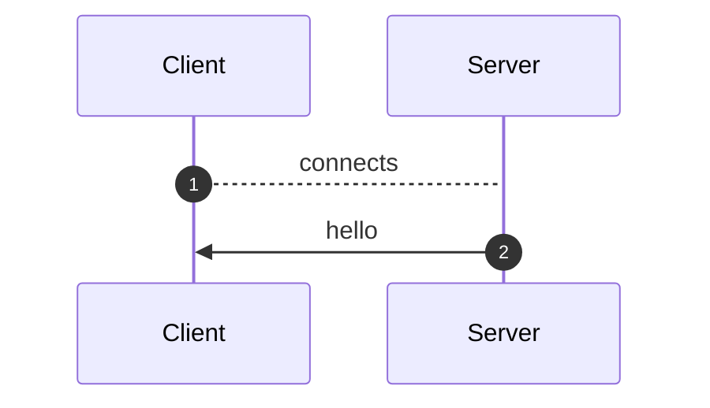
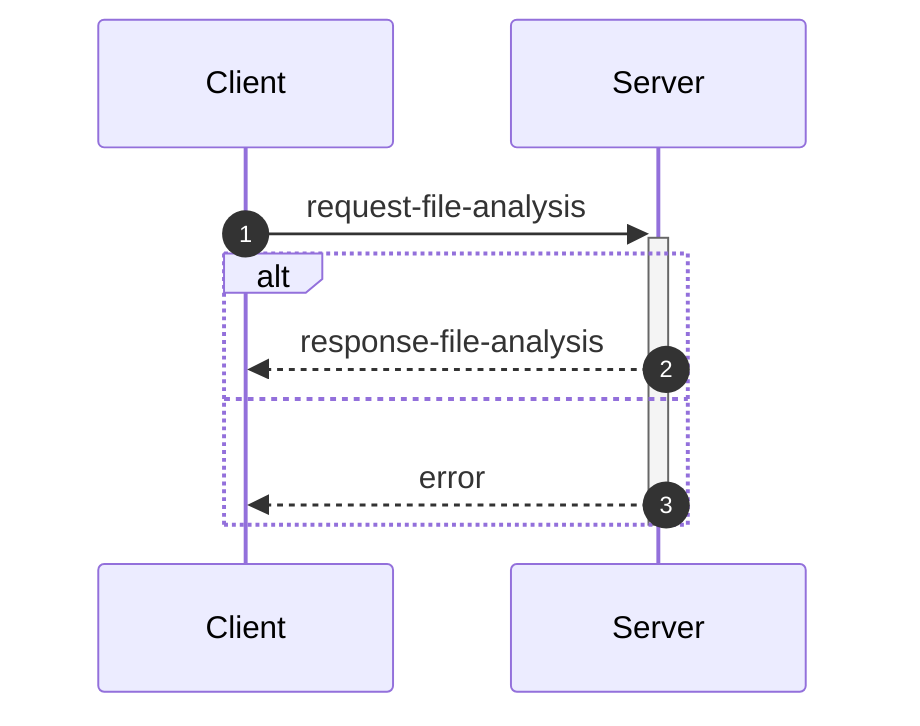
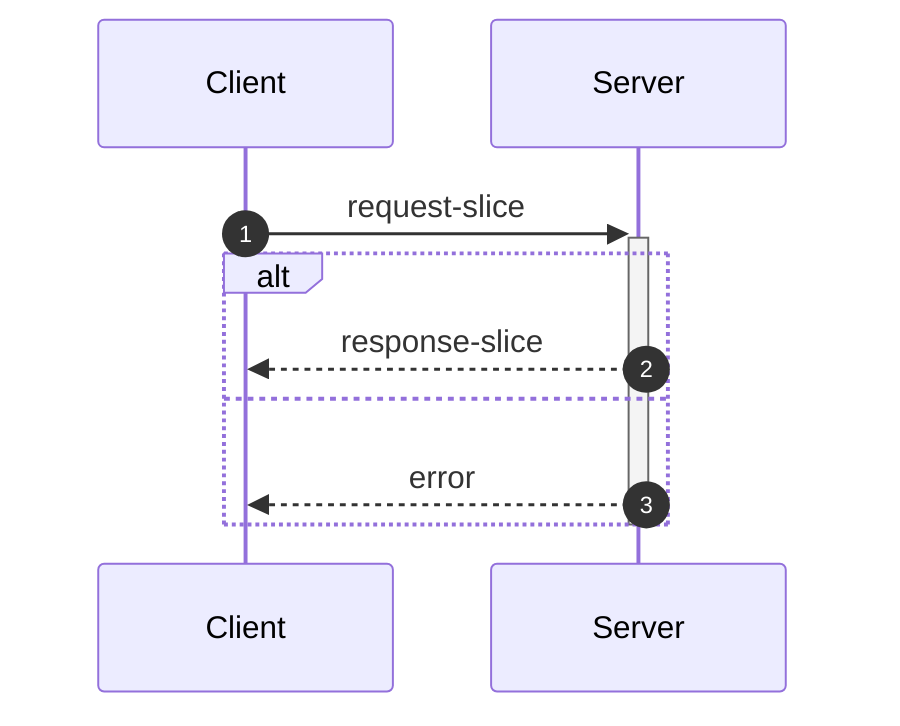
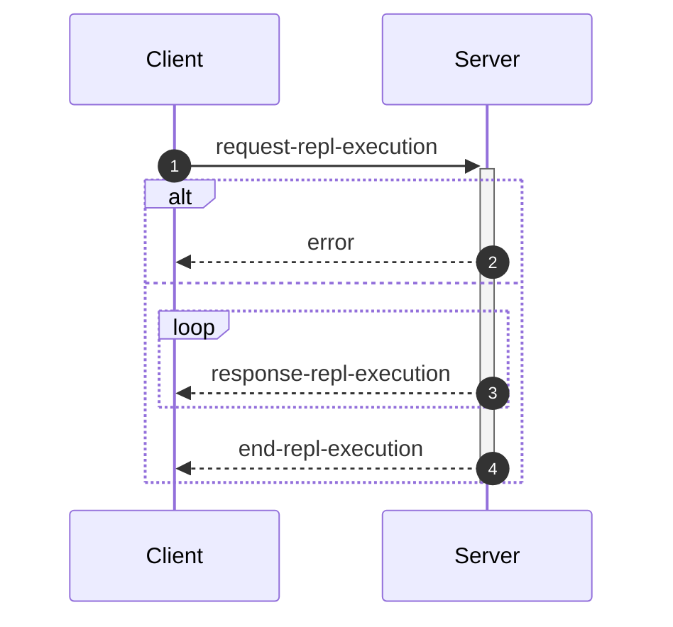

_This document was generated from '[src/documentation/wiki-interface.ts](https://github.com/flowr-analysis/flowr/tree/main//src/documentation/wiki-interface.ts)' on 2026-07-25, 08:57:53 UTC presenting an overview of flowR's interface (v2.13.2, using R v4.5.0). Please do not edit this file/wiki page directly._

Although far from being as detailed as the in-depth explanation of [_flowR_](https://github.com/flowr-analysis/flowr/wiki/core),
this wiki page explains how to interface with _flowR_ in more detail.
In general, command line arguments and other options provide short descriptions on hover over.

* [💻 Using the REPL](#using-the-repl)
* [⚙️ Configuring FlowR](#configuring-flowr)
* [⚒️ Writing Code](#writing-code)
* [💬 Communicating with the Server](#communicating-with-the-server)

<a id='using-the-repl'></a>
## 💻 Using the REPL


> [!NOTE]
> To execute arbitrary R commands with a repl request, _flowR_ has to be started explicitly with <span title="Description (Command Line Argument): Allow to access the underlying R session when using flowR (security warning: this allows the execution of arbitrary R code!)">`--r-session-access`</span>.
> Please be aware that this introduces a security risk and note that this relies on the [`r-shell` engine](https://github.com/flowr-analysis/flowr/wiki/engines) .

Although primarily meant for users to explore,
there is nothing which forbids simply calling _flowR_ as a subprocess to use standard-in, -output, and -error
for communication (although you can access the REPL using the server as well,
with the [REPL Request](#message-request-repl-execution) message).

The read-eval-print loop&nbsp;(REPL) works relatively simple.
You can submit an expression (using <kbd>Enter</kbd>),
which is interpreted as an R&nbsp;expression by default but interpreted as a *command* if it starts with a colon (`:`).
The best command to get started with the REPL is <span title="Description (Repl Command): Show help information (aliases: :h, :?)">`:help`</span>.
Besides, you can leave the REPL either with the command <span title="Description (Repl Command): End the repl (aliases: :q, :exit)">`:quit`</span> or by pressing <kbd>Ctrl</kbd>+<kbd>C</kbd> twice.
When writing a *command*, you may press <kbd>Tab</kbd> to get a list of completions, if available.
Multiple commands can be entered in a single line by separating them with a semicolon (`;`), e.g. `:parse "x<-2"; :df*`.
If a command is given without R code, the REPL will re-use R code given in a previous command.
The prior example will hence return first the parsed AST of the program and then the dataflow graph for `"x <- 2"`.

> [!NOTE]
> If you develop flowR, you may want to launch the repl using the `npm run main-dev` command, this way, you get a non-minified version of flowR with debug information and hot-reloading of source files.

<details>
<summary>Available Commands</summary>

We currently offer the following commands (this with a `[*]` suffix are available with and without the star):


| Command | Description |
| ------- | ----------- |
| **<span title="Description (Repl Command): End the repl (aliases: :q, :exit)">:quit</span>** | End the repl (aliases: **:<span title="Alias of ':quit'. End the repl">q</span>**, **:<span title="Alias of ':quit'. End the repl">exit</span>**) |
| **<span title="Description (Repl Command): Execute the given code as R code. This requires the `--r-session-access` flag to be set and requires the r-shell engine. (aliases: :e, :r)">:execute</span>** | Execute the given code as R code. This requires the `--r-session-access` flag to be set and requires the r-shell engine. (aliases: **:<span title="Alias of ':execute'. Execute the given code as R code. This requires the `--r-session-access` flag to be set and requires the r-shell engine.">e</span>**, **:<span title="Alias of ':execute'. Execute the given code as R code. This requires the `--r-session-access` flag to be set and requires the r-shell engine.">r</span>**) |
| **<span title="Description (Repl Command): Get mermaid code for the control-flow graph of R code (aliases: :cfg, :cf)">:controlflow[*]</span>** | Get mermaid code for the control-flow graph of R code (star: Returns the URL to mermaid.live) (aliases: **:<span title="Alias of ':controlflow'. Get mermaid code for the control-flow graph of R code">cfg</span>**, **:<span title="Alias of ':controlflow'. Get mermaid code for the control-flow graph of R code">cf</span>**) |
| **<span title="Description (Repl Command): Get mermaid code for the control-flow graph with basic blocks (aliases: :cfgb, :cfb)">:controlflowbb[*]</span>** | Get mermaid code for the control-flow graph with basic blocks (star: Returns the URL to mermaid.live) (aliases: **:<span title="Alias of ':controlflowbb'. Get mermaid code for the control-flow graph with basic blocks">cfgb</span>**, **:<span title="Alias of ':controlflowbb'. Get mermaid code for the control-flow graph with basic blocks">cfb</span>**) |
| **<span title="Description (Repl Command): Get mermaid code for the dataflow graph (aliases: :d, :df)">:dataflow[*]</span>** | Get mermaid code for the dataflow graph (star: Returns the URL to mermaid.live) (aliases: **:<span title="Alias of ':dataflow'. Get mermaid code for the dataflow graph">d</span>**, **:<span title="Alias of ':dataflow'. Get mermaid code for the dataflow graph">df</span>**) |
| **<span title="Description (Repl Command): Get mermaid code for the normalized AST of R code (aliases: :n)">:normalize[*]</span>** | Get mermaid code for the normalized AST of R code (star: Returns the URL to mermaid.live) (alias: **:<span title="Alias of ':normalize'. Get mermaid code for the normalized AST of R code">n</span>**) |
| **<span title="Description (Repl Command): Get mermaid code for the simplified dataflow graph (aliases: :ds, :dfs)">:dataflowsimple[*]</span>** | Get mermaid code for the simplified dataflow graph (star: Returns the URL to mermaid.live) (aliases: **:<span title="Alias of ':dataflowsimple'. Get mermaid code for the simplified dataflow graph">ds</span>**, **:<span title="Alias of ':dataflowsimple'. Get mermaid code for the simplified dataflow graph">dfs</span>**) |
| **<span title="Description (Repl Command): Inspect and extend the signature database: `query` (identical to :query @signature), `add <path>` to mount another database/source, `download` to fetch the full-history database. (aliases: :sig)">:signature</span>** | Inspect and extend the signature database: `query` (identical to :query @signature), `add <path>` to mount another database/source, `download` to fetch the full-history database. (alias: **:<span title="Alias of ':signature'. Inspect and extend the signature database: `query` (identical to :query @signature), `add <path>` to mount another database/source, `download` to fetch the full-history database.">sig</span>**) |
| **<span title="Description (Repl Command): Just calculates the DFG, but only prints summary info (aliases: :d#, :df#)">:dataflowsilent</span>** | Just calculates the DFG, but only prints summary info (aliases: **:<span title="Alias of ':dataflowsilent'. Just calculates the DFG, but only prints summary info">d#</span>**, **:<span title="Alias of ':dataflowsilent'. Just calculates the DFG, but only prints summary info">df#</span>**) |
| **<span title="Description (Repl Command): Prints ASCII Art of the parsed, unmodified AST (aliases: :p)">:parse</span>** | Prints ASCII Art of the parsed, unmodified AST (alias: **:<span title="Alias of ':parse'. Prints ASCII Art of the parsed, unmodified AST">p</span>**) |
| **<span title="Description (Repl Command): Prints the version of flowR as well as the current version of R">:version</span>** | Prints the version of flowR as well as the current version of R
| **<span title="Description (Repl Command): Query the given R code (use 'help' for more information)">:query[*]</span>** | Query the given R code (use 'help' for more information) (star: Similar to query, but returns the output in json format.)
| **<span title="Description (Repl Command): Returns an ASCII representation of the dataflow graph (aliases: :df!)">:dataflowascii</span>** | Returns an ASCII representation of the dataflow graph (alias: **:<span title="Alias of ':dataflowascii'. Returns an ASCII representation of the dataflow graph">df!</span>**) |
| **<span title="Description (Repl Command): Returns summarization stats for the normalized AST (aliases: :n#)">:normalize#</span>** | Returns summarization stats for the normalized AST (alias: **:<span title="Alias of ':normalize#'. Returns summarization stats for the normalized AST">n#</span>**) |
| **<span title="Description (Repl Command): Show help information (aliases: :h, :?)">:help</span>** | Show help information (aliases: **:<span title="Alias of ':help'. Show help information">h</span>**, **:<span title="Alias of ':help'. Show help information">?</span>**) |


</details>


> [!TIP]
> 
> As indicated by the examples before, all REPL commands that operate on code keep track of the state.
> Hence, if you run a command like <span title="Description (Repl Command, starred version): Returns the URL to mermaid.live; Base Command: Get mermaid code for the dataflow graph (aliases: :d*, :df*)">`:dataflow*`</span> without providing R code,
> the REPL will re-use the R code provided in a previous command.
> Likewise, doing this will benefit from incrementality!
> If you request the dataflow graph with `:df* x <- 2 * y` and then want to see the parsed AST with `:parse`,
> the REPL will re-use previously obtained information and not re-parse the code again.
> 		


Generally, many commands offer shortcut versions in the REPL. Many queries, for example, offer a shortened format (see the example below).
Of special note, the [Config Query](https://github.com/flowr-analysis/flowr/wiki/%5BQuery%5D-Config)
can be used to also modify the currently active configuration of _flowR_ within the REPL (see the [wiki page](https://github.com/flowr-analysis/flowr/wiki/%5BQuery%5D-Config) for more information).

### Example: Retrieving the Dataflow Graph

To retrieve a URL to the [mermaid](https://mermaid.js.org/) diagram of the dataflow of a given expression,
use <span title="Description (Repl Command, starred version): Returns the URL to mermaid.live; Base Command: Get mermaid code for the dataflow graph (aliases: :d*, :df*)">`:dataflow*`</span> (or <span title="Description (Repl Command): Get mermaid code for the dataflow graph (aliases: :d, :df)">`:dataflow`</span> to get the mermaid code in the cli):


```shell
$ docker run -it --rm eagleoutice/flowr # or npm run flowr 
flowR repl v2.13.2, R grammar v14 (tree-sitter engine)
R> :dataflow* y <- 1 + x
```

<details>
<summary style='color:gray'>Output</summary>


```text
https://mermaid.live/view#base64:eyJjb2RlIjoiZmxvd2NoYXJ0IEJUXG4gICAgMXt7XCJgKiM5MTtSTnVtYmVyIzkzOyogKioxKipcbiAgICAgICoxLjYqICgqKmlkOiAxKiopYFwifX1cbiAgICUlIE5vIGVkZ2VzIGZvdW5kIGZvciAxXG4gICAgMihbXCJgKiM5MTtSU3ltYm9sIzkzOyogKip4KipcbiAgICAgICoxLjEwKiAoKippZDogMioqKWBcIl0pXG4gICAlJSBObyBlZGdlcyBmb3VuZCBmb3IgMlxuICAgIDNbW1wiYCojOTE7UkJpbmFyeU9wIzkzOyogYmFzZSM1ODsjNTg7KiojNDM7KipcbiAgICAgICoxLjYtMTAqICgqKmlkOiAzKiopXG4gICAgYXJnOiAoMSwgMilgXCJdXVxuICAgIGJ1aWx0LWluOl9bXCJgQnVpbHQtSW46XG4jNDM7YFwiXVxuICAgIHN0eWxlIGJ1aWx0LWluOl8gc3Ryb2tlOmdyYXksZmlsbDpncmF5LHN0cm9rZS13aWR0aDoycHgsb3BhY2l0eTouODtcbiAgICAwW1wiYCojOTE7UlN5bWJvbCM5MzsqICoqeSoqXG4gICAgICAqMS4xKiAoKippZDogMCoqLCB2OiAzKWBcIl1cbiAgICA0W1tcImAqIzkxO1JCaW5hcnlPcCM5MzsqIGJhc2UjNTg7IzU4OyoqIzYwOyM0NTsqKlxuICAgICAgKjEuMS0xMCogKCoqaWQ6IDQqKilcbiAgICBhcmc6ICgwLCAzKWBcIl1dXG4gICAgYnVpbHQtaW46Xy1bXCJgQnVpbHQtSW46XG4jNjA7IzQ1O2BcIl1cbiAgICBzdHlsZSBidWlsdC1pbjpfLSBzdHJva2U6Z3JheSxmaWxsOmdyYXksc3Ryb2tlLXdpZHRoOjJweCxvcGFjaXR5Oi44O1xuICAgIDMgLS0+fFwicmVhZHMsIGFyZ1wifCAxXG4gICAgMyAtLT58XCJyZWFkcywgYXJnXCJ8IDJcbiAgICAzIC0uLT58XCJyZWFkcywgY2FsbHNcInwgYnVpbHQtaW46X1xuICAgIGxpbmtTdHlsZSAyIHN0cm9rZTpncmF5O1xuICAgIDAgLS0+fFwiZGVmaW5lZC1ieVwifCAzXG4gICAgMCAtLT58XCJkZWZpbmVkLWJ5XCJ8IDRcbiAgICA0IC0tPnxcInJlYWRzLCBhcmdcInwgM1xuICAgIDQgLS0+fFwicmV0dXJucywgYXJnXCJ8IDBcbiAgICA0IC0uLT58XCJyZWFkcywgY2FsbHNcInwgYnVpbHQtaW46Xy1cbiAgICBsaW5rU3R5bGUgNyBzdHJva2U6Z3JheTsiLCJtZXJtYWlkIjp7ImF1dG9TeW5jIjp0cnVlfX0=
```


Retrieve the dataflow graph of the expression `y <- 1 + x`. It looks like this:


```mermaid
flowchart LR
    1{{"`*#91;RNumber#93;* **1**
      *1.6* (**id: 1**)`"}}
   %% No edges found for 1
    2(["`*#91;RSymbol#93;* **x**
      *1.10* (**id: 2**)`"])
   %% No edges found for 2
    3[["`*#91;RBinaryOp#93;* base#58;#58;**#43;**
      *1.6-10* (**id: 3**)
    arg: (1, 2)`"]]
    built-in:_["`Built-In:
#43;`"]
    style built-in:_ stroke:gray,fill:gray,stroke-width:2px,opacity:.8;
    0["`*#91;RSymbol#93;* **y**
      *1.1* (**id: 0**, v: 3)`"]
    4[["`*#91;RBinaryOp#93;* base#58;#58;**#60;#45;**
      *1.1-10* (**id: 4**)
    arg: (0, 3)`"]]
    built-in:_-["`Built-In:
#60;#45;`"]
    style built-in:_- stroke:gray,fill:gray,stroke-width:2px,opacity:.8;
    3 -->|"reads, arg"| 1
    3 -->|"reads, arg"| 2
    3 -.->|"reads, calls"| built-in:_
    linkStyle 2 stroke:gray;
    0 -->|"defined-by"| 3
    0 -->|"defined-by"| 4
    4 -->|"reads, arg"| 3
    4 -->|"returns, arg"| 0
    4 -.->|"reads, calls"| built-in:_-
    linkStyle 7 stroke:gray;
```

	
<details>

<summary style="color:gray">R Code of the Dataflow Graph</summary>

The analysis required _0.7 ms_ (including parse and normalize, using the [tree-sitter](https://github.com/flowr-analysis/flowr/wiki/Engines) engine) within the generation environment. No [signature database](https://github.com/flowr-analysis/flowr/wiki/Signature-Database) is mounted for these generated graphs, so `library()` calls attach no package exports; base-R names are still qualified via the generated base-package store (e.g. `acf` as `stats::acf`). 
We encountered no unknown side effects during the analysis.


```r
y <- 1 + x
```


</details>


</details>


For small graphs like this, <span title="Description (Repl Command): Returns an ASCII representation of the dataflow graph (aliases: :df!)">`:dataflowascii`</span> also provides an ASCII representation directly in the REPL:


```shell
$ docker run -it --rm eagleoutice/flowr # or npm run flowr 
flowR repl v2.13.2, R grammar v14 (tree-sitter engine)
R> :df! y <- 1 + x
```

<details open>
<summary style='color:gray'>Output</summary>


```text
                        0<1>0
                   ┌────| 1 |
    ┌────────┐     │    0---0
 c<4>c       └──c<3>c
 |<- |  v<0>v┌──| + |
 c---c──| y |┘  c---c   u<2>u
        v---v      └────| x |
                        u---u
Edges:
3 -> 1: reads, arg  3 -> 2: reads, arg
4 -> 3: reads, arg  4 -> 0: returns, arg
0 -> 3: defined-by  0 -> 4: defined-by
```


Retrieve the dataflow graph of the expression `y <- 1 + x` as ASCII art.

</details>


For the slicing with <span title="Description (Repl Command): Static backwards executable slicer for R">`:slicer`</span>, you have access to the same [magic comments](#slice-magic-comments) as with the [slice request](#message-request-slice).
Pass `--inline` to splice resolvable `source()` calls into the reconstruction so the slice is a single self-contained R text (the same as the static slice query's `inlineSources` flag).
See `--help` for more flags!

### Example: Interfacing with the File System

Many commands that allow for an R-expression (like <span title="Description (Repl Command, starred version): Returns the URL to mermaid.live; Base Command: Get mermaid code for the dataflow graph (aliases: :d*, :df*)">`:dataflow*`</span>) allow for a file as well
if the argument starts with `file://`.
If you are working from the root directory of the _flowR_ repository, the following gives you the parsed AST of the example file using the <span title="Description (Repl Command): Prints ASCII Art of the parsed, unmodified AST (aliases: :p)">`:parse`</span> command:

> **Watch mode**: Replace `file://` with `watch://` to enter watch mode.
> flowR runs the command immediately and then re-runs it every time the file (or any file inside the folder) changes.
> Enter any other command to leave watch mode.
> For example: `:df watch://analysis.R`


```shell
$ docker run -it --rm eagleoutice/flowr # or npm run flowr 
flowR repl v2.13.2, R grammar v14 (tree-sitter engine)
R> :parse file://test/testfiles/example.R
```

<details>
<summary style='color:gray'>Output</summary>


```text
File: test/testfiles/example.R

program
├ binaryoperator
│ ├ identifier "sum" (1:1─4)
│ ├ <- "<-" (1:5─7)
│ ╰ float "0" (1:8─9)
├ binaryoperator
│ ├ identifier "product" (2:1─8)
│ ├ <- "<-" (2:9─11)
│ ╰ float "1" (2:12─13)
├ binaryoperator
│ ├ identifier "w" (3:1─2)
│ ├ <- "<-" (3:3─5)
│ ╰ float "7" (3:6─7)
├ binaryoperator
│ ├ identifier "N" (4:1─2)
│ ├ <- "<-" (4:3─5)
│ ╰ float "10" (4:6─8)
├ forstatement
│ ├ for "for" (6:1─4)
│ ├ ( "(" (6:5─6)
│ ├ identifier "i" (6:6─7)
│ ├ in "in" (6:8─10)
│ ├ binaryoperator
│ │ ├ float "1" (6:11─12)
│ │ ├ : ":" (6:12─13)
│ │ ╰ parenthesizedexpression
│ │   ├ ( "(" (6:13─14)
│ │   ├ binaryoperator
│ │   │ ├ identifier "N" (6:14─15)
│ │   │ ├ - "-" (6:15─16)
│ │   │ ╰ float "1" (6:16─17)
│ │   ╰ ) ")" (6:17─18)
│ ├ ) ")" (6:18─19)
│ ╰ bracedexpression
│   ├ { "{" (6:20─21)
│   ├ binaryoperator
│   │ ├ identifier "sum" (7:3─6)
│   │ ├ <- "<-" (7:7─9)
│   │ ╰ binaryoperator
│   │   ├ binaryoperator
│   │   │ ├ identifier "sum" (7:10─13)
│   │   │ ├ + "+" (7:14─15)
│   │   │ ╰ identifier "i" (7:16─17)
│   │   ├ + "+" (7:18─19)
│   │   ╰ identifier "w" (7:20─21)
│   ├ binaryoperator
│   │ ├ identifier "product" (8:3─10)
│   │ ├ <- "<-" (8:11─13)
│   │ ╰ binaryoperator
│   │   ├ identifier "product" (8:14─21)
│   │   ├  "" (8:22─23)
│   │   ╰ identifier "i" (8:24─25)
│   ╰ } "}" (9:1─2)
├ call
│ ├ identifier "cat" (11:1─4)
│ ╰ arguments
│   ├ ( "(" (11:4─5)
│   ├ argument
│   │ ╰ string
│   │   ├ " "\"" (11:5─6)
│   │   ├ stringcontent "Sum:" (11:6─10)
│   │   ╰ " "\"" (11:10─11)
│   ├ comma "," (11:11─12)
│   ├ argument
│   │ ╰ identifier "sum" (11:13─16)
│   ├ comma "," (11:16─17)
│   ├ argument
│   │ ╰ string
│   │   ├ " "\"" (11:18─19)
│   │   ├ stringcontent
│   │   │ ╰ escapesequence "\\n" (11:19─21)
│   │   ╰ " "\"" (11:21─22)
│   ╰ ) ")" (11:22─23)
╰ call
  ├ identifier "cat" (12:1─4)
  ╰ arguments
    ├ ( "(" (12:4─5)
    ├ argument
    │ ╰ string
    │   ├ " "\"" (12:5─6)
    │   ├ stringcontent "Product:" (12:6─14)
    │   ╰ " "\"" (12:14─15)
    ├ comma "," (12:15─16)
    ├ argument
    │ ╰ identifier "product" (12:17─24)
    ├ comma "," (12:24─25)
    ├ argument
    │ ╰ string
    │   ├ " "\"" (12:26─27)
    │   ├ stringcontent
    │   │ ╰ escapesequence "\\n" (12:27─29)
    │   ╰ " "\"" (12:29─30)
    ╰ ) ")" (12:30─31)
```


Retrieve the parsed AST of the example file.

<details>

<summary>File Content</summary>


```r
sum <- 0
product <- 1
w <- 7
N <- 10

for (i in 1:(N-1)) {
  sum <- sum + i + w
  product <- product * i
}

cat("Sum:", sum, "\n")
cat("Product:", product, "\n")
```


</details>

As _flowR_ directly transforms this AST the output focuses on being human-readable instead of being machine-readable.
		

</details>


### Example: Run a Query

You can run any query supported by _flowR_ using the <span title="Description (Repl Command): Query the given R code (use 'help' for more information)">`:query`</span> command.
For example, to obtain the shapes of all data frames in a given piece of code, you can run:


```shell
$ docker run -it --rm eagleoutice/flowr # or npm run flowr 
flowR repl v2.13.2, R grammar v14 (tree-sitter engine)
R> :query @absint df-shape "x <- data.frame(a = 1:10, b = 1:10)\ny <- x$a"
```

<details open>
<summary style='color:gray'>Output</summary>


```text
Query: absint (1 ms)
   ╰ $12: (colnames: [{"a", "b"}, {}], cols: [2, 2], rows: [10, 10])
   ╰ $0: (colnames: [{"a", "b"}, {}], cols: [2, 2], rows: [10, 10])
All queries together required ≈5 ms (1ms accuracy, total 6 ms)
```


Retrieve the shapes of all data frames in the given code.

</details>


To run the linter on a file, you can use (in this example, we just issue the `dead-code` linter on a small piece of code):


```shell
$ docker run -it --rm eagleoutice/flowr # or npm run flowr 
flowR repl v2.13.2, R grammar v14 (tree-sitter engine)
R> :query @linter rules:dead-code "if(FALSE) x <- 2"
```

<details open>
<summary style='color:gray'>Output</summary>


```text
Query: linter (3 ms)
   ╰ Dead Code (dead-code):
       ╰ certain:
           ╰ Code at 1.11-16
       ╰ Metadata: searchTimeMs: 3, processTimeMs: 0
All queries together required ≈4 ms (1ms accuracy, total 4 ms)
```


Run the linter on the given code, with only the `dead-code` rule enabled.

</details>


For more information on the available queries, please check out the [Query API](https://github.com/flowr-analysis/flowr/wiki/query-api).


<a id='configuring-flowr'></a>
## ⚙️ Configuring FlowR


When running _flowR_, you may want to specify some behaviors with a dedicated configuration file.
By default, flowR looks for a file named `flowr.json` in the current working directory (or any higher directory).
You can also specify a different file with <span title="Description (Command Line Argument): The name of the configuration file to use">`--config-file`</span> or pass the configuration inline using <span title="Description (Command Line Argument): The flowR configuration to use, as a JSON string">`--config-json`</span>.
To inspect the current configuration, you can run flowr with the <span title="Description (Command Line Argument): Run with verbose logging (will be passed to the corresponding script)">`--verbose`</span> flag, or use the `config` [Query](https://github.com/flowr-analysis/flowr/wiki/query-api).
Within the REPL this works by running the following:


```shell
:query @config
```


To work with the <a href="https://github.com/flowr-analysis/flowr/tree/main/src/config.ts#L130"><code><span title="The configuration file format for flowR.">FlowrConfig</span></code></a> you can use the provided helper objects alongside its methods like
<a href="https://github.com/flowr-analysis/flowr/tree/main/src/config.ts#L756"><code><span title="Creates a new flowr config that has the updated values.">FlowrConfig::<b>amend</b></span></code></a>.
The schema below documents every option; the ones you most likely want are:

- <a href="https://github.com/flowr-analysis/flowr/wiki/Interface#configuring-flowr" title="Configuration Option (boolean): Whether source calls should be ignored, causing {@link processSourceCall}&#39;s behavior to be skipped.">ignoreSourceCalls</a>: ignore source calls when analyzing the code, i.e., ignore the inclusion of other files.
- <a href="https://github.com/flowr-analysis/flowr/wiki/Interface#configuring-flowr" title="Configuration Option (boolean): Whether load calls should be ignored, causing {@link processLoadCall}&#39;s behavior to be skipped.">ignoreLoadCalls</a>: ignore load calls when analyzing the code, i.e., ignore the loading of r-data files.
- <a href="https://github.com/flowr-analysis/flowr/wiki/Interface#configuring-flowr" title="Configuration Option (object): Do you want to overwrite (parts) of the builtin definition?">semantics.environment.overwriteBuiltIns</a>: overwrite _flowR_'s handling of built-in functions, or clear the preset definitions entirely.
  See [Configure BuiltIn Semantics](#configure-builtin-semantics) for more information.
- <a href="https://github.com/flowr-analysis/flowr/wiki/Interface#configuring-flowr" title="Configuration Option (string): How to resolve variables and their values. (one of &quot;disabled&quot;, &quot;alias&quot;, &quot;builtin&quot;)">solver.variables</a>: how to resolve variables and their values (`disabled`, `alias`, `builtin`).
- <a href="https://github.com/flowr-analysis/flowr/wiki/Interface#configuring-flowr" title="Configuration Option (array): The engine or set of engines to use for interacting with R code. An empty array means all available engines will be used.">engines</a> and <a href="https://github.com/flowr-analysis/flowr/wiki/Interface#configuring-flowr" title="Configuration Option (string): The default engine to use for interacting with R code. If this is undefined, an arbitrary engine from the specified list will be used. (one of &quot;tree-sitter&quot;, &quot;r-shell&quot;)">defaultEngine</a>: the engines used to interact with R code, see the [Engines wiki page](https://github.com/flowr-analysis/flowr/wiki/engines).
- <a href="https://github.com/flowr-analysis/flowr/wiki/Interface#configuring-flowr" title="Configuration Option (array): Files a framework loads on its own, without any source() call (e.g. global.R in a shiny app), in the order they are loaded; flowR orders the matching project files accordingly and analyzes them as one program. Entries are case-insensitive globs matched against the file path, a plain name matches any file with that name, and entries matching no project file are warned about. Usually set per project kind via specializeConfig.">project.implicitSources</a>: the files a framework loads without any `source()` call, in the order in which they are
  loaded. Entries are globs (e.g. `R/*.R`) matched against the file path ignoring capitalization; one matching no file is reported.
- <a href="https://github.com/flowr-analysis/flowr/wiki/Interface#configuring-flowr" title="Configuration Option (object): Overwrite (parts of) the configuration depending on the project kind flowR detects, e.g. to give a shiny app its implicit sources.">specializeConfig</a>: overwrite (parts of) the configuration depending on the kind of project _flowR_ detects
  (e.g. `shiny-app`), which is how a shiny app gets its implicit sources by default. What you configure directly wins.
- <a href="https://github.com/flowr-analysis/flowr/wiki/Interface#configuring-flowr" title="Configuration Option (string): Overwrite the project kind flowR would otherwise infer from the analyzed files, e.g. when auto-detection guesses wrong. (one of &quot;package&quot;, &quot;script&quot;, &quot;shiny-app&quot;, &quot;notebook&quot;, &quot;project&quot;, &quot;unknown&quot;)">project.useProjectType</a>: skip that detection and force a project kind yourself, when auto-detection guesses wrong.
- <a href="https://github.com/flowr-analysis/flowr/wiki/Interface#configuring-flowr" title="Configuration Option (array): The default plugins to load when creating a new instance of FlowrAnalyzer">defaultPlugins</a> and <a href="https://github.com/flowr-analysis/flowr/wiki/Interface#configuring-flowr" title="Configuration Option (array): The plugins to load in REPL mode">repl.plugins</a>: the plugins to load for a new <a href="https://github.com/flowr-analysis/flowr/tree/main/src/project/flowr-analyzer.ts#L167"><code><span title="Central class for conducting analyses with FlowR. Use the FlowrAnalyzerBuilder to create a new instance. If you want the original pattern of creating a pipeline and running all steps, you can still do this with FlowrAnalyzer#runFull . To inspect the context of the analyzer, use FlowrAnalyzer#inspectContext (if you are a plugin and need to modify it, use FlowrAnalyzer#context instead).">FlowrAnalyzer</span></code></a> and in the REPL
  (use `flowr:default` to reference the former).

So you can configure _flowR_ by adding a file like the following:

<details>

<summary>Example Configuration File</summary>


```json
{
  "ignoreSourceCalls": true,
  "ignoreLoadCalls": true,
  "semantics": {
    "environment": {
      "overwriteBuiltIns": {
        "definitions": [
          {
            "type": "function",
            "names": [
              "foo"
            ],
            "processor": "builtin:assign",
            "config": {}
          }
        ]
      }
    }
  },
  "defaultPlugins": [
    "file:description",
    "versions:description"
  ],
  "repl": {
    "quickStats": false,
    "dfProcessorHeat": false,
    "hints": true,
    "plugins": [
      "flowr:default"
    ]
  },
  "project": {
    "resolveUnknownPathsOnDisk": true,
    "implicitSources": [
      "global.R",
      "app.R"
    ]
  },
  "linter": {
    "disabledRules": []
  },
  "specializeConfig": {
    "shiny-app": {
      "project": {
        "implicitSources": [
          "global.R",
          "ui.R",
          "server.R",
          "app.R"
        ]
      }
    }
  },
  "engines": [
    {
      "type": "r-shell"
    }
  ],
  "solver": {
    "variables": "alias",
    "evalStrings": true,
    "trackEnvironments": true,
    "sigdb": {
      "enabled": true,
      "loadProjectDependencies": true,
      "eagerlyLoad": false,
      "eagerlyLoadExports": false,
      "linkBaseR": false,
      "linkDescriptionDependencies": false
    },
    "resolveSource": {
      "dropPaths": "no",
      "ignoreCapitalization": true,
      "inferWorkingDirectory": "active-script",
      "searchPath": []
    },
    "instrument": {},
    "slicer": {
      "threshold": 50
    }
  },
  "abstractInterpretation": {
    "wideningThreshold": 4,
    "dataFrame": {
      "maxColNames": 20,
      "readLoadedData": {
        "readExternalFiles": true,
        "maxReadLines": 1000000
      }
    }
  },
  "gas": {
    "thresholds": {
      "memory": {
        "problematic": 0.7,
        "critical": 0.9
      },
      "timeMs": {
        "problematic": 100000,
        "critical": 120000
      }
    },
    "features": {}
  }
}
```


</details>

<details>
<a id='configure-builtin-semantics'></a>
<summary>Configure Built-In Semantics</summary>


`semantics/environment/overwriteBuiltins` accepts two keys:

- `loadDefaults` (boolean, initially `true`): If set to `true`, the default built-in definitions are loaded before applying the custom definitions. Setting this flag to `false` explicitly disables the loading of the default definitions.
- `definitions` (array, initially empty): Allows to overwrite or define new built-in elements. Each object within must have a `type` which is one of the below. Furthermore, they may define a string array of `names` which specifies the identifiers to bind the definitions to. You may use `assumePrimitive` to specify whether _flowR_ should assume that this is a primitive non-library definition (so you probably just do not want to specify the key).

  | Type            | Description                                                                                                                                                                                                                                                                                              | Example                                                                                                    |
  | --------------- | -------------------------------------------------------------------------------------------------------------------------------------------------------------------------------------------------------------------------------------------------------------------------------------------------------- | ---------------------------------------------------------------------------------------------------------- |
  | `constant`    | Additionally allows for a `value` this should resolve to.                                                                                                                                                                                                                                                | `{ type: 'constant', names: ['NULL', 'NA'],  value: null }`                                                |
  | `function`    | Is a rather flexible way to define and bind built-in functions. For the time, we do not have extensive documentation to cover all the cases, so please either consult the sources with the `default-builtin-config.ts` or open a [new issue](https://github.com/flowr-analysis/flowr/issues/new/choose). | `{ type: 'function', names: ['next'], processor: 'builtin:d', config: { cfg: ExitPointType.Next } }` |
  | `replacement` | A comfortable way to specify replacement functions like `$<-` or `names<-`. `suffixes` describes the... suffixes to attach automatically. | `{ type: 'replacement', suffixes: ['<-', '<<-'], names: ['[', '[['] }` |


</details>

<details>

<summary style='color:gray'>Full Configuration-File Schema</summary>

- _The configuration file format for flowR._ (object)
    - **logLevel** [optional] _flowR's global minimum log level, applied when the config is loaded._ (string)
        Only allows: 'silly', 'trace', 'debug', 'info', 'warn', 'error', 'fatal'
    - **ignoreSourceCalls** [optional] _Whether source calls should be ignored, causing {@link processSourceCall}'s behavior to be skipped._ (boolean)
    - **ignoreLoadCalls** [optional] _Whether load calls should be ignored, causing {@link processLoadCall}'s behavior to be skipped._ (boolean)
    - **semantics** _Configure language semantics and how flowR handles them._ (object)
        - **environment** [optional] _Semantics regarding how to handle the R environment._ (object)
            - **overwriteBuiltIns** [optional] _Do you want to overwrite (parts) of the builtin definition?_ (object)
                - **loadDefaults** [optional] _Should the default configuration still be loaded?_ (boolean)
                - **definitions** [optional] _The definitions to load/overwrite._ (array)
                Valid item types:
                    - (object)
    - **defaultPlugins** [optional] _The default plugins to load when creating a new instance of FlowrAnalyzer_ (array)
    Valid item types:
        - (alternatives)
            - (string)
            - (array)
    - **repl** _Configuration options for the REPL._ (object)
        - **quickStats** [optional] _Whether to show quick stats in the REPL after each evaluation._ (boolean)
        - **dfProcessorHeat** [optional] _This instruments the dataflow processors to count how often each processor is called._ (boolean)
        - **hints** [optional] _Whether to show dim inline hints on the empty prompt (automatically disabled on non-interactive terminals)._ (boolean)
        - **plugins** [optional] _The plugins to load in REPL mode_ (array)
        Valid item types:
            - (alternatives)
                - (string)
                - (array)
        - **autoUseFileProtocol** [optional] _Prepend the file protocol to a repl input that looks like a path, instead of only warning about it._ (boolean)
        - **queryStats** [optional] _Whether `:query` closes with the line stating how long the queries took (`:query*` never prints it)._ (boolean)
        - **showPlugins** [optional] _Whether `:version` grays out the plugins that did not activate during the last analysis._ (boolean)
    - **project** _Project specific configuration options._ (object)
        - **resolveUnknownPathsOnDisk** [optional] _Whether to resolve unknown paths loaded by the r project disk when trying to source/analyze files._ (boolean)
        - **failOnInaccessiblePath** [optional] _Whether a directory that cannot be traversed during file discovery (e.g. due to permissions) aborts the analysis; when false (the default) such paths are logged and skipped._ (boolean)
        - **basePackages** [optional] _The packages considered part of R itself (base and recommended); if unset, flowR uses its built-in list._ (array)
        Valid item types:
            - (string)
        - **implicitSources** [optional] _Files a framework loads on its own, without any source() call (e.g. global.R in a shiny app), in the order they are loaded; flowR orders the matching project files accordingly and analyzes them as one program. Entries are case-insensitive globs matched against the file path, a plain name matches any file with that name, and entries matching no project file are warned about. Usually set per project kind via specializeConfig._ (array)
        Valid item types:
            - (string)
        - **useProjectType** [optional] _Overwrite the project kind flowR would otherwise infer from the analyzed files, e.g. when auto-detection guesses wrong._ (string)
            Only allows: 'package', 'script', 'shiny-app', 'notebook', 'project', 'unknown'
        - **discovery** [optional] _Scoping options for the default project discovery._ (object)
            - **full** [optional] _Collect every file below the project root (greedy) instead of only the files the detected project kind needs (default false)._ (boolean)
            - **perKind** [optional] _Per-kind include/exclude glob overrides layered on the default scoping._ (object)
            - **ignore** [optional] _Case-insensitive globs that drop matching files from the intelligent discovery, regardless of kind (e.g. .Renviron to ignore environment files)._ (array)
            Valid item types:
                - (string)
        - **classification** [optional] _Overrides for the signals flowR uses to classify the project kind._ (object)
            - **shinyDescriptionTypes** [optional] _DESCRIPTION Type: values that mark a shiny app._ (array)
            Valid item types:
                - (string)
            - **shinyEntryFiles** [optional] _File names a shiny app is assembled from._ (array)
            Valid item types:
                - (string)
            - **shinyUsagePattern** [optional] _Regex source evidencing shiny usage in an entry file._ (string)
            - **notebookExtensions** [optional] _File extensions marking a notebook._ (array)
            Valid item types:
                - (string)
    - **linter** _Linter configuration options._ (object)
        - **disabledRules** _Linting rule names excluded from the default rule set (a rule requested explicitly via a linter query still runs). Usually set per project kind via specializeConfig._ (array)
        Valid item types:
            - (string)
    - **specializeConfig** [optional] _Overwrite (parts of) the configuration depending on the project kind flowR detects, e.g. to give a shiny app its implicit sources._ (object)
    - **engines** _The engine or set of engines to use for interacting with R code. An empty array means all available engines will be used._ (array)
    Valid item types:
        - (alternatives)
            - _The configuration for the tree sitter engine._ (object)
                - **type** [required] _Use the tree sitter engine._ (string)
                    Only allows: 'tree-sitter'
                - **wasmPath** [optional] _The path to the tree-sitter-r WASM binary to use. If this is undefined, this uses the default path._ (string)
                - **treeSitterWasmPath** [optional] _The path to the tree-sitter WASM binary to use. If this is undefined, this uses the default path._ (string)
                - **lax** [optional] _Whether to use the lax parser for parsing R code (allowing for syntax errors). If this is undefined, the strict parser will be used._ (boolean)
            - _The configuration for the R shell engine._ (object)
                - **type** [required] _Use the R shell engine._ (string)
                    Only allows: 'r-shell'
                - **rPath** [optional] _The path to the R executable to use. If this is undefined, this uses the default path._ (string)
    - **defaultEngine** [optional] _The default engine to use for interacting with R code. If this is undefined, an arbitrary engine from the specified list will be used._ (string)
        Only allows: 'tree-sitter', 'r-shell'
    - **solver** _How to resolve constants, constraints, cells, ..._ (object)
        - **variables** _How to resolve variables and their values._ (string)
            Only allows: 'disabled', 'alias', 'builtin'
        - **evalStrings** _Should we include eval(parse(text="...")) calls in the dataflow graph?_ (boolean)
        - **trackEnvironments** [optional] _Track user-created environments (new.env, assign/get/local with envir=, dollar-assign, attach). When false, all envir-style calls fall through conservatively._ (boolean)
        - **sigdb** _Resolving library exports from a signature database._ (object)
            - **enabled** [optional] _Resolve library()/use() exports from a signature database (default true); when false no database is consulted._ (boolean)
            - **loadProjectDependencies** [optional] _Load the project's declared dependencies from its metadata files (DESCRIPTION Imports/Depends, rproject.toml, renv.lock, rv.lock) (default true); when false these files are not read for dependencies._ (boolean)
            - **eagerlyLoad** [optional] _Parse the database up front rather than on the first package load (default false, ignored if disabled)._ (boolean)
            - **eagerlyLoadExports** [optional] _Add a vertex for every export on load rather than on demand (default false); keeps the dataflow graph small._ (boolean)
            - **assumedRVersion** [optional] _R version assumed when resolving versioned (base-R) exports: a pin like "4.5" or "auto" to detect the installed R (default "auto")._ (string)
            - **linkBaseR** [optional] _Eagerly attach base-R namespaces so bare base calls resolve without library() (default false)._ (boolean)
            - **linkBaseRCalls** [optional] _Add a lightweight Reads edge from a bare base-R call to its signature-database function vertex (default false; base-R qualification is edge-free otherwise)._ (boolean)
            - **linkPackageCalls** [optional] _Add a lightweight Reads edge from a resolved package call to its signature-database function vertex (default false)._ (boolean)
            - **linkDescriptionDependencies** [optional] _Eagerly attach the namespaces of the project's declared DESCRIPTION dependencies (Imports/Depends) so their exports resolve without an explicit library() (default false)._ (boolean)
            - **warmInBackground** [optional] _Decompress the hot shards (base + most-downloaded) in a background task on startup so the first library() lookup is warm (default false; for long-running servers/REPLs)._ (boolean)
            - **additionalPaths** [optional] _Extra directories or bundle/manifest files searched for signature databases (alongside the shipped default and $FLOWR_SIGDB_DIR); a downloaded full-history bundle placed here is mounted automatically._ (array)
            Valid item types:
                - (string)
            - **downloadRepo** [optional] _GitHub owner/repo the full-history bundle is downloaded from via ":signature download" (default "flowr-analysis/flowr", release tag "sigdb-v<flowR-version>")._ (string)
            - **autoSync** [optional] _On startup, re-download shards whose committed sigdb.remote.json hash no longer matches the cache, in the background (default false; opt-in network sync after a git pull)._ (boolean)
            - **versionSelection** [optional] _When a project constrains a dependency, resolve to the newest (default), oldest, or system-installed version satisfying it; system needs R and falls back to newest. Base-R packages always resolve against the assumed R version._ (string)
                Only allows: 'newest', 'oldest', 'system'
            - **versionOverrides** [optional] _Force an exact version for specific packages (name -> version), overriding both the project constraint and the versionSelection policy (default {})._ (object)
        - **versionManagement** _Policies for reasoning about dependency versions._ (object)
            - **linkedVersionGroups** [optional] _Groups of packages that must resolve to the same version; version guessing intersects each group so its members stay mutually compatible (default [])._ (array)
            Valid item types:
                - (array)
                Valid item types:
                    - (string)
        - **instrument** (object)
            - **dataflowExtractors** [optional] _These keys are only intended for use within code, allowing to instrument the dataflow analyzer!_ (any)
        - **resolveSource** [optional] _If lax source calls are active, flowR searches for sourced files much more freely, based on the configurations you give it. This option is only in effect if `ignoreSourceCalls` is set to false._ (object)
            - **dropPaths** _Allow to drop the first or all parts of the sourced path, if it is relative._ (string)
                Only allows: 'no', 'once', 'all'
            - **ignoreCapitalization** _Search for filenames matching in the lowercase._ (boolean)
            - **inferWorkingDirectory** _Try to infer the working directory from the main or any script to analyze._ (string)
                Only allows: 'no', 'main-script', 'active-script', 'any-script'
            - **searchPath** _Additionally search in these paths._ (array)
            Valid item types:
                - (string)
            - **repeatedSourceLimit** [optional] _How often the same file can be sourced within a single run? Please be aware: in case of cyclic sources this may not reach a fixpoint so give this a sensible limit._ (number)
            - **applyReplacements** _Provide name replacements for loaded files_ (array)
            Valid item types:
                - (object)
            - **assumeFilesExist** [optional] _Assume a sourced file is always there, making what it defines certain instead of conditional on the source call._ (boolean)
        - **slicer** [optional] _The configuration for the slicer._ (object)
            - **threshold** [optional] _The maximum number of iterations to perform on a single function call during slicing._ (number)
            - **autoExtend** [optional] _If set, the slicer will gain an additional post-pass._ (boolean)
    - **abstractInterpretation** _The configuration options for abstract interpretation._ (object)
        - **wideningThreshold** _The threshold for the number of visitations of a node at which widening should be performed to ensure the termination of the fixpoint iteration._ (number)
        - **dataFrame** _The configuration of the shape inference for data frames._ (object)
            - **maxColNames** _The maximum number of columns names to infer for data frames before over-approximating the column names to top._ (number)
            - **readLoadedData** _Configuration options for reading data frame shapes from loaded external data files, such as CSV files._ (object)
                - **readExternalFiles** _Whether data frame shapes should be extracted from loaded external files, such as CSV files._ (boolean)
                - **maxReadLines** _The maximum number of lines to read when extracting data frame shapes from loaded files, such as CSV files._ (number)
    - **gas** [optional] _Resource-usage guard (gas) configuration. All feature factors default to 0 (disabled). See https://github.com/flowr-analysis/flowr/wiki/Core#gas-resource-guard._ (object)
        - **thresholds** [optional] _Shared thresholds for all gas checks (scaled by per-feature factor)._ (object)
            - **memory** [optional] _Heap-usage fraction thresholds (0-1)._ (object)
                - **problematic** [optional] _Heap fraction (0-1) above which Problematic is returned._ (number)
                - **critical** [optional] _Heap fraction (0-1) above which Critical is returned._ (number)
            - **timeMs** [optional] _Elapsed analysis time thresholds in milliseconds._ (object)
                - **problematic** [optional] _Elapsed ms above which Problematic is returned._ (number)
                - **critical** [optional] _Elapsed ms above which Critical is returned._ (number)
        - **features** [optional] _Per-feature sensitivity factors. 0 or absent disables gas checking for that feature. A factor of 2 makes the feature twice as sensitive. Recognised keys: `source`, `side-effect-linking`, `linter`._ (object)
        - **heapProvider** [optional] _Custom heap statistics source (programmatic configs only), overriding the built-in v8/performance.memory detection._ (function)

</details>

	

<a id='writing-code'></a>
## ⚒️ Writing Code

_flowR_ can be used as a [module](https://www.npmjs.com/package/@eagleoutice/flowr) and offers several main classes and interfaces that are interesting for extension writers 
(see the [Visual Studio Code extension](https://marketplace.visualstudio.com/items?itemName=code-inspect.vscode-flowr) or the [Core](https://github.com/flowr-analysis/flowr/wiki/core) wiki page for more information).

### Creating Analyses with _flowR_

Nowadays, instances of the <a href="https://github.com/flowr-analysis/flowr/tree/main/src/project/flowr-analyzer.ts#L167"><code><span title="Central class for conducting analyses with FlowR. Use the FlowrAnalyzerBuilder to create a new instance. If you want the original pattern of creating a pipeline and running all steps, you can still do this with FlowrAnalyzer#runFull . To inspect the context of the analyzer, use FlowrAnalyzer#inspectContext (if you are a plugin and need to modify it, use FlowrAnalyzer#context instead).">FlowrAnalyzer</span></code></a> should be used as central frontend to get analysis results from _flowR_.
For example, a program slice can be created like this:


```ts
const analyzer = await new FlowrAnalyzerBuilder()
    .setEngine('tree-sitter')
    .build();
analyzer.addRequest('x <- 1\ny <- x\nx');
const result = await analyzer.query([
    {
        type:     'static-slice',
        criteria: ['3@x']
    }
]);
//console.log(result['static-slice']);
```


For more information, please have a look at the [Analyzer](https://github.com/flowr-analysis/flowr/wiki/analyzer) wiki page, which explains how to construct and use the <a href="https://github.com/flowr-analysis/flowr/tree/main/src/project/flowr-analyzer.ts#L167"><code><span title="Central class for conducting analyses with FlowR. Use the FlowrAnalyzerBuilder to create a new instance. If you want the original pattern of creating a pipeline and running all steps, you can still do this with FlowrAnalyzer#runFull . To inspect the context of the analyzer, use FlowrAnalyzer#inspectContext (if you are a plugin and need to modify it, use FlowrAnalyzer#context instead).">FlowrAnalyzer</span></code></a> in more detail.
To work with specific perspectives, you can also consult the respective pages like the [Dataflow Graph](https://github.com/flowr-analysis/flowr/wiki/dataflow-graph) or the [Abstract Interpretation](https://github.com/flowr-analysis/flowr/wiki/abstract-interpretation) wiki pages.
### The Pipeline Executor (Low-Level Interface)

Once, in the beginning, _flowR_ was meant to produce a dataflow graph merely to provide *program slices*. 
However, with continuous updates, the [Dataflow Graph](https://github.com/flowr-analysis/flowr/wiki/dataflow-graph) repeatedly proves to be the more interesting part.
With this, we restructured _flowR_'s originally *hardcoded* pipeline to be far more flexible. 
Now, it can be theoretically extended or replaced with arbitrary steps, optional steps, and what we call 'decorations' of these steps. 
In short, a slicing pipeline using the <a href="https://github.com/flowr-analysis/flowr/tree/main/src/core/pipeline-executor.ts#L97"><code><span title="**Please note:** The PipelineExecutor is now considered to be a rather low-level API for flowR. While it still works and is the basis for all other layers, we strongly recommend using the FlowrAnalyzer and its builder to create and use an analyzer instance that is pre-configured for your use-case. The pipeline executor allows to execute arbitrary pipelines in a step-by-step fashion. If you are not...">PipelineExecutor</span></code></a> looks like this:


```ts

const slicer = new PipelineExecutor(DEFAULT_SLICING_PIPELINE, {
  parser:    new RShell(),
  request:   requestFromInput('x <- 1\nx + 1'),
  criterion: ['2@x']
})
const slice = await slicer.allRemainingSteps()
// console.log(slice.reconstruct.code)
```


<details><summary>More Information</summary>


If you compare this, with what you would have done with the old (and removed) `SteppingSlicer`, 
this essentially just requires you to replace the `SteppingSlicer` with the <a href="https://github.com/flowr-analysis/flowr/tree/main/src/core/pipeline-executor.ts#L97"><code><span title="**Please note:** The PipelineExecutor is now considered to be a rather low-level API for flowR. While it still works and is the basis for all other layers, we strongly recommend using the FlowrAnalyzer and its builder to create and use an analyzer instance that is pre-configured for your use-case. The pipeline executor allows to execute arbitrary pipelines in a step-by-step fashion. If you are not...">PipelineExecutor</span></code></a>
and to pass the <a href="https://github.com/flowr-analysis/flowr/tree/main/src/core/steps/pipeline/default-pipelines.ts#L18"><code>DEFAULT_SLICING_PIPELINE</code></a> as the first argument.
The <a href="https://github.com/flowr-analysis/flowr/tree/main/src/core/pipeline-executor.ts#L97"><code><span title="**Please note:** The PipelineExecutor is now considered to be a rather low-level API for flowR. While it still works and is the basis for all other layers, we strongly recommend using the FlowrAnalyzer and its builder to create and use an analyzer instance that is pre-configured for your use-case. The pipeline executor allows to execute arbitrary pipelines in a step-by-step fashion. If you are not...">PipelineExecutor</span></code></a>...

1. Provides structures to investigate the results of all intermediate steps
2. Can be executed step-by-step
3. Can repeat steps (e.g., to calculate multiple slices on the same input)

See the in-code documentation for more information.


</details>

### Using the <a href="https://github.com/flowr-analysis/flowr/tree/main/src/r-bridge/shell.ts#L143"><code><span title="The RShell represents an interactive session with the R interpreter. You can configure it by RShellOptions . At the moment we are using a live R session (and not networking etc.) to communicate with R easily, which allows us to install packages etc. However, this might and probably will change in the future (leaving this as a legacy mode :D)">RShell</span></code></a> to Interact with R

The <a href="https://github.com/flowr-analysis/flowr/tree/main/src/r-bridge/shell.ts#L143"><code><span title="The RShell represents an interactive session with the R interpreter. You can configure it by RShellOptions . At the moment we are using a live R session (and not networking etc.) to communicate with R easily, which allows us to install packages etc. However, this might and probably will change in the future (leaving this as a legacy mode :D)">RShell</span></code></a> class allows interfacing with the `R`&nbsp;ecosystem installed on the host system.
Please have a look at [flowR's Engines](https://github.com/flowr-analysis/flowr/wiki/engines) for more information on alternatives (for example, the <a href="https://github.com/flowr-analysis/flowr/tree/main/src/r-bridge/lang-4.x/tree-sitter/tree-sitter-executor.ts#L18"><code><span title="Synchronous and (way) faster alternative to the RShell using tree-sitter.">TreeSitterExecutor</span></code></a>).


> [!IMPORTANT]
> 
> Each <a href="https://github.com/flowr-analysis/flowr/tree/main/src/r-bridge/shell.ts#L143"><code><span title="The RShell represents an interactive session with the R interpreter. You can configure it by RShellOptions . At the moment we are using a live R session (and not networking etc.) to communicate with R easily, which allows us to install packages etc. However, this might and probably will change in the future (leaving this as a legacy mode :D)">RShell</span></code></a> controls a new instance of the R&nbsp;interpreter, 
> make sure to call <code><a href="https://github.com/flowr-analysis/flowr/tree/main/src/r-bridge/shell.ts#L351"><span title="Close the current R session, makes the object effectively invalid (can no longer be reopened etc.)">RShell::<i>close</i></span></a>()</code> when you are done.


You can start a new "session" simply by constructing a new object with <code>new <a href="https://github.com/flowr-analysis/flowr/tree/main/src/r-bridge/shell.ts#L143"><span title="The RShell represents an interactive session with the R interpreter. You can configure it by RShellOptions . At the moment we are using a live R session (and not networking etc.) to communicate with R easily, which allows us to install packages etc. However, this might and probably will change in the future (leaving this as a legacy mode :D)">RShell</span></a>()</code>.

However, there are several options that may be of interest 
(e.g., to automatically revive the shell in case of errors or to control the name location of the R process on the system).

With a shell object (let's call it `shell`), you can execute R code by using <a href="https://github.com/flowr-analysis/flowr/tree/main/src/r-bridge/shell.ts#L212"><code><span title="sends the given command directly to the current R session will not do anything to alter input markers!">RShell::<i>sendCommand</i></span></code></a>,
for example <code>shell.<a href="https://github.com/flowr-analysis/flowr/tree/main/src/r-bridge/shell.ts#L212"><span title="sends the given command directly to the current R session will not do anything to alter input markers!">sendCommand</span></a>("1 + 1")</code>.
However, this does not return anything, so if you want to collect the output of your command, use
<a href="https://github.com/flowr-analysis/flowr/tree/main/src/r-bridge/shell.ts#L295"><code><span title="Send a command and collect the output">RShell::<i>sendCommandWithOutput</i></span></code></a> instead.


<a id='communicating-with-the-server'></a>
## 💬 Communicating with the Server


As explained in the [Overview](https://github.com/flowr-analysis/flowr/wiki/overview), you can simply run the [TCP](https://de.wikipedia.org/wiki/Transmission_Control_Protocol)&nbsp;server by adding the <span title="Description (Command Line Argument): Do not drop into a repl, but instead start a server on the given port (default: 1042) and listen for messages.">`--server`</span> flag (and, due to the interactive mode, exit with the conventional <kbd>CTRL</kbd>+<kbd>C</kbd>).
Currently, every connection is handled by the same underlying `RShell` - so the server is not designed to handle many clients at a time.
Additionally, the server is not well guarded against attacks (e.g., you can theoretically spawn an arbitrary number of&nbsp;RShell sessions on the target machine).

Every message has to be given in a single line (i.e., without a newline in-between) and end with a newline character. Nevertheless, we will pretty-print example given in the following segments for the ease of reading.


> [!NOTE]
> 
> The default <span title="Description (Command Line Argument): Do not drop into a repl, but instead start a server on the given port (default: 1042) and listen for messages.">`--server`</span> uses a simple [TCP](https://de.wikipedia.org/wiki/Transmission_Control_Protocol)
> connection. If you want _flowR_ to expose a [WebSocket](https://de.wikipedia.org/wiki/WebSocket) server instead, add the <span title="Description (Command Line Argument): If the server flag is set, use websocket for messaging">`--ws`</span> flag (i.e., <span title="Description (Command Line Argument): Do not drop into a repl, but instead start a server on the given port (default: 1042) and listen for messages.">`--server`</span> <span title="Description (Command Line Argument): If the server flag is set, use websocket for messaging">`--ws`</span>) when starting _flowR_ from the command line.


<ul><li>
<a id="message-hello"></a>
<b>Hello</b> Message (<code>hello</code>) 
<details>

<summary style="color:gray"> View Details. <i>The server informs the client about the successful connection and provides Meta-Information.</i> </summary>


```mermaid
sequenceDiagram
    autonumber
    participant Client
    participant Server

    
    Client-->Server: connects
    Server->>Client: hello
	
```


	
After launching _flowR_, for example, with <code>docker run -it --rm eagleoutice/flowr <span title="Description (Command Line Argument): Do not drop into a repl, but instead start a server on the given port (default: 1042) and listen for messages.">-<span/>-server</span></code>&nbsp;(🐳️), simply connecting should present you with a `hello` message, that amongst others should reveal the versions of&nbsp;_flowR_ and&nbsp;R, using the [semver 2.0](https://semver.org/spec/v2.0.0.html) versioning scheme.
The message looks like this:


```json
{
  "type": "hello",
  "clientName": "client-0",
  "versions": {
    "flowr": "2.13.2",
    "r": "4.5.0",
    "engine": "r-shell"
  }
}
```


There are currently a few messages that you can send after the hello message.
If you want to _slice_ a piece of R code you first have to send an [analysis request](#message-request-file-analysis), so that you can send one or multiple slice requests afterward.
Requests for the [REPL](#message-request-repl) are independent of that.
	

<hr>


<details>
<summary style="color:gray">Message schema (<code>hello</code>)</summary>

For the definition of the hello message, please see it's implementation at [`./src/cli/repl/server/messages/message-hello.ts`](https://github.com/flowr-analysis/flowr/tree/main/./src/cli/repl/server/messages/message-hello.ts).

- [required] (object)
    - **type** [required] _The type of the hello message._ (string)
        Only allows: 'hello'
    - **id** [forbidden] _The id of the message is always undefined (as it is the initial message and not requested)._ (any)
    - **clientName** [required] _A unique name that is assigned to each client. It has no semantic meaning and is only used/useful for debugging._ (string)
    - **versions** [required] (object)
        - **flowr** [required] _The version of the flowr server running in semver format._ (string)
        - **r** [required] _The version of the underlying R shell running in semver format._ (string)
        - **engine** [required] _The parser backend that is used to parse the R code._ (string)

</details>


<hr>

</details>
	</li>

<li>
<a id="message-request-file-analysis"></a>
<b>Analysis</b> Message (<code>request-file-analysis</code>) 
<details>

<summary style="color:gray"> View Details. <i>The server builds the dataflow graph for a given input file (or a set of files).</i> </summary>


```mermaid
sequenceDiagram
    autonumber
    participant Client
    participant Server

    
    Client->>+Server: request-file-analysis
    alt
        Server-->>Client: response-file-analysis
    else
        Server-->>Client: error
    end
    deactivate  Server
	
```


	
The request allows the server to analyze a file and prepare it for slicing.
The message can contain a `filetoken`, which is used to identify the file in later slice or query requests (if you do not add one, the request will not be stored and therefore, it is not available for subsequent requests).

> **Please note!**\
> If you want to send and process a lot of analysis requests, but do not want to slice them, please do not pass the `filetoken` field. This will save the server a lot of memory allocation.

Furthermore, the request must contain either a `content` field to directly pass the file's content or a `filepath` field which contains the path to the file (this path must be accessible for the server to be useful).
If you add the `id` field, the answer will use the same `id` so you can match requests and the corresponding answers.
See the implementation of the request-file-analysis message for more information.

You can drop one or more stored file tokens by adding the `invalidateToken` field (a single token or an array of tokens).
The server frees the corresponding analyses _after_ it has answered the request.

> **Tip!**\
> If you only want to drop tokens, you do not need a separate message: send a `request-file-analysis` that contains _just_ the `invalidateToken` field (and no `content` or `filepath`).
> Such a request behaves like an empty file analysis and the server replies with an empty `results` object.
> Because invalidation happens after the response, you may even pass the _current_ `filetoken` in `invalidateToken` to analyze a file once and have the server forget it right after you received the results.


<details>
<summary>Example of the <code>request-file-analysis</code> Message</summary>

_Note:_ even though we pretty-print these messages, they are sent as a single line, ending with a newline.

The following lists all messages that were sent and received in case you want to reproduce the scenario:

<ol>
<li> <code>hello</code> (response)
<details> 

<summary> Show Details </summary>

The first message is always a hello message.


```json
{
  "type": "hello",
  "clientName": "client-0",
  "versions": {
    "flowr": "2.13.2",
    "r": "4.5.0",
    "engine": "r-shell"
  }
}
```


</details>
</li>

<li> <b><code>request-file-analysis</code> (request)</b>
<details open> 

<summary> Show Details </summary>

Let's suppose you simply want to analyze the following script:
 
```r
x <- 1
x + 1
```

 For this, you can send the following request:


```json
{
  "type": "request-file-analysis",
  "id": "1",
  "filetoken": "x",
  "content": "x <- 1\nx + 1"
}
```


</details>
</li>

<li> <code>response-file-analysis</code> (response)
<details> 

<summary> Show Details </summary>


The `results` field of the response effectively contains three keys of importance:

- `parse`: which contains 1:1 the parse result in CSV format that we received from the `RShell` (i.e., the AST produced by the parser of the R interpreter).
- `normalize`: which contains the normalized AST, including ids (see the `info` field and the [Normalized AST](https://github.com/flowr-analysis/flowr/wiki/normalized-ast) wiki page).
- `dataflow`: especially important is the `graph` field which contains the dataflow graph as a set of root vertices (see the [Dataflow Graph](https://github.com/flowr-analysis/flowr/wiki/dataflow-graph) wiki page).
			


_As the code is pretty long, we inhibit pretty printing and syntax highlighting (JSON, hiding built-in):_

```text
{"type":"response-file-analysis","format":"json","id":"1","results":{"parse":{"files":[{"parsed":"[1,1,1,6,7,0,\"expr\",false,\"x <- 1\"],[1,1,1,1,1,3,\"SYMBOL\",true,\"x\"],[1,1,1,1,3,7,\"expr\",false,\"x\"],[1,3,1,4,2,7,\"LEFT_ASSIGN\",true,\"<-\"],[1,6,1,6,4,5,\"NUM_CONST\",true,\"1\"],[1,6,1,6,5,7,\"expr\",false,\"1\"],[2,1,2,5,16,0,\"expr\",false,\"x + 1\"],[2,1,2,1,10,12,\"SYMBOL\",true,\"x\"],[2,1,2,1,12,16,\"expr\",false,\"x\"],[2,3,2,3,11,16,\"'+'\",true,\"+\"],[2,5,2,5,13,14,\"NUM_CONST\",true,\"1\"],[2,5,2,5,14,16,\"expr\",false,\"1\"]","filePath":"/tmp/tmp-10719-jr5LBZemPHss-.R"}],".meta":{"timing":2}},"normalize":{"ast":{"type":"RProject","files":[{"root":{"type":"RExpressionList","children":[{"type":"RBinaryOp","location":[1,3,1,4],"lhs":{"type":"RSymbol","location":[1,1,1,1],"content":"x","lexeme":"x","info":{"fullRange":[1,1,1,1],"adToks":[],"id":0,"parent":2,"role":"bin-l","index":0,"nest":0,"file":"/tmp/tmp-10719-jr5LBZemPHss-.R"}},"rhs":{"location":[1,6,1,6],"lexeme":"1","info":{"fullRange":[1,6,1,6],"adToks":[],"id":1,"parent":2,"role":"bin-r","index":1,"nest":0,"file":"/tmp/tmp-10719-jr5LBZemPHss-.R"},"type":"RNumber","content":{"num":1,"complexNumber":false,"markedAsInt":false}},"operator":"<-","lexeme":"<-","info":{"fullRange":[1,1,1,6],"adToks":[],"id":2,"parent":6,"nest":0,"file":"/tmp/tmp-10719-jr5LBZemPHss-.R","index":0,"role":"el-c"}},{"type":"RBinaryOp","location":[2,3,2,3],"lhs":{"type":"RSymbol","location":[2,1,2,1],"content":"x","lexeme":"x","info":{"fullRange":[2,1,2,1],"adToks":[],"id":3,"parent":5,"role":"bin-l","index":0,"nest":0,"file":"/tmp/tmp-10719-jr5LBZemPHss-.R"}},"rhs":{"location":[2,5,2,5],"lexeme":"1","info":{"fullRange":[2,5,2,5],"adToks":[],"id":4,"parent":5,"role":"bin-r","index":1,"nest":0,"file":"/tmp/tmp-10719-jr5LBZemPHss-.R"},"type":"RNumber","content":{"num":1,"complexNumber":false,"markedAsInt":false}},"operator":"+","lexeme":"+","info":{"fullRange":[2,1,2,5],"adToks":[],"id":5,"parent":6,"nest":0,"file":"/tmp/tmp-10719-jr5LBZemPHss-.R","index":1,"role":"el-c"}}],"info":{"adToks":[],"id":6,"nest":0,"file":"/tmp/tmp-10719-jr5LBZemPHss-.R","role":"root","index":0}},"filePath":"/tmp/tmp-10719-jr5LBZemPHss-.R"}],"info":{"id":7}},".meta":{"timing":0}},"dataflow":{"unknownReferences":[],"in":[{"nodeId":2,"name":"<-","type":2},{"nodeId":5,"name":"+","type":2}],"out":[{"nodeId":0,"name":"x","type":4,"definedAt":2,"value":[1]}],"environment":{"current":{"id":1804,"parent":"<BuiltInEnvironment>","memory":[["x",[{"nodeId":0,"name":"x","type":4,"definedAt":2,"value":[1]}]]],"globalEnv":true},"level":0},"graph":{"rootVertices":[1,0,2,3,4,5],"vertexInformation":[[1,{"tag":"value","id":1}],[0,{"tag":"vdef","id":0,"source":[1]}],[2,{"tag":"fcall","id":2,"name":"<-","onlyBuiltin":true,"args":[{"nodeId":0,"type":32},{"nodeId":1,"type":32}],"origin":["builtin:assign"]}],[3,{"tag":"use","id":3}],[4,{"tag":"value","id":4}],[5,{"tag":"fcall","id":5,"name":"+","onlyBuiltin":true,"args":[{"nodeId":3,"type":32},{"nodeId":4,"type":32}],"origin":["builtin:d"]}]],"edgeInformation":[[2,[[1,{"types":65}],[0,{"types":72}],["built-in:<-",{"types":5}]]],[0,[[1,{"types":2}],[2,{"types":2}]]],[3,[[0,{"types":1}]]],[5,[[3,{"types":65}],[4,{"types":65}],["built-in:+",{"types":5}]]]],"_unknownSideEffects":[]},"entryPoint":2,"exitPoints":[{"type":0,"nodeId":5}],"hooks":[],".meta":{"timing":3}}}}
```


</details>
</li>
</ol>

The complete round-trip took 12.4 ms (including time required to validate the messages, start, and stop the internal mock server).

</details>


You receive an error if, for whatever reason, the analysis fails (e.g., the message or code you sent contained syntax errors).
It contains a human-readable description *why* the analysis failed (see the error message implementation for more details).


<details>
<summary>Example Error Message</summary>

_Note:_ even though we pretty-print these messages, they are sent as a single line, ending with a newline.

The following lists all messages that were sent and received in case you want to reproduce the scenario:

<ol>
<li> <code>hello</code> (response)
<details> 

<summary> Show Details </summary>

The first message is always a hello message.


```json
{
  "type": "hello",
  "clientName": "client-0",
  "versions": {
    "flowr": "2.13.2",
    "r": "4.5.0",
    "engine": "r-shell"
  }
}
```


</details>
</li>

<li> <code>request-file-analysis</code> (request)
<details> 

<summary> Show Details </summary>


```json
{
  "type": "request-file-analysis",
  "id": "1",
  "filename": "sample.R",
  "content": "x <-"
}
```


</details>
</li>

<li> <b><code>error</code> (response)</b>
<details open> 

<summary> Show Details </summary>


```json
{
  "id": "1",
  "type": "error",
  "fatal": false,
  "reason": "Error while analyzing file sample.R: GuardError: unable to parse R code (see the log for more information) for request {\"request\":\"text\",\"content\":\"x <-\"}}\n Report a Bug: https://github.com/flowr-analysis/flowr/issues/new?body=%3C!%2D%2D%20Please%20describe%20your%20issue%20in%20more%20detail%20below!%20%2D%2D%3E%0A%0A%0A%3C!%2D%2D%20Automatically%20generated%20issue%20metadata%2C%20please%20do%20not%20edit%20or%20delete%20content%20below%20this%20line%20%2D%2D%3E%0A%2D%2D%2D%0A%0AflowR%20version%3A%202.13.2%0Anode%20version%3A%20v25.6.1%0Anode%20arch%3A%20x64%0Anode%20platform%3A%20linux%0Amessage%3A%20%60unable%20to%20parse%20R%20code%20%28see%20the%20log%20for%20more%20information%29%20for%20request%20%7B%22request%22%3A%22text%22%2C%22content%22%3A%22x%20%3C%2D%22%7D%7D%60%0Astack%20trace%3A%0A%60%60%60%0A%20%20%20%20at%20guard%20%28%3C%3E%2Fsrc%2Futil%2Fassert.ts%3A128%3A9%29%0A%20%20%20%20at%20guardRetrievedOutput%20%28%3C%3E%2Fsrc%2Fr%2Dbridge%2Fretriever.ts%3A229%3A7%29%0A%20%20%20%20at%20%2Fhome%2Frunner%2Fwork%2Fflowr%2Fflowr%2Fsrc%2Fr%2Dbridge%2Fretriever.ts%3A190%3A4%0A%20%20%20%20at%20processTicksAndRejections%20%28node%3Ainternal%2Fprocess%2Ftask_queues%3A104%3A5%29%0A%20%20%20%20at%20async%20Object.parseRequests%20%5Bas%20processor%5D%20%28%3C%3E%2Fsrc%2Fr%2Dbridge%2Fparser.ts%3A98%3A19%29%0A%20%20%20%20at%20async%20PipelineExecutor.nextStep%20%28%3C%3E%2Fsrc%2Fcore%2Fpipeline%2Dexecutor.ts%3A192%3A25%29%0A%20%20%20%20at%20async%20FlowrAnalyzerCache.runTapeUntil%20%28%3C%3E%2Fsrc%2Fproject%2Fcache%2Fflowr%2Danalyzer%2Dcache.ts%3A101%3A4%29%0A%20%20%20%20at%20async%20FlowRServerConnection.sendFileAnalysisResponse%20%28%3C%3E%2Fsrc%2Fcli%2Frepl%2Fserver%2Fconnection.ts%3A216%3A53%29%0A%60%60%60%0A%0A%2D%2D%2D%0A%09"
}
```


</details>
</li>
</ol>

The complete round-trip took 7.3 ms (including time required to validate the messages, start, and stop the internal mock server).

</details>


&nbsp;

<a id="analysis-include-cfg"></a>
**Including the Control Flow Graph**

While _flowR_ does (for the time being) not use an explicit control flow graph but instead relies on control-dependency edges within the dataflow graph, 
the respective structure can still be exposed using the server (note that, as this feature is not needed within _flowR_, it is tested significantly less - 
so please create a [new issue](https://github.com/flowr-analysis/flowr/issues/new/choose) for any bug you may encounter).
For this, the analysis request may add `cfg: true` to its list of options.


<details>
<summary>Requesting a Control Flow Graph</summary>

_Note:_ even though we pretty-print these messages, they are sent as a single line, ending with a newline.

The following lists all messages that were sent and received in case you want to reproduce the scenario:

<ol>
<li> <code>hello</code> (response)
<details> 

<summary> Show Details </summary>

The first message is always a hello message.


```json
{
  "type": "hello",
  "clientName": "client-0",
  "versions": {
    "flowr": "2.13.2",
    "r": "4.5.0",
    "engine": "r-shell"
  }
}
```


</details>
</li>

<li> <b><code>request-file-analysis</code> (request)</b>
<details open> 

<summary> Show Details </summary>


```json
{
  "type": "request-file-analysis",
  "id": "1",
  "filetoken": "x",
  "content": "if(unknown > 0) { x <- 2 } else { x <- 5 }\nfor(i in 1:x) { print(x); print(i) }",
  "cfg": true
}
```


</details>
</li>

<li> <code>response-file-analysis</code> (response)
<details> 

<summary> Show Details </summary>


The response looks basically the same as a response sent without the `cfg` flag. However, additionally it contains a `cfg` field. 
If you are interested in a visual representation of the control flow graph, see the 
[visualization with mermaid](https://mermaid.live/view#base64:eyJjb2RlIjoiZmxvd2NoYXJ0IEJUXG4gICAgbjMyKFtcImBSRXhwcmVzc2lvbkxpc3QgKDMyKWBcIl0pXG4gICAgbjE1W1wiYFJJZlRoZW5FbHNlICgxNSlcbiMzNDtpZih1bmtub3duICM2MjsgMCkgIzEyMzsgeCAjNjA7IzQ1OyAyICMxMjU7IGVsc2UgIzEyMzsgeCAjNjA7IzQ1OyA1ICMxMjU7IzM0O2BcIl1cbiAgICBuMTUtZVtbMTUtZV1dXG4gICAgbjAoW1wiYFJTeW1ib2wgKDApXG4jMzQ7dW5rbm93biMzNDtgXCJdKVxuICAgIG4xKFtcImBSTnVtYmVyICgxKVxuIzM0OzAjMzQ7YFwiXSlcbiAgICBuMihbXCJgUkJpbmFyeU9wICgyKVxuIzM0O3Vua25vd24gIzYyOyAwIzM0O2BcIl0pXG4gICAgbjItZVtbMi1lXV1cbiAgICBuOChbXCJgUkV4cHJlc3Npb25MaXN0ICg4KWBcIl0pXG4gICAgbjUoW1wiYFJTeW1ib2wgKDUpXG4jMzQ7eCMzNDtgXCJdKVxuICAgIG42KFtcImBSTnVtYmVyICg2KVxuIzM0OzIjMzQ7YFwiXSlcbiAgICBuNyhbXCJgUkJpbmFyeU9wICg3KVxuIzM0O3ggIzYwOyM0NTsgMiMzNDtgXCJdKVxuICAgIG43LWVbWzctZV1dXG4gICAgbjgtZVtbOC1lXV1cbiAgICBuMTQoW1wiYFJFeHByZXNzaW9uTGlzdCAoMTQpYFwiXSlcbiAgICBuMTEoW1wiYFJTeW1ib2wgKDExKVxuIzM0O3gjMzQ7YFwiXSlcbiAgICBuMTIoW1wiYFJOdW1iZXIgKDEyKVxuIzM0OzUjMzQ7YFwiXSlcbiAgICBuMTMoW1wiYFJCaW5hcnlPcCAoMTMpXG4jMzQ7eCAjNjA7IzQ1OyA1IzM0O2BcIl0pXG4gICAgbjEzLWVbWzEzLWVdXVxuICAgIG4xNC1lW1sxNC1lXV1cbiAgICBuMTYoW1wiYFJTeW1ib2wgKDE2KVxuIzM0O2kjMzQ7YFwiXSlcbiAgICBuMzFbXCJgUkZvckxvb3AgKDMxKVxuIzM0O2ZvcihpIGluIDEjNTg7eCkgIzEyMzsgcHJpbnQoeCk7IHByaW50KGkpICMxMjU7IzM0O2BcIl1cbiAgICBuMTcoW1wiYFJOdW1iZXIgKDE3KVxuIzM0OzEjMzQ7YFwiXSlcbiAgICBuMTgoW1wiYFJTeW1ib2wgKDE4KVxuIzM0O3gjMzQ7YFwiXSlcbiAgICBuMTkoW1wiYFJCaW5hcnlPcCAoMTkpXG4jMzQ7MSM1ODt4IzM0O2BcIl0pXG4gICAgbjE5LWVbWzE5LWVdXVxuICAgIG4zMChbXCJgUkV4cHJlc3Npb25MaXN0ICgzMClgXCJdKVxuICAgIG4yMihbXCJgUlN5bWJvbCAoMjIpXG4jMzQ7cHJpbnQoeCkjMzQ7YFwiXSlcbiAgICBuMjVbXCJgUkZ1bmN0aW9uQ2FsbCAoMjUpXG4jMzQ7cHJpbnQoeCkjMzQ7YFwiXVxuICAgIG4yNS1lW1syNS1lXV1cbiAgICBuMjQoW1wiYFJBcmd1bWVudCAoMjQpXG4jMzQ7eCMzNDtgXCJdKVxuICAgIG4yMyhbXCJgUlN5bWJvbCAoMjMpXG4jMzQ7eCMzNDtgXCJdKVxuICAgIG4yNC1lW1syNC1lXV1cbiAgICBuMjYoW1wiYFJTeW1ib2wgKDI2KVxuIzM0O3ByaW50KGkpIzM0O2BcIl0pXG4gICAgbjI5W1wiYFJGdW5jdGlvbkNhbGwgKDI5KVxuIzM0O3ByaW50KGkpIzM0O2BcIl1cbiAgICBuMjktZVtbMjktZV1dXG4gICAgbjI4KFtcImBSQXJndW1lbnQgKDI4KVxuIzM0O2kjMzQ7YFwiXSlcbiAgICBuMjcoW1wiYFJTeW1ib2wgKDI3KVxuIzM0O2kjMzQ7YFwiXSlcbiAgICBuMjgtZVtbMjgtZV1dXG4gICAgbjMwLWVbWzMwLWVdXVxuICAgIG4zMS1lW1szMS1lXV1cbiAgICBuMzItZVtbMzItZV1dXG4gICAgbjE1IC0uLT58XCJGRFwifCBuMzJcbiAgICBuMSAtLi0+fFwiRkRcInwgbjBcbiAgICBuMCAtLi0+fFwiRkRcInwgbjJcbiAgICBuMi1lIC0uLT58XCJGRFwifCBuMVxuICAgIG43IC0uLT58XCJGRFwifCBuOFxuICAgIG42IC0uLT58XCJGRFwifCBuNVxuICAgIG41IC0uLT58XCJGRFwifCBuN1xuICAgIG43LWUgLS4tPnxcIkZEXCJ8IG42XG4gICAgbjgtZSAtLi0+fFwiRkRcInwgbjctZVxuICAgIG4xMyAtLi0+fFwiRkRcInwgbjE0XG4gICAgbjEyIC0uLT58XCJGRFwifCBuMTFcbiAgICBuMTEgLS4tPnxcIkZEXCJ8IG4xM1xuICAgIG4xMy1lIC0uLT58XCJGRFwifCBuMTJcbiAgICBuMTQtZSAtLi0+fFwiRkRcInwgbjEzLWVcbiAgICBuOCAtLT58XCJDRCAoVFJVRSlcInwgbjItZVxuICAgIG4xNCAtLT58XCJDRCAoRkFMU0UpXCJ8IG4yLWVcbiAgICBuMiAtLi0+fFwiRkRcInwgbjE1XG4gICAgbjE1LWUgLS4tPnxcIkZEXCJ8IG44LWVcbiAgICBuMTUtZSAtLi0+fFwiRkRcInwgbjE0LWVcbiAgICBuMzEgLS4tPnxcIkZEXCJ8IG4xNS1lXG4gICAgbjMxIC0uLT58XCJGRFwifCBuMzAtZVxuICAgIG4xOCAtLi0+fFwiRkRcInwgbjE3XG4gICAgbjE3IC0uLT58XCJGRFwifCBuMTlcbiAgICBuMTktZSAtLi0+fFwiRkRcInwgbjE4XG4gICAgbjI1IC0uLT58XCJGRFwifCBuMzBcbiAgICBuMjIgLS4tPnxcIkZEXCJ8IG4yNVxuICAgIG4yMyAtLi0+fFwiRkRcInwgbjI0XG4gICAgbjI0LWUgLS4tPnxcIkZEXCJ8IG4yM1xuICAgIG4yNCAtLi0+fFwiRkRcInwgbjIyXG4gICAgbjI1LWUgLS4tPnxcIkZEXCJ8IG4yNC1lXG4gICAgbjI5IC0uLT58XCJGRFwifCBuMjUtZVxuICAgIG4yNiAtLi0+fFwiRkRcInwgbjI5XG4gICAgbjI3IC0uLT58XCJGRFwifCBuMjhcbiAgICBuMjgtZSAtLi0+fFwiRkRcInwgbjI3XG4gICAgbjI4IC0uLT58XCJGRFwifCBuMjZcbiAgICBuMjktZSAtLi0+fFwiRkRcInwgbjI4LWVcbiAgICBuMzAtZSAtLi0+fFwiRkRcInwgbjI5LWVcbiAgICBuMTkgLS4tPnxcIkZEXCJ8IG4zMVxuICAgIG4xNiAtLi0+fFwiRkRcInwgbjE5LWVcbiAgICBuMzAgLS0+fFwiQ0QgKFRSVUUpXCJ8IG4xNlxuICAgIG4zMS1lIC0tPnxcIkNEIChGQUxTRSlcInwgbjE2XG4gICAgbjMyLWUgLS4tPnxcIkZEXCJ8IG4zMS1lXG4gICAgc3R5bGUgbjMyIHN0cm9rZTpjeWFuLHN0cm9rZS13aWR0aDo2LjVweDsgICAgc3R5bGUgbjMyLWUgc3Ryb2tlOmdyZWVuLHN0cm9rZS13aWR0aDo2LjVweDsiLCJtZXJtYWlkIjp7ImF1dG9TeW5jIjp0cnVlfX0=).
			


_As the code is pretty long, we inhibit pretty printing and syntax highlighting (JSON, hiding built-in):_

```text
{"type":"response-file-analysis","format":"json","id":"1","cfg":{"returns":[],"entryPoints":[32],"exitPoints":["32-e"],"breaks":[],"nexts":[],"graph":{"roots":[32,15,"15-e",0,1,2,"2-e",8,5,6,7,"7-e","8-e",14,11,12,13,"13-e","14-e",16,31,17,18,19,"19-e",30,22,25,"25-e",24,23,"24-e",26,29,"29-e",28,27,"28-e","30-e","31-e","32-e"],"vtxInfos":[[32,[2,32,null,["32-e"]]],[15,[1,15,["2-e"],["15-e"]]],["15-e","15-e"],[0,[2,0]],[1,[2,1]],[2,[2,2,null,["2-e"]]],["2-e","2-e"],[8,[2,8,null,["8-e"]]],[5,[2,5]],[6,[2,6]],[7,[2,7,null,["7-e"]]],["7-e","7-e"],["8-e","8-e"],[14,[2,14,null,["14-e"]]],[11,[2,11]],[12,[2,12]],[13,[2,13,null,["13-e"]]],["13-e","13-e"],["14-e","14-e"],[16,[2,16]],[31,[1,31,[16],["31-e"]]],[17,[2,17]],[18,[2,18]],[19,[2,19,null,["19-e"]]],["19-e","19-e"],[30,[2,30,null,["30-e"]]],[22,[2,22]],[25,[1,25,[22],["25-e"]]],["25-e","25-e"],[24,[2,24,[24],["24-e"]]],[23,[2,23]],["24-e","24-e"],[26,[2,26]],[29,[1,29,[26],["29-e"]]],["29-e","29-e"],[28,[2,28,[28],["28-e"]]],[27,[2,27]],["28-e","28-e"],["30-e","30-e"],["31-e","31-e"],["32-e","32-e"]],"bbChildren":[],"edgeInfos":[[15,[[32,0]]],[1,[[0,0]]],[0,[[2,0]]],["2-e",[[1,0]]],[7,[[8,0]]],[6,[[5,0]]],[5,[[7,0]]],["7-e",[[6,0]]],["8-e",[["7-e",0]]],[13,[[14,0]]],[12,[[11,0]]],[11,[[13,0]]],["13-e",[[12,0]]],["14-e",[["13-e",0]]],[8,[["2-e",[15,"TRUE"]]]],[14,[["2-e",[15,"FALSE"]]]],[2,[[15,0]]],["15-e",[["8-e",0],["14-e",0]]],[31,[["15-e",0],["30-e",0]]],[18,[[17,0]]],[17,[[19,0]]],["19-e",[[18,0]]],[25,[[30,0]]],[22,[[25,0]]],[23,[[24,0]]],["24-e",[[23,0]]],[24,[[22,0]]],["25-e",[["24-e",0]]],[29,[["25-e",0]]],[26,[[29,0]]],[27,[[28,0]]],["28-e",[[27,0]]],[28,[[26,0]]],["29-e",[["28-e",0]]],["30-e",[["29-e",0]]],[19,[[31,0]]],[16,[["19-e",0]]],[30,[[16,[31,"TRUE"]]]],["31-e",[[16,[31,"FALSE"]]]],["32-e",[["31-e",0]]]],"_mayBB":false}},"results":{"parse":{"files":[{"parsed":"[1,1,1,42,38,0,\"expr\",false,\"if(unknown > 0) { x <- 2 } else { x <- 5 }\"],[1,1,1,2,1,38,\"IF\",true,\"if\"],[1,3,1,3,2,38,\"'('\",true,\"(\"],[1,4,1,14,9,38,\"expr\",false,\"unknown > 0\"],[1,4,1,10,3,5,\"SYMBOL\",true,\"unknown\"],[1,4,1,10,5,9,\"expr\",false,\"unknown\"],[1,12,1,12,4,9,\"GT\",true,\">\"],[1,14,1,14,6,7,\"NUM_CONST\",true,\"0\"],[1,14,1,14,7,9,\"expr\",false,\"0\"],[1,15,1,15,8,38,\"')'\",true,\")\"],[1,17,1,26,22,38,\"expr\",false,\"{ x <- 2 }\"],[1,17,1,17,12,22,\"'{'\",true,\"{\"],[1,19,1,24,19,22,\"expr\",false,\"x <- 2\"],[1,19,1,19,13,15,\"SYMBOL\",true,\"x\"],[1,19,1,19,15,19,\"expr\",false,\"x\"],[1,21,1,22,14,19,\"LEFT_ASSIGN\",true,\"<-\"],[1,24,1,24,16,17,\"NUM_CONST\",true,\"2\"],[1,24,1,24,17,19,\"expr\",false,\"2\"],[1,26,1,26,18,22,\"'}'\",true,\"}\"],[1,28,1,31,23,38,\"ELSE\",true,\"else\"],[1,33,1,42,35,38,\"expr\",false,\"{ x <- 5 }\"],[1,33,1,33,25,35,\"'{'\",true,\"{\"],[1,35,1,40,32,35,\"expr\",false,\"x <- 5\"],[1,35,1,35,26,28,\"SYMBOL\",true,\"x\"],[1,35,1,35,28,32,\"expr\",false,\"x\"],[1,37,1,38,27,32,\"LEFT_ASSIGN\",true,\"<-\"],[1,40,1,40,29,30,\"NUM_CONST\",true,\"5\"],[1,40,1,40,30,32,\"expr\",false,\"5\"],[1,42,1,42,31,35,\"'}'\",true,\"}\"],[2,1,2,36,84,0,\"expr\",false,\"for(i in 1:x) { print(x); print(i) }\"],[2,1,2,3,41,84,\"FOR\",true,\"for\"],[2,4,2,13,53,84,\"forcond\",false,\"(i in 1:x)\"],[2,4,2,4,42,53,\"'('\",true,\"(\"],[2,5,2,5,43,53,\"SYMBOL\",true,\"i\"],[2,7,2,8,44,53,\"IN\",true,\"in\"],[2,10,2,12,51,53,\"expr\",false,\"1:x\"],[2,10,2,10,45,46,\"NUM_CONST\",true,\"1\"],[2,10,2,10,46,51,\"expr\",false,\"1\"],[2,11,2,11,47,51,\"':'\",true,\":\"],[2,12,2,12,48,50,\"SYMBOL\",true,\"x\"],[2,12,2,12,50,51,\"expr\",false,\"x\"],[2,13,2,13,49,53,\"')'\",true,\")\"],[2,15,2,36,81,84,\"expr\",false,\"{ print(x); print(i) }\"],[2,15,2,15,54,81,\"'{'\",true,\"{\"],[2,17,2,24,64,81,\"expr\",false,\"print(x)\"],[2,17,2,21,55,57,\"SYMBOL_FUNCTION_CALL\",true,\"print\"],[2,17,2,21,57,64,\"expr\",false,\"print\"],[2,22,2,22,56,64,\"'('\",true,\"(\"],[2,23,2,23,58,60,\"SYMBOL\",true,\"x\"],[2,23,2,23,60,64,\"expr\",false,\"x\"],[2,24,2,24,59,64,\"')'\",true,\")\"],[2,25,2,25,65,81,\"';'\",true,\";\"],[2,27,2,34,77,81,\"expr\",false,\"print(i)\"],[2,27,2,31,68,70,\"SYMBOL_FUNCTION_CALL\",true,\"print\"],[2,27,2,31,70,77,\"expr\",false,\"print\"],[2,32,2,32,69,77,\"'('\",true,\"(\"],[2,33,2,33,71,73,\"SYMBOL\",true,\"i\"],[2,33,2,33,73,77,\"expr\",false,\"i\"],[2,34,2,34,72,77,\"')'\",true,\")\"],[2,36,2,36,78,81,\"'}'\",true,\"}\"]","filePath":"/tmp/tmp-10719-Zu4pRVAjrhZr-.R"}],".meta":{"timing":2}},"normalize":{"ast":{"type":"RProject","files":[{"root":{"type":"RExpressionList","children":[{"type":"RIfThenElse","condition":{"type":"RBinaryOp","location":[1,12,1,12],"lhs":{"type":"RSymbol","location":[1,4,1,10],"content":"unknown","lexeme":"unknown","info":{"fullRange":[1,4,1,10],"adToks":[],"id":0,"parent":2,"role":"bin-l","index":0,"nest":1,"file":"/tmp/tmp-10719-Zu4pRVAjrhZr-.R"}},"rhs":{"location":[1,14,1,14],"lexeme":"0","info":{"fullRange":[1,14,1,14],"adToks":[],"id":1,"parent":2,"role":"bin-r","index":1,"nest":1,"file":"/tmp/tmp-10719-Zu4pRVAjrhZr-.R"},"type":"RNumber","content":{"num":0,"complexNumber":false,"markedAsInt":false}},"operator":">","lexeme":">","info":{"fullRange":[1,4,1,14],"adToks":[],"id":2,"parent":15,"nest":1,"file":"/tmp/tmp-10719-Zu4pRVAjrhZr-.R","role":"if-c"}},"then":{"type":"RExpressionList","children":[{"type":"RBinaryOp","location":[1,21,1,22],"lhs":{"type":"RSymbol","location":[1,19,1,19],"content":"x","lexeme":"x","info":{"fullRange":[1,19,1,19],"adToks":[],"id":5,"parent":7,"role":"bin-l","index":0,"nest":1,"file":"/tmp/tmp-10719-Zu4pRVAjrhZr-.R"}},"rhs":{"location":[1,24,1,24],"lexeme":"2","info":{"fullRange":[1,24,1,24],"adToks":[],"id":6,"parent":7,"role":"bin-r","index":1,"nest":1,"file":"/tmp/tmp-10719-Zu4pRVAjrhZr-.R"},"type":"RNumber","content":{"num":2,"complexNumber":false,"markedAsInt":false}},"operator":"<-","lexeme":"<-","info":{"fullRange":[1,19,1,24],"adToks":[],"id":7,"parent":8,"nest":1,"file":"/tmp/tmp-10719-Zu4pRVAjrhZr-.R","index":0,"role":"el-c"}}],"grouping":[{"type":"RSymbol","location":[1,17,1,17],"content":"{","lexeme":"{","info":{"fullRange":[1,17,1,26],"adToks":[],"id":3,"role":"el-g","index":0,"nest":1,"file":"/tmp/tmp-10719-Zu4pRVAjrhZr-.R"}},{"type":"RSymbol","location":[1,26,1,26],"content":"}","lexeme":"}","info":{"fullRange":[1,17,1,26],"adToks":[],"id":4,"role":"el-g","index":0,"nest":1,"file":"/tmp/tmp-10719-Zu4pRVAjrhZr-.R"}}],"info":{"adToks":[],"id":8,"parent":15,"nest":1,"file":"/tmp/tmp-10719-Zu4pRVAjrhZr-.R","index":1,"role":"if-then"}},"location":[1,1,1,2],"lexeme":"if","info":{"fullRange":[1,1,1,42],"adToks":[],"id":15,"parent":32,"nest":1,"file":"/tmp/tmp-10719-Zu4pRVAjrhZr-.R","index":0,"role":"el-c"},"otherwise":{"type":"RExpressionList","children":[{"type":"RBinaryOp","location":[1,37,1,38],"lhs":{"type":"RSymbol","location":[1,35,1,35],"content":"x","lexeme":"x","info":{"fullRange":[1,35,1,35],"adToks":[],"id":11,"parent":13,"role":"bin-l","index":0,"nest":1,"file":"/tmp/tmp-10719-Zu4pRVAjrhZr-.R"}},"rhs":{"location":[1,40,1,40],"lexeme":"5","info":{"fullRange":[1,40,1,40],"adToks":[],"id":12,"parent":13,"role":"bin-r","index":1,"nest":1,"file":"/tmp/tmp-10719-Zu4pRVAjrhZr-.R"},"type":"RNumber","content":{"num":5,"complexNumber":false,"markedAsInt":false}},"operator":"<-","lexeme":"<-","info":{"fullRange":[1,35,1,40],"adToks":[],"id":13,"parent":14,"nest":1,"file":"/tmp/tmp-10719-Zu4pRVAjrhZr-.R","index":0,"role":"el-c"}}],"grouping":[{"type":"RSymbol","location":[1,33,1,33],"content":"{","lexeme":"{","info":{"fullRange":[1,33,1,42],"adToks":[],"id":9,"role":"el-g","index":0,"nest":1,"file":"/tmp/tmp-10719-Zu4pRVAjrhZr-.R"}},{"type":"RSymbol","location":[1,42,1,42],"content":"}","lexeme":"}","info":{"fullRange":[1,33,1,42],"adToks":[],"id":10,"role":"el-g","index":0,"nest":1,"file":"/tmp/tmp-10719-Zu4pRVAjrhZr-.R"}}],"info":{"adToks":[],"id":14,"parent":15,"nest":1,"file":"/tmp/tmp-10719-Zu4pRVAjrhZr-.R","index":2,"role":"if-other"}}},{"type":"RForLoop","variable":{"type":"RSymbol","location":[2,5,2,5],"content":"i","lexeme":"i","info":{"adToks":[],"id":16,"parent":31,"role":"for-var","index":0,"nest":1,"file":"/tmp/tmp-10719-Zu4pRVAjrhZr-.R"}},"vector":{"type":"RBinaryOp","location":[2,11,2,11],"lhs":{"location":[2,10,2,10],"lexeme":"1","info":{"fullRange":[2,10,2,10],"adToks":[],"id":17,"parent":19,"role":"bin-l","index":0,"nest":1,"file":"/tmp/tmp-10719-Zu4pRVAjrhZr-.R"},"type":"RNumber","content":{"num":1,"complexNumber":false,"markedAsInt":false}},"rhs":{"type":"RSymbol","location":[2,12,2,12],"content":"x","lexeme":"x","info":{"fullRange":[2,12,2,12],"adToks":[],"id":18,"parent":19,"role":"bin-r","index":1,"nest":1,"file":"/tmp/tmp-10719-Zu4pRVAjrhZr-.R"}},"operator":":","lexeme":":","info":{"fullRange":[2,10,2,12],"adToks":[],"id":19,"parent":31,"nest":1,"file":"/tmp/tmp-10719-Zu4pRVAjrhZr-.R","index":1,"role":"for-vec"}},"body":{"type":"RExpressionList","children":[{"type":"RFunctionCall","named":true,"location":[2,17,2,21],"lexeme":"print","functionName":{"type":"RSymbol","location":[2,17,2,21],"content":"print","lexeme":"print","info":{"fullRange":[2,17,2,24],"adToks":[],"id":22,"parent":25,"role":"call-name","index":0,"nest":1,"file":"/tmp/tmp-10719-Zu4pRVAjrhZr-.R"}},"arguments":[{"type":"RArgument","location":[2,23,2,23],"lexeme":"x","value":{"type":"RSymbol","location":[2,23,2,23],"content":"x","lexeme":"x","info":{"fullRange":[2,23,2,23],"adToks":[],"id":23,"parent":24,"role":"arg-v","index":0,"nest":1,"file":"/tmp/tmp-10719-Zu4pRVAjrhZr-.R"}},"info":{"fullRange":[2,23,2,23],"adToks":[],"id":24,"parent":25,"nest":1,"file":"/tmp/tmp-10719-Zu4pRVAjrhZr-.R","index":1,"role":"call-arg"}}],"info":{"fullRange":[2,17,2,24],"adToks":[],"id":25,"parent":30,"nest":1,"file":"/tmp/tmp-10719-Zu4pRVAjrhZr-.R","index":0,"role":"el-c"}},{"type":"RFunctionCall","named":true,"location":[2,27,2,31],"lexeme":"print","functionName":{"type":"RSymbol","location":[2,27,2,31],"content":"print","lexeme":"print","info":{"fullRange":[2,27,2,34],"adToks":[],"id":26,"parent":29,"role":"call-name","index":0,"nest":1,"file":"/tmp/tmp-10719-Zu4pRVAjrhZr-.R"}},"arguments":[{"type":"RArgument","location":[2,33,2,33],"lexeme":"i","value":{"type":"RSymbol","location":[2,33,2,33],"content":"i","lexeme":"i","info":{"fullRange":[2,33,2,33],"adToks":[],"id":27,"parent":28,"role":"arg-v","index":0,"nest":1,"file":"/tmp/tmp-10719-Zu4pRVAjrhZr-.R"}},"info":{"fullRange":[2,33,2,33],"adToks":[],"id":28,"parent":29,"nest":1,"file":"/tmp/tmp-10719-Zu4pRVAjrhZr-.R","index":1,"role":"call-arg"}}],"info":{"fullRange":[2,27,2,34],"adToks":[],"id":29,"parent":30,"nest":1,"file":"/tmp/tmp-10719-Zu4pRVAjrhZr-.R","index":1,"role":"el-c"}}],"grouping":[{"type":"RSymbol","location":[2,15,2,15],"content":"{","lexeme":"{","info":{"fullRange":[2,15,2,36],"adToks":[],"id":20,"role":"el-g","index":0,"nest":1,"file":"/tmp/tmp-10719-Zu4pRVAjrhZr-.R"}},{"type":"RSymbol","location":[2,36,2,36],"content":"}","lexeme":"}","info":{"fullRange":[2,15,2,36],"adToks":[],"id":21,"role":"el-g","index":0,"nest":1,"file":"/tmp/tmp-10719-Zu4pRVAjrhZr-.R"}}],"info":{"adToks":[],"id":30,"parent":31,"nest":1,"file":"/tmp/tmp-10719-Zu4pRVAjrhZr-.R","index":2,"role":"for-b"}},"lexeme":"for","info":{"fullRange":[2,1,2,36],"adToks":[],"id":31,"parent":32,"nest":1,"file":"/tmp/tmp-10719-Zu4pRVAjrhZr-.R","index":1,"role":"el-c"},"location":[2,1,2,3]}],"info":{"adToks":[],"id":32,"nest":0,"file":"/tmp/tmp-10719-Zu4pRVAjrhZr-.R","role":"root","index":0}},"filePath":"/tmp/tmp-10719-Zu4pRVAjrhZr-.R"}],"info":{"id":33}},".meta":{"timing":0}},"dataflow":{"unknownReferences":[],"in":[{"nodeId":15,"name":"if","type":2},{"nodeId":0,"name":"unknown","type":1},{"nodeId":2,"name":">","type":2},{"nodeId":7,"name":"<-","cds":[{"id":15,"when":true}],"type":2},{"nodeId":13,"name":"<-","cds":[{"id":15,"when":false}],"type":2},{"nodeId":8,"name":"{","cds":[{"id":15,"when":true}],"type":2},{"nodeId":14,"name":"{","cds":[{"id":15,"when":false}],"type":2},{"nodeId":31,"name":"for","type":2},{"nodeId":27,"name":"i","type":4},{"nodeId":19,"name":":","type":2},{"nodeId":25,"name":"print","type":2},{"nodeId":29,"name":"print","type":2}],"out":[{"nodeId":5,"name":"x","type":4,"definedAt":7,"cds":[{"id":15,"when":true}],"value":[6]},{"nodeId":11,"name":"x","type":4,"definedAt":13,"cds":[{"id":15,"when":false}],"value":[12]},{"nodeId":16,"name":"i","type":1}],"environment":{"current":{"id":1877,"parent":"<BuiltInEnvironment>","memory":[["x",[{"nodeId":5,"name":"x","type":4,"definedAt":7,"cds":[{"id":15,"when":true},{"id":15,"when":false}],"value":[6]},{"nodeId":11,"name":"x","type":4,"definedAt":13,"cds":[{"id":15,"when":true},{"id":15,"when":false}],"value":[12]}]],["i",[{"nodeId":16,"name":"i","type":4,"definedAt":31}]]],"globalEnv":true},"level":0},"graph":{"rootVertices":[0,1,2,6,5,7,8,12,11,13,14,15,16,17,18,19,23,25,27,29,30,31],"vertexInformation":[[0,{"tag":"use","id":0}],[1,{"tag":"value","id":1}],[2,{"tag":"fcall","id":2,"name":">","onlyBuiltin":true,"args":[{"nodeId":0,"type":32},{"nodeId":1,"type":32}],"origin":["builtin:d"]}],[6,{"tag":"value","id":6}],[5,{"tag":"vdef","id":5,"cds":[{"id":15,"when":true}],"source":[6]}],[7,{"tag":"fcall","id":7,"name":"<-","onlyBuiltin":true,"cds":[{"id":15,"when":true}],"args":[{"nodeId":5,"type":32},{"nodeId":6,"type":32}],"origin":["builtin:assign"]}],[8,{"tag":"fcall","id":8,"name":"{","onlyBuiltin":true,"cds":[{"id":15,"when":true}],"args":[{"nodeId":7,"type":32}],"origin":["builtin:el"]}],[12,{"tag":"value","id":12}],[11,{"tag":"vdef","id":11,"cds":[{"id":15,"when":false}],"source":[12]}],[13,{"tag":"fcall","id":13,"name":"<-","onlyBuiltin":true,"cds":[{"id":15,"when":false}],"args":[{"nodeId":11,"type":32},{"nodeId":12,"type":32}],"origin":["builtin:assign"]}],[14,{"tag":"fcall","id":14,"name":"{","onlyBuiltin":true,"cds":[{"id":15,"when":false}],"args":[{"nodeId":13,"type":32}],"origin":["builtin:el"]}],[15,{"tag":"fcall","id":15,"name":"if","onlyBuiltin":true,"args":[{"nodeId":2,"type":32},{"nodeId":8,"type":32},{"nodeId":14,"type":32}],"origin":["builtin:ite"]}],[16,{"tag":"vdef","id":16,"source":[19]}],[17,{"tag":"value","id":17}],[18,{"tag":"use","id":18}],[19,{"tag":"fcall","id":19,"name":":","onlyBuiltin":true,"args":[{"nodeId":17,"type":32},{"nodeId":18,"type":32}],"origin":["builtin:d"]}],[23,{"tag":"use","id":23,"cds":[{"id":31,"when":true}]}],[25,{"tag":"fcall","id":25,"name":"print","onlyBuiltin":true,"cds":[{"id":31,"when":true}],"args":[{"nodeId":23,"type":32}],"origin":["builtin:d"]}],[27,{"tag":"use","id":27,"cds":[{"id":31,"when":true}]}],[29,{"tag":"fcall","id":29,"name":"print","onlyBuiltin":true,"cds":[{"id":31,"when":true}],"args":[{"nodeId":27,"type":32}],"origin":["builtin:d"]}],[30,{"tag":"fcall","id":30,"name":"{","onlyBuiltin":true,"cds":[{"id":31,"when":true}],"args":[{"nodeId":25,"type":32},{"nodeId":29,"type":32}],"origin":["builtin:el"]}],[31,{"tag":"fcall","id":31,"name":"for","onlyBuiltin":true,"args":[{"nodeId":16,"type":32},{"nodeId":19,"type":32},{"nodeId":30,"type":32}],"origin":["builtin:fl"]}]],"edgeInformation":[[2,[[0,{"types":65}],[1,{"types":65}],["built-in:>",{"types":5}]]],[7,[[6,{"types":65}],[5,{"types":72}],["built-in:<-",{"types":5}]]],[5,[[6,{"types":2}],[7,{"types":2}]]],[8,[[7,{"types":72}],["built-in:{",{"types":5}]]],[15,[[8,{"types":72}],[14,{"types":72}],[2,{"types":65}],["built-in:if",{"types":5}]]],[13,[[12,{"types":65}],[11,{"types":72}],["built-in:<-",{"types":5}]]],[11,[[12,{"types":2}],[13,{"types":2}]]],[14,[[13,{"types":72}],["built-in:{",{"types":5}]]],[19,[[17,{"types":65}],[18,{"types":65}],["built-in::",{"types":5}]]],[18,[[5,{"types":1}],[11,{"types":1}]]],[25,[[23,{"types":73}],["built-in:print",{"types":5}]]],[23,[[5,{"types":1}],[11,{"types":1}]]],[29,[[27,{"types":73}],["built-in:print",{"types":5}]]],[27,[[16,{"types":1}]]],[30,[[25,{"types":64}],[29,{"types":72}],["built-in:{",{"types":5}]]],[16,[[19,{"types":2}]]],[31,[[16,{"types":64}],[19,{"types":65}],[30,{"types":320}],["built-in:for",{"types":5}]]]],"_unknownSideEffects":[{"id":25,"linkTo":{"type":"link-to-last-call","callName":{}}},{"id":29,"linkTo":{"type":"link-to-last-call","callName":{}}}]},"entryPoint":15,"exitPoints":[{"type":0,"nodeId":31}],"hooks":[],"cfgQuick":{"graph":{"roots":[32,15,"15-e",0,1,2,"2-e",8,5,6,7,"7-e","8-e",14,11,12,13,"13-e","14-e",16,31,17,18,19,"19-e",30,22,25,"25-e",24,23,"24-e",26,29,"29-e",28,27,"28-e","30-e","31-e","32-e"],"vtxInfos":[[32,[2,32,null,["32-e"]]],[15,[1,15,["2-e"],["15-e"]]],["15-e","15-e"],[0,[2,0]],[1,[2,1]],[2,[2,2,null,["2-e"]]],["2-e","2-e"],[8,[2,8,null,["8-e"]]],[5,[2,5]],[6,[2,6]],[7,[2,7,null,["7-e"]]],["7-e","7-e"],["8-e","8-e"],[14,[2,14,null,["14-e"]]],[11,[2,11]],[12,[2,12]],[13,[2,13,null,["13-e"]]],["13-e","13-e"],["14-e","14-e"],[16,[2,16]],[31,[1,31,[16],["31-e"]]],[17,[2,17]],[18,[2,18]],[19,[2,19,null,["19-e"]]],["19-e","19-e"],[30,[2,30,null,["30-e"]]],[22,[2,22]],[25,[1,25,[22],["25-e"]]],["25-e","25-e"],[24,[2,24,[24],["24-e"]]],[23,[2,23]],["24-e","24-e"],[26,[2,26]],[29,[1,29,[26],["29-e"]]],["29-e","29-e"],[28,[2,28,[28],["28-e"]]],[27,[2,27]],["28-e","28-e"],["30-e","30-e"],["31-e","31-e"],["32-e","32-e"]],"bbChildren":[],"edgeInfos":[[15,[[32,0]]],[1,[[0,0]]],[0,[[2,0]]],["2-e",[[1,0]]],[7,[[8,0]]],[6,[[5,0]]],[5,[[7,0]]],["7-e",[[6,0]]],["8-e",[["7-e",0]]],[13,[[14,0]]],[12,[[11,0]]],[11,[[13,0]]],["13-e",[[12,0]]],["14-e",[["13-e",0]]],[8,[["2-e",[15,"TRUE"]]]],[14,[["2-e",[15,"FALSE"]]]],[2,[[15,0]]],["15-e",[["8-e",0],["14-e",0]]],[31,[["15-e",0],["30-e",0]]],[18,[[17,0]]],[17,[[19,0]]],["19-e",[[18,0]]],[25,[[30,0]]],[22,[[25,0]]],[23,[[24,0]]],["24-e",[[23,0]]],[24,[[22,0]]],["25-e",[["24-e",0]]],[29,[["25-e",0]]],[26,[[29,0]]],[27,[[28,0]]],["28-e",[[27,0]]],[28,[[26,0]]],["29-e",[["28-e",0]]],["30-e",[["29-e",0]]],[19,[[31,0]]],[16,[["19-e",0]]],[30,[[16,[31,"TRUE"]]]],["31-e",[[16,[31,"FALSE"]]]],["32-e",[["31-e",0]]]],"_mayBB":false},"breaks":[],"nexts":[],"returns":[],"exitPoints":["32-e"],"entryPoints":[32]},".meta":{"timing":3}}}}
```


</details>
</li>
</ol>

The complete round-trip took 10.6 ms (including time required to validate the messages, start, and stop the internal mock server).

</details>


&nbsp;

<a id="analysis-format-n-quads"></a>
**Retrieve the Output as RDF N-Quads**

The default response is formatted as JSON.
However, by specifying `format: "n-quads"`, you can retrieve the individual results (e.g., the [Normalized AST](https://github.com/flowr-analysis/flowr/wiki/normalized-ast)),
as [RDF N-Quads](https://www.w3.org/TR/n-quads/).
This works with and without the control flow graph as described [above](#analysis-include-cfg).


<details>
<summary>Requesting RDF N-Quads</summary>

_Note:_ even though we pretty-print these messages, they are sent as a single line, ending with a newline.

The following lists all messages that were sent and received in case you want to reproduce the scenario:

<ol>
<li> <code>hello</code> (response)
<details> 

<summary> Show Details </summary>

The first message is always a hello message.


```json
{
  "type": "hello",
  "clientName": "client-0",
  "versions": {
    "flowr": "2.13.2",
    "r": "4.5.0",
    "engine": "r-shell"
  }
}
```


</details>
</li>

<li> <b><code>request-file-analysis</code> (request)</b>
<details open> 

<summary> Show Details </summary>


```json
{
  "type": "request-file-analysis",
  "id": "1",
  "filetoken": "x",
  "content": "x <- 1\nx + 1",
  "format": "n-quads",
  "cfg": true
}
```


</details>
</li>

<li> <code>response-file-analysis</code> (response)
<details> 

<summary> Show Details </summary>


Please note, that the base message format is still JSON. Only the individual results get converted. 
While the context is derived from the `filename`, we currently offer no way to customize other parts of the quads 
(please open a [new issue](https://github.com/flowr-analysis/flowr/issues/new/choose) if you require this).

			


_As the code is pretty long, we inhibit pretty printing and syntax highlighting (JSON, hiding built-in):_

```text
{"type":"response-file-analysis","format":"n-quads","id":"1","cfg":"<https://uni-ulm.de/r-ast/unknown/0> <https://uni-ulm.de/r-ast/rootIds> \"6\"^^<http://www.w3.org/2001/XMLSchema#integer> <unknown> .\n<https://uni-ulm.de/r-ast/unknown/0> <https://uni-ulm.de/r-ast/rootIds> \"0\"^^<http://www.w3.org/2001/XMLSchema#integer> <unknown> .\n<https://uni-ulm.de/r-ast/unknown/0> <https://uni-ulm.de/r-ast/rootIds> \"1\"^^<http://www.w3.org/2001/XMLSchema#integer> <unknown> .\n<https://uni-ulm.de/r-ast/unknown/0> <https://uni-ulm.de/r-ast/rootIds> \"2\"^^<http://www.w3.org/2001/XMLSchema#integer> <unknown> .\n<https://uni-ulm.de/r-ast/unknown/0> <https://uni-ulm.de/r-ast/rootIds> \"2-e\" <unknown> .\n<https://uni-ulm.de/r-ast/unknown/0> <https://uni-ulm.de/r-ast/rootIds> \"3\"^^<http://www.w3.org/2001/XMLSchema#integer> <unknown> .\n<https://uni-ulm.de/r-ast/unknown/0> <https://uni-ulm.de/r-ast/rootIds> \"4\"^^<http://www.w3.org/2001/XMLSchema#integer> <unknown> .\n<https://uni-ulm.de/r-ast/unknown/0> <https://uni-ulm.de/r-ast/rootIds> \"5\"^^<http://www.w3.org/2001/XMLSchema#integer> <unknown> .\n<https://uni-ulm.de/r-ast/unknown/0> <https://uni-ulm.de/r-ast/rootIds> \"5-e\" <unknown> .\n<https://uni-ulm.de/r-ast/unknown/0> <https://uni-ulm.de/r-ast/rootIds> \"6-e\" <unknown> .\n<https://uni-ulm.de/r-ast/unknown/0> <https://uni-ulm.de/r-ast/vertices> <https://uni-ulm.de/r-ast/unknown/1> <unknown> .\n<https://uni-ulm.de/r-ast/unknown/1> <https://uni-ulm.de/r-ast/next> <https://uni-ulm.de/r-ast/unknown/2> <unknown> .\n<https://uni-ulm.de/r-ast/unknown/1> <https://uni-ulm.de/r-ast/id> \"6\"^^<http://www.w3.org/2001/XMLSchema#integer> <unknown> .\n<https://uni-ulm.de/r-ast/unknown/0> <https://uni-ulm.de/r-ast/vertices> <https://uni-ulm.de/r-ast/unknown/2> <unknown> .\n<https://uni-ulm.de/r-ast/unknown/2> <https://uni-ulm.de/r-ast/next> <https://uni-ulm.de/r-ast/unknown/3> <unknown> .\n<https://uni-ulm.de/r-ast/unknown/2> <https://uni-ulm.de/r-ast/id> \"0\"^^<http://www.w3.org/2001/XMLSchema#integer> <unknown> .\n<https://uni-ulm.de/r-ast/unknown/0> <https://uni-ulm.de/r-ast/vertices> <https://uni-ulm.de/r-ast/unknown/3> <unknown> .\n<https://uni-ulm.de/r-ast/unknown/3> <https://uni-ulm.de/r-ast/next> <https://uni-ulm.de/r-ast/unknown/4> <unknown> .\n<https://uni-ulm.de/r-ast/unknown/3> <https://uni-ulm.de/r-ast/id> \"1\"^^<http://www.w3.org/2001/XMLSchema#integer> <unknown> .\n<https://uni-ulm.de/r-ast/unknown/0> <https://uni-ulm.de/r-ast/vertices> <https://uni-ulm.de/r-ast/unknown/4> <unknown> .\n<https://uni-ulm.de/r-ast/unknown/4> <https://uni-ulm.de/r-ast/next> <https://uni-ulm.de/r-ast/unknown/5> <unknown> .\n<https://uni-ulm.de/r-ast/unknown/4> <https://uni-ulm.de/r-ast/id> \"2\"^^<http://www.w3.org/2001/XMLSchema#integer> <unknown> .\n<https://uni-ulm.de/r-ast/unknown/0> <https://uni-ulm.de/r-ast/vertices> <https://uni-ulm.de/r-ast/unknown/5> <unknown> .\n<https://uni-ulm.de/r-ast/unknown/5> <https://uni-ulm.de/r-ast/next> <https://uni-ulm.de/r-ast/unknown/6> <unknown> .\n<https://uni-ulm.de/r-ast/unknown/5> <https://uni-ulm.de/r-ast/id> \"2-e\" <unknown> .\n<https://uni-ulm.de/r-ast/unknown/0> <https://uni-ulm.de/r-ast/vertices> <https://uni-ulm.de/r-ast/unknown/6> <unknown> .\n<https://uni-ulm.de/r-ast/unknown/6> <https://uni-ulm.de/r-ast/next> <https://uni-ulm.de/r-ast/unknown/7> <unknown> .\n<https://uni-ulm.de/r-ast/unknown/6> <https://uni-ulm.de/r-ast/id> \"3\"^^<http://www.w3.org/2001/XMLSchema#integer> <unknown> .\n<https://uni-ulm.de/r-ast/unknown/0> <https://uni-ulm.de/r-ast/vertices> <https://uni-ulm.de/r-ast/unknown/7> <unknown> .\n<https://uni-ulm.de/r-ast/unknown/7> <https://uni-ulm.de/r-ast/next> <https://uni-ulm.de/r-ast/unknown/8> <unknown> .\n<https://uni-ulm.de/r-ast/unknown/7> <https://uni-ulm.de/r-ast/id> \"4\"^^<http://www.w3.org/2001/XMLSchema#integer> <unknown> .\n<https://uni-ulm.de/r-ast/unknown/0> <https://uni-ulm.de/r-ast/vertices> <https://uni-ulm.de/r-ast/unknown/8> <unknown> .\n<https://uni-ulm.de/r-ast/unknown/8> <https://uni-ulm.de/r-ast/next> <https://uni-ulm.de/r-ast/unknown/9> <unknown> .\n<https://uni-ulm.de/r-ast/unknown/8> <https://uni-ulm.de/r-ast/id> \"5\"^^<http://www.w3.org/2001/XMLSchema#integer> <unknown> .\n<https://uni-ulm.de/r-ast/unknown/0> <https://uni-ulm.de/r-ast/vertices> <https://uni-ulm.de/r-ast/unknown/9> <unknown> .\n<https://uni-ulm.de/r-ast/unknown/9> <https://uni-ulm.de/r-ast/next> <https://uni-ulm.de/r-ast/unknown/10> <unknown> .\n<https://uni-ulm.de/r-ast/unknown/9> <https://uni-ulm.de/r-ast/id> \"5-e\" <unknown> .\n<https://uni-ulm.de/r-ast/unknown/0> <https://uni-ulm.de/r-ast/vertices> <https://uni-ulm.de/r-ast/unknown/10> <unknown> .\n<https://uni-ulm.de/r-ast/unknown/10> <https://uni-ulm.de/r-ast/id> \"6-e\" <unknown> .\n<https://uni-ulm.de/r-ast/unknown/0> <https://uni-ulm.de/r-ast/edges> <https://uni-ulm.de/r-ast/unknown/11> <unknown> .\n<https://uni-ulm.de/r-ast/unknown/11> <https://uni-ulm.de/r-ast/next> <https://uni-ulm.de/r-ast/unknown/12> <unknown> .\n<https://uni-ulm.de/r-ast/unknown/11> <https://uni-ulm.de/r-ast/from> \"2\"^^<http://www.w3.org/2001/XMLSchema#integer> <unknown> .\n<https://uni-ulm.de/r-ast/unknown/11> <https://uni-ulm.de/r-ast/to> \"6\"^^<http://www.w3.org/2001/XMLSchema#integer> <unknown> .\n<https://uni-ulm.de/r-ast/unknown/11> <https://uni-ulm.de/r-ast/type> \"0\"^^<http://www.w3.org/2001/XMLSchema#integer> <unknown> .\n<https://uni-ulm.de/r-ast/unknown/0> <https://uni-ulm.de/r-ast/edges> <https://uni-ulm.de/r-ast/unknown/12> <unknown> .\n<https://uni-ulm.de/r-ast/unknown/12> <https://uni-ulm.de/r-ast/next> <https://uni-ulm.de/r-ast/unknown/13> <unknown> .\n<https://uni-ulm.de/r-ast/unknown/12> <https://uni-ulm.de/r-ast/from> \"1\"^^<http://www.w3.org/2001/XMLSchema#integer> <unknown> .\n<https://uni-ulm.de/r-ast/unknown/12> <https://uni-ulm.de/r-ast/to> \"0\"^^<http://www.w3.org/2001/XMLSchema#integer> <unknown> .\n<https://uni-ulm.de/r-ast/unknown/12> <https://uni-ulm.de/r-ast/type> \"0\"^^<http://www.w3.org/2001/XMLSchema#integer> <unknown> .\n<https://uni-ulm.de/r-ast/unknown/0> <https://uni-ulm.de/r-ast/edges> <https://uni-ulm.de/r-ast/unknown/13> <unknown> .\n<https://uni-ulm.de/r-ast/unknown/13> <https://uni-ulm.de/r-ast/next> <https://uni-ulm.de/r-ast/unknown/14> <unknown> .\n<https://uni-ulm.de/r-ast/unknown/13> <https://uni-ulm.de/r-ast/from> \"0\"^^<http://www.w3.org/2001/XMLSchema#integer> <unknown> .\n<https://uni-ulm.de/r-ast/unknown/13> <https://uni-ulm.de/r-ast/to> \"2\"^^<http://www.w3.org/2001/XMLSchema#integer> <unknown> .\n<https://uni-ulm.de/r-ast/unknown/13> <https://uni-ulm.de/r-ast/type> \"0\"^^<http://www.w3.org/2001/XMLSchema#integer> <unknown> .\n<https://uni-ulm.de/r-ast/unknown/0> <https://uni-ulm.de/r-ast/edges> <https://uni-ulm.de/r-ast/unknown/14> <unknown> .\n<https://uni-ulm.de/r-ast/unknown/14> <https://uni-ulm.de/r-ast/next> <https://uni-ulm.de/r-ast/unknown/15> <unknown> .\n<https://uni-ulm.de/r-ast/unknown/14> <https://uni-ulm.de/r-ast/from> \"2-e\" <unknown> .\n<https://uni-ulm.de/r-ast/unknown/14> <https://uni-ulm.de/r-ast/to> \"1\"^^<http://www.w3.org/2001/XMLSchema#integer> <unknown> .\n<https://uni-ulm.de/r-ast/unknown/14> <https://uni-ulm.de/r-ast/type> \"0\"^^<http://www.w3.org/2001/XMLSchema#integer> <unknown> .\n<https://uni-ulm.de/r-ast/unknown/0> <https://uni-ulm.de/r-ast/edges> <https://uni-ulm.de/r-ast/unknown/15> <unknown> .\n<https://uni-ulm.de/r-ast/unknown/15> <https://uni-ulm.de/r-ast/next> <https://uni-ulm.de/r-ast/unknown/16> <unknown> .\n<https://uni-ulm.de/r-ast/unknown/15> <https://uni-ulm.de/r-ast/from> \"5\"^^<http://www.w3.org/2001/XMLSchema#integer> <unknown> .\n<https://uni-ulm.de/r-ast/unknown/15> <https://uni-ulm.de/r-ast/to> \"2-e\" <unknown> .\n<https://uni-ulm.de/r-ast/unknown/15> <https://uni-ulm.de/r-ast/type> \"0\"^^<http://www.w3.org/2001/XMLSchema#integer> <unknown> .\n<https://uni-ulm.de/r-ast/unknown/0> <https://uni-ulm.de/r-ast/edges> <https://uni-ulm.de/r-ast/unknown/16> <unknown> .\n<https://uni-ulm.de/r-ast/unknown/16> <https://uni-ulm.de/r-ast/next> <https://uni-ulm.de/r-ast/unknown/17> <unknown> .\n<https://uni-ulm.de/r-ast/unknown/16> <https://uni-ulm.de/r-ast/from> \"4\"^^<http://www.w3.org/2001/XMLSchema#integer> <unknown> .\n<https://uni-ulm.de/r-ast/unknown/16> <https://uni-ulm.de/r-ast/to> \"3\"^^<http://www.w3.org/2001/XMLSchema#integer> <unknown> .\n<https://uni-ulm.de/r-ast/unknown/16> <https://uni-ulm.de/r-ast/type> \"0\"^^<http://www.w3.org/2001/XMLSchema#integer> <unknown> .\n<https://uni-ulm.de/r-ast/unknown/0> <https://uni-ulm.de/r-ast/edges> <https://uni-ulm.de/r-ast/unknown/17> <unknown> .\n<https://uni-ulm.de/r-ast/unknown/17> <https://uni-ulm.de/r-ast/next> <https://uni-ulm.de/r-ast/unknown/18> <unknown> .\n<https://uni-ulm.de/r-ast/unknown/17> <https://uni-ulm.de/r-ast/from> \"3\"^^<http://www.w3.org/2001/XMLSchema#integer> <unknown> .\n<https://uni-ulm.de/r-ast/unknown/17> <https://uni-ulm.de/r-ast/to> \"5\"^^<http://www.w3.org/2001/XMLSchema#integer> <unknown> .\n<https://uni-ulm.de/r-ast/unknown/17> <https://uni-ulm.de/r-ast/type> \"0\"^^<http://www.w3.org/2001/XMLSchema#integer> <unknown> .\n<https://uni-ulm.de/r-ast/unknown/0> <https://uni-ulm.de/r-ast/edges> <https://uni-ulm.de/r-ast/unknown/18> <unknown> .\n<https://uni-ulm.de/r-ast/unknown/18> <https://uni-ulm.de/r-ast/next> <https://uni-ulm.de/r-ast/unknown/19> <unknown> .\n<https://uni-ulm.de/r-ast/unknown/18> <https://uni-ulm.de/r-ast/from> \"5-e\" <unknown> .\n<https://uni-ulm.de/r-ast/unknown/18> <https://uni-ulm.de/r-ast/to> \"4\"^^<http://www.w3.org/2001/XMLSchema#integer> <unknown> .\n<https://uni-ulm.de/r-ast/unknown/18> <https://uni-ulm.de/r-ast/type> \"0\"^^<http://www.w3.org/2001/XMLSchema#integer> <unknown> .\n<https://uni-ulm.de/r-ast/unknown/0> <https://uni-ulm.de/r-ast/edges> <https://uni-ulm.de/r-ast/unknown/19> <unknown> .\n<https://uni-ulm.de/r-ast/unknown/19> <https://uni-ulm.de/r-ast/from> \"6-e\" <unknown> .\n<https://uni-ulm.de/r-ast/unknown/19> <https://uni-ulm.de/r-ast/to> \"5-e\" <unknown> .\n<https://uni-ulm.de/r-ast/unknown/19> <https://uni-ulm.de/r-ast/type> \"0\"^^<http://www.w3.org/2001/XMLSchema#integer> <unknown> .\n<https://uni-ulm.de/r-ast/unknown/0> <https://uni-ulm.de/r-ast/entryPoints> \"6\"^^<http://www.w3.org/2001/XMLSchema#integer> <unknown> .\n<https://uni-ulm.de/r-ast/unknown/0> <https://uni-ulm.de/r-ast/exitPoints> \"6-e\" <unknown> .\n","results":{"parse":"<https://uni-ulm.de/r-ast/unknown/0> <https://uni-ulm.de/r-ast/token> \"exprlist\" <unknown> .\n<https://uni-ulm.de/r-ast/unknown/0> <https://uni-ulm.de/r-ast/text> \"\" <unknown> .\n<https://uni-ulm.de/r-ast/unknown/0> <https://uni-ulm.de/r-ast/id> \"0\"^^<http://www.w3.org/2001/XMLSchema#integer> <unknown> .\n<https://uni-ulm.de/r-ast/unknown/0> <https://uni-ulm.de/r-ast/parent> \"0\"^^<http://www.w3.org/2001/XMLSchema#integer> <unknown> .\n<https://uni-ulm.de/r-ast/unknown/0> <https://uni-ulm.de/r-ast/line1> \"1\"^^<http://www.w3.org/2001/XMLSchema#integer> <unknown> .\n<https://uni-ulm.de/r-ast/unknown/0> <https://uni-ulm.de/r-ast/col1> \"1\"^^<http://www.w3.org/2001/XMLSchema#integer> <unknown> .\n<https://uni-ulm.de/r-ast/unknown/0> <https://uni-ulm.de/r-ast/line2> \"2\"^^<http://www.w3.org/2001/XMLSchema#integer> <unknown> .\n<https://uni-ulm.de/r-ast/unknown/0> <https://uni-ulm.de/r-ast/col2> \"5\"^^<http://www.w3.org/2001/XMLSchema#integer> <unknown> .\n<https://uni-ulm.de/r-ast/unknown/0> <https://uni-ulm.de/r-ast/children> <https://uni-ulm.de/r-ast/unknown/1> <unknown> .\n<https://uni-ulm.de/r-ast/unknown/1> <https://uni-ulm.de/r-ast/next> <https://uni-ulm.de/r-ast/unknown/2> <unknown> .\n<https://uni-ulm.de/r-ast/unknown/1> <https://uni-ulm.de/r-ast/line1> \"1\"^^<http://www.w3.org/2001/XMLSchema#integer> <unknown> .\n<https://uni-ulm.de/r-ast/unknown/1> <https://uni-ulm.de/r-ast/col1> \"1\"^^<http://www.w3.org/2001/XMLSchema#integer> <unknown> .\n<https://uni-ulm.de/r-ast/unknown/1> <https://uni-ulm.de/r-ast/line2> \"1\"^^<http://www.w3.org/2001/XMLSchema#integer> <unknown> .\n<https://uni-ulm.de/r-ast/unknown/1> <https://uni-ulm.de/r-ast/col2> \"6\"^^<http://www.w3.org/2001/XMLSchema#integer> <unknown> .\n<https://uni-ulm.de/r-ast/unknown/1> <https://uni-ulm.de/r-ast/id> \"7\"^^<http://www.w3.org/2001/XMLSchema#integer> <unknown> .\n<https://uni-ulm.de/r-ast/unknown/1> <https://uni-ulm.de/r-ast/parent> \"0\"^^<http://www.w3.org/2001/XMLSchema#integer> <unknown> .\n<https://uni-ulm.de/r-ast/unknown/1> <https://uni-ulm.de/r-ast/token> \"expr\" <unknown> .\n<https://uni-ulm.de/r-ast/unknown/1> <https://uni-ulm.de/r-ast/terminal> \"false\"^^<http://www.w3.org/2001/XMLSchema#boolean> <unknown> .\n<https://uni-ulm.de/r-ast/unknown/1> <https://uni-ulm.de/r-ast/text> \"x <- 1\" <unknown> .\n<https://uni-ulm.de/r-ast/unknown/1> <https://uni-ulm.de/r-ast/children> <https://uni-ulm.de/r-ast/unknown/3> <unknown> .\n<https://uni-ulm.de/r-ast/unknown/3> <https://uni-ulm.de/r-ast/next> <https://uni-ulm.de/r-ast/unknown/4> <unknown> .\n<https://uni-ulm.de/r-ast/unknown/3> <https://uni-ulm.de/r-ast/line1> \"1\"^^<http://www.w3.org/2001/XMLSchema#integer> <unknown> .\n<https://uni-ulm.de/r-ast/unknown/3> <https://uni-ulm.de/r-ast/col1> \"1\"^^<http://www.w3.org/2001/XMLSchema#integer> <unknown> .\n<https://uni-ulm.de/r-ast/unknown/3> <https://uni-ulm.de/r-ast/line2> \"1\"^^<http://www.w3.org/2001/XMLSchema#integer> <unknown> .\n<https://uni-ulm.de/r-ast/unknown/3> <https://uni-ulm.de/r-ast/col2> \"1\"^^<http://www.w3.org/2001/XMLSchema#integer> <unknown> .\n<https://uni-ulm.de/r-ast/unknown/3> <https://uni-ulm.de/r-ast/id> \"3\"^^<http://www.w3.org/2001/XMLSchema#integer> <unknown> .\n<https://uni-ulm.de/r-ast/unknown/3> <https://uni-ulm.de/r-ast/parent> \"7\"^^<http://www.w3.org/2001/XMLSchema#integer> <unknown> .\n<https://uni-ulm.de/r-ast/unknown/3> <https://uni-ulm.de/r-ast/token> \"expr\" <unknown> .\n<https://uni-ulm.de/r-ast/unknown/3> <https://uni-ulm.de/r-ast/terminal> \"false\"^^<http://www.w3.org/2001/XMLSchema#boolean> <unknown> .\n<https://uni-ulm.de/r-ast/unknown/3> <https://uni-ulm.de/r-ast/text> \"x\" <unknown> .\n<https://uni-ulm.de/r-ast/unknown/3> <https://uni-ulm.de/r-ast/children> <https://uni-ulm.de/r-ast/unknown/5> <unknown> .\n<https://uni-ulm.de/r-ast/unknown/5> <https://uni-ulm.de/r-ast/line1> \"1\"^^<http://www.w3.org/2001/XMLSchema#integer> <unknown> .\n<https://uni-ulm.de/r-ast/unknown/5> <https://uni-ulm.de/r-ast/col1> \"1\"^^<http://www.w3.org/2001/XMLSchema#integer> <unknown> .\n<https://uni-ulm.de/r-ast/unknown/5> <https://uni-ulm.de/r-ast/line2> \"1\"^^<http://www.w3.org/2001/XMLSchema#integer> <unknown> .\n<https://uni-ulm.de/r-ast/unknown/5> <https://uni-ulm.de/r-ast/col2> \"1\"^^<http://www.w3.org/2001/XMLSchema#integer> <unknown> .\n<https://uni-ulm.de/r-ast/unknown/5> <https://uni-ulm.de/r-ast/id> \"1\"^^<http://www.w3.org/2001/XMLSchema#integer> <unknown> .\n<https://uni-ulm.de/r-ast/unknown/5> <https://uni-ulm.de/r-ast/parent> \"3\"^^<http://www.w3.org/2001/XMLSchema#integer> <unknown> .\n<https://uni-ulm.de/r-ast/unknown/5> <https://uni-ulm.de/r-ast/token> \"SYMBOL\" <unknown> .\n<https://uni-ulm.de/r-ast/unknown/5> <https://uni-ulm.de/r-ast/terminal> \"true\"^^<http://www.w3.org/2001/XMLSchema#boolean> <unknown> .\n<https://uni-ulm.de/r-ast/unknown/5> <https://uni-ulm.de/r-ast/text> \"x\" <unknown> .\n<https://uni-ulm.de/r-ast/unknown/1> <https://uni-ulm.de/r-ast/children> <https://uni-ulm.de/r-ast/unknown/4> <unknown> .\n<https://uni-ulm.de/r-ast/unknown/4> <https://uni-ulm.de/r-ast/next> <https://uni-ulm.de/r-ast/unknown/6> <unknown> .\n<https://uni-ulm.de/r-ast/unknown/4> <https://uni-ulm.de/r-ast/line1> \"1\"^^<http://www.w3.org/2001/XMLSchema#integer> <unknown> .\n<https://uni-ulm.de/r-ast/unknown/4> <https://uni-ulm.de/r-ast/col1> \"3\"^^<http://www.w3.org/2001/XMLSchema#integer> <unknown> .\n<https://uni-ulm.de/r-ast/unknown/4> <https://uni-ulm.de/r-ast/line2> \"1\"^^<http://www.w3.org/2001/XMLSchema#integer> <unknown> .\n<https://uni-ulm.de/r-ast/unknown/4> <https://uni-ulm.de/r-ast/col2> \"4\"^^<http://www.w3.org/2001/XMLSchema#integer> <unknown> .\n<https://uni-ulm.de/r-ast/unknown/4> <https://uni-ulm.de/r-ast/id> \"2\"^^<http://www.w3.org/2001/XMLSchema#integer> <unknown> .\n<https://uni-ulm.de/r-ast/unknown/4> <https://uni-ulm.de/r-ast/parent> \"7\"^^<http://www.w3.org/2001/XMLSchema#integer> <unknown> .\n<https://uni-ulm.de/r-ast/unknown/4> <https://uni-ulm.de/r-ast/token> \"LEFT_ASSIGN\" <unknown> .\n<https://uni-ulm.de/r-ast/unknown/4> <https://uni-ulm.de/r-ast/terminal> \"true\"^^<http://www.w3.org/2001/XMLSchema#boolean> <unknown> .\n<https://uni-ulm.de/r-ast/unknown/4> <https://uni-ulm.de/r-ast/text> \"<-\" <unknown> .\n<https://uni-ulm.de/r-ast/unknown/1> <https://uni-ulm.de/r-ast/children> <https://uni-ulm.de/r-ast/unknown/6> <unknown> .\n<https://uni-ulm.de/r-ast/unknown/6> <https://uni-ulm.de/r-ast/line1> \"1\"^^<http://www.w3.org/2001/XMLSchema#integer> <unknown> .\n<https://uni-ulm.de/r-ast/unknown/6> <https://uni-ulm.de/r-ast/col1> \"6\"^^<http://www.w3.org/2001/XMLSchema#integer> <unknown> .\n<https://uni-ulm.de/r-ast/unknown/6> <https://uni-ulm.de/r-ast/line2> \"1\"^^<http://www.w3.org/2001/XMLSchema#integer> <unknown> .\n<https://uni-ulm.de/r-ast/unknown/6> <https://uni-ulm.de/r-ast/col2> \"6\"^^<http://www.w3.org/2001/XMLSchema#integer> <unknown> .\n<https://uni-ulm.de/r-ast/unknown/6> <https://uni-ulm.de/r-ast/id> \"5\"^^<http://www.w3.org/2001/XMLSchema#integer> <unknown> .\n<https://uni-ulm.de/r-ast/unknown/6> <https://uni-ulm.de/r-ast/parent> \"7\"^^<http://www.w3.org/2001/XMLSchema#integer> <unknown> .\n<https://uni-ulm.de/r-ast/unknown/6> <https://uni-ulm.de/r-ast/token> \"expr\" <unknown> .\n<https://uni-ulm.de/r-ast/unknown/6> <https://uni-ulm.de/r-ast/terminal> \"false\"^^<http://www.w3.org/2001/XMLSchema#boolean> <unknown> .\n<https://uni-ulm.de/r-ast/unknown/6> <https://uni-ulm.de/r-ast/text> \"1\" <unknown> .\n<https://uni-ulm.de/r-ast/unknown/6> <https://uni-ulm.de/r-ast/children> <https://uni-ulm.de/r-ast/unknown/7> <unknown> .\n<https://uni-ulm.de/r-ast/unknown/7> <https://uni-ulm.de/r-ast/line1> \"1\"^^<http://www.w3.org/2001/XMLSchema#integer> <unknown> .\n<https://uni-ulm.de/r-ast/unknown/7> <https://uni-ulm.de/r-ast/col1> \"6\"^^<http://www.w3.org/2001/XMLSchema#integer> <unknown> .\n<https://uni-ulm.de/r-ast/unknown/7> <https://uni-ulm.de/r-ast/line2> \"1\"^^<http://www.w3.org/2001/XMLSchema#integer> <unknown> .\n<https://uni-ulm.de/r-ast/unknown/7> <https://uni-ulm.de/r-ast/col2> \"6\"^^<http://www.w3.org/2001/XMLSchema#integer> <unknown> .\n<https://uni-ulm.de/r-ast/unknown/7> <https://uni-ulm.de/r-ast/id> \"4\"^^<http://www.w3.org/2001/XMLSchema#integer> <unknown> .\n<https://uni-ulm.de/r-ast/unknown/7> <https://uni-ulm.de/r-ast/parent> \"5\"^^<http://www.w3.org/2001/XMLSchema#integer> <unknown> .\n<https://uni-ulm.de/r-ast/unknown/7> <https://uni-ulm.de/r-ast/token> \"NUM_CONST\" <unknown> .\n<https://uni-ulm.de/r-ast/unknown/7> <https://uni-ulm.de/r-ast/terminal> \"true\"^^<http://www.w3.org/2001/XMLSchema#boolean> <unknown> .\n<https://uni-ulm.de/r-ast/unknown/7> <https://uni-ulm.de/r-ast/text> \"1\" <unknown> .\n<https://uni-ulm.de/r-ast/unknown/0> <https://uni-ulm.de/r-ast/children> <https://uni-ulm.de/r-ast/unknown/2> <unknown> .\n<https://uni-ulm.de/r-ast/unknown/2> <https://uni-ulm.de/r-ast/line1> \"2\"^^<http://www.w3.org/2001/XMLSchema#integer> <unknown> .\n<https://uni-ulm.de/r-ast/unknown/2> <https://uni-ulm.de/r-ast/col1> \"1\"^^<http://www.w3.org/2001/XMLSchema#integer> <unknown> .\n<https://uni-ulm.de/r-ast/unknown/2> <https://uni-ulm.de/r-ast/line2> \"2\"^^<http://www.w3.org/2001/XMLSchema#integer> <unknown> .\n<https://uni-ulm.de/r-ast/unknown/2> <https://uni-ulm.de/r-ast/col2> \"5\"^^<http://www.w3.org/2001/XMLSchema#integer> <unknown> .\n<https://uni-ulm.de/r-ast/unknown/2> <https://uni-ulm.de/r-ast/id> \"16\"^^<http://www.w3.org/2001/XMLSchema#integer> <unknown> .\n<https://uni-ulm.de/r-ast/unknown/2> <https://uni-ulm.de/r-ast/parent> \"0\"^^<http://www.w3.org/2001/XMLSchema#integer> <unknown> .\n<https://uni-ulm.de/r-ast/unknown/2> <https://uni-ulm.de/r-ast/token> \"expr\" <unknown> .\n<https://uni-ulm.de/r-ast/unknown/2> <https://uni-ulm.de/r-ast/terminal> \"false\"^^<http://www.w3.org/2001/XMLSchema#boolean> <unknown> .\n<https://uni-ulm.de/r-ast/unknown/2> <https://uni-ulm.de/r-ast/text> \"x + 1\" <unknown> .\n<https://uni-ulm.de/r-ast/unknown/2> <https://uni-ulm.de/r-ast/children> <https://uni-ulm.de/r-ast/unknown/8> <unknown> .\n<https://uni-ulm.de/r-ast/unknown/8> <https://uni-ulm.de/r-ast/next> <https://uni-ulm.de/r-ast/unknown/9> <unknown> .\n<https://uni-ulm.de/r-ast/unknown/8> <https://uni-ulm.de/r-ast/line1> \"2\"^^<http://www.w3.org/2001/XMLSchema#integer> <unknown> .\n<https://uni-ulm.de/r-ast/unknown/8> <https://uni-ulm.de/r-ast/col1> \"1\"^^<http://www.w3.org/2001/XMLSchema#integer> <unknown> .\n<https://uni-ulm.de/r-ast/unknown/8> <https://uni-ulm.de/r-ast/line2> \"2\"^^<http://www.w3.org/2001/XMLSchema#integer> <unknown> .\n<https://uni-ulm.de/r-ast/unknown/8> <https://uni-ulm.de/r-ast/col2> \"1\"^^<http://www.w3.org/2001/XMLSchema#integer> <unknown> .\n<https://uni-ulm.de/r-ast/unknown/8> <https://uni-ulm.de/r-ast/id> \"12\"^^<http://www.w3.org/2001/XMLSchema#integer> <unknown> .\n<https://uni-ulm.de/r-ast/unknown/8> <https://uni-ulm.de/r-ast/parent> \"16\"^^<http://www.w3.org/2001/XMLSchema#integer> <unknown> .\n<https://uni-ulm.de/r-ast/unknown/8> <https://uni-ulm.de/r-ast/token> \"expr\" <unknown> .\n<https://uni-ulm.de/r-ast/unknown/8> <https://uni-ulm.de/r-ast/terminal> \"false\"^^<http://www.w3.org/2001/XMLSchema#boolean> <unknown> .\n<https://uni-ulm.de/r-ast/unknown/8> <https://uni-ulm.de/r-ast/text> \"x\" <unknown> .\n<https://uni-ulm.de/r-ast/unknown/8> <https://uni-ulm.de/r-ast/children> <https://uni-ulm.de/r-ast/unknown/10> <unknown> .\n<https://uni-ulm.de/r-ast/unknown/10> <https://uni-ulm.de/r-ast/line1> \"2\"^^<http://www.w3.org/2001/XMLSchema#integer> <unknown> .\n<https://uni-ulm.de/r-ast/unknown/10> <https://uni-ulm.de/r-ast/col1> \"1\"^^<http://www.w3.org/2001/XMLSchema#integer> <unknown> .\n<https://uni-ulm.de/r-ast/unknown/10> <https://uni-ulm.de/r-ast/line2> \"2\"^^<http://www.w3.org/2001/XMLSchema#integer> <unknown> .\n<https://uni-ulm.de/r-ast/unknown/10> <https://uni-ulm.de/r-ast/col2> \"1\"^^<http://www.w3.org/2001/XMLSchema#integer> <unknown> .\n<https://uni-ulm.de/r-ast/unknown/10> <https://uni-ulm.de/r-ast/id> \"10\"^^<http://www.w3.org/2001/XMLSchema#integer> <unknown> .\n<https://uni-ulm.de/r-ast/unknown/10> <https://uni-ulm.de/r-ast/parent> \"12\"^^<http://www.w3.org/2001/XMLSchema#integer> <unknown> .\n<https://uni-ulm.de/r-ast/unknown/10> <https://uni-ulm.de/r-ast/token> \"SYMBOL\" <unknown> .\n<https://uni-ulm.de/r-ast/unknown/10> <https://uni-ulm.de/r-ast/terminal> \"true\"^^<http://www.w3.org/2001/XMLSchema#boolean> <unknown> .\n<https://uni-ulm.de/r-ast/unknown/10> <https://uni-ulm.de/r-ast/text> \"x\" <unknown> .\n<https://uni-ulm.de/r-ast/unknown/2> <https://uni-ulm.de/r-ast/children> <https://uni-ulm.de/r-ast/unknown/9> <unknown> .\n<https://uni-ulm.de/r-ast/unknown/9> <https://uni-ulm.de/r-ast/next> <https://uni-ulm.de/r-ast/unknown/11> <unknown> .\n<https://uni-ulm.de/r-ast/unknown/9> <https://uni-ulm.de/r-ast/line1> \"2\"^^<http://www.w3.org/2001/XMLSchema#integer> <unknown> .\n<https://uni-ulm.de/r-ast/unknown/9> <https://uni-ulm.de/r-ast/col1> \"3\"^^<http://www.w3.org/2001/XMLSchema#integer> <unknown> .\n<https://uni-ulm.de/r-ast/unknown/9> <https://uni-ulm.de/r-ast/line2> \"2\"^^<http://www.w3.org/2001/XMLSchema#integer> <unknown> .\n<https://uni-ulm.de/r-ast/unknown/9> <https://uni-ulm.de/r-ast/col2> \"3\"^^<http://www.w3.org/2001/XMLSchema#integer> <unknown> .\n<https://uni-ulm.de/r-ast/unknown/9> <https://uni-ulm.de/r-ast/id> \"11\"^^<http://www.w3.org/2001/XMLSchema#integer> <unknown> .\n<https://uni-ulm.de/r-ast/unknown/9> <https://uni-ulm.de/r-ast/parent> \"16\"^^<http://www.w3.org/2001/XMLSchema#integer> <unknown> .\n<https://uni-ulm.de/r-ast/unknown/9> <https://uni-ulm.de/r-ast/token> \"+\" <unknown> .\n<https://uni-ulm.de/r-ast/unknown/9> <https://uni-ulm.de/r-ast/terminal> \"true\"^^<http://www.w3.org/2001/XMLSchema#boolean> <unknown> .\n<https://uni-ulm.de/r-ast/unknown/9> <https://uni-ulm.de/r-ast/text> \"+\" <unknown> .\n<https://uni-ulm.de/r-ast/unknown/2> <https://uni-ulm.de/r-ast/children> <https://uni-ulm.de/r-ast/unknown/11> <unknown> .\n<https://uni-ulm.de/r-ast/unknown/11> <https://uni-ulm.de/r-ast/line1> \"2\"^^<http://www.w3.org/2001/XMLSchema#integer> <unknown> .\n<https://uni-ulm.de/r-ast/unknown/11> <https://uni-ulm.de/r-ast/col1> \"5\"^^<http://www.w3.org/2001/XMLSchema#integer> <unknown> .\n<https://uni-ulm.de/r-ast/unknown/11> <https://uni-ulm.de/r-ast/line2> \"2\"^^<http://www.w3.org/2001/XMLSchema#integer> <unknown> .\n<https://uni-ulm.de/r-ast/unknown/11> <https://uni-ulm.de/r-ast/col2> \"5\"^^<http://www.w3.org/2001/XMLSchema#integer> <unknown> .\n<https://uni-ulm.de/r-ast/unknown/11> <https://uni-ulm.de/r-ast/id> \"14\"^^<http://www.w3.org/2001/XMLSchema#integer> <unknown> .\n<https://uni-ulm.de/r-ast/unknown/11> <https://uni-ulm.de/r-ast/parent> \"16\"^^<http://www.w3.org/2001/XMLSchema#integer> <unknown> .\n<https://uni-ulm.de/r-ast/unknown/11> <https://uni-ulm.de/r-ast/token> \"expr\" <unknown> .\n<https://uni-ulm.de/r-ast/unknown/11> <https://uni-ulm.de/r-ast/terminal> \"false\"^^<http://www.w3.org/2001/XMLSchema#boolean> <unknown> .\n<https://uni-ulm.de/r-ast/unknown/11> <https://uni-ulm.de/r-ast/text> \"1\" <unknown> .\n<https://uni-ulm.de/r-ast/unknown/11> <https://uni-ulm.de/r-ast/children> <https://uni-ulm.de/r-ast/unknown/12> <unknown> .\n<https://uni-ulm.de/r-ast/unknown/12> <https://uni-ulm.de/r-ast/line1> \"2\"^^<http://www.w3.org/2001/XMLSchema#integer> <unknown> .\n<https://uni-ulm.de/r-ast/unknown/12> <https://uni-ulm.de/r-ast/col1> \"5\"^^<http://www.w3.org/2001/XMLSchema#integer> <unknown> .\n<https://uni-ulm.de/r-ast/unknown/12> <https://uni-ulm.de/r-ast/line2> \"2\"^^<http://www.w3.org/2001/XMLSchema#integer> <unknown> .\n<https://uni-ulm.de/r-ast/unknown/12> <https://uni-ulm.de/r-ast/col2> \"5\"^^<http://www.w3.org/2001/XMLSchema#integer> <unknown> .\n<https://uni-ulm.de/r-ast/unknown/12> <https://uni-ulm.de/r-ast/id> \"13\"^^<http://www.w3.org/2001/XMLSchema#integer> <unknown> .\n<https://uni-ulm.de/r-ast/unknown/12> <https://uni-ulm.de/r-ast/parent> \"14\"^^<http://www.w3.org/2001/XMLSchema#integer> <unknown> .\n<https://uni-ulm.de/r-ast/unknown/12> <https://uni-ulm.de/r-ast/token> \"NUM_CONST\" <unknown> .\n<https://uni-ulm.de/r-ast/unknown/12> <https://uni-ulm.de/r-ast/terminal> \"true\"^^<http://www.w3.org/2001/XMLSchema#boolean> <unknown> .\n<https://uni-ulm.de/r-ast/unknown/12> <https://uni-ulm.de/r-ast/text> \"1\" <unknown> .\n<https://uni-ulm.de/r-ast/unknown/0> <https://uni-ulm.de/r-ast/terminal> \"false\"^^<http://www.w3.org/2001/XMLSchema#boolean> <unknown> .\n","normalize":"<https://uni-ulm.de/r-ast/unknown/0> <https://uni-ulm.de/r-ast/type> \"RExpressionList\" <unknown> .\n<https://uni-ulm.de/r-ast/unknown/0> <https://uni-ulm.de/r-ast/children> <https://uni-ulm.de/r-ast/unknown/1> <unknown> .\n<https://uni-ulm.de/r-ast/unknown/1> <https://uni-ulm.de/r-ast/next> <https://uni-ulm.de/r-ast/unknown/2> <unknown> .\n<https://uni-ulm.de/r-ast/unknown/1> <https://uni-ulm.de/r-ast/type> \"RBinaryOp\" <unknown> .\n<https://uni-ulm.de/r-ast/unknown/1> <https://uni-ulm.de/r-ast/location> \"1\"^^<http://www.w3.org/2001/XMLSchema#integer> <unknown> .\n<https://uni-ulm.de/r-ast/unknown/1> <https://uni-ulm.de/r-ast/location> \"3\"^^<http://www.w3.org/2001/XMLSchema#integer> <unknown> .\n<https://uni-ulm.de/r-ast/unknown/1> <https://uni-ulm.de/r-ast/location> \"1\"^^<http://www.w3.org/2001/XMLSchema#integer> <unknown> .\n<https://uni-ulm.de/r-ast/unknown/1> <https://uni-ulm.de/r-ast/location> \"4\"^^<http://www.w3.org/2001/XMLSchema#integer> <unknown> .\n<https://uni-ulm.de/r-ast/unknown/1> <https://uni-ulm.de/r-ast/lhs> <https://uni-ulm.de/r-ast/unknown/3> <unknown> .\n<https://uni-ulm.de/r-ast/unknown/3> <https://uni-ulm.de/r-ast/type> \"RSymbol\" <unknown> .\n<https://uni-ulm.de/r-ast/unknown/3> <https://uni-ulm.de/r-ast/location> \"1\"^^<http://www.w3.org/2001/XMLSchema#integer> <unknown> .\n<https://uni-ulm.de/r-ast/unknown/3> <https://uni-ulm.de/r-ast/location> \"1\"^^<http://www.w3.org/2001/XMLSchema#integer> <unknown> .\n<https://uni-ulm.de/r-ast/unknown/3> <https://uni-ulm.de/r-ast/location> \"1\"^^<http://www.w3.org/2001/XMLSchema#integer> <unknown> .\n<https://uni-ulm.de/r-ast/unknown/3> <https://uni-ulm.de/r-ast/location> \"1\"^^<http://www.w3.org/2001/XMLSchema#integer> <unknown> .\n<https://uni-ulm.de/r-ast/unknown/3> <https://uni-ulm.de/r-ast/content> \"x\" <unknown> .\n<https://uni-ulm.de/r-ast/unknown/3> <https://uni-ulm.de/r-ast/lexeme> \"x\" <unknown> .\n<https://uni-ulm.de/r-ast/unknown/1> <https://uni-ulm.de/r-ast/rhs> <https://uni-ulm.de/r-ast/unknown/4> <unknown> .\n<https://uni-ulm.de/r-ast/unknown/4> <https://uni-ulm.de/r-ast/location> \"1\"^^<http://www.w3.org/2001/XMLSchema#integer> <unknown> .\n<https://uni-ulm.de/r-ast/unknown/4> <https://uni-ulm.de/r-ast/location> \"6\"^^<http://www.w3.org/2001/XMLSchema#integer> <unknown> .\n<https://uni-ulm.de/r-ast/unknown/4> <https://uni-ulm.de/r-ast/location> \"1\"^^<http://www.w3.org/2001/XMLSchema#integer> <unknown> .\n<https://uni-ulm.de/r-ast/unknown/4> <https://uni-ulm.de/r-ast/location> \"6\"^^<http://www.w3.org/2001/XMLSchema#integer> <unknown> .\n<https://uni-ulm.de/r-ast/unknown/4> <https://uni-ulm.de/r-ast/lexeme> \"1\" <unknown> .\n<https://uni-ulm.de/r-ast/unknown/4> <https://uni-ulm.de/r-ast/type> \"RNumber\" <unknown> .\n<https://uni-ulm.de/r-ast/unknown/4> <https://uni-ulm.de/r-ast/content> <https://uni-ulm.de/r-ast/unknown/5> <unknown> .\n<https://uni-ulm.de/r-ast/unknown/5> <https://uni-ulm.de/r-ast/num> \"1\"^^<http://www.w3.org/2001/XMLSchema#integer> <unknown> .\n<https://uni-ulm.de/r-ast/unknown/1> <https://uni-ulm.de/r-ast/operator> \"<-\" <unknown> .\n<https://uni-ulm.de/r-ast/unknown/1> <https://uni-ulm.de/r-ast/lexeme> \"<-\" <unknown> .\n<https://uni-ulm.de/r-ast/unknown/0> <https://uni-ulm.de/r-ast/children> <https://uni-ulm.de/r-ast/unknown/2> <unknown> .\n<https://uni-ulm.de/r-ast/unknown/2> <https://uni-ulm.de/r-ast/type> \"RBinaryOp\" <unknown> .\n<https://uni-ulm.de/r-ast/unknown/2> <https://uni-ulm.de/r-ast/location> \"2\"^^<http://www.w3.org/2001/XMLSchema#integer> <unknown> .\n<https://uni-ulm.de/r-ast/unknown/2> <https://uni-ulm.de/r-ast/location> \"3\"^^<http://www.w3.org/2001/XMLSchema#integer> <unknown> .\n<https://uni-ulm.de/r-ast/unknown/2> <https://uni-ulm.de/r-ast/location> \"2\"^^<http://www.w3.org/2001/XMLSchema#integer> <unknown> .\n<https://uni-ulm.de/r-ast/unknown/2> <https://uni-ulm.de/r-ast/location> \"3\"^^<http://www.w3.org/2001/XMLSchema#integer> <unknown> .\n<https://uni-ulm.de/r-ast/unknown/2> <https://uni-ulm.de/r-ast/lhs> <https://uni-ulm.de/r-ast/unknown/6> <unknown> .\n<https://uni-ulm.de/r-ast/unknown/6> <https://uni-ulm.de/r-ast/type> \"RSymbol\" <unknown> .\n<https://uni-ulm.de/r-ast/unknown/6> <https://uni-ulm.de/r-ast/location> \"2\"^^<http://www.w3.org/2001/XMLSchema#integer> <unknown> .\n<https://uni-ulm.de/r-ast/unknown/6> <https://uni-ulm.de/r-ast/location> \"1\"^^<http://www.w3.org/2001/XMLSchema#integer> <unknown> .\n<https://uni-ulm.de/r-ast/unknown/6> <https://uni-ulm.de/r-ast/location> \"2\"^^<http://www.w3.org/2001/XMLSchema#integer> <unknown> .\n<https://uni-ulm.de/r-ast/unknown/6> <https://uni-ulm.de/r-ast/location> \"1\"^^<http://www.w3.org/2001/XMLSchema#integer> <unknown> .\n<https://uni-ulm.de/r-ast/unknown/6> <https://uni-ulm.de/r-ast/content> \"x\" <unknown> .\n<https://uni-ulm.de/r-ast/unknown/6> <https://uni-ulm.de/r-ast/lexeme> \"x\" <unknown> .\n<https://uni-ulm.de/r-ast/unknown/2> <https://uni-ulm.de/r-ast/rhs> <https://uni-ulm.de/r-ast/unknown/7> <unknown> .\n<https://uni-ulm.de/r-ast/unknown/7> <https://uni-ulm.de/r-ast/location> \"2\"^^<http://www.w3.org/2001/XMLSchema#integer> <unknown> .\n<https://uni-ulm.de/r-ast/unknown/7> <https://uni-ulm.de/r-ast/location> \"5\"^^<http://www.w3.org/2001/XMLSchema#integer> <unknown> .\n<https://uni-ulm.de/r-ast/unknown/7> <https://uni-ulm.de/r-ast/location> \"2\"^^<http://www.w3.org/2001/XMLSchema#integer> <unknown> .\n<https://uni-ulm.de/r-ast/unknown/7> <https://uni-ulm.de/r-ast/location> \"5\"^^<http://www.w3.org/2001/XMLSchema#integer> <unknown> .\n<https://uni-ulm.de/r-ast/unknown/7> <https://uni-ulm.de/r-ast/lexeme> \"1\" <unknown> .\n<https://uni-ulm.de/r-ast/unknown/7> <https://uni-ulm.de/r-ast/type> \"RNumber\" <unknown> .\n<https://uni-ulm.de/r-ast/unknown/7> <https://uni-ulm.de/r-ast/content> <https://uni-ulm.de/r-ast/unknown/8> <unknown> .\n<https://uni-ulm.de/r-ast/unknown/8> <https://uni-ulm.de/r-ast/num> \"1\"^^<http://www.w3.org/2001/XMLSchema#integer> <unknown> .\n<https://uni-ulm.de/r-ast/unknown/2> <https://uni-ulm.de/r-ast/operator> \"+\" <unknown> .\n<https://uni-ulm.de/r-ast/unknown/2> <https://uni-ulm.de/r-ast/lexeme> \"+\" <unknown> .\n","dataflow":"<https://uni-ulm.de/r-ast/unknown/0> <https://uni-ulm.de/r-ast/rootIds> \"1\"^^<http://www.w3.org/2001/XMLSchema#integer> <unknown> .\n<https://uni-ulm.de/r-ast/unknown/0> <https://uni-ulm.de/r-ast/rootIds> \"0\"^^<http://www.w3.org/2001/XMLSchema#integer> <unknown> .\n<https://uni-ulm.de/r-ast/unknown/0> <https://uni-ulm.de/r-ast/rootIds> \"2\"^^<http://www.w3.org/2001/XMLSchema#integer> <unknown> .\n<https://uni-ulm.de/r-ast/unknown/0> <https://uni-ulm.de/r-ast/rootIds> \"3\"^^<http://www.w3.org/2001/XMLSchema#integer> <unknown> .\n<https://uni-ulm.de/r-ast/unknown/0> <https://uni-ulm.de/r-ast/rootIds> \"4\"^^<http://www.w3.org/2001/XMLSchema#integer> <unknown> .\n<https://uni-ulm.de/r-ast/unknown/0> <https://uni-ulm.de/r-ast/rootIds> \"5\"^^<http://www.w3.org/2001/XMLSchema#integer> <unknown> .\n<https://uni-ulm.de/r-ast/unknown/0> <https://uni-ulm.de/r-ast/vertices> <https://uni-ulm.de/r-ast/unknown/1> <unknown> .\n<https://uni-ulm.de/r-ast/unknown/1> <https://uni-ulm.de/r-ast/next> <https://uni-ulm.de/r-ast/unknown/2> <unknown> .\n<https://uni-ulm.de/r-ast/unknown/1> <https://uni-ulm.de/r-ast/tag> \"value\" <unknown> .\n<https://uni-ulm.de/r-ast/unknown/1> <https://uni-ulm.de/r-ast/id> \"1\"^^<http://www.w3.org/2001/XMLSchema#integer> <unknown> .\n<https://uni-ulm.de/r-ast/unknown/0> <https://uni-ulm.de/r-ast/vertices> <https://uni-ulm.de/r-ast/unknown/2> <unknown> .\n<https://uni-ulm.de/r-ast/unknown/2> <https://uni-ulm.de/r-ast/next> <https://uni-ulm.de/r-ast/unknown/3> <unknown> .\n<https://uni-ulm.de/r-ast/unknown/2> <https://uni-ulm.de/r-ast/tag> \"vdef\" <unknown> .\n<https://uni-ulm.de/r-ast/unknown/2> <https://uni-ulm.de/r-ast/id> \"0\"^^<http://www.w3.org/2001/XMLSchema#integer> <unknown> .\n<https://uni-ulm.de/r-ast/unknown/2> <https://uni-ulm.de/r-ast/source> \"1\"^^<http://www.w3.org/2001/XMLSchema#integer> <unknown> .\n<https://uni-ulm.de/r-ast/unknown/0> <https://uni-ulm.de/r-ast/vertices> <https://uni-ulm.de/r-ast/unknown/3> <unknown> .\n<https://uni-ulm.de/r-ast/unknown/3> <https://uni-ulm.de/r-ast/next> <https://uni-ulm.de/r-ast/unknown/4> <unknown> .\n<https://uni-ulm.de/r-ast/unknown/3> <https://uni-ulm.de/r-ast/tag> \"fcall\" <unknown> .\n<https://uni-ulm.de/r-ast/unknown/3> <https://uni-ulm.de/r-ast/id> \"2\"^^<http://www.w3.org/2001/XMLSchema#integer> <unknown> .\n<https://uni-ulm.de/r-ast/unknown/3> <https://uni-ulm.de/r-ast/name> \"<-\" <unknown> .\n<https://uni-ulm.de/r-ast/unknown/3> <https://uni-ulm.de/r-ast/onlyBuiltin> \"true\"^^<http://www.w3.org/2001/XMLSchema#boolean> <unknown> .\n<https://uni-ulm.de/r-ast/unknown/3> <https://uni-ulm.de/r-ast/args> <https://uni-ulm.de/r-ast/unknown/5> <unknown> .\n<https://uni-ulm.de/r-ast/unknown/5> <https://uni-ulm.de/r-ast/next> <https://uni-ulm.de/r-ast/unknown/6> <unknown> .\n<https://uni-ulm.de/r-ast/unknown/5> <https://uni-ulm.de/r-ast/nodeId> \"0\"^^<http://www.w3.org/2001/XMLSchema#integer> <unknown> .\n<https://uni-ulm.de/r-ast/unknown/5> <https://uni-ulm.de/r-ast/type> \"32\"^^<http://www.w3.org/2001/XMLSchema#integer> <unknown> .\n<https://uni-ulm.de/r-ast/unknown/3> <https://uni-ulm.de/r-ast/args> <https://uni-ulm.de/r-ast/unknown/6> <unknown> .\n<https://uni-ulm.de/r-ast/unknown/6> <https://uni-ulm.de/r-ast/nodeId> \"1\"^^<http://www.w3.org/2001/XMLSchema#integer> <unknown> .\n<https://uni-ulm.de/r-ast/unknown/6> <https://uni-ulm.de/r-ast/type> \"32\"^^<http://www.w3.org/2001/XMLSchema#integer> <unknown> .\n<https://uni-ulm.de/r-ast/unknown/3> <https://uni-ulm.de/r-ast/origin> \"builtin:assign\" <unknown> .\n<https://uni-ulm.de/r-ast/unknown/0> <https://uni-ulm.de/r-ast/vertices> <https://uni-ulm.de/r-ast/unknown/4> <unknown> .\n<https://uni-ulm.de/r-ast/unknown/4> <https://uni-ulm.de/r-ast/next> <https://uni-ulm.de/r-ast/unknown/7> <unknown> .\n<https://uni-ulm.de/r-ast/unknown/4> <https://uni-ulm.de/r-ast/tag> \"use\" <unknown> .\n<https://uni-ulm.de/r-ast/unknown/4> <https://uni-ulm.de/r-ast/id> \"3\"^^<http://www.w3.org/2001/XMLSchema#integer> <unknown> .\n<https://uni-ulm.de/r-ast/unknown/0> <https://uni-ulm.de/r-ast/vertices> <https://uni-ulm.de/r-ast/unknown/7> <unknown> .\n<https://uni-ulm.de/r-ast/unknown/7> <https://uni-ulm.de/r-ast/next> <https://uni-ulm.de/r-ast/unknown/8> <unknown> .\n<https://uni-ulm.de/r-ast/unknown/7> <https://uni-ulm.de/r-ast/tag> \"value\" <unknown> .\n<https://uni-ulm.de/r-ast/unknown/7> <https://uni-ulm.de/r-ast/id> \"4\"^^<http://www.w3.org/2001/XMLSchema#integer> <unknown> .\n<https://uni-ulm.de/r-ast/unknown/0> <https://uni-ulm.de/r-ast/vertices> <https://uni-ulm.de/r-ast/unknown/8> <unknown> .\n<https://uni-ulm.de/r-ast/unknown/8> <https://uni-ulm.de/r-ast/tag> \"fcall\" <unknown> .\n<https://uni-ulm.de/r-ast/unknown/8> <https://uni-ulm.de/r-ast/id> \"5\"^^<http://www.w3.org/2001/XMLSchema#integer> <unknown> .\n<https://uni-ulm.de/r-ast/unknown/8> <https://uni-ulm.de/r-ast/name> \"+\" <unknown> .\n<https://uni-ulm.de/r-ast/unknown/8> <https://uni-ulm.de/r-ast/onlyBuiltin> \"true\"^^<http://www.w3.org/2001/XMLSchema#boolean> <unknown> .\n<https://uni-ulm.de/r-ast/unknown/8> <https://uni-ulm.de/r-ast/args> <https://uni-ulm.de/r-ast/unknown/9> <unknown> .\n<https://uni-ulm.de/r-ast/unknown/9> <https://uni-ulm.de/r-ast/next> <https://uni-ulm.de/r-ast/unknown/10> <unknown> .\n<https://uni-ulm.de/r-ast/unknown/9> <https://uni-ulm.de/r-ast/nodeId> \"3\"^^<http://www.w3.org/2001/XMLSchema#integer> <unknown> .\n<https://uni-ulm.de/r-ast/unknown/9> <https://uni-ulm.de/r-ast/type> \"32\"^^<http://www.w3.org/2001/XMLSchema#integer> <unknown> .\n<https://uni-ulm.de/r-ast/unknown/8> <https://uni-ulm.de/r-ast/args> <https://uni-ulm.de/r-ast/unknown/10> <unknown> .\n<https://uni-ulm.de/r-ast/unknown/10> <https://uni-ulm.de/r-ast/nodeId> \"4\"^^<http://www.w3.org/2001/XMLSchema#integer> <unknown> .\n<https://uni-ulm.de/r-ast/unknown/10> <https://uni-ulm.de/r-ast/type> \"32\"^^<http://www.w3.org/2001/XMLSchema#integer> <unknown> .\n<https://uni-ulm.de/r-ast/unknown/8> <https://uni-ulm.de/r-ast/origin> \"builtin:d\" <unknown> .\n<https://uni-ulm.de/r-ast/unknown/0> <https://uni-ulm.de/r-ast/edges> <https://uni-ulm.de/r-ast/unknown/11> <unknown> .\n<https://uni-ulm.de/r-ast/unknown/11> <https://uni-ulm.de/r-ast/next> <https://uni-ulm.de/r-ast/unknown/12> <unknown> .\n<https://uni-ulm.de/r-ast/unknown/11> <https://uni-ulm.de/r-ast/from> \"2\"^^<http://www.w3.org/2001/XMLSchema#integer> <unknown> .\n<https://uni-ulm.de/r-ast/unknown/11> <https://uni-ulm.de/r-ast/to> \"1\"^^<http://www.w3.org/2001/XMLSchema#integer> <unknown> .\n<https://uni-ulm.de/r-ast/unknown/11> <https://uni-ulm.de/r-ast/type> \"reads\" <unknown> .\n<https://uni-ulm.de/r-ast/unknown/11> <https://uni-ulm.de/r-ast/type> \"arg\" <unknown> .\n<https://uni-ulm.de/r-ast/unknown/0> <https://uni-ulm.de/r-ast/edges> <https://uni-ulm.de/r-ast/unknown/12> <unknown> .\n<https://uni-ulm.de/r-ast/unknown/12> <https://uni-ulm.de/r-ast/next> <https://uni-ulm.de/r-ast/unknown/13> <unknown> .\n<https://uni-ulm.de/r-ast/unknown/12> <https://uni-ulm.de/r-ast/from> \"2\"^^<http://www.w3.org/2001/XMLSchema#integer> <unknown> .\n<https://uni-ulm.de/r-ast/unknown/12> <https://uni-ulm.de/r-ast/to> \"0\"^^<http://www.w3.org/2001/XMLSchema#integer> <unknown> .\n<https://uni-ulm.de/r-ast/unknown/12> <https://uni-ulm.de/r-ast/type> \"returns\" <unknown> .\n<https://uni-ulm.de/r-ast/unknown/12> <https://uni-ulm.de/r-ast/type> \"arg\" <unknown> .\n<https://uni-ulm.de/r-ast/unknown/0> <https://uni-ulm.de/r-ast/edges> <https://uni-ulm.de/r-ast/unknown/13> <unknown> .\n<https://uni-ulm.de/r-ast/unknown/13> <https://uni-ulm.de/r-ast/next> <https://uni-ulm.de/r-ast/unknown/14> <unknown> .\n<https://uni-ulm.de/r-ast/unknown/13> <https://uni-ulm.de/r-ast/from> \"2\"^^<http://www.w3.org/2001/XMLSchema#integer> <unknown> .\n<https://uni-ulm.de/r-ast/unknown/13> <https://uni-ulm.de/r-ast/to> \"built-in:<-\" <unknown> .\n<https://uni-ulm.de/r-ast/unknown/13> <https://uni-ulm.de/r-ast/type> \"reads\" <unknown> .\n<https://uni-ulm.de/r-ast/unknown/13> <https://uni-ulm.de/r-ast/type> \"calls\" <unknown> .\n<https://uni-ulm.de/r-ast/unknown/0> <https://uni-ulm.de/r-ast/edges> <https://uni-ulm.de/r-ast/unknown/14> <unknown> .\n<https://uni-ulm.de/r-ast/unknown/14> <https://uni-ulm.de/r-ast/next> <https://uni-ulm.de/r-ast/unknown/15> <unknown> .\n<https://uni-ulm.de/r-ast/unknown/14> <https://uni-ulm.de/r-ast/from> \"0\"^^<http://www.w3.org/2001/XMLSchema#integer> <unknown> .\n<https://uni-ulm.de/r-ast/unknown/14> <https://uni-ulm.de/r-ast/to> \"1\"^^<http://www.w3.org/2001/XMLSchema#integer> <unknown> .\n<https://uni-ulm.de/r-ast/unknown/14> <https://uni-ulm.de/r-ast/type> \"defined-by\" <unknown> .\n<https://uni-ulm.de/r-ast/unknown/0> <https://uni-ulm.de/r-ast/edges> <https://uni-ulm.de/r-ast/unknown/15> <unknown> .\n<https://uni-ulm.de/r-ast/unknown/15> <https://uni-ulm.de/r-ast/next> <https://uni-ulm.de/r-ast/unknown/16> <unknown> .\n<https://uni-ulm.de/r-ast/unknown/15> <https://uni-ulm.de/r-ast/from> \"0\"^^<http://www.w3.org/2001/XMLSchema#integer> <unknown> .\n<https://uni-ulm.de/r-ast/unknown/15> <https://uni-ulm.de/r-ast/to> \"2\"^^<http://www.w3.org/2001/XMLSchema#integer> <unknown> .\n<https://uni-ulm.de/r-ast/unknown/15> <https://uni-ulm.de/r-ast/type> \"defined-by\" <unknown> .\n<https://uni-ulm.de/r-ast/unknown/0> <https://uni-ulm.de/r-ast/edges> <https://uni-ulm.de/r-ast/unknown/16> <unknown> .\n<https://uni-ulm.de/r-ast/unknown/16> <https://uni-ulm.de/r-ast/next> <https://uni-ulm.de/r-ast/unknown/17> <unknown> .\n<https://uni-ulm.de/r-ast/unknown/16> <https://uni-ulm.de/r-ast/from> \"3\"^^<http://www.w3.org/2001/XMLSchema#integer> <unknown> .\n<https://uni-ulm.de/r-ast/unknown/16> <https://uni-ulm.de/r-ast/to> \"0\"^^<http://www.w3.org/2001/XMLSchema#integer> <unknown> .\n<https://uni-ulm.de/r-ast/unknown/16> <https://uni-ulm.de/r-ast/type> \"reads\" <unknown> .\n<https://uni-ulm.de/r-ast/unknown/0> <https://uni-ulm.de/r-ast/edges> <https://uni-ulm.de/r-ast/unknown/17> <unknown> .\n<https://uni-ulm.de/r-ast/unknown/17> <https://uni-ulm.de/r-ast/next> <https://uni-ulm.de/r-ast/unknown/18> <unknown> .\n<https://uni-ulm.de/r-ast/unknown/17> <https://uni-ulm.de/r-ast/from> \"5\"^^<http://www.w3.org/2001/XMLSchema#integer> <unknown> .\n<https://uni-ulm.de/r-ast/unknown/17> <https://uni-ulm.de/r-ast/to> \"3\"^^<http://www.w3.org/2001/XMLSchema#integer> <unknown> .\n<https://uni-ulm.de/r-ast/unknown/17> <https://uni-ulm.de/r-ast/type> \"reads\" <unknown> .\n<https://uni-ulm.de/r-ast/unknown/17> <https://uni-ulm.de/r-ast/type> \"arg\" <unknown> .\n<https://uni-ulm.de/r-ast/unknown/0> <https://uni-ulm.de/r-ast/edges> <https://uni-ulm.de/r-ast/unknown/18> <unknown> .\n<https://uni-ulm.de/r-ast/unknown/18> <https://uni-ulm.de/r-ast/next> <https://uni-ulm.de/r-ast/unknown/19> <unknown> .\n<https://uni-ulm.de/r-ast/unknown/18> <https://uni-ulm.de/r-ast/from> \"5\"^^<http://www.w3.org/2001/XMLSchema#integer> <unknown> .\n<https://uni-ulm.de/r-ast/unknown/18> <https://uni-ulm.de/r-ast/to> \"4\"^^<http://www.w3.org/2001/XMLSchema#integer> <unknown> .\n<https://uni-ulm.de/r-ast/unknown/18> <https://uni-ulm.de/r-ast/type> \"reads\" <unknown> .\n<https://uni-ulm.de/r-ast/unknown/18> <https://uni-ulm.de/r-ast/type> \"arg\" <unknown> .\n<https://uni-ulm.de/r-ast/unknown/0> <https://uni-ulm.de/r-ast/edges> <https://uni-ulm.de/r-ast/unknown/19> <unknown> .\n<https://uni-ulm.de/r-ast/unknown/19> <https://uni-ulm.de/r-ast/from> \"5\"^^<http://www.w3.org/2001/XMLSchema#integer> <unknown> .\n<https://uni-ulm.de/r-ast/unknown/19> <https://uni-ulm.de/r-ast/to> \"built-in:+\" <unknown> .\n<https://uni-ulm.de/r-ast/unknown/19> <https://uni-ulm.de/r-ast/type> \"reads\" <unknown> .\n<https://uni-ulm.de/r-ast/unknown/19> <https://uni-ulm.de/r-ast/type> \"calls\" <unknown> .\n"}}
```


</details>
</li>
</ol>

The complete round-trip took 8.1 ms (including time required to validate the messages, start, and stop the internal mock server).

</details>


<a id="analysis-format-compact"></a>
**Retrieve the Output in a Compacted Form**

The default response is formatted as JSON. But this can get very big quickly.
By specifying `format: "compact"`, you can retrieve the results heavily compacted (using [lz-string](https://www.npmjs.com/package/lz-string)).
This works with and without the control flow graph as described [above](#analysis-include-cfg).


<details>
<summary>Requesting Compacted Results</summary>

_Note:_ even though we pretty-print these messages, they are sent as a single line, ending with a newline.

The following lists all messages that were sent and received in case you want to reproduce the scenario:

<ol>
<li> <code>hello</code> (response)
<details> 

<summary> Show Details </summary>

The first message is always a hello message.


```json
{
  "type": "hello",
  "clientName": "client-0",
  "versions": {
    "flowr": "2.13.2",
    "r": "4.5.0",
    "engine": "r-shell"
  }
}
```


</details>
</li>

<li> <b><code>request-file-analysis</code> (request)</b>
<details open> 

<summary> Show Details </summary>


```json
{
  "type": "request-file-analysis",
  "id": "1",
  "filetoken": "x",
  "content": "x <- 1\nx + 1",
  "format": "compact",
  "cfg": true
}
```


</details>
</li>

<li> <code>response-file-analysis</code> (response)
<details> 

<summary> Show Details </summary>


Please note, that the base message format is still JSON. Only the individual results are printed as binary objects.
			


_As the code is pretty long, we inhibit pretty printing and syntax highlighting (JSON, hiding built-in):_

```text
{"type":"response-file-analysis","format":"compact","id":"1","cfg":"ᯡ࠳䅬̀坐ᶡ乀஠洢琣℥犸ŜHߐএ妔Ǔ㗠ߙ⣬啕㑡偍ȱ琢᩠ѐې矏ġ巊☼Ćモ<M⥡䊵ᖻ■ƫCଠጮ᧾ၸƸ堠壐ː獞姣柾䀻䨣D帠ڊ℃⃱ヰᚱ砸-幊ᗭャ╥ස܉㑳ᚑ䝂斱㎬❅ⷜ㥀઻㖊⩞斻㇪㦄Დ⹹坲劇ᷲ嶧椑З禲廕ਔ䠠䁠ె均䐠䵁炒稨㋢䈨ᨾੈ䞄猒桦͔愆⭂畳⪭朾ݛᴗ寡歺ỽ烰綑紬簧䧠ӄ䃔ဳ㏝琠ὠזन0䤺䌥䊘儡!㻸倠 ","results":"ᯡࠣ䄬Ԁ朥ᢠ⹰ڀ■㚑䤦檲ⲐŒ≎ĸó⻀ᬵǸ吠拀ຨ㠠禥Ꮚᐰᨀ㢦瀠‣怫₱⧠ᝪ劭᫺⨡䲂ƴŔƄ¤Ȅ„Ƞ峀˙憮牲凃㮓✾㸢䉧溔㤦⫋㗈L⨠ጳ౬怪ဣࠠ吡稠䄽ຠበเβ嫹籡㉮唦㴵᱀૦ᗨˈ඲â፼仂⃎晀吮㥳䰚呕睎⽟аⱊᔁ甥⏈兕ਦᬧ䲛敔Ⲱͳ敫玱畖Դ㎿Ⲏ㔊瀍吮❔ٕ垤柺㹃㻲䒦椾†犍倅㦩嬻䛈声←厯⩔ⵖ䏁᭸崹䰸㥍憅䱩玭፿ᯄ偬ₔଠH₶\"晠ȉᘠ᛬φᥒԥ䒀⠠✬估õ᩸à©䀠݆䩍҄=$儠Þ攨൏匀䬤ҥŌ㑝ᚠȓሢ䁴ᕴ࠿⠣泀窐䚠ÜࢄСáᙍ␩〡Ẁ㏄ֶ䥰ᗀ˓䀠振⋲➀硰ᡕ㒚⺿⿶⋫ㅑ嬣ǀ圝⳦䏚䔐犹䌰偘ίඛ㼟㙴〻傏ⓦIJᡋ㱑┇ᗤᡆ劥䪬ኳ䍆㗔杭矲Cᗃ֏宽溏Ɛ棪碗᳐⭩碵威悊夻䉄ൈᗓ楠永ض⢡෮檥晴⃤≪栣⶧屒嚥ᄰ㙘ത湨ੁá䬣Ⴓ䃱䣓䋰᫤ޢ₟彶恩們䛔䆲㈸㖷㉼䞷犢䑷લ䙷䪆䋲䁣右㘽䝴⹝䋇倣垗溨Р偧影ẇ䌒幗僳帬㿄㻯丐繿䠖償峗橩堭Ȟ䈯橒ਠ熐ㄔ₲⤬ᛟ婔愞妴慌䶰狼侰੐ᡳਲ䩳䪪䋱⛕坁塳両⤶䶑䦠◷櫮⓷㥶冲惼৩㥊ㄥ㴖У婰ᘑ჉ؤ摒⤠䖄␢媞䨠剖䲥䡛宣漞坉䆼㔑㬇化廗䦗⡢⋲㹏帓愂⠨媤௨ザ夨⇚Ⱝㄦ⃮慆⼯ᦶ⢩娒壋⧽␩伞丠恒᱔⬆孵໌⻐㙰৑㘶媨⻽圢粧፠ິ⒕✋㲒乓云兽传ᴓᖗ⹾㮕淬㿴ụ⮫ᕜ㋏焯㜁⺕⑬㕝姌⃺੪祕ڍ畀ᅪ䇊㸩榽㭭↚㴬㈣㣭憆₪姤㛭┴㢕›㚨ᴰ冂㈙▫ㄼ⠍₟⾫廴梆भⱩ䅟屆䍩ㄥ䐒㰬䆎␥䅈獪痈洫甸✹懆㼨妤㫩ᆖ㫐崡䑌从⣑㴢琡稔俩‹偉灚潿ֻ˶䗑㢧䖩⥑☆䵈敹ⱉû཈ᖄ߾緅㦸嗌瀸ⰼ携獭➺⃐淈ଽ⭩⅝㽯䭸㜺⭃㕺ጳ㱿橳⍯ᇓⲧ䶫㦊繅㏷嗂㩟ୟ兞䬸縿瘉煾ത沏⭥縸♱佘ᝌᕉ䜄䪲掦Ⱔ඘祽ඊ碸坬滚€ᕍ⬊卶⛚䃶᫟啎ဴ䈡₍䀧㪚ᬿ⫞歨耊奮À坂宦壼༵⫺槡䲧笡絢ϳ⋓⽚ࢢ媶䖉濧禁尛榠㰟ဲ⨫⋔ᬤ䴘ణ⁚㑀㐉ण䥀ὓ䆔ɢ䞋ሶ䀠滢ހ䮱ↀ⮣畁׀ょ橕⑖㎃ばൄ䦴ǟӲ䕇ሞ㲕ュ畦䧣ジঁॶ჈⤣ᅄ⧊㵁媏⏠尢ĕڀ昢グ㌦ွ΀渐ᩘ勼Ĵᅒ‰࠱⎴⢤䢓儙☀婔௠Է⡪ᑩᎭ栰ᥱ徼Ÿ㠴ࢬӐ̿呦ឃ䩉⢢Ŧ刪䛍װ梫⇡洿䄾ῃٗၢ㓤ぉـ֨恋ਞ㯬मᔃ㴹˼⠐ᇇ䞘籩Ӡ䥰悼䠦䇙籪Ʋᑇₚ䚈温棸䬑ἴ㇉ճṶ吊⥄剺⒄䬷䢤伉᪺犝Ⴍ㥅扠⃅婩✘森哘؉䕨偡ᩓ斸ℚ㕥嚤⒠ᑫ惴䗱抱榻ᜡ孈䦨㥇䱯ब噯ᳫ䣔䜿™ᬃ湕䔔㷆䪒↌䘧唒䤹⺾㚀д㭌Ꮍᾆ຋⚜槩粰⬥⮶ㅨࡓᚳኌ㒄ᅯɬ䯮㣋ඹྴ⦑ᣓ䃀ᕡ㬵噦朢敆䀨Ҭর榊ᔪ婈牮㢶㪒⌶ⵏ勚䩥᮲䖗ᚫ䍒務㍈祮ᝬ繉⃸⾅䱳▂凙㳐਴∢牃ᘌ獮䔃侹㎺喜偓˚抛յ喓晪繬ዏ䡹⌷嗪嵉夭夼⌢䒁ߊ硬櫶⧵䌿㖮局⻟⮎㋥ն┚嗂㬟⭕垳᧲呫彗捣㱕䑽唸Ꭽ摬䦠䠨縱寓滒ቹ☶掕坪એ䁔歴೷▐ĺ›爭⡕ග䜶檏⛬櫍ㄹ඘冋Պ橚⧖䭫㙶翎⛇໭ࡴ䃬勲ㅆ⬃ㄡ筻㛚罬ܔ中ᬷ᷵宪潀䯛⸷捩㟮效哤䖴㪫ࢎ太Ề媛ュཀྵ琦碬ᒛ䧑᯺㴽姚㇊箜㨔ྜ䙄ᨏຫ檽䋱槟壛矋偷㣴䃴敦哋䴉滕忼嘑ર昧ⁿ❗佾㙮盏䆮乣呒絕岪㛿ࡀ繧烺ഄ䰺盏⸑ਗ਼㵨㠚䵋ەⶴ果⇾䤽ࡒᤠ๚緱圦䂐托祶ኪő䔍ㇺᱠㅙ揈僺‶⠘瘮⵮瓩朶纰ư║䐟勧ỗܬ㭬㔈ໄ懏⌃⹓煜協㢇㹊杔氡値䰡为৿ઓ乙僲䅡™䃊Ꮀ∽Ŵ⚢呮ಀ乥ت㨆㚝珗㶶㴒嗤≤⑸䖴ᴢ琚㦚檙ᝲ絎㤜䙄䠢ᡂ⊈≤ᑤ䡦粄ǒࢰ$䢲㈱ဠᒱဠ㒱Ⴘ䠠ᡂ╕ဢつ䩨䒠Ĵ䒷᱒拱⃽Ⅎ⽂ሠݲሠòቝɄ%厙ୟᇙ㚶᎚ݛ⹏⓮瀅狊恫ѵᰢ傃峦ݟᬠ搖္汽䅽㨧ੌ≪‶䂡冨䦭˳⤬लࢂቷ斌≢㙶ᑩ➵咩\"Ჩ౺⻷儲ජ峂⅞୥穀ୂᚡ楖硵Ἃ䥃䜈৵ᾅ䊛º㵂㉲䧅Ȣ❄犅淾懖ổ檕⒔烮⾙嚏ࢳ戼ɓ䗀ᢈɄ咧恤䱎㤄ƺ洘嫥犫䶣綰ǰ㠣嬝㤹㶊样␡Ԥ㐃噯㏺㿇䆟宏塆ྐ潙熿ᖅ彸嗼㓩ᡓ睘䃖纫⚞⊙柪ᬿᰫ润篁㺠拪វঠጂÅ晽Ⴜ岀ᓝ⑥㧐䋡㑊瘠᮴ᒩӢ⌸㘋ׅ摍㯼嶆ᛚ礜樅拖橋坍᷻槝ᐘ妽垟峪倠繬㊑⊫᠎浯ᰟ䪑ᨦ潰ߖ咥¦䌡煭兯㖫ь燛ʺ砊祳嬝㗭糊〦慇ḡ⍎䲉ѣ㠆㪳㭘䁋盟檿ⲛ濝⋔˞℞࿱糃ਙ㱒C幝ƀϳ⟹㸿笚冣嫽楑翧糋嘣㰸¾ᛰ⸍徖秙䈍?咀Ӻȼ曫䲔ƿ䂜䐂ἸƯ䲡᐀缤ࣨ᨝֦羁⭠㘣※ି簏䢢′㚅⢲ᅴ怳很⢗嶴㐽伤ڿ台⠽㾔ۿ嗱砈罼Ӱ弣࿌㖆֫ᢡ⃍琵ჷ婬∹匱݄Ḥᰍ㭶硠㖼ᵇႥҿ䤣氱㽋秀⌢砀婞؀㘜䈿ᆕр䠼㞦䁫΅੣簎ヷ篌䋅璠䄪⎝厝䨻彇㡻嗢ᮩ僾箈♉㨳㾑礐モ㠼キぉ䗢ᪧ烨䮨㉣琍ጸ䗘㍬䐳गՈ㰢帽䮖⯄℥徊惍Ӛ΢稽惌Ը⁢☳掜䗤℄श㝒㣮囂ࠬ徇፥Ñᤸ楯ѐ㈢檂徚ₔ㘅希⤞礈㔢ℹ䃾Ѥ⫂儾羖䝠Ꮒᾀ棛ݛ䂂䌺棇ߨ嶃଴瑚ӈ㠜ଵg∴⏩⌾㽀䑬⮣ℱ⢹䓟亃䋃夃䘌㹂㈈䣻᧌⤂✹厈ʅૉ眆儾䗽促泋磰炬⁂┾ᣮࠈⱃ場罹䐰⭄悿礚䗜㇂ఁ椴␣᥵ڬ఻Ơ᥁Ꭳ䜯ބ㟃⨸ㅜ⟠傳䒿焄ݢⳂ㜽ᢤ⟼⤲㙅⒢┲⩼戾䓵䑝䎲㒻ᆅ⬰Ð㪯吭㠢ⶈ䂲枉ᢪ㷰ڡᓂ䙢ⲃᜳԒ䝒㾣Ⲻィ䪪ⅲ緣撩҂㙳㪾ᓧԤ䶐柨儎䖲㠲ᒻ焫╅ȳ璺哦╬㱂ⲸႾᡚ㽲⬴䤝箚ⵃᐂⓌ䟰㛳劁呫慫䴃䪱㣫祼㘳㜱甊䑉䉒㈌壾☚㧽⦴ᓍ䒡᜙᥯屩⑽ᩲ簌瞒惀Ó✸䂸暴㊂ؿӭ⚚Ⅽ方ⴔ昺⾲檂洔⭏䌠栨纝䔄ㆢ㏃~栖⧳ķೕ╒㷳඼䴗窮ヂھ磣小䒒綹壀䧎㈙䤩␫䪝咳↳ᓵ摎➒箷⒩朤㬂溰注䗒㣴宷s敞ී䮶⃕䒾㞓侳洕杄ͱ∄ⴇ₶㯣紲㳟条ॳ亹᳷⟶㋂媳挧朞∡羶䔖暆∌ࡶ˭ᡁ⽱ᖠʳ⃺⤓澳粼ើ⨲⺷Ⳙ⛡⧓玼⊣⃞⣳䞻⋪掞㮒皥稣搼ㆫⱱL㭦㈫ឰ䲭⛾㭳塳挚ᒖ㶵≸㰶ᙞ☠㿮┡枲㠜➷ካ㊱╲偱⋤曮∂奀䋵ᑉ㘃⡱礔ᓉ㹪恬啐đᅪ憿彋ᙾᵫㆰጕ⓮㡪㲏㌐ᕎ↫企狭᭩෼ᱸᲰ⓮快ֱʫ柦◪㞸䔍⚥㆓㺲㋮摶ᯓ㦾Ⱚ㆔〲Ѻⲧ姅㺐男抨啮㬒呷ᴁ⬅⚩煱䳤埒峋⤼徙偦૳᥸㴌堔⇋ર⫒ᚉ⬒ぷ㤊ᙜ㷊㺵⪵旌る᪀ᔄ䂆埒䵵ᓌ圡㶴፵ᬋٙ㛒㵹⋞嚵⭅୺օ唹㘓濆厍坭⠃䐬⯠凳Ŵ匝神ഊƾ᳎坙㪓具ʥ᫽㴋ᚾዔᗉ帊Ƽ喗垆⛫Ѱ笠㔦▊ವ勁ᓥ➭⃹೏坵⚕ヶ䴅⥇ல䃺欖⫃㚲ཱ勇圵⎋㩳ㅌ㞒⅊⍰箂㙙䴡ш䲄䇖ᜐ湥㫻ᔙ⪺㓷⛺䮣㲪歽勗ᝥ䖻ᘫ⛼揓㻩徬㋒㗉䧭哿曖㘋ዪ糼䡃玞᭝೼ܑ㗫ⅺ灦᙮圃㉋佲⫢㜺䉺㓾嚶Ԋᢡ⋶粧娻㾻䛲剼⑲ធೲ೮᝛僱盲惍㕙❻磴䴝㟨嗺咢㚱㠍㳽ݶ盻㜆⍔孏峇㔥⻲ࠇ恓攃㏺䕻檿㗾㮂ৼ紁㖻㡚䴽㕨疾㻋Ъ䣜ᖏ䗋獼ᳵ㫲彋喿拏㛇❫槲˜̷⻃⛾㚣噩⫛ᥧ烂睷㈓䆤㹫孋⌻ᗺ溡畺࢚᳽櫡ᛙ㨺ં漞眜劚䤎滼皂ュ௳溩畯⿛寿ᛥ㗴丩㶱ܱ瑷㽛巶炣璋㥁䟻咉瘃⇚㳾罫璎ᬚፇ㼘׏㯫桺继擻㜛獯㻝畿‧斯抖ᓧ㬋⍾἗痴尧灤仵囯☋絷募痠砄⭈䇏℧⠚浻ǐྀ穪ᇱ䆠ච૱妩⚔㞿⏄寺ǣ睄ʦ呟㩄ౣ⮺僺窷瘰熧䱝ヶༀ杛硕溾೿⾧呜啓獸⍋㍾⻼䓮䩦㗶惧執㶊槽哥ิ㰚ተ初⍨獬㰨©▿㹧囈ㆥ⡟㕧峿Ồ箸溴緭刏埒仦ᬂ䛎劷⠫♑楄牸敚橘漍┘筚ᷲ໬㖕ቧ窤঳മ㫴柤ਐ哈濧噕戁⧤緧ɒড়璔䵇砻䲼䵫ぺ䫵dž㑝彆˿⛿ཡ㿧俺䧨佁᳆䋱䨕睩䳇勾ເ䦴曺㑕燣ઔ焛ᕙۙ瓄歄絑嚬਀杧ㅗ⨗⇠獭ᒥ㑱➔晆ᵏ᧥䷐玺⡗囆盌煜䵜ᆹ椌泲ᕌⲔ兌硋囂㧕㢛㤦兵娍♼粆䉙᦮䡜扆ད燙唔矤柮禤例⥇᱖䆻ज纆欈熤㕬瘇㦹䵰㢜湧䭘ㄸⰬ掦䍔֣㗲嘶筜秤Ⲃ獬柤䗘⽛㓇窠◟佇⫇䥖䘙ం眷䅜樝磲籑ℌᔀ戲㰘杗໒揅᥁泞妹盼悺䷵旖⺊ື筝㖁ⴒ獱吹䂈፤紆樻ᘄ⺌灷媲⒐អ決䰴嘅⮶ᐵᗅᖮ⽩佶ᠠ㗾ⶲ朇㫺喾ᢺ泷⋕䗇ಥ㕽⛝崖⽊䬴焿ᗘ璚櫓䩟禪⸢玊㙃痧亄掛皶╓墎⋅ḣ㲈睺㸶૘ㅸ瀇᥶˞冾ᣆ琌໑֮䦆獭憬సΆࣰ䛟瓂沶楽坞憵Ⲇ慭י⇪溦纷伀渂涏፬䧡淢⻧㩬巚ⷞ⹟㫆㙜ᖞ测卶ᛶ卑永瞠燜䡜⟐䟗偐筌濮礃姝ⶭ俆恇᧛Ḝ燎熖㧕喹櫎憗␦禫哭㣓ὐ䘏侪㌖槕㗚涷䠆࿖ᘌⷾ瀋㦱x慎擆㽻綫⳶旫㻺瑠Ḻჱ⃈䰨䎪欳ㆯ笌ɭ㫡巕瘉ᤞ映䢜㢡洡殗厺Дẁ篖‡ψṸخῘ䀢Ὶଯ䚬喂ੳ倖⫾斚ᵃ厗糗䏆瓑砍႖汒ỡ烤岜唠狁羜偅囆畠䒽ໝ㔿㍊䙠旜瞙ᴃ⧚䪗ὼ洹卬%⁳䏻㔙⟺䯳媿ྚ櫺㹵ീ甍✆㿳伹ⴈ枳待㦿ᕠšୟ㊫俌烆睛娇㪇⌇整槾乤紎ß⥳㩢穡Ὑᨉ侓ဠ䉷ᳮ乎ẖ⽤徙瑆ঙ匠Г挚橹㩫烊猄(ᓠภ⤋៪倠⽙⿒燲䫝ؖ厊焷㓞嫍⾵⌷⫝̸㈈篍⛷㫙燗⼺疳䌶瘒吠߭⯣ભ潎奁᯴尭知⎜啉ƭ知ஙᮻ࣍暏懘䁥岭緎䆐箁忕瀆䷰㯏簑溎喐寽弴榮㏅ၣ復筲瞚㮪ᵝ祴*⎛勾ဣ睝㡳࿿笓㝟㾛䵂㼃埔᱑᯼䈗瞅璧桜㜚⛐糳᯾㔔ྛ㭳㉝戁睜ョ珿┃剘羛䇂刚瞽㿧兟∘⪏㽇䁜ሜ俪喂ᡝ㺑,穛盄娊⠊㸑⬲疕⹿㯵䕝㉿佔翿㽟櫞ຬ緝䈙怼⿌羢瓞爓佲羧ᣞ槂塿㾠ⱚ嘗ג硾瓝㘁⿦㯁廝〹䗄᳷炢ם⾚磗瘽㈗〆箆䇟洒崮糗壟┺剶綧ߞᵇ⽏漗柟ؔ㔡穪㋈洬㌲穭澫䐝淕櫴᎔搌ⰼ籗憪ᐜ㖧猛焚埠「䣯傟祃ᾶ⮔⟌䨜༾㙏濎䙉嶰ޔⅧᐙ濶减澗ↂ彌̛厝怭忋㽥涝㰞ྖⶏ枎䕫砂侵ຟ൴㽂矯唏࠙㻐犠ᘎÆ筱硟㴝箮瀏獿叞⌎䍻耚嬙㼞仌㮯爡ᯈ翻窋噄ဗ⬷⾭獵ও姗缿粫煕᯳秊吟⡍壹⒯岖ྪ桟稛汊䀝/埧㽣ࡠྉ夆㠢〢䏉㹬穟ଠ淜⠖)嵤Λᛣ䰡䰚౮䁧㛫猗䟃㖸椔䥠䃔nj戠⽪刧䠵䂌渧煰ᚱⶡ抲緹ࡆϛ瞱֡◃怌棃ū⊽䖈Ό䐩亭塊汰઎塡చ栾ၿƦ䇒ؗィ㈫い™̛燀㎎攦㓬ၬໟ筩䧀琜䨯灋℞綽旰ⷂ吋怹ហ抚ٸᗠ纕㹡客牼ᔤஇǡ㴥唫札䄽ᇘ᪏ၨ⑶桟㹿Ɉ৑A唧ቇ⊭岂⨘ᴎᬵ⸨䑈悫㣤噵ѐ欪桉ࡣ汩޽䬿ῌ䷷⑅ᄆ疂ᅋ伾䌰爳ᛎ㋦拙߹झ乧ᑓ䃠䉇狈㤂᪤䈿弹ℭԜ⌠㓁⋇壨匤氿甤巁交祧偻倽ߪ䗰劝曁⟷抁䈦ව怊皧ᙤᚳ䅸䯬Ᏺ♢嘖橸ゥ䉸ኈ㧼䶦嘵œ䓣ܨ៹ァࠗ㑘炮懠僿塴⎧砲㢘ਜ਼ң⺐巣ᜫ㑚⠶䉊൨⠊皤㸳⢕懨䤜ὰ柢焮籝烀⎘༝巁㭣ᄉƯ⇝壽┨䕁䜵煴₭䌱ত≡䷛ؽҒᆏ؏Lj㓀ᖰռ悵綦࿤∠䉦孈偹ማ扲ᜎࡂ紮䨼䣚∻揩佦墒䡥碛ᑲᢒ᥿㋄䷱牓䢦⎔㍠ឱ䵓ᙤ⁑䙄䗧ⅈ簠ᵵ≇䙹⌺哤㩬╦岋䳔ᅡ熒᝾Հ媭呞≭∡昴ⶼ嵧⤬唱硅䆊ᓐ憨ᚫ癨椟䊌◔⽱䞥哤瑹凿尊హ᱃䯑絳棁䌝ऐヤᯠ獄ऩ度䊯෈痈憨䙟⣅ɋܬ⣱ᝧ䧯ಈ磪儂ָ⬭嚭碽ᤖ洷Ѱ❑泡猼㑾㚹䌆Ḁ䕨䈤枱涏␟㊀廦䀤ᴼო㈃ݱ䥐䷐喪厠塆浃ഐ⯑≚ᬰ㑿ㆸѬჿ⾃淕ᛸ⥺⊩ౌ䭑䐣᤽᱿ᆝ焪敘啃䖬ᢾ㣶既ࣤ⟑䌰然䀪ᅹފ⟘噘䦩橃गⴴ䏟噦庤杮౅熚׾ᬤૃ纷幗⮛抗ฑਠ矦挵米熡䚞ᬘ溄⊳ᡆ墻居㟞兡恇Ἴ眴ै樯≟㰳ਯ樱ӕ掜♢㊚∘溡粊⒋䅼჈䊹矐㱄㤐˰䷢㍬恅偬Ổ処䯲।庢ᑯ⚺ҧ堸位࿪䨉梽䊀稼┞Ụ挳羬‫䓦ቱ吂㚑湄ܼ൑᳤➀ᚤ傳㦷ش殂泞瞲ⷰ搚༵璢䦲⛖ᩘ丢ᩯ੐ࢧᗐ䡌ఱ͆挴㉺⑬◉䚄疴㴒㸣傸7▼⩚㭇㗮ታ䨁䏹ኮເ∣ᷠⓝ於䴍䊱Â益ኀ⦚䏏澤妙忦䨨ᓞ燽ÄÁ䖙⊳ઃ䳤İᵤ嶵⥫桌l前Ϥ坼樲ᾠ䩻ㇹ➩䢰忀ȯ╙渰懪䯰㫉ᖲ绥^⨋䤵᷄澨畭出ଡ涇ଠᤡ㕇⋭䎾⦐5ᬸԼ㵨畈ሥ㘓䅾䰎䧇࠭᪂䇓⟭ᱧ⍲䍮㕇擥厗嚥劦䬠怨ⶺI珗淔滳䜰ᵑ℆ಖ䯺㔉旅᪸⩯䨇✽῔凭牆瀫↌ቾ䠨兡矅ᗨ᪐楍⒱ᢠ៳᪀䄡䠨–䖼㠹㭡⺁ઐ吰暣ჴ䷲⍬ᑗ扸㉻ֶ庴塧瀏ғᬈ斅៹܀夁絍㓱匑侢᷶⑋̤憮⧓䒖͢ᗁᓯၜⒺ㉉䥊㸹嗆溱⎳ᦔ擓᳞ℨᕭŔ佭疙䫐⡹峄嚻穯䨖➭ᅲ━ಢ緦Ⳉ㌚䭏ṹ嚇䖱⏒夠রᚴ罒昔‧⠴9亦⭄㶇䠸⚛ᥨ朋᧌暹஀倽䒌Ꮝ䷖㙑箄喴⚙奮杊䇨琡ᘣ掻ү㈷眖㙑待㶼癹妪稧ឮツ䍯㱎,㦇஢Ⴄ⤄㇫౼㤩朧᢬拝䧪ℤ簠Ӳ嘌巁㤇坌恮㥦⠇ᙙⲃ嘧䴷᳆⋹䱈哶珐ற⏙㦷䌷ᵼ徴ᘓ咥䳮ዻ俆⽡䳂氎湮⥀⇗ዬ䔽㷬⪻崟呀眎㬩ࠢ➱溌ㅓ昺՜愒႑祁㴑玓ᗴڙ䟩煊٠᳓䚏ῤᬍ㯫桀納獒䌠ࣱ㭢ധ泈ᰴ㪿ᒜ䘓抪彑祒恀Ʈ㋉ߓ澺纂㨂▟ᦴ⊒埩彇擟狿䭨妡㴥箪㲕呯⛚ƴ࠳ᣩ穔क़દ๡㾩傆岥⃊⬐᝾ᖬ乵瀵㥞ňਗ਼┠䱞ᔑ㬥⊖奬篅६⪳朱劦Z䇯䓞ὰᴢᗋ࡞妭⬮ł㒀㚤㼷⅗╠盁㲥େ奤ᆎじΤᘠ㢤徔䍚⋄瑅䜀Ӡᐣ戣秕ۈ懀䓂䪫⚲瘪繊䈥䘃ເ㕱ᯋᅺ㌜Ⓒ券䕩䌂䣔拹拌⮱ⲶԶ㑺冝椊ᚄ䔂皫㦥棞䉍戂ё㐮㬶䱼⑊䔠ޙᅧjᙏ䢴残૝ࡡ㛑Ω䆿ㅧ媮ᝈ崂崱ᩣ㣅ኯక̑㘈張౽咴☖ᔰ墂Ⅻ䣰䝡ኻ੟倈䋅⣨倿港Ďᙦ̂穪檤㓒䰼䰔⯩㐮㥋≲ᆐ牕ᚉ䱢⽫塪೑ዚ䮲⫱⧅㒷湦楮䕣爈吂徫Ა೟䓱䫪⨩ೠᖶ朹妐攮᠇ò晪华瘥勘Ɔⴑ㺅漵䠥楳㩛៸庘⧄⅋絚ⓤƎ⽹⋄ᴡ㙵⦛ᐿᜌ咲绫ੌ᳍⊳䫮⻩⌅岵ᙽ咯斗ᜤ単Ꮻ㐪䋍猙ঙԙ㊥䦛ᅻ禘星ᒢ媌ګË䳐栥䫎⢥➬瑷ⅰ禌ᕞ⚲墪氪牍久㋝䫴䛥ㄠ　㉹ᦛ▀嚔屪寵㭎ᓊヾ䨠ᅥ㙅い㩡否ᖞ寴倪孊⹉㋕勜⯮⡅㌅噃⹽哈啥ᕩ᭠櫋哌␰⪼ର⦽᭵ㅷ乁ᦊ◽䃪媒峋⃈⫝̸ଜ䪘恕ⲵ䴐⥱⎽嗴咧䦕៪㏅㫜ᔑ⯫Ӑতᠪ爥␧◩挲௢尡籈ᡤ๘ŵ戭ⓠପ疰紨Ĕᙐ农㬳ⱋ䄽䋛煃͆ᇄ┤പ簬䁖ॡ౿⋱ᐂᘲ㹒榽ՠ㕈棑ㄉƚ喻㪚啮 審䣙媠コ刕⿵琪ͱ斐㕀ਐ媡ªᚥ䔺᫾殃⩬ᮥ䓵崬䶓։啶䇢嚋ả⢷ᬓ瀫⫔ࣕ睠䭲㊅愸v弿㖊昇ᚮ▖歰䦗෕棻摤㹔šᦕἊ痈埊䀦窱ϝ⽴௕ö⤤ඔ椝喦塚䒋䏊䛌8欃ⲽ⥕☶卶慢畛╎囔ଋ秌ᛁ┏ࢗ⭍㌐㷶倀㶐启啞埲縋埋恗ᥬ᪆仝㇪件ώ浧痝喞娺碊愴䛔㫋⪄䜽Ⱜ䣂䃲䵵碓咆姢琺嫠恎ܕ樰櫽⬁狴⳥⵳㨤㑺ୈ㓀䖕Ӝ沢᮵♜ᨼ縆⮡涋痄㟞娚䳐咍细䜟欈桹ㆭ磷䃢掌田㚆唦秱纡燍㪭欰浍㷨⅔墢᎖匒㞣䌠ṅ䁌圮⛊ࠫ͠ነあವ玖マ㙎ᨈऻ绉盞䛞歔渿࢕ဠ䝸͸痠㘴ӽǁ呄׏曳橲漓⡍太䍵篗痤㓉嘶示ᆌ凊!毂氝㙍Uñᵲⶊ嬅忤繺犋䄦⒋҂ⷵ⹅歲ᗊ歯倥㜚嫆硻ӈ槌嚿橊滳⫍嵗㱿卤䓩㓕又⽻籮痞㚨䯠؃州㗕Ꮝ綕ූ㕮僢堺沉᧓䜓᫨ӓ㸭拵ჷ㍪෢㖺ޙ⫻ঢሸ哕孌嘃䕙汆䤊筹ᙻ㖉取冻悏⛒܌殷ⵛ⾭珔盳嶊ථ㑡䞖斠ᾌ㷑ᠴ玵✀ঊ⤑庼䞐ⶅⅥ屘㣻㾈ᷟ盳ᬡ榣㠽歔Ӽ䎎痷㟁娔ᩚྍ㕀ೊ㭄⦱⸹┋‡⮈ò䏉ۢ㿫⡀妥⢉ᓽ䑄㏰Դ煽枟ᶎ怰ᎈ࢈簧灜塥Ꮸ≜ㆽ瀡ᡬ愯䦰搶擢ℨ㉖廱ᮏ⳵潧㔠䲔拾⹥ᄑ⏤࿈፡○ᔲ媞㓯㇑ᓶ嶂⼧噌巛㓮堖紋礊燂曜櫌瀃⌍㎃泹⵭浢੐䔠㫛唏絜ᠽ㪿䦍ラ栆᳅筸浛㘻妀㇛✏ᯕk㨯㈜ቅ窐⮰睻塘瓐墖挋䞍ㄨ伏㫡気㾕寖侺ྒྷ旵睊䵘⼠ᮏ͊桦簎泻㽽䫖ᏼ佹崮⡻夜ᗛ毑寛Ἓ㭄Ꮿ㪕緔௷䝱混㋡嘎桛寈埍ۻ娻浃䛝娤埴筰঩䊪䣟㸴嬍䩻㼙⣝⽘九Ⲕ绾ᾋඳ盛嵞事☏俐⛋娼栯⨽㧆Ⱓ彺綻㫟弞孥ᱦἵ摵篐䥿᠝䨋翱宇洽瞃冞熺吊ំ㻛筗⨗㰽犖滴ğ繧抠㛾拝⠻翊u簋溠#炄ࡖç嫇琻嗒ኚ〡ᯇ廹愛潴͝∕淵䁈縟ㅠ㌎䜻〽忓滓娰὏㈝羔⧾ɑθූᤂ⸧ᰉ硂䡢܏ⴐ⩣ር橶ℇ㴴ྗ媾煁樎寘橻㪓榀槽ਗ声ޛ嵇㞐㈮漦ఏ炒廠篁ࠠ煾⬬⑑⤩ォ狮ᄁ爚ㆴ⢒ǝ孏濰淽挖柳惭䶆ඳ唞悧ⱦ㢃缉ᥢṿᕜ疙≞潨添㒹ι垦㠊Ϙ戂㬰᱿㈽⍱爷尸⏋䥤ㄼ䰤涊緥囊ඊ⼵ⷣ琔㱝ĕ綼ೄ㫚徦┌巐ᆡގ楈棃玅婛殒糲ቆ२ຠ㑡⑖㢸š᫄ῃ੢爺⃤εཛ宮䵦暋䂕ᇒ稢ᢧ㨝ⲯِˆ挣೐⛸竧㴻ಃႣ䍸ᇐ䦤╇圯ņ娪൬ケ嬧㌸炞㇎ࠊᥐ翣ࠗᩑヴᴾ⌼㙌ᮂἿᲑ時㣡䦰然羮揵㤘઩ื徑嵧㲋⒏䇷䚷氯⍈ೲ牓狐Ꮺ前䟀⥀丌ʗ抔❑᳠犃㢯㻽㣵␌స㐁簧伽Ꮕ㈀䙠פ氣㛥楟㮂ᷞ䆂㪪䬝尡㊟৫䜩ᾯ㢳᦭⿷㣡᷼㙌㾞啇䠼߃䨋ۻ಴滣涫ᄍㅻ㵣࿪㶁䅇斋῏䧝فᨴ揽䞬慜夘印睱濔哆㔊᪁⦸େɞᩣ㙭揉㓪叼䷊㌶硆〼䊐亱❬ᦘ窳昕ⵟ⓭ᶖ仪を⊀碽濌崻扅㈬繣犮䅔⑓厓ྊ㒁滆䬼窀槌䝿測礳晄⍔擶綶ͺ㑊䃓㹅㿞槈暙ὴ氳ᮬՖⓢ掩亪㓱埇Ȋᚗ樟医Ử桄术卝䊛㎱䲿崹欦Ⓗ岊妧䟁ᩬ汳₮滵注䍔瑮㌢杧庠皖Ც慪ᤌ簣勭ᵑⳲ⏕ේ㍹䟇⎹㒁姥曺湼淑姯卞皜珸乀ମ㌇⪽෌妸柷᫴烣጗嵙⓽㍉侓喙厇佌纕妪䦁斧ན໗ոㅟ珥䴖㫙敻ㆼઉ秿ھᲈ矽猯慕ވ୿仰እ瀇片纜离⟄拢篓圮筛儇䎯侲㌙簶䠻ຐỜᝇ‚㪫୬寽䌞㍚摗嶙䏇㞻⺟姪柜Ọ碓嫬თԆ⏼瓑㪥曽䉸憁౾ą䲲癃䝮⃐糫向佞㷙氇籿嚊໩懄屷䍫咆ℳ[゠⺋嘹狢穿ج֢ᙀ徐羳෮嵜ᔒ䰄Ⲅ㫑睚⩯榄◔ᶫ㆒籫椱擇没䭫簏怀攬䡵ᦟד硊ᣴ碫Ռ惑┝䮨⸩㽬ា䅹᪟璤嚜堬泳砖_ᓦ⭋仩㦅曇ᅽᆎ昔䞂岒纸瓍࿱䴟≹Ⱶ㵡㧦➠性䥥♏ᥜত竎᫒焈⮤ⵡ㡙呆琉溍秪ᛁ榊樠㛍ዜ禐毃Ⱖ㼖䝇殏䏆㖹៸宲玫歎ᓛ˾叩中㖱瓶匃䏆ູ垾澧㊢௢䖍橫浧⺺戩䖷匿斎ᧈ囨幊恫勏紮箙氖嬍㡨尥䝼㦥皼ࡀÜѓ伺☎箏氟⹽㮵痶ᅽ嶐嗾᠚嵲縓窃Ǜ㸿歾ትザ࿶䣽΀疸㬀䛬ჰ䜤⽘䜎᯺磾㼱禇䭹ᆇ䗞噴壂澓⢖৐₊ᬾ埃㑭嘴᪠㇩⨈ƈ⽒簻烏⩝̔᭴泥㤕䵆煨㇫ǖ㙄⮲ㅐ窒糗影䭘ݫ㥘ᦷᵺ嶗䷲⟘娼灻ߍ哕䣺瀺䅋㬅翅ૻ悚୯摡䠤末㭉䷒坢毄濾㹭䅷ᓸ㒛⸘㞾廖繽拇巓匆牮ㅁ୍梇㡏瑷渇ⳙ᥌枻㊍ⳑ✆寮滢㏍睚ᧆ梬㗺ȳ尖恓惭繏戥լⵓ溽歐峹⮜ḛ㝃岖穛㡌巙嬗ᷙ滾Үᮂ嗼枏攵䧅毲枙氶೘໭⪭涆Վ倐惼ⶏᗨ㠙媖泛夎巖⁘٭澗㼡ᮃ揺瞅巀㉖Ἧ㡝ඕ糟ᜒᤫ汧宍兆ᇹ嶐㷲矶巼渃ⲯ✭彦筺⿏㓝厊㞧箐ඵ糜๶洐⻏擕۰簛氭㭭噦矼ᮊႧɭ娩᪤瓂奝伄弟濿ㆮ櫗寸྇嗍暁廆懫ᩬ䂕绣氨ᾩ㤠¥渗፟ᶧ矠㩎枛⠾泓ǰ宑汃ㆣ捗ฑᄝ殔傇ʊ狻固⢒૶ޥ渖㱽琖篹ຍ緣矙歼ʦ䐽哥懵ݐ᝘㥝埽ɛ侓㷾♀㰆漧ᵬ࢞⼛篼璨灹⤮⭕੨␅磀疎斛眏ݎ刏㮖浐箣䛗㵹䞟⦪盪姱糹⧈ʡ健撧挿䶤嘠ߣᶷ⏍皐㲡烧栽㗒Ἁ䜶㓸甃秒๝夆ʦⅆ凅ᕐ汇ʓH⟚璦嶣纮湞⒃搃๖宱纸ࢽ⊔刁䒉῀帕歕涋㞏⫦綘痆䳃灎ᢔ⌄䠎 稃䦮⥞㶈叠䮖幉杇䬡̥㐪ę䋢檕傇䆧㔍lⱩ妑湇઼ን⧲✧流㗕漽ⵝ甓୽埆㤉秇嘴屋⹩W掆ౠච匥䶒恅侮壼ᢠ㖿㼩娗䦂᷾㑓竖⍞䤚各乘㡦瞮嶼嚐㨖gᶌ續椼ཛ㡩琕侮㲶桄剙㰵仰ଥ乀ဓ䎣ᡛČ后坊㫙沇瘼⚝枈ᝠࢄ爆⼼Ü榯ẑ߈㨡斞౾䂗垌⠅ᱼ秙棯䏹唖琟↑㨁瑥疖㆓Ɣ巿䍿㳟Ვ瓟㖙搑ོ㸹碷᡾䦓㨜᠔惒璽曼˘ڋ渉⃔ઐ挄玍䖖旹枤尮㴫䊆㉚礖叒ť㱐ⷑ㕼㐸੔ຒފ矧⧮᱾ㄗ㷃ນ㼹湋୕疞嗭ᴸɺ疥ẋ೟禍㆛〈㢥濛ࢎ㦓㌗៏淣㸃夠◕㸰⯿禽㼲缹峮”׮姁市猳摎俾ᬑᏳ⼁㽕沠⣽⦜棁䛟潫ዾ椽拘広㺽⸭㩺棷⤾ᖝ㧹坯⾡ර漼囟絟ᯞᵌ刉揇⚡᫦箃㞝ὖ獋懎ٜ崔寸⺝㥵疨䦔暑添枍廞ǻ䛓Ẩ㬕㶫㋇㦕缷壼᷒懩埾峳㹫䪎ڤ犏屖拥ዽ簋ᦝፈᐽⱐ看嫗狙眉◅⻩㰅滇淼槼㸘橜㦂焻卜⒗伆ᯓ湄㩅珷廾᎟渚矌⏞獥珫䂙䃌ߪ䪈䀄娗䬢ɰᨛ᠇᱾痫怏⯛䄖皨ẖ姇⌯⟿פἣを塾ㄧ⸿埮缯Ӑ盟㤅栗嗏⋛ሀ࿤㨺౧縿䣜
䠆㪸緤僰㗣ᡭ᷶䟶偡旧浏ᷚ᜛射ỏ㭍楗૽ę揭傢㾻ῧ䲿᧛筸㸫䤔奅屗精㫱椤༐ǚஸ㒎慾缉߿滤簍涗寽䠭只侚㷆矧犿㪛⨜▨ᱺ欅呧姥ᴑⰫ侪Ḷ翽䟏咟嶙⯚ῼ翮ᡐ儾ᘄఇ佝濛ᎍ洃㄁宇ᖪἰ笂猗㗍墐Й俌⋥爍䵛ᦞ箏禾Ḫ㤉+࿼ങ⏱侞㴵〷穾•ᘄߔ᜴绋灤♻猙叨஭㰦籷搖䯟䜄䯴Ṫ姄掱ᰆΟ张潭㰦㠕䶥䶞Ɗイࠠ㴮瓇ӝ斔䰈佉㸑㚇犎ᐁ丈㟽䍖砬洖㪓ᡮһ個對熽瑮▜★㗛噊秝綏旇㼢㰘ኁ㼽綩؋䒦傡框౛Ʉ徉畞㒐⯤ȏ㺝焠㟿窜瘘宥⹬耝涏䥝弘琰ὀ糹盁⁞怢縂Қ幰٧提㳖㈟㗜࿒嵢粷䴿ᖝ布࿘㹱箚暽劜㼞⠌䉘羔䖘䚾原Ԯ俟搂篱熏䯜ך㏺ྡ畳缯歞涫琜倚㾉筇氏穛㈖᠐ἲ羙缋唾垞弗䮲㼉禷煾↟䘒᝕ʠ缽ဦ濾狽爉࿘㺕礮攗坿娐⠒潤糽猯彟䜚渁登㼫㗷籫㺟椪䟯潏幓簫毟漝Ѐ䮫㾬祻瘻梜楓砐ᾈ繃瀯属漟ࠃ澸ૣ粷搏ᤝԓ琜彼絣珯僷Ğ⠜沤绕纯氏㿦朶࿨忒羾瓗悞圚Ⰶ瀌缫箟䵿嬟Ȕ粞㽩粋絸癎耔㠙ၵ㼑笍繇䮟紝㠈㽽绋硏䤟ᬝ景候ሳ搸秋䂟⠗湪㾒綵烏碾榞Ⰾྥ羒ି玟撲᠒瀀ڏ笷砯玾䰟᠓侷睲礯眍㺞倛俩缾㵞狞゛᎞̛⟕㬝籽簿䊞ࠝ⿭ᐏ糟璯氂 愨竜ᑓ⩤̅矧Ⳙ¹ᄀ尷㡍猏╡䕝⾚㔕縈ᡔ梌ό䇀⁑穽㱫㩣瘋汍圍డ⡔潘ᚅ䀳碷曖䑣粴ɱ槓琹昈ᥣሡᨬ枣呔࿁䁉䇎㴫幱汷㥿瓯斱庼آ䊨涨Ъ倳㜴ᮬ䖑ƅ籕㉐ເ櫁勑㴦ബ娈㠩梀࿼埂徒湔三ɨ৐湀㔌㚨䠢羘嬕碨၎‡瞖㺨΄Ӏ୰暠ㅠ劢䰣ᰤ㨖瀰䷠䁱ܽ⚠㣻ࢸ୨䢃ᦡ㞡⤢ᡀ搮※⃵b䃖Ūϔᮀ଀ች䞠櫾㸣崋㐩漍灔癖ك縷䳐Бߏ毿䥣Ⓨᔬ嘧搨࿎愽䂘⃧㫊ͷ箓琋殖䵀搞缽䤧侅景᭯曌熚䆇㴨塸నዠ⛠桡㬣䨤∬㠵࡙悏Ē䆡璺ݑ瘸―ᮠƀ䐙挦䰯Ḁ恛ၳÙnjȪ֤ि⏰Ⓚ窞ᜣ⏸⟢䰼揧䔤惫ᑓ䇝ȺϬⷴ䄀凡抌汻䰨м恎䇞⃬穽ʪԀ༟恟嬏„∣✥ଶᕎ硜壜䒎ໞ䈍刽ᆯठّ♡燕ⴧ⸮л㡑䆣惨䇫帚Ӥస᝭䄀偁⍥ἦį簻ᚹ㷞徟帾ヰ͔ࡅ昨ↀ䝡▣眤嘮ᐷ෯p㽸ศ䋖嬂຃攆ᘏ㦀⥤備዇䩎⏲灼惫šόҤไᗁ咰握ᅝᘚ耐栻㭱䢝瞟劂䋐僌䜑₀⬰冡⦙ڠ攫‍၃䡻₻䈈ζրୄᮠ∿╁䈽ᬧᯆ䨹尦巉千∄О卐䞺❪勰唔㼣癡⸬ሳ摎灿Ⴭ™䐛礪ঘቈそ⿤◅䈤洭紁⤦$炉恇Ღᬦࣅ➈㚀凚禣㤦ᘮ㨿ぅₙჽⅵ糝غ㜬ና䬣㪁ã᡺懤࠵箿禾ヨ愤䎃Բྫྷᷰ㭰叡ལ樤┗瘋䱊䂙夢懂Γᐞ㛔ɡُⱘ団硈ⸯ值ⱋ䡾₭⅄䍽Ӣ་昋䂀愡⩌ᶥ恆㈂汊㢎噖犹ƒ檗ᐎ⃘⩝ᴡќ冦⡔爾桉桴ᄞ⇣䉉ӆৌᩈ㺐持䖙⏪岡⸳䒮偯澁竒䈣宂ࣖ⿋໽㓡ᚢ຤䬩游⡏㢏⃸⅝㳧ۘࣽ攘㺈ু翄㪢®祋喱⸿Ṩᅥ䋿ؖ஬ᯘ⢐码ᇢ⢙缨ᨻ〩⹔筨ᇘ䤧殁ᛗ⌤㕰硁湣Ⴆ㼬ℶ塒翜ᄑ慰甐䕝瞁ཾ䗝᳒穃硧〉渾呖恫傧Ƅ⍸㡱လᨒᆨ娖ሹ暲筀宁濺♜䦝勪䐜бಔᱤ㍰䜱ⓢ䀚㴪Ḹཬ⑺岏䙢⋉慨㍀በ㚑ᖦⵂ⾧焭䄽屆⒀烙ᅚ䈴䝶ཿ振坨䐡晝噧䴨橁␳悖ঈ≮⋷۪瘌ᒄₐ笱䓢晧Ḩ夽㿲懃䤝ǖ⊢䖉ܺ䜠Hߴ㝵䲤ᛀ䔿␪ᒉ徘Ȍ䎸䗊ࢤᘄ⅐櫡祂繥堐Ե≎ᑢ⤆Ἔ⅂䖞戩Ѵ㹈抰撠ᄠᨔᠴ柬咗澝₵≗㎖ོሄ㖨条潃ᥦ粪嘳䩖ႝᡚ儵⋊䘵࿪ၔ㛀楱糂ᧁ弤房㱞⡽⢩凑⁄䟺લἘ㣨䝱ૣʥ吩甽⑛仌梪ഓ⌄箭෺ᬗ仈垲⧂㟹揆ᴹ䘩䒆烴兤⏲䞶ஔᰇ哀䚞ⷂ絧犩ᴴᩒᒛ棼┙⍅܁ਚ᳈䬈乡㡃▤Ⴍ᤹ⱃ㑹⃪ᅹഊ䜝ଫ瀔㵱ᣱ䣃睉๴柯䩙ಕ٠ㅑ䎡䒞඲ᐄ㰸叱ඣ㻙ē⌲㕣璜⤔㈗⇞䜵࣍䙁唸畑䛹㓦ㆩㄶ䩍䑦⣕刎䉁䝝દᷔ㽈完ᠡ೥憯匼ⶶ䱵ᤘ凓䴦䘝ಪṌ⧈孁ợ٥媭父晁瑺㾒ᇡ続䠚ϊᵌⲸ戞劭ͦ䖮␢၅ົ侜冦挑ִ疊ዬ㷈勑緣䦧Ԫ⤷䩒ᒉ复ㅮ搕䛙جؘ䪞㇑䣂滤洠ଲсỜ士ㆪ搎䓻དྷ᧔㮸毱澃ᚤ㶪粅䏿ᑯ墸爁⋃䟛ର柜傯㲑椃⧤ᚨ渴ٓ撋ᢰ煨∯׻೒‟䍘䪑栠⢥掮✻療屲㤘凥׻竞璷䝴⇘皑ஃ㝧玮䈸⹖沂䢲爈㸒䛗࿺ᤴ㗘绑䋢廧抬ᘶ牜䆲椌ㅋ⏍䞗ମ᤬➨焼糃Ꮵ嬳唷䱟Ⲍ獚ㆂ戯ᡍ劾ᖰ╈愱绣ᷥ㼬焽ࡍⱫ梭㈙⏗䔯෾ᡱ䯃⺄㫂Ừ嫰㐾乒ᑫ礗公抎䒿૖ၼ㴘屁䰂ᇧ⾨缹姵籰䃊爑⍟䚃߶’䞘牠㠳忧ྯ䄲≌ಚ梢㇈⊩䓏ञፏᶘ繱㠳う㘃༾繊ɱԚ愧捡اऎ᠜⯘䀩忣層മ㼶⅖䁾Ҽ৔梻كྪἠᅰ怰䦂居䴬┶ぎⱬ磜煔ዯ䖅༊ᓜㆤ磱ij嫧㡬峊Ṙ㻜Ӟ↍拈✟ฮ᭢≤村䊂ϛと伴兎粍ᩅॻ挗䞚Ҋἢ㚓㦩␳剥溬梵橛⊆ӽ঺捬╸䰶ᾜ㓃㦩綃翸〷䂽煎䕕䔅凖Ꮴ⟸䣡ტ⬤嵱㼳嬒塯䔹ॎ岙樹ჟഘ⟤䴘櫂⑤䋑㋢癇熯ⰸ煐៏ᣓ䙇ബ├ㅘ濌⻗㰩劲ņ枪Һ≋⊈Ⓚ৫搚䕶痋槗DŽ殚灜祄ऑ䔳ᴮ呹प䧂ቔ✤䫩ᫌ⪰瀩ଢ଼浇㖫ᅂ⥔歙硒䥳ᐚ㭕ྒᛂ┤湑仃ͅ㢫咽ᅒᒏ䴻惓ᵀ┲▹ᜲⅧྖ⒳݅㬭䬲橑㉨ᣴঘ揰➄䬩ᔂ㽈䧩涃ཇ疬刬⅓剿༧䦳搝䒹ណỂ⍄䃩᮲䍇甯ҹ祜䊔Ⓗ撻抿䒻ૹ༢
⹞禳句ྩ墺㹚剨⓻䨋ቡ♛থᢂ⸴屩怩㾲簯༹᪥!ᔎ¢ኆܜ䩹ኄ㬄䝑媳䍇橯ല╞ႎ攜⧚ˁ♥෸愸䢴杉筤ࣆྮ崼䅒犒攖ㆯ⏱⟲䣹ᗢ⒃░翅㍥╫䒹၈䪖䄏䥊䊱☤䥥ᚢ㚴壉恳睆㺭砶煔䩻Ⓣ㇆ዊ䝄ݵ䉠ˤ燉㏈曄斯丌䩀⪒ᓑৈ卶⑿༵ᦪ㷤孺፳囇㖮䬺㕖⭙唝㇧࠹挼ुᰒ߭㔀玢杄ᙫ⒴๟牳哠⦋፽┊侪ᠺ㱔监ᓳண疮oŋ᪏└䧀抉⚪䨥᭧䫏⳱爥情㍪漸䰵羮奭ㅵ剚砹ອᵢ㿄岉䵲䗇਑䐋ⵌ᮳┉ᢽ吊秵࣌䵏᠀簩DzxอⒺ啒劚咢楊戳➊䷩ᒬ㳐⤉ڽ㭄䝪ູ䵃㡐䣆煋禆䒎伽ᾊ⵴揉൳׆杮ᚻ㯧㪏ṣ৕禒稛⟪ᴷ䑔屾敳ቤ❫璻ൈ穬璷⦓剫⛾䫫捊㰔瘉㴳畤▪ኸ刢ⱥҠ熭匞⠆䥹Ἲ␔樉໳䍤ഥƾՄڈ梪䡐揀䔲佢៚㝘庉⮳傆孩Ế浔岄⣌ᦦዐ搦䮎⼢㴐䗦䣳ࣇ睬亸㵚㩪罍⦐㎨杆䳃ᙦ㊬绑戣➛恩熸篱窂椇様㎥❋຃᛺⢟㾑䣃粆兇ʳፊ碇ӆ౺⌘杉䷭ጺ⨬䣉石F፯亿੘䂖夝᥏ጰㄲ䷼䂘围炩慓檅烬榾ፐ䚄䳠窕⍬敜䵆⻪㹈兩㪰廅ቯ㦻畞溭唎㘨Ɏ┃໅ᾦ㤔氹≒劅峯撱獏檖㚐⧾㋝⒴䴖ሺ⿸彉䨲ႅ⥭ⴶፂ徣䓛䧚㊩ᅯ柵ቌ㗬瞞㞲≧矠䒵祕ᚘ೫ᥭ卿║仫ᝪ㐔娉糃с垭沺歃䉺೵燺ᆘ敄䰰᯶Ⱜ俩䃒珧義咲捜ᙣ䴎奨…枢個ᨼὸ挖ᄔ庆俔঳之౫璭᥹㉏秹䶘ᥖ㣈樖㣒ላ㣯簴䥙࢖ക奂㎢擹䢋Ṗ㻬䏑㵒➇畫ᶽ捋灪䲸碇Ϯ杓෋᧖㑘癱⤲滅ᓯ㶱硗㊏悯妹剩Ⓢ䩩ᾪ㈼惹ᕳ璄㛮妵孉悝Ҭ⥩厩┸䯗❂∼熩拓ᙆ㵩䖱㕁籹䔜㧞㍞攟࣫὜⺤椁峒必൪Ꮈ橇晶x姛጑敺䡇ᗜ㧨͘଄ᙆ㧪ゆ❐⩰ⳬ姟㍄▓ࢅᕌ㞼睙䌲᭙✣玺癜⤭ҙ዇⌯㮵侮὎ⳍ㩺嗓ᓅժ嶴䝏偪Ჽ᧔琂䑟wẶ尴燙疓⾙抷獯㪣䷕峗泐犿⟣䳛ᑎ↘忹冒ڥⷨᔱㇶᄡ⣨䘴䂕䟔㗗ှ㾘曙懒啅彭妶୎発挿㧗揥尛仾᠎㾺ձ❓᥻緩➳䆴ẚⴍ㥎狉擁েᮗ叼䚙Ⲑ㬸緮ឺ曽ṡ偋ॡ牦䠓䢕ᳺ≜䷹॓㮆൓឵⽉ډ卖礭⌕䑧∗ᔑ೤抰梭缇篯唷⽀穣㴚姻㋃擗䦯ᱞ⤂ę缳爇私ྸὉṵ⑙媡牏᪛䩻⻱䇼傹➒嚆䓮ள䭕๽ྍ礻琗䚷倗Ꮮ㈘朄ᾓࡅϬ₷彍㙷注ᦨ环晕䶃ኡ弜温伓缄࡭瞹⽟⡊㲺礦䅳束䫷ᡎ㊼壹朓⦦柮➶Ç̵粤נ੼旿佯ᣲ℗⏎瑈昆かྰ捂㹨ⳍᨚ犺擣牏ឡ㯼䘥嚲ᘇ秀匼൝牽ؿ㦔੃➹余ᶾ⨢棹㑳〷涯䁺㕔䲅˺ׄ拷柺Ϧ摞㾺ࢥᘫ纅浩憸㽇⹧系奓球夛䢰峧叼䪥㘓熄৫➷㝁ታѦ㨆勴枝侟ᬎ⑼亩㐒㼆㑍Ꮀკኙ掝׈㌅᧯䰸䣸᫜圙㼓理屪枳⭍繱粳Շ爭昷䮐唁⮈⮩搫፳屉瞾䃟䵟玖०捼᠟亁ᚌ⁌笥ᇓ᥄惮榺⃄⶯粸䔰ᐞ䪛亨太㉂䶥ʲ䈇峯恰䝇慾㴜řዊ窛䵈嶁㓂嬙潡㟥Ϫ㑺ㅌ冓崈ռખ无⩰怎㗂兙唪㼇積ᒃ⃌ᅰ⋓ीଂᝏ侐帡㏢䈙〉ᔴ恎瑳惗冔挑䗇䡫星䭸崴ʂ娥䃣Ĵ癊Ƶᣌㆁ拟ᤥ沲ᖘ⣇᧡㧴穥〓Ȋ㷯瞱潗ᅡ拦怱ఖᜯ䥅ᛘᱞ΀෠瞥亭羧潓煠ňB䧟䌜⾈孁㝜勥樒㴵䫔ɾ㪻煸጗Ż௱斜⤤向㸮‥纉ⴅ汋ࡼམ乻᳋԰ૣ敮䩀夾㜂䓹園਄屩Ꮄ材㆕ጚ㧔䰝▂Ⲻ䝊㭢歅ත㳆棯犳Ⴡㅼ䋿ֿ獉ᜐ⨅Ὡ㦜峉㘒嫧奌䩼ⓙᆘ㳩秨珉暿䧈嬾㋴棅籪漴ᱏ獡ప䳑挍┦旙ᗅ䳘厾㏂䷥ሪ眵⥊橾ఠ㳈⋝◃ઓ┧䧭ፉ⣲䜥咪҄慉ⱷӃ煺努楌䯀◟ࢀ姝Ἔ堩。亷晎硿擒兾儓◜ଝᔄ⺙➱㡒䰩ᙫʩᗮ恵⫿湪㊨▜䫁ᖔ⾔埼㼂俙䳫嘶㍈䩳ⓚ呼僆㺾獹斆⼬厹㓲担缪搴啌㉼杙煣ኯऺ䬒ఛ䣎⿔墂႙Ừ怣مٻ擖奩勔䖆䪥ᛌ⹨Y⢒䷅✅ζⷩ㱵娯ট㲺敷୽ᚥ䣄崾⪒欅欫⮶䭊Ꮄ擜妔棪旭䮕䘲⯄墁㒒痥燪ප㉎羾泃橥犣ի珵᝞⿐嗹┢幅䈒垷坈ʶ瓋㦂䋯╿䯌ᛏ䦄嶀䇲澰快䚴潈ű᳛㦐૑䗾䬌஡ⱚዙ⴪琵ᝫ羶㝏䅴˟栣抬ᗏ䬆䙎⨠咑⁒澨⌓ࢅ乍ἍჂ的ዑ斐⬏ᝦ⪼劦⵲欵发栓沔煼᳎䖖㊦ᕘ⪸噮⿆எ堨珪ᅊ椲睃⨭濡㍑猟䘄ॄ噞⛆䢛ຂ䤅㿪ⷄӏ枴哖瞠㩉ᕪ⭻᝜凲壅♪䒵ˀӆ᱐庈㋌料ᓷ懒䭩᝽䪿ᠥ㘲翀䭋㼷䔨ᥰ勊敩䫉ᕘ⥗䢔䭋ᖹϪ侵㭠撚塊䚼瓅ᆖଂ֢⨰坙Ⱚ傈៪䣡㣊穓ˊ祸粷奁偪⁸ઇ㩹⽪妵ⶒ䰵෪其㓌㙳ⓧᖏ㱜嘆擪咅⨩情㦡⵵䱊ᅷ哊ᕵ⣀幬ὣᖩ⬝䀠ℒ忤୊䇞䲽嵵沑煺罍▃㲧ᗘ⪼哆瀺圅⍵ᓵ哊䟩犑唼ײ敮礲乲ੌ斦⤺彉⽼瑵㱋፶䳉⵱櫊╡櫎嗆⬗䃥ϊ媕⌜㹵ⱊ䵷䥏൱瓖ᖅ欓喵⩜喽⺅䝰⏪犲盹ᰪᨬ統剸ࢪ䫾ᗷ䬪嗽⧺兕㖨▵⿋妠樱漇竅⒥ℳ啲⬤ޟლ咭㩄䀒毋൶䛈⩼⫞祰悯ᗨ橑哝ⵒ塭㐥≕䟨ҳ焵♽䫃斅᪲瑣⯩搵Ⲫ娭㜺猵咽㓷㊷卻۔敽ᬆ籡ᅌ固挼䰕㓪惕䒫㑷ۊ㍻㫉庒挜数琥坚操࢕ₚ˕绩擵垃䀠嫂奲欎嘅䅶垼⼶壭✊癕淋⳵ӌ㵴㫗⵲嬕㕋㕌噺㕦夙໺䍵㥪撷○晻䩋ᇍ嫤狼櫄嗻⭶尊䔠জ牋㫨㳏筴冴ᕽ೵ᖲ殭唞ଦ儕⾊咵儊熴曍᥸从㖓罢ࡘ⧚ఙ⪠䈅㵚暕ᩓ懴祊͹嫅浸櫸痒橝圇⭷⾽⫺底ồ㈳号᥍䉿塳㪦㔢狑喍⦮媍♊夠ᜋ噲琔㝽㉲㿜आ畃櫻執䯋᩽✺䭵ⵊ㜙䟌ఏɚ䅚㵃焇攒歏⵾唍⻪滙⼊㏴䫉怎廇窘欣瘟变˻匛䪝㺼♕枋癷⟊䙶㛀砹笓㈷母挆╞儤嚑ᰕ厳׶ൈ浵໓嶒ࣽ疘櫁檟⺃戣㥴㟀䠋㎨₌役廑䙴窳㖠᫹堚ڡ劎ෑਭ䵐ၗ忈庉䇋絺櫖؁⯏垏⠡垝⟚欰᰻䲛䢎⾩㡭ᖖ䒕㑴䈄Ꮒⵃ滏᪦癥㨻ᒠᢍɺ㡶΁ʻ用ᩨ㜍ⶂ௔塠ഭ䴅徣梌≵懋ƫۡƌᩘ㟑炮䋣㵶ሼ喐缷ᗫⱨ凖⭒䛡敷櫗埨⼀兽㹛ڭ䯠婖䓎➄㇟爵甌懭桸㜁ᇔҜ䑲✀峼䇵Ҋ怮㪭堽␽爮᪄䈸ᐦ免⣺耕⌃㷧巌᣼ᇍ捽䛯ෘ䏜㛈⧑啣䏦晰⼻痘ᒍӽ䰩桒⁛⁾焜喎䮮䌃㙪৤㒺㞣ຑ棷Ǘ䍮笞฀毌㝄毩庳テ䖮ᘺ⥖὆哺㡪䎈⛻කଅᅛ琮嶽㿂౭㛠浔ଠ瓶ᛝ㖄㬟ฐ᭪㘾ࡑ噵䟆涥皺㻉Ꮜ淣䧌፿⚽㺜欣լ毉Ξ㍺䨅恼ୖ沏⳱㽏⵭ુ䷥欟嚬湁幓㡆擭ᚻㅗ埬渫彇ㆺ暻䵝㑶桌橱垜ᛰ✀ⴊ奖翧᣺㕃ʧ暢疘᫢土⤹剳ⴆ熑஻硴纋㳽煻㇉午⶟᭜䈼べ局̙ぞ䚻ᥕ‪㏬䗃J᜜䴹᪪㔐橁堳㿨竑㽼ⱔ冉劧䗆却䛰䴴嫱㐴檉咳㗦劭ࢻ㱅ّ糺旗潏䛣㔽歮㜲漮᳜☆暭乻卷暈狿৒፬ԥ丕ᮏ傷➅女㕆啕ɻ᏶䆏狿筗⊔囜䵪宊㑊榞❵শ搄┻呃垀ᘤⒹ䎈⛃ⵔᇟʺ楗෫㷚愭㴺㋴↋ዱ㗓⎑國ⴸ㥰㗢涕岃㷶峄㍻䵖岎瀫粷⡕᫞唴⩸㜦槴ص໶䔕ῒʴᑏᓰ姊ᮈ㜈䷁ᩳ㛒ᓼ䵃㭤ΰ⩺屗斍㣸ၗᮚᜅ⸑孃ូ浅塃㭖到拺೗䃇峺ৈ孭ぜ浳瀭㐻৥奫ㅨḨ獻⹕榏唽淛䍪囂ⵝ扩㕿ক寻⏖沞㪹穵䲍勹ᷟ宓ዌ海᯼㝻⨍夙ឆ欍䇺旗⅌㥷໊宒眐䶶檕㛘棽垩ͺ嘴⦺稴䖋⻸姎፳灩ⷅ宬ា漥奻⋆䨍⨼埔▍炳◝箏⛛洩ᩏ㙖淁噃㶦盍˺≗⎱ǻᗌᶀᚨ痧ᩡ㜮汾Ἆ⬤䋭᤺傗㖉绱ϖ⍲因渋寎㙸檑嗳㉪ϭɛ࿖ᙍ晻巂㎄ᚣ涕ᅨ眾毣勛㒮渽ズ畁綉嫳㷃㭻໯ⶄ㩃ᔎ濚啧㲖䌽㬺岕䶏凲換徵土ⵏ檷㛘榵嗻⃢砽䧈祗攎其㟨獿䛾ⷊ婧㐪椗ᝳ㥮䇀ǻᢕᔍ⓲叐ޏ盻Ղ少存泝怛㉶撥綋檔禈㫰䷟⎓圝渆㭟㟾泼Բ㯶䞽孛底䴊懵τ宀Ί涰㮨ϰ椫幝㲜儍䝺滶徍⇼ςលۈ崭嬫㕅沫坻ぎ捙ग़⛔㄁絵彇獨仟䉵㊦曹⹉墧ⷼ妥᪪䖖┍᫳ۗ极囗ⶕ㰒瞅橱刷ㅮ筽Ⳛ寕ᾋ燾⻍杻盆左᭲癕槫剻㦮朽ᛛ᳀㤎峼⯇䝽㋻旽樤㘭漳块Ɱ擽㳛厗ᤊ⣳᧝⠸㚧慢宬㜍榣儇㼦灍䵛ᖖ䱎呸⽇玑滙䷿᪝㠜䏛嶷♶珽僛㫖濇瓻᧞㞟ଆ喅ᬗ㓍涛嘗⾎媍奚嫗ȉ⳽墧玉众巬孔㓣溫偡㙎䮽❺গ∈᧲糍ᝰ漟䣆㯖睕泻孅ⵦ稴嫚Ԕ缍䅱勑Ν笗᷸箒璚淞䨯⚾䢽࿪㭔㾈禰䗖㿕亣涚ு㠜歇刭㗺攽ǚⴕ羍糾科ୣỻ淂突㕂梙哯⚎䬍㦚㶗䤏噴寉ᮌ廉嵓嫥㓱淇怋㦾撍桛檢厍䏸粸᭵ᬈ涣᫮眬棛圷ま婝瓺ܗ丈䯺㟍慃弆ᵒ婖㓾澗忓⾾獕ƛ粕؋槺䧃潸仏㷗ᮏ曌樣婃㥎揭旔㟕儎䟼࿑ྙ⋾ᴴ㰝痻潫唿㺦抝ⲛⱕ℈篶矊Ꮌ䛆෦穢㯀剏奃㙖䱽添⨗笏⟻ኰ彤䜚淃㭂㦷沏嶷㹞紭㟛ઔ㰍DZ߂潰ᛋ㷮㮿㔤每宿㩞寽⍚㸖㼎⳹㝇獻㺲絪ᰇ畇椈幯『䖍ㇻ唔猊⿳俑㾃ۦⵒ㬿ᆸ䲗剿⤞凝昛瑶堉㍹⟔䍪滳綁⢓痿涿巏㺞抽෺䰖Ⰺ⏽⿅⾕缅巢笌㞏活土⾞殍Л䚖ὁ㿸⯃瞛绲嶐猧眈楧強⎞恝㲺.牌߾˜Ė⻶䵧榕჌ॏ嶠窞垲Ⱒ䬔后翿節➆红Β䢨໢歠㗯✡糄ᖣ䲕⠋᯴㟛彦⻰ᵎ端璟湯僗ㆪ櫝›খ㐌灑尸羄纮̮筳㝑氍尿ㅮ䲣澚␭砸叾₀ὼ盼ⷹ筦矨ᬯ崓⒮䜉唺榷ऎ毹㇇潴嫒產و್棽岀綎總㴧妕箊矹‚㮎ᚩ絜ٷ砓歐㐟⵾媣䩺ᐔ琈㡗濍垆䛐ᵮډ璁殐㆟⏡渕瘚⍆㠉淵曔㞜⇨㵋㮣㞶Dž柹㑁牠咦䍩১矷σ❰绞帆ݴദ櫡亰缎欄続椮爺ќ㇒杭皶⵿媄䏹汙妏㸮痝Ч㜕ြ᷿社僸仦䍾㮺ೝ櫵嗠暑♣埛⌭爺ᝰ⢞Đ绱淑ް๊沸ㅏ⊁梣⤦淕䱨粀㐦恜ҝ͓尶㚌ὼැ瞁䦣椊惔䠎瑒懐焋ⴿ၇ۤ睼᬴䏐慜ᘣ嚚♗昍塽゜罿૫綞箋發῀㜐曡䣝挦᎗⺎偗畑岆ᚫȯᯡ฀ᬘ㰭㟾枣ᔧ␔㞍䉜₈枊ᇼ͸͡ಫ梠㧯⿮禝჋゗☺㧻ᢈ僷䇡͖㬩౫桀㛿㦮妩嘦振焼Όႆ᭬ǧ㦐ي瓻歯怐痦䍃斧眮夺㿱保⡓㛧Ϭ䟒ᜆ涐㻨羜权䉻岭縸ⱔ႔⣿傉紣ᩅ畖浴㴗✱涥ᅛ̂怍㱗咔烠✍Ḋ嫯敲ᩔ㐨睱哽楚ሗ᰽硐ᒎℜ盦⍳ڟ嗪ṧ坐杮䨽牻京Ժ᧰炙ㄈᆻ䍯ِ狨᳨㗐省䊘ᤛ㰄∾籕࢏䍬⇡ⵑᮣ༌Ậ㦞〡凣䣧↯㸋揼㇒㡙ゔڰ䜶唋ለ㑩Ñ嫢扦溯娼ᑓ⿘儈绅น䟃䫰ᾬ崯㳑䳝撻ؕ䌸䩒濕⤂㻸挨䝬ཤᦝ寨绞妝ദ琮攌癓䲍宆ᆹ縏ظ࿊ᱰ㰗⬞牃ᇧ投簸晒巛⣬燣⍳㨪瑪ᡀ㛗㸱䦕ⵚ䢗⬉巰҈磮㻣掛䟻甆溍嗸梮焄ホ㧕笹䩒罔䣷ᇮ䍜䚵ೞᢜダ籡䶍翧娬帹௹␳䢡凐።䘛ಾ᳛堁⠦嫦⩧恬⨿⣰ҙӽ爁̫嬩琸ẜ㤿㱎紭Қぬ亍ṕ⯚睹ː巒ᨱ甇檿宯➑䬍瑇砯⺈ㅜ㲘䓼ৡ╗笟痴䚂㶘榩椨̚昔⌹ٙ矐往䧛䍌☰瑊ᯌ㛘柑帽ᓧ伬䐉ख़䲈⓮凝֪筀佺ᵇ哘栁剃䓧㪖⼸毳⒗㤉ỗ㶙᭤俩ᱳ卋⳩纱玂⒵㼼穖㒆坧滋ፋݬ䵉ᥘ㏈滄ݽ烧坕⌊ᅑኛ礂凄揺穦瑮ᨳ娄歎璣彧ᵕ㺌呓炘࿘∗掰ਗ਼࿹ṣ凋⟱䮣ҧⅯ守敜䢀焄橍籇簒䱏晔㟫㓱橳獧⅕䱩䀠⪈杵⧝粍媄䶁Ḳ㙿ォ扳孇犬ʺ䥛粃士⦬㶺稾癮Ḋ㵛㢁䯤େ弱㒿䙖᧘㤗⧐㵏ࢬ矴洢㞃➾磝䙆⯗ᚸ䲆檜坧⦴吇䟨例潺㳸皖禽㚚挖昳兗㇒捵仇搙榔ೈ榈㛇ⷁ䳣㭇撮圹䵖઄捯仌卶ܔྜ౸㤙᜴䦝᥺ï䒾╒窗┗冯巠暓産ᦥὨ槉慳囆ڷ⫯ᷳⲌ䄘᧔厵⠁仵᪊㜬籱痳㨸圭唾緱᪑ࣰ熫䎏➲Rᰨ㡈箑栣㻻乬䰏卖犞ⓨ᧴㎫㩉౸ụ宫↹翃移乮猿粠暓垆䚾㎞❡件ᤆ㉰暾体Ḛ⋯ᦺ壼咗᭰姬䎺䞄乜ᬲ㙌涹缣䦇␖喾Ⓖ㢅䴕ਛ揊䠙侽ᯰ坧㵩秓㴦㹖㚸ჶ⒂ⴋ槀匤䜈璂ᶘ㓧⳹刔䝧幬䘉㩒⪄䓵滶啂泉༛᫔㛳け䟓䷻᛭抏Ỳ⚐㣢㈉卮暤皞榮㬌摾娍ᴧ眗吱៼෋ᴋᨛ㎈昳三ᵈ㮼杞亓縥㈫ᤍ᯽⚑❵㧙揑曮්潊㤄瓁䜃ⳇ㗯唸祟嚋ᤜ燎獢⠋䲺᭜㙤桙盝ᦇᮭ沍᭚“ȩ㻉玙枾䱛ὦㅴ痦䴓ᴛᡁ憾呔…筹䔕獣䭕倇ᾆ㤌棙䭃渆⡯਌捜㺑㔇交䶤㪂仁ᡄ㉋⛹剓㋚盭枸᝞⚑ᴄ弛玦⛳䵔ᱩ娠由埓Ϧ悭紽潒纟㳢稆琏♣仇ᯑ尌珙䡣䀶宯槉Ý媌ഁ㦨㏧☭疟ᦡ㿋㐡炍斆ክ灿䭗皍䔂㛪␖筧䷗Ḏ㼄扙垳з㘶粽孒䚏㴖妣琈ᚳ侥ῥ娼接慭Ƈ癖▎录҅㽉㇯琝杪丯ᰮ㊡屶惣絼䚔غ彛⢗僱省㎕گ㛯ᥡ㽜津䙓㢚⩌厽䭓冃ᴓ妿吏ۍ䷽ṁ㥄杹嬃ȧ᝭べᣘ᳗瓿绝Ր竃䶃ṡ㈈甥尓䐇ጕ⢻མ熏唂槚䡮៝䷸汦㸝㤹篃〚恎㑼⽞窛拷樋䷔✟佼氈㻄翮僣儷绯悺⃸Ꮬ❿∈௉ᝌϸ帮㝋⡅墓Ꮫ⴬ࠎ噜憙℘֫挤䙐甑ᨖ㎢滱塣ⱧὖѾ擻㯕勠ᛳ崵ᚾ俈嶞㽐縙份⺶጗ټそ䒜甞▾珷寲Ⲱ嶓动楅倓ⰶ协ᠸ䡟䆟ആ稪፰㭥乐弩㯷⍥䞫㘶搗梈僒沏Ԍ䚩班ᝫ疤烒㺳嚅禫嘶婎䜻ԏ᪝Ꮟ֦Ꮺ᠞⍑ᶑㄲ斥䵫㷇婍㹺ੇ冈ଐ冨ᵳ柸ഡᦙ㐒羅䃫⽦低┽ฦᏕ⳥秝䵀❶仸⮜㤜瘡敫倶罍≸䃙ៜ㣹斢␙竻㗽榍厛⊵䌫汶Ხ煿瓙ঐ狢ᘊ⯽㪬瓒忥寢爑专吇Í匸ᳰ窗匇熦Ⱈ嚹⽤姫屪椉䵝㉷‭䱪杘取⬙㧞籐垵癒尹㨂慵䲢㼘နׄ櫑䊅⣣嫟୅笕䲤峌㘲纵宫ζ櫍๾᫘㖐Ԟ喼㌭⠔睮桖ᶪⲉ䦽㻆⻌⹣ᣙ檂拥᧙ᴾ囁佗檕㞢Ᏽ瓌ටᡎસ╛▖⤙嗿䯵ᘩ⻴妄㽲璎罃峇笖ɸგ熗㌌㗸⯊堁ⶪ席嬲撵䧝ݷ‮᪻捝斛卯⧍⏴更ⱺ宥㄄煕痫᠅㗏↼៻⚊狡Ǧ接䞬Ⱔ完㸊枉儓䤶¯㭼ᵕ埀䤈瘖捍枪⺆媭㨲標匫㱷燎䕼ዜ矎光㧬௬㩉ⶒ徉ご旕䴝㹶Ϗ屺嫜斏征痑᷻埇ෳᲽ厛⺶刋䭷秎ॻ廖Ꮞ笏֫㎹ڴ㓛ṵ㩠潕掋v㔔嶹˒㇆݇㧩歝曠濼娕㤒汵䜍ࡖ祍䬺㙕ᶌრ֭䬱嬾甪῝ヺ槙压⒧ܗ瀌⑜࢜᳹㗢緔ᝰ氿䏉剦疵砋┦气፿络涒䫢䧒縃㩃俌峍㢀悱仫棶ᾯ涊哛⎅㫳㖢χᝅ⹫泙㔯⹉畃䚇珗‾燔䪋ⴒ疳殂圛㛀ṍ㶴状嵃㛺㸕搈灙䎗笖บ᭺㞱ⴉ峎㑴矊䇽綛啯઼䇘ᶂ⌝披᭕♗⹹媵吓㫥䌝䴻⺍死䛟掑✁ᗯ武᠚࿙婑㳧≶禳䲦↏Ⲹ屸嶘⫢䷧歭埢汫澫㎟ᙂᰠ䒡ٓᛤ煍ᛣ㡊ⷒ⨉㝜漆夵㐆眏む擗妎Ⱕ旝ỳᛪⷔ嬭淄⏋囨໛ᵍ掲㷠稃櫾縫䮚䜒燿䍽➷䞶׋㜠ᗍ焠狖㔊竹㗐殆圈渏惋ㅘ䭕寋㻛ઍ幻ᕶ֎拹䐂ᮖ㜄渆ị㠚淭弻㛖笩䴎䷖Ύ瓺⷗綆䦡涼ᆇ䊆涍巂ᕍ属〄㾨笯䎌…䓌由Ƀ孑㙮滽嚛㞖椷㧒⿗⾌⢕巟㓂禷淧┽㟔䶳᱋㌯䐽妉᪕儌ஆɷ㪳泓林˴搱溒䉧㶸ᷡ˻ῷ䞏瓹劅箃堢纄㮿➾⠳壧㚠ូ[ၫ㻇犣淘箋眚z㮏㟜潍忧㚮熽晝増洏眴⻼㦽会䤌ሬ瘥澃姃㋘者孛寗ߣ䒭緟果⑵ᷓ呃㵿Ǿ䨮嘖煽䐉泶絏死槛媂⼕ᷕ㮧殈ો宋拎幽甅྄ᣗସ⁆䞚⽕ᛐ㮳⟮๣巷㚕۽播澭圏䷿䏛㮙⻹ා尊瞄濕᫷㮮杽査㒖熙巺篗ٴ漗݄奊盱潧弉㹲罁僋䄗澍燹ߛ㮞ἓཏ容睭泘┿䪑䯽䡌暖挍棺㯖䧈廬巢簙睭汪濭尮洽涛≦㵍ᏽ燔嶅仧清ᄭ砏㛛嬇㮖燝俤䢹ᖎင࿜䮘廷ⷿ⯫抏ͺԿ㺌䪝儛翈␏皤犣Ὺ揔祥箴憷濚տ㉎珍亳北㞉柽䑥氳㻭䉉癔甯浏弯◞猥ၨఖᰏ⣮࿝ᾉ㻣縋ᯧ坹氿彿㲞昝拜㰖怍㣨穄羃㼗帖ᮨ楟漆ߩ僌底之䶖庌䯸৓߷缘ϐ簇盠᱕ॗ〡獍爛愤㪡ᦀ㷐籑ǣ⤌ݗ摂氻ⶏ㴶緝媛潣⠼畹悘樶㼕ςߘဇ墢⩇ä▣壖㮗⓯掿䂓⓺㡛ϳෂⴳ煸梣䱐㜨碂欨ᬄ㗾⟛Ĝ㼔඲樂ྀ碿ᱚ䃁拪⺄ᓹ֩⺹–ㆯ㬦䏑箛皘ỽ坰灃ෑᆧೲ樽瞃ᵢ㺺愾Й⇋壌Ჰ৿㸮箣換䌮ᘿ填Հᄚ☽䏭灰㓳৘㧩嘗ᖖg堖࿌㯺䏄च䎓༨䟢᯦刨䇦榿ใ怼丮燭⚸ᢐ獑ሇ䐒夹པ惏⴦⚭ᬩ⹧䅨稼⇿㿘཰刞⏥㴅ྉᇋ⯲毹ຽ䐁䭋㔿ᓊ䢖℅ụЀ簘歬啔䀊㽅⯃䴀毗糴㳌刯岌䜅䬁䟥ྼẴ㮶呑懎䠱᦮獴砤㼯礳᳝嬉旼¶ᴒ暮⅑畃䮧亮剶ᙟ䴩夋浭ᵫᔧྶᶌ㭶垜ḙ႕䭊圿㙘㯕ᤒ嶉䫛䟤櫄嗼㭶壎┽䖵㿊⸨䉚懑椚㈉䫯䝄瞳啩⸤睕⢚じ炼Ṷ⅟岘満৳揉ᗐ佾‟↠మЃ炠ᆮ娼䕴絹䔎৹⦤➑Αᲀָ缅⠳幇㖋Т噚劗礛⻰痝䞯䢉ṋ擒啩浺澘䳁᭕擈պ㋝䨘㲜⠂ជ嚵⤒審猯᳧ṯ䝴㻋璚㖹焩j凋ྊἌ▴焜樣嵋ᠯ禎叼ኞ曊⨂叓呕峩ᵩ⡴獉睳䋧疯獢噛Ჟ攔䔍䷠⠛཭ᵗ欴箉榃䋧ཀ䅫䳉岑狂ᡎぷ⟶⨻❟ὀ眡瞃䷇䟩ếⴣ樫妻涐㎷➁亊喔㶨䊕尃沇縁ᚼμછ㭱凼㏺甹仵圠㷽㯱篪糚撮෬य़劔ംǵ嬔ޣ྾ᵳ❴ɸƞ㟀ᠥ啶噟‮坪䠭п‭乊噘㿗㼩擓扇⛚ⶾ歟㚞⫔⮘㈯ᗭ事ᷖ㿌籙秳埇棯狰䬦䕛䴛䨞揈柂䨇 旄琾矓兇半↿㵟⺞嶄燧叵杓ᦍୄᷖ宲ᨳ榵෱ᮼ㕞溕唇涅理✾⩗≼㷟俔৓簇ಂ嶽㡙沘礇㧻描柦ຯ὜㨢皁狓凵㧅湪噜ᨥ̄䈃件䝒နḦ㰌罛ห嗕塏涡ⲉ㊗ත包巩㱘〖⡇堵㋾湖竇皯瞿䷌㊛䌖ᱣ吊ᝤ⻳哮Ǵ罉榫凇擯᥍⨊稫仕䗩戾䟫侄儑㪔ߏ㫕搄綌๚凤͘⿌◥搩᝟乲ᱜ㬨碤摫戴⃔罸嘺䦐၆◢䗆౔⸺ຈ沠å眓䔷歮䩾祸ᦑྶ⌞䯽᠜❵೜㷙㙿☃岷⋮ʽ矋姜匑旻㖧᜷ใ䶼㩘篺涃䛧ᖮ䙼͟纙㧀䤏䯀埰᜔ᑥ㼒碲氩噇◮㳏塹湢⯟滶槖䝁⼴岤桄㹑殥䩷济⨁ゴ糔憦愳㷤筄䜰徱㳪祡烳࿭䋏皾哺⣿⬛☝禵᠂⼔峈庱㄰෋嚷惏㈿䗾໛斕嘔䯕ᜡ㝚嵿ᨊ盅曫笍㱯ቼҽ䶔猀㳵叴枎⼦䲻᡺稅綋䥇济圇捘䩗玉᧿Ⰴេ⿈眒巺穒灍劇ᕆ畀䛘䦜熖瘛ఖᏟ竉ౝ㯪焕笋䬽ᨣ甿攨㣗⤷㍷毧埄᝙䵲‚熠侫剷兗ㅔǜ睞㬃଍ຬ杧⹪ᶅ㬪缔瘻簻珎ώ睞䚟猋෺晥垂ា廙㷊瀨眻碇ἶ畂䧞㧞䎒炢Ⱌᝢ᚞㓳㰦罒涑劭䚎捾ָ劖淎⌄囩垗⹟⼪樞㯭榻橝ᚎ˿⑺ஞ朏䌆灁㟳⽙ↀݷ╒㰋斅੖ɯ旟䴧ම⸂ǟ⭂⛵幋㽲竍杁廗伇晽烚歲ⲁ獩専ᝩ∰嶱㱻㞙擫癷矇᛿ᙹ榐挃瘓宬⮚੝怃㣩㔕篡䅃澎ൎ汎㮙溜㨋㏚朽们洝㢙嘽炓唇䛯ࣾ♞⎚㬝甌㯩枱湽巇㢮絙珙片ᒷ狱兜殕梂䳦眄⠐㞁ừ㶦羅畱婗䋮䭼博᎚㌙猌䨤㟏᛫璃㢮㦥稫柗༻桾Ꮫ纜伛ዡǎ瞹ྏ佅㤾耂檥咃埏秽Ⲹ䮓眎㋨宲矷ᬇ廝㾣㫝獫哷⺏ᩔⵛ㧜㇗㷢箧䬣⽶峳桞琦拳梗ⶮ烾纉罂椖淮ḛ㝋⾩岀夒癜涾嚒䵗䛬寜ᶙ֞欍㯛睵竊怕㿿㊝焵䶗圎䛭ⅾ羑吥睴䯾宊䁍涻㫥勍畱禒䆨暿篘⦓⬉巣ු༨―廀羡皉珙䴗₶㝾㟝䦗⼀䷣㮤Ꭾ濤痏㨮繣畫橘伇⃽ఓᄙ笌෱㮿搏晗㗐翏棣玧玞渏䙗碚⮝姁䷴ᯎྸẛᱛ㥦玷Ⱨ䗷儾剟қ䖑碁ณ䘟瞉⼝ᲅ㸡皱稛牷㒎䇽ⶺ嶒ሟ爾㰞㟦᫫嵰縖琭橹乽㌎䂌⯝㇛ᬙ拻ᯣ睰㞯尸紳㇕粻穛淎ώ㏚ຐ伙拰⠘瞽二㹏㫶篣瘁塯എ祽抙枖㈟ᗾ篏䯉⹵᳦孴瞍磫吗᰾䩖狜妜㇜㈌尐恆狔‹ᛎ绛ⳇ竌渿Ů㱼㕚⨂湭⟆ᭆ柊㴊晩猵笃夻勧ᵞ檞痙熉⎏⟩㟝ẁ帩㡳凣烳漷㺾ᐎ㱺塖᨜෵㖬ளẤ幯㷾羽愛摯␎ 㲘滶㼍締Ⰲཞ⼍ᴃ㹙獃磓岯ᔏጕ皛䓒ែ縒⟲ရ⽔㗏㳹稃箇幯➾ᑝᒟ粮笂ᴓ⮾睅⻐䢘秓㮳溧䄣㾾兿宵ᖚ䖝໵ѝ埽ṡ峾ف൓湣悻垦ᶢ憙壗笑௸㗕မ៚屜羥総㢋柯㎾⹾梟䤚㷇紞ឲ【㞩㽐纥糓粇崫率獟ᆚ礓䈊挋ៜ垬徤巿᫅煍秥嵏盏ⓞয়ጙ㨘㸟ឦྞấ㶉㸁㺫椷橯᡾૝ƛ㿘Ἆშ娌⽿ẵ㴂納㶓〇纗灾⽟Ɯ㞚؏⯴់⎰庎䊗ᨹ结滳德ᅾ㑝㉼偝㧈㐜න侳ះᒾ㪮糍签敗㙾潞䶙⻷瘂氇培枫ᦘ⼦繊簻敷桧氾瑞ښ笕嘏氏פ佁Ὄ䀜䕭焳性栝‿䝽喙ⷺ秚娘㰀侽亠溆竆矫类䅏汯ᭌĹ૿Ἀ氊埘漴彾࿶窵玓拮惗ι機㨊徚ਊ緬㠟䞴⺧廤砽粃縛攗㚏㏼ᛜ㜛ณ⨘垵矞ṛ㶂砩粳滫窏ᰏ统璟㴜㇕緶⧷䷑⻎Ⳓ氎籵抛䏏๎ᱬ㦋瞘⨗儚௮珙〓尴綽瑛指䤏穇Ⓖ䓸滼⨃毹砜瞇弧㷲㶝紋斖耏䄾᏾墜欝㼞Ⱌᔍཱ㞔㸆纍烛斖琿ណ⢞㮻㜒☏篷㞺⿯张粢禍爧笯絏ჾᢟ榛㻕昘嗯៍潈〃㿙嬅玛犊⭏㥿独֘漑弘䟠࿍杠㸫㷫᮲ㆧᷗ捷幟櫯⟜紑笂搓៚䣶ΐ㼐᷿㒭焯小嬫๝粞㤚⩐⸎曬粊㾂㝱祚熇卯箭䋂窟㊠爎仔䜡壳唍嬰㶌槍ᖿဠ䵔矈愋┟㡛紋М瞫Ṗ㽠Դ矓犄嶘箿卞府䀸咪⎤㮷❫C嵘繟㥕瞓児᡿巌Ꮪ獄㢯为婳Ḥ忌巯㸛㠧劷绿᪸䳞ƹ䑑朇ᙸ↬䗼ὼ䀐籉ы矉綝㥿₅Ⰱ˲☙ហ∣᱌¿終渌廩絵痯汈䛞✛ᤐ㘛Ⱇ㟌ூ㖎㰦纠剮䯹ነ৚♔㱋縒㜑氞䞪᫙ợ㹟度ᙏ䓣ཿᖿ⚘ࢊ圛七ಬ㟤澣᪱₆ܺ笵犖䖏噿犑➜͕漇琔畓ŭ滷㽴瞳ȓ⟗犕⇿᧟䏜⇋帙理砅⫯徖㺎罝地帗甋 ߟ㧋䜞瘢簌྾࿨得峬籌筦戯牝−ᘊᮿ瞶㽏ᚸ焹▷⃛㹁籆喛睛縏粨簄⤝橄Ä斸˚ᾲ㿏㸏䢖ůӢᾎ糁᪟⃫競䔃䠒㟰䔕慧㺽㴳罧筯斿硘ᨄ䁉澵琜栞候२犜绥羁᙮⥏糐⎴㚟箝✚耍࠘砑吹㿂缅纫ၦ✪吝ӟඟ⾛Ꮃ㔅噬䜁思㌒纾缃缣ྯ昗楿ᬱ✜䶳ୂ白᳄㥃㾺〠q㼀簜卿嚱ⶕ᪟䄂棵劃⮖䯿拜ྞ簩ἠ娗ၪ栤㾧 哶٣碢殠ɤ⏚Ր涠搙᥇๦慃喟໱绮劶埊䦀घ㢯ዧ檡జ㥯ဏ࿧㵄羥s糟⑏綻឵ᓜ笞劤懷䀤昛吚傉₍罡籷竗畿祟厔瘐帝⍰㠟⵷繇䀎耓泭偑຿璽៟䇿缞㘝ᯆ丫—窪羵媴ॾ㬷玠䬓䲶㴟▟୻Ⱋ堫〘®羬憭罗羡୰瘆嚤◪汄ᖣඍ昧䀏㿸沤習ⲯ締ş疲ȟ浒㨱忖ᰙ耕怔ģ媦〶慆䨥)䀓⊳䀔‖⠓嬦ǥѤ䑤攑崷/ᯄ㚠⒠ᠥẦ⨦䨠昤⪢ヶ᪦䨧‬怨娧-⺤ါ撦䨧䐡娦䁥ိ␠怮怲㝡
᥄㠔〨ؔ㚡怭㤦៵乆怫ኰ瀨埳哇瀐琐縥䀯ዠ兤
燕⢁〩倫倪怯〬㻅᱇怫ဪ怫ᖠ⠭倪ဩ⨤倨⿣籢䠬怮҃〩瀫䠪ᅂ楇絆瀭怯濰咡ါ+ᖣ倕䀔堔⠖ࠬ嫥睵䱢‬ᄴ䠩⠮䠮ိ䠫怫‭⠯ီ⠮砯㠯⠪倪栫㠩栨〪堭ềါ媠栮倫.䐪栮堪䀭堯䀗堯䀬㠯屦㠨䠮尷砫⠩ᠭ瀭傆搭砮栯ါ䐭玡Я倮橠倪Ъ揖〩ᐭ絒ൃ埒ݷ含ᖑ㨠⩦⒣䄢䫅昦尴仁⾢䣂倨琫⨱┦橢㐮懃曦岠ᣦ岥ᗔҐ䰫檳糆倇㐩᫂琨⛁琨僠⿧琬Ⱛ堢㝢㐬䰪➢娢ਡҠ凢氬␳䥀刢⥁ᰬ䘲琒号䢡儡఩恁ᰮ⾠⭣㿃✶㣰㰫橄搰耒耑墡䀡㰬♃ပ⹦簨㞁簓珤ᗃ痃㻄හ⫃縧ء…漤䤠ࠐ◅嗇Ơ➣ہ䀥㔄ᕃ概笢媤ᢥׇ正晤ȯᭂ戬䒅᳤斄ራዤ∯䔡∪瞇∮ᒤٶሬ䈮漣猤⢄᱀㥠簯幠丁尨兵㈯濢倮倲爪❥ሮ∮إ∮攧䆦刪峢䈪悠‗ۄ㈭並㈬᱃炓眢䀢䲶ᨠ凧厢爯㫥癠ᬳ䨪⥇⨩⨪姑ሯ䀣ረਨ刯䲡ਪᘣਬ‧刪堑凁䨫ᬦ樬樯㤥癡祃र樭⨨絴ⅅ統⅀筣爯ሯ㦄刪ࢡᨯ㤣ᨨ娬⠒娪㝢刡⅀䧀A祃ب慀ሩ剠䠐䋕㡶狤㢡㷒⋓横∮稫∮ᨯ㈩刬ب䨭绂䨩琰⽠万斱☩㳒奦ァ㛡恲☯䘭ล䘩ᘮ乲怦磅繢⋒⪆嘮㯔㘮䮑佔稯樯爯㘢ᨮਮ昭ਫ别昨嗀ᘮ娪濓䘯㘨ᔡ䤦㘫ᘬ⯄嘪喃㘨㘮丯獥⽕瞲⸨㕢㘮䙂㰮甖ᘮ☮⸪温♂牷ᱢ稬ᨩ稪昨ᾥ㈨خฬࠩ墥ᛇห渨䠔渮䮖渪ሧᘪ⯀几丯嘮㸩中㸮杄犒Ᏻ⦦堧狕%秇㘥Υㄡ戧庇朦ゃጥ栨〲䮤㠖Ĩう稣ᯄ㰬ᝅℭᩄ㥣įᐔ䄫ద䄮ဥ䄬稠✱ᜦ䜲ሥ患ͥㄠ儫䍧䄮ī℮㩅簪晢洧儯㩇獶ㄭᩃᠧ灀愩ㄬ焮㻇ᱡ愨䄭ధ஥め䄭ゑ㨡ᄬ䄫ᄭ椥ሃ♢儯戆⍥دㄬ㰭焯破愮⤪焨㝂⤮ᘡ⤭䘫၆俖䒇┣椮渒⹁ॠ丂ᤫ囂ᠯ䙳ᤩ‧椫䱇䀠⿥繡劦笖́⥅㤥⸪㤪ెᛣ㤬㤫ᰭ㨢礨⿢刡ᰮ⨯礯㤫尯䘒沤甃最䔬㥥ḫ瘯Ḩฬ․㙐䀧甃ᨬ¤߂┩沵圆䔫㣣኱࿡䰫哅刪․栥巂℥支ᭅᔩ䃅&慂唭呁!唫㙅&⾧ᲂ୲澶㔮䔅㐩堧䰪擇Ⱘ】හ倬帠慂熣䀤ဓ㔫㈨ᾥമ⪧䢦慂䴫ዤ⟄┡੤ᕇ䔡栦⇥ᛢഭ巁䴫㙇䢤䴪䴭久怡䴨筣䴯朦㕂⴩⴮漤ప䏃洮㈄崮⪠!ᆝ懽Շ∽эހ½ӱ愧稧偝ً懽݊䀠)㼁约Ấ⡓暧຤怣ᚥ座眚滰Ʀᘁ级樀ᨂ朳ᨂ᳀┱瀧亥㉐ᆧ䶰ᆦ憥憤⽓ᨀ威繲䰦桐曲ϰ熧ᤓথ擳ธ殚籡䠳䠃䖠懻纱⦥䦥¨ᨙᨑ䠲ᦦ᳃᧳㍰㲢੢峉ण歙ㇲ禧⧱䠣ⴣᚡᳱ澢簡䚤妥䖤斂䖤㈹ϋ倣▧⊓妦㴢㦤厓劃禥䢋ᅊ֦伣悥斦妦≢椳ⓘ粰疦▦獂㈠倢戡䖧ゲ䶧䶤瞹橲ᖤ崣ᖤ⇊喥ᾣ㇠㖦墡֤楑ⶤⶦᘂ㶦幡䦤ᬤ斥䣹䠳綤ᖦ署䀠ᶦ塀䕃㽙喤ᠫź䪡呒▧ደ䥪疤僀ᜧ奡Φ妧㺫Ფ歪ۋ䒰竉䚥玥琫猻緢朱䜚㊣ᝊᐲ䮧緢佲⮧ᝈ稀ܒ㘙᫻殦痱ᯂᝪѢ㘚佲室桢弓䙑楢⤠⭰⭠媥ψ箧ଣ箦孢᳀昲岠䰣產撦ত懃仢箦䞦ᗉ偳枤䞤ݢ嗊勀淹㮦ឦޥ䣺㮧䬣㞧⊒⢲孡➤枤፰➥†侦摠↦拂㞧瞥垥氂ᢤ狂澥怠ྤ㐲琚徧沓徧澦᳁ྦ⭢⾧娛侧羧⾤磡君ࠠ㾧⮥㾧䭡䞧⡃̠㒑ႚ☀⭃㟺䡒恤ᜨ嘥䳲枤ᓢၧ恂甡偦ඦ恥熀Τ⦦ဢᄧイ寱樢幣dᓠ䡧碰䡤ᜁᔂ朱羠㷃写డ怠澣疃௡㲠で㧱羡嬲犠⬁㼃漀ત漠塥塤嶀圧庥⇲༁嬰⼂獂အ⼁ω摥琲ᑥ疤रඤ⤂ᑥ沤᧓➳宂䑊ầ᧳唣ᅳโ㓛娙洣㴡櫠‣嗰ణ䗳䍲❲%‚㜡⿠䮠瀛焀瑧㘂ᰛ懊䑈ఛᅱ橚㟫ᲈ౧洢⎤䂥㴣瑦Ⱒ౤⧻㋲ᘛ信䱤ⱥ怡Ⱨ䬠汤፱汥耘撢ᱦ₧ᱦࠛ籤籧瞩唡⤠䁠瘛䠚䉤ɥ੐ఘఠ歘䁡⸂Ⱒ䩦牦䈙姐竉䉧౦≧ᡦ塤嗋䑥ڧ沠䉤׳ࠣ咢Ⴃ㧲䪰ⴡ瓑ᡣ筀娥㩤媠忰奣碀㍩涢晡⡐洡眛㙂䈢ଥ氙⩧暃㎀牤噧牦坃唣ᙧ䩤⎲䶃歚ᶢ屧੓嗛癧抠姑Ꮐ㤲ጡ怠琢䚦≦橧籥౤≥㡧գ࿃䏡抢๧碰幤书๤ᜁઠᡦᡥ橰稦岢乤࠲ᕲ❱ᩦ䑦⭢䅥櫱⇱␠硤槲慧攁攀✂朰搣✀㷁㸦䆳⹦٥䍳玣㕱ߣ࿢ᩧѧᩧ塦婥ṧ索內ᤐ⥥ᅧᅤ⽒入兤ŤुŦ履Ⅷ䃠ㅥ䀡ㅥ扒煤㩦१甠䑤婤奧ڦϱ楦⥧܃朁°翘⽓䤲᳂ť‣ť燐էᜰ悘ⴡ⓰㙤悲䲙䚪Ⱑ櫡╥纪㕧㕥䦀敥敧ቧ愦դ磠竉㕦໘䀡櫡䍙ᚠ⤁䵥╧ᕠ!䠽⋞炽␅籀=Ï䎌⏎ↅ§Ć憗ᅍ籭∴慽␘䥽⌽≽⋽≝⏹粺ʝ⊀ĝ⋵煈⋫憽≣⍔怠œ⧂徐槂ᇃểृ廃㻃练䥡ᬠ䷱ᧃ籩ᧃ䫁槃塩旂擑⛑ᇃᅃ凂秃燂⣢昁ᗃฝ槂旂㓂䇴⧃瓃拈亀纡ᢹᗁ獐൹⹡⢈†Áȉ᷃䲙揃澑䎑䔐䇴澑參๰㷂瀠緃࿠ς᫱䏃加ऀ䎠ء䎼ⱂ坠↤ቂ羑珂瀢௑极⧢㏀珃ᾑ澐㆐䟃㎨澑埃ᤐ畉௃䯂瀡⯂䏃䌉ᯂᙠ㯂坃榤߃崈矂䟃଑翃ៃ㦰澐删㟂ឹ₂‚Ự係扃⿂倡毂䒠Ṃ禠条Ꮙⓡ寃啵㯂㿂ৃᔐ悂焐埩ᤝ嘠㹩ႃ䂂䅀澑ड悃㏃撂࿃巃筨䯃も㎠毃濃摡ֈ映⢂ৈ梂忂篂㝡墂奀撂ƒ碃䤨柃囀粂⒃丰礼ᠡڡ᚜岽焩Ұኃ䴣†監ⴉ洈ወ崉瓠洉䋢⪡技ⴣᴉנ儈⌈だ磹按⯁ገ柔㌉䙉抃ኂ澣玣䬈ᚃⰣ栁ұȐ㩤礽Ȑ擑ં㴈̈㪂㵂檃㴉䐢媂ᴈנ❈搡窃拡ڂ猝砢⚂䷹ୃ䋁შ捀嚂ᖢ㚂຃∐๥ұ䐡㺈ഈ⦂概䴉⇣溃媂ϡȉ檂⯠纂⪃㪂夹䆂挈憃වᆂ妠冂܀礽⦃恱澢䊃㈸ᦂ皂ㆃ䖠䖭灃㟸礽涂泣妃檃㦂⣠広纠ւ紈䖃̈▃䌈終Ↄⶤገ↙ᆃ嚢涃ᒠ拡ංঃ᳀䮃຀㦼瓼燰怠缍朰溃加岥掂䎂䆂吁⎂Ẃƃ禂厃斃㎂匉喃嚢㮃猈⮃⍨ᖽƜㆂ犃渐澃ᚂ如ⴈ⪡ރẃ禃➃㺃枃ዡគ᫡垃䚂玂瞃嘑ᾂඃ嚃侃㚂ᮃ亃兤撌ྃঃɅ箂羂禂窃ă᪃䄃橡ƃⱠ斃ↂ㞃⚂░儂䤂締侂潘ㆃἑᙰㆃ疂ᾂ疃ᦃ⺂綃ᤃ΂Ă᪃紈΃礃℃⌉䔂ᄃ㞂暃媱⤃㟱䴂唃ଐ⌂ം甃嶃殂澉ஂ国⺡ⴂ礃⪃䎂㤂崃纂ℂ窂垃紃憃ᄂ䌃湱猂熂ᾣ唂㌃ܹშɌ它䤱⃩䪼ㆱ箃䪂䞃禃剱䐢埢ᬂ㴂窂䊰枃崃⍃▃嬂㎂̃│㖂䄩圂䜂䶃㮩䈃቉嵽澃乥圃㓰徂ⴂ㾃綃⼂⬂䆂伂⪠⼃䖂Ԃ樃ᴂ掂㪂曈䆃㼂䚃㬃̂攂猈怡ሂ爃挂涩會㈃ⶂ㈃ຂឹ嘂⺂Ự眃䬃⹉庂᫡务樃掃ᨃḃ娃⸂稃Ԃ؂ᖂ⪠喃笃儰瘃㼑ᘂ㔉ข䦃ሸ昃⌂劃c況嘂ഃ徃姉ਃ䖃䞃ԃ⨃㸂异ᎂ檂ἂ䄂簂Ѓ㤂紂缂䘂Ȃஂ㈃Ⰲଉ熂ᒐⰂ概ሂ殂ᶃ殝጑嘂㶂氃Ạᰂ༂窂㰂市㪂㸃ࠃ㤃䠃㴂ڃ栃ᖂ笂☂㲁瀃㌃㠃䜂㘸㈂㶂㜀⁀搨b㡬洀⠲⠠䅂⸂簂尃溃փ⸂㸂䐂瞠ஃᠲ匀吃䥸搲俨吳刈㐳爃氃眃羃䀂縂簂䐲愂㬃ᾡ䦉剀⊰堲∂ᔜ吲犉ᮃᶂ㊩㮃㜂綃ల夃▂㺃䀲䨃簃䎃䐲䵠尳ྂ焃曩ᯩ翄樲㘂徐ᨲ刃琲怂ሳ洃䰲гⰳ″厃؃ᰲ予㄂簳䌜ःȲᔂ娲㔂峕㛣戳⸂砲⎂䠃㈲氲栂昳嚢ᨲ⺂ᐳ㘈าえᨳⰂ検䴃犃ଂਃ稳嵃༂ⰲḲ☳愃惠䨲ⶂ嘳⨳甃ဂᯩ܃刉✃㶃ᄲ⸲ㄲ䘲焲嬃氳怲㸳ᤲ瀳∃ᓣ܃㘳ұ欉㓽䈳⪨ㆃ㔲㤲ల礳سἃԲ㼃䔳帲䤳帘笁ⵠ⨳ଐᨲ䴳➀䈳。Ⱀ㛘ּ丳㤳㠳礳洲ᨃ焲ᰳ嚢ጲ欁縳ረ⾂ڨ搲ᜃ甲Ÿ㰳庠㜂栀㠳㈳⸲考г禂䀳欃䖂⠂䔂┳䙉ᬲ⤲㘸眳ቈۤ姢䴐ㆃ㹣七串㌳س䐢✣䘲窂眢猳掂圲ਲ᠃玃暃ұ㹣⬳ᮐ漲ぉ尳⠳伲㉈搲ࢳ ⺡怂䰲刲ḃ㼲ᴳ䌈³渳ᜲଳ怲␃ဳȃ䛀炲堳䢳攳䬈䢲慣↨コ㫘礽漲匲ⴲ弲ᢲ紈墳猳缳、³㨂ҳ崲Ո璳紲砃繘璲伲哣刂຃窴箃ἲ䜳礳䐢ⶠ缳▃⣩岲ס䂲崳䐃务Ⳣ堂ኳ眲嘃亃╨᪨䢲抲㩥ڳኲ戳匲㊳弲␃✲窂䪲碲䂳㲳檳᪳㜳㬲啁搨傳䤰⚲嫘窳璳媲⢲䪃ⴳⲲ犳嚳ળㄳ碲䔲帳າ拢䬲㔂溲̲Ḥㆲ㤽䈡ᅢ䇴埈ᠠ獅拉ܳᰃ㌲皲2າ┃玃䲂㼝⥃砳媱⦳ᣑ溳簀斳抨喳٨㖳㨳⢲儳䨃尃↳市禳㗡↉䖲ւ予疲ᖳ伀栠喳ᙰ㖳嵨疲ἲਂ洃儳夂ⶳ㦳憲怲昲䒳䘂祀ᶲ䐀➃ₐ怠㶲熲࿘γ碈䦲嬲挲燰斳笲嗡劲妳ᚳ㰃墲ࠂ厲⪲涳₲瞃ֲ绉ᶳ⨂઀޲㪲㔉侲伲䴳抳㴳楜暳䲲ᚳⲳ䪳ᬃᴲᆳ禳喂犳ᡀ媲徲⾳䥸礽䌳僑ല紳嵩灳徲ܲ䬂ⲳ䌈欂㨂គ㎳☳檳␂䤁加⨁⎡瞂䡲偳佈⌃ひ球P⨀㮢䑃甃⬁䂤䲲稲Ƴ䌈㰂灡味縃禂汳⦨s橡⪳䁳⯁ᥠ႐⾴ἐᢑ⹀⒲ڨ疃瑲䚩㶲㊂味⦨ڲ⺲屲㑳ॼ檀撲ಬ剳䴲䱲桳渂紈䩲ᱲ窂穲Բ憲䁳㎳檳ɳ籡姐≲㳑㍁扳昁ੲᩳʳ瀲嘂䢳ٳ䦃嵼ᾲ亃琂ᾳ疳纳婳䎂✲ળ䌉朳ᡲ⣠米♲⁳੨恲䑳悳湲紳ᒳ砂㈂ᑲᕀ瓀ᗑࠐ糥ᩲඳ䱲檃㡨ቈ㱲䌈檂㙢቉慳⯁屩ኈⓑ㣑嚢⥳ෑ烱䈥楲㴐桀߰峄ី煱൳䞢㾲婲羳䌉盂祲爳稃䱱䕳砢㥳㙲⵲༢䚨幰⏩䥰䢽嘱Ɫᖩ簵䘙簵㕣䰵䲘䭳䫁氠ȡ㎨歳哣᭳曩᭳滨㬭஽ᜃ䎙筳兘ᝂᮠ䇉㇃即獣΂䷱❲࿣ᙢ桹䝲䃩㝲狩佳权䝳杲玁ᝳẃ䰝⽲氝佲洰氁玈Ա欑Ⰱ犱㻈夝‡㝲ὲ彲夂လ堀坳礃Н⃲䃲由ผ ⣳⾘ᖠᝃĽ窡売潳ᝃ僲咠ࣳ占ଜ擂㙀売㬬ँઢ㹨ᓲ嫣堜ᝂ㘼䴙㓳☤僳㷈ᝲ䓲䰳⓳僂ઁ䳲哲籠㓳㣲㬬噔磲㆙ᓳ磲杲泳ὲᳲ夂峲ᬣ媰磲⁡哲ᒑ売筳ᑑ禤䋳๱Ⳳᆉ泳ᒡ䓳⣡㋳ǂ昀ೲ糳◑䫲᫳䰀Ꭱ欑ᛳ拳⎈ୈ㫲竲羠۳Н図૳糳ᾣᛲᛳ璡ೳ孔Ꭰⳳ潳ዲヲز仲≱㻲⛲䪢ᙙ⇲榨〱図㎩ஸ⻲Ự嫲盲勳㫳ᳲ᜝㿃䋀燳瀰ઢ滳曩᧲ّ凲廲㣲䆥ײ㛳Ӳ⧲㋲槲㲃擲ײ䤁姳⛳㧲㗲㏑䉣ㇳ硣◲dz勲䇳ᗲ擳䛀偣摠䫳㧳硢縼簡廲㫨㢠绲ӳ淳旳ᷳ愝槳怜挡㗳緳ଐ揳᪀ᝂ勐䲬撍⯲嘀৳绳嫳䧲໳㭠巳峲䛲㬬毳԰痳懳⇨⟳噀猩⟲朩㟲淳㯳DzᎳ䇲ヱ≳璩柳⯨濳᧕䥲ᢑᄄ瓉㿲ل擑৲㊤篳⧲㏲嗳䛀溠ᤄᡝ⻳痲䀌Sᤄ㟲䚹㟈䏢ᢑ䡒籢ㆱ䁓䚥⁒ᗳ恓巳ܨ桓❢懳ῳҐᎩ䜣ឡ㮳劃㱙ᐁ޳夝߳ڈ㘢ࢣ˳ᝃ紣㏳䇐㑓䑒᳨᱒縼ࡲឹ㮡䡲呡瑓䲉౓ᅠ柡㝳ⱒၓ牁籓᱒ϲ笁ẉ哰筥ઈ੓ⴜ䉓爵Ꮘ打䝲ቓ硒秡䩓⑳㐨⦉፥抨呁፤施纉䩓♒嗃⩒৕橓䱒ᮠ婒䟳䋀ٓㅠᙒ㉳ᙩ䙓乓欳稩⼩ΰ幒㹳ᑁ⻀楃䛔䒠偢硣持灢筡أ态罨ᅒ㤽卲㍨煒୨॓⟉⍳ㅓⶽᨼ⩳況⍳అ扨奒湃࿣⺩卲愩┩凨᪳淁≨╒လ稩᧩╓嬁ฝ啓ᕒ湐䟡厴㠝癃䤂䑃᧩䵓လ䛂啓凩ᵓ䀝倜ῲᒐᵒ䥂੄俥㻀✐๩ҙ捓ᕓ਩ኂ懁䉕淁⟈獒什൓熜乀㍒䐸渝୓扩㣀㍒氝歒䧀樽ಡ涼敒籓䝓疽孓۩擳杒筒\"㝓ݒ罘`㉠㕓桘ⱀ⽒杨佒ㄉ㝓祒ঁὒ⽒䘐潒ன⽓ᮠⲩ䷣䌂罒䃓籨㱁⃓秲嵓幈築砜ⵒ䛂࣓ㆨ⍓ᮠ⣒\"䣓烒⥱㠍洨棒浒ᥓࣰ磒壓忕扩䌩磒ᙢ兓佉擒ⓓ㐃Ɲᑑ加㘱潒✥洨䳒筓扩䱑೒嚡潓⟉᳒泒ནƥ庡洩გ憥䋓⮩扨䆤拓璨棲䋒ヒᛲ勓Ⱪ9㋒ந瀥仲૓㋓櫓塽楠᭒ᙴ㫓ᝓ૩б竓㕒㽓䴱䛒濢姰◣㨜稩⁂捣㛓罰⯣䩳ݳ㬩໒䌩⻓䯢᪠䈁㕸。呒䰰ඨ坒呣)̘䚜ᯢ纠朢䶌懓॥⊥⬁ዘᮌ㇒㒲ᕁ㚩纴撌䧒惒儉⧓䲘᧓䊱峒ញ㇨㧓㈜䛈壈ᛉ占ᩒⱓⓥቓƸᴨ㮉ผ獨嗒๱䫁摃ㅂ敃䘜䴑ී孃ℜ溃椥唩⍅厅䂨懀憠ᬁⱡ緓䪩灢淓䷒换揓啃᪁㤡ّ淒徐㏒擄珒纲⯥㷒䭡䓥⯒儁Ꭰϒ审䏓⹑彡⹡無あ䴠涡候亡婒௓ᕃ揓籨្珓൓珐ᖡ巓塨ᵒ巓⴩䯒夸嘀犰䂥䖡䖳ΐ⚨⻍冉冡㌀呣㌁灣俒࿓⿓䬁ఠ㹨悒ᯒ؝夡悓Ἠ䌹檡炒ᯒ濓崈嘁睉㷴ₒ᥃ᘠ⢓࿒兡䷓⫃㿱㢒࢒Ⴈ䅀㨡డ吔忒仓嬳伀ᒒ咒塣⎜䉒䷱璓㿓桢䨀傒ᒑⲒ֡咒ᩥ乒ṡ咐㘠ᶩ刃粓扉䢡䊒ᛐ㙳瞱Დ暃⊒〱抒㘰拠悙撑曨皠犓ʒᶨ矒僴祢䵓媒䡐劓嬰㊓ő㵒窓႓傒⚓㩨؝䟒⩨ᕃ嚓ᅳኒ灡ἢୃ掣檠皒䤀歂祂ዩ⺓ᚓ㦰㏓绰䳣䃘纒䡌ǒ⍀⭁瓵ผ䆓䤭㲡൰㚡捭㎩冒喩捭ㆨও઒䦓ผ⦓㆒笰Ò㪠ഢ⤃Ứᔍ犃嘑禓ቕ⹓㽒ఐ֓᪁加䆠㸽喼徐喓䜰慩㖓版䗒ቒ羡◒癓旓⢃堠㎡欈≁㓒审䭒䵔ᔣ喓ඒ䮄ᄢ⎓籐∈盁仠礢疒㎒أ࣢ⶓ旒涓㙒瀡癓悁匈㶒湁窠⻁絓⽡Β吀ᔣ玓䘔ᄣ䞒昢䔝ࣔ潔࿠ƒ㫨ከ垓抱兙涒殓ᶒ৉㣉紣檉怡Ⳑ⹄ନ缱姐⿲઀瞓矠ྒྷೡ⹡瞓綰矩ធ䄓毢䅁❱㓉ዂڰㅣ⮓殓ᅡ䛈奉弃Ⳉ⛈ᾓҩ㌀߲硒๒奁ㄓʼn⓰㔉Ԓ⮉㧨⼳጑攒㛒磽ผ唓䫀㟡㧒ីഒג㮝䲓媱䴒䰣⛓囀ᴒ皃ዓ夒椒䫓䋒୲Ự۳䫂ᐈ口㨁窠殁⹠嚡⥃婒紒䭳籨଒䈴牨䩨ྨ换撓䝑ಡᢓ̍嬒㤒擑ↈ撈缜栨笓朥ಠ穠ᔲ侍✓焍朓䧒䑂⃁ᝤܓֈ䜒ᒈ㯡睐擁༒༒媤㌍㜓⾙⁃憡㋩ῢ侠ȓြㆱ琜戩㨜∓竡㼓ᜓ缓㋨؜ᱨ䢒Ռ籨擑惃糂幠ᅡ浃磃Ղགྷ㵡ᨓ栁ㅡጁ㫠♃戁晃ᙃ噃㿉猓檡屩䲨橂ᙙ嘓㉩᮱檡緢ᕂ⸒䧰樒Ⓝૉ稒睂㨓慂稓㛠ؓㅃ戁䘓ᅃ♂易ㅂᘒᖈ嘓ᘠ渓⟉氀⸒؝ㅠ栳笭檠䰓揢䓂Ⴢ᱂ˡ帒⅃畂ᅃ稒檒䐓庠␓Ꮘ搒ㅂ煃୹吒氒⩂ᒨ瘒堹Ⱃ柕ఒ᫵ፒ繃ᘠ䰒⹨䉃㳃䓂扂帒В㸒簓縓⒁ࠒ䘒柒ৈ栓易煃ᘓ礓ἢဓ庡嬁㘓䙃ᾣ〫⻀؝̉9ܕᴉ渒ᰓ樓尒耓㰓ରൂࠓ䥢䠒⠒怫☓栓ᐒ屉倫瞰ᠪ占㠓೓ࠫ瘒抰卡⠫罈〒ḝ䰪㰠–拈Ḓ䀒ᨒ砫娒+亠䐫ؓ䐓‫悁怪ᐓဪ吓含嬱㐪尪ᾁ竣ఫ砓ᰫ尠⠫⑑ㄱ҃栫ᨪଃ㰫Ⴣ簫⒁耒Ы簒Г䀪截☓兂ါ᠓㈫ڤ㨫ਫ⩃䨪㬸毡⟂塱㋓㦠᪳挤ᔒ䉌渫窠ḫ㭱ဢ奅猒㸪縫ᓒዩ䄪㰡䭰Ó⽓昜≒䖒䪓柩ᚨ䒓拰ᐙ糴㒽ത䲼ự戒⫈䲼垜殈෩Ⲽᇰ秉欐䔪णĪ㘫绘换ᔪ猨ΰ翳恃ᤫㄪ梩恃湃栱忢ᅐ省㎨煑璩甫ढ狲㲁ᴪ慱ฝ紪ܜ㑀ᴨᐸ㞒䴐⊰倡⌫ዙ兘太㲁ጫ匫憒崒ᵀପ优䵍牁ጫ᳀挫䔸㑀嬪㌪ㄪ㴫۳佃㬪欪田⠠䤫況ᬫ✫⾙採紩ᒡ尲徑㜪⌨༫┪㝅婒伫䖠⼫⟈Ἣ眪㭂沨㲈徐柠«⼫᫅婒䂪┫⟉悫卄㋐堡务ᮌ禈穠炫ឌܪ攫㴫ᡃࢫ炫ඈ᢫䢪オ瀠䢫洫䵹墪寳簢പ㲀ㆡ碫勓䬪ဨ䒪㣒ᖩࢪ屙䰓ྍ撪ಪ⢪漪㘫䲫楡ࡢ咫㹀Ც怠ᰝࢫ䂫䘘ʪႫ崫⢪䜪奁撫䂫⟉ኪ䔫㢪甀剈唤䊫オै唤Ī沪梪昁撪⪫瘘᠝ࢫ媪ᾴ伪↠獲ឹګ䌒⒫ܪⲓ㋒䚪̓弪嚪⬓糵ᯙ浵慙ຫ畴檫₪৉羒昁㯘享㡐珙瞈෨⺫ᵵኼڼ癙䋴↫Ʉȣẫб㧵͵䪒冢ㆪえἹӅ瘍Ṡ敢溫⋅Ꮘ冪奀䦪榫⹵ŢẠ᳨⽡㥣ע旣庠䲩庠၀爨㺉▫斫ᖪ₪ᦪẪ洒⁃喫ඡ㖪䝅嗢ⶪ孠涪㠌ᕀڠ煩ហѲᣐ寨⏲䴐綫⦱Ϊ䳑䎫ⲫ溫悀妪㙀掫᐀Ꭻ⾠厫䫂幨ᜪ㏀பΪバ厫ẉ綫ః栲ᵁ᮫愳ᆪ䶪ē犒㮉᨝ཉ溈箪䙒箫珑即娑纈瞫埨咡ྫ榪標ᦫ➪昀䞫瞫⾪✁ឫ娝̳枪甬ྫ㚬ន侪ሼさઈၫ゘さ澫䲅ᾪ礒᪫๓䁫㴭ၫ羪䍨娝劈䁪な柵㮫⦱徙ᘠɀ䳑↪ី㾫䃩䑫ㅠᆪ≓㤓侜㘫摫嘱ᑫʹk塪涨౪䑪䊒呫㞪Ѫ䱁箪㏘㾫㱫厪ණ㎪循⡪瞫ɪ私р填殪嶉⡫䤡ɫ硫ᐁ㾪娲牪⾪䉪ᾫඪ䡫披玫⩫縪ⱪ㉫ޫ㩪䄲牫癩楓仓Ῠ♫с睭†➪婫䦉ᙫ嬑穫垪ѫ♫屪䩪ㅒ侪Ѫṫ灪㞅ࡪ瑫䡪奀㾫幪乪ᄒ瞪ㅓ੫㻔䔁ᦨ摪牫椬ɑ⊫檫ᅠ玫䛀㾪煪䖨Ⅻ⨳ㅪ八恼ᕁ㳵命Ꭻ痹塨祪㩼ժ䤽暪披㑪ǂʩ᳴濱宫ի㞀剪垪ᒑ䕪畫ᢴ䅁渪ᄪ帪燰ᵫḫ昜)ɢ㙢㈡ᵫࢃ如⅒汀⍂渂獡ϲ⃠㾡捪漃簥徝䴁䣸⻡ׂ畠ǵ因獫椓瓠ߡ㤨⃸⣸უ灢㵫縫ผ䝪ぉ㠡㽂ឹ杫⪐Ự凱䃣㝩ᅂ䢂厈ỡ઒㥡⪐昫䠓戫婫Ⱡ᭢㔈坫᪁杪ᝪ䇴ë坪畉㝪䝣睫Ꮙཫᮡ䶡⹡Ỡ㥠翡潫␪Ū搠㽫罩䃫罪罫卣ᣪ伒侠睪信ძ䳃僫佪䊣䔠潫䐪‪汓彫⣫佈筢籃㦱㓫ê撌೪⃪⿉㣫惫磪ৈ僪ಉ䓪廠ࣂ̝∪Ὣᓫ搡哫㐩䳪ũ旁೫浓槁罃Ⳬ䐠磪含悀峫ᘠリ㷰⓪࣫擫昪ᗓ屨畓勫ࣃ┩勫ያӓ囁ᑨ糫䪈泫佢૫ᅠ䫪⫪烫ⱡ⛫Вᓪ嫪⨒㫪ዪ瓪ㄓ㪠⛫瑃ዂừ㫪։曪歨ཫӫ峫リ⽪盪擪˪䣪彪ᬪ㻫૓⟈Ⱪ堠滪ᕁ燪〡⛫㇨㇪৪㋫朰惪᛫洝囪㳫烫懪␫Ὢ䋑槫ᩨ哓㐩䧪糪໓䢑က৪廪䏣⟂㺈԰⧪⳪姪箱狫㧪䇫䫫秪懫糪䗫ᓫܩ෫㗪旫⯨䏫䷫৫Ϫ㗫揫۫晪㽰揫㼵盪㝫淫泫ᛪ畠巪㛫⇫䔡櫪ᇫ䗪ᬩ珪᫓岫ᒑ篪⧪Ꮻ⺡⟂㏫㒒⃱柫ⷪㆱ姪ǪӪ䓸佪⇪櫫׫໫婓挸ⶩ旪墩埪㼱柪៪箲梐翪㟪栀矪ძᳫ毪㷪寫⿫᫫濪⸪Ồ倠嗪牨ᩩ翫㻓㞩䡋䁊↉䯪㧫ǫ࿪䓫俫㳫偋˪ᗓ⚓ผ僵⟪摊⡊䰂桊⩩௫⃪塋矫恋㡋䇫⫫㳫寫緫䑋㩩籨ᑊ竫↩ۼⷪ爨籋᧫㟫瑊恋૪။硋⽪緪濪㘫㫼⏪ᒑ㉋⟪ੋᑊު╉Ɋ䉊⁊≊ᳪ扊䱋巪ቊ盪汋剋䣫ᨸ籊盒橊㱊ᕁɨያ痫㯣㱨噊绪狪⯫ᷪ㩊ᯪ⿪削お㘫ᙊ߫睲䋙㙊痪汨埠۫噊䑃Ṋ⟪ᡊ⺡⁊婊囫扊ⱊת湊䑋婒⅊换⅋ࡋ暰㎡ừ✸ᠡ楊曪๋塊࿪⃂硊ㅋ㷪瀢㯪Ϫ࠱᥋仫߫㡩楊ᑙ敋⻪䅊䛪⽐楋ŋ癊ᷪ㡋祋䱋㛪偊煋ᇪ栨䵋㇫⑊絊᧫晋牁氝䩊㏙⍊態熡ᩋ⯪繣之၊ً湊䙊⍊⁀岫幋劀ፊ吝庡⧪秘⭋㑋㋫ⵊ祋狂Ջᵋ盫࣫㯪㲁氜捣⍋⟪ᓒ捋ྍ㝋ፊ禱绫≊兊獊穋⓫嵋杊㳳綒换ཋヒ箒㉡孋ണ綒筊淫佋ᅊ毪潋Պ嵋䕋汋婒ᓓ㽊⃋⟫᠝籋䷴栝⣊㣪㥊ో婋测㩋僊ୋ煋沫棊换⣋䣋棊䃊撍Ⓥ橋ᡋ惊㍊秫潋❊᫫ӊ䭊ㅙ䅴牋㨙擋⟪ẓ䐠睊ྥ峋哋態半B抓㘡ᆡ䏂〠傓჋㣊⹊ыὋ╋峊䒠ᒓ䬉䷒峊⫋㳋犥糊ˊ卋㓋䋋犓⋊㐓燹ዋ㍋勋獊ӊ㵊䞨埒暓砂櫋䍊†㝣櫊䴙盋ཊᅋ䎡稓瓋磋ы曊儉ὢ涨介᪁益໋䃘Nj今䋊浃䛊䝊ᵋᯫೊ╊ၒ盋䲙䇋᪀㽣NJ㫨䧊⇊㫊懋滊❋Ị彋崈僢涩⧋৊ᓊ䑂䧊嫊佊壋睪滋兊❊曊㧋瓠秊㔈◊㱋༈剀㉀牀潠䡀⮰砲夀橁⺀р䒁糁瑡摁歁䪠ޓ绁䁃㫼ࡠ滠㯩࿩慊ᬹ冓斓睫⨠氠䝡唡䪠㓙磨技㰜橈筣吡媠㏨搡㗁԰ԥ⚠䄠氠篋寠㗀㡀䞠㾠羠͂⎈摁ぁݠ吡柋㷴㼈Ԥ⠂翡㦠㈀䘠咢ǂ畡禢䛠搰羠橁ᨠ楣‹勁በ₋A䪡㆒⒘㙀ᢢ匩݂䏊⨡娠⿋ⱡ呂籁䕢䄡愠梋緊䊨ԥ℡࿊㔡㢊⠠濊恁Ȉ偀忋庠㿊红翊ᄲᾡ悊炀僠傊䁀⮰糠Ⲋる䜰炋䛀ࢊ玩堤丰尡䐡籡ᯋ㚠ᾼ㶠俊㯋俋翡䎡䆁࿊柋劊䯡傋勨檀䕠Ⴡ䎠唡Ł⟊⨡⨠檊぀猠劊๡䎡傊嬱娠筣犋ڊ⚡᪊⨠㔠筣⢊ઋ橀᪋墊ڊ㖠㊋຋䪋泀ǡ㪋ˡ᪋䪡牪㝅昳ᑁ䁣⒡䪅䳈征ḫ䆊㙤㶡垁ࡠ搰溋৉絫峠⪠㥃毡媡ᯡ⭣䕢暠䀠 "}
```


</details>
</li>
</ol>

The complete round-trip took 56.7 ms (including time required to validate the messages, start, and stop the internal mock server).

</details>

	

<hr>

<details>
<summary style="color:gray">Message schema (<code>request-file-analysis</code>)</summary>

For the definition of the hello message, please see it's implementation at [`./src/cli/repl/server/messages/message-analysis.ts`](https://github.com/flowr-analysis/flowr/tree/main/./src/cli/repl/server/messages/message-analysis.ts).

- (object)
    - **type** [required] _The type of the message._ (string)
        Only allows: 'request-file-analysis'
    - **id** [optional] _You may pass an id to link requests with responses (they get the same id)._ (string)
    - **filetoken** [optional] _A unique token to identify the file for subsequent requests. Only use this if you plan to send more queries!_ (string)
    - **filename** [optional] _A human-readable name of the file, only for debugging purposes._ (string)
    - **content** [optional] _The content of the file or an R expression (either give this or the filepath)._ (string)
    - **filepath** [optional] _The path to the file(s) on the local machine (either give this or the content)._ (alternatives)
        - (string)
        - (array)
        Valid item types:
            - (string)
    - **cfg** [optional] _If you want to extract the control flow information of the file._ (boolean)
    - **format** [optional] _The format of the results, if missing we assume json._ (string)
        Only allows: 'json', 'n-quads', 'compact'
    - **invalidateToken** [optional] _One or more file tokens to drop from the server store after this request has been answered._ (alternatives)
        - (string)
        - (array)
        Valid item types:
            - (string)

</details>

<details>
<summary style="color:gray">Message schema (<code>response-file-analysis</code>)</summary>

For the definition of the hello message, please see it's implementation at [`./src/cli/repl/server/messages/message-analysis.ts`](https://github.com/flowr-analysis/flowr/tree/main/./src/cli/repl/server/messages/message-analysis.ts).

- [required] _The response to a file analysis request (based on the `format` field)._ (alternatives)
    - _The response in JSON format._ (object)
        - **type** [required] _The type of the message._ (string)
            Only allows: 'response-file-analysis'
        - **id** [optional] _The id of the message, if you passed one in the request._ (string)
        - **format** [required] _The format of the results in json format._ (string)
            Only allows: 'json'
        - **results** [required] _The results of the analysis (one field per step)._ (object)
        - **cfg** [optional] _The control flow information of the file, only present if requested._ (object)
    - _The response as n-quads._ (object)
        - **type** [required] _The type of the message._ (string)
            Only allows: 'response-file-analysis'
        - **id** [optional] _The id of the message, if you passed one in the request._ (string)
        - **format** [required] _The format of the results in n-quads format._ (string)
            Only allows: 'n-quads'
        - **results** [required] _The results of the analysis (one field per step). Quads are presented as string._ (object)
        - **cfg** [optional] _The control flow information of the file, only present if requested._ (string)
    - (object)
        - **type** [required] _The type of the message._ (string)
            Only allows: 'response-file-analysis'
        - **id** [optional] _The id of the message, if you passed one in the request._ (string)
        - **format** [required] _The format of the results in bson format._ (string)
            Only allows: 'bson'
        - **results** [required] _The results of the analysis (one field per step)._ (string)
        - **cfg** [optional] _The control flow information of the file, only present if requested._ (string)

</details>


<hr>

</details>
	</li>

<li>
<a id="message-request-slice"></a>
<b>Slice</b> Message (<code>request-slice</code>) 
<details>

<summary style="color:gray"> View Details. <i>(<a href="https://github.com/flowr-analysis/flowr/wiki/Query%20API">deprecated</a>) The server slices a file based on the given criteria.</i> </summary>


```mermaid
sequenceDiagram
    autonumber
    participant Client
    participant Server

    
    Client->>+Server: request-slice

    alt
        Server-->>Client: response-slice
    else
        Server-->>Client: error
    end
    deactivate  Server
	
```


**We deprecated the slice request in favor of the `static-slice` [Query](https://github.com/flowr-analysis/flowr/wiki/query-api).**

To slice, you have to send a file analysis request first. The `filetoken` you assign is of use here as you can re-use it to repeatedly slice the same file.
Besides that, you only need to add an array of slicing criteria, using one of the formats described on the [terminology wiki page](https://github.com/flowr-analysis/flowr/wiki/Terminology#slicing-criterion) 
(however, instead of using `;`, you can simply pass separate array elements).
See the implementation of the request-slice message for more information.

Additionally, you may pass `"noMagicComments": true` to disable the automatic selection of elements based on magic comments (see below).


<details>
<summary>Example of the <code>request-slice</code> Message</summary>

_Note:_ even though we pretty-print these messages, they are sent as a single line, ending with a newline.

The following lists all messages that were sent and received in case you want to reproduce the scenario:

<ol>
<li> <code>hello</code> (response)
<details> 

<summary> Show Details </summary>

The first message is always a hello message.


```json
{
  "type": "hello",
  "clientName": "client-0",
  "versions": {
    "flowr": "2.13.2",
    "r": "4.5.0",
    "engine": "r-shell"
  }
}
```


</details>
</li>

<li> <code>request-file-analysis</code> (request)
<details> 

<summary> Show Details </summary>

Let's assume you want to slice the following script:

```r
x <- 1
x + 1
```


For this we first request the analysis, using a `filetoken` of `x` to slice the file in the next request.


```json
{
  "type": "request-file-analysis",
  "id": "1",
  "filetoken": "x",
  "content": "x <- 1\nx + 1"
}
```


</details>
</li>

<li> <code>response-file-analysis</code> (response)
<details> 

<summary> Show Details </summary>


See [above](#message-request-file-analysis) for the general structure of the response.
			


_As the code is pretty long, we inhibit pretty printing and syntax highlighting (JSON, hiding built-in):_

```text
{"type":"response-file-analysis","format":"json","id":"1","results":{"parse":{"files":[{"parsed":"[1,1,1,6,7,0,\"expr\",false,\"x <- 1\"],[1,1,1,1,1,3,\"SYMBOL\",true,\"x\"],[1,1,1,1,3,7,\"expr\",false,\"x\"],[1,3,1,4,2,7,\"LEFT_ASSIGN\",true,\"<-\"],[1,6,1,6,4,5,\"NUM_CONST\",true,\"1\"],[1,6,1,6,5,7,\"expr\",false,\"1\"],[2,1,2,5,16,0,\"expr\",false,\"x + 1\"],[2,1,2,1,10,12,\"SYMBOL\",true,\"x\"],[2,1,2,1,12,16,\"expr\",false,\"x\"],[2,3,2,3,11,16,\"'+'\",true,\"+\"],[2,5,2,5,13,14,\"NUM_CONST\",true,\"1\"],[2,5,2,5,14,16,\"expr\",false,\"1\"]","filePath":"/tmp/tmp-10719-wcE3Ces72yuu-.R"}],".meta":{"timing":2}},"normalize":{"ast":{"type":"RProject","files":[{"root":{"type":"RExpressionList","children":[{"type":"RBinaryOp","location":[1,3,1,4],"lhs":{"type":"RSymbol","location":[1,1,1,1],"content":"x","lexeme":"x","info":{"fullRange":[1,1,1,1],"adToks":[],"id":0,"parent":2,"role":"bin-l","index":0,"nest":0,"file":"/tmp/tmp-10719-wcE3Ces72yuu-.R"}},"rhs":{"location":[1,6,1,6],"lexeme":"1","info":{"fullRange":[1,6,1,6],"adToks":[],"id":1,"parent":2,"role":"bin-r","index":1,"nest":0,"file":"/tmp/tmp-10719-wcE3Ces72yuu-.R"},"type":"RNumber","content":{"num":1,"complexNumber":false,"markedAsInt":false}},"operator":"<-","lexeme":"<-","info":{"fullRange":[1,1,1,6],"adToks":[],"id":2,"parent":6,"nest":0,"file":"/tmp/tmp-10719-wcE3Ces72yuu-.R","index":0,"role":"el-c"}},{"type":"RBinaryOp","location":[2,3,2,3],"lhs":{"type":"RSymbol","location":[2,1,2,1],"content":"x","lexeme":"x","info":{"fullRange":[2,1,2,1],"adToks":[],"id":3,"parent":5,"role":"bin-l","index":0,"nest":0,"file":"/tmp/tmp-10719-wcE3Ces72yuu-.R"}},"rhs":{"location":[2,5,2,5],"lexeme":"1","info":{"fullRange":[2,5,2,5],"adToks":[],"id":4,"parent":5,"role":"bin-r","index":1,"nest":0,"file":"/tmp/tmp-10719-wcE3Ces72yuu-.R"},"type":"RNumber","content":{"num":1,"complexNumber":false,"markedAsInt":false}},"operator":"+","lexeme":"+","info":{"fullRange":[2,1,2,5],"adToks":[],"id":5,"parent":6,"nest":0,"file":"/tmp/tmp-10719-wcE3Ces72yuu-.R","index":1,"role":"el-c"}}],"info":{"adToks":[],"id":6,"nest":0,"file":"/tmp/tmp-10719-wcE3Ces72yuu-.R","role":"root","index":0}},"filePath":"/tmp/tmp-10719-wcE3Ces72yuu-.R"}],"info":{"id":7}},".meta":{"timing":0}},"dataflow":{"unknownReferences":[],"in":[{"nodeId":2,"name":"<-","type":2},{"nodeId":5,"name":"+","type":2}],"out":[{"nodeId":0,"name":"x","type":4,"definedAt":2,"value":[1]}],"environment":{"current":{"id":1898,"parent":"<BuiltInEnvironment>","memory":[["x",[{"nodeId":0,"name":"x","type":4,"definedAt":2,"value":[1]}]]],"globalEnv":true},"level":0},"graph":{"rootVertices":[1,0,2,3,4,5],"vertexInformation":[[1,{"tag":"value","id":1}],[0,{"tag":"vdef","id":0,"source":[1]}],[2,{"tag":"fcall","id":2,"name":"<-","onlyBuiltin":true,"args":[{"nodeId":0,"type":32},{"nodeId":1,"type":32}],"origin":["builtin:assign"]}],[3,{"tag":"use","id":3}],[4,{"tag":"value","id":4}],[5,{"tag":"fcall","id":5,"name":"+","onlyBuiltin":true,"args":[{"nodeId":3,"type":32},{"nodeId":4,"type":32}],"origin":["builtin:d"]}]],"edgeInformation":[[2,[[1,{"types":65}],[0,{"types":72}],["built-in:<-",{"types":5}]]],[0,[[1,{"types":2}],[2,{"types":2}]]],[3,[[0,{"types":1}]]],[5,[[3,{"types":65}],[4,{"types":65}],["built-in:+",{"types":5}]]]],"_unknownSideEffects":[]},"entryPoint":2,"exitPoints":[{"type":0,"nodeId":5}],"hooks":[],".meta":{"timing":2}}}}
```


</details>
</li>

<li> <b><code>request-slice</code> (request)</b>
<details open> 

<summary> Show Details </summary>

Of course, the second slice criterion `2:1` is redundant for the input, as they refer to the same variable. It is only for demonstration purposes.


```json
{
  "type": "request-slice",
  "id": "2",
  "filetoken": "x",
  "criterion": [
    "2@x",
    "2:1"
  ]
}
```


</details>
</li>

<li> <code>response-slice</code> (response)
<details> 

<summary> Show Details </summary>


The `results` field of the response contains two keys of importance:

- `slice`: which contains the result of the slicing (e.g., the ids included in the slice in `result`).
- `reconstruct`: contains the reconstructed code, as well as additional meta information. 
                   The automatically selected lines correspond to additional filters (e.g., magic comments) which force the unconditiojnal inclusion of certain elements.


```json
{
  "type": "response-slice",
  "id": "2",
  "results": {}
}
```


</details>
</li>
</ol>

The complete round-trip took 10.0 ms (including time required to validate the messages, start, and stop the internal mock server).

</details>


The semantics of the error message are similar. If, for example, the slicing criterion is invalid or the `filetoken` is unknown, _flowR_ will respond with an error.

&nbsp;

<a id="slice-magic-comments"></a>
**Magic Comments**


Within a document that is to be sliced, you can use magic comments to influence the slicing process:

- `# flowr@include_next_line` will cause the next line to be included, independent of if it is important for the slice.
- `# flowr@include_this_line` will cause the current line to be included, independent of if it is important for the slice.
- `# flowr@include_start` and `# flowr@include_end` will cause the lines between them to be included, independent of if they are important for the slice. These magic comments can be nested but should appear on a separate line.

	

<hr>

<details>
<summary style="color:gray">Message schema (<code>request-slice</code>)</summary>

For the definition of the hello message, please see it's implementation at [`./src/cli/repl/server/messages/message-slice.ts`](https://github.com/flowr-analysis/flowr/tree/main/./src/cli/repl/server/messages/message-slice.ts).

- (object)
    - **type** [required] _The type of the message._ (string)
        Only allows: 'request-slice'
    - **id** [optional] _The id of the message, if you passed one in the request._ (string)
    - **filetoken** [required] _The filetoken of the file to slice must be the same as with the analysis request._ (string)
    - **criterion** [required] _The slicing criteria to use._ (array)
    Valid item types:
        - (string)
    - **direction** _The direction to slice in. Defaults to backward slicing if unset._ (string)
        Only allows: 'backward', 'forward'

</details>

<details>
<summary style="color:gray">Message schema (<code>response-slice</code>)</summary>

For the definition of the hello message, please see it's implementation at [`./src/cli/repl/server/messages/message-slice.ts`](https://github.com/flowr-analysis/flowr/tree/main/./src/cli/repl/server/messages/message-slice.ts).

- _The response to a slice request._ (object)
    - **type** [required] _The type of the message._ (string)
        Only allows: 'response-slice'
    - **id** [optional] _The id of the message, if you passed one in the request._ (string)
    - **results** [required] _The results of the slice (one field per step slicing step)._ (object)

</details>


<hr>

</details>
	</li>

<li>
<a id="message-request-repl-execution"></a>
<b>REPL</b> Message (<code>request-repl-execution</code>) 
<details>

<summary style="color:gray"> View Details. <i>Access the read evaluate print loop of flowR.</i> </summary>


```mermaid
sequenceDiagram
    autonumber
    participant Client
    participant Server

    
    Client->>+Server: request-repl-execution

    alt
        Server-->>Client: error
    else

    loop
        Server-->>Client: response-repl-execution
    end
        Server-->>Client: end-repl-execution

    end

    deactivate  Server
	
```


> [!WARNING]
> To execute arbitrary R commands with a request, the server has to be started explicitly with <span title="Description (Command Line Argument): Allow to access the underlying R session when using flowR (security warning: this allows the execution of arbitrary R code!)">`--r-session-access`</span>.
> Please be aware that this introduces a security risk.


The REPL execution message allows to send a REPL command to receive its output. 
For more on the REPL, see the [introduction](https://github.com/flowr-analysis/flowr/wiki/overview#the-read-eval-print-loop-repl), or the [description below](#using-the-repl).
You only have to pass the command you want to execute in the `expression` field. 
Furthermore, you can set the `ansi` field to `true` if you are interested in output formatted using [ANSI escape codes](https://en.wikipedia.org/wiki/ANSI_escape_code).
We strongly recommend you to make use of the `id` field to link answers with requests as you can theoretically request the execution of multiple scripts at the same time, which then happens in parallel.

> [!WARNING]
> There is currently no automatic sandboxing or safeguarding against such requests. They simply execute the respective&nbsp;R code on your machine. 
> Please be very careful (and do not use <span title="Description (Command Line Argument): Allow to access the underlying R session when using flowR (security warning: this allows the execution of arbitrary R code!)">`--r-session-access`</span> if you are unsure).


The answer on such a request is different from the other messages as the `response-repl-execution` message may be sent multiple times. 
This allows to better handle requests that require more time but already output intermediate results.
You can detect the end of the execution by receiving the `end-repl-execution` message.

The semantics of the error message are similar to that of the other messages.

<details>
<summary>Example of the <code>request-slice</code> Message</summary>

_Note:_ even though we pretty-print these messages, they are sent as a single line, ending with a newline.

The following lists all messages that were sent and received in case you want to reproduce the scenario:

<ol>
<li> <code>hello</code> (response)
<details> 

<summary> Show Details </summary>

The first message is always a hello message.


```json
{
  "type": "hello",
  "clientName": "client-0",
  "versions": {
    "flowr": "2.13.2",
    "r": "4.5.0",
    "engine": "r-shell"
  }
}
```


</details>
</li>

<li> <b><code>request-repl-execution</code> (request)</b>
<details open> 

<summary> Show Details </summary>


```json
{
  "type": "request-repl-execution",
  "id": "1",
  "expression": ":help"
}
```


</details>
</li>

<li> <code>response-repl-execution</code> (response)
<details> 

<summary> Show Details </summary>


The `stream` field (either `stdout` or `stderr`) informs you of the output's origin: either the standard output or the standard error channel. After this message follows the end marker.


<details>
<summary>Pretty-Printed Result</summary>


```text

If enabled ('--r-session-access' and if using the 'r-shell' engine), you can just enter R expressions which get evaluated right away:
R> 1 + 1
[1] 2

Besides that, you can use the following commands. The scripts can accept further arguments. In general, those ending with [*] may be called with and without the star. 
There are the following basic commands:
  :controlflow[*]     Get mermaid code for the control-flow graph of R code (star: Returns the URL to mermaid.live) (aliases: :cfg, :cf)
     variants: :controlflowbb[*] (:cfgb, :cfb)
  :dataflow[*]        Get mermaid code for the dataflow graph (star: Returns the URL to mermaid.live) (aliases: :d, :df)
     variants: :dataflowascii (:df!), :dataflowsilent (:d#, :df#), :dataflowsimple[*] (:ds, :dfs)
  :execute            Execute the given code as R code. This requires the `--r-session-access` flag to be set and requires the r-shell engine. (aliases: :e, :r)
  :help               Show help information (aliases: :h, :?)
  :normalize[*]       Get mermaid code for the normalized AST of R code (star: Returns the URL to mermaid.live) (alias: :n)
     variants: :normalize# (:n#)
  :parse              Prints ASCII Art of the parsed, unmodified AST (alias: :p)
  :query[*]           Query the given R code (use 'help' for more information) (star: Similar to query, but returns the output in json format.)
  :quit               End the repl (aliases: :q, :exit)
  :signature          Inspect and extend the signature database: `query` (identical to :query @signature), `add <path>` to mount another database/source, `download` to fetch the full-history database. (alias: :sig)
  :version            Prints the version of flowR as well as the current version of R

Furthermore, you can directly call the following scripts which accept arguments. If you are unsure, try to add --help after the command.
  :benchmark          Benchmark the static backwards slicer
  :export-quads       Export quads of the normalized AST of a given R code file
  :slicer             Static backwards executable slicer for R
  :summarizer         Summarize the results of the benchmark

You can combine commands by separating them with a semicolon ;.

Commands that accept a file path support two path prefixes:
  file://<path>   run the command once on the given file or folder
  watch://<path>  re-run the command whenever the file (or any file in the folder) changes
                     Press Ctrl+C or enter any other command to leave watch mode.

You are running flowR v2.13.2 (use :version for details). Check for newer releases and per-install upgrade steps (Docker, npm, source) at:
  https://github.com/flowr-analysis/flowr/releases
```


</details>
				


```json
{
  "type": "response-repl-execution",
  "id": "1",
  "result": "\nIf enabled ('--r-session-access' and if using the 'r-shell' engine), you can just enter R expressions which get evaluated right away:\nR> 1 + 1\n[1] 2\n\nBesides that, you can use the following commands. The scripts can accept further arguments. In general, those ending with [*] may be called with and without the star. \nThere are the following basic commands:\n  :controlflow[*]     Get mermaid code for the control-flow graph of R code (star: Returns the URL to mermaid.live) (aliases: :cfg, :cf)\n     variants: :controlflowbb[*] (:cfgb, :cfb)\n  :dataflow[*]        Get mermaid code for the dataflow graph (star: Returns the URL to mermaid.live) (aliases: :d, :df)\n     variants: :dataflowascii (:df!), :dataflowsilent (:d#, :df#), :dataflowsimple[*] (:ds, :dfs)\n  :execute            Execute the given code as R code. This requires the `--r-session-access` flag to be set and requires the r-shell engine. (aliases: :e, :r)\n  :help               Show help information (aliases: :h, :?)\n  :normalize[*]       Get mermaid code for the normalized AST of R code (star: Returns the URL to mermaid.live) (alias: :n)\n     variants: :normalize# (:n#)\n  :parse              Prints ASCII Art of the parsed, unmodified AST (alias: :p)\n  :query[*]           Query the given R code (use 'help' for more information) (star: Similar to query, but returns the output in json format.)\n  :quit               End the repl (aliases: :q, :exit)\n  :signature          Inspect and extend the signature database: `query` (identical to :query @signature), `add <path>` to mount another database/source, `download` to fetch the full-history database. (alias: :sig)\n  :version            Prints the version of flowR as well as the current version of R\n\nFurthermore, you can directly call the following scripts which accept arguments. If you are unsure, try to add --help after the command.\n  :benchmark          Benchmark the static backwards slicer\n  :export-quads       Export quads of the normalized AST of a given R code file\n  :slicer             Static backwards executable slicer for R\n  :summarizer         Summarize the results of the benchmark\n\nYou can combine commands by separating them with a semicolon ;.\n\nCommands that accept a file path support two path prefixes:\n  file://<path>   run the command once on the given file or folder\n  watch://<path>  re-run the command whenever the file (or any file in the folder) changes\n                     Press Ctrl+C or enter any other command to leave watch mode.\n\nYou are running flowR v2.13.2 (use :version for details). Check for newer releases and per-install upgrade steps (Docker, npm, source) at:\n  https://github.com/flowr-analysis/flowr/releases\n",
  "stream": "stdout"
}
```


</details>
</li>

<li> <code>end-repl-execution</code> (response)
<details> 

<summary> Show Details </summary>


```json
{
  "type": "end-repl-execution",
  "id": "1"
}
```


</details>
</li>
</ol>

The complete round-trip took 1.9 ms (including time required to validate the messages, start, and stop the internal mock server).

</details>

	

<hr>

<details>
<summary style="color:gray">Message schema (<code>request-repl-execution</code>)</summary>

For the definition of the hello message, please see it's implementation at [`./src/cli/repl/server/messages/message-repl.ts`](https://github.com/flowr-analysis/flowr/tree/main/./src/cli/repl/server/messages/message-repl.ts).

- (object)
    - **type** [required] _The type of the message._ (string)
        Only allows: 'request-repl-execution'
    - **id** [optional] _The id of the message, will be the same for the request._ (string)
    - **ansi** [optional] _Should ansi formatting be enabled for the response? Is `false` by default._ (boolean)
    - **expression** [required] _The expression to execute._ (string)

</details>

<details>
<summary style="color:gray">Message schema (<code>response-repl-execution</code>)</summary>

For the definition of the hello message, please see it's implementation at [`./src/cli/repl/server/messages/message-repl.ts`](https://github.com/flowr-analysis/flowr/tree/main/./src/cli/repl/server/messages/message-repl.ts).

- (object)
    - **type** [required] _The type of the message._ (string)
        Only allows: 'response-repl-execution'
    - **id** [optional] _The id of the message, will be the same for the request._ (string)
    - **stream** [required] _The stream the message is from._ (string)
        Only allows: 'stdout', 'stderr'
    - **result** [required] _The output of the execution._ (string)

</details>

<details>
<summary style="color:gray">Message schema (<code>end-repl-execution</code>)</summary>

For the definition of the hello message, please see it's implementation at [`./src/cli/repl/server/messages/message-repl.ts`](https://github.com/flowr-analysis/flowr/tree/main/./src/cli/repl/server/messages/message-repl.ts).

- (object)
    - **type** [required] _The type of the message._ (string)
        Only allows: 'end-repl-execution'
    - **id** [optional] _The id of the message, will be the same for the request._ (string)

</details>


<hr>

</details>
	</li>

<li>
<a id="message-request-query"></a>
<b>Query</b> Message (<code>request-query</code>) 
<details>

<summary style="color:gray"> View Details. <i>Query an analysis result for specific information.</i> </summary>


```mermaid
sequenceDiagram
    autonumber
    participant Client
    participant Server

    
    Client->>+Server: request-query

    alt
        Server-->>Client: response-query
    else
        Server-->>Client: error
    end
    deactivate  Server
	
```


To send queries, you have to send an [analysis request](#message-request-file-analysis) first. The `filetoken` you assign is of use here as you can re-use it to repeatedly query the same file.
This message provides direct access to _flowR_'s Query API. Please consult the [Query API documentation](https://github.com/flowr-analysis/flowr/wiki/query-api) for more information.


<details>
<summary>Example of the <code>request-query</code> Message</summary>

_Note:_ even though we pretty-print these messages, they are sent as a single line, ending with a newline.

The following lists all messages that were sent and received in case you want to reproduce the scenario:

<ol>
<li> <code>hello</code> (response)
<details> 

<summary> Show Details </summary>

The first message is always a hello message.


```json
{
  "type": "hello",
  "clientName": "client-0",
  "versions": {
    "flowr": "2.13.2",
    "r": "4.5.0",
    "engine": "r-shell"
  }
}
```


</details>
</li>

<li> <code>request-file-analysis</code> (request)
<details> 

<summary> Show Details </summary>

Let's assume you want to query the following script:

```r
library(ggplot)
library(dplyr)
library(readr)

# read data with read_csv
data <- read_csv('data.csv')
data2 <- read_csv('data2.csv')

m <- mean(data$x) 
print(m)

data %>%
	ggplot(aes(x = x, y = y)) +
	geom_point()
	
plot(data2$x, data2$y)
points(data2$x, data2$y)
	
print(mean(data2$k))
```
.

For this we first request the analysis, using a dummy `filetoken` of `x` to slice the file in the next request.


```json
{
  "type": "request-file-analysis",
  "id": "1",
  "filetoken": "x",
  "content": "library(ggplot)\nlibrary(dplyr)\nlibrary(readr)\n\n# read data with read_csv\ndata <- read_csv('data.csv')\ndata2 <- read_csv('data2.csv')\n\nm <- mean(data$x) \nprint(m)\n\ndata %>%\n\tggplot(aes(x = x, y = y)) +\n\tgeom_point()\n\t\nplot(data2$x, data2$y)\npoints(data2$x, data2$y)\n\t\nprint(mean(data2$k))"
}
```


</details>
</li>

<li> <code>response-file-analysis</code> (response)
<details> 

<summary> Show Details </summary>


See [above](#message-request-file-analysis) for the general structure of the response.
			


_As the code is pretty long, we inhibit pretty printing and syntax highlighting (JSON, hiding built-in):_

```text
{"type":"response-file-analysis","format":"json","id":"1","results":{"parse":{"files":[{"parsed":"[1,1,1,15,10,0,\"expr\",false,\"library(ggplot)\"],[1,1,1,7,1,3,\"SYMBOL_FUNCTION_CALL\",true,\"library\"],[1,1,1,7,3,10,\"expr\",false,\"library\"],[1,8,1,8,2,10,\"'('\",true,\"(\"],[1,9,1,14,4,6,\"SYMBOL\",true,\"ggplot\"],[1,9,1,14,6,10,\"expr\",false,\"ggplot\"],[1,15,1,15,5,10,\"')'\",true,\")\"],[2,1,2,14,23,0,\"expr\",false,\"library(dplyr)\"],[2,1,2,7,14,16,\"SYMBOL_FUNCTION_CALL\",true,\"library\"],[2,1,2,7,16,23,\"expr\",false,\"library\"],[2,8,2,8,15,23,\"'('\",true,\"(\"],[2,9,2,13,17,19,\"SYMBOL\",true,\"dplyr\"],[2,9,2,13,19,23,\"expr\",false,\"dplyr\"],[2,14,2,14,18,23,\"')'\",true,\")\"],[3,1,3,14,36,0,\"expr\",false,\"library(readr)\"],[3,1,3,7,27,29,\"SYMBOL_FUNCTION_CALL\",true,\"library\"],[3,1,3,7,29,36,\"expr\",false,\"library\"],[3,8,3,8,28,36,\"'('\",true,\"(\"],[3,9,3,13,30,32,\"SYMBOL\",true,\"readr\"],[3,9,3,13,32,36,\"expr\",false,\"readr\"],[3,14,3,14,31,36,\"')'\",true,\")\"],[5,1,5,25,42,-59,\"COMMENT\",true,\"# read data with read_csv\"],[6,1,6,28,59,0,\"expr\",false,\"data <- read_csv('data.csv')\"],[6,1,6,4,45,47,\"SYMBOL\",true,\"data\"],[6,1,6,4,47,59,\"expr\",false,\"data\"],[6,6,6,7,46,59,\"LEFT_ASSIGN\",true,\"<-\"],[6,9,6,28,57,59,\"expr\",false,\"read_csv('data.csv')\"],[6,9,6,16,48,50,\"SYMBOL_FUNCTION_CALL\",true,\"read_csv\"],[6,9,6,16,50,57,\"expr\",false,\"read_csv\"],[6,17,6,17,49,57,\"'('\",true,\"(\"],[6,18,6,27,51,53,\"STR_CONST\",true,\"'data.csv'\"],[6,18,6,27,53,57,\"expr\",false,\"'data.csv'\"],[6,28,6,28,52,57,\"')'\",true,\")\"],[7,1,7,30,76,0,\"expr\",false,\"data2 <- read_csv('data2.csv')\"],[7,1,7,5,62,64,\"SYMBOL\",true,\"data2\"],[7,1,7,5,64,76,\"expr\",false,\"data2\"],[7,7,7,8,63,76,\"LEFT_ASSIGN\",true,\"<-\"],[7,10,7,30,74,76,\"expr\",false,\"read_csv('data2.csv')\"],[7,10,7,17,65,67,\"SYMBOL_FUNCTION_CALL\",true,\"read_csv\"],[7,10,7,17,67,74,\"expr\",false,\"read_csv\"],[7,18,7,18,66,74,\"'('\",true,\"(\"],[7,19,7,29,68,70,\"STR_CONST\",true,\"'data2.csv'\"],[7,19,7,29,70,74,\"expr\",false,\"'data2.csv'\"],[7,30,7,30,69,74,\"')'\",true,\")\"],[9,1,9,17,98,0,\"expr\",false,\"m <- mean(data$x)\"],[9,1,9,1,81,83,\"SYMBOL\",true,\"m\"],[9,1,9,1,83,98,\"expr\",false,\"m\"],[9,3,9,4,82,98,\"LEFT_ASSIGN\",true,\"<-\"],[9,6,9,17,96,98,\"expr\",false,\"mean(data$x)\"],[9,6,9,9,84,86,\"SYMBOL_FUNCTION_CALL\",true,\"mean\"],[9,6,9,9,86,96,\"expr\",false,\"mean\"],[9,10,9,10,85,96,\"'('\",true,\"(\"],[9,11,9,16,91,96,\"expr\",false,\"data$x\"],[9,11,9,14,87,89,\"SYMBOL\",true,\"data\"],[9,11,9,14,89,91,\"expr\",false,\"data\"],[9,15,9,15,88,91,\"'$'\",true,\"$\"],[9,16,9,16,90,91,\"SYMBOL\",true,\"x\"],[9,17,9,17,92,96,\"')'\",true,\")\"],[10,1,10,8,110,0,\"expr\",false,\"print(m)\"],[10,1,10,5,101,103,\"SYMBOL_FUNCTION_CALL\",true,\"print\"],[10,1,10,5,103,110,\"expr\",false,\"print\"],[10,6,10,6,102,110,\"'('\",true,\"(\"],[10,7,10,7,104,106,\"SYMBOL\",true,\"m\"],[10,7,10,7,106,110,\"expr\",false,\"m\"],[10,8,10,8,105,110,\"')'\",true,\")\"],[12,1,14,20,158,0,\"expr\",false,\"data %>%\\n\\tggplot(aes(x = x, y = y)) +\\n\\tgeom_point()\"],[12,1,13,33,149,158,\"expr\",false,\"data %>%\\n\\tggplot(aes(x = x, y = y))\"],[12,1,12,4,116,118,\"SYMBOL\",true,\"data\"],[12,1,12,4,118,149,\"expr\",false,\"data\"],[12,6,12,8,117,149,\"SPECIAL\",true,\"%>%\"],[13,9,13,33,147,149,\"expr\",false,\"ggplot(aes(x = x, y = y))\"],[13,9,13,14,120,122,\"SYMBOL_FUNCTION_CALL\",true,\"ggplot\"],[13,9,13,14,122,147,\"expr\",false,\"ggplot\"],[13,15,13,15,121,147,\"'('\",true,\"(\"],[13,16,13,32,142,147,\"expr\",false,\"aes(x = x, y = y)\"],[13,16,13,18,123,125,\"SYMBOL_FUNCTION_CALL\",true,\"aes\"],[13,16,13,18,125,142,\"expr\",false,\"aes\"],[13,19,13,19,124,142,\"'('\",true,\"(\"],[13,20,13,20,126,142,\"SYMBOL_SUB\",true,\"x\"],[13,22,13,22,127,142,\"EQ_SUB\",true,\"=\"],[13,24,13,24,128,130,\"SYMBOL\",true,\"x\"],[13,24,13,24,130,142,\"expr\",false,\"x\"],[13,25,13,25,129,142,\"','\",true,\",\"],[13,27,13,27,134,142,\"SYMBOL_SUB\",true,\"y\"],[13,29,13,29,135,142,\"EQ_SUB\",true,\"=\"],[13,31,13,31,136,138,\"SYMBOL\",true,\"y\"],[13,31,13,31,138,142,\"expr\",false,\"y\"],[13,32,13,32,137,142,\"')'\",true,\")\"],[13,33,13,33,143,147,\"')'\",true,\")\"],[13,35,13,35,148,158,\"'+'\",true,\"+\"],[14,9,14,20,156,158,\"expr\",false,\"geom_point()\"],[14,9,14,18,151,153,\"SYMBOL_FUNCTION_CALL\",true,\"geom_point\"],[14,9,14,18,153,156,\"expr\",false,\"geom_point\"],[14,19,14,19,152,156,\"'('\",true,\"(\"],[14,20,14,20,154,156,\"')'\",true,\")\"],[16,1,16,22,184,0,\"expr\",false,\"plot(data2$x, data2$y)\"],[16,1,16,4,163,165,\"SYMBOL_FUNCTION_CALL\",true,\"plot\"],[16,1,16,4,165,184,\"expr\",false,\"plot\"],[16,5,16,5,164,184,\"'('\",true,\"(\"],[16,6,16,12,170,184,\"expr\",false,\"data2$x\"],[16,6,16,10,166,168,\"SYMBOL\",true,\"data2\"],[16,6,16,10,168,170,\"expr\",false,\"data2\"],[16,11,16,11,167,170,\"'$'\",true,\"$\"],[16,12,16,12,169,170,\"SYMBOL\",true,\"x\"],[16,13,16,13,171,184,\"','\",true,\",\"],[16,15,16,21,179,184,\"expr\",false,\"data2$y\"],[16,15,16,19,175,177,\"SYMBOL\",true,\"data2\"],[16,15,16,19,177,179,\"expr\",false,\"data2\"],[16,20,16,20,176,179,\"'$'\",true,\"$\"],[16,21,16,21,178,179,\"SYMBOL\",true,\"y\"],[16,22,16,22,180,184,\"')'\",true,\")\"],[17,1,17,24,209,0,\"expr\",false,\"points(data2$x, data2$y)\"],[17,1,17,6,188,190,\"SYMBOL_FUNCTION_CALL\",true,\"points\"],[17,1,17,6,190,209,\"expr\",false,\"points\"],[17,7,17,7,189,209,\"'('\",true,\"(\"],[17,8,17,14,195,209,\"expr\",false,\"data2$x\"],[17,8,17,12,191,193,\"SYMBOL\",true,\"data2\"],[17,8,17,12,193,195,\"expr\",false,\"data2\"],[17,13,17,13,192,195,\"'$'\",true,\"$\"],[17,14,17,14,194,195,\"SYMBOL\",true,\"x\"],[17,15,17,15,196,209,\"','\",true,\",\"],[17,17,17,23,204,209,\"expr\",false,\"data2$y\"],[17,17,17,21,200,202,\"SYMBOL\",true,\"data2\"],[17,17,17,21,202,204,\"expr\",false,\"data2\"],[17,22,17,22,201,204,\"'$'\",true,\"$\"],[17,23,17,23,203,204,\"SYMBOL\",true,\"y\"],[17,24,17,24,205,209,\"')'\",true,\")\"],[19,1,19,20,235,0,\"expr\",false,\"print(mean(data2$k))\"],[19,1,19,5,215,217,\"SYMBOL_FUNCTION_CALL\",true,\"print\"],[19,1,19,5,217,235,\"expr\",false,\"print\"],[19,6,19,6,216,235,\"'('\",true,\"(\"],[19,7,19,19,230,235,\"expr\",false,\"mean(data2$k)\"],[19,7,19,10,218,220,\"SYMBOL_FUNCTION_CALL\",true,\"mean\"],[19,7,19,10,220,230,\"expr\",false,\"mean\"],[19,11,19,11,219,230,\"'('\",true,\"(\"],[19,12,19,18,225,230,\"expr\",false,\"data2$k\"],[19,12,19,16,221,223,\"SYMBOL\",true,\"data2\"],[19,12,19,16,223,225,\"expr\",false,\"data2\"],[19,17,19,17,222,225,\"'$'\",true,\"$\"],[19,18,19,18,224,225,\"SYMBOL\",true,\"k\"],[19,19,19,19,226,230,\"')'\",true,\")\"],[19,20,19,20,231,235,\"')'\",true,\")\"]","filePath":"/tmp/tmp-10719-GRBTZsGXB7mr-.R"}],".meta":{"timing":4}},"normalize":{"ast":{"type":"RProject","files":[{"root":{"type":"RExpressionList","children":[{"type":"RFunctionCall","named":true,"location":[1,1,1,7],"lexeme":"library","functionName":{"type":"RSymbol","location":[1,1,1,7],"content":"library","lexeme":"library","info":{"fullRange":[1,1,1,15],"adToks":[],"id":0,"parent":3,"role":"call-name","index":0,"nest":0,"file":"/tmp/tmp-10719-GRBTZsGXB7mr-.R"}},"arguments":[{"type":"RArgument","location":[1,9,1,14],"lexeme":"ggplot","value":{"type":"RSymbol","location":[1,9,1,14],"content":"ggplot","lexeme":"ggplot","info":{"fullRange":[1,9,1,14],"adToks":[],"id":1,"parent":2,"role":"arg-v","index":0,"nest":0,"file":"/tmp/tmp-10719-GRBTZsGXB7mr-.R"}},"info":{"fullRange":[1,9,1,14],"adToks":[],"id":2,"parent":3,"nest":0,"file":"/tmp/tmp-10719-GRBTZsGXB7mr-.R","index":1,"role":"call-arg"}}],"info":{"fullRange":[1,1,1,15],"adToks":[],"id":3,"parent":90,"nest":0,"file":"/tmp/tmp-10719-GRBTZsGXB7mr-.R","index":0,"role":"el-c"}},{"type":"RFunctionCall","named":true,"location":[2,1,2,7],"lexeme":"library","functionName":{"type":"RSymbol","location":[2,1,2,7],"content":"library","lexeme":"library","info":{"fullRange":[2,1,2,14],"adToks":[],"id":4,"parent":7,"role":"call-name","index":0,"nest":0,"file":"/tmp/tmp-10719-GRBTZsGXB7mr-.R"}},"arguments":[{"type":"RArgument","location":[2,9,2,13],"lexeme":"dplyr","value":{"type":"RSymbol","location":[2,9,2,13],"content":"dplyr","lexeme":"dplyr","info":{"fullRange":[2,9,2,13],"adToks":[],"id":5,"parent":6,"role":"arg-v","index":0,"nest":0,"file":"/tmp/tmp-10719-GRBTZsGXB7mr-.R"}},"info":{"fullRange":[2,9,2,13],"adToks":[],"id":6,"parent":7,"nest":0,"file":"/tmp/tmp-10719-GRBTZsGXB7mr-.R","index":1,"role":"call-arg"}}],"info":{"fullRange":[2,1,2,14],"adToks":[],"id":7,"parent":90,"nest":0,"file":"/tmp/tmp-10719-GRBTZsGXB7mr-.R","index":1,"role":"el-c"}},{"type":"RFunctionCall","named":true,"location":[3,1,3,7],"lexeme":"library","functionName":{"type":"RSymbol","location":[3,1,3,7],"content":"library","lexeme":"library","info":{"fullRange":[3,1,3,14],"adToks":[],"id":8,"parent":11,"role":"call-name","index":0,"nest":0,"file":"/tmp/tmp-10719-GRBTZsGXB7mr-.R"}},"arguments":[{"type":"RArgument","location":[3,9,3,13],"lexeme":"readr","value":{"type":"RSymbol","location":[3,9,3,13],"content":"readr","lexeme":"readr","info":{"fullRange":[3,9,3,13],"adToks":[],"id":9,"parent":10,"role":"arg-v","index":0,"nest":0,"file":"/tmp/tmp-10719-GRBTZsGXB7mr-.R"}},"info":{"fullRange":[3,9,3,13],"adToks":[],"id":10,"parent":11,"nest":0,"file":"/tmp/tmp-10719-GRBTZsGXB7mr-.R","index":1,"role":"call-arg"}}],"info":{"fullRange":[3,1,3,14],"adToks":[],"id":11,"parent":90,"nest":0,"file":"/tmp/tmp-10719-GRBTZsGXB7mr-.R","index":2,"role":"el-c"}},{"type":"RBinaryOp","location":[6,6,6,7],"lhs":{"type":"RSymbol","location":[6,1,6,4],"content":"data","lexeme":"data","info":{"fullRange":[6,1,6,4],"adToks":[],"id":12,"parent":17,"role":"bin-l","index":0,"nest":0,"file":"/tmp/tmp-10719-GRBTZsGXB7mr-.R"}},"rhs":{"type":"RFunctionCall","named":true,"location":[6,9,6,16],"lexeme":"read_csv","functionName":{"type":"RSymbol","location":[6,9,6,16],"content":"read_csv","lexeme":"read_csv","info":{"fullRange":[6,9,6,28],"adToks":[],"id":13,"parent":16,"role":"call-name","index":0,"nest":0,"file":"/tmp/tmp-10719-GRBTZsGXB7mr-.R"}},"arguments":[{"type":"RArgument","location":[6,18,6,27],"lexeme":"'data.csv'","value":{"type":"RString","location":[6,18,6,27],"content":{"str":"data.csv","quotes":"'"},"lexeme":"'data.csv'","info":{"fullRange":[6,18,6,27],"adToks":[],"id":14,"parent":15,"role":"arg-v","index":0,"nest":0,"file":"/tmp/tmp-10719-GRBTZsGXB7mr-.R"}},"info":{"fullRange":[6,18,6,27],"adToks":[],"id":15,"parent":16,"nest":0,"file":"/tmp/tmp-10719-GRBTZsGXB7mr-.R","index":1,"role":"call-arg"}}],"info":{"fullRange":[6,9,6,28],"adToks":[],"id":16,"parent":17,"nest":0,"file":"/tmp/tmp-10719-GRBTZsGXB7mr-.R","index":1,"role":"bin-r"}},"operator":"<-","lexeme":"<-","info":{"fullRange":[6,1,6,28],"adToks":[{"type":"RComment","location":[5,1,5,25],"lexeme":"# read data with read_csv","info":{"fullRange":[6,1,6,28],"adToks":[]}}],"id":17,"parent":90,"nest":0,"file":"/tmp/tmp-10719-GRBTZsGXB7mr-.R","index":3,"role":"el-c"}},{"type":"RBinaryOp","location":[7,7,7,8],"lhs":{"type":"RSymbol","location":[7,1,7,5],"content":"data2","lexeme":"data2","info":{"fullRange":[7,1,7,5],"adToks":[],"id":18,"parent":23,"role":"bin-l","index":0,"nest":0,"file":"/tmp/tmp-10719-GRBTZsGXB7mr-.R"}},"rhs":{"type":"RFunctionCall","named":true,"location":[7,10,7,17],"lexeme":"read_csv","functionName":{"type":"RSymbol","location":[7,10,7,17],"content":"read_csv","lexeme":"read_csv","info":{"fullRange":[7,10,7,30],"adToks":[],"id":19,"parent":22,"role":"call-name","index":0,"nest":0,"file":"/tmp/tmp-10719-GRBTZsGXB7mr-.R"}},"arguments":[{"type":"RArgument","location":[7,19,7,29],"lexeme":"'data2.csv'","value":{"type":"RString","location":[7,19,7,29],"content":{"str":"data2.csv","quotes":"'"},"lexeme":"'data2.csv'","info":{"fullRange":[7,19,7,29],"adToks":[],"id":20,"parent":21,"role":"arg-v","index":0,"nest":0,"file":"/tmp/tmp-10719-GRBTZsGXB7mr-.R"}},"info":{"fullRange":[7,19,7,29],"adToks":[],"id":21,"parent":22,"nest":0,"file":"/tmp/tmp-10719-GRBTZsGXB7mr-.R","index":1,"role":"call-arg"}}],"info":{"fullRange":[7,10,7,30],"adToks":[],"id":22,"parent":23,"nest":0,"file":"/tmp/tmp-10719-GRBTZsGXB7mr-.R","index":1,"role":"bin-r"}},"operator":"<-","lexeme":"<-","info":{"fullRange":[7,1,7,30],"adToks":[],"id":23,"parent":90,"nest":0,"file":"/tmp/tmp-10719-GRBTZsGXB7mr-.R","index":4,"role":"el-c"}},{"type":"RBinaryOp","location":[9,3,9,4],"lhs":{"type":"RSymbol","location":[9,1,9,1],"content":"m","lexeme":"m","info":{"fullRange":[9,1,9,1],"adToks":[],"id":24,"parent":32,"role":"bin-l","index":0,"nest":0,"file":"/tmp/tmp-10719-GRBTZsGXB7mr-.R"}},"rhs":{"type":"RFunctionCall","named":true,"location":[9,6,9,9],"lexeme":"mean","functionName":{"type":"RSymbol","location":[9,6,9,9],"content":"mean","lexeme":"mean","info":{"fullRange":[9,6,9,17],"adToks":[],"id":25,"parent":31,"role":"call-name","index":0,"nest":0,"file":"/tmp/tmp-10719-GRBTZsGXB7mr-.R"}},"arguments":[{"type":"RArgument","location":[9,11,9,16],"lexeme":"data$x","value":{"type":"RAccess","location":[9,15,9,15],"lexeme":"$","accessed":{"type":"RSymbol","location":[9,11,9,14],"content":"data","lexeme":"data","info":{"fullRange":[9,11,9,14],"adToks":[],"id":26,"parent":29,"role":"acc","index":0,"nest":0,"file":"/tmp/tmp-10719-GRBTZsGXB7mr-.R"}},"operator":"$","access":[{"type":"RArgument","location":[9,16,9,16],"lexeme":"x","value":{"type":"RSymbol","location":[9,16,9,16],"content":"x","lexeme":"x","info":{"fullRange":[9,16,9,16],"adToks":[],"id":27,"parent":28,"role":"arg-v","index":0,"nest":0,"file":"/tmp/tmp-10719-GRBTZsGXB7mr-.R"}},"info":{"fullRange":[9,16,9,16],"adToks":[],"id":28,"parent":29,"nest":0,"file":"/tmp/tmp-10719-GRBTZsGXB7mr-.R","index":1,"role":"idx-acc"}}],"info":{"fullRange":[9,11,9,16],"adToks":[],"id":29,"parent":30,"nest":0,"file":"/tmp/tmp-10719-GRBTZsGXB7mr-.R","index":0,"role":"arg-v"}},"info":{"fullRange":[9,11,9,16],"adToks":[],"id":30,"parent":31,"nest":0,"file":"/tmp/tmp-10719-GRBTZsGXB7mr-.R","index":1,"role":"call-arg"}}],"info":{"fullRange":[9,6,9,17],"adToks":[],"id":31,"parent":32,"nest":0,"file":"/tmp/tmp-10719-GRBTZsGXB7mr-.R","index":1,"role":"bin-r"}},"operator":"<-","lexeme":"<-","info":{"fullRange":[9,1,9,17],"adToks":[],"id":32,"parent":90,"nest":0,"file":"/tmp/tmp-10719-GRBTZsGXB7mr-.R","index":5,"role":"el-c"}},{"type":"RFunctionCall","named":true,"location":[10,1,10,5],"lexeme":"print","functionName":{"type":"RSymbol","location":[10,1,10,5],"content":"print","lexeme":"print","info":{"fullRange":[10,1,10,8],"adToks":[],"id":33,"parent":36,"role":"call-name","index":0,"nest":0,"file":"/tmp/tmp-10719-GRBTZsGXB7mr-.R"}},"arguments":[{"type":"RArgument","location":[10,7,10,7],"lexeme":"m","value":{"type":"RSymbol","location":[10,7,10,7],"content":"m","lexeme":"m","info":{"fullRange":[10,7,10,7],"adToks":[],"id":34,"parent":35,"role":"arg-v","index":0,"nest":0,"file":"/tmp/tmp-10719-GRBTZsGXB7mr-.R"}},"info":{"fullRange":[10,7,10,7],"adToks":[],"id":35,"parent":36,"nest":0,"file":"/tmp/tmp-10719-GRBTZsGXB7mr-.R","index":1,"role":"call-arg"}}],"info":{"fullRange":[10,1,10,8],"adToks":[],"id":36,"parent":90,"nest":0,"file":"/tmp/tmp-10719-GRBTZsGXB7mr-.R","index":6,"role":"el-c"}},{"type":"RBinaryOp","location":[13,35,13,35],"lhs":{"type":"RFunctionCall","named":true,"infixSpecial":true,"lexeme":"data %>%\n\tggplot(aes(x = x, y = y))","location":[12,6,12,8],"functionName":{"type":"RSymbol","location":[12,6,12,8],"lexeme":"%>%","content":"%>%","info":{"id":37,"parent":52,"role":"call-name","index":0,"nest":0,"file":"/tmp/tmp-10719-GRBTZsGXB7mr-.R"}},"arguments":[{"type":"RArgument","location":[12,1,12,4],"value":{"type":"RSymbol","location":[12,1,12,4],"content":"data","lexeme":"data","info":{"fullRange":[12,1,12,4],"adToks":[],"id":38,"parent":39,"role":"arg-v","index":0,"nest":0,"file":"/tmp/tmp-10719-GRBTZsGXB7mr-.R"}},"lexeme":"data","info":{"id":39,"parent":52,"nest":0,"file":"/tmp/tmp-10719-GRBTZsGXB7mr-.R","index":1,"role":"call-arg"}},{"type":"RArgument","location":[13,9,13,14],"value":{"type":"RFunctionCall","named":true,"location":[13,9,13,14],"lexeme":"ggplot","functionName":{"type":"RSymbol","location":[13,9,13,14],"content":"ggplot","lexeme":"ggplot","info":{"fullRange":[13,9,13,33],"adToks":[],"id":40,"parent":50,"role":"call-name","index":0,"nest":0,"file":"/tmp/tmp-10719-GRBTZsGXB7mr-.R"}},"arguments":[{"type":"RArgument","location":[13,16,13,32],"lexeme":"aes(x = x, y = y)","value":{"type":"RFunctionCall","named":true,"location":[13,16,13,18],"lexeme":"aes","functionName":{"type":"RSymbol","location":[13,16,13,18],"content":"aes","lexeme":"aes","info":{"fullRange":[13,16,13,32],"adToks":[],"id":41,"parent":48,"role":"call-name","index":0,"nest":0,"file":"/tmp/tmp-10719-GRBTZsGXB7mr-.R"}},"arguments":[{"type":"RArgument","location":[13,20,13,20],"lexeme":"x","name":{"type":"RSymbol","location":[13,20,13,20],"content":"x","lexeme":"x","info":{"fullRange":[13,20,13,20],"adToks":[],"id":42,"parent":44,"role":"arg-n","index":0,"nest":0,"file":"/tmp/tmp-10719-GRBTZsGXB7mr-.R"}},"value":{"type":"RSymbol","location":[13,24,13,24],"content":"x","lexeme":"x","info":{"fullRange":[13,24,13,24],"adToks":[],"id":43,"parent":44,"role":"arg-v","index":1,"nest":0,"file":"/tmp/tmp-10719-GRBTZsGXB7mr-.R"}},"info":{"fullRange":[13,20,13,20],"adToks":[],"id":44,"parent":48,"nest":0,"file":"/tmp/tmp-10719-GRBTZsGXB7mr-.R","index":1,"role":"call-arg"}},{"type":"RArgument","location":[13,27,13,27],"lexeme":"y","name":{"type":"RSymbol","location":[13,27,13,27],"content":"y","lexeme":"y","info":{"fullRange":[13,27,13,27],"adToks":[],"id":45,"parent":47,"role":"arg-n","index":0,"nest":0,"file":"/tmp/tmp-10719-GRBTZsGXB7mr-.R"}},"value":{"type":"RSymbol","location":[13,31,13,31],"content":"y","lexeme":"y","info":{"fullRange":[13,31,13,31],"adToks":[],"id":46,"parent":47,"role":"arg-v","index":1,"nest":0,"file":"/tmp/tmp-10719-GRBTZsGXB7mr-.R"}},"info":{"fullRange":[13,27,13,27],"adToks":[],"id":47,"parent":48,"nest":0,"file":"/tmp/tmp-10719-GRBTZsGXB7mr-.R","index":2,"role":"call-arg"}}],"info":{"fullRange":[13,16,13,32],"adToks":[],"id":48,"parent":49,"nest":0,"file":"/tmp/tmp-10719-GRBTZsGXB7mr-.R","index":0,"role":"arg-v"}},"info":{"fullRange":[13,16,13,32],"adToks":[],"id":49,"parent":50,"nest":0,"file":"/tmp/tmp-10719-GRBTZsGXB7mr-.R","index":1,"role":"call-arg"}}],"info":{"fullRange":[13,9,13,33],"adToks":[],"id":50,"parent":51,"nest":0,"file":"/tmp/tmp-10719-GRBTZsGXB7mr-.R","index":0,"role":"arg-v"}},"lexeme":"ggplot","info":{"id":51,"parent":52,"nest":0,"file":"/tmp/tmp-10719-GRBTZsGXB7mr-.R","index":2,"role":"call-arg"}}],"info":{"adToks":[],"id":52,"parent":55,"nest":0,"file":"/tmp/tmp-10719-GRBTZsGXB7mr-.R","role":"bin-l"}},"rhs":{"type":"RFunctionCall","named":true,"location":[14,9,14,18],"lexeme":"geom_point","functionName":{"type":"RSymbol","location":[14,9,14,18],"content":"geom_point","lexeme":"geom_point","info":{"fullRange":[14,9,14,20],"adToks":[],"id":53,"parent":54,"role":"call-name","index":0,"nest":0,"file":"/tmp/tmp-10719-GRBTZsGXB7mr-.R"}},"arguments":[],"info":{"fullRange":[14,9,14,20],"adToks":[],"id":54,"parent":55,"nest":0,"file":"/tmp/tmp-10719-GRBTZsGXB7mr-.R","index":1,"role":"bin-r"}},"operator":"+","lexeme":"+","info":{"fullRange":[12,1,14,20],"adToks":[],"id":55,"parent":90,"nest":0,"file":"/tmp/tmp-10719-GRBTZsGXB7mr-.R","index":7,"role":"el-c"}},{"type":"RFunctionCall","named":true,"location":[16,1,16,4],"lexeme":"plot","functionName":{"type":"RSymbol","location":[16,1,16,4],"content":"plot","lexeme":"plot","info":{"fullRange":[16,1,16,22],"adToks":[],"id":56,"parent":67,"role":"call-name","index":0,"nest":0,"file":"/tmp/tmp-10719-GRBTZsGXB7mr-.R"}},"arguments":[{"type":"RArgument","location":[16,6,16,12],"lexeme":"data2$x","value":{"type":"RAccess","location":[16,11,16,11],"lexeme":"$","accessed":{"type":"RSymbol","location":[16,6,16,10],"content":"data2","lexeme":"data2","info":{"fullRange":[16,6,16,10],"adToks":[],"id":57,"parent":60,"role":"acc","index":0,"nest":0,"file":"/tmp/tmp-10719-GRBTZsGXB7mr-.R"}},"operator":"$","access":[{"type":"RArgument","location":[16,12,16,12],"lexeme":"x","value":{"type":"RSymbol","location":[16,12,16,12],"content":"x","lexeme":"x","info":{"fullRange":[16,12,16,12],"adToks":[],"id":58,"parent":59,"role":"arg-v","index":0,"nest":0,"file":"/tmp/tmp-10719-GRBTZsGXB7mr-.R"}},"info":{"fullRange":[16,12,16,12],"adToks":[],"id":59,"parent":60,"nest":0,"file":"/tmp/tmp-10719-GRBTZsGXB7mr-.R","index":1,"role":"idx-acc"}}],"info":{"fullRange":[16,6,16,12],"adToks":[],"id":60,"parent":61,"nest":0,"file":"/tmp/tmp-10719-GRBTZsGXB7mr-.R","index":0,"role":"arg-v"}},"info":{"fullRange":[16,6,16,12],"adToks":[],"id":61,"parent":67,"nest":0,"file":"/tmp/tmp-10719-GRBTZsGXB7mr-.R","index":1,"role":"call-arg"}},{"type":"RArgument","location":[16,15,16,21],"lexeme":"data2$y","value":{"type":"RAccess","location":[16,20,16,20],"lexeme":"$","accessed":{"type":"RSymbol","location":[16,15,16,19],"content":"data2","lexeme":"data2","info":{"fullRange":[16,15,16,19],"adToks":[],"id":62,"parent":65,"role":"acc","index":0,"nest":0,"file":"/tmp/tmp-10719-GRBTZsGXB7mr-.R"}},"operator":"$","access":[{"type":"RArgument","location":[16,21,16,21],"lexeme":"y","value":{"type":"RSymbol","location":[16,21,16,21],"content":"y","lexeme":"y","info":{"fullRange":[16,21,16,21],"adToks":[],"id":63,"parent":64,"role":"arg-v","index":0,"nest":0,"file":"/tmp/tmp-10719-GRBTZsGXB7mr-.R"}},"info":{"fullRange":[16,21,16,21],"adToks":[],"id":64,"parent":65,"nest":0,"file":"/tmp/tmp-10719-GRBTZsGXB7mr-.R","index":1,"role":"idx-acc"}}],"info":{"fullRange":[16,15,16,21],"adToks":[],"id":65,"parent":66,"nest":0,"file":"/tmp/tmp-10719-GRBTZsGXB7mr-.R","index":0,"role":"arg-v"}},"info":{"fullRange":[16,15,16,21],"adToks":[],"id":66,"parent":67,"nest":0,"file":"/tmp/tmp-10719-GRBTZsGXB7mr-.R","index":2,"role":"call-arg"}}],"info":{"fullRange":[16,1,16,22],"adToks":[],"id":67,"parent":90,"nest":0,"file":"/tmp/tmp-10719-GRBTZsGXB7mr-.R","index":8,"role":"el-c"}},{"type":"RFunctionCall","named":true,"location":[17,1,17,6],"lexeme":"points","functionName":{"type":"RSymbol","location":[17,1,17,6],"content":"points","lexeme":"points","info":{"fullRange":[17,1,17,24],"adToks":[],"id":68,"parent":79,"role":"call-name","index":0,"nest":0,"file":"/tmp/tmp-10719-GRBTZsGXB7mr-.R"}},"arguments":[{"type":"RArgument","location":[17,8,17,14],"lexeme":"data2$x","value":{"type":"RAccess","location":[17,13,17,13],"lexeme":"$","accessed":{"type":"RSymbol","location":[17,8,17,12],"content":"data2","lexeme":"data2","info":{"fullRange":[17,8,17,12],"adToks":[],"id":69,"parent":72,"role":"acc","index":0,"nest":0,"file":"/tmp/tmp-10719-GRBTZsGXB7mr-.R"}},"operator":"$","access":[{"type":"RArgument","location":[17,14,17,14],"lexeme":"x","value":{"type":"RSymbol","location":[17,14,17,14],"content":"x","lexeme":"x","info":{"fullRange":[17,14,17,14],"adToks":[],"id":70,"parent":71,"role":"arg-v","index":0,"nest":0,"file":"/tmp/tmp-10719-GRBTZsGXB7mr-.R"}},"info":{"fullRange":[17,14,17,14],"adToks":[],"id":71,"parent":72,"nest":0,"file":"/tmp/tmp-10719-GRBTZsGXB7mr-.R","index":1,"role":"idx-acc"}}],"info":{"fullRange":[17,8,17,14],"adToks":[],"id":72,"parent":73,"nest":0,"file":"/tmp/tmp-10719-GRBTZsGXB7mr-.R","index":0,"role":"arg-v"}},"info":{"fullRange":[17,8,17,14],"adToks":[],"id":73,"parent":79,"nest":0,"file":"/tmp/tmp-10719-GRBTZsGXB7mr-.R","index":1,"role":"call-arg"}},{"type":"RArgument","location":[17,17,17,23],"lexeme":"data2$y","value":{"type":"RAccess","location":[17,22,17,22],"lexeme":"$","accessed":{"type":"RSymbol","location":[17,17,17,21],"content":"data2","lexeme":"data2","info":{"fullRange":[17,17,17,21],"adToks":[],"id":74,"parent":77,"role":"acc","index":0,"nest":0,"file":"/tmp/tmp-10719-GRBTZsGXB7mr-.R"}},"operator":"$","access":[{"type":"RArgument","location":[17,23,17,23],"lexeme":"y","value":{"type":"RSymbol","location":[17,23,17,23],"content":"y","lexeme":"y","info":{"fullRange":[17,23,17,23],"adToks":[],"id":75,"parent":76,"role":"arg-v","index":0,"nest":0,"file":"/tmp/tmp-10719-GRBTZsGXB7mr-.R"}},"info":{"fullRange":[17,23,17,23],"adToks":[],"id":76,"parent":77,"nest":0,"file":"/tmp/tmp-10719-GRBTZsGXB7mr-.R","index":1,"role":"idx-acc"}}],"info":{"fullRange":[17,17,17,23],"adToks":[],"id":77,"parent":78,"nest":0,"file":"/tmp/tmp-10719-GRBTZsGXB7mr-.R","index":0,"role":"arg-v"}},"info":{"fullRange":[17,17,17,23],"adToks":[],"id":78,"parent":79,"nest":0,"file":"/tmp/tmp-10719-GRBTZsGXB7mr-.R","index":2,"role":"call-arg"}}],"info":{"fullRange":[17,1,17,24],"adToks":[],"id":79,"parent":90,"nest":0,"file":"/tmp/tmp-10719-GRBTZsGXB7mr-.R","index":9,"role":"el-c"}},{"type":"RFunctionCall","named":true,"location":[19,1,19,5],"lexeme":"print","functionName":{"type":"RSymbol","location":[19,1,19,5],"content":"print","lexeme":"print","info":{"fullRange":[19,1,19,20],"adToks":[],"id":80,"parent":89,"role":"call-name","index":0,"nest":0,"file":"/tmp/tmp-10719-GRBTZsGXB7mr-.R"}},"arguments":[{"type":"RArgument","location":[19,7,19,19],"lexeme":"mean(data2$k)","value":{"type":"RFunctionCall","named":true,"location":[19,7,19,10],"lexeme":"mean","functionName":{"type":"RSymbol","location":[19,7,19,10],"content":"mean","lexeme":"mean","info":{"fullRange":[19,7,19,19],"adToks":[],"id":81,"parent":87,"role":"call-name","index":0,"nest":0,"file":"/tmp/tmp-10719-GRBTZsGXB7mr-.R"}},"arguments":[{"type":"RArgument","location":[19,12,19,18],"lexeme":"data2$k","value":{"type":"RAccess","location":[19,17,19,17],"lexeme":"$","accessed":{"type":"RSymbol","location":[19,12,19,16],"content":"data2","lexeme":"data2","info":{"fullRange":[19,12,19,16],"adToks":[],"id":82,"parent":85,"role":"acc","index":0,"nest":0,"file":"/tmp/tmp-10719-GRBTZsGXB7mr-.R"}},"operator":"$","access":[{"type":"RArgument","location":[19,18,19,18],"lexeme":"k","value":{"type":"RSymbol","location":[19,18,19,18],"content":"k","lexeme":"k","info":{"fullRange":[19,18,19,18],"adToks":[],"id":83,"parent":84,"role":"arg-v","index":0,"nest":0,"file":"/tmp/tmp-10719-GRBTZsGXB7mr-.R"}},"info":{"fullRange":[19,18,19,18],"adToks":[],"id":84,"parent":85,"nest":0,"file":"/tmp/tmp-10719-GRBTZsGXB7mr-.R","index":1,"role":"idx-acc"}}],"info":{"fullRange":[19,12,19,18],"adToks":[],"id":85,"parent":86,"nest":0,"file":"/tmp/tmp-10719-GRBTZsGXB7mr-.R","index":0,"role":"arg-v"}},"info":{"fullRange":[19,12,19,18],"adToks":[],"id":86,"parent":87,"nest":0,"file":"/tmp/tmp-10719-GRBTZsGXB7mr-.R","index":1,"role":"call-arg"}}],"info":{"fullRange":[19,7,19,19],"adToks":[],"id":87,"parent":88,"nest":0,"file":"/tmp/tmp-10719-GRBTZsGXB7mr-.R","index":0,"role":"arg-v"}},"info":{"fullRange":[19,7,19,19],"adToks":[],"id":88,"parent":89,"nest":0,"file":"/tmp/tmp-10719-GRBTZsGXB7mr-.R","index":1,"role":"call-arg"}}],"info":{"fullRange":[19,1,19,20],"adToks":[],"id":89,"parent":90,"nest":0,"file":"/tmp/tmp-10719-GRBTZsGXB7mr-.R","index":10,"role":"el-c"}}],"info":{"adToks":[],"id":90,"nest":0,"file":"/tmp/tmp-10719-GRBTZsGXB7mr-.R","role":"root","index":0}},"filePath":"/tmp/tmp-10719-GRBTZsGXB7mr-.R"}],"info":{"id":91}},".meta":{"timing":0}},"dataflow":{"unknownReferences":[],"in":[{"nodeId":3,"name":"library","type":2},{"nodeId":7,"name":"library","type":2},{"nodeId":11,"name":"library","type":2},{"nodeId":17,"name":"<-","type":2},{"nodeId":23,"name":"<-","type":2},{"nodeId":32,"name":"<-","type":2},{"nodeId":16,"name":"read_csv","type":2},{"nodeId":22,"name":"read_csv","type":2},{"nodeId":29,"name":"$","type":2},{"nodeId":60,"name":"$","type":2},{"nodeId":65,"name":"$","type":2},{"nodeId":72,"name":"$","type":2},{"nodeId":77,"name":"$","type":2},{"nodeId":85,"name":"$","type":2},{"nodeId":31,"name":"mean","type":2},{"nodeId":87,"name":"mean","type":2},{"nodeId":36,"name":"print","type":2},{"nodeId":89,"name":"print","type":2},{"nodeId":43,"name":"x","type":1},{"nodeId":46,"name":"y","type":1},{"nodeId":48,"name":"aes","type":2},{"nodeId":50,"name":"ggplot","type":2},{"nodeId":52,"name":"%>%","type":2},{"nodeId":54,"name":"geom_point","type":2},{"nodeId":55,"name":"+","type":2},{"nodeId":67,"name":"plot","type":2},{"nodeId":79,"name":"points","type":2}],"out":[{"nodeId":12,"name":"data","type":1,"definedAt":17,"value":[]},{"nodeId":18,"name":"data2","type":1,"definedAt":23,"value":[]},{"nodeId":24,"name":"m","type":1,"definedAt":32,"value":[31]}],"environment":{"current":{"id":1948,"parent":{"id":1918,"parent":{"id":1913,"parent":{"id":1908,"parent":"<BuiltInEnvironment>","memory":[[" library-load",[{"name":[" library-load","ggplot",false],"type":2,"nodeId":3,"definedAt":3}]]],"n":"ggplot","t":"lns"},"memory":[[" library-load",[{"name":[" library-load","dplyr",false],"type":2,"nodeId":7,"definedAt":7}]]],"n":"dplyr","t":"lns"},"memory":[[" library-load",[{"name":[" library-load","readr",false],"type":2,"nodeId":11,"definedAt":11}]]],"n":"readr","t":"lns"},"memory":[["data",[{"nodeId":12,"name":"data","type":1,"definedAt":17,"value":[]}]],["data2",[{"nodeId":18,"name":"data2","type":1,"definedAt":23,"value":[]}]],["m",[{"nodeId":24,"name":"m","type":1,"definedAt":32,"value":[31]}]]],"globalEnv":true},"level":0},"graph":{"rootVertices":[1,3,5,7,9,11,14,16,12,17,20,22,18,23,26,27,29,31,24,32,34,36,38,43,44,46,47,48,50,52,54,55,57,58,60,62,63,65,67,69,70,72,74,75,77,79,82,83,85,87,89],"vertexInformation":[[1,{"tag":"value","id":1}],[3,{"tag":"fcall","id":3,"name":"library","onlyBuiltin":true,"args":[{"nodeId":1,"type":32}],"origin":["builtin:lib"]}],[5,{"tag":"value","id":5}],[7,{"tag":"fcall","id":7,"name":"library","onlyBuiltin":true,"args":[{"nodeId":5,"type":32}],"origin":["builtin:lib"]}],[9,{"tag":"value","id":9}],[11,{"tag":"fcall","id":11,"name":"library","onlyBuiltin":true,"args":[{"nodeId":9,"type":32}],"origin":["builtin:lib"]}],[14,{"tag":"value","id":14}],[16,{"tag":"fcall","id":16,"environment":{"current":{"id":1926,"parent":{"id":1925,"parent":{"id":1924,"parent":{"id":1923,"parent":"<BuiltInEnvironment>","memory":[[" library-load",[{"name":[" library-load","ggplot",false],"type":2,"nodeId":3,"definedAt":3}]]],"n":"ggplot","t":"lns"},"memory":[[" library-load",[{"name":[" library-load","dplyr",false],"type":2,"nodeId":7,"definedAt":7}]]],"n":"dplyr","t":"lns"},"memory":[[" library-load",[{"name":[" library-load","readr",false],"type":2,"nodeId":11,"definedAt":11}]]],"n":"readr","t":"lns"},"memory":[],"globalEnv":true},"level":0},"name":"read_csv","onlyBuiltin":false,"args":[{"nodeId":14,"type":32}],"origin":["function"]}],[12,{"tag":"vdef","id":12,"source":[16]}],[17,{"tag":"fcall","id":17,"name":"<-","onlyBuiltin":true,"args":[{"nodeId":12,"type":32},{"nodeId":16,"type":32}],"origin":["builtin:assign"]}],[20,{"tag":"value","id":20}],[22,{"tag":"fcall","id":22,"environment":{"current":{"id":1936,"parent":{"id":1935,"parent":{"id":1934,"parent":{"id":1933,"parent":"<BuiltInEnvironment>","memory":[[" library-load",[{"name":[" library-load","ggplot",false],"type":2,"nodeId":3,"definedAt":3}]]],"n":"ggplot","t":"lns"},"memory":[[" library-load",[{"name":[" library-load","dplyr",false],"type":2,"nodeId":7,"definedAt":7}]]],"n":"dplyr","t":"lns"},"memory":[[" library-load",[{"name":[" library-load","readr",false],"type":2,"nodeId":11,"definedAt":11}]]],"n":"readr","t":"lns"},"memory":[["data",[{"nodeId":12,"name":"data","type":1,"definedAt":17,"value":[]}]]],"globalEnv":true},"level":0},"name":"read_csv","onlyBuiltin":false,"args":[{"nodeId":20,"type":32}],"origin":["function"]}],[18,{"tag":"vdef","id":18,"source":[22]}],[23,{"tag":"fcall","id":23,"name":"<-","onlyBuiltin":true,"args":[{"nodeId":18,"type":32},{"nodeId":22,"type":32}],"origin":["builtin:assign"]}],[26,{"tag":"use","id":26}],[27,{"tag":"value","id":27}],[29,{"tag":"fcall","id":29,"name":"$","onlyBuiltin":true,"args":[{"nodeId":26,"type":32},{"nodeId":27,"type":32}],"origin":["builtin:acc"]}],[31,{"tag":"fcall","id":31,"name":"mean","onlyBuiltin":true,"args":[{"nodeId":29,"type":32}],"origin":["builtin:d"]}],[24,{"tag":"vdef","id":24,"source":[31]}],[32,{"tag":"fcall","id":32,"name":"<-","onlyBuiltin":true,"args":[{"nodeId":24,"type":32},{"nodeId":31,"type":32}],"origin":["builtin:assign"]}],[34,{"tag":"use","id":34}],[36,{"tag":"fcall","id":36,"name":"print","onlyBuiltin":true,"args":[{"nodeId":34,"type":32}],"origin":["builtin:d"]}],[38,{"tag":"use","id":38}],[43,{"tag":"use","id":43}],[44,{"tag":"use","id":44}],[46,{"tag":"use","id":46}],[47,{"tag":"use","id":47}],[48,{"tag":"fcall","id":48,"name":"aes","onlyBuiltin":true,"args":[{"nodeId":44,"valueId":43,"name":"x","type":32},{"nodeId":47,"valueId":46,"name":"y","type":32}],"origin":["builtin:d"]}],[50,{"tag":"fcall","id":50,"name":"ggplot","onlyBuiltin":true,"args":[{"nodeId":38,"type":2},{"nodeId":48,"type":32}],"origin":["builtin:d"]}],[52,{"tag":"fcall","id":52,"name":"%>%","onlyBuiltin":true,"args":[{"nodeId":38,"type":32},{"nodeId":50,"type":32}],"origin":["builtin:pipe"]}],[54,{"tag":"fcall","id":54,"name":"geom_point","onlyBuiltin":true,"args":[],"origin":["builtin:d"]}],[55,{"tag":"fcall","id":55,"name":"+","onlyBuiltin":true,"args":[{"nodeId":52,"type":32},{"nodeId":54,"type":32}],"origin":["builtin:d"]}],[57,{"tag":"use","id":57}],[58,{"tag":"value","id":58}],[60,{"tag":"fcall","id":60,"name":"$","onlyBuiltin":true,"args":[{"nodeId":57,"type":32},{"nodeId":58,"type":32}],"origin":["builtin:acc"]}],[62,{"tag":"use","id":62}],[63,{"tag":"value","id":63}],[65,{"tag":"fcall","id":65,"name":"$","onlyBuiltin":true,"args":[{"nodeId":62,"type":32},{"nodeId":63,"type":32}],"origin":["builtin:acc"]}],[67,{"tag":"fcall","id":67,"name":"plot","onlyBuiltin":true,"args":[{"nodeId":60,"type":32},{"nodeId":65,"type":32}],"origin":["builtin:d"]}],[69,{"tag":"use","id":69}],[70,{"tag":"value","id":70}],[72,{"tag":"fcall","id":72,"name":"$","onlyBuiltin":true,"args":[{"nodeId":69,"type":32},{"nodeId":70,"type":32}],"origin":["builtin:acc"]}],[74,{"tag":"use","id":74}],[75,{"tag":"value","id":75}],[77,{"tag":"fcall","id":77,"name":"$","onlyBuiltin":true,"args":[{"nodeId":74,"type":32},{"nodeId":75,"type":32}],"origin":["builtin:acc"]}],[79,{"tag":"fcall","id":79,"name":"points","onlyBuiltin":true,"args":[{"nodeId":72,"type":32},{"nodeId":77,"type":32}],"origin":["builtin:d"]}],[82,{"tag":"use","id":82}],[83,{"tag":"value","id":83}],[85,{"tag":"fcall","id":85,"name":"$","onlyBuiltin":true,"args":[{"nodeId":82,"type":32},{"nodeId":83,"type":32}],"origin":["builtin:acc"]}],[87,{"tag":"fcall","id":87,"name":"mean","onlyBuiltin":true,"args":[{"nodeId":85,"type":32}],"origin":["builtin:d"]}],[89,{"tag":"fcall","id":89,"name":"print","onlyBuiltin":true,"args":[{"nodeId":87,"type":32}],"origin":["builtin:d"]}]],"edgeInformation":[[3,[[1,{"types":64}],["built-in:library",{"types":5}]]],[7,[[5,{"types":64}],["built-in:library",{"types":5}]]],[11,[[9,{"types":64}],["built-in:library",{"types":5}]]],[16,[[14,{"types":64}]]],[17,[[16,{"types":65}],[12,{"types":72}],["built-in:<-",{"types":5}]]],[12,[[16,{"types":2}],[17,{"types":2}]]],[22,[[20,{"types":64}]]],[23,[[22,{"types":65}],[18,{"types":72}],["built-in:<-",{"types":5}]]],[18,[[22,{"types":2}],[23,{"types":2}]]],[26,[[12,{"types":1}]]],[29,[[26,{"types":73}],[27,{"types":65}],["built-in:$",{"types":5}]]],[31,[[29,{"types":65}],["built-in:mean",{"types":5}]]],[32,[[31,{"types":65}],[24,{"types":72}],["built-in:<-",{"types":5}]]],[24,[[31,{"types":2}],[32,{"types":2}]]],[36,[[34,{"types":73}],["built-in:print",{"types":5}]]],[34,[[24,{"types":1}]]],[38,[[12,{"types":1}]]],[52,[[38,{"types":64}],[50,{"types":72}],["built-in:%>%",{"types":5}]]],[44,[[43,{"types":1}]]],[48,[[44,{"types":321}],[47,{"types":321}],[43,{"types":256}],[46,{"types":256}],["built-in:aes",{"types":5}]]],[47,[[46,{"types":1}]]],[50,[[48,{"types":65}],[38,{"types":65}],["built-in:ggplot",{"types":5}]]],[55,[[52,{"types":65}],[54,{"types":65}],["built-in:+",{"types":5}]]],[54,[["built-in:geom_point",{"types":5}],[50,{"types":1}]]],[57,[[18,{"types":1}]]],[60,[[57,{"types":73}],[58,{"types":65}],["built-in:$",{"types":5}]]],[67,[[60,{"types":65}],[65,{"types":65}],["built-in:plot",{"types":5}]]],[62,[[18,{"types":1}]]],[65,[[62,{"types":73}],[63,{"types":65}],["built-in:$",{"types":5}]]],[69,[[18,{"types":1}]]],[72,[[69,{"types":73}],[70,{"types":65}],["built-in:$",{"types":5}]]],[79,[[72,{"types":65}],[77,{"types":65}],["built-in:points",{"types":5}],[67,{"types":1}]]],[74,[[18,{"types":1}]]],[77,[[74,{"types":73}],[75,{"types":65}],["built-in:$",{"types":5}]]],[82,[[18,{"types":1}]]],[85,[[82,{"types":73}],[83,{"types":65}],["built-in:$",{"types":5}]]],[87,[[85,{"types":65}],["built-in:mean",{"types":5}]]],[89,[[87,{"types":73}],["built-in:print",{"types":5}]]]],"_unknownSideEffects":[3,7,11,{"id":36,"linkTo":{"type":"link-to-last-call","callName":{}}},{"id":50,"linkTo":{"type":"link-to-last-call","callName":{}}},{"id":67,"linkTo":{"type":"link-to-last-call","callName":{}}},{"id":89,"linkTo":{"type":"link-to-last-call","callName":{}}}]},"entryPoint":3,"exitPoints":[{"type":0,"nodeId":89}],"hooks":[],"cfgQuick":{"graph":{"roots":[90,0,3,"3-e",2,1,"2-e",4,7,"7-e",6,5,"6-e",8,11,"11-e",10,9,"10-e",12,13,16,"16-e",15,14,"15-e",17,"17-e",18,19,22,"22-e",21,20,"21-e",23,"23-e",24,25,31,"31-e",30,26,29,28,27,"28-e","29-e","30-e",32,"32-e",33,36,"36-e",35,34,"35-e",37,52,"52-e",39,38,"39-e",51,40,50,"50-e",49,41,48,"48-e",44,42,43,"44-e",47,45,46,"47-e","49-e","51-e",53,54,"54-e",55,"55-e",56,67,"67-e",61,57,60,59,58,"59-e","60-e","61-e",66,62,65,64,63,"64-e","65-e","66-e",68,79,"79-e",73,69,72,71,70,"71-e","72-e","73-e",78,74,77,76,75,"76-e","77-e","78-e",80,89,"89-e",88,81,87,"87-e",86,82,85,84,83,"84-e","85-e","86-e","88-e","90-e"],"vtxInfos":[[90,[2,90,null,["90-e"]]],[0,[2,0]],[3,[1,3,[0],["3-e"]]],["3-e","3-e"],[2,[2,2,[2],["2-e"]]],[1,[2,1]],["2-e","2-e"],[4,[2,4]],[7,[1,7,[4],["7-e"]]],["7-e","7-e"],[6,[2,6,[6],["6-e"]]],[5,[2,5]],["6-e","6-e"],[8,[2,8]],[11,[1,11,[8],["11-e"]]],["11-e","11-e"],[10,[2,10,[10],["10-e"]]],[9,[2,9]],["10-e","10-e"],[12,[2,12]],[13,[2,13]],[16,[2,16,[13],["16-e"]]],["16-e","16-e"],[15,[2,15,[15],["15-e"]]],[14,[2,14]],["15-e","15-e"],[17,[2,17,null,["17-e"]]],["17-e","17-e"],[18,[2,18]],[19,[2,19]],[22,[2,22,[19],["22-e"]]],["22-e","22-e"],[21,[2,21,[21],["21-e"]]],[20,[2,20]],["21-e","21-e"],[23,[2,23,null,["23-e"]]],["23-e","23-e"],[24,[2,24]],[25,[2,25]],[31,[2,31,[25],["31-e"]]],["31-e","31-e"],[30,[2,30,[30],["30-e"]]],[26,[2,26]],[29,[2,29,[26],["29-e"]]],[28,[2,28,[28],["28-e"]]],[27,[2,27]],["28-e","28-e"],["29-e","29-e"],["30-e","30-e"],[32,[2,32,null,["32-e"]]],["32-e","32-e"],[33,[2,33]],[36,[1,36,[33],["36-e"]]],["36-e","36-e"],[35,[2,35,[35],["35-e"]]],[34,[2,34]],["35-e","35-e"],[37,[2,37]],[52,[2,52,[37],["52-e"]]],["52-e","52-e"],[39,[2,39,[39],["39-e"]]],[38,[2,38]],["39-e","39-e"],[51,[2,51,[51],["51-e"]]],[40,[2,40]],[50,[2,50,[40],["50-e"]]],["50-e","50-e"],[49,[2,49,[49],["49-e"]]],[41,[2,41]],[48,[2,48,[41],["48-e"]]],["48-e","48-e"],[44,[2,44,[42],["44-e"]]],[42,[2,42]],[43,[2,43]],["44-e","44-e"],[47,[2,47,[45],["47-e"]]],[45,[2,45]],[46,[2,46]],["47-e","47-e"],["49-e","49-e"],["51-e","51-e"],[53,[2,53]],[54,[2,54,[53],["54-e"]]],["54-e","54-e"],[55,[2,55,null,["55-e"]]],["55-e","55-e"],[56,[2,56]],[67,[1,67,[56],["67-e"]]],["67-e","67-e"],[61,[2,61,[61],["61-e"]]],[57,[2,57]],[60,[2,60,[57],["60-e"]]],[59,[2,59,[59],["59-e"]]],[58,[2,58]],["59-e","59-e"],["60-e","60-e"],["61-e","61-e"],[66,[2,66,[66],["66-e"]]],[62,[2,62]],[65,[2,65,[62],["65-e"]]],[64,[2,64,[64],["64-e"]]],[63,[2,63]],["64-e","64-e"],["65-e","65-e"],["66-e","66-e"],[68,[2,68]],[79,[1,79,[68],["79-e"]]],["79-e","79-e"],[73,[2,73,[73],["73-e"]]],[69,[2,69]],[72,[2,72,[69],["72-e"]]],[71,[2,71,[71],["71-e"]]],[70,[2,70]],["71-e","71-e"],["72-e","72-e"],["73-e","73-e"],[78,[2,78,[78],["78-e"]]],[74,[2,74]],[77,[2,77,[74],["77-e"]]],[76,[2,76,[76],["76-e"]]],[75,[2,75]],["76-e","76-e"],["77-e","77-e"],["78-e","78-e"],[80,[2,80]],[89,[1,89,[80],["89-e"]]],["89-e","89-e"],[88,[2,88,[88],["88-e"]]],[81,[2,81]],[87,[2,87,[81],["87-e"]]],["87-e","87-e"],[86,[2,86,[86],["86-e"]]],[82,[2,82]],[85,[2,85,[82],["85-e"]]],[84,[2,84,[84],["84-e"]]],[83,[2,83]],["84-e","84-e"],["85-e","85-e"],["86-e","86-e"],["88-e","88-e"],["90-e","90-e"]],"bbChildren":[],"edgeInfos":[[3,[[90,0]]],[0,[[3,0]]],[1,[[2,0]]],["2-e",[[1,0]]],[2,[[0,0]]],["3-e",[["2-e",0]]],[7,[["3-e",0]]],[4,[[7,0]]],[5,[[6,0]]],["6-e",[[5,0]]],[6,[[4,0]]],["7-e",[["6-e",0]]],[11,[["7-e",0]]],[8,[[11,0]]],[9,[[10,0]]],["10-e",[[9,0]]],[10,[[8,0]]],["11-e",[["10-e",0]]],[17,[["11-e",0]]],[13,[[16,0]]],[14,[[15,0]]],["15-e",[[14,0]]],[15,[[13,0]]],["16-e",[["15-e",0]]],[16,[[12,0]]],[12,[[17,0]]],["17-e",[["16-e",0]]],[23,[["17-e",0]]],[19,[[22,0]]],[20,[[21,0]]],["21-e",[[20,0]]],[21,[[19,0]]],["22-e",[["21-e",0]]],[22,[[18,0]]],[18,[[23,0]]],["23-e",[["22-e",0]]],[32,[["23-e",0]]],[25,[[31,0]]],[26,[[29,0]]],[27,[[28,0]]],["28-e",[[27,0]]],[28,[[26,0]]],["29-e",[["28-e",0]]],[29,[[30,0]]],["30-e",[["29-e",0]]],[30,[[25,0]]],["31-e",[["30-e",0]]],[31,[[24,0]]],[24,[[32,0]]],["32-e",[["31-e",0]]],[36,[["32-e",0]]],[33,[[36,0]]],[34,[[35,0]]],["35-e",[[34,0]]],[35,[[33,0]]],["36-e",[["35-e",0]]],[55,[["36-e",0]]],[37,[[52,0]]],[38,[[39,0]]],["39-e",[[38,0]]],[39,[[37,0]]],[40,[[50,0]]],[41,[[48,0]]],[42,[[44,0]]],[43,[[42,0]]],["44-e",[[43,0]]],[44,[[41,0]]],[45,[[47,0]]],[46,[[45,0]]],["47-e",[[46,0]]],[47,[["44-e",0]]],["48-e",[["47-e",0]]],[48,[[49,0]]],["49-e",[["48-e",0]]],[49,[[40,0]]],["50-e",[["49-e",0]]],[50,[[51,0]]],["51-e",[["50-e",0]]],[51,[["39-e",0]]],["52-e",[["51-e",0]]],[53,[[54,0]]],["54-e",[[53,0]]],[54,[["52-e",0]]],[52,[[55,0]]],["55-e",[["54-e",0]]],[67,[["55-e",0]]],[56,[[67,0]]],[57,[[60,0]]],[58,[[59,0]]],["59-e",[[58,0]]],[59,[[57,0]]],["60-e",[["59-e",0]]],[60,[[61,0]]],["61-e",[["60-e",0]]],[61,[[56,0]]],[62,[[65,0]]],[63,[[64,0]]],["64-e",[[63,0]]],[64,[[62,0]]],["65-e",[["64-e",0]]],[65,[[66,0]]],["66-e",[["65-e",0]]],[66,[["61-e",0]]],["67-e",[["66-e",0]]],[79,[["67-e",0]]],[68,[[79,0]]],[69,[[72,0]]],[70,[[71,0]]],["71-e",[[70,0]]],[71,[[69,0]]],["72-e",[["71-e",0]]],[72,[[73,0]]],["73-e",[["72-e",0]]],[73,[[68,0]]],[74,[[77,0]]],[75,[[76,0]]],["76-e",[[75,0]]],[76,[[74,0]]],["77-e",[["76-e",0]]],[77,[[78,0]]],["78-e",[["77-e",0]]],[78,[["73-e",0]]],["79-e",[["78-e",0]]],[89,[["79-e",0]]],[80,[[89,0]]],[81,[[87,0]]],[82,[[85,0]]],[83,[[84,0]]],["84-e",[[83,0]]],[84,[[82,0]]],["85-e",[["84-e",0]]],[85,[[86,0]]],["86-e",[["85-e",0]]],[86,[[81,0]]],["87-e",[["86-e",0]]],[87,[[88,0]]],["88-e",[["87-e",0]]],[88,[[80,0]]],["89-e",[["88-e",0]]],["90-e",[["89-e",0]]]],"_mayBB":false},"breaks":[],"nexts":[],"returns":[],"exitPoints":["90-e"],"entryPoints":[90]},".meta":{"timing":4}}}}
```


</details>
</li>

<li> <b><code>request-query</code> (request)</b>
<details open> 

<summary> Show Details </summary>


```json
{
  "type": "request-query",
  "id": "2",
  "filetoken": "x",
  "query": [
    {
      "type": "compound",
      "query": "call-context",
      "commonArguments": {
        "kind": "visualize",
        "subkind": "text",
        "callTargets": "global"
      },
      "arguments": [
        {
          "callName": "^mean$"
        },
        {
          "callName": "^print$",
          "callTargets": "local"
        }
      ]
    }
  ]
}
```


</details>
</li>

<li> <code>response-query</code> (response)
<details> 

<summary> Show Details </summary>


```json
{
  "type": "response-query",
  "id": "2",
  "results": {
    "call-context": {
      ".meta": {
        "timing": 1
      },
      "kinds": {
        "visualize": {
          "subkinds": {
            "text": [
              {
                "id": 31,
                "name": "mean",
                "calls": [
                  "built-in"
                ]
              },
              {
                "id": 87,
                "name": "mean",
                "calls": [
                  "built-in"
                ]
              }
            ]
          }
        }
      }
    },
    ".meta": {
      "timing": 1
    }
  }
}
```


</details>
</li>
</ol>

The complete round-trip took 23.4 ms (including time required to validate the messages, start, and stop the internal mock server).

</details>


	

<hr>

<details>
<summary style="color:gray">Message schema (<code>request-query</code>)</summary>

For the definition of the hello message, please see it's implementation at [`./src/cli/repl/server/messages/message-query.ts`](https://github.com/flowr-analysis/flowr/tree/main/./src/cli/repl/server/messages/message-query.ts).

- _Request a query to be run on the file analysis information._ (object)
    - **type** [required] _The type of the message._ (string)
        Only allows: 'request-query'
    - **id** [optional] _If you give the id, the response will be sent to the client with the same id._ (string)
    - **filetoken** [required] _The filetoken of the file/data retrieved from the analysis request._ (string)
    - **query** [required] _The query to run on the file analysis information._ (array)
    Valid item types:
        - _A virtual or an active query!_ (alternatives)
            - _Supported queries_ (alternatives)
                - _Call context query used to find calls in the dataflow graph_ (object)
                    - **type** [required] _The type of the query._ (string)
                        Only allows: 'call-context'
                    - **callName** [required] _Regex regarding the function name!_ (string)
                    - **callNameExact** [optional] _Should we automatically add the `^` and `$` anchors to the regex to make it an exact match?_ (boolean)
                    - **kind** [optional] _The kind of the call, this can be used to group calls together (e.g., linking `plot` to `visualize`). Defaults to `.`_ (string)
                    - **subkind** [optional] _The subkind of the call, this can be used to uniquely identify the respective call type when grouping the output (e.g., the normalized name, linking `ggplot` to `plot`). Defaults to `.`_ (string)
                    - **callTargets** [optional] _Call targets the function may have. This defaults to `any`. Request this specifically to gain all call targets we can resolve._ (string)
                        Only allows: 'global', 'must-include-global', 'local', 'must-include-local', 'any'
                    - **callTargetNamespace** [optional] _Only keep calls that resolve to (or are explicitly qualified with) this package (e.g. `bar` to find `bar::foo`)._ (string)
                    - **ignoreParameterValues** [optional] _Should we ignore default values for parameters in the results?_ (boolean)
                    - **includeAliases** [optional] _Consider a case like `f <- function_of_interest`, do you want uses of `f` to be included in the results?_ (boolean)
                    - **fileFilter** [optional] _Filter that, when set, a node's file attribute must match to be considered_ (object)
                        - **fileFilter** [required] _Regex that a node's file attribute must match to be considered_ (string)
                        - **includeUndefinedFiles** [optional] _If `fileFilter` is set, but a nodes `file` attribute is `undefined`, should we include it in the results? Defaults to `true`._ (boolean)
                    - **linkTo** [optional] _Links the current call to the last call of the given kind. This way, you can link a call like `points` to the latest graphics plot etc._ (alternatives)
                        - (alternatives)
                            - _Links the current call to the last call of the given kind. This way, you can link a call like `points` to the latest graphics plot etc._ (object)
                                - **type** [required] _The type of the linkTo sub-query._ (string)
                                    Only allows: 'link-to-last-call'
                                - **callName** [required] _Test regarding the function name of the last call. Similar to `callName`, strings are interpreted as a regular expression, and string arrays are checked for containment._ (alternatives)
                                    - (string)
                                    - (array)
                                    Valid item types:
                                        - (string)
                                - **ignoreIf** [optional] _Should we ignore this (source) call? Currently, there is no well working serialization for this._ (function)
                                - **cascadeIf** [optional] _Should we continue searching after the link was created? Currently, there is no well working serialization for this._ (function)
                                - **attachLinkInfo** [optional] _Additional information to attach to the link._ (object)
                            - _Allows to link nested calls to their parent calls. This way, you can link an `assert_equal` call to the parent `test_that` call etc._ (object)
                                - **type** [required] _The type of the linkTo sub-query._ (string)
                                    Only allows: 'link-to-nested-call'
                                - **callName** [required] _Test regarding the function name of the last call. Similar to `callName`, strings are interpreted as a regular expression, and string arrays are checked for containment._ (alternatives)
                                    - (string)
                                    - (array)
                                    Valid item types:
                                        - (string)
                                - **ignoreIf** [optional] _Should we ignore this (source) call? Currently, there is no well working serialization for this._ (function)
                                - **attachLinkInfo** [optional] _Additional information to attach to the link._ (object)
                        - (array)
                        Valid item types:
                            - (alternatives)
                                - _Links the current call to the last call of the given kind. This way, you can link a call like `points` to the latest graphics plot etc._ (object)
                                    - **type** [required] _The type of the linkTo sub-query._ (string)
                                        Only allows: 'link-to-last-call'
                                    - **callName** [required] _Test regarding the function name of the last call. Similar to `callName`, strings are interpreted as a regular expression, and string arrays are checked for containment._ (alternatives)
                                        - (string)
                                        - (array)
                                        Valid item types:
                                            - (string)
                                    - **ignoreIf** [optional] _Should we ignore this (source) call? Currently, there is no well working serialization for this._ (function)
                                    - **cascadeIf** [optional] _Should we continue searching after the link was created? Currently, there is no well working serialization for this._ (function)
                                    - **attachLinkInfo** [optional] _Additional information to attach to the link._ (object)
                                - _Allows to link nested calls to their parent calls. This way, you can link an `assert_equal` call to the parent `test_that` call etc._ (object)
                                    - **type** [required] _The type of the linkTo sub-query._ (string)
                                        Only allows: 'link-to-nested-call'
                                    - **callName** [required] _Test regarding the function name of the last call. Similar to `callName`, strings are interpreted as a regular expression, and string arrays are checked for containment._ (alternatives)
                                        - (string)
                                        - (array)
                                        Valid item types:
                                            - (string)
                                    - **ignoreIf** [optional] _Should we ignore this (source) call? Currently, there is no well working serialization for this._ (function)
                                    - **attachLinkInfo** [optional] _Additional information to attach to the link._ (object)
                - _The config query retrieves the current configuration of the flowR instance and optionally also updates it._ (object)
                    - **type** [required] _The type of the query._ (string)
                        Only allows: 'config'
                    - **update** [optional] _An optional partial configuration to update the current configuration with before returning it. Only the provided fields will be updated, all other fields will remain unchanged._ (object)
                    - **inspect** [optional] _An optional `.`-separated path (as a string array) to read a single configuration value instead of returning the whole configuration._ (array)
                    Valid item types:
                        - (string)
                    - **reset** [optional] _If true, discard every prior update and revert to the config the analyzer was created with, before returning it._ (boolean)
                - _The control flow query provides the control flow graph of the analysis, optionally simplified._ (object)
                    - **type** [required] _The type of the query._ (string)
                        Only allows: 'control-flow'
                    - **config** [optional] _Optional configuration for the control flow query._ (object)
                        - **simplificationPasses** _The simplification passes to apply to the control flow graph. If unset, the default simplification order will be used._ (array)
                        Valid item types:
                            - (string)
                                Only allows: 'unique-cf-sets', 'analyze-dead-code', 'remove-dead-code', 'to-basic-blocks'
                - _A query to compute the Call Graph of the analyzed project._ (object)
                    - **type** [required] _The type of the query._ (string)
                        Only allows: 'call-graph'
                    - **expandLibraryInternals** [optional] _Expand library/built-in leaf calls into their internal callees via the signature database (default false)._ (boolean)
                - _The dataflow query simply returns the dataflow graph, there is no need to pass it multiple times!_ (object)
                    - **type** [required] _The type of the query._ (string)
                        Only allows: 'dataflow'
                - _Either returns all function definitions alongside whether they are recursive, or just those matching the filters._ (object)
                    - **type** [required] _The type of the query._ (string)
                        Only allows: 'does-call'
                    - **queryId** [optional] _An optional unique identifier for this query, to identify it in the output._ (string)
                    - **call** _The function from which calls are being made. This is a slicing criterion that resolves to a function definition node._ (string)
                    - **calls** [required] _The constraints on which functions are being called. This can be a combination of name-based or id-based constraints, combined with logical operators (and, or, one-of)._ (object)
                    - **expandLibraryInternals** [optional] _Expand a reached library/built-in leaf call into its internal callees via the signature database and match constraints against those too (default false)._ (boolean)
                - _The dataflow-lens query returns a simplified view on the dataflow graph_ (object)
                    - **type** [required] _The type of the query._ (string)
                        Only allows: 'dataflow-lens'
                - _The abstract interpretation query retrieves inferred abstract values_ (object)
                    - **type** [required] _The type of the query._ (string)
                        Only allows: 'absint'
                    - **inference** [required] _The type of abstract interpretation inference._ (string)
                        Only allows: 'df-shape'
                    - **criteria** [optional] _The slicing criteria of the nodes to get the inferred abstract values for._ (array)
                    Valid item types:
                        - (string)
                - _The file query finds files in the project based on their roles and path patterns._ (object)
                    - **type** [required] _The type of the query._ (string)
                        Only allows: 'files'
                    - **roles** [optional] _Optional roles of the files to query. If not provided, all roles are considered._ (array)
                    Valid item types:
                        - (string)
                            Only allows: 'description', 'namespace', 'news', 'vignette', 'test', 'install', 'data', 'license', 'virtual-env', 'manifest', 'startup', 'environment', 'source', 'other'
                    - **matchesPathRegex** [optional] _An optional regular expression to match the file paths against._ (string)
                - _The id map query retrieves the id map from the normalized AST._ (object)
                    - **type** [required] _The type of the query._ (string)
                        Only allows: 'id-map'
                - _The normalized AST query simply returns the normalized AST, there is no need to pass it multiple times!_ (object)
                    - **type** [required] _The type of the query._ (string)
                        Only allows: 'normalized-ast'
                - _The cluster query calculates and returns all clusters in the dataflow graph._ (object)
                    - **type** [required] _The type of the query._ (string)
                        Only allows: 'dataflow-cluster'
                - _Slice query used to slice the dataflow graph_ (object)
                    - **type** [required] _The type of the query._ (string)
                        Only allows: 'static-slice'
                    - **criteria** [required] _The slicing criteria to use._ (array)
                    Valid item types:
                        - (string)
                    - **direction** [optional] _The direction to slice in. Defaults to backward slicing if unset._ (string)
                        Only allows: 'backward', 'forward'
                    - **noReconstruction** [optional] _Do not reconstruct the slice into readable code._ (boolean)
                    - **noMagicComments** [optional] _Should the magic comments (force-including lines within the slice) be ignored?_ (boolean)
                    - **inlineSources** [optional] _Inline resolvable source() calls into the reconstruction so the result is a single self-contained R text._ (boolean)
                    - **inlineFull** [optional] _Inline all files into the reconstruction, in flowR's loading order and independent of whether they are sourced explicitly; "banner" precedes every file with a banner comment naming it._ (alternatives)
                        - (boolean)
                        - (string)
                            Only allows: 'banner'
                    - **includeCallees** [optional] _If set (and slicing backward), continue the slice past a function-definition boundary, also including the definition's binding and call sites._ (boolean)
                - _Provenance query definition_ (object)
                    - **type** [required] _The type of the query._ (string)
                        Only allows: 'provenance'
                    - **criterion** [required] _The slicing criterion to use._ (string)
                    - **restrictFdef** [required] _Whether to stop on fdef boundaries._ (boolean)
                - _Input Sources query definition_ (object)
                    - **type** [required] _The type of the query._ (string)
                        Only allows: 'input-sources'
                    - **criterion** [required] _The slicing criterion or array of criteria to use._ (alternatives)
                        - (string)
                        - (array)
                        Valid item types:
                            - (string)
                    - **config** [optional] (object)
                        - **pure** [optional] _Deterministic/pure functions: functions that preserve constantness of their inputs (e.g., arithmetic, parse)._ (array)
                        Valid item types:
                            - (string)
                        - **file** [optional] _Functions that read from the filesystem and produce data (e.g., read.csv, readRDS)._ (array)
                        Valid item types:
                            - (string)
                        - **tempfile** [optional] _Functions that produce temporary file paths (sub-type of File; e.g., tempfile, tempdir)._ (array)
                        Valid item types:
                            - (string)
                        - **net** [optional] _Functions that fetch data from the network (e.g., download.file, url connections)._ (array)
                        Valid item types:
                            - (string)
                        - **rand** [optional] _Functions that produce randomness (e.g., runif, rnorm)._ (array)
                        Valid item types:
                            - (string)
                        - **system** [optional] _Functions that execute system commands (e.g., system, system2, shell, pipe)._ (array)
                        Valid item types:
                            - (string)
                        - **ffi** [optional] _Functions that call native code via the R FFI (.C, .Call, .Fortran, .External, dyn.load)._ (array)
                        Valid item types:
                            - (string)
                        - **lang** [optional] _Functions that produce language objects (e.g., substitute, quote, bquote, expression)._ (array)
                        Valid item types:
                            - (string)
                        - **options** [optional] _Functions that access or set global options (e.g., options, getOption)._ (array)
                        Valid item types:
                            - (string)
                        - **user** [optional] _Functions that read interactive user input (e.g., file.choose, readline, menu, askYesNo)._ (array)
                        Valid item types:
                            - (string)
                - _The dependencies query retrieves and returns the set of all dependencies in the dataflow graph, which includes libraries, sourced files, read data, and written data._ (object)
                    - **type** [required] _The type of the query._ (string)
                        Only allows: 'dependencies'
                    - **ignoreDefaultFunctions** [optional] _Should the set of functions that are detected by default be ignored/skipped? Defaults to false._ (boolean)
                    - **libraryFunctions** [optional] _The set of library functions to search for._ (array)
                    Valid item types:
                        - (object)
                            - **name** [required] _The name of the library function._ (string)
                            - **package** [optional] _The package name of the library function_ (string)
                            - **argIdx** [optional] _The index of the argument that contains the library name._ (number)
                            - **argName** [optional] _The name of the argument that contains the library name._ (string)
                    - **sourceFunctions** [optional] _The set of source functions to search for._ (array)
                    Valid item types:
                        - (object)
                            - **name** [required] _The name of the library function._ (string)
                            - **package** [optional] _The package name of the library function_ (string)
                            - **argIdx** [optional] _The index of the argument that contains the library name._ (number)
                            - **argName** [optional] _The name of the argument that contains the library name._ (string)
                    - **readFunctions** [optional] _The set of read functions to search for._ (array)
                    Valid item types:
                        - (object)
                            - **name** [required] _The name of the library function._ (string)
                            - **package** [optional] _The package name of the library function_ (string)
                            - **argIdx** [optional] _The index of the argument that contains the library name._ (number)
                            - **argName** [optional] _The name of the argument that contains the library name._ (string)
                    - **writeFunctions** [optional] _The set of write functions to search for._ (array)
                    Valid item types:
                        - (object)
                            - **name** [required] _The name of the library function._ (string)
                            - **package** [optional] _The package name of the library function_ (string)
                            - **argIdx** [optional] _The index of the argument that contains the library name._ (number)
                            - **argName** [optional] _The name of the argument that contains the library name._ (string)
                    - **visualizeFunctions** [optional] _The set of visualize functions to search for._ (array)
                    Valid item types:
                        - (object)
                            - **name** [required] _The name of the library function._ (string)
                            - **package** [optional] _The package name of the library function_ (string)
                            - **argIdx** [optional] _The index of the argument that contains the library name._ (number)
                            - **argName** [optional] _The name of the argument that contains the library name._ (string)
                    - **testFunctions** [optional] _The set of test functions to search for._ (array)
                    Valid item types:
                        - (object)
                            - **name** [required] _The name of the library function._ (string)
                            - **package** [optional] _The package name of the library function_ (string)
                            - **argIdx** [optional] _The index of the argument that contains the library name._ (number)
                            - **argName** [optional] _The name of the argument that contains the library name._ (string)
                    - **enabledCategories** [optional] _A set of flags that determines what types of dependencies are searched for. If unset, all dependency types are searched for._ (array)
                    Valid item types:
                        - (string)
                    - **additionalCategories** [optional] _A set of additional, user-supplied dependency categories, whose results will be included in the query return value._ (object)
                        Only allows: '[object Object]'
                - _The location map query retrieves the location of every id in the ast._ (object)
                    - **type** [required] _The type of the query._ (string)
                        Only allows: 'location-map'
                    - **ids** [optional] _Optional list of ids to filter the results by._ (array)
                    Valid item types:
                        - (string)
                - _The search query searches the normalized AST and dataflow graph for nodes that match the given search query._ (object)
                    - **type** [required] _The type of the query._ (string)
                        Only allows: 'search'
                    - **search** [required] _The search query to execute._ (object)
                - _Happens-Before tracks whether a always happens before b._ (object)
                    - **type** [required] _The type of the query._ (string)
                        Only allows: 'happens-before'
                    - **a** [required] _The first slicing criterion._ (string)
                    - **b** [required] _The second slicing criterion._ (string)
                - _Query to inspect which functions throw exceptions._ (object)
                    - **type** [required] _The type of the query._ (string)
                        Only allows: 'inspect-exception'
                    - **filter** [optional] _If given, only function definitions that match one of the given slicing criteria are considered. Each criterion can be either `line:column`, `line@variable-name`, or `$id`, where the latter directly specifies the node id of the function definition to be considered._ (array)
                    Valid item types:
                        - [required] (string)
                - _Either returns all function definitions alongside whether they are higher-order functions, or just those matching the filters._ (object)
                    - **type** [required] _The type of the query._ (string)
                        Only allows: 'inspect-higher-order'
                    - **filter** [optional] _If given, only function definitions that match one of the given slicing criteria are considered. Each criterion can be either `line:column`, `line@variable-name`, or `$id`, where the latter directly specifies the node id of the function definition to be considered._ (array)
                    Valid item types:
                        - [required] (string)
                - _Either returns all function definitions alongside whether they are recursive, or just those matching the filters._ (object)
                    - **type** [required] _The type of the query._ (string)
                        Only allows: 'inspect-recursion'
                    - **filter** [optional] _If given, only function definitions that match one of the given slicing criteria are considered. Each criterion can be either `line:column`, `line@variable-name`, or `$id`, where the latter directly specifies the node id of the function definition to be considered._ (array)
                    Valid item types:
                        - [required] (string)
                - _The resolve value query used to get definitions of an identifier_ (object)
                    - **type** [required] _The type of the query._ (string)
                        Only allows: 'resolve-value'
                    - **criteria** [required] _The slicing criteria to use._ (array)
                    Valid item types:
                        - (string)
                - _The project query provides information on the analyzed project._ (object)
                    - **type** [required] _The type of the query._ (string)
                        Only allows: 'project'
                    - **withDf** [optional] _Whether to include Dataflow information in the result._ (boolean)
                - _Inspects the loaded signature database(s): loaded databases, a package, a function, or wildcard matches (optionally filtered by parameter name or required-parameter count)._ (object)
                    - **type** [required] _The type of the query._ (string)
                        Only allows: 'signature'
                    - **package** [optional] _The package to inspect (glob wildcards allowed); omit for a summary of the loaded databases._ (string)
                    - **function** [optional] _A function/symbol to inspect (glob wildcards allowed)._ (string)
                    - **version** [optional] _A version spec: an exact version, a glob (3.*), a semver range (>=3.0.0, 3.x), or a release-date bound (<=2026, >=2021.05 in YYYY.MM.DD)._ (string)
                    - **parameters** [optional] _Keep only functions that have a parameter matching every one of these names (glob wildcards allowed, position-independent)._ (array)
                    Valid item types:
                        - (string)
                    - **requiredParameters** [optional] _Keep only functions with exactly this many required (no-default) parameters, excluding `...`._ (number)
                    - **callGraph** [optional] _For a single function, also render its transitive call graph as a mermaid.live link (`--cg`)._ (boolean)
                - _The resolve value query used to get definitions of an identifier_ (object)
                    - **type** [required] _The type of the query._ (string)
                        Only allows: 'origin'
                    - **criterion** [required] _The slicing criteria to use_ (string)
                - _The linter query lints for the given set of rules and returns the result._ (object)
                    - **type** [required] _The type of the query._ (string)
                        Only allows: 'linter'
                    - **format** [optional] _Print the findings in a machine-readable format instead of the human-readable summary._ (string)
                        Only allows: 'text', 'sarif', 'github'
                    - **rules** _The rules to lint for. If unset, all rules will be included._ (array)
                    Valid item types:
                        - (string)
                            Only allows: 'deprecated-functions', 'file-path-validity', 'seeded-randomness', 'absolute-file-paths', 'unused-definitions', 'naming-convention', 'network-functions', 'dataframe-access-validation', 'dead-code', 'useless-loop', 'problematic-inputs', 'stop-call', 'roxygen-arguments', 'software-has-license', 'software-has-tests', 'no-leaked-credentials', 'undefined-symbol', 'syntactically-valid'
                        - (object)
                            - **name** [required] (string)
                                Only allows: 'deprecated-functions', 'file-path-validity', 'seeded-randomness', 'absolute-file-paths', 'unused-definitions', 'naming-convention', 'network-functions', 'dataframe-access-validation', 'dead-code', 'useless-loop', 'problematic-inputs', 'stop-call', 'roxygen-arguments', 'software-has-license', 'software-has-tests', 'no-leaked-credentials', 'undefined-symbol', 'syntactically-valid'
                            - **config** (object)
                - _Dice query: selects only paths from the given start nodes that reach the given end nodes._ (object)
                    - **type** [required] _The type of the query._ (string)
                        Only allows: 'dice'
                    - **from** [required] _Slicing criteria for the start of the dice (forward slice seeds)._ (array)
                    Valid item types:
                        - (string)
                    - **to** [required] _Slicing criteria for the end of the dice (backward slice seeds)._ (array)
                    Valid item types:
                        - (string)
                    - **noReconstruction** [optional] _Do not reconstruct the slice into readable code._ (boolean)
                    - **noMagicComments** [optional] _Should the magic comments (force-including lines within the slice) be ignored?_ (boolean)
                    - **inlineSources** [optional] _Inline resolvable source() calls into the reconstruction so the result is a single self-contained R text._ (boolean)
                    - **inlineFull** [optional] _Inline all files into the reconstruction, in flowR's loading order and independent of whether they are sourced explicitly; "banner" precedes every file with a banner comment naming it._ (alternatives)
                        - (boolean)
                        - (string)
                            Only allows: 'banner'
                    - **includeCallees** [optional] _If set (and slicing backward), continue the slice past a function-definition boundary, also including the definition's binding and call sites._ (boolean)
                - _Guesses the possible version range of every dependency from declared constraints and signature-database usage._ (object)
                    - **type** [required] _The type of the query._ (string)
                        Only allows: 'guess-dep-versions'
                    - **packages** [optional] _Restrict the guess to these packages; omit to guess for every declared and used dependency._ (array)
                    Valid item types:
                        - (string)
                    - **date** [optional] _Only consider versions released on or before this day, written YYYY.MM.DD (also YYYY or YYYY.MM)._ (string)
                    - **maxCandidates** [optional] _Cap the number of candidate versions listed per dependency._ (number)
                    - **maxIterations** [optional] _Bound both fixpoint loops (mutual transitive refinement and arc consistency)._ (number)
                    - **clean** [optional] _Ignore the project declared constraints (DESCRIPTION/lockfile/transitive); guess purely from code usage and the date/R bounds._ (boolean)
                    - **disabled** [optional] _Exclude these evidence sources from consideration entirely (repl: --disabled followed by their one-letter codes, e.g. --disabled ds for declared+signature)._ (array)
                    Valid item types:
                        - (string)
                            Only allows: 'declared', 'transitive', 'signature', 'date', 'base-r', 'available', 'indirect'
                    - **explode** [optional] _Also explode the guessed space into concrete per-dependency version assignments._ (object)
                        - **order** [optional] _Iterate each dependency newest-first (default) or oldest-first._ (string)
                            Only allows: 'newest', 'oldest'
                        - **prefer** [optional] _A version to prefer per dependency when it survives the constraints._ (object)
                        - **limit** [optional] _Cap the number of concrete assignments produced._ (number)
            - _Virtual queries (used for structure)_ (alternatives)
                - _Compound query used to combine queries of the same type_ (object)
                    - **type** [required] _The type of the query._ (string)
                        Only allows: 'compound'
                    - **query** [required] _The query to run on the file analysis information._ (string)
                    - **commonArguments** [required] _Common arguments for all queries._ (object)
                    - **arguments** [required] _Arguments for each query._ (array)
                    Valid item types:
                        - (object)

</details>

<details>
<summary style="color:gray">Message schema (<code>response-query</code>)</summary>

For the definition of the hello message, please see it's implementation at [`./src/cli/repl/server/messages/message-query.ts`](https://github.com/flowr-analysis/flowr/tree/main/./src/cli/repl/server/messages/message-query.ts).

- _The response to a query request._ (object)
    - **type** [required] (string)
        Only allows: 'response-query'
    - **id** [optional] _The id of the message, will be the same for the request._ (string)
    - **results** [required] _The results of the query._ (object)

</details>


<hr>

</details>
	</li>

</ul>

### 📡 Ways of Connecting

If you are interested in clients that communicate with _flowR_, please check out the [R adapter](https://github.com/flowr-analysis/flowr-r-adapter)
as well as the [Visual Studio Code extension](https://github.com/flowr-analysis/vscode-flowr).

<ol>

<li>
<a id="using-netcat-without-websocket"></a>Using Netcat

<details>

<summary>Without Websocket</summary>

Suppose, you want to launch the server using a docker container. Then, start the server by (forwarding the internal default port):


```shell
docker run -p1042:1042 -it --rm eagleoutice/flowr --server
```


Now, using a tool like [_netcat_](https://linux.die.net/man/1/nc) to connect:


```shell
nc 127.0.0.1 1042
```


Within the started session, type the following message (as a single line) and press enter to see the response:


```json
{"type":"request-file-analysis","content":"x <- 1","id":"1"}
```


</details>
</li>

<li> Using Python
<details>
<summary>Without Websocket</summary>

In Python, a similar process would look like this. After starting the server as with using [netcat](#using-netcat-without-websocket), you can use the following script to connect:


```python

import socket

with socket.socket(socket.AF_INET, socket.SOCK_STREAM) as s:
    s.connect(('127.0.0.1', 1042))
    print(s.recv(4096))  # for the hello message

    s.send(b'{"type":"request-file-analysis","content":"x <- 1","id":"1"}\n')

    print(s.recv(65536))  # for the response (please use a more sophisticated mechanism)
```


</details>
</li>

</ol>


