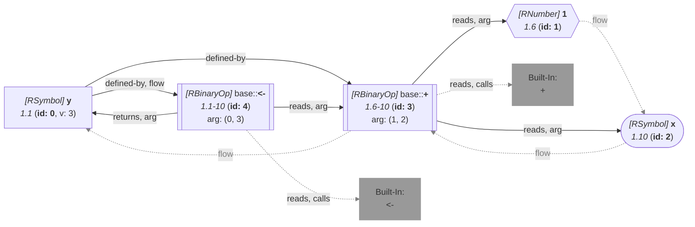
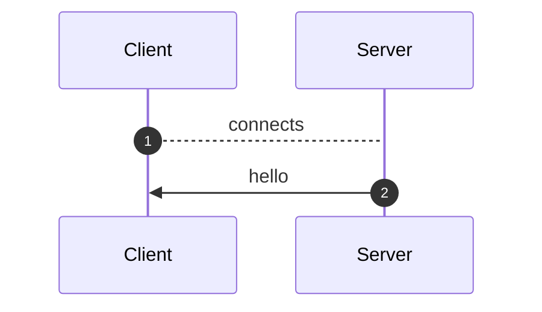
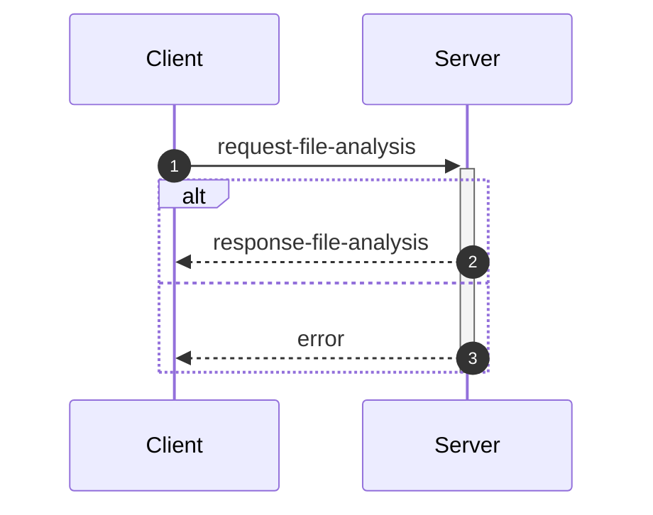
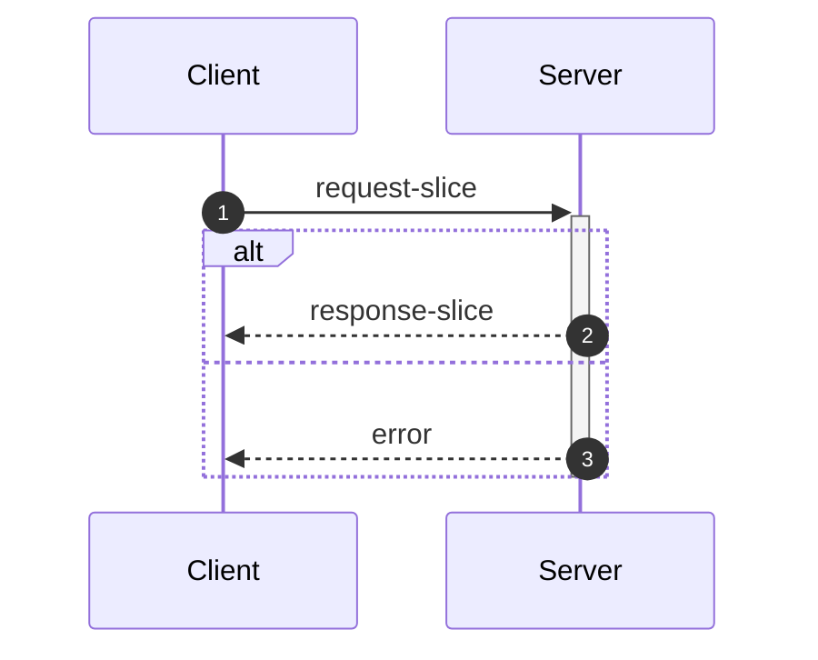
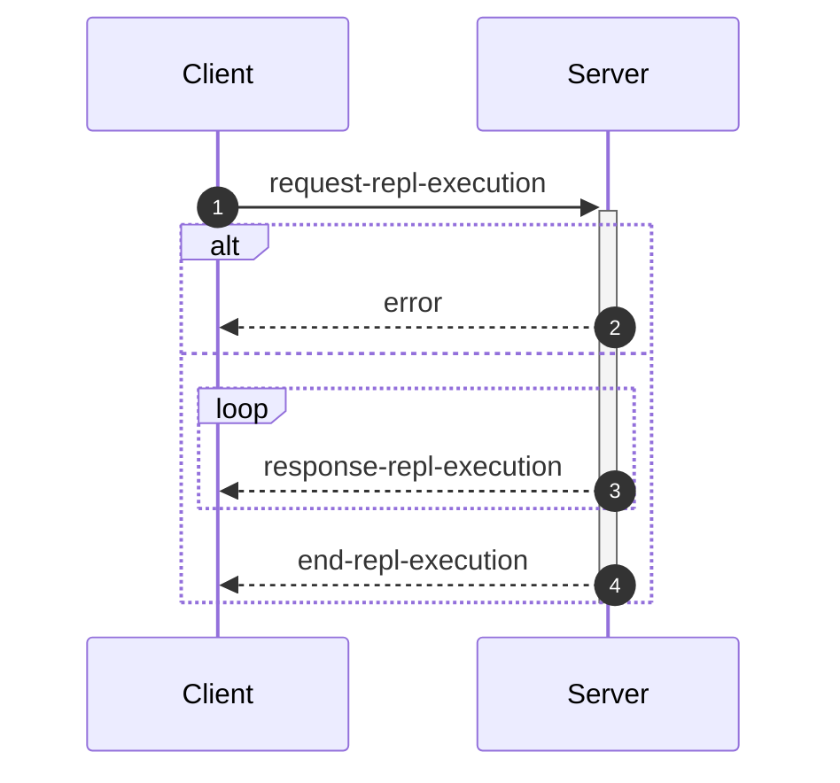

_<span title="an overview of flowR's interface">Generated</span> from '[wiki-interface.ts](https://github.com/flowr-analysis/flowr/tree/main/src/documentation/wiki-interface.ts "src/documentation/wiki-interface.ts")' on 2026-09-05, 18:40:50 UTC (v2.15.8, R v4.6.1), do not edit directly._


Although far from being as detailed as the in-depth explanation of [_flowR_](https://github.com/flowr-analysis/flowr/wiki/Core),
this wiki page explains how to interface with _flowR_ in more detail.
In general, command line arguments and other options provide short descriptions on hover over.

* [💻 Using the REPL](#using-the-repl)
* [⚙️ Configuring FlowR](#configuring-flowr)
* [⚒️ Writing Code](#writing-code)
* [💬 Communicating with the Server](#communicating-with-the-server)

<a id='using-the-repl'></a>
## 💻 Using the REPL


> [!NOTE]
> To execute arbitrary R commands with a repl request, _flowR_ has to be started explicitly with <span title="Description (Command Line Argument): Allow to access the underlying R session when using flowR (security warning: this allows the execution of arbitrary R code!)">`--r-session-access`</span>.
> Please be aware that this introduces a security risk and note that this relies on the [`r-shell` engine](https://github.com/flowr-analysis/flowr/wiki/Engines) .

Although primarily meant for users to explore,
there is nothing which forbids simply calling _flowR_ as a subprocess to use standard-in, -output, and -error
for communication (although you can access the REPL using the server as well,
with the [REPL Request](#message-request-repl-execution) message).

The read-eval-print loop&nbsp;(REPL) works relatively simple.
You can submit an expression (using <kbd>Enter</kbd>),
which is interpreted as an R&nbsp;expression by default but interpreted as a *command* if it starts with a colon (`:`).
The best command to get started with the REPL is <span title="Description (Repl Command): Show help information (aliases: :h, :?)">`:help`</span>.
Besides, you can leave the REPL either with the command <span title="Description (Repl Command): End the repl (aliases: :q, :exit)">`:quit`</span> or by pressing <kbd>Ctrl</kbd>+<kbd>C</kbd> twice.
When writing a *command*, you may press <kbd>Tab</kbd> to get a list of completions, if available.
Multiple commands can be entered in a single line by separating them with a semicolon (`;`), e.g. `:parse "x<-2"; :df*`.
If a command is given without R code, the REPL will re-use R code given in a previous command.
The prior example will hence return first the parsed AST of the program and then the dataflow graph for `"x <- 2"`.

> [!NOTE]
> If you develop flowR, you may want to launch the repl using the `npm run main-dev` command, this way, you get a non-minified version of flowR with debug information and hot-reloading of source files.

<details>
<summary>Available Commands</summary>

We currently offer the following commands (this with a `[*]` suffix are available with and without the star):


| Command | Description |
| ------- | ----------- |
| **<span title="Description (Repl Command): End the repl (aliases: :q, :exit)">:quit</span>** | End the repl (aliases: **:<span title="Alias of ':quit'. End the repl">q</span>**, **:<span title="Alias of ':quit'. End the repl">exit</span>**) |
| **<span title="Description (Repl Command): Execute the given code as R code. This requires the `--r-session-access` flag to be set and requires the r-shell engine. (aliases: :e, :r)">:execute</span>** | Execute the given code as R code. This requires the `--r-session-access` flag to be set and requires the r-shell engine. (aliases: **:<span title="Alias of ':execute'. Execute the given code as R code. This requires the `--r-session-access` flag to be set and requires the r-shell engine.">e</span>**, **:<span title="Alias of ':execute'. Execute the given code as R code. This requires the `--r-session-access` flag to be set and requires the r-shell engine.">r</span>**) |
| **<span title="Description (Repl Command): Get mermaid code for the control-flow graph of R code (aliases: :cfg, :cf)">:controlflow[*]</span>** | Get mermaid code for the control-flow graph of R code (star: Returns the URL to mermaid.live) (aliases: **:<span title="Alias of ':controlflow'. Get mermaid code for the control-flow graph of R code">cfg</span>**, **:<span title="Alias of ':controlflow'. Get mermaid code for the control-flow graph of R code">cf</span>**) |
| **<span title="Description (Repl Command): Get mermaid code for the control-flow graph with basic blocks (aliases: :cfgb, :cfb)">:controlflowbb[*]</span>** | Get mermaid code for the control-flow graph with basic blocks (star: Returns the URL to mermaid.live) (aliases: **:<span title="Alias of ':controlflowbb'. Get mermaid code for the control-flow graph with basic blocks">cfgb</span>**, **:<span title="Alias of ':controlflowbb'. Get mermaid code for the control-flow graph with basic blocks">cfb</span>**) |
| **<span title="Description (Repl Command): Get mermaid code for the dataflow graph (aliases: :d, :df)">:dataflow[*]</span>** | Get mermaid code for the dataflow graph (star: Returns the URL to mermaid.live) (aliases: **:<span title="Alias of ':dataflow'. Get mermaid code for the dataflow graph">d</span>**, **:<span title="Alias of ':dataflow'. Get mermaid code for the dataflow graph">df</span>**) |
| **<span title="Description (Repl Command): Get mermaid code for the normalized AST of R code (aliases: :n)">:normalize[*]</span>** | Get mermaid code for the normalized AST of R code (star: Returns the URL to mermaid.live) (alias: **:<span title="Alias of ':normalize'. Get mermaid code for the normalized AST of R code">n</span>**) |
| **<span title="Description (Repl Command): Get mermaid code for the simplified dataflow graph (aliases: :ds, :dfs)">:dataflowsimple[*]</span>** | Get mermaid code for the simplified dataflow graph (star: Returns the URL to mermaid.live) (aliases: **:<span title="Alias of ':dataflowsimple'. Get mermaid code for the simplified dataflow graph">ds</span>**, **:<span title="Alias of ':dataflowsimple'. Get mermaid code for the simplified dataflow graph">dfs</span>**) |
| **<span title="Description (Repl Command): Inspect and extend the signature database: `query` (identical to :query @signature), `add <path>` to mount another database/source, `download` to fetch the full-history database. (aliases: :sig)">:signature</span>** | Inspect and extend the signature database: `query` (identical to :query @signature), `add <path>` to mount another database/source, `download` to fetch the full-history database. (alias: **:<span title="Alias of ':signature'. Inspect and extend the signature database: `query` (identical to :query @signature), `add <path>` to mount another database/source, `download` to fetch the full-history database.">sig</span>**) |
| **<span title="Description (Repl Command): Just calculates the DFG, but only prints summary info (aliases: :d#, :df#)">:dataflowsilent</span>** | Just calculates the DFG, but only prints summary info (aliases: **:<span title="Alias of ':dataflowsilent'. Just calculates the DFG, but only prints summary info">d#</span>**, **:<span title="Alias of ':dataflowsilent'. Just calculates the DFG, but only prints summary info">df#</span>**) |
| **<span title="Description (Repl Command): Prints ASCII Art of the parsed, unmodified AST (aliases: :p)">:parse</span>** | Prints ASCII Art of the parsed, unmodified AST (alias: **:<span title="Alias of ':parse'. Prints ASCII Art of the parsed, unmodified AST">p</span>**) |
| **<span title="Description (Repl Command): Prints the version of flowR as well as the current version of R">:version</span>** | Prints the version of flowR as well as the current version of R
| **<span title="Description (Repl Command): Query the given R code (use 'help' for more information)">:query[*]</span>** | Query the given R code (use 'help' for more information) (star: Similar to query, but returns the output in json format.)
| **<span title="Description (Repl Command): Returns an ASCII representation of the dataflow graph (aliases: :df!)">:dataflowascii</span>** | Returns an ASCII representation of the dataflow graph (alias: **:<span title="Alias of ':dataflowascii'. Returns an ASCII representation of the dataflow graph">df!</span>**) |
| **<span title="Description (Repl Command): Returns summarization stats for the normalized AST (aliases: :n#)">:normalize#</span>** | Returns summarization stats for the normalized AST (alias: **:<span title="Alias of ':normalize#'. Returns summarization stats for the normalized AST">n#</span>**) |
| **<span title="Description (Repl Command): Show help information (aliases: :h, :?)">:help</span>** | Show help information (aliases: **:<span title="Alias of ':help'. Show help information">h</span>**, **:<span title="Alias of ':help'. Show help information">?</span>**) |


</details>


> [!TIP]
> 
> As indicated by the examples before, all REPL commands that operate on code keep track of the state.
> Hence, if you run a command like <span title="Description (Repl Command, starred version): Returns the URL to mermaid.live; Base Command: Get mermaid code for the dataflow graph (aliases: :d*, :df*)">`:dataflow*`</span> without providing R code,
> the REPL will re-use the R code provided in a previous command.
> Likewise, doing this will benefit from incrementality!
> If you request the dataflow graph with `:df* x <- 2 * y` and then want to see the parsed AST with `:parse`,
> the REPL will re-use previously obtained information and not re-parse the code again.
> 		


Generally, many commands offer shortcut versions in the REPL. Many queries, for example, offer a shortened format (see the example below).
Of special note, the [Config Query](https://github.com/flowr-analysis/flowr/wiki/%5BQuery%5D-Config)
can be used to also modify the currently active configuration of _flowR_ within the REPL (see the [wiki page](https://github.com/flowr-analysis/flowr/wiki/%5BQuery%5D-Config) for more information).

### Example: Retrieving the Dataflow Graph

To retrieve a URL to the [mermaid](https://mermaid.js.org/) diagram of the dataflow of a given expression,
use <span title="Description (Repl Command, starred version): Returns the URL to mermaid.live; Base Command: Get mermaid code for the dataflow graph (aliases: :d*, :df*)">`:dataflow*`</span> (or <span title="Description (Repl Command): Get mermaid code for the dataflow graph (aliases: :d, :df)">`:dataflow`</span> to get the mermaid code in the cli):


```shell
$ docker run -it --rm eagleoutice/flowr # or npm run flowr 
flowR repl v2.15.8, R grammar v14 (tree-sitter engine)
R> :dataflow* y <- 1 + x
```

<details>
<summary style='color:gray'>Output</summary>


```text
https://mermaid.live/view#base64:eyJjb2RlIjoiZmxvd2NoYXJ0IFREXG4gICAgMXt7XCJgKiM5MTtSTnVtYmVyIzkzOyogKioxKipcbiAgICAgICoxLjYqICgqKmlkOiAxKiopYFwifX1cbiAgICAyKFtcImAqIzkxO1JTeW1ib2wjOTM7KiAqKngqKlxuICAgICAgKjEuMTAqICgqKmlkOiAyKiopYFwiXSlcbiAgICAzW1tcImAqIzkxO1JCaW5hcnlPcCM5MzsqIGJhc2UjNTg7IzU4OyoqIzQzOyoqXG4gICAgICAqMS42LTEwKiAoKippZDogMyoqKVxuICAgIGFyZzogKDEsIDIpYFwiXV1cbiAgICBidWlsdC1pbjpfW1wiYEJ1aWx0LUluOlxuIzQzO2BcIl1cbiAgICBzdHlsZSBidWlsdC1pbjpfIHN0cm9rZTpncmF5LGZpbGw6Z3JheSxzdHJva2Utd2lkdGg6MnB4LG9wYWNpdHk6Ljg7XG4gICAgMFtcImAqIzkxO1JTeW1ib2wjOTM7KiAqKnkqKlxuICAgICAgKjEuMSogKCoqaWQ6IDAqKiwgdjogMylgXCJdXG4gICAgNFtbXCJgKiM5MTtSQmluYXJ5T3AjOTM7KiBiYXNlIzU4OyM1ODsqKiM2MDsjNDU7KipcbiAgICAgICoxLjEtMTAqICgqKmlkOiA0KiopXG4gICAgYXJnOiAoMCwgMylgXCJdXVxuICAgIGJ1aWx0LWluOl8tW1wiYEJ1aWx0LUluOlxuIzYwOyM0NTtgXCJdXG4gICAgc3R5bGUgYnVpbHQtaW46Xy0gc3Ryb2tlOmdyYXksZmlsbDpncmF5LHN0cm9rZS13aWR0aDoycHgsb3BhY2l0eTouODtcbiAgICAxIC0uLT58XCJmbG93XCJ8IDJcbiAgICBsaW5rU3R5bGUgMCBzdHJva2U6Z3JheSxjb2xvcjpncmF5O1xuICAgIDIgLS4tPnxcImZsb3dcInwgM1xuICAgIGxpbmtTdHlsZSAxIHN0cm9rZTpncmF5LGNvbG9yOmdyYXk7XG4gICAgMyAtLT58XCJyZWFkcywgYXJnXCJ8IDFcbiAgICAzIC0tPnxcInJlYWRzLCBhcmdcInwgMlxuICAgIDMgLS4tPnxcImZsb3dcInwgMFxuICAgIGxpbmtTdHlsZSA0IHN0cm9rZTpncmF5LGNvbG9yOmdyYXk7XG4gICAgMyAtLi0+fFwicmVhZHMsIGNhbGxzXCJ8IGJ1aWx0LWluOl9cbiAgICBsaW5rU3R5bGUgNSBzdHJva2U6Z3JheTtcbiAgICAwIC0tPnxcImRlZmluZWQtYnksIGZsb3dcInwgNFxuICAgIDAgLS0+fFwiZGVmaW5lZC1ieVwifCAzXG4gICAgNCAtLT58XCJyZWFkcywgYXJnXCJ8IDNcbiAgICA0IC0tPnxcInJldHVybnMsIGFyZ1wifCAwXG4gICAgNCAtLi0+fFwicmVhZHMsIGNhbGxzXCJ8IGJ1aWx0LWluOl8tXG4gICAgbGlua1N0eWxlIDEwIHN0cm9rZTpncmF5OyIsIm1lcm1haWQiOnsiYXV0b1N5bmMiOnRydWV9fQ==
```


Retrieve the dataflow graph of the expression `y <- 1 + x`. It looks like this:



```mermaid
flowchart LR
    1{{"`*#91;RNumber#93;* **1**
      *1.6* (**id: 1**)`"}}
    2(["`*#91;RSymbol#93;* **x**
      *1.10* (**id: 2**)`"])
    3[["`*#91;RBinaryOp#93;* base#58;#58;**#43;**
      *1.6-10* (**id: 3**)
    arg: (1, 2)`"]]
    built-in:_["`Built-In:
#43;`"]
    style built-in:_ stroke:gray,fill:gray,stroke-width:2px,opacity:.8;
    0["`*#91;RSymbol#93;* **y**
      *1.1* (**id: 0**, v: 3)`"]
    4[["`*#91;RBinaryOp#93;* base#58;#58;**#60;#45;**
      *1.1-10* (**id: 4**)
    arg: (0, 3)`"]]
    built-in:_-["`Built-In:
#60;#45;`"]
    style built-in:_- stroke:gray,fill:gray,stroke-width:2px,opacity:.8;
    1 -.->|"flow"| 2
    linkStyle 0 stroke:gray,color:gray;
    2 -.->|"flow"| 3
    linkStyle 1 stroke:gray,color:gray;
    3 -->|"reads, arg"| 1
    3 -->|"reads, arg"| 2
    3 -.->|"flow"| 0
    linkStyle 4 stroke:gray,color:gray;
    3 -.->|"reads, calls"| built-in:_
    linkStyle 5 stroke:gray;
    0 -->|"defined-by, flow"| 4
    0 -->|"defined-by"| 3
    4 -->|"reads, arg"| 3
    4 -->|"returns, arg"| 0
    4 -.->|"reads, calls"| built-in:_-
    linkStyle 10 stroke:gray;
```

	
<details>

<summary style="color:gray">R Code of the Dataflow Graph</summary>

The analysis required _3.5 ms_ (including parse and normalize, using the [tree-sitter](https://github.com/flowr-analysis/flowr/wiki/Engines) engine) within the generation environment. No [signature database](https://github.com/flowr-analysis/flowr/wiki/Signature-Database) is mounted for these generated graphs, so `library()` calls attach no package exports; base-R names are still qualified via the generated base-package store (e.g. `acf` as `stats::acf`). 
We encountered no unknown side effects during the analysis.


```r
y <- 1 + x
```


</details>


</details>


For small graphs like this, <span title="Description (Repl Command): Returns an ASCII representation of the dataflow graph (aliases: :df!)">`:dataflowascii`</span> also provides an ASCII representation directly in the REPL:


```shell
$ docker run -it --rm eagleoutice/flowr # or npm run flowr 
flowR repl v2.15.8, R grammar v14 (tree-sitter engine)
R> :df! y <- 1 + x
```

<details open>
<summary style='color:gray'>Output</summary>


```text
           ┌────────────u<2>u
        c<3>c   0<1>0   | x |
    ┌───| + |───| 1 |───u---u
    │   c---c   0---0
 c<4>c     │
 |<- |     └────────────v<0>v
 c---c──────────────────| y |
                        v---v
Edges:
3 -> 1: reads, arg          3 -> 2: reads, arg
3 -> 0: flows-to            1 -> 2: flows-to
2 -> 3: flows-to            4 -> 3: reads, arg
4 -> 0: returns, arg        0 -> 4: defined-by, flows-to
0 -> 3: defined-by
```


Retrieve the dataflow graph of the expression `y <- 1 + x` as ASCII art.

</details>


For the slicing with <span title="Description (Repl Command): Static backwards executable slicer for R">`:slicer`</span>, you have access to the same [magic comments](#slice-magic-comments) as with the [slice request](#message-request-slice).
Pass `--inline` to splice resolvable `source()` calls into the reconstruction so the slice is a single self-contained R text (the same as the static slice query's `inlineSources` flag).
See `--help` for more flags!

### Example: Interfacing with the File System

Many commands that allow for an R-expression (like <span title="Description (Repl Command, starred version): Returns the URL to mermaid.live; Base Command: Get mermaid code for the dataflow graph (aliases: :d*, :df*)">`:dataflow*`</span>) allow for a file as well
if the argument starts with `file://`.
If you are working from the root directory of the _flowR_ repository, the following gives you the parsed AST of the example file using the <span title="Description (Repl Command): Prints ASCII Art of the parsed, unmodified AST (aliases: :p)">`:parse`</span> command:

> **Watch mode**: Replace `file://` with `watch://` to enter watch mode.
> flowR runs the command immediately and then re-runs it every time the file (or any file inside the folder) changes.
> Enter any other command to leave watch mode.
> For example: `:df watch://analysis.R`


```shell
$ docker run -it --rm eagleoutice/flowr # or npm run flowr 
flowR repl v2.15.8, R grammar v14 (tree-sitter engine)
R> :parse file://test/testfiles/example.R
```

<details>
<summary style='color:gray'>Output</summary>


```text
File: test/testfiles/example.R

program
├ binaryoperator
│ ├ identifier "sum" (1:1─4)
│ ├ <- "<-" (1:5─7)
│ ╰ float "0" (1:8─9)
├ binaryoperator
│ ├ identifier "product" (2:1─8)
│ ├ <- "<-" (2:9─11)
│ ╰ float "1" (2:12─13)
├ binaryoperator
│ ├ identifier "w" (3:1─2)
│ ├ <- "<-" (3:3─5)
│ ╰ float "7" (3:6─7)
├ binaryoperator
│ ├ identifier "N" (4:1─2)
│ ├ <- "<-" (4:3─5)
│ ╰ float "10" (4:6─8)
├ forstatement
│ ├ for "for" (6:1─4)
│ ├ ( "(" (6:5─6)
│ ├ identifier "i" (6:6─7)
│ ├ in "in" (6:8─10)
│ ├ binaryoperator
│ │ ├ float "1" (6:11─12)
│ │ ├ : ":" (6:12─13)
│ │ ╰ parenthesizedexpression
│ │   ├ ( "(" (6:13─14)
│ │   ├ binaryoperator
│ │   │ ├ identifier "N" (6:14─15)
│ │   │ ├ - "-" (6:15─16)
│ │   │ ╰ float "1" (6:16─17)
│ │   ╰ ) ")" (6:17─18)
│ ├ ) ")" (6:18─19)
│ ╰ bracedexpression
│   ├ { "{" (6:20─21)
│   ├ binaryoperator
│   │ ├ identifier "sum" (7:3─6)
│   │ ├ <- "<-" (7:7─9)
│   │ ╰ binaryoperator
│   │   ├ binaryoperator
│   │   │ ├ identifier "sum" (7:10─13)
│   │   │ ├ + "+" (7:14─15)
│   │   │ ╰ identifier "i" (7:16─17)
│   │   ├ + "+" (7:18─19)
│   │   ╰ identifier "w" (7:20─21)
│   ├ binaryoperator
│   │ ├ identifier "product" (8:3─10)
│   │ ├ <- "<-" (8:11─13)
│   │ ╰ binaryoperator
│   │   ├ identifier "product" (8:14─21)
│   │   ├  "" (8:22─23)
│   │   ╰ identifier "i" (8:24─25)
│   ╰ } "}" (9:1─2)
├ call
│ ├ identifier "cat" (11:1─4)
│ ╰ arguments
│   ├ ( "(" (11:4─5)
│   ├ argument
│   │ ╰ string
│   │   ├ " "\"" (11:5─6)
│   │   ├ stringcontent "Sum:" (11:6─10)
│   │   ╰ " "\"" (11:10─11)
│   ├ comma "," (11:11─12)
│   ├ argument
│   │ ╰ identifier "sum" (11:13─16)
│   ├ comma "," (11:16─17)
│   ├ argument
│   │ ╰ string
│   │   ├ " "\"" (11:18─19)
│   │   ├ stringcontent
│   │   │ ╰ escapesequence "\\n" (11:19─21)
│   │   ╰ " "\"" (11:21─22)
│   ╰ ) ")" (11:22─23)
╰ call
  ├ identifier "cat" (12:1─4)
  ╰ arguments
    ├ ( "(" (12:4─5)
    ├ argument
    │ ╰ string
    │   ├ " "\"" (12:5─6)
    │   ├ stringcontent "Product:" (12:6─14)
    │   ╰ " "\"" (12:14─15)
    ├ comma "," (12:15─16)
    ├ argument
    │ ╰ identifier "product" (12:17─24)
    ├ comma "," (12:24─25)
    ├ argument
    │ ╰ string
    │   ├ " "\"" (12:26─27)
    │   ├ stringcontent
    │   │ ╰ escapesequence "\\n" (12:27─29)
    │   ╰ " "\"" (12:29─30)
    ╰ ) ")" (12:30─31)
```


Retrieve the parsed AST of the example file.

<details>

<summary>File Content</summary>


```r
sum <- 0
product <- 1
w <- 7
N <- 10

for (i in 1:(N-1)) {
  sum <- sum + i + w
  product <- product * i
}

cat("Sum:", sum, "\n")
cat("Product:", product, "\n")
```


</details>

As _flowR_ directly transforms this AST the output focuses on being human-readable instead of being machine-readable.
		

</details>


### Example: Run a Query

You can run any query supported by _flowR_ using the <span title="Description (Repl Command): Query the given R code (use 'help' for more information)">`:query`</span> command.
For example, to obtain the shapes of all data frames in a given piece of code, you can run:


```shell
$ docker run -it --rm eagleoutice/flowr # or npm run flowr 
flowR repl v2.15.8, R grammar v14 (tree-sitter engine)
R> :query @absint df-shape "x <- data.frame(a = 1:10, b = 1:10)\ny <- x$a"
```

<details open>
<summary style='color:gray'>Output</summary>


```text
Query: absint (0 ms)
All queries together required ≈1 ms (1ms accuracy, total 1 ms)
```


Retrieve the shapes of all data frames in the given code.

</details>


To run the linter on a file, you can use (in this example, we just issue the `dead-code` linter on a small piece of code):


```shell
$ docker run -it --rm eagleoutice/flowr # or npm run flowr 
flowR repl v2.15.8, R grammar v14 (tree-sitter engine)
R> :query @linter rules:dead-code "if(FALSE) x <- 2"
```

<details open>
<summary style='color:gray'>Output</summary>


```text
Query: linter (1 ms)
   ╰ Dead Code (dead-code):
       ╰ certain:
           ╰ Code at 1.11-16
       ╰ Metadata: searchTimeMs: 1, processTimeMs: 0
All queries together required ≈1 ms (1ms accuracy, total 1 ms)
```


Run the linter on the given code, with only the `dead-code` rule enabled.

</details>


For more information on the available queries, please check out the [Query API](https://github.com/flowr-analysis/flowr/wiki/Query-API).


<a id='configuring-flowr'></a>
## ⚙️ Configuring FlowR


When running _flowR_, you may want to specify some behaviors with a dedicated configuration file.
By default, flowR looks for a file named `flowr.json` in the current working directory (or any higher directory).
You can also specify a different file with <span title="Description (Command Line Argument): The name of the configuration file to use">`--config-file`</span> or pass the configuration inline using <span title="Description (Command Line Argument): The flowR configuration to use, as a JSON string">`--config-json`</span>.
To inspect the current configuration, you can run flowr with the <span title="Description (Command Line Argument): Run with verbose logging (will be passed to the corresponding script)">`--verbose`</span> flag, or use the `config` [Query](https://github.com/flowr-analysis/flowr/wiki/Query-API).
Within the REPL this works by running the following:


```shell
:query @config
```


To work with the <a href="https://github.com/flowr-analysis/flowr/tree/main/src/config.ts#L107"><code><span title="The configuration file format for flowR.">FlowrConfig</span></code></a> you can use the provided helper objects alongside its methods like
<a href="https://github.com/flowr-analysis/flowr/tree/main/src/config.ts#L841"><code><span title="Creates a new flowr config that has the updated values.">FlowrConfig::<b>amend</b></span></code></a>.
The schema below documents every option; the ones you most likely want are:

- <a href="https://github.com/flowr-analysis/flowr/wiki/Interface#configuring-flowr" title="Configuration Option (boolean): Whether source calls should be ignored, causing {@link processSourceCall}&#39;s behavior to be skipped.">ignoreSourceCalls</a>: ignore source calls when analyzing the code, i.e., ignore the inclusion of other files.
- <a href="https://github.com/flowr-analysis/flowr/wiki/Interface#configuring-flowr" title="Configuration Option (boolean): Whether load calls should be ignored, causing {@link processLoadCall}&#39;s behavior to be skipped.">ignoreLoadCalls</a>: ignore load calls when analyzing the code, i.e., ignore the loading of r-data files.
- <a href="https://github.com/flowr-analysis/flowr/wiki/Interface#configuring-flowr" title="Configuration Option (object): Do you want to overwrite (parts) of the builtin definition?">semantics.environment.overwriteBuiltIns</a>: overwrite _flowR_'s handling of built-in functions, or clear the preset definitions entirely.
  See [Configure BuiltIn Semantics](#configure-builtin-semantics) for more information.
- <a href="https://github.com/flowr-analysis/flowr/wiki/Interface#configuring-flowr" title="Configuration Option (string): How to resolve variables and their values. (one of &quot;disabled&quot;, &quot;alias&quot;, &quot;builtin&quot;)">solver.variables</a>: how to resolve variables and their values (`disabled`, `alias`, `builtin`).
- <a href="https://github.com/flowr-analysis/flowr/wiki/Interface#configuring-flowr" title="Configuration Option (array): The engine or set of engines to use for interacting with R code. An empty array means all available engines will be used.">engines</a> and <a href="https://github.com/flowr-analysis/flowr/wiki/Interface#configuring-flowr" title="Configuration Option (string): The default engine to use for interacting with R code. If this is undefined, an arbitrary engine from the specified list will be used. (one of &quot;tree-sitter&quot;, &quot;r-shell&quot;)">defaultEngine</a>: the engines used to interact with R code, see the [Engines wiki page](https://github.com/flowr-analysis/flowr/wiki/Engines).
- <a href="https://github.com/flowr-analysis/flowr/wiki/Interface#configuring-flowr" title="Configuration Option (array): Files a framework loads on its own, without any source() call (e.g. global.R in a shiny app), in the order they are loaded; flowR orders the matching project files accordingly and analyzes them as one program. Entries are case-insensitive globs matched against the file path, a plain name matches any file with that name, and entries matching no project file are warned about. Usually set per project kind via specializeConfig.">project.implicitSources</a>: the files a framework loads without any `source()` call, in the order in which they are
  loaded. Entries are globs (e.g. `R/*.R`) matched against the file path ignoring capitalization; one matching no file is reported.
- <a href="https://github.com/flowr-analysis/flowr/wiki/Interface#configuring-flowr" title="Configuration Option (object): Overwrite (parts of) the configuration depending on the project kind flowR detects, e.g. to give a shiny app its implicit sources.">specializeConfig</a>: overwrite (parts of) the configuration depending on the kind of project _flowR_ detects
  (e.g. `shiny-app`), which is how a shiny app gets its implicit sources by default. What you configure directly wins.
- <a href="https://github.com/flowr-analysis/flowr/wiki/Interface#configuring-flowr" title="Configuration Option (string): Overwrite the project kind flowR would otherwise infer from the analyzed files, e.g. when auto-detection guesses wrong. (one of &quot;package&quot;, &quot;script&quot;, &quot;shiny-app&quot;, &quot;notebook&quot;, &quot;project&quot;, &quot;unknown&quot;)">project.useProjectType</a>: skip that detection and force a project kind yourself, when auto-detection guesses wrong.
- <a href="https://github.com/flowr-analysis/flowr/wiki/Interface#configuring-flowr" title="Configuration Option (array): The default plugins to load when creating a new instance of FlowrAnalyzer">defaultPlugins</a> and <a href="https://github.com/flowr-analysis/flowr/wiki/Interface#configuring-flowr" title="Configuration Option (array): The plugins to load in REPL mode">repl.plugins</a>: the plugins to load for a new <a href="https://github.com/flowr-analysis/flowr/tree/main/src/project/flowr-analyzer.ts#L202"><code><span title="Central class for conducting analyses with FlowR. Use the FlowrAnalyzerBuilder to create a new instance. If you want the original pattern of creating a pipeline and running all steps, you can still do this with FlowrAnalyzer#runFull . To inspect the context of the analyzer, use FlowrAnalyzer#inspectContext (if you are a plugin and need to modify it, use FlowrAnalyzer#context instead).">FlowrAnalyzer</span></code></a> and in the REPL
  (use `flowr:default` to reference the former).

So you can configure _flowR_ by adding a file like the following:

<details>

<summary>Example Configuration File</summary>


```json
{
  "ignoreSourceCalls": true,
  "ignoreLoadCalls": true,
  "semantics": {
    "environment": {
      "overwriteBuiltIns": {
        "definitions": [
          {
            "type": "function",
            "names": [
              "foo"
            ],
            "processor": "builtin:assign",
            "config": {}
          }
        ]
      }
    }
  },
  "defaultPlugins": [
    "file:description",
    "versions:description"
  ],
  "repl": {
    "quickStats": false,
    "dfProcessorHeat": false,
    "hints": true,
    "plugins": [
      "flowr:default"
    ]
  },
  "project": {
    "resolveUnknownPathsOnDisk": true,
    "implicitSources": [
      "global.R",
      "app.R"
    ]
  },
  "linter": {
    "disabledRules": []
  },
  "specializeConfig": {
    "shiny-app": {
      "project": {
        "implicitSources": [
          "global.R",
          "ui.R",
          "server.R",
          "app.R"
        ]
      }
    }
  },
  "engines": [
    {
      "type": "r-shell"
    }
  ],
  "solver": {
    "variables": "alias",
    "evalStrings": true,
    "trackEnvironments": true,
    "sigdb": {
      "enabled": true,
      "loadProjectDependencies": true,
      "eagerlyLoad": false,
      "eagerlyLoadExports": false,
      "linkBaseR": false,
      "linkDescriptionDependencies": false
    },
    "resolveSource": {
      "dropPaths": "no",
      "ignoreCapitalization": true,
      "inferWorkingDirectory": "active-script",
      "searchPath": []
    },
    "instrument": {},
    "slicer": {
      "threshold": 50
    }
  },
  "abstractInterpretation": {
    "wideningThreshold": 4,
    "followCalls": true,
    "dataFrame": {
      "maxColNames": 20,
      "readLoadedData": {
        "readExternalFiles": true,
        "maxReadLines": 1000000
      }
    }
  },
  "incremental": {
    "alwaysIncremental": false,
    "parsing": {
      "activated": false,
      "heuristics": {
        "activated": true,
        "mtime": true,
        "linesFrom": 500,
        "bytesFrom": 50000,
        "alwaysWithEdits": false,
        "minFiles": 1
      }
    }
  },
  "gas": {
    "thresholds": {
      "memory": {
        "problematic": 0.7,
        "critical": 0.9
      },
      "timeMs": {
        "problematic": 100000,
        "critical": 120000
      }
    },
    "features": {}
  }
}
```


</details>

<details>
<a id='configure-builtin-semantics'></a>
<summary>Configure Built-In Semantics</summary>


`semantics/environment/overwriteBuiltins` accepts two keys:

- `loadDefaults` (boolean, initially `true`): If set to `true`, the default built-in definitions are loaded before applying the custom definitions. Setting this flag to `false` explicitly disables the loading of the default definitions.
- `definitions` (array, initially empty): Allows to overwrite or define new built-in elements. Each object within must have a `type` which is one of the below. Furthermore, they may define a string array of `names` which specifies the identifiers to bind the definitions to. You may use `assumePrimitive` to specify whether _flowR_ should assume that this is a primitive non-library definition (so you probably just do not want to specify the key).

  | Type            | Description                                                                                                                                                                                                                                                                                              | Example                                                                                                    |
  | --------------- | -------------------------------------------------------------------------------------------------------------------------------------------------------------------------------------------------------------------------------------------------------------------------------------------------------- | ---------------------------------------------------------------------------------------------------------- |
  | `constant`    | Additionally allows for a `value` this should resolve to.                                                                                                                                                                                                                                                | `{ type: 'constant', names: ['NULL', 'NA'],  value: null }`                                                |
  | `function`    | Is a rather flexible way to define and bind built-in functions. For the time, we do not have extensive documentation to cover all the cases, so please either consult the sources with the `default-builtin-config.ts` or open a [new issue](https://github.com/flowr-analysis/flowr/issues/new/choose). | `{ type: 'function', names: ['next'], processor: 'builtin:d', config: { cfg: ExitPointType.Next } }` |
  | `replacement` | A comfortable way to specify replacement functions like `$<-` or `names<-`. `suffixes` describes the... suffixes to attach automatically. | `{ type: 'replacement', suffixes: ['<-', '<<-'], names: ['[', '[['] }` |


</details>

<details>

<summary style='color:gray'>Full Configuration-File Schema</summary>

- _The configuration file format for flowR._ (object)
    - **logLevel** [optional] _flowR's global minimum log level, applied when the config is loaded._ (string)
        Only allows: 'silly', 'trace', 'debug', 'info', 'warn', 'error', 'fatal'
    - **ignoreSourceCalls** [optional] _Whether source calls should be ignored, causing {@link processSourceCall}'s behavior to be skipped._ (boolean)
    - **ignoreLoadCalls** [optional] _Whether load calls should be ignored, causing {@link processLoadCall}'s behavior to be skipped._ (boolean)
    - **semantics** _Configure language semantics and how flowR handles them._ (object)
        - **environment** [optional] _Semantics regarding how to handle the R environment._ (object)
            - **overwriteBuiltIns** [optional] _Do you want to overwrite (parts) of the builtin definition?_ (object)
                - **loadDefaults** [optional] _Should the default configuration still be loaded?_ (boolean)
                - **definitions** [optional] _The definitions to load/overwrite._ (array)
                Valid item types:
                    - (object)
    - **defaultPlugins** [optional] _The default plugins to load when creating a new instance of FlowrAnalyzer_ (array)
    Valid item types:
        - (alternatives)
            - (string)
            - (array)
    - **repl** _Configuration options for the REPL._ (object)
        - **quickStats** [optional] _Whether to show quick stats in the REPL after each evaluation._ (boolean)
        - **dfProcessorHeat** [optional] _This instruments the dataflow processors to count how often each processor is called._ (boolean)
        - **hints** [optional] _Whether to show dim inline hints on the empty prompt (automatically disabled on non-interactive terminals)._ (boolean)
        - **plugins** [optional] _The plugins to load in REPL mode_ (array)
        Valid item types:
            - (alternatives)
                - (string)
                - (array)
        - **autoUseFileProtocol** [optional] _Prepend the file protocol to a repl input that looks like a path, instead of only warning about it._ (boolean)
        - **queryStats** [optional] _Whether `:query` closes with the line stating how long the queries took (`:query*` never prints it)._ (boolean)
        - **showPlugins** [optional] _Whether `:version` grays out the plugins that did not activate during the last analysis._ (boolean)
    - **project** _Project specific configuration options._ (object)
        - **resolveUnknownPathsOnDisk** [optional] _Whether to resolve unknown paths loaded by the r project disk when trying to source/analyze files._ (boolean)
        - **failOnInaccessiblePath** [optional] _Whether a directory that cannot be traversed during file discovery (e.g. due to permissions) aborts the analysis; when false (the default) such paths are logged and skipped._ (boolean)
        - **basePackages** [optional] _The packages considered part of R itself (base and recommended); if unset, flowR uses its built-in list._ (array)
        Valid item types:
            - (string)
        - **implicitSources** [optional] _Files a framework loads on its own, without any source() call (e.g. global.R in a shiny app), in the order they are loaded; flowR orders the matching project files accordingly and analyzes them as one program. Entries are case-insensitive globs matched against the file path, a plain name matches any file with that name, and entries matching no project file are warned about. Usually set per project kind via specializeConfig._ (array)
        Valid item types:
            - (string)
        - **useProjectType** [optional] _Overwrite the project kind flowR would otherwise infer from the analyzed files, e.g. when auto-detection guesses wrong._ (string)
            Only allows: 'package', 'script', 'shiny-app', 'notebook', 'project', 'unknown'
        - **assumeImplicitEcho** [optional] _Whether the top level of the analyzed code is echoed, so that every visible result printed there is collected as an output by the dependencies query (default true, false for a package)._ (boolean)
        - **discovery** [optional] _Scoping options for the default project discovery._ (object)
            - **full** [optional] _Collect every file below the project root (greedy) instead of only the files the detected project kind needs (default false)._ (boolean)
            - **perKind** [optional] _Per-kind include/exclude glob overrides layered on the default scoping._ (object)
            - **ignore** [optional] _Case-insensitive globs that drop matching files from the intelligent discovery, regardless of kind (e.g. .Renviron to ignore environment files)._ (array)
            Valid item types:
                - (string)
        - **classification** [optional] _Overrides for the signals flowR uses to classify the project kind._ (object)
            - **shinyDescriptionTypes** [optional] _DESCRIPTION Type: values that mark a shiny app._ (array)
            Valid item types:
                - (string)
            - **shinyEntryFiles** [optional] _File names a shiny app is assembled from._ (array)
            Valid item types:
                - (string)
            - **shinyUsagePattern** [optional] _Regex source evidencing shiny usage in an entry file._ (string)
            - **notebookExtensions** [optional] _File extensions marking a notebook._ (array)
            Valid item types:
                - (string)
    - **linter** _Linter configuration options._ (object)
        - **disabledRules** _Linting rule names excluded from the default rule set (a rule requested explicitly via a linter query still runs). Usually set per project kind via specializeConfig._ (array)
        Valid item types:
            - (string)
    - **inputSources** [optional] _Further frameworks the input-sources analysis should know about; entries are added to flowR's defaults._ (object)
        - **pure** [optional] _Functions that only pass the constantness of their arguments on._ (array)
        Valid item types:
            - (string)
        - **param** [optional] _Functions whose result is a 'param' input._ (array)
        Valid item types:
            - (string)
        - **file** [optional] _Functions whose result is a 'file' input._ (array)
        Valid item types:
            - (string)
        - **tempfile** [optional] _Functions whose result is a 'tempfile' input._ (array)
        Valid item types:
            - (string)
        - **glob** [optional] _Functions whose result is a 'glob' input._ (array)
        Valid item types:
            - (string)
        - **net** [optional] _Functions whose result is a 'net' input._ (array)
        Valid item types:
            - (string)
        - **rand** [optional] _Functions whose result is a 'rand' input._ (array)
        Valid item types:
            - (string)
        - **system** [optional] _Functions whose result is a 'system' input._ (array)
        Valid item types:
            - (string)
        - **ffi** [optional] _Functions whose result is a 'ffi' input._ (array)
        Valid item types:
            - (string)
        - **lang** [optional] _Functions whose result is a 'lang' input._ (array)
        Valid item types:
            - (string)
        - **options** [optional] _Functions whose result is a 'options' input._ (array)
        Valid item types:
            - (string)
        - **cmdline** [optional] _Functions whose result is a 'cmdline' input._ (array)
        Valid item types:
            - (string)
        - **user** [optional] _Functions whose result is a 'user' input._ (array)
        Valid item types:
            - (string)
        - **const** [optional] _Functions whose result is a 'const' input._ (array)
        Valid item types:
            - (string)
        - **scope** [optional] _Functions whose result is a 'scope' input._ (array)
        Valid item types:
            - (string)
        - **dconst** [optional] _Functions whose result is a 'dconst' input._ (array)
        Valid item types:
            - (string)
        - **unknown** [optional] _Functions whose result is a 'unknown' input._ (array)
        Valid item types:
            - (string)
        - **linkedObjects** [optional] _Objects a framework provides without a definition in the code, e.g. shiny's input._ (array)
        Valid item types:
            - (object)
        - **linkedEntryPoints** [optional] _Calls that hand a function to a framework, which binds its objects to the parameters by position._ (array)
        Valid item types:
            - (object)
    - **specializeConfig** [optional] _Overwrite (parts of) the configuration depending on the project kind flowR detects, e.g. to give a shiny app its implicit sources._ (object)
    - **engines** _The engine or set of engines to use for interacting with R code. An empty array means all available engines will be used._ (array)
    Valid item types:
        - (alternatives)
            - _The configuration for the tree sitter engine._ (object)
                - **type** [required] _Use the tree sitter engine._ (string)
                    Only allows: 'tree-sitter'
                - **wasmPath** [optional] _The path to the tree-sitter-r WASM binary to use. If this is undefined, this uses the default path._ (string)
                - **treeSitterWasmPath** [optional] _The path to the tree-sitter WASM binary to use. If this is undefined, this uses the default path._ (string)
                - **lax** [optional] _Whether to use the lax parser for parsing R code (allowing for syntax errors). If this is undefined, the strict parser will be used._ (boolean)
            - _The configuration for the R shell engine._ (object)
                - **type** [required] _Use the R shell engine._ (string)
                    Only allows: 'r-shell'
                - **rPath** [optional] _The path to the R executable to use. If this is undefined, this uses the default path._ (string)
    - **defaultEngine** [optional] _The default engine to use for interacting with R code. If this is undefined, an arbitrary engine from the specified list will be used._ (string)
        Only allows: 'tree-sitter', 'r-shell'
    - **solver** _How to resolve constants, constraints, cells, ..._ (object)
        - **variables** _How to resolve variables and their values._ (string)
            Only allows: 'disabled', 'alias', 'builtin'
        - **evalStrings** _Should we include eval(parse(text="...")) calls in the dataflow graph?_ (boolean)
        - **trackEnvironments** [optional] _Track user-created environments (new.env, assign/get/local with envir=, dollar-assign, attach). When false, all envir-style calls fall through conservatively._ (boolean)
        - **sigdb** _Resolving library exports from a signature database._ (object)
            - **enabled** [optional] _Resolve library()/use() exports from a signature database (default true); when false no database is consulted._ (boolean)
            - **loadProjectDependencies** [optional] _Load the project's declared dependencies from its metadata files (DESCRIPTION Imports/Depends, rproject.toml, uvr.toml, renv.lock, rv.lock, uvr.lock) (default true); when false these files are not read for dependencies._ (boolean)
            - **eagerlyLoad** [optional] _Parse the database up front rather than on the first package load (default false, ignored if disabled)._ (boolean)
            - **eagerlyLoadExports** [optional] _Add a vertex for every export on load rather than on demand (default false); keeps the dataflow graph small._ (boolean)
            - **assumedRVersion** [optional] _R version assumed when resolving versioned (base-R) exports: a pin like "4.5" or "auto" to detect the installed R (default "auto")._ (string)
            - **linkBaseR** [optional] _Eagerly attach base-R namespaces so bare base calls resolve without library() (default false)._ (boolean)
            - **linkBaseRCalls** [optional] _Add a lightweight Reads edge from a bare base-R call to its signature-database function vertex (default false; base-R qualification is edge-free otherwise)._ (boolean)
            - **linkPackageCalls** [optional] _Add a lightweight Reads edge from a resolved package call to its signature-database function vertex (default false)._ (boolean)
            - **linkDescriptionDependencies** [optional] _Eagerly attach the namespaces of the project's declared DESCRIPTION dependencies (Imports/Depends) so their exports resolve without an explicit library() (default false)._ (boolean)
            - **warmInBackground** [optional] _Decompress the hot shards (base + most-downloaded) in a background task on startup so the first library() lookup is warm (default false; for long-running servers/REPLs)._ (boolean)
            - **additionalPaths** [optional] _Extra directories or bundle/manifest files searched for signature databases (alongside the shipped default and $FLOWR_SIGDB_DIR); a downloaded full-history bundle placed here is mounted automatically._ (array)
            Valid item types:
                - (string)
            - **downloadRepo** [optional] _GitHub owner/repo the full-history bundle is downloaded from via ":signature download" (default "flowr-analysis/flowr", release tag "sigdb-v<flowR-version>")._ (string)
            - **autoSync** [optional] _On startup, re-download shards whose committed sigdb.remote.json hash no longer matches the cache, in the background (default false; opt-in network sync after a git pull)._ (boolean)
            - **installedLibrary** [optional] _Recovering packages no signature database knows from the copy installed on this machine._ (object)
                - **enabled** [required] _Recover packages no signature database knows from their installed copy (default false)._ (boolean)
                - **paths** [optional] _Library directories to search; when empty they are discovered from the environment and the project._ (array)
                Valid item types:
                    - (string)
                - **useEnvironment** [optional] _Search the libraries R_LIBS_USER/R_LIBS/R_LIBS_SITE name (default true)._ (boolean)
                - **useProjectLibrary** [optional] _Search a project-local renv/packrat library (default true)._ (boolean)
                - **maxDepth** [optional] _How far to descend into the nested layout of a project-local library (default 3)._ (number)
                - **packages** [optional] _Only recover packages whose name matches one of these regular expressions; empty means any._ (array)
                Valid item types:
                    - (string)
            - **blobCacheBudgetMb** [optional] _How many MiB of decoded package blobs every open bundle may hold together (default 16)._ (number)
            - **versionSelection** [optional] _When a project constrains a dependency, resolve to the newest (default), oldest, or system-installed version satisfying it; system needs R and falls back to newest. Base-R packages always resolve against the assumed R version._ (string)
                Only allows: 'newest', 'oldest', 'system'
            - **versionOverrides** [optional] _Force an exact version for specific packages (name -> version), overriding both the project constraint and the versionSelection policy (default {})._ (object)
        - **versionManagement** _Policies for reasoning about dependency versions._ (object)
            - **linkedVersionGroups** [optional] _Groups of packages that must resolve to the same version; version guessing intersects each group so its members stay mutually compatible (default [])._ (array)
            Valid item types:
                - (array)
                Valid item types:
                    - (string)
        - **assumeAttachedPackages** [optional] _Packages to treat as attached without a `library()` call, so what the built-in configuration states about them applies to the analyzed code._ (array)
        Valid item types:
            - (string)
        - **transitiveSideEffectRounds** [optional] _How many rounds the transitive side-effect fixpoint may run before it is cut off (default 32); the propagation stops on its own as soon as a round adds nothing._ (number)
        - **instrument** (object)
            - **dataflowExtractors** [optional] _These keys are only intended for use within code, allowing to instrument the dataflow analyzer!_ (any)
        - **resolveSource** [optional] _If lax source calls are active, flowR searches for sourced files much more freely, based on the configurations you give it. This option is only in effect if `ignoreSourceCalls` is set to false._ (object)
            - **dropPaths** _Allow to drop the first or all parts of the sourced path, if it is relative._ (string)
                Only allows: 'no', 'once', 'all'
            - **ignoreCapitalization** _Search for filenames matching in the lowercase._ (boolean)
            - **inferWorkingDirectory** _Try to infer the working directory from the main or any script to analyze._ (string)
                Only allows: 'no', 'main-script', 'active-script', 'any-script'
            - **searchPath** _Additionally search in these paths._ (array)
            Valid item types:
                - (string)
            - **repeatedSourceLimit** [optional] _How often the same file can be sourced within a single run? Please be aware: in case of cyclic sources this may not reach a fixpoint so give this a sensible limit._ (number)
            - **applyReplacements** _Provide name replacements for loaded files_ (array)
            Valid item types:
                - (object)
            - **assumeFilesExist** [optional] _Assume a sourced file is always there, making what it defines certain instead of conditional on the source call._ (boolean)
        - **slicer** [optional] _The configuration for the slicer._ (object)
            - **threshold** [optional] _The maximum number of iterations to perform on a single function call during slicing._ (number)
            - **autoExtend** [optional] _If set, the slicer will gain an additional post-pass._ (boolean)
    - **abstractInterpretation** _The configuration options for abstract interpretation._ (object)
        - **wideningThreshold** _The threshold for the number of visitations of a node at which widening should be performed to ensure the termination of the fixpoint iteration._ (number)
        - **followCalls** _Whether the abstract interpretation is interprocedural, i.e. whether it steps into the functions a call may dispatch to._ (boolean)
        - **dataFrame** _The configuration of the shape inference for data frames._ (object)
            - **maxColNames** _The maximum number of columns names to infer for data frames before over-approximating the column names to top._ (number)
            - **readLoadedData** _Configuration options for reading data frame shapes from loaded external data files, such as CSV files._ (object)
                - **readExternalFiles** _Whether data frame shapes should be extracted from loaded external files, such as CSV files._ (boolean)
                - **maxReadLines** _The maximum number of lines to read when extracting data frame shapes from loaded files, such as CSV files._ (number)
    - **incremental** (object)
        - **alwaysIncremental** _Always take the incremental path, regardless of heuristics._ (boolean)
        - **parsing** (object)
            - **activated** _If set, incremental parsing will be used._ (boolean)
            - **heuristics** (object)
                - **activated** [optional] _If set, the heuristics for incremental parsing will be used._ (boolean)
                - **mtime** [optional] _Skip reparsing entirely if the file's modification time is unchanged since the last parse._ (boolean)
                - **linesFrom** [optional] _Only consider incremental parsing for files with at least this many lines._ (number)
                - **bytesFrom** [optional] _Only consider incremental parsing for files with at least this many bytes._ (number)
                - **alwaysWithEdits** [optional] _Always take the incremental path whenever there is a computed edit region, regardless of the other thresholds._ (boolean)
                - **minFiles** [optional] _Only apply these heuristics once the project has at least this many files loaded._ (number)
    - **gas** [optional] _Resource-usage guard (gas) configuration. All feature factors default to 0 (disabled). See https://github.com/flowr-analysis/flowr/wiki/Core#gas-resource-guard._ (object)
        - **thresholds** [optional] _Thresholds for all gas checks (scaled by per-feature factor), boundable per feature._ (object)
            - **memory** [optional] _Heap-usage fraction thresholds (0-1), either shared or given per feature key (with `default` covering the rest)._ (object)
                - **problematic** [optional] _Heap fraction (0-1) above which Problematic is returned, for every feature without an entry of its own._ (number)
                - **critical** [optional] _Heap fraction (0-1) above which Critical is returned, for every feature without an entry of its own._ (number)
            - **timeMs** [optional] _Elapsed analysis time thresholds in milliseconds, either shared or given per feature key (with `default` covering the rest)._ (object)
                - **problematic** [optional] _Elapsed ms above which Problematic is returned, for every feature without an entry of its own._ (number)
                - **critical** [optional] _Elapsed ms above which Critical is returned, for every feature without an entry of its own._ (number)
            - **steps** [optional] _Processed-AST-node thresholds, counted rather than sampled; only a key that arms a budget (`dataflow`) reads them._ (object)
                - **problematic** [optional] _Processed AST nodes above which Problematic is returned, for every feature without an entry of its own._ (number)
                - **critical** [optional] _Processed AST nodes above which the extraction is cut short, for every feature without an entry of its own._ (number)
            - **vertices** [optional] _Created-dataflow-vertex thresholds, counted like `steps`._ (object)
                - **problematic** [optional] _Created dataflow vertices above which Problematic is returned, for every feature without an entry of its own._ (number)
                - **critical** [optional] _Created dataflow vertices above which the extraction is cut short, for every feature without an entry of its own._ (number)
        - **features** [optional] _Per-feature sensitivity factors. 0 or absent disables gas checking for that feature. A factor of 2 makes the feature twice as sensitive. Recognised keys: `source`, `side-effect-linking`, `linter`, `slicer`, `dataflow`._ (object)
        - **countedCheckEvery** [optional] _How many counted steps pass between two clock reads while an armed budget also carries a timeMs bound (default 64); trades overshoot against the cost of reading the clock._ (number)
        - **heapProvider** [optional] _Custom heap statistics source (programmatic configs only), overriding the built-in v8/performance.memory detection._ (function)

</details>

	

<a id='writing-code'></a>
## ⚒️ Writing Code

_flowR_ can be used as a [module](https://www.npmjs.com/package/@eagleoutice/flowr) and offers several main classes and interfaces that are interesting for extension writers 
(see the [Visual Studio Code extension](https://marketplace.visualstudio.com/items?itemName=code-inspect.vscode-flowr) or the [Core](https://github.com/flowr-analysis/flowr/wiki/Core) wiki page for more information).

### Creating Analyses with _flowR_

Nowadays, instances of the <a href="https://github.com/flowr-analysis/flowr/tree/main/src/project/flowr-analyzer.ts#L202"><code><span title="Central class for conducting analyses with FlowR. Use the FlowrAnalyzerBuilder to create a new instance. If you want the original pattern of creating a pipeline and running all steps, you can still do this with FlowrAnalyzer#runFull . To inspect the context of the analyzer, use FlowrAnalyzer#inspectContext (if you are a plugin and need to modify it, use FlowrAnalyzer#context instead).">FlowrAnalyzer</span></code></a> should be used as central frontend to get analysis results from _flowR_.
The entry points an analysis is written against are re-exported from the package root (`import { FlowrAnalyzerBuilder } from '@eagleoutice/flowr'`);
everything else stays reachable under its own path, as in `@eagleoutice/flowr/dataflow/graph/graph`.
For example, a program slice can be created like this:


```ts
const analyzer = await new FlowrAnalyzerBuilder()
    .setEngine('tree-sitter')
    .build();
analyzer.addRequest('x <- 1\ny <- x\nx');
const result = await analyzer.query([
    {
        type:     'static-slice',
        criteria: ['3@x']
    }
]);
//console.log(result['static-slice']);
```


For more information, please have a look at the [Analyzer](https://github.com/flowr-analysis/flowr/wiki/Analyzer) wiki page, which explains how to construct and use the <a href="https://github.com/flowr-analysis/flowr/tree/main/src/project/flowr-analyzer.ts#L202"><code><span title="Central class for conducting analyses with FlowR. Use the FlowrAnalyzerBuilder to create a new instance. If you want the original pattern of creating a pipeline and running all steps, you can still do this with FlowrAnalyzer#runFull . To inspect the context of the analyzer, use FlowrAnalyzer#inspectContext (if you are a plugin and need to modify it, use FlowrAnalyzer#context instead).">FlowrAnalyzer</span></code></a> in more detail.
To work with specific perspectives, you can also consult the respective pages like the [Dataflow Graph](https://github.com/flowr-analysis/flowr/wiki/Dataflow-Graph) or the [Abstract Interpretation](https://github.com/flowr-analysis/flowr/wiki/Abstract-Interpretation) wiki pages.
### The Pipeline Executor (Low-Level Interface)

Once, in the beginning, _flowR_ was meant to produce a dataflow graph merely to provide *program slices*. 
However, with continuous updates, the [Dataflow Graph](https://github.com/flowr-analysis/flowr/wiki/Dataflow-Graph) repeatedly proves to be the more interesting part.
With this, we restructured _flowR_'s originally *hardcoded* pipeline to be far more flexible. 
Now, it can be theoretically extended or replaced with arbitrary steps, optional steps, and what we call 'decorations' of these steps. 
In short, a slicing pipeline using the <a href="https://github.com/flowr-analysis/flowr/tree/main/src/core/pipeline-executor.ts#L97"><code><span title="**Please note:** The PipelineExecutor is now considered to be a rather low-level API for flowR. While it still works and is the basis for all other layers, we strongly recommend using the FlowrAnalyzer and its builder to create and use an analyzer instance that is pre-configured for your use-case. The pipeline executor allows to execute arbitrary pipelines in a step-by-step fashion. If you are not...">PipelineExecutor</span></code></a> looks like this:


```ts

const slicer = new PipelineExecutor(DEFAULT_SLICING_PIPELINE, {
  parser:    new RShell(),
  request:   requestFromInput('x <- 1\nx + 1'),
  criterion: ['2@x']
})
const slice = await slicer.allRemainingSteps()
// console.log(slice.reconstruct.code)
```


<details><summary>More Information</summary>


If you compare this, with what you would have done with the old (and removed) `SteppingSlicer`, 
this essentially just requires you to replace the `SteppingSlicer` with the <a href="https://github.com/flowr-analysis/flowr/tree/main/src/core/pipeline-executor.ts#L97"><code><span title="**Please note:** The PipelineExecutor is now considered to be a rather low-level API for flowR. While it still works and is the basis for all other layers, we strongly recommend using the FlowrAnalyzer and its builder to create and use an analyzer instance that is pre-configured for your use-case. The pipeline executor allows to execute arbitrary pipelines in a step-by-step fashion. If you are not...">PipelineExecutor</span></code></a>
and to pass the <a href="https://github.com/flowr-analysis/flowr/tree/main/src/core/steps/pipeline/default-pipelines.ts#L18"><code>DEFAULT_SLICING_PIPELINE</code></a> as the first argument.
The <a href="https://github.com/flowr-analysis/flowr/tree/main/src/core/pipeline-executor.ts#L97"><code><span title="**Please note:** The PipelineExecutor is now considered to be a rather low-level API for flowR. While it still works and is the basis for all other layers, we strongly recommend using the FlowrAnalyzer and its builder to create and use an analyzer instance that is pre-configured for your use-case. The pipeline executor allows to execute arbitrary pipelines in a step-by-step fashion. If you are not...">PipelineExecutor</span></code></a>...

1. Provides structures to investigate the results of all intermediate steps
2. Can be executed step-by-step
3. Can repeat steps (e.g., to calculate multiple slices on the same input)

See the in-code documentation for more information.


</details>

### Using the <a href="https://github.com/flowr-analysis/flowr/tree/main/src/r-bridge/shell.ts#L146"><code><span title="The RShell represents an interactive session with the R interpreter. You can configure it by RShellOptions . At the moment we are using a live R session (and not networking etc.) to communicate with R easily, which allows us to install packages etc. However, this might and probably will change in the future (leaving this as a legacy mode :D)">RShell</span></code></a> to Interact with R

The <a href="https://github.com/flowr-analysis/flowr/tree/main/src/r-bridge/shell.ts#L146"><code><span title="The RShell represents an interactive session with the R interpreter. You can configure it by RShellOptions . At the moment we are using a live R session (and not networking etc.) to communicate with R easily, which allows us to install packages etc. However, this might and probably will change in the future (leaving this as a legacy mode :D)">RShell</span></code></a> class allows interfacing with the `R`&nbsp;ecosystem installed on the host system.
Please have a look at [flowR's Engines](https://github.com/flowr-analysis/flowr/wiki/Engines) for more information on alternatives (for example, the <a href="https://github.com/flowr-analysis/flowr/tree/main/src/r-bridge/lang-4.x/tree-sitter/tree-sitter-executor.ts#L20"><code><span title="Synchronous and (way) faster alternative to the RShell using tree-sitter.">TreeSitterExecutor</span></code></a>).


> [!IMPORTANT]
> 
> Each <a href="https://github.com/flowr-analysis/flowr/tree/main/src/r-bridge/shell.ts#L146"><code><span title="The RShell represents an interactive session with the R interpreter. You can configure it by RShellOptions . At the moment we are using a live R session (and not networking etc.) to communicate with R easily, which allows us to install packages etc. However, this might and probably will change in the future (leaving this as a legacy mode :D)">RShell</span></code></a> controls a new instance of the R&nbsp;interpreter, 
> make sure to call <code><a href="https://github.com/flowr-analysis/flowr/tree/main/src/r-bridge/shell.ts#L355"><span title="Close the current R session, makes the object effectively invalid (can no longer be reopened etc.)">RShell::<i>close</i></span></a>()</code> when you are done.


You can start a new "session" simply by constructing a new object with <code>new <a href="https://github.com/flowr-analysis/flowr/tree/main/src/r-bridge/shell.ts#L146"><span title="The RShell represents an interactive session with the R interpreter. You can configure it by RShellOptions . At the moment we are using a live R session (and not networking etc.) to communicate with R easily, which allows us to install packages etc. However, this might and probably will change in the future (leaving this as a legacy mode :D)">RShell</span></a>()</code>.

However, there are several options that may be of interest 
(e.g., to automatically revive the shell in case of errors or to control the name location of the R process on the system).

With a shell object (let's call it `shell`), you can execute R code by using <a href="https://github.com/flowr-analysis/flowr/tree/main/src/r-bridge/shell.ts#L216"><code><span title="sends the given command directly to the current R session will not do anything to alter input markers!">RShell::<i>sendCommand</i></span></code></a>,
for example <code>shell.<a href="https://github.com/flowr-analysis/flowr/tree/main/src/r-bridge/shell.ts#L216"><span title="sends the given command directly to the current R session will not do anything to alter input markers!">sendCommand</span></a>("1 + 1")</code>.
However, this does not return anything, so if you want to collect the output of your command, use
<a href="https://github.com/flowr-analysis/flowr/tree/main/src/r-bridge/shell.ts#L299"><code><span title="Send a command and collect the output">RShell::<i>sendCommandWithOutput</i></span></code></a> instead.


<a id='communicating-with-the-server'></a>
## 💬 Communicating with the Server


As explained in the [Overview](https://github.com/flowr-analysis/flowr/wiki/Overview), you can simply run the [TCP](https://de.wikipedia.org/wiki/Transmission_Control_Protocol)&nbsp;server by adding the <span title="Description (Command Line Argument): Do not drop into a repl, but instead start a server on the given port (default: 1042) and listen for messages.">`--server`</span> flag (and, due to the interactive mode, exit with the conventional <kbd>CTRL</kbd>+<kbd>C</kbd>).
Currently, every connection is handled by the same underlying `RShell` - so the server is not designed to handle many clients at a time.
Additionally, the server is not well guarded against attacks (e.g., you can theoretically spawn an arbitrary number of&nbsp;RShell sessions on the target machine).

Every message has to be given in a single line (i.e., without a newline in-between) and end with a newline character. Nevertheless, we will pretty-print example given in the following segments for the ease of reading.


> [!NOTE]
> 
> The default <span title="Description (Command Line Argument): Do not drop into a repl, but instead start a server on the given port (default: 1042) and listen for messages.">`--server`</span> uses a simple [TCP](https://de.wikipedia.org/wiki/Transmission_Control_Protocol)
> connection. If you want _flowR_ to expose a [WebSocket](https://de.wikipedia.org/wiki/WebSocket) server instead, add the <span title="Description (Command Line Argument): If the server flag is set, use websocket for messaging">`--ws`</span> flag (i.e., <span title="Description (Command Line Argument): Do not drop into a repl, but instead start a server on the given port (default: 1042) and listen for messages.">`--server`</span> <span title="Description (Command Line Argument): If the server flag is set, use websocket for messaging">`--ws`</span>) when starting _flowR_ from the command line.


<ul><li>
<a id="message-hello"></a>
<b>Hello</b> Message (<code>hello</code>) 
<details>

<summary style="color:gray"> View Details. <i>The server informs the client about the successful connection and provides Meta-Information.</i> </summary>


```mermaid
sequenceDiagram
    autonumber
    participant Client
    participant Server

    
    Client-->Server: connects
    Server->>Client: hello
	
```


	
After launching _flowR_, for example, with <code>docker run -it --rm eagleoutice/flowr <span title="Description (Command Line Argument): Do not drop into a repl, but instead start a server on the given port (default: 1042) and listen for messages.">-<span/>-server</span></code>&nbsp;(🐳️), simply connecting should present you with a `hello` message, that amongst others should reveal the versions of&nbsp;_flowR_ and&nbsp;R, using the [semver 2.0](https://semver.org/spec/v2.0.0.html) versioning scheme.
The message looks like this:


```json
{
  "type": "hello",
  "clientName": "client-0",
  "versions": {
    "flowr": "2.15.8",
    "r": "4.6.1",
    "engine": "r-shell"
  }
}
```


There are currently a few messages that you can send after the hello message.
If you want to _slice_ a piece of R code you first have to send an [analysis request](#message-request-file-analysis), so that you can send one or multiple slice requests afterward.
Requests for the [REPL](#message-request-repl-execution) are independent of that.
	

<hr>


<details>
<summary style="color:gray">Message schema (<code>hello</code>)</summary>

For the definition of the hello message, please see it's implementation at [`./src/cli/repl/server/messages/message-hello.ts`](https://github.com/flowr-analysis/flowr/tree/main/src/cli/repl/server/messages/message-hello.ts).

- [required] (object)
    - **type** [required] _The type of the hello message._ (string)
        Only allows: 'hello'
    - **id** [forbidden] _The id of the message is always undefined (as it is the initial message and not requested)._ (any)
    - **clientName** [required] _A unique name that is assigned to each client. It has no semantic meaning and is only used/useful for debugging._ (string)
    - **versions** [required] (object)
        - **flowr** [required] _The version of the flowr server running in semver format._ (string)
        - **r** [required] _The version of the underlying R shell running in semver format._ (string)
        - **engine** [required] _The parser backend that is used to parse the R code._ (string)

</details>


<hr>

</details>
	</li>

<li>
<a id="message-request-file-analysis"></a>
<b>Analysis</b> Message (<code>request-file-analysis</code>) 
<details>

<summary style="color:gray"> View Details. <i>The server builds the dataflow graph for a given input file (or a set of files).</i> </summary>


```mermaid
sequenceDiagram
    autonumber
    participant Client
    participant Server

    
    Client->>+Server: request-file-analysis
    alt
        Server-->>Client: response-file-analysis
    else
        Server-->>Client: error
    end
    deactivate  Server
	
```


	
The request allows the server to analyze a file and prepare it for slicing.
The message can contain a `filetoken`, which is used to identify the file in later slice or query requests (if you do not add one, the request will not be stored and therefore, it is not available for subsequent requests).

> **Please note!**\
> If you want to send and process a lot of analysis requests, but do not want to slice them, please do not pass the `filetoken` field. This will save the server a lot of memory allocation.

Furthermore, the request must contain either a `content` field to directly pass the file's content or a `filepath` field which contains the path to the file (this path must be accessible for the server to be useful).
If you add the `id` field, the answer will use the same `id` so you can match requests and the corresponding answers.
See the implementation of the request-file-analysis message for more information.

You can drop one or more stored file tokens by adding the `invalidateToken` field (a single token or an array of tokens).
The server frees the corresponding analyses _after_ it has answered the request.

> **Tip!**\
> If you only want to drop tokens, you do not need a separate message: send a `request-file-analysis` that contains _just_ the `invalidateToken` field (and no `content` or `filepath`).
> Such a request behaves like an empty file analysis and the server replies with an empty `results` object.
> Because invalidation happens after the response, you may even pass the _current_ `filetoken` in `invalidateToken` to analyze a file once and have the server forget it right after you received the results.


<details>
<summary>Example of the <code>request-file-analysis</code> Message</summary>

_Note:_ even though we pretty-print these messages, they are sent as a single line, ending with a newline.

The following lists all messages that were sent and received in case you want to reproduce the scenario:

<ol>
<li> <code>hello</code> (response)
<details> 

<summary> Show Details </summary>

The first message is always a hello message.


```json
{
  "type": "hello",
  "clientName": "client-0",
  "versions": {
    "flowr": "2.15.8",
    "r": "4.6.1",
    "engine": "r-shell"
  }
}
```


</details>
</li>

<li> <b><code>request-file-analysis</code> (request)</b>
<details open> 

<summary> Show Details </summary>

Let's suppose you simply want to analyze the following script:
 
```r
x <- 1
x + 1
```

 For this, you can send the following request:


```json
{
  "type": "request-file-analysis",
  "id": "1",
  "filetoken": "x",
  "content": "x <- 1\nx + 1"
}
```


</details>
</li>

<li> <code>response-file-analysis</code> (response)
<details> 

<summary> Show Details </summary>


The `results` field of the response effectively contains three keys of importance:

- `parse`: which contains 1:1 the parse result in CSV format that we received from the `RShell` (i.e., the AST produced by the parser of the R interpreter).
- `normalize`: which contains the normalized AST, including ids (see the `info` field and the [Normalized AST](https://github.com/flowr-analysis/flowr/wiki/Normalized-AST) wiki page).
- `dataflow`: especially important is the `graph` field which contains the dataflow graph as a set of root vertices (see the [Dataflow Graph](https://github.com/flowr-analysis/flowr/wiki/Dataflow-Graph) wiki page).
			


_As the code is pretty long, we inhibit pretty printing and syntax highlighting (JSON, hiding built-in):_

```text
{"type":"response-file-analysis","format":"json","id":"1","results":{"parse":{"files":[{"parsed":"[1,1,1,6,7,0,\"expr\",false,\"x <- 1\"],[1,1,1,1,1,3,\"SYMBOL\",true,\"x\"],[1,1,1,1,3,7,\"expr\",false,\"x\"],[1,3,1,4,2,7,\"LEFT_ASSIGN\",true,\"<-\"],[1,6,1,6,4,5,\"NUM_CONST\",true,\"1\"],[1,6,1,6,5,7,\"expr\",false,\"1\"],[2,1,2,5,16,0,\"expr\",false,\"x + 1\"],[2,1,2,1,10,12,\"SYMBOL\",true,\"x\"],[2,1,2,1,12,16,\"expr\",false,\"x\"],[2,3,2,3,11,16,\"'+'\",true,\"+\"],[2,5,2,5,13,14,\"NUM_CONST\",true,\"1\"],[2,5,2,5,14,16,\"expr\",false,\"1\"]","filePath":"/tmp/tmp-176459-hIKn7mzaBKS1-.R"}],".meta":{"timing":2}},"normalize":{"ast":{"type":"RProject","files":[{"root":{"type":"RExpressionList","children":[{"type":"RBinaryOp","location":[1,3,1,4],"lhs":{"type":"RSymbol","location":[1,1,1,1],"content":"x","lexeme":"x","info":{"fullRange":[1,1,1,1],"adToks":[],"id":0,"parent":2,"role":"bin-l","index":0,"nest":0,"file":"/tmp/tmp-176459-hIKn7mzaBKS1-.R"}},"rhs":{"location":[1,6,1,6],"lexeme":"1","info":{"fullRange":[1,6,1,6],"adToks":[],"id":1,"parent":2,"role":"bin-r","index":1,"nest":0,"file":"/tmp/tmp-176459-hIKn7mzaBKS1-.R"},"type":"RNumber","content":{"num":1,"complexNumber":false,"markedAsInt":false}},"operator":"<-","lexeme":"<-","info":{"fullRange":[1,1,1,6],"adToks":[],"id":2,"parent":6,"nest":0,"file":"/tmp/tmp-176459-hIKn7mzaBKS1-.R","index":0,"role":"el-c"}},{"type":"RBinaryOp","location":[2,3,2,3],"lhs":{"type":"RSymbol","location":[2,1,2,1],"content":"x","lexeme":"x","info":{"fullRange":[2,1,2,1],"adToks":[],"id":3,"parent":5,"role":"bin-l","index":0,"nest":0,"file":"/tmp/tmp-176459-hIKn7mzaBKS1-.R"}},"rhs":{"location":[2,5,2,5],"lexeme":"1","info":{"fullRange":[2,5,2,5],"adToks":[],"id":4,"parent":5,"role":"bin-r","index":1,"nest":0,"file":"/tmp/tmp-176459-hIKn7mzaBKS1-.R"},"type":"RNumber","content":{"num":1,"complexNumber":false,"markedAsInt":false}},"operator":"+","lexeme":"+","info":{"fullRange":[2,1,2,5],"adToks":[],"id":5,"parent":6,"nest":0,"file":"/tmp/tmp-176459-hIKn7mzaBKS1-.R","index":1,"role":"el-c"}}],"info":{"adToks":[],"id":6,"nest":0,"file":"/tmp/tmp-176459-hIKn7mzaBKS1-.R","role":"root","index":0}},"filePath":"/tmp/tmp-176459-hIKn7mzaBKS1-.R"}],"info":{"id":7}},".meta":{"timing":0}},"dataflow":{"unknownReferences":[],"in":[{"nodeId":2,"name":"<-","type":2},{"nodeId":5,"name":"+","type":2}],"out":[{"nodeId":0,"name":"x","type":4,"definedAt":2,"value":[1]}],"environment":{"current":{"id":1298,"parent":"<BuiltInEnvironment>","memory":[["x",[{"nodeId":0,"name":"x","type":4,"definedAt":2,"value":[1]}]]],"globalEnv":true},"level":0},"graph":{"rootVertices":[1,0,2,3,4,5],"vertexInformation":[[1,{"tag":"value","id":1}],[0,{"tag":"vdef","id":0,"source":[1]}],[2,{"tag":"fcall","id":2,"name":"<-","onlyBuiltin":true,"args":[{"nodeId":0,"type":32},{"nodeId":1,"type":32}],"origin":["builtin:assign"]}],[3,{"tag":"use","id":3}],[4,{"tag":"value","id":4}],[5,{"tag":"fcall","id":5,"name":"+","onlyBuiltin":true,"args":[{"nodeId":3,"type":32},{"nodeId":4,"type":32}],"origin":["builtin:d"]}]],"edgeInformation":[[2,[[1,{"types":65}],[0,{"types":72}],["built-in:<-",{"types":5}],[3,{"types":4096}]]],[1,[[0,{"types":4096}]]],[0,[[2,{"types":4098}],[1,{"types":2}]]],[5,[[3,{"types":65}],[4,{"types":65}],["built-in:+",{"types":5}]]],[3,[[0,{"types":1}],[4,{"types":4096}]]],[4,[[5,{"types":4096}]]]],"_unknownSideEffects":[]},"entryPoint":2,"cfgEntry":1,"exitPoints":[{"type":0,"nodeId":5}],"hooks":[],".meta":{"timing":1}}}}
```


</details>
</li>
</ol>

The complete round-trip took 8.5 ms (including time required to validate the messages, start, and stop the internal mock server).

</details>


You receive an error if, for whatever reason, the analysis fails (e.g., the message or code you sent contained syntax errors).
It contains a human-readable description *why* the analysis failed (see the error message implementation for more details).


<details>
<summary>Example Error Message</summary>

_Note:_ even though we pretty-print these messages, they are sent as a single line, ending with a newline.

The following lists all messages that were sent and received in case you want to reproduce the scenario:

<ol>
<li> <code>hello</code> (response)
<details> 

<summary> Show Details </summary>

The first message is always a hello message.


```json
{
  "type": "hello",
  "clientName": "client-0",
  "versions": {
    "flowr": "2.15.8",
    "r": "4.6.1",
    "engine": "r-shell"
  }
}
```


</details>
</li>

<li> <code>request-file-analysis</code> (request)
<details> 

<summary> Show Details </summary>


```json
{
  "type": "request-file-analysis",
  "id": "1",
  "filename": "sample.R",
  "content": "x <-"
}
```


</details>
</li>

<li> <b><code>error</code> (response)</b>
<details open> 

<summary> Show Details </summary>


```json
{
  "id": "1",
  "type": "error",
  "fatal": false,
  "reason": "Error while analyzing file sample.R: GuardError: unable to parse R code (see the log for more information) for request {\"request\":\"text\",\"content\":\"x <-\"}}\n Report a Bug: https://github.com/flowr-analysis/flowr/issues/new?body=%3C!%2D%2D%20Please%20describe%20your%20issue%20in%20more%20detail%20below!%20%2D%2D%3E%0A%0A%0A%3C!%2D%2D%20Automatically%20generated%20issue%20metadata%2C%20please%20do%20not%20edit%20or%20delete%20content%20below%20this%20line%20%2D%2D%3E%0A%2D%2D%2D%0A%0AflowR%20version%3A%202.15.8%0Anode%20version%3A%20v22.13.1%0Anode%20arch%3A%20x64%0Anode%20platform%3A%20linux%0Amessage%3A%20%60unable%20to%20parse%20R%20code%20%28see%20the%20log%20for%20more%20information%29%20for%20request%20%7B%22request%22%3A%22text%22%2C%22content%22%3A%22x%20%3C%2D%22%7D%7D%60%0Astack%20trace%3A%0A%60%60%60%0A%20%20%20%20at%20guard%20%28%3C%3E%2Fsrc%2Futil%2Fassert.ts%3A128%3A9%29%0A%20%20%20%20at%20guardRetrievedOutput%20%28%3C%3E%2Fsrc%2Fr%2Dbridge%2Fretriever.ts%3A230%3A7%29%0A%20%20%20%20at%20%2Fhome%2Fhappy%2Dfeet%2Fgit%2Fphd%2Fflowr%2Dfield%2Fflowr%2Fsrc%2Fr%2Dbridge%2Fretriever.ts%3A190%3A4%0A%20%20%20%20at%20processTicksAndRejections%20%28node%3Ainternal%2Fprocess%2Ftask_queues%3A105%3A5%29%0A%20%20%20%20at%20async%20Object.parseRequests%20%5Bas%20processor%5D%20%28%3C%3E%2Fsrc%2Fr%2Dbridge%2Fparser.ts%3A108%3A19%29%0A%20%20%20%20at%20async%20PipelineExecutor.nextStep%20%28%3C%3E%2Fsrc%2Fcore%2Fpipeline%2Dexecutor.ts%3A192%3A25%29%0A%20%20%20%20at%20async%20FlowrAnalyzerCache.stepTapeUntil%20%28%3C%3E%2Fsrc%2Fproject%2Fcache%2Fflowr%2Danalyzer%2Dcache.ts%3A117%3A4%29%0A%20%20%20%20at%20async%20FlowRServerConnection.sendFileAnalysisResponse%20%28%3C%3E%2Fsrc%2Fcli%2Frepl%2Fserver%2Fconnection.ts%3A216%3A53%29%0A%60%60%60%0A%0A%2D%2D%2D%0A%09"
}
```


</details>
</li>
</ol>

The complete round-trip took 6.3 ms (including time required to validate the messages, start, and stop the internal mock server).

</details>


&nbsp;

<a id="analysis-include-cfg"></a>
**Including the Control Flow Graph**

The control flow graph is a view on the dataflow graph: the dataflow analysis records the control flow while it walks
the program, and the graph projects those edges on demand. The server can expose that structure as well (please create
a [new issue](https://github.com/flowr-analysis/flowr/issues/new/choose) for any bug you may encounter).
For this, the analysis request may add `cfg: true` to its list of options.


<details>
<summary>Requesting a Control Flow Graph</summary>

_Note:_ even though we pretty-print these messages, they are sent as a single line, ending with a newline.

The following lists all messages that were sent and received in case you want to reproduce the scenario:

<ol>
<li> <code>hello</code> (response)
<details> 

<summary> Show Details </summary>

The first message is always a hello message.


```json
{
  "type": "hello",
  "clientName": "client-0",
  "versions": {
    "flowr": "2.15.8",
    "r": "4.6.1",
    "engine": "r-shell"
  }
}
```


</details>
</li>

<li> <b><code>request-file-analysis</code> (request)</b>
<details open> 

<summary> Show Details </summary>


```json
{
  "type": "request-file-analysis",
  "id": "1",
  "filetoken": "x",
  "content": "if(unknown > 0) { x <- 2 } else { x <- 5 }\nfor(i in 1:x) { print(x); print(i) }",
  "cfg": true
}
```


</details>
</li>

<li> <code>response-file-analysis</code> (response)
<details> 

<summary> Show Details </summary>


The response looks basically the same as a response sent without the `cfg` flag. However, additionally it contains a `cfg` field. 
If you are interested in a visual representation of the control flow graph, see the 
[visualization with mermaid](https://mermaid.live/view#base64:eyJjb2RlIjoiZmxvd2NoYXJ0IFREXG4gICAgbjAoW1wiYFJTeW1ib2wgKDApXG4qKnVua25vd24qKmBcIl0pXG4gICAgbjEoW1wiYFJOdW1iZXIgKDEpXG4qKjAqKmBcIl0pXG4gICAgbjIoW1wiYFJCaW5hcnlPcCAoMilcbioqdW5rbm93biAjNjI7IDAqKmBcIl0pXG4gICAgbjYoW1wiYFJOdW1iZXIgKDYpXG4qKjIqKmBcIl0pXG4gICAgbjUoW1wiYFJTeW1ib2wgKDUpXG4qKngqKmBcIl0pXG4gICAgbjdbXCJgUkJpbmFyeU9wICg3KVxuKip4ICM2MDsjNDU7IDIqKmBcIl1cbiAgICBuOChbXCJgUkV4cHJlc3Npb25MaXN0ICg4KWBcIl0pXG4gICAgbjEyKFtcImBSTnVtYmVyICgxMilcbioqNSoqYFwiXSlcbiAgICBuMTEoW1wiYFJTeW1ib2wgKDExKVxuKip4KipgXCJdKVxuICAgIG4xM1tcImBSQmluYXJ5T3AgKDEzKVxuKip4ICM2MDsjNDU7IDUqKmBcIl1cbiAgICBuMTQoW1wiYFJFeHByZXNzaW9uTGlzdCAoMTQpYFwiXSlcbiAgICBuMTVbXCJgUklmVGhlbkVsc2UgKDE1KVxuKippZih1bmtub3duICM2MjsgMCkgIzEyMzsgeCAjNjA7IzQ1OyAyICMxMjU7IGVsc2UgIzEyMzsgeCAjNjA7IzQ1OyA1ICMxMjU7KipgXCJdXG4gICAgbjE2KFtcImBSU3ltYm9sICgxNilcbioqaSoqYFwiXSlcbiAgICBuMTcoW1wiYFJOdW1iZXIgKDE3KVxuKioxKipgXCJdKVxuICAgIG4xOChbXCJgUlN5bWJvbCAoMTgpXG4qKngqKmBcIl0pXG4gICAgbjE5KFtcImBSQmluYXJ5T3AgKDE5KVxuKioxIzU4O3gqKmBcIl0pXG4gICAgbjIzKFtcImBSU3ltYm9sICgyMylcbioqeCoqYFwiXSlcbiAgICBuMjVbXCJgUkZ1bmN0aW9uQ2FsbCAoMjUpXG4qKnByaW50KHgpKipgXCJdXG4gICAgbjI3KFtcImBSU3ltYm9sICgyNylcbioqaSoqYFwiXSlcbiAgICBuMjlbXCJgUkZ1bmN0aW9uQ2FsbCAoMjkpXG4qKnByaW50KGkpKipgXCJdXG4gICAgbjMwKFtcImBSRXhwcmVzc2lvbkxpc3QgKDMwKWBcIl0pXG4gICAgbjMxW1wiYFJGb3JMb29wICgzMSlcbioqZm9yKGkgaW4gMSM1ODt4KSAjMTIzOyBwcmludCh4KTsgcHJpbnQoaSkgIzEyNTsqKmBcIl1cbiAgICBuMiAtLi0+fFwiYnJhbmNoIG9uIHVua25vd24gIzYyOyAwICgyKSBpZiBUXCJ8IG42XG4gICAgbjIgLS4tPnxcImJyYW5jaCBvbiB1bmtub3duICM2MjsgMCAoMikgaWYgRlwifCBuMTJcbiAgICBuMCAtLT58XCJmbG93cyB0b1wifCBuMVxuICAgIG4xIC0tPnxcImZsb3dzIHRvXCJ8IG4yXG4gICAgbjcgLS0+fFwiZmxvd3MgdG9cInwgbjhcbiAgICBuNiAtLT58XCJmbG93cyB0b1wifCBuNVxuICAgIG41IC0tPnxcImZsb3dzIHRvXCJ8IG43XG4gICAgbjggLS0+fFwiZmxvd3MgdG9cInwgbjE1XG4gICAgbjE1IC0tPnxcImZsb3dzIHRvXCJ8IG4xN1xuICAgIG4xMyAtLT58XCJmbG93cyB0b1wifCBuMTRcbiAgICBuMTIgLS0+fFwiZmxvd3MgdG9cInwgbjExXG4gICAgbjExIC0tPnxcImZsb3dzIHRvXCJ8IG4xM1xuICAgIG4xNCAtLT58XCJmbG93cyB0b1wifCBuMTVcbiAgICBuMTkgLS0+fFwiZmxvd3MgdG9cInwgbjE2XG4gICAgbjE4IC0tPnxcImZsb3dzIHRvXCJ8IG4xOVxuICAgIG4xNyAtLT58XCJmbG93cyB0b1wifCBuMThcbiAgICBuMjUgLS0+fFwiZmxvd3MgdG9cInwgbjI3XG4gICAgbjIzIC0tPnxcImZsb3dzIHRvXCJ8IG4yNVxuICAgIG4yOSAtLT58XCJmbG93cyB0b1wifCBuMzBcbiAgICBuMjcgLS0+fFwiZmxvd3MgdG9cInwgbjI5XG4gICAgbjMwIC0tPnxcImZsb3dzIHRvXCJ8IG4xNlxuICAgIG4xNiAtLi0+fFwiYnJhbmNoIG9uIGkgKDE2KSBpZiBUXCJ8IG4yM1xuICAgIG4xNiAtLi0+fFwiYnJhbmNoIG9uIGkgKDE2KSBpZiBGXCJ8IG4zMVxuICAgIHN0eWxlIG4wIHN0cm9rZTpjeWFuLHN0cm9rZS13aWR0aDo2LjVweDsgICAgc3R5bGUgbjMxIHN0cm9rZTpncmVlbixzdHJva2Utd2lkdGg6Ni41cHg7IiwibWVybWFpZCI6eyJhdXRvU3luYyI6dHJ1ZX19).
			


_As the code is pretty long, we inhibit pretty printing and syntax highlighting (JSON, hiding built-in):_

```text
{"type":"response-file-analysis","format":"json","id":"1","cfg":{"graph":{"roots":[0,1,2,6,5,7,8,12,11,13,14,15,16,17,18,19,23,25,27,29,30,31],"vtxInfos":[[0,[2,0]],[1,[2,1]],[2,[2,2]],[6,[2,6]],[5,[2,5]],[7,[1,7]],[8,[2,8]],[12,[2,12]],[11,[2,11]],[13,[1,13]],[14,[2,14]],[15,[1,15]],[16,[2,16]],[17,[2,17]],[18,[2,18]],[19,[2,19]],[23,[2,23]],[25,[1,25]],[27,[2,27]],[29,[1,29]],[30,[2,30]],[31,[1,31]]],"bbChildren":[],"edgeInfos":[[2,[[6,{"id":15,"when":true}],[12,{"id":15,"when":false}]]],[0,[[1,0]]],[1,[[2,0]]],[7,[[8,0]]],[6,[[5,0]]],[5,[[7,0]]],[8,[[15,0]]],[15,[[17,0]]],[13,[[14,0]]],[12,[[11,0]]],[11,[[13,0]]],[14,[[15,0]]],[19,[[16,0]]],[18,[[19,0]]],[17,[[18,0]]],[25,[[27,0]]],[23,[[25,0]]],[29,[[30,0]]],[27,[[29,0]]],[30,[[16,0]]],[16,[[23,{"id":31,"when":true}],[31,{"id":31,"when":false}]]]],"mayHaveBasicBlocks":false},"entryPoints":[0],"exitPoints":[31],"returns":[],"breaks":[],"nexts":[]},"results":{"parse":{"files":[{"parsed":"[1,1,1,42,38,0,\"expr\",false,\"if(unknown > 0) { x <- 2 } else { x <- 5 }\"],[1,1,1,2,1,38,\"IF\",true,\"if\"],[1,3,1,3,2,38,\"'('\",true,\"(\"],[1,4,1,14,9,38,\"expr\",false,\"unknown > 0\"],[1,4,1,10,3,5,\"SYMBOL\",true,\"unknown\"],[1,4,1,10,5,9,\"expr\",false,\"unknown\"],[1,12,1,12,4,9,\"GT\",true,\">\"],[1,14,1,14,6,7,\"NUM_CONST\",true,\"0\"],[1,14,1,14,7,9,\"expr\",false,\"0\"],[1,15,1,15,8,38,\"')'\",true,\")\"],[1,17,1,26,22,38,\"expr\",false,\"{ x <- 2 }\"],[1,17,1,17,12,22,\"'{'\",true,\"{\"],[1,19,1,24,19,22,\"expr\",false,\"x <- 2\"],[1,19,1,19,13,15,\"SYMBOL\",true,\"x\"],[1,19,1,19,15,19,\"expr\",false,\"x\"],[1,21,1,22,14,19,\"LEFT_ASSIGN\",true,\"<-\"],[1,24,1,24,16,17,\"NUM_CONST\",true,\"2\"],[1,24,1,24,17,19,\"expr\",false,\"2\"],[1,26,1,26,18,22,\"'}'\",true,\"}\"],[1,28,1,31,23,38,\"ELSE\",true,\"else\"],[1,33,1,42,35,38,\"expr\",false,\"{ x <- 5 }\"],[1,33,1,33,25,35,\"'{'\",true,\"{\"],[1,35,1,40,32,35,\"expr\",false,\"x <- 5\"],[1,35,1,35,26,28,\"SYMBOL\",true,\"x\"],[1,35,1,35,28,32,\"expr\",false,\"x\"],[1,37,1,38,27,32,\"LEFT_ASSIGN\",true,\"<-\"],[1,40,1,40,29,30,\"NUM_CONST\",true,\"5\"],[1,40,1,40,30,32,\"expr\",false,\"5\"],[1,42,1,42,31,35,\"'}'\",true,\"}\"],[2,1,2,36,84,0,\"expr\",false,\"for(i in 1:x) { print(x); print(i) }\"],[2,1,2,3,41,84,\"FOR\",true,\"for\"],[2,4,2,13,53,84,\"forcond\",false,\"(i in 1:x)\"],[2,4,2,4,42,53,\"'('\",true,\"(\"],[2,5,2,5,43,53,\"SYMBOL\",true,\"i\"],[2,7,2,8,44,53,\"IN\",true,\"in\"],[2,10,2,12,51,53,\"expr\",false,\"1:x\"],[2,10,2,10,45,46,\"NUM_CONST\",true,\"1\"],[2,10,2,10,46,51,\"expr\",false,\"1\"],[2,11,2,11,47,51,\"':'\",true,\":\"],[2,12,2,12,48,50,\"SYMBOL\",true,\"x\"],[2,12,2,12,50,51,\"expr\",false,\"x\"],[2,13,2,13,49,53,\"')'\",true,\")\"],[2,15,2,36,81,84,\"expr\",false,\"{ print(x); print(i) }\"],[2,15,2,15,54,81,\"'{'\",true,\"{\"],[2,17,2,24,64,81,\"expr\",false,\"print(x)\"],[2,17,2,21,55,57,\"SYMBOL_FUNCTION_CALL\",true,\"print\"],[2,17,2,21,57,64,\"expr\",false,\"print\"],[2,22,2,22,56,64,\"'('\",true,\"(\"],[2,23,2,23,58,60,\"SYMBOL\",true,\"x\"],[2,23,2,23,60,64,\"expr\",false,\"x\"],[2,24,2,24,59,64,\"')'\",true,\")\"],[2,25,2,25,65,81,\"';'\",true,\";\"],[2,27,2,34,77,81,\"expr\",false,\"print(i)\"],[2,27,2,31,68,70,\"SYMBOL_FUNCTION_CALL\",true,\"print\"],[2,27,2,31,70,77,\"expr\",false,\"print\"],[2,32,2,32,69,77,\"'('\",true,\"(\"],[2,33,2,33,71,73,\"SYMBOL\",true,\"i\"],[2,33,2,33,73,77,\"expr\",false,\"i\"],[2,34,2,34,72,77,\"')'\",true,\")\"],[2,36,2,36,78,81,\"'}'\",true,\"}\"]","filePath":"/tmp/tmp-176459-LCarqkx8KPiq-.R"}],".meta":{"timing":3}},"normalize":{"ast":{"type":"RProject","files":[{"root":{"type":"RExpressionList","children":[{"type":"RIfThenElse","condition":{"type":"RBinaryOp","location":[1,12,1,12],"lhs":{"type":"RSymbol","location":[1,4,1,10],"content":"unknown","lexeme":"unknown","info":{"fullRange":[1,4,1,10],"adToks":[],"id":0,"parent":2,"role":"bin-l","index":0,"nest":1,"file":"/tmp/tmp-176459-LCarqkx8KPiq-.R"}},"rhs":{"location":[1,14,1,14],"lexeme":"0","info":{"fullRange":[1,14,1,14],"adToks":[],"id":1,"parent":2,"role":"bin-r","index":1,"nest":1,"file":"/tmp/tmp-176459-LCarqkx8KPiq-.R"},"type":"RNumber","content":{"num":0,"complexNumber":false,"markedAsInt":false}},"operator":">","lexeme":">","info":{"fullRange":[1,4,1,14],"adToks":[],"id":2,"parent":15,"nest":1,"file":"/tmp/tmp-176459-LCarqkx8KPiq-.R","role":"if-c"}},"then":{"type":"RExpressionList","children":[{"type":"RBinaryOp","location":[1,21,1,22],"lhs":{"type":"RSymbol","location":[1,19,1,19],"content":"x","lexeme":"x","info":{"fullRange":[1,19,1,19],"adToks":[],"id":5,"parent":7,"role":"bin-l","index":0,"nest":1,"file":"/tmp/tmp-176459-LCarqkx8KPiq-.R"}},"rhs":{"location":[1,24,1,24],"lexeme":"2","info":{"fullRange":[1,24,1,24],"adToks":[],"id":6,"parent":7,"role":"bin-r","index":1,"nest":1,"file":"/tmp/tmp-176459-LCarqkx8KPiq-.R"},"type":"RNumber","content":{"num":2,"complexNumber":false,"markedAsInt":false}},"operator":"<-","lexeme":"<-","info":{"fullRange":[1,19,1,24],"adToks":[],"id":7,"parent":8,"nest":1,"file":"/tmp/tmp-176459-LCarqkx8KPiq-.R","index":0,"role":"el-c"}}],"grouping":[{"type":"RSymbol","location":[1,17,1,17],"content":"{","lexeme":"{","info":{"fullRange":[1,17,1,26],"adToks":[],"id":3,"role":"el-g","index":0,"nest":1,"file":"/tmp/tmp-176459-LCarqkx8KPiq-.R"}},{"type":"RSymbol","location":[1,26,1,26],"content":"}","lexeme":"}","info":{"fullRange":[1,17,1,26],"adToks":[],"id":4,"role":"el-g","index":0,"nest":1,"file":"/tmp/tmp-176459-LCarqkx8KPiq-.R"}}],"info":{"adToks":[],"id":8,"parent":15,"nest":1,"file":"/tmp/tmp-176459-LCarqkx8KPiq-.R","index":1,"role":"if-then"}},"location":[1,1,1,2],"lexeme":"if","info":{"fullRange":[1,1,1,42],"adToks":[],"id":15,"parent":32,"nest":1,"file":"/tmp/tmp-176459-LCarqkx8KPiq-.R","index":0,"role":"el-c"},"otherwise":{"type":"RExpressionList","children":[{"type":"RBinaryOp","location":[1,37,1,38],"lhs":{"type":"RSymbol","location":[1,35,1,35],"content":"x","lexeme":"x","info":{"fullRange":[1,35,1,35],"adToks":[],"id":11,"parent":13,"role":"bin-l","index":0,"nest":1,"file":"/tmp/tmp-176459-LCarqkx8KPiq-.R"}},"rhs":{"location":[1,40,1,40],"lexeme":"5","info":{"fullRange":[1,40,1,40],"adToks":[],"id":12,"parent":13,"role":"bin-r","index":1,"nest":1,"file":"/tmp/tmp-176459-LCarqkx8KPiq-.R"},"type":"RNumber","content":{"num":5,"complexNumber":false,"markedAsInt":false}},"operator":"<-","lexeme":"<-","info":{"fullRange":[1,35,1,40],"adToks":[],"id":13,"parent":14,"nest":1,"file":"/tmp/tmp-176459-LCarqkx8KPiq-.R","index":0,"role":"el-c"}}],"grouping":[{"type":"RSymbol","location":[1,33,1,33],"content":"{","lexeme":"{","info":{"fullRange":[1,33,1,42],"adToks":[],"id":9,"role":"el-g","index":0,"nest":1,"file":"/tmp/tmp-176459-LCarqkx8KPiq-.R"}},{"type":"RSymbol","location":[1,42,1,42],"content":"}","lexeme":"}","info":{"fullRange":[1,33,1,42],"adToks":[],"id":10,"role":"el-g","index":0,"nest":1,"file":"/tmp/tmp-176459-LCarqkx8KPiq-.R"}}],"info":{"adToks":[],"id":14,"parent":15,"nest":1,"file":"/tmp/tmp-176459-LCarqkx8KPiq-.R","index":2,"role":"if-other"}}},{"type":"RForLoop","variable":{"type":"RSymbol","location":[2,5,2,5],"content":"i","lexeme":"i","info":{"adToks":[],"id":16,"parent":31,"role":"for-var","index":0,"nest":1,"file":"/tmp/tmp-176459-LCarqkx8KPiq-.R"}},"vector":{"type":"RBinaryOp","location":[2,11,2,11],"lhs":{"location":[2,10,2,10],"lexeme":"1","info":{"fullRange":[2,10,2,10],"adToks":[],"id":17,"parent":19,"role":"bin-l","index":0,"nest":1,"file":"/tmp/tmp-176459-LCarqkx8KPiq-.R"},"type":"RNumber","content":{"num":1,"complexNumber":false,"markedAsInt":false}},"rhs":{"type":"RSymbol","location":[2,12,2,12],"content":"x","lexeme":"x","info":{"fullRange":[2,12,2,12],"adToks":[],"id":18,"parent":19,"role":"bin-r","index":1,"nest":1,"file":"/tmp/tmp-176459-LCarqkx8KPiq-.R"}},"operator":":","lexeme":":","info":{"fullRange":[2,10,2,12],"adToks":[],"id":19,"parent":31,"nest":1,"file":"/tmp/tmp-176459-LCarqkx8KPiq-.R","index":1,"role":"for-vec"}},"body":{"type":"RExpressionList","children":[{"type":"RFunctionCall","named":true,"location":[2,17,2,21],"lexeme":"print","functionName":{"type":"RSymbol","location":[2,17,2,21],"content":"print","lexeme":"print","info":{"fullRange":[2,17,2,24],"adToks":[],"id":22,"parent":25,"role":"call-name","index":0,"nest":1,"file":"/tmp/tmp-176459-LCarqkx8KPiq-.R"}},"arguments":[{"type":"RArgument","location":[2,23,2,23],"lexeme":"x","value":{"type":"RSymbol","location":[2,23,2,23],"content":"x","lexeme":"x","info":{"fullRange":[2,23,2,23],"adToks":[],"id":23,"parent":24,"role":"arg-v","index":0,"nest":1,"file":"/tmp/tmp-176459-LCarqkx8KPiq-.R"}},"info":{"fullRange":[2,23,2,23],"adToks":[],"id":24,"parent":25,"nest":1,"file":"/tmp/tmp-176459-LCarqkx8KPiq-.R","index":1,"role":"call-arg"}}],"info":{"fullRange":[2,17,2,24],"adToks":[],"id":25,"parent":30,"nest":1,"file":"/tmp/tmp-176459-LCarqkx8KPiq-.R","index":0,"role":"el-c"}},{"type":"RFunctionCall","named":true,"location":[2,27,2,31],"lexeme":"print","functionName":{"type":"RSymbol","location":[2,27,2,31],"content":"print","lexeme":"print","info":{"fullRange":[2,27,2,34],"adToks":[],"id":26,"parent":29,"role":"call-name","index":0,"nest":1,"file":"/tmp/tmp-176459-LCarqkx8KPiq-.R"}},"arguments":[{"type":"RArgument","location":[2,33,2,33],"lexeme":"i","value":{"type":"RSymbol","location":[2,33,2,33],"content":"i","lexeme":"i","info":{"fullRange":[2,33,2,33],"adToks":[],"id":27,"parent":28,"role":"arg-v","index":0,"nest":1,"file":"/tmp/tmp-176459-LCarqkx8KPiq-.R"}},"info":{"fullRange":[2,33,2,33],"adToks":[],"id":28,"parent":29,"nest":1,"file":"/tmp/tmp-176459-LCarqkx8KPiq-.R","index":1,"role":"call-arg"}}],"info":{"fullRange":[2,27,2,34],"adToks":[],"id":29,"parent":30,"nest":1,"file":"/tmp/tmp-176459-LCarqkx8KPiq-.R","index":1,"role":"el-c"}}],"grouping":[{"type":"RSymbol","location":[2,15,2,15],"content":"{","lexeme":"{","info":{"fullRange":[2,15,2,36],"adToks":[],"id":20,"role":"el-g","index":0,"nest":1,"file":"/tmp/tmp-176459-LCarqkx8KPiq-.R"}},{"type":"RSymbol","location":[2,36,2,36],"content":"}","lexeme":"}","info":{"fullRange":[2,15,2,36],"adToks":[],"id":21,"role":"el-g","index":0,"nest":1,"file":"/tmp/tmp-176459-LCarqkx8KPiq-.R"}}],"info":{"adToks":[],"id":30,"parent":31,"nest":1,"file":"/tmp/tmp-176459-LCarqkx8KPiq-.R","index":2,"role":"for-b"}},"lexeme":"for","info":{"fullRange":[2,1,2,36],"adToks":[],"id":31,"parent":32,"nest":1,"file":"/tmp/tmp-176459-LCarqkx8KPiq-.R","index":1,"role":"el-c"},"location":[2,1,2,3]}],"info":{"adToks":[],"id":32,"nest":0,"file":"/tmp/tmp-176459-LCarqkx8KPiq-.R","role":"root","index":0}},"filePath":"/tmp/tmp-176459-LCarqkx8KPiq-.R"}],"info":{"id":33}},".meta":{"timing":0}},"dataflow":{"unknownReferences":[],"in":[{"nodeId":15,"name":"if","type":2},{"nodeId":0,"name":"unknown","type":1024},{"nodeId":2,"name":">","type":2},{"nodeId":7,"name":"<-","cds":[{"id":15,"when":true}],"type":2},{"nodeId":13,"name":"<-","cds":[{"id":15,"when":false}],"type":2},{"nodeId":8,"name":"{","cds":[{"id":15,"when":true}],"type":2},{"nodeId":14,"name":"{","cds":[{"id":15,"when":false}],"type":2},{"nodeId":31,"name":"for","type":2},{"nodeId":19,"name":":","type":2},{"nodeId":25,"name":"print","type":2},{"nodeId":29,"name":"print","type":2}],"out":[{"nodeId":5,"name":"x","type":4,"definedAt":7,"cds":[{"id":15,"when":true}],"value":[6]},{"nodeId":11,"name":"x","type":4,"definedAt":13,"cds":[{"id":15,"when":false}],"value":[12]},{"nodeId":16,"name":"i","type":1}],"environment":{"current":{"id":1320,"parent":"<BuiltInEnvironment>","memory":[["x",[{"nodeId":5,"name":"x","type":4,"definedAt":7,"cds":[{"id":15,"when":true}],"value":[6]},{"nodeId":11,"name":"x","type":4,"definedAt":13,"cds":[{"id":15,"when":false}],"value":[12]}]],["i",[{"nodeId":16,"name":"i","type":4,"definedAt":31,"value":[19],"iterated":true}]]],"globalEnv":true},"level":0},"graph":{"rootVertices":[0,1,2,6,5,7,8,12,11,13,14,15,16,17,18,19,23,25,27,29,30,31],"vertexInformation":[[0,{"tag":"use","id":0}],[1,{"tag":"value","id":1}],[2,{"tag":"fcall","id":2,"name":">","onlyBuiltin":true,"args":[{"nodeId":0,"type":32},{"nodeId":1,"type":32}],"origin":["builtin:d"]}],[6,{"tag":"value","id":6}],[5,{"tag":"vdef","id":5,"cds":[{"id":15,"when":true}],"source":[6]}],[7,{"tag":"fcall","id":7,"name":"<-","onlyBuiltin":true,"cds":[{"id":15,"when":true}],"args":[{"nodeId":5,"type":32},{"nodeId":6,"type":32}],"origin":["builtin:assign"]}],[8,{"tag":"fcall","id":8,"name":"{","onlyBuiltin":true,"cds":[{"id":15,"when":true}],"args":[{"nodeId":7,"type":32}],"origin":["builtin:el"]}],[12,{"tag":"value","id":12}],[11,{"tag":"vdef","id":11,"cds":[{"id":15,"when":false}],"source":[12]}],[13,{"tag":"fcall","id":13,"name":"<-","onlyBuiltin":true,"cds":[{"id":15,"when":false}],"args":[{"nodeId":11,"type":32},{"nodeId":12,"type":32}],"origin":["builtin:assign"]}],[14,{"tag":"fcall","id":14,"name":"{","onlyBuiltin":true,"cds":[{"id":15,"when":false}],"args":[{"nodeId":13,"type":32}],"origin":["builtin:el"]}],[15,{"tag":"fcall","id":15,"name":"if","onlyBuiltin":true,"args":[{"nodeId":2,"type":32},{"nodeId":8,"type":32},{"nodeId":14,"type":32}],"origin":["builtin:ite"]}],[16,{"tag":"vdef","id":16,"source":[19]}],[17,{"tag":"value","id":17}],[18,{"tag":"use","id":18}],[19,{"tag":"fcall","id":19,"name":":","onlyBuiltin":true,"args":[{"nodeId":17,"type":32},{"nodeId":18,"type":32}],"origin":["builtin:d"]}],[23,{"tag":"use","id":23,"cds":[{"id":31,"when":true}]}],[25,{"tag":"fcall","id":25,"name":"print","onlyBuiltin":true,"cds":[{"id":31,"when":true}],"args":[{"nodeId":23,"type":32}],"origin":["builtin:d"]}],[27,{"tag":"use","id":27,"cds":[{"id":31,"when":true}]}],[29,{"tag":"fcall","id":29,"name":"print","onlyBuiltin":true,"cds":[{"id":31,"when":true}],"args":[{"nodeId":27,"type":32}],"origin":["builtin:d"]}],[30,{"tag":"fcall","id":30,"name":"{","onlyBuiltin":true,"cds":[{"id":31,"when":true}],"args":[{"nodeId":25,"type":32},{"nodeId":29,"type":32}],"origin":["builtin:el"]}],[31,{"tag":"fcall","id":31,"name":"for","onlyBuiltin":true,"args":[{"nodeId":16,"type":32},{"nodeId":19,"type":32},{"nodeId":30,"type":32}],"origin":["builtin:fl"]}]],"edgeInformation":[[2,[[0,{"types":65}],[1,{"types":65}],[6,{"types":8192,"cd":{"id":15,"when":true}}],[12,{"types":8192,"cd":{"id":15,"when":false}}],["built-in:>",{"types":5}]]],[0,[[1,{"types":4096}]]],[1,[[2,{"types":4096}]]],[7,[[6,{"types":65}],[5,{"types":72}],["built-in:<-",{"types":5}],[8,{"types":4096}]]],[6,[[5,{"types":4096}]]],[5,[[7,{"types":4098}],[6,{"types":2}]]],[8,[[7,{"types":72}],["built-in:{",{"types":5}],[15,{"types":4096}]]],[15,[[8,{"types":72}],[14,{"types":72}],[2,{"types":65}],["built-in:if",{"types":5}],[17,{"types":4096}]]],[13,[[12,{"types":65}],[11,{"types":72}],["built-in:<-",{"types":5}],[14,{"types":4096}]]],[12,[[11,{"types":4096}]]],[11,[[13,{"types":4098}],[12,{"types":2}]]],[14,[[13,{"types":72}],["built-in:{",{"types":5}],[15,{"types":4096}]]],[19,[[17,{"types":65}],[18,{"types":65}],[16,{"types":4096}],["built-in::",{"types":5}]]],[18,[[5,{"types":1}],[11,{"types":1}],[19,{"types":4096}]]],[17,[[18,{"types":4096}]]],[25,[[23,{"types":73}],["built-in:print",{"types":5}],[27,{"types":4096}]]],[23,[[5,{"types":1}],[11,{"types":1}],[25,{"types":4096}]]],[29,[[27,{"types":73}],["built-in:print",{"types":5}],[30,{"types":4096}]]],[27,[[16,{"types":1}],[29,{"types":4096}]]],[30,[[25,{"types":64}],[29,{"types":72}],["built-in:{",{"types":5}],[16,{"types":4096}]]],[16,[[19,{"types":2}],[23,{"types":8192,"cd":{"id":31,"when":true}}],[31,{"types":8192,"cd":{"id":31,"when":false}}]]],[31,[[16,{"types":64}],[19,{"types":65}],[30,{"types":320}],["built-in:for",{"types":5}]]]],"_unknownSideEffects":[{"id":25,"linkTo":{"type":"link-to-last-call","callName":{}}},{"id":29,"linkTo":{"type":"link-to-last-call","callName":{}}}]},"entryPoint":15,"cfgEntry":0,"exitPoints":[{"type":0,"nodeId":31}],"hooks":[],".meta":{"timing":2}}}}
```


</details>
</li>
</ol>

The complete round-trip took 8.8 ms (including time required to validate the messages, start, and stop the internal mock server).

</details>


&nbsp;

<a id="analysis-format-n-quads"></a>
**Retrieve the Output as RDF N-Quads**

The default response is formatted as JSON.
However, by specifying `format: "n-quads"`, you can retrieve the individual results (e.g., the [Normalized AST](https://github.com/flowr-analysis/flowr/wiki/Normalized-AST)),
as [RDF N-Quads](https://www.w3.org/TR/n-quads/).
This works with and without the control flow graph as described [above](#analysis-include-cfg).


<details>
<summary>Requesting RDF N-Quads</summary>

_Note:_ even though we pretty-print these messages, they are sent as a single line, ending with a newline.

The following lists all messages that were sent and received in case you want to reproduce the scenario:

<ol>
<li> <code>hello</code> (response)
<details> 

<summary> Show Details </summary>

The first message is always a hello message.


```json
{
  "type": "hello",
  "clientName": "client-0",
  "versions": {
    "flowr": "2.15.8",
    "r": "4.6.1",
    "engine": "r-shell"
  }
}
```


</details>
</li>

<li> <b><code>request-file-analysis</code> (request)</b>
<details open> 

<summary> Show Details </summary>


```json
{
  "type": "request-file-analysis",
  "id": "1",
  "filetoken": "x",
  "content": "x <- 1\nx + 1",
  "format": "n-quads",
  "cfg": true
}
```


</details>
</li>

<li> <code>response-file-analysis</code> (response)
<details> 

<summary> Show Details </summary>


Please note, that the base message format is still JSON. Only the individual results get converted. 
While the context is derived from the `filename`, we currently offer no way to customize other parts of the quads 
(please open a [new issue](https://github.com/flowr-analysis/flowr/issues/new/choose) if you require this).

			


_As the code is pretty long, we inhibit pretty printing and syntax highlighting (JSON, hiding built-in):_

```text
{"type":"response-file-analysis","format":"n-quads","id":"1","cfg":"<https://uni-ulm.de/r-ast/unknown/0> <https://uni-ulm.de/r-ast/rootIds> \"1\"^^<http://www.w3.org/2001/XMLSchema#integer> <unknown> .\n<https://uni-ulm.de/r-ast/unknown/0> <https://uni-ulm.de/r-ast/rootIds> \"0\"^^<http://www.w3.org/2001/XMLSchema#integer> <unknown> .\n<https://uni-ulm.de/r-ast/unknown/0> <https://uni-ulm.de/r-ast/rootIds> \"2\"^^<http://www.w3.org/2001/XMLSchema#integer> <unknown> .\n<https://uni-ulm.de/r-ast/unknown/0> <https://uni-ulm.de/r-ast/rootIds> \"3\"^^<http://www.w3.org/2001/XMLSchema#integer> <unknown> .\n<https://uni-ulm.de/r-ast/unknown/0> <https://uni-ulm.de/r-ast/rootIds> \"4\"^^<http://www.w3.org/2001/XMLSchema#integer> <unknown> .\n<https://uni-ulm.de/r-ast/unknown/0> <https://uni-ulm.de/r-ast/rootIds> \"5\"^^<http://www.w3.org/2001/XMLSchema#integer> <unknown> .\n<https://uni-ulm.de/r-ast/unknown/0> <https://uni-ulm.de/r-ast/vertices> <https://uni-ulm.de/r-ast/unknown/1> <unknown> .\n<https://uni-ulm.de/r-ast/unknown/1> <https://uni-ulm.de/r-ast/next> <https://uni-ulm.de/r-ast/unknown/2> <unknown> .\n<https://uni-ulm.de/r-ast/unknown/1> <https://uni-ulm.de/r-ast/id> \"1\"^^<http://www.w3.org/2001/XMLSchema#integer> <unknown> .\n<https://uni-ulm.de/r-ast/unknown/0> <https://uni-ulm.de/r-ast/vertices> <https://uni-ulm.de/r-ast/unknown/2> <unknown> .\n<https://uni-ulm.de/r-ast/unknown/2> <https://uni-ulm.de/r-ast/next> <https://uni-ulm.de/r-ast/unknown/3> <unknown> .\n<https://uni-ulm.de/r-ast/unknown/2> <https://uni-ulm.de/r-ast/id> \"0\"^^<http://www.w3.org/2001/XMLSchema#integer> <unknown> .\n<https://uni-ulm.de/r-ast/unknown/0> <https://uni-ulm.de/r-ast/vertices> <https://uni-ulm.de/r-ast/unknown/3> <unknown> .\n<https://uni-ulm.de/r-ast/unknown/3> <https://uni-ulm.de/r-ast/next> <https://uni-ulm.de/r-ast/unknown/4> <unknown> .\n<https://uni-ulm.de/r-ast/unknown/3> <https://uni-ulm.de/r-ast/id> \"2\"^^<http://www.w3.org/2001/XMLSchema#integer> <unknown> .\n<https://uni-ulm.de/r-ast/unknown/0> <https://uni-ulm.de/r-ast/vertices> <https://uni-ulm.de/r-ast/unknown/4> <unknown> .\n<https://uni-ulm.de/r-ast/unknown/4> <https://uni-ulm.de/r-ast/next> <https://uni-ulm.de/r-ast/unknown/5> <unknown> .\n<https://uni-ulm.de/r-ast/unknown/4> <https://uni-ulm.de/r-ast/id> \"3\"^^<http://www.w3.org/2001/XMLSchema#integer> <unknown> .\n<https://uni-ulm.de/r-ast/unknown/0> <https://uni-ulm.de/r-ast/vertices> <https://uni-ulm.de/r-ast/unknown/5> <unknown> .\n<https://uni-ulm.de/r-ast/unknown/5> <https://uni-ulm.de/r-ast/next> <https://uni-ulm.de/r-ast/unknown/6> <unknown> .\n<https://uni-ulm.de/r-ast/unknown/5> <https://uni-ulm.de/r-ast/id> \"4\"^^<http://www.w3.org/2001/XMLSchema#integer> <unknown> .\n<https://uni-ulm.de/r-ast/unknown/0> <https://uni-ulm.de/r-ast/vertices> <https://uni-ulm.de/r-ast/unknown/6> <unknown> .\n<https://uni-ulm.de/r-ast/unknown/6> <https://uni-ulm.de/r-ast/id> \"5\"^^<http://www.w3.org/2001/XMLSchema#integer> <unknown> .\n<https://uni-ulm.de/r-ast/unknown/0> <https://uni-ulm.de/r-ast/edges> <https://uni-ulm.de/r-ast/unknown/7> <unknown> .\n<https://uni-ulm.de/r-ast/unknown/7> <https://uni-ulm.de/r-ast/next> <https://uni-ulm.de/r-ast/unknown/8> <unknown> .\n<https://uni-ulm.de/r-ast/unknown/7> <https://uni-ulm.de/r-ast/from> \"2\"^^<http://www.w3.org/2001/XMLSchema#integer> <unknown> .\n<https://uni-ulm.de/r-ast/unknown/7> <https://uni-ulm.de/r-ast/to> \"3\"^^<http://www.w3.org/2001/XMLSchema#integer> <unknown> .\n<https://uni-ulm.de/r-ast/unknown/7> <https://uni-ulm.de/r-ast/type> \"0\"^^<http://www.w3.org/2001/XMLSchema#integer> <unknown> .\n<https://uni-ulm.de/r-ast/unknown/0> <https://uni-ulm.de/r-ast/edges> <https://uni-ulm.de/r-ast/unknown/8> <unknown> .\n<https://uni-ulm.de/r-ast/unknown/8> <https://uni-ulm.de/r-ast/next> <https://uni-ulm.de/r-ast/unknown/9> <unknown> .\n<https://uni-ulm.de/r-ast/unknown/8> <https://uni-ulm.de/r-ast/from> \"1\"^^<http://www.w3.org/2001/XMLSchema#integer> <unknown> .\n<https://uni-ulm.de/r-ast/unknown/8> <https://uni-ulm.de/r-ast/to> \"0\"^^<http://www.w3.org/2001/XMLSchema#integer> <unknown> .\n<https://uni-ulm.de/r-ast/unknown/8> <https://uni-ulm.de/r-ast/type> \"0\"^^<http://www.w3.org/2001/XMLSchema#integer> <unknown> .\n<https://uni-ulm.de/r-ast/unknown/0> <https://uni-ulm.de/r-ast/edges> <https://uni-ulm.de/r-ast/unknown/9> <unknown> .\n<https://uni-ulm.de/r-ast/unknown/9> <https://uni-ulm.de/r-ast/next> <https://uni-ulm.de/r-ast/unknown/10> <unknown> .\n<https://uni-ulm.de/r-ast/unknown/9> <https://uni-ulm.de/r-ast/from> \"0\"^^<http://www.w3.org/2001/XMLSchema#integer> <unknown> .\n<https://uni-ulm.de/r-ast/unknown/9> <https://uni-ulm.de/r-ast/to> \"2\"^^<http://www.w3.org/2001/XMLSchema#integer> <unknown> .\n<https://uni-ulm.de/r-ast/unknown/9> <https://uni-ulm.de/r-ast/type> \"0\"^^<http://www.w3.org/2001/XMLSchema#integer> <unknown> .\n<https://uni-ulm.de/r-ast/unknown/0> <https://uni-ulm.de/r-ast/edges> <https://uni-ulm.de/r-ast/unknown/10> <unknown> .\n<https://uni-ulm.de/r-ast/unknown/10> <https://uni-ulm.de/r-ast/next> <https://uni-ulm.de/r-ast/unknown/11> <unknown> .\n<https://uni-ulm.de/r-ast/unknown/10> <https://uni-ulm.de/r-ast/from> \"3\"^^<http://www.w3.org/2001/XMLSchema#integer> <unknown> .\n<https://uni-ulm.de/r-ast/unknown/10> <https://uni-ulm.de/r-ast/to> \"4\"^^<http://www.w3.org/2001/XMLSchema#integer> <unknown> .\n<https://uni-ulm.de/r-ast/unknown/10> <https://uni-ulm.de/r-ast/type> \"0\"^^<http://www.w3.org/2001/XMLSchema#integer> <unknown> .\n<https://uni-ulm.de/r-ast/unknown/0> <https://uni-ulm.de/r-ast/edges> <https://uni-ulm.de/r-ast/unknown/11> <unknown> .\n<https://uni-ulm.de/r-ast/unknown/11> <https://uni-ulm.de/r-ast/from> \"4\"^^<http://www.w3.org/2001/XMLSchema#integer> <unknown> .\n<https://uni-ulm.de/r-ast/unknown/11> <https://uni-ulm.de/r-ast/to> \"5\"^^<http://www.w3.org/2001/XMLSchema#integer> <unknown> .\n<https://uni-ulm.de/r-ast/unknown/11> <https://uni-ulm.de/r-ast/type> \"0\"^^<http://www.w3.org/2001/XMLSchema#integer> <unknown> .\n<https://uni-ulm.de/r-ast/unknown/0> <https://uni-ulm.de/r-ast/entryPoints> \"1\"^^<http://www.w3.org/2001/XMLSchema#integer> <unknown> .\n<https://uni-ulm.de/r-ast/unknown/0> <https://uni-ulm.de/r-ast/exitPoints> \"5\"^^<http://www.w3.org/2001/XMLSchema#integer> <unknown> .\n","results":{"parse":"<https://uni-ulm.de/r-ast/unknown/0> <https://uni-ulm.de/r-ast/token> \"exprlist\" <unknown> .\n<https://uni-ulm.de/r-ast/unknown/0> <https://uni-ulm.de/r-ast/text> \"\" <unknown> .\n<https://uni-ulm.de/r-ast/unknown/0> <https://uni-ulm.de/r-ast/id> \"0\"^^<http://www.w3.org/2001/XMLSchema#integer> <unknown> .\n<https://uni-ulm.de/r-ast/unknown/0> <https://uni-ulm.de/r-ast/parent> \"0\"^^<http://www.w3.org/2001/XMLSchema#integer> <unknown> .\n<https://uni-ulm.de/r-ast/unknown/0> <https://uni-ulm.de/r-ast/line1> \"1\"^^<http://www.w3.org/2001/XMLSchema#integer> <unknown> .\n<https://uni-ulm.de/r-ast/unknown/0> <https://uni-ulm.de/r-ast/col1> \"1\"^^<http://www.w3.org/2001/XMLSchema#integer> <unknown> .\n<https://uni-ulm.de/r-ast/unknown/0> <https://uni-ulm.de/r-ast/line2> \"2\"^^<http://www.w3.org/2001/XMLSchema#integer> <unknown> .\n<https://uni-ulm.de/r-ast/unknown/0> <https://uni-ulm.de/r-ast/col2> \"5\"^^<http://www.w3.org/2001/XMLSchema#integer> <unknown> .\n<https://uni-ulm.de/r-ast/unknown/0> <https://uni-ulm.de/r-ast/children> <https://uni-ulm.de/r-ast/unknown/1> <unknown> .\n<https://uni-ulm.de/r-ast/unknown/1> <https://uni-ulm.de/r-ast/next> <https://uni-ulm.de/r-ast/unknown/2> <unknown> .\n<https://uni-ulm.de/r-ast/unknown/1> <https://uni-ulm.de/r-ast/line1> \"1\"^^<http://www.w3.org/2001/XMLSchema#integer> <unknown> .\n<https://uni-ulm.de/r-ast/unknown/1> <https://uni-ulm.de/r-ast/col1> \"1\"^^<http://www.w3.org/2001/XMLSchema#integer> <unknown> .\n<https://uni-ulm.de/r-ast/unknown/1> <https://uni-ulm.de/r-ast/line2> \"1\"^^<http://www.w3.org/2001/XMLSchema#integer> <unknown> .\n<https://uni-ulm.de/r-ast/unknown/1> <https://uni-ulm.de/r-ast/col2> \"6\"^^<http://www.w3.org/2001/XMLSchema#integer> <unknown> .\n<https://uni-ulm.de/r-ast/unknown/1> <https://uni-ulm.de/r-ast/id> \"7\"^^<http://www.w3.org/2001/XMLSchema#integer> <unknown> .\n<https://uni-ulm.de/r-ast/unknown/1> <https://uni-ulm.de/r-ast/parent> \"0\"^^<http://www.w3.org/2001/XMLSchema#integer> <unknown> .\n<https://uni-ulm.de/r-ast/unknown/1> <https://uni-ulm.de/r-ast/token> \"expr\" <unknown> .\n<https://uni-ulm.de/r-ast/unknown/1> <https://uni-ulm.de/r-ast/terminal> \"false\"^^<http://www.w3.org/2001/XMLSchema#boolean> <unknown> .\n<https://uni-ulm.de/r-ast/unknown/1> <https://uni-ulm.de/r-ast/text> \"x <- 1\" <unknown> .\n<https://uni-ulm.de/r-ast/unknown/1> <https://uni-ulm.de/r-ast/children> <https://uni-ulm.de/r-ast/unknown/3> <unknown> .\n<https://uni-ulm.de/r-ast/unknown/3> <https://uni-ulm.de/r-ast/next> <https://uni-ulm.de/r-ast/unknown/4> <unknown> .\n<https://uni-ulm.de/r-ast/unknown/3> <https://uni-ulm.de/r-ast/line1> \"1\"^^<http://www.w3.org/2001/XMLSchema#integer> <unknown> .\n<https://uni-ulm.de/r-ast/unknown/3> <https://uni-ulm.de/r-ast/col1> \"1\"^^<http://www.w3.org/2001/XMLSchema#integer> <unknown> .\n<https://uni-ulm.de/r-ast/unknown/3> <https://uni-ulm.de/r-ast/line2> \"1\"^^<http://www.w3.org/2001/XMLSchema#integer> <unknown> .\n<https://uni-ulm.de/r-ast/unknown/3> <https://uni-ulm.de/r-ast/col2> \"1\"^^<http://www.w3.org/2001/XMLSchema#integer> <unknown> .\n<https://uni-ulm.de/r-ast/unknown/3> <https://uni-ulm.de/r-ast/id> \"3\"^^<http://www.w3.org/2001/XMLSchema#integer> <unknown> .\n<https://uni-ulm.de/r-ast/unknown/3> <https://uni-ulm.de/r-ast/parent> \"7\"^^<http://www.w3.org/2001/XMLSchema#integer> <unknown> .\n<https://uni-ulm.de/r-ast/unknown/3> <https://uni-ulm.de/r-ast/token> \"expr\" <unknown> .\n<https://uni-ulm.de/r-ast/unknown/3> <https://uni-ulm.de/r-ast/terminal> \"false\"^^<http://www.w3.org/2001/XMLSchema#boolean> <unknown> .\n<https://uni-ulm.de/r-ast/unknown/3> <https://uni-ulm.de/r-ast/text> \"x\" <unknown> .\n<https://uni-ulm.de/r-ast/unknown/3> <https://uni-ulm.de/r-ast/children> <https://uni-ulm.de/r-ast/unknown/5> <unknown> .\n<https://uni-ulm.de/r-ast/unknown/5> <https://uni-ulm.de/r-ast/line1> \"1\"^^<http://www.w3.org/2001/XMLSchema#integer> <unknown> .\n<https://uni-ulm.de/r-ast/unknown/5> <https://uni-ulm.de/r-ast/col1> \"1\"^^<http://www.w3.org/2001/XMLSchema#integer> <unknown> .\n<https://uni-ulm.de/r-ast/unknown/5> <https://uni-ulm.de/r-ast/line2> \"1\"^^<http://www.w3.org/2001/XMLSchema#integer> <unknown> .\n<https://uni-ulm.de/r-ast/unknown/5> <https://uni-ulm.de/r-ast/col2> \"1\"^^<http://www.w3.org/2001/XMLSchema#integer> <unknown> .\n<https://uni-ulm.de/r-ast/unknown/5> <https://uni-ulm.de/r-ast/id> \"1\"^^<http://www.w3.org/2001/XMLSchema#integer> <unknown> .\n<https://uni-ulm.de/r-ast/unknown/5> <https://uni-ulm.de/r-ast/parent> \"3\"^^<http://www.w3.org/2001/XMLSchema#integer> <unknown> .\n<https://uni-ulm.de/r-ast/unknown/5> <https://uni-ulm.de/r-ast/token> \"SYMBOL\" <unknown> .\n<https://uni-ulm.de/r-ast/unknown/5> <https://uni-ulm.de/r-ast/terminal> \"true\"^^<http://www.w3.org/2001/XMLSchema#boolean> <unknown> .\n<https://uni-ulm.de/r-ast/unknown/5> <https://uni-ulm.de/r-ast/text> \"x\" <unknown> .\n<https://uni-ulm.de/r-ast/unknown/1> <https://uni-ulm.de/r-ast/children> <https://uni-ulm.de/r-ast/unknown/4> <unknown> .\n<https://uni-ulm.de/r-ast/unknown/4> <https://uni-ulm.de/r-ast/next> <https://uni-ulm.de/r-ast/unknown/6> <unknown> .\n<https://uni-ulm.de/r-ast/unknown/4> <https://uni-ulm.de/r-ast/line1> \"1\"^^<http://www.w3.org/2001/XMLSchema#integer> <unknown> .\n<https://uni-ulm.de/r-ast/unknown/4> <https://uni-ulm.de/r-ast/col1> \"3\"^^<http://www.w3.org/2001/XMLSchema#integer> <unknown> .\n<https://uni-ulm.de/r-ast/unknown/4> <https://uni-ulm.de/r-ast/line2> \"1\"^^<http://www.w3.org/2001/XMLSchema#integer> <unknown> .\n<https://uni-ulm.de/r-ast/unknown/4> <https://uni-ulm.de/r-ast/col2> \"4\"^^<http://www.w3.org/2001/XMLSchema#integer> <unknown> .\n<https://uni-ulm.de/r-ast/unknown/4> <https://uni-ulm.de/r-ast/id> \"2\"^^<http://www.w3.org/2001/XMLSchema#integer> <unknown> .\n<https://uni-ulm.de/r-ast/unknown/4> <https://uni-ulm.de/r-ast/parent> \"7\"^^<http://www.w3.org/2001/XMLSchema#integer> <unknown> .\n<https://uni-ulm.de/r-ast/unknown/4> <https://uni-ulm.de/r-ast/token> \"LEFT_ASSIGN\" <unknown> .\n<https://uni-ulm.de/r-ast/unknown/4> <https://uni-ulm.de/r-ast/terminal> \"true\"^^<http://www.w3.org/2001/XMLSchema#boolean> <unknown> .\n<https://uni-ulm.de/r-ast/unknown/4> <https://uni-ulm.de/r-ast/text> \"<-\" <unknown> .\n<https://uni-ulm.de/r-ast/unknown/1> <https://uni-ulm.de/r-ast/children> <https://uni-ulm.de/r-ast/unknown/6> <unknown> .\n<https://uni-ulm.de/r-ast/unknown/6> <https://uni-ulm.de/r-ast/line1> \"1\"^^<http://www.w3.org/2001/XMLSchema#integer> <unknown> .\n<https://uni-ulm.de/r-ast/unknown/6> <https://uni-ulm.de/r-ast/col1> \"6\"^^<http://www.w3.org/2001/XMLSchema#integer> <unknown> .\n<https://uni-ulm.de/r-ast/unknown/6> <https://uni-ulm.de/r-ast/line2> \"1\"^^<http://www.w3.org/2001/XMLSchema#integer> <unknown> .\n<https://uni-ulm.de/r-ast/unknown/6> <https://uni-ulm.de/r-ast/col2> \"6\"^^<http://www.w3.org/2001/XMLSchema#integer> <unknown> .\n<https://uni-ulm.de/r-ast/unknown/6> <https://uni-ulm.de/r-ast/id> \"5\"^^<http://www.w3.org/2001/XMLSchema#integer> <unknown> .\n<https://uni-ulm.de/r-ast/unknown/6> <https://uni-ulm.de/r-ast/parent> \"7\"^^<http://www.w3.org/2001/XMLSchema#integer> <unknown> .\n<https://uni-ulm.de/r-ast/unknown/6> <https://uni-ulm.de/r-ast/token> \"expr\" <unknown> .\n<https://uni-ulm.de/r-ast/unknown/6> <https://uni-ulm.de/r-ast/terminal> \"false\"^^<http://www.w3.org/2001/XMLSchema#boolean> <unknown> .\n<https://uni-ulm.de/r-ast/unknown/6> <https://uni-ulm.de/r-ast/text> \"1\" <unknown> .\n<https://uni-ulm.de/r-ast/unknown/6> <https://uni-ulm.de/r-ast/children> <https://uni-ulm.de/r-ast/unknown/7> <unknown> .\n<https://uni-ulm.de/r-ast/unknown/7> <https://uni-ulm.de/r-ast/line1> \"1\"^^<http://www.w3.org/2001/XMLSchema#integer> <unknown> .\n<https://uni-ulm.de/r-ast/unknown/7> <https://uni-ulm.de/r-ast/col1> \"6\"^^<http://www.w3.org/2001/XMLSchema#integer> <unknown> .\n<https://uni-ulm.de/r-ast/unknown/7> <https://uni-ulm.de/r-ast/line2> \"1\"^^<http://www.w3.org/2001/XMLSchema#integer> <unknown> .\n<https://uni-ulm.de/r-ast/unknown/7> <https://uni-ulm.de/r-ast/col2> \"6\"^^<http://www.w3.org/2001/XMLSchema#integer> <unknown> .\n<https://uni-ulm.de/r-ast/unknown/7> <https://uni-ulm.de/r-ast/id> \"4\"^^<http://www.w3.org/2001/XMLSchema#integer> <unknown> .\n<https://uni-ulm.de/r-ast/unknown/7> <https://uni-ulm.de/r-ast/parent> \"5\"^^<http://www.w3.org/2001/XMLSchema#integer> <unknown> .\n<https://uni-ulm.de/r-ast/unknown/7> <https://uni-ulm.de/r-ast/token> \"NUM_CONST\" <unknown> .\n<https://uni-ulm.de/r-ast/unknown/7> <https://uni-ulm.de/r-ast/terminal> \"true\"^^<http://www.w3.org/2001/XMLSchema#boolean> <unknown> .\n<https://uni-ulm.de/r-ast/unknown/7> <https://uni-ulm.de/r-ast/text> \"1\" <unknown> .\n<https://uni-ulm.de/r-ast/unknown/0> <https://uni-ulm.de/r-ast/children> <https://uni-ulm.de/r-ast/unknown/2> <unknown> .\n<https://uni-ulm.de/r-ast/unknown/2> <https://uni-ulm.de/r-ast/line1> \"2\"^^<http://www.w3.org/2001/XMLSchema#integer> <unknown> .\n<https://uni-ulm.de/r-ast/unknown/2> <https://uni-ulm.de/r-ast/col1> \"1\"^^<http://www.w3.org/2001/XMLSchema#integer> <unknown> .\n<https://uni-ulm.de/r-ast/unknown/2> <https://uni-ulm.de/r-ast/line2> \"2\"^^<http://www.w3.org/2001/XMLSchema#integer> <unknown> .\n<https://uni-ulm.de/r-ast/unknown/2> <https://uni-ulm.de/r-ast/col2> \"5\"^^<http://www.w3.org/2001/XMLSchema#integer> <unknown> .\n<https://uni-ulm.de/r-ast/unknown/2> <https://uni-ulm.de/r-ast/id> \"16\"^^<http://www.w3.org/2001/XMLSchema#integer> <unknown> .\n<https://uni-ulm.de/r-ast/unknown/2> <https://uni-ulm.de/r-ast/parent> \"0\"^^<http://www.w3.org/2001/XMLSchema#integer> <unknown> .\n<https://uni-ulm.de/r-ast/unknown/2> <https://uni-ulm.de/r-ast/token> \"expr\" <unknown> .\n<https://uni-ulm.de/r-ast/unknown/2> <https://uni-ulm.de/r-ast/terminal> \"false\"^^<http://www.w3.org/2001/XMLSchema#boolean> <unknown> .\n<https://uni-ulm.de/r-ast/unknown/2> <https://uni-ulm.de/r-ast/text> \"x + 1\" <unknown> .\n<https://uni-ulm.de/r-ast/unknown/2> <https://uni-ulm.de/r-ast/children> <https://uni-ulm.de/r-ast/unknown/8> <unknown> .\n<https://uni-ulm.de/r-ast/unknown/8> <https://uni-ulm.de/r-ast/next> <https://uni-ulm.de/r-ast/unknown/9> <unknown> .\n<https://uni-ulm.de/r-ast/unknown/8> <https://uni-ulm.de/r-ast/line1> \"2\"^^<http://www.w3.org/2001/XMLSchema#integer> <unknown> .\n<https://uni-ulm.de/r-ast/unknown/8> <https://uni-ulm.de/r-ast/col1> \"1\"^^<http://www.w3.org/2001/XMLSchema#integer> <unknown> .\n<https://uni-ulm.de/r-ast/unknown/8> <https://uni-ulm.de/r-ast/line2> \"2\"^^<http://www.w3.org/2001/XMLSchema#integer> <unknown> .\n<https://uni-ulm.de/r-ast/unknown/8> <https://uni-ulm.de/r-ast/col2> \"1\"^^<http://www.w3.org/2001/XMLSchema#integer> <unknown> .\n<https://uni-ulm.de/r-ast/unknown/8> <https://uni-ulm.de/r-ast/id> \"12\"^^<http://www.w3.org/2001/XMLSchema#integer> <unknown> .\n<https://uni-ulm.de/r-ast/unknown/8> <https://uni-ulm.de/r-ast/parent> \"16\"^^<http://www.w3.org/2001/XMLSchema#integer> <unknown> .\n<https://uni-ulm.de/r-ast/unknown/8> <https://uni-ulm.de/r-ast/token> \"expr\" <unknown> .\n<https://uni-ulm.de/r-ast/unknown/8> <https://uni-ulm.de/r-ast/terminal> \"false\"^^<http://www.w3.org/2001/XMLSchema#boolean> <unknown> .\n<https://uni-ulm.de/r-ast/unknown/8> <https://uni-ulm.de/r-ast/text> \"x\" <unknown> .\n<https://uni-ulm.de/r-ast/unknown/8> <https://uni-ulm.de/r-ast/children> <https://uni-ulm.de/r-ast/unknown/10> <unknown> .\n<https://uni-ulm.de/r-ast/unknown/10> <https://uni-ulm.de/r-ast/line1> \"2\"^^<http://www.w3.org/2001/XMLSchema#integer> <unknown> .\n<https://uni-ulm.de/r-ast/unknown/10> <https://uni-ulm.de/r-ast/col1> \"1\"^^<http://www.w3.org/2001/XMLSchema#integer> <unknown> .\n<https://uni-ulm.de/r-ast/unknown/10> <https://uni-ulm.de/r-ast/line2> \"2\"^^<http://www.w3.org/2001/XMLSchema#integer> <unknown> .\n<https://uni-ulm.de/r-ast/unknown/10> <https://uni-ulm.de/r-ast/col2> \"1\"^^<http://www.w3.org/2001/XMLSchema#integer> <unknown> .\n<https://uni-ulm.de/r-ast/unknown/10> <https://uni-ulm.de/r-ast/id> \"10\"^^<http://www.w3.org/2001/XMLSchema#integer> <unknown> .\n<https://uni-ulm.de/r-ast/unknown/10> <https://uni-ulm.de/r-ast/parent> \"12\"^^<http://www.w3.org/2001/XMLSchema#integer> <unknown> .\n<https://uni-ulm.de/r-ast/unknown/10> <https://uni-ulm.de/r-ast/token> \"SYMBOL\" <unknown> .\n<https://uni-ulm.de/r-ast/unknown/10> <https://uni-ulm.de/r-ast/terminal> \"true\"^^<http://www.w3.org/2001/XMLSchema#boolean> <unknown> .\n<https://uni-ulm.de/r-ast/unknown/10> <https://uni-ulm.de/r-ast/text> \"x\" <unknown> .\n<https://uni-ulm.de/r-ast/unknown/2> <https://uni-ulm.de/r-ast/children> <https://uni-ulm.de/r-ast/unknown/9> <unknown> .\n<https://uni-ulm.de/r-ast/unknown/9> <https://uni-ulm.de/r-ast/next> <https://uni-ulm.de/r-ast/unknown/11> <unknown> .\n<https://uni-ulm.de/r-ast/unknown/9> <https://uni-ulm.de/r-ast/line1> \"2\"^^<http://www.w3.org/2001/XMLSchema#integer> <unknown> .\n<https://uni-ulm.de/r-ast/unknown/9> <https://uni-ulm.de/r-ast/col1> \"3\"^^<http://www.w3.org/2001/XMLSchema#integer> <unknown> .\n<https://uni-ulm.de/r-ast/unknown/9> <https://uni-ulm.de/r-ast/line2> \"2\"^^<http://www.w3.org/2001/XMLSchema#integer> <unknown> .\n<https://uni-ulm.de/r-ast/unknown/9> <https://uni-ulm.de/r-ast/col2> \"3\"^^<http://www.w3.org/2001/XMLSchema#integer> <unknown> .\n<https://uni-ulm.de/r-ast/unknown/9> <https://uni-ulm.de/r-ast/id> \"11\"^^<http://www.w3.org/2001/XMLSchema#integer> <unknown> .\n<https://uni-ulm.de/r-ast/unknown/9> <https://uni-ulm.de/r-ast/parent> \"16\"^^<http://www.w3.org/2001/XMLSchema#integer> <unk
... [23500 more characters cut, run the example to see the whole response]
```


</details>
</li>
</ol>

The complete round-trip took 25.0 ms (including time required to validate the messages, start, and stop the internal mock server).

</details>


<a id="analysis-format-compact"></a>
**Retrieve the Output in a Compacted Form**

The default response is formatted as JSON. But this can get very big quickly.
By specifying `format: "compact"`, you can retrieve the results heavily compacted (using [lz-string](https://www.npmjs.com/package/lz-string)).
This works with and without the control flow graph as described [above](#analysis-include-cfg).


<details>
<summary>Requesting Compacted Results</summary>

_Note:_ even though we pretty-print these messages, they are sent as a single line, ending with a newline.

The following lists all messages that were sent and received in case you want to reproduce the scenario:

<ol>
<li> <code>hello</code> (response)
<details> 

<summary> Show Details </summary>

The first message is always a hello message.


```json
{
  "type": "hello",
  "clientName": "client-0",
  "versions": {
    "flowr": "2.15.8",
    "r": "4.6.1",
    "engine": "r-shell"
  }
}
```


</details>
</li>

<li> <b><code>request-file-analysis</code> (request)</b>
<details open> 

<summary> Show Details </summary>


```json
{
  "type": "request-file-analysis",
  "id": "1",
  "filetoken": "x",
  "content": "x <- 1\nx + 1",
  "format": "compact",
  "cfg": true
}
```


</details>
</li>

<li> <code>response-file-analysis</code> (response)
<details> 

<summary> Show Details </summary>


Please note, that the base message format is still JSON. Only the individual results are printed as binary objects.
			


_As the code is pretty long, we inhibit pretty printing and syntax highlighting (JSON, hiding built-in):_

```text
{"type":"response-file-analysis","format":"compact","id":"1","cfg":"ᯡ࡙䂼ࢀܠ墠⹰ₛ⨢灓䤦栱䀭&℡ᤨ೨‶™堥樲Wؠ㰤䠧〬檧ᅎŢ尵礻ᬅᜲ╌⋈夥峴獊嗳䧊彬⢳ʰfጡ䊐ŌŒlဢ䲙獑җ㘱瞠傱▊祵ᄨ咸䕍ᖳ䮦嗵㢔ᤉ㛎άᜀג䀢㰠ተ噧0䨫րٔᓺ僪ö⅞ᐭ䬱怫熆㢀⃒*呋བ༲⻱拐挗笧䉬ᙇؠᗢϧ玑ᥙℋ⹌ṧܴ眱䋴  ","results":"ᯡࠣ䄬Ԁ朥ᢠ⹰ڀ■㚑䤦檲ⲐŒ≎ĸó⻀ᬵǸ吠拀ຨ㠠禥Ꮚᐰᨀ㢦瀠‣怫₱⧠ᝪ劭᫺⨡䲂ƴŔƄ¤Ȅ„Ƞ峀˙憮牲凃㮓✾㸢䉧溔㤦⫋㗈L⨠ጳ౬怪ဣࠠ吡稠䄽ຠበเβ嫹籡㉮唦㴵᱀૦ᗨˈ඲â፼仂⃎晀吮㥳䰚呕睎⽟аⱊᔁ甥⏈兕ਦᬧ䲛敔Ⲱͳ敫玱畖Դ㎿Ⲏ㔊瀍吮❔ٕ垤柺㹃㻲䒦椾†犍倅㦩嬻䛈声←厯⩔ⵖ䏁᭸崹䰸㥍憅䱩玭፿ᯄ偬ₔଠH₶\"晠ȉᘠ᛬φᥒԱ䏂䉵3䍂ᡸ僊⋠倠䔠᳠۔ㄸ㪬䀣倠䩀7況ƅ穼ঀ䂰偅䚧勰=呴䁤䫅⪢Ⱥ›ᐾ丱倠អಡ@ᡅ䏉ŌG䰢璡狲⨭㐠嚐8樌婩氾ਡߍ例小竨禌♖悀㑕墋ᣰཱᄼ卐戴ܤᰃ潿倿䪬⎔Љᣠ≦ඈ䙉峵㢦Ӵ僊冤劐ᔍ㺹條穠ҍ㒀涮毗一⸺ᕱงᙪ神ᇖ㱘Ͷ⎐䓃┭㖚⠻̡䏪ႃ◺僙⪨ᢨ䭻抱眪嗁⑤ථ͠寉哔↶̀厱冰珅剕䐯ɠ翁囡䦿疭㒣ኅ梋ចᲯᐄʰ匵ዔ厵૙嘣䎷垍ᶾ剽㶥⟁ξ灝ࠨÁ䟁啝柅盝㟈埝璟⊜⾻焜徯盁羥㑕䦴℠⁠㜣ڬ䊡沌੝ࠤ䱢䗏熭ᠠ㚄ᡫᎄ᳗ᘅ糀儴ኴ冴૒哕⦽㗨㙔玠⪅坽劀ඕۓ䩠ኚ璄塗ʒ⹪䱡⽝䄡皴ܴ⑊↡ᥔ䩠ᅹड囟加ᓍ十㉎省箠㗫偧ଢ଼⺥狜㞽白橀䳕俋瞜砸䨣ቷ䢀嚲ྣ㪈ং١䫢⚎དྷѵ乃㚑⭲嵼䶼Ƽà㈤㙴ᛎ匼ⲝ㒌偓㖍ᚵ౼㷎̙݆䐼ᒈ獬此皽㏜盃嶾Y猺烼幮燺䱠㉝䖇ୋ岅Ⰳ瞍敼疐䲋㷓ⱡ婋⩫࠭⚺㵨ѳႊ䮢㩧⻲⡾䭣೟⹒㡹俣ᙱ৓⑥厳➈׺㒞梥ୃ࿫䲋ྃ徊؛㲝燆䌰䢋⊔ਝ愴ṭㄜ䬢ၻ䤠なᳳᶊᵣ㶚১墉䯢ᚁ໒⑽䧍枀ㄪ友乍侔ᴠ㺝ᐓ溕吪㰮寷憆擕册⹁熂⹬⦉Ὣ⹶⬪⁖揪չȖ徉⦆ᕻᠦେḧ峳⸆䡌᱀涅勳䢗⿳猆෦䬐汆欘漷ۄ棳䁬歀獢橺復⬕畨亯拯瞊䧴涶‿⽯૰桇⫸汴䘜ᱭ冾㡎ⱊⶭ撵ዧٸ:礒夺䔚奵Ƿ圜䡃ի櫆围⧞剔⛏畫䐥Ⴀ⡛〡湾䛤ᬂ䛵ᾦ平䁈ᗬ嘱乓ϥ㫑嫐㍁绒ヰ䀬棊㖫冺ᔢᮋ⌞Ύڟ惬Ǩͭᆙ劭䍆㸢媐஠瀅᫰ሔ䒡撰Ὰ惚Ɂ⏑䥫†㞁ϐ旨倨᥹⑍cჰ㕁墠ҁ塈ʲ擪K懅ᨢሙ幛ᢗ؞ᔁ塬Ӑ䓋ࢦ䩢䠹ू䍳楍儚ḥ怰߈㌦〳ʣ㡑Yደࡱ凥㜁࣑র⍨䂊ᇂ摂䉽ߩ⽂㰟㸅⣚䝱≥ᴎ䂡⪳緰⠐ᇈ䒀▥ᣣ❑朱兊䐱⩕ᅔ▋从䒠㺪ჴ䉑㼰আ᮱ᅊ扐ኧ၉ᦀ帠䓷ྑ庪䄰ᘥ䥐Ꮼ㉅䉪䁤牢ᩭ搂⠬䡱ᜢ㩟ȿ䃧ࢉⒸ橭⑺䴒ڴ椹ᖳ䀧ሼ⽅剿⟴殴ತ㑉伶䄸ዥ䙟揪⊅橼,狄⢐䢹૬Ⴃᗃ⭶ᐂュ㩪攔牣沬ƹ爹䥎䉓癙䑴㞅恞搴簢ᓏ౹弽楡ጒ潊厾㟄ʸĥǮ䒷♙皰䥩ᰒᕙၡⰵ्本棪㲺䱥ḣᦎሓ獄劶Ⳅ⺆ថ፬ʬⳄ校q䵓䵛⋁ウ乡ᗢ䓩ᙪ⻅䚼䗶Ꮘ棑批⊶㋛គ峬✥䨑斲䦟ᰫ糊䭗ε䦎⁠⹥勃䮉ٹ楬庒网⭙⼅၍䒀⏭猍Ⳕᱱ煂循㽓⯬㭵䦌厄㮃㢬ұ椲倰咡瓃匲ⴄ▂Ǻ䏎ࢇ⧵呸㖙᠋嚱欣⓷֑➘矏ᓐ梭⤵威ᭈ䘽戵⍰恄ß⒌Ჸ䵵佻ն媻槁拓⪵恄㒠੏岾ⴭ㓿9嶡姒媳⩖熙囦䛉窲沍㋲涡宊෕婽⽖Ⅱ㓢岋᣾椽⃻ⵁ寸檸㫋㓶㺈啮偩仡滹檸䤒䝱ㄹⰓ⽧Ↄᙺ俋溣殽ᤸ⠫勃័篻⳴掗枪票㼄淽⏾ᵇ囊廛寿㬖၌䗾䠤⒗亝⾶ᖤ吳悌䰂ᕁ䰮䉞夏㪩歝㟶ㄨ㒧࿚嫙⛻焵冬挎戄ᢣ㗱㖸㐳⒐簀簕儏瘶䜌ₘ䈣࣊ό㔚ᒋ寯㳆壹ᙅਧ凶䲃䧰Άᡆ䂟⭠牭㣾ᔑ唼⁩ᭅᤫᏈ㉆煔篵㞭䲊䲑ᒾ煰᯳⅗Ꮍ嬚ゑƬ琔呸ǀジ竑᧳₻㍠㧁㊢䅢ʣ㤤⇰ᕤ桊䀠๎⒀⹩ۙᣚ⺔晿㨭慫䶲層⑤䖨祣儖㺧媑☲楌勰ೈ穩CɄ⚤␠Ʉⓘ㧦※Ⴉ ⒩ፁठũठͩॅ䒠ƢቅⳔጤⓄ䑩䊨䢛䐢包厡旃呂†㕂†畂†ൂ⏰≠z侼⍊ᖷ䦌㞆⏗⌓഍乻ዌӐ女䃎勲຃ٌ洌⼎ⷚ⮮ᙂ╀䭠䁑䑨⚲槉ᨩैㄲ㣃㙂⅖䔄⒇䦉孤 ᇨ䣥匏㴱ჸ㉊ና瓔係jᦉຳ㟱㼎岢Ỏ粿᧘⿧堭㍱⇙ᒶ⡀ઑ✺⺩添䊥າ檛⠔瑓๑垏ࢳ戼“松䁂╨㸤␦Ġ处ĺ猙ᬅ猫䶦緱宠⢒ぱ䷷嚥橠ӎ⍎Ṙ䭚刺㯇牜❑㖋笍亭沷丌匄嗻匔思❘䃶箎碗⬷㮼粳㌓罝墏㳔熕E䱎簳å找昂૫䘤䯴䁷ᬤⲶ䏁䬓㥢䢲嘅䎦廔婼䃷緫嚂淎⿭὜⮎⨋᳻壪䗈ẃពᦄ倠绢㊐Ƒ乒拭᯹墑ᨣ潰ߖ咥Â䌡煼⺀ǹ䡐䅡ࠡ晝痠ᔵ䝌า੖Ӏ䉀瞘¦ᠡ຅䓰Ú࢕壛ḟ㝀綗䓰╗奉䀻ʼ砭ഊ㋾渑漴欜瀆吋㞝矈嚠煠ὣ牟溼㹌Ⓙಠ䑠ገ֠đ砽ᓻ皀㔘篹⋏‫ઊ收⠳ɠ甪䃥绗癗ᦺ䷧橸ட᥋ⰶ硐՜᷃ᯢჍ瓳 ୧櫤౔⤦洴์Ꮼ㨢㿿庣瘿ఢ䟰Ǝ䋜ࠥၦ℀౯ܛ⁏擐িȦ㺩ǵᅠ樥⠽ħ煱㴦ᡜ䇵畟Ꮨ呌䅆捅“濲䆯痀祪恣撌ଔᐥ㟯搼䈴◂⑗塊Ꭰᬲ⨢䁌ˈ㡩怢ဳԓ⮧㙩⇾懠懹俱^慳ԥ⡄猍玥ಣ忬懎䃐眛ⱂ⒖ிᜡᱛ憎້ޥ㱅憎࣠儻兺ሊೃֻ≌䨠˃ҁ䎸慱⼕䑡ŗ悱傡塼·愁㒩撛䍜ᴁἫ撘ⱴ⍱搖熩᳍ⅱ㉱剅⏈ᓦ₯಍␀ᜱڪ塳⊲ᝑᒬ㢖⊜ᦱ⺯⒏䍠捑䆩ᯓ෦ᙪ#桬≂倁㍳䛬㐝焸夆䝄ⷃ欱䢧֌⏃㴶⽋䠌㜣䲊㣒⠠ᒯ熇૳ץ慠॑ஸ絥䑃⒩ැ䫦ṛ凯଀⯤穏憀䩈䊸ⳬਟৄ⁅淵㐯璸掺ᓯ煘伤䷤ᙚ५ඤ武剉熽௄篧兤䧘䬘恥᷹䤴獈䵧瑜ᇠ䩐妩㥌䨆ࣄ狤楍ㄨ俄䓆ᥑ抢佤烤絰⦄倠⼲务፡晑⩰吆ᔩ斢剫∰ṉ涬汣ጜᧉ㥫悙╕ᙪ$ዊ⼳杠┓䠒⡅㚵哨♸㊳眷Ӻ⑪㣲劷烷➺㦭⺶┠ȑ啊ㅮ眬痧Շ⥐俴綤絈楏॔栻⍕䥕爨碅䥪‱䩄䖺獆᧺䤔滅㵌⨍ࣸ䪇絔ڥ䣬䚦ᓷᦁ䯔佅⩋ᦖ䦀䠚捄娑䢘劄㩏槻ິ幪䍝奤眘宄⧪⃭䮕ڰ౐䥬狕ᔅ嵔⇽䯴澆ൟ奵䰼徥ᝈᥡ੼翥䩗्侼摥ⵯ照乼淧⅗㻐昌柱㤼ቸ璜儆ᝢ祌䬼孇॒稟੔㈄村榜亃ῥ罊祂仄咤☱秵ዴᔂ䂪䁏䵤栵睝䧀⭅ଳ浅梠⽴偤ッ妕ॼ䉦潂֩䥠ࢂ䇹᧾䂧㜆䃯ֿ䳬变墦榙䡼俋ⵌ֑䭼矆㺦䘙಑㬴僑✌⭅#硸嚙έॱ㍠໙✨䐵℈ॉ祌⦋牴╅ဢ⃆‘₫উ测ੈ爄慿䤇ᔉ晒恑催徥࡬ᅽ扄䗈∓撿秸ⶈ吁䀬䇀अ啧幤惹ϑ㹋撥䬬尖㫮ᒉᰬ幜㉶ၞ凤利⭶䖓ͬᎅ毭᚝䩀अ䗶㥨ー刅个ᒯ䪈࣠罋瑼⒂塅୐╥ᴫ່੢䀺Ş䊙㍊ҕⰍ඀竈熊玺ᄅ࿢ᆫ䪒娅浉ᅪ⍞䠅問ବŠ囵ಗ冝㉌拵嫏㕹ᗊ岌坃⁂榬孙幩慳嶶崄嗏ⶕ䯩᧥⻏╯⫒嬅睈ඞ⯘尅⋋ඎ橕ݵω䵸⫍ℕ緈厰⫉খ䛊Ű⋞兤楍奭爢欬滊㦔ǒ妕㳎祭欪帲ԓ䁅㵓⅐䴦ᴸ模塮棰ㆂ䵑啵৏櫌⮽ᢠ巊帧⪨娭筅ᵤᬚ崭⽊൪䑦垕㼭፴籾冩㡵㎞ᮅ੢䣤枻䦞巕䕖喏᫃ප₉╽ƨ师檌斄ᩎ宵窈⚐殎屵㌑୿ᯥ娵຋㵤步忭溍㊠喅⑭晖啱媅ⶾ䏊癥᫡孍ᔷᶟ⪁僭埅൫ᩆ再癰Ѯᬆ刍楲筲橆廸兣ⶐ䅭峵ℎ娨㭛՞Ⓤᶗ㏅席㦍厂嬦峍䚍⮝歃崽ㄏᖇᯓ娽㧤ތ偏࢈⣣崦毐夹憈䶉㯫哘উੴ孉卍ೈ㮜媽响ˋ㮈්坽⪆箌氓剽䰇坵ㆫ冠䋣徠୬堕᷊ݴ篩喁䔏宏⫁媽毉剳᫵庪櫌佨䏹彉犳澂竩⢈泏ݳ巯嬅☌ᝋ㫮函㪋➗㮹娦氋⏖媯嚂砈厹㯎䥽娊୥䴟嬽嘮▘ఏ卭瘊嶌᫗妽㼩Ā签吊䐿䫜偬Ö:涕㩌殰琼愕宫ᷞ⪋㝺稵匣ណ潸欐ㆣ␹歯咈ブ祱㑅䔥厣晱ㄍ竲婣䞊㾆筀弭樼烾㫍⮰举ᝰ䃥偍ᨎ愞㎧奃Ό㝮剨ㄝᔈ儚㭽嬝Ì⺿㪅◍䐈婹䖔㕃溌ἶ偫妴Ϣ愋㐇孈㌸䀥䛋档睮ᄄ޳崣枈棵߽垃␄㣵䝟境₶喝䠜゠⣏樶Ҟ千ᬼ⦢⫂㗣ừ䍯㯔㋂碻ᚽ۟吲璹⍹穒㶃叫䕪ࠒ㴃悍▅ࠀ㜝ኸᤓల㙪࣠恛凂㋲⬋䣵吺㓳䒾䭫窗夂ູ䀶ᨮ損㡷瓮éⶵҸᓳ⪽慓ኻ䝭孭䘃䪽└榏䵳沊ཱུ喆㮳ᷱ⣚灐॓㘻㓯嘖㥓効╥✤㠁县⳰杖㊓姣唎曍ҍ䰌⦹㰙◳ᜊ➛㫴㨃ẹ䅸瀰帲䨕㥺╱岔檵䕒巡㗀璈ℋ晤㊣垺寁んಈ㞸妡倦㯜⾻庒♸ߢ庻擖៱㣎᪺҉ទ㙪੶࿀絑㜪婽羷ٽ宎ᜪዸ檹㽫㮄橅ᇠ⚽憺媷᙭ঞ彂䳼箿晋玺㝷ઉᝁ⡎ጂ瓏泡੺㯒噉攡㟒ᴋ௪⧋䒽䫢Ѕ㰫㇋櫲ផ㈸別⋵㇥㐣暒ᩞ囫ᢋᐨ⫸樭උ䂽埝囍愠ۉ䔁➩很ಗ䳱܌匍⍼ↈണ㦳₾㮯噉榴⫁嬛ۖ㨼┼疈劽㽁ࣹⳢ㠞䚋㌵朘➾ㄸ䕂櫿埆㣆ዹ䄣噓㢹烼⫾杫㴻晒圞㨃㓻⓾ᴙⓀǻ楾ᶍ㙲ύ㇉眕㠓㐲ᇻ㛹ᓠ܋ٺ嫔砍㚻宋ܓ垭㠁秿㬊圴滛ൺ䜇㚕㚂槻䜂瞷勽廪໺瞗㈋€ự烩⮈塆䣫✠㲻ί廵宣㌃᏿拼噷㶻ዋ㻸套ㆆX反烑淋ॏᒸ༑㳛⳸㛻儭ॎ⁛䋔ໂ堃㉊垤ສ㹲傸懠♟㙳塙㫿䎐禃࿒廳嵨罾枼䀧偞斧抍分炀燃竾哜ǖ䠛㌒㈙ྰ睛睦ㇴ瘤眠ᘥ仯咘穇揹Η睓ニ癞⯑འ慇曾弐佤癪壥䩄¬僧晔樖乢偧䦎甗勸狂ᐠ爂乶㿇੡տຝ⎇䣎ᜓ䧵㟛䡛ᣋ؉ଇ㻿✅柀勂珽LJ俜羇状؏䨊㴄卽槰⍜窋὜㒃圳ᄙ搫䇸欂熋ᕚ㮦⿠Ⅾ佝滬⿒約䯺᧬嚲狍恽䢏砀羷⏸刅㞪眻䣟刬盼綧ཞᗢ瘲稻▼嗠⿊纷付滦枰㘷⇝ǿ嫹⊍㛞᎛内਍槞瘇刧ㆽ㻛⨠漜᝗ך守⻬◗羉᭹ᔆ绒ڳ৴ๆ劗矻Ĝ㬲狗埇稚滲秗௟璮湦罣珝䩅湴䒗̉䝹漖砗崊⸙➚焗䃙⳼澣塽Ⳝ⦴ể匯忙宾檾倯₳䷪歱畇傘ᖘṖ稦ಙ⏺殁熆䊜㶑ằ禴㒔ᗼṆ啯᫻稊⻌牵㧟司眰૯ࠧἲᾨඈ気䅭Ὡ煕废琙ཪ翻䚚嗳温籏㺛䆏࿾疳ຝ䰈幆罗玅ʼࢆ糦ⷘ毰⠹瘯⚝⻬念熌槌⯬㞕皏ઐ樯ᷕ祫垷㬘幫ᅁ㢋搔并㮏懛崈滬☏ખ䕪l桏㡴ߩ䱡笏㠻ⷤṪ嘿ኝߺ£煮ᠥ婔窿㭃緺Ҫ㻀\\枙䂄廲㤸㶳ዤᚭ痧瑶柠禖疿唟䛼ŧ⹻ॸ妥ㅕ枿焨᠃澹百ᜟ䟶栋煮䰃⁔ᵈ⾏➔တ绥綗ָ楄㸤ㄗ⍡˅ᘅ禖瞚砚ᗧ牟竘妦纫㸲戡塈ᕣ姘㋿⠌♊傟䨎儩Ø㭟擛䧪䐷燏☚怪绫缧縜῵绾旟儘忱翏瑡ᩝ䂁忣弸糫拏䋾晒㴤䟋⪕⬚檟㿌㬐䵶Ė嗑痟䋎嘛ฉߒī⮻搏߽Ĕ䵮Õ㳈狑䑞⭱朊₄纽䢦损ޝ奶⍮ᡕ已䋆᝚㒉怆᫅Ȉ㦱毿࿈尯ᣯݽ緊⊧冚刚樋ᑞ站祯歠孁 揻©ͤਟ䊡؉ତ䟄ᨱ熨ᑏ൙汄桂Ὑɝ熇䊊ഥᄉp⊓㢸ᅮ╁⽁Ώ≶䵓瑠᫡柠䀸㞴庋穘䔀砝ᩱࠨㄸ浜ࣇ୰ㄑ㐷Հ⇀ᣰᨛᴣⸯ痰愐ɀȨ⍪㵠簳勆䊑Էⴓہ关导䂿⡒ୠ໾紥∴⍌傊ௐᜀ嘢╵摟Ⴏ⁉5弆犲⨾ồ曣竾ࢰ紽ต嫪檆䏄䓦ഡ̧尷䤷⇍Բ൰斡㔭篨ቡ䍑䉧䅦熋㈹箬憂懗枝⹜ᰮ㷤嵝ഠ獐⧼㧘ᘱ❎懡պ俐䡜累ᑌ幃䏋燖Ӧ㉳䡨綽䇯妖暂෢ⳔᑌĔ⢾ැ䭰冦簼挳憷狸ᾩ㷢ษ䀻罅䌎煫䳁猚ᱬҐ憿֬ၠ嚝ᛖ㳹㖍‮ਕᤱΘ纆⇇㫯槛漧㩃洗≂⍃⃰ڃ唱搊毌⒉ᅀ篦⦨漬᯵䃮㽜≉౔ұ֛瀴垿㪴䔨ᄟ௽х㉈Ċ呯̄⌱嘉椾冪慹榝淾ୂ咨屐⤉␙๎倘歹昴ㆡᬙڢ፨棃࿷剑佩⎵฀㲱䬒ᨾु傮䉂櫈偨暬⋺䢵璘ㇴ㱱履䛍㒇朌磚ᑎ☙儁柨¸Ýર㱁㊹ኅ࿄ᆙጚḈ筜憮䁙獺㦺㏘⍞睛刃㼡帲䚍撸筜ㆫ汝塹䏺ঝ峄ᐃⴥ囆儦姿檐穉禯棫ュ᧫ਛ壖㠢〫䖹ᄾ㧶ᥝٍ夒ّ䤔嶻ࢌ㥡Ꮉ㬱䖱˖Ʒ␠牀䎫㙘墬Ѐ焼㨊䫤⳥ᱥᲾĠი夃斕ⷤᣥ梷਌㳄צ⿣漪兙䑜ᖿ⼂ⲑ♓Ń扃ੜⲴ伣椤烅冨žᔁⷃ⟒㩏憛挭୑ᘑ发⏅棍燡榔⤘䲼▫⹅≿拿਩Щ俦䔢炰ǡ楡ᛸ䦽䆯䇦өᵗ୑ऩ俉⏁⁖桟䒁ᔮ⛃灨癏愸዁惘⢩攘ឋ㲚ᛧ䝞᪘矜⠇౑jᐊ㛔ᙑg挾殰┋䁃䞤吂࡯◹䓰ጰԂ⁁ⲧ眰灶偮筨ᄰ优㱨ᅔڑሤ侲㠎牆䒰䲒幽㮑ဤ䔃ᰬ兝ᣦᏃਲ㇑璘ಿ籾冻㬹ᆐ啉籪᷾ⓣ቙燒ⓩ䎚㠿㉥䦪❜溫⿸ᑪᨰ杩ጣ࿢〩硛岰ኀ⥬ⓠȄ䪳汬ख़䔏ሣ๓䙩罅確੠䦼❲ѡ⸀慨⁂孹拲䫂㞩㼫䒷㎬煁ޅᓄ懁楫䙌缴ᴢ䮢⹉ⵇἅ牠䨎䏵ᒗ㉲䀬契ᔊ協䵼㸮㛄ા撅幍❹ᶴ液䟥ᕇᓹፁ矪⇉䧇䚇枻㛖⒦জࡂ㹬䭼㣎及⚪䑚⾦䬸焢榓ⓁṛⳳࢯҦ㸶⎣眪㢺Ꮖᐌ䲎ላ┗䉨氜捴嵜Ἣ䊾佢㰌汆ᗤⱪ爗㮤䫚㛳Ų䝠─琢඼ᗪ洒漹伹硷㣥ᓽᾳ㕫䥔ೳ烾琊⨡䒅疤₿Ẁ…ౘ晓壨畔撤㈯珦㾉恒熾䚓暍⯲܅㄂畲卋䔅剀ㅸ㫄吂䬬༼ᜁდ᫨禈⿧瑑㩪㏉侇徹ㆻẊ㕍峗䚫ᔃڲ⻰᧷䲵ࡅ䠩䌁禇㤺⪴‚枽᳦㑵⫬䭁䳘攁䧓ᛮ妄喺眥憺朄䙪㸐䀨孟ಭ಑栚㆔⮄䦱㙠䳀狾ᦰ≴㫨❦咵঍䨢␠㞄ҿ癹ᐦ̅殄炒䭩䍗ⳏ㉠Ȗ㸮㄄ҷ๹ᓬ嫹ᒼ䎳㶱䝌㔴牎຅䲴⚡猠ݍ䧙昺ྼ檓康❏慢玫䣘⋙怉਎嫍熸笳涌澄ôᭁ崉扱䨨䷙㳘༎ښ姑㤗ᣐ䟒䯐棥峛㌖〾⥉਄₳ߍ䧰簝擼矅⏭筎㴀㱨䡧怎◊弋㢋व◝◜壳ল⽏झ爩࿾⩊㦘؇溅ื杰ၥⱳᵩ(糑呥瞷䁩᠆䂮ᦷṠד扼䵄俫硧粫䐉珩噰玀䤴磀ᐺဈ帒⊷⁅⊐槣ͷᩞ礤䫉Ÿԣ悬ᜨ勝桎䃏ᜰ怦㚫䬙䫸ࡵ䵆⸫摁ᵲ㐄㖕პᜫ䉃ׁ㍎∨᡼批Ձ摣ዢ愫摍网䣊ଭ䳐Ꭵ㘷䀁㡠䖬ᜅ晪㜡妨敉彘⥄ⰾ≙የ㰍ⅸ檒ᐩ᫂朒ឃ獠⣯Ⴈ١㤁䊧ᑲ暮䘐Ȉ坈熪婋ኰ㼦疏૑≩Զ岄暜粦書偄䮫᠄樮ύᎏ攑㽥䜶㇨㚗䖩筝ᡴ嗉Ŋ⟻次૪䧾ㄡ䩸⤦晣䧔䑚–ෳ䨵厾ԧ岍֊䶹稙翈摓繬ܛᖲ潲瑯䉖᭨䪗㎩⩅ݪĺ劁眅᝻ᢲ忬己Ⓠ⵷狧传ࣅŅ橼ཝ✜劔宄凕絈ⓛ⣆䪑ು㕅㚶綸ᦅ△杠৲熔獠ᔩᑻᏊ呹⦤ᠷ䂌冻䛟ᢘ泲壄偠㷻Ɩ䭶⫠ᶅń乴奴ㅫ牴叀篳䑊拦狯ᖾಉ㞅ㆴ၄祺湅䍺ەጢᄧ爰勧䯙ㅆ⣅家䄎ኗ爗ᓁ渪䈒⤶僚刴岼䷜ထᝅᅱ❘ࢶʿરᳳ择ቓ૝勅䣱䔱ߘ㧫皚ᖘ在刲俈擊拈甊䣩⥐ᮙ檵墼⛝ᘒᛠ夼䐒䓍結泶⨤丅Ⲵ㉶ᛥᆙ⥑ᕛ䡊憂䏪绥济⬉⨅㜵ⅶ㘱湸嘒垅J湊㨥ᘥkŸ㒥⫴㉴㕸俖啐哈䍊䏔狈拀櫍⩚摶㵵䵵൶啥喖唗Ϊ揋ۉච䫾敭⫔ᳵ吂⵹〨汖囚嗊椰⋭拗Ṕ籥⳪⸴㉷䍼㕳洍ᓦ咸Ὂ懊⛌䩱⁋ԥࠡ瓷ᗦ࢛ᖾ旻⾈棫籔♻❹⧍゛就ࠚ䔣㐥ㄓ㨴们畨ᥢ䄴儓Ḋ囟䇕ᔲᇄ〯傻䉽仠壵姌曝佡櫲๚⭰ᴘ性ᬩᅵᖁ⍲䑳唨今㫋ᐩ⦙㲦撷䙱彛␨嘘⃚棢䯎ᓛ烀䖗ⲽ㪕秧玢㵮仚唚䥸ㄠ៎䕏ᬁ獷⻤㣕১夃〰㻈ܛ᎚帊ɮ统㬄紀֧௥䁔瀃嵨റ䒡妞ⴁ㳱穚ۻ獖⦗䞕㡕ʼ䍱渹⃛ᖚ吽梍ǀ侌᯳໣⍮☨⤤–䋤㜔ጐ横未ᇂÅ⫋ໃ⻞ⱆヰⶢ丽␠勦䥒ᧈ㇊⢨毂⪭⿞〣㣷䖻ഢ㗴䁄䚋ʏ㣚๡ᮠ檳㑭噖えΔ䵄柠୆剰䱮寠㋝㳕砜㬆ⵕ瀲⥲廤僻殠倢⠪۲⬉ᱽ埑弞⭠⿆寂ڋ㥮Јᶺⷍᕾ䡩䰡⪺䁩㍖䄋傘๬㟃栆傺Ԓםᣀ媸䣠ݠ᝙?妴⵾㬥勓ⱻ冏㏩᜘媆丕㥍寧㋇஝ᨖᖞ怢殴㦋৐圈婂桐ᇾᙅ᥻幣昸ε剡ɺ╷泮嚦Ҳ䶼᧍憇䉭䫛ⷿ曙ⷶ粺㧕痂圂孯䜋㌑ἒ⬨岘涖ᑞ徶核疫然䓣檽枻⊍㓶㣻㊀疑嚶嬄㦋慄囜Ⲋ殍ɦ叐ྰ㭾K䣭噢拂ඉ☖咽œ僾斓⯕ỵᠺ獱僜殦Ὼ徥ᮎ໓䛱ⱙ惂㬜ⷔ⤦⵭䴹噔汾‰殗淗㣃嬋ⵛ㗭⛶滺浣淨璉⼠㞋㷍៱瓀㩃ਧⵕ᠑㍸❥Ԩ஍嫌塚㧈嚬猈㪌涧㛕Ꮤ㻨䝥消矽建叺ᤉ㷏嬘ⵠ房᜽ኆ秿❟派䉒孚獋䲂恺恘氖淽⛭ལ加ক糢甥ᣎ據䌋㕵壠㪏杷㐉ୗ⒰纆烼ͦėイ䜏ұ卤禝䢷⻊囧ᓲ垕嵂姙ᶀᚉᏱ燊囱⮿抗ㄞප漅ᖁ⇮瞠囗⭛ྊ巜盈Ŏ桦䎽ⲗ妸窇嵎甥ᬾ砫᠆堽㚪Ꮃ澃⍩᷵叼⊅ᘅጫ堖熍糄䯀㋢竹⡣㛺殸䯻᥮㹕䖮县㟪㺮堳ṛᡩ瀒⺵競ⷸ澝㴱䚗垆㣬ᭁ戻紞竦‹㯞∖䗮枥゜⌯囖多⌉ᥬ⻀䗓⪿㲝ᵔ秹ὠ緟㛯坿ᔚ㬇䵈㻽筷槭徝眄ೳේ縙≍ঞ⢙剣ᵚ⊮䐐ᛟ㋠焘㵽璪Ĕ䊻儨䁳ဎӖ䚫ᣨ⯉࡬䉕洡⑑Ⳗ⚱妀⠧ࠉᕼǨَঠ琮Ⲅ潺檂И國姗ਦᓍ翅ܬޤ䮉∹㒷想睦䢙␰ツ椦叔澶⡸ᕏ䯟㝑Ϻ⡝℁ϳ硰̧ۛ␿㏢慊ߨẙ嘨垖䗽⭮ຏ玃执Ⴆ⓭炛㻂䪸૫⎄䤮狳ᮑπ㉯孁墺㈼哎ᡆጇ泺䁣མ╷䭢䎩㖋▢勻ᗕ⫘嬭㢂潐硣⃚ⱝὌᇦ౹付㒨ቍ䅲圞߽棓ჽ೥ⱒ姇䎉䛸㍰綧㉉㢔ܻ⇨▊㑃ᑤਹ䑨慳槍ⷅ⛼ᄹ䉀ሄ䌁瑨椎ث…䀵ν⌭ᆱ嵵夹ࡴׂࣸᴘ㙃ࣣ扐➾⍹༖妢嶦⤽Ꮺ冢䛎⮏❞篑ᩔ{䓍ຊঀ㭧撉ᒋ堯ℂᰨ࿢亮Ⱖ棭⍩ගά璋倣ಛ刖䙔Ḉ眑痡‫棴⏋棤㡑祧䌾墕ㆩ䙞๨粒泚洠夓晇挎ᬄዦƏԲ㶊歎Ὸ綃刺㙗呖掃⮼㞑廦㤿碊㇃䛋ෘ焨侭吶㣽⩄Ϻ࢈ᗧ㐸Ṝᐰ➨̤涃⊬咊ಉ⍻౴㶇ె炸㲈戉䜮ཤ眐厯䉮ᑍ䂃猨ĩ撊㉊媰䦤秥ń戃ѯ㙽磹⏈䲵⥩煆ᠣⲋ৿䙌憄窳㙬♖╛烄休幩俈ʽ劗⼂䙖Ṥ昃♭䯪ᓷ挼䶞◩䓴粿⑂;kƯၳ㞕磳䡺区䴚༩磇ࢺ⫪⧁䝽㏴犰䵮ㅗ⤇Ꮼ灺㖉杰圀ᙘ䁍⛼᧴绁杮ൗ儌䈔作㚉徤ੇ½䦻✵ẇᏳᕯ䉬梌࣎俯巁䓢㘦㸩൑⟝ᢴ樃卮幗炴㍩俪㈹惌㻂暟সᒃ᫰緣Ⴅ㵟ჯ吝ชʩ仦⭑璚槣䝣᫕ồ䝯Ẉ䠭䃑ℚͶຠ斅奝姮柛Ḍ爃ỉ絑䴈ഝ䷠׹侇ጾ惆ᬩ曇ᭋᬁ栣ୟり䥗޶㙾箝㺿⚆⧗䎷ᢌ栃⛬絮峤㏬暀໘㜠⮻付䵳燯Ổጓ擬⭚䳨獛件㉵⸆ᠠ庘᧦朓ὉГ⿮佒㖅䏗䑠΁桃䚹⢴㧽朼┢獼ծ罗寙䎊嚄喙䌛䫉↑秭朏勌熳㟭䯨剙壿举ゥ偨ѿ到妵ࢬߜ甫㣮ဥ⋣獿ྡ㷙䃧劻憝ચᚨ嶼禬๎Ò慉マ䓱㩹筭籺䧓ׂߘ㆜斫罭̂ጇ஡༩㡸⢷⶿ҽp后᧨眑問ⰸԗ巬ౡラ䶆漼ᘻ◙៑ᢓ士畍ŝ㦂⏖▢㇎⑦䱹憐斠枏ߒ暓祎畖䤊厾℮Ġ▁ɿ㪏漶䌆䃅Ύㅍ瓜挕㏌⾺㐅桷悸ẋ䗸䮂尒繋敏⩯␤エ⍥5烇甬斟㢝朸巷㽫⡍壗坞⯹ⱅ㈅并奼ᖊ昊䤓Πᔘঐ狟㾙⒭⽕ら硶㈩ᖕ科呚妊櫋㍏嫘䉇⬴〞ར⸇瀢槡䆭៎Რኋ䋡ᇉ愗⭲✕㕅夆⭐ⶊI垶嶺摢硍樰㶼⅛ⵍ㍕穱捾涗㗊ݺ寀秬Ꮟ⻒洁⏥⹥㮥䧌ཻᶉ痺䚟ᩚ缋䗏⛕竦嘿⽭䀙男笽幊痓坡墂程潯囕ଔ䭻⼣㒭㑗♽媟䞟噱寜昻暬泭祠暙䋽㔩堡磹⟵ᗸ㙋ᾦ渋㗺䧘⛰氈澩歭祗㣹4䡲₩墐ⶻ෯䓕✓䯀㆓㽭切敀஍ᖻᨖ尀癓⅏䔎ᜓ斲䲍㴥幨⭹暇瘚ኵ忊汻௏Ⱓ㵧ᯕᑐ㕄ே⭼ᇵ痞㛖寶筻䆌䣘䀪氚澭㨴䐡㚁ا⸙橉ₖ竰溌⋔猔⭛哛㽢ᯖ᛽綁䒿㜽市玹㚆漺༝畸⸋必壂ン硢ᶡሳ孅ɛ᫋怶⓻⮆Ⴧ㉷⻛䷰ᛕ⍷䫪審୛㫘⸼⼍盯ᦇ㳄摆ฬ垚㛈瞓妮楅⽋揚暕᳍㢳᭽䀻儆␢政⌠樎抍ڴ䙰⼃樝漗ㄦ瞗㷼䧙ႁēϙ㫛啄哳Ἓざ瓎屝嬋䷸⧛巹皍榚㿛Ḍ᷾स:短㫝䖺吴扜塎㷼坭㻻嚄ᇪ䉅僇懵▮䍃⑳椶湿ᡙ伜࣪ߛⰳ潅ဿ睤ᢌ爗ଇ⛛⹚ࡿ䑪槼值⧪౟儓濇㞕戡灘沶紫睷勞杊對䀯㻱Ⴏ沠ഝ坒⿍㛂敊磟孜碠怏䉯缈傠᳹嬐掩⡛Ċ(ພ⺡煬昽典搧⍜ᵩ憣椬塙従ᑼ຦᥮ᔼ᠍挦绪⋑䊟㢩⸆呝綯縙專㥡♁瑱✧懨Āῷ滣當晄椕塂Ң⸼ⓧ縿瓔ᇬ䁘Ḁ繃吗ቛ㳝緒໌チ敤Կ⢝⥍ߊẀᰌ廀䨔娧⏨ໄ㢆糄弾V犉Ҩᴪㆽ嚜ᅟℂ揊㶤㯞汧扠稸∝䝄᳄甃䟸⹜ᄇ緅ຈ㥱栧伛婳L⠞Ố篃启穙䔐縊䥛ؖ祀〣ࠫ㽲ݰ俴爸⍯䵛䔞䧫࿌㹩悧∾忒盌䠄Ῠ瞳䶻Ṛᔑ䏜䧺㻔Ꮗ焘ʗ刐款㢽㝓卮慚ᾋ叻᏶㼉猛ҽⲒᇭ䞹ᾱ桓偮ᩔ㾇ᏼࣶ璹曭㜿犙罩噻ᾈ煳恮᱘妧㏉涸䴸↥㐡䀡ᛩ㎡⽙䘓䰠㽛紗㏬ဖ㰉箃嬽劜∔䟄ᾄ碩ᗯ䩘Ĉ叛丸㳃㴴ኌ㴢׽⪀徴監啯䭚̇௰⹹开ೢ孄⦟Ù䝝Ṣ碓罯⥝ᴁ掹ບ೙栶ᑽ梖䘘枊ḻᵫ䬯ӛᴒ渞⻱⥄㻰䙔៑ચᘂ徢硃絎䥞䌘玩༁㸹涷⑼㦐⨊ៗᴒ縃簽募宋瘷亶㸩惧ㅼඕᶺ樦甠ᮆ㕉暋梀⎾喚㢅煷ƿ功ײ堝ϊ皸㗯՞欑⎬⿴㲑۷⭼ঙ⧰圡漦眤᥉஀倦礋䚃㢜₮㶿⿐㧢圪湎䂻懏˛㴎੬澳妢̊…潟乁㝠歆綣珏槝㤀审㎾㻭竇䐣஛柕ᦄ協Ꮏⷓ㞫㜒恻㍪㝍煇儾㛒⪷㝝幌瑫䧏熽䲇่嘋燗ো…悪⅌眿楆焫䪎僚圓♥潦嫭汗᳿拃Ḗ瞝睞བྷ⥯ЎἜ凶粜䳤₧㶲潱䧥枨䪘ᶾ⮻ᚓⷸ㽄恞悛嘨痋෹䁘㶕Ά໒糽⺭欘㬻ɯ㳷ᯡ㷼絫㷤࿩窖ߘ擎ᝨ∙㦋潲㷝愼+峈䚪䤎属绞ⱳ簄恥ި扰穝旳戠⌢槴⟨ỡ祧琚埝⽦箻ɹ㡥技Ჽމ݌ᦛ燑岛紾⨻爊䟚綯㥠ᔘ機㕛䬓ൂ㶩窧匿梙㈞篕⽶౰簯兟䐅ϣ㟐㷉籇無矢䢷淤ὺ㢐㜗㵝桠慌俄᭑紘⬿羢ᥣ䞡峘粮⢯␗Ἢ㏡伢㼉筢㮿撙᝱䇓湽᫵㶣廽攟ʼ䠪㸁瓇䏯㲘؏枣䞨堮歯㽝⋅௜睉㶶爷䧮滙㭲₻ᰐ碙燯侇ᴛྺ⾂೅燇ལ᩽┅㯲෽䂀䙠ੳ玪௵侗巸狋䚭づ挗玡畝㡃箯⋝为䧼ͳݜ橈⏁࿽幔㞢࿊稊囏睈ᬜ″〒㽹糋僯涞怬䮪瓟嵴Ⴏ濕䜘ᯮ㶆ቭ籗濲箙傈柵዇՛榣ᓢ埋ᰝ⿗䁍繧㍾आ㌃Ꭾ幖碎䮏˜⧏毦䝷㸒怗䒫羚匘က床耔໏秞᜚௦ཋ㶼篹㯾磞瘋矿ኘ紣ᮠ傜⸱䠊ࢶᖺᐠ昐㷞丏ቛ廁窛榏ᛞ憚寢​㵃秗湥徙ỷ矧ࠩ綑⼿狞㢦Ă㸰熣獗䑞玘㸚ဒᶁ綋檿潪ሕ毽῝㵙码㨠ᴙፖ⿓慌⬯㼿斟匞ࠅㄜ繕繧∰ᣍ娨຀ᇢ竓⚿ঞ㼟⠊Ὤ縄䛢᭔ޚҪ瀄籛֪ȣ㳢ႦỌറ䉛硼䯟嶙琘俞䀎竷械ᶞ侧埼Ღ粈柫⊘⤙渓ħ㽕ԗ澺ଋᓻ࿳徦䆛瞔㮪倠緇₄缛峯痨洟帚ჱᾫ傳灏盟᪦ࠆᑰ羶羕扟棡␗毸඙絠揞䅭㤫ᾼ纨ሀ՟㔟ⱽ㣡川籇烽࿞☛簔侬估⫱㣶ڜ䇁㟿ᥝ翧笏惓ఞ㰘㾳⏊⋇䦟滝㋵柖義缷炢礞昜倊㡄୭滻營䔭砖怒缼㓿窿笞禗㘴眅䙿绛扁㸳瓐槓৸Л礗䙮ཀ栰⠥֬叱ᛛ罄到Њ㏟畨֘ᾟẀ圭ዺƔृN罊を೐塚熹漟卿!瓙⠤〧䀲步ᛁĂĽ㕗磸၌ׄ`㔡☥␙夐ᰃ⿥洰¾廵ᆖ桕㟷欆始㥚㏕俣䁠㙈㥼⡏杇ᄁ畏筫煳洘ຠ惬吕䲂澖䠳叡塁伺Ṱ䶏㥈࣓揵ᨏ‡厜匚ଖ䘎偂㺭䆕Ȅ㲺˚ᚰ洘ᓠ僘㖝ᨧ䨑娊恁徤䂷ỤŌي喰ᐱ᜗஡ᵝ犠䫣ථし➯䂭ƙეѥ瞢䄀⽠撡缢箁q塍灕ᙒ㭩สΌ䪼瑨ᮈ䮰Ⲱ㑝↚弒爇⤦柀缻ᬖ̱ዞ炛䴖䩝៺偑䤤ౡ䠰淢偭Ę䇌䐬ާ㒱悀㕀穡೜焘洒倌䅡眡℘᳇ᶺڷ㊈ᘋ˛⒮伢䤤䘭㩂桟○坖廝䥚Դ爈ᙕᔇ⣡།挤㴳㥁7䵌₿∻̀ƌ஢⚰⪀华Ⳝᩑ昭昄叱璮惝䇪㕎Ф೟ϐ㮀䰺綣⴦ⴒᰳᡔ杕⺊䡙㴣殼৽⾐≑㷡㮣㳱㼇娧䶢䒮愀∉⡟笣⛠ᣚ᪀棞ᩩ碘⸪ȿ吲ࡰ⦐ⅈ䐞䅥⌠Ңẗ㙁嵌㈩◀᰿⓮࢝ç穖㸖橂ृ䞨⸙㕁㪣⒪ᨯ牋◣ႆ⾂໹τ䎲୘ᨰ㝂㲖䤽৺礫刴䚿䞸惶⊖ᢤ祒ஈ቏帿୪䩣攦⒕ਲ਼罭恳屳伒䉉捊ණ惨㎐ᜦ㚴䮐愬〹⟪⡦畜幆咐ᦽ垝橨䘗଺径檥̐樌◱宼僄廣ɥѾ牍杈◰磁ឣᤧห磃ᑅ㍒儗℩Ӕ却ஔ᪛䁰䐾ࡴ䢛ᣧ稺⧯碲慽ℾ帕Ғ༘ᗨ㟀䢁到羪洯༏㑙桬ソṺ䋮磈๓渧噏̡ӣㄘ䈬⌏ζީレ慢泄砻㜀槶尯ଘ㋈縥沃䴦⪴墐⃵⹉䋠稑焌᳡ᛐ旖㩜Υ猨弁౜瞤⥸ἃ䌢ۢැᣇ埐瑾烢䤂ሶ䈍涼ެ炿ṍ䐉nౌ᫄䒐攔ᷣ㎥甯ᘳ汒塿オḣ䉓ێೳ泸⬐䂜坉ڣ嬡ਁ⯺燓㝇懶䁿ڥ瑟懴᝿ᖞ᡽⾛嶓将恐弧偃ⅱ↙ェႛ䱟ഠႦ坕䰂㾗ҩ氤堼3ㄘػ哪œ䛡Řý۫弮㸰௵Ꮀ炠瘤⍟Աञⴓᑐू槙㞫⢯ᶭ٠䕆ᄤ泜硭䏚甚۞།ۢডఃа⢩㸺ᡂ籑唔⌶灼ᄲṬ変㻀䯠ᒡ娴䘴㵪⒃♊≟䉸䞻ɉ्ޕʱ᥃湹洩是␺⒀井䄶懄榢੒ᝆ哐䪱㙃㐛Ⓑ倉˿籆幅ᩏ┌䖀³⢄㍾㛡஁䞥撠㸊剂灧䤟䄾⏦㈯朳有副㤌⃃ṤⲬឈ崰㢵楘庋䈫㎥༹䍺䌭Ჱᦹ䥤⊮礶所˚⣘冺㷲䞬捂渜僈疡㲱ᅧކᔽ磾ᒘ癢刃ᡩ娶ܞ❴㌠栘晃ᥥ⊩⢥1咖䣌愽␑姷昀࡞忈䥱棃ⵥ䄔ഹ⩖碟⤑䳂䈟䏺ܞⵔ◎ζ䙝⑑䪨Ïᩖ㒎⣛↣炆䞊J᧜ࣈ廱⇃浤䚨Ë嘫⠷⣚懵⌖䞬攌້劰㾺哃ઁϠ媉᜹⒑棥ٗ≫ɫ䑚潤䨈深┱坤䓖罂ⰱ▦⢲湹⏾䘣ࣺᷴ㠸濂磸籢咯䵏ٝ沠ㄶ冀拺䗩ɦẔ㢐晑熸睥熲旇䙑䑭䩴㇌⏱䕠цἮᝓɾઃ燐ຂね繮䱺䊓ᆏ⊓㉓຀且㓅ᢚ糃佑䏰⏨䁀ை⣤Ü扣兕ଔɬ⟨䀪梘ऀ㦪⯬ᙞ咘晝ሞႭC૫⣌⽰♪傃ⓧރ⬼噝䱵ᢿ党払䕅๊ᖶ僰ձ埂棧ރᬻ噋ౢ⾋ㅦ抙䒽ၭ俏䭍Ꮡ寡笛᦬嬰ŭ汵硻ㅟ⊝䔣䜹倓喓ᔁ籣㪢埁ⴸ僻痜⼿兌泀̥੠ᡌ㹘曑ঃ਻䐁䬶㽣㏆罄㊈d↳➺⎼⽘溊抂ᇤ妩ᕣ嫮墱㣟ㆼ挫䞑ޭ䴭尙Α䏂幥㶬⢄湜㒆梦照㦉䡘旲᫴䟘泀㼃䷦⎬䏠Ṉ㱧㣌憹ญȯপ俩䯾㽑ᄃ䓳䔧伲乜౪暅煣㓁䑽ౠǜ㻍☂Ⳡ㣓簐㴱㌧ࡖ〣绚甗挐䉃䫠Ḯ⨑䐃உ洫弳䰩㠢夏狨手ᢹފڛ֖⼱恅∪羯/扦粆⊝Ẏ†▙ᕺ䗔䡨䀪ᕸ㜙֩桬禥䃗〥燷䶸慀䡠᳙ᚶᵠⰀ㟢ഡ栭簲娰㹞㑃䁠憴撀೐တ㠑礨ᐣ愇₲⁄䲽ҪŊ၇m◟ୢࠡ଩䈃᪣塪ͥ䅇ʃ焜৐ↂİ䪬ɢ㜔₂⹡粣⾩傶᪳䉻Ӗ桄攄➐䩭٪Ꭴ昐礲ณྫ䊦允䅒䓫渡䔘❿1ၢ㡤搐儲㟁㨠䢵ᅕ䜪瘹ঞ࢔⒈䠲ℂ⽤䕘┲挸ᜠᘱᏺᏂW৛⇟ԙᑑᮢつ愩㌲弫çࢹᚲ⊟ᡊ৞⨀猘䤑ᛨ兰抸碲ㇳᖴ炷䑇䊍熔䥨႘⚴搩ᲂ⡤䢩コ⑇⽂吧祺≼Ⓙ″⡒⑈䣘ⶲ㎐઩枸湅䰥焠䳴࢕掆䧍፱ܐ侔ජ⣤渐悳♇ࡨ墹਴劙Ⓕ৴ፊ⛐䳴˲㣰᭩䒲ේ㩫䲺䑛欶ᤸ磆㘍媢䆚ᐄ䉸㜠ጠ⠣戥འẵశҝ䦧ያ关؟ߕᨸࠠ碠甠章楨㐬桼“䧎緢♸䶪☜㯲ᷩỐ唠丢ᯨ傲ᭆ攕䨌秥㦌䴚䰪㼈攁抉൑噮沰౷㉹擃䦗ℏ劼䡙Ც⽐ᗩ㎴Ⱡ繪⎤祆性睷䧧ቪ➑猙፩ᦌʤ炱㣅ا粶⡰੪晸⨀叹牒佹ᓙ临倢爱泅DŽ⊾䕂牪ᓭီႱ☒䳥ᡞᬄ眀橳ཇṪኲ䕄䪄㥒⤨ࡉⓨⅱ൪〄朱敳睆攦䶨䌪稣怠⨐㥙╒䥆₊㖴竡⹲悥㥭ᓣ敚⪍ࠡ⤺䂥▯⋥ጔɴ昐⥲ᣄ笥䪱璶⑏㉥⥴后⑬յ៊⌀䗉䝃泅僲㊲ˢ橡๋⦎剺䇂仕ᢈᇴ䷩杳磆३䚾祔㉥቏⧾䡉◊义洢㜭⇉୅⇄⦴䊼ᱴ媗ᔜ灜ȍ✼丞ࡊ㞴䏉关壆湫窹㐥橡ᓭ愑剦⛯狭Ṫ⊀⺉⍹秅歗ᚲ♫⡑㔐䤂灅㭢亃Ś㦒㒉慲㶠Ⴃ嚿൑᪖炕ṉ剛◆䤕ቘߔ䈤ፐDž業䝀㗽伬甘ᢂᆛ䦈䫕༰ഔ榚倐珅幬⺷㕞媅擦楏⃷⛚侽ᗺ㠺༉剉细業ⷯ╄唵生ࣨ撲⑹䈣ᢗᨆᘉ汵圹⃯݀⊮窑撧槈⊿➖Žᙠด箉ឳᯄ≬暼᧷窎㔉ҽ㓕㦈׭ᦲ䚅╉㇉やҲ冶┴䡓ल∵榏ৱ䧬ฏ䩔斉㶲⢆梢↽ⵕ٫璻䤸㍳⒞佭᷺⼬䵉ɒ栱࣪猊䚴䚙墒ᤠ㋫捑䢃቟䌁⊹ȉ曨䠧⪋ቊ㩰⊛焛碙䡶䭲Ϧ⮬懈⍒৅磭⺷䕝穻操楍↛ሎ候ᙕᝬ暹ń亄禴罆㕚熨䝣⦌㌬暑䨌ஊ㤬猉獓梆ⳬ憹浘⚊ᾙ⦩䥮٤Ų柺⤨秚砡កhႯ焧䑭ܻ瓠Ꭰ㣿฽䱚⠥⦉ਬ犈⇖密ไTᙐK剬Ăࢫᾲ₄䦩⊲⎠杄㽄㐼⠬䁬碰․灍ҿ౸ኜᎈ湱ⓣ⽂耏⓬䡦❯储䧆㡥䅋ᗲ䪌犖栠Ⲩ俐庳甧䂜沽㨡䗪晵介ᩢ㛌帩竓ⅆ᫩㒬歊簻ⴋ‽㉝ƕ修ዢ៌焸ᆰΆ憲ሹ䑤㚛坃⳼䏪׭伌⩽丌羂璥妣㩭幉䴦W⓲䴋㏬敵乬ז㟄缩㫓Յ盫଺娰皋ⴖ娆琢⃧▮䖖㦨෹娝熦Ữ弲筓漯泜泠嘑杋ល⡸᝘枩Ⴣ幄䧩昭呀䝐ᳱ₂卡暞乓䨶ጆ⹙ወ唅䧨ⲷ㑃事祀ܚ㍔嫺߳ᐮ⸠㋘ි愄烪泀⪭乵ീ硼狓ְ⎓ᒨ嘨㝢彠ʫᗫ横坈ഽᲦ㦻㉅晈嘋䵎㞚㫙ብ☩こ㵬㝕⹴皖惡捰❾曗ᦢ∼罩ᷓ儇٫ᴠథ墢Ჳ奨珮曃䫜߶㭄⥐㻽⧘ޑ娄㖦≵䣚‹娍斑䏤༠໰案哴䢨䄪榷层ᒦ჈ⅺ汉ϥި࢈ী㝹㋀ᗂⰦ␮䵻䉐ॺ㢓⃐́畆ූや䍹墒嫠㷮ᶺ㭙ທⴗႈ王∧䵽慻䵗ٮㄓ㨤ቁ㍬佐殯㳸禐Ǚ支䠵⾙䅜䷙㑍઀朥瀭བྷ宾摫ù玓标䵠ࡾ㣜嵴ῠ昆疢帧嘯ᄭ㳽姎犺晗䱧᧶┼佹㾓垆劢޾巷庍䔞祶ࡦ᥯䱿ᾞ㒜巁稓吇ᐄ弯䱩ಧ⤈禠瑘䅣ဠ咺䟄䰠㺲䅇࿯ᢶ睌䀹糏㤷獻晽仟Ắ㜜垙综硙Ử㾾ၛ央畿祀௟枴焿ᄴݨ縥ゅ‴委璈⃜Ⳕbի獾⃏䦠ξ⽜奔̒⿡௩ឳ彑糙㴝祵犞扛䪠匎☢標ᛒ万㷬徶潅ŧ㴘事嵋㡟䲹Ꭱₜ核⨪瀅摈羵䱅ↂ㲺ໂ֏఑㕋ᒞ⡢塩ᄪ䞇俫ᶱკŦŸ㤸猉㫨⨏ᖡⅢ䒙㼨稷ߩ޲砳〽儇׳尸Ⴛ侽懏䟢砥䠪Մ䉩ᾰ㭞Ɠ㲿㥷獌ᓿ䴏ᝋ团殥笫ㅆᑎ㾺̹⹫೏冖෴ត൨吁⦩㒰㺙ᨺឩ㛡尿ᅣ岨ְ玽朤⸰娱㑢榥ᜒង凪塶䃖ᆗ㴘䔵ኲᝢ◳➱ⶤ஥ᬼ␵㌨礩伻兴瘢㢳即晑愸婱あ呙䪪䘷⩉ᡰ䃌慲ʦ䗱઄ᓔⳠ囱㇢劼প䐶屌摹㛣ᐶ㐻㳬│ࡦۀ嶑䅤Y㗈琴ऀᡳᣟ㚖䒘㦂ର៴⾏ῶ㖂䘥㍬ᬶ̰ڌ㣊熊䌂؎૓Ѽ⥘帞⥝Ṏ⎈㐆棖ோ秢঄挒䗕犁曠⦂ر㱢勥垪ȇ幎޾壂㊂⋭䕋ᧁᖠ֤发㟂恅渂Ҷ慊忀ㄬ熂泼竖㄰䍼⠩၁⡂僩⪪༴兎㱻睊ᆊʸ䖮帅㫔⧤嫘᷂狠ᷴ璴獳|秠এ䀽ᇂ䭡ᓱ慚抢㚜篮祪炵ᷨ≲࣍䥭⊥䖕୙ᙔ⨄垲৷ᶥ⾫橥ᔆ⩼Ⓦ⎿⌍燻Ⲹ➠ۗᓛ嫷ⷅ淼ķ慎䁻ᣃ⦜挐䘆ஶធⳤ從⅂情⤒䦡测᩽ע榞抧▓屄Ⱋ劯ի䩒呁宪Ⲷ嵋䎾擑ㅫ拉֏ઌᗌⴘ偉⻤穞壪㴷䵍ቼᗯᦄ⹜繑㓸≜࿀喾⦢嬙嘪ᰇ塊澺⽛䅾糪秕七ᗷ䩤夑㛂䑥䤪岷⑈晱磕熻⌋䴅䯨珟䴬倽喤⦅琅ᅊ晗伄䰨䥾Ⓠ◳ਲ਼៼⩬姉⏲婅㓪ᢷ筊扵䳆ኟ労䘓䬫氆⤬塹㒨刅姪ᅋ⥎榴眵唣ኴ㇫獷擐⮼ۡ㍰΅⸫൓ᭈ᾽⽉㥥⊵昕珽柎ⵤ媹㟒窅㰒爵絉晹瞢䠽ˑ文䰈䧾⿗ᒾ徐Κᑊ亶啉㩺峁幰મ▱கᔚ⢢呙㌢⪘Ꮻឃ䝏兇⎡ʑ楠晴䂔ͱׂᶑ䘠വ䩠瑴䇲ጹ缭如ጃ־牗ᒡ⿢叙㟲儵籫䱶壈ㄶᘮմ勌慬⨫૱⿂兄㫄㑘梑垵䙎ㆨ勞祡੮ᘊ䫷៚⸢叉▂䂵䉋妷愃⥸彈憾抠癆⫔ᗲ吺Ṍ䲈䷥忪檶奎楳拗╾ଝᘀ⬭ᔹ⬺䕘ಈ䒵㤒ᨶ⚮䙀⛴熀̋䙭ᡛω⧒䧅⧪瘵ᵋ㡴筏煱狟䦞狈ᕦѳ炥⼴堅Ⲝ攑惋㊴哗摺㰣Q…ᕾᎰ㪾΁ࡵ㣊挙筊攴ヌᡵ䋐ռ⪴斚⯝ᐹⴒ劵㸮㥵礃㎡⫌敶僜䖉╎喵⬒噖嗔巠਴䪵㮓Ʒ䛉⩸჎煠૘՘⮺嗙ⶊ咵㬲䝵፸捶◢敿ཋ㕦噻◺ৄ䟺Ⱜ墕㇆⳵晫涷㣊㱼嫁ᖛ䬔כ䬧ᖙ⠬叱唊摦᷊妧⟩ᝤ您畵峠攤ჵᧅ仹殉䀊昀紪๶ト⵼䓉㖖劵喝䫶嘎⾘Ⴡ㨊箁℡⃶䣋㡹ዒ榐ᪧ瀠橹媝⤋暘䈻㙕Ꮕ杷ᝌ嵷ᣅ斜⪫֩Ⰾ嘩⪚哇ᢺ娂५㬴ۊ⯯䛛%照㫰5ᕢ⼽⩌㗰㑵䓫ㅶ⧉嵽⛎疓⊡旁珐ᚇ圆庭㳪䔵㺊禓劥ճⓇ⇄⪮ᘀ氊噣ⴌ嗉㯒壕嗋㓶ೈ浻卶֟⬘ᗅᗷ­⯦掰㫷㟪癣⢚὎噼糜硆糮֡⢘ᓖⱟ᧍㺊䞅擪ヶ滈᭱ᛁ畴媧׿઴燻⫺Ⳮ⒲晕綪ᇷⵉ㙅ჺ熢㬞㗚䄽坐⽿ᱨᗺ眙瞊徵硉(ᛁ喂櫆嘞氕嗣ⱖ廵ㄺ湅ㄊೆ⨫䭺曆᭒㪠䉝綧ୗ⭍暽⛒䰅㫪澵巌⺩糂店猞ו⬆堞⸖崭⽺埅㌊䇵槈海䓄唾℀斄⯭啋揨᫻娼๱仼毷榫㝰惉祦㫩೽毓圗⤖偝㽚矕ሊ坵㭌穾䓚憜᫧啓毋售瓾哬⳪綕啊俵⣎ࡇʠ手⥏痱䭋ᙐ⽮孹㍚綅Ἃ㰇篋杰⻛⵿嬑痷檺ᜒ⮨廕㋚䈅䢙㿶䝋᭳ເᶺ▏當爇嘝侾思㞚倭縊ᰶ࿋û惕她笒㖎䩥咷⢾嘥㳚牵␻⥵䯧㿊滊ᵡ㊬ന⩷坜拠Ö态⥵⡭㱕ၖ潵Ⳑ·㬀ധ欻ᘗ⽁嘍⢚䗵⹊ᓷ⻍僻Ǐ⦂琣▬᪟ㅃⴣу⾉㯵渂㩖楶⡢⑼亂㤏ऺ琜⑞⧾唍⾚嚕⤻䟴₌僰凚䍲䚸ൻ䪏呐污姃ㅂ干挺桖╏祽幜排夿ⴕ⎦䮐ԩ偣㫦儭嬺ᾷ沈僷ᇌ䵳䜇ᕎ᫏嗘殡忉⾲枭奙䡔娇Ӱ䜯⎅嬰䷶䩩壧䔴Ҝ✒圌姠㺡䪋垌橝嶓嫷敄ᬌ㜇⾩啑〒唭撻៶㝍Ž峖絨㬏ก歪㒯灉儻䫆䵭൸啔斶洉ᧀ沨䚠ഽ橽咠流哹㰦歭杪嫶䟎᝺燇厛䛉畦檸㟡慉堈ᚆ笭叫᱖䩲ᳳᙢ殪㲡മ֌悇俉厃⦆獭喻㉕媌㥴ᛑ啭܍䵔欖㑷⬑厳㮮ⰱ㬊䯴掇峷⾹˔䍝੩崾㝤溙嬳◆寭疺㻴⿍歺䧇㎚⛕ඹᨱ吢溁庪ːẪᆺ㽤ⱳ㥃ძ㠯᫉㛙瓩㟻⮹塣㱦焭矪㧶庉繰䧝卲✁㕉ᯚ㜜澡妹⼚䇭刍⊣噷擾䇀ᎅ官¢審㜙劦俼㩶浍⢻瓔把㋳ᇅ䮛暨㖻ᯞ㟂漅决Ω乍沺磔惕卢ל獲幧瓩祇îȐ☂島洀ᔋ庢憈⫿׉⮇媵ⷨ寯噈欉埥㱺位䦋爴ڏ扽㗒殉曥痦媃ム-嶉ㅪ䊕‥ᇗ㿋䫶ᇑ㎄䚤ⷬ嬧囊棹媫㞪䭵䨋廗ύ竸םਬ㛟畏歡㗟⪭娜亮ᐠ㞅㾆㳮ৡⷈ㹼㚥䶭ᬹ㔿ⱥ匋⻊䩍睺棕㦊竽嗗䮟⛜浛⒋㙶桇ᑫ㎸愍਒㳤ᗦ罉ᷞ季⛎畭᪳㝊業嬋⏆䝍ཻ᧗梋糱减⭵ㄉ浡婑嚪桫楛ⶍଐ෕姴枊㳸䷉歩竨ช孙㚚氮嶻㪚罍濔柕瞏䭺⥭涄糔皳⫥⯾ゖ喃㹖掍债⭖ឍὺ旃玁㫈㕻᭕㞖櫥友⾶湍㵼翔៏滽䫛㲜紇统ᲂ橯◢▛延䊍秺埔᲏Ƕ嗝ᮋ䪠畹媛㔚沢卷ܮ凍ϻ瑨᪂懵㳎ᵦ擫•⊉㙤氣坛⧖夭杺䯕宋㫼燍㮌᪭涯尖㙁潔滧㖮䨽矺䬑潍ㇱॱ嶍䬪⃪㫘瑖樃尧㩦缽せ⧗宎৹淞箅໘ᷝ宓㠊楅䫇㛚沽堋ㅉ䙕坽ᷱ㯇た二ႎ㑳乡惛仕㎽ૡ䮲⟂丣体穭盒ᵴ欈㜔椑寋⻖㓕ᒪ㏙ᴌ堢珇㯋朦渾㪂痥梓娢俧⸂ཛ嚡粕ᓫ珟杭⳧ൺ⭷㘹潽娷㎖凮“䦇耔ఎ桌枛縹湹㨶㤺猽斱㻎硪ᇝᗙ匈✰ᙛ抚睮嵞㮓䘅漧ቧⵖ䞍೻⊖䬏৲ὅ䉎Ê嶄糝לಳ匛ⵗώ僼ক洭痰毂丠*ဢᷚ嬄䗨喲ݗ⹧攎ḯ撘削愠ߗ㮘份眴ᣋ碋㧵Ӷ繉硘ᥱ⨪瓠⧓፟ʤ喺稰ňⰔ悊͎ਲ਼滣ෳ煕Ɛ侍Ⅴ吾簠盵ஷ܉筱篙〴┝ᚅ≽兣殛঎刾䣙翚ේ濣ϼ߆㡑)嗗ᩎ箠䞥ᇅ⸎煩㶓専⾮纳ᇦ⸢㔲㶜吹甠㟔ঋ⁼瀦䃺㕵甉ཿߚ侐杚㷞敨樦殠摦䟡☂倲禣⧵幅珡䉕ᴸ㵼篻ᚰ䰰⒠ઢᶹ㪚ƀ䀯⍡བྷ㸭䣎Ă笸Ⅳ兆ⵏ≾怰孱件沵䨦㟎⾒盤◄ዯ㇄䁐च᷐ؒ瀑䀁㡁灭㾥䐩崼घ㭽{濯့Ỿ戈啡㊢㌣ᛆັ㩌偠絥၍皦䊯尿㹀⪜ӹ㈖删㯻⳥ᕃF䐡ㄜማ棛ᆐ䝞椊天∔盵杫㱤ᾁ嶂緥払団漇幂⻾䪝䞛氀㡃羭悠ħ庴丰ঢ়琡棳囈dž䂝笛刕ఊ歂糏徊㼀緥ぃ痧泔ୈŞ疚Ẑᐗ簋摮俓ᾖ㻡綟懍离䨍૟ⱚ⧝․㈗僎཰埖徉么絓糟惥֗怞ಜᮝ⾛癠縍/俙ᾈ绉絻箧痊ҿ叿㈞傝⨚㐗桄翶俎˒绰ᢛ穩䣧淕П⥞秝瀦᪪᥎埸㿒扽㻴緇窻痛涏吂ܞ巍⼛㏔簏篶翁㾓缒絣笟疯橀㸟ㅞ崝ሚ䈖滩橡俅䀶㻀Ͱؿ䖆຿噠掟Τ宱஫堸嚰榦恌࢘椭ᮍ申ᕯ䟠罜笸㋒ޗᵠᨍ䕔䊆ᆚ粁槽㢏嘁Ո࣊ࠩ㍜㚋ᾡ䀂疫⽺ἵ䳒߷琣櫕ீ潎᤺斬撉⸌৲巋獽皲巶ஹ杜৐ὗ⩝ܘᮊ纶羔⸴ழ愝ւ᪷熏᯴僂␀繅ļ愠戕甥獪矞ၙ੥䲨樂䌦Čමᭈ㞈㌰〣簹կ㹥浌⁥壄䂛䉻器㐴䝁徚壛㰧⑐ᑛ⧋栵ཝ瀲⇕柌咇ᄶ⩁䰠ᢦ偛㐆窬捸僱ၴ䌺ᢎ橴Û典ׁ睱䵠求堽墏ᝫ拆㱼ᴡ䖊࿴ᮨ㘌ᱴ≣ᆧ䖠倣漯愻䞪弇淤⪦ཉ喸じ傾䏽ㅅ᭣ᝃ䅠矤屐綞պ緩掄䆖䇞䧾秞㳅㬮ֵ汙墏ẏ䆡纻‾తᨒ⿐緿⇣ᘕ┚丽*爤ᠷ塟䍺椨≯䉱ਏ㇐ᘀ翃札฼恏嵕媺纰⧪⢿旯盘㐈؁䈊㭣嘢儹䳏䷪䡓狽灕ル箳䉨ᵚ伱燀ɦ✮涏㱔ܥ䐦絗⁓䁇⭅זઝ⊱睈⡧搈愸㦵傇⽯䇪⃄䝥βᲛ摨換ृ䨑碮ा婷᝶昪;₰䭉㓬Ὢࢿٱ圬᪛妄i戩㬷ᩮဳ‡緇笆䰑Ặ♝˃楧抴庱ౘ咊敼奝䡎揎᥮˔㳙ᲁ䢀ڧ焯你ᤇ㒝摜憶僱緔ぃΔ㺧⻱娔國痩墈ᇦ⢉Dᡏ␁ず䈻启怽儨㒃㉱•沴♓慢វ䉡榱䞳๻㔠Ԧ䶤㽙䙋礵׫ㆽ悗䃻唞Ђስ擜䶼ڜᆱ愸嬧ܤ戓ࠇ㍒័यঈ畃Ȓ曧⒦坑峙㉪֯ᖳۺ慏壯兊䦣抧ဏ澱嬎␎粁滣杛ᬽ毺傆䀤㩃䙳玖ᨪ⋘梑奈ᔱ㙫㜿罸䨺ᔴޘ做Ǖ棶ᴰ࠸喉∤䃲ࠃ䠡䙟≥∶爍揗䑲ᇬ濼㻣䤑䨃ɐ枬⬡⟡䀷䴵瓙偟䈁矖ᅌⓊ㣇㲹ځ侯㞩⑦┠)ࠡᰳ៧秡弹䀬㲞滇甏掐㘟വ⪇ᙷఱҹ瘢嘂ᄽ㹢!Ԗ磘ᎄ倠)2兘䊀礖—授♂撁Ḝ㌒㘨瘳࣒洬ૅś㜨䔕熺ᏻ拈俁⃢䮘儠Ḵ㙒戔彍࡛沬X傏壄㌨䵂Ồᶘ瑩渃労⩭Ҿढ़㣴⓸䦽䥚ᓷ皞亲㭄繌䄳⬸氁Վ㝯Ῡ*䧌懺⛊冕汈峵Ư‚廨ṡ廥暱爢㔦絼楡ޅ刲ᗨ笑汱渂坩ᛄ㼫瀠⢸⧳嫅ᣎ勚֒㙠ȃ࿀堁ᤃ栩娦‵ᓵȝ㧝䨖ᬆ䱪㇈瓱ј㍆Ⳳ⊹癙㛱Ἴ栯䢉咤ᡭ牏掽仱ུ䌧汧⓪⡔㻨ʏҗӀኌ桁୧™☛᝚硘籠棷桓甠㓥ᰡ厲㧊乸٢⛝咦ͳ䮹ਭ┧㕐岁眷⧓婝⠎䮕Ṕ㔞儉⇒㇆ɪ皽ᶡ◙gỺ危斍恝曥浆ㆉ俽㗙ᐂᠳ盋䵌仕噰Ꮅ磹樵ự啰⻰棝䐲㪯䱭奇ᡖ殇ਏ⒇♺俽᫚㜄Ȏⷳ䦸浮᭳ㅻ恙甊㹷叔ኞ乧⣘〔琊ᔔࢡ᥅Ꮘ捛䥈壈₅䌻嗅眙Ⓚ䢤䜹浩㠳ሪㆼ㒴弤㔍䭺㏣ᒆ俐ᲊ㉦㧉䪣毇䭭偠浓ᒜ啼椼䫺ⷶ佧倬潬持㵀ᇇ篥⟄ᵘᙇ䀤娅擽ࠚೠڻྦᑡ季ᤦ䳭暸䐪暕揖䭦㪺䙚丧刀≦⦜❓嗇╪畖᪺ⳮ᝿檙᫞ࡤ兌ɝᥠ兝ࣄ⃊䯅䮈暎⃫媊⨓➴ມঞݔ䷉咽箇⻮䅩峊皏庬एᶛ瑃䵢ॺ⃅᩹ᕈ橬秓筩缵ⱐۈ䑨猼㓳俰䙶Ⰷ㍈෣ῥ㧥玽Ᏽ䋱䀪刟愎線❇᭬㩬盱翘ኅ㧯㷦奅吤堳㒎㋎㭬㝀焧╪ኰ⮓ᛱ䮳㜂䀢〩碈ᇀᎼ䃂擄⅀ᄔ栤䩹斑忋勬摭怸壧汼椫祒⍦㏬¨築㧸漇㷬⭢䵌溇崟㑝琁柳䷠׾㞸畺礌ⴆᖣ侺䈵থ娰稕䤱㈧也᤾㥯ㆂᲓഹ姂Ꮎ⽔㞽ᤈ綈珗晴ᨠ婞㣎⳽㤱‷㏨⁽×㺆̋积楏枧䴁ᴂ䨜穩䊓䬆翮Ⴖ䃙䴯崓ᔌ௭冯作摦侯䩉䄼稒甠㹠煑Ⓐሺ֪獩柢⋏ᨀ㒭Ι噘㟆⭓ࡿ㏬ↇ᥁≻抠ၣ໾ɐௐ㊽⑚梁⏮偻䍫䵃僻ר掠ᅍ嬅ٴ䐠巒㼫䍡ɏ澥ʥ❫搸䘑珋㥄ⶒ䖫ᱤ緒◖啩㾐䧎ൃ䖺嫌佡確䄵䷵╀愶㻰ឆᶣ䇨⬥㯹絈澞弉წ墉ซ὜㹂橞⠳ວ⺼᭖暍搫㰦ெ枚乽Ỳ⪂撹፬事䝫ⱸ㨭ળ⹤ừª杇僄幎㨞ṅ疊汳懥Ɀⓙ䣮按ҧତ䞙単宠ଂ扌箫疴幏朹緺☴㌱㲑ണ䙨哑ƠਰၟΨ⼶屃ࠧ⤤䍌䀳⁤夺恋ɉ॥ᜎᰐ๥娝◬巆೙榶ᚚ⭨ᆎ♙䮋ᡔ㘦䣅晫缪ၥ⤧狭䟉ዶ旫㧄寤≫ἑᮞፀⷍ暷ᆢ婺咾榚㸷◣⣝ᜋ䀬塽ൗ⧆ᬰ⚶ᮡ戰つ禛硚䠠妄Ŧ㊘╆ْ澈ᤠ禂㍍䮽೧ኡᙳ♎䓙吖ᠠ佼଄Ὤ䀩炔篭㋨⌠張㋳碙玛ᤲ枋䅓ۈ糞瞥㳡媯倓拗ऺ桎㤫ツ䘟䱷擴ƒ搼㋫⫂౪᥸䩙吼囎昛崽朾皒幹㳙ᝅ䞫浴栢抣ହ犩ግ䗷狯昤⴨影㉂旸ፃ燴⍮崣糙䄸䙑ိニ䞅杏ࠉ㬺⍵籨╓揱涣₤惖栾⻨ᙽᜒ၍基䰒潵䧩൷;岤▽⦅Ⱥ嗴⤺噮䡲ū垧壩搶工廎⎹佗摻城㒶㋘坑⳶䞹こኵ簠愡淋楺䉏斛䬓ᘎ⯌垏憒尅䰯㻰Ɒ咡旲秂⠽ડ㙥⚧䫙堓ⷠэ㷸䖗Ⅻᬶ礫╽ᓑ᜼勼j䯵ᝨⓃ䥢㑘曅廝㪷瓓㱼殫ປ⌔籩愘⟬燳涤㽘碹砳㶐အ䭹ёⶆћ泘ख़囊⾶峍㘖⾞ᳰঐ煣䱼㭝墕⒪籍殮悗⽎⚙ᶿ䶑䑹敷ው歹甥冒獎䗽⢫ᛸಲ㈁ဢ⡵澳㛱৏界滘䪈笌△㋿埗ⲳ⧬䑴ឥ弫ὄ堀㊧䔢㩪℘䒤Ịឤ⹼噡㫙࿥䂬篶␓⑸櫕ံ⋠㭌ᯅাヨڬ䮘䂭猄⒧盹佽䮳╱ဤ嘑㦶ጀ淪墧⢦檥呄妷洭瑿ি冚礑෌懤㙴抦⑃㶑䂭窄ɘႎ岢䇛屦ܜȆ嚀Ǩ泟Ӄ㵦愥泋㔶ಌ⓸暼掌峴䗝嬑㎨丩嵲㓏ݭ娼㏃㙫Ⳳ͢ᎊ8䷜䮺ᚯ琢校ᘐ․砓溲㚎玨䡁氲䫧洹惇㓵ซᠡើދ⽁᳒⒑ྡ⸴౎梕䵒⠠è憍0䗓珂C偗玶᎔࿪ؼݖ᫡㯉砇ᚊ笁敕厏慔⸖㳱㛩†Ȑᗔh囬ⷘ宎ណⅅ岽⪶甑檻糴矍὆旚̴圛Ṳ封㛂涵崤㳌眩秣ᡶ纰ヿ⊩ஏᛥᲂ寖╦洅涫㗶榱䫲濅抲㔿䋟μ㛥憂宥㠘湿ᱠv桭狲徼瀢䤠㇗斨喋䢟㥀†K子ઔᑡ峓喅枌䜢䥘幰ൈ਒ㆷ〧̱᳻㯆晖᯻義嚲䍇繮宏煗涶⑦㢖渍壍–或ㇻ礨溠睹巛⮀濑↸㮿䝂䅝塐ફ健旰୺ٯ滼嶨箐ഫ渋搟㚞濝帢䀮澁ಉ〬攎䪄竈ἶ望䉃䎆☢仜怎䢿勻፛᠃体堠ࠫ㱣仩ฏⒾ⢉汏Ἷ⁖恐㝛ⳣ崎宔憽ෂ⻰᪇䥋匏Ⰾᥦ࠘᳌䒣ᦛᚌ伉橫柃⌷䦥ᓦ⫅河ᚙᚪ彽液⧡܎䪁䯞㍎⼛೉傍剟㦡ŗ㓎篕櫛㫗寇礠ፐ㒮伖帏ᕆ眵䰋孷≨䝄係ᖔ缍ᒩ祆㞞买圝欒百⿮ḟा熆㷛㍝䜖䑿◑‣⼚犗㮪⡴౩䧧◎䡝䥳Čጊ珿⅏ṻӜ禈厙⥽ϐ䰍㶔璀⣘ᩧ吉夻㤨㝑扞凜଻摋媾噄㳚尭壞䃗࿌毻㤥⺀椌竒硜䜳媾凤㩸ផ潋ᬍ友咶矓Ⓒ朆凚㮸៬俧㖿㣠箘佃↣⚩᫗㻙兄嫼ᑱ嚛皙泲◅䰖໭䀰斴D猦㨤ᾊ烻穽篙቎ि征ᮗ㼘ਠ棷❏႕微羓缟㦢⯷ᛝǔ奢勤࡜㝫ൠ盍⏼䙗羓猔䢏䮔妏⟺巍წ‚簧ඁ牀௥㫗榟猃ᷖጴ簼䈡᱈೔ᨅ境垶᪡卽⛕䶌≽䀵⃄憛ሟ小㺠)特⑂彍ഡゔ如䈆ᘐ歡噂〓᳐๨ລ䟸2τʴ樫羄㋯ᘪݚ⏤ᱟƠ牗忴ִ縖㿖ᓥਨ儗೩榽㶊࿣⏦彆㇟㳄㚧䝱「䖷㢥䚝㜉吭߾䱌䲬㕐矁梉票ଯ哮㉄㈫琬懡綣͎༲䱈伂⏏㾐΅⼯ᬀ⸳碚焉戞央ࣧ矖㩿娈榁搘盝㗸儼≙ፀᄺለ⎡め᧍㡄㩷嵴䝾牧璮᰺㉙灆េἐ嗞姖▊ⶎՈ礘埣䏛楁ᔽə咙〯噲Ẓ䟫ᑠ媙ᢈ瘓ݾ峼ᚯͬᮖ璑椓珒南㚎๴῜皂╡境瞧䴮㓹ٜ⒑㡻த搃笸摁筈㪖㱭ҁ䱧笌焼ᆱⲐ剶垳䍗ቃ䛒ᱱቘ炌瓆ዝ䐠吰⌻ហ᲏ሒ䵳䟴㦮䡜㥦䖋㛚᤼孺᜽⹚怏痍爍暛ީ޾Ὲ㈁幤㨩ࡇ㇥`᤮堇㷢墛ཛྷ㯺᫡ῷᤤ瓼篙歲渇⼯Ჾ穢晬䚴禮ࠍ棌〠乻ỏᠢ旎ᘯ景㙘䵀㺟㳪Ꮐل㖔ᠱ☌伐坔䪺㽷縍㓸㏝璌䄱᷀䒼伛氚ِ㨆㚙榣慗庱㲼⥝ㄕ狦㔦ռ了㈪㦆槬䓦睽搽犽℩㥗䰥㋠嶡箂俩ṦṴ絉煬⻇琄痋玨时盳榎䧿ᨁ㌟ͻ壽ᑆ⠩漘盁⫬㶸棥䔚ᠺᩪєᎤਅ➉⯯ࣳ庣䓛⚿㫫ኡ↙嫠嗻ዡ体ⲧፏㆵᐠ෋咘Ɫ捜㝆䨹೹s䄹✲牰伔䂹綊⺉ᣒ䌍牧ښഄ䲡㎴氒傛硦㨅㣉樳⹠㋯־ȿ៓ഒ堧檘枭仑煆㣅㋤ᕓ埰坁愯䶦೜扮ᝳ෮吹争ᆆ㳅㌶④䪓樸㖼卿㏭ⴐ滙㎠᪶ǒÖ㲎⚲禓䁆䓮疿⍞穚眵洇庹㣄慫㍰㲪௹ީ䜋≷慃却捊玚戣΢➋ᝑ⿹寭䶞恕䅣愮ሉ⩹䀨▗අᗌ枽卑⼉೷䢴ᾣ渀᠁灌狮࿐斉㧪玣唄່‌庢燙猝㏬䝪䆯ទ祊ᦫǩΧ⬬戄ᷬ岰硞翭䐛ဈ災登娸㷤㞼㽩ܳ☸Ẵ擢繾淵緋䆶Ᵽ摞緅⌁㋮昘᠋㯸峦峊ㄡ䀣綳宒伀ڼ翘▟绳♌᠎垸岠ւ珮䞫堇ࠁᐽ䣚昲ጀ☈槭⁚Ǎ斟媤恔獫劀䮶⻌ᣞ悞喗ר旺ޒ⽌ȉ㲮婥稳䪷ൎ婿ᐆ宺溇梳䯙䰸⼬巗♒玥恐ⲷ籫⹼幜熜匌䦟䯀✬ᘵ俰䖫局ƣ渂䋡厀⋘⚄⁒⇽ய᜿䃜彩㸒绮㱋亜ӏ㑼泝㋛ଞᗴ⯓᝜搗ȇ䚪灉慤⽔婎↬勞嘥ጕ狦⯱窵⼀̅㦅㮘㧋粧⛣㠃䫟ⷝ粞☘䮡䲲⺸展㹊盦寋剷㳏㞧䛜瓧挃ዴ旴䯷ద䷭㫩さ愣橷汏楾䛘妜嬛㌄氎ុ᠆思ਪ嫴䃫䒷⍏塼Ź㆜⬅济㐐䠬ູᷕ♡ⱪ灨睲Ґ筼狏捠ᑴ瘀氓堎坎巜堹䰪緷ⷷ㪽঄᛺杤化昐⦮⮬ଛ嫣㨦佥珫䛷䚖ᄬၤ俅Ạ乄ϥ䲱䝓憊嶟ℰ濝湗㼖р奟⋚䖇ଏϱ眐漢嵣㬵姈Ṉ㴂ᮇ尲䍚䯴朁㧰ᩌ杸濜岥䪉㭵矐ិ翎廍彚沪ፉ䨋珘嶸坤ᱻᮆ硹縋眑䮇⌨᝙勮琽与䊵㟕亜䪓㸍㚵熽䛐䒏歽绝㳔ᜇ欈審ᇵ唣⿞㭈⨚熔ⵌ皎㓾好宐ᖏ䘊寥埩囓⽎⋶碡樣揋㶎糾ᣙ悝璘渗交࢖㉹ᴧ㳖竈翉寗䣮狾ⷐൔ圔䭶H恎濶濠ɮ禀໻䄼侏㫏㷘㌤疀෺毚堖圥徫㸮簊濝碗䩶勽䃷➗㜖Ḟ㷥䫩溽岵㺊犽緣䰾勎ᕌ㗘ٍ伕⬐殮⟞滮嵃㱖砽瓛册厏沑䟚垙ᴍ䛋㯹㞍⽖䚗㤬特礅佷眎哗磘熐⎫哲噋⯮嚺ピ娠箒搣緫瀮問㗞⎝璆Ƿ㱠䉟ᙏ幦ᵠ绡紣纘兗㽿௘䪜圯嗼Џ㸤๦✰㲬㌠ǫ綰嫡м桟࠹伡搷ᰄܡ䃀ၠ笼઴ả䄷⛢簣〢渦֑秨じ࿾岱ⷐ㥀ဢ㜄⇷䩶哀ᨼ勓愂ḕ㐢㠵槏滜䋠ܖ̝傧䩶㨢㐤䶐̈Ͼ㏅ⴝ⻄ᶑ㪲念眎栛氳ಆᣏ䦐ሄ㿖篮㏛溪ⅼ墉䒝犪夠亶柽㧞䦖㙵婫ᄱ⥾濑岊壠箤℧偓Ն䭎䊥折⇡稕寨ᛢὴ㿚柎煥⳧窞枹喿⚯刽㣮揶䣀㓯渍嫧嵦Ɠᴇ㸹硘乞攳䂻爙Ⳕ汭㒕⦏滹ሩ畃ৰᑁ圾怣岛縩爗太咧ᦞৢ䀓⒩灄䕇淀㒿㛃̡漧ᶗ㽮⠈ઈKᔙ䫍᠆⫽笉ⱓ㚿䑮ㅛ暢∧␘枪ེྜ㥊䭈Ç䌹૪稕媛攛㔹氥㻽緝Ἠహ䵉禉敧喹扳啟〣䇇⨘凳㓣ߠ秎ῂ䖴S罩筜▾穯㠉烳僛೥᭍䝱播ㅮ尪䓀䒩⨔枹矠⑍幆㨉ㅯ䥼嶉㠀ീ瀒㾞斆◯崚灇ẘ៹˨燹ᶳ䟕桉氱懙稚㌘Ꮩ∇㨂ണⶪ爺样䖾㷁Ï䜲Ȁ⢠ᥪ௔Ԍ䑼繘㭗㿥瓇枯樕ᢂ歽ဥ傓熔ਚ۽䡾ቼ㒟䦭ጓ䰌㱗⾳Ό唧ຯⒷ䁷㸌瓞䋟㇢Ა䷔姹⏨ΎỒ缩嘭㘡䷝攗押冚猐ཾ燤橁⽌淽ɠ守礢泡䈝㹾㐼昆䬑㉦0׼㺊时湿֗৯㫾攃∯₀㖚㣡㡿⯡瀨䳋స⡐⾎㥹懡⛒秙䰅捏ᏼ㴞士ჵ師Ἴ⍺筕紃汣㴨᭿曞屩๒ⰹ㸧ӟ⾴䀣㾮ᱩ友狤摇䥢槰嶛撩慟氄㏚䥡帣㼃焗ᾯ䨐䭹劊泗䎜䔩ฑ᡺䤆侅煏䋆紁㺻矸祾杂ᖣ᫙ᇇ券傲篬漰㭟✆簢ứ稣ඏ䫾稀Ҵ槮渆ۙ㟄㑲⅐獼㌍祸᭹Ʃ筿ො┫朖┛ℋ㞪濣帵䧠䨽皌䴃ඏ䮊嬯⟽⥉厵㰝㟕ⷲه㽖粙獛礍㩰厓缽ɤ漜㸏キ㠂澵㶼䜶禵煘縎碩⛿䜤掛主㸃ᰛṭ᳉徛㳳䅔᎛椺⛩愻矝䎜㼑ฏ㯫瞢澅䒋㸡篺⑗姨䰿悛᱆䌢紑楄㤒ྯ槁廓㺡秭縧渷㶩㑞ᔎ᎘䵮䐕澮煿ㅾᑟ㼡竣煯⵽䊔篓㢟愭溶旮ਞዪ὏⑓㴩恈呅殖ᖡ⩞ො⽻װ䏛፠һ⃕徿Ð役㊉㱪憵綪欥䷴᝔氮振傈ࣰ␴纍ɳ狇猯缿刳罜⋩㥙␬秬ᦦྜྷ瞜睙廬縲෭瀞䩷᪒寈亝⺃ഺ侣☤答翷Დ燇耘ᕴب媡⼢槮䆏䑖䮧̌࿜緒㊜罠⭷禣㥿ᅢ甚乓໢徨㼠ᆎ岬⭴ሓ稷愼ऱ穄䆞溽☑✬⯰ż応ራ୲Ṅӄභ兀ᣇ㼯߳瞛伖㑝㷗⃤Ÿ+㶙㴘ᰞࡕ㓓ऎ䦦ἢ㚪堞喦ソ㻍動秃㜠ݧ壄⎧⿏欚ᄕ啻ḣ柷漨ᗡ᪵羇䮷环氞种峴掽ᷴዄ啁H吓ྲྀ翃ᤔɽཨ啅ረ༙㿩牋₟䜧⠹᳆㖤ਛ桤䪚⧿稣䝟眝䘭㓓Ⳝ瞊筟䉎羈狛缋䜏姞᧞⫩徴㓙娟㠆奃弱⑮羣罛罘㌏碈毟㍖漜㐏㰌ဝЯ卹䋁緃縕煕უ悏Პ垟ᮮ縛䠏砍乫塨羱ມ䔁ᮯ綾ᕟ⯟䴼ྮ㼵ᾒ氊䦎䜬翯䘈㐙⍢斁䊢⠃ਙᖝ祖栍仲ࣶ祆ࠊᑿລ發濜穼␫ḭ䧂⏮㨌ᕧ婋俾䵳澓穐Ⰹ應ዟ㦞䅶ᠱᶛ堛ཊ忥嵆禭䧠䣧䤑硡⬩ú笝䎊崩⿙䇁怍淺┧䕻緲ⴏ盿澺䝉䍩㵙Ϡ砕᣿嚶㳾繌䨅⚽旗拷䎳䩙䬂眘ᰑ᠃㟹㱸Ⴡ绿䩧穀ښ僽哝િ㟱繷捛ဝ੅く㮐᎓籫婧䣳ᦄ筩痖儑㩨Ꮄ塳​巟䀝嬒⎷祏瞾纩Ο窒⭄硒⠟.ᯚ渘翋㼳㡹囏綿痷䞟煨戻࠘糚哲ኦ徵ᶳ续᳋禯笫碬ɏ窋側栙䰔嶆狅糫碞幥繑⻿癏溟䱏ம䰟෌恧怏槮䣓羆嫕结淿綟怹䣄ඖ䠜僽堞㏉⬹耔㾄䯿缟⋚䮄姪⟟ᾟ琜᜽泑兄欜昀耜”᛹怢堜㜁䜽㠜〢朽₩လ烝䀣Н↨⎬ᱠ朽棜Ӱ䬔䞐弤⁸弤䮐Мʵ㱬ԐТᙨ㦙ឩ㝀䂈匔吢屐ᬍຼ玡爬䜬棱ӐΡ⅍۩㨬䂉ܕ㐣ᐢⒹ䤼ᰬ簢儽㏄旰毭ᕜ揰断瀭Ȭ㨑䈭ⰵ∭爍ሬ幡䫭ᓁ搼䞌ᥑ殨䜭廉官儽愭䒀ᾔ䐢ఢᥘਬ᫬୭氤ᰣ㝁㺜᱁㿉昣簢共䪝亍丨䚌瘣Ѥ㠑ᨕ⠢橔丢ࢼ⛨ḣ丨籼ી珍植㎡ʀᄀ፬縢䕜瀠Ģᠠ䄢⸣㐬渢⩀ͭ℣㳰ᄢ儣䏉᪠ण愢ǔ儢籼ⶠ㰙⻽ᘡ夣洜ῥ嘱ㄣ婙᪡礣䪄灄ͬ攢̬唜⹅㙨㔢൅穅Ԣ䴱䔣產倌灅ⴣ⤽᱄➡䄣⢝㲩崙᪨䔣䰜╰崣ᗠ㔜⎭崣夝㊠ͭ㚀ᖽ戝䥄⎭匢⟕咩̢⠜⭑產㌢乄ଣ᪠ᬢ籽侔姈羕ॐ⬣‣检ͬ笢⤢瞔ᔁ犡᫅ᑝ敕⌼烀圢䅝〠ԣ痸䜢䜜佝圢伣攣稼晀༢㜣唢⎬窠搩㴢吹窠殜熱⼣༝碝䪹₣ᬣ傣䛜䵄£₣ມ൸礜₢᪡䢢翴̣䴢䌢昁᱅¢瀠ᢢ丝╈碢䢢⢢ڌ戝岜ᕰỜ墣䎽Ⴂ⤴Ờ⛨婤ᐸᶠ梢ᒣવㆁອⲣܣ墣⬣ᮝᲣ碣厄Ⲣʢᩈỡ旍婉㋀㋀愣岣㒢〝䟨ኢ抣⟩犣嵝ᑽ终ᾉഝ笣⪢缢᨝倝ϑᆔ⭐ͭ犠檢紜ᔣ戼䚢䌝啁᱄▁乜奄⎬嚣䈌ᴜ㪣妅〝䱅㚢ಣ洣⺢٥ⰼ୥秡⹍᪉庣໡弜㒣怙˜ྙၡ忴㒔籩纣㺢ⓨŠ悸ƣ๰尝㉝⼼⑵䷤倰⑝滙ㆢ྘䵬☢တ穭嵭މ㗈Ạ⌑⺼∈甈䣰䖢缬椉䵸Ȉ澉ڡ咤殑Ⅹ⹱⁈䡀碥⁉悸ṭ䗠⅌⩀滐㯡亡ྈ⯭窙唅灱僬䙔᪠紐᠘ⷜ㜽䟽ぅ弢娑厢堝⨁㮤欽按厣ㆤ䭤㵰榣妡娥纣妢㻬溠庽廬揉䖣㌉ᘠ࿑惬䞢௑䚡疢ྐ㱄ྑ喢▢䰁䒨ڠ綣᝭啀㴅䎢࣍₣掣ᨬߜ厣ᑵ䣈灅䀼䞥᠁嘩䚽౴恢眜㞙⑑ᮢ㇌ᦣ璡綣᫭吁ၣ㦙൑往㥉℈枈ྡྷ椈⨱੥ഈ∈穤Ạ玁熜⎣䕙ᜈ⡢ᆨ⡣⁢ᘄ̝㰈ᑩၣ㑢ݰ㾥ぢ㚙࿹㱀ƀ攥碴ౢ箠Ӝ㩥屢᠈᫐㮍囘䉣䷥☘șນ榢䜙ᶘ罘ᗱ汣⺉㖘涬翰䗍桢媽叜䃕廘䤼䉣撘凔簉侠㩣▤墘㈠㢙㖔叜㬕㟙穣儤穣塕䯝乤彈嚝ᴙ㙢糑癢٢搁墙瀡㢘䚵ႝแᯜ乣宜௜⯝㹣䅔搀稡堡㨀❽抠Ⅳ䫝紣殣瘝⹢䙣湢♣侐ᅣⅣ崙榝╈1ᅢ慣㵈֩卹⾜ㆉţྜྷ㛕ᢩ٣䙢ᆢᘈ㥢䣰祣ⷄ㞤皤癣㥣ޝ巨ᕢ癑坭䬸գ澝䷤╢ॢ敢㉸䵣浣Ƥ䤩紴浢ℜ䰁ᖡ䤁㙹⍣ṥᵢࠅ䔢䱀捣絣ⳍ㍢‰槽਩਀ᄕ䭢Т㾤卢Ṣ㢢್止䨨楢䬐槼糰⭢犼䚠▀礩䇱⡬ඩ懸杢ᝢ凰坢柸⣥⯰季ॣ攥㝣㏹⊠ལ଀ݢ㇑䗙杢ὢ彣⪥潣䃩䒭ڡ罢⃢⹣澡煣卢㭣เ罢督形㕢妥烢ὢ䷵ಡ掘И縼厘ㅢఘⲡ⡠ᆣᎣ棁⨀怠ј≈壣䞘ば總浢შ哣ᾜ㣣䨰縼䈱ᣠӢ羢䓣㓣⸤ෙ䓣澜宬₍圹㠠悌Ʃ㟙⾬啙μ⎡ㅀ䋌唬ᥡỠ㥡԰态ㅡ挀㺡㫠翽⽍㮭᛹糢碍慁糣㳣殌嫣㋢Ґ䋢䡬⋢ᾕ拢㯍ዢỠ۰ⱡ㢌℀㏍䷌ጀ䫣槅垭⫢ǹ㫢ᔀ琁嫣毼晀滢竢㹨ۢ瑬ໝ䃰⛣傌宠ⶡ曣亭A䯌ૣ監㉁໢仢瞭櫣⻢⻢㮭ৣ║㻢穙⋢ಀ儌䇣剠⇣ᥠᛣ䔡懢㛣ᇢ⺡凢⫣㇣╈滣牌⡼旁滢眢囀児ˢѱ⧢䛣榍ǣ抍䇢勢秢ף狢監䗣㫜⭐村倍嗢᫢♭堠団䀝嗢෢㙰䷣⿡䛣糠ዣ淣⇢廠揢狣㛣ૣ㷣狝緢缼ෙ痣ᗢ簑ᅐ䏢ᾝ溈ߢ䃱口绣垱ⷢᚍ姢ᷢ懣㋢ᇢ㷣䫢⭐㥐侜灄俢〡㯣㝨䟣ᧀ揢ᦕ篢忣Ꮳ ⟢䢌拢珣⛢௣㧢懢巣⯢凢緣㈑㿣俣㎣ࠡ⿢团䷬畱‱⏢㱌慵极⡂㥄濣廣ˢ㘩䋢㏢ⷢ⁂姢礣埢䯣㟣ף矢໢Ԑ塃㧤㡃篭塃㷉濢⛈瑂桂濢㗣䮣昨求㡃䯣竢уۢ䑃㒝䁂畡⁂埣௢㥡၂䗢࿢ⴐ㱃ฬ⹨浱汃䡃冨塃᱂篌ᅨ℈倡翢庡C槢᪁珣扃恂ᑃ団巢毢㉂昁ᩃూⱂ溡⩂橃毜ᩃ㙂硃෢ɂ绢䁂᧢ق摂ቃᛢ剃呂◢ᒼ᳢皥ᩃ䩃ヌ͐癃䴜ᅩ⍑婃⺡㩃㏣≃⑂㧣勣ᛣᑃ♃偂ᯣඈ䥽瑉অ噃ᅂ慂猢ุ奂兂ঠ⹂槣ㅃ᧢淣كृ秣䥂偃毢䎜䆐᥂灄㥃䏣䁩瘑敭㥃ᒣ慱㳰∡Ղ憙価т柣呌⑃敃Ṃ䙂㋢♂㕃時礁ⵂ䌔ᓭ千㡃ὰ獃忢䧵ୂ㵂ㅃ䑂煃䍂ृᷢ㹂時㑂ೄ獂䃨⭃䵃⭑痢ᡃ㵽ྥ䟢⧣䕃䷣䉃湂扂⍃ᕂ㭃⥂畂Έ歑瓜灅孑桃燐ᝂ翢杂Ợݨ潃⏣⭃坂䉂伌睃煃摃ቃ啃剂筃旤㽃灃⟜䋥烂᱃䝂㝐忢罃㗢㖉❃㋬⃂͂傰៣䋌孂㟣捂ヂ繃ඉཐ寣㕢ᓃ棂䫴ݐᏢᣂ屃䜸瓃㽂㣂絃ɂ磂Ằӂ曣⍃幃僃㹂あ昀棂ࣃӝ哂䃃䝂㴽浃沢جഽ䃂泃⹂穂峂恃ག糃㭂擂昀㴽㿈㋃拂㋃ዃ㑸ዃ㋃䐡終湃穃睂䓂䯢佃㕂⾨ᴽ洑竃䝂ñ㫂犬恨ᅱᒠۂ䛂ૂ䍃២གྷᷢ⫃佃ѩ仃݃ᙰ⻂盃仂䭃殍盃⻃泃䛃ૂᕃ孂㻃ᛃ婕练䳄⇃噂॰ໃ䠥⧂乂口㣂凂ểӃჂ䥂Ⓝ糂楂爝ᶤ⛩窠⧃旂槃˥⧂ᇃ狃╂Ṃ曂僃׃⫂˃棁ᕱ洐㗃䝃礔㺠嗃幅巃㗂╃榌ᄡ㇙㉠ස秃䔠燃ፃแ巃ഔԕ噃緃㷃䡘௃ᧂC姂穃䏃眠敃ểස㳃䷃㻃䨴ക洑䯂笨⌕獂怹⟂ς㝂惃烜⏂ᭃ寃揂ᛂ参䄥⟃ᷜៃ䝃̔⣃㒽洕ῂ⟢毂稣㟂寂秂幂啂篃燃嚐⿃῜ៃ噂ねூ傸も⯂㩂毃嶍磃㧃峃䫃₂係ⱡ⑭᛹炂ᔀゃもษ碂ࢃ兂䢃厍͂矂䂂㳂₃伔⥂悃ᆭ墂Ǹ䒂ᔀᑬ҃⩨ⲃ䒂䕂狂槣䢃᳃⢂䫃廂ᢃヂᫍ籭᛹沃䲃⇃罃ࠠⲃៃ⿠㲂≃‚梃㇃ʂ櫂ೠ⊂ǹ劃濃埅嗝䂄㟄ᅸ㺤媂殐㙼椈㦠ᶙ礥瑁ⱁ൐湡㖢Ȉ̔ڂᏥ寤⒠ႄ揈ⲉ⨉樉瓢中盵䃼哝݉ᛵࡥ沑⥄㚉᫨倘枉䐱窄⿙ᮡᘰ殑笘ḉ沈᧥挈ᆂᔀ ڟ࠴⚟ࢩㅠө㇉㈉㇭挑縤婒⋄ä⚹ㆉ㆚丶づ㈉ㆁ႙ऒႪဢᡈႹ䣲⸸烺ီ灄ႎ灹Ⴔô჻჊䂓Ṯ偩傛ᅸ}ሐ⃄惶ᱚᅒ⪯ŏ೏惊Œ§⃵Ê䀿㐦瑡Ǡ೧ና烴ā抛恍㈄㣼၌ౡŒKㆄÄ၄湑惈惺噜撔ℍㅊq[ㆾ笆ૼჰẃᆶ䁌ᙦéᄖ報㉑⛕㇇炟䃺ნᄟ滇焖⣋₿㇊䂹ṁ椛⁎䜈磧囇㇘ú7㈈甋ㅟ䂺«惘ā°焽ڕ悘႐煕°煈wㆰ჏ᛐᄗㆯ㇗ằ⁏ㆀᄘ傰怿ㅀၤ煽儜惄焨ဠ煯㆒撘熨ᇣഋ灄œℓ㇍⡈劓灱k㇀ၠႂ慵燻ㅜ燋悆䃟␥䢥࠰偃䂜煡0熢熨mࡼ䂱爽㆝“瀢焮⁃䂒焪燛ᢌ<燼燊熘၌|䁹穡ëㅒ燢燛ᡕ“烲燚煚Ⴒ煊(煒燞ゐ煮瀡愂燑怵ㅊúê煚燕䃻炐熖煶爊熎爐煊؈煒無焽㇊䃩 廒廎犿䃄恻䂻ₔ㋂㔐弎䛂䂲Ⴘ䚫ᢌ幩爖欜湍ဨ⃇灖爙檥㹜悊䄄๻惚䁛怸壤ആ䁠  "}
```


</details>
</li>
</ol>

The complete round-trip took 30.2 ms (including time required to validate the messages, start, and stop the internal mock server).

</details>

	

<hr>

<details>
<summary style="color:gray">Message schema (<code>request-file-analysis</code>)</summary>

For the definition of the hello message, please see it's implementation at [`./src/cli/repl/server/messages/message-analysis.ts`](https://github.com/flowr-analysis/flowr/tree/main/src/cli/repl/server/messages/message-analysis.ts).

- (object)
    - **type** [required] _The type of the message._ (string)
        Only allows: 'request-file-analysis'
    - **id** [optional] _You may pass an id to link requests with responses (they get the same id)._ (string)
    - **filetoken** [optional] _A unique token to identify the file for subsequent requests. Only use this if you plan to send more queries!_ (string)
    - **filename** [optional] _A human-readable name of the file, only for debugging purposes._ (string)
    - **content** [optional] _The content of the file or an R expression (either give this or the filepath)._ (string)
    - **filepath** [optional] _The path to the file(s) on the local machine (either give this or the content)._ (alternatives)
        - (string)
        - (array)
        Valid item types:
            - (string)
    - **cfg** [optional] _If you want to extract the control flow information of the file._ (boolean)
    - **format** [optional] _The format of the results, if missing we assume json._ (string)
        Only allows: 'json', 'n-quads', 'compact'
    - **invalidateToken** [optional] _One or more file tokens to drop from the server store after this request has been answered._ (alternatives)
        - (string)
        - (array)
        Valid item types:
            - (string)

</details>

<details>
<summary style="color:gray">Message schema (<code>response-file-analysis</code>)</summary>

For the definition of the hello message, please see it's implementation at [`./src/cli/repl/server/messages/message-analysis.ts`](https://github.com/flowr-analysis/flowr/tree/main/src/cli/repl/server/messages/message-analysis.ts).

- [required] _The response to a file analysis request (based on the `format` field)._ (alternatives)
    - _The response in JSON format._ (object)
        - **type** [required] _The type of the message._ (string)
            Only allows: 'response-file-analysis'
        - **id** [optional] _The id of the message, if you passed one in the request._ (string)
        - **format** [required] _The format of the results in json format._ (string)
            Only allows: 'json'
        - **results** [required] _The results of the analysis (one field per step)._ (object)
        - **cfg** [optional] _The control flow information of the file, only present if requested._ (object)
    - _The response as n-quads._ (object)
        - **type** [required] _The type of the message._ (string)
            Only allows: 'response-file-analysis'
        - **id** [optional] _The id of the message, if you passed one in the request._ (string)
        - **format** [required] _The format of the results in n-quads format._ (string)
            Only allows: 'n-quads'
        - **results** [required] _The results of the analysis (one field per step). Quads are presented as string._ (object)
        - **cfg** [optional] _The control flow information of the file, only present if requested._ (string)
    - (object)
        - **type** [required] _The type of the message._ (string)
            Only allows: 'response-file-analysis'
        - **id** [optional] _The id of the message, if you passed one in the request._ (string)
        - **format** [required] _The format of the results in bson format._ (string)
            Only allows: 'bson'
        - **results** [required] _The results of the analysis (one field per step)._ (string)
        - **cfg** [optional] _The control flow information of the file, only present if requested._ (string)

</details>


<hr>

</details>
	</li>

<li>
<a id="message-request-slice"></a>
<b>Slice</b> Message (<code>request-slice</code>) 
<details>

<summary style="color:gray"> View Details. <i>(<a href="https://github.com/flowr-analysis/flowr/wiki/Query%20API">deprecated</a>) The server slices a file based on the given criteria.</i> </summary>


```mermaid
sequenceDiagram
    autonumber
    participant Client
    participant Server

    
    Client->>+Server: request-slice

    alt
        Server-->>Client: response-slice
    else
        Server-->>Client: error
    end
    deactivate  Server
	
```


**We deprecated the slice request in favor of the `static-slice` [Query](https://github.com/flowr-analysis/flowr/wiki/Query-API).**

To slice, you have to send a file analysis request first. The `filetoken` you assign is of use here as you can re-use it to repeatedly slice the same file.
Besides that, you only need to add an array of slicing criteria, using one of the formats described on the [terminology wiki page](https://github.com/flowr-analysis/flowr/wiki/Terminology#slicing-criterion) 
(however, instead of using `;`, you can simply pass separate array elements).
See the implementation of the request-slice message for more information.

Additionally, you may pass `"noMagicComments": true` to disable the automatic selection of elements based on magic comments (see below).


<details>
<summary>Example of the <code>request-slice</code> Message</summary>

_Note:_ even though we pretty-print these messages, they are sent as a single line, ending with a newline.

The following lists all messages that were sent and received in case you want to reproduce the scenario:

<ol>
<li> <code>hello</code> (response)
<details> 

<summary> Show Details </summary>

The first message is always a hello message.


```json
{
  "type": "hello",
  "clientName": "client-0",
  "versions": {
    "flowr": "2.15.8",
    "r": "4.6.1",
    "engine": "r-shell"
  }
}
```


</details>
</li>

<li> <code>request-file-analysis</code> (request)
<details> 

<summary> Show Details </summary>

Let's assume you want to slice the following script:

```r
x <- 1
x + 1
```


For this we first request the analysis, using a `filetoken` of `x` to slice the file in the next request.


```json
{
  "type": "request-file-analysis",
  "id": "1",
  "filetoken": "x",
  "content": "x <- 1\nx + 1"
}
```


</details>
</li>

<li> <code>response-file-analysis</code> (response)
<details> 

<summary> Show Details </summary>


See [above](#message-request-file-analysis) for the general structure of the response.
			


_As the code is pretty long, we inhibit pretty printing and syntax highlighting (JSON, hiding built-in):_

```text
{"type":"response-file-analysis","format":"json","id":"1","results":{"parse":{"files":[{"parsed":"[1,1,1,6,7,0,\"expr\",false,\"x <- 1\"],[1,1,1,1,1,3,\"SYMBOL\",true,\"x\"],[1,1,1,1,3,7,\"expr\",false,\"x\"],[1,3,1,4,2,7,\"LEFT_ASSIGN\",true,\"<-\"],[1,6,1,6,4,5,\"NUM_CONST\",true,\"1\"],[1,6,1,6,5,7,\"expr\",false,\"1\"],[2,1,2,5,16,0,\"expr\",false,\"x + 1\"],[2,1,2,1,10,12,\"SYMBOL\",true,\"x\"],[2,1,2,1,12,16,\"expr\",false,\"x\"],[2,3,2,3,11,16,\"'+'\",true,\"+\"],[2,5,2,5,13,14,\"NUM_CONST\",true,\"1\"],[2,5,2,5,14,16,\"expr\",false,\"1\"]","filePath":"/tmp/tmp-176459-Gjgiqi0ybnXP-.R"}],".meta":{"timing":1}},"normalize":{"ast":{"type":"RProject","files":[{"root":{"type":"RExpressionList","children":[{"type":"RBinaryOp","location":[1,3,1,4],"lhs":{"type":"RSymbol","location":[1,1,1,1],"content":"x","lexeme":"x","info":{"fullRange":[1,1,1,1],"adToks":[],"id":0,"parent":2,"role":"bin-l","index":0,"nest":0,"file":"/tmp/tmp-176459-Gjgiqi0ybnXP-.R"}},"rhs":{"location":[1,6,1,6],"lexeme":"1","info":{"fullRange":[1,6,1,6],"adToks":[],"id":1,"parent":2,"role":"bin-r","index":1,"nest":0,"file":"/tmp/tmp-176459-Gjgiqi0ybnXP-.R"},"type":"RNumber","content":{"num":1,"complexNumber":false,"markedAsInt":false}},"operator":"<-","lexeme":"<-","info":{"fullRange":[1,1,1,6],"adToks":[],"id":2,"parent":6,"nest":0,"file":"/tmp/tmp-176459-Gjgiqi0ybnXP-.R","index":0,"role":"el-c"}},{"type":"RBinaryOp","location":[2,3,2,3],"lhs":{"type":"RSymbol","location":[2,1,2,1],"content":"x","lexeme":"x","info":{"fullRange":[2,1,2,1],"adToks":[],"id":3,"parent":5,"role":"bin-l","index":0,"nest":0,"file":"/tmp/tmp-176459-Gjgiqi0ybnXP-.R"}},"rhs":{"location":[2,5,2,5],"lexeme":"1","info":{"fullRange":[2,5,2,5],"adToks":[],"id":4,"parent":5,"role":"bin-r","index":1,"nest":0,"file":"/tmp/tmp-176459-Gjgiqi0ybnXP-.R"},"type":"RNumber","content":{"num":1,"complexNumber":false,"markedAsInt":false}},"operator":"+","lexeme":"+","info":{"fullRange":[2,1,2,5],"adToks":[],"id":5,"parent":6,"nest":0,"file":"/tmp/tmp-176459-Gjgiqi0ybnXP-.R","index":1,"role":"el-c"}}],"info":{"adToks":[],"id":6,"nest":0,"file":"/tmp/tmp-176459-Gjgiqi0ybnXP-.R","role":"root","index":0}},"filePath":"/tmp/tmp-176459-Gjgiqi0ybnXP-.R"}],"info":{"id":7}},".meta":{"timing":1}},"dataflow":{"unknownReferences":[],"in":[{"nodeId":2,"name":"<-","type":2},{"nodeId":5,"name":"+","type":2}],"out":[{"nodeId":0,"name":"x","type":4,"definedAt":2,"value":[1]}],"environment":{"current":{"id":1326,"parent":"<BuiltInEnvironment>","memory":[["x",[{"nodeId":0,"name":"x","type":4,"definedAt":2,"value":[1]}]]],"globalEnv":true},"level":0},"graph":{"rootVertices":[1,0,2,3,4,5],"vertexInformation":[[1,{"tag":"value","id":1}],[0,{"tag":"vdef","id":0,"source":[1]}],[2,{"tag":"fcall","id":2,"name":"<-","onlyBuiltin":true,"args":[{"nodeId":0,"type":32},{"nodeId":1,"type":32}],"origin":["builtin:assign"]}],[3,{"tag":"use","id":3}],[4,{"tag":"value","id":4}],[5,{"tag":"fcall","id":5,"name":"+","onlyBuiltin":true,"args":[{"nodeId":3,"type":32},{"nodeId":4,"type":32}],"origin":["builtin:d"]}]],"edgeInformation":[[2,[[1,{"types":65}],[0,{"types":72}],["built-in:<-",{"types":5}],[3,{"types":4096}]]],[1,[[0,{"types":4096}]]],[0,[[2,{"types":4098}],[1,{"types":2}]]],[5,[[3,{"types":65}],[4,{"types":65}],["built-in:+",{"types":5}]]],[3,[[0,{"types":1}],[4,{"types":4096}]]],[4,[[5,{"types":4096}]]]],"_unknownSideEffects":[]},"entryPoint":2,"cfgEntry":1,"exitPoints":[{"type":0,"nodeId":5}],"hooks":[],".meta":{"timing":0}}}}
```


</details>
</li>

<li> <b><code>request-slice</code> (request)</b>
<details open> 

<summary> Show Details </summary>

Of course, the second slice criterion `2:1` is redundant for the input, as they refer to the same variable. It is only for demonstration purposes.


```json
{
  "type": "request-slice",
  "id": "2",
  "filetoken": "x",
  "criterion": [
    "2@x",
    "2:1"
  ]
}
```


</details>
</li>

<li> <code>response-slice</code> (response)
<details> 

<summary> Show Details </summary>


The `results` field of the response contains two keys of importance:

- `slice`: which contains the result of the slicing (e.g., the ids included in the slice in `result`).
- `reconstruct`: contains the reconstructed code, as well as additional meta information. 
                   The automatically selected lines correspond to additional filters (e.g., magic comments) which force the unconditional inclusion of certain elements.


```json
{
  "type": "response-slice",
  "id": "2",
  "results": {}
}
```


</details>
</li>
</ol>

The complete round-trip took 6.9 ms (including time required to validate the messages, start, and stop the internal mock server).

</details>


The semantics of the error message are similar. If, for example, the slicing criterion is invalid or the `filetoken` is unknown, _flowR_ will respond with an error.

&nbsp;

<a id="slice-magic-comments"></a>
**Magic Comments**


Within a document that is to be sliced, you can use magic comments to influence the slicing process:

- `# flowr@include_next_line` will cause the next line to be included, independent of if it is important for the slice.
- `# flowr@include_this_line` will cause the current line to be included, independent of if it is important for the slice.
- `# flowr@include_start` and `# flowr@include_end` will cause the lines between them to be included, independent of if they are important for the slice. These magic comments can be nested but should appear on a separate line.

	

<hr>

<details>
<summary style="color:gray">Message schema (<code>request-slice</code>)</summary>

For the definition of the hello message, please see it's implementation at [`./src/cli/repl/server/messages/message-slice.ts`](https://github.com/flowr-analysis/flowr/tree/main/src/cli/repl/server/messages/message-slice.ts).

- (object)
    - **type** [required] _The type of the message._ (string)
        Only allows: 'request-slice'
    - **id** [optional] _The id of the message, if you passed one in the request._ (string)
    - **filetoken** [required] _The filetoken of the file to slice must be the same as with the analysis request._ (string)
    - **criterion** [required] _The slicing criteria to use._ (array)
    Valid item types:
        - (string)
    - **direction** _The direction to slice in. Defaults to backward slicing if unset._ (string)
        Only allows: 'backward', 'forward'

</details>

<details>
<summary style="color:gray">Message schema (<code>response-slice</code>)</summary>

For the definition of the hello message, please see it's implementation at [`./src/cli/repl/server/messages/message-slice.ts`](https://github.com/flowr-analysis/flowr/tree/main/src/cli/repl/server/messages/message-slice.ts).

- _The response to a slice request._ (object)
    - **type** [required] _The type of the message._ (string)
        Only allows: 'response-slice'
    - **id** [optional] _The id of the message, if you passed one in the request._ (string)
    - **results** [required] _The results of the slice (one field per step slicing step)._ (object)

</details>


<hr>

</details>
	</li>

<li>
<a id="message-request-repl-execution"></a>
<b>REPL</b> Message (<code>request-repl-execution</code>) 
<details>

<summary style="color:gray"> View Details. <i>Access the read evaluate print loop of flowR.</i> </summary>


```mermaid
sequenceDiagram
    autonumber
    participant Client
    participant Server

    
    Client->>+Server: request-repl-execution

    alt
        Server-->>Client: error
    else

    loop
        Server-->>Client: response-repl-execution
    end
        Server-->>Client: end-repl-execution

    end

    deactivate  Server
	
```


> [!WARNING]
> To execute arbitrary R commands with a request, the server has to be started explicitly with <span title="Description (Command Line Argument): Allow to access the underlying R session when using flowR (security warning: this allows the execution of arbitrary R code!)">`--r-session-access`</span>.
> Please be aware that this introduces a security risk.


The REPL execution message allows to send a REPL command to receive its output. 
For more on the REPL, see the [introduction](https://github.com/flowr-analysis/flowr/wiki/Overview#the-read-eval-print-loop-repl), or the [description below](#using-the-repl).
You only have to pass the command you want to execute in the `expression` field. 
Furthermore, you can set the `ansi` field to `true` if you are interested in output formatted using [ANSI escape codes](https://en.wikipedia.org/wiki/ANSI_escape_code).
We strongly recommend you to make use of the `id` field to link answers with requests as you can theoretically request the execution of multiple scripts at the same time, which then happens in parallel.

> [!WARNING]
> There is currently no automatic sandboxing or safeguarding against such requests. They simply execute the respective&nbsp;R code on your machine. 
> Please be very careful (and do not use <span title="Description (Command Line Argument): Allow to access the underlying R session when using flowR (security warning: this allows the execution of arbitrary R code!)">`--r-session-access`</span> if you are unsure).


The answer on such a request is different from the other messages as the `response-repl-execution` message may be sent multiple times. 
This allows to better handle requests that require more time but already output intermediate results.
You can detect the end of the execution by receiving the `end-repl-execution` message.

The semantics of the error message are similar to that of the other messages.

<details>
<summary>Example of the <code>request-slice</code> Message</summary>

_Note:_ even though we pretty-print these messages, they are sent as a single line, ending with a newline.

The following lists all messages that were sent and received in case you want to reproduce the scenario:

<ol>
<li> <code>hello</code> (response)
<details> 

<summary> Show Details </summary>

The first message is always a hello message.


```json
{
  "type": "hello",
  "clientName": "client-0",
  "versions": {
    "flowr": "2.15.8",
    "r": "4.6.1",
    "engine": "r-shell"
  }
}
```


</details>
</li>

<li> <b><code>request-repl-execution</code> (request)</b>
<details open> 

<summary> Show Details </summary>


```json
{
  "type": "request-repl-execution",
  "id": "1",
  "expression": ":help"
}
```


</details>
</li>

<li> <code>response-repl-execution</code> (response)
<details> 

<summary> Show Details </summary>


The `stream` field (either `stdout` or `stderr`) informs you of the output's origin: either the standard output or the standard error channel. After this message follows the end marker.


<details>
<summary>Pretty-Printed Result</summary>


```text

If enabled ('--r-session-access' and if using the 'r-shell' engine), you can just enter R expressions which get evaluated right away:
R> 1 + 1
[1] 2

Besides that, you can use the following commands. The scripts can accept further arguments. In general, those ending with [*] may be called with and without the star. 
There are the following basic commands:
  :controlflow[*]     Get mermaid code for the control-flow graph of R code (star: Returns the URL to mermaid.live) (aliases: :cfg, :cf)
     variants: :controlflowbb[*] (:cfgb, :cfb)
  :dataflow[*]        Get mermaid code for the dataflow graph (star: Returns the URL to mermaid.live) (aliases: :d, :df)
     variants: :dataflowascii (:df!), :dataflowsilent (:d#, :df#), :dataflowsimple[*] (:ds, :dfs)
  :execute            Execute the given code as R code. This requires the `--r-session-access` flag to be set and requires the r-shell engine. (aliases: :e, :r)
  :help               Show help information (aliases: :h, :?)
  :normalize[*]       Get mermaid code for the normalized AST of R code (star: Returns the URL to mermaid.live) (alias: :n)
     variants: :normalize# (:n#)
  :parse              Prints ASCII Art of the parsed, unmodified AST (alias: :p)
  :query[*]           Query the given R code (use 'help' for more information) (star: Similar to query, but returns the output in json format.)
  :quit               End the repl (aliases: :q, :exit)
  :signature          Inspect and extend the signature database: `query` (identical to :query @signature), `add <path>` to mount another database/source, `download` to fetch the full-history database. (alias: :sig)
  :version            Prints the version of flowR as well as the current version of R

Furthermore, you can directly call the following scripts which accept arguments. If you are unsure, try to add --help after the command.
  :benchmark          Benchmark the static backwards slicer
  :slicer             Static backwards executable slicer for R
  :summarizer         Summarize the results of the benchmark

You can combine commands by separating them with a semicolon ;.

Commands that accept a file path support two path prefixes:
  file://<path>   run the command once on the given file or folder
  watch://<path>  re-run the command whenever the file (or any file in the folder) changes
                     Press Ctrl+C or enter any other command to leave watch mode.

You are running flowR v2.15.8 (use :version for details). Check for newer releases and per-install upgrade steps (Docker, npm, source) at:
  https://github.com/flowr-analysis/flowr/releases
```


</details>
				


```json
{
  "type": "response-repl-execution",
  "id": "1",
  "result": "\nIf enabled ('--r-session-access' and if using the 'r-shell' engine), you can just enter R expressions which get evaluated right away:\nR> 1 + 1\n[1] 2\n\nBesides that, you can use the following commands. The scripts can accept further arguments. In general, those ending with [*] may be called with and without the star. \nThere are the following basic commands:\n  :controlflow[*]     Get mermaid code for the control-flow graph of R code (star: Returns the URL to mermaid.live) (aliases: :cfg, :cf)\n     variants: :controlflowbb[*] (:cfgb, :cfb)\n  :dataflow[*]        Get mermaid code for the dataflow graph (star: Returns the URL to mermaid.live) (aliases: :d, :df)\n     variants: :dataflowascii (:df!), :dataflowsilent (:d#, :df#), :dataflowsimple[*] (:ds, :dfs)\n  :execute            Execute the given code as R code. This requires the `--r-session-access` flag to be set and requires the r-shell engine. (aliases: :e, :r)\n  :help               Show help information (aliases: :h, :?)\n  :normalize[*]       Get mermaid code for the normalized AST of R code (star: Returns the URL to mermaid.live) (alias: :n)\n     variants: :normalize# (:n#)\n  :parse              Prints ASCII Art of the parsed, unmodified AST (alias: :p)\n  :query[*]           Query the given R code (use 'help' for more information) (star: Similar to query, but returns the output in json format.)\n  :quit               End the repl (aliases: :q, :exit)\n  :signature          Inspect and extend the signature database: `query` (identical to :query @signature), `add <path>` to mount another database/source, `download` to fetch the full-history database. (alias: :sig)\n  :version            Prints the version of flowR as well as the current version of R\n\nFurthermore, you can directly call the following scripts which accept arguments. If you are unsure, try to add --help after the command.\n  :benchmark          Benchmark the static backwards slicer\n  :slicer             Static backwards executable slicer for R\n  :summarizer         Summarize the results of the benchmark\n\nYou can combine commands by separating them with a semicolon ;.\n\nCommands that accept a file path support two path prefixes:\n  file://<path>   run the command once on the given file or folder\n  watch://<path>  re-run the command whenever the file (or any file in the folder) changes\n                     Press Ctrl+C or enter any other command to leave watch mode.\n\nYou are running flowR v2.15.8 (use :version for details). Check for newer releases and per-install upgrade steps (Docker, npm, source) at:\n  https://github.com/flowr-analysis/flowr/releases\n",
  "stream": "stdout"
}
```


</details>
</li>

<li> <code>end-repl-execution</code> (response)
<details> 

<summary> Show Details </summary>


```json
{
  "type": "end-repl-execution",
  "id": "1"
}
```


</details>
</li>
</ol>

The complete round-trip took 2.0 ms (including time required to validate the messages, start, and stop the internal mock server).

</details>

	

<hr>

<details>
<summary style="color:gray">Message schema (<code>request-repl-execution</code>)</summary>

For the definition of the hello message, please see it's implementation at [`./src/cli/repl/server/messages/message-repl.ts`](https://github.com/flowr-analysis/flowr/tree/main/src/cli/repl/server/messages/message-repl.ts).

- (object)
    - **type** [required] _The type of the message._ (string)
        Only allows: 'request-repl-execution'
    - **id** [optional] _The id of the message, will be the same for the request._ (string)
    - **ansi** [optional] _Should ansi formatting be enabled for the response? Is `false` by default._ (boolean)
    - **expression** [required] _The expression to execute._ (string)

</details>

<details>
<summary style="color:gray">Message schema (<code>response-repl-execution</code>)</summary>

For the definition of the hello message, please see it's implementation at [`./src/cli/repl/server/messages/message-repl.ts`](https://github.com/flowr-analysis/flowr/tree/main/src/cli/repl/server/messages/message-repl.ts).

- (object)
    - **type** [required] _The type of the message._ (string)
        Only allows: 'response-repl-execution'
    - **id** [optional] _The id of the message, will be the same for the request._ (string)
    - **stream** [required] _The stream the message is from._ (string)
        Only allows: 'stdout', 'stderr'
    - **result** [required] _The output of the execution._ (string)

</details>

<details>
<summary style="color:gray">Message schema (<code>end-repl-execution</code>)</summary>

For the definition of the hello message, please see it's implementation at [`./src/cli/repl/server/messages/message-repl.ts`](https://github.com/flowr-analysis/flowr/tree/main/src/cli/repl/server/messages/message-repl.ts).

- (object)
    - **type** [required] _The type of the message._ (string)
        Only allows: 'end-repl-execution'
    - **id** [optional] _The id of the message, will be the same for the request._ (string)

</details>


<hr>

</details>
	</li>

<li>
<a id="message-request-query"></a>
<b>Query</b> Message (<code>request-query</code>) 
<details>

<summary style="color:gray"> View Details. <i>Query an analysis result for specific information.</i> </summary>


```mermaid
sequenceDiagram
    autonumber
    participant Client
    participant Server

    
    Client->>+Server: request-query

    alt
        Server-->>Client: response-query
    else
        Server-->>Client: error
    end
    deactivate  Server
	
```


To send queries, you have to send an [analysis request](#message-request-file-analysis) first. The `filetoken` you assign is of use here as you can re-use it to repeatedly query the same file.
This message provides direct access to _flowR_'s Query API. Please consult the [Query API documentation](https://github.com/flowr-analysis/flowr/wiki/Query-API) for more information.


<details>
<summary>Example of the <code>request-query</code> Message</summary>

_Note:_ even though we pretty-print these messages, they are sent as a single line, ending with a newline.

The following lists all messages that were sent and received in case you want to reproduce the scenario:

<ol>
<li> <code>hello</code> (response)
<details> 

<summary> Show Details </summary>

The first message is always a hello message.


```json
{
  "type": "hello",
  "clientName": "client-0",
  "versions": {
    "flowr": "2.15.8",
    "r": "4.6.1",
    "engine": "r-shell"
  }
}
```


</details>
</li>

<li> <code>request-file-analysis</code> (request)
<details> 

<summary> Show Details </summary>

Let's assume you want to query the following script:

```r
library(ggplot)
library(dplyr)
library(readr)

# read data with read_csv
data <- read_csv('data.csv')
data2 <- read_csv('data2.csv')

m <- mean(data$x) 
print(m)

data %>%
	ggplot(aes(x = x, y = y)) +
	geom_point()
	
plot(data2$x, data2$y)
points(data2$x, data2$y)
	
print(mean(data2$k))
```
.

For this we first request the analysis, using a dummy `filetoken` of `x` to slice the file in the next request.


```json
{
  "type": "request-file-analysis",
  "id": "1",
  "filetoken": "x",
  "content": "library(ggplot)\nlibrary(dplyr)\nlibrary(readr)\n\n# read data with read_csv\ndata <- read_csv('data.csv')\ndata2 <- read_csv('data2.csv')\n\nm <- mean(data$x) \nprint(m)\n\ndata %>%\n\tggplot(aes(x = x, y = y)) +\n\tgeom_point()\n\t\nplot(data2$x, data2$y)\npoints(data2$x, data2$y)\n\t\nprint(mean(data2$k))"
}
```


</details>
</li>

<li> <code>response-file-analysis</code> (response)
<details> 

<summary> Show Details </summary>


See [above](#message-request-file-analysis) for the general structure of the response.
			


_As the code is pretty long, we inhibit pretty printing and syntax highlighting (JSON, hiding built-in):_

```text
{"type":"response-file-analysis","format":"json","id":"1","results":{"parse":{"files":[{"parsed":"[1,1,1,15,10,0,\"expr\",false,\"library(ggplot)\"],[1,1,1,7,1,3,\"SYMBOL_FUNCTION_CALL\",true,\"library\"],[1,1,1,7,3,10,\"expr\",false,\"library\"],[1,8,1,8,2,10,\"'('\",true,\"(\"],[1,9,1,14,4,6,\"SYMBOL\",true,\"ggplot\"],[1,9,1,14,6,10,\"expr\",false,\"ggplot\"],[1,15,1,15,5,10,\"')'\",true,\")\"],[2,1,2,14,23,0,\"expr\",false,\"library(dplyr)\"],[2,1,2,7,14,16,\"SYMBOL_FUNCTION_CALL\",true,\"library\"],[2,1,2,7,16,23,\"expr\",false,\"library\"],[2,8,2,8,15,23,\"'('\",true,\"(\"],[2,9,2,13,17,19,\"SYMBOL\",true,\"dplyr\"],[2,9,2,13,19,23,\"expr\",false,\"dplyr\"],[2,14,2,14,18,23,\"')'\",true,\")\"],[3,1,3,14,36,0,\"expr\",false,\"library(readr)\"],[3,1,3,7,27,29,\"SYMBOL_FUNCTION_CALL\",true,\"library\"],[3,1,3,7,29,36,\"expr\",false,\"library\"],[3,8,3,8,28,36,\"'('\",true,\"(\"],[3,9,3,13,30,32,\"SYMBOL\",true,\"readr\"],[3,9,3,13,32,36,\"expr\",false,\"readr\"],[3,14,3,14,31,36,\"')'\",true,\")\"],[5,1,5,25,42,-59,\"COMMENT\",true,\"# read data with read_csv\"],[6,1,6,28,59,0,\"expr\",false,\"data <- read_csv('data.csv')\"],[6,1,6,4,45,47,\"SYMBOL\",true,\"data\"],[6,1,6,4,47,59,\"expr\",false,\"data\"],[6,6,6,7,46,59,\"LEFT_ASSIGN\",true,\"<-\"],[6,9,6,28,57,59,\"expr\",false,\"read_csv('data.csv')\"],[6,9,6,16,48,50,\"SYMBOL_FUNCTION_CALL\",true,\"read_csv\"],[6,9,6,16,50,57,\"expr\",false,\"read_csv\"],[6,17,6,17,49,57,\"'('\",true,\"(\"],[6,18,6,27,51,53,\"STR_CONST\",true,\"'data.csv'\"],[6,18,6,27,53,57,\"expr\",false,\"'data.csv'\"],[6,28,6,28,52,57,\"')'\",true,\")\"],[7,1,7,30,76,0,\"expr\",false,\"data2 <- read_csv('data2.csv')\"],[7,1,7,5,62,64,\"SYMBOL\",true,\"data2\"],[7,1,7,5,64,76,\"expr\",false,\"data2\"],[7,7,7,8,63,76,\"LEFT_ASSIGN\",true,\"<-\"],[7,10,7,30,74,76,\"expr\",false,\"read_csv('data2.csv')\"],[7,10,7,17,65,67,\"SYMBOL_FUNCTION_CALL\",true,\"read_csv\"],[7,10,7,17,67,74,\"expr\",false,\"read_csv\"],[7,18,7,18,66,74,\"'('\",true,\"(\"],[7,19,7,29,68,70,\"STR_CONST\",true,\"'data2.csv'\"],[7,19,7,29,70,74,\"expr\",false,\"'data2.csv'\"],[7,30,7,30,69,74,\"')'\",true,\")\"],[9,1,9,17,98,0,\"expr\",false,\"m <- mean(data$x)\"],[9,1,9,1,81,83,\"SYMBOL\",true,\"m\"],[9,1,9,1,83,98,\"expr\",false,\"m\"],[9,3,9,4,82,98,\"LEFT_ASSIGN\",true,\"<-\"],[9,6,9,17,96,98,\"expr\",false,\"mean(data$x)\"],[9,6,9,9,84,86,\"SYMBOL_FUNCTION_CALL\",true,\"mean\"],[9,6,9,9,86,96,\"expr\",false,\"mean\"],[9,10,9,10,85,96,\"'('\",true,\"(\"],[9,11,9,16,91,96,\"expr\",false,\"data$x\"],[9,11,9,14,87,89,\"SYMBOL\",true,\"data\"],[9,11,9,14,89,91,\"expr\",false,\"data\"],[9,15,9,15,88,91,\"'$'\",true,\"$\"],[9,16,9,16,90,91,\"SYMBOL\",true,\"x\"],[9,17,9,17,92,96,\"')'\",true,\")\"],[10,1,10,8,110,0,\"expr\",false,\"print(m)\"],[10,1,10,5,101,103,\"SYMBOL_FUNCTION_CALL\",true,\"print\"],[10,1,10,5,103,110,\"expr\",false,\"print\"],[10,6,10,6,102,110,\"'('\",true,\"(\"],[10,7,10,7,104,106,\"SYMBOL\",true,\"m\"],[10,7,10,7,106,110,\"expr\",false,\"m\"],[10,8,10,8,105,110,\"')'\",true,\")\"],[12,1,14,20,158,0,\"expr\",false,\"data %>%\\n\\tggplot(aes(x = x, y = y)) +\\n\\tgeom_point()\"],[12,1,13,33,149,158,\"expr\",false,\"data %>%\\n\\tggplot(aes(x = x, y = y))\"],[12,1,12,4,116,118,\"SYMBOL\",true,\"data\"],[12,1,12,4,118,149,\"expr\",false,\"data\"],[12,6,12,8,117,149,\"SPECIAL\",true,\"%>%\"],[13,9,13,33,147,149,\"expr\",false,\"ggplot(aes(x = x, y = y))\"],[13,9,13,14,120,122,\"SYMBOL_FUNCTION_CALL\",true,\"ggplot\"],[13,9,13,14,122,147,\"expr\",false,\"ggplot\"],[13,15,13,15,121,147,\"'('\",true,\"(\"],[13,16,13,32,142,147,\"expr\",false,\"aes(x = x, y = y)\"],[13,16,13,18,123,125,\"SYMBOL_FUNCTION_CALL\",true,\"aes\"],[13,16,13,18,125,142,\"expr\",false,\"aes\"],[13,19,13,19,124,142,\"'('\",true,\"(\"],[13,20,13,20,126,142,\"SYMBOL_SUB\",true,\"x\"],[13,22,13,22,127,142,\"EQ_SUB\",true,\"=\"],[13,24,13,24,128,130,\"SYMBOL\",true,\"x\"],[13,24,13,24,130,142,\"expr\",false,\"x\"],[13,25,13,25,129,142,\"','\",true,\",\"],[13,27,13,27,134,142,\"SYMBOL_SUB\",true,\"y\"],[13,29,13,29,135,142,\"EQ_SUB\",true,\"=\"],[13,31,13,31,136,138,\"SYMBOL\",true,\"y\"],[13,31,13,31,138,142,\"expr\",false,\"y\"],[13,32,13,32,137,142,\"')'\",true,\")\"],[13,33,13,33,143,147,\"')'\",true,\")\"],[13,35,13,35,148,158,\"'+'\",true,\"+\"],[14,9,14,20,156,158,\"expr\",false,\"geom_point()\"],[14,9,14,18,151,153,\"SYMBOL_FUNCTION_CALL\",true,\"geom_point\"],[14,9,14,18,153,156,\"expr\",false,\"geom_point\"],[14,19,14,19,152,156,\"'('\",true,\"(\"],[14,20,14,20,154,156,\"')'\",true,\")\"],[16,1,16,22,184,0,\"expr\",false,\"plot(data2$x, data2$y)\"],[16,1,16,4,163,165,\"SYMBOL_FUNCTION_CALL\",true,\"plot\"],[16,1,16,4,165,184,\"expr\",false,\"plot\"],[16,5,16,5,164,184,\"'('\",true,\"(\"],[16,6,16,12,170,184,\"expr\",false,\"data2$x\"],[16,6,16,10,166,168,\"SYMBOL\",true,\"data2\"],[16,6,16,10,168,170,\"expr\",false,\"data2\"],[16,11,16,11,167,170,\"'$'\",true,\"$\"],[16,12,16,12,169,170,\"SYMBOL\",true,\"x\"],[16,13,16,13,171,184,\"','\",true,\",\"],[16,15,16,21,179,184,\"expr\",false,\"data2$y\"],[16,15,16,19,175,177,\"SYMBOL\",true,\"data2\"],[16,15,16,19,177,179,\"expr\",false,\"data2\"],[16,20,16,20,176,179,\"'$'\",true,\"$\"],[16,21,16,21,178,179,\"SYMBOL\",true,\"y\"],[16,22,16,22,180,184,\"')'\",true,\")\"],[17,1,17,24,209,0,\"expr\",false,\"points(data2$x, data2$y)\"],[17,1,17,6,188,190,\"SYMBOL_FUNCTION_CALL\",true,\"points\"],[17,1,17,6,190,209,\"expr\",false,\"points\"],[17,7,17,7,189,209,\"'('\",true,\"(\"],[17,8,17,14,195,209,\"expr\",false,\"data2$x\"],[17,8,17,12,191,193,\"SYMBOL\",true,\"data2\"],[17,8,17,12,193,195,\"expr\",false,\"data2\"],[17,13,17,13,192,195,\"'$'\",true,\"$\"],[17,14,17,14,194,195,\"SYMBOL\",true,\"x\"],[17,15,17,15,196,209,\"','\",true,\",\"],[17,17,17,23,204,209,\"expr\",false,\"data2$y\"],[17,17,17,21,200,202,\"SYMBOL\",true,\"data2\"],[17,17,17,21,202,204,\"expr\",false,\"data2\"],[17,22,17,22,201,204,\"'$'\",true,\"$\"],[17,23,17,23,203,204,\"SYMBOL\",true,\"y\"],[17,24,17,24,205,209,\"')'\",true,\")\"],[19,1,19,20,235,0,\"expr\",false,\"print(mean(data2$k))\"],[19,1,19,5,215,217,\"SYMBOL_FUNCTION_CALL\",true,\"print\"],[19,1,19,5,217,235,\"expr\",false,\"print\"],[19,6,19,6,216,235,\"'('\",true,\"(\"],[19,7,19,19,230,235,\"expr\",false,\"mean(data2$k)\"],[19,7,19,10,218,220,\"SYMBOL_FUNCTION_CALL\",true,\"mean\"],[19,7,19,10,220,230,\"expr\",false,\"mean\"],[19,11,19,11,219,230,\"'('\",true,\"(\"],[19,12,19,18,225,230,\"expr\",false,\"data2$k\"],[19,12,19,16,221,223,\"SYMBOL\",true,\"data2\"],[19,12,19,16,223,225,\"expr\",false,\"data2\"],[19,17,19,17,222,225,\"'$'\",true,\"$\"],[19,18,19,18,224,225,\"SYMBOL\",true,\"k\"],[19,19,19,19,226,230,\"')'\",true,\")\"],[19,20,19,20,231,235,\"')'\",true,\")\"]","filePath":"/tmp/tmp-176459-UlYBvZOI21KR-.R"}],".meta":{"timing":4}},"normalize":{"ast":{"type":"RProject","files":[{"root":{"type":"RExpressionList","children":[{"type":"RFunctionCall","named":true,"location":[1,1,1,7],"lexeme":"library","functionName":{"type":"RSymbol","location":[1,1,1,7],"content":"library","lexeme":"library","info":{"fullRange":[1,1,1,15],"adToks":[],"id":0,"parent":3,"role":"call-name","index":0,"nest":0,"file":"/tmp/tmp-176459-UlYBvZOI21KR-.R"}},"arguments":[{"type":"RArgument","location":[1,9,1,14],"lexeme":"ggplot","value":{"type":"RSymbol","location":[1,9,1,14],"content":"ggplot","lexeme":"ggplot","info":{"fullRange":[1,9,1,14],"adToks":[],"id":1,"parent":2,"role":"arg-v","index":0,"nest":0,"file":"/tmp/tmp-176459-UlYBvZOI21KR-.R"}},"info":{"fullRange":[1,9,1,14],"adToks":[],"id":2,"parent":3,"nest":0,"file":"/tmp/tmp-176459-UlYBvZOI21KR-.R","index":1,"role":"call-arg"}}],"info":{"fullRange":[1,1,1,15],"adToks":[],"id":3,"parent":90,"nest":0,"file":"/tmp/tmp-176459-UlYBvZOI21KR-.R","index":0,"role":"el-c"}},{"type":"RFunctionCall","named":true,"location":[2,1,2,7],"lexeme":"library","functionName":{"type":"RSymbol","location":[2,1,2,7],"content":"library","lexeme":"library","info":{"fullRange":[2,1,2,14],"adToks":[],"id":4,"parent":7,"role":"call-name","index":0,"nest":0,"file":"/tmp/tmp-176459-UlYBvZOI21KR-.R"}},"arguments":[{"type":"RArgument","location":[2,9,2,13],"lexeme":"dplyr","value":{"type":"RSymbol","location":[2,9,2,13],"content":"dplyr","lexeme":"dplyr","info":{"fullRange":[2,9,2,13],"adToks":[],"id":5,"parent":6,"role":"arg-v","index":0,"nest":0,"file":"/tmp/tmp-176459-UlYBvZOI21KR-.R"}},"info":{"fullRange":[2,9,2,13],"adToks":[],"id":6,"parent":7,"nest":0,"file":"/tmp/tmp-176459-UlYBvZOI21KR-.R","index":1,"role":"call-arg"}}],"info":{"fullRange":[2,1,2,14],"adToks":[],"id":7,"parent":90,"nest":0,"file":"/tmp/tmp-176459-UlYBvZOI21KR-.R","index":1,"role":"el-c"}},{"type":"RFunctionCall","named":true,"location":[3,1,3,7],"lexeme":"library","functionName":{"type":"RSymbol","location":[3,1,3,7],"content":"library","lexeme":"library","info":{"fullRange":[3,1,3,14],"adToks":[],"id":8,"parent":11,"role":"call-name","index":0,"nest":0,"file":"/tmp/tmp-176459-UlYBvZOI21KR-.R"}},"arguments":[{"type":"RArgument","location":[3,9,3,13],"lexeme":"readr","value":{"type":"RSymbol","location":[3,9,3,13],"content":"readr","lexeme":"readr","info":{"fullRange":[3,9,3,13],"adToks":[],"id":9,"parent":10,"role":"arg-v","index":0,"nest":0,"file":"/tmp/tmp-176459-UlYBvZOI21KR-.R"}},"info":{"fullRange":[3,9,3,13],"adToks":[],"id":10,"parent":11,"nest":0,"file":"/tmp/tmp-176459-UlYBvZOI21KR-.R","index":1,"role":"call-arg"}}],"info":{"fullRange":[3,1,3,14],"adToks":[],"id":11,"parent":90,"nest":0,"file":"/tmp/tmp-176459-UlYBvZOI21KR-.R","index":2,"role":"el-c"}},{"type":"RBinaryOp","location":[6,6,6,7],"lhs":{"type":"RSymbol","location":[6,1,6,4],"content":"data","lexeme":"data","info":{"fullRange":[6,1,6,4],"adToks":[],"id":12,"parent":17,"role":"bin-l","index":0,"nest":0,"file":"/tmp/tmp-176459-UlYBvZOI21KR-.R"}},"rhs":{"type":"RFunctionCall","named":true,"location":[6,9,6,16],"lexeme":"read_csv","functionName":{"type":"RSymbol","location":[6,9,6,16],"content":"read_csv","lexeme":"read_csv","info":{"fullRange":[6,9,6,28],"adToks":[],"id":13,"parent":16,"role":"call-name","index":0,"nest":0,"file":"/tmp/tmp-176459-UlYBvZOI21KR-.R"}},"arguments":[{"type":"RArgument","location":[6,18,6,27],"lexeme":"'data.csv'","value":{"type":"RString","location":[6,18,6,27],"content":{"str":"data.csv","quotes":"'"},"lexeme":"'data.csv'","info":{"fullRange":[6,18,6,27],"adToks":[],"id":14,"parent":15,"role":"arg-v","index":0,"nest":0,"file":"/tmp/tmp-176459-UlYBvZOI21KR-.R"}},"info":{"fullRange":[6,18,6,27],"adToks":[],"id":15,"parent":16,"nest":0,"file":"/tmp/tmp-176459-UlYBvZOI21KR-.R","index":1,"role":"call-arg"}}],"info":{"fullRange":[6,9,6,28],"adToks":[],"id":16,"parent":17,"nest":0,"file":"/tmp/tmp-176459-UlYBvZOI21KR-.R","index":1,"role":"bin-r"}},"operator":"<-","lexeme":"<-","info":{"fullRange":[6,1,6,28],"adToks":[{"type":"RComment","location":[5,1,5,25],"lexeme":"# read data with read_csv","info":{"fullRange":[6,1,6,28],"adToks":[]}}],"id":17,"parent":90,"nest":0,"file":"/tmp/tmp-176459-UlYBvZOI21KR-.R","index":3,"role":"el-c"}},{"type":"RBinaryOp","location":[7,7,7,8],"lhs":{"type":"RSymbol","location":[7,1,7,5],"content":"data2","lexeme":"data2","info":{"fullRange":[7,1,7,5],"adToks":[],"id":18,"parent":23,"role":"bin-l","index":0,"nest":0,"file":"/tmp/tmp-176459-UlYBvZOI21KR-.R"}},"rhs":{"type":"RFunctionCall","named":true,"location":[7,10,7,17],"lexeme":"read_csv","functionName":{"type":"RSymbol","location":[7,10,7,17],"content":"read_csv","lexeme":"read_csv","info":{"fullRange":[7,10,7,30],"adToks":[],"id":19,"parent":22,"role":"call-name","index":0,"nest":0,"file":"/tmp/tmp-176459-UlYBvZOI21KR-.R"}},"arguments":[{"type":"RArgument","location":[7,19,7,29],"lexeme":"'data2.csv'","value":{"type":"RString","location":[7,19,7,29],"content":{"str":"data2.csv","quotes":"'"},"lexeme":"'data2.csv'","info":{"fullRange":[7,19,7,29],"adToks":[],"id":20,"parent":21,"role":"arg-v","index":0,"nest":0,"file":"/tmp/tmp-176459-UlYBvZOI21KR-.R"}},"info":{"fullRange":[7,19,7,29],"adToks":[],"id":21,"parent":22,"nest":0,"file":"/tmp/tmp-176459-UlYBvZOI21KR-.R","index":1,"role":"call-arg"}}],"info":{"fullRange":[7,10,7,30],"adToks":[],"id":22,"parent":23,"nest":0,"file":"/tmp/tmp-176459-UlYBvZOI21KR-.R","index":1,"role":"bin-r"}},"operator":"<-","lexeme":"<-","info":{"fullRange":[7,1,7,30],"adToks":[],"id":23,"parent":90,"nest":0,"file":"/tmp/tmp-176459-UlYBvZOI21KR-.R","index":4,"role":"el-c"}},{"type":"RBinaryOp","location":[9,3,9,4],"lhs":{"type":"RSymbol","location":[9,1,9,1],"content":"m","lexeme":"m","info":{"fullRange":[9,1,9,1],"adToks":[],"id":24,"parent":32,"role":"bin-l","index":0,"nest":0,"file":"/tmp/tmp-176459-UlYBvZOI21KR-.R"}},"rhs":{"type":"RFunctionCall","named":true,"location":[9,6,9,9],"lexeme":"mean","functionName":{"type":"RSymbol","location":[9,6,9,9],"content":"mean","lexeme":"mean","info":{"fullRange":[9,6,9,17],"adToks":[],"id":25,"parent":31,"role":"call-name","index":0,"nest":0,"file":"/tmp/tmp-176459-UlYBvZOI21KR-.R"}},"arguments":[{"type":"RArgument","location":[9,11,9,16],"lexeme":"data$x","value":{"type":"RAccess","location":[9,15,9,15],"lexeme":"$","accessed":{"type":"RSymbol","location":[9,11,9,14],"content":"data","lexeme":"data","info":{"fullRange":[9,11,9,14],"adToks":[],"id":26,"parent":29,"role":"acc","index":0,"nest":0,"file":"/tmp/tmp-176459-UlYBvZOI21KR-.R"}},"operator":"$","access":[{"type":"RArgument","location":[9,16,9,16],"lexeme":"x","value":{"type":"RSymbol","location":[9,16,9,16],"content":"x","lexeme":"x","info":{"fullRange":[9,16,9,16],"adToks":[],"id":27,"parent":28,"role":"arg-v","index":0,"nest":0,"file":"/tmp/tmp-176459-UlYBvZOI21KR-.R"}},"info":{"fullRange":[9,16,9,16],"adToks":[],"id":28,"parent":29,"nest":0,"file":"/tmp/tmp-176459-UlYBvZOI21KR-.R","index":1,"role":"idx-acc"}}],"info":{"fullRange":[9,11,9,16],"adToks":[],"id":29,"parent":30,"nest":0,"file":"/tmp/tmp-176459-UlYBvZOI21KR-.R","index":0,"role":"arg-v"}},"info":{"fullRange":[9,11,9,16],"adToks":[],"id":30,"parent":31,"nest":0,"file":"/tmp/tmp-176459-UlYBvZOI21KR-.R","index":1,"role":"call-arg"}}],"info":{"fullRange":[9,6,9,17],"adToks":[],"id":31,"parent":32,"nest":0,"file":"/tmp/tmp-176459-UlYBvZOI21KR-.R","index":1,"role":"bin-r"}},"operator":"<-","lexeme":"<-","info":{"fullRange":[9,1,9,17],"adToks":[],"id":32,"parent":90,"nest":0,"file":"/tmp/tmp-176459-UlYBvZOI21KR-.R","index":5,"role":"el-c"}},{"type":"RFunctionCall","named":true,"location":[10,1,10,5],"lexeme":"print","functionName":{"type":"RSymbol","location":[10,1,10,5],"content":"print","lexeme":"print","info":{"fullRange":[10,1,10,8],"adToks":[],"id":33,"parent":36,"role":"call-name","index":0,"nest":0,"file":"/tmp/tmp-176459-UlYBvZOI21KR-.R"}},"arguments":[{"type":"RArgument","location":[10,7,10,7],"lexeme":"m","value":{"type":"RSymbol","location":[10,7,10,7],"content":"m","lexeme":"m","info":{"fullRange":[10,7,10,7],"adToks":[],"id":34,"parent":35,"role":"arg-v","index":0,"nest":0,"file":"/tmp/tmp-176459-UlYBvZOI21KR-.R"}},"info":{"fullRange":[10,7,10,7],"adToks":[],"id":35,"parent":36,"nest":0,"file":"/tmp/tmp-176459-UlYBvZOI21KR-.R","index":1,"role":"call-arg"}}],"info":{"fullRange":[10,1,10,8],"adToks":[],"id":36,"parent":90,"nest":0,"file":"/tmp/tmp-176459-UlYBvZOI21KR-.R","index":6,"role":"el-c"}},{"type":"RBinaryOp","location":[13,35,13,35],"lhs":{"type":"RFunctionCall","named":true,"infixSpecial":true,"lexeme":"data %>%\n\tggplot(aes(x = x, y = y))","location":[12,6,12,8],"functionName":{"type":"RSymbol","location":[12,6,12,8],"lexeme":"%>%","content":"%>%","info":{"id":37,"parent":52,"role":"call-name","index":0,"nest":0,"file":"/tmp/tmp-176459-UlYBvZOI21KR-.R"}},"arguments":[{"type":"RArgument","location":[12,1,12,4],"value":{"type":"RSymbol","location":[12,1,12,4],"content":"data","lexeme":"data","info":{"fullRange":[12,1,12,4],"adToks":[],"id":38,"parent":39,"role":"arg-v","index":0,"nest":0,"file":"/tmp/tmp-176459-UlYBvZOI21KR-.R"}},"lexeme":"data","info":{"id":39,"parent":52,"nest":0,"file":"/tmp/tmp-176459-UlYBvZOI21KR-.R","index":1,"role":"call-arg"}},{"type":"RArgument","location":[13,9,13,14],"value":{"type":"RFunctionCall","named":true,"location":[13,9,13,14],"lexeme":"ggplot","functionName":{"type":"RSymbol","location":[13,9,13,14],"content":"ggplot","lexeme":"ggplot","info":{"fullRange":[13,9,13,33],"adToks":[],"id":40,"parent":50,"role":"call-name","index":0,"nest":0,"file":"/tmp/tmp-176459-UlYBvZOI21KR-.R"}},"arguments":[{"type":"RArgument","location":[13,16,13,32],"lexeme":"aes(x = x, y = y)","value":{"type":"RFunctionCall","named":true,"location":[13,16,13,18],"lexeme":"aes","functionName":{"type":"RSymbol","location":[13,16,13,18],"content":"aes","lexeme":"aes","info":{"fullRange":[13,16,13,32],"adToks":[],"id":41,"parent":48,"role":"call-name","index":0,"nest":0,"file":"/tmp/tmp-176459-UlYBvZOI21KR-.R"}},"arguments":[{"type":"RArgument","location":[13,20,13,20],"lexeme":"x","name":{"type":"RSymbol","location":[13,20,13,20],"content":"x","lexeme":"x","info":{"fullRange":[13,20,13,20],"adToks":[],"id":42,"parent":44,"role":"arg-n","index":0,"nest":0,"file":"/tmp/tmp-176459-UlYBvZOI21KR-.R"}},"value":{"type":"RSymbol","location":[13,24,13,24],"content":"x","lexeme":"x","info":{"fullRange":[13,24,13,24],"adToks":[],"id":43,"parent":44,"role":"arg-v","index":1,"nest":0,"file":"/tmp/tmp-176459-UlYBvZOI21KR-.R"}},"info":{"fullRange":[13,20,13,20],"adToks":[],"id":44,"parent":48,"nest":0,"file":"/tmp/tmp-176459-UlYBvZOI21KR-.R","index":1,"role":"call-arg"}},{"type":"RArgument","location":[13,27,13,27],"lexeme":"y","name":{"type":"RSymbol","location":[13,27,13,27],"content":"y","lexeme":"y","info":{"fullRange":[13,27,13,27],"adToks":[],"id":45,"parent":47,"role":"arg-n","index":0,"nest":0,"file":"/tmp/tmp-176459-UlYBvZOI21KR-.R"}},"value":{"type":"RSymbol","location":[13,31,13,31],"content":"y","lexeme":"y","info":{"fullRange":[13,31,13,31],"adToks":[],"id":46,"parent":47,"role":"arg-v","index":1,"nest":0,"file":"/tmp/tmp-176459-UlYBvZOI21KR-.R"}},"info":{"fullRange":[13,27,13,27],"adToks":[],"id":47,"parent":48,"nest":0,"file":"/tmp/tmp-176459-UlYBvZOI21KR-.R","index":2,"role":"call-arg"}}],"info":{"fullRange":[13,16,13,32],"adToks":[],"id":48,"parent":49,"nest":0,"file":"/tmp/tmp-176459-UlYBvZOI21KR-.R","index":0,"role":"arg-v"}},"info":{"fullRange":[13,16,13,32],"adToks":[],"id":49,"parent":50,"nest":0,"file":"/tmp/tmp-176459-UlYBvZOI21KR-.R","index":1,"role":"call-arg"}}],"info":{"fullRange":[13,9,13,33],"adToks":[],"id":50,"parent":51,"nest":0,"file":"/tmp/tmp-176459-UlYBvZOI21KR-.R","index":0,"role":"arg-v"}},"lexeme":"ggplot","info":{"id":51,"parent":52,"nest":0,"file":"/tmp/tmp-176459-UlYBvZOI21KR-.R","index":2,"role":"call-arg"}}],"info":{"adToks":[],"id":52,"parent":55,"nest":0,"file":"/tmp/tmp-176459-UlYBvZOI21KR-.R","role":"bin-l"}},"rhs":{"type":"RFunctionCall","named":true,"location":[14,9,14,18],"lexeme":"geom_point","functionName":{"type":"RSymbol","location":[14,9,14,18],"content":"geom_point","lexeme":"geom_point","info":{"fullRange":[14,9,14,20],"adToks":[],"id":53,"parent":54,"role":"call-name","index":0,"nest":0,"file":"/tmp/tmp-176459-UlYBvZOI21KR-.R"}},"arguments":[],"info":{"fullRange":[14,9,14,20],"adToks":[],"id":54,"parent":55,"nest":0,"file":"/tmp/tmp-176459-UlYBvZOI21KR-.R","index":1,"role":"bin-r"}},"operator":"+","lexeme":"+","info":{"fullRange":[12,1,14,20],"adToks":[],"id":55,"parent":90,"nest":0,"file":"/tmp/tmp-176459-UlYBvZOI21KR-.R","index":7,"role":"el-c"}},{"type":"RFunctionCall","named":true,"location":[16,1,16,4],"lexeme":"plot","functionName":{"type":"RSymbol","location":[16,1,16,4],"content":"plot","lexeme":"plot","info":{"fullRange":[16,1,16,22],"adToks":[],"id":56,"parent":67,"role":"call-name","index":0,"nest":0,"file":"/tmp/tmp-176459-UlYBvZOI21KR-.R"}},"arguments":[{"type":"RArgument","location":[16,6,16,12],"lexeme":"data2$x","value":{"type":"RAccess","location":[16,11,16,11],"lexeme":"$","accessed":{"type":"RSymbol","location":[16,6,16,10],"content"
... [679204 more characters cut, run the example to see the whole response]
```


</details>
</li>

<li> <b><code>request-query</code> (request)</b>
<details open> 

<summary> Show Details </summary>


```json
{
  "type": "request-query",
  "id": "2",
  "filetoken": "x",
  "query": [
    {
      "type": "compound",
      "query": "call-context",
      "commonArguments": {
        "kind": "visualize",
        "subkind": "text",
        "callTargets": "global"
      },
      "arguments": [
        {
          "callName": "^mean$"
        },
        {
          "callName": "^print$",
          "callTargets": "local"
        }
      ]
    }
  ]
}
```


</details>
</li>

<li> <code>response-query</code> (response)
<details> 

<summary> Show Details </summary>


```json
{
  "type": "response-query",
  "id": "2",
  "results": {
    "call-context": {
      ".meta": {
        "timing": 1
      },
      "kinds": {
        "visualize": {
          "subkinds": {
            "text": [
              {
                "id": 31,
                "name": "mean",
                "calls": [
                  "built-in"
                ]
              },
              {
                "id": 87,
                "name": "mean",
                "calls": [
                  "built-in"
                ]
              }
            ]
          }
        }
      }
    },
    ".meta": {
      "timing": 1
    }
  }
}
```


</details>
</li>
</ol>

The complete round-trip took 42.7 ms (including time required to validate the messages, start, and stop the internal mock server).

</details>


	

<hr>

<details>
<summary style="color:gray">Message schema (<code>request-query</code>)</summary>

For the definition of the hello message, please see it's implementation at [`./src/cli/repl/server/messages/message-query.ts`](https://github.com/flowr-analysis/flowr/tree/main/src/cli/repl/server/messages/message-query.ts).

- _Request a query to be run on the file analysis information._ (object)
    - **type** [required] _The type of the message._ (string)
        Only allows: 'request-query'
    - **id** [optional] _If you give the id, the response will be sent to the client with the same id._ (string)
    - **filetoken** [required] _The filetoken of the file/data retrieved from the analysis request._ (string)
    - **query** [required] _The query to run on the file analysis information._ (array)
    Valid item types:
        - _A virtual or an active query!_ (alternatives)
            - _Supported queries_ (alternatives)
                - _Call context query used to find calls in the dataflow graph_ (object)
                    - **type** [required] _The type of the query._ (string)
                        Only allows: 'call-context'
                    - **callName** [required] _Regex regarding the function name!_ (string)
                    - **callNameExact** [optional] _Should we automatically add the `^` and `$` anchors to the regex to make it an exact match?_ (boolean)
                    - **kind** [optional] _The kind of the call, this can be used to group calls together (e.g., linking `plot` to `visualize`). Defaults to `.`_ (string)
                    - **subkind** [optional] _The subkind of the call, this can be used to uniquely identify the respective call type when grouping the output (e.g., the normalized name, linking `ggplot` to `plot`). Defaults to `.`_ (string)
                    - **callTargets** [optional] _Call targets the function may have. This defaults to `any`. Request this specifically to gain all call targets we can resolve._ (string)
                        Only allows: 'global', 'must-include-global', 'local', 'must-include-local', 'any'
                    - **callTargetNamespace** [optional] _Only keep calls that resolve to (or are explicitly qualified with) this package (e.g. `bar` to find `bar::foo`)._ (string)
                    - **ignoreParameterValues** [optional] _Should we ignore default values for parameters in the results?_ (boolean)
                    - **includeAliases** [optional] _Consider a case like `f <- function_of_interest`, do you want uses of `f` to be included in the results?_ (boolean)
                    - **fileFilter** [optional] _Filter that, when set, a node's file attribute must match to be considered_ (object)
                        - **fileFilter** [required] _Regex that a node's file attribute must match to be considered_ (string)
                        - **includeUndefinedFiles** [optional] _If `fileFilter` is set, but a nodes `file` attribute is `undefined`, should we include it in the results? Defaults to `true`._ (boolean)
                    - **linkTo** [optional] _Links the current call to the last call of the given kind. This way, you can link a call like `points` to the latest graphics plot etc._ (alternatives)
                        - (alternatives)
                            - _Links the current call to the last call of the given kind. This way, you can link a call like `points` to the latest graphics plot etc._ (object)
                                - **type** [required] _The type of the linkTo sub-query._ (string)
                                    Only allows: 'link-to-last-call'
                                - **callName** [required] _Test regarding the function name of the last call. Similar to `callName`, strings are interpreted as a regular expression, and string arrays are checked for containment._ (alternatives)
                                    - (string)
                                    - (array)
                                    Valid item types:
                                        - (string)
                                - **ignoreIf** [optional] _Should we ignore this (source) call? Currently, there is no well working serialization for this._ (function)
                                - **cascadeIf** [optional] _Should we continue searching after the link was created? Currently, there is no well working serialization for this._ (function)
                                - **attachLinkInfo** [optional] _Additional information to attach to the link._ (object)
                            - _Allows to link nested calls to their parent calls. This way, you can link an `assert_equal` call to the parent `test_that` call etc._ (object)
                                - **type** [required] _The type of the linkTo sub-query._ (string)
                                    Only allows: 'link-to-nested-call'
                                - **callName** [required] _Test regarding the function name of the last call. Similar to `callName`, strings are interpreted as a regular expression, and string arrays are checked for containment._ (alternatives)
                                    - (string)
                                    - (array)
                                    Valid item types:
                                        - (string)
                                - **ignoreIf** [optional] _Should we ignore this (source) call? Currently, there is no well working serialization for this._ (function)
                                - **attachLinkInfo** [optional] _Additional information to attach to the link._ (object)
                        - (array)
                        Valid item types:
                            - (alternatives)
                                - _Links the current call to the last call of the given kind. This way, you can link a call like `points` to the latest graphics plot etc._ (object)
                                    - **type** [required] _The type of the linkTo sub-query._ (string)
                                        Only allows: 'link-to-last-call'
                                    - **callName** [required] _Test regarding the function name of the last call. Similar to `callName`, strings are interpreted as a regular expression, and string arrays are checked for containment._ (alternatives)
                                        - (string)
                                        - (array)
                                        Valid item types:
                                            - (string)
                                    - **ignoreIf** [optional] _Should we ignore this (source) call? Currently, there is no well working serialization for this._ (function)
                                    - **cascadeIf** [optional] _Should we continue searching after the link was created? Currently, there is no well working serialization for this._ (function)
                                    - **attachLinkInfo** [optional] _Additional information to attach to the link._ (object)
                                - _Allows to link nested calls to their parent calls. This way, you can link an `assert_equal` call to the parent `test_that` call etc._ (object)
                                    - **type** [required] _The type of the linkTo sub-query._ (string)
                                        Only allows: 'link-to-nested-call'
                                    - **callName** [required] _Test regarding the function name of the last call. Similar to `callName`, strings are interpreted as a regular expression, and string arrays are checked for containment._ (alternatives)
                                        - (string)
                                        - (array)
                                        Valid item types:
                                            - (string)
                                    - **ignoreIf** [optional] _Should we ignore this (source) call? Currently, there is no well working serialization for this._ (function)
                                    - **attachLinkInfo** [optional] _Additional information to attach to the link._ (object)
                - _The config query retrieves the current configuration of the flowR instance and optionally also updates it._ (object)
                    - **type** [required] _The type of the query._ (string)
                        Only allows: 'config'
                    - **update** [optional] _An optional partial configuration to update the current configuration with before returning it. Only the provided fields will be updated, all other fields will remain unchanged._ (object)
                    - **inspect** [optional] _An optional `.`-separated path (as a string array) to read a single configuration value instead of returning the whole configuration._ (array)
                    Valid item types:
                        - (string)
                    - **reset** [optional] _If true, discard every prior update and revert to the config the analyzer was created with, before returning it._ (boolean)
                - _The control flow query provides the control flow graph of the analysis, optionally simplified._ (object)
                    - **type** [required] _The type of the query._ (string)
                        Only allows: 'control-flow'
                    - **config** [optional] _Optional configuration for the control flow query._ (object)
                        - **simplificationPasses** _The simplification passes to apply to the control flow graph. If unset, the default simplification order will be used._ (array)
                        Valid item types:
                            - (string)
                                Only allows: 'unique-cf-sets', 'analyze-dead-code', 'remove-dead-code', 'to-basic-blocks'
                - _A query to compute the Call Graph of the analyzed project._ (object)
                    - **type** [required] _The type of the query._ (string)
                        Only allows: 'call-graph'
                    - **expandLibraryInternals** [optional] _Expand library/built-in leaf calls into their internal callees via the signature database (default false)._ (boolean)
                    - **reportUnreachable** [optional] _Also report the calls that top-level execution never reaches (default false)._ (boolean)
                - _The dataflow query simply returns the dataflow graph, there is no need to pass it multiple times!_ (object)
                    - **type** [required] _The type of the query._ (string)
                        Only allows: 'dataflow'
                - _Either returns all function definitions alongside whether they are recursive, or just those matching the filters._ (object)
                    - **type** [required] _The type of the query._ (string)
                        Only allows: 'does-call'
                    - **queryId** [optional] _An optional unique identifier for this query, to identify it in the output._ (string)
                    - **call** _The function from which calls are being made. This is a slicing criterion that resolves to a function definition node._ (string)
                    - **calls** [required] _The constraints on which functions are being called. This can be a combination of name-based or id-based constraints, combined with logical operators (and, or, one-of)._ (object)
                    - **expandLibraryInternals** [optional] _Expand a reached library/built-in leaf call into its internal callees via the signature database and match constraints against those too (default false)._ (boolean)
                - _The dataflow-lens query returns a simplified view on the dataflow graph_ (object)
                    - **type** [required] _The type of the query._ (string)
                        Only allows: 'dataflow-lens'
                - _The abstract interpretation query retrieves inferred abstract values_ (object)
                    - **type** [required] _The type of the query._ (string)
                        Only allows: 'absint'
                    - **inference** [required] _The type of abstract interpretation inference._ (string)
                        Only allows: 'df-shape'
                    - **criteria** [optional] _The slicing criteria of the nodes to get the inferred abstract values for._ (array)
                    Valid item types:
                        - (string)
                - _The file query finds files in the project based on their roles and path patterns._ (object)
                    - **type** [required] _The type of the query._ (string)
                        Only allows: 'files'
                    - **roles** [optional] _Optional roles of the files to query. If not provided, all roles are considered._ (array)
                    Valid item types:
                        - (string)
                            Only allows: 'description', 'namespace', 'news', 'vignette', 'test', 'install', 'data', 'documentation', 'license', 'virtual-env', 'manifest', 'startup', 'environment', 'source', 'other'
                    - **matchesPathRegex** [optional] _An optional regular expression to match the file paths against._ (string)
                - _The id map query retrieves the id map from the normalized AST._ (object)
                    - **type** [required] _The type of the query._ (string)
                        Only allows: 'id-map'
                - _The normalized AST query simply returns the normalized AST, there is no need to pass it multiple times!_ (object)
                    - **type** [required] _The type of the query._ (string)
                        Only allows: 'normalized-ast'
                - _The cluster query calculates and returns all clusters in the dataflow graph._ (object)
                    - **type** [required] _The type of the query._ (string)
                        Only allows: 'dataflow-cluster'
                - _Slice query used to slice the dataflow graph_ (object)
                    - **type** [required] _The type of the query._ (string)
                        Only allows: 'static-slice'
                    - **criteria** [required] _The slicing criteria to use._ (array)
                    Valid item types:
                        - (string)
                    - **direction** [optional] _The direction to slice in. Defaults to backward slicing if unset._ (string)
                        Only allows: 'backward', 'forward'
                    - **name** [optional] _What to call this slice: the results are keyed by it instead of by the serialized query._ (string)
                    - **noReconstruction** [optional] _Do not reconstruct the slice into readable code._ (boolean)
                    - **noMagicComments** [optional] _Should the magic comments (force-including lines within the slice) be ignored?_ (boolean)
                    - **inlineSources** [optional] _Inline resolvable source() calls into the reconstruction so the result is a single self-contained R text._ (boolean)
                    - **inlineFull** [optional] _Inline all files into the reconstruction, in flowR's loading order and independent of whether they are sourced explicitly; "banner" precedes every file with a banner comment naming it._ (alternatives)
                        - (boolean)
                        - (string)
                            Only allows: 'banner'
                    - **includeCallees** [optional] _If set (and slicing backward), continue the slice past a function-definition boundary, also including the definition's binding and call sites._ (boolean)
                    - **perFile** [optional] _Reconstruct the slice as the project's files, reported in `reconstruct.files` in loading order with their paths, instead of only the entry file._ (boolean)
                    - **reportPackages** [optional] _Also report the packages the slice calls into, i.e. what this selection needs installed rather than what the whole program loads._ (boolean)
                - _Provenance query definition_ (object)
                    - **type** [required] _The type of the query._ (string)
                        Only allows: 'provenance'
                    - **criterion** [required] _The slicing criterion to use._ (string)
                    - **restrictFdef** [required] _Whether to stop on fdef boundaries._ (boolean)
                - _Input Sources query definition_ (object)
                    - **type** [required] _The type of the query._ (string)
                        Only allows: 'input-sources'
                    - **criterion** [required] _The slicing criterion or array of criteria to use._ (alternatives)
                        - (string)
                        - (array)
                        Valid item types:
                            - (string)
                    - **config** [optional] (object)
                        - **pure** [optional] _Deterministic/pure functions: functions that preserve constantness of their inputs (e.g., arithmetic, parse)._ (array)
                        Valid item types:
                            - (string)
                        - **file** [optional] _Functions that read from the filesystem and produce data (e.g., read.csv, readRDS)._ (array)
                        Valid item types:
                            - (string)
                        - **tempfile** [optional] _Functions that produce a temporary file path, which on its own touches no file system (e.g., tempfile, tempdir)._ (array)
                        Valid item types:
                            - (string)
                        - **glob** [optional] _Functions that answer with the paths they match at run time (e.g., list.files, Sys.glob)._ (array)
                        Valid item types:
                            - (string)
                        - **net** [optional] _Functions that fetch data from the network (e.g., download.file, url connections)._ (array)
                        Valid item types:
                            - (string)
                        - **rand** [optional] _Functions that produce randomness (e.g., runif, rnorm)._ (array)
                        Valid item types:
                            - (string)
                        - **system** [optional] _Functions that execute system commands (e.g., system, system2, shell, pipe)._ (array)
                        Valid item types:
                            - (string)
                        - **ffi** [optional] _Functions that call native code via the R FFI (.C, .Call, .Fortran, .External, dyn.load)._ (array)
                        Valid item types:
                            - (string)
                        - **lang** [optional] _Functions that produce language objects (e.g., substitute, quote, bquote, expression)._ (array)
                        Valid item types:
                            - (string)
                        - **options** [optional] _Functions that access or set global options (e.g., options, getOption)._ (array)
                        Valid item types:
                            - (string)
                        - **cmdline** [optional] _Functions that hand back what the program was invoked with (e.g., commandArgs)._ (array)
                        Valid item types:
                            - (string)
                        - **user** [optional] _Functions that read interactive user input (e.g., file.choose, readline, menu, askYesNo)._ (array)
                        Valid item types:
                            - (string)
                        - **linkedObjects** [optional] _Objects a framework provides without a definition in the code, e.g. shiny's input._ (array)
                        Valid item types:
                            - (object)
                                - **name** [required] _Name of the object, e.g. input._ (string)
                                - **type** [required] _How reads of the object (or of its fields) are classified._ (string)
                                    Only allows: 'param', 'file', 'tempfile', 'glob', 'net', 'rand', 'system', 'ffi', 'lang', 'options', 'cmdline', 'user', 'const', 'scope', 'dconst', 'unknown'
                                - **withParams** [optional] _Only link the object if the function binding it declares all of these parameters as well._ (array)
                                Valid item types:
                                    - (string)
                        - **linkedEntryPoints** [optional] _Calls that hand a function to a framework, which binds its objects to the parameters by position._ (array)
                        Valid item types:
                            - (object)
                                - **call** [required] _The call taking the function, e.g. shiny::shinyApp._ (string)
                                - **argName** [required] _Name of the argument holding the function._ (string)
                                - **argIdx** [required] _Index of that argument when it is passed positionally._ (number)
                                - **params** [required] _Which linkedObject the framework binds to each parameter, by position._ (array)
                                Valid item types:
                                    - (string)
                                        Only allows: 'null'
                - _The dependencies query retrieves and returns the set of all dependencies in the dataflow graph, which includes libraries, sourced files, read data, and written data._ (object)
                    - **type** [required] _The type of the query._ (string)
                        Only allows: 'dependencies'
                    - **ignoreDefaultFunctions** [optional] _Should the set of functions that are detected by default be ignored/skipped? Defaults to false._ (boolean)
                    - **libraryFunctions** [optional] _The set of library functions to search for._ (array)
                    Valid item types:
                        - (object)
                            - **name** [required] _The name of the library function._ (string)
                            - **package** [optional] _The package name of the library function_ (string)
                            - **argIdx** [optional] _The index of the argument that contains the library name._ (number)
                            - **argName** [optional] _The name of the argument that contains the library name._ (string)
                    - **remoteFunctions** [optional] _The set of remote functions to search for._ (array)
                    Valid item types:
                        - (object)
                            - **name** [required] _The name of the library function._ (string)
                            - **package** [optional] _The package name of the library function_ (string)
                            - **argIdx** [optional] _The index of the argument that contains the library name._ (number)
                            - **argName** [optional] _The name of the argument that contains the library name._ (string)
                    - **sourceFunctions** [optional] _The set of source functions to search for._ (array)
                    Valid item types:
                        - (object)
                            - **name** [required] _The name of the library function._ (string)
                            - **package** [optional] _The package name of the library function_ (string)
                            - **argIdx** [optional] _The index of the argument that contains the library name._ (number)
                            - **argName** [optional] _The name of the argument that contains the library name._ (string)
                    - **readFunctions** [optional] _The set of read functions to search for._ (array)
                    Valid item types:
                        - (object)
                            - **name** [required] _The name of the library function._ (string)
                            - **package** [optional] _The package name of the library function_ (string)
                            - **argIdx** [optional] _The index of the argument that contains the library name._ (number)
                            - **argName** [optional] _The name of the argument that contains the library name._ (string)
                    - **writeFunctions** [optional] _The set of write functions to search for._ (array)
                    Valid item types:
                        - (object)
                            - **name** [required] _The name of the library function._ (string)
                            - **package** [optional] _The package name of the library function_ (string)
                            - **argIdx** [optional] _The index of the argument that contains the library name._ (number)
                            - **argName** [optional] _The name of the argument that contains the library name._ (string)
                    - **visualizeFunctions** [optional] _The set of visualize functions to search for._ (array)
                    Valid item types:
                        - (object)
                            - **name** [required] _The name of the library function._ (string)
                            - **package** [optional] _The package name of the library function_ (string)
                            - **argIdx** [optional] _The index of the argument that contains the library name._ (number)
                            - **argName** [optional] _The name of the argument that contains the library name._ (string)
                    - **testFunctions** [optional] _The set of test functions to search for._ (array)
                    Valid item types:
                        - (object)
                            - **name** [required] _The name of the library function._ (string)
                            - **package** [optional] _The package name of the library function_ (string)
                            - **argIdx** [optional] _The index of the argument that contains the library name._ (number)
                            - **argName** [optional] _The name of the argument that contains the library name._ (string)
                    - **statisticsFunctions** [optional] _The set of statistics functions to search for._ (array)
                    Valid item types:
                        - (object)
                            - **name** [required] _The name of the library function._ (string)
                            - **package** [optional] _The package name of the library function_ (string)
                            - **argIdx** [optional] _The index of the argument that contains the library name._ (number)
                            - **argName** [optional] _The name of the argument that contains the library name._ (string)
                    - **enabledCategories** [optional] _A set of flags that determines what types of dependencies are searched for. If unset, all dependency types are searched for._ (array)
                    Valid item types:
                        - (string)
                    - **additionalCategories** [optional] _A set of additional, user-supplied dependency categories, whose results will be included in the query return value. Using the name of a built-in category extends it instead of replacing it._ (object)
                        Only allows: '[object Object]'
                - _The location map query retrieves the location of every id in the ast._ (object)
                    - **type** [required] _The type of the query._ (string)
                        Only allows: 'location-map'
                    - **ids** [optional] _Optional list of ids to filter the results by._ (array)
                    Valid item types:
                        - (string)
                    - **span** [optional] _How much of the source the reported range covers: the token itself (default), the whole subtree of the node, or the top-level statement it belongs to._ (string)
                        Only allows: 'token', 'full', 'statement'
                - _The search query searches the normalized AST and dataflow graph for nodes that match the given search query._ (object)
                    - **type** [required] _The type of the query._ (string)
                        Only allows: 'search'
                    - **search** [required] _The search query to execute._ (object)
                - _Happens-Before tracks whether a always happens before b._ (object)
                    - **type** [required] _The type of the query._ (string)
                        Only allows: 'happens-before'
                    - **a** [required] _The first slicing criterion._ (string)
                    - **b** [required] _The second slicing criterion._ (string)
                - _Query to inspect which functions throw exceptions._ (object)
                    - **type** [required] _The type of the query._ (string)
                        Only allows: 'inspect-exception'
                    - **filter** [optional] _If given, only function definitions that match one of the given slicing criteria are considered. Each criterion can be either `line:column`, `line@variable-name`, or `$id`, where the latter directly specifies the node id of the function definition to be considered._ (array)
                    Valid item types:
                        - [required] (string)
                - _Either returns all function definitions alongside whether they are higher-order functions, or just those matching the filters._ (object)
                    - **type** [required] _The type of the query._ (string)
                        Only allows: 'inspect-higher-order'
                    - **filter** [optional] _If given, only function definitions that match one of the given slicing criteria are considered. Each criterion can be either `line:column`, `line@variable-name`, or `$id`, where the latter directly specifies the node id of the function definition to be considered._ (array)
                    Valid item types:
                        - [required] (string)
                - _Either returns all function definitions alongside whether they are recursive, or just those matching the filters._ (object)
                    - **type** [required] _The type of the query._ (string)
                        Only allows: 'inspect-recursion'
                    - **filter** [optional] _If given, only function definitions that match one of the given slicing criteria are considered. Each criterion can be either `line:column`, `line@variable-name`, or `$id`, where the latter directly specifies the node id of the function definition to be considered._ (array)
                    Valid item types:
                        - [required] (string)
                - _Either returns all function definitions alongside what they and their formals do, or just those matching the filters._ (object)
                    - **type** [required] _The type of the query._ (string)
                        Only allows: 'inspect-fn-props'
                    - **filter** [optional] _If given, only function definitions that match one of the given slicing criteria are considered. Each criterion can be either `line:column`, `line@variable-name`, or `$id`, where the latter directly specifies the node id of the function definition to be considered._ (array)
                    Valid item types:
                        - [required] (string)
                    - **maxDepth** [optional] _How far a value is followed back through names and calls when deciding what a formal stands for (default 6)._ (number)
                    - **only** [optional] _Infer only what the formals do, or only what the function itself does; both are inferred when this is left out._ (string)
                        Only allows: 'arguments', 'function'
                    - **formals** [optional] _Keep only the formals written as one of these names._ (array)
                    Valid item types:
                        - (string)
                    - **props** [optional] _Keep only these properties, named as the ArgProp/CallProp/SemanticCallTag members they are._ (array)
                    Valid item types:
                        - (string)
                            Only allows: 'Forced', 'NoDefault', 'Alias', 'Value', 'Shape', 'Flag', 'Resource', 'Written', 'Nse', 'Callee', 'Presence', 'Bounds', 'Atomic', 'Handle', 'Lazy', 'Injectable', 'Pure', 'MayPure', 'Throws', 'Invisible', 'Generic', 'Method', 'Scope', 'NonDet', 'Ambient', 'Configures', 'Ffi', 'Lang', 'Strict', 'Concurrent', 'Primitive', 'Random', 'File', 'TempFile', 'Network', 'Process', 'User', 'CommandLine', 'Glob', 'Graphics', 'Database', 'Opens', 'Closes', 'Reads', 'Writes', 'Prints', 'Narrows', 'Statistics', 'Deprecated', 'Eval', 'Html', 'JavaScript'
                - _The resolve value query used to get definitions of an identifier_ (object)
                    - **type** [required] _The type of the query._ (string)
                        Only allows: 'resolve-value'
                    - **criteria** [required] _The slicing criteria to use._ (array)
                    Valid item types:
                        - (string)
                - _The project query provides information on the analyzed project._ (object)
                    - **type** [required] _The type of the query._ (string)
                        Only allows: 'project'
                    - **withDf** [optional] _Whether to include Dataflow information in the result._ (boolean)
                - _Inspects the loaded signature database(s): loaded databases, a package, a function, or wildcard matches (optionally filtered by parameter name or required-parameter count). Names no database records are answered from flowR's own built-in configuration instead and marked as such._ (object)
                    - **type** [required] _The type of the query._ (string)
                        Only allows: 'signature'
                    - **package** [optional] _The package to inspect (glob wildcards allowed); omit for a summary of the loaded databases._ (string)
                    - **function** [optional] _A function/symbol to inspect (glob wildcards allowed)._ (string)
                    - **version** [optional] _A version spec: an exact version, a glob (3.*), a semver range (>=3.0.0, 3.x), or a release-date bound (<=2026, >=2021.05 in YYYY.MM.DD)._ (string)
                    - **parameters** [optional] _Keep only functions that have a parameter matching every one of these names (glob wildcards allowed, position-independent)._ (array)
                    Valid item types:
                        - (string)
                    - **requiredParameters** [optional] _Keep only functions with exactly this many required (no-default) parameters, excluding `...`._ (number)
                    - **callGraph** [optional] _For a single function, also render its transitive call graph as a mermaid.live link (`--cg`)._ (boolean)
                    - **callGraphMaxNodes** [optional] _How many nodes the rendered call graph may hold before the expansion stops (default 300, `--cg-max <n>`)._ (number)
                - _The resolve value query used to get definitions of an identifier_ (object)
                    - **type** [required] _The type of the query._ (string)
                        Only allows: 'origin'
                    - **criterion** [required] _The slicing criteria to use_ (string)
                - _The linter query lints for the given set of rules and returns the result._ (object)
                    - **type** [required] _The type of the query._ (string)
                        Only allows: 'linter'
                    - **format** [optional] _Print the findings in a machine-readable format instead of the human-readable summary._ (string)
                        Only allows: 'text', 'sarif', 'github'
                    - **rules** _The rules to lint for. If unset, all rules will be included._ (array)
                    Valid item types:
                        - (string)
                            Only allows: 'deprecated-functions', 'file-path-validity', 'seeded-randomness', 'absolute-file-paths', 'unused-definitions', 'naming-convention', 'network-functions', 'dataframe-access-validation', 'dead-code', 'useless-loop', 'problematic-inputs', 'stop-call', 'roxygen-arguments', 'software-has-license', 'software-has-tests', 'no-leaked-credentials', 'undefined-symbol', 'unused-import', 'syntactically-valid', 'unclosed-connection', 'unescaped-arguments'
                        - (object)
                            - **name** [required] (string)
                                Only allows: 'deprecated-functions', 'file-path-validity', 'seeded-randomness', 'absolute-file-paths', 'unused-definitions', 'naming-convention', 'network-functions', 'dataframe-access-validation', 'dead-code', 'useless-loop', 'problematic-inputs', 'stop-call', 'roxygen-arguments', 'software-has-license', 'software-has-tests', 'no-leaked-credentials', 'undefined-symbol', 'unused-import', 'syntactically-valid', 'unclosed-connection', 'unescaped-arguments'
                            - **config** (object)
                - _Dice query: selects only paths from the given start nodes that reach the given end nodes._ (object)
                    - **type** [required] _The type of the query._ (string)
                        Only allows: 'dice'
                    - **from** [required] _Slicing criteria for the start of the dice (forward slice seeds)._ (array)
                    Valid item types:
                        - (string)
                    - **to** [required] _Slicing criteria for the end of the dice (backward slice seeds)._ (array)
                    Valid item types:
                        - (string)
                    - **name** [optional] _What to call this slice: the results are keyed by it instead of by the serialized query._ (string)
                    - **noReconstruction** [optional] _Do not reconstruct the slice into readable code._ (boolean)
                    - **noMagicComments** [optional] _Should the magic comments (force-including lines within the slice) be ignored?_ (boolean)
                    - **inlineSources** [optional] _Inline resolvable source() calls into the reconstruction so the result is a single self-contained R text._ (boolean)
                    - **inlineFull** [optional] _Inline all files into the reconstruction, in flowR's loading order and independent of whether they are sourced explicitly; "banner" precedes every file with a banner comment naming it._ (alternatives)
                        - (boolean)
                        - (string)
                            Only allows: 'banner'
                    - **includeCallees** [optional] _If set (and slicing backward), continue the slice past a function-definition boundary, also including the definition's binding and call sites._ (boolean)
                    - **perFile** [optional] _Reconstruct the slice as the project's files, reported in `reconstruct.files` in loading order with their paths, instead of only the entry file._ (boolean)
                    - **reportPackages** [optional] _Also report the packages the slice calls into, i.e. what this selection needs installed rather than what the whole program loads._ (boolean)
                - _Guesses the possible version range of every dependency from declared constraints and signature-database usage._ (object)
                    - **type** [required] _The type of the query._ (string)
                        Only allows: 'guess-dep-versions'
                    - **packages** [optional] _Restrict the guess to these packages; omit to guess for every declared and used dependency._ (array)
                    Valid item types:
                        - (string)
                    - **date** [optional] _Only consider versions released on or before this day, written YYYY.MM.DD (also YYYY or YYYY.MM)._ (string)
                    - **maxCandidates** [optional] _Cap the number of candidate versions listed per dependency._ (number)
                    - **maxIterations** [optional] _Bound both fixpoint loops (mutual transitive refinement and arc consistency)._ (number)
                    - **clean** [optional] _Ignore the project declared constraints (DESCRIPTION/lockfile/transitive); guess purely from code usage and the date/R bounds._ (boolean)
                    - **disabled** [optional] _Exclude these evidence sources from consideration entirely (repl: --disabled followed by their one-letter codes, e.g. --disabled ds for declared+signature)._ (array)
                    Valid item types:
                        - (string)
                            Only allows: 'declared', 'transitive', 'signature', 'date', 'base-r', 'available', 'indirect'
                    - **explode** [optional] _Also explode the guessed space into concrete per-dependency version assignments._ (object)
                        - **order** [optional] _Iterate each dependency newest-first (default) or oldest-first._ (string)
                            Only allows: 'newest', 'oldest'
                        - **prefer** [optional] _A version to prefer per dependency when it survives the constraints._ (object)
                        - **limit** [optional] _Cap the number of version combinations considered. Combinations whose versions cannot be loaded together are skipped, so fewer assignments may come out._ (number)
            - _Virtual queries (used for structure)_ (alternatives)
                - _Compound query used to combine queries of the same type_ (object)
                    - **type** [required] _The type of the query._ (string)
                        Only allows: 'compound'
                    - **query** [required] _The query to run on the file analysis information._ (string)
                    - **commonArguments** [required] _Common arguments for all queries._ (object)
                    - **arguments** [required] _Arguments for each query._ (array)
                    Valid item types:
                        - (object)

</details>

<details>
<summary style="color:gray">Message schema (<code>response-query</code>)</summary>

For the definition of the hello message, please see it's implementation at [`./src/cli/repl/server/messages/message-query.ts`](https://github.com/flowr-analysis/flowr/tree/main/src/cli/repl/server/messages/message-query.ts).

- _The response to a query request._ (object)
    - **type** [required] (string)
        Only allows: 'response-query'
    - **id** [optional] _The id of the message, will be the same for the request._ (string)
    - **results** [required] _The results of the query._ (object)

</details>


<hr>

</details>
	</li>

</ul>

### 📡 Ways of Connecting

If you are interested in clients that communicate with _flowR_, please check out the [R adapter](https://github.com/flowr-analysis/flowr-r-adapter)
as well as the [Visual Studio Code extension](https://github.com/flowr-analysis/vscode-flowr).

<ol>

<li>
<a id="using-netcat-without-websocket"></a>Using Netcat

<details>

<summary>Without Websocket</summary>

Suppose, you want to launch the server using a docker container. Then, start the server by (forwarding the internal default port):


```shell
docker run -p1042:1042 -it --rm eagleoutice/flowr --server
```


Now, using a tool like [_netcat_](https://linux.die.net/man/1/nc) to connect:


```shell
nc 127.0.0.1 1042
```


Within the started session, type the following message (as a single line) and press enter to see the response:


```json
{"type":"request-file-analysis","content":"x <- 1","id":"1"}
```


</details>
</li>

<li> Using Python
<details>
<summary>Without Websocket</summary>

In Python, a similar process would look like this. After starting the server as with using [netcat](#using-netcat-without-websocket), you can use the following script to connect:


```python

import socket

with socket.socket(socket.AF_INET, socket.SOCK_STREAM) as s:
    s.connect(('127.0.0.1', 1042))
    print(s.recv(4096))  # for the hello message

    s.send(b'{"type":"request-file-analysis","content":"x <- 1","id":"1"}\n')

    print(s.recv(65536))  # for the response (please use a more sophisticated mechanism)
```


</details>
</li>

</ol>


