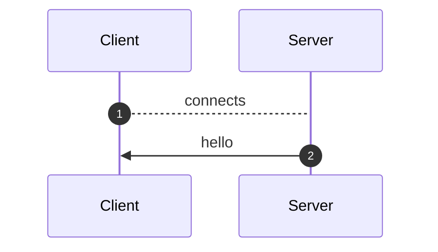
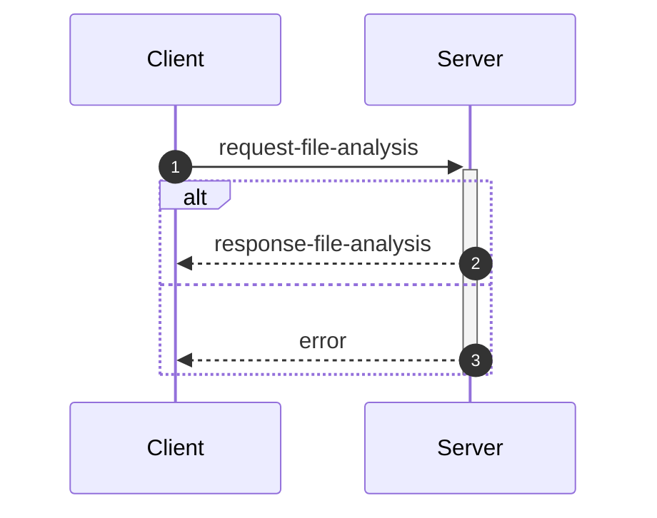
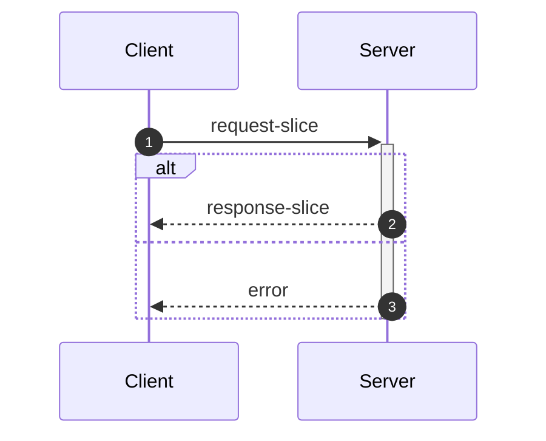
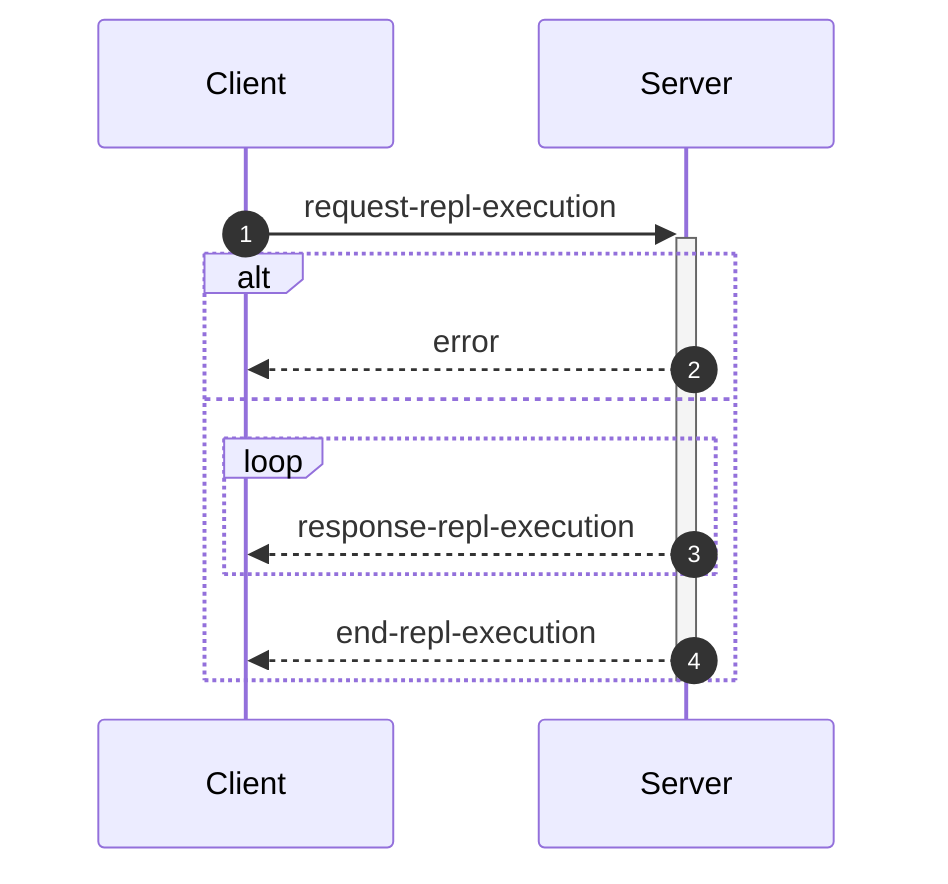

_<span title="an overview of flowR's interface">Generated</span> from '[wiki-interface.ts](https://github.com/flowr-analysis/flowr/tree/main/src/documentation/wiki-interface.ts "src/documentation/wiki-interface.ts")' on 2026-09-10, 13:52:02 UTC (v2.15.8, R v4.6.1), do not edit directly._

Although far from being as detailed as the in-depth explanation of [_flowR_](https://github.com/flowr-analysis/flowr/wiki/Core),
this wiki page explains how to interface with _flowR_ in more detail.
In general, command line arguments and other options provide short descriptions on hover over.

* [💻 Using the REPL](#using-the-repl)
* [⚙️ Configuring FlowR](#configuring-flowr)
* [⚒️ Writing Code](#writing-code)
* [💬 Communicating with the Server](#communicating-with-the-server)

<a id='using-the-repl'></a>
## 💻 Using the REPL

> [!NOTE]
> To execute arbitrary R commands with a repl request, _flowR_ has to be started explicitly with <span title="Description (Command Line Argument): Allow to access the underlying R session when using flowR (security warning: this allows the execution of arbitrary R code!)">`--r-session-access`</span>.
> Please be aware that this introduces a security risk and note that this relies on the [`r-shell` engine](https://github.com/flowr-analysis/flowr/wiki/Engines) .

Although primarily meant for users to explore,
there is nothing which forbids simply calling _flowR_ as a subprocess to use standard-in, -output, and -error
for communication (although you can access the REPL using the server as well,
with the [REPL Request](#message-request-repl-execution) message).

The read-eval-print loop&nbsp;(REPL) works relatively simple.
You can submit an expression (using <kbd>Enter</kbd>),
which is interpreted as an R&nbsp;expression by default but interpreted as a *command* if it starts with a colon (`:`).
The best command to get started with the REPL is <span title="Description (Repl Command): Show help information (aliases: :h, :?)">`:help`</span>.
Besides, you can leave the REPL either with the command <span title="Description (Repl Command): End the repl (aliases: :q, :exit)">`:quit`</span> or by pressing <kbd>Ctrl</kbd>+<kbd>C</kbd> twice.
When writing a *command*, you may press <kbd>Tab</kbd> to get a list of completions, if available.
Multiple commands can be entered in a single line by separating them with a semicolon (`;`), e.g. `:parse "x<-2"; :df*`.
If a command is given without R code, the REPL will re-use R code given in a previous command.
The prior example will hence return first the parsed AST of the program and then the dataflow graph for `"x <- 2"`.

> [!NOTE]
> If you develop flowR, you may want to launch the repl using the `npm run main-dev` command, this way, you get a non-minified version of flowR with debug information and hot-reloading of source files.

<details>
<summary>Available Commands</summary>

We currently offer the following commands (this with a `[*]` suffix are available with and without the star):

| Command | Description |
| ------- | ----------- |
| **<span title="Description (Repl Command): End the repl (aliases: :q, :exit)">:quit</span>** | End the repl (aliases: **:<span title="Alias of ':quit'. End the repl">q</span>**, **:<span title="Alias of ':quit'. End the repl">exit</span>**) |
| **<span title="Description (Repl Command): Execute the given code as R code. This requires the `--r-session-access` flag to be set and requires the r-shell engine. (aliases: :e, :r)">:execute</span>** | Execute the given code as R code. This requires the `--r-session-access` flag to be set and requires the r-shell engine. (aliases: **:<span title="Alias of ':execute'. Execute the given code as R code. This requires the `--r-session-access` flag to be set and requires the r-shell engine.">e</span>**, **:<span title="Alias of ':execute'. Execute the given code as R code. This requires the `--r-session-access` flag to be set and requires the r-shell engine.">r</span>**) |
| **<span title="Description (Repl Command): Get mermaid code for the control-flow graph of R code (aliases: :cfg, :cf)">:controlflow[*]</span>** | Get mermaid code for the control-flow graph of R code (star: Returns the URL to mermaid.live) (aliases: **:<span title="Alias of ':controlflow'. Get mermaid code for the control-flow graph of R code">cfg</span>**, **:<span title="Alias of ':controlflow'. Get mermaid code for the control-flow graph of R code">cf</span>**) |
| **<span title="Description (Repl Command): Get mermaid code for the control-flow graph with basic blocks (aliases: :cfgb, :cfb)">:controlflowbb[*]</span>** | Get mermaid code for the control-flow graph with basic blocks (star: Returns the URL to mermaid.live) (aliases: **:<span title="Alias of ':controlflowbb'. Get mermaid code for the control-flow graph with basic blocks">cfgb</span>**, **:<span title="Alias of ':controlflowbb'. Get mermaid code for the control-flow graph with basic blocks">cfb</span>**) |
| **<span title="Description (Repl Command): Get mermaid code for the dataflow graph (aliases: :d, :df)">:dataflow[*]</span>** | Get mermaid code for the dataflow graph (star: Returns the URL to mermaid.live) (aliases: **:<span title="Alias of ':dataflow'. Get mermaid code for the dataflow graph">d</span>**, **:<span title="Alias of ':dataflow'. Get mermaid code for the dataflow graph">df</span>**) |
| **<span title="Description (Repl Command): Get mermaid code for the normalized AST of R code (aliases: :n)">:normalize[*]</span>** | Get mermaid code for the normalized AST of R code (star: Returns the URL to mermaid.live) (alias: **:<span title="Alias of ':normalize'. Get mermaid code for the normalized AST of R code">n</span>**) |
| **<span title="Description (Repl Command): Get mermaid code for the simplified dataflow graph (aliases: :ds, :dfs)">:dataflowsimple[*]</span>** | Get mermaid code for the simplified dataflow graph (star: Returns the URL to mermaid.live) (aliases: **:<span title="Alias of ':dataflowsimple'. Get mermaid code for the simplified dataflow graph">ds</span>**, **:<span title="Alias of ':dataflowsimple'. Get mermaid code for the simplified dataflow graph">dfs</span>**) |
| **<span title="Description (Repl Command): Inspect and extend the signature database: `query` (identical to :query @signature), `info <name>` for where a function comes from (identical to :query @function-info), `add <path>` to mount another database/source, `download` to fetch the full-history database. (aliases: :sig)">:signature</span>** | Inspect and extend the signature database: `query` (identical to :query @signature), `info <name>` for where a function comes from (identical to :query @function-info), `add <path>` to mount another database/source, `download` to fetch the full-history database. (alias: **:<span title="Alias of ':signature'. Inspect and extend the signature database: `query` (identical to :query @signature), `info <name>` for where a function comes from (identical to :query @function-info), `add <path>` to mount another database/source, `download` to fetch the full-history database.">sig</span>**) |
| **<span title="Description (Repl Command): Just calculates the DFG, but only prints summary info (aliases: :d#, :df#)">:dataflowsilent</span>** | Just calculates the DFG, but only prints summary info (aliases: **:<span title="Alias of ':dataflowsilent'. Just calculates the DFG, but only prints summary info">d#</span>**, **:<span title="Alias of ':dataflowsilent'. Just calculates the DFG, but only prints summary info">df#</span>**) |
| **<span title="Description (Repl Command): Prints ASCII Art of the parsed, unmodified AST (aliases: :p)">:parse</span>** | Prints ASCII Art of the parsed, unmodified AST (alias: **:<span title="Alias of ':parse'. Prints ASCII Art of the parsed, unmodified AST">p</span>**) |
| **<span title="Description (Repl Command): Prints the version of flowR as well as the current version of R">:version</span>** | Prints the version of flowR as well as the current version of R
| **<span title="Description (Repl Command): Query the given R code (use 'help' for more information)">:query[*]</span>** | Query the given R code (use 'help' for more information) (star: Similar to query, but returns the output in json format.)
| **<span title="Description (Repl Command): Returns an ASCII representation of the dataflow graph (aliases: :df!)">:dataflowascii</span>** | Returns an ASCII representation of the dataflow graph (alias: **:<span title="Alias of ':dataflowascii'. Returns an ASCII representation of the dataflow graph">df!</span>**) |
| **<span title="Description (Repl Command): Returns summarization stats for the normalized AST (aliases: :n#)">:normalize#</span>** | Returns summarization stats for the normalized AST (alias: **:<span title="Alias of ':normalize#'. Returns summarization stats for the normalized AST">n#</span>**) |
| **<span title="Description (Repl Command): Show help information (aliases: :h, :?)">:help</span>** | Show help information (aliases: **:<span title="Alias of ':help'. Show help information">h</span>**, **:<span title="Alias of ':help'. Show help information">?</span>**) |

</details>

> [!TIP]
> 
> As indicated by the examples before, all REPL commands that operate on code keep track of the state.
> Hence, if you run a command like <span title="Description (Repl Command, starred version): Returns the URL to mermaid.live; Base Command: Get mermaid code for the dataflow graph (aliases: :d*, :df*)">`:dataflow*`</span> without providing R code,
> the REPL will re-use the R code provided in a previous command.
> Likewise, doing this will benefit from incrementality!
> If you request the dataflow graph with `:df* x <- 2 * y` and then want to see the parsed AST with `:parse`,
> the REPL will re-use previously obtained information and not re-parse the code again.
> 		

Generally, many commands offer shortcut versions in the REPL. Many queries, for example, offer a shortened format (see the example below).
Of special note, the [Config Query](https://github.com/flowr-analysis/flowr/wiki/%5BQuery%5D-Config)
can be used to also modify the currently active configuration of _flowR_ within the REPL (see the [wiki page](https://github.com/flowr-analysis/flowr/wiki/%5BQuery%5D-Config) for more information).

### Example: Retrieving the Dataflow Graph

To retrieve a URL to the [mermaid](https://mermaid.js.org/) diagram of the dataflow of a given expression,
use <span title="Description (Repl Command, starred version): Returns the URL to mermaid.live; Base Command: Get mermaid code for the dataflow graph (aliases: :d*, :df*)">`:dataflow*`</span> (or <span title="Description (Repl Command): Get mermaid code for the dataflow graph (aliases: :d, :df)">`:dataflow`</span> to get the mermaid code in the cli):

```shell
$ docker run -it --rm eagleoutice/flowr # or npm run flowr 
flowR repl v2.15.8, R grammar v14 (tree-sitter engine)
R> :dataflow* y <- 1 + x
```

<details>
<summary style='color:gray'>Output</summary>

```text
https://mermaid.live/view#base64:eyJjb2RlIjoiZmxvd2NoYXJ0IFREXG4gICAgMXt7XCJgKiM5MTtSTnVtYmVyIzkzOyogKioxKipcbiAgICAgICoxLjYqICgqKmlkOiAxKiopYFwifX1cbiAgICAyKFtcImAqIzkxO1JTeW1ib2wjOTM7KiAqKngqKlxuICAgICAgKjEuMTAqICgqKmlkOiAyKiopYFwiXSlcbiAgICAzW1tcImAqIzkxO1JCaW5hcnlPcCM5MzsqIGJhc2UjNTg7IzU4OyoqIzQzOyoqXG4gICAgICAqMS42LTEwKiAoKippZDogMyoqKVxuICAgIGFyZzogKDEsIDIpYFwiXV1cbiAgICBidWlsdC1pbjpfW1wiYEJ1aWx0LUluOlxuIzQzO2BcIl1cbiAgICBzdHlsZSBidWlsdC1pbjpfIHN0cm9rZTpncmF5LGZpbGw6Z3JheSxzdHJva2Utd2lkdGg6MnB4LG9wYWNpdHk6Ljg7XG4gICAgMFtcImAqIzkxO1JTeW1ib2wjOTM7KiAqKnkqKlxuICAgICAgKjEuMSogKCoqaWQ6IDAqKiwgdjogMylgXCJdXG4gICAgNFtbXCJgKiM5MTtSQmluYXJ5T3AjOTM7KiBiYXNlIzU4OyM1ODsqKiM2MDsjNDU7KipcbiAgICAgICoxLjEtMTAqICgqKmlkOiA0KiopXG4gICAgYXJnOiAoMCwgMylgXCJdXVxuICAgIGJ1aWx0LWluOl8tW1wiYEJ1aWx0LUluOlxuIzYwOyM0NTtgXCJdXG4gICAgc3R5bGUgYnVpbHQtaW46Xy0gc3Ryb2tlOmdyYXksZmlsbDpncmF5LHN0cm9rZS13aWR0aDoycHgsb3BhY2l0eTouODtcbiAgICAxIC0uLT58XCJmbG93XCJ8IDJcbiAgICBsaW5rU3R5bGUgMCBzdHJva2U6Z3JheSxjb2xvcjpncmF5O1xuICAgIDIgLS4tPnxcImZsb3dcInwgM1xuICAgIGxpbmtTdHlsZSAxIHN0cm9rZTpncmF5LGNvbG9yOmdyYXk7XG4gICAgMyAtLT58XCJyZWFkcywgYXJnXCJ8IDFcbiAgICAzIC0tPnxcInJlYWRzLCBhcmdcInwgMlxuICAgIDMgLS4tPnxcImZsb3dcInwgMFxuICAgIGxpbmtTdHlsZSA0IHN0cm9rZTpncmF5LGNvbG9yOmdyYXk7XG4gICAgMyAtLi0+fFwicmVhZHMsIGNhbGxzXCJ8IGJ1aWx0LWluOl9cbiAgICBsaW5rU3R5bGUgNSBzdHJva2U6Z3JheTtcbiAgICAwIC0tPnxcImRlZmluZWQtYnksIGZsb3dcInwgNFxuICAgIDAgLS0+fFwiZGVmaW5lZC1ieVwifCAzXG4gICAgNCAtLT58XCJyZWFkcywgYXJnXCJ8IDNcbiAgICA0IC0tPnxcInJldHVybnMsIGFyZ1wifCAwXG4gICAgNCAtLi0+fFwicmVhZHMsIGNhbGxzXCJ8IGJ1aWx0LWluOl8tXG4gICAgbGlua1N0eWxlIDEwIHN0cm9rZTpncmF5OyIsIm1lcm1haWQiOnsiYXV0b1N5bmMiOnRydWV9fQ==
```

Retrieve the dataflow graph of the expression `y <- 1 + x`. It looks like this:


```mermaid
flowchart LR
    1{{"`*#91;RNumber#93;* **1**
      *1.6* (**id: 1**)`"}}
    2(["`*#91;RSymbol#93;* **x**
      *1.10* (**id: 2**)`"])
    3[["`*#91;RBinaryOp#93;* base#58;#58;**#43;**
      *1.6-10* (**id: 3**)
    arg: (1, 2)`"]]
    built-in:_["`Built-In:
#43;`"]
    style built-in:_ stroke:gray,fill:gray,stroke-width:2px,opacity:.8;
    0["`*#91;RSymbol#93;* **y**
      *1.1* (**id: 0**, v: 3)`"]
    4[["`*#91;RBinaryOp#93;* base#58;#58;**#60;#45;**
      *1.1-10* (**id: 4**)
    arg: (0, 3)`"]]
    built-in:_-["`Built-In:
#60;#45;`"]
    style built-in:_- stroke:gray,fill:gray,stroke-width:2px,opacity:.8;
    1 -.->|"flow"| 2
    linkStyle 0 stroke:gray,color:gray;
    2 -.->|"flow"| 3
    linkStyle 1 stroke:gray,color:gray;
    3 -->|"reads, arg"| 1
    3 -->|"reads, arg"| 2
    3 -.->|"flow"| 0
    linkStyle 4 stroke:gray,color:gray;
    3 -.->|"reads, calls"| built-in:_
    linkStyle 5 stroke:gray;
    0 -->|"defined-by, flow"| 4
    0 -->|"defined-by"| 3
    4 -->|"reads, arg"| 3
    4 -->|"returns, arg"| 0
    4 -.->|"reads, calls"| built-in:_-
    linkStyle 10 stroke:gray;
```

<details>

<summary style="color:gray">R Code of the Dataflow Graph</summary>

The analysis ran (including parse and normalize, using the [tree-sitter](https://github.com/flowr-analysis/flowr/wiki/Engines) engine) within the generation environment. No [signature database](https://github.com/flowr-analysis/flowr/wiki/Signature-Database) is mounted for these generated graphs, so `library()` calls attach no package exports; base-R names are still qualified via the generated base-package store (e.g. `acf` as `stats::acf`). 
We encountered no unknown side effects during the analysis.

```r
y <- 1 + x
```

</details>

</details>

For small graphs like this, <span title="Description (Repl Command): Returns an ASCII representation of the dataflow graph (aliases: :df!)">`:dataflowascii`</span> also provides an ASCII representation directly in the REPL:

```shell
$ docker run -it --rm eagleoutice/flowr # or npm run flowr 
flowR repl v2.15.8, R grammar v14 (tree-sitter engine)
R> :df! y <- 1 + x
```

<details open>
<summary style='color:gray'>Output</summary>

```text
           ┌────────────u<2>u
        c<3>c   0<1>0   | x |
    ┌───| + |───| 1 |───u---u
    │   c---c   0---0
 c<4>c     │
 |<- |     └────────────v<0>v
 c---c──────────────────| y |
                        v---v
Edges:
3 -> 1: reads, arg          3 -> 2: reads, arg
3 -> 0: flows-to            1 -> 2: flows-to
2 -> 3: flows-to            4 -> 3: reads, arg
4 -> 0: returns, arg        0 -> 4: defined-by, flows-to
0 -> 3: defined-by
```

Retrieve the dataflow graph of the expression `y <- 1 + x` as ASCII art.

</details>

For the slicing with <span title="Description (Repl Command): Static backwards executable slicer for R">`:slicer`</span>, you have access to the same [magic comments](#slice-magic-comments) as with the [slice request](#message-request-slice).
Pass `--inline` to splice resolvable `source()` calls into the reconstruction so the slice is a single self-contained R text (the same as the static slice query's `inlineSources` flag).
See `--help` for more flags!

### Example: Interfacing with the File System

Many commands that allow for an R-expression (like <span title="Description (Repl Command, starred version): Returns the URL to mermaid.live; Base Command: Get mermaid code for the dataflow graph (aliases: :d*, :df*)">`:dataflow*`</span>) allow for a file as well
if the argument starts with `file://`.
If you are working from the root directory of the _flowR_ repository, the following gives you the parsed AST of the example file using the <span title="Description (Repl Command): Prints ASCII Art of the parsed, unmodified AST (aliases: :p)">`:parse`</span> command:

> **Watch mode**: Replace `file://` with `watch://` to enter watch mode.
> flowR runs the command immediately and then re-runs it every time the file (or any file inside the folder) changes.
> Enter any other command to leave watch mode.
> For example: `:df watch://analysis.R`

```shell
$ docker run -it --rm eagleoutice/flowr # or npm run flowr 
flowR repl v2.15.8, R grammar v14 (tree-sitter engine)
R> :parse file://test/testfiles/example.R
```

<details>
<summary style='color:gray'>Output</summary>

```text
File: test/testfiles/example.R

program
├ binaryoperator
│ ├ identifier "sum" (1:1─4)
│ ├ <- "<-" (1:5─7)
│ ╰ float "0" (1:8─9)
├ binaryoperator
│ ├ identifier "product" (2:1─8)
│ ├ <- "<-" (2:9─11)
│ ╰ float "1" (2:12─13)
├ binaryoperator
│ ├ identifier "w" (3:1─2)
│ ├ <- "<-" (3:3─5)
│ ╰ float "7" (3:6─7)
├ binaryoperator
│ ├ identifier "N" (4:1─2)
│ ├ <- "<-" (4:3─5)
│ ╰ float "10" (4:6─8)
├ forstatement
│ ├ for "for" (6:1─4)
│ ├ ( "(" (6:5─6)
│ ├ identifier "i" (6:6─7)
│ ├ in "in" (6:8─10)
│ ├ binaryoperator
│ │ ├ float "1" (6:11─12)
│ │ ├ : ":" (6:12─13)
│ │ ╰ parenthesizedexpression
│ │   ├ ( "(" (6:13─14)
│ │   ├ binaryoperator
│ │   │ ├ identifier "N" (6:14─15)
│ │   │ ├ - "-" (6:15─16)
│ │   │ ╰ float "1" (6:16─17)
│ │   ╰ ) ")" (6:17─18)
│ ├ ) ")" (6:18─19)
│ ╰ bracedexpression
│   ├ { "{" (6:20─21)
│   ├ binaryoperator
│   │ ├ identifier "sum" (7:3─6)
│   │ ├ <- "<-" (7:7─9)
│   │ ╰ binaryoperator
│   │   ├ binaryoperator
│   │   │ ├ identifier "sum" (7:10─13)
│   │   │ ├ + "+" (7:14─15)
│   │   │ ╰ identifier "i" (7:16─17)
│   │   ├ + "+" (7:18─19)
│   │   ╰ identifier "w" (7:20─21)
│   ├ binaryoperator
│   │ ├ identifier "product" (8:3─10)
│   │ ├ <- "<-" (8:11─13)
│   │ ╰ binaryoperator
│   │   ├ identifier "product" (8:14─21)
│   │   ├  "" (8:22─23)
│   │   ╰ identifier "i" (8:24─25)
│   ╰ } "}" (9:1─2)
├ call
│ ├ identifier "cat" (11:1─4)
│ ╰ arguments
│   ├ ( "(" (11:4─5)
│   ├ argument
│   │ ╰ string
│   │   ├ " "\"" (11:5─6)
│   │   ├ stringcontent "Sum:" (11:6─10)
│   │   ╰ " "\"" (11:10─11)
│   ├ comma "," (11:11─12)
│   ├ argument
│   │ ╰ identifier "sum" (11:13─16)
│   ├ comma "," (11:16─17)
│   ├ argument
│   │ ╰ string
│   │   ├ " "\"" (11:18─19)
│   │   ├ stringcontent
│   │   │ ╰ escapesequence "\\n" (11:19─21)
│   │   ╰ " "\"" (11:21─22)
│   ╰ ) ")" (11:22─23)
╰ call
  ├ identifier "cat" (12:1─4)
  ╰ arguments
    ├ ( "(" (12:4─5)
    ├ argument
    │ ╰ string
    │   ├ " "\"" (12:5─6)
    │   ├ stringcontent "Product:" (12:6─14)
    │   ╰ " "\"" (12:14─15)
    ├ comma "," (12:15─16)
    ├ argument
    │ ╰ identifier "product" (12:17─24)
    ├ comma "," (12:24─25)
    ├ argument
    │ ╰ string
    │   ├ " "\"" (12:26─27)
    │   ├ stringcontent
    │   │ ╰ escapesequence "\\n" (12:27─29)
    │   ╰ " "\"" (12:29─30)
    ╰ ) ")" (12:30─31)
```

Retrieve the parsed AST of the example file.

<details>

<summary>File Content</summary>

```r
sum <- 0
product <- 1
w <- 7
N <- 10

for (i in 1:(N-1)) {
  sum <- sum + i + w
  product <- product * i
}

cat("Sum:", sum, "\n")
cat("Product:", product, "\n")
```

</details>

As _flowR_ directly transforms this AST the output focuses on being human-readable instead of being machine-readable.
		
</details>

### Example: Run a Query

You can run any query supported by _flowR_ using the <span title="Description (Repl Command): Query the given R code (use 'help' for more information)">`:query`</span> command.
For example, to obtain the shapes of all data frames in a given piece of code, you can run:

```shell
$ docker run -it --rm eagleoutice/flowr # or npm run flowr 
flowR repl v2.15.8, R grammar v14 (tree-sitter engine)
R> :query @absint df-shape "x <- data.frame(a = 1:10, b = 1:10)\ny <- x$a"
```

<details open>
<summary style='color:gray'>Output</summary>

```text
Query: absint (0 ms)
```

Retrieve the shapes of all data frames in the given code.

</details>

To run the linter on a file, you can use (in this example, we just issue the `dead-code` linter on a small piece of code):

```shell
$ docker run -it --rm eagleoutice/flowr # or npm run flowr 
flowR repl v2.15.8, R grammar v14 (tree-sitter engine)
R> :query @linter rules:dead-code "if(FALSE) x <- 2"
```

<details open>
<summary style='color:gray'>Output</summary>

```text
Query: linter (5 ms)
   ╰ Dead Code (dead-code):
       ╰ certain:
           ╰ Code at 1.11-16
```

Run the linter on the given code, with only the `dead-code` rule enabled.

</details>

For more information on the available queries, please check out the [Query API](https://github.com/flowr-analysis/flowr/wiki/Query-API).

<a id='configuring-flowr'></a>
## ⚙️ Configuring FlowR

When running _flowR_, you may want to specify some behaviors with a dedicated configuration file.
By default, flowR looks for a file named `flowr.json` in the current working directory (or any higher directory).
You can also specify a different file with <span title="Description (Command Line Argument): The name of the configuration file to use">`--config-file`</span> or pass the configuration inline using <span title="Description (Command Line Argument): The flowR configuration to use, as a JSON string">`--config-json`</span>.
To inspect the current configuration, you can run flowr with the <span title="Description (Command Line Argument): Run with verbose logging (will be passed to the corresponding script)">`--verbose`</span> flag, or use the `config` [Query](https://github.com/flowr-analysis/flowr/wiki/Query-API).
Within the REPL this works by running the following:

```shell
:query @config
```

To work with the <a href="https://github.com/flowr-analysis/flowr/tree/main/src/config.ts#L108"><code><span title="The configuration file format for flowR.">FlowrConfig</span></code></a> you can use the provided helper objects alongside its methods like
<a href="https://github.com/flowr-analysis/flowr/tree/main/src/config.ts#L861"><code><span title="Creates a new flowr config that has the updated values.">FlowrConfig::<b>amend</b></span></code></a>.
The schema below documents every option; the ones you most likely want are:

- <a href="https://github.com/flowr-analysis/flowr/wiki/Interface#configuring-flowr" title="Configuration Option (boolean): Whether source calls should be ignored, causing {@link processSourceCall}&#39;s behavior to be skipped.">ignoreSourceCalls</a>: ignore source calls when analyzing the code, i.e., ignore the inclusion of other files.
- <a href="https://github.com/flowr-analysis/flowr/wiki/Interface#configuring-flowr" title="Configuration Option (boolean): Whether load calls should be ignored, causing {@link processLoadCall}&#39;s behavior to be skipped.">ignoreLoadCalls</a>: ignore load calls when analyzing the code, i.e., ignore the loading of r-data files.
- <a href="https://github.com/flowr-analysis/flowr/wiki/Interface#configuring-flowr" title="Configuration Option (object): Do you want to overwrite (parts) of the builtin definition?">semantics.environment.overwriteBuiltIns</a>: overwrite _flowR_'s handling of built-in functions, or clear the preset definitions entirely.
  See [Configure BuiltIn Semantics](#configure-builtin-semantics) for more information.
- <a href="https://github.com/flowr-analysis/flowr/wiki/Interface#configuring-flowr" title="Configuration Option (string): How to resolve variables and their values. (one of &quot;disabled&quot;, &quot;alias&quot;, &quot;builtin&quot;)">solver.variables</a>: how to resolve variables and their values (`disabled`, `alias`, `builtin`).
- <a href="https://github.com/flowr-analysis/flowr/wiki/Interface#configuring-flowr" title="Configuration Option (array): The engine or set of engines to use for interacting with R code. An empty array means all available engines will be used.">engines</a> and <a href="https://github.com/flowr-analysis/flowr/wiki/Interface#configuring-flowr" title="Configuration Option (string): The default engine to use for interacting with R code. If this is undefined, an arbitrary engine from the specified list will be used. (one of &quot;tree-sitter&quot;, &quot;r-shell&quot;)">defaultEngine</a>: the engines used to interact with R code, see the [Engines wiki page](https://github.com/flowr-analysis/flowr/wiki/Engines).
- <a href="https://github.com/flowr-analysis/flowr/wiki/Interface#configuring-flowr" title="Configuration Option (array): Files a framework loads on its own, without any source() call (e.g. global.R in a shiny app), in the order they are loaded; flowR orders the matching project files accordingly and analyzes them as one program. Entries are case-insensitive globs matched against the file path, a plain name matches any file with that name, and entries matching no project file are warned about. Usually set per project kind via specializeConfig.">project.implicitSources</a>: the files a framework loads without any `source()` call, in the order in which they are
  loaded. Entries are globs (e.g. `R/*.R`) matched against the file path ignoring capitalization; one matching no file is reported.
- <a href="https://github.com/flowr-analysis/flowr/wiki/Interface#configuring-flowr" title="Configuration Option (object): Overwrite (parts of) the configuration depending on the project kind flowR detects, e.g. to give a shiny app its implicit sources.">specializeConfig</a>: overwrite (parts of) the configuration depending on the kind of project _flowR_ detects
  (e.g. `shiny-app`), which is how a shiny app gets its implicit sources by default. What you configure directly wins.
- <a href="https://github.com/flowr-analysis/flowr/wiki/Interface#configuring-flowr" title="Configuration Option (string): Overwrite the project kind flowR would otherwise infer from the analyzed files, e.g. when auto-detection guesses wrong. (one of &quot;package&quot;, &quot;script&quot;, &quot;shiny-app&quot;, &quot;notebook&quot;, &quot;project&quot;, &quot;unknown&quot;)">project.useProjectType</a>: skip that detection and force a project kind yourself, when auto-detection guesses wrong.
- <a href="https://github.com/flowr-analysis/flowr/wiki/Interface#configuring-flowr" title="Configuration Option (array): The default plugins to load when creating a new instance of FlowrAnalyzer">defaultPlugins</a> and <a href="https://github.com/flowr-analysis/flowr/wiki/Interface#configuring-flowr" title="Configuration Option (array): The plugins to load in REPL mode">repl.plugins</a>: the plugins to load for a new <a href="https://github.com/flowr-analysis/flowr/tree/main/src/project/flowr-analyzer.ts#L202"><code><span title="Central class for conducting analyses with FlowR. Use the FlowrAnalyzerBuilder to create a new instance. If you want the original pattern of creating a pipeline and running all steps, you can still do this with FlowrAnalyzer#runFull . To inspect the context of the analyzer, use FlowrAnalyzer#inspectContext (if you are a plugin and need to modify it, use FlowrAnalyzer#context instead).">FlowrAnalyzer</span></code></a> and in the REPL
  (use `flowr:default` to reference the former).

So you can configure _flowR_ by adding a file like the following:

<details>

<summary>Example Configuration File</summary>

```json
{
  "ignoreSourceCalls": true,
  "ignoreLoadCalls": true,
  "semantics": {
    "environment": {
      "overwriteBuiltIns": {
        "definitions": [
          {
            "type": "function",
            "names": [
              "foo"
            ],
            "processor": "builtin:assign",
            "config": {}
          }
        ]
      }
    }
  },
  "defaultPlugins": [
    "file:description",
    "versions:description"
  ],
  "repl": {
    "quickStats": false,
    "dfProcessorHeat": false,
    "hints": true,
    "plugins": [
      "flowr:default"
    ]
  },
  "project": {
    "resolveUnknownPathsOnDisk": true,
    "implicitSources": [
      "global.R",
      "app.R"
    ]
  },
  "linter": {
    "disabledRules": []
  },
  "specializeConfig": {
    "shiny-app": {
      "project": {
        "implicitSources": [
          "global.R",
          "ui.R",
          "server.R",
          "app.R"
        ]
      }
    }
  },
  "engines": [
    {
      "type": "r-shell"
    }
  ],
  "solver": {
    "variables": "alias",
    "evalStrings": true,
    "trackEnvironments": true,
    "sigdb": {
      "enabled": true,
      "loadProjectDependencies": true,
      "eagerlyLoad": false,
      "eagerlyLoadExports": false,
      "linkBaseR": false,
      "linkDescriptionDependencies": false
    },
    "resolveSource": {
      "dropPaths": "no",
      "ignoreCapitalization": true,
      "inferWorkingDirectory": "active-script",
      "searchPath": []
    },
    "instrument": {},
    "slicer": {
      "threshold": 50
    }
  },
  "abstractInterpretation": {
    "wideningThreshold": 4,
    "followCalls": true,
    "dataFrame": {
      "maxColNames": 20,
      "readLoadedData": {
        "readExternalFiles": true,
        "maxReadLines": 1000000
      }
    }
  },
  "incremental": {
    "alwaysIncremental": false,
    "parsing": {
      "activated": false,
      "heuristics": {
        "activated": true,
        "mtime": true,
        "linesFrom": 500,
        "bytesFrom": 50000,
        "alwaysWithEdits": false,
        "minFiles": 1
      }
    }
  },
  "gas": {
    "thresholds": {
      "memory": {
        "problematic": 0.7,
        "critical": 0.9
      },
      "timeMs": {
        "problematic": 100000,
        "critical": 120000
      }
    },
    "features": {}
  }
}
```

</details>

<details>
<a id='configure-builtin-semantics'></a>
<summary>Configure Built-In Semantics</summary>

`semantics/environment/overwriteBuiltins` accepts two keys:

- `loadDefaults` (boolean, initially `true`): If set to `true`, the default built-in definitions are loaded before applying the custom definitions. Setting this flag to `false` explicitly disables the loading of the default definitions.
- `definitions` (array, initially empty): Allows to overwrite or define new built-in elements. Each object within must have a `type` which is one of the below. Furthermore, they may define a string array of `names` which specifies the identifiers to bind the definitions to. You may use `assumePrimitive` to specify whether _flowR_ should assume that this is a primitive non-library definition (so you probably just do not want to specify the key).

  | Type            | Description                                                                                                                                                                                                                                                                                              | Example                                                                                                    |
  | --------------- | -------------------------------------------------------------------------------------------------------------------------------------------------------------------------------------------------------------------------------------------------------------------------------------------------------- | ---------------------------------------------------------------------------------------------------------- |
  | `constant`    | Additionally allows for a `value` this should resolve to.                                                                                                                                                                                                                                                | `{ type: 'constant', names: ['NULL', 'NA'],  value: null }`                                                |
  | `function`    | Is a rather flexible way to define and bind built-in functions. For the time, we do not have extensive documentation to cover all the cases, so please either consult the sources with the `default-builtin-config.ts` or open a [new issue](https://github.com/flowr-analysis/flowr/issues/new/choose). | `{ type: 'function', names: ['next'], processor: 'builtin:d', config: { cfg: ExitPointType.Next } }` |
  | `replacement` | A comfortable way to specify replacement functions like `$<-` or `names<-`. `suffixes` describes the... suffixes to attach automatically. | `{ type: 'replacement', suffixes: ['<-', '<<-'], names: ['[', '[['] }` |

</details>

<details>

<summary style='color:gray'>Full Configuration-File Schema</summary>

- _The configuration file format for flowR._ (object)
    - **logLevel** [optional] _flowR's global minimum log level, applied when the config is loaded._ (string)
        Only allows: 'silly', 'trace', 'debug', 'info', 'warn', 'error', 'fatal'
    - **ignoreSourceCalls** [optional] _Whether source calls should be ignored, causing {@link processSourceCall}'s behavior to be skipped._ (boolean)
    - **ignoreLoadCalls** [optional] _Whether load calls should be ignored, causing {@link processLoadCall}'s behavior to be skipped._ (boolean)
    - **semantics** _Configure language semantics and how flowR handles them._ (object)
        - **environment** [optional] _Semantics regarding how to handle the R environment._ (object)
            - **overwriteBuiltIns** [optional] _Do you want to overwrite (parts) of the builtin definition?_ (object)
                - **loadDefaults** [optional] _Should the default configuration still be loaded?_ (boolean)
                - **definitions** [optional] _The definitions to load/overwrite._ (array)
                Valid item types:
                    - (object)
    - **defaultPlugins** [optional] _The default plugins to load when creating a new instance of FlowrAnalyzer_ (array)
    Valid item types:
        - (alternatives)
            - (string)
            - (array)
    - **repl** _Configuration options for the REPL._ (object)
        - **quickStats** [optional] _Whether to show quick stats in the REPL after each evaluation._ (boolean)
        - **dfProcessorHeat** [optional] _This instruments the dataflow processors to count how often each processor is called._ (boolean)
        - **hints** [optional] _Whether to show dim inline hints on the empty prompt (automatically disabled on non-interactive terminals)._ (boolean)
        - **plugins** [optional] _The plugins to load in REPL mode_ (array)
        Valid item types:
            - (alternatives)
                - (string)
                - (array)
        - **autoUseFileProtocol** [optional] _Prepend the file protocol to a repl input that looks like a path, instead of only warning about it._ (boolean)
        - **queryStats** [optional] _Whether `:query` closes with the line stating how long the queries took (`:query*` never prints it)._ (boolean)
        - **showPlugins** [optional] _Whether `:version` grays out the plugins that did not activate during the last analysis._ (boolean)
    - **project** _Project specific configuration options._ (object)
        - **resolveUnknownPathsOnDisk** [optional] _Whether to resolve unknown paths loaded by the r project disk when trying to source/analyze files._ (boolean)
        - **failOnInaccessiblePath** [optional] _Whether a directory that cannot be traversed during file discovery (e.g. due to permissions) aborts the analysis; when false (the default) such paths are logged and skipped._ (boolean)
        - **basePackages** [optional] _The packages considered part of R itself (base and recommended); if unset, flowR uses its built-in list._ (array)
        Valid item types:
            - (string)
        - **implicitSources** [optional] _Files a framework loads on its own, without any source() call (e.g. global.R in a shiny app), in the order they are loaded; flowR orders the matching project files accordingly and analyzes them as one program. Entries are case-insensitive globs matched against the file path, a plain name matches any file with that name, and entries matching no project file are warned about. Usually set per project kind via specializeConfig._ (array)
        Valid item types:
            - (string)
        - **useProjectType** [optional] _Overwrite the project kind flowR would otherwise infer from the analyzed files, e.g. when auto-detection guesses wrong._ (string)
            Only allows: 'package', 'script', 'shiny-app', 'notebook', 'project', 'unknown'
        - **assumeImplicitEcho** [optional] _Whether the top level of the analyzed code is echoed, so that every visible result printed there is collected as an output by the dependencies query (default true, false for a package)._ (boolean)
        - **discovery** [optional] _Scoping options for the default project discovery._ (object)
            - **full** [optional] _Collect every file below the project root (greedy) instead of only the files the detected project kind needs (default false)._ (boolean)
            - **perKind** [optional] _Per-kind include/exclude glob overrides layered on the default scoping._ (object)
            - **ignore** [optional] _Case-insensitive globs that drop matching files from the intelligent discovery, regardless of kind (e.g. .Renviron to ignore environment files)._ (array)
            Valid item types:
                - (string)
        - **classification** [optional] _Overrides for the signals flowR uses to classify the project kind._ (object)
            - **shinyDescriptionTypes** [optional] _DESCRIPTION Type: values that mark a shiny app._ (array)
            Valid item types:
                - (string)
            - **shinyEntryFiles** [optional] _File names a shiny app is assembled from._ (array)
            Valid item types:
                - (string)
            - **shinyUsagePattern** [optional] _Regex source evidencing shiny usage in an entry file._ (string)
            - **notebookExtensions** [optional] _File extensions marking a notebook._ (array)
            Valid item types:
                - (string)
    - **linter** _Linter configuration options._ (object)
        - **disabledRules** _Linting rule names excluded from the default rule set (a rule requested explicitly via a linter query still runs). Usually set per project kind via specializeConfig._ (array)
        Valid item types:
            - (string)
    - **inputSources** [optional] _Further frameworks the input-sources analysis should know about; entries are added to flowR's defaults._ (object)
        - **pure** [optional] _Functions that only pass the constantness of their arguments on._ (array)
        Valid item types:
            - (string)
        - **param** [optional] _Functions whose result is a 'param' input._ (array)
        Valid item types:
            - (string)
        - **file** [optional] _Functions whose result is a 'file' input._ (array)
        Valid item types:
            - (string)
        - **tempfile** [optional] _Functions whose result is a 'tempfile' input._ (array)
        Valid item types:
            - (string)
        - **glob** [optional] _Functions whose result is a 'glob' input._ (array)
        Valid item types:
            - (string)
        - **net** [optional] _Functions whose result is a 'net' input._ (array)
        Valid item types:
            - (string)
        - **rand** [optional] _Functions whose result is a 'rand' input._ (array)
        Valid item types:
            - (string)
        - **system** [optional] _Functions whose result is a 'system' input._ (array)
        Valid item types:
            - (string)
        - **ffi** [optional] _Functions whose result is a 'ffi' input._ (array)
        Valid item types:
            - (string)
        - **lang** [optional] _Functions whose result is a 'lang' input._ (array)
        Valid item types:
            - (string)
        - **options** [optional] _Functions whose result is a 'options' input._ (array)
        Valid item types:
            - (string)
        - **cmdline** [optional] _Functions whose result is a 'cmdline' input._ (array)
        Valid item types:
            - (string)
        - **user** [optional] _Functions whose result is a 'user' input._ (array)
        Valid item types:
            - (string)
        - **const** [optional] _Functions whose result is a 'const' input._ (array)
        Valid item types:
            - (string)
        - **scope** [optional] _Functions whose result is a 'scope' input._ (array)
        Valid item types:
            - (string)
        - **dconst** [optional] _Functions whose result is a 'dconst' input._ (array)
        Valid item types:
            - (string)
        - **unknown** [optional] _Functions whose result is a 'unknown' input._ (array)
        Valid item types:
            - (string)
        - **linkedObjects** [optional] _Objects a framework provides without a definition in the code, e.g. shiny's input._ (array)
        Valid item types:
            - (object)
        - **linkedEntryPoints** [optional] _Calls that hand a function to a framework, which binds its objects to the parameters by position._ (array)
        Valid item types:
            - (object)
    - **specializeConfig** [optional] _Overwrite (parts of) the configuration depending on the project kind flowR detects, e.g. to give a shiny app its implicit sources._ (object)
    - **engines** _The engine or set of engines to use for interacting with R code. An empty array means all available engines will be used._ (array)
    Valid item types:
        - (alternatives)
            - _The configuration for the tree sitter engine._ (object)
                - **type** [required] _Use the tree sitter engine._ (string)
                    Only allows: 'tree-sitter'
                - **wasmPath** [optional] _The path to the tree-sitter-r WASM binary to use. If this is undefined, this uses the default path._ (string)
                - **treeSitterWasmPath** [optional] _The path to the tree-sitter WASM binary to use. If this is undefined, this uses the default path._ (string)
                - **lax** [optional] _Whether to use the lax parser for parsing R code (allowing for syntax errors). If this is undefined, the strict parser will be used._ (boolean)
            - _The configuration for the R shell engine._ (object)
                - **type** [required] _Use the R shell engine._ (string)
                    Only allows: 'r-shell'
                - **rPath** [optional] _The path to the R executable to use. If this is undefined, this uses the default path._ (string)
                - **pipeBind** [optional] _Whether to enable R's experimental pipe-bind operator "=>" by setting _R_USE_PIPEBIND_ for the R session (default false); R itself keeps this off by default, as it is experimental and has never shipped in a release version of R._ (boolean)
    - **defaultEngine** [optional] _The default engine to use for interacting with R code. If this is undefined, an arbitrary engine from the specified list will be used._ (string)
        Only allows: 'tree-sitter', 'r-shell'
    - **solver** _How to resolve constants, constraints, cells, ..._ (object)
        - **variables** _How to resolve variables and their values._ (string)
            Only allows: 'disabled', 'alias', 'builtin'
        - **evalStrings** _Should we include eval(parse(text="...")) calls in the dataflow graph?_ (boolean)
        - **trackEnvironments** [optional] _Track user-created environments (new.env, assign/get/local with envir=, dollar-assign, attach). When false, all envir-style calls fall through conservatively._ (boolean)
        - **sigdb** _Resolving library exports from a signature database._ (object)
            - **enabled** [optional] _Resolve library()/use() exports from a signature database (default true); when false no database is consulted._ (boolean)
            - **loadProjectDependencies** [optional] _Load the project's declared dependencies from its metadata files (DESCRIPTION Imports/Depends, rproject.toml, uvr.toml, renv.lock, rv.lock, uvr.lock) (default true); when false these files are not read for dependencies._ (boolean)
            - **eagerlyLoad** [optional] _Parse the database up front rather than on the first package load (default false, ignored if disabled)._ (boolean)
            - **eagerlyLoadExports** [optional] _Add a vertex for every export on load rather than on demand (default false); keeps the dataflow graph small._ (boolean)
            - **assumedRVersion** [optional] _R version assumed when resolving versioned (base-R) exports: a pin like "4.5" or "auto" to detect the installed R (default "auto")._ (string)
            - **linkBaseR** [optional] _Eagerly attach base-R namespaces so bare base calls resolve without library() (default false)._ (boolean)
            - **linkBaseRCalls** [optional] _Add a lightweight Reads edge from a bare base-R call to its signature-database function vertex (default false; base-R qualification is edge-free otherwise)._ (boolean)
            - **linkPackageCalls** [optional] _Add a lightweight Reads edge from a resolved package call to its signature-database function vertex (default false)._ (boolean)
            - **linkDescriptionDependencies** [optional] _Eagerly attach the namespaces of the project's declared DESCRIPTION dependencies (Imports/Depends) so their exports resolve without an explicit library() (default false)._ (boolean)
            - **warmInBackground** [optional] _Decompress the hot shards (base + most-downloaded) in a background task on startup so the first library() lookup is warm (default false; for long-running servers/REPLs)._ (boolean)
            - **additionalPaths** [optional] _Extra directories or bundle/manifest files searched for signature databases (alongside the shipped default and $FLOWR_SIGDB_DIR); a downloaded full-history bundle placed here is mounted automatically._ (array)
            Valid item types:
                - (string)
            - **downloadRepo** [optional] _GitHub owner/repo the full-history bundle is downloaded from via ":signature download" (default "flowr-analysis/flowr", release tag "sigdb-v<flowR-version>")._ (string)
            - **autoSync** [optional] _On startup, re-download shards whose committed sigdb.remote.json hash no longer matches the cache, in the background (default false; opt-in network sync after a git pull)._ (boolean)
            - **installedLibrary** [optional] _Recovering packages no signature database knows from the copy installed on this machine._ (object)
                - **enabled** [required] _Recover packages no signature database knows from their installed copy (default false)._ (boolean)
                - **paths** [optional] _Library directories to search; when empty they are discovered from the environment and the project._ (array)
                Valid item types:
                    - (string)
                - **useEnvironment** [optional] _Search the libraries R_LIBS_USER/R_LIBS/R_LIBS_SITE name (default true)._ (boolean)
                - **useProjectLibrary** [optional] _Search a project-local renv/packrat library (default true)._ (boolean)
                - **maxDepth** [optional] _How far to descend into the nested layout of a project-local library (default 3)._ (number)
                - **packages** [optional] _Only recover packages whose name matches one of these regular expressions; empty means any._ (array)
                Valid item types:
                    - (string)
            - **blobCacheBudgetMb** [optional] _How many MiB of decoded package blobs every open bundle may hold together (default 16)._ (number)
            - **versionSelection** [optional] _When a project constrains a dependency, resolve to the newest (default), oldest, or system-installed version satisfying it; system needs R and falls back to newest. Base-R packages always resolve against the assumed R version._ (string)
                Only allows: 'newest', 'oldest', 'system'
            - **versionOverrides** [optional] _Force an exact version for specific packages (name -> version), overriding both the project constraint and the versionSelection policy (default {})._ (object)
        - **versionManagement** _Policies for reasoning about dependency versions._ (object)
            - **linkedVersionGroups** [optional] _Groups of packages that must resolve to the same version; version guessing intersects each group so its members stay mutually compatible (default [])._ (array)
            Valid item types:
                - (array)
                Valid item types:
                    - (string)
        - **assumeAttachedPackages** [optional] _Packages to treat as attached without a `library()` call, so what the built-in configuration states about them applies to the analyzed code. The base packages R attaches on startup already resolve without it._ (array)
        Valid item types:
            - (string)
        - **transitiveSideEffectRounds** [optional] _How many rounds the transitive side-effect fixpoint may run before it is cut off (default 32); the propagation stops on its own as soon as a round adds nothing._ (number)
        - **maxOverlayDepth** [optional] _How many binding overlays may stack on one environment frame before a write flattens them (default 4); a pure performance knob, trading lookup cost against copy cost without changing any result._ (number)
        - **instrument** (object)
            - **dataflowExtractors** [optional] _These keys are only intended for use within code, allowing to instrument the dataflow analyzer!_ (any)
        - **resolveSource** [optional] _If lax source calls are active, flowR searches for sourced files much more freely, based on the configurations you give it. This option is only in effect if `ignoreSourceCalls` is set to false._ (object)
            - **dropPaths** _Allow to drop the first or all parts of the sourced path, if it is relative._ (string)
                Only allows: 'no', 'once', 'all'
            - **ignoreCapitalization** _Search for filenames matching in the lowercase._ (boolean)
            - **inferWorkingDirectory** _Try to infer the working directory from the main or any script to analyze._ (string)
                Only allows: 'no', 'main-script', 'active-script', 'any-script'
            - **searchPath** _Additionally search in these paths._ (array)
            Valid item types:
                - (string)
            - **repeatedSourceLimit** [optional] _How often the same file can be sourced within a single run? Please be aware: in case of cyclic sources this may not reach a fixpoint so give this a sensible limit._ (number)
            - **applyReplacements** _Provide name replacements for loaded files_ (array)
            Valid item types:
                - (object)
            - **assumeFilesExist** [optional] _Assume a sourced file is always there, making what it defines certain instead of conditional on the source call._ (boolean)
        - **slicer** [optional] _The configuration for the slicer._ (object)
            - **threshold** [optional] _The maximum number of iterations to perform on a single function call during slicing._ (number)
            - **autoExtend** [optional] _If set, the slicer will gain an additional post-pass._ (boolean)
    - **abstractInterpretation** _The configuration options for abstract interpretation._ (object)
        - **wideningThreshold** _The threshold for the number of visitations of a node at which widening should be performed to ensure the termination of the fixpoint iteration._ (number)
        - **followCalls** _Whether the abstract interpretation is interprocedural, i.e. whether it steps into the functions a call may dispatch to._ (boolean)
        - **dataFrame** _The configuration of the shape inference for data frames._ (object)
            - **maxColNames** _The maximum number of columns names to infer for data frames before over-approximating the column names to top._ (number)
            - **readLoadedData** _Configuration options for reading data frame shapes from loaded external data files, such as CSV files._ (object)
                - **readExternalFiles** _Whether data frame shapes should be extracted from loaded external files, such as CSV files._ (boolean)
                - **maxReadLines** _The maximum number of lines to read when extracting data frame shapes from loaded files, such as CSV files._ (number)
    - **incremental** (object)
        - **alwaysIncremental** _Always take the incremental path, regardless of heuristics._ (boolean)
        - **parsing** (object)
            - **activated** _If set, incremental parsing will be used._ (boolean)
            - **heuristics** (object)
                - **activated** [optional] _If set, the heuristics for incremental parsing will be used._ (boolean)
                - **mtime** [optional] _Skip reparsing entirely if the file's modification time is unchanged since the last parse._ (boolean)
                - **linesFrom** [optional] _Only consider incremental parsing for files with at least this many lines._ (number)
                - **bytesFrom** [optional] _Only consider incremental parsing for files with at least this many bytes._ (number)
                - **alwaysWithEdits** [optional] _Always take the incremental path whenever there is a computed edit region, regardless of the other thresholds._ (boolean)
                - **minFiles** [optional] _Only apply these heuristics once the project has at least this many files loaded._ (number)
    - **gas** [optional] _Resource-usage guard (gas) configuration. All feature factors default to 0 (disabled). See https://github.com/flowr-analysis/flowr/wiki/Core#gas-resource-guard._ (object)
        - **thresholds** [optional] _Thresholds for all gas checks (scaled by per-feature factor), boundable per feature._ (object)
            - **memory** [optional] _Heap-usage fraction thresholds (0-1), either shared or given per feature key (with `default` covering the rest)._ (object)
                - **problematic** [optional] _Heap fraction (0-1) above which Problematic is returned, for every feature without an entry of its own._ (number)
                - **critical** [optional] _Heap fraction (0-1) above which Critical is returned, for every feature without an entry of its own._ (number)
            - **timeMs** [optional] _Elapsed analysis time thresholds in milliseconds, either shared or given per feature key (with `default` covering the rest)._ (object)
                - **problematic** [optional] _Elapsed ms above which Problematic is returned, for every feature without an entry of its own._ (number)
                - **critical** [optional] _Elapsed ms above which Critical is returned, for every feature without an entry of its own._ (number)
            - **steps** [optional] _Processed-AST-node thresholds, counted rather than sampled; only a key that arms a budget (`dataflow`) reads them._ (object)
                - **problematic** [optional] _Processed AST nodes above which Problematic is returned, for every feature without an entry of its own._ (number)
                - **critical** [optional] _Processed AST nodes above which the extraction is cut short, for every feature without an entry of its own._ (number)
            - **vertices** [optional] _Created-dataflow-vertex thresholds, counted like `steps`._ (object)
                - **problematic** [optional] _Created dataflow vertices above which Problematic is returned, for every feature without an entry of its own._ (number)
                - **critical** [optional] _Created dataflow vertices above which the extraction is cut short, for every feature without an entry of its own._ (number)
        - **features** [optional] _Per-feature sensitivity factors. 0 or absent disables gas checking for that feature. A factor of 2 makes the feature twice as sensitive. Recognised keys: `source`, `side-effect-linking`, `linter`, `slicer`, `dataflow`._ (object)
        - **countedCheckEvery** [optional] _How many counted steps pass between two clock reads while an armed budget also carries a timeMs bound (default 64); trades overshoot against the cost of reading the clock._ (number)
        - **heapProvider** [optional] _Custom heap statistics source (programmatic configs only), overriding the built-in v8/performance.memory detection._ (function)

</details>

<a id='writing-code'></a>
## ⚒️ Writing Code

_flowR_ can be used as a [module](https://www.npmjs.com/package/@eagleoutice/flowr) and offers several main classes and interfaces that are interesting for extension writers 
(see the [Visual Studio Code extension](https://marketplace.visualstudio.com/items?itemName=code-inspect.vscode-flowr) or the [Core](https://github.com/flowr-analysis/flowr/wiki/Core) wiki page for more information).

### Creating Analyses with _flowR_

Nowadays, instances of the <a href="https://github.com/flowr-analysis/flowr/tree/main/src/project/flowr-analyzer.ts#L202"><code><span title="Central class for conducting analyses with FlowR. Use the FlowrAnalyzerBuilder to create a new instance. If you want the original pattern of creating a pipeline and running all steps, you can still do this with FlowrAnalyzer#runFull . To inspect the context of the analyzer, use FlowrAnalyzer#inspectContext (if you are a plugin and need to modify it, use FlowrAnalyzer#context instead).">FlowrAnalyzer</span></code></a> should be used as central frontend to get analysis results from _flowR_.
The entry points an analysis is written against are re-exported from the package root (`import { FlowrAnalyzerBuilder } from '@eagleoutice/flowr'`);
everything else stays reachable under its own path, as in `@eagleoutice/flowr/dataflow/graph/graph`.
For example, a program slice can be created like this:

```ts
const analyzer = await new FlowrAnalyzerBuilder()
    .setEngine('tree-sitter')
    .build();
analyzer.addRequest('x <- 1\ny <- x\nx');
const result = await analyzer.query([
    {
        type:     'static-slice',
        criteria: ['3@x']
    }
]);
//console.log(result['static-slice']);
```

For more information, please have a look at the [Analyzer](https://github.com/flowr-analysis/flowr/wiki/Analyzer) wiki page, which explains how to construct and use the <a href="https://github.com/flowr-analysis/flowr/tree/main/src/project/flowr-analyzer.ts#L202"><code><span title="Central class for conducting analyses with FlowR. Use the FlowrAnalyzerBuilder to create a new instance. If you want the original pattern of creating a pipeline and running all steps, you can still do this with FlowrAnalyzer#runFull . To inspect the context of the analyzer, use FlowrAnalyzer#inspectContext (if you are a plugin and need to modify it, use FlowrAnalyzer#context instead).">FlowrAnalyzer</span></code></a> in more detail.
To work with specific perspectives, you can also consult the respective pages like the [Dataflow Graph](https://github.com/flowr-analysis/flowr/wiki/Dataflow-Graph) or the [Abstract Interpretation](https://github.com/flowr-analysis/flowr/wiki/Abstract-Interpretation) wiki pages.
### The Pipeline Executor (Low-Level Interface)

Once, in the beginning, _flowR_ was meant to produce a dataflow graph merely to provide *program slices*. 
However, with continuous updates, the [Dataflow Graph](https://github.com/flowr-analysis/flowr/wiki/Dataflow-Graph) repeatedly proves to be the more interesting part.
With this, we restructured _flowR_'s originally *hardcoded* pipeline to be far more flexible. 
Now, it can be theoretically extended or replaced with arbitrary steps, optional steps, and what we call 'decorations' of these steps. 
In short, a slicing pipeline using the <a href="https://github.com/flowr-analysis/flowr/tree/main/src/core/pipeline-executor.ts#L97"><code><span title="**Please note:** The PipelineExecutor is now considered to be a rather low-level API for flowR. While it still works and is the basis for all other layers, we strongly recommend using the FlowrAnalyzer and its builder to create and use an analyzer instance that is pre-configured for your use-case. The pipeline executor allows to execute arbitrary pipelines in a step-by-step fashion. If you are not...">PipelineExecutor</span></code></a> looks like this:

```ts

const slicer = new PipelineExecutor(DEFAULT_SLICING_PIPELINE, {
  parser:    new RShell(),
  request:   requestFromInput('x <- 1\nx + 1'),
  criterion: ['2@x']
})
const slice = await slicer.allRemainingSteps()
// console.log(slice.reconstruct.code)
```

<details><summary>More Information</summary>

If you compare this, with what you would have done with the old (and removed) `SteppingSlicer`, 
this essentially just requires you to replace the `SteppingSlicer` with the <a href="https://github.com/flowr-analysis/flowr/tree/main/src/core/pipeline-executor.ts#L97"><code><span title="**Please note:** The PipelineExecutor is now considered to be a rather low-level API for flowR. While it still works and is the basis for all other layers, we strongly recommend using the FlowrAnalyzer and its builder to create and use an analyzer instance that is pre-configured for your use-case. The pipeline executor allows to execute arbitrary pipelines in a step-by-step fashion. If you are not...">PipelineExecutor</span></code></a>
and to pass the <a href="https://github.com/flowr-analysis/flowr/tree/main/src/core/steps/pipeline/default-pipelines.ts#L18"><code>DEFAULT_SLICING_PIPELINE</code></a> as the first argument.
The <a href="https://github.com/flowr-analysis/flowr/tree/main/src/core/pipeline-executor.ts#L97"><code><span title="**Please note:** The PipelineExecutor is now considered to be a rather low-level API for flowR. While it still works and is the basis for all other layers, we strongly recommend using the FlowrAnalyzer and its builder to create and use an analyzer instance that is pre-configured for your use-case. The pipeline executor allows to execute arbitrary pipelines in a step-by-step fashion. If you are not...">PipelineExecutor</span></code></a>...

1. Provides structures to investigate the results of all intermediate steps
2. Can be executed step-by-step
3. Can repeat steps (e.g., to calculate multiple slices on the same input)

See the in-code documentation for more information.

</details>

### Using the <a href="https://github.com/flowr-analysis/flowr/tree/main/src/r-bridge/shell.ts#L143"><code><span title="The RShell represents an interactive session with the R interpreter. You can configure it by RShellOptions . At the moment we are using a live R session (and not networking etc.) to communicate with R easily, which allows us to install packages etc. However, this might and probably will change in the future (leaving this as a legacy mode :D)">RShell</span></code></a> to Interact with R

The <a href="https://github.com/flowr-analysis/flowr/tree/main/src/r-bridge/shell.ts#L143"><code><span title="The RShell represents an interactive session with the R interpreter. You can configure it by RShellOptions . At the moment we are using a live R session (and not networking etc.) to communicate with R easily, which allows us to install packages etc. However, this might and probably will change in the future (leaving this as a legacy mode :D)">RShell</span></code></a> class allows interfacing with the `R`&nbsp;ecosystem installed on the host system.
Please have a look at [flowR's Engines](https://github.com/flowr-analysis/flowr/wiki/Engines) for more information on alternatives (for example, the <a href="https://github.com/flowr-analysis/flowr/tree/main/src/r-bridge/lang-4.x/tree-sitter/tree-sitter-executor.ts#L20"><code><span title="Synchronous and (way) faster alternative to the RShell using tree-sitter.">TreeSitterExecutor</span></code></a>).

> [!IMPORTANT]
> 
> Each <a href="https://github.com/flowr-analysis/flowr/tree/main/src/r-bridge/shell.ts#L143"><code><span title="The RShell represents an interactive session with the R interpreter. You can configure it by RShellOptions . At the moment we are using a live R session (and not networking etc.) to communicate with R easily, which allows us to install packages etc. However, this might and probably will change in the future (leaving this as a legacy mode :D)">RShell</span></code></a> controls a new instance of the R&nbsp;interpreter, 
> make sure to call <code><a href="https://github.com/flowr-analysis/flowr/tree/main/src/r-bridge/shell.ts#L353"><span title="Close the current R session, makes the object effectively invalid (can no longer be reopened etc.)">RShell::<i>close</i></span></a>()</code> when you are done.

You can start a new "session" simply by constructing a new object with <code>new <a href="https://github.com/flowr-analysis/flowr/tree/main/src/r-bridge/shell.ts#L143"><span title="The RShell represents an interactive session with the R interpreter. You can configure it by RShellOptions . At the moment we are using a live R session (and not networking etc.) to communicate with R easily, which allows us to install packages etc. However, this might and probably will change in the future (leaving this as a legacy mode :D)">RShell</span></a>()</code>.

However, there are several options that may be of interest 
(e.g., to automatically revive the shell in case of errors or to control the name location of the R process on the system).

With a shell object (let's call it `shell`), you can execute R code by using <a href="https://github.com/flowr-analysis/flowr/tree/main/src/r-bridge/shell.ts#L212"><code><span title="sends the given command directly to the current R session will not do anything to alter input markers!">RShell::<i>sendCommand</i></span></code></a>,
for example <code>shell.<a href="https://github.com/flowr-analysis/flowr/tree/main/src/r-bridge/shell.ts#L212"><span title="sends the given command directly to the current R session will not do anything to alter input markers!">sendCommand</span></a>("1 + 1")</code>.
However, this does not return anything, so if you want to collect the output of your command, use
<a href="https://github.com/flowr-analysis/flowr/tree/main/src/r-bridge/shell.ts#L295"><code><span title="Send a command and collect the output">RShell::<i>sendCommandWithOutput</i></span></code></a> instead.

<a id='communicating-with-the-server'></a>
## 💬 Communicating with the Server

As explained in the [Overview](https://github.com/flowr-analysis/flowr/wiki/Overview), you can simply run the [TCP](https://de.wikipedia.org/wiki/Transmission_Control_Protocol)&nbsp;server by adding the <span title="Description (Command Line Argument): Do not drop into a repl, but instead start a server on the given port (default: 1042) and listen for messages.">`--server`</span> flag (and, due to the interactive mode, exit with the conventional <kbd>CTRL</kbd>+<kbd>C</kbd>).
Currently, every connection is handled by the same underlying `RShell` - so the server is not designed to handle many clients at a time.
Additionally, the server is not well guarded against attacks (e.g., you can theoretically spawn an arbitrary number of&nbsp;RShell sessions on the target machine).

Every message has to be given in a single line (i.e., without a newline in-between) and end with a newline character. Nevertheless, we will pretty-print example given in the following segments for the ease of reading.

> [!NOTE]
> 
> The default <span title="Description (Command Line Argument): Do not drop into a repl, but instead start a server on the given port (default: 1042) and listen for messages.">`--server`</span> uses a simple [TCP](https://de.wikipedia.org/wiki/Transmission_Control_Protocol)
> connection. If you want _flowR_ to expose a [WebSocket](https://de.wikipedia.org/wiki/WebSocket) server instead, add the <span title="Description (Command Line Argument): If the server flag is set, use websocket for messaging">`--ws`</span> flag (i.e., <span title="Description (Command Line Argument): Do not drop into a repl, but instead start a server on the given port (default: 1042) and listen for messages.">`--server`</span> <span title="Description (Command Line Argument): If the server flag is set, use websocket for messaging">`--ws`</span>) when starting _flowR_ from the command line.

<ul><li>
<a id="message-hello"></a>
<b>Hello</b> Message (<code>hello</code>) 
<details>

<summary style="color:gray"> View Details. <i>The server informs the client about the successful connection and provides Meta-Information.</i> </summary>


```mermaid
sequenceDiagram
    autonumber
    participant Client
    participant Server

    
    Client-->Server: connects
    Server->>Client: hello
	
```

After launching _flowR_, for example, with <code>docker run -it --rm eagleoutice/flowr <span title="Description (Command Line Argument): Do not drop into a repl, but instead start a server on the given port (default: 1042) and listen for messages.">-<span/>-server</span></code>&nbsp;(🐳️), simply connecting should present you with a `hello` message, that amongst others should reveal the versions of&nbsp;_flowR_ and&nbsp;R, using the [semver 2.0](https://semver.org/spec/v2.0.0.html) versioning scheme.
The message looks like this:

```json
{
  "type": "hello",
  "clientName": "client-0",
  "versions": {
    "flowr": "2.15.8",
    "r": "4.6.1",
    "engine": "r-shell"
  }
}
```

There are currently a few messages that you can send after the hello message.
If you want to _slice_ a piece of R code you first have to send an [analysis request](#message-request-file-analysis), so that you can send one or multiple slice requests afterward.
Requests for the [REPL](#message-request-repl-execution) are independent of that.
	
<hr>

<details>
<summary style="color:gray">Message schema (<code>hello</code>)</summary>

For the definition of the hello message, please see it's implementation at [`./src/cli/repl/server/messages/message-hello.ts`](https://github.com/flowr-analysis/flowr/tree/main/src/cli/repl/server/messages/message-hello.ts).

- [required] (object)
    - **type** [required] _The type of the hello message._ (string)
        Only allows: 'hello'
    - **id** [forbidden] _The id of the message is always undefined (as it is the initial message and not requested)._ (any)
    - **clientName** [required] _A unique name that is assigned to each client. It has no semantic meaning and is only used/useful for debugging._ (string)
    - **versions** [required] (object)
        - **flowr** [required] _The version of the flowr server running in semver format._ (string)
        - **r** [required] _The version of the underlying R shell running in semver format._ (string)
        - **engine** [required] _The parser backend that is used to parse the R code._ (string)

</details>

<hr>

</details>
	</li>

<li>
<a id="message-request-file-analysis"></a>
<b>Analysis</b> Message (<code>request-file-analysis</code>) 
<details>

<summary style="color:gray"> View Details. <i>The server builds the dataflow graph for a given input file (or a set of files).</i> </summary>


```mermaid
sequenceDiagram
    autonumber
    participant Client
    participant Server

    
    Client->>+Server: request-file-analysis
    alt
        Server-->>Client: response-file-analysis
    else
        Server-->>Client: error
    end
    deactivate  Server
	
```

The request allows the server to analyze a file and prepare it for slicing.
The message can contain a `filetoken`, which is used to identify the file in later slice or query requests (if you do not add one, the request will not be stored and therefore, it is not available for subsequent requests).

> **Please note!**\
> If you want to send and process a lot of analysis requests, but do not want to slice them, please do not pass the `filetoken` field. This will save the server a lot of memory allocation.

Furthermore, the request must contain either a `content` field to directly pass the file's content or a `filepath` field which contains the path to the file (this path must be accessible for the server to be useful).
If you add the `id` field, the answer will use the same `id` so you can match requests and the corresponding answers.
See the implementation of the request-file-analysis message for more information.

You can drop one or more stored file tokens by adding the `invalidateToken` field (a single token or an array of tokens).
The server frees the corresponding analyses _after_ it has answered the request.

> **Tip!**\
> If you only want to drop tokens, you do not need a separate message: send a `request-file-analysis` that contains _just_ the `invalidateToken` field (and no `content` or `filepath`).
> Such a request behaves like an empty file analysis and the server replies with an empty `results` object.
> Because invalidation happens after the response, you may even pass the _current_ `filetoken` in `invalidateToken` to analyze a file once and have the server forget it right after you received the results.

<details>
<summary>Example of the <code>request-file-analysis</code> Message</summary>

_Note:_ even though we pretty-print these messages, they are sent as a single line, ending with a newline.

The following lists all messages that were sent and received in case you want to reproduce the scenario:

<ol>
<li> <code>hello</code> (response)
<details> 

<summary> Show Details </summary>

The first message is always a hello message.

```json
{"type":"hello","clientName":"client-0","versions":{"flowr":"2.15.8","r":"4.6.1","engine":"r-shell"}}
```

</details>
</li>

<li> <b><code>request-file-analysis</code> (request)</b>
<details open> 

<summary> Show Details </summary>

Let's suppose you simply want to analyze the following script:
 
```r
x <- 1
x + 1
```

 For this, you can send the following request:

```json
{"type":"request-file-analysis","id":"1","filetoken":"x","content":"x <- 1\nx + 1"}
```

</details>
</li>

<li> <code>response-file-analysis</code> (response)
<details> 

<summary> Show Details </summary>

The `results` field of the response effectively contains three keys of importance:

- `parse`: which contains 1:1 the parse result in CSV format that we received from the `RShell` (i.e., the AST produced by the parser of the R interpreter).
- `normalize`: which contains the normalized AST, including ids (see the `info` field and the [Normalized AST](https://github.com/flowr-analysis/flowr/wiki/Normalized-AST) wiki page).
- `dataflow`: especially important is the `graph` field which contains the dataflow graph as a set of root vertices (see the [Dataflow Graph](https://github.com/flowr-analysis/flowr/wiki/Dataflow-Graph) wiki page).
			
_As the code is pretty long, we inhibit pretty printing and syntax highlighting (JSON, hiding built-in):_

```text
{"type":"response-file-analysis","format":"json","id":"1","results":{"parse":{"files":[{"parsed":"[1,1,1,6,7,0,\"expr\",false,\"x <- 1\"],[1,1,1,1,1,3,\"SYMBOL\",true,\"x\"],[1,1,1,1,3,7,\"expr\",false,\"x\"],[1,3,1,4,2,7,\"LEFT_ASSIGN\",true,\"<-\"],[1,6,1,6,4,5,\"NUM_CONST\",true,\"1\"],[1,6,1,6,5,7,\"expr\",false,\"1\"],[2,1,2,5,16,0,\"expr\",false,\"x + 1\"],[2,1,2,1,10,12,\"SYMBOL\",true,\"x\"],[2,1,2,1,12,16,\"expr\",false,\"x\"],[2,3,2,3,11,16,\"'+'\",true,\"+\"],[2,5,2,5,13,14,\"NUM_CONST\",true,\"1\"],[2,5,2,5,14,16,\"expr\",false,\"1\"]","filePath":"/tmp/tmp-1251391-PaFnX94uVezU-.R"}],".meta":{}},"normalize":{"ast":{"type":"RProject","files":[{"root":{"type":"RExpressionList","children":[{"type":"RBinaryOp","location":[1,3,1,4],"lhs":{"type":"RSymbol","location":[1,1,1,1],"content":"x","lexeme":"x","info":{"fullRange":[1,1,1,1],"adToks":[],"id":0,"parent":2,"role":"bin-l","index":0,"nest":0,"file":"/tmp/tmp-1251391-PaFnX94uVezU-.R"}},"rhs":{"location":[1,6,1,6],"lexeme":"1","info":{"fullRange":[1,6,1,6],"adToks":[],"id":1,"parent":2,"role":"bin-r","index":1,"nest":0,"file":"/tmp/tmp-1251391-PaFnX94uVezU-.R"},"type":"RNumber","content":{"num":1,"complexNumber":false,"markedAsInt":false}},"operator":"<-","lexeme":"<-","info":{"fullRange":[1,1,1,6],"adToks":[],"id":2,"parent":6,"nest":0,"file":"/tmp/tmp-1251391-PaFnX94uVezU-.R","index":0,"role":"el-c"}},{"type":"RBinaryOp","location":[2,3,2,3],"lhs":{"type":"RSymbol","location":[2,1,2,1],"content":"x","lexeme":"x","info":{"fullRange":[2,1,2,1],"adToks":[],"id":3,"parent":5,"role":"bin-l","index":0,"nest":0,"file":"/tmp/tmp-1251391-PaFnX94uVezU-.R"}},"rhs":{"location":[2,5,2,5],"lexeme":"1","info":{"fullRange":[2,5,2,5],"adToks":[],"id":4,"parent":5,"role":"bin-r","index":1,"nest":0,"file":"/tmp/tmp-1251391-PaFnX94uVezU-.R"},"type":"RNumber","content":{"num":1,"complexNumber":false,"markedAsInt":false}},"operator":"+","lexeme":"+","info":{"fullRange":[2,1,2,5],"adToks":[],"id":5,"parent":6,"nest":0,"file":"/tmp/tmp-1251391-PaFnX94uVezU-.R","index":1,"role":"el-c"}}],"info":{"adToks":[],"id":6,"nest":0,"file":"/tmp/tmp-1251391-PaFnX94uVezU-.R","role":"root","index":0}},"filePath":"/tmp/tmp-1251391-PaFnX94uVezU-.R"}],"info":{"id":7}},".meta":{}},"dataflow":{"unknownReferences":[],"in":[{"nodeId":2,"name":"<-","type":2},{"nodeId":5,"name":"+","type":2}],"out":[{"nodeId":0,"name":"x","type":4,"definedAt":2,"value":[1]}],"environment":{"current":{"id":1317,"parent":"<BuiltInEnvironment>","memory":[["x",[{"nodeId":0,"name":"x","type":4,"definedAt":2,"value":[1]}]]],"globalEnv":true},"level":0},"graph":{"rootVertices":[1,0,2,3,4,5],"vertexInformation":[[1,{"tag":"value","id":1}],[0,{"tag":"vdef","id":0,"source":[1]}],[2,{"tag":"fcall","id":2,"name":"<-","onlyBuiltin":true,"args":[{"nodeId":0,"type":32},{"nodeId":1,"type":32}],"origin":["builtin:assign"]}],[3,{"tag":"use","id":3}],[4,{"tag":"value","id":4}],[5,{"tag":"fcall","id":5,"name":"+","onlyBuiltin":true,"args":[{"nodeId":3,"type":32},{"nodeId":4,"type":32}],"origin":["builtin:d"]}]],"edgeInformation":[[2,[[1,{"types":65}],[0,{"types":72}],["built-in:<-",{"types":5}],[3,{"types":4096}]]],[1,[[0,{"types":4096}]]],[0,[[2,{"types":4098}],[1,{"types":2}]]],[5,[[3,{"types":65}],[4,{"types":65}],["built-in:+",{"types":5}]]],[3,[[0,{"types":1}],[4,{"types":4096}]]],[4,[[5,{"types":4096}]]]],"_unknownSideEffects":[]},"entryPoint":2,"cfgEntry":1,"exitPoints":[{"type":0,"nodeId":5}],"hooks":[],".meta":{}}}}
```

</details>
</li>
</ol>

The complete round-trip covers validating the messages as well as starting and stopping the internal mock server.

</details>

You receive an error if, for whatever reason, the analysis fails (e.g., the message or code you sent contained syntax errors).
It contains a human-readable description *why* the analysis failed (see the error message implementation for more details).

<details>
<summary>Example Error Message</summary>

_Note:_ even though we pretty-print these messages, they are sent as a single line, ending with a newline.

The following lists all messages that were sent and received in case you want to reproduce the scenario:

<ol>
<li> <code>hello</code> (response)
<details> 

<summary> Show Details </summary>

The first message is always a hello message.

```json
{"type":"hello","clientName":"client-0","versions":{"flowr":"2.15.8","r":"4.6.1","engine":"r-shell"}}
```

</details>
</li>

<li> <code>request-file-analysis</code> (request)
<details> 

<summary> Show Details </summary>

```json
{"type":"request-file-analysis","id":"1","filename":"sample.R","content":"x <-"}
```

</details>
</li>

<li> <b><code>error</code> (response)</b>
<details open> 

<summary> Show Details </summary>

```json
{
  "id": "1",
  "type": "error",
  "fatal": false,
  "reason": "Error while analyzing file sample.R: GuardError: unable to parse R code (see the log for more information) for request {\"request\":\"text\",\"content\":\"x <-\"}}\n Report a Bug: https://github.com/flowr-analysis/flowr/issues/new?body=%3C!%2D%2D%20Please%20describe%20your%20issue%20in%20more%20detail%20below!%20%2D%2D%3E%0A%0A%0A%3C!%2D%2D%20Automatically%20generated%20issue%20metadata%2C%20please%20do%20not%20edit%20or%20delete%20content%20below%20this%20line%20%2D%2D%3E%0A%2D%2D%2D%0A%0AflowR%20version%3A%202.15.8%0Anode%20version%3A%20v22.13.1%0Anode%20arch%3A%20x64%0Anode%20platform%3A%20linux%0Amessage%3A%20%60unable%20to%20parse%20R%20code%20%28see%20the%20log%20for%20more%20information%29%20for%20request%20%7B%22request%22%3A%22text%22%2C%22content%22%3A%22x%20%3C%2D%22%7D%7D%60%0Astack%20trace%3A%0A%60%60%60%0A%20%20%20%20at%20guard%20%28%3C%3E%2Fsrc%2Futil%2Fassert.ts%3A128%3A9%29%0A%20%20%20%20at%20guardRetrievedOutput%20%28%3C%3E%2Fsrc%2Fr%2Dbridge%2Fretriever.ts%3A167%3A7%29%0A%20%20%20%20at%20%2Fhome%2Fhappy%2Dfeet%2Fgit%2Fphd%2Fflowr%2Dfield%2Fflowr%2Fsrc%2Fr%2Dbridge%2Fretriever.ts%3A123%3A4%0A%20%20%20%20at%20processTicksAndRejections%20%28node%3Ainternal%2Fprocess%2Ftask_queues%3A105%3A5%29%0A%20%20%20%20at%20async%20Object.parseRequests%20%5Bas%20processor%5D%20%28%3C%3E%2Fsrc%2Fr%2Dbridge%2Fparser.ts%3A108%3A19%29%0A%20%20%20%20at%20async%20PipelineExecutor.nextStep%20%28%3C%3E%2Fsrc%2Fcore%2Fpipeline%2Dexecutor.ts%3A192%3A25%29%0A%20%20%20%20at%20async%20FlowrAnalyzerCache.stepTapeUntil%20%28%3C%3E%2Fsrc%2Fproject%2Fcache%2Fflowr%2Danalyzer%2Dcache.ts%3A117%3A4%29%0A%20%20%20%20at%20async%20FlowRServerConnection.sendFileAnalysisResponse%20%28%3C%3E%2Fsrc%2Fcli%2Frepl%2Fserver%2Fconnection.ts%3A216%3A53%29%0A%60%60%60%0A%0A%2D%2D%2D%0A%09"
}
```

</details>
</li>
</ol>

The complete round-trip covers validating the messages as well as starting and stopping the internal mock server.

</details>

&nbsp;

<a id="analysis-include-cfg"></a>
**Including the Control Flow Graph**

The control flow graph is a view on the dataflow graph: the dataflow analysis records the control flow while it walks
the program, and the graph projects those edges on demand. The server can expose that structure as well (please create
a [new issue](https://github.com/flowr-analysis/flowr/issues/new/choose) for any bug you may encounter).
For this, the analysis request may add `cfg: true` to its list of options.

<details>
<summary>Requesting a Control Flow Graph</summary>

_Note:_ even though we pretty-print these messages, they are sent as a single line, ending with a newline.

The following lists all messages that were sent and received in case you want to reproduce the scenario:

<ol>
<li> <code>hello</code> (response)
<details> 

<summary> Show Details </summary>

The first message is always a hello message.

```json
{"type":"hello","clientName":"client-0","versions":{"flowr":"2.15.8","r":"4.6.1","engine":"r-shell"}}
```

</details>
</li>

<li> <b><code>request-file-analysis</code> (request)</b>
<details open> 

<summary> Show Details </summary>

```json
{
  "type": "request-file-analysis",
  "id": "1",
  "filetoken": "x",
  "content": "if(unknown > 0) { x <- 2 } else { x <- 5 }\nfor(i in 1:x) { print(x); print(i) }",
  "cfg": true
}
```

</details>
</li>

<li> <code>response-file-analysis</code> (response)
<details> 

<summary> Show Details </summary>

The response looks basically the same as a response sent without the `cfg` flag. However, additionally it contains a `cfg` field. 
If you are interested in a visual representation of the control flow graph, see the 
[visualization with mermaid](https://mermaid.live/view#base64:eyJjb2RlIjoiZmxvd2NoYXJ0IFREXG4gICAgbjAoW1wiYFJTeW1ib2wgKDApXG4qKnVua25vd24qKmBcIl0pXG4gICAgbjEoW1wiYFJOdW1iZXIgKDEpXG4qKjAqKmBcIl0pXG4gICAgbjIoW1wiYFJCaW5hcnlPcCAoMilcbioqdW5rbm93biAjNjI7IDAqKmBcIl0pXG4gICAgbjYoW1wiYFJOdW1iZXIgKDYpXG4qKjIqKmBcIl0pXG4gICAgbjUoW1wiYFJTeW1ib2wgKDUpXG4qKngqKmBcIl0pXG4gICAgbjdbXCJgUkJpbmFyeU9wICg3KVxuKip4ICM2MDsjNDU7IDIqKmBcIl1cbiAgICBuOChbXCJgUkV4cHJlc3Npb25MaXN0ICg4KWBcIl0pXG4gICAgbjEyKFtcImBSTnVtYmVyICgxMilcbioqNSoqYFwiXSlcbiAgICBuMTEoW1wiYFJTeW1ib2wgKDExKVxuKip4KipgXCJdKVxuICAgIG4xM1tcImBSQmluYXJ5T3AgKDEzKVxuKip4ICM2MDsjNDU7IDUqKmBcIl1cbiAgICBuMTQoW1wiYFJFeHByZXNzaW9uTGlzdCAoMTQpYFwiXSlcbiAgICBuMTVbXCJgUklmVGhlbkVsc2UgKDE1KVxuKippZih1bmtub3duICM2MjsgMCkgIzEyMzsgeCAjNjA7IzQ1OyAyICMxMjU7IGVsc2UgIzEyMzsgeCAjNjA7IzQ1OyA1ICMxMjU7KipgXCJdXG4gICAgbjE2KFtcImBSU3ltYm9sICgxNilcbioqaSoqYFwiXSlcbiAgICBuMTcoW1wiYFJOdW1iZXIgKDE3KVxuKioxKipgXCJdKVxuICAgIG4xOChbXCJgUlN5bWJvbCAoMTgpXG4qKngqKmBcIl0pXG4gICAgbjE5KFtcImBSQmluYXJ5T3AgKDE5KVxuKioxIzU4O3gqKmBcIl0pXG4gICAgbjIzKFtcImBSU3ltYm9sICgyMylcbioqeCoqYFwiXSlcbiAgICBuMjVbXCJgUkZ1bmN0aW9uQ2FsbCAoMjUpXG4qKnByaW50KHgpKipgXCJdXG4gICAgbjI3KFtcImBSU3ltYm9sICgyNylcbioqaSoqYFwiXSlcbiAgICBuMjlbXCJgUkZ1bmN0aW9uQ2FsbCAoMjkpXG4qKnByaW50KGkpKipgXCJdXG4gICAgbjMwKFtcImBSRXhwcmVzc2lvbkxpc3QgKDMwKWBcIl0pXG4gICAgbjMxW1wiYFJGb3JMb29wICgzMSlcbioqZm9yKGkgaW4gMSM1ODt4KSAjMTIzOyBwcmludCh4KTsgcHJpbnQoaSkgIzEyNTsqKmBcIl1cbiAgICBuMiAtLi0+fFwiYnJhbmNoIG9uIHVua25vd24gIzYyOyAwICgyKSBpZiBUXCJ8IG42XG4gICAgbjIgLS4tPnxcImJyYW5jaCBvbiB1bmtub3duICM2MjsgMCAoMikgaWYgRlwifCBuMTJcbiAgICBuMCAtLT58XCJmbG93cyB0b1wifCBuMVxuICAgIG4xIC0tPnxcImZsb3dzIHRvXCJ8IG4yXG4gICAgbjcgLS0+fFwiZmxvd3MgdG9cInwgbjhcbiAgICBuNiAtLT58XCJmbG93cyB0b1wifCBuNVxuICAgIG41IC0tPnxcImZsb3dzIHRvXCJ8IG43XG4gICAgbjggLS0+fFwiZmxvd3MgdG9cInwgbjE1XG4gICAgbjE1IC0tPnxcImZsb3dzIHRvXCJ8IG4xN1xuICAgIG4xMyAtLT58XCJmbG93cyB0b1wifCBuMTRcbiAgICBuMTIgLS0+fFwiZmxvd3MgdG9cInwgbjExXG4gICAgbjExIC0tPnxcImZsb3dzIHRvXCJ8IG4xM1xuICAgIG4xNCAtLT58XCJmbG93cyB0b1wifCBuMTVcbiAgICBuMTkgLS0+fFwiZmxvd3MgdG9cInwgbjE2XG4gICAgbjE4IC0tPnxcImZsb3dzIHRvXCJ8IG4xOVxuICAgIG4xNyAtLT58XCJmbG93cyB0b1wifCBuMThcbiAgICBuMjUgLS0+fFwiZmxvd3MgdG9cInwgbjI3XG4gICAgbjIzIC0tPnxcImZsb3dzIHRvXCJ8IG4yNVxuICAgIG4yOSAtLT58XCJmbG93cyB0b1wifCBuMzBcbiAgICBuMjcgLS0+fFwiZmxvd3MgdG9cInwgbjI5XG4gICAgbjMwIC0tPnxcImZsb3dzIHRvXCJ8IG4xNlxuICAgIG4xNiAtLi0+fFwiYnJhbmNoIG9uIGkgKDE2KSBpZiBUXCJ8IG4yM1xuICAgIG4xNiAtLi0+fFwiYnJhbmNoIG9uIGkgKDE2KSBpZiBGXCJ8IG4zMVxuICAgIHN0eWxlIG4wIHN0cm9rZTpjeWFuLHN0cm9rZS13aWR0aDo2LjVweDsgICAgc3R5bGUgbjMxIHN0cm9rZTpncmVlbixzdHJva2Utd2lkdGg6Ni41cHg7IiwibWVybWFpZCI6eyJhdXRvU3luYyI6dHJ1ZX19).
			
_As the code is pretty long, we inhibit pretty printing and syntax highlighting (JSON, hiding built-in):_

```text
{"type":"response-file-analysis","format":"json","id":"1","cfg":{"graph":{"roots":[0,1,2,6,5,7,8,12,11,13,14,15,16,17,18,19,23,25,27,29,30,31],"vtxInfos":[[0,[2,0]],[1,[2,1]],[2,[2,2]],[6,[2,6]],[5,[2,5]],[7,[1,7]],[8,[2,8]],[12,[2,12]],[11,[2,11]],[13,[1,13]],[14,[2,14]],[15,[1,15]],[16,[2,16]],[17,[2,17]],[18,[2,18]],[19,[2,19]],[23,[2,23]],[25,[1,25]],[27,[2,27]],[29,[1,29]],[30,[2,30]],[31,[1,31]]],"bbChildren":[],"edgeInfos":[[2,[[6,{"id":15,"when":true}],[12,{"id":15,"when":false}]]],[0,[[1,0]]],[1,[[2,0]]],[7,[[8,0]]],[6,[[5,0]]],[5,[[7,0]]],[8,[[15,0]]],[15,[[17,0]]],[13,[[14,0]]],[12,[[11,0]]],[11,[[13,0]]],[14,[[15,0]]],[19,[[16,0]]],[18,[[19,0]]],[17,[[18,0]]],[25,[[27,0]]],[23,[[25,0]]],[29,[[30,0]]],[27,[[29,0]]],[30,[[16,0]]],[16,[[23,{"id":31,"when":true}],[31,{"id":31,"when":false}]]]],"mayHaveBasicBlocks":false},"entryPoints":[0],"exitPoints":[31],"returns":[],"breaks":[],"nexts":[]},"results":{"parse":{"files":[{"parsed":"[1,1,1,42,38,0,\"expr\",false,\"if(unknown > 0) { x <- 2 } else { x <- 5 }\"],[1,1,1,2,1,38,\"IF\",true,\"if\"],[1,3,1,3,2,38,\"'('\",true,\"(\"],[1,4,1,14,9,38,\"expr\",false,\"unknown > 0\"],[1,4,1,10,3,5,\"SYMBOL\",true,\"unknown\"],[1,4,1,10,5,9,\"expr\",false,\"unknown\"],[1,12,1,12,4,9,\"GT\",true,\">\"],[1,14,1,14,6,7,\"NUM_CONST\",true,\"0\"],[1,14,1,14,7,9,\"expr\",false,\"0\"],[1,15,1,15,8,38,\"')'\",true,\")\"],[1,17,1,26,22,38,\"expr\",false,\"{ x <- 2 }\"],[1,17,1,17,12,22,\"'{'\",true,\"{\"],[1,19,1,24,19,22,\"expr\",false,\"x <- 2\"],[1,19,1,19,13,15,\"SYMBOL\",true,\"x\"],[1,19,1,19,15,19,\"expr\",false,\"x\"],[1,21,1,22,14,19,\"LEFT_ASSIGN\",true,\"<-\"],[1,24,1,24,16,17,\"NUM_CONST\",true,\"2\"],[1,24,1,24,17,19,\"expr\",false,\"2\"],[1,26,1,26,18,22,\"'}'\",true,\"}\"],[1,28,1,31,23,38,\"ELSE\",true,\"else\"],[1,33,1,42,35,38,\"expr\",false,\"{ x <- 5 }\"],[1,33,1,33,25,35,\"'{'\",true,\"{\"],[1,35,1,40,32,35,\"expr\",false,\"x <- 5\"],[1,35,1,35,26,28,\"SYMBOL\",true,\"x\"],[1,35,1,35,28,32,\"expr\",false,\"x\"],[1,37,1,38,27,32,\"LEFT_ASSIGN\",true,\"<-\"],[1,40,1,40,29,30,\"NUM_CONST\",true,\"5\"],[1,40,1,40,30,32,\"expr\",false,\"5\"],[1,42,1,42,31,35,\"'}'\",true,\"}\"],[2,1,2,36,84,0,\"expr\",false,\"for(i in 1:x) { print(x); print(i) }\"],[2,1,2,3,41,84,\"FOR\",true,\"for\"],[2,4,2,13,53,84,\"forcond\",false,\"(i in 1:x)\"],[2,4,2,4,42,53,\"'('\",true,\"(\"],[2,5,2,5,43,53,\"SYMBOL\",true,\"i\"],[2,7,2,8,44,53,\"IN\",true,\"in\"],[2,10,2,12,51,53,\"expr\",false,\"1:x\"],[2,10,2,10,45,46,\"NUM_CONST\",true,\"1\"],[2,10,2,10,46,51,\"expr\",false,\"1\"],[2,11,2,11,47,51,\"':'\",true,\":\"],[2,12,2,12,48,50,\"SYMBOL\",true,\"x\"],[2,12,2,12,50,51,\"expr\",false,\"x\"],[2,13,2,13,49,53,\"')'\",true,\")\"],[2,15,2,36,81,84,\"expr\",false,\"{ print(x); print(i) }\"],[2,15,2,15,54,81,\"'{'\",true,\"{\"],[2,17,2,24,64,81,\"expr\",false,\"print(x)\"],[2,17,2,21,55,57,\"SYMBOL_FUNCTION_CALL\",true,\"print\"],[2,17,2,21,57,64,\"expr\",false,\"print\"],[2,22,2,22,56,64,\"'('\",true,\"(\"],[2,23,2,23,58,60,\"SYMBOL\",true,\"x\"],[2,23,2,23,60,64,\"expr\",false,\"x\"],[2,24,2,24,59,64,\"')'\",true,\")\"],[2,25,2,25,65,81,\"';'\",true,\";\"],[2,27,2,34,77,81,\"expr\",false,\"print(i)\"],[2,27,2,31,68,70,\"SYMBOL_FUNCTION_CALL\",true,\"print\"],[2,27,2,31,70,77,\"expr\",false,\"print\"],[2,32,2,32,69,77,\"'('\",true,\"(\"],[2,33,2,33,71,73,\"SYMBOL\",true,\"i\"],[2,33,2,33,73,77,\"expr\",false,\"i\"],[2,34,2,34,72,77,\"')'\",true,\")\"],[2,36,2,36,78,81,\"'}'\",true,\"}\"]","filePath":"/tmp/tmp-1251391-i2r9SCSXEGL4-.R"}],".meta":{}},"normalize":{"ast":{"type":"RProject","files":[{"root":{"type":"RExpressionList","children":[{"type":"RIfThenElse","condition":{"type":"RBinaryOp","location":[1,12,1,12],"lhs":{"type":"RSymbol","location":[1,4,1,10],"content":"unknown","lexeme":"unknown","info":{"fullRange":[1,4,1,10],"adToks":[],"id":0,"parent":2,"role":"bin-l","index":0,"nest":1,"file":"/tmp/tmp-1251391-i2r9SCSXEGL4-.R"}},"rhs":{"location":[1,14,1,14],"lexeme":"0","info":{"fullRange":[1,14,1,14],"adToks":[],"id":1,"parent":2,"role":"bin-r","index":1,"nest":1,"file":"/tmp/tmp-1251391-i2r9SCSXEGL4-.R"},"type":"RNumber","content":{"num":0,"complexNumber":false,"markedAsInt":false}},"operator":">","lexeme":">","info":{"fullRange":[1,4,1,14],"adToks":[],"id":2,"parent":15,"nest":1,"file":"/tmp/tmp-1251391-i2r9SCSXEGL4-.R","role":"if-c"}},"then":{"type":"RExpressionList","children":[{"type":"RBinaryOp","location":[1,21,1,22],"lhs":{"type":"RSymbol","location":[1,19,1,19],"content":"x","lexeme":"x","info":{"fullRange":[1,19,1,19],"adToks":[],"id":5,"parent":7,"role":"bin-l","index":0,"nest":1,"file":"/tmp/tmp-1251391-i2r9SCSXEGL4-.R"}},"rhs":{"location":[1,24,1,24],"lexeme":"2","info":{"fullRange":[1,24,1,24],"adToks":[],"id":6,"parent":7,"role":"bin-r","index":1,"nest":1,"file":"/tmp/tmp-1251391-i2r9SCSXEGL4-.R"},"type":"RNumber","content":{"num":2,"complexNumber":false,"markedAsInt":false}},"operator":"<-","lexeme":"<-","info":{"fullRange":[1,19,1,24],"adToks":[],"id":7,"parent":8,"nest":1,"file":"/tmp/tmp-1251391-i2r9SCSXEGL4-.R","index":0,"role":"el-c"}}],"grouping":[{"type":"RSymbol","location":[1,17,1,17],"content":"{","lexeme":"{","info":{"fullRange":[1,17,1,26],"adToks":[],"id":3,"role":"el-g","index":0,"nest":1,"file":"/tmp/tmp-1251391-i2r9SCSXEGL4-.R"}},{"type":"RSymbol","location":[1,26,1,26],"content":"}","lexeme":"}","info":{"fullRange":[1,17,1,26],"adToks":[],"id":4,"role":"el-g","index":0,"nest":1,"file":"/tmp/tmp-1251391-i2r9SCSXEGL4-.R"}}],"info":{"adToks":[],"id":8,"parent":15,"nest":1,"file":"/tmp/tmp-1251391-i2r9SCSXEGL4-.R","index":1,"role":"if-then"}},"location":[1,1,1,2],"lexeme":"if","info":{"fullRange":[1,1,1,42],"adToks":[],"id":15,"parent":32,"nest":1,"file":"/tmp/tmp-1251391-i2r9SCSXEGL4-.R","index":0,"role":"el-c"},"otherwise":{"type":"RExpressionList","children":[{"type":"RBinaryOp","location":[1,37,1,38],"lhs":{"type":"RSymbol","location":[1,35,1,35],"content":"x","lexeme":"x","info":{"fullRange":[1,35,1,35],"adToks":[],"id":11,"parent":13,"role":"bin-l","index":0,"nest":1,"file":"/tmp/tmp-1251391-i2r9SCSXEGL4-.R"}},"rhs":{"location":[1,40,1,40],"lexeme":"5","info":{"fullRange":[1,40,1,40],"adToks":[],"id":12,"parent":13,"role":"bin-r","index":1,"nest":1,"file":"/tmp/tmp-1251391-i2r9SCSXEGL4-.R"},"type":"RNumber","content":{"num":5,"complexNumber":false,"markedAsInt":false}},"operator":"<-","lexeme":"<-","info":{"fullRange":[1,35,1,40],"adToks":[],"id":13,"parent":14,"nest":1,"file":"/tmp/tmp-1251391-i2r9SCSXEGL4-.R","index":0,"role":"el-c"}}],"grouping":[{"type":"RSymbol","location":[1,33,1,33],"content":"{","lexeme":"{","info":{"fullRange":[1,33,1,42],"adToks":[],"id":9,"role":"el-g","index":0,"nest":1,"file":"/tmp/tmp-1251391-i2r9SCSXEGL4-.R"}},{"type":"RSymbol","location":[1,42,1,42],"content":"}","lexeme":"}","info":{"fullRange":[1,33,1,42],"adToks":[],"id":10,"role":"el-g","index":0,"nest":1,"file":"/tmp/tmp-1251391-i2r9SCSXEGL4-.R"}}],"info":{"adToks":[],"id":14,"parent":15,"nest":1,"file":"/tmp/tmp-1251391-i2r9SCSXEGL4-.R","index":2,"role":"if-other"}}},{"type":"RForLoop","variable":{"type":"RSymbol","location":[2,5,2,5],"content":"i","lexeme":"i","info":{"adToks":[],"id":16,"parent":31,"role":"for-var","index":0,"nest":1,"file":"/tmp/tmp-1251391-i2r9SCSXEGL4-.R"}},"vector":{"type":"RBinaryOp","location":[2,11,2,11],"lhs":{"location":[2,10,2,10],"lexeme":"1","info":{"fullRange":[2,10,2,10],"adToks":[],"id":17,"parent":19,"role":"bin-l","index":0,"nest":1,"file":"/tmp/tmp-1251391-i2r9SCSXEGL4-.R"},"type":"RNumber","content":{"num":1,"complexNumber":false,"markedAsInt":false}},"rhs":{"type":"RSymbol","location":[2,12,2,12],"content":"x","lexeme":"x","info":{"fullRange":[2,12,2,12],"adToks":[],"id":18,"parent":19,"role":"bin-r","index":1,"nest":1,"file":"/tmp/tmp-1251391-i2r9SCSXEGL4-.R"}},"operator":":","lexeme":":","info":{"fullRange":[2,10,2,12],"adToks":[],"id":19,"parent":31,"nest":1,"file":"/tmp/tmp-1251391-i2r9SCSXEGL4-.R","index":1,"role":"for-vec"}},"body":{"type":"RExpressionList","children":[{"type":"RFunctionCall","named":true,"location":[2,17,2,21],"lexeme":"print","functionName":{"type":"RSymbol","location":[2,17,2,21],"content":"print","lexeme":"print","info":{"fullRange":[2,17,2,24],"adToks":[],"id":22,"parent":25,"role":"call-name","index":0,"nest":1,"file":"/tmp/tmp-1251391-i2r9SCSXEGL4-.R"}},"arguments":[{"type":"RArgument","location":[2,23,2,23],"lexeme":"x","value":{"type":"RSymbol","location":[2,23,2,23],"content":"x","lexeme":"x","info":{"fullRange":[2,23,2,23],"adToks":[],"id":23,"parent":24,"role":"arg-v","index":0,"nest":1,"file":"/tmp/tmp-1251391-i2r9SCSXEGL4-.R"}},"info":{"fullRange":[2,23,2,23],"adToks":[],"id":24,"parent":25,"nest":1,"file":"/tmp/tmp-1251391-i2r9SCSXEGL4-.R","index":1,"role":"call-arg"}}],"info":{"fullRange":[2,17,2,24],"adToks":[],"id":25,"parent":30,"nest":1,"file":"/tmp/tmp-1251391-i2r9SCSXEGL4-.R","index":0,"role":"el-c"}},{"type":"RFunctionCall","named":true,"location":[2,27,2,31],"lexeme":"print","functionName":{"type":"RSymbol","location":[2,27,2,31],"content":"print","lexeme":"print","info":{"fullRange":[2,27,2,34],"adToks":[],"id":26,"parent":29,"role":"call-name","index":0,"nest":1,"file":"/tmp/tmp-1251391-i2r9SCSXEGL4-.R"}},"arguments":[{"type":"RArgument","location":[2,33,2,33],"lexeme":"i","value":{"type":"RSymbol","location":[2,33,2,33],"content":"i","lexeme":"i","info":{"fullRange":[2,33,2,33],"adToks":[],"id":27,"parent":28,"role":"arg-v","index":0,"nest":1,"file":"/tmp/tmp-1251391-i2r9SCSXEGL4-.R"}},"info":{"fullRange":[2,33,2,33],"adToks":[],"id":28,"parent":29,"nest":1,"file":"/tmp/tmp-1251391-i2r9SCSXEGL4-.R","index":1,"role":"call-arg"}}],"info":{"fullRange":[2,27,2,34],"adToks":[],"id":29,"parent":30,"nest":1,"file":"/tmp/tmp-1251391-i2r9SCSXEGL4-.R","index":1,"role":"el-c"}}],"grouping":[{"type":"RSymbol","location":[2,15,2,15],"content":"{","lexeme":"{","info":{"fullRange":[2,15,2,36],"adToks":[],"id":20,"role":"el-g","index":0,"nest":1,"file":"/tmp/tmp-1251391-i2r9SCSXEGL4-.R"}},{"type":"RSymbol","location":[2,36,2,36],"content":"}","lexeme":"}","info":{"fullRange":[2,15,2,36],"adToks":[],"id":21,"role":"el-g","index":0,"nest":1,"file":"/tmp/tmp-1251391-i2r9SCSXEGL4-.R"}}],"info":{"adToks":[],"id":30,"parent":31,"nest":1,"file":"/tmp/tmp-1251391-i2r9SCSXEGL4-.R","index":2,"role":"for-b"}},"lexeme":"for","info":{"fullRange":[2,1,2,36],"adToks":[],"id":31,"parent":32,"nest":1,"file":"/tmp/tmp-1251391-i2r9SCSXEGL4-.R","index":1,"role":"el-c"},"location":[2,1,2,3]}],"info":{"adToks":[],"id":32,"nest":0,"file":"/tmp/tmp-1251391-i2r9SCSXEGL4-.R","role":"root","index":0}},"filePath":"/tmp/tmp-1251391-i2r9SCSXEGL4-.R"}],"info":{"id":33}},".meta":{}},"dataflow":{"unknownReferences":[],"in":[{"nodeId":15,"name":"if","type":2},{"nodeId":0,"name":"unknown","type":1024},{"nodeId":2,"name":">","type":2},{"nodeId":7,"name":"<-","cds":[{"id":15,"when":true}],"type":2},{"nodeId":13,"name":"<-","cds":[{"id":15,"when":false}],"type":2},{"nodeId":8,"name":"{","cds":[{"id":15,"when":true}],"type":2},{"nodeId":14,"name":"{","cds":[{"id":15,"when":false}],"type":2},{"nodeId":31,"name":"for","type":2},{"nodeId":19,"name":":","type":2},{"nodeId":25,"name":"print","type":2},{"nodeId":29,"name":"print","type":2}],"out":[{"nodeId":5,"name":"x","type":4,"definedAt":7,"cds":[{"id":15,"when":true}],"value":[6]},{"nodeId":11,"name":"x","type":4,"definedAt":13,"cds":[{"id":15,"when":false}],"value":[12]},{"nodeId":16,"name":"i","type":1}],"environment":{"current":{"id":1339,"parent":"<BuiltInEnvironment>","memory":[["x",[{"nodeId":5,"name":"x","type":4,"definedAt":7,"cds":[{"id":15,"when":true}],"value":[6]},{"nodeId":11,"name":"x","type":4,"definedAt":13,"cds":[{"id":15,"when":false}],"value":[12]}]],["i",[{"nodeId":16,"name":"i","type":4,"definedAt":31,"value":[19],"iterated":true}]]],"globalEnv":true},"level":0},"graph":{"rootVertices":[0,1,2,6,5,7,8,12,11,13,14,15,16,17,18,19,23,25,27,29,30,31],"vertexInformation":[[0,{"tag":"use","id":0}],[1,{"tag":"value","id":1}],[2,{"tag":"fcall","id":2,"name":">","onlyBuiltin":true,"args":[{"nodeId":0,"type":32},{"nodeId":1,"type":32}],"origin":["builtin:d"]}],[6,{"tag":"value","id":6}],[5,{"tag":"vdef","id":5,"cds":[{"id":15,"when":true}],"source":[6]}],[7,{"tag":"fcall","id":7,"name":"<-","onlyBuiltin":true,"cds":[{"id":15,"when":true}],"args":[{"nodeId":5,"type":32},{"nodeId":6,"type":32}],"origin":["builtin:assign"]}],[8,{"tag":"fcall","id":8,"name":"{","onlyBuiltin":true,"cds":[{"id":15,"when":true}],"args":[{"nodeId":7,"type":32}],"origin":["builtin:el"]}],[12,{"tag":"value","id":12}],[11,{"tag":"vdef","id":11,"cds":[{"id":15,"when":false}],"source":[12]}],[13,{"tag":"fcall","id":13,"name":"<-","onlyBuiltin":true,"cds":[{"id":15,"when":false}],"args":[{"nodeId":11,"type":32},{"nodeId":12,"type":32}],"origin":["builtin:assign"]}],[14,{"tag":"fcall","id":14,"name":"{","onlyBuiltin":true,"cds":[{"id":15,"when":false}],"args":[{"nodeId":13,"type":32}],"origin":["builtin:el"]}],[15,{"tag":"fcall","id":15,"name":"if","onlyBuiltin":true,"args":[{"nodeId":2,"type":32},{"nodeId":8,"type":32},{"nodeId":14,"type":32}],"origin":["builtin:ite"]}],[16,{"tag":"vdef","id":16,"source":[19]}],[17,{"tag":"value","id":17}],[18,{"tag":"use","id":18}],[19,{"tag":"fcall","id":19,"name":":","onlyBuiltin":true,"args":[{"nodeId":17,"type":32},{"nodeId":18,"type":32}],"origin":["builtin:d"]}],[23,{"tag":"use","id":23,"cds":[{"id":31,"when":true}]}],[25,{"tag":"fcall","id":25,"name":"print","onlyBuiltin":true,"cds":[{"id":31,"when":true}],"args":[{"nodeId":23,"type":32}],"origin":["builtin:d"]}],[27,{"tag":"use","id":27,"cds":[{"id":31,"when":true}]}],[29,{"tag":"fcall","id":29,"name":"print","onlyBuiltin":true,"cds":[{"id":31,"when":true}],"args":[{"nodeId":27,"type":32}],"origin":["builtin:d"]}],[30,{"tag":"fcall","id":30,"name":"{","onlyBuiltin":true,"cds":[{"id":31,"when":true}],"args":[{"nodeId":25,"type":32},{"nodeId":29,"type":32}],"origin":["builtin:el"]}],[31,{"tag":"fcall","id":31,"name":"for","onlyBuiltin":true,"args":[{"nodeId":16,"type":32},{"nodeId":19,"type":32},{"nodeId":30,"type":32}],"origin":["builtin:fl"]}]],"edgeInformation":[[2,[[0,{"types":65}],[1,{"types":65}],[6,{"types":8192,"cd":{"id":15,"when":true}}],[12,{"types":8192,"cd":{"id":15,"when":false}}],["built-in:>",{"types":5}]]],[0,[[1,{"types":4096}]]],[1,[[2,{"types":4096}]]],[7,[[6,{"types":65}],[5,{"types":72}],["built-in:<-",{"types":5}],[8,{"types":4096}]]],[6,[[5,{"types":4096}]]],[5,[[7,{"types":4098}],[6,{"types":2}]]],[8,[[7,{"types":72}],["built-in:{",{"types":5}],[15,{"types":4096}]]],[15,[[8,{"types":72}],[14,{"types":72}],[2,{"types":65}],["built-in:if",{"types":5}],[17,{"types":4096}]]],[13,[[12,{"types":65}],[11,{"types":72}],["built-in:<-",{"types":5}],[14,{"types":4096}]]],[12,[[11,{"types":4096}]]],[11,[[13,{"types":4098}],[12,{"types":2}]]],[14,[[13,{"types":72}],["built-in:{",{"types":5}],[15,{"types":4096}]]],[19,[[17,{"types":65}],[18,{"types":65}],[16,{"types":4096}],["built-in::",{"types":5}]]],[18,[[5,{"types":1}],[11,{"types":1}],[19,{"types":4096}]]],[17,[[18,{"types":4096}]]],[25,[[23,{"types":73}],["built-in:print",{"types":5}],[27,{"types":4096}]]],[23,[[5,{"types":1}],[11,{"types":1}],[25,{"types":4096}]]],[29,[[27,{"types":73}],["built-in:print",{"types":5}],[30,{"types":4096}]]],[27,[[16,{"types":1}],[29,{"types":4096}]]],[30,[[25,{"types":64}],[29,{"types":72}],["built-in:{",{"types":5}],[16,{"types":4096}]]],[16,[[19,{"types":2}],[23,{"types":8192,"cd":{"id":31,"when":true}}],[31,{"types":8192,"cd":{"id":31,"when":false}}]]],[31,[[16,{"types":64}],[19,{"types":65}],[30,{"types":320}],["built-in:for",{"types":5}]]]],"_unknownSideEffects":[{"id":25,"linkTo":{"type":"link-to-last-call","callName":{}}},{"id":29,"linkTo":{"type":"link-to-last-call","callName":{}}}]},"entryPoint":15,"cfgEntry":0,"exitPoints":[{"type":0,"nodeId":31}],"hooks":[],".meta":{}}}}
```

</details>
</li>
</ol>

The complete round-trip covers validating the messages as well as starting and stopping the internal mock server.

</details>

&nbsp;

<a id="analysis-format-n-quads"></a>
**Retrieve the Output as RDF N-Quads**

The default response is formatted as JSON.
However, by specifying `format: "n-quads"`, you can retrieve the individual results (e.g., the [Normalized AST](https://github.com/flowr-analysis/flowr/wiki/Normalized-AST)),
as [RDF N-Quads](https://www.w3.org/TR/n-quads/).
This works with and without the control flow graph as described [above](#analysis-include-cfg).

<details>
<summary>Requesting RDF N-Quads</summary>

_Note:_ even though we pretty-print these messages, they are sent as a single line, ending with a newline.

The following lists all messages that were sent and received in case you want to reproduce the scenario:

<ol>
<li> <code>hello</code> (response)
<details> 

<summary> Show Details </summary>

The first message is always a hello message.

```json
{"type":"hello","clientName":"client-0","versions":{"flowr":"2.15.8","r":"4.6.1","engine":"r-shell"}}
```

</details>
</li>

<li> <b><code>request-file-analysis</code> (request)</b>
<details open> 

<summary> Show Details </summary>

```json
{"type":"request-file-analysis","id":"1","filetoken":"x","content":"x <- 1\nx + 1","format":"n-quads","cfg":true}
```

</details>
</li>

<li> <code>response-file-analysis</code> (response)
<details> 

<summary> Show Details </summary>

Please note, that the base message format is still JSON. Only the individual results get converted. 
While the context is derived from the `filename`, we currently offer no way to customize other parts of the quads 
(please open a [new issue](https://github.com/flowr-analysis/flowr/issues/new/choose) if you require this).

_As the code is pretty long, we inhibit pretty printing and syntax highlighting (JSON, hiding built-in):_

```text
{"type":"response-file-analysis","format":"n-quads","id":"1","cfg":"<https://uni-ulm.de/r-ast/unknown/0> <https://uni-ulm.de/r-ast/rootIds> \"1\"^^<http://www.w3.org/2001/XMLSchema#integer> <unknown> .\n<https://uni-ulm.de/r-ast/unknown/0> <https://uni-ulm.de/r-ast/rootIds> \"0\"^^<http://www.w3.org/2001/XMLSchema#integer> <unknown> .\n<https://uni-ulm.de/r-ast/unknown/0> <https://uni-ulm.de/r-ast/rootIds> \"2\"^^<http://www.w3.org/2001/XMLSchema#integer> <unknown> .\n<https://uni-ulm.de/r-ast/unknown/0> <https://uni-ulm.de/r-ast/rootIds> \"3\"^^<http://www.w3.org/2001/XMLSchema#integer> <unknown> .\n<https://uni-ulm.de/r-ast/unknown/0> <https://uni-ulm.de/r-ast/rootIds> \"4\"^^<http://www.w3.org/2001/XMLSchema#integer> <unknown> .\n<https://uni-ulm.de/r-ast/unknown/0> <https://uni-ulm.de/r-ast/rootIds> \"5\"^^<http://www.w3.org/2001/XMLSchema#integer> <unknown> .\n<https://uni-ulm.de/r-ast/unknown/0> <https://uni-ulm.de/r-ast/vertices> <https://uni-ulm.de/r-ast/unknown/1> <unknown> .\n<https://uni-ulm.de/r-ast/unknown/1> <https://uni-ulm.de/r-ast/next> <https://uni-ulm.de/r-ast/unknown/2> <unknown> .\n<https://uni-ulm.de/r-ast/unknown/1> <https://uni-ulm.de/r-ast/id> \"1\"^^<http://www.w3.org/2001/XMLSchema#integer> <unknown> .\n<https://uni-ulm.de/r-ast/unknown/0> <https://uni-ulm.de/r-ast/vertices> <https://uni-ulm.de/r-ast/unknown/2> <unknown> .\n<https://uni-ulm.de/r-ast/unknown/2> <https://uni-ulm.de/r-ast/next> <https://uni-ulm.de/r-ast/unknown/3> <unknown> .\n<https://uni-ulm.de/r-ast/unknown/2> <https://uni-ulm.de/r-ast/id> \"0\"^^<http://www.w3.org/2001/XMLSchema#integer> <unknown> .\n<https://uni-ulm.de/r-ast/unknown/0> <https://uni-ulm.de/r-ast/vertices> <https://uni-ulm.de/r-ast/unknown/3> <unknown> .\n<https://uni-ulm.de/r-ast/unknown/3> <https://uni-ulm.de/r-ast/next> <https://uni-ulm.de/r-ast/unknown/4> <unknown> .\n<https://uni-ulm.de/r-ast/unknown/3> <https://uni-ulm.de/r-ast/id> \"2\"^^<http://www.w3.org/2001/XMLSchema#integer> <unknown> .\n<https://uni-ulm.de/r-ast/unknown/0> <https://uni-ulm.de/r-ast/vertices> <https://uni-ulm.de/r-ast/unknown/4> <unknown> .\n<https://uni-ulm.de/r-ast/unknown/4> <https://uni-ulm.de/r-ast/next> <https://uni-ulm.de/r-ast/unknown/5> <unknown> .\n<https://uni-ulm.de/r-ast/unknown/4> <https://uni-ulm.de/r-ast/id> \"3\"^^<http://www.w3.org/2001/XMLSchema#integer> <unknown> .\n<https://uni-ulm.de/r-ast/unknown/0> <https://uni-ulm.de/r-ast/vertices> <https://uni-ulm.de/r-ast/unknown/5> <unknown> .\n<https://uni-ulm.de/r-ast/unknown/5> <https://uni-ulm.de/r-ast/next> <https://uni-ulm.de/r-ast/unknown/6> <unknown> .\n<https://uni-ulm.de/r-ast/unknown/5> <https://uni-ulm.de/r-ast/id> \"4\"^^<http://www.w3.org/2001/XMLSchema#integer> <unknown> .\n<https://uni-ulm.de/r-ast/unknown/0> <https://uni-ulm.de/r-ast/vertices> <https://uni-ulm.de/r-ast/unknown/6> <unknown> .\n<https://uni-ulm.de/r-ast/unknown/6> <https://uni-ulm.de/r-ast/id> \"5\"^^<http://www.w3.org/2001/XMLSchema#integer> <unknown> .\n<https://uni-ulm.de/r-ast/unknown/0> <https://uni-ulm.de/r-ast/edges> <https://uni-ulm.de/r-ast/unknown/7> <unknown> .\n<https://uni-ulm.de/r-ast/unknown/7> <https://uni-ulm.de/r-ast/next> <https://uni-ulm.de/r-ast/unknown/8> <unknown> .\n<https://uni-ulm.de/r-ast/unknown/7> <https://uni-ulm.de/r-ast/from> \"2\"^^<http://www.w3.org/2001/XMLSchema#integer> <unknown> .\n<https://uni-ulm.de/r-ast/unknown/7> <https://uni-ulm.de/r-ast/to> \"3\"^^<http://www.w3.org/2001/XMLSchema#integer> <unknown> .\n<https://uni-ulm.de/r-ast/unknown/7> <https://uni-ulm.de/r-ast/type> \"0\"^^<http://www.w3.org/2001/XMLSchema#integer> <unknown> .\n<https://uni-ulm.de/r-ast/unknown/0> <https://uni-ulm.de/r-ast/edges> <https://uni-ulm.de/r-ast/unknown/8> <unknown> .\n<https://uni-ulm.de/r-ast/unknown/8> <https://uni-ulm.de/r-ast/next> <https://uni-ulm.de/r-ast/unknown/9> <unknown> .\n<https://uni-ulm.de/r-ast/unknown/8> <https://uni-ulm.de/r-ast/from> \"1\"^^<http://www.w3.org/2001/XMLSchema#integer> <unknown> .\n<https://uni-ulm.de/r-ast/unknown/8> <https://uni-ulm.de/r-ast/to> \"0\"^^<http://www.w3.org/2001/XMLSchema#integer> <unknown> .\n<https://uni-ulm.de/r-ast/unknown/8> <https://uni-ulm.de/r-ast/type> \"0\"^^<http://www.w3.org/2001/XMLSchema#integer> <unknown> .\n<https://uni-ulm.de/r-ast/unknown/0> <https://uni-ulm.de/r-ast/edges> <https://uni-ulm.de/r-ast/unknown/9> <unknown> .\n<https://uni-ulm.de/r-ast/unknown/9> <https://uni-ulm.de/r-ast/next> <https://uni-ulm.de/r-ast/unknown/10> <unknown> .\n<https://uni-ulm.de/r-ast/unknown/9> <https://uni-ulm.de/r-ast/from> \"0\"^^<http://www.w3.org/2001/XMLSchema#integer> <unknown> .\n<https://uni-ulm.de/r-ast/unknown/9> <https://uni-ulm.de/r-ast/to> \"2\"^^<http://www.w3.org/2001/XMLSchema#integer> <unknown> .\n<https://uni-ulm.de/r-ast/unknown/9> <https://uni-ulm.de/r-ast/type> \"0\"^^<http://www.w3.org/2001/XMLSchema#integer> <unknown> .\n<https://uni-ulm.de/r-ast/unknown/0> <https://uni-ulm.de/r-ast/edges> <https://uni-ulm.de/r-ast/unknown/10> <unknown> .\n<https://uni-ulm.de/r-ast/unknown/10> <https://uni-ulm.de/r-ast/next> <https://uni-ulm.de/r-ast/unknown/11> <unknown> .\n<https://uni-ulm.de/r-ast/unknown/10> <https://uni-ulm.de/r-ast/from> \"3\"^^<http://www.w3.org/2001/XMLSchema#integer> <unknown> .\n<https://uni-ulm.de/r-ast/unknown/10> <https://uni-ulm.de/r-ast/to> \"4\"^^<http://www.w3.org/2001/XMLSchema#integer> <unknown> .\n<https://uni-ulm.de/r-ast/unknown/10> <https://uni-ulm.de/r-ast/type> \"0\"^^<http://www.w3.org/2001/XMLSchema#integer> <unknown> .\n<https://uni-ulm.de/r-ast/unknown/0> <https://uni-ulm.de/r-ast/edges> <https://uni-ulm.de/r-ast/unknown/11> <unknown> .\n<https://uni-ulm.de/r-ast/unknown/11> <https://uni-ulm.de/r-ast/from> \"4\"^^<http://www.w3.org/2001/XMLSchema#integer> <unknown> .\n<https://uni-ulm.de/r-ast/unknown/11> <https://uni-ulm.de/r-ast/to> \"5\"^^<http://www.w3.org/2001/XMLSchema#integer> <unknown> .\n<https://uni-ulm.de/r-ast/unknown/11> <https://uni-ulm.de/r-ast/type> \"0\"^^<http://www.w3.org/2001/XMLSchema#integer> <unknown> .\n<https://uni-ulm.de/r-ast/unknown/0> <https://uni-ulm.de/r-ast/entryPoints> \"1\"^^<http://www.w3.org/2001/XMLSchema#integer> <unknown> .\n<https://uni-ulm.de/r-ast/unknown/0> <https://uni-ulm.de/r-ast/exitPoints> \"5\"^^<http://www.w3.org/2001/XMLSchema#integer> <unknown> .\n","results":{"parse":"<https://uni-ulm.de/r-ast/unknown/0> <https://uni-ulm.de/r-ast/token> \"exprlist\" <unknown> .\n<https://uni-ulm.de/r-ast/unknown/0> <https://uni-ulm.de/r-ast/text> \"\" <unknown> .\n<https://uni-ulm.de/r-ast/unknown/0> <https://uni-ulm.de/r-ast/id> \"0\"^^<http://www.w3.org/2001/XMLSchema#integer> <unknown> .\n<https://uni-ulm.de/r-ast/unknown/0> <https://uni-ulm.de/r-ast/parent> \"0\"^^<http://www.w3.org/2001/XMLSchema#integer> <unknown> .\n<https://uni-ulm.de/r-ast/unknown/0> <https://uni-ulm.de/r-ast/line1> \"1\"^^<http://www.w3.org/2001/XMLSchema#integer> <unknown> .\n<https://uni-ulm.de/r-ast/unknown/0> <https://uni-ulm.de/r-ast/col1> \"1\"^^<http://www.w3.org/2001/XMLSchema#integer> <unknown> .\n<https://uni-ulm.de/r-ast/unknown/0> <https://uni-ulm.de/r-ast/line2> \"2\"^^<http://www.w3.org/2001/XMLSchema#integer> <unknown> .\n<https://uni-ulm.de/r-ast/unknown/0> <https://uni-ulm.de/r-ast/col2> \"5\"^^<http://www.w3.org/2001/XMLSchema#integer> <unknown> .\n<https://uni-ulm.de/r-ast/unknown/0> <https://uni-ulm.de/r-ast/children> <https://uni-ulm.de/r-ast/unknown/1> <unknown> .\n<https://uni-ulm.de/r-ast/unknown/1> <https://uni-ulm.de/r-ast/next> <https://uni-ulm.de/r-ast/unknown/2> <unknown> .\n<https://uni-ulm.de/r-ast/unknown/1> <https://uni-ulm.de/r-ast/line1> \"1\"^^<http://www.w3.org/2001/XMLSchema#integer> <unknown> .\n<https://uni-ulm.de/r-ast/unknown/1> <https://uni-ulm.de/r-ast/col1> \"1\"^^<http://www.w3.org/2001/XMLSchema#integer> <unknown> .\n<https://uni-ulm.de/r-ast/unknown/1> <https://uni-ulm.de/r-ast/line2> \"1\"^^<http://www.w3.org/2001/XMLSchema#integer> <unknown> .\n<https://uni-ulm.de/r-ast/unknown/1> <https://uni-ulm.de/r-ast/col2> \"6\"^^<http://www.w3.org/2001/XMLSchema#integer> <unknown> .\n<https://uni-ulm.de/r-ast/unknown/1> <https://uni-ulm.de/r-ast/id> \"7\"^^<http://www.w3.org/2001/XMLSchema#integer> <unknown> .\n<https://uni-ulm.de/r-ast/unknown/1> <https://uni-ulm.de/r-ast/parent> \"0\"^^<http://www.w3.org/2001/XMLSchema#integer> <unknown> .\n<https://uni-ulm.de/r-ast/unknown/1> <https://uni-ulm.de/r-ast/token> \"expr\" <unknown> .\n<https://uni-ulm.de/r-ast/unknown/1> <https://uni-ulm.de/r-ast/terminal> \"false\"^^<http://www.w3.org/2001/XMLSchema#boolean> <unknown> .\n<https://uni-ulm.de/r-ast/unknown/1> <https://uni-ulm.de/r-ast/text> \"x <- 1\" <unknown> .\n<https://uni-ulm.de/r-ast/unknown/1> <https://uni-ulm.de/r-ast/children> <https://uni-ulm.de/r-ast/unknown/3> <unknown> .\n<https://uni-ulm.de/r-ast/unknown/3> <https://uni-ulm.de/r-ast/next> <https://uni-ulm.de/r-ast/unknown/4> <unknown> .\n<https://uni-ulm.de/r-ast/unknown/3> <https://uni-ulm.de/r-ast/line1> \"1\"^^<http://www.w3.org/2001/XMLSchema#integer> <unknown> .\n<https://uni-ulm.de/r-ast/unknown/3> <https://uni-ulm.de/r-ast/col1> \"1\"^^<http://www.w3.org/2001/XMLSchema#integer> <unknown> .\n<https://uni-ulm.de/r-ast/unknown/3> <https://uni-ulm.de/r-ast/line2> \"1\"^^<http://www.w3.org/2001/XMLSchema#integer> <unknown> .\n<https://uni-ulm.de/r-ast/unknown/3> <https://uni-ulm.de/r-ast/col2> \"1\"^^<http://www.w3.org/2001/XMLSchema#integer> <unknown> .\n<https://uni-ulm.de/r-ast/unknown/3> <https://uni-ulm.de/r-ast/id> \"3\"^^<http://www.w3.org/2001/XMLSchema#integer> <unknown> .\n<https://uni-ulm.de/r-ast/unknown/3> <https://uni-ulm.de/r-ast/parent> \"7\"^^<http://www.w3.org/2001/XMLSchema#integer> <unknown> .\n<https://uni-ulm.de/r-ast/unknown/3> <https://uni-ulm.de/r-ast/token> \"expr\" <unknown> .\n<https://uni-ulm.de/r-ast/unknown/3> <https://uni-ulm.de/r-ast/terminal> \"false\"^^<http://www.w3.org/2001/XMLSchema#boolean> <unknown> .\n<https://uni-ulm.de/r-ast/unknown/3> <https://uni-ulm.de/r-ast/text> \"x\" <unknown> .\n<https://uni-ulm.de/r-ast/unknown/3> <https://uni-ulm.de/r-ast/children> <https://uni-ulm.de/r-ast/unknown/5> <unknown> .\n<https://uni-ulm.de/r-ast/unknown/5> <https://uni-ulm.de/r-ast/line1> \"1\"^^<http://www.w3.org/2001/XMLSchema#integer> <unknown> .\n<https://uni-ulm.de/r-ast/unknown/5> <https://uni-ulm.de/r-ast/col1> \"1\"^^<http://www.w3.org/2001/XMLSchema#integer> <unknown> .\n<https://uni-ulm.de/r-ast/unknown/5> <https://uni-ulm.de/r-ast/line2> \"1\"^^<http://www.w3.org/2001/XMLSchema#integer> <unknown> .\n<https://uni-ulm.de/r-ast/unknown/5> <https://uni-ulm.de/r-ast/col2> \"1\"^^<http://www.w3.org/2001/XMLSchema#integer> <unknown> .\n<https://uni-ulm.de/r-ast/unknown/5> <https://uni-ulm.de/r-ast/id> \"1\"^^<http://www.w3.org/2001/XMLSchema#integer> <unknown> .\n<https://uni-ulm.de/r-ast/unknown/5> <https://uni-ulm.de/r-ast/parent> \"3\"^^<http://www.w3.org/2001/XMLSchema#integer> <unknown> .\n<https://uni-ulm.de/r-ast/unknown/5> <https://uni-ulm.de/r-ast/token> \"SYMBOL\" <unknown> .\n<https://uni-ulm.de/r-ast/unknown/5> <https://uni-ulm.de/r-ast/terminal> \"true\"^^<http://www.w3.org/2001/XMLSchema#boolean> <unknown> .\n<https://uni-ulm.de/r-ast/unknown/5> <https://uni-ulm.de/r-ast/text> \"x\" <unknown> .\n<https://uni-ulm.de/r-ast/unknown/1> <https://uni-ulm.de/r-ast/children> <https://uni-ulm.de/r-ast/unknown/4> <unknown> .\n<https://uni-ulm.de/r-ast/unknown/4> <https://uni-ulm.de/r-ast/next> <https://uni-ulm.de/r-ast/unknown/6> <unknown> .\n<https://uni-ulm.de/r-ast/unknown/4> <https://uni-ulm.de/r-ast/line1> \"1\"^^<http://www.w3.org/2001/XMLSchema#integer> <unknown> .\n<https://uni-ulm.de/r-ast/unknown/4> <https://uni-ulm.de/r-ast/col1> \"3\"^^<http://www.w3.org/2001/XMLSchema#integer> <unknown> .\n<https://uni-ulm.de/r-ast/unknown/4> <https://uni-ulm.de/r-ast/line2> \"1\"^^<http://www.w3.org/2001/XMLSchema#integer> <unknown> .\n<https://uni-ulm.de/r-ast/unknown/4> <https://uni-ulm.de/r-ast/col2> \"4\"^^<http://www.w3.org/2001/XMLSchema#integer> <unknown> .\n<https://uni-ulm.de/r-ast/unknown/4> <https://uni-ulm.de/r-ast/id> \"2\"^^<http://www.w3.org/2001/XMLSchema#integer> <unknown> .\n<https://uni-ulm.de/r-ast/unknown/4> <https://uni-ulm.de/r-ast/parent> \"7\"^^<http://www.w3.org/2001/XMLSchema#integer> <unknown> .\n<https://uni-ulm.de/r-ast/unknown/4> <https://uni-ulm.de/r-ast/token> \"LEFT_ASSIGN\" <unknown> .\n<https://uni-ulm.de/r-ast/unknown/4> <https://uni-ulm.de/r-ast/terminal> \"true\"^^<http://www.w3.org/2001/XMLSchema#boolean> <unknown> .\n<https://uni-ulm.de/r-ast/unknown/4> <https://uni-ulm.de/r-ast/text> \"<-\" <unknown> .\n<https://uni-ulm.de/r-ast/unknown/1> <https://uni-ulm.de/r-ast/children> <https://uni-ulm.de/r-ast/unknown/6> <unknown> .\n<https://uni-ulm.de/r-ast/unknown/6> <https://uni-ulm.de/r-ast/line1> \"1\"^^<http://www.w3.org/2001/XMLSchema#integer> <unknown> .\n<https://uni-ulm.de/r-ast/unknown/6> <https://uni-ulm.de/r-ast/col1> \"6\"^^<http://www.w3.org/2001/XMLSchema#integer> <unknown> .\n<https://uni-ulm.de/r-ast/unknown/6> <https://uni-ulm.de/r-ast/line2> \"1\"^^<http://www.w3.org/2001/XMLSchema#integer> <unknown> .\n<https://uni-ulm.de/r-ast/unknown/6> <https://uni-ulm.de/r-ast/col2> \"6\"^^<http://www.w3.org/2001/XMLSchema#integer> <unknown> .\n<https://uni-ulm.de/r-ast/unknown/6> <https://uni-ulm.de/r-ast/id> \"5\"^^<http://www.w3.org/2001/XMLSchema#integer> <unknown> .\n<https://uni-ulm.de/r-ast/unknown/6> <https://uni-ulm.de/r-ast/parent> \"7\"^^<http://www.w3.org/2001/XMLSchema#integer> <unknown> .\n<https://uni-ulm.de/r-ast/unknown/6> <https://uni-ulm.de/r-ast/token> \"expr\" <unknown> .\n<https://uni-ulm.de/r-ast/unknown/6> <https://uni-ulm.de/r-ast/terminal> \"false\"^^<http://www.w3.org/2001/XMLSchema#boolean> <unknown> .\n<https://uni-ulm.de/r-ast/unknown/6> <https://uni-ulm.de/r-ast/text> \"1\" <unknown> .\n<https://uni-ulm.de/r-ast/unknown/6> <https://uni-ulm.de/r-ast/children> <https://uni-ulm.de/r-ast/unknown/7> <unknown> .\n<https://uni-ulm.de/r-ast/unknown/7> <https://uni-ulm.de/r-ast/line1> \"1\"^^<http://www.w3.org/2001/XMLSchema#integer> <unknown> .\n<https://uni-ulm.de/r-ast/unknown/7> <https://uni-ulm.de/r-ast/col1> \"6\"^^<http://www.w3.org/2001/XMLSchema#integer> <unknown> .\n<https://uni-ulm.de/r-ast/unknown/7> <https://uni-ulm.de/r-ast/line2> \"1\"^^<http://www.w3.org/2001/XMLSchema#integer> <unknown> .\n<https://uni-ulm.de/r-ast/unknown/7> <https://uni-ulm.de/r-ast/col2> \"6\"^^<http://www.w3.org/2001/XMLSchema#integer> <unknown> .\n<https://uni-ulm.de/r-ast/unknown/7> <https://uni-ulm.de/r-ast/id> \"4\"^^<http://www.w3.org/2001/XMLSchema#integer> <unknown> .\n<https://uni-ulm.de/r-ast/unknown/7> <https://uni-ulm.de/r-ast/parent> \"5\"^^<http://www.w3.org/2001/XMLSchema#integer> <unknown> .\n<https://uni-ulm.de/r-ast/unknown/7> <https://uni-ulm.de/r-ast/token> \"NUM_CONST\" <unknown> .\n<https://uni-ulm.de/r-ast/unknown/7> <https://uni-ulm.de/r-ast/terminal> \"true\"^^<http://www.w3.org/2001/XMLSchema#boolean> <unknown> .\n<https://uni-ulm.de/r-ast/unknown/7> <https://uni-ulm.de/r-ast/text> \"1\" <unknown> .\n<https://uni-ulm.de/r-ast/unknown/0> <https://uni-ulm.de/r-ast/children> <https://uni-ulm.de/r-ast/unknown/2> <unknown> .\n<https://uni-ulm.de/r-ast/unknown/2> <https://uni-ulm.de/r-ast/line1> \"2\"^^<http://www.w3.org/2001/XMLSchema#integer> <unknown> .\n<https://uni-ulm.de/r-ast/unknown/2> <https://uni-ulm.de/r-ast/col1> \"1\"^^<http://www.w3.org/2001/XMLSchema#integer> <unknown> .\n<https://uni-ulm.de/r-ast/unknown/2> <https://uni-ulm.de/r-ast/line2> \"2\"^^<http://www.w3.org/2001/XMLSchema#integer> <unknown> .\n<https://uni-ulm.de/r-ast/unknown/2> <https://uni-ulm.de/r-ast/col2> \"5\"^^<http://www.w3.org/2001/XMLSchema#integer> <unknown> .\n<https://uni-ulm.de/r-ast/unknown/2> <https://uni-ulm.de/r-ast/id> \"16\"^^<http://www.w3.org/2001/XMLSchema#integer> <unknown> .\n<https://uni-ulm.de/r-ast/unknown/2> <https://uni-ulm.de/r-ast/parent> \"0\"^^<http://www.w3.org/2001/XMLSchema#integer> <unknown> .\n<https://uni-ulm.de/r-ast/unknown/2> <https://uni-ulm.de/r-ast/token> \"expr\" <unknown> .\n<https://uni-ulm.de/r-ast/unknown/2> <https://uni-ulm.de/r-ast/terminal> \"false\"^^<http://www.w3.org/2001/XMLSchema#boolean> <unknown> .\n<https://uni-ulm.de/r-ast/unknown/2> <https://uni-ulm.de/r-ast/text> \"x + 1\" <unknown> .\n<https://uni-ulm.de/r-ast/unknown/2> <https://uni-ulm.de/r-ast/children> <https://uni-ulm.de/r-ast/unknown/8> <unknown> .\n<https://uni-ulm.de/r-ast/unknown/8> <https://uni-ulm.de/r-ast/next> <https://uni-ulm.de/r-ast/unknown/9> <unknown> .\n<https://uni-ulm.de/r-ast/unknown/8> <https://uni-ulm.de/r-ast/line1> \"2\"^^<http://www.w3.org/2001/XMLSchema#integer> <unknown> .\n<https://uni-ulm.de/r-ast/unknown/8> <https://uni-ulm.de/r-ast/col1> \"1\"^^<http://www.w3.org/2001/XMLSchema#integer> <unknown> .\n<https://uni-ulm.de/r-ast/unknown/8> <https://uni-ulm.de/r-ast/line2> \"2\"^^<http://www.w3.org/2001/XMLSchema#integer> <unknown> .\n<https://uni-ulm.de/r-ast/unknown/8> <https://uni-ulm.de/r-ast/col2> \"1\"^^<http://www.w3.org/2001/XMLSchema#integer> <unknown> .\n<https://uni-ulm.de/r-ast/unknown/8> <https://uni-ulm.de/r-ast/id> \"12\"^^<http://www.w3.org/2001/XMLSchema#integer> <unknown> .\n<https://uni-ulm.de/r-ast/unknown/8> <https://uni-ulm.de/r-ast/parent> \"16\"^^<http://www.w3.org/2001/XMLSchema#integer> <unknown> .\n<https://uni-ulm.de/r-ast/unknown/8> <https://uni-ulm.de/r-ast/token> \"expr\" <unknown> .\n<https://uni-ulm.de/r-ast/unknown/8> <https://uni-ulm.de/r-ast/terminal> \"false\"^^<http://www.w3.org/2001/XMLSchema#boolean> <unknown> .\n<https://uni-ulm.de/r-ast/unknown/8> <https://uni-ulm.de/r-ast/text> \"x\" <unknown> .\n<https://uni-ulm.de/r-ast/unknown/8> <https://uni-ulm.de/r-ast/children> <https://uni-ulm.de/r-ast/unknown/10> <unknown> .\n<https://uni-ulm.de/r-ast/unknown/10> <https://uni-ulm.de/r-ast/line1> \"2\"^^<http://www.w3.org/2001/XMLSchema#integer> <unknown> .\n<https://uni-ulm.de/r-ast/unknown/10> <https://uni-ulm.de/r-ast/col1> \"1\"^^<http://www.w3.org/2001/XMLSchema#integer> <unknown> .\n<https://uni-ulm.de/r-ast/unknown/10> <https://uni-ulm.de/r-ast/line2> \"2\"^^<http://www.w3.org/2001/XMLSchema#integer> <unknown> .\n<https://uni-ulm.de/r-ast/unknown/10> <https://uni-ulm.de/r-ast/col2> \"1\"^^<http://www.w3.org/2001/XMLSchema#integer> <unknown> .\n<https://uni-ulm.de/r-ast/unknown/10> <https://uni-ulm.de/r-ast/id> \"10\"^^<http://www.w3.org/2001/XMLSchema#integer> <unknown> .\n<https://uni-ulm.de/r-ast/unknown/10> <https://uni-ulm.de/r-ast/parent> \"12\"^^<http://www.w3.org/2001/XMLSchema#integer> <unknown> .\n<https://uni-ulm.de/r-ast/unknown/10> <https://uni-ulm.de/r-ast/token> \"SYMBOL\" <unknown> .\n<https://uni-ulm.de/r-ast/unknown/10> <https://uni-ulm.de/r-ast/terminal> \"true\"^^<http://www.w3.org/2001/XMLSchema#boolean> <unknown> .\n<https://uni-ulm.de/r-ast/unknown/10> <https://uni-ulm.de/r-ast/text> \"x\" <unknown> .\n<https://uni-ulm.de/r-ast/unknown/2> <https://uni-ulm.de/r-ast/children> <https://uni-ulm.de/r-ast/unknown/9> <unknown> .\n<https://uni-ulm.de/r-ast/unknown/9> <https://uni-ulm.de/r-ast/next> <https://uni-ulm.de/r-ast/unknown/11> <unknown> .\n<https://uni-ulm.de/r-ast/unknown/9> <https://uni-ulm.de/r-ast/line1> \"2\"^^<http://www.w3.org/2001/XMLSchema#integer> <unknown> .\n<https://uni-ulm.de/r-ast/unknown/9> <https://uni-ulm.de/r-ast/col1> \"3\"^^<http://www.w3.org/2001/XMLSchema#integer> <unknown> .\n<https://uni-ulm.de/r-ast/unknown/9> <https://uni-ulm.de/r-ast/line2> \"2\"^^<http://www.w3.org/2001/XMLSchema#integer> <unknown> .\n<https://uni-ulm.de/r-ast/unknown/9> <https://uni-ulm.de/r-ast/col2> \"3\"^^<http://www.w3.org/2001/XMLSchema#integer> <unknown> .\n<https://uni-ulm.de/r-ast/unknown/9> <https://uni-ulm.de/r-ast/id> \"11\"^^<http://www.w3.org/2001/XMLSchema#integer> <unknown> .\n<https://uni-ulm.de/r-ast/unknown/9> <https://uni-ulm.de/r-ast/parent> \"16\"^^<http://www.w3.org/2001/XMLSchema#integer> <unk
... [23500 more characters cut, run the example to see the whole response]
```

</details>
</li>
</ol>

The complete round-trip covers validating the messages as well as starting and stopping the internal mock server.

</details>

<a id="analysis-format-compact"></a>
**Retrieve the Output in a Compacted Form**

The default response is formatted as JSON. But this can get very big quickly.
By specifying `format: "compact"`, you can retrieve the results heavily compacted (using [lz-string](https://www.npmjs.com/package/lz-string)).
This works with and without the control flow graph as described [above](#analysis-include-cfg).

<details>
<summary>Requesting Compacted Results</summary>

_Note:_ even though we pretty-print these messages, they are sent as a single line, ending with a newline.

The following lists all messages that were sent and received in case you want to reproduce the scenario:

<ol>
<li> <code>hello</code> (response)
<details> 

<summary> Show Details </summary>

The first message is always a hello message.

```json
{"type":"hello","clientName":"client-0","versions":{"flowr":"2.15.8","r":"4.6.1","engine":"r-shell"}}
```

</details>
</li>

<li> <b><code>request-file-analysis</code> (request)</b>
<details open> 

<summary> Show Details </summary>

```json
{"type":"request-file-analysis","id":"1","filetoken":"x","content":"x <- 1\nx + 1","format":"compact","cfg":true}
```

</details>
</li>

<li> <code>response-file-analysis</code> (response)
<details> 

<summary> Show Details </summary>

Please note, that the base message format is still JSON. Only the individual results are printed as binary objects.
			
_As the code is pretty long, we inhibit pretty printing and syntax highlighting (JSON, hiding built-in):_

```text
{"type":"response-file-analysis","format":"compact","id":"1","cfg":"ᯡ࡙䂼ࢀܠ墠⹰ₛ⨢灓䤦栱䀭&℡ᤨ೨‶™堥樲Wؠ㰤䠧〬檧ᅎŢ尵礻ᬅᜲ╌⋈夥峴獊嗳䧊彬⢳ʰfጡ䊐ŌŒlဢ䲙獑җ㘱瞠傱▊祵ᄨ咸䕍ᖳ䮦嗵㢔ᤉ㛎άᜀג䀢㰠ተ噧0䨫րٔᓺ僪ö⅞ᐭ䬱怫熆㢀⃒*呋བ༲⻱拐挗笧䉬ᙇؠᗢϧ玑ᥙℋ⹌ṧܴ眱䋴  ","results":"ᯡࠣ䄬Ԁ朥ᢠ⹰ڀ■㚑䤦檲ⲐŒ≎ĸó⻀ᬵǸ吠拀ຨ㠠禥Ꮚᐰᨀ㢦瀠‣怫₱⧠ᝪ劭᫺⨡䲂ƴŔƄ¤Ȅ„Ƞ峀˙憮牲凃㮓✾㸢䉧溔㤦⫋㗈L⨠ጳ౬怪ဣࠠ吡稠䄽ຠበเβ嫹籡㉮唦㴵᱀૦ᗨˈ඲â፼仂⃎晀吮㥳䰚呕睎⽟аⱊᔁ甥⏈兕ਦᬧ䲛敔Ⲱͳ敫玱畖Դ㎿Ⲏ㔊瀍吮❔ٕ垤柺㹃㻲䒦椾†犍倅㦩嬻䛈声←厯⩔ⵖ䏁᭸崹䰸㥍憅䱩玭፿ᯄ偬ₔଠH₶\"晠ȉᘠ᛬φᥒ৪僂㐠✥̓ᤊ;區ω᪈⌦您ಹಠπ´†៹℠昔尲悡Ⴠ▭߅倠ᶠຄ䁤ⱥㅵ₠ڠỪ߇҈+悦⁠ࠬআ橠䬠ਆ˚⁙㒵úKᰠْ竍ኖޥţ᭷國稣㈼嬳ැᠺΈ᫬㑇呬䝉䱑ԣ䀭ӯ怌܅⍁崥穬〱ᆡ孃੾㵼↢㕈⋈慉᱊㝸暔徝ဢ᣺ᢖ珝瀆砷ڢ噧秫૒侩涾ฮ喱层ヲ䃻庴ۡ䂀犨᣺盈⸵∬≄㚠᫴㷠喈⤱΃䂈ේ䵋⨹げ൚ഹཙⵣⱠ硄$ඌʸØ歨᥆⦦夨仩㤾⟪Ա♈╉⭈ᔫ⨤䞏⇹㭽ⳙ笪佡ޝ梚ူŠ伣⚘⽋掙潃ℙᤞ䴚弯昘罟浢ê悈午䈡䃠椤ഹԡ㤘ᲚႉᲧட欺だ泩ザ⛨㦎⯨ց⩋䕩ⵋ故▉厚殰氹朣哋⇙攀ᜈൗᒣ⒭棩ゎଇ崕ᢢ庛Ƞᵈ༘䡴䌢㉙ᒣ⋪ሠ洠攠⥛♢摝淠འ恶愎ẙ嵫涚澛招吱ᖈ彗標灩ሤ擿უⴴᢤഐủഃᎥ炫ᡧⲲជ䢭Ⴇ瓥᝚͘Ơ摨擊ⴽ⹛墦擹‶曹⵺ᓚ筼ؒ๭ћ⣑溺㛩捙朥杤筜“暕槚糽濖壠沙䪾᥵確塅ỻ䛚᫑ድ策墣㐮媶်䝗窰ˇ℉嗅Ⴞ字傡妥ۓᾦⳂᎆ䤛ᅦⵥᆖ䀣彥ຨ⣐壂囤㣎᠖倠い὚㑒䔆兆惟渲憴悭ᒨᔦ㲰ܤ暽᦭僣ᆦᥜ㮧䲢ᖇࣻᙤᴒ㴄㎐嵘㲲朕懰ဇ楠嘄洰叡疣㔶㙋✴ጂҴ労溷䧌分狨刣㙢屵䡟㰔⫖㵴㨀ビ㧐㯮嬞㒠ᇢ৵⵽᪥竃ᮯㄜ㩕嘂㥔᳒姇䷤フᚵ冈羒帉ᬑᬾ◟旴叾屫於㣎㐅ね䜕㉭⛰ὕ䡄挺▣⡿缬圻䥊⃌䳐౔嗢㹔㗲㓈⯶㝽ၦƵ唭◊卝⢈䶍ᆷࠪ℠倮怣川ච㗿ⷁ㸭᳇p޵ⵃ㲉۪䶋㘀晧簴䇀䁆㕊嫥㨱ە嚦榟倐ᇀՓ႕÷✡ᕣ㑖ʹ砲π⧙悗椲໔⁡㞢琬䋮潄嚿䦤໠坂䍊ᗂ嚞⍠僠㔊䲌′ᢌਢ撪㊠〄խԨᢈ仌ᯣ㍺㢌ጢⰪ⫤LJ牄٤ᣎ唔䞉㺯ƐУ樹䆸Ӡ愜ீ䈼约䢴㮬≄♢ൂˆ嚯ცඔ罍㳩搢྽⌊፥॔炚ȡ⨿玠䀁̂ᆡᘬ戭ˤ屶䝊ၧ⣴䛱病㪚ᖈ䑐捨⿦䲙䜄ᑮ墬ˁ搮♘ឡᅍ扜㟂は䘞㉗磠䵩⢾ॊळ䤰棗ၩ⁒⍤截⁘䤠Ҳ⇉ಃ效ቌ㕁橯䩔獨擌丠Ჸ熙ᚳ́剜䒇ᇁ▘吩ᔄ䠩㺽ᨕᜡ䍅㱂㪆⭐䂬亨涖䴉⌺夵ᰲ筎.⢰⢆⛚㣨㣖፱⮳㥶伃瀨叜㟧墩䗌敮⒝䣠暽⥏ၓ䅬Ţ億抋傼䆪璾䥩䮾ֶ椪㰾㌎Ⲅ⚓更䑊䊢䴙▵䇟᯲Ï௱➄檔暶㐠䂈掹ᚻ刚ᱢ杄䪱㿇ርᔅ㵊㓻䧑浭䕮ᵫᒶ䪙㺄㺇䝇㋩糒侅慺ᕻ䯫⃝≀ᝂᦑ杒扮甓佹啷昗ᒠ癃¾⡵疛晌哎ዹ〙䮷嗪卉夣姼⌣⒌䓈ో㓭⡥ᵾㄮ唋䈵氕⬴䵾☚䷆㫠潕䉹㕋ᛪ㛑ã≔撅ᗈ䳂ᠯ෨䜳°༝ᇈ玂⯶妕呼䊏✘ӭ畭䶔圡ᇄő∆ֈ㖶尠圌ǭ᫼䵱奋䕆⬞ⓕ卦㖆箌ܛ⺍㳱疨ܪⳉጃ㿕䞇㗶罎撰氌啯ᶎ僓凇孪⿕穠矠ऌ⠨䱨㥧⣑໊מᐁ⣖瞙䒾娊۷➱ᗶ列庚巋珅➖䦐◞䪉d䃝塸ⵓ屺結ݦ⨖ਫ琡䅎眏伝癸Ϫ弱⤬悔ḗ玐ൾ甎櫹氉呞䐏壚ێ渑᫲⚊瘱䘻䇯櫕导৴㺚⢈ݝ✭㖂៦籤㻔埖੓䗼㈚䓖᫠糧㤒哅ਥ㇩椣㱚Ꮱ᥆㲑­☮ᓰ䳦澉绤ѳ敳ႊ㖦沃叏㐬ᤂȉ眲⦵ ✾㍲㻇寇殢㛯罸ǀ㒺亮Დ䐪獪㧀㊢䅢ʡ⩇ၤᴢ呭ˈ!攄䘩摐殳⯇栌愭㳯佊層⑤䖨㥣儎㭇ᲄ婒歌狲䷈穩CɄ⚤␠Ʉⓤ㡆※Ⴉ ⒩ፁठũठͩव䒠Ƣቕ⫔ጤⓄ䑨1⑨પ榒櫰⃨ǴᅀUᅂੂ†ൂ⏰≠z⾹⎊ᑷ妞㝗㸭㽷䲽䥾⫌Ӑ䕳䄎嫲㊝䟝㼯䱽汝楿㩗ौ≪ₔᑨ的m૳⥌लᢂኗ枌≦㛩摩枪椖䐠C䢰◃洚ᅁ塻䩄Ⰵ㑟∠⩊梽ᄌ熇沙ᙘ䫚ᤳ卙⟐ယ䩎╉ٰ⁔獮ṽ㶻櫳暕⒌燯従圏ࢳ戼ʓ嗀ᢈɄ咧恤䕎┄Ś朙㫵烫䶥ΰǰ㠢䝆ഹ䎆桗⛍⍙ᵘ彝㐖㢷珛➺㻫最⽙祷渎╝华玳ḇ䷪李牦奍⎥翫ᭈ徫涢ߩ㺠勣វড猂ĵ祿჊岀⋝␭㧐拧᭚痘ᅨ䤕狣䍡奺⹤ᮣ柶ঌ㠏掾幈瞂䯼支峳炽尘溗䦼唠ࠍፇष漎❬珜⷗ী∕g㕨⠤㑐Ҵ匆½䲣Ьࢠ⺄ὼͱኛ䊔IJ䩞Ҁ圪⋱睃梃q晸䴩ுࣻ⯀㿍槞ᄜ㚗狉䀻ڼ砣ద㷄ᄧ庬眬૿╟䰘橁墧扞壆䁛燧楞樐稼緸䃞ᤣࣀ◰ଠ∃瀶⡯泠☖࿊䑞俞᪱䩞Ɇ࿞ᨱ䇟絿武尒秉̠᳊欣帬ïྈ⼔翏㶟溂娨ᩝ̍༮㘷晚`ᙞ਒侬‡挡睦幜˰⍀␨柘¯溡⭦⿖ʞ䮡哰ၵ¨ᦞ㔷ょ̸Ჶ䯗㷐◔ს㎆⪰㧿淾ᘪ禢ל䟡潥ₑ索䟂ᘦ䥂䌛ۂ㠤煅⁈ˠ⪠䒼BŐ䃑硱畔ᰌ爨榽籫⠌嵒ぷ絮∎癱䠰Όᜈ笩ᾳ䉼ᖡ㜪灇䊢ᰁ᪷碀⏜ᰁ戮妾⒲េ穒榲⎵†⩸䙸⃣࠯⣡磄₠爸烰䍘Ⅲ夺弼䔴㡂԰࣏ܤ㓂আ儶䓿䉂序⤅⣲ǃ怉獆䟬㗂夾棔ڔ㯃ᠲ得܄㣂縼ᣜ䒤☬⬵ᢧᭌ䀔'偸籥篫⛷൸䠥剓ㆹ৸罤䙟ሎౘ绥䙆帯୘䩹ᩚ燪倠⤨኎ᲆ㮯㊸Ꮂᛑ夨沖䡒Ᏹ㞨硠捞ᗠ澭ಈ⊁ᥱ㪒榬፡፨灭㮦桌ᣑ㟗䧂aᑩ塪㱧⌱ᗱ垮悊቞႑㑮ᱹ⍷⵩扨ʞ䍉ᷩ翵呫⏬᳡物珛ᒥ᭩㬯剳Ꮢዩ⎪ಛ᎞Ꭺ䥭抓㱫⥉数O୲Ⴓ罏ᤊ⩳⤳ᓄ➌㦲笸ᣏ䕊㑃ڶ哨䘔僳䫀b⻄䥊璄䷘欧ɥ楦佸䎤᥋㇎ఈ糇癑⧌乴厨絎楾㈔狈/䟉▬剢㌾ᵉѮⱃᎱẉ癫ٱ扃ឲᓭ牵⏹₹敲䡂㉉᪆狭⚑右᪉⃭汮㋍ḹ傮噱㌑Ừ狯䚋剥ᜱ䡪窂ăᬉḮz㐝ᆹ䃭璃㍹᮹ᾭѰ珢ẑ擭橹㊛ᅚ཯癷䳄ౙᬫ䊓戣ᭉ惨媚ጪዹᡖ溂猡ᥩ௭ʍ⎩᯹䚯牽玝Ἡ燫倹簱䃹࿄爤⑩搙糪犓珃ᓱၮ㺈ጭྙ痭ઇ勜戩ࡉ㺞猯ᛂ῁繭╕൘灂偟珑ἥ恏犜வ⻤㝭㨦琕ᓱ≉๻⍿ằ࿪暖≰ਸ碐⩶䊱枹储冃㷆ṥ翲㩥㏥Ἲ幉噿史ᦹ㍮摯棸匦䅏㚚匚⯥数_ྪि൅ᔩⱪ䞱ᠭ秒㉀唩张ᗈ䵪…䅬Āʢ䴴勻奶ࣰ召⋠卡㎒䴵䂃⋹㊪箲㓱ᚊኜ祈Ůࣺ̘〣ႈΙ╰徳稪ɐγ挲‡ᓹ㰼㉿㒯孹⪙䫌⁝⍉⨳燆䬎܎⺲疹犨Ι㖕㹺ఠ唥ぢ䕆઩䁥⩊㘍䫫昒㓭畼啂懊ʰ倦䀿偞Ⱳ⩲⵶呚᫡ᵰ䊯ᖌ⯪御⍟ᖵ㡊晷⋞䞥㉊ٹᘸǕり䔉担暹忋浴᪶坍㓸Ṧ䀵凹␜綶⋪⛕㾊ᵴ㫗ᘅ⸒մ⫕ࢵ㿫Ž᫪啮␈㕸媫嗙ċ坾嫋暍⾊㽵㬟櫥⪱ྍ檸ᕙ㥋呮勤៞㉌ࣦᪿᝠᓊ⽱⫰埝㺊ᅎ佘Ϸ䭔ጩ偓前ⰻヰ䫏᪳✡㭿⽞ႅₓ彽㲁嗶㚪㺨⬑啝⪊᣻ᬄ᝵↋ℰ曥簝㇊媀ᜟ櫕㾰冯佯ባ㇫杼媩㝦཈烲㒶㝃㣋⣼笒咥㮺ί暸᮫㉺䫾⛆䐻ㅻ橭⛎⧲兴瓵獶噻➴䳶糵㗓┻፾䜍㒉➺㐧囮◈仺⋍斋㘁〺㊯㜋㝳⏐䚨㬁û⓻䭹༈癏坊掳⋤㕙׻櫶盍㓭㏻㫻⪼⫕⅚嶨ᚫ⢍⑻燳㑈眷ⱻ䭹㰣⍦ሉ䝺⋄撧⻚෼岅㝓ⵛ⳰窩嗃㭚潶礌㖝㛚㟮漊挧㳚㊦溺ヷ♰ᠤⱗ祡㔊ⷵấ瓨㥛㖴眎痋㈊᫹暯㕵㯻秴煢癏⇋䖿൓眶ᥴڪ⫸癲⼛繸皳篇㟚᳾皼甿㐋ℴ红㬻㈛矻㺭惡ٺ杺㎚痽Ꮫ掶编㠏㐛ϴ僾㒿⟪⁑㺮柦刧玬啼䇪Ӡᮄ溧ហ歭㡟䆷男រ緹囷嚃⢛䡘嫲ర性⚈戟欄׀噆ǵ痪䎧摝剸໛㿚㑓圁皤㶧昮䇹ᛄ垧哴ၓ㑟㗚围㛭眩⊦᧷廌眨睛≟固畈扸䋹㻞嘈繧哲㹭⍯❉ި↵癶⪛晑k๬娧⿳滘ຈ殻婟∞㝍⇦九㈆࿸甙繐䁴嘊ܤჼ廧敕㱆Ӳ熷䒨篦ろ䪨乨煋䅂䦢㛿⹆屗㈖⫄繆޸䨃癍⃇ş䧌䰿䵥ᆡ䀯≤稍䷷䨘棴滆籚㾎瞟⟻兲榸ͳ哚õ匾䵳⫆獠縼䵤柋ᥲ⵲喴敧呴⹮䳀疔㍗਒俦䖇ᗏ細ఴ睇籲ⶍ仌溇ࡼ⦿瓡䄇᭙἖⮼繑䁐ລඉ廚睘⨖䵃㵦呐㻏疃㤦桾᱌ᑤ䆝繶䥢㖽ۄॣ址ⶈᢻ㿵敔䶙切匄睂挆ᣱ睗㝄ⰿෆࣹ糏䳰֠ᄨᱥ堊ំᣙ㦶篂攷䫂ᕉ硯唷燅▨ה杺⼍焜ⵌ浥瓓▧りኰ偃亡俒䎶⚨缠僸穆媄缼圐㷫祹᳗䠀♰ጭ䊲Ҫ涆◁ᖷ᪦=㭛櫞䫀‼㝲交伇㹷૖昘⠊烦ᡒⵝⵓ僱㓒⶝⃶寲ዹ⾀⓶罘◛⺲懶盔眨ƕ⊆價⒧ℳ䤆⍴䋵⇈⥷㻺Õ堔硺眀ฟ椅ᛉ⋙ᦡ曆根佟ⴗ咚晗兵䶤Ě濄䗕妵ᆊ桗㋺㍨恶猷≵紜涺盖火׆䓖撘⧗⸔漦瓬倭渇⻈棇䛝ී〖痖◞㆑準祴怨瘛⼊纖㧒曦溮熊珝痵⹎濶⍗Ḅ洖竖媇巐浪看⧽䗙ⷎ瑃䟖淪⓾祴皯ʉ㕶碧泈緢種纇ࢲ巜浾昭濐ㆤ洸濄Ÿ絛悳孶南榐Ẃ栗័嗯⺤☯Ꮬसễ㡆౼燨ᰮ⿧ᢐਐ濆❺䷘嫼ᵸ磖寞ㅲᷗ垖ấ尥澸刡Ắ⎢ᾏ⌗滚ᶺ䯠ྈד⽦ᷱ支庋⏰䳱榮Ⱟ␀䨑渠抜嶮伞愯⡶兎Ẻ綖䊝Ꭺᱩ畯翇హ≠᛫墕玍Ἁ繊Ⲟ㷂Ბ浤⠤古᳡僮ᒯ૫⵨硅㚒䪱俐庱櫐㷷潔淨ẙ縘㑖朶કนὖ柮⫐琔乀෯櫜啗ᳺ珯屝珦⊊绖滞ዳ⸀〗㇗ழ尩李偅姗ኦ籮冔Ⱍ渙扗䕔ంẤⷯ䖗䯒弾ᙎ䖝瘝ῖ旎仒㏃ⴿ㫎妝榮廾曖Μ唯⊧⁚囸⽖干㒎懱緎弮柎ᅃ⮸ᣭ粎໰Ᏽ届䃸⎜嫭䩔䓏⎗寙庾烶஘௅帕曝ޔ᤯汥毭垛ᦓ㒬璎䗳຤嵔擔⾙⻤盅牖⡱㮰幍Ⰾ嗶簕Ṁᠾ㾓宺㟊л澗娈ᴣ☿ݻ篊尣祮䢘䟿嘭歭⎙㬄㵣杈ԅ᯳᪭炾⤕營亅瀾ᤓᑒ㲍禊攕ࠂˀ䌫䗜➼㼘斿ᡱ⮹⸝捏⨽➵库稝崗㯆䚭禾⌜ᐟ位㲵ǐ槂ๅ琏㌚䕰厳熎唞䟁㺧㕾࡯➽㵻ৎ⍞吱㧣杷時㟮岽旷š䂭㰫歿㇙㠌㷻嬅喦঴ǹ嶿泆䫯㷔滿枙堋Ủ矿䄆៪⚧耔〧㑅瑋盧焞ㆈ絠࢙玑૴㳴帩ᆯ妄⺣䢺検ဈ啇梙戚㍂糆渠滍砕䱷翿樐瞢糷勐ᯂ⿍ᥗ耔㟦䁴㥰䳾傞ㄮ綗禯圔ᷔ米桏ڡպ⫓爍㶘៸瀗篞感 㲇曡Ⴭໍ扶湞拓矵籏⺨␫⿱籤岟⣉ῌͯ罞㲓䖂̏綞ࠐᎻ総羟␣₲峇梞忒‛㼥燿兼⿀ᵺ柲ៀ儐ൣ喙㸐⒉䅞呛ᛊp櫯ᠧ杣╝瘒忩扱嶀ྭ䮔繻捦䂖橦磫捈ᔽ噒培⼢ɐ獃儞瀚䫏䚥晡㦅ͬ᯼稒ߥÜ䡅獀㧦゚報ㆾ໫秈䌗㨔㸐๯䂭瑟瑢䄡␹ဳ羣㹘儨‟☣৖恞ᶓ瓁畦乜ϛᛂ傂峉禨ặң䮕䛴㜭ɽ灰ⶼ串吹◕撻硠ᣏ߼組刢悪̣癠⳶㬤弣䝎偂û䤷஢】ೳ⠸砤ଓ࿡┈䐳ᓖ䆓Ⱃ楀猣⯂э想ᕜన∠ᤑᷢ›Æ笰៲㫀極ᯧ侑擢ଖ䡎䀲樏݃Ůز抰癣Ạ刯䮙Ƚ㝈㷾ᆹ㰇㱛䆌磞擏Ὡഫ䤾Ⲙ̋璨⳶ວᨴ⑅↶ʹᰧ㦩累䬪ཙ೅印㪚紺ᦄ㾳Ɔ媭敐凔⸗㊹ベ䎵ⅸ㨖⸘㎀㎼懯ᤔៀ瑵嬪ᡄ婳䎵⃁ށ⬧搎㟐⑷߬ḟ㇢㘀㱁Ⅽ↦ྨ⧂ަῩらዶՠᢠడ竕⟨烫岑∤め瞤䘸‚㹞ܿ柕ᛀī䝿ඒ㵈ㄞ䂚娻䐵ࡿ娨䖼៲״媥䣰桔Ș睨㳤囋ࡢ⒀练䣻汛ᩃ灐払༱症噄㾮゘⤺摯ū⣪ઘ❂▕㕷䢣⃉൤⸆瑥㒈寓ᆢ䜪၇Â䐂੎䞊㔠₾䲱悰व㞭ᇣ窺⽨䞭߷᷹䣅⌑ངℱ窤≠㐳偐奂ᤝ㧂佑摔杗ത㛁另०翍㒔尢㦺ጫ␙⤆⟤圸ǝྟ䍱倚玈䂖ᅫ琚ᢈ灨纩穄㜷砮疬❖Ø䌴墜ㄼۦᗐ䞀䫱⩊ᐬ扅䕯塑ⱥ䶎㸭僋Рᤇ㚃䖪㷢ኗ煐Ņ䭑櫤ែ䖢ㆉ㮤ᕀ厩疩ዬྖ扉㘐㛠笉怋沕檙䙆ၸ拵䢣癀❑拫䄹叠ዘ朴汿ọ䘄䝘塜㎬㾸㺅⍺৐ㅞ痦愋Ꮂㆫ⭏䔋᫣燄ṟ穯ȉԐ䭑珦㱋㒃䊐㢮ᨱ㘂ᆬ
磻奋嘸䭑䤋ً㲗皛䑞ጦ᠃侬ō磃⇜ᅋ剚い攆掮䇁䑡ᛇ㈂◃䅔൪瑈Ϻᐑᑄ凧䲝煐►愤䩘࡫璯ӈ絺瓼‱摺眽ɫ㇁䞱၇㤳㆑娾医䏗皉䆩੅᤻⯋ঙ㫑፡ᩣ⑫屑m⇵ૂ帺汅⢶㗀䧯䑩Ꮧळ㬭監佭泐䰜✩ₘ梱恽৯㢎ࣤ忣㜭矵ݭዸ䩟䠾組㜏剨渲♺ቯ㦲㾩㳽䒵峌䡂㳤吀䴹揁儀熆ᲫㆼK睲䔜䋭ㄒ㨑罇梳;䦜✉ᔷ̳ṬلⓅዤ䱺卩筚䬹௜⨟利ሴ河ߗ㊵ᒣᎽণ୉৥漭⑔䤦䇅ᓤ廣挗祊ӻᐔ࣊⵩坅䄌䩥䥘硕ᶄ噌啮䕮䨨县ऊ㡉す犵䱳䦱✩ው౳㹪ϯᒮ˒乵ᑐᰂ績瓟戜❭᧻㴂㴫╪ᴯ䌷๹唤◅䈈婼ᅎ┺ш埝Ⅸ๰磔ơ戼㧑彄㐌Ἡᄷ砾Ộ姲Ũ㵊☰Ꮰ䳎嵾䜧ⷡ婺䒱椡ἔ䴤玧祲㞃匢ద⌘揙⊼ᩯ䧿䮩ᘬ淽७͒粍嶜ൡఠ況怊䚚ᦵ☹ᨱ㺙Ⱂ捌ཛྷ㋱书≄䇋椠૟㆚䁳ᢐ䋢橀弬塨祁ォẹ⩥⭮繏繕熳ᵬ慒ᵷፘ㌨䡅↗୑䆇堸劔ᥦ㢓Ꭺ࣒Ő㥘኉㋙୪䨠ↄ䆴棂奞熫Ꮝӓ彨璱䈦砱䵶㝹橘≤縩⹆枃ᘙᥙ嫫ᭌ༳㉄枧୑䲢▉ڗ䥚橻ᨸ揓侨筙⨣*璊㶴ᾇĵ犋໎晫ᔂ“侯ݙ⨦ⴝ侭ᩙᛆ䒶儻妆姧ᭌ戠ೖ⪩傜惁憮ⓔ䴄ഭ亜㥃⒠Ҽ拴秨᝕᳒琟⏧䤊⳧⮽䪛櫄檧ᐅさ䤗㩅峉拋୻䡚㫥㮱ٰ楎朇⣼盓㎔Ǯ⃱䎢ℾ㤩ႚ䂂嚅ዏ㬤ᴌ炓ϩ䍩峵樇䰚㪙ㆈ漍㢖䧬☕ⷜ綒漲པᣃ嵧䣛Კ䐢便組廌碵掜睜᫮⽅斐㥣࿞㲮唅徲䶤d端៻㠓߮恸糑渟䠳冾ᆺਹ㘩ᅅ㡠忈ƒ緭摇ⶐ桃߷ᝡづᱣŴ֏մᨐ搕๔䃘÷ᵣ؉幎㫥ࡽ䵎⺥杣‗൨羶㛬䌘嵛࿁╎ᨩ㐀抙מ斆ᦀ⬫䑈僑紏綈ⴼ㮥瘴ⶏ嚅ቼᕐ偷㋉尤晗糍ᧄⷬ⡙圻硺庒੅䖯ጨ灩牊潁癩㘙਒ࢠᐷⲳ桠䘜氈张↫⧬沠抢ઑ刴⏚ⳤ㰁溱䗔朳䋂熴癊Ṕ⋳᤼⺒ㅮൢ␃乿紞ᖽẔ抪୔組抲֢Ⱇ嚩梴庼㞥Ⴌ斆ၕ⍓ᑈࣳᵁಽച㴪䱈ਹ㙂╏朿椣⍀栗䘻Ⲵ䨲佱ⳑ઴峣⦀┬㧴嚲緂᥌㩗⣄拰垇ᝅ㍹瞅憅☇撈帆൫㆐ݮ劾珀҉㈙浦㉶楡ㄽ᛿ᱜ䣪Վ㹋䩁䩦㖊冈拂劯⦊凫⢌勢ᰫ勑䃹劭ෆⴙ䔲ᡁ̆⃖娋ᖀ࿒琂㝌泆抺䡊⥐㐼撴੺禜慳ᛔ嚒瘥䅰䑔堻℮卉⳰傢䌲禟攢㡢卫ᦲ瞠繖⌕䌤伜⾥矊桳⥟溃◢嗴剋翄䄲怫煲ɺ㡹ቤॽ婪ᖏੂᐷә↫拔䪱૊ⲫ嚵䉵皶免ᕆď᝔亲γ㋁⋥猍ଜ劵ƅ屳斓煂坊䭪書㉏╋朲桅⹱䱅忧↸ᕭ⓴喺杊娒㡍ᦽ⫼⩩⧰೐ᐢⰩ憢ᘑ勲埊姳ۈÛᆅ⬾嘵㝵絴⵰Ꮙ嘖喤䉓Ꮛ曍䶸䬜⫭⡕㚌⚴ձࡤ穔嗺弊棋䇉竇⬜⮫斯哉㥇奫╴㖶嘔⡊拵燎☴᫨櫳⹵ࣰ䫢Ⅲ⯖㕚灏ἢ巃彈糱Ό䖔瑵ၕࢳ⡷皡榖䈃◸⟨䳩咻ᐸၪຎࣈ“孻䚱䃞䆎खẝ୷曗᪡ᶧ⻡䒆䪧ᐃ0偄䒵ᯜ女ᒴ付ス歼咹㑱٧䔹穿&ႂ娱ጋ反什ᓭ⃇⥽ド槤䞠㵾仦咶䕸ㄡ៌൐猂毷⧴㠅᱆㤃ぇ庐ڦᮚ縋侩绔竈紀ݧᮅ䁥ÿ瞾疀㛤庮␘玠䭷棸ᯉ੍㛾㷴ჰઊൃ㮅ྌ瘋傔懜ڵ嶐棻圭ⶥ㡁␩⻦઱巰䮫伩押䛹К⭌㚭猙傽䍴癚灱ᨱ຋侬燊㒽㢙ૹ⭑ᳵ磰㥹皗䙃⇦漻畂燂⛴儿戣⡭彥擹፴र㛃但吻犏児漲崅瞃ⴆ嶘〿⍲⨚㕓䮠䥽栬⛍∧ణ⿞䉡ⰸ∽ᱏ偖㟖妳ഢ曗᧊૳ᩦ畐∮ᙖ儍玎业࠙凗㾻瑨性‿ᷔ殼ᱍ睘˽榴ⴱ㖑ᘶ䑺卯祺ᛍፙ⯾㓖哔ዹⅧ෹㓥娢繻糩咤̣ý睫⒪秅䊺⮙ⷑ㓷䍶崥䭋丬囦婲棞׍ศ䬊⪧⵸熫ា筻㖌ᗀ㛶寇฿ૐ姥䛴ኃ痂㕴घ擺翏䷋᫮᩠渽⋭䁃满爵㘈呤Ộ綋⇴ᒹ嫕ॻ⸥䉄竰仳⥚½垽囂ྊ緋ᓝ嫣⁅刔⦹⇷ᛶߊ淢填伄琘殈囓㚨䊓ⷉ勜恀␳ⶄ墕噶࿖压淎᷐皮氏眍㸠廷筲㭡煟㛱ᐖ嚋考曛༓㏾君⥹”୽ⴽ旀甍儮䎊މ䏃摖橡ビ及ҕ槼㊲ᶗ㐮唫హᐇ⏝県㭞洔ε䫕㥹⃓粜痍嘮匊ᄬ稫ᑗ୨ᛐI憖旻枀檭䞝匞ዛᬇዛō懘Ƭࡎ椨痱्☹獱὎䝵ණϦ⻳㪥ソ㫠泰៍ග痑咾ᎎ嬝䊍ᷦ撷஍泡㝽ڕ㭴枌ᶨ痠ಮ緻洍䛯仯㬈泵㱶枕淵࿕䃫㟙᜾嬻䪉ၱἜዜ⪯㎤㙗ٽL嵀㖒䮾湺材ݠ廴琓泌㎮欣珦猨ග畷婎綺ގ兒廀⪯⹯䗝ṖҦᠷ⵻ᄂݶ义ᖤ矎⹰છ欏⦍ሕߵ䲞㖣眒咦拋Ⅎ俗廱樧渏⏝締殻玂ë电ࡘ䋊⽗৓庳㦧桟⏙乛⏧ሱ槲嗔ᢿᨛᘥӏ䪹媕兠Ằ綖ᘰ㱭綁篇廪㤫畇䓂ቺᯊ愣䀝㼕ᱤà习ಁ倸ᅊᰈ䀸䳒⮗橣嘣究೿㯂͉⚔勰昚宬᡽ǖ䶑䧠罉将构㼬偙ᒀ㌺䙳燇塤䈜ߌ仝墣刯ἵ⃣ω⨠∦簱⼍剂䁰䗸ẜ➣༔⩶⥠䵻ဨ㯶簦む࿄⇉᪭Ұ纩纗泈ល㜒埿咜ẻᤂ䉒ị䴒䟂㋞ด㜡嵊㸼⒎䑐瑂斫梟窍㯹惋㹣䳗䱡リㄦೡ䞁噙䘸梞ᩇ۠痔ʤϚ㱘䒕䤸ੰ摐挕ݳᥩܿ݁໡㳪槙䉒ᮧ˰ǀɡ佰₋偮ᆤ䞤๰撞¯帴ऄぁ್欱䝵⤺༥懨䙩矨繃绵Ṻ敮㶿㈴㉷㮩䨑咂凣絒ἌᏰ悮Ȫࣝ⎶ɔ㢱匙樹ᒋ♎䚚᧞嗮㭢橗佸捭๱勱滀洹撃凵ߦᰈ扃⹊⥁尴Õ࿆Ộ䞱挺晜粍䙖᪸濣璶ᔅ䣼揙໦濑䇲㬺Ი凵䝬拘礨䎬窥塧⩄Zˆ⻦ᰈㅭ—䜏ɸ歡Ꭿᙛᤎ儓ํ␑忧Ἵ岟创䛔悤碠ྮ㙒᧛烖˯䱀៧ᠸɅਔ秿ݤ椃䁯๼Ԗ⌷ཥⶩ婆ᠢⲎ燒痹⍄眳੭ᩜ啇瀸侰㍊彨䲿抗㼟۾㐨紃֮掎攏⍴䶀ቺÆ⌺澢;ūٯᦳޔ⡐疤卲会)杆䂹犔ল⚋悔ታ䩣╝Ӫ援䳗䃉仆䪸㊘澂推ƴ捍׶䳤儴Ӫ俄㗩澔檿㒐䮓❉ᦤ想ݹ嵚㓤⒭ߡউ䃚㘾ү槜㑙ᢔ畳㎯啗攔⩁俚㿉烇洩堥硰晾Ḑ⁓欯ⵕ卅䄖仯冱睇ᆹ㪗೘晞࠸獉⑯ལ〢⣞䃕䏀ᵸ₌␲姘Nj᷌秃糮婕ം樭䵶㍹嶇䂹ᢒᝎ暻ᨌ耔⮧卒㪰㎨ʮ㘹溇຿൹槐❢ኼ灳ཬ፞ㄲ玂䳴䆜☠ᮦ瀬㧨И䫼挠ᷬ獝ᮖ䣓丄余䛆㣄ẘ秝♫ᶤ綴ᯬ洫峯单ၠࢎǼᾹ卆㈂⟃᫛䰓㻮屙箧琂嘺ঌἆ喎狌ؚᤳ㾦䉮⽗糴姰⼶㿹垸⩧ƕ秕ࢬڜ戫Ԯ⥃䋫珝ಢႥ䆆ஹ䆰䗴ᚠ尉ካⱍ塦ⰿ冘Ɱ㩸ᆁ⪎五稉႟Ḅ湉ٍ壜崜㍕ؔ䋥挶瑿‸ᒻ䜲᯸棐㬧Ṗ䤎㌱俖㡹䶽剸䦆⅁✤彑౫᥏䭜祽炦牂ἒ塧徻㚄৅ᚽ珲毣ⰷ潙瓦ℶ⸲Ⴒ侱䎠䀪塆ᝓᩭ凫ᅰ峞拼஼ⲹ㰙慌䴬ⴳ旈⠘廒疓悰㹕尳䭾⻆㗞⒁䡣䔵旧㨽㞪愐栢惖睢䯆⾱㔏⩷ॻ庍׆䘉Ϫ絋㩏猧%碑煅㝉䠽䡤善樂ភ櫪翫傫䫟⫵௅俦䛵啶瑼䀱䉍栀dz庣䥌㟷櫴#⸃ⓡ捷椾㖛䘋洲༺棐䧏ۖ勪猺ⲉ濵勶䍺攧◃娶墺撣櫎奐揞死⾆㸅晷⑼⦇ᘈ哦塚紋僎૗㷉殣ⱝ㇙廷᭼ඉ秂ᙓ括⼋⷏㻑䬇ϓⲖ㽕柶磴΀嘊᙮弦晰䢎拒浰ᗝᰆҕ嘚ኒ⎚ἰ圄夂搻㍎滑䛪᭰溕㶋Ŗ壼咄rⅩզ欣䐢⧔ܐ绘泽㍾ᵖ䓸㺞ᨶ㘱婛▋箕ⵜ䬎囼涜堅島も䶕㖡ᙏ䴶粻☮撡㓴掟⿰㍍絗—㎊秇৅川⏋㚏ⶀ囦宔⼥ጡ挨㚦厌䒱⥼攬ॻ掹⻝䬊嬷亻㢍曖㙼⟮渓㜈妆⥅ต巐絯䯍☲㙈䙕ℴ箙磠瞵┖淊瀦敜㬐Ⓛ濵擲䦊ࡔ⵺Ḓ嵳䱮漡䷬ᦺ朲癹䝧ツ漚㻻䞃ࢠ石孴᎖攍௟᷌䷈獄അʻᗾ垛ജ皈ㅳ⫛燕⃼漏䕫無岰ァ禣㳃㼘ŋ弎泽㗷忁嶟孱ᐯㇸ᧛⧯瞋巩盍梩ఠ斖䛔Ợ啿牰慸㠓Ŷ曆Ʀ㋑杢૰ఀ㫂䞆ሔ⨹̎᡹䳭縶敀崌฿ኰ᠖䨽㶹巹圻䃢㰐佽ᦱ㸙皊⌬P弎ㅟ抏筻ሐ曝寬᯻ᕻ㷐Ɨ娧ுဢ࿚晹㖝০ຝ穄宾်綨䦏婔Ἓࢧ⣴焰޺烟ㅿおῺ榠䏼⬹ψ犧䊺䂛滘ݻ洅ԣ筦槧推縘息婡洛朸⿙峵箥ᓴ䖣丯⡍俺ᖉ懈㤧ਠ堌䢝ۼ妴ᳰ∲尜ਖ਼儈ਚຄҡ稧ᘼ࿖戋疼Ὑⷣ樮籘䑐⎧瞚഼⥧ऽ⒞绬䜢⑈礞㽁翹㊍෠␌㤡敧䊘ᢓ弓߭掓漣爗ည焚挾༉䱑扡挾炖䅥獎ᵺѣ尗汚殏縷ྂ灺曰撡䀬‥綮ᳳ㗸⇗⥟┕揢❴㽱毧縍悝刂ࠔ瘈砳䆯桟焝䭘ď契漧㲳㊚౎⟠烤絃煖䉾┍厷ᤒ㤣ⵇ㰖査∘檥Ṑ燃瞯撕礎ᏼ瘗娩痄傿檝䇩䞈ᲀ笞瘍絘夘䏋໚㢃佇姸ᢼᡶ㺈Ơϭ悆湼傐玸Ʈ㵙罇瘏岖刘查Ỡ絓亮ᕞ᛾㎽ㄶ㢉扁喾檚㈕癷᳼瑜ݮ㭟䔁䝀⹚嗙橥嬨䃽恌᝟䒬瞲ᣯṟ䲓⏲丰㤁縇ঢ㺛禭筫ᴨ琷`慙आ庘⻐ᚩ牧涼暞ଂĄ徟㫪䥂຦㇀ϐ匑⺅漇〼Ẕ⧺ឳỐ禫羯ᡵ挝ᢏ侶㸙摇ᨚ浰搬ͤ䊢獫竷ࠧ㌆⯹洮勷Ⓨ坓楢㷒䍨廎䊫匯㳙ᔕ琒伙䀈ᴲ⾿熓秤䇤弨眂䛎櫜匒搙⹅嵵愨敲㛡⁅焻矚玘峭睜澑珴⺍嵽᯷好⦛ਉࠌ傦爽就佱ᗫ㦱熃㽲俷࠽Ẕ朕獑従ᝋ䒏燇䜙伪㎵⒈㥞䮅㌸⸅䂶暞治䞯竚܍≲濫㫭竧㫿⾱⿝㰵ⷿዻ嵶⾴圀ᰊ溰媑Ḩ繢実纣㟛ᲄ懻宎㲉㸴ᴸ”ᶅ獖ଧ➟僧纴ᢴ習ḋ䛛䴝এ̫枍⫮⃙㰌䱑㙡㪇愰䥁㔊噒沝䫦玔㉷涅垘希ℾڮ秞䌎㤽䢱繎恗஽犢俽㮖秊眶փ䴡⁵㣷⤫ள⹏奴ᩉఐ䡋縍য়幮熉無ᆠ攂᷇ဏ㹣梇㡨垛Ǻ瞏ᱡ纩ㄽࠂ睦߸汐祣橭⧾ㄞ⾴睈ધ潖㕽㇖䠚἟㸎䀯៣焙帅纃塎睧灘♲㼜ఀ䨏䀃暯戡ᾣᅁ孿庄瀨嬏ኘォ䉖ῦ儃綗灝㖿᧱ཡ䖿䩧憌ᘨ⨚⟪Ṅ翁ჯ䑟⟀惨ෂ㱹煻耏㢜ȃ㯎䍔碩禆㹟ⴞ勥祶㴀㪵᮰ⳝ䨟䒻緤㸕盯Ἵ䪞К穆ᾑ笞焿寵樎唿ᾘᾫ殁⺥ⓐ纒瞏᪛ǡಠ⋁༻併ố払簯硃⺕،竆尿䷇稙ℱᔕᴔდ⪔ᾛ䨗欛ǰ⿝梅砵㙿䐥明柮’㰑睚⋟Ƙ滄࿱㻇⬷么䚢㘔⽯簃₻盏坶✖⃺པ潮×犾祃㘋៛慚罃住廜暕粠潅㴭牱ࣿ⊋ฉ戵忊纻癵嗝⑺导᠗㳹竷搧涚渋堎㴐篻缯䏜亚Ⱀ漵㾽瞲㜡ྜྷ❘࿙後⹍掝ᰃ䮒氘樻㲕缗礽ᾚ椀Ⱎ忐л揚翟ℚࣔ`䜃璷伱;ᵉ็弁禛玏᳜眝氚睈縕炗穞䞜搄瞠㻊繇稑琠碬唧ѓ枞瓱㝞殝⺾࿗忨癢ἵ㭠懪ɝ侥㱓簗燿斞搆ڞ㸤砇昭䣠ኩ〾㧨⎯⼦嫞᪤氒ⵦ畩罻粿Ҝ䘑吥礂粃䕏仔㳐枫ခ匡絽ᩞ嶜㘟䰶必㾻姸㫟笞氖⛈¾槰௿嘯岱爠㽡粐㏈㩾✞ఈ䡱㹍羪૿ở䄛㟬ㄖ粱焦翞Ṥࠅ澠卣端籟ᓄ砪矡儎繗⧢冞㼘簖ဃ㻋֛犿捽ၻ冇囇㼞ᤏ嚤ᘛ㰀濇୳䫷㣟匟ᜥ᪗禵綷燞慝䐚㣚忡㿃翏簯䜜偿粫䀍᧗磄ᄟḞ气˵繫笏緛᪸ᢸ尃ྱ浥懸ᎊ㾯拨৽耀Ϗ箏捿㲨₥‘ㄑ眴爟濮师☇绖㚟畀毣䠙歾㶿羟盟䚸⢦浽栛‒怎ȩ羾罏縸Ÿ稔悅☆̟ᰠ栣〧䔔ᘫ刻庫灔ƅᒭ竎䗻渧土᥾᪰安呠縭㭮ϔ)甍哿䅠䅅䦒帐৮坁柙ℐ㰎፳䑘Ǩ಺ᇎ狠ᱶ䵤ᬎ䛠㊙ᜓ䨁だ⁠後⺲粳礋⁀ᚿ䙏⬡戡∧߱㸪ၑ޳⁇䱢౿ˈஔ⎠㱠抰殝㧳␮㐀埬䞥䅭ĺ喿㧎畐ṇ买൸科樤┑堶၄毎䃩Ǔᴼ稸ঀṁ彯Ρ䔣瘦狡ކ懧䁼㜠䈌΀炥䈤梋䳇∘窱碚簐˄柢ሾ眼㑌瑱棝倮氰㴠䂼榽ħ簪剀偋ᶻܥȑ擢زエ᪯䰒ᴞጼإ䶆䴈⡙ᶡ₽泬擸㩸णⵓ姀兡Հ㢘䌓ᐾ窢偼₩環㳲ղᎈᝰ⢀巬䠐ဠ◆堻く嶤惘s͢Ҕห敓呏∪槡䡈⌓㠷牶゜惺ዻȼެண⍾嚀䋡炢⽘嘩໢஦剘⽳溻ȯ଼෸ᜦ䄀幔㵡ճ砗ᴇ曱Ὄ悾∮䇓㉂畘ᗰ⺿㯴湜眤◆簺础ᒷ悷䅠慲冠͡ޜ嘰䒞浝䔦㨮ⰰ䇪ၼ䢜Ẁ疡ސつᯡ地乡剤ỹ墔猎揬灺ჹӱέ㦂ෘᡐⶱ࣡դ⍓⚐၁⏥偻ކⅸ㴀夊燰ၷ䟁㙁ᡐ䲧⤔搶摚䞡ჰ朘ฒղᛀ潒倀䥡㉣§婷࠿᧦DŽͿ㫞䲌Ⱦ獀ᢰ⅛ᭁ歝ʛ㎑ᚤ摙䇃ზ↏岢٪ൔ᳃噰䁁緝Ὡ礭䛤摂梑䪗̚䌚⁚ঽ瀚෰罀硵㴚⥄稼䕵㷟惴−䎆⩊ै䭨⇕എ濤窧ⲓ稾Ꮺ⢆ਜ਼ȑ䌰殁牸ᢿ䵯⃎ྼ憦㰪伋呙梕䞛湦䉂₁瑺ີዯ̎ḑ▧㐪㠹篼޽僝Ṵ㱫ސ⚬Ẁ㳐掁㣢濛㴫稆੾箧ョƘɓԂ独ᲀ⪗⾁⭡䶧ԑ㼂᱒᡼オ戔䅛Ԩࡺ⫸↚ᴁ㻣唙㤑刽䱉߃ト憙䉻і๼ေᕊ㾴͠ᶢ椖☁彯ᮩ炻₇䍲稦፤⺏勿㩎ṣ㧱ᘗ䴄⯶细愇䫼妝䰎眱ૡ巕㜘⏼喩楣塂〯嘼ᵂ繙€㡸዇ɫ䷥☁叢ᚸ䪗ุ監ፑ烤ᅌ䗠䍊䌬ɨ寙ܚ᱂ᮈ柱☻溵᭓ṓ㄀㲞䁤Пₐ䖠㿬┰㟠挥儸媠䑰㩐㱌≩䣙ោ֘ʰᯡ೬ἦ⌳樭才䣄罞Ż㵍䄴䞦䟚偨浬㙥溘ٵ春扆⑷ᄸ`ჱ⇉垒⫄⬠᪺⫣⑧䒮〾俤䅆䤇䅻ᗭ椹ࣳ⅚䣨濂䭂䧙庅椾≏㫕䣳ᅶ恳゗悃漐⦯ࢾ坃ล沫眇䤷壃楋ᙎ䋇㆙઺⮈ᝢºヂ仩⣄僣牑㔲奎ԁೢ塊瞪ᣡઉضⱔ㺥箇┽牌⒝䤑۹⌢䠆໪ᕔ䰠ቖ⻕╥ଡ攰䷯ᑹ༪凮೶墙珊ṿហ㞚ᛂ㙤䢭攻牅枻⣠ᙍ䉺䕭ቔТǰ᝺䇃璣گ㔾᪶ᑧ൱刃⎚䑮ࢿє㻫ᆁ綁᪡㫱ⴻ烤⑪羊兽⌘ߍ౪ᐴ⑯ự⧄嶣㕑秉䩕弩棲悺Ӳ碕໺᜴㌈敀䖐牥䬲䀠穅≑棾ᙽ㖤嬡凲᧴㼈柱䋃昧㺩⛨ሼ⒅佰ㅱ⎨䙭చᵔ⸠ᡑ㧃⡦㟰䌲䶱瑶ᤡ᫈挛䥣ఒጬ㱣ّ㔭拸ٲ䀧䙅ᬦh兽㕩䑅ࢺᶬ⼈䜺ઃ㨰ᆭ包.䱩䈱䱬揞煸㜼憓媆ʔ怣兦沩挶⏧䲞検慢拆䩉෴ஈ͈垁䳹拧⃒唶≇㒂䡹ㆲ接䞸๶Ṅ㑈䅱ࣂզ纩匾რ栮备冱㢵䬵ආᢘ啖Ӟŕ曥漠䰋噁ⱼ⤋㇗慵䟭ಖጮઉ᧮㹂Ṧ㟴∳ੀⲁ㙂䘭〈䞳㊠܄㏸戞ᄃ狥璨燌ܨ汷䰨煳◡䧀̱࣭ዯ⊑攃׉ㆮ⳧癑强㣺㒠搆䜇ಆ䂼㮓㐆⻕彺⎩唸ⶼ岞㣤ㆫⲯ᪷ଓ⌐♰ʱϙ㳪ᲁ㜵♋᱾壠婭扛䑓ࡵ朱䇰㎑瓉಺⸀猿峬ᓛ灑焵挵䕯఻⿼⌙ᴑᇔ縳㌦ዯㅣ㺮ြ悦絳玿䓰Äᖖȼ♃ྪ垭昭濵翙䑭熋揻宥ി椬㯻⡠㵈暒ྨᯏ恶䒂᭧墏揼ᅩ甒ਜ㢘ಶ寄ጡྯࢍ悵᳊⢱䲔қίಢ昆Ȥ纀庂炱⦃含㸾簡倽ß䂋⊛撶䩘ᨔ⠜䘡䬠 Ἵ⪬歌ӿ纀硨✐૷ఈᦊⰘ稰▒✦傱吶䊚䩤২Ꭿ׀侢ରጤ璀氳傁̴爢怰ⱁӕ悫⨈❗ಁლᕙ⢩ᨳ䧃ᕥࢳ㸺⊌瞉ㅾ㄄⒐✱ᓛ偑଩㰀汇偬炲縻䉼䑾ਐ樘☨䮳䑢⑤唩ᥡ牅呮㹂允⊟瑉ऺ䀮䁆ࣿℂ㯃⌀寢呲㑩₾慃ɾ䒯䈢┬Ⓔ♑ᔜⳤ桤圲乄怗䀴梼ኛ䓎⋂ሱՐ䫬⼲ⴤጩ俸幇㑨炵慟扮ԝ摵í¤丱ᘲ⋤䉩ळ柧ɦ⒵尦≨晷আ$䅆㛭䒲⋤氘媳䚣橮☲½ባ砿৚ዐ␸䬈؛ང䄩匳Մ惡咷⥜ࡠ乑䧍Ꮱࠚ捦Ⲿ೭㋁禳橱▦瀢〥\\⁑瓓榆䄀䍹ᇒ㻚൐ࠨ㽱憡/࠮倨沗ਧ峗Ȍ价怲㿄瑲⻀徲乩ථ搪䑰㸭ѐㆹ㩢䑷઼各糩寑୅亪⢴犠੫爵䧛ፖ♝ޢ插㶄䑉糡݅湷ㄤ祇ม偫䦐ǎ▌䧩᱔䈄篴淑樰≢⊴ᠤ灞㺗䧑妊㇬伙ᙲㄠ᥉⾲⎸䅩ǁℼ䪈ᒱ灜ǡ⠌䲥Ꮔᇤ⭉爉烇庠኱㥝⡵擸⧝䅑▗⛥ᜑ᜴䪤Ꮂ杄☡㲿䕌牬倵墈〿⁜مᚋƴ䵉ř櫅繨夸效炎哯沀劁◒䢂Ǫ㵰ᝉβᐁ๩渧敆籊ᔔ⦰剥⠚⟾Ꭺア᳉枲䓅幪氿啚㶨ᒨ٫ᐚ䰊䮹䢊㻴䌰1᳅൮犹㕁ੴ唓䧖別◂䨵៲♈㼄杳担㓇柤ş⃗哪⧞厜৲䴁❪⃴獉喲ᇅ㙫ڶ㕔婯〾⧧ኍⓂ侭ሺ㡴恩ѩ⧇ぅ抺神彆㓟粥力笆䢩Վ៯́ヅ緅ᥬ椮㕒ੲ࢐椭友┎3杺ㄗΉ⓲⸘孯兣ᕃ檝㸲⧱⦧␩昽ኦɤげ珃泃戣溴≄Ő㓤槻ፇ┪亽ᙠᚔ巉珳ໆ䜦⺴䇵㪛㒼҆墯␤䞦┲㊲ࠉ焈⍑ཪ䂀㵋䘤療槃卋⑑½ᅺ⪔咉矁㟇歯庴浉檃紷槵啽⓴䄊䙋䭠Ⰹ䦂䭉煬ⵠ͉Ǖ䜢᨟兩Qᅄ≟䠬䦈剓㦡Ⱀ翦㵘檏とᦐç◢䦣Გ⸬紉ђ睇楂㺱㎥ږ浜⨈㍍㨏ൔ⾲埅⯉䗉咇䣫Ἵ絔昴䳹瓪傿䃿枆∦䥬擆皳庣棩岴捅䙡傋樌⁘昪䢃ᣚⰖ⼹扠⢆ᛃ⦲卆沩•᥿斕␩呍ᐺ㣔溹⌁僇⃪ᨥ㕆窒ᓛ槦㎎❆䫥᫐㶀窉௔ↇ⪄ᯉ㿰ɤ⑂ࠡჂ搨皞䫠͔瀪泳㊆尅皲浴溧壮㈜⏜抅䦜䘫ఠ㔉ጠ炧糫Ρ琩ɶ䓎䥚ዒ⚮½̵ჰ㰀ᤡ稃₥凬娡㸩〥磍倥⎳ŭᡌኦบ䱢㋆–傄卬༭累ℴ΋࢛㒻ዝ偑Ź⋒▄灬璺䅚噿䓺姯㈊替ʋᎈ׌柀㛒⧥塤疹⌼㈯ⲵ㓨䋾〭乕戋࢐瑴䫌䫨㬶➃ᭁ䯌⠼怳Ꮂ⫝丘ᝓẌ嬹䬡䖄匢ⶾ⭕䉵ⳬ䦋㏝Ѐ䓻᣶㧌懚䂱䗱Ꮒᶶ戤癫㽎ℴ䉑ս䭰䎖㍳߹䢳ᰤ䎂掵幡䉎゙䩹䔾椶ɮሂ⸲㟹体等绩ᦲቮᙑ☬㤥棄稳䪻檶㶴ख़ᚒ岨ᡁ⦷壮桕䳏妐•恍倛ᢦ⥥์䚒‹秮掽ㇻ乷ᆔঽԝВអÎ㬈峹䆓ք绩厺⭙ⶥḩ㦙ህ朊ѷፈ奼懙矃㯐㬢斱Ṁ㥄ᑔ櫬ጡ晵䥻ሮ㟄旰䃠ඪ⇩涽ݟ㙼ᴋ恽㏒⎋̅瀋䞷㸾ླྀᐣ昑ᩭ㶢溍౜ℐƿ㣻但攨㞨癹⾂ਅ㮗沩〩ᑜ‣Ǻ晵ۍঀ᥀㚊ᄰ㽫姤ⴥ䀬ߙᢅ姽ኊ斣䣺Į㮌滹ᢓ涅㲧䎰洿湽ގ⻉嶣旈┯ῄ⸒㽔ᾣ撑ϩ㰩堹箪㴑⫯䴃旴タ᤾⥗᪙ഒ娄班‧佀幧⩟惥琕䍾Vੱዜ櫹枒疅巯垹睖๧ⲿ㧧㉒䎖爿ḧ䑜墙㫩ᴻ⟭宱ᇰᯐ糿ï嶇̐ү᱋ᮨቒ⠡ᐄ毱弤ⱼಯ粹禉ᐍ枘䷿ῂ◼夠В儆嫮ᾼ潔繢ᴓ礡牳㥟䫟᷾✜徙數怅Ʋp罈㺔㳘ï岿掀Ⱐ奞㱵㐠怓䋨⡎{痮㹬l秹猹匇侞྾ボ嬙ᣈ☆㟯ា⭆%Ⳑծ牀᠏䢋ᢞ㘢厙䏒࠶寫㤈ན幺Ფᱝ猷称Ԉ浡⼢䲥ȫ〇ᑏᎀ拲溔ӆ䑺੿ᄏ䠰怂⡢囹ᠪ箅恏ࡱ䀷溂Ტ丽獰ᐴ侰吸呂ấ䩼倅呈丷僅䆧Ȳ⊠匧━族渁㽢栥ಳ㹅矨涽Ã溈䊣姐狌ᕀ⾏ᵁ⻢䗡㌲਷㡗硴㝐ֻ䋤㇪犈斻䣝杄ᔤᲦ┓ࠛ㲣捂㵛校䊰䖢ૢᜨⵐ壾⩂䮙滒刴偍眆䃎Ⅶ̔䐼┒ᒐ䔭欁㩈㐎披礴峢厠ᵀ羳䞌價儢ᜐ⨧ᤎ⋂冥⪪☴≋ᡶლᅹ糖秃ᶌ᝔⿐囱㇢㘌↫崶箐摻◬ㅻぇ㠬┲੦Ӏ凞䥤઱䏉䀄䁌䱰睊庈᳨،⇢ᑗ䬗ኞ㋢䫥䚪嗛ₑ㑴䣑慧擳䕗஠᠀⸈兘⬂姥㈫圉↗柋瑰㔸x▖琎᠐⦸廖㰼毥␒䬷橋箽磇寏拭䗝珺ᓇ冤屾侂䚮にࣥ秱ᴋӑ繋䲄့ୈ星䏄偺䈜峬犪㵆⩏≽⣁ㆍ⌏㦿ରᛌ⹥滑㼲扥愳䤴䡆㉻㣔२粩懹儬Ⅲ⡾惕䨤縶倌䪴♋灼ࣃ䦌拎☓૾ី⹸偉㜲昙ɫ抶掃අ䜺⥫粩戆䩼恻䨽滋仲枎⑪᪷ǭ≳⽊琽㲺䘏ఀ᠒Ⲱ厁㹂䛥兪㸄⏮☯㓅憞抪▧ଽᑮ焹䷠ᏽ⊘㡽熴㓫㨮據库拯╜䯝ᑸ⦨塉㝷ヅᝬҶ䉃䙶御ᦃ粨敒䬱䜶⢌◨嶤⚞浔᱂ศ圇⃁䆂紂⃫狸ᘄ䗉䇞Ⳝ彆哪伷౏㮷哋।䊦䘞䪺ᒪ⨱᰹ⴆ΅䈓⨶⍈⬋ⳑ灨暆㳝ᒓ槿ᙬࢩ⼂䯅榪媵免垱䓒ᅿኼ敦䪄ᘜ⤹ሿΒ楅烫撴⭍匂峆䥢╫,䪡⒦惄஑㚢痨甓琴៪ぴ彅䅪糂礼௛ᖏ䣏ᐱ㗲漅睫⼇㥊๷⣄㥮ዑ敟ਫᔦ⮓✙␲崅寪૘ۀ⩱⽠砼ዼᗮ䫆ᙜ⴨叉を晅塋㺶䝈徺㳐奪㶜ᖅ䪏ᕺⳄ嶾ਫ਼ⷆ⩠㨡梣愸擑Ὃ૪ℌ⩉ˑ஄嘥➒媅Ǫ∶ᙏᅼ㳁վዄᖳ䬜䤑Ⰲ塤Ⲳ献秪៨性䥱拃䒍㝴㣯䮜ᖙ䕧ළ⚢䠜㻫䑷睎䅶⋈祷拉ᗦ䮰噍⟲宑◣ǥռ癴㿭㫆橘ⲯ⣡ᗨ䭕ᒩ⮸婥ㄒ䟥䥊呴ቍ䥲䵧咅劸礳䏇Еປ䲭崂䴙绅ㅷ彊ᥴወ䖇ዳᗚ䯬吥Ⳓ吵げ䡵ಙ伙╏ⅸ拖䮽♮惸⩌琄⭜Ơᢠີᆪ㓹传炥⫆喁䪭ॉ⯠ដ⽪堅㱪䖵䍪噷⣉奵⯲啼炆啊ચᒁ⣞⃵⑘烵狋怡济瀣烎啠ᅘ祒䈆埊ⱂ廵⾒䟅ϫ嵵㋍畳䫂㦐擉斆䬆噋䜪塡㫲䧵孫↷ె焰瓚畷ɻ唤⨾ᒍⲢ唡⳪羵Ὣŷ၌ⅶӦ䖑欛嘖䄾埱⹲幕₅㋵ᯋ㕑⻎暄™⧌ⲡ亖䪁啾Ѥᲅⵊ囵矊㭶㻎敽竚▏檡啂氱坟֦别䣊䑵䒃䭶ᇍ䖻ᶠ䶉熘㗁䪪礎ኚ助∪窅淋㲶盋穿嫆▁欎䫴樹圣⭥担ⰺ潕υ㈋…⩱ᳲ㫜Ү䦍⬬ᚍ⪢况␊皅Ⲋ焷䝊獿δቪ㵑㕪⨥嚣⭌⥍⮆ᙰ磋㨺෍㉼䫋斘િᕄ⫤嗓⳦埕㬺疵㳊窊ોർ⫁㥩嫉㙠啱搬甖廔䧒栅稓ష朦ぱ吠֛ˎ旅牠唐⻼媵⏊婕֊ᣵᗋ孲囇畷㳶䖤䯖ᒫ㈖冉Ⓔ秵㊊姶䇁вͺ奴嫐㧭䪟ᔧⰜ刽⏒嬒个㶷㟩䭶瓅䶚᪻㖩橙埻《刵㓲瑴挋嫶Ụ୶Ⱨ嵭ɂ纏禧囯倖帙ず䘀盫Ⰶ㭍坹ໄ*᫸瘒櫚哗⡔国㥚乕唋缶⒭敊ở䵿㫽㖱㦂ж畧٬␭㺵㐊维⤠ݺ泎⌵㪹畕殠垐⡾僽㦺梵⽫窷ㅎ塹曗ඇ㪠◑塏噳ཨ忽㉎‭〳罐ツᢧ౺妊㴑畍䮟ᗖ〜嵽㶜䒕栋௵旋㵿໕㵷竸䖋ਣᐽ⽶庙㷉␭勪杷ᾔ瓅lj湌₰᫯甗咞⻞兝㜚甕䁋懵㡍発绒涇⬋㕹䫷噱⾎尵㮺慌樻篷῭፻◶䎖嵰㑝甠擞⿇ൃすḁ㌋᏷ύば绅ͻܚ瘆殤堖⸒巣㐚尵瀋籖狌ࣺࢫ@䢍劄ᩇָ淝⊴䒱㎩⹋ر沎♳吩⍳ۄඊ᪠囀澁嗃♚䘭ឫ䷴碉惻䳒曞㋿畆ᮒ䥘渎婃㝚济䎒塧ἆ瀩⩉ᇂ⚲痉䅼㑀毞嫃▦崕㐺᱔璊孱绘㥥ଘᕟ櫗唰櫛䊳⩆掵ఄǒ⪨ᴌ伨桚碧෾ㄇ̚҉啖䐢㖠㠻旵⟏㣽䧉綗䜈畏⪻喀氩傃㜦僅簺櫷夃❸ס即䕫඙氆㟗㕊Ჾ୹ῶ嚺嫩⿊繿ǂ嶂ܛ瘝᫜㚈樹孍㘊羭冻穗ઌᣱ廁涘⛓▻ᬌ煴椡媶Ȇ䮼؍㼻喐糶ề䎎曾䴧᫣唄氹廕㔆䣭ᘊ捕⺈䳷䳊㍸⛢൧⮎妜椱嵳ⰺ䟭Ṕ⡉єᣏ⇇㍯⚵ශ殇听湙尫㇚簕䳫᝕㻉峱滎獾佣ફᬹ䜈喳ⵁ宐㣕⺂䅈ᦊ筽姆給✆ഠ少㚡⨑屓㢶䰵ị毵炍⭳׆㍦嫰竢ഹ㕜汞奡੶橙⽔棲宪⫽秋ஒ䛪畹ᯙ㔼清劓⢶溭䊺ቷᗉ૲他Ⅴ圖劎梅㛛⧉冋㈜ᔀ姠Ḩ毳嫷ᰵ፫䜎上尖㚊毥巋⩚慍㠋竔䦊ᓶ◘殆竳⸅ᯡग़梕墫㨆卤ᠠᇔ⡯楳ǜ綊ᱤ渌嬸㚒氉嗋⍦仍彻᱕揋˺◈殄曱ⶅᬁ㓷䁭唣ト前㋥旖Ꮴင措C套姃粤灖栿ᬣ⠆癍ൻ㣖῎竲经䭨ᚡⶹ⮍圪橍劋ⴒ榍缔ⷖᮍ簳◙ᑴ盖浳⑕憕剽嫋⎶廭䲻巗咋坽䷙畠真ⶢ对嘐潅偃㘶夌ᗺ凖斊瀴巉㛏е婓歷㗆潽嗫⯶嚍ύ㯕疈ᓰැ歲㬀淗᭯㛝嗝军⫶䃪໫搇䏔⵿扭纛㛕ⶎᰞ㓞滽圛⦺溍昊穖Όᛵט守㚩洷㵫䝾⤦尧ⳑᐽ壘௳ُ㤴⣄䞔໕涟᭝㔖涝埻㝶忍俺ߗފỻ緂䮟盺尴㬐甋⡃咴䊮翌⟫秴梋㹴Ꮥᮏ暼ⷨ᭜㗱潡嚓⍒猽國Ⲗ䞉۾᷅ր仪⇼㨯圑欓֥㽚䂽Ἃ䊗㩔᝶Ꮣ孧园浲㨰矱槭徳⮦䇍ⅻઔㄋ໷竚ᔠ檝ᵠ㫤㚁⣄࡝㦒䮎⻡❘㡤➵㝋映瞝媞㭋Þ⁾䵘፜䦹ᥛ⃖儎绲᷁枒仇ᶕ⢜瓠㓐ဇ㑗⏎σࠣ̍秾䯌ᝫ͡湖䂂⦆ᘫ屷⎰䴰│冗㗩䗸᷑ⶏڲ䵦ᩆ㩀༠ᕯ嫰䦍㍸斔扲洎෺掷⻿穕Ⴃ擪݋垺叜烽滚獐⌎嗰ݟ孧皻ᵿ嬌癕湝忑ⶤᠡઝ堙Ἧ᰸盖ᬰ溱崮巉㮅添堏ᥴ ਲ岇㯴剳䫕ᗎ∔䐚嶒䭐䀠巸䙌瞌䶜⫓ⓨ畘疟ƜŦ枩㲻伆漋ẏ䅇ⵂ妉㬆紨攰⬧堦孓㰠簘∛∌ள篁ɿ溨Ԡ箶̤䱄欴❺ౝ‘周㔣ࢿ㾼溾Ἄ㷘哀⁍⤛峗咾嫵矻䳶刍漶㍎嵐啪㶮啉眱埔Րಭऺ䣻Ṵᤋ♻⟀≝ẵ㣺旨橦構槯⊤䦾☱┉⼶缿䰴亶狋ḟ㮘➐በ؞ఒ͝甩砛ী⡳叱碬弆ࡀ瑷਋毙⾊ኚ䠺ᥡ✗明叻柗䊃㙔䠦ǿ⁏甠伴ȢႤᄨࠐ೬ィႫ卧㜗⸆窓曆䏗庚հೀⳡᗈ揅⺣ᐰά⒓㷁僃眧澨̿ᕖⲝ咡眕祕ࡅ梲ᙈ≟㴧㍳䮇漽ⓗᑞ曺㟘妨䐎毄⿃Ე嫹嵔窍瘆抯峿䧾砤䄨倲柧㯼渹ľҔ䶛ᬓ睇浯尿マ勒焚Ȕ吊ߵ㐦ὤ㻘緃稳睇扯幟㢞媝傤ᨕ㐏矸Ĥ崻ᴘ棅竣砇毠䀡䓞䀦䮚䢕ṉ悻㟎㾝㺡Ұত፠▏城䏞寍囫帖栍矺Ῑ㾀绵″筵͵䂟剟㕰ᔝ瘨㸕Ѝᶾ䲱䁂纸ᡑ稤烧濕П⥞姝䠧夫㨈⯲䟆彼噚綮端盛泟婲ᬞ厰伛庣瀊࿸翕⡓绀疘۟疯湀㴿☡凰堚琖䩇⟲怳Ὠƪϯ䒅ɐṵſᣞ䜑㮰䳄檁堯ȡ媒䛃縘撃爐᧯ᴴ૰Ź坱劘ᅩ悹↭䄜炐ẫ甗䙐ɰ㠁ᰘ䑢㠁䠛ᔆ毹⯦ٌ䇟檼ڲ㮈⥴塓ʭ㼝潋嚕王䗸寚慽᳥䇄䏺甲ӛᚙ㯽჎㶓⯁梦Ⳋ⍱縶玑ᥕ痜ໄ厹䱀౞滀ঈ⼗戤ㅤ⸷ല⠰悽䂓ȅֽࢿ࿡籴棅僪戤涪␶㙕।䌡ⓒ഑埫塀∮瞁ൠ᱀㪎稢䏰籔䡋巴猶朐䲨㌠ᩁ簖┙杂壳摐炊ಮ婓嫼怠匈ঈ㽔⣁慚䠑稂䤋ܹ篐ル牺䐕ނഛЍࢿᒁ垰ᐡߢ֦䕊埒䭭㱩㪉瓷痊攸㍡ވ㾂喒呰ヂ簆‱㺫竪㺬熷⌇⑿⤏⣠怜ᶦᎨ瘾汛琻ṯ䇮ਜ਼₾ဘ᤟䂐浿ᇣ⼔斆丿ⶱ爴ᠯ堠⍦榨⁏䅱ȏ▞忩ᶉᜯ琅䪱㭩塕炕碚⣖ᛗ痦⬐眬佒䞦䭋⎒刨ເ簫ⲁ㺬灺ۮ古㲈±忣៩Ἤ懧ㄬ㢝丬㹱惂ٮྍ獘㤒́俣寽㋇反≟摄䣢粜⎤䙘Ӧค㶘ᾱ䕃Ʀ奡亵娨もⶀ懩⏆毲ᦹ䤕䰜✰⏸埲㢠䰣ⰴ濵穳䓈大䖅ೀʴ㒚䉱䇃䳵⻋癤嬱彺㡙凑䐐Â຦ˆ㜰磔㦨⭧坂涫ᑞ樺焅಄ヶ䝂坺ᷞ䩝㛙ᴭမ溯↢桘矻呄䚩懨⅄㝊䔠Ȧ乑忊憳᷅㴸♛◴,മ࡜猛射〇ᝦ㻚♨带䋇砺⯵ᝁᾕ炇璄ㅤłැ㋇䶐䎾ᜦ܋屫ဵధ䭊ᴴ᪹䟅攰⧬㳄⧄瞃彥㶬㬺台㿑⾗ತⓨ琛ۘࢌぱᕡ䴠ࢡ周ܽ㴹沖⥢爖㋪僴₡坼㷓╈ᩴ砌䥠琣⯋挼䙟乫剐敝▔᳼㭫䵤ᬃ痦妩穅⫽岄䎾熣掵䚂䉶گ䆠ɺሉ䗀羢刏晆絽㩣滛推挚ፊ䀠ɢ⮼ԝ熱炯䚀Ў᳗⊆⸑䈺⿧啶槬嗢煥湖䩎䎰✱䞡ṵ d圡ৈ፛䟐Şᾢ㷎ㄩ䠃㑳㼸傾殼䢇傦਄⍽ڨ乃ࡂ㡥ࢪᚂ䐠ᑳᳬ濸㲊壷牐ď䅡掁云䕤⮱匞䰐䠠⣅包抟稷মጻ瘄䵒丂㷎⁩傳ヒ攲∡≑ኅ㨴䨉ጪ岴䳕┮ᡱ⧧q俸徳㲠Υ梳䠰⺏მᒞໞ䰨㍈ᆝጱョቭ䲽匈穨攂框櫤牿䌘Ɯ䬕෰△㈠䜺素缬✻偒ñ☠഼匜䕑嘔硳啧⊇卪絯犄翅䔬卼䔤䍪ẅ庂ᝉ䆲ᤧᰬ⢬፡ࠩ℄⪗熅♴้炨⠤Ⲡ殲ω歪ݷ俊惽盕ȱ䳙⟄牯僴ۇᢛ㣴崧╭ヨ啓⪑䈽⨅䠭➪䥕ᮇⲟӱ渚ⷄ㤕䶂畜籹㔍汆ⵙ㋙眇の⧄桎⥱Ǵ檬机נ强䃝海椤瑇剪䩏䂮䱩榭䅧俘㰰㻩咟≨പ䅎婊筣ᆗ௔玩ࢹ槧㕬␶ᵐ⦧瓾止ᄷ☲ӧ曚㱢⨉濕唅⽬ௌ稡࠱ቦ綐帨昷℮ᔨ೐慰圠᧧市炴⽢䚙彅ᔄ㏔ኽ戵ᧁ婬癛ᯬ䇇䕒ᐾ⡛窌㓤䆚厐甅࿭ᦺ⏖䪉刖ᧇӓ䦹粸⪕䃪✕剷䘙䷝᳌ް映૸◱ಯ梼ኅ⚂伭᧪厔撄嬶戦㖬瀉滚爤墅㟠䵔暝䳠Ӵ䅚ڥ丞偖ぇ㓐㔔䆛潊穵᭒⢘ු妲博栩◫ẫắ䛦䛓Ìᛯ嘋Ϣ祡佯ൎ粬ဢ甈Ⳅ䥸߹塽ӥ࿦珁暫䓻ᭋ瓅⏜㲣䵎᷎ᐦ層Žᆸᆔ犥屙籩ᲊ㧝䏇䴸ƹ伮ㅒ⩙媤擦ᔀ㎻ަޥᳰ㱓ኺ䅫˖䎆⠌棡扊⬇ᒠ殿㚢粤㲩䀳戀䞟౟ଵᶡ᠟᧳久㿧悡⨱繅㲗Ș်⟧瀶᯦侸঄䷳㭅෯ᮾ嚭䕡㳰瑅現朳䳖䕾㖸秆悓ง௮猼فঽ婛㨙䧺狻䲗ᵢ㾵ᑙ䂳㩰ᇯ஀᝜繎ᑢ㧿㐛會仲涮㬜礩ఀ倆䗷⼮ဣ纓笱稊桇杛伐佞㪜毙瘓粕㟯玺▲⚯糠״犨⍟䶓瘒㔯䔟ᳬ㠒產㹣兟Ⓗ刭秕㻐ᚊ≯ᨀ㵜挙嚳䗉㣱爔粦Ⲣ儶㄰࢓ᥟ㤸θᱮ堽᱐䠶㷬琵㺱梋匷冰ࣔ尪䎊⅋䏙ᡑ帀昶俢ⅡᏋ爣䌑⚎జ傸]渼䭫䖒౵᪊ॴ槉威ἣ⡘妮员෕摚ی歐⟹▀រ⚄☍䯽尡䬭ᆹ捡䗛伴撵ᇰ牴廳櫆瓮㲡捜ↇⴓ⧙珵⑔⻇Ꮙ䏘嘎磓؈楱෫䏴গ砠⌕ᔞᘮ䡂䲯旂狠ຫ咥㟫瑻䞠⒂ⵑ䗄ĵ⧕枸忷坄૥䫓㇇擡ڀ垧姖᭳๓ㄌ₀ʤ֯椂૥伨戡棢璺㐡୑摎䂹ᆰ剨恤屷᜴璐ຓᶉ䵎媂楕籊䡏奷樔敿䌊ᢣ₲燰࡫䖑檠䙿☹ⓛ⋬斠䗏㭒ύᬖᬞᶅ殓࣒╏㴣ᓜ拒匕△⢕ᜋ䉔崄䫗⻆✰⊷ᮢሰ灪㦗砶䡳⦡䂦㈾ಷ滲憨ዴ嚷箱穿栱୓態瓷䬺⛆ᬟࣼȄլ瀑䂔䯮ዩ⫂✷粘昀珀垖⽟Ϋἁೞ垥糠᪯˩䋙㍦框㥋ㄜ㢫䵘䋹㖮ẅ佌䖷㓘䥺䏶⭡㋢䵫T埩⸥ṅ䌲箐ↀӀ愇ˆⳛ写ዮӆୌᝄⷐ宖ߦᤕⅳ㝡ཏぢ穒穡ℿ㇑⬭៺䁅䝄䵆㷾ϐ斱琵洦嗸厺匉⊓ෟ⠾ⷪ壝ᓬੵ旫庹♍笧哔禗━焪‹㮈⋬烲㖊罎熌䈇烁ᕸ楐䖉欉活ࠣរ㋂夎汀἞ᅋ௬᪠᥽筂筁㌖⻷硁噹⪠રǚӔĢ楱៖㓰琶ᬜ㗠窐⁛थ瞩㢲潥丩̶楍怠據㖗䫢籸ፒ嚐┄忹⾲畄羼⠶漲掏䎩ᕝ⽼ᇏ熎傑䰥㍭㰰捕琳⨍ᓆ卺‾䶑᫦ᘶە᧢佛څ㾰精䁂Ḑ爂ኤ仒粵઀㽡揺牥ⶒ婩㿴٥䕜㤶ۂ瓄䪻႙攇㑿燱᝞ᥐ䰭㯋冈ᴋ৷㹎⥭仞ᶉᑉ煒擅∈ⱐ够䔞ᭈЋ痤刭䁻ࣟ斈ໃ敫玗⨋⾨ᇽ㷿ឥ瀨縶૙␤࣒ᦦ‪㉌抐㙿რӊ映ᦕ挃晵ढ㥹ி楏䫤䘟毿坧ယ☙㘙ޥ樹਷ቮჸ丸䎗☼㊘ᬻ甀渶⎹会揨⠋ᙷ汌渉⇖䎝簦෌ᭆ㎐滐堣㮢愲ㄻ矉⒌Ӯ磐喁䜌㼥⹲㟰狍஀檜भ欜ᙗᏌࣹ䔤ᅗ粕悼⮠ℨ⾆擳㒼㺚➀彶侊朢㛌咆㤏碲礃ⶩم䥃䣆沐漁ৢ嚋ᕠ&↓㉷෭硽ࠠ亢䁿璻ႎ⠨灁ₖԻ☱怅⎫᫩偼ኑ噬㝩垩玀❇丅⠠ঌ䬆◕率曹䗛䠡㟇⬥専〶ₙሔࣗ㾲Ɂ〩搦ᛮᑔ嬢㣲滙夓㺶簱擓㑆徰䍁〯ᚃठ抐᭮ᇼ濥思ʶ搭⽻俹㕐㋹㹐僘㢼别Ⓧ㝯ᄤℋ㞲῍檒ᓖ䦍棾㓸䮑䛨䄳亐ũО娅䵵⏨⿙အ獀佻ᠡ㨱䣨娂䎧㘹ฑ䌜䱘ሌⓉ⊃ྀ঄䥜定⛥祧寀䢽ᇦ⒢䳳␲᯻Ṩ䝑囸淝⴫㛳白嬨㧽ɮ孛㞶牿ṣ炗䎌⦦ࡠ槹䋭梛ⵆ㍎滣⇛㬭Ἅ溳⿗澍Ỹ೅䞜श慤榠ഩ澹ᾚ䰵୭皴ʨ๭⋦楐䚼ᣬ穣㻔帉氯焹仠`ᚂ嚖䢎䧸侮➙अ᷁窛瀾璓墼ᇮ惗㲉ዙ⣆᝿䚽ᵞ竖熹倠⇤഻溱㩎えᵝ桦唏瓅ѡក✤帑⩺瞥䦋崝䪪㩽樊妗杍捨樻礠滢工Ḷ៸溥嵔B⌹獄疖櫈෽❍ᰧ⻤疙㩄䑲✚᜗㺷㡨䠜⎖㾄旾ᚴ渾䈤ɳ㭥懍湨᩷㾎筨⫛㙧紎移㛑ፏ㫟巿㬸畵椛墄᣸竚〓紗ῑʽ+⅚拿槱䂒炉ຯ卷㑞䔒㙓們㡩ᬸৣ咇ࣼ產䌣䧜ඛ㟹㼕૭⑀敦๭恺睳⼳廰㭣櫍的䫨櫳৾杛₂ϝ皌㤧矟析㼟竻姓呫婲亿㻽介∋䔳㩵ᩆ濚䥉䜛橊ⴀ熟䔨䒂Ⴐ㧰ߋ煇㔎翀喃徙碡緊䤩ɕşŠช掅戞堐瀌㿹泗⦯㋻倣䯘⯸䋝৉㻈ཱུ秫շ䀌湻䤧㦚䭉甝Ⰵ剾⻼屔խஶѰ卶ᡃ䕺䊹ᖆ䓭ὤ࡟䜪`䛠缶௱奋幸焃㼯⼏獙⡙ᡏ擟皦⿳圜㉜操ਧ思㿧䡙吏֑ⴏ嗦卧淩̉夕㐿ᴕ循䬠䀌婺狮ක揗縇烰ཚ倚䚒䯞緝垸⍠ਾ࿺浝傇㝺䏲䤻ܚ⋈㼭ည稝䫊༱࣯᪈䪮儝ᇍ綸ᤆດᴃ䫵⊁棣箤䙠红䱜俞攠硉析又晔὏焐猁監疮㼮帿徑凥愡绠杀႒⇢ḷᙿ溞穃檒㢯䓮䉞渢ঽ⯄␌曪窄狤㽨窱恮ᱧ斛Ⱞᗻ䤥歄ڵ㘍恅ຂἋ槗㮲狠է唄政ਗ਼ᭆ糷㊱⏜卙㍦灔㱤ᨈ穡୧檮猕籽璛྆⛎瘦ቄಭ嫘㯿㞛ᒃ纘梯੪扞䲞ᤀሌ㲥䜯瘡䩠㉰絚義⃣ଯ㦹ⱝ䛭変㇤炣䝁าѸ䳨缄䴃竓俹䬖ဢ羭椘䬅搖˳派Ḿו孽ಮ⠛俚⼿〫䳣㤎燧䃰竿༎低ᾘ祳ᇑ殢怆Ⴜ媳壕㑉྾䃕㶮㱑溲䰞㠔嗡▓၂ޓ滠択劫祝ᤪᬝ晸ḏ⛑伪抠仜〓⫘䞹忓埞㴖Ꭹ劭曔煪厐缺Ƣ❛㞩⼨׼燩ͩ仂絑ᎎ➔䳒㢼ዩ枭€੔䈸䕜∴殇烶庶㻚⚓⪞⧧㌔❼㳇ᄌ斣沊㊐㑕⨓䜝ș䃌亵娫䏩暽畇ஶⳫ㨅匂㔁ⲱ存ׅ㭍ᵌ⯬㘦↔泰玖䚄湭繖㼫呑⦸甀㴑᳦Ɇ䨞ᑜ将ૉ嫫ᨇ淃俖竭参煃᧐ⴶ嫀牷੓咋䃆奎䀡櫒ڽ䑒㏶犹⃁䶰؈Ᏺ玂ჩ㞨榽໅㺻桜䛬ౘ村两熶㷅㎣ࣟ㲇ၕ㤠歟ᚔ⾑᧨᱊恸祳Ỗ㶧䆹硌笰泯㽠㲣љ㘹勣ब嵢㜎僐Ϭ綡Ó濋拯㿧⎸ム洖䫠亚柺瘃ờ滨ǹ痙ᱝ痮伻単ќ洁⫯尦㴦㉵掳Í䏢㿄堄ే໭泥缽䵵೑䷏⬲࿘ᱬ廳㞼潭昛υ囎ᅺ␴䁆Q屁h殝ⰶ㡽᷆慨婈ᓁ翦ҷ㼢Ɨ⣰縐∺䇗ᶃ撰繪払䈷෮⠊ể㜂ͩ榇癁䲸࿭ⱪ媆݁翅䒧ࠇፌ惡憙愛ជ㝌檚籄ᴕ᣷慁眫䑹籎李ࣜاᄕ唃௡䮁噰彸痪㝁扄·摷䙮̊㑬ጟ绪ᘕᒘ⻒ⶀ㿵㓦Ⲡ✷ດ瑾ⓞΥ⌟䗪䯾䴟借⌅᧰Ǝ㐃䵖嵏穽翹᫛ጀ䗡單ᝍឈὉ㳐߅祐⥋⨯ޔ㔣妑硱縥岺珞䗼帼昬㋥泫嬷୏੽Ⳙṅ猂獏பݤ੢峼捹♌熤㩽愠ి৩䖜侩᦬Æឬវ屝❒烅綨኷壸䖠囥䖒䬁䇸⮪⬪帒帵㾪琵棐䈀ጐॾ䠑喑ᚸ嘚⯚䳌⿐ᾅ㤠வ潯ከ䛎䱿哙㘽欎@䰔᧸Ŕ尹㸰ᬞো侷ᛎ繽嫚㓔ଜ⚤毾垮〓ҭ㼂琊皫瓫悷ᅌᣟӛᦄ昜Ϗ恹⼆廔曒珗㦅囷㒪絼✭敛嬕㋬⫕̛⽺怊庙㠵攋洞䳯఼㫝ᆐ䡐㔪֞笷癴䩰㪰繣⊤剭䓏ོ曞㶛劈଍嘒䄿⼡ⱥ丸䅆曜ቭዏ妕檈仁吩ᐽᘌ㟲⹒帽䀒绵憪ۑᕠЊែ厡č晷刜磍ᛵ瞤ᴚ獭琋儨െ僌ⅾ㍃愖更旼㞈濄ᶃ㼷呌盓惓䘉䈲᭛䳠ⴒ䷠⮣᧍ᚄ庅䀒猕狅笂⿯䊓წ綐疃ព䷙柧接延㨆紛䞠㛗ᣯᓐ㴤஑彪䬮寑㠈⹅崳㺶羭曐㘧福嬲d㫒帥⸋瓕㟿侤὘ᙖ磹欋扑㎏۾㪾۞ⴁ䘙宯紂溉㋪岠祊曻瓷妏盾⵼⮜眖෰ᄛ⮩濵廮㱎㓔桛指嶏坿㏜㋛፫T〳㟭ᰀķ㿅㩍汛旗ऎ䝼⹺᫓ᜀ东㮫䰎澵巺嵶皽揻䞉㽄ᭋ௙箜嬂ྙ㯵柌戺彦㱼瑁䂋梗䃥懼ၚ䞘㖆ḉ䯘睰澻岗㶎盏㕛标枎᫾㏚㽑Ἇ帐᯾䏛滋ẃ㭺癕義⋷Ṏ獓檺㰅喋摒ᖺ䴛ᛈ☼婿ಒ竬ᗗ描歾ߣ硏㦆工昂䖐ེ⹈䍏ԕ拵䗫᳴澯㜤ᴧ䄮塁ϛ0ဵⳠْ甄ᨧ劉孷⠳珦㤡ᜉǹT࿩䇧…߀縕碋眊砡〾䬓ῚఽЏ晰⮌༩Ẕ寺緆溴ͣ彷滏೺厨溷粜Ÿ⬠烯泠徜獲ݠ⚠畏⁾႞⎟̄緰ᯞᜰ篤㻝椟㒢⊬竇₴⟽撘倁羪縆嗂䣥ᛃʴ岞簡稛堧䲶㏿壙䕖漬㡧䔩㜮漠㻡࿡缕ଓ堁ࣁ㑜墜玕३⏧䔩ခ⾅ᚭ㹱绽廓惱䉣䵔粙焲粰綬͈篓⅍姏㱅ᩃ桴ᛨ䂾䮼抝染⤥㙁娮呎䁪煄策䖞桇挮傾c䊟㵠╓䤈⊔佲楒㰩晉瞈ፇ緈ს篣㭹ᗣᐺ同Ք­䮼柺㽝ဤ৳䊉㽒㡆⢸䭥ᄵ凹߮兺హත佳瞹㤹䛫㨔᪘䴕摦⡋墒綕 㰯棏姆◬砹䙓♞糩㪛慇可䐣′݅矝й稯ἃ梈▾Ⱅᠿᴓຶ癟Ɣ珸淝宍ᤕ乶槤ᚻ㌆䨨䚂㼥㔃㻇査➡䓆璥彳㒸烳暧棈㽞䍝梞ㄬ௶绥ᲇ༩汼㴾䲆㵪㿯ፒ㟠ᷯ㝜⼠栾氯ၖ䃌⸓毾ᬸᲡ∠ฐ㫲ϒ㤘ԁచ羓㫐徬曥曳∔傦珯暽䭉∈禓⽣⡋᠇ઐ濑ⰴឧய㛃櫬樍泝䅜燡ㅅෞ寖䞻ᝥ㺾屩岭㤾癩斗岯䦞෽ᘓʵ᠅咂庅㶡憠М慊䀫㠦圖ည႔ឱˮ㔍⽻曙ࣿٶⳳ㋷棒㎊㴖ඝ䄘埤徳揪⥖彾὎ⲁ਽൜嶓৭૩㶜繵唆ប䇴懔粆㪼緵樋歞席ᇟ㶟墱ㅔ塖籚ऩ彉ņ粆嚀撑䱰ᑢ徘⒨ʝ઴⊂㟰殲ታ㵆笇折⇌䥼ᰀ漅ܸ朐䂟劖㟰潙槣㳽坍甌㥿⮏㞂⍓㔄嘠ᬌ䛁䡺㱃溋㱻⢕疻摗䙎㻝䷞⚐༛渌ǟ㞾潅烔燮竌֧ᰃጏ疄盟怿䬟⸌㰓烩濽德㳫ᓅΊ睄ቾⵂᮡ䀣ᏼᢞ喟㠓潹杋矺糭砸❗啇ၾ㘃㔅弞柦篶⠼䘐䛔䝶穇栛拗窏懿࿞慞㼗攒營㠟澀秔獶絝瞭ᥰ珓ᓜ࢞偖ȝ凔ߣ㠑澁弓㷞耍碧箉ൾ㱟⠺摨墶మ௫䓲ῤ砕㼮ᯍ穛满傁瘼䕇ᛃመ䘌཈䒶῞籇⤡羒␧瓡䠿婟嬗仯刞В㣧杄➥禘罯ネ筛෱ῶⴣ咞殚漗␍䝩眑ⷺ㞍.禜͜渵睪ⴣ噶่⋬亄峮栢˞䄀⎡ᙓ瓉墠ᦿ‰䏟儘ਟ⭒ᝠ៉ƴ䆌㸍㐰燄扎憻䋯➈㲥᧔ᄝ珓䧨挹漿亸泓窇糯玛烟嚟䴙㕡悳⡕瀽᳜ἤᢏ啠炷抳ᰇᾮᯜඝȜ䘔㨈炄㦑紿՘ࡋ檂勁≿䳞夀催祟ఘ甅〟栺彐⦆ᒋ粭㣑㕃扡⩣䖚ሬ⾂弄⡺眪噷榣М຅懻䰀絸ᓵս砮☬籕婨砒囝೭礝䅗攧崧矈⹯纆ိ戟猡啢磎⚅Ủ憋紘儏䲿∠椾伛揁揄ⶸ嫗猪崨ð婓稈ጨ䩿暻憙Ἓ㵙䐙ྨ᱇⣦屔篘ह緽㆚᯿⁅ĝ挠傲ߍ䇝᧊懛㷂㮝罳椓ⳏఏ昝愝䈁ϳ㨑砂女瞁╾粃絼ሗ廯౟烰㾟戙䠺ᯬ᠚`㷠翩繓䅃糕ႇ犏媟從㮩根簎俼‐㒣䎡㽏由ᝯ犄䖩㪞儒⾭ἵᶊ篠ᄮ䝇揗䑊協ྡྷ斁佧⃟䑝ؚ畏㊞〃桄义挋ଜ緬梾箎睬ㄫ☋嫪䏥稙卬渭㼼ⳕ糫絠⭏᝿槏ჯ僞䇹ᵓ᡽㰚⍓㾷㿊䯻翷䊛晊玑ࣺ㌪᭺⏜禹濺倌ᵌ׈➛翷䰏漈ឺ潈䤺͞奀ရᅕ糀㱑缜Ⱶↀ林柷繳ㇼ樝媃䠗梡Ὺ⋌缯碕捽筜❚⿧䊯ః☝㕙⚸瞙ᝮᑊ悎睉⟷笷㔯ᛆ㓩ڳ倻揇ಹ筒⿭㿜㗎罻纙䢹ᛄ庚សք䘝ࠤ笌槈㴕澿⹝翱价耍湟縠ขင䰞兆᭚朰瀙㾨嘿ᘕᜏ呯㎑碷徟杛㰝⸘䌓怂洑糗䝖耛๻窨忟羾䅏䩐䠟㘝ⱐ丌翽䐑ⴏ繃Ẽ㯟焋㸷䷟᯳∴ȟ⅏ట㧟؆㠟ࣝ╉ᥫ†喒⯴㘷㰠沟␟ㅀ⅏ୌ঩௟㑴⾴ᒟᡜᘠ䔩ఠ眰㫓 䄠淏Ꮯ㈠䷧ᨠ䌟Р廴♧᫏㶘ŧ㏼ᚻ㽲⯯㳼⡊Ꮫ㲟᪤☳ሼ⯯ᾫ㗡⬣ᷨ〺ᘂ㼠皟㈠䟇Უඛ➰ᅔṌ℀⮫᮪ⲣ࿱㵧Ⴀ张穆㨛ⴂᷨቿᜨᜣᔓィጥ£ᩒႣᆃࢣἸಛ⇯᱐ⓓⵈ㳫໻Ŕ⬈㇣㖀ᐾ㩧ᡣ┸]⬠偆೓ⓇᄚϓᄡⲠ媠䪠䂼ȋઠ橴ᦿ↻ч⥽⁠戱㿜ڝ┠滎⡠䩇М㑠婇ₗ㽏㞋≛ᴀⒸቘ̷⚈በ䒍⩠硠崣①媨⹳٠卯ᰠ㉠䘠㙠椊჏♠淰⥠斐۷⮀⥾̷ᵠ䓟▧ᎤṠ䮇⿹⧮⇞⪒⹳⍠獛Ѩ㝟㖩࠺㽠敩㪩⻧ୠ爟඘რ橩㆏ⵟ㖩ൟἺ⅞⍩⻼▐ຌᣠ氟่⢩⨀फ़㓠糠稀᳠湳⮸㯽ࣟ㼲რ䇠晌⫠砠欈ৠ怽㛠绠漨۷㟽Ẋ⑝ૠ坤⭠湳Ϡ祠寽䀈᳀ˉᬯ፭㜟∠㟠副Ⱐ፠棠䯠磠么⁀濠枪㨟@俠灀潠缯֩⻀ᄢԿ㋴㉀喟ৄ㧠䘠䓠剀廀෿ؒ⢩㩀粏ᩀ幀叀㥶㵟द⥀祀珠䔇㬠泭⣩⹀竀᥀榅㛠穀獀䋒Ɐ⥽Ɐ୲ᙀ悟❽㝀䠒ᄦ➀╀䩀獭⨤⒀⣀䙀嶄⽀嵀姍⼼㷃ᓀ挦⋀兀屿⋈ᗔᅠ庪㫀窋᧠塀嫠樔㺪ۀ擯╉ᖪᇀ乳Ⱋᏺ˟ૺ׀呀弬ᠠ癀磾ව籀瑀栟㭈⹳᳀◀䫟㕩֩൸❀橀䳀⿀悛㊦㷀彀禩㋴₀繀䃪⢩Ҁ䇕ᣱ᛾⦫Ӧᲀ䤐ʀ佀塀攬ばߦㄠ㐰ᐭઽᱲ☎㲀功╉ڀ䆀瞴ᯧ㌵⏍㥫⎡Ӏ亀พ㺀勲ޠ忔㺪┡ፚ⻺⑚⟀ⓜ࿇஀䕚㎑■ᐌҠ博╶☪Ϻǀ⹁Ңひ㾴ヽᨨɁ㋏᥇㰃ዓⰉ⏌㼐ீដⰉݙᥙ㴀楒Ṁ樨㻚≟Ἂຯࠩ㐠缀咜㼀紁㊧಍਀喀緃඀縡ᶀ䬀䣳‡ᒟ΀彦ހ䓚⾀䁃Ⰰ劋ᨹ⎀椀织➈ᅎ≢➀團ㅂ㻀㌀䮫⎀䅙㬀堰俀ᜀ屁㶝┏ဧଁⴲ؀搘ᶢ᫟ᾖ⨰䫯⪀׹ᘀ俋㸡㵀Ḁ浓⊼ذ樎⵬⡘ᤜᎀ夡℀怰娴⪌ȯⱯ1㪘■Ⴠ␁㋓፮Ꮮ㄰洲㄰䨰榙ၿ√㮲ذ漰会ḁ㘰䱣⸰䄁ᘹ⑸୳त°嬚rರ眚ஸ᫻⟭࣎ᖁპ㶞ㄾጯ㓞ㅾⳞޔἑ⒰博پ㎃␬ኋᤰ束㘌ኰ幧ኰ戾⊍ᶡઍ⛱〾ಠ⠾ᘽᦰ朁ઍ⠩֢భ㰿᣼ㆂᨫ㍭㰏ཌ἞⎡ΰ厰満䐿ৢฏp晳ሏѰ侰坂㐤Ạ㘠㆘᪢㰀ɰ盏फ़㶰洘࠾㰠ᠾ⭠籰扰䥞㕿đⴘ⩰剰烪Ɒ偟ẚ⑰幔⡟ၰ晰掰癰现伶㥰䵰䎻ᱢὥᕰ偟ᥰ弞Ģ㵓ྒ㥰牟ٰ栀㵰圙⭠恊㝰牟ⅰ䘒ᣰ惶⩟㇜ᖀ⹘ഭ㳰浰僰䡰歠䬨˰叁᭰硅ደ憗ⓔ㴔ⷯᾖྗ㚆㌠䷱㣴ば䍰満䐺㦗㻰䲤⓰粱ᇰ䷰祖㲎൸⩢⒔ᰳᓹ㍭㏰毰斔㯰泹ὑ⾔㧰䣰础厨៰瞖ᇀ⿰曘ᷰ如⡐寰䈃㒎ǀ௰塐岎⇀≐濲፟⡛૰䗰歠䱐篲⭰傾≑๐珹㚘ᠠ;ܚㅐ䥮⛱ㅐ咤㳐⡰绿“ާᗾీ祐䓢⾢ާ㡟㦞⍀ð槰幨ᕐ稰ⵐ攏ㅐ牟ྞ᭐慫࣬⸠㐋ܚ㣐䕤⠌ᬎЃᖮ㹿↸਋㕙㙰㟐㹰㓐䄋˘㻐ਯ⺳؃ˎᓐ耈㣐䓐獭⇐瓐峬Ⳑ琳㳐䁝㭨ዐ眀⮀័㓢㬰㐻㫐䐠ɰ⛐吸⏏׫⻐䘒৐䇐绐䜃ῐ䳐䖢᳐䠐ᗐ惐ැ岰᷐买ϐ煠㏐毐岘ᛐ䴧໐埐䃪⬘఻Ѩ⪐凐翠䚐槐䠜㧐䤳㨇㹻㿄㗐檻ⷐ䫐璐叐屘ௐ冋㲐篐尠⒳ဳ☃࿐癬█⚐擧ЬᚈⰋ₂Ẑ璮ː䯸⡛∂㋐緐揃ࠨې䶐盐沌ᥬ⪒Ѭ᪐儡ސ殐娀渪ஐ析唴㞐旐䋏㆐䄐榐儐俐֐䏐ᖐ寐礐映䃏╉㔐䴐斺ⱬஐ崫؁ؐ瘠㌐屄⬐䢐笐墐䦐䒐妐焐沐疐激ʐ粨㜦ฐ灇♥‐娐仒㵀⨐嘐唟
帐䠤А䆐䮞ܐ堋ᜐ咐焐䤐缐夐抐䢜‐䲏ࠨ崐䵤㏼㷸ݴȤ⸐堨翠缵㸨䩩ఠ␨矀㐨总⤀ᰨ嬻㭠眐嫐斐岐堐涐刼Ḩ劑ᤨ猓⤨羊ဨ䤨䜨伨紐曧ᡲἨ䄨礨䔨寀ᔨ澐洨䵧⒐櫐提爨猨砐减㺢㬨梨在缨渐漨帨您几炨皨亐垐傐䗐搐粛㒨愐戨伐䠐䈐娨筲Ḩ在嚨疠⼐署㚨碨技ᆨ纐用拐䰐紨䖨繰ʨ栐动䟐涨䦚ຉந丨喂ѹຨ䦳᙮⑨䆨䬐箨侐梐捰㞨沨禐喨樨倐姬ጷ⦚ⱨ䠞ᵬᎨ溦⑨殨玡ㄠゐ䰨堌ᦨ䈨岨煠㾨疨晨發㙨冀全硨嗡֜ླᑨ墷ᴒ᭨䢠ㅨ撨剨羐簨氐䌨提穨䬨成䶘ᘠӔᐠ䱀擨筨䭨俲㝨墨儨宐嚸⳨佨潨䉨嬐榨琐朐僨澨粨棨恨嶐䀲⋨倲⋨䖐孺㔐狨䌐後㈁ސ屨縐曨䦨憐䴨仨惨侨畨浨䙨犨憌ᷨ桷⠩Ῠ愨䪌⁈勨坺ࡈ漐悐䰀ᥨ枨徐碐䟨禐埨壨䶨掜ࡈ场㡈倨痬㤨痨储䄄♈䛨呈熨票缄╨廨柨懨欨庺⥑㈐䱀幈糨伤ᕈ匐癈溨湈崀⠨䰄Ὠ吐牨滨籈刨祈磨么♈卺͈暨嵈杧ݨ翓⦸ᣈ䏨吨叨先師ᯨ崨橨簐匨䁨䕈沌❧ ⭧ဨ壈磈經㲈່瓈攨泈䱈䥈佈伐扈凨啧ყҚỗᛈ倨楔⻈䔆ψ懈䒨燈咨䋈䲨尐斨䫈嵨俨䓨䬒㎛౔㷈傈揈䚟ᕉ࢈䯈宨䅈䞨篈坈篨勈秈彈版䕘ˆ妓҈瘒Ề⢈乹㙴㹈楨慈䧈䟈禨奈俈矨偨嵴▁ࠒ⚈嵈予嚈埑ඈ撈䥨瑈沈䃨拈埈徨劈絨瑴㵴М⚈倨洀㖿ⶈ戞㾈激⺈厈厠䟎ʰ᱈䊈挨弐抨嫈梮፝ᡜㄈ很楝Ũ妧⬈椈纈澐䑠Ԉ岈殈烨䵨䞈忈哒⌈篛܈嵈烝ᙈ䝝᭝ཨ䎈䝈粛༈締ஈ柈䈈䗈紈小ᣝ㭞ᣝဨ昈嬈翠瀈月䲈礈合唈守䇨䦈剈枈䠈丈耐捛㠈倨栳℈厮∸师寈䍻Ʉ⧈甈䣨䐸旈溳㘳ⵎਸ耈∸券䵖ㄸ樸璈侐稸冐憈啨䉈刈妈卐㸸䋎ᤸ耈ḳस䁂ᬸ礸庈䲈唸毨弈䰈绨䲐丸簈卐ଳⵎ✸欸怈䫨筈ᬸ怸攸弸ㅈ䴸楈崸炸罈悀ᢸ䋎Ⲹ䘈爉ᾏ⠉⥥㗓㠜ी႔ၼ✧⛁㨩؜ॺ⌨㬨⵬㾀兪៚ↂຸ䶑⍛ຸ䃣ኚʚኚᖁ⎣ၹ᎞◪㨏ေ✼㆔㾸稐斀㬞㮊ⴤહ⼎ᜀΤҢӞ᎚޸沑಍ᑸ耈 ƨሾনቒⱩ⹊ⲚⲆⲚᡰ禨Ɐࣉ7⇖ⱦⱢ叄⸩ⲆⲘ⑉≂䑒䑘䄦рቛ⮱ᱞўⱛ⠹浃࠭б琪偑枫呒㐺Ѻ撂࡙ᡚ䝅ґㄢ▧䡈ጧ硊䀻)桕‪倳洶嵊⁻Ặ擊籕D㽁硏屙ศ䐷̰※J汹_ၓᮼ㡌桔㸪病'ⱪ䀴⁎污䳙䊨䐶ߖ౵偖侱䁙␽噖岰⧝Ⲟ䈠࡞о碼ߞ䉇ଦ样汪Ц೓沋ᔳ沔ʼn焹沎V䁅沓ᴦ汿灆䁍юX‴ᱧ⇚砡ќᱭ‴ᱪU汬ю䦢У汨ᱩ䳋汩塞䈬ᡇ沘е1Ბᐿⲿ沒ѝ沀ᲅǔ憦☧⍙⼩@䠢池橄ᓊ簴⁒沙ᲂЭҌ浖汯Დ䡏▭Აᲇ㈥∬ᑈ灟ᱪ䁄᲏ᱲU䧂䋇Ɀ⁊簮沌屡щⶢ屵☻Gᲀ屽え灔ⷜᱪ沊岒е☭⁊簬屰屻␴屢ᱮ屠〿Ნᲅሰ㠤岜㠵Ⲕ屪䁎*履山砰⁂ᲊ岜屫岕岊籚᲏岚屵ⱪ偒⁊ឭ࿟䓗灙ᡖ瀮桉ೄ䴱ូ憱偔䑕䁘ᇔ䡘埜㲊Ჹ嗓氲࡞䈴屢窻⾿ᡊ停旎砮偞砪ᙄ琥偂倰  "}
```

</details>
</li>
</ol>

The complete round-trip covers validating the messages as well as starting and stopping the internal mock server.

</details>

<hr>

<details>
<summary style="color:gray">Message schema (<code>request-file-analysis</code>)</summary>

For the definition of the hello message, please see it's implementation at [`./src/cli/repl/server/messages/message-analysis.ts`](https://github.com/flowr-analysis/flowr/tree/main/src/cli/repl/server/messages/message-analysis.ts).

- (object)
    - **type** [required] _The type of the message._ (string)
        Only allows: 'request-file-analysis'
    - **id** [optional] _You may pass an id to link requests with responses (they get the same id)._ (string)
    - **filetoken** [optional] _A unique token to identify the file for subsequent requests. Only use this if you plan to send more queries!_ (string)
    - **filename** [optional] _A human-readable name of the file, only for debugging purposes._ (string)
    - **content** [optional] _The content of the file or an R expression (either give this or the filepath)._ (string)
    - **filepath** [optional] _The path to the file(s) on the local machine (either give this or the content)._ (alternatives)
        - (string)
        - (array)
        Valid item types:
            - (string)
    - **cfg** [optional] _If you want to extract the control flow information of the file._ (boolean)
    - **format** [optional] _The format of the results, if missing we assume json._ (string)
        Only allows: 'json', 'n-quads', 'compact'
    - **invalidateToken** [optional] _One or more file tokens to drop from the server store after this request has been answered._ (alternatives)
        - (string)
        - (array)
        Valid item types:
            - (string)

</details>

<details>
<summary style="color:gray">Message schema (<code>response-file-analysis</code>)</summary>

For the definition of the hello message, please see it's implementation at [`./src/cli/repl/server/messages/message-analysis.ts`](https://github.com/flowr-analysis/flowr/tree/main/src/cli/repl/server/messages/message-analysis.ts).

- [required] _The response to a file analysis request (based on the `format` field)._ (alternatives)
    - _The response in JSON format._ (object)
        - **type** [required] _The type of the message._ (string)
            Only allows: 'response-file-analysis'
        - **id** [optional] _The id of the message, if you passed one in the request._ (string)
        - **format** [required] _The format of the results in json format._ (string)
            Only allows: 'json'
        - **results** [required] _The results of the analysis (one field per step)._ (object)
        - **cfg** [optional] _The control flow information of the file, only present if requested._ (object)
    - _The response as n-quads._ (object)
        - **type** [required] _The type of the message._ (string)
            Only allows: 'response-file-analysis'
        - **id** [optional] _The id of the message, if you passed one in the request._ (string)
        - **format** [required] _The format of the results in n-quads format._ (string)
            Only allows: 'n-quads'
        - **results** [required] _The results of the analysis (one field per step). Quads are presented as string._ (object)
        - **cfg** [optional] _The control flow information of the file, only present if requested._ (string)
    - (object)
        - **type** [required] _The type of the message._ (string)
            Only allows: 'response-file-analysis'
        - **id** [optional] _The id of the message, if you passed one in the request._ (string)
        - **format** [required] _The format of the results in bson format._ (string)
            Only allows: 'bson'
        - **results** [required] _The results of the analysis (one field per step)._ (string)
        - **cfg** [optional] _The control flow information of the file, only present if requested._ (string)

</details>

<hr>

</details>
	</li>

<li>
<a id="message-request-slice"></a>
<b>Slice</b> Message (<code>request-slice</code>) 
<details>

<summary style="color:gray"> View Details. <i>(<a href="https://github.com/flowr-analysis/flowr/wiki/Query%20API">deprecated</a>) The server slices a file based on the given criteria.</i> </summary>


```mermaid
sequenceDiagram
    autonumber
    participant Client
    participant Server

    
    Client->>+Server: request-slice

    alt
        Server-->>Client: response-slice
    else
        Server-->>Client: error
    end
    deactivate  Server
	
```

**We deprecated the slice request in favor of the `static-slice` [Query](https://github.com/flowr-analysis/flowr/wiki/Query-API).**

To slice, you have to send a file analysis request first. The `filetoken` you assign is of use here as you can re-use it to repeatedly slice the same file.
Besides that, you only need to add an array of slicing criteria, using one of the formats described on the [terminology wiki page](https://github.com/flowr-analysis/flowr/wiki/Terminology#slicing-criterion) 
(however, instead of using `;`, you can simply pass separate array elements).
See the implementation of the request-slice message for more information.

Additionally, you may pass `"noMagicComments": true` to disable the automatic selection of elements based on magic comments (see below).

<details>
<summary>Example of the <code>request-slice</code> Message</summary>

_Note:_ even though we pretty-print these messages, they are sent as a single line, ending with a newline.

The following lists all messages that were sent and received in case you want to reproduce the scenario:

<ol>
<li> <code>hello</code> (response)
<details> 

<summary> Show Details </summary>

The first message is always a hello message.

```json
{"type":"hello","clientName":"client-0","versions":{"flowr":"2.15.8","r":"4.6.1","engine":"r-shell"}}
```

</details>
</li>

<li> <code>request-file-analysis</code> (request)
<details> 

<summary> Show Details </summary>

Let's assume you want to slice the following script:

```r
x <- 1
x + 1
```

For this we first request the analysis, using a `filetoken` of `x` to slice the file in the next request.

```json
{"type":"request-file-analysis","id":"1","filetoken":"x","content":"x <- 1\nx + 1"}
```

</details>
</li>

<li> <code>response-file-analysis</code> (response)
<details> 

<summary> Show Details </summary>

See [above](#message-request-file-analysis) for the general structure of the response.
			
_As the code is pretty long, we inhibit pretty printing and syntax highlighting (JSON, hiding built-in):_

```text
{"type":"response-file-analysis","format":"json","id":"1","results":{"parse":{"files":[{"parsed":"[1,1,1,6,7,0,\"expr\",false,\"x <- 1\"],[1,1,1,1,1,3,\"SYMBOL\",true,\"x\"],[1,1,1,1,3,7,\"expr\",false,\"x\"],[1,3,1,4,2,7,\"LEFT_ASSIGN\",true,\"<-\"],[1,6,1,6,4,5,\"NUM_CONST\",true,\"1\"],[1,6,1,6,5,7,\"expr\",false,\"1\"],[2,1,2,5,16,0,\"expr\",false,\"x + 1\"],[2,1,2,1,10,12,\"SYMBOL\",true,\"x\"],[2,1,2,1,12,16,\"expr\",false,\"x\"],[2,3,2,3,11,16,\"'+'\",true,\"+\"],[2,5,2,5,13,14,\"NUM_CONST\",true,\"1\"],[2,5,2,5,14,16,\"expr\",false,\"1\"]","filePath":"/tmp/tmp-1251391-b5E77BMm738j-.R"}],".meta":{}},"normalize":{"ast":{"type":"RProject","files":[{"root":{"type":"RExpressionList","children":[{"type":"RBinaryOp","location":[1,3,1,4],"lhs":{"type":"RSymbol","location":[1,1,1,1],"content":"x","lexeme":"x","info":{"fullRange":[1,1,1,1],"adToks":[],"id":0,"parent":2,"role":"bin-l","index":0,"nest":0,"file":"/tmp/tmp-1251391-b5E77BMm738j-.R"}},"rhs":{"location":[1,6,1,6],"lexeme":"1","info":{"fullRange":[1,6,1,6],"adToks":[],"id":1,"parent":2,"role":"bin-r","index":1,"nest":0,"file":"/tmp/tmp-1251391-b5E77BMm738j-.R"},"type":"RNumber","content":{"num":1,"complexNumber":false,"markedAsInt":false}},"operator":"<-","lexeme":"<-","info":{"fullRange":[1,1,1,6],"adToks":[],"id":2,"parent":6,"nest":0,"file":"/tmp/tmp-1251391-b5E77BMm738j-.R","index":0,"role":"el-c"}},{"type":"RBinaryOp","location":[2,3,2,3],"lhs":{"type":"RSymbol","location":[2,1,2,1],"content":"x","lexeme":"x","info":{"fullRange":[2,1,2,1],"adToks":[],"id":3,"parent":5,"role":"bin-l","index":0,"nest":0,"file":"/tmp/tmp-1251391-b5E77BMm738j-.R"}},"rhs":{"location":[2,5,2,5],"lexeme":"1","info":{"fullRange":[2,5,2,5],"adToks":[],"id":4,"parent":5,"role":"bin-r","index":1,"nest":0,"file":"/tmp/tmp-1251391-b5E77BMm738j-.R"},"type":"RNumber","content":{"num":1,"complexNumber":false,"markedAsInt":false}},"operator":"+","lexeme":"+","info":{"fullRange":[2,1,2,5],"adToks":[],"id":5,"parent":6,"nest":0,"file":"/tmp/tmp-1251391-b5E77BMm738j-.R","index":1,"role":"el-c"}}],"info":{"adToks":[],"id":6,"nest":0,"file":"/tmp/tmp-1251391-b5E77BMm738j-.R","role":"root","index":0}},"filePath":"/tmp/tmp-1251391-b5E77BMm738j-.R"}],"info":{"id":7}},".meta":{}},"dataflow":{"unknownReferences":[],"in":[{"nodeId":2,"name":"<-","type":2},{"nodeId":5,"name":"+","type":2}],"out":[{"nodeId":0,"name":"x","type":4,"definedAt":2,"value":[1]}],"environment":{"current":{"id":1345,"parent":"<BuiltInEnvironment>","memory":[["x",[{"nodeId":0,"name":"x","type":4,"definedAt":2,"value":[1]}]]],"globalEnv":true},"level":0},"graph":{"rootVertices":[1,0,2,3,4,5],"vertexInformation":[[1,{"tag":"value","id":1}],[0,{"tag":"vdef","id":0,"source":[1]}],[2,{"tag":"fcall","id":2,"name":"<-","onlyBuiltin":true,"args":[{"nodeId":0,"type":32},{"nodeId":1,"type":32}],"origin":["builtin:assign"]}],[3,{"tag":"use","id":3}],[4,{"tag":"value","id":4}],[5,{"tag":"fcall","id":5,"name":"+","onlyBuiltin":true,"args":[{"nodeId":3,"type":32},{"nodeId":4,"type":32}],"origin":["builtin:d"]}]],"edgeInformation":[[2,[[1,{"types":65}],[0,{"types":72}],["built-in:<-",{"types":5}],[3,{"types":4096}]]],[1,[[0,{"types":4096}]]],[0,[[2,{"types":4098}],[1,{"types":2}]]],[5,[[3,{"types":65}],[4,{"types":65}],["built-in:+",{"types":5}]]],[3,[[0,{"types":1}],[4,{"types":4096}]]],[4,[[5,{"types":4096}]]]],"_unknownSideEffects":[]},"entryPoint":2,"cfgEntry":1,"exitPoints":[{"type":0,"nodeId":5}],"hooks":[],".meta":{}}}}
```

</details>
</li>

<li> <b><code>request-slice</code> (request)</b>
<details open> 

<summary> Show Details </summary>

Of course, the second slice criterion `2:1` is redundant for the input, as they refer to the same variable. It is only for demonstration purposes.

```json
{"type":"request-slice","id":"2","filetoken":"x","criterion":["2@x","2:1"]}
```

</details>
</li>

<li> <code>response-slice</code> (response)
<details> 

<summary> Show Details </summary>

The `results` field of the response contains two keys of importance:

- `slice`: which contains the result of the slicing (e.g., the ids included in the slice in `result`).
- `reconstruct`: contains the reconstructed code, as well as additional meta information. 
                   The automatically selected lines correspond to additional filters (e.g., magic comments) which force the unconditional inclusion of certain elements.

```json
{"type":"response-slice","id":"2","results":{}}
```

</details>
</li>
</ol>

The complete round-trip covers validating the messages as well as starting and stopping the internal mock server.

</details>

The semantics of the error message are similar. If, for example, the slicing criterion is invalid or the `filetoken` is unknown, _flowR_ will respond with an error.

&nbsp;

<a id="slice-magic-comments"></a>
**Magic Comments**

Within a document that is to be sliced, you can use magic comments to influence the slicing process:

- `# flowr@include_next_line` will cause the next line to be included, independent of if it is important for the slice.
- `# flowr@include_this_line` will cause the current line to be included, independent of if it is important for the slice.
- `# flowr@include_start` and `# flowr@include_end` will cause the lines between them to be included, independent of if they are important for the slice. These magic comments can be nested but should appear on a separate line.

<hr>

<details>
<summary style="color:gray">Message schema (<code>request-slice</code>)</summary>

For the definition of the hello message, please see it's implementation at [`./src/cli/repl/server/messages/message-slice.ts`](https://github.com/flowr-analysis/flowr/tree/main/src/cli/repl/server/messages/message-slice.ts).

- (object)
    - **type** [required] _The type of the message._ (string)
        Only allows: 'request-slice'
    - **id** [optional] _The id of the message, if you passed one in the request._ (string)
    - **filetoken** [required] _The filetoken of the file to slice must be the same as with the analysis request._ (string)
    - **criterion** [required] _The slicing criteria to use._ (array)
    Valid item types:
        - (string)
    - **direction** _The direction to slice in. Defaults to backward slicing if unset._ (string)
        Only allows: 'backward', 'forward'

</details>

<details>
<summary style="color:gray">Message schema (<code>response-slice</code>)</summary>

For the definition of the hello message, please see it's implementation at [`./src/cli/repl/server/messages/message-slice.ts`](https://github.com/flowr-analysis/flowr/tree/main/src/cli/repl/server/messages/message-slice.ts).

- _The response to a slice request._ (object)
    - **type** [required] _The type of the message._ (string)
        Only allows: 'response-slice'
    - **id** [optional] _The id of the message, if you passed one in the request._ (string)
    - **results** [required] _The results of the slice (one field per step slicing step)._ (object)

</details>

<hr>

</details>
	</li>

<li>
<a id="message-request-repl-execution"></a>
<b>REPL</b> Message (<code>request-repl-execution</code>) 
<details>

<summary style="color:gray"> View Details. <i>Access the read evaluate print loop of flowR.</i> </summary>


```mermaid
sequenceDiagram
    autonumber
    participant Client
    participant Server

    
    Client->>+Server: request-repl-execution

    alt
        Server-->>Client: error
    else

    loop
        Server-->>Client: response-repl-execution
    end
        Server-->>Client: end-repl-execution

    end

    deactivate  Server
	
```

> [!WARNING]
> To execute arbitrary R commands with a request, the server has to be started explicitly with <span title="Description (Command Line Argument): Allow to access the underlying R session when using flowR (security warning: this allows the execution of arbitrary R code!)">`--r-session-access`</span>.
> Please be aware that this introduces a security risk.

The REPL execution message allows to send a REPL command to receive its output. 
For more on the REPL, see the [introduction](https://github.com/flowr-analysis/flowr/wiki/Overview#the-read-eval-print-loop-repl), or the [description below](#using-the-repl).
You only have to pass the command you want to execute in the `expression` field. 
Furthermore, you can set the `ansi` field to `true` if you are interested in output formatted using [ANSI escape codes](https://en.wikipedia.org/wiki/ANSI_escape_code).
We strongly recommend you to make use of the `id` field to link answers with requests as you can theoretically request the execution of multiple scripts at the same time, which then happens in parallel.

> [!WARNING]
> There is currently no automatic sandboxing or safeguarding against such requests. They simply execute the respective&nbsp;R code on your machine. 
> Please be very careful (and do not use <span title="Description (Command Line Argument): Allow to access the underlying R session when using flowR (security warning: this allows the execution of arbitrary R code!)">`--r-session-access`</span> if you are unsure).

The answer on such a request is different from the other messages as the `response-repl-execution` message may be sent multiple times. 
This allows to better handle requests that require more time but already output intermediate results.
You can detect the end of the execution by receiving the `end-repl-execution` message.

The semantics of the error message are similar to that of the other messages.

<details>
<summary>Example of the <code>request-slice</code> Message</summary>

_Note:_ even though we pretty-print these messages, they are sent as a single line, ending with a newline.

The following lists all messages that were sent and received in case you want to reproduce the scenario:

<ol>
<li> <code>hello</code> (response)
<details> 

<summary> Show Details </summary>

The first message is always a hello message.

```json
{"type":"hello","clientName":"client-0","versions":{"flowr":"2.15.8","r":"4.6.1","engine":"r-shell"}}
```

</details>
</li>

<li> <b><code>request-repl-execution</code> (request)</b>
<details open> 

<summary> Show Details </summary>

```json
{"type":"request-repl-execution","id":"1","expression":":help"}
```

</details>
</li>

<li> <code>response-repl-execution</code> (response)
<details> 

<summary> Show Details </summary>

The `stream` field (either `stdout` or `stderr`) informs you of the output's origin: either the standard output or the standard error channel. After this message follows the end marker.

<details>
<summary>Pretty-Printed Result</summary>

```text

If enabled ('--r-session-access' and if using the 'r-shell' engine), you can just enter R expressions which get evaluated right away:
R> 1 + 1
[1] 2

Besides that, you can use the following commands. The scripts can accept further arguments. In general, those ending with [*] may be called with and without the star. 
There are the following basic commands:
  :controlflow[*]     Get mermaid code for the control-flow graph of R code (star: Returns the URL to mermaid.live) (aliases: :cfg, :cf)
     variants: :controlflowbb[*] (:cfgb, :cfb)
  :dataflow[*]        Get mermaid code for the dataflow graph (star: Returns the URL to mermaid.live) (aliases: :d, :df)
     variants: :dataflowascii (:df!), :dataflowsilent (:d#, :df#), :dataflowsimple[*] (:ds, :dfs)
  :execute            Execute the given code as R code. This requires the `--r-session-access` flag to be set and requires the r-shell engine. (aliases: :e, :r)
  :help               Show help information (aliases: :h, :?)
  :normalize[*]       Get mermaid code for the normalized AST of R code (star: Returns the URL to mermaid.live) (alias: :n)
     variants: :normalize# (:n#)
  :parse              Prints ASCII Art of the parsed, unmodified AST (alias: :p)
  :query[*]           Query the given R code (use 'help' for more information) (star: Similar to query, but returns the output in json format.)
  :quit               End the repl (aliases: :q, :exit)
  :signature          Inspect and extend the signature database: `query` (identical to :query @signature), `info <name>` for where a function comes from (identical to :query @function-info), `add <path>` to mount another database/source, `download` to fetch the full-history database. (alias: :sig)
  :version            Prints the version of flowR as well as the current version of R

Furthermore, you can directly call the following scripts which accept arguments. If you are unsure, try to add --help after the command.
  :benchmark          Benchmark the static backwards slicer
  :slicer             Static backwards executable slicer for R
  :summarizer         Summarize the results of the benchmark

You can combine commands by separating them with a semicolon ;.

Commands that accept a file path support two path prefixes:
  file://<path>   run the command once on the given file or folder
  watch://<path>  re-run the command whenever the file (or any file in the folder) changes
                     Press Ctrl+C or enter any other command to leave watch mode.

You are running flowR v2.15.8 (use :version for details). Check for newer releases and per-install upgrade steps (Docker, npm, source) at:
  https://github.com/flowr-analysis/flowr/releases
```

</details>
				
```json
{
  "type": "response-repl-execution",
  "id": "1",
  "result": "\nIf enabled ('--r-session-access' and if using the 'r-shell' engine), you can just enter R expressions which get evaluated right away:\nR> 1 + 1\n[1] 2\n\nBesides that, you can use the following commands. The scripts can accept further arguments. In general, those ending with [*] may be called with and without the star. \nThere are the following basic commands:\n  :controlflow[*]     Get mermaid code for the control-flow graph of R code (star: Returns the URL to mermaid.live) (aliases: :cfg, :cf)\n     variants: :controlflowbb[*] (:cfgb, :cfb)\n  :dataflow[*]        Get mermaid code for the dataflow graph (star: Returns the URL to mermaid.live) (aliases: :d, :df)\n     variants: :dataflowascii (:df!), :dataflowsilent (:d#, :df#), :dataflowsimple[*] (:ds, :dfs)\n  :execute            Execute the given code as R code. This requires the `--r-session-access` flag to be set and requires the r-shell engine. (aliases: :e, :r)\n  :help               Show help information (aliases: :h, :?)\n  :normalize[*]       Get mermaid code for the normalized AST of R code (star: Returns the URL to mermaid.live) (alias: :n)\n     variants: :normalize# (:n#)\n  :parse              Prints ASCII Art of the parsed, unmodified AST (alias: :p)\n  :query[*]           Query the given R code (use 'help' for more information) (star: Similar to query, but returns the output in json format.)\n  :quit               End the repl (aliases: :q, :exit)\n  :signature          Inspect and extend the signature database: `query` (identical to :query @signature), `info <name>` for where a function comes from (identical to :query @function-info), `add <path>` to mount another database/source, `download` to fetch the full-history database. (alias: :sig)\n  :version            Prints the version of flowR as well as the current version of R\n\nFurthermore, you can directly call the following scripts which accept arguments. If you are unsure, try to add --help after the command.\n  :benchmark          Benchmark the static backwards slicer\n  :slicer             Static backwards executable slicer for R\n  :summarizer         Summarize the results of the benchmark\n\nYou can combine commands by separating them with a semicolon ;.\n\nCommands that accept a file path support two path prefixes:\n  file://<path>   run the command once on the given file or folder\n  watch://<path>  re-run the command whenever the file (or any file in the folder) changes\n                     Press Ctrl+C or enter any other command to leave watch mode.\n\nYou are running flowR v2.15.8 (use :version for details). Check for newer releases and per-install upgrade steps (Docker, npm, source) at:\n  https://github.com/flowr-analysis/flowr/releases\n",
  "stream": "stdout"
}
```

</details>
</li>

<li> <code>end-repl-execution</code> (response)
<details> 

<summary> Show Details </summary>

```json
{"type":"end-repl-execution","id":"1"}
```

</details>
</li>
</ol>

The complete round-trip covers validating the messages as well as starting and stopping the internal mock server.

</details>

<hr>

<details>
<summary style="color:gray">Message schema (<code>request-repl-execution</code>)</summary>

For the definition of the hello message, please see it's implementation at [`./src/cli/repl/server/messages/message-repl.ts`](https://github.com/flowr-analysis/flowr/tree/main/src/cli/repl/server/messages/message-repl.ts).

- (object)
    - **type** [required] _The type of the message._ (string)
        Only allows: 'request-repl-execution'
    - **id** [optional] _The id of the message, will be the same for the request._ (string)
    - **ansi** [optional] _Should ansi formatting be enabled for the response? Is `false` by default._ (boolean)
    - **expression** [required] _The expression to execute._ (string)

</details>

<details>
<summary style="color:gray">Message schema (<code>response-repl-execution</code>)</summary>

For the definition of the hello message, please see it's implementation at [`./src/cli/repl/server/messages/message-repl.ts`](https://github.com/flowr-analysis/flowr/tree/main/src/cli/repl/server/messages/message-repl.ts).

- (object)
    - **type** [required] _The type of the message._ (string)
        Only allows: 'response-repl-execution'
    - **id** [optional] _The id of the message, will be the same for the request._ (string)
    - **stream** [required] _The stream the message is from._ (string)
        Only allows: 'stdout', 'stderr'
    - **result** [required] _The output of the execution._ (string)

</details>

<details>
<summary style="color:gray">Message schema (<code>end-repl-execution</code>)</summary>

For the definition of the hello message, please see it's implementation at [`./src/cli/repl/server/messages/message-repl.ts`](https://github.com/flowr-analysis/flowr/tree/main/src/cli/repl/server/messages/message-repl.ts).

- (object)
    - **type** [required] _The type of the message._ (string)
        Only allows: 'end-repl-execution'
    - **id** [optional] _The id of the message, will be the same for the request._ (string)

</details>

<hr>

</details>
	</li>

<li>
<a id="message-request-query"></a>
<b>Query</b> Message (<code>request-query</code>) 
<details>

<summary style="color:gray"> View Details. <i>Query an analysis result for specific information.</i> </summary>


```mermaid
sequenceDiagram
    autonumber
    participant Client
    participant Server

    
    Client->>+Server: request-query

    alt
        Server-->>Client: response-query
    else
        Server-->>Client: error
    end
    deactivate  Server
	
```

To send queries, you have to send an [analysis request](#message-request-file-analysis) first. The `filetoken` you assign is of use here as you can re-use it to repeatedly query the same file.
This message provides direct access to _flowR_'s Query API. Please consult the [Query API documentation](https://github.com/flowr-analysis/flowr/wiki/Query-API) for more information.

<details>
<summary>Example of the <code>request-query</code> Message</summary>

_Note:_ even though we pretty-print these messages, they are sent as a single line, ending with a newline.

The following lists all messages that were sent and received in case you want to reproduce the scenario:

<ol>
<li> <code>hello</code> (response)
<details> 

<summary> Show Details </summary>

The first message is always a hello message.

```json
{"type":"hello","clientName":"client-0","versions":{"flowr":"2.15.8","r":"4.6.1","engine":"r-shell"}}
```

</details>
</li>

<li> <code>request-file-analysis</code> (request)
<details> 

<summary> Show Details </summary>

Let's assume you want to query the following script:

```r
library(ggplot)
library(dplyr)
library(readr)

# read data with read_csv
data <- read_csv('data.csv')
data2 <- read_csv('data2.csv')

m <- mean(data$x) 
print(m)

data %>%
	ggplot(aes(x = x, y = y)) +
	geom_point()
	
plot(data2$x, data2$y)
points(data2$x, data2$y)
	
print(mean(data2$k))
```
.

For this we first request the analysis, using a dummy `filetoken` of `x` to slice the file in the next request.

```json
{
  "type": "request-file-analysis",
  "id": "1",
  "filetoken": "x",
  "content": "library(ggplot)\nlibrary(dplyr)\nlibrary(readr)\n\n# read data with read_csv\ndata <- read_csv('data.csv')\ndata2 <- read_csv('data2.csv')\n\nm <- mean(data$x) \nprint(m)\n\ndata %>%\n\tggplot(aes(x = x, y = y)) +\n\tgeom_point()\n\t\nplot(data2$x, data2$y)\npoints(data2$x, data2$y)\n\t\nprint(mean(data2$k))"
}
```

</details>
</li>

<li> <code>response-file-analysis</code> (response)
<details> 

<summary> Show Details </summary>

See [above](#message-request-file-analysis) for the general structure of the response.
			
_As the code is pretty long, we inhibit pretty printing and syntax highlighting (JSON, hiding built-in):_

```text
{"type":"response-file-analysis","format":"json","id":"1","results":{"parse":{"files":[{"parsed":"[1,1,1,15,10,0,\"expr\",false,\"library(ggplot)\"],[1,1,1,7,1,3,\"SYMBOL_FUNCTION_CALL\",true,\"library\"],[1,1,1,7,3,10,\"expr\",false,\"library\"],[1,8,1,8,2,10,\"'('\",true,\"(\"],[1,9,1,14,4,6,\"SYMBOL\",true,\"ggplot\"],[1,9,1,14,6,10,\"expr\",false,\"ggplot\"],[1,15,1,15,5,10,\"')'\",true,\")\"],[2,1,2,14,23,0,\"expr\",false,\"library(dplyr)\"],[2,1,2,7,14,16,\"SYMBOL_FUNCTION_CALL\",true,\"library\"],[2,1,2,7,16,23,\"expr\",false,\"library\"],[2,8,2,8,15,23,\"'('\",true,\"(\"],[2,9,2,13,17,19,\"SYMBOL\",true,\"dplyr\"],[2,9,2,13,19,23,\"expr\",false,\"dplyr\"],[2,14,2,14,18,23,\"')'\",true,\")\"],[3,1,3,14,36,0,\"expr\",false,\"library(readr)\"],[3,1,3,7,27,29,\"SYMBOL_FUNCTION_CALL\",true,\"library\"],[3,1,3,7,29,36,\"expr\",false,\"library\"],[3,8,3,8,28,36,\"'('\",true,\"(\"],[3,9,3,13,30,32,\"SYMBOL\",true,\"readr\"],[3,9,3,13,32,36,\"expr\",false,\"readr\"],[3,14,3,14,31,36,\"')'\",true,\")\"],[5,1,5,25,42,-59,\"COMMENT\",true,\"# read data with read_csv\"],[6,1,6,28,59,0,\"expr\",false,\"data <- read_csv('data.csv')\"],[6,1,6,4,45,47,\"SYMBOL\",true,\"data\"],[6,1,6,4,47,59,\"expr\",false,\"data\"],[6,6,6,7,46,59,\"LEFT_ASSIGN\",true,\"<-\"],[6,9,6,28,57,59,\"expr\",false,\"read_csv('data.csv')\"],[6,9,6,16,48,50,\"SYMBOL_FUNCTION_CALL\",true,\"read_csv\"],[6,9,6,16,50,57,\"expr\",false,\"read_csv\"],[6,17,6,17,49,57,\"'('\",true,\"(\"],[6,18,6,27,51,53,\"STR_CONST\",true,\"'data.csv'\"],[6,18,6,27,53,57,\"expr\",false,\"'data.csv'\"],[6,28,6,28,52,57,\"')'\",true,\")\"],[7,1,7,30,76,0,\"expr\",false,\"data2 <- read_csv('data2.csv')\"],[7,1,7,5,62,64,\"SYMBOL\",true,\"data2\"],[7,1,7,5,64,76,\"expr\",false,\"data2\"],[7,7,7,8,63,76,\"LEFT_ASSIGN\",true,\"<-\"],[7,10,7,30,74,76,\"expr\",false,\"read_csv('data2.csv')\"],[7,10,7,17,65,67,\"SYMBOL_FUNCTION_CALL\",true,\"read_csv\"],[7,10,7,17,67,74,\"expr\",false,\"read_csv\"],[7,18,7,18,66,74,\"'('\",true,\"(\"],[7,19,7,29,68,70,\"STR_CONST\",true,\"'data2.csv'\"],[7,19,7,29,70,74,\"expr\",false,\"'data2.csv'\"],[7,30,7,30,69,74,\"')'\",true,\")\"],[9,1,9,17,98,0,\"expr\",false,\"m <- mean(data$x)\"],[9,1,9,1,81,83,\"SYMBOL\",true,\"m\"],[9,1,9,1,83,98,\"expr\",false,\"m\"],[9,3,9,4,82,98,\"LEFT_ASSIGN\",true,\"<-\"],[9,6,9,17,96,98,\"expr\",false,\"mean(data$x)\"],[9,6,9,9,84,86,\"SYMBOL_FUNCTION_CALL\",true,\"mean\"],[9,6,9,9,86,96,\"expr\",false,\"mean\"],[9,10,9,10,85,96,\"'('\",true,\"(\"],[9,11,9,16,91,96,\"expr\",false,\"data$x\"],[9,11,9,14,87,89,\"SYMBOL\",true,\"data\"],[9,11,9,14,89,91,\"expr\",false,\"data\"],[9,15,9,15,88,91,\"'$'\",true,\"$\"],[9,16,9,16,90,91,\"SYMBOL\",true,\"x\"],[9,17,9,17,92,96,\"')'\",true,\")\"],[10,1,10,8,110,0,\"expr\",false,\"print(m)\"],[10,1,10,5,101,103,\"SYMBOL_FUNCTION_CALL\",true,\"print\"],[10,1,10,5,103,110,\"expr\",false,\"print\"],[10,6,10,6,102,110,\"'('\",true,\"(\"],[10,7,10,7,104,106,\"SYMBOL\",true,\"m\"],[10,7,10,7,106,110,\"expr\",false,\"m\"],[10,8,10,8,105,110,\"')'\",true,\")\"],[12,1,14,20,158,0,\"expr\",false,\"data %>%\\n\\tggplot(aes(x = x, y = y)) +\\n\\tgeom_point()\"],[12,1,13,33,149,158,\"expr\",false,\"data %>%\\n\\tggplot(aes(x = x, y = y))\"],[12,1,12,4,116,118,\"SYMBOL\",true,\"data\"],[12,1,12,4,118,149,\"expr\",false,\"data\"],[12,6,12,8,117,149,\"SPECIAL\",true,\"%>%\"],[13,9,13,33,147,149,\"expr\",false,\"ggplot(aes(x = x, y = y))\"],[13,9,13,14,120,122,\"SYMBOL_FUNCTION_CALL\",true,\"ggplot\"],[13,9,13,14,122,147,\"expr\",false,\"ggplot\"],[13,15,13,15,121,147,\"'('\",true,\"(\"],[13,16,13,32,142,147,\"expr\",false,\"aes(x = x, y = y)\"],[13,16,13,18,123,125,\"SYMBOL_FUNCTION_CALL\",true,\"aes\"],[13,16,13,18,125,142,\"expr\",false,\"aes\"],[13,19,13,19,124,142,\"'('\",true,\"(\"],[13,20,13,20,126,142,\"SYMBOL_SUB\",true,\"x\"],[13,22,13,22,127,142,\"EQ_SUB\",true,\"=\"],[13,24,13,24,128,130,\"SYMBOL\",true,\"x\"],[13,24,13,24,130,142,\"expr\",false,\"x\"],[13,25,13,25,129,142,\"','\",true,\",\"],[13,27,13,27,134,142,\"SYMBOL_SUB\",true,\"y\"],[13,29,13,29,135,142,\"EQ_SUB\",true,\"=\"],[13,31,13,31,136,138,\"SYMBOL\",true,\"y\"],[13,31,13,31,138,142,\"expr\",false,\"y\"],[13,32,13,32,137,142,\"')'\",true,\")\"],[13,33,13,33,143,147,\"')'\",true,\")\"],[13,35,13,35,148,158,\"'+'\",true,\"+\"],[14,9,14,20,156,158,\"expr\",false,\"geom_point()\"],[14,9,14,18,151,153,\"SYMBOL_FUNCTION_CALL\",true,\"geom_point\"],[14,9,14,18,153,156,\"expr\",false,\"geom_point\"],[14,19,14,19,152,156,\"'('\",true,\"(\"],[14,20,14,20,154,156,\"')'\",true,\")\"],[16,1,16,22,184,0,\"expr\",false,\"plot(data2$x, data2$y)\"],[16,1,16,4,163,165,\"SYMBOL_FUNCTION_CALL\",true,\"plot\"],[16,1,16,4,165,184,\"expr\",false,\"plot\"],[16,5,16,5,164,184,\"'('\",true,\"(\"],[16,6,16,12,170,184,\"expr\",false,\"data2$x\"],[16,6,16,10,166,168,\"SYMBOL\",true,\"data2\"],[16,6,16,10,168,170,\"expr\",false,\"data2\"],[16,11,16,11,167,170,\"'$'\",true,\"$\"],[16,12,16,12,169,170,\"SYMBOL\",true,\"x\"],[16,13,16,13,171,184,\"','\",true,\",\"],[16,15,16,21,179,184,\"expr\",false,\"data2$y\"],[16,15,16,19,175,177,\"SYMBOL\",true,\"data2\"],[16,15,16,19,177,179,\"expr\",false,\"data2\"],[16,20,16,20,176,179,\"'$'\",true,\"$\"],[16,21,16,21,178,179,\"SYMBOL\",true,\"y\"],[16,22,16,22,180,184,\"')'\",true,\")\"],[17,1,17,24,209,0,\"expr\",false,\"points(data2$x, data2$y)\"],[17,1,17,6,188,190,\"SYMBOL_FUNCTION_CALL\",true,\"points\"],[17,1,17,6,190,209,\"expr\",false,\"points\"],[17,7,17,7,189,209,\"'('\",true,\"(\"],[17,8,17,14,195,209,\"expr\",false,\"data2$x\"],[17,8,17,12,191,193,\"SYMBOL\",true,\"data2\"],[17,8,17,12,193,195,\"expr\",false,\"data2\"],[17,13,17,13,192,195,\"'$'\",true,\"$\"],[17,14,17,14,194,195,\"SYMBOL\",true,\"x\"],[17,15,17,15,196,209,\"','\",true,\",\"],[17,17,17,23,204,209,\"expr\",false,\"data2$y\"],[17,17,17,21,200,202,\"SYMBOL\",true,\"data2\"],[17,17,17,21,202,204,\"expr\",false,\"data2\"],[17,22,17,22,201,204,\"'$'\",true,\"$\"],[17,23,17,23,203,204,\"SYMBOL\",true,\"y\"],[17,24,17,24,205,209,\"')'\",true,\")\"],[19,1,19,20,235,0,\"expr\",false,\"print(mean(data2$k))\"],[19,1,19,5,215,217,\"SYMBOL_FUNCTION_CALL\",true,\"print\"],[19,1,19,5,217,235,\"expr\",false,\"print\"],[19,6,19,6,216,235,\"'('\",true,\"(\"],[19,7,19,19,230,235,\"expr\",false,\"mean(data2$k)\"],[19,7,19,10,218,220,\"SYMBOL_FUNCTION_CALL\",true,\"mean\"],[19,7,19,10,220,230,\"expr\",false,\"mean\"],[19,11,19,11,219,230,\"'('\",true,\"(\"],[19,12,19,18,225,230,\"expr\",false,\"data2$k\"],[19,12,19,16,221,223,\"SYMBOL\",true,\"data2\"],[19,12,19,16,223,225,\"expr\",false,\"data2\"],[19,17,19,17,222,225,\"'$'\",true,\"$\"],[19,18,19,18,224,225,\"SYMBOL\",true,\"k\"],[19,19,19,19,226,230,\"')'\",true,\")\"],[19,20,19,20,231,235,\"')'\",true,\")\"]","filePath":"/tmp/tmp-1251391-8kDzzvhDzJJm-.R"}],".meta":{}},"normalize":{"ast":{"type":"RProject","files":[{"root":{"type":"RExpressionList","children":[{"type":"RFunctionCall","named":true,"location":[1,1,1,7],"lexeme":"library","functionName":{"type":"RSymbol","location":[1,1,1,7],"content":"library","lexeme":"library","info":{"fullRange":[1,1,1,15],"adToks":[],"id":0,"parent":3,"role":"call-name","index":0,"nest":0,"file":"/tmp/tmp-1251391-8kDzzvhDzJJm-.R"}},"arguments":[{"type":"RArgument","location":[1,9,1,14],"lexeme":"ggplot","value":{"type":"RSymbol","location":[1,9,1,14],"content":"ggplot","lexeme":"ggplot","info":{"fullRange":[1,9,1,14],"adToks":[],"id":1,"parent":2,"role":"arg-v","index":0,"nest":0,"file":"/tmp/tmp-1251391-8kDzzvhDzJJm-.R"}},"info":{"fullRange":[1,9,1,14],"adToks":[],"id":2,"parent":3,"nest":0,"file":"/tmp/tmp-1251391-8kDzzvhDzJJm-.R","index":1,"role":"call-arg"}}],"info":{"fullRange":[1,1,1,15],"adToks":[],"id":3,"parent":90,"nest":0,"file":"/tmp/tmp-1251391-8kDzzvhDzJJm-.R","index":0,"role":"el-c"}},{"type":"RFunctionCall","named":true,"location":[2,1,2,7],"lexeme":"library","functionName":{"type":"RSymbol","location":[2,1,2,7],"content":"library","lexeme":"library","info":{"fullRange":[2,1,2,14],"adToks":[],"id":4,"parent":7,"role":"call-name","index":0,"nest":0,"file":"/tmp/tmp-1251391-8kDzzvhDzJJm-.R"}},"arguments":[{"type":"RArgument","location":[2,9,2,13],"lexeme":"dplyr","value":{"type":"RSymbol","location":[2,9,2,13],"content":"dplyr","lexeme":"dplyr","info":{"fullRange":[2,9,2,13],"adToks":[],"id":5,"parent":6,"role":"arg-v","index":0,"nest":0,"file":"/tmp/tmp-1251391-8kDzzvhDzJJm-.R"}},"info":{"fullRange":[2,9,2,13],"adToks":[],"id":6,"parent":7,"nest":0,"file":"/tmp/tmp-1251391-8kDzzvhDzJJm-.R","index":1,"role":"call-arg"}}],"info":{"fullRange":[2,1,2,14],"adToks":[],"id":7,"parent":90,"nest":0,"file":"/tmp/tmp-1251391-8kDzzvhDzJJm-.R","index":1,"role":"el-c"}},{"type":"RFunctionCall","named":true,"location":[3,1,3,7],"lexeme":"library","functionName":{"type":"RSymbol","location":[3,1,3,7],"content":"library","lexeme":"library","info":{"fullRange":[3,1,3,14],"adToks":[],"id":8,"parent":11,"role":"call-name","index":0,"nest":0,"file":"/tmp/tmp-1251391-8kDzzvhDzJJm-.R"}},"arguments":[{"type":"RArgument","location":[3,9,3,13],"lexeme":"readr","value":{"type":"RSymbol","location":[3,9,3,13],"content":"readr","lexeme":"readr","info":{"fullRange":[3,9,3,13],"adToks":[],"id":9,"parent":10,"role":"arg-v","index":0,"nest":0,"file":"/tmp/tmp-1251391-8kDzzvhDzJJm-.R"}},"info":{"fullRange":[3,9,3,13],"adToks":[],"id":10,"parent":11,"nest":0,"file":"/tmp/tmp-1251391-8kDzzvhDzJJm-.R","index":1,"role":"call-arg"}}],"info":{"fullRange":[3,1,3,14],"adToks":[],"id":11,"parent":90,"nest":0,"file":"/tmp/tmp-1251391-8kDzzvhDzJJm-.R","index":2,"role":"el-c"}},{"type":"RBinaryOp","location":[6,6,6,7],"lhs":{"type":"RSymbol","location":[6,1,6,4],"content":"data","lexeme":"data","info":{"fullRange":[6,1,6,4],"adToks":[],"id":12,"parent":17,"role":"bin-l","index":0,"nest":0,"file":"/tmp/tmp-1251391-8kDzzvhDzJJm-.R"}},"rhs":{"type":"RFunctionCall","named":true,"location":[6,9,6,16],"lexeme":"read_csv","functionName":{"type":"RSymbol","location":[6,9,6,16],"content":"read_csv","lexeme":"read_csv","info":{"fullRange":[6,9,6,28],"adToks":[],"id":13,"parent":16,"role":"call-name","index":0,"nest":0,"file":"/tmp/tmp-1251391-8kDzzvhDzJJm-.R"}},"arguments":[{"type":"RArgument","location":[6,18,6,27],"lexeme":"'data.csv'","value":{"type":"RString","location":[6,18,6,27],"content":{"str":"data.csv","quotes":"'"},"lexeme":"'data.csv'","info":{"fullRange":[6,18,6,27],"adToks":[],"id":14,"parent":15,"role":"arg-v","index":0,"nest":0,"file":"/tmp/tmp-1251391-8kDzzvhDzJJm-.R"}},"info":{"fullRange":[6,18,6,27],"adToks":[],"id":15,"parent":16,"nest":0,"file":"/tmp/tmp-1251391-8kDzzvhDzJJm-.R","index":1,"role":"call-arg"}}],"info":{"fullRange":[6,9,6,28],"adToks":[],"id":16,"parent":17,"nest":0,"file":"/tmp/tmp-1251391-8kDzzvhDzJJm-.R","index":1,"role":"bin-r"}},"operator":"<-","lexeme":"<-","info":{"fullRange":[6,1,6,28],"adToks":[{"type":"RComment","location":[5,1,5,25],"lexeme":"# read data with read_csv","info":{"fullRange":[6,1,6,28],"adToks":[]}}],"id":17,"parent":90,"nest":0,"file":"/tmp/tmp-1251391-8kDzzvhDzJJm-.R","index":3,"role":"el-c"}},{"type":"RBinaryOp","location":[7,7,7,8],"lhs":{"type":"RSymbol","location":[7,1,7,5],"content":"data2","lexeme":"data2","info":{"fullRange":[7,1,7,5],"adToks":[],"id":18,"parent":23,"role":"bin-l","index":0,"nest":0,"file":"/tmp/tmp-1251391-8kDzzvhDzJJm-.R"}},"rhs":{"type":"RFunctionCall","named":true,"location":[7,10,7,17],"lexeme":"read_csv","functionName":{"type":"RSymbol","location":[7,10,7,17],"content":"read_csv","lexeme":"read_csv","info":{"fullRange":[7,10,7,30],"adToks":[],"id":19,"parent":22,"role":"call-name","index":0,"nest":0,"file":"/tmp/tmp-1251391-8kDzzvhDzJJm-.R"}},"arguments":[{"type":"RArgument","location":[7,19,7,29],"lexeme":"'data2.csv'","value":{"type":"RString","location":[7,19,7,29],"content":{"str":"data2.csv","quotes":"'"},"lexeme":"'data2.csv'","info":{"fullRange":[7,19,7,29],"adToks":[],"id":20,"parent":21,"role":"arg-v","index":0,"nest":0,"file":"/tmp/tmp-1251391-8kDzzvhDzJJm-.R"}},"info":{"fullRange":[7,19,7,29],"adToks":[],"id":21,"parent":22,"nest":0,"file":"/tmp/tmp-1251391-8kDzzvhDzJJm-.R","index":1,"role":"call-arg"}}],"info":{"fullRange":[7,10,7,30],"adToks":[],"id":22,"parent":23,"nest":0,"file":"/tmp/tmp-1251391-8kDzzvhDzJJm-.R","index":1,"role":"bin-r"}},"operator":"<-","lexeme":"<-","info":{"fullRange":[7,1,7,30],"adToks":[],"id":23,"parent":90,"nest":0,"file":"/tmp/tmp-1251391-8kDzzvhDzJJm-.R","index":4,"role":"el-c"}},{"type":"RBinaryOp","location":[9,3,9,4],"lhs":{"type":"RSymbol","location":[9,1,9,1],"content":"m","lexeme":"m","info":{"fullRange":[9,1,9,1],"adToks":[],"id":24,"parent":32,"role":"bin-l","index":0,"nest":0,"file":"/tmp/tmp-1251391-8kDzzvhDzJJm-.R"}},"rhs":{"type":"RFunctionCall","named":true,"location":[9,6,9,9],"lexeme":"mean","functionName":{"type":"RSymbol","location":[9,6,9,9],"content":"mean","lexeme":"mean","info":{"fullRange":[9,6,9,17],"adToks":[],"id":25,"parent":31,"role":"call-name","index":0,"nest":0,"file":"/tmp/tmp-1251391-8kDzzvhDzJJm-.R"}},"arguments":[{"type":"RArgument","location":[9,11,9,16],"lexeme":"data$x","value":{"type":"RAccess","location":[9,15,9,15],"lexeme":"$","accessed":{"type":"RSymbol","location":[9,11,9,14],"content":"data","lexeme":"data","info":{"fullRange":[9,11,9,14],"adToks":[],"id":26,"parent":29,"role":"acc","index":0,"nest":0,"file":"/tmp/tmp-1251391-8kDzzvhDzJJm-.R"}},"operator":"$","access":[{"type":"RArgument","location":[9,16,9,16],"lexeme":"x","value":{"type":"RSymbol","location":[9,16,9,16],"content":"x","lexeme":"x","info":{"fullRange":[9,16,9,16],"adToks":[],"id":27,"parent":28,"role":"arg-v","index":0,"nest":0,"file":"/tmp/tmp-1251391-8kDzzvhDzJJm-.R"}},"info":{"fullRange":[9,16,9,16],"adToks":[],"id":28,"parent":29,"nest":0,"file":"/tmp/tmp-1251391-8kDzzvhDzJJm-.R","index":1,"role":"idx-acc"}}],"info":{"fullRange":[9,11,9,16],"adToks":[],"id":29,"parent":30,"nest":0,"file":"/tmp/tmp-1251391-8kDzzvhDzJJm-.R","index":0,"role":"arg-v"}},"info":{"fullRange":[9,11,9,16],"adToks":[],"id":30,"parent":31,"nest":0,"file":"/tmp/tmp-1251391-8kDzzvhDzJJm-.R","index":1,"role":"call-arg"}}],"info":{"fullRange":[9,6,9,17],"adToks":[],"id":31,"parent":32,"nest":0,"file":"/tmp/tmp-1251391-8kDzzvhDzJJm-.R","index":1,"role":"bin-r"}},"operator":"<-","lexeme":"<-","info":{"fullRange":[9,1,9,17],"adToks":[],"id":32,"parent":90,"nest":0,"file":"/tmp/tmp-1251391-8kDzzvhDzJJm-.R","index":5,"role":"el-c"}},{"type":"RFunctionCall","named":true,"location":[10,1,10,5],"lexeme":"print","functionName":{"type":"RSymbol","location":[10,1,10,5],"content":"print","lexeme":"print","info":{"fullRange":[10,1,10,8],"adToks":[],"id":33,"parent":36,"role":"call-name","index":0,"nest":0,"file":"/tmp/tmp-1251391-8kDzzvhDzJJm-.R"}},"arguments":[{"type":"RArgument","location":[10,7,10,7],"lexeme":"m","value":{"type":"RSymbol","location":[10,7,10,7],"content":"m","lexeme":"m","info":{"fullRange":[10,7,10,7],"adToks":[],"id":34,"parent":35,"role":"arg-v","index":0,"nest":0,"file":"/tmp/tmp-1251391-8kDzzvhDzJJm-.R"}},"info":{"fullRange":[10,7,10,7],"adToks":[],"id":35,"parent":36,"nest":0,"file":"/tmp/tmp-1251391-8kDzzvhDzJJm-.R","index":1,"role":"call-arg"}}],"info":{"fullRange":[10,1,10,8],"adToks":[],"id":36,"parent":90,"nest":0,"file":"/tmp/tmp-1251391-8kDzzvhDzJJm-.R","index":6,"role":"el-c"}},{"type":"RBinaryOp","location":[13,35,13,35],"lhs":{"type":"RFunctionCall","named":true,"infixSpecial":true,"lexeme":"data %>%\n\tggplot(aes(x = x, y = y))","location":[12,6,12,8],"functionName":{"type":"RSymbol","location":[12,6,12,8],"lexeme":"%>%","content":"%>%","info":{"id":37,"parent":52,"role":"call-name","index":0,"nest":0,"file":"/tmp/tmp-1251391-8kDzzvhDzJJm-.R"}},"arguments":[{"type":"RArgument","location":[12,1,12,4],"value":{"type":"RSymbol","location":[12,1,12,4],"content":"data","lexeme":"data","info":{"fullRange":[12,1,12,4],"adToks":[],"id":38,"parent":39,"role":"arg-v","index":0,"nest":0,"file":"/tmp/tmp-1251391-8kDzzvhDzJJm-.R"}},"lexeme":"data","info":{"id":39,"parent":52,"nest":0,"file":"/tmp/tmp-1251391-8kDzzvhDzJJm-.R","index":1,"role":"call-arg"}},{"type":"RArgument","location":[13,9,13,14],"value":{"type":"RFunctionCall","named":true,"location":[13,9,13,14],"lexeme":"ggplot","functionName":{"type":"RSymbol","location":[13,9,13,14],"content":"ggplot","lexeme":"ggplot","info":{"fullRange":[13,9,13,33],"adToks":[],"id":40,"parent":50,"role":"call-name","index":0,"nest":0,"file":"/tmp/tmp-1251391-8kDzzvhDzJJm-.R"}},"arguments":[{"type":"RArgument","location":[13,16,13,32],"lexeme":"aes(x = x, y = y)","value":{"type":"RFunctionCall","named":true,"location":[13,16,13,18],"lexeme":"aes","functionName":{"type":"RSymbol","location":[13,16,13,18],"content":"aes","lexeme":"aes","info":{"fullRange":[13,16,13,32],"adToks":[],"id":41,"parent":48,"role":"call-name","index":0,"nest":0,"file":"/tmp/tmp-1251391-8kDzzvhDzJJm-.R"}},"arguments":[{"type":"RArgument","location":[13,20,13,20],"lexeme":"x","name":{"type":"RSymbol","location":[13,20,13,20],"content":"x","lexeme":"x","info":{"fullRange":[13,20,13,20],"adToks":[],"id":42,"parent":44,"role":"arg-n","index":0,"nest":0,"file":"/tmp/tmp-1251391-8kDzzvhDzJJm-.R"}},"value":{"type":"RSymbol","location":[13,24,13,24],"content":"x","lexeme":"x","info":{"fullRange":[13,24,13,24],"adToks":[],"id":43,"parent":44,"role":"arg-v","index":1,"nest":0,"file":"/tmp/tmp-1251391-8kDzzvhDzJJm-.R"}},"info":{"fullRange":[13,20,13,20],"adToks":[],"id":44,"parent":48,"nest":0,"file":"/tmp/tmp-1251391-8kDzzvhDzJJm-.R","index":1,"role":"call-arg"}},{"type":"RArgument","location":[13,27,13,27],"lexeme":"y","name":{"type":"RSymbol","location":[13,27,13,27],"content":"y","lexeme":"y","info":{"fullRange":[13,27,13,27],"adToks":[],"id":45,"parent":47,"role":"arg-n","index":0,"nest":0,"file":"/tmp/tmp-1251391-8kDzzvhDzJJm-.R"}},"value":{"type":"RSymbol","location":[13,31,13,31],"content":"y","lexeme":"y","info":{"fullRange":[13,31,13,31],"adToks":[],"id":46,"parent":47,"role":"arg-v","index":1,"nest":0,"file":"/tmp/tmp-1251391-8kDzzvhDzJJm-.R"}},"info":{"fullRange":[13,27,13,27],"adToks":[],"id":47,"parent":48,"nest":0,"file":"/tmp/tmp-1251391-8kDzzvhDzJJm-.R","index":2,"role":"call-arg"}}],"info":{"fullRange":[13,16,13,32],"adToks":[],"id":48,"parent":49,"nest":0,"file":"/tmp/tmp-1251391-8kDzzvhDzJJm-.R","index":0,"role":"arg-v"}},"info":{"fullRange":[13,16,13,32],"adToks":[],"id":49,"parent":50,"nest":0,"file":"/tmp/tmp-1251391-8kDzzvhDzJJm-.R","index":1,"role":"call-arg"}}],"info":{"fullRange":[13,9,13,33],"adToks":[],"id":50,"parent":51,"nest":0,"file":"/tmp/tmp-1251391-8kDzzvhDzJJm-.R","index":0,"role":"arg-v"}},"lexeme":"ggplot","info":{"id":51,"parent":52,"nest":0,"file":"/tmp/tmp-1251391-8kDzzvhDzJJm-.R","index":2,"role":"call-arg"}}],"info":{"adToks":[],"id":52,"parent":55,"nest":0,"file":"/tmp/tmp-1251391-8kDzzvhDzJJm-.R","role":"bin-l"}},"rhs":{"type":"RFunctionCall","named":true,"location":[14,9,14,18],"lexeme":"geom_point","functionName":{"type":"RSymbol","location":[14,9,14,18],"content":"geom_point","lexeme":"geom_point","info":{"fullRange":[14,9,14,20],"adToks":[],"id":53,"parent":54,"role":"call-name","index":0,"nest":0,"file":"/tmp/tmp-1251391-8kDzzvhDzJJm-.R"}},"arguments":[],"info":{"fullRange":[14,9,14,20],"adToks":[],"id":54,"parent":55,"nest":0,"file":"/tmp/tmp-1251391-8kDzzvhDzJJm-.R","index":1,"role":"bin-r"}},"operator":"+","lexeme":"+","info":{"fullRange":[12,1,14,20],"adToks":[],"id":55,"parent":90,"nest":0,"file":"/tmp/tmp-1251391-8kDzzvhDzJJm-.R","index":7,"role":"el-c"}},{"type":"RFunctionCall","named":true,"location":[16,1,16,4],"lexeme":"plot","functionName":{"type":"RSymbol","location":[16,1,16,4],"content":"plot","lexeme":"plot","info":{"fullRange":[16,1,16,22],"adToks":[],"id":56,"parent":67,"role":"call-name","index":0,"nest":0,"file":"/tmp/tmp-1251391-8kDzzvhDzJJm-.R"}},"arguments":[{"type":"RArgument","location":[16,6,16,12],"lexeme":"data2$x","value":{"type":"RAccess","location":[16,11,16,11],"lexeme":"$","accessed":{"t
... [679267 more characters cut, run the example to see the whole response]
```

</details>
</li>

<li> <b><code>request-query</code> (request)</b>
<details open> 

<summary> Show Details </summary>

```json
{
  "type": "request-query",
  "id": "2",
  "filetoken": "x",
  "query": [
    {
      "type": "compound",
      "query": "call-context",
      "commonArguments": {"kind":"visualize","subkind":"text","callTargets":"global"},
      "arguments": [{"callName":"^mean$"},{"callName":"^print$","callTargets":"local"}]
    }
  ]
}
```

</details>
</li>

<li> <code>response-query</code> (response)
<details> 

<summary> Show Details </summary>

```json
{
  "type": "response-query",
  "id": "2",
  "results": {
    "call-context": {".meta":{},"kinds":{"visualize":{"subkinds":{"text":[{"id":31,"name":"mean","calls":["built-in"]},{"id":87,"name":"mean","calls":["built-in"]}]}}}},
    ".meta": {}
  }
}
```

</details>
</li>
</ol>

The complete round-trip covers validating the messages as well as starting and stopping the internal mock server.

</details>

<hr>

<details>
<summary style="color:gray">Message schema (<code>request-query</code>)</summary>

For the definition of the hello message, please see it's implementation at [`./src/cli/repl/server/messages/message-query.ts`](https://github.com/flowr-analysis/flowr/tree/main/src/cli/repl/server/messages/message-query.ts).

- _Request a query to be run on the file analysis information._ (object)
    - **type** [required] _The type of the message._ (string)
        Only allows: 'request-query'
    - **id** [optional] _If you give the id, the response will be sent to the client with the same id._ (string)
    - **filetoken** [required] _The filetoken of the file/data retrieved from the analysis request._ (string)
    - **query** [required] _The query to run on the file analysis information._ (array)
    Valid item types:
        - _A virtual or an active query!_ (alternatives)
            - _Supported queries_ (alternatives)
                - _Call context query used to find calls in the dataflow graph_ (object)
                    - **type** [required] _The type of the query._ (string)
                        Only allows: 'call-context'
                    - **callName** [required] _Regex regarding the function name!_ (string)
                    - **callNameExact** [optional] _Should we automatically add the `^` and `$` anchors to the regex to make it an exact match?_ (boolean)
                    - **kind** [optional] _The kind of the call, this can be used to group calls together (e.g., linking `plot` to `visualize`). Defaults to `.`_ (string)
                    - **subkind** [optional] _The subkind of the call, this can be used to uniquely identify the respective call type when grouping the output (e.g., the normalized name, linking `ggplot` to `plot`). Defaults to `.`_ (string)
                    - **callTargets** [optional] _Call targets the function may have. This defaults to `any`. Request this specifically to gain all call targets we can resolve._ (string)
                        Only allows: 'global', 'must-include-global', 'local', 'must-include-local', 'any'
                    - **callTargetNamespace** [optional] _Only keep calls that resolve to (or are explicitly qualified with) this package (e.g. `bar` to find `bar::foo`)._ (string)
                    - **ignoreParameterValues** [optional] _Should we ignore default values for parameters in the results?_ (boolean)
                    - **includeAliases** [optional] _Consider a case like `f <- function_of_interest`, do you want uses of `f` to be included in the results?_ (boolean)
                    - **fileFilter** [optional] _Filter that, when set, a node's file attribute must match to be considered_ (object)
                        - **fileFilter** [required] _Regex that a node's file attribute must match to be considered_ (string)
                        - **includeUndefinedFiles** [optional] _If `fileFilter` is set, but a nodes `file` attribute is `undefined`, should we include it in the results? Defaults to `true`._ (boolean)
                    - **linkTo** [optional] _Links the current call to the last call of the given kind. This way, you can link a call like `points` to the latest graphics plot etc._ (alternatives)
                        - (alternatives)
                            - _Links the current call to the last call of the given kind. This way, you can link a call like `points` to the latest graphics plot etc._ (object)
                                - **type** [required] _The type of the linkTo sub-query._ (string)
                                    Only allows: 'link-to-last-call'
                                - **callName** [required] _Test regarding the function name of the last call. Similar to `callName`, strings are interpreted as a regular expression, and string arrays are checked for containment._ (alternatives)
                                    - (string)
                                    - (array)
                                    Valid item types:
                                        - (string)
                                - **ignoreIf** [optional] _Should we ignore this (source) call? Currently, there is no well working serialization for this._ (function)
                                - **cascadeIf** [optional] _Should we continue searching after the link was created? Currently, there is no well working serialization for this._ (function)
                                - **attachLinkInfo** [optional] _Additional information to attach to the link._ (object)
                            - _Allows to link nested calls to their parent calls. This way, you can link an `assert_equal` call to the parent `test_that` call etc._ (object)
                                - **type** [required] _The type of the linkTo sub-query._ (string)
                                    Only allows: 'link-to-nested-call'
                                - **callName** [required] _Test regarding the function name of the last call. Similar to `callName`, strings are interpreted as a regular expression, and string arrays are checked for containment._ (alternatives)
                                    - (string)
                                    - (array)
                                    Valid item types:
                                        - (string)
                                - **ignoreIf** [optional] _Should we ignore this (source) call? Currently, there is no well working serialization for this._ (function)
                                - **attachLinkInfo** [optional] _Additional information to attach to the link._ (object)
                        - (array)
                        Valid item types:
                            - (alternatives)
                                - _Links the current call to the last call of the given kind. This way, you can link a call like `points` to the latest graphics plot etc._ (object)
                                    - **type** [required] _The type of the linkTo sub-query._ (string)
                                        Only allows: 'link-to-last-call'
                                    - **callName** [required] _Test regarding the function name of the last call. Similar to `callName`, strings are interpreted as a regular expression, and string arrays are checked for containment._ (alternatives)
                                        - (string)
                                        - (array)
                                        Valid item types:
                                            - (string)
                                    - **ignoreIf** [optional] _Should we ignore this (source) call? Currently, there is no well working serialization for this._ (function)
                                    - **cascadeIf** [optional] _Should we continue searching after the link was created? Currently, there is no well working serialization for this._ (function)
                                    - **attachLinkInfo** [optional] _Additional information to attach to the link._ (object)
                                - _Allows to link nested calls to their parent calls. This way, you can link an `assert_equal` call to the parent `test_that` call etc._ (object)
                                    - **type** [required] _The type of the linkTo sub-query._ (string)
                                        Only allows: 'link-to-nested-call'
                                    - **callName** [required] _Test regarding the function name of the last call. Similar to `callName`, strings are interpreted as a regular expression, and string arrays are checked for containment._ (alternatives)
                                        - (string)
                                        - (array)
                                        Valid item types:
                                            - (string)
                                    - **ignoreIf** [optional] _Should we ignore this (source) call? Currently, there is no well working serialization for this._ (function)
                                    - **attachLinkInfo** [optional] _Additional information to attach to the link._ (object)
                - _The config query retrieves the current configuration of the flowR instance and optionally also updates it._ (object)
                    - **type** [required] _The type of the query._ (string)
                        Only allows: 'config'
                    - **update** [optional] _An optional partial configuration to update the current configuration with before returning it. Only the provided fields will be updated, all other fields will remain unchanged._ (object)
                    - **inspect** [optional] _An optional `.`-separated path (as a string array) to read a single configuration value instead of returning the whole configuration._ (array)
                    Valid item types:
                        - (string)
                    - **reset** [optional] _If true, discard every prior update and revert to the config the analyzer was created with, before returning it._ (boolean)
                - _The control flow query provides the control flow graph of the analysis, optionally simplified._ (object)
                    - **type** [required] _The type of the query._ (string)
                        Only allows: 'control-flow'
                    - **config** [optional] _Optional configuration for the control flow query._ (object)
                        - **simplificationPasses** _The simplification passes to apply to the control flow graph. If unset, the default simplification order will be used._ (array)
                        Valid item types:
                            - (string)
                                Only allows: 'unique-cf-sets', 'analyze-dead-code', 'remove-dead-code', 'to-basic-blocks'
                - _A query to compute the Call Graph of the analyzed project._ (object)
                    - **type** [required] _The type of the query._ (string)
                        Only allows: 'call-graph'
                    - **expandLibraryInternals** [optional] _Expand library/built-in leaf calls into their internal callees via the signature database (default false)._ (boolean)
                    - **reportUnreachable** [optional] _Also report the calls that top-level execution never reaches (default false)._ (boolean)
                - _The dataflow query simply returns the dataflow graph, there is no need to pass it multiple times!_ (object)
                    - **type** [required] _The type of the query._ (string)
                        Only allows: 'dataflow'
                - _Either returns all function definitions alongside whether they are recursive, or just those matching the filters._ (object)
                    - **type** [required] _The type of the query._ (string)
                        Only allows: 'does-call'
                    - **queryId** [optional] _An optional unique identifier for this query, to identify it in the output._ (string)
                    - **call** _The function from which calls are being made. This is a slicing criterion that resolves to a function definition node._ (string)
                    - **calls** [required] _The constraints on which functions are being called. This can be a combination of name-based or id-based constraints, combined with logical operators (and, or, one-of)._ (object)
                    - **expandLibraryInternals** [optional] _Expand a reached library/built-in leaf call into its internal callees via the signature database and match constraints against those too (default false)._ (boolean)
                - _The dataflow-lens query returns a simplified view on the dataflow graph_ (object)
                    - **type** [required] _The type of the query._ (string)
                        Only allows: 'dataflow-lens'
                - _The abstract interpretation query retrieves inferred abstract values_ (object)
                    - **type** [required] _The type of the query._ (string)
                        Only allows: 'absint'
                    - **inference** [required] _The type of abstract interpretation inference._ (string)
                        Only allows: 'df-shape'
                    - **criteria** [optional] _The slicing criteria of the nodes to get the inferred abstract values for._ (array)
                    Valid item types:
                        - (string)
                - _The file query finds files in the project based on their roles and path patterns._ (object)
                    - **type** [required] _The type of the query._ (string)
                        Only allows: 'files'
                    - **roles** [optional] _Optional roles of the files to query. If not provided, all roles are considered._ (array)
                    Valid item types:
                        - (string)
                            Only allows: 'description', 'namespace', 'news', 'vignette', 'test', 'install', 'data', 'documentation', 'license', 'virtual-env', 'manifest', 'startup', 'environment', 'source', 'other'
                    - **matchesPathRegex** [optional] _An optional regular expression to match the file paths against._ (string)
                - _The id map query retrieves the id map from the normalized AST._ (object)
                    - **type** [required] _The type of the query._ (string)
                        Only allows: 'id-map'
                - _The normalized AST query simply returns the normalized AST, there is no need to pass it multiple times!_ (object)
                    - **type** [required] _The type of the query._ (string)
                        Only allows: 'normalized-ast'
                - _The cluster query calculates and returns all clusters in the dataflow graph._ (object)
                    - **type** [required] _The type of the query._ (string)
                        Only allows: 'dataflow-cluster'
                - _Slice query used to slice the dataflow graph_ (object)
                    - **type** [required] _The type of the query._ (string)
                        Only allows: 'static-slice'
                    - **criteria** [required] _The slicing criteria to use._ (array)
                    Valid item types:
                        - (string)
                    - **direction** [optional] _The direction to slice in. Defaults to backward slicing if unset._ (string)
                        Only allows: 'backward', 'forward'
                    - **name** [optional] _What to call this slice: the results are keyed by it instead of by the serialized query._ (string)
                    - **noReconstruction** [optional] _Do not reconstruct the slice into readable code._ (boolean)
                    - **noMagicComments** [optional] _Should the magic comments (force-including lines within the slice) be ignored?_ (boolean)
                    - **inlineSources** [optional] _Inline resolvable source() calls into the reconstruction so the result is a single self-contained R text._ (boolean)
                    - **inlineFull** [optional] _Inline all files into the reconstruction, in flowR's loading order and independent of whether they are sourced explicitly; "banner" precedes every file with a banner comment naming it._ (alternatives)
                        - (boolean)
                        - (string)
                            Only allows: 'banner'
                    - **includeCallees** [optional] _If set (and slicing backward), continue the slice past a function-definition boundary, also including the definition's binding and call sites._ (boolean)
                    - **perFile** [optional] _Reconstruct the slice as the project's files, reported in `reconstruct.files` in loading order with their paths, instead of only the entry file._ (boolean)
                    - **reportPackages** [optional] _Also report the packages the slice calls into, i.e. what this selection needs installed rather than what the whole program loads._ (boolean)
                - _Provenance query definition_ (object)
                    - **type** [required] _The type of the query._ (string)
                        Only allows: 'provenance'
                    - **criterion** [required] _The slicing criterion to use._ (string)
                    - **restrictFdef** [required] _Whether to stop on fdef boundaries._ (boolean)
                - _Input Sources query definition_ (object)
                    - **type** [required] _The type of the query._ (string)
                        Only allows: 'input-sources'
                    - **criterion** [required] _The slicing criterion or array of criteria to use._ (alternatives)
                        - (string)
                        - (array)
                        Valid item types:
                            - (string)
                    - **config** [optional] (object)
                        - **pure** [optional] _Deterministic/pure functions: functions that preserve constantness of their inputs (e.g., arithmetic, parse)._ (array)
                        Valid item types:
                            - (string)
                        - **file** [optional] _Functions that read from the filesystem and produce data (e.g., read.csv, readRDS)._ (array)
                        Valid item types:
                            - (string)
                        - **tempfile** [optional] _Functions that produce a temporary file path, which on its own touches no file system (e.g., tempfile, tempdir)._ (array)
                        Valid item types:
                            - (string)
                        - **glob** [optional] _Functions that answer with the paths they match at run time (e.g., list.files, Sys.glob)._ (array)
                        Valid item types:
                            - (string)
                        - **net** [optional] _Functions that fetch data from the network (e.g., download.file, url connections)._ (array)
                        Valid item types:
                            - (string)
                        - **rand** [optional] _Functions that produce randomness (e.g., runif, rnorm)._ (array)
                        Valid item types:
                            - (string)
                        - **system** [optional] _Functions that execute system commands (e.g., system, system2, shell, pipe)._ (array)
                        Valid item types:
                            - (string)
                        - **ffi** [optional] _Functions that call native code via the R FFI (.C, .Call, .Fortran, .External, dyn.load)._ (array)
                        Valid item types:
                            - (string)
                        - **lang** [optional] _Functions that produce language objects (e.g., substitute, quote, bquote, expression)._ (array)
                        Valid item types:
                            - (string)
                        - **options** [optional] _Functions that access or set global options (e.g., options, getOption)._ (array)
                        Valid item types:
                            - (string)
                        - **cmdline** [optional] _Functions that hand back what the program was invoked with (e.g., commandArgs)._ (array)
                        Valid item types:
                            - (string)
                        - **user** [optional] _Functions that read interactive user input (e.g., file.choose, readline, menu, askYesNo)._ (array)
                        Valid item types:
                            - (string)
                        - **linkedObjects** [optional] _Objects a framework provides without a definition in the code, e.g. shiny's input._ (array)
                        Valid item types:
                            - (object)
                                - **name** [required] _Name of the object, e.g. input._ (string)
                                - **type** [required] _How reads of the object (or of its fields) are classified._ (string)
                                    Only allows: 'param', 'file', 'tempfile', 'glob', 'net', 'rand', 'system', 'ffi', 'lang', 'options', 'cmdline', 'user', 'const', 'scope', 'dconst', 'unknown'
                                - **withParams** [optional] _Only link the object if the function binding it declares all of these parameters as well._ (array)
                                Valid item types:
                                    - (string)
                        - **linkedEntryPoints** [optional] _Calls that hand a function to a framework, which binds its objects to the parameters by position._ (array)
                        Valid item types:
                            - (object)
                                - **call** [required] _The call taking the function, e.g. shiny::shinyApp._ (string)
                                - **argName** [required] _Name of the argument holding the function._ (string)
                                - **argIdx** [required] _Index of that argument when it is passed positionally._ (number)
                                - **params** [required] _Which linkedObject the framework binds to each parameter, by position._ (array)
                                Valid item types:
                                    - (string)
                                        Only allows: 'null'
                - _The dependencies query retrieves and returns the set of all dependencies in the dataflow graph, which includes libraries, sourced files, read data, and written data._ (object)
                    - **type** [required] _The type of the query._ (string)
                        Only allows: 'dependencies'
                    - **ignoreDefaultFunctions** [optional] _Should the set of functions that are detected by default be ignored/skipped? Defaults to false._ (boolean)
                    - **libraryFunctions** [optional] _The set of library functions to search for._ (array)
                    Valid item types:
                        - (object)
                            - **name** [required] _The name of the library function._ (string)
                            - **package** [optional] _The package name of the library function_ (string)
                            - **argIdx** [optional] _The index of the argument that contains the library name._ (number)
                            - **argName** [optional] _The name of the argument that contains the library name._ (string)
                    - **remoteFunctions** [optional] _The set of remote functions to search for._ (array)
                    Valid item types:
                        - (object)
                            - **name** [required] _The name of the library function._ (string)
                            - **package** [optional] _The package name of the library function_ (string)
                            - **argIdx** [optional] _The index of the argument that contains the library name._ (number)
                            - **argName** [optional] _The name of the argument that contains the library name._ (string)
                    - **sourceFunctions** [optional] _The set of source functions to search for._ (array)
                    Valid item types:
                        - (object)
                            - **name** [required] _The name of the library function._ (string)
                            - **package** [optional] _The package name of the library function_ (string)
                            - **argIdx** [optional] _The index of the argument that contains the library name._ (number)
                            - **argName** [optional] _The name of the argument that contains the library name._ (string)
                    - **readFunctions** [optional] _The set of read functions to search for._ (array)
                    Valid item types:
                        - (object)
                            - **name** [required] _The name of the library function._ (string)
                            - **package** [optional] _The package name of the library function_ (string)
                            - **argIdx** [optional] _The index of the argument that contains the library name._ (number)
                            - **argName** [optional] _The name of the argument that contains the library name._ (string)
                    - **writeFunctions** [optional] _The set of write functions to search for._ (array)
                    Valid item types:
                        - (object)
                            - **name** [required] _The name of the library function._ (string)
                            - **package** [optional] _The package name of the library function_ (string)
                            - **argIdx** [optional] _The index of the argument that contains the library name._ (number)
                            - **argName** [optional] _The name of the argument that contains the library name._ (string)
                    - **visualizeFunctions** [optional] _The set of visualize functions to search for._ (array)
                    Valid item types:
                        - (object)
                            - **name** [required] _The name of the library function._ (string)
                            - **package** [optional] _The package name of the library function_ (string)
                            - **argIdx** [optional] _The index of the argument that contains the library name._ (number)
                            - **argName** [optional] _The name of the argument that contains the library name._ (string)
                    - **testFunctions** [optional] _The set of test functions to search for._ (array)
                    Valid item types:
                        - (object)
                            - **name** [required] _The name of the library function._ (string)
                            - **package** [optional] _The package name of the library function_ (string)
                            - **argIdx** [optional] _The index of the argument that contains the library name._ (number)
                            - **argName** [optional] _The name of the argument that contains the library name._ (string)
                    - **statisticsFunctions** [optional] _The set of statistics functions to search for._ (array)
                    Valid item types:
                        - (object)
                            - **name** [required] _The name of the library function._ (string)
                            - **package** [optional] _The package name of the library function_ (string)
                            - **argIdx** [optional] _The index of the argument that contains the library name._ (number)
                            - **argName** [optional] _The name of the argument that contains the library name._ (string)
                    - **enabledCategories** [optional] _A set of flags that determines what types of dependencies are searched for. If unset, all dependency types are searched for._ (array)
                    Valid item types:
                        - (string)
                    - **assumedPackages** [optional] _Also report the base packages R attaches on startup (e.g. `stats` for a bare `sd()`) that the code uses but never asks for explicitly, as `library` entries marked `implicit`. `base` is reported too, additionally marked `alwaysAttached`. Defaults to false._ (boolean)
                    - **additionalCategories** [optional] _A set of additional, user-supplied dependency categories, whose results will be included in the query return value. Using the name of a built-in category extends it instead of replacing it._ (object)
                        Only allows: '[object Object]'
                - _The location map query retrieves the location of every id in the ast._ (object)
                    - **type** [required] _The type of the query._ (string)
                        Only allows: 'location-map'
                    - **ids** [optional] _Optional list of ids to filter the results by._ (array)
                    Valid item types:
                        - (string)
                    - **span** [optional] _How much of the source the reported range covers: the token itself (default), the whole subtree of the node, or the top-level statement it belongs to._ (string)
                        Only allows: 'token', 'full', 'statement'
                - _The search query searches the normalized AST and dataflow graph for nodes that match the given search query._ (object)
                    - **type** [required] _The type of the query._ (string)
                        Only allows: 'search'
                    - **search** [required] _The search query to execute._ (object)
                - _Happens-Before tracks whether a always happens before b._ (object)
                    - **type** [required] _The type of the query._ (string)
                        Only allows: 'happens-before'
                    - **a** [required] _The first slicing criterion._ (string)
                    - **b** [required] _The second slicing criterion._ (string)
                - _Query to inspect which functions throw exceptions._ (object)
                    - **type** [required] _The type of the query._ (string)
                        Only allows: 'inspect-exception'
                    - **filter** [optional] _If given, only function definitions that match one of the given slicing criteria are considered. Each criterion can be either `line:column`, `line@variable-name`, or `$id`, where the latter directly specifies the node id of the function definition to be considered._ (array)
                    Valid item types:
                        - [required] (string)
                - _Either returns all function definitions alongside whether they are higher-order functions, or just those matching the filters._ (object)
                    - **type** [required] _The type of the query._ (string)
                        Only allows: 'inspect-higher-order'
                    - **filter** [optional] _If given, only function definitions that match one of the given slicing criteria are considered. Each criterion can be either `line:column`, `line@variable-name`, or `$id`, where the latter directly specifies the node id of the function definition to be considered._ (array)
                    Valid item types:
                        - [required] (string)
                - _Either returns all function definitions alongside whether they are recursive, or just those matching the filters._ (object)
                    - **type** [required] _The type of the query._ (string)
                        Only allows: 'inspect-recursion'
                    - **filter** [optional] _If given, only function definitions that match one of the given slicing criteria are considered. Each criterion can be either `line:column`, `line@variable-name`, or `$id`, where the latter directly specifies the node id of the function definition to be considered._ (array)
                    Valid item types:
                        - [required] (string)
                - _Either returns all function definitions alongside what they and their formals do, or just those matching the filters._ (object)
                    - **type** [required] _The type of the query._ (string)
                        Only allows: 'inspect-fn-props'
                    - **filter** [optional] _If given, only function definitions that match one of the given slicing criteria are considered. Each criterion can be either `line:column`, `line@variable-name`, or `$id`, where the latter directly specifies the node id of the function definition to be considered._ (array)
                    Valid item types:
                        - [required] (string)
                    - **maxDepth** [optional] _How far a value is followed back through names and calls when deciding what a formal stands for (default 6)._ (number)
                    - **only** [optional] _Infer only what the formals do, or only what the function itself does; both are inferred when this is left out._ (string)
                        Only allows: 'arguments', 'function'
                    - **formals** [optional] _Keep only the formals written as one of these names._ (array)
                    Valid item types:
                        - (string)
                    - **props** [optional] _Keep only these properties, named as the ArgProp/CallProp/SemanticCallTag members they are._ (array)
                    Valid item types:
                        - (string)
                            Only allows: 'Forced', 'NoDefault', 'Alias', 'Value', 'Shape', 'Flag', 'Resource', 'Written', 'Nse', 'Callee', 'Presence', 'Bounds', 'Atomic', 'Handle', 'Lazy', 'Injectable', 'Pure', 'MayPure', 'Throws', 'Invisible', 'Generic', 'Method', 'Scope', 'NonDet', 'Ambient', 'Configures', 'Ffi', 'Lang', 'Strict', 'Concurrent', 'Primitive', 'Random', 'File', 'TempFile', 'Network', 'Process', 'User', 'CommandLine', 'Glob', 'Graphics', 'Database', 'Opens', 'Closes', 'Reads', 'Writes', 'Prints', 'Narrows', 'Statistics', 'Deprecated', 'Eval', 'Html', 'JavaScript'
                - _The resolve value query used to get definitions of an identifier_ (object)
                    - **type** [required] _The type of the query._ (string)
                        Only allows: 'resolve-value'
                    - **criteria** [required] _The slicing criteria to use._ (array)
                    Valid item types:
                        - (string)
                - _The project query provides information on the analyzed project._ (object)
                    - **type** [required] _The type of the query._ (string)
                        Only allows: 'project'
                    - **withDf** [optional] _Whether to include Dataflow information in the result._ (boolean)
                - _Inspects the loaded signature database(s): loaded databases, a package, a function, or wildcard matches (optionally filtered by parameter name or required-parameter count). Names no database records are answered from flowR's own built-in configuration instead and marked as such._ (object)
                    - **type** [required] _The type of the query._ (string)
                        Only allows: 'signature'
                    - **package** [optional] _The package to inspect (glob wildcards allowed); omit for a summary of the loaded databases._ (string)
                    - **function** [optional] _A function/symbol to inspect (glob wildcards allowed)._ (string)
                    - **version** [optional] _A version spec: an exact version, a glob (3.*), a semver range (>=3.0.0, 3.x), or a release-date bound (<=2026, >=2021.05 in YYYY.MM.DD)._ (string)
                    - **parameters** [optional] _Keep only functions that have a parameter matching every one of these names (glob wildcards allowed, position-independent)._ (array)
                    Valid item types:
                        - (string)
                    - **requiredParameters** [optional] _Keep only functions with exactly this many required (no-default) parameters, excluding `...`._ (number)
                    - **callGraph** [optional] _For a single function, also render its transitive call graph as a mermaid.live link (`--cg`)._ (boolean)
                    - **callGraphMaxNodes** [optional] _How many nodes the rendered call graph may hold before the expansion stops (default 300, `--cg-max <n>`)._ (number)
                - _The resolve value query used to get definitions of an identifier_ (object)
                    - **type** [required] _The type of the query._ (string)
                        Only allows: 'origin'
                    - **criterion** [required] _The slicing criteria to use_ (string)
                - _The linter query lints for the given set of rules and returns the result._ (object)
                    - **type** [required] _The type of the query._ (string)
                        Only allows: 'linter'
                    - **format** [optional] _Print the findings in a machine-readable format instead of the human-readable summary._ (string)
                        Only allows: 'text', 'sarif', 'github'
                    - **rules** _The rules to lint for. If unset, all rules will be included._ (array)
                    Valid item types:
                        - (string)
                            Only allows: 'deprecated-functions', 'file-path-validity', 'seeded-randomness', 'absolute-file-paths', 'unused-definitions', 'naming-convention', 'network-functions', 'dataframe-access-validation', 'dead-code', 'useless-loop', 'problematic-inputs', 'stop-call', 'roxygen-arguments', 'software-has-license', 'software-has-tests', 'no-leaked-credentials', 'undefined-symbol', 'unused-import', 'syntactically-valid', 'unclosed-connection', 'unescaped-arguments', 'namespace-access'
                        - (object)
                            - **name** [required] (string)
                                Only allows: 'deprecated-functions', 'file-path-validity', 'seeded-randomness', 'absolute-file-paths', 'unused-definitions', 'naming-convention', 'network-functions', 'dataframe-access-validation', 'dead-code', 'useless-loop', 'problematic-inputs', 'stop-call', 'roxygen-arguments', 'software-has-license', 'software-has-tests', 'no-leaked-credentials', 'undefined-symbol', 'unused-import', 'syntactically-valid', 'unclosed-connection', 'unescaped-arguments', 'namespace-access'
                            - **config** (object)
                - _Dice query: selects only paths from the given start nodes that reach the given end nodes._ (object)
                    - **type** [required] _The type of the query._ (string)
                        Only allows: 'dice'
                    - **from** [required] _Slicing criteria for the start of the dice (forward slice seeds)._ (array)
                    Valid item types:
                        - (string)
                    - **to** [required] _Slicing criteria for the end of the dice (backward slice seeds)._ (array)
                    Valid item types:
                        - (string)
                    - **name** [optional] _What to call this slice: the results are keyed by it instead of by the serialized query._ (string)
                    - **noReconstruction** [optional] _Do not reconstruct the slice into readable code._ (boolean)
                    - **noMagicComments** [optional] _Should the magic comments (force-including lines within the slice) be ignored?_ (boolean)
                    - **inlineSources** [optional] _Inline resolvable source() calls into the reconstruction so the result is a single self-contained R text._ (boolean)
                    - **inlineFull** [optional] _Inline all files into the reconstruction, in flowR's loading order and independent of whether they are sourced explicitly; "banner" precedes every file with a banner comment naming it._ (alternatives)
                        - (boolean)
                        - (string)
                            Only allows: 'banner'
                    - **includeCallees** [optional] _If set (and slicing backward), continue the slice past a function-definition boundary, also including the definition's binding and call sites._ (boolean)
                    - **perFile** [optional] _Reconstruct the slice as the project's files, reported in `reconstruct.files` in loading order with their paths, instead of only the entry file._ (boolean)
                    - **reportPackages** [optional] _Also report the packages the slice calls into, i.e. what this selection needs installed rather than what the whole program loads._ (boolean)
                - _Guesses the possible version range of every dependency from declared constraints and signature-database usage._ (object)
                    - **type** [required] _The type of the query._ (string)
                        Only allows: 'guess-dep-versions'
                    - **packages** [optional] _Restrict the guess to these packages; omit to guess for every declared and used dependency._ (array)
                    Valid item types:
                        - (string)
                    - **date** [optional] _Only consider versions released on or before this day, written YYYY.MM.DD (also YYYY or YYYY.MM)._ (string)
                    - **maxCandidates** [optional] _Cap the number of candidate versions listed per dependency._ (number)
                    - **maxIterations** [optional] _Bound both fixpoint loops (mutual transitive refinement and arc consistency)._ (number)
                    - **clean** [optional] _Ignore the project declared constraints (DESCRIPTION/lockfile/transitive); guess purely from code usage and the date/R bounds._ (boolean)
                    - **disabled** [optional] _Exclude these evidence sources from consideration entirely (repl: --disabled followed by their one-letter codes, e.g. --disabled ds for declared+signature)._ (array)
                    Valid item types:
                        - (string)
                            Only allows: 'declared', 'transitive', 'signature', 'date', 'base-r', 'available', 'indirect'
                    - **explode** [optional] _Also explode the guessed space into concrete per-dependency version assignments._ (object)
                        - **order** [optional] _Iterate each dependency newest-first (default) or oldest-first._ (string)
                            Only allows: 'newest', 'oldest'
                        - **prefer** [optional] _A version to prefer per dependency when it survives the constraints._ (object)
                        - **limit** [optional] _Cap the number of version combinations considered. Combinations whose versions cannot be loaded together are skipped, so fewer assignments may come out._ (number)
                - _Reports which packages export a function name, its signature/details in each, and whether flowR itself carries a built-in definition for it._ (object)
                    - **type** [required] _The type of the query._ (string)
                        Only allows: 'function-info'
                    - **name** [required] _The bare function/symbol name to look up._ (string)
                    - **packages** [optional] _Restrict the package list to these names; every exporting package is considered when omitted._ (array)
                    Valid item types:
                        - (string)
            - _Virtual queries (used for structure)_ (alternatives)
                - _Compound query used to combine queries of the same type_ (object)
                    - **type** [required] _The type of the query._ (string)
                        Only allows: 'compound'
                    - **query** [required] _The query to run on the file analysis information._ (string)
                    - **commonArguments** [required] _Common arguments for all queries._ (object)
                    - **arguments** [required] _Arguments for each query._ (array)
                    Valid item types:
                        - (object)

</details>

<details>
<summary style="color:gray">Message schema (<code>response-query</code>)</summary>

For the definition of the hello message, please see it's implementation at [`./src/cli/repl/server/messages/message-query.ts`](https://github.com/flowr-analysis/flowr/tree/main/src/cli/repl/server/messages/message-query.ts).

- _The response to a query request._ (object)
    - **type** [required] (string)
        Only allows: 'response-query'
    - **id** [optional] _The id of the message, will be the same for the request._ (string)
    - **results** [required] _The results of the query._ (object)

</details>

<hr>

</details>
	</li>

</ul>

### 📡 Ways of Connecting

If you are interested in clients that communicate with _flowR_, please check out the [R adapter](https://github.com/flowr-analysis/flowr-r-adapter)
as well as the [Visual Studio Code extension](https://github.com/flowr-analysis/vscode-flowr).

<ol>

<li>
<a id="using-netcat-without-websocket"></a>Using Netcat

<details>

<summary>Without Websocket</summary>

Suppose, you want to launch the server using a docker container. Then, start the server by (forwarding the internal default port):

```shell
docker run -p1042:1042 -it --rm eagleoutice/flowr --server
```

Now, using a tool like [_netcat_](https://linux.die.net/man/1/nc) to connect:

```shell
nc 127.0.0.1 1042
```

Within the started session, type the following message (as a single line) and press enter to see the response:

```json
{"type":"request-file-analysis","content":"x <- 1","id":"1"}
```

</details>
</li>

<li> Using Python
<details>
<summary>Without Websocket</summary>

In Python, a similar process would look like this. After starting the server as with using [netcat](#using-netcat-without-websocket), you can use the following script to connect:

```python

import socket

with socket.socket(socket.AF_INET, socket.SOCK_STREAM) as s:
    s.connect(('127.0.0.1', 1042))
    print(s.recv(4096))  # for the hello message

    s.send(b'{"type":"request-file-analysis","content":"x <- 1","id":"1"}\n')

    print(s.recv(65536))  # for the response (please use a more sophisticated mechanism)
```

</details>
</li>

</ol>
