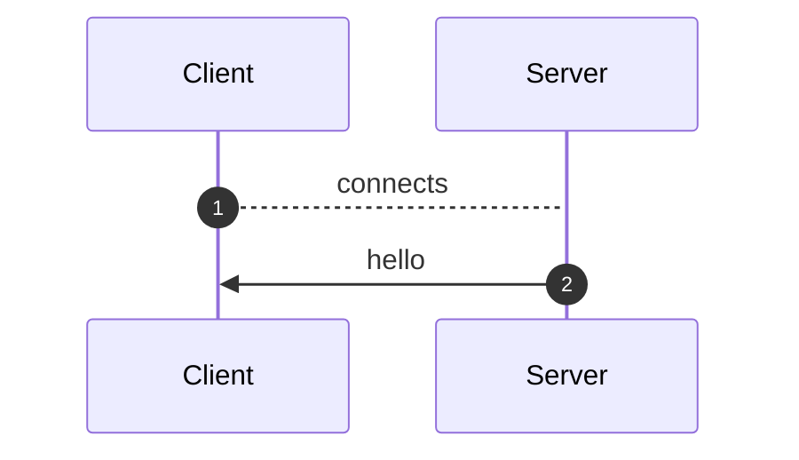
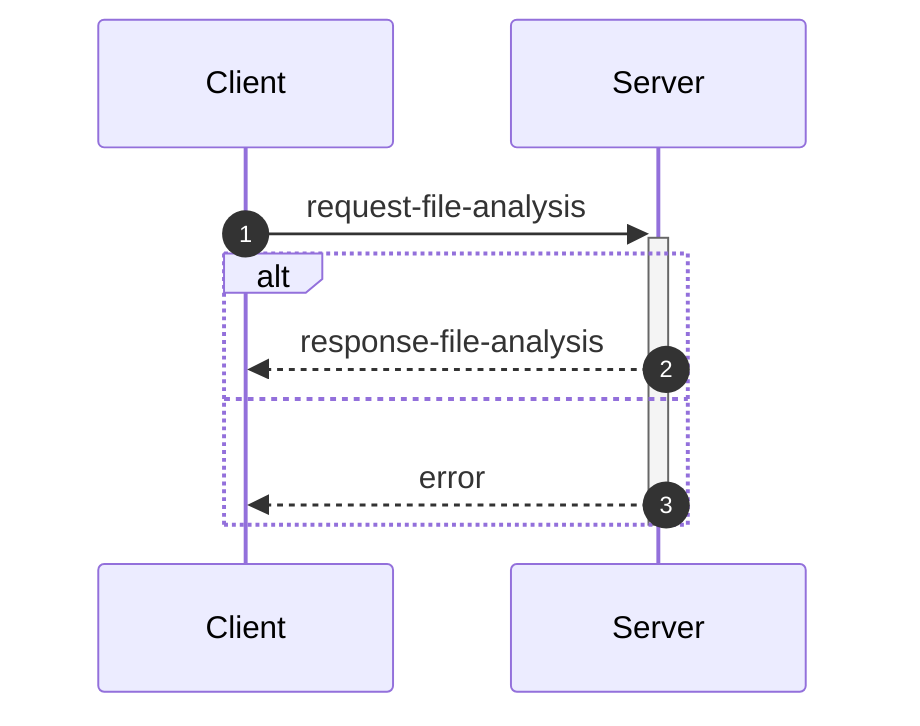
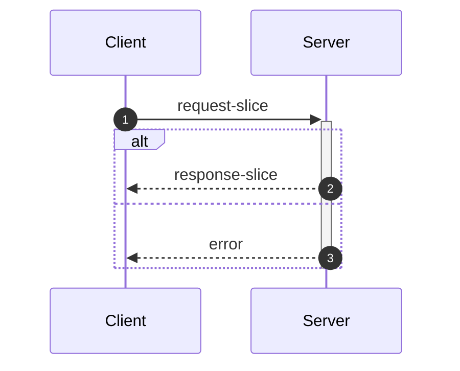
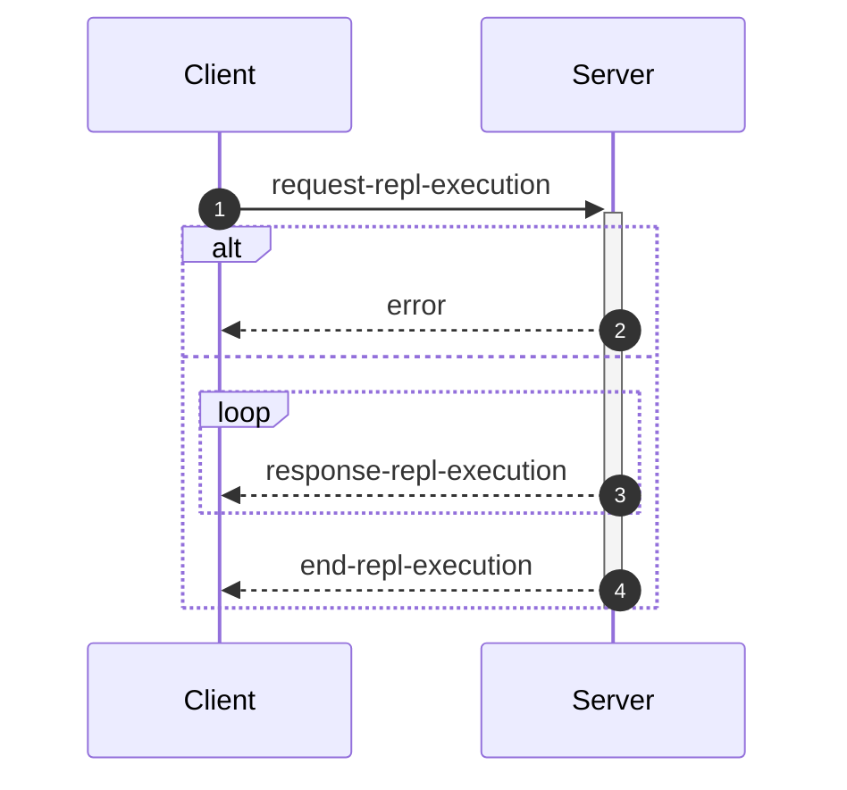

_This document was generated from '[src/documentation/wiki-interface.ts](https://github.com/flowr-analysis/flowr/tree/main//src/documentation/wiki-interface.ts)' on 2026-07-25, 12:59:14 UTC presenting an overview of flowR's interface (v2.13.2, using R v4.5.0). Please do not edit this file/wiki page directly._

Although far from being as detailed as the in-depth explanation of [_flowR_](https://github.com/flowr-analysis/flowr/wiki/core),
this wiki page explains how to interface with _flowR_ in more detail.
In general, command line arguments and other options provide short descriptions on hover over.

* [💻 Using the REPL](#using-the-repl)
* [⚙️ Configuring FlowR](#configuring-flowr)
* [⚒️ Writing Code](#writing-code)
* [💬 Communicating with the Server](#communicating-with-the-server)

<a id='using-the-repl'></a>
## 💻 Using the REPL


> [!NOTE]
> To execute arbitrary R commands with a repl request, _flowR_ has to be started explicitly with <span title="Description (Command Line Argument): Allow to access the underlying R session when using flowR (security warning: this allows the execution of arbitrary R code!)">`--r-session-access`</span>.
> Please be aware that this introduces a security risk and note that this relies on the [`r-shell` engine](https://github.com/flowr-analysis/flowr/wiki/engines) .

Although primarily meant for users to explore,
there is nothing which forbids simply calling _flowR_ as a subprocess to use standard-in, -output, and -error
for communication (although you can access the REPL using the server as well,
with the [REPL Request](#message-request-repl-execution) message).

The read-eval-print loop&nbsp;(REPL) works relatively simple.
You can submit an expression (using <kbd>Enter</kbd>),
which is interpreted as an R&nbsp;expression by default but interpreted as a *command* if it starts with a colon (`:`).
The best command to get started with the REPL is <span title="Description (Repl Command): Show help information (aliases: :h, :?)">`:help`</span>.
Besides, you can leave the REPL either with the command <span title="Description (Repl Command): End the repl (aliases: :q, :exit)">`:quit`</span> or by pressing <kbd>Ctrl</kbd>+<kbd>C</kbd> twice.
When writing a *command*, you may press <kbd>Tab</kbd> to get a list of completions, if available.
Multiple commands can be entered in a single line by separating them with a semicolon (`;`), e.g. `:parse "x<-2"; :df*`.
If a command is given without R code, the REPL will re-use R code given in a previous command.
The prior example will hence return first the parsed AST of the program and then the dataflow graph for `"x <- 2"`.

> [!NOTE]
> If you develop flowR, you may want to launch the repl using the `npm run main-dev` command, this way, you get a non-minified version of flowR with debug information and hot-reloading of source files.

<details>
<summary>Available Commands</summary>

We currently offer the following commands (this with a `[*]` suffix are available with and without the star):


| Command | Description |
| ------- | ----------- |
| **<span title="Description (Repl Command): End the repl (aliases: :q, :exit)">:quit</span>** | End the repl (aliases: **:<span title="Alias of ':quit'. End the repl">q</span>**, **:<span title="Alias of ':quit'. End the repl">exit</span>**) |
| **<span title="Description (Repl Command): Execute the given code as R code. This requires the `--r-session-access` flag to be set and requires the r-shell engine. (aliases: :e, :r)">:execute</span>** | Execute the given code as R code. This requires the `--r-session-access` flag to be set and requires the r-shell engine. (aliases: **:<span title="Alias of ':execute'. Execute the given code as R code. This requires the `--r-session-access` flag to be set and requires the r-shell engine.">e</span>**, **:<span title="Alias of ':execute'. Execute the given code as R code. This requires the `--r-session-access` flag to be set and requires the r-shell engine.">r</span>**) |
| **<span title="Description (Repl Command): Get mermaid code for the control-flow graph of R code (aliases: :cfg, :cf)">:controlflow[*]</span>** | Get mermaid code for the control-flow graph of R code (star: Returns the URL to mermaid.live) (aliases: **:<span title="Alias of ':controlflow'. Get mermaid code for the control-flow graph of R code">cfg</span>**, **:<span title="Alias of ':controlflow'. Get mermaid code for the control-flow graph of R code">cf</span>**) |
| **<span title="Description (Repl Command): Get mermaid code for the control-flow graph with basic blocks (aliases: :cfgb, :cfb)">:controlflowbb[*]</span>** | Get mermaid code for the control-flow graph with basic blocks (star: Returns the URL to mermaid.live) (aliases: **:<span title="Alias of ':controlflowbb'. Get mermaid code for the control-flow graph with basic blocks">cfgb</span>**, **:<span title="Alias of ':controlflowbb'. Get mermaid code for the control-flow graph with basic blocks">cfb</span>**) |
| **<span title="Description (Repl Command): Get mermaid code for the dataflow graph (aliases: :d, :df)">:dataflow[*]</span>** | Get mermaid code for the dataflow graph (star: Returns the URL to mermaid.live) (aliases: **:<span title="Alias of ':dataflow'. Get mermaid code for the dataflow graph">d</span>**, **:<span title="Alias of ':dataflow'. Get mermaid code for the dataflow graph">df</span>**) |
| **<span title="Description (Repl Command): Get mermaid code for the normalized AST of R code (aliases: :n)">:normalize[*]</span>** | Get mermaid code for the normalized AST of R code (star: Returns the URL to mermaid.live) (alias: **:<span title="Alias of ':normalize'. Get mermaid code for the normalized AST of R code">n</span>**) |
| **<span title="Description (Repl Command): Get mermaid code for the simplified dataflow graph (aliases: :ds, :dfs)">:dataflowsimple[*]</span>** | Get mermaid code for the simplified dataflow graph (star: Returns the URL to mermaid.live) (aliases: **:<span title="Alias of ':dataflowsimple'. Get mermaid code for the simplified dataflow graph">ds</span>**, **:<span title="Alias of ':dataflowsimple'. Get mermaid code for the simplified dataflow graph">dfs</span>**) |
| **<span title="Description (Repl Command): Inspect and extend the signature database: `query` (identical to :query @signature), `add <path>` to mount another database/source, `download` to fetch the full-history database. (aliases: :sig)">:signature</span>** | Inspect and extend the signature database: `query` (identical to :query @signature), `add <path>` to mount another database/source, `download` to fetch the full-history database. (alias: **:<span title="Alias of ':signature'. Inspect and extend the signature database: `query` (identical to :query @signature), `add <path>` to mount another database/source, `download` to fetch the full-history database.">sig</span>**) |
| **<span title="Description (Repl Command): Just calculates the DFG, but only prints summary info (aliases: :d#, :df#)">:dataflowsilent</span>** | Just calculates the DFG, but only prints summary info (aliases: **:<span title="Alias of ':dataflowsilent'. Just calculates the DFG, but only prints summary info">d#</span>**, **:<span title="Alias of ':dataflowsilent'. Just calculates the DFG, but only prints summary info">df#</span>**) |
| **<span title="Description (Repl Command): Prints ASCII Art of the parsed, unmodified AST (aliases: :p)">:parse</span>** | Prints ASCII Art of the parsed, unmodified AST (alias: **:<span title="Alias of ':parse'. Prints ASCII Art of the parsed, unmodified AST">p</span>**) |
| **<span title="Description (Repl Command): Prints the version of flowR as well as the current version of R">:version</span>** | Prints the version of flowR as well as the current version of R
| **<span title="Description (Repl Command): Query the given R code (use 'help' for more information)">:query[*]</span>** | Query the given R code (use 'help' for more information) (star: Similar to query, but returns the output in json format.)
| **<span title="Description (Repl Command): Returns an ASCII representation of the dataflow graph (aliases: :df!)">:dataflowascii</span>** | Returns an ASCII representation of the dataflow graph (alias: **:<span title="Alias of ':dataflowascii'. Returns an ASCII representation of the dataflow graph">df!</span>**) |
| **<span title="Description (Repl Command): Returns summarization stats for the normalized AST (aliases: :n#)">:normalize#</span>** | Returns summarization stats for the normalized AST (alias: **:<span title="Alias of ':normalize#'. Returns summarization stats for the normalized AST">n#</span>**) |
| **<span title="Description (Repl Command): Show help information (aliases: :h, :?)">:help</span>** | Show help information (aliases: **:<span title="Alias of ':help'. Show help information">h</span>**, **:<span title="Alias of ':help'. Show help information">?</span>**) |


</details>


> [!TIP]
> 
> As indicated by the examples before, all REPL commands that operate on code keep track of the state.
> Hence, if you run a command like <span title="Description (Repl Command, starred version): Returns the URL to mermaid.live; Base Command: Get mermaid code for the dataflow graph (aliases: :d*, :df*)">`:dataflow*`</span> without providing R code,
> the REPL will re-use the R code provided in a previous command.
> Likewise, doing this will benefit from incrementality!
> If you request the dataflow graph with `:df* x <- 2 * y` and then want to see the parsed AST with `:parse`,
> the REPL will re-use previously obtained information and not re-parse the code again.
> 		


Generally, many commands offer shortcut versions in the REPL. Many queries, for example, offer a shortened format (see the example below).
Of special note, the [Config Query](https://github.com/flowr-analysis/flowr/wiki/%5BQuery%5D-Config)
can be used to also modify the currently active configuration of _flowR_ within the REPL (see the [wiki page](https://github.com/flowr-analysis/flowr/wiki/%5BQuery%5D-Config) for more information).

### Example: Retrieving the Dataflow Graph

To retrieve a URL to the [mermaid](https://mermaid.js.org/) diagram of the dataflow of a given expression,
use <span title="Description (Repl Command, starred version): Returns the URL to mermaid.live; Base Command: Get mermaid code for the dataflow graph (aliases: :d*, :df*)">`:dataflow*`</span> (or <span title="Description (Repl Command): Get mermaid code for the dataflow graph (aliases: :d, :df)">`:dataflow`</span> to get the mermaid code in the cli):


```shell
$ docker run -it --rm eagleoutice/flowr # or npm run flowr 
flowR repl v2.13.2, R grammar v14 (tree-sitter engine)
R> :dataflow* y <- 1 + x
```

<details>
<summary style='color:gray'>Output</summary>


```text
https://mermaid.live/view#base64:eyJjb2RlIjoiZmxvd2NoYXJ0IEJUXG4gICAgMXt7XCJgKiM5MTtSTnVtYmVyIzkzOyogKioxKipcbiAgICAgICoxLjYqICgqKmlkOiAxKiopYFwifX1cbiAgICUlIE5vIGVkZ2VzIGZvdW5kIGZvciAxXG4gICAgMihbXCJgKiM5MTtSU3ltYm9sIzkzOyogKip4KipcbiAgICAgICoxLjEwKiAoKippZDogMioqKWBcIl0pXG4gICAlJSBObyBlZGdlcyBmb3VuZCBmb3IgMlxuICAgIDNbW1wiYCojOTE7UkJpbmFyeU9wIzkzOyogYmFzZSM1ODsjNTg7KiojNDM7KipcbiAgICAgICoxLjYtMTAqICgqKmlkOiAzKiopXG4gICAgYXJnOiAoMSwgMilgXCJdXVxuICAgIGJ1aWx0LWluOl9bXCJgQnVpbHQtSW46XG4jNDM7YFwiXVxuICAgIHN0eWxlIGJ1aWx0LWluOl8gc3Ryb2tlOmdyYXksZmlsbDpncmF5LHN0cm9rZS13aWR0aDoycHgsb3BhY2l0eTouODtcbiAgICAwW1wiYCojOTE7UlN5bWJvbCM5MzsqICoqeSoqXG4gICAgICAqMS4xKiAoKippZDogMCoqLCB2OiAzKWBcIl1cbiAgICA0W1tcImAqIzkxO1JCaW5hcnlPcCM5MzsqIGJhc2UjNTg7IzU4OyoqIzYwOyM0NTsqKlxuICAgICAgKjEuMS0xMCogKCoqaWQ6IDQqKilcbiAgICBhcmc6ICgwLCAzKWBcIl1dXG4gICAgYnVpbHQtaW46Xy1bXCJgQnVpbHQtSW46XG4jNjA7IzQ1O2BcIl1cbiAgICBzdHlsZSBidWlsdC1pbjpfLSBzdHJva2U6Z3JheSxmaWxsOmdyYXksc3Ryb2tlLXdpZHRoOjJweCxvcGFjaXR5Oi44O1xuICAgIDMgLS0+fFwicmVhZHMsIGFyZ1wifCAxXG4gICAgMyAtLT58XCJyZWFkcywgYXJnXCJ8IDJcbiAgICAzIC0uLT58XCJyZWFkcywgY2FsbHNcInwgYnVpbHQtaW46X1xuICAgIGxpbmtTdHlsZSAyIHN0cm9rZTpncmF5O1xuICAgIDAgLS0+fFwiZGVmaW5lZC1ieVwifCAzXG4gICAgMCAtLT58XCJkZWZpbmVkLWJ5XCJ8IDRcbiAgICA0IC0tPnxcInJlYWRzLCBhcmdcInwgM1xuICAgIDQgLS0+fFwicmV0dXJucywgYXJnXCJ8IDBcbiAgICA0IC0uLT58XCJyZWFkcywgY2FsbHNcInwgYnVpbHQtaW46Xy1cbiAgICBsaW5rU3R5bGUgNyBzdHJva2U6Z3JheTsiLCJtZXJtYWlkIjp7ImF1dG9TeW5jIjp0cnVlfX0=
```


Retrieve the dataflow graph of the expression `y <- 1 + x`. It looks like this:


```mermaid
flowchart LR
    1{{"`*#91;RNumber#93;* **1**
      *1.6* (**id: 1**)`"}}
   %% No edges found for 1
    2(["`*#91;RSymbol#93;* **x**
      *1.10* (**id: 2**)`"])
   %% No edges found for 2
    3[["`*#91;RBinaryOp#93;* base#58;#58;**#43;**
      *1.6-10* (**id: 3**)
    arg: (1, 2)`"]]
    built-in:_["`Built-In:
#43;`"]
    style built-in:_ stroke:gray,fill:gray,stroke-width:2px,opacity:.8;
    0["`*#91;RSymbol#93;* **y**
      *1.1* (**id: 0**, v: 3)`"]
    4[["`*#91;RBinaryOp#93;* base#58;#58;**#60;#45;**
      *1.1-10* (**id: 4**)
    arg: (0, 3)`"]]
    built-in:_-["`Built-In:
#60;#45;`"]
    style built-in:_- stroke:gray,fill:gray,stroke-width:2px,opacity:.8;
    3 -->|"reads, arg"| 1
    3 -->|"reads, arg"| 2
    3 -.->|"reads, calls"| built-in:_
    linkStyle 2 stroke:gray;
    0 -->|"defined-by"| 3
    0 -->|"defined-by"| 4
    4 -->|"reads, arg"| 3
    4 -->|"returns, arg"| 0
    4 -.->|"reads, calls"| built-in:_-
    linkStyle 7 stroke:gray;
```

	
<details>

<summary style="color:gray">R Code of the Dataflow Graph</summary>

The analysis required _0.6 ms_ (including parse and normalize, using the [tree-sitter](https://github.com/flowr-analysis/flowr/wiki/Engines) engine) within the generation environment. No [signature database](https://github.com/flowr-analysis/flowr/wiki/Signature-Database) is mounted for these generated graphs, so `library()` calls attach no package exports; base-R names are still qualified via the generated base-package store (e.g. `acf` as `stats::acf`). 
We encountered no unknown side effects during the analysis.


```r
y <- 1 + x
```


</details>


</details>


For small graphs like this, <span title="Description (Repl Command): Returns an ASCII representation of the dataflow graph (aliases: :df!)">`:dataflowascii`</span> also provides an ASCII representation directly in the REPL:


```shell
$ docker run -it --rm eagleoutice/flowr # or npm run flowr 
flowR repl v2.13.2, R grammar v14 (tree-sitter engine)
R> :df! y <- 1 + x
```

<details open>
<summary style='color:gray'>Output</summary>


```text
                        0<1>0
                   ┌────| 1 |
    ┌────────┐     │    0---0
 c<4>c       └──c<3>c
 |<- |  v<0>v┌──| + |
 c---c──| y |┘  c---c   u<2>u
        v---v      └────| x |
                        u---u
Edges:
3 -> 1: reads, arg  3 -> 2: reads, arg
4 -> 3: reads, arg  4 -> 0: returns, arg
0 -> 3: defined-by  0 -> 4: defined-by
```


Retrieve the dataflow graph of the expression `y <- 1 + x` as ASCII art.

</details>


For the slicing with <span title="Description (Repl Command): Static backwards executable slicer for R">`:slicer`</span>, you have access to the same [magic comments](#slice-magic-comments) as with the [slice request](#message-request-slice).
Pass `--inline` to splice resolvable `source()` calls into the reconstruction so the slice is a single self-contained R text (the same as the static slice query's `inlineSources` flag).
See `--help` for more flags!

### Example: Interfacing with the File System

Many commands that allow for an R-expression (like <span title="Description (Repl Command, starred version): Returns the URL to mermaid.live; Base Command: Get mermaid code for the dataflow graph (aliases: :d*, :df*)">`:dataflow*`</span>) allow for a file as well
if the argument starts with `file://`.
If you are working from the root directory of the _flowR_ repository, the following gives you the parsed AST of the example file using the <span title="Description (Repl Command): Prints ASCII Art of the parsed, unmodified AST (aliases: :p)">`:parse`</span> command:

> **Watch mode**: Replace `file://` with `watch://` to enter watch mode.
> flowR runs the command immediately and then re-runs it every time the file (or any file inside the folder) changes.
> Enter any other command to leave watch mode.
> For example: `:df watch://analysis.R`


```shell
$ docker run -it --rm eagleoutice/flowr # or npm run flowr 
flowR repl v2.13.2, R grammar v14 (tree-sitter engine)
R> :parse file://test/testfiles/example.R
```

<details>
<summary style='color:gray'>Output</summary>


```text
File: test/testfiles/example.R

program
├ binaryoperator
│ ├ identifier "sum" (1:1─4)
│ ├ <- "<-" (1:5─7)
│ ╰ float "0" (1:8─9)
├ binaryoperator
│ ├ identifier "product" (2:1─8)
│ ├ <- "<-" (2:9─11)
│ ╰ float "1" (2:12─13)
├ binaryoperator
│ ├ identifier "w" (3:1─2)
│ ├ <- "<-" (3:3─5)
│ ╰ float "7" (3:6─7)
├ binaryoperator
│ ├ identifier "N" (4:1─2)
│ ├ <- "<-" (4:3─5)
│ ╰ float "10" (4:6─8)
├ forstatement
│ ├ for "for" (6:1─4)
│ ├ ( "(" (6:5─6)
│ ├ identifier "i" (6:6─7)
│ ├ in "in" (6:8─10)
│ ├ binaryoperator
│ │ ├ float "1" (6:11─12)
│ │ ├ : ":" (6:12─13)
│ │ ╰ parenthesizedexpression
│ │   ├ ( "(" (6:13─14)
│ │   ├ binaryoperator
│ │   │ ├ identifier "N" (6:14─15)
│ │   │ ├ - "-" (6:15─16)
│ │   │ ╰ float "1" (6:16─17)
│ │   ╰ ) ")" (6:17─18)
│ ├ ) ")" (6:18─19)
│ ╰ bracedexpression
│   ├ { "{" (6:20─21)
│   ├ binaryoperator
│   │ ├ identifier "sum" (7:3─6)
│   │ ├ <- "<-" (7:7─9)
│   │ ╰ binaryoperator
│   │   ├ binaryoperator
│   │   │ ├ identifier "sum" (7:10─13)
│   │   │ ├ + "+" (7:14─15)
│   │   │ ╰ identifier "i" (7:16─17)
│   │   ├ + "+" (7:18─19)
│   │   ╰ identifier "w" (7:20─21)
│   ├ binaryoperator
│   │ ├ identifier "product" (8:3─10)
│   │ ├ <- "<-" (8:11─13)
│   │ ╰ binaryoperator
│   │   ├ identifier "product" (8:14─21)
│   │   ├  "" (8:22─23)
│   │   ╰ identifier "i" (8:24─25)
│   ╰ } "}" (9:1─2)
├ call
│ ├ identifier "cat" (11:1─4)
│ ╰ arguments
│   ├ ( "(" (11:4─5)
│   ├ argument
│   │ ╰ string
│   │   ├ " "\"" (11:5─6)
│   │   ├ stringcontent "Sum:" (11:6─10)
│   │   ╰ " "\"" (11:10─11)
│   ├ comma "," (11:11─12)
│   ├ argument
│   │ ╰ identifier "sum" (11:13─16)
│   ├ comma "," (11:16─17)
│   ├ argument
│   │ ╰ string
│   │   ├ " "\"" (11:18─19)
│   │   ├ stringcontent
│   │   │ ╰ escapesequence "\\n" (11:19─21)
│   │   ╰ " "\"" (11:21─22)
│   ╰ ) ")" (11:22─23)
╰ call
  ├ identifier "cat" (12:1─4)
  ╰ arguments
    ├ ( "(" (12:4─5)
    ├ argument
    │ ╰ string
    │   ├ " "\"" (12:5─6)
    │   ├ stringcontent "Product:" (12:6─14)
    │   ╰ " "\"" (12:14─15)
    ├ comma "," (12:15─16)
    ├ argument
    │ ╰ identifier "product" (12:17─24)
    ├ comma "," (12:24─25)
    ├ argument
    │ ╰ string
    │   ├ " "\"" (12:26─27)
    │   ├ stringcontent
    │   │ ╰ escapesequence "\\n" (12:27─29)
    │   ╰ " "\"" (12:29─30)
    ╰ ) ")" (12:30─31)
```


Retrieve the parsed AST of the example file.

<details>

<summary>File Content</summary>


```r
sum <- 0
product <- 1
w <- 7
N <- 10

for (i in 1:(N-1)) {
  sum <- sum + i + w
  product <- product * i
}

cat("Sum:", sum, "\n")
cat("Product:", product, "\n")
```


</details>

As _flowR_ directly transforms this AST the output focuses on being human-readable instead of being machine-readable.
		

</details>


### Example: Run a Query

You can run any query supported by _flowR_ using the <span title="Description (Repl Command): Query the given R code (use 'help' for more information)">`:query`</span> command.
For example, to obtain the shapes of all data frames in a given piece of code, you can run:


```shell
$ docker run -it --rm eagleoutice/flowr # or npm run flowr 
flowR repl v2.13.2, R grammar v14 (tree-sitter engine)
R> :query @absint df-shape "x <- data.frame(a = 1:10, b = 1:10)\ny <- x$a"
```

<details open>
<summary style='color:gray'>Output</summary>


```text
Query: absint (1 ms)
   ╰ $12: (colnames: [{"a", "b"}, {}], cols: [2, 2], rows: [10, 10])
   ╰ $0: (colnames: [{"a", "b"}, {}], cols: [2, 2], rows: [10, 10])
All queries together required ≈4 ms (1ms accuracy, total 4 ms)
```


Retrieve the shapes of all data frames in the given code.

</details>


To run the linter on a file, you can use (in this example, we just issue the `dead-code` linter on a small piece of code):


```shell
$ docker run -it --rm eagleoutice/flowr # or npm run flowr 
flowR repl v2.13.2, R grammar v14 (tree-sitter engine)
R> :query @linter rules:dead-code "if(FALSE) x <- 2"
```

<details open>
<summary style='color:gray'>Output</summary>


```text
Query: linter (3 ms)
   ╰ Dead Code (dead-code):
       ╰ certain:
           ╰ Code at 1.11-16
       ╰ Metadata: searchTimeMs: 2, processTimeMs: 1
All queries together required ≈3 ms (1ms accuracy, total 4 ms)
```


Run the linter on the given code, with only the `dead-code` rule enabled.

</details>


For more information on the available queries, please check out the [Query API](https://github.com/flowr-analysis/flowr/wiki/query-api).


<a id='configuring-flowr'></a>
## ⚙️ Configuring FlowR


When running _flowR_, you may want to specify some behaviors with a dedicated configuration file.
By default, flowR looks for a file named `flowr.json` in the current working directory (or any higher directory).
You can also specify a different file with <span title="Description (Command Line Argument): The name of the configuration file to use">`--config-file`</span> or pass the configuration inline using <span title="Description (Command Line Argument): The flowR configuration to use, as a JSON string">`--config-json`</span>.
To inspect the current configuration, you can run flowr with the <span title="Description (Command Line Argument): Run with verbose logging (will be passed to the corresponding script)">`--verbose`</span> flag, or use the `config` [Query](https://github.com/flowr-analysis/flowr/wiki/query-api).
Within the REPL this works by running the following:


```shell
:query @config
```


To work with the <a href="https://github.com/flowr-analysis/flowr/tree/main/src/config.ts#L132"><code><span title="The configuration file format for flowR.">FlowrConfig</span></code></a> you can use the provided helper objects alongside its methods like
<a href="https://github.com/flowr-analysis/flowr/tree/main/src/config.ts#L772"><code><span title="Creates a new flowr config that has the updated values.">FlowrConfig::<b>amend</b></span></code></a>.
The schema below documents every option; the ones you most likely want are:

- <a href="https://github.com/flowr-analysis/flowr/wiki/Interface#configuring-flowr" title="Configuration Option (boolean): Whether source calls should be ignored, causing {@link processSourceCall}&#39;s behavior to be skipped.">ignoreSourceCalls</a>: ignore source calls when analyzing the code, i.e., ignore the inclusion of other files.
- <a href="https://github.com/flowr-analysis/flowr/wiki/Interface#configuring-flowr" title="Configuration Option (boolean): Whether load calls should be ignored, causing {@link processLoadCall}&#39;s behavior to be skipped.">ignoreLoadCalls</a>: ignore load calls when analyzing the code, i.e., ignore the loading of r-data files.
- <a href="https://github.com/flowr-analysis/flowr/wiki/Interface#configuring-flowr" title="Configuration Option (object): Do you want to overwrite (parts) of the builtin definition?">semantics.environment.overwriteBuiltIns</a>: overwrite _flowR_'s handling of built-in functions, or clear the preset definitions entirely.
  See [Configure BuiltIn Semantics](#configure-builtin-semantics) for more information.
- <a href="https://github.com/flowr-analysis/flowr/wiki/Interface#configuring-flowr" title="Configuration Option (string): How to resolve variables and their values. (one of &quot;disabled&quot;, &quot;alias&quot;, &quot;builtin&quot;)">solver.variables</a>: how to resolve variables and their values (`disabled`, `alias`, `builtin`).
- <a href="https://github.com/flowr-analysis/flowr/wiki/Interface#configuring-flowr" title="Configuration Option (array): The engine or set of engines to use for interacting with R code. An empty array means all available engines will be used.">engines</a> and <a href="https://github.com/flowr-analysis/flowr/wiki/Interface#configuring-flowr" title="Configuration Option (string): The default engine to use for interacting with R code. If this is undefined, an arbitrary engine from the specified list will be used. (one of &quot;tree-sitter&quot;, &quot;r-shell&quot;)">defaultEngine</a>: the engines used to interact with R code, see the [Engines wiki page](https://github.com/flowr-analysis/flowr/wiki/engines).
- <a href="https://github.com/flowr-analysis/flowr/wiki/Interface#configuring-flowr" title="Configuration Option (array): Files a framework loads on its own, without any source() call (e.g. global.R in a shiny app), in the order they are loaded; flowR orders the matching project files accordingly and analyzes them as one program. Entries are case-insensitive globs matched against the file path, a plain name matches any file with that name, and entries matching no project file are warned about. Usually set per project kind via specializeConfig.">project.implicitSources</a>: the files a framework loads without any `source()` call, in the order in which they are
  loaded. Entries are globs (e.g. `R/*.R`) matched against the file path ignoring capitalization; one matching no file is reported.
- <a href="https://github.com/flowr-analysis/flowr/wiki/Interface#configuring-flowr" title="Configuration Option (object): Overwrite (parts of) the configuration depending on the project kind flowR detects, e.g. to give a shiny app its implicit sources.">specializeConfig</a>: overwrite (parts of) the configuration depending on the kind of project _flowR_ detects
  (e.g. `shiny-app`), which is how a shiny app gets its implicit sources by default. What you configure directly wins.
- <a href="https://github.com/flowr-analysis/flowr/wiki/Interface#configuring-flowr" title="Configuration Option (string): Overwrite the project kind flowR would otherwise infer from the analyzed files, e.g. when auto-detection guesses wrong. (one of &quot;package&quot;, &quot;script&quot;, &quot;shiny-app&quot;, &quot;notebook&quot;, &quot;project&quot;, &quot;unknown&quot;)">project.useProjectType</a>: skip that detection and force a project kind yourself, when auto-detection guesses wrong.
- <a href="https://github.com/flowr-analysis/flowr/wiki/Interface#configuring-flowr" title="Configuration Option (array): The default plugins to load when creating a new instance of FlowrAnalyzer">defaultPlugins</a> and <a href="https://github.com/flowr-analysis/flowr/wiki/Interface#configuring-flowr" title="Configuration Option (array): The plugins to load in REPL mode">repl.plugins</a>: the plugins to load for a new <a href="https://github.com/flowr-analysis/flowr/tree/main/src/project/flowr-analyzer.ts#L167"><code><span title="Central class for conducting analyses with FlowR. Use the FlowrAnalyzerBuilder to create a new instance. If you want the original pattern of creating a pipeline and running all steps, you can still do this with FlowrAnalyzer#runFull . To inspect the context of the analyzer, use FlowrAnalyzer#inspectContext (if you are a plugin and need to modify it, use FlowrAnalyzer#context instead).">FlowrAnalyzer</span></code></a> and in the REPL
  (use `flowr:default` to reference the former).

So you can configure _flowR_ by adding a file like the following:

<details>

<summary>Example Configuration File</summary>


```json
{
  "ignoreSourceCalls": true,
  "ignoreLoadCalls": true,
  "semantics": {
    "environment": {
      "overwriteBuiltIns": {
        "definitions": [
          {
            "type": "function",
            "names": [
              "foo"
            ],
            "processor": "builtin:assign",
            "config": {}
          }
        ]
      }
    }
  },
  "defaultPlugins": [
    "file:description",
    "versions:description"
  ],
  "repl": {
    "quickStats": false,
    "dfProcessorHeat": false,
    "hints": true,
    "plugins": [
      "flowr:default"
    ]
  },
  "project": {
    "resolveUnknownPathsOnDisk": true,
    "implicitSources": [
      "global.R",
      "app.R"
    ]
  },
  "linter": {
    "disabledRules": []
  },
  "specializeConfig": {
    "shiny-app": {
      "project": {
        "implicitSources": [
          "global.R",
          "ui.R",
          "server.R",
          "app.R"
        ]
      }
    }
  },
  "engines": [
    {
      "type": "r-shell"
    }
  ],
  "solver": {
    "variables": "alias",
    "evalStrings": true,
    "trackEnvironments": true,
    "sigdb": {
      "enabled": true,
      "loadProjectDependencies": true,
      "eagerlyLoad": false,
      "eagerlyLoadExports": false,
      "linkBaseR": false,
      "linkDescriptionDependencies": false
    },
    "resolveSource": {
      "dropPaths": "no",
      "ignoreCapitalization": true,
      "inferWorkingDirectory": "active-script",
      "searchPath": []
    },
    "instrument": {},
    "slicer": {
      "threshold": 50
    }
  },
  "abstractInterpretation": {
    "wideningThreshold": 4,
    "dataFrame": {
      "maxColNames": 20,
      "readLoadedData": {
        "readExternalFiles": true,
        "maxReadLines": 1000000
      }
    }
  },
  "gas": {
    "thresholds": {
      "memory": {
        "problematic": 0.7,
        "critical": 0.9
      },
      "timeMs": {
        "problematic": 100000,
        "critical": 120000
      }
    },
    "features": {}
  }
}
```


</details>

<details>
<a id='configure-builtin-semantics'></a>
<summary>Configure Built-In Semantics</summary>


`semantics/environment/overwriteBuiltins` accepts two keys:

- `loadDefaults` (boolean, initially `true`): If set to `true`, the default built-in definitions are loaded before applying the custom definitions. Setting this flag to `false` explicitly disables the loading of the default definitions.
- `definitions` (array, initially empty): Allows to overwrite or define new built-in elements. Each object within must have a `type` which is one of the below. Furthermore, they may define a string array of `names` which specifies the identifiers to bind the definitions to. You may use `assumePrimitive` to specify whether _flowR_ should assume that this is a primitive non-library definition (so you probably just do not want to specify the key).

  | Type            | Description                                                                                                                                                                                                                                                                                              | Example                                                                                                    |
  | --------------- | -------------------------------------------------------------------------------------------------------------------------------------------------------------------------------------------------------------------------------------------------------------------------------------------------------- | ---------------------------------------------------------------------------------------------------------- |
  | `constant`    | Additionally allows for a `value` this should resolve to.                                                                                                                                                                                                                                                | `{ type: 'constant', names: ['NULL', 'NA'],  value: null }`                                                |
  | `function`    | Is a rather flexible way to define and bind built-in functions. For the time, we do not have extensive documentation to cover all the cases, so please either consult the sources with the `default-builtin-config.ts` or open a [new issue](https://github.com/flowr-analysis/flowr/issues/new/choose). | `{ type: 'function', names: ['next'], processor: 'builtin:d', config: { cfg: ExitPointType.Next } }` |
  | `replacement` | A comfortable way to specify replacement functions like `$<-` or `names<-`. `suffixes` describes the... suffixes to attach automatically. | `{ type: 'replacement', suffixes: ['<-', '<<-'], names: ['[', '[['] }` |


</details>

<details>

<summary style='color:gray'>Full Configuration-File Schema</summary>

- _The configuration file format for flowR._ (object)
    - **logLevel** [optional] _flowR's global minimum log level, applied when the config is loaded._ (string)
        Only allows: 'silly', 'trace', 'debug', 'info', 'warn', 'error', 'fatal'
    - **ignoreSourceCalls** [optional] _Whether source calls should be ignored, causing {@link processSourceCall}'s behavior to be skipped._ (boolean)
    - **ignoreLoadCalls** [optional] _Whether load calls should be ignored, causing {@link processLoadCall}'s behavior to be skipped._ (boolean)
    - **semantics** _Configure language semantics and how flowR handles them._ (object)
        - **environment** [optional] _Semantics regarding how to handle the R environment._ (object)
            - **overwriteBuiltIns** [optional] _Do you want to overwrite (parts) of the builtin definition?_ (object)
                - **loadDefaults** [optional] _Should the default configuration still be loaded?_ (boolean)
                - **definitions** [optional] _The definitions to load/overwrite._ (array)
                Valid item types:
                    - (object)
    - **defaultPlugins** [optional] _The default plugins to load when creating a new instance of FlowrAnalyzer_ (array)
    Valid item types:
        - (alternatives)
            - (string)
            - (array)
    - **repl** _Configuration options for the REPL._ (object)
        - **quickStats** [optional] _Whether to show quick stats in the REPL after each evaluation._ (boolean)
        - **dfProcessorHeat** [optional] _This instruments the dataflow processors to count how often each processor is called._ (boolean)
        - **hints** [optional] _Whether to show dim inline hints on the empty prompt (automatically disabled on non-interactive terminals)._ (boolean)
        - **plugins** [optional] _The plugins to load in REPL mode_ (array)
        Valid item types:
            - (alternatives)
                - (string)
                - (array)
        - **autoUseFileProtocol** [optional] _Prepend the file protocol to a repl input that looks like a path, instead of only warning about it._ (boolean)
        - **queryStats** [optional] _Whether `:query` closes with the line stating how long the queries took (`:query*` never prints it)._ (boolean)
        - **showPlugins** [optional] _Whether `:version` grays out the plugins that did not activate during the last analysis._ (boolean)
    - **project** _Project specific configuration options._ (object)
        - **resolveUnknownPathsOnDisk** [optional] _Whether to resolve unknown paths loaded by the r project disk when trying to source/analyze files._ (boolean)
        - **failOnInaccessiblePath** [optional] _Whether a directory that cannot be traversed during file discovery (e.g. due to permissions) aborts the analysis; when false (the default) such paths are logged and skipped._ (boolean)
        - **basePackages** [optional] _The packages considered part of R itself (base and recommended); if unset, flowR uses its built-in list._ (array)
        Valid item types:
            - (string)
        - **implicitSources** [optional] _Files a framework loads on its own, without any source() call (e.g. global.R in a shiny app), in the order they are loaded; flowR orders the matching project files accordingly and analyzes them as one program. Entries are case-insensitive globs matched against the file path, a plain name matches any file with that name, and entries matching no project file are warned about. Usually set per project kind via specializeConfig._ (array)
        Valid item types:
            - (string)
        - **useProjectType** [optional] _Overwrite the project kind flowR would otherwise infer from the analyzed files, e.g. when auto-detection guesses wrong._ (string)
            Only allows: 'package', 'script', 'shiny-app', 'notebook', 'project', 'unknown'
        - **discovery** [optional] _Scoping options for the default project discovery._ (object)
            - **full** [optional] _Collect every file below the project root (greedy) instead of only the files the detected project kind needs (default false)._ (boolean)
            - **perKind** [optional] _Per-kind include/exclude glob overrides layered on the default scoping._ (object)
            - **ignore** [optional] _Case-insensitive globs that drop matching files from the intelligent discovery, regardless of kind (e.g. .Renviron to ignore environment files)._ (array)
            Valid item types:
                - (string)
        - **classification** [optional] _Overrides for the signals flowR uses to classify the project kind._ (object)
            - **shinyDescriptionTypes** [optional] _DESCRIPTION Type: values that mark a shiny app._ (array)
            Valid item types:
                - (string)
            - **shinyEntryFiles** [optional] _File names a shiny app is assembled from._ (array)
            Valid item types:
                - (string)
            - **shinyUsagePattern** [optional] _Regex source evidencing shiny usage in an entry file._ (string)
            - **notebookExtensions** [optional] _File extensions marking a notebook._ (array)
            Valid item types:
                - (string)
    - **linter** _Linter configuration options._ (object)
        - **disabledRules** _Linting rule names excluded from the default rule set (a rule requested explicitly via a linter query still runs). Usually set per project kind via specializeConfig._ (array)
        Valid item types:
            - (string)
    - **inputSources** [optional] _Further frameworks the input-sources analysis should know about; entries are added to flowR's defaults._ (object)
        - **pure** [optional] _Functions that only pass the constantness of their arguments on._ (array)
        Valid item types:
            - (string)
        - **param** [optional] _Functions whose result is a 'param' input._ (array)
        Valid item types:
            - (string)
        - **file** [optional] _Functions whose result is a 'file' input._ (array)
        Valid item types:
            - (string)
        - **tempfile** [optional] _Functions whose result is a 'tempfile' input._ (array)
        Valid item types:
            - (string)
        - **net** [optional] _Functions whose result is a 'net' input._ (array)
        Valid item types:
            - (string)
        - **rand** [optional] _Functions whose result is a 'rand' input._ (array)
        Valid item types:
            - (string)
        - **system** [optional] _Functions whose result is a 'system' input._ (array)
        Valid item types:
            - (string)
        - **ffi** [optional] _Functions whose result is a 'ffi' input._ (array)
        Valid item types:
            - (string)
        - **lang** [optional] _Functions whose result is a 'lang' input._ (array)
        Valid item types:
            - (string)
        - **options** [optional] _Functions whose result is a 'options' input._ (array)
        Valid item types:
            - (string)
        - **user** [optional] _Functions whose result is a 'user' input._ (array)
        Valid item types:
            - (string)
        - **const** [optional] _Functions whose result is a 'const' input._ (array)
        Valid item types:
            - (string)
        - **scope** [optional] _Functions whose result is a 'scope' input._ (array)
        Valid item types:
            - (string)
        - **dconst** [optional] _Functions whose result is a 'dconst' input._ (array)
        Valid item types:
            - (string)
        - **unknown** [optional] _Functions whose result is a 'unknown' input._ (array)
        Valid item types:
            - (string)
        - **linkedObjects** [optional] _Objects a framework provides without a definition in the code, e.g. shiny's input._ (array)
        Valid item types:
            - (object)
        - **linkedEntryPoints** [optional] _Calls that hand a function to a framework, which binds its objects to the parameters by position._ (array)
        Valid item types:
            - (object)
    - **specializeConfig** [optional] _Overwrite (parts of) the configuration depending on the project kind flowR detects, e.g. to give a shiny app its implicit sources._ (object)
    - **engines** _The engine or set of engines to use for interacting with R code. An empty array means all available engines will be used._ (array)
    Valid item types:
        - (alternatives)
            - _The configuration for the tree sitter engine._ (object)
                - **type** [required] _Use the tree sitter engine._ (string)
                    Only allows: 'tree-sitter'
                - **wasmPath** [optional] _The path to the tree-sitter-r WASM binary to use. If this is undefined, this uses the default path._ (string)
                - **treeSitterWasmPath** [optional] _The path to the tree-sitter WASM binary to use. If this is undefined, this uses the default path._ (string)
                - **lax** [optional] _Whether to use the lax parser for parsing R code (allowing for syntax errors). If this is undefined, the strict parser will be used._ (boolean)
            - _The configuration for the R shell engine._ (object)
                - **type** [required] _Use the R shell engine._ (string)
                    Only allows: 'r-shell'
                - **rPath** [optional] _The path to the R executable to use. If this is undefined, this uses the default path._ (string)
    - **defaultEngine** [optional] _The default engine to use for interacting with R code. If this is undefined, an arbitrary engine from the specified list will be used._ (string)
        Only allows: 'tree-sitter', 'r-shell'
    - **solver** _How to resolve constants, constraints, cells, ..._ (object)
        - **variables** _How to resolve variables and their values._ (string)
            Only allows: 'disabled', 'alias', 'builtin'
        - **evalStrings** _Should we include eval(parse(text="...")) calls in the dataflow graph?_ (boolean)
        - **trackEnvironments** [optional] _Track user-created environments (new.env, assign/get/local with envir=, dollar-assign, attach). When false, all envir-style calls fall through conservatively._ (boolean)
        - **sigdb** _Resolving library exports from a signature database._ (object)
            - **enabled** [optional] _Resolve library()/use() exports from a signature database (default true); when false no database is consulted._ (boolean)
            - **loadProjectDependencies** [optional] _Load the project's declared dependencies from its metadata files (DESCRIPTION Imports/Depends, rproject.toml, renv.lock, rv.lock) (default true); when false these files are not read for dependencies._ (boolean)
            - **eagerlyLoad** [optional] _Parse the database up front rather than on the first package load (default false, ignored if disabled)._ (boolean)
            - **eagerlyLoadExports** [optional] _Add a vertex for every export on load rather than on demand (default false); keeps the dataflow graph small._ (boolean)
            - **assumedRVersion** [optional] _R version assumed when resolving versioned (base-R) exports: a pin like "4.5" or "auto" to detect the installed R (default "auto")._ (string)
            - **linkBaseR** [optional] _Eagerly attach base-R namespaces so bare base calls resolve without library() (default false)._ (boolean)
            - **linkBaseRCalls** [optional] _Add a lightweight Reads edge from a bare base-R call to its signature-database function vertex (default false; base-R qualification is edge-free otherwise)._ (boolean)
            - **linkPackageCalls** [optional] _Add a lightweight Reads edge from a resolved package call to its signature-database function vertex (default false)._ (boolean)
            - **linkDescriptionDependencies** [optional] _Eagerly attach the namespaces of the project's declared DESCRIPTION dependencies (Imports/Depends) so their exports resolve without an explicit library() (default false)._ (boolean)
            - **warmInBackground** [optional] _Decompress the hot shards (base + most-downloaded) in a background task on startup so the first library() lookup is warm (default false; for long-running servers/REPLs)._ (boolean)
            - **additionalPaths** [optional] _Extra directories or bundle/manifest files searched for signature databases (alongside the shipped default and $FLOWR_SIGDB_DIR); a downloaded full-history bundle placed here is mounted automatically._ (array)
            Valid item types:
                - (string)
            - **downloadRepo** [optional] _GitHub owner/repo the full-history bundle is downloaded from via ":signature download" (default "flowr-analysis/flowr", release tag "sigdb-v<flowR-version>")._ (string)
            - **autoSync** [optional] _On startup, re-download shards whose committed sigdb.remote.json hash no longer matches the cache, in the background (default false; opt-in network sync after a git pull)._ (boolean)
            - **versionSelection** [optional] _When a project constrains a dependency, resolve to the newest (default), oldest, or system-installed version satisfying it; system needs R and falls back to newest. Base-R packages always resolve against the assumed R version._ (string)
                Only allows: 'newest', 'oldest', 'system'
            - **versionOverrides** [optional] _Force an exact version for specific packages (name -> version), overriding both the project constraint and the versionSelection policy (default {})._ (object)
        - **versionManagement** _Policies for reasoning about dependency versions._ (object)
            - **linkedVersionGroups** [optional] _Groups of packages that must resolve to the same version; version guessing intersects each group so its members stay mutually compatible (default [])._ (array)
            Valid item types:
                - (array)
                Valid item types:
                    - (string)
        - **instrument** (object)
            - **dataflowExtractors** [optional] _These keys are only intended for use within code, allowing to instrument the dataflow analyzer!_ (any)
        - **resolveSource** [optional] _If lax source calls are active, flowR searches for sourced files much more freely, based on the configurations you give it. This option is only in effect if `ignoreSourceCalls` is set to false._ (object)
            - **dropPaths** _Allow to drop the first or all parts of the sourced path, if it is relative._ (string)
                Only allows: 'no', 'once', 'all'
            - **ignoreCapitalization** _Search for filenames matching in the lowercase._ (boolean)
            - **inferWorkingDirectory** _Try to infer the working directory from the main or any script to analyze._ (string)
                Only allows: 'no', 'main-script', 'active-script', 'any-script'
            - **searchPath** _Additionally search in these paths._ (array)
            Valid item types:
                - (string)
            - **repeatedSourceLimit** [optional] _How often the same file can be sourced within a single run? Please be aware: in case of cyclic sources this may not reach a fixpoint so give this a sensible limit._ (number)
            - **applyReplacements** _Provide name replacements for loaded files_ (array)
            Valid item types:
                - (object)
            - **assumeFilesExist** [optional] _Assume a sourced file is always there, making what it defines certain instead of conditional on the source call._ (boolean)
        - **slicer** [optional] _The configuration for the slicer._ (object)
            - **threshold** [optional] _The maximum number of iterations to perform on a single function call during slicing._ (number)
            - **autoExtend** [optional] _If set, the slicer will gain an additional post-pass._ (boolean)
    - **abstractInterpretation** _The configuration options for abstract interpretation._ (object)
        - **wideningThreshold** _The threshold for the number of visitations of a node at which widening should be performed to ensure the termination of the fixpoint iteration._ (number)
        - **dataFrame** _The configuration of the shape inference for data frames._ (object)
            - **maxColNames** _The maximum number of columns names to infer for data frames before over-approximating the column names to top._ (number)
            - **readLoadedData** _Configuration options for reading data frame shapes from loaded external data files, such as CSV files._ (object)
                - **readExternalFiles** _Whether data frame shapes should be extracted from loaded external files, such as CSV files._ (boolean)
                - **maxReadLines** _The maximum number of lines to read when extracting data frame shapes from loaded files, such as CSV files._ (number)
    - **gas** [optional] _Resource-usage guard (gas) configuration. All feature factors default to 0 (disabled). See https://github.com/flowr-analysis/flowr/wiki/Core#gas-resource-guard._ (object)
        - **thresholds** [optional] _Shared thresholds for all gas checks (scaled by per-feature factor)._ (object)
            - **memory** [optional] _Heap-usage fraction thresholds (0-1)._ (object)
                - **problematic** [optional] _Heap fraction (0-1) above which Problematic is returned._ (number)
                - **critical** [optional] _Heap fraction (0-1) above which Critical is returned._ (number)
            - **timeMs** [optional] _Elapsed analysis time thresholds in milliseconds._ (object)
                - **problematic** [optional] _Elapsed ms above which Problematic is returned._ (number)
                - **critical** [optional] _Elapsed ms above which Critical is returned._ (number)
        - **features** [optional] _Per-feature sensitivity factors. 0 or absent disables gas checking for that feature. A factor of 2 makes the feature twice as sensitive. Recognised keys: `source`, `side-effect-linking`, `linter`._ (object)
        - **heapProvider** [optional] _Custom heap statistics source (programmatic configs only), overriding the built-in v8/performance.memory detection._ (function)

</details>

	

<a id='writing-code'></a>
## ⚒️ Writing Code

_flowR_ can be used as a [module](https://www.npmjs.com/package/@eagleoutice/flowr) and offers several main classes and interfaces that are interesting for extension writers 
(see the [Visual Studio Code extension](https://marketplace.visualstudio.com/items?itemName=code-inspect.vscode-flowr) or the [Core](https://github.com/flowr-analysis/flowr/wiki/core) wiki page for more information).

### Creating Analyses with _flowR_

Nowadays, instances of the <a href="https://github.com/flowr-analysis/flowr/tree/main/src/project/flowr-analyzer.ts#L167"><code><span title="Central class for conducting analyses with FlowR. Use the FlowrAnalyzerBuilder to create a new instance. If you want the original pattern of creating a pipeline and running all steps, you can still do this with FlowrAnalyzer#runFull . To inspect the context of the analyzer, use FlowrAnalyzer#inspectContext (if you are a plugin and need to modify it, use FlowrAnalyzer#context instead).">FlowrAnalyzer</span></code></a> should be used as central frontend to get analysis results from _flowR_.
For example, a program slice can be created like this:


```ts
const analyzer = await new FlowrAnalyzerBuilder()
    .setEngine('tree-sitter')
    .build();
analyzer.addRequest('x <- 1\ny <- x\nx');
const result = await analyzer.query([
    {
        type:     'static-slice',
        criteria: ['3@x']
    }
]);
//console.log(result['static-slice']);
```


For more information, please have a look at the [Analyzer](https://github.com/flowr-analysis/flowr/wiki/analyzer) wiki page, which explains how to construct and use the <a href="https://github.com/flowr-analysis/flowr/tree/main/src/project/flowr-analyzer.ts#L167"><code><span title="Central class for conducting analyses with FlowR. Use the FlowrAnalyzerBuilder to create a new instance. If you want the original pattern of creating a pipeline and running all steps, you can still do this with FlowrAnalyzer#runFull . To inspect the context of the analyzer, use FlowrAnalyzer#inspectContext (if you are a plugin and need to modify it, use FlowrAnalyzer#context instead).">FlowrAnalyzer</span></code></a> in more detail.
To work with specific perspectives, you can also consult the respective pages like the [Dataflow Graph](https://github.com/flowr-analysis/flowr/wiki/dataflow-graph) or the [Abstract Interpretation](https://github.com/flowr-analysis/flowr/wiki/abstract-interpretation) wiki pages.
### The Pipeline Executor (Low-Level Interface)

Once, in the beginning, _flowR_ was meant to produce a dataflow graph merely to provide *program slices*. 
However, with continuous updates, the [Dataflow Graph](https://github.com/flowr-analysis/flowr/wiki/dataflow-graph) repeatedly proves to be the more interesting part.
With this, we restructured _flowR_'s originally *hardcoded* pipeline to be far more flexible. 
Now, it can be theoretically extended or replaced with arbitrary steps, optional steps, and what we call 'decorations' of these steps. 
In short, a slicing pipeline using the <a href="https://github.com/flowr-analysis/flowr/tree/main/src/core/pipeline-executor.ts#L97"><code><span title="**Please note:** The PipelineExecutor is now considered to be a rather low-level API for flowR. While it still works and is the basis for all other layers, we strongly recommend using the FlowrAnalyzer and its builder to create and use an analyzer instance that is pre-configured for your use-case. The pipeline executor allows to execute arbitrary pipelines in a step-by-step fashion. If you are not...">PipelineExecutor</span></code></a> looks like this:


```ts

const slicer = new PipelineExecutor(DEFAULT_SLICING_PIPELINE, {
  parser:    new RShell(),
  request:   requestFromInput('x <- 1\nx + 1'),
  criterion: ['2@x']
})
const slice = await slicer.allRemainingSteps()
// console.log(slice.reconstruct.code)
```


<details><summary>More Information</summary>


If you compare this, with what you would have done with the old (and removed) `SteppingSlicer`, 
this essentially just requires you to replace the `SteppingSlicer` with the <a href="https://github.com/flowr-analysis/flowr/tree/main/src/core/pipeline-executor.ts#L97"><code><span title="**Please note:** The PipelineExecutor is now considered to be a rather low-level API for flowR. While it still works and is the basis for all other layers, we strongly recommend using the FlowrAnalyzer and its builder to create and use an analyzer instance that is pre-configured for your use-case. The pipeline executor allows to execute arbitrary pipelines in a step-by-step fashion. If you are not...">PipelineExecutor</span></code></a>
and to pass the <a href="https://github.com/flowr-analysis/flowr/tree/main/src/core/steps/pipeline/default-pipelines.ts#L18"><code>DEFAULT_SLICING_PIPELINE</code></a> as the first argument.
The <a href="https://github.com/flowr-analysis/flowr/tree/main/src/core/pipeline-executor.ts#L97"><code><span title="**Please note:** The PipelineExecutor is now considered to be a rather low-level API for flowR. While it still works and is the basis for all other layers, we strongly recommend using the FlowrAnalyzer and its builder to create and use an analyzer instance that is pre-configured for your use-case. The pipeline executor allows to execute arbitrary pipelines in a step-by-step fashion. If you are not...">PipelineExecutor</span></code></a>...

1. Provides structures to investigate the results of all intermediate steps
2. Can be executed step-by-step
3. Can repeat steps (e.g., to calculate multiple slices on the same input)

See the in-code documentation for more information.


</details>

### Using the <a href="https://github.com/flowr-analysis/flowr/tree/main/src/r-bridge/shell.ts#L143"><code><span title="The RShell represents an interactive session with the R interpreter. You can configure it by RShellOptions . At the moment we are using a live R session (and not networking etc.) to communicate with R easily, which allows us to install packages etc. However, this might and probably will change in the future (leaving this as a legacy mode :D)">RShell</span></code></a> to Interact with R

The <a href="https://github.com/flowr-analysis/flowr/tree/main/src/r-bridge/shell.ts#L143"><code><span title="The RShell represents an interactive session with the R interpreter. You can configure it by RShellOptions . At the moment we are using a live R session (and not networking etc.) to communicate with R easily, which allows us to install packages etc. However, this might and probably will change in the future (leaving this as a legacy mode :D)">RShell</span></code></a> class allows interfacing with the `R`&nbsp;ecosystem installed on the host system.
Please have a look at [flowR's Engines](https://github.com/flowr-analysis/flowr/wiki/engines) for more information on alternatives (for example, the <a href="https://github.com/flowr-analysis/flowr/tree/main/src/r-bridge/lang-4.x/tree-sitter/tree-sitter-executor.ts#L18"><code><span title="Synchronous and (way) faster alternative to the RShell using tree-sitter.">TreeSitterExecutor</span></code></a>).


> [!IMPORTANT]
> 
> Each <a href="https://github.com/flowr-analysis/flowr/tree/main/src/r-bridge/shell.ts#L143"><code><span title="The RShell represents an interactive session with the R interpreter. You can configure it by RShellOptions . At the moment we are using a live R session (and not networking etc.) to communicate with R easily, which allows us to install packages etc. However, this might and probably will change in the future (leaving this as a legacy mode :D)">RShell</span></code></a> controls a new instance of the R&nbsp;interpreter, 
> make sure to call <code><a href="https://github.com/flowr-analysis/flowr/tree/main/src/r-bridge/shell.ts#L351"><span title="Close the current R session, makes the object effectively invalid (can no longer be reopened etc.)">RShell::<i>close</i></span></a>()</code> when you are done.


You can start a new "session" simply by constructing a new object with <code>new <a href="https://github.com/flowr-analysis/flowr/tree/main/src/r-bridge/shell.ts#L143"><span title="The RShell represents an interactive session with the R interpreter. You can configure it by RShellOptions . At the moment we are using a live R session (and not networking etc.) to communicate with R easily, which allows us to install packages etc. However, this might and probably will change in the future (leaving this as a legacy mode :D)">RShell</span></a>()</code>.

However, there are several options that may be of interest 
(e.g., to automatically revive the shell in case of errors or to control the name location of the R process on the system).

With a shell object (let's call it `shell`), you can execute R code by using <a href="https://github.com/flowr-analysis/flowr/tree/main/src/r-bridge/shell.ts#L212"><code><span title="sends the given command directly to the current R session will not do anything to alter input markers!">RShell::<i>sendCommand</i></span></code></a>,
for example <code>shell.<a href="https://github.com/flowr-analysis/flowr/tree/main/src/r-bridge/shell.ts#L212"><span title="sends the given command directly to the current R session will not do anything to alter input markers!">sendCommand</span></a>("1 + 1")</code>.
However, this does not return anything, so if you want to collect the output of your command, use
<a href="https://github.com/flowr-analysis/flowr/tree/main/src/r-bridge/shell.ts#L295"><code><span title="Send a command and collect the output">RShell::<i>sendCommandWithOutput</i></span></code></a> instead.


<a id='communicating-with-the-server'></a>
## 💬 Communicating with the Server


As explained in the [Overview](https://github.com/flowr-analysis/flowr/wiki/overview), you can simply run the [TCP](https://de.wikipedia.org/wiki/Transmission_Control_Protocol)&nbsp;server by adding the <span title="Description (Command Line Argument): Do not drop into a repl, but instead start a server on the given port (default: 1042) and listen for messages.">`--server`</span> flag (and, due to the interactive mode, exit with the conventional <kbd>CTRL</kbd>+<kbd>C</kbd>).
Currently, every connection is handled by the same underlying `RShell` - so the server is not designed to handle many clients at a time.
Additionally, the server is not well guarded against attacks (e.g., you can theoretically spawn an arbitrary number of&nbsp;RShell sessions on the target machine).

Every message has to be given in a single line (i.e., without a newline in-between) and end with a newline character. Nevertheless, we will pretty-print example given in the following segments for the ease of reading.


> [!NOTE]
> 
> The default <span title="Description (Command Line Argument): Do not drop into a repl, but instead start a server on the given port (default: 1042) and listen for messages.">`--server`</span> uses a simple [TCP](https://de.wikipedia.org/wiki/Transmission_Control_Protocol)
> connection. If you want _flowR_ to expose a [WebSocket](https://de.wikipedia.org/wiki/WebSocket) server instead, add the <span title="Description (Command Line Argument): If the server flag is set, use websocket for messaging">`--ws`</span> flag (i.e., <span title="Description (Command Line Argument): Do not drop into a repl, but instead start a server on the given port (default: 1042) and listen for messages.">`--server`</span> <span title="Description (Command Line Argument): If the server flag is set, use websocket for messaging">`--ws`</span>) when starting _flowR_ from the command line.


<ul><li>
<a id="message-hello"></a>
<b>Hello</b> Message (<code>hello</code>) 
<details>

<summary style="color:gray"> View Details. <i>The server informs the client about the successful connection and provides Meta-Information.</i> </summary>


```mermaid
sequenceDiagram
    autonumber
    participant Client
    participant Server

    
    Client-->Server: connects
    Server->>Client: hello
	
```


	
After launching _flowR_, for example, with <code>docker run -it --rm eagleoutice/flowr <span title="Description (Command Line Argument): Do not drop into a repl, but instead start a server on the given port (default: 1042) and listen for messages.">-<span/>-server</span></code>&nbsp;(🐳️), simply connecting should present you with a `hello` message, that amongst others should reveal the versions of&nbsp;_flowR_ and&nbsp;R, using the [semver 2.0](https://semver.org/spec/v2.0.0.html) versioning scheme.
The message looks like this:


```json
{
  "type": "hello",
  "clientName": "client-0",
  "versions": {
    "flowr": "2.13.2",
    "r": "4.5.0",
    "engine": "r-shell"
  }
}
```


There are currently a few messages that you can send after the hello message.
If you want to _slice_ a piece of R code you first have to send an [analysis request](#message-request-file-analysis), so that you can send one or multiple slice requests afterward.
Requests for the [REPL](#message-request-repl) are independent of that.
	

<hr>


<details>
<summary style="color:gray">Message schema (<code>hello</code>)</summary>

For the definition of the hello message, please see it's implementation at [`./src/cli/repl/server/messages/message-hello.ts`](https://github.com/flowr-analysis/flowr/tree/main/./src/cli/repl/server/messages/message-hello.ts).

- [required] (object)
    - **type** [required] _The type of the hello message._ (string)
        Only allows: 'hello'
    - **id** [forbidden] _The id of the message is always undefined (as it is the initial message and not requested)._ (any)
    - **clientName** [required] _A unique name that is assigned to each client. It has no semantic meaning and is only used/useful for debugging._ (string)
    - **versions** [required] (object)
        - **flowr** [required] _The version of the flowr server running in semver format._ (string)
        - **r** [required] _The version of the underlying R shell running in semver format._ (string)
        - **engine** [required] _The parser backend that is used to parse the R code._ (string)

</details>


<hr>

</details>
	</li>

<li>
<a id="message-request-file-analysis"></a>
<b>Analysis</b> Message (<code>request-file-analysis</code>) 
<details>

<summary style="color:gray"> View Details. <i>The server builds the dataflow graph for a given input file (or a set of files).</i> </summary>


```mermaid
sequenceDiagram
    autonumber
    participant Client
    participant Server

    
    Client->>+Server: request-file-analysis
    alt
        Server-->>Client: response-file-analysis
    else
        Server-->>Client: error
    end
    deactivate  Server
	
```


	
The request allows the server to analyze a file and prepare it for slicing.
The message can contain a `filetoken`, which is used to identify the file in later slice or query requests (if you do not add one, the request will not be stored and therefore, it is not available for subsequent requests).

> **Please note!**\
> If you want to send and process a lot of analysis requests, but do not want to slice them, please do not pass the `filetoken` field. This will save the server a lot of memory allocation.

Furthermore, the request must contain either a `content` field to directly pass the file's content or a `filepath` field which contains the path to the file (this path must be accessible for the server to be useful).
If you add the `id` field, the answer will use the same `id` so you can match requests and the corresponding answers.
See the implementation of the request-file-analysis message for more information.

You can drop one or more stored file tokens by adding the `invalidateToken` field (a single token or an array of tokens).
The server frees the corresponding analyses _after_ it has answered the request.

> **Tip!**\
> If you only want to drop tokens, you do not need a separate message: send a `request-file-analysis` that contains _just_ the `invalidateToken` field (and no `content` or `filepath`).
> Such a request behaves like an empty file analysis and the server replies with an empty `results` object.
> Because invalidation happens after the response, you may even pass the _current_ `filetoken` in `invalidateToken` to analyze a file once and have the server forget it right after you received the results.


<details>
<summary>Example of the <code>request-file-analysis</code> Message</summary>

_Note:_ even though we pretty-print these messages, they are sent as a single line, ending with a newline.

The following lists all messages that were sent and received in case you want to reproduce the scenario:

<ol>
<li> <code>hello</code> (response)
<details> 

<summary> Show Details </summary>

The first message is always a hello message.


```json
{
  "type": "hello",
  "clientName": "client-0",
  "versions": {
    "flowr": "2.13.2",
    "r": "4.5.0",
    "engine": "r-shell"
  }
}
```


</details>
</li>

<li> <b><code>request-file-analysis</code> (request)</b>
<details open> 

<summary> Show Details </summary>

Let's suppose you simply want to analyze the following script:
 
```r
x <- 1
x + 1
```

 For this, you can send the following request:


```json
{
  "type": "request-file-analysis",
  "id": "1",
  "filetoken": "x",
  "content": "x <- 1\nx + 1"
}
```


</details>
</li>

<li> <code>response-file-analysis</code> (response)
<details> 

<summary> Show Details </summary>


The `results` field of the response effectively contains three keys of importance:

- `parse`: which contains 1:1 the parse result in CSV format that we received from the `RShell` (i.e., the AST produced by the parser of the R interpreter).
- `normalize`: which contains the normalized AST, including ids (see the `info` field and the [Normalized AST](https://github.com/flowr-analysis/flowr/wiki/normalized-ast) wiki page).
- `dataflow`: especially important is the `graph` field which contains the dataflow graph as a set of root vertices (see the [Dataflow Graph](https://github.com/flowr-analysis/flowr/wiki/dataflow-graph) wiki page).
			


_As the code is pretty long, we inhibit pretty printing and syntax highlighting (JSON, hiding built-in):_

```text
{"type":"response-file-analysis","format":"json","id":"1","results":{"parse":{"files":[{"parsed":"[1,1,1,6,7,0,\"expr\",false,\"x <- 1\"],[1,1,1,1,1,3,\"SYMBOL\",true,\"x\"],[1,1,1,1,3,7,\"expr\",false,\"x\"],[1,3,1,4,2,7,\"LEFT_ASSIGN\",true,\"<-\"],[1,6,1,6,4,5,\"NUM_CONST\",true,\"1\"],[1,6,1,6,5,7,\"expr\",false,\"1\"],[2,1,2,5,16,0,\"expr\",false,\"x + 1\"],[2,1,2,1,10,12,\"SYMBOL\",true,\"x\"],[2,1,2,1,12,16,\"expr\",false,\"x\"],[2,3,2,3,11,16,\"'+'\",true,\"+\"],[2,5,2,5,13,14,\"NUM_CONST\",true,\"1\"],[2,5,2,5,14,16,\"expr\",false,\"1\"]","filePath":"/tmp/tmp-10720-7Iy1iKa5frBq-.R"}],".meta":{"timing":1}},"normalize":{"ast":{"type":"RProject","files":[{"root":{"type":"RExpressionList","children":[{"type":"RBinaryOp","location":[1,3,1,4],"lhs":{"type":"RSymbol","location":[1,1,1,1],"content":"x","lexeme":"x","info":{"fullRange":[1,1,1,1],"adToks":[],"id":0,"parent":2,"role":"bin-l","index":0,"nest":0,"file":"/tmp/tmp-10720-7Iy1iKa5frBq-.R"}},"rhs":{"location":[1,6,1,6],"lexeme":"1","info":{"fullRange":[1,6,1,6],"adToks":[],"id":1,"parent":2,"role":"bin-r","index":1,"nest":0,"file":"/tmp/tmp-10720-7Iy1iKa5frBq-.R"},"type":"RNumber","content":{"num":1,"complexNumber":false,"markedAsInt":false}},"operator":"<-","lexeme":"<-","info":{"fullRange":[1,1,1,6],"adToks":[],"id":2,"parent":6,"nest":0,"file":"/tmp/tmp-10720-7Iy1iKa5frBq-.R","index":0,"role":"el-c"}},{"type":"RBinaryOp","location":[2,3,2,3],"lhs":{"type":"RSymbol","location":[2,1,2,1],"content":"x","lexeme":"x","info":{"fullRange":[2,1,2,1],"adToks":[],"id":3,"parent":5,"role":"bin-l","index":0,"nest":0,"file":"/tmp/tmp-10720-7Iy1iKa5frBq-.R"}},"rhs":{"location":[2,5,2,5],"lexeme":"1","info":{"fullRange":[2,5,2,5],"adToks":[],"id":4,"parent":5,"role":"bin-r","index":1,"nest":0,"file":"/tmp/tmp-10720-7Iy1iKa5frBq-.R"},"type":"RNumber","content":{"num":1,"complexNumber":false,"markedAsInt":false}},"operator":"+","lexeme":"+","info":{"fullRange":[2,1,2,5],"adToks":[],"id":5,"parent":6,"nest":0,"file":"/tmp/tmp-10720-7Iy1iKa5frBq-.R","index":1,"role":"el-c"}}],"info":{"adToks":[],"id":6,"nest":0,"file":"/tmp/tmp-10720-7Iy1iKa5frBq-.R","role":"root","index":0}},"filePath":"/tmp/tmp-10720-7Iy1iKa5frBq-.R"}],"info":{"id":7}},".meta":{"timing":1}},"dataflow":{"unknownReferences":[],"in":[{"nodeId":2,"name":"<-","type":2},{"nodeId":5,"name":"+","type":2}],"out":[{"nodeId":0,"name":"x","type":4,"definedAt":2,"value":[1]}],"environment":{"current":{"id":2488,"parent":"<BuiltInEnvironment>","memory":[["x",[{"nodeId":0,"name":"x","type":4,"definedAt":2,"value":[1]}]]],"globalEnv":true},"level":0},"graph":{"rootVertices":[1,0,2,3,4,5],"vertexInformation":[[1,{"tag":"value","id":1}],[0,{"tag":"vdef","id":0,"source":[1]}],[2,{"tag":"fcall","id":2,"name":"<-","onlyBuiltin":true,"args":[{"nodeId":0,"type":32},{"nodeId":1,"type":32}],"origin":["builtin:assign"]}],[3,{"tag":"use","id":3}],[4,{"tag":"value","id":4}],[5,{"tag":"fcall","id":5,"name":"+","onlyBuiltin":true,"args":[{"nodeId":3,"type":32},{"nodeId":4,"type":32}],"origin":["builtin:d"]}]],"edgeInformation":[[2,[[1,{"types":65}],[0,{"types":72}],["built-in:<-",{"types":5}]]],[0,[[1,{"types":2}],[2,{"types":2}]]],[3,[[0,{"types":1}]]],[5,[[3,{"types":65}],[4,{"types":65}],["built-in:+",{"types":5}]]]],"_unknownSideEffects":[]},"entryPoint":2,"exitPoints":[{"type":0,"nodeId":5}],"hooks":[],".meta":{"timing":2}}}}
```


</details>
</li>
</ol>

The complete round-trip took 12.2 ms (including time required to validate the messages, start, and stop the internal mock server).

</details>


You receive an error if, for whatever reason, the analysis fails (e.g., the message or code you sent contained syntax errors).
It contains a human-readable description *why* the analysis failed (see the error message implementation for more details).


<details>
<summary>Example Error Message</summary>

_Note:_ even though we pretty-print these messages, they are sent as a single line, ending with a newline.

The following lists all messages that were sent and received in case you want to reproduce the scenario:

<ol>
<li> <code>hello</code> (response)
<details> 

<summary> Show Details </summary>

The first message is always a hello message.


```json
{
  "type": "hello",
  "clientName": "client-0",
  "versions": {
    "flowr": "2.13.2",
    "r": "4.5.0",
    "engine": "r-shell"
  }
}
```


</details>
</li>

<li> <code>request-file-analysis</code> (request)
<details> 

<summary> Show Details </summary>


```json
{
  "type": "request-file-analysis",
  "id": "1",
  "filename": "sample.R",
  "content": "x <-"
}
```


</details>
</li>

<li> <b><code>error</code> (response)</b>
<details open> 

<summary> Show Details </summary>


```json
{
  "id": "1",
  "type": "error",
  "fatal": false,
  "reason": "Error while analyzing file sample.R: GuardError: unable to parse R code (see the log for more information) for request {\"request\":\"text\",\"content\":\"x <-\"}}\n Report a Bug: https://github.com/flowr-analysis/flowr/issues/new?body=%3C!%2D%2D%20Please%20describe%20your%20issue%20in%20more%20detail%20below!%20%2D%2D%3E%0A%0A%0A%3C!%2D%2D%20Automatically%20generated%20issue%20metadata%2C%20please%20do%20not%20edit%20or%20delete%20content%20below%20this%20line%20%2D%2D%3E%0A%2D%2D%2D%0A%0AflowR%20version%3A%202.13.2%0Anode%20version%3A%20v25.6.1%0Anode%20arch%3A%20x64%0Anode%20platform%3A%20linux%0Amessage%3A%20%60unable%20to%20parse%20R%20code%20%28see%20the%20log%20for%20more%20information%29%20for%20request%20%7B%22request%22%3A%22text%22%2C%22content%22%3A%22x%20%3C%2D%22%7D%7D%60%0Astack%20trace%3A%0A%60%60%60%0A%20%20%20%20at%20guard%20%28%3C%3E%2Fsrc%2Futil%2Fassert.ts%3A128%3A9%29%0A%20%20%20%20at%20guardRetrievedOutput%20%28%3C%3E%2Fsrc%2Fr%2Dbridge%2Fretriever.ts%3A229%3A7%29%0A%20%20%20%20at%20%2Fhome%2Frunner%2Fwork%2Fflowr%2Fflowr%2Fsrc%2Fr%2Dbridge%2Fretriever.ts%3A190%3A4%0A%20%20%20%20at%20processTicksAndRejections%20%28node%3Ainternal%2Fprocess%2Ftask_queues%3A104%3A5%29%0A%20%20%20%20at%20async%20Object.parseRequests%20%5Bas%20processor%5D%20%28%3C%3E%2Fsrc%2Fr%2Dbridge%2Fparser.ts%3A98%3A19%29%0A%20%20%20%20at%20async%20PipelineExecutor.nextStep%20%28%3C%3E%2Fsrc%2Fcore%2Fpipeline%2Dexecutor.ts%3A192%3A25%29%0A%20%20%20%20at%20async%20FlowrAnalyzerCache.runTapeUntil%20%28%3C%3E%2Fsrc%2Fproject%2Fcache%2Fflowr%2Danalyzer%2Dcache.ts%3A101%3A4%29%0A%20%20%20%20at%20async%20FlowRServerConnection.sendFileAnalysisResponse%20%28%3C%3E%2Fsrc%2Fcli%2Frepl%2Fserver%2Fconnection.ts%3A216%3A53%29%0A%60%60%60%0A%0A%2D%2D%2D%0A%09"
}
```


</details>
</li>
</ol>

The complete round-trip took 6.7 ms (including time required to validate the messages, start, and stop the internal mock server).

</details>


&nbsp;

<a id="analysis-include-cfg"></a>
**Including the Control Flow Graph**

While _flowR_ does (for the time being) not use an explicit control flow graph but instead relies on control-dependency edges within the dataflow graph, 
the respective structure can still be exposed using the server (note that, as this feature is not needed within _flowR_, it is tested significantly less - 
so please create a [new issue](https://github.com/flowr-analysis/flowr/issues/new/choose) for any bug you may encounter).
For this, the analysis request may add `cfg: true` to its list of options.


<details>
<summary>Requesting a Control Flow Graph</summary>

_Note:_ even though we pretty-print these messages, they are sent as a single line, ending with a newline.

The following lists all messages that were sent and received in case you want to reproduce the scenario:

<ol>
<li> <code>hello</code> (response)
<details> 

<summary> Show Details </summary>

The first message is always a hello message.


```json
{
  "type": "hello",
  "clientName": "client-0",
  "versions": {
    "flowr": "2.13.2",
    "r": "4.5.0",
    "engine": "r-shell"
  }
}
```


</details>
</li>

<li> <b><code>request-file-analysis</code> (request)</b>
<details open> 

<summary> Show Details </summary>


```json
{
  "type": "request-file-analysis",
  "id": "1",
  "filetoken": "x",
  "content": "if(unknown > 0) { x <- 2 } else { x <- 5 }\nfor(i in 1:x) { print(x); print(i) }",
  "cfg": true
}
```


</details>
</li>

<li> <code>response-file-analysis</code> (response)
<details> 

<summary> Show Details </summary>


The response looks basically the same as a response sent without the `cfg` flag. However, additionally it contains a `cfg` field. 
If you are interested in a visual representation of the control flow graph, see the 
[visualization with mermaid](https://mermaid.live/view#base64:eyJjb2RlIjoiZmxvd2NoYXJ0IEJUXG4gICAgbjMyKFtcImBSRXhwcmVzc2lvbkxpc3QgKDMyKWBcIl0pXG4gICAgbjE1W1wiYFJJZlRoZW5FbHNlICgxNSlcbiMzNDtpZih1bmtub3duICM2MjsgMCkgIzEyMzsgeCAjNjA7IzQ1OyAyICMxMjU7IGVsc2UgIzEyMzsgeCAjNjA7IzQ1OyA1ICMxMjU7IzM0O2BcIl1cbiAgICBuMTUtZVtbMTUtZV1dXG4gICAgbjAoW1wiYFJTeW1ib2wgKDApXG4jMzQ7dW5rbm93biMzNDtgXCJdKVxuICAgIG4xKFtcImBSTnVtYmVyICgxKVxuIzM0OzAjMzQ7YFwiXSlcbiAgICBuMihbXCJgUkJpbmFyeU9wICgyKVxuIzM0O3Vua25vd24gIzYyOyAwIzM0O2BcIl0pXG4gICAgbjItZVtbMi1lXV1cbiAgICBuOChbXCJgUkV4cHJlc3Npb25MaXN0ICg4KWBcIl0pXG4gICAgbjUoW1wiYFJTeW1ib2wgKDUpXG4jMzQ7eCMzNDtgXCJdKVxuICAgIG42KFtcImBSTnVtYmVyICg2KVxuIzM0OzIjMzQ7YFwiXSlcbiAgICBuNyhbXCJgUkJpbmFyeU9wICg3KVxuIzM0O3ggIzYwOyM0NTsgMiMzNDtgXCJdKVxuICAgIG43LWVbWzctZV1dXG4gICAgbjgtZVtbOC1lXV1cbiAgICBuMTQoW1wiYFJFeHByZXNzaW9uTGlzdCAoMTQpYFwiXSlcbiAgICBuMTEoW1wiYFJTeW1ib2wgKDExKVxuIzM0O3gjMzQ7YFwiXSlcbiAgICBuMTIoW1wiYFJOdW1iZXIgKDEyKVxuIzM0OzUjMzQ7YFwiXSlcbiAgICBuMTMoW1wiYFJCaW5hcnlPcCAoMTMpXG4jMzQ7eCAjNjA7IzQ1OyA1IzM0O2BcIl0pXG4gICAgbjEzLWVbWzEzLWVdXVxuICAgIG4xNC1lW1sxNC1lXV1cbiAgICBuMTYoW1wiYFJTeW1ib2wgKDE2KVxuIzM0O2kjMzQ7YFwiXSlcbiAgICBuMzFbXCJgUkZvckxvb3AgKDMxKVxuIzM0O2ZvcihpIGluIDEjNTg7eCkgIzEyMzsgcHJpbnQoeCk7IHByaW50KGkpICMxMjU7IzM0O2BcIl1cbiAgICBuMTcoW1wiYFJOdW1iZXIgKDE3KVxuIzM0OzEjMzQ7YFwiXSlcbiAgICBuMTgoW1wiYFJTeW1ib2wgKDE4KVxuIzM0O3gjMzQ7YFwiXSlcbiAgICBuMTkoW1wiYFJCaW5hcnlPcCAoMTkpXG4jMzQ7MSM1ODt4IzM0O2BcIl0pXG4gICAgbjE5LWVbWzE5LWVdXVxuICAgIG4zMChbXCJgUkV4cHJlc3Npb25MaXN0ICgzMClgXCJdKVxuICAgIG4yMihbXCJgUlN5bWJvbCAoMjIpXG4jMzQ7cHJpbnQoeCkjMzQ7YFwiXSlcbiAgICBuMjVbXCJgUkZ1bmN0aW9uQ2FsbCAoMjUpXG4jMzQ7cHJpbnQoeCkjMzQ7YFwiXVxuICAgIG4yNS1lW1syNS1lXV1cbiAgICBuMjQoW1wiYFJBcmd1bWVudCAoMjQpXG4jMzQ7eCMzNDtgXCJdKVxuICAgIG4yMyhbXCJgUlN5bWJvbCAoMjMpXG4jMzQ7eCMzNDtgXCJdKVxuICAgIG4yNC1lW1syNC1lXV1cbiAgICBuMjYoW1wiYFJTeW1ib2wgKDI2KVxuIzM0O3ByaW50KGkpIzM0O2BcIl0pXG4gICAgbjI5W1wiYFJGdW5jdGlvbkNhbGwgKDI5KVxuIzM0O3ByaW50KGkpIzM0O2BcIl1cbiAgICBuMjktZVtbMjktZV1dXG4gICAgbjI4KFtcImBSQXJndW1lbnQgKDI4KVxuIzM0O2kjMzQ7YFwiXSlcbiAgICBuMjcoW1wiYFJTeW1ib2wgKDI3KVxuIzM0O2kjMzQ7YFwiXSlcbiAgICBuMjgtZVtbMjgtZV1dXG4gICAgbjMwLWVbWzMwLWVdXVxuICAgIG4zMS1lW1szMS1lXV1cbiAgICBuMzItZVtbMzItZV1dXG4gICAgbjE1IC0uLT58XCJGRFwifCBuMzJcbiAgICBuMSAtLi0+fFwiRkRcInwgbjBcbiAgICBuMCAtLi0+fFwiRkRcInwgbjJcbiAgICBuMi1lIC0uLT58XCJGRFwifCBuMVxuICAgIG43IC0uLT58XCJGRFwifCBuOFxuICAgIG42IC0uLT58XCJGRFwifCBuNVxuICAgIG41IC0uLT58XCJGRFwifCBuN1xuICAgIG43LWUgLS4tPnxcIkZEXCJ8IG42XG4gICAgbjgtZSAtLi0+fFwiRkRcInwgbjctZVxuICAgIG4xMyAtLi0+fFwiRkRcInwgbjE0XG4gICAgbjEyIC0uLT58XCJGRFwifCBuMTFcbiAgICBuMTEgLS4tPnxcIkZEXCJ8IG4xM1xuICAgIG4xMy1lIC0uLT58XCJGRFwifCBuMTJcbiAgICBuMTQtZSAtLi0+fFwiRkRcInwgbjEzLWVcbiAgICBuOCAtLT58XCJDRCAoVFJVRSlcInwgbjItZVxuICAgIG4xNCAtLT58XCJDRCAoRkFMU0UpXCJ8IG4yLWVcbiAgICBuMiAtLi0+fFwiRkRcInwgbjE1XG4gICAgbjE1LWUgLS4tPnxcIkZEXCJ8IG44LWVcbiAgICBuMTUtZSAtLi0+fFwiRkRcInwgbjE0LWVcbiAgICBuMzEgLS4tPnxcIkZEXCJ8IG4xNS1lXG4gICAgbjMxIC0uLT58XCJGRFwifCBuMzAtZVxuICAgIG4xOCAtLi0+fFwiRkRcInwgbjE3XG4gICAgbjE3IC0uLT58XCJGRFwifCBuMTlcbiAgICBuMTktZSAtLi0+fFwiRkRcInwgbjE4XG4gICAgbjI1IC0uLT58XCJGRFwifCBuMzBcbiAgICBuMjIgLS4tPnxcIkZEXCJ8IG4yNVxuICAgIG4yMyAtLi0+fFwiRkRcInwgbjI0XG4gICAgbjI0LWUgLS4tPnxcIkZEXCJ8IG4yM1xuICAgIG4yNCAtLi0+fFwiRkRcInwgbjIyXG4gICAgbjI1LWUgLS4tPnxcIkZEXCJ8IG4yNC1lXG4gICAgbjI5IC0uLT58XCJGRFwifCBuMjUtZVxuICAgIG4yNiAtLi0+fFwiRkRcInwgbjI5XG4gICAgbjI3IC0uLT58XCJGRFwifCBuMjhcbiAgICBuMjgtZSAtLi0+fFwiRkRcInwgbjI3XG4gICAgbjI4IC0uLT58XCJGRFwifCBuMjZcbiAgICBuMjktZSAtLi0+fFwiRkRcInwgbjI4LWVcbiAgICBuMzAtZSAtLi0+fFwiRkRcInwgbjI5LWVcbiAgICBuMTkgLS4tPnxcIkZEXCJ8IG4zMVxuICAgIG4xNiAtLi0+fFwiRkRcInwgbjE5LWVcbiAgICBuMzAgLS0+fFwiQ0QgKFRSVUUpXCJ8IG4xNlxuICAgIG4zMS1lIC0tPnxcIkNEIChGQUxTRSlcInwgbjE2XG4gICAgbjMyLWUgLS4tPnxcIkZEXCJ8IG4zMS1lXG4gICAgc3R5bGUgbjMyIHN0cm9rZTpjeWFuLHN0cm9rZS13aWR0aDo2LjVweDsgICAgc3R5bGUgbjMyLWUgc3Ryb2tlOmdyZWVuLHN0cm9rZS13aWR0aDo2LjVweDsiLCJtZXJtYWlkIjp7ImF1dG9TeW5jIjp0cnVlfX0=).
			


_As the code is pretty long, we inhibit pretty printing and syntax highlighting (JSON, hiding built-in):_

```text
{"type":"response-file-analysis","format":"json","id":"1","cfg":{"returns":[],"entryPoints":[32],"exitPoints":["32-e"],"breaks":[],"nexts":[],"graph":{"roots":[32,15,"15-e",0,1,2,"2-e",8,5,6,7,"7-e","8-e",14,11,12,13,"13-e","14-e",16,31,17,18,19,"19-e",30,22,25,"25-e",24,23,"24-e",26,29,"29-e",28,27,"28-e","30-e","31-e","32-e"],"vtxInfos":[[32,[2,32,null,["32-e"]]],[15,[1,15,["2-e"],["15-e"]]],["15-e","15-e"],[0,[2,0]],[1,[2,1]],[2,[2,2,null,["2-e"]]],["2-e","2-e"],[8,[2,8,null,["8-e"]]],[5,[2,5]],[6,[2,6]],[7,[2,7,null,["7-e"]]],["7-e","7-e"],["8-e","8-e"],[14,[2,14,null,["14-e"]]],[11,[2,11]],[12,[2,12]],[13,[2,13,null,["13-e"]]],["13-e","13-e"],["14-e","14-e"],[16,[2,16]],[31,[1,31,[16],["31-e"]]],[17,[2,17]],[18,[2,18]],[19,[2,19,null,["19-e"]]],["19-e","19-e"],[30,[2,30,null,["30-e"]]],[22,[2,22]],[25,[1,25,[22],["25-e"]]],["25-e","25-e"],[24,[2,24,[24],["24-e"]]],[23,[2,23]],["24-e","24-e"],[26,[2,26]],[29,[1,29,[26],["29-e"]]],["29-e","29-e"],[28,[2,28,[28],["28-e"]]],[27,[2,27]],["28-e","28-e"],["30-e","30-e"],["31-e","31-e"],["32-e","32-e"]],"bbChildren":[],"edgeInfos":[[15,[[32,0]]],[1,[[0,0]]],[0,[[2,0]]],["2-e",[[1,0]]],[7,[[8,0]]],[6,[[5,0]]],[5,[[7,0]]],["7-e",[[6,0]]],["8-e",[["7-e",0]]],[13,[[14,0]]],[12,[[11,0]]],[11,[[13,0]]],["13-e",[[12,0]]],["14-e",[["13-e",0]]],[8,[["2-e",[15,"TRUE"]]]],[14,[["2-e",[15,"FALSE"]]]],[2,[[15,0]]],["15-e",[["8-e",0],["14-e",0]]],[31,[["15-e",0],["30-e",0]]],[18,[[17,0]]],[17,[[19,0]]],["19-e",[[18,0]]],[25,[[30,0]]],[22,[[25,0]]],[23,[[24,0]]],["24-e",[[23,0]]],[24,[[22,0]]],["25-e",[["24-e",0]]],[29,[["25-e",0]]],[26,[[29,0]]],[27,[[28,0]]],["28-e",[[27,0]]],[28,[[26,0]]],["29-e",[["28-e",0]]],["30-e",[["29-e",0]]],[19,[[31,0]]],[16,[["19-e",0]]],[30,[[16,[31,"TRUE"]]]],["31-e",[[16,[31,"FALSE"]]]],["32-e",[["31-e",0]]]],"_mayBB":false}},"results":{"parse":{"files":[{"parsed":"[1,1,1,42,38,0,\"expr\",false,\"if(unknown > 0) { x <- 2 } else { x <- 5 }\"],[1,1,1,2,1,38,\"IF\",true,\"if\"],[1,3,1,3,2,38,\"'('\",true,\"(\"],[1,4,1,14,9,38,\"expr\",false,\"unknown > 0\"],[1,4,1,10,3,5,\"SYMBOL\",true,\"unknown\"],[1,4,1,10,5,9,\"expr\",false,\"unknown\"],[1,12,1,12,4,9,\"GT\",true,\">\"],[1,14,1,14,6,7,\"NUM_CONST\",true,\"0\"],[1,14,1,14,7,9,\"expr\",false,\"0\"],[1,15,1,15,8,38,\"')'\",true,\")\"],[1,17,1,26,22,38,\"expr\",false,\"{ x <- 2 }\"],[1,17,1,17,12,22,\"'{'\",true,\"{\"],[1,19,1,24,19,22,\"expr\",false,\"x <- 2\"],[1,19,1,19,13,15,\"SYMBOL\",true,\"x\"],[1,19,1,19,15,19,\"expr\",false,\"x\"],[1,21,1,22,14,19,\"LEFT_ASSIGN\",true,\"<-\"],[1,24,1,24,16,17,\"NUM_CONST\",true,\"2\"],[1,24,1,24,17,19,\"expr\",false,\"2\"],[1,26,1,26,18,22,\"'}'\",true,\"}\"],[1,28,1,31,23,38,\"ELSE\",true,\"else\"],[1,33,1,42,35,38,\"expr\",false,\"{ x <- 5 }\"],[1,33,1,33,25,35,\"'{'\",true,\"{\"],[1,35,1,40,32,35,\"expr\",false,\"x <- 5\"],[1,35,1,35,26,28,\"SYMBOL\",true,\"x\"],[1,35,1,35,28,32,\"expr\",false,\"x\"],[1,37,1,38,27,32,\"LEFT_ASSIGN\",true,\"<-\"],[1,40,1,40,29,30,\"NUM_CONST\",true,\"5\"],[1,40,1,40,30,32,\"expr\",false,\"5\"],[1,42,1,42,31,35,\"'}'\",true,\"}\"],[2,1,2,36,84,0,\"expr\",false,\"for(i in 1:x) { print(x); print(i) }\"],[2,1,2,3,41,84,\"FOR\",true,\"for\"],[2,4,2,13,53,84,\"forcond\",false,\"(i in 1:x)\"],[2,4,2,4,42,53,\"'('\",true,\"(\"],[2,5,2,5,43,53,\"SYMBOL\",true,\"i\"],[2,7,2,8,44,53,\"IN\",true,\"in\"],[2,10,2,12,51,53,\"expr\",false,\"1:x\"],[2,10,2,10,45,46,\"NUM_CONST\",true,\"1\"],[2,10,2,10,46,51,\"expr\",false,\"1\"],[2,11,2,11,47,51,\"':'\",true,\":\"],[2,12,2,12,48,50,\"SYMBOL\",true,\"x\"],[2,12,2,12,50,51,\"expr\",false,\"x\"],[2,13,2,13,49,53,\"')'\",true,\")\"],[2,15,2,36,81,84,\"expr\",false,\"{ print(x); print(i) }\"],[2,15,2,15,54,81,\"'{'\",true,\"{\"],[2,17,2,24,64,81,\"expr\",false,\"print(x)\"],[2,17,2,21,55,57,\"SYMBOL_FUNCTION_CALL\",true,\"print\"],[2,17,2,21,57,64,\"expr\",false,\"print\"],[2,22,2,22,56,64,\"'('\",true,\"(\"],[2,23,2,23,58,60,\"SYMBOL\",true,\"x\"],[2,23,2,23,60,64,\"expr\",false,\"x\"],[2,24,2,24,59,64,\"')'\",true,\")\"],[2,25,2,25,65,81,\"';'\",true,\";\"],[2,27,2,34,77,81,\"expr\",false,\"print(i)\"],[2,27,2,31,68,70,\"SYMBOL_FUNCTION_CALL\",true,\"print\"],[2,27,2,31,70,77,\"expr\",false,\"print\"],[2,32,2,32,69,77,\"'('\",true,\"(\"],[2,33,2,33,71,73,\"SYMBOL\",true,\"i\"],[2,33,2,33,73,77,\"expr\",false,\"i\"],[2,34,2,34,72,77,\"')'\",true,\")\"],[2,36,2,36,78,81,\"'}'\",true,\"}\"]","filePath":"/tmp/tmp-10720-aoCQCFgUWYs0-.R"}],".meta":{"timing":2}},"normalize":{"ast":{"type":"RProject","files":[{"root":{"type":"RExpressionList","children":[{"type":"RIfThenElse","condition":{"type":"RBinaryOp","location":[1,12,1,12],"lhs":{"type":"RSymbol","location":[1,4,1,10],"content":"unknown","lexeme":"unknown","info":{"fullRange":[1,4,1,10],"adToks":[],"id":0,"parent":2,"role":"bin-l","index":0,"nest":1,"file":"/tmp/tmp-10720-aoCQCFgUWYs0-.R"}},"rhs":{"location":[1,14,1,14],"lexeme":"0","info":{"fullRange":[1,14,1,14],"adToks":[],"id":1,"parent":2,"role":"bin-r","index":1,"nest":1,"file":"/tmp/tmp-10720-aoCQCFgUWYs0-.R"},"type":"RNumber","content":{"num":0,"complexNumber":false,"markedAsInt":false}},"operator":">","lexeme":">","info":{"fullRange":[1,4,1,14],"adToks":[],"id":2,"parent":15,"nest":1,"file":"/tmp/tmp-10720-aoCQCFgUWYs0-.R","role":"if-c"}},"then":{"type":"RExpressionList","children":[{"type":"RBinaryOp","location":[1,21,1,22],"lhs":{"type":"RSymbol","location":[1,19,1,19],"content":"x","lexeme":"x","info":{"fullRange":[1,19,1,19],"adToks":[],"id":5,"parent":7,"role":"bin-l","index":0,"nest":1,"file":"/tmp/tmp-10720-aoCQCFgUWYs0-.R"}},"rhs":{"location":[1,24,1,24],"lexeme":"2","info":{"fullRange":[1,24,1,24],"adToks":[],"id":6,"parent":7,"role":"bin-r","index":1,"nest":1,"file":"/tmp/tmp-10720-aoCQCFgUWYs0-.R"},"type":"RNumber","content":{"num":2,"complexNumber":false,"markedAsInt":false}},"operator":"<-","lexeme":"<-","info":{"fullRange":[1,19,1,24],"adToks":[],"id":7,"parent":8,"nest":1,"file":"/tmp/tmp-10720-aoCQCFgUWYs0-.R","index":0,"role":"el-c"}}],"grouping":[{"type":"RSymbol","location":[1,17,1,17],"content":"{","lexeme":"{","info":{"fullRange":[1,17,1,26],"adToks":[],"id":3,"role":"el-g","index":0,"nest":1,"file":"/tmp/tmp-10720-aoCQCFgUWYs0-.R"}},{"type":"RSymbol","location":[1,26,1,26],"content":"}","lexeme":"}","info":{"fullRange":[1,17,1,26],"adToks":[],"id":4,"role":"el-g","index":0,"nest":1,"file":"/tmp/tmp-10720-aoCQCFgUWYs0-.R"}}],"info":{"adToks":[],"id":8,"parent":15,"nest":1,"file":"/tmp/tmp-10720-aoCQCFgUWYs0-.R","index":1,"role":"if-then"}},"location":[1,1,1,2],"lexeme":"if","info":{"fullRange":[1,1,1,42],"adToks":[],"id":15,"parent":32,"nest":1,"file":"/tmp/tmp-10720-aoCQCFgUWYs0-.R","index":0,"role":"el-c"},"otherwise":{"type":"RExpressionList","children":[{"type":"RBinaryOp","location":[1,37,1,38],"lhs":{"type":"RSymbol","location":[1,35,1,35],"content":"x","lexeme":"x","info":{"fullRange":[1,35,1,35],"adToks":[],"id":11,"parent":13,"role":"bin-l","index":0,"nest":1,"file":"/tmp/tmp-10720-aoCQCFgUWYs0-.R"}},"rhs":{"location":[1,40,1,40],"lexeme":"5","info":{"fullRange":[1,40,1,40],"adToks":[],"id":12,"parent":13,"role":"bin-r","index":1,"nest":1,"file":"/tmp/tmp-10720-aoCQCFgUWYs0-.R"},"type":"RNumber","content":{"num":5,"complexNumber":false,"markedAsInt":false}},"operator":"<-","lexeme":"<-","info":{"fullRange":[1,35,1,40],"adToks":[],"id":13,"parent":14,"nest":1,"file":"/tmp/tmp-10720-aoCQCFgUWYs0-.R","index":0,"role":"el-c"}}],"grouping":[{"type":"RSymbol","location":[1,33,1,33],"content":"{","lexeme":"{","info":{"fullRange":[1,33,1,42],"adToks":[],"id":9,"role":"el-g","index":0,"nest":1,"file":"/tmp/tmp-10720-aoCQCFgUWYs0-.R"}},{"type":"RSymbol","location":[1,42,1,42],"content":"}","lexeme":"}","info":{"fullRange":[1,33,1,42],"adToks":[],"id":10,"role":"el-g","index":0,"nest":1,"file":"/tmp/tmp-10720-aoCQCFgUWYs0-.R"}}],"info":{"adToks":[],"id":14,"parent":15,"nest":1,"file":"/tmp/tmp-10720-aoCQCFgUWYs0-.R","index":2,"role":"if-other"}}},{"type":"RForLoop","variable":{"type":"RSymbol","location":[2,5,2,5],"content":"i","lexeme":"i","info":{"adToks":[],"id":16,"parent":31,"role":"for-var","index":0,"nest":1,"file":"/tmp/tmp-10720-aoCQCFgUWYs0-.R"}},"vector":{"type":"RBinaryOp","location":[2,11,2,11],"lhs":{"location":[2,10,2,10],"lexeme":"1","info":{"fullRange":[2,10,2,10],"adToks":[],"id":17,"parent":19,"role":"bin-l","index":0,"nest":1,"file":"/tmp/tmp-10720-aoCQCFgUWYs0-.R"},"type":"RNumber","content":{"num":1,"complexNumber":false,"markedAsInt":false}},"rhs":{"type":"RSymbol","location":[2,12,2,12],"content":"x","lexeme":"x","info":{"fullRange":[2,12,2,12],"adToks":[],"id":18,"parent":19,"role":"bin-r","index":1,"nest":1,"file":"/tmp/tmp-10720-aoCQCFgUWYs0-.R"}},"operator":":","lexeme":":","info":{"fullRange":[2,10,2,12],"adToks":[],"id":19,"parent":31,"nest":1,"file":"/tmp/tmp-10720-aoCQCFgUWYs0-.R","index":1,"role":"for-vec"}},"body":{"type":"RExpressionList","children":[{"type":"RFunctionCall","named":true,"location":[2,17,2,21],"lexeme":"print","functionName":{"type":"RSymbol","location":[2,17,2,21],"content":"print","lexeme":"print","info":{"fullRange":[2,17,2,24],"adToks":[],"id":22,"parent":25,"role":"call-name","index":0,"nest":1,"file":"/tmp/tmp-10720-aoCQCFgUWYs0-.R"}},"arguments":[{"type":"RArgument","location":[2,23,2,23],"lexeme":"x","value":{"type":"RSymbol","location":[2,23,2,23],"content":"x","lexeme":"x","info":{"fullRange":[2,23,2,23],"adToks":[],"id":23,"parent":24,"role":"arg-v","index":0,"nest":1,"file":"/tmp/tmp-10720-aoCQCFgUWYs0-.R"}},"info":{"fullRange":[2,23,2,23],"adToks":[],"id":24,"parent":25,"nest":1,"file":"/tmp/tmp-10720-aoCQCFgUWYs0-.R","index":1,"role":"call-arg"}}],"info":{"fullRange":[2,17,2,24],"adToks":[],"id":25,"parent":30,"nest":1,"file":"/tmp/tmp-10720-aoCQCFgUWYs0-.R","index":0,"role":"el-c"}},{"type":"RFunctionCall","named":true,"location":[2,27,2,31],"lexeme":"print","functionName":{"type":"RSymbol","location":[2,27,2,31],"content":"print","lexeme":"print","info":{"fullRange":[2,27,2,34],"adToks":[],"id":26,"parent":29,"role":"call-name","index":0,"nest":1,"file":"/tmp/tmp-10720-aoCQCFgUWYs0-.R"}},"arguments":[{"type":"RArgument","location":[2,33,2,33],"lexeme":"i","value":{"type":"RSymbol","location":[2,33,2,33],"content":"i","lexeme":"i","info":{"fullRange":[2,33,2,33],"adToks":[],"id":27,"parent":28,"role":"arg-v","index":0,"nest":1,"file":"/tmp/tmp-10720-aoCQCFgUWYs0-.R"}},"info":{"fullRange":[2,33,2,33],"adToks":[],"id":28,"parent":29,"nest":1,"file":"/tmp/tmp-10720-aoCQCFgUWYs0-.R","index":1,"role":"call-arg"}}],"info":{"fullRange":[2,27,2,34],"adToks":[],"id":29,"parent":30,"nest":1,"file":"/tmp/tmp-10720-aoCQCFgUWYs0-.R","index":1,"role":"el-c"}}],"grouping":[{"type":"RSymbol","location":[2,15,2,15],"content":"{","lexeme":"{","info":{"fullRange":[2,15,2,36],"adToks":[],"id":20,"role":"el-g","index":0,"nest":1,"file":"/tmp/tmp-10720-aoCQCFgUWYs0-.R"}},{"type":"RSymbol","location":[2,36,2,36],"content":"}","lexeme":"}","info":{"fullRange":[2,15,2,36],"adToks":[],"id":21,"role":"el-g","index":0,"nest":1,"file":"/tmp/tmp-10720-aoCQCFgUWYs0-.R"}}],"info":{"adToks":[],"id":30,"parent":31,"nest":1,"file":"/tmp/tmp-10720-aoCQCFgUWYs0-.R","index":2,"role":"for-b"}},"lexeme":"for","info":{"fullRange":[2,1,2,36],"adToks":[],"id":31,"parent":32,"nest":1,"file":"/tmp/tmp-10720-aoCQCFgUWYs0-.R","index":1,"role":"el-c"},"location":[2,1,2,3]}],"info":{"adToks":[],"id":32,"nest":0,"file":"/tmp/tmp-10720-aoCQCFgUWYs0-.R","role":"root","index":0}},"filePath":"/tmp/tmp-10720-aoCQCFgUWYs0-.R"}],"info":{"id":33}},".meta":{"timing":0}},"dataflow":{"unknownReferences":[],"in":[{"nodeId":15,"name":"if","type":2},{"nodeId":0,"name":"unknown","type":1},{"nodeId":2,"name":">","type":2},{"nodeId":7,"name":"<-","cds":[{"id":15,"when":true}],"type":2},{"nodeId":13,"name":"<-","cds":[{"id":15,"when":false}],"type":2},{"nodeId":8,"name":"{","cds":[{"id":15,"when":true}],"type":2},{"nodeId":14,"name":"{","cds":[{"id":15,"when":false}],"type":2},{"nodeId":31,"name":"for","type":2},{"nodeId":27,"name":"i","type":4},{"nodeId":19,"name":":","type":2},{"nodeId":25,"name":"print","type":2},{"nodeId":29,"name":"print","type":2}],"out":[{"nodeId":5,"name":"x","type":4,"definedAt":7,"cds":[{"id":15,"when":true}],"value":[6]},{"nodeId":11,"name":"x","type":4,"definedAt":13,"cds":[{"id":15,"when":false}],"value":[12]},{"nodeId":16,"name":"i","type":1}],"environment":{"current":{"id":2561,"parent":"<BuiltInEnvironment>","memory":[["x",[{"nodeId":5,"name":"x","type":4,"definedAt":7,"cds":[{"id":15,"when":true},{"id":15,"when":false}],"value":[6]},{"nodeId":11,"name":"x","type":4,"definedAt":13,"cds":[{"id":15,"when":true},{"id":15,"when":false}],"value":[12]}]],["i",[{"nodeId":16,"name":"i","type":4,"definedAt":31}]]],"globalEnv":true},"level":0},"graph":{"rootVertices":[0,1,2,6,5,7,8,12,11,13,14,15,16,17,18,19,23,25,27,29,30,31],"vertexInformation":[[0,{"tag":"use","id":0}],[1,{"tag":"value","id":1}],[2,{"tag":"fcall","id":2,"name":">","onlyBuiltin":true,"args":[{"nodeId":0,"type":32},{"nodeId":1,"type":32}],"origin":["builtin:d"]}],[6,{"tag":"value","id":6}],[5,{"tag":"vdef","id":5,"cds":[{"id":15,"when":true}],"source":[6]}],[7,{"tag":"fcall","id":7,"name":"<-","onlyBuiltin":true,"cds":[{"id":15,"when":true}],"args":[{"nodeId":5,"type":32},{"nodeId":6,"type":32}],"origin":["builtin:assign"]}],[8,{"tag":"fcall","id":8,"name":"{","onlyBuiltin":true,"cds":[{"id":15,"when":true}],"args":[{"nodeId":7,"type":32}],"origin":["builtin:el"]}],[12,{"tag":"value","id":12}],[11,{"tag":"vdef","id":11,"cds":[{"id":15,"when":false}],"source":[12]}],[13,{"tag":"fcall","id":13,"name":"<-","onlyBuiltin":true,"cds":[{"id":15,"when":false}],"args":[{"nodeId":11,"type":32},{"nodeId":12,"type":32}],"origin":["builtin:assign"]}],[14,{"tag":"fcall","id":14,"name":"{","onlyBuiltin":true,"cds":[{"id":15,"when":false}],"args":[{"nodeId":13,"type":32}],"origin":["builtin:el"]}],[15,{"tag":"fcall","id":15,"name":"if","onlyBuiltin":true,"args":[{"nodeId":2,"type":32},{"nodeId":8,"type":32},{"nodeId":14,"type":32}],"origin":["builtin:ite"]}],[16,{"tag":"vdef","id":16,"source":[19]}],[17,{"tag":"value","id":17}],[18,{"tag":"use","id":18}],[19,{"tag":"fcall","id":19,"name":":","onlyBuiltin":true,"args":[{"nodeId":17,"type":32},{"nodeId":18,"type":32}],"origin":["builtin:d"]}],[23,{"tag":"use","id":23,"cds":[{"id":31,"when":true}]}],[25,{"tag":"fcall","id":25,"name":"print","onlyBuiltin":true,"cds":[{"id":31,"when":true}],"args":[{"nodeId":23,"type":32}],"origin":["builtin:d"]}],[27,{"tag":"use","id":27,"cds":[{"id":31,"when":true}]}],[29,{"tag":"fcall","id":29,"name":"print","onlyBuiltin":true,"cds":[{"id":31,"when":true}],"args":[{"nodeId":27,"type":32}],"origin":["builtin:d"]}],[30,{"tag":"fcall","id":30,"name":"{","onlyBuiltin":true,"cds":[{"id":31,"when":true}],"args":[{"nodeId":25,"type":32},{"nodeId":29,"type":32}],"origin":["builtin:el"]}],[31,{"tag":"fcall","id":31,"name":"for","onlyBuiltin":true,"args":[{"nodeId":16,"type":32},{"nodeId":19,"type":32},{"nodeId":30,"type":32}],"origin":["builtin:fl"]}]],"edgeInformation":[[2,[[0,{"types":65}],[1,{"types":65}],["built-in:>",{"types":5}]]],[7,[[6,{"types":65}],[5,{"types":72}],["built-in:<-",{"types":5}]]],[5,[[6,{"types":2}],[7,{"types":2}]]],[8,[[7,{"types":72}],["built-in:{",{"types":5}]]],[15,[[8,{"types":72}],[14,{"types":72}],[2,{"types":65}],["built-in:if",{"types":5}]]],[13,[[12,{"types":65}],[11,{"types":72}],["built-in:<-",{"types":5}]]],[11,[[12,{"types":2}],[13,{"types":2}]]],[14,[[13,{"types":72}],["built-in:{",{"types":5}]]],[19,[[17,{"types":65}],[18,{"types":65}],["built-in::",{"types":5}]]],[18,[[5,{"types":1}],[11,{"types":1}]]],[25,[[23,{"types":73}],["built-in:print",{"types":5}]]],[23,[[5,{"types":1}],[11,{"types":1}]]],[29,[[27,{"types":73}],["built-in:print",{"types":5}]]],[27,[[16,{"types":1}]]],[30,[[25,{"types":64}],[29,{"types":72}],["built-in:{",{"types":5}]]],[16,[[19,{"types":2}]]],[31,[[16,{"types":64}],[19,{"types":65}],[30,{"types":320}],["built-in:for",{"types":5}]]]],"_unknownSideEffects":[{"id":25,"linkTo":{"type":"link-to-last-call","callName":{}}},{"id":29,"linkTo":{"type":"link-to-last-call","callName":{}}}]},"entryPoint":15,"exitPoints":[{"type":0,"nodeId":31}],"hooks":[],"cfgQuick":{"graph":{"roots":[32,15,"15-e",0,1,2,"2-e",8,5,6,7,"7-e","8-e",14,11,12,13,"13-e","14-e",16,31,17,18,19,"19-e",30,22,25,"25-e",24,23,"24-e",26,29,"29-e",28,27,"28-e","30-e","31-e","32-e"],"vtxInfos":[[32,[2,32,null,["32-e"]]],[15,[1,15,["2-e"],["15-e"]]],["15-e","15-e"],[0,[2,0]],[1,[2,1]],[2,[2,2,null,["2-e"]]],["2-e","2-e"],[8,[2,8,null,["8-e"]]],[5,[2,5]],[6,[2,6]],[7,[2,7,null,["7-e"]]],["7-e","7-e"],["8-e","8-e"],[14,[2,14,null,["14-e"]]],[11,[2,11]],[12,[2,12]],[13,[2,13,null,["13-e"]]],["13-e","13-e"],["14-e","14-e"],[16,[2,16]],[31,[1,31,[16],["31-e"]]],[17,[2,17]],[18,[2,18]],[19,[2,19,null,["19-e"]]],["19-e","19-e"],[30,[2,30,null,["30-e"]]],[22,[2,22]],[25,[1,25,[22],["25-e"]]],["25-e","25-e"],[24,[2,24,[24],["24-e"]]],[23,[2,23]],["24-e","24-e"],[26,[2,26]],[29,[1,29,[26],["29-e"]]],["29-e","29-e"],[28,[2,28,[28],["28-e"]]],[27,[2,27]],["28-e","28-e"],["30-e","30-e"],["31-e","31-e"],["32-e","32-e"]],"bbChildren":[],"edgeInfos":[[15,[[32,0]]],[1,[[0,0]]],[0,[[2,0]]],["2-e",[[1,0]]],[7,[[8,0]]],[6,[[5,0]]],[5,[[7,0]]],["7-e",[[6,0]]],["8-e",[["7-e",0]]],[13,[[14,0]]],[12,[[11,0]]],[11,[[13,0]]],["13-e",[[12,0]]],["14-e",[["13-e",0]]],[8,[["2-e",[15,"TRUE"]]]],[14,[["2-e",[15,"FALSE"]]]],[2,[[15,0]]],["15-e",[["8-e",0],["14-e",0]]],[31,[["15-e",0],["30-e",0]]],[18,[[17,0]]],[17,[[19,0]]],["19-e",[[18,0]]],[25,[[30,0]]],[22,[[25,0]]],[23,[[24,0]]],["24-e",[[23,0]]],[24,[[22,0]]],["25-e",[["24-e",0]]],[29,[["25-e",0]]],[26,[[29,0]]],[27,[[28,0]]],["28-e",[[27,0]]],[28,[[26,0]]],["29-e",[["28-e",0]]],["30-e",[["29-e",0]]],[19,[[31,0]]],[16,[["19-e",0]]],[30,[[16,[31,"TRUE"]]]],["31-e",[[16,[31,"FALSE"]]]],["32-e",[["31-e",0]]]],"_mayBB":false},"breaks":[],"nexts":[],"returns":[],"exitPoints":["32-e"],"entryPoints":[32]},".meta":{"timing":3}}}}
```


</details>
</li>
</ol>

The complete round-trip took 10.4 ms (including time required to validate the messages, start, and stop the internal mock server).

</details>


&nbsp;

<a id="analysis-format-n-quads"></a>
**Retrieve the Output as RDF N-Quads**

The default response is formatted as JSON.
However, by specifying `format: "n-quads"`, you can retrieve the individual results (e.g., the [Normalized AST](https://github.com/flowr-analysis/flowr/wiki/normalized-ast)),
as [RDF N-Quads](https://www.w3.org/TR/n-quads/).
This works with and without the control flow graph as described [above](#analysis-include-cfg).


<details>
<summary>Requesting RDF N-Quads</summary>

_Note:_ even though we pretty-print these messages, they are sent as a single line, ending with a newline.

The following lists all messages that were sent and received in case you want to reproduce the scenario:

<ol>
<li> <code>hello</code> (response)
<details> 

<summary> Show Details </summary>

The first message is always a hello message.


```json
{
  "type": "hello",
  "clientName": "client-0",
  "versions": {
    "flowr": "2.13.2",
    "r": "4.5.0",
    "engine": "r-shell"
  }
}
```


</details>
</li>

<li> <b><code>request-file-analysis</code> (request)</b>
<details open> 

<summary> Show Details </summary>


```json
{
  "type": "request-file-analysis",
  "id": "1",
  "filetoken": "x",
  "content": "x <- 1\nx + 1",
  "format": "n-quads",
  "cfg": true
}
```


</details>
</li>

<li> <code>response-file-analysis</code> (response)
<details> 

<summary> Show Details </summary>


Please note, that the base message format is still JSON. Only the individual results get converted. 
While the context is derived from the `filename`, we currently offer no way to customize other parts of the quads 
(please open a [new issue](https://github.com/flowr-analysis/flowr/issues/new/choose) if you require this).

			


_As the code is pretty long, we inhibit pretty printing and syntax highlighting (JSON, hiding built-in):_

```text
{"type":"response-file-analysis","format":"n-quads","id":"1","cfg":"<https://uni-ulm.de/r-ast/unknown/0> <https://uni-ulm.de/r-ast/rootIds> \"6\"^^<http://www.w3.org/2001/XMLSchema#integer> <unknown> .\n<https://uni-ulm.de/r-ast/unknown/0> <https://uni-ulm.de/r-ast/rootIds> \"0\"^^<http://www.w3.org/2001/XMLSchema#integer> <unknown> .\n<https://uni-ulm.de/r-ast/unknown/0> <https://uni-ulm.de/r-ast/rootIds> \"1\"^^<http://www.w3.org/2001/XMLSchema#integer> <unknown> .\n<https://uni-ulm.de/r-ast/unknown/0> <https://uni-ulm.de/r-ast/rootIds> \"2\"^^<http://www.w3.org/2001/XMLSchema#integer> <unknown> .\n<https://uni-ulm.de/r-ast/unknown/0> <https://uni-ulm.de/r-ast/rootIds> \"2-e\" <unknown> .\n<https://uni-ulm.de/r-ast/unknown/0> <https://uni-ulm.de/r-ast/rootIds> \"3\"^^<http://www.w3.org/2001/XMLSchema#integer> <unknown> .\n<https://uni-ulm.de/r-ast/unknown/0> <https://uni-ulm.de/r-ast/rootIds> \"4\"^^<http://www.w3.org/2001/XMLSchema#integer> <unknown> .\n<https://uni-ulm.de/r-ast/unknown/0> <https://uni-ulm.de/r-ast/rootIds> \"5\"^^<http://www.w3.org/2001/XMLSchema#integer> <unknown> .\n<https://uni-ulm.de/r-ast/unknown/0> <https://uni-ulm.de/r-ast/rootIds> \"5-e\" <unknown> .\n<https://uni-ulm.de/r-ast/unknown/0> <https://uni-ulm.de/r-ast/rootIds> \"6-e\" <unknown> .\n<https://uni-ulm.de/r-ast/unknown/0> <https://uni-ulm.de/r-ast/vertices> <https://uni-ulm.de/r-ast/unknown/1> <unknown> .\n<https://uni-ulm.de/r-ast/unknown/1> <https://uni-ulm.de/r-ast/next> <https://uni-ulm.de/r-ast/unknown/2> <unknown> .\n<https://uni-ulm.de/r-ast/unknown/1> <https://uni-ulm.de/r-ast/id> \"6\"^^<http://www.w3.org/2001/XMLSchema#integer> <unknown> .\n<https://uni-ulm.de/r-ast/unknown/0> <https://uni-ulm.de/r-ast/vertices> <https://uni-ulm.de/r-ast/unknown/2> <unknown> .\n<https://uni-ulm.de/r-ast/unknown/2> <https://uni-ulm.de/r-ast/next> <https://uni-ulm.de/r-ast/unknown/3> <unknown> .\n<https://uni-ulm.de/r-ast/unknown/2> <https://uni-ulm.de/r-ast/id> \"0\"^^<http://www.w3.org/2001/XMLSchema#integer> <unknown> .\n<https://uni-ulm.de/r-ast/unknown/0> <https://uni-ulm.de/r-ast/vertices> <https://uni-ulm.de/r-ast/unknown/3> <unknown> .\n<https://uni-ulm.de/r-ast/unknown/3> <https://uni-ulm.de/r-ast/next> <https://uni-ulm.de/r-ast/unknown/4> <unknown> .\n<https://uni-ulm.de/r-ast/unknown/3> <https://uni-ulm.de/r-ast/id> \"1\"^^<http://www.w3.org/2001/XMLSchema#integer> <unknown> .\n<https://uni-ulm.de/r-ast/unknown/0> <https://uni-ulm.de/r-ast/vertices> <https://uni-ulm.de/r-ast/unknown/4> <unknown> .\n<https://uni-ulm.de/r-ast/unknown/4> <https://uni-ulm.de/r-ast/next> <https://uni-ulm.de/r-ast/unknown/5> <unknown> .\n<https://uni-ulm.de/r-ast/unknown/4> <https://uni-ulm.de/r-ast/id> \"2\"^^<http://www.w3.org/2001/XMLSchema#integer> <unknown> .\n<https://uni-ulm.de/r-ast/unknown/0> <https://uni-ulm.de/r-ast/vertices> <https://uni-ulm.de/r-ast/unknown/5> <unknown> .\n<https://uni-ulm.de/r-ast/unknown/5> <https://uni-ulm.de/r-ast/next> <https://uni-ulm.de/r-ast/unknown/6> <unknown> .\n<https://uni-ulm.de/r-ast/unknown/5> <https://uni-ulm.de/r-ast/id> \"2-e\" <unknown> .\n<https://uni-ulm.de/r-ast/unknown/0> <https://uni-ulm.de/r-ast/vertices> <https://uni-ulm.de/r-ast/unknown/6> <unknown> .\n<https://uni-ulm.de/r-ast/unknown/6> <https://uni-ulm.de/r-ast/next> <https://uni-ulm.de/r-ast/unknown/7> <unknown> .\n<https://uni-ulm.de/r-ast/unknown/6> <https://uni-ulm.de/r-ast/id> \"3\"^^<http://www.w3.org/2001/XMLSchema#integer> <unknown> .\n<https://uni-ulm.de/r-ast/unknown/0> <https://uni-ulm.de/r-ast/vertices> <https://uni-ulm.de/r-ast/unknown/7> <unknown> .\n<https://uni-ulm.de/r-ast/unknown/7> <https://uni-ulm.de/r-ast/next> <https://uni-ulm.de/r-ast/unknown/8> <unknown> .\n<https://uni-ulm.de/r-ast/unknown/7> <https://uni-ulm.de/r-ast/id> \"4\"^^<http://www.w3.org/2001/XMLSchema#integer> <unknown> .\n<https://uni-ulm.de/r-ast/unknown/0> <https://uni-ulm.de/r-ast/vertices> <https://uni-ulm.de/r-ast/unknown/8> <unknown> .\n<https://uni-ulm.de/r-ast/unknown/8> <https://uni-ulm.de/r-ast/next> <https://uni-ulm.de/r-ast/unknown/9> <unknown> .\n<https://uni-ulm.de/r-ast/unknown/8> <https://uni-ulm.de/r-ast/id> \"5\"^^<http://www.w3.org/2001/XMLSchema#integer> <unknown> .\n<https://uni-ulm.de/r-ast/unknown/0> <https://uni-ulm.de/r-ast/vertices> <https://uni-ulm.de/r-ast/unknown/9> <unknown> .\n<https://uni-ulm.de/r-ast/unknown/9> <https://uni-ulm.de/r-ast/next> <https://uni-ulm.de/r-ast/unknown/10> <unknown> .\n<https://uni-ulm.de/r-ast/unknown/9> <https://uni-ulm.de/r-ast/id> \"5-e\" <unknown> .\n<https://uni-ulm.de/r-ast/unknown/0> <https://uni-ulm.de/r-ast/vertices> <https://uni-ulm.de/r-ast/unknown/10> <unknown> .\n<https://uni-ulm.de/r-ast/unknown/10> <https://uni-ulm.de/r-ast/id> \"6-e\" <unknown> .\n<https://uni-ulm.de/r-ast/unknown/0> <https://uni-ulm.de/r-ast/edges> <https://uni-ulm.de/r-ast/unknown/11> <unknown> .\n<https://uni-ulm.de/r-ast/unknown/11> <https://uni-ulm.de/r-ast/next> <https://uni-ulm.de/r-ast/unknown/12> <unknown> .\n<https://uni-ulm.de/r-ast/unknown/11> <https://uni-ulm.de/r-ast/from> \"2\"^^<http://www.w3.org/2001/XMLSchema#integer> <unknown> .\n<https://uni-ulm.de/r-ast/unknown/11> <https://uni-ulm.de/r-ast/to> \"6\"^^<http://www.w3.org/2001/XMLSchema#integer> <unknown> .\n<https://uni-ulm.de/r-ast/unknown/11> <https://uni-ulm.de/r-ast/type> \"0\"^^<http://www.w3.org/2001/XMLSchema#integer> <unknown> .\n<https://uni-ulm.de/r-ast/unknown/0> <https://uni-ulm.de/r-ast/edges> <https://uni-ulm.de/r-ast/unknown/12> <unknown> .\n<https://uni-ulm.de/r-ast/unknown/12> <https://uni-ulm.de/r-ast/next> <https://uni-ulm.de/r-ast/unknown/13> <unknown> .\n<https://uni-ulm.de/r-ast/unknown/12> <https://uni-ulm.de/r-ast/from> \"1\"^^<http://www.w3.org/2001/XMLSchema#integer> <unknown> .\n<https://uni-ulm.de/r-ast/unknown/12> <https://uni-ulm.de/r-ast/to> \"0\"^^<http://www.w3.org/2001/XMLSchema#integer> <unknown> .\n<https://uni-ulm.de/r-ast/unknown/12> <https://uni-ulm.de/r-ast/type> \"0\"^^<http://www.w3.org/2001/XMLSchema#integer> <unknown> .\n<https://uni-ulm.de/r-ast/unknown/0> <https://uni-ulm.de/r-ast/edges> <https://uni-ulm.de/r-ast/unknown/13> <unknown> .\n<https://uni-ulm.de/r-ast/unknown/13> <https://uni-ulm.de/r-ast/next> <https://uni-ulm.de/r-ast/unknown/14> <unknown> .\n<https://uni-ulm.de/r-ast/unknown/13> <https://uni-ulm.de/r-ast/from> \"0\"^^<http://www.w3.org/2001/XMLSchema#integer> <unknown> .\n<https://uni-ulm.de/r-ast/unknown/13> <https://uni-ulm.de/r-ast/to> \"2\"^^<http://www.w3.org/2001/XMLSchema#integer> <unknown> .\n<https://uni-ulm.de/r-ast/unknown/13> <https://uni-ulm.de/r-ast/type> \"0\"^^<http://www.w3.org/2001/XMLSchema#integer> <unknown> .\n<https://uni-ulm.de/r-ast/unknown/0> <https://uni-ulm.de/r-ast/edges> <https://uni-ulm.de/r-ast/unknown/14> <unknown> .\n<https://uni-ulm.de/r-ast/unknown/14> <https://uni-ulm.de/r-ast/next> <https://uni-ulm.de/r-ast/unknown/15> <unknown> .\n<https://uni-ulm.de/r-ast/unknown/14> <https://uni-ulm.de/r-ast/from> \"2-e\" <unknown> .\n<https://uni-ulm.de/r-ast/unknown/14> <https://uni-ulm.de/r-ast/to> \"1\"^^<http://www.w3.org/2001/XMLSchema#integer> <unknown> .\n<https://uni-ulm.de/r-ast/unknown/14> <https://uni-ulm.de/r-ast/type> \"0\"^^<http://www.w3.org/2001/XMLSchema#integer> <unknown> .\n<https://uni-ulm.de/r-ast/unknown/0> <https://uni-ulm.de/r-ast/edges> <https://uni-ulm.de/r-ast/unknown/15> <unknown> .\n<https://uni-ulm.de/r-ast/unknown/15> <https://uni-ulm.de/r-ast/next> <https://uni-ulm.de/r-ast/unknown/16> <unknown> .\n<https://uni-ulm.de/r-ast/unknown/15> <https://uni-ulm.de/r-ast/from> \"5\"^^<http://www.w3.org/2001/XMLSchema#integer> <unknown> .\n<https://uni-ulm.de/r-ast/unknown/15> <https://uni-ulm.de/r-ast/to> \"2-e\" <unknown> .\n<https://uni-ulm.de/r-ast/unknown/15> <https://uni-ulm.de/r-ast/type> \"0\"^^<http://www.w3.org/2001/XMLSchema#integer> <unknown> .\n<https://uni-ulm.de/r-ast/unknown/0> <https://uni-ulm.de/r-ast/edges> <https://uni-ulm.de/r-ast/unknown/16> <unknown> .\n<https://uni-ulm.de/r-ast/unknown/16> <https://uni-ulm.de/r-ast/next> <https://uni-ulm.de/r-ast/unknown/17> <unknown> .\n<https://uni-ulm.de/r-ast/unknown/16> <https://uni-ulm.de/r-ast/from> \"4\"^^<http://www.w3.org/2001/XMLSchema#integer> <unknown> .\n<https://uni-ulm.de/r-ast/unknown/16> <https://uni-ulm.de/r-ast/to> \"3\"^^<http://www.w3.org/2001/XMLSchema#integer> <unknown> .\n<https://uni-ulm.de/r-ast/unknown/16> <https://uni-ulm.de/r-ast/type> \"0\"^^<http://www.w3.org/2001/XMLSchema#integer> <unknown> .\n<https://uni-ulm.de/r-ast/unknown/0> <https://uni-ulm.de/r-ast/edges> <https://uni-ulm.de/r-ast/unknown/17> <unknown> .\n<https://uni-ulm.de/r-ast/unknown/17> <https://uni-ulm.de/r-ast/next> <https://uni-ulm.de/r-ast/unknown/18> <unknown> .\n<https://uni-ulm.de/r-ast/unknown/17> <https://uni-ulm.de/r-ast/from> \"3\"^^<http://www.w3.org/2001/XMLSchema#integer> <unknown> .\n<https://uni-ulm.de/r-ast/unknown/17> <https://uni-ulm.de/r-ast/to> \"5\"^^<http://www.w3.org/2001/XMLSchema#integer> <unknown> .\n<https://uni-ulm.de/r-ast/unknown/17> <https://uni-ulm.de/r-ast/type> \"0\"^^<http://www.w3.org/2001/XMLSchema#integer> <unknown> .\n<https://uni-ulm.de/r-ast/unknown/0> <https://uni-ulm.de/r-ast/edges> <https://uni-ulm.de/r-ast/unknown/18> <unknown> .\n<https://uni-ulm.de/r-ast/unknown/18> <https://uni-ulm.de/r-ast/next> <https://uni-ulm.de/r-ast/unknown/19> <unknown> .\n<https://uni-ulm.de/r-ast/unknown/18> <https://uni-ulm.de/r-ast/from> \"5-e\" <unknown> .\n<https://uni-ulm.de/r-ast/unknown/18> <https://uni-ulm.de/r-ast/to> \"4\"^^<http://www.w3.org/2001/XMLSchema#integer> <unknown> .\n<https://uni-ulm.de/r-ast/unknown/18> <https://uni-ulm.de/r-ast/type> \"0\"^^<http://www.w3.org/2001/XMLSchema#integer> <unknown> .\n<https://uni-ulm.de/r-ast/unknown/0> <https://uni-ulm.de/r-ast/edges> <https://uni-ulm.de/r-ast/unknown/19> <unknown> .\n<https://uni-ulm.de/r-ast/unknown/19> <https://uni-ulm.de/r-ast/from> \"6-e\" <unknown> .\n<https://uni-ulm.de/r-ast/unknown/19> <https://uni-ulm.de/r-ast/to> \"5-e\" <unknown> .\n<https://uni-ulm.de/r-ast/unknown/19> <https://uni-ulm.de/r-ast/type> \"0\"^^<http://www.w3.org/2001/XMLSchema#integer> <unknown> .\n<https://uni-ulm.de/r-ast/unknown/0> <https://uni-ulm.de/r-ast/entryPoints> \"6\"^^<http://www.w3.org/2001/XMLSchema#integer> <unknown> .\n<https://uni-ulm.de/r-ast/unknown/0> <https://uni-ulm.de/r-ast/exitPoints> \"6-e\" <unknown> .\n","results":{"parse":"<https://uni-ulm.de/r-ast/unknown/0> <https://uni-ulm.de/r-ast/token> \"exprlist\" <unknown> .\n<https://uni-ulm.de/r-ast/unknown/0> <https://uni-ulm.de/r-ast/text> \"\" <unknown> .\n<https://uni-ulm.de/r-ast/unknown/0> <https://uni-ulm.de/r-ast/id> \"0\"^^<http://www.w3.org/2001/XMLSchema#integer> <unknown> .\n<https://uni-ulm.de/r-ast/unknown/0> <https://uni-ulm.de/r-ast/parent> \"0\"^^<http://www.w3.org/2001/XMLSchema#integer> <unknown> .\n<https://uni-ulm.de/r-ast/unknown/0> <https://uni-ulm.de/r-ast/line1> \"1\"^^<http://www.w3.org/2001/XMLSchema#integer> <unknown> .\n<https://uni-ulm.de/r-ast/unknown/0> <https://uni-ulm.de/r-ast/col1> \"1\"^^<http://www.w3.org/2001/XMLSchema#integer> <unknown> .\n<https://uni-ulm.de/r-ast/unknown/0> <https://uni-ulm.de/r-ast/line2> \"2\"^^<http://www.w3.org/2001/XMLSchema#integer> <unknown> .\n<https://uni-ulm.de/r-ast/unknown/0> <https://uni-ulm.de/r-ast/col2> \"5\"^^<http://www.w3.org/2001/XMLSchema#integer> <unknown> .\n<https://uni-ulm.de/r-ast/unknown/0> <https://uni-ulm.de/r-ast/children> <https://uni-ulm.de/r-ast/unknown/1> <unknown> .\n<https://uni-ulm.de/r-ast/unknown/1> <https://uni-ulm.de/r-ast/next> <https://uni-ulm.de/r-ast/unknown/2> <unknown> .\n<https://uni-ulm.de/r-ast/unknown/1> <https://uni-ulm.de/r-ast/line1> \"1\"^^<http://www.w3.org/2001/XMLSchema#integer> <unknown> .\n<https://uni-ulm.de/r-ast/unknown/1> <https://uni-ulm.de/r-ast/col1> \"1\"^^<http://www.w3.org/2001/XMLSchema#integer> <unknown> .\n<https://uni-ulm.de/r-ast/unknown/1> <https://uni-ulm.de/r-ast/line2> \"1\"^^<http://www.w3.org/2001/XMLSchema#integer> <unknown> .\n<https://uni-ulm.de/r-ast/unknown/1> <https://uni-ulm.de/r-ast/col2> \"6\"^^<http://www.w3.org/2001/XMLSchema#integer> <unknown> .\n<https://uni-ulm.de/r-ast/unknown/1> <https://uni-ulm.de/r-ast/id> \"7\"^^<http://www.w3.org/2001/XMLSchema#integer> <unknown> .\n<https://uni-ulm.de/r-ast/unknown/1> <https://uni-ulm.de/r-ast/parent> \"0\"^^<http://www.w3.org/2001/XMLSchema#integer> <unknown> .\n<https://uni-ulm.de/r-ast/unknown/1> <https://uni-ulm.de/r-ast/token> \"expr\" <unknown> .\n<https://uni-ulm.de/r-ast/unknown/1> <https://uni-ulm.de/r-ast/terminal> \"false\"^^<http://www.w3.org/2001/XMLSchema#boolean> <unknown> .\n<https://uni-ulm.de/r-ast/unknown/1> <https://uni-ulm.de/r-ast/text> \"x <- 1\" <unknown> .\n<https://uni-ulm.de/r-ast/unknown/1> <https://uni-ulm.de/r-ast/children> <https://uni-ulm.de/r-ast/unknown/3> <unknown> .\n<https://uni-ulm.de/r-ast/unknown/3> <https://uni-ulm.de/r-ast/next> <https://uni-ulm.de/r-ast/unknown/4> <unknown> .\n<https://uni-ulm.de/r-ast/unknown/3> <https://uni-ulm.de/r-ast/line1> \"1\"^^<http://www.w3.org/2001/XMLSchema#integer> <unknown> .\n<https://uni-ulm.de/r-ast/unknown/3> <https://uni-ulm.de/r-ast/col1> \"1\"^^<http://www.w3.org/2001/XMLSchema#integer> <unknown> .\n<https://uni-ulm.de/r-ast/unknown/3> <https://uni-ulm.de/r-ast/line2> \"1\"^^<http://www.w3.org/2001/XMLSchema#integer> <unknown> .\n<https://uni-ulm.de/r-ast/unknown/3> <https://uni-ulm.de/r-ast/col2> \"1\"^^<http://www.w3.org/2001/XMLSchema#integer> <unknown> .\n<https://uni-ulm.de/r-ast/unknown/3> <https://uni-ulm.de/r-ast/id> \"3\"^^<http://www.w3.org/2001/XMLSchema#integer> <unknown> .\n<https://uni-ulm.de/r-ast/unknown/3> <https://uni-ulm.de/r-ast/parent> \"7\"^^<http://www.w3.org/2001/XMLSchema#integer> <unknown> .\n<https://uni-ulm.de/r-ast/unknown/3> <https://uni-ulm.de/r-ast/token> \"expr\" <unknown> .\n<https://uni-ulm.de/r-ast/unknown/3> <https://uni-ulm.de/r-ast/terminal> \"false\"^^<http://www.w3.org/2001/XMLSchema#boolean> <unknown> .\n<https://uni-ulm.de/r-ast/unknown/3> <https://uni-ulm.de/r-ast/text> \"x\" <unknown> .\n<https://uni-ulm.de/r-ast/unknown/3> <https://uni-ulm.de/r-ast/children> <https://uni-ulm.de/r-ast/unknown/5> <unknown> .\n<https://uni-ulm.de/r-ast/unknown/5> <https://uni-ulm.de/r-ast/line1> \"1\"^^<http://www.w3.org/2001/XMLSchema#integer> <unknown> .\n<https://uni-ulm.de/r-ast/unknown/5> <https://uni-ulm.de/r-ast/col1> \"1\"^^<http://www.w3.org/2001/XMLSchema#integer> <unknown> .\n<https://uni-ulm.de/r-ast/unknown/5> <https://uni-ulm.de/r-ast/line2> \"1\"^^<http://www.w3.org/2001/XMLSchema#integer> <unknown> .\n<https://uni-ulm.de/r-ast/unknown/5> <https://uni-ulm.de/r-ast/col2> \"1\"^^<http://www.w3.org/2001/XMLSchema#integer> <unknown> .\n<https://uni-ulm.de/r-ast/unknown/5> <https://uni-ulm.de/r-ast/id> \"1\"^^<http://www.w3.org/2001/XMLSchema#integer> <unknown> .\n<https://uni-ulm.de/r-ast/unknown/5> <https://uni-ulm.de/r-ast/parent> \"3\"^^<http://www.w3.org/2001/XMLSchema#integer> <unknown> .\n<https://uni-ulm.de/r-ast/unknown/5> <https://uni-ulm.de/r-ast/token> \"SYMBOL\" <unknown> .\n<https://uni-ulm.de/r-ast/unknown/5> <https://uni-ulm.de/r-ast/terminal> \"true\"^^<http://www.w3.org/2001/XMLSchema#boolean> <unknown> .\n<https://uni-ulm.de/r-ast/unknown/5> <https://uni-ulm.de/r-ast/text> \"x\" <unknown> .\n<https://uni-ulm.de/r-ast/unknown/1> <https://uni-ulm.de/r-ast/children> <https://uni-ulm.de/r-ast/unknown/4> <unknown> .\n<https://uni-ulm.de/r-ast/unknown/4> <https://uni-ulm.de/r-ast/next> <https://uni-ulm.de/r-ast/unknown/6> <unknown> .\n<https://uni-ulm.de/r-ast/unknown/4> <https://uni-ulm.de/r-ast/line1> \"1\"^^<http://www.w3.org/2001/XMLSchema#integer> <unknown> .\n<https://uni-ulm.de/r-ast/unknown/4> <https://uni-ulm.de/r-ast/col1> \"3\"^^<http://www.w3.org/2001/XMLSchema#integer> <unknown> .\n<https://uni-ulm.de/r-ast/unknown/4> <https://uni-ulm.de/r-ast/line2> \"1\"^^<http://www.w3.org/2001/XMLSchema#integer> <unknown> .\n<https://uni-ulm.de/r-ast/unknown/4> <https://uni-ulm.de/r-ast/col2> \"4\"^^<http://www.w3.org/2001/XMLSchema#integer> <unknown> .\n<https://uni-ulm.de/r-ast/unknown/4> <https://uni-ulm.de/r-ast/id> \"2\"^^<http://www.w3.org/2001/XMLSchema#integer> <unknown> .\n<https://uni-ulm.de/r-ast/unknown/4> <https://uni-ulm.de/r-ast/parent> \"7\"^^<http://www.w3.org/2001/XMLSchema#integer> <unknown> .\n<https://uni-ulm.de/r-ast/unknown/4> <https://uni-ulm.de/r-ast/token> \"LEFT_ASSIGN\" <unknown> .\n<https://uni-ulm.de/r-ast/unknown/4> <https://uni-ulm.de/r-ast/terminal> \"true\"^^<http://www.w3.org/2001/XMLSchema#boolean> <unknown> .\n<https://uni-ulm.de/r-ast/unknown/4> <https://uni-ulm.de/r-ast/text> \"<-\" <unknown> .\n<https://uni-ulm.de/r-ast/unknown/1> <https://uni-ulm.de/r-ast/children> <https://uni-ulm.de/r-ast/unknown/6> <unknown> .\n<https://uni-ulm.de/r-ast/unknown/6> <https://uni-ulm.de/r-ast/line1> \"1\"^^<http://www.w3.org/2001/XMLSchema#integer> <unknown> .\n<https://uni-ulm.de/r-ast/unknown/6> <https://uni-ulm.de/r-ast/col1> \"6\"^^<http://www.w3.org/2001/XMLSchema#integer> <unknown> .\n<https://uni-ulm.de/r-ast/unknown/6> <https://uni-ulm.de/r-ast/line2> \"1\"^^<http://www.w3.org/2001/XMLSchema#integer> <unknown> .\n<https://uni-ulm.de/r-ast/unknown/6> <https://uni-ulm.de/r-ast/col2> \"6\"^^<http://www.w3.org/2001/XMLSchema#integer> <unknown> .\n<https://uni-ulm.de/r-ast/unknown/6> <https://uni-ulm.de/r-ast/id> \"5\"^^<http://www.w3.org/2001/XMLSchema#integer> <unknown> .\n<https://uni-ulm.de/r-ast/unknown/6> <https://uni-ulm.de/r-ast/parent> \"7\"^^<http://www.w3.org/2001/XMLSchema#integer> <unknown> .\n<https://uni-ulm.de/r-ast/unknown/6> <https://uni-ulm.de/r-ast/token> \"expr\" <unknown> .\n<https://uni-ulm.de/r-ast/unknown/6> <https://uni-ulm.de/r-ast/terminal> \"false\"^^<http://www.w3.org/2001/XMLSchema#boolean> <unknown> .\n<https://uni-ulm.de/r-ast/unknown/6> <https://uni-ulm.de/r-ast/text> \"1\" <unknown> .\n<https://uni-ulm.de/r-ast/unknown/6> <https://uni-ulm.de/r-ast/children> <https://uni-ulm.de/r-ast/unknown/7> <unknown> .\n<https://uni-ulm.de/r-ast/unknown/7> <https://uni-ulm.de/r-ast/line1> \"1\"^^<http://www.w3.org/2001/XMLSchema#integer> <unknown> .\n<https://uni-ulm.de/r-ast/unknown/7> <https://uni-ulm.de/r-ast/col1> \"6\"^^<http://www.w3.org/2001/XMLSchema#integer> <unknown> .\n<https://uni-ulm.de/r-ast/unknown/7> <https://uni-ulm.de/r-ast/line2> \"1\"^^<http://www.w3.org/2001/XMLSchema#integer> <unknown> .\n<https://uni-ulm.de/r-ast/unknown/7> <https://uni-ulm.de/r-ast/col2> \"6\"^^<http://www.w3.org/2001/XMLSchema#integer> <unknown> .\n<https://uni-ulm.de/r-ast/unknown/7> <https://uni-ulm.de/r-ast/id> \"4\"^^<http://www.w3.org/2001/XMLSchema#integer> <unknown> .\n<https://uni-ulm.de/r-ast/unknown/7> <https://uni-ulm.de/r-ast/parent> \"5\"^^<http://www.w3.org/2001/XMLSchema#integer> <unknown> .\n<https://uni-ulm.de/r-ast/unknown/7> <https://uni-ulm.de/r-ast/token> \"NUM_CONST\" <unknown> .\n<https://uni-ulm.de/r-ast/unknown/7> <https://uni-ulm.de/r-ast/terminal> \"true\"^^<http://www.w3.org/2001/XMLSchema#boolean> <unknown> .\n<https://uni-ulm.de/r-ast/unknown/7> <https://uni-ulm.de/r-ast/text> \"1\" <unknown> .\n<https://uni-ulm.de/r-ast/unknown/0> <https://uni-ulm.de/r-ast/children> <https://uni-ulm.de/r-ast/unknown/2> <unknown> .\n<https://uni-ulm.de/r-ast/unknown/2> <https://uni-ulm.de/r-ast/line1> \"2\"^^<http://www.w3.org/2001/XMLSchema#integer> <unknown> .\n<https://uni-ulm.de/r-ast/unknown/2> <https://uni-ulm.de/r-ast/col1> \"1\"^^<http://www.w3.org/2001/XMLSchema#integer> <unknown> .\n<https://uni-ulm.de/r-ast/unknown/2> <https://uni-ulm.de/r-ast/line2> \"2\"^^<http://www.w3.org/2001/XMLSchema#integer> <unknown> .\n<https://uni-ulm.de/r-ast/unknown/2> <https://uni-ulm.de/r-ast/col2> \"5\"^^<http://www.w3.org/2001/XMLSchema#integer> <unknown> .\n<https://uni-ulm.de/r-ast/unknown/2> <https://uni-ulm.de/r-ast/id> \"16\"^^<http://www.w3.org/2001/XMLSchema#integer> <unknown> .\n<https://uni-ulm.de/r-ast/unknown/2> <https://uni-ulm.de/r-ast/parent> \"0\"^^<http://www.w3.org/2001/XMLSchema#integer> <unknown> .\n<https://uni-ulm.de/r-ast/unknown/2> <https://uni-ulm.de/r-ast/token> \"expr\" <unknown> .\n<https://uni-ulm.de/r-ast/unknown/2> <https://uni-ulm.de/r-ast/terminal> \"false\"^^<http://www.w3.org/2001/XMLSchema#boolean> <unknown> .\n<https://uni-ulm.de/r-ast/unknown/2> <https://uni-ulm.de/r-ast/text> \"x + 1\" <unknown> .\n<https://uni-ulm.de/r-ast/unknown/2> <https://uni-ulm.de/r-ast/children> <https://uni-ulm.de/r-ast/unknown/8> <unknown> .\n<https://uni-ulm.de/r-ast/unknown/8> <https://uni-ulm.de/r-ast/next> <https://uni-ulm.de/r-ast/unknown/9> <unknown> .\n<https://uni-ulm.de/r-ast/unknown/8> <https://uni-ulm.de/r-ast/line1> \"2\"^^<http://www.w3.org/2001/XMLSchema#integer> <unknown> .\n<https://uni-ulm.de/r-ast/unknown/8> <https://uni-ulm.de/r-ast/col1> \"1\"^^<http://www.w3.org/2001/XMLSchema#integer> <unknown> .\n<https://uni-ulm.de/r-ast/unknown/8> <https://uni-ulm.de/r-ast/line2> \"2\"^^<http://www.w3.org/2001/XMLSchema#integer> <unknown> .\n<https://uni-ulm.de/r-ast/unknown/8> <https://uni-ulm.de/r-ast/col2> \"1\"^^<http://www.w3.org/2001/XMLSchema#integer> <unknown> .\n<https://uni-ulm.de/r-ast/unknown/8> <https://uni-ulm.de/r-ast/id> \"12\"^^<http://www.w3.org/2001/XMLSchema#integer> <unknown> .\n<https://uni-ulm.de/r-ast/unknown/8> <https://uni-ulm.de/r-ast/parent> \"16\"^^<http://www.w3.org/2001/XMLSchema#integer> <unknown> .\n<https://uni-ulm.de/r-ast/unknown/8> <https://uni-ulm.de/r-ast/token> \"expr\" <unknown> .\n<https://uni-ulm.de/r-ast/unknown/8> <https://uni-ulm.de/r-ast/terminal> \"false\"^^<http://www.w3.org/2001/XMLSchema#boolean> <unknown> .\n<https://uni-ulm.de/r-ast/unknown/8> <https://uni-ulm.de/r-ast/text> \"x\" <unknown> .\n<https://uni-ulm.de/r-ast/unknown/8> <https://uni-ulm.de/r-ast/children> <https://uni-ulm.de/r-ast/unknown/10> <unknown> .\n<https://uni-ulm.de/r-ast/unknown/10> <https://uni-ulm.de/r-ast/line1> \"2\"^^<http://www.w3.org/2001/XMLSchema#integer> <unknown> .\n<https://uni-ulm.de/r-ast/unknown/10> <https://uni-ulm.de/r-ast/col1> \"1\"^^<http://www.w3.org/2001/XMLSchema#integer> <unknown> .\n<https://uni-ulm.de/r-ast/unknown/10> <https://uni-ulm.de/r-ast/line2> \"2\"^^<http://www.w3.org/2001/XMLSchema#integer> <unknown> .\n<https://uni-ulm.de/r-ast/unknown/10> <https://uni-ulm.de/r-ast/col2> \"1\"^^<http://www.w3.org/2001/XMLSchema#integer> <unknown> .\n<https://uni-ulm.de/r-ast/unknown/10> <https://uni-ulm.de/r-ast/id> \"10\"^^<http://www.w3.org/2001/XMLSchema#integer> <unknown> .\n<https://uni-ulm.de/r-ast/unknown/10> <https://uni-ulm.de/r-ast/parent> \"12\"^^<http://www.w3.org/2001/XMLSchema#integer> <unknown> .\n<https://uni-ulm.de/r-ast/unknown/10> <https://uni-ulm.de/r-ast/token> \"SYMBOL\" <unknown> .\n<https://uni-ulm.de/r-ast/unknown/10> <https://uni-ulm.de/r-ast/terminal> \"true\"^^<http://www.w3.org/2001/XMLSchema#boolean> <unknown> .\n<https://uni-ulm.de/r-ast/unknown/10> <https://uni-ulm.de/r-ast/text> \"x\" <unknown> .\n<https://uni-ulm.de/r-ast/unknown/2> <https://uni-ulm.de/r-ast/children> <https://uni-ulm.de/r-ast/unknown/9> <unknown> .\n<https://uni-ulm.de/r-ast/unknown/9> <https://uni-ulm.de/r-ast/next> <https://uni-ulm.de/r-ast/unknown/11> <unknown> .\n<https://uni-ulm.de/r-ast/unknown/9> <https://uni-ulm.de/r-ast/line1> \"2\"^^<http://www.w3.org/2001/XMLSchema#integer> <unknown> .\n<https://uni-ulm.de/r-ast/unknown/9> <https://uni-ulm.de/r-ast/col1> \"3\"^^<http://www.w3.org/2001/XMLSchema#integer> <unknown> .\n<https://uni-ulm.de/r-ast/unknown/9> <https://uni-ulm.de/r-ast/line2> \"2\"^^<http://www.w3.org/2001/XMLSchema#integer> <unknown> .\n<https://uni-ulm.de/r-ast/unknown/9> <https://uni-ulm.de/r-ast/col2> \"3\"^^<http://www.w3.org/2001/XMLSchema#integer> <unknown> .\n<https://uni-ulm.de/r-ast/unknown/9> <https://uni-ulm.de/r-ast/id> \"11\"^^<http://www.w3.org/2001/XMLSchema#integer> <unknown> .\n<https://uni-ulm.de/r-ast/unknown/9> <https://uni-ulm.de/r-ast/parent> \"16\"^^<http://www.w3.org/2001/XMLSchema#integer> <unknown> .\n<https://uni-ulm.de/r-ast/unknown/9> <https://uni-ulm.de/r-ast/token> \"+\" <unknown> .\n<https://uni-ulm.de/r-ast/unknown/9> <https://uni-ulm.de/r-ast/terminal> \"true\"^^<http://www.w3.org/2001/XMLSchema#boolean> <unknown> .\n<https://uni-ulm.de/r-ast/unknown/9> <https://uni-ulm.de/r-ast/text> \"+\" <unknown> .\n<https://uni-ulm.de/r-ast/unknown/2> <https://uni-ulm.de/r-ast/children> <https://uni-ulm.de/r-ast/unknown/11> <unknown> .\n<https://uni-ulm.de/r-ast/unknown/11> <https://uni-ulm.de/r-ast/line1> \"2\"^^<http://www.w3.org/2001/XMLSchema#integer> <unknown> .\n<https://uni-ulm.de/r-ast/unknown/11> <https://uni-ulm.de/r-ast/col1> \"5\"^^<http://www.w3.org/2001/XMLSchema#integer> <unknown> .\n<https://uni-ulm.de/r-ast/unknown/11> <https://uni-ulm.de/r-ast/line2> \"2\"^^<http://www.w3.org/2001/XMLSchema#integer> <unknown> .\n<https://uni-ulm.de/r-ast/unknown/11> <https://uni-ulm.de/r-ast/col2> \"5\"^^<http://www.w3.org/2001/XMLSchema#integer> <unknown> .\n<https://uni-ulm.de/r-ast/unknown/11> <https://uni-ulm.de/r-ast/id> \"14\"^^<http://www.w3.org/2001/XMLSchema#integer> <unknown> .\n<https://uni-ulm.de/r-ast/unknown/11> <https://uni-ulm.de/r-ast/parent> \"16\"^^<http://www.w3.org/2001/XMLSchema#integer> <unknown> .\n<https://uni-ulm.de/r-ast/unknown/11> <https://uni-ulm.de/r-ast/token> \"expr\" <unknown> .\n<https://uni-ulm.de/r-ast/unknown/11> <https://uni-ulm.de/r-ast/terminal> \"false\"^^<http://www.w3.org/2001/XMLSchema#boolean> <unknown> .\n<https://uni-ulm.de/r-ast/unknown/11> <https://uni-ulm.de/r-ast/text> \"1\" <unknown> .\n<https://uni-ulm.de/r-ast/unknown/11> <https://uni-ulm.de/r-ast/children> <https://uni-ulm.de/r-ast/unknown/12> <unknown> .\n<https://uni-ulm.de/r-ast/unknown/12> <https://uni-ulm.de/r-ast/line1> \"2\"^^<http://www.w3.org/2001/XMLSchema#integer> <unknown> .\n<https://uni-ulm.de/r-ast/unknown/12> <https://uni-ulm.de/r-ast/col1> \"5\"^^<http://www.w3.org/2001/XMLSchema#integer> <unknown> .\n<https://uni-ulm.de/r-ast/unknown/12> <https://uni-ulm.de/r-ast/line2> \"2\"^^<http://www.w3.org/2001/XMLSchema#integer> <unknown> .\n<https://uni-ulm.de/r-ast/unknown/12> <https://uni-ulm.de/r-ast/col2> \"5\"^^<http://www.w3.org/2001/XMLSchema#integer> <unknown> .\n<https://uni-ulm.de/r-ast/unknown/12> <https://uni-ulm.de/r-ast/id> \"13\"^^<http://www.w3.org/2001/XMLSchema#integer> <unknown> .\n<https://uni-ulm.de/r-ast/unknown/12> <https://uni-ulm.de/r-ast/parent> \"14\"^^<http://www.w3.org/2001/XMLSchema#integer> <unknown> .\n<https://uni-ulm.de/r-ast/unknown/12> <https://uni-ulm.de/r-ast/token> \"NUM_CONST\" <unknown> .\n<https://uni-ulm.de/r-ast/unknown/12> <https://uni-ulm.de/r-ast/terminal> \"true\"^^<http://www.w3.org/2001/XMLSchema#boolean> <unknown> .\n<https://uni-ulm.de/r-ast/unknown/12> <https://uni-ulm.de/r-ast/text> \"1\" <unknown> .\n<https://uni-ulm.de/r-ast/unknown/0> <https://uni-ulm.de/r-ast/terminal> \"false\"^^<http://www.w3.org/2001/XMLSchema#boolean> <unknown> .\n","normalize":"<https://uni-ulm.de/r-ast/unknown/0> <https://uni-ulm.de/r-ast/type> \"RExpressionList\" <unknown> .\n<https://uni-ulm.de/r-ast/unknown/0> <https://uni-ulm.de/r-ast/children> <https://uni-ulm.de/r-ast/unknown/1> <unknown> .\n<https://uni-ulm.de/r-ast/unknown/1> <https://uni-ulm.de/r-ast/next> <https://uni-ulm.de/r-ast/unknown/2> <unknown> .\n<https://uni-ulm.de/r-ast/unknown/1> <https://uni-ulm.de/r-ast/type> \"RBinaryOp\" <unknown> .\n<https://uni-ulm.de/r-ast/unknown/1> <https://uni-ulm.de/r-ast/location> \"1\"^^<http://www.w3.org/2001/XMLSchema#integer> <unknown> .\n<https://uni-ulm.de/r-ast/unknown/1> <https://uni-ulm.de/r-ast/location> \"3\"^^<http://www.w3.org/2001/XMLSchema#integer> <unknown> .\n<https://uni-ulm.de/r-ast/unknown/1> <https://uni-ulm.de/r-ast/location> \"1\"^^<http://www.w3.org/2001/XMLSchema#integer> <unknown> .\n<https://uni-ulm.de/r-ast/unknown/1> <https://uni-ulm.de/r-ast/location> \"4\"^^<http://www.w3.org/2001/XMLSchema#integer> <unknown> .\n<https://uni-ulm.de/r-ast/unknown/1> <https://uni-ulm.de/r-ast/lhs> <https://uni-ulm.de/r-ast/unknown/3> <unknown> .\n<https://uni-ulm.de/r-ast/unknown/3> <https://uni-ulm.de/r-ast/type> \"RSymbol\" <unknown> .\n<https://uni-ulm.de/r-ast/unknown/3> <https://uni-ulm.de/r-ast/location> \"1\"^^<http://www.w3.org/2001/XMLSchema#integer> <unknown> .\n<https://uni-ulm.de/r-ast/unknown/3> <https://uni-ulm.de/r-ast/location> \"1\"^^<http://www.w3.org/2001/XMLSchema#integer> <unknown> .\n<https://uni-ulm.de/r-ast/unknown/3> <https://uni-ulm.de/r-ast/location> \"1\"^^<http://www.w3.org/2001/XMLSchema#integer> <unknown> .\n<https://uni-ulm.de/r-ast/unknown/3> <https://uni-ulm.de/r-ast/location> \"1\"^^<http://www.w3.org/2001/XMLSchema#integer> <unknown> .\n<https://uni-ulm.de/r-ast/unknown/3> <https://uni-ulm.de/r-ast/content> \"x\" <unknown> .\n<https://uni-ulm.de/r-ast/unknown/3> <https://uni-ulm.de/r-ast/lexeme> \"x\" <unknown> .\n<https://uni-ulm.de/r-ast/unknown/1> <https://uni-ulm.de/r-ast/rhs> <https://uni-ulm.de/r-ast/unknown/4> <unknown> .\n<https://uni-ulm.de/r-ast/unknown/4> <https://uni-ulm.de/r-ast/location> \"1\"^^<http://www.w3.org/2001/XMLSchema#integer> <unknown> .\n<https://uni-ulm.de/r-ast/unknown/4> <https://uni-ulm.de/r-ast/location> \"6\"^^<http://www.w3.org/2001/XMLSchema#integer> <unknown> .\n<https://uni-ulm.de/r-ast/unknown/4> <https://uni-ulm.de/r-ast/location> \"1\"^^<http://www.w3.org/2001/XMLSchema#integer> <unknown> .\n<https://uni-ulm.de/r-ast/unknown/4> <https://uni-ulm.de/r-ast/location> \"6\"^^<http://www.w3.org/2001/XMLSchema#integer> <unknown> .\n<https://uni-ulm.de/r-ast/unknown/4> <https://uni-ulm.de/r-ast/lexeme> \"1\" <unknown> .\n<https://uni-ulm.de/r-ast/unknown/4> <https://uni-ulm.de/r-ast/type> \"RNumber\" <unknown> .\n<https://uni-ulm.de/r-ast/unknown/4> <https://uni-ulm.de/r-ast/content> <https://uni-ulm.de/r-ast/unknown/5> <unknown> .\n<https://uni-ulm.de/r-ast/unknown/5> <https://uni-ulm.de/r-ast/num> \"1\"^^<http://www.w3.org/2001/XMLSchema#integer> <unknown> .\n<https://uni-ulm.de/r-ast/unknown/1> <https://uni-ulm.de/r-ast/operator> \"<-\" <unknown> .\n<https://uni-ulm.de/r-ast/unknown/1> <https://uni-ulm.de/r-ast/lexeme> \"<-\" <unknown> .\n<https://uni-ulm.de/r-ast/unknown/0> <https://uni-ulm.de/r-ast/children> <https://uni-ulm.de/r-ast/unknown/2> <unknown> .\n<https://uni-ulm.de/r-ast/unknown/2> <https://uni-ulm.de/r-ast/type> \"RBinaryOp\" <unknown> .\n<https://uni-ulm.de/r-ast/unknown/2> <https://uni-ulm.de/r-ast/location> \"2\"^^<http://www.w3.org/2001/XMLSchema#integer> <unknown> .\n<https://uni-ulm.de/r-ast/unknown/2> <https://uni-ulm.de/r-ast/location> \"3\"^^<http://www.w3.org/2001/XMLSchema#integer> <unknown> .\n<https://uni-ulm.de/r-ast/unknown/2> <https://uni-ulm.de/r-ast/location> \"2\"^^<http://www.w3.org/2001/XMLSchema#integer> <unknown> .\n<https://uni-ulm.de/r-ast/unknown/2> <https://uni-ulm.de/r-ast/location> \"3\"^^<http://www.w3.org/2001/XMLSchema#integer> <unknown> .\n<https://uni-ulm.de/r-ast/unknown/2> <https://uni-ulm.de/r-ast/lhs> <https://uni-ulm.de/r-ast/unknown/6> <unknown> .\n<https://uni-ulm.de/r-ast/unknown/6> <https://uni-ulm.de/r-ast/type> \"RSymbol\" <unknown> .\n<https://uni-ulm.de/r-ast/unknown/6> <https://uni-ulm.de/r-ast/location> \"2\"^^<http://www.w3.org/2001/XMLSchema#integer> <unknown> .\n<https://uni-ulm.de/r-ast/unknown/6> <https://uni-ulm.de/r-ast/location> \"1\"^^<http://www.w3.org/2001/XMLSchema#integer> <unknown> .\n<https://uni-ulm.de/r-ast/unknown/6> <https://uni-ulm.de/r-ast/location> \"2\"^^<http://www.w3.org/2001/XMLSchema#integer> <unknown> .\n<https://uni-ulm.de/r-ast/unknown/6> <https://uni-ulm.de/r-ast/location> \"1\"^^<http://www.w3.org/2001/XMLSchema#integer> <unknown> .\n<https://uni-ulm.de/r-ast/unknown/6> <https://uni-ulm.de/r-ast/content> \"x\" <unknown> .\n<https://uni-ulm.de/r-ast/unknown/6> <https://uni-ulm.de/r-ast/lexeme> \"x\" <unknown> .\n<https://uni-ulm.de/r-ast/unknown/2> <https://uni-ulm.de/r-ast/rhs> <https://uni-ulm.de/r-ast/unknown/7> <unknown> .\n<https://uni-ulm.de/r-ast/unknown/7> <https://uni-ulm.de/r-ast/location> \"2\"^^<http://www.w3.org/2001/XMLSchema#integer> <unknown> .\n<https://uni-ulm.de/r-ast/unknown/7> <https://uni-ulm.de/r-ast/location> \"5\"^^<http://www.w3.org/2001/XMLSchema#integer> <unknown> .\n<https://uni-ulm.de/r-ast/unknown/7> <https://uni-ulm.de/r-ast/location> \"2\"^^<http://www.w3.org/2001/XMLSchema#integer> <unknown> .\n<https://uni-ulm.de/r-ast/unknown/7> <https://uni-ulm.de/r-ast/location> \"5\"^^<http://www.w3.org/2001/XMLSchema#integer> <unknown> .\n<https://uni-ulm.de/r-ast/unknown/7> <https://uni-ulm.de/r-ast/lexeme> \"1\" <unknown> .\n<https://uni-ulm.de/r-ast/unknown/7> <https://uni-ulm.de/r-ast/type> \"RNumber\" <unknown> .\n<https://uni-ulm.de/r-ast/unknown/7> <https://uni-ulm.de/r-ast/content> <https://uni-ulm.de/r-ast/unknown/8> <unknown> .\n<https://uni-ulm.de/r-ast/unknown/8> <https://uni-ulm.de/r-ast/num> \"1\"^^<http://www.w3.org/2001/XMLSchema#integer> <unknown> .\n<https://uni-ulm.de/r-ast/unknown/2> <https://uni-ulm.de/r-ast/operator> \"+\" <unknown> .\n<https://uni-ulm.de/r-ast/unknown/2> <https://uni-ulm.de/r-ast/lexeme> \"+\" <unknown> .\n","dataflow":"<https://uni-ulm.de/r-ast/unknown/0> <https://uni-ulm.de/r-ast/rootIds> \"1\"^^<http://www.w3.org/2001/XMLSchema#integer> <unknown> .\n<https://uni-ulm.de/r-ast/unknown/0> <https://uni-ulm.de/r-ast/rootIds> \"0\"^^<http://www.w3.org/2001/XMLSchema#integer> <unknown> .\n<https://uni-ulm.de/r-ast/unknown/0> <https://uni-ulm.de/r-ast/rootIds> \"2\"^^<http://www.w3.org/2001/XMLSchema#integer> <unknown> .\n<https://uni-ulm.de/r-ast/unknown/0> <https://uni-ulm.de/r-ast/rootIds> \"3\"^^<http://www.w3.org/2001/XMLSchema#integer> <unknown> .\n<https://uni-ulm.de/r-ast/unknown/0> <https://uni-ulm.de/r-ast/rootIds> \"4\"^^<http://www.w3.org/2001/XMLSchema#integer> <unknown> .\n<https://uni-ulm.de/r-ast/unknown/0> <https://uni-ulm.de/r-ast/rootIds> \"5\"^^<http://www.w3.org/2001/XMLSchema#integer> <unknown> .\n<https://uni-ulm.de/r-ast/unknown/0> <https://uni-ulm.de/r-ast/vertices> <https://uni-ulm.de/r-ast/unknown/1> <unknown> .\n<https://uni-ulm.de/r-ast/unknown/1> <https://uni-ulm.de/r-ast/next> <https://uni-ulm.de/r-ast/unknown/2> <unknown> .\n<https://uni-ulm.de/r-ast/unknown/1> <https://uni-ulm.de/r-ast/tag> \"value\" <unknown> .\n<https://uni-ulm.de/r-ast/unknown/1> <https://uni-ulm.de/r-ast/id> \"1\"^^<http://www.w3.org/2001/XMLSchema#integer> <unknown> .\n<https://uni-ulm.de/r-ast/unknown/0> <https://uni-ulm.de/r-ast/vertices> <https://uni-ulm.de/r-ast/unknown/2> <unknown> .\n<https://uni-ulm.de/r-ast/unknown/2> <https://uni-ulm.de/r-ast/next> <https://uni-ulm.de/r-ast/unknown/3> <unknown> .\n<https://uni-ulm.de/r-ast/unknown/2> <https://uni-ulm.de/r-ast/tag> \"vdef\" <unknown> .\n<https://uni-ulm.de/r-ast/unknown/2> <https://uni-ulm.de/r-ast/id> \"0\"^^<http://www.w3.org/2001/XMLSchema#integer> <unknown> .\n<https://uni-ulm.de/r-ast/unknown/2> <https://uni-ulm.de/r-ast/source> \"1\"^^<http://www.w3.org/2001/XMLSchema#integer> <unknown> .\n<https://uni-ulm.de/r-ast/unknown/0> <https://uni-ulm.de/r-ast/vertices> <https://uni-ulm.de/r-ast/unknown/3> <unknown> .\n<https://uni-ulm.de/r-ast/unknown/3> <https://uni-ulm.de/r-ast/next> <https://uni-ulm.de/r-ast/unknown/4> <unknown> .\n<https://uni-ulm.de/r-ast/unknown/3> <https://uni-ulm.de/r-ast/tag> \"fcall\" <unknown> .\n<https://uni-ulm.de/r-ast/unknown/3> <https://uni-ulm.de/r-ast/id> \"2\"^^<http://www.w3.org/2001/XMLSchema#integer> <unknown> .\n<https://uni-ulm.de/r-ast/unknown/3> <https://uni-ulm.de/r-ast/name> \"<-\" <unknown> .\n<https://uni-ulm.de/r-ast/unknown/3> <https://uni-ulm.de/r-ast/onlyBuiltin> \"true\"^^<http://www.w3.org/2001/XMLSchema#boolean> <unknown> .\n<https://uni-ulm.de/r-ast/unknown/3> <https://uni-ulm.de/r-ast/args> <https://uni-ulm.de/r-ast/unknown/5> <unknown> .\n<https://uni-ulm.de/r-ast/unknown/5> <https://uni-ulm.de/r-ast/next> <https://uni-ulm.de/r-ast/unknown/6> <unknown> .\n<https://uni-ulm.de/r-ast/unknown/5> <https://uni-ulm.de/r-ast/nodeId> \"0\"^^<http://www.w3.org/2001/XMLSchema#integer> <unknown> .\n<https://uni-ulm.de/r-ast/unknown/5> <https://uni-ulm.de/r-ast/type> \"32\"^^<http://www.w3.org/2001/XMLSchema#integer> <unknown> .\n<https://uni-ulm.de/r-ast/unknown/3> <https://uni-ulm.de/r-ast/args> <https://uni-ulm.de/r-ast/unknown/6> <unknown> .\n<https://uni-ulm.de/r-ast/unknown/6> <https://uni-ulm.de/r-ast/nodeId> \"1\"^^<http://www.w3.org/2001/XMLSchema#integer> <unknown> .\n<https://uni-ulm.de/r-ast/unknown/6> <https://uni-ulm.de/r-ast/type> \"32\"^^<http://www.w3.org/2001/XMLSchema#integer> <unknown> .\n<https://uni-ulm.de/r-ast/unknown/3> <https://uni-ulm.de/r-ast/origin> \"builtin:assign\" <unknown> .\n<https://uni-ulm.de/r-ast/unknown/0> <https://uni-ulm.de/r-ast/vertices> <https://uni-ulm.de/r-ast/unknown/4> <unknown> .\n<https://uni-ulm.de/r-ast/unknown/4> <https://uni-ulm.de/r-ast/next> <https://uni-ulm.de/r-ast/unknown/7> <unknown> .\n<https://uni-ulm.de/r-ast/unknown/4> <https://uni-ulm.de/r-ast/tag> \"use\" <unknown> .\n<https://uni-ulm.de/r-ast/unknown/4> <https://uni-ulm.de/r-ast/id> \"3\"^^<http://www.w3.org/2001/XMLSchema#integer> <unknown> .\n<https://uni-ulm.de/r-ast/unknown/0> <https://uni-ulm.de/r-ast/vertices> <https://uni-ulm.de/r-ast/unknown/7> <unknown> .\n<https://uni-ulm.de/r-ast/unknown/7> <https://uni-ulm.de/r-ast/next> <https://uni-ulm.de/r-ast/unknown/8> <unknown> .\n<https://uni-ulm.de/r-ast/unknown/7> <https://uni-ulm.de/r-ast/tag> \"value\" <unknown> .\n<https://uni-ulm.de/r-ast/unknown/7> <https://uni-ulm.de/r-ast/id> \"4\"^^<http://www.w3.org/2001/XMLSchema#integer> <unknown> .\n<https://uni-ulm.de/r-ast/unknown/0> <https://uni-ulm.de/r-ast/vertices> <https://uni-ulm.de/r-ast/unknown/8> <unknown> .\n<https://uni-ulm.de/r-ast/unknown/8> <https://uni-ulm.de/r-ast/tag> \"fcall\" <unknown> .\n<https://uni-ulm.de/r-ast/unknown/8> <https://uni-ulm.de/r-ast/id> \"5\"^^<http://www.w3.org/2001/XMLSchema#integer> <unknown> .\n<https://uni-ulm.de/r-ast/unknown/8> <https://uni-ulm.de/r-ast/name> \"+\" <unknown> .\n<https://uni-ulm.de/r-ast/unknown/8> <https://uni-ulm.de/r-ast/onlyBuiltin> \"true\"^^<http://www.w3.org/2001/XMLSchema#boolean> <unknown> .\n<https://uni-ulm.de/r-ast/unknown/8> <https://uni-ulm.de/r-ast/args> <https://uni-ulm.de/r-ast/unknown/9> <unknown> .\n<https://uni-ulm.de/r-ast/unknown/9> <https://uni-ulm.de/r-ast/next> <https://uni-ulm.de/r-ast/unknown/10> <unknown> .\n<https://uni-ulm.de/r-ast/unknown/9> <https://uni-ulm.de/r-ast/nodeId> \"3\"^^<http://www.w3.org/2001/XMLSchema#integer> <unknown> .\n<https://uni-ulm.de/r-ast/unknown/9> <https://uni-ulm.de/r-ast/type> \"32\"^^<http://www.w3.org/2001/XMLSchema#integer> <unknown> .\n<https://uni-ulm.de/r-ast/unknown/8> <https://uni-ulm.de/r-ast/args> <https://uni-ulm.de/r-ast/unknown/10> <unknown> .\n<https://uni-ulm.de/r-ast/unknown/10> <https://uni-ulm.de/r-ast/nodeId> \"4\"^^<http://www.w3.org/2001/XMLSchema#integer> <unknown> .\n<https://uni-ulm.de/r-ast/unknown/10> <https://uni-ulm.de/r-ast/type> \"32\"^^<http://www.w3.org/2001/XMLSchema#integer> <unknown> .\n<https://uni-ulm.de/r-ast/unknown/8> <https://uni-ulm.de/r-ast/origin> \"builtin:d\" <unknown> .\n<https://uni-ulm.de/r-ast/unknown/0> <https://uni-ulm.de/r-ast/edges> <https://uni-ulm.de/r-ast/unknown/11> <unknown> .\n<https://uni-ulm.de/r-ast/unknown/11> <https://uni-ulm.de/r-ast/next> <https://uni-ulm.de/r-ast/unknown/12> <unknown> .\n<https://uni-ulm.de/r-ast/unknown/11> <https://uni-ulm.de/r-ast/from> \"2\"^^<http://www.w3.org/2001/XMLSchema#integer> <unknown> .\n<https://uni-ulm.de/r-ast/unknown/11> <https://uni-ulm.de/r-ast/to> \"1\"^^<http://www.w3.org/2001/XMLSchema#integer> <unknown> .\n<https://uni-ulm.de/r-ast/unknown/11> <https://uni-ulm.de/r-ast/type> \"reads\" <unknown> .\n<https://uni-ulm.de/r-ast/unknown/11> <https://uni-ulm.de/r-ast/type> \"arg\" <unknown> .\n<https://uni-ulm.de/r-ast/unknown/0> <https://uni-ulm.de/r-ast/edges> <https://uni-ulm.de/r-ast/unknown/12> <unknown> .\n<https://uni-ulm.de/r-ast/unknown/12> <https://uni-ulm.de/r-ast/next> <https://uni-ulm.de/r-ast/unknown/13> <unknown> .\n<https://uni-ulm.de/r-ast/unknown/12> <https://uni-ulm.de/r-ast/from> \"2\"^^<http://www.w3.org/2001/XMLSchema#integer> <unknown> .\n<https://uni-ulm.de/r-ast/unknown/12> <https://uni-ulm.de/r-ast/to> \"0\"^^<http://www.w3.org/2001/XMLSchema#integer> <unknown> .\n<https://uni-ulm.de/r-ast/unknown/12> <https://uni-ulm.de/r-ast/type> \"returns\" <unknown> .\n<https://uni-ulm.de/r-ast/unknown/12> <https://uni-ulm.de/r-ast/type> \"arg\" <unknown> .\n<https://uni-ulm.de/r-ast/unknown/0> <https://uni-ulm.de/r-ast/edges> <https://uni-ulm.de/r-ast/unknown/13> <unknown> .\n<https://uni-ulm.de/r-ast/unknown/13> <https://uni-ulm.de/r-ast/next> <https://uni-ulm.de/r-ast/unknown/14> <unknown> .\n<https://uni-ulm.de/r-ast/unknown/13> <https://uni-ulm.de/r-ast/from> \"2\"^^<http://www.w3.org/2001/XMLSchema#integer> <unknown> .\n<https://uni-ulm.de/r-ast/unknown/13> <https://uni-ulm.de/r-ast/to> \"built-in:<-\" <unknown> .\n<https://uni-ulm.de/r-ast/unknown/13> <https://uni-ulm.de/r-ast/type> \"reads\" <unknown> .\n<https://uni-ulm.de/r-ast/unknown/13> <https://uni-ulm.de/r-ast/type> \"calls\" <unknown> .\n<https://uni-ulm.de/r-ast/unknown/0> <https://uni-ulm.de/r-ast/edges> <https://uni-ulm.de/r-ast/unknown/14> <unknown> .\n<https://uni-ulm.de/r-ast/unknown/14> <https://uni-ulm.de/r-ast/next> <https://uni-ulm.de/r-ast/unknown/15> <unknown> .\n<https://uni-ulm.de/r-ast/unknown/14> <https://uni-ulm.de/r-ast/from> \"0\"^^<http://www.w3.org/2001/XMLSchema#integer> <unknown> .\n<https://uni-ulm.de/r-ast/unknown/14> <https://uni-ulm.de/r-ast/to> \"1\"^^<http://www.w3.org/2001/XMLSchema#integer> <unknown> .\n<https://uni-ulm.de/r-ast/unknown/14> <https://uni-ulm.de/r-ast/type> \"defined-by\" <unknown> .\n<https://uni-ulm.de/r-ast/unknown/0> <https://uni-ulm.de/r-ast/edges> <https://uni-ulm.de/r-ast/unknown/15> <unknown> .\n<https://uni-ulm.de/r-ast/unknown/15> <https://uni-ulm.de/r-ast/next> <https://uni-ulm.de/r-ast/unknown/16> <unknown> .\n<https://uni-ulm.de/r-ast/unknown/15> <https://uni-ulm.de/r-ast/from> \"0\"^^<http://www.w3.org/2001/XMLSchema#integer> <unknown> .\n<https://uni-ulm.de/r-ast/unknown/15> <https://uni-ulm.de/r-ast/to> \"2\"^^<http://www.w3.org/2001/XMLSchema#integer> <unknown> .\n<https://uni-ulm.de/r-ast/unknown/15> <https://uni-ulm.de/r-ast/type> \"defined-by\" <unknown> .\n<https://uni-ulm.de/r-ast/unknown/0> <https://uni-ulm.de/r-ast/edges> <https://uni-ulm.de/r-ast/unknown/16> <unknown> .\n<https://uni-ulm.de/r-ast/unknown/16> <https://uni-ulm.de/r-ast/next> <https://uni-ulm.de/r-ast/unknown/17> <unknown> .\n<https://uni-ulm.de/r-ast/unknown/16> <https://uni-ulm.de/r-ast/from> \"3\"^^<http://www.w3.org/2001/XMLSchema#integer> <unknown> .\n<https://uni-ulm.de/r-ast/unknown/16> <https://uni-ulm.de/r-ast/to> \"0\"^^<http://www.w3.org/2001/XMLSchema#integer> <unknown> .\n<https://uni-ulm.de/r-ast/unknown/16> <https://uni-ulm.de/r-ast/type> \"reads\" <unknown> .\n<https://uni-ulm.de/r-ast/unknown/0> <https://uni-ulm.de/r-ast/edges> <https://uni-ulm.de/r-ast/unknown/17> <unknown> .\n<https://uni-ulm.de/r-ast/unknown/17> <https://uni-ulm.de/r-ast/next> <https://uni-ulm.de/r-ast/unknown/18> <unknown> .\n<https://uni-ulm.de/r-ast/unknown/17> <https://uni-ulm.de/r-ast/from> \"5\"^^<http://www.w3.org/2001/XMLSchema#integer> <unknown> .\n<https://uni-ulm.de/r-ast/unknown/17> <https://uni-ulm.de/r-ast/to> \"3\"^^<http://www.w3.org/2001/XMLSchema#integer> <unknown> .\n<https://uni-ulm.de/r-ast/unknown/17> <https://uni-ulm.de/r-ast/type> \"reads\" <unknown> .\n<https://uni-ulm.de/r-ast/unknown/17> <https://uni-ulm.de/r-ast/type> \"arg\" <unknown> .\n<https://uni-ulm.de/r-ast/unknown/0> <https://uni-ulm.de/r-ast/edges> <https://uni-ulm.de/r-ast/unknown/18> <unknown> .\n<https://uni-ulm.de/r-ast/unknown/18> <https://uni-ulm.de/r-ast/next> <https://uni-ulm.de/r-ast/unknown/19> <unknown> .\n<https://uni-ulm.de/r-ast/unknown/18> <https://uni-ulm.de/r-ast/from> \"5\"^^<http://www.w3.org/2001/XMLSchema#integer> <unknown> .\n<https://uni-ulm.de/r-ast/unknown/18> <https://uni-ulm.de/r-ast/to> \"4\"^^<http://www.w3.org/2001/XMLSchema#integer> <unknown> .\n<https://uni-ulm.de/r-ast/unknown/18> <https://uni-ulm.de/r-ast/type> \"reads\" <unknown> .\n<https://uni-ulm.de/r-ast/unknown/18> <https://uni-ulm.de/r-ast/type> \"arg\" <unknown> .\n<https://uni-ulm.de/r-ast/unknown/0> <https://uni-ulm.de/r-ast/edges> <https://uni-ulm.de/r-ast/unknown/19> <unknown> .\n<https://uni-ulm.de/r-ast/unknown/19> <https://uni-ulm.de/r-ast/from> \"5\"^^<http://www.w3.org/2001/XMLSchema#integer> <unknown> .\n<https://uni-ulm.de/r-ast/unknown/19> <https://uni-ulm.de/r-ast/to> \"built-in:+\" <unknown> .\n<https://uni-ulm.de/r-ast/unknown/19> <https://uni-ulm.de/r-ast/type> \"reads\" <unknown> .\n<https://uni-ulm.de/r-ast/unknown/19> <https://uni-ulm.de/r-ast/type> \"calls\" <unknown> .\n"}}
```


</details>
</li>
</ol>

The complete round-trip took 8.4 ms (including time required to validate the messages, start, and stop the internal mock server).

</details>


<a id="analysis-format-compact"></a>
**Retrieve the Output in a Compacted Form**

The default response is formatted as JSON. But this can get very big quickly.
By specifying `format: "compact"`, you can retrieve the results heavily compacted (using [lz-string](https://www.npmjs.com/package/lz-string)).
This works with and without the control flow graph as described [above](#analysis-include-cfg).


<details>
<summary>Requesting Compacted Results</summary>

_Note:_ even though we pretty-print these messages, they are sent as a single line, ending with a newline.

The following lists all messages that were sent and received in case you want to reproduce the scenario:

<ol>
<li> <code>hello</code> (response)
<details> 

<summary> Show Details </summary>

The first message is always a hello message.


```json
{
  "type": "hello",
  "clientName": "client-0",
  "versions": {
    "flowr": "2.13.2",
    "r": "4.5.0",
    "engine": "r-shell"
  }
}
```


</details>
</li>

<li> <b><code>request-file-analysis</code> (request)</b>
<details open> 

<summary> Show Details </summary>


```json
{
  "type": "request-file-analysis",
  "id": "1",
  "filetoken": "x",
  "content": "x <- 1\nx + 1",
  "format": "compact",
  "cfg": true
}
```


</details>
</li>

<li> <code>response-file-analysis</code> (response)
<details> 

<summary> Show Details </summary>


Please note, that the base message format is still JSON. Only the individual results are printed as binary objects.
			


_As the code is pretty long, we inhibit pretty printing and syntax highlighting (JSON, hiding built-in):_

```text
{"type":"response-file-analysis","format":"compact","id":"1","cfg":"ᯡ࠳䅬̀坐ᶡ乀஠洢琣℥犸ŜHߐএ妔Ǔ㗠ߙ⣬啕㑡偍ȱ琢᩠ѐې矏ġ巊☼Ćモ<M⥡䊵ᖻ■ƫCଠጮ᧾ၸƸ堠壐ː獞姣柾䀻䨣D帠ڊ℃⃱ヰᚱ砸-幊ᗭャ╥ස܉㑳ᚑ䝂斱㎬❅ⷜ㥀઻㖊⩞斻㇪㦄Დ⹹坲劇ᷲ嶧椑З禲廕ਔ䠠䁠ె均䐠䵁炒稨㋢䈨ᨾੈ䞄猒桦͔愆⭂畳⪭朾ݛᴗ寡歺ỽ烰綑紬簧䧠ӄ䃔ဳ㏝琠ὠזन0䤺䌥䊘儡!㻸倠 ","results":"ᯡࠣ䄬Ԁ朥ᢠ⹰ڀ■㚑䤦檲ⲐŒ≎ĸó⻀ᬵǸ吠拀ຨ㠠禥Ꮚᐰᨀ㢦瀠‣怫₱⧠ᝪ劭᫺⨡䲂ƴŔƄ¤Ȅ„Ƞ峀˙憮牲凃㮓✾㸢䉧溔㤦⫋㗈L⨠ጳ౬怪ဣࠠ吡稠䄽ຠበเβ嫹籡㉮唦㴵᱀૦ᗨˈ඲â፼仂⃎晀吮㥳䰚呕睎⽟аⱊᔁ甥⏈兕ਦᬧ䲛敔Ⲱͳ敫玱畖Դ㎿Ⲏ㔊瀍吮❔ٕ垤柺㹃㻲䒦椾†犍倅㦩嬻䛈声←厯⩔ⵖ䏁᭸崹䰸㥍憅䱩玭፿ᯄ偬ₔଠH₶\"晠ȉᘠ᛬φᥒԥ䒀≌ಸ䇱僄䀩⊧䘉T冠㏲㈠຿䤠Þ攨Տ匀䬤ҥŌ㑝ᚠȓሢ䎵整࠷⠣泀窐䚠ÜࢄСáᘭ␩〡Ẁ⏄ࠆ䥰׀˓䀠捗Ⳳ➀硰ၑ㗚仏⟶␓ㅑ嬣ǀ᛽⳦䋚䓰犹䌰偘ᝳಛ廿㾴㈋偯ⓦIJᠫ㑑▇旤ᡆ劥બኳ䉆喴杩矲C׃ڎ對皏Ɛ梪梛᳑䬩碹威恊夻䉅畈ם楠永ؿ䢠ථ檥摴⃤≢栣ⴧ层嚥ᄰ㙘ധ⺰⢤ȦⰬ䎮㵦⍮㍯⬰ḩĞ嵻FῪ᫲٩䧁噽䪒湷䠪ⅴ⮪䥦⯪卨Ю睥姖⵾㦖ા䈖混㩀ဢ䀾嵨碾㏢祾給秱纾穞៭碞⿺䌞勷⡆䁘ܚし⣨⠭䓡緱Ωџᮞ䣳̚晽Ӓ㙣䦒ṯ䨪慬⡪楶⪱⓺嬄ᬢ㧠╌棎⥟祚嵡攺ᝂ橒ⰻ䏹䝉♀垾悠᭪͞ስრ䲪╀僄榺୧楠੪榰夫㮐᷷榅⡝䜾❴箾䯺硎甠►ߩ竞㰴␡㍰䏙ؼ橁㡛⒡晏☉䱈攁卟ѹ≖⠵ᕃ唡⧷槠ద⊦ቊ䊊懹䓶㫪V⛬橱㧳嬀⾰犈㻼䔮擥㚮৪㣮⩃娀ξ㍎嗽暎ⷑ䜚締咑拋䖵幖盼◺唩㫋塕䐻⁩睆剭⻄ϩ࡙⛡ⵍ嚉摇⛁䙷嘹汄昁獐䕹׌䘮倻㝱巂ੌهᕑᙍ䚝吻甑ᯢ䴬䅖咩⡋箤࢞ᙀ⢖⚡灙撠桑࿉盉ು滍ڃⱘ朁㍀䙹扆杍㽰ឮ❀婝应ʙ穻撠ᗯ攐උⲥ䶬桥⣘䃥㣁ᩅ剅ᕙ瓘ᒠ涻ᜅ㈣沝⋁亵⚏瑌嚐࿓竓䵀⢙圓囃╁仗⓫ో࿫䇏ཋ凄⼊燍►ƙ䓭㧄䒞䋝棵慜Ძ⿶ᱫ咆ക攎Ⱝ岉ⲭ≿ṭ磡້ᘩᜲᵜ䥲璟■㻛ో⇟ೋጞ䵷␱䈗敵⯊䓻⨊䍻稗戢䡠ᐥ堠瞗⎂疇榋矽⿩怴ԅ䭰洸䆢兺ⴸᦱ㽠ᯈ›㾶⭳儲䵝ㆈ⿫磁䐘榯够⏃罥⃔ᬠ䴘ຉNſ䊊䁻椲ⶲ₎ㆢ琠䋖浄暠ý䈮怷ᅠᔹ冶ī⁠旴ᕫ噦掀倲␳ᐢ㼠ॴ⌦玈熁㨄䜃䎁ᠲ愂噂甡Հ㉃Ե⟄⭩璘஠‾僬ೠ♜Ҁ戣偌૞㵭਻俣Ɇℕᄢᒒ䘰焬㩯᝜㍪䆘Â甩⊩Ა崢Ɋ㐒⃏斦ı䂶ƒ㪨挌㥤ᔰ⁈橡⣅啚ശ㓸᷂硔՜㯦ಎ₤榨怲ౠ଱䁶᨜㞸ሼ⧦稢Ԡ汯梤䤩䂲僡Ჰ窭㦘䨣ቈ①删䒰ʩ尺䣚ᜲ㹈捲ዅ岭◴牭└䳩♏ᆩᏳ啉昚㘹牫䙀爮ㅝ଑亶᥵ᜠ絞⤴ࡅ䚉㌨㽭⤅劉ᚳ入ᓒ╙႖⌡♱ӄ禪熁仩涷Û᮳瀿፼㺄㲑✘揮㳒䴹溼㚀င筌ጽᄅ㒋⟔埪甄䐥恴⓷ᡒ睜棒⛥䙼ᔐᓬ㣷䶹䊰夽ᚒᣛ䄊〄⪁㍠Ч٩俉㔾՘Დ磚௱㊰⥵ᛴ䉋ᣄȹᑲᦄ勪業䫑⚅ⱼ柘拯䔏䠥繹▋仫ⓗ၀ᝀ楡暈絉䓦ⵙ澸唼厒峙ௌ⯐ᒖ喺㙎㢱⯥侹啦᷋Ⓤ⧒גᱦ¨墩⡰ⲉ啽঍ኒዑč⇷ѓ唊剌墾⻩㽱㒮堺⛘⨪ⷧ㶇➦撍ࢭ䨩⥤の჊⪦ŀ༙⎞枤䟌䌘汑㓱䵹ᶻᓎÃ␢ᆍ撦䇏䣲澠䳽䁙啻䧚᪑㳵捦唚压䀶棍峼䷖庻瀯᫽㵦ୣᙺ律༖榕᫹斉Ή⣐氛㫖䵻暪熍碭椽䶾⦩࿨甶ᆵ⃖≤ᓮ磌甃浝⃸琲ᾒ㙎端㏕䶌㒜丌᣷業⏾㶀嵛櫖㮏∗䒁⍞懌␷䤝瞶ᔤ尃傔䰂ᕁ䰮䇞續ǫ歵⽻涽ኦ梍窷㝴ⷞኦ䶨ሔᦣ深㗿尃ᒌ箰怯嶖ບ告嬘䌣剚ᄄ㢋Ო窈柔䄁䚑楋䔴ڃ⧺捥垧ٜ⛘箴᭨ϩ䂽拁ᯃ䐯Ꮔ區⪓ٸ秅⾐ಉ亿ㄥᵽ干㌲㫇巋稰焢⳿矨堣⁩ᯅ㙛嶨ആ岓⃅ʢ䈥Ŵ$灤ᴢ呭ˈ!搫䘨ఀ擆庚束㸯ⅷ亲層⑤䖨繣僎㐧㢘➜㵎㌖ⶑ粪⒰ɐ≤桤䀠≤䑧粄ǒࢰ$䢲㈱ဠᒱႪᅁᢰP≤喆䊀䒴䢩\"ᒩፘ狹卡姃呂†㕂†畂†ൂ⏰≠z㞶帒ᑶ妖㟆⯕ዧ伽䥽ዌӐ女䃎僲劀暐綬綍濽楾㨧ࡌ≪‴ᑨ嚄ĭೳ⤴लႂኇ暌≠㙶ᑩ䞩咩\"᷻䢰ủ儲ච⋂⑞㍮穀ୂ暮栮瞴㻳䢃國⧻ấ犛®㸵⮲䣅ȣ䝘猅璾廛ằ⥌柌绮͛ፚ欑ड़⇠ØจɄ咧恤䂀ဨ习Ꮟྷⶾ㓙堰㤠ᴧ»∠☼ᢦ拲᝭ⶦ⥞撾㫄ᚖ柴㵯䦊橍澿⸉ᑛ哆壧巅㳖箽ጎ漘䝲㹧؇䯶⣟௻د㍯ᝰࡹ匏䅐๼ᘊ屁⫘恥㵨ඓㄙ䚉嬌÷ࡉफ़幸Ҋ歓◨⎓岺汌✎紓旦༃ἓ毝⋤宣ན矈婪/楆✢᝙棭泷㴙㬳‭甠殊䡰࿈〦ᓺഗᣐ䍮⤲⧡筛塓巒㰂帔䪀ۣ䝜fẻ⤨䘏៞猻碠㰏㽵᭻ࠈ羥㐦㸩窿ᨕ␓纘㈿䏜㴢总兏嶜思磻䛬眃甠ݿ咵嘥㰸ľ᫱希㽞簅䍭ျ咈պ฼䛭䲔ǿ岝ᐍἸ˯䲠ఁ罸ࣨᰝ禧罾⭀㔣〼澕砵儠吳£㊲䒱㋇³礼忝僊愂碀㜝溣䄇簀㘝亮罯窰㪥搹Ιऐ㡹䐤կⅉ᛼ẋႦ㫨㥀぀㽩椗䄢弈㆕ڈ✜堰Ⴇ祟伢ж罹厨ⲣ䀍ᄞ熘劅ض㑀慾ഡ؄儀ӈづ฻Ħ㯲ᘤᒠ䂗㭍ݣ⠃᎚࠘⵰殤ケ碸㉈昲罙窨⫢␳ㄙ⇸㉃ķ笥Ҙ⌍栉䤈䑠ⵈ⠹ࣀ䘿呃᰸䃛ᥰ㓂ㄽ䃳܀ㅃжჴ䙨㛣㲏ᄺ䛠䡃䵃䣡ᣳ䫴崸⣣毨䞝璡ੜ憴㭣瀶࣎㭢䲂ጺ祁笸⧱Ⱦケ԰㫢派䢮䒠ƃ倩ᤌ䓇坂⸎㾝䕠ᄃ尀爩䑚ᶣ㨱玓䟺߃⹢壑硔⡢ᘼ䤂֟宂ᐽ䥧䛼㉄紼僓䝼℃㜺█̴㠉䄺㨪䘹䫃僅Ӡ獌㙃⬾礕䕄㎃ⴳ缽䕉夳敤ԃ䠔␣ᵀ⓿劲影ƣぐ̈́Ა䔎⢹䙴⽣㹅Ⓒ૲㺲男ࣧ穔㡢墲梿䜂。㙆撺◲ㅽ爼⒰⟰㑲᲻ᅲ⬰ཐ媫吣㫢ㇱ為笯ᩊ㗰窪哞ۜ㼝焻擯䞂ひ刻复❊⽳ኸ傲▊⥳㪻缱䒀㤘娴笭▿庢⮪瓎⟂⣲ἱ墡⑨⡲瘽甘儲㛳励卐敚⡄檮㰦❬⎢ࢲ撦я兼⼶䓗䠚㌳䴲䣓⟔⥭熲佃䙦㏣栌ⴙ❚㓐⠦䩽懊⣰䲲䲯᣶⻓伹䃌昺➲ƿ攜朦㳲䪊泆笔⩳斿⃁朎ᮜᠦ䁛燼㚂尵㔸ͮ㚓⢿⢼敔㋣弿波栟妒㴳㒳䗰⍬䮳ᲤŮ㔓䤩⑇䰝决䦹哓䘎㌓垻甌枖㝓᮵墰朌┒矤粧抶ㄓ㒇㌿无ဓ␮㳿旊๜ප㽛暚㤓ྵ˨ᐊ㏒欱峏䚞ₓ㮱㳄ᐡ⻲ླ䊨ǧ䈫⁳咒惡⏳愰䊫斱☒嶰䣞☆⮒椼ᓣ⢡㥁㑱ೠ៉堫ྻ⊲ᒑ∡潫㴛䐱㠒㚠❬旎⸓桺㔍昂㬫扴ዜᕦ㞪㑼务ᓠᐘ䃅ᤗ╖㼓琾拍ᒻສ桸抯攂⬫㳄㌍ᒡ஫硸㋧朹❪ആNᇮ㦲Ẇ猓抹⌳㉴ಶᗸ㯫䡰㲧ᒉ塊ഉቆ碩㺓ࢵ㕈埶┫剰抳␥㠂瘰䬝朢Ⲓ᪉䫨哭ᚑ儱⌝១⻭▪⚖栐⿲㉾㊬ᙹ➓㳎⫢喅㒒社Ტ啱ഓ亿Lˊ♋Ṷ㢹冦ɐ䥽撴嘦⿓Ž糁坺㭊浼㲹囦㳅㊼䢌歮ⷲ橉⋙䕺䖊歶烿៎㛊牵᫅ᬍ⠵筿㋵ᝢ䴋歰朧挰ᘴぎഞ坖㴝睸窿⛎ⲋ䚱ᬆៅ㞃潳ವᔅ⻭ô竅埨帋ᖱ狷埰⨻榰㪺囅㊋罿䔂]㨻ᝲۄ⟃㥁僺╘玪☺ٱ卢㚒Ⰻ啾᫾昝Ⱂ䪆⚩◭㔃琿⛷ᗀ¥熬䠶捾᧨⽲⛛᭙嶻ᘩ朌惴儺哴括ᑕ㭄˱曎㚫⳰媬⁒柭㾺泻ᚱ㖋ᒴ㋴᜝犞ᣝ㳺⪴始❺竼ᙉឝ⟒ዿ⪥ᜒ孻䤫嚸ጫᅻ䫴朐圻㻻⛰枝⁲଒㳴䳱ᓪ⟻㰾㛪㔝㪻ዳ㜌䮛⪱㰼眎ᐬ⟵击皦㮆䞄㞿相囆㕛侱⛷枫⋪ֹົஇ䀒ૹ簷㔾㠪簬納礋䊴䕰㛊ᜡ⻚楤⫱嚧㋺׿ዶᚬ◚夶⻅㟧㒳ُbƄ㛚揶岓䡺ᾘྈ漍嚠⿚司౹疫ⱚ囸⺾瘌⦛⁲庬㧧ⱋ䷹ỽ瓯✠᏿⻰ᑛ㊄ね᳘㯯↓௼㺯㙛㥀㟽呕皗⻋᯷ヱ瑿㨛埳᪗琯⋚䁿ᢽ砟㛄濼愎垠欛㕊Ȿጩ⍚͸㋸ົ㴄歋ɼ矱㶚已㬟秀昚ࡕ䆯⎷⢚༸⇩䬰羑柺滫矀氠ᚩ䱒㌳・ஹ⇺䩐禦㝭䇓ᝃ⚺噿碮ང஦渳懲ฯㄚ恔绘ನ榦扟ᱲ⬿෣㩹媲啗㨵䩖溰瘇㜦忽滛ֈ柂ߵ㫋⤸憼㰩Þ址瘺᪉ㆡ⢭❦㡙缃囃⻝癓ᖔর橦囁熣㠳㷉䕷ʭൺ乘῾紝က瞴慜Ȓ྿䱆䩛吸俿⹊㻌㸸俗㝦⹖䫺㗷嵇őᆰ഑㍦䥞橤丳⹻竳㇞㒴拆᫶㚮杅⽧⹛䧾Ⰴ痱䋽曏๨瓦楚⦮乴楩敘䈨໐摆絘⛘ྤ翪⣺樌䯔擻໽槂䱇㏄୚᧲⩲˰䪶ᦥ皔䮆㭛懟ᔽ❇ɓㄣ亇僆煟₫䱣⣸孙娴仆バ⥭ᦳ们洇ۂ秽㢸笺囍禦㬿6䅐ອᤢ戆潟憨疏㰷⽛িด怶嫹█㢢獚干䗨⼝㨶䅹䘘⼔珄㧍ݤ䴲瞆࿶姽⊲椇ݵ؋㓢状磕㦤Ⱳ璶સ౺⒟ಷ⥙椲情᥁᳝◄㞂溶瘻斮⿊ἶ罓畑〒絰ⰹ䁨ᅜ毢㹸ᘜ癤淧㳂⒄᜜敻尰嘜唢動㋕旴暶ჷ㾰ᗬ佘扆ⵙ稙঺挠䛙㖽⻛Ⳋ㬈疫ⷪ秲ᣀ漊䷐柴㻙⪣☐硷忻壠潌笇冻爽ᜬ⡅ḥ㲔瘉㡆筘ㄤ澇ଷ懲ᗽ䟆而䳐◔漐ᅖഊౠ惠ፐڢ㖯᪶榦ᗙ均ದ歖懔区澶継ᇜ旣૖滖ഇຖ淂攧⓸䊞浺燖ᯰㇽ䘖狗ዛ嗰伮狗Ⓥ丄䅲ⶤϛ㇛᥎斖秐渃仲秗湔⸌獎挂秒痪睢厖⟘ֵ➣⫗栄׻滊秇❕ᚻ࡞琋秕ᖪⴣ㈳冦嶺䵺䈠翚᷽汭⣛ۄά㰊ὰ䃏న䊖知႗㬌ˍ㫡緔嗗品痰᜽ᶰᳲ氮对ϴᴁ獽傛ϫϡ惗࢕䏔ᱎ秲䑏➟瀚珄಑䜽瀁矓悟ᅶᴲಮⶡ⎤ṀޯⓃ瘬῰㰤㩕弐ॳ䰗ف皍᧾红㈢糍睉皣⁕㖅Ẳ䀠咪㣳⺾珋㴦㵿₾甔䩔䏳嶸ⴐ枖໓䦽⤑6㵅!界紪坙娎扜羇奝磋五炇ㅟ樑佄瞁浞᧬侇㐊烘㎠Ĩ溕㖘庙楬䦓珈应幏Ⓚžɼ絧៩㯏㹼䀶ʸǠμ猔䨠؄嘎⽚⵷ᕛ墝⿴米⭷嘉ᖂ獷♟೦⽚禳⸈痰ϲ碂ǝአę㖘㆑尵瞴厖䯷⽢岏Ⓟဩ弘妏厝䥕巭紖囌寑底桎皊᯾庥瞂䞘ᰙ嵺䴎䮟察⾕烤刬㯦䲊சྞ㰍崚嘏Ⓚr៼圑_㢋滤ș埋᱑_㼆䣟㬋檎籫瞰簧効戊ཻ㣳俉ሁ乿㻳呜༚સ繧䧾ላྏ㵧杩爃ྚ䛧淼戟眴硧嶙㼖佀績汞樔䫬⚧祎౽依㯐睞⌂睞嚂⥉䶏睂罻䶩䘅ཌྷ㨕ࣞ毕฼缅䤕怾⽜纺䫟稝瞽ហ⩙易䶅䐛盝瘜䗊穳⇝〸漺祇募ᇨ潉湷牣Ф⴦翗揞焀伤᧗毞㗲濲竷䯝旎濨犴ᕫḈὁ缷嬷ᘘ 䪷桞类⿱篙嗁ᚁ⿉乯炕Ἑ{潯烐縎ᾨǯ埖⿯睳痿ᵞ祴弲珯獞ဲ忎⦔⿏᎔జ梏傍㍋㶰֔ཧⰃ୽翏垜堯瞽筼ℜ␉曍紿沜氘㾐п䅗䥯浭罥籬᠜忹ᅴ罋ਗ澦ჿ哛㟹๰ú䡧咚佐_掮㐘{歟戝㠟ὗ篙歙柊侼籣弙堆扯篟䶝䀘⽯⩭媬⧕㿱Š⑓㌿劈搁玃濙糀ޡⴉἐᚠ攵ἵѻɠ⓾㬐ံ䂔Ȕ઀ᑓ㟌瀤怽ܷ紵瘑༘䈥帉㾶窄ݮ⮧㘣冰၆䃣⇗愿ᝰ㐡ⳣ䟂牌אሟ᬴尪ή䄀ᔘࢇᤰᕩ缂ႜ椀ިḟ޸利嶢栰㡘ྛṡḧ摢汗幑倫槲᪢ഃ⡍䡟嶔ಿ巾㊓搷偳Ḿ〸Ꮐ粣炖⁜繕όའ㣡絣氰ႍᱶӇ☄ඣٰ硁感䗜ঐ㆒⽃ᷤ祙પޛ䰰䪣慧ь愜䗢ທ཰㿚㣃灭䒩࠘ᐊ㼵亰䥡ᄅᗠ೨㩁ࢨ㓌環ゎ৐⨀䚸䔫嶣Ὂ哏珐峁እ癅ࢹ⻞㩀୰曕亷欩搹攞瞈⌂थሸ㕗↽؄ᩭΰᴯ䴲सÅ䙴⪹᠈᷈ᨳլᛪѢ⺤䱚⩅䊦ྸ㖁噱塎ᢂ㺸ᩏ栠玜䢰䱕㊙㔚ದ䔁庲硊䡹኷Ѭ䞠偨⬫⡆㦁Ğ犘㹡ឧჄゖ┏ࠊਐ璢潰䱙烖愷暔䖁Ƥ␺ࢁ䔀䒬Ᏸ狢ጨ䉀ࣘ㐱ඤ㏁嶤洦䎲ۓߎ沐狀ᒠ屲╪̌ᅸ⌱ɥᄱ匩መ䗀ͣᡂጮ漭⡉↋ᚪ墡哨嘿⑤¬䗖⼨品沬牘㤻䏁௄➘㹦❌瓒䛨炰䩰嶹抬䩜焂嵸ࢴ㯞ദ㘈ㄬ兽⤤䫒ᄡ噖所ܿ⥕ྠི澤汯咐欄䗹䊈羬ᤨ刺ṉ⏁⃤⛱㥧洶ܴ绍獺ᵨ⥉篢ᘦ棈⎜└⚒来സ㔿儮䐪ᰈ埃溫ɗ⡤撕຃娱⣧ᘿ౦慨䯦᎖ᦁ窢༶棋⧭睬⁑≦癍䱦ㅎ䛸ᚸ儑ௗ☭宙慓ਕܰೣ䒈ಜ䑕䑶ᆏ㋂圕碱壬愴㞠♴␤紱㙘よ߶ᱨ㞃㨑㙛㽿ࢤࠌ∁犰甦淔盝䓮ᏻ๢禤⹈墨䖷ྍ䅲慥᤿ⳏ㇜䞎᛿⤘寳湋䣄拍♜㷜⭦ㄵ䡵煙ղၮ⢃ࠥቚ䢲渄䀠㤞․䠸䁈ハ䑤Ḙ琰暮䊯碬涥爜⫑亱‪ɼ儰⠞᪘䳜㾨⩨ͽ抠㎴ㅲ琨Ἲ䊏㙋榔ᖤ砣㪡慕㣲㓐便匈い砂尷憙䗳⹤䀳⅖允Ԛⅰ⚟䙑㯚籪䊃ऱבṺള勖樽䓟緯䌂㒩弰城折ł☩ၤ奴㏳煍僡᎛ല⹱ՄἳተⓁ䉚湻ῼ橩㨭䝪ጋ拲⍩塆㩯剹竮䨆଎㮴䉬‬攔䡂໒⋩䥇Ⅷ㉯䫢签⥐䰠⻅癍ᵗጷ␼⯩僣岵䜶偂ȩ栄䁲Ӱ牗搫嘄䢪❰ఙ⨵座硲䉥ቕ⯀ᒤ㑈㝿ल乪㗪戣堲摷䫙⑤ᘠⅲ暢剤湊ए䝪㍡䌳઱ፉᑡ䄚À繳栀㕍㈨䍺䵃䨠狆佅⩪凞႕ᬅᴃ䵯偬*Ђ䨪圮㋅怡⪔〮㪭ᓠ珅㫶朴絟岶乀։瀥嚱媐ᱽ❭Ᏼ悼孭⽫ⵆൌƠᓖ㐠珤ᾩ榇⑼⦔砢展ᵜ瓛劖伊㋉䅘ẳ㩥榗ᮐಁ▲㽭䑼ğ博䶚㚉⚥ư朸ࠬ䁠ओヲ᪄䍆桽㤧ྦ㨹幚皳᪏⧍䙀ಬ厀嫱乭㡌⌮๿䒉㲄䢈Დ䱴倳䕔穓潩ፆ䣵ከ听Ѧ዆笶汕ж䅓ᐮ℃ⳬ㍖哴㉡䣦ⲑ⿤ᦾ暏᧻瀰䓴猳⠗ୂᄗᎡ䯺⸉ݚ斱ڃ႟㮮ˌ砢櫭殪䴝刼瓶㡡㘥犹ᚐź䃀৬溳ᐰ᭏䴙㍡䣪↢䮆䥡嬥Ì≹ᤌ珒犭㭊洊㈼焖㒴१
〩Ჶ☛ᢟₒ犮݀ᳯ㊕䪈㱙ነᕍ᪋岐ȃ䯘粒ࡣ接Ҵ猳䲮ⅹ⚤悠™㦧愴⍔㔄璮孌ℒ喫䨄㓙䤧䮶㊎㧇䭖Ũᛁ㎰㧺恂王䵎㡾圚㢌暌ᦅ⦗ᇬ䑢楢矻峀㢧䶵ឹݙ䞹᥈妀䝡恜斲ဣ佗䴐̷俴ẙ⁂垸Ꮚ礣暲䷈⌓⁲剺೐㦛௾㞨揹ྻ㉭傇昿ᘠ㏂埩乺วᵯ䡞ⵈ射᧬纋窉ⅇ᯼掲埭Ť堨ó䰼␙5县㺈ク敔ሢ堓䈫ࡂႱ吿ಟ啈㰈羸ϒ׫߀墄瑃桎௥˃㍟ী䨩㑆䜿俌˄僅٬ጳӫ䱚ਪਜ਼Dz⫁ဠ奣=⁇憿ை⽀づ䐴洁唧ʝᢰ⭡澦ゾ㉼㢠ݢ皁ᔁ჆徑ੰᐐ娹ԩ㈶\"䗸᪫෠ঠ䊢˥䍄ㅰ❱㹀䴴㬤缨懜悠༰ᵠ䫂潡അ਼俗ṥዪ䥯ᜲ䕅䩹ᄂ喪乕⣗⌝ઈ䞢ୄ༴商♁䖔ႎં禪瘱㣉挂⅔Ⱡ㡉ݙ䉵Ⲱ⒮婘崸甪㢪晖抬敏狮ը強䌣㩎㣁厄怂攘䙊ӌ拱ਲ⫑∑犵汽檺┦竴勂皐㰠ᓗጕႜ⣱⿥̵੸ॹáᚨ嗅≫屪毶勲⢨‹㋩冶山䦛䘍ᔄ卤⭪⪦㓛ᠠ䪾䘉⮚ষ䉰粚斑឴䚀㵫㶭泌㋋ⷆ⯱⏅㦷湨妎僫᜸嫒嶤݊壔硟ૂ⠶㽞㮷⩴म䂛ᛀ吊߫݋㣑動આ⫱㺅㠠⹵㥩╁ᜌ␒緫ᅊ丹犺糁⮙㳄◒㹿䆊㋨圜啒翪ᝌᬧ⋠⭚⿴ᣅẶ䩵廚ᗰ噜嬪悽Ⓦ⋒൑䮛࿉⤅Ⱶ煳≛碍ᒼ孒旪嵉Ⳙ䬂⌮⢜㢅杩唫╷施ሪ奒挫䝌磓堶⨶⪅⎵ɷ㩼戭旛પ凒咪㈯狈ቤ䁱⹩㝱寳楷祶◒噕ྲ泊惊ዂૅᣕⱙ∅绤⥰玵唪ᖋ⎧ሜ炱Ὸø碃犑哐䬢ᡢ䃎⁴䆺奌₪瀦࣒慈㤀Ƿవጢ籀悤౬ᓚૢ樑剬烊娾௣ن਌ဠ格簬䂥灡ÿᳰఀᘡ㸶榾琎Ṍ杶ٳ⪅㕡޶濜䉢ᦧ四Ώ⮝⿠䁕乶禬䉐㗁坄⸺撊᷌堺᪤战⺁ㅕ瘴卽憕礉埚ۂᚊ窡曏ᬕᏜℤⰁድ坥㿙㖕熆䗅౅噋⑑媪┶亠ᖡ⇆共獞磧咮昊櫁⷏竒䡠櫛⪯ѕ尨䑶㐴⤝埪廘ᄋ悂琾᪶૸⹭⽺䧶硳ᵺ壹圆冈㺋⺤ᛅ⭃ヷ⪂Ε⸈⽵)瘊޽䵴濃់凨ኄᩢีヤ展棂浪ඍ埾做䓰〲ࣅ竐櫿⢭Ⱐ⣴捲ᵢ㔠㞿Ś媋❭ǔ瑙橯䂣⨭旵୲牜ථ䉁垁℺暧爪⠲巂⪈キ帆䮩㊁炨煺汦忋淌结嫨懛⻃㟕婔㽼⦗痑圞婚䬺᱊ǝ䚬殇⼣㆕˴坼⶙烅喇槚潉ઍ䎦J┤熓⹭⨲㌮᰽䩇暨䞸ᨡ㺈ṝ栵᭨條㍭⟴筰፨ď埱做䆺ቂ潯⢏᪢毒侕亰勸ஐⶊଦ堗┺↊㨬ᛛ橂栱⩍浔拷ୣ෣嘴םź嗏๏᛽犀䊲෢Ⓑ弴㡵咚櫕嘈ᄺ㟉ᇄ園᪣⽋⪜埶拷⎕ⵟ嗠ಶ䭺媥痋˿৚殻㮅❓礄Ὰ淸ᠵ崶氻䚊⛕䛓᫇⤃┈彡⳹Ͳ畐㛎徆笊⚥ㅼ-宍佃嗪繛玾宜く㚍嗆棺㒋绌㫠᫘⽓㎭Ꮧ杻掙淖㘩喖䈺㞌䆮盗孳䩄̭体ỷމᓼȍⒾῲ椌ᗕo嬧dz⠍ፕ壸㭥䶀㜣嶆琺愋䇂༁᫁渃ᱠ䲗懷檂È瞽Ⓘ㏘⣬奁೚ᗀ̛㐠⥢咪慟效ᇎ䓈ഭ⑤㉝桵ઑ⸷㱽剀堵㐸㒜Ϩ᩸ڲ摀摽伐ĸ⊁ၮ亖䥪ృФወ懶兓冷毋໒嫈欛⼽圄⤣ੜ⃚䅔Ѻ煱ᗂ୫㬻ऽ㓶ᴐⶂ嗿䝾淆㠝呮恚搥᷏䚫嬌棠ǭᅖ槷坴&瑓妬璛㈍潏糟嶿䯂䮍૖惽㞅䃖矻夎模伎ử䉣⧽橎⯽剂盾ᵡ浀㜽吾楚枉姆ᚵ橃槇⃴ᆃᏵƒ㷄剮௠ۻ㶮矑皯婦淧♍ⴔ珰睯䩮痿̎嘍䘍㎴廅׫溃㟽䊗⯹ᵗഫ執幮掚䊋ᛖ眞簎桧㾝⼀ᕏఢ繎埊✊栃歬堬绔窑欻⋝㿖印཭㷬⌧娮眚唍濚་箏槮㔝繱溃彛ࠧ慙^澃䀸 㱐ࠎ檑嵝䮔拸羞渞盏妺簚ญ䇉弋媼渔ሣ倭†ᾍ妘೯⌡爛亴㢠䇾簐渑ʣ䈭恟㾗淃瓠ގ礛厤俕⡢竟հ⺝侔៺ܲ綵瓀㵚氛氉σǫ寣滠澝栢ࡘ㽬䎋㗓妀㠧吼㹂䡚ْ⾠碝䴔癭侓ϙ瑯徾唛᰻㯇䇌Ęᨗっ栖偙㍽㵁瑳喡摚㠻ဣࣹܹ榐慣杩଩住ㅾ෥ႉ⚦ဈࢉ缀ᮤ᭿㴣⸖こ徃䷗㜘㜾惓ㄾ澷ḣ㲲᰿⋽⴯Ⴤ䃿嵶຤㚡润‌䒋缈䟁欏崢Ҕ䩐末ⷬᯕ嬊䠃⦴咍四窧氨耕昕⯳䣭䍜㖳忦䅧ሼ㢖眚䠆淖₃ᗕ癍ᅜゴ䄈դॢျಊ䡩䜻䳈㿣ح燹䣪縍ಳ姱望崸䢙廇޸䆠ᚃভ♛悹⎧࿬ㅰ唃牅㤰幦॔䵼ؤںᡰग淋ු㒖塦礿ࢌỽ䞎滘戃㢯琇礍捺桳䌬娋栅┻ᩦ䛲Ẉ砍搯㉞礎⎻෸㨞潧唋沜p☡ế䬳ޅ琪␵Ѐ俰⇖㹇〸梙㇤ڢᾤ摃䑬㩑彪፝ജ㴮䥆Һ眩傶♜ᨩᮠ潢॓喌㇞᎒㻁另ᒹ淊䧌䚉ṇ⮭炯㙝磴䏰瘪ゞ捚઻ႈኌᱎ买梳揩儈煻፶孜㋑壆欽劃㈚⠒᧸湳媕啓哨檅ྊ㤖垛篠檏䦶ዑ䲔河慭ᩒ礁厏๪㐮牆暽䪏刈㯧Δ睳䐖䍗㧕緌便壹ⵦ媷䘺ᨈ➿⡠瑳ᚮⱑᔀ㶏皜ㄱ秆䆽及᧥❑䡌敳犳⿴瓱嵔ᖾἸ჆䬼窀槔枢ᠧ④楮䏾ݺ᏿砆㵹憇˫ᚓ䨒䦜ᱬ狩ǯ嵛ⳬ፾䱖㵩历Ἷ窋燖暹᷇㢓ヮ᧸崄㎅䅴㡙犒⠳㗐㧝♥ᣨ篳ℯൕᔖ㍒䷮ㆉ殛䌹溁໫望ᾱ᤼෬呟㳨玽䰊㥩䔇抺争৳➇᳇㷓⊮槴糲玸昡㞓㉙䤇ᚆ凮媝⌢曓៭睔⑋控会㭾䴆㦼ڝ৻媀弌罞ⱌ䭗㳨ட㦡㏙紦疻㺎য晿溼簓㑍佗䴋㵤⾁㍿̶硽䌢梎?᳴滬漗ࣞ┉௉侱㒉父妽↔秿标ᶏ㮫䙌㳩ያః䌐ૌ粷⤾⚝ᆤᘯᡤ桫儭㩚泸䰇伫坅滙ࠏ䦜ジŻ¢挝㣮IJ㌈バⷿ䬙缶ԉ窓᧭ᛖỲ懣౏⇽劉䭲⹹㘅䬷剂楦㥓ឃ᪢篼☹࣍㌓珖⿡㿡簇ɺ㦅娛ۂᲯ㗝罏䋚焆ᧉ⸥㮙絣㝫翂ȍ✟淼澫緮拘猓㍇仙㒵䮛䌊媐嗻➒尠睍䘱༡䁄劌伖ᒘ㍶厣㖏懘ឪ嵲瓋⑏拑⬂⮥ཅ㱎杶倡㖇嘌♴႘窋筯ᵎ⎿᷵ྐྵ㈵䵳侎犉ᨍ婪堲泋⩍䑓⋮䮔⼫峕囶䴫ᶄ㈅嚸፜ɶ廧⻖䃍毻ⲇ寕䎶䍿ᖄ◪囦廊暸ߏⴤ童毯㓽㤋ᏺ澎悢S悃ᶢ嶋弳ᛞ܄ᯯⳆ㬕歧潸ᶋ◱土Ἲ砋柗懕煌欰䴃㖜і磺歰䷬戕ϣ㎫ᓑ䧒悂ᭊ⳥㟕橖徼ᶔ◗ᙛᶏ⸻氢様۸᭼汳㊽᫁ಗ斚&୧Ṳ瘳㟏哜ᬇ欸澩㍵惖ᤅ媄ⶲ渃ևࡋ梏෷㌪炊䎮΅䨁典墑姪ឹ彦申㦌榭固対⶚⫍滗好彉版㋡Ẕ窾ތ⤩杲䭛Ⱝ㣭哖὾冕䷊噑ᮖ槻粌䚵㳛孈枏䴆ȱ櫺浸Č槔⏶磈Ύმ盺᭎⻫㯅䵐৹䞚渃旃徕䖫棯ⅇ総㇥浓੍彶掿嚇涬朝妆氋䲌绛瑙㯷䉋㣮殗㱡᥈ሤඵ楒焙㰴巜㬹䅋娜ᵖዹ⎍ᶳ㙓孖歛彠䟞ⶸ篅๓壝羖疰䍑»筭浶⮛ԕ䷷㌒ᰉ亞㝩䎗᧹ᶆ䱩慯槾槁Ⰿ㟓ྚ凳䜤ᬽ昛⦱⨪硄矑瀊憻䦍毞代Ꮩ俙㭮簗ᓓ枛亇矒嫁Ո幬⭒䥯呰ẟ㺎磗掽垄綳⛯宾挛彠႖Ȕᑘ᳑㤠⒤䐐㍒巈域屖犓掎俚㜃ᐓ涰ࡣ挼ྉᄅⷦಀ㲢獻䁄劥ᱎ卄⽷㙥瀖桞Ẇⷬຠ㶏▐嘽Øᚘ䟼᷼氁猖羓䤀㶩癰㠱檧琼梘țᯢ癈燝卢㩟ྊᶶ愧嶡睵ሊ愎䃏ߨ᳷㫃疧橝侖䏌໨ͺ埨儏珔㇮䅯ሏඞ▲堥漶皅࿌㪾瀛ᨌž䋶䝔挘瘃䷇ഌ䔟推؉պ䖴擢Ⲱ摂⟰搿㊽媷䅞儞揭ဟᶏ㕇ᠡና梢ᶥἴ稭僔乏嶟䝮㗲⤔澧筍ʘᇿ吞湗㺍濁撕唕搞㒊㻅☽䬠̡㐪Ù䋂浳䊇Ʀ഍tⲪ墉椛⎎沔ላ⠇溨窕缽͜䴚㎤㯨睹撇ા礯烃嚋䌰জ⚁䐡堪ぷ孌߹看⎼亙籙柡⚛㌕矖㙟ⲑ㎬฼㥹笻磣⺘㧩—ᶼ熓佖坞樦琟仙尥硉劏挢ǵՆ‒㢮䱏䄭ᄟ⸒ཱི廩滧傾棕秧⠜㫢緳畖䣚䁡乒祈ᾊ散剾႘㻫杭᷈缓䚮慟攘⻪⾐㫕ַᙏᗹ簫笶⿕⪓問ᥜක㶼仑㹚朷㈢㦓᫳Ⅎ幍㐲㢖仺䨺悿ܽ塦ⅷ¿碛◢杍Ნ瞳噗㺣䬅Ⱋȱ濵稹啼滧爼༚޺灇Ꮾ䣹匘線⻕㢅笷炼仵㘁坑ᷚ犽㴋峙䎂纏⽂嵥皇㭿暖稃埙Ṓ篋厯络䤞羈漎㟦⥣㘽囑戀抶ᰒ皫噯䵙↉㎱๽㭀ŗ瓎ְ⸖⭧睺矾嬷撗塒描㚟壵瑗泿㖑ณ㯀⁶翧㯏ᣭ᜞݇⪦㤹槀໒Ⲹ坦枝巊磳総᫘㜉毱⼓㺂႗廿箐筤枓怋ᔸ俎⧙窹⤾⚘㸂桗嫽䞟⸐䭙府絛椬⯝㌝㯝⅗㯙䠴⢍揙粕睃巬祣礎ߜ㜙毆⿑庩猹篾⥃β㟡ⷎ秲Ἴ察唊搕⼗㩜汗ᅽ姞縏偠㺞硌尾廵缞ᡊ乴ᮣ籅櫿ẛ巨㜰㱮縻小ᇞㄽߥ㠱湃椯䤑縱繂嚈䀊ŧ嶀ᑩȆ宪่庝秫⡞ϛ㮔ດ㵱火仵㒞珞䟄ṷʁᖗ䫮Ꮟ呐侄引㙣伏䲛䖞巩激籃砼ढ़ⴥᐏဂ㹩獋狴吂㲤旰࿩㫆澯砠崭䱚㟒㿂疻䰏ઘ爚༈ᱬ翳烗紛洗叹俹⽡拶潌䩜奃柒惜緱暇偞䞓䏦䬩⼆猧夡㺞朰ᢏᾍ䪫翯̿ᵌ䜧寝䝅绎昿㛞戉簝滸砬悯替ᢦ䯡䮬电烮㠶翘殌⟮䧪縣汻♞ⴐ痾ဌ㾝ㆩ䵿炙憛⟛昤₡㑯㠿⬝氓焆㴥礛䬾㦛؈箨弪砻槯♏✝䫤ᮥ猕窃戽う䄖埊瞦縭筏屟ⴟ䏴瞳㽚૗䳾Ẁ⸍㟛䳗ㆇতᑪ笱㰙ሹᲆ硋䙏瓛渉➢庖䴜ጏጌ㔘ϩ皿㸧ˡᔨ皡࣭塚⑎䣋眗哨倨ࠐἰʣ瑗絿᧜㘗㠆庻壤樿筠戗߹瞽Ꮓ琯堠ℛij堂⇁翧漋ᔮ爓ߣ睻㺭珗湾㾽㸍ྲ㻻ܛ罢⚝㶄थῄ純䜘笮喝㐃࿎㺀䰫愿䟝ⴗ⟱欬绽姯䡞䌘⏚⿸䀟ࠧ恿ႜᤏ䭻Ῡˋ王絖犟涄Ꮬ怖繳繿ඝ◤桱忊絋琯䷲璏Е綵ׁ竗烛楞Ι寶⽔纥牕硿ܟ尔宋㺃㧏䊿ޝ਑⠝ဤ綣碇儗ᾮࠔ‘㻐秷榻慿瘙᠔ᵱ绣硯癟級Єῴ绣篙䕟㖜㈕俵῎翩耝抟㚝叏ῳ㿁籏拿่昖g⯵翷緛㜎⼛䠈⯬⻫禋橿✜ᘖ奉羓盁⾟䜘ᱞஷ✧糷硿夜ᬚ搘潚川祟䧞Йလ瀘ρ筲⍜榯䨑忪ⓣ攷绿叿ႚ砕྾繑糿羟⬟倗忮戋粃稇纞䄘䀋⿩矠羗硧ঢ়㸟㿿佌羮ᴯ䐞㿘矡䟄寡௝依㩑絒稿猷潟䧗ن〣䀧吕㉪⾡aލ䱲℁㬓琋捴䴠䜺᠝స瑓࿇佨㢱䍷㫓瑝榸㐨ࣞ呿቞熜ǻ㰖䏈憪剛㭏湘ϛ宴䖇͠僽☡旝ࠠ㠮梠㿩䆫͂ij䑘᪰ༀ湠ⳝ㆞嶜ਛ樗᠊潯䂚ᵻ㈪̿寨䟄»䅁㪡㰢圈ࠫ梊惤砡㵑Ź啬ᩨઠ፠☠繾౬樦ⲅ耈籽沍࠸γ㨓瘑ৠ┷㊖爽ȧ瑓よヴ綑ȓ畈ըྯ槿噠紡媕⸤氨䐱º恪✸䇳絀ژ௰ỡ媝ᆚ缣㰺ȭᠷΰ濇罗庺΍䧸ດ䖠ឨΞᔬ䔤耒栲ὧ⁰䂣ۤΜۄ੐ᅀ㳣ⴞ㇝夤᠐抆⡟徢ᴮ䆐ԃᇘ␓⋁亍㩺ೝ嬚ሮ࠰く恣₠䇾疺۳睐ႏ址彡ኽഊة⠼琻䀾し䌋˼֟㖳橐⛀䢡ᒢ尺☯␽ᡑྶ₯纍Ύ椩⃸ᓰ嬀嬡❐厢㴧権Ȿ痃愇䇦禦֭司Ḁ㛀懡ጭത㈩䰾翰篅悦Ə͋࡝圤Ṹᤉઘ䠠ᦪ席䈳皠⁵⃏ȚɨѬॏ⊐⪠樮㌣⴦怭巊懻栲Ⴋ嚯́Ѧሩആ஠厡Ⱓヹ倧帋塅ࡲ₿Ɵ˨լ໤ᬓ嚀幁ଢҥ椩堹⑟ᕖ儨细奭ࡴ໰植傠绡熣甦ㄨ债㡚䂙悰∘䏁檶ϴ䂮䕰倦㖱Ŋᰯ缌灂繆儕惻ʰ㥑眘ᚨ⻀凡ᥢ☥Į䮈呛䢑⎝∈ʌߠߴ׈⼊ጨහ瓉崭⽪ᑛ⭃ბ䈈䏅ܸઈᚐ◀䗡╣㔉ⅆ浀䝢ᡱ榎咃䅇ɜ炠朸⊵㟁琱㺦┯稾㑐ᢀᄀ憼䍣ۺ೔撸㈇ᄦ䋣眤䀣Ɖ恐䗒ᰪ慉䈵准ਘ႐㣣⭁Ɫ䄤㰖㸂䟽厹’戜σ䥶ကᰌ夼◀ᨩ⦘ܫ䑜⢎䃟ↆ䐞גঌᒟ䧏ਞ໣֘䜬Ⴠ䝬׀焈ౝ泛䪄ޏ⨄䮐箚碢⌥欭ᨲ摍ႌ儖↕嶓Ӻྸᆩ䪙ᐠ淢䷊涵帿㱐竏⃣ⰾ痕ٵ燄ឌ丐䳰䍣哚欯฽⡞塴僬愠䌅Ԃࡴᬛ嬐淺ⵠ㾥ଭᔆߧ䇉・2撥Ӗ⃷٘⛽ԁ瓢厥ᬫḻᱚwᄈᇪ䉐䕪烢ᥩଖ྾䩂ޥ㸪Ḽ䡑墉烫⅙䎡ա੯歮嗽።垔帉壕澈⑱䟌㼳∔⌬ѺਬὈ⑐嘁㙂ቸ碭徃扗⻔犇㜃緉燉ლ⦤㝣ေ揢౧ฯ愹䡜⒋ࣙǢ疴䜵瞯⽄⹥ኦ嘣垪ᠨ㨳ⱃ栽आ↺≤䞆ଲᦘ⽨塡ᓌ樻䲪㑂烼撂䌨䄼瑉̙ূᾠ〨橁⅂ᢥ㌯ı摅䑭佷ᇢ瑑ࠥࡧ✴⇠埔㠡㹠㻆㵦䏥ᑢ❀㓶⌤䗹าḴ㴐尞止⹦倓娉䩍ᒛ⼺糜ⅲ䔞暔䵴ⅇ㲰撠ᄠ稖刳恞咈ώ≻簑ࡨᮄ㠀綱˂Ѧ焫昼≝䒙⣦凭⊌ߕࢺᏰ㦊㥱泰⾡⤩樵籝呢棈僊≅ܡ࣬ᵘ㧐亱权兦䪫ഺ䩍㑲惬㋋⌸㏍ೄ乴⡉ዱ俢浧⺫⌣䩏呣ㄜ冀〉䒥癊႔㆐灘߃榊䤕紺塝咚傲紅⎡䕝สᓨ㿈毱᧢筥⊩㸏剆䰰ᢱ↑㵡䚺ዚ᪴⛵ବὝ敦ㆫ噊濸梓械ᅛ⏔䕺ࡳ漬♈扑ᲃዉ⚪区㥺ࡽ⤒函塈ᢣ৊ᙻؠ㍑炂塧咭԰్瑰棨ᅿ⌈㤱璆᛬⎸䩑嚃㗓᦯⌰䧸㇄椌㇉⎅䞕ோ恄ジ盱㱂䱥Ძ䌾汈Ɐ梥ㆋ䳺槫༶ፌ㽸埀䧃勤ḅ种汆矙⤅Ļ⏐䖍෢ᣤ㑨䐱嵃˦Ზ଺䩖沇ࢻㆶ捹桓൪ᔄၐв᎝囤Ϋ㨼๑燒壾儰捇Ҿ૲ᇌ◸绱犃ݦ寷㔸๊核够冁抣䕫ဖႳ嵘䒑搄ᥧ㎨朽7᢯⣣慑抐䗧࢒ᄴ⌐囑ע㫥厯ܱ⃹梶㤜煍拫䝅൪ደ䲟㜡倣敦箫嬽晏ᑸ⣞㇐捞䝇༚Ỵ⢘矑ἃ䔪娲Ү橚墈㢤仵䌢䞈૎ᄌ⛘惱ਂ擧㖯㬻噍㲗ッㆼ椛؇ඞ䊌㖋㋱篂童㝔ಉ硈ᑷᢰ凃掙䓣െ᩿呀䪑憕浧ّ匷㹊凗㢤亞敺气੓梽᳈䠩ᯃ䏤循䌶ṝ粓ࣩ焧拥㢛มẓ吤槱ѝ၇偮䂾㙌֫ᤀॊ礿䚏ພ᤬☈簩巂ῥ瘒缽Ṓɪ庖燩Ȑ☀䧗䋜㣘愩㐃ਧ࡬吵幃⒔ᣪনᐗ䙗౞ỴⰫܩ䰳亙桫ࢴŕ㕝傻滖緯拍නጢⲤ兑疃仦⊪₴ᅅɱ碹৮䐟ǯࡩ攈㯅㧑䱢ц㧁炌兖ᱠ椑煴ኄѫ灦ᬧ峈榩̳晄㷶䢼ᣫ呹䒯দ拘▪ുᖂ⾤䥑ijῧ汨匸煀ɻⵯॎᏜ⛭ྱ໴⨧ഢ㌲े戴猶剖ʙӗ爜ፕ䚈䧁ᓼ㳈物掘ౄ੮䢴ӯ岋⢡煕␎᫼㕩᧔㞤䔩₳奆ѭ撼ᅑ䱵━〬፪❨䵍暂㯄䵩箂畆㉨㒸乁岓┍৳⍻㨛焓๒⟝ଶ盃呫斪攲≣㲗ԟ৵揌⑀䲉ሲ⺠砑䪃ᕇჀ璹㨼沏䵋惃᳸◲⒕䊜ዤ嫩䂲৤㑪㒺े㊘⒦儷ፖ㩓嚺ጒ㩤纮挽緤嵗㔵祊犖礕䥹Ꭶ┄䢙᭢㕈翩ᜳ罇䶬刪慜ʀྒ凐副䜘䨔Ꮲ➸栱඲⃇湮沾ՁᎲᓥĬᐑ☣৖Ꮢ೤怀ॹ䭅籫⒲免ⱳ壧ᅸ勖◔珩ᨌ㒴䮩牳則⁃捣ࡕ㲊樴|变ś瞐შⴴ民౳䃅湬㊼姸篊棞⦙ȸ⚒䡈ᓜ㺈懦㌲ܹ㟗᜵๒岊擠⥗Ᏼ⟷ഥᎪ㦴憩ᕲ⹅啯಍ᅓᓜ䅈即Ҫ䮡ᡒ㜄绉汲䳄婭┷ᕍ犕椋Ȇ挵䝄˵䉠௤嘑曃㻄ᖇ窷楄㲝哑⥣ቅ❰䬥ᒊ㌘縑你䇅絫曠慇檒㔉षࣹ惜୙ᦺ㊐ߡ粂⫥浨撹൑橱⤇⥲刮礣ਫ➺䀘䉮峳ᶩᕮᴸ㙭Ѣ䔙円摋䛱੍᫂⺴嶑㋳዆㸓㸃ᕖ媏ᔗॽ䷣穉ภⰜⲔ惉ᶢ渚犨䚼♔婧椒椣匀޵ฌ楒㗔䋑槳剆歆⯨⑌找甐ᚯȡ␬䥍៊⿔䲉䍳⻄ኒẰ㵅扽璳樆招灉ਙᵯᖈ嬀䒄ׇ⎮檶㵑㩥甅樝劒׎乚ᨚ㢔䰉椲⦙乨箉╕એ甔⨟吉❦䯑ᶚⲄ祱ᡒౄ痰弿ሮⱯᒼᥪ扖砳଍᭪㹘䀹淜⍆捩庱橐汣Ԝ᤹卨䔒䥢᪚ℬ媩⑒仅íȴ㩎媉ࣳ煬㏭䛾୑၆ⱔ穩滳⒅壬庲䍅橺೴兢㎘斗ᚱᦄ㤢ౄṳઅ㼖঳║汸䳾榠㋏╩亵Ṵ㕬䩄吃ڇ䪧ᬸ卌抙䴕ᤡᐊ╎佃ႊ⽬斉͒㠧ݯᦳՋ̯ᓋ撜⍕⚖侣ᩊㄬ皹㭒⯇ì爈䕄䍁ᓸᄆ捪✦䴗⋴✘䕩䖲剠Ṗ䖵䀠䙬余槊捔曷ྚᠶ⎬墁唃ⵆዬガ䭔᪉磈娉劮⒧୙ᙌ⛴䀱归ெ壨ֶ矾晥㔅ỳ⎷竱䯿䆜₤᱉ᛲ㊳牯⼳⭆撑೬姛掌⒤ೃᵆⅇ㝹ᐂ䕄⬩ᢽ儭♯ᓮƊ㎀曺䯋ᱺ㿬癹⛒䆆㣯斺䩙㙱䲦ध㍬摿࿾暂ⴌ喹殲㚅䣮涻䭟᡾泌兗浪攏㍓ᱨ╬煁嗓㖇⥮妰畆癩㽽᥍㌧␹䤛ტⲰ䊹⡢ᚄ⇬嶳啚皘䲽ᦲ㌡撡䡩桨㸀䮹࢓俅祮㢳敓䪓䓯奣㏶暩䫫Ῥ㗸唑㣲㤄Ɑ᪹䝂抗哋煽⎪曥䯚ἶ㹔啦㪓槇⇫纰歋㚟沤㧋剢摤䬔૮⑔䪉ཱི紆㴤ளଢ଼扣䡖㡥擜╫佀᳦⿬杙抒䧧ၯ榰噎⹬崈䤺玼䡿ෞൢ൩ⷱ࢜升䪫段༨゗瓍⧿㋎朝䮧Ꮆ‼潙㋂Ǥ啇殷穄⺞㤇㦆獶ۅሶ䶴㡻࿙䟸礇杨涴坏㱽泱凍痝摵ಔᔱੜ扦੡䴄ᩔ奉ཏ粛Ჶᥝ務杨༻᪦㤗㊙Ⰳ切揫缷཈ⵃ⣯᧩ฃ撷䵆↎⟬嗙ᢒ㜆᫮玵佁暒佨礵爩態㙏ៈ਒ᵒ犰⸆㯭憲僷庇⢿ॵ犿䓷䤇Ế㥼䔹洒ޚߪ䒴⃦Ṭ梡㜑珮ᆫ侲پ⡺ଙໂଇ櫨侺ཞ源ⴂ䙑獗族䪈⤾㤜籢⌓ᕂ更➷睊纚灤禡牒攏৑ᰲ㾜滹禍爅ᛰ㾾潎繯ⴱ䚱琐╇䦯ᠡ㈜烹栓ᣇწ㞸䝖皠̚ব疀ᕏ䤏ᯈᓜ倥猒窠偍p❄䙱᳝祜爯智みạⱌ簥䈫䠴⋮畠彂㉼䒾⹺䷫数⻿᰾㞜壹㛢婄珬偳ᥒ呣抖դ絃會໭Ἢ⒚ಙ㸫秄㭭ྻ⥍Ṷ䲬秡ɸᚬ䮀弾㡢纙ↈਸ਼⿭娯曵Ű婵Ղ௜斨〉ᅁ✢猥搝㈴柩䞹僑Ⅳ庉攜浏斵䨷Ở㈊ⅹ媰洆かྷ僔㚋糜؏珓壧仐兎㔜垥㚳甆၍ⵦҽ㐴⓻离玧暨⥁ᴁㅼ匥㜪倴ᷨၼ彘ᅸ岺᥄લឬ⟌ਂ㌜梩ỒᏆ㼵䁵ᅕṬ⋩ֳ玺摄⢯ᰡ▤䳹㒪䋰牏Ἲ哯憝䋻ֽኪᔏ䥈审㹂縥ફ爄婏侳棍劀⋯⁉玏攬⯯᫱ㆢ筥̫玥౎㞳པㅢ㓓ؓଠ♿䳿ኡⱂ牥⼒శ৭㡹奍繾ⲯ礻牖ᒀ⨟᫑㲢䍥璪ᅢ፨㎴㝌焱約䔱௔ᕤ⼰山㽢履ᤪᎅ摌ᱱ䣝㑊⋬㊇琎ᛤ俈Ⳟ⾴䬀攘疡圠縳㣐攱粰▨ӀɊ℞ĩ⮂瘥ᶪ೅癏嶰㣗䪃橐▨䮠炼ⶤ厩あ⦁崒ে䗩▻テበ⌑䗻੿朌⾐忑㏢䆙媒䧄汍硴擔䥫ኩ㥋੭▤⥕ᔁ㨂孥垪璶㩈硻䃨繿ኳ䕊协晋ࣄ堺㕌珞≒場䛭剶䓞䥦ዦ╢梅ᗒ⳴坉あ墀ἄȷ搁䞿哝媃抵䧱ଥᛂⲠ弑㪜泥礒⚵䱈㩲壙婾⋌瑐䮱ᝊ⢠廦㴲碙䱫倱䱏穽䣇ʃ棻祰ጾ䠒ⷰ匑⫲矅㕫㺴㕌ゼೕ湿挀֩䫝擧䭴⮁⍒畅ᑪ⪷ⵌᡱ磘憜㳌斝થ傆⺴峩㬂粩桫沴姨㱸⍐婲匐؂劃ᒪ⢄噉⛒摩徫˨䥍噸Ӓṻ㥐kএ搮⩸䄹㱔䓥Ⅻ⪶孏⩾泈⴨猑ॕ稛ើÚ⬒ւ牥嬪Ⰴ㵊㙵൅奭勆福㸞វ⥃捱⡂刅䂪槆奍徱㳇慸犱ᥙ䫝ᑩ亼圹㚒䊙厂ི᱉羽㳜䦅粳秗牯曾⣳ᷙ㛬淹Ὣቦㅏ繳罍㹺猏䨅ችᨾ⫼吪➒搅㷫倶࿯⑰೐Ⴅ̅礷⌭敶ⷀ凞✪䈵嵳㜄䃍䙶˞ᥩ梠斤⪟ᘊࠏᢉ⌜⤥㫪榆ᕈ婱᳚ᦒଜ旖䨯ᙑ⸷Ჹⴢ滀㎃ԥ䀁礌ዀկ洓楄⨻擁⽈屎巽㌡䆄牷в幢吣⿖晪敔ொፉⴢ仭ᖖᢵ殒ቷ毬枽ዋ冐崸瑊⪔圑⩍旅㕪嬨ࠩ噴ⅎ偻痬斈ਧᕤ⮁昹⺰姥㾒䙆杊峆⺅ᔏ㋌匠喋ᖄ⤗䭱矂尅㑊䷀ٜ暵⥨੶拗ᦎ狏ᗈ⮉橥⯴ص⛠婵嘥兵ᓍ攦㹟⡅ၧᔠ㴬⌙⣐塵ⷪ嶙⤫⶧ዉ䥳☴啨粒啭؊吵⾭旅ⱡ᭵泫ặᭈ煽ᣀ妒侇ᖹ⫺嗹⯪寤࣊滁彋⍴⫈᥵⫎㢒ὶԧ㱆垘矨ᶅ㊊烵ᕋ߫⾬㎲瓢㕺⡚仑⬀曑⧄儙㸼吅牋㺠盈➤櫅㖎櫼啊⯗䉥ފ垵㼊瓮䇒䈅໎畲㫘斈匜滶⮾嘭⪚儞ᜊ栴捅̪笵祲ۗ僋櫇禨⮠啩⧊劅⻊疵ࢋ罴哎⍶嫔Շðય⩴嚃⦡⧵⠪忹⍋烷㻎ㄯ⫗Ⱦᬅ喙⮑嘠刦岰ڲ㵂届᩷Ⅵ祿⛟崾䫺秳⭪ᔍ䮌吕⽊歕㜈ŵ秎ᕎẸᕾ⪧ⲵ凑圏➕䅍㼺䱕䊋Ṷ竊煳狚斘媵撴橴囋⵸Ꮥ⸠⛵⡪䠳⻉歵᫓㙷᫐禇⮙埍ⵌಙ㌹㛕ᆭ㹴䍔䭷⒨ʨ糇䖱䭍ᙅ⨊坕⚂湡歋盵⻋敿㛝ൾᨻHĻ猕俶垵⟵࢕穣榅䁋䭹ወ䶂嬏ᕐ␌圧⠶峐╚咕媊䀤ࡣᅣᡬᶆ䫜嗹殓噧࿌吚ㄊ縅࿊眅䣈㢾㛔Ա㪥奈欋堋噎囁Ý඲䭄ට寏㍾ὒㅻ挂㕜殸䊗⿒❏䷚箴ᘨ䓤㯈佽滅憛嫯嘝檇ᖰû᪏䢸礕⌭篢德旀⽽㶚⾇㘆䰂埝⩢坝ㅚ䩵圔ට㟊ᤸᙬ給窴㬎甞玐מ孍㢪䞵櫋䟶櫋㴠绖泝競㠬爏噁ᅰ氝⋧⼕㣋⻴ዎᵵ⻔畭㬆ဠ᪌ݠ浅ਈȚ澂砻忶῏㥳᫐䑨棓㗬₰㑫䁧ⶣ↼㰭䀋瑴ࢌù࣏㵨ڣ痐樳嚛Ⰺ圗墦䶡㨻尀䄰捽儡洵ိԐ䬤祇䪁噂㖦敀瘺ࢶ帱⃹⫄消૨ඛ৘㚐ก忣㎦儦ऺⱖ㼣ヸⓔ࣊厎ൺ奰焋䒤垥㠪⪭չ橖݊᭲ཊ㆕ۅ㕐ઔ㞾ϱ彅㼞᦭䮰⿇ॎ烾≪桙祥┋䄵㠯俑巣囄−机剡⮒ð㫟㵥㫣瘀᫞启⼱局ᠺ䞭✺璤粌㨾燅塇䛔僾ᨤ牐漩嫕ਂ₴ℑ慷珏䱭懓ᠣ倬䴯ᰬ㛤⸴刳↚绦岻楔洤擻৕፾⛲ᑷ䄪㓄櫠कאᅹ浨㼚䏍㩰碮፲ⴖ䷾嗃哑⠩嗵⡆椵࠺慅Ბ瓶槏ᠧ⚥旽᭲㑘檹喏乖ྙẻ㕁㿯䷁õ㎏紅婥ᮛ咴澾崙⊆糭䢻歕ⷎ癵委獪㪋ෞ劼䈤叮嗳ⴂ㗭氁嚣圤Ⲋ⻒湰暢㘑樵圸橮山䨆淭垻浇恈˲种摅捐䷭ᮤ˿ᖧ敳テ圭咻僔奠ᓸᇚ㵴㋹痡ᨮ㚀沥娥श汍ڻ⣕䩖烷䗅ஒ䚵䷉᫴㖘溩噕Ⱀ姲੻㩕⦏梶䗍浸۱䷅ᬮ㞴濅広ㆶ䲜≺峖⹡狴â厞⚦㔦禥㠟ᎆ唭㙚吕㐻䍤⒫ࣷ◙卽⛷璌欙㕊潩婋⧆栴㔺呀侃昧⒬⮟ᚭ㻴ᅟЊ梷Ջ㇒岕栋㍶栫糹㓺玎図ⵐ-㚿䢕劋㭲Ǎ⵻䤣ॢ樣屭掊⚿ⷺ䀦㑖⽎屓㊦俭孺⟴櫖烸ෑᔺ困ᓑ嫝旨桢஄ᒶ懍暻ᰦ压䋺䗂殈㛏䷶寰㟪漹姫⍖皨⳺ӗ癩˺䧓᭵ご浾婩㟩סົ㜶䘠᡺ᵥᮊࣹ曃军ᜌⶪ婻㗖沍剶㹖禥Ǻ窡ᮊ竰燁ᎁ媤ⷭᭇ㜾暽峫㐦斕㙺壔ᖊ泵⒡㮐盙活尟晬桩儘᪶玍ᚺ䦆֍泹᳏ᦋ窤㗘ഗ㕤檅嗛㮧ᅹ叺廖⒈⣷懔⭬眆෉敿㓊滱䠃ⶌ庍⭻㋔֭Ꮈ㹏孯܏渏宄㝶澱屠ඦ曍滈孖沍㣿⋌ݼ盄ᶇ寸唿⸙唻㭛∽俲〣宗᳼㧞፥䛎渨㮨癘沕刋⁼⛭ਜ਼㕁⤋᫱䏃୪盫浄檑㜾濃弋ㆮ母㩛䛕疎㫾末殒囡渊⮝㦡渳噛Ⓦ溍侻”䒎坼ⷝ䝤仲䲶⫌㛴潩則⬆䔽䟻ॗ⦌厍䧑㤭盡⵺௾㝷䦳卋⹮壭䞲䝖枈㻿巉ᎁⓊ浖㭺㗹淳姇㓖堍塚籗㎊擰秐敒㛤狿寜畑涅圭㖮桭ず⿖㴋⛳揝杠⻈嵡㫝㔊欃崋㈱㿍暺䦗礍䊬௙㮈⼌ᶏ毌瞊深僧╎䵭瓚䖗ጊ旸䯗⍰⺯淩㏂癎棁彍☚幽⯺֕欉嗵ό垙䚤帄㪼癱棋媷┮园拚妖㮎᭽淕㭢仴ᶱᩦ眔៝剧㚎宽䋛晕窍⨨曌➕曵巟孨㜠漼壷㰆獽䣻禔䮎ⷹ㤫㞌曧䵦寮畍歩剋㪆罭⏻䫗⼋෸㇏嵸⻒䶪㩕㟽死婷⻚埽►䧕ඈ槻⯍⎐Ầ嶡ᯣ㘽殸᯻㬆塝懻№┋癶痓ឈ伂嘑禱畚涞䶷⒆湽⏛ⶔ伋嗲ᯅ➂犬㴾媱疉梐堫㰶刍ֻᔕ䆋呍Ꮬ䍤Ệ嵖寁痎棇厓㺾䧦䝚ᅗᴌ珷㧂ஔ溥崵㭱眊਷忷┾癝䢛ⴕࢩ䏻揈侏溮ᶜ㭑瞳溉屪ƺ濍痚椔⿡䛳緕⠰㛉㵌笫㒵༚ᘧ㵾恤䶛ଗ下⸩㟈➚⛫䷕㮵㑛漧嘻⣾峍᎚㫧䔏寽㽐㇐盇㵞算㝡椓団⇾洽壚剗Ḍ㏷寙佡溹㴸᯹瞧漝崏㢖摽ᄚȔ漊ᔎ䧺⍯ཧ㷥ᷓ甆氝嘖ⳮ樭୚㷔ᐋ坷俉⎂廬絞䈓疲洸倇⩦珽ㄛ῕挋䇽篛㞞欟淥箤㑭澛凫㶮檝㟺Ḕ⼋秴࿍徐纠㵗㫴㕷椧寃㚞䯝糺䂔䧭⮳὚獢缘㸓穘㔑猕噎㋾浽㸚ܔ弎ᓵ᳌彴漎ට笃㔓湨ট〾彽媱㐔尊⯰忊ώ狷㷑箭痛໱ṏ∞眝䉻堕枊執㟟ᎃ绔嶟㩠ฟ榪劇❢璝砚ח帊翳作⭽㼊縉᪠༕渇寳⇲㩡嫛㔖忆恑⁘罾曳綳㫌琳毠㦉є灍㾪㟖⠿␼緆ݼຫ㵧窿甯毷忟㆞沽㼚ⶕ夈䗸悍箓Nj絔ߧ畗氰㞟㿖牍儚怬䞌䡞俈䄙盄嘝笅畢涍孀缜濝氚ⓖ⺈仹৖捭ỽИ㬭璟桠㈧㰞帽഻କ儌ᡟⷕℌᾆ緲٩㝝洀㺇㮡幝帧䓖氿恕ῆᝤ䇛̓篇眈澝唟ⵦ搽堛u㠺᣶炜ឆ滵ⷷ穢ಫ⥱倻⌦ǚ∠䟗॥ᘢ䢔㥸∑ᘃ㭂ී潟咰捁䕘创䞲瘊ᑚ䢊垗ᚽḋ䄔眙浈㒋⣮冣砧䂖堎㞽㧑僯䇚嶭ޠ౪槗勠穡叽ㄦ䴯᠉⮿ᫍ僺亱ⵣݚฬᰈ㩈允獭㆓圹甡堣ij⍳᪣᷉ᬶ໎ٸ㫐碁榝刧✔》塼咥ユ㱥㵻ݺ檙׸㏀澾庣尧㚔ⲋ汚炟ჹȖᶘ܎ຕ泠㑶⽡䷣䜺琮࠺㿷ᷟ烻朆ᕁ媛疖毨㭏㳞勝恧吭ए念炈ᒥÿ䍥㍠ഭ椇匟マ繙Z⸮ℿ䟰⢏垊ᇨζؾ࿀Ᾰ㨥౼䛝级梬ᘿご㿙惩㼇䍰䘩౲ᯄ㑀縱歃⩦猯䦍䗺䷞惭ᇶ綜䠜࿨᳣妫⥡瑃᫻㘕᰹⟶ⷖ宕溴⎼㭒瓱溰㞠撎种ⱦ潴搎㑒忌メ犻涊䙩ณ桔㎀淖坃⶚挔㰽ᩕᢁ䤏㻜⍥孾ඡ沐㶈碖參妧戯ู汑伻㍭粵⏻ێකᲯ凈稺湃㟚㰯∾᳹㢔焓圄素ܝ൦ἔ㯶勁旨燡▣⁓ᒷ୎֌Ỵ捀䘵ᖢ᪇圠撁唙㭺ህ㌼❍柘⃷⼄揹䜥眄毯啀恱婮嬛Ƭ眏磿䲉㾞我⍌䜻ມ↬ㅸ拞嚝洦ᠬ愾੘Ғ፳䈌䐚⮒຦᪨㈗⠞垣ᦻڭ縿硐咙⽧囡帚㭠ᐊᠻ唐滱䟝做宮㌋䷻ಈ椖熦͉宋㟶᣼㗏΅檍曦帕ఋ㙑࢚㣫懣䐃箏෨ᴘ㙂㸑窣䄛Ү橤利ᑴ㣿ẠᏡ嫫垢᪼㿓㏑䏃᯺᜺ᖻʌ磤编淁卸တṢ㽉⡴䲕䭺↮₻ٛᲑ得盘㷷竸ಉ渘䀘瀩濃ቛぬ䔾ㇻ䟅礇廍䷴❟෮桢㑘曞䑭䣧㬮琊柴墟棿炣㚺䘫ಖᯢた㱮庝幆冯Ⰿॗಚ烰燵⍂簔ಾᲷ卤摎唭᧧≬༹⯷ʑ⣶䦾䌾䜘九潩兄殩䷃ࡧ侯᤾䅑ᢃ䓩憳᎞窬䳩᭘㙤穎倳䜺ᶔ✸獱ʄ䃴৷挨䙚短涒ㅻ✎毃獧㓖ⴾ⋺࢈ᤔ囦⏛䜰ා汥娀爮䯃ӆब礽㉐羨筸崔半⚒痉ῂ㿘玁櫴琙朮ઽ忤Ꮟᾐệ縌⟰䴎ὒ㾨狩勍狇कⒺ柺⊍䓳扣Ꭰ䥬亙ᣝ剄祡砣ኧ婕ⲹ巷ᷙ獠廥Ꭾ᭦䴢槊㮤絩彳▛፯⨌瑒᪊侍羒⍪箌㛴ᮝἽ峡愅捛₭䂼㹓䊋攏⨈⍶ٔ㑙氌㻔缮絑㗇䫗奬㯾䧞瓷⧷嵓✒䶸᫒ㄏᖴ栃㯇Ⓠ砎啐㿟甓榳絝➆佢ᵿᓴ珁硓敚㞖⤹๝႖ഗ䇀㏤١䷝᩠ぴ穱瘝҆஬䴾⋼㊌焍⺲⶘栘䲘ฬ㴴盉緃὇㸯璼䥙梐䳣䧛൦媩䴾歱哬等九峆᙮⦻嗺暓磫ᨚ㍗㭅ཹᴔ㛐掎尃嫺㳯岹睰傃消᧎探柉仹Ṃ㭈盞卓ᗧ梗渽屟䏗捫㈎綧⛩仝ᴆヤ掾竓晆༯儉⹖㒜㓻✋⎲暇囉᢭媬湉怃㙦ͬ犈珹㚅㣮盋㍳嬖坠ᦖ嬠緑千㫆峭瀺答媁烷姏ⷤ偌૵溮㊀僡⑳汇端ຽ䭟⪁ᮐ媝⃆՟෧ᳮ㝟࢑竝㢆ඬ஼⍛㚝஝姈㶦栒䷋澼ㄗ㏁熓沆牮⊍㍒犖判姤獘䞳䳃᳎㼔愱体罇ⷯ禺竱䄶垐秄㏲曐盇ᬆ㩜碖䘨㿇攭ݏ䍜䢘儔榴玮柦໲ι㬌掁䜓槅䯮㶾呓ৃ⳩皣珶峧亪ᦃ劔毑梓ᐇҖ唎㭘ᗌ䝺槀⍳ٻ䳛᥾㗼硙凓ѧᛯ䎹ᇱ皑峿稞瓏時䴋ᢜ〼樑䇓倆嗮〼䃫࢒甓稅䴭窲བྷẰ㱪ෙ栫汧恬庽⽝溍ക㧞珷竰ⸯᠡ㒶⛎䮳⋒湯宺惜ڑ℅秔珧婈⸥Ḟ㩢灉劃寻߯ȸ㋳㺝納ש獿杮矐嵞㧟⫁䈍᜺ĭ⨾仹憂⌏娝匿ᬕ仺὆㟘柙䂫ㄇ㳭㡼᭶嚚甗妫ඛ➓ఽἡ㒔搙䕓縶౎橠浝劇⌐榧䌵❈䵅䬧婼斶乳އ㡍ᶺ籛⤨䔜؋୭⚼䳸墌㝛㻥唫礶普⁾ᣝƉ⽧䖮␁ៜⲰ妓印粉汫⥁㩎ゼ೴ছ唏ו玚䞘璔ᵖ㉧㯁䤫殇ᵕ㚿摻ₒ⮀▣஽柲Ⳙ彾㜂潾䖫硚歬䈸ၟ㧈勶㩭嵭ᙫ囨嵓媲笥冫┶硌ѽ䉘埑勮劚͑ᜤ⿤弹㛬穾栝匧絍ᘍỼ憁ደ嚱Ͽ婰ⱖᮀ㺢缑昫溶㑌斸擑䓯䄐㻞തᝎ䲌幁㮔糇㜳撼柮梸獕ƙ⌗㈆叩䃸⽱᪱㦒঩䎫◻泯᱿峗ᦍ⍳ਁఏᙨ≁Ḿ㪤紑痫侷算㔽ౕ盀狭爁悽ܥ䵸將妘滁想枆瞭綻ჾ⦁⋨◞䯎ᝬⱆ᭙垜曅愃㗇林Ჾ䡑▒䋦סᎡ暂们塅㵪榥栃晷啕塽⋒榎㎅㇂⭜᜖⵴峩㏪矑摫㔺擎効忱五悳绑㥑暎⾷ᮯ娲戅䳋礇䕬ⰱ˛⷗拵熱甐型琤巅㩬眵丫徶ӏ斸䓒▋磦嘈䯗⟴癃洚㔒ω栴ᅚ盌⥬䋕咐壹⌜㶿㰒㕚媚㞄篵淋癲罭ȼ⽒Ƌ㋽ᖨ୦圵ⷬ峄㜢牅䲋䐷沗।櫖䖍洕㧝⮁嘭⼤岭㾪竅矍䂇䏕፺嫞ᖊ唟ᇍⰈ箊㘇漼㙲渞絋䔷ㅮ獹ᛜᒛ甅㘅搙៼⽶ự㊸泑䝫㴶牌煺曛榞嬀喺䭽図౸崽㣜㱵痝჆㰥不哕ᦍ潫⇽⎐嚲ๅ᱁㭲毶䕋乷ぶ倆烵嶃礋嗁፡曃ⵒ夿寪珁缋ῦ䅮氺ỷ䗏䫤稝䯆ᰂ䳢汷垚涥竓㞷⒗潻੗↋䳺䚳㎠囟ⴘ复㒜緕瞋濶៭硻ӟ熄ۮ◧ള嚋ൽ榞㵀繁寃ࡖ瑬չ⻓文糺䖵嵣۪䶇歁ぐ潞䵋೶兮ർ໘斁嫩බ⮞窈濒宍ヌ缹礫ȇᱯ熻䫔熂崑嗼殘ٮ⹤布㺒籵䥍㑦旌瘎㻜䗓ञ嘒ᬣ坊⾑帽㍀瘿ܝ䴧ḭ䤿૔Ὲ箚䶥毦ڷ⻢媝㢿㏮拝畖凬䪹勻ᶗ⽶⦮᯿ᛘ沾巭㱪˭䆋ፗ扌沊棗῜掙䗍ᯰ嚫ഁ滝咋㷭渻杗杬漉槼掚ℐ⸂㏢劳䱱嶳㎆繭塻䖚熍耂䑧1၅䙍墶┣Ņ奫おⵍ斻榶☮娻㸁䮐ᄶⷫY㛵ۋ㍼ɶ殌ல椰܋㈡Ủ䮓撮灒礕㝟ą屝㭺漵儋ᯣ䶍櫸㗓ご塍ⷘÍ㞨͵廌䯶碍䨌᷑榌⛹ෝᮗᜂ疽⏚㞵ۭ媻ざ疍栀᷐㖌嫼儴殈㛨渔ᮗᚂ洕忻㵤⵰䛻䁫₷態捬⢤ⴖ廋嬸榎渽娙㲖砃᱅䟗䓙ᨰ㷓㮘䯎嶗孃卌䮝怔分緵睕࿚䄍Ǡ⏁ޅⷒ㹸⤞擙墫䐧䀖淐∜Җ䥎杩ⓟ涍ጟᗙᬸ䷞泃墤嚠ᄽ淒粗焎㌡஧箖༚<僂竟ޝ廇㕇㫕硣䌷册獻㸏➚䢰盦㨼皉泣廛㟜ը剛⪖♤䇾ॕΛ⊝ᶱ㭄砞氫姦⸋‍䓂ࠄ傇棎緘垂ʬಮ嬱坈氵寧ノ悏ع準笍ᗼ䞏ព༒庘ⵌ昞澻塏商牍䲻Თ⾏⇶緝㞒宜㵋㮞昋璀▧㳎瑭矻ඖ䴌爹瓚枛囻渏㰊瓁瀝嫣᫄怍欮䫒⬌揺丬忳⻫ᶧ㮌瞕滣嶯㜨瀳ʛ䝸ვ緿˧㣻满㷱㯧図溧廛䀁Ξඡ紖嘎⧾巓叐⎅巸㬭盀ດ妠㍺歽炛⩗洏绹㟝⾗廡盷䊰䢲ふ妽カ䬐◀ⓗ侏⳻៑狤㻴緻䈓癲乣≿㙬ᘴ᜞᜼௪埸瘮徕框綥寺㚶泰棤慞拍伛㶔簌埔捊㾊ᅙ維笻䏸ޏ廬ຒṬ圛䨖㭠忼怀㾓曧嗖ᵗ癟滩䪬ᔞ珈䂹戗瀍培篒䶐ݐϡᑿ厍沗᪫㪾摝崛瀮㰌෾忓Ċἃ練߯直ॗᏊܞ洝渧礥砿䋺慐䄞滣痬᭷ʀḀ㢞⦃⠞ⴧሯ琾㟗䉱✷㶻Ϧ໩癊ⵀ㼏ㆩ劐✧د剸琅ᘽΥど㺔披χ汊嶿㻤㉣斠⓪࢛摙ĦⱲ6玞ׂ㟳ゖᝧ㒈⽑噛℗㰼痽巅儜⌢ᴳܭ只ⅎ旞䜁།滁⬮毢瀮翚ޔ浸䜛ߑ⒤᾿䎐玁拦∌߈緕缂⻯焄廣ᗃ߰產ᵐ槐ḱ籆埔İぢ汙ⴻघݗϤݴྑ溑瑨爁晲٧ڑ柵ৄ奋䤜䴳䏑㮯埁栴㹅㍿ೃ嚕⧡⯑䇎奲㋺㤦ব㮚๛泇嵨礎畊嵧檯䔔搴璐椖䶅႕捰࿷㭹⠸絁暅桧ຮ祶䙛筲勔㈀㪾—慎⇣兩涅Ↄ䳰繹᧫ɛ囗愙ᵾ⫕䝫བΉⴢ俑掃䆒冊⩷⾦罁૚斅揑䠙㞷⼌㣘碑灺叧㎮熱ᇍ礉媇㬑夯䝱Ҫặ幠祑町柧䜋ダ䅜ݻẲส揜喰伎ᴉ幟㤑猚ఠ⡮䜿淆⊛⛄ࣀ揎⬵䢱在Ҧ倾犑䆧㚯㈼ક抑䀨礕嫒➃׮ạ⑀č⺳囧⻖㬿⇵祰攕৽Ꮰ畃炎坢㥲嗩猊翧Ⴎ༼奞奷攜凯⏜嗂今ἇ媘䄕᤮梻彋甿䅁ဤ橎ৱ綳෢伫噇壘䄈ᙳ桇䕯媿ᕜ㽞⤷斞控㗆伹ᾆ尤穩澃眠䖯₾䵟䲚爲ᓗ䌡䇋ຽᳮᆽᯁ罥䭧ḯ䒽ⵝ᥶甛ᡓ叮՘伖Ὶ㧹䠽㯼奞殯׵≁㫐┃擱Ꮏ氂瞯㡊㮬矉絓悕䠯墿桄䕳廞ȕ؄㍽癆ὺ㥲庡櫪幵Ⱟᴰ湛㍪吨塁繯․Ѻ呛⽠Ž䪰㔨⽠䶾᫈ઝ处姠㏜嗍伋Ზ㲌烵⑓溇᫮涿歜皚ᴖ䵸぀朾倍儶щ㸑琑ে烮ᵑ紴矵䖗㝯厴䟩乪ᴢ㹘给杺ጇ⸇䌽䍟五咱㧪䙺㕻備Ṛ審Ɖ筽僇䏮璲Ὕ⊕崰ᶇ⮌灛⁻‟昜甙磓䰇勯嫗罚挺䔛稝ᄻ傡氕ύ᠒ℍ㘫殀㈯ᤎ睜傟崚䇦吕喐⽒ᾧ⫢璥皺媧ᔙ㔽狌ᆓ䲙ጓ␆㯞俰巄㳢筩煖㦃૮⩶䣘䋰唋⧬厧㘚俸帡㱐簥翓䪵乎㪽畛㆘ጀ䜍㺽㛞᷑慼妒几⨄ⒷỮ䲽筝懱ⶋᾘ䯹ᝯោ弥傦攆摦㴷瓦孶睺᫼挕⧬ᖤ⠟ᬬ弉㨹㯃⣫梷浻ᬾ⪻査㤛䗿吆⠖宴廷沒糺歞淧ᗦ✿ᙙ㇜䠷昁搄䞈⽀氾㥌㇯か媒罆䖆⋞⋔䭚㈟䰉䠒⽍᳙㼪紌楋瑷翧咼᩺妘⼧杮㐚䍜嚓慌个綮秫抷ὖ䕽狜妞㇘嘇巐ᶴ媏七↲病痭䃍⛏⩾嫞▜紙㜋䮾⬯枺庉㮲砦悋杷沐㙽懿ኘ篜⓾ᐃ᝾㞮癉榺畕突勷泏拏罿⚖欕ܮ硙域矣ഒ媬獵秭价ᗦ捿㑻ᶔ猚䘛⏔坕ᙎ巡婋ᚕ斑攍徃㔍䳸珼笆䃃⏏➝坰嶵㫚物穖篷༺⽼ⱸ綘埬㌁毰᯻⻵̍㬧㇄瞮摗㡖晎㍜㇗ᴒ栧名ஈ澣ợ㦐疜戁噗ಏ䱌拞ẝ匓ਓ᧽඄潎庥㣢矵恥敗罗፽囚⃟欄紀殩᠄湤ⵄ殆盅檻䘻ᩏ㓽㨽㎗㬄㗰家堃⻸侩᫠Ž䌄毷Ѽ扬確䮓ᨸ孏ᯃ嬠溴展ᡶ篜晻窷の嫿ஂ㥔㌊ก導坠⾚峽㩷岍翙亷䚵࢏ᶼᮟ猘渉⯄柴瀙徻㯠㦍礑剹歎捎ݟ㚐洋娉䷙㝻ᮝ嵮㤼糹敻䯻㖏ᕼ恾ڹᴘ㧠㯥挮஋ḛ㺼糹槩汇⢎᧼䷙熖㜐෢ᇌ睶澁ᱭ㲦羅歞扗➏㭏䫝熞土复㻤㞔㛫峃㪞ㄼ笫皫䑏灼⏙俟甆币ᘖ睘⿱⳴導眵疭䶳⽦᝾徺፝朋嗥㯂杙潬尫㮽奝硻柗ሏ䋭⟟ஓ䬜掙可氆俓嵷㷮珽浦漗䁖ຼ緛妛㆒佳媢杛ជ怏㾾眍牆䞷⮏幽ܿ䭒⼚⃻篭垛瀞得㺮熊滛堗ᥧ惍毊㞜ⶏᾋ㦑䑓⇆峉㰻㋈ᗝ澋⺷稾⯙羚䬏ḍ㮷ᗐỀ㳍㦡珘ว焗瘎ፍ滙侞ẅϥ⯖嶓宷庘奃夕沅塗ኢ繍ᮾΙ笇จ䛜㝄㬈㾔㳛导榧硗丏ᝀ㢘玟戇䐟㾂ဇ朙彽㭡緬硧术㈚㳌Ҝ棓嬈紗懏矂ᾎ⹧㸞繣泹怯侏䩜仚๖凃ḇ痌矊 ⾬㻎砝惧穇产ᙞ⇢㶛ᬉ␋㨛࿿湽屨税篦槧晷䚎煽૩ޟ༆㧣䟸督倝怘纑繃橛暯㺛㹟ʟޟ㬉᷼㰈倅⩾ⶂ㥼竲棶剷ጿ᲌摘椐⟟狥Ꮁ⯚ᬆᱫ㨂㌎⭤ૌ匎⫬䪚櫢戞➝׊叁䅊䀊曡煳珼啯㘷ㅽ㛟㔚ਕ⸖⠖ᵧ澍ῌ㹸热癋厳Ŏ⡬⿝⵬጑伕範࿗潨㾸碩礃㒇䲯䋎ㇽ᚟愝弜㐎箬佶㛒㻀箑礳㤛䬗Ï絟櫙廱威䏿ọ伩仅䶨缉矓瀛帣䎾呝ይᾗ戀䏶毂࿷Ἅ亄筑炝拧溭䨿祟䲉儜漏佽Ⰽఀ彛弌筁繠戁摏墾≓⫛多ᄺᨈ丑㵥㋻Â绉禇⑙䏣䱾䑂䇚帠☉攈毑㜳ᝩ㴭㻥皟㺥眍໎擞ᙼ࣑ࠠ䏺姩俒潓༻ᶅ畫愁䦫瞧᳝৛ᣙ星㴈䖿ฏ“屲羆甫砇縗䤿埯֘凮稁ఘ埕ឌ᠑㻂稸綘熹兏磯卞绞㮖ਇ口⮪㝺庮巣嫥炍立凗୾嵟咟崐娓䌵埋㠀庼俔綞㧳箇幻硯檼៘ᴒ㨔爂㰃侫༝㽚祆甭悻懬歾巾涝䌒⏌ᰟ䫃俑徶ⴒ塭硃恋䢏ࣿ僟暙攛凙ᰕ䠌潄滸ⵤ絮磵㐕憏ㄏ嶿嶜ⷒ㌋氙寕ළ帳弆网坻暓像⺏揾汾槷ᘁ⯥㟣筵徫೪碮㩍犷罏䄷䳞᣼㦟猃昗㞿箐漆一᪞珃猛縯䪎ᏽᲚ伜焕䏭ំ猾Ắ㶳㡍纝懑涏⃎彝䮹紟㤏珻⻣潱⼂༈榞眓梛囷篿槝▞圙ሒ䮋㮦漢孻嵙ᡪ繓絇爏䜶㭟ᾛ真娊䓾⠓⭌⚹巜Ჩ徛瘙搏㗿䔼様㾛䦝篲ᰅ汿很㼺窦立殷瞳Ṿ寝㆘㌝䐄䰀瞩⿐㹨紓㪝皛穷䠿䜻˔ᖚ宗␄చ毽උỖ廑糃程砯翯㝖糜᧛ⴒ嘞䴈垴᬴漤纜秵祥澓䮯炾姟䲊⾟☁䷼俪⽋䜬㿖緉ಃ耗埫ཾ檽㤘ⴔ⭀巢矔⟖Ἂ䛓㲽剿ӯ䞭ᱟ㿍ᮯ᨟৊㑭侬傠ϠӴ瞚䁆䜏㈡ȱᵘ崜悁吊ଚ瞺俳揼纙緦䌶咯ⁿ束䆜痨刿掸㮠瞈怓帀簢㪭翳䙏䏺㣞ცᎁ2瓱扖㠨ş⹄粥㿵璷筏擎宅䖝ਕ傆淵Ⳝ䌫⺲廈糞糞海桥捚૞ᛙ㯵澬୳᠕ẞࢌ烐̅籡篋礧咿ế嶜㬜‵䙽堏〗Ố⼑嗙竦嶣᪒㤀㮔厊⋰娋洓ᯪ余徑㷆糳⧛ÿѦෞ疧澁眜℀尉㠁䵐償䌲糢穐ᇳᤏⶢ揟奸㞒ؖ昚伳瀐彿⽮纖ࠁ⦗灳稏劊៛Ἔ数ࠝ石洭؈槶榣礛琶䴏矿ż⥿⼞开瞼က᭨䀏攟䯻⃘䳙捑畜စ毴潟丝ࠋ矼㔿律㼞翨䗧禯柂㠪䠵㛨⨙应使㲼ᶼ碬ყ泚ㄞ⛸ᦿ榀㩉ᾟ᜞続翮縝「䤌翁䤚匇疌ᆙВཕ検㨝చ塗᳄愱㽌缞珫禷瓏悿拿⊟㿈䨘⦙丞∪忥㾂繾䭻Ꭵ◉ṙ⫟⺞燩玲ം瓀嗽䲙㿶翙縳縇総縿滟͐圞䶲权㙺秜㤧㿄倠q缄ࠜ浿囊䵒ᬊ㘃䎭右⠲免⵺梕䈞涴ࠗၡ硙䌜坉Ῥࡺů磾䍅⥑墟Ẻ瀠䢭睩☫が翐㖓䨷䏕⓰䓟䏴⋵㗲Ⱗ漢簞᷊倦羔⦓缳碀恿烀ᆟȹ瘝″⫈᪷忽幫r䈀Ƭ祣嫈ҟ䒊⿎渝㘘砘〚缤翱羝翰毠Ɀ畟玛ዔ帍ᰟめ們㰎㿷㿍璳䇗粅呑ҟ撃ጤ⁼ᵹ偂̅㖷㿪瀄ຽ缌Η糵䶟棐䐂ఞ僛ᵄ傦晶䉞䓾拿纈⇚⢗簤┓糧᤿紀ƿ緒†ϓ ɯ系ࠢ椠Пƍ℔Ռ䣅pΏ籠ϻ縓紫緥籘焷嗖რⶀ⓰̽椻Ⅎ‬ïℵÅóƅₘ秷⃨Ɉ˭ðʌ⃅ȈВ⃅ȂÍưᆸ͸˨⃗冨΀栿ਘ͝泈ȥⒼ䂓疛ࡤʈʍ氭ᄏ紙糛ύㇰ僲ᄨ́䒤ϘͲǨ˸ψˤ;ईɔȸʵNJ愔͔͈ɘ̯熪ᇴɬ̖᤻⇔ɰ楱㔤Όʗ疽ႸͰϊ憠̺╠ȿ簴˧ㄧ吨ϖⷣ⓴άȬ̈́ʔ˸ᥨД˸ʬϢɬ̸ˬ˘ʢ͈Ԙ˼̀Ν⇊憍ℂɌͰɒΩ沼ㆄξ᧠̵œЛ䆑ၴʨԢς΢̼ΔɊ͂͌΢ϒΖ䂵˜όʵ:Ⱥ榝⃺̷㇎•ᷚȺ⥗碀䃹⣩䂲ؘ⢗悴⥘̦ɛ²Բ䄌ᇆ䨌Л縈ᆆ͝洶ɪ沚Τv̚ɲ…ͅ⦦̃⥦̸ㄯ灆ϓ–̌×冶̂ҔMŠ恢‼烮ȥ⑫ぉŔ䠾ό䖞緈緒⃈䇺Ͼϗ憕傏梫䑰痞Ƚि䐪Ϗ爞ν࠿ࢀaВ入糞᷑綧奣級棁Ϣ梦梟ţpW䇤䃊栲椸椃⡓恣⢀Ħ㥊䡬壽䇥ℬ⁴槠炠䄁˅㤁̲ᤁ㈒夁ネゑʂ䈑ͧ墩̂ℤᔉɱɗ䇙䈒Λ⥀Ϋ儶秺̗洅派ࠤᴣ屽᥹慘̈倹̣̑)ɒ䆛⃹̱䥱͐∏絣⥁傜写ɀ灥ϻ䁎┭<燥ͪ䷝㇇၍䑅̡沭Е͝᳅ʹʷ塹̤‵ȫµ̰Ùɛ粙ˈ࣭˕ɼ䇇ᄤ熴䖭ȭϾᲐ䦊Ḑ䢼ㅍʅιϝℍɼ䀽ʽГ籽̌჉Ȑ䡄椰त焃ʇ倥夙ㄼ⁑倱ⶉəၳ絧䲣ЀĹɣύˣʭᗹ̓ɵψ棵χUͦᄶ磿᱓ώ⳼傸⃃ㆠ冋ϳ̑冧ljϓȾ傦儢⧻β㣓̋Ȣ峐ƛΓɒ⦣ͻţЅɫ̵͙ϫ˞楋ɒխ煻ɳ粛Ϸěʚᄻ˕椵䦷ϛΧ˷·䱈ᓳɷ̗˄䂭炓ল᢯ΗΒ䅯ȫࡕ╛ᇧ΅ʍ˜⇣ʭ䃫̄ȷϋЊॏʧϏ͊㡫ঽॗλІ႗ʟΛΏΤ৶䃫䢄ⷽƜ楻ǁ怫䃦Ŵ姓䃬ᦩ䁺όĵ愰⥀䊪ᅝ=梞ˀ䎐䈡ɒ⦀䉀⣨‘°䎨p䏽+䕨䏣䔡戈硫ᆜˈ礌⣗凰䈨䍡Іʰᇶ䃸䉀䊐䋽࣬ƴࡲ㣘䌘䈤䋍ㆨ䐀䍦ƅ战ᦰ䏸ᲽLj䈫䆈䏔䂸䎄ℸ䈱僰䊤䊞И䍕慸䎤䎕ʺ嗴䌫Ŕ䍳μ恰Ň汏ά䍬䏠थ˸ࡌ䉲ˌ䉬䉸委䢼䂥僉¾̉⧫ゼ䌑偹₇┨燼䌯煜䊾νƜ䌎惜䋗䢢䐜䌎ホⱀŮ☈啂䉾哧Гυɇʫˇˑ䢖⁾吽̟䆣ᣲ䊌ւ䎛㇙⑴ᠰ䄎ϐすʰŔƎ椪䋧ᲧㄎͩⅠŌ䦊䌚ࡠȊ䈱楠Ǘ怾ᡷ၀᣺䋭榕ᅖ̀Įɢ䕜ɘϯsϘ懆梟党䈥Ϧ䍩∄⅌䧆䋍ビ椂䄵ᅊ䢂䂔ƈ灗䇆Ή榆䈱樄⃆䏆䎛ঐƆ䊼㈆䏓䂚䦶䍶䈲䅖Ǝ樖䊌ӎ䍩†h羑督塐䝣ୣ堡❢⒐厉㞉ལ㛩督Ⓚ ʟ㤟Ⅿ⅚ఫⅇ⅐K∏∇㻗㒠懖攟↌礌磝䒨ü碟ᑲƌഋ⇍璨慖ȸ憐成慊ನ慨憸呈愿⇰璘憸慸懆⑖缉缇烼б硂悰皬瓼ӛ擷惞I瑬慹عᓼ琹哎ℎ჎⪆䂭付璜愬璄¶䂤恪れӟ䉪䑋纸撂懬戒壌懌维礈’慼瓴㓀|戙尥ᠢ慸᪘䩥
၂愸Ӳ懃䫜䓊⺢㢪戂愬点HÑì憶␶慶憌憬ᐼ戎䂊懄樺戗悤烺慢懧䀸䳖懶懖摞懋䬄慣䄫朔⪌ѡ憆璮慮䃮憜ࢪ䤀⺺慖⋒䓢憣檻š懮㒜劆慸棔纉慒愬拂䈏剫⪣䒳⨫㓕礀ࢥɡ㒉₰⅞ᲅ戁炒䐫㼅愸ℼ↖フ懡灎⒪皂繭㛍慸瑻棅䀽戍ǽ愢ံ纀䒗ゴ傴䂣傍傏ѣ憥䃃慒橶墫Ӓ偆Ú䀬Ⅹ㓤䐳慃戅傃慥憭擣慳懓䡍戝愣傋慒欍憛懻憆璬⒍儓憫憑哓慮‷懪Ⅻ懛࢝懴ᄛ慹儋慉Ư懅䁇憶Я䂿慞Ჹ绤_慶墇憵僗懜绷慰@ᆰ憖ࣵ縠ᆵᒟ憿慌ࢡ䁐⩐䆱粨ᆉ璨ᇻ䌛ŧ㔗慪フ䤛盺䂸ᅆ懈ᅪᣡ懂㙘䆔⣽璕ÏႰᇛࢄᅥ憄ᅫ㢊㣝䓿恮ᢸ幦·愆壟䅤懔瓿怨瑹⁵㢟㢯㢬ᓌሌᇲ櫵焎⃸ᇢ瓝㠨瑕㢌硗㤔⪨bᇏࡻ梪ᆟモ䓦愮㣊ᇦ⳼沎∄汚ຢ泃⫨吷ࡒ⻜繖䂾䁍〰&琦Ē瓁唜ᓰǟ繲烄ℨǂᓺ⓼汉Ǝᆶ੐ᢶè吭๞䜃繞ᇖ䁑懰↩䃼瓊䁦ᅤ癙㔇㼂缆ᆶᆐöᇅ䃖ᆑ唖ᆡᑮᄥ恎ᄫ纡ᆞᆣొ䁴䂠၆縣绞ᇆ媩䛾ᄦ•亠ხ碶…ᆙᅿ⸦ሁᄧࡆᇱᆐ㓚䂌ᄼᄾ塼ᅃK梁ᅜႿ䁝惩籛ࡆⲬდ䡮䃝ᇦ吷䰰倪ᣰ䉶您წ౶䂇㻃ࣁ«䅝绵ᅻᢙ壙ᇋᄥᇈᡵህᆠ䩗株烱₍墊૩撮墭他悧ᅚา䔑䂐7ţᆯ傑咕ᆡᇦᅱᆲᇜ傛ᇇᅑₚልƏᄧᆿᅫ㤙ᇬᄹᓃŮ‿ᅌЪ唜ᑂᆍᆵ儀冑繜ᇜᆬ瑲Ĝᇮ䡒s㣝䑈冔⤀䇰摗ᅱ㓹恺咳烷灭ᆰ冂ᄽᅏᇞ䄈六Ԉ出ッ㣈兊ై凓㡮ᣠ兰À儴汐凟咸冀ø兢ᓘ函ᇀᅷ䃍ᇤ凌凃⇔璔兖ɂ冻䑐溶┌䐸兔䡀切ᆢ內䒪ụ㡡Ⓕᄺひ具⊶Mひ凸戺兺其墬凬儮ᅕ㑇Ɩࣃ⪺冪免こ䔓‮㣆冊凮䠠„㭱㿘ݱ溞ࠠ㭠㰁撱殰繠Ǡ嗐⯨䶞ⅱ═東⌁東剰䝱䭄僱⭸䝸㝱庞䖡⽱ᠠά綘樱ñ皡䝱剰 ὴ棟岔梷⣈棆䢸椏⣿⤓僿M瑌棂烌棔棬椌椗⣿橜棘梢梱儂椖䂬棔梺⤚ᕴ椚⢬䪇ᠿ•♪桍䱶噇ဧᨰ2⢈㩖梻ı椏山屪㲚ᕏ尩棚ᑮ棘Ž棛灾棧㐡棉ₖ瀡怣q杖ओ傘憎ࣤ㰹椑㼵汛塀჋⢉棿岏屸岝棾扏尫検㰮梫劙椖䣅椞椉㩕梸-梶啍棢慽椁㪋椝棻㉿棓椇⑏屉k梵ڀᣟ棇ౙ梥棘G棈5棂ࢼ悃傞ੈ•棭椋䣏棤椚㰰ᤄ㱋牬㾋aᲐᣠᣀ䡏層䁰ᣉ棒᣻棦ੈᣧ椎嚇梺ふ棜灰罓„ᣘ橴ᣗ椔ᤍ棫偌᣾⡲ᣟ棜ᤂ䊃棔㱪ᣙ੺␬⁔羄ࣗ皈㉮㐩ᤅゾ㨱㨩㩡㪍ઉ㩱㩦©ᠱ䤅ᤀ⩒9㩈ဪ㚙㪆å㨭洵㨫ਹᤑᤄᑠᄍ㩓ᣙᣖ㩺⒐粙戹ᤐ籋Ⱘ烾㪞㩬䩤わਦᣕᣅ‭ᢡ㨼炍ᤆၽᢱゝᣎ㾕桃ᣞ癅䣾⠤㊑䡂ᢧᲈ墰类᣷瑿ᩥ઄夘ཇ‷ᣥᣭᢼ灯᣿⁞㩢ゑ㪌壑よ㩀壙㩰壦梐墬恨夓㠹ᤂ4壆偭㩁ᤏ㡺墴壄壢恝᝝㖎㠹ᤖ夙᢬檜壂壞䣺㪜壥灿ᤗᣵဠ墿ᢽ䑒墥㨸帨壯愈墾墦壆惋᣺␾壍㒌杪ケ功㬧サヅ‿䅩㨵ᢦᣥ硑㩱墣墩売墰墹壅㩊壯惐8ᥘ墫噊析ˆ夓ᣁ簷壙ᤌ౬壉₝夅᣼墽ᤃ夕ᣅ᤟ᢲ壚剝ᣡ態夃ᣒ尮粗墫ᣦ夗券㣷ᐤ夔冚ᕛ壧ᣯ⪖ヽ夏壀㢯ᢲ墠㣩墡壉㨦ᣰ㤀夐㣣᣹墻夈㣔㢱吧墧婄㣋溈壚壩ᤝភ⨦㤚备ᣬ㢿墼壼㢢壳壍ᢰ㣉士壒㤋墳ᣀ呶㣸㤅壙剑㣤㤎壪‮壍ഴ堥壹㣾夗⁌㢢㣣壜壜㣢壟ᤂ壁夂㤉壁㣨㤊墻ࡴ㣵壅㣅壍惧墹㢨ⴤ㉙➕⽣࠻㤅㣇₞复㣡壶突壦ąႷ㣢㣜夙␳夌㣵ႉ⩜壝㣡㣐夒㢱㣽䐧㤓㣆夛㤈㉃❵Ÿ磹ᣆ㣮壛∤磷壯壬㣗ᢣ壟壠墺య㤟㤏㢽᣿㣠㣕㣠碽ᤀ磲㣰礁㣈㣕㩐F⽔碭㨩㣯ᅴ碻ᣋ≺碸壟ᅖ磇ᣇ౏壬磿墲壼磅㣑墢磠壂礜㣏㣤r磠夒碣ᣪ磣㤙墤磇ᢺ㢤入礘偻ᣆ⽦㣥ਭ磖㤎碬礜礕㢽ᢡ磉⁁磓墲壑磍㤁磩礞㣹㨰碪壐礊碨碤磭磈碵复磯㬻㣸⡓㢧ᣖ磥外㢥ᤇ㣫礌磥ᣑ㨳磞㣁夓磾㢼灉磩墻碪磛磊磃㣣⠯磿礅磗ؤ磕墬䉠ࡖɽ㖙㤛㡌Ҵ0䣰>礝磀ԁ壟㣕㤓墹礒夙夜ӥ㡴Ҭ噺Ӕ㽦ҥ᪉ࡥ␢ӧ㣷ᢲԞ碾㤝磪ҡ㣘ӯ愍₆Ҧ碫㣺㽶ԌӔ㾖㨳犍墣⒂ӕ㣲ԏ᢫磳磽㤞ӹ礗悄媛壘㣇片壝牑᢯変ԋᤔ壂ӝ礙Ԏұ壾ԋ磐㣕ӡҤ㢷礍ӣөӛᤄ㣱᭽Ԗ磟磞壾磎㣁壥Өҽ㣗㣊һ总ӊ㣸壍Ү窀䒦㽺⒇碣Ө䒽碬㤟磯Ҽ㤏ҾҪӫҲ㤋ҭҶ夑㣱Ҥ㩷ӭ碨䓯磙㣣彬婥㢾欬墳ҩ碥Ԅ䒩磞ӸԔ䓛ѷҴӰ䓑Ӌ㣧ҭ㹳㠶ҹᢣ㪜✽夘䓎ӄ䔓Ҵ䒵Ӻ䔊Ҭ䓺⑎䒰䓦礆䓑䓳㡓⹉Ӳ䄹Ӯ摙Ҫ䓓ԒԊ䓴䔝㢰き琬mө䓎䅇夑Ңӻ㣻㽛≺ԍ㍹Ԓ䓠ӓӜ磡䓗㢨ԝ礈ҫ墡ҫੳ䒩䔌䓗ط䓄壷Ⴕڈ墠僽磾䓳Ԟ䓦§䂻䔉㨧䂡䒩碧䒠䒣㣙壳᣺␠儚ӡ㈿䓛䰣䓑㥏䔚ᔴ⒧㱯❅䓫䓠Ⓟ₀ⓕ䓁壐⓵䓫磨⓵Ԓ壅夐磅ᠬ┘Ⓠ䒤兺ӬⒽɄ⓫⸹᣿䓘䒯Ӟ䓗㣃礜⓫礓壂│碨┕䓻磯愍䓶┊㣚⒯⹑⓱ᣪ䠪ド᣷≛ᣳ╥䒫䓌磋䒪⒫Ӂ墼㊂⒣売━䓐桓ゥ碥⓷䔈磿ࠤ壚剬Ӗӑ㦊ㄙ戦┊ㄗҵ㢤䓷㣵ᢽ䑉⁆怰⒦ᣭ⒡⒲ⓁⓘӅ₝┇䒫ⒹⓃ┍㨻ⓓ┘䩳Ⓐⓣ└礟䔅䓼Ⓑ┕ⓗ㢯┑磏Ⓛ䓋ԒⓉ Ⓢऐ擛ӊ羐撯⊁ˆ僱ᬫ樬X傾䒮⒠ⓎⓊ䓾┏ⓕҪ┛礜䠵ᩔ䤀ӱ᪜擀撧᱂攂ⱳኖ撴穎擈擒撸撪攐Ⓤ撴擔䔊ӆᣈ⃦攗㣽䑔>撱ԃⓋ቎操㐾攛嘹擟䓞壮㣤䓗㣭㣿ԑ夊擔擪└刦擩碟壱੐9撤├米撶擜攂擃䓭墭ᢖ擓䓅┈撼⒡攋䒢⓻䓪攍⓽撨㣙壑擿⨩撡磅ᠧ擶撹᪜擘礛碉䔄余├䑮䔖䓛Ⓡ㢧Ⓛ㩏ᣯ擐ԟӒⒿ擊壦¼碁怣ⓖ䓾䊓撺粈夑䔕壸ᓈᔆ㣛湂ᓘᓵ撵㤕擧Ⓝ墴ᔀ㤁播䔘ӣ㣌ᒬࡻ壪ᔜᒩⓏ湮ᔉⒸြ硿䃱ᬦ㢽㡢把ᒤᓮⓇⓑ㪞ᓁ瀲碲変ᔗ≍┅ᢽ⓴擐桔傈ᰲ妀粇⵷ࡤԘ磨䒱ᒠᄎᓤ⓺夝ᓟЦ┙ᒤ䉓ᒳᓾ攛⒩ᔄᓉᒳᓹᓁ夓ᓡ擏擆ᓻ磅⁕ᓾၜ汭ᔞⱤ࠽ᓦ㠠攓ᔌ擻㈬┇ᓶ磆⾑䒮碨哊ᔖⒻᔒ擩ᓗ擁撯撷ᓅᔏ攈⓬ᒪ┖ᓸ┈哎ᓽ䓔Ӗ礂ᓐ⊎汗䊂唋ᔑᔘ咦ᤒቓ瑥ᓦᔟӹ੽┆¥ቩᨦⰲჯ惪⡖ㆀ㑅Ƃ咷ቴ࠯㒘ℵ٬呞哛惛碌⒵Ⓡᒳ场哟ԉ㨳ᄔᔆÊ唟ᓡ唏䄇≰呩牒恌䡁哕Ҋㄮ畍咦傥ճ㺊ㅲ⢖!~扃咾Ȱs哆䉳哿㈵䍌㾒ᓴ摫䣍杛砧唄暂䩘棗Ѫ‥傯ᣍ璇唖䂿哎稿哫ኑ怠㓋ⲇ哐⩗哊咾灣羀㒧所㒻哏㥽砽␿⩻唄碠䉝硙媎䑚ᑰ㒡檐㒯哞磎qࡇ硨㓃₋籤㒬㓖瑐⃒㓗Ѭ㓥汽䢠䝚㒵䍌㔘㓐㓵増唂㓄〾㼾ᣈæ㓅ᩈ=⃡᱒悚㓺㓫䤘䜾Ł㒵䍣↌㒨罼㒮㒿恎㓲⢻ࠩ㓆಍₾ၡ㓾㓲憚㓀牆㔌ಉ㓷哖㒨㔜㒥㓸⣅ᡍ㓀အ㒧ᲁ㓄幩㓢ᘻ㓽㒶㒼㒣㓜㓏ԃ㔃⣽䑱㓵㓪汫㒻㔍硑怣㱟㔛㓋䣶㔖㓃㓇㾎㔂琠甓㓕㓥㉟㓿㔚⁑㓙㝑恉㒧㒹㓇㓙㓍偐瓥㓖ᑄ瓯㓽ᄂ憘璫ఴР生罂璲ണ⑝㓍⅔瓰璭㾏棾⡕晨甞㔈瓆䊚璧符扲璤璷☶甄瓀瓧㒰璷㓬璳㔗ಖ瓼甕㒸<瓵ݢ䓿⹒რ瓕悀瓣㔞璺甐瓣⢉瓈瓏㔆瓤Ⴉ璮甊㰼₎瓹瓾甙瓤䓷㔟⢣汞,㡦瓕瓻㈽瓒帵䍹ⱟ⶚ᕫ䣻瓓㨪璣⅊璥璸㽡瓾⠧瓿㢓瓜瓵愻甋࢑䉧瓗䉍ᔁ摇ಇ甔ŷ瓣璡瓗㔜␰೤吿瓰僀ೠೌ㤵ط⁷ौ༰㒴甝㓞瓈೥瓌璫䊔ഄᐤೝℇ⵳ॠೕ♳橱᭔ಪച氬䪐ೳ剨ೡ壃璿ᄂᰱ沂೻䆇ⴺഛ䄓恻攈ᓏ␥硧擛硃瓎㖞ઃ炇哞僺瓗䂡ಱ璧ᰵ檐ᔍ恒ᓴ㔊戼傎䒣⒁ೝ煱೾㓕怩೅璦戵ಹക璹䓳ቱࡥ儴稳ക冕㾗瓃ᩬÿ橑ഘ㒽ജೌ炖㐫೹撯᪓೵䄴婥典ݓഇച䵘ݕഈ೐偹Ûೋ䢧ಯ瓁㾗ഏഀ咼䓨䳇复偄磼ӅȰ∮Ң㓑࢔䣽ⵂ⁒Ⴄჹ㠶䄘䴖䃜䲯⊗哵剂䳭刲䲴䃅咼䞗咴䥾扅咴䥙≺䴆扩メ㈦䳜儝炔撮梙ቤ犖䲿ና㊕籎䳪࢖䃴犎䳶䲠圤¸ß缢僤牱䳽ⶑ䴔㤑剩汉䲴䣆ⶖ೻㉴犉䲿羃ग़冟⢓㰯ቔẍ䲡䴐ȩᢨ梐䴮栴䃃䳧⠡䳎穇ࠣ䳞窋䳳䳄㉛䳥桸㓧䲫౦朮䲵ؽ悌ᒣ䳙≏䴗䳇䲦炫汗䳦朣株⅟恉ႁ䲡源ⴁ缿䳒㊈⳨Ⲵ䄎ࢁ䴄Ⲇ࠱⊙ㄗ⪘ⴝ扂剬ⲳ扤Ⲽⲫ折汑䳣⣲橫ቅ䳉ဲ⳿䳂Ⳡ䨪ⲧ扒Ⳬr橽䉚ⴀഎ䲭䳆ⵡ戵䉆ⲭ炩䉆ⴃ利䉢硨⳷䅞ⲫ․Ⳓ㉆౉₞ⲿ䲧扎಑ⴁⳫ䳸愩䉌Ⳅ祯‥⳼ⳡ扑璵ⴞ≠⳥撅ⳔⲴ琽ⴝ才甘皝Ⳗ撍䆋粃ⲩቐℓⳌ梁ʇ〯䲨啻Ⲿ䴙䳂搧ⴖ䃥幙ⴘ䩟焝ɯⴐʊ羜䳯⳨␵焑烕⁢ჇⳚ硭炰才ⲿ⢐洒→䠸Ҝ娡找䳥畔ə㸧ᾑ嬿⁔⓱᭓Ⱨ㙓哌沠儓宔泛䱟≐ॢ擂悓㥰沺あ泓杮䡪沪䚁Ⳑ㩽扚洌羑⩦⨽ಿ怰䴍ഊㅽആ䡦没è沾ⰾ泯㭪घ䢽䣟屁沵䢪䣒哰‚䅱䉨幒怹洄傑怰怣㢆ဨ桅泿硍瑑沱泂热沺䢦㡼䁫಑泦罯抝没⥣沴䴉泘⊁ㄤၘ∥法泒u泔ㄯ假႘䁤ࣆ䀶恀ś䢸೚砳洍䣽泂炿泓沠䲝炅汙治泮䴀Ძ泡䊘ᓝめ㩿㢍⑘Ⅲ恦攘᳗≯危婨怵㡡电㠶䃕䳨᳾䈽fa᰼ᳰ᳔⊏ऌ䂂᳥೤䳟㱫Rᴋ泈᳑ᒸᲺみ㠧䩥界ᳬ䢺ᴙ注䈺䢵⤆璊ᴒᲦ㢜᳏̤᳡ᓛ㣿ࠡᴄ᳜ძ೟⣍瑑᳜恁᳂ₜ᳡᰹Ც桜ზ㩈偛֌᰻i扌䉕᳷ိ᳍᳾౟ᓖᐢᲥ碽Ჩ઄₝ᲵṪ湋ᣳᲴғᴗб䴃቎䉉䳧ᲣᲸႂ璃Ფ劇ᴕሬ㠥Ყ᱕䳧᳚罗洍ቪ䣀岣ቱ汣Ქ䤟ᔝ硰岬㢕䤜䣡ᲈ崏᳝法䡀ଵڝ洈瑮烛Ҕ峖㔧抌岤歅墁呋ₖ卫ሢ峩抂峙≲崗Ғ岧扪峂岨⑅嚟㉂㬤䳂䒺剦崉Ė籼Ᵽ籆岰ᓆ๎峁箇 性ݺ束屉⁡峸劁岦䩣⩶泓ₖ泾僮沴ᤌI怣㪁ࡊⳇ傓䳁筛ѱ岫䒑峸穂烍峁峤窇ěば䂱崃峛Ãӑ夌⩄べ峐䳿檅㩅峄ࡽ₇⡶ⴃક峥硭峓岼紴䃉崞岭⊐ⶇ䵻炔⳯扭≠㲵⑓㨻崙峘橼⩞僠檐–ⱺ㥳䊂䑜沆ച䒠㲻炐㳚ぇၐ㴆版ઔ㳩ွ焇⒔㒅੽戻⑩⃍೙峚ㅾ㼩⩊㳋碳⩸㳁娿ᢵ㠬瓜ഐ䲻ࢂ㴐䩦㑦㨮㲱䚂牼焀ɞ㲨䉡㳂烡㳲⡫炚沵ڑ㳆沠䳶㳏泾⡉㳾泆䴜簥㴚垝ⳍ哤愥ⲽ哇ಕഃ灿㪙烲硽⁽塇ါ⁔䣧ക⳦∽哫Ⳮ㳊㳽㩭ቿ戯䂲汦₆᳠㭇㴆㴅ᩰ罤₨罘၊ɷ㴜楦‽ၙ擰恿㲵㚟㴂沱᳏戸沐斋樤⃡婏㳭灰摨紓㥰糏㩏孤糵䆊罀糷楛擦烟烬糶缻ഃ甃ȧ恜粿ႄ糙撬粵㉚罱ረٵ‥ሶࣞ⣱࣮ࢥ⩰偎䤜⣧䣨䣎倶紛硈備㡯びࢥ㠫࣋ࢻऊᩓ㳺粩ቃコࣥ㊑紋Ⳛ罡桪䤙紂傦糈⤑ࣾぎ粧䢨䣦䣎粻‾粥㢞糆䣓ࣁ紘䢱糏婑級ⲫⳞ泅㲓糹紏ࣈ值Ҷ崘籵⁛糚ᑂ⣆紗႕紎䣭糈䤍糈儘䣝糯泩ࡡ糘䢤䤄๓紇糨䢕ࣉ糳祇粭୻粽㕽䲠䣛糧ⲣ⑷紖䤆糫〯粦䤏粬ʽ糟糞粠ʸ䣃粰˄䣙㳁౫D˕ࢦ∭ईʪ̘ˁ罩㩄禝㵡㩅粶䣦糔̗粬ʭ紌ˮ糼˿糾紝紞੣紀ʳ糞੖㳨粅⒑倨̊ˈ˂چ̑做罵ਤ˔⾙ʾ„ˮ摴̈⣮˒ᢎˇ䣾˒ᡜʡˢ̛硸䤁糤䣱紑˾瑩˕ˊʮ∺˙̋̎Q࡚罦物甍㶝硷ʷ紅粡⤍ʾ᡽ʮ糧‿糽粢ʡ糳̃紓˳糫̍瑈䐢ᤉ˛˹˒䚅灃棝ⲩ䊌悔攕䆞㴜䔽Ⳕ䊾+听¯È䌓㲼䊬䊡ℌ䋽ₔ䌝吴ⴂ๲䓰}缮粅縻牏⊎Ჴ塮奘搦❐㕖❼䂢粶ზ❗彎瀶爮➎咙樣㲁䌗Ì⥓㳱䋻ᄁ䌑䈿烗Ⴀ࣎䊢䋒˯粜У烕㕞⨵䊷炩㖒䲆⊚ᖔ䱰಼美䋣ౄ䱭ⳅ㲺籝䌎⍝㾊ࡩ䈽ڀ㳚䙋䊿㹲䭦ਗ਼䋱ⲛ䊻䋏䣷䋧㙙㾊ࡸ⡗䋩⤏䊧䋧唗₇䊫⒟䋿䌂₆䋓扰⋯䌞ᲽⳢ恶ӟ山急䉪ₘ⋑䋛䥧೤⋵䈴⊴䂬⋘⊪䣤䲌機岃瀢⋴⋇⥧ೂ⋩䊧抒⋫䦙ⱌI⁡孒碜娽ၚ⊩宜糥䋢紌䡈悆⋁宖䃮⌚⋣岮㹆⋜吮畡⋕哤吥䌑䋈䋾⋱⊩フ硬㉉⊠ഘɆ⌑ປ糿⹮⌅⋶⊩⋅䋣⡕⊴傚烳䌅ⱘi䉽⋕ц⌂⊮噳⋩䌑⋔⋩⊫⋫䥂烮⊢⊺⋣⌙઒䆓⋺⊷⊱༣䋖⋚婆⊯⌅罹⋫畿⋅ਿ繲⠬⋀悕㲵ِ拍㳏⋭⌖⊻ࡈ拊㳂炤挖⪅湯‡唴丫溔挜䋸抶㳋೘拣⠭湌拞䋗‶牬拁唺✹६䋴搥➜炸挋⋿橴㴅⩚䝅啘Ṫ᰹䝚甲焈筗၂僫㮎拯❹æ抶汧偂傯⁤့Ⴒ拴糞抽Ɋ焕倾≯⁰࢝ȹ拯⁙报抲⋒榞੡拚硆烹担㑵抴䄍挅拽拤废峴劓怷⒴ⲝ牣Ⲱ㳻Ქ碓抨੫抭⌚拐偭指ᨻ拓拂Ⱗ抹崅⣗ೳ抬[指性拙᩿拓ഀዕ挅椭拠䴄婗抰咉刪羉᩺㾈጗犈ጅ沗哒簥᪄ዟ䉊⁔ጌ拇拼拉᳔㳿抴ዌኩ㢒罇䨿挂摂አ፡ᶃೢዬኤവٝ⁺ዞ䆄഼ዲ⋘樷抨䳆እܶዲዪ缤ዎዻ畀ኪየ㊞ࠨએຟᩢ኱ይ᳈傞抢糜ዩഃ⊄ዉዑ኱呾ጘኸ䳩዗ѱኹዄዢዦࢆ峿⹦ኪጝዧ拖ኦ拨ኢጃጞ㓟塸ዒ዇犄ኳ዁እ硂ኰኪዬዳጕ挖ካዉ撬ዜ䋕ከ⋝≿ዛ䱃ጇ጗ኈ⃛咯ᠰ勗ᬢ࠽ܡ挏ዱ㄄ዐ劻ኢࡘአ勬婤劸勽ኪዜ䴔ዢኼ勶ዯጓዹ㴜挒㾄ጜ匟ጒጇኢ䲺ኪዬ䌾఩ዺ努㡜ㅇ䋙ዙ檂勈ዢዚ动K匛ዮ勆劫ޙ࢞㕚ល拎癢⌁㕉琯拱勐ዠ夨጖勣಑匁加ዉ北㽴勡᱁劽ᜱ匈悒઒䋼䋊抯ᢂ䋜䋼䃤ʑႳႹ}劤᣽壌䳶ࢂZᔉ倭瓠く悋劽攐憄㼷墂㘧〫儊偈疀假勑䤁㩽灚䉼㙃⤉娶䂣劤੫糿ࡐ㊦㡼Ÿ䢵ظ㋕Თ㲧怰プ剆䣤ᢸ罴偷ぬ値㋣̟粥ጆၭ僦㪘㌈㋤⣦ࣘ㊲㋞婄㌃傴㌞੔㋏樬㌛ᴆ႒㌑㾀䋡̑̒‹儒㊽僸㌚ᖝ僠⣦੔璄㌛瀺㋙⣚㊷〦㌂䂌㌞˼㋅甒\"㋬㉾㋍ᲇ⑾㌎㋱ᮅ㊤㌋橪㊷僑˿橺㋉ၦ恑㋙ℂ䂏瀼㊰䊹㋋僆䉕㋾沒栵㌐糦቞㊣␡㋊㋁㋘橽㋡檚㋣㌃㋉㋳㋧೅ረ㋔䢋㋥㋀䡛㊻㌃䓰䲋㌛㋮摧㋍㋾㽷㌝㋶琯㋯㊶㊠ʤ别紝⌘䲐狠狲晾ሠ猅㾌狌栨狛硈猝剴㊱㋝㌗㋗つ猜˶㋍⋫䊦ቴ犠挜籮ኜ独狺猀狲㌚ᕆ猌F㋤㌂a㌍㋐偸猒独偪狃˜㋶猚狡ᱮ犸n㋡烔ᱯ硎猖狊ೃ检媎䒉猕㊬䩂猊㊷㋲狗㊣㊪狩㋄狑猇₅猙狩੔狘㐳狵狄⣧䉫犨╆㋚⩻狎犢狰媋摞犸犽狘独㋦㊱猉㋧೷ʵ狄┭烧猉猋猖Ń械猌糄⒐କ猞㋷狇㌞猊倯狁狦㊣狊猄猅烸䊯ई૛咐ન૞ಪ≼સધ㋘ଈ犲狝औ㋝猁狴૱狎泯ˀଋ9狵኏᳜ન匓碃ኇ狂娲ଂ猁㌒૱㌘猝狸㡏㌊犲勃い峂焖શ狱଍ኛ犵ږમ૸恎્犽㋄૪ଏ猊૿狈䊷Ჴ䃙૩૥㜱6ૅ್ɍ㝕犪㋾猘ଗ狾૒狵઩㋡ૣ狎泝૓犦犺簧૰૵ʃહଚᔷଙ଒⃭㌎଍狫૽猞૊ૻ૔ૃ犧ଜ䴗૷૩倡ኆ狱㲉ሼ犰罿ૅડ犵ી䪴ર䪺૧഑ኋⳂ焌䪥狨咘䬜犣૪Ჲ⃢䫇狂૨狥ଇ㌅ઠ䫯猑㌎犳㌁૎烒䫧ર制䫦଒䢒ቛ㋥猐糎䪤䪾狗狒ૐ⣞૏犻ଆ㋰䫎泞䪼䬍ૉ悎䪵㘬V狛䘥䪬狳ૡ䪾ଁ䫋૔䫃㌕ଏ㋭ૹ䪩狹ഝ䫂䫩૓羂䪧糌㉠࡯₏૭猊䪴䫺䬄૑䬎粩䫧೓羖䃳䪳䫫䪯૱᭳䬋䫊䪤ૠ儛䬋દ䫁ଔ૽䑷䫂炿䫩૚ⳓ䫉瓵峉ၿ䫄䫻䫤ૠ⫍䪿狽䪺狴䲷崐㌓狛ౘ⫫H䬈⪸⬍㵢⪪䫢狟䪫ભ䫠䫱䬀⫛૧೮Ⲵ䂲⫼媋⁉䁂⫽ℯ缳૤䫓૲କ䪶⢱䬚䪽䫆䫛Җ⪾⋷缳શѱ⫏䬐紖⬎犭㋎⫟઺䫪⫚䪤犡⫰⪼ࣱ⪱⬆⬝ૈ䫘崂v⫏愽⪤⫙⬄䫁硝ᴋ糼آᴄ⫥⪧䫔⫡⪨磍泍㢃ᳯᄽ䤍⬇⫝⪾ģ⫣⫕䫋烓᳻怡梸+⪠⫋⫀⪻⫵⫍檛⫿᳇⪺䢮䬙ࡻ僗⪤⹘櫲⪷狤⫡恎糡狀⪵⫝̸㊰O傤㩤檦㡘欘檷☢櫄櫮઴櫢梾ᢔ櫴⫰櫌檼櫦㪂檦㡿僢權㱦檲檥૒櫮䣀櫾⫭䬊⫬檹㌈イ㨶檦櫩⫰犿⡦櫯⬓મ櫪權⬊櫞檻ő櫠猏㩉࠹࡙ࢇ傘ࡳ䑀Ң㡕࡯㢃⩺桲ࡠ䡥⁗峠梊ࣝଏ㳲剷犊⁂婍瘢峎岴㋵V傊䁥‴䎜㊑ᢋ罍ઝ儊m⁥牒}檨灕႒ࡼVO檭瀺梌ࠣ恏怿恡䣇橝櫙䁥偬ʰ᪴*㩂窈ԏ炌怴硃v⃟⤊倪悠࡜⠿恕࡭l僼᪾梑ဢ᫈ࢄ倫䑪ḻࢂ⃤Დ䣪ŀ䂍€᫒zࣾࡒ僀䂐䁆ᬆၿ櫾ࡰ䀠᪺䁮ᬂ⁄ᬀ࢈㪐ࡔ᫯‬᫻⃌ᬇ‼᫜䒐げᬟ灜䒎゙ᬈࡪᬘ䉣⠺᫤rRࡣ桎‚~ၷ欆⬗櫝倵up⡡恰堠ᫀ᪨ࡡ怮†ᬚҜ偓᫨炝檵V/櫘᫻ၡ悒ᬃ᫧᫩礇᫼僋᪯᪲㓭䡀䀺䂝僦ᬋ᫦䡊䀠᪮᫈嬕࠸嫀䠭ᠿ〿᫤嫰嫓⁚㕛䦕Ҫࡉ႕偲₇ᥚ㳽匜嫆Ī恕࢘႕硤嫰㢃劮ぅ⁼䢵灭⁕灪汐〻婀  "}
```


</details>
</li>
</ol>

The complete round-trip took 50.6 ms (including time required to validate the messages, start, and stop the internal mock server).

</details>

	

<hr>

<details>
<summary style="color:gray">Message schema (<code>request-file-analysis</code>)</summary>

For the definition of the hello message, please see it's implementation at [`./src/cli/repl/server/messages/message-analysis.ts`](https://github.com/flowr-analysis/flowr/tree/main/./src/cli/repl/server/messages/message-analysis.ts).

- (object)
    - **type** [required] _The type of the message._ (string)
        Only allows: 'request-file-analysis'
    - **id** [optional] _You may pass an id to link requests with responses (they get the same id)._ (string)
    - **filetoken** [optional] _A unique token to identify the file for subsequent requests. Only use this if you plan to send more queries!_ (string)
    - **filename** [optional] _A human-readable name of the file, only for debugging purposes._ (string)
    - **content** [optional] _The content of the file or an R expression (either give this or the filepath)._ (string)
    - **filepath** [optional] _The path to the file(s) on the local machine (either give this or the content)._ (alternatives)
        - (string)
        - (array)
        Valid item types:
            - (string)
    - **cfg** [optional] _If you want to extract the control flow information of the file._ (boolean)
    - **format** [optional] _The format of the results, if missing we assume json._ (string)
        Only allows: 'json', 'n-quads', 'compact'
    - **invalidateToken** [optional] _One or more file tokens to drop from the server store after this request has been answered._ (alternatives)
        - (string)
        - (array)
        Valid item types:
            - (string)

</details>

<details>
<summary style="color:gray">Message schema (<code>response-file-analysis</code>)</summary>

For the definition of the hello message, please see it's implementation at [`./src/cli/repl/server/messages/message-analysis.ts`](https://github.com/flowr-analysis/flowr/tree/main/./src/cli/repl/server/messages/message-analysis.ts).

- [required] _The response to a file analysis request (based on the `format` field)._ (alternatives)
    - _The response in JSON format._ (object)
        - **type** [required] _The type of the message._ (string)
            Only allows: 'response-file-analysis'
        - **id** [optional] _The id of the message, if you passed one in the request._ (string)
        - **format** [required] _The format of the results in json format._ (string)
            Only allows: 'json'
        - **results** [required] _The results of the analysis (one field per step)._ (object)
        - **cfg** [optional] _The control flow information of the file, only present if requested._ (object)
    - _The response as n-quads._ (object)
        - **type** [required] _The type of the message._ (string)
            Only allows: 'response-file-analysis'
        - **id** [optional] _The id of the message, if you passed one in the request._ (string)
        - **format** [required] _The format of the results in n-quads format._ (string)
            Only allows: 'n-quads'
        - **results** [required] _The results of the analysis (one field per step). Quads are presented as string._ (object)
        - **cfg** [optional] _The control flow information of the file, only present if requested._ (string)
    - (object)
        - **type** [required] _The type of the message._ (string)
            Only allows: 'response-file-analysis'
        - **id** [optional] _The id of the message, if you passed one in the request._ (string)
        - **format** [required] _The format of the results in bson format._ (string)
            Only allows: 'bson'
        - **results** [required] _The results of the analysis (one field per step)._ (string)
        - **cfg** [optional] _The control flow information of the file, only present if requested._ (string)

</details>


<hr>

</details>
	</li>

<li>
<a id="message-request-slice"></a>
<b>Slice</b> Message (<code>request-slice</code>) 
<details>

<summary style="color:gray"> View Details. <i>(<a href="https://github.com/flowr-analysis/flowr/wiki/Query%20API">deprecated</a>) The server slices a file based on the given criteria.</i> </summary>


```mermaid
sequenceDiagram
    autonumber
    participant Client
    participant Server

    
    Client->>+Server: request-slice

    alt
        Server-->>Client: response-slice
    else
        Server-->>Client: error
    end
    deactivate  Server
	
```


**We deprecated the slice request in favor of the `static-slice` [Query](https://github.com/flowr-analysis/flowr/wiki/query-api).**

To slice, you have to send a file analysis request first. The `filetoken` you assign is of use here as you can re-use it to repeatedly slice the same file.
Besides that, you only need to add an array of slicing criteria, using one of the formats described on the [terminology wiki page](https://github.com/flowr-analysis/flowr/wiki/Terminology#slicing-criterion) 
(however, instead of using `;`, you can simply pass separate array elements).
See the implementation of the request-slice message for more information.

Additionally, you may pass `"noMagicComments": true` to disable the automatic selection of elements based on magic comments (see below).


<details>
<summary>Example of the <code>request-slice</code> Message</summary>

_Note:_ even though we pretty-print these messages, they are sent as a single line, ending with a newline.

The following lists all messages that were sent and received in case you want to reproduce the scenario:

<ol>
<li> <code>hello</code> (response)
<details> 

<summary> Show Details </summary>

The first message is always a hello message.


```json
{
  "type": "hello",
  "clientName": "client-0",
  "versions": {
    "flowr": "2.13.2",
    "r": "4.5.0",
    "engine": "r-shell"
  }
}
```


</details>
</li>

<li> <code>request-file-analysis</code> (request)
<details> 

<summary> Show Details </summary>

Let's assume you want to slice the following script:

```r
x <- 1
x + 1
```


For this we first request the analysis, using a `filetoken` of `x` to slice the file in the next request.


```json
{
  "type": "request-file-analysis",
  "id": "1",
  "filetoken": "x",
  "content": "x <- 1\nx + 1"
}
```


</details>
</li>

<li> <code>response-file-analysis</code> (response)
<details> 

<summary> Show Details </summary>


See [above](#message-request-file-analysis) for the general structure of the response.
			


_As the code is pretty long, we inhibit pretty printing and syntax highlighting (JSON, hiding built-in):_

```text
{"type":"response-file-analysis","format":"json","id":"1","results":{"parse":{"files":[{"parsed":"[1,1,1,6,7,0,\"expr\",false,\"x <- 1\"],[1,1,1,1,1,3,\"SYMBOL\",true,\"x\"],[1,1,1,1,3,7,\"expr\",false,\"x\"],[1,3,1,4,2,7,\"LEFT_ASSIGN\",true,\"<-\"],[1,6,1,6,4,5,\"NUM_CONST\",true,\"1\"],[1,6,1,6,5,7,\"expr\",false,\"1\"],[2,1,2,5,16,0,\"expr\",false,\"x + 1\"],[2,1,2,1,10,12,\"SYMBOL\",true,\"x\"],[2,1,2,1,12,16,\"expr\",false,\"x\"],[2,3,2,3,11,16,\"'+'\",true,\"+\"],[2,5,2,5,13,14,\"NUM_CONST\",true,\"1\"],[2,5,2,5,14,16,\"expr\",false,\"1\"]","filePath":"/tmp/tmp-10720-jiJ61mVvbCrt-.R"}],".meta":{"timing":1}},"normalize":{"ast":{"type":"RProject","files":[{"root":{"type":"RExpressionList","children":[{"type":"RBinaryOp","location":[1,3,1,4],"lhs":{"type":"RSymbol","location":[1,1,1,1],"content":"x","lexeme":"x","info":{"fullRange":[1,1,1,1],"adToks":[],"id":0,"parent":2,"role":"bin-l","index":0,"nest":0,"file":"/tmp/tmp-10720-jiJ61mVvbCrt-.R"}},"rhs":{"location":[1,6,1,6],"lexeme":"1","info":{"fullRange":[1,6,1,6],"adToks":[],"id":1,"parent":2,"role":"bin-r","index":1,"nest":0,"file":"/tmp/tmp-10720-jiJ61mVvbCrt-.R"},"type":"RNumber","content":{"num":1,"complexNumber":false,"markedAsInt":false}},"operator":"<-","lexeme":"<-","info":{"fullRange":[1,1,1,6],"adToks":[],"id":2,"parent":6,"nest":0,"file":"/tmp/tmp-10720-jiJ61mVvbCrt-.R","index":0,"role":"el-c"}},{"type":"RBinaryOp","location":[2,3,2,3],"lhs":{"type":"RSymbol","location":[2,1,2,1],"content":"x","lexeme":"x","info":{"fullRange":[2,1,2,1],"adToks":[],"id":3,"parent":5,"role":"bin-l","index":0,"nest":0,"file":"/tmp/tmp-10720-jiJ61mVvbCrt-.R"}},"rhs":{"location":[2,5,2,5],"lexeme":"1","info":{"fullRange":[2,5,2,5],"adToks":[],"id":4,"parent":5,"role":"bin-r","index":1,"nest":0,"file":"/tmp/tmp-10720-jiJ61mVvbCrt-.R"},"type":"RNumber","content":{"num":1,"complexNumber":false,"markedAsInt":false}},"operator":"+","lexeme":"+","info":{"fullRange":[2,1,2,5],"adToks":[],"id":5,"parent":6,"nest":0,"file":"/tmp/tmp-10720-jiJ61mVvbCrt-.R","index":1,"role":"el-c"}}],"info":{"adToks":[],"id":6,"nest":0,"file":"/tmp/tmp-10720-jiJ61mVvbCrt-.R","role":"root","index":0}},"filePath":"/tmp/tmp-10720-jiJ61mVvbCrt-.R"}],"info":{"id":7}},".meta":{"timing":0}},"dataflow":{"unknownReferences":[],"in":[{"nodeId":2,"name":"<-","type":2},{"nodeId":5,"name":"+","type":2}],"out":[{"nodeId":0,"name":"x","type":4,"definedAt":2,"value":[1]}],"environment":{"current":{"id":2582,"parent":"<BuiltInEnvironment>","memory":[["x",[{"nodeId":0,"name":"x","type":4,"definedAt":2,"value":[1]}]]],"globalEnv":true},"level":0},"graph":{"rootVertices":[1,0,2,3,4,5],"vertexInformation":[[1,{"tag":"value","id":1}],[0,{"tag":"vdef","id":0,"source":[1]}],[2,{"tag":"fcall","id":2,"name":"<-","onlyBuiltin":true,"args":[{"nodeId":0,"type":32},{"nodeId":1,"type":32}],"origin":["builtin:assign"]}],[3,{"tag":"use","id":3}],[4,{"tag":"value","id":4}],[5,{"tag":"fcall","id":5,"name":"+","onlyBuiltin":true,"args":[{"nodeId":3,"type":32},{"nodeId":4,"type":32}],"origin":["builtin:d"]}]],"edgeInformation":[[2,[[1,{"types":65}],[0,{"types":72}],["built-in:<-",{"types":5}]]],[0,[[1,{"types":2}],[2,{"types":2}]]],[3,[[0,{"types":1}]]],[5,[[3,{"types":65}],[4,{"types":65}],["built-in:+",{"types":5}]]]],"_unknownSideEffects":[]},"entryPoint":2,"exitPoints":[{"type":0,"nodeId":5}],"hooks":[],".meta":{"timing":3}}}}
```


</details>
</li>

<li> <b><code>request-slice</code> (request)</b>
<details open> 

<summary> Show Details </summary>

Of course, the second slice criterion `2:1` is redundant for the input, as they refer to the same variable. It is only for demonstration purposes.


```json
{
  "type": "request-slice",
  "id": "2",
  "filetoken": "x",
  "criterion": [
    "2@x",
    "2:1"
  ]
}
```


</details>
</li>

<li> <code>response-slice</code> (response)
<details> 

<summary> Show Details </summary>


The `results` field of the response contains two keys of importance:

- `slice`: which contains the result of the slicing (e.g., the ids included in the slice in `result`).
- `reconstruct`: contains the reconstructed code, as well as additional meta information. 
                   The automatically selected lines correspond to additional filters (e.g., magic comments) which force the unconditiojnal inclusion of certain elements.


```json
{
  "type": "response-slice",
  "id": "2",
  "results": {}
}
```


</details>
</li>
</ol>

The complete round-trip took 9.7 ms (including time required to validate the messages, start, and stop the internal mock server).

</details>


The semantics of the error message are similar. If, for example, the slicing criterion is invalid or the `filetoken` is unknown, _flowR_ will respond with an error.

&nbsp;

<a id="slice-magic-comments"></a>
**Magic Comments**


Within a document that is to be sliced, you can use magic comments to influence the slicing process:

- `# flowr@include_next_line` will cause the next line to be included, independent of if it is important for the slice.
- `# flowr@include_this_line` will cause the current line to be included, independent of if it is important for the slice.
- `# flowr@include_start` and `# flowr@include_end` will cause the lines between them to be included, independent of if they are important for the slice. These magic comments can be nested but should appear on a separate line.

	

<hr>

<details>
<summary style="color:gray">Message schema (<code>request-slice</code>)</summary>

For the definition of the hello message, please see it's implementation at [`./src/cli/repl/server/messages/message-slice.ts`](https://github.com/flowr-analysis/flowr/tree/main/./src/cli/repl/server/messages/message-slice.ts).

- (object)
    - **type** [required] _The type of the message._ (string)
        Only allows: 'request-slice'
    - **id** [optional] _The id of the message, if you passed one in the request._ (string)
    - **filetoken** [required] _The filetoken of the file to slice must be the same as with the analysis request._ (string)
    - **criterion** [required] _The slicing criteria to use._ (array)
    Valid item types:
        - (string)
    - **direction** _The direction to slice in. Defaults to backward slicing if unset._ (string)
        Only allows: 'backward', 'forward'

</details>

<details>
<summary style="color:gray">Message schema (<code>response-slice</code>)</summary>

For the definition of the hello message, please see it's implementation at [`./src/cli/repl/server/messages/message-slice.ts`](https://github.com/flowr-analysis/flowr/tree/main/./src/cli/repl/server/messages/message-slice.ts).

- _The response to a slice request._ (object)
    - **type** [required] _The type of the message._ (string)
        Only allows: 'response-slice'
    - **id** [optional] _The id of the message, if you passed one in the request._ (string)
    - **results** [required] _The results of the slice (one field per step slicing step)._ (object)

</details>


<hr>

</details>
	</li>

<li>
<a id="message-request-repl-execution"></a>
<b>REPL</b> Message (<code>request-repl-execution</code>) 
<details>

<summary style="color:gray"> View Details. <i>Access the read evaluate print loop of flowR.</i> </summary>


```mermaid
sequenceDiagram
    autonumber
    participant Client
    participant Server

    
    Client->>+Server: request-repl-execution

    alt
        Server-->>Client: error
    else

    loop
        Server-->>Client: response-repl-execution
    end
        Server-->>Client: end-repl-execution

    end

    deactivate  Server
	
```


> [!WARNING]
> To execute arbitrary R commands with a request, the server has to be started explicitly with <span title="Description (Command Line Argument): Allow to access the underlying R session when using flowR (security warning: this allows the execution of arbitrary R code!)">`--r-session-access`</span>.
> Please be aware that this introduces a security risk.


The REPL execution message allows to send a REPL command to receive its output. 
For more on the REPL, see the [introduction](https://github.com/flowr-analysis/flowr/wiki/overview#the-read-eval-print-loop-repl), or the [description below](#using-the-repl).
You only have to pass the command you want to execute in the `expression` field. 
Furthermore, you can set the `ansi` field to `true` if you are interested in output formatted using [ANSI escape codes](https://en.wikipedia.org/wiki/ANSI_escape_code).
We strongly recommend you to make use of the `id` field to link answers with requests as you can theoretically request the execution of multiple scripts at the same time, which then happens in parallel.

> [!WARNING]
> There is currently no automatic sandboxing or safeguarding against such requests. They simply execute the respective&nbsp;R code on your machine. 
> Please be very careful (and do not use <span title="Description (Command Line Argument): Allow to access the underlying R session when using flowR (security warning: this allows the execution of arbitrary R code!)">`--r-session-access`</span> if you are unsure).


The answer on such a request is different from the other messages as the `response-repl-execution` message may be sent multiple times. 
This allows to better handle requests that require more time but already output intermediate results.
You can detect the end of the execution by receiving the `end-repl-execution` message.

The semantics of the error message are similar to that of the other messages.

<details>
<summary>Example of the <code>request-slice</code> Message</summary>

_Note:_ even though we pretty-print these messages, they are sent as a single line, ending with a newline.

The following lists all messages that were sent and received in case you want to reproduce the scenario:

<ol>
<li> <code>hello</code> (response)
<details> 

<summary> Show Details </summary>

The first message is always a hello message.


```json
{
  "type": "hello",
  "clientName": "client-0",
  "versions": {
    "flowr": "2.13.2",
    "r": "4.5.0",
    "engine": "r-shell"
  }
}
```


</details>
</li>

<li> <b><code>request-repl-execution</code> (request)</b>
<details open> 

<summary> Show Details </summary>


```json
{
  "type": "request-repl-execution",
  "id": "1",
  "expression": ":help"
}
```


</details>
</li>

<li> <code>response-repl-execution</code> (response)
<details> 

<summary> Show Details </summary>


The `stream` field (either `stdout` or `stderr`) informs you of the output's origin: either the standard output or the standard error channel. After this message follows the end marker.


<details>
<summary>Pretty-Printed Result</summary>


```text

If enabled ('--r-session-access' and if using the 'r-shell' engine), you can just enter R expressions which get evaluated right away:
R> 1 + 1
[1] 2

Besides that, you can use the following commands. The scripts can accept further arguments. In general, those ending with [*] may be called with and without the star. 
There are the following basic commands:
  :controlflow[*]     Get mermaid code for the control-flow graph of R code (star: Returns the URL to mermaid.live) (aliases: :cfg, :cf)
     variants: :controlflowbb[*] (:cfgb, :cfb)
  :dataflow[*]        Get mermaid code for the dataflow graph (star: Returns the URL to mermaid.live) (aliases: :d, :df)
     variants: :dataflowascii (:df!), :dataflowsilent (:d#, :df#), :dataflowsimple[*] (:ds, :dfs)
  :execute            Execute the given code as R code. This requires the `--r-session-access` flag to be set and requires the r-shell engine. (aliases: :e, :r)
  :help               Show help information (aliases: :h, :?)
  :normalize[*]       Get mermaid code for the normalized AST of R code (star: Returns the URL to mermaid.live) (alias: :n)
     variants: :normalize# (:n#)
  :parse              Prints ASCII Art of the parsed, unmodified AST (alias: :p)
  :query[*]           Query the given R code (use 'help' for more information) (star: Similar to query, but returns the output in json format.)
  :quit               End the repl (aliases: :q, :exit)
  :signature          Inspect and extend the signature database: `query` (identical to :query @signature), `add <path>` to mount another database/source, `download` to fetch the full-history database. (alias: :sig)
  :version            Prints the version of flowR as well as the current version of R

Furthermore, you can directly call the following scripts which accept arguments. If you are unsure, try to add --help after the command.
  :benchmark          Benchmark the static backwards slicer
  :export-quads       Export quads of the normalized AST of a given R code file
  :slicer             Static backwards executable slicer for R
  :summarizer         Summarize the results of the benchmark

You can combine commands by separating them with a semicolon ;.

Commands that accept a file path support two path prefixes:
  file://<path>   run the command once on the given file or folder
  watch://<path>  re-run the command whenever the file (or any file in the folder) changes
                     Press Ctrl+C or enter any other command to leave watch mode.

You are running flowR v2.13.2 (use :version for details). Check for newer releases and per-install upgrade steps (Docker, npm, source) at:
  https://github.com/flowr-analysis/flowr/releases
```


</details>
				


```json
{
  "type": "response-repl-execution",
  "id": "1",
  "result": "\nIf enabled ('--r-session-access' and if using the 'r-shell' engine), you can just enter R expressions which get evaluated right away:\nR> 1 + 1\n[1] 2\n\nBesides that, you can use the following commands. The scripts can accept further arguments. In general, those ending with [*] may be called with and without the star. \nThere are the following basic commands:\n  :controlflow[*]     Get mermaid code for the control-flow graph of R code (star: Returns the URL to mermaid.live) (aliases: :cfg, :cf)\n     variants: :controlflowbb[*] (:cfgb, :cfb)\n  :dataflow[*]        Get mermaid code for the dataflow graph (star: Returns the URL to mermaid.live) (aliases: :d, :df)\n     variants: :dataflowascii (:df!), :dataflowsilent (:d#, :df#), :dataflowsimple[*] (:ds, :dfs)\n  :execute            Execute the given code as R code. This requires the `--r-session-access` flag to be set and requires the r-shell engine. (aliases: :e, :r)\n  :help               Show help information (aliases: :h, :?)\n  :normalize[*]       Get mermaid code for the normalized AST of R code (star: Returns the URL to mermaid.live) (alias: :n)\n     variants: :normalize# (:n#)\n  :parse              Prints ASCII Art of the parsed, unmodified AST (alias: :p)\n  :query[*]           Query the given R code (use 'help' for more information) (star: Similar to query, but returns the output in json format.)\n  :quit               End the repl (aliases: :q, :exit)\n  :signature          Inspect and extend the signature database: `query` (identical to :query @signature), `add <path>` to mount another database/source, `download` to fetch the full-history database. (alias: :sig)\n  :version            Prints the version of flowR as well as the current version of R\n\nFurthermore, you can directly call the following scripts which accept arguments. If you are unsure, try to add --help after the command.\n  :benchmark          Benchmark the static backwards slicer\n  :export-quads       Export quads of the normalized AST of a given R code file\n  :slicer             Static backwards executable slicer for R\n  :summarizer         Summarize the results of the benchmark\n\nYou can combine commands by separating them with a semicolon ;.\n\nCommands that accept a file path support two path prefixes:\n  file://<path>   run the command once on the given file or folder\n  watch://<path>  re-run the command whenever the file (or any file in the folder) changes\n                     Press Ctrl+C or enter any other command to leave watch mode.\n\nYou are running flowR v2.13.2 (use :version for details). Check for newer releases and per-install upgrade steps (Docker, npm, source) at:\n  https://github.com/flowr-analysis/flowr/releases\n",
  "stream": "stdout"
}
```


</details>
</li>

<li> <code>end-repl-execution</code> (response)
<details> 

<summary> Show Details </summary>


```json
{
  "type": "end-repl-execution",
  "id": "1"
}
```


</details>
</li>
</ol>

The complete round-trip took 1.9 ms (including time required to validate the messages, start, and stop the internal mock server).

</details>

	

<hr>

<details>
<summary style="color:gray">Message schema (<code>request-repl-execution</code>)</summary>

For the definition of the hello message, please see it's implementation at [`./src/cli/repl/server/messages/message-repl.ts`](https://github.com/flowr-analysis/flowr/tree/main/./src/cli/repl/server/messages/message-repl.ts).

- (object)
    - **type** [required] _The type of the message._ (string)
        Only allows: 'request-repl-execution'
    - **id** [optional] _The id of the message, will be the same for the request._ (string)
    - **ansi** [optional] _Should ansi formatting be enabled for the response? Is `false` by default._ (boolean)
    - **expression** [required] _The expression to execute._ (string)

</details>

<details>
<summary style="color:gray">Message schema (<code>response-repl-execution</code>)</summary>

For the definition of the hello message, please see it's implementation at [`./src/cli/repl/server/messages/message-repl.ts`](https://github.com/flowr-analysis/flowr/tree/main/./src/cli/repl/server/messages/message-repl.ts).

- (object)
    - **type** [required] _The type of the message._ (string)
        Only allows: 'response-repl-execution'
    - **id** [optional] _The id of the message, will be the same for the request._ (string)
    - **stream** [required] _The stream the message is from._ (string)
        Only allows: 'stdout', 'stderr'
    - **result** [required] _The output of the execution._ (string)

</details>

<details>
<summary style="color:gray">Message schema (<code>end-repl-execution</code>)</summary>

For the definition of the hello message, please see it's implementation at [`./src/cli/repl/server/messages/message-repl.ts`](https://github.com/flowr-analysis/flowr/tree/main/./src/cli/repl/server/messages/message-repl.ts).

- (object)
    - **type** [required] _The type of the message._ (string)
        Only allows: 'end-repl-execution'
    - **id** [optional] _The id of the message, will be the same for the request._ (string)

</details>


<hr>

</details>
	</li>

<li>
<a id="message-request-query"></a>
<b>Query</b> Message (<code>request-query</code>) 
<details>

<summary style="color:gray"> View Details. <i>Query an analysis result for specific information.</i> </summary>


```mermaid
sequenceDiagram
    autonumber
    participant Client
    participant Server

    
    Client->>+Server: request-query

    alt
        Server-->>Client: response-query
    else
        Server-->>Client: error
    end
    deactivate  Server
	
```


To send queries, you have to send an [analysis request](#message-request-file-analysis) first. The `filetoken` you assign is of use here as you can re-use it to repeatedly query the same file.
This message provides direct access to _flowR_'s Query API. Please consult the [Query API documentation](https://github.com/flowr-analysis/flowr/wiki/query-api) for more information.


<details>
<summary>Example of the <code>request-query</code> Message</summary>

_Note:_ even though we pretty-print these messages, they are sent as a single line, ending with a newline.

The following lists all messages that were sent and received in case you want to reproduce the scenario:

<ol>
<li> <code>hello</code> (response)
<details> 

<summary> Show Details </summary>

The first message is always a hello message.


```json
{
  "type": "hello",
  "clientName": "client-0",
  "versions": {
    "flowr": "2.13.2",
    "r": "4.5.0",
    "engine": "r-shell"
  }
}
```


</details>
</li>

<li> <code>request-file-analysis</code> (request)
<details> 

<summary> Show Details </summary>

Let's assume you want to query the following script:

```r
library(ggplot)
library(dplyr)
library(readr)

# read data with read_csv
data <- read_csv('data.csv')
data2 <- read_csv('data2.csv')

m <- mean(data$x) 
print(m)

data %>%
	ggplot(aes(x = x, y = y)) +
	geom_point()
	
plot(data2$x, data2$y)
points(data2$x, data2$y)
	
print(mean(data2$k))
```
.

For this we first request the analysis, using a dummy `filetoken` of `x` to slice the file in the next request.


```json
{
  "type": "request-file-analysis",
  "id": "1",
  "filetoken": "x",
  "content": "library(ggplot)\nlibrary(dplyr)\nlibrary(readr)\n\n# read data with read_csv\ndata <- read_csv('data.csv')\ndata2 <- read_csv('data2.csv')\n\nm <- mean(data$x) \nprint(m)\n\ndata %>%\n\tggplot(aes(x = x, y = y)) +\n\tgeom_point()\n\t\nplot(data2$x, data2$y)\npoints(data2$x, data2$y)\n\t\nprint(mean(data2$k))"
}
```


</details>
</li>

<li> <code>response-file-analysis</code> (response)
<details> 

<summary> Show Details </summary>


See [above](#message-request-file-analysis) for the general structure of the response.
			


_As the code is pretty long, we inhibit pretty printing and syntax highlighting (JSON, hiding built-in):_

```text
{"type":"response-file-analysis","format":"json","id":"1","results":{"parse":{"files":[{"parsed":"[1,1,1,15,10,0,\"expr\",false,\"library(ggplot)\"],[1,1,1,7,1,3,\"SYMBOL_FUNCTION_CALL\",true,\"library\"],[1,1,1,7,3,10,\"expr\",false,\"library\"],[1,8,1,8,2,10,\"'('\",true,\"(\"],[1,9,1,14,4,6,\"SYMBOL\",true,\"ggplot\"],[1,9,1,14,6,10,\"expr\",false,\"ggplot\"],[1,15,1,15,5,10,\"')'\",true,\")\"],[2,1,2,14,23,0,\"expr\",false,\"library(dplyr)\"],[2,1,2,7,14,16,\"SYMBOL_FUNCTION_CALL\",true,\"library\"],[2,1,2,7,16,23,\"expr\",false,\"library\"],[2,8,2,8,15,23,\"'('\",true,\"(\"],[2,9,2,13,17,19,\"SYMBOL\",true,\"dplyr\"],[2,9,2,13,19,23,\"expr\",false,\"dplyr\"],[2,14,2,14,18,23,\"')'\",true,\")\"],[3,1,3,14,36,0,\"expr\",false,\"library(readr)\"],[3,1,3,7,27,29,\"SYMBOL_FUNCTION_CALL\",true,\"library\"],[3,1,3,7,29,36,\"expr\",false,\"library\"],[3,8,3,8,28,36,\"'('\",true,\"(\"],[3,9,3,13,30,32,\"SYMBOL\",true,\"readr\"],[3,9,3,13,32,36,\"expr\",false,\"readr\"],[3,14,3,14,31,36,\"')'\",true,\")\"],[5,1,5,25,42,-59,\"COMMENT\",true,\"# read data with read_csv\"],[6,1,6,28,59,0,\"expr\",false,\"data <- read_csv('data.csv')\"],[6,1,6,4,45,47,\"SYMBOL\",true,\"data\"],[6,1,6,4,47,59,\"expr\",false,\"data\"],[6,6,6,7,46,59,\"LEFT_ASSIGN\",true,\"<-\"],[6,9,6,28,57,59,\"expr\",false,\"read_csv('data.csv')\"],[6,9,6,16,48,50,\"SYMBOL_FUNCTION_CALL\",true,\"read_csv\"],[6,9,6,16,50,57,\"expr\",false,\"read_csv\"],[6,17,6,17,49,57,\"'('\",true,\"(\"],[6,18,6,27,51,53,\"STR_CONST\",true,\"'data.csv'\"],[6,18,6,27,53,57,\"expr\",false,\"'data.csv'\"],[6,28,6,28,52,57,\"')'\",true,\")\"],[7,1,7,30,76,0,\"expr\",false,\"data2 <- read_csv('data2.csv')\"],[7,1,7,5,62,64,\"SYMBOL\",true,\"data2\"],[7,1,7,5,64,76,\"expr\",false,\"data2\"],[7,7,7,8,63,76,\"LEFT_ASSIGN\",true,\"<-\"],[7,10,7,30,74,76,\"expr\",false,\"read_csv('data2.csv')\"],[7,10,7,17,65,67,\"SYMBOL_FUNCTION_CALL\",true,\"read_csv\"],[7,10,7,17,67,74,\"expr\",false,\"read_csv\"],[7,18,7,18,66,74,\"'('\",true,\"(\"],[7,19,7,29,68,70,\"STR_CONST\",true,\"'data2.csv'\"],[7,19,7,29,70,74,\"expr\",false,\"'data2.csv'\"],[7,30,7,30,69,74,\"')'\",true,\")\"],[9,1,9,17,98,0,\"expr\",false,\"m <- mean(data$x)\"],[9,1,9,1,81,83,\"SYMBOL\",true,\"m\"],[9,1,9,1,83,98,\"expr\",false,\"m\"],[9,3,9,4,82,98,\"LEFT_ASSIGN\",true,\"<-\"],[9,6,9,17,96,98,\"expr\",false,\"mean(data$x)\"],[9,6,9,9,84,86,\"SYMBOL_FUNCTION_CALL\",true,\"mean\"],[9,6,9,9,86,96,\"expr\",false,\"mean\"],[9,10,9,10,85,96,\"'('\",true,\"(\"],[9,11,9,16,91,96,\"expr\",false,\"data$x\"],[9,11,9,14,87,89,\"SYMBOL\",true,\"data\"],[9,11,9,14,89,91,\"expr\",false,\"data\"],[9,15,9,15,88,91,\"'$'\",true,\"$\"],[9,16,9,16,90,91,\"SYMBOL\",true,\"x\"],[9,17,9,17,92,96,\"')'\",true,\")\"],[10,1,10,8,110,0,\"expr\",false,\"print(m)\"],[10,1,10,5,101,103,\"SYMBOL_FUNCTION_CALL\",true,\"print\"],[10,1,10,5,103,110,\"expr\",false,\"print\"],[10,6,10,6,102,110,\"'('\",true,\"(\"],[10,7,10,7,104,106,\"SYMBOL\",true,\"m\"],[10,7,10,7,106,110,\"expr\",false,\"m\"],[10,8,10,8,105,110,\"')'\",true,\")\"],[12,1,14,20,158,0,\"expr\",false,\"data %>%\\n\\tggplot(aes(x = x, y = y)) +\\n\\tgeom_point()\"],[12,1,13,33,149,158,\"expr\",false,\"data %>%\\n\\tggplot(aes(x = x, y = y))\"],[12,1,12,4,116,118,\"SYMBOL\",true,\"data\"],[12,1,12,4,118,149,\"expr\",false,\"data\"],[12,6,12,8,117,149,\"SPECIAL\",true,\"%>%\"],[13,9,13,33,147,149,\"expr\",false,\"ggplot(aes(x = x, y = y))\"],[13,9,13,14,120,122,\"SYMBOL_FUNCTION_CALL\",true,\"ggplot\"],[13,9,13,14,122,147,\"expr\",false,\"ggplot\"],[13,15,13,15,121,147,\"'('\",true,\"(\"],[13,16,13,32,142,147,\"expr\",false,\"aes(x = x, y = y)\"],[13,16,13,18,123,125,\"SYMBOL_FUNCTION_CALL\",true,\"aes\"],[13,16,13,18,125,142,\"expr\",false,\"aes\"],[13,19,13,19,124,142,\"'('\",true,\"(\"],[13,20,13,20,126,142,\"SYMBOL_SUB\",true,\"x\"],[13,22,13,22,127,142,\"EQ_SUB\",true,\"=\"],[13,24,13,24,128,130,\"SYMBOL\",true,\"x\"],[13,24,13,24,130,142,\"expr\",false,\"x\"],[13,25,13,25,129,142,\"','\",true,\",\"],[13,27,13,27,134,142,\"SYMBOL_SUB\",true,\"y\"],[13,29,13,29,135,142,\"EQ_SUB\",true,\"=\"],[13,31,13,31,136,138,\"SYMBOL\",true,\"y\"],[13,31,13,31,138,142,\"expr\",false,\"y\"],[13,32,13,32,137,142,\"')'\",true,\")\"],[13,33,13,33,143,147,\"')'\",true,\")\"],[13,35,13,35,148,158,\"'+'\",true,\"+\"],[14,9,14,20,156,158,\"expr\",false,\"geom_point()\"],[14,9,14,18,151,153,\"SYMBOL_FUNCTION_CALL\",true,\"geom_point\"],[14,9,14,18,153,156,\"expr\",false,\"geom_point\"],[14,19,14,19,152,156,\"'('\",true,\"(\"],[14,20,14,20,154,156,\"')'\",true,\")\"],[16,1,16,22,184,0,\"expr\",false,\"plot(data2$x, data2$y)\"],[16,1,16,4,163,165,\"SYMBOL_FUNCTION_CALL\",true,\"plot\"],[16,1,16,4,165,184,\"expr\",false,\"plot\"],[16,5,16,5,164,184,\"'('\",true,\"(\"],[16,6,16,12,170,184,\"expr\",false,\"data2$x\"],[16,6,16,10,166,168,\"SYMBOL\",true,\"data2\"],[16,6,16,10,168,170,\"expr\",false,\"data2\"],[16,11,16,11,167,170,\"'$'\",true,\"$\"],[16,12,16,12,169,170,\"SYMBOL\",true,\"x\"],[16,13,16,13,171,184,\"','\",true,\",\"],[16,15,16,21,179,184,\"expr\",false,\"data2$y\"],[16,15,16,19,175,177,\"SYMBOL\",true,\"data2\"],[16,15,16,19,177,179,\"expr\",false,\"data2\"],[16,20,16,20,176,179,\"'$'\",true,\"$\"],[16,21,16,21,178,179,\"SYMBOL\",true,\"y\"],[16,22,16,22,180,184,\"')'\",true,\")\"],[17,1,17,24,209,0,\"expr\",false,\"points(data2$x, data2$y)\"],[17,1,17,6,188,190,\"SYMBOL_FUNCTION_CALL\",true,\"points\"],[17,1,17,6,190,209,\"expr\",false,\"points\"],[17,7,17,7,189,209,\"'('\",true,\"(\"],[17,8,17,14,195,209,\"expr\",false,\"data2$x\"],[17,8,17,12,191,193,\"SYMBOL\",true,\"data2\"],[17,8,17,12,193,195,\"expr\",false,\"data2\"],[17,13,17,13,192,195,\"'$'\",true,\"$\"],[17,14,17,14,194,195,\"SYMBOL\",true,\"x\"],[17,15,17,15,196,209,\"','\",true,\",\"],[17,17,17,23,204,209,\"expr\",false,\"data2$y\"],[17,17,17,21,200,202,\"SYMBOL\",true,\"data2\"],[17,17,17,21,202,204,\"expr\",false,\"data2\"],[17,22,17,22,201,204,\"'$'\",true,\"$\"],[17,23,17,23,203,204,\"SYMBOL\",true,\"y\"],[17,24,17,24,205,209,\"')'\",true,\")\"],[19,1,19,20,235,0,\"expr\",false,\"print(mean(data2$k))\"],[19,1,19,5,215,217,\"SYMBOL_FUNCTION_CALL\",true,\"print\"],[19,1,19,5,217,235,\"expr\",false,\"print\"],[19,6,19,6,216,235,\"'('\",true,\"(\"],[19,7,19,19,230,235,\"expr\",false,\"mean(data2$k)\"],[19,7,19,10,218,220,\"SYMBOL_FUNCTION_CALL\",true,\"mean\"],[19,7,19,10,220,230,\"expr\",false,\"mean\"],[19,11,19,11,219,230,\"'('\",true,\"(\"],[19,12,19,18,225,230,\"expr\",false,\"data2$k\"],[19,12,19,16,221,223,\"SYMBOL\",true,\"data2\"],[19,12,19,16,223,225,\"expr\",false,\"data2\"],[19,17,19,17,222,225,\"'$'\",true,\"$\"],[19,18,19,18,224,225,\"SYMBOL\",true,\"k\"],[19,19,19,19,226,230,\"')'\",true,\")\"],[19,20,19,20,231,235,\"')'\",true,\")\"]","filePath":"/tmp/tmp-10720-OQ5BQpnBlNTl-.R"}],".meta":{"timing":4}},"normalize":{"ast":{"type":"RProject","files":[{"root":{"type":"RExpressionList","children":[{"type":"RFunctionCall","named":true,"location":[1,1,1,7],"lexeme":"library","functionName":{"type":"RSymbol","location":[1,1,1,7],"content":"library","lexeme":"library","info":{"fullRange":[1,1,1,15],"adToks":[],"id":0,"parent":3,"role":"call-name","index":0,"nest":0,"file":"/tmp/tmp-10720-OQ5BQpnBlNTl-.R"}},"arguments":[{"type":"RArgument","location":[1,9,1,14],"lexeme":"ggplot","value":{"type":"RSymbol","location":[1,9,1,14],"content":"ggplot","lexeme":"ggplot","info":{"fullRange":[1,9,1,14],"adToks":[],"id":1,"parent":2,"role":"arg-v","index":0,"nest":0,"file":"/tmp/tmp-10720-OQ5BQpnBlNTl-.R"}},"info":{"fullRange":[1,9,1,14],"adToks":[],"id":2,"parent":3,"nest":0,"file":"/tmp/tmp-10720-OQ5BQpnBlNTl-.R","index":1,"role":"call-arg"}}],"info":{"fullRange":[1,1,1,15],"adToks":[],"id":3,"parent":90,"nest":0,"file":"/tmp/tmp-10720-OQ5BQpnBlNTl-.R","index":0,"role":"el-c"}},{"type":"RFunctionCall","named":true,"location":[2,1,2,7],"lexeme":"library","functionName":{"type":"RSymbol","location":[2,1,2,7],"content":"library","lexeme":"library","info":{"fullRange":[2,1,2,14],"adToks":[],"id":4,"parent":7,"role":"call-name","index":0,"nest":0,"file":"/tmp/tmp-10720-OQ5BQpnBlNTl-.R"}},"arguments":[{"type":"RArgument","location":[2,9,2,13],"lexeme":"dplyr","value":{"type":"RSymbol","location":[2,9,2,13],"content":"dplyr","lexeme":"dplyr","info":{"fullRange":[2,9,2,13],"adToks":[],"id":5,"parent":6,"role":"arg-v","index":0,"nest":0,"file":"/tmp/tmp-10720-OQ5BQpnBlNTl-.R"}},"info":{"fullRange":[2,9,2,13],"adToks":[],"id":6,"parent":7,"nest":0,"file":"/tmp/tmp-10720-OQ5BQpnBlNTl-.R","index":1,"role":"call-arg"}}],"info":{"fullRange":[2,1,2,14],"adToks":[],"id":7,"parent":90,"nest":0,"file":"/tmp/tmp-10720-OQ5BQpnBlNTl-.R","index":1,"role":"el-c"}},{"type":"RFunctionCall","named":true,"location":[3,1,3,7],"lexeme":"library","functionName":{"type":"RSymbol","location":[3,1,3,7],"content":"library","lexeme":"library","info":{"fullRange":[3,1,3,14],"adToks":[],"id":8,"parent":11,"role":"call-name","index":0,"nest":0,"file":"/tmp/tmp-10720-OQ5BQpnBlNTl-.R"}},"arguments":[{"type":"RArgument","location":[3,9,3,13],"lexeme":"readr","value":{"type":"RSymbol","location":[3,9,3,13],"content":"readr","lexeme":"readr","info":{"fullRange":[3,9,3,13],"adToks":[],"id":9,"parent":10,"role":"arg-v","index":0,"nest":0,"file":"/tmp/tmp-10720-OQ5BQpnBlNTl-.R"}},"info":{"fullRange":[3,9,3,13],"adToks":[],"id":10,"parent":11,"nest":0,"file":"/tmp/tmp-10720-OQ5BQpnBlNTl-.R","index":1,"role":"call-arg"}}],"info":{"fullRange":[3,1,3,14],"adToks":[],"id":11,"parent":90,"nest":0,"file":"/tmp/tmp-10720-OQ5BQpnBlNTl-.R","index":2,"role":"el-c"}},{"type":"RBinaryOp","location":[6,6,6,7],"lhs":{"type":"RSymbol","location":[6,1,6,4],"content":"data","lexeme":"data","info":{"fullRange":[6,1,6,4],"adToks":[],"id":12,"parent":17,"role":"bin-l","index":0,"nest":0,"file":"/tmp/tmp-10720-OQ5BQpnBlNTl-.R"}},"rhs":{"type":"RFunctionCall","named":true,"location":[6,9,6,16],"lexeme":"read_csv","functionName":{"type":"RSymbol","location":[6,9,6,16],"content":"read_csv","lexeme":"read_csv","info":{"fullRange":[6,9,6,28],"adToks":[],"id":13,"parent":16,"role":"call-name","index":0,"nest":0,"file":"/tmp/tmp-10720-OQ5BQpnBlNTl-.R"}},"arguments":[{"type":"RArgument","location":[6,18,6,27],"lexeme":"'data.csv'","value":{"type":"RString","location":[6,18,6,27],"content":{"str":"data.csv","quotes":"'"},"lexeme":"'data.csv'","info":{"fullRange":[6,18,6,27],"adToks":[],"id":14,"parent":15,"role":"arg-v","index":0,"nest":0,"file":"/tmp/tmp-10720-OQ5BQpnBlNTl-.R"}},"info":{"fullRange":[6,18,6,27],"adToks":[],"id":15,"parent":16,"nest":0,"file":"/tmp/tmp-10720-OQ5BQpnBlNTl-.R","index":1,"role":"call-arg"}}],"info":{"fullRange":[6,9,6,28],"adToks":[],"id":16,"parent":17,"nest":0,"file":"/tmp/tmp-10720-OQ5BQpnBlNTl-.R","index":1,"role":"bin-r"}},"operator":"<-","lexeme":"<-","info":{"fullRange":[6,1,6,28],"adToks":[{"type":"RComment","location":[5,1,5,25],"lexeme":"# read data with read_csv","info":{"fullRange":[6,1,6,28],"adToks":[]}}],"id":17,"parent":90,"nest":0,"file":"/tmp/tmp-10720-OQ5BQpnBlNTl-.R","index":3,"role":"el-c"}},{"type":"RBinaryOp","location":[7,7,7,8],"lhs":{"type":"RSymbol","location":[7,1,7,5],"content":"data2","lexeme":"data2","info":{"fullRange":[7,1,7,5],"adToks":[],"id":18,"parent":23,"role":"bin-l","index":0,"nest":0,"file":"/tmp/tmp-10720-OQ5BQpnBlNTl-.R"}},"rhs":{"type":"RFunctionCall","named":true,"location":[7,10,7,17],"lexeme":"read_csv","functionName":{"type":"RSymbol","location":[7,10,7,17],"content":"read_csv","lexeme":"read_csv","info":{"fullRange":[7,10,7,30],"adToks":[],"id":19,"parent":22,"role":"call-name","index":0,"nest":0,"file":"/tmp/tmp-10720-OQ5BQpnBlNTl-.R"}},"arguments":[{"type":"RArgument","location":[7,19,7,29],"lexeme":"'data2.csv'","value":{"type":"RString","location":[7,19,7,29],"content":{"str":"data2.csv","quotes":"'"},"lexeme":"'data2.csv'","info":{"fullRange":[7,19,7,29],"adToks":[],"id":20,"parent":21,"role":"arg-v","index":0,"nest":0,"file":"/tmp/tmp-10720-OQ5BQpnBlNTl-.R"}},"info":{"fullRange":[7,19,7,29],"adToks":[],"id":21,"parent":22,"nest":0,"file":"/tmp/tmp-10720-OQ5BQpnBlNTl-.R","index":1,"role":"call-arg"}}],"info":{"fullRange":[7,10,7,30],"adToks":[],"id":22,"parent":23,"nest":0,"file":"/tmp/tmp-10720-OQ5BQpnBlNTl-.R","index":1,"role":"bin-r"}},"operator":"<-","lexeme":"<-","info":{"fullRange":[7,1,7,30],"adToks":[],"id":23,"parent":90,"nest":0,"file":"/tmp/tmp-10720-OQ5BQpnBlNTl-.R","index":4,"role":"el-c"}},{"type":"RBinaryOp","location":[9,3,9,4],"lhs":{"type":"RSymbol","location":[9,1,9,1],"content":"m","lexeme":"m","info":{"fullRange":[9,1,9,1],"adToks":[],"id":24,"parent":32,"role":"bin-l","index":0,"nest":0,"file":"/tmp/tmp-10720-OQ5BQpnBlNTl-.R"}},"rhs":{"type":"RFunctionCall","named":true,"location":[9,6,9,9],"lexeme":"mean","functionName":{"type":"RSymbol","location":[9,6,9,9],"content":"mean","lexeme":"mean","info":{"fullRange":[9,6,9,17],"adToks":[],"id":25,"parent":31,"role":"call-name","index":0,"nest":0,"file":"/tmp/tmp-10720-OQ5BQpnBlNTl-.R"}},"arguments":[{"type":"RArgument","location":[9,11,9,16],"lexeme":"data$x","value":{"type":"RAccess","location":[9,15,9,15],"lexeme":"$","accessed":{"type":"RSymbol","location":[9,11,9,14],"content":"data","lexeme":"data","info":{"fullRange":[9,11,9,14],"adToks":[],"id":26,"parent":29,"role":"acc","index":0,"nest":0,"file":"/tmp/tmp-10720-OQ5BQpnBlNTl-.R"}},"operator":"$","access":[{"type":"RArgument","location":[9,16,9,16],"lexeme":"x","value":{"type":"RSymbol","location":[9,16,9,16],"content":"x","lexeme":"x","info":{"fullRange":[9,16,9,16],"adToks":[],"id":27,"parent":28,"role":"arg-v","index":0,"nest":0,"file":"/tmp/tmp-10720-OQ5BQpnBlNTl-.R"}},"info":{"fullRange":[9,16,9,16],"adToks":[],"id":28,"parent":29,"nest":0,"file":"/tmp/tmp-10720-OQ5BQpnBlNTl-.R","index":1,"role":"idx-acc"}}],"info":{"fullRange":[9,11,9,16],"adToks":[],"id":29,"parent":30,"nest":0,"file":"/tmp/tmp-10720-OQ5BQpnBlNTl-.R","index":0,"role":"arg-v"}},"info":{"fullRange":[9,11,9,16],"adToks":[],"id":30,"parent":31,"nest":0,"file":"/tmp/tmp-10720-OQ5BQpnBlNTl-.R","index":1,"role":"call-arg"}}],"info":{"fullRange":[9,6,9,17],"adToks":[],"id":31,"parent":32,"nest":0,"file":"/tmp/tmp-10720-OQ5BQpnBlNTl-.R","index":1,"role":"bin-r"}},"operator":"<-","lexeme":"<-","info":{"fullRange":[9,1,9,17],"adToks":[],"id":32,"parent":90,"nest":0,"file":"/tmp/tmp-10720-OQ5BQpnBlNTl-.R","index":5,"role":"el-c"}},{"type":"RFunctionCall","named":true,"location":[10,1,10,5],"lexeme":"print","functionName":{"type":"RSymbol","location":[10,1,10,5],"content":"print","lexeme":"print","info":{"fullRange":[10,1,10,8],"adToks":[],"id":33,"parent":36,"role":"call-name","index":0,"nest":0,"file":"/tmp/tmp-10720-OQ5BQpnBlNTl-.R"}},"arguments":[{"type":"RArgument","location":[10,7,10,7],"lexeme":"m","value":{"type":"RSymbol","location":[10,7,10,7],"content":"m","lexeme":"m","info":{"fullRange":[10,7,10,7],"adToks":[],"id":34,"parent":35,"role":"arg-v","index":0,"nest":0,"file":"/tmp/tmp-10720-OQ5BQpnBlNTl-.R"}},"info":{"fullRange":[10,7,10,7],"adToks":[],"id":35,"parent":36,"nest":0,"file":"/tmp/tmp-10720-OQ5BQpnBlNTl-.R","index":1,"role":"call-arg"}}],"info":{"fullRange":[10,1,10,8],"adToks":[],"id":36,"parent":90,"nest":0,"file":"/tmp/tmp-10720-OQ5BQpnBlNTl-.R","index":6,"role":"el-c"}},{"type":"RBinaryOp","location":[13,35,13,35],"lhs":{"type":"RFunctionCall","named":true,"infixSpecial":true,"lexeme":"data %>%\n\tggplot(aes(x = x, y = y))","location":[12,6,12,8],"functionName":{"type":"RSymbol","location":[12,6,12,8],"lexeme":"%>%","content":"%>%","info":{"id":37,"parent":52,"role":"call-name","index":0,"nest":0,"file":"/tmp/tmp-10720-OQ5BQpnBlNTl-.R"}},"arguments":[{"type":"RArgument","location":[12,1,12,4],"value":{"type":"RSymbol","location":[12,1,12,4],"content":"data","lexeme":"data","info":{"fullRange":[12,1,12,4],"adToks":[],"id":38,"parent":39,"role":"arg-v","index":0,"nest":0,"file":"/tmp/tmp-10720-OQ5BQpnBlNTl-.R"}},"lexeme":"data","info":{"id":39,"parent":52,"nest":0,"file":"/tmp/tmp-10720-OQ5BQpnBlNTl-.R","index":1,"role":"call-arg"}},{"type":"RArgument","location":[13,9,13,14],"value":{"type":"RFunctionCall","named":true,"location":[13,9,13,14],"lexeme":"ggplot","functionName":{"type":"RSymbol","location":[13,9,13,14],"content":"ggplot","lexeme":"ggplot","info":{"fullRange":[13,9,13,33],"adToks":[],"id":40,"parent":50,"role":"call-name","index":0,"nest":0,"file":"/tmp/tmp-10720-OQ5BQpnBlNTl-.R"}},"arguments":[{"type":"RArgument","location":[13,16,13,32],"lexeme":"aes(x = x, y = y)","value":{"type":"RFunctionCall","named":true,"location":[13,16,13,18],"lexeme":"aes","functionName":{"type":"RSymbol","location":[13,16,13,18],"content":"aes","lexeme":"aes","info":{"fullRange":[13,16,13,32],"adToks":[],"id":41,"parent":48,"role":"call-name","index":0,"nest":0,"file":"/tmp/tmp-10720-OQ5BQpnBlNTl-.R"}},"arguments":[{"type":"RArgument","location":[13,20,13,20],"lexeme":"x","name":{"type":"RSymbol","location":[13,20,13,20],"content":"x","lexeme":"x","info":{"fullRange":[13,20,13,20],"adToks":[],"id":42,"parent":44,"role":"arg-n","index":0,"nest":0,"file":"/tmp/tmp-10720-OQ5BQpnBlNTl-.R"}},"value":{"type":"RSymbol","location":[13,24,13,24],"content":"x","lexeme":"x","info":{"fullRange":[13,24,13,24],"adToks":[],"id":43,"parent":44,"role":"arg-v","index":1,"nest":0,"file":"/tmp/tmp-10720-OQ5BQpnBlNTl-.R"}},"info":{"fullRange":[13,20,13,20],"adToks":[],"id":44,"parent":48,"nest":0,"file":"/tmp/tmp-10720-OQ5BQpnBlNTl-.R","index":1,"role":"call-arg"}},{"type":"RArgument","location":[13,27,13,27],"lexeme":"y","name":{"type":"RSymbol","location":[13,27,13,27],"content":"y","lexeme":"y","info":{"fullRange":[13,27,13,27],"adToks":[],"id":45,"parent":47,"role":"arg-n","index":0,"nest":0,"file":"/tmp/tmp-10720-OQ5BQpnBlNTl-.R"}},"value":{"type":"RSymbol","location":[13,31,13,31],"content":"y","lexeme":"y","info":{"fullRange":[13,31,13,31],"adToks":[],"id":46,"parent":47,"role":"arg-v","index":1,"nest":0,"file":"/tmp/tmp-10720-OQ5BQpnBlNTl-.R"}},"info":{"fullRange":[13,27,13,27],"adToks":[],"id":47,"parent":48,"nest":0,"file":"/tmp/tmp-10720-OQ5BQpnBlNTl-.R","index":2,"role":"call-arg"}}],"info":{"fullRange":[13,16,13,32],"adToks":[],"id":48,"parent":49,"nest":0,"file":"/tmp/tmp-10720-OQ5BQpnBlNTl-.R","index":0,"role":"arg-v"}},"info":{"fullRange":[13,16,13,32],"adToks":[],"id":49,"parent":50,"nest":0,"file":"/tmp/tmp-10720-OQ5BQpnBlNTl-.R","index":1,"role":"call-arg"}}],"info":{"fullRange":[13,9,13,33],"adToks":[],"id":50,"parent":51,"nest":0,"file":"/tmp/tmp-10720-OQ5BQpnBlNTl-.R","index":0,"role":"arg-v"}},"lexeme":"ggplot","info":{"id":51,"parent":52,"nest":0,"file":"/tmp/tmp-10720-OQ5BQpnBlNTl-.R","index":2,"role":"call-arg"}}],"info":{"adToks":[],"id":52,"parent":55,"nest":0,"file":"/tmp/tmp-10720-OQ5BQpnBlNTl-.R","role":"bin-l"}},"rhs":{"type":"RFunctionCall","named":true,"location":[14,9,14,18],"lexeme":"geom_point","functionName":{"type":"RSymbol","location":[14,9,14,18],"content":"geom_point","lexeme":"geom_point","info":{"fullRange":[14,9,14,20],"adToks":[],"id":53,"parent":54,"role":"call-name","index":0,"nest":0,"file":"/tmp/tmp-10720-OQ5BQpnBlNTl-.R"}},"arguments":[],"info":{"fullRange":[14,9,14,20],"adToks":[],"id":54,"parent":55,"nest":0,"file":"/tmp/tmp-10720-OQ5BQpnBlNTl-.R","index":1,"role":"bin-r"}},"operator":"+","lexeme":"+","info":{"fullRange":[12,1,14,20],"adToks":[],"id":55,"parent":90,"nest":0,"file":"/tmp/tmp-10720-OQ5BQpnBlNTl-.R","index":7,"role":"el-c"}},{"type":"RFunctionCall","named":true,"location":[16,1,16,4],"lexeme":"plot","functionName":{"type":"RSymbol","location":[16,1,16,4],"content":"plot","lexeme":"plot","info":{"fullRange":[16,1,16,22],"adToks":[],"id":56,"parent":67,"role":"call-name","index":0,"nest":0,"file":"/tmp/tmp-10720-OQ5BQpnBlNTl-.R"}},"arguments":[{"type":"RArgument","location":[16,6,16,12],"lexeme":"data2$x","value":{"type":"RAccess","location":[16,11,16,11],"lexeme":"$","accessed":{"type":"RSymbol","location":[16,6,16,10],"content":"data2","lexeme":"data2","info":{"fullRange":[16,6,16,10],"adToks":[],"id":57,"parent":60,"role":"acc","index":0,"nest":0,"file":"/tmp/tmp-10720-OQ5BQpnBlNTl-.R"}},"operator":"$","access":[{"type":"RArgument","location":[16,12,16,12],"lexeme":"x","value":{"type":"RSymbol","location":[16,12,16,12],"content":"x","lexeme":"x","info":{"fullRange":[16,12,16,12],"adToks":[],"id":58,"parent":59,"role":"arg-v","index":0,"nest":0,"file":"/tmp/tmp-10720-OQ5BQpnBlNTl-.R"}},"info":{"fullRange":[16,12,16,12],"adToks":[],"id":59,"parent":60,"nest":0,"file":"/tmp/tmp-10720-OQ5BQpnBlNTl-.R","index":1,"role":"idx-acc"}}],"info":{"fullRange":[16,6,16,12],"adToks":[],"id":60,"parent":61,"nest":0,"file":"/tmp/tmp-10720-OQ5BQpnBlNTl-.R","index":0,"role":"arg-v"}},"info":{"fullRange":[16,6,16,12],"adToks":[],"id":61,"parent":67,"nest":0,"file":"/tmp/tmp-10720-OQ5BQpnBlNTl-.R","index":1,"role":"call-arg"}},{"type":"RArgument","location":[16,15,16,21],"lexeme":"data2$y","value":{"type":"RAccess","location":[16,20,16,20],"lexeme":"$","accessed":{"type":"RSymbol","location":[16,15,16,19],"content":"data2","lexeme":"data2","info":{"fullRange":[16,15,16,19],"adToks":[],"id":62,"parent":65,"role":"acc","index":0,"nest":0,"file":"/tmp/tmp-10720-OQ5BQpnBlNTl-.R"}},"operator":"$","access":[{"type":"RArgument","location":[16,21,16,21],"lexeme":"y","value":{"type":"RSymbol","location":[16,21,16,21],"content":"y","lexeme":"y","info":{"fullRange":[16,21,16,21],"adToks":[],"id":63,"parent":64,"role":"arg-v","index":0,"nest":0,"file":"/tmp/tmp-10720-OQ5BQpnBlNTl-.R"}},"info":{"fullRange":[16,21,16,21],"adToks":[],"id":64,"parent":65,"nest":0,"file":"/tmp/tmp-10720-OQ5BQpnBlNTl-.R","index":1,"role":"idx-acc"}}],"info":{"fullRange":[16,15,16,21],"adToks":[],"id":65,"parent":66,"nest":0,"file":"/tmp/tmp-10720-OQ5BQpnBlNTl-.R","index":0,"role":"arg-v"}},"info":{"fullRange":[16,15,16,21],"adToks":[],"id":66,"parent":67,"nest":0,"file":"/tmp/tmp-10720-OQ5BQpnBlNTl-.R","index":2,"role":"call-arg"}}],"info":{"fullRange":[16,1,16,22],"adToks":[],"id":67,"parent":90,"nest":0,"file":"/tmp/tmp-10720-OQ5BQpnBlNTl-.R","index":8,"role":"el-c"}},{"type":"RFunctionCall","named":true,"location":[17,1,17,6],"lexeme":"points","functionName":{"type":"RSymbol","location":[17,1,17,6],"content":"points","lexeme":"points","info":{"fullRange":[17,1,17,24],"adToks":[],"id":68,"parent":79,"role":"call-name","index":0,"nest":0,"file":"/tmp/tmp-10720-OQ5BQpnBlNTl-.R"}},"arguments":[{"type":"RArgument","location":[17,8,17,14],"lexeme":"data2$x","value":{"type":"RAccess","location":[17,13,17,13],"lexeme":"$","accessed":{"type":"RSymbol","location":[17,8,17,12],"content":"data2","lexeme":"data2","info":{"fullRange":[17,8,17,12],"adToks":[],"id":69,"parent":72,"role":"acc","index":0,"nest":0,"file":"/tmp/tmp-10720-OQ5BQpnBlNTl-.R"}},"operator":"$","access":[{"type":"RArgument","location":[17,14,17,14],"lexeme":"x","value":{"type":"RSymbol","location":[17,14,17,14],"content":"x","lexeme":"x","info":{"fullRange":[17,14,17,14],"adToks":[],"id":70,"parent":71,"role":"arg-v","index":0,"nest":0,"file":"/tmp/tmp-10720-OQ5BQpnBlNTl-.R"}},"info":{"fullRange":[17,14,17,14],"adToks":[],"id":71,"parent":72,"nest":0,"file":"/tmp/tmp-10720-OQ5BQpnBlNTl-.R","index":1,"role":"idx-acc"}}],"info":{"fullRange":[17,8,17,14],"adToks":[],"id":72,"parent":73,"nest":0,"file":"/tmp/tmp-10720-OQ5BQpnBlNTl-.R","index":0,"role":"arg-v"}},"info":{"fullRange":[17,8,17,14],"adToks":[],"id":73,"parent":79,"nest":0,"file":"/tmp/tmp-10720-OQ5BQpnBlNTl-.R","index":1,"role":"call-arg"}},{"type":"RArgument","location":[17,17,17,23],"lexeme":"data2$y","value":{"type":"RAccess","location":[17,22,17,22],"lexeme":"$","accessed":{"type":"RSymbol","location":[17,17,17,21],"content":"data2","lexeme":"data2","info":{"fullRange":[17,17,17,21],"adToks":[],"id":74,"parent":77,"role":"acc","index":0,"nest":0,"file":"/tmp/tmp-10720-OQ5BQpnBlNTl-.R"}},"operator":"$","access":[{"type":"RArgument","location":[17,23,17,23],"lexeme":"y","value":{"type":"RSymbol","location":[17,23,17,23],"content":"y","lexeme":"y","info":{"fullRange":[17,23,17,23],"adToks":[],"id":75,"parent":76,"role":"arg-v","index":0,"nest":0,"file":"/tmp/tmp-10720-OQ5BQpnBlNTl-.R"}},"info":{"fullRange":[17,23,17,23],"adToks":[],"id":76,"parent":77,"nest":0,"file":"/tmp/tmp-10720-OQ5BQpnBlNTl-.R","index":1,"role":"idx-acc"}}],"info":{"fullRange":[17,17,17,23],"adToks":[],"id":77,"parent":78,"nest":0,"file":"/tmp/tmp-10720-OQ5BQpnBlNTl-.R","index":0,"role":"arg-v"}},"info":{"fullRange":[17,17,17,23],"adToks":[],"id":78,"parent":79,"nest":0,"file":"/tmp/tmp-10720-OQ5BQpnBlNTl-.R","index":2,"role":"call-arg"}}],"info":{"fullRange":[17,1,17,24],"adToks":[],"id":79,"parent":90,"nest":0,"file":"/tmp/tmp-10720-OQ5BQpnBlNTl-.R","index":9,"role":"el-c"}},{"type":"RFunctionCall","named":true,"location":[19,1,19,5],"lexeme":"print","functionName":{"type":"RSymbol","location":[19,1,19,5],"content":"print","lexeme":"print","info":{"fullRange":[19,1,19,20],"adToks":[],"id":80,"parent":89,"role":"call-name","index":0,"nest":0,"file":"/tmp/tmp-10720-OQ5BQpnBlNTl-.R"}},"arguments":[{"type":"RArgument","location":[19,7,19,19],"lexeme":"mean(data2$k)","value":{"type":"RFunctionCall","named":true,"location":[19,7,19,10],"lexeme":"mean","functionName":{"type":"RSymbol","location":[19,7,19,10],"content":"mean","lexeme":"mean","info":{"fullRange":[19,7,19,19],"adToks":[],"id":81,"parent":87,"role":"call-name","index":0,"nest":0,"file":"/tmp/tmp-10720-OQ5BQpnBlNTl-.R"}},"arguments":[{"type":"RArgument","location":[19,12,19,18],"lexeme":"data2$k","value":{"type":"RAccess","location":[19,17,19,17],"lexeme":"$","accessed":{"type":"RSymbol","location":[19,12,19,16],"content":"data2","lexeme":"data2","info":{"fullRange":[19,12,19,16],"adToks":[],"id":82,"parent":85,"role":"acc","index":0,"nest":0,"file":"/tmp/tmp-10720-OQ5BQpnBlNTl-.R"}},"operator":"$","access":[{"type":"RArgument","location":[19,18,19,18],"lexeme":"k","value":{"type":"RSymbol","location":[19,18,19,18],"content":"k","lexeme":"k","info":{"fullRange":[19,18,19,18],"adToks":[],"id":83,"parent":84,"role":"arg-v","index":0,"nest":0,"file":"/tmp/tmp-10720-OQ5BQpnBlNTl-.R"}},"info":{"fullRange":[19,18,19,18],"adToks":[],"id":84,"parent":85,"nest":0,"file":"/tmp/tmp-10720-OQ5BQpnBlNTl-.R","index":1,"role":"idx-acc"}}],"info":{"fullRange":[19,12,19,18],"adToks":[],"id":85,"parent":86,"nest":0,"file":"/tmp/tmp-10720-OQ5BQpnBlNTl-.R","index":0,"role":"arg-v"}},"info":{"fullRange":[19,12,19,18],"adToks":[],"id":86,"parent":87,"nest":0,"file":"/tmp/tmp-10720-OQ5BQpnBlNTl-.R","index":1,"role":"call-arg"}}],"info":{"fullRange":[19,7,19,19],"adToks":[],"id":87,"parent":88,"nest":0,"file":"/tmp/tmp-10720-OQ5BQpnBlNTl-.R","index":0,"role":"arg-v"}},"info":{"fullRange":[19,7,19,19],"adToks":[],"id":88,"parent":89,"nest":0,"file":"/tmp/tmp-10720-OQ5BQpnBlNTl-.R","index":1,"role":"call-arg"}}],"info":{"fullRange":[19,1,19,20],"adToks":[],"id":89,"parent":90,"nest":0,"file":"/tmp/tmp-10720-OQ5BQpnBlNTl-.R","index":10,"role":"el-c"}}],"info":{"adToks":[],"id":90,"nest":0,"file":"/tmp/tmp-10720-OQ5BQpnBlNTl-.R","role":"root","index":0}},"filePath":"/tmp/tmp-10720-OQ5BQpnBlNTl-.R"}],"info":{"id":91}},".meta":{"timing":0}},"dataflow":{"unknownReferences":[],"in":[{"nodeId":3,"name":"library","type":2},{"nodeId":7,"name":"library","type":2},{"nodeId":11,"name":"library","type":2},{"nodeId":17,"name":"<-","type":2},{"nodeId":23,"name":"<-","type":2},{"nodeId":32,"name":"<-","type":2},{"nodeId":16,"name":"read_csv","type":2},{"nodeId":22,"name":"read_csv","type":2},{"nodeId":29,"name":"$","type":2},{"nodeId":60,"name":"$","type":2},{"nodeId":65,"name":"$","type":2},{"nodeId":72,"name":"$","type":2},{"nodeId":77,"name":"$","type":2},{"nodeId":85,"name":"$","type":2},{"nodeId":31,"name":"mean","type":2},{"nodeId":87,"name":"mean","type":2},{"nodeId":36,"name":"print","type":2},{"nodeId":89,"name":"print","type":2},{"nodeId":43,"name":"x","type":1},{"nodeId":46,"name":"y","type":1},{"nodeId":48,"name":"aes","type":2},{"nodeId":50,"name":"ggplot","type":2},{"nodeId":52,"name":"%>%","type":2},{"nodeId":54,"name":"geom_point","type":2},{"nodeId":55,"name":"+","type":2},{"nodeId":67,"name":"plot","type":2},{"nodeId":79,"name":"points","type":2}],"out":[{"nodeId":12,"name":"data","type":1,"definedAt":17,"value":[]},{"nodeId":18,"name":"data2","type":1,"definedAt":23,"value":[]},{"nodeId":24,"name":"m","type":1,"definedAt":32,"value":[31]}],"environment":{"current":{"id":2632,"parent":{"id":2602,"parent":{"id":2597,"parent":{"id":2592,"parent":"<BuiltInEnvironment>","memory":[[" library-load",[{"name":[" library-load","ggplot",false],"type":2,"nodeId":3,"definedAt":3}]]],"n":"ggplot","t":"lns"},"memory":[[" library-load",[{"name":[" library-load","dplyr",false],"type":2,"nodeId":7,"definedAt":7}]]],"n":"dplyr","t":"lns"},"memory":[[" library-load",[{"name":[" library-load","readr",false],"type":2,"nodeId":11,"definedAt":11}]]],"n":"readr","t":"lns"},"memory":[["data",[{"nodeId":12,"name":"data","type":1,"definedAt":17,"value":[]}]],["data2",[{"nodeId":18,"name":"data2","type":1,"definedAt":23,"value":[]}]],["m",[{"nodeId":24,"name":"m","type":1,"definedAt":32,"value":[31]}]]],"globalEnv":true},"level":0},"graph":{"rootVertices":[1,3,5,7,9,11,14,16,12,17,20,22,18,23,26,27,29,31,24,32,34,36,38,43,44,46,47,48,50,52,54,55,57,58,60,62,63,65,67,69,70,72,74,75,77,79,82,83,85,87,89],"vertexInformation":[[1,{"tag":"value","id":1}],[3,{"tag":"fcall","id":3,"name":"library","onlyBuiltin":true,"args":[{"nodeId":1,"type":32}],"origin":["builtin:lib"]}],[5,{"tag":"value","id":5}],[7,{"tag":"fcall","id":7,"name":"library","onlyBuiltin":true,"args":[{"nodeId":5,"type":32}],"origin":["builtin:lib"]}],[9,{"tag":"value","id":9}],[11,{"tag":"fcall","id":11,"name":"library","onlyBuiltin":true,"args":[{"nodeId":9,"type":32}],"origin":["builtin:lib"]}],[14,{"tag":"value","id":14}],[16,{"tag":"fcall","id":16,"environment":{"current":{"id":2610,"parent":{"id":2609,"parent":{"id":2608,"parent":{"id":2607,"parent":"<BuiltInEnvironment>","memory":[[" library-load",[{"name":[" library-load","ggplot",false],"type":2,"nodeId":3,"definedAt":3}]]],"n":"ggplot","t":"lns"},"memory":[[" library-load",[{"name":[" library-load","dplyr",false],"type":2,"nodeId":7,"definedAt":7}]]],"n":"dplyr","t":"lns"},"memory":[[" library-load",[{"name":[" library-load","readr",false],"type":2,"nodeId":11,"definedAt":11}]]],"n":"readr","t":"lns"},"memory":[],"globalEnv":true},"level":0},"name":"read_csv","onlyBuiltin":false,"args":[{"nodeId":14,"type":32}],"origin":["function"]}],[12,{"tag":"vdef","id":12,"source":[16]}],[17,{"tag":"fcall","id":17,"name":"<-","onlyBuiltin":true,"args":[{"nodeId":12,"type":32},{"nodeId":16,"type":32}],"origin":["builtin:assign"]}],[20,{"tag":"value","id":20}],[22,{"tag":"fcall","id":22,"environment":{"current":{"id":2620,"parent":{"id":2619,"parent":{"id":2618,"parent":{"id":2617,"parent":"<BuiltInEnvironment>","memory":[[" library-load",[{"name":[" library-load","ggplot",false],"type":2,"nodeId":3,"definedAt":3}]]],"n":"ggplot","t":"lns"},"memory":[[" library-load",[{"name":[" library-load","dplyr",false],"type":2,"nodeId":7,"definedAt":7}]]],"n":"dplyr","t":"lns"},"memory":[[" library-load",[{"name":[" library-load","readr",false],"type":2,"nodeId":11,"definedAt":11}]]],"n":"readr","t":"lns"},"memory":[["data",[{"nodeId":12,"name":"data","type":1,"definedAt":17,"value":[]}]]],"globalEnv":true},"level":0},"name":"read_csv","onlyBuiltin":false,"args":[{"nodeId":20,"type":32}],"origin":["function"]}],[18,{"tag":"vdef","id":18,"source":[22]}],[23,{"tag":"fcall","id":23,"name":"<-","onlyBuiltin":true,"args":[{"nodeId":18,"type":32},{"nodeId":22,"type":32}],"origin":["builtin:assign"]}],[26,{"tag":"use","id":26}],[27,{"tag":"value","id":27}],[29,{"tag":"fcall","id":29,"name":"$","onlyBuiltin":true,"args":[{"nodeId":26,"type":32},{"nodeId":27,"type":32}],"origin":["builtin:acc"]}],[31,{"tag":"fcall","id":31,"name":"mean","onlyBuiltin":true,"args":[{"nodeId":29,"type":32}],"origin":["builtin:d"]}],[24,{"tag":"vdef","id":24,"source":[31]}],[32,{"tag":"fcall","id":32,"name":"<-","onlyBuiltin":true,"args":[{"nodeId":24,"type":32},{"nodeId":31,"type":32}],"origin":["builtin:assign"]}],[34,{"tag":"use","id":34}],[36,{"tag":"fcall","id":36,"name":"print","onlyBuiltin":true,"args":[{"nodeId":34,"type":32}],"origin":["builtin:d"]}],[38,{"tag":"use","id":38}],[43,{"tag":"use","id":43}],[44,{"tag":"use","id":44}],[46,{"tag":"use","id":46}],[47,{"tag":"use","id":47}],[48,{"tag":"fcall","id":48,"name":"aes","onlyBuiltin":true,"args":[{"nodeId":44,"valueId":43,"name":"x","type":32},{"nodeId":47,"valueId":46,"name":"y","type":32}],"origin":["builtin:d"]}],[50,{"tag":"fcall","id":50,"name":"ggplot","onlyBuiltin":true,"args":[{"nodeId":38,"type":2},{"nodeId":48,"type":32}],"origin":["builtin:d"]}],[52,{"tag":"fcall","id":52,"name":"%>%","onlyBuiltin":true,"args":[{"nodeId":38,"type":32},{"nodeId":50,"type":32}],"origin":["builtin:pipe"]}],[54,{"tag":"fcall","id":54,"name":"geom_point","onlyBuiltin":true,"args":[],"origin":["builtin:d"]}],[55,{"tag":"fcall","id":55,"name":"+","onlyBuiltin":true,"args":[{"nodeId":52,"type":32},{"nodeId":54,"type":32}],"origin":["builtin:d"]}],[57,{"tag":"use","id":57}],[58,{"tag":"value","id":58}],[60,{"tag":"fcall","id":60,"name":"$","onlyBuiltin":true,"args":[{"nodeId":57,"type":32},{"nodeId":58,"type":32}],"origin":["builtin:acc"]}],[62,{"tag":"use","id":62}],[63,{"tag":"value","id":63}],[65,{"tag":"fcall","id":65,"name":"$","onlyBuiltin":true,"args":[{"nodeId":62,"type":32},{"nodeId":63,"type":32}],"origin":["builtin:acc"]}],[67,{"tag":"fcall","id":67,"name":"plot","onlyBuiltin":true,"args":[{"nodeId":60,"type":32},{"nodeId":65,"type":32}],"origin":["builtin:d"]}],[69,{"tag":"use","id":69}],[70,{"tag":"value","id":70}],[72,{"tag":"fcall","id":72,"name":"$","onlyBuiltin":true,"args":[{"nodeId":69,"type":32},{"nodeId":70,"type":32}],"origin":["builtin:acc"]}],[74,{"tag":"use","id":74}],[75,{"tag":"value","id":75}],[77,{"tag":"fcall","id":77,"name":"$","onlyBuiltin":true,"args":[{"nodeId":74,"type":32},{"nodeId":75,"type":32}],"origin":["builtin:acc"]}],[79,{"tag":"fcall","id":79,"name":"points","onlyBuiltin":true,"args":[{"nodeId":72,"type":32},{"nodeId":77,"type":32}],"origin":["builtin:d"]}],[82,{"tag":"use","id":82}],[83,{"tag":"value","id":83}],[85,{"tag":"fcall","id":85,"name":"$","onlyBuiltin":true,"args":[{"nodeId":82,"type":32},{"nodeId":83,"type":32}],"origin":["builtin:acc"]}],[87,{"tag":"fcall","id":87,"name":"mean","onlyBuiltin":true,"args":[{"nodeId":85,"type":32}],"origin":["builtin:d"]}],[89,{"tag":"fcall","id":89,"name":"print","onlyBuiltin":true,"args":[{"nodeId":87,"type":32}],"origin":["builtin:d"]}]],"edgeInformation":[[3,[[1,{"types":64}],["built-in:library",{"types":5}]]],[7,[[5,{"types":64}],["built-in:library",{"types":5}]]],[11,[[9,{"types":64}],["built-in:library",{"types":5}]]],[16,[[14,{"types":64}]]],[17,[[16,{"types":65}],[12,{"types":72}],["built-in:<-",{"types":5}]]],[12,[[16,{"types":2}],[17,{"types":2}]]],[22,[[20,{"types":64}]]],[23,[[22,{"types":65}],[18,{"types":72}],["built-in:<-",{"types":5}]]],[18,[[22,{"types":2}],[23,{"types":2}]]],[26,[[12,{"types":1}]]],[29,[[26,{"types":73}],[27,{"types":65}],["built-in:$",{"types":5}]]],[31,[[29,{"types":65}],["built-in:mean",{"types":5}]]],[32,[[31,{"types":65}],[24,{"types":72}],["built-in:<-",{"types":5}]]],[24,[[31,{"types":2}],[32,{"types":2}]]],[36,[[34,{"types":73}],["built-in:print",{"types":5}]]],[34,[[24,{"types":1}]]],[38,[[12,{"types":1}]]],[52,[[38,{"types":64}],[50,{"types":72}],["built-in:%>%",{"types":5}]]],[44,[[43,{"types":1}]]],[48,[[44,{"types":321}],[47,{"types":321}],[43,{"types":256}],[46,{"types":256}],["built-in:aes",{"types":5}]]],[47,[[46,{"types":1}]]],[50,[[48,{"types":65}],[38,{"types":65}],["built-in:ggplot",{"types":5}]]],[55,[[52,{"types":65}],[54,{"types":65}],["built-in:+",{"types":5}]]],[54,[["built-in:geom_point",{"types":5}],[50,{"types":1}]]],[57,[[18,{"types":1}]]],[60,[[57,{"types":73}],[58,{"types":65}],["built-in:$",{"types":5}]]],[67,[[60,{"types":65}],[65,{"types":65}],["built-in:plot",{"types":5}]]],[62,[[18,{"types":1}]]],[65,[[62,{"types":73}],[63,{"types":65}],["built-in:$",{"types":5}]]],[69,[[18,{"types":1}]]],[72,[[69,{"types":73}],[70,{"types":65}],["built-in:$",{"types":5}]]],[79,[[72,{"types":65}],[77,{"types":65}],["built-in:points",{"types":5}],[67,{"types":1}]]],[74,[[18,{"types":1}]]],[77,[[74,{"types":73}],[75,{"types":65}],["built-in:$",{"types":5}]]],[82,[[18,{"types":1}]]],[85,[[82,{"types":73}],[83,{"types":65}],["built-in:$",{"types":5}]]],[87,[[85,{"types":65}],["built-in:mean",{"types":5}]]],[89,[[87,{"types":73}],["built-in:print",{"types":5}]]]],"_unknownSideEffects":[3,7,11,{"id":36,"linkTo":{"type":"link-to-last-call","callName":{}}},{"id":50,"linkTo":{"type":"link-to-last-call","callName":{}}},{"id":67,"linkTo":{"type":"link-to-last-call","callName":{}}},{"id":89,"linkTo":{"type":"link-to-last-call","callName":{}}}]},"entryPoint":3,"exitPoints":[{"type":0,"nodeId":89}],"hooks":[],"cfgQuick":{"graph":{"roots":[90,0,3,"3-e",2,1,"2-e",4,7,"7-e",6,5,"6-e",8,11,"11-e",10,9,"10-e",12,13,16,"16-e",15,14,"15-e",17,"17-e",18,19,22,"22-e",21,20,"21-e",23,"23-e",24,25,31,"31-e",30,26,29,28,27,"28-e","29-e","30-e",32,"32-e",33,36,"36-e",35,34,"35-e",37,52,"52-e",39,38,"39-e",51,40,50,"50-e",49,41,48,"48-e",44,42,43,"44-e",47,45,46,"47-e","49-e","51-e",53,54,"54-e",55,"55-e",56,67,"67-e",61,57,60,59,58,"59-e","60-e","61-e",66,62,65,64,63,"64-e","65-e","66-e",68,79,"79-e",73,69,72,71,70,"71-e","72-e","73-e",78,74,77,76,75,"76-e","77-e","78-e",80,89,"89-e",88,81,87,"87-e",86,82,85,84,83,"84-e","85-e","86-e","88-e","90-e"],"vtxInfos":[[90,[2,90,null,["90-e"]]],[0,[2,0]],[3,[1,3,[0],["3-e"]]],["3-e","3-e"],[2,[2,2,[2],["2-e"]]],[1,[2,1]],["2-e","2-e"],[4,[2,4]],[7,[1,7,[4],["7-e"]]],["7-e","7-e"],[6,[2,6,[6],["6-e"]]],[5,[2,5]],["6-e","6-e"],[8,[2,8]],[11,[1,11,[8],["11-e"]]],["11-e","11-e"],[10,[2,10,[10],["10-e"]]],[9,[2,9]],["10-e","10-e"],[12,[2,12]],[13,[2,13]],[16,[2,16,[13],["16-e"]]],["16-e","16-e"],[15,[2,15,[15],["15-e"]]],[14,[2,14]],["15-e","15-e"],[17,[2,17,null,["17-e"]]],["17-e","17-e"],[18,[2,18]],[19,[2,19]],[22,[2,22,[19],["22-e"]]],["22-e","22-e"],[21,[2,21,[21],["21-e"]]],[20,[2,20]],["21-e","21-e"],[23,[2,23,null,["23-e"]]],["23-e","23-e"],[24,[2,24]],[25,[2,25]],[31,[2,31,[25],["31-e"]]],["31-e","31-e"],[30,[2,30,[30],["30-e"]]],[26,[2,26]],[29,[2,29,[26],["29-e"]]],[28,[2,28,[28],["28-e"]]],[27,[2,27]],["28-e","28-e"],["29-e","29-e"],["30-e","30-e"],[32,[2,32,null,["32-e"]]],["32-e","32-e"],[33,[2,33]],[36,[1,36,[33],["36-e"]]],["36-e","36-e"],[35,[2,35,[35],["35-e"]]],[34,[2,34]],["35-e","35-e"],[37,[2,37]],[52,[2,52,[37],["52-e"]]],["52-e","52-e"],[39,[2,39,[39],["39-e"]]],[38,[2,38]],["39-e","39-e"],[51,[2,51,[51],["51-e"]]],[40,[2,40]],[50,[2,50,[40],["50-e"]]],["50-e","50-e"],[49,[2,49,[49],["49-e"]]],[41,[2,41]],[48,[2,48,[41],["48-e"]]],["48-e","48-e"],[44,[2,44,[42],["44-e"]]],[42,[2,42]],[43,[2,43]],["44-e","44-e"],[47,[2,47,[45],["47-e"]]],[45,[2,45]],[46,[2,46]],["47-e","47-e"],["49-e","49-e"],["51-e","51-e"],[53,[2,53]],[54,[2,54,[53],["54-e"]]],["54-e","54-e"],[55,[2,55,null,["55-e"]]],["55-e","55-e"],[56,[2,56]],[67,[1,67,[56],["67-e"]]],["67-e","67-e"],[61,[2,61,[61],["61-e"]]],[57,[2,57]],[60,[2,60,[57],["60-e"]]],[59,[2,59,[59],["59-e"]]],[58,[2,58]],["59-e","59-e"],["60-e","60-e"],["61-e","61-e"],[66,[2,66,[66],["66-e"]]],[62,[2,62]],[65,[2,65,[62],["65-e"]]],[64,[2,64,[64],["64-e"]]],[63,[2,63]],["64-e","64-e"],["65-e","65-e"],["66-e","66-e"],[68,[2,68]],[79,[1,79,[68],["79-e"]]],["79-e","79-e"],[73,[2,73,[73],["73-e"]]],[69,[2,69]],[72,[2,72,[69],["72-e"]]],[71,[2,71,[71],["71-e"]]],[70,[2,70]],["71-e","71-e"],["72-e","72-e"],["73-e","73-e"],[78,[2,78,[78],["78-e"]]],[74,[2,74]],[77,[2,77,[74],["77-e"]]],[76,[2,76,[76],["76-e"]]],[75,[2,75]],["76-e","76-e"],["77-e","77-e"],["78-e","78-e"],[80,[2,80]],[89,[1,89,[80],["89-e"]]],["89-e","89-e"],[88,[2,88,[88],["88-e"]]],[81,[2,81]],[87,[2,87,[81],["87-e"]]],["87-e","87-e"],[86,[2,86,[86],["86-e"]]],[82,[2,82]],[85,[2,85,[82],["85-e"]]],[84,[2,84,[84],["84-e"]]],[83,[2,83]],["84-e","84-e"],["85-e","85-e"],["86-e","86-e"],["88-e","88-e"],["90-e","90-e"]],"bbChildren":[],"edgeInfos":[[3,[[90,0]]],[0,[[3,0]]],[1,[[2,0]]],["2-e",[[1,0]]],[2,[[0,0]]],["3-e",[["2-e",0]]],[7,[["3-e",0]]],[4,[[7,0]]],[5,[[6,0]]],["6-e",[[5,0]]],[6,[[4,0]]],["7-e",[["6-e",0]]],[11,[["7-e",0]]],[8,[[11,0]]],[9,[[10,0]]],["10-e",[[9,0]]],[10,[[8,0]]],["11-e",[["10-e",0]]],[17,[["11-e",0]]],[13,[[16,0]]],[14,[[15,0]]],["15-e",[[14,0]]],[15,[[13,0]]],["16-e",[["15-e",0]]],[16,[[12,0]]],[12,[[17,0]]],["17-e",[["16-e",0]]],[23,[["17-e",0]]],[19,[[22,0]]],[20,[[21,0]]],["21-e",[[20,0]]],[21,[[19,0]]],["22-e",[["21-e",0]]],[22,[[18,0]]],[18,[[23,0]]],["23-e",[["22-e",0]]],[32,[["23-e",0]]],[25,[[31,0]]],[26,[[29,0]]],[27,[[28,0]]],["28-e",[[27,0]]],[28,[[26,0]]],["29-e",[["28-e",0]]],[29,[[30,0]]],["30-e",[["29-e",0]]],[30,[[25,0]]],["31-e",[["30-e",0]]],[31,[[24,0]]],[24,[[32,0]]],["32-e",[["31-e",0]]],[36,[["32-e",0]]],[33,[[36,0]]],[34,[[35,0]]],["35-e",[[34,0]]],[35,[[33,0]]],["36-e",[["35-e",0]]],[55,[["36-e",0]]],[37,[[52,0]]],[38,[[39,0]]],["39-e",[[38,0]]],[39,[[37,0]]],[40,[[50,0]]],[41,[[48,0]]],[42,[[44,0]]],[43,[[42,0]]],["44-e",[[43,0]]],[44,[[41,0]]],[45,[[47,0]]],[46,[[45,0]]],["47-e",[[46,0]]],[47,[["44-e",0]]],["48-e",[["47-e",0]]],[48,[[49,0]]],["49-e",[["48-e",0]]],[49,[[40,0]]],["50-e",[["49-e",0]]],[50,[[51,0]]],["51-e",[["50-e",0]]],[51,[["39-e",0]]],["52-e",[["51-e",0]]],[53,[[54,0]]],["54-e",[[53,0]]],[54,[["52-e",0]]],[52,[[55,0]]],["55-e",[["54-e",0]]],[67,[["55-e",0]]],[56,[[67,0]]],[57,[[60,0]]],[58,[[59,0]]],["59-e",[[58,0]]],[59,[[57,0]]],["60-e",[["59-e",0]]],[60,[[61,0]]],["61-e",[["60-e",0]]],[61,[[56,0]]],[62,[[65,0]]],[63,[[64,0]]],["64-e",[[63,0]]],[64,[[62,0]]],["65-e",[["64-e",0]]],[65,[[66,0]]],["66-e",[["65-e",0]]],[66,[["61-e",0]]],["67-e",[["66-e",0]]],[79,[["67-e",0]]],[68,[[79,0]]],[69,[[72,0]]],[70,[[71,0]]],["71-e",[[70,0]]],[71,[[69,0]]],["72-e",[["71-e",0]]],[72,[[73,0]]],["73-e",[["72-e",0]]],[73,[[68,0]]],[74,[[77,0]]],[75,[[76,0]]],["76-e",[[75,0]]],[76,[[74,0]]],["77-e",[["76-e",0]]],[77,[[78,0]]],["78-e",[["77-e",0]]],[78,[["73-e",0]]],["79-e",[["78-e",0]]],[89,[["79-e",0]]],[80,[[89,0]]],[81,[[87,0]]],[82,[[85,0]]],[83,[[84,0]]],["84-e",[[83,0]]],[84,[[82,0]]],["85-e",[["84-e",0]]],[85,[[86,0]]],["86-e",[["85-e",0]]],[86,[[81,0]]],["87-e",[["86-e",0]]],[87,[[88,0]]],["88-e",[["87-e",0]]],[88,[[80,0]]],["89-e",[["88-e",0]]],["90-e",[["89-e",0]]]],"_mayBB":false},"breaks":[],"nexts":[],"returns":[],"exitPoints":["90-e"],"entryPoints":[90]},".meta":{"timing":4}}}}
```


</details>
</li>

<li> <b><code>request-query</code> (request)</b>
<details open> 

<summary> Show Details </summary>


```json
{
  "type": "request-query",
  "id": "2",
  "filetoken": "x",
  "query": [
    {
      "type": "compound",
      "query": "call-context",
      "commonArguments": {
        "kind": "visualize",
        "subkind": "text",
        "callTargets": "global"
      },
      "arguments": [
        {
          "callName": "^mean$"
        },
        {
          "callName": "^print$",
          "callTargets": "local"
        }
      ]
    }
  ]
}
```


</details>
</li>

<li> <code>response-query</code> (response)
<details> 

<summary> Show Details </summary>


```json
{
  "type": "response-query",
  "id": "2",
  "results": {
    "call-context": {
      ".meta": {
        "timing": 0
      },
      "kinds": {
        "visualize": {
          "subkinds": {
            "text": [
              {
                "id": 31,
                "name": "mean",
                "calls": [
                  "built-in"
                ]
              },
              {
                "id": 87,
                "name": "mean",
                "calls": [
                  "built-in"
                ]
              }
            ]
          }
        }
      }
    },
    ".meta": {
      "timing": 0
    }
  }
}
```


</details>
</li>
</ol>

The complete round-trip took 21.6 ms (including time required to validate the messages, start, and stop the internal mock server).

</details>


	

<hr>

<details>
<summary style="color:gray">Message schema (<code>request-query</code>)</summary>

For the definition of the hello message, please see it's implementation at [`./src/cli/repl/server/messages/message-query.ts`](https://github.com/flowr-analysis/flowr/tree/main/./src/cli/repl/server/messages/message-query.ts).

- _Request a query to be run on the file analysis information._ (object)
    - **type** [required] _The type of the message._ (string)
        Only allows: 'request-query'
    - **id** [optional] _If you give the id, the response will be sent to the client with the same id._ (string)
    - **filetoken** [required] _The filetoken of the file/data retrieved from the analysis request._ (string)
    - **query** [required] _The query to run on the file analysis information._ (array)
    Valid item types:
        - _A virtual or an active query!_ (alternatives)
            - _Supported queries_ (alternatives)
                - _Call context query used to find calls in the dataflow graph_ (object)
                    - **type** [required] _The type of the query._ (string)
                        Only allows: 'call-context'
                    - **callName** [required] _Regex regarding the function name!_ (string)
                    - **callNameExact** [optional] _Should we automatically add the `^` and `$` anchors to the regex to make it an exact match?_ (boolean)
                    - **kind** [optional] _The kind of the call, this can be used to group calls together (e.g., linking `plot` to `visualize`). Defaults to `.`_ (string)
                    - **subkind** [optional] _The subkind of the call, this can be used to uniquely identify the respective call type when grouping the output (e.g., the normalized name, linking `ggplot` to `plot`). Defaults to `.`_ (string)
                    - **callTargets** [optional] _Call targets the function may have. This defaults to `any`. Request this specifically to gain all call targets we can resolve._ (string)
                        Only allows: 'global', 'must-include-global', 'local', 'must-include-local', 'any'
                    - **callTargetNamespace** [optional] _Only keep calls that resolve to (or are explicitly qualified with) this package (e.g. `bar` to find `bar::foo`)._ (string)
                    - **ignoreParameterValues** [optional] _Should we ignore default values for parameters in the results?_ (boolean)
                    - **includeAliases** [optional] _Consider a case like `f <- function_of_interest`, do you want uses of `f` to be included in the results?_ (boolean)
                    - **fileFilter** [optional] _Filter that, when set, a node's file attribute must match to be considered_ (object)
                        - **fileFilter** [required] _Regex that a node's file attribute must match to be considered_ (string)
                        - **includeUndefinedFiles** [optional] _If `fileFilter` is set, but a nodes `file` attribute is `undefined`, should we include it in the results? Defaults to `true`._ (boolean)
                    - **linkTo** [optional] _Links the current call to the last call of the given kind. This way, you can link a call like `points` to the latest graphics plot etc._ (alternatives)
                        - (alternatives)
                            - _Links the current call to the last call of the given kind. This way, you can link a call like `points` to the latest graphics plot etc._ (object)
                                - **type** [required] _The type of the linkTo sub-query._ (string)
                                    Only allows: 'link-to-last-call'
                                - **callName** [required] _Test regarding the function name of the last call. Similar to `callName`, strings are interpreted as a regular expression, and string arrays are checked for containment._ (alternatives)
                                    - (string)
                                    - (array)
                                    Valid item types:
                                        - (string)
                                - **ignoreIf** [optional] _Should we ignore this (source) call? Currently, there is no well working serialization for this._ (function)
                                - **cascadeIf** [optional] _Should we continue searching after the link was created? Currently, there is no well working serialization for this._ (function)
                                - **attachLinkInfo** [optional] _Additional information to attach to the link._ (object)
                            - _Allows to link nested calls to their parent calls. This way, you can link an `assert_equal` call to the parent `test_that` call etc._ (object)
                                - **type** [required] _The type of the linkTo sub-query._ (string)
                                    Only allows: 'link-to-nested-call'
                                - **callName** [required] _Test regarding the function name of the last call. Similar to `callName`, strings are interpreted as a regular expression, and string arrays are checked for containment._ (alternatives)
                                    - (string)
                                    - (array)
                                    Valid item types:
                                        - (string)
                                - **ignoreIf** [optional] _Should we ignore this (source) call? Currently, there is no well working serialization for this._ (function)
                                - **attachLinkInfo** [optional] _Additional information to attach to the link._ (object)
                        - (array)
                        Valid item types:
                            - (alternatives)
                                - _Links the current call to the last call of the given kind. This way, you can link a call like `points` to the latest graphics plot etc._ (object)
                                    - **type** [required] _The type of the linkTo sub-query._ (string)
                                        Only allows: 'link-to-last-call'
                                    - **callName** [required] _Test regarding the function name of the last call. Similar to `callName`, strings are interpreted as a regular expression, and string arrays are checked for containment._ (alternatives)
                                        - (string)
                                        - (array)
                                        Valid item types:
                                            - (string)
                                    - **ignoreIf** [optional] _Should we ignore this (source) call? Currently, there is no well working serialization for this._ (function)
                                    - **cascadeIf** [optional] _Should we continue searching after the link was created? Currently, there is no well working serialization for this._ (function)
                                    - **attachLinkInfo** [optional] _Additional information to attach to the link._ (object)
                                - _Allows to link nested calls to their parent calls. This way, you can link an `assert_equal` call to the parent `test_that` call etc._ (object)
                                    - **type** [required] _The type of the linkTo sub-query._ (string)
                                        Only allows: 'link-to-nested-call'
                                    - **callName** [required] _Test regarding the function name of the last call. Similar to `callName`, strings are interpreted as a regular expression, and string arrays are checked for containment._ (alternatives)
                                        - (string)
                                        - (array)
                                        Valid item types:
                                            - (string)
                                    - **ignoreIf** [optional] _Should we ignore this (source) call? Currently, there is no well working serialization for this._ (function)
                                    - **attachLinkInfo** [optional] _Additional information to attach to the link._ (object)
                - _The config query retrieves the current configuration of the flowR instance and optionally also updates it._ (object)
                    - **type** [required] _The type of the query._ (string)
                        Only allows: 'config'
                    - **update** [optional] _An optional partial configuration to update the current configuration with before returning it. Only the provided fields will be updated, all other fields will remain unchanged._ (object)
                    - **inspect** [optional] _An optional `.`-separated path (as a string array) to read a single configuration value instead of returning the whole configuration._ (array)
                    Valid item types:
                        - (string)
                    - **reset** [optional] _If true, discard every prior update and revert to the config the analyzer was created with, before returning it._ (boolean)
                - _The control flow query provides the control flow graph of the analysis, optionally simplified._ (object)
                    - **type** [required] _The type of the query._ (string)
                        Only allows: 'control-flow'
                    - **config** [optional] _Optional configuration for the control flow query._ (object)
                        - **simplificationPasses** _The simplification passes to apply to the control flow graph. If unset, the default simplification order will be used._ (array)
                        Valid item types:
                            - (string)
                                Only allows: 'unique-cf-sets', 'analyze-dead-code', 'remove-dead-code', 'to-basic-blocks'
                - _A query to compute the Call Graph of the analyzed project._ (object)
                    - **type** [required] _The type of the query._ (string)
                        Only allows: 'call-graph'
                    - **expandLibraryInternals** [optional] _Expand library/built-in leaf calls into their internal callees via the signature database (default false)._ (boolean)
                - _The dataflow query simply returns the dataflow graph, there is no need to pass it multiple times!_ (object)
                    - **type** [required] _The type of the query._ (string)
                        Only allows: 'dataflow'
                - _Either returns all function definitions alongside whether they are recursive, or just those matching the filters._ (object)
                    - **type** [required] _The type of the query._ (string)
                        Only allows: 'does-call'
                    - **queryId** [optional] _An optional unique identifier for this query, to identify it in the output._ (string)
                    - **call** _The function from which calls are being made. This is a slicing criterion that resolves to a function definition node._ (string)
                    - **calls** [required] _The constraints on which functions are being called. This can be a combination of name-based or id-based constraints, combined with logical operators (and, or, one-of)._ (object)
                    - **expandLibraryInternals** [optional] _Expand a reached library/built-in leaf call into its internal callees via the signature database and match constraints against those too (default false)._ (boolean)
                - _The dataflow-lens query returns a simplified view on the dataflow graph_ (object)
                    - **type** [required] _The type of the query._ (string)
                        Only allows: 'dataflow-lens'
                - _The abstract interpretation query retrieves inferred abstract values_ (object)
                    - **type** [required] _The type of the query._ (string)
                        Only allows: 'absint'
                    - **inference** [required] _The type of abstract interpretation inference._ (string)
                        Only allows: 'df-shape'
                    - **criteria** [optional] _The slicing criteria of the nodes to get the inferred abstract values for._ (array)
                    Valid item types:
                        - (string)
                - _The file query finds files in the project based on their roles and path patterns._ (object)
                    - **type** [required] _The type of the query._ (string)
                        Only allows: 'files'
                    - **roles** [optional] _Optional roles of the files to query. If not provided, all roles are considered._ (array)
                    Valid item types:
                        - (string)
                            Only allows: 'description', 'namespace', 'news', 'vignette', 'test', 'install', 'data', 'license', 'virtual-env', 'manifest', 'startup', 'environment', 'source', 'other'
                    - **matchesPathRegex** [optional] _An optional regular expression to match the file paths against._ (string)
                - _The id map query retrieves the id map from the normalized AST._ (object)
                    - **type** [required] _The type of the query._ (string)
                        Only allows: 'id-map'
                - _The normalized AST query simply returns the normalized AST, there is no need to pass it multiple times!_ (object)
                    - **type** [required] _The type of the query._ (string)
                        Only allows: 'normalized-ast'
                - _The cluster query calculates and returns all clusters in the dataflow graph._ (object)
                    - **type** [required] _The type of the query._ (string)
                        Only allows: 'dataflow-cluster'
                - _Slice query used to slice the dataflow graph_ (object)
                    - **type** [required] _The type of the query._ (string)
                        Only allows: 'static-slice'
                    - **criteria** [required] _The slicing criteria to use._ (array)
                    Valid item types:
                        - (string)
                    - **direction** [optional] _The direction to slice in. Defaults to backward slicing if unset._ (string)
                        Only allows: 'backward', 'forward'
                    - **noReconstruction** [optional] _Do not reconstruct the slice into readable code._ (boolean)
                    - **noMagicComments** [optional] _Should the magic comments (force-including lines within the slice) be ignored?_ (boolean)
                    - **inlineSources** [optional] _Inline resolvable source() calls into the reconstruction so the result is a single self-contained R text._ (boolean)
                    - **inlineFull** [optional] _Inline all files into the reconstruction, in flowR's loading order and independent of whether they are sourced explicitly; "banner" precedes every file with a banner comment naming it._ (alternatives)
                        - (boolean)
                        - (string)
                            Only allows: 'banner'
                    - **includeCallees** [optional] _If set (and slicing backward), continue the slice past a function-definition boundary, also including the definition's binding and call sites._ (boolean)
                - _Provenance query definition_ (object)
                    - **type** [required] _The type of the query._ (string)
                        Only allows: 'provenance'
                    - **criterion** [required] _The slicing criterion to use._ (string)
                    - **restrictFdef** [required] _Whether to stop on fdef boundaries._ (boolean)
                - _Input Sources query definition_ (object)
                    - **type** [required] _The type of the query._ (string)
                        Only allows: 'input-sources'
                    - **criterion** [required] _The slicing criterion or array of criteria to use._ (alternatives)
                        - (string)
                        - (array)
                        Valid item types:
                            - (string)
                    - **config** [optional] (object)
                        - **pure** [optional] _Deterministic/pure functions: functions that preserve constantness of their inputs (e.g., arithmetic, parse)._ (array)
                        Valid item types:
                            - (string)
                        - **file** [optional] _Functions that read from the filesystem and produce data (e.g., read.csv, readRDS)._ (array)
                        Valid item types:
                            - (string)
                        - **tempfile** [optional] _Functions that produce temporary file paths (sub-type of File; e.g., tempfile, tempdir)._ (array)
                        Valid item types:
                            - (string)
                        - **net** [optional] _Functions that fetch data from the network (e.g., download.file, url connections)._ (array)
                        Valid item types:
                            - (string)
                        - **rand** [optional] _Functions that produce randomness (e.g., runif, rnorm)._ (array)
                        Valid item types:
                            - (string)
                        - **system** [optional] _Functions that execute system commands (e.g., system, system2, shell, pipe)._ (array)
                        Valid item types:
                            - (string)
                        - **ffi** [optional] _Functions that call native code via the R FFI (.C, .Call, .Fortran, .External, dyn.load)._ (array)
                        Valid item types:
                            - (string)
                        - **lang** [optional] _Functions that produce language objects (e.g., substitute, quote, bquote, expression)._ (array)
                        Valid item types:
                            - (string)
                        - **options** [optional] _Functions that access or set global options (e.g., options, getOption)._ (array)
                        Valid item types:
                            - (string)
                        - **user** [optional] _Functions that read interactive user input (e.g., file.choose, readline, menu, askYesNo)._ (array)
                        Valid item types:
                            - (string)
                        - **linkedObjects** [optional] _Objects a framework provides without a definition in the code, e.g. shiny's input._ (array)
                        Valid item types:
                            - (object)
                                - **name** [required] _Name of the object, e.g. input._ (string)
                                - **type** [required] _How reads of the object (or of its fields) are classified._ (string)
                                    Only allows: 'param', 'file', 'tempfile', 'net', 'rand', 'system', 'ffi', 'lang', 'options', 'user', 'const', 'scope', 'dconst', 'unknown'
                                - **withParams** [optional] _Only link the object if the function binding it declares all of these parameters as well._ (array)
                                Valid item types:
                                    - (string)
                        - **linkedEntryPoints** [optional] _Calls that hand a function to a framework, which binds its objects to the parameters by position._ (array)
                        Valid item types:
                            - (object)
                                - **call** [required] _The call taking the function, e.g. shiny::shinyApp._ (string)
                                - **argName** [required] _Name of the argument holding the function._ (string)
                                - **argIdx** [required] _Index of that argument when it is passed positionally._ (number)
                                - **params** [required] _Which linkedObject the framework binds to each parameter, by position._ (array)
                                Valid item types:
                                    - (string)
                                        Only allows: 'null'
                - _The dependencies query retrieves and returns the set of all dependencies in the dataflow graph, which includes libraries, sourced files, read data, and written data._ (object)
                    - **type** [required] _The type of the query._ (string)
                        Only allows: 'dependencies'
                    - **ignoreDefaultFunctions** [optional] _Should the set of functions that are detected by default be ignored/skipped? Defaults to false._ (boolean)
                    - **libraryFunctions** [optional] _The set of library functions to search for._ (array)
                    Valid item types:
                        - (object)
                            - **name** [required] _The name of the library function._ (string)
                            - **package** [optional] _The package name of the library function_ (string)
                            - **argIdx** [optional] _The index of the argument that contains the library name._ (number)
                            - **argName** [optional] _The name of the argument that contains the library name._ (string)
                    - **sourceFunctions** [optional] _The set of source functions to search for._ (array)
                    Valid item types:
                        - (object)
                            - **name** [required] _The name of the library function._ (string)
                            - **package** [optional] _The package name of the library function_ (string)
                            - **argIdx** [optional] _The index of the argument that contains the library name._ (number)
                            - **argName** [optional] _The name of the argument that contains the library name._ (string)
                    - **readFunctions** [optional] _The set of read functions to search for._ (array)
                    Valid item types:
                        - (object)
                            - **name** [required] _The name of the library function._ (string)
                            - **package** [optional] _The package name of the library function_ (string)
                            - **argIdx** [optional] _The index of the argument that contains the library name._ (number)
                            - **argName** [optional] _The name of the argument that contains the library name._ (string)
                    - **writeFunctions** [optional] _The set of write functions to search for._ (array)
                    Valid item types:
                        - (object)
                            - **name** [required] _The name of the library function._ (string)
                            - **package** [optional] _The package name of the library function_ (string)
                            - **argIdx** [optional] _The index of the argument that contains the library name._ (number)
                            - **argName** [optional] _The name of the argument that contains the library name._ (string)
                    - **visualizeFunctions** [optional] _The set of visualize functions to search for._ (array)
                    Valid item types:
                        - (object)
                            - **name** [required] _The name of the library function._ (string)
                            - **package** [optional] _The package name of the library function_ (string)
                            - **argIdx** [optional] _The index of the argument that contains the library name._ (number)
                            - **argName** [optional] _The name of the argument that contains the library name._ (string)
                    - **testFunctions** [optional] _The set of test functions to search for._ (array)
                    Valid item types:
                        - (object)
                            - **name** [required] _The name of the library function._ (string)
                            - **package** [optional] _The package name of the library function_ (string)
                            - **argIdx** [optional] _The index of the argument that contains the library name._ (number)
                            - **argName** [optional] _The name of the argument that contains the library name._ (string)
                    - **enabledCategories** [optional] _A set of flags that determines what types of dependencies are searched for. If unset, all dependency types are searched for._ (array)
                    Valid item types:
                        - (string)
                    - **additionalCategories** [optional] _A set of additional, user-supplied dependency categories, whose results will be included in the query return value._ (object)
                        Only allows: '[object Object]'
                - _The location map query retrieves the location of every id in the ast._ (object)
                    - **type** [required] _The type of the query._ (string)
                        Only allows: 'location-map'
                    - **ids** [optional] _Optional list of ids to filter the results by._ (array)
                    Valid item types:
                        - (string)
                - _The search query searches the normalized AST and dataflow graph for nodes that match the given search query._ (object)
                    - **type** [required] _The type of the query._ (string)
                        Only allows: 'search'
                    - **search** [required] _The search query to execute._ (object)
                - _Happens-Before tracks whether a always happens before b._ (object)
                    - **type** [required] _The type of the query._ (string)
                        Only allows: 'happens-before'
                    - **a** [required] _The first slicing criterion._ (string)
                    - **b** [required] _The second slicing criterion._ (string)
                - _Query to inspect which functions throw exceptions._ (object)
                    - **type** [required] _The type of the query._ (string)
                        Only allows: 'inspect-exception'
                    - **filter** [optional] _If given, only function definitions that match one of the given slicing criteria are considered. Each criterion can be either `line:column`, `line@variable-name`, or `$id`, where the latter directly specifies the node id of the function definition to be considered._ (array)
                    Valid item types:
                        - [required] (string)
                - _Either returns all function definitions alongside whether they are higher-order functions, or just those matching the filters._ (object)
                    - **type** [required] _The type of the query._ (string)
                        Only allows: 'inspect-higher-order'
                    - **filter** [optional] _If given, only function definitions that match one of the given slicing criteria are considered. Each criterion can be either `line:column`, `line@variable-name`, or `$id`, where the latter directly specifies the node id of the function definition to be considered._ (array)
                    Valid item types:
                        - [required] (string)
                - _Either returns all function definitions alongside whether they are recursive, or just those matching the filters._ (object)
                    - **type** [required] _The type of the query._ (string)
                        Only allows: 'inspect-recursion'
                    - **filter** [optional] _If given, only function definitions that match one of the given slicing criteria are considered. Each criterion can be either `line:column`, `line@variable-name`, or `$id`, where the latter directly specifies the node id of the function definition to be considered._ (array)
                    Valid item types:
                        - [required] (string)
                - _The resolve value query used to get definitions of an identifier_ (object)
                    - **type** [required] _The type of the query._ (string)
                        Only allows: 'resolve-value'
                    - **criteria** [required] _The slicing criteria to use._ (array)
                    Valid item types:
                        - (string)
                - _The project query provides information on the analyzed project._ (object)
                    - **type** [required] _The type of the query._ (string)
                        Only allows: 'project'
                    - **withDf** [optional] _Whether to include Dataflow information in the result._ (boolean)
                - _Inspects the loaded signature database(s): loaded databases, a package, a function, or wildcard matches (optionally filtered by parameter name or required-parameter count)._ (object)
                    - **type** [required] _The type of the query._ (string)
                        Only allows: 'signature'
                    - **package** [optional] _The package to inspect (glob wildcards allowed); omit for a summary of the loaded databases._ (string)
                    - **function** [optional] _A function/symbol to inspect (glob wildcards allowed)._ (string)
                    - **version** [optional] _A version spec: an exact version, a glob (3.*), a semver range (>=3.0.0, 3.x), or a release-date bound (<=2026, >=2021.05 in YYYY.MM.DD)._ (string)
                    - **parameters** [optional] _Keep only functions that have a parameter matching every one of these names (glob wildcards allowed, position-independent)._ (array)
                    Valid item types:
                        - (string)
                    - **requiredParameters** [optional] _Keep only functions with exactly this many required (no-default) parameters, excluding `...`._ (number)
                    - **callGraph** [optional] _For a single function, also render its transitive call graph as a mermaid.live link (`--cg`)._ (boolean)
                - _The resolve value query used to get definitions of an identifier_ (object)
                    - **type** [required] _The type of the query._ (string)
                        Only allows: 'origin'
                    - **criterion** [required] _The slicing criteria to use_ (string)
                - _The linter query lints for the given set of rules and returns the result._ (object)
                    - **type** [required] _The type of the query._ (string)
                        Only allows: 'linter'
                    - **format** [optional] _Print the findings in a machine-readable format instead of the human-readable summary._ (string)
                        Only allows: 'text', 'sarif', 'github'
                    - **rules** _The rules to lint for. If unset, all rules will be included._ (array)
                    Valid item types:
                        - (string)
                            Only allows: 'deprecated-functions', 'file-path-validity', 'seeded-randomness', 'absolute-file-paths', 'unused-definitions', 'naming-convention', 'network-functions', 'dataframe-access-validation', 'dead-code', 'useless-loop', 'problematic-inputs', 'stop-call', 'roxygen-arguments', 'software-has-license', 'software-has-tests', 'no-leaked-credentials', 'undefined-symbol', 'syntactically-valid'
                        - (object)
                            - **name** [required] (string)
                                Only allows: 'deprecated-functions', 'file-path-validity', 'seeded-randomness', 'absolute-file-paths', 'unused-definitions', 'naming-convention', 'network-functions', 'dataframe-access-validation', 'dead-code', 'useless-loop', 'problematic-inputs', 'stop-call', 'roxygen-arguments', 'software-has-license', 'software-has-tests', 'no-leaked-credentials', 'undefined-symbol', 'syntactically-valid'
                            - **config** (object)
                - _Dice query: selects only paths from the given start nodes that reach the given end nodes._ (object)
                    - **type** [required] _The type of the query._ (string)
                        Only allows: 'dice'
                    - **from** [required] _Slicing criteria for the start of the dice (forward slice seeds)._ (array)
                    Valid item types:
                        - (string)
                    - **to** [required] _Slicing criteria for the end of the dice (backward slice seeds)._ (array)
                    Valid item types:
                        - (string)
                    - **noReconstruction** [optional] _Do not reconstruct the slice into readable code._ (boolean)
                    - **noMagicComments** [optional] _Should the magic comments (force-including lines within the slice) be ignored?_ (boolean)
                    - **inlineSources** [optional] _Inline resolvable source() calls into the reconstruction so the result is a single self-contained R text._ (boolean)
                    - **inlineFull** [optional] _Inline all files into the reconstruction, in flowR's loading order and independent of whether they are sourced explicitly; "banner" precedes every file with a banner comment naming it._ (alternatives)
                        - (boolean)
                        - (string)
                            Only allows: 'banner'
                    - **includeCallees** [optional] _If set (and slicing backward), continue the slice past a function-definition boundary, also including the definition's binding and call sites._ (boolean)
                - _Guesses the possible version range of every dependency from declared constraints and signature-database usage._ (object)
                    - **type** [required] _The type of the query._ (string)
                        Only allows: 'guess-dep-versions'
                    - **packages** [optional] _Restrict the guess to these packages; omit to guess for every declared and used dependency._ (array)
                    Valid item types:
                        - (string)
                    - **date** [optional] _Only consider versions released on or before this day, written YYYY.MM.DD (also YYYY or YYYY.MM)._ (string)
                    - **maxCandidates** [optional] _Cap the number of candidate versions listed per dependency._ (number)
                    - **maxIterations** [optional] _Bound both fixpoint loops (mutual transitive refinement and arc consistency)._ (number)
                    - **clean** [optional] _Ignore the project declared constraints (DESCRIPTION/lockfile/transitive); guess purely from code usage and the date/R bounds._ (boolean)
                    - **disabled** [optional] _Exclude these evidence sources from consideration entirely (repl: --disabled followed by their one-letter codes, e.g. --disabled ds for declared+signature)._ (array)
                    Valid item types:
                        - (string)
                            Only allows: 'declared', 'transitive', 'signature', 'date', 'base-r', 'available', 'indirect'
                    - **explode** [optional] _Also explode the guessed space into concrete per-dependency version assignments._ (object)
                        - **order** [optional] _Iterate each dependency newest-first (default) or oldest-first._ (string)
                            Only allows: 'newest', 'oldest'
                        - **prefer** [optional] _A version to prefer per dependency when it survives the constraints._ (object)
                        - **limit** [optional] _Cap the number of concrete assignments produced._ (number)
            - _Virtual queries (used for structure)_ (alternatives)
                - _Compound query used to combine queries of the same type_ (object)
                    - **type** [required] _The type of the query._ (string)
                        Only allows: 'compound'
                    - **query** [required] _The query to run on the file analysis information._ (string)
                    - **commonArguments** [required] _Common arguments for all queries._ (object)
                    - **arguments** [required] _Arguments for each query._ (array)
                    Valid item types:
                        - (object)

</details>

<details>
<summary style="color:gray">Message schema (<code>response-query</code>)</summary>

For the definition of the hello message, please see it's implementation at [`./src/cli/repl/server/messages/message-query.ts`](https://github.com/flowr-analysis/flowr/tree/main/./src/cli/repl/server/messages/message-query.ts).

- _The response to a query request._ (object)
    - **type** [required] (string)
        Only allows: 'response-query'
    - **id** [optional] _The id of the message, will be the same for the request._ (string)
    - **results** [required] _The results of the query._ (object)

</details>


<hr>

</details>
	</li>

</ul>

### 📡 Ways of Connecting

If you are interested in clients that communicate with _flowR_, please check out the [R adapter](https://github.com/flowr-analysis/flowr-r-adapter)
as well as the [Visual Studio Code extension](https://github.com/flowr-analysis/vscode-flowr).

<ol>

<li>
<a id="using-netcat-without-websocket"></a>Using Netcat

<details>

<summary>Without Websocket</summary>

Suppose, you want to launch the server using a docker container. Then, start the server by (forwarding the internal default port):


```shell
docker run -p1042:1042 -it --rm eagleoutice/flowr --server
```


Now, using a tool like [_netcat_](https://linux.die.net/man/1/nc) to connect:


```shell
nc 127.0.0.1 1042
```


Within the started session, type the following message (as a single line) and press enter to see the response:


```json
{"type":"request-file-analysis","content":"x <- 1","id":"1"}
```


</details>
</li>

<li> Using Python
<details>
<summary>Without Websocket</summary>

In Python, a similar process would look like this. After starting the server as with using [netcat](#using-netcat-without-websocket), you can use the following script to connect:


```python

import socket

with socket.socket(socket.AF_INET, socket.SOCK_STREAM) as s:
    s.connect(('127.0.0.1', 1042))
    print(s.recv(4096))  # for the hello message

    s.send(b'{"type":"request-file-analysis","content":"x <- 1","id":"1"}\n')

    print(s.recv(65536))  # for the response (please use a more sophisticated mechanism)
```


</details>
</li>

</ol>


