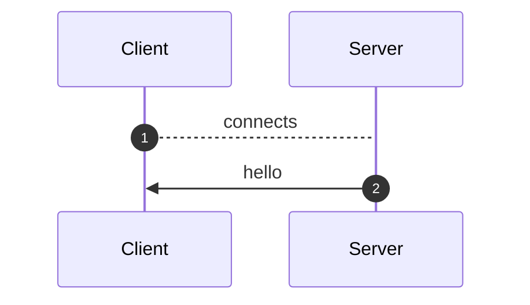
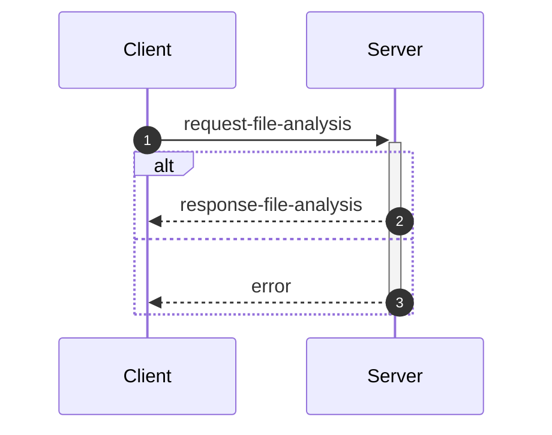
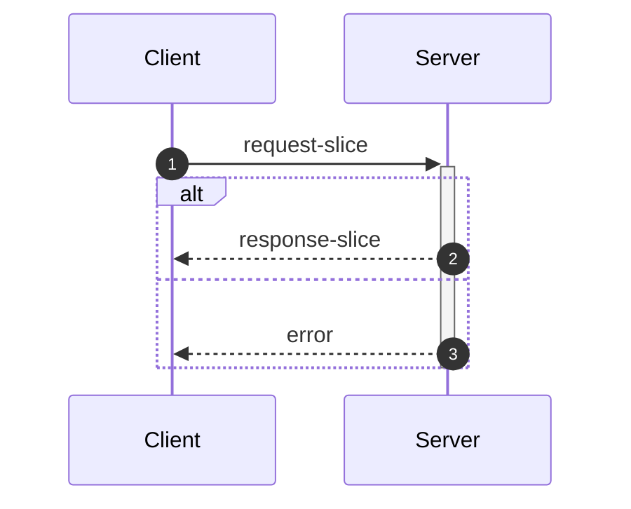
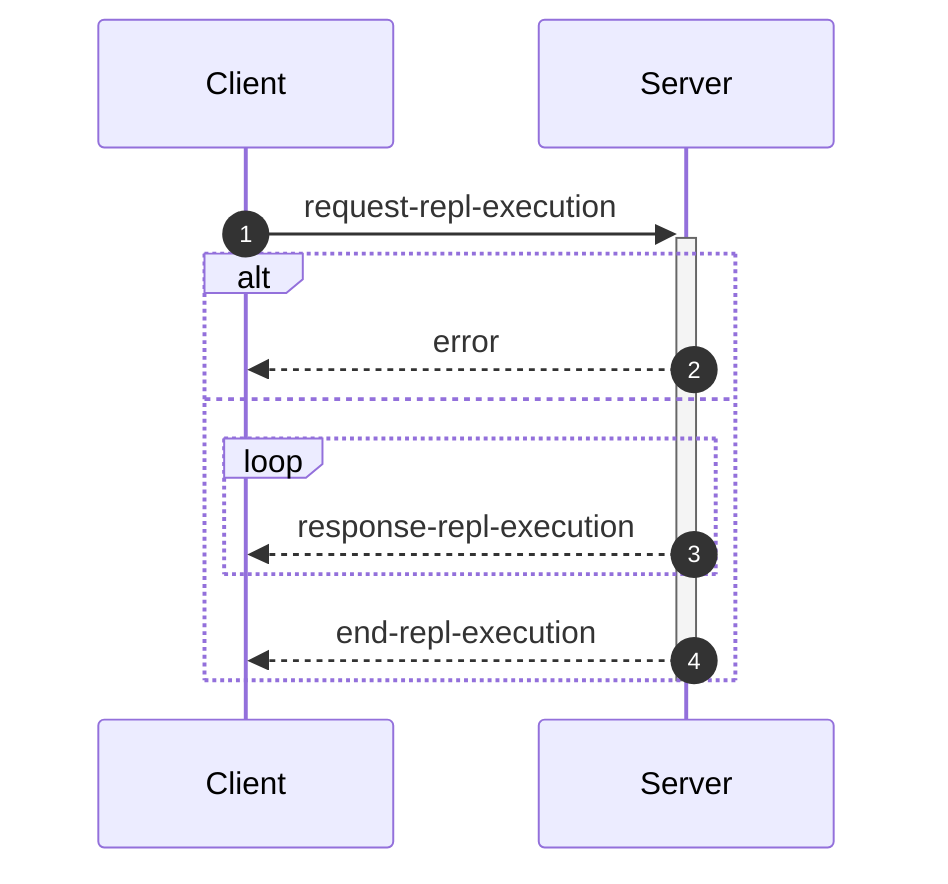

_<span title="an overview of flowR's interface">Generated</span> from '[wiki-interface.ts](https://github.com/flowr-analysis/flowr/tree/main/src/documentation/wiki-interface.ts "src/documentation/wiki-interface.ts")' on 2026-09-10, 07:04:46 UTC (v2.15.8, R v4.6.1), do not edit directly._

Although far from being as detailed as the in-depth explanation of [_flowR_](https://github.com/flowr-analysis/flowr/wiki/Core),
this wiki page explains how to interface with _flowR_ in more detail.
In general, command line arguments and other options provide short descriptions on hover over.

* [💻 Using the REPL](#using-the-repl)
* [⚙️ Configuring FlowR](#configuring-flowr)
* [⚒️ Writing Code](#writing-code)
* [💬 Communicating with the Server](#communicating-with-the-server)

<a id='using-the-repl'></a>
## 💻 Using the REPL

> [!NOTE]
> To execute arbitrary R commands with a repl request, _flowR_ has to be started explicitly with <span title="Description (Command Line Argument): Allow to access the underlying R session when using flowR (security warning: this allows the execution of arbitrary R code!)">`--r-session-access`</span>.
> Please be aware that this introduces a security risk and note that this relies on the [`r-shell` engine](https://github.com/flowr-analysis/flowr/wiki/Engines) .

Although primarily meant for users to explore,
there is nothing which forbids simply calling _flowR_ as a subprocess to use standard-in, -output, and -error
for communication (although you can access the REPL using the server as well,
with the [REPL Request](#message-request-repl-execution) message).

The read-eval-print loop&nbsp;(REPL) works relatively simple.
You can submit an expression (using <kbd>Enter</kbd>),
which is interpreted as an R&nbsp;expression by default but interpreted as a *command* if it starts with a colon (`:`).
The best command to get started with the REPL is <span title="Description (Repl Command): Show help information (aliases: :h, :?)">`:help`</span>.
Besides, you can leave the REPL either with the command <span title="Description (Repl Command): End the repl (aliases: :q, :exit)">`:quit`</span> or by pressing <kbd>Ctrl</kbd>+<kbd>C</kbd> twice.
When writing a *command*, you may press <kbd>Tab</kbd> to get a list of completions, if available.
Multiple commands can be entered in a single line by separating them with a semicolon (`;`), e.g. `:parse "x<-2"; :df*`.
If a command is given without R code, the REPL will re-use R code given in a previous command.
The prior example will hence return first the parsed AST of the program and then the dataflow graph for `"x <- 2"`.

> [!NOTE]
> If you develop flowR, you may want to launch the repl using the `npm run main-dev` command, this way, you get a non-minified version of flowR with debug information and hot-reloading of source files.

<details>
<summary>Available Commands</summary>

We currently offer the following commands (this with a `[*]` suffix are available with and without the star):

| Command | Description |
| ------- | ----------- |
| **<span title="Description (Repl Command): End the repl (aliases: :q, :exit)">:quit</span>** | End the repl (aliases: **:<span title="Alias of ':quit'. End the repl">q</span>**, **:<span title="Alias of ':quit'. End the repl">exit</span>**) |
| **<span title="Description (Repl Command): Execute the given code as R code. This requires the `--r-session-access` flag to be set and requires the r-shell engine. (aliases: :e, :r)">:execute</span>** | Execute the given code as R code. This requires the `--r-session-access` flag to be set and requires the r-shell engine. (aliases: **:<span title="Alias of ':execute'. Execute the given code as R code. This requires the `--r-session-access` flag to be set and requires the r-shell engine.">e</span>**, **:<span title="Alias of ':execute'. Execute the given code as R code. This requires the `--r-session-access` flag to be set and requires the r-shell engine.">r</span>**) |
| **<span title="Description (Repl Command): Get mermaid code for the control-flow graph of R code (aliases: :cfg, :cf)">:controlflow[*]</span>** | Get mermaid code for the control-flow graph of R code (star: Returns the URL to mermaid.live) (aliases: **:<span title="Alias of ':controlflow'. Get mermaid code for the control-flow graph of R code">cfg</span>**, **:<span title="Alias of ':controlflow'. Get mermaid code for the control-flow graph of R code">cf</span>**) |
| **<span title="Description (Repl Command): Get mermaid code for the control-flow graph with basic blocks (aliases: :cfgb, :cfb)">:controlflowbb[*]</span>** | Get mermaid code for the control-flow graph with basic blocks (star: Returns the URL to mermaid.live) (aliases: **:<span title="Alias of ':controlflowbb'. Get mermaid code for the control-flow graph with basic blocks">cfgb</span>**, **:<span title="Alias of ':controlflowbb'. Get mermaid code for the control-flow graph with basic blocks">cfb</span>**) |
| **<span title="Description (Repl Command): Get mermaid code for the dataflow graph (aliases: :d, :df)">:dataflow[*]</span>** | Get mermaid code for the dataflow graph (star: Returns the URL to mermaid.live) (aliases: **:<span title="Alias of ':dataflow'. Get mermaid code for the dataflow graph">d</span>**, **:<span title="Alias of ':dataflow'. Get mermaid code for the dataflow graph">df</span>**) |
| **<span title="Description (Repl Command): Get mermaid code for the normalized AST of R code (aliases: :n)">:normalize[*]</span>** | Get mermaid code for the normalized AST of R code (star: Returns the URL to mermaid.live) (alias: **:<span title="Alias of ':normalize'. Get mermaid code for the normalized AST of R code">n</span>**) |
| **<span title="Description (Repl Command): Get mermaid code for the simplified dataflow graph (aliases: :ds, :dfs)">:dataflowsimple[*]</span>** | Get mermaid code for the simplified dataflow graph (star: Returns the URL to mermaid.live) (aliases: **:<span title="Alias of ':dataflowsimple'. Get mermaid code for the simplified dataflow graph">ds</span>**, **:<span title="Alias of ':dataflowsimple'. Get mermaid code for the simplified dataflow graph">dfs</span>**) |
| **<span title="Description (Repl Command): Inspect and extend the signature database: `query` (identical to :query @signature), `info <name>` for where a function comes from (identical to :query @function-info), `add <path>` to mount another database/source, `download` to fetch the full-history database. (aliases: :sig)">:signature</span>** | Inspect and extend the signature database: `query` (identical to :query @signature), `info <name>` for where a function comes from (identical to :query @function-info), `add <path>` to mount another database/source, `download` to fetch the full-history database. (alias: **:<span title="Alias of ':signature'. Inspect and extend the signature database: `query` (identical to :query @signature), `info <name>` for where a function comes from (identical to :query @function-info), `add <path>` to mount another database/source, `download` to fetch the full-history database.">sig</span>**) |
| **<span title="Description (Repl Command): Just calculates the DFG, but only prints summary info (aliases: :d#, :df#)">:dataflowsilent</span>** | Just calculates the DFG, but only prints summary info (aliases: **:<span title="Alias of ':dataflowsilent'. Just calculates the DFG, but only prints summary info">d#</span>**, **:<span title="Alias of ':dataflowsilent'. Just calculates the DFG, but only prints summary info">df#</span>**) |
| **<span title="Description (Repl Command): Prints ASCII Art of the parsed, unmodified AST (aliases: :p)">:parse</span>** | Prints ASCII Art of the parsed, unmodified AST (alias: **:<span title="Alias of ':parse'. Prints ASCII Art of the parsed, unmodified AST">p</span>**) |
| **<span title="Description (Repl Command): Prints the version of flowR as well as the current version of R">:version</span>** | Prints the version of flowR as well as the current version of R
| **<span title="Description (Repl Command): Query the given R code (use 'help' for more information)">:query[*]</span>** | Query the given R code (use 'help' for more information) (star: Similar to query, but returns the output in json format.)
| **<span title="Description (Repl Command): Returns an ASCII representation of the dataflow graph (aliases: :df!)">:dataflowascii</span>** | Returns an ASCII representation of the dataflow graph (alias: **:<span title="Alias of ':dataflowascii'. Returns an ASCII representation of the dataflow graph">df!</span>**) |
| **<span title="Description (Repl Command): Returns summarization stats for the normalized AST (aliases: :n#)">:normalize#</span>** | Returns summarization stats for the normalized AST (alias: **:<span title="Alias of ':normalize#'. Returns summarization stats for the normalized AST">n#</span>**) |
| **<span title="Description (Repl Command): Show help information (aliases: :h, :?)">:help</span>** | Show help information (aliases: **:<span title="Alias of ':help'. Show help information">h</span>**, **:<span title="Alias of ':help'. Show help information">?</span>**) |

</details>

> [!TIP]
> 
> As indicated by the examples before, all REPL commands that operate on code keep track of the state.
> Hence, if you run a command like <span title="Description (Repl Command, starred version): Returns the URL to mermaid.live; Base Command: Get mermaid code for the dataflow graph (aliases: :d*, :df*)">`:dataflow*`</span> without providing R code,
> the REPL will re-use the R code provided in a previous command.
> Likewise, doing this will benefit from incrementality!
> If you request the dataflow graph with `:df* x <- 2 * y` and then want to see the parsed AST with `:parse`,
> the REPL will re-use previously obtained information and not re-parse the code again.
> 		

Generally, many commands offer shortcut versions in the REPL. Many queries, for example, offer a shortened format (see the example below).
Of special note, the [Config Query](https://github.com/flowr-analysis/flowr/wiki/%5BQuery%5D-Config)
can be used to also modify the currently active configuration of _flowR_ within the REPL (see the [wiki page](https://github.com/flowr-analysis/flowr/wiki/%5BQuery%5D-Config) for more information).

### Example: Retrieving the Dataflow Graph

To retrieve a URL to the [mermaid](https://mermaid.js.org/) diagram of the dataflow of a given expression,
use <span title="Description (Repl Command, starred version): Returns the URL to mermaid.live; Base Command: Get mermaid code for the dataflow graph (aliases: :d*, :df*)">`:dataflow*`</span> (or <span title="Description (Repl Command): Get mermaid code for the dataflow graph (aliases: :d, :df)">`:dataflow`</span> to get the mermaid code in the cli):

```shell
$ docker run -it --rm eagleoutice/flowr # or npm run flowr 
flowR repl v2.15.8, R grammar v14 (tree-sitter engine)
R> :dataflow* y <- 1 + x
```

<details>
<summary style='color:gray'>Output</summary>

```text
https://mermaid.live/view#base64:eyJjb2RlIjoiZmxvd2NoYXJ0IFREXG4gICAgMXt7XCJgKiM5MTtSTnVtYmVyIzkzOyogKioxKipcbiAgICAgICoxLjYqICgqKmlkOiAxKiopYFwifX1cbiAgICAyKFtcImAqIzkxO1JTeW1ib2wjOTM7KiAqKngqKlxuICAgICAgKjEuMTAqICgqKmlkOiAyKiopYFwiXSlcbiAgICAzW1tcImAqIzkxO1JCaW5hcnlPcCM5MzsqIGJhc2UjNTg7IzU4OyoqIzQzOyoqXG4gICAgICAqMS42LTEwKiAoKippZDogMyoqKVxuICAgIGFyZzogKDEsIDIpYFwiXV1cbiAgICBidWlsdC1pbjpfW1wiYEJ1aWx0LUluOlxuIzQzO2BcIl1cbiAgICBzdHlsZSBidWlsdC1pbjpfIHN0cm9rZTpncmF5LGZpbGw6Z3JheSxzdHJva2Utd2lkdGg6MnB4LG9wYWNpdHk6Ljg7XG4gICAgMFtcImAqIzkxO1JTeW1ib2wjOTM7KiAqKnkqKlxuICAgICAgKjEuMSogKCoqaWQ6IDAqKiwgdjogMylgXCJdXG4gICAgNFtbXCJgKiM5MTtSQmluYXJ5T3AjOTM7KiBiYXNlIzU4OyM1ODsqKiM2MDsjNDU7KipcbiAgICAgICoxLjEtMTAqICgqKmlkOiA0KiopXG4gICAgYXJnOiAoMCwgMylgXCJdXVxuICAgIGJ1aWx0LWluOl8tW1wiYEJ1aWx0LUluOlxuIzYwOyM0NTtgXCJdXG4gICAgc3R5bGUgYnVpbHQtaW46Xy0gc3Ryb2tlOmdyYXksZmlsbDpncmF5LHN0cm9rZS13aWR0aDoycHgsb3BhY2l0eTouODtcbiAgICAxIC0uLT58XCJmbG93XCJ8IDJcbiAgICBsaW5rU3R5bGUgMCBzdHJva2U6Z3JheSxjb2xvcjpncmF5O1xuICAgIDIgLS4tPnxcImZsb3dcInwgM1xuICAgIGxpbmtTdHlsZSAxIHN0cm9rZTpncmF5LGNvbG9yOmdyYXk7XG4gICAgMyAtLT58XCJyZWFkcywgYXJnXCJ8IDFcbiAgICAzIC0tPnxcInJlYWRzLCBhcmdcInwgMlxuICAgIDMgLS4tPnxcImZsb3dcInwgMFxuICAgIGxpbmtTdHlsZSA0IHN0cm9rZTpncmF5LGNvbG9yOmdyYXk7XG4gICAgMyAtLi0+fFwicmVhZHMsIGNhbGxzXCJ8IGJ1aWx0LWluOl9cbiAgICBsaW5rU3R5bGUgNSBzdHJva2U6Z3JheTtcbiAgICAwIC0tPnxcImRlZmluZWQtYnksIGZsb3dcInwgNFxuICAgIDAgLS0+fFwiZGVmaW5lZC1ieVwifCAzXG4gICAgNCAtLT58XCJyZWFkcywgYXJnXCJ8IDNcbiAgICA0IC0tPnxcInJldHVybnMsIGFyZ1wifCAwXG4gICAgNCAtLi0+fFwicmVhZHMsIGNhbGxzXCJ8IGJ1aWx0LWluOl8tXG4gICAgbGlua1N0eWxlIDEwIHN0cm9rZTpncmF5OyIsIm1lcm1haWQiOnsiYXV0b1N5bmMiOnRydWV9fQ==
```

Retrieve the dataflow graph of the expression `y <- 1 + x`. It looks like this:


```mermaid
flowchart LR
    1{{"`*#91;RNumber#93;* **1**
      *1.6* (**id: 1**)`"}}
    2(["`*#91;RSymbol#93;* **x**
      *1.10* (**id: 2**)`"])
    3[["`*#91;RBinaryOp#93;* base#58;#58;**#43;**
      *1.6-10* (**id: 3**)
    arg: (1, 2)`"]]
    built-in:_["`Built-In:
#43;`"]
    style built-in:_ stroke:gray,fill:gray,stroke-width:2px,opacity:.8;
    0["`*#91;RSymbol#93;* **y**
      *1.1* (**id: 0**, v: 3)`"]
    4[["`*#91;RBinaryOp#93;* base#58;#58;**#60;#45;**
      *1.1-10* (**id: 4**)
    arg: (0, 3)`"]]
    built-in:_-["`Built-In:
#60;#45;`"]
    style built-in:_- stroke:gray,fill:gray,stroke-width:2px,opacity:.8;
    1 -.->|"flow"| 2
    linkStyle 0 stroke:gray,color:gray;
    2 -.->|"flow"| 3
    linkStyle 1 stroke:gray,color:gray;
    3 -->|"reads, arg"| 1
    3 -->|"reads, arg"| 2
    3 -.->|"flow"| 0
    linkStyle 4 stroke:gray,color:gray;
    3 -.->|"reads, calls"| built-in:_
    linkStyle 5 stroke:gray;
    0 -->|"defined-by, flow"| 4
    0 -->|"defined-by"| 3
    4 -->|"reads, arg"| 3
    4 -->|"returns, arg"| 0
    4 -.->|"reads, calls"| built-in:_-
    linkStyle 10 stroke:gray;
```

<details>

<summary style="color:gray">R Code of the Dataflow Graph</summary>

The analysis ran (including parse and normalize, using the [tree-sitter](https://github.com/flowr-analysis/flowr/wiki/Engines) engine) within the generation environment. No [signature database](https://github.com/flowr-analysis/flowr/wiki/Signature-Database) is mounted for these generated graphs, so `library()` calls attach no package exports; base-R names are still qualified via the generated base-package store (e.g. `acf` as `stats::acf`). 
We encountered no unknown side effects during the analysis.

```r
y <- 1 + x
```

</details>

</details>

For small graphs like this, <span title="Description (Repl Command): Returns an ASCII representation of the dataflow graph (aliases: :df!)">`:dataflowascii`</span> also provides an ASCII representation directly in the REPL:

```shell
$ docker run -it --rm eagleoutice/flowr # or npm run flowr 
flowR repl v2.15.8, R grammar v14 (tree-sitter engine)
R> :df! y <- 1 + x
```

<details open>
<summary style='color:gray'>Output</summary>

```text
           ┌────────────u<2>u
        c<3>c   0<1>0   | x |
    ┌───| + |───| 1 |───u---u
    │   c---c   0---0
 c<4>c     │
 |<- |     └────────────v<0>v
 c---c──────────────────| y |
                        v---v
Edges:
3 -> 1: reads, arg          3 -> 2: reads, arg
3 -> 0: flows-to            1 -> 2: flows-to
2 -> 3: flows-to            4 -> 3: reads, arg
4 -> 0: returns, arg        0 -> 4: defined-by, flows-to
0 -> 3: defined-by
```

Retrieve the dataflow graph of the expression `y <- 1 + x` as ASCII art.

</details>

For the slicing with <span title="Description (Repl Command): Static backwards executable slicer for R">`:slicer`</span>, you have access to the same [magic comments](#slice-magic-comments) as with the [slice request](#message-request-slice).
Pass `--inline` to splice resolvable `source()` calls into the reconstruction so the slice is a single self-contained R text (the same as the static slice query's `inlineSources` flag).
See `--help` for more flags!

### Example: Interfacing with the File System

Many commands that allow for an R-expression (like <span title="Description (Repl Command, starred version): Returns the URL to mermaid.live; Base Command: Get mermaid code for the dataflow graph (aliases: :d*, :df*)">`:dataflow*`</span>) allow for a file as well
if the argument starts with `file://`.
If you are working from the root directory of the _flowR_ repository, the following gives you the parsed AST of the example file using the <span title="Description (Repl Command): Prints ASCII Art of the parsed, unmodified AST (aliases: :p)">`:parse`</span> command:

> **Watch mode**: Replace `file://` with `watch://` to enter watch mode.
> flowR runs the command immediately and then re-runs it every time the file (or any file inside the folder) changes.
> Enter any other command to leave watch mode.
> For example: `:df watch://analysis.R`

```shell
$ docker run -it --rm eagleoutice/flowr # or npm run flowr 
flowR repl v2.15.8, R grammar v14 (tree-sitter engine)
R> :parse file://test/testfiles/example.R
```

<details>
<summary style='color:gray'>Output</summary>

```text
File: test/testfiles/example.R

program
├ binaryoperator
│ ├ identifier "sum" (1:1─4)
│ ├ <- "<-" (1:5─7)
│ ╰ float "0" (1:8─9)
├ binaryoperator
│ ├ identifier "product" (2:1─8)
│ ├ <- "<-" (2:9─11)
│ ╰ float "1" (2:12─13)
├ binaryoperator
│ ├ identifier "w" (3:1─2)
│ ├ <- "<-" (3:3─5)
│ ╰ float "7" (3:6─7)
├ binaryoperator
│ ├ identifier "N" (4:1─2)
│ ├ <- "<-" (4:3─5)
│ ╰ float "10" (4:6─8)
├ forstatement
│ ├ for "for" (6:1─4)
│ ├ ( "(" (6:5─6)
│ ├ identifier "i" (6:6─7)
│ ├ in "in" (6:8─10)
│ ├ binaryoperator
│ │ ├ float "1" (6:11─12)
│ │ ├ : ":" (6:12─13)
│ │ ╰ parenthesizedexpression
│ │   ├ ( "(" (6:13─14)
│ │   ├ binaryoperator
│ │   │ ├ identifier "N" (6:14─15)
│ │   │ ├ - "-" (6:15─16)
│ │   │ ╰ float "1" (6:16─17)
│ │   ╰ ) ")" (6:17─18)
│ ├ ) ")" (6:18─19)
│ ╰ bracedexpression
│   ├ { "{" (6:20─21)
│   ├ binaryoperator
│   │ ├ identifier "sum" (7:3─6)
│   │ ├ <- "<-" (7:7─9)
│   │ ╰ binaryoperator
│   │   ├ binaryoperator
│   │   │ ├ identifier "sum" (7:10─13)
│   │   │ ├ + "+" (7:14─15)
│   │   │ ╰ identifier "i" (7:16─17)
│   │   ├ + "+" (7:18─19)
│   │   ╰ identifier "w" (7:20─21)
│   ├ binaryoperator
│   │ ├ identifier "product" (8:3─10)
│   │ ├ <- "<-" (8:11─13)
│   │ ╰ binaryoperator
│   │   ├ identifier "product" (8:14─21)
│   │   ├  "" (8:22─23)
│   │   ╰ identifier "i" (8:24─25)
│   ╰ } "}" (9:1─2)
├ call
│ ├ identifier "cat" (11:1─4)
│ ╰ arguments
│   ├ ( "(" (11:4─5)
│   ├ argument
│   │ ╰ string
│   │   ├ " "\"" (11:5─6)
│   │   ├ stringcontent "Sum:" (11:6─10)
│   │   ╰ " "\"" (11:10─11)
│   ├ comma "," (11:11─12)
│   ├ argument
│   │ ╰ identifier "sum" (11:13─16)
│   ├ comma "," (11:16─17)
│   ├ argument
│   │ ╰ string
│   │   ├ " "\"" (11:18─19)
│   │   ├ stringcontent
│   │   │ ╰ escapesequence "\\n" (11:19─21)
│   │   ╰ " "\"" (11:21─22)
│   ╰ ) ")" (11:22─23)
╰ call
  ├ identifier "cat" (12:1─4)
  ╰ arguments
    ├ ( "(" (12:4─5)
    ├ argument
    │ ╰ string
    │   ├ " "\"" (12:5─6)
    │   ├ stringcontent "Product:" (12:6─14)
    │   ╰ " "\"" (12:14─15)
    ├ comma "," (12:15─16)
    ├ argument
    │ ╰ identifier "product" (12:17─24)
    ├ comma "," (12:24─25)
    ├ argument
    │ ╰ string
    │   ├ " "\"" (12:26─27)
    │   ├ stringcontent
    │   │ ╰ escapesequence "\\n" (12:27─29)
    │   ╰ " "\"" (12:29─30)
    ╰ ) ")" (12:30─31)
```

Retrieve the parsed AST of the example file.

<details>

<summary>File Content</summary>

```r
sum <- 0
product <- 1
w <- 7
N <- 10

for (i in 1:(N-1)) {
  sum <- sum + i + w
  product <- product * i
}

cat("Sum:", sum, "\n")
cat("Product:", product, "\n")
```

</details>

As _flowR_ directly transforms this AST the output focuses on being human-readable instead of being machine-readable.
		
</details>

### Example: Run a Query

You can run any query supported by _flowR_ using the <span title="Description (Repl Command): Query the given R code (use 'help' for more information)">`:query`</span> command.
For example, to obtain the shapes of all data frames in a given piece of code, you can run:

```shell
$ docker run -it --rm eagleoutice/flowr # or npm run flowr 
flowR repl v2.15.8, R grammar v14 (tree-sitter engine)
R> :query @absint df-shape "x <- data.frame(a = 1:10, b = 1:10)\ny <- x$a"
```

<details open>
<summary style='color:gray'>Output</summary>

```text
Query: absint (0 ms)
```

Retrieve the shapes of all data frames in the given code.

</details>

To run the linter on a file, you can use (in this example, we just issue the `dead-code` linter on a small piece of code):

```shell
$ docker run -it --rm eagleoutice/flowr # or npm run flowr 
flowR repl v2.15.8, R grammar v14 (tree-sitter engine)
R> :query @linter rules:dead-code "if(FALSE) x <- 2"
```

<details open>
<summary style='color:gray'>Output</summary>

```text
Query: linter (1 ms)
   ╰ Dead Code (dead-code):
       ╰ certain:
           ╰ Code at 1.11-16
```

Run the linter on the given code, with only the `dead-code` rule enabled.

</details>

For more information on the available queries, please check out the [Query API](https://github.com/flowr-analysis/flowr/wiki/Query-API).

<a id='configuring-flowr'></a>
## ⚙️ Configuring FlowR

When running _flowR_, you may want to specify some behaviors with a dedicated configuration file.
By default, flowR looks for a file named `flowr.json` in the current working directory (or any higher directory).
You can also specify a different file with <span title="Description (Command Line Argument): The name of the configuration file to use">`--config-file`</span> or pass the configuration inline using <span title="Description (Command Line Argument): The flowR configuration to use, as a JSON string">`--config-json`</span>.
To inspect the current configuration, you can run flowr with the <span title="Description (Command Line Argument): Run with verbose logging (will be passed to the corresponding script)">`--verbose`</span> flag, or use the `config` [Query](https://github.com/flowr-analysis/flowr/wiki/Query-API).
Within the REPL this works by running the following:

```shell
:query @config
```

To work with the <a href="https://github.com/flowr-analysis/flowr/tree/main/src/config.ts#L107"><code><span title="The configuration file format for flowR.">FlowrConfig</span></code></a> you can use the provided helper objects alongside its methods like
<a href="https://github.com/flowr-analysis/flowr/tree/main/src/config.ts#L856"><code><span title="Creates a new flowr config that has the updated values.">FlowrConfig::<b>amend</b></span></code></a>.
The schema below documents every option; the ones you most likely want are:

- <a href="https://github.com/flowr-analysis/flowr/wiki/Interface#configuring-flowr" title="Configuration Option (boolean): Whether source calls should be ignored, causing {@link processSourceCall}&#39;s behavior to be skipped.">ignoreSourceCalls</a>: ignore source calls when analyzing the code, i.e., ignore the inclusion of other files.
- <a href="https://github.com/flowr-analysis/flowr/wiki/Interface#configuring-flowr" title="Configuration Option (boolean): Whether load calls should be ignored, causing {@link processLoadCall}&#39;s behavior to be skipped.">ignoreLoadCalls</a>: ignore load calls when analyzing the code, i.e., ignore the loading of r-data files.
- <a href="https://github.com/flowr-analysis/flowr/wiki/Interface#configuring-flowr" title="Configuration Option (object): Do you want to overwrite (parts) of the builtin definition?">semantics.environment.overwriteBuiltIns</a>: overwrite _flowR_'s handling of built-in functions, or clear the preset definitions entirely.
  See [Configure BuiltIn Semantics](#configure-builtin-semantics) for more information.
- <a href="https://github.com/flowr-analysis/flowr/wiki/Interface#configuring-flowr" title="Configuration Option (string): How to resolve variables and their values. (one of &quot;disabled&quot;, &quot;alias&quot;, &quot;builtin&quot;)">solver.variables</a>: how to resolve variables and their values (`disabled`, `alias`, `builtin`).
- <a href="https://github.com/flowr-analysis/flowr/wiki/Interface#configuring-flowr" title="Configuration Option (array): The engine or set of engines to use for interacting with R code. An empty array means all available engines will be used.">engines</a> and <a href="https://github.com/flowr-analysis/flowr/wiki/Interface#configuring-flowr" title="Configuration Option (string): The default engine to use for interacting with R code. If this is undefined, an arbitrary engine from the specified list will be used. (one of &quot;tree-sitter&quot;, &quot;r-shell&quot;)">defaultEngine</a>: the engines used to interact with R code, see the [Engines wiki page](https://github.com/flowr-analysis/flowr/wiki/Engines).
- <a href="https://github.com/flowr-analysis/flowr/wiki/Interface#configuring-flowr" title="Configuration Option (array): Files a framework loads on its own, without any source() call (e.g. global.R in a shiny app), in the order they are loaded; flowR orders the matching project files accordingly and analyzes them as one program. Entries are case-insensitive globs matched against the file path, a plain name matches any file with that name, and entries matching no project file are warned about. Usually set per project kind via specializeConfig.">project.implicitSources</a>: the files a framework loads without any `source()` call, in the order in which they are
  loaded. Entries are globs (e.g. `R/*.R`) matched against the file path ignoring capitalization; one matching no file is reported.
- <a href="https://github.com/flowr-analysis/flowr/wiki/Interface#configuring-flowr" title="Configuration Option (object): Overwrite (parts of) the configuration depending on the project kind flowR detects, e.g. to give a shiny app its implicit sources.">specializeConfig</a>: overwrite (parts of) the configuration depending on the kind of project _flowR_ detects
  (e.g. `shiny-app`), which is how a shiny app gets its implicit sources by default. What you configure directly wins.
- <a href="https://github.com/flowr-analysis/flowr/wiki/Interface#configuring-flowr" title="Configuration Option (string): Overwrite the project kind flowR would otherwise infer from the analyzed files, e.g. when auto-detection guesses wrong. (one of &quot;package&quot;, &quot;script&quot;, &quot;shiny-app&quot;, &quot;notebook&quot;, &quot;project&quot;, &quot;unknown&quot;)">project.useProjectType</a>: skip that detection and force a project kind yourself, when auto-detection guesses wrong.
- <a href="https://github.com/flowr-analysis/flowr/wiki/Interface#configuring-flowr" title="Configuration Option (array): The default plugins to load when creating a new instance of FlowrAnalyzer">defaultPlugins</a> and <a href="https://github.com/flowr-analysis/flowr/wiki/Interface#configuring-flowr" title="Configuration Option (array): The plugins to load in REPL mode">repl.plugins</a>: the plugins to load for a new <a href="https://github.com/flowr-analysis/flowr/tree/main/src/project/flowr-analyzer.ts#L202"><code><span title="Central class for conducting analyses with FlowR. Use the FlowrAnalyzerBuilder to create a new instance. If you want the original pattern of creating a pipeline and running all steps, you can still do this with FlowrAnalyzer#runFull . To inspect the context of the analyzer, use FlowrAnalyzer#inspectContext (if you are a plugin and need to modify it, use FlowrAnalyzer#context instead).">FlowrAnalyzer</span></code></a> and in the REPL
  (use `flowr:default` to reference the former).

So you can configure _flowR_ by adding a file like the following:

<details>

<summary>Example Configuration File</summary>

```json
{
  "ignoreSourceCalls": true,
  "ignoreLoadCalls": true,
  "semantics": {
    "environment": {
      "overwriteBuiltIns": {
        "definitions": [
          {
            "type": "function",
            "names": [
              "foo"
            ],
            "processor": "builtin:assign",
            "config": {}
          }
        ]
      }
    }
  },
  "defaultPlugins": [
    "file:description",
    "versions:description"
  ],
  "repl": {
    "quickStats": false,
    "dfProcessorHeat": false,
    "hints": true,
    "plugins": [
      "flowr:default"
    ]
  },
  "project": {
    "resolveUnknownPathsOnDisk": true,
    "implicitSources": [
      "global.R",
      "app.R"
    ]
  },
  "linter": {
    "disabledRules": []
  },
  "specializeConfig": {
    "shiny-app": {
      "project": {
        "implicitSources": [
          "global.R",
          "ui.R",
          "server.R",
          "app.R"
        ]
      }
    }
  },
  "engines": [
    {
      "type": "r-shell"
    }
  ],
  "solver": {
    "variables": "alias",
    "evalStrings": true,
    "trackEnvironments": true,
    "sigdb": {
      "enabled": true,
      "loadProjectDependencies": true,
      "eagerlyLoad": false,
      "eagerlyLoadExports": false,
      "linkBaseR": false,
      "linkDescriptionDependencies": false
    },
    "resolveSource": {
      "dropPaths": "no",
      "ignoreCapitalization": true,
      "inferWorkingDirectory": "active-script",
      "searchPath": []
    },
    "instrument": {},
    "slicer": {
      "threshold": 50
    }
  },
  "abstractInterpretation": {
    "wideningThreshold": 4,
    "followCalls": true,
    "dataFrame": {
      "maxColNames": 20,
      "readLoadedData": {
        "readExternalFiles": true,
        "maxReadLines": 1000000
      }
    }
  },
  "incremental": {
    "alwaysIncremental": false,
    "parsing": {
      "activated": false,
      "heuristics": {
        "activated": true,
        "mtime": true,
        "linesFrom": 500,
        "bytesFrom": 50000,
        "alwaysWithEdits": false,
        "minFiles": 1
      }
    }
  },
  "gas": {
    "thresholds": {
      "memory": {
        "problematic": 0.7,
        "critical": 0.9
      },
      "timeMs": {
        "problematic": 100000,
        "critical": 120000
      }
    },
    "features": {}
  }
}
```

</details>

<details>
<a id='configure-builtin-semantics'></a>
<summary>Configure Built-In Semantics</summary>

`semantics/environment/overwriteBuiltins` accepts two keys:

- `loadDefaults` (boolean, initially `true`): If set to `true`, the default built-in definitions are loaded before applying the custom definitions. Setting this flag to `false` explicitly disables the loading of the default definitions.
- `definitions` (array, initially empty): Allows to overwrite or define new built-in elements. Each object within must have a `type` which is one of the below. Furthermore, they may define a string array of `names` which specifies the identifiers to bind the definitions to. You may use `assumePrimitive` to specify whether _flowR_ should assume that this is a primitive non-library definition (so you probably just do not want to specify the key).

  | Type            | Description                                                                                                                                                                                                                                                                                              | Example                                                                                                    |
  | --------------- | -------------------------------------------------------------------------------------------------------------------------------------------------------------------------------------------------------------------------------------------------------------------------------------------------------- | ---------------------------------------------------------------------------------------------------------- |
  | `constant`    | Additionally allows for a `value` this should resolve to.                                                                                                                                                                                                                                                | `{ type: 'constant', names: ['NULL', 'NA'],  value: null }`                                                |
  | `function`    | Is a rather flexible way to define and bind built-in functions. For the time, we do not have extensive documentation to cover all the cases, so please either consult the sources with the `default-builtin-config.ts` or open a [new issue](https://github.com/flowr-analysis/flowr/issues/new/choose). | `{ type: 'function', names: ['next'], processor: 'builtin:d', config: { cfg: ExitPointType.Next } }` |
  | `replacement` | A comfortable way to specify replacement functions like `$<-` or `names<-`. `suffixes` describes the... suffixes to attach automatically. | `{ type: 'replacement', suffixes: ['<-', '<<-'], names: ['[', '[['] }` |

</details>

<details>

<summary style='color:gray'>Full Configuration-File Schema</summary>

- _The configuration file format for flowR._ (object)
    - **logLevel** [optional] _flowR's global minimum log level, applied when the config is loaded._ (string)
        Only allows: 'silly', 'trace', 'debug', 'info', 'warn', 'error', 'fatal'
    - **ignoreSourceCalls** [optional] _Whether source calls should be ignored, causing {@link processSourceCall}'s behavior to be skipped._ (boolean)
    - **ignoreLoadCalls** [optional] _Whether load calls should be ignored, causing {@link processLoadCall}'s behavior to be skipped._ (boolean)
    - **semantics** _Configure language semantics and how flowR handles them._ (object)
        - **environment** [optional] _Semantics regarding how to handle the R environment._ (object)
            - **overwriteBuiltIns** [optional] _Do you want to overwrite (parts) of the builtin definition?_ (object)
                - **loadDefaults** [optional] _Should the default configuration still be loaded?_ (boolean)
                - **definitions** [optional] _The definitions to load/overwrite._ (array)
                Valid item types:
                    - (object)
    - **defaultPlugins** [optional] _The default plugins to load when creating a new instance of FlowrAnalyzer_ (array)
    Valid item types:
        - (alternatives)
            - (string)
            - (array)
    - **repl** _Configuration options for the REPL._ (object)
        - **quickStats** [optional] _Whether to show quick stats in the REPL after each evaluation._ (boolean)
        - **dfProcessorHeat** [optional] _This instruments the dataflow processors to count how often each processor is called._ (boolean)
        - **hints** [optional] _Whether to show dim inline hints on the empty prompt (automatically disabled on non-interactive terminals)._ (boolean)
        - **plugins** [optional] _The plugins to load in REPL mode_ (array)
        Valid item types:
            - (alternatives)
                - (string)
                - (array)
        - **autoUseFileProtocol** [optional] _Prepend the file protocol to a repl input that looks like a path, instead of only warning about it._ (boolean)
        - **queryStats** [optional] _Whether `:query` closes with the line stating how long the queries took (`:query*` never prints it)._ (boolean)
        - **showPlugins** [optional] _Whether `:version` grays out the plugins that did not activate during the last analysis._ (boolean)
    - **project** _Project specific configuration options._ (object)
        - **resolveUnknownPathsOnDisk** [optional] _Whether to resolve unknown paths loaded by the r project disk when trying to source/analyze files._ (boolean)
        - **failOnInaccessiblePath** [optional] _Whether a directory that cannot be traversed during file discovery (e.g. due to permissions) aborts the analysis; when false (the default) such paths are logged and skipped._ (boolean)
        - **basePackages** [optional] _The packages considered part of R itself (base and recommended); if unset, flowR uses its built-in list._ (array)
        Valid item types:
            - (string)
        - **implicitSources** [optional] _Files a framework loads on its own, without any source() call (e.g. global.R in a shiny app), in the order they are loaded; flowR orders the matching project files accordingly and analyzes them as one program. Entries are case-insensitive globs matched against the file path, a plain name matches any file with that name, and entries matching no project file are warned about. Usually set per project kind via specializeConfig._ (array)
        Valid item types:
            - (string)
        - **useProjectType** [optional] _Overwrite the project kind flowR would otherwise infer from the analyzed files, e.g. when auto-detection guesses wrong._ (string)
            Only allows: 'package', 'script', 'shiny-app', 'notebook', 'project', 'unknown'
        - **assumeImplicitEcho** [optional] _Whether the top level of the analyzed code is echoed, so that every visible result printed there is collected as an output by the dependencies query (default true, false for a package)._ (boolean)
        - **discovery** [optional] _Scoping options for the default project discovery._ (object)
            - **full** [optional] _Collect every file below the project root (greedy) instead of only the files the detected project kind needs (default false)._ (boolean)
            - **perKind** [optional] _Per-kind include/exclude glob overrides layered on the default scoping._ (object)
            - **ignore** [optional] _Case-insensitive globs that drop matching files from the intelligent discovery, regardless of kind (e.g. .Renviron to ignore environment files)._ (array)
            Valid item types:
                - (string)
        - **classification** [optional] _Overrides for the signals flowR uses to classify the project kind._ (object)
            - **shinyDescriptionTypes** [optional] _DESCRIPTION Type: values that mark a shiny app._ (array)
            Valid item types:
                - (string)
            - **shinyEntryFiles** [optional] _File names a shiny app is assembled from._ (array)
            Valid item types:
                - (string)
            - **shinyUsagePattern** [optional] _Regex source evidencing shiny usage in an entry file._ (string)
            - **notebookExtensions** [optional] _File extensions marking a notebook._ (array)
            Valid item types:
                - (string)
    - **linter** _Linter configuration options._ (object)
        - **disabledRules** _Linting rule names excluded from the default rule set (a rule requested explicitly via a linter query still runs). Usually set per project kind via specializeConfig._ (array)
        Valid item types:
            - (string)
    - **inputSources** [optional] _Further frameworks the input-sources analysis should know about; entries are added to flowR's defaults._ (object)
        - **pure** [optional] _Functions that only pass the constantness of their arguments on._ (array)
        Valid item types:
            - (string)
        - **param** [optional] _Functions whose result is a 'param' input._ (array)
        Valid item types:
            - (string)
        - **file** [optional] _Functions whose result is a 'file' input._ (array)
        Valid item types:
            - (string)
        - **tempfile** [optional] _Functions whose result is a 'tempfile' input._ (array)
        Valid item types:
            - (string)
        - **glob** [optional] _Functions whose result is a 'glob' input._ (array)
        Valid item types:
            - (string)
        - **net** [optional] _Functions whose result is a 'net' input._ (array)
        Valid item types:
            - (string)
        - **rand** [optional] _Functions whose result is a 'rand' input._ (array)
        Valid item types:
            - (string)
        - **system** [optional] _Functions whose result is a 'system' input._ (array)
        Valid item types:
            - (string)
        - **ffi** [optional] _Functions whose result is a 'ffi' input._ (array)
        Valid item types:
            - (string)
        - **lang** [optional] _Functions whose result is a 'lang' input._ (array)
        Valid item types:
            - (string)
        - **options** [optional] _Functions whose result is a 'options' input._ (array)
        Valid item types:
            - (string)
        - **cmdline** [optional] _Functions whose result is a 'cmdline' input._ (array)
        Valid item types:
            - (string)
        - **user** [optional] _Functions whose result is a 'user' input._ (array)
        Valid item types:
            - (string)
        - **const** [optional] _Functions whose result is a 'const' input._ (array)
        Valid item types:
            - (string)
        - **scope** [optional] _Functions whose result is a 'scope' input._ (array)
        Valid item types:
            - (string)
        - **dconst** [optional] _Functions whose result is a 'dconst' input._ (array)
        Valid item types:
            - (string)
        - **unknown** [optional] _Functions whose result is a 'unknown' input._ (array)
        Valid item types:
            - (string)
        - **linkedObjects** [optional] _Objects a framework provides without a definition in the code, e.g. shiny's input._ (array)
        Valid item types:
            - (object)
        - **linkedEntryPoints** [optional] _Calls that hand a function to a framework, which binds its objects to the parameters by position._ (array)
        Valid item types:
            - (object)
    - **specializeConfig** [optional] _Overwrite (parts of) the configuration depending on the project kind flowR detects, e.g. to give a shiny app its implicit sources._ (object)
    - **engines** _The engine or set of engines to use for interacting with R code. An empty array means all available engines will be used._ (array)
    Valid item types:
        - (alternatives)
            - _The configuration for the tree sitter engine._ (object)
                - **type** [required] _Use the tree sitter engine._ (string)
                    Only allows: 'tree-sitter'
                - **wasmPath** [optional] _The path to the tree-sitter-r WASM binary to use. If this is undefined, this uses the default path._ (string)
                - **treeSitterWasmPath** [optional] _The path to the tree-sitter WASM binary to use. If this is undefined, this uses the default path._ (string)
                - **lax** [optional] _Whether to use the lax parser for parsing R code (allowing for syntax errors). If this is undefined, the strict parser will be used._ (boolean)
            - _The configuration for the R shell engine._ (object)
                - **type** [required] _Use the R shell engine._ (string)
                    Only allows: 'r-shell'
                - **rPath** [optional] _The path to the R executable to use. If this is undefined, this uses the default path._ (string)
                - **pipeBind** [optional] _Whether to enable R's experimental pipe-bind operator "=>" by setting _R_USE_PIPEBIND_ for the R session (default false); R itself keeps this off by default, as it is experimental and has never shipped in a release version of R._ (boolean)
    - **defaultEngine** [optional] _The default engine to use for interacting with R code. If this is undefined, an arbitrary engine from the specified list will be used._ (string)
        Only allows: 'tree-sitter', 'r-shell'
    - **solver** _How to resolve constants, constraints, cells, ..._ (object)
        - **variables** _How to resolve variables and their values._ (string)
            Only allows: 'disabled', 'alias', 'builtin'
        - **evalStrings** _Should we include eval(parse(text="...")) calls in the dataflow graph?_ (boolean)
        - **trackEnvironments** [optional] _Track user-created environments (new.env, assign/get/local with envir=, dollar-assign, attach). When false, all envir-style calls fall through conservatively._ (boolean)
        - **sigdb** _Resolving library exports from a signature database._ (object)
            - **enabled** [optional] _Resolve library()/use() exports from a signature database (default true); when false no database is consulted._ (boolean)
            - **loadProjectDependencies** [optional] _Load the project's declared dependencies from its metadata files (DESCRIPTION Imports/Depends, rproject.toml, uvr.toml, renv.lock, rv.lock, uvr.lock) (default true); when false these files are not read for dependencies._ (boolean)
            - **eagerlyLoad** [optional] _Parse the database up front rather than on the first package load (default false, ignored if disabled)._ (boolean)
            - **eagerlyLoadExports** [optional] _Add a vertex for every export on load rather than on demand (default false); keeps the dataflow graph small._ (boolean)
            - **assumedRVersion** [optional] _R version assumed when resolving versioned (base-R) exports: a pin like "4.5" or "auto" to detect the installed R (default "auto")._ (string)
            - **linkBaseR** [optional] _Eagerly attach base-R namespaces so bare base calls resolve without library() (default false)._ (boolean)
            - **linkBaseRCalls** [optional] _Add a lightweight Reads edge from a bare base-R call to its signature-database function vertex (default false; base-R qualification is edge-free otherwise)._ (boolean)
            - **linkPackageCalls** [optional] _Add a lightweight Reads edge from a resolved package call to its signature-database function vertex (default false)._ (boolean)
            - **linkDescriptionDependencies** [optional] _Eagerly attach the namespaces of the project's declared DESCRIPTION dependencies (Imports/Depends) so their exports resolve without an explicit library() (default false)._ (boolean)
            - **warmInBackground** [optional] _Decompress the hot shards (base + most-downloaded) in a background task on startup so the first library() lookup is warm (default false; for long-running servers/REPLs)._ (boolean)
            - **additionalPaths** [optional] _Extra directories or bundle/manifest files searched for signature databases (alongside the shipped default and $FLOWR_SIGDB_DIR); a downloaded full-history bundle placed here is mounted automatically._ (array)
            Valid item types:
                - (string)
            - **downloadRepo** [optional] _GitHub owner/repo the full-history bundle is downloaded from via ":signature download" (default "flowr-analysis/flowr", release tag "sigdb-v<flowR-version>")._ (string)
            - **autoSync** [optional] _On startup, re-download shards whose committed sigdb.remote.json hash no longer matches the cache, in the background (default false; opt-in network sync after a git pull)._ (boolean)
            - **installedLibrary** [optional] _Recovering packages no signature database knows from the copy installed on this machine._ (object)
                - **enabled** [required] _Recover packages no signature database knows from their installed copy (default false)._ (boolean)
                - **paths** [optional] _Library directories to search; when empty they are discovered from the environment and the project._ (array)
                Valid item types:
                    - (string)
                - **useEnvironment** [optional] _Search the libraries R_LIBS_USER/R_LIBS/R_LIBS_SITE name (default true)._ (boolean)
                - **useProjectLibrary** [optional] _Search a project-local renv/packrat library (default true)._ (boolean)
                - **maxDepth** [optional] _How far to descend into the nested layout of a project-local library (default 3)._ (number)
                - **packages** [optional] _Only recover packages whose name matches one of these regular expressions; empty means any._ (array)
                Valid item types:
                    - (string)
            - **blobCacheBudgetMb** [optional] _How many MiB of decoded package blobs every open bundle may hold together (default 16)._ (number)
            - **versionSelection** [optional] _When a project constrains a dependency, resolve to the newest (default), oldest, or system-installed version satisfying it; system needs R and falls back to newest. Base-R packages always resolve against the assumed R version._ (string)
                Only allows: 'newest', 'oldest', 'system'
            - **versionOverrides** [optional] _Force an exact version for specific packages (name -> version), overriding both the project constraint and the versionSelection policy (default {})._ (object)
        - **versionManagement** _Policies for reasoning about dependency versions._ (object)
            - **linkedVersionGroups** [optional] _Groups of packages that must resolve to the same version; version guessing intersects each group so its members stay mutually compatible (default [])._ (array)
            Valid item types:
                - (array)
                Valid item types:
                    - (string)
        - **assumeAttachedPackages** [optional] _Packages to treat as attached without a `library()` call, so what the built-in configuration states about them applies to the analyzed code. The base packages R attaches on startup already resolve without it._ (array)
        Valid item types:
            - (string)
        - **transitiveSideEffectRounds** [optional] _How many rounds the transitive side-effect fixpoint may run before it is cut off (default 32); the propagation stops on its own as soon as a round adds nothing._ (number)
        - **instrument** (object)
            - **dataflowExtractors** [optional] _These keys are only intended for use within code, allowing to instrument the dataflow analyzer!_ (any)
        - **resolveSource** [optional] _If lax source calls are active, flowR searches for sourced files much more freely, based on the configurations you give it. This option is only in effect if `ignoreSourceCalls` is set to false._ (object)
            - **dropPaths** _Allow to drop the first or all parts of the sourced path, if it is relative._ (string)
                Only allows: 'no', 'once', 'all'
            - **ignoreCapitalization** _Search for filenames matching in the lowercase._ (boolean)
            - **inferWorkingDirectory** _Try to infer the working directory from the main or any script to analyze._ (string)
                Only allows: 'no', 'main-script', 'active-script', 'any-script'
            - **searchPath** _Additionally search in these paths._ (array)
            Valid item types:
                - (string)
            - **repeatedSourceLimit** [optional] _How often the same file can be sourced within a single run? Please be aware: in case of cyclic sources this may not reach a fixpoint so give this a sensible limit._ (number)
            - **applyReplacements** _Provide name replacements for loaded files_ (array)
            Valid item types:
                - (object)
            - **assumeFilesExist** [optional] _Assume a sourced file is always there, making what it defines certain instead of conditional on the source call._ (boolean)
        - **slicer** [optional] _The configuration for the slicer._ (object)
            - **threshold** [optional] _The maximum number of iterations to perform on a single function call during slicing._ (number)
            - **autoExtend** [optional] _If set, the slicer will gain an additional post-pass._ (boolean)
    - **abstractInterpretation** _The configuration options for abstract interpretation._ (object)
        - **wideningThreshold** _The threshold for the number of visitations of a node at which widening should be performed to ensure the termination of the fixpoint iteration._ (number)
        - **followCalls** _Whether the abstract interpretation is interprocedural, i.e. whether it steps into the functions a call may dispatch to._ (boolean)
        - **dataFrame** _The configuration of the shape inference for data frames._ (object)
            - **maxColNames** _The maximum number of columns names to infer for data frames before over-approximating the column names to top._ (number)
            - **readLoadedData** _Configuration options for reading data frame shapes from loaded external data files, such as CSV files._ (object)
                - **readExternalFiles** _Whether data frame shapes should be extracted from loaded external files, such as CSV files._ (boolean)
                - **maxReadLines** _The maximum number of lines to read when extracting data frame shapes from loaded files, such as CSV files._ (number)
    - **incremental** (object)
        - **alwaysIncremental** _Always take the incremental path, regardless of heuristics._ (boolean)
        - **parsing** (object)
            - **activated** _If set, incremental parsing will be used._ (boolean)
            - **heuristics** (object)
                - **activated** [optional] _If set, the heuristics for incremental parsing will be used._ (boolean)
                - **mtime** [optional] _Skip reparsing entirely if the file's modification time is unchanged since the last parse._ (boolean)
                - **linesFrom** [optional] _Only consider incremental parsing for files with at least this many lines._ (number)
                - **bytesFrom** [optional] _Only consider incremental parsing for files with at least this many bytes._ (number)
                - **alwaysWithEdits** [optional] _Always take the incremental path whenever there is a computed edit region, regardless of the other thresholds._ (boolean)
                - **minFiles** [optional] _Only apply these heuristics once the project has at least this many files loaded._ (number)
    - **gas** [optional] _Resource-usage guard (gas) configuration. All feature factors default to 0 (disabled). See https://github.com/flowr-analysis/flowr/wiki/Core#gas-resource-guard._ (object)
        - **thresholds** [optional] _Thresholds for all gas checks (scaled by per-feature factor), boundable per feature._ (object)
            - **memory** [optional] _Heap-usage fraction thresholds (0-1), either shared or given per feature key (with `default` covering the rest)._ (object)
                - **problematic** [optional] _Heap fraction (0-1) above which Problematic is returned, for every feature without an entry of its own._ (number)
                - **critical** [optional] _Heap fraction (0-1) above which Critical is returned, for every feature without an entry of its own._ (number)
            - **timeMs** [optional] _Elapsed analysis time thresholds in milliseconds, either shared or given per feature key (with `default` covering the rest)._ (object)
                - **problematic** [optional] _Elapsed ms above which Problematic is returned, for every feature without an entry of its own._ (number)
                - **critical** [optional] _Elapsed ms above which Critical is returned, for every feature without an entry of its own._ (number)
            - **steps** [optional] _Processed-AST-node thresholds, counted rather than sampled; only a key that arms a budget (`dataflow`) reads them._ (object)
                - **problematic** [optional] _Processed AST nodes above which Problematic is returned, for every feature without an entry of its own._ (number)
                - **critical** [optional] _Processed AST nodes above which the extraction is cut short, for every feature without an entry of its own._ (number)
            - **vertices** [optional] _Created-dataflow-vertex thresholds, counted like `steps`._ (object)
                - **problematic** [optional] _Created dataflow vertices above which Problematic is returned, for every feature without an entry of its own._ (number)
                - **critical** [optional] _Created dataflow vertices above which the extraction is cut short, for every feature without an entry of its own._ (number)
        - **features** [optional] _Per-feature sensitivity factors. 0 or absent disables gas checking for that feature. A factor of 2 makes the feature twice as sensitive. Recognised keys: `source`, `side-effect-linking`, `linter`, `slicer`, `dataflow`._ (object)
        - **countedCheckEvery** [optional] _How many counted steps pass between two clock reads while an armed budget also carries a timeMs bound (default 64); trades overshoot against the cost of reading the clock._ (number)
        - **heapProvider** [optional] _Custom heap statistics source (programmatic configs only), overriding the built-in v8/performance.memory detection._ (function)

</details>

<a id='writing-code'></a>
## ⚒️ Writing Code

_flowR_ can be used as a [module](https://www.npmjs.com/package/@eagleoutice/flowr) and offers several main classes and interfaces that are interesting for extension writers 
(see the [Visual Studio Code extension](https://marketplace.visualstudio.com/items?itemName=code-inspect.vscode-flowr) or the [Core](https://github.com/flowr-analysis/flowr/wiki/Core) wiki page for more information).

### Creating Analyses with _flowR_

Nowadays, instances of the <a href="https://github.com/flowr-analysis/flowr/tree/main/src/project/flowr-analyzer.ts#L202"><code><span title="Central class for conducting analyses with FlowR. Use the FlowrAnalyzerBuilder to create a new instance. If you want the original pattern of creating a pipeline and running all steps, you can still do this with FlowrAnalyzer#runFull . To inspect the context of the analyzer, use FlowrAnalyzer#inspectContext (if you are a plugin and need to modify it, use FlowrAnalyzer#context instead).">FlowrAnalyzer</span></code></a> should be used as central frontend to get analysis results from _flowR_.
The entry points an analysis is written against are re-exported from the package root (`import { FlowrAnalyzerBuilder } from '@eagleoutice/flowr'`);
everything else stays reachable under its own path, as in `@eagleoutice/flowr/dataflow/graph/graph`.
For example, a program slice can be created like this:

```ts
const analyzer = await new FlowrAnalyzerBuilder()
    .setEngine('tree-sitter')
    .build();
analyzer.addRequest('x <- 1\ny <- x\nx');
const result = await analyzer.query([
    {
        type:     'static-slice',
        criteria: ['3@x']
    }
]);
//console.log(result['static-slice']);
```

For more information, please have a look at the [Analyzer](https://github.com/flowr-analysis/flowr/wiki/Analyzer) wiki page, which explains how to construct and use the <a href="https://github.com/flowr-analysis/flowr/tree/main/src/project/flowr-analyzer.ts#L202"><code><span title="Central class for conducting analyses with FlowR. Use the FlowrAnalyzerBuilder to create a new instance. If you want the original pattern of creating a pipeline and running all steps, you can still do this with FlowrAnalyzer#runFull . To inspect the context of the analyzer, use FlowrAnalyzer#inspectContext (if you are a plugin and need to modify it, use FlowrAnalyzer#context instead).">FlowrAnalyzer</span></code></a> in more detail.
To work with specific perspectives, you can also consult the respective pages like the [Dataflow Graph](https://github.com/flowr-analysis/flowr/wiki/Dataflow-Graph) or the [Abstract Interpretation](https://github.com/flowr-analysis/flowr/wiki/Abstract-Interpretation) wiki pages.
### The Pipeline Executor (Low-Level Interface)

Once, in the beginning, _flowR_ was meant to produce a dataflow graph merely to provide *program slices*. 
However, with continuous updates, the [Dataflow Graph](https://github.com/flowr-analysis/flowr/wiki/Dataflow-Graph) repeatedly proves to be the more interesting part.
With this, we restructured _flowR_'s originally *hardcoded* pipeline to be far more flexible. 
Now, it can be theoretically extended or replaced with arbitrary steps, optional steps, and what we call 'decorations' of these steps. 
In short, a slicing pipeline using the <a href="https://github.com/flowr-analysis/flowr/tree/main/src/core/pipeline-executor.ts#L97"><code><span title="**Please note:** The PipelineExecutor is now considered to be a rather low-level API for flowR. While it still works and is the basis for all other layers, we strongly recommend using the FlowrAnalyzer and its builder to create and use an analyzer instance that is pre-configured for your use-case. The pipeline executor allows to execute arbitrary pipelines in a step-by-step fashion. If you are not...">PipelineExecutor</span></code></a> looks like this:

```ts

const slicer = new PipelineExecutor(DEFAULT_SLICING_PIPELINE, {
  parser:    new RShell(),
  request:   requestFromInput('x <- 1\nx + 1'),
  criterion: ['2@x']
})
const slice = await slicer.allRemainingSteps()
// console.log(slice.reconstruct.code)
```

<details><summary>More Information</summary>

If you compare this, with what you would have done with the old (and removed) `SteppingSlicer`, 
this essentially just requires you to replace the `SteppingSlicer` with the <a href="https://github.com/flowr-analysis/flowr/tree/main/src/core/pipeline-executor.ts#L97"><code><span title="**Please note:** The PipelineExecutor is now considered to be a rather low-level API for flowR. While it still works and is the basis for all other layers, we strongly recommend using the FlowrAnalyzer and its builder to create and use an analyzer instance that is pre-configured for your use-case. The pipeline executor allows to execute arbitrary pipelines in a step-by-step fashion. If you are not...">PipelineExecutor</span></code></a>
and to pass the <a href="https://github.com/flowr-analysis/flowr/tree/main/src/core/steps/pipeline/default-pipelines.ts#L18"><code>DEFAULT_SLICING_PIPELINE</code></a> as the first argument.
The <a href="https://github.com/flowr-analysis/flowr/tree/main/src/core/pipeline-executor.ts#L97"><code><span title="**Please note:** The PipelineExecutor is now considered to be a rather low-level API for flowR. While it still works and is the basis for all other layers, we strongly recommend using the FlowrAnalyzer and its builder to create and use an analyzer instance that is pre-configured for your use-case. The pipeline executor allows to execute arbitrary pipelines in a step-by-step fashion. If you are not...">PipelineExecutor</span></code></a>...

1. Provides structures to investigate the results of all intermediate steps
2. Can be executed step-by-step
3. Can repeat steps (e.g., to calculate multiple slices on the same input)

See the in-code documentation for more information.

</details>

### Using the <a href="https://github.com/flowr-analysis/flowr/tree/main/src/r-bridge/shell.ts#L143"><code><span title="The RShell represents an interactive session with the R interpreter. You can configure it by RShellOptions . At the moment we are using a live R session (and not networking etc.) to communicate with R easily, which allows us to install packages etc. However, this might and probably will change in the future (leaving this as a legacy mode :D)">RShell</span></code></a> to Interact with R

The <a href="https://github.com/flowr-analysis/flowr/tree/main/src/r-bridge/shell.ts#L143"><code><span title="The RShell represents an interactive session with the R interpreter. You can configure it by RShellOptions . At the moment we are using a live R session (and not networking etc.) to communicate with R easily, which allows us to install packages etc. However, this might and probably will change in the future (leaving this as a legacy mode :D)">RShell</span></code></a> class allows interfacing with the `R`&nbsp;ecosystem installed on the host system.
Please have a look at [flowR's Engines](https://github.com/flowr-analysis/flowr/wiki/Engines) for more information on alternatives (for example, the <a href="https://github.com/flowr-analysis/flowr/tree/main/src/r-bridge/lang-4.x/tree-sitter/tree-sitter-executor.ts#L20"><code><span title="Synchronous and (way) faster alternative to the RShell using tree-sitter.">TreeSitterExecutor</span></code></a>).

> [!IMPORTANT]
> 
> Each <a href="https://github.com/flowr-analysis/flowr/tree/main/src/r-bridge/shell.ts#L143"><code><span title="The RShell represents an interactive session with the R interpreter. You can configure it by RShellOptions . At the moment we are using a live R session (and not networking etc.) to communicate with R easily, which allows us to install packages etc. However, this might and probably will change in the future (leaving this as a legacy mode :D)">RShell</span></code></a> controls a new instance of the R&nbsp;interpreter, 
> make sure to call <code><a href="https://github.com/flowr-analysis/flowr/tree/main/src/r-bridge/shell.ts#L353"><span title="Close the current R session, makes the object effectively invalid (can no longer be reopened etc.)">RShell::<i>close</i></span></a>()</code> when you are done.

You can start a new "session" simply by constructing a new object with <code>new <a href="https://github.com/flowr-analysis/flowr/tree/main/src/r-bridge/shell.ts#L143"><span title="The RShell represents an interactive session with the R interpreter. You can configure it by RShellOptions . At the moment we are using a live R session (and not networking etc.) to communicate with R easily, which allows us to install packages etc. However, this might and probably will change in the future (leaving this as a legacy mode :D)">RShell</span></a>()</code>.

However, there are several options that may be of interest 
(e.g., to automatically revive the shell in case of errors or to control the name location of the R process on the system).

With a shell object (let's call it `shell`), you can execute R code by using <a href="https://github.com/flowr-analysis/flowr/tree/main/src/r-bridge/shell.ts#L212"><code><span title="sends the given command directly to the current R session will not do anything to alter input markers!">RShell::<i>sendCommand</i></span></code></a>,
for example <code>shell.<a href="https://github.com/flowr-analysis/flowr/tree/main/src/r-bridge/shell.ts#L212"><span title="sends the given command directly to the current R session will not do anything to alter input markers!">sendCommand</span></a>("1 + 1")</code>.
However, this does not return anything, so if you want to collect the output of your command, use
<a href="https://github.com/flowr-analysis/flowr/tree/main/src/r-bridge/shell.ts#L295"><code><span title="Send a command and collect the output">RShell::<i>sendCommandWithOutput</i></span></code></a> instead.

<a id='communicating-with-the-server'></a>
## 💬 Communicating with the Server

As explained in the [Overview](https://github.com/flowr-analysis/flowr/wiki/Overview), you can simply run the [TCP](https://de.wikipedia.org/wiki/Transmission_Control_Protocol)&nbsp;server by adding the <span title="Description (Command Line Argument): Do not drop into a repl, but instead start a server on the given port (default: 1042) and listen for messages.">`--server`</span> flag (and, due to the interactive mode, exit with the conventional <kbd>CTRL</kbd>+<kbd>C</kbd>).
Currently, every connection is handled by the same underlying `RShell` - so the server is not designed to handle many clients at a time.
Additionally, the server is not well guarded against attacks (e.g., you can theoretically spawn an arbitrary number of&nbsp;RShell sessions on the target machine).

Every message has to be given in a single line (i.e., without a newline in-between) and end with a newline character. Nevertheless, we will pretty-print example given in the following segments for the ease of reading.

> [!NOTE]
> 
> The default <span title="Description (Command Line Argument): Do not drop into a repl, but instead start a server on the given port (default: 1042) and listen for messages.">`--server`</span> uses a simple [TCP](https://de.wikipedia.org/wiki/Transmission_Control_Protocol)
> connection. If you want _flowR_ to expose a [WebSocket](https://de.wikipedia.org/wiki/WebSocket) server instead, add the <span title="Description (Command Line Argument): If the server flag is set, use websocket for messaging">`--ws`</span> flag (i.e., <span title="Description (Command Line Argument): Do not drop into a repl, but instead start a server on the given port (default: 1042) and listen for messages.">`--server`</span> <span title="Description (Command Line Argument): If the server flag is set, use websocket for messaging">`--ws`</span>) when starting _flowR_ from the command line.

<ul><li>
<a id="message-hello"></a>
<b>Hello</b> Message (<code>hello</code>) 
<details>

<summary style="color:gray"> View Details. <i>The server informs the client about the successful connection and provides Meta-Information.</i> </summary>


```mermaid
sequenceDiagram
    autonumber
    participant Client
    participant Server

    
    Client-->Server: connects
    Server->>Client: hello
	
```

After launching _flowR_, for example, with <code>docker run -it --rm eagleoutice/flowr <span title="Description (Command Line Argument): Do not drop into a repl, but instead start a server on the given port (default: 1042) and listen for messages.">-<span/>-server</span></code>&nbsp;(🐳️), simply connecting should present you with a `hello` message, that amongst others should reveal the versions of&nbsp;_flowR_ and&nbsp;R, using the [semver 2.0](https://semver.org/spec/v2.0.0.html) versioning scheme.
The message looks like this:

```json
{
  "type": "hello",
  "clientName": "client-0",
  "versions": {
    "flowr": "2.15.8",
    "r": "4.6.1",
    "engine": "r-shell"
  }
}
```

There are currently a few messages that you can send after the hello message.
If you want to _slice_ a piece of R code you first have to send an [analysis request](#message-request-file-analysis), so that you can send one or multiple slice requests afterward.
Requests for the [REPL](#message-request-repl-execution) are independent of that.
	
<hr>

<details>
<summary style="color:gray">Message schema (<code>hello</code>)</summary>

For the definition of the hello message, please see it's implementation at [`./src/cli/repl/server/messages/message-hello.ts`](https://github.com/flowr-analysis/flowr/tree/main/src/cli/repl/server/messages/message-hello.ts).

- [required] (object)
    - **type** [required] _The type of the hello message._ (string)
        Only allows: 'hello'
    - **id** [forbidden] _The id of the message is always undefined (as it is the initial message and not requested)._ (any)
    - **clientName** [required] _A unique name that is assigned to each client. It has no semantic meaning and is only used/useful for debugging._ (string)
    - **versions** [required] (object)
        - **flowr** [required] _The version of the flowr server running in semver format._ (string)
        - **r** [required] _The version of the underlying R shell running in semver format._ (string)
        - **engine** [required] _The parser backend that is used to parse the R code._ (string)

</details>

<hr>

</details>
	</li>

<li>
<a id="message-request-file-analysis"></a>
<b>Analysis</b> Message (<code>request-file-analysis</code>) 
<details>

<summary style="color:gray"> View Details. <i>The server builds the dataflow graph for a given input file (or a set of files).</i> </summary>


```mermaid
sequenceDiagram
    autonumber
    participant Client
    participant Server

    
    Client->>+Server: request-file-analysis
    alt
        Server-->>Client: response-file-analysis
    else
        Server-->>Client: error
    end
    deactivate  Server
	
```

The request allows the server to analyze a file and prepare it for slicing.
The message can contain a `filetoken`, which is used to identify the file in later slice or query requests (if you do not add one, the request will not be stored and therefore, it is not available for subsequent requests).

> **Please note!**\
> If you want to send and process a lot of analysis requests, but do not want to slice them, please do not pass the `filetoken` field. This will save the server a lot of memory allocation.

Furthermore, the request must contain either a `content` field to directly pass the file's content or a `filepath` field which contains the path to the file (this path must be accessible for the server to be useful).
If you add the `id` field, the answer will use the same `id` so you can match requests and the corresponding answers.
See the implementation of the request-file-analysis message for more information.

You can drop one or more stored file tokens by adding the `invalidateToken` field (a single token or an array of tokens).
The server frees the corresponding analyses _after_ it has answered the request.

> **Tip!**\
> If you only want to drop tokens, you do not need a separate message: send a `request-file-analysis` that contains _just_ the `invalidateToken` field (and no `content` or `filepath`).
> Such a request behaves like an empty file analysis and the server replies with an empty `results` object.
> Because invalidation happens after the response, you may even pass the _current_ `filetoken` in `invalidateToken` to analyze a file once and have the server forget it right after you received the results.

<details>
<summary>Example of the <code>request-file-analysis</code> Message</summary>

_Note:_ even though we pretty-print these messages, they are sent as a single line, ending with a newline.

The following lists all messages that were sent and received in case you want to reproduce the scenario:

<ol>
<li> <code>hello</code> (response)
<details> 

<summary> Show Details </summary>

The first message is always a hello message.

```json
{"type":"hello","clientName":"client-0","versions":{"flowr":"2.15.8","r":"4.6.1","engine":"r-shell"}}
```

</details>
</li>

<li> <b><code>request-file-analysis</code> (request)</b>
<details open> 

<summary> Show Details </summary>

Let's suppose you simply want to analyze the following script:
 
```r
x <- 1
x + 1
```

 For this, you can send the following request:

```json
{"type":"request-file-analysis","id":"1","filetoken":"x","content":"x <- 1\nx + 1"}
```

</details>
</li>

<li> <code>response-file-analysis</code> (response)
<details> 

<summary> Show Details </summary>

The `results` field of the response effectively contains three keys of importance:

- `parse`: which contains 1:1 the parse result in CSV format that we received from the `RShell` (i.e., the AST produced by the parser of the R interpreter).
- `normalize`: which contains the normalized AST, including ids (see the `info` field and the [Normalized AST](https://github.com/flowr-analysis/flowr/wiki/Normalized-AST) wiki page).
- `dataflow`: especially important is the `graph` field which contains the dataflow graph as a set of root vertices (see the [Dataflow Graph](https://github.com/flowr-analysis/flowr/wiki/Dataflow-Graph) wiki page).
			
_As the code is pretty long, we inhibit pretty printing and syntax highlighting (JSON, hiding built-in):_

```text
{"type":"response-file-analysis","format":"json","id":"1","results":{"parse":{"files":[{"parsed":"[1,1,1,6,7,0,\"expr\",false,\"x <- 1\"],[1,1,1,1,1,3,\"SYMBOL\",true,\"x\"],[1,1,1,1,3,7,\"expr\",false,\"x\"],[1,3,1,4,2,7,\"LEFT_ASSIGN\",true,\"<-\"],[1,6,1,6,4,5,\"NUM_CONST\",true,\"1\"],[1,6,1,6,5,7,\"expr\",false,\"1\"],[2,1,2,5,16,0,\"expr\",false,\"x + 1\"],[2,1,2,1,10,12,\"SYMBOL\",true,\"x\"],[2,1,2,1,12,16,\"expr\",false,\"x\"],[2,3,2,3,11,16,\"'+'\",true,\"+\"],[2,5,2,5,13,14,\"NUM_CONST\",true,\"1\"],[2,5,2,5,14,16,\"expr\",false,\"1\"]","filePath":"/tmp/tmp-352697-VCZBDKKgcbJJ-.R"}],".meta":{}},"normalize":{"ast":{"type":"RProject","files":[{"root":{"type":"RExpressionList","children":[{"type":"RBinaryOp","location":[1,3,1,4],"lhs":{"type":"RSymbol","location":[1,1,1,1],"content":"x","lexeme":"x","info":{"fullRange":[1,1,1,1],"adToks":[],"id":0,"parent":2,"role":"bin-l","index":0,"nest":0,"file":"/tmp/tmp-352697-VCZBDKKgcbJJ-.R"}},"rhs":{"location":[1,6,1,6],"lexeme":"1","info":{"fullRange":[1,6,1,6],"adToks":[],"id":1,"parent":2,"role":"bin-r","index":1,"nest":0,"file":"/tmp/tmp-352697-VCZBDKKgcbJJ-.R"},"type":"RNumber","content":{"num":1,"complexNumber":false,"markedAsInt":false}},"operator":"<-","lexeme":"<-","info":{"fullRange":[1,1,1,6],"adToks":[],"id":2,"parent":6,"nest":0,"file":"/tmp/tmp-352697-VCZBDKKgcbJJ-.R","index":0,"role":"el-c"}},{"type":"RBinaryOp","location":[2,3,2,3],"lhs":{"type":"RSymbol","location":[2,1,2,1],"content":"x","lexeme":"x","info":{"fullRange":[2,1,2,1],"adToks":[],"id":3,"parent":5,"role":"bin-l","index":0,"nest":0,"file":"/tmp/tmp-352697-VCZBDKKgcbJJ-.R"}},"rhs":{"location":[2,5,2,5],"lexeme":"1","info":{"fullRange":[2,5,2,5],"adToks":[],"id":4,"parent":5,"role":"bin-r","index":1,"nest":0,"file":"/tmp/tmp-352697-VCZBDKKgcbJJ-.R"},"type":"RNumber","content":{"num":1,"complexNumber":false,"markedAsInt":false}},"operator":"+","lexeme":"+","info":{"fullRange":[2,1,2,5],"adToks":[],"id":5,"parent":6,"nest":0,"file":"/tmp/tmp-352697-VCZBDKKgcbJJ-.R","index":1,"role":"el-c"}}],"info":{"adToks":[],"id":6,"nest":0,"file":"/tmp/tmp-352697-VCZBDKKgcbJJ-.R","role":"root","index":0}},"filePath":"/tmp/tmp-352697-VCZBDKKgcbJJ-.R"}],"info":{"id":7}},".meta":{}},"dataflow":{"unknownReferences":[],"in":[{"nodeId":2,"name":"<-","type":2},{"nodeId":5,"name":"+","type":2}],"out":[{"nodeId":0,"name":"x","type":4,"definedAt":2,"value":[1]}],"environment":{"current":{"id":1317,"parent":"<BuiltInEnvironment>","memory":[["x",[{"nodeId":0,"name":"x","type":4,"definedAt":2,"value":[1]}]]],"globalEnv":true},"level":0},"graph":{"rootVertices":[1,0,2,3,4,5],"vertexInformation":[[1,{"tag":"value","id":1}],[0,{"tag":"vdef","id":0,"source":[1]}],[2,{"tag":"fcall","id":2,"name":"<-","onlyBuiltin":true,"args":[{"nodeId":0,"type":32},{"nodeId":1,"type":32}],"origin":["builtin:assign"]}],[3,{"tag":"use","id":3}],[4,{"tag":"value","id":4}],[5,{"tag":"fcall","id":5,"name":"+","onlyBuiltin":true,"args":[{"nodeId":3,"type":32},{"nodeId":4,"type":32}],"origin":["builtin:d"]}]],"edgeInformation":[[2,[[1,{"types":65}],[0,{"types":72}],["built-in:<-",{"types":5}],[3,{"types":4096}]]],[1,[[0,{"types":4096}]]],[0,[[2,{"types":4098}],[1,{"types":2}]]],[5,[[3,{"types":65}],[4,{"types":65}],["built-in:+",{"types":5}]]],[3,[[0,{"types":1}],[4,{"types":4096}]]],[4,[[5,{"types":4096}]]]],"_unknownSideEffects":[]},"entryPoint":2,"cfgEntry":1,"exitPoints":[{"type":0,"nodeId":5}],"hooks":[],".meta":{}}}}
```

</details>
</li>
</ol>

The complete round-trip covers validating the messages as well as starting and stopping the internal mock server.

</details>

You receive an error if, for whatever reason, the analysis fails (e.g., the message or code you sent contained syntax errors).
It contains a human-readable description *why* the analysis failed (see the error message implementation for more details).

<details>
<summary>Example Error Message</summary>

_Note:_ even though we pretty-print these messages, they are sent as a single line, ending with a newline.

The following lists all messages that were sent and received in case you want to reproduce the scenario:

<ol>
<li> <code>hello</code> (response)
<details> 

<summary> Show Details </summary>

The first message is always a hello message.

```json
{"type":"hello","clientName":"client-0","versions":{"flowr":"2.15.8","r":"4.6.1","engine":"r-shell"}}
```

</details>
</li>

<li> <code>request-file-analysis</code> (request)
<details> 

<summary> Show Details </summary>

```json
{"type":"request-file-analysis","id":"1","filename":"sample.R","content":"x <-"}
```

</details>
</li>

<li> <b><code>error</code> (response)</b>
<details open> 

<summary> Show Details </summary>

```json
{
  "id": "1",
  "type": "error",
  "fatal": false,
  "reason": "Error while analyzing file sample.R: GuardError: unable to parse R code (see the log for more information) for request {\"request\":\"text\",\"content\":\"x <-\"}}\n Report a Bug: https://github.com/flowr-analysis/flowr/issues/new?body=%3C!%2D%2D%20Please%20describe%20your%20issue%20in%20more%20detail%20below!%20%2D%2D%3E%0A%0A%0A%3C!%2D%2D%20Automatically%20generated%20issue%20metadata%2C%20please%20do%20not%20edit%20or%20delete%20content%20below%20this%20line%20%2D%2D%3E%0A%2D%2D%2D%0A%0AflowR%20version%3A%202.15.8%0Anode%20version%3A%20v22.13.1%0Anode%20arch%3A%20x64%0Anode%20platform%3A%20linux%0Amessage%3A%20%60unable%20to%20parse%20R%20code%20%28see%20the%20log%20for%20more%20information%29%20for%20request%20%7B%22request%22%3A%22text%22%2C%22content%22%3A%22x%20%3C%2D%22%7D%7D%60%0Astack%20trace%3A%0A%60%60%60%0A%20%20%20%20at%20guard%20%28%3C%3E%2Fsrc%2Futil%2Fassert.ts%3A128%3A9%29%0A%20%20%20%20at%20guardRetrievedOutput%20%28%3C%3E%2Fsrc%2Fr%2Dbridge%2Fretriever.ts%3A167%3A7%29%0A%20%20%20%20at%20%2Fhome%2Fhappy%2Dfeet%2Fgit%2Fphd%2Fflowr%2Dfield%2Fflowr%2Fsrc%2Fr%2Dbridge%2Fretriever.ts%3A123%3A4%0A%20%20%20%20at%20processTicksAndRejections%20%28node%3Ainternal%2Fprocess%2Ftask_queues%3A105%3A5%29%0A%20%20%20%20at%20async%20Object.parseRequests%20%5Bas%20processor%5D%20%28%3C%3E%2Fsrc%2Fr%2Dbridge%2Fparser.ts%3A108%3A19%29%0A%20%20%20%20at%20async%20PipelineExecutor.nextStep%20%28%3C%3E%2Fsrc%2Fcore%2Fpipeline%2Dexecutor.ts%3A192%3A25%29%0A%20%20%20%20at%20async%20FlowrAnalyzerCache.stepTapeUntil%20%28%3C%3E%2Fsrc%2Fproject%2Fcache%2Fflowr%2Danalyzer%2Dcache.ts%3A117%3A4%29%0A%20%20%20%20at%20async%20FlowRServerConnection.sendFileAnalysisResponse%20%28%3C%3E%2Fsrc%2Fcli%2Frepl%2Fserver%2Fconnection.ts%3A216%3A53%29%0A%60%60%60%0A%0A%2D%2D%2D%0A%09"
}
```

</details>
</li>
</ol>

The complete round-trip covers validating the messages as well as starting and stopping the internal mock server.

</details>

&nbsp;

<a id="analysis-include-cfg"></a>
**Including the Control Flow Graph**

The control flow graph is a view on the dataflow graph: the dataflow analysis records the control flow while it walks
the program, and the graph projects those edges on demand. The server can expose that structure as well (please create
a [new issue](https://github.com/flowr-analysis/flowr/issues/new/choose) for any bug you may encounter).
For this, the analysis request may add `cfg: true` to its list of options.

<details>
<summary>Requesting a Control Flow Graph</summary>

_Note:_ even though we pretty-print these messages, they are sent as a single line, ending with a newline.

The following lists all messages that were sent and received in case you want to reproduce the scenario:

<ol>
<li> <code>hello</code> (response)
<details> 

<summary> Show Details </summary>

The first message is always a hello message.

```json
{"type":"hello","clientName":"client-0","versions":{"flowr":"2.15.8","r":"4.6.1","engine":"r-shell"}}
```

</details>
</li>

<li> <b><code>request-file-analysis</code> (request)</b>
<details open> 

<summary> Show Details </summary>

```json
{
  "type": "request-file-analysis",
  "id": "1",
  "filetoken": "x",
  "content": "if(unknown > 0) { x <- 2 } else { x <- 5 }\nfor(i in 1:x) { print(x); print(i) }",
  "cfg": true
}
```

</details>
</li>

<li> <code>response-file-analysis</code> (response)
<details> 

<summary> Show Details </summary>

The response looks basically the same as a response sent without the `cfg` flag. However, additionally it contains a `cfg` field. 
If you are interested in a visual representation of the control flow graph, see the 
[visualization with mermaid](https://mermaid.live/view#base64:eyJjb2RlIjoiZmxvd2NoYXJ0IFREXG4gICAgbjAoW1wiYFJTeW1ib2wgKDApXG4qKnVua25vd24qKmBcIl0pXG4gICAgbjEoW1wiYFJOdW1iZXIgKDEpXG4qKjAqKmBcIl0pXG4gICAgbjIoW1wiYFJCaW5hcnlPcCAoMilcbioqdW5rbm93biAjNjI7IDAqKmBcIl0pXG4gICAgbjYoW1wiYFJOdW1iZXIgKDYpXG4qKjIqKmBcIl0pXG4gICAgbjUoW1wiYFJTeW1ib2wgKDUpXG4qKngqKmBcIl0pXG4gICAgbjdbXCJgUkJpbmFyeU9wICg3KVxuKip4ICM2MDsjNDU7IDIqKmBcIl1cbiAgICBuOChbXCJgUkV4cHJlc3Npb25MaXN0ICg4KWBcIl0pXG4gICAgbjEyKFtcImBSTnVtYmVyICgxMilcbioqNSoqYFwiXSlcbiAgICBuMTEoW1wiYFJTeW1ib2wgKDExKVxuKip4KipgXCJdKVxuICAgIG4xM1tcImBSQmluYXJ5T3AgKDEzKVxuKip4ICM2MDsjNDU7IDUqKmBcIl1cbiAgICBuMTQoW1wiYFJFeHByZXNzaW9uTGlzdCAoMTQpYFwiXSlcbiAgICBuMTVbXCJgUklmVGhlbkVsc2UgKDE1KVxuKippZih1bmtub3duICM2MjsgMCkgIzEyMzsgeCAjNjA7IzQ1OyAyICMxMjU7IGVsc2UgIzEyMzsgeCAjNjA7IzQ1OyA1ICMxMjU7KipgXCJdXG4gICAgbjE2KFtcImBSU3ltYm9sICgxNilcbioqaSoqYFwiXSlcbiAgICBuMTcoW1wiYFJOdW1iZXIgKDE3KVxuKioxKipgXCJdKVxuICAgIG4xOChbXCJgUlN5bWJvbCAoMTgpXG4qKngqKmBcIl0pXG4gICAgbjE5KFtcImBSQmluYXJ5T3AgKDE5KVxuKioxIzU4O3gqKmBcIl0pXG4gICAgbjIzKFtcImBSU3ltYm9sICgyMylcbioqeCoqYFwiXSlcbiAgICBuMjVbXCJgUkZ1bmN0aW9uQ2FsbCAoMjUpXG4qKnByaW50KHgpKipgXCJdXG4gICAgbjI3KFtcImBSU3ltYm9sICgyNylcbioqaSoqYFwiXSlcbiAgICBuMjlbXCJgUkZ1bmN0aW9uQ2FsbCAoMjkpXG4qKnByaW50KGkpKipgXCJdXG4gICAgbjMwKFtcImBSRXhwcmVzc2lvbkxpc3QgKDMwKWBcIl0pXG4gICAgbjMxW1wiYFJGb3JMb29wICgzMSlcbioqZm9yKGkgaW4gMSM1ODt4KSAjMTIzOyBwcmludCh4KTsgcHJpbnQoaSkgIzEyNTsqKmBcIl1cbiAgICBuMiAtLi0+fFwiYnJhbmNoIG9uIHVua25vd24gIzYyOyAwICgyKSBpZiBUXCJ8IG42XG4gICAgbjIgLS4tPnxcImJyYW5jaCBvbiB1bmtub3duICM2MjsgMCAoMikgaWYgRlwifCBuMTJcbiAgICBuMCAtLT58XCJmbG93cyB0b1wifCBuMVxuICAgIG4xIC0tPnxcImZsb3dzIHRvXCJ8IG4yXG4gICAgbjcgLS0+fFwiZmxvd3MgdG9cInwgbjhcbiAgICBuNiAtLT58XCJmbG93cyB0b1wifCBuNVxuICAgIG41IC0tPnxcImZsb3dzIHRvXCJ8IG43XG4gICAgbjggLS0+fFwiZmxvd3MgdG9cInwgbjE1XG4gICAgbjE1IC0tPnxcImZsb3dzIHRvXCJ8IG4xN1xuICAgIG4xMyAtLT58XCJmbG93cyB0b1wifCBuMTRcbiAgICBuMTIgLS0+fFwiZmxvd3MgdG9cInwgbjExXG4gICAgbjExIC0tPnxcImZsb3dzIHRvXCJ8IG4xM1xuICAgIG4xNCAtLT58XCJmbG93cyB0b1wifCBuMTVcbiAgICBuMTkgLS0+fFwiZmxvd3MgdG9cInwgbjE2XG4gICAgbjE4IC0tPnxcImZsb3dzIHRvXCJ8IG4xOVxuICAgIG4xNyAtLT58XCJmbG93cyB0b1wifCBuMThcbiAgICBuMjUgLS0+fFwiZmxvd3MgdG9cInwgbjI3XG4gICAgbjIzIC0tPnxcImZsb3dzIHRvXCJ8IG4yNVxuICAgIG4yOSAtLT58XCJmbG93cyB0b1wifCBuMzBcbiAgICBuMjcgLS0+fFwiZmxvd3MgdG9cInwgbjI5XG4gICAgbjMwIC0tPnxcImZsb3dzIHRvXCJ8IG4xNlxuICAgIG4xNiAtLi0+fFwiYnJhbmNoIG9uIGkgKDE2KSBpZiBUXCJ8IG4yM1xuICAgIG4xNiAtLi0+fFwiYnJhbmNoIG9uIGkgKDE2KSBpZiBGXCJ8IG4zMVxuICAgIHN0eWxlIG4wIHN0cm9rZTpjeWFuLHN0cm9rZS13aWR0aDo2LjVweDsgICAgc3R5bGUgbjMxIHN0cm9rZTpncmVlbixzdHJva2Utd2lkdGg6Ni41cHg7IiwibWVybWFpZCI6eyJhdXRvU3luYyI6dHJ1ZX19).
			
_As the code is pretty long, we inhibit pretty printing and syntax highlighting (JSON, hiding built-in):_

```text
{"type":"response-file-analysis","format":"json","id":"1","cfg":{"graph":{"roots":[0,1,2,6,5,7,8,12,11,13,14,15,16,17,18,19,23,25,27,29,30,31],"vtxInfos":[[0,[2,0]],[1,[2,1]],[2,[2,2]],[6,[2,6]],[5,[2,5]],[7,[1,7]],[8,[2,8]],[12,[2,12]],[11,[2,11]],[13,[1,13]],[14,[2,14]],[15,[1,15]],[16,[2,16]],[17,[2,17]],[18,[2,18]],[19,[2,19]],[23,[2,23]],[25,[1,25]],[27,[2,27]],[29,[1,29]],[30,[2,30]],[31,[1,31]]],"bbChildren":[],"edgeInfos":[[2,[[6,{"id":15,"when":true}],[12,{"id":15,"when":false}]]],[0,[[1,0]]],[1,[[2,0]]],[7,[[8,0]]],[6,[[5,0]]],[5,[[7,0]]],[8,[[15,0]]],[15,[[17,0]]],[13,[[14,0]]],[12,[[11,0]]],[11,[[13,0]]],[14,[[15,0]]],[19,[[16,0]]],[18,[[19,0]]],[17,[[18,0]]],[25,[[27,0]]],[23,[[25,0]]],[29,[[30,0]]],[27,[[29,0]]],[30,[[16,0]]],[16,[[23,{"id":31,"when":true}],[31,{"id":31,"when":false}]]]],"mayHaveBasicBlocks":false},"entryPoints":[0],"exitPoints":[31],"returns":[],"breaks":[],"nexts":[]},"results":{"parse":{"files":[{"parsed":"[1,1,1,42,38,0,\"expr\",false,\"if(unknown > 0) { x <- 2 } else { x <- 5 }\"],[1,1,1,2,1,38,\"IF\",true,\"if\"],[1,3,1,3,2,38,\"'('\",true,\"(\"],[1,4,1,14,9,38,\"expr\",false,\"unknown > 0\"],[1,4,1,10,3,5,\"SYMBOL\",true,\"unknown\"],[1,4,1,10,5,9,\"expr\",false,\"unknown\"],[1,12,1,12,4,9,\"GT\",true,\">\"],[1,14,1,14,6,7,\"NUM_CONST\",true,\"0\"],[1,14,1,14,7,9,\"expr\",false,\"0\"],[1,15,1,15,8,38,\"')'\",true,\")\"],[1,17,1,26,22,38,\"expr\",false,\"{ x <- 2 }\"],[1,17,1,17,12,22,\"'{'\",true,\"{\"],[1,19,1,24,19,22,\"expr\",false,\"x <- 2\"],[1,19,1,19,13,15,\"SYMBOL\",true,\"x\"],[1,19,1,19,15,19,\"expr\",false,\"x\"],[1,21,1,22,14,19,\"LEFT_ASSIGN\",true,\"<-\"],[1,24,1,24,16,17,\"NUM_CONST\",true,\"2\"],[1,24,1,24,17,19,\"expr\",false,\"2\"],[1,26,1,26,18,22,\"'}'\",true,\"}\"],[1,28,1,31,23,38,\"ELSE\",true,\"else\"],[1,33,1,42,35,38,\"expr\",false,\"{ x <- 5 }\"],[1,33,1,33,25,35,\"'{'\",true,\"{\"],[1,35,1,40,32,35,\"expr\",false,\"x <- 5\"],[1,35,1,35,26,28,\"SYMBOL\",true,\"x\"],[1,35,1,35,28,32,\"expr\",false,\"x\"],[1,37,1,38,27,32,\"LEFT_ASSIGN\",true,\"<-\"],[1,40,1,40,29,30,\"NUM_CONST\",true,\"5\"],[1,40,1,40,30,32,\"expr\",false,\"5\"],[1,42,1,42,31,35,\"'}'\",true,\"}\"],[2,1,2,36,84,0,\"expr\",false,\"for(i in 1:x) { print(x); print(i) }\"],[2,1,2,3,41,84,\"FOR\",true,\"for\"],[2,4,2,13,53,84,\"forcond\",false,\"(i in 1:x)\"],[2,4,2,4,42,53,\"'('\",true,\"(\"],[2,5,2,5,43,53,\"SYMBOL\",true,\"i\"],[2,7,2,8,44,53,\"IN\",true,\"in\"],[2,10,2,12,51,53,\"expr\",false,\"1:x\"],[2,10,2,10,45,46,\"NUM_CONST\",true,\"1\"],[2,10,2,10,46,51,\"expr\",false,\"1\"],[2,11,2,11,47,51,\"':'\",true,\":\"],[2,12,2,12,48,50,\"SYMBOL\",true,\"x\"],[2,12,2,12,50,51,\"expr\",false,\"x\"],[2,13,2,13,49,53,\"')'\",true,\")\"],[2,15,2,36,81,84,\"expr\",false,\"{ print(x); print(i) }\"],[2,15,2,15,54,81,\"'{'\",true,\"{\"],[2,17,2,24,64,81,\"expr\",false,\"print(x)\"],[2,17,2,21,55,57,\"SYMBOL_FUNCTION_CALL\",true,\"print\"],[2,17,2,21,57,64,\"expr\",false,\"print\"],[2,22,2,22,56,64,\"'('\",true,\"(\"],[2,23,2,23,58,60,\"SYMBOL\",true,\"x\"],[2,23,2,23,60,64,\"expr\",false,\"x\"],[2,24,2,24,59,64,\"')'\",true,\")\"],[2,25,2,25,65,81,\"';'\",true,\";\"],[2,27,2,34,77,81,\"expr\",false,\"print(i)\"],[2,27,2,31,68,70,\"SYMBOL_FUNCTION_CALL\",true,\"print\"],[2,27,2,31,70,77,\"expr\",false,\"print\"],[2,32,2,32,69,77,\"'('\",true,\"(\"],[2,33,2,33,71,73,\"SYMBOL\",true,\"i\"],[2,33,2,33,73,77,\"expr\",false,\"i\"],[2,34,2,34,72,77,\"')'\",true,\")\"],[2,36,2,36,78,81,\"'}'\",true,\"}\"]","filePath":"/tmp/tmp-352697-Sdc2T6PU3468-.R"}],".meta":{}},"normalize":{"ast":{"type":"RProject","files":[{"root":{"type":"RExpressionList","children":[{"type":"RIfThenElse","condition":{"type":"RBinaryOp","location":[1,12,1,12],"lhs":{"type":"RSymbol","location":[1,4,1,10],"content":"unknown","lexeme":"unknown","info":{"fullRange":[1,4,1,10],"adToks":[],"id":0,"parent":2,"role":"bin-l","index":0,"nest":1,"file":"/tmp/tmp-352697-Sdc2T6PU3468-.R"}},"rhs":{"location":[1,14,1,14],"lexeme":"0","info":{"fullRange":[1,14,1,14],"adToks":[],"id":1,"parent":2,"role":"bin-r","index":1,"nest":1,"file":"/tmp/tmp-352697-Sdc2T6PU3468-.R"},"type":"RNumber","content":{"num":0,"complexNumber":false,"markedAsInt":false}},"operator":">","lexeme":">","info":{"fullRange":[1,4,1,14],"adToks":[],"id":2,"parent":15,"nest":1,"file":"/tmp/tmp-352697-Sdc2T6PU3468-.R","role":"if-c"}},"then":{"type":"RExpressionList","children":[{"type":"RBinaryOp","location":[1,21,1,22],"lhs":{"type":"RSymbol","location":[1,19,1,19],"content":"x","lexeme":"x","info":{"fullRange":[1,19,1,19],"adToks":[],"id":5,"parent":7,"role":"bin-l","index":0,"nest":1,"file":"/tmp/tmp-352697-Sdc2T6PU3468-.R"}},"rhs":{"location":[1,24,1,24],"lexeme":"2","info":{"fullRange":[1,24,1,24],"adToks":[],"id":6,"parent":7,"role":"bin-r","index":1,"nest":1,"file":"/tmp/tmp-352697-Sdc2T6PU3468-.R"},"type":"RNumber","content":{"num":2,"complexNumber":false,"markedAsInt":false}},"operator":"<-","lexeme":"<-","info":{"fullRange":[1,19,1,24],"adToks":[],"id":7,"parent":8,"nest":1,"file":"/tmp/tmp-352697-Sdc2T6PU3468-.R","index":0,"role":"el-c"}}],"grouping":[{"type":"RSymbol","location":[1,17,1,17],"content":"{","lexeme":"{","info":{"fullRange":[1,17,1,26],"adToks":[],"id":3,"role":"el-g","index":0,"nest":1,"file":"/tmp/tmp-352697-Sdc2T6PU3468-.R"}},{"type":"RSymbol","location":[1,26,1,26],"content":"}","lexeme":"}","info":{"fullRange":[1,17,1,26],"adToks":[],"id":4,"role":"el-g","index":0,"nest":1,"file":"/tmp/tmp-352697-Sdc2T6PU3468-.R"}}],"info":{"adToks":[],"id":8,"parent":15,"nest":1,"file":"/tmp/tmp-352697-Sdc2T6PU3468-.R","index":1,"role":"if-then"}},"location":[1,1,1,2],"lexeme":"if","info":{"fullRange":[1,1,1,42],"adToks":[],"id":15,"parent":32,"nest":1,"file":"/tmp/tmp-352697-Sdc2T6PU3468-.R","index":0,"role":"el-c"},"otherwise":{"type":"RExpressionList","children":[{"type":"RBinaryOp","location":[1,37,1,38],"lhs":{"type":"RSymbol","location":[1,35,1,35],"content":"x","lexeme":"x","info":{"fullRange":[1,35,1,35],"adToks":[],"id":11,"parent":13,"role":"bin-l","index":0,"nest":1,"file":"/tmp/tmp-352697-Sdc2T6PU3468-.R"}},"rhs":{"location":[1,40,1,40],"lexeme":"5","info":{"fullRange":[1,40,1,40],"adToks":[],"id":12,"parent":13,"role":"bin-r","index":1,"nest":1,"file":"/tmp/tmp-352697-Sdc2T6PU3468-.R"},"type":"RNumber","content":{"num":5,"complexNumber":false,"markedAsInt":false}},"operator":"<-","lexeme":"<-","info":{"fullRange":[1,35,1,40],"adToks":[],"id":13,"parent":14,"nest":1,"file":"/tmp/tmp-352697-Sdc2T6PU3468-.R","index":0,"role":"el-c"}}],"grouping":[{"type":"RSymbol","location":[1,33,1,33],"content":"{","lexeme":"{","info":{"fullRange":[1,33,1,42],"adToks":[],"id":9,"role":"el-g","index":0,"nest":1,"file":"/tmp/tmp-352697-Sdc2T6PU3468-.R"}},{"type":"RSymbol","location":[1,42,1,42],"content":"}","lexeme":"}","info":{"fullRange":[1,33,1,42],"adToks":[],"id":10,"role":"el-g","index":0,"nest":1,"file":"/tmp/tmp-352697-Sdc2T6PU3468-.R"}}],"info":{"adToks":[],"id":14,"parent":15,"nest":1,"file":"/tmp/tmp-352697-Sdc2T6PU3468-.R","index":2,"role":"if-other"}}},{"type":"RForLoop","variable":{"type":"RSymbol","location":[2,5,2,5],"content":"i","lexeme":"i","info":{"adToks":[],"id":16,"parent":31,"role":"for-var","index":0,"nest":1,"file":"/tmp/tmp-352697-Sdc2T6PU3468-.R"}},"vector":{"type":"RBinaryOp","location":[2,11,2,11],"lhs":{"location":[2,10,2,10],"lexeme":"1","info":{"fullRange":[2,10,2,10],"adToks":[],"id":17,"parent":19,"role":"bin-l","index":0,"nest":1,"file":"/tmp/tmp-352697-Sdc2T6PU3468-.R"},"type":"RNumber","content":{"num":1,"complexNumber":false,"markedAsInt":false}},"rhs":{"type":"RSymbol","location":[2,12,2,12],"content":"x","lexeme":"x","info":{"fullRange":[2,12,2,12],"adToks":[],"id":18,"parent":19,"role":"bin-r","index":1,"nest":1,"file":"/tmp/tmp-352697-Sdc2T6PU3468-.R"}},"operator":":","lexeme":":","info":{"fullRange":[2,10,2,12],"adToks":[],"id":19,"parent":31,"nest":1,"file":"/tmp/tmp-352697-Sdc2T6PU3468-.R","index":1,"role":"for-vec"}},"body":{"type":"RExpressionList","children":[{"type":"RFunctionCall","named":true,"location":[2,17,2,21],"lexeme":"print","functionName":{"type":"RSymbol","location":[2,17,2,21],"content":"print","lexeme":"print","info":{"fullRange":[2,17,2,24],"adToks":[],"id":22,"parent":25,"role":"call-name","index":0,"nest":1,"file":"/tmp/tmp-352697-Sdc2T6PU3468-.R"}},"arguments":[{"type":"RArgument","location":[2,23,2,23],"lexeme":"x","value":{"type":"RSymbol","location":[2,23,2,23],"content":"x","lexeme":"x","info":{"fullRange":[2,23,2,23],"adToks":[],"id":23,"parent":24,"role":"arg-v","index":0,"nest":1,"file":"/tmp/tmp-352697-Sdc2T6PU3468-.R"}},"info":{"fullRange":[2,23,2,23],"adToks":[],"id":24,"parent":25,"nest":1,"file":"/tmp/tmp-352697-Sdc2T6PU3468-.R","index":1,"role":"call-arg"}}],"info":{"fullRange":[2,17,2,24],"adToks":[],"id":25,"parent":30,"nest":1,"file":"/tmp/tmp-352697-Sdc2T6PU3468-.R","index":0,"role":"el-c"}},{"type":"RFunctionCall","named":true,"location":[2,27,2,31],"lexeme":"print","functionName":{"type":"RSymbol","location":[2,27,2,31],"content":"print","lexeme":"print","info":{"fullRange":[2,27,2,34],"adToks":[],"id":26,"parent":29,"role":"call-name","index":0,"nest":1,"file":"/tmp/tmp-352697-Sdc2T6PU3468-.R"}},"arguments":[{"type":"RArgument","location":[2,33,2,33],"lexeme":"i","value":{"type":"RSymbol","location":[2,33,2,33],"content":"i","lexeme":"i","info":{"fullRange":[2,33,2,33],"adToks":[],"id":27,"parent":28,"role":"arg-v","index":0,"nest":1,"file":"/tmp/tmp-352697-Sdc2T6PU3468-.R"}},"info":{"fullRange":[2,33,2,33],"adToks":[],"id":28,"parent":29,"nest":1,"file":"/tmp/tmp-352697-Sdc2T6PU3468-.R","index":1,"role":"call-arg"}}],"info":{"fullRange":[2,27,2,34],"adToks":[],"id":29,"parent":30,"nest":1,"file":"/tmp/tmp-352697-Sdc2T6PU3468-.R","index":1,"role":"el-c"}}],"grouping":[{"type":"RSymbol","location":[2,15,2,15],"content":"{","lexeme":"{","info":{"fullRange":[2,15,2,36],"adToks":[],"id":20,"role":"el-g","index":0,"nest":1,"file":"/tmp/tmp-352697-Sdc2T6PU3468-.R"}},{"type":"RSymbol","location":[2,36,2,36],"content":"}","lexeme":"}","info":{"fullRange":[2,15,2,36],"adToks":[],"id":21,"role":"el-g","index":0,"nest":1,"file":"/tmp/tmp-352697-Sdc2T6PU3468-.R"}}],"info":{"adToks":[],"id":30,"parent":31,"nest":1,"file":"/tmp/tmp-352697-Sdc2T6PU3468-.R","index":2,"role":"for-b"}},"lexeme":"for","info":{"fullRange":[2,1,2,36],"adToks":[],"id":31,"parent":32,"nest":1,"file":"/tmp/tmp-352697-Sdc2T6PU3468-.R","index":1,"role":"el-c"},"location":[2,1,2,3]}],"info":{"adToks":[],"id":32,"nest":0,"file":"/tmp/tmp-352697-Sdc2T6PU3468-.R","role":"root","index":0}},"filePath":"/tmp/tmp-352697-Sdc2T6PU3468-.R"}],"info":{"id":33}},".meta":{}},"dataflow":{"unknownReferences":[],"in":[{"nodeId":15,"name":"if","type":2},{"nodeId":0,"name":"unknown","type":1024},{"nodeId":2,"name":">","type":2},{"nodeId":7,"name":"<-","cds":[{"id":15,"when":true}],"type":2},{"nodeId":13,"name":"<-","cds":[{"id":15,"when":false}],"type":2},{"nodeId":8,"name":"{","cds":[{"id":15,"when":true}],"type":2},{"nodeId":14,"name":"{","cds":[{"id":15,"when":false}],"type":2},{"nodeId":31,"name":"for","type":2},{"nodeId":19,"name":":","type":2},{"nodeId":25,"name":"print","type":2},{"nodeId":29,"name":"print","type":2}],"out":[{"nodeId":5,"name":"x","type":4,"definedAt":7,"cds":[{"id":15,"when":true}],"value":[6]},{"nodeId":11,"name":"x","type":4,"definedAt":13,"cds":[{"id":15,"when":false}],"value":[12]},{"nodeId":16,"name":"i","type":1}],"environment":{"current":{"id":1339,"parent":"<BuiltInEnvironment>","memory":[["x",[{"nodeId":5,"name":"x","type":4,"definedAt":7,"cds":[{"id":15,"when":true}],"value":[6]},{"nodeId":11,"name":"x","type":4,"definedAt":13,"cds":[{"id":15,"when":false}],"value":[12]}]],["i",[{"nodeId":16,"name":"i","type":4,"definedAt":31,"value":[19],"iterated":true}]]],"globalEnv":true},"level":0},"graph":{"rootVertices":[0,1,2,6,5,7,8,12,11,13,14,15,16,17,18,19,23,25,27,29,30,31],"vertexInformation":[[0,{"tag":"use","id":0}],[1,{"tag":"value","id":1}],[2,{"tag":"fcall","id":2,"name":">","onlyBuiltin":true,"args":[{"nodeId":0,"type":32},{"nodeId":1,"type":32}],"origin":["builtin:d"]}],[6,{"tag":"value","id":6}],[5,{"tag":"vdef","id":5,"cds":[{"id":15,"when":true}],"source":[6]}],[7,{"tag":"fcall","id":7,"name":"<-","onlyBuiltin":true,"cds":[{"id":15,"when":true}],"args":[{"nodeId":5,"type":32},{"nodeId":6,"type":32}],"origin":["builtin:assign"]}],[8,{"tag":"fcall","id":8,"name":"{","onlyBuiltin":true,"cds":[{"id":15,"when":true}],"args":[{"nodeId":7,"type":32}],"origin":["builtin:el"]}],[12,{"tag":"value","id":12}],[11,{"tag":"vdef","id":11,"cds":[{"id":15,"when":false}],"source":[12]}],[13,{"tag":"fcall","id":13,"name":"<-","onlyBuiltin":true,"cds":[{"id":15,"when":false}],"args":[{"nodeId":11,"type":32},{"nodeId":12,"type":32}],"origin":["builtin:assign"]}],[14,{"tag":"fcall","id":14,"name":"{","onlyBuiltin":true,"cds":[{"id":15,"when":false}],"args":[{"nodeId":13,"type":32}],"origin":["builtin:el"]}],[15,{"tag":"fcall","id":15,"name":"if","onlyBuiltin":true,"args":[{"nodeId":2,"type":32},{"nodeId":8,"type":32},{"nodeId":14,"type":32}],"origin":["builtin:ite"]}],[16,{"tag":"vdef","id":16,"source":[19]}],[17,{"tag":"value","id":17}],[18,{"tag":"use","id":18}],[19,{"tag":"fcall","id":19,"name":":","onlyBuiltin":true,"args":[{"nodeId":17,"type":32},{"nodeId":18,"type":32}],"origin":["builtin:d"]}],[23,{"tag":"use","id":23,"cds":[{"id":31,"when":true}]}],[25,{"tag":"fcall","id":25,"name":"print","onlyBuiltin":true,"cds":[{"id":31,"when":true}],"args":[{"nodeId":23,"type":32}],"origin":["builtin:d"]}],[27,{"tag":"use","id":27,"cds":[{"id":31,"when":true}]}],[29,{"tag":"fcall","id":29,"name":"print","onlyBuiltin":true,"cds":[{"id":31,"when":true}],"args":[{"nodeId":27,"type":32}],"origin":["builtin:d"]}],[30,{"tag":"fcall","id":30,"name":"{","onlyBuiltin":true,"cds":[{"id":31,"when":true}],"args":[{"nodeId":25,"type":32},{"nodeId":29,"type":32}],"origin":["builtin:el"]}],[31,{"tag":"fcall","id":31,"name":"for","onlyBuiltin":true,"args":[{"nodeId":16,"type":32},{"nodeId":19,"type":32},{"nodeId":30,"type":32}],"origin":["builtin:fl"]}]],"edgeInformation":[[2,[[0,{"types":65}],[1,{"types":65}],[6,{"types":8192,"cd":{"id":15,"when":true}}],[12,{"types":8192,"cd":{"id":15,"when":false}}],["built-in:>",{"types":5}]]],[0,[[1,{"types":4096}]]],[1,[[2,{"types":4096}]]],[7,[[6,{"types":65}],[5,{"types":72}],["built-in:<-",{"types":5}],[8,{"types":4096}]]],[6,[[5,{"types":4096}]]],[5,[[7,{"types":4098}],[6,{"types":2}]]],[8,[[7,{"types":72}],["built-in:{",{"types":5}],[15,{"types":4096}]]],[15,[[8,{"types":72}],[14,{"types":72}],[2,{"types":65}],["built-in:if",{"types":5}],[17,{"types":4096}]]],[13,[[12,{"types":65}],[11,{"types":72}],["built-in:<-",{"types":5}],[14,{"types":4096}]]],[12,[[11,{"types":4096}]]],[11,[[13,{"types":4098}],[12,{"types":2}]]],[14,[[13,{"types":72}],["built-in:{",{"types":5}],[15,{"types":4096}]]],[19,[[17,{"types":65}],[18,{"types":65}],[16,{"types":4096}],["built-in::",{"types":5}]]],[18,[[5,{"types":1}],[11,{"types":1}],[19,{"types":4096}]]],[17,[[18,{"types":4096}]]],[25,[[23,{"types":73}],["built-in:print",{"types":5}],[27,{"types":4096}]]],[23,[[5,{"types":1}],[11,{"types":1}],[25,{"types":4096}]]],[29,[[27,{"types":73}],["built-in:print",{"types":5}],[30,{"types":4096}]]],[27,[[16,{"types":1}],[29,{"types":4096}]]],[30,[[25,{"types":64}],[29,{"types":72}],["built-in:{",{"types":5}],[16,{"types":4096}]]],[16,[[19,{"types":2}],[23,{"types":8192,"cd":{"id":31,"when":true}}],[31,{"types":8192,"cd":{"id":31,"when":false}}]]],[31,[[16,{"types":64}],[19,{"types":65}],[30,{"types":320}],["built-in:for",{"types":5}]]]],"_unknownSideEffects":[{"id":25,"linkTo":{"type":"link-to-last-call","callName":{}}},{"id":29,"linkTo":{"type":"link-to-last-call","callName":{}}}]},"entryPoint":15,"cfgEntry":0,"exitPoints":[{"type":0,"nodeId":31}],"hooks":[],".meta":{}}}}
```

</details>
</li>
</ol>

The complete round-trip covers validating the messages as well as starting and stopping the internal mock server.

</details>

&nbsp;

<a id="analysis-format-n-quads"></a>
**Retrieve the Output as RDF N-Quads**

The default response is formatted as JSON.
However, by specifying `format: "n-quads"`, you can retrieve the individual results (e.g., the [Normalized AST](https://github.com/flowr-analysis/flowr/wiki/Normalized-AST)),
as [RDF N-Quads](https://www.w3.org/TR/n-quads/).
This works with and without the control flow graph as described [above](#analysis-include-cfg).

<details>
<summary>Requesting RDF N-Quads</summary>

_Note:_ even though we pretty-print these messages, they are sent as a single line, ending with a newline.

The following lists all messages that were sent and received in case you want to reproduce the scenario:

<ol>
<li> <code>hello</code> (response)
<details> 

<summary> Show Details </summary>

The first message is always a hello message.

```json
{"type":"hello","clientName":"client-0","versions":{"flowr":"2.15.8","r":"4.6.1","engine":"r-shell"}}
```

</details>
</li>

<li> <b><code>request-file-analysis</code> (request)</b>
<details open> 

<summary> Show Details </summary>

```json
{"type":"request-file-analysis","id":"1","filetoken":"x","content":"x <- 1\nx + 1","format":"n-quads","cfg":true}
```

</details>
</li>

<li> <code>response-file-analysis</code> (response)
<details> 

<summary> Show Details </summary>

Please note, that the base message format is still JSON. Only the individual results get converted. 
While the context is derived from the `filename`, we currently offer no way to customize other parts of the quads 
(please open a [new issue](https://github.com/flowr-analysis/flowr/issues/new/choose) if you require this).

_As the code is pretty long, we inhibit pretty printing and syntax highlighting (JSON, hiding built-in):_

```text
{"type":"response-file-analysis","format":"n-quads","id":"1","cfg":"<https://uni-ulm.de/r-ast/unknown/0> <https://uni-ulm.de/r-ast/rootIds> \"1\"^^<http://www.w3.org/2001/XMLSchema#integer> <unknown> .\n<https://uni-ulm.de/r-ast/unknown/0> <https://uni-ulm.de/r-ast/rootIds> \"0\"^^<http://www.w3.org/2001/XMLSchema#integer> <unknown> .\n<https://uni-ulm.de/r-ast/unknown/0> <https://uni-ulm.de/r-ast/rootIds> \"2\"^^<http://www.w3.org/2001/XMLSchema#integer> <unknown> .\n<https://uni-ulm.de/r-ast/unknown/0> <https://uni-ulm.de/r-ast/rootIds> \"3\"^^<http://www.w3.org/2001/XMLSchema#integer> <unknown> .\n<https://uni-ulm.de/r-ast/unknown/0> <https://uni-ulm.de/r-ast/rootIds> \"4\"^^<http://www.w3.org/2001/XMLSchema#integer> <unknown> .\n<https://uni-ulm.de/r-ast/unknown/0> <https://uni-ulm.de/r-ast/rootIds> \"5\"^^<http://www.w3.org/2001/XMLSchema#integer> <unknown> .\n<https://uni-ulm.de/r-ast/unknown/0> <https://uni-ulm.de/r-ast/vertices> <https://uni-ulm.de/r-ast/unknown/1> <unknown> .\n<https://uni-ulm.de/r-ast/unknown/1> <https://uni-ulm.de/r-ast/next> <https://uni-ulm.de/r-ast/unknown/2> <unknown> .\n<https://uni-ulm.de/r-ast/unknown/1> <https://uni-ulm.de/r-ast/id> \"1\"^^<http://www.w3.org/2001/XMLSchema#integer> <unknown> .\n<https://uni-ulm.de/r-ast/unknown/0> <https://uni-ulm.de/r-ast/vertices> <https://uni-ulm.de/r-ast/unknown/2> <unknown> .\n<https://uni-ulm.de/r-ast/unknown/2> <https://uni-ulm.de/r-ast/next> <https://uni-ulm.de/r-ast/unknown/3> <unknown> .\n<https://uni-ulm.de/r-ast/unknown/2> <https://uni-ulm.de/r-ast/id> \"0\"^^<http://www.w3.org/2001/XMLSchema#integer> <unknown> .\n<https://uni-ulm.de/r-ast/unknown/0> <https://uni-ulm.de/r-ast/vertices> <https://uni-ulm.de/r-ast/unknown/3> <unknown> .\n<https://uni-ulm.de/r-ast/unknown/3> <https://uni-ulm.de/r-ast/next> <https://uni-ulm.de/r-ast/unknown/4> <unknown> .\n<https://uni-ulm.de/r-ast/unknown/3> <https://uni-ulm.de/r-ast/id> \"2\"^^<http://www.w3.org/2001/XMLSchema#integer> <unknown> .\n<https://uni-ulm.de/r-ast/unknown/0> <https://uni-ulm.de/r-ast/vertices> <https://uni-ulm.de/r-ast/unknown/4> <unknown> .\n<https://uni-ulm.de/r-ast/unknown/4> <https://uni-ulm.de/r-ast/next> <https://uni-ulm.de/r-ast/unknown/5> <unknown> .\n<https://uni-ulm.de/r-ast/unknown/4> <https://uni-ulm.de/r-ast/id> \"3\"^^<http://www.w3.org/2001/XMLSchema#integer> <unknown> .\n<https://uni-ulm.de/r-ast/unknown/0> <https://uni-ulm.de/r-ast/vertices> <https://uni-ulm.de/r-ast/unknown/5> <unknown> .\n<https://uni-ulm.de/r-ast/unknown/5> <https://uni-ulm.de/r-ast/next> <https://uni-ulm.de/r-ast/unknown/6> <unknown> .\n<https://uni-ulm.de/r-ast/unknown/5> <https://uni-ulm.de/r-ast/id> \"4\"^^<http://www.w3.org/2001/XMLSchema#integer> <unknown> .\n<https://uni-ulm.de/r-ast/unknown/0> <https://uni-ulm.de/r-ast/vertices> <https://uni-ulm.de/r-ast/unknown/6> <unknown> .\n<https://uni-ulm.de/r-ast/unknown/6> <https://uni-ulm.de/r-ast/id> \"5\"^^<http://www.w3.org/2001/XMLSchema#integer> <unknown> .\n<https://uni-ulm.de/r-ast/unknown/0> <https://uni-ulm.de/r-ast/edges> <https://uni-ulm.de/r-ast/unknown/7> <unknown> .\n<https://uni-ulm.de/r-ast/unknown/7> <https://uni-ulm.de/r-ast/next> <https://uni-ulm.de/r-ast/unknown/8> <unknown> .\n<https://uni-ulm.de/r-ast/unknown/7> <https://uni-ulm.de/r-ast/from> \"2\"^^<http://www.w3.org/2001/XMLSchema#integer> <unknown> .\n<https://uni-ulm.de/r-ast/unknown/7> <https://uni-ulm.de/r-ast/to> \"3\"^^<http://www.w3.org/2001/XMLSchema#integer> <unknown> .\n<https://uni-ulm.de/r-ast/unknown/7> <https://uni-ulm.de/r-ast/type> \"0\"^^<http://www.w3.org/2001/XMLSchema#integer> <unknown> .\n<https://uni-ulm.de/r-ast/unknown/0> <https://uni-ulm.de/r-ast/edges> <https://uni-ulm.de/r-ast/unknown/8> <unknown> .\n<https://uni-ulm.de/r-ast/unknown/8> <https://uni-ulm.de/r-ast/next> <https://uni-ulm.de/r-ast/unknown/9> <unknown> .\n<https://uni-ulm.de/r-ast/unknown/8> <https://uni-ulm.de/r-ast/from> \"1\"^^<http://www.w3.org/2001/XMLSchema#integer> <unknown> .\n<https://uni-ulm.de/r-ast/unknown/8> <https://uni-ulm.de/r-ast/to> \"0\"^^<http://www.w3.org/2001/XMLSchema#integer> <unknown> .\n<https://uni-ulm.de/r-ast/unknown/8> <https://uni-ulm.de/r-ast/type> \"0\"^^<http://www.w3.org/2001/XMLSchema#integer> <unknown> .\n<https://uni-ulm.de/r-ast/unknown/0> <https://uni-ulm.de/r-ast/edges> <https://uni-ulm.de/r-ast/unknown/9> <unknown> .\n<https://uni-ulm.de/r-ast/unknown/9> <https://uni-ulm.de/r-ast/next> <https://uni-ulm.de/r-ast/unknown/10> <unknown> .\n<https://uni-ulm.de/r-ast/unknown/9> <https://uni-ulm.de/r-ast/from> \"0\"^^<http://www.w3.org/2001/XMLSchema#integer> <unknown> .\n<https://uni-ulm.de/r-ast/unknown/9> <https://uni-ulm.de/r-ast/to> \"2\"^^<http://www.w3.org/2001/XMLSchema#integer> <unknown> .\n<https://uni-ulm.de/r-ast/unknown/9> <https://uni-ulm.de/r-ast/type> \"0\"^^<http://www.w3.org/2001/XMLSchema#integer> <unknown> .\n<https://uni-ulm.de/r-ast/unknown/0> <https://uni-ulm.de/r-ast/edges> <https://uni-ulm.de/r-ast/unknown/10> <unknown> .\n<https://uni-ulm.de/r-ast/unknown/10> <https://uni-ulm.de/r-ast/next> <https://uni-ulm.de/r-ast/unknown/11> <unknown> .\n<https://uni-ulm.de/r-ast/unknown/10> <https://uni-ulm.de/r-ast/from> \"3\"^^<http://www.w3.org/2001/XMLSchema#integer> <unknown> .\n<https://uni-ulm.de/r-ast/unknown/10> <https://uni-ulm.de/r-ast/to> \"4\"^^<http://www.w3.org/2001/XMLSchema#integer> <unknown> .\n<https://uni-ulm.de/r-ast/unknown/10> <https://uni-ulm.de/r-ast/type> \"0\"^^<http://www.w3.org/2001/XMLSchema#integer> <unknown> .\n<https://uni-ulm.de/r-ast/unknown/0> <https://uni-ulm.de/r-ast/edges> <https://uni-ulm.de/r-ast/unknown/11> <unknown> .\n<https://uni-ulm.de/r-ast/unknown/11> <https://uni-ulm.de/r-ast/from> \"4\"^^<http://www.w3.org/2001/XMLSchema#integer> <unknown> .\n<https://uni-ulm.de/r-ast/unknown/11> <https://uni-ulm.de/r-ast/to> \"5\"^^<http://www.w3.org/2001/XMLSchema#integer> <unknown> .\n<https://uni-ulm.de/r-ast/unknown/11> <https://uni-ulm.de/r-ast/type> \"0\"^^<http://www.w3.org/2001/XMLSchema#integer> <unknown> .\n<https://uni-ulm.de/r-ast/unknown/0> <https://uni-ulm.de/r-ast/entryPoints> \"1\"^^<http://www.w3.org/2001/XMLSchema#integer> <unknown> .\n<https://uni-ulm.de/r-ast/unknown/0> <https://uni-ulm.de/r-ast/exitPoints> \"5\"^^<http://www.w3.org/2001/XMLSchema#integer> <unknown> .\n","results":{"parse":"<https://uni-ulm.de/r-ast/unknown/0> <https://uni-ulm.de/r-ast/token> \"exprlist\" <unknown> .\n<https://uni-ulm.de/r-ast/unknown/0> <https://uni-ulm.de/r-ast/text> \"\" <unknown> .\n<https://uni-ulm.de/r-ast/unknown/0> <https://uni-ulm.de/r-ast/id> \"0\"^^<http://www.w3.org/2001/XMLSchema#integer> <unknown> .\n<https://uni-ulm.de/r-ast/unknown/0> <https://uni-ulm.de/r-ast/parent> \"0\"^^<http://www.w3.org/2001/XMLSchema#integer> <unknown> .\n<https://uni-ulm.de/r-ast/unknown/0> <https://uni-ulm.de/r-ast/line1> \"1\"^^<http://www.w3.org/2001/XMLSchema#integer> <unknown> .\n<https://uni-ulm.de/r-ast/unknown/0> <https://uni-ulm.de/r-ast/col1> \"1\"^^<http://www.w3.org/2001/XMLSchema#integer> <unknown> .\n<https://uni-ulm.de/r-ast/unknown/0> <https://uni-ulm.de/r-ast/line2> \"2\"^^<http://www.w3.org/2001/XMLSchema#integer> <unknown> .\n<https://uni-ulm.de/r-ast/unknown/0> <https://uni-ulm.de/r-ast/col2> \"5\"^^<http://www.w3.org/2001/XMLSchema#integer> <unknown> .\n<https://uni-ulm.de/r-ast/unknown/0> <https://uni-ulm.de/r-ast/children> <https://uni-ulm.de/r-ast/unknown/1> <unknown> .\n<https://uni-ulm.de/r-ast/unknown/1> <https://uni-ulm.de/r-ast/next> <https://uni-ulm.de/r-ast/unknown/2> <unknown> .\n<https://uni-ulm.de/r-ast/unknown/1> <https://uni-ulm.de/r-ast/line1> \"1\"^^<http://www.w3.org/2001/XMLSchema#integer> <unknown> .\n<https://uni-ulm.de/r-ast/unknown/1> <https://uni-ulm.de/r-ast/col1> \"1\"^^<http://www.w3.org/2001/XMLSchema#integer> <unknown> .\n<https://uni-ulm.de/r-ast/unknown/1> <https://uni-ulm.de/r-ast/line2> \"1\"^^<http://www.w3.org/2001/XMLSchema#integer> <unknown> .\n<https://uni-ulm.de/r-ast/unknown/1> <https://uni-ulm.de/r-ast/col2> \"6\"^^<http://www.w3.org/2001/XMLSchema#integer> <unknown> .\n<https://uni-ulm.de/r-ast/unknown/1> <https://uni-ulm.de/r-ast/id> \"7\"^^<http://www.w3.org/2001/XMLSchema#integer> <unknown> .\n<https://uni-ulm.de/r-ast/unknown/1> <https://uni-ulm.de/r-ast/parent> \"0\"^^<http://www.w3.org/2001/XMLSchema#integer> <unknown> .\n<https://uni-ulm.de/r-ast/unknown/1> <https://uni-ulm.de/r-ast/token> \"expr\" <unknown> .\n<https://uni-ulm.de/r-ast/unknown/1> <https://uni-ulm.de/r-ast/terminal> \"false\"^^<http://www.w3.org/2001/XMLSchema#boolean> <unknown> .\n<https://uni-ulm.de/r-ast/unknown/1> <https://uni-ulm.de/r-ast/text> \"x <- 1\" <unknown> .\n<https://uni-ulm.de/r-ast/unknown/1> <https://uni-ulm.de/r-ast/children> <https://uni-ulm.de/r-ast/unknown/3> <unknown> .\n<https://uni-ulm.de/r-ast/unknown/3> <https://uni-ulm.de/r-ast/next> <https://uni-ulm.de/r-ast/unknown/4> <unknown> .\n<https://uni-ulm.de/r-ast/unknown/3> <https://uni-ulm.de/r-ast/line1> \"1\"^^<http://www.w3.org/2001/XMLSchema#integer> <unknown> .\n<https://uni-ulm.de/r-ast/unknown/3> <https://uni-ulm.de/r-ast/col1> \"1\"^^<http://www.w3.org/2001/XMLSchema#integer> <unknown> .\n<https://uni-ulm.de/r-ast/unknown/3> <https://uni-ulm.de/r-ast/line2> \"1\"^^<http://www.w3.org/2001/XMLSchema#integer> <unknown> .\n<https://uni-ulm.de/r-ast/unknown/3> <https://uni-ulm.de/r-ast/col2> \"1\"^^<http://www.w3.org/2001/XMLSchema#integer> <unknown> .\n<https://uni-ulm.de/r-ast/unknown/3> <https://uni-ulm.de/r-ast/id> \"3\"^^<http://www.w3.org/2001/XMLSchema#integer> <unknown> .\n<https://uni-ulm.de/r-ast/unknown/3> <https://uni-ulm.de/r-ast/parent> \"7\"^^<http://www.w3.org/2001/XMLSchema#integer> <unknown> .\n<https://uni-ulm.de/r-ast/unknown/3> <https://uni-ulm.de/r-ast/token> \"expr\" <unknown> .\n<https://uni-ulm.de/r-ast/unknown/3> <https://uni-ulm.de/r-ast/terminal> \"false\"^^<http://www.w3.org/2001/XMLSchema#boolean> <unknown> .\n<https://uni-ulm.de/r-ast/unknown/3> <https://uni-ulm.de/r-ast/text> \"x\" <unknown> .\n<https://uni-ulm.de/r-ast/unknown/3> <https://uni-ulm.de/r-ast/children> <https://uni-ulm.de/r-ast/unknown/5> <unknown> .\n<https://uni-ulm.de/r-ast/unknown/5> <https://uni-ulm.de/r-ast/line1> \"1\"^^<http://www.w3.org/2001/XMLSchema#integer> <unknown> .\n<https://uni-ulm.de/r-ast/unknown/5> <https://uni-ulm.de/r-ast/col1> \"1\"^^<http://www.w3.org/2001/XMLSchema#integer> <unknown> .\n<https://uni-ulm.de/r-ast/unknown/5> <https://uni-ulm.de/r-ast/line2> \"1\"^^<http://www.w3.org/2001/XMLSchema#integer> <unknown> .\n<https://uni-ulm.de/r-ast/unknown/5> <https://uni-ulm.de/r-ast/col2> \"1\"^^<http://www.w3.org/2001/XMLSchema#integer> <unknown> .\n<https://uni-ulm.de/r-ast/unknown/5> <https://uni-ulm.de/r-ast/id> \"1\"^^<http://www.w3.org/2001/XMLSchema#integer> <unknown> .\n<https://uni-ulm.de/r-ast/unknown/5> <https://uni-ulm.de/r-ast/parent> \"3\"^^<http://www.w3.org/2001/XMLSchema#integer> <unknown> .\n<https://uni-ulm.de/r-ast/unknown/5> <https://uni-ulm.de/r-ast/token> \"SYMBOL\" <unknown> .\n<https://uni-ulm.de/r-ast/unknown/5> <https://uni-ulm.de/r-ast/terminal> \"true\"^^<http://www.w3.org/2001/XMLSchema#boolean> <unknown> .\n<https://uni-ulm.de/r-ast/unknown/5> <https://uni-ulm.de/r-ast/text> \"x\" <unknown> .\n<https://uni-ulm.de/r-ast/unknown/1> <https://uni-ulm.de/r-ast/children> <https://uni-ulm.de/r-ast/unknown/4> <unknown> .\n<https://uni-ulm.de/r-ast/unknown/4> <https://uni-ulm.de/r-ast/next> <https://uni-ulm.de/r-ast/unknown/6> <unknown> .\n<https://uni-ulm.de/r-ast/unknown/4> <https://uni-ulm.de/r-ast/line1> \"1\"^^<http://www.w3.org/2001/XMLSchema#integer> <unknown> .\n<https://uni-ulm.de/r-ast/unknown/4> <https://uni-ulm.de/r-ast/col1> \"3\"^^<http://www.w3.org/2001/XMLSchema#integer> <unknown> .\n<https://uni-ulm.de/r-ast/unknown/4> <https://uni-ulm.de/r-ast/line2> \"1\"^^<http://www.w3.org/2001/XMLSchema#integer> <unknown> .\n<https://uni-ulm.de/r-ast/unknown/4> <https://uni-ulm.de/r-ast/col2> \"4\"^^<http://www.w3.org/2001/XMLSchema#integer> <unknown> .\n<https://uni-ulm.de/r-ast/unknown/4> <https://uni-ulm.de/r-ast/id> \"2\"^^<http://www.w3.org/2001/XMLSchema#integer> <unknown> .\n<https://uni-ulm.de/r-ast/unknown/4> <https://uni-ulm.de/r-ast/parent> \"7\"^^<http://www.w3.org/2001/XMLSchema#integer> <unknown> .\n<https://uni-ulm.de/r-ast/unknown/4> <https://uni-ulm.de/r-ast/token> \"LEFT_ASSIGN\" <unknown> .\n<https://uni-ulm.de/r-ast/unknown/4> <https://uni-ulm.de/r-ast/terminal> \"true\"^^<http://www.w3.org/2001/XMLSchema#boolean> <unknown> .\n<https://uni-ulm.de/r-ast/unknown/4> <https://uni-ulm.de/r-ast/text> \"<-\" <unknown> .\n<https://uni-ulm.de/r-ast/unknown/1> <https://uni-ulm.de/r-ast/children> <https://uni-ulm.de/r-ast/unknown/6> <unknown> .\n<https://uni-ulm.de/r-ast/unknown/6> <https://uni-ulm.de/r-ast/line1> \"1\"^^<http://www.w3.org/2001/XMLSchema#integer> <unknown> .\n<https://uni-ulm.de/r-ast/unknown/6> <https://uni-ulm.de/r-ast/col1> \"6\"^^<http://www.w3.org/2001/XMLSchema#integer> <unknown> .\n<https://uni-ulm.de/r-ast/unknown/6> <https://uni-ulm.de/r-ast/line2> \"1\"^^<http://www.w3.org/2001/XMLSchema#integer> <unknown> .\n<https://uni-ulm.de/r-ast/unknown/6> <https://uni-ulm.de/r-ast/col2> \"6\"^^<http://www.w3.org/2001/XMLSchema#integer> <unknown> .\n<https://uni-ulm.de/r-ast/unknown/6> <https://uni-ulm.de/r-ast/id> \"5\"^^<http://www.w3.org/2001/XMLSchema#integer> <unknown> .\n<https://uni-ulm.de/r-ast/unknown/6> <https://uni-ulm.de/r-ast/parent> \"7\"^^<http://www.w3.org/2001/XMLSchema#integer> <unknown> .\n<https://uni-ulm.de/r-ast/unknown/6> <https://uni-ulm.de/r-ast/token> \"expr\" <unknown> .\n<https://uni-ulm.de/r-ast/unknown/6> <https://uni-ulm.de/r-ast/terminal> \"false\"^^<http://www.w3.org/2001/XMLSchema#boolean> <unknown> .\n<https://uni-ulm.de/r-ast/unknown/6> <https://uni-ulm.de/r-ast/text> \"1\" <unknown> .\n<https://uni-ulm.de/r-ast/unknown/6> <https://uni-ulm.de/r-ast/children> <https://uni-ulm.de/r-ast/unknown/7> <unknown> .\n<https://uni-ulm.de/r-ast/unknown/7> <https://uni-ulm.de/r-ast/line1> \"1\"^^<http://www.w3.org/2001/XMLSchema#integer> <unknown> .\n<https://uni-ulm.de/r-ast/unknown/7> <https://uni-ulm.de/r-ast/col1> \"6\"^^<http://www.w3.org/2001/XMLSchema#integer> <unknown> .\n<https://uni-ulm.de/r-ast/unknown/7> <https://uni-ulm.de/r-ast/line2> \"1\"^^<http://www.w3.org/2001/XMLSchema#integer> <unknown> .\n<https://uni-ulm.de/r-ast/unknown/7> <https://uni-ulm.de/r-ast/col2> \"6\"^^<http://www.w3.org/2001/XMLSchema#integer> <unknown> .\n<https://uni-ulm.de/r-ast/unknown/7> <https://uni-ulm.de/r-ast/id> \"4\"^^<http://www.w3.org/2001/XMLSchema#integer> <unknown> .\n<https://uni-ulm.de/r-ast/unknown/7> <https://uni-ulm.de/r-ast/parent> \"5\"^^<http://www.w3.org/2001/XMLSchema#integer> <unknown> .\n<https://uni-ulm.de/r-ast/unknown/7> <https://uni-ulm.de/r-ast/token> \"NUM_CONST\" <unknown> .\n<https://uni-ulm.de/r-ast/unknown/7> <https://uni-ulm.de/r-ast/terminal> \"true\"^^<http://www.w3.org/2001/XMLSchema#boolean> <unknown> .\n<https://uni-ulm.de/r-ast/unknown/7> <https://uni-ulm.de/r-ast/text> \"1\" <unknown> .\n<https://uni-ulm.de/r-ast/unknown/0> <https://uni-ulm.de/r-ast/children> <https://uni-ulm.de/r-ast/unknown/2> <unknown> .\n<https://uni-ulm.de/r-ast/unknown/2> <https://uni-ulm.de/r-ast/line1> \"2\"^^<http://www.w3.org/2001/XMLSchema#integer> <unknown> .\n<https://uni-ulm.de/r-ast/unknown/2> <https://uni-ulm.de/r-ast/col1> \"1\"^^<http://www.w3.org/2001/XMLSchema#integer> <unknown> .\n<https://uni-ulm.de/r-ast/unknown/2> <https://uni-ulm.de/r-ast/line2> \"2\"^^<http://www.w3.org/2001/XMLSchema#integer> <unknown> .\n<https://uni-ulm.de/r-ast/unknown/2> <https://uni-ulm.de/r-ast/col2> \"5\"^^<http://www.w3.org/2001/XMLSchema#integer> <unknown> .\n<https://uni-ulm.de/r-ast/unknown/2> <https://uni-ulm.de/r-ast/id> \"16\"^^<http://www.w3.org/2001/XMLSchema#integer> <unknown> .\n<https://uni-ulm.de/r-ast/unknown/2> <https://uni-ulm.de/r-ast/parent> \"0\"^^<http://www.w3.org/2001/XMLSchema#integer> <unknown> .\n<https://uni-ulm.de/r-ast/unknown/2> <https://uni-ulm.de/r-ast/token> \"expr\" <unknown> .\n<https://uni-ulm.de/r-ast/unknown/2> <https://uni-ulm.de/r-ast/terminal> \"false\"^^<http://www.w3.org/2001/XMLSchema#boolean> <unknown> .\n<https://uni-ulm.de/r-ast/unknown/2> <https://uni-ulm.de/r-ast/text> \"x + 1\" <unknown> .\n<https://uni-ulm.de/r-ast/unknown/2> <https://uni-ulm.de/r-ast/children> <https://uni-ulm.de/r-ast/unknown/8> <unknown> .\n<https://uni-ulm.de/r-ast/unknown/8> <https://uni-ulm.de/r-ast/next> <https://uni-ulm.de/r-ast/unknown/9> <unknown> .\n<https://uni-ulm.de/r-ast/unknown/8> <https://uni-ulm.de/r-ast/line1> \"2\"^^<http://www.w3.org/2001/XMLSchema#integer> <unknown> .\n<https://uni-ulm.de/r-ast/unknown/8> <https://uni-ulm.de/r-ast/col1> \"1\"^^<http://www.w3.org/2001/XMLSchema#integer> <unknown> .\n<https://uni-ulm.de/r-ast/unknown/8> <https://uni-ulm.de/r-ast/line2> \"2\"^^<http://www.w3.org/2001/XMLSchema#integer> <unknown> .\n<https://uni-ulm.de/r-ast/unknown/8> <https://uni-ulm.de/r-ast/col2> \"1\"^^<http://www.w3.org/2001/XMLSchema#integer> <unknown> .\n<https://uni-ulm.de/r-ast/unknown/8> <https://uni-ulm.de/r-ast/id> \"12\"^^<http://www.w3.org/2001/XMLSchema#integer> <unknown> .\n<https://uni-ulm.de/r-ast/unknown/8> <https://uni-ulm.de/r-ast/parent> \"16\"^^<http://www.w3.org/2001/XMLSchema#integer> <unknown> .\n<https://uni-ulm.de/r-ast/unknown/8> <https://uni-ulm.de/r-ast/token> \"expr\" <unknown> .\n<https://uni-ulm.de/r-ast/unknown/8> <https://uni-ulm.de/r-ast/terminal> \"false\"^^<http://www.w3.org/2001/XMLSchema#boolean> <unknown> .\n<https://uni-ulm.de/r-ast/unknown/8> <https://uni-ulm.de/r-ast/text> \"x\" <unknown> .\n<https://uni-ulm.de/r-ast/unknown/8> <https://uni-ulm.de/r-ast/children> <https://uni-ulm.de/r-ast/unknown/10> <unknown> .\n<https://uni-ulm.de/r-ast/unknown/10> <https://uni-ulm.de/r-ast/line1> \"2\"^^<http://www.w3.org/2001/XMLSchema#integer> <unknown> .\n<https://uni-ulm.de/r-ast/unknown/10> <https://uni-ulm.de/r-ast/col1> \"1\"^^<http://www.w3.org/2001/XMLSchema#integer> <unknown> .\n<https://uni-ulm.de/r-ast/unknown/10> <https://uni-ulm.de/r-ast/line2> \"2\"^^<http://www.w3.org/2001/XMLSchema#integer> <unknown> .\n<https://uni-ulm.de/r-ast/unknown/10> <https://uni-ulm.de/r-ast/col2> \"1\"^^<http://www.w3.org/2001/XMLSchema#integer> <unknown> .\n<https://uni-ulm.de/r-ast/unknown/10> <https://uni-ulm.de/r-ast/id> \"10\"^^<http://www.w3.org/2001/XMLSchema#integer> <unknown> .\n<https://uni-ulm.de/r-ast/unknown/10> <https://uni-ulm.de/r-ast/parent> \"12\"^^<http://www.w3.org/2001/XMLSchema#integer> <unknown> .\n<https://uni-ulm.de/r-ast/unknown/10> <https://uni-ulm.de/r-ast/token> \"SYMBOL\" <unknown> .\n<https://uni-ulm.de/r-ast/unknown/10> <https://uni-ulm.de/r-ast/terminal> \"true\"^^<http://www.w3.org/2001/XMLSchema#boolean> <unknown> .\n<https://uni-ulm.de/r-ast/unknown/10> <https://uni-ulm.de/r-ast/text> \"x\" <unknown> .\n<https://uni-ulm.de/r-ast/unknown/2> <https://uni-ulm.de/r-ast/children> <https://uni-ulm.de/r-ast/unknown/9> <unknown> .\n<https://uni-ulm.de/r-ast/unknown/9> <https://uni-ulm.de/r-ast/next> <https://uni-ulm.de/r-ast/unknown/11> <unknown> .\n<https://uni-ulm.de/r-ast/unknown/9> <https://uni-ulm.de/r-ast/line1> \"2\"^^<http://www.w3.org/2001/XMLSchema#integer> <unknown> .\n<https://uni-ulm.de/r-ast/unknown/9> <https://uni-ulm.de/r-ast/col1> \"3\"^^<http://www.w3.org/2001/XMLSchema#integer> <unknown> .\n<https://uni-ulm.de/r-ast/unknown/9> <https://uni-ulm.de/r-ast/line2> \"2\"^^<http://www.w3.org/2001/XMLSchema#integer> <unknown> .\n<https://uni-ulm.de/r-ast/unknown/9> <https://uni-ulm.de/r-ast/col2> \"3\"^^<http://www.w3.org/2001/XMLSchema#integer> <unknown> .\n<https://uni-ulm.de/r-ast/unknown/9> <https://uni-ulm.de/r-ast/id> \"11\"^^<http://www.w3.org/2001/XMLSchema#integer> <unknown> .\n<https://uni-ulm.de/r-ast/unknown/9> <https://uni-ulm.de/r-ast/parent> \"16\"^^<http://www.w3.org/2001/XMLSchema#integer> <unk
... [23500 more characters cut, run the example to see the whole response]
```

</details>
</li>
</ol>

The complete round-trip covers validating the messages as well as starting and stopping the internal mock server.

</details>

<a id="analysis-format-compact"></a>
**Retrieve the Output in a Compacted Form**

The default response is formatted as JSON. But this can get very big quickly.
By specifying `format: "compact"`, you can retrieve the results heavily compacted (using [lz-string](https://www.npmjs.com/package/lz-string)).
This works with and without the control flow graph as described [above](#analysis-include-cfg).

<details>
<summary>Requesting Compacted Results</summary>

_Note:_ even though we pretty-print these messages, they are sent as a single line, ending with a newline.

The following lists all messages that were sent and received in case you want to reproduce the scenario:

<ol>
<li> <code>hello</code> (response)
<details> 

<summary> Show Details </summary>

The first message is always a hello message.

```json
{"type":"hello","clientName":"client-0","versions":{"flowr":"2.15.8","r":"4.6.1","engine":"r-shell"}}
```

</details>
</li>

<li> <b><code>request-file-analysis</code> (request)</b>
<details open> 

<summary> Show Details </summary>

```json
{"type":"request-file-analysis","id":"1","filetoken":"x","content":"x <- 1\nx + 1","format":"compact","cfg":true}
```

</details>
</li>

<li> <code>response-file-analysis</code> (response)
<details> 

<summary> Show Details </summary>

Please note, that the base message format is still JSON. Only the individual results are printed as binary objects.
			
_As the code is pretty long, we inhibit pretty printing and syntax highlighting (JSON, hiding built-in):_

```text
{"type":"response-file-analysis","format":"compact","id":"1","cfg":"ᯡ࡙䂼ࢀܠ墠⹰ₛ⨢灓䤦栱䀭&℡ᤨ೨‶™堥樲Wؠ㰤䠧〬檧ᅎŢ尵礻ᬅᜲ╌⋈夥峴獊嗳䧊彬⢳ʰfጡ䊐ŌŒlဢ䲙獑җ㘱瞠傱▊祵ᄨ咸䕍ᖳ䮦嗵㢔ᤉ㛎άᜀג䀢㰠ተ噧0䨫րٔᓺ僪ö⅞ᐭ䬱怫熆㢀⃒*呋བ༲⻱拐挗笧䉬ᙇؠᗢϧ玑ᥙℋ⹌ṧܴ眱䋴  ","results":"ᯡࠣ䄬Ԁ朥ᢠ⹰ڀ■㚑䤦檲ⲐŒ≎ĸó⻀ᬵǸ吠拀ຨ㠠禥Ꮚᐰᨀ㢦瀠‣怫₱⧠ᝪ劭᫺⨡䲂ƴŔƄ¤Ȅ„Ƞ峀˙憮牲凃㮓✾㸢䉧溔㤦⫋㗈L⨠ጳ౬怪ဣࠠ吡稠䄽ຠበเβ嫹籡㉮唦㴵᱀૦ᗨˈ඲â፼仂⃎晀吮㥳䰚呕睎⽟аⱊᔁ甥⏈兕ਦᬧ䲛敔Ⲱͳ敫玱畖Դ㎿Ⲏ㔊瀍吮❔ٕ垤柺㹃㻲䒦椾†犍倅㦩嬻䛈声←厯⩔ⵖ䏁᭸崹䰸㥍憅䱩玭፿ᯄ偬ₔଠH₶\"晠ȉᘠ᛬φᥒ⚪傩栠❃͇劺䲠Ɉ䠠庬ѯ✂㦐ಠπ´†៹℠昔尲悡Ⴠ▭߅倠ᶠຄ䅵૥⪢:›ᐾ丱僢䈹Ġ⁐▻⤢Ⱐ➸ഉą剴ඈÌ瀠ᣣ泔䧸Ḵدⴾ䯇氕䢒汬㛠悈㗀歑儎兜᳆ヤᐮU捾濟段ದ琻楑䁤䘺漬⥙斑ة品ૃӄ烩䶍᧳㸔䀨消慻眇㮻恼ᨪ帽杌૲㹅㚘㡚噦炩䍪ඌ穰ᬦƣ䩀掓嫁㡵ࡑࢶ娠殁眢嗁⑤ථ͡᮲ʨ⁐㋠摄瑔㉌瓕ۑȀ䠿灕堲㐜㇍ႄ䲦අ沷ሄ糀儴护劵㊢坕ᚴȽẻㄍ㫂爌ᕝ=㯞瑠‥ɜک獜឵燜䚽璃絃皜澧猜㿕ࠝ斡剭䂈နၡ冰假ண߂ʲ䢁㘝准ࠕ䳆঄沧ᜅ㳟ስ⋘咵勜創ᚪ㗍㤭䊼灊䳔毌䰢⺡冒䠴䭽ಶ܁事䵳ࡋ某⁝务⾩ըう▲䡄⽂⁕吔倥ᗔ摌䇽尾研祬ଃ➫坝៕痜䯚䘳ᚳ熝澾²䂅呁幣˕䡢௲恻౓ږ൒硥䱃噩௒▚䨊研瀦Ʊ憲僔㫈玂疣㊠䶫㓔㑢眍㠷摙ᨠ狂⏊・掴熼珍ଌ砡枹⯚眓宾榃绁煋岙⸂啠䲛㜪矋≳⨌ⶂ۱劗䧉㍿⤠䩴୳炎䬊㪊࿳梃ᐺ⚎དྷѵ乃㙹ࣔₙ洡筽ౚჂ暂֋ྃ᲏浡羟௝㓰愳඘䦢㿘↧䦂Φઘಣ湨֣⣶伊棺ညᢎ᧢暞೒䑭䵃皕㓚LjⲼ湱㖚䌈ؓ瓟䤓嚰⨀竡墫ᭅ冪熑j䥲㕪擦⮓妘⤡孞ⱊ搿娚斋᳋泰ᡸ崈ᨇ䵿ᵔ浠਷ᶖ䥣㵡䱶塾᥷⍱᣷ᎄ塕历䣂獹z䭪欝▇傊抌㲶㿒㶷ᣢᠻᨒ夻Ԛ墺઩㡦঴ぎ䗫ͪ㇙ዅ壱䬠䎞ᵶ掑᳷䫐㴕徲Ҁ楺僴嫒㏵ک嘜榑ÄဪΌ[叱堦嘑媇想䪐ԣ㤵展䘰擊噖丬摟堨ᨰᆻ૖孚ѥⵋ⛔瀃粐瀝೨ᶠ⠩៚⣸ኇ悐ಡᧃſ⑩๩%丫倲୛Ჴ娠Ζ࡛ɼ䔨䄵䉢核ᠭᵳඨΦජ䀹ቬ倪庺⧁℺෺䦥㡿牮ඤ恫ɪ墠㑄ᒡ䢪ᗵẲ浗刀⸡š䍐㌡ᣈᎣ࠮䄐㈚൜⦎キࢹє䐪刊ᩣ摙榜匒ⵆ؀ફ呕੄䧦琨ˈ忮Ÿ尨䑦ɸনᩓઑ甼呡˃⤣⋶匈璅吀纪Ⴟ๑医䠱ᦂᠢ䎰಻汯㎤䮫㣾䍡⼳粨氃繙ቂ㑄员❄⇀渡አ撩ਐ᷃㩀䈬ㅅ籠▸橡哏៉䚶䤹ᰠ奀̏᫆橼Д幯䀢䴑漶扦᧳敗匊ⷪ᪅❈䩮⒒昰ƹ刋⌲‮ጨ㕂ಉ▔囩沬9ဦ∉ᴉ䍎捦⇦⹼̌瓯㣛ࢡ⊱榅ᠳ⽝牖㫆ʸ̥Ừ䔇⑙掾椫ẓ䭄ૡ⢱湰撬欴沾䡥ḣ㧎ፒṛ理Ⓟኟ撂旕ˌ⩴䔦ॻᱹ倢Ńඅ᩶䕢庩᳓䩅溼䡔喵瓁励⫧㕊ᖬ界剺⨅汿䦘庣ポ䮥㑴㝏ᔢ湠䁼䒅κ樑᪓㽂玵⾷湲ø䘢㳔⥱ᵹ㑘娓Հ䬶々䱮唢䳆摖斑డᅲዀ჉ƹⷄኔ啌恨㫇⸰坻啈咊捀ᯍ᧷͹呪埪䫢Ⱅ䐡൱奂ᓌኅ࣡屲埊త䁷皭綽ਊ嫪嫔打⭖䚎㗲尦䛻倅䲶മṻ瀻ᯐཔ殊㓦湋䚿丕᭼涐ૺ嗟᭳㻶㎜6䟉㓸䦅ᡰ丝幚᷍欋⽴᭵卜乨໺潕妿䗥ᶊ嵋㭧㊵⪂⇪ᵥ䑵⩍᧽疺基嵌穏⑗ᴬ䙖乬㻫欍୷ᨛ圫Ń竳㔕⾄᜶崈ỳ౨柽ᆥܛ䩒۟㞗掘သ怾⤘䕨㌣傿塺₆穕ⶶ᎚ກ栉⺬䲪塒d㖦ὑޛ㺕㩵๾偏䒀ᴕ偓瘔㪂Ⲑ㎽Ჯ垑垑払䛫⸝癲捠咴⠵䟇⤆杧ཁ戤䧈ᱠͱ⍪ェዎ䘴業Ŭ䏉主㇜᥍篺㆚㗥䪕⠘沅䳴䲉侊嫟池᭚䐀ڡ劋氐瓖ɸǙ伺ƴਪ࠴ձᲣ䣊ධ'᮲㥔ᮄ犩禺ᳳݞ斩㐪焱ᄲᙁ攮䏙笻廮ᰩೕ䭙㳇䩕በ࣡ळℲÂሲᰳ沤␠ńⒹѨ*⑨:⑨ᙄ,ࢰ喅傸ᅅቂ†䕂☎ါ䮶伦‮傩!咩#咩 㒩ཡठƊ晦睈煾旙娳滲፾㢠➔嚡⬢ⱜ唀㯎㒯ṓ䋘䄗㤖斕桼⣑ॉɺȦ䙂⅔䭭⑐⑨↨䥿ᗑह姸充Ṗ剄(牄঄签䑨㘩઩̚ⵗ梠⊬媁⑛捹箎⦮㯙ᝤ煔⨌Ù粭䥪↴ࠩᲳ䞶䚌ܼ榽⥋ΐ矸疻扄碧<禈غ©ᕁ砱ቫ煙.嫞仑㳲玁№㜀ឈ䀩䉦ჾ媅栴ࣦ➃ᯮⴍ俥紏㽾畽姟玮㨥㮟㇯㓫禀䚍⧿ṿ䴄僝祦愷㆛ㄞ煏倸姅澢〼屠˚⯄ᅷఠ埉໎㘰奍ݡ㗦熥ᅅ毫ҭΉ㓙Ž箿ⱅ䣾徶㲘凾䖕憇枕㟔㊷৓瀗࠴?婬乄ⶓ粼㨖磖⹆䄛模໵Ⴠࣰ怢⩫䰢㭒ذ桂ù保㠹⎩斡䊜䗡㐰䐳漠惦ã䳑ᨲᝢၴ᱿㿷䵚帖稥ᠣコ传冠杔䉁㰌仾篚瓻翟൨㘣瑟兺Ï䔿㤚⟭桓玂ᴘ搸⌞ᝠⰢޯ䀹 ㌠៰㹪រ⑻卦⡒䂸إ⡢䙿炟ቻ泶乖偀候ź恗䆠ਁ洣幏眏Ÿᓲ䄦䛀淃懹䋙䝠䀘䟬㸳熠ᔛ䁕梷䊠爨搶lj痿∧粹ƫ獠矰お剸໠唢灔繙 欦桎暷ㅓ⁨㑆䆆戥႑ῳ帬ट⦩恳摼ഔȧ矿摚ᆀᒲ摇壪Ꭰܲ⨢䁌ˈᡩ怢ဳثឦ⥭⇪Ꭱ㕛ࡊ皞旳ᴦ忺੝瞅ಢ翺慎䗐䈘᱉懈ঐ圣局ᇾૉ⾧籓懾௠喸ᱡᇺਝᗸቈਠˆ䑹䋎歱缒②ė檱傤㢅冼᳞Ⲩᒀ⌒᠁༬ґ␂戠䚨忘⎔ᢠ媪ʭᄊ᜞佔䲌抺ᆱᚪ䢆䣲᧱ಮ瑻䎚᮱在౮⊢ᅦ▯౮䏾歑⁰>亃ㄸ惧᭼㦃耂䤛ߔ㵂䰊焌䘴⟢ܵ礁䕷䈃✱⣩䝼⠴*┤䷥擮爌圤扤噒↖ླྀ毦㙝煝స廥㠧煣ศ䠢慜兖璸汅䅆䠰䦗㫲䱞㆏び⡄䥎९ඈ䯤㩅Lj䧸穇㹗ㅧै乨楔䦠䡄篸祅曵ಈ䦧桒䧼瞅ヅ楆愬乎㍅偕䦧ဈ䝅繘橲俤刺ᳪ⥠倠⼮十἞⯓檔厲ᭉ斦⊜卒ᣉ⾮⩻፵ᙒ捨橶䴼沉⁰Aὲ撹㨪⛼㳣Ł璳⛌ㄳ暴擎䒜⎳㚸㤛⑘䁒亸漻⠦⠴'恔䋧廥᦯঴嫤䍍焪䴘彧癅⥘䣬彆㕝䩉䨥ᒢ半䦮㋌暆䵛᤻೔盧獃ਙ௔久歔姮侅ᖇፓ槂䦨呅絑i䴔䜥翫᧡䪌墅光⦥䤌䔹䝈䆇ࡳ㌆⭀㥳刔焅⻪℃䫐籇ṉু䫸碅奒᧟ഌ礅䉕㧕俴塇⩔䦣俈慆ὐᤨ䵨则憶㧿┄ᡫ৯秱伄尅捄䅽ᔤ尅䅐桯䫼壆絊盀亢簅བྷᦹผ塪㔲㢀⋀‴煑Ԧ䘄丅ŀ⥨⨥ᬱ㵙棻䱔擧䣂㧭ज綥㽅ঈॠゃ懾㥾䉧ᒄ煖䕤〄䊹墽槵䢴抉嵙ֆ䦼樇庻䔴㌲栵⻬╠倠㽐䬂ᢺᕏ嚈Ƈ᫩ࢢ吽ǹᤰ㵌牨扔删搴怮ŏ楑ᕋ嶥キŜ੏礼ગᥑⰦᨣ䬈墙ै媆凧愂考フ僯䌠ᤦ䀿䩵Йঠ偃Ƭ啾㝏妘ᷛἹ⺷䕤碡Ⱡ㵥⦔ጳ↵瘨ẝጻᐅࠣ祮␢尸惍֏Ȫ⤵ᨡ䕰ழ⮵ᗮᅢ䴺吪ˣ⨥Ⴠڠ濆㺘勴厊盏婕䇚幅䋊㊏䩟໚䃈啸⭌峥㑊䕽⪑ᡕ仉ග䭆ዕ懌ḻ⪀͈厃㤺ƶ䤅栒ຕ௾滵緊畱歜偵槪ᕩ⮴♵⃉֌毊啅濆䖌⮭↕ᝀᶕ欘噹䓱続僎匆哊兑櫈嚹՗ΆḒ啙俬䖼ᡆ怅栧ᕫ櫊儵矌⵸⑳朠㷌嚤慔ઔ竉L᪺忥䝗፮欖寤ⳉ๯歏੕槪ㅷ冪奕⟉䶆ᰆ己࿊ⵥഹ彞‰癰ᮖ傊᝗㕩уா睅疜੖寕⦌䘮⥔僥疭㍪᭪嚭柌喘⪙峂㺊絸故嵍ᖊ╸୬⊍斍⤭᫙❪祷卵淺垍Ṷ㎂᮱廭咎䵦ᬕ峹Ή掉ᮽ削湰㮚毮寕ឈ㭭᫻҈䏎ࡃ娵午ᤋ䞜縁價ᚊ⍣䥝嗍澍歼欝弔俌ގ殳凸↎৓⬼滵匏䝭ᯯˆ䣠㵄ᮼ嚕՗㖝㬻壘喉ⅽU嶽䟎歷ᮝ卵⌎ⶎ橛嵬ઌ͠毧喜伌噔㨫ञ塍ᶔ᫋剽☋㮃୓园ߊ䶚ᬓ圕呬ᮑ㪳姝ㄋ㝦笫Ъͧᕢ㯾殝⃊潼单偝崍㵶ᮯ倽ᱬ㾞ᷭ喖怉㦣㮎䳽嘉嚛ᖠ㪽个禖㋓埝争箞㩧忭⹬㵺燫冖䬈䄚ټ殰㥡ᠦ浠㌙矓惡޿啄堏潮婟忍䌉⃨捨㡣而䲃ސ㋰ଳ䭫䩨㻣爻䃧ᬧ墣␋䢗穈殰Ḹ徃䳤㺀এྜྷ婵姣圏⽬傤ඍ帽澟߿巭̉ὸ箴㝃আஒ⭍孃唹危祕ೃⳇ渱ܚ嶵ᨉ䩙䙀ঃ⾑嵢ᯭ仃⾈Ὥߔ㉃吼䭎欼㴃款ㄘ㨼㲜₸⁚⬕ঢ⟐⣺篹⮵ᢿᄄ䫟孵⎈㣂✩元Ҿ䔁᪏喳㢿Ă㒲㷽潉Ẋ❧兦ኹӢ䲲㐪烠总冂㋝戸⦣⚺㲳嚎ℚ⚒⻳ᠢ厥㭉廪㺹怰ᗪ剳䊹७嗦㖳圿❡綈㏃ੑ䳮㓇前榺ս♯Ⳃ琸䳫➌㉙嶽䳺㪣დἻ┉᪮㫓沼⚵枃Ν⹷徍✾㩳䛫瞜ؤ㢝倎ࣺ⛊⎢᱋Ҽ粢劲⊍ᴵ│䗎ၺ栩᪟匓᪼㦣㮣壮˦晑傾㏮ᑻ潇⚗剝ᘠ䑟ㅩ忈纺拭晝榫㑺ʨ呇晞瑿㊵ហᛃ姮㯇䐑㏳攷勭ᘽ䇈䩠䃞㫐㢺๹ᨭ紜䎃福㷍紒崣寋㒙⛰ᓁথ憞ɥ㼫癰䫫䰰ီ䦿畷⑕㲳୭亜嘡㩭嵽ዮ垣੠䞔ᩍᚻ斋垻嶌坒ᢋ䕻礞克ઋ匵㬃᱀ϵ綻ૢ不࡮Ꮋ⭮㎈㔋㙸ᴬㆍ䂰۫䳒䵴兺烢七㠬㭹䬊௚ᘻ劉⛰ᱵ㢺᳹㧘ゴ䧋彺✃䲫㬤㵸㬆㛐჋烸圁㣶㒃䂰㛥埖㈤拾嬔杛㚻䙨朒䓓㎩⠡盾㟛㥻⁳G圳㣃哒仼杮㷝濪䦀癈楛孽໮坝ㅛ壾伜✳⥛潾拲睱ዛ㼸ἄ㜦㵝䷼Ựᖍܤ妍᛬眳➛紗伐㞛厫旽囱嚑ጛ̼弚曚⠛ᝑ幑᳕㞃⺵DZ督㸛杹౴࿽㠲⡟▘❸嘎灙຀⛰簳⃹Ⅼྴᜧ⬒懵䞓㔻⯖ሓ摇㜈෢目埈箻屘䥷⛟でシ䁎椨粊䠧㩉ภ系䐦燭່珧ᘥ刉䔤眠兝眚孟㊛塛ㇶ崋㲋穚䧦矤狇ᝑ䘬兀ąౚ嶶五碵䙛㴌伅㽇⪱⁛ິ玩͘剂⫨祑孛▛㙸⽨㕽滱⚍⬇睛㻯㰕㶭|⢜低㌄὘㨛淜砄窹㤩圔祑坙ᬏ仪㿻矃繰⽸爷䙧᫳㟃㢠Ӟ昔〉ϛ㣘䗫䢗㒷㇉☚௲綇੕㨙⿢盳㋙廫仪箋ዚ㗱⿷㲇筺嗽㚊琛㫛㗻围狻懙Ǥ㮣徍紐瘃䳽͈䤍㻯⿳㣓绘༐⺑ὗ䗟缆ڦ㢺ⷚ下媡⽗ষ咸亰篕叚ⷴ囼㲙㻜ؚ湒秗䯛瓋眺睗៝ⲭ寻㽗ᬎ䅌濹Ⱇ步䝹㫋㾗㓜㸍⼜㐯႟䞂༰̯ᔈ不ᩡ墕珘⏸实娭楙ܙ晁竈ෘ凜潎嚯碞᏶ự粗巊敞ᰡ翗檘䀿箶矻嗘㷡Ế瑯ڛ羛漡痯撞ၕ儏涥㪙嫜渥瑏ٙ帜晹瞯䰨琔Ḣ㡏ⱍ爎滏㪂㆚⯸ࣉ烗剶՚Ỗ篏硁揪⚞㾯叿䇤㬭熛喜Ț彍疌淏㜚冥戇⦺瓓幦糯䵁䡠⻭硯᝻㲨溙瓾䄙㦦⩰ஆᆚ瓘㾌慷惩簊✝罏ᆩ䟮⿨皠ङ㦬ƍೝ暲䎇佟掿爸⠉廢✤烡泊ᝡ汭㦚䏨揓甠䈆ࠉʫ癓㠣㪴㽬⹸旲簔⭹璿㬚埗㻳祑戚ʵ磰ʮਵ㰖坬⅟⨜䰄珅縏缛Ӂ偡⭪斚㶠缦砃稞倈漰࿟䢿㜑Œਪ㤈温㜓狽㷹媹繏筤ሦ᠊绊⻟剴濶Ǘ筿帙⠙繐ট㐝焐㿠Ç系モ崾䈂簂⾢檌箻敾᎜粕旣梍㲦匊䟶ᰙ䂆瞽帽⦍⌟ⳜΔ燬㊙峰୺儞ሦ囈矀ᘡ᫁执㻜㐨壻ݥ縈兢䘡庉國ᨹ砤歼澯ٱ哣䏦形ϣ㌷嚡᜻ᰉΣŮᥐᲯ#⨄矢睓瑄ᚠ㘞䢚者⽏漇殰ᖝਢ㾕浭ඈ稈ඇඤ̤爆悟媐ࠛ憏ᆢ奠⮼₼Д౱኶㞳々兞㻸ؤ䥨㎣砩啧㽂ȼ┐⨐沒產ဣ㳙㠤Ḡ忬ဤ䞦㼨ᵬ⓴ᩁ㤙၂傛ả笺估紙晱ъ斗姲ಇҠ㐠帏ႂĊ䂅⌏≣制⑟簹⃔ᐰ㕡㼤牢⡡⅃㯚ŨὌ箐箿ᄁ㢡⊿䜐悥Ǥ⡯⇒Ↄ઀牣瀮᪰マ䊩ƈ㋠㚥嘈त慸掋拃ೕخⱌ浾給೐㵡ጸ嘶➮慙™䛐䐍ᠭ㓱晃䌹㘗䠞窧ᑮ㢜ἇԢ䙢㇣⸭忠彳ाࣘㅞ⮧䎎碇⊺䃬ᨰ嗹漩徥愒⑾ྐㄠᠠǮ⡼剞֜ᩭ⑂匫籖・㴢⁤⚺考刁㪶僦篽⇃ឬ婕䉔紬␁狤♦攺ദ䀭๑ѓ⹝Ղ咮䉗ཪర㌙喞合ࡩ⑪延燬ᢠ㮔璩῭㼷巹ૄ⣁盋༧摸ẜ᪘浣ŃᜭὬ⢣⁙ि呆祦ᔾ䒁↯姿旲ᙃἒ䯡㭛嵅৮弱戊攻凟硡祀ᔍᣔ崯㛠梁⁾㉈㛱㡺簁綧娿᪈沈柣⓴㩉஘㷝ષܜᒒᰎ䞬¡䕠ᯈ簍纔穇र抣ྦྷ䙑ᴦƏ㽞幩䔂ᵻ㦣圭㨥ᤒʳౘⷐ礸㔺碀Ⓡ捺໐碂纓♕ថ涫ୖ仡⋥猽箸Ⓩ技ɫᅢ䶨M୴握矍丠曤㬸㾻ㅸ塰⮀Εီ๚疇⍃൏咺摠䜿ެ燫™䨀㩜䮬癕䢼⑷౟䦑ᰒߦ疱↫焊ᓟểࠅ᧶¬搗ੴⅬ珦᜻恝ᄎऴᨀ⸃傕䯴䴧揼ᓼ✑แ滬ޠ扥ӧ⁑͂⺫⹂䙟扏૆少るȉ烚ṑ楡᲏㌼冮Œӵᶋछऩࡅഡ⁎棟䙡᷎㏃灪乇सᏕ慢⢩ⴛ嬀Ⲙᇈ奞ᡨ璃毑⅊䔚䷍ډ䔁ι⻦尼᪅䕑折笢樮᪽䓰Ꭶ㊂◬䵢眱⊌纚঴ឤ眳榯ۤ⒡ጳ⎲⪾牄墷疧滽㪑ኇ㈌Ѭ珮䒫⍆᎔૶換碽⑵沔儩ᜤ璳ᖭ፬撡䲍砃䛩ၙ撲㊞䥮␡ᾤ樃䈭㥅ԃ瀷垍唶炑眸㐱为⒇◄䞳炪՞⓲Ղ䲂☠Å䒻࡫㙬✥ᢘ簍湩煃ᤖᐌ珲≎擇ҳ㱜⥊▶滪ࢲ⥩か䓐剒䶲⃉⣅㩪⩤溱❙἖ƲڣᕆͰ加䡷凉ⴤ抳箶⨚簕ᆄ敲㉮奐㔒К乛廉⛄ᓣ牻⧲婎槴簼卯ၞ哑䴥璍媉䝓̥㸴ᄳ䑶ᵷ͵Є剛羌淶䪤┩淆ᮍ山倪䙧悴䤅箨柢⢢̮䶮态幅䙨窌㼔┎ᔔ堃℆慃⹝勛ૉޔ࿄ᱣໍ⧆ባᅡഀ䅱䷾瓋妓杞ᬎ哄篎䩨楘䭃Ἤ仼岩≑Œ㋯䁖ᘹ琚㊩€庀Ƴᑔ拲ࠨ半䳣經敆㢹盻ۏ⑐⫃䘊໬九䤫ἤ塐私㌩ឹ๧ݤܦ㇌斓წ坴泭೽宓⦽扈⹹᜹Ⓖ᪟瀮⢆ᣌ灬⡨歟䣊䡒加ṹ䒆♇噽㳪曰梇⩢捆ᭌ₼剺叁Ụ⁰ᾮ䟃姴搷⩮㡒㥆㭐罧㉄枧ࣁ䲢▆䙥⧔᧛ᆸ習僬Ҭ᳀⠬¡ᴾ椆皲છ嫡摻ᄂᲓ懬‵᳀⠹㓺㶴ⴅ岹㉨㨁嬇ኤ䍌䃂㐷ᡈ㧓䱭೙͠⮷乪夥暳⵼涒⡪㝈̪㲮傔㷙橅Ⓨے㧅⦗ᰈ垓畔ᷴᵶ执䵦㳉䵆梋溛奛ᮯᮬ䁃熗佝ӄ㵋䧕ဎ漆元Ṧㄻ柣懜孵⾒㱔࣌Ϥ䨄ㄙ丅偍庘㙷㡏ᶰ宕柯╳⾞䌭供᱾斘⾹䢵秄槟ᶥ∜㿩歙∺㷱爡◹姩㾴᷃ẉ攠徳ುᛤ剝ཊ䌀⬬す泩䰾䩄炁䈋䆀犜嘄⃟⡡燆๤㾮㰷恿⧐ㄝ᫥挜孭摍暻ᝰ୎ૉ*竸桸䮪व祑᭢䲒ᐷヂ䋚પ೐ޥ丷掲䅧⥏┳䟼犨ɉノ䊦㌤ⷵ䠴渣猴⩳癖剈兌ۢ扊ピ䵕૳䧱ℙ䟓◉䑷䡤ƀ僨牢婎⵸挘Ŭ⥢⊄ጴጵ⤤繽椴ᔂ䈃Ꮾټ抩૬側⯚䐚屵侦僉秏᨞ᨕ䟣⋸⌸⬑∜₶ဃॸ╾堨塴珢⟬╘傪∙䯎⃱㠉ഴ䆣ֲᗓ䶥㹜㚢ൿ䴜㷿璄ᐞ壢枰²▉暴嵨㜌᥎ⓘ糳䎇㚉⨑♦㺍燄┥៟፲䈌畏䏰㋐禧亠Dž璙㥡ᥫ好៚ឲ柣ᄯ瓓ᔀ痆「▅ິ槀婁⣩⌤岃ೀ孌ス̗૮㖹㝅ℹⵍɞẤࣴ廵ǫa቗㕛䮲䒗ᧅ⌤ƵⅯ᳏ᖥ⛃⧫动積Ə䫹癌᫰䏋⩱ࠫÁ†ჲ寫畊糆䭩劏Ȝ␅䂘䒿粉夥楐啲㨵噭⋍ᲿጜሥȨ䬡侪䠦椪晲ቪ䛲奈᝻ज㷥杶⊵剷亳㚃䱤噲儰犨泉ᠨ紏ⓡ൞⮵甴Ꮀ婭ᔼ߲帻Ê槨䫐䪪⭖扱╅㚶፦斌喢咨墼䣊洓૔䵅⪋অ㶴浴ᬺ٥ᕚ¶ʠ■᱖⋑⫃⩭⭕␙溪楶ऻ嘬圲岊䚜㛏䏭䪷⭭⤩ᙹ⭶嵻湙ᗮ坺卖㩋㎷嫊剧⯥⸕㓵᧑㖵අ䂄ℚ屪憙㨗䫕䓩䓹⹭㛵攳浵啥ᖹ埚垺技⺂ᨼ塰⧱煍⭼⠺啼ᖏ散毬嚡ຽ狀䛋મʗුἺ໠晠ᙵⒹ⍡୰煁嵲_嫜㒬ܔΐ⟐氊⚥㖅埣浚洀㠄樱弸ö擄◅并剰窂畓ӎ刅㩋㗌ࣻ猯ኛ⽌ᴠ汷⌵嶒痋嗇ደ匊㯌㓝嬪憨ӝ㝮୴浨經疓⛽沘毂碫糞嫃殴◟ɞ㗈㌾絽疉斡喚丘瀣⎷㋴⊀湏婑ѕ挰䍭籓䅫ⰸ稻䰯㕉ƈ拐滝㼭揚㊫皋疰㬱墦兝撋ᏼ䛣䋸Ⴤᴾ̫棲ᡸ䖃֬䣦戢癭旽䛘洴玣ㄠ勵྄᷏ට砩囿ᠠ㊥咸ˍ㡄槹⻙⅗䓹᎜ễ哩儂怺ら⧘ᤕ᬴殳㼢ⵖ擿≾䷊㒐ℏ⓪圔ৎ坓ᰁ瓥ડ⪲䠱䂊㗊⟒䞆嚊䝆ἣ䃠೹璡呵潡濍涁樔䂴攪攣ニ恘瞃ˠ畃㵾烗䳽ߔⶄ筥壤䘠㨥״曄婲樺✲琻ዶ玺㥹㓅囔娑妎ㅁ朂吓㈪䣍ᣔ䙎⪥⵪㞵徶䮼㎠ᠰᾂ孺⭭㝉డ᫵⃅⵵珀槶䬥㦌㗙囘沢吋◍痴ᕱ妹磃㞕岊㥵厍嗊㛁嬷ిː旤囶煮ණ寎Ỗ䐺㮊ʺ㬒樤濁㔲䛵岬浬䦏磽Ỻ䋽祃秜Wᄛ⬥奤摱ǯ涉畣啝嚅㰡⏏໔୕組⎒੐䧴煀㮌痂㘙ឞゃᄎ᷁媪₻⤀㓕䚻䯯㦞ḧ♫֖禀㞊盟嫾欞棓傕“ݽ筸痵ᜣ哋◙瑬䏟㛏秫⧇☽䲪仿噢ᶵ坶䢒䜢椋㛓໮歾洛㜽㯗廸➇浃咳党䱌ᒇྺ໣籅梗Ƚ簓Ⱕݼ嵊圼届潪ం滃䄗⁒䚩⼜睢澱ᣘ噚矫屋⋚ⶬ䗕ࣣ㫚同⑕⥈㜭怴ㄘ箨⾎塩ൕ➬碫㩩㎩㷽੹粽ぎ㐠ӆ嫶掻৅每漘ఉ櫊⫄儕᷿䝡⢢疤䟮党瀡緔仑㬜ㄯ⌞๕熿揚㸞疇涀ᇺ箯柘✅㏯⮁ᡭ穅௲永断礒奥Ὂ楊犾⺬嬊瘮䧝㖷․㝯嶭碢尸疡㨅禺䫵㫡䭜⿝ἕ挺ύ䲍砩ِᒻ名䮹廟෫ο⽽寫奤彮ქ埏卞强ᗎ⿆㛑䦗棿ⰽ䦰㟵ᾎ瀽斻忦䨚է่⪹᳭ٹ嬝掑ᓴ罢熞⑧䭄ᷳ䩌橔扺ஊ✩⼝濶梂䁝ჱ痴ḻ‛‎廃绫Ä旃⻰੠櫧掛൨ഉ堃ਦ槨悈䛟⃩ⳟ∠䪆὾⇆渤൲帄䤦᳋㍿匞ପ⻣㺉䵁ㆳ⃺㦸⦋滻ⶤ㊦゙紏笫࠳侜瘮ᡓ䞮ኌಐ㚼傧ి╧繞ᬀ䉙㎍稬⣥ჺ㨒൯僲番䔪⿙↮Ꮛⶰ熝䦳呕Ů䏭៼惶涚买滍䓲捔ᣀፍ㎊ࡸ庎⤦唌悎⦺㸔Š戅梌ᯞ㳖䜬ᑹ䊸涕皸㥑ᷚ洀梙⻍٦ᐨ歑眯痰単⍒昢授ᤩ笗䒛ࢦ⎰ᓁ媁☊້㋆湩โ᫰润㍩撘眶׀͠ᶣ滁磵₩⎅ൈᠡ橧緳⯓増⅒ᰨᭃᠡ⩞ᵡը䠄㝗ㅦ嵶咈曷ऻ甛ῃ璚ٙぐ挽ကᚱ忢᤿ثᆪᣦᢸ糃گ縱烾唽界㶝ᆦ⌻燍㡈–ᥨ筅ᖮ晟᣿䚛఼㤱欛㝕娤ㇼ抗ஒރ⊦侯㤞掳ད嵑捧㪣䲅冪ᦾ᧚∃㞬噔ⅷഠࠜ㬑睱ܪ畤䂛‭Ҙ猝噉倭ӭ瀧཈ሃ๩椺㒛燲㐱ᩤ瘳䁮⹟断员估̩淧淕㸶悉禤Τ殣灤⥒佋烴丢㪩䟧㪤抔熱䘉᫄挠஭㩖夂㑼乒㏩擦䃇㸦䦲婴⬉౳普橔㣦፿ಒ㕾㓇䬸ኝ僉➖儴槾ࠠ氬Ⱒ㴂丧婶䟙媽檛栴➅᭤瀭᦯奓磫囦乲߉繆粺䒓犽⠍ᵔ獳瘐䬼⁞吃㗕怋ំ暸墎凝瘅Ẉ炶îᵗ䤟ጾ灦ㄩ箌㴫䄧槟ن欉œ粈敔೼卶䱊㎉䣤榽犊ᨇ⟹⟬揳㾹ፒリ㎑ئ㈱徜ᚾᲚ樉戫ᵸ棓Յ䥖ू⁖ǥจ㍸㨣喯䚮曛ᨌ濓䎭歚೶ፘ䠮㜠㞇㶽撙始䚍Ⓖ窓㫐ḽY㍇⩶㠲⏣喹䢖姶♮ᷬ櫜ⷮ⍗ᴁ፽ᄾ㜹惓ᠣ⸻䁕曼൞ⴘ⯯ⴣ㳦㍕伦㥕ᤇા᪡禬Ǐ᪌砳⯓㽛紉㏹噘ㅱ栶晍ປ᧐杖眢畳湤‥烯啅᛾㽾䤄䩤嬻㧚و㟈搓ϯ൮䌝႟侔㟊懀᡾ƒ噇晰怐縌⌢⣒糮獹亜㴥䔹㑾㺅⧇⠇ᬉᖫ㛭⩬Ⱑえ煱㇙幼□ٓ׏欸宄杓䮸䓐጑琟䵏ῥ伶㜨ᘳ愐✄ྤ敫oᙑ兾猭䳹槅媷ᴼᚓ䗳ৰΪ⭫⶯埣㰡峸䔴ጩ䶶㽉憊ؑ晈柒慃徧೚㳧囶ⱄ㌒垱Π䀢塡᜝ᴙ㿫ᅱ˟⋶ଲ『㡫⽢୧֏ਖ᝜孴篫ノ˘䬅䯖㞦Ҥ౱䅺߃溌圗ռ牋煎⃔拫䭎娵㮵岷䑺㞪嘂噏᫉ᝐ㠡侭༾⮦䴡撤⭷溾榐Ȉ圔壃᧋滍ࣝഇ⭍ⷕ㹥搠瑀㺞ᶘᮘ棁⧍‣ᬞᩢ༕ㆁ罶剼ࢊᄅ嘫պ纋Ⓦ佒䬗䱛ⳍ㝕䙰䩿縺㗝埸ᾊ牳畛⻛ᬅ䂂⽏涥䢇乼續㉅囮庚曋凌ớ嫳殷⾝㎕怶瑿ᒑ㗳坡岜涫᪬㛖⬄䯬ⶾ攭泶惽䎈旃埙द画ᢏǒ֟⛙䇽㐞瞹磾柣ᘉۂ塦晋䄮䧘⛿歍䳺䘠ⵗ擹㦴䡲₩开涻៍༹嫲ᭃও㽭䦷ŀ஑喤堮彲皳吅囗ۭ㏜汵㉑㓖᣿䦝癥㟵㞺晨潬ᛙ㽰䌺澓㰻᳗ὸ㢧ⷧ橦墆泶௏Ⱒ㜙஑⠀㝢㗀᳼兄⨿ᦣ϶漮⪌ۖ佳宖溻㑍䑂廹㮜䗁㐙䩈⡛俶廘ɽ㏬䒟⎩⢖槭䞈ੰ癚埓⃳篎ɨ伙⺛埴㔽晔ㇻ獅並嶕Ɑᵛᛚַ仺僪⑪㱭戡槿⥂憨砗⬙坛䏋珛劇ഠ⶷㗛ᾲゎ␭敭ᩱ戎疍ᦵ㏝楮㯚㠗㯽䨻揽ⷚܞ瞤׬ḅ䦍剿L箍䅻堡綗䏻䳏ׯ叛宾濑͔域Ἒ嘽䙍㛝暧〄僬塦㱢免㼣㺆㇦䉅傇憕Ⱆ戋崱䘹湚Qႜ碠㖅䉩炀粴䆠㊰䃪綩ᛈ湺ॿ䙶慬〣㷶नゞ䁏㥽眦࡜䲹紫砊᫞拊對䀯㻱Ⴏ沠ഝ烓杏㾟⑯矟弜ရ⪰”㐰ܼۑ儂⨮ᬇĝ彰⯀㲓ধᝒ✨摈捜Ὡ憣弔塙律ᑼྺ᭮༼᠎挦缒䮎⦛䘝昇㿿ο༺༈㻡⯥渿㗢戄ݲᶻ㪂گ䉨Ⓩ䛽⅓码椃ℼ搣䇾ࠂᵟ㥃耋⑝䤚掙໊∞檧癸笻∐ܬῈ⢃䠠婛ㄖ喻⦬㮠濩ሱ႒仵㭐ʤ纣妮㔖ऎ緑ว⸞⢧堏V⇼䜴Ṉ燠䪯Ṛ汘橨侸㪠ȧ缿绚䑴⠕ᤍ㶈㉠怦ါ缄࿡ऌ໻⪼檝৽㐆Ṹ炳䄯䥙椀崯矲㡱痧ဣ㊟∎➃ၔ簸፯㈓礊Π仚⌹狇檿ʟྒྷ➜㑌狳昗ㅘ处⏋༲㷭䯇㬼撔ܳ䞲ᚮۯხ洑㤉⏘⌤ṹ矧䊾墝᧩✢㭔煛ጲ㌨埭P#渔罋ᵺ库[枿᷌禣䛯浞粚揢ྌ㥁愇ডຟʼn栎Ỉ羯ׯ䍙惋䝟両㰾ઇ溽㳒✛償ᶕ⠫䊫嘳燛䂂⿁࠱犊㚽㚑樐愰弰絃仮ヘ承玅ั㸡礷㔼橺☊ʶ䆂绣等峚૱ᬛ⃐䳟⢵ᅽƘᇨ៴嶢磫䶯瓝┛ո⹹䀞涷ฤ㦛炄㔬䐀㈮ᷯ婟猒欍⻋涀焊宗刃獝ᒡ姿八䙭募䔖⯮佁㢅爛敼亚昀ࠌ幰禓傣䛕ᬈ潻亪㢙睧潑經㎒䒻ばޘ昚ᇛ㹈ᮕ俏峹绷䎌牣ฎ垡徂粕戡⧘➖҇嗱炜烘㳾嗏ถݒ彆糂Ǝ̐䭏䮹佬Ⓧ潗溤氡潻夣Ֆ磿ᯒ濑ᜎᏱစ嫏߁盽原㧦㟼䠖禀⥙戹Ⴏ㔶埱玢ኗ⻏彅渂㝝徶筆ᴏ叝猏Ⰲ侣㱠ᚗ⧼⾦澳瀫㩤畆戎猾㢕ᓪన㧹ਕ⡽斛ؘ∙琖喇᭜吔☴Ⳓ綿梗㌠䟖ᬹ㙁攫㤚᧋皍个Ἑ㩬䈭㺹䐯㏽㐁汈䦫汝ᬧ䌏町弙惬㣠ᄪ伺啃ᶜᢜ䝊䏃Პ㒃࢛䙑ޣ濝Ṁ᱐媿䊝愕眮ᡱ璧弔⢚㸿㏛湑ይ䷈⹄俨羁砄㾝᡽搿岛刔䠅೯䓃簇ໍ㰂ϪB㿱祕⌾㟞戉⯶Ṧ㢑گ⥞搎Ѝ㞡ዉ絇椾࿤䢮淘Ἂ㵞㬗㵞桯ℬ伮ᇩ糧秓索⨃ពṬ甃筣⟢䴐㏾䍎㳰䜇傿⛏炕⇩ᾤṍ礯婿⾜揫垖㶘嫇䁾䂼樊绣溜羞㵊ᣘ枔䰀⼬㻲矓渏㈮Č៘∼磮䧯䀙碗繲⾧ܬᔑ济營咓氶҄ĵი怅ⴑᇢ圥槡ྫ䟯Ᏽ娇㺜Ḫ竏§ᑅ傯宐傯洴ᒈჾᖟْ䎊幢友碠۟̚䏳⽉᳕綠َ䷵戏៤㒚繕ᒏ㻝礕椮澫۫ᙗ烜拞Ḗ䇯ⅆ秠窏ᯢ望䷃〒嵍筙⭿⮚睽㟔刨硸洏䥵㼐具潄帝移啾垝嘆矙徟䤫熏溽ἒ寡᜽㷝緷久尠Ѕӄ㸦羍䬘᛾⿱䟥余ᅭ爯絾瞟三䟨㾸纛瘿㗝ੁ尖穻㶬䶯籝夝ᘛ䒄ٓ牧ဿ㸉爓᯸Ῑ塣焗呞剳ᐝ垪㻚礃罫⚞ဎ䁗ः祠ဗᙟ匙搙∮㽡緭䤨扶洣ܥࠫ㱒灏柮䌛戄⾪᥸⃡䭝峚ต俛ゑ≸ർ刱珴懜ᠫ㻍纶䧚㚞⛈埡ὤ䃋皜᫟椄氖䌾⵳枧罿㔗丑吣彖緦᰿旟㦦尒㶈ᫀʶ䨠ᴠ␙卼㾎≇瞏䒧优㢵濻忽磴᏿壃㸜⟣ឞ給?掾䢉⠁ῄ繰泏浟டҳ恄㼦䍧瓽㼫ฝࠃ埬羑縧玿୲杉െծ瘋繿䔹㜊㠅忿ੰ䬿揟߁䚈枬翮ᙿ卯̞ᮏ羲瞪懎算憷Ȟ౴㖵ὒ㣳狇紞刜㰒㿝廛癟租吞粸汻ぽ囖ស秿䰗拨熦䲸仠Ἷᴜᦙ爮ȴ˥䖓嵼䠝㦉/哨翵၅瀵绞ోᢥ㘹䘠∠䨞稉䄸摑嬋榱翆罏纹㔀ҀҠᰠ㸟㠡氢ࠧ⦥䒅⤺篞ろ၇嶨ư້◿娷۞⌝㑐耔瘎ൣ䂻灜㨵巀ǚ栍⌜Ȥौ⮵⾠㺖㤣緸㿞⽁ᩯ䃈۹ᙗ斖ᒠ纨戣K᰷嘨㏪䟘ᆋ渪Ѕ秪焢Џ䃚⌡㌜∥㤖ဪ偅纳灵DŽ㲺Ěᐓ攘ᓠ哘哝㊙ਗ䨀恕矅ᾗ座粒⍾瓐ዞ䜷Ȿ戠渤磱㨀ᐮ㙙䄂’䄜׈ಋ惇儇⎡Ҝ稥ȫᶡ㩹惔₷᡽ᷤࠆ璱撰⸩ᡸ⎭໛ࢗ㈋⤹䞸缮˺ɑ፞矧䱎堍Ò劉त搫䞂䡒偢㭩ฦɣ姴෎捹埚㩡㫭ᤦἒ䥣快˞Ḣ䈁壚㠸౟俰ラ㮌⺽帥磵ళ瑭擋⃫漉㲽㫰挈ᰣ埀祡䤼挦ةⰴ䖦縤I㔑̘槔㛸ᰰⵀ瀰ᦢ䥙昨ᝠ塃䂮⾘≻̀Čனⶐ㹀曡ౕ㬧⸬瓭ᡈឩ愆带姬獈䋫憐✯ᅤ棤⼥挱㰸硟ാ傂咼ಬ祏㛘ᅆ廰⪌牼ᤦ昬簵ኲ炀჉㓐䉁ݾ冤Ḩ〸㩴〡䡀林戱⛫窫⃃䈏Ζ㩢盨᭄᦯ᩚ呢爹न⢀摖傂冑䆲ᵅ㣸घᩰ㞜๡寽㒧縫琶摞༷✤䆲ᶈ窩癬挠⣛⣁ṝ沦ⴒ∱桁㋍üṑ淅ױ爴᫈ㆇ㎮兢Ƙᨨ片惿劢ზ䈒䌙穊ঃ栫Უᬡအ⿙⤲㼋捣ᢷ➝⇟摔穜炔᱁妰䜀偝䤥甮䈊㇨梇Ⴓ⇅稑橉瀴Ḉ㤗◀杣寘ᴮ䈎瑃嫄❄⬐㰠媪ଢ଼暪嫷≁罢㒥縮ؼ塔ᡩҟ戱䎝奦஬᐀㍻⾾☜ₙ⌔嘆䯼࿆䃹撔䎼碶ࡔᾸ⏠䴾㝣淐椔澩䪯䛛ゥ傽䊈߈ࢧ昰⦷㢌滢+塂㘹䷤㢆⩁ứ䉈ڡ煬ᆛ岰憞㬢㵛礮Ȋ㷨墘㄀䈰㳚⃱熼ᑇ䏐絀磢傤䝄丸㱄ႍ䃰廋䍤ֱ爌ᚘ㎐䖴ᣝ➤ॵῩ妭堼⽒康瓋㠺Μḉ䂧▁ຈ稙㸗́䯡䯉彆ĭ⦰䄅痓ⷫٙఎᄰሻ筰澮緷䖽ᑯɆƚ懽咏斴େ㎢䪐⣙㱲縳籜䢳働慑㴨䝺ޜዡ帧╂刅᠈䌡儱Ṿॅژ氢磭䁒眚ෞˮ㺬ঠ氁⩠®婪ᠺ籲㔔∾懝束栲Ѩ咔㽄窠⼠利щ₉禌愔䆄䟲᠜ᒟ僗ᬱ縝䬢梶⤸榾䢼ஜ㉪≴䐠偿\"಴ں枢因ⲫ瘲扒氡⑨䆉瓬䖀ےὤ䧨塁枴繩岮م牚悚䣶ᇻ氼⇔㋖֨㡈壬ਙ抧
紅澼ᑺ䃻ᆌ⊧ュऒ榭弹㄂㿄涤洢桪僣ᑠ㦚ᓬ⊎秹໭䶴㚓㜁⼘䕥䚀ᆌŢ咏䢷ș␂䝌拊ᴷ切ㄌ前ر嬪㎀ⰸ˛⣄Ƌ縊᧥ࠪጀ⯈煱䟣ͥ尅瀥፬㒕⣠૕␚䗨ࢺᣴ㮗㦀㇂捑ഠ¯㐸ʪ棂峩೴䓵ࣲፔ␨۱㗂䥤䪪樀㩋⡙⣍炵≎䙭ढൔ㭖㻐䵠䍥᪯崶㩍塧ぷ☱㐳گ掚ᱸż㛱⧃㭧㎆紹␡⸡䤞ᱰ¡䙘ᖚፅ堥ἶქㅦ溪໫ٖۜ棿㜀揁䝍஠ބ⯐䂰Ⲃ㙤ᆮⳣ䙝䅈᣼岃煑䛕଩।ېㆦ痭ኧ⚆̿♯瑭梠ㅣ娉䛞晆ᕀ㖸綦၀ᠡપ瘳晍䅜ᤆ㇫ᨙ䖈Ⅶ᳸⑸祑ሣ䧱
匵ੋ⟔壡㈞⏓かਗ਼ᤘⅸ壬嵃㪠䩶É噅咂墢兣妕䞋൶ᓴ⣸嶱ㆸڡ⪪攰橑䱿⣢儭⏹䚯擖៌Ⲇ㼂磹欚呓㬳㰽⾾ᣁㆫ瓝䝿Қე⁘䱘ㆸ彘┫䬿捸䢒ま刘挷楋㒜ᒆ䨠ѱ妃抙㔐€屏㴽壁泑礽䟝䙮᜻ࢹᨠ愰䳱㬪ᜲ⹊嫎⣸熞拊殷ெ䊌ↈ嶑⚈捑凖Ê湚璖㤅䴍拥䑮ඎᘶ尰䳀╃笑▲㣤ṃ屼㤘᱃挧䜖௮ፔ䪘儑公ἐ斫庆䥵砲礝㆕⌜㇏਻⃼㟻㜑⻕垩砢昪濲纮ႃ燞ᖛ猿䓰తఀ犤⅃殪㌦ዦ㿭巄打煯抏碰ृ⨔㽘乱ᷬ㩁瓇懣扙滙穾ᄩ㇬䪠䬀࿇巨Щ⃄ݳ康弼妽䄥楩ㄪ粕笆پ᪥䬌ἢ⻡嵦㴢勧⠺籍砣⁚ǟö䂯䵍ᢐⰈ惹ణᘣ縫㹊ᕘ㚌ਈዳ䥐個␪Ა⻴ࠐ㑃刀炸ṃ⡗ӵ㔘ጨ⚌慁ᜤᙀ㤩䣡ᑄ惧㻩搢ીҵ惄榘▐䴍࢟।缩揰慂硪弬元彅絍ौ৴➾矂䑂✘ࢩ刳扅ᾤ䢽̫倬䓙थ椭ばܭ係❤媒朳ل峣⢾᣾㠩澏焪ㅜ⠍؞␻Ӥ儩儲摆Ɐ籀♺≯㩹ढ戈⑈䧤倂㯤杂ᣝॅ䯁᤻慈䡠䓂䈹Ꮀ
䮝䰲ⳤ墩लᅅ⡪Ṯ搮䉫ฦপᏝ̍ⓩዂ┩๩෠ᩅ⩤碶〿䐳㝴泹ኊ☐䭕⻲㌰悩㝠ц䱫弪ू扥ԋॱ⃪➢垱ᤂ㫄朩ൠ浇ഠ璼䥑珋ⓞ䧘䋕ᩳၯຯѷ⡈心憩▦瀢〥\\⁙璳棱䊀䙙᪒⇚㕐怩㽱֤冧⠸㙗䖋←ǎ⓻璩ᎂ㼯❰姩無Ṩ䰥⠤瀯繵ӎ⸐ᨌ䶥◒㈸珚び孅磴㓩՝祁擋䦇ሾ䇪ⓙኒ┴満㮲洉墣粼祊籋攗䨇፪░ሙᕅᮌતグ磄Ūʰᮤ੿䚘⨀北䣢䪥ᕲತɉ㹕泅ᥫ㻤䕃੭擴⥺Ⅶ⍂倅ᖪⲜ㷩ⷡ哇䌨ᨨ╓ગ〲⥆㣩⛂⃅Ⴡബ㿩↡㓆啭搣ᐹ㘦ే栯ơ➜ᆅᚼ䮴盩䶢᳅眲᪺嚷䩱ᒡ⦁冥⟯⛥᜔ቴ䯩ᬠ濘浯儯ᕑभ礒⥘ࣉ◊䰥᧤㕡㵉笙ᛅ渨⊽䃶ੱⅰ楡姍⛪䶊ֆỴ淩ㅲ㣆ṯ抽ᕕ橦炗⦒勂⛪✕ᓊ⊀₉ြࡇ∀犾⁼ᩫᥫ⧴൫ⓦ䱎Ϡᅔ橉䀀䋅票㪼䵉橺咷⦎匃⚜䲹ᮺ㚦Չ䋳ۓ୩౩吴婴罃⥱撕㨑咷த䄄涉⎳䷇乬ℤ测᪃咧䨊㷳⚖䤵ᶺⰄ澉Ẽ㓄ݮ绬ൊ幔瓔片厸抨䁦Ⰲ㇬㱠௲䬋慅䚵嵃ɒ瓹⧋勗ώ䦵ᤚ㯔缞㳲ⱳ睫үႼᬭ瓟ࢂ≿䟝䈣ᕄ⪴斌㹔㟅⥱嚾刾媝ࡅ樊䀰携֝ᙠḔ䚉㞲巆㵮ร絓ᅍ䰠樟厝⒰क摭ე䥪ີᓆ䧁䆼整٢䰺᧌沸䩲ᅞᖚ㶴⥀♓ḙ惫嚰嵕ੲ೘H㋰旑ã᧚␄丹磳㖥罩㛉╄䙧䝒᤮啍䉱䩝ᲊᶬ皀伜⡨哮ㆸ尡沩=✒⋤竇㑠ĜഞⰐ䑲珄僪㺼䍇䚈哃ℂ台枃䃽ᦺ㬬争㖨碇忓纺⚨暎䳔犾㉬旯睕ᓟ婔洉硒嚇㬤હ㍅㪋㓕樖㉟⚩亓ᆽᅴ娤玣ᄡ䉥妨ⵄ㍕┨ਘᄜ℠仁攝ᖠလ⇲䐒䍨嵎ᵕ䇅嶐熱⋳䔐㛳␻ȶᠠ埲☠प纸᧰㊐䒱䨆Ꭺ✮ʽ٭ჰⰀᤡ㨁₦凤娮㸱す磍倥↳ɜ䌟仓దೢ凣䁖᫮⭄↲沤瘼ͭ櫑䩎曖ⴛ㴴㫒අ᫪傰⥝噱┐䥽㎺ℕ仞࿶㫰⃹睡䎆䮮ウᭃ㩐摩奬㣾؏▻ᮛ僶Aੑ⵻疰篂䉧癢兘໰␚㐔䯒斸ῄ尌巓ᆆⰤ㖴䰠皋ⴁ䧤ቚ撽䣛滔ᴌ役ǒ⼋籣ᝪ亡皋ࡇ娛籰֫㈄ძ同碌ᳰ活愩⅁❓ࡡ祺ࣹ䃈᩿呔཮㣘恩烤億泬᳋݂㉶䢶䇰悊冝䰑䳮⃐⭙ᖳ寛ר㎵≂杍倳᧨ಅ敟甠Ǯ㱴睙曒滸ת噏ᝓdž峖咐₦चӤ⯎㝰㻙喈䬅㧯涷ୌ獚峠璦獉૸ᜲᏨ䛼给৸涠⫭✰㍔਱㔡䥐¦⒤乧Ṓ⌈㿀盤ᤅ⻪掻㭗຅炑妹ჩ䉎甥泧䇤烞䛩ȸ巩冧䐾C术㥦㒑؉䢮ᕶ⭜䌎ᶱᘠኧ䐠㐩倨洒僵兌̈́ō◢ࠀ存׀堡ㄓጨ㭉ຑ洟㧽㊣晽仛ᶮ⒌䞰㲒ཁ务䞶ⷣ皗癹䧜玶凢෭䬾☀⛠䞼稆ॲ㺁佔ㆢ約秥尫攷䥏ᙾ㔠֙⬒嵰缥垿嘲砡墂䓭獦⚕䵧ᏌϜ晙⇒㤆䛨䞸筀㺐ᜤ湳獩撯䡯ᵙܲ㔀帠Ⰶ溒✍ὗ恃杯禫玥㆑Ŧ┠ᆜ满Ⰱ䖩঳}罈ቢ᳿㧍狌␧䭀ঞ⑜瘙ἓ瞅濯掰罊⮳糁祏玴ኯ依䴸刢栥瀪䀇ន羶佛㯍簰՘撠᛫ᚠมⅹጥ堪᎙埩䀬⽔平᪒秏態杷䯿᙭ໜ戙䜒愃恌ᒶ्幹泴ս狣替䣠ा₼歮㭽ᐴࡊ咶ὁ㇋˯㤴ૌ㩥 嗁⣭ࢶ垒⯤䝂᡾粤繿峄؍玚暗䴯᎞㟜嘥缓分῭ᜋ罍Ⅲ䒭֞ᣬᒎ瘟᪾⸠⏮㌫戸塅害ᷣ㾨⋏㥞牄ᖬ䫐嵁⛢嘙ᯓ瘶え⡿㽙憎˷׊આ◟䵨䎩᝼檹ႂ崹籌㴋䣄ᆃॹႢ秉䒸⭐晱㖤㦥焪䞆⑉䑵儽ຍ䌔֗㊑晈⧠奫䕢帮眪䐴篂墍⣂ⰴ糢䗻嵜䉓ጆᦴ᝔㧎䪐㏆劰塸䃂ን䊫娑௛旔Ⰿᅖ♇ḥ㜫ᤷЮ摺嶦ㆎ坿֚ௗ㩬⹕樉䷃⇴昫᠋摠屾఼䅼̏㦍㉻摔ⱸ嬱㦂娥Ҫᠷ婉⑹壝ᅯ⊽䖾੦ჼ⪨➑㰜烥掫㻻Ō屼佁㪡ᝦ竝甁ᛗ嗈夑ㄼ標ᒓ䠵墡䡷ニ熚拈租௛㰜⿑ᬞ㞂綤匔Ὓ慉硹⃄㆏孽㬄䪱ᓿ䈓Ҥଂ䛹利ಶ⭶桰磒ᆝ⌈䗏઺ᖂⶈ帾㥂瘥咪崵㙈摴ⓐ䅶⋲☘ࣹឰ⼤卞⚢泅ᡫⰸ盐悽⋦ϊ匄╼䮾ᔒⵛ៩⹂䟥喫ʴ㩉੻㗬⦁ዘ䦝੄厍㏁মṲ耙Ꭻ᪷ᷬ☧巼殫峷┱ાᗂ⪰忉㸂沥䒫強Տ扴巢榅┘䧋姽៮瓄寁ⅲ濖ഓ⺴ᑵ߇༤䮲㊥㥍㉱ᑀ⦘埉ⴼ罅侪欶᱈汼僜楸㌽䖨絳ᘼ⫄儩⏠眠狫冐吔䳊愩炇㜮ռୗ朲ۿ၁∹ゥܒ㚻晊晾㽐ṡ匟╘䨫ᘂ⩌堑ⓒ䓅⪳ᦊᭌ侴὚䥧䂶क䬿䥄儏⍛児Յ粲甴畋ᾱ䓙兪拙Ԯથᕘ⸬崞㓒岦෪䢷⍋अⳓᮠ幵敡䑾⩸ڄ岘㛼Հ箫氵幤ឹ惃㹯ˍ禜ગ擷䨰傞⟒爙淫庶ᩉ晴᳛ঞ㌃斥䬧枌⪼帹㛳㐅に玶潎牄᪡䅻๬磝甗Ɗ⬔妁㞲吵㽪ぷ൉籾᳀䦄狫┰ඐ坾⬥憥ヨ渵ᰑ牂ጤ刣倶䑍ࢶ▿煸啲Ă圮冨耘㻫㪴݉⁽ˀ⦜䊳◇䰐ើ⭯⯥㶪朵培皷⡉剿ዟ䖈䣎ㅈ灱惞⡲ᚲ䭪䠅㦫恵࣎晱㽜╾㌒ᕡ䭈咦⻂嘹㚄乄絋怄汐⹹䷡敱㕢⨳∵䧭ഄ塥ↂ䦵䇫⑴Ⓤṵዊ敹狄ᖖ⨶᧭๲态㮗─◃㨫㐅ɹ睊ᩡ᭤嗱捠̩ⷼ哑㡜焅塋䅴჏ੳ⋚撪⫙☈⮃ᒘઉ仸ᬪ瓙嘰➠〦ဣ募♵㬳恕⪇ϵ⮀墅⍒呥䳊漷㋋ᅹዂ䖞⫰斒㥅គ㝈孵ⷊ皥⣋ཛᫎ✺櫊啢ⲗ◼^䛞Ⲹ伹⦊䄵呫䙶䓌扶㋈榟⫫ᖣ⪌圭⺼儹◲竵穊侂ᣏ燦嫕䩢檷┦঄䗚⿚囡ሊ柅䷋㹷㛏湸㓐祲⋜啎ૈ喂㖲働已䏵䚸ᖴ捈㩷ೄ൫櫐㗮䮾尀䛴涶▇㯅Ҋឡ勏♽哂֑૳ᔡ⯬堍⥜刵♪塵烹熶凊⍳僆祹⫬滄欿䉃⩓⍭㴑㉕ᝫ⶘眰浹䳄╾狼斛⪢吭〚嶅〺煕捸⣷〥㍱㫊䆔⫈㗬橥哽Ꮿⴠ൲傶᯵㡄崠敾䓋ᕫ⋜㕜樮嘓⴪塵㴕᳕炋ᓶ⇈砸囐嬦⠵种䓭咒⼬⋍⟲䤵廋Ŷ绍獶䣀ർ㴂╶౪唼⫆巨䶐㳵瀠⃋⤯ᬏ盝瓓㋏昋珘ᛮ؀凈ဪ悥䚸⁵࿪㞴㋃疇᫽啟⬣ᐳⱚ偍ナ恅⬑浤ϋ୼狋ධ㫹ȇ㉴᩿垌ⵠ⹗அ忪ᇷ罊䝹泇ቌ㬚稑櫤ᚕ⼄巵㟲緕උ໵㗎㭿曕浨欌瘄煊ࠇ⫚宷᳚熕㲢䙚ᰗ枺໇禘㫓怽䮗斖⮮婁⌺侵绫䧶燎獽滝ᶖ嫂㕹殨ᚯ皾剝⯺繒㲣崨凥猰ᡲ絠壵秓死ᘞ⾌倥㻚缙✋⯴淌䅳䛓嶖竔瘐⬗噁⡞忱⊬ᚵ広冘௏捂ǀⲑ湌ᔚᆳஷ⦾全ౚ宅ᔸ痵ៈ㝽泙嵺笗唻櫵吾⠬宩⥢䚕缊❷∁䃼䳂䵣૳瘖ⓨ㒹ഠ沝⻫┕ᄋࡕ柎⃸廈փ㪱ם䬳唀樊廍⠚䄭亪暴❌杻㋜亃ۉ嗻崈㗻匦䊞圣㜵梅㉗ѵ攵⻞㶄㬞ֈ᭿嚐欢嫽➒櫕帺硔䝋䅶᳈䎐粱喤┴㐻ⳁ咍㍗ᘠŀ坨妴剃煅㕮Ⅷඉ䭍子梞卽⨚樭瘺ᡗ忎烱曗Η欜ස䬨㠟⡊婃㪑⮭䬻᝵⢎⁍৘睗.儵ಲ㕋⧴˃㖦琕഻䁵忊烳凋ൿ䫑ᕻ歳吨浔厲ષ-䢻ᮒ劉䓾ᛑ珗嘮兏ᰳ愺ѿ潃Ⓕ㍭ఃᾴ㲎坰廋ᎏ䚵疙᭑喍⳾帝Ⓠ桭䄻敗㩊ᵶ㎬掊瘹惾䁺㒭悱圹㺆拭畹獔洔ⶁ姎朢܏斾ᮚ㔘榮堃ゆ笕䂻穗ʌ᣷竗嵮嫊䶓ᨳ惹烁嬳㫦憕箺㭔➄⊎㗣獽笎䷊ᮋ埈瀉害㭦僭┊䅔狈奻廚玞竻䶇壞㙜毉劑␆宜ⰴ纚䱴坿㻇卺䜈痫次㑇⿩屓㐶彵䶊ზ䕎ࣼ⇙յ⵽纐寠㖣౑⴦䣰⇪禋㓤䉷勹尭፷倬䶯橰㠜橙偓⠶槭眊盵碋೴㇌ᎄᛪ䷧⯩㕷䞠˫⽚啍刊垃█㋲λ浐礔㓛᪰㚒殁叫✶䮕恺㱔㯊૲ৄ⭤暦味ᩤ㑪漪嬶䵶䨕枻磨҂柡᰺㠨ⅽ䆮媇ǒ澑埓⌶忭ⱻ桖禍拷嗌獡嚣ෙ⪽咲榖媃⒦綜坻仕斋䓰嗚ᮑ㫍ᘐᬘ楆涡帓㏶濭漻峗ㆊ棿痟䭾䛀洷ᩣ㔗⬭埽≖操熤⤃ᎋÿᗒㅊ㛘碓粘煠ࠖ⨮⁌厍᛻炥冉糹䧐獮㛰ᖙ寐㘦氵尻㰶怕ㅺᅔⶎ฿⎹孤糺䷴婩䝮植劄㛠ᡮ䛋咛嗧⫲懓⭿✍ⷙ宕㠆淖嘝ヶ旭僺䉗䎍瑼᱃㭭嚵ᗭ䉗㠍剾叞䈖匭೺㷗㎍竳嗋Λ᪡ⵧ婧㠃⬽婻✆攍⧴俗ᚈ砹泞㺒㭕渀䕟暎濹妫☚乭㷻῕㫈᛼᷈守眃ก᪦哬沭啾خ瘍ঊḤ愍1秲㊠Ź䗪ᯱ㚆欅吋㍦羍緻ϗ㾏祺ᧈ歵暠ᵰ媠皀ൃ偧㈇ͬ剚侶珏㵇㋽祱㫸ᵾ嫓㛱汣彧㤮宕呚㿗儋绹䏜㮖໧Ⲏ歡❞ⴳ叧㉦䢽Ṣ侷䟉沱␿➚㚭⵾᪈瑁椁嵇␚癕晛䟗எዶ㷌孥相圃ට囦淕忧ࢊ㺽ৼ㞊㺕キ佒噡䳽渽䆜瞶ޜ䀠劐㆙Ẓ㊖璌ỳ㏗筱ᜟ洮㬠甁棍妌州྽䬠纖ޗ欆≝ថ⻬巁㯜睺ő摰垗ㅽഃ瑳䌌䗼歊极⚽嗥᭸皾油屹㙷ᰞ砡栥㨑ᐎⷒ歪㺔帅㯒疎瘖晷㍞㸍⓽え䬌忋ཛྷ㝥⼘⑵㯗╥׋娕⮺烍㙚䦗李ウ䁓翇⻾㺄媚畷䊻忷⎗㪎揃ࠠ༉෾涠%ᴾᗽ᎒瀡㗣涷݂湪崠尤壴ႠǛ對䬎琺扴₩ℌ⤷俩⎜ብ巊狭ჰ䯀Ų㔲Ồ梴ė⽱䏽篏䉰ŝ戺䀱瘣樲倳㞒墹疨ㅅ๓嬻↾0œ拨簑盱䲰ᥑȜ੝⸼၃ᛍ楶䋪佻᪴Ḟ獑瑰˞ᬆ✁㋘᪵厣ࠣ宷⍕䪽Ἐܖ䆽㕜㏃⌻㯪挽瑪䴔娎Ž柃ᣃസ渝㶥眷ⴓ潢ලἺ▛㦠嘊湷䗉ᵵԉʨſ拶྇夶ဟ॔庒䠃ᰭ㡥ŝ⾝敭抶稸∡ߕཝ⾭ೀ䞛ᬔΈ揽ᅀ欪␣¿儠偛Р䰡ྡྷ¤栘䊆浌༡痄枇傇㶅爧㆛泝ˈٰڀ⛵燲㝥䟰⤹潳㑴縑簂ć枭䆿㕀㟝᭭Ⱛ婄䖣䒪ώ沴ኅ簇⯖息垎䴍ᱜ⊤㘕ᐌ圴ߝ྘庯㷫女瘏瀠䬴^栤樑䈔ݳ䁭䄣䭷䛪継稫矧汯坿≚䲝級爖ⴧ⟲俎㽺㼌絕疥慏梿崖㔥㆝匚吗疳䏨㾱徔纷ᤉ窽盀㔷嘛ⷞ䶩供䰕㰉灢¿䄸ȡ綮疧畱殌噟⎞紝啠簗羡俺吳ὢ纺墿穷甇潿孟㎞嚱䘠㰔⣥Ὸ㿆噝呵緬ৱ烪Ѡ㮿⸊昝䚛渔侄矻矛彰ɾҝ笤ჟ梒ɟ㉞檭瀦怕ဏ濷翆⠠ǵ⁠وಠ᭿墔„猝抨䘔堡៳•ùK絜ٟ䛘⏙೘䡡嗉܉楁悢暺凊䊍籪㉙祄භ䰃ݶ㗴ƾᱲ呆⢇㟯ມ䮱綋熬Ɣഘ⊡ᇠ䘘Ḟ╙✔㼓磡傈澬⼫Υ墸櫖ኃ⬏№栕㣚ઔጋ๾䙵癧ႪⅹϙЧ⾐嘛䭐智符汋棱徠糨㊾煐䎹ᒣ㌨ɯ寈੺碠汳岃捠䨨ᡛが恙ℛ⌟咨㢵Ἧ૒墡ᮂ䤥眦㱧ᄕ畲䎍砪癈ఛ嚲峐╣矨ᒛ瞢䤪㝓㠪峊ॉڀDŽ᪡惿᠄Ҿ㪧☬喱㷏炧匦䃞䏈払ː䀰㛎䭽⻡崐ᒗ慇㑙梃ჯ墋⣟疆ശŠ࿜x㸾綛僗氃ⱞὫ⺰熊㷵٧፸߹᪴䬪㧞㌁專嫨᐀札㩖䪍竘ؼ䜮仺ӡ丁凣匓愮⿳᱕碊ᄘㅫ䎖緎࿯嗘㮗弁栠㝁䆠綤䉖㚠䈼籥ࡁ箟皺䷁䒞䞞ℹ粔䢯৥楯劤䥡罌㋻℞྅ሇ剴䂱䛪ᆣ⯋䏋漬欩⾣Ბ䄴䜇慲ᧄ㛫〱䱘㙀䠊㌱柬ᰯ䙏㾐⎄愾࿯卤㐪㜱爂玛ћ椼帨撎烤䂸庁݉ɲṔ൨橱庚ೀᨐ洦᡹䅌侌懵⍶橌᫓橍ᐁಀᏸ䋲㢠䰠惋忰婠Ⓚਐ䓕ೀʹ㶚䛱巃䉴㭀㶫ଌ璝礢戀恽ݒ࿮䏱月揨ۣ磲⼬㝤⌧璗淄灗⍗樈㙿剢ൃ㕺ͣ网☯ᰪ甫ಗ涬㇃ᫀĘ梆᰿☹ヌ捐⳦Ḧ䀣⇊愶⹾熒䗒犙▨᧐ŀ癴咣椲㐲徦柹㰩紽墜₉⑜෪໌ὠ▐炁⪱ᚮギˇ签ࢹ㇑㥔䮧ౚ洁ᙘ时䔃拦榷Ȍ援❟塭ゴ∜䌒းᧀİ഑㝩洘㎯⽲湖ᲈ੒䑞ᪧ䞿㕅ê䔣䅈ຠ懈棐嬽ࠡ౿㓑ೀ槣ޯಘ๱˜焑兢溩槖伻㄁㲊礞硞ᤅ䇓炀ʶ䎚ↈက⚚✒怱⪲ǩ⚟偯揞淚ᄢ䀠ɮ䞥ӷ燢灟䚀ɾ᳗⿜ત怳ⱕ櫊䗾Ȿ睔ਇ㣸䞦ශḖ护栴 Ɣ㴔⟰䶾Ỡఘ朩命籇䁭幬⊄⊄ུ禓䲄⛝恱ᨢ䈠ᆩ濖穆摳䣂ᑈ䀶䔭㓆絉∍䀷⌠ଘᐼ㤹䅆劵焻㺤䀶䔧䄉ፎ㇄乩᳟⿄瓬岳曓㎱ᒹ⥐畭┐冯汩䚬侎牒㛵՘敥෈㎗翥乩爠ฺⴔਛᗗ樶䦨㐄纝Ⴑ䓦澕ặஹ呙∦㸥儗粹敟༙ؐᘊீཆ搢Ŗ稦縨乕»₄Œ䶏椑⁽ฃ↉哆䚯擨ᚽ㹶ᓷ㕣粱✂倍傰扗䍟⚖㸉嘯墫ᆻ傆ᔯ㖓ዷ搔ඹ焀⒤㋰氩᠍⌋䎀ऩ佦ឰ樂樺䃄狵᳐ેỉ擴䛇ⴐ琻桚岋哻Ḿ厗㔚伽ᘊ㮈煐㍵හᦩھ⅏㝟㓸ᩦⶱ扥矏ユ≱඾ፖ৵䚭圿揧Ἳ䃉ᵢ榬瓽㍡ᢏ䖟๬楔㦛眄䈵廦㒊承ഥ䆌嬒໰暗ྯᬉ岹◆瑀㠰㵒⦣哯㔡ᕬ痄昡凯䑚宜⥔₆ⱇ线籇㬩㴤⁌䦅欑丄䢼⨰ށ槁▚兰忧ۥ䯿ഝⒿ卤枺❈䟄੔澭㍓㫇杬矇⡔ႉ哶䀨䁍❚佣᥺㸒ᎉ嫃᷆ă䩵㕇ŀ㔁ᘶ㎧磹䴹刀ӝԉ啹䖆磛彅呑ᢆR沚梜ち䷶㎺㺓Ɖ歳૽⩺廵嵜媁溽ž㎾䴀䌕Ჶ㿴炑䐑▆ႊ劉捕哩ዒ䚖㷢㩝俷⒒惴箹洬䥲䛬㾗紈⃺洓伂悾柭ଲ᪏଒培宜⨘瑃紋㮵⻼塂㧰嵘䐠♉ᯅࣩ啖ȉ㰃䎤惱ࢡ亄⚱㧄玀榫䖅Θ㜪㋙炘桤抡䶱束楟ᳵ凢ዕ柋丿末啼眊毀ߑ⡥ݧ㚯垯崑〡珵刊࿯ᅐธℱ䐳傠姭ᦂᕖ檉癆ⳍ㤏咒曘✀ó૑偘䋳氓䐿捫䰶ચ᧭峣杉ʯὌ㸄䔙娓旺旯䬢录፽ᴀ瑪梣杵僤枍ड़箄獹淙濯➺㷴䒮㳴䩜棙柗䰵䱎ㄜ漙䰚〶俭䞺繄簼̖ॸ୰៫ദ斞㵺ᰙ命〆可ࢾ祯纄皳㧜獀ᛞ䱱เย珙儫㰇搓⊻㓴㾼哰㙯禕†⌑ᱤ䢒೩師怶瀒⬼⚀㺋घ㙜㒉斘⹶⍈䑰䠤ႌ塜䘠温㏌䝨Ⱜ禼ୟᤫ☬ṫ᱄栤ޡ㳁㪳切湮౴⌘䗰⣌痜䍨填ᬠ乥罈Զ澗䝀砿㲾ᖈ嬄喬次窳೐෌毊⌦曓皣㭖尽๼堠㻈嶊笍盩…䛨涑䒂ᤶ偭䉧䣝ʂക姈㐎⅛搝啲懔籙珼欷幫ঁ䭽篛ⳠĬ哦犱痸墔າ紁紴⚸㮨煩樦ણ⡝䖢䌏撼⽧䛄㕍෥尠༷䶅㱼᳋熒ɷ⧒ぃᣫ憘榠Ͳ㜪嬰ᠡ℣帕ಫ熓䉑-ႜ㋨ŔƗ⩓Ϳằ呲⯃㼡ᑿ忡峡㪑䬽ᦲ条ૄତピ潒栁ⷮ瓲擖䦜ᆔ⠸ᇫ䎭咴廩㉱⯛ᢨ斆ڄῤ搦旍勤〮䭽᠐唔尉㘺ႅ䎐ᆷᩬ䚄繏漾Ⴋʗ䯿䁔䆥倔ɓµᓫπ搢᪈ⳗ咛狩⧾ᘳᘦሶ䮘愢ⶐ᮰妒၆ᇳཟ䭔ೊ籲盻៑ⴌ悹㒎᛬Щ䜜愶猥ᩘ῭㳱撋₅操䅲ᗬ㏝包屘⎶➔湾ᝰ缩囚旿嵙珎Ⲋ̅㏫ᔾ䶐Ⓑ幍䵳‧ਢ矑◌䬮៪⵰䳱ㄜ᭥撫㞀੮᝵൒琰૥䴟ₐ൚ᆮή㱒織癨䩩᪄ៀ㬭礳䆍傊嶠㔚⼴⏑堕5绋ள䆯㕸淴榮匊Э⮈厣ဎჄַㄤҹ喷ˆ眱竑亙㳰兆璻᝭佲妛Ⳓ翆㕋砡䈡4㋘੟䫱斶⯼囹Ⳇ弅㘋่⩠䜈勰ᐨ敢㻺煤<殙嚳櫡ė⥷囥楫䜶呇ᱺ哗&勽◙⮓烐伊嫁ჲ玐፫㲲纒ɾ瑩榞๔৿㐊叭乳ᶢ㄂Ự⦋㢧旌タ澏㝒㬍◒欥圧િ恺ാṈ࣋傫൒劾㬩嶕ⵋ擤繛䞺曊嵙㍊濈ẫ嚙ٍ畠ە怮牞敮栰ᐒ⳽៝㜊ॕ祭㗶㯌አⓟ㝓㹚痽歷䗻ㅨيт硥碂ᤦ湡㽸ᓛ冚⊜喩௻ᔾ甎䱊䟺糡ᘋ樘䟮㒺ǖ⢷淆භᡒSᄴᏣ㼙ؠ⭶〡ߏ䆭哘⸱ဴ嘔ୗ䃤ⱊ婧⼦欥嫤䖷㎳摼ᚱ托㄁ญ溤㞔慆⟣㦞伭䦄⃹悍․䇓㩵⃧庲ᮄ㝿䅒勃㮂暭䇀㩖炌⓼⇘䒥䛴䩖᭤㎬⺉ᰳ㼏南⺻ᑘས⑓㧊嚤⛸䷱⭱㬂①丘ၪ耐ᷞ纳嚏ப❮氪᫻䢉恽啩ⷎᢡᑾᦋ⃁㟶൰䳻ᥪ≈养䵀⠠è憏刀䗖ூP倿獖ቌ෪ȼۖᏡ㳽级៏罁ᕚ⚺᜜Ẉ孠倠ě狿⏨⮆᛼ⷯ஗Ⴒ潎啫㽄痑廓᫈խ㋹扢⮞༩⸐孱㝪求᷶㲷Ա箤捧࣏䎄䗛䮅昱ⷞᩃ㛿㉔捋㎘柔敼Ỗ烌ᝇ⇗熬㛪ू嬥㠘浰快㑆泑߮㠡⒠᣹狧⫍摄㲰WႿ⸆ݚ$粁绒㌡枌ᒻÁںԅࡇ壏㭔䲍寳㷨嘍塄㝨䦰惂僚ҫ眏ቼ᳻㞖潶䟻㾛ऍ犤坠⋏⻺牐劃⳵涻寍䜾永ĕ時笈Ꮝ䭖㷫滸匱ڹ盷ቼ┟㛾瀃ᐛ㸖獮Ᲊ搬攍待ۆἦ有ᗿᐊ♥ෝ梾䔏䏠卛ⵓ淓堠ࠤ⡣仱෉ᒁ⢉氺᾿⃖烵睛淽崎ᮓ㼎䞵犛牷䧏剟⪾ᵦ࠘ॡ淝ᕗ厏̈́䯰⺨纰䨛ᖸ㋳䥫居╎澭─Ζ濐旾䎷ណ㩬栢⥚瘶⌻婷㚇䫾咫怇惊䦹≛犈收喃㭺攕滫劈榷㡱☚Ȩ䜆牮䯙䍖⻽疙㮿ឺ⼠₯㼃໽䪣桗⪌࿧⯟撝搥৅叞吁਻哄ⰾ湑᚛㾖♥笾慊޵ⴢ⦨⏉儜⽍ᴸ୎න䴚㹦剱࿳㙦岊ጁ؂範ᝡ焆熝╢癱佛䢚⚌⠤栫➐⻡ס疃ᇛ洪ણ⹨檰֖᪚z坲㐿ҩ瞿㶡笢睳漯属堃ᙱ殖力澂㟼䱕櫥竢Զ嘧睬浩⋅丮Ȥ缨䅂沒ᴢΤઉ息穃箙ተ䰏弁ḗ∘ਠ᣶坌⊐樮羓缝⇂⬯᝝ʔ娃䚌ඨ㡑纷檣浼䟘㖏缋☕恱؞Ⳳ揵㇄ᇔ捐ㆪ࠾♼᳖ਭ櫰旀⮺⟰ơ᳧ऄᰩ慠〰ọ拦ٞ吽᫺㗡⭲ጌ͊Ϗ㪩ဝ下Ȯ畵ួ缋ሣȕᗊߔ࿉ⶌ夭㴲渤祀筗⧐ັç缃碆ާៈṜ炟ఞ抅熊䃰湲瑪僔㐹∑᦮㏂䟴Ṧ䁭㝬晙䷈ᴯ仂忼み䟓娫˓ݦጟ䖻椟ᜂਝ緙獰☼籄㈣琠䳵ם悿ᵲ䳈䪲⩈揣殧累尌ᓣ碕焊∵ຖࣧ睁室㳰睽䛣欌䔁佻汘ᢗ⎪ሃ᧡ワⷄ࣌瞨焳ᬶ⣃䰗夿ٲ撝ၱ㣒巭愃㍵璴㶲ٱ潙⾧યᘡ⩙ⅉ涒刅๽ɏ堃洌噪嫱祾痝Ἧ侒㩘㯜᪞厃敺䠋ᩕ᯻㎐紃☧ጲ瘬挿㱚梓⛴㈑緣糷⟆᰿嶦⎡啣䓧䝑㌯≞㐻ए捖掠䝑㰮Ấ㰒ⷲ⍃异㎮园待毺缨᣾❫䟶撲἟傘狾ᔃ礔ቘ怏㡖‘ভ䭭搀吘ࡾὰ࿂⠩磚倁桄䑍疂杜㡛侲燴⑎嶑沬⌤矜䈳擲䵡䇹灑ὓ澍ŏ᥆᫯⟠♹ố䄢‼仜ါ⛛塞套変㒺Ꮒ⎡༆犂㾠惦峣㴴噖嘦୮⾇ᮊ弊綪➆ܭ⳰⑇㿧ླ墺⿪劉紧塜᎞廽Ḏ❩䝫⬪㡺ዜ摁䣡ዠ乔柼䱤᙭亊⦗Ꮩ䅜䳏嫫䀑漽嫇斝᧘൛߯㛾憉⻳❿ઢ枑䫭ᦎ懬嘹俲ၭ࿤甥暓ℍؼ❠痏䔻氥䕵ۅÜᯕ昔罸媜湝孝צ毉團檦㠵㬤⸖⦛弼ᖡ练ါ㖛ཚՊ⮌⇮ԅᦵ䄯ⴢኇ劙ׅዪ௕⼲ᨘ㏣籥仓⹊䒏改枵䁽⬍㤠⭞᚝ࢊ唫值柫⃸䍖㱧ඬ沠㪇῀湢ሼ嬮ᦉ䒶⻦ஹ侈㇖㷓㒶Ᵽ砌罖⩁歚曟޶姽嵪朡ᕌ΄ެ綯ፅ䬇⑁䦼᭙ᕢ㘸᣽㱿㍢㎵憳ٍ䝡橈ፌ㕇㫪ᾦ勒ⵢ䲴㗋࣬ຩṦ巓㠢懭瘛ᯅ䇎濽捯!ᑑᗚ㗷佷ḽ⇔箆楨奈Ⓚㅌ䒵㼦䆟ᚕ䧄᫫丠彽∀篫ُИ෮া⌽叭ಝ㮻瘱䱘๞⺊嬹㣁濵咴昮⃘ⷯ㿗纱ؑ旬漓巊乻瑰珞䑟㴷汎ፎ烘竚ᦍ䑌ω檬⹶⳨㸀礓䢉朷グɼZ㥑咝癐䯆䳤堟滚岌缊懵笷အᱼ䇶熟榪◷ᙹ߻屄廉㫜筥杠௙侯悩ڻ榘䰮狫௹៘တ岑㱂痥狠ㆷ愋ᑼ伊ᦟ匋Ἣ峁棡䕼弼惱㚅戊ַ䝷ೡᓟ恡猚獏௄ធຢ常〴Ⳗ຤♽愡䰼䔲歝ଉ寖Æᝂៜ岞ؒ烅恋僙ӏฑዞ䢐猆ឡえ埙⾂役㣆៘ࣜᱷ㋣牁◆䢚䬆◯䯜ឞ〝ƅ㣅卵渠㹷噷ྤ⫝喖⬄䂖5ᜦ⾬砭㯂珥绋罬噏牾㒽㖔ᾤ㘇⮭ឃؿ戩㫉є畅峫ಷ᎖乿泜㝙䗣Ⱄ坭⽒役㹲矒綋䋘ˏ籽㛝ᶑᮾ䃔䮩堆⺺弢塂燳ࢫ橄糮慀䣙慵㪪绾≸捳份ð㴪緛怋仴䱥♽盚嘡疑痻ࡰ⬴分Җ㧝㌭筭癷Ž呿㤴㓱㦁ᑆ䶏旗⿉㉕㮂羡楁戨☔䯲⧢䂞熰欎㱍フ䊲೾峆玚缤݇䱷棍煸࢟ѣ⡆ᰕវ⺈៓㱷嬌羢㢇篤糾᝝⭬洌专⯛᧍ᛲ屣㢕㔭禲䀐˚⠓P犝疁⸕ᘑݏ䒥弶㽚緛啹䳢䗯ᓑ崦ஔ⡪䭐寗泂溰ᲅ㿠痌ܫ緷䢏ᩬ嗝竜痹ⷰ㗵㟖㟵崂⅖痍毋䁥䎏⧎棚ᮙ嬒恉寀洆瀟搃㯧㴊曻幗ᦏ盼巜㮔圆竣审ܣ㣇ᴭᵖ緍矻᪗㾎巹〤䘠༊䌜|睡瀋ᾦᔮ狜ઋ䒗殎勼笥禛ᜉḂ寝榩漃彇㵰╙烛瓔甏廿㧚ស圍塯⯐染伜篕㸮穽縫壗Տᇿ⯛䦗䄏༝㯸㞭滹ὗ㴜犽烙焗⾎୿ᬯ瞛漁❈毸毛̦忞∊㺩嫵䞰.൑Z㳚ā㹋旋ᤃ濆帱㸙ㆡ縅懋琯ڢせ䢢⼲㗬篣⯅唠于¥㄄ېध種吢睜㌣9昀ߟ⃠ἀɀ䁠䮾ᇨᣗ启纣悜☪ᰭᑌ爯堝⺯䟠Ԁ燷䌝炀о❘兿䂖缎稖毼⮜⏣Ɣᰀ甙戤粞泠巰䛕䀠ล緶௴嚔ʈJ簥爧䆇㲼߾㧜ΓⓀ縗滯笤ቸ暌㵵䡕执杭哄䟽⵸ᒯ㦜緫傀߽៏屠㷉ㆍ愋暳箄勅㬣஛ᜃ緾ࢬི⧨俏䙏ޤ㛭缧修泾矜㱴矣ᷩ昛࿒὆໶㥺‎檥箯㥃澳ῗ悃ྍ఺岴∎㊑᎘翄⊤䱇䦱旑⛱㫂㨮䞺ᐕ娻篞Ṥ㠤簜г甲Ⓣ䉓⓰ኙ䭤䨞༮⟻⁩‍Ω׾൚礡䥯簴校ᭊ熿ᵆ槺ᡋ㭂㎩❨䤂㕍ᱤョ囯䨽ण岞ഢ吓ೆ攵箚㶴翕ଌᤞ叝ᆿ吮䳮ַ⨏砣⟧᤮侺㾀ˣ⛳绽䖻຿㨿柦甔洼㐏绔牒䇖㻷➍䎆砑⚢殔዗䝸㝹偤䓆窍ᦆ住桟,常于䙛ॺ砎㚘筁ణŪছ佃㊏憼㭇㆑皚␉喈佟᫪弨䝒㴁㰣ₛー䍺ؑㅏ㞤〰嶛墭嵛枃妍ế柀⾑ᑑ㳻矉䥒娉ᱩ玾㭒狲⺖猟㷽⏯᠐減篣㹉⼮Ⴞ祏惎ڋ榘䖙ཻ劁᭥㐊䟵ᙙ䜘盫楆穕㧧㿬᧸ʛ媧䯸㵌⿢征ᯒ碻䜢漣ఠሶ᠔ᨊ⁳ᄹ眩פ䰄៱筗督䖯䍷丼残⸖〹ė徻⯨熯ŷ戍䪿揁×Ü犓杇⿨⶘埥糖㣾埥⿲Ꮑᶕ檴玱⻷嗏ԭỜᶘ碽楘堦簾ਞ彉Ȧ罠ニ擄䯏䗢㮗沬ࠂᢷ䉠㠈札Ꭳ㸦缿丘㟌穜Ⰰ䈇樍䧿嘊ᑋ堈瀎席秆簮Ὧ壗梑相媓䬧㖐捿⑕↞矹庂睚科Ά溷ዾ㞾ݙ殞圗㡶寵㟂確㢛㱶ӵ畢狗意ᵾᵵ帊忷上ᰋ㠎伍庖㧶篏࿷䂗姏ᓓ㗜緎ᱛ斉啺瞬僙ᙻ疋棾囀窗䠱㵮⌱㔇⼙䃻㯸>獺㣓㽓皒ᮛ懡壝峾榥㰻㜛ท埍㞧潫怏㿆絋洄ⰴ墓狝翜⴫ܓ三寴矊懏徇㿞繕ׇ/椦箒炜⴯ソ楄ᡟ柝ৈ㹉濪笣焻秗刏❼ॆㄜ挔丗㔺࿧槻䑫㸥ᅍ礛挡砿厛涬牧㐰౟ٮ༤❲寳㷦ᘝ狉⋂墷൪矅刏漑曐簒伉䷊㨫侦埖涛䮥婏֌嘥憏➿瑰琛㧳♼窀⍡ᙳ焃ᯰᪿ偟ෞ焚䔢ؚ⃴䪂愆ḱ䲨㮁㐐⧭䴰๯爛峾⾑渘絤玢獿♔绉砡ڼ䯙掀䵞檜ྱ㑉㰻❋ׁ垉ᓿ床Г猙恨᭍繾㙄ഝ罐岃澰कŀ⍌⬙稄昷窠礁㒎ⰰ䌙☐అ昨垮⽢ⴒ羸⥌⫨碰㊰䥿畢᭘䉓όȅ䯮❺悿Ğ׎秄懏翸媊棴櫿䀦☤簣娺徨ư㻯䕕⬛಺䈻堿఼ᕆ濈綘䀻ߠⲣ㿀⟳姒㰛ɷ潏ᘲ䮞䡶爙↊␞癙㖉䬊漌᧮巗摣ǿ岇溣ࢭ᝵↋៉瀗ⷳ庙笘犕஛䛯ມ䷜淬伙䘭ᒑ玥濷征礥亵氶㟸㼏ⷿ䣱瞜皌瘈⸏挴ἀ˰枮翣ⷔ廇攏廒⯟ႝᜫ婷㰁䮣澨䅐㻦⁽羧缇榚άᢞ⢞盂ᢔฐ俽瀋刟㺩练篓䔖ሏ畞䉞┞ȟ䏫慈倖幗熬Ịຎ缀潗ᖿ叞⾙惋᡻渜㔫倃磖㾘唾⬫綿指ߜ嶣㚫;ᏸచ᧳琝岻秺禎㵰嫻䦉拣᳟乛ᴓ絜塘ᤗ〒ḣ㊊绍ম秌族敎廽䆞✟ග朌➹刕š燱嬬࠮彧㎯᳿墿屚圞ḙ崧堈งӇ㾁㔜側㈔烨巿䶌妻ㆉП၅⪼⇁-彊使䦋䁛眏愷偕≘䨝ࠠ⢁倆㉑⎣㰗䔍Ὗ⚗㙬拿碌ૡἏ淫᠓垛⽃♅䧍宭絇❹Ꮧ睔䑊挞἞匈㢫箱怈徦翕繖⒞环竩ᓎ皟噩傩ఛ⠜㔮Р翗扈╇羍紜⼌牙櫟䷞䚸㶸㴙堕‑ၚʝ㾰沠瓗窎ᘅ≥檒ࠜ纛㲐㠊㣹翰缻纱㴏羯Ἠ忷拟➯⢫瀞ږ掹耀庠箏羡䶺❷㶟罥碟侟Ὡ”㮬ᇱⷌ䁑⽰粈Ű初៤堜尜ⳑㅅ猜廰初倍⽱㽜拱朼“栢圽倣埥冡〢磑瀣嬝棝ᠣ༽㒽⫑嵄屠琩䞐䝜砸㚍␜⸝牄嬌䔑㐣幩㼥ந睁ら瞩氣摑欌⺽㎠娭尉䓱砢˭湡₈尣焐ᘬ椀氣咹᠍䈭刣焽⚅ᯭ喬寅㖭堕ⓨ爬㖬ਬ੬爌崼䋡㫭㓀吽ލӰ㥁沭ᖠ碙焽बᯁᤔ搝竬ǬᬌȢ糭୭཰幈ᘭ纝汀ႈ矌㈣楰媝亍ĩሹ帢䢼⤹䘕搝ᛩ縢Ⴝ䀩℣ĩ㑼䫁双椌㎡ኀ䤁፭儢啜瀡ㄢᠡ焣䘐䄣˵䝼䤢勱⤣椣㏈᪠㤢⤣凕椣㑽䶠ᶙ፭攢㴝毸ั䄢เ䍬唣俥␣ীഢ桅ጬ䴝湄粈ᴢ䵄嘼塸琡㔢夢ᒁ崣ऽ䴢㛁䌣⤽㱅䞠ढᢝʩⴙ亨̣㫴䌣嵄匣⹅䬣嗠Ԝ㊠䍬㺀喼⧭尹崣嬣䥐ଢࠢ㥁笣⯡ഝ嵄嬣⯡㑼柠㬢㛜઀䍬㜣ܣ洰產㥀༢└⍬焕淐犡嫅ᔁቜਜઁ弣兝〡唢痸䜣Т⌱£㼢䴢㆙Ⴃ䂢洍ᩅ嵅㪡噐嵄᪸窠丝ධ悢☜獅永梣⬣⢣⼼ࢣ碢瀡䊡䵹䔜㢣檠⒣摕猣伣̢繑㱄䢣䒣⒣朢䒣ᒢ♥晑囝㲝ກ沢伢妼渜簜ᥐ㹝䀨㹜Ꮡậ撢Უ᳝⦁⊢ಢ㲢⼢拹涠抣䮅犣劣穈廠旌䙉狁盱䤢㊣㒢⌰癉᪣絝眄窢檣㑼犠౜缢✬垀䍭⚢傣Ⱉ㞑䣜㪣箔䀌暣傢᝽燉亣洣嵄ʡʢ⢢㊠庣⩤砉皣ଢ璣ảʣ⩄↢䊐ඉ᭥נṍ㬸翘㞘ㆢḥᑑŠス䐠偡ご五嘸冣仠∜汈熣冢㈜漼瑴Ü瑴綤࠰㑝怙禣Ԉร䛬ס焈歬ᤉ磱溡挐Ẽ民ඣϥᘡ矑湡緉⵸戉緉ڠತ洐煨䅱ぉ䡀䒥ぉスṠ䁬曭氀ᒩ窠亡喣羈ⴅ絉热ቈ梣̐䐘⟜動៽䀣䱴䖢箠䞥缢峝៽玤嗤澅Ậ妡㟘⦢㞙䵭ร⺠㺽䇭ሉᶢᮢᬉᶣႭ⾣׌ྫྷסΣ礐Ʉ䣘儩ⶣ㚈玢㠍ண汍䮣塱⮢庡殢Ҥ帔珜橜ޣ㮢ࡢ㠁ḩ◤箨⡣且㵥枣椭㇍怙璡喣糭ሉ桢ᜥ൑℀ይ疢㶢cᚤᨰ穤㴉氀⨁ᘠ殀䁥ၢ幙ˆ䑢熨䑣䡣瘄㹭倈桢屣栈樥斣ឣΥ㳭ᆀ攉Ỹ籢㠉埉档屢瀉爉宍ὕ⦡坥娙㿩ɢ㡣㑑嬘ᶙẽ緉喙ᚥ尥׍④玝ᒼ㧵牣䍉牣⒙䧔ĥ嗕೥梘㈡ᢙ嶕٢㲽㍼価嗕ㄥ乣ご翜᷈㳑瀘㗝乥䃉幣坤㙢癢五宣゜毜幣敭忝Ṣ▨㨝㨩⾠稡堡؁琨煢ॢ猢᎙甹ţ瀠墙㊣ᄍ䥣㋝ⴙ榜盕吁煢祣ב慣磱ᾝ㬸散វ樤ᥢ䠅奢繣㍸ᕢ䆌ྥ㲔啣ᾝ䏩兣磱愜揩ᵢ礝粝ዌ篱㕢奢ຢ籨啣愝䵢天⌴捣ᄜ伐ᖠ㤁ⳬ獢㕣吀ᢙᥣ癣ӑୣ瞥፣Ⴕୣ傈䗽਩禜䳕䀈孉ᆡ筢䭣澡㙣⭣ᦣ㪈筣㐢գ娉䝣佹Ⱓ撬ڠʠԨㇱ塭殅䰜嵀י⽢珸䚠ὣ宄䱥楣䭢ᝢ畢⍣␍ڡ㽣潢羬䄨ⵣᆥტ潣䄐â䋙ី⽣ࣣ⯔ᴝ您㽣棢杢⭢惢䆢⌱壢罣モ孢Ḥ䓢ヨ⳨ḽ䎘㼬哣掙᧥፱ᨁ叠桡䅣砌䟵ಡ㮙လө㓢包ቈḽ嵢㓣ಡ捣೥ೢ戰壠Ⳣ珝ೣ换吘糢㍢慁㠡䂍᠉狢墌䇑埙徭単䎽ځᄍ箨崅ᥡ廡㥠墌்猁章ፄ澕侭᧘䫢⺁狢ૢ呌団䫣憩⫢ᡭ櫣ᤕ݁➌㫢廠⬨池㢌缔煠䛢⿁␽ᩬ曣岩㛣ᛢᛢ䞭⇢濐໣䱭➽簘⻢⋌滢奠ợ䔠ۢ◍෍刁䛣巅⛣ǣ磩䰀⩍淐㧣团彣♁秢監⥩ᇣ繘᫢㊁⻢ⴭ㫣ৢ廢0㻢槢绢۝ۍ灬⾭䇣祐㧀ע䞢ၑᗁ₍◣丨櫢濡仢ˠ嗣㉡䶡滣庬䁁ۣ෢⛢啑㍑䠣ᷢ唰㚩㷢巢ᚣጰㅐ痢⫢ϣ໢䏣㿭㇣嫣嗢Ꮲ㻠痣口庡槢䫜珢ೝ眄ᯣ㧢昑㥑௢㏙矣堠緣瑰既仢篢⏢燣ߢৣᏣ䧢෢柢䷣ぜ爸俢澝寙ᥐ࿢児ƈ⯣ɍᾤ⁃ᯣ監寢凢䲌䱍ῢߢ揢㗣Ꮲ叢⧣㻣㏢愜⁃廜偃ᷣ㟢籤ྀ嵱倱俢あ欝⑃䗥㥄〠⿣炰濣㯣਍᫣⏢㄄ᡃ䟢翣⧢C㡂咼摃㑂磉呃摂瑂䯣ÑɃ㑂廢凄扃揉灃緢価ϣ凢櫱篢傍桂䟣㥠塃翣柣绣儐剂䂽眄焈籃剃䑃姉⑃⯣ᣣ⟩穃瑃老ూੂ䞰䩃抍忢竣ợ᱂㡂᧢䔑⑂Ƀ嘠䙃㷭ṃ♃喽ᴜ♃ᙃạ噃䡃䎠癃⋍揢㿣䟣橂屃ᩃ䷣権湂攐ł≃烌䵑㹃㬣畘ፍł⺡䅂ᗢ慃燣โ䧢焁塂㏣⹂朸䱼汉᥃䥃Ӎ⥂楂眣旑᥂奃熡ࡃ旣䏣畠忢⩃ᅂ橃乂╂២敂㱼ᕂ㕂啂擱渐六㕃Უ泀堠勰∡ൂᨤ牂㯢㙃㊰祂ใ㗣嵃屃╃ࢼ⍃彭᳣ፃ⍂䍂㭃卂捂ኢ甁ᭂ瑂㍂㥃ⵂ嫣䩂汃⩃ợ兂⹃㵂ᭂ千⁃㻹筃❂䍂⭐ᑃ䁉᭑㷢◣⿣䵃濣䱃ᗣ浃坃ᵂ乂䕂ᩃB䏑彂埣᳢ὃ䉃䎈矡偂彃ࣂ䑃㽂ృ罂䱃⬍⅃⡂坂ᅂՂ⟣䕂歂ག䐑僃㩃ッⓂ潃⛴㳤㽃⦈ᯢ棂噂ᣂୂ欰䭂ᵃ磃⭃ㅂ䁂朸㎡啐禣哂၂ඈ糃俣݂䉸睑ᓃ⫱杂ῢ浂桂⃃磂睂㵂婂⌱⋂Ή˃ᓃ䔼⭝݉䋃ݣŁഽᘠ权ೂ⅂ⱃ䃂磂⭃惂ㅃჂᒀ㫂ႉ㔼幂㫂ቃ⟥囂竂獂䡃㥂㣃癃ⳃ㗢狂䓂ૂ嘁ᛃ戢ໂ筂癰咡᫃❭ǃᒡໃ䐡牂ۂ䃃勃䛃㿣⛃睃廃攁⇃溝⇂幃惰盃枝⧃懃ᇂ⻂勃㣃求嵃燃狂煂䧃湰㒼㆙槂幃㥱䇂喅嗃瓂䅃竃㧃ᝂ滂㋂⛃廢曂㱂䒑㶤㐜窠嗃㷂㗃ƕ緃痃奃ෂᝃⱃ㇂元泃曂硂䡄㿌䏃ᔔ崔ς嗹ᴕ庡姃獂凂ᄡᇙ䁡揂ׂ惃淂ূ◂捀⯃ወ唔幂⯂ᧃףŁ柂毃仂嘢寂秂ⷂᏃ׃篃䗃᳂⌱䟃滉⟂幃㌕烂猄࠹千䏂䵂仂ⵂ伍矃䷃慃㯃Ղ⿂廃߃ᚘଔ嬅翃烃純匠ៃ巣ী㿂㉂罃䂂Â壂䁠悂㯂㝃䔡Ể᳂㚑炂眨ଔ㢍䡬䯃尸䡬㟃既嶍䳃⻂ႃ҃䒃參ی呬ḥ㒂䍃㒃咃您㲃ƒ㍂ᇃ毂厌㇢䲃祂Ể參᷃ೠᲃ᧙粂⺁㑭㲃⟨ંʂ㥂ಂ⡂࿃䲃⃂傃痢᷃歃䆭≬ḥ䪃犃⢂毣澀ં璃櫢檃壂᪃抃ᡃኂ窃ೠڃ᧙暂䍂⒠屵ែᅡ㟄ἩƤ㉙⇱礑ᑽᚥ妡⶙礤瑀ⱁ൑嶣ᾈ璨幈溂泤ᱸⴌ庂௉㲉؉䘈楣枢┄烼哌䎢㻵䡥ˆ楄ᰨ竩堘呣峁㑢侢嬁怑惑先ᮡ嬁㏤峜喂⺀ ۀ䣔⛀䤕㈈碭㇭㇍ㇷ⊳缅䂀ԝ≀čㅍ㈜仙㠣㇍㇁ქ࢒ဪၟᣈၠ䠪⺤灺ႎ焑劣ج⁴Ⴔ偊䁦๡儅盝ማᄨ₄悶ᱡᅅ䒖ᚠ甅懊Œç⃵J䄑糖甑Ĩഇያ烴e᜛惄ベ塼ႶౡŒ/ㆄDာ溑悈惻䜄㚴ၫ恧⃀ớ椈㊩੼ᄝ㺛刉⁳晦Åၶ壭㈩⛳ㄤ䢟䁺ჷ技ၠ䠴ᤋ⃈煊䂥ố桌ًط㤇䑋ㅊú?ㆌ⃜ᙟㆺ 爁Ä煯ㅧ䄜悠煕T煈€煰Ⴚ⚐ၼᙐ燂႐煴ረ煆怤䣰恈燀რ煠䠢悢熨ၘ熐熼哐熡ჄKㅊ䁄\"⃷ㅣ⣈勫灱—㇠熮⃁ᆆ䂏ㄺ煕䃣䂂䂠爏ュ‰僣䃺燤燚熞䃣䄍ࢼ䂔ƒ㆝ë焏㇠ၶ煌V熖燘ŒÊ然熏惶煅穡ėㅮ焨჋ㅊUë灄無燺ႆ燘ô爁煿沦焪ち恆燆䂎燺.煾焧灴熉燘၎燖煡煱煊ج爁燶煙煡燧㚀廔㸱኿䂄悻䃻ℌ㊲㒝㼞䙦䀲ႇ܎ᤌ底無橕滭Ⴈ․䢆熣᳥㻜惊䁴໻恚䃛惷䙃愆䁠  "}
```

</details>
</li>
</ol>

The complete round-trip covers validating the messages as well as starting and stopping the internal mock server.

</details>

<hr>

<details>
<summary style="color:gray">Message schema (<code>request-file-analysis</code>)</summary>

For the definition of the hello message, please see it's implementation at [`./src/cli/repl/server/messages/message-analysis.ts`](https://github.com/flowr-analysis/flowr/tree/main/src/cli/repl/server/messages/message-analysis.ts).

- (object)
    - **type** [required] _The type of the message._ (string)
        Only allows: 'request-file-analysis'
    - **id** [optional] _You may pass an id to link requests with responses (they get the same id)._ (string)
    - **filetoken** [optional] _A unique token to identify the file for subsequent requests. Only use this if you plan to send more queries!_ (string)
    - **filename** [optional] _A human-readable name of the file, only for debugging purposes._ (string)
    - **content** [optional] _The content of the file or an R expression (either give this or the filepath)._ (string)
    - **filepath** [optional] _The path to the file(s) on the local machine (either give this or the content)._ (alternatives)
        - (string)
        - (array)
        Valid item types:
            - (string)
    - **cfg** [optional] _If you want to extract the control flow information of the file._ (boolean)
    - **format** [optional] _The format of the results, if missing we assume json._ (string)
        Only allows: 'json', 'n-quads', 'compact'
    - **invalidateToken** [optional] _One or more file tokens to drop from the server store after this request has been answered._ (alternatives)
        - (string)
        - (array)
        Valid item types:
            - (string)

</details>

<details>
<summary style="color:gray">Message schema (<code>response-file-analysis</code>)</summary>

For the definition of the hello message, please see it's implementation at [`./src/cli/repl/server/messages/message-analysis.ts`](https://github.com/flowr-analysis/flowr/tree/main/src/cli/repl/server/messages/message-analysis.ts).

- [required] _The response to a file analysis request (based on the `format` field)._ (alternatives)
    - _The response in JSON format._ (object)
        - **type** [required] _The type of the message._ (string)
            Only allows: 'response-file-analysis'
        - **id** [optional] _The id of the message, if you passed one in the request._ (string)
        - **format** [required] _The format of the results in json format._ (string)
            Only allows: 'json'
        - **results** [required] _The results of the analysis (one field per step)._ (object)
        - **cfg** [optional] _The control flow information of the file, only present if requested._ (object)
    - _The response as n-quads._ (object)
        - **type** [required] _The type of the message._ (string)
            Only allows: 'response-file-analysis'
        - **id** [optional] _The id of the message, if you passed one in the request._ (string)
        - **format** [required] _The format of the results in n-quads format._ (string)
            Only allows: 'n-quads'
        - **results** [required] _The results of the analysis (one field per step). Quads are presented as string._ (object)
        - **cfg** [optional] _The control flow information of the file, only present if requested._ (string)
    - (object)
        - **type** [required] _The type of the message._ (string)
            Only allows: 'response-file-analysis'
        - **id** [optional] _The id of the message, if you passed one in the request._ (string)
        - **format** [required] _The format of the results in bson format._ (string)
            Only allows: 'bson'
        - **results** [required] _The results of the analysis (one field per step)._ (string)
        - **cfg** [optional] _The control flow information of the file, only present if requested._ (string)

</details>

<hr>

</details>
	</li>

<li>
<a id="message-request-slice"></a>
<b>Slice</b> Message (<code>request-slice</code>) 
<details>

<summary style="color:gray"> View Details. <i>(<a href="https://github.com/flowr-analysis/flowr/wiki/Query%20API">deprecated</a>) The server slices a file based on the given criteria.</i> </summary>


```mermaid
sequenceDiagram
    autonumber
    participant Client
    participant Server

    
    Client->>+Server: request-slice

    alt
        Server-->>Client: response-slice
    else
        Server-->>Client: error
    end
    deactivate  Server
	
```

**We deprecated the slice request in favor of the `static-slice` [Query](https://github.com/flowr-analysis/flowr/wiki/Query-API).**

To slice, you have to send a file analysis request first. The `filetoken` you assign is of use here as you can re-use it to repeatedly slice the same file.
Besides that, you only need to add an array of slicing criteria, using one of the formats described on the [terminology wiki page](https://github.com/flowr-analysis/flowr/wiki/Terminology#slicing-criterion) 
(however, instead of using `;`, you can simply pass separate array elements).
See the implementation of the request-slice message for more information.

Additionally, you may pass `"noMagicComments": true` to disable the automatic selection of elements based on magic comments (see below).

<details>
<summary>Example of the <code>request-slice</code> Message</summary>

_Note:_ even though we pretty-print these messages, they are sent as a single line, ending with a newline.

The following lists all messages that were sent and received in case you want to reproduce the scenario:

<ol>
<li> <code>hello</code> (response)
<details> 

<summary> Show Details </summary>

The first message is always a hello message.

```json
{"type":"hello","clientName":"client-0","versions":{"flowr":"2.15.8","r":"4.6.1","engine":"r-shell"}}
```

</details>
</li>

<li> <code>request-file-analysis</code> (request)
<details> 

<summary> Show Details </summary>

Let's assume you want to slice the following script:

```r
x <- 1
x + 1
```

For this we first request the analysis, using a `filetoken` of `x` to slice the file in the next request.

```json
{"type":"request-file-analysis","id":"1","filetoken":"x","content":"x <- 1\nx + 1"}
```

</details>
</li>

<li> <code>response-file-analysis</code> (response)
<details> 

<summary> Show Details </summary>

See [above](#message-request-file-analysis) for the general structure of the response.
			
_As the code is pretty long, we inhibit pretty printing and syntax highlighting (JSON, hiding built-in):_

```text
{"type":"response-file-analysis","format":"json","id":"1","results":{"parse":{"files":[{"parsed":"[1,1,1,6,7,0,\"expr\",false,\"x <- 1\"],[1,1,1,1,1,3,\"SYMBOL\",true,\"x\"],[1,1,1,1,3,7,\"expr\",false,\"x\"],[1,3,1,4,2,7,\"LEFT_ASSIGN\",true,\"<-\"],[1,6,1,6,4,5,\"NUM_CONST\",true,\"1\"],[1,6,1,6,5,7,\"expr\",false,\"1\"],[2,1,2,5,16,0,\"expr\",false,\"x + 1\"],[2,1,2,1,10,12,\"SYMBOL\",true,\"x\"],[2,1,2,1,12,16,\"expr\",false,\"x\"],[2,3,2,3,11,16,\"'+'\",true,\"+\"],[2,5,2,5,13,14,\"NUM_CONST\",true,\"1\"],[2,5,2,5,14,16,\"expr\",false,\"1\"]","filePath":"/tmp/tmp-352697-Std2GkMWYu2h-.R"}],".meta":{}},"normalize":{"ast":{"type":"RProject","files":[{"root":{"type":"RExpressionList","children":[{"type":"RBinaryOp","location":[1,3,1,4],"lhs":{"type":"RSymbol","location":[1,1,1,1],"content":"x","lexeme":"x","info":{"fullRange":[1,1,1,1],"adToks":[],"id":0,"parent":2,"role":"bin-l","index":0,"nest":0,"file":"/tmp/tmp-352697-Std2GkMWYu2h-.R"}},"rhs":{"location":[1,6,1,6],"lexeme":"1","info":{"fullRange":[1,6,1,6],"adToks":[],"id":1,"parent":2,"role":"bin-r","index":1,"nest":0,"file":"/tmp/tmp-352697-Std2GkMWYu2h-.R"},"type":"RNumber","content":{"num":1,"complexNumber":false,"markedAsInt":false}},"operator":"<-","lexeme":"<-","info":{"fullRange":[1,1,1,6],"adToks":[],"id":2,"parent":6,"nest":0,"file":"/tmp/tmp-352697-Std2GkMWYu2h-.R","index":0,"role":"el-c"}},{"type":"RBinaryOp","location":[2,3,2,3],"lhs":{"type":"RSymbol","location":[2,1,2,1],"content":"x","lexeme":"x","info":{"fullRange":[2,1,2,1],"adToks":[],"id":3,"parent":5,"role":"bin-l","index":0,"nest":0,"file":"/tmp/tmp-352697-Std2GkMWYu2h-.R"}},"rhs":{"location":[2,5,2,5],"lexeme":"1","info":{"fullRange":[2,5,2,5],"adToks":[],"id":4,"parent":5,"role":"bin-r","index":1,"nest":0,"file":"/tmp/tmp-352697-Std2GkMWYu2h-.R"},"type":"RNumber","content":{"num":1,"complexNumber":false,"markedAsInt":false}},"operator":"+","lexeme":"+","info":{"fullRange":[2,1,2,5],"adToks":[],"id":5,"parent":6,"nest":0,"file":"/tmp/tmp-352697-Std2GkMWYu2h-.R","index":1,"role":"el-c"}}],"info":{"adToks":[],"id":6,"nest":0,"file":"/tmp/tmp-352697-Std2GkMWYu2h-.R","role":"root","index":0}},"filePath":"/tmp/tmp-352697-Std2GkMWYu2h-.R"}],"info":{"id":7}},".meta":{}},"dataflow":{"unknownReferences":[],"in":[{"nodeId":2,"name":"<-","type":2},{"nodeId":5,"name":"+","type":2}],"out":[{"nodeId":0,"name":"x","type":4,"definedAt":2,"value":[1]}],"environment":{"current":{"id":1345,"parent":"<BuiltInEnvironment>","memory":[["x",[{"nodeId":0,"name":"x","type":4,"definedAt":2,"value":[1]}]]],"globalEnv":true},"level":0},"graph":{"rootVertices":[1,0,2,3,4,5],"vertexInformation":[[1,{"tag":"value","id":1}],[0,{"tag":"vdef","id":0,"source":[1]}],[2,{"tag":"fcall","id":2,"name":"<-","onlyBuiltin":true,"args":[{"nodeId":0,"type":32},{"nodeId":1,"type":32}],"origin":["builtin:assign"]}],[3,{"tag":"use","id":3}],[4,{"tag":"value","id":4}],[5,{"tag":"fcall","id":5,"name":"+","onlyBuiltin":true,"args":[{"nodeId":3,"type":32},{"nodeId":4,"type":32}],"origin":["builtin:d"]}]],"edgeInformation":[[2,[[1,{"types":65}],[0,{"types":72}],["built-in:<-",{"types":5}],[3,{"types":4096}]]],[1,[[0,{"types":4096}]]],[0,[[2,{"types":4098}],[1,{"types":2}]]],[5,[[3,{"types":65}],[4,{"types":65}],["built-in:+",{"types":5}]]],[3,[[0,{"types":1}],[4,{"types":4096}]]],[4,[[5,{"types":4096}]]]],"_unknownSideEffects":[]},"entryPoint":2,"cfgEntry":1,"exitPoints":[{"type":0,"nodeId":5}],"hooks":[],".meta":{}}}}
```

</details>
</li>

<li> <b><code>request-slice</code> (request)</b>
<details open> 

<summary> Show Details </summary>

Of course, the second slice criterion `2:1` is redundant for the input, as they refer to the same variable. It is only for demonstration purposes.

```json
{"type":"request-slice","id":"2","filetoken":"x","criterion":["2@x","2:1"]}
```

</details>
</li>

<li> <code>response-slice</code> (response)
<details> 

<summary> Show Details </summary>

The `results` field of the response contains two keys of importance:

- `slice`: which contains the result of the slicing (e.g., the ids included in the slice in `result`).
- `reconstruct`: contains the reconstructed code, as well as additional meta information. 
                   The automatically selected lines correspond to additional filters (e.g., magic comments) which force the unconditional inclusion of certain elements.

```json
{"type":"response-slice","id":"2","results":{}}
```

</details>
</li>
</ol>

The complete round-trip covers validating the messages as well as starting and stopping the internal mock server.

</details>

The semantics of the error message are similar. If, for example, the slicing criterion is invalid or the `filetoken` is unknown, _flowR_ will respond with an error.

&nbsp;

<a id="slice-magic-comments"></a>
**Magic Comments**

Within a document that is to be sliced, you can use magic comments to influence the slicing process:

- `# flowr@include_next_line` will cause the next line to be included, independent of if it is important for the slice.
- `# flowr@include_this_line` will cause the current line to be included, independent of if it is important for the slice.
- `# flowr@include_start` and `# flowr@include_end` will cause the lines between them to be included, independent of if they are important for the slice. These magic comments can be nested but should appear on a separate line.

<hr>

<details>
<summary style="color:gray">Message schema (<code>request-slice</code>)</summary>

For the definition of the hello message, please see it's implementation at [`./src/cli/repl/server/messages/message-slice.ts`](https://github.com/flowr-analysis/flowr/tree/main/src/cli/repl/server/messages/message-slice.ts).

- (object)
    - **type** [required] _The type of the message._ (string)
        Only allows: 'request-slice'
    - **id** [optional] _The id of the message, if you passed one in the request._ (string)
    - **filetoken** [required] _The filetoken of the file to slice must be the same as with the analysis request._ (string)
    - **criterion** [required] _The slicing criteria to use._ (array)
    Valid item types:
        - (string)
    - **direction** _The direction to slice in. Defaults to backward slicing if unset._ (string)
        Only allows: 'backward', 'forward'

</details>

<details>
<summary style="color:gray">Message schema (<code>response-slice</code>)</summary>

For the definition of the hello message, please see it's implementation at [`./src/cli/repl/server/messages/message-slice.ts`](https://github.com/flowr-analysis/flowr/tree/main/src/cli/repl/server/messages/message-slice.ts).

- _The response to a slice request._ (object)
    - **type** [required] _The type of the message._ (string)
        Only allows: 'response-slice'
    - **id** [optional] _The id of the message, if you passed one in the request._ (string)
    - **results** [required] _The results of the slice (one field per step slicing step)._ (object)

</details>

<hr>

</details>
	</li>

<li>
<a id="message-request-repl-execution"></a>
<b>REPL</b> Message (<code>request-repl-execution</code>) 
<details>

<summary style="color:gray"> View Details. <i>Access the read evaluate print loop of flowR.</i> </summary>


```mermaid
sequenceDiagram
    autonumber
    participant Client
    participant Server

    
    Client->>+Server: request-repl-execution

    alt
        Server-->>Client: error
    else

    loop
        Server-->>Client: response-repl-execution
    end
        Server-->>Client: end-repl-execution

    end

    deactivate  Server
	
```

> [!WARNING]
> To execute arbitrary R commands with a request, the server has to be started explicitly with <span title="Description (Command Line Argument): Allow to access the underlying R session when using flowR (security warning: this allows the execution of arbitrary R code!)">`--r-session-access`</span>.
> Please be aware that this introduces a security risk.

The REPL execution message allows to send a REPL command to receive its output. 
For more on the REPL, see the [introduction](https://github.com/flowr-analysis/flowr/wiki/Overview#the-read-eval-print-loop-repl), or the [description below](#using-the-repl).
You only have to pass the command you want to execute in the `expression` field. 
Furthermore, you can set the `ansi` field to `true` if you are interested in output formatted using [ANSI escape codes](https://en.wikipedia.org/wiki/ANSI_escape_code).
We strongly recommend you to make use of the `id` field to link answers with requests as you can theoretically request the execution of multiple scripts at the same time, which then happens in parallel.

> [!WARNING]
> There is currently no automatic sandboxing or safeguarding against such requests. They simply execute the respective&nbsp;R code on your machine. 
> Please be very careful (and do not use <span title="Description (Command Line Argument): Allow to access the underlying R session when using flowR (security warning: this allows the execution of arbitrary R code!)">`--r-session-access`</span> if you are unsure).

The answer on such a request is different from the other messages as the `response-repl-execution` message may be sent multiple times. 
This allows to better handle requests that require more time but already output intermediate results.
You can detect the end of the execution by receiving the `end-repl-execution` message.

The semantics of the error message are similar to that of the other messages.

<details>
<summary>Example of the <code>request-slice</code> Message</summary>

_Note:_ even though we pretty-print these messages, they are sent as a single line, ending with a newline.

The following lists all messages that were sent and received in case you want to reproduce the scenario:

<ol>
<li> <code>hello</code> (response)
<details> 

<summary> Show Details </summary>

The first message is always a hello message.

```json
{"type":"hello","clientName":"client-0","versions":{"flowr":"2.15.8","r":"4.6.1","engine":"r-shell"}}
```

</details>
</li>

<li> <b><code>request-repl-execution</code> (request)</b>
<details open> 

<summary> Show Details </summary>

```json
{"type":"request-repl-execution","id":"1","expression":":help"}
```

</details>
</li>

<li> <code>response-repl-execution</code> (response)
<details> 

<summary> Show Details </summary>

The `stream` field (either `stdout` or `stderr`) informs you of the output's origin: either the standard output or the standard error channel. After this message follows the end marker.

<details>
<summary>Pretty-Printed Result</summary>

```text

If enabled ('--r-session-access' and if using the 'r-shell' engine), you can just enter R expressions which get evaluated right away:
R> 1 + 1
[1] 2

Besides that, you can use the following commands. The scripts can accept further arguments. In general, those ending with [*] may be called with and without the star. 
There are the following basic commands:
  :controlflow[*]     Get mermaid code for the control-flow graph of R code (star: Returns the URL to mermaid.live) (aliases: :cfg, :cf)
     variants: :controlflowbb[*] (:cfgb, :cfb)
  :dataflow[*]        Get mermaid code for the dataflow graph (star: Returns the URL to mermaid.live) (aliases: :d, :df)
     variants: :dataflowascii (:df!), :dataflowsilent (:d#, :df#), :dataflowsimple[*] (:ds, :dfs)
  :execute            Execute the given code as R code. This requires the `--r-session-access` flag to be set and requires the r-shell engine. (aliases: :e, :r)
  :help               Show help information (aliases: :h, :?)
  :normalize[*]       Get mermaid code for the normalized AST of R code (star: Returns the URL to mermaid.live) (alias: :n)
     variants: :normalize# (:n#)
  :parse              Prints ASCII Art of the parsed, unmodified AST (alias: :p)
  :query[*]           Query the given R code (use 'help' for more information) (star: Similar to query, but returns the output in json format.)
  :quit               End the repl (aliases: :q, :exit)
  :signature          Inspect and extend the signature database: `query` (identical to :query @signature), `info <name>` for where a function comes from (identical to :query @function-info), `add <path>` to mount another database/source, `download` to fetch the full-history database. (alias: :sig)
  :version            Prints the version of flowR as well as the current version of R

Furthermore, you can directly call the following scripts which accept arguments. If you are unsure, try to add --help after the command.
  :benchmark          Benchmark the static backwards slicer
  :slicer             Static backwards executable slicer for R
  :summarizer         Summarize the results of the benchmark

You can combine commands by separating them with a semicolon ;.

Commands that accept a file path support two path prefixes:
  file://<path>   run the command once on the given file or folder
  watch://<path>  re-run the command whenever the file (or any file in the folder) changes
                     Press Ctrl+C or enter any other command to leave watch mode.

You are running flowR v2.15.8 (use :version for details). Check for newer releases and per-install upgrade steps (Docker, npm, source) at:
  https://github.com/flowr-analysis/flowr/releases
```

</details>
				
```json
{
  "type": "response-repl-execution",
  "id": "1",
  "result": "\nIf enabled ('--r-session-access' and if using the 'r-shell' engine), you can just enter R expressions which get evaluated right away:\nR> 1 + 1\n[1] 2\n\nBesides that, you can use the following commands. The scripts can accept further arguments. In general, those ending with [*] may be called with and without the star. \nThere are the following basic commands:\n  :controlflow[*]     Get mermaid code for the control-flow graph of R code (star: Returns the URL to mermaid.live) (aliases: :cfg, :cf)\n     variants: :controlflowbb[*] (:cfgb, :cfb)\n  :dataflow[*]        Get mermaid code for the dataflow graph (star: Returns the URL to mermaid.live) (aliases: :d, :df)\n     variants: :dataflowascii (:df!), :dataflowsilent (:d#, :df#), :dataflowsimple[*] (:ds, :dfs)\n  :execute            Execute the given code as R code. This requires the `--r-session-access` flag to be set and requires the r-shell engine. (aliases: :e, :r)\n  :help               Show help information (aliases: :h, :?)\n  :normalize[*]       Get mermaid code for the normalized AST of R code (star: Returns the URL to mermaid.live) (alias: :n)\n     variants: :normalize# (:n#)\n  :parse              Prints ASCII Art of the parsed, unmodified AST (alias: :p)\n  :query[*]           Query the given R code (use 'help' for more information) (star: Similar to query, but returns the output in json format.)\n  :quit               End the repl (aliases: :q, :exit)\n  :signature          Inspect and extend the signature database: `query` (identical to :query @signature), `info <name>` for where a function comes from (identical to :query @function-info), `add <path>` to mount another database/source, `download` to fetch the full-history database. (alias: :sig)\n  :version            Prints the version of flowR as well as the current version of R\n\nFurthermore, you can directly call the following scripts which accept arguments. If you are unsure, try to add --help after the command.\n  :benchmark          Benchmark the static backwards slicer\n  :slicer             Static backwards executable slicer for R\n  :summarizer         Summarize the results of the benchmark\n\nYou can combine commands by separating them with a semicolon ;.\n\nCommands that accept a file path support two path prefixes:\n  file://<path>   run the command once on the given file or folder\n  watch://<path>  re-run the command whenever the file (or any file in the folder) changes\n                     Press Ctrl+C or enter any other command to leave watch mode.\n\nYou are running flowR v2.15.8 (use :version for details). Check for newer releases and per-install upgrade steps (Docker, npm, source) at:\n  https://github.com/flowr-analysis/flowr/releases\n",
  "stream": "stdout"
}
```

</details>
</li>

<li> <code>end-repl-execution</code> (response)
<details> 

<summary> Show Details </summary>

```json
{"type":"end-repl-execution","id":"1"}
```

</details>
</li>
</ol>

The complete round-trip covers validating the messages as well as starting and stopping the internal mock server.

</details>

<hr>

<details>
<summary style="color:gray">Message schema (<code>request-repl-execution</code>)</summary>

For the definition of the hello message, please see it's implementation at [`./src/cli/repl/server/messages/message-repl.ts`](https://github.com/flowr-analysis/flowr/tree/main/src/cli/repl/server/messages/message-repl.ts).

- (object)
    - **type** [required] _The type of the message._ (string)
        Only allows: 'request-repl-execution'
    - **id** [optional] _The id of the message, will be the same for the request._ (string)
    - **ansi** [optional] _Should ansi formatting be enabled for the response? Is `false` by default._ (boolean)
    - **expression** [required] _The expression to execute._ (string)

</details>

<details>
<summary style="color:gray">Message schema (<code>response-repl-execution</code>)</summary>

For the definition of the hello message, please see it's implementation at [`./src/cli/repl/server/messages/message-repl.ts`](https://github.com/flowr-analysis/flowr/tree/main/src/cli/repl/server/messages/message-repl.ts).

- (object)
    - **type** [required] _The type of the message._ (string)
        Only allows: 'response-repl-execution'
    - **id** [optional] _The id of the message, will be the same for the request._ (string)
    - **stream** [required] _The stream the message is from._ (string)
        Only allows: 'stdout', 'stderr'
    - **result** [required] _The output of the execution._ (string)

</details>

<details>
<summary style="color:gray">Message schema (<code>end-repl-execution</code>)</summary>

For the definition of the hello message, please see it's implementation at [`./src/cli/repl/server/messages/message-repl.ts`](https://github.com/flowr-analysis/flowr/tree/main/src/cli/repl/server/messages/message-repl.ts).

- (object)
    - **type** [required] _The type of the message._ (string)
        Only allows: 'end-repl-execution'
    - **id** [optional] _The id of the message, will be the same for the request._ (string)

</details>

<hr>

</details>
	</li>

<li>
<a id="message-request-query"></a>
<b>Query</b> Message (<code>request-query</code>) 
<details>

<summary style="color:gray"> View Details. <i>Query an analysis result for specific information.</i> </summary>


```mermaid
sequenceDiagram
    autonumber
    participant Client
    participant Server

    
    Client->>+Server: request-query

    alt
        Server-->>Client: response-query
    else
        Server-->>Client: error
    end
    deactivate  Server
	
```

To send queries, you have to send an [analysis request](#message-request-file-analysis) first. The `filetoken` you assign is of use here as you can re-use it to repeatedly query the same file.
This message provides direct access to _flowR_'s Query API. Please consult the [Query API documentation](https://github.com/flowr-analysis/flowr/wiki/Query-API) for more information.

<details>
<summary>Example of the <code>request-query</code> Message</summary>

_Note:_ even though we pretty-print these messages, they are sent as a single line, ending with a newline.

The following lists all messages that were sent and received in case you want to reproduce the scenario:

<ol>
<li> <code>hello</code> (response)
<details> 

<summary> Show Details </summary>

The first message is always a hello message.

```json
{"type":"hello","clientName":"client-0","versions":{"flowr":"2.15.8","r":"4.6.1","engine":"r-shell"}}
```

</details>
</li>

<li> <code>request-file-analysis</code> (request)
<details> 

<summary> Show Details </summary>

Let's assume you want to query the following script:

```r
library(ggplot)
library(dplyr)
library(readr)

# read data with read_csv
data <- read_csv('data.csv')
data2 <- read_csv('data2.csv')

m <- mean(data$x) 
print(m)

data %>%
	ggplot(aes(x = x, y = y)) +
	geom_point()
	
plot(data2$x, data2$y)
points(data2$x, data2$y)
	
print(mean(data2$k))
```
.

For this we first request the analysis, using a dummy `filetoken` of `x` to slice the file in the next request.

```json
{
  "type": "request-file-analysis",
  "id": "1",
  "filetoken": "x",
  "content": "library(ggplot)\nlibrary(dplyr)\nlibrary(readr)\n\n# read data with read_csv\ndata <- read_csv('data.csv')\ndata2 <- read_csv('data2.csv')\n\nm <- mean(data$x) \nprint(m)\n\ndata %>%\n\tggplot(aes(x = x, y = y)) +\n\tgeom_point()\n\t\nplot(data2$x, data2$y)\npoints(data2$x, data2$y)\n\t\nprint(mean(data2$k))"
}
```

</details>
</li>

<li> <code>response-file-analysis</code> (response)
<details> 

<summary> Show Details </summary>

See [above](#message-request-file-analysis) for the general structure of the response.
			
_As the code is pretty long, we inhibit pretty printing and syntax highlighting (JSON, hiding built-in):_

```text
{"type":"response-file-analysis","format":"json","id":"1","results":{"parse":{"files":[{"parsed":"[1,1,1,15,10,0,\"expr\",false,\"library(ggplot)\"],[1,1,1,7,1,3,\"SYMBOL_FUNCTION_CALL\",true,\"library\"],[1,1,1,7,3,10,\"expr\",false,\"library\"],[1,8,1,8,2,10,\"'('\",true,\"(\"],[1,9,1,14,4,6,\"SYMBOL\",true,\"ggplot\"],[1,9,1,14,6,10,\"expr\",false,\"ggplot\"],[1,15,1,15,5,10,\"')'\",true,\")\"],[2,1,2,14,23,0,\"expr\",false,\"library(dplyr)\"],[2,1,2,7,14,16,\"SYMBOL_FUNCTION_CALL\",true,\"library\"],[2,1,2,7,16,23,\"expr\",false,\"library\"],[2,8,2,8,15,23,\"'('\",true,\"(\"],[2,9,2,13,17,19,\"SYMBOL\",true,\"dplyr\"],[2,9,2,13,19,23,\"expr\",false,\"dplyr\"],[2,14,2,14,18,23,\"')'\",true,\")\"],[3,1,3,14,36,0,\"expr\",false,\"library(readr)\"],[3,1,3,7,27,29,\"SYMBOL_FUNCTION_CALL\",true,\"library\"],[3,1,3,7,29,36,\"expr\",false,\"library\"],[3,8,3,8,28,36,\"'('\",true,\"(\"],[3,9,3,13,30,32,\"SYMBOL\",true,\"readr\"],[3,9,3,13,32,36,\"expr\",false,\"readr\"],[3,14,3,14,31,36,\"')'\",true,\")\"],[5,1,5,25,42,-59,\"COMMENT\",true,\"# read data with read_csv\"],[6,1,6,28,59,0,\"expr\",false,\"data <- read_csv('data.csv')\"],[6,1,6,4,45,47,\"SYMBOL\",true,\"data\"],[6,1,6,4,47,59,\"expr\",false,\"data\"],[6,6,6,7,46,59,\"LEFT_ASSIGN\",true,\"<-\"],[6,9,6,28,57,59,\"expr\",false,\"read_csv('data.csv')\"],[6,9,6,16,48,50,\"SYMBOL_FUNCTION_CALL\",true,\"read_csv\"],[6,9,6,16,50,57,\"expr\",false,\"read_csv\"],[6,17,6,17,49,57,\"'('\",true,\"(\"],[6,18,6,27,51,53,\"STR_CONST\",true,\"'data.csv'\"],[6,18,6,27,53,57,\"expr\",false,\"'data.csv'\"],[6,28,6,28,52,57,\"')'\",true,\")\"],[7,1,7,30,76,0,\"expr\",false,\"data2 <- read_csv('data2.csv')\"],[7,1,7,5,62,64,\"SYMBOL\",true,\"data2\"],[7,1,7,5,64,76,\"expr\",false,\"data2\"],[7,7,7,8,63,76,\"LEFT_ASSIGN\",true,\"<-\"],[7,10,7,30,74,76,\"expr\",false,\"read_csv('data2.csv')\"],[7,10,7,17,65,67,\"SYMBOL_FUNCTION_CALL\",true,\"read_csv\"],[7,10,7,17,67,74,\"expr\",false,\"read_csv\"],[7,18,7,18,66,74,\"'('\",true,\"(\"],[7,19,7,29,68,70,\"STR_CONST\",true,\"'data2.csv'\"],[7,19,7,29,70,74,\"expr\",false,\"'data2.csv'\"],[7,30,7,30,69,74,\"')'\",true,\")\"],[9,1,9,17,98,0,\"expr\",false,\"m <- mean(data$x)\"],[9,1,9,1,81,83,\"SYMBOL\",true,\"m\"],[9,1,9,1,83,98,\"expr\",false,\"m\"],[9,3,9,4,82,98,\"LEFT_ASSIGN\",true,\"<-\"],[9,6,9,17,96,98,\"expr\",false,\"mean(data$x)\"],[9,6,9,9,84,86,\"SYMBOL_FUNCTION_CALL\",true,\"mean\"],[9,6,9,9,86,96,\"expr\",false,\"mean\"],[9,10,9,10,85,96,\"'('\",true,\"(\"],[9,11,9,16,91,96,\"expr\",false,\"data$x\"],[9,11,9,14,87,89,\"SYMBOL\",true,\"data\"],[9,11,9,14,89,91,\"expr\",false,\"data\"],[9,15,9,15,88,91,\"'$'\",true,\"$\"],[9,16,9,16,90,91,\"SYMBOL\",true,\"x\"],[9,17,9,17,92,96,\"')'\",true,\")\"],[10,1,10,8,110,0,\"expr\",false,\"print(m)\"],[10,1,10,5,101,103,\"SYMBOL_FUNCTION_CALL\",true,\"print\"],[10,1,10,5,103,110,\"expr\",false,\"print\"],[10,6,10,6,102,110,\"'('\",true,\"(\"],[10,7,10,7,104,106,\"SYMBOL\",true,\"m\"],[10,7,10,7,106,110,\"expr\",false,\"m\"],[10,8,10,8,105,110,\"')'\",true,\")\"],[12,1,14,20,158,0,\"expr\",false,\"data %>%\\n\\tggplot(aes(x = x, y = y)) +\\n\\tgeom_point()\"],[12,1,13,33,149,158,\"expr\",false,\"data %>%\\n\\tggplot(aes(x = x, y = y))\"],[12,1,12,4,116,118,\"SYMBOL\",true,\"data\"],[12,1,12,4,118,149,\"expr\",false,\"data\"],[12,6,12,8,117,149,\"SPECIAL\",true,\"%>%\"],[13,9,13,33,147,149,\"expr\",false,\"ggplot(aes(x = x, y = y))\"],[13,9,13,14,120,122,\"SYMBOL_FUNCTION_CALL\",true,\"ggplot\"],[13,9,13,14,122,147,\"expr\",false,\"ggplot\"],[13,15,13,15,121,147,\"'('\",true,\"(\"],[13,16,13,32,142,147,\"expr\",false,\"aes(x = x, y = y)\"],[13,16,13,18,123,125,\"SYMBOL_FUNCTION_CALL\",true,\"aes\"],[13,16,13,18,125,142,\"expr\",false,\"aes\"],[13,19,13,19,124,142,\"'('\",true,\"(\"],[13,20,13,20,126,142,\"SYMBOL_SUB\",true,\"x\"],[13,22,13,22,127,142,\"EQ_SUB\",true,\"=\"],[13,24,13,24,128,130,\"SYMBOL\",true,\"x\"],[13,24,13,24,130,142,\"expr\",false,\"x\"],[13,25,13,25,129,142,\"','\",true,\",\"],[13,27,13,27,134,142,\"SYMBOL_SUB\",true,\"y\"],[13,29,13,29,135,142,\"EQ_SUB\",true,\"=\"],[13,31,13,31,136,138,\"SYMBOL\",true,\"y\"],[13,31,13,31,138,142,\"expr\",false,\"y\"],[13,32,13,32,137,142,\"')'\",true,\")\"],[13,33,13,33,143,147,\"')'\",true,\")\"],[13,35,13,35,148,158,\"'+'\",true,\"+\"],[14,9,14,20,156,158,\"expr\",false,\"geom_point()\"],[14,9,14,18,151,153,\"SYMBOL_FUNCTION_CALL\",true,\"geom_point\"],[14,9,14,18,153,156,\"expr\",false,\"geom_point\"],[14,19,14,19,152,156,\"'('\",true,\"(\"],[14,20,14,20,154,156,\"')'\",true,\")\"],[16,1,16,22,184,0,\"expr\",false,\"plot(data2$x, data2$y)\"],[16,1,16,4,163,165,\"SYMBOL_FUNCTION_CALL\",true,\"plot\"],[16,1,16,4,165,184,\"expr\",false,\"plot\"],[16,5,16,5,164,184,\"'('\",true,\"(\"],[16,6,16,12,170,184,\"expr\",false,\"data2$x\"],[16,6,16,10,166,168,\"SYMBOL\",true,\"data2\"],[16,6,16,10,168,170,\"expr\",false,\"data2\"],[16,11,16,11,167,170,\"'$'\",true,\"$\"],[16,12,16,12,169,170,\"SYMBOL\",true,\"x\"],[16,13,16,13,171,184,\"','\",true,\",\"],[16,15,16,21,179,184,\"expr\",false,\"data2$y\"],[16,15,16,19,175,177,\"SYMBOL\",true,\"data2\"],[16,15,16,19,177,179,\"expr\",false,\"data2\"],[16,20,16,20,176,179,\"'$'\",true,\"$\"],[16,21,16,21,178,179,\"SYMBOL\",true,\"y\"],[16,22,16,22,180,184,\"')'\",true,\")\"],[17,1,17,24,209,0,\"expr\",false,\"points(data2$x, data2$y)\"],[17,1,17,6,188,190,\"SYMBOL_FUNCTION_CALL\",true,\"points\"],[17,1,17,6,190,209,\"expr\",false,\"points\"],[17,7,17,7,189,209,\"'('\",true,\"(\"],[17,8,17,14,195,209,\"expr\",false,\"data2$x\"],[17,8,17,12,191,193,\"SYMBOL\",true,\"data2\"],[17,8,17,12,193,195,\"expr\",false,\"data2\"],[17,13,17,13,192,195,\"'$'\",true,\"$\"],[17,14,17,14,194,195,\"SYMBOL\",true,\"x\"],[17,15,17,15,196,209,\"','\",true,\",\"],[17,17,17,23,204,209,\"expr\",false,\"data2$y\"],[17,17,17,21,200,202,\"SYMBOL\",true,\"data2\"],[17,17,17,21,202,204,\"expr\",false,\"data2\"],[17,22,17,22,201,204,\"'$'\",true,\"$\"],[17,23,17,23,203,204,\"SYMBOL\",true,\"y\"],[17,24,17,24,205,209,\"')'\",true,\")\"],[19,1,19,20,235,0,\"expr\",false,\"print(mean(data2$k))\"],[19,1,19,5,215,217,\"SYMBOL_FUNCTION_CALL\",true,\"print\"],[19,1,19,5,217,235,\"expr\",false,\"print\"],[19,6,19,6,216,235,\"'('\",true,\"(\"],[19,7,19,19,230,235,\"expr\",false,\"mean(data2$k)\"],[19,7,19,10,218,220,\"SYMBOL_FUNCTION_CALL\",true,\"mean\"],[19,7,19,10,220,230,\"expr\",false,\"mean\"],[19,11,19,11,219,230,\"'('\",true,\"(\"],[19,12,19,18,225,230,\"expr\",false,\"data2$k\"],[19,12,19,16,221,223,\"SYMBOL\",true,\"data2\"],[19,12,19,16,223,225,\"expr\",false,\"data2\"],[19,17,19,17,222,225,\"'$'\",true,\"$\"],[19,18,19,18,224,225,\"SYMBOL\",true,\"k\"],[19,19,19,19,226,230,\"')'\",true,\")\"],[19,20,19,20,231,235,\"')'\",true,\")\"]","filePath":"/tmp/tmp-352697-sUp0gwoIZM0i-.R"}],".meta":{}},"normalize":{"ast":{"type":"RProject","files":[{"root":{"type":"RExpressionList","children":[{"type":"RFunctionCall","named":true,"location":[1,1,1,7],"lexeme":"library","functionName":{"type":"RSymbol","location":[1,1,1,7],"content":"library","lexeme":"library","info":{"fullRange":[1,1,1,15],"adToks":[],"id":0,"parent":3,"role":"call-name","index":0,"nest":0,"file":"/tmp/tmp-352697-sUp0gwoIZM0i-.R"}},"arguments":[{"type":"RArgument","location":[1,9,1,14],"lexeme":"ggplot","value":{"type":"RSymbol","location":[1,9,1,14],"content":"ggplot","lexeme":"ggplot","info":{"fullRange":[1,9,1,14],"adToks":[],"id":1,"parent":2,"role":"arg-v","index":0,"nest":0,"file":"/tmp/tmp-352697-sUp0gwoIZM0i-.R"}},"info":{"fullRange":[1,9,1,14],"adToks":[],"id":2,"parent":3,"nest":0,"file":"/tmp/tmp-352697-sUp0gwoIZM0i-.R","index":1,"role":"call-arg"}}],"info":{"fullRange":[1,1,1,15],"adToks":[],"id":3,"parent":90,"nest":0,"file":"/tmp/tmp-352697-sUp0gwoIZM0i-.R","index":0,"role":"el-c"}},{"type":"RFunctionCall","named":true,"location":[2,1,2,7],"lexeme":"library","functionName":{"type":"RSymbol","location":[2,1,2,7],"content":"library","lexeme":"library","info":{"fullRange":[2,1,2,14],"adToks":[],"id":4,"parent":7,"role":"call-name","index":0,"nest":0,"file":"/tmp/tmp-352697-sUp0gwoIZM0i-.R"}},"arguments":[{"type":"RArgument","location":[2,9,2,13],"lexeme":"dplyr","value":{"type":"RSymbol","location":[2,9,2,13],"content":"dplyr","lexeme":"dplyr","info":{"fullRange":[2,9,2,13],"adToks":[],"id":5,"parent":6,"role":"arg-v","index":0,"nest":0,"file":"/tmp/tmp-352697-sUp0gwoIZM0i-.R"}},"info":{"fullRange":[2,9,2,13],"adToks":[],"id":6,"parent":7,"nest":0,"file":"/tmp/tmp-352697-sUp0gwoIZM0i-.R","index":1,"role":"call-arg"}}],"info":{"fullRange":[2,1,2,14],"adToks":[],"id":7,"parent":90,"nest":0,"file":"/tmp/tmp-352697-sUp0gwoIZM0i-.R","index":1,"role":"el-c"}},{"type":"RFunctionCall","named":true,"location":[3,1,3,7],"lexeme":"library","functionName":{"type":"RSymbol","location":[3,1,3,7],"content":"library","lexeme":"library","info":{"fullRange":[3,1,3,14],"adToks":[],"id":8,"parent":11,"role":"call-name","index":0,"nest":0,"file":"/tmp/tmp-352697-sUp0gwoIZM0i-.R"}},"arguments":[{"type":"RArgument","location":[3,9,3,13],"lexeme":"readr","value":{"type":"RSymbol","location":[3,9,3,13],"content":"readr","lexeme":"readr","info":{"fullRange":[3,9,3,13],"adToks":[],"id":9,"parent":10,"role":"arg-v","index":0,"nest":0,"file":"/tmp/tmp-352697-sUp0gwoIZM0i-.R"}},"info":{"fullRange":[3,9,3,13],"adToks":[],"id":10,"parent":11,"nest":0,"file":"/tmp/tmp-352697-sUp0gwoIZM0i-.R","index":1,"role":"call-arg"}}],"info":{"fullRange":[3,1,3,14],"adToks":[],"id":11,"parent":90,"nest":0,"file":"/tmp/tmp-352697-sUp0gwoIZM0i-.R","index":2,"role":"el-c"}},{"type":"RBinaryOp","location":[6,6,6,7],"lhs":{"type":"RSymbol","location":[6,1,6,4],"content":"data","lexeme":"data","info":{"fullRange":[6,1,6,4],"adToks":[],"id":12,"parent":17,"role":"bin-l","index":0,"nest":0,"file":"/tmp/tmp-352697-sUp0gwoIZM0i-.R"}},"rhs":{"type":"RFunctionCall","named":true,"location":[6,9,6,16],"lexeme":"read_csv","functionName":{"type":"RSymbol","location":[6,9,6,16],"content":"read_csv","lexeme":"read_csv","info":{"fullRange":[6,9,6,28],"adToks":[],"id":13,"parent":16,"role":"call-name","index":0,"nest":0,"file":"/tmp/tmp-352697-sUp0gwoIZM0i-.R"}},"arguments":[{"type":"RArgument","location":[6,18,6,27],"lexeme":"'data.csv'","value":{"type":"RString","location":[6,18,6,27],"content":{"str":"data.csv","quotes":"'"},"lexeme":"'data.csv'","info":{"fullRange":[6,18,6,27],"adToks":[],"id":14,"parent":15,"role":"arg-v","index":0,"nest":0,"file":"/tmp/tmp-352697-sUp0gwoIZM0i-.R"}},"info":{"fullRange":[6,18,6,27],"adToks":[],"id":15,"parent":16,"nest":0,"file":"/tmp/tmp-352697-sUp0gwoIZM0i-.R","index":1,"role":"call-arg"}}],"info":{"fullRange":[6,9,6,28],"adToks":[],"id":16,"parent":17,"nest":0,"file":"/tmp/tmp-352697-sUp0gwoIZM0i-.R","index":1,"role":"bin-r"}},"operator":"<-","lexeme":"<-","info":{"fullRange":[6,1,6,28],"adToks":[{"type":"RComment","location":[5,1,5,25],"lexeme":"# read data with read_csv","info":{"fullRange":[6,1,6,28],"adToks":[]}}],"id":17,"parent":90,"nest":0,"file":"/tmp/tmp-352697-sUp0gwoIZM0i-.R","index":3,"role":"el-c"}},{"type":"RBinaryOp","location":[7,7,7,8],"lhs":{"type":"RSymbol","location":[7,1,7,5],"content":"data2","lexeme":"data2","info":{"fullRange":[7,1,7,5],"adToks":[],"id":18,"parent":23,"role":"bin-l","index":0,"nest":0,"file":"/tmp/tmp-352697-sUp0gwoIZM0i-.R"}},"rhs":{"type":"RFunctionCall","named":true,"location":[7,10,7,17],"lexeme":"read_csv","functionName":{"type":"RSymbol","location":[7,10,7,17],"content":"read_csv","lexeme":"read_csv","info":{"fullRange":[7,10,7,30],"adToks":[],"id":19,"parent":22,"role":"call-name","index":0,"nest":0,"file":"/tmp/tmp-352697-sUp0gwoIZM0i-.R"}},"arguments":[{"type":"RArgument","location":[7,19,7,29],"lexeme":"'data2.csv'","value":{"type":"RString","location":[7,19,7,29],"content":{"str":"data2.csv","quotes":"'"},"lexeme":"'data2.csv'","info":{"fullRange":[7,19,7,29],"adToks":[],"id":20,"parent":21,"role":"arg-v","index":0,"nest":0,"file":"/tmp/tmp-352697-sUp0gwoIZM0i-.R"}},"info":{"fullRange":[7,19,7,29],"adToks":[],"id":21,"parent":22,"nest":0,"file":"/tmp/tmp-352697-sUp0gwoIZM0i-.R","index":1,"role":"call-arg"}}],"info":{"fullRange":[7,10,7,30],"adToks":[],"id":22,"parent":23,"nest":0,"file":"/tmp/tmp-352697-sUp0gwoIZM0i-.R","index":1,"role":"bin-r"}},"operator":"<-","lexeme":"<-","info":{"fullRange":[7,1,7,30],"adToks":[],"id":23,"parent":90,"nest":0,"file":"/tmp/tmp-352697-sUp0gwoIZM0i-.R","index":4,"role":"el-c"}},{"type":"RBinaryOp","location":[9,3,9,4],"lhs":{"type":"RSymbol","location":[9,1,9,1],"content":"m","lexeme":"m","info":{"fullRange":[9,1,9,1],"adToks":[],"id":24,"parent":32,"role":"bin-l","index":0,"nest":0,"file":"/tmp/tmp-352697-sUp0gwoIZM0i-.R"}},"rhs":{"type":"RFunctionCall","named":true,"location":[9,6,9,9],"lexeme":"mean","functionName":{"type":"RSymbol","location":[9,6,9,9],"content":"mean","lexeme":"mean","info":{"fullRange":[9,6,9,17],"adToks":[],"id":25,"parent":31,"role":"call-name","index":0,"nest":0,"file":"/tmp/tmp-352697-sUp0gwoIZM0i-.R"}},"arguments":[{"type":"RArgument","location":[9,11,9,16],"lexeme":"data$x","value":{"type":"RAccess","location":[9,15,9,15],"lexeme":"$","accessed":{"type":"RSymbol","location":[9,11,9,14],"content":"data","lexeme":"data","info":{"fullRange":[9,11,9,14],"adToks":[],"id":26,"parent":29,"role":"acc","index":0,"nest":0,"file":"/tmp/tmp-352697-sUp0gwoIZM0i-.R"}},"operator":"$","access":[{"type":"RArgument","location":[9,16,9,16],"lexeme":"x","value":{"type":"RSymbol","location":[9,16,9,16],"content":"x","lexeme":"x","info":{"fullRange":[9,16,9,16],"adToks":[],"id":27,"parent":28,"role":"arg-v","index":0,"nest":0,"file":"/tmp/tmp-352697-sUp0gwoIZM0i-.R"}},"info":{"fullRange":[9,16,9,16],"adToks":[],"id":28,"parent":29,"nest":0,"file":"/tmp/tmp-352697-sUp0gwoIZM0i-.R","index":1,"role":"idx-acc"}}],"info":{"fullRange":[9,11,9,16],"adToks":[],"id":29,"parent":30,"nest":0,"file":"/tmp/tmp-352697-sUp0gwoIZM0i-.R","index":0,"role":"arg-v"}},"info":{"fullRange":[9,11,9,16],"adToks":[],"id":30,"parent":31,"nest":0,"file":"/tmp/tmp-352697-sUp0gwoIZM0i-.R","index":1,"role":"call-arg"}}],"info":{"fullRange":[9,6,9,17],"adToks":[],"id":31,"parent":32,"nest":0,"file":"/tmp/tmp-352697-sUp0gwoIZM0i-.R","index":1,"role":"bin-r"}},"operator":"<-","lexeme":"<-","info":{"fullRange":[9,1,9,17],"adToks":[],"id":32,"parent":90,"nest":0,"file":"/tmp/tmp-352697-sUp0gwoIZM0i-.R","index":5,"role":"el-c"}},{"type":"RFunctionCall","named":true,"location":[10,1,10,5],"lexeme":"print","functionName":{"type":"RSymbol","location":[10,1,10,5],"content":"print","lexeme":"print","info":{"fullRange":[10,1,10,8],"adToks":[],"id":33,"parent":36,"role":"call-name","index":0,"nest":0,"file":"/tmp/tmp-352697-sUp0gwoIZM0i-.R"}},"arguments":[{"type":"RArgument","location":[10,7,10,7],"lexeme":"m","value":{"type":"RSymbol","location":[10,7,10,7],"content":"m","lexeme":"m","info":{"fullRange":[10,7,10,7],"adToks":[],"id":34,"parent":35,"role":"arg-v","index":0,"nest":0,"file":"/tmp/tmp-352697-sUp0gwoIZM0i-.R"}},"info":{"fullRange":[10,7,10,7],"adToks":[],"id":35,"parent":36,"nest":0,"file":"/tmp/tmp-352697-sUp0gwoIZM0i-.R","index":1,"role":"call-arg"}}],"info":{"fullRange":[10,1,10,8],"adToks":[],"id":36,"parent":90,"nest":0,"file":"/tmp/tmp-352697-sUp0gwoIZM0i-.R","index":6,"role":"el-c"}},{"type":"RBinaryOp","location":[13,35,13,35],"lhs":{"type":"RFunctionCall","named":true,"infixSpecial":true,"lexeme":"data %>%\n\tggplot(aes(x = x, y = y))","location":[12,6,12,8],"functionName":{"type":"RSymbol","location":[12,6,12,8],"lexeme":"%>%","content":"%>%","info":{"id":37,"parent":52,"role":"call-name","index":0,"nest":0,"file":"/tmp/tmp-352697-sUp0gwoIZM0i-.R"}},"arguments":[{"type":"RArgument","location":[12,1,12,4],"value":{"type":"RSymbol","location":[12,1,12,4],"content":"data","lexeme":"data","info":{"fullRange":[12,1,12,4],"adToks":[],"id":38,"parent":39,"role":"arg-v","index":0,"nest":0,"file":"/tmp/tmp-352697-sUp0gwoIZM0i-.R"}},"lexeme":"data","info":{"id":39,"parent":52,"nest":0,"file":"/tmp/tmp-352697-sUp0gwoIZM0i-.R","index":1,"role":"call-arg"}},{"type":"RArgument","location":[13,9,13,14],"value":{"type":"RFunctionCall","named":true,"location":[13,9,13,14],"lexeme":"ggplot","functionName":{"type":"RSymbol","location":[13,9,13,14],"content":"ggplot","lexeme":"ggplot","info":{"fullRange":[13,9,13,33],"adToks":[],"id":40,"parent":50,"role":"call-name","index":0,"nest":0,"file":"/tmp/tmp-352697-sUp0gwoIZM0i-.R"}},"arguments":[{"type":"RArgument","location":[13,16,13,32],"lexeme":"aes(x = x, y = y)","value":{"type":"RFunctionCall","named":true,"location":[13,16,13,18],"lexeme":"aes","functionName":{"type":"RSymbol","location":[13,16,13,18],"content":"aes","lexeme":"aes","info":{"fullRange":[13,16,13,32],"adToks":[],"id":41,"parent":48,"role":"call-name","index":0,"nest":0,"file":"/tmp/tmp-352697-sUp0gwoIZM0i-.R"}},"arguments":[{"type":"RArgument","location":[13,20,13,20],"lexeme":"x","name":{"type":"RSymbol","location":[13,20,13,20],"content":"x","lexeme":"x","info":{"fullRange":[13,20,13,20],"adToks":[],"id":42,"parent":44,"role":"arg-n","index":0,"nest":0,"file":"/tmp/tmp-352697-sUp0gwoIZM0i-.R"}},"value":{"type":"RSymbol","location":[13,24,13,24],"content":"x","lexeme":"x","info":{"fullRange":[13,24,13,24],"adToks":[],"id":43,"parent":44,"role":"arg-v","index":1,"nest":0,"file":"/tmp/tmp-352697-sUp0gwoIZM0i-.R"}},"info":{"fullRange":[13,20,13,20],"adToks":[],"id":44,"parent":48,"nest":0,"file":"/tmp/tmp-352697-sUp0gwoIZM0i-.R","index":1,"role":"call-arg"}},{"type":"RArgument","location":[13,27,13,27],"lexeme":"y","name":{"type":"RSymbol","location":[13,27,13,27],"content":"y","lexeme":"y","info":{"fullRange":[13,27,13,27],"adToks":[],"id":45,"parent":47,"role":"arg-n","index":0,"nest":0,"file":"/tmp/tmp-352697-sUp0gwoIZM0i-.R"}},"value":{"type":"RSymbol","location":[13,31,13,31],"content":"y","lexeme":"y","info":{"fullRange":[13,31,13,31],"adToks":[],"id":46,"parent":47,"role":"arg-v","index":1,"nest":0,"file":"/tmp/tmp-352697-sUp0gwoIZM0i-.R"}},"info":{"fullRange":[13,27,13,27],"adToks":[],"id":47,"parent":48,"nest":0,"file":"/tmp/tmp-352697-sUp0gwoIZM0i-.R","index":2,"role":"call-arg"}}],"info":{"fullRange":[13,16,13,32],"adToks":[],"id":48,"parent":49,"nest":0,"file":"/tmp/tmp-352697-sUp0gwoIZM0i-.R","index":0,"role":"arg-v"}},"info":{"fullRange":[13,16,13,32],"adToks":[],"id":49,"parent":50,"nest":0,"file":"/tmp/tmp-352697-sUp0gwoIZM0i-.R","index":1,"role":"call-arg"}}],"info":{"fullRange":[13,9,13,33],"adToks":[],"id":50,"parent":51,"nest":0,"file":"/tmp/tmp-352697-sUp0gwoIZM0i-.R","index":0,"role":"arg-v"}},"lexeme":"ggplot","info":{"id":51,"parent":52,"nest":0,"file":"/tmp/tmp-352697-sUp0gwoIZM0i-.R","index":2,"role":"call-arg"}}],"info":{"adToks":[],"id":52,"parent":55,"nest":0,"file":"/tmp/tmp-352697-sUp0gwoIZM0i-.R","role":"bin-l"}},"rhs":{"type":"RFunctionCall","named":true,"location":[14,9,14,18],"lexeme":"geom_point","functionName":{"type":"RSymbol","location":[14,9,14,18],"content":"geom_point","lexeme":"geom_point","info":{"fullRange":[14,9,14,20],"adToks":[],"id":53,"parent":54,"role":"call-name","index":0,"nest":0,"file":"/tmp/tmp-352697-sUp0gwoIZM0i-.R"}},"arguments":[],"info":{"fullRange":[14,9,14,20],"adToks":[],"id":54,"parent":55,"nest":0,"file":"/tmp/tmp-352697-sUp0gwoIZM0i-.R","index":1,"role":"bin-r"}},"operator":"+","lexeme":"+","info":{"fullRange":[12,1,14,20],"adToks":[],"id":55,"parent":90,"nest":0,"file":"/tmp/tmp-352697-sUp0gwoIZM0i-.R","index":7,"role":"el-c"}},{"type":"RFunctionCall","named":true,"location":[16,1,16,4],"lexeme":"plot","functionName":{"type":"RSymbol","location":[16,1,16,4],"content":"plot","lexeme":"plot","info":{"fullRange":[16,1,16,22],"adToks":[],"id":56,"parent":67,"role":"call-name","index":0,"nest":0,"file":"/tmp/tmp-352697-sUp0gwoIZM0i-.R"}},"arguments":[{"type":"RArgument","location":[16,6,16,12],"lexeme":"data2$x","value":{"type":"RAccess","location":[16,11,16,11],"lexeme":"$","accessed":{"type":"RSymbol","location":[16,6,16,10],"content":"data2","
... [679174 more characters cut, run the example to see the whole response]
```

</details>
</li>

<li> <b><code>request-query</code> (request)</b>
<details open> 

<summary> Show Details </summary>

```json
{
  "type": "request-query",
  "id": "2",
  "filetoken": "x",
  "query": [
    {
      "type": "compound",
      "query": "call-context",
      "commonArguments": {"kind":"visualize","subkind":"text","callTargets":"global"},
      "arguments": [{"callName":"^mean$"},{"callName":"^print$","callTargets":"local"}]
    }
  ]
}
```

</details>
</li>

<li> <code>response-query</code> (response)
<details> 

<summary> Show Details </summary>

```json
{
  "type": "response-query",
  "id": "2",
  "results": {
    "call-context": {".meta":{},"kinds":{"visualize":{"subkinds":{"text":[{"id":31,"name":"mean","calls":["built-in"]},{"id":87,"name":"mean","calls":["built-in"]}]}}}},
    ".meta": {}
  }
}
```

</details>
</li>
</ol>

The complete round-trip covers validating the messages as well as starting and stopping the internal mock server.

</details>

<hr>

<details>
<summary style="color:gray">Message schema (<code>request-query</code>)</summary>

For the definition of the hello message, please see it's implementation at [`./src/cli/repl/server/messages/message-query.ts`](https://github.com/flowr-analysis/flowr/tree/main/src/cli/repl/server/messages/message-query.ts).

- _Request a query to be run on the file analysis information._ (object)
    - **type** [required] _The type of the message._ (string)
        Only allows: 'request-query'
    - **id** [optional] _If you give the id, the response will be sent to the client with the same id._ (string)
    - **filetoken** [required] _The filetoken of the file/data retrieved from the analysis request._ (string)
    - **query** [required] _The query to run on the file analysis information._ (array)
    Valid item types:
        - _A virtual or an active query!_ (alternatives)
            - _Supported queries_ (alternatives)
                - _Call context query used to find calls in the dataflow graph_ (object)
                    - **type** [required] _The type of the query._ (string)
                        Only allows: 'call-context'
                    - **callName** [required] _Regex regarding the function name!_ (string)
                    - **callNameExact** [optional] _Should we automatically add the `^` and `$` anchors to the regex to make it an exact match?_ (boolean)
                    - **kind** [optional] _The kind of the call, this can be used to group calls together (e.g., linking `plot` to `visualize`). Defaults to `.`_ (string)
                    - **subkind** [optional] _The subkind of the call, this can be used to uniquely identify the respective call type when grouping the output (e.g., the normalized name, linking `ggplot` to `plot`). Defaults to `.`_ (string)
                    - **callTargets** [optional] _Call targets the function may have. This defaults to `any`. Request this specifically to gain all call targets we can resolve._ (string)
                        Only allows: 'global', 'must-include-global', 'local', 'must-include-local', 'any'
                    - **callTargetNamespace** [optional] _Only keep calls that resolve to (or are explicitly qualified with) this package (e.g. `bar` to find `bar::foo`)._ (string)
                    - **ignoreParameterValues** [optional] _Should we ignore default values for parameters in the results?_ (boolean)
                    - **includeAliases** [optional] _Consider a case like `f <- function_of_interest`, do you want uses of `f` to be included in the results?_ (boolean)
                    - **fileFilter** [optional] _Filter that, when set, a node's file attribute must match to be considered_ (object)
                        - **fileFilter** [required] _Regex that a node's file attribute must match to be considered_ (string)
                        - **includeUndefinedFiles** [optional] _If `fileFilter` is set, but a nodes `file` attribute is `undefined`, should we include it in the results? Defaults to `true`._ (boolean)
                    - **linkTo** [optional] _Links the current call to the last call of the given kind. This way, you can link a call like `points` to the latest graphics plot etc._ (alternatives)
                        - (alternatives)
                            - _Links the current call to the last call of the given kind. This way, you can link a call like `points` to the latest graphics plot etc._ (object)
                                - **type** [required] _The type of the linkTo sub-query._ (string)
                                    Only allows: 'link-to-last-call'
                                - **callName** [required] _Test regarding the function name of the last call. Similar to `callName`, strings are interpreted as a regular expression, and string arrays are checked for containment._ (alternatives)
                                    - (string)
                                    - (array)
                                    Valid item types:
                                        - (string)
                                - **ignoreIf** [optional] _Should we ignore this (source) call? Currently, there is no well working serialization for this._ (function)
                                - **cascadeIf** [optional] _Should we continue searching after the link was created? Currently, there is no well working serialization for this._ (function)
                                - **attachLinkInfo** [optional] _Additional information to attach to the link._ (object)
                            - _Allows to link nested calls to their parent calls. This way, you can link an `assert_equal` call to the parent `test_that` call etc._ (object)
                                - **type** [required] _The type of the linkTo sub-query._ (string)
                                    Only allows: 'link-to-nested-call'
                                - **callName** [required] _Test regarding the function name of the last call. Similar to `callName`, strings are interpreted as a regular expression, and string arrays are checked for containment._ (alternatives)
                                    - (string)
                                    - (array)
                                    Valid item types:
                                        - (string)
                                - **ignoreIf** [optional] _Should we ignore this (source) call? Currently, there is no well working serialization for this._ (function)
                                - **attachLinkInfo** [optional] _Additional information to attach to the link._ (object)
                        - (array)
                        Valid item types:
                            - (alternatives)
                                - _Links the current call to the last call of the given kind. This way, you can link a call like `points` to the latest graphics plot etc._ (object)
                                    - **type** [required] _The type of the linkTo sub-query._ (string)
                                        Only allows: 'link-to-last-call'
                                    - **callName** [required] _Test regarding the function name of the last call. Similar to `callName`, strings are interpreted as a regular expression, and string arrays are checked for containment._ (alternatives)
                                        - (string)
                                        - (array)
                                        Valid item types:
                                            - (string)
                                    - **ignoreIf** [optional] _Should we ignore this (source) call? Currently, there is no well working serialization for this._ (function)
                                    - **cascadeIf** [optional] _Should we continue searching after the link was created? Currently, there is no well working serialization for this._ (function)
                                    - **attachLinkInfo** [optional] _Additional information to attach to the link._ (object)
                                - _Allows to link nested calls to their parent calls. This way, you can link an `assert_equal` call to the parent `test_that` call etc._ (object)
                                    - **type** [required] _The type of the linkTo sub-query._ (string)
                                        Only allows: 'link-to-nested-call'
                                    - **callName** [required] _Test regarding the function name of the last call. Similar to `callName`, strings are interpreted as a regular expression, and string arrays are checked for containment._ (alternatives)
                                        - (string)
                                        - (array)
                                        Valid item types:
                                            - (string)
                                    - **ignoreIf** [optional] _Should we ignore this (source) call? Currently, there is no well working serialization for this._ (function)
                                    - **attachLinkInfo** [optional] _Additional information to attach to the link._ (object)
                - _The config query retrieves the current configuration of the flowR instance and optionally also updates it._ (object)
                    - **type** [required] _The type of the query._ (string)
                        Only allows: 'config'
                    - **update** [optional] _An optional partial configuration to update the current configuration with before returning it. Only the provided fields will be updated, all other fields will remain unchanged._ (object)
                    - **inspect** [optional] _An optional `.`-separated path (as a string array) to read a single configuration value instead of returning the whole configuration._ (array)
                    Valid item types:
                        - (string)
                    - **reset** [optional] _If true, discard every prior update and revert to the config the analyzer was created with, before returning it._ (boolean)
                - _The control flow query provides the control flow graph of the analysis, optionally simplified._ (object)
                    - **type** [required] _The type of the query._ (string)
                        Only allows: 'control-flow'
                    - **config** [optional] _Optional configuration for the control flow query._ (object)
                        - **simplificationPasses** _The simplification passes to apply to the control flow graph. If unset, the default simplification order will be used._ (array)
                        Valid item types:
                            - (string)
                                Only allows: 'unique-cf-sets', 'analyze-dead-code', 'remove-dead-code', 'to-basic-blocks'
                - _A query to compute the Call Graph of the analyzed project._ (object)
                    - **type** [required] _The type of the query._ (string)
                        Only allows: 'call-graph'
                    - **expandLibraryInternals** [optional] _Expand library/built-in leaf calls into their internal callees via the signature database (default false)._ (boolean)
                    - **reportUnreachable** [optional] _Also report the calls that top-level execution never reaches (default false)._ (boolean)
                - _The dataflow query simply returns the dataflow graph, there is no need to pass it multiple times!_ (object)
                    - **type** [required] _The type of the query._ (string)
                        Only allows: 'dataflow'
                - _Either returns all function definitions alongside whether they are recursive, or just those matching the filters._ (object)
                    - **type** [required] _The type of the query._ (string)
                        Only allows: 'does-call'
                    - **queryId** [optional] _An optional unique identifier for this query, to identify it in the output._ (string)
                    - **call** _The function from which calls are being made. This is a slicing criterion that resolves to a function definition node._ (string)
                    - **calls** [required] _The constraints on which functions are being called. This can be a combination of name-based or id-based constraints, combined with logical operators (and, or, one-of)._ (object)
                    - **expandLibraryInternals** [optional] _Expand a reached library/built-in leaf call into its internal callees via the signature database and match constraints against those too (default false)._ (boolean)
                - _The dataflow-lens query returns a simplified view on the dataflow graph_ (object)
                    - **type** [required] _The type of the query._ (string)
                        Only allows: 'dataflow-lens'
                - _The abstract interpretation query retrieves inferred abstract values_ (object)
                    - **type** [required] _The type of the query._ (string)
                        Only allows: 'absint'
                    - **inference** [required] _The type of abstract interpretation inference._ (string)
                        Only allows: 'df-shape'
                    - **criteria** [optional] _The slicing criteria of the nodes to get the inferred abstract values for._ (array)
                    Valid item types:
                        - (string)
                - _The file query finds files in the project based on their roles and path patterns._ (object)
                    - **type** [required] _The type of the query._ (string)
                        Only allows: 'files'
                    - **roles** [optional] _Optional roles of the files to query. If not provided, all roles are considered._ (array)
                    Valid item types:
                        - (string)
                            Only allows: 'description', 'namespace', 'news', 'vignette', 'test', 'install', 'data', 'documentation', 'license', 'virtual-env', 'manifest', 'startup', 'environment', 'source', 'other'
                    - **matchesPathRegex** [optional] _An optional regular expression to match the file paths against._ (string)
                - _The id map query retrieves the id map from the normalized AST._ (object)
                    - **type** [required] _The type of the query._ (string)
                        Only allows: 'id-map'
                - _The normalized AST query simply returns the normalized AST, there is no need to pass it multiple times!_ (object)
                    - **type** [required] _The type of the query._ (string)
                        Only allows: 'normalized-ast'
                - _The cluster query calculates and returns all clusters in the dataflow graph._ (object)
                    - **type** [required] _The type of the query._ (string)
                        Only allows: 'dataflow-cluster'
                - _Slice query used to slice the dataflow graph_ (object)
                    - **type** [required] _The type of the query._ (string)
                        Only allows: 'static-slice'
                    - **criteria** [required] _The slicing criteria to use._ (array)
                    Valid item types:
                        - (string)
                    - **direction** [optional] _The direction to slice in. Defaults to backward slicing if unset._ (string)
                        Only allows: 'backward', 'forward'
                    - **name** [optional] _What to call this slice: the results are keyed by it instead of by the serialized query._ (string)
                    - **noReconstruction** [optional] _Do not reconstruct the slice into readable code._ (boolean)
                    - **noMagicComments** [optional] _Should the magic comments (force-including lines within the slice) be ignored?_ (boolean)
                    - **inlineSources** [optional] _Inline resolvable source() calls into the reconstruction so the result is a single self-contained R text._ (boolean)
                    - **inlineFull** [optional] _Inline all files into the reconstruction, in flowR's loading order and independent of whether they are sourced explicitly; "banner" precedes every file with a banner comment naming it._ (alternatives)
                        - (boolean)
                        - (string)
                            Only allows: 'banner'
                    - **includeCallees** [optional] _If set (and slicing backward), continue the slice past a function-definition boundary, also including the definition's binding and call sites._ (boolean)
                    - **perFile** [optional] _Reconstruct the slice as the project's files, reported in `reconstruct.files` in loading order with their paths, instead of only the entry file._ (boolean)
                    - **reportPackages** [optional] _Also report the packages the slice calls into, i.e. what this selection needs installed rather than what the whole program loads._ (boolean)
                - _Provenance query definition_ (object)
                    - **type** [required] _The type of the query._ (string)
                        Only allows: 'provenance'
                    - **criterion** [required] _The slicing criterion to use._ (string)
                    - **restrictFdef** [required] _Whether to stop on fdef boundaries._ (boolean)
                - _Input Sources query definition_ (object)
                    - **type** [required] _The type of the query._ (string)
                        Only allows: 'input-sources'
                    - **criterion** [required] _The slicing criterion or array of criteria to use._ (alternatives)
                        - (string)
                        - (array)
                        Valid item types:
                            - (string)
                    - **config** [optional] (object)
                        - **pure** [optional] _Deterministic/pure functions: functions that preserve constantness of their inputs (e.g., arithmetic, parse)._ (array)
                        Valid item types:
                            - (string)
                        - **file** [optional] _Functions that read from the filesystem and produce data (e.g., read.csv, readRDS)._ (array)
                        Valid item types:
                            - (string)
                        - **tempfile** [optional] _Functions that produce a temporary file path, which on its own touches no file system (e.g., tempfile, tempdir)._ (array)
                        Valid item types:
                            - (string)
                        - **glob** [optional] _Functions that answer with the paths they match at run time (e.g., list.files, Sys.glob)._ (array)
                        Valid item types:
                            - (string)
                        - **net** [optional] _Functions that fetch data from the network (e.g., download.file, url connections)._ (array)
                        Valid item types:
                            - (string)
                        - **rand** [optional] _Functions that produce randomness (e.g., runif, rnorm)._ (array)
                        Valid item types:
                            - (string)
                        - **system** [optional] _Functions that execute system commands (e.g., system, system2, shell, pipe)._ (array)
                        Valid item types:
                            - (string)
                        - **ffi** [optional] _Functions that call native code via the R FFI (.C, .Call, .Fortran, .External, dyn.load)._ (array)
                        Valid item types:
                            - (string)
                        - **lang** [optional] _Functions that produce language objects (e.g., substitute, quote, bquote, expression)._ (array)
                        Valid item types:
                            - (string)
                        - **options** [optional] _Functions that access or set global options (e.g., options, getOption)._ (array)
                        Valid item types:
                            - (string)
                        - **cmdline** [optional] _Functions that hand back what the program was invoked with (e.g., commandArgs)._ (array)
                        Valid item types:
                            - (string)
                        - **user** [optional] _Functions that read interactive user input (e.g., file.choose, readline, menu, askYesNo)._ (array)
                        Valid item types:
                            - (string)
                        - **linkedObjects** [optional] _Objects a framework provides without a definition in the code, e.g. shiny's input._ (array)
                        Valid item types:
                            - (object)
                                - **name** [required] _Name of the object, e.g. input._ (string)
                                - **type** [required] _How reads of the object (or of its fields) are classified._ (string)
                                    Only allows: 'param', 'file', 'tempfile', 'glob', 'net', 'rand', 'system', 'ffi', 'lang', 'options', 'cmdline', 'user', 'const', 'scope', 'dconst', 'unknown'
                                - **withParams** [optional] _Only link the object if the function binding it declares all of these parameters as well._ (array)
                                Valid item types:
                                    - (string)
                        - **linkedEntryPoints** [optional] _Calls that hand a function to a framework, which binds its objects to the parameters by position._ (array)
                        Valid item types:
                            - (object)
                                - **call** [required] _The call taking the function, e.g. shiny::shinyApp._ (string)
                                - **argName** [required] _Name of the argument holding the function._ (string)
                                - **argIdx** [required] _Index of that argument when it is passed positionally._ (number)
                                - **params** [required] _Which linkedObject the framework binds to each parameter, by position._ (array)
                                Valid item types:
                                    - (string)
                                        Only allows: 'null'
                - _The dependencies query retrieves and returns the set of all dependencies in the dataflow graph, which includes libraries, sourced files, read data, and written data._ (object)
                    - **type** [required] _The type of the query._ (string)
                        Only allows: 'dependencies'
                    - **ignoreDefaultFunctions** [optional] _Should the set of functions that are detected by default be ignored/skipped? Defaults to false._ (boolean)
                    - **libraryFunctions** [optional] _The set of library functions to search for._ (array)
                    Valid item types:
                        - (object)
                            - **name** [required] _The name of the library function._ (string)
                            - **package** [optional] _The package name of the library function_ (string)
                            - **argIdx** [optional] _The index of the argument that contains the library name._ (number)
                            - **argName** [optional] _The name of the argument that contains the library name._ (string)
                    - **remoteFunctions** [optional] _The set of remote functions to search for._ (array)
                    Valid item types:
                        - (object)
                            - **name** [required] _The name of the library function._ (string)
                            - **package** [optional] _The package name of the library function_ (string)
                            - **argIdx** [optional] _The index of the argument that contains the library name._ (number)
                            - **argName** [optional] _The name of the argument that contains the library name._ (string)
                    - **sourceFunctions** [optional] _The set of source functions to search for._ (array)
                    Valid item types:
                        - (object)
                            - **name** [required] _The name of the library function._ (string)
                            - **package** [optional] _The package name of the library function_ (string)
                            - **argIdx** [optional] _The index of the argument that contains the library name._ (number)
                            - **argName** [optional] _The name of the argument that contains the library name._ (string)
                    - **readFunctions** [optional] _The set of read functions to search for._ (array)
                    Valid item types:
                        - (object)
                            - **name** [required] _The name of the library function._ (string)
                            - **package** [optional] _The package name of the library function_ (string)
                            - **argIdx** [optional] _The index of the argument that contains the library name._ (number)
                            - **argName** [optional] _The name of the argument that contains the library name._ (string)
                    - **writeFunctions** [optional] _The set of write functions to search for._ (array)
                    Valid item types:
                        - (object)
                            - **name** [required] _The name of the library function._ (string)
                            - **package** [optional] _The package name of the library function_ (string)
                            - **argIdx** [optional] _The index of the argument that contains the library name._ (number)
                            - **argName** [optional] _The name of the argument that contains the library name._ (string)
                    - **visualizeFunctions** [optional] _The set of visualize functions to search for._ (array)
                    Valid item types:
                        - (object)
                            - **name** [required] _The name of the library function._ (string)
                            - **package** [optional] _The package name of the library function_ (string)
                            - **argIdx** [optional] _The index of the argument that contains the library name._ (number)
                            - **argName** [optional] _The name of the argument that contains the library name._ (string)
                    - **testFunctions** [optional] _The set of test functions to search for._ (array)
                    Valid item types:
                        - (object)
                            - **name** [required] _The name of the library function._ (string)
                            - **package** [optional] _The package name of the library function_ (string)
                            - **argIdx** [optional] _The index of the argument that contains the library name._ (number)
                            - **argName** [optional] _The name of the argument that contains the library name._ (string)
                    - **statisticsFunctions** [optional] _The set of statistics functions to search for._ (array)
                    Valid item types:
                        - (object)
                            - **name** [required] _The name of the library function._ (string)
                            - **package** [optional] _The package name of the library function_ (string)
                            - **argIdx** [optional] _The index of the argument that contains the library name._ (number)
                            - **argName** [optional] _The name of the argument that contains the library name._ (string)
                    - **enabledCategories** [optional] _A set of flags that determines what types of dependencies are searched for. If unset, all dependency types are searched for._ (array)
                    Valid item types:
                        - (string)
                    - **assumedPackages** [optional] _Also report the base packages R attaches on startup (e.g. `stats` for a bare `sd()`) that the code uses but never asks for explicitly, as `library` entries marked `implicit`. `base` is reported too, additionally marked `alwaysAttached`. Defaults to false._ (boolean)
                    - **additionalCategories** [optional] _A set of additional, user-supplied dependency categories, whose results will be included in the query return value. Using the name of a built-in category extends it instead of replacing it._ (object)
                        Only allows: '[object Object]'
                - _The location map query retrieves the location of every id in the ast._ (object)
                    - **type** [required] _The type of the query._ (string)
                        Only allows: 'location-map'
                    - **ids** [optional] _Optional list of ids to filter the results by._ (array)
                    Valid item types:
                        - (string)
                    - **span** [optional] _How much of the source the reported range covers: the token itself (default), the whole subtree of the node, or the top-level statement it belongs to._ (string)
                        Only allows: 'token', 'full', 'statement'
                - _The search query searches the normalized AST and dataflow graph for nodes that match the given search query._ (object)
                    - **type** [required] _The type of the query._ (string)
                        Only allows: 'search'
                    - **search** [required] _The search query to execute._ (object)
                - _Happens-Before tracks whether a always happens before b._ (object)
                    - **type** [required] _The type of the query._ (string)
                        Only allows: 'happens-before'
                    - **a** [required] _The first slicing criterion._ (string)
                    - **b** [required] _The second slicing criterion._ (string)
                - _Query to inspect which functions throw exceptions._ (object)
                    - **type** [required] _The type of the query._ (string)
                        Only allows: 'inspect-exception'
                    - **filter** [optional] _If given, only function definitions that match one of the given slicing criteria are considered. Each criterion can be either `line:column`, `line@variable-name`, or `$id`, where the latter directly specifies the node id of the function definition to be considered._ (array)
                    Valid item types:
                        - [required] (string)
                - _Either returns all function definitions alongside whether they are higher-order functions, or just those matching the filters._ (object)
                    - **type** [required] _The type of the query._ (string)
                        Only allows: 'inspect-higher-order'
                    - **filter** [optional] _If given, only function definitions that match one of the given slicing criteria are considered. Each criterion can be either `line:column`, `line@variable-name`, or `$id`, where the latter directly specifies the node id of the function definition to be considered._ (array)
                    Valid item types:
                        - [required] (string)
                - _Either returns all function definitions alongside whether they are recursive, or just those matching the filters._ (object)
                    - **type** [required] _The type of the query._ (string)
                        Only allows: 'inspect-recursion'
                    - **filter** [optional] _If given, only function definitions that match one of the given slicing criteria are considered. Each criterion can be either `line:column`, `line@variable-name`, or `$id`, where the latter directly specifies the node id of the function definition to be considered._ (array)
                    Valid item types:
                        - [required] (string)
                - _Either returns all function definitions alongside what they and their formals do, or just those matching the filters._ (object)
                    - **type** [required] _The type of the query._ (string)
                        Only allows: 'inspect-fn-props'
                    - **filter** [optional] _If given, only function definitions that match one of the given slicing criteria are considered. Each criterion can be either `line:column`, `line@variable-name`, or `$id`, where the latter directly specifies the node id of the function definition to be considered._ (array)
                    Valid item types:
                        - [required] (string)
                    - **maxDepth** [optional] _How far a value is followed back through names and calls when deciding what a formal stands for (default 6)._ (number)
                    - **only** [optional] _Infer only what the formals do, or only what the function itself does; both are inferred when this is left out._ (string)
                        Only allows: 'arguments', 'function'
                    - **formals** [optional] _Keep only the formals written as one of these names._ (array)
                    Valid item types:
                        - (string)
                    - **props** [optional] _Keep only these properties, named as the ArgProp/CallProp/SemanticCallTag members they are._ (array)
                    Valid item types:
                        - (string)
                            Only allows: 'Forced', 'NoDefault', 'Alias', 'Value', 'Shape', 'Flag', 'Resource', 'Written', 'Nse', 'Callee', 'Presence', 'Bounds', 'Atomic', 'Handle', 'Lazy', 'Injectable', 'Pure', 'MayPure', 'Throws', 'Invisible', 'Generic', 'Method', 'Scope', 'NonDet', 'Ambient', 'Configures', 'Ffi', 'Lang', 'Strict', 'Concurrent', 'Primitive', 'Random', 'File', 'TempFile', 'Network', 'Process', 'User', 'CommandLine', 'Glob', 'Graphics', 'Database', 'Opens', 'Closes', 'Reads', 'Writes', 'Prints', 'Narrows', 'Statistics', 'Deprecated', 'Eval', 'Html', 'JavaScript'
                - _The resolve value query used to get definitions of an identifier_ (object)
                    - **type** [required] _The type of the query._ (string)
                        Only allows: 'resolve-value'
                    - **criteria** [required] _The slicing criteria to use._ (array)
                    Valid item types:
                        - (string)
                - _The project query provides information on the analyzed project._ (object)
                    - **type** [required] _The type of the query._ (string)
                        Only allows: 'project'
                    - **withDf** [optional] _Whether to include Dataflow information in the result._ (boolean)
                - _Inspects the loaded signature database(s): loaded databases, a package, a function, or wildcard matches (optionally filtered by parameter name or required-parameter count). Names no database records are answered from flowR's own built-in configuration instead and marked as such._ (object)
                    - **type** [required] _The type of the query._ (string)
                        Only allows: 'signature'
                    - **package** [optional] _The package to inspect (glob wildcards allowed); omit for a summary of the loaded databases._ (string)
                    - **function** [optional] _A function/symbol to inspect (glob wildcards allowed)._ (string)
                    - **version** [optional] _A version spec: an exact version, a glob (3.*), a semver range (>=3.0.0, 3.x), or a release-date bound (<=2026, >=2021.05 in YYYY.MM.DD)._ (string)
                    - **parameters** [optional] _Keep only functions that have a parameter matching every one of these names (glob wildcards allowed, position-independent)._ (array)
                    Valid item types:
                        - (string)
                    - **requiredParameters** [optional] _Keep only functions with exactly this many required (no-default) parameters, excluding `...`._ (number)
                    - **callGraph** [optional] _For a single function, also render its transitive call graph as a mermaid.live link (`--cg`)._ (boolean)
                    - **callGraphMaxNodes** [optional] _How many nodes the rendered call graph may hold before the expansion stops (default 300, `--cg-max <n>`)._ (number)
                - _The resolve value query used to get definitions of an identifier_ (object)
                    - **type** [required] _The type of the query._ (string)
                        Only allows: 'origin'
                    - **criterion** [required] _The slicing criteria to use_ (string)
                - _The linter query lints for the given set of rules and returns the result._ (object)
                    - **type** [required] _The type of the query._ (string)
                        Only allows: 'linter'
                    - **format** [optional] _Print the findings in a machine-readable format instead of the human-readable summary._ (string)
                        Only allows: 'text', 'sarif', 'github'
                    - **rules** _The rules to lint for. If unset, all rules will be included._ (array)
                    Valid item types:
                        - (string)
                            Only allows: 'deprecated-functions', 'file-path-validity', 'seeded-randomness', 'absolute-file-paths', 'unused-definitions', 'naming-convention', 'network-functions', 'dataframe-access-validation', 'dead-code', 'useless-loop', 'problematic-inputs', 'stop-call', 'roxygen-arguments', 'software-has-license', 'software-has-tests', 'no-leaked-credentials', 'undefined-symbol', 'unused-import', 'syntactically-valid', 'unclosed-connection', 'unescaped-arguments', 'namespace-access'
                        - (object)
                            - **name** [required] (string)
                                Only allows: 'deprecated-functions', 'file-path-validity', 'seeded-randomness', 'absolute-file-paths', 'unused-definitions', 'naming-convention', 'network-functions', 'dataframe-access-validation', 'dead-code', 'useless-loop', 'problematic-inputs', 'stop-call', 'roxygen-arguments', 'software-has-license', 'software-has-tests', 'no-leaked-credentials', 'undefined-symbol', 'unused-import', 'syntactically-valid', 'unclosed-connection', 'unescaped-arguments', 'namespace-access'
                            - **config** (object)
                - _Dice query: selects only paths from the given start nodes that reach the given end nodes._ (object)
                    - **type** [required] _The type of the query._ (string)
                        Only allows: 'dice'
                    - **from** [required] _Slicing criteria for the start of the dice (forward slice seeds)._ (array)
                    Valid item types:
                        - (string)
                    - **to** [required] _Slicing criteria for the end of the dice (backward slice seeds)._ (array)
                    Valid item types:
                        - (string)
                    - **name** [optional] _What to call this slice: the results are keyed by it instead of by the serialized query._ (string)
                    - **noReconstruction** [optional] _Do not reconstruct the slice into readable code._ (boolean)
                    - **noMagicComments** [optional] _Should the magic comments (force-including lines within the slice) be ignored?_ (boolean)
                    - **inlineSources** [optional] _Inline resolvable source() calls into the reconstruction so the result is a single self-contained R text._ (boolean)
                    - **inlineFull** [optional] _Inline all files into the reconstruction, in flowR's loading order and independent of whether they are sourced explicitly; "banner" precedes every file with a banner comment naming it._ (alternatives)
                        - (boolean)
                        - (string)
                            Only allows: 'banner'
                    - **includeCallees** [optional] _If set (and slicing backward), continue the slice past a function-definition boundary, also including the definition's binding and call sites._ (boolean)
                    - **perFile** [optional] _Reconstruct the slice as the project's files, reported in `reconstruct.files` in loading order with their paths, instead of only the entry file._ (boolean)
                    - **reportPackages** [optional] _Also report the packages the slice calls into, i.e. what this selection needs installed rather than what the whole program loads._ (boolean)
                - _Guesses the possible version range of every dependency from declared constraints and signature-database usage._ (object)
                    - **type** [required] _The type of the query._ (string)
                        Only allows: 'guess-dep-versions'
                    - **packages** [optional] _Restrict the guess to these packages; omit to guess for every declared and used dependency._ (array)
                    Valid item types:
                        - (string)
                    - **date** [optional] _Only consider versions released on or before this day, written YYYY.MM.DD (also YYYY or YYYY.MM)._ (string)
                    - **maxCandidates** [optional] _Cap the number of candidate versions listed per dependency._ (number)
                    - **maxIterations** [optional] _Bound both fixpoint loops (mutual transitive refinement and arc consistency)._ (number)
                    - **clean** [optional] _Ignore the project declared constraints (DESCRIPTION/lockfile/transitive); guess purely from code usage and the date/R bounds._ (boolean)
                    - **disabled** [optional] _Exclude these evidence sources from consideration entirely (repl: --disabled followed by their one-letter codes, e.g. --disabled ds for declared+signature)._ (array)
                    Valid item types:
                        - (string)
                            Only allows: 'declared', 'transitive', 'signature', 'date', 'base-r', 'available', 'indirect'
                    - **explode** [optional] _Also explode the guessed space into concrete per-dependency version assignments._ (object)
                        - **order** [optional] _Iterate each dependency newest-first (default) or oldest-first._ (string)
                            Only allows: 'newest', 'oldest'
                        - **prefer** [optional] _A version to prefer per dependency when it survives the constraints._ (object)
                        - **limit** [optional] _Cap the number of version combinations considered. Combinations whose versions cannot be loaded together are skipped, so fewer assignments may come out._ (number)
                - _Reports which packages export a function name, its signature/details in each, and whether flowR itself carries a built-in definition for it._ (object)
                    - **type** [required] _The type of the query._ (string)
                        Only allows: 'function-info'
                    - **name** [required] _The bare function/symbol name to look up._ (string)
                    - **packages** [optional] _Restrict the package list to these names; every exporting package is considered when omitted._ (array)
                    Valid item types:
                        - (string)
            - _Virtual queries (used for structure)_ (alternatives)
                - _Compound query used to combine queries of the same type_ (object)
                    - **type** [required] _The type of the query._ (string)
                        Only allows: 'compound'
                    - **query** [required] _The query to run on the file analysis information._ (string)
                    - **commonArguments** [required] _Common arguments for all queries._ (object)
                    - **arguments** [required] _Arguments for each query._ (array)
                    Valid item types:
                        - (object)

</details>

<details>
<summary style="color:gray">Message schema (<code>response-query</code>)</summary>

For the definition of the hello message, please see it's implementation at [`./src/cli/repl/server/messages/message-query.ts`](https://github.com/flowr-analysis/flowr/tree/main/src/cli/repl/server/messages/message-query.ts).

- _The response to a query request._ (object)
    - **type** [required] (string)
        Only allows: 'response-query'
    - **id** [optional] _The id of the message, will be the same for the request._ (string)
    - **results** [required] _The results of the query._ (object)

</details>

<hr>

</details>
	</li>

</ul>

### 📡 Ways of Connecting

If you are interested in clients that communicate with _flowR_, please check out the [R adapter](https://github.com/flowr-analysis/flowr-r-adapter)
as well as the [Visual Studio Code extension](https://github.com/flowr-analysis/vscode-flowr).

<ol>

<li>
<a id="using-netcat-without-websocket"></a>Using Netcat

<details>

<summary>Without Websocket</summary>

Suppose, you want to launch the server using a docker container. Then, start the server by (forwarding the internal default port):

```shell
docker run -p1042:1042 -it --rm eagleoutice/flowr --server
```

Now, using a tool like [_netcat_](https://linux.die.net/man/1/nc) to connect:

```shell
nc 127.0.0.1 1042
```

Within the started session, type the following message (as a single line) and press enter to see the response:

```json
{"type":"request-file-analysis","content":"x <- 1","id":"1"}
```

</details>
</li>

<li> Using Python
<details>
<summary>Without Websocket</summary>

In Python, a similar process would look like this. After starting the server as with using [netcat](#using-netcat-without-websocket), you can use the following script to connect:

```python

import socket

with socket.socket(socket.AF_INET, socket.SOCK_STREAM) as s:
    s.connect(('127.0.0.1', 1042))
    print(s.recv(4096))  # for the hello message

    s.send(b'{"type":"request-file-analysis","content":"x <- 1","id":"1"}\n')

    print(s.recv(65536))  # for the response (please use a more sophisticated mechanism)
```

</details>
</li>

</ol>
