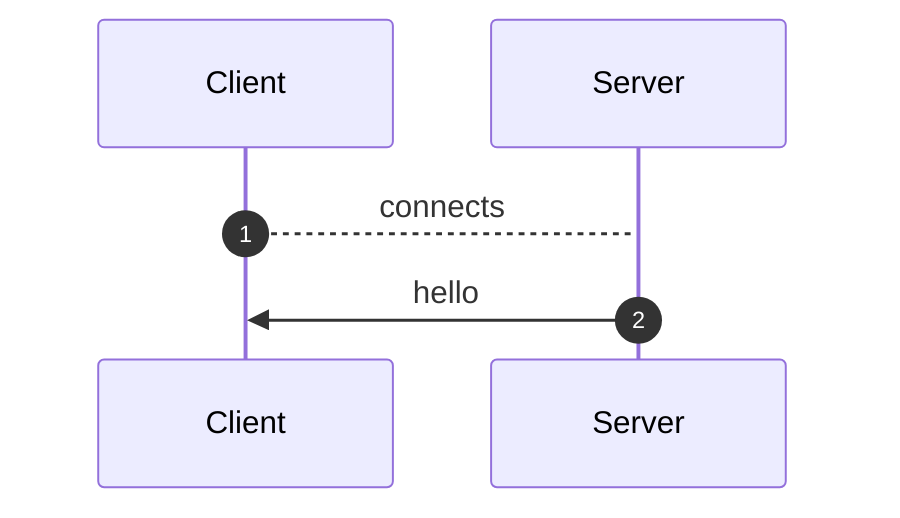
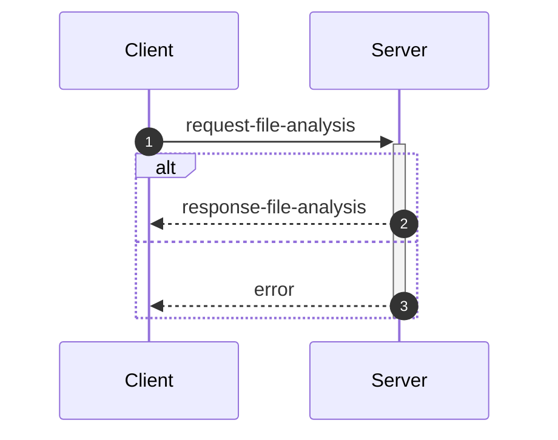
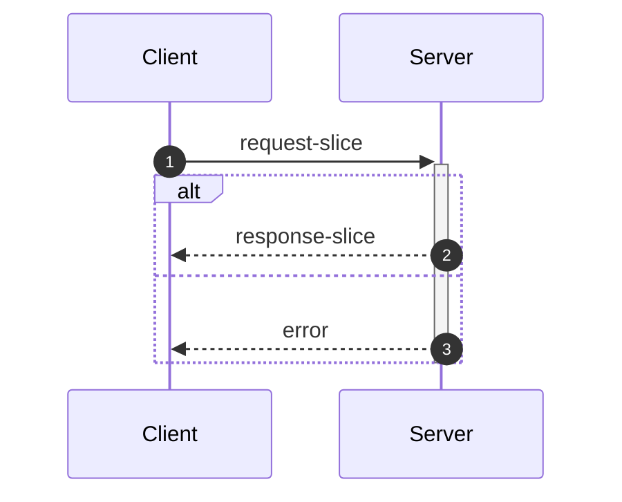
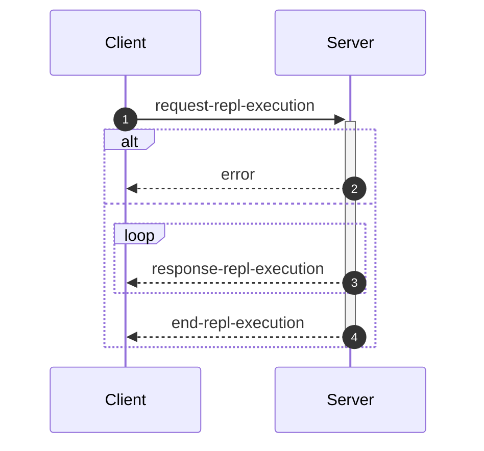

_<span title="an overview of flowR's interface">Generated</span> from '[wiki-interface.ts](https://github.com/flowr-analysis/flowr/tree/main/src/documentation/wiki-interface.ts "src/documentation/wiki-interface.ts")' on 2026-09-15, 15:56:31 UTC (v2.15.8, R v4.6.1), do not edit directly._

Although far from being as detailed as the in-depth explanation of [_flowR_](https://github.com/flowr-analysis/flowr/wiki/Core),
this wiki page explains how to interface with _flowR_ in more detail.
In general, command line arguments and other options provide short descriptions on hover over.

* [💻 Using the REPL](#using-the-repl)
* [⚙️ Configuring FlowR](#configuring-flowr)
* [⚒️ Writing Code](#writing-code)
* [💬 Communicating with the Server](#communicating-with-the-server)

<a id='using-the-repl'></a>
## 💻 Using the REPL

> [!NOTE]
> To execute arbitrary R commands with a repl request, _flowR_ has to be started explicitly with <span title="Description (Command Line Argument): Allow to access the underlying R session when using flowR (security warning: this allows the execution of arbitrary R code!)">`--r-session-access`</span>.
> Please be aware that this introduces a security risk and note that this relies on the [`r-shell` engine](https://github.com/flowr-analysis/flowr/wiki/Engines) .

Although primarily meant for users to explore,
there is nothing which forbids simply calling _flowR_ as a subprocess to use standard-in, -output, and -error
for communication (although you can access the REPL using the server as well,
with the [REPL Request](#message-request-repl-execution) message).

The read-eval-print loop&nbsp;(REPL) works relatively simple.
You can submit an expression (using <kbd>Enter</kbd>),
which is interpreted as an R&nbsp;expression by default but interpreted as a *command* if it starts with a colon (`:`).
The best command to get started with the REPL is <span title="Description (Repl Command): Show help information (aliases: :h, :?)">`:help`</span>.
Besides, you can leave the REPL either with the command <span title="Description (Repl Command): End the repl (aliases: :q, :exit)">`:quit`</span> or by pressing <kbd>Ctrl</kbd>+<kbd>C</kbd> twice.
When writing a *command*, you may press <kbd>Tab</kbd> to get a list of completions, if available.
Multiple commands can be entered in a single line by separating them with a semicolon (`;`), e.g. `:parse "x<-2"; :df*`.
If a command is given without R code, the REPL will re-use R code given in a previous command.
The prior example will hence return first the parsed AST of the program and then the dataflow graph for `"x <- 2"`.

> [!NOTE]
> If you develop flowR, you may want to launch the repl using the `npm run main-dev` command, this way, you get a non-minified version of flowR with debug information and hot-reloading of source files.

<details>
<summary>Available Commands</summary>

We currently offer the following commands (this with a `[*]` suffix are available with and without the star):

| Command | Description |
| ------- | ----------- |
| **<span title="Description (Repl Command): End the repl (aliases: :q, :exit)">:quit</span>** | End the repl (aliases: **:<span title="Alias of ':quit'. End the repl">q</span>**, **:<span title="Alias of ':quit'. End the repl">exit</span>**) |
| **<span title="Description (Repl Command): Execute the given code as R code. This requires the `--r-session-access` flag to be set and requires the r-shell engine. (aliases: :e, :r)">:execute</span>** | Execute the given code as R code. This requires the `--r-session-access` flag to be set and requires the r-shell engine. (aliases: **:<span title="Alias of ':execute'. Execute the given code as R code. This requires the `--r-session-access` flag to be set and requires the r-shell engine.">e</span>**, **:<span title="Alias of ':execute'. Execute the given code as R code. This requires the `--r-session-access` flag to be set and requires the r-shell engine.">r</span>**) |
| **<span title="Description (Repl Command): Get mermaid code for the control-flow graph of R code (aliases: :cfg, :cf)">:controlflow[*]</span>** | Get mermaid code for the control-flow graph of R code (star: Returns the URL to mermaid.live) (aliases: **:<span title="Alias of ':controlflow'. Get mermaid code for the control-flow graph of R code">cfg</span>**, **:<span title="Alias of ':controlflow'. Get mermaid code for the control-flow graph of R code">cf</span>**) |
| **<span title="Description (Repl Command): Get mermaid code for the control-flow graph with basic blocks (aliases: :cfgb, :cfb)">:controlflowbb[*]</span>** | Get mermaid code for the control-flow graph with basic blocks (star: Returns the URL to mermaid.live) (aliases: **:<span title="Alias of ':controlflowbb'. Get mermaid code for the control-flow graph with basic blocks">cfgb</span>**, **:<span title="Alias of ':controlflowbb'. Get mermaid code for the control-flow graph with basic blocks">cfb</span>**) |
| **<span title="Description (Repl Command): Get mermaid code for the dataflow graph (aliases: :d, :df)">:dataflow[*]</span>** | Get mermaid code for the dataflow graph (star: Returns the URL to mermaid.live) (aliases: **:<span title="Alias of ':dataflow'. Get mermaid code for the dataflow graph">d</span>**, **:<span title="Alias of ':dataflow'. Get mermaid code for the dataflow graph">df</span>**) |
| **<span title="Description (Repl Command): Get mermaid code for the normalized AST of R code (aliases: :n)">:normalize[*]</span>** | Get mermaid code for the normalized AST of R code (star: Returns the URL to mermaid.live) (alias: **:<span title="Alias of ':normalize'. Get mermaid code for the normalized AST of R code">n</span>**) |
| **<span title="Description (Repl Command): Get mermaid code for the simplified dataflow graph (aliases: :ds, :dfs)">:dataflowsimple[*]</span>** | Get mermaid code for the simplified dataflow graph (star: Returns the URL to mermaid.live) (aliases: **:<span title="Alias of ':dataflowsimple'. Get mermaid code for the simplified dataflow graph">ds</span>**, **:<span title="Alias of ':dataflowsimple'. Get mermaid code for the simplified dataflow graph">dfs</span>**) |
| **<span title="Description (Repl Command): Inspect and extend the signature database: `query` (identical to :query @signature), `info <name>` for where a function comes from (identical to :query @function-info), `add <path>` to mount another database/source, `download` to fetch the full-history database. (aliases: :sig)">:signature</span>** | Inspect and extend the signature database: `query` (identical to :query @signature), `info <name>` for where a function comes from (identical to :query @function-info), `add <path>` to mount another database/source, `download` to fetch the full-history database. (alias: **:<span title="Alias of ':signature'. Inspect and extend the signature database: `query` (identical to :query @signature), `info <name>` for where a function comes from (identical to :query @function-info), `add <path>` to mount another database/source, `download` to fetch the full-history database.">sig</span>**) |
| **<span title="Description (Repl Command): Just calculates the DFG, but only prints summary info (aliases: :d#, :df#)">:dataflowsilent</span>** | Just calculates the DFG, but only prints summary info (aliases: **:<span title="Alias of ':dataflowsilent'. Just calculates the DFG, but only prints summary info">d#</span>**, **:<span title="Alias of ':dataflowsilent'. Just calculates the DFG, but only prints summary info">df#</span>**) |
| **<span title="Description (Repl Command): Prints ASCII Art of the parsed, unmodified AST (aliases: :p)">:parse</span>** | Prints ASCII Art of the parsed, unmodified AST (alias: **:<span title="Alias of ':parse'. Prints ASCII Art of the parsed, unmodified AST">p</span>**) |
| **<span title="Description (Repl Command): Prints the version of flowR as well as the current version of R">:version</span>** | Prints the version of flowR as well as the current version of R
| **<span title="Description (Repl Command): Query the given R code (use 'help' for more information)">:query[*]</span>** | Query the given R code (use 'help' for more information) (star: Similar to query, but returns the output in json format.)
| **<span title="Description (Repl Command): Returns an ASCII representation of the dataflow graph (aliases: :df!)">:dataflowascii</span>** | Returns an ASCII representation of the dataflow graph (alias: **:<span title="Alias of ':dataflowascii'. Returns an ASCII representation of the dataflow graph">df!</span>**) |
| **<span title="Description (Repl Command): Returns summarization stats for the normalized AST (aliases: :n#)">:normalize#</span>** | Returns summarization stats for the normalized AST (alias: **:<span title="Alias of ':normalize#'. Returns summarization stats for the normalized AST">n#</span>**) |
| **<span title="Description (Repl Command): Show help information (aliases: :h, :?)">:help</span>** | Show help information (aliases: **:<span title="Alias of ':help'. Show help information">h</span>**, **:<span title="Alias of ':help'. Show help information">?</span>**) |

</details>

> [!TIP]
> 
> As indicated by the examples before, all REPL commands that operate on code keep track of the state.
> Hence, if you run a command like <span title="Description (Repl Command, starred version): Returns the URL to mermaid.live; Base Command: Get mermaid code for the dataflow graph (aliases: :d*, :df*)">`:dataflow*`</span> without providing R code,
> the REPL will re-use the R code provided in a previous command.
> Likewise, doing this will benefit from incrementality!
> If you request the dataflow graph with `:df* x <- 2 * y` and then want to see the parsed AST with `:parse`,
> the REPL will re-use previously obtained information and not re-parse the code again.
> 		

Generally, many commands offer shortcut versions in the REPL. Many queries, for example, offer a shortened format (see the example below).
Of special note, the [Config Query](https://github.com/flowr-analysis/flowr/wiki/%5BQuery%5D-Config)
can be used to also modify the currently active configuration of _flowR_ within the REPL (see the [wiki page](https://github.com/flowr-analysis/flowr/wiki/%5BQuery%5D-Config) for more information).

### Example: Retrieving the Dataflow Graph

To retrieve a URL to the [mermaid](https://mermaid.js.org/) diagram of the dataflow of a given expression,
use <span title="Description (Repl Command, starred version): Returns the URL to mermaid.live; Base Command: Get mermaid code for the dataflow graph (aliases: :d*, :df*)">`:dataflow*`</span> (or <span title="Description (Repl Command): Get mermaid code for the dataflow graph (aliases: :d, :df)">`:dataflow`</span> to get the mermaid code in the cli):

```shell
$ docker run -it --rm eagleoutice/flowr # or npm run flowr 
flowR repl v2.15.8, R grammar v14 (tree-sitter engine)
R> :dataflow* y <- 1 + x
```

<details>
<summary style='color:gray'>Output</summary>

```text
https://mermaid.live/view#base64:eyJjb2RlIjoiZmxvd2NoYXJ0IFREXG4gICAgMXt7XCJgKiM5MTtSTnVtYmVyIzkzOyogKioxKipcbiAgICAgICoxLjYqICgqKmlkOiAxKiopYFwifX1cbiAgICAyKFtcImAqIzkxO1JTeW1ib2wjOTM7KiAqKngqKlxuICAgICAgKjEuMTAqICgqKmlkOiAyKiopYFwiXSlcbiAgICAzW1tcImAqIzkxO1JCaW5hcnlPcCM5MzsqIGJhc2UjNTg7IzU4OyoqIzQzOyoqXG4gICAgICAqMS42LTEwKiAoKippZDogMyoqKVxuICAgIGFyZzogKDEsIDIpYFwiXV1cbiAgICBidWlsdC1pbjpfW1wiYEJ1aWx0LUluOlxuIzQzO2BcIl1cbiAgICBzdHlsZSBidWlsdC1pbjpfIHN0cm9rZTpncmF5LGZpbGw6Z3JheSxzdHJva2Utd2lkdGg6MnB4LG9wYWNpdHk6Ljg7XG4gICAgMFtcImAqIzkxO1JTeW1ib2wjOTM7KiAqKnkqKlxuICAgICAgKjEuMSogKCoqaWQ6IDAqKiwgdjogMylgXCJdXG4gICAgNFtbXCJgKiM5MTtSQmluYXJ5T3AjOTM7KiBiYXNlIzU4OyM1ODsqKiM2MDsjNDU7KipcbiAgICAgICoxLjEtMTAqICgqKmlkOiA0KiopXG4gICAgYXJnOiAoMCwgMylgXCJdXVxuICAgIGJ1aWx0LWluOl8tW1wiYEJ1aWx0LUluOlxuIzYwOyM0NTtgXCJdXG4gICAgc3R5bGUgYnVpbHQtaW46Xy0gc3Ryb2tlOmdyYXksZmlsbDpncmF5LHN0cm9rZS13aWR0aDoycHgsb3BhY2l0eTouODtcbiAgICAxIC0uLT58XCJmbG93XCJ8IDJcbiAgICBsaW5rU3R5bGUgMCBzdHJva2U6Z3JheSxjb2xvcjpncmF5O1xuICAgIDIgLS4tPnxcImZsb3dcInwgM1xuICAgIGxpbmtTdHlsZSAxIHN0cm9rZTpncmF5LGNvbG9yOmdyYXk7XG4gICAgMyAtLT58XCJyZWFkcywgYXJnXCJ8IDFcbiAgICAzIC0tPnxcInJlYWRzLCBhcmdcInwgMlxuICAgIDMgLS4tPnxcImZsb3dcInwgMFxuICAgIGxpbmtTdHlsZSA0IHN0cm9rZTpncmF5LGNvbG9yOmdyYXk7XG4gICAgMyAtLi0+fFwicmVhZHMsIGNhbGxzXCJ8IGJ1aWx0LWluOl9cbiAgICBsaW5rU3R5bGUgNSBzdHJva2U6Z3JheTtcbiAgICAwIC0tPnxcImRlZmluZWQtYnksIGZsb3dcInwgNFxuICAgIDAgLS0+fFwiZGVmaW5lZC1ieVwifCAzXG4gICAgNCAtLT58XCJyZWFkcywgYXJnXCJ8IDNcbiAgICA0IC0tPnxcInJldHVybnMsIGFyZ1wifCAwXG4gICAgNCAtLi0+fFwicmVhZHMsIGNhbGxzXCJ8IGJ1aWx0LWluOl8tXG4gICAgbGlua1N0eWxlIDEwIHN0cm9rZTpncmF5OyIsIm1lcm1haWQiOnsiYXV0b1N5bmMiOnRydWV9fQ==
```

Retrieve the dataflow graph of the expression `y <- 1 + x`. It looks like this:


```mermaid
flowchart LR
    1{{"`*#91;RNumber#93;* **1**
      *1.6* (**id: 1**)`"}}
    2(["`*#91;RSymbol#93;* **x**
      *1.10* (**id: 2**)`"])
    3[["`*#91;RBinaryOp#93;* base#58;#58;**#43;**
      *1.6-10* (**id: 3**)
    arg: (1, 2)`"]]
    built-in:_["`Built-In:
#43;`"]
    style built-in:_ stroke:gray,fill:gray,stroke-width:2px,opacity:.8;
    0["`*#91;RSymbol#93;* **y**
      *1.1* (**id: 0**, v: 3)`"]
    4[["`*#91;RBinaryOp#93;* base#58;#58;**#60;#45;**
      *1.1-10* (**id: 4**)
    arg: (0, 3)`"]]
    built-in:_-["`Built-In:
#60;#45;`"]
    style built-in:_- stroke:gray,fill:gray,stroke-width:2px,opacity:.8;
    1 -.->|"flow"| 2
    linkStyle 0 stroke:gray,color:gray;
    2 -.->|"flow"| 3
    linkStyle 1 stroke:gray,color:gray;
    3 -->|"reads, arg"| 1
    3 -->|"reads, arg"| 2
    3 -.->|"flow"| 0
    linkStyle 4 stroke:gray,color:gray;
    3 -.->|"reads, calls"| built-in:_
    linkStyle 5 stroke:gray;
    0 -->|"defined-by, flow"| 4
    0 -->|"defined-by"| 3
    4 -->|"reads, arg"| 3
    4 -->|"returns, arg"| 0
    4 -.->|"reads, calls"| built-in:_-
    linkStyle 10 stroke:gray;
```

<details>

<summary style="color:gray">R Code of the Dataflow Graph</summary>

The analysis ran (including parse and normalize, using the [tree-sitter](https://github.com/flowr-analysis/flowr/wiki/Engines) engine) within the generation environment. No [signature database](https://github.com/flowr-analysis/flowr/wiki/Signature-Database) is mounted for these generated graphs, so `library()` calls attach no package exports; base-R names are still qualified via the generated base-package store (e.g. `acf` as `stats::acf`). 
We encountered no unknown side effects during the analysis.

```r
y <- 1 + x
```

</details>

</details>

For small graphs like this, <span title="Description (Repl Command): Returns an ASCII representation of the dataflow graph (aliases: :df!)">`:dataflowascii`</span> also provides an ASCII representation directly in the REPL:

```shell
$ docker run -it --rm eagleoutice/flowr # or npm run flowr 
flowR repl v2.15.8, R grammar v14 (tree-sitter engine)
R> :df! y <- 1 + x
```

<details open>
<summary style='color:gray'>Output</summary>

```text
                        v<0>v
 c<4>c──────────────────| y |
 |<- |     ┌────────────v---v
 c---c     │
    │   c<3>c   0<1>0
    └───| + |───| 1 |───u<2>u
        c---c   0---0   | x |
           └────────────u---u
Edges:
3 -> 1: reads, arg          3 -> 2: reads, arg
3 -> 0: flows-to            1 -> 2: flows-to
2 -> 3: flows-to            4 -> 3: reads, arg
4 -> 0: returns, arg        0 -> 4: defined-by, flows-to
0 -> 3: defined-by
```

Retrieve the dataflow graph of the expression `y <- 1 + x` as ASCII art.

</details>

For the slicing with <span title="Description (Repl Command): Static backwards executable slicer for R">`:slicer`</span>, you have access to the same [magic comments](#slice-magic-comments) as with the [slice request](#message-request-slice).
Pass `--inline` to splice resolvable `source()` calls into the reconstruction so the slice is a single self-contained R text (the same as the static slice query's `inlineSources` flag).
See `--help` for more flags!

### Example: Interfacing with the File System

Many commands that allow for an R-expression (like <span title="Description (Repl Command, starred version): Returns the URL to mermaid.live; Base Command: Get mermaid code for the dataflow graph (aliases: :d*, :df*)">`:dataflow*`</span>) allow for a file as well
if the argument starts with `file://`.
If you are working from the root directory of the _flowR_ repository, the following gives you the parsed AST of the example file using the <span title="Description (Repl Command): Prints ASCII Art of the parsed, unmodified AST (aliases: :p)">`:parse`</span> command:

> **Watch mode**: Replace `file://` with `watch://` to enter watch mode.
> flowR runs the command immediately and then re-runs it every time the file (or any file inside the folder) changes.
> Enter any other command to leave watch mode.
> For example: `:df watch://analysis.R`

```shell
$ docker run -it --rm eagleoutice/flowr # or npm run flowr 
flowR repl v2.15.8, R grammar v14 (tree-sitter engine)
R> :parse file://test/testfiles/example.R
```

<details>
<summary style='color:gray'>Output</summary>

```text
File: test/testfiles/example.R

program
├ binaryoperator
│ ├ identifier "sum" (1:1─4)
│ ├ <- "<-" (1:5─7)
│ ╰ float "0" (1:8─9)
├ binaryoperator
│ ├ identifier "product" (2:1─8)
│ ├ <- "<-" (2:9─11)
│ ╰ float "1" (2:12─13)
├ binaryoperator
│ ├ identifier "w" (3:1─2)
│ ├ <- "<-" (3:3─5)
│ ╰ float "7" (3:6─7)
├ binaryoperator
│ ├ identifier "N" (4:1─2)
│ ├ <- "<-" (4:3─5)
│ ╰ float "10" (4:6─8)
├ forstatement
│ ├ for "for" (6:1─4)
│ ├ ( "(" (6:5─6)
│ ├ identifier "i" (6:6─7)
│ ├ in "in" (6:8─10)
│ ├ binaryoperator
│ │ ├ float "1" (6:11─12)
│ │ ├ : ":" (6:12─13)
│ │ ╰ parenthesizedexpression
│ │   ├ ( "(" (6:13─14)
│ │   ├ binaryoperator
│ │   │ ├ identifier "N" (6:14─15)
│ │   │ ├ - "-" (6:15─16)
│ │   │ ╰ float "1" (6:16─17)
│ │   ╰ ) ")" (6:17─18)
│ ├ ) ")" (6:18─19)
│ ╰ bracedexpression
│   ├ { "{" (6:20─21)
│   ├ binaryoperator
│   │ ├ identifier "sum" (7:3─6)
│   │ ├ <- "<-" (7:7─9)
│   │ ╰ binaryoperator
│   │   ├ binaryoperator
│   │   │ ├ identifier "sum" (7:10─13)
│   │   │ ├ + "+" (7:14─15)
│   │   │ ╰ identifier "i" (7:16─17)
│   │   ├ + "+" (7:18─19)
│   │   ╰ identifier "w" (7:20─21)
│   ├ binaryoperator
│   │ ├ identifier "product" (8:3─10)
│   │ ├ <- "<-" (8:11─13)
│   │ ╰ binaryoperator
│   │   ├ identifier "product" (8:14─21)
│   │   ├  "" (8:22─23)
│   │   ╰ identifier "i" (8:24─25)
│   ╰ } "}" (9:1─2)
├ call
│ ├ identifier "cat" (11:1─4)
│ ╰ arguments
│   ├ ( "(" (11:4─5)
│   ├ argument
│   │ ╰ string
│   │   ├ " "\"" (11:5─6)
│   │   ├ stringcontent "Sum:" (11:6─10)
│   │   ╰ " "\"" (11:10─11)
│   ├ comma "," (11:11─12)
│   ├ argument
│   │ ╰ identifier "sum" (11:13─16)
│   ├ comma "," (11:16─17)
│   ├ argument
│   │ ╰ string
│   │   ├ " "\"" (11:18─19)
│   │   ├ stringcontent
│   │   │ ╰ escapesequence "\\n" (11:19─21)
│   │   ╰ " "\"" (11:21─22)
│   ╰ ) ")" (11:22─23)
╰ call
  ├ identifier "cat" (12:1─4)
  ╰ arguments
    ├ ( "(" (12:4─5)
    ├ argument
    │ ╰ string
    │   ├ " "\"" (12:5─6)
    │   ├ stringcontent "Product:" (12:6─14)
    │   ╰ " "\"" (12:14─15)
    ├ comma "," (12:15─16)
    ├ argument
    │ ╰ identifier "product" (12:17─24)
    ├ comma "," (12:24─25)
    ├ argument
    │ ╰ string
    │   ├ " "\"" (12:26─27)
    │   ├ stringcontent
    │   │ ╰ escapesequence "\\n" (12:27─29)
    │   ╰ " "\"" (12:29─30)
    ╰ ) ")" (12:30─31)
```

Retrieve the parsed AST of the example file.

<details>

<summary>File Content</summary>

```r
sum <- 0
product <- 1
w <- 7
N <- 10

for (i in 1:(N-1)) {
  sum <- sum + i + w
  product <- product * i
}

cat("Sum:", sum, "\n")
cat("Product:", product, "\n")
```

</details>

As _flowR_ directly transforms this AST the output focuses on being human-readable instead of being machine-readable.
		
</details>

### Example: Run a Query

You can run any query supported by _flowR_ using the <span title="Description (Repl Command): Query the given R code (use 'help' for more information)">`:query`</span> command.
For example, to obtain the shapes of all data frames in a given piece of code, you can run:

```shell
$ docker run -it --rm eagleoutice/flowr # or npm run flowr 
flowR repl v2.15.8, R grammar v14 (tree-sitter engine)
R> :query @absint df-shape "x <- data.frame(a = 1:10, b = 1:10)\ny <- x$a"
```

<details open>
<summary style='color:gray'>Output</summary>

```text
Query: absint (0 ms)
```

Retrieve the shapes of all data frames in the given code.

</details>

To run the linter on a file, you can use (in this example, we just issue the `dead-code` linter on a small piece of code):

```shell
$ docker run -it --rm eagleoutice/flowr # or npm run flowr 
flowR repl v2.15.8, R grammar v14 (tree-sitter engine)
R> :query @linter rules:dead-code "if(FALSE) x <- 2"
```

<details open>
<summary style='color:gray'>Output</summary>

```text
Query: linter (3 ms)
   ╰ Dead Code (dead-code):
       ╰ certain:
           ╰ Code at 1.11-16
```

Run the linter on the given code, with only the `dead-code` rule enabled.

</details>

For more information on the available queries, please check out the [Query API](https://github.com/flowr-analysis/flowr/wiki/Query-API).

<a id='configuring-flowr'></a>
## ⚙️ Configuring FlowR

When running _flowR_, you may want to specify some behaviors with a dedicated configuration file.
By default, flowR looks for a file named `flowr.json` in the current working directory (or any higher directory).
You can also specify a different file with <span title="Description (Command Line Argument): The name of the configuration file to use">`--config-file`</span> or pass the configuration inline using <span title="Description (Command Line Argument): The flowR configuration to use, as a JSON string">`--config-json`</span>.
To inspect the current configuration, you can run flowr with the <span title="Description (Command Line Argument): Run with verbose logging (will be passed to the corresponding script)">`--verbose`</span> flag, or use the `config` [Query](https://github.com/flowr-analysis/flowr/wiki/Query-API).
Within the REPL this works by running the following:

```shell
:query @config
```

To work with the <a href="https://github.com/flowr-analysis/flowr/tree/main/src/config.ts#L108"><code><span title="The configuration file format for flowR.">FlowrConfig</span></code></a> you can use the provided helper objects alongside its methods like
<a href="https://github.com/flowr-analysis/flowr/tree/main/src/config.ts#L861"><code><span title="Creates a new flowr config that has the updated values.">FlowrConfig::<b>amend</b></span></code></a>.
The schema below documents every option; the ones you most likely want are:

- <a href="https://github.com/flowr-analysis/flowr/wiki/Interface#configuring-flowr" title="Configuration Option (boolean): Whether source calls should be ignored, causing {@link processSourceCall}&#39;s behavior to be skipped.">ignoreSourceCalls</a>: ignore source calls when analyzing the code, i.e., ignore the inclusion of other files.
- <a href="https://github.com/flowr-analysis/flowr/wiki/Interface#configuring-flowr" title="Configuration Option (boolean): Whether load calls should be ignored, causing {@link processLoadCall}&#39;s behavior to be skipped.">ignoreLoadCalls</a>: ignore load calls when analyzing the code, i.e., ignore the loading of r-data files.
- <a href="https://github.com/flowr-analysis/flowr/wiki/Interface#configuring-flowr" title="Configuration Option (object): Do you want to overwrite (parts) of the builtin definition?">semantics.environment.overwriteBuiltIns</a>: overwrite _flowR_'s handling of built-in functions, or clear the preset definitions entirely.
  See [Configure BuiltIn Semantics](#configure-builtin-semantics) for more information.
- <a href="https://github.com/flowr-analysis/flowr/wiki/Interface#configuring-flowr" title="Configuration Option (string): How to resolve variables and their values. (one of &quot;disabled&quot;, &quot;alias&quot;, &quot;builtin&quot;)">solver.variables</a>: how to resolve variables and their values (`disabled`, `alias`, `builtin`).
- <a href="https://github.com/flowr-analysis/flowr/wiki/Interface#configuring-flowr" title="Configuration Option (array): The engine or set of engines to use for interacting with R code. An empty array means all available engines will be used.">engines</a> and <a href="https://github.com/flowr-analysis/flowr/wiki/Interface#configuring-flowr" title="Configuration Option (string): The default engine to use for interacting with R code. If this is undefined, an arbitrary engine from the specified list will be used. (one of &quot;tree-sitter&quot;, &quot;r-shell&quot;)">defaultEngine</a>: the engines used to interact with R code, see the [Engines wiki page](https://github.com/flowr-analysis/flowr/wiki/Engines).
- <a href="https://github.com/flowr-analysis/flowr/wiki/Interface#configuring-flowr" title="Configuration Option (array): Files a framework loads on its own, without any source() call (e.g. global.R in a shiny app), in the order they are loaded; flowR orders the matching project files accordingly and analyzes them as one program. Entries are case-insensitive globs matched against the file path, a plain name matches any file with that name, and entries matching no project file are warned about. Usually set per project kind via specializeConfig.">project.implicitSources</a>: the files a framework loads without any `source()` call, in the order in which they are
  loaded. Entries are globs (e.g. `R/*.R`) matched against the file path ignoring capitalization; one matching no file is reported.
- <a href="https://github.com/flowr-analysis/flowr/wiki/Interface#configuring-flowr" title="Configuration Option (object): Overwrite (parts of) the configuration depending on the project kind flowR detects, e.g. to give a shiny app its implicit sources.">specializeConfig</a>: overwrite (parts of) the configuration depending on the kind of project _flowR_ detects
  (e.g. `shiny-app`), which is how a shiny app gets its implicit sources by default. What you configure directly wins.
- <a href="https://github.com/flowr-analysis/flowr/wiki/Interface#configuring-flowr" title="Configuration Option (string): Overwrite the project kind flowR would otherwise infer from the analyzed files, e.g. when auto-detection guesses wrong. (one of &quot;package&quot;, &quot;script&quot;, &quot;shiny-app&quot;, &quot;notebook&quot;, &quot;project&quot;, &quot;unknown&quot;)">project.useProjectType</a>: skip that detection and force a project kind yourself, when auto-detection guesses wrong.
- <a href="https://github.com/flowr-analysis/flowr/wiki/Interface#configuring-flowr" title="Configuration Option (array): The default plugins to load when creating a new instance of FlowrAnalyzer">defaultPlugins</a> and <a href="https://github.com/flowr-analysis/flowr/wiki/Interface#configuring-flowr" title="Configuration Option (array): The plugins to load in REPL mode">repl.plugins</a>: the plugins to load for a new <a href="https://github.com/flowr-analysis/flowr/tree/main/src/project/flowr-analyzer.ts#L202"><code><span title="Central class for conducting analyses with FlowR. Use the FlowrAnalyzerBuilder to create a new instance. If you want the original pattern of creating a pipeline and running all steps, you can still do this with FlowrAnalyzer#runFull . To inspect the context of the analyzer, use FlowrAnalyzer#inspectContext (if you are a plugin and need to modify it, use FlowrAnalyzer#context instead).">FlowrAnalyzer</span></code></a> and in the REPL
  (use `flowr:default` to reference the former).

So you can configure _flowR_ by adding a file like the following:

<details>

<summary>Example Configuration File</summary>

```json
{
  "ignoreSourceCalls": true,
  "ignoreLoadCalls": true,
  "semantics": {
    "environment": {
      "overwriteBuiltIns": {
        "definitions": [
          {
            "type": "function",
            "names": [
              "foo"
            ],
            "processor": "builtin:assign",
            "config": {}
          }
        ]
      }
    }
  },
  "defaultPlugins": [
    "file:description",
    "versions:description"
  ],
  "repl": {
    "quickStats": false,
    "dfProcessorHeat": false,
    "hints": true,
    "plugins": [
      "flowr:default"
    ]
  },
  "project": {
    "resolveUnknownPathsOnDisk": true,
    "implicitSources": [
      "global.R",
      "app.R"
    ]
  },
  "linter": {
    "disabledRules": []
  },
  "specializeConfig": {
    "shiny-app": {
      "project": {
        "implicitSources": [
          "global.R",
          "ui.R",
          "server.R",
          "app.R"
        ]
      }
    }
  },
  "engines": [
    {
      "type": "r-shell"
    }
  ],
  "solver": {
    "variables": "alias",
    "evalStrings": true,
    "trackEnvironments": true,
    "sigdb": {
      "enabled": true,
      "loadProjectDependencies": true,
      "eagerlyLoad": false,
      "eagerlyLoadExports": false,
      "linkBaseR": false,
      "linkDescriptionDependencies": false
    },
    "resolveSource": {
      "dropPaths": "no",
      "ignoreCapitalization": true,
      "inferWorkingDirectory": "active-script",
      "searchPath": []
    },
    "instrument": {},
    "slicer": {
      "threshold": 50
    }
  },
  "abstractInterpretation": {
    "wideningThreshold": 4,
    "followCalls": true,
    "dataFrame": {
      "maxColNames": 20,
      "readLoadedData": {
        "readExternalFiles": true,
        "maxReadLines": 1000000
      }
    }
  },
  "incremental": {
    "alwaysIncremental": false,
    "parsing": {
      "activated": false,
      "heuristics": {
        "activated": true,
        "mtime": true,
        "linesFrom": 500,
        "bytesFrom": 50000,
        "alwaysWithEdits": false,
        "minFiles": 1
      }
    }
  },
  "gas": {
    "thresholds": {
      "memory": {
        "problematic": 0.7,
        "critical": 0.9
      },
      "timeMs": {
        "problematic": 100000,
        "critical": 120000
      }
    },
    "features": {}
  }
}
```

</details>

<details>
<a id='configure-builtin-semantics'></a>
<summary>Configure Built-In Semantics</summary>

`semantics/environment/overwriteBuiltins` accepts two keys:

- `loadDefaults` (boolean, initially `true`): If set to `true`, the default built-in definitions are loaded before applying the custom definitions. Setting this flag to `false` explicitly disables the loading of the default definitions.
- `definitions` (array, initially empty): Allows to overwrite or define new built-in elements. Each object within must have a `type` which is one of the below. Furthermore, they may define a string array of `names` which specifies the identifiers to bind the definitions to. You may use `assumePrimitive` to specify whether _flowR_ should assume that this is a primitive non-library definition (so you probably just do not want to specify the key).

  | Type            | Description                                                                                                                                                                                                                                                                                              | Example                                                                                                    |
  | --------------- | -------------------------------------------------------------------------------------------------------------------------------------------------------------------------------------------------------------------------------------------------------------------------------------------------------- | ---------------------------------------------------------------------------------------------------------- |
  | `constant`    | Additionally allows for a `value` this should resolve to.                                                                                                                                                                                                                                                | `{ type: 'constant', names: ['NULL', 'NA'],  value: null }`                                                |
  | `function`    | Is a rather flexible way to define and bind built-in functions. For the time, we do not have extensive documentation to cover all the cases, so please either consult the sources with the `default-builtin-config.ts` or open a [new issue](https://github.com/flowr-analysis/flowr/issues/new/choose). | `{ type: 'function', names: ['next'], processor: 'builtin:d', config: { cfg: ExitPointType.Next } }` |
  | `replacement` | A comfortable way to specify replacement functions like `$<-` or `names<-`. `suffixes` describes the... suffixes to attach automatically. | `{ type: 'replacement', suffixes: ['<-', '<<-'], names: ['[', '[['] }` |

</details>

<details>

<summary style='color:gray'>Full Configuration-File Schema</summary>

- _The configuration file format for flowR._ (object)
    - **logLevel** [optional] _flowR's global minimum log level, applied when the config is loaded._ (string)
        Only allows: 'silly', 'trace', 'debug', 'info', 'warn', 'error', 'fatal'
    - **ignoreSourceCalls** [optional] _Whether source calls should be ignored, causing {@link processSourceCall}'s behavior to be skipped._ (boolean)
    - **ignoreLoadCalls** [optional] _Whether load calls should be ignored, causing {@link processLoadCall}'s behavior to be skipped._ (boolean)
    - **semantics** _Configure language semantics and how flowR handles them._ (object)
        - **environment** [optional] _Semantics regarding how to handle the R environment._ (object)
            - **overwriteBuiltIns** [optional] _Do you want to overwrite (parts) of the builtin definition?_ (object)
                - **loadDefaults** [optional] _Should the default configuration still be loaded?_ (boolean)
                - **definitions** [optional] _The definitions to load/overwrite._ (array)
                Valid item types:
                    - (object)
    - **defaultPlugins** [optional] _The default plugins to load when creating a new instance of FlowrAnalyzer_ (array)
    Valid item types:
        - (alternatives)
            - (string)
            - (array)
    - **repl** _Configuration options for the REPL._ (object)
        - **quickStats** [optional] _Whether to show quick stats in the REPL after each evaluation._ (boolean)
        - **dfProcessorHeat** [optional] _This instruments the dataflow processors to count how often each processor is called._ (boolean)
        - **hints** [optional] _Whether to show dim inline hints on the empty prompt (automatically disabled on non-interactive terminals)._ (boolean)
        - **plugins** [optional] _The plugins to load in REPL mode_ (array)
        Valid item types:
            - (alternatives)
                - (string)
                - (array)
        - **autoUseFileProtocol** [optional] _Prepend the file protocol to a repl input that looks like a path, instead of only warning about it._ (boolean)
        - **queryStats** [optional] _Whether `:query` closes with the line stating how long the queries took (`:query*` never prints it)._ (boolean)
        - **showPlugins** [optional] _Whether `:version` grays out the plugins that did not activate during the last analysis._ (boolean)
    - **project** _Project specific configuration options._ (object)
        - **resolveUnknownPathsOnDisk** [optional] _Whether to resolve unknown paths loaded by the r project disk when trying to source/analyze files._ (boolean)
        - **failOnInaccessiblePath** [optional] _Whether a directory that cannot be traversed during file discovery (e.g. due to permissions) aborts the analysis; when false (the default) such paths are logged and skipped._ (boolean)
        - **basePackages** [optional] _The packages considered part of R itself (base and recommended); if unset, flowR uses its built-in list._ (array)
        Valid item types:
            - (string)
        - **implicitSources** [optional] _Files a framework loads on its own, without any source() call (e.g. global.R in a shiny app), in the order they are loaded; flowR orders the matching project files accordingly and analyzes them as one program. Entries are case-insensitive globs matched against the file path, a plain name matches any file with that name, and entries matching no project file are warned about. Usually set per project kind via specializeConfig._ (array)
        Valid item types:
            - (string)
        - **useProjectType** [optional] _Overwrite the project kind flowR would otherwise infer from the analyzed files, e.g. when auto-detection guesses wrong._ (string)
            Only allows: 'package', 'script', 'shiny-app', 'notebook', 'project', 'unknown'
        - **assumeImplicitEcho** [optional] _Whether the top level of the analyzed code is echoed, so that every visible result printed there is collected as an output by the dependencies query (default true, false for a package)._ (boolean)
        - **discovery** [optional] _Scoping options for the default project discovery._ (object)
            - **full** [optional] _Collect every file below the project root (greedy) instead of only the files the detected project kind needs (default false)._ (boolean)
            - **perKind** [optional] _Per-kind include/exclude glob overrides layered on the default scoping._ (object)
            - **ignore** [optional] _Case-insensitive globs that drop matching files from the intelligent discovery, regardless of kind (e.g. .Renviron to ignore environment files)._ (array)
            Valid item types:
                - (string)
        - **classification** [optional] _Overrides for the signals flowR uses to classify the project kind._ (object)
            - **shinyDescriptionTypes** [optional] _DESCRIPTION Type: values that mark a shiny app._ (array)
            Valid item types:
                - (string)
            - **shinyEntryFiles** [optional] _File names a shiny app is assembled from._ (array)
            Valid item types:
                - (string)
            - **shinyUsagePattern** [optional] _Regex source evidencing shiny usage in an entry file._ (string)
            - **notebookExtensions** [optional] _File extensions marking a notebook._ (array)
            Valid item types:
                - (string)
    - **linter** _Linter configuration options._ (object)
        - **disabledRules** _Linting rule names excluded from the default rule set (a rule requested explicitly via a linter query still runs). Usually set per project kind via specializeConfig._ (array)
        Valid item types:
            - (string)
    - **inputSources** [optional] _Further frameworks the input-sources analysis should know about; entries are added to flowR's defaults._ (object)
        - **pure** [optional] _Functions that only pass the constantness of their arguments on._ (array)
        Valid item types:
            - (string)
        - **param** [optional] _Functions whose result is a 'param' input._ (array)
        Valid item types:
            - (string)
        - **file** [optional] _Functions whose result is a 'file' input._ (array)
        Valid item types:
            - (string)
        - **tempfile** [optional] _Functions whose result is a 'tempfile' input._ (array)
        Valid item types:
            - (string)
        - **glob** [optional] _Functions whose result is a 'glob' input._ (array)
        Valid item types:
            - (string)
        - **net** [optional] _Functions whose result is a 'net' input._ (array)
        Valid item types:
            - (string)
        - **rand** [optional] _Functions whose result is a 'rand' input._ (array)
        Valid item types:
            - (string)
        - **system** [optional] _Functions whose result is a 'system' input._ (array)
        Valid item types:
            - (string)
        - **ffi** [optional] _Functions whose result is a 'ffi' input._ (array)
        Valid item types:
            - (string)
        - **lang** [optional] _Functions whose result is a 'lang' input._ (array)
        Valid item types:
            - (string)
        - **options** [optional] _Functions whose result is a 'options' input._ (array)
        Valid item types:
            - (string)
        - **cmdline** [optional] _Functions whose result is a 'cmdline' input._ (array)
        Valid item types:
            - (string)
        - **user** [optional] _Functions whose result is a 'user' input._ (array)
        Valid item types:
            - (string)
        - **const** [optional] _Functions whose result is a 'const' input._ (array)
        Valid item types:
            - (string)
        - **scope** [optional] _Functions whose result is a 'scope' input._ (array)
        Valid item types:
            - (string)
        - **dconst** [optional] _Functions whose result is a 'dconst' input._ (array)
        Valid item types:
            - (string)
        - **unknown** [optional] _Functions whose result is a 'unknown' input._ (array)
        Valid item types:
            - (string)
        - **linkedObjects** [optional] _Objects a framework provides without a definition in the code, e.g. shiny's input._ (array)
        Valid item types:
            - (object)
        - **linkedEntryPoints** [optional] _Calls that hand a function to a framework, which binds its objects to the parameters by position._ (array)
        Valid item types:
            - (object)
    - **specializeConfig** [optional] _Overwrite (parts of) the configuration depending on the project kind flowR detects, e.g. to give a shiny app its implicit sources._ (object)
    - **engines** _The engine or set of engines to use for interacting with R code. An empty array means all available engines will be used._ (array)
    Valid item types:
        - (alternatives)
            - _The configuration for the tree sitter engine._ (object)
                - **type** [required] _Use the tree sitter engine._ (string)
                    Only allows: 'tree-sitter'
                - **wasmPath** [optional] _The path to the tree-sitter-r WASM binary to use. If this is undefined, this uses the default path._ (string)
                - **treeSitterWasmPath** [optional] _The path to the tree-sitter WASM binary to use. If this is undefined, this uses the default path._ (string)
                - **lax** [optional] _Whether to use the lax parser for parsing R code (allowing for syntax errors). If this is undefined, the strict parser will be used._ (boolean)
            - _The configuration for the R shell engine._ (object)
                - **type** [required] _Use the R shell engine._ (string)
                    Only allows: 'r-shell'
                - **rPath** [optional] _The path to the R executable to use. If this is undefined, this uses the default path._ (string)
                - **pipeBind** [optional] _Whether to enable R's experimental pipe-bind operator "=>" by setting _R_USE_PIPEBIND_ for the R session (default false); R itself keeps this off by default, as it is experimental and has never shipped in a release version of R._ (boolean)
    - **defaultEngine** [optional] _The default engine to use for interacting with R code. If this is undefined, an arbitrary engine from the specified list will be used._ (string)
        Only allows: 'tree-sitter', 'r-shell'
    - **solver** _How to resolve constants, constraints, cells, ..._ (object)
        - **variables** _How to resolve variables and their values._ (string)
            Only allows: 'disabled', 'alias', 'builtin'
        - **evalStrings** _Should we include eval(parse(text="...")) calls in the dataflow graph?_ (boolean)
        - **trackEnvironments** [optional] _Track user-created environments (new.env, assign/get/local with envir=, dollar-assign, attach). When false, all envir-style calls fall through conservatively._ (boolean)
        - **sigdb** _Resolving library exports from a signature database._ (object)
            - **enabled** [optional] _Resolve library()/use() exports from a signature database (default true); when false no database is consulted._ (boolean)
            - **loadProjectDependencies** [optional] _Load the project's declared dependencies from its metadata files (DESCRIPTION Imports/Depends, rproject.toml, uvr.toml, renv.lock, rv.lock, uvr.lock) (default true); when false these files are not read for dependencies._ (boolean)
            - **eagerlyLoad** [optional] _Parse the database up front rather than on the first package load (default false, ignored if disabled)._ (boolean)
            - **eagerlyLoadExports** [optional] _Add a vertex for every export on load rather than on demand (default false); keeps the dataflow graph small._ (boolean)
            - **assumedRVersion** [optional] _R version assumed when resolving versioned (base-R) exports: a pin like "4.5" or "auto" to detect the installed R (default "auto")._ (string)
            - **linkBaseR** [optional] _Eagerly attach base-R namespaces so bare base calls resolve without library() (default false)._ (boolean)
            - **linkBaseRCalls** [optional] _Add a lightweight Reads edge from a bare base-R call to its signature-database function vertex (default false; base-R qualification is edge-free otherwise)._ (boolean)
            - **linkPackageCalls** [optional] _Add a lightweight Reads edge from a resolved package call to its signature-database function vertex (default false)._ (boolean)
            - **linkDescriptionDependencies** [optional] _Eagerly attach the namespaces of the project's declared DESCRIPTION dependencies (Imports/Depends) so their exports resolve without an explicit library() (default false)._ (boolean)
            - **warmInBackground** [optional] _Decompress the hot shards (base + most-downloaded) in a background task on startup so the first library() lookup is warm (default false; for long-running servers/REPLs)._ (boolean)
            - **additionalPaths** [optional] _Extra directories or bundle/manifest files searched for signature databases (alongside the shipped default and $FLOWR_SIGDB_DIR); a downloaded full-history bundle placed here is mounted automatically._ (array)
            Valid item types:
                - (string)
            - **downloadRepo** [optional] _GitHub owner/repo the full-history bundle is downloaded from via ":signature download" (default "flowr-analysis/flowr", release tag "sigdb-v<flowR-version>")._ (string)
            - **autoSync** [optional] _On startup, re-download shards whose committed sigdb.remote.json hash no longer matches the cache, in the background (default false; opt-in network sync after a git pull)._ (boolean)
            - **installedLibrary** [optional] _Recovering packages no signature database knows from the copy installed on this machine._ (object)
                - **enabled** [required] _Recover packages no signature database knows from their installed copy (default false)._ (boolean)
                - **paths** [optional] _Library directories to search; when empty they are discovered from the environment and the project._ (array)
                Valid item types:
                    - (string)
                - **useEnvironment** [optional] _Search the libraries R_LIBS_USER/R_LIBS/R_LIBS_SITE name (default true)._ (boolean)
                - **useProjectLibrary** [optional] _Search a project-local renv/packrat library (default true)._ (boolean)
                - **maxDepth** [optional] _How far to descend into the nested layout of a project-local library (default 3)._ (number)
                - **packages** [optional] _Only recover packages whose name matches one of these regular expressions; empty means any._ (array)
                Valid item types:
                    - (string)
            - **blobCacheBudgetMb** [optional] _How many MiB of decoded package blobs every open bundle may hold together (default 16)._ (number)
            - **versionSelection** [optional] _When a project constrains a dependency, resolve to the newest (default), oldest, or system-installed version satisfying it; system needs R and falls back to newest. Base-R packages always resolve against the assumed R version._ (string)
                Only allows: 'newest', 'oldest', 'system'
            - **versionOverrides** [optional] _Force an exact version for specific packages (name -> version), overriding both the project constraint and the versionSelection policy (default {})._ (object)
        - **versionManagement** _Policies for reasoning about dependency versions._ (object)
            - **linkedVersionGroups** [optional] _Groups of packages that must resolve to the same version; version guessing intersects each group so its members stay mutually compatible (default [])._ (array)
            Valid item types:
                - (array)
                Valid item types:
                    - (string)
        - **assumeAttachedPackages** [optional] _Packages to treat as attached without a `library()` call, so what the built-in configuration states about them applies to the analyzed code. The base packages R attaches on startup already resolve without it._ (array)
        Valid item types:
            - (string)
        - **transitiveSideEffectRounds** [optional] _How many rounds the transitive side-effect fixpoint may run before it is cut off (default 32); the propagation stops on its own as soon as a round adds nothing._ (number)
        - **maxOverlayDepth** [optional] _How many binding overlays may stack on one environment frame before a write flattens them (default 4); a pure performance knob, trading lookup cost against copy cost without changing any result._ (number)
        - **instrument** (object)
            - **dataflowExtractors** [optional] _These keys are only intended for use within code, allowing to instrument the dataflow analyzer!_ (any)
        - **resolveSource** [optional] _If lax source calls are active, flowR searches for sourced files much more freely, based on the configurations you give it. This option is only in effect if `ignoreSourceCalls` is set to false._ (object)
            - **dropPaths** _Allow to drop the first or all parts of the sourced path, if it is relative._ (string)
                Only allows: 'no', 'once', 'all'
            - **ignoreCapitalization** _Search for filenames matching in the lowercase._ (boolean)
            - **inferWorkingDirectory** _Try to infer the working directory from the main or any script to analyze._ (string)
                Only allows: 'no', 'main-script', 'active-script', 'any-script'
            - **searchPath** _Additionally search in these paths._ (array)
            Valid item types:
                - (string)
            - **repeatedSourceLimit** [optional] _How often the same file can be sourced within a single run? Please be aware: in case of cyclic sources this may not reach a fixpoint so give this a sensible limit._ (number)
            - **applyReplacements** _Provide name replacements for loaded files_ (array)
            Valid item types:
                - (object)
            - **assumeFilesExist** [optional] _Assume a sourced file is always there, making what it defines certain instead of conditional on the source call._ (boolean)
        - **slicer** [optional] _The configuration for the slicer._ (object)
            - **threshold** [optional] _The maximum number of iterations to perform on a single function call during slicing._ (number)
            - **autoExtend** [optional] _If set, the slicer will gain an additional post-pass._ (boolean)
    - **abstractInterpretation** _The configuration options for abstract interpretation._ (object)
        - **wideningThreshold** _The threshold for the number of visitations of a node at which widening should be performed to ensure the termination of the fixpoint iteration._ (number)
        - **followCalls** _Whether the abstract interpretation is interprocedural, i.e. whether it steps into the functions a call may dispatch to._ (boolean)
        - **dataFrame** _The configuration of the shape inference for data frames._ (object)
            - **maxColNames** _The maximum number of columns names to infer for data frames before over-approximating the column names to top._ (number)
            - **readLoadedData** _Configuration options for reading data frame shapes from loaded external data files, such as CSV files._ (object)
                - **readExternalFiles** _Whether data frame shapes should be extracted from loaded external files, such as CSV files._ (boolean)
                - **maxReadLines** _The maximum number of lines to read when extracting data frame shapes from loaded files, such as CSV files._ (number)
    - **incremental** (object)
        - **alwaysIncremental** _Always take the incremental path, regardless of heuristics._ (boolean)
        - **parsing** (object)
            - **activated** _If set, incremental parsing will be used._ (boolean)
            - **heuristics** (object)
                - **activated** [optional] _If set, the heuristics for incremental parsing will be used._ (boolean)
                - **mtime** [optional] _Skip reparsing entirely if the file's modification time is unchanged since the last parse._ (boolean)
                - **linesFrom** [optional] _Only consider incremental parsing for files with at least this many lines._ (number)
                - **bytesFrom** [optional] _Only consider incremental parsing for files with at least this many bytes._ (number)
                - **alwaysWithEdits** [optional] _Always take the incremental path whenever there is a computed edit region, regardless of the other thresholds._ (boolean)
                - **minFiles** [optional] _Only apply these heuristics once the project has at least this many files loaded._ (number)
    - **gas** [optional] _Resource-usage guard (gas) configuration. All feature factors default to 0 (disabled). See https://github.com/flowr-analysis/flowr/wiki/Core#gas-resource-guard._ (object)
        - **thresholds** [optional] _Thresholds for all gas checks (scaled by per-feature factor), boundable per feature._ (object)
            - **memory** [optional] _Heap-usage fraction thresholds (0-1), either shared or given per feature key (with `default` covering the rest)._ (object)
                - **problematic** [optional] _Heap fraction (0-1) above which Problematic is returned, for every feature without an entry of its own._ (number)
                - **critical** [optional] _Heap fraction (0-1) above which Critical is returned, for every feature without an entry of its own._ (number)
            - **timeMs** [optional] _Elapsed analysis time thresholds in milliseconds, either shared or given per feature key (with `default` covering the rest)._ (object)
                - **problematic** [optional] _Elapsed ms above which Problematic is returned, for every feature without an entry of its own._ (number)
                - **critical** [optional] _Elapsed ms above which Critical is returned, for every feature without an entry of its own._ (number)
            - **steps** [optional] _Processed-AST-node thresholds, counted rather than sampled; only a key that arms a budget (`dataflow`) reads them._ (object)
                - **problematic** [optional] _Processed AST nodes above which Problematic is returned, for every feature without an entry of its own._ (number)
                - **critical** [optional] _Processed AST nodes above which the extraction is cut short, for every feature without an entry of its own._ (number)
            - **vertices** [optional] _Created-dataflow-vertex thresholds, counted like `steps`._ (object)
                - **problematic** [optional] _Created dataflow vertices above which Problematic is returned, for every feature without an entry of its own._ (number)
                - **critical** [optional] _Created dataflow vertices above which the extraction is cut short, for every feature without an entry of its own._ (number)
        - **features** [optional] _Per-feature sensitivity factors. 0 or absent disables gas checking for that feature. A factor of 2 makes the feature twice as sensitive. Recognised keys: `source`, `side-effect-linking`, `linter`, `slicer`, `dataflow`._ (object)
        - **countedCheckEvery** [optional] _How many counted steps pass between two clock reads while an armed budget also carries a timeMs bound (default 64); trades overshoot against the cost of reading the clock._ (number)
        - **heapProvider** [optional] _Custom heap statistics source (programmatic configs only), overriding the built-in v8/performance.memory detection._ (function)

</details>

<a id='writing-code'></a>
## ⚒️ Writing Code

_flowR_ can be used as a [module](https://www.npmjs.com/package/@eagleoutice/flowr) and offers several main classes and interfaces that are interesting for extension writers 
(see the [Visual Studio Code extension](https://marketplace.visualstudio.com/items?itemName=code-inspect.vscode-flowr) or the [Core](https://github.com/flowr-analysis/flowr/wiki/Core) wiki page for more information).

### Creating Analyses with _flowR_

Nowadays, instances of the <a href="https://github.com/flowr-analysis/flowr/tree/main/src/project/flowr-analyzer.ts#L202"><code><span title="Central class for conducting analyses with FlowR. Use the FlowrAnalyzerBuilder to create a new instance. If you want the original pattern of creating a pipeline and running all steps, you can still do this with FlowrAnalyzer#runFull . To inspect the context of the analyzer, use FlowrAnalyzer#inspectContext (if you are a plugin and need to modify it, use FlowrAnalyzer#context instead).">FlowrAnalyzer</span></code></a> should be used as central frontend to get analysis results from _flowR_.
The entry points an analysis is written against are re-exported from the package root (`import { FlowrAnalyzerBuilder } from '@eagleoutice/flowr'`);
everything else stays reachable under its own path, as in `@eagleoutice/flowr/dataflow/graph/graph`.
For example, a program slice can be created like this:

```ts
const analyzer = await new FlowrAnalyzerBuilder()
    .setEngine('tree-sitter')
    .build();
analyzer.addRequest('x <- 1\ny <- x\nx');
const result = await analyzer.query([
    {
        type:     'static-slice',
        criteria: ['3@x']
    }
]);
//console.log(result['static-slice']);
```

For more information, please have a look at the [Analyzer](https://github.com/flowr-analysis/flowr/wiki/Analyzer) wiki page, which explains how to construct and use the <a href="https://github.com/flowr-analysis/flowr/tree/main/src/project/flowr-analyzer.ts#L202"><code><span title="Central class for conducting analyses with FlowR. Use the FlowrAnalyzerBuilder to create a new instance. If you want the original pattern of creating a pipeline and running all steps, you can still do this with FlowrAnalyzer#runFull . To inspect the context of the analyzer, use FlowrAnalyzer#inspectContext (if you are a plugin and need to modify it, use FlowrAnalyzer#context instead).">FlowrAnalyzer</span></code></a> in more detail.
To work with specific perspectives, you can also consult the respective pages like the [Dataflow Graph](https://github.com/flowr-analysis/flowr/wiki/Dataflow-Graph) or the [Abstract Interpretation](https://github.com/flowr-analysis/flowr/wiki/Abstract-Interpretation) wiki pages.
### The Pipeline Executor (Low-Level Interface)

Once, in the beginning, _flowR_ was meant to produce a dataflow graph merely to provide *program slices*. 
However, with continuous updates, the [Dataflow Graph](https://github.com/flowr-analysis/flowr/wiki/Dataflow-Graph) repeatedly proves to be the more interesting part.
With this, we restructured _flowR_'s originally *hardcoded* pipeline to be far more flexible. 
Now, it can be theoretically extended or replaced with arbitrary steps, optional steps, and what we call 'decorations' of these steps. 
In short, a slicing pipeline using the <a href="https://github.com/flowr-analysis/flowr/tree/main/src/core/pipeline-executor.ts#L97"><code><span title="**Please note:** The PipelineExecutor is now considered to be a rather low-level API for flowR. While it still works and is the basis for all other layers, we strongly recommend using the FlowrAnalyzer and its builder to create and use an analyzer instance that is pre-configured for your use-case. The pipeline executor allows to execute arbitrary pipelines in a step-by-step fashion. If you are not...">PipelineExecutor</span></code></a> looks like this:

```ts

const slicer = new PipelineExecutor(DEFAULT_SLICING_PIPELINE, {
  parser:    new RShell(),
  request:   requestFromInput('x <- 1\nx + 1'),
  criterion: ['2@x']
})
const slice = await slicer.allRemainingSteps()
// console.log(slice.reconstruct.code)
```

<details><summary>More Information</summary>

If you compare this, with what you would have done with the old (and removed) `SteppingSlicer`, 
this essentially just requires you to replace the `SteppingSlicer` with the <a href="https://github.com/flowr-analysis/flowr/tree/main/src/core/pipeline-executor.ts#L97"><code><span title="**Please note:** The PipelineExecutor is now considered to be a rather low-level API for flowR. While it still works and is the basis for all other layers, we strongly recommend using the FlowrAnalyzer and its builder to create and use an analyzer instance that is pre-configured for your use-case. The pipeline executor allows to execute arbitrary pipelines in a step-by-step fashion. If you are not...">PipelineExecutor</span></code></a>
and to pass the <a href="https://github.com/flowr-analysis/flowr/tree/main/src/core/steps/pipeline/default-pipelines.ts#L18"><code>DEFAULT_SLICING_PIPELINE</code></a> as the first argument.
The <a href="https://github.com/flowr-analysis/flowr/tree/main/src/core/pipeline-executor.ts#L97"><code><span title="**Please note:** The PipelineExecutor is now considered to be a rather low-level API for flowR. While it still works and is the basis for all other layers, we strongly recommend using the FlowrAnalyzer and its builder to create and use an analyzer instance that is pre-configured for your use-case. The pipeline executor allows to execute arbitrary pipelines in a step-by-step fashion. If you are not...">PipelineExecutor</span></code></a>...

1. Provides structures to investigate the results of all intermediate steps
2. Can be executed step-by-step
3. Can repeat steps (e.g., to calculate multiple slices on the same input)

See the in-code documentation for more information.

</details>

### Using the <a href="https://github.com/flowr-analysis/flowr/tree/main/src/r-bridge/shell.ts#L143"><code><span title="The RShell represents an interactive session with the R interpreter. You can configure it by RShellOptions . At the moment we are using a live R session (and not networking etc.) to communicate with R easily, which allows us to install packages etc. However, this might and probably will change in the future (leaving this as a legacy mode :D)">RShell</span></code></a> to Interact with R

The <a href="https://github.com/flowr-analysis/flowr/tree/main/src/r-bridge/shell.ts#L143"><code><span title="The RShell represents an interactive session with the R interpreter. You can configure it by RShellOptions . At the moment we are using a live R session (and not networking etc.) to communicate with R easily, which allows us to install packages etc. However, this might and probably will change in the future (leaving this as a legacy mode :D)">RShell</span></code></a> class allows interfacing with the `R`&nbsp;ecosystem installed on the host system.
Please have a look at [flowR's Engines](https://github.com/flowr-analysis/flowr/wiki/Engines) for more information on alternatives (for example, the <a href="https://github.com/flowr-analysis/flowr/tree/main/src/r-bridge/lang-4.x/tree-sitter/tree-sitter-executor.ts#L20"><code><span title="Synchronous and (way) faster alternative to the RShell using tree-sitter.">TreeSitterExecutor</span></code></a>).

> [!IMPORTANT]
> 
> Each <a href="https://github.com/flowr-analysis/flowr/tree/main/src/r-bridge/shell.ts#L143"><code><span title="The RShell represents an interactive session with the R interpreter. You can configure it by RShellOptions . At the moment we are using a live R session (and not networking etc.) to communicate with R easily, which allows us to install packages etc. However, this might and probably will change in the future (leaving this as a legacy mode :D)">RShell</span></code></a> controls a new instance of the R&nbsp;interpreter, 
> make sure to call <code><a href="https://github.com/flowr-analysis/flowr/tree/main/src/r-bridge/shell.ts#L353"><span title="Close the current R session, makes the object effectively invalid (can no longer be reopened etc.)">RShell::<i>close</i></span></a>()</code> when you are done.

You can start a new "session" simply by constructing a new object with <code>new <a href="https://github.com/flowr-analysis/flowr/tree/main/src/r-bridge/shell.ts#L143"><span title="The RShell represents an interactive session with the R interpreter. You can configure it by RShellOptions . At the moment we are using a live R session (and not networking etc.) to communicate with R easily, which allows us to install packages etc. However, this might and probably will change in the future (leaving this as a legacy mode :D)">RShell</span></a>()</code>.

However, there are several options that may be of interest 
(e.g., to automatically revive the shell in case of errors or to control the name location of the R process on the system).

With a shell object (let's call it `shell`), you can execute R code by using <a href="https://github.com/flowr-analysis/flowr/tree/main/src/r-bridge/shell.ts#L212"><code><span title="sends the given command directly to the current R session will not do anything to alter input markers!">RShell::<i>sendCommand</i></span></code></a>,
for example <code>shell.<a href="https://github.com/flowr-analysis/flowr/tree/main/src/r-bridge/shell.ts#L212"><span title="sends the given command directly to the current R session will not do anything to alter input markers!">sendCommand</span></a>("1 + 1")</code>.
However, this does not return anything, so if you want to collect the output of your command, use
<a href="https://github.com/flowr-analysis/flowr/tree/main/src/r-bridge/shell.ts#L295"><code><span title="Send a command and collect the output">RShell::<i>sendCommandWithOutput</i></span></code></a> instead.

<a id='communicating-with-the-server'></a>
## 💬 Communicating with the Server

As explained in the [Overview](https://github.com/flowr-analysis/flowr/wiki/Overview), you can simply run the [TCP](https://de.wikipedia.org/wiki/Transmission_Control_Protocol)&nbsp;server by adding the <span title="Description (Command Line Argument): Do not drop into a repl, but instead start a server on the given port (default: 1042) and listen for messages.">`--server`</span> flag (and, due to the interactive mode, exit with the conventional <kbd>CTRL</kbd>+<kbd>C</kbd>).
Currently, every connection is handled by the same underlying `RShell` - so the server is not designed to handle many clients at a time.
Additionally, the server is not well guarded against attacks (e.g., you can theoretically spawn an arbitrary number of&nbsp;RShell sessions on the target machine).

Every message has to be given in a single line (i.e., without a newline in-between) and end with a newline character. Nevertheless, we will pretty-print example given in the following segments for the ease of reading.

> [!NOTE]
> 
> The default <span title="Description (Command Line Argument): Do not drop into a repl, but instead start a server on the given port (default: 1042) and listen for messages.">`--server`</span> uses a simple [TCP](https://de.wikipedia.org/wiki/Transmission_Control_Protocol)
> connection. If you want _flowR_ to expose a [WebSocket](https://de.wikipedia.org/wiki/WebSocket) server instead, add the <span title="Description (Command Line Argument): If the server flag is set, use websocket for messaging">`--ws`</span> flag (i.e., <span title="Description (Command Line Argument): Do not drop into a repl, but instead start a server on the given port (default: 1042) and listen for messages.">`--server`</span> <span title="Description (Command Line Argument): If the server flag is set, use websocket for messaging">`--ws`</span>) when starting _flowR_ from the command line.

<ul><li>
<a id="message-hello"></a>
<b>Hello</b> Message (<code>hello</code>) 
<details>

<summary style="color:gray"> View Details. <i>The server informs the client about the successful connection and provides Meta-Information.</i> </summary>


```mermaid
sequenceDiagram
    autonumber
    participant Client
    participant Server

    
    Client-->Server: connects
    Server->>Client: hello
	
```

After launching _flowR_, for example, with <code>docker run -it --rm eagleoutice/flowr <span title="Description (Command Line Argument): Do not drop into a repl, but instead start a server on the given port (default: 1042) and listen for messages.">-<span/>-server</span></code>&nbsp;(🐳️), simply connecting should present you with a `hello` message, that amongst others should reveal the versions of&nbsp;_flowR_ and&nbsp;R, using the [semver 2.0](https://semver.org/spec/v2.0.0.html) versioning scheme.
The message looks like this:

```json
{
  "type": "hello",
  "clientName": "client-0",
  "versions": {
    "flowr": "2.15.8",
    "r": "4.6.1",
    "engine": "r-shell"
  }
}
```

There are currently a few messages that you can send after the hello message.
If you want to _slice_ a piece of R code you first have to send an [analysis request](#message-request-file-analysis), so that you can send one or multiple slice requests afterward.
Requests for the [REPL](#message-request-repl-execution) are independent of that.
	
<hr>

<details>
<summary style="color:gray">Message schema (<code>hello</code>)</summary>

For the definition of the hello message, please see it's implementation at [`./src/cli/repl/server/messages/message-hello.ts`](https://github.com/flowr-analysis/flowr/tree/main/src/cli/repl/server/messages/message-hello.ts).

- [required] (object)
    - **type** [required] _The type of the hello message._ (string)
        Only allows: 'hello'
    - **id** [forbidden] _The id of the message is always undefined (as it is the initial message and not requested)._ (any)
    - **clientName** [required] _A unique name that is assigned to each client. It has no semantic meaning and is only used/useful for debugging._ (string)
    - **versions** [required] (object)
        - **flowr** [required] _The version of the flowr server running in semver format._ (string)
        - **r** [required] _The version of the underlying R shell running in semver format._ (string)
        - **engine** [required] _The parser backend that is used to parse the R code._ (string)

</details>

<hr>

</details>
	</li>

<li>
<a id="message-request-file-analysis"></a>
<b>Analysis</b> Message (<code>request-file-analysis</code>) 
<details>

<summary style="color:gray"> View Details. <i>The server builds the dataflow graph for a given input file (or a set of files).</i> </summary>


```mermaid
sequenceDiagram
    autonumber
    participant Client
    participant Server

    
    Client->>+Server: request-file-analysis
    alt
        Server-->>Client: response-file-analysis
    else
        Server-->>Client: error
    end
    deactivate  Server
	
```

The request allows the server to analyze a file and prepare it for slicing.
The message can contain a `filetoken`, which is used to identify the file in later slice or query requests (if you do not add one, the request will not be stored and therefore, it is not available for subsequent requests).

> **Please note!**\
> If you want to send and process a lot of analysis requests, but do not want to slice them, please do not pass the `filetoken` field. This will save the server a lot of memory allocation.

Furthermore, the request must contain either a `content` field to directly pass the file's content or a `filepath` field which contains the path to the file (this path must be accessible for the server to be useful).
If you add the `id` field, the answer will use the same `id` so you can match requests and the corresponding answers.
See the implementation of the request-file-analysis message for more information.

You can drop one or more stored file tokens by adding the `invalidateToken` field (a single token or an array of tokens).
The server frees the corresponding analyses _after_ it has answered the request.

> **Tip!**\
> If you only want to drop tokens, you do not need a separate message: send a `request-file-analysis` that contains _just_ the `invalidateToken` field (and no `content` or `filepath`).
> Such a request behaves like an empty file analysis and the server replies with an empty `results` object.
> Because invalidation happens after the response, you may even pass the _current_ `filetoken` in `invalidateToken` to analyze a file once and have the server forget it right after you received the results.

<details>
<summary>Example of the <code>request-file-analysis</code> Message</summary>

_Note:_ even though we pretty-print these messages, they are sent as a single line, ending with a newline.

The following lists all messages that were sent and received in case you want to reproduce the scenario:

<ol>
<li> <code>hello</code> (response)
<details> 

<summary> Show Details </summary>

The first message is always a hello message.

```json
{"type":"hello","clientName":"client-0","versions":{"flowr":"2.15.8","r":"4.6.1","engine":"r-shell"}}
```

</details>
</li>

<li> <b><code>request-file-analysis</code> (request)</b>
<details open> 

<summary> Show Details </summary>

Let's suppose you simply want to analyze the following script:
 
```r
x <- 1
x + 1
```

 For this, you can send the following request:

```json
{"type":"request-file-analysis","id":"1","filetoken":"x","content":"x <- 1\nx + 1"}
```

</details>
</li>

<li> <code>response-file-analysis</code> (response)
<details> 

<summary> Show Details </summary>

The `results` field of the response effectively contains three keys of importance:

- `parse`: which contains 1:1 the parse result in CSV format that we received from the `RShell` (i.e., the AST produced by the parser of the R interpreter).
- `normalize`: which contains the normalized AST, including ids (see the `info` field and the [Normalized AST](https://github.com/flowr-analysis/flowr/wiki/Normalized-AST) wiki page).
- `dataflow`: especially important is the `graph` field which contains the dataflow graph as a set of root vertices (see the [Dataflow Graph](https://github.com/flowr-analysis/flowr/wiki/Dataflow-Graph) wiki page).
			
_As the code is pretty long, we inhibit pretty printing and syntax highlighting (JSON, hiding built-in):_

```text
{"type":"response-file-analysis","format":"json","id":"1","results":{"parse":{"files":[{"parsed":"[1,1,1,6,7,0,\"expr\",false,\"x <- 1\"],[1,1,1,1,1,3,\"SYMBOL\",true,\"x\"],[1,1,1,1,3,7,\"expr\",false,\"x\"],[1,3,1,4,2,7,\"LEFT_ASSIGN\",true,\"<-\"],[1,6,1,6,4,5,\"NUM_CONST\",true,\"1\"],[1,6,1,6,5,7,\"expr\",false,\"1\"],[2,1,2,5,16,0,\"expr\",false,\"x + 1\"],[2,1,2,1,10,12,\"SYMBOL\",true,\"x\"],[2,1,2,1,12,16,\"expr\",false,\"x\"],[2,3,2,3,11,16,\"'+'\",true,\"+\"],[2,5,2,5,13,14,\"NUM_CONST\",true,\"1\"],[2,5,2,5,14,16,\"expr\",false,\"1\"]","filePath":"/tmp/tmp-287138-q2m69ShREzVr-.R"}],".meta":{}},"normalize":{"ast":{"type":"RProject","files":[{"root":{"type":"RExpressionList","children":[{"type":"RBinaryOp","location":[1,3,1,4],"lhs":{"type":"RSymbol","location":[1,1,1,1],"content":"x","lexeme":"x","info":{"fullRange":[1,1,1,1],"adToks":[],"id":0,"parent":2,"role":"bin-l","index":0,"nest":0,"file":"/tmp/tmp-287138-q2m69ShREzVr-.R"}},"rhs":{"location":[1,6,1,6],"lexeme":"1","info":{"fullRange":[1,6,1,6],"adToks":[],"id":1,"parent":2,"role":"bin-r","index":1,"nest":0,"file":"/tmp/tmp-287138-q2m69ShREzVr-.R"},"type":"RNumber","content":{"num":1,"complexNumber":false,"markedAsInt":false}},"operator":"<-","lexeme":"<-","info":{"fullRange":[1,1,1,6],"adToks":[],"id":2,"parent":6,"nest":0,"file":"/tmp/tmp-287138-q2m69ShREzVr-.R","index":0,"role":"el-c"}},{"type":"RBinaryOp","location":[2,3,2,3],"lhs":{"type":"RSymbol","location":[2,1,2,1],"content":"x","lexeme":"x","info":{"fullRange":[2,1,2,1],"adToks":[],"id":3,"parent":5,"role":"bin-l","index":0,"nest":0,"file":"/tmp/tmp-287138-q2m69ShREzVr-.R"}},"rhs":{"location":[2,5,2,5],"lexeme":"1","info":{"fullRange":[2,5,2,5],"adToks":[],"id":4,"parent":5,"role":"bin-r","index":1,"nest":0,"file":"/tmp/tmp-287138-q2m69ShREzVr-.R"},"type":"RNumber","content":{"num":1,"complexNumber":false,"markedAsInt":false}},"operator":"+","lexeme":"+","info":{"fullRange":[2,1,2,5],"adToks":[],"id":5,"parent":6,"nest":0,"file":"/tmp/tmp-287138-q2m69ShREzVr-.R","index":1,"role":"el-c"}}],"info":{"adToks":[],"id":6,"nest":0,"file":"/tmp/tmp-287138-q2m69ShREzVr-.R","role":"root","index":0}},"filePath":"/tmp/tmp-287138-q2m69ShREzVr-.R"}],"info":{"id":7}},".meta":{}},"dataflow":{"unknownReferences":[],"in":[{"nodeId":2,"name":"<-","type":2},{"nodeId":5,"name":"+","type":2}],"out":[{"nodeId":0,"name":"x","type":4,"definedAt":2,"value":[1]}],"environment":{"current":{"id":1317,"parent":"<BuiltInEnvironment>","memory":[["x",[{"nodeId":0,"name":"x","type":4,"definedAt":2,"value":[1]}]]],"globalEnv":true},"level":0},"graph":{"rootVertices":[1,0,2,3,4,5],"vertexInformation":[[1,{"tag":"value","id":1}],[0,{"tag":"vdef","id":0,"source":[1]}],[2,{"tag":"fcall","id":2,"name":"<-","onlyBuiltin":true,"args":[{"nodeId":0,"type":32},{"nodeId":1,"type":32}],"origin":["builtin:assign"]}],[3,{"tag":"use","id":3}],[4,{"tag":"value","id":4}],[5,{"tag":"fcall","id":5,"name":"+","onlyBuiltin":true,"args":[{"nodeId":3,"type":32},{"nodeId":4,"type":32}],"origin":["builtin:d"]}]],"edgeInformation":[[2,[[1,{"types":65}],[0,{"types":72}],["built-in:<-",{"types":5}],[3,{"types":4096}]]],[1,[[0,{"types":4096}]]],[0,[[2,{"types":4098}],[1,{"types":2}]]],[5,[[3,{"types":65}],[4,{"types":65}],["built-in:+",{"types":5}]]],[3,[[0,{"types":1}],[4,{"types":4096}]]],[4,[[5,{"types":4096}]]]],"_unknownSideEffects":[]},"entryPoint":2,"cfgEntry":1,"exitPoints":[{"type":0,"nodeId":5}],"hooks":[],".meta":{}}}}
```

</details>
</li>
</ol>

The complete round-trip covers validating the messages as well as starting and stopping the internal mock server.

</details>

You receive an error if, for whatever reason, the analysis fails (e.g., the message or code you sent contained syntax errors).
It contains a human-readable description *why* the analysis failed (see the error message implementation for more details).

<details>
<summary>Example Error Message</summary>

_Note:_ even though we pretty-print these messages, they are sent as a single line, ending with a newline.

The following lists all messages that were sent and received in case you want to reproduce the scenario:

<ol>
<li> <code>hello</code> (response)
<details> 

<summary> Show Details </summary>

The first message is always a hello message.

```json
{"type":"hello","clientName":"client-0","versions":{"flowr":"2.15.8","r":"4.6.1","engine":"r-shell"}}
```

</details>
</li>

<li> <code>request-file-analysis</code> (request)
<details> 

<summary> Show Details </summary>

```json
{"type":"request-file-analysis","id":"1","filename":"sample.R","content":"x <-"}
```

</details>
</li>

<li> <b><code>error</code> (response)</b>
<details open> 

<summary> Show Details </summary>

```json
{
  "id": "1",
  "type": "error",
  "fatal": false,
  "reason": "Error while analyzing file sample.R: GuardError: unable to parse R code (see the log for more information) for request {\"request\":\"text\",\"content\":\"x <-\"}}\n Report a Bug: https://github.com/flowr-analysis/flowr/issues/new?body=%3C!%2D%2D%20Please%20describe%20your%20issue%20in%20more%20detail%20below!%20%2D%2D%3E%0A%0A%0A%3C!%2D%2D%20Automatically%20generated%20issue%20metadata%2C%20please%20do%20not%20edit%20or%20delete%20content%20below%20this%20line%20%2D%2D%3E%0A%2D%2D%2D%0A%0AflowR%20version%3A%202.15.8%0Anode%20version%3A%20v22.13.1%0Anode%20arch%3A%20x64%0Anode%20platform%3A%20linux%0Amessage%3A%20%60unable%20to%20parse%20R%20code%20%28see%20the%20log%20for%20more%20information%29%20for%20request%20%7B%22request%22%3A%22text%22%2C%22content%22%3A%22x%20%3C%2D%22%7D%7D%60%0Astack%20trace%3A%0A%60%60%60%0A%20%20%20%20at%20guard%20%28%3C%3E%2Fsrc%2Futil%2Fassert.ts%3A128%3A9%29%0A%20%20%20%20at%20guardRetrievedOutput%20%28%3C%3E%2Fsrc%2Fr%2Dbridge%2Fretriever.ts%3A167%3A7%29%0A%20%20%20%20at%20%2Fhome%2Fhappy%2Dfeet%2Fgit%2Fphd%2Fflowr%2Dfield%2Fflowr%2Fsrc%2Fr%2Dbridge%2Fretriever.ts%3A123%3A4%0A%20%20%20%20at%20processTicksAndRejections%20%28node%3Ainternal%2Fprocess%2Ftask_queues%3A105%3A5%29%0A%20%20%20%20at%20async%20Object.parseRequests%20%5Bas%20processor%5D%20%28%3C%3E%2Fsrc%2Fr%2Dbridge%2Fparser.ts%3A108%3A19%29%0A%20%20%20%20at%20async%20PipelineExecutor.nextStep%20%28%3C%3E%2Fsrc%2Fcore%2Fpipeline%2Dexecutor.ts%3A192%3A25%29%0A%20%20%20%20at%20async%20FlowrAnalyzerCache.stepTapeUntil%20%28%3C%3E%2Fsrc%2Fproject%2Fcache%2Fflowr%2Danalyzer%2Dcache.ts%3A117%3A4%29%0A%20%20%20%20at%20async%20FlowRServerConnection.sendFileAnalysisResponse%20%28%3C%3E%2Fsrc%2Fcli%2Frepl%2Fserver%2Fconnection.ts%3A216%3A53%29%0A%60%60%60%0A%0A%2D%2D%2D%0A%09"
}
```

</details>
</li>
</ol>

The complete round-trip covers validating the messages as well as starting and stopping the internal mock server.

</details>

&nbsp;

<a id="analysis-include-cfg"></a>
**Including the Control Flow Graph**

The control flow graph is a view on the dataflow graph: the dataflow analysis records the control flow while it walks
the program, and the graph projects those edges on demand. The server can expose that structure as well (please create
a [new issue](https://github.com/flowr-analysis/flowr/issues/new/choose) for any bug you may encounter).
For this, the analysis request may add `cfg: true` to its list of options.

<details>
<summary>Requesting a Control Flow Graph</summary>

_Note:_ even though we pretty-print these messages, they are sent as a single line, ending with a newline.

The following lists all messages that were sent and received in case you want to reproduce the scenario:

<ol>
<li> <code>hello</code> (response)
<details> 

<summary> Show Details </summary>

The first message is always a hello message.

```json
{"type":"hello","clientName":"client-0","versions":{"flowr":"2.15.8","r":"4.6.1","engine":"r-shell"}}
```

</details>
</li>

<li> <b><code>request-file-analysis</code> (request)</b>
<details open> 

<summary> Show Details </summary>

```json
{
  "type": "request-file-analysis",
  "id": "1",
  "filetoken": "x",
  "content": "if(unknown > 0) { x <- 2 } else { x <- 5 }\nfor(i in 1:x) { print(x); print(i) }",
  "cfg": true
}
```

</details>
</li>

<li> <code>response-file-analysis</code> (response)
<details> 

<summary> Show Details </summary>

The response looks basically the same as a response sent without the `cfg` flag. However, additionally it contains a `cfg` field. 
If you are interested in a visual representation of the control flow graph, see the 
[visualization with mermaid](https://mermaid.live/view#base64:eyJjb2RlIjoiZmxvd2NoYXJ0IFREXG4gICAgbjAoW1wiYFJTeW1ib2wgKDApXG4qKnVua25vd24qKmBcIl0pXG4gICAgbjEoW1wiYFJOdW1iZXIgKDEpXG4qKjAqKmBcIl0pXG4gICAgbjIoW1wiYFJCaW5hcnlPcCAoMilcbioqdW5rbm93biAjNjI7IDAqKmBcIl0pXG4gICAgbjYoW1wiYFJOdW1iZXIgKDYpXG4qKjIqKmBcIl0pXG4gICAgbjUoW1wiYFJTeW1ib2wgKDUpXG4qKngqKmBcIl0pXG4gICAgbjdbXCJgUkJpbmFyeU9wICg3KVxuKip4ICM2MDsjNDU7IDIqKmBcIl1cbiAgICBuOChbXCJgUkV4cHJlc3Npb25MaXN0ICg4KWBcIl0pXG4gICAgbjEyKFtcImBSTnVtYmVyICgxMilcbioqNSoqYFwiXSlcbiAgICBuMTEoW1wiYFJTeW1ib2wgKDExKVxuKip4KipgXCJdKVxuICAgIG4xM1tcImBSQmluYXJ5T3AgKDEzKVxuKip4ICM2MDsjNDU7IDUqKmBcIl1cbiAgICBuMTQoW1wiYFJFeHByZXNzaW9uTGlzdCAoMTQpYFwiXSlcbiAgICBuMTVbXCJgUklmVGhlbkVsc2UgKDE1KVxuKippZih1bmtub3duICM2MjsgMCkgIzEyMzsgeCAjNjA7IzQ1OyAyICMxMjU7IGVsc2UgIzEyMzsgeCAjNjA7IzQ1OyA1ICMxMjU7KipgXCJdXG4gICAgbjE2KFtcImBSU3ltYm9sICgxNilcbioqaSoqYFwiXSlcbiAgICBuMTcoW1wiYFJOdW1iZXIgKDE3KVxuKioxKipgXCJdKVxuICAgIG4xOChbXCJgUlN5bWJvbCAoMTgpXG4qKngqKmBcIl0pXG4gICAgbjE5KFtcImBSQmluYXJ5T3AgKDE5KVxuKioxIzU4O3gqKmBcIl0pXG4gICAgbjIzKFtcImBSU3ltYm9sICgyMylcbioqeCoqYFwiXSlcbiAgICBuMjVbXCJgUkZ1bmN0aW9uQ2FsbCAoMjUpXG4qKnByaW50KHgpKipgXCJdXG4gICAgbjI3KFtcImBSU3ltYm9sICgyNylcbioqaSoqYFwiXSlcbiAgICBuMjlbXCJgUkZ1bmN0aW9uQ2FsbCAoMjkpXG4qKnByaW50KGkpKipgXCJdXG4gICAgbjMwKFtcImBSRXhwcmVzc2lvbkxpc3QgKDMwKWBcIl0pXG4gICAgbjMxW1wiYFJGb3JMb29wICgzMSlcbioqZm9yKGkgaW4gMSM1ODt4KSAjMTIzOyBwcmludCh4KTsgcHJpbnQoaSkgIzEyNTsqKmBcIl1cbiAgICBuMiAtLi0+fFwiYnJhbmNoIG9uIHVua25vd24gIzYyOyAwICgyKSBpZiBUXCJ8IG42XG4gICAgbjIgLS4tPnxcImJyYW5jaCBvbiB1bmtub3duICM2MjsgMCAoMikgaWYgRlwifCBuMTJcbiAgICBuMCAtLT58XCJmbG93cyB0b1wifCBuMVxuICAgIG4xIC0tPnxcImZsb3dzIHRvXCJ8IG4yXG4gICAgbjcgLS0+fFwiZmxvd3MgdG9cInwgbjhcbiAgICBuNiAtLT58XCJmbG93cyB0b1wifCBuNVxuICAgIG41IC0tPnxcImZsb3dzIHRvXCJ8IG43XG4gICAgbjggLS0+fFwiZmxvd3MgdG9cInwgbjE1XG4gICAgbjE1IC0tPnxcImZsb3dzIHRvXCJ8IG4xN1xuICAgIG4xMyAtLT58XCJmbG93cyB0b1wifCBuMTRcbiAgICBuMTIgLS0+fFwiZmxvd3MgdG9cInwgbjExXG4gICAgbjExIC0tPnxcImZsb3dzIHRvXCJ8IG4xM1xuICAgIG4xNCAtLT58XCJmbG93cyB0b1wifCBuMTVcbiAgICBuMTkgLS0+fFwiZmxvd3MgdG9cInwgbjE2XG4gICAgbjE4IC0tPnxcImZsb3dzIHRvXCJ8IG4xOVxuICAgIG4xNyAtLT58XCJmbG93cyB0b1wifCBuMThcbiAgICBuMjUgLS0+fFwiZmxvd3MgdG9cInwgbjI3XG4gICAgbjIzIC0tPnxcImZsb3dzIHRvXCJ8IG4yNVxuICAgIG4yOSAtLT58XCJmbG93cyB0b1wifCBuMzBcbiAgICBuMjcgLS0+fFwiZmxvd3MgdG9cInwgbjI5XG4gICAgbjMwIC0tPnxcImZsb3dzIHRvXCJ8IG4xNlxuICAgIG4xNiAtLi0+fFwiYnJhbmNoIG9uIGkgKDE2KSBpZiBUXCJ8IG4yM1xuICAgIG4xNiAtLi0+fFwiYnJhbmNoIG9uIGkgKDE2KSBpZiBGXCJ8IG4zMVxuICAgIHN0eWxlIG4wIHN0cm9rZTpjeWFuLHN0cm9rZS13aWR0aDo2LjVweDsgICAgc3R5bGUgbjMxIHN0cm9rZTpncmVlbixzdHJva2Utd2lkdGg6Ni41cHg7IiwibWVybWFpZCI6eyJhdXRvU3luYyI6dHJ1ZX19).
			
_As the code is pretty long, we inhibit pretty printing and syntax highlighting (JSON, hiding built-in):_

```text
{"type":"response-file-analysis","format":"json","id":"1","cfg":{"graph":{"roots":[0,1,2,6,5,7,8,12,11,13,14,15,16,17,18,19,23,25,27,29,30,31],"vtxInfos":[[0,[2,0]],[1,[2,1]],[2,[2,2]],[6,[2,6]],[5,[2,5]],[7,[1,7]],[8,[2,8]],[12,[2,12]],[11,[2,11]],[13,[1,13]],[14,[2,14]],[15,[1,15]],[16,[2,16]],[17,[2,17]],[18,[2,18]],[19,[2,19]],[23,[2,23]],[25,[1,25]],[27,[2,27]],[29,[1,29]],[30,[2,30]],[31,[1,31]]],"bbChildren":[],"edgeInfos":[[2,[[6,{"id":15,"when":true}],[12,{"id":15,"when":false}]]],[0,[[1,0]]],[1,[[2,0]]],[7,[[8,0]]],[6,[[5,0]]],[5,[[7,0]]],[8,[[15,0]]],[15,[[17,0]]],[13,[[14,0]]],[12,[[11,0]]],[11,[[13,0]]],[14,[[15,0]]],[19,[[16,0]]],[18,[[19,0]]],[17,[[18,0]]],[25,[[27,0]]],[23,[[25,0]]],[29,[[30,0]]],[27,[[29,0]]],[30,[[16,0]]],[16,[[23,{"id":31,"when":true}],[31,{"id":31,"when":false}]]]],"mayHaveBasicBlocks":false},"entryPoints":[0],"exitPoints":[31],"returns":[],"breaks":[],"nexts":[]},"results":{"parse":{"files":[{"parsed":"[1,1,1,42,38,0,\"expr\",false,\"if(unknown > 0) { x <- 2 } else { x <- 5 }\"],[1,1,1,2,1,38,\"IF\",true,\"if\"],[1,3,1,3,2,38,\"'('\",true,\"(\"],[1,4,1,14,9,38,\"expr\",false,\"unknown > 0\"],[1,4,1,10,3,5,\"SYMBOL\",true,\"unknown\"],[1,4,1,10,5,9,\"expr\",false,\"unknown\"],[1,12,1,12,4,9,\"GT\",true,\">\"],[1,14,1,14,6,7,\"NUM_CONST\",true,\"0\"],[1,14,1,14,7,9,\"expr\",false,\"0\"],[1,15,1,15,8,38,\"')'\",true,\")\"],[1,17,1,26,22,38,\"expr\",false,\"{ x <- 2 }\"],[1,17,1,17,12,22,\"'{'\",true,\"{\"],[1,19,1,24,19,22,\"expr\",false,\"x <- 2\"],[1,19,1,19,13,15,\"SYMBOL\",true,\"x\"],[1,19,1,19,15,19,\"expr\",false,\"x\"],[1,21,1,22,14,19,\"LEFT_ASSIGN\",true,\"<-\"],[1,24,1,24,16,17,\"NUM_CONST\",true,\"2\"],[1,24,1,24,17,19,\"expr\",false,\"2\"],[1,26,1,26,18,22,\"'}'\",true,\"}\"],[1,28,1,31,23,38,\"ELSE\",true,\"else\"],[1,33,1,42,35,38,\"expr\",false,\"{ x <- 5 }\"],[1,33,1,33,25,35,\"'{'\",true,\"{\"],[1,35,1,40,32,35,\"expr\",false,\"x <- 5\"],[1,35,1,35,26,28,\"SYMBOL\",true,\"x\"],[1,35,1,35,28,32,\"expr\",false,\"x\"],[1,37,1,38,27,32,\"LEFT_ASSIGN\",true,\"<-\"],[1,40,1,40,29,30,\"NUM_CONST\",true,\"5\"],[1,40,1,40,30,32,\"expr\",false,\"5\"],[1,42,1,42,31,35,\"'}'\",true,\"}\"],[2,1,2,36,84,0,\"expr\",false,\"for(i in 1:x) { print(x); print(i) }\"],[2,1,2,3,41,84,\"FOR\",true,\"for\"],[2,4,2,13,53,84,\"forcond\",false,\"(i in 1:x)\"],[2,4,2,4,42,53,\"'('\",true,\"(\"],[2,5,2,5,43,53,\"SYMBOL\",true,\"i\"],[2,7,2,8,44,53,\"IN\",true,\"in\"],[2,10,2,12,51,53,\"expr\",false,\"1:x\"],[2,10,2,10,45,46,\"NUM_CONST\",true,\"1\"],[2,10,2,10,46,51,\"expr\",false,\"1\"],[2,11,2,11,47,51,\"':'\",true,\":\"],[2,12,2,12,48,50,\"SYMBOL\",true,\"x\"],[2,12,2,12,50,51,\"expr\",false,\"x\"],[2,13,2,13,49,53,\"')'\",true,\")\"],[2,15,2,36,81,84,\"expr\",false,\"{ print(x); print(i) }\"],[2,15,2,15,54,81,\"'{'\",true,\"{\"],[2,17,2,24,64,81,\"expr\",false,\"print(x)\"],[2,17,2,21,55,57,\"SYMBOL_FUNCTION_CALL\",true,\"print\"],[2,17,2,21,57,64,\"expr\",false,\"print\"],[2,22,2,22,56,64,\"'('\",true,\"(\"],[2,23,2,23,58,60,\"SYMBOL\",true,\"x\"],[2,23,2,23,60,64,\"expr\",false,\"x\"],[2,24,2,24,59,64,\"')'\",true,\")\"],[2,25,2,25,65,81,\"';'\",true,\";\"],[2,27,2,34,77,81,\"expr\",false,\"print(i)\"],[2,27,2,31,68,70,\"SYMBOL_FUNCTION_CALL\",true,\"print\"],[2,27,2,31,70,77,\"expr\",false,\"print\"],[2,32,2,32,69,77,\"'('\",true,\"(\"],[2,33,2,33,71,73,\"SYMBOL\",true,\"i\"],[2,33,2,33,73,77,\"expr\",false,\"i\"],[2,34,2,34,72,77,\"')'\",true,\")\"],[2,36,2,36,78,81,\"'}'\",true,\"}\"]","filePath":"/tmp/tmp-287138-hyCGZAmdoTR3-.R"}],".meta":{}},"normalize":{"ast":{"type":"RProject","files":[{"root":{"type":"RExpressionList","children":[{"type":"RIfThenElse","condition":{"type":"RBinaryOp","location":[1,12,1,12],"lhs":{"type":"RSymbol","location":[1,4,1,10],"content":"unknown","lexeme":"unknown","info":{"fullRange":[1,4,1,10],"adToks":[],"id":0,"parent":2,"role":"bin-l","index":0,"nest":1,"file":"/tmp/tmp-287138-hyCGZAmdoTR3-.R"}},"rhs":{"location":[1,14,1,14],"lexeme":"0","info":{"fullRange":[1,14,1,14],"adToks":[],"id":1,"parent":2,"role":"bin-r","index":1,"nest":1,"file":"/tmp/tmp-287138-hyCGZAmdoTR3-.R"},"type":"RNumber","content":{"num":0,"complexNumber":false,"markedAsInt":false}},"operator":">","lexeme":">","info":{"fullRange":[1,4,1,14],"adToks":[],"id":2,"parent":15,"nest":1,"file":"/tmp/tmp-287138-hyCGZAmdoTR3-.R","role":"if-c"}},"then":{"type":"RExpressionList","children":[{"type":"RBinaryOp","location":[1,21,1,22],"lhs":{"type":"RSymbol","location":[1,19,1,19],"content":"x","lexeme":"x","info":{"fullRange":[1,19,1,19],"adToks":[],"id":5,"parent":7,"role":"bin-l","index":0,"nest":1,"file":"/tmp/tmp-287138-hyCGZAmdoTR3-.R"}},"rhs":{"location":[1,24,1,24],"lexeme":"2","info":{"fullRange":[1,24,1,24],"adToks":[],"id":6,"parent":7,"role":"bin-r","index":1,"nest":1,"file":"/tmp/tmp-287138-hyCGZAmdoTR3-.R"},"type":"RNumber","content":{"num":2,"complexNumber":false,"markedAsInt":false}},"operator":"<-","lexeme":"<-","info":{"fullRange":[1,19,1,24],"adToks":[],"id":7,"parent":8,"nest":1,"file":"/tmp/tmp-287138-hyCGZAmdoTR3-.R","index":0,"role":"el-c"}}],"grouping":[{"type":"RSymbol","location":[1,17,1,17],"content":"{","lexeme":"{","info":{"fullRange":[1,17,1,26],"adToks":[],"id":3,"role":"el-g","index":0,"nest":1,"file":"/tmp/tmp-287138-hyCGZAmdoTR3-.R"}},{"type":"RSymbol","location":[1,26,1,26],"content":"}","lexeme":"}","info":{"fullRange":[1,17,1,26],"adToks":[],"id":4,"role":"el-g","index":0,"nest":1,"file":"/tmp/tmp-287138-hyCGZAmdoTR3-.R"}}],"info":{"adToks":[],"id":8,"parent":15,"nest":1,"file":"/tmp/tmp-287138-hyCGZAmdoTR3-.R","index":1,"role":"if-then"}},"location":[1,1,1,2],"lexeme":"if","info":{"fullRange":[1,1,1,42],"adToks":[],"id":15,"parent":32,"nest":1,"file":"/tmp/tmp-287138-hyCGZAmdoTR3-.R","index":0,"role":"el-c"},"otherwise":{"type":"RExpressionList","children":[{"type":"RBinaryOp","location":[1,37,1,38],"lhs":{"type":"RSymbol","location":[1,35,1,35],"content":"x","lexeme":"x","info":{"fullRange":[1,35,1,35],"adToks":[],"id":11,"parent":13,"role":"bin-l","index":0,"nest":1,"file":"/tmp/tmp-287138-hyCGZAmdoTR3-.R"}},"rhs":{"location":[1,40,1,40],"lexeme":"5","info":{"fullRange":[1,40,1,40],"adToks":[],"id":12,"parent":13,"role":"bin-r","index":1,"nest":1,"file":"/tmp/tmp-287138-hyCGZAmdoTR3-.R"},"type":"RNumber","content":{"num":5,"complexNumber":false,"markedAsInt":false}},"operator":"<-","lexeme":"<-","info":{"fullRange":[1,35,1,40],"adToks":[],"id":13,"parent":14,"nest":1,"file":"/tmp/tmp-287138-hyCGZAmdoTR3-.R","index":0,"role":"el-c"}}],"grouping":[{"type":"RSymbol","location":[1,33,1,33],"content":"{","lexeme":"{","info":{"fullRange":[1,33,1,42],"adToks":[],"id":9,"role":"el-g","index":0,"nest":1,"file":"/tmp/tmp-287138-hyCGZAmdoTR3-.R"}},{"type":"RSymbol","location":[1,42,1,42],"content":"}","lexeme":"}","info":{"fullRange":[1,33,1,42],"adToks":[],"id":10,"role":"el-g","index":0,"nest":1,"file":"/tmp/tmp-287138-hyCGZAmdoTR3-.R"}}],"info":{"adToks":[],"id":14,"parent":15,"nest":1,"file":"/tmp/tmp-287138-hyCGZAmdoTR3-.R","index":2,"role":"if-other"}}},{"type":"RForLoop","variable":{"type":"RSymbol","location":[2,5,2,5],"content":"i","lexeme":"i","info":{"adToks":[],"id":16,"parent":31,"role":"for-var","index":0,"nest":1,"file":"/tmp/tmp-287138-hyCGZAmdoTR3-.R"}},"vector":{"type":"RBinaryOp","location":[2,11,2,11],"lhs":{"location":[2,10,2,10],"lexeme":"1","info":{"fullRange":[2,10,2,10],"adToks":[],"id":17,"parent":19,"role":"bin-l","index":0,"nest":1,"file":"/tmp/tmp-287138-hyCGZAmdoTR3-.R"},"type":"RNumber","content":{"num":1,"complexNumber":false,"markedAsInt":false}},"rhs":{"type":"RSymbol","location":[2,12,2,12],"content":"x","lexeme":"x","info":{"fullRange":[2,12,2,12],"adToks":[],"id":18,"parent":19,"role":"bin-r","index":1,"nest":1,"file":"/tmp/tmp-287138-hyCGZAmdoTR3-.R"}},"operator":":","lexeme":":","info":{"fullRange":[2,10,2,12],"adToks":[],"id":19,"parent":31,"nest":1,"file":"/tmp/tmp-287138-hyCGZAmdoTR3-.R","index":1,"role":"for-vec"}},"body":{"type":"RExpressionList","children":[{"type":"RFunctionCall","named":true,"location":[2,17,2,21],"lexeme":"print","functionName":{"type":"RSymbol","location":[2,17,2,21],"content":"print","lexeme":"print","info":{"fullRange":[2,17,2,24],"adToks":[],"id":22,"parent":25,"role":"call-name","index":0,"nest":1,"file":"/tmp/tmp-287138-hyCGZAmdoTR3-.R"}},"arguments":[{"type":"RArgument","location":[2,23,2,23],"lexeme":"x","value":{"type":"RSymbol","location":[2,23,2,23],"content":"x","lexeme":"x","info":{"fullRange":[2,23,2,23],"adToks":[],"id":23,"parent":24,"role":"arg-v","index":0,"nest":1,"file":"/tmp/tmp-287138-hyCGZAmdoTR3-.R"}},"info":{"fullRange":[2,23,2,23],"adToks":[],"id":24,"parent":25,"nest":1,"file":"/tmp/tmp-287138-hyCGZAmdoTR3-.R","index":1,"role":"call-arg"}}],"info":{"fullRange":[2,17,2,24],"adToks":[],"id":25,"parent":30,"nest":1,"file":"/tmp/tmp-287138-hyCGZAmdoTR3-.R","index":0,"role":"el-c"}},{"type":"RFunctionCall","named":true,"location":[2,27,2,31],"lexeme":"print","functionName":{"type":"RSymbol","location":[2,27,2,31],"content":"print","lexeme":"print","info":{"fullRange":[2,27,2,34],"adToks":[],"id":26,"parent":29,"role":"call-name","index":0,"nest":1,"file":"/tmp/tmp-287138-hyCGZAmdoTR3-.R"}},"arguments":[{"type":"RArgument","location":[2,33,2,33],"lexeme":"i","value":{"type":"RSymbol","location":[2,33,2,33],"content":"i","lexeme":"i","info":{"fullRange":[2,33,2,33],"adToks":[],"id":27,"parent":28,"role":"arg-v","index":0,"nest":1,"file":"/tmp/tmp-287138-hyCGZAmdoTR3-.R"}},"info":{"fullRange":[2,33,2,33],"adToks":[],"id":28,"parent":29,"nest":1,"file":"/tmp/tmp-287138-hyCGZAmdoTR3-.R","index":1,"role":"call-arg"}}],"info":{"fullRange":[2,27,2,34],"adToks":[],"id":29,"parent":30,"nest":1,"file":"/tmp/tmp-287138-hyCGZAmdoTR3-.R","index":1,"role":"el-c"}}],"grouping":[{"type":"RSymbol","location":[2,15,2,15],"content":"{","lexeme":"{","info":{"fullRange":[2,15,2,36],"adToks":[],"id":20,"role":"el-g","index":0,"nest":1,"file":"/tmp/tmp-287138-hyCGZAmdoTR3-.R"}},{"type":"RSymbol","location":[2,36,2,36],"content":"}","lexeme":"}","info":{"fullRange":[2,15,2,36],"adToks":[],"id":21,"role":"el-g","index":0,"nest":1,"file":"/tmp/tmp-287138-hyCGZAmdoTR3-.R"}}],"info":{"adToks":[],"id":30,"parent":31,"nest":1,"file":"/tmp/tmp-287138-hyCGZAmdoTR3-.R","index":2,"role":"for-b"}},"lexeme":"for","info":{"fullRange":[2,1,2,36],"adToks":[],"id":31,"parent":32,"nest":1,"file":"/tmp/tmp-287138-hyCGZAmdoTR3-.R","index":1,"role":"el-c"},"location":[2,1,2,3]}],"info":{"adToks":[],"id":32,"nest":0,"file":"/tmp/tmp-287138-hyCGZAmdoTR3-.R","role":"root","index":0}},"filePath":"/tmp/tmp-287138-hyCGZAmdoTR3-.R"}],"info":{"id":33}},".meta":{}},"dataflow":{"unknownReferences":[],"in":[{"nodeId":15,"name":"if","type":2},{"nodeId":0,"name":"unknown","type":1024},{"nodeId":2,"name":">","type":2},{"nodeId":7,"name":"<-","cds":[{"id":15,"when":true}],"type":2},{"nodeId":13,"name":"<-","cds":[{"id":15,"when":false}],"type":2},{"nodeId":8,"name":"{","cds":[{"id":15,"when":true}],"type":2},{"nodeId":14,"name":"{","cds":[{"id":15,"when":false}],"type":2},{"nodeId":31,"name":"for","type":2},{"nodeId":19,"name":":","type":2},{"nodeId":25,"name":"print","type":2},{"nodeId":29,"name":"print","type":2}],"out":[{"nodeId":5,"name":"x","type":4,"definedAt":7,"cds":[{"id":15,"when":true}],"value":[6]},{"nodeId":11,"name":"x","type":4,"definedAt":13,"cds":[{"id":15,"when":false}],"value":[12]},{"nodeId":16,"name":"i","type":1}],"environment":{"current":{"id":1339,"parent":"<BuiltInEnvironment>","memory":[["x",[{"nodeId":5,"name":"x","type":4,"definedAt":7,"cds":[{"id":15,"when":true}],"value":[6]},{"nodeId":11,"name":"x","type":4,"definedAt":13,"cds":[{"id":15,"when":false}],"value":[12]}]],["i",[{"nodeId":16,"name":"i","type":4,"definedAt":31,"value":[19],"iterated":true}]]],"globalEnv":true},"level":0},"graph":{"rootVertices":[0,1,2,6,5,7,8,12,11,13,14,15,16,17,18,19,23,25,27,29,30,31],"vertexInformation":[[0,{"tag":"use","id":0}],[1,{"tag":"value","id":1}],[2,{"tag":"fcall","id":2,"name":">","onlyBuiltin":true,"args":[{"nodeId":0,"type":32},{"nodeId":1,"type":32}],"origin":["builtin:d"]}],[6,{"tag":"value","id":6}],[5,{"tag":"vdef","id":5,"cds":[{"id":15,"when":true}],"source":[6]}],[7,{"tag":"fcall","id":7,"name":"<-","onlyBuiltin":true,"cds":[{"id":15,"when":true}],"args":[{"nodeId":5,"type":32},{"nodeId":6,"type":32}],"origin":["builtin:assign"]}],[8,{"tag":"fcall","id":8,"name":"{","onlyBuiltin":true,"cds":[{"id":15,"when":true}],"args":[{"nodeId":7,"type":32}],"origin":["builtin:el"]}],[12,{"tag":"value","id":12}],[11,{"tag":"vdef","id":11,"cds":[{"id":15,"when":false}],"source":[12]}],[13,{"tag":"fcall","id":13,"name":"<-","onlyBuiltin":true,"cds":[{"id":15,"when":false}],"args":[{"nodeId":11,"type":32},{"nodeId":12,"type":32}],"origin":["builtin:assign"]}],[14,{"tag":"fcall","id":14,"name":"{","onlyBuiltin":true,"cds":[{"id":15,"when":false}],"args":[{"nodeId":13,"type":32}],"origin":["builtin:el"]}],[15,{"tag":"fcall","id":15,"name":"if","onlyBuiltin":true,"args":[{"nodeId":2,"type":32},{"nodeId":8,"type":32},{"nodeId":14,"type":32}],"origin":["builtin:ite"]}],[16,{"tag":"vdef","id":16,"source":[19]}],[17,{"tag":"value","id":17}],[18,{"tag":"use","id":18}],[19,{"tag":"fcall","id":19,"name":":","onlyBuiltin":true,"args":[{"nodeId":17,"type":32},{"nodeId":18,"type":32}],"origin":["builtin:d"]}],[23,{"tag":"use","id":23,"cds":[{"id":31,"when":true}]}],[25,{"tag":"fcall","id":25,"name":"print","onlyBuiltin":true,"cds":[{"id":31,"when":true}],"args":[{"nodeId":23,"type":32}],"origin":["builtin:d"]}],[27,{"tag":"use","id":27,"cds":[{"id":31,"when":true}]}],[29,{"tag":"fcall","id":29,"name":"print","onlyBuiltin":true,"cds":[{"id":31,"when":true}],"args":[{"nodeId":27,"type":32}],"origin":["builtin:d"]}],[30,{"tag":"fcall","id":30,"name":"{","onlyBuiltin":true,"cds":[{"id":31,"when":true}],"args":[{"nodeId":25,"type":32},{"nodeId":29,"type":32}],"origin":["builtin:el"]}],[31,{"tag":"fcall","id":31,"name":"for","onlyBuiltin":true,"args":[{"nodeId":16,"type":32},{"nodeId":19,"type":32},{"nodeId":30,"type":32}],"origin":["builtin:fl"]}]],"edgeInformation":[[2,[[0,{"types":65}],[1,{"types":65}],[6,{"types":8192,"cd":{"id":15,"when":true}}],[12,{"types":8192,"cd":{"id":15,"when":false}}],["built-in:>",{"types":5}]]],[0,[[1,{"types":4096}]]],[1,[[2,{"types":4096}]]],[7,[[6,{"types":65}],[5,{"types":72}],["built-in:<-",{"types":5}],[8,{"types":4096}]]],[6,[[5,{"types":4096}]]],[5,[[7,{"types":4098}],[6,{"types":2}]]],[8,[[7,{"types":72}],["built-in:{",{"types":5}],[15,{"types":4096}]]],[15,[[8,{"types":72}],[14,{"types":72}],[2,{"types":65}],["built-in:if",{"types":5}],[17,{"types":4096}]]],[13,[[12,{"types":65}],[11,{"types":72}],["built-in:<-",{"types":5}],[14,{"types":4096}]]],[12,[[11,{"types":4096}]]],[11,[[13,{"types":4098}],[12,{"types":2}]]],[14,[[13,{"types":72}],["built-in:{",{"types":5}],[15,{"types":4096}]]],[19,[[17,{"types":65}],[18,{"types":65}],[16,{"types":4096}],["built-in::",{"types":5}]]],[18,[[5,{"types":1}],[11,{"types":1}],[19,{"types":4096}]]],[17,[[18,{"types":4096}]]],[25,[[23,{"types":73}],["built-in:print",{"types":5}],[27,{"types":4096}]]],[23,[[5,{"types":1}],[11,{"types":1}],[25,{"types":4096}]]],[29,[[27,{"types":73}],["built-in:print",{"types":5}],[30,{"types":4096}]]],[27,[[16,{"types":1}],[29,{"types":4096}]]],[30,[[25,{"types":64}],[29,{"types":72}],["built-in:{",{"types":5}],[16,{"types":4096}]]],[16,[[19,{"types":2}],[23,{"types":8192,"cd":{"id":31,"when":true}}],[31,{"types":8192,"cd":{"id":31,"when":false}}]]],[31,[[16,{"types":64}],[19,{"types":65}],[30,{"types":320}],["built-in:for",{"types":5}]]]],"_unknownSideEffects":[{"id":25,"linkTo":{"type":"link-to-last-call","callName":{}}},{"id":29,"linkTo":{"type":"link-to-last-call","callName":{}}}]},"entryPoint":15,"cfgEntry":0,"exitPoints":[{"type":0,"nodeId":31}],"hooks":[],".meta":{}}}}
```

</details>
</li>
</ol>

The complete round-trip covers validating the messages as well as starting and stopping the internal mock server.

</details>

&nbsp;

<a id="analysis-format-n-quads"></a>
**Retrieve the Output as RDF N-Quads**

The default response is formatted as JSON.
However, by specifying `format: "n-quads"`, you can retrieve the individual results (e.g., the [Normalized AST](https://github.com/flowr-analysis/flowr/wiki/Normalized-AST)),
as [RDF N-Quads](https://www.w3.org/TR/n-quads/).
This works with and without the control flow graph as described [above](#analysis-include-cfg).

<details>
<summary>Requesting RDF N-Quads</summary>

_Note:_ even though we pretty-print these messages, they are sent as a single line, ending with a newline.

The following lists all messages that were sent and received in case you want to reproduce the scenario:

<ol>
<li> <code>hello</code> (response)
<details> 

<summary> Show Details </summary>

The first message is always a hello message.

```json
{"type":"hello","clientName":"client-0","versions":{"flowr":"2.15.8","r":"4.6.1","engine":"r-shell"}}
```

</details>
</li>

<li> <b><code>request-file-analysis</code> (request)</b>
<details open> 

<summary> Show Details </summary>

```json
{"type":"request-file-analysis","id":"1","filetoken":"x","content":"x <- 1\nx + 1","format":"n-quads","cfg":true}
```

</details>
</li>

<li> <code>response-file-analysis</code> (response)
<details> 

<summary> Show Details </summary>

Please note, that the base message format is still JSON. Only the individual results get converted. 
While the context is derived from the `filename`, we currently offer no way to customize other parts of the quads 
(please open a [new issue](https://github.com/flowr-analysis/flowr/issues/new/choose) if you require this).

_As the code is pretty long, we inhibit pretty printing and syntax highlighting (JSON, hiding built-in):_

```text
{"type":"response-file-analysis","format":"n-quads","id":"1","cfg":"<https://uni-ulm.de/r-ast/unknown/0> <https://uni-ulm.de/r-ast/rootIds> \"1\"^^<http://www.w3.org/2001/XMLSchema#integer> <unknown> .\n<https://uni-ulm.de/r-ast/unknown/0> <https://uni-ulm.de/r-ast/rootIds> \"0\"^^<http://www.w3.org/2001/XMLSchema#integer> <unknown> .\n<https://uni-ulm.de/r-ast/unknown/0> <https://uni-ulm.de/r-ast/rootIds> \"2\"^^<http://www.w3.org/2001/XMLSchema#integer> <unknown> .\n<https://uni-ulm.de/r-ast/unknown/0> <https://uni-ulm.de/r-ast/rootIds> \"3\"^^<http://www.w3.org/2001/XMLSchema#integer> <unknown> .\n<https://uni-ulm.de/r-ast/unknown/0> <https://uni-ulm.de/r-ast/rootIds> \"4\"^^<http://www.w3.org/2001/XMLSchema#integer> <unknown> .\n<https://uni-ulm.de/r-ast/unknown/0> <https://uni-ulm.de/r-ast/rootIds> \"5\"^^<http://www.w3.org/2001/XMLSchema#integer> <unknown> .\n<https://uni-ulm.de/r-ast/unknown/0> <https://uni-ulm.de/r-ast/vertices> <https://uni-ulm.de/r-ast/unknown/1> <unknown> .\n<https://uni-ulm.de/r-ast/unknown/1> <https://uni-ulm.de/r-ast/next> <https://uni-ulm.de/r-ast/unknown/2> <unknown> .\n<https://uni-ulm.de/r-ast/unknown/1> <https://uni-ulm.de/r-ast/id> \"1\"^^<http://www.w3.org/2001/XMLSchema#integer> <unknown> .\n<https://uni-ulm.de/r-ast/unknown/0> <https://uni-ulm.de/r-ast/vertices> <https://uni-ulm.de/r-ast/unknown/2> <unknown> .\n<https://uni-ulm.de/r-ast/unknown/2> <https://uni-ulm.de/r-ast/next> <https://uni-ulm.de/r-ast/unknown/3> <unknown> .\n<https://uni-ulm.de/r-ast/unknown/2> <https://uni-ulm.de/r-ast/id> \"0\"^^<http://www.w3.org/2001/XMLSchema#integer> <unknown> .\n<https://uni-ulm.de/r-ast/unknown/0> <https://uni-ulm.de/r-ast/vertices> <https://uni-ulm.de/r-ast/unknown/3> <unknown> .\n<https://uni-ulm.de/r-ast/unknown/3> <https://uni-ulm.de/r-ast/next> <https://uni-ulm.de/r-ast/unknown/4> <unknown> .\n<https://uni-ulm.de/r-ast/unknown/3> <https://uni-ulm.de/r-ast/id> \"2\"^^<http://www.w3.org/2001/XMLSchema#integer> <unknown> .\n<https://uni-ulm.de/r-ast/unknown/0> <https://uni-ulm.de/r-ast/vertices> <https://uni-ulm.de/r-ast/unknown/4> <unknown> .\n<https://uni-ulm.de/r-ast/unknown/4> <https://uni-ulm.de/r-ast/next> <https://uni-ulm.de/r-ast/unknown/5> <unknown> .\n<https://uni-ulm.de/r-ast/unknown/4> <https://uni-ulm.de/r-ast/id> \"3\"^^<http://www.w3.org/2001/XMLSchema#integer> <unknown> .\n<https://uni-ulm.de/r-ast/unknown/0> <https://uni-ulm.de/r-ast/vertices> <https://uni-ulm.de/r-ast/unknown/5> <unknown> .\n<https://uni-ulm.de/r-ast/unknown/5> <https://uni-ulm.de/r-ast/next> <https://uni-ulm.de/r-ast/unknown/6> <unknown> .\n<https://uni-ulm.de/r-ast/unknown/5> <https://uni-ulm.de/r-ast/id> \"4\"^^<http://www.w3.org/2001/XMLSchema#integer> <unknown> .\n<https://uni-ulm.de/r-ast/unknown/0> <https://uni-ulm.de/r-ast/vertices> <https://uni-ulm.de/r-ast/unknown/6> <unknown> .\n<https://uni-ulm.de/r-ast/unknown/6> <https://uni-ulm.de/r-ast/id> \"5\"^^<http://www.w3.org/2001/XMLSchema#integer> <unknown> .\n<https://uni-ulm.de/r-ast/unknown/0> <https://uni-ulm.de/r-ast/edges> <https://uni-ulm.de/r-ast/unknown/7> <unknown> .\n<https://uni-ulm.de/r-ast/unknown/7> <https://uni-ulm.de/r-ast/next> <https://uni-ulm.de/r-ast/unknown/8> <unknown> .\n<https://uni-ulm.de/r-ast/unknown/7> <https://uni-ulm.de/r-ast/from> \"2\"^^<http://www.w3.org/2001/XMLSchema#integer> <unknown> .\n<https://uni-ulm.de/r-ast/unknown/7> <https://uni-ulm.de/r-ast/to> \"3\"^^<http://www.w3.org/2001/XMLSchema#integer> <unknown> .\n<https://uni-ulm.de/r-ast/unknown/7> <https://uni-ulm.de/r-ast/type> \"0\"^^<http://www.w3.org/2001/XMLSchema#integer> <unknown> .\n<https://uni-ulm.de/r-ast/unknown/0> <https://uni-ulm.de/r-ast/edges> <https://uni-ulm.de/r-ast/unknown/8> <unknown> .\n<https://uni-ulm.de/r-ast/unknown/8> <https://uni-ulm.de/r-ast/next> <https://uni-ulm.de/r-ast/unknown/9> <unknown> .\n<https://uni-ulm.de/r-ast/unknown/8> <https://uni-ulm.de/r-ast/from> \"1\"^^<http://www.w3.org/2001/XMLSchema#integer> <unknown> .\n<https://uni-ulm.de/r-ast/unknown/8> <https://uni-ulm.de/r-ast/to> \"0\"^^<http://www.w3.org/2001/XMLSchema#integer> <unknown> .\n<https://uni-ulm.de/r-ast/unknown/8> <https://uni-ulm.de/r-ast/type> \"0\"^^<http://www.w3.org/2001/XMLSchema#integer> <unknown> .\n<https://uni-ulm.de/r-ast/unknown/0> <https://uni-ulm.de/r-ast/edges> <https://uni-ulm.de/r-ast/unknown/9> <unknown> .\n<https://uni-ulm.de/r-ast/unknown/9> <https://uni-ulm.de/r-ast/next> <https://uni-ulm.de/r-ast/unknown/10> <unknown> .\n<https://uni-ulm.de/r-ast/unknown/9> <https://uni-ulm.de/r-ast/from> \"0\"^^<http://www.w3.org/2001/XMLSchema#integer> <unknown> .\n<https://uni-ulm.de/r-ast/unknown/9> <https://uni-ulm.de/r-ast/to> \"2\"^^<http://www.w3.org/2001/XMLSchema#integer> <unknown> .\n<https://uni-ulm.de/r-ast/unknown/9> <https://uni-ulm.de/r-ast/type> \"0\"^^<http://www.w3.org/2001/XMLSchema#integer> <unknown> .\n<https://uni-ulm.de/r-ast/unknown/0> <https://uni-ulm.de/r-ast/edges> <https://uni-ulm.de/r-ast/unknown/10> <unknown> .\n<https://uni-ulm.de/r-ast/unknown/10> <https://uni-ulm.de/r-ast/next> <https://uni-ulm.de/r-ast/unknown/11> <unknown> .\n<https://uni-ulm.de/r-ast/unknown/10> <https://uni-ulm.de/r-ast/from> \"3\"^^<http://www.w3.org/2001/XMLSchema#integer> <unknown> .\n<https://uni-ulm.de/r-ast/unknown/10> <https://uni-ulm.de/r-ast/to> \"4\"^^<http://www.w3.org/2001/XMLSchema#integer> <unknown> .\n<https://uni-ulm.de/r-ast/unknown/10> <https://uni-ulm.de/r-ast/type> \"0\"^^<http://www.w3.org/2001/XMLSchema#integer> <unknown> .\n<https://uni-ulm.de/r-ast/unknown/0> <https://uni-ulm.de/r-ast/edges> <https://uni-ulm.de/r-ast/unknown/11> <unknown> .\n<https://uni-ulm.de/r-ast/unknown/11> <https://uni-ulm.de/r-ast/from> \"4\"^^<http://www.w3.org/2001/XMLSchema#integer> <unknown> .\n<https://uni-ulm.de/r-ast/unknown/11> <https://uni-ulm.de/r-ast/to> \"5\"^^<http://www.w3.org/2001/XMLSchema#integer> <unknown> .\n<https://uni-ulm.de/r-ast/unknown/11> <https://uni-ulm.de/r-ast/type> \"0\"^^<http://www.w3.org/2001/XMLSchema#integer> <unknown> .\n<https://uni-ulm.de/r-ast/unknown/0> <https://uni-ulm.de/r-ast/entryPoints> \"1\"^^<http://www.w3.org/2001/XMLSchema#integer> <unknown> .\n<https://uni-ulm.de/r-ast/unknown/0> <https://uni-ulm.de/r-ast/exitPoints> \"5\"^^<http://www.w3.org/2001/XMLSchema#integer> <unknown> .\n","results":{"parse":"<https://uni-ulm.de/r-ast/unknown/0> <https://uni-ulm.de/r-ast/token> \"exprlist\" <unknown> .\n<https://uni-ulm.de/r-ast/unknown/0> <https://uni-ulm.de/r-ast/text> \"\" <unknown> .\n<https://uni-ulm.de/r-ast/unknown/0> <https://uni-ulm.de/r-ast/id> \"0\"^^<http://www.w3.org/2001/XMLSchema#integer> <unknown> .\n<https://uni-ulm.de/r-ast/unknown/0> <https://uni-ulm.de/r-ast/parent> \"0\"^^<http://www.w3.org/2001/XMLSchema#integer> <unknown> .\n<https://uni-ulm.de/r-ast/unknown/0> <https://uni-ulm.de/r-ast/line1> \"1\"^^<http://www.w3.org/2001/XMLSchema#integer> <unknown> .\n<https://uni-ulm.de/r-ast/unknown/0> <https://uni-ulm.de/r-ast/col1> \"1\"^^<http://www.w3.org/2001/XMLSchema#integer> <unknown> .\n<https://uni-ulm.de/r-ast/unknown/0> <https://uni-ulm.de/r-ast/line2> \"2\"^^<http://www.w3.org/2001/XMLSchema#integer> <unknown> .\n<https://uni-ulm.de/r-ast/unknown/0> <https://uni-ulm.de/r-ast/col2> \"5\"^^<http://www.w3.org/2001/XMLSchema#integer> <unknown> .\n<https://uni-ulm.de/r-ast/unknown/0> <https://uni-ulm.de/r-ast/children> <https://uni-ulm.de/r-ast/unknown/1> <unknown> .\n<https://uni-ulm.de/r-ast/unknown/1> <https://uni-ulm.de/r-ast/next> <https://uni-ulm.de/r-ast/unknown/2> <unknown> .\n<https://uni-ulm.de/r-ast/unknown/1> <https://uni-ulm.de/r-ast/line1> \"1\"^^<http://www.w3.org/2001/XMLSchema#integer> <unknown> .\n<https://uni-ulm.de/r-ast/unknown/1> <https://uni-ulm.de/r-ast/col1> \"1\"^^<http://www.w3.org/2001/XMLSchema#integer> <unknown> .\n<https://uni-ulm.de/r-ast/unknown/1> <https://uni-ulm.de/r-ast/line2> \"1\"^^<http://www.w3.org/2001/XMLSchema#integer> <unknown> .\n<https://uni-ulm.de/r-ast/unknown/1> <https://uni-ulm.de/r-ast/col2> \"6\"^^<http://www.w3.org/2001/XMLSchema#integer> <unknown> .\n<https://uni-ulm.de/r-ast/unknown/1> <https://uni-ulm.de/r-ast/id> \"7\"^^<http://www.w3.org/2001/XMLSchema#integer> <unknown> .\n<https://uni-ulm.de/r-ast/unknown/1> <https://uni-ulm.de/r-ast/parent> \"0\"^^<http://www.w3.org/2001/XMLSchema#integer> <unknown> .\n<https://uni-ulm.de/r-ast/unknown/1> <https://uni-ulm.de/r-ast/token> \"expr\" <unknown> .\n<https://uni-ulm.de/r-ast/unknown/1> <https://uni-ulm.de/r-ast/terminal> \"false\"^^<http://www.w3.org/2001/XMLSchema#boolean> <unknown> .\n<https://uni-ulm.de/r-ast/unknown/1> <https://uni-ulm.de/r-ast/text> \"x <- 1\" <unknown> .\n<https://uni-ulm.de/r-ast/unknown/1> <https://uni-ulm.de/r-ast/children> <https://uni-ulm.de/r-ast/unknown/3> <unknown> .\n<https://uni-ulm.de/r-ast/unknown/3> <https://uni-ulm.de/r-ast/next> <https://uni-ulm.de/r-ast/unknown/4> <unknown> .\n<https://uni-ulm.de/r-ast/unknown/3> <https://uni-ulm.de/r-ast/line1> \"1\"^^<http://www.w3.org/2001/XMLSchema#integer> <unknown> .\n<https://uni-ulm.de/r-ast/unknown/3> <https://uni-ulm.de/r-ast/col1> \"1\"^^<http://www.w3.org/2001/XMLSchema#integer> <unknown> .\n<https://uni-ulm.de/r-ast/unknown/3> <https://uni-ulm.de/r-ast/line2> \"1\"^^<http://www.w3.org/2001/XMLSchema#integer> <unknown> .\n<https://uni-ulm.de/r-ast/unknown/3> <https://uni-ulm.de/r-ast/col2> \"1\"^^<http://www.w3.org/2001/XMLSchema#integer> <unknown> .\n<https://uni-ulm.de/r-ast/unknown/3> <https://uni-ulm.de/r-ast/id> \"3\"^^<http://www.w3.org/2001/XMLSchema#integer> <unknown> .\n<https://uni-ulm.de/r-ast/unknown/3> <https://uni-ulm.de/r-ast/parent> \"7\"^^<http://www.w3.org/2001/XMLSchema#integer> <unknown> .\n<https://uni-ulm.de/r-ast/unknown/3> <https://uni-ulm.de/r-ast/token> \"expr\" <unknown> .\n<https://uni-ulm.de/r-ast/unknown/3> <https://uni-ulm.de/r-ast/terminal> \"false\"^^<http://www.w3.org/2001/XMLSchema#boolean> <unknown> .\n<https://uni-ulm.de/r-ast/unknown/3> <https://uni-ulm.de/r-ast/text> \"x\" <unknown> .\n<https://uni-ulm.de/r-ast/unknown/3> <https://uni-ulm.de/r-ast/children> <https://uni-ulm.de/r-ast/unknown/5> <unknown> .\n<https://uni-ulm.de/r-ast/unknown/5> <https://uni-ulm.de/r-ast/line1> \"1\"^^<http://www.w3.org/2001/XMLSchema#integer> <unknown> .\n<https://uni-ulm.de/r-ast/unknown/5> <https://uni-ulm.de/r-ast/col1> \"1\"^^<http://www.w3.org/2001/XMLSchema#integer> <unknown> .\n<https://uni-ulm.de/r-ast/unknown/5> <https://uni-ulm.de/r-ast/line2> \"1\"^^<http://www.w3.org/2001/XMLSchema#integer> <unknown> .\n<https://uni-ulm.de/r-ast/unknown/5> <https://uni-ulm.de/r-ast/col2> \"1\"^^<http://www.w3.org/2001/XMLSchema#integer> <unknown> .\n<https://uni-ulm.de/r-ast/unknown/5> <https://uni-ulm.de/r-ast/id> \"1\"^^<http://www.w3.org/2001/XMLSchema#integer> <unknown> .\n<https://uni-ulm.de/r-ast/unknown/5> <https://uni-ulm.de/r-ast/parent> \"3\"^^<http://www.w3.org/2001/XMLSchema#integer> <unknown> .\n<https://uni-ulm.de/r-ast/unknown/5> <https://uni-ulm.de/r-ast/token> \"SYMBOL\" <unknown> .\n<https://uni-ulm.de/r-ast/unknown/5> <https://uni-ulm.de/r-ast/terminal> \"true\"^^<http://www.w3.org/2001/XMLSchema#boolean> <unknown> .\n<https://uni-ulm.de/r-ast/unknown/5> <https://uni-ulm.de/r-ast/text> \"x\" <unknown> .\n<https://uni-ulm.de/r-ast/unknown/1> <https://uni-ulm.de/r-ast/children> <https://uni-ulm.de/r-ast/unknown/4> <unknown> .\n<https://uni-ulm.de/r-ast/unknown/4> <https://uni-ulm.de/r-ast/next> <https://uni-ulm.de/r-ast/unknown/6> <unknown> .\n<https://uni-ulm.de/r-ast/unknown/4> <https://uni-ulm.de/r-ast/line1> \"1\"^^<http://www.w3.org/2001/XMLSchema#integer> <unknown> .\n<https://uni-ulm.de/r-ast/unknown/4> <https://uni-ulm.de/r-ast/col1> \"3\"^^<http://www.w3.org/2001/XMLSchema#integer> <unknown> .\n<https://uni-ulm.de/r-ast/unknown/4> <https://uni-ulm.de/r-ast/line2> \"1\"^^<http://www.w3.org/2001/XMLSchema#integer> <unknown> .\n<https://uni-ulm.de/r-ast/unknown/4> <https://uni-ulm.de/r-ast/col2> \"4\"^^<http://www.w3.org/2001/XMLSchema#integer> <unknown> .\n<https://uni-ulm.de/r-ast/unknown/4> <https://uni-ulm.de/r-ast/id> \"2\"^^<http://www.w3.org/2001/XMLSchema#integer> <unknown> .\n<https://uni-ulm.de/r-ast/unknown/4> <https://uni-ulm.de/r-ast/parent> \"7\"^^<http://www.w3.org/2001/XMLSchema#integer> <unknown> .\n<https://uni-ulm.de/r-ast/unknown/4> <https://uni-ulm.de/r-ast/token> \"LEFT_ASSIGN\" <unknown> .\n<https://uni-ulm.de/r-ast/unknown/4> <https://uni-ulm.de/r-ast/terminal> \"true\"^^<http://www.w3.org/2001/XMLSchema#boolean> <unknown> .\n<https://uni-ulm.de/r-ast/unknown/4> <https://uni-ulm.de/r-ast/text> \"<-\" <unknown> .\n<https://uni-ulm.de/r-ast/unknown/1> <https://uni-ulm.de/r-ast/children> <https://uni-ulm.de/r-ast/unknown/6> <unknown> .\n<https://uni-ulm.de/r-ast/unknown/6> <https://uni-ulm.de/r-ast/line1> \"1\"^^<http://www.w3.org/2001/XMLSchema#integer> <unknown> .\n<https://uni-ulm.de/r-ast/unknown/6> <https://uni-ulm.de/r-ast/col1> \"6\"^^<http://www.w3.org/2001/XMLSchema#integer> <unknown> .\n<https://uni-ulm.de/r-ast/unknown/6> <https://uni-ulm.de/r-ast/line2> \"1\"^^<http://www.w3.org/2001/XMLSchema#integer> <unknown> .\n<https://uni-ulm.de/r-ast/unknown/6> <https://uni-ulm.de/r-ast/col2> \"6\"^^<http://www.w3.org/2001/XMLSchema#integer> <unknown> .\n<https://uni-ulm.de/r-ast/unknown/6> <https://uni-ulm.de/r-ast/id> \"5\"^^<http://www.w3.org/2001/XMLSchema#integer> <unknown> .\n<https://uni-ulm.de/r-ast/unknown/6> <https://uni-ulm.de/r-ast/parent> \"7\"^^<http://www.w3.org/2001/XMLSchema#integer> <unknown> .\n<https://uni-ulm.de/r-ast/unknown/6> <https://uni-ulm.de/r-ast/token> \"expr\" <unknown> .\n<https://uni-ulm.de/r-ast/unknown/6> <https://uni-ulm.de/r-ast/terminal> \"false\"^^<http://www.w3.org/2001/XMLSchema#boolean> <unknown> .\n<https://uni-ulm.de/r-ast/unknown/6> <https://uni-ulm.de/r-ast/text> \"1\" <unknown> .\n<https://uni-ulm.de/r-ast/unknown/6> <https://uni-ulm.de/r-ast/children> <https://uni-ulm.de/r-ast/unknown/7> <unknown> .\n<https://uni-ulm.de/r-ast/unknown/7> <https://uni-ulm.de/r-ast/line1> \"1\"^^<http://www.w3.org/2001/XMLSchema#integer> <unknown> .\n<https://uni-ulm.de/r-ast/unknown/7> <https://uni-ulm.de/r-ast/col1> \"6\"^^<http://www.w3.org/2001/XMLSchema#integer> <unknown> .\n<https://uni-ulm.de/r-ast/unknown/7> <https://uni-ulm.de/r-ast/line2> \"1\"^^<http://www.w3.org/2001/XMLSchema#integer> <unknown> .\n<https://uni-ulm.de/r-ast/unknown/7> <https://uni-ulm.de/r-ast/col2> \"6\"^^<http://www.w3.org/2001/XMLSchema#integer> <unknown> .\n<https://uni-ulm.de/r-ast/unknown/7> <https://uni-ulm.de/r-ast/id> \"4\"^^<http://www.w3.org/2001/XMLSchema#integer> <unknown> .\n<https://uni-ulm.de/r-ast/unknown/7> <https://uni-ulm.de/r-ast/parent> \"5\"^^<http://www.w3.org/2001/XMLSchema#integer> <unknown> .\n<https://uni-ulm.de/r-ast/unknown/7> <https://uni-ulm.de/r-ast/token> \"NUM_CONST\" <unknown> .\n<https://uni-ulm.de/r-ast/unknown/7> <https://uni-ulm.de/r-ast/terminal> \"true\"^^<http://www.w3.org/2001/XMLSchema#boolean> <unknown> .\n<https://uni-ulm.de/r-ast/unknown/7> <https://uni-ulm.de/r-ast/text> \"1\" <unknown> .\n<https://uni-ulm.de/r-ast/unknown/0> <https://uni-ulm.de/r-ast/children> <https://uni-ulm.de/r-ast/unknown/2> <unknown> .\n<https://uni-ulm.de/r-ast/unknown/2> <https://uni-ulm.de/r-ast/line1> \"2\"^^<http://www.w3.org/2001/XMLSchema#integer> <unknown> .\n<https://uni-ulm.de/r-ast/unknown/2> <https://uni-ulm.de/r-ast/col1> \"1\"^^<http://www.w3.org/2001/XMLSchema#integer> <unknown> .\n<https://uni-ulm.de/r-ast/unknown/2> <https://uni-ulm.de/r-ast/line2> \"2\"^^<http://www.w3.org/2001/XMLSchema#integer> <unknown> .\n<https://uni-ulm.de/r-ast/unknown/2> <https://uni-ulm.de/r-ast/col2> \"5\"^^<http://www.w3.org/2001/XMLSchema#integer> <unknown> .\n<https://uni-ulm.de/r-ast/unknown/2> <https://uni-ulm.de/r-ast/id> \"16\"^^<http://www.w3.org/2001/XMLSchema#integer> <unknown> .\n<https://uni-ulm.de/r-ast/unknown/2> <https://uni-ulm.de/r-ast/parent> \"0\"^^<http://www.w3.org/2001/XMLSchema#integer> <unknown> .\n<https://uni-ulm.de/r-ast/unknown/2> <https://uni-ulm.de/r-ast/token> \"expr\" <unknown> .\n<https://uni-ulm.de/r-ast/unknown/2> <https://uni-ulm.de/r-ast/terminal> \"false\"^^<http://www.w3.org/2001/XMLSchema#boolean> <unknown> .\n<https://uni-ulm.de/r-ast/unknown/2> <https://uni-ulm.de/r-ast/text> \"x + 1\" <unknown> .\n<https://uni-ulm.de/r-ast/unknown/2> <https://uni-ulm.de/r-ast/children> <https://uni-ulm.de/r-ast/unknown/8> <unknown> .\n<https://uni-ulm.de/r-ast/unknown/8> <https://uni-ulm.de/r-ast/next> <https://uni-ulm.de/r-ast/unknown/9> <unknown> .\n<https://uni-ulm.de/r-ast/unknown/8> <https://uni-ulm.de/r-ast/line1> \"2\"^^<http://www.w3.org/2001/XMLSchema#integer> <unknown> .\n<https://uni-ulm.de/r-ast/unknown/8> <https://uni-ulm.de/r-ast/col1> \"1\"^^<http://www.w3.org/2001/XMLSchema#integer> <unknown> .\n<https://uni-ulm.de/r-ast/unknown/8> <https://uni-ulm.de/r-ast/line2> \"2\"^^<http://www.w3.org/2001/XMLSchema#integer> <unknown> .\n<https://uni-ulm.de/r-ast/unknown/8> <https://uni-ulm.de/r-ast/col2> \"1\"^^<http://www.w3.org/2001/XMLSchema#integer> <unknown> .\n<https://uni-ulm.de/r-ast/unknown/8> <https://uni-ulm.de/r-ast/id> \"12\"^^<http://www.w3.org/2001/XMLSchema#integer> <unknown> .\n<https://uni-ulm.de/r-ast/unknown/8> <https://uni-ulm.de/r-ast/parent> \"16\"^^<http://www.w3.org/2001/XMLSchema#integer> <unknown> .\n<https://uni-ulm.de/r-ast/unknown/8> <https://uni-ulm.de/r-ast/token> \"expr\" <unknown> .\n<https://uni-ulm.de/r-ast/unknown/8> <https://uni-ulm.de/r-ast/terminal> \"false\"^^<http://www.w3.org/2001/XMLSchema#boolean> <unknown> .\n<https://uni-ulm.de/r-ast/unknown/8> <https://uni-ulm.de/r-ast/text> \"x\" <unknown> .\n<https://uni-ulm.de/r-ast/unknown/8> <https://uni-ulm.de/r-ast/children> <https://uni-ulm.de/r-ast/unknown/10> <unknown> .\n<https://uni-ulm.de/r-ast/unknown/10> <https://uni-ulm.de/r-ast/line1> \"2\"^^<http://www.w3.org/2001/XMLSchema#integer> <unknown> .\n<https://uni-ulm.de/r-ast/unknown/10> <https://uni-ulm.de/r-ast/col1> \"1\"^^<http://www.w3.org/2001/XMLSchema#integer> <unknown> .\n<https://uni-ulm.de/r-ast/unknown/10> <https://uni-ulm.de/r-ast/line2> \"2\"^^<http://www.w3.org/2001/XMLSchema#integer> <unknown> .\n<https://uni-ulm.de/r-ast/unknown/10> <https://uni-ulm.de/r-ast/col2> \"1\"^^<http://www.w3.org/2001/XMLSchema#integer> <unknown> .\n<https://uni-ulm.de/r-ast/unknown/10> <https://uni-ulm.de/r-ast/id> \"10\"^^<http://www.w3.org/2001/XMLSchema#integer> <unknown> .\n<https://uni-ulm.de/r-ast/unknown/10> <https://uni-ulm.de/r-ast/parent> \"12\"^^<http://www.w3.org/2001/XMLSchema#integer> <unknown> .\n<https://uni-ulm.de/r-ast/unknown/10> <https://uni-ulm.de/r-ast/token> \"SYMBOL\" <unknown> .\n<https://uni-ulm.de/r-ast/unknown/10> <https://uni-ulm.de/r-ast/terminal> \"true\"^^<http://www.w3.org/2001/XMLSchema#boolean> <unknown> .\n<https://uni-ulm.de/r-ast/unknown/10> <https://uni-ulm.de/r-ast/text> \"x\" <unknown> .\n<https://uni-ulm.de/r-ast/unknown/2> <https://uni-ulm.de/r-ast/children> <https://uni-ulm.de/r-ast/unknown/9> <unknown> .\n<https://uni-ulm.de/r-ast/unknown/9> <https://uni-ulm.de/r-ast/next> <https://uni-ulm.de/r-ast/unknown/11> <unknown> .\n<https://uni-ulm.de/r-ast/unknown/9> <https://uni-ulm.de/r-ast/line1> \"2\"^^<http://www.w3.org/2001/XMLSchema#integer> <unknown> .\n<https://uni-ulm.de/r-ast/unknown/9> <https://uni-ulm.de/r-ast/col1> \"3\"^^<http://www.w3.org/2001/XMLSchema#integer> <unknown> .\n<https://uni-ulm.de/r-ast/unknown/9> <https://uni-ulm.de/r-ast/line2> \"2\"^^<http://www.w3.org/2001/XMLSchema#integer> <unknown> .\n<https://uni-ulm.de/r-ast/unknown/9> <https://uni-ulm.de/r-ast/col2> \"3\"^^<http://www.w3.org/2001/XMLSchema#integer> <unknown> .\n<https://uni-ulm.de/r-ast/unknown/9> <https://uni-ulm.de/r-ast/id> \"11\"^^<http://www.w3.org/2001/XMLSchema#integer> <unknown> .\n<https://uni-ulm.de/r-ast/unknown/9> <https://uni-ulm.de/r-ast/parent> \"16\"^^<http://www.w3.org/2001/XMLSchema#integer> <unk
... [23500 more characters cut, run the example to see the whole response]
```

</details>
</li>
</ol>

The complete round-trip covers validating the messages as well as starting and stopping the internal mock server.

</details>

<a id="analysis-format-compact"></a>
**Retrieve the Output in a Compacted Form**

The default response is formatted as JSON. But this can get very big quickly.
By specifying `format: "compact"`, you can retrieve the results heavily compacted (using [lz-string](https://www.npmjs.com/package/lz-string)).
This works with and without the control flow graph as described [above](#analysis-include-cfg).

<details>
<summary>Requesting Compacted Results</summary>

_Note:_ even though we pretty-print these messages, they are sent as a single line, ending with a newline.

The following lists all messages that were sent and received in case you want to reproduce the scenario:

<ol>
<li> <code>hello</code> (response)
<details> 

<summary> Show Details </summary>

The first message is always a hello message.

```json
{"type":"hello","clientName":"client-0","versions":{"flowr":"2.15.8","r":"4.6.1","engine":"r-shell"}}
```

</details>
</li>

<li> <b><code>request-file-analysis</code> (request)</b>
<details open> 

<summary> Show Details </summary>

```json
{"type":"request-file-analysis","id":"1","filetoken":"x","content":"x <- 1\nx + 1","format":"compact","cfg":true}
```

</details>
</li>

<li> <code>response-file-analysis</code> (response)
<details> 

<summary> Show Details </summary>

Please note, that the base message format is still JSON. Only the individual results are printed as binary objects.
			
_As the code is pretty long, we inhibit pretty printing and syntax highlighting (JSON, hiding built-in):_

```text
{"type":"response-file-analysis","format":"compact","id":"1","cfg":"ᯡ࡙䂼ࢀܠ墠⹰ₛ⨢灓䤦栱䀭&℡ᤨ೨‶™堥樲Wؠ㰤䠧〬檧ᅎŢ尵礻ᬅᜲ╌⋈夥峴獊嗳䧊彬⢳ʰfጡ䊐ŌŒlဢ䲙獑җ㘱瞠傱▊祵ᄨ咸䕍ᖳ䮦嗵㢔ᤉ㛎άᜀג䀢㰠ተ噧0䨫րٔᓺ僪ö⅞ᐭ䬱怫熆㢀⃒*呋བ༲⻱拐挗笧䉬ᙇؠᗢϧ玑ᥙℋ⹌ṧܴ眱䋴  ","results":"ᯡࠣ䄬Ԁ朥ᢠ⹰ڀ■㚑䤦檲ⲐŒ≎ĸó⻀ᬵǸ吠拀ຨ㠠禥Ꮚᐰᨀ㢦瀠‣怫₱⧠ᝪ劭᫺⨡䲂ƴŔƄ¤Ȅ„Ƞ峀˙憮牲凃㮓✾㸢䉧溔㤦⫋㗈L⨠ጳ౬怪ဣࠠ吡稠䄽ຠበเβ嫹籡㉮唦㴵᱀૦ᗨˈ඲â፼仂⃎晀吮㥳䰚呕睎⽟аⱊᔁ甥⏈兕ਦᬧ䲛敔Ⲱͳ敫玱畖Դ㎿Ⲏ㔊瀍吮❔ٕ垤柺㹃㻲䒦椾†犍倅㦩嬻䛈声←厯⩔ⵖ䏁᭸崹䰸㥍憅䱩玭፿ᯄ偬ₔଠH₶\"晠ȉᘠ᛬φᥒѠĄえ䴻ፄ㇒ᠠ׃倸泘%〠Ⓔ㨬䀣倠䩀7況ƅ穼ঀ䂰偅䚧勰=䀮㉠⠴ዉ⫀䂦䀾攧厤㐠؀䍀
ةㄊ)猡嵀㳔䪢涂尠ٖ篍ኖޥã宗式笣㉜嬳ැᠺ஌᫬㐷呬䝉䱑ԣ䄭ԏ债ࠅ⌱崣穬〱ᆥ孃੾㵼↢㕈⫈慉᱊㝸暔㾝ဢ᫺ᢖ珝瀆砷ڪ噧秫૒侩涾ม喱层⣲䋺㺴ۡ䂁犨Ӷ盈⹵∬≅㚠᫴㷢喈⤱΃䂈ෙ၈䈡䍌٣❃⍃枋⒋࠾Ҡãⶠ匠᜺椦ⓩヶ⇩㤾⟪ց⩊▉❊ᕫⶉ‱搈㭎柋᝞慳桁濚ཤȠ⠳梉伫斘潛沈ᾆῳί戙㼿栛⡠᥺ഴ樧䃀攦ഹԣ㢤Ლ္ኧட欺぀泫ザ⻪㦎⯫祁≋䕉⍈ᖅⶉ厚殰氹朣唋⇛攀Ἂൗᚉ㳻⣩ゎଇ崕ᢢ庛Ȣᵈ༘䡴䌢㊙ᒣ⋪ሢ浠攠⦛♢摝淠ཀ恵悾ẛ嵫涚澛招呱ᶈ彗標灉ሧⵢఄᠻ⪥Ⴃᄤ㤃ᲆ焓ၥⴂᮅ䢧ᙶ㓞嘥杀朠〹ऻᕋ⯋䜮ჹᭈ˹宋❥᝾殡㹣䧁ܺᙛ卍奘杙惛梾枠ນ仚㝿ᯘ໖ᐻདྷ實⬞፵ԇ宑坦幄嫞曶ႍ୆粺佔ڰ˄悭ᢧ璾埇僣ᦦᦁ嚇烫ᑤ泲ᾄ⣋☦⻰࢔ᤃ優ᙶᑷ壮ᷧ维࠮ҧ潭ّᳶⓘ᠛䉘㪶ဤ㓆℈ᨄ䂘Ậ瓾冬メ喧燜ᆆऋብ洒ᤆ残尻䌉戄䮗剎䂟Ὢʰǘ䊾෈姓ⵘ傷ࡄ労厔六㊯᮶⊰ිଂ噠ϟ具娊姬䆥䏯䇞㫴ׄ®㪱㷶瓔῵അ㎤৕㹔䧍㵗◣⭗㓊ვ䡅動嚿湴絆兇搉㠚吙㶭ᇁ嶾嗑屮㗉壉䯄㒸捂牼堬圻䥊⮬䳐ɖਕㅖ䨍㋊䎿ⰙၦƷ啭ⷊ厝⒊䶟憷ࠪ℠倮怣岝ඨ㗿᷁㼭㳇p޵ⵃ㲅۪䶇㐰晧絠懀䂆㕊嶆琱໔㚶榟倐ᇀݓ࢕°ᅾ䳃ぉ価ၚ̆两纱ፙሢତᝠᑊ瘪ⶈ-汀瘥㤴ᤥ⬹׀ᢄᨭ╖⮃ば݄⦴Ƿ孪㑈⋣㊔烆玺槣ジঀ⥶ᄭಥၒქۇ力␔㰫䁀཰昬恆ᴥ炂ǰĮ㽃⑪ᷢᆂፀ䚱ô⍧䢅ך㾶庋⛡㰪冕ໂ䒺㥝Ģ唯秠—䅱࣠䬪ㆦ亃乃≵ࡂ咊⊈䛶嵽໔䈰ㅄᰂ♌排ቅⱦŰ爠匧ఌࢺ爎ᯰᡛ挟᤹籠Ⓞ摫ҵ©撤㑻䑄倹Ⴢㄤ瑾䔰憪┟఩猺䣕ᐄ൉史㍇V┠䐁哚䮠ƿ䨐ࡲ幇托壥㩥☔絨祆䫉ᔺ䧩ॹ䈰㋔㎊扨Ϥ焭⑃୉溽姛ᆡ̈́H⍅崨柸壬㣋䮠㶳᤾ᾂ偘博㳅ɻ撜曩唋㌠像姱ᜈ䝄牚ㆄ⹪暢硊ኛ丹冾扻᯳ࣇ䆎ⷦ暇䔜䋭ᔄ䠥䱼઀嶫䪱⇢㮆䭔`㒇ⴆ仱桿凇ẓ䓇厲ᚴ犣ᙔ牎墽⍥熳▴䝫㳇ਪ㼶ぼᒒ䣋્搅恻䠰ர䳐狺ⅅ乿晼䫏犧䩠嬱䃯ẫ⩗⯍᜵㹱☲勯紓෵恻ᓹǸ湃ń㩤呄ᕀ୏㓤䦵斴ম崋䈭欕㔷඘昦淁㪰潕䥽秲呫绑Ń㩕⒅ឤ泂ᢗ๵ൣ°༜㇀犂⍵妖喸暎曑䯭穷Q垒ˋᏣ㇤⮜Ć瘧曺歭壷䘑尒绖橻⸡宕㐶媈㫌澠䋹痍ᜳⳖଳₔ➇㟚綏櫦槔ុ䦣坺ᛎ㈩Ⓞ涗➎夊匊䱨祧⣑ۋ䗖㪝⭷算➾昍ۗ▱⛻䥯喛巒氆℗慰⚞窋Ἃ檥ዿᶧ嚃थ窄ッ彪䕡砋溤梣T͊ἱ⤬悔కஈ໾曏㋄棣ⱕ緋妳兮٠᢯ㄇ敁很⼎仃⯼ؑȦ廌ޝ↭䲋ബ寀冭楕Ṝ䚑喊翃䭸破努Ǒ䴎᳙洃ᑘ䁲㴧࠰歈祮ჴ埱抾⨀⦰൛䐌㾧◁竬㽬碪䷉䂿ഓẳ䵛淶怛࠶曰簡倬侚䄻ᛀ䬠睛捨ু㊢䅢ʡ⨠ʐ∽Ŵ⚢呖⌫䘦ௐ掲⩗枈歮᳧ᛅ灋䑤䑨墯ᑚȆᲞ竘桄狾ⰵ䪹⣔䤠⌤⑭Ѩ$⑩⒈⟒ࢰ┱ኄᅀIᅀ‰ᅄ墰P≪嗶䊀䒴䢩\"ᒩῘ䁁⽺ȹZ䉄&剄.剄!剄㴤␢䝓ᯅ⏪罍ᜐ䴖梾秤ݛ䫜ոঀે]◆㳩亵戢㶷嫋ཪ煅䑩␺栰ᙑॉ卺㕃䅂⌴≮納䑨᛾抩ᴐ㪱ဠ⎱ᅫ⯽穂⇐摴⑷涉㽤´㫳ᴩ沺俸礼㷽瓖፩嵯〵昴㹪⥌偠㔆乂幓灔珌畨ᴋ伞柍漱Ꮴᰦ琋⁐栤Ⓣߠ䒦⻩搠竭笕嘃䮻§䗗ě∠☺ᣦ盰垃ⵦ╟ಡ㾇井᝷㐛篖睍桿㨐ᙛ䎫㸆⹋䉛㗎猓纗፥翫᭘幫涢ࠉ㺠勧វডଂƵ畼僚岀㋝⑍㧐拭㑚௎客ᒩþⰴ㔻㗅撃㡜䎅ᛆ缝㨓据癊㝛ᷛ淛冬婭ᾘ㳠倠繒㊐沷临槭㯰⤑ᨤὰږ咥æ䌠䥦⺀׹䡐䋡ࠥ晣痠ᔶ✱հ琼ሴK惆緒⨏P挠凬壼䨰䋑挧槟樍涗灉䀻ڼ砣ದ㷅沯幪煭Ύ纊㇖࿈綂䴠矠侴粇樈稐煂粄ɂ·⁌Ƨ䟠ⳃΐƷ扞攴絁緊⭈尨䱁粈⥦怕㾺ⰼ惮孶႟綡ⶀ㯡䀹瀽෾倓䦽瓝淲ᨬᨽЍҮ⮇晚 Ṟ䨖侬Ƈ攡ས幌Ͱ⍀Ш柑籰ᚈ㐩⿆Ξ䶡ᔵ悌刐ᕪⰕ擛͘ს筑巉䲢⏁稨子ᑣ伞ἒ翋ˬ₢潃灯冰᪞㍥梫„䣁㻡⢼Ø䥰ਡ〵⇢✠ࢠ䰨ⴜᧁ䩐₽᳨ᮖă槃Λ泡⽔ᢓ䰠ᾁ睤㡹籼ᜁన硷ǜሱ缮哀⎢ᰁ缬႕䴼⍀刨ᡷ浊ᰪ\"凤⫣㞀棁竄₠⠁䣰䋘㫱渶彼䜴㑃Դࢿڤⳃ䦂6䛿䩂䤰椀⣲ᇂह筥ᯬ㗃夾棙މፂ㴽䣞䖘₂Թ焁䠄ⱃ攻䤵䕬㫃䬺猠Ȉᙆଝ焅ⷦ噈ȉຐ坥㉕㺾௨䥤Ɉ煟ସ涙Ṃ營嗛ⷧŠÄ火岜䷟攆䡩⑺掄ᔁ䶯㲖捞῱ᆨᱷĞᩑ⴩⣜ᐔሩ⒯䉤኉ԩ瞔浅䌶៮๷ɹሱ጑ຫ㲗⏰ẩ㶬抏搖ኑ熫劙Ꭱᾎ扯劝≺ᆁ☯岌቙❱䦫墂፾᩼噬悛Ꭾᑑ⹨ɩ哅ᕱ≪綦厡†幽❢▣㞏咦⑘⦲⢲擾䖜⮲⪱擕➬䓳Ұᓏ墺㠴(⁔䕇⺪䨂仐偨㵔榉པ狢允⥙ੴ俦浘爖䲑…ᵙٮ〬灈/䢉䒪緊㎾ᚉඩڅ劖ᶉ๪䚟挑ሠ䳯牢㉙⪹恲䠺㊶ᔆ᫪晰㊓ᗑロ沗挦ᢑ啩ᙣ㏫᷆竭㧒㍝ᩉ碭窍洧ᠹ疮⊎㉞ᣉ盪扱⌍ቹ燯䙿㍋ႉ櫪ດ璝ጩ㽬‴䅝Ꮱ䀮晴牻ᖉ౮⪇㌷ᥦ緬檓匴掙࡫咙Ꭷᓱ扪㹤犱ᆱ湠⌹玞䘶炳Ꮯ犃᮲灯㹪牻殊偊䉤ክങⷫ੮玎温塈繼劇Ꮁ㿯Ҷ凇Ĥ⨢ũ㎰墈㹬䒅持እ恰焷勽ෙ⍪⒅ଯᛱ修㢗狱ᦡᐣزᱏᰈ咖䙩㐈剥⵬⦧৽᭹ᩪ⚻印尹可暇榘奦ॏƙϚⅅ恰_ᑪ༴䶕ᙖ㐠枾擭箏囲ٽ擺箉␡⡉䀼ǿ䥃橸筊挺ઘ呶㐤ᛱⰌ堢㑧ᑑ㙲剺್Ⅿ凥N慻ⁿؠ㈭Ÿᛊ᠒ጡ⁦¹⪽癹犡ᗾ⧭湰猊⌢墡窡助╆卋尳ᓦ❖㟪ု狼䨥ⱐⅶૡش䩊㐫଀ᓈ佋㞱⳼喅㠴䖮吪Ⅰഡ㽢紊⚉㛴ᵸ璋ĕ㉪䕲擟ᖞΔ䅹⬐啹㖪᡽ଚ咶⢊嵺᫥᛽喊⍼㲖哠ᙱ曡牔ˍ৪ ᳤ᕄ⏊ݽ欃喙ナ➼⫲哈峋䅺૙哵♫㽣૘垬匊湨㪻啅○ͷ嫋唽㗭⥵⑷娕㒒䤱ںᄉ⦫ᬲ拿₵⪋佻ᬊ噥␊䭾ঔ秠ᾊ嗁ᡭνNJ‧ۺ㢩偪⥰䪺ግ㾋籭䫽朝㬐捲㴄㙭⁋倡⫷嚃↊紹笅噱妺䰈۵敆塻⺁櫒०Ýṭܓ喝䩺㋷䨤㗁⺡泺䛮㓭➺ᅷ暵ࠫ㰋ไ圈惋㟒ၽ榃㛫㉺筽斚⡊冻᭳㛱⤒廻⫵ክ㙝㪋峵⫽㛖㽺㣺⚮囻㞵䵶ᜀ㛪ᡛ盷⚮挺ऋ䈠皫嘍♚燴弢圾Ⱂ沠䘮㖵⮺⽳眙嘛㐈彸ໄ盺ᙚ嶢ᛪ㝅⎴ᵼ亪睻㙱ឨ㒈慝Ԋ㑾䳥ᢕ⧚ⷼ屗㝖⏺棻京㜛㛋䗲嫝垗㚹⇾㛓গ✘㷽Ⲉ甶ฝ灶㫷ᚗ⥛䯺暬疇㍺㧽圜矝㴲۲⻹₀ச᭸仓疏㠵ڡ⪤疝伛䅽廫㎇⨊䏳嚢皯ほ✴笛癿㈛矻㺭拡ṻ毴玆矽࿚厴牝矟ℚ潵䜃琧ⓓၙ⼋女⎴桚獼䏪Ӡ㮆溷ᒗ⧭㡟䆷矪⸚廷令ซ⣚㿾ᣲర泺䩲䥜഍䥴⴩ㅐ༰癵ᱞ↹ተ紻ῴ㻅Ӏ犭㤧憠้䉧映滁»⹻⯺糥㑯⻻⛶仆擠攻Ỵᇣ畀瑦畸㛼䦗ⵦ勪ᚹ甤䓦੐溳熊ᇚ㥨㱢ා➧拷嫻ౠủ㼋㬔盟⸦呜ỏ瞃ョ⟾燯๘禧໻ᑰ俑☄᥿和ॣ⥧絳䫻⨅ⅇ籝ጄ༤擒楘⛉൙均㧊玔䵘祧ં⨏ຈ珂禵䧑癱䋇晒懀䯄砵ᆡ䁯≄旅混Ⲯ⧔揆ᥜ䜏甸敤絓*㒀竚䧊ᦼ̢䋊╝憾䵆了祙⧩斿嚦⟲ⴅ䴴罆᳍娘拔溑獔䦸㖝䐦ᕑ凕乻ࢇ⓾㦵乔県睔⨀ཛ∛敝攡亇㘦㩑绝ಌ朻啇䅜ឤ冝䅺䥂㞽᫄५垐ⶈһ⡑秽䵆姛⽒睂挆Ӱ潟枔ⰿᐆ㾴৿Ѥ႑⓰㑑伂椷弃䗬⼢呵吉ὌⲒ嚶怿懺ෛ傷䓒Ⳇ⿲槹᪩⑈࠷㌦䧅旳≟䁉╜䧽敟彋㰽猑埁⿂樱ᢜᔰⱶᅔ䣉⻙夣䄀姑᛺䭶ᥚ೓晊砷⓿喪⾔彶棝ⲑ⺼煬ڭ㗵乃㪓㑜㘅⼟㙈䚭Ệ乀Ỷⴁ~咼慺盟疣⳴猣⻜ᨀҳ䈆䤸琽嚾䕤㥫⨻⴦槬䧜ڈུ繷⨷䂳ⶌ牙曖㆔汀ᗆ⩭嗠澠矆旚ฌ淊᝖滞ᣨ捶烖䅄渘ዙ䨡䷓喡垔受淙丆⛶扗⓷渂熚眍⏚₀⦠៶⧙ⷄ森珶ϔ䛏丷㢖▸嶧⳦氍ᯙ嗘汒憗篜帓竎棷痙ඹ沦旗ࠩ㸘澤廰ࡨ凎䴰熇㛀緂穚浻͓ጕ湱帖晕⻀㞔怗⺇㱒㮖敇嵆ϜⳚ紗⓽Ћ潡捋⟦ৰ㡡瞓児燰㪞硓ゞ僜湱匮幝工ᤱ緜৘ɏ⇁拖⹗嗯↎خ毞㸊䯠ᾈෛ⽨ű粖䤹掦Ὦ纮瀢怣深檮䊜㸕㚾栗䲒其ᵊ挖ʖᏕⴎ慯⺇౹≠ᇫ梛㭕Ᲊ樼㢟滩ῂ≗啂䁹ᰱ緶㪑⑝Ჱ槭ᚕṶ䷙Ͷ珛␎䩦ᇯ⫙㧇⺄惧羳䃘Ჶⷯ璤珅ṉ偎᫐珦↦᳗俜燷滙淨曟君喦熋䃗琜ῑ擵Ƙ䮻ἔ慎冚獠崾歮䤴⯋浅歗罖䮼沅牖斝෠ᶧ㹏璯嶨廮擎杖特汵炖喛玺巩眆嶔嶰嵙䣏Ờկ⁧㧺直⼮幉䪏ᇱ緯᷋ヶ䅟毚滵縮仿ᔯ漅楕ஓ᮰癭澋ፀ榁ᵡ甏経容ⷽ㋏׹䌔席擒厖㯝幕拧ࠪ簋忉Ԏ柶⺴瑽泤厗⼘瞩涎契寿濚搾ğ⻤ặ㳛燷篰㜽㺎亅᯴㳶濎᧏珪᪃瀋坽描堳捰䔗箼儳崾᳅ᯪ㾃戎犔簓ᾬ㚾ဤ❱峳澊甗簂˺᨝㡽➣巘澾㡽䎵崙╏糸枡当盜厛栞㾁羏㛏ឱ㱡ဎ壀ම嶴挾㛶╰右益儗䞸㸋書එᧀἣ泿擇㸊䢊౽亗௓࡛懷挓䲥ߍ眾宒⳷㼳滷潈庪ẅ┠皈៴䷀ᑟ籙矨㾛稏ҙ࿛ᢓ痊刘羛⃏㭾ዛ㬸χ穞㤝⤤ቦងᣑނ㗧百⛃俈̯᥿嵅』⋬渡滎࿾浗潞ഝ⯭忧緷ᖢ嵺紶淟䃃㹔σ䪤伛嘎䬯璞挛㮿ྉٞ㺞ृ⊢亵⌚箃㴛犬吖 绺实◜ྻƢ乚宭఍ஔ択晌⁃羿㺨␮濃㵏爧ಪ忌Ϗ糟ᦞᦋ缿漟䄋怎䮟殟Ձ砖偨གྷп猗䦾倚ᱣ⾧滾塗慧ᓽ䍶畫⾓籿㓟䡄␥囂❛平䡏檷ܝ帑㏯㖄϶堟嫾介㛊λ䙈㣤椃ஜᐫᇦ㽃擊㞰彞䓻ˀ⚮昻㦅୬ᡜ昒䁒ᮙ㶈ૣ忾嶙⊂ႌ⚨ڏ↾̣ᠩ䡘㱼Ͱក⯞ଛ䙢ޥ笄ߨᶝㆀ羒獮Ṑ˞珺彡斑ᐶ恧㺤׈ᤂᓼ☫ࡓ伮㧸⁐⚶瞱倉ⓚŝ妸䥨஢ိ䟰⃲㓜জ༼㵠䐬潗嘡ծ慧ᛀ㈇࿣惃рڨ⟎稘吽ߘ扱Տ䆅ࡣ噲維Ⴖ㡨͠ᇾ㤤綇䢃庩ӥ⋀怩㊣桠₹㷀෩Ͱ䳈䨵琥ဢ婬渎ㅢ䈗Ҵ㽛憢ໃ卞孹᳥梜䡘挾澠哝ḑ⑖幡䊚੄ু䬠娵㞰⑳ԃࠗ㲬囱䑒ܪͶཱ嚞嘧效羿䅏㫈涃ɝ෵ᣵ❓䏶෼䮁⦁䰷墄ŕ٦涐嶢䧂㱘ਪࢿ㍠㙎దီ硫ᘶҟ椻⿢㴲樮ヰ䎎昘㈜圧㵎灦慡რࠟⷣ㗔㷡烲㘁স␱禥ᬆㄺᆔ樠䢀旵媧Ϣ㕟ඔ㇁态吉焽㶡ᆒ᤺ڠ̽ᜬ䓨䉚⎸ಂ喎扤纀䇏ᬄ䞯⣽ⵃ璪桑N甙࡟䦞⯙᤿⒁ℽ⪾ై絝ɕ糬䣧絯嚴ヰ晧Ḿ໒凊䜂ၰ䴽伔壤ല䌱ঌ乱乤䟅瞥ᅅࠗ柈䅔ᴮ咰梇ℱ㑈⻱䑺䨱Ꮞ稼䞛⃈姃⡗婕王沽൥䊮ᠣ凭⿁䅡䒦ᑨ剂䐭垬᣸͍狤⸱惤ဲ֫粦ړ䎮⇂ᄔ⿾ܴ挰煬㠴琂洢囁℥䞌ዠ嗬ᚴ䙊惼䡫ࠣ乑俘欸⮼¸β桰簑䶬拢ᢼ㶎㊌㴚໤Զ沏ㅂ婤ᮀ㎕خ∴㣮揙ೃᲑ‰总㬬燎㊘ࢀ匃Ꭼ⩄夵戥੼㈜ሓⶈ⡪粎礌Ṹ䨍磕䟵ࢽ拵௏崑恲㰯⑗䊥Ӿḁ௃忕ṝ㣾Əࣜⳤߧ䇆⻐报ӧⱑᐃڒ晄妟扟਩ᐩ䟑䯋烁䅑歡ṇ㐃䁬冶ӥᵍ༛਩⅚₼㐥ě∞ᔤ廙ڨ⅀䃨涀䯷ᔩቆ峡䗈ㅃ㠱ᐤ儲枪滮㤕ⱆ烃䎐人㸳埏⛖䏆ᢘ垽ѫౖ傱䳘䬢ㄠ噆峥呎煚䞜Ṅ挼殮乂棦ᏒଷԎ◺ਹ瑕ड़▞此缲䈬允྆ቡ㔲↱⒫楤ኜॺ⠛╸䪨♯೮渥䋞甲㊎楅ಲ➳䦠Ⓘᢤ䱝⹭⅔簻⊄牔਼㷧粳ቷ兤थᶛٍ楱ㅋ䒠卄䶨⑩棇ʲ粅ೌ❹惄桼८偮砸匚൭䎴煅甃⊛䦔Ⓐ⾴炳╮⥐梌司䫯壩ࣆ኱犑Ɓ␪ᛄ敳ₑ╕ᤖ勬䩊㭩硚㪼檛⦮▅᪸楲嵪癅眱厺佊⊮ム澥ҕ੐䜎⍔复⮯屘爱礉ྟ䒖㺛ᚰᑲ椱ޤ俘撜呮ᨥ⣄籓ಷ䋩ේ㋋່ᆶ⛒⪔炳ݮ䦳Ҹያ呗喉己溳໐䧿❰❘ぴ玕䕖ࣤ+擞܎㋦碾㊇栢➑☬涃㙯䙄ട剏䉖ဉ␛㊦᱿Ẁƒᩔ唃滐ួഗ崋ྠ⬹ಇ⡍櫝၁⦮ᅬ啓䟑⡂籒慃接屄ڇᤲᵈ᱐播⥬䶲悪⑫䳊㎡⃕෼䊥ֵ燁⧔ᬉ攸䧉⋯ӵҹ㉥ࡏ䆤憅Ʊ䎲如撉Ἅᑓያ嵓ᕈĻ敢㝹ܳŤ繁䅆會ᚙ՘睫ᭀ⢳㍄执Ⴡ䲣▁چ䧽Ⓢ䦌䱓໮॓洀⠬ʡს径ᄱ噡从撠༌撌Ǯूᴀ⦹㚒ㅬᤅ岻↸㧄毧᪤獍䃂㐿ᡸ㦃䪓͙䍡㎰亁㩩撶⮼纓⡩᝘卢㳡囮⬦䬄滎ᚁ㪐楫Ṓᙜ纭坐坃嵽喌⏙炆夹器㦭旽ᓗ㱓㳫᳻峿屈甧否ᖆ滩ẝ⥙࠯ጬ洓埕佝唿帑୾㳹᥈ឹර滣斄᧽ᬒᥳ⯷儊吚अž写枷棖秄桿ᮥÂ矨⭑᭖㴬ே厙瑨澿䷛Ỉ➓慧գ䅣剐感爭Ѱ⡙㰦梅തウ玬኏㣥䁌Øआ䉧佉䏦5ጽ⤱㹼☆䁷㖒卓ج㍤帋俸㶜✆ᱩ䅡՘᠖ᾢ瘪绮偼䊺ଆ互䰁㣆Ⱟↁրᔏ⋀怵ᇕペ䊼峲䪓ឥⰶⶁ⏗e䝯ᒱᢪ㜨烚獵变ⵆ䩥慆ᑺ幫汒每᫂琫┪烔䌃ಜ䉀፥呆♯冚Պጯ毽Ⅲ晈ṙ泼Ḟ້ṥዪⱼኃ䖯犊ȿᢜቊ綵繗ଞแ㒼ᴴ攊熂㺯☤媿Խ䍲㍐儐䨪䦱▖㝦߂㒀⛞ӈ䶥⸴ᮓ娪ጉ㲫䅿䝈㘛籼Ë׉✳ᄎՁሆ代ዼକ㝉⃙捤㴵撏䕉ᒓᆛᕫ⡬廠化珀݉⯙ິ䩽ক䗡果漲浫⚪Ⓟ൫猧亖姅Ķ突᥯┭楍౴⩰ᕈ孯㖙䮸┡⿅ⴸ橽↽╒⥍ল䤤睨畵㌀჉ॹ⬠㖵綀⥣䄰牤史痪缪泀ጱಒᜪ卅勢洤㫜ケÐਰ౒兏峚箟䭾ⰺヰ忤㱰寘䤠┰卅㜫啄慾ݨ⮤䨒⡂䆅椱㹊⃫⒫ᚪ䙋Ǩ泓䋢甩ࣻ䩼ᢅ₩ずᕛ◫ᶪ复⣋ዄ怯䋼ກ㠹剴⾧╵祶⚄屪撍䳍㋚箎⯧伩ᦵ巓䑳䪜盖刪婸澓絈ዃ䫜䯥⯾㪂⿑敺獓ᕚƶʠ■屗ˉ昵⫵⣵ⶵ習㰍㖩ᖈ囊夿ị㳉᫗⫰䡈燵⳵缁ㅶ▉嘊呍䴪穅ӏҨ櫎⭍⯕㡩孷ᵼ啺ᕅ炇檜湲䧆㋈ᬝ⯽ⵆ展擢絸ඌ㗠区ॸᡉت⛗⹴璂⹜₅ⶉٸ䦆Ⱥ㡊䨊屋᥉湞梜㓛ֹᦹ檳㊫ɕ⇤䄕⾟ᖋ♏䀨恟֛⃗ೞ劉卲䶕盽埮ञᛁ嘑䀫㙚⋊䢅⎩⓱ᨴᵨ疾⯷ᤒ炭穒ᅚ嫪懰ޥⓒ⧵昳ᶁ┨暝懚焋⏌⹘岝歔狵⎴⫣ࠬ㶏▲嗓⫛㴊罕壆✻ţ睺䘹珶⽼ቻ畻呱ᜠ♘䭎扇笈緷⠣㱉U吁䁔嫁䗮Ħ䣣毊䇉⽉䭇⮣㐮泃涺㵡湈㘡徯ػ࢐懟ᣎщѐⓢɔ䘼䢌ו焱嬸伋廐凃孽㥿䯃⯉ⶸ᣻婽ත禠ୈᵩ璏㇓䛦ᭈ晭⎭䖴壽掊⡎ៃ䁆炋揉啓抿毤毥䠭ㅔ磰ᒜ*㒩唴秝ج毮✄吕瑢ᬖ䵔巭䂁䇄Ԁᦺ毃㑗㣳዇璩捩␦๵累纽㖥ᦜ堒憻Ì᧒㝧Ϡ獣╾何㓳ߏ䶨㬙墓ؠ㨤㧣⛙慢樫俭䛸⋶୾䷑㕥孓ふᆋㅒ⛓状㙫⹍㝅㚉䭴ⷷ塵⊶慼玠ᠰὴ寁ಅ㞒း䫻⃔ⷕ煵婶炳疉嗉ᚫ燊椀嘙惉嫽找ᗬ⪇⎶歺ඏ旓嚦寏िૐ日䛵㆕畛毎ᥖ䠊玌⛙᫴檶澞㽕੢୹䦒ᇲ悽ᙺ䒔Ղ㛜/ᆋⲥ䕤ᑲ䇧ⶊ疭嗶垭⮋淈䋩羉㗣഍ⓒ滷Һ箈噲爎ᴞ㻊׈礨嫤淳⧍̅伙㛺ⶅ゛㙶坺䶋瞉᧡嬀㧎榍ⷕ⾷Ỳ喭峈✟䬆ᔙ律终ቌ㪍斕ⶍ柑绹䦒㘍᥷䊒䛽℉淜ສ毮楛ㄍ⠣໾ॅ渐石厖剚᷏䋲䙜㫾棧␍⽣楾⭤甴ୟ䁎绊守滟㊢磸璭墢欢Ẻវ帜璭⇸基、⯛⸢㪒ዼᮠᣠ㜍Ⴞ币Ꮤ憾౒猎畯夔㬵潗⢑χⰧ䵙稲㔫商倘眎´㌉定椮≽㞖㉲杬ᵉㄽ怎禵ऋ巙䳴⍽梗㈉खpᶛЬ㘎ᶀૻ妊ၱἆᯱ浯ⷐ嚻᷏ᝮᵂ➇嵂佻ㅈ׿Ủ婫涯⃜㽐ᏽ⾧昂璒忖槛嘠埊Ἂ篼撏䡨ㆣ棾潢峜㔗敒แ䉬嘫弞⯊⍭⢝旕篱潯㸃ય忾澋Џ矍弝惱眓㗞眕䷥ᾍ㴓电୘兪䤲濌湧秃枲ᷥᅴ崍䑱綶ƽ᪆弲⩁‾䡣㨮ੀ䌝┛凼羊优㙸ö⺚ᒊ翙ẫᱟ渟㔩‗ჸెᕋ眣涬程籑㷲ƪ⨰楷嘣緆Ɖ朠开෤ᙒ楢╩₞۽笴䳞㪖ᐒ攠榁䆮र㶡琧ᒅ႘䈋泈ὀ捊耒珰䉛巒奮⎳̦࿪偺㓉䣂⬙チ䈔硝歧巺⅑岈¦Ў炇劣䳂䰷㺉૖ẁᕫ·瀥檍ⳣ᢬緣㢁笤亏䴣磄坨䒒䍋勈㲢壽䜅㦷⻔挬ཐ村䰮⣥ヮᱦဏᔆᶧₓ娢䉴捼᱄㓁㐪⢋ᢒ穧⥹⌗ާ梪⃑憺㲢᲻䎢校値ℏ⣙盰┱䱦㈴≛懟ගᬔΰ䂢ɓ\"␍圯ā䋊ஔ䒛啤䙬⸳᫞ῐ䩘ほ䔅ຊঀ╦⒎棪㕔䜕ҬC䩓⩙〥⏙༤㨨桦懎䀳出䝊᱙䨠窮嬿㑝⍾྆宲㍦᤽峢㈎䜰⸈惃ጮ䙝椞㈇梽ሄᣦ㨿ἧ㤍䜶᪸燃䜲晚椆⎴㈌㗑嫧ㄾ⾣ःٙⓘ攨殮琱⏛ઈ°ई⇀㬽ῗ⣈凚儘漐䦯ቝᣬ乀䘘㚑楔漸ʋ燣䠒ᵂ䈃羯ࠩ礐挴㯞஀ᴙ䈦粄᫱⯚⍤絜矢ㅘ㤐Ꮷ೬㘩穦Ⴙᙯব♐Ҹ渳䅺浥ⓡፔ俌㪩廵଼ᑓ础❓⥨珺厭婞症Ꮠ䷼㟱䍆沽甠暻ūٯଳ㓖䍽眤²乲൉兇岹ʖ爎懩 粂䝢ᕜ哭掔仔ᷲໆ劻稥ঽ礫เٳ➗勽眥卼丷噰䥇₸檅凍➋恱ਤ婯Ւ壧ᐾ乺㋩杢㘡㸿ඖ⚔ᬈℨ筭ј瓯䎄仚㺑篍憹ڟ⨏⠁ᩭᅓ㍮ƅ㔌䏢痐⤹抧昩䚅槙䙪䬔摃Ὥ፧⣠㎇僸´῀ኡ根噼笲nj渠㫬᭞濁㎚䊊㼹磥䶽嚞姦柵Ṹ畓孱筚泠珎㏜ᖹ匪㦻ᢪ㦵☽ᨄ槃壯୙⍜珩䶶㉙睩殹㲅䳬W܀᪓及杔थ礛仺࢙䌆冺⺄熵晉᳃ഓఠཚⴐ琔侔䤙理喺奔懘䚟᫱⧳⇯䅖瓩吰Ȟら嶳⁾䢵ଔ䪯ᣟ义ᕃʧ䳽滞ᬒ㞙瀷捀↞䠷更ἕ匫೬呤〥珐ⱍᮖℷឹ岑ࣕ✙ᨌ盜㉏ミ㣲㒔⶞㖌ᦀ䆮ᆎ⇲嵸嬳⬓糬⢊䣺୔ⶅ日紶⊽㧸☆៰Ơ௡枮᷽䴓巖㤶൅制琐ࣿ䗂栏ᣓ八ά㝚紁历ቩ㓅猷Ἶ᮰䣻䪢ᯆ‫橌䦇㰩䭝ഁ㱲硦慎瑉㑱⣋ނ攓ύ᳜ᰤŽⴑ㲥強⡿⦝קफ़᫼ᯫ彌瓟㌌㙾⻙㌩磆慌䘥ј凼徲石䓌༭R䯛ۉ㠵垆熹ዽᘄ嚥᳼渓រ૙䬓ఙ䇠ƜᲘ⥹媘ܴႊ嵔濫ᕍ⣐ጉ᩵ⵕ㉅禆濔㖖嘆ᝀഓ砣唈℈㍟ྜᡕ吡䍿捪䆪ᝓ⮊桋䅏䙥᫬毃ⶅ෵圆晅ⶈ塹囦循籄᷌䛙ⴌ⎥Խ㈹噶䞬ⶏᗵ柽㝚梣䷎䫓獜⇳⼍ㄕ䃶⽻ⶃ秂៦廤洝柍ۖ笗氄ⵄフ斷浸滳痀㟯ᤦ潃ᓭồ㶴ᭃ⼣㾥砠Ὃ೿ᡚ圅ᣕ崻ᴙ拚ۣ号ⴡ㳕推急掓ข垔寒ⲻ瑸⧐㬕Ⓞ䊲֭乆晄㎒症ⲩ弌璺㚎⧕૷汜濳㊶㻷㈩梎㖢㛃ᴆ罋෻ח۩⮚ⴙ䍍曌捻䤿槳坥并紕皍僉ᜍ氃॰㋍揷狹廣⸂煱媲戠彑䌬期殨λ㦍淀嫹壓娂㝱വỻ䎍沷㛣Ю潑㫬䑪㨻箊竾ᛓ⠢璱䲈䭈༐䦱漢䠽杵⠭䪅䷳朹侇ख檴䤿ᒘ㬯佇㜽咗姽㗢䝸矺瀮潛畄ᵖ㎈㬹汥ℽ䦖౭悑♢研䦃䠕撣峊ಓ㯍漃រ戭犉㞜㚰ᯱ明矩易ᯜၞしᔈ㳆牡⏻癎㬔瘲⥆暃ሌ㬡㞜Ε祏㙝曍⬍ஆ㶸䰂ᓁ䋐㚚䋄䵥宬攃䆤㗀៦畮盥欚Ꭼ෼⣑睜⁃䨻㦘቞╀ဉ≃㭞抳ⵗẤ码秘匸ô塱晈₁揸䶎ᓰໆ❁供㼸࿙⫑简ʿ㑨㨖․徍䴇䮏屒ἛⱩ佔维ᱏ浖ᲈ㰗᥈䱄橈࿕戞槞侴”猥ߪ噒ձ振䯕䄓涘ຯ姪धಬ㎨✵簑䃿㮞瘯㼀㾚剜྿弩ᘛ戼㿚偩ᗬᲠգ怗籙疛劉愸㻀䡅崕甥ྫފ俐獀∯䡙焂緞༓⧨伛愾炛籘䟵ቨ牣䰫ᰗ捃␙ເ؞暧َ浥刓榡䖰丣忷㼹䀧掸ྔ㳇䎧ᐏ㢟⶝稈὿㭣㦯๑अ≑ศ㢱梧㬾ⰺ㞀⟶䁈眃梷墬ԕ匷垍٨ఠ戠俷爗慽䎛㑳䥮䅘Ə⎣࿢㵡橇┾ோਈᴑ᷀疃剮㙙┚⏒࿦⃉汐⪽ᐅ䨟簎ộ恳僯᫖唗ἂ仏汏㖧⧉檙戁䜱ᾁ擳榮塝慽叀⴨㮞穧䒾䢖⍩哓ᾣ䌃甯⍙攇暊俇㌂⺁⌙倦L䭓仅ホⷮ〧崑玺倗天罧於᪜᡺݆Ẁ硃囮墱洙Ꮭ佒⡙继㲵䧕瑛柽⪜禳姯੝儓ᙗ乞㵈箠笪珽䗦ɚỴ琓絮机ᤐ஬ฤ㵹技涿䜩濍䠛Ẕ碓䎯挳挒䎴⿒㹱泤ᙼͰ搥孵ෲᤈ㸳㯾Ԑ緿仢㥅犷挿䦓ਐ懴忆୫佮僘㌆௛卩⠵甇圼⺑旰Ⓤ弒絛ᇴ㬉႟⯽ᬲࡹ燤▽䖖㻠᠋ἢ煋泏ൎ甒௮緁㭩挖⍼䧢ᨓ✨漙䃪ᷜ⩅涼档Н㲜㏮澼䖜☐⯙ᄦ绋积Ớᮊ᮸砀䆚僡㏯த䷢᫁局砓䚷挱✗佺㎼㣵癗㭆玔丐ᑽݷ榌慣旜堲泧ⱓ㴩殧泾☴೥㟱廂癓妩嗘厾䇒ਖ囊烡т箘櫧猕庪磻䒏൲㟯尖㱝㭥睊⧿ޘ澫瀱栤罦猏ⴻ梇䓪൰㷹̕᭿俞樘Ⅵ燶嚇۽␖☾毩澮執㌠⚔ぼ਺旳㫫䳋䱓㯙⼅㨬䌇㷕ท෼⢵氤䤰ἣἓ䇂寛磧㮷ʑ撠告㲋咡◡矅࢕ৌ昘䐷缑瓴ặ㳔碠䣢䪐仭宏嶁睓挵寘̗㮭乡㮉欲懺ᄐ㏒࿝睎灧碧璞或䜅湰Þܯ歯㇐Ήဌ㲮瘧䤾႟漆⯪Ắ㼹ท㙝ᐉ緧㝡Ꭹ篧䘾俢䢻涠Ừ㮪㞗՟桨愿྾殡猘᤿d㥽及ὁ䷃粂㕝桤吃࿤ω熇䘿෶傏䆷̌罀絗繟澺⏰俀尢ቛ⎿櫎㨈㧏潻疃碣ೈጀḈ⽎㾉疋偎ᓟὤ漆㮤笓窯᯴䴛⽕纒᰻ᨷ纃䌮ᙀர漜㜖΢ᤢ䕬⹝祚㸎祋瑯װ℡஧仇堈į捜䭊䇰ϫѱ沈㏁柼ᑝ埴༒紖䃏僋ଜ⁉⼢㼉篣哎喞怳௶琿嵴፩ᓜ䵭毠ៈ♍经්ᶞ昇∉懶翞㟏⧋笔⯽灣㾁晷乙囘匚埉徛冻楏ഋ朑䌖潘൱宖᛾ᡦʻ䀧彌ᤛ扏㷞䁐ᰁ濣㷙硇䕿䵛Ṣ矤⼊绛燏嬭㼐ᒛ濏㱱掜▎㨼␋➿廋Л擏揜䜞⯹឵㺣祗硟厘㘎㞧଍ઑⲿⳞ碭羄㻈燶羷濾ޜ搅Ќ㽮纫糭ʞ欔⟱籄籼㍯炳栥焨㽦㬬஁͕ࢆ⢏尀瀗擁٪緁焂儰⠓幙粙殿姝ᄐ熐忷媫煤枀।翟ᠴ့咣㉐㶞玸㟽⾔縕烯哟墑䰂籙㻑摷皦㹸㏩߯‎备抏曀朙䭵嵅ᮕ缗惿徟ᜢ煴¯㔈?可䞹㴂䄯ᇣ粯甿䜲☟簍徺䏻缴⏟⎘包澸惽罷梢㤜㲡࿷徴㝩箍憞倦᠏⿑ኘ߷烰玞寈⡮嶕籗篽◞検ᘆ澻⽀⭱⓶ᯞ竷㯬Ǖ紛璏瘍丙ည㵹䳹炿營ᴮ⨃Ώ㿛㵇綏䪟帞个ˣ㫵秃氙؞比篾緳紧璏歬ᶤ囕壳繹ข梶㕭媅抖¬紽王瞱砰倱ᙏḢ烟燍倜倗䀊⃷䌏癶乫㵶㌱㠛怣老䀠w束ೀЏ禗痙䆟尠搡㵔ࠧ耒​☦㌷̷悥䆔䇎癀චⰅ㮞䜰➙‒帅䒿盆⢙㺕咊娋ሯ✜ਤ㥌ෘ琀ẕ㤤杫㿒⽆᩸Ȭℓᓙ梠ភ㸡ణ慂瞔㘬号ߏ捁Dž沨站監伇䊷㐞竝崛琓刌‸₅伵ĸ㲺̚႓挘͠琎䈣喨娑ွ㖯ῖ罞ᩎҔߪ勺捇䳠䂂䄢⸫攤㖤嬫⁵伧Ʃ縔أ狯测可ᬡ寜ᰧᰬ嶣繮恫䂸皜Ḙ݆焨ᗠ₆Ѹ㕭൙Ɣ∇⤯⟓㽗䫄Ȯ䡑僻仮呝ਗ਼睸䵚䈮廭䡂႐℆≊Γ楔版ᔘ䩀䀶ᢣ掙佁砍ţ㜼䂹帱洘㪴ൢ≰㇛ɮ㸽春䈮㉉桞әℂằ᳹稷⇈ᵃ廀楤䚣崦細੄槳傃簨ò樌٘ࢾ材⸠ˡ䢣⁣稫ⴈᡚ傚罾繗峜ߎ噸᫐㱉⇡₣ƫᘭَ㡗傚惉ƃ㴑祩旋䵲ᙏ㒮硝㌊⸪⧎㡖ゔ娮᪮䁓㈎ᙸḐⓊ☞罍⛙尬氵⡆┫惴⌟ЕȢಚ⴨⠀吒掰怢偠༌䑙䇟䮓碝ʎܣ燧ƞ佯᛺䡢㥑儮ौ‸䡡₩∡洘㥠ಫ恐⌧ᱡ祁碦緰☊⚩厴㭊∄䐑偑癈៣䩆㌾ɼᬦ温Њ婰䡣猾ⅼ䋆֪຃懨ⲣᣪ䊤䵘攩渄ᗢ側⾐⅃ᑾݴ䃖模喽₆௼䈊侔䛯ᑚ䇙䪀䈡㳬∺ீ恽䞰瀎湣䲫徖刵᪲偽惕⇬䏦֎ϔᶈ੯༡祣㿛┨漆հߎ犏℡᳁⥊࠴Ꭸ⛷Łᝣ⊦洫稴ࡲ改㽀憄ၱ⪀န洇䧠䋁⁢㺡䌫Ĥ知厴ヅĹ䌃ڄድ毠㇯まᓢ兑ᚢ敫使޵デ㊲ʉݨ෬ᚙѰ䆁㸑喧യ䘳恖墙穳е䎃Ӷಓ恘⽠社䴜篙愗昺㏨㢐ヂ懆䋌ߎ熼ᮇ巐絀罢⪛Ʊ瘿吤ᢘ後⅙䉜؆࿸᪀㺯ᶁEẤ䬨渲展显㝣‽䅸碍瀬ᮖଐ丁䭬㶚䄑棦信濉ᝓ廔᧕篨ࡏ䪤ᵰ䪨ൠ咡綴矪᾽熬ず櫛煏㥻߅؀䓠⃸ϕ㘘犤擄㷹丫睨沯䎍˾࿞⪘㋠戠䱃塦ᄫਧ⑳岮䎂ᅤ琫桖઺䒻ើא੽㽠∦㏁㡥䀨ᘥࡗ悃Ñെ乤㗺Â湃⣪̷樥㰸µচ⁢␙ॏ痩ͤ㡈Ⅸ㖉毊ү㓯摼ׂ᥼惂∴䙂໨掌᙭⺚ൃ擁㒩ึȰ矔䤏ģ簮ډ౳⺮䠤⺱乕㌤涠尻㉛矃䑉ᆔ⍬䞲䎤ᮄ㚆ㄜ๜䀥㤑䨉牕悓祴滮⌘標੸杘㞠徱妸皡瑃炅ਫ਼墂ቪ౮∷婆斪ច䳟Ồ⸨᷒フ㽅䩁撄䣣ᅡ⊛焅ဓ暴⭈泬᪍'ẖ3ᏼ咟䢣ᆡ⊲䖡NJᨴⵈ䵱䜙㰣棷㔻䩀ᒍࢦ况䅚䜵༌ᗘ媉㇀‱ຢ徱ല殳憤䤎兦⋖ね଺᳴㯐糱浡㍒ජ樭䩇㱍⣤元壶䚘㉲ᨗᏖ⛱妸嶢ᕒ秏㱏㺩棲惆տݱ࿪᯴㌈敀斑筧㶂䀠穉≑棎ᛏ敫Ķ؝⿄㮈囬濂䆪劮瘸ٓ์晁ჲ⊋ѣபᐡň己ᇹ僧ƫḸ䙖㍃梼㊜ೱ䔗ឪ᠃ 强䲃夃懒ᮍ∮塆䍐းr䓶ཆᆴ⯈嵱Ể⏑⦫桠ᩌ硣ᣞ憢γ偵ຯ整㞠筑ⷃ烥㚁猸婙䱠ḡǵွžϴາ嘙⪱ঃქ纫猷捺ⱱ偹㇯≇㉋ಶᤴ❈䱱⋃卦榭䴷捰栱⢵㆛琭䕋ආᩌ㾑ኌ禜簸ⶫ帯៮ⲝ⢱汖掏䅃௢ᬠޑ◑໸则惗⸾䑋ᡮᤙㅝ禅女㑦∸嚆ឱ䫂㹦砬ል䙓济ᢾ籩碭䖝䊠؃偠䩒㐠≀姁嘶乃ᱸ彊ᆮ∣䚹目ჭၸ毑⌂Ⳳ暆Ί繲屭ᣘ熥抁壛ࡦ欕䨓؆偘ᓨ㲁⤺䱭岌倮煕戫䗫挎ᏼ⦸帱⢭ຣ㮫㕪䓵漧ᤏ㇛䧿ɯฆᄌ㊳ᴑጂࣺ枩ශ⎧࠮べ缇⋞悏୅䣟单ᭀ㸱⁡侇懩払碿m熍絰䬏෬ȿ媉⨺渃ંᦨ晅弯ܤ怶ᆯɏ傟५઄尘圠䕝ṡ羯祈㪶璹碥ㄣ瓭䓈䘀⏸ઘ䤶⒩假猤࢈䒶䬽⁻焗愭Ĉ؜୺ᑞ೔几濁ᶄ爧†Щ礈咱堰⟕囝乢⑸䪨䧠筲忣储ぶ䊗㣭‬ሱ僀䭡ᰵ̤嘩墠㡇⌣悻̫朸ⰿ䪏拷ʳ⊁ὢ⯔Â焲ⱄ佧Ҥ慆簤䔍گ押揨䤀䍂㎗ђ瘲矢㡬悰䈧䉫硞ॐペȨ丱ᓧἮԠ䣹⩆ᑮॅㅝ⊋䲉ঽഷˀ㙱ᇪǤ懰䕣ᩆ㴥₽允籎䔌द፡ࢣေᛍࡤ僐ሳ≄䭃㢴煑瞹㽈䤵椱Ր䭤᫢チ≩吱ⱆᶂ梾䅏択䓼०ኂ䇪⋈İᢤ緡刲扅紣浤䥒⊊ॴ䥻䆄❴䂑 ၨႆ徢㨸ᩪ㒻э䉷䒮৞Ꮨ✐䰩ᾢ⃄兩ᄲᙅ䩫傹吱剩傆䥑ኘה䲹ᬨ⃭㙒攐䚊㔪Ⲱ䚦ⱗ3HȂϯ⊾䆬ᬤ⛩涳䷲榣g窤ⰵౚ䄃㇬刺ݝ旘ᄄ凞₳䙆㒶甦㲾ဥ撩䁵nη恀䰏ք狘呄˙䅧㴱ṷ牬र⦋Ꭻ䄐YᏒ⨈㳄網孇Ⅿ昢㥂犧ࡷ䦷኏䃼䮠ޒ㞄䃩䶅佄擇涥‥⅙攑堿ጸ䕓朙ᒤ䰴䃂皹୅ůҡℶ䪁䄦⦠剟Ꮜ䪥ᒒ☴亰ㆱ泄ែ⊱稵੾᲋䥖O㦂䦥Ꭺ⃮ṉ瑨Ӆ२઴ᠳ犕⑴⧒䇶抁䚝Đఄ恂⩳⡫ᥪⲻᡑ䪖䣊⦾㣹⟢䤅ᣤழ䛀ṳ䝆⟥Ჳ尶⩵撬⧂匸䎪乤䲜㼴䚤ղ潅敫ኳអ䩧彭⧋淑ࢢ䲻䟊㕩ỉ䝸䛄ᵭ瘠Ļ䪑哾⥶厱✲䰵ᾊℴ澀❳⎠嵪䪱ᠫ檊䅐ॐ祣➙ᒅᦴ塔亦ⵡ⇆൨䊱奆᪎擈樆卋┖Ѕᚒ㛴穉慳㝇፫撿濱Z㓬Ф勓✺懭᪰俴嶖䄵DŽ⤁䮣䉧⇈瓶⨅前ⓢ乢ഺ≔綉ᷡኙթ઺流犞┓Ⓗ勬㯜侵Ḋ㱙⽎毸Ꮔ壣ࢨ٥扱ಃ榴⌱Ꭶ䵽᭚⛔紉㣲ὡᝪ⚲㕅᪐⒭楑ᷗ▆买䤻Ṁ㨉慄㿇籧焾ध穸ͳ槖冠朂咂䖚㨔嘨㧳䧄ᝫဨ絙媆ᓵ槉叺䃔焝Ḳఔ棑䝽ᨡ㍯Ⓥᥰ䪗甞氢䗠曙䕄פ亱ᜑ㗣㮳䣭昡㟬媆䢉榬₏◠ʃᢈḬ䜰䑒⯇⃫⺾浓㪍第᧥唨极䪱摭༬灰ɒ㻇䙅冹⍊粟哀䡒㍇硱択ඟḘ⧒ሡኺ㌯㨥͞牫ೖ᤼㎩Ɇ䩣ᄺⷔ扔繓㠈ロ።卓⚐䦋ᦊ㋇礶䴣᯻ô伲ᵓ㭅䵭ㆻⵑઝ瓓䥼㉻┑䵣ዛቴ昤憣ᧇ᧳ֱ䅸滜w墟挨␘䞞ᅃ娚⬠猘緆㟰຿忩Ა瓣圆瓝䗠䧽䎶␒㑌〠௄䰡∻捄FⒽঢ়ሢ⚮ڽ٭ࣰ㰀ᤠ؀悧凢娱㸩づ碍儥⁳δ䶟䀫ṁࣣ潇怔傀⭆䆡Ⲹ盰uএ㊓ᚈ㊌祌䝸䖄䫫ᖿ䅒噯ⓝঝᎊ擔䟋ᮜৌ淀ᛒ庡嫬朳ɚ砷Ⳍ䡝㏽冂ഖ䁖⊷㇌ㆢྐྵ曩⾈ᵃ䩕É奖瘍焆ĉᤲ䐌䚌ג瀢痢ⶲ䰥㙷Ⓙॼ᏶擵䫬᧔ᮌ捹曓䜈ɠ坪亳嚆琱䤇㉖Ⴂਸ਼漰⛷ⷹ䣹㧃㉑綿祛皂Ⴣ℔ᆓ˪ৰ摮⣐㪑༳౲ᛩ禹〴嚀᳷樝椲慵換Ἃ᲼䥙簅يᔐ玸䑞䄺䴏笖䈙朝倛᭮㺼榹涌Ḓ姯౧杚㉩ス㦲栰䄬᠔ྨ兼廀斒ࣰ槮ᨭ㕌⺙ⲩ㧕⣅曷䋡ᓎ〄粹䅥⬅椳劽ⵣ塎Ⲯᙛ姍撞╻ᨮ㿤湩⯀䆢笶䎷孖ກ沤㥇㊱撅Խ渻匼溌ᆳ淇ᘠ滯㝑ؾ႘\\ˡ⁆僃䌨◄䳹䬸ࢤ䞕沩〩ᑜ⁣Ǻ晵Ǎঀ᥀ኊ渰⩃媄ᬭ㰨氹≧㧹ቖ摣䯶༎㞌绹㢓涅㲤⎾戹ຐ坬渶岣枸䡰᳹֊ઙ摽ḅ⏫䀣恁Ẃჹ惜C撫ნ款㟸檀㔒ᨅ㏩枺䀯ṡ㴎咟䆫暓䉺֠ᘯՐ䬓善巫喷⽆຋ⴘ㤽㎝曗倗ᜣ䢷ᚎ㵝䛐䏪秢Ⲽ㹬糳亣珂䄐ટᾎ㑶༰㢅倇㒩张ⱥ಴礹Ꭱ斄俿ᢂ㗼夠␓ἄ俪㞼㭃I泖禤峣㣿䬏ᩲ㑜崠痵耄翨䞼燵纆怾ů營搣ሠ娞⛵㐠怒⋨⡍恲෾㹬l秹特匇侞྾ボ笙㊉ᰅ䯩澹ܴŵⳐ㤧狖杠⢏Ḏⴜ䈥㾒ᓠϭ⁳㭘ṯ㲳撯珈ᛦ倿ṛ䘀ĥዣ唻Ῡ勡㺰僋୹秀ė栐⢠增⇌継⾓⠇ᯯᾸ礲繻ދ禽珄ភ乒᧑Ꮆ⚢䄒䐄砩桹㱝ྥ岡溾௵撠⦠ขⰢ䆥䂲䘴目ᾰ㭌憜ˤնଶ㣸⹰垁㴢䐙䉘㸵ẫ岊烄墂峚ᦶ猤䯩Ї䍁䉘抖磄㤵塠㮻惍㚓峣֢஬ᖤⲏᒖ㸼呥प堄偍塼ᥖⅦ⊅٥ૅ䃘⮟ቸ㯨Œ劃奡獡ႃ✰⯇䔟׽ኽ攄䣈巂਼䦥堫㔴寬塰棚慳⋘䕍਼ᖧ䳀汑☜犥㒪硤ٌ柆५䓜Ⅸ悴ઔᡈ䛨撕ᠢ枼紫攷Ɍ呺ࣆƘ⋘֕௤ៗ䢍沣幂梩ఫ㼑์屻䃋冊䋜ሇமᒈⰬ≕ఠ㝈ᮒṸװ㴉ӄ典抰㥵珡晠⤂с㓢珥֫嶅幋༁磍㆗抴窨崁ᕈⱑ深⼨䱅࡫娈⢵禢䈴煲㳻㛴䯳⩈Ⱀ倱⾢淥䷓匵克䱳睌Ⅵ糅䕑੶ᜂ⭑Ⴑ㙨吚̱䀴ō砨⃁䦈ዣ噏ⶀ⛻䰡杉㸲䭅㊫ጵ湈牵⣑煭⌎☕௑ᘧ䴘從⑲巶╫䒷㢕ት痩⦔皋㧳屨᭺⸽槲Ⅎ恥㙪㘅巬橼Ⴢᅫ拾▚䫄ᗌ⼯Ჸ۲槅ች暵ෑ侳㓍矝崣ࢶృᙇ䂔勉⊂疙ᑪ㌷⩉ࡾデ䦂挏◭થᑤ䷐洹㬮Ӆ椒▧㠥晸⮭䉔൶担䫔朊π僡⦜煀ᘒ氶ᱡ឵彜庎糲䘑䮱ᒤ⤗Ἁ⌲䖥Ⱬ䠴㯭Ⱶ䳄㉠⸪旻੩ᘢ⡦朇౟≁庘Ոِ༌䰨䦓጑䕨䨤ᒊ⢘巹㺂澅㏒ᦶݏҼ᳐䝂狪□䭾挦⯒⭙⸲䆺䬡㒷⣮ᓍ㳆䅶瞊斫犸ᝏ䦀嫞⣜䜥匓將捑屶哝䦄ᳮ╯૗ᗆⰌ奁㍒缅沒ᒣ䕍⁻壁ැ樹╌㢓抦ቢ嬹▒砥番u嵏≼˗⦟㌗䖓ඝᓇ停ٙⳲ䔅⎌咒⾡瓪䠮䂚Ⴤ⌉ᓠۂ奨ᚪ竺Ⲃ䀲罈♹泖ㅰઽ●ଐ唂⡂呙㙽ጵᙊᑤ䣊ٶ⋓涨䫚ᖠ㏊⏃䝧Ι㑠矢祊圴碰煱泞煷㌌ᗜ⫝᠑⿴塥⅓ʵ尪䘺惊ᮂ勌䅠啮兂昚䝼⮌嫙⪂昵෫婶䑍慶ˏ㥩┌明姇Е࿬属ⵢ筱ᏙἚᓌ爀⣃升ふᗃଃ៹⣢孾⬪坅ᝊ籵峌ੱ˛㜰⬟䕐⫯ᙃጪ劑⋪䦼岪枠〥ሹὗ㇞⫙恥⪹᛹Ⲕ嫩〒䯅⠪煴磈╻勉ᖀ䪴啭㵪嘵⺢御㉲峙盋敶䩕ٽ怬璍犾ᳶ䬦坊⭢吱䀒汵❋煶卍㥸检㦒⪯ᔧ䬎媭⹷అ♜嫵䵹嚴䱂ऻ㓟榎欖䴃⬱េ⪺嬉⚊䍵㧋ॴᛏ慱Ӡ敾嬽啼ख咾⥰巵⾂揵ㆂ䝵ⵏ穸℡⧜ⲹ件䮞垫๚唉⛊抅䁋媶᫏♷勇楰䫳Ⲡ殿䈝⸾Ǖⓐ梅₋熇㻋咍⯼碠ᪿ嗸‘坎⥚奕㛊橅立ჵ⻊㕳㫀╽櫘㖞䫑堃⥚⹅㔒撵䒄棴᧊྅ᵾ⦔ዡ橨ᏸ嗹ⵚ剭⥒囅ᓫᄷ⻎ⱸ嫅喒櫹㩜檹囝⡌噩♺懬惋幤ੈ渡૑䕚䫕斮⫔园ⴶ奭㱺淵尒㈷晔畳壓ᖚ䍌僙⪟䒃䦹戒䆰檙瞱樇桎㹿᰹䆆傗昌઻ᖐ⨜忭㢺硕㊊⋶㵎䍼櫆䵪⬜▗ⴍ国Ꮰ嚍►柼᪍盶Ỡ䐻佷墡ú֮樷晐ⶖ嬙㷺䎅岰廷㽈垻盙榟媫嘄欕圧⫆必⸺碕熨⧴燡⍷䉎嵭㽽㪃䖋硛⣄ƽ㛒粬ᴊ氆ᭌ灰⻕奵⫵▼⭔垑⭎吽㐪斕墊懶቏捆滅疉䫛ኩ˫㯃䃆ᕻ喚畑㫼侶㏈帯ⳗ嵾㬞畍䪘ᔯ⾌嗍㪊仕䯋时⟈᭽⛈涝䊺疳ї噓॒庍㯶㲵ᓃ᎐烄䙷࣫絬㋍瘉殽唏⮖嫡㾚䜙⿪䟴⫪᝶ۋ䖒㊯▸䪗ᓣ⼢啍㭑ક妋௵㋍罸䑞络竨䪩ϳ㮏⬎埝␒纕࠻᫴᳏ὶỐᶜۄՁ欏嚴丗䞣㩚礅㟊灷ៈ佇潤ڐ櫗ᐼᩀ查ࡁ匙⻒尅崊恗᭎灹DŽ綔⫓喕⭫啰滼卣⪚刭⍙䛴䂱烶䇕絬祵ชᴦ᦮Ꮔ╮⾦䀭᫪ɗ㯉ü⇐絸䛒൑⯮呿⼾嵣㩂姎墪䭵ᒏ塲⩷⍾㊬嗑氀૘洣䷠࣐⪂Ἳ㳵㌯烵仐⍯㫳฀ᯬ㕠椾廙㫦沭၊ࡖ梋⁹狅佟䛕ാᮎ搚昑厓奜㇀猵⋹朣稣䧊㛞䚮疠ᬨ㔨洡娙㑦俕ऺ˴䯉䓷ǎ⍽䛼䤆巼啘濁奡彆慭咺ⱔ䍌瓷㹐痞✍㊇⴦㕹枎唍ユ灭挺ỵ篏ӽ⧊ᖍ⚸෢樺㗤澱厝⫚歵ົ䨃㖲ヺ⋇厕ᬱ世㡈猙䅞Ⓟ⹉㇭ㆻ᷵ಊჹ盌捼暩嗥欶㚎⧲兽ⶆ甕携ᯓ幖瓿ᛋ毇曦糰ᐼ窈卮剳⊆漕犺慕⪌ᝳ⧏涃朇ᔴ橾㠒⢶娽㸆榡䴴෶᮫⣂煴⇖灎㕑糷如濖徣⃦䯕偻⅔溍䳹מ㎔ᛱ痐᪛ᓌ檉壵Ǧ擕㚺䥗⌶炍䗋獿䫒▌娳噀ᛶ䧼㮺׭劺坕䆋ዱא㶅ᚧ䷴媶㛲澺嬓ㅦ碌攻礑禈⽾凘撿ᛧ硳䆇¤ᛲ᧋⺐m㨒䓕Ž杲㇔⮗媪⸗ᯀ㕪檙唭㬚䉍䎋॔囏ౣ7⮖嚽䴲⬖㝉ক嵢␠㲵吻㨊綎罿绘஑ᜀෳᨯ垲漵冋⩆盕䨻䭖斋嫻㻁殄㘠涟橿嗄橨䊻㄰买⩘倢ᶴ綷ῠ❎㜞祡實㒦湕嘻⑦姍䣺䓶▎䓻ෆ⭸媤渋᮱㔗摍垻⠌婍⊂淔叨礻燴玚烍㢢婡㚦渱女⫖爕ॻᛕ殉勳䋑宝䚡╬娵㝘渪᫫䯊短⊃ϖᛷ⼫佡妁ᜀ浦婢㒺榹噋⊖咍ോ受▍仿囉孻朆ⶮ宋挎殕峭⏶柼۫˨宭柎Ὀ㭹㛣洵嫧㐯ⵝ卻⪖䲍᧻佖涏仸䗎䍫ᜉ㈿媿㗫ⴅ傭䰖䨞޼᪋俁౴⏨፩ᛃ渁婯㞨沽崻⊦栽᭻煔ᒍ㓴川厛噖䱈㩵㟆歙䚧㌅㲕寅㝋⽌䝿嗊妁囒䷄宯㞮毣嚛ⴚ喭竺埗憈䇿㗀榄શᵖ欀矀洛伥㖮旪✋㨋ۀ⧲ⷒ玄朋䷼㨠眑樣偧儽㡻悗᪌㋴䗎箘伅ᶽ嬌䥉濨᰿ગក䞼汀争ճ㛰㮾浛ᶵ䁟Ꮏ⚼া㓬䖭⤻⓴撋䛷᷐杢眃Ḅ㯀疟懓再勠㶽㛽泙炮㧻㏊᝻亾滒䆍Έ瑈ⴇ㕎璑
ẕ㴏ᖳ珐ⵤ᫸丑婤癆欒Ɵ䌿␞俢嬤宏ౡ䯛⎡㜸溁⌊瓇ि⎞╎婽ᴭ懛嬊旻∽᲎⻀㥰宋㒡泝嘧⒮峍ᶪ団䬈䀀߬ࡳ僰帗娶秕泫匷㍷ḱ⻛䮗Š!⑐⷗⍼忹拓⌇᛬㎳㵫溰洀ᑀƖ瘁໻匂䲵〉亃ᇦ忠弫懏䶀滐㖡㊂卌ىẩ᝹Ṫ䟚耓凳⠄䃠ኽ⎘­唗ઊځ᣺傺桕ӫ澕栥Ҷ哻㒍ٰ㷠煭档楧尲䐾忹ₛ䣡⁢ൿ淗㥌炂÷⍂嘑梠弗ㄘ渹ᢼ欀喓揻畮佾ധ⁳Ĩ氁喕奵㼮牅ચ䟧⨌竉ӵ侗¾啬穢୾အᾸᠽ㸂冚䱀乶䏽⫖འ䓚ʎ䈂ზে囨ᘟ॔ప᠃圴䯼ݳ㣖开ီ傗圇喴࢏♾焕亚Ʌඅ⒠〫稰ੇ぀࣠ᄨℰ侟Ꭼ䌨ᤩ嘠㤈ࣼ㟇Ẋ䉋㵷兵˪ˬࡺ幚ᜈ徛Ճฎ㚪࿟澜ₔ籩塃盄ۗ弹䴪⌠⺨沠䭂篴㭕Ӛ㼞樴㠣看君☯Ⴡ⺝ℛ㧧ၬ䓾㟘抅弘絖窯怨✠䱁ሢ㏝竵࠲灤懾琫ὼ㺤縞笣砇涖吏⫞墝ې∗簊䟳࿌⸰绮絈猐ࣇ歯巿⽹ᡜŤ䘔簍㦮࿈澏綖㶄簚⑻樝䨿⿟〤磀༔⁃侨激溫㺯㷡᯻瞯気嶈ᆞ崝弚檢␎忸῏徇㼋緱篋狧泟墿㡒㊝ᘡ⨖⣡⿰忁嘣呗縌ब૪Ġ㬿㔪皽猚ㅢⰈ⟻忖徃度絅ၯ留֏娠̞琝Ⱊ檢栌§㿖⠣绕簏眯涟婟㤈णਛ∄耋翾疼ęȁጔ߿畉᝾ᾒᦑᬣ灲浐氠℡ൈΞӇ磸旳猐᧯ῦ࣌寈╝䣇灬僤澾ᴥ᝹竘㌸Ɉᠨ䀢㍅ᰐ吝ΐ㘌Ἶ屣䄆煖Й᳁ᜂ椠ᱦ哾樕爻㪔䜎ᇴ䃋筅沧⅊䍣欿䃧ᨑ⾀䔾㫙䘮傷儡≬离▍ᅾڹ䩚昰п⽰㓔ޛ焠㣄嬧䚩ᑈの恙䄒䐖䛤Ⰰ潮௒娹ㄢ盥ሯ渴溢⇧効ܻ牅椰ᤇⱠ曀㘰䕕F戈㸦⑆崍㥧㮬⑤ᦠ԰耛ᖜ㾰В爺ሤ䢐崹浓嵺࢓ݔ᭜ᡰ暠䄊ⳁ䡴ظ⍣⢎僬⇟ざ凑୫兌ʠᄘა䵄䬔欎䙅ᢜᒴ戒㌘簒൩ᗺșܪ⻞ଁᐊ₌搌朽㨾䩩竖竁簃ዸ㙟䮁嫣洓席ᰕ洫㢏愇丽䍆紖ྗ偘㒗䤁栠ཀ憡綡籚㚨䉂籅ࡎ笐ഊ䷁䭞勡⥉磝€㟢澪棄撔焧䌤㈥୸Дऐ牉ἆ⩡᧴ྠ䨢俭Ѽ僱櫸䙭̂᱘㛧㤸ᴰ碐ᱢ柰稫ᰨ㪺⡧〿ߗ曵䣆ʐ篝⑃侳欴┄ဋ䤫愅၂⏦䁩ຜᠷ垤㞱罃䅦䲬⢶䯉ྮ校䇎ㅾ䃒䍪ᣊ妺峬皉¨挢廢暳䐤怮愈੹叼⑅伯⃈攠ೃ⤔䚬䴼ୋ太沆潫⌿䡦ඦ߈㬰憔ᦨ槠㚭㲡䱖䍝澮⒄ノ䜐䓚ᾙ༮᜚อᴬ⡠寈⍪⢀ᙆ䈎⍝Ⅳกब㩱吠⺚Ӧ׫䉭▼昩ᣢ᭰‰磸␓䯼⮱⡼妉⸦㰯፫灟័⺆ᓙ悷戉ဂ؂⎀梠䆡ৣẚḪ㢻⁝狝浴⊙䞅斲⤌ㅤ峄瞑滦㫕桯癒を⎘崓⒈牅㬎༼ᨀ◡慤ᔦ㐠∥ᯋ沇ὖ㇮挨涽㘮᥼㬆դ⺚淦◔劤敯绩ᐮ䀭㩵䝤ƙ擬ⓚ垔秽左ࣸ呦ʧ梧㤎燀⸂ᆫ䃰牜㊘懸㖃䫠㨓䃴抾磰喈燙Ⳅ㘐煩䳽๠ܑ凖㺩䃀!ሸᖢ㟛☑䈃氡澯ⷵᦽ粎گ瓅傟䄁瑾Ỳ⮈埼ㆴ珛灭炭䅜Ԡ 僡Գч箭弹䀬㲕ԙⴔᏟ䝐䰡᷷៼峁ij㡧枕⢻愱⊂䕅੢䊨Ȉ冶乏媘瘡䲴〡澠⇣憰⊞࣪癈换⚩C㑲㿤恩亦ⅇ䉮峫棇䂔晹物Ᏺ♝⫩ᴄ㧏㸔ሠ䕆▤㒼䭮๞睡⋃刨棯᎙اױౌᵡ䐳㊢柲暰࢝攄絮ᆱ䝚෹ᯢᒔ巊ఐ弡碨䊼囏炚啛偧ᎄĮᨚĞ੮ 巀㈡䥮⠏⳨⺱ㆶ㔘区䙝⫃䒂ᠽ᱉欃⎍ሑᚥ䲨䵡䆷⾖ۓ浝僨ᾼཤⱬ抣壉嗊䲵憼傃⟆╈ᅡ疠╿㔇⤻ࡨ⦞ḣ絮ㇴ樦Ꮂ唅䁥ᳵ⛆勵᰻ᗀɀ⍳㛆ీ㪹粥檒咨Ӿ叵ᄵ๿固⪯⿉䣳㟔筮ỡ拵晍侕絈㊎灖燢猳ე珨ۼ䘐尫ᇲ暻筦䂐䲹ᴉ磎氅ᤢⱈ愻ポਖ਼䌥ຼ䜷窟⫙榡䴽啕෮ᷚ㶘Ἁ桓奪ᑧⶂ኿⾽瓹ҽ⍱歰䨣ᱮ嘈ɀ㉩ᴬ伦ㆼ䢱䱴ဢ憱䬆㵜䄗䙂ⳝ᜹徜厒㣬ᡩ㮤᪑❽᧔癕⛸࿵ᶺ㽔皑筳伙ᵬ໴浖㰶㒩㕵卝⛻༛悆䀒⢉瘂缺䲔瑑瀬庬䤅ぼ䍐Ƕ恖䠃૰穡獓⫘ਭᐽऍዼ皸᦮㐚畤૭ὔ悤։璶හ䋮⣦䭟ף窤娏⸟ᒻ卌䫙⾌拫⫓大㑒敨歔檒㯛杈ڦ柌婛ᧇ偈仹嫘䜘恥崌ฺຒ妙燷熥樓′ロ䏺㝖⪃ㅜ㿊䑣ݒ换ᴘ᪔煙ⅎพዮ㘾ᅁ⌠ᕧ㇬㩨❚㹌䳫刜玄┓佼ᱠⴖᘨ焈໱䍩㔥ᘠ溆娧牁牆Ǐܢ᧢㴼洒ԩ䟇㿧䉠℥呆ᙺ凢揀烓❏惩Ĺ彐⫩࿇礑殹㝕ⴱ崂๥玴䅻俹䬀愼掙䎽ᖊ碘厸イᴹ㳻㦤㐩ᡛ⊗᩹Ṷ⏙垓䁇睲箸䥟┮᳤禴妱奋ΏṞ㑎⁀簓峱෮₱㸣底瓟禯玱曯䳶䃞㷼恤瘓䰆㷯˩摬⺞ᳫ秲㑯䈠⽏ዢᱠ%儜㐝䤘⊾㱑㳮偌摖ጻࢮ∉Პ㉼樞㤓ᓚ㟮∤䛧䚩抹⦪᳅Kࢠ䔓倛䣠ૡ䂕攈䖡䃕⮫᪛⇆fᦪɴ⅌ၴི↢Ϩⱍ漣ピ縬ਰᵿჼᙛ猐堵࿢紎䈄ҍ殳␷湊䱬䭃᪷ẳ煕ɋἊ乡峌揀㫭䬦綴嘠矔暑᧑㷻䆹ㅲᮼ㔼瘥壢≲籍६嵘㚝䴂標捤叚䶻Ḗ㢐卥䉜䴶㞖ᖿὩ䪽⺘ừÁសƘ⡦䇳ޑ㉉嵡慳瑺䒄㆟ɩ䗼⏲槬ⷠӑ㹶㫥哝祀癏羯㕑☺㍅㲀下䚰咑Ơਰ३壨㬶屃ࠢ椢捌䀳⁈奚態Iথ᫚م狙㓆ᯠ唻㓟榺䌛洀ᇠ烓⑓ᖞˆ栭ᑫ❡慏ᗢķ斪㣷᛹䮁ᛜᓽ注န惂氘䶷淭⋯ᓓ琲匑ଊ䯕៣⁔媎ೲ瓩瓬⹁╎㜧䑁悼猏灍ှ㋨ͬ慥⃏䯅挰榀㍓孬᝛↺狤ⲱ䱱㎦ᆆ䱸栜⎐ް纒翦䧱ὗ繚㠹ᱟ熳ᛣ侢忹㴜Ō慤㴚ᰰ符橑忽ଃ⩻‹撍䏲ቮ㊑印⻫Ṹ捍䊩泝痕縩ⵑ䮍浌Dz婹㈙ṅ䧲㖵֠ኣ笷冖㌁䗫牷杄⿐妱㧢揸̓䇴䍯㓪㓓͙䱓椾䓽䙅ⶉۍᐸԄⲹ䘈仠繧偿㐷ᝬ乺䮅ࢤ䅜㉚䤒牵廩う㋎✈瓫䦝ȳ旫ま䠗ࡲګ岢א恋範盏ᅺཚ攥⫳嗄⯀焟䖽刹㙓༵焖愡෈䥼⾈斗䬨ࣸ儁垶ⷎ᳴Ӫ皥ᎶӁ⤠密䭬ၓᕔ泎෡夳⽆宠઺續幾湶ُ爳狞䦎Ṇ◘ùធ　侧ᝤ湵縩粶歉੿Ⓔ宾級ኇ⵨炩╛᪤㻬穊㭀䡊姍ȹ曟Ⱦ㚟撨ĝ困Æ娽㰣䷵筬磇⻣㑻摗店熾籘碩∇Ⲟ⃥ᄿ厑祹ㅶ⥎祸യᆖ啂䘝⢱Ƃ怤⟙༄比‑噶强塩ۙᷦ㬊痠䬼ిⷮ帩モ熥亦⤡䱌碰ࡑ爩ᑞ煩ΰᘥ⽨孇⃒䆼揩ὈⷌಂỖι䌸৏止ᜐ䑁嶓̀ፒⅢ呖ᾰ怡喆3㬋梼䯥愲̈́弣㌴ᖥ惋偗Œ⃸汧禍僲䗯㎿∇亼℠Ʀ擐䘻㵑䦱價梊䎌奇乿歰ȟⱄ宱㆏㬭渻砀㣊ࣾ狚㍔䛨෹୼ឮ皮ۃ㚙ྥ崻قɍ㣺⥔㛭✒ຕ冬൯䊁婟䠚纕䔻煇䳕羪㰰ඞ̗嗃㬉搞猽∕㈄ᚐ▊䀃䓬ͽឭ᫪䢒⳻狚㙝Һ୏憆場 ㊟ᮦԢ濙梠ഈȥ熩嫇犠䜢涥灥窅ඳ嵵㦼䲍捇ഄ琩䧈თ埐䋾ʠ'掶烡ṻ僗憍Ɀ岭஘㪼ⷑᎺݮ癴ƀ̄怪つ嫗榏䙤ᗝ㶰因⸀孥㞡ཋᢷ䭻ɒଠ㩖ர䉃䇑䮘⒰ⷼ嬥㝚湵彜㆔崒⾤ǖ㢳۾㗜ቿᜎⶮᮔ䪒澑売ℓ丠⥀偖糒ૈ礪㭄M撋殆Ŏ䐑䎶㑰洍椀繐枳ܥ㶤╚䑋氮Ⳇ♖濉寒✖戲ᯄ擨灱楏ɭ箏䤪溍寛㚋␍岝䒖缮߀秷垍⛼巗噦༇燓捯㘬Ȍ玁㮔୶溳⸅烲ỿ䍢箑䜟涿小㜱䠳庢䬑嗔砚犗໑佇զ㎄笁䩯ҳ琯懩ᥝ䔸犚῞Ҍ洏窎咮怠⁁ℾ㮸㚄僳壞䲅̵瞚⚗林秹ᘿ枌宲ೣȸ号ⵁ䡽ᦚ徑穐@戭瘍䧐䮌繅ẵ⌾⛘䲶➷㶛ṽ惒䎖⋪෼㫡䕉⻶电㮷ᜍ⛫屹ຎ絽䚾ᬷᬏ坨汤⥀䴘ᇦ㰚矺ᮻ家Ⲏ灑⋚㩤楆䌲ߕ௜⑯५㯔玵澶䮺ݢఢෛ䮀伌␼৕垌栮巏㮂省ྖ屃᪨䱝䢛烅稍礀佌沙ᶉ㷨叅⧞ෆ䟑㇬璀˘⩦Ḉ夽泉὾㤼燲㍨៫涱ᚌセ䔕ᵅ幦̏㼊秕搩會ᷤଯ橭␗巨ႚ䟝妀׷礴淕牑ၑैὁ箺g涫嬿㭝❗⤊ᇘⴤ矺ྈ櫢竲䒬欰᧊夿堿㦡ᚶᑘ䀂ɀͽ昪琠棿䨚䲇矲⛁ᑟ㍬灑⛀⠀⠡絺泓㛵繗緿箛ᙚ〼徔Ғ拸ܰ埂界㔤᫛㞋棰ϻ䰒∎ⷲ戠䖊揔嗫㮶䚠繼䛑ਢ欃☇䯆⟰Ɓ᧧ഄᬩ慠࠰栽ዣŘ妟䭂᱈氜ጌÊʏ㺩ࠣ䣫䄽䐼ͽ瑼䄀᫭В庨埕䰦帑㦀Ჰ৞າ翦筭䯅羙籋Ϩ殴囫砠㺰绲煕ႈ睉䠌਍嶬㐥√Ⓔዼ䙴⊈㪭к櫄槙紮⻀㿸૎焫೽ካ⣺཮伈㷗ଞ瓼疧㪳Ḳᤧ稩㄄绹畷ࠑ✑仸㽼☁懣叹⓰ޢẖ碕˨獰࢙ᄇ皆㡤㯈掁泛঳捪᱁≘ੀᄼ缟ไ䜪穨ᣤ㵣䨓໣橧䲮㐻㉜撒៙满◫}㎓毶廼ű瀩ᶧ⪯牠橞弱垜凴䄰ⱋᖺᶈ婟㊾灭ວ䎤崾ᡡ毽牽刉⎫䩗᳹ᡛ㞐绁枮ᜲ∬ጼ籟䒕傃厘搄䝍ᒆ᰷䍨礰䃏ᪧඦⱉ㙝撒⩯ㇸ罝䜺婇倻᯼⯸惃揌䲯ࠣ扄穝ౢ燡姅ᨯེ᳑暘珓ᴃ槧ᖹẓ⹝岘偉死探Ȉ琡ᾚ檜ᠢ税䪶崱凯㌩䠽ᲊ䮾᷺疈᚞䩂㲒⳼沕໧悅殊您忓䢡䳑ഡ珃栐乘摥㥖≚⼤尙⁇᧺牞᩵৲ᕕ琏甒ᓹ᧖潡ᬳ彤⁤䴍ᯕ经❣攅Ꭴ䝾䞹ḫ淃⠸᢭ξⅯ㨶ே䡓攑㈃ค檮檩氽෷୉晛ᦀ朲ḽ፥㍇凈ģ䨜恮➊沍朄粄橳埃畯㜙ූ᪙㱁涹䌔崶侾ᖉᲃᘆ㟐0⛳岇湫䏽搻含姚叔ᦑᱡ෣᫏␶㕴ᶅ嚼㐍ᮻ枯㛙㢪ᴘ៫ⵦ屐⤹湕硇睠潳崣櫟窬䁒㏂㳶䅢撑ԫῲ拲៽䰨榽⮲暺୚䌉᩸柱俏ㆶ㿅㓊ᛟᲇ䌥㤠歟ᚑ⾓㙡㏵值⁻᳃䙦㙠᭓忰ཁℯʣ㓕扺ខ؄岙互Ꮦ㹫ᵲᣓ碧䔇ᇓ歝毋ⴚ笼珐歵佟湸ۨոՓ皱䵡殿畻坃扱᧹塐Ꭽ爍云丮㺊Ḩ̧捗ᠱ巢暸℠᫲㕌㈡垝⿔墼炳䁣氇䁁∼㎃缻㖑ច上䡕ݭ愨ئ则旓䦹࿮⩧䥡┪㚜ⓛ碐ய盗滒歼燙絓沧▶哏㝙↖ڰᣵẀ搝峣൥䯠熒橵傀Юᓚ塝᝝ᦙ缛Ṿށ⌷㧕眗挙沉䲧ᘷѽ⊼嫔㖅勧ࡒᝏ㔸弬孢筡炉強罷敮㿵⋝㊚㱦䐁ᝐ 张㬹䑥洣圷ဠ㱿㧶䦛ጂ䬚௒缝➟滩㴲珀᫼怛徭絯瓞☦⒚㌢䯮ំ♴忚晒炅溣岧⅏ᘠ䳝Ɉ缺源瑰抎⻞ᴑᝒ绥缣䤷嚶䨾儴禓妠☔㘒ᗡ⻄᪪᝻â੎炠嘯ከᖹ䖔ೢk珧ⱞ⼾则㹕㳬᫫磤⋡兿Ⰶ▓ᄖ䗹㽜坩⼂帥㷐Ⴢ᩺㱷㨜ޢ䯡㆝猍䗦Ⰲ᝹⽨帥㪃╵渠ᅷ種楥櫞喑⬔Ⲗ‰᠔㕿恕㢦⺵氐♷╎㥾㟲ඖጟ䘑⯡凃⸦师㥩㛒扅杽㗏㵌䨌ㅡᬆ塂䯋᠍⽴廌建羅獫掷梷獏⠲棗ጅȄ殶坏៘帥㢡⧹涣犷៮姄慎䃂ᾃ䑮䥓垢⹫ښۖ侨䳫卷篎栾ớ᫖ᦹᡫ毼⮏⻾ⶥ䥎倕汋嶲䲻⮽አ㋑䜀䘙嗿ᝍ⺴忑⚲Ტႝ㌔᪑〿⵻Ő⼧Ⱛバ䎏⽉川㯜眕昵呋ᚅ澽潾྄盙෦ம㠂暅䱎㿜⎌憓揌ᛮ擾嫘↳嘯㗿ぬ垰澟Ὼ宣攊晻毋⚘泾ⶻ䱈ᜑ㗩サ㟢ৃᳲ攔߭杣ⵌ䆏ẓן勯ᖟ昇഑㞀瀖崺庶珘䗵䈜矲潼ᗟ纓ឭ䷡實栊漐䗛㥼縲Έ廗㩫㻾᭚ᮕ䌒ᠨ尜㜶溑录㢦窄槻效ޏ὾淛纐ං⇷㕸氎溚幙㷌猂䬠㒀㾏⪾搖果崙䫢᪃㟈ཌ幑嵕ㅍ掫䄧䙖ㇼᵸ䈿ᜁḔ⺯柩溠样㭶纽擐簠㜏嫽㡔疛伊ㇲ㣞坱倉⼷㸮稽炣碗祏㣽⏙垘漉᝼寧㞓澽廊ἓ柽浛䎷Ầ毿㷚㞏ᬟ櫶珽瞄䝚䳬ㇵ㙷␣咀ષ故⩾⾪㦚晘篦ᬨວ慤႙㊍焓獐⸮堼疧䢮⼢昕㯏⏩嗟ྎɚ஢໐ᤧ䘮吢忚أ.旳䠰ྙᎰ⍀⁏ഄѻ拋㈠࡟ጧม䨬礥௻ķ搀ŀ㯋掞汐∯᩽惎じ傳疎㌌○殱䈊ద嬕㔙暼⮔`潁〦Σ㾔䌗珙঺ƪ屡㺡烦槶烷ൎü噻ᆒ䡀縊ӊᤣ溟捩㢱翜∹ሗ海Ձ䩿ᾘ㦒縑昋矰ຒⳟ㯦窄棹߁ᕥ庆䯝羝ℌ席᱕僌妄保䢪i渓哫བ㍎翽䤐疣淬㘑༦ầ寶㤺ᅨ⺲枯慂ࣲ⿐守侃ా崚瞾厇ᵬ䐑灈埧熛炱殃ᗆ畠羗Ẽ➥౎䅃䰤笠г怨࡯瑩㋅ℽ፬䨖ⵊ⠁ሥ‍Ĵ碕ਸᾘċ〦ᕜ䁷໙ຍ晬甝཯剽ᰨ䪂㵍ɤݧ㛮⨼娻粛⼶⠭⟪᧰㐷琬竉焊᷸ጝ⎛捞瀌亷㔄晦ᡇ⠞㉺㼸䮉縂ჰ㢣Ʈὠ䱟俷㤄橌偉佚⟏㈌绲㲯ʙᚥ沇ᨩ㗰⫫䶩圃㋭ɵ林᭴䊞উ杣Ꮿ᭮შ猏䗕㴇ᅒ㯇簎奾㼦㰨箊 皝τ᜿䧸粘溲伇丯俆㊏䂣䴎㉾ჰÀཁ㚡決珵⟘䡈䄮楰㚑὇㋂爏䰷琹烅ӟထㅁ卽瓓ᚻ俙႗梅䴫业䗃篧਍᪣峘妍塎෺╄㢈稹㸢㵗ᬞᷫ䧧䨷幬ၰ䌙䛺⳸吜巣亜԰☌㩋柦䃳伎㋜潻䬝⁥̊䤸Hឧ໴涱࢐䍷僧శछ氕管ㅰ氘⚕緰ٽ枊竿䊋棉嶲ᰀ䛫ЀァອẎ稙筫圽㴷撖夼扷咣ᷢ徧丽嗾瘙毩რ澾怌✖ᵌ௞ᆤ碏䩡ᇝ‹䏳šၽ䈆乛ῦ⅐䢭焺竄璏䣾䐓⼨㖲៷ᰓ壘濒稳㽊හ᥷䕗推ᰁ漇䨖圕䯫E⅁瞤㔬䁖紊爭㣗䗏ij妥綘圚х尉㲞㻭彋˖篍羭๨ᇏ嶭ϝ⬧⭊⟜氙Ữ濞弦Ԗ罃惻罹⧙㕘揟䤇䘏⸍⶚懥毿Ӵ焎箍皏⏗熩⻿௞窙᪠㸋ᐩ峠⿽჏㶠˨嫓嬚↏᳝痟⮚᜜㸎㰉瞥瀃㲷㵞羝灈䵮ⶏ垭䷞㔩筚縟സ྽劆怃㲾禪ڛ砗䘏熰檑℟緶帔ࠂ͐澛⣥΢綉᯸术兏䵾维綜㘸ᑂ㯂沜ᾴ睓㾁綍ᷘ䘗䔖㳾῞䰼濶侉്ㇰↄ㹜秔瞤紸冯劺㳿椽㉘庲篃佼࿽斮᭢瘟௔û昐ⴓѷ犒㩍䍱㓔䱧伌珆䶩痠䆢⵼絯忀䵞䲜䜿ᖳ؜噣䧪⁗侅ᖞ㺞㨜㪐ර❷ྈ᳾⾖厾㶔珒獨។絤旳琢ࠉᮿൟẞ垲㑉ڂ朁䰏䉸໕%礁窽⵪妝ㅟ疆㴌紞浜㣽弯愳䛮磍℀䨷暳ⁿ姢╽匛嵙䰘ੌ堁⽚ప羪籌⥨碰⪰ㅾ䒠ཛ埙ਪ㘉䦥笀感ū㵒㌘သ㩕ᅷ㸠⦣Ἧ㚴渚Ϧ᯽㹟㏕管糡煲ླၹ䐡墙ˮ啨幏䨟⿕熪缩ၻ纱欥嵅䈠㡎亹݇㽁⟤⦶䫰Ȉ⵹嬔௨丞ᚿ䏞熡䤾䊔߾⏓吻⻺斬ߐ੢ⳝए住対晁Ḫ㸝症瞃͏చ⎨ڄ盛煫圏煞⑞曛㼘ᭈ媝೶᫷㵇㽁緁ਛ炀』咈ᯟ⍗搨᪗ㄍ砎奏卦深絣縥Ӣⓣ咏㷉礜榭縕㰑࿠Ή᳏ㄎ絪羕䞯笏瘌媟झ缁弹ም਎牉峬缄㴨㉉ᱢ熁䠶ᖵ妡瞫瀆⿽俠忻煣涾㷲⤔傜㮾浕擄瀷尿㖱垩幺埐杅穑҇嶷窏ᕿ削ᮉଟ␷嵙椑幂ᄭ㼻᫕绎禛緀廷孧漂⻖㩛㛑䞘笩忾䀊Ԉ⛻祘⾏缈޺罈焸͝ᑄ砄果๿㿾◊台㍻猋熳匋嶐箞⎻Ⅿ砞㝦ࣈ罤iه翻筘瓽哓旲ሎ௰篘⚞ ᩊ悞睭搷綷㠗᷆ᳩ䔒秾⼃Ὦ楇皍愼耗⬅煇⇏王歊原猞㎴吟㉮䯓怐㜸䬕罕绵樏粿江䷫❌坈☜堒瞮犴徧☺翎᰹₏犊 ѥᇷ搝瘝̛堓ᱤឹ罱䴇綂硿灟缃期琹㓝᳧⹝堀Ⱅ㗰持強憲ᶯ獏纟乏⮿䯔ঞ’䠓涭耋惾嬢厛粔✕ᇿ䐟ᙏ㭌⌟㎒䀟Âဟോ⾃༰᧧Ԗᐠ旧㇟†月〠戟▜ᰠ揧၇ࡔㅧ∢ⵛ⪲ⵛ≢㾟㡩ℳ௼Ḡ瞲ᦻ㘂㷨《㸂Ԡ缬۟߇෎㲣ᬛᅌ㗳Ṫ⵳⿱㘑㔠礠晆⸛╧㨋㜠墉㎔㔓㈹㐉ঃ֝㩒Ⴃㆃࢣ̓㊛ۯ࣐㋓ᵈေ⇻⅔⹨㕃㖀⳾౧⡣✈⁹㾟ᴠ岣┚ߓߊଠ漠䱧ࠊᆠ䜨☁⺿㿼⁢⌦֠桇࣢ઝࠠ姎ච扇㘌ڿ■九㽳㋈ċ㩛ᴀᒸ⩘ᣳ➠嵯㞠䘠⾠璜㶠䨠磨ޠ瞀㓔ၠ䡠澊㍏ᑠ尠ౠ涐⢷⮀ᵾᣳ⩠忞⇂தΠ湨㽳٠岹ן∠Ṡ䫞᝛ഩ⾃㽳ⓧ⭟ⷸṟᶩ㢼㙠硠推ൠ浩╓Ⅰ占妧㵩⾃⨀ᾠ帿ᣂⵞᙠ坤๠奠潠䶩❠牠䔼፠澸᷽ⒷቤӠ眍ூ㵠槟㣤Ⳡ娿⭠祠曀ⓠ烳ⷽ⪊⁝٬ˠ珟⎨㽳ᏽ㻳ᛠ燒ዉ⌯⹭ᵅ㳀᧠寑❟ゖᴠỠ䂟঄ᗠ屯෠僟༡㏠秠儖ጩỀ㴢འ儦㻀ಟᒴϠ废⑩⾃࿠䮟⟼㟠䁀嘿㿠䛀㏀ᕶşⱀ尠㱀怕㽠椇㐟Խዠ塀䁀䩀䑀矌ᑀ局䉀嚻㢟㓠埸ⶬ⁀玄぀矯⋍㯌㥀䥁ケĦ➀ቀ䤦㷃㍀嵠䃠䍠湨㈤⒀ᭀ䩧⭀础擔Ẫᷔᵯ㪪࿐㚋⻠䝀拠懙Ⴠ磀啂ೀ棯̷■㳀⏺ᣟ㛠勀䫀晠徟ᐟ೜˽Ѡ堛ۀ䅠樟݈㽳㋀柠䱀捸ᾯ੩⾃׀嚟᝟㛀檢⻀捠痀摯㔿Ⳁව扁㗐⟦⯐‡㣦⓱㆐▫㭀䀰┬⟀懾ర⒅ᢽ㳦῀矀矟㾂Ў⇾▫১ਵߧਵ㺱㝀亀डᒀ䍳⛓નᆪ㗌ᶊᡚ㹔ៀ˜࿇ጜ㕚ↀ斠␌➰ᔡ㱢ঀ䛳⇀ㅁ➜ᒶ✢὜㘅⨨⃏㞰ဃ໓༘ⵂǀ⯀㱚┓㝙╙ក恌@䮀䚣᳿⨠䔵⏲᪯┵㠧⬁ᒯ᨟ഀ圁ẑᝀ緃㪀没ᲀ狲㺠䛁‡㜀框ㆀ哚▀戀匌ྫ㶀䩁➜⬩ۼ൶Ȫ␱ྀ橯㾀䏺ՙᣪ⭳ऀ䛀ᤀ漝‏ᴀ甀䔵㊁DzអᜟԖ䀀嫟ῑᗹᬀ翋ⲡ㵀㾀孓಼ူ濚㭬јۼ⺀傚㘀涀牪ኌᐯᾯ␱㪘■ᛸࠁఀ栖ᄤⰰ硲ⰰ搘ူ瞳㬚ἂᤰ匚⵱᪀砰汇ⳳᭀ♡Ꮝᔰ眚⏲ର䈚ᇭ㛻⇎᳎㺱㊞፞㔾⴯ዞൾॠ庀筀ᶊžⴡ␬᪋Ȱ擇ṧᜰ䴦ᜰ䘾῍Ꭱ῍㺱ᐾಠాኍ⩟⾡⪰䁡ఀ⨭ए㓼ↂ૿┟ၨȏὌḞ⵱㪰暰䒀濯㓙㎏㯪▰瘌㦰熰扁␤Ạ㘠ঘᚫ㰀ް竏ὠ䷱㖢ᴘ㐾㰠ⰾ⃠呛ྰ枰浞⸱ɖ㮰摰箒⮰篿ںְ䣶᧿ᖰ偰䚰䡰嚰熚ɰ橰瞻ខཥ㉰織⩰嚚ɰ柿ធ⥰矿໑㖰晰䒀癰帞ᑬ㟿㑰凖⎰䣶࿽௘ᖀ㹘⊽ݰ婰栀ٰ禙ᡰ猨❰极ㆁ၅㝰嚗೔ຢⳃϽ㳪㒀⓰佰灰罰杀䁪Ɨᳰ幰䣰䲋૰夠䆖ᇀ⍸㹢ಔ㴳ஂ–໰廰妔ǰ伖㜁⟔㕰拰哀䔛ㇰ椖㇀᧰盘፰熎ᷰ绰䨃ʎ⇀⻰緰犎⯰寲൑ᗰ桰勰䝮⟰䧰台侻េ⿰对㉪で❾ㆉ౐湾p皤でᒤ๐ⶰ䔀磨ຘᠠ㍾⧙♐籞ᘴでᥰ屐捀⟿㺱♐䩐䐰ᩐ怏♐䥐樲㕐硟Լ⸠ࠋᵅ⍐戻➼⼎ള⣮Ⓩᆸᑛ;㜀⮀࿐ᗔܰࠨ⏀ɰዘ⇐ᰯ⦳гᶲ୐圃㈻༃᳐揌㭐氃❐恹ᇨ㘋᫪㽐买⃐煠バ椋㦋Ი㣐嬉❣ᓐ扒⍐䢫͐䳐搃㠋ђዐ刳☇㮉᫐憻ὐ癰⿐㹰∻࣐绐忀⇐族⌻Ѓḱᬘ㧐硨卐榰䞤ː子䮢ݐ䠐⫐僐㫐珐䃐揃ː䟐壐氈㤧ⓐ䧐柼ゐ浤‒ᖈ࢐䌀嘬⺐歐伲ⷐ宮ᝐ沸Ა粰⛐毐僐篐廐䪐䓐篌ͬ⧙ɬₐ慇㘠᳐怟⺈㢐熐撐狐璐岻㝐䖐嵙ௐ盐劐嶐䇐檐堯⎐緬㎐源殐捴㱬←䄎⌐垐冐䷐澐巐渓⤀⏐潐斐䤐抐涐棐䔐䎐䂏㵀᎐慠厺ఠ㴐嫲ᨐ崐傫㩽ଐ箐痐挴ঐ䫐䄐禐叐弐䊐忐ᤐ刐埐攐尠๬␐簟≒☐爻ੇ㝴ᰤ㮐縐亦㫺␨婩ᘐ嬐䰐䜐榐䲐捰⠐焐砐寐托㤐耐䨐峜㏸㰨綣㞲ℨ窑Ȩ瘐尨夨箊ސ氨椨吨嘐琐扄Ⱀ羐欿༐䂻᠐囐抐滐怐矐媐枲ࣴ㴨浇¨礨䔨愨庐啠熲ᢨ刨匨䨨尐欨沐䘨喐椐成某漨唐䭜ℨ储吠⢨疠ന嵅ᰨ瞐笐䰀ᒐ緐扔ᬨ孋㲐木倐眨檨䀨畇֡౰墨瘐瓬㢨式ᱲந璨値㌨榨峄㦨奧ከ䈐丨伨嶨牲⩷㮣ᑹ㎨䑨殨每㥮ᑨ枨俀㞨圐愐抨缐疨䪨綐凐桨缷㡨䝬㠨笭㓔ࢠ㑨䒟㟢ᘠŨ戨䠄≨妐徨䛐橨瘨川と縨籴ᥨ俲᎜⥳㘐楨孨全楀抸ݨ慨挨垨沨䬨寛㉄㕨斨疐仐穨爐晨篌⽨䠨柼⳨幨悡✩ጐ䶁㋨欐䕨惨侨秄⣨䜨磨䶨䙨俐榾᫨珿ᇀ䙺Аጐ䭺ஐ坨幹ᐑ㇨䌨籨節╨娨佐笨昨喨繰㻨哨懨朚ᷨ䄚ᷨ拨縎㥑૨磦၈竨䉔Ꮸ簐仨寨廨擨帨瓨䱺⡈䧨妞Ꮼ㐨兺≈編硺㩈憨爨熨徐囨儫ʨ漐瑈椐柨屈矨噼ᇬഐ慠䩈䙈䥧㝧■㗨䋅Ꮈ㵧͈䏨技⛨剨䠐先䁨倐汈媨怨䗓ݧ㘌ୈ瘐䣈捈䞶ᣈ孈攃ন杈呈佈䟨彈䡨篌ୈ䠊㍧H熙ൔ㣈憣㠲⛈哈䑈粨稨睈浨䶐偨涨捨磨Ē㕉⻈硔⛈囈燳ⷈ廈䝈啨慈毨糈僐楈罈䪭޴㜊ᦞ᱔㫈丐巈撑Ṵ㽨䉨又珨儐寈悫⧈䇨弨樐炏㵀㘐炈悈䅥ኈ揈湈朐珈懈毈燈䓨璈埨沈橾ށᡟʈ瘐兝῀㊈䷖ᦈ䢈揨墈簐䑠㧀⠰҈予䟈勈磤ᦈ絝ㅝ⦈幝Ẩ梐喈疈筈窈樨嶈䎈嚈䖨滨䥈拈秈推㮈潊㞈瘐儺Ⅸ䰨嵅̈票硈消欿㶈締௨夈煈恨絨姈籈示㽝㽞㽝㴈樈䖈濦ଈ癈䲨愈岨烨媉ई眈羨玈䮈唈疂㈈现稈皐硨㐳؈矢〈媈焠ೈ扛㸈牨凈嘨䧈缈䲈窨堳ㄳɖ8殸〈怈屲ሸ怸瀸睻ň椈琈䐸溈吸纈䰸獐᰸凖⨸殸ᤳ㈸灒ᤸ娸幈哻⾨䯈伈撈氈戈獐༳ɖ┸椸侈纐劈ᤸ羈瓈甸䠸䏐崸瘸篨篈攈匸傀ସ凖㜸砈汚9͇㝨䊶Ⲹ侪チ〉❓㦇਎ᘩ㰜ت̨ᮼ㭬ᖀ絚ὂṪी༱⊑⊸ᆸ沵⡆㲚Ԗᜀ㨽಑ᓴ㗹ⱗ⻡Dz᫕㐱〾⩪ᄓ∓⤞ᶊത㽙਎㖸暸䪨㳞Κ㌺স娟㖸殸 ǘሹ৘ቘⲁ䅄ⲔⲌⱭᣐ秅く縢笨\\ⱬⱼ受嘦Ⲍⱸ␹≜䑂䐡䙚бሲ䮩᱖䑇尺೛↳࠭еᑊ倶柋呕㶯墏⑲ࠥᠡ䜢⒁ㄴ▧䠫⌧硊䀻I桕⁊偃洮嵏䁳Ỏ撺籕2◁砹ౖ๗Х倰※D汹9У᮰䐦ᡒ熾෕Ъ砩桘ߖ䘢ತ⋗Ъ߄ಆ⠷㦱䀹⑇噙Ⳃ㏑Ⱡ到ゆ桎ತбሠ䙍沘ъ偉⟌㨥Ƥ懜䅆䖭ⱪ䁖䁂汧ࡍ֢㠬ᠶ沘‿沔汩灀堶汭⁈ᱪ^汬щ䦢м俉汸䑙沞Ӆ汹堠剌ᡖ䐽汮汱ሰ堶Დ汦㏗⨻沔瑹汰⑉-Ⲋ倩0䠨沐樬ᒺ簴⁘汮沓䡖硵‶汢沈ќ䶡ᱪ䑝爰䗄ᑈ灋ᱰ⁏汧ᲞэⷆˍⱿ›籛Დᱨ屸ⰸ屢㘻]ᱳᱽえ瀺ⶶ汤沐屧㒾ⱪ䀭›簰岔屮䐠屪䀨ᱦ屴ⰶ汷氨㠿ᲂ㠶岎V䁄屲岀〲䌰⁑岞岓䦼屳屪䁎4ᱦ岋屾Ⲋ偒‼៌ྤ˗瀥ᡖ灎桙ೇി⿉⇄䑊ᇅ堸埘㲝嫄宫⑒ࠠ剁履ⳉ⿟ᠺ倰࣎硎偞硆ᙆ岅倰  "}
```

</details>
</li>
</ol>

The complete round-trip covers validating the messages as well as starting and stopping the internal mock server.

</details>

<hr>

<details>
<summary style="color:gray">Message schema (<code>request-file-analysis</code>)</summary>

For the definition of the hello message, please see it's implementation at [`./src/cli/repl/server/messages/message-analysis.ts`](https://github.com/flowr-analysis/flowr/tree/main/src/cli/repl/server/messages/message-analysis.ts).

- (object)
    - **type** [required] _The type of the message._ (string)
        Only allows: 'request-file-analysis'
    - **id** [optional] _You may pass an id to link requests with responses (they get the same id)._ (string)
    - **filetoken** [optional] _A unique token to identify the file for subsequent requests. Only use this if you plan to send more queries!_ (string)
    - **filename** [optional] _A human-readable name of the file, only for debugging purposes._ (string)
    - **content** [optional] _The content of the file or an R expression (either give this or the filepath)._ (string)
    - **filepath** [optional] _The path to the file(s) on the local machine (either give this or the content)._ (alternatives)
        - (string)
        - (array)
        Valid item types:
            - (string)
    - **cfg** [optional] _If you want to extract the control flow information of the file._ (boolean)
    - **format** [optional] _The format of the results, if missing we assume json._ (string)
        Only allows: 'json', 'n-quads', 'compact'
    - **invalidateToken** [optional] _One or more file tokens to drop from the server store after this request has been answered._ (alternatives)
        - (string)
        - (array)
        Valid item types:
            - (string)

</details>

<details>
<summary style="color:gray">Message schema (<code>response-file-analysis</code>)</summary>

For the definition of the hello message, please see it's implementation at [`./src/cli/repl/server/messages/message-analysis.ts`](https://github.com/flowr-analysis/flowr/tree/main/src/cli/repl/server/messages/message-analysis.ts).

- [required] _The response to a file analysis request (based on the `format` field)._ (alternatives)
    - _The response in JSON format._ (object)
        - **type** [required] _The type of the message._ (string)
            Only allows: 'response-file-analysis'
        - **id** [optional] _The id of the message, if you passed one in the request._ (string)
        - **format** [required] _The format of the results in json format._ (string)
            Only allows: 'json'
        - **results** [required] _The results of the analysis (one field per step)._ (object)
        - **cfg** [optional] _The control flow information of the file, only present if requested._ (object)
    - _The response as n-quads._ (object)
        - **type** [required] _The type of the message._ (string)
            Only allows: 'response-file-analysis'
        - **id** [optional] _The id of the message, if you passed one in the request._ (string)
        - **format** [required] _The format of the results in n-quads format._ (string)
            Only allows: 'n-quads'
        - **results** [required] _The results of the analysis (one field per step). Quads are presented as string._ (object)
        - **cfg** [optional] _The control flow information of the file, only present if requested._ (string)
    - (object)
        - **type** [required] _The type of the message._ (string)
            Only allows: 'response-file-analysis'
        - **id** [optional] _The id of the message, if you passed one in the request._ (string)
        - **format** [required] _The format of the results in bson format._ (string)
            Only allows: 'bson'
        - **results** [required] _The results of the analysis (one field per step)._ (string)
        - **cfg** [optional] _The control flow information of the file, only present if requested._ (string)

</details>

<hr>

</details>
	</li>

<li>
<a id="message-request-slice"></a>
<b>Slice</b> Message (<code>request-slice</code>) 
<details>

<summary style="color:gray"> View Details. <i>(<a href="https://github.com/flowr-analysis/flowr/wiki/Query%20API">deprecated</a>) The server slices a file based on the given criteria.</i> </summary>


```mermaid
sequenceDiagram
    autonumber
    participant Client
    participant Server

    
    Client->>+Server: request-slice

    alt
        Server-->>Client: response-slice
    else
        Server-->>Client: error
    end
    deactivate  Server
	
```

**We deprecated the slice request in favor of the `static-slice` [Query](https://github.com/flowr-analysis/flowr/wiki/Query-API).**

To slice, you have to send a file analysis request first. The `filetoken` you assign is of use here as you can re-use it to repeatedly slice the same file.
Besides that, you only need to add an array of slicing criteria, using one of the formats described on the [terminology wiki page](https://github.com/flowr-analysis/flowr/wiki/Terminology#slicing-criterion) 
(however, instead of using `;`, you can simply pass separate array elements).
See the implementation of the request-slice message for more information.

Additionally, you may pass `"noMagicComments": true` to disable the automatic selection of elements based on magic comments (see below).

<details>
<summary>Example of the <code>request-slice</code> Message</summary>

_Note:_ even though we pretty-print these messages, they are sent as a single line, ending with a newline.

The following lists all messages that were sent and received in case you want to reproduce the scenario:

<ol>
<li> <code>hello</code> (response)
<details> 

<summary> Show Details </summary>

The first message is always a hello message.

```json
{"type":"hello","clientName":"client-0","versions":{"flowr":"2.15.8","r":"4.6.1","engine":"r-shell"}}
```

</details>
</li>

<li> <code>request-file-analysis</code> (request)
<details> 

<summary> Show Details </summary>

Let's assume you want to slice the following script:

```r
x <- 1
x + 1
```

For this we first request the analysis, using a `filetoken` of `x` to slice the file in the next request.

```json
{"type":"request-file-analysis","id":"1","filetoken":"x","content":"x <- 1\nx + 1"}
```

</details>
</li>

<li> <code>response-file-analysis</code> (response)
<details> 

<summary> Show Details </summary>

See [above](#message-request-file-analysis) for the general structure of the response.
			
_As the code is pretty long, we inhibit pretty printing and syntax highlighting (JSON, hiding built-in):_

```text
{"type":"response-file-analysis","format":"json","id":"1","results":{"parse":{"files":[{"parsed":"[1,1,1,6,7,0,\"expr\",false,\"x <- 1\"],[1,1,1,1,1,3,\"SYMBOL\",true,\"x\"],[1,1,1,1,3,7,\"expr\",false,\"x\"],[1,3,1,4,2,7,\"LEFT_ASSIGN\",true,\"<-\"],[1,6,1,6,4,5,\"NUM_CONST\",true,\"1\"],[1,6,1,6,5,7,\"expr\",false,\"1\"],[2,1,2,5,16,0,\"expr\",false,\"x + 1\"],[2,1,2,1,10,12,\"SYMBOL\",true,\"x\"],[2,1,2,1,12,16,\"expr\",false,\"x\"],[2,3,2,3,11,16,\"'+'\",true,\"+\"],[2,5,2,5,13,14,\"NUM_CONST\",true,\"1\"],[2,5,2,5,14,16,\"expr\",false,\"1\"]","filePath":"/tmp/tmp-287138-MSu8fDMbhblB-.R"}],".meta":{}},"normalize":{"ast":{"type":"RProject","files":[{"root":{"type":"RExpressionList","children":[{"type":"RBinaryOp","location":[1,3,1,4],"lhs":{"type":"RSymbol","location":[1,1,1,1],"content":"x","lexeme":"x","info":{"fullRange":[1,1,1,1],"adToks":[],"id":0,"parent":2,"role":"bin-l","index":0,"nest":0,"file":"/tmp/tmp-287138-MSu8fDMbhblB-.R"}},"rhs":{"location":[1,6,1,6],"lexeme":"1","info":{"fullRange":[1,6,1,6],"adToks":[],"id":1,"parent":2,"role":"bin-r","index":1,"nest":0,"file":"/tmp/tmp-287138-MSu8fDMbhblB-.R"},"type":"RNumber","content":{"num":1,"complexNumber":false,"markedAsInt":false}},"operator":"<-","lexeme":"<-","info":{"fullRange":[1,1,1,6],"adToks":[],"id":2,"parent":6,"nest":0,"file":"/tmp/tmp-287138-MSu8fDMbhblB-.R","index":0,"role":"el-c"}},{"type":"RBinaryOp","location":[2,3,2,3],"lhs":{"type":"RSymbol","location":[2,1,2,1],"content":"x","lexeme":"x","info":{"fullRange":[2,1,2,1],"adToks":[],"id":3,"parent":5,"role":"bin-l","index":0,"nest":0,"file":"/tmp/tmp-287138-MSu8fDMbhblB-.R"}},"rhs":{"location":[2,5,2,5],"lexeme":"1","info":{"fullRange":[2,5,2,5],"adToks":[],"id":4,"parent":5,"role":"bin-r","index":1,"nest":0,"file":"/tmp/tmp-287138-MSu8fDMbhblB-.R"},"type":"RNumber","content":{"num":1,"complexNumber":false,"markedAsInt":false}},"operator":"+","lexeme":"+","info":{"fullRange":[2,1,2,5],"adToks":[],"id":5,"parent":6,"nest":0,"file":"/tmp/tmp-287138-MSu8fDMbhblB-.R","index":1,"role":"el-c"}}],"info":{"adToks":[],"id":6,"nest":0,"file":"/tmp/tmp-287138-MSu8fDMbhblB-.R","role":"root","index":0}},"filePath":"/tmp/tmp-287138-MSu8fDMbhblB-.R"}],"info":{"id":7}},".meta":{}},"dataflow":{"unknownReferences":[],"in":[{"nodeId":2,"name":"<-","type":2},{"nodeId":5,"name":"+","type":2}],"out":[{"nodeId":0,"name":"x","type":4,"definedAt":2,"value":[1]}],"environment":{"current":{"id":1345,"parent":"<BuiltInEnvironment>","memory":[["x",[{"nodeId":0,"name":"x","type":4,"definedAt":2,"value":[1]}]]],"globalEnv":true},"level":0},"graph":{"rootVertices":[1,0,2,3,4,5],"vertexInformation":[[1,{"tag":"value","id":1}],[0,{"tag":"vdef","id":0,"source":[1]}],[2,{"tag":"fcall","id":2,"name":"<-","onlyBuiltin":true,"args":[{"nodeId":0,"type":32},{"nodeId":1,"type":32}],"origin":["builtin:assign"]}],[3,{"tag":"use","id":3}],[4,{"tag":"value","id":4}],[5,{"tag":"fcall","id":5,"name":"+","onlyBuiltin":true,"args":[{"nodeId":3,"type":32},{"nodeId":4,"type":32}],"origin":["builtin:d"]}]],"edgeInformation":[[2,[[1,{"types":65}],[0,{"types":72}],["built-in:<-",{"types":5}],[3,{"types":4096}]]],[1,[[0,{"types":4096}]]],[0,[[2,{"types":4098}],[1,{"types":2}]]],[5,[[3,{"types":65}],[4,{"types":65}],["built-in:+",{"types":5}]]],[3,[[0,{"types":1}],[4,{"types":4096}]]],[4,[[5,{"types":4096}]]]],"_unknownSideEffects":[]},"entryPoint":2,"cfgEntry":1,"exitPoints":[{"type":0,"nodeId":5}],"hooks":[],".meta":{}}}}
```

</details>
</li>

<li> <b><code>request-slice</code> (request)</b>
<details open> 

<summary> Show Details </summary>

Of course, the second slice criterion `2:1` is redundant for the input, as they refer to the same variable. It is only for demonstration purposes.

```json
{"type":"request-slice","id":"2","filetoken":"x","criterion":["2@x","2:1"]}
```

</details>
</li>

<li> <code>response-slice</code> (response)
<details> 

<summary> Show Details </summary>

The `results` field of the response contains two keys of importance:

- `slice`: which contains the result of the slicing (e.g., the ids included in the slice in `result`).
- `reconstruct`: contains the reconstructed code, as well as additional meta information. 
                   The automatically selected lines correspond to additional filters (e.g., magic comments) which force the unconditional inclusion of certain elements.

```json
{"type":"response-slice","id":"2","results":{}}
```

</details>
</li>
</ol>

The complete round-trip covers validating the messages as well as starting and stopping the internal mock server.

</details>

The semantics of the error message are similar. If, for example, the slicing criterion is invalid or the `filetoken` is unknown, _flowR_ will respond with an error.

&nbsp;

<a id="slice-magic-comments"></a>
**Magic Comments**

Within a document that is to be sliced, you can use magic comments to influence the slicing process:

- `# flowr@include_next_line` will cause the next line to be included, independent of if it is important for the slice.
- `# flowr@include_this_line` will cause the current line to be included, independent of if it is important for the slice.
- `# flowr@include_start` and `# flowr@include_end` will cause the lines between them to be included, independent of if they are important for the slice. These magic comments can be nested but should appear on a separate line.

<hr>

<details>
<summary style="color:gray">Message schema (<code>request-slice</code>)</summary>

For the definition of the hello message, please see it's implementation at [`./src/cli/repl/server/messages/message-slice.ts`](https://github.com/flowr-analysis/flowr/tree/main/src/cli/repl/server/messages/message-slice.ts).

- (object)
    - **type** [required] _The type of the message._ (string)
        Only allows: 'request-slice'
    - **id** [optional] _The id of the message, if you passed one in the request._ (string)
    - **filetoken** [required] _The filetoken of the file to slice must be the same as with the analysis request._ (string)
    - **criterion** [required] _The slicing criteria to use._ (array)
    Valid item types:
        - (string)
    - **direction** _The direction to slice in. Defaults to backward slicing if unset._ (string)
        Only allows: 'backward', 'forward'

</details>

<details>
<summary style="color:gray">Message schema (<code>response-slice</code>)</summary>

For the definition of the hello message, please see it's implementation at [`./src/cli/repl/server/messages/message-slice.ts`](https://github.com/flowr-analysis/flowr/tree/main/src/cli/repl/server/messages/message-slice.ts).

- _The response to a slice request._ (object)
    - **type** [required] _The type of the message._ (string)
        Only allows: 'response-slice'
    - **id** [optional] _The id of the message, if you passed one in the request._ (string)
    - **results** [required] _The results of the slice (one field per step slicing step)._ (object)

</details>

<hr>

</details>
	</li>

<li>
<a id="message-request-repl-execution"></a>
<b>REPL</b> Message (<code>request-repl-execution</code>) 
<details>

<summary style="color:gray"> View Details. <i>Access the read evaluate print loop of flowR.</i> </summary>


```mermaid
sequenceDiagram
    autonumber
    participant Client
    participant Server

    
    Client->>+Server: request-repl-execution

    alt
        Server-->>Client: error
    else

    loop
        Server-->>Client: response-repl-execution
    end
        Server-->>Client: end-repl-execution

    end

    deactivate  Server
	
```

> [!WARNING]
> To execute arbitrary R commands with a request, the server has to be started explicitly with <span title="Description (Command Line Argument): Allow to access the underlying R session when using flowR (security warning: this allows the execution of arbitrary R code!)">`--r-session-access`</span>.
> Please be aware that this introduces a security risk.

The REPL execution message allows to send a REPL command to receive its output. 
For more on the REPL, see the [introduction](https://github.com/flowr-analysis/flowr/wiki/Overview#the-read-eval-print-loop-repl), or the [description below](#using-the-repl).
You only have to pass the command you want to execute in the `expression` field. 
Furthermore, you can set the `ansi` field to `true` if you are interested in output formatted using [ANSI escape codes](https://en.wikipedia.org/wiki/ANSI_escape_code).
We strongly recommend you to make use of the `id` field to link answers with requests as you can theoretically request the execution of multiple scripts at the same time, which then happens in parallel.

> [!WARNING]
> There is currently no automatic sandboxing or safeguarding against such requests. They simply execute the respective&nbsp;R code on your machine. 
> Please be very careful (and do not use <span title="Description (Command Line Argument): Allow to access the underlying R session when using flowR (security warning: this allows the execution of arbitrary R code!)">`--r-session-access`</span> if you are unsure).

The answer on such a request is different from the other messages as the `response-repl-execution` message may be sent multiple times. 
This allows to better handle requests that require more time but already output intermediate results.
You can detect the end of the execution by receiving the `end-repl-execution` message.

The semantics of the error message are similar to that of the other messages.

<details>
<summary>Example of the <code>request-slice</code> Message</summary>

_Note:_ even though we pretty-print these messages, they are sent as a single line, ending with a newline.

The following lists all messages that were sent and received in case you want to reproduce the scenario:

<ol>
<li> <code>hello</code> (response)
<details> 

<summary> Show Details </summary>

The first message is always a hello message.

```json
{"type":"hello","clientName":"client-0","versions":{"flowr":"2.15.8","r":"4.6.1","engine":"r-shell"}}
```

</details>
</li>

<li> <b><code>request-repl-execution</code> (request)</b>
<details open> 

<summary> Show Details </summary>

```json
{"type":"request-repl-execution","id":"1","expression":":help"}
```

</details>
</li>

<li> <code>response-repl-execution</code> (response)
<details> 

<summary> Show Details </summary>

The `stream` field (either `stdout` or `stderr`) informs you of the output's origin: either the standard output or the standard error channel. After this message follows the end marker.

<details>
<summary>Pretty-Printed Result</summary>

```text

If enabled ('--r-session-access' and if using the 'r-shell' engine), you can just enter R expressions which get evaluated right away:
R> 1 + 1
[1] 2

Besides that, you can use the following commands. The scripts can accept further arguments. In general, those ending with [*] may be called with and without the star. 
There are the following basic commands:
  :controlflow[*]     Get mermaid code for the control-flow graph of R code (star: Returns the URL to mermaid.live) (aliases: :cfg, :cf)
     variants: :controlflowbb[*] (:cfgb, :cfb)
  :dataflow[*]        Get mermaid code for the dataflow graph (star: Returns the URL to mermaid.live) (aliases: :d, :df)
     variants: :dataflowascii (:df!), :dataflowsilent (:d#, :df#), :dataflowsimple[*] (:ds, :dfs)
  :execute            Execute the given code as R code. This requires the `--r-session-access` flag to be set and requires the r-shell engine. (aliases: :e, :r)
  :help               Show help information (aliases: :h, :?)
  :normalize[*]       Get mermaid code for the normalized AST of R code (star: Returns the URL to mermaid.live) (alias: :n)
     variants: :normalize# (:n#)
  :parse              Prints ASCII Art of the parsed, unmodified AST (alias: :p)
  :query[*]           Query the given R code (use 'help' for more information) (star: Similar to query, but returns the output in json format.)
  :quit               End the repl (aliases: :q, :exit)
  :signature          Inspect and extend the signature database: `query` (identical to :query @signature), `info <name>` for where a function comes from (identical to :query @function-info), `add <path>` to mount another database/source, `download` to fetch the full-history database. (alias: :sig)
  :version            Prints the version of flowR as well as the current version of R

Furthermore, you can directly call the following scripts which accept arguments. If you are unsure, try to add --help after the command.
  :benchmark          Benchmark the static backwards slicer
  :slicer             Static backwards executable slicer for R
  :summarizer         Summarize the results of the benchmark

You can combine commands by separating them with a semicolon ;.

Commands that accept a file path support two path prefixes:
  file://<path>   run the command once on the given file or folder
  watch://<path>  re-run the command whenever the file (or any file in the folder) changes
                     Press Ctrl+C or enter any other command to leave watch mode.

You are running flowR v2.15.8 (use :version for details). Check for newer releases and per-install upgrade steps (Docker, npm, source) at:
  https://github.com/flowr-analysis/flowr/releases
```

</details>
				
```json
{
  "type": "response-repl-execution",
  "id": "1",
  "result": "\nIf enabled ('--r-session-access' and if using the 'r-shell' engine), you can just enter R expressions which get evaluated right away:\nR> 1 + 1\n[1] 2\n\nBesides that, you can use the following commands. The scripts can accept further arguments. In general, those ending with [*] may be called with and without the star. \nThere are the following basic commands:\n  :controlflow[*]     Get mermaid code for the control-flow graph of R code (star: Returns the URL to mermaid.live) (aliases: :cfg, :cf)\n     variants: :controlflowbb[*] (:cfgb, :cfb)\n  :dataflow[*]        Get mermaid code for the dataflow graph (star: Returns the URL to mermaid.live) (aliases: :d, :df)\n     variants: :dataflowascii (:df!), :dataflowsilent (:d#, :df#), :dataflowsimple[*] (:ds, :dfs)\n  :execute            Execute the given code as R code. This requires the `--r-session-access` flag to be set and requires the r-shell engine. (aliases: :e, :r)\n  :help               Show help information (aliases: :h, :?)\n  :normalize[*]       Get mermaid code for the normalized AST of R code (star: Returns the URL to mermaid.live) (alias: :n)\n     variants: :normalize# (:n#)\n  :parse              Prints ASCII Art of the parsed, unmodified AST (alias: :p)\n  :query[*]           Query the given R code (use 'help' for more information) (star: Similar to query, but returns the output in json format.)\n  :quit               End the repl (aliases: :q, :exit)\n  :signature          Inspect and extend the signature database: `query` (identical to :query @signature), `info <name>` for where a function comes from (identical to :query @function-info), `add <path>` to mount another database/source, `download` to fetch the full-history database. (alias: :sig)\n  :version            Prints the version of flowR as well as the current version of R\n\nFurthermore, you can directly call the following scripts which accept arguments. If you are unsure, try to add --help after the command.\n  :benchmark          Benchmark the static backwards slicer\n  :slicer             Static backwards executable slicer for R\n  :summarizer         Summarize the results of the benchmark\n\nYou can combine commands by separating them with a semicolon ;.\n\nCommands that accept a file path support two path prefixes:\n  file://<path>   run the command once on the given file or folder\n  watch://<path>  re-run the command whenever the file (or any file in the folder) changes\n                     Press Ctrl+C or enter any other command to leave watch mode.\n\nYou are running flowR v2.15.8 (use :version for details). Check for newer releases and per-install upgrade steps (Docker, npm, source) at:\n  https://github.com/flowr-analysis/flowr/releases\n",
  "stream": "stdout"
}
```

</details>
</li>

<li> <code>end-repl-execution</code> (response)
<details> 

<summary> Show Details </summary>

```json
{"type":"end-repl-execution","id":"1"}
```

</details>
</li>
</ol>

The complete round-trip covers validating the messages as well as starting and stopping the internal mock server.

</details>

<hr>

<details>
<summary style="color:gray">Message schema (<code>request-repl-execution</code>)</summary>

For the definition of the hello message, please see it's implementation at [`./src/cli/repl/server/messages/message-repl.ts`](https://github.com/flowr-analysis/flowr/tree/main/src/cli/repl/server/messages/message-repl.ts).

- (object)
    - **type** [required] _The type of the message._ (string)
        Only allows: 'request-repl-execution'
    - **id** [optional] _The id of the message, will be the same for the request._ (string)
    - **ansi** [optional] _Should ansi formatting be enabled for the response? Is `false` by default._ (boolean)
    - **expression** [required] _The expression to execute._ (string)

</details>

<details>
<summary style="color:gray">Message schema (<code>response-repl-execution</code>)</summary>

For the definition of the hello message, please see it's implementation at [`./src/cli/repl/server/messages/message-repl.ts`](https://github.com/flowr-analysis/flowr/tree/main/src/cli/repl/server/messages/message-repl.ts).

- (object)
    - **type** [required] _The type of the message._ (string)
        Only allows: 'response-repl-execution'
    - **id** [optional] _The id of the message, will be the same for the request._ (string)
    - **stream** [required] _The stream the message is from._ (string)
        Only allows: 'stdout', 'stderr'
    - **result** [required] _The output of the execution._ (string)

</details>

<details>
<summary style="color:gray">Message schema (<code>end-repl-execution</code>)</summary>

For the definition of the hello message, please see it's implementation at [`./src/cli/repl/server/messages/message-repl.ts`](https://github.com/flowr-analysis/flowr/tree/main/src/cli/repl/server/messages/message-repl.ts).

- (object)
    - **type** [required] _The type of the message._ (string)
        Only allows: 'end-repl-execution'
    - **id** [optional] _The id of the message, will be the same for the request._ (string)

</details>

<hr>

</details>
	</li>

<li>
<a id="message-request-query"></a>
<b>Query</b> Message (<code>request-query</code>) 
<details>

<summary style="color:gray"> View Details. <i>Query an analysis result for specific information.</i> </summary>


```mermaid
sequenceDiagram
    autonumber
    participant Client
    participant Server

    
    Client->>+Server: request-query

    alt
        Server-->>Client: response-query
    else
        Server-->>Client: error
    end
    deactivate  Server
	
```

To send queries, you have to send an [analysis request](#message-request-file-analysis) first. The `filetoken` you assign is of use here as you can re-use it to repeatedly query the same file.
This message provides direct access to _flowR_'s Query API. Please consult the [Query API documentation](https://github.com/flowr-analysis/flowr/wiki/Query-API) for more information.

<details>
<summary>Example of the <code>request-query</code> Message</summary>

_Note:_ even though we pretty-print these messages, they are sent as a single line, ending with a newline.

The following lists all messages that were sent and received in case you want to reproduce the scenario:

<ol>
<li> <code>hello</code> (response)
<details> 

<summary> Show Details </summary>

The first message is always a hello message.

```json
{"type":"hello","clientName":"client-0","versions":{"flowr":"2.15.8","r":"4.6.1","engine":"r-shell"}}
```

</details>
</li>

<li> <code>request-file-analysis</code> (request)
<details> 

<summary> Show Details </summary>

Let's assume you want to query the following script:

```r
library(ggplot)
library(dplyr)
library(readr)

# read data with read_csv
data <- read_csv('data.csv')
data2 <- read_csv('data2.csv')

m <- mean(data$x) 
print(m)

data %>%
	ggplot(aes(x = x, y = y)) +
	geom_point()
	
plot(data2$x, data2$y)
points(data2$x, data2$y)
	
print(mean(data2$k))
```
.

For this we first request the analysis, using a dummy `filetoken` of `x` to slice the file in the next request.

```json
{
  "type": "request-file-analysis",
  "id": "1",
  "filetoken": "x",
  "content": "library(ggplot)\nlibrary(dplyr)\nlibrary(readr)\n\n# read data with read_csv\ndata <- read_csv('data.csv')\ndata2 <- read_csv('data2.csv')\n\nm <- mean(data$x) \nprint(m)\n\ndata %>%\n\tggplot(aes(x = x, y = y)) +\n\tgeom_point()\n\t\nplot(data2$x, data2$y)\npoints(data2$x, data2$y)\n\t\nprint(mean(data2$k))"
}
```

</details>
</li>

<li> <code>response-file-analysis</code> (response)
<details> 

<summary> Show Details </summary>

See [above](#message-request-file-analysis) for the general structure of the response.
			
_As the code is pretty long, we inhibit pretty printing and syntax highlighting (JSON, hiding built-in):_

```text
{"type":"response-file-analysis","format":"json","id":"1","results":{"parse":{"files":[{"parsed":"[1,1,1,15,10,0,\"expr\",false,\"library(ggplot)\"],[1,1,1,7,1,3,\"SYMBOL_FUNCTION_CALL\",true,\"library\"],[1,1,1,7,3,10,\"expr\",false,\"library\"],[1,8,1,8,2,10,\"'('\",true,\"(\"],[1,9,1,14,4,6,\"SYMBOL\",true,\"ggplot\"],[1,9,1,14,6,10,\"expr\",false,\"ggplot\"],[1,15,1,15,5,10,\"')'\",true,\")\"],[2,1,2,14,23,0,\"expr\",false,\"library(dplyr)\"],[2,1,2,7,14,16,\"SYMBOL_FUNCTION_CALL\",true,\"library\"],[2,1,2,7,16,23,\"expr\",false,\"library\"],[2,8,2,8,15,23,\"'('\",true,\"(\"],[2,9,2,13,17,19,\"SYMBOL\",true,\"dplyr\"],[2,9,2,13,19,23,\"expr\",false,\"dplyr\"],[2,14,2,14,18,23,\"')'\",true,\")\"],[3,1,3,14,36,0,\"expr\",false,\"library(readr)\"],[3,1,3,7,27,29,\"SYMBOL_FUNCTION_CALL\",true,\"library\"],[3,1,3,7,29,36,\"expr\",false,\"library\"],[3,8,3,8,28,36,\"'('\",true,\"(\"],[3,9,3,13,30,32,\"SYMBOL\",true,\"readr\"],[3,9,3,13,32,36,\"expr\",false,\"readr\"],[3,14,3,14,31,36,\"')'\",true,\")\"],[5,1,5,25,42,-59,\"COMMENT\",true,\"# read data with read_csv\"],[6,1,6,28,59,0,\"expr\",false,\"data <- read_csv('data.csv')\"],[6,1,6,4,45,47,\"SYMBOL\",true,\"data\"],[6,1,6,4,47,59,\"expr\",false,\"data\"],[6,6,6,7,46,59,\"LEFT_ASSIGN\",true,\"<-\"],[6,9,6,28,57,59,\"expr\",false,\"read_csv('data.csv')\"],[6,9,6,16,48,50,\"SYMBOL_FUNCTION_CALL\",true,\"read_csv\"],[6,9,6,16,50,57,\"expr\",false,\"read_csv\"],[6,17,6,17,49,57,\"'('\",true,\"(\"],[6,18,6,27,51,53,\"STR_CONST\",true,\"'data.csv'\"],[6,18,6,27,53,57,\"expr\",false,\"'data.csv'\"],[6,28,6,28,52,57,\"')'\",true,\")\"],[7,1,7,30,76,0,\"expr\",false,\"data2 <- read_csv('data2.csv')\"],[7,1,7,5,62,64,\"SYMBOL\",true,\"data2\"],[7,1,7,5,64,76,\"expr\",false,\"data2\"],[7,7,7,8,63,76,\"LEFT_ASSIGN\",true,\"<-\"],[7,10,7,30,74,76,\"expr\",false,\"read_csv('data2.csv')\"],[7,10,7,17,65,67,\"SYMBOL_FUNCTION_CALL\",true,\"read_csv\"],[7,10,7,17,67,74,\"expr\",false,\"read_csv\"],[7,18,7,18,66,74,\"'('\",true,\"(\"],[7,19,7,29,68,70,\"STR_CONST\",true,\"'data2.csv'\"],[7,19,7,29,70,74,\"expr\",false,\"'data2.csv'\"],[7,30,7,30,69,74,\"')'\",true,\")\"],[9,1,9,17,98,0,\"expr\",false,\"m <- mean(data$x)\"],[9,1,9,1,81,83,\"SYMBOL\",true,\"m\"],[9,1,9,1,83,98,\"expr\",false,\"m\"],[9,3,9,4,82,98,\"LEFT_ASSIGN\",true,\"<-\"],[9,6,9,17,96,98,\"expr\",false,\"mean(data$x)\"],[9,6,9,9,84,86,\"SYMBOL_FUNCTION_CALL\",true,\"mean\"],[9,6,9,9,86,96,\"expr\",false,\"mean\"],[9,10,9,10,85,96,\"'('\",true,\"(\"],[9,11,9,16,91,96,\"expr\",false,\"data$x\"],[9,11,9,14,87,89,\"SYMBOL\",true,\"data\"],[9,11,9,14,89,91,\"expr\",false,\"data\"],[9,15,9,15,88,91,\"'$'\",true,\"$\"],[9,16,9,16,90,91,\"SYMBOL\",true,\"x\"],[9,17,9,17,92,96,\"')'\",true,\")\"],[10,1,10,8,110,0,\"expr\",false,\"print(m)\"],[10,1,10,5,101,103,\"SYMBOL_FUNCTION_CALL\",true,\"print\"],[10,1,10,5,103,110,\"expr\",false,\"print\"],[10,6,10,6,102,110,\"'('\",true,\"(\"],[10,7,10,7,104,106,\"SYMBOL\",true,\"m\"],[10,7,10,7,106,110,\"expr\",false,\"m\"],[10,8,10,8,105,110,\"')'\",true,\")\"],[12,1,14,20,158,0,\"expr\",false,\"data %>%\\n\\tggplot(aes(x = x, y = y)) +\\n\\tgeom_point()\"],[12,1,13,33,149,158,\"expr\",false,\"data %>%\\n\\tggplot(aes(x = x, y = y))\"],[12,1,12,4,116,118,\"SYMBOL\",true,\"data\"],[12,1,12,4,118,149,\"expr\",false,\"data\"],[12,6,12,8,117,149,\"SPECIAL\",true,\"%>%\"],[13,9,13,33,147,149,\"expr\",false,\"ggplot(aes(x = x, y = y))\"],[13,9,13,14,120,122,\"SYMBOL_FUNCTION_CALL\",true,\"ggplot\"],[13,9,13,14,122,147,\"expr\",false,\"ggplot\"],[13,15,13,15,121,147,\"'('\",true,\"(\"],[13,16,13,32,142,147,\"expr\",false,\"aes(x = x, y = y)\"],[13,16,13,18,123,125,\"SYMBOL_FUNCTION_CALL\",true,\"aes\"],[13,16,13,18,125,142,\"expr\",false,\"aes\"],[13,19,13,19,124,142,\"'('\",true,\"(\"],[13,20,13,20,126,142,\"SYMBOL_SUB\",true,\"x\"],[13,22,13,22,127,142,\"EQ_SUB\",true,\"=\"],[13,24,13,24,128,130,\"SYMBOL\",true,\"x\"],[13,24,13,24,130,142,\"expr\",false,\"x\"],[13,25,13,25,129,142,\"','\",true,\",\"],[13,27,13,27,134,142,\"SYMBOL_SUB\",true,\"y\"],[13,29,13,29,135,142,\"EQ_SUB\",true,\"=\"],[13,31,13,31,136,138,\"SYMBOL\",true,\"y\"],[13,31,13,31,138,142,\"expr\",false,\"y\"],[13,32,13,32,137,142,\"')'\",true,\")\"],[13,33,13,33,143,147,\"')'\",true,\")\"],[13,35,13,35,148,158,\"'+'\",true,\"+\"],[14,9,14,20,156,158,\"expr\",false,\"geom_point()\"],[14,9,14,18,151,153,\"SYMBOL_FUNCTION_CALL\",true,\"geom_point\"],[14,9,14,18,153,156,\"expr\",false,\"geom_point\"],[14,19,14,19,152,156,\"'('\",true,\"(\"],[14,20,14,20,154,156,\"')'\",true,\")\"],[16,1,16,22,184,0,\"expr\",false,\"plot(data2$x, data2$y)\"],[16,1,16,4,163,165,\"SYMBOL_FUNCTION_CALL\",true,\"plot\"],[16,1,16,4,165,184,\"expr\",false,\"plot\"],[16,5,16,5,164,184,\"'('\",true,\"(\"],[16,6,16,12,170,184,\"expr\",false,\"data2$x\"],[16,6,16,10,166,168,\"SYMBOL\",true,\"data2\"],[16,6,16,10,168,170,\"expr\",false,\"data2\"],[16,11,16,11,167,170,\"'$'\",true,\"$\"],[16,12,16,12,169,170,\"SYMBOL\",true,\"x\"],[16,13,16,13,171,184,\"','\",true,\",\"],[16,15,16,21,179,184,\"expr\",false,\"data2$y\"],[16,15,16,19,175,177,\"SYMBOL\",true,\"data2\"],[16,15,16,19,177,179,\"expr\",false,\"data2\"],[16,20,16,20,176,179,\"'$'\",true,\"$\"],[16,21,16,21,178,179,\"SYMBOL\",true,\"y\"],[16,22,16,22,180,184,\"')'\",true,\")\"],[17,1,17,24,209,0,\"expr\",false,\"points(data2$x, data2$y)\"],[17,1,17,6,188,190,\"SYMBOL_FUNCTION_CALL\",true,\"points\"],[17,1,17,6,190,209,\"expr\",false,\"points\"],[17,7,17,7,189,209,\"'('\",true,\"(\"],[17,8,17,14,195,209,\"expr\",false,\"data2$x\"],[17,8,17,12,191,193,\"SYMBOL\",true,\"data2\"],[17,8,17,12,193,195,\"expr\",false,\"data2\"],[17,13,17,13,192,195,\"'$'\",true,\"$\"],[17,14,17,14,194,195,\"SYMBOL\",true,\"x\"],[17,15,17,15,196,209,\"','\",true,\",\"],[17,17,17,23,204,209,\"expr\",false,\"data2$y\"],[17,17,17,21,200,202,\"SYMBOL\",true,\"data2\"],[17,17,17,21,202,204,\"expr\",false,\"data2\"],[17,22,17,22,201,204,\"'$'\",true,\"$\"],[17,23,17,23,203,204,\"SYMBOL\",true,\"y\"],[17,24,17,24,205,209,\"')'\",true,\")\"],[19,1,19,20,235,0,\"expr\",false,\"print(mean(data2$k))\"],[19,1,19,5,215,217,\"SYMBOL_FUNCTION_CALL\",true,\"print\"],[19,1,19,5,217,235,\"expr\",false,\"print\"],[19,6,19,6,216,235,\"'('\",true,\"(\"],[19,7,19,19,230,235,\"expr\",false,\"mean(data2$k)\"],[19,7,19,10,218,220,\"SYMBOL_FUNCTION_CALL\",true,\"mean\"],[19,7,19,10,220,230,\"expr\",false,\"mean\"],[19,11,19,11,219,230,\"'('\",true,\"(\"],[19,12,19,18,225,230,\"expr\",false,\"data2$k\"],[19,12,19,16,221,223,\"SYMBOL\",true,\"data2\"],[19,12,19,16,223,225,\"expr\",false,\"data2\"],[19,17,19,17,222,225,\"'$'\",true,\"$\"],[19,18,19,18,224,225,\"SYMBOL\",true,\"k\"],[19,19,19,19,226,230,\"')'\",true,\")\"],[19,20,19,20,231,235,\"')'\",true,\")\"]","filePath":"/tmp/tmp-287138-cAR0Av4j0Gtw-.R"}],".meta":{}},"normalize":{"ast":{"type":"RProject","files":[{"root":{"type":"RExpressionList","children":[{"type":"RFunctionCall","named":true,"location":[1,1,1,7],"lexeme":"library","functionName":{"type":"RSymbol","location":[1,1,1,7],"content":"library","lexeme":"library","info":{"fullRange":[1,1,1,15],"adToks":[],"id":0,"parent":3,"role":"call-name","index":0,"nest":0,"file":"/tmp/tmp-287138-cAR0Av4j0Gtw-.R"}},"arguments":[{"type":"RArgument","location":[1,9,1,14],"lexeme":"ggplot","value":{"type":"RSymbol","location":[1,9,1,14],"content":"ggplot","lexeme":"ggplot","info":{"fullRange":[1,9,1,14],"adToks":[],"id":1,"parent":2,"role":"arg-v","index":0,"nest":0,"file":"/tmp/tmp-287138-cAR0Av4j0Gtw-.R"}},"info":{"fullRange":[1,9,1,14],"adToks":[],"id":2,"parent":3,"nest":0,"file":"/tmp/tmp-287138-cAR0Av4j0Gtw-.R","index":1,"role":"call-arg"}}],"info":{"fullRange":[1,1,1,15],"adToks":[],"id":3,"parent":90,"nest":0,"file":"/tmp/tmp-287138-cAR0Av4j0Gtw-.R","index":0,"role":"el-c"}},{"type":"RFunctionCall","named":true,"location":[2,1,2,7],"lexeme":"library","functionName":{"type":"RSymbol","location":[2,1,2,7],"content":"library","lexeme":"library","info":{"fullRange":[2,1,2,14],"adToks":[],"id":4,"parent":7,"role":"call-name","index":0,"nest":0,"file":"/tmp/tmp-287138-cAR0Av4j0Gtw-.R"}},"arguments":[{"type":"RArgument","location":[2,9,2,13],"lexeme":"dplyr","value":{"type":"RSymbol","location":[2,9,2,13],"content":"dplyr","lexeme":"dplyr","info":{"fullRange":[2,9,2,13],"adToks":[],"id":5,"parent":6,"role":"arg-v","index":0,"nest":0,"file":"/tmp/tmp-287138-cAR0Av4j0Gtw-.R"}},"info":{"fullRange":[2,9,2,13],"adToks":[],"id":6,"parent":7,"nest":0,"file":"/tmp/tmp-287138-cAR0Av4j0Gtw-.R","index":1,"role":"call-arg"}}],"info":{"fullRange":[2,1,2,14],"adToks":[],"id":7,"parent":90,"nest":0,"file":"/tmp/tmp-287138-cAR0Av4j0Gtw-.R","index":1,"role":"el-c"}},{"type":"RFunctionCall","named":true,"location":[3,1,3,7],"lexeme":"library","functionName":{"type":"RSymbol","location":[3,1,3,7],"content":"library","lexeme":"library","info":{"fullRange":[3,1,3,14],"adToks":[],"id":8,"parent":11,"role":"call-name","index":0,"nest":0,"file":"/tmp/tmp-287138-cAR0Av4j0Gtw-.R"}},"arguments":[{"type":"RArgument","location":[3,9,3,13],"lexeme":"readr","value":{"type":"RSymbol","location":[3,9,3,13],"content":"readr","lexeme":"readr","info":{"fullRange":[3,9,3,13],"adToks":[],"id":9,"parent":10,"role":"arg-v","index":0,"nest":0,"file":"/tmp/tmp-287138-cAR0Av4j0Gtw-.R"}},"info":{"fullRange":[3,9,3,13],"adToks":[],"id":10,"parent":11,"nest":0,"file":"/tmp/tmp-287138-cAR0Av4j0Gtw-.R","index":1,"role":"call-arg"}}],"info":{"fullRange":[3,1,3,14],"adToks":[],"id":11,"parent":90,"nest":0,"file":"/tmp/tmp-287138-cAR0Av4j0Gtw-.R","index":2,"role":"el-c"}},{"type":"RBinaryOp","location":[6,6,6,7],"lhs":{"type":"RSymbol","location":[6,1,6,4],"content":"data","lexeme":"data","info":{"fullRange":[6,1,6,4],"adToks":[],"id":12,"parent":17,"role":"bin-l","index":0,"nest":0,"file":"/tmp/tmp-287138-cAR0Av4j0Gtw-.R"}},"rhs":{"type":"RFunctionCall","named":true,"location":[6,9,6,16],"lexeme":"read_csv","functionName":{"type":"RSymbol","location":[6,9,6,16],"content":"read_csv","lexeme":"read_csv","info":{"fullRange":[6,9,6,28],"adToks":[],"id":13,"parent":16,"role":"call-name","index":0,"nest":0,"file":"/tmp/tmp-287138-cAR0Av4j0Gtw-.R"}},"arguments":[{"type":"RArgument","location":[6,18,6,27],"lexeme":"'data.csv'","value":{"type":"RString","location":[6,18,6,27],"content":{"str":"data.csv","quotes":"'"},"lexeme":"'data.csv'","info":{"fullRange":[6,18,6,27],"adToks":[],"id":14,"parent":15,"role":"arg-v","index":0,"nest":0,"file":"/tmp/tmp-287138-cAR0Av4j0Gtw-.R"}},"info":{"fullRange":[6,18,6,27],"adToks":[],"id":15,"parent":16,"nest":0,"file":"/tmp/tmp-287138-cAR0Av4j0Gtw-.R","index":1,"role":"call-arg"}}],"info":{"fullRange":[6,9,6,28],"adToks":[],"id":16,"parent":17,"nest":0,"file":"/tmp/tmp-287138-cAR0Av4j0Gtw-.R","index":1,"role":"bin-r"}},"operator":"<-","lexeme":"<-","info":{"fullRange":[6,1,6,28],"adToks":[{"type":"RComment","location":[5,1,5,25],"lexeme":"# read data with read_csv","info":{"fullRange":[6,1,6,28],"adToks":[]}}],"id":17,"parent":90,"nest":0,"file":"/tmp/tmp-287138-cAR0Av4j0Gtw-.R","index":3,"role":"el-c"}},{"type":"RBinaryOp","location":[7,7,7,8],"lhs":{"type":"RSymbol","location":[7,1,7,5],"content":"data2","lexeme":"data2","info":{"fullRange":[7,1,7,5],"adToks":[],"id":18,"parent":23,"role":"bin-l","index":0,"nest":0,"file":"/tmp/tmp-287138-cAR0Av4j0Gtw-.R"}},"rhs":{"type":"RFunctionCall","named":true,"location":[7,10,7,17],"lexeme":"read_csv","functionName":{"type":"RSymbol","location":[7,10,7,17],"content":"read_csv","lexeme":"read_csv","info":{"fullRange":[7,10,7,30],"adToks":[],"id":19,"parent":22,"role":"call-name","index":0,"nest":0,"file":"/tmp/tmp-287138-cAR0Av4j0Gtw-.R"}},"arguments":[{"type":"RArgument","location":[7,19,7,29],"lexeme":"'data2.csv'","value":{"type":"RString","location":[7,19,7,29],"content":{"str":"data2.csv","quotes":"'"},"lexeme":"'data2.csv'","info":{"fullRange":[7,19,7,29],"adToks":[],"id":20,"parent":21,"role":"arg-v","index":0,"nest":0,"file":"/tmp/tmp-287138-cAR0Av4j0Gtw-.R"}},"info":{"fullRange":[7,19,7,29],"adToks":[],"id":21,"parent":22,"nest":0,"file":"/tmp/tmp-287138-cAR0Av4j0Gtw-.R","index":1,"role":"call-arg"}}],"info":{"fullRange":[7,10,7,30],"adToks":[],"id":22,"parent":23,"nest":0,"file":"/tmp/tmp-287138-cAR0Av4j0Gtw-.R","index":1,"role":"bin-r"}},"operator":"<-","lexeme":"<-","info":{"fullRange":[7,1,7,30],"adToks":[],"id":23,"parent":90,"nest":0,"file":"/tmp/tmp-287138-cAR0Av4j0Gtw-.R","index":4,"role":"el-c"}},{"type":"RBinaryOp","location":[9,3,9,4],"lhs":{"type":"RSymbol","location":[9,1,9,1],"content":"m","lexeme":"m","info":{"fullRange":[9,1,9,1],"adToks":[],"id":24,"parent":32,"role":"bin-l","index":0,"nest":0,"file":"/tmp/tmp-287138-cAR0Av4j0Gtw-.R"}},"rhs":{"type":"RFunctionCall","named":true,"location":[9,6,9,9],"lexeme":"mean","functionName":{"type":"RSymbol","location":[9,6,9,9],"content":"mean","lexeme":"mean","info":{"fullRange":[9,6,9,17],"adToks":[],"id":25,"parent":31,"role":"call-name","index":0,"nest":0,"file":"/tmp/tmp-287138-cAR0Av4j0Gtw-.R"}},"arguments":[{"type":"RArgument","location":[9,11,9,16],"lexeme":"data$x","value":{"type":"RAccess","location":[9,15,9,15],"lexeme":"$","accessed":{"type":"RSymbol","location":[9,11,9,14],"content":"data","lexeme":"data","info":{"fullRange":[9,11,9,14],"adToks":[],"id":26,"parent":29,"role":"acc","index":0,"nest":0,"file":"/tmp/tmp-287138-cAR0Av4j0Gtw-.R"}},"operator":"$","access":[{"type":"RArgument","location":[9,16,9,16],"lexeme":"x","value":{"type":"RSymbol","location":[9,16,9,16],"content":"x","lexeme":"x","info":{"fullRange":[9,16,9,16],"adToks":[],"id":27,"parent":28,"role":"arg-v","index":0,"nest":0,"file":"/tmp/tmp-287138-cAR0Av4j0Gtw-.R"}},"info":{"fullRange":[9,16,9,16],"adToks":[],"id":28,"parent":29,"nest":0,"file":"/tmp/tmp-287138-cAR0Av4j0Gtw-.R","index":1,"role":"idx-acc"}}],"info":{"fullRange":[9,11,9,16],"adToks":[],"id":29,"parent":30,"nest":0,"file":"/tmp/tmp-287138-cAR0Av4j0Gtw-.R","index":0,"role":"arg-v"}},"info":{"fullRange":[9,11,9,16],"adToks":[],"id":30,"parent":31,"nest":0,"file":"/tmp/tmp-287138-cAR0Av4j0Gtw-.R","index":1,"role":"call-arg"}}],"info":{"fullRange":[9,6,9,17],"adToks":[],"id":31,"parent":32,"nest":0,"file":"/tmp/tmp-287138-cAR0Av4j0Gtw-.R","index":1,"role":"bin-r"}},"operator":"<-","lexeme":"<-","info":{"fullRange":[9,1,9,17],"adToks":[],"id":32,"parent":90,"nest":0,"file":"/tmp/tmp-287138-cAR0Av4j0Gtw-.R","index":5,"role":"el-c"}},{"type":"RFunctionCall","named":true,"location":[10,1,10,5],"lexeme":"print","functionName":{"type":"RSymbol","location":[10,1,10,5],"content":"print","lexeme":"print","info":{"fullRange":[10,1,10,8],"adToks":[],"id":33,"parent":36,"role":"call-name","index":0,"nest":0,"file":"/tmp/tmp-287138-cAR0Av4j0Gtw-.R"}},"arguments":[{"type":"RArgument","location":[10,7,10,7],"lexeme":"m","value":{"type":"RSymbol","location":[10,7,10,7],"content":"m","lexeme":"m","info":{"fullRange":[10,7,10,7],"adToks":[],"id":34,"parent":35,"role":"arg-v","index":0,"nest":0,"file":"/tmp/tmp-287138-cAR0Av4j0Gtw-.R"}},"info":{"fullRange":[10,7,10,7],"adToks":[],"id":35,"parent":36,"nest":0,"file":"/tmp/tmp-287138-cAR0Av4j0Gtw-.R","index":1,"role":"call-arg"}}],"info":{"fullRange":[10,1,10,8],"adToks":[],"id":36,"parent":90,"nest":0,"file":"/tmp/tmp-287138-cAR0Av4j0Gtw-.R","index":6,"role":"el-c"}},{"type":"RBinaryOp","location":[13,35,13,35],"lhs":{"type":"RFunctionCall","named":true,"infixSpecial":true,"lexeme":"data %>%\n\tggplot(aes(x = x, y = y))","location":[12,6,12,8],"functionName":{"type":"RSymbol","location":[12,6,12,8],"lexeme":"%>%","content":"%>%","info":{"id":37,"parent":52,"role":"call-name","index":0,"nest":0,"file":"/tmp/tmp-287138-cAR0Av4j0Gtw-.R"}},"arguments":[{"type":"RArgument","location":[12,1,12,4],"value":{"type":"RSymbol","location":[12,1,12,4],"content":"data","lexeme":"data","info":{"fullRange":[12,1,12,4],"adToks":[],"id":38,"parent":39,"role":"arg-v","index":0,"nest":0,"file":"/tmp/tmp-287138-cAR0Av4j0Gtw-.R"}},"lexeme":"data","info":{"id":39,"parent":52,"nest":0,"file":"/tmp/tmp-287138-cAR0Av4j0Gtw-.R","index":1,"role":"call-arg"}},{"type":"RArgument","location":[13,9,13,14],"value":{"type":"RFunctionCall","named":true,"location":[13,9,13,14],"lexeme":"ggplot","functionName":{"type":"RSymbol","location":[13,9,13,14],"content":"ggplot","lexeme":"ggplot","info":{"fullRange":[13,9,13,33],"adToks":[],"id":40,"parent":50,"role":"call-name","index":0,"nest":0,"file":"/tmp/tmp-287138-cAR0Av4j0Gtw-.R"}},"arguments":[{"type":"RArgument","location":[13,16,13,32],"lexeme":"aes(x = x, y = y)","value":{"type":"RFunctionCall","named":true,"location":[13,16,13,18],"lexeme":"aes","functionName":{"type":"RSymbol","location":[13,16,13,18],"content":"aes","lexeme":"aes","info":{"fullRange":[13,16,13,32],"adToks":[],"id":41,"parent":48,"role":"call-name","index":0,"nest":0,"file":"/tmp/tmp-287138-cAR0Av4j0Gtw-.R"}},"arguments":[{"type":"RArgument","location":[13,20,13,20],"lexeme":"x","name":{"type":"RSymbol","location":[13,20,13,20],"content":"x","lexeme":"x","info":{"fullRange":[13,20,13,20],"adToks":[],"id":42,"parent":44,"role":"arg-n","index":0,"nest":0,"file":"/tmp/tmp-287138-cAR0Av4j0Gtw-.R"}},"value":{"type":"RSymbol","location":[13,24,13,24],"content":"x","lexeme":"x","info":{"fullRange":[13,24,13,24],"adToks":[],"id":43,"parent":44,"role":"arg-v","index":1,"nest":0,"file":"/tmp/tmp-287138-cAR0Av4j0Gtw-.R"}},"info":{"fullRange":[13,20,13,20],"adToks":[],"id":44,"parent":48,"nest":0,"file":"/tmp/tmp-287138-cAR0Av4j0Gtw-.R","index":1,"role":"call-arg"}},{"type":"RArgument","location":[13,27,13,27],"lexeme":"y","name":{"type":"RSymbol","location":[13,27,13,27],"content":"y","lexeme":"y","info":{"fullRange":[13,27,13,27],"adToks":[],"id":45,"parent":47,"role":"arg-n","index":0,"nest":0,"file":"/tmp/tmp-287138-cAR0Av4j0Gtw-.R"}},"value":{"type":"RSymbol","location":[13,31,13,31],"content":"y","lexeme":"y","info":{"fullRange":[13,31,13,31],"adToks":[],"id":46,"parent":47,"role":"arg-v","index":1,"nest":0,"file":"/tmp/tmp-287138-cAR0Av4j0Gtw-.R"}},"info":{"fullRange":[13,27,13,27],"adToks":[],"id":47,"parent":48,"nest":0,"file":"/tmp/tmp-287138-cAR0Av4j0Gtw-.R","index":2,"role":"call-arg"}}],"info":{"fullRange":[13,16,13,32],"adToks":[],"id":48,"parent":49,"nest":0,"file":"/tmp/tmp-287138-cAR0Av4j0Gtw-.R","index":0,"role":"arg-v"}},"info":{"fullRange":[13,16,13,32],"adToks":[],"id":49,"parent":50,"nest":0,"file":"/tmp/tmp-287138-cAR0Av4j0Gtw-.R","index":1,"role":"call-arg"}}],"info":{"fullRange":[13,9,13,33],"adToks":[],"id":50,"parent":51,"nest":0,"file":"/tmp/tmp-287138-cAR0Av4j0Gtw-.R","index":0,"role":"arg-v"}},"lexeme":"ggplot","info":{"id":51,"parent":52,"nest":0,"file":"/tmp/tmp-287138-cAR0Av4j0Gtw-.R","index":2,"role":"call-arg"}}],"info":{"adToks":[],"id":52,"parent":55,"nest":0,"file":"/tmp/tmp-287138-cAR0Av4j0Gtw-.R","role":"bin-l"}},"rhs":{"type":"RFunctionCall","named":true,"location":[14,9,14,18],"lexeme":"geom_point","functionName":{"type":"RSymbol","location":[14,9,14,18],"content":"geom_point","lexeme":"geom_point","info":{"fullRange":[14,9,14,20],"adToks":[],"id":53,"parent":54,"role":"call-name","index":0,"nest":0,"file":"/tmp/tmp-287138-cAR0Av4j0Gtw-.R"}},"arguments":[],"info":{"fullRange":[14,9,14,20],"adToks":[],"id":54,"parent":55,"nest":0,"file":"/tmp/tmp-287138-cAR0Av4j0Gtw-.R","index":1,"role":"bin-r"}},"operator":"+","lexeme":"+","info":{"fullRange":[12,1,14,20],"adToks":[],"id":55,"parent":90,"nest":0,"file":"/tmp/tmp-287138-cAR0Av4j0Gtw-.R","index":7,"role":"el-c"}},{"type":"RFunctionCall","named":true,"location":[16,1,16,4],"lexeme":"plot","functionName":{"type":"RSymbol","location":[16,1,16,4],"content":"plot","lexeme":"plot","info":{"fullRange":[16,1,16,22],"adToks":[],"id":56,"parent":67,"role":"call-name","index":0,"nest":0,"file":"/tmp/tmp-287138-cAR0Av4j0Gtw-.R"}},"arguments":[{"type":"RArgument","location":[16,6,16,12],"lexeme":"data2$x","value":{"type":"RAccess","location":[16,11,16,11],"lexeme":"$","accessed":{"type":"RSymbol","location":[16,6,16,10],"content":"data2","
... [679174 more characters cut, run the example to see the whole response]
```

</details>
</li>

<li> <b><code>request-query</code> (request)</b>
<details open> 

<summary> Show Details </summary>

```json
{
  "type": "request-query",
  "id": "2",
  "filetoken": "x",
  "query": [
    {
      "type": "compound",
      "query": "call-context",
      "commonArguments": {"kind":"visualize","subkind":"text","callTargets":"global"},
      "arguments": [{"callName":"^mean$"},{"callName":"^print$","callTargets":"local"}]
    }
  ]
}
```

</details>
</li>

<li> <code>response-query</code> (response)
<details> 

<summary> Show Details </summary>

```json
{
  "type": "response-query",
  "id": "2",
  "results": {
    "call-context": {".meta":{},"kinds":{"visualize":{"subkinds":{"text":[{"id":31,"name":"mean","calls":["built-in"]},{"id":87,"name":"mean","calls":["built-in"]}]}}}},
    ".meta": {}
  }
}
```

</details>
</li>
</ol>

The complete round-trip covers validating the messages as well as starting and stopping the internal mock server.

</details>

<hr>

<details>
<summary style="color:gray">Message schema (<code>request-query</code>)</summary>

For the definition of the hello message, please see it's implementation at [`./src/cli/repl/server/messages/message-query.ts`](https://github.com/flowr-analysis/flowr/tree/main/src/cli/repl/server/messages/message-query.ts).

- _Request a query to be run on the file analysis information._ (object)
    - **type** [required] _The type of the message._ (string)
        Only allows: 'request-query'
    - **id** [optional] _If you give the id, the response will be sent to the client with the same id._ (string)
    - **filetoken** [required] _The filetoken of the file/data retrieved from the analysis request._ (string)
    - **query** [required] _The query to run on the file analysis information._ (array)
    Valid item types:
        - _A virtual or an active query!_ (alternatives)
            - _Supported queries_ (alternatives)
                - _Call context query used to find calls in the dataflow graph_ (object)
                    - **type** [required] _The type of the query._ (string)
                        Only allows: 'call-context'
                    - **callName** [required] _Regex regarding the function name!_ (string)
                    - **callNameExact** [optional] _Should we automatically add the `^` and `$` anchors to the regex to make it an exact match?_ (boolean)
                    - **kind** [optional] _The kind of the call, this can be used to group calls together (e.g., linking `plot` to `visualize`). Defaults to `.`_ (string)
                    - **subkind** [optional] _The subkind of the call, this can be used to uniquely identify the respective call type when grouping the output (e.g., the normalized name, linking `ggplot` to `plot`). Defaults to `.`_ (string)
                    - **callTargets** [optional] _Call targets the function may have. This defaults to `any`. Request this specifically to gain all call targets we can resolve._ (string)
                        Only allows: 'global', 'must-include-global', 'local', 'must-include-local', 'any'
                    - **callTargetNamespace** [optional] _Only keep calls that resolve to (or are explicitly qualified with) this package (e.g. `bar` to find `bar::foo`)._ (string)
                    - **ignoreParameterValues** [optional] _Should we ignore default values for parameters in the results?_ (boolean)
                    - **includeAliases** [optional] _Consider a case like `f <- function_of_interest`, do you want uses of `f` to be included in the results?_ (boolean)
                    - **fileFilter** [optional] _Filter that, when set, a node's file attribute must match to be considered_ (object)
                        - **fileFilter** [required] _Regex that a node's file attribute must match to be considered_ (string)
                        - **includeUndefinedFiles** [optional] _If `fileFilter` is set, but a nodes `file` attribute is `undefined`, should we include it in the results? Defaults to `true`._ (boolean)
                    - **linkTo** [optional] _Links the current call to the last call of the given kind. This way, you can link a call like `points` to the latest graphics plot etc._ (alternatives)
                        - (alternatives)
                            - _Links the current call to the last call of the given kind. This way, you can link a call like `points` to the latest graphics plot etc._ (object)
                                - **type** [required] _The type of the linkTo sub-query._ (string)
                                    Only allows: 'link-to-last-call'
                                - **callName** [required] _Test regarding the function name of the last call. Similar to `callName`, strings are interpreted as a regular expression, and string arrays are checked for containment._ (alternatives)
                                    - (string)
                                    - (array)
                                    Valid item types:
                                        - (string)
                                - **ignoreIf** [optional] _Should we ignore this (source) call? Currently, there is no well working serialization for this._ (function)
                                - **cascadeIf** [optional] _Should we continue searching after the link was created? Currently, there is no well working serialization for this._ (function)
                                - **attachLinkInfo** [optional] _Additional information to attach to the link._ (object)
                            - _Allows to link nested calls to their parent calls. This way, you can link an `assert_equal` call to the parent `test_that` call etc._ (object)
                                - **type** [required] _The type of the linkTo sub-query._ (string)
                                    Only allows: 'link-to-nested-call'
                                - **callName** [required] _Test regarding the function name of the last call. Similar to `callName`, strings are interpreted as a regular expression, and string arrays are checked for containment._ (alternatives)
                                    - (string)
                                    - (array)
                                    Valid item types:
                                        - (string)
                                - **ignoreIf** [optional] _Should we ignore this (source) call? Currently, there is no well working serialization for this._ (function)
                                - **attachLinkInfo** [optional] _Additional information to attach to the link._ (object)
                        - (array)
                        Valid item types:
                            - (alternatives)
                                - _Links the current call to the last call of the given kind. This way, you can link a call like `points` to the latest graphics plot etc._ (object)
                                    - **type** [required] _The type of the linkTo sub-query._ (string)
                                        Only allows: 'link-to-last-call'
                                    - **callName** [required] _Test regarding the function name of the last call. Similar to `callName`, strings are interpreted as a regular expression, and string arrays are checked for containment._ (alternatives)
                                        - (string)
                                        - (array)
                                        Valid item types:
                                            - (string)
                                    - **ignoreIf** [optional] _Should we ignore this (source) call? Currently, there is no well working serialization for this._ (function)
                                    - **cascadeIf** [optional] _Should we continue searching after the link was created? Currently, there is no well working serialization for this._ (function)
                                    - **attachLinkInfo** [optional] _Additional information to attach to the link._ (object)
                                - _Allows to link nested calls to their parent calls. This way, you can link an `assert_equal` call to the parent `test_that` call etc._ (object)
                                    - **type** [required] _The type of the linkTo sub-query._ (string)
                                        Only allows: 'link-to-nested-call'
                                    - **callName** [required] _Test regarding the function name of the last call. Similar to `callName`, strings are interpreted as a regular expression, and string arrays are checked for containment._ (alternatives)
                                        - (string)
                                        - (array)
                                        Valid item types:
                                            - (string)
                                    - **ignoreIf** [optional] _Should we ignore this (source) call? Currently, there is no well working serialization for this._ (function)
                                    - **attachLinkInfo** [optional] _Additional information to attach to the link._ (object)
                - _The config query retrieves the current configuration of the flowR instance and optionally also updates it._ (object)
                    - **type** [required] _The type of the query._ (string)
                        Only allows: 'config'
                    - **update** [optional] _An optional partial configuration to update the current configuration with before returning it. Only the provided fields will be updated, all other fields will remain unchanged._ (object)
                    - **inspect** [optional] _An optional `.`-separated path (as a string array) to read a single configuration value instead of returning the whole configuration._ (array)
                    Valid item types:
                        - (string)
                    - **reset** [optional] _If true, discard every prior update and revert to the config the analyzer was created with, before returning it._ (boolean)
                - _The control flow query provides the control flow graph of the analysis, optionally simplified._ (object)
                    - **type** [required] _The type of the query._ (string)
                        Only allows: 'control-flow'
                    - **config** [optional] _Optional configuration for the control flow query._ (object)
                        - **simplificationPasses** _The simplification passes to apply to the control flow graph. If unset, the default simplification order will be used._ (array)
                        Valid item types:
                            - (string)
                                Only allows: 'unique-cf-sets', 'analyze-dead-code', 'remove-dead-code', 'to-basic-blocks'
                - _A query to compute the Call Graph of the analyzed project._ (object)
                    - **type** [required] _The type of the query._ (string)
                        Only allows: 'call-graph'
                    - **expandLibraryInternals** [optional] _Expand library/built-in leaf calls into their internal callees via the signature database (default false)._ (boolean)
                    - **reportUnreachable** [optional] _Also report the calls that top-level execution never reaches (default false)._ (boolean)
                - _The dataflow query simply returns the dataflow graph, there is no need to pass it multiple times!_ (object)
                    - **type** [required] _The type of the query._ (string)
                        Only allows: 'dataflow'
                - _Either returns all function definitions alongside whether they are recursive, or just those matching the filters._ (object)
                    - **type** [required] _The type of the query._ (string)
                        Only allows: 'does-call'
                    - **queryId** [optional] _An optional unique identifier for this query, to identify it in the output._ (string)
                    - **call** _The function from which calls are being made. This is a slicing criterion that resolves to a function definition node._ (string)
                    - **calls** [required] _The constraints on which functions are being called. This can be a combination of name-based or id-based constraints, combined with logical operators (and, or, one-of)._ (object)
                    - **expandLibraryInternals** [optional] _Expand a reached library/built-in leaf call into its internal callees via the signature database and match constraints against those too (default false)._ (boolean)
                - _The dataflow-lens query returns a simplified view on the dataflow graph_ (object)
                    - **type** [required] _The type of the query._ (string)
                        Only allows: 'dataflow-lens'
                - _The abstract interpretation query retrieves inferred abstract values_ (object)
                    - **type** [required] _The type of the query._ (string)
                        Only allows: 'absint'
                    - **inference** [required] _The type of abstract interpretation inference._ (string)
                        Only allows: 'df-shape'
                    - **criteria** [optional] _The slicing criteria of the nodes to get the inferred abstract values for._ (array)
                    Valid item types:
                        - (string)
                - _The file query finds files in the project based on their roles and path patterns._ (object)
                    - **type** [required] _The type of the query._ (string)
                        Only allows: 'files'
                    - **roles** [optional] _Optional roles of the files to query. If not provided, all roles are considered._ (array)
                    Valid item types:
                        - (string)
                            Only allows: 'description', 'namespace', 'news', 'vignette', 'test', 'install', 'data', 'documentation', 'license', 'virtual-env', 'manifest', 'startup', 'environment', 'source', 'other'
                    - **matchesPathRegex** [optional] _An optional regular expression to match the file paths against._ (string)
                - _The id map query retrieves the id map from the normalized AST._ (object)
                    - **type** [required] _The type of the query._ (string)
                        Only allows: 'id-map'
                - _The normalized AST query simply returns the normalized AST, there is no need to pass it multiple times!_ (object)
                    - **type** [required] _The type of the query._ (string)
                        Only allows: 'normalized-ast'
                - _The cluster query calculates and returns all clusters in the dataflow graph._ (object)
                    - **type** [required] _The type of the query._ (string)
                        Only allows: 'dataflow-cluster'
                - _Slice query used to slice the dataflow graph_ (object)
                    - **type** [required] _The type of the query._ (string)
                        Only allows: 'static-slice'
                    - **criteria** [required] _The slicing criteria to use._ (array)
                    Valid item types:
                        - (string)
                    - **direction** [optional] _The direction to slice in. Defaults to backward slicing if unset._ (string)
                        Only allows: 'backward', 'forward'
                    - **name** [optional] _What to call this slice: the results are keyed by it instead of by the serialized query._ (string)
                    - **noReconstruction** [optional] _Do not reconstruct the slice into readable code._ (boolean)
                    - **noMagicComments** [optional] _Should the magic comments (force-including lines within the slice) be ignored?_ (boolean)
                    - **inlineSources** [optional] _Inline resolvable source() calls into the reconstruction so the result is a single self-contained R text._ (boolean)
                    - **inlineFull** [optional] _Inline all files into the reconstruction, in flowR's loading order and independent of whether they are sourced explicitly; "banner" precedes every file with a banner comment naming it._ (alternatives)
                        - (boolean)
                        - (string)
                            Only allows: 'banner'
                    - **includeCallees** [optional] _If set (and slicing backward), continue the slice past a function-definition boundary, also including the definition's binding and call sites._ (boolean)
                    - **perFile** [optional] _Reconstruct the slice as the project's files, reported in `reconstruct.files` in loading order with their paths, instead of only the entry file._ (boolean)
                    - **reportPackages** [optional] _Also report the packages the slice calls into, i.e. what this selection needs installed rather than what the whole program loads._ (boolean)
                - _Provenance query definition_ (object)
                    - **type** [required] _The type of the query._ (string)
                        Only allows: 'provenance'
                    - **criterion** [required] _The slicing criterion to use._ (string)
                    - **restrictFdef** [required] _Whether to stop on fdef boundaries._ (boolean)
                - _Input Sources query definition_ (object)
                    - **type** [required] _The type of the query._ (string)
                        Only allows: 'input-sources'
                    - **criterion** [required] _The slicing criterion or array of criteria to use._ (alternatives)
                        - (string)
                        - (array)
                        Valid item types:
                            - (string)
                    - **config** [optional] (object)
                        - **pure** [optional] _Deterministic/pure functions: functions that preserve constantness of their inputs (e.g., arithmetic, parse)._ (array)
                        Valid item types:
                            - (string)
                        - **file** [optional] _Functions that read from the filesystem and produce data (e.g., read.csv, readRDS)._ (array)
                        Valid item types:
                            - (string)
                        - **tempfile** [optional] _Functions that produce a temporary file path, which on its own touches no file system (e.g., tempfile, tempdir)._ (array)
                        Valid item types:
                            - (string)
                        - **glob** [optional] _Functions that answer with the paths they match at run time (e.g., list.files, Sys.glob)._ (array)
                        Valid item types:
                            - (string)
                        - **net** [optional] _Functions that fetch data from the network (e.g., download.file, url connections)._ (array)
                        Valid item types:
                            - (string)
                        - **rand** [optional] _Functions that produce randomness (e.g., runif, rnorm)._ (array)
                        Valid item types:
                            - (string)
                        - **system** [optional] _Functions that execute system commands (e.g., system, system2, shell, pipe)._ (array)
                        Valid item types:
                            - (string)
                        - **ffi** [optional] _Functions that call native code via the R FFI (.C, .Call, .Fortran, .External, dyn.load)._ (array)
                        Valid item types:
                            - (string)
                        - **lang** [optional] _Functions that produce language objects (e.g., substitute, quote, bquote, expression)._ (array)
                        Valid item types:
                            - (string)
                        - **options** [optional] _Functions that access or set global options (e.g., options, getOption)._ (array)
                        Valid item types:
                            - (string)
                        - **cmdline** [optional] _Functions that hand back what the program was invoked with (e.g., commandArgs)._ (array)
                        Valid item types:
                            - (string)
                        - **user** [optional] _Functions that read interactive user input (e.g., file.choose, readline, menu, askYesNo)._ (array)
                        Valid item types:
                            - (string)
                        - **linkedObjects** [optional] _Objects a framework provides without a definition in the code, e.g. shiny's input._ (array)
                        Valid item types:
                            - (object)
                                - **name** [required] _Name of the object, e.g. input._ (string)
                                - **type** [required] _How reads of the object (or of its fields) are classified._ (string)
                                    Only allows: 'param', 'file', 'tempfile', 'glob', 'net', 'rand', 'system', 'ffi', 'lang', 'options', 'cmdline', 'user', 'const', 'scope', 'dconst', 'unknown'
                                - **withParams** [optional] _Only link the object if the function binding it declares all of these parameters as well._ (array)
                                Valid item types:
                                    - (string)
                        - **linkedEntryPoints** [optional] _Calls that hand a function to a framework, which binds its objects to the parameters by position._ (array)
                        Valid item types:
                            - (object)
                                - **call** [required] _The call taking the function, e.g. shiny::shinyApp._ (string)
                                - **argName** [required] _Name of the argument holding the function._ (string)
                                - **argIdx** [required] _Index of that argument when it is passed positionally._ (number)
                                - **params** [required] _Which linkedObject the framework binds to each parameter, by position._ (array)
                                Valid item types:
                                    - (string)
                                        Only allows: 'null'
                - _The dependencies query retrieves and returns the set of all dependencies in the dataflow graph, which includes libraries, sourced files, read data, and written data._ (object)
                    - **type** [required] _The type of the query._ (string)
                        Only allows: 'dependencies'
                    - **ignoreDefaultFunctions** [optional] _Should the set of functions that are detected by default be ignored/skipped? Defaults to false._ (boolean)
                    - **libraryFunctions** [optional] _The set of library functions to search for._ (array)
                    Valid item types:
                        - (object)
                            - **name** [required] _The name of the library function._ (string)
                            - **package** [optional] _The package name of the library function_ (string)
                            - **argIdx** [optional] _The index of the argument that contains the library name._ (number)
                            - **argName** [optional] _The name of the argument that contains the library name._ (string)
                    - **remoteFunctions** [optional] _The set of remote functions to search for._ (array)
                    Valid item types:
                        - (object)
                            - **name** [required] _The name of the library function._ (string)
                            - **package** [optional] _The package name of the library function_ (string)
                            - **argIdx** [optional] _The index of the argument that contains the library name._ (number)
                            - **argName** [optional] _The name of the argument that contains the library name._ (string)
                    - **sourceFunctions** [optional] _The set of source functions to search for._ (array)
                    Valid item types:
                        - (object)
                            - **name** [required] _The name of the library function._ (string)
                            - **package** [optional] _The package name of the library function_ (string)
                            - **argIdx** [optional] _The index of the argument that contains the library name._ (number)
                            - **argName** [optional] _The name of the argument that contains the library name._ (string)
                    - **readFunctions** [optional] _The set of read functions to search for._ (array)
                    Valid item types:
                        - (object)
                            - **name** [required] _The name of the library function._ (string)
                            - **package** [optional] _The package name of the library function_ (string)
                            - **argIdx** [optional] _The index of the argument that contains the library name._ (number)
                            - **argName** [optional] _The name of the argument that contains the library name._ (string)
                    - **writeFunctions** [optional] _The set of write functions to search for._ (array)
                    Valid item types:
                        - (object)
                            - **name** [required] _The name of the library function._ (string)
                            - **package** [optional] _The package name of the library function_ (string)
                            - **argIdx** [optional] _The index of the argument that contains the library name._ (number)
                            - **argName** [optional] _The name of the argument that contains the library name._ (string)
                    - **visualizeFunctions** [optional] _The set of visualize functions to search for._ (array)
                    Valid item types:
                        - (object)
                            - **name** [required] _The name of the library function._ (string)
                            - **package** [optional] _The package name of the library function_ (string)
                            - **argIdx** [optional] _The index of the argument that contains the library name._ (number)
                            - **argName** [optional] _The name of the argument that contains the library name._ (string)
                    - **testFunctions** [optional] _The set of test functions to search for._ (array)
                    Valid item types:
                        - (object)
                            - **name** [required] _The name of the library function._ (string)
                            - **package** [optional] _The package name of the library function_ (string)
                            - **argIdx** [optional] _The index of the argument that contains the library name._ (number)
                            - **argName** [optional] _The name of the argument that contains the library name._ (string)
                    - **statisticsFunctions** [optional] _The set of statistics functions to search for._ (array)
                    Valid item types:
                        - (object)
                            - **name** [required] _The name of the library function._ (string)
                            - **package** [optional] _The package name of the library function_ (string)
                            - **argIdx** [optional] _The index of the argument that contains the library name._ (number)
                            - **argName** [optional] _The name of the argument that contains the library name._ (string)
                    - **enabledCategories** [optional] _A set of flags that determines what types of dependencies are searched for. If unset, all dependency types are searched for._ (array)
                    Valid item types:
                        - (string)
                    - **assumedPackages** [optional] _Also report the base packages R attaches on startup (e.g. `stats` for a bare `sd()`) that the code uses but never asks for explicitly, as `library` entries marked `implicit`. `base` is reported too, additionally marked `alwaysAttached`. Defaults to false._ (boolean)
                    - **additionalCategories** [optional] _A set of additional, user-supplied dependency categories, whose results will be included in the query return value. Using the name of a built-in category extends it instead of replacing it._ (object)
                        Only allows: '[object Object]'
                - _The location map query retrieves the location of every id in the ast._ (object)
                    - **type** [required] _The type of the query._ (string)
                        Only allows: 'location-map'
                    - **ids** [optional] _Optional list of ids to filter the results by._ (array)
                    Valid item types:
                        - (string)
                    - **span** [optional] _How much of the source the reported range covers: the token itself (default), the whole subtree of the node, or the top-level statement it belongs to._ (string)
                        Only allows: 'token', 'full', 'statement'
                - _The search query searches the normalized AST and dataflow graph for nodes that match the given search query._ (object)
                    - **type** [required] _The type of the query._ (string)
                        Only allows: 'search'
                    - **search** [required] _The search query to execute._ (object)
                - _Happens-Before tracks whether a always happens before b._ (object)
                    - **type** [required] _The type of the query._ (string)
                        Only allows: 'happens-before'
                    - **a** [required] _The first slicing criterion._ (string)
                    - **b** [required] _The second slicing criterion._ (string)
                - _Query to inspect which functions throw exceptions._ (object)
                    - **type** [required] _The type of the query._ (string)
                        Only allows: 'inspect-exception'
                    - **filter** [optional] _If given, only function definitions that match one of the given slicing criteria are considered. Each criterion can be either `line:column`, `line@variable-name`, or `$id`, where the latter directly specifies the node id of the function definition to be considered._ (array)
                    Valid item types:
                        - [required] (string)
                - _Either returns all function definitions alongside whether they are higher-order functions, or just those matching the filters._ (object)
                    - **type** [required] _The type of the query._ (string)
                        Only allows: 'inspect-higher-order'
                    - **filter** [optional] _If given, only function definitions that match one of the given slicing criteria are considered. Each criterion can be either `line:column`, `line@variable-name`, or `$id`, where the latter directly specifies the node id of the function definition to be considered._ (array)
                    Valid item types:
                        - [required] (string)
                - _Either returns all function definitions alongside whether they are recursive, or just those matching the filters._ (object)
                    - **type** [required] _The type of the query._ (string)
                        Only allows: 'inspect-recursion'
                    - **filter** [optional] _If given, only function definitions that match one of the given slicing criteria are considered. Each criterion can be either `line:column`, `line@variable-name`, or `$id`, where the latter directly specifies the node id of the function definition to be considered._ (array)
                    Valid item types:
                        - [required] (string)
                - _Either returns all function definitions alongside what they and their formals do, or just those matching the filters._ (object)
                    - **type** [required] _The type of the query._ (string)
                        Only allows: 'inspect-fn-props'
                    - **filter** [optional] _If given, only function definitions that match one of the given slicing criteria are considered. Each criterion can be either `line:column`, `line@variable-name`, or `$id`, where the latter directly specifies the node id of the function definition to be considered._ (array)
                    Valid item types:
                        - [required] (string)
                    - **maxDepth** [optional] _How far a value is followed back through names and calls when deciding what a formal stands for (default 6)._ (number)
                    - **only** [optional] _Infer only what the formals do, or only what the function itself does; both are inferred when this is left out._ (string)
                        Only allows: 'arguments', 'function'
                    - **formals** [optional] _Keep only the formals written as one of these names._ (array)
                    Valid item types:
                        - (string)
                    - **props** [optional] _Keep only these properties, named as the ArgProp/CallProp/SemanticCallTag members they are._ (array)
                    Valid item types:
                        - (string)
                            Only allows: 'Forced', 'NoDefault', 'Alias', 'Value', 'Shape', 'Flag', 'Resource', 'Written', 'Nse', 'Callee', 'Presence', 'Bounds', 'Atomic', 'Handle', 'Lazy', 'Injectable', 'Pure', 'MayPure', 'Throws', 'Invisible', 'Generic', 'Method', 'Scope', 'NonDet', 'Ambient', 'Configures', 'Ffi', 'Lang', 'Strict', 'Concurrent', 'Primitive', 'Random', 'File', 'TempFile', 'Network', 'Process', 'User', 'CommandLine', 'Glob', 'Graphics', 'Database', 'Opens', 'Closes', 'Reads', 'Writes', 'Prints', 'Narrows', 'Statistics', 'Deprecated', 'Eval', 'Html', 'JavaScript'
                - _The resolve value query used to get definitions of an identifier_ (object)
                    - **type** [required] _The type of the query._ (string)
                        Only allows: 'resolve-value'
                    - **criteria** [required] _The slicing criteria to use._ (array)
                    Valid item types:
                        - (string)
                - _The project query provides information on the analyzed project._ (object)
                    - **type** [required] _The type of the query._ (string)
                        Only allows: 'project'
                    - **withDf** [optional] _Whether to include Dataflow information in the result._ (boolean)
                - _Inspects the loaded signature database(s): loaded databases, a package, a function, or wildcard matches (optionally filtered by parameter name or required-parameter count). Names no database records are answered from flowR's own built-in configuration instead and marked as such._ (object)
                    - **type** [required] _The type of the query._ (string)
                        Only allows: 'signature'
                    - **package** [optional] _The package to inspect (glob wildcards allowed); omit for a summary of the loaded databases._ (string)
                    - **function** [optional] _A function/symbol to inspect (glob wildcards allowed)._ (string)
                    - **version** [optional] _A version spec: an exact version, a glob (3.*), a semver range (>=3.0.0, 3.x), or a release-date bound (<=2026, >=2021.05 in YYYY.MM.DD)._ (string)
                    - **parameters** [optional] _Keep only functions that have a parameter matching every one of these names (glob wildcards allowed, position-independent)._ (array)
                    Valid item types:
                        - (string)
                    - **requiredParameters** [optional] _Keep only functions with exactly this many required (no-default) parameters, excluding `...`._ (number)
                    - **callGraph** [optional] _For a single function, also render its transitive call graph as a mermaid.live link (`--cg`)._ (boolean)
                    - **callGraphMaxNodes** [optional] _How many nodes the rendered call graph may hold before the expansion stops (default 300, `--cg-max <n>`)._ (number)
                - _The resolve value query used to get definitions of an identifier_ (object)
                    - **type** [required] _The type of the query._ (string)
                        Only allows: 'origin'
                    - **criterion** [required] _The slicing criteria to use_ (string)
                - _The linter query lints for the given set of rules and returns the result._ (object)
                    - **type** [required] _The type of the query._ (string)
                        Only allows: 'linter'
                    - **format** [optional] _Print the findings in a machine-readable format instead of the human-readable summary._ (string)
                        Only allows: 'text', 'sarif', 'github'
                    - **rules** _The rules to lint for. If unset, all rules will be included._ (array)
                    Valid item types:
                        - (string)
                            Only allows: 'deprecated-functions', 'file-path-validity', 'seeded-randomness', 'absolute-file-paths', 'unused-definitions', 'naming-convention', 'network-functions', 'dataframe-access-validation', 'dead-code', 'useless-loop', 'problematic-inputs', 'stop-call', 'roxygen-arguments', 'software-has-license', 'software-has-tests', 'no-leaked-credentials', 'undefined-symbol', 'unused-import', 'syntactically-valid', 'unclosed-connection', 'unescaped-arguments', 'namespace-access'
                        - (object)
                            - **name** [required] (string)
                                Only allows: 'deprecated-functions', 'file-path-validity', 'seeded-randomness', 'absolute-file-paths', 'unused-definitions', 'naming-convention', 'network-functions', 'dataframe-access-validation', 'dead-code', 'useless-loop', 'problematic-inputs', 'stop-call', 'roxygen-arguments', 'software-has-license', 'software-has-tests', 'no-leaked-credentials', 'undefined-symbol', 'unused-import', 'syntactically-valid', 'unclosed-connection', 'unescaped-arguments', 'namespace-access'
                            - **config** (object)
                - _Dice query: selects only paths from the given start nodes that reach the given end nodes._ (object)
                    - **type** [required] _The type of the query._ (string)
                        Only allows: 'dice'
                    - **from** [required] _Slicing criteria for the start of the dice (forward slice seeds)._ (array)
                    Valid item types:
                        - (string)
                    - **to** [required] _Slicing criteria for the end of the dice (backward slice seeds)._ (array)
                    Valid item types:
                        - (string)
                    - **name** [optional] _What to call this slice: the results are keyed by it instead of by the serialized query._ (string)
                    - **noReconstruction** [optional] _Do not reconstruct the slice into readable code._ (boolean)
                    - **noMagicComments** [optional] _Should the magic comments (force-including lines within the slice) be ignored?_ (boolean)
                    - **inlineSources** [optional] _Inline resolvable source() calls into the reconstruction so the result is a single self-contained R text._ (boolean)
                    - **inlineFull** [optional] _Inline all files into the reconstruction, in flowR's loading order and independent of whether they are sourced explicitly; "banner" precedes every file with a banner comment naming it._ (alternatives)
                        - (boolean)
                        - (string)
                            Only allows: 'banner'
                    - **includeCallees** [optional] _If set (and slicing backward), continue the slice past a function-definition boundary, also including the definition's binding and call sites._ (boolean)
                    - **perFile** [optional] _Reconstruct the slice as the project's files, reported in `reconstruct.files` in loading order with their paths, instead of only the entry file._ (boolean)
                    - **reportPackages** [optional] _Also report the packages the slice calls into, i.e. what this selection needs installed rather than what the whole program loads._ (boolean)
                - _Guesses the possible version range of every dependency from declared constraints and signature-database usage._ (object)
                    - **type** [required] _The type of the query._ (string)
                        Only allows: 'guess-dep-versions'
                    - **packages** [optional] _Restrict the guess to these packages; omit to guess for every declared and used dependency._ (array)
                    Valid item types:
                        - (string)
                    - **date** [optional] _Only consider versions released on or before this day, written YYYY.MM.DD (also YYYY or YYYY.MM)._ (string)
                    - **maxCandidates** [optional] _Cap the number of candidate versions listed per dependency._ (number)
                    - **maxIterations** [optional] _Bound both fixpoint loops (mutual transitive refinement and arc consistency)._ (number)
                    - **clean** [optional] _Ignore the project declared constraints (DESCRIPTION/lockfile/transitive); guess purely from code usage and the date/R bounds._ (boolean)
                    - **disabled** [optional] _Exclude these evidence sources from consideration entirely (repl: --disabled followed by their one-letter codes, e.g. --disabled ds for declared+signature)._ (array)
                    Valid item types:
                        - (string)
                            Only allows: 'declared', 'transitive', 'signature', 'date', 'base-r', 'available', 'indirect'
                    - **explode** [optional] _Also explode the guessed space into concrete per-dependency version assignments._ (object)
                        - **order** [optional] _Iterate each dependency newest-first (default) or oldest-first._ (string)
                            Only allows: 'newest', 'oldest'
                        - **prefer** [optional] _A version to prefer per dependency when it survives the constraints._ (object)
                        - **limit** [optional] _Cap the number of version combinations considered. Combinations whose versions cannot be loaded together are skipped, so fewer assignments may come out._ (number)
                - _Reports which packages export a function name, its signature/details in each, and whether flowR itself carries a built-in definition for it._ (object)
                    - **type** [required] _The type of the query._ (string)
                        Only allows: 'function-info'
                    - **name** [required] _The bare function/symbol name to look up._ (string)
                    - **packages** [optional] _Restrict the package list to these names; every exporting package is considered when omitted._ (array)
                    Valid item types:
                        - (string)
            - _Virtual queries (used for structure)_ (alternatives)
                - _Compound query used to combine queries of the same type_ (object)
                    - **type** [required] _The type of the query._ (string)
                        Only allows: 'compound'
                    - **query** [required] _The query to run on the file analysis information._ (string)
                    - **commonArguments** [required] _Common arguments for all queries._ (object)
                    - **arguments** [required] _Arguments for each query._ (array)
                    Valid item types:
                        - (object)

</details>

<details>
<summary style="color:gray">Message schema (<code>response-query</code>)</summary>

For the definition of the hello message, please see it's implementation at [`./src/cli/repl/server/messages/message-query.ts`](https://github.com/flowr-analysis/flowr/tree/main/src/cli/repl/server/messages/message-query.ts).

- _The response to a query request._ (object)
    - **type** [required] (string)
        Only allows: 'response-query'
    - **id** [optional] _The id of the message, will be the same for the request._ (string)
    - **results** [required] _The results of the query._ (object)

</details>

<hr>

</details>
	</li>

</ul>

### 📡 Ways of Connecting

If you are interested in clients that communicate with _flowR_, please check out the [R adapter](https://github.com/flowr-analysis/flowr-r-adapter)
as well as the [Visual Studio Code extension](https://github.com/flowr-analysis/vscode-flowr).

<ol>

<li>
<a id="using-netcat-without-websocket"></a>Using Netcat

<details>

<summary>Without Websocket</summary>

Suppose, you want to launch the server using a docker container. Then, start the server by (forwarding the internal default port):

```shell
docker run -p1042:1042 -it --rm eagleoutice/flowr --server
```

Now, using a tool like [_netcat_](https://linux.die.net/man/1/nc) to connect:

```shell
nc 127.0.0.1 1042
```

Within the started session, type the following message (as a single line) and press enter to see the response:

```json
{"type":"request-file-analysis","content":"x <- 1","id":"1"}
```

</details>
</li>

<li> Using Python
<details>
<summary>Without Websocket</summary>

In Python, a similar process would look like this. After starting the server as with using [netcat](#using-netcat-without-websocket), you can use the following script to connect:

```python

import socket

with socket.socket(socket.AF_INET, socket.SOCK_STREAM) as s:
    s.connect(('127.0.0.1', 1042))
    print(s.recv(4096))  # for the hello message

    s.send(b'{"type":"request-file-analysis","content":"x <- 1","id":"1"}\n')

    print(s.recv(65536))  # for the response (please use a more sophisticated mechanism)
```

</details>
</li>

</ol>
