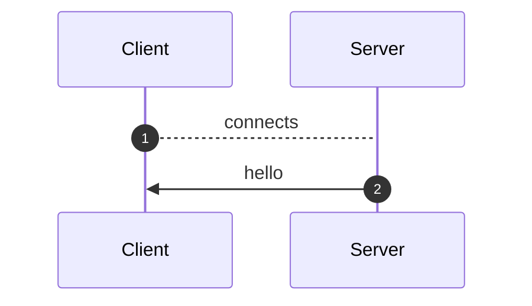
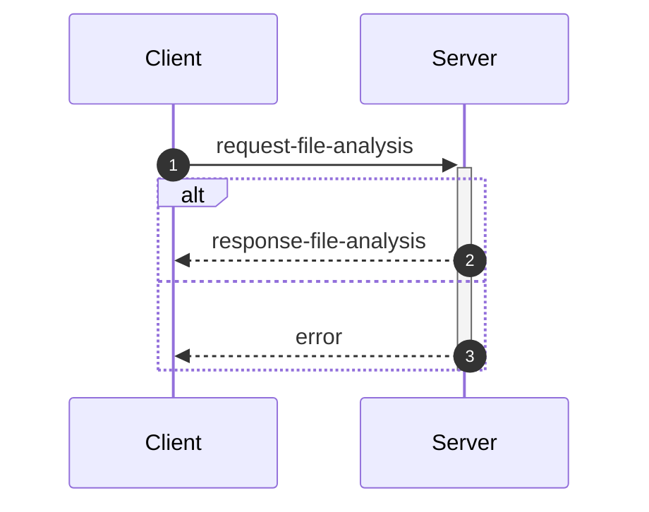
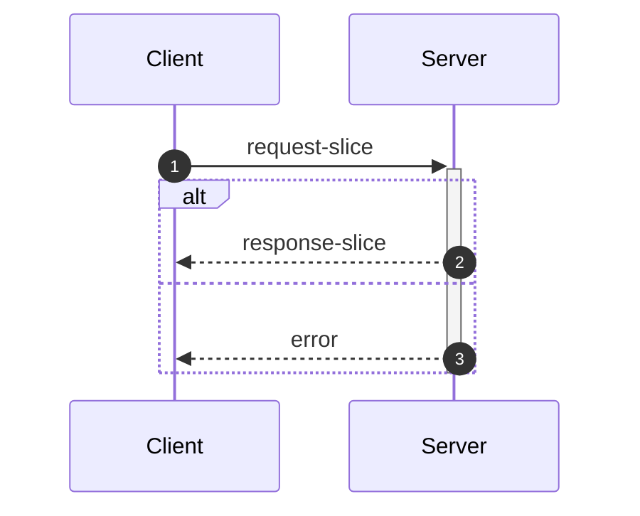
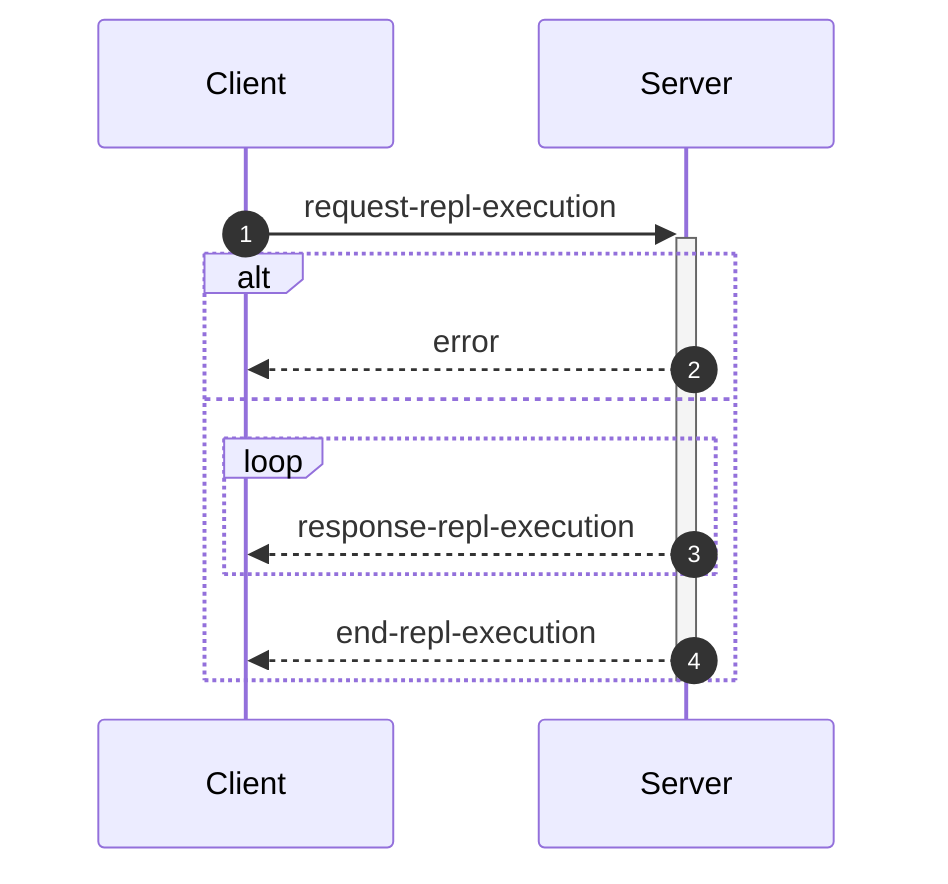

_This document was generated from '[src/documentation/wiki-interface.ts](https://github.com/flowr-analysis/flowr/tree/main//src/documentation/wiki-interface.ts)' on 2026-07-29, 16:41:04 UTC presenting an overview of flowR's interface (v2.13.4, using R v4.5.0). Please do not edit this file/wiki page directly._

Although far from being as detailed as the in-depth explanation of [_flowR_](https://github.com/flowr-analysis/flowr/wiki/core),
this wiki page explains how to interface with _flowR_ in more detail.
In general, command line arguments and other options provide short descriptions on hover over.

* [💻 Using the REPL](#using-the-repl)
* [⚙️ Configuring FlowR](#configuring-flowr)
* [⚒️ Writing Code](#writing-code)
* [💬 Communicating with the Server](#communicating-with-the-server)

<a id='using-the-repl'></a>
## 💻 Using the REPL


> [!NOTE]
> To execute arbitrary R commands with a repl request, _flowR_ has to be started explicitly with <span title="Description (Command Line Argument): Allow to access the underlying R session when using flowR (security warning: this allows the execution of arbitrary R code!)">`--r-session-access`</span>.
> Please be aware that this introduces a security risk and note that this relies on the [`r-shell` engine](https://github.com/flowr-analysis/flowr/wiki/engines) .

Although primarily meant for users to explore,
there is nothing which forbids simply calling _flowR_ as a subprocess to use standard-in, -output, and -error
for communication (although you can access the REPL using the server as well,
with the [REPL Request](#message-request-repl-execution) message).

The read-eval-print loop&nbsp;(REPL) works relatively simple.
You can submit an expression (using <kbd>Enter</kbd>),
which is interpreted as an R&nbsp;expression by default but interpreted as a *command* if it starts with a colon (`:`).
The best command to get started with the REPL is <span title="Description (Repl Command): Show help information (aliases: :h, :?)">`:help`</span>.
Besides, you can leave the REPL either with the command <span title="Description (Repl Command): End the repl (aliases: :q, :exit)">`:quit`</span> or by pressing <kbd>Ctrl</kbd>+<kbd>C</kbd> twice.
When writing a *command*, you may press <kbd>Tab</kbd> to get a list of completions, if available.
Multiple commands can be entered in a single line by separating them with a semicolon (`;`), e.g. `:parse "x<-2"; :df*`.
If a command is given without R code, the REPL will re-use R code given in a previous command.
The prior example will hence return first the parsed AST of the program and then the dataflow graph for `"x <- 2"`.

> [!NOTE]
> If you develop flowR, you may want to launch the repl using the `npm run main-dev` command, this way, you get a non-minified version of flowR with debug information and hot-reloading of source files.

<details>
<summary>Available Commands</summary>

We currently offer the following commands (this with a `[*]` suffix are available with and without the star):


| Command | Description |
| ------- | ----------- |
| **<span title="Description (Repl Command): End the repl (aliases: :q, :exit)">:quit</span>** | End the repl (aliases: **:<span title="Alias of ':quit'. End the repl">q</span>**, **:<span title="Alias of ':quit'. End the repl">exit</span>**) |
| **<span title="Description (Repl Command): Execute the given code as R code. This requires the `--r-session-access` flag to be set and requires the r-shell engine. (aliases: :e, :r)">:execute</span>** | Execute the given code as R code. This requires the `--r-session-access` flag to be set and requires the r-shell engine. (aliases: **:<span title="Alias of ':execute'. Execute the given code as R code. This requires the `--r-session-access` flag to be set and requires the r-shell engine.">e</span>**, **:<span title="Alias of ':execute'. Execute the given code as R code. This requires the `--r-session-access` flag to be set and requires the r-shell engine.">r</span>**) |
| **<span title="Description (Repl Command): Get mermaid code for the control-flow graph of R code (aliases: :cfg, :cf)">:controlflow[*]</span>** | Get mermaid code for the control-flow graph of R code (star: Returns the URL to mermaid.live) (aliases: **:<span title="Alias of ':controlflow'. Get mermaid code for the control-flow graph of R code">cfg</span>**, **:<span title="Alias of ':controlflow'. Get mermaid code for the control-flow graph of R code">cf</span>**) |
| **<span title="Description (Repl Command): Get mermaid code for the control-flow graph with basic blocks (aliases: :cfgb, :cfb)">:controlflowbb[*]</span>** | Get mermaid code for the control-flow graph with basic blocks (star: Returns the URL to mermaid.live) (aliases: **:<span title="Alias of ':controlflowbb'. Get mermaid code for the control-flow graph with basic blocks">cfgb</span>**, **:<span title="Alias of ':controlflowbb'. Get mermaid code for the control-flow graph with basic blocks">cfb</span>**) |
| **<span title="Description (Repl Command): Get mermaid code for the dataflow graph (aliases: :d, :df)">:dataflow[*]</span>** | Get mermaid code for the dataflow graph (star: Returns the URL to mermaid.live) (aliases: **:<span title="Alias of ':dataflow'. Get mermaid code for the dataflow graph">d</span>**, **:<span title="Alias of ':dataflow'. Get mermaid code for the dataflow graph">df</span>**) |
| **<span title="Description (Repl Command): Get mermaid code for the normalized AST of R code (aliases: :n)">:normalize[*]</span>** | Get mermaid code for the normalized AST of R code (star: Returns the URL to mermaid.live) (alias: **:<span title="Alias of ':normalize'. Get mermaid code for the normalized AST of R code">n</span>**) |
| **<span title="Description (Repl Command): Get mermaid code for the simplified dataflow graph (aliases: :ds, :dfs)">:dataflowsimple[*]</span>** | Get mermaid code for the simplified dataflow graph (star: Returns the URL to mermaid.live) (aliases: **:<span title="Alias of ':dataflowsimple'. Get mermaid code for the simplified dataflow graph">ds</span>**, **:<span title="Alias of ':dataflowsimple'. Get mermaid code for the simplified dataflow graph">dfs</span>**) |
| **<span title="Description (Repl Command): Inspect and extend the signature database: `query` (identical to :query @signature), `add <path>` to mount another database/source, `download` to fetch the full-history database. (aliases: :sig)">:signature</span>** | Inspect and extend the signature database: `query` (identical to :query @signature), `add <path>` to mount another database/source, `download` to fetch the full-history database. (alias: **:<span title="Alias of ':signature'. Inspect and extend the signature database: `query` (identical to :query @signature), `add <path>` to mount another database/source, `download` to fetch the full-history database.">sig</span>**) |
| **<span title="Description (Repl Command): Just calculates the DFG, but only prints summary info (aliases: :d#, :df#)">:dataflowsilent</span>** | Just calculates the DFG, but only prints summary info (aliases: **:<span title="Alias of ':dataflowsilent'. Just calculates the DFG, but only prints summary info">d#</span>**, **:<span title="Alias of ':dataflowsilent'. Just calculates the DFG, but only prints summary info">df#</span>**) |
| **<span title="Description (Repl Command): Prints ASCII Art of the parsed, unmodified AST (aliases: :p)">:parse</span>** | Prints ASCII Art of the parsed, unmodified AST (alias: **:<span title="Alias of ':parse'. Prints ASCII Art of the parsed, unmodified AST">p</span>**) |
| **<span title="Description (Repl Command): Prints the version of flowR as well as the current version of R">:version</span>** | Prints the version of flowR as well as the current version of R
| **<span title="Description (Repl Command): Query the given R code (use 'help' for more information)">:query[*]</span>** | Query the given R code (use 'help' for more information) (star: Similar to query, but returns the output in json format.)
| **<span title="Description (Repl Command): Returns an ASCII representation of the dataflow graph (aliases: :df!)">:dataflowascii</span>** | Returns an ASCII representation of the dataflow graph (alias: **:<span title="Alias of ':dataflowascii'. Returns an ASCII representation of the dataflow graph">df!</span>**) |
| **<span title="Description (Repl Command): Returns summarization stats for the normalized AST (aliases: :n#)">:normalize#</span>** | Returns summarization stats for the normalized AST (alias: **:<span title="Alias of ':normalize#'. Returns summarization stats for the normalized AST">n#</span>**) |
| **<span title="Description (Repl Command): Show help information (aliases: :h, :?)">:help</span>** | Show help information (aliases: **:<span title="Alias of ':help'. Show help information">h</span>**, **:<span title="Alias of ':help'. Show help information">?</span>**) |


</details>


> [!TIP]
> 
> As indicated by the examples before, all REPL commands that operate on code keep track of the state.
> Hence, if you run a command like <span title="Description (Repl Command, starred version): Returns the URL to mermaid.live; Base Command: Get mermaid code for the dataflow graph (aliases: :d*, :df*)">`:dataflow*`</span> without providing R code,
> the REPL will re-use the R code provided in a previous command.
> Likewise, doing this will benefit from incrementality!
> If you request the dataflow graph with `:df* x <- 2 * y` and then want to see the parsed AST with `:parse`,
> the REPL will re-use previously obtained information and not re-parse the code again.
> 		


Generally, many commands offer shortcut versions in the REPL. Many queries, for example, offer a shortened format (see the example below).
Of special note, the [Config Query](https://github.com/flowr-analysis/flowr/wiki/%5BQuery%5D-Config)
can be used to also modify the currently active configuration of _flowR_ within the REPL (see the [wiki page](https://github.com/flowr-analysis/flowr/wiki/%5BQuery%5D-Config) for more information).

### Example: Retrieving the Dataflow Graph

To retrieve a URL to the [mermaid](https://mermaid.js.org/) diagram of the dataflow of a given expression,
use <span title="Description (Repl Command, starred version): Returns the URL to mermaid.live; Base Command: Get mermaid code for the dataflow graph (aliases: :d*, :df*)">`:dataflow*`</span> (or <span title="Description (Repl Command): Get mermaid code for the dataflow graph (aliases: :d, :df)">`:dataflow`</span> to get the mermaid code in the cli):


```shell
$ docker run -it --rm eagleoutice/flowr # or npm run flowr 
flowR repl v2.13.4, R grammar v14 (tree-sitter engine)
R> :dataflow* y <- 1 + x
```

<details>
<summary style='color:gray'>Output</summary>


```text
https://mermaid.live/view#base64:eyJjb2RlIjoiZmxvd2NoYXJ0IEJUXG4gICAgMXt7XCJgKiM5MTtSTnVtYmVyIzkzOyogKioxKipcbiAgICAgICoxLjYqICgqKmlkOiAxKiopYFwifX1cbiAgICUlIE5vIGVkZ2VzIGZvdW5kIGZvciAxXG4gICAgMihbXCJgKiM5MTtSU3ltYm9sIzkzOyogKip4KipcbiAgICAgICoxLjEwKiAoKippZDogMioqKWBcIl0pXG4gICAlJSBObyBlZGdlcyBmb3VuZCBmb3IgMlxuICAgIDNbW1wiYCojOTE7UkJpbmFyeU9wIzkzOyogYmFzZSM1ODsjNTg7KiojNDM7KipcbiAgICAgICoxLjYtMTAqICgqKmlkOiAzKiopXG4gICAgYXJnOiAoMSwgMilgXCJdXVxuICAgIGJ1aWx0LWluOl9bXCJgQnVpbHQtSW46XG4jNDM7YFwiXVxuICAgIHN0eWxlIGJ1aWx0LWluOl8gc3Ryb2tlOmdyYXksZmlsbDpncmF5LHN0cm9rZS13aWR0aDoycHgsb3BhY2l0eTouODtcbiAgICAwW1wiYCojOTE7UlN5bWJvbCM5MzsqICoqeSoqXG4gICAgICAqMS4xKiAoKippZDogMCoqLCB2OiAzKWBcIl1cbiAgICA0W1tcImAqIzkxO1JCaW5hcnlPcCM5MzsqIGJhc2UjNTg7IzU4OyoqIzYwOyM0NTsqKlxuICAgICAgKjEuMS0xMCogKCoqaWQ6IDQqKilcbiAgICBhcmc6ICgwLCAzKWBcIl1dXG4gICAgYnVpbHQtaW46Xy1bXCJgQnVpbHQtSW46XG4jNjA7IzQ1O2BcIl1cbiAgICBzdHlsZSBidWlsdC1pbjpfLSBzdHJva2U6Z3JheSxmaWxsOmdyYXksc3Ryb2tlLXdpZHRoOjJweCxvcGFjaXR5Oi44O1xuICAgIDMgLS0+fFwicmVhZHMsIGFyZ1wifCAxXG4gICAgMyAtLT58XCJyZWFkcywgYXJnXCJ8IDJcbiAgICAzIC0uLT58XCJyZWFkcywgY2FsbHNcInwgYnVpbHQtaW46X1xuICAgIGxpbmtTdHlsZSAyIHN0cm9rZTpncmF5O1xuICAgIDAgLS0+fFwiZGVmaW5lZC1ieVwifCAzXG4gICAgMCAtLT58XCJkZWZpbmVkLWJ5XCJ8IDRcbiAgICA0IC0tPnxcInJlYWRzLCBhcmdcInwgM1xuICAgIDQgLS0+fFwicmV0dXJucywgYXJnXCJ8IDBcbiAgICA0IC0uLT58XCJyZWFkcywgY2FsbHNcInwgYnVpbHQtaW46Xy1cbiAgICBsaW5rU3R5bGUgNyBzdHJva2U6Z3JheTsiLCJtZXJtYWlkIjp7ImF1dG9TeW5jIjp0cnVlfX0=
```


Retrieve the dataflow graph of the expression `y <- 1 + x`. It looks like this:


```mermaid
flowchart LR
    1{{"`*#91;RNumber#93;* **1**
      *1.6* (**id: 1**)`"}}
   %% No edges found for 1
    2(["`*#91;RSymbol#93;* **x**
      *1.10* (**id: 2**)`"])
   %% No edges found for 2
    3[["`*#91;RBinaryOp#93;* base#58;#58;**#43;**
      *1.6-10* (**id: 3**)
    arg: (1, 2)`"]]
    built-in:_["`Built-In:
#43;`"]
    style built-in:_ stroke:gray,fill:gray,stroke-width:2px,opacity:.8;
    0["`*#91;RSymbol#93;* **y**
      *1.1* (**id: 0**, v: 3)`"]
    4[["`*#91;RBinaryOp#93;* base#58;#58;**#60;#45;**
      *1.1-10* (**id: 4**)
    arg: (0, 3)`"]]
    built-in:_-["`Built-In:
#60;#45;`"]
    style built-in:_- stroke:gray,fill:gray,stroke-width:2px,opacity:.8;
    3 -->|"reads, arg"| 1
    3 -->|"reads, arg"| 2
    3 -.->|"reads, calls"| built-in:_
    linkStyle 2 stroke:gray;
    0 -->|"defined-by"| 3
    0 -->|"defined-by"| 4
    4 -->|"reads, arg"| 3
    4 -->|"returns, arg"| 0
    4 -.->|"reads, calls"| built-in:_-
    linkStyle 7 stroke:gray;
```

	
<details>

<summary style="color:gray">R Code of the Dataflow Graph</summary>

The analysis required _0.9 ms_ (including parse and normalize, using the [tree-sitter](https://github.com/flowr-analysis/flowr/wiki/Engines) engine) within the generation environment. No [signature database](https://github.com/flowr-analysis/flowr/wiki/Signature-Database) is mounted for these generated graphs, so `library()` calls attach no package exports; base-R names are still qualified via the generated base-package store (e.g. `acf` as `stats::acf`). 
We encountered no unknown side effects during the analysis.


```r
y <- 1 + x
```


</details>


</details>


For small graphs like this, <span title="Description (Repl Command): Returns an ASCII representation of the dataflow graph (aliases: :df!)">`:dataflowascii`</span> also provides an ASCII representation directly in the REPL:


```shell
$ docker run -it --rm eagleoutice/flowr # or npm run flowr 
flowR repl v2.13.4, R grammar v14 (tree-sitter engine)
R> :df! y <- 1 + x
```

<details open>
<summary style='color:gray'>Output</summary>


```text
                        0<1>0
                   ┌────| 1 |
    ┌────────┐     │    0---0
 c<4>c       └──c<3>c
 |<- |  v<0>v┌──| + |
 c---c──| y |┘  c---c   u<2>u
        v---v      └────| x |
                        u---u
Edges:
3 -> 1: reads, arg  3 -> 2: reads, arg
4 -> 3: reads, arg  4 -> 0: returns, arg
0 -> 3: defined-by  0 -> 4: defined-by
```


Retrieve the dataflow graph of the expression `y <- 1 + x` as ASCII art.

</details>


For the slicing with <span title="Description (Repl Command): Static backwards executable slicer for R">`:slicer`</span>, you have access to the same [magic comments](#slice-magic-comments) as with the [slice request](#message-request-slice).
Pass `--inline` to splice resolvable `source()` calls into the reconstruction so the slice is a single self-contained R text (the same as the static slice query's `inlineSources` flag).
See `--help` for more flags!

### Example: Interfacing with the File System

Many commands that allow for an R-expression (like <span title="Description (Repl Command, starred version): Returns the URL to mermaid.live; Base Command: Get mermaid code for the dataflow graph (aliases: :d*, :df*)">`:dataflow*`</span>) allow for a file as well
if the argument starts with `file://`.
If you are working from the root directory of the _flowR_ repository, the following gives you the parsed AST of the example file using the <span title="Description (Repl Command): Prints ASCII Art of the parsed, unmodified AST (aliases: :p)">`:parse`</span> command:

> **Watch mode**: Replace `file://` with `watch://` to enter watch mode.
> flowR runs the command immediately and then re-runs it every time the file (or any file inside the folder) changes.
> Enter any other command to leave watch mode.
> For example: `:df watch://analysis.R`


```shell
$ docker run -it --rm eagleoutice/flowr # or npm run flowr 
flowR repl v2.13.4, R grammar v14 (tree-sitter engine)
R> :parse file://test/testfiles/example.R
```

<details>
<summary style='color:gray'>Output</summary>


```text
File: test/testfiles/example.R

program
├ binaryoperator
│ ├ identifier "sum" (1:1─4)
│ ├ <- "<-" (1:5─7)
│ ╰ float "0" (1:8─9)
├ binaryoperator
│ ├ identifier "product" (2:1─8)
│ ├ <- "<-" (2:9─11)
│ ╰ float "1" (2:12─13)
├ binaryoperator
│ ├ identifier "w" (3:1─2)
│ ├ <- "<-" (3:3─5)
│ ╰ float "7" (3:6─7)
├ binaryoperator
│ ├ identifier "N" (4:1─2)
│ ├ <- "<-" (4:3─5)
│ ╰ float "10" (4:6─8)
├ forstatement
│ ├ for "for" (6:1─4)
│ ├ ( "(" (6:5─6)
│ ├ identifier "i" (6:6─7)
│ ├ in "in" (6:8─10)
│ ├ binaryoperator
│ │ ├ float "1" (6:11─12)
│ │ ├ : ":" (6:12─13)
│ │ ╰ parenthesizedexpression
│ │   ├ ( "(" (6:13─14)
│ │   ├ binaryoperator
│ │   │ ├ identifier "N" (6:14─15)
│ │   │ ├ - "-" (6:15─16)
│ │   │ ╰ float "1" (6:16─17)
│ │   ╰ ) ")" (6:17─18)
│ ├ ) ")" (6:18─19)
│ ╰ bracedexpression
│   ├ { "{" (6:20─21)
│   ├ binaryoperator
│   │ ├ identifier "sum" (7:3─6)
│   │ ├ <- "<-" (7:7─9)
│   │ ╰ binaryoperator
│   │   ├ binaryoperator
│   │   │ ├ identifier "sum" (7:10─13)
│   │   │ ├ + "+" (7:14─15)
│   │   │ ╰ identifier "i" (7:16─17)
│   │   ├ + "+" (7:18─19)
│   │   ╰ identifier "w" (7:20─21)
│   ├ binaryoperator
│   │ ├ identifier "product" (8:3─10)
│   │ ├ <- "<-" (8:11─13)
│   │ ╰ binaryoperator
│   │   ├ identifier "product" (8:14─21)
│   │   ├  "" (8:22─23)
│   │   ╰ identifier "i" (8:24─25)
│   ╰ } "}" (9:1─2)
├ call
│ ├ identifier "cat" (11:1─4)
│ ╰ arguments
│   ├ ( "(" (11:4─5)
│   ├ argument
│   │ ╰ string
│   │   ├ " "\"" (11:5─6)
│   │   ├ stringcontent "Sum:" (11:6─10)
│   │   ╰ " "\"" (11:10─11)
│   ├ comma "," (11:11─12)
│   ├ argument
│   │ ╰ identifier "sum" (11:13─16)
│   ├ comma "," (11:16─17)
│   ├ argument
│   │ ╰ string
│   │   ├ " "\"" (11:18─19)
│   │   ├ stringcontent
│   │   │ ╰ escapesequence "\\n" (11:19─21)
│   │   ╰ " "\"" (11:21─22)
│   ╰ ) ")" (11:22─23)
╰ call
  ├ identifier "cat" (12:1─4)
  ╰ arguments
    ├ ( "(" (12:4─5)
    ├ argument
    │ ╰ string
    │   ├ " "\"" (12:5─6)
    │   ├ stringcontent "Product:" (12:6─14)
    │   ╰ " "\"" (12:14─15)
    ├ comma "," (12:15─16)
    ├ argument
    │ ╰ identifier "product" (12:17─24)
    ├ comma "," (12:24─25)
    ├ argument
    │ ╰ string
    │   ├ " "\"" (12:26─27)
    │   ├ stringcontent
    │   │ ╰ escapesequence "\\n" (12:27─29)
    │   ╰ " "\"" (12:29─30)
    ╰ ) ")" (12:30─31)
```


Retrieve the parsed AST of the example file.

<details>

<summary>File Content</summary>


```r
sum <- 0
product <- 1
w <- 7
N <- 10

for (i in 1:(N-1)) {
  sum <- sum + i + w
  product <- product * i
}

cat("Sum:", sum, "\n")
cat("Product:", product, "\n")
```


</details>

As _flowR_ directly transforms this AST the output focuses on being human-readable instead of being machine-readable.
		

</details>


### Example: Run a Query

You can run any query supported by _flowR_ using the <span title="Description (Repl Command): Query the given R code (use 'help' for more information)">`:query`</span> command.
For example, to obtain the shapes of all data frames in a given piece of code, you can run:


```shell
$ docker run -it --rm eagleoutice/flowr # or npm run flowr 
flowR repl v2.13.4, R grammar v14 (tree-sitter engine)
R> :query @absint df-shape "x <- data.frame(a = 1:10, b = 1:10)\ny <- x$a"
```

<details open>
<summary style='color:gray'>Output</summary>


```text
Query: absint (2 ms)
   ╰ $12: (colnames: [{"a", "b"}, {}], cols: [2, 2], rows: [10, 10])
   ╰ $0: (colnames: [{"a", "b"}, {}], cols: [2, 2], rows: [10, 10])
All queries together required ≈4 ms (1ms accuracy, total 5 ms)
```


Retrieve the shapes of all data frames in the given code.

</details>


To run the linter on a file, you can use (in this example, we just issue the `dead-code` linter on a small piece of code):


```shell
$ docker run -it --rm eagleoutice/flowr # or npm run flowr 
flowR repl v2.13.4, R grammar v14 (tree-sitter engine)
R> :query @linter rules:dead-code "if(FALSE) x <- 2"
```

<details open>
<summary style='color:gray'>Output</summary>


```text
Query: linter (2 ms)
   ╰ Dead Code (dead-code):
       ╰ certain:
           ╰ Code at 1.11-16
       ╰ Metadata: searchTimeMs: 2, processTimeMs: 0
All queries together required ≈2 ms (1ms accuracy, total 3 ms)
```


Run the linter on the given code, with only the `dead-code` rule enabled.

</details>


For more information on the available queries, please check out the [Query API](https://github.com/flowr-analysis/flowr/wiki/query-api).


<a id='configuring-flowr'></a>
## ⚙️ Configuring FlowR


When running _flowR_, you may want to specify some behaviors with a dedicated configuration file.
By default, flowR looks for a file named `flowr.json` in the current working directory (or any higher directory).
You can also specify a different file with <span title="Description (Command Line Argument): The name of the configuration file to use">`--config-file`</span> or pass the configuration inline using <span title="Description (Command Line Argument): The flowR configuration to use, as a JSON string">`--config-json`</span>.
To inspect the current configuration, you can run flowr with the <span title="Description (Command Line Argument): Run with verbose logging (will be passed to the corresponding script)">`--verbose`</span> flag, or use the `config` [Query](https://github.com/flowr-analysis/flowr/wiki/query-api).
Within the REPL this works by running the following:


```shell
:query @config
```


To work with the <a href="https://github.com/flowr-analysis/flowr/tree/main/src/config.ts#L132"><code><span title="The configuration file format for flowR.">FlowrConfig</span></code></a> you can use the provided helper objects alongside its methods like
<a href="https://github.com/flowr-analysis/flowr/tree/main/src/config.ts#L772"><code><span title="Creates a new flowr config that has the updated values.">FlowrConfig::<b>amend</b></span></code></a>.
The schema below documents every option; the ones you most likely want are:

- <a href="https://github.com/flowr-analysis/flowr/wiki/Interface#configuring-flowr" title="Configuration Option (boolean): Whether source calls should be ignored, causing {@link processSourceCall}&#39;s behavior to be skipped.">ignoreSourceCalls</a>: ignore source calls when analyzing the code, i.e., ignore the inclusion of other files.
- <a href="https://github.com/flowr-analysis/flowr/wiki/Interface#configuring-flowr" title="Configuration Option (boolean): Whether load calls should be ignored, causing {@link processLoadCall}&#39;s behavior to be skipped.">ignoreLoadCalls</a>: ignore load calls when analyzing the code, i.e., ignore the loading of r-data files.
- <a href="https://github.com/flowr-analysis/flowr/wiki/Interface#configuring-flowr" title="Configuration Option (object): Do you want to overwrite (parts) of the builtin definition?">semantics.environment.overwriteBuiltIns</a>: overwrite _flowR_'s handling of built-in functions, or clear the preset definitions entirely.
  See [Configure BuiltIn Semantics](#configure-builtin-semantics) for more information.
- <a href="https://github.com/flowr-analysis/flowr/wiki/Interface#configuring-flowr" title="Configuration Option (string): How to resolve variables and their values. (one of &quot;disabled&quot;, &quot;alias&quot;, &quot;builtin&quot;)">solver.variables</a>: how to resolve variables and their values (`disabled`, `alias`, `builtin`).
- <a href="https://github.com/flowr-analysis/flowr/wiki/Interface#configuring-flowr" title="Configuration Option (array): The engine or set of engines to use for interacting with R code. An empty array means all available engines will be used.">engines</a> and <a href="https://github.com/flowr-analysis/flowr/wiki/Interface#configuring-flowr" title="Configuration Option (string): The default engine to use for interacting with R code. If this is undefined, an arbitrary engine from the specified list will be used. (one of &quot;tree-sitter&quot;, &quot;r-shell&quot;)">defaultEngine</a>: the engines used to interact with R code, see the [Engines wiki page](https://github.com/flowr-analysis/flowr/wiki/engines).
- <a href="https://github.com/flowr-analysis/flowr/wiki/Interface#configuring-flowr" title="Configuration Option (array): Files a framework loads on its own, without any source() call (e.g. global.R in a shiny app), in the order they are loaded; flowR orders the matching project files accordingly and analyzes them as one program. Entries are case-insensitive globs matched against the file path, a plain name matches any file with that name, and entries matching no project file are warned about. Usually set per project kind via specializeConfig.">project.implicitSources</a>: the files a framework loads without any `source()` call, in the order in which they are
  loaded. Entries are globs (e.g. `R/*.R`) matched against the file path ignoring capitalization; one matching no file is reported.
- <a href="https://github.com/flowr-analysis/flowr/wiki/Interface#configuring-flowr" title="Configuration Option (object): Overwrite (parts of) the configuration depending on the project kind flowR detects, e.g. to give a shiny app its implicit sources.">specializeConfig</a>: overwrite (parts of) the configuration depending on the kind of project _flowR_ detects
  (e.g. `shiny-app`), which is how a shiny app gets its implicit sources by default. What you configure directly wins.
- <a href="https://github.com/flowr-analysis/flowr/wiki/Interface#configuring-flowr" title="Configuration Option (string): Overwrite the project kind flowR would otherwise infer from the analyzed files, e.g. when auto-detection guesses wrong. (one of &quot;package&quot;, &quot;script&quot;, &quot;shiny-app&quot;, &quot;notebook&quot;, &quot;project&quot;, &quot;unknown&quot;)">project.useProjectType</a>: skip that detection and force a project kind yourself, when auto-detection guesses wrong.
- <a href="https://github.com/flowr-analysis/flowr/wiki/Interface#configuring-flowr" title="Configuration Option (array): The default plugins to load when creating a new instance of FlowrAnalyzer">defaultPlugins</a> and <a href="https://github.com/flowr-analysis/flowr/wiki/Interface#configuring-flowr" title="Configuration Option (array): The plugins to load in REPL mode">repl.plugins</a>: the plugins to load for a new <a href="https://github.com/flowr-analysis/flowr/tree/main/src/project/flowr-analyzer.ts#L167"><code><span title="Central class for conducting analyses with FlowR. Use the FlowrAnalyzerBuilder to create a new instance. If you want the original pattern of creating a pipeline and running all steps, you can still do this with FlowrAnalyzer#runFull . To inspect the context of the analyzer, use FlowrAnalyzer#inspectContext (if you are a plugin and need to modify it, use FlowrAnalyzer#context instead).">FlowrAnalyzer</span></code></a> and in the REPL
  (use `flowr:default` to reference the former).

So you can configure _flowR_ by adding a file like the following:

<details>

<summary>Example Configuration File</summary>


```json
{
  "ignoreSourceCalls": true,
  "ignoreLoadCalls": true,
  "semantics": {
    "environment": {
      "overwriteBuiltIns": {
        "definitions": [
          {
            "type": "function",
            "names": [
              "foo"
            ],
            "processor": "builtin:assign",
            "config": {}
          }
        ]
      }
    }
  },
  "defaultPlugins": [
    "file:description",
    "versions:description"
  ],
  "repl": {
    "quickStats": false,
    "dfProcessorHeat": false,
    "hints": true,
    "plugins": [
      "flowr:default"
    ]
  },
  "project": {
    "resolveUnknownPathsOnDisk": true,
    "implicitSources": [
      "global.R",
      "app.R"
    ]
  },
  "linter": {
    "disabledRules": []
  },
  "specializeConfig": {
    "shiny-app": {
      "project": {
        "implicitSources": [
          "global.R",
          "ui.R",
          "server.R",
          "app.R"
        ]
      }
    }
  },
  "engines": [
    {
      "type": "r-shell"
    }
  ],
  "solver": {
    "variables": "alias",
    "evalStrings": true,
    "trackEnvironments": true,
    "sigdb": {
      "enabled": true,
      "loadProjectDependencies": true,
      "eagerlyLoad": false,
      "eagerlyLoadExports": false,
      "linkBaseR": false,
      "linkDescriptionDependencies": false
    },
    "resolveSource": {
      "dropPaths": "no",
      "ignoreCapitalization": true,
      "inferWorkingDirectory": "active-script",
      "searchPath": []
    },
    "instrument": {},
    "slicer": {
      "threshold": 50
    }
  },
  "abstractInterpretation": {
    "wideningThreshold": 4,
    "dataFrame": {
      "maxColNames": 20,
      "readLoadedData": {
        "readExternalFiles": true,
        "maxReadLines": 1000000
      }
    }
  },
  "gas": {
    "thresholds": {
      "memory": {
        "problematic": 0.7,
        "critical": 0.9
      },
      "timeMs": {
        "problematic": 100000,
        "critical": 120000
      }
    },
    "features": {}
  }
}
```


</details>

<details>
<a id='configure-builtin-semantics'></a>
<summary>Configure Built-In Semantics</summary>


`semantics/environment/overwriteBuiltins` accepts two keys:

- `loadDefaults` (boolean, initially `true`): If set to `true`, the default built-in definitions are loaded before applying the custom definitions. Setting this flag to `false` explicitly disables the loading of the default definitions.
- `definitions` (array, initially empty): Allows to overwrite or define new built-in elements. Each object within must have a `type` which is one of the below. Furthermore, they may define a string array of `names` which specifies the identifiers to bind the definitions to. You may use `assumePrimitive` to specify whether _flowR_ should assume that this is a primitive non-library definition (so you probably just do not want to specify the key).

  | Type            | Description                                                                                                                                                                                                                                                                                              | Example                                                                                                    |
  | --------------- | -------------------------------------------------------------------------------------------------------------------------------------------------------------------------------------------------------------------------------------------------------------------------------------------------------- | ---------------------------------------------------------------------------------------------------------- |
  | `constant`    | Additionally allows for a `value` this should resolve to.                                                                                                                                                                                                                                                | `{ type: 'constant', names: ['NULL', 'NA'],  value: null }`                                                |
  | `function`    | Is a rather flexible way to define and bind built-in functions. For the time, we do not have extensive documentation to cover all the cases, so please either consult the sources with the `default-builtin-config.ts` or open a [new issue](https://github.com/flowr-analysis/flowr/issues/new/choose). | `{ type: 'function', names: ['next'], processor: 'builtin:d', config: { cfg: ExitPointType.Next } }` |
  | `replacement` | A comfortable way to specify replacement functions like `$<-` or `names<-`. `suffixes` describes the... suffixes to attach automatically. | `{ type: 'replacement', suffixes: ['<-', '<<-'], names: ['[', '[['] }` |


</details>

<details>

<summary style='color:gray'>Full Configuration-File Schema</summary>

- _The configuration file format for flowR._ (object)
    - **logLevel** [optional] _flowR's global minimum log level, applied when the config is loaded._ (string)
        Only allows: 'silly', 'trace', 'debug', 'info', 'warn', 'error', 'fatal'
    - **ignoreSourceCalls** [optional] _Whether source calls should be ignored, causing {@link processSourceCall}'s behavior to be skipped._ (boolean)
    - **ignoreLoadCalls** [optional] _Whether load calls should be ignored, causing {@link processLoadCall}'s behavior to be skipped._ (boolean)
    - **semantics** _Configure language semantics and how flowR handles them._ (object)
        - **environment** [optional] _Semantics regarding how to handle the R environment._ (object)
            - **overwriteBuiltIns** [optional] _Do you want to overwrite (parts) of the builtin definition?_ (object)
                - **loadDefaults** [optional] _Should the default configuration still be loaded?_ (boolean)
                - **definitions** [optional] _The definitions to load/overwrite._ (array)
                Valid item types:
                    - (object)
    - **defaultPlugins** [optional] _The default plugins to load when creating a new instance of FlowrAnalyzer_ (array)
    Valid item types:
        - (alternatives)
            - (string)
            - (array)
    - **repl** _Configuration options for the REPL._ (object)
        - **quickStats** [optional] _Whether to show quick stats in the REPL after each evaluation._ (boolean)
        - **dfProcessorHeat** [optional] _This instruments the dataflow processors to count how often each processor is called._ (boolean)
        - **hints** [optional] _Whether to show dim inline hints on the empty prompt (automatically disabled on non-interactive terminals)._ (boolean)
        - **plugins** [optional] _The plugins to load in REPL mode_ (array)
        Valid item types:
            - (alternatives)
                - (string)
                - (array)
        - **autoUseFileProtocol** [optional] _Prepend the file protocol to a repl input that looks like a path, instead of only warning about it._ (boolean)
        - **queryStats** [optional] _Whether `:query` closes with the line stating how long the queries took (`:query*` never prints it)._ (boolean)
        - **showPlugins** [optional] _Whether `:version` grays out the plugins that did not activate during the last analysis._ (boolean)
    - **project** _Project specific configuration options._ (object)
        - **resolveUnknownPathsOnDisk** [optional] _Whether to resolve unknown paths loaded by the r project disk when trying to source/analyze files._ (boolean)
        - **failOnInaccessiblePath** [optional] _Whether a directory that cannot be traversed during file discovery (e.g. due to permissions) aborts the analysis; when false (the default) such paths are logged and skipped._ (boolean)
        - **basePackages** [optional] _The packages considered part of R itself (base and recommended); if unset, flowR uses its built-in list._ (array)
        Valid item types:
            - (string)
        - **implicitSources** [optional] _Files a framework loads on its own, without any source() call (e.g. global.R in a shiny app), in the order they are loaded; flowR orders the matching project files accordingly and analyzes them as one program. Entries are case-insensitive globs matched against the file path, a plain name matches any file with that name, and entries matching no project file are warned about. Usually set per project kind via specializeConfig._ (array)
        Valid item types:
            - (string)
        - **useProjectType** [optional] _Overwrite the project kind flowR would otherwise infer from the analyzed files, e.g. when auto-detection guesses wrong._ (string)
            Only allows: 'package', 'script', 'shiny-app', 'notebook', 'project', 'unknown'
        - **discovery** [optional] _Scoping options for the default project discovery._ (object)
            - **full** [optional] _Collect every file below the project root (greedy) instead of only the files the detected project kind needs (default false)._ (boolean)
            - **perKind** [optional] _Per-kind include/exclude glob overrides layered on the default scoping._ (object)
            - **ignore** [optional] _Case-insensitive globs that drop matching files from the intelligent discovery, regardless of kind (e.g. .Renviron to ignore environment files)._ (array)
            Valid item types:
                - (string)
        - **classification** [optional] _Overrides for the signals flowR uses to classify the project kind._ (object)
            - **shinyDescriptionTypes** [optional] _DESCRIPTION Type: values that mark a shiny app._ (array)
            Valid item types:
                - (string)
            - **shinyEntryFiles** [optional] _File names a shiny app is assembled from._ (array)
            Valid item types:
                - (string)
            - **shinyUsagePattern** [optional] _Regex source evidencing shiny usage in an entry file._ (string)
            - **notebookExtensions** [optional] _File extensions marking a notebook._ (array)
            Valid item types:
                - (string)
    - **linter** _Linter configuration options._ (object)
        - **disabledRules** _Linting rule names excluded from the default rule set (a rule requested explicitly via a linter query still runs). Usually set per project kind via specializeConfig._ (array)
        Valid item types:
            - (string)
    - **inputSources** [optional] _Further frameworks the input-sources analysis should know about; entries are added to flowR's defaults._ (object)
        - **pure** [optional] _Functions that only pass the constantness of their arguments on._ (array)
        Valid item types:
            - (string)
        - **param** [optional] _Functions whose result is a 'param' input._ (array)
        Valid item types:
            - (string)
        - **file** [optional] _Functions whose result is a 'file' input._ (array)
        Valid item types:
            - (string)
        - **tempfile** [optional] _Functions whose result is a 'tempfile' input._ (array)
        Valid item types:
            - (string)
        - **net** [optional] _Functions whose result is a 'net' input._ (array)
        Valid item types:
            - (string)
        - **rand** [optional] _Functions whose result is a 'rand' input._ (array)
        Valid item types:
            - (string)
        - **system** [optional] _Functions whose result is a 'system' input._ (array)
        Valid item types:
            - (string)
        - **ffi** [optional] _Functions whose result is a 'ffi' input._ (array)
        Valid item types:
            - (string)
        - **lang** [optional] _Functions whose result is a 'lang' input._ (array)
        Valid item types:
            - (string)
        - **options** [optional] _Functions whose result is a 'options' input._ (array)
        Valid item types:
            - (string)
        - **user** [optional] _Functions whose result is a 'user' input._ (array)
        Valid item types:
            - (string)
        - **const** [optional] _Functions whose result is a 'const' input._ (array)
        Valid item types:
            - (string)
        - **scope** [optional] _Functions whose result is a 'scope' input._ (array)
        Valid item types:
            - (string)
        - **dconst** [optional] _Functions whose result is a 'dconst' input._ (array)
        Valid item types:
            - (string)
        - **unknown** [optional] _Functions whose result is a 'unknown' input._ (array)
        Valid item types:
            - (string)
        - **linkedObjects** [optional] _Objects a framework provides without a definition in the code, e.g. shiny's input._ (array)
        Valid item types:
            - (object)
        - **linkedEntryPoints** [optional] _Calls that hand a function to a framework, which binds its objects to the parameters by position._ (array)
        Valid item types:
            - (object)
    - **specializeConfig** [optional] _Overwrite (parts of) the configuration depending on the project kind flowR detects, e.g. to give a shiny app its implicit sources._ (object)
    - **engines** _The engine or set of engines to use for interacting with R code. An empty array means all available engines will be used._ (array)
    Valid item types:
        - (alternatives)
            - _The configuration for the tree sitter engine._ (object)
                - **type** [required] _Use the tree sitter engine._ (string)
                    Only allows: 'tree-sitter'
                - **wasmPath** [optional] _The path to the tree-sitter-r WASM binary to use. If this is undefined, this uses the default path._ (string)
                - **treeSitterWasmPath** [optional] _The path to the tree-sitter WASM binary to use. If this is undefined, this uses the default path._ (string)
                - **lax** [optional] _Whether to use the lax parser for parsing R code (allowing for syntax errors). If this is undefined, the strict parser will be used._ (boolean)
            - _The configuration for the R shell engine._ (object)
                - **type** [required] _Use the R shell engine._ (string)
                    Only allows: 'r-shell'
                - **rPath** [optional] _The path to the R executable to use. If this is undefined, this uses the default path._ (string)
    - **defaultEngine** [optional] _The default engine to use for interacting with R code. If this is undefined, an arbitrary engine from the specified list will be used._ (string)
        Only allows: 'tree-sitter', 'r-shell'
    - **solver** _How to resolve constants, constraints, cells, ..._ (object)
        - **variables** _How to resolve variables and their values._ (string)
            Only allows: 'disabled', 'alias', 'builtin'
        - **evalStrings** _Should we include eval(parse(text="...")) calls in the dataflow graph?_ (boolean)
        - **trackEnvironments** [optional] _Track user-created environments (new.env, assign/get/local with envir=, dollar-assign, attach). When false, all envir-style calls fall through conservatively._ (boolean)
        - **sigdb** _Resolving library exports from a signature database._ (object)
            - **enabled** [optional] _Resolve library()/use() exports from a signature database (default true); when false no database is consulted._ (boolean)
            - **loadProjectDependencies** [optional] _Load the project's declared dependencies from its metadata files (DESCRIPTION Imports/Depends, rproject.toml, renv.lock, rv.lock) (default true); when false these files are not read for dependencies._ (boolean)
            - **eagerlyLoad** [optional] _Parse the database up front rather than on the first package load (default false, ignored if disabled)._ (boolean)
            - **eagerlyLoadExports** [optional] _Add a vertex for every export on load rather than on demand (default false); keeps the dataflow graph small._ (boolean)
            - **assumedRVersion** [optional] _R version assumed when resolving versioned (base-R) exports: a pin like "4.5" or "auto" to detect the installed R (default "auto")._ (string)
            - **linkBaseR** [optional] _Eagerly attach base-R namespaces so bare base calls resolve without library() (default false)._ (boolean)
            - **linkBaseRCalls** [optional] _Add a lightweight Reads edge from a bare base-R call to its signature-database function vertex (default false; base-R qualification is edge-free otherwise)._ (boolean)
            - **linkPackageCalls** [optional] _Add a lightweight Reads edge from a resolved package call to its signature-database function vertex (default false)._ (boolean)
            - **linkDescriptionDependencies** [optional] _Eagerly attach the namespaces of the project's declared DESCRIPTION dependencies (Imports/Depends) so their exports resolve without an explicit library() (default false)._ (boolean)
            - **warmInBackground** [optional] _Decompress the hot shards (base + most-downloaded) in a background task on startup so the first library() lookup is warm (default false; for long-running servers/REPLs)._ (boolean)
            - **additionalPaths** [optional] _Extra directories or bundle/manifest files searched for signature databases (alongside the shipped default and $FLOWR_SIGDB_DIR); a downloaded full-history bundle placed here is mounted automatically._ (array)
            Valid item types:
                - (string)
            - **downloadRepo** [optional] _GitHub owner/repo the full-history bundle is downloaded from via ":signature download" (default "flowr-analysis/flowr", release tag "sigdb-v<flowR-version>")._ (string)
            - **autoSync** [optional] _On startup, re-download shards whose committed sigdb.remote.json hash no longer matches the cache, in the background (default false; opt-in network sync after a git pull)._ (boolean)
            - **versionSelection** [optional] _When a project constrains a dependency, resolve to the newest (default), oldest, or system-installed version satisfying it; system needs R and falls back to newest. Base-R packages always resolve against the assumed R version._ (string)
                Only allows: 'newest', 'oldest', 'system'
            - **versionOverrides** [optional] _Force an exact version for specific packages (name -> version), overriding both the project constraint and the versionSelection policy (default {})._ (object)
        - **versionManagement** _Policies for reasoning about dependency versions._ (object)
            - **linkedVersionGroups** [optional] _Groups of packages that must resolve to the same version; version guessing intersects each group so its members stay mutually compatible (default [])._ (array)
            Valid item types:
                - (array)
                Valid item types:
                    - (string)
        - **instrument** (object)
            - **dataflowExtractors** [optional] _These keys are only intended for use within code, allowing to instrument the dataflow analyzer!_ (any)
        - **resolveSource** [optional] _If lax source calls are active, flowR searches for sourced files much more freely, based on the configurations you give it. This option is only in effect if `ignoreSourceCalls` is set to false._ (object)
            - **dropPaths** _Allow to drop the first or all parts of the sourced path, if it is relative._ (string)
                Only allows: 'no', 'once', 'all'
            - **ignoreCapitalization** _Search for filenames matching in the lowercase._ (boolean)
            - **inferWorkingDirectory** _Try to infer the working directory from the main or any script to analyze._ (string)
                Only allows: 'no', 'main-script', 'active-script', 'any-script'
            - **searchPath** _Additionally search in these paths._ (array)
            Valid item types:
                - (string)
            - **repeatedSourceLimit** [optional] _How often the same file can be sourced within a single run? Please be aware: in case of cyclic sources this may not reach a fixpoint so give this a sensible limit._ (number)
            - **applyReplacements** _Provide name replacements for loaded files_ (array)
            Valid item types:
                - (object)
            - **assumeFilesExist** [optional] _Assume a sourced file is always there, making what it defines certain instead of conditional on the source call._ (boolean)
        - **slicer** [optional] _The configuration for the slicer._ (object)
            - **threshold** [optional] _The maximum number of iterations to perform on a single function call during slicing._ (number)
            - **autoExtend** [optional] _If set, the slicer will gain an additional post-pass._ (boolean)
    - **abstractInterpretation** _The configuration options for abstract interpretation._ (object)
        - **wideningThreshold** _The threshold for the number of visitations of a node at which widening should be performed to ensure the termination of the fixpoint iteration._ (number)
        - **dataFrame** _The configuration of the shape inference for data frames._ (object)
            - **maxColNames** _The maximum number of columns names to infer for data frames before over-approximating the column names to top._ (number)
            - **readLoadedData** _Configuration options for reading data frame shapes from loaded external data files, such as CSV files._ (object)
                - **readExternalFiles** _Whether data frame shapes should be extracted from loaded external files, such as CSV files._ (boolean)
                - **maxReadLines** _The maximum number of lines to read when extracting data frame shapes from loaded files, such as CSV files._ (number)
    - **gas** [optional] _Resource-usage guard (gas) configuration. All feature factors default to 0 (disabled). See https://github.com/flowr-analysis/flowr/wiki/Core#gas-resource-guard._ (object)
        - **thresholds** [optional] _Shared thresholds for all gas checks (scaled by per-feature factor)._ (object)
            - **memory** [optional] _Heap-usage fraction thresholds (0-1)._ (object)
                - **problematic** [optional] _Heap fraction (0-1) above which Problematic is returned._ (number)
                - **critical** [optional] _Heap fraction (0-1) above which Critical is returned._ (number)
            - **timeMs** [optional] _Elapsed analysis time thresholds in milliseconds._ (object)
                - **problematic** [optional] _Elapsed ms above which Problematic is returned._ (number)
                - **critical** [optional] _Elapsed ms above which Critical is returned._ (number)
        - **features** [optional] _Per-feature sensitivity factors. 0 or absent disables gas checking for that feature. A factor of 2 makes the feature twice as sensitive. Recognised keys: `source`, `side-effect-linking`, `linter`._ (object)
        - **heapProvider** [optional] _Custom heap statistics source (programmatic configs only), overriding the built-in v8/performance.memory detection._ (function)

</details>

	

<a id='writing-code'></a>
## ⚒️ Writing Code

_flowR_ can be used as a [module](https://www.npmjs.com/package/@eagleoutice/flowr) and offers several main classes and interfaces that are interesting for extension writers 
(see the [Visual Studio Code extension](https://marketplace.visualstudio.com/items?itemName=code-inspect.vscode-flowr) or the [Core](https://github.com/flowr-analysis/flowr/wiki/core) wiki page for more information).

### Creating Analyses with _flowR_

Nowadays, instances of the <a href="https://github.com/flowr-analysis/flowr/tree/main/src/project/flowr-analyzer.ts#L167"><code><span title="Central class for conducting analyses with FlowR. Use the FlowrAnalyzerBuilder to create a new instance. If you want the original pattern of creating a pipeline and running all steps, you can still do this with FlowrAnalyzer#runFull . To inspect the context of the analyzer, use FlowrAnalyzer#inspectContext (if you are a plugin and need to modify it, use FlowrAnalyzer#context instead).">FlowrAnalyzer</span></code></a> should be used as central frontend to get analysis results from _flowR_.
For example, a program slice can be created like this:


```ts
const analyzer = await new FlowrAnalyzerBuilder()
    .setEngine('tree-sitter')
    .build();
analyzer.addRequest('x <- 1\ny <- x\nx');
const result = await analyzer.query([
    {
        type:     'static-slice',
        criteria: ['3@x']
    }
]);
//console.log(result['static-slice']);
```


For more information, please have a look at the [Analyzer](https://github.com/flowr-analysis/flowr/wiki/analyzer) wiki page, which explains how to construct and use the <a href="https://github.com/flowr-analysis/flowr/tree/main/src/project/flowr-analyzer.ts#L167"><code><span title="Central class for conducting analyses with FlowR. Use the FlowrAnalyzerBuilder to create a new instance. If you want the original pattern of creating a pipeline and running all steps, you can still do this with FlowrAnalyzer#runFull . To inspect the context of the analyzer, use FlowrAnalyzer#inspectContext (if you are a plugin and need to modify it, use FlowrAnalyzer#context instead).">FlowrAnalyzer</span></code></a> in more detail.
To work with specific perspectives, you can also consult the respective pages like the [Dataflow Graph](https://github.com/flowr-analysis/flowr/wiki/dataflow-graph) or the [Abstract Interpretation](https://github.com/flowr-analysis/flowr/wiki/abstract-interpretation) wiki pages.
### The Pipeline Executor (Low-Level Interface)

Once, in the beginning, _flowR_ was meant to produce a dataflow graph merely to provide *program slices*. 
However, with continuous updates, the [Dataflow Graph](https://github.com/flowr-analysis/flowr/wiki/dataflow-graph) repeatedly proves to be the more interesting part.
With this, we restructured _flowR_'s originally *hardcoded* pipeline to be far more flexible. 
Now, it can be theoretically extended or replaced with arbitrary steps, optional steps, and what we call 'decorations' of these steps. 
In short, a slicing pipeline using the <a href="https://github.com/flowr-analysis/flowr/tree/main/src/core/pipeline-executor.ts#L97"><code><span title="**Please note:** The PipelineExecutor is now considered to be a rather low-level API for flowR. While it still works and is the basis for all other layers, we strongly recommend using the FlowrAnalyzer and its builder to create and use an analyzer instance that is pre-configured for your use-case. The pipeline executor allows to execute arbitrary pipelines in a step-by-step fashion. If you are not...">PipelineExecutor</span></code></a> looks like this:


```ts

const slicer = new PipelineExecutor(DEFAULT_SLICING_PIPELINE, {
  parser:    new RShell(),
  request:   requestFromInput('x <- 1\nx + 1'),
  criterion: ['2@x']
})
const slice = await slicer.allRemainingSteps()
// console.log(slice.reconstruct.code)
```


<details><summary>More Information</summary>


If you compare this, with what you would have done with the old (and removed) `SteppingSlicer`, 
this essentially just requires you to replace the `SteppingSlicer` with the <a href="https://github.com/flowr-analysis/flowr/tree/main/src/core/pipeline-executor.ts#L97"><code><span title="**Please note:** The PipelineExecutor is now considered to be a rather low-level API for flowR. While it still works and is the basis for all other layers, we strongly recommend using the FlowrAnalyzer and its builder to create and use an analyzer instance that is pre-configured for your use-case. The pipeline executor allows to execute arbitrary pipelines in a step-by-step fashion. If you are not...">PipelineExecutor</span></code></a>
and to pass the <a href="https://github.com/flowr-analysis/flowr/tree/main/src/core/steps/pipeline/default-pipelines.ts#L18"><code>DEFAULT_SLICING_PIPELINE</code></a> as the first argument.
The <a href="https://github.com/flowr-analysis/flowr/tree/main/src/core/pipeline-executor.ts#L97"><code><span title="**Please note:** The PipelineExecutor is now considered to be a rather low-level API for flowR. While it still works and is the basis for all other layers, we strongly recommend using the FlowrAnalyzer and its builder to create and use an analyzer instance that is pre-configured for your use-case. The pipeline executor allows to execute arbitrary pipelines in a step-by-step fashion. If you are not...">PipelineExecutor</span></code></a>...

1. Provides structures to investigate the results of all intermediate steps
2. Can be executed step-by-step
3. Can repeat steps (e.g., to calculate multiple slices on the same input)

See the in-code documentation for more information.


</details>

### Using the <a href="https://github.com/flowr-analysis/flowr/tree/main/src/r-bridge/shell.ts#L143"><code><span title="The RShell represents an interactive session with the R interpreter. You can configure it by RShellOptions . At the moment we are using a live R session (and not networking etc.) to communicate with R easily, which allows us to install packages etc. However, this might and probably will change in the future (leaving this as a legacy mode :D)">RShell</span></code></a> to Interact with R

The <a href="https://github.com/flowr-analysis/flowr/tree/main/src/r-bridge/shell.ts#L143"><code><span title="The RShell represents an interactive session with the R interpreter. You can configure it by RShellOptions . At the moment we are using a live R session (and not networking etc.) to communicate with R easily, which allows us to install packages etc. However, this might and probably will change in the future (leaving this as a legacy mode :D)">RShell</span></code></a> class allows interfacing with the `R`&nbsp;ecosystem installed on the host system.
Please have a look at [flowR's Engines](https://github.com/flowr-analysis/flowr/wiki/engines) for more information on alternatives (for example, the <a href="https://github.com/flowr-analysis/flowr/tree/main/src/r-bridge/lang-4.x/tree-sitter/tree-sitter-executor.ts#L18"><code><span title="Synchronous and (way) faster alternative to the RShell using tree-sitter.">TreeSitterExecutor</span></code></a>).


> [!IMPORTANT]
> 
> Each <a href="https://github.com/flowr-analysis/flowr/tree/main/src/r-bridge/shell.ts#L143"><code><span title="The RShell represents an interactive session with the R interpreter. You can configure it by RShellOptions . At the moment we are using a live R session (and not networking etc.) to communicate with R easily, which allows us to install packages etc. However, this might and probably will change in the future (leaving this as a legacy mode :D)">RShell</span></code></a> controls a new instance of the R&nbsp;interpreter, 
> make sure to call <code><a href="https://github.com/flowr-analysis/flowr/tree/main/src/r-bridge/shell.ts#L351"><span title="Close the current R session, makes the object effectively invalid (can no longer be reopened etc.)">RShell::<i>close</i></span></a>()</code> when you are done.


You can start a new "session" simply by constructing a new object with <code>new <a href="https://github.com/flowr-analysis/flowr/tree/main/src/r-bridge/shell.ts#L143"><span title="The RShell represents an interactive session with the R interpreter. You can configure it by RShellOptions . At the moment we are using a live R session (and not networking etc.) to communicate with R easily, which allows us to install packages etc. However, this might and probably will change in the future (leaving this as a legacy mode :D)">RShell</span></a>()</code>.

However, there are several options that may be of interest 
(e.g., to automatically revive the shell in case of errors or to control the name location of the R process on the system).

With a shell object (let's call it `shell`), you can execute R code by using <a href="https://github.com/flowr-analysis/flowr/tree/main/src/r-bridge/shell.ts#L212"><code><span title="sends the given command directly to the current R session will not do anything to alter input markers!">RShell::<i>sendCommand</i></span></code></a>,
for example <code>shell.<a href="https://github.com/flowr-analysis/flowr/tree/main/src/r-bridge/shell.ts#L212"><span title="sends the given command directly to the current R session will not do anything to alter input markers!">sendCommand</span></a>("1 + 1")</code>.
However, this does not return anything, so if you want to collect the output of your command, use
<a href="https://github.com/flowr-analysis/flowr/tree/main/src/r-bridge/shell.ts#L295"><code><span title="Send a command and collect the output">RShell::<i>sendCommandWithOutput</i></span></code></a> instead.


<a id='communicating-with-the-server'></a>
## 💬 Communicating with the Server


As explained in the [Overview](https://github.com/flowr-analysis/flowr/wiki/overview), you can simply run the [TCP](https://de.wikipedia.org/wiki/Transmission_Control_Protocol)&nbsp;server by adding the <span title="Description (Command Line Argument): Do not drop into a repl, but instead start a server on the given port (default: 1042) and listen for messages.">`--server`</span> flag (and, due to the interactive mode, exit with the conventional <kbd>CTRL</kbd>+<kbd>C</kbd>).
Currently, every connection is handled by the same underlying `RShell` - so the server is not designed to handle many clients at a time.
Additionally, the server is not well guarded against attacks (e.g., you can theoretically spawn an arbitrary number of&nbsp;RShell sessions on the target machine).

Every message has to be given in a single line (i.e., without a newline in-between) and end with a newline character. Nevertheless, we will pretty-print example given in the following segments for the ease of reading.


> [!NOTE]
> 
> The default <span title="Description (Command Line Argument): Do not drop into a repl, but instead start a server on the given port (default: 1042) and listen for messages.">`--server`</span> uses a simple [TCP](https://de.wikipedia.org/wiki/Transmission_Control_Protocol)
> connection. If you want _flowR_ to expose a [WebSocket](https://de.wikipedia.org/wiki/WebSocket) server instead, add the <span title="Description (Command Line Argument): If the server flag is set, use websocket for messaging">`--ws`</span> flag (i.e., <span title="Description (Command Line Argument): Do not drop into a repl, but instead start a server on the given port (default: 1042) and listen for messages.">`--server`</span> <span title="Description (Command Line Argument): If the server flag is set, use websocket for messaging">`--ws`</span>) when starting _flowR_ from the command line.


<ul><li>
<a id="message-hello"></a>
<b>Hello</b> Message (<code>hello</code>) 
<details>

<summary style="color:gray"> View Details. <i>The server informs the client about the successful connection and provides Meta-Information.</i> </summary>


```mermaid
sequenceDiagram
    autonumber
    participant Client
    participant Server

    
    Client-->Server: connects
    Server->>Client: hello
	
```


	
After launching _flowR_, for example, with <code>docker run -it --rm eagleoutice/flowr <span title="Description (Command Line Argument): Do not drop into a repl, but instead start a server on the given port (default: 1042) and listen for messages.">-<span/>-server</span></code>&nbsp;(🐳️), simply connecting should present you with a `hello` message, that amongst others should reveal the versions of&nbsp;_flowR_ and&nbsp;R, using the [semver 2.0](https://semver.org/spec/v2.0.0.html) versioning scheme.
The message looks like this:


```json
{
  "type": "hello",
  "clientName": "client-0",
  "versions": {
    "flowr": "2.13.4",
    "r": "4.5.0",
    "engine": "r-shell"
  }
}
```


There are currently a few messages that you can send after the hello message.
If you want to _slice_ a piece of R code you first have to send an [analysis request](#message-request-file-analysis), so that you can send one or multiple slice requests afterward.
Requests for the [REPL](#message-request-repl) are independent of that.
	

<hr>


<details>
<summary style="color:gray">Message schema (<code>hello</code>)</summary>

For the definition of the hello message, please see it's implementation at [`./src/cli/repl/server/messages/message-hello.ts`](https://github.com/flowr-analysis/flowr/tree/main/./src/cli/repl/server/messages/message-hello.ts).

- [required] (object)
    - **type** [required] _The type of the hello message._ (string)
        Only allows: 'hello'
    - **id** [forbidden] _The id of the message is always undefined (as it is the initial message and not requested)._ (any)
    - **clientName** [required] _A unique name that is assigned to each client. It has no semantic meaning and is only used/useful for debugging._ (string)
    - **versions** [required] (object)
        - **flowr** [required] _The version of the flowr server running in semver format._ (string)
        - **r** [required] _The version of the underlying R shell running in semver format._ (string)
        - **engine** [required] _The parser backend that is used to parse the R code._ (string)

</details>


<hr>

</details>
	</li>

<li>
<a id="message-request-file-analysis"></a>
<b>Analysis</b> Message (<code>request-file-analysis</code>) 
<details>

<summary style="color:gray"> View Details. <i>The server builds the dataflow graph for a given input file (or a set of files).</i> </summary>


```mermaid
sequenceDiagram
    autonumber
    participant Client
    participant Server

    
    Client->>+Server: request-file-analysis
    alt
        Server-->>Client: response-file-analysis
    else
        Server-->>Client: error
    end
    deactivate  Server
	
```


	
The request allows the server to analyze a file and prepare it for slicing.
The message can contain a `filetoken`, which is used to identify the file in later slice or query requests (if you do not add one, the request will not be stored and therefore, it is not available for subsequent requests).

> **Please note!**\
> If you want to send and process a lot of analysis requests, but do not want to slice them, please do not pass the `filetoken` field. This will save the server a lot of memory allocation.

Furthermore, the request must contain either a `content` field to directly pass the file's content or a `filepath` field which contains the path to the file (this path must be accessible for the server to be useful).
If you add the `id` field, the answer will use the same `id` so you can match requests and the corresponding answers.
See the implementation of the request-file-analysis message for more information.

You can drop one or more stored file tokens by adding the `invalidateToken` field (a single token or an array of tokens).
The server frees the corresponding analyses _after_ it has answered the request.

> **Tip!**\
> If you only want to drop tokens, you do not need a separate message: send a `request-file-analysis` that contains _just_ the `invalidateToken` field (and no `content` or `filepath`).
> Such a request behaves like an empty file analysis and the server replies with an empty `results` object.
> Because invalidation happens after the response, you may even pass the _current_ `filetoken` in `invalidateToken` to analyze a file once and have the server forget it right after you received the results.


<details>
<summary>Example of the <code>request-file-analysis</code> Message</summary>

_Note:_ even though we pretty-print these messages, they are sent as a single line, ending with a newline.

The following lists all messages that were sent and received in case you want to reproduce the scenario:

<ol>
<li> <code>hello</code> (response)
<details> 

<summary> Show Details </summary>

The first message is always a hello message.


```json
{
  "type": "hello",
  "clientName": "client-0",
  "versions": {
    "flowr": "2.13.4",
    "r": "4.5.0",
    "engine": "r-shell"
  }
}
```


</details>
</li>

<li> <b><code>request-file-analysis</code> (request)</b>
<details open> 

<summary> Show Details </summary>

Let's suppose you simply want to analyze the following script:
 
```r
x <- 1
x + 1
```

 For this, you can send the following request:


```json
{
  "type": "request-file-analysis",
  "id": "1",
  "filetoken": "x",
  "content": "x <- 1\nx + 1"
}
```


</details>
</li>

<li> <code>response-file-analysis</code> (response)
<details> 

<summary> Show Details </summary>


The `results` field of the response effectively contains three keys of importance:

- `parse`: which contains 1:1 the parse result in CSV format that we received from the `RShell` (i.e., the AST produced by the parser of the R interpreter).
- `normalize`: which contains the normalized AST, including ids (see the `info` field and the [Normalized AST](https://github.com/flowr-analysis/flowr/wiki/normalized-ast) wiki page).
- `dataflow`: especially important is the `graph` field which contains the dataflow graph as a set of root vertices (see the [Dataflow Graph](https://github.com/flowr-analysis/flowr/wiki/dataflow-graph) wiki page).
			


_As the code is pretty long, we inhibit pretty printing and syntax highlighting (JSON, hiding built-in):_

```text
{"type":"response-file-analysis","format":"json","id":"1","results":{"parse":{"files":[{"parsed":"[1,1,1,6,7,0,\"expr\",false,\"x <- 1\"],[1,1,1,1,1,3,\"SYMBOL\",true,\"x\"],[1,1,1,1,3,7,\"expr\",false,\"x\"],[1,3,1,4,2,7,\"LEFT_ASSIGN\",true,\"<-\"],[1,6,1,6,4,5,\"NUM_CONST\",true,\"1\"],[1,6,1,6,5,7,\"expr\",false,\"1\"],[2,1,2,5,16,0,\"expr\",false,\"x + 1\"],[2,1,2,1,10,12,\"SYMBOL\",true,\"x\"],[2,1,2,1,12,16,\"expr\",false,\"x\"],[2,3,2,3,11,16,\"'+'\",true,\"+\"],[2,5,2,5,13,14,\"NUM_CONST\",true,\"1\"],[2,5,2,5,14,16,\"expr\",false,\"1\"]","filePath":"/tmp/tmp-10674-ngKDKX72aWGq-.R"}],".meta":{"timing":1}},"normalize":{"ast":{"type":"RProject","files":[{"root":{"type":"RExpressionList","children":[{"type":"RBinaryOp","location":[1,3,1,4],"lhs":{"type":"RSymbol","location":[1,1,1,1],"content":"x","lexeme":"x","info":{"fullRange":[1,1,1,1],"adToks":[],"id":0,"parent":2,"role":"bin-l","index":0,"nest":0,"file":"/tmp/tmp-10674-ngKDKX72aWGq-.R"}},"rhs":{"location":[1,6,1,6],"lexeme":"1","info":{"fullRange":[1,6,1,6],"adToks":[],"id":1,"parent":2,"role":"bin-r","index":1,"nest":0,"file":"/tmp/tmp-10674-ngKDKX72aWGq-.R"},"type":"RNumber","content":{"num":1,"complexNumber":false,"markedAsInt":false}},"operator":"<-","lexeme":"<-","info":{"fullRange":[1,1,1,6],"adToks":[],"id":2,"parent":6,"nest":0,"file":"/tmp/tmp-10674-ngKDKX72aWGq-.R","index":0,"role":"el-c"}},{"type":"RBinaryOp","location":[2,3,2,3],"lhs":{"type":"RSymbol","location":[2,1,2,1],"content":"x","lexeme":"x","info":{"fullRange":[2,1,2,1],"adToks":[],"id":3,"parent":5,"role":"bin-l","index":0,"nest":0,"file":"/tmp/tmp-10674-ngKDKX72aWGq-.R"}},"rhs":{"location":[2,5,2,5],"lexeme":"1","info":{"fullRange":[2,5,2,5],"adToks":[],"id":4,"parent":5,"role":"bin-r","index":1,"nest":0,"file":"/tmp/tmp-10674-ngKDKX72aWGq-.R"},"type":"RNumber","content":{"num":1,"complexNumber":false,"markedAsInt":false}},"operator":"+","lexeme":"+","info":{"fullRange":[2,1,2,5],"adToks":[],"id":5,"parent":6,"nest":0,"file":"/tmp/tmp-10674-ngKDKX72aWGq-.R","index":1,"role":"el-c"}}],"info":{"adToks":[],"id":6,"nest":0,"file":"/tmp/tmp-10674-ngKDKX72aWGq-.R","role":"root","index":0}},"filePath":"/tmp/tmp-10674-ngKDKX72aWGq-.R"}],"info":{"id":7}},".meta":{"timing":0}},"dataflow":{"unknownReferences":[],"in":[{"nodeId":2,"name":"<-","type":2},{"nodeId":5,"name":"+","type":2}],"out":[{"nodeId":0,"name":"x","type":4,"definedAt":2,"value":[1]}],"environment":{"current":{"id":1828,"parent":"<BuiltInEnvironment>","memory":[["x",[{"nodeId":0,"name":"x","type":4,"definedAt":2,"value":[1]}]]],"globalEnv":true},"level":0},"graph":{"rootVertices":[1,0,2,3,4,5],"vertexInformation":[[1,{"tag":"value","id":1}],[0,{"tag":"vdef","id":0,"source":[1]}],[2,{"tag":"fcall","id":2,"name":"<-","onlyBuiltin":true,"args":[{"nodeId":0,"type":32},{"nodeId":1,"type":32}],"origin":["builtin:assign"]}],[3,{"tag":"use","id":3}],[4,{"tag":"value","id":4}],[5,{"tag":"fcall","id":5,"name":"+","onlyBuiltin":true,"args":[{"nodeId":3,"type":32},{"nodeId":4,"type":32}],"origin":["builtin:d"]}]],"edgeInformation":[[2,[[1,{"types":65}],[0,{"types":72}],["built-in:<-",{"types":5}]]],[0,[[1,{"types":2}],[2,{"types":2}]]],[3,[[0,{"types":1}]]],[5,[[3,{"types":65}],[4,{"types":65}],["built-in:+",{"types":5}]]]],"_unknownSideEffects":[]},"entryPoint":2,"exitPoints":[{"type":0,"nodeId":5}],"hooks":[],".meta":{"timing":3}}}}
```


</details>
</li>
</ol>

The complete round-trip took 12.6 ms (including time required to validate the messages, start, and stop the internal mock server).

</details>


You receive an error if, for whatever reason, the analysis fails (e.g., the message or code you sent contained syntax errors).
It contains a human-readable description *why* the analysis failed (see the error message implementation for more details).


<details>
<summary>Example Error Message</summary>

_Note:_ even though we pretty-print these messages, they are sent as a single line, ending with a newline.

The following lists all messages that were sent and received in case you want to reproduce the scenario:

<ol>
<li> <code>hello</code> (response)
<details> 

<summary> Show Details </summary>

The first message is always a hello message.


```json
{
  "type": "hello",
  "clientName": "client-0",
  "versions": {
    "flowr": "2.13.4",
    "r": "4.5.0",
    "engine": "r-shell"
  }
}
```


</details>
</li>

<li> <code>request-file-analysis</code> (request)
<details> 

<summary> Show Details </summary>


```json
{
  "type": "request-file-analysis",
  "id": "1",
  "filename": "sample.R",
  "content": "x <-"
}
```


</details>
</li>

<li> <b><code>error</code> (response)</b>
<details open> 

<summary> Show Details </summary>


```json
{
  "id": "1",
  "type": "error",
  "fatal": false,
  "reason": "Error while analyzing file sample.R: GuardError: unable to parse R code (see the log for more information) for request {\"request\":\"text\",\"content\":\"x <-\"}}\n Report a Bug: https://github.com/flowr-analysis/flowr/issues/new?body=%3C!%2D%2D%20Please%20describe%20your%20issue%20in%20more%20detail%20below!%20%2D%2D%3E%0A%0A%0A%3C!%2D%2D%20Automatically%20generated%20issue%20metadata%2C%20please%20do%20not%20edit%20or%20delete%20content%20below%20this%20line%20%2D%2D%3E%0A%2D%2D%2D%0A%0AflowR%20version%3A%202.13.4%0Anode%20version%3A%20v25.6.1%0Anode%20arch%3A%20x64%0Anode%20platform%3A%20linux%0Amessage%3A%20%60unable%20to%20parse%20R%20code%20%28see%20the%20log%20for%20more%20information%29%20for%20request%20%7B%22request%22%3A%22text%22%2C%22content%22%3A%22x%20%3C%2D%22%7D%7D%60%0Astack%20trace%3A%0A%60%60%60%0A%20%20%20%20at%20guard%20%28%3C%3E%2Fsrc%2Futil%2Fassert.ts%3A128%3A9%29%0A%20%20%20%20at%20guardRetrievedOutput%20%28%3C%3E%2Fsrc%2Fr%2Dbridge%2Fretriever.ts%3A229%3A7%29%0A%20%20%20%20at%20%2Fhome%2Frunner%2Fwork%2Fflowr%2Fflowr%2Fsrc%2Fr%2Dbridge%2Fretriever.ts%3A190%3A4%0A%20%20%20%20at%20processTicksAndRejections%20%28node%3Ainternal%2Fprocess%2Ftask_queues%3A104%3A5%29%0A%20%20%20%20at%20async%20Object.parseRequests%20%5Bas%20processor%5D%20%28%3C%3E%2Fsrc%2Fr%2Dbridge%2Fparser.ts%3A98%3A19%29%0A%20%20%20%20at%20async%20PipelineExecutor.nextStep%20%28%3C%3E%2Fsrc%2Fcore%2Fpipeline%2Dexecutor.ts%3A192%3A25%29%0A%20%20%20%20at%20async%20FlowrAnalyzerCache.runTapeUntil%20%28%3C%3E%2Fsrc%2Fproject%2Fcache%2Fflowr%2Danalyzer%2Dcache.ts%3A101%3A4%29%0A%20%20%20%20at%20async%20FlowRServerConnection.sendFileAnalysisResponse%20%28%3C%3E%2Fsrc%2Fcli%2Frepl%2Fserver%2Fconnection.ts%3A216%3A53%29%0A%60%60%60%0A%0A%2D%2D%2D%0A%09"
}
```


</details>
</li>
</ol>

The complete round-trip took 6.4 ms (including time required to validate the messages, start, and stop the internal mock server).

</details>


&nbsp;

<a id="analysis-include-cfg"></a>
**Including the Control Flow Graph**

While _flowR_ does (for the time being) not use an explicit control flow graph but instead relies on control-dependency edges within the dataflow graph, 
the respective structure can still be exposed using the server (note that, as this feature is not needed within _flowR_, it is tested significantly less - 
so please create a [new issue](https://github.com/flowr-analysis/flowr/issues/new/choose) for any bug you may encounter).
For this, the analysis request may add `cfg: true` to its list of options.


<details>
<summary>Requesting a Control Flow Graph</summary>

_Note:_ even though we pretty-print these messages, they are sent as a single line, ending with a newline.

The following lists all messages that were sent and received in case you want to reproduce the scenario:

<ol>
<li> <code>hello</code> (response)
<details> 

<summary> Show Details </summary>

The first message is always a hello message.


```json
{
  "type": "hello",
  "clientName": "client-0",
  "versions": {
    "flowr": "2.13.4",
    "r": "4.5.0",
    "engine": "r-shell"
  }
}
```


</details>
</li>

<li> <b><code>request-file-analysis</code> (request)</b>
<details open> 

<summary> Show Details </summary>


```json
{
  "type": "request-file-analysis",
  "id": "1",
  "filetoken": "x",
  "content": "if(unknown > 0) { x <- 2 } else { x <- 5 }\nfor(i in 1:x) { print(x); print(i) }",
  "cfg": true
}
```


</details>
</li>

<li> <code>response-file-analysis</code> (response)
<details> 

<summary> Show Details </summary>


The response looks basically the same as a response sent without the `cfg` flag. However, additionally it contains a `cfg` field. 
If you are interested in a visual representation of the control flow graph, see the 
[visualization with mermaid](https://mermaid.live/view#base64:eyJjb2RlIjoiZmxvd2NoYXJ0IEJUXG4gICAgbjMyKFtcImBSRXhwcmVzc2lvbkxpc3QgKDMyKWBcIl0pXG4gICAgbjE1W1wiYFJJZlRoZW5FbHNlICgxNSlcbiMzNDtpZih1bmtub3duICM2MjsgMCkgIzEyMzsgeCAjNjA7IzQ1OyAyICMxMjU7IGVsc2UgIzEyMzsgeCAjNjA7IzQ1OyA1ICMxMjU7IzM0O2BcIl1cbiAgICBuMTUtZVtbMTUtZV1dXG4gICAgbjAoW1wiYFJTeW1ib2wgKDApXG4jMzQ7dW5rbm93biMzNDtgXCJdKVxuICAgIG4xKFtcImBSTnVtYmVyICgxKVxuIzM0OzAjMzQ7YFwiXSlcbiAgICBuMihbXCJgUkJpbmFyeU9wICgyKVxuIzM0O3Vua25vd24gIzYyOyAwIzM0O2BcIl0pXG4gICAgbjItZVtbMi1lXV1cbiAgICBuOChbXCJgUkV4cHJlc3Npb25MaXN0ICg4KWBcIl0pXG4gICAgbjUoW1wiYFJTeW1ib2wgKDUpXG4jMzQ7eCMzNDtgXCJdKVxuICAgIG42KFtcImBSTnVtYmVyICg2KVxuIzM0OzIjMzQ7YFwiXSlcbiAgICBuNyhbXCJgUkJpbmFyeU9wICg3KVxuIzM0O3ggIzYwOyM0NTsgMiMzNDtgXCJdKVxuICAgIG43LWVbWzctZV1dXG4gICAgbjgtZVtbOC1lXV1cbiAgICBuMTQoW1wiYFJFeHByZXNzaW9uTGlzdCAoMTQpYFwiXSlcbiAgICBuMTEoW1wiYFJTeW1ib2wgKDExKVxuIzM0O3gjMzQ7YFwiXSlcbiAgICBuMTIoW1wiYFJOdW1iZXIgKDEyKVxuIzM0OzUjMzQ7YFwiXSlcbiAgICBuMTMoW1wiYFJCaW5hcnlPcCAoMTMpXG4jMzQ7eCAjNjA7IzQ1OyA1IzM0O2BcIl0pXG4gICAgbjEzLWVbWzEzLWVdXVxuICAgIG4xNC1lW1sxNC1lXV1cbiAgICBuMTYoW1wiYFJTeW1ib2wgKDE2KVxuIzM0O2kjMzQ7YFwiXSlcbiAgICBuMzFbXCJgUkZvckxvb3AgKDMxKVxuIzM0O2ZvcihpIGluIDEjNTg7eCkgIzEyMzsgcHJpbnQoeCk7IHByaW50KGkpICMxMjU7IzM0O2BcIl1cbiAgICBuMTcoW1wiYFJOdW1iZXIgKDE3KVxuIzM0OzEjMzQ7YFwiXSlcbiAgICBuMTgoW1wiYFJTeW1ib2wgKDE4KVxuIzM0O3gjMzQ7YFwiXSlcbiAgICBuMTkoW1wiYFJCaW5hcnlPcCAoMTkpXG4jMzQ7MSM1ODt4IzM0O2BcIl0pXG4gICAgbjE5LWVbWzE5LWVdXVxuICAgIG4zMChbXCJgUkV4cHJlc3Npb25MaXN0ICgzMClgXCJdKVxuICAgIG4yMihbXCJgUlN5bWJvbCAoMjIpXG4jMzQ7cHJpbnQoeCkjMzQ7YFwiXSlcbiAgICBuMjVbXCJgUkZ1bmN0aW9uQ2FsbCAoMjUpXG4jMzQ7cHJpbnQoeCkjMzQ7YFwiXVxuICAgIG4yNS1lW1syNS1lXV1cbiAgICBuMjQoW1wiYFJBcmd1bWVudCAoMjQpXG4jMzQ7eCMzNDtgXCJdKVxuICAgIG4yMyhbXCJgUlN5bWJvbCAoMjMpXG4jMzQ7eCMzNDtgXCJdKVxuICAgIG4yNC1lW1syNC1lXV1cbiAgICBuMjYoW1wiYFJTeW1ib2wgKDI2KVxuIzM0O3ByaW50KGkpIzM0O2BcIl0pXG4gICAgbjI5W1wiYFJGdW5jdGlvbkNhbGwgKDI5KVxuIzM0O3ByaW50KGkpIzM0O2BcIl1cbiAgICBuMjktZVtbMjktZV1dXG4gICAgbjI4KFtcImBSQXJndW1lbnQgKDI4KVxuIzM0O2kjMzQ7YFwiXSlcbiAgICBuMjcoW1wiYFJTeW1ib2wgKDI3KVxuIzM0O2kjMzQ7YFwiXSlcbiAgICBuMjgtZVtbMjgtZV1dXG4gICAgbjMwLWVbWzMwLWVdXVxuICAgIG4zMS1lW1szMS1lXV1cbiAgICBuMzItZVtbMzItZV1dXG4gICAgbjE1IC0uLT58XCJGRFwifCBuMzJcbiAgICBuMSAtLi0+fFwiRkRcInwgbjBcbiAgICBuMCAtLi0+fFwiRkRcInwgbjJcbiAgICBuMi1lIC0uLT58XCJGRFwifCBuMVxuICAgIG43IC0uLT58XCJGRFwifCBuOFxuICAgIG42IC0uLT58XCJGRFwifCBuNVxuICAgIG41IC0uLT58XCJGRFwifCBuN1xuICAgIG43LWUgLS4tPnxcIkZEXCJ8IG42XG4gICAgbjgtZSAtLi0+fFwiRkRcInwgbjctZVxuICAgIG4xMyAtLi0+fFwiRkRcInwgbjE0XG4gICAgbjEyIC0uLT58XCJGRFwifCBuMTFcbiAgICBuMTEgLS4tPnxcIkZEXCJ8IG4xM1xuICAgIG4xMy1lIC0uLT58XCJGRFwifCBuMTJcbiAgICBuMTQtZSAtLi0+fFwiRkRcInwgbjEzLWVcbiAgICBuOCAtLT58XCJDRCAoVFJVRSlcInwgbjItZVxuICAgIG4xNCAtLT58XCJDRCAoRkFMU0UpXCJ8IG4yLWVcbiAgICBuMiAtLi0+fFwiRkRcInwgbjE1XG4gICAgbjE1LWUgLS4tPnxcIkZEXCJ8IG44LWVcbiAgICBuMTUtZSAtLi0+fFwiRkRcInwgbjE0LWVcbiAgICBuMzEgLS4tPnxcIkZEXCJ8IG4xNS1lXG4gICAgbjMxIC0uLT58XCJGRFwifCBuMzAtZVxuICAgIG4xOCAtLi0+fFwiRkRcInwgbjE3XG4gICAgbjE3IC0uLT58XCJGRFwifCBuMTlcbiAgICBuMTktZSAtLi0+fFwiRkRcInwgbjE4XG4gICAgbjI1IC0uLT58XCJGRFwifCBuMzBcbiAgICBuMjIgLS4tPnxcIkZEXCJ8IG4yNVxuICAgIG4yMyAtLi0+fFwiRkRcInwgbjI0XG4gICAgbjI0LWUgLS4tPnxcIkZEXCJ8IG4yM1xuICAgIG4yNCAtLi0+fFwiRkRcInwgbjIyXG4gICAgbjI1LWUgLS4tPnxcIkZEXCJ8IG4yNC1lXG4gICAgbjI5IC0uLT58XCJGRFwifCBuMjUtZVxuICAgIG4yNiAtLi0+fFwiRkRcInwgbjI5XG4gICAgbjI3IC0uLT58XCJGRFwifCBuMjhcbiAgICBuMjgtZSAtLi0+fFwiRkRcInwgbjI3XG4gICAgbjI4IC0uLT58XCJGRFwifCBuMjZcbiAgICBuMjktZSAtLi0+fFwiRkRcInwgbjI4LWVcbiAgICBuMzAtZSAtLi0+fFwiRkRcInwgbjI5LWVcbiAgICBuMTkgLS4tPnxcIkZEXCJ8IG4zMVxuICAgIG4xNiAtLi0+fFwiRkRcInwgbjE5LWVcbiAgICBuMzAgLS0+fFwiQ0QgKFRSVUUpXCJ8IG4xNlxuICAgIG4zMS1lIC0tPnxcIkNEIChGQUxTRSlcInwgbjE2XG4gICAgbjMyLWUgLS4tPnxcIkZEXCJ8IG4zMS1lXG4gICAgc3R5bGUgbjMyIHN0cm9rZTpjeWFuLHN0cm9rZS13aWR0aDo2LjVweDsgICAgc3R5bGUgbjMyLWUgc3Ryb2tlOmdyZWVuLHN0cm9rZS13aWR0aDo2LjVweDsiLCJtZXJtYWlkIjp7ImF1dG9TeW5jIjp0cnVlfX0=).
			


_As the code is pretty long, we inhibit pretty printing and syntax highlighting (JSON, hiding built-in):_

```text
{"type":"response-file-analysis","format":"json","id":"1","cfg":{"returns":[],"entryPoints":[32],"exitPoints":["32-e"],"breaks":[],"nexts":[],"graph":{"roots":[32,15,"15-e",0,1,2,"2-e",8,5,6,7,"7-e","8-e",14,11,12,13,"13-e","14-e",16,31,17,18,19,"19-e",30,22,25,"25-e",24,23,"24-e",26,29,"29-e",28,27,"28-e","30-e","31-e","32-e"],"vtxInfos":[[32,[2,32,null,["32-e"]]],[15,[1,15,["2-e"],["15-e"]]],["15-e","15-e"],[0,[2,0]],[1,[2,1]],[2,[2,2,null,["2-e"]]],["2-e","2-e"],[8,[2,8,null,["8-e"]]],[5,[2,5]],[6,[2,6]],[7,[2,7,null,["7-e"]]],["7-e","7-e"],["8-e","8-e"],[14,[2,14,null,["14-e"]]],[11,[2,11]],[12,[2,12]],[13,[2,13,null,["13-e"]]],["13-e","13-e"],["14-e","14-e"],[16,[2,16]],[31,[1,31,[16],["31-e"]]],[17,[2,17]],[18,[2,18]],[19,[2,19,null,["19-e"]]],["19-e","19-e"],[30,[2,30,null,["30-e"]]],[22,[2,22]],[25,[1,25,[22],["25-e"]]],["25-e","25-e"],[24,[2,24,[24],["24-e"]]],[23,[2,23]],["24-e","24-e"],[26,[2,26]],[29,[1,29,[26],["29-e"]]],["29-e","29-e"],[28,[2,28,[28],["28-e"]]],[27,[2,27]],["28-e","28-e"],["30-e","30-e"],["31-e","31-e"],["32-e","32-e"]],"bbChildren":[],"edgeInfos":[[15,[[32,0]]],[1,[[0,0]]],[0,[[2,0]]],["2-e",[[1,0]]],[7,[[8,0]]],[6,[[5,0]]],[5,[[7,0]]],["7-e",[[6,0]]],["8-e",[["7-e",0]]],[13,[[14,0]]],[12,[[11,0]]],[11,[[13,0]]],["13-e",[[12,0]]],["14-e",[["13-e",0]]],[8,[["2-e",[15,"TRUE"]]]],[14,[["2-e",[15,"FALSE"]]]],[2,[[15,0]]],["15-e",[["8-e",0],["14-e",0]]],[31,[["15-e",0],["30-e",0]]],[18,[[17,0]]],[17,[[19,0]]],["19-e",[[18,0]]],[25,[[30,0]]],[22,[[25,0]]],[23,[[24,0]]],["24-e",[[23,0]]],[24,[[22,0]]],["25-e",[["24-e",0]]],[29,[["25-e",0]]],[26,[[29,0]]],[27,[[28,0]]],["28-e",[[27,0]]],[28,[[26,0]]],["29-e",[["28-e",0]]],["30-e",[["29-e",0]]],[19,[[31,0]]],[16,[["19-e",0]]],[30,[[16,[31,"TRUE"]]]],["31-e",[[16,[31,"FALSE"]]]],["32-e",[["31-e",0]]]],"_mayBB":false}},"results":{"parse":{"files":[{"parsed":"[1,1,1,42,38,0,\"expr\",false,\"if(unknown > 0) { x <- 2 } else { x <- 5 }\"],[1,1,1,2,1,38,\"IF\",true,\"if\"],[1,3,1,3,2,38,\"'('\",true,\"(\"],[1,4,1,14,9,38,\"expr\",false,\"unknown > 0\"],[1,4,1,10,3,5,\"SYMBOL\",true,\"unknown\"],[1,4,1,10,5,9,\"expr\",false,\"unknown\"],[1,12,1,12,4,9,\"GT\",true,\">\"],[1,14,1,14,6,7,\"NUM_CONST\",true,\"0\"],[1,14,1,14,7,9,\"expr\",false,\"0\"],[1,15,1,15,8,38,\"')'\",true,\")\"],[1,17,1,26,22,38,\"expr\",false,\"{ x <- 2 }\"],[1,17,1,17,12,22,\"'{'\",true,\"{\"],[1,19,1,24,19,22,\"expr\",false,\"x <- 2\"],[1,19,1,19,13,15,\"SYMBOL\",true,\"x\"],[1,19,1,19,15,19,\"expr\",false,\"x\"],[1,21,1,22,14,19,\"LEFT_ASSIGN\",true,\"<-\"],[1,24,1,24,16,17,\"NUM_CONST\",true,\"2\"],[1,24,1,24,17,19,\"expr\",false,\"2\"],[1,26,1,26,18,22,\"'}'\",true,\"}\"],[1,28,1,31,23,38,\"ELSE\",true,\"else\"],[1,33,1,42,35,38,\"expr\",false,\"{ x <- 5 }\"],[1,33,1,33,25,35,\"'{'\",true,\"{\"],[1,35,1,40,32,35,\"expr\",false,\"x <- 5\"],[1,35,1,35,26,28,\"SYMBOL\",true,\"x\"],[1,35,1,35,28,32,\"expr\",false,\"x\"],[1,37,1,38,27,32,\"LEFT_ASSIGN\",true,\"<-\"],[1,40,1,40,29,30,\"NUM_CONST\",true,\"5\"],[1,40,1,40,30,32,\"expr\",false,\"5\"],[1,42,1,42,31,35,\"'}'\",true,\"}\"],[2,1,2,36,84,0,\"expr\",false,\"for(i in 1:x) { print(x); print(i) }\"],[2,1,2,3,41,84,\"FOR\",true,\"for\"],[2,4,2,13,53,84,\"forcond\",false,\"(i in 1:x)\"],[2,4,2,4,42,53,\"'('\",true,\"(\"],[2,5,2,5,43,53,\"SYMBOL\",true,\"i\"],[2,7,2,8,44,53,\"IN\",true,\"in\"],[2,10,2,12,51,53,\"expr\",false,\"1:x\"],[2,10,2,10,45,46,\"NUM_CONST\",true,\"1\"],[2,10,2,10,46,51,\"expr\",false,\"1\"],[2,11,2,11,47,51,\"':'\",true,\":\"],[2,12,2,12,48,50,\"SYMBOL\",true,\"x\"],[2,12,2,12,50,51,\"expr\",false,\"x\"],[2,13,2,13,49,53,\"')'\",true,\")\"],[2,15,2,36,81,84,\"expr\",false,\"{ print(x); print(i) }\"],[2,15,2,15,54,81,\"'{'\",true,\"{\"],[2,17,2,24,64,81,\"expr\",false,\"print(x)\"],[2,17,2,21,55,57,\"SYMBOL_FUNCTION_CALL\",true,\"print\"],[2,17,2,21,57,64,\"expr\",false,\"print\"],[2,22,2,22,56,64,\"'('\",true,\"(\"],[2,23,2,23,58,60,\"SYMBOL\",true,\"x\"],[2,23,2,23,60,64,\"expr\",false,\"x\"],[2,24,2,24,59,64,\"')'\",true,\")\"],[2,25,2,25,65,81,\"';'\",true,\";\"],[2,27,2,34,77,81,\"expr\",false,\"print(i)\"],[2,27,2,31,68,70,\"SYMBOL_FUNCTION_CALL\",true,\"print\"],[2,27,2,31,70,77,\"expr\",false,\"print\"],[2,32,2,32,69,77,\"'('\",true,\"(\"],[2,33,2,33,71,73,\"SYMBOL\",true,\"i\"],[2,33,2,33,73,77,\"expr\",false,\"i\"],[2,34,2,34,72,77,\"')'\",true,\")\"],[2,36,2,36,78,81,\"'}'\",true,\"}\"]","filePath":"/tmp/tmp-10674-rMUf2qGP4s7x-.R"}],".meta":{"timing":2}},"normalize":{"ast":{"type":"RProject","files":[{"root":{"type":"RExpressionList","children":[{"type":"RIfThenElse","condition":{"type":"RBinaryOp","location":[1,12,1,12],"lhs":{"type":"RSymbol","location":[1,4,1,10],"content":"unknown","lexeme":"unknown","info":{"fullRange":[1,4,1,10],"adToks":[],"id":0,"parent":2,"role":"bin-l","index":0,"nest":1,"file":"/tmp/tmp-10674-rMUf2qGP4s7x-.R"}},"rhs":{"location":[1,14,1,14],"lexeme":"0","info":{"fullRange":[1,14,1,14],"adToks":[],"id":1,"parent":2,"role":"bin-r","index":1,"nest":1,"file":"/tmp/tmp-10674-rMUf2qGP4s7x-.R"},"type":"RNumber","content":{"num":0,"complexNumber":false,"markedAsInt":false}},"operator":">","lexeme":">","info":{"fullRange":[1,4,1,14],"adToks":[],"id":2,"parent":15,"nest":1,"file":"/tmp/tmp-10674-rMUf2qGP4s7x-.R","role":"if-c"}},"then":{"type":"RExpressionList","children":[{"type":"RBinaryOp","location":[1,21,1,22],"lhs":{"type":"RSymbol","location":[1,19,1,19],"content":"x","lexeme":"x","info":{"fullRange":[1,19,1,19],"adToks":[],"id":5,"parent":7,"role":"bin-l","index":0,"nest":1,"file":"/tmp/tmp-10674-rMUf2qGP4s7x-.R"}},"rhs":{"location":[1,24,1,24],"lexeme":"2","info":{"fullRange":[1,24,1,24],"adToks":[],"id":6,"parent":7,"role":"bin-r","index":1,"nest":1,"file":"/tmp/tmp-10674-rMUf2qGP4s7x-.R"},"type":"RNumber","content":{"num":2,"complexNumber":false,"markedAsInt":false}},"operator":"<-","lexeme":"<-","info":{"fullRange":[1,19,1,24],"adToks":[],"id":7,"parent":8,"nest":1,"file":"/tmp/tmp-10674-rMUf2qGP4s7x-.R","index":0,"role":"el-c"}}],"grouping":[{"type":"RSymbol","location":[1,17,1,17],"content":"{","lexeme":"{","info":{"fullRange":[1,17,1,26],"adToks":[],"id":3,"role":"el-g","index":0,"nest":1,"file":"/tmp/tmp-10674-rMUf2qGP4s7x-.R"}},{"type":"RSymbol","location":[1,26,1,26],"content":"}","lexeme":"}","info":{"fullRange":[1,17,1,26],"adToks":[],"id":4,"role":"el-g","index":0,"nest":1,"file":"/tmp/tmp-10674-rMUf2qGP4s7x-.R"}}],"info":{"adToks":[],"id":8,"parent":15,"nest":1,"file":"/tmp/tmp-10674-rMUf2qGP4s7x-.R","index":1,"role":"if-then"}},"location":[1,1,1,2],"lexeme":"if","info":{"fullRange":[1,1,1,42],"adToks":[],"id":15,"parent":32,"nest":1,"file":"/tmp/tmp-10674-rMUf2qGP4s7x-.R","index":0,"role":"el-c"},"otherwise":{"type":"RExpressionList","children":[{"type":"RBinaryOp","location":[1,37,1,38],"lhs":{"type":"RSymbol","location":[1,35,1,35],"content":"x","lexeme":"x","info":{"fullRange":[1,35,1,35],"adToks":[],"id":11,"parent":13,"role":"bin-l","index":0,"nest":1,"file":"/tmp/tmp-10674-rMUf2qGP4s7x-.R"}},"rhs":{"location":[1,40,1,40],"lexeme":"5","info":{"fullRange":[1,40,1,40],"adToks":[],"id":12,"parent":13,"role":"bin-r","index":1,"nest":1,"file":"/tmp/tmp-10674-rMUf2qGP4s7x-.R"},"type":"RNumber","content":{"num":5,"complexNumber":false,"markedAsInt":false}},"operator":"<-","lexeme":"<-","info":{"fullRange":[1,35,1,40],"adToks":[],"id":13,"parent":14,"nest":1,"file":"/tmp/tmp-10674-rMUf2qGP4s7x-.R","index":0,"role":"el-c"}}],"grouping":[{"type":"RSymbol","location":[1,33,1,33],"content":"{","lexeme":"{","info":{"fullRange":[1,33,1,42],"adToks":[],"id":9,"role":"el-g","index":0,"nest":1,"file":"/tmp/tmp-10674-rMUf2qGP4s7x-.R"}},{"type":"RSymbol","location":[1,42,1,42],"content":"}","lexeme":"}","info":{"fullRange":[1,33,1,42],"adToks":[],"id":10,"role":"el-g","index":0,"nest":1,"file":"/tmp/tmp-10674-rMUf2qGP4s7x-.R"}}],"info":{"adToks":[],"id":14,"parent":15,"nest":1,"file":"/tmp/tmp-10674-rMUf2qGP4s7x-.R","index":2,"role":"if-other"}}},{"type":"RForLoop","variable":{"type":"RSymbol","location":[2,5,2,5],"content":"i","lexeme":"i","info":{"adToks":[],"id":16,"parent":31,"role":"for-var","index":0,"nest":1,"file":"/tmp/tmp-10674-rMUf2qGP4s7x-.R"}},"vector":{"type":"RBinaryOp","location":[2,11,2,11],"lhs":{"location":[2,10,2,10],"lexeme":"1","info":{"fullRange":[2,10,2,10],"adToks":[],"id":17,"parent":19,"role":"bin-l","index":0,"nest":1,"file":"/tmp/tmp-10674-rMUf2qGP4s7x-.R"},"type":"RNumber","content":{"num":1,"complexNumber":false,"markedAsInt":false}},"rhs":{"type":"RSymbol","location":[2,12,2,12],"content":"x","lexeme":"x","info":{"fullRange":[2,12,2,12],"adToks":[],"id":18,"parent":19,"role":"bin-r","index":1,"nest":1,"file":"/tmp/tmp-10674-rMUf2qGP4s7x-.R"}},"operator":":","lexeme":":","info":{"fullRange":[2,10,2,12],"adToks":[],"id":19,"parent":31,"nest":1,"file":"/tmp/tmp-10674-rMUf2qGP4s7x-.R","index":1,"role":"for-vec"}},"body":{"type":"RExpressionList","children":[{"type":"RFunctionCall","named":true,"location":[2,17,2,21],"lexeme":"print","functionName":{"type":"RSymbol","location":[2,17,2,21],"content":"print","lexeme":"print","info":{"fullRange":[2,17,2,24],"adToks":[],"id":22,"parent":25,"role":"call-name","index":0,"nest":1,"file":"/tmp/tmp-10674-rMUf2qGP4s7x-.R"}},"arguments":[{"type":"RArgument","location":[2,23,2,23],"lexeme":"x","value":{"type":"RSymbol","location":[2,23,2,23],"content":"x","lexeme":"x","info":{"fullRange":[2,23,2,23],"adToks":[],"id":23,"parent":24,"role":"arg-v","index":0,"nest":1,"file":"/tmp/tmp-10674-rMUf2qGP4s7x-.R"}},"info":{"fullRange":[2,23,2,23],"adToks":[],"id":24,"parent":25,"nest":1,"file":"/tmp/tmp-10674-rMUf2qGP4s7x-.R","index":1,"role":"call-arg"}}],"info":{"fullRange":[2,17,2,24],"adToks":[],"id":25,"parent":30,"nest":1,"file":"/tmp/tmp-10674-rMUf2qGP4s7x-.R","index":0,"role":"el-c"}},{"type":"RFunctionCall","named":true,"location":[2,27,2,31],"lexeme":"print","functionName":{"type":"RSymbol","location":[2,27,2,31],"content":"print","lexeme":"print","info":{"fullRange":[2,27,2,34],"adToks":[],"id":26,"parent":29,"role":"call-name","index":0,"nest":1,"file":"/tmp/tmp-10674-rMUf2qGP4s7x-.R"}},"arguments":[{"type":"RArgument","location":[2,33,2,33],"lexeme":"i","value":{"type":"RSymbol","location":[2,33,2,33],"content":"i","lexeme":"i","info":{"fullRange":[2,33,2,33],"adToks":[],"id":27,"parent":28,"role":"arg-v","index":0,"nest":1,"file":"/tmp/tmp-10674-rMUf2qGP4s7x-.R"}},"info":{"fullRange":[2,33,2,33],"adToks":[],"id":28,"parent":29,"nest":1,"file":"/tmp/tmp-10674-rMUf2qGP4s7x-.R","index":1,"role":"call-arg"}}],"info":{"fullRange":[2,27,2,34],"adToks":[],"id":29,"parent":30,"nest":1,"file":"/tmp/tmp-10674-rMUf2qGP4s7x-.R","index":1,"role":"el-c"}}],"grouping":[{"type":"RSymbol","location":[2,15,2,15],"content":"{","lexeme":"{","info":{"fullRange":[2,15,2,36],"adToks":[],"id":20,"role":"el-g","index":0,"nest":1,"file":"/tmp/tmp-10674-rMUf2qGP4s7x-.R"}},{"type":"RSymbol","location":[2,36,2,36],"content":"}","lexeme":"}","info":{"fullRange":[2,15,2,36],"adToks":[],"id":21,"role":"el-g","index":0,"nest":1,"file":"/tmp/tmp-10674-rMUf2qGP4s7x-.R"}}],"info":{"adToks":[],"id":30,"parent":31,"nest":1,"file":"/tmp/tmp-10674-rMUf2qGP4s7x-.R","index":2,"role":"for-b"}},"lexeme":"for","info":{"fullRange":[2,1,2,36],"adToks":[],"id":31,"parent":32,"nest":1,"file":"/tmp/tmp-10674-rMUf2qGP4s7x-.R","index":1,"role":"el-c"},"location":[2,1,2,3]}],"info":{"adToks":[],"id":32,"nest":0,"file":"/tmp/tmp-10674-rMUf2qGP4s7x-.R","role":"root","index":0}},"filePath":"/tmp/tmp-10674-rMUf2qGP4s7x-.R"}],"info":{"id":33}},".meta":{"timing":0}},"dataflow":{"unknownReferences":[],"in":[{"nodeId":15,"name":"if","type":2},{"nodeId":0,"name":"unknown","type":1},{"nodeId":2,"name":">","type":2},{"nodeId":7,"name":"<-","cds":[{"id":15,"when":true}],"type":2},{"nodeId":13,"name":"<-","cds":[{"id":15,"when":false}],"type":2},{"nodeId":8,"name":"{","cds":[{"id":15,"when":true}],"type":2},{"nodeId":14,"name":"{","cds":[{"id":15,"when":false}],"type":2},{"nodeId":31,"name":"for","type":2},{"nodeId":27,"name":"i","type":4},{"nodeId":19,"name":":","type":2},{"nodeId":25,"name":"print","type":2},{"nodeId":29,"name":"print","type":2}],"out":[{"nodeId":5,"name":"x","type":4,"definedAt":7,"cds":[{"id":15,"when":true}],"value":[6]},{"nodeId":11,"name":"x","type":4,"definedAt":13,"cds":[{"id":15,"when":false}],"value":[12]},{"nodeId":16,"name":"i","type":1}],"environment":{"current":{"id":1901,"parent":"<BuiltInEnvironment>","memory":[["x",[{"nodeId":5,"name":"x","type":4,"definedAt":7,"cds":[{"id":15,"when":true},{"id":15,"when":false}],"value":[6]},{"nodeId":11,"name":"x","type":4,"definedAt":13,"cds":[{"id":15,"when":true},{"id":15,"when":false}],"value":[12]}]],["i",[{"nodeId":16,"name":"i","type":4,"definedAt":31}]]],"globalEnv":true},"level":0},"graph":{"rootVertices":[0,1,2,6,5,7,8,12,11,13,14,15,16,17,18,19,23,25,27,29,30,31],"vertexInformation":[[0,{"tag":"use","id":0}],[1,{"tag":"value","id":1}],[2,{"tag":"fcall","id":2,"name":">","onlyBuiltin":true,"args":[{"nodeId":0,"type":32},{"nodeId":1,"type":32}],"origin":["builtin:d"]}],[6,{"tag":"value","id":6}],[5,{"tag":"vdef","id":5,"cds":[{"id":15,"when":true}],"source":[6]}],[7,{"tag":"fcall","id":7,"name":"<-","onlyBuiltin":true,"cds":[{"id":15,"when":true}],"args":[{"nodeId":5,"type":32},{"nodeId":6,"type":32}],"origin":["builtin:assign"]}],[8,{"tag":"fcall","id":8,"name":"{","onlyBuiltin":true,"cds":[{"id":15,"when":true}],"args":[{"nodeId":7,"type":32}],"origin":["builtin:el"]}],[12,{"tag":"value","id":12}],[11,{"tag":"vdef","id":11,"cds":[{"id":15,"when":false}],"source":[12]}],[13,{"tag":"fcall","id":13,"name":"<-","onlyBuiltin":true,"cds":[{"id":15,"when":false}],"args":[{"nodeId":11,"type":32},{"nodeId":12,"type":32}],"origin":["builtin:assign"]}],[14,{"tag":"fcall","id":14,"name":"{","onlyBuiltin":true,"cds":[{"id":15,"when":false}],"args":[{"nodeId":13,"type":32}],"origin":["builtin:el"]}],[15,{"tag":"fcall","id":15,"name":"if","onlyBuiltin":true,"args":[{"nodeId":2,"type":32},{"nodeId":8,"type":32},{"nodeId":14,"type":32}],"origin":["builtin:ite"]}],[16,{"tag":"vdef","id":16,"source":[19]}],[17,{"tag":"value","id":17}],[18,{"tag":"use","id":18}],[19,{"tag":"fcall","id":19,"name":":","onlyBuiltin":true,"args":[{"nodeId":17,"type":32},{"nodeId":18,"type":32}],"origin":["builtin:d"]}],[23,{"tag":"use","id":23,"cds":[{"id":31,"when":true}]}],[25,{"tag":"fcall","id":25,"name":"print","onlyBuiltin":true,"cds":[{"id":31,"when":true}],"args":[{"nodeId":23,"type":32}],"origin":["builtin:d"]}],[27,{"tag":"use","id":27,"cds":[{"id":31,"when":true}]}],[29,{"tag":"fcall","id":29,"name":"print","onlyBuiltin":true,"cds":[{"id":31,"when":true}],"args":[{"nodeId":27,"type":32}],"origin":["builtin:d"]}],[30,{"tag":"fcall","id":30,"name":"{","onlyBuiltin":true,"cds":[{"id":31,"when":true}],"args":[{"nodeId":25,"type":32},{"nodeId":29,"type":32}],"origin":["builtin:el"]}],[31,{"tag":"fcall","id":31,"name":"for","onlyBuiltin":true,"args":[{"nodeId":16,"type":32},{"nodeId":19,"type":32},{"nodeId":30,"type":32}],"origin":["builtin:fl"]}]],"edgeInformation":[[2,[[0,{"types":65}],[1,{"types":65}],["built-in:>",{"types":5}]]],[7,[[6,{"types":65}],[5,{"types":72}],["built-in:<-",{"types":5}]]],[5,[[6,{"types":2}],[7,{"types":2}]]],[8,[[7,{"types":72}],["built-in:{",{"types":5}]]],[15,[[8,{"types":72}],[14,{"types":72}],[2,{"types":65}],["built-in:if",{"types":5}]]],[13,[[12,{"types":65}],[11,{"types":72}],["built-in:<-",{"types":5}]]],[11,[[12,{"types":2}],[13,{"types":2}]]],[14,[[13,{"types":72}],["built-in:{",{"types":5}]]],[19,[[17,{"types":65}],[18,{"types":65}],["built-in::",{"types":5}]]],[18,[[5,{"types":1}],[11,{"types":1}]]],[25,[[23,{"types":73}],["built-in:print",{"types":5}]]],[23,[[5,{"types":1}],[11,{"types":1}]]],[29,[[27,{"types":73}],["built-in:print",{"types":5}]]],[27,[[16,{"types":1}]]],[30,[[25,{"types":64}],[29,{"types":72}],["built-in:{",{"types":5}]]],[16,[[19,{"types":2}]]],[31,[[16,{"types":64}],[19,{"types":65}],[30,{"types":320}],["built-in:for",{"types":5}]]]],"_unknownSideEffects":[{"id":25,"linkTo":{"type":"link-to-last-call","callName":{}}},{"id":29,"linkTo":{"type":"link-to-last-call","callName":{}}}]},"entryPoint":15,"exitPoints":[{"type":0,"nodeId":31}],"hooks":[],"cfgQuick":{"graph":{"roots":[32,15,"15-e",0,1,2,"2-e",8,5,6,7,"7-e","8-e",14,11,12,13,"13-e","14-e",16,31,17,18,19,"19-e",30,22,25,"25-e",24,23,"24-e",26,29,"29-e",28,27,"28-e","30-e","31-e","32-e"],"vtxInfos":[[32,[2,32,null,["32-e"]]],[15,[1,15,["2-e"],["15-e"]]],["15-e","15-e"],[0,[2,0]],[1,[2,1]],[2,[2,2,null,["2-e"]]],["2-e","2-e"],[8,[2,8,null,["8-e"]]],[5,[2,5]],[6,[2,6]],[7,[2,7,null,["7-e"]]],["7-e","7-e"],["8-e","8-e"],[14,[2,14,null,["14-e"]]],[11,[2,11]],[12,[2,12]],[13,[2,13,null,["13-e"]]],["13-e","13-e"],["14-e","14-e"],[16,[2,16]],[31,[1,31,[16],["31-e"]]],[17,[2,17]],[18,[2,18]],[19,[2,19,null,["19-e"]]],["19-e","19-e"],[30,[2,30,null,["30-e"]]],[22,[2,22]],[25,[1,25,[22],["25-e"]]],["25-e","25-e"],[24,[2,24,[24],["24-e"]]],[23,[2,23]],["24-e","24-e"],[26,[2,26]],[29,[1,29,[26],["29-e"]]],["29-e","29-e"],[28,[2,28,[28],["28-e"]]],[27,[2,27]],["28-e","28-e"],["30-e","30-e"],["31-e","31-e"],["32-e","32-e"]],"bbChildren":[],"edgeInfos":[[15,[[32,0]]],[1,[[0,0]]],[0,[[2,0]]],["2-e",[[1,0]]],[7,[[8,0]]],[6,[[5,0]]],[5,[[7,0]]],["7-e",[[6,0]]],["8-e",[["7-e",0]]],[13,[[14,0]]],[12,[[11,0]]],[11,[[13,0]]],["13-e",[[12,0]]],["14-e",[["13-e",0]]],[8,[["2-e",[15,"TRUE"]]]],[14,[["2-e",[15,"FALSE"]]]],[2,[[15,0]]],["15-e",[["8-e",0],["14-e",0]]],[31,[["15-e",0],["30-e",0]]],[18,[[17,0]]],[17,[[19,0]]],["19-e",[[18,0]]],[25,[[30,0]]],[22,[[25,0]]],[23,[[24,0]]],["24-e",[[23,0]]],[24,[[22,0]]],["25-e",[["24-e",0]]],[29,[["25-e",0]]],[26,[[29,0]]],[27,[[28,0]]],["28-e",[[27,0]]],[28,[[26,0]]],["29-e",[["28-e",0]]],["30-e",[["29-e",0]]],[19,[[31,0]]],[16,[["19-e",0]]],[30,[[16,[31,"TRUE"]]]],["31-e",[[16,[31,"FALSE"]]]],["32-e",[["31-e",0]]]],"_mayBB":false},"breaks":[],"nexts":[],"returns":[],"exitPoints":["32-e"],"entryPoints":[32]},".meta":{"timing":3}}}}
```


</details>
</li>
</ol>

The complete round-trip took 11.3 ms (including time required to validate the messages, start, and stop the internal mock server).

</details>


&nbsp;

<a id="analysis-format-n-quads"></a>
**Retrieve the Output as RDF N-Quads**

The default response is formatted as JSON.
However, by specifying `format: "n-quads"`, you can retrieve the individual results (e.g., the [Normalized AST](https://github.com/flowr-analysis/flowr/wiki/normalized-ast)),
as [RDF N-Quads](https://www.w3.org/TR/n-quads/).
This works with and without the control flow graph as described [above](#analysis-include-cfg).


<details>
<summary>Requesting RDF N-Quads</summary>

_Note:_ even though we pretty-print these messages, they are sent as a single line, ending with a newline.

The following lists all messages that were sent and received in case you want to reproduce the scenario:

<ol>
<li> <code>hello</code> (response)
<details> 

<summary> Show Details </summary>

The first message is always a hello message.


```json
{
  "type": "hello",
  "clientName": "client-0",
  "versions": {
    "flowr": "2.13.4",
    "r": "4.5.0",
    "engine": "r-shell"
  }
}
```


</details>
</li>

<li> <b><code>request-file-analysis</code> (request)</b>
<details open> 

<summary> Show Details </summary>


```json
{
  "type": "request-file-analysis",
  "id": "1",
  "filetoken": "x",
  "content": "x <- 1\nx + 1",
  "format": "n-quads",
  "cfg": true
}
```


</details>
</li>

<li> <code>response-file-analysis</code> (response)
<details> 

<summary> Show Details </summary>


Please note, that the base message format is still JSON. Only the individual results get converted. 
While the context is derived from the `filename`, we currently offer no way to customize other parts of the quads 
(please open a [new issue](https://github.com/flowr-analysis/flowr/issues/new/choose) if you require this).

			


_As the code is pretty long, we inhibit pretty printing and syntax highlighting (JSON, hiding built-in):_

```text
{"type":"response-file-analysis","format":"n-quads","id":"1","cfg":"<https://uni-ulm.de/r-ast/unknown/0> <https://uni-ulm.de/r-ast/rootIds> \"6\"^^<http://www.w3.org/2001/XMLSchema#integer> <unknown> .\n<https://uni-ulm.de/r-ast/unknown/0> <https://uni-ulm.de/r-ast/rootIds> \"0\"^^<http://www.w3.org/2001/XMLSchema#integer> <unknown> .\n<https://uni-ulm.de/r-ast/unknown/0> <https://uni-ulm.de/r-ast/rootIds> \"1\"^^<http://www.w3.org/2001/XMLSchema#integer> <unknown> .\n<https://uni-ulm.de/r-ast/unknown/0> <https://uni-ulm.de/r-ast/rootIds> \"2\"^^<http://www.w3.org/2001/XMLSchema#integer> <unknown> .\n<https://uni-ulm.de/r-ast/unknown/0> <https://uni-ulm.de/r-ast/rootIds> \"2-e\" <unknown> .\n<https://uni-ulm.de/r-ast/unknown/0> <https://uni-ulm.de/r-ast/rootIds> \"3\"^^<http://www.w3.org/2001/XMLSchema#integer> <unknown> .\n<https://uni-ulm.de/r-ast/unknown/0> <https://uni-ulm.de/r-ast/rootIds> \"4\"^^<http://www.w3.org/2001/XMLSchema#integer> <unknown> .\n<https://uni-ulm.de/r-ast/unknown/0> <https://uni-ulm.de/r-ast/rootIds> \"5\"^^<http://www.w3.org/2001/XMLSchema#integer> <unknown> .\n<https://uni-ulm.de/r-ast/unknown/0> <https://uni-ulm.de/r-ast/rootIds> \"5-e\" <unknown> .\n<https://uni-ulm.de/r-ast/unknown/0> <https://uni-ulm.de/r-ast/rootIds> \"6-e\" <unknown> .\n<https://uni-ulm.de/r-ast/unknown/0> <https://uni-ulm.de/r-ast/vertices> <https://uni-ulm.de/r-ast/unknown/1> <unknown> .\n<https://uni-ulm.de/r-ast/unknown/1> <https://uni-ulm.de/r-ast/next> <https://uni-ulm.de/r-ast/unknown/2> <unknown> .\n<https://uni-ulm.de/r-ast/unknown/1> <https://uni-ulm.de/r-ast/id> \"6\"^^<http://www.w3.org/2001/XMLSchema#integer> <unknown> .\n<https://uni-ulm.de/r-ast/unknown/0> <https://uni-ulm.de/r-ast/vertices> <https://uni-ulm.de/r-ast/unknown/2> <unknown> .\n<https://uni-ulm.de/r-ast/unknown/2> <https://uni-ulm.de/r-ast/next> <https://uni-ulm.de/r-ast/unknown/3> <unknown> .\n<https://uni-ulm.de/r-ast/unknown/2> <https://uni-ulm.de/r-ast/id> \"0\"^^<http://www.w3.org/2001/XMLSchema#integer> <unknown> .\n<https://uni-ulm.de/r-ast/unknown/0> <https://uni-ulm.de/r-ast/vertices> <https://uni-ulm.de/r-ast/unknown/3> <unknown> .\n<https://uni-ulm.de/r-ast/unknown/3> <https://uni-ulm.de/r-ast/next> <https://uni-ulm.de/r-ast/unknown/4> <unknown> .\n<https://uni-ulm.de/r-ast/unknown/3> <https://uni-ulm.de/r-ast/id> \"1\"^^<http://www.w3.org/2001/XMLSchema#integer> <unknown> .\n<https://uni-ulm.de/r-ast/unknown/0> <https://uni-ulm.de/r-ast/vertices> <https://uni-ulm.de/r-ast/unknown/4> <unknown> .\n<https://uni-ulm.de/r-ast/unknown/4> <https://uni-ulm.de/r-ast/next> <https://uni-ulm.de/r-ast/unknown/5> <unknown> .\n<https://uni-ulm.de/r-ast/unknown/4> <https://uni-ulm.de/r-ast/id> \"2\"^^<http://www.w3.org/2001/XMLSchema#integer> <unknown> .\n<https://uni-ulm.de/r-ast/unknown/0> <https://uni-ulm.de/r-ast/vertices> <https://uni-ulm.de/r-ast/unknown/5> <unknown> .\n<https://uni-ulm.de/r-ast/unknown/5> <https://uni-ulm.de/r-ast/next> <https://uni-ulm.de/r-ast/unknown/6> <unknown> .\n<https://uni-ulm.de/r-ast/unknown/5> <https://uni-ulm.de/r-ast/id> \"2-e\" <unknown> .\n<https://uni-ulm.de/r-ast/unknown/0> <https://uni-ulm.de/r-ast/vertices> <https://uni-ulm.de/r-ast/unknown/6> <unknown> .\n<https://uni-ulm.de/r-ast/unknown/6> <https://uni-ulm.de/r-ast/next> <https://uni-ulm.de/r-ast/unknown/7> <unknown> .\n<https://uni-ulm.de/r-ast/unknown/6> <https://uni-ulm.de/r-ast/id> \"3\"^^<http://www.w3.org/2001/XMLSchema#integer> <unknown> .\n<https://uni-ulm.de/r-ast/unknown/0> <https://uni-ulm.de/r-ast/vertices> <https://uni-ulm.de/r-ast/unknown/7> <unknown> .\n<https://uni-ulm.de/r-ast/unknown/7> <https://uni-ulm.de/r-ast/next> <https://uni-ulm.de/r-ast/unknown/8> <unknown> .\n<https://uni-ulm.de/r-ast/unknown/7> <https://uni-ulm.de/r-ast/id> \"4\"^^<http://www.w3.org/2001/XMLSchema#integer> <unknown> .\n<https://uni-ulm.de/r-ast/unknown/0> <https://uni-ulm.de/r-ast/vertices> <https://uni-ulm.de/r-ast/unknown/8> <unknown> .\n<https://uni-ulm.de/r-ast/unknown/8> <https://uni-ulm.de/r-ast/next> <https://uni-ulm.de/r-ast/unknown/9> <unknown> .\n<https://uni-ulm.de/r-ast/unknown/8> <https://uni-ulm.de/r-ast/id> \"5\"^^<http://www.w3.org/2001/XMLSchema#integer> <unknown> .\n<https://uni-ulm.de/r-ast/unknown/0> <https://uni-ulm.de/r-ast/vertices> <https://uni-ulm.de/r-ast/unknown/9> <unknown> .\n<https://uni-ulm.de/r-ast/unknown/9> <https://uni-ulm.de/r-ast/next> <https://uni-ulm.de/r-ast/unknown/10> <unknown> .\n<https://uni-ulm.de/r-ast/unknown/9> <https://uni-ulm.de/r-ast/id> \"5-e\" <unknown> .\n<https://uni-ulm.de/r-ast/unknown/0> <https://uni-ulm.de/r-ast/vertices> <https://uni-ulm.de/r-ast/unknown/10> <unknown> .\n<https://uni-ulm.de/r-ast/unknown/10> <https://uni-ulm.de/r-ast/id> \"6-e\" <unknown> .\n<https://uni-ulm.de/r-ast/unknown/0> <https://uni-ulm.de/r-ast/edges> <https://uni-ulm.de/r-ast/unknown/11> <unknown> .\n<https://uni-ulm.de/r-ast/unknown/11> <https://uni-ulm.de/r-ast/next> <https://uni-ulm.de/r-ast/unknown/12> <unknown> .\n<https://uni-ulm.de/r-ast/unknown/11> <https://uni-ulm.de/r-ast/from> \"2\"^^<http://www.w3.org/2001/XMLSchema#integer> <unknown> .\n<https://uni-ulm.de/r-ast/unknown/11> <https://uni-ulm.de/r-ast/to> \"6\"^^<http://www.w3.org/2001/XMLSchema#integer> <unknown> .\n<https://uni-ulm.de/r-ast/unknown/11> <https://uni-ulm.de/r-ast/type> \"0\"^^<http://www.w3.org/2001/XMLSchema#integer> <unknown> .\n<https://uni-ulm.de/r-ast/unknown/0> <https://uni-ulm.de/r-ast/edges> <https://uni-ulm.de/r-ast/unknown/12> <unknown> .\n<https://uni-ulm.de/r-ast/unknown/12> <https://uni-ulm.de/r-ast/next> <https://uni-ulm.de/r-ast/unknown/13> <unknown> .\n<https://uni-ulm.de/r-ast/unknown/12> <https://uni-ulm.de/r-ast/from> \"1\"^^<http://www.w3.org/2001/XMLSchema#integer> <unknown> .\n<https://uni-ulm.de/r-ast/unknown/12> <https://uni-ulm.de/r-ast/to> \"0\"^^<http://www.w3.org/2001/XMLSchema#integer> <unknown> .\n<https://uni-ulm.de/r-ast/unknown/12> <https://uni-ulm.de/r-ast/type> \"0\"^^<http://www.w3.org/2001/XMLSchema#integer> <unknown> .\n<https://uni-ulm.de/r-ast/unknown/0> <https://uni-ulm.de/r-ast/edges> <https://uni-ulm.de/r-ast/unknown/13> <unknown> .\n<https://uni-ulm.de/r-ast/unknown/13> <https://uni-ulm.de/r-ast/next> <https://uni-ulm.de/r-ast/unknown/14> <unknown> .\n<https://uni-ulm.de/r-ast/unknown/13> <https://uni-ulm.de/r-ast/from> \"0\"^^<http://www.w3.org/2001/XMLSchema#integer> <unknown> .\n<https://uni-ulm.de/r-ast/unknown/13> <https://uni-ulm.de/r-ast/to> \"2\"^^<http://www.w3.org/2001/XMLSchema#integer> <unknown> .\n<https://uni-ulm.de/r-ast/unknown/13> <https://uni-ulm.de/r-ast/type> \"0\"^^<http://www.w3.org/2001/XMLSchema#integer> <unknown> .\n<https://uni-ulm.de/r-ast/unknown/0> <https://uni-ulm.de/r-ast/edges> <https://uni-ulm.de/r-ast/unknown/14> <unknown> .\n<https://uni-ulm.de/r-ast/unknown/14> <https://uni-ulm.de/r-ast/next> <https://uni-ulm.de/r-ast/unknown/15> <unknown> .\n<https://uni-ulm.de/r-ast/unknown/14> <https://uni-ulm.de/r-ast/from> \"2-e\" <unknown> .\n<https://uni-ulm.de/r-ast/unknown/14> <https://uni-ulm.de/r-ast/to> \"1\"^^<http://www.w3.org/2001/XMLSchema#integer> <unknown> .\n<https://uni-ulm.de/r-ast/unknown/14> <https://uni-ulm.de/r-ast/type> \"0\"^^<http://www.w3.org/2001/XMLSchema#integer> <unknown> .\n<https://uni-ulm.de/r-ast/unknown/0> <https://uni-ulm.de/r-ast/edges> <https://uni-ulm.de/r-ast/unknown/15> <unknown> .\n<https://uni-ulm.de/r-ast/unknown/15> <https://uni-ulm.de/r-ast/next> <https://uni-ulm.de/r-ast/unknown/16> <unknown> .\n<https://uni-ulm.de/r-ast/unknown/15> <https://uni-ulm.de/r-ast/from> \"5\"^^<http://www.w3.org/2001/XMLSchema#integer> <unknown> .\n<https://uni-ulm.de/r-ast/unknown/15> <https://uni-ulm.de/r-ast/to> \"2-e\" <unknown> .\n<https://uni-ulm.de/r-ast/unknown/15> <https://uni-ulm.de/r-ast/type> \"0\"^^<http://www.w3.org/2001/XMLSchema#integer> <unknown> .\n<https://uni-ulm.de/r-ast/unknown/0> <https://uni-ulm.de/r-ast/edges> <https://uni-ulm.de/r-ast/unknown/16> <unknown> .\n<https://uni-ulm.de/r-ast/unknown/16> <https://uni-ulm.de/r-ast/next> <https://uni-ulm.de/r-ast/unknown/17> <unknown> .\n<https://uni-ulm.de/r-ast/unknown/16> <https://uni-ulm.de/r-ast/from> \"4\"^^<http://www.w3.org/2001/XMLSchema#integer> <unknown> .\n<https://uni-ulm.de/r-ast/unknown/16> <https://uni-ulm.de/r-ast/to> \"3\"^^<http://www.w3.org/2001/XMLSchema#integer> <unknown> .\n<https://uni-ulm.de/r-ast/unknown/16> <https://uni-ulm.de/r-ast/type> \"0\"^^<http://www.w3.org/2001/XMLSchema#integer> <unknown> .\n<https://uni-ulm.de/r-ast/unknown/0> <https://uni-ulm.de/r-ast/edges> <https://uni-ulm.de/r-ast/unknown/17> <unknown> .\n<https://uni-ulm.de/r-ast/unknown/17> <https://uni-ulm.de/r-ast/next> <https://uni-ulm.de/r-ast/unknown/18> <unknown> .\n<https://uni-ulm.de/r-ast/unknown/17> <https://uni-ulm.de/r-ast/from> \"3\"^^<http://www.w3.org/2001/XMLSchema#integer> <unknown> .\n<https://uni-ulm.de/r-ast/unknown/17> <https://uni-ulm.de/r-ast/to> \"5\"^^<http://www.w3.org/2001/XMLSchema#integer> <unknown> .\n<https://uni-ulm.de/r-ast/unknown/17> <https://uni-ulm.de/r-ast/type> \"0\"^^<http://www.w3.org/2001/XMLSchema#integer> <unknown> .\n<https://uni-ulm.de/r-ast/unknown/0> <https://uni-ulm.de/r-ast/edges> <https://uni-ulm.de/r-ast/unknown/18> <unknown> .\n<https://uni-ulm.de/r-ast/unknown/18> <https://uni-ulm.de/r-ast/next> <https://uni-ulm.de/r-ast/unknown/19> <unknown> .\n<https://uni-ulm.de/r-ast/unknown/18> <https://uni-ulm.de/r-ast/from> \"5-e\" <unknown> .\n<https://uni-ulm.de/r-ast/unknown/18> <https://uni-ulm.de/r-ast/to> \"4\"^^<http://www.w3.org/2001/XMLSchema#integer> <unknown> .\n<https://uni-ulm.de/r-ast/unknown/18> <https://uni-ulm.de/r-ast/type> \"0\"^^<http://www.w3.org/2001/XMLSchema#integer> <unknown> .\n<https://uni-ulm.de/r-ast/unknown/0> <https://uni-ulm.de/r-ast/edges> <https://uni-ulm.de/r-ast/unknown/19> <unknown> .\n<https://uni-ulm.de/r-ast/unknown/19> <https://uni-ulm.de/r-ast/from> \"6-e\" <unknown> .\n<https://uni-ulm.de/r-ast/unknown/19> <https://uni-ulm.de/r-ast/to> \"5-e\" <unknown> .\n<https://uni-ulm.de/r-ast/unknown/19> <https://uni-ulm.de/r-ast/type> \"0\"^^<http://www.w3.org/2001/XMLSchema#integer> <unknown> .\n<https://uni-ulm.de/r-ast/unknown/0> <https://uni-ulm.de/r-ast/entryPoints> \"6\"^^<http://www.w3.org/2001/XMLSchema#integer> <unknown> .\n<https://uni-ulm.de/r-ast/unknown/0> <https://uni-ulm.de/r-ast/exitPoints> \"6-e\" <unknown> .\n","results":{"parse":"<https://uni-ulm.de/r-ast/unknown/0> <https://uni-ulm.de/r-ast/token> \"exprlist\" <unknown> .\n<https://uni-ulm.de/r-ast/unknown/0> <https://uni-ulm.de/r-ast/text> \"\" <unknown> .\n<https://uni-ulm.de/r-ast/unknown/0> <https://uni-ulm.de/r-ast/id> \"0\"^^<http://www.w3.org/2001/XMLSchema#integer> <unknown> .\n<https://uni-ulm.de/r-ast/unknown/0> <https://uni-ulm.de/r-ast/parent> \"0\"^^<http://www.w3.org/2001/XMLSchema#integer> <unknown> .\n<https://uni-ulm.de/r-ast/unknown/0> <https://uni-ulm.de/r-ast/line1> \"1\"^^<http://www.w3.org/2001/XMLSchema#integer> <unknown> .\n<https://uni-ulm.de/r-ast/unknown/0> <https://uni-ulm.de/r-ast/col1> \"1\"^^<http://www.w3.org/2001/XMLSchema#integer> <unknown> .\n<https://uni-ulm.de/r-ast/unknown/0> <https://uni-ulm.de/r-ast/line2> \"2\"^^<http://www.w3.org/2001/XMLSchema#integer> <unknown> .\n<https://uni-ulm.de/r-ast/unknown/0> <https://uni-ulm.de/r-ast/col2> \"5\"^^<http://www.w3.org/2001/XMLSchema#integer> <unknown> .\n<https://uni-ulm.de/r-ast/unknown/0> <https://uni-ulm.de/r-ast/children> <https://uni-ulm.de/r-ast/unknown/1> <unknown> .\n<https://uni-ulm.de/r-ast/unknown/1> <https://uni-ulm.de/r-ast/next> <https://uni-ulm.de/r-ast/unknown/2> <unknown> .\n<https://uni-ulm.de/r-ast/unknown/1> <https://uni-ulm.de/r-ast/line1> \"1\"^^<http://www.w3.org/2001/XMLSchema#integer> <unknown> .\n<https://uni-ulm.de/r-ast/unknown/1> <https://uni-ulm.de/r-ast/col1> \"1\"^^<http://www.w3.org/2001/XMLSchema#integer> <unknown> .\n<https://uni-ulm.de/r-ast/unknown/1> <https://uni-ulm.de/r-ast/line2> \"1\"^^<http://www.w3.org/2001/XMLSchema#integer> <unknown> .\n<https://uni-ulm.de/r-ast/unknown/1> <https://uni-ulm.de/r-ast/col2> \"6\"^^<http://www.w3.org/2001/XMLSchema#integer> <unknown> .\n<https://uni-ulm.de/r-ast/unknown/1> <https://uni-ulm.de/r-ast/id> \"7\"^^<http://www.w3.org/2001/XMLSchema#integer> <unknown> .\n<https://uni-ulm.de/r-ast/unknown/1> <https://uni-ulm.de/r-ast/parent> \"0\"^^<http://www.w3.org/2001/XMLSchema#integer> <unknown> .\n<https://uni-ulm.de/r-ast/unknown/1> <https://uni-ulm.de/r-ast/token> \"expr\" <unknown> .\n<https://uni-ulm.de/r-ast/unknown/1> <https://uni-ulm.de/r-ast/terminal> \"false\"^^<http://www.w3.org/2001/XMLSchema#boolean> <unknown> .\n<https://uni-ulm.de/r-ast/unknown/1> <https://uni-ulm.de/r-ast/text> \"x <- 1\" <unknown> .\n<https://uni-ulm.de/r-ast/unknown/1> <https://uni-ulm.de/r-ast/children> <https://uni-ulm.de/r-ast/unknown/3> <unknown> .\n<https://uni-ulm.de/r-ast/unknown/3> <https://uni-ulm.de/r-ast/next> <https://uni-ulm.de/r-ast/unknown/4> <unknown> .\n<https://uni-ulm.de/r-ast/unknown/3> <https://uni-ulm.de/r-ast/line1> \"1\"^^<http://www.w3.org/2001/XMLSchema#integer> <unknown> .\n<https://uni-ulm.de/r-ast/unknown/3> <https://uni-ulm.de/r-ast/col1> \"1\"^^<http://www.w3.org/2001/XMLSchema#integer> <unknown> .\n<https://uni-ulm.de/r-ast/unknown/3> <https://uni-ulm.de/r-ast/line2> \"1\"^^<http://www.w3.org/2001/XMLSchema#integer> <unknown> .\n<https://uni-ulm.de/r-ast/unknown/3> <https://uni-ulm.de/r-ast/col2> \"1\"^^<http://www.w3.org/2001/XMLSchema#integer> <unknown> .\n<https://uni-ulm.de/r-ast/unknown/3> <https://uni-ulm.de/r-ast/id> \"3\"^^<http://www.w3.org/2001/XMLSchema#integer> <unknown> .\n<https://uni-ulm.de/r-ast/unknown/3> <https://uni-ulm.de/r-ast/parent> \"7\"^^<http://www.w3.org/2001/XMLSchema#integer> <unknown> .\n<https://uni-ulm.de/r-ast/unknown/3> <https://uni-ulm.de/r-ast/token> \"expr\" <unknown> .\n<https://uni-ulm.de/r-ast/unknown/3> <https://uni-ulm.de/r-ast/terminal> \"false\"^^<http://www.w3.org/2001/XMLSchema#boolean> <unknown> .\n<https://uni-ulm.de/r-ast/unknown/3> <https://uni-ulm.de/r-ast/text> \"x\" <unknown> .\n<https://uni-ulm.de/r-ast/unknown/3> <https://uni-ulm.de/r-ast/children> <https://uni-ulm.de/r-ast/unknown/5> <unknown> .\n<https://uni-ulm.de/r-ast/unknown/5> <https://uni-ulm.de/r-ast/line1> \"1\"^^<http://www.w3.org/2001/XMLSchema#integer> <unknown> .\n<https://uni-ulm.de/r-ast/unknown/5> <https://uni-ulm.de/r-ast/col1> \"1\"^^<http://www.w3.org/2001/XMLSchema#integer> <unknown> .\n<https://uni-ulm.de/r-ast/unknown/5> <https://uni-ulm.de/r-ast/line2> \"1\"^^<http://www.w3.org/2001/XMLSchema#integer> <unknown> .\n<https://uni-ulm.de/r-ast/unknown/5> <https://uni-ulm.de/r-ast/col2> \"1\"^^<http://www.w3.org/2001/XMLSchema#integer> <unknown> .\n<https://uni-ulm.de/r-ast/unknown/5> <https://uni-ulm.de/r-ast/id> \"1\"^^<http://www.w3.org/2001/XMLSchema#integer> <unknown> .\n<https://uni-ulm.de/r-ast/unknown/5> <https://uni-ulm.de/r-ast/parent> \"3\"^^<http://www.w3.org/2001/XMLSchema#integer> <unknown> .\n<https://uni-ulm.de/r-ast/unknown/5> <https://uni-ulm.de/r-ast/token> \"SYMBOL\" <unknown> .\n<https://uni-ulm.de/r-ast/unknown/5> <https://uni-ulm.de/r-ast/terminal> \"true\"^^<http://www.w3.org/2001/XMLSchema#boolean> <unknown> .\n<https://uni-ulm.de/r-ast/unknown/5> <https://uni-ulm.de/r-ast/text> \"x\" <unknown> .\n<https://uni-ulm.de/r-ast/unknown/1> <https://uni-ulm.de/r-ast/children> <https://uni-ulm.de/r-ast/unknown/4> <unknown> .\n<https://uni-ulm.de/r-ast/unknown/4> <https://uni-ulm.de/r-ast/next> <https://uni-ulm.de/r-ast/unknown/6> <unknown> .\n<https://uni-ulm.de/r-ast/unknown/4> <https://uni-ulm.de/r-ast/line1> \"1\"^^<http://www.w3.org/2001/XMLSchema#integer> <unknown> .\n<https://uni-ulm.de/r-ast/unknown/4> <https://uni-ulm.de/r-ast/col1> \"3\"^^<http://www.w3.org/2001/XMLSchema#integer> <unknown> .\n<https://uni-ulm.de/r-ast/unknown/4> <https://uni-ulm.de/r-ast/line2> \"1\"^^<http://www.w3.org/2001/XMLSchema#integer> <unknown> .\n<https://uni-ulm.de/r-ast/unknown/4> <https://uni-ulm.de/r-ast/col2> \"4\"^^<http://www.w3.org/2001/XMLSchema#integer> <unknown> .\n<https://uni-ulm.de/r-ast/unknown/4> <https://uni-ulm.de/r-ast/id> \"2\"^^<http://www.w3.org/2001/XMLSchema#integer> <unknown> .\n<https://uni-ulm.de/r-ast/unknown/4> <https://uni-ulm.de/r-ast/parent> \"7\"^^<http://www.w3.org/2001/XMLSchema#integer> <unknown> .\n<https://uni-ulm.de/r-ast/unknown/4> <https://uni-ulm.de/r-ast/token> \"LEFT_ASSIGN\" <unknown> .\n<https://uni-ulm.de/r-ast/unknown/4> <https://uni-ulm.de/r-ast/terminal> \"true\"^^<http://www.w3.org/2001/XMLSchema#boolean> <unknown> .\n<https://uni-ulm.de/r-ast/unknown/4> <https://uni-ulm.de/r-ast/text> \"<-\" <unknown> .\n<https://uni-ulm.de/r-ast/unknown/1> <https://uni-ulm.de/r-ast/children> <https://uni-ulm.de/r-ast/unknown/6> <unknown> .\n<https://uni-ulm.de/r-ast/unknown/6> <https://uni-ulm.de/r-ast/line1> \"1\"^^<http://www.w3.org/2001/XMLSchema#integer> <unknown> .\n<https://uni-ulm.de/r-ast/unknown/6> <https://uni-ulm.de/r-ast/col1> \"6\"^^<http://www.w3.org/2001/XMLSchema#integer> <unknown> .\n<https://uni-ulm.de/r-ast/unknown/6> <https://uni-ulm.de/r-ast/line2> \"1\"^^<http://www.w3.org/2001/XMLSchema#integer> <unknown> .\n<https://uni-ulm.de/r-ast/unknown/6> <https://uni-ulm.de/r-ast/col2> \"6\"^^<http://www.w3.org/2001/XMLSchema#integer> <unknown> .\n<https://uni-ulm.de/r-ast/unknown/6> <https://uni-ulm.de/r-ast/id> \"5\"^^<http://www.w3.org/2001/XMLSchema#integer> <unknown> .\n<https://uni-ulm.de/r-ast/unknown/6> <https://uni-ulm.de/r-ast/parent> \"7\"^^<http://www.w3.org/2001/XMLSchema#integer> <unknown> .\n<https://uni-ulm.de/r-ast/unknown/6> <https://uni-ulm.de/r-ast/token> \"expr\" <unknown> .\n<https://uni-ulm.de/r-ast/unknown/6> <https://uni-ulm.de/r-ast/terminal> \"false\"^^<http://www.w3.org/2001/XMLSchema#boolean> <unknown> .\n<https://uni-ulm.de/r-ast/unknown/6> <https://uni-ulm.de/r-ast/text> \"1\" <unknown> .\n<https://uni-ulm.de/r-ast/unknown/6> <https://uni-ulm.de/r-ast/children> <https://uni-ulm.de/r-ast/unknown/7> <unknown> .\n<https://uni-ulm.de/r-ast/unknown/7> <https://uni-ulm.de/r-ast/line1> \"1\"^^<http://www.w3.org/2001/XMLSchema#integer> <unknown> .\n<https://uni-ulm.de/r-ast/unknown/7> <https://uni-ulm.de/r-ast/col1> \"6\"^^<http://www.w3.org/2001/XMLSchema#integer> <unknown> .\n<https://uni-ulm.de/r-ast/unknown/7> <https://uni-ulm.de/r-ast/line2> \"1\"^^<http://www.w3.org/2001/XMLSchema#integer> <unknown> .\n<https://uni-ulm.de/r-ast/unknown/7> <https://uni-ulm.de/r-ast/col2> \"6\"^^<http://www.w3.org/2001/XMLSchema#integer> <unknown> .\n<https://uni-ulm.de/r-ast/unknown/7> <https://uni-ulm.de/r-ast/id> \"4\"^^<http://www.w3.org/2001/XMLSchema#integer> <unknown> .\n<https://uni-ulm.de/r-ast/unknown/7> <https://uni-ulm.de/r-ast/parent> \"5\"^^<http://www.w3.org/2001/XMLSchema#integer> <unknown> .\n<https://uni-ulm.de/r-ast/unknown/7> <https://uni-ulm.de/r-ast/token> \"NUM_CONST\" <unknown> .\n<https://uni-ulm.de/r-ast/unknown/7> <https://uni-ulm.de/r-ast/terminal> \"true\"^^<http://www.w3.org/2001/XMLSchema#boolean> <unknown> .\n<https://uni-ulm.de/r-ast/unknown/7> <https://uni-ulm.de/r-ast/text> \"1\" <unknown> .\n<https://uni-ulm.de/r-ast/unknown/0> <https://uni-ulm.de/r-ast/children> <https://uni-ulm.de/r-ast/unknown/2> <unknown> .\n<https://uni-ulm.de/r-ast/unknown/2> <https://uni-ulm.de/r-ast/line1> \"2\"^^<http://www.w3.org/2001/XMLSchema#integer> <unknown> .\n<https://uni-ulm.de/r-ast/unknown/2> <https://uni-ulm.de/r-ast/col1> \"1\"^^<http://www.w3.org/2001/XMLSchema#integer> <unknown> .\n<https://uni-ulm.de/r-ast/unknown/2> <https://uni-ulm.de/r-ast/line2> \"2\"^^<http://www.w3.org/2001/XMLSchema#integer> <unknown> .\n<https://uni-ulm.de/r-ast/unknown/2> <https://uni-ulm.de/r-ast/col2> \"5\"^^<http://www.w3.org/2001/XMLSchema#integer> <unknown> .\n<https://uni-ulm.de/r-ast/unknown/2> <https://uni-ulm.de/r-ast/id> \"16\"^^<http://www.w3.org/2001/XMLSchema#integer> <unknown> .\n<https://uni-ulm.de/r-ast/unknown/2> <https://uni-ulm.de/r-ast/parent> \"0\"^^<http://www.w3.org/2001/XMLSchema#integer> <unknown> .\n<https://uni-ulm.de/r-ast/unknown/2> <https://uni-ulm.de/r-ast/token> \"expr\" <unknown> .\n<https://uni-ulm.de/r-ast/unknown/2> <https://uni-ulm.de/r-ast/terminal> \"false\"^^<http://www.w3.org/2001/XMLSchema#boolean> <unknown> .\n<https://uni-ulm.de/r-ast/unknown/2> <https://uni-ulm.de/r-ast/text> \"x + 1\" <unknown> .\n<https://uni-ulm.de/r-ast/unknown/2> <https://uni-ulm.de/r-ast/children> <https://uni-ulm.de/r-ast/unknown/8> <unknown> .\n<https://uni-ulm.de/r-ast/unknown/8> <https://uni-ulm.de/r-ast/next> <https://uni-ulm.de/r-ast/unknown/9> <unknown> .\n<https://uni-ulm.de/r-ast/unknown/8> <https://uni-ulm.de/r-ast/line1> \"2\"^^<http://www.w3.org/2001/XMLSchema#integer> <unknown> .\n<https://uni-ulm.de/r-ast/unknown/8> <https://uni-ulm.de/r-ast/col1> \"1\"^^<http://www.w3.org/2001/XMLSchema#integer> <unknown> .\n<https://uni-ulm.de/r-ast/unknown/8> <https://uni-ulm.de/r-ast/line2> \"2\"^^<http://www.w3.org/2001/XMLSchema#integer> <unknown> .\n<https://uni-ulm.de/r-ast/unknown/8> <https://uni-ulm.de/r-ast/col2> \"1\"^^<http://www.w3.org/2001/XMLSchema#integer> <unknown> .\n<https://uni-ulm.de/r-ast/unknown/8> <https://uni-ulm.de/r-ast/id> \"12\"^^<http://www.w3.org/2001/XMLSchema#integer> <unknown> .\n<https://uni-ulm.de/r-ast/unknown/8> <https://uni-ulm.de/r-ast/parent> \"16\"^^<http://www.w3.org/2001/XMLSchema#integer> <unknown> .\n<https://uni-ulm.de/r-ast/unknown/8> <https://uni-ulm.de/r-ast/token> \"expr\" <unknown> .\n<https://uni-ulm.de/r-ast/unknown/8> <https://uni-ulm.de/r-ast/terminal> \"false\"^^<http://www.w3.org/2001/XMLSchema#boolean> <unknown> .\n<https://uni-ulm.de/r-ast/unknown/8> <https://uni-ulm.de/r-ast/text> \"x\" <unknown> .\n<https://uni-ulm.de/r-ast/unknown/8> <https://uni-ulm.de/r-ast/children> <https://uni-ulm.de/r-ast/unknown/10> <unknown> .\n<https://uni-ulm.de/r-ast/unknown/10> <https://uni-ulm.de/r-ast/line1> \"2\"^^<http://www.w3.org/2001/XMLSchema#integer> <unknown> .\n<https://uni-ulm.de/r-ast/unknown/10> <https://uni-ulm.de/r-ast/col1> \"1\"^^<http://www.w3.org/2001/XMLSchema#integer> <unknown> .\n<https://uni-ulm.de/r-ast/unknown/10> <https://uni-ulm.de/r-ast/line2> \"2\"^^<http://www.w3.org/2001/XMLSchema#integer> <unknown> .\n<https://uni-ulm.de/r-ast/unknown/10> <https://uni-ulm.de/r-ast/col2> \"1\"^^<http://www.w3.org/2001/XMLSchema#integer> <unknown> .\n<https://uni-ulm.de/r-ast/unknown/10> <https://uni-ulm.de/r-ast/id> \"10\"^^<http://www.w3.org/2001/XMLSchema#integer> <unknown> .\n<https://uni-ulm.de/r-ast/unknown/10> <https://uni-ulm.de/r-ast/parent> \"12\"^^<http://www.w3.org/2001/XMLSchema#integer> <unknown> .\n<https://uni-ulm.de/r-ast/unknown/10> <https://uni-ulm.de/r-ast/token> \"SYMBOL\" <unknown> .\n<https://uni-ulm.de/r-ast/unknown/10> <https://uni-ulm.de/r-ast/terminal> \"true\"^^<http://www.w3.org/2001/XMLSchema#boolean> <unknown> .\n<https://uni-ulm.de/r-ast/unknown/10> <https://uni-ulm.de/r-ast/text> \"x\" <unknown> .\n<https://uni-ulm.de/r-ast/unknown/2> <https://uni-ulm.de/r-ast/children> <https://uni-ulm.de/r-ast/unknown/9> <unknown> .\n<https://uni-ulm.de/r-ast/unknown/9> <https://uni-ulm.de/r-ast/next> <https://uni-ulm.de/r-ast/unknown/11> <unknown> .\n<https://uni-ulm.de/r-ast/unknown/9> <https://uni-ulm.de/r-ast/line1> \"2\"^^<http://www.w3.org/2001/XMLSchema#integer> <unknown> .\n<https://uni-ulm.de/r-ast/unknown/9> <https://uni-ulm.de/r-ast/col1> \"3\"^^<http://www.w3.org/2001/XMLSchema#integer> <unknown> .\n<https://uni-ulm.de/r-ast/unknown/9> <https://uni-ulm.de/r-ast/line2> \"2\"^^<http://www.w3.org/2001/XMLSchema#integer> <unknown> .\n<https://uni-ulm.de/r-ast/unknown/9> <https://uni-ulm.de/r-ast/col2> \"3\"^^<http://www.w3.org/2001/XMLSchema#integer> <unknown> .\n<https://uni-ulm.de/r-ast/unknown/9> <https://uni-ulm.de/r-ast/id> \"11\"^^<http://www.w3.org/2001/XMLSchema#integer> <unknown> .\n<https://uni-ulm.de/r-ast/unknown/9> <https://uni-ulm.de/r-ast/parent> \"16\"^^<http://www.w3.org/2001/XMLSchema#integer> <unknown> .\n<https://uni-ulm.de/r-ast/unknown/9> <https://uni-ulm.de/r-ast/token> \"+\" <unknown> .\n<https://uni-ulm.de/r-ast/unknown/9> <https://uni-ulm.de/r-ast/terminal> \"true\"^^<http://www.w3.org/2001/XMLSchema#boolean> <unknown> .\n<https://uni-ulm.de/r-ast/unknown/9> <https://uni-ulm.de/r-ast/text> \"+\" <unknown> .\n<https://uni-ulm.de/r-ast/unknown/2> <https://uni-ulm.de/r-ast/children> <https://uni-ulm.de/r-ast/unknown/11> <unknown> .\n<https://uni-ulm.de/r-ast/unknown/11> <https://uni-ulm.de/r-ast/line1> \"2\"^^<http://www.w3.org/2001/XMLSchema#integer> <unknown> .\n<https://uni-ulm.de/r-ast/unknown/11> <https://uni-ulm.de/r-ast/col1> \"5\"^^<http://www.w3.org/2001/XMLSchema#integer> <unknown> .\n<https://uni-ulm.de/r-ast/unknown/11> <https://uni-ulm.de/r-ast/line2> \"2\"^^<http://www.w3.org/2001/XMLSchema#integer> <unknown> .\n<https://uni-ulm.de/r-ast/unknown/11> <https://uni-ulm.de/r-ast/col2> \"5\"^^<http://www.w3.org/2001/XMLSchema#integer> <unknown> .\n<https://uni-ulm.de/r-ast/unknown/11> <https://uni-ulm.de/r-ast/id> \"14\"^^<http://www.w3.org/2001/XMLSchema#integer> <unknown> .\n<https://uni-ulm.de/r-ast/unknown/11> <https://uni-ulm.de/r-ast/parent> \"16\"^^<http://www.w3.org/2001/XMLSchema#integer> <unknown> .\n<https://uni-ulm.de/r-ast/unknown/11> <https://uni-ulm.de/r-ast/token> \"expr\" <unknown> .\n<https://uni-ulm.de/r-ast/unknown/11> <https://uni-ulm.de/r-ast/terminal> \"false\"^^<http://www.w3.org/2001/XMLSchema#boolean> <unknown> .\n<https://uni-ulm.de/r-ast/unknown/11> <https://uni-ulm.de/r-ast/text> \"1\" <unknown> .\n<https://uni-ulm.de/r-ast/unknown/11> <https://uni-ulm.de/r-ast/children> <https://uni-ulm.de/r-ast/unknown/12> <unknown> .\n<https://uni-ulm.de/r-ast/unknown/12> <https://uni-ulm.de/r-ast/line1> \"2\"^^<http://www.w3.org/2001/XMLSchema#integer> <unknown> .\n<https://uni-ulm.de/r-ast/unknown/12> <https://uni-ulm.de/r-ast/col1> \"5\"^^<http://www.w3.org/2001/XMLSchema#integer> <unknown> .\n<https://uni-ulm.de/r-ast/unknown/12> <https://uni-ulm.de/r-ast/line2> \"2\"^^<http://www.w3.org/2001/XMLSchema#integer> <unknown> .\n<https://uni-ulm.de/r-ast/unknown/12> <https://uni-ulm.de/r-ast/col2> \"5\"^^<http://www.w3.org/2001/XMLSchema#integer> <unknown> .\n<https://uni-ulm.de/r-ast/unknown/12> <https://uni-ulm.de/r-ast/id> \"13\"^^<http://www.w3.org/2001/XMLSchema#integer> <unknown> .\n<https://uni-ulm.de/r-ast/unknown/12> <https://uni-ulm.de/r-ast/parent> \"14\"^^<http://www.w3.org/2001/XMLSchema#integer> <unknown> .\n<https://uni-ulm.de/r-ast/unknown/12> <https://uni-ulm.de/r-ast/token> \"NUM_CONST\" <unknown> .\n<https://uni-ulm.de/r-ast/unknown/12> <https://uni-ulm.de/r-ast/terminal> \"true\"^^<http://www.w3.org/2001/XMLSchema#boolean> <unknown> .\n<https://uni-ulm.de/r-ast/unknown/12> <https://uni-ulm.de/r-ast/text> \"1\" <unknown> .\n<https://uni-ulm.de/r-ast/unknown/0> <https://uni-ulm.de/r-ast/terminal> \"false\"^^<http://www.w3.org/2001/XMLSchema#boolean> <unknown> .\n","normalize":"<https://uni-ulm.de/r-ast/unknown/0> <https://uni-ulm.de/r-ast/type> \"RExpressionList\" <unknown> .\n<https://uni-ulm.de/r-ast/unknown/0> <https://uni-ulm.de/r-ast/children> <https://uni-ulm.de/r-ast/unknown/1> <unknown> .\n<https://uni-ulm.de/r-ast/unknown/1> <https://uni-ulm.de/r-ast/next> <https://uni-ulm.de/r-ast/unknown/2> <unknown> .\n<https://uni-ulm.de/r-ast/unknown/1> <https://uni-ulm.de/r-ast/type> \"RBinaryOp\" <unknown> .\n<https://uni-ulm.de/r-ast/unknown/1> <https://uni-ulm.de/r-ast/location> \"1\"^^<http://www.w3.org/2001/XMLSchema#integer> <unknown> .\n<https://uni-ulm.de/r-ast/unknown/1> <https://uni-ulm.de/r-ast/location> \"3\"^^<http://www.w3.org/2001/XMLSchema#integer> <unknown> .\n<https://uni-ulm.de/r-ast/unknown/1> <https://uni-ulm.de/r-ast/location> \"1\"^^<http://www.w3.org/2001/XMLSchema#integer> <unknown> .\n<https://uni-ulm.de/r-ast/unknown/1> <https://uni-ulm.de/r-ast/location> \"4\"^^<http://www.w3.org/2001/XMLSchema#integer> <unknown> .\n<https://uni-ulm.de/r-ast/unknown/1> <https://uni-ulm.de/r-ast/lhs> <https://uni-ulm.de/r-ast/unknown/3> <unknown> .\n<https://uni-ulm.de/r-ast/unknown/3> <https://uni-ulm.de/r-ast/type> \"RSymbol\" <unknown> .\n<https://uni-ulm.de/r-ast/unknown/3> <https://uni-ulm.de/r-ast/location> \"1\"^^<http://www.w3.org/2001/XMLSchema#integer> <unknown> .\n<https://uni-ulm.de/r-ast/unknown/3> <https://uni-ulm.de/r-ast/location> \"1\"^^<http://www.w3.org/2001/XMLSchema#integer> <unknown> .\n<https://uni-ulm.de/r-ast/unknown/3> <https://uni-ulm.de/r-ast/location> \"1\"^^<http://www.w3.org/2001/XMLSchema#integer> <unknown> .\n<https://uni-ulm.de/r-ast/unknown/3> <https://uni-ulm.de/r-ast/location> \"1\"^^<http://www.w3.org/2001/XMLSchema#integer> <unknown> .\n<https://uni-ulm.de/r-ast/unknown/3> <https://uni-ulm.de/r-ast/content> \"x\" <unknown> .\n<https://uni-ulm.de/r-ast/unknown/3> <https://uni-ulm.de/r-ast/lexeme> \"x\" <unknown> .\n<https://uni-ulm.de/r-ast/unknown/1> <https://uni-ulm.de/r-ast/rhs> <https://uni-ulm.de/r-ast/unknown/4> <unknown> .\n<https://uni-ulm.de/r-ast/unknown/4> <https://uni-ulm.de/r-ast/location> \"1\"^^<http://www.w3.org/2001/XMLSchema#integer> <unknown> .\n<https://uni-ulm.de/r-ast/unknown/4> <https://uni-ulm.de/r-ast/location> \"6\"^^<http://www.w3.org/2001/XMLSchema#integer> <unknown> .\n<https://uni-ulm.de/r-ast/unknown/4> <https://uni-ulm.de/r-ast/location> \"1\"^^<http://www.w3.org/2001/XMLSchema#integer> <unknown> .\n<https://uni-ulm.de/r-ast/unknown/4> <https://uni-ulm.de/r-ast/location> \"6\"^^<http://www.w3.org/2001/XMLSchema#integer> <unknown> .\n<https://uni-ulm.de/r-ast/unknown/4> <https://uni-ulm.de/r-ast/lexeme> \"1\" <unknown> .\n<https://uni-ulm.de/r-ast/unknown/4> <https://uni-ulm.de/r-ast/type> \"RNumber\" <unknown> .\n<https://uni-ulm.de/r-ast/unknown/4> <https://uni-ulm.de/r-ast/content> <https://uni-ulm.de/r-ast/unknown/5> <unknown> .\n<https://uni-ulm.de/r-ast/unknown/5> <https://uni-ulm.de/r-ast/num> \"1\"^^<http://www.w3.org/2001/XMLSchema#integer> <unknown> .\n<https://uni-ulm.de/r-ast/unknown/1> <https://uni-ulm.de/r-ast/operator> \"<-\" <unknown> .\n<https://uni-ulm.de/r-ast/unknown/1> <https://uni-ulm.de/r-ast/lexeme> \"<-\" <unknown> .\n<https://uni-ulm.de/r-ast/unknown/0> <https://uni-ulm.de/r-ast/children> <https://uni-ulm.de/r-ast/unknown/2> <unknown> .\n<https://uni-ulm.de/r-ast/unknown/2> <https://uni-ulm.de/r-ast/type> \"RBinaryOp\" <unknown> .\n<https://uni-ulm.de/r-ast/unknown/2> <https://uni-ulm.de/r-ast/location> \"2\"^^<http://www.w3.org/2001/XMLSchema#integer> <unknown> .\n<https://uni-ulm.de/r-ast/unknown/2> <https://uni-ulm.de/r-ast/location> \"3\"^^<http://www.w3.org/2001/XMLSchema#integer> <unknown> .\n<https://uni-ulm.de/r-ast/unknown/2> <https://uni-ulm.de/r-ast/location> \"2\"^^<http://www.w3.org/2001/XMLSchema#integer> <unknown> .\n<https://uni-ulm.de/r-ast/unknown/2> <https://uni-ulm.de/r-ast/location> \"3\"^^<http://www.w3.org/2001/XMLSchema#integer> <unknown> .\n<https://uni-ulm.de/r-ast/unknown/2> <https://uni-ulm.de/r-ast/lhs> <https://uni-ulm.de/r-ast/unknown/6> <unknown> .\n<https://uni-ulm.de/r-ast/unknown/6> <https://uni-ulm.de/r-ast/type> \"RSymbol\" <unknown> .\n<https://uni-ulm.de/r-ast/unknown/6> <https://uni-ulm.de/r-ast/location> \"2\"^^<http://www.w3.org/2001/XMLSchema#integer> <unknown> .\n<https://uni-ulm.de/r-ast/unknown/6> <https://uni-ulm.de/r-ast/location> \"1\"^^<http://www.w3.org/2001/XMLSchema#integer> <unknown> .\n<https://uni-ulm.de/r-ast/unknown/6> <https://uni-ulm.de/r-ast/location> \"2\"^^<http://www.w3.org/2001/XMLSchema#integer> <unknown> .\n<https://uni-ulm.de/r-ast/unknown/6> <https://uni-ulm.de/r-ast/location> \"1\"^^<http://www.w3.org/2001/XMLSchema#integer> <unknown> .\n<https://uni-ulm.de/r-ast/unknown/6> <https://uni-ulm.de/r-ast/content> \"x\" <unknown> .\n<https://uni-ulm.de/r-ast/unknown/6> <https://uni-ulm.de/r-ast/lexeme> \"x\" <unknown> .\n<https://uni-ulm.de/r-ast/unknown/2> <https://uni-ulm.de/r-ast/rhs> <https://uni-ulm.de/r-ast/unknown/7> <unknown> .\n<https://uni-ulm.de/r-ast/unknown/7> <https://uni-ulm.de/r-ast/location> \"2\"^^<http://www.w3.org/2001/XMLSchema#integer> <unknown> .\n<https://uni-ulm.de/r-ast/unknown/7> <https://uni-ulm.de/r-ast/location> \"5\"^^<http://www.w3.org/2001/XMLSchema#integer> <unknown> .\n<https://uni-ulm.de/r-ast/unknown/7> <https://uni-ulm.de/r-ast/location> \"2\"^^<http://www.w3.org/2001/XMLSchema#integer> <unknown> .\n<https://uni-ulm.de/r-ast/unknown/7> <https://uni-ulm.de/r-ast/location> \"5\"^^<http://www.w3.org/2001/XMLSchema#integer> <unknown> .\n<https://uni-ulm.de/r-ast/unknown/7> <https://uni-ulm.de/r-ast/lexeme> \"1\" <unknown> .\n<https://uni-ulm.de/r-ast/unknown/7> <https://uni-ulm.de/r-ast/type> \"RNumber\" <unknown> .\n<https://uni-ulm.de/r-ast/unknown/7> <https://uni-ulm.de/r-ast/content> <https://uni-ulm.de/r-ast/unknown/8> <unknown> .\n<https://uni-ulm.de/r-ast/unknown/8> <https://uni-ulm.de/r-ast/num> \"1\"^^<http://www.w3.org/2001/XMLSchema#integer> <unknown> .\n<https://uni-ulm.de/r-ast/unknown/2> <https://uni-ulm.de/r-ast/operator> \"+\" <unknown> .\n<https://uni-ulm.de/r-ast/unknown/2> <https://uni-ulm.de/r-ast/lexeme> \"+\" <unknown> .\n","dataflow":"<https://uni-ulm.de/r-ast/unknown/0> <https://uni-ulm.de/r-ast/rootIds> \"1\"^^<http://www.w3.org/2001/XMLSchema#integer> <unknown> .\n<https://uni-ulm.de/r-ast/unknown/0> <https://uni-ulm.de/r-ast/rootIds> \"0\"^^<http://www.w3.org/2001/XMLSchema#integer> <unknown> .\n<https://uni-ulm.de/r-ast/unknown/0> <https://uni-ulm.de/r-ast/rootIds> \"2\"^^<http://www.w3.org/2001/XMLSchema#integer> <unknown> .\n<https://uni-ulm.de/r-ast/unknown/0> <https://uni-ulm.de/r-ast/rootIds> \"3\"^^<http://www.w3.org/2001/XMLSchema#integer> <unknown> .\n<https://uni-ulm.de/r-ast/unknown/0> <https://uni-ulm.de/r-ast/rootIds> \"4\"^^<http://www.w3.org/2001/XMLSchema#integer> <unknown> .\n<https://uni-ulm.de/r-ast/unknown/0> <https://uni-ulm.de/r-ast/rootIds> \"5\"^^<http://www.w3.org/2001/XMLSchema#integer> <unknown> .\n<https://uni-ulm.de/r-ast/unknown/0> <https://uni-ulm.de/r-ast/vertices> <https://uni-ulm.de/r-ast/unknown/1> <unknown> .\n<https://uni-ulm.de/r-ast/unknown/1> <https://uni-ulm.de/r-ast/next> <https://uni-ulm.de/r-ast/unknown/2> <unknown> .\n<https://uni-ulm.de/r-ast/unknown/1> <https://uni-ulm.de/r-ast/tag> \"value\" <unknown> .\n<https://uni-ulm.de/r-ast/unknown/1> <https://uni-ulm.de/r-ast/id> \"1\"^^<http://www.w3.org/2001/XMLSchema#integer> <unknown> .\n<https://uni-ulm.de/r-ast/unknown/0> <https://uni-ulm.de/r-ast/vertices> <https://uni-ulm.de/r-ast/unknown/2> <unknown> .\n<https://uni-ulm.de/r-ast/unknown/2> <https://uni-ulm.de/r-ast/next> <https://uni-ulm.de/r-ast/unknown/3> <unknown> .\n<https://uni-ulm.de/r-ast/unknown/2> <https://uni-ulm.de/r-ast/tag> \"vdef\" <unknown> .\n<https://uni-ulm.de/r-ast/unknown/2> <https://uni-ulm.de/r-ast/id> \"0\"^^<http://www.w3.org/2001/XMLSchema#integer> <unknown> .\n<https://uni-ulm.de/r-ast/unknown/2> <https://uni-ulm.de/r-ast/source> \"1\"^^<http://www.w3.org/2001/XMLSchema#integer> <unknown> .\n<https://uni-ulm.de/r-ast/unknown/0> <https://uni-ulm.de/r-ast/vertices> <https://uni-ulm.de/r-ast/unknown/3> <unknown> .\n<https://uni-ulm.de/r-ast/unknown/3> <https://uni-ulm.de/r-ast/next> <https://uni-ulm.de/r-ast/unknown/4> <unknown> .\n<https://uni-ulm.de/r-ast/unknown/3> <https://uni-ulm.de/r-ast/tag> \"fcall\" <unknown> .\n<https://uni-ulm.de/r-ast/unknown/3> <https://uni-ulm.de/r-ast/id> \"2\"^^<http://www.w3.org/2001/XMLSchema#integer> <unknown> .\n<https://uni-ulm.de/r-ast/unknown/3> <https://uni-ulm.de/r-ast/name> \"<-\" <unknown> .\n<https://uni-ulm.de/r-ast/unknown/3> <https://uni-ulm.de/r-ast/onlyBuiltin> \"true\"^^<http://www.w3.org/2001/XMLSchema#boolean> <unknown> .\n<https://uni-ulm.de/r-ast/unknown/3> <https://uni-ulm.de/r-ast/args> <https://uni-ulm.de/r-ast/unknown/5> <unknown> .\n<https://uni-ulm.de/r-ast/unknown/5> <https://uni-ulm.de/r-ast/next> <https://uni-ulm.de/r-ast/unknown/6> <unknown> .\n<https://uni-ulm.de/r-ast/unknown/5> <https://uni-ulm.de/r-ast/nodeId> \"0\"^^<http://www.w3.org/2001/XMLSchema#integer> <unknown> .\n<https://uni-ulm.de/r-ast/unknown/5> <https://uni-ulm.de/r-ast/type> \"32\"^^<http://www.w3.org/2001/XMLSchema#integer> <unknown> .\n<https://uni-ulm.de/r-ast/unknown/3> <https://uni-ulm.de/r-ast/args> <https://uni-ulm.de/r-ast/unknown/6> <unknown> .\n<https://uni-ulm.de/r-ast/unknown/6> <https://uni-ulm.de/r-ast/nodeId> \"1\"^^<http://www.w3.org/2001/XMLSchema#integer> <unknown> .\n<https://uni-ulm.de/r-ast/unknown/6> <https://uni-ulm.de/r-ast/type> \"32\"^^<http://www.w3.org/2001/XMLSchema#integer> <unknown> .\n<https://uni-ulm.de/r-ast/unknown/3> <https://uni-ulm.de/r-ast/origin> \"builtin:assign\" <unknown> .\n<https://uni-ulm.de/r-ast/unknown/0> <https://uni-ulm.de/r-ast/vertices> <https://uni-ulm.de/r-ast/unknown/4> <unknown> .\n<https://uni-ulm.de/r-ast/unknown/4> <https://uni-ulm.de/r-ast/next> <https://uni-ulm.de/r-ast/unknown/7> <unknown> .\n<https://uni-ulm.de/r-ast/unknown/4> <https://uni-ulm.de/r-ast/tag> \"use\" <unknown> .\n<https://uni-ulm.de/r-ast/unknown/4> <https://uni-ulm.de/r-ast/id> \"3\"^^<http://www.w3.org/2001/XMLSchema#integer> <unknown> .\n<https://uni-ulm.de/r-ast/unknown/0> <https://uni-ulm.de/r-ast/vertices> <https://uni-ulm.de/r-ast/unknown/7> <unknown> .\n<https://uni-ulm.de/r-ast/unknown/7> <https://uni-ulm.de/r-ast/next> <https://uni-ulm.de/r-ast/unknown/8> <unknown> .\n<https://uni-ulm.de/r-ast/unknown/7> <https://uni-ulm.de/r-ast/tag> \"value\" <unknown> .\n<https://uni-ulm.de/r-ast/unknown/7> <https://uni-ulm.de/r-ast/id> \"4\"^^<http://www.w3.org/2001/XMLSchema#integer> <unknown> .\n<https://uni-ulm.de/r-ast/unknown/0> <https://uni-ulm.de/r-ast/vertices> <https://uni-ulm.de/r-ast/unknown/8> <unknown> .\n<https://uni-ulm.de/r-ast/unknown/8> <https://uni-ulm.de/r-ast/tag> \"fcall\" <unknown> .\n<https://uni-ulm.de/r-ast/unknown/8> <https://uni-ulm.de/r-ast/id> \"5\"^^<http://www.w3.org/2001/XMLSchema#integer> <unknown> .\n<https://uni-ulm.de/r-ast/unknown/8> <https://uni-ulm.de/r-ast/name> \"+\" <unknown> .\n<https://uni-ulm.de/r-ast/unknown/8> <https://uni-ulm.de/r-ast/onlyBuiltin> \"true\"^^<http://www.w3.org/2001/XMLSchema#boolean> <unknown> .\n<https://uni-ulm.de/r-ast/unknown/8> <https://uni-ulm.de/r-ast/args> <https://uni-ulm.de/r-ast/unknown/9> <unknown> .\n<https://uni-ulm.de/r-ast/unknown/9> <https://uni-ulm.de/r-ast/next> <https://uni-ulm.de/r-ast/unknown/10> <unknown> .\n<https://uni-ulm.de/r-ast/unknown/9> <https://uni-ulm.de/r-ast/nodeId> \"3\"^^<http://www.w3.org/2001/XMLSchema#integer> <unknown> .\n<https://uni-ulm.de/r-ast/unknown/9> <https://uni-ulm.de/r-ast/type> \"32\"^^<http://www.w3.org/2001/XMLSchema#integer> <unknown> .\n<https://uni-ulm.de/r-ast/unknown/8> <https://uni-ulm.de/r-ast/args> <https://uni-ulm.de/r-ast/unknown/10> <unknown> .\n<https://uni-ulm.de/r-ast/unknown/10> <https://uni-ulm.de/r-ast/nodeId> \"4\"^^<http://www.w3.org/2001/XMLSchema#integer> <unknown> .\n<https://uni-ulm.de/r-ast/unknown/10> <https://uni-ulm.de/r-ast/type> \"32\"^^<http://www.w3.org/2001/XMLSchema#integer> <unknown> .\n<https://uni-ulm.de/r-ast/unknown/8> <https://uni-ulm.de/r-ast/origin> \"builtin:d\" <unknown> .\n<https://uni-ulm.de/r-ast/unknown/0> <https://uni-ulm.de/r-ast/edges> <https://uni-ulm.de/r-ast/unknown/11> <unknown> .\n<https://uni-ulm.de/r-ast/unknown/11> <https://uni-ulm.de/r-ast/next> <https://uni-ulm.de/r-ast/unknown/12> <unknown> .\n<https://uni-ulm.de/r-ast/unknown/11> <https://uni-ulm.de/r-ast/from> \"2\"^^<http://www.w3.org/2001/XMLSchema#integer> <unknown> .\n<https://uni-ulm.de/r-ast/unknown/11> <https://uni-ulm.de/r-ast/to> \"1\"^^<http://www.w3.org/2001/XMLSchema#integer> <unknown> .\n<https://uni-ulm.de/r-ast/unknown/11> <https://uni-ulm.de/r-ast/type> \"reads\" <unknown> .\n<https://uni-ulm.de/r-ast/unknown/11> <https://uni-ulm.de/r-ast/type> \"arg\" <unknown> .\n<https://uni-ulm.de/r-ast/unknown/0> <https://uni-ulm.de/r-ast/edges> <https://uni-ulm.de/r-ast/unknown/12> <unknown> .\n<https://uni-ulm.de/r-ast/unknown/12> <https://uni-ulm.de/r-ast/next> <https://uni-ulm.de/r-ast/unknown/13> <unknown> .\n<https://uni-ulm.de/r-ast/unknown/12> <https://uni-ulm.de/r-ast/from> \"2\"^^<http://www.w3.org/2001/XMLSchema#integer> <unknown> .\n<https://uni-ulm.de/r-ast/unknown/12> <https://uni-ulm.de/r-ast/to> \"0\"^^<http://www.w3.org/2001/XMLSchema#integer> <unknown> .\n<https://uni-ulm.de/r-ast/unknown/12> <https://uni-ulm.de/r-ast/type> \"returns\" <unknown> .\n<https://uni-ulm.de/r-ast/unknown/12> <https://uni-ulm.de/r-ast/type> \"arg\" <unknown> .\n<https://uni-ulm.de/r-ast/unknown/0> <https://uni-ulm.de/r-ast/edges> <https://uni-ulm.de/r-ast/unknown/13> <unknown> .\n<https://uni-ulm.de/r-ast/unknown/13> <https://uni-ulm.de/r-ast/next> <https://uni-ulm.de/r-ast/unknown/14> <unknown> .\n<https://uni-ulm.de/r-ast/unknown/13> <https://uni-ulm.de/r-ast/from> \"2\"^^<http://www.w3.org/2001/XMLSchema#integer> <unknown> .\n<https://uni-ulm.de/r-ast/unknown/13> <https://uni-ulm.de/r-ast/to> \"built-in:<-\" <unknown> .\n<https://uni-ulm.de/r-ast/unknown/13> <https://uni-ulm.de/r-ast/type> \"reads\" <unknown> .\n<https://uni-ulm.de/r-ast/unknown/13> <https://uni-ulm.de/r-ast/type> \"calls\" <unknown> .\n<https://uni-ulm.de/r-ast/unknown/0> <https://uni-ulm.de/r-ast/edges> <https://uni-ulm.de/r-ast/unknown/14> <unknown> .\n<https://uni-ulm.de/r-ast/unknown/14> <https://uni-ulm.de/r-ast/next> <https://uni-ulm.de/r-ast/unknown/15> <unknown> .\n<https://uni-ulm.de/r-ast/unknown/14> <https://uni-ulm.de/r-ast/from> \"0\"^^<http://www.w3.org/2001/XMLSchema#integer> <unknown> .\n<https://uni-ulm.de/r-ast/unknown/14> <https://uni-ulm.de/r-ast/to> \"1\"^^<http://www.w3.org/2001/XMLSchema#integer> <unknown> .\n<https://uni-ulm.de/r-ast/unknown/14> <https://uni-ulm.de/r-ast/type> \"defined-by\" <unknown> .\n<https://uni-ulm.de/r-ast/unknown/0> <https://uni-ulm.de/r-ast/edges> <https://uni-ulm.de/r-ast/unknown/15> <unknown> .\n<https://uni-ulm.de/r-ast/unknown/15> <https://uni-ulm.de/r-ast/next> <https://uni-ulm.de/r-ast/unknown/16> <unknown> .\n<https://uni-ulm.de/r-ast/unknown/15> <https://uni-ulm.de/r-ast/from> \"0\"^^<http://www.w3.org/2001/XMLSchema#integer> <unknown> .\n<https://uni-ulm.de/r-ast/unknown/15> <https://uni-ulm.de/r-ast/to> \"2\"^^<http://www.w3.org/2001/XMLSchema#integer> <unknown> .\n<https://uni-ulm.de/r-ast/unknown/15> <https://uni-ulm.de/r-ast/type> \"defined-by\" <unknown> .\n<https://uni-ulm.de/r-ast/unknown/0> <https://uni-ulm.de/r-ast/edges> <https://uni-ulm.de/r-ast/unknown/16> <unknown> .\n<https://uni-ulm.de/r-ast/unknown/16> <https://uni-ulm.de/r-ast/next> <https://uni-ulm.de/r-ast/unknown/17> <unknown> .\n<https://uni-ulm.de/r-ast/unknown/16> <https://uni-ulm.de/r-ast/from> \"3\"^^<http://www.w3.org/2001/XMLSchema#integer> <unknown> .\n<https://uni-ulm.de/r-ast/unknown/16> <https://uni-ulm.de/r-ast/to> \"0\"^^<http://www.w3.org/2001/XMLSchema#integer> <unknown> .\n<https://uni-ulm.de/r-ast/unknown/16> <https://uni-ulm.de/r-ast/type> \"reads\" <unknown> .\n<https://uni-ulm.de/r-ast/unknown/0> <https://uni-ulm.de/r-ast/edges> <https://uni-ulm.de/r-ast/unknown/17> <unknown> .\n<https://uni-ulm.de/r-ast/unknown/17> <https://uni-ulm.de/r-ast/next> <https://uni-ulm.de/r-ast/unknown/18> <unknown> .\n<https://uni-ulm.de/r-ast/unknown/17> <https://uni-ulm.de/r-ast/from> \"5\"^^<http://www.w3.org/2001/XMLSchema#integer> <unknown> .\n<https://uni-ulm.de/r-ast/unknown/17> <https://uni-ulm.de/r-ast/to> \"3\"^^<http://www.w3.org/2001/XMLSchema#integer> <unknown> .\n<https://uni-ulm.de/r-ast/unknown/17> <https://uni-ulm.de/r-ast/type> \"reads\" <unknown> .\n<https://uni-ulm.de/r-ast/unknown/17> <https://uni-ulm.de/r-ast/type> \"arg\" <unknown> .\n<https://uni-ulm.de/r-ast/unknown/0> <https://uni-ulm.de/r-ast/edges> <https://uni-ulm.de/r-ast/unknown/18> <unknown> .\n<https://uni-ulm.de/r-ast/unknown/18> <https://uni-ulm.de/r-ast/next> <https://uni-ulm.de/r-ast/unknown/19> <unknown> .\n<https://uni-ulm.de/r-ast/unknown/18> <https://uni-ulm.de/r-ast/from> \"5\"^^<http://www.w3.org/2001/XMLSchema#integer> <unknown> .\n<https://uni-ulm.de/r-ast/unknown/18> <https://uni-ulm.de/r-ast/to> \"4\"^^<http://www.w3.org/2001/XMLSchema#integer> <unknown> .\n<https://uni-ulm.de/r-ast/unknown/18> <https://uni-ulm.de/r-ast/type> \"reads\" <unknown> .\n<https://uni-ulm.de/r-ast/unknown/18> <https://uni-ulm.de/r-ast/type> \"arg\" <unknown> .\n<https://uni-ulm.de/r-ast/unknown/0> <https://uni-ulm.de/r-ast/edges> <https://uni-ulm.de/r-ast/unknown/19> <unknown> .\n<https://uni-ulm.de/r-ast/unknown/19> <https://uni-ulm.de/r-ast/from> \"5\"^^<http://www.w3.org/2001/XMLSchema#integer> <unknown> .\n<https://uni-ulm.de/r-ast/unknown/19> <https://uni-ulm.de/r-ast/to> \"built-in:+\" <unknown> .\n<https://uni-ulm.de/r-ast/unknown/19> <https://uni-ulm.de/r-ast/type> \"reads\" <unknown> .\n<https://uni-ulm.de/r-ast/unknown/19> <https://uni-ulm.de/r-ast/type> \"calls\" <unknown> .\n"}}
```


</details>
</li>
</ol>

The complete round-trip took 8.2 ms (including time required to validate the messages, start, and stop the internal mock server).

</details>


<a id="analysis-format-compact"></a>
**Retrieve the Output in a Compacted Form**

The default response is formatted as JSON. But this can get very big quickly.
By specifying `format: "compact"`, you can retrieve the results heavily compacted (using [lz-string](https://www.npmjs.com/package/lz-string)).
This works with and without the control flow graph as described [above](#analysis-include-cfg).


<details>
<summary>Requesting Compacted Results</summary>

_Note:_ even though we pretty-print these messages, they are sent as a single line, ending with a newline.

The following lists all messages that were sent and received in case you want to reproduce the scenario:

<ol>
<li> <code>hello</code> (response)
<details> 

<summary> Show Details </summary>

The first message is always a hello message.


```json
{
  "type": "hello",
  "clientName": "client-0",
  "versions": {
    "flowr": "2.13.4",
    "r": "4.5.0",
    "engine": "r-shell"
  }
}
```


</details>
</li>

<li> <b><code>request-file-analysis</code> (request)</b>
<details open> 

<summary> Show Details </summary>


```json
{
  "type": "request-file-analysis",
  "id": "1",
  "filetoken": "x",
  "content": "x <- 1\nx + 1",
  "format": "compact",
  "cfg": true
}
```


</details>
</li>

<li> <code>response-file-analysis</code> (response)
<details> 

<summary> Show Details </summary>


Please note, that the base message format is still JSON. Only the individual results are printed as binary objects.
			


_As the code is pretty long, we inhibit pretty printing and syntax highlighting (JSON, hiding built-in):_

```text
{"type":"response-file-analysis","format":"compact","id":"1","cfg":"ᯡ࠳䅬̀坐ᶡ乀஠洢琣℥犸ŜHߐএ妔Ǔ㗠ߙ⣬啕㑡偍ȱ琢᩠ѐې矏ġ巊☼Ćモ<M⥡䊵ᖻ■ƫCଠጮ᧾ၸƸ堠壐ː獞姣柾䀻䨣D帠ڊ℃⃱ヰᚱ砸-幊ᗭャ╥ස܉㑳ᚑ䝂斱㎬❅ⷜ㥀઻㖊⩞斻㇪㦄Დ⹹坲劇ᷲ嶧椑З禲廕ਔ䠠䁠ె均䐠䵁炒稨㋢䈨ᨾੈ䞄猒桦͔愆⭂畳⪭朾ݛᴗ寡歺ỽ烰綑紬簧䧠ӄ䃔ဳ㏝琠ὠזन0䤺䌥䊘儡!㻸倠 ","results":"ᯡࠣ䄬Ԁ朥ᢠ⹰ڀ■㚑䤦檲ⲐŒ≎ĸó⻀ᬵǸ吠拀ຨ㠠禥Ꮚᐰᨀ㢦瀠‣怫₱⧠ᝪ劭᫺⨡䲂ƴŔƄ¤Ȅ„Ƞ峀˙憮牲凃㮓✾㸢䉧溔㤦⫋㗈L⨠ጳ౬怪ဣࠠ吡稠䄽ຠበเβ嫹籡㉮唦㴵᱀૦ᗨˈ඲â፼仂⃎晀吮㥳䰚呕睎⽟аⱊᔁ甥⏈兕ਦᬧ䲛敔Ⲱͳ敫玱畖Դ㎿Ⲏ㔊瀍吮❔ٕ垤柺㹃㻲䒦椾†犍倅㦩嬻䛈声←厯⩔ⵖ䏁᭸崹䰸㥍憅䱩玭፿ᯄ偬ₔଠH₶\"晠ȉᘠ᛬φᥒԥ䏂ᣁಱ䏈堠㫅ဤ瀡嚢嵾䠣沌ᤠݠň䀠⿒䈡䰉㡅䄢Ⅰ䬺ཫ†㬠ᳩÂᖪ唤T╰㵘⍠~ђȠ䂀䭖判堠佐᧲ǫⓈɰŹ怠ㆧ妉Ꮠ㱈స䩝ᝯ堋ᄅ墸涡䃰ॡ嚃⇽⊘㥬憨⠼‹䛝徟坊᤭桗劃©త常劓䬂ళ⥢ᕦ३憳᫺㏆簉1䉱䋗淮睗䃘㐵㱛乸ᗄ籪洐炕ⲭ愳ڴɹ瓀㘬̧ᑡ䜇㕢烊ႂᅁᜫ䏼ն䊱ࡖᰭʎ䠴℡䆶́Ꮑ冱㏅呕䐯ɡ㾡因䧏熭㒣ኅ梋ច᳗ᘄʨ匵ዔ垴䪥嘢䏇厌᷎呼㶥⟀ώ矽ࠨÀ䞡兜枥狜㞱叝璟⒝俋瞝ῗ盀翙ご䦰ण绘ࡔ㈴ރめ瑠ኂౌ㿔㓡结ტⲻᄄ岯᠄䋈圴勌側摪㗍㤭䊼灒䳔比䠢⺡咓⛋䢵ಶ܀๳乳ࡋ某‽务䊩ըう⚲䠸⽕ᚤ吔倥ᇔ摌䇽尾砕妔ः➫坝៕痜䯚䐳ᚳ熜澾̳…呀ṣ˔䢜৳࿳究๓㡹䡃ᚑࡵ֊䴋䁬研瀦Ʊ應ી㫈熂疣㊠䶫㓔呢眍㠷摙ᨠ烂⏊㕻掴熼珕ଌ砡枹⯚焓寖檃绁瑋ᱩ⼃敿௛㜪燋䊝⨍ං۱ቧ䧈厗⤠઄ॲ炖侊婪ෲ梃ᐊ䙮൓硥䩃嚂潃䏈Ǻ㑾梥ୃ෫䲋ྂ徊ț㱽瓆䌰䯋⊔༝慄ᡫࡔ᮲恤঒‬੦ᩧ⹧⡯⽢外॒碙䱂噩ි⭠㈫Ꮣ䩌使ᴠ庝ሒ›砒㱆廷ↆ擕ᆔ⹁㆜⩬䥹൫书⤪⁖懪祹ԗᾑⲆ斓‚଻ᨦ᳣⬆䡔ᦊ系ⳳ䡷⯳㌆໦૰濦⫸洶ڤ潳ᛀ妃㎜浃ᾱⴕ㕨䢯⌗环ዺᶧ㵪㾷;ṷ⍱၎厂㑦橫٫䓎佄咦ᡒ恟⧧ଐ桇⬉㢇嗲ҁ緺僴嫒㏵ک初縑ÄဪΌ[叱堦塶娧想䪐Ԧ㤵展䛀烊囶嘬擿䠨ᨰᚸᗵ䴈䐶彸╋箞㑔罺㘖怌生拈助ᨐ૱|ǟ⓳ė剄㭄䁜欥栱ԍ䙪ⴠǛн䅎⊦⩫⃌ȶ䃡䂉檯ⶭ䛡‴䥆⠢繳␴ਣ晑拣珹േۢぅ䏥Ⱡᨢ੠摮ଊ䥈᭯ƐУ樹䆸ӧ䂬ౠ㨥䇷梈ㅫ㨘つ摁剀ʪ⣢แ来犷䦉⡏Ȅ⻂ᑱቮᯀ‵↞␽粐恂ᠲ戔⃲಍䕈狂ҙ൨攼媇⻃ᚻ˔⼥䂧䖘䆭撀䥑ఢ↨ຂᠲ拟休ʝ䙘潠℀঩㴿ৡဲ⨨Ꮂჰ㜿ॠ㉡Ө੠炲±ᮣ⤧⎂㯦ಊ⁴箶哺䩩ᒶ䤹᳤牁Ꮪ⫇Ჿ◣⹮㣤๡ᙋ冾ᇳ⍒匀ៅᕂ䈤棯ᚁЉᔲ媭ᳳ婐匶㣇ቖ撀⓪ᄄ䭑湄᥹ᗒ瀧㊒㸡牫䗬箪ᒿ࢙➺⥃ᗲ⛬\"垆䊓值暩㓖䴙亼䠠吪䒪爦㜅ⵆ❸棭䊾ҹܲ祓ၳ獝卮㴷㡍✜祮ᚈ 䣡ᦕ᫂惇ʮ⼵ⅺᙲ㥌劺侥匴䂣Ძ䍔䮹㵊妆ᝬ断䳗ࡹ㢵稟៪ᓃ㣹Ⓐ爤̄㕏沭௅械敇ᘒ૝䯎㎵ᅵ䔖㲪櫫⋥✼ᗘ划᫐拕⒴敖⇖Ψ怱଱ᔢԭዊ兕厮㱶၍基炢㬍ⱥଽ敹ᰊኡ樣㣵֞⛘埈瓐梭儾妡ፈ䘱搅㵰恄Ͽ⒋泐侕ࡷദ᪻槓ዓ⊵恄㒠ɉ崀濵㤲⸐ƻ堻ᭋ⥕⎖ᖺ沏⬏ⲍ㠬清厺䧆櫳㸢王嗈䆏劫⸍凶淮嵺᳕ጕ┴ൿ㕶䧍㲱⩍Ἶ巣凒救ᄅໂ戲堆䑯̉欵ິ㵇堻亢⌎㫦澉璖槉䜗仝̲緩墚柔ે⵴杭矾碬ᑇ桕䒬稏圓⋟જ⨬䦜⋄ᦡ桷毭Q㷊娊㷃厰甮徂甊旗戰滑籖䏰㗛曋窜⊮佲သ寊憯ⲥ䭿ࣀ㉧∬䘭⎭徕ྖ瀸᢮᥅磂䁬㥚Ⲑ宐惥䔇ඒ綉Y ᱸᏔ㢠犄䪄ᥬㄓൔ昊ȕỳ๏ፋ叫䚜♴毖㾜เֽ给ଠ㐡Ꮤ嫦㯑¼玮㐬劐䔢呡₨㨥⢺հ#䡉ర⡁兮㳵䲞尺䋯᥅㢨䢩ର犧⁼瀬烰䴘䩻▬崃㤸䥀Ҁ䒩傩 䒩Ⴍ磨΄ᅀ)ᅄ摂†⥂†楂♑ဠつ䣋ᚤ悩ᒱठɉश㪅旂䇫⏈≠Š≧摤䀠ᩤ䟀䒠Õ⽕㬄㽏匔浬枏䘗ᡛ䋒╸ঀ㋇}㻆┞侁嬾立姛⋚甖ᑸ䒴䁈⢲⳨º◆劈ቄფⓢ䫸䒰浌⢲体⤲$㢗ᅅ巏≄ᬯդ䒝ᚣ瑠ᯱण匍位㸇ᕧ䷺卖㔪┖<手坅ცФ乩拫⥕㷖㥉剡亹斿究◕丂ኘ䎠店毰ѩ⤯䂩à⁞Ṻ᭹ᾖ壜ও゠爠㨮Ö䐠䱄〭䓀⻪墬⊕䦼畩ങ仈押ጅ嚻睘宲⷗ᥥ㆗㍫妙癚ㇿᷱೄ岨௏ᒌ→៖?ᚦ⻀ᣐ◿ʀ㓝䯅㱢░䂒爡⤵⺌გ⴦嶠܆Ղ⇷䬮෺榉㤿⼗୸䗁忿ພ㣝寇⺔睈圷ゝ杝攴䥠Șⓩ报孜᧻ᤏ彁抈ঢ়…浲ਡബ˥᭥Ặᘰ姦⊪㿿䞆ߗ♬籧㲲䥁䫮碨漘箎㛟ⅰ⌫磺獚̯䑶䂁⌿ਕᾴ㭟ឦ∘⯧偌Ŧ㠦ِؼ㍡Βᗞ⠘䂠圔㊱ⷽ期癲ै怦悳䞠ᒂ瓽ⓛ爏๻哪Őࣴ໒ߢ练眿┘怺㺄οᐘ氥维ᝯࠚ劻縫燏⨦恒滶㛗㟈桝ń囐฀怤磖䇿Ἒ๷幰喀䇃塆棰畟☦㴻Ǘ珠縚崱绯熰Ⱉ䡏䀴ൔᔤ祿䆢ഀ掚執ᚨͰ䜦ඳ㻧燉Ⱙ㡉Ȏ灑㠧ሸ愣睟ᢥ⿦绘࿠䐙暶−ྟ⊥㿹⇟瀾➨♪慀Ĭก倿Ṁ࿀堦౒懤෇㵃ࡂ䠨Ɨ૱㯴懭熨䜀う慎䜰䎥⑐䅎ീ宦㿲䅾ຨ曂剂በन槺࿸凑෇ᪧ੎ሐ౨缛⓻↕เ層䑝ᅃ珐严濦㻲ຐ焥摏ᅤ䞐慤磮⊍ൈ卫䩀⚴瓕ᓤဲƮ⒪ƀᩂ㩭਀爦泪Ȕ䕸䯫ⱈ㻖પ㶥穀䅒ਸ殦䙀冾ࢸ䠢癟ㄽఠ折⩉座炘琡噖丿ઠ⏃噞皻ࡓ㛥Ⅷ熟୨凤㉇儲ಐ䃥ࡄ䆏盘劧咥ⅹᔤ參㻶㇀྘䫦㹝ॄ嚠㩰⪾ᆇ␤叻峠䥡摘嘥⅋ም২旤䙙呗๤垤⥈䥓ঘ峤ᡃ劌䰚ॉസᡖ̠㉢✮⺭ౠ獧姪ਢ䪴テ䕜৴䥘潦⑎䤷ྤ䊧᥇纗঴僄䕉ữภ均峧⦒俧ोࠠ壚䁔⻛ख़棄䡟㚤ⵝ梦䇔杤⅛兪交癥啘ㄨ䪄剅㕑♮䫔毄ൕ煺ཱིや嵃桄卼਑恃ㄲ䫸妤籮ᤩ⋄燧⿹⥐俄竇牀᥈仑᪇忬ᥦ䱟ㆆ橎㺂䱬眥Ņᥚૌ䋆㍔煊佘惥獑ा঄左㔲礚䳤桦࿷妩症㦀倽ᔛ䗔槁ፎ娎㌼䔄㩍摽೟⟆楍妐且䛄ୋ戓䢏݆ോ৺෼缂⁃ˆߞদ╗䆶冠ᨄ⽃ᦰ䵼姥᱃㥷န垆͚䆗䪘䄆⩛⇗作勤཮∠⿞㉢⤱牟㜴涅䥝燿伢搵᭑祹䬔櫇孓㨙䤜憄൴֐b吀ㅓ䦧䥠簴⃀䗇䰢牢㔺ṳ䡠䰴ᵄ䖴⻂吱嵑⥈⭼䰆牏樄ૢ垦烊䔰ǂ缇䍆䙛ྡྷ猷㹞ؚ䓌ⴷ浅冬⬢璵Ⴣ樌⺜汅㣋㧜⯘缵ᓌ兤ⰼ者ⓐ梲Ⳃ巀㺺թ஢榴‷๫侔䬆哕妼⢄眵䙖熪ㇲ䶶ࣀ礦⡲帵䳄斀⦠᠒ſ燊Ꮂ哄潞סⵖ㊴᳅奙䨔射磘㠱ˈᴣツױ⤪栱瓇斟䰒牠拔ᗔ猠㜲⽙ᨎ㍊昁拓ᆊⷬ䘶㭜ㅑ㝊年䓍⛖㛊紛Øе䂏ֵ⽘শ劲ἅ泍䔩⼔稷ው旽䱳ࣶ❘▅䩜彴佇嘅䍆ᡴቆ㧐⹺䛶櫆䨕⩪捄勝敕睺紃♔姤ⷓ㧷⢨֡ហᘠ浀㖵⾘泰⌽纃⺌皆⛕秧⦺栄祱甿⼒筷晑䈏ⷷ㽆՘⥹卜䊄ś㔬ⷓ৅ૐ੡࿺吅᳝╎Ⳳ獴毵ඐ棦孵ᛝ⚤潦䲄竉磤ƥᓃ卅痓䱟㕖槞ᦸ沒扵⛟疺䳪毃ࠦ䴵䥆痵ⅹ䴵俤彔ӏ夵Ⲇ皧᧘㥩猚爴⛍֟ⶒ睖奜ⶒ洦楖泶ⶭ䥅㲑畊ⵛ⽳Ǘ敁祊⩶笄㓓ؘ樅⧗筟┥ⷓ㷖䫍$ᑬ㉡嬶硎₆燖㫍派欖畩姒淮⤌簆淋ቮ㞖斢㷗ᣡ泔⻃࠿ᖏ໰璖Ϟ᷺慅㪖揀籿䑏⿗ᇑᘡ淮纔䖡ⴶ樚狗ⷉ嗇⨅ທሯ᷐ℶኔ参᨞榮掕䯖书䃄д緆妶⻰澕⤤縵澪喕⷗ൖ毎器䟟师ጜᮖ䓚⦝櫮併㍻㉰ⰾ惷歓㶨⽖䔖僊㸁楚泷⡏䀧欔ጕ䇛䤦៾礴㟓⼄啈憗擇㇯潪㓧䟎嗸梊瓵嗛▿槈抔濛ⵀ両橦⁒Θ⸬Ȓ滭綱⢦愢扌爲䞡䢖⟌ᶭ⢮洗ⱾH᣼ᨬゔϩ淞箸ࢅ緐ὡ丣ₐ䎘⪎䓪悬称瑡瘇ႊ䍽溎牣ᢏ⢸Ṟ瘬›㥠῁圭ᢖ㒜ᵁ猔㫂ςᲁ䵪碟Ⅿ殱妕乵㊐▲剗忖⎼ᾱ媭碶文矒瀔㧅⶘毡临悌⍕ᝌƮ៌䐀᧜喭璖掐⏁溮和2䛬㥑෈嵮ᥱ眭㲇揗⑞䦮细巘὞偗Დ揾ᨨ桯⿁换栩䞭ʞᏞ᥅਑ɓ㕄䫱刬㩻᏿橑磵ょ෇栦何ઃ凍潁戛⪖乜ր珴矕痺ઉ罊㻄叿⠱祬炌綠櫩ݯ╾揲ἦ䝫ڊ൝⾮ᾯ㒒橓ᬩ䇵翈痊渱抸ᚉᎃᯞ侨暋ጦ䁹嬭ۛ橇惹倕ᚔ掱ᠹ啯皃呲ᯉ皤亃咛ᡖ傔௕史潳⏯崮᷾瀁䜵窈⍺ⱳ៮揕獍次䩯ຆ珿ᬥ浘䆚揓ᡉ䆫憞⎟ᱚ杖嚈୕煥瞕溑捰塖橌䥲䠲䓔扏境剄孅拭㇂珳淎瑭㉪䮄෉繎⦔䮥䖬䥍㚰琕乌⩱写㌸彑捍୛䯃Ῑ窻禅墛ẵ祍ຐ叶伵䵏姂ᐔ媩惯Ɽ粒寥摎ᖎ⯹棅њ㒞䖓ἕ㚋ඕ䕝’耕㧍㍕烕䓍妀抮对揌䶈㶿ᡔ㯍ⶑⶅᷕ晎⏋⯾婕反疙ୁ弬ћ䵓绩Ԟ㳏歌壉⎭囀喔ᴠ寕噌祩ᯢ侭滎糖晙奭浘䤪Ӝ嬨䵵原歋ᤵ曌൴宁塍呈ᮄ䬅䐥֋ஃ毛殼曘〣宙帕斖窀ᯕ娆宍箌ԣ嶅碌籼㰝嫴ⲅ粴ᗏ澙忕ⅽ૥ᴰ忏ކ孓洵䇈㞆匰媍旊ྑ叜ǜ㜖ᇔ歨娑➢⾐⮔壉怮ᓾ筙撍叕Ⅽ範֬炀总ᣦ䁭箻䌯笠㭷᧮榍⯯忕佈䄛掀㤝檕▔ܻ旇㲒儋宍ᥖ到ㄐ㭧槕漌ᦎ宒ᝣ怿玓簓᧣怼䥻篩4嬪㄃珖㗃紼绯ࠁỎ竍⺋慌㸘嬿➄篾嘃嬪斎䴨漪繬⦂ᬢ澃秭℟厵ᬐ盍䔑ࠍ檥㊾姟৑䒃嬎ⵢú㶳搽僉⣌䡓凁ര઩䂨㏌籿⟔᫆瘡૚怸㽍卖ᴝ棟ୃ憾喘杜毓厾㴍⼆㳓斣ⴆ㮨ࠓ䞾億䩤ᇇ຿粛櫑㵧м納奆㯘剽सឍ䔫䶾ဳᝄ嘖⮿㑂̃栦旃㌳㳘αᰡ墲ႡᎠ㖿欌䉾ࢡ㥚ԃ劾拳ှ࿦ₑ⽋緤⅚坼ϋ䑠ᬉ垃㦋工笓⅋法ὼ䥠tỞ梒漯偗䫝䢨湆ٗ㊴㗮湖⏭㗞⾾⾶牪ᩡ⸚䱎绗䵨嗰溊穗燘ᷴ漴涗Ꮯץ湩†㵫廹䠎㞐೛嵵戎ޗ宩帽毣羞箮尸䠎䮖専忉冏䞖⯻席砿実⯐㽝椏䞞殪ᾚ夿㔀rㅞ缊ૄ耋婞㜇塀竧䵿䈅睕瓇泼撒檴祅ㅜ椬們㭕䝩㨇侘㣻緾㈗㜬秧垤؎䄤耇睞槠Ü禟ᐅ唵畯䂟⏶澊稯熞㗯᭵端熸ᣊ幩†䉅㼓眗ࠦ㟕㲞⠿ᬘ簌㼋毣圐㠍䵻楾Ⓚ^㋟㵻漠緗䛞樔⽯㪗工縚དྷ硑㟜䥪⁞礉ⲟ縛纖稯囟樋䂬稆䊜␉ߖ㖯域丑࿖㔗秝ؚ佂絯壟吂⾁祏繜琊૥緇ᒠక㬩㾯䦞初⽔縻䖜䐒㞹総璋氒櫭祇拼稐弴缿䷝ᐐΰ㤚▝旿徲线毟峸俳紇懀⠕徜硑ㅟ㠆㽦朏岨᠐ኺ䒼⹷᠎焧硔⃝氍⠌籟䥈墢潲㨑Ⱎ䰋彂缼徳㘋梐獿棆⠜ဓ䷻樶ᅭ环䃤᎙ဇ丼织筷棆ఢ气ᾦ²⠠ࠂ䁇扬̯兟匾⼐䐀⁳Ṝ儀ሠㄥᠡ怼ᝬ͎惌ࣰ戁怀喡䑸̺འ堜嶵Т䁡ⅢӰ֠梁瀱穟ヤք䳠崣䄆柱缷妈฾ڡᘤ⢠悝㉂ղಷ㝬⺡䵣䃎ʘఀ⑾Ĥ∇㣂䆒ިᘠ䝩稯姰ሣ℀㋠㕄ଦᐉ䅇ǼܐᲿ㴜ጤࡇ䶓ϰ㚷增潱尴㹞媋䆶毟◝嚲崦惤Ǵ࿐⭡ಘ琴႕䑡ӑ⨠孜師硖乼䄅Ő֌礧峢䡺⇐֤ᧀ探ࠬ吷⃥ᣒཨメҥᙪ䡪沒僔ಂ┝ᛅ搦傼䌌௨㸡ៀ尵炣∆˜ᅀ勩യᩲ⍚䏝⃔塢伛堼档䇍դᏭャ崪ᡀ戹䉩⁌ৼ囊ر椲憉ᅔᇀ䓣簮㡈傺秶ඊ䳁䎘籠㡭⪫Ӡ͈Ⴁᆤ攣უ碶૘㡂䶧䈿䡻↛Ԓ侐瓈㜪ᱍ漯䏎ࢠ䟊▤ࡡ窭懋и䠨灃旱⡀䂆▒໸㭡嶧∰㕘ᆟ۬Ṱ塂ᜪɅओ䋵Ä᠂獈Ⱦ翂k׺ഇ↬寖䉉ॸ≂ૻ䪁⼫ऻ䑺Ø珤Ა兂ᜩ቏ࣺ㢶৾፰䮤ᝉぷᇛ挒ᩕᑂ柲剅烺⌎ဴ➱燩睌摯愷ޒᄠჃ⭴Ҡ焕↞ၺᜁ洩唼牙牯ӔᏐ慣ࢫ䢧⢭⍱঄㓱㵧ㄶ╇⚏᭾樋ⶸ䬩婚⩑瑥୰㲁橥Ёᒂ䱮䕪䫪㧃犩䨹椟⏑஌ࣰ珫Я摥憁䑦ዥ⣣䎣੒イ⊙剸♑໡戴ᾯ∈䓪ڸ撃墯Ḻ楿ೕཱིἁ浹ଶ恢ㄾ䞪Ჸ嵂ᜨᙒᡤ䴅ྒྷᓑ䋦溪ಕᛀ䒼ᴸ界ᖭ塋ワ⊼੔║滥䡄汽慃䙳⠲ャ⡀⃠䣦ʜ⚼Ⳕ堤⒨㒛↗੎ᦺƒ満湖ᢝ㒷์㧺緦笷Š熏ք䍘圃ࠀ幕宔౏࡜⨴㠹漼㱪爐䔮Ꮩ⸂䞫่礯捗౽䌠㯦㬸䀿䅯䟦ᲟⰂ殬⦸ӯ捓ஸ㕒᧣⼳櫘ゝ尞榀刲溦⡜䢡䷋ஜ⼂㑄傲䂖䊘⚸ᙲው指幞㌻␕த㉁᫥湊≨塿䒻⥤䏘֠⇼䔏⨕ࠝ圮偄伺籵⁇ƾᶂ✲汮籙并Ꮒ烾寨癄㩫壒煏ӪÄ戣吲䥔┌⒴㐩ᅢ⯸┃㷁ᆺ◩᫰䊲㊢⥞嶀惸璂㏊卅≌㋔䤦ጉⴘ粳੭߱♛Ꮼ䪥४ޑ㳃㉯䐡⢤ጘ䙝ٮ᥄湯፴仰䁊固⥈ʁኟ⌙ᄄ冲乫ᵲ䤰叴抪㼊㊱䀫勀ਉ❹ᾄ䆳๪A欷ኀ䭤⟤Ⳇ⬭亯䦹┙Ꮄ帢ů䕞嵊卼䳕ᵉ⽊捀制䥻⤉὘倲浯楆哜匤䡝䟉Ʌ▃檋㙣♥ᑔ畲⌕啟ᒾ⣀Һ㇉潳暳ɍᲪ䝊᮳᷅ኒ畍㒹∶刂⿩ⷘ暰᩼䑛☒᱔憍ʭ浕ᓙࢍڎ勡密崹䊐弞⠕ᲈ䠠ཨㅈ咶≞䷇ܐ櫫洽涳ᨦ䏫✈妜⽫䕖㓌䤞䳜♺悆䫆琪瘠斁槵ɓவ͛羐㐟灁偉欲‮琧⊫⒔䞬听㵶ፎ6Ō୆⊹ᣆ犱٣檺焃ႊᕒワ⦹䲣Ӑƴሠ稦³ేᦝ欕ᵔ署敁※೚勒☆⮹ㄦাノ䢜杨Ᏽ㫁̂祑e㊄劺⚩ㆅҸ示姲枙᷌浙憤㤶┅㌭俄᣹疄椸晼䓆枻ᯌ倲䛮礶ᥧᄔ䥖㧹䭄榸㒄ᥥ䧛ᐢ୓㚅᭏Ⓡ㌖ᔒ〩厅⪿媖ॾ搾掩ፂ彫㯬Ჶ匰䥸嫩儇Ꮆ噤㥩䚋ᴼ廥奫孌ᴃᘚॠዬ䁄ⵄ⹠夺敧ኔ娠旯ᵊੲ珤撠䛰煘㪰瑨ቭ枷ᦌ嚒⁷㝖岻旻䶍丠杲⊸ṧ㥾䕻᯵̈盯ᘬ≝䳰gҤ文㊏Ṻ᥯▣᧼斒搨ᨮ㲥犲䷓ঙሳ䵄ᒽ狑௕ឳ❳৒ὂ᢭惸烮㏹揅ᩩ㹽檆◧ᷘ搒⟭呲惎䵷䣦㶙簇忧㚄熅ᇚи心将⭘̀拠⣖ⲙ⼆崡㢄Շ燻ᄢ栫毴Ҹʵ䠳吢㴥ẲẼ峓槟旝ᶢ磩Ὡᶳ悾⑎࣡㔥‷⌱ᑘ㈉䙸ᰢ溂熯⍀Ὓ猨⧁⺥䣦箽畃הᛦᰔ䗢ۥ橓⣌ତⲒᡥ分ܱ庐բᖺᷢ礫䬯⩊棊㓹ࢄ㼱⒅ᤌᛊ䗄䙨偰璫婈牞⊣ঠ⾄ㆱĴ攪㪟⪓䟶Ⱒ斪筩ブ㽖ଜ灴㌉㏆瞵入䗎ᛗ䋂旣Ἠལ⋽Ი⯌⿥崴庯冏䕈䔸宇な墩磝ᒌ㥤⦴ṅ債倎慲┰΃伂庼ᜮⓟऩ戸⿩⏹埧䉶㳈煏敓⾲幫ംザẐ੎ࣄ䐹瀆塼⦝秠ᑔ堌䞫浊哘䁉⅏烺㪒琇䥀咏◙⭠啂歫䍎䁴㋄୆Ⰹ㳥䉰ੴ౲瘡⃄幜䐫䭈棫ዀ䪶ⵖᄐ丐䉼噣慿ۿዲ寲䝉Ⴥ㹸ፍ䖩い㉊侹媀斧燼嫒氫佌娼䂱Ē皙▢䅋簰ॻ㸦ၩ⑲䖒翭糝๽⅞⼫䉪ᣙ䢸ʌ⹏ᒏἪ䕼┴偆༿ਁⲠ弅ƶ害㲭礮ᖡሪ寲〣ㇽ株ⅱⲯ䟤扵≂›j昡Ỉׄ䫫೏⌛爹ⷅ⵹剶Ⱞ╹ז⓲塎ॉ珩帢ଞ䬈凥㯴䅷⒮䙐ᔤᔓ⅊烊⤁⋏᝙⯱䛤⽖䁇嘺䷑熩䕘學綘ᵌ媣⫔᰽ӂ㥹ͣ൷攵ण䓒圔姊⛊泃剻⩍⿬ヰᲹ⌹㡫喻娀匨喃᧨潞炯⨩佉㭱㫤͹摥֣熏᢬皲拋ⱜ᪼ॽ⤨㭵厷ܳᑑ烁啤嫨檊ᇍ㫕⫚⯌⺌づ♴碴䶁ᕉ嚟ό傊▬ᛌ咭琱抠᧙㐄捿㺽㕿斚吜䰪ᯩ䀥嬝⬸ᜍ㼲ᠨᡰᶔ唽囔呚緋䙈໓㹖恡࿭ㄜ縀┬㦞ᗜ⚶嘁㴊弫孍㬟䌢⟞ጠ᝚杸≼Û喙抒䬋㡬Ọ祏ᴓ佝≩琚氭㓇禗嚊ᳪ塪翬㻇媮䦱ߝ㈢∐擈ʅ⼉敎傔䤊䓉绝笛畠槃垠䬦㰠䖝祐㒆匦搻楫嗰ӯȉϋ娕咴秆䍦ඖ攁孮ᢂ䶔Ő䛸᫾䥃⍕ቖ⻫ⅻႶ֦፦焋捋ᇚ䜊㏧⨑ອઅ⣴㐥\\導廆ᴺ嬁Ệ⫏ؘ欣ⶭ橔斁庪㧜㔌ⶴ悻䂉獠ݱᬰѳ㆖姧繷徼स◖峲樋ၮ磩⛕憨䲸何畖⸉吠൭ᙘ岺垥暊⧖曜䫄浓ケ㝢擸΄㤳ᜇ᥺仔⪊印暦ଜ梃㫵㽘˺捤⺞㠂⮆砫ᆌ懍㌈媰⿓㉭ͣǧ綁傂ש壦䊻⦊⧀ފⅴ湫㩭痻㲆䭻䷞埿ᢆ哒庌ᗆ|媚坓㽍❕㪷⮉൜楕冺卺ຊ◀勌嬢榝㶥滖䋲率⸘䮵怆养䶍㉤㚬橉⌻≍ᯣ櫽඀ᥒ櫕匶氫㯤痊㜖嫶叆䬵其᛼䪖淐㖴䆉㢂峏ཐ⦗汓⽛⠖䥕ഥ庑㤥㓾␚疓ފ坄盻奛⪛䀌㮇罼箇ු㛰化䧽かى⚰㩸ᆼᴦ㭤᛼䙿Ȱ琿஢綵硏䧆曘㬰ⳋↂ咕㝶⥞㱢䧅ਜ泄礉痋ڴ㮑歧㒥ⳤ籣䝸˜瓐Ⱁ㵀⑔ř枚㫔汧⶙撔筇❩ہ㕓冣ै⛆㮰Ԟ㮥೓₵ⷚ▾Ṱ崫⧻᥎痲䵆傠⺧媦ྷ㡽浕⳱䟘巐ᑺ┠៘盪毊戲⣏䓐ヽỖ৫Ƒ巁㘻婆⬭ଈ璳ေ䉪毠㓽ฅ淴卫嵄倸ఌ狒Ἃ拄⼅櫖犗㼙澕ᓴཀྵᑗ牸ᘾ䧛揨䟔ᛐ穩⊈ᝐんᖿཡ傩睞倾寳䨍⟎泬竰眱⹥䁆摷呯⸚ޯ᡾吊盫ៀ沴జ⺧㍥叻⯺३㷐ᑀ冒幼⸈ᇏ䌚வ䪁㇝⤧ǡ幯㴴㚗垸䁂㡉埅峝嬽ି㟝大䞹↋㸁㯯嫔䣪⋈䕰䢾䫆⥾㕽冕Є潦礻痬冺䈛⁧Ձኻ㨬♩㣝㼕仱䥲䷙ᝬ擈徱䓰៑缝ⅻⶇ㷕懛䍦భ刻暟͈ᐛ瀄狛䪪㭲▟⌺ታ㠣ᵣ⸕䥠㤨濚䂏ೌ剅縏䮠業㐮羏Ϋ姁暡挌䫻గཎޟ洐ᯮ㜣䭄塄℆窾癓奡帧榉㋙ȑ獌׀緹溔塛皂戎ℰ˳ధ䶪炞w☈ᦝㆣ場噭感稈瞚䙁䂧K䢻፥愷䫾Ⅳ簮ɢ䃻樒౶幮嗪ᨾ籣⢚獌ච彣⊗耆僢䶚ཷᘖ撦㉯ᢌ岯ᎸΆ⊝ᢔ淡␤㲩唚垜癚䴂念䪷ي櫰磉ᖆ籚⪩ᇎ๵ᐱ宧綯㧓懣穗亊㻣╕扑༷ᛰ¤㄁掋ᐏ⻯䩴䝍⪨磭᢭䫵䤘⏁㓺ᶱ癃潳傡媧䪻⬌♰犬¡ओ懍ۭ֬稥∸屎刔敢橸⏃央⿯ㄕ■珲封䃦㤽㑚`㥋砅倪寑夡ࠤॕ狄㉑䚋ିಗ甓᪨潟㛮疮䉲䃹ⓤ痼⛖卼Ύ沏什䐯䕨̍䆕乑㣯巻瘛吿⪍ᘕ玣㴐ᅌݘ挍僖幞礕涡ᆜ㊀㤛椺㢛機䠀ᯘ焣㤲ṛ磤嶇လ㓆䡇㔂粕㚈ދ氩⏄䑮ᝰ䃫憰䶴䴑縓梸⿍૤ȑᡤ洃ᴠ䬢䁅䃕ڌ㑩楇撼劔ጌ♨皤渃㉯⮿ⓦ㕿໒ㅩ羨㵴犎䧑僎ᦄ羳ٯ考ካ揔䷒㖼㓚ኸ劆摾⛮ṏዃ汴㉙㔷措䲪㬢嫇巠犁⨎燁嘍勡Ũ൐棡兂禓ፊᣇŇ沑♃✡≳㛳滈ỉ呝㕐Ȓбᩦ唹⪑䆇⛙⮔疡拷屒楺⦃䦸嬢楊⺻窏懫䨢Ἤ石睮᪃之向佋ᅸㄠ䦿窉㪲殟䭉ਢ⌆䍑床㐉䵦㞷ↇᆽ๡䴅㋻㙼Ⲗ૮䋵Ⳡ禀Ɔ哉滺䂸璭孆柋᧼卼໮⻽洅ⓚൃ䳌簡ξ㹌憱柞殠़核ᇣ泿疳䴖㩙張玿皃ᬁ晛ῤ媽哬᡹峧搛☙揙琓縹㉂#昭䣹㵥ᑬŷʎ施企ẙ䆻瞻墐拁䚔⸒➺匶掴㳻帿伝፲翳ី槂᝟枏ᱳ᷅⧗Ó禁綬疘㗞䠚姒撢羉䫌ᰥ☫勊㿣ᑂோ疍ό㮤᡽↍秏֐峢慃瑏ࣗ籮䁦曁ፘԶ曩Ɔ幟ʈ孇ᤫ㡄〨挈猈᧑㥹䜷ᑸᆎ煘൘富箫婍缰ざ妊㐡㦏ᾣ≻の䗸ᲇڲ恢߬〠勱䵳‿˅斢灐榗䗙嗰㛲火畍䓝碬灠䐸㊅氶᠄⧻▓្槒糲嚬䮺椂琋䕙㯎猤㵴ỏ䑿毉ᴒ拐奍ڄἿ䬨㘥㍺娪楦寗䇆㗢怒竤ᏯᲬႲױ《㏦摷䏲嚇▢㗲崫㛳澫⁀ヾ⬹ⴣ⁵桻⠱睴嘅㉇晊澓⼪⫚᜽姕⼅㌡㖡祺㖔৘ᚣ㇢娢ཛ㋵欓⯫૕㟚橶⠵疐᜸坚堺猕晏ᓲ᫭留佸ѭ㎆氊畃朥囦夢庋ઋ㋱嬜᫿୸ີ怊筽嚚嘍ᔮ嫷ᰍ反⯽S⭆昒䶕玷ၭ嶀䦪⪠䲚瞋競䦀ㄕ䄙獙䡵橄彸綕㨟垼怾⃦⦒⭞冸悋⼕⨭叶㳍仢෉㨕ᦦ烳场⇛笕䑦佃ㆺ晖㢧 捃㧡忦樕揍曁ۡᮕ䶳ピ✘䈰刲惝։彦绖᪌⑕糸ˬ澜┾㒱瞊ඇㅮ㝌ࠛһఊ㴏朖⶜汗Ᏽ㵗ᘠ喰猆㟅忚曜䦍旑嶌官滄㷇ㄒ䚣⮅仫ᙿ㍚善ⶍ濿圏䏛䙁Ჩ掦瘎窭㡖嚕妣䭄⮌ᕶ╻㶹≎摜畆殠⺰ⷙᘷ☠槻ᨄ竍急缂⾻㪩䆨Ǻ㎻ⷯ⃌屳౛ㇴ緞஬㯊ⰿɸ⡧咺➜禂宝櫄➺㔎屚୮㭕㘤侽乂ើފ秤«弮㍓ཧ㏜代ᰭ╭ㅽ抓׽垍⡧ᩄ屄⋛坖㏝⻷䊽溈㴹䭂緸ຓ浀圇ᡧқ୕湕仲球潐ᶶ攆᏾྘ₘ琬᡾禛揵⯟汸珩Ϗ㛎ԇ揽澔啒ᵒ䣾愣ਢ䋮搥筏Ӧഎ㋡矫+朡┭拁Ἐိ⹰绩偄傦ࠈ⃧咾羕㊅揯峞砐㰤濐漽箏⠟㐷ᐡ俾䲏ᝈัᲄዡ䧡ႛ牰ޔſ㫰堯Ꮀ䄇䴴໕択炙㠿䌏䈍∶ຟṣ娮៸愄ο綔䗞溠䀆⢐ܬݤở㞷⻁㘸潠䉿皙夤䞧䀿⢙䈈ࠔᾠ磣兊ɜ娰䎷瞃ܫ䘠ľ捈ዐラƠౠ㝗淺畃墊ࡅű浧䄿㼈䝘ᾨ班ᚯ䩝⤟皉ྨ㱄泧ᴼⲚ᳊ᥕᏸ祹掯㩘ஐܔྤ㯁禡ㄿ澾䩞᥮Ḉ羼⎯癟׿掹⣼㸚㳮䢿䁽ਓ䟯䚘筣䙝塛䑷϶│㨩砨ࠣ䴇䯖❦䉤綽ၯᥬ攟㓤伬㷪䵇㮫投㈛ࠁ㯸綽㞬峉ǭL祉䲉映暾媕⇡䝸ᵪ女䱹浜甝縺侄㱄硆⚾繊樄͖ୋᷠ೮ग़उᏍ嵰䂘ᔣ禼䚖绠⎓ᴼ⪑䍀➾℈ᅛ․椑熇犾劒ㇷ䋏഼疷⬮㉜洅䣋倖㻮崒෠䯘ӥ孤擜秒楯❝甂厫今㬙眼ල猄獅ᒛᔕ⫖Ԡ⢎劊஬ᰖ䳰ධ䘣羥炼᝗Ỡ筳慆棙ኯᴼ炈㓐㜷ẵ㧰䗲ᝈ巼⡫繎剝崚搇噉㸇⟊䅷歺㞀ব幸઎球ࣙ〹௹⪌˚綷ၿ䌊昁ᴖⰰ䔎ᰠ栋焒橸ᅥ㱢ፅች㦖◰㊣斪禲䃏Ҿ䬅⯺䗶啉⋥㘽ヘ禋⋺嶒់猃᳞猆曃⸵ॕ箈੢甡㲴ᖶ弊獃杂皣焮䞔僠Ĕ祳园䄺痾ਢ䢾ㆽ塆曜⬟ミ⿽㰭樼沿佁݂縁尦程䯏奛慬塻箵䯴ᥗḺ⿱昉ᝉ䞦窻晫⻙䜏ᜬ滽㡍糓⟡̿ሆ䮰⥶爍匊唣╱ீၤ䀙濧嫿䌭⸛攰埼眏᜔痞籣墏ᝅ㲀䢗堧糢恈ⳁȏ䫻积矨甉䬏嫧㾆㽷檭࿪ᦞ極ɐী⡹㯙㱖Ю但㩌㿇֍╺ஊज䡚˓怲䚢弌篭濗㷽暗ᆘྔᨈ♇崒䮛䫯奻弄绾➟㵽毳㑬Ĝ屶睛帎竰氎䟟㼀௥᥇ģ掳ၞ⁐䐀ৼA紘堾俟漛W渴ᤝ歄㑟㾗㚁ཊ唕⊜㍏咿ሔߧ湀篠⨯ᚿྛЖᚆ啉啧䆥ᱤ᳚峘㡐秃稗ಛ椕伬ဗ柀ǧ税岛䋪_䩔㿌冤昶緸済ⱛ崓ݧ丿傛戉䞾⦄綃牯捍⎁呒㶨⁖Ⴡ怋润䔪ⷼ愬罌➩՝ᔒ硩ᜉ琁羣⦿窘娃畦拆妠᧯獜溄㐈⮅ᆏ⾸⚰㗚㸰ឣ᷌窍缀嚥岡ᡃ伦倥痂ጷ⳼ιៀ帧䪜Ố懿┓淚⽽淼㣻灹ᆛ恚៵仾䫾䍏䎌猗珼䑻楔Ɗ硖侥嘌䔃搒纍昁拞挝Ⰴભ㻣㨡䵾介⵲ՙ⅊暻ᢙ⟡ܔ㭘⼥㳖縃崏▜ธ㞪徨ܻ皼Ђ繁屈⽡濜爽侩⮙擣㟸̱㴨ΰ㨡ᚔ࿋東䉬㻇縓㮟⸁ៅ᪎箠ᾏᱽ圗Y⿪摝眗琂Ⱕа⠳弘竻尝ႉ后毦佹ႝ稆剿娷Њ垰>缋悷៟戛犗濟㹮猐恟䀎滊矗匁篋潛䒟笐窤`䝍瑙煞瀥ᐋ瞿弞罧犐—⼘प朽㿼⹯敟徍㐁㟨ש硐箿撟⨖䠍᨟祓稯縭㴙ᖛ俎㺡൭⿷ẝ☚ⷥ䮱溊⊯䵞罝丁✒㿅繭筍ඟ昚婹⪫⾁㷘绞ޜ炸石庰ᰟ࿇ᆜ൨Ä≧眻紗䊋h㸄濃弸ś睃漩嘛滫瀗㼛礏䜀硺䆕ᶷ庣磽瀭斜ؑ焅徍崃稿焷巘偏ᜧ廣綷╟仾巒ᷧ┉綖畯機ↆ枔ᾬ翡⩯籎ᴝ緘⻱䀒᲌㖿䆩昚Ჟ㓨縫稗杆㫽๑福㠎㏷煻無⨞ؗ徤羺碫窏撽⸞清㞣粗瞷㾎摸ฒ寥ป緵斦燿ࠖ㧬⿶纕罟䒭䈲倌ᏺ渷筫矟ജ氕䰒⼽彷狟哾氙ᘆ姪澯祏爵䉯箟䀁罫縊ʟ榗眑⌦縻㵿畿瘝搚簑耀翳徹罍繌᧌玺◜⛸዗㘎橬䓘ഥ䀻濻篃㾀墔ƞ磜ዳ櫓䤍ሰ憝矪ီ‾畴㋎羕⹐ɅǠൃ栲ѐၤ〵h栮嶠䝦涷㉔吹⣜ၐડ✽傳ܡ⨴⁰狄ȃ痲䫟øˌϵ童╼汀⮿⧐姭咻ી獂峸磈䃞ᔜȷᯓ皰Ό嗖㙬甽‚⸃廌筤Ⴒ䃞ᙺȽ媽匩沀㗖㗀ഩᅪⰯ寋睰恼樻ņˠԾ⒐ᙔ僰“䫬੠㰬⠾䪬㬷䄁Ѽξ孍ᛔໄ忯ឬˡ᩻䈨䞊偹䥝䃓呱ʼݯ灨ၜ䨭㡖咢㸥堫熏;煂啝繰㕻㌗☮⧅僀巀ᄣ㸤睁ᐹ啰ၼ᭤ă烟䊴଺⋜፫ᛐ䵠攦㈫䵢桊傎⃇纽ͧ႖ǐ౸–ມ䉥戀†హ␱劽捘䆓☚ج౨ᘳ嚀䓡㺢□㭴榌Ⱐ堨猾ዳ˒⎧䅸቙嫀潾疣⬤ਫ䀡灒ᒿ࢏ŻϪؑヘူ㯀偡宣⎰☬Ꮙ੹灳å㹨䧖ݸ䊠ܐ⑸ǡ⮴㼤欢揍⯿碰䉭ᛀ䉔ႄଽ䄨⼀揖ゼウ䝁䙉寳槀䃺䅨䋺ݢఁ⪮ 䁦䥜墦䝆䑩焽恤⭳繧䤩պⓘᓚ䰀屾牣䒧昪䀋⑄ႈ爣℞͔壒௄ႀ㬀䎡噣䣉愪䀎摉䢋㚟檤䦭㉥ᘴ᎘ዶᗡ皢杳䔭Ἧ⑈ႌ儈沋⠭砺癪⼞妠橴⹢東W尳⡞嫈犍Ż㳫奠ޑ枀⭰峲翐㢤失ᨺᲾ຺žࢵ奂䧺࢔ᝇ䪀私ᶣ亦า娷淳桹慕咙桐ǎΙ抨␇ؚâ䆤ㄩ湮ూ⡎᲏↓䧃Ѣ獡❮䥱㚀ባ䌥㪴籧㐦⡊ヨ愧ඳކಱ䎰⾰珶䳢⦥碆终⑄̪⵪憾嗺娡ޔᾣ཰؀း䖦䰬ኊ䱙塩ᥠ䣢䅵䭂༕樸⟤ཱྀ⍍Ყ┩犤᱆●ზ懯ⷧى㉣⹸னㆾὍᦠᜬ侇ⱜతₗ㻭紎ᄂˬ༇刿㪸ᷢ⮤ब榋ぎ燙坞ᘩⳆ媐ⅅ઴Ჸᾁ᛬Φဥ帵氺ႈ†⡐Ċʿݞˆݠ㺔墠䗨㻆ศ紸䠭傛焖ࣲ煤撍柼௢㐁峡ঘߓ㯫ɖ㡢夳晠ौ़獢ᢝ౸㜠ጠ⠣戣ᙋ㨹ొѼመ⍻ଆǟโ侸ࠠ碠產ۤ潏ṱᠼrᇞ㳠憔͞䉟䮎റ䇑Ⱔ籖参Ჹ㇊ࢱ攎甤䔬੔ᠥ䙼ἱ䦣癳ォᄰ≖䐢࡬䣒⋨䐺Âᅱ䲠ᜱ璐ڠᢨ測扗挮䊐ᤌ≾ࢉನີၝࢱ㿐斨᝴䀌竢⑺࣫夆⏛桙௣䍄⼨岱滠ᩢᒭ㤼剕⒓梃ሔ⊌ɑෲᡤ㠨䳴โ䈓団⟬㉇䑹േᆖ攛㉩༘䄄〕Ꮁ爈⹥ʭ儡牝⠲䣿Ṟ⋈䘙फ़හ⦨宱噃慢䊩㱁੒弴⣳ᅤ喂䒙睒ጪ䅈狒∱൧Ჩ朣总ᑾ䣬冐Z䖖תᗘὈ嚱Â㩧ય椶扌咋K冡჊䒏瑽˴⻹㍱㭂㵱䰢┽⓹㑫⣴再⊐䖙ংᜠ墨盱犀絧咭儹剐咚⤎恁⎂ԓ⍺ᦤ㢰▱᧡丧哦崴ቇ售䀵凕粜⋝ེቈ䵈䣱⻂㵧䢯ྩ≟咑椗䪣⌢䒭ࣚᨐ➺⟱ᯃ疫珧崷䮦ಓ棠䠫ヾ䚲ཱིબⰈ昲ῃ䩥ඣ洶㩐瑫ࠡ凇≁䐹പᏭጸ汑㯃噤樬匼䙈˃⣌੸掷ᄃ৺ሜᏨ䅑䂂橥঩̿牜ಎᣱ凅⍎䛒⎺ᕕ廈浺㒃榧歄樬晚⒆椟函䇹䖅࿺᯴⮸澱庂եڪᔰᙒ౫¶嫕␗۹䆶ᣔい≠䦂扦⸃ᬻᙂ繋ᣝᅪ揚䓋ࠦᒈ࠸凱㩃᫧禩活噕ᔯᩋㅴ挫ॹ࢚ᮆ៸絑㤰ቦⰳܵ䉞ⲃ夎怪⎵䚓ຖᷬ㢰ৱⶂ杤䪪䓦੘㝅䲈兜桃䚥匮ᒦტ▢碡צ⎭⤠噅ȧᣗᆤ抳䚣ॆᏌⲸ污氌㮓⪩獬⹇愯⽋䪍揗怷೘浩壘漆濂処厪ᄹ⹛摺壊ሟㇽ䜭࿎ᙔ㇘嘮朂㍧箬Ẁ䉝昲磺㣄䁒㊤搢⇜⑆㊦ෂ旧⎨圷๊岘磍悳拡䝯ഖჼ㐀厑ፂ㍤瞨⓬僮沣磬䱝⣏䌰8၀㈐簑倂煲涬ᄻแ沜㢷ㅌ⇯䗷૞᭜✘紑㰃矨羯幡㝤䁏礐劬揉ᢚ燚῜㷈我巃⏤犭ἶ‬ɪ㣲ㆰጕ䔎⁖ዜ㥏㣑൅䋺⦶傸㺣䄸ࢼа≠ͥӷߴⓠ⑤䆂䄁崤縶㸶磏烸ᄟ䊏䉦ņྖР؊慠㈣珤䄠䙾㐼籂悓熻⎊ࠎ਴■Ѹਡ漛ゲ֯㻶䊈ⵞ㛴嘟ㆋ癶⦺ᡊ㑲㱙瑅性Ĵ炼฼vে揸╆آἘ➤码縳ᗀ®ࢹ琵∸䓣′ዄ❁጑ຸ乑ʩ嗱䀣ᑭ䐺兑䁒悓㸭儼䦈䮚Ⲃヤ桺Ҳ粰竀Ἥ+㳑筴眉Ꮨ䢪ᝑᦂ₂㖩嬲০㜧墶乄3䓏憜ጟߘ䵛⪔῰㢩䤲ኣ⑯㨫ᅒ孑墀䧬Ⅲ▱űᛂ⏿⃞纠唣⼖撹᫰汴ᑔ䧺疆姨䜹ᦷ䩸垞璲煱牬サㅒ栫ӐŒቘ♘企ᥲ⌘⮩䄳f㱯⬠楏扬䓠䨒ፏɈ习ز㐀䑩⢳ㅨ☣䒽仾㊅偙⁒䅨۲瞹᧡䎯㫊㌀瑆䂨墴奀剪撻ঋጌ⒌䡒ᅲ㞤仩檲䉆橨亭煔籃┆䤡ጄ⛙ĉᴈ௄窑᮲絅窳䕀祎䢯撨偐%Ⴖ獎ৡ䪤㚀愝潥वࢠⰾ梘㽬ካቇ慐䵹Ồ⇤瘑⻩ʢ㑬ಶ穰桙ᓚ⦡啦␺凅ᅪ〗⍞㾲瓻䕭精༿牳ᔅ䧬Ꭱ⛒䭉ᒮ傑ṉ㮩晅ᓷ⪸塶ф唿ℜ䗕✊׵ᕊ↤泉䁳狅੪̺⥓䉶६狊劝ఊ䨨䒾໹㺔ᵲ暲䦱早♽橱咹⧣䅭③䦑ᴪ㾄嵩㈠䝅ᩯ確楈ኙ撰䥷቟Ⴆ盢丠Ᏼ珶კ╰猄欌噤ᝊ㓓টᐒⓂ佉ᗒ㈴倁òṅͩㄢ൉ઘ㓓䤸N⒂䠹䬺∬㲉䓠ᧄ樯⚻ᗶ乗B㔑熆㯖䡷扴୔䁉ᳲ绅⩨ࢳ⥄≷䓲榁卮⛂䲭᧲㩔砘嫲㲃䐢皴␦偻㔔㔑灜䣅㝦ᇮᾇ∔熬≄攣⤪愳㑱礟ℛ助䉼ᔔඤ⼸欈啠෫₥巃㐴ᩂ䉃♈☂➎传࣢তṼ殼仩‥ᦊ癷窗㓴Ý剭┆仐ऒዠⱰ碠ڡᨣ䢲⨢婌㩶ᳶᄛㆋӜ෌઎ĉ⡲䏄慩ຸ㥇抂ᔑ楙匢╶䦽᪈ດ终ذ…᝭ˆ㙲䚂愹㼉师暆亵ᶺⷄ堹੡ႇ⃭䆺䀾ڛ坖ࠦ冰曭ˠȡನع˲墆ͫ䊶ᵄ犁೔⥪Ꮪ⚊⍃ᶚ㝿ⅆ嶜紈挪⚼噺㡏$樃椹┚䴣᷒Ȭ䰠⡒や櫃䆿㸡ٿไᥬ焤旁䤳ឺ㿴碹⋳ኅ烮Ჲ楂㪛Ⓣ樈剨柉ѳ᭬୬䚹柌Ƈ嵮䀿リ病䄾䪁㐕֚䦃ዥᑬ滩懲݅产䊻煔᪔䳖䥤㋃⟩䠬䠆㿰⑹᭥瀀樯斻㫷ᖧࡣ烮⁔昞兞ཚ帽ᐠ䃓㪇ï榶楞ᚁ㓸⧂ዄ柙䦳ᘆ⹬䛌峒搡⁃ᖹݮ噢㒺䄣㊊摵䤫ᯩ娠╹橬ใۮ檄捘橳Ⲷᒌ㊬撹䬃ᱨެ戹繒㚆僮঵慃碖擑ᦎᏐ故俉ᬆⵌ杹೓㊆⹮斳ൗᮽ㓙妡㊊՝䲻ᠲұ೹⩲ᾄ瓭撸歉䊊沮ᧆ㎇ι䣴௦㰐ᲨŒ箆ȧ妸㭟ᩢⳳ姥割栁佫ᄺ㋔噹廒྇杮綰孆傖᳾䙋ɵ׎灇გ「峉ᛒ亅嫭ັ㭌婧䳬姳匎曮䳧Ṧ㢼慆抓ဳ㏤綇尤亓ೞ槭㈼昮䥛ᅆ㷌留ɓ垇㫭嶱䝁⮼㔜㋢०撓俒恁Ǵ䑹ૠ㹑⒨徧卉䊙᳡㧮㎥摂䮓Ცⱼ婙窓ጇ伯ᆽ啕⹵ೋ䬆犵晠⒴ࢸኰຠ橀琦搫宵␱溍垗䅝劙撡䰇ᬮ㇬盙䪓㢅痬嶰㝕ຑದ㧄㊹松䦠଎⇼叙ᐑ⎆揯㮸恘ࡨ䈼㨠䱣ލ爢⻘ੰ㗖㏡┆絯玹䍀Ṯഄ夽㍣摶伯኎㑗ⵐ㝁樆ⷨ҇⽗ẉ⩲㠻历☿䍪ֺᮼ勹䶒䘇໫河坊亐㲺㥽㊭枙䢯ᰆ⩜浐伒嬁᭭㞻✵㘾䁲₾匠䩏乿ზ⇌矙旒䒡㗨ྸཌ幨岴㦵珱擶䪿 ග䣹倬᠅畗箋琥㺕ᎎ—牗朝䫿᯾⿼䃙㸓☇仮ྺᝌṩ粠㒝㉸䉟些ᨡ堢对㧍ፚ㻬溲ҹ朿इ礬别栖䰏Ἦ⡼儙哒␆෪垺㽊⹽㓈岐ପ暠㏠咺⾽Ȑ⠫渇㑄个⃇癢˷禄现ᛕ䬟᰺ㄜ嗹䀓䜇きᮽ㵒䅨ˋ䩼௠ᒽᑬໞゼ倾禤ȷ⡎⹡坎䆛紂禿狮敐⨟ᒞ㊔夙ồ水毫斺Ⴧຈͨ妢ஷ橸̀册㶝⊀竒〄篬䡼煃纂ⳤ㨅珫♈⫠倡ⴜ夠䣓尴ɔ㡷惜劅劍ת搩撘ⱻḊ⸜妥椪ᘴ峯䡲惘繻˛՘ఇ▘ⳟᖒ䩂丙⧤⬄ᵨ硸狱⹯傏ֻ牬ᘷ䪰忾あ滙琫䀆䉏྽⽎᪕峴䗱஼ᑄⵈ圱Ⳅɘ⒫咸橋ࡿ㊢ↆ⌟׹਱攤⯨僁㏬劥঒⨵捯呱僊狟⋾䘨瀱戈⳯ᙽ䒂冥ᨪᤵ၊摲䃐㹰㲮䕁ઌ᠟䡳ᾁ▨ⓥ㊪Ⲫ㙊呷ᄤㆍ⋊⨛਺់䱠導◂糥縓怅ᙈ垲壌ᅺ抨䘄㊮ᐬ⠨攑㟃ᚹΫ倶啑䘶䣘憏䋳է㉎ᙐ⥍᳡✂坥嬫眴㡏禽磋ㅻ店䗎େ˄ష⺰㵂忥暪´ᡍ䡼Әᆈዚ㦥சᙝ佨጖㽀䪪佝憡䙏瘵佝ӛぉ䘂୮ᗥ俀兮⠲剙經嘵䅍ⱳ䭝ㅼղ╮யᰞ曄嬁㉰ぴ珩撴Ἢ枸ᓐ┹ጃ䘙玈ᗂ⮧ᆩ㋢䡅噫㢷ᑏѹӟ桘匁═䮻掘悴屡⎚Ⱕ˓ὺ⚔ᩳୗ亝ዙ䘒䯺ᝃ乸囩⼂䝅ޫ刄൉ᖾ汉榘ⴊ㚬ၯ€ژ䷉䞹⺙佫康售䩳ᣌ熚ዦ▸䮹ᒧ䩴厖㫔櫅唫硅絉丠ು幫ᄳ怾䬳ᘊ⣲⊺㈜䟉۳妶䵉箾㓜熅勼䗶䪑ᝦ⨓ᅠဢ綉䬡篅Ꮲ㚵䳕檆㊦榚঻Ԇ⧌勹⿖㞙呫㌵ୋٰ哛ॴ㌑㥑䩁ᗦ⦂຺⏒曊竫䶵х㙽亥᪖ё䆾჻ᜊ爰Ƙၒ埙惫ֶ䍉ើೊ憍ᴒ攳獋ᚒ⽭კⶒ犅㞘➷⾤⹻棲禟疅攧嵠氆⻿႖㟒伅绫圶ݎ瑼᳞楺勒×䬿ᙆ侼嶠ȭ㻅校瞥ᛓ潬瓵硨ࢹ╝䯗ᓨ⾜婹㐒硅Ύ⎵ଫ䗬竼᧊䭕怷硥ᑡ⸣䢸়൅䚪璴矨㉶糊楫ጝ散䩋ᕶ⧢呥⭲禄䉋Ꭰ㍋╆⊯㎻㴝ս╝㮡仙攙⿢簵Ც栵჎兵糖䖑猖ᖜ⬳♩⪙懝৬∰㱋ܛ幇䥻涾ƍዸᕁ䬅ᘖⳂ夹㑪䨵篒ຶ榢暥儧䥻広ᔪ⭼ᘨ⥪⸥⥪皤⭋䳣⃊㑷ˋ╥લ整⭧栉ⲇᢅ㿰㶵寡⤀樭祷戵◍䚙憾㰣㧆ଂ役ъ嚀娴Ꮁ㭍䖶⋂榖䫗ᗚ⩜埒⡒尙▨㑵㹫慷佉盬経ᕼ⫕ᦩ䂈昞䰷⃚妣⌨㿲㸴ዉ㹸ው兪⪬׌଑ᛦ⮭ᵘӊ啵ຨ⾄⫍ᕻ᝵Ⳃ䫵ℼ燕䬱⥘凅⮒䮵ъ㩵᫈ᑲ哄㥼㔞喬⭢䬭ⶐ啢ᕈ㸙⩳⭴䛊ٽ泓▟峩喭Ⱂ᛼⦊坕⻔曵䗋檁仍汷簴䅅᥅ຮ⭨嗵⢺呅ㆂ䢵㓊皴㋋ⅹ&畸杛喇䳜㏍ⴘ妍啈њ痪䂅䛌╺糟㖐䬗ᖸ௲喙⳪媞 珥ᙤ殡ᇏ掹㒶ᕷ硫Ȥ獑嚾ू席㈊廵柊ࠄ݋楷ےẗ䫒X殒囓䣦宵㈢▼࣋挶Ó䍩⑚ㅮ欑啤樺坣⵪嬭㸊籕㑋⳶旬ၸ曀䛃撝瀮ⷉᦀϾ֖Ṋ姅ࢋ當偉㵳ۙ喌櫴ᖑ叅呫⡀喒卺法ᘩ璡૆㊪䰹ⲣၣ㖑ⴅ吶⡶唕㮺狕庋⫴積㕷ⵔ涕ⶓ㖤䶽唻⶷∷ᏺ⢱暋ᜑ㷏焳⫞ⶁᬓՖ橩咞⭆忭⊺䉕羊疶䁑䝼䵀←〴ę䅥ݲㄫ䐸ɰ㊕㐡ኦ繍啻䵉ᖋ䪾㗳⪮嗋⤚场㵚劕ᔊ祴㯩旡介ᵲ僆斶ƟӶी֜᭐ࠑ⦠涷ᯌ瘺滘է㫯䬜Ⱎ᝻⩶嘽㘊录揋櫵歩׭滏孕祖畿䆙㠯Ⱒ墸ښ䨒程緶哑׫汍妖竡痒䫙咯⫘噝㻺砅㌊叴猅潼廁䠱䬻慠䘆攨ⵤቾἚ䗕柫秶⇎፴㻅⵬檧㕇Ⰷ╟ⵒ弆‚殥秢徠ۋ⼂lj᥾笇ᔧ樶ᚯ⬞剽⠚攕秲ၔ‹‎滕䕼䐹ᖭ䱟穥⾓֣♰〞皊秶矨罷ნᵻ檩疇歂ᜑ⥜恣㫚皤簺値竀怯爪杍൶ෙ㣀㜍⤮墝Ⲧ爕瀋⟴׈歱懈熭₶ു㢸㑝∑ᘣ㡢敊椺労㝈獵㛆΅拞ฐᮍᙰ樱审㹦牕㍊㩖穗ḃᇕࢁ䚥඀歗ᝈ樁嬣㐚巕Ļ扶⧉ㄢ㇗⎛䱧ඏ௴攅懡對ケべ㘺屖㧌壺凋ঙܑ病櫔㟮休姣⡌宭㘻姲⯎杴栵嘺㓸䷢䈂㓟⠲屝⫦媭ᬺࡖҊ䝹竉፪⛑伙᭺惐⑔Ԟ√搁⭨敖劊ི凉䥾犪ുᮒ㗦䳉媣㗂⥭఻燇䪊枸Դ൬ଓ෡樢ᚧ⻑屽⍦捭䨓癖㪏僺晩㦟ራᰠ毨ᖳ⎹囅㼺罭㠋૴㊌ӿ懛፽䚤㗹㢼㘿䏹寱儆缱᯼䭖Ⱐݲ䓘䎙ૈ㗖橦㝊ⱡ啣㲬燭夊坋ẉ睤㐬Ṙㅯ灲㰶㓃ℙ幑䇐⯁ᖺ䩔ڍ㑻懓㎚䜛䵙᯦㜌瀙幞ံ哭㾻ὔᆍ䳵㛹絥⭃₈嫖噈櫙偽✆尭ⲻ⍔ẍӴ秓୭傔ⷯⷬ熂涐庇Ḡᯀ峠䙖Ἥ勸礳柗噳ඝᩡ㗌潩倳≒巭Ϫ䔵歮㋿◍䮞朁琳灹㑒槅咈᭴劌᪋❔斎أ⛐ᶅ嫰ⶠ䮗ᙊ⢮姃⧆惍楻⦺ᖋ䕸⓼朢囼㗔瀱我⦅故㌆傕⹻㕗喍፰様䮖圙榆嫿⓴ক兆偄⣥离㡖࿢竼委㖊暲ൣ᭒㘒槂墙⫒忍涊⼴㪏佃෱䭶㳸浱姑㖸洅吻㰶潍䏊䓗↊ṱ᧑ᮐ偶上ㄓ㒔欸ιṖ妖ዺ歷綎浻䗝綐㚨ⶤ嫁㔌止养⃖仔戩ᗕ຋燭⥥ᒪ᭏惽嬲䥺極压㿦嵭ൺ໗㎊噺掿宛ሺ䅳宙ያ兠բǰમ໠⊰媖竹燋哂盧⁋婀ǎ湭凫⛖竭ṻ畗ʌ㫳׍֖眅涀ŷ㞡֍峻খ漍緻⸵⾍滷⛱筭盭⪣孿嗆棹冻㏂掍烻Ჶ後绸䗁筮盰ᶻ灟㛎楺⢒娮弍塛䫔美峺⇞守㛑ᕠ㩆㒡榣刑䛀瘽ћ濑℈䇺巉યᦘᷩ±⥁歩宋ㄪ摍繻碷杯懱⏉垾༒ᴸ呅婞汝氪⎖䕅㌍⿕㤍⥻槉斗ۡ三孯㒿⪍场㾮䠼湛⋗哦䧾ⰰ❩㙧渔䆏㟎樔嵩嘖檽㷺矗妎৷燔❿眑ᷖ᭐瑃⫳囇㼖旈獚㪗唍璍㏝筮眍᷵ᰗ咮毕吳≮榽䯺⪔㬣ǵ㏛杢瘮ᶮ㪐甍埢坚忮睨宭䃕ྎ狺ᷞ歹皩淠㯢癁涃吷₮俦憅憖䤌槹䯉埗眊᷎㮈瑖濃复ㆮ乽ᆀ⦗ណ槼揕ẋ盄኉熽敲䷋岲G㎽栺֕⛌書π⮉⺽涕㩺瘲㊋彷㞠煀䟺㋔ᴎ⻶ᯗ捥䛣ᵇ嫧㟥河坺㘖擽柌䮕㝕䳵·穹㛠ᛔ嫊吾濳嵗ⰶ冽㧚ẗ㬍ዱ寀䉅伏⡛㭖盘⼨ᵄ۪惵䓑ⓓ漍㗺捐暀Ჭ奷ա枍䢧ᯖ⡬瑙啻䖵ௌ痼⯗継೛巇㓦㭝浛⿺䌕᠑䩫᠑㑥㷲孝瞑䳮ᦆ㏘摹䬧ᶆ┬翽瑒⢕殏绳㓋坣༒᥾ಱ瘲㝇囚ⅹ㧾瑃㔕✌❪䟝㙦ử奸窞疨䰛垆〾牵悚–䈊⃾⍞䡝ἇ噢窺〱叛淾䉾唽㥲ą刊ζ㰫㙵䲽姘站眮榻嬷㷮䦽叛埅戏祺÷⾍≑㵆檭睫浕᭏㦾灙䲛徕ᘍ緲域㙺廣巓㬂璽浇嶚㡾䵡媚㐩㳑׻㋏䛚䘡煤ᯍ㞻潧妏㖾痝㹓㜖泯寻緉澆弍䶾㩕堛殃䙃⥞央玻焕䯐ᪿ╝▊最縒穡晹䢯凯⻾䁝ޚ櫖ଏ⇹狉殙ೌ絽⭠᫷渚ⷠɀ砪✛睴৊稤柄ὢ廖㵖箫畧浏匿⍾园⳺஗杩奬濄墋㻲呓䇝ĺѼᕪ䀊洝㸃㧵Ќ矿俊澁㼐㦝竁栃毥媧⢾妅・嬗⟩俷῍ⲳ㓳綫䀺㩇䃷⦴䚞䛚厚ڇ䃨緲柋瞆纼㸝算盶欳岗⭾毝ᐚ㠗禲䏸žⲦ䥔9笠奙䐣ᢛ㖞琝㦛ᾖᘊ៹ݏཬᴏ絧㮽瘟楋帯㰡澽獸㠬ޱ炈ۍ妰ὧ綏㬀౻漏帿⮞爣喛Е崎࿲⟋ĕ甒惎䤕ң⚡䧍厐Ͻ㗽瀢㠹㷰柃徙ǎ紥篑睋洟媠礖儝㩚䠗耏稫悂冾廋䬒ۘ༞㎡䷠癦倶㔧䤗偣⿰䂇彲Ǯ㷱稩生棠㼿㤞翀ɩᓘ䬪ク䗲Ĥ炉怣欟⯸ᡦ၀潞庣⨦—砈䡓௞䄔䆬Ḇࠚ杘᩾婖⡁檶ᆪ焖ⰷё⟔䃪ềЋ竣矟欰㘀箾憕宺℔携せ☪ყ㔇囹ޅ梬Ⲑ᳌䃁塁圧㨮怌⁝ₐ惠缃Ј܃璯桯坺㣁摁㝺ं尫⵨燮滁䓨刽ܸ昅榷噰瑞尝儧ሗሻ៴ߍჿẬ䎀箸ഔᱩៈ㚁䩩琙毖盯⡜㇙リೖ緙稦๰ᱨ㉐攡䩣类䍗刿硛ႌ䁎傖氻ސಞ坸㭔ᡊ櫘䵍眮䨻䑞炗ㄖ缝䎃ڙ瑬ṇ忯㈆猣䞦䄧渾䍠掦箵䳇䐌㐀ྴ῰㥰擞堝䤧㸭ଊ䱐៚窂ೣ⵶㋴朦ฃ堥䭬皣䚛伮ℸ硔䢝烽ƪ緧ۋ瑾殊匸⬁䆨汧ㆱ佄煹巏䬽ᆼ⎢ߡ౰ᤰ㻯⚡冣㸛ԗഋᡚ㢅䐲श乴䝳ᅒᯐ愯㖁搁࿓儖㘼狶炟ऋ懮⏵ߙಸᯈ㣠突浐⥧ᕂᐸ҉咅睽䌣㵦቉:ᦨ㏀漱惣ધḭह呛࿁䃯憲ⷷ剩଺ᷧᒈ漏㽄厢۴ׁ弎璅䵇⍞䎆篖࿒ḏ壈瘱侣ቧጬ丼摟琶灯凈浌䗃ຫ∊䴸慨㉠ࢠ㼖Ἄ媤䲐株㇨崡宅ద᣿屐渁洣武刬ᄸ䙞咊ᤗ刄揉䞥เӬよ᭑侔潦姂张䁙㞺ᣫ㈈僬䜅ྺ᪤㦈磑狃媧㚮ᄽ籛☣壷䙎掦宻౮ᶷⴸ繵ն潧玬䴽扚撘⃡ㆮ⍵٣ೱ椋常沱亍嶻஭侕仸㲔⩹⒈捌ۚ㖷㝜㉠濱吝嗧焭ظ湓қ愖熣嗛䟩垲ᰵ师挑涃毦卒ɦ䙗ً㲕፠Ꮵ⋡෍䭼グ烑炃៧涕弾籒Პ棸爏⍠➴ᬾᰒರᔩ䱞磧ₑ曬᪍璒䆾ਐፏ箛ల᯸じ洡䷃㼦箮➈ᅛ䊅䞈̼ᐐ㤐䷚ᣢ㉱㯰ඃצ汬⩈煓䲚完ț捏߀于ᶢ㻏㸱斝࿧箭僎䙞抓䔅ᜏ⏒⟲痨䚬㕯ⷑ慂ᕇऔ爽幖ₐ├刁Ꮿ䘮ဏ渄㽰恁䬰െᄭ✸慚劉壦ਇს䈆䫢儢㸈滩䷀≇䮬夸䅐粂椁ᆪ᎐䛣ుὌ㒨礩涳ᬦ๯䬌ㅜ犔ᓫ৤掱⠌䷭䬕橉⬑汳均倡Β䗰ና擰䧇搂ܬ䴒ḟ埨牑夠棦⹭䊻ࡎ䊀浩⨘卖☭唐࣯ᦨ緑矃嫇嶯猺䅝䪔ㄑᆽ挡⚈互⺬㓴狩䵳娣䎗⌸奕璃ӥ䨗፝䚖ဉ᧪㈐畁䅍ेᇶ㼿亼᪚ᄙ⧯㑨筸䰻⾂㾤箩䩥㖓籭ތ䵘ಀ惡䧹厧٣㚲Ჲ㭤瞉䗙细㱐碾啜䠹⫎⩱匦殾你Ώ勘獉庳㛆嚮ܺ兖ⲛ哤月搏➟ྚᴦ㧔樉愆埆僯᪻ᩕ᪗甏䧰掽✯瘥ᴼ㥸挩䣥ょᣭ❑䕓䚝㓧㒸㍃਩䲝ᢚ刄撩䉓⃦≮犹⩜᲍ೲব㎏➇嫍ᢪ㾬扁摓攧瓱Ჸ慙暈❹ᧃ吋䛉亽ᤊ㼤甹偓Ϧ㳯痗咏ኒ⳿ǃ䷾䝁攍ᡖ壌碩䑃剆ય⦻ᵔ㊟ᓩ䨞⌠瀵伍仦㳌烹摓癇ත㢺浓抜泤榶厯䚥䳭ᤶ㯯⯉嗳Ệ੭ⶻ䥖媌泭㇨㏋⩏⥋ᣃ厸࿹櫓㙧ˬ亸㭒Ⲝ┅槥卲✃❦Ḗ㶴䶉粓汆Ѭ珬ク皉幺㨀现✍䶧ᾊㄼ翩壓ជ䃬厾䤬潎瓦㧴祩䛂㙾ỻ啸站屓嵇櫯⚻束窔壢槍⵫⚾㗷ỳᝇ┺㞓ົ熯ȱ䍔䡫᳷䧞捞⛙๱ᮎ㔼揙䲓⿦ᡬ䞹䭑璊瑄᧫簲䐝䷏᮴ᩜ歉緓ᜆ叮⎿㹝ບ瓡嫭玶壶亿Ლ㵭⃶䱓Ⰶ壷㞹絛序甞禢珨⪫䱫ᡖ宜硺毭潧΅⾹൝暃紘樍Ꮡܻ乳ᷮ㔜濩䩓堆䟮嶸慙␼㓺樘଻✑䰻〜઻ع娫܇彭ᮼ⍙Ẓ̈娈௓枯䴏㛹Ҍ撥揨䟇氱⣂᯳ڊ䌐开ெ䝠⼽Ấ㸼痙䈓枆くஹ獒䀺䋠㭒ஔᛥ璓ᶯ‌晜䕵㓇㦭珈୚檑糲᧷据末亐從㑵ᡥ巳儷眆ế右ڞ䋪绣取柜侱ᯡ㲬悥曍ㆺ珯ᚼ⹒㟍㔇庴గ✖仆᳢㦠ଠ᪃㗼㉬碿壚ⶤ䀶֪㏬᠛ุ宱㘐慥儫堷᛭汹卡熙ᾋᦰ䯊珼⹘崑㤬砂㍘稚䐬౧ṟ㑚㡊炩ହ⟜⺧ᦁ㟜缥粫䈷♏ࡸⓞ䦌䋩○絖៸Ⴈ嵔Ꮏ⽑籓ἶᏭᔾ㽕Ƅ挙盓୽柘【弶怤慩憥ṛ८殻ㅗ榊孮ᛌ䮊曠⼄墡㒂情歫Ӛ屍㚾೛಍漬䧥䮯⟧ቮ㑿怌綅棥ᨚ幏䙸㓐ㆉ匞■䮥᛺⼰廹㧒漉䗫嶶ᳬ㜧剟⪝┓㇛䮛ᙣ佨弡㭂温䳫燻␔㩸᭿䙶㺄◇ᰬ敁侺校㲰ዶ享堊剌玼䳑禌⓫秹䭟ឱྚ᪲囔簔䶫Ձᱬ憼拗抔㌎䘚䭙វⴼ庹㊒焵䍣猶ᡬ煻ვ▞ጃ憸㏖Ǡ牢怛ែ粙懫ⷧ὎䥾糞▗狹撟䎋☹⹝Ἡ攮堆瓄濧๘幾束冈壿䖮Ⱃ⚇䴴帩㚒ᱵ巳ⅷᗯ㴸䏳淂泪䞈㶺嚍䰲宙㬪晵籋ᚶ峎䲿歑䊃⬂⥕厶噊䉣ᢧ怌绵縓ᰶ㉍ർ㯽Ẑ糰☙䯺嘴ݺ座妜捦ณ澼䳏稿櫓ֈ䬛ᘃ⯦᝭⸋Ậㄥ᜼∫㜸㙌⮸㣚䍙拦䇡珅朸⃆媑ㅊ沙夳楷䓏类䫑疁⫷嘄氁ᛨ⾶嶩㓄糵䨓䝆哅ጽ旼ඟ椈㗉⭐⚉䴮Ể㜜穩喃ه忮⥿ண皟糣㘏⌤Ⴀ⽖寜㶢抅碋兆滏塼Ӛⶉ⋸疶㐝嘭坎廇史沉嚨䵶ロ戍櫐憋甖▣⭓噛Ⱓᾎ㣚柕國䑁㫍嚻滔าഏ⬔玽⮓ⴏᾙ㬊糞䧋秛峏ᅸ⽜綜崓痛⭠ځ䱟桝㹬羅態䚶ᇍ杸⋝ඐ哹䨕⭠ڷ䳈砆➊猞䳩ύ䏳啻⇒綁系痢毒嚮ಶ孙㣊熞娝㈷⒌⩼滗禇䋪姺୔㜭䵚庽㤦皕䠋⣶忍䵸癟⎅ٷ◯㑆暌⶛ᬩ㵺翹䂻泷Ṏ᣸᳐ⶊ܋ා䰌㚃ⷛ᯺㶸瑭䑫嗷㙎嗬⧑ⶔ洃䢆㢢㎤涉巧厦秵帻⥗振୸烙疉⋧磉愚㜎乹廳㠈⪭牠㰁呁Ⴓ⥕橸唕劇᯹篲倂媁ㄦ涵䬻ፗҍ䳸廛ນ擧丐磃ᓶ䵙墫㭎厵ಃ俌ᒣ拿ৗ玒⛠ⷯ䏆㘷⼱墹圶普᳙䓖ভᵔ◝媈㦩≵᭪玲漾広㪚緵灻Ⳗࣵ拾ᗙ䋔圖樖㦩㞳෦填㬽᷍傋䄚㺍❸䧞涋⳾⧳Ϛ最滖୽僸揍䯅㛖妬㫽㗕残᣶ᗹDž㟋༂奭奂斵纋䇗໮㥽䧖ᮎᜊ淺挧㜶泶宫㐑ᯰӻ他䕰煀洩㮂囸㗊季㞉䶖山㡍㓍移㯖䶎ዸ緐刷㗂⸇⤦劝呜幺橶怽祻㵷㺎⫿秝⮞㬉旙䰕㝡濺䱕ᘖ癚ᡛ嵳玎憹ᗘ䮋ഝ淖殺暖沅宧㒪棪楻Ზ⤎憸提刪㛡欹孩㒚滴壻㫺疵橻ᢖろ相噟歅㜊⵭䪙㘶淳屬᝕䷍經Ⲗ嶏׸䏟殅᜖渜玿噽砍奻㙎瞽䣄笆ᤍズ巚垗༓᷉㮌᛹滫备㋤ํ竛犗⬌ㇿ娫㭪眉嶬䬧⛁⺍壶㱌穽嬻嶖䅭搽ᗑ㞈盫巓撆癑浶嵭㖖篽事ඖ宏燿寓᎑漚᧮㰙㝳䳴䃍㵖癚Ί㢷⁶揀緔宊䩹涻嬷㜄亡庥㞮滽盛ᦗᠭ痿ු侙⛬㎗安眻ಃ幆㱚祅敊劗䳭㒸仓劂⻴ᶶ㭯㝛⸣Ἅ㵎㛝䥓㞗复毽䗚⮂崏巨符㚸潣嶏㚚繵嵻㟖ሎ㍿Ք傀㼐綬㯾䆪泳嶮䳞戉䂛宗ⱏ᩸㯟侉漘㷕箭㜵濏寺㠖煝妛檗䮏㻸忟➛朕巆㮡皓洏夯㟞汝绛北䇪滺䷞➃盼涤篷㝟漑᫛㺖捝䎛ံ丌ỻ࿐➈ᜆ⸘㯳矯渠㤖㡡␝摰‮ᤍ⡻⸫㩡堦瀩⍹狮洐峠甠˲⠐ᰮ␌ۺߛ侗㻡⦢簘ྉ冀㥀炇ᅽ䘧״䐿すᮈ⮖ᴨ丈篋盪洚ݳ㑆玝玓⦶䗌恚Ꮭ綄仱⸗㎢㚝泧帀纾穣事琮⩌硛⣑䳷圝編㮰๻潠㣚㑦渣枛濖⩌翾࣑䞑⓵淓ޢྐ、岭㌞窣缛砗ሾ䉹矙愍按淲嬱䂪㥿嶮䈁曅帛晶ဍ㟻擒▐仹ᗓ⮑㚜὘㲓㸸ཧ㨧䍢ಬ⢇㷛焓ዿⷃ歺໕潟巻㨾憹䈛⋉羁ᡞ瓘ពᵈᦱ㭯➙㩪匓㲱捣䐧洗小๹қΆ䈉᷒䝫䜵汣‟㿜嗭搵䓖ᴽ䡜䯑℃ም␖㰖࿦洔㶰珱瓣咧猯ጾⱙ㫝ㄚ۾㷛ޏ矦氩岨狑挽悹ᚼܰ硘沕缴䴛㻌箺砚ᷴ㴰稱潹硧䯡ᬽ氏俘䮇㇫撔މ瞠ᱜ㦸璆浍峳Ꭾിٝ⟘Ēሙ淓箒ຂ⳨㨀磄業潧朗椿๝梛⮟∎̆寎๡Ứ㸤燆耝濻ኮ⢿䗽⒓⤈ᇨ䏨⟐ྩ潛巇㤱砍緧⚋䄍㩘ₚԍᇱ搀䠏຦ᵌ㬘琑燹䀛仧ᴼ቞緓ᲂ䨆ᐁܤ㚑ᶨ㬨编綳沧普缽⥽⊘㐴Ț䐟޺ཙᷢ徸畡璍捧媖䠿⹛珝皙䎘㭺ᬊ侾Ḻ宸絆獃氛沮◆㕞㶌䍕◈窕‴㭩㇆幑儥ᳳ篔ٙ梿䃻ʕ┛৺໩篰倇►㯢䞉磝䭂佮ᚼ䔅嗃㔏Ԯκ玆㒣ὰ孀䦾曽傧᥯㪾ٚ撝⿍澘㎰柕䜝᳆㦀丹穪ڎᾺᢏ哣窕䴎栰ᛪ䞲俊Ḽ㪟ㄩ痳座㱮朮㍙㫈ⴕᨍ㏍猕乓ḅݺ㒈ኰ⢇䉤纼㷸皑攌娍␊❜佮ᶭ弌瑞៓寕烮㶼ಊڙ繦㧶厳氃皊漂㼰耈Ᏻ䎇澀⶿䵛焩洑囘㐍枝伿氮㦔炟㞳廓㽯箼❝㚟崓㨟垔偠瘦ⶦ㫜瞙愓恧⹮㘽畜Ⲑ㔋栾琇枷仗὞㧜珣ଜⴇ囮㯡⊡㺓ഝ笀ⷁ朿ຶḚ㬢皜绞碇я㔳䍚ᅄ⽱人ఄዹ䆩妠㲁㩹焓噇湯ᖽ⅞嚐燋ؚू端ⴝ῁㫆根痓屝狼⛶❚䒭䷪᧠⏨᝚俀岱㹼皊璓渨泼ἔ壘ছ㽰װ劎≌产Ꭶ㼲狸㶫哇绮䑿彟䚟唑ᨍᡟ❒⿆ᄩ㶌燅白ῇ㧹瞲ポ㚟匏ㇶ憮᝶ྫྷ濅姄点珙劇⍏㷐⭧⺞㔘昊ே析ȏấ消䐙淫䐷獏⼿亹熚㴄㧷䮷䴡෯ᾶҌ嶮屓攥၏暿⋟亘箇⇠Ⰱ朥眝ᷥ㻂电柡㴷獯ᘠ氠劉ጓ昋㎼垙⺜廬㣒眑昫浇⿮榾狜榔䌐嗭⯽᠁修睩☵㮹棸卷⫊⵽珫拕⤃ৢ䯗柒侌Ὺ㸸砉秋看䝎硱䛞廒⶧䙦慣䫓⼮৩㡂笙癓眷Ꮿ䥿ٚ౗ᬅ㝢氛ᯢ摍࿭㰌㼵樣炛࿯䍽ᙛېᯂ椞敌㷋㷗┓ሃផ礇Ӈჷ牾ࣘ඗ഊ旪䮻។悦൝㷌㠕揷⮉摓ᘫ㠡Μ㬛∉氅ឿ佴忝ܦ紕䰻単悎̨΅、ܜ਀珄埐⻟ᶣ㱌᳚㦟ै潡惾²᎔䜝ณ吂᠋⿑廣㭀੭瑼ൡ㪏㔁৙⎕╙䷾ᬂ柏⾶庑㭊者檻敷᪎ⱡ姝噔ᜒŚㅜᒐ窻兲Ӑ䫡簆䆦ㆎ⓮◜刭᜘䇷ԧ⟏ᝉᾶ㳦短竫筫椓狼◚縥᜞䈊寱娚滔≋㹶犫⎚㳗勸䃌㱂຃㜑拽容⎬盾峍㪢禅拋仗⫪௙〦曜眈眃寫怡潥弨Ϣ䠀䛰Ҏ୩ᮠ㲍ኑ↾ⷤ㮺䠡巃彩с僮沅竗楮ỿ䫚掟朇痼䆤眰璳必Ů焳㓻増媈涣௚㸮•Ḁ眪矹䂽΢姜ࣝ⹻䎗㾩䷿緢ᚕ㞄姿Ⱇ埋⽝弇㼖秩㟻擷༎皡㯜ޞ漉巤篶矁漝屧㫭㔉ٮ咊ᅶ㞲௛㘤开堪箳ផ᛽従㰒緌撍嫃侮᯾珩热弜塍⯅·滗嶑欌Ꮉ䴛䵨㒗湾縉汤缂刲ḝ卝⾛幚㣶璙犻熳ᐎ璼㿙㾕ἁ㷱㯯瞻䂍杻㣎箍朘ⷀ䷡⵿扟㱤༂爢ު䚾珶沇㲵㿵悛亗涏彾痚᥶䈓Ԝ⭄ྒྷ皃᪰磡煣绛志愡ộ瞍侕慯竜宦࿬兛廗㽆种礓倯㭦˿湃ㄑ䀱䐇޳㞤ત㲨纁礉创尯➏䧾毙溗庴䐜䠉㍫⼛忛㬂硝炧䱗紏綇ᒙថ刜Ͼ੻㝊Ḳ䏯㬾瓽扫宗㾏෼厕䦗䌐竿篌瞺Ḩ㸐籢ぃ璛兴༎噟嬯䮛㈈ף箰ᓄỈ∑恌ɉ᫧熯➎⅝㼣Ԛᜭ⏳䟜࿹澙巘翆㈃硇用ᢾ〣䊝礛መḔ⟇━Ῥ㽄Ʌைኒ⬯଎╝甥澚看丏䯶㬫࿮嶞㴑祳憊㦗㾎ⵞ拻ᮘ䈮摈䞼杈‟ᆔ磴͸ះ䥷ឯ畝敞Ĕ樐㏯⟉སṩ䳬禎牞䈊ү฾੢灠䔓廸␊柣ℋῘ㰠穲瘕杧焯̎ᗿ墙姳㦧槹䪵倇ῶ㴴籮缋寫䏗ଏ睝ൖ羝䈅ᇢ⠞睩ắ廊 篃罽䠗垾獜废֗∜ᷤᵌ毆ἴ㿧㺙焫竛榗冿媼秙紗⚜ⴀ嫻砐弬㴄碡秝猷䀰⊾ۿࠢ䮓爜叿寢⿤怌㳝㦍㿝滇指墖᭼䂘垞☉ⷯ䟬ᖣṍ嵸篙礣者䰠夎྾ऴ礟㨇䯺㯟޼濴㰿㼹瑕犇婯塾嗿ᷝࣾሖⰄ㰁⾀彋幧㿩笳掇緯ൾ奝折㤖ΓḂ➷࿩ẕ佪耙硃楷䵨ᵿ奝妜嬐ດᐎ埵〞Ỷ㶩嵅熃漪௏㗖〬㺜ᬕ稘毪ិ将㟱㽯㤕珓汭淏ᬾ᷾㶝⬘式ఔ䢔ᰝṰႂ窮烃狽倗ㅿ὜㒞⌜ᮗ琛䠓⾢弁㳆糼ຟㅷ乏琎僜戔礜昄㏳柒〆漭嵋㶹矓煫惷㏎曟ປ椔昞寱៦澫Ṹ凔缶緻橻泯⊿㛿⶙࣋ၝᏣ垸⢨帷ṅ㻱磳晷志ㇾᥜચ㻀ḟ渘矵⿖溻㷚耖瓻浻港㽿姟ỿ㟚箚⺉ޣ漻店㸖禭礣殗涏灾狜ᾜ἗䶋ᰁ箼濈幛漀⤞猛掗盏嗾慝棞ⴛ䨂牒篋砙⺳㺡磞羝竇丯㟾ዝ榙比∇渉ࠐἺ䃎ᵰ纣级灇䗏䣿ᙞ⿘我娟揮࿘὞庯㿞粵盻瀇䞏~⇜愙澗ᨄ䠁࿼ιᾍ彦粝耍掯氏埶䣜㾝἞㶊㻥砈ῼ㿏㵛㺭穛橇怿Ⲿ嚾Ἣ㈕ᐚ㯷埯匦幈繁羽犳洷炿旾ઞ㊙烧ᨅ㰂俛濘廨㹀笀旋烗䴯㍟䷜㻛ⶑ君簜璢濦㽌絠堝熇粧妿⹿俟┛標搀ࠁ個‘ṭ㼿㧃窧滷痏䮾ポ䮚嬝琔眜寂⠲⽪㹡羞煳恇䛀⪿㏜ዚ䎘㨑㰞㟘忉㼲緬羫笱Ï兯缾恞㤛ᘕ缃៩毪ݲ幢粯㰑燽糏䒏睾停嵭⬝⸜埾矮彵㸢羜紝砻摍倏⻿㋘ᮛ㘘ގ㏯〈ဈ瞀㳸礖妍登䕿租䛿㯟✝☖吉Ⱎᾍ眤翚㽃ᨃ旺忀מ扜濘㞜将ⷲ枹ྕ彦紖碃焧掇疏剟喞⇝嘝␏ᰍ࿜ᾣ忎缲禃禧斱ᖏ⇾Ⳝ缞演眅㟦査㟀缚耚砻皛桗嚿䢿䇼∙㘟眔࿱➫嬥㽘緃罫礯攗盿㝮摼㼞␩䠕吉㟜ᑤ罚㷺碧矛缇扟碿㻞⤚∐樝專⿈彧䀛㲳筵璁ᴏ璯₿璞⨜伛栋俳澬㟜Ὥ㿵绫㣷槛扟෿繜初且縜練㉈㧞㼫㹋耛嶯殏䔛⫮⮾㮛᜗㼂઺忄㿑庀耋縻怗氏䭏拞够㬘П䰋࿯࿼ᮜ㻈罣㧫缗泿磎㇞ঝ渘漐簒濪八徘⣮㾭罋㟛灟獿媟⪞榟⨚᠍砓ᾠ罻Ḱ眕穧稿櫏枿敾睎灛ឈ琍 尷㠐㾘緮竫瘍支䍿㭾㳟ƞ猞倕Ⰰ㿧徼㿋紣罷甏筏卟ጟ瑟搝帔␛௼㾱ྯ㽄缧㥅翯筯徟䩿槿䤘∙တ忰簂耂翐糖ଳ瑟疯广樅━ጙɨ怐㳒翁㼴渮㴷穙笿磇媬㰊ܱሚኤ怈䁐 眵廡編硑类玟伯䀿刞劝昝В耇䀟㞷罪羘縗狟綛紿侟癉⦚❻䖛䠘弛ḛᰛ⠛焙沘㜣则መ䤛䀚喘⻹毪ഠʩ叠㚚ဧ圣ဥ┢琚䠛琚㌚䀥ᰙ䘛櫻旛倦╱㲡〥暘䠥ⵀ倦哑㐙㍹䰛ᘛഛ栧渚೺Ḙᨘ⚚ࠧΚ瘘橡ᠦ崚ᠦⰚ吘ᒂⵂ批檻禛ᛐ㿚嘙゛㶚竚㎙唘⠘ល䀥ࠥ涘␦⢙缛䐥Х⇪吙㍹稘叻᎘樛疘๛྘㘙᝚˘桚琦ؙ怙บ昘䄙緘⻻耘耚䞐⯚氧怤ᰙ堥欘搘尚䨚減ਘ优氥㰧䨙⼙ښ༘氛⸛㪛ژ氛ᠦ䟻Ἐ٘ࠧ尤…㼚Ȥ厓氙ሙ戈窘簙昙喙㍻⶚秡⨚ங㈥瀛皚宙䀤㠥战㈧⌛➛槛娙น爥છⰛᰤ䐙尙氧爤定㻘砘帙砚樧‥㸛娘㨥匙縘稘ₚ䠧⠥К൨爦إ〧إ庙␦翙樚搧瀦娤ᐦ㠧䆙䘥叠☧䰛ᘥ㊙䂚簘⹢✣䬢櫩〛Ϙ瘧䖒␧ᔘధ標␛̚戦ᐦࠛ㘦瘤Ꮻ娛多渦叫眛朙㬘ࠚ⛘带ᐛ䐙䠚㜚ᰛ昧ਧܙ朙拒嘥怘༙烂㘧刧溛ȥ帤㨛尚欨㧛圛$縦尦弙‚帙否愛䰙料刧Ⱗ昚㈧㴘➘琥ᖙ焧➚烚&᯺ᄥ䚛ᄥਦ⸦ᘦ䨧涚甛垚⨦爧焤㬙㑠窚带तȧ夦㸧琧⍘䀧∥縤椤䨤刧ڛᬛ㸙夦䔤吘Ωச⤠ឰ爧ച攥䤛␤昧礤⭛搧縤ᴛ᎚ᔦㄧ俛㔤ঘ渘㤘䈧帘漛㤙㸦瀤欘Ԧ⠚砘㰤ᗙ䜚䔛娛⮘┛┥斛㔤ᠦ⏚崤∧䡛瀛㠙ⴥ娤洧溘㴦砧崤ླ刦䄦槃嘧छ朙ဥ䠦値尧並玚儥砙䌧⌧⠥ᤙ⌤〤挤栧᎛䌛䴛ഘ猥挥搥洛侘Ħ焥䨦甘⌚備थ䬤ચ挛椘匧䠤⬘㯛欦挦㴥穛㴦ਤ戦ጤ洧粛ᬧ㔺吥欤㌦匤Ф殛攦⏘ྙ䴤Ḙఙ昦紤ᘤ䨧溙⾙ᤥ斘䞛判稤㚚圤ଧ✧唥Ԥ䬦㚛㰚栛㨤ᨤ橂则ૃ㭰㈘伧⋪嬥ᵛ嬤娤朤㔥眛ࠧ伥ᙺ⌚㰥㭳甪䬛朚ധ℥䌦䴦礥䳙ᄧ挥㾛ଦ㔦伙ħ洤簧带䂥䎚欦‧ङ䅀㜦ⴥ㜥㬥戥㲛兀䄥䅃ܧᴛ႙揚⬤娚ェ㫛庛ᔤ␛缦ଦ‚㔘眧溙炤甥⏻崛㮫ᴧ㐙㿠᎛イښ䰛吙厘ࢧ☥ࢦ⤤¦ܙԛ䢤Ⱈ琘䮛䂤愤禚⮘☘К䡺ᬥᯚほ悥唥ଦ战眧粛⒦怤㯚ほ༦㼦㤦㰤缥䤧䁘⤦堧㢤戙ܛ¦簥䂥ㄛಥ₤ဦ愧氤撰ἧ䈤✤堥✤Ⴅ撦ಧ漦ᰦⲤ⠥岤樥尚笥圥㲦ܤᬦ⼧翛ᨦ洚䢧洘岦尘䒛㲥怚Л㲥㘧䌥⠤ᬥ瞚淚⊤ʧᲘ爚㘚䣛㘙椛⸥抦〤嬥栘⹠抧判䔦༚⊥ത窛እ沦∧ؘ‘⸥Ⴅ⸧戧䪥粥犤ᴤ┤䪥᪥㌥⬧斚猧俘喘撥㗙Ღ碥ದ䬥㪤Ⱖ஘喚㐤ᒁ樧℥บᨥ窤䘚檥䢥ڥ椦暦ธ嘛怤⚤ẚ忛匸ᰥ㠦㚥ᨤ洙㒘ڦ眙痚㪥ƚ䚧ങƙઙॣ声㚛⺧ᣳ皦̘Θದڥ䊥烁溥㣰声㞛庤棱⺥岦㤛挙ሦ⪥㴤ਤ漦Ⴆᚦ座砛䈥㺤㲥梤橢䪧⚦ₘ⪦缤榛ࢦ㜥ວ爙㐙憧媥⢤犦㌦喘ぢ㤘ত劥඙劧తᦙ⚘⯙ত㞘っ༦候㙛ℤ⻹榥ᔤ㢧㸥㢤䢤ᚦ䊤亦簥ᦧ岤禤㚥↙禘㳙ℚ皤֤ầ笘ԙ爚㊤ਙบ䖧产䮘瀙毛ܦ暦䜦⚦㨤$䠚ࢦ妥璧妤ጧ䆥㦧昚喦稦缙⺙ᐧ嚦憦匛㪦ඥ䖥∘▥㘙䉛䐧眥Ҧ℥༧別ॣ憤㒧砙ᆧ㒧烚璤Ღ撤䊥¤↥嶧ㆥ怛Τ⌤㚦瞘ᆧഛ䜧ᆤ㜙妥冤Χ撥ᚥธᜥᶦ஛ᜤ焧怘ᖦ㢊ኧ〘毘換ⶦ䦧榛⧛‛㊦斥መ䲛㎦⒋縙㎦ẚ玤〚䆙暤檦疦㦤䢘怚ᮤ⮧〛㳘㚤䒧㪥栦墦஥ధ஥珙儦㪦箥斧箤ҥഛ俛咧⯻ᓳ᎙㒤㖤妧䴥∧綤㦦Χ疥椤䲧符皥ᴦ㎧溚枥埘皤ඤ⛺皛দద縦漧㜧Ꭶₛ㞤䶤娙瞤殤䆛玧掚ⶥச徥ᮤ紥䆦室亘娚怚嚥斘䀙梥៙⬩⎤ᘛࠚ䖘ᄤ搦唧窦ᎧᲦ㞤暦ᶦ䲧ڦ㦛刦淛ᐧ瘥䄛吤นƥ嬤䆧ʧ垥Ꭴ↧偧づ渥Ҥ䡧ᵀ㐧䶥↙徤桦㾤㬦ԥ檦椧ᾤᆙ斥掚穑帘ⷛ嶥枦㡥䜙㶥ឤ㎘唦冦Ქ恤度㞧⮛ኧ䔧业熥ܦ䌤㷊⌦巋侥两疦¥ࡦ㞦䄥匧䷊抦崧殤⹠㴦灥⼧灦຦䑧ລ宧㊦̧渥ᷙ甥દ媥ⲧ濃⚚䜣桦䆧冥▥帙⦤媦䈦匠㚤㤤硧᎙䐚掦綥瀤䑦ࡧ恥䱧ڥ䔦ᜧ俛䄦㎦䤘䜧Ω扤控㶦Კѧ控ɤ室㞥䉦Ⲥ殙መቦ澚护籥ྦྷⲧℛ籥ቤ唙㖥綦恤䉥䑦㉦淘≧䡥ᷛ≤殤⻸溥伤婥ᑦ春剦呦䉦羦㰥婤㞛ᩧ溧甦㱦䎘⺛漚汦侧䎘౦ʤ຦岘䱤ㆤᱦ༙澧ἧ暛ښᾧ稦嬚㶛䡻偹㼥⎙₥㙦ަ⾧㾤㉤穤傤䙦灣癥傥ᯚ㙦咧別ᰦ埙嫚堚岦妙♦劥ާᄛⴧႥ湧ටᙥ㹦喙ॢྤṦ耛媘♥ᔛ禹礧ѥ垧剥呦㉧繧䲦䎤䅥ᶛ朙ℤ㶥䌦沤ɧ⁤Ⅶ⩥Ⅷ㩤瘘₥ȥሧ☙ᅥȘ㚦ล瘥崥㍺䥧ล䅥缦剦Ⅵ㩧⩤乥บ⥤吧澧ڧᥥ繤⶧约㥧婤恧暧ㅤᥦ煦↥ၤ瞥庤ⶥચ扤੦ŧྥ㉤䩤ѥ⁤剧㖤Ꭵ⩦䱤乤╦ᐘ㞙啧✘⋛噦眧ᥠ粦ᢘ๥⤦㬥疦㉥亙暙䵦抦窦瑤䚤祦ㅥ祧楤啦զ淚窦㮧ϛ䚧䶧奥崤橢㵦浦楥ㅤᵧ晥涘絥̧㵦ḧ候䄙⚤㶧偧ᰦ給ᕦ㩤碦ᵥ㊧战⍥喧㹤炧፥簦ᅥĦ⎤內朚ብ敥$ㅥ絧浤፦ͦĦ༚厧ၥ䷈⭥牧eㆤ⌧䥧歧护嬤幤䦥幦ᨙ漤ၦச⑦≥㍺દ㎦Л㐦籦亙尙琦䩦两㩥楦䭦屧⺚娛䵦䝦ؙ٧ധ㦳℧ᦚ൧璤眙䭧戦ᗚ✘Ș㥦弧↛卧砘ཧ坤呧❧涤匘佧慤佦ⵤަ㤛ᵥ潦捤⩤䭧Ầ፤ਘὥ➥怘㽤ᢦ喘ಚ挥瞙罧〦㖤垧⪥㾤層⽥線å暙⃤漰䩁怢ሡ᪀⊪⊲ࣈ㜠ფϐ⊩ὥɥ❦彧爛̡惥僦Ⱐュ用僧惦ყ䭒┡ij㈡礁ღ偩眠䯡⣥㼠ユ孤⾥൦ᡤ䵧紣䬠⣥怠ᣧࣦࠡ笑棦⣧⣧䣧棥礂㛣䇑㣤磥䓦ヤⴧユ㝥▦㣤䓥㼡ⓥ堸ⓦ䓧Ӧӧĺ棦哧浛ᣧᑥᕧ祥彤ᓤ㓤⬧ᛃ㓤歺ࡘ槁呁⣒溱⣂ुçឦ✥ョ絧佥疸⳦泤✫ố峥⳦ក泥⩸䶰塘槁糧ⓦ垧᳤烥▥峥ˤ樨⋤ਜ਼ⶰˤ慡⻓È䳱枥峤㬣歲ዥ墥☦Ѧ㢥捦擦▥䵸勤ዧ㌡ᥱ⋥拦勤灛奱佐泧倢犢攙㏩峧⫦♧兤ᕧὧᮤͧ䋥拤᫤䳥▀㫦ᤳ揹㈑⫥᤻糤ۥԹᱤࡤ೧爛櫦ۦ㳤㫦䔺䷐泥玊䅹⥩峤ᛥ彪瓦❦䋥擧狥拤囤Ź⹳ᛤѡ⎃养童࡚ᳺձ窙ᢧ㫤泦❑㢛˦䃤ᡥ⾥ᡥ捩峧⻧༚ᯩ拤廧㨚俠泦ᛧዥ拤ⅻ䝧䅧୦嫤峥䛹峦养⣩绦擋໤槃绋歺绤泦懧炦㋧敧㋤嫥䃥晧嫤ᇤ朡筹廥㇥箂叩䇧㖀ኹ֧綱绥০佧瓥嫥㛧㻧䧤沑䧥ᖂ⫤令ಘ墙巑拧᧦圛墥㋧䩥᳤彦㛦峥姤毚廤凈צᥲ㻤漣ⴡ惤ᡳ皀䣤⧧捥䋥䵻䗤旦⨋◦◧煀嗦皠慣欉丫⥒ᗤ䩁㬢㗧崡姈୧䤥୤狤㛥狥疺痤㗦඲෥㾸ɑⷧ䦠෧珢䈨⅓嗦ᷦ啹◤◤㗤㷦䛧౧ᕧ爘ᷧ痤緤䬩工ϧ䕹嗥㷦ᷤ绦੧౲䏦猣ᯛớ෤璦䷥凧滥๧Ⅴⰹ揤ᬻ䇥⹲ϧ揥໥q㏥揁栰掐㐚Ñ珤ᬹ䌱涓檢緦晧緥▤⯧௧⯥笥市ᯥ⯦䯤ᅐ㺱䯦⸃✡࡚䧢旦狥涥疺篧ᯀ寧峠䟧篦暈ᰈㆋ⟦滥㠙叧䃤捸䯧吊缻៦伸欀⾂ᗩቸ揥澂㟧㌣᠈Ǥ楥䷦秤ⷥ䛹徃矦Ҥɓ俥嬰㳒㟤槀墁Ƀ㯦ल椀ῦ∉柧⼥䛥⧥疸忧垡忤樨翥忲哒椂䟛⃱濥ુ䗘ߧ䷥ߥ俥䁄䁆॓D⁇祀Ѡྒ൓၅䌑᫦凤秧ǧ旤捹偅䟤ຉ灄圐㶒ස弓ࡅ䷃忥౥毧䛥▥Ộ䡆榑䡇㕧㽚孚㴑佂櫦㐉᫘朠瓤ぇ㧤擥⁄㊥磘㡆塄⛙ૂ㡄歹絚⤠थ枧䑆䤥Ꮴ綤句ぇ凧毤ц存⑇ц呆Ø砣澠⹠孫ᣚ孚㑆暡掃䖒⁄俧⁄勛䍛瑇㑅౅罙烀ⱆె㋛倃䍘澠░⑆᱅ⱄ⡅ʥ緧⡇ᑇ䵙᱇ц籆Ø峹ዤ矤瑁ホ疲毥̙㱅佚䉇૥櫛䵚Ʉ我絛悂Ᏺ೛䵙ቇేぅ秥˚孙則ⱆᯀ怡䇠ɇТ⑇Ʉ棙ੇ剆ᑆ≅㉅扅䩆片匳Ě⋚孚ࠠ拙烁ᩇ䉅Ầ㉅䱆ᩄ燦絛䍙ᩆÙߢ罘剅䄤Β☤並ǧ࿤㉆俦㩇䵘ن橳勚孚晆ᡆ䛛㇦繁ᴠ槂֥忙硂ц煀䠠医䩄៤㇧㱆⛘噅繃噇ф塄癅乄㑇㠡㑇ᩆ᳸湇ᩑ婇∘㩄䛛䱄ṅ娙⹱絘ⱄ峛䵘⌢猡ῳ叡م≛繆㢱离癛䙆叧ᱦๅ≅瑅岠Ņἥⓚ慄䅅䦂Ú㥳㙥⥪䛘䩁㾋㡄䃧查ⅅᑄ慇䵙兇久ㅄ繇糃滛⥓獚囤煆᳦硄䱇硆े䥆盦䋚㍙⇤ᩄ籅巀㔠䬣歳㴢㳓䝙Ň倡ı⤣⡠紡祅䅆䳘冥Ǥ⩅㿥⩆⊙Շ㥆䕅䝘ᅄ૘㥇敄䕆祅ᕅ䥇ń䈪ⵂᯀ䬣湦᎛嫙ᅄ畇㺁发愤篙㧦煄㿦㱄敇♄汅慆䅅畄፳晆繄ᵆ畅䵆᫚孚㝢瑆拚牡Ṇ涤᥆敄䕁組嵄㶚牢Ú午玢皡湆⍇㤲ኁ囦祦♆䱆幆孚捇⍆牅卆徨᱅⽘穲㮑湇▋嬣泦ⵆ楄䋧楆磚᥅椂獇灄啇綑⭅㕆‡媨䐤䧥㙅㩆ᭇ癇煆⩅浇ჹ孆牄ᭅ溲兄久噅湄⹆噆᫦࿦╄♇╄䇥㭄䝆乇乆݅竤殥䌦パ䘨ᑦ༘坄㇣絆爛ፆᦛ䭧͘惒坄䄧朘㝇䍧㭅溳潥ᷙ筅⥧䅅࿦ⅆ㿧❆俛ℙ⽄奧ᙦ淛ὅ㍦༚籅᜙ĥ㽇屄晤≆浆ὅ睅䢚㉲।罅ౄ㚦汄瑆䜥㍹⃅屄ፅ浥ፆ͆䰦㪥惆䃆筤橡僇➥㍺呆᭧䃀摆⁦୧᫤ᑄไे盹㔦ᤥ厤ᔧ橄略彇珣仦䐥ᒙ὇棇孇潄灇䣇ᣇȲ嵤⹡㏠垹健玦䯘∠Ӂ穲ཇⵤ֧Ӈ◊㝅罆ầṅ♅Ä㍧䓄佅㽤ӄᒙӄ佇弥ĥ橅均䏘橇Ⓡ䖧㝇Ⴧ擇⭤瓆̪㑤䪥䩆潦瞢づᴁⳅ㝇劧䭄㣇㊧ेᓅ嵦䥄㚥ᓄ惄橡ᓅ瓄涤ೄ᳄僆皧㳅̥㍻哅此㨚㒹塄始᎚Ꮨ⋆壄浄὆睇ڤ拄⽱㫧ጚ皧ዄ嚳ܧ᳄喤泆娩泅䦤䮦䞤娛᳄e吙Ⳇ⃅嵆Ņ䁦惆⫇䕅矙掦❆䣆㭅೅น繄䵇ᕇ֧ڥ嫇慆佅㓄⽇ϙ竄糅஧幥紧Ⴅኦ瓇犧拦䳆报↘ⓆṢ㝅䓇㎥曆ཅۇ孧堧⾧ࡤ哆㜣ᛅⓆ⛆曆䋆㎧ጥ〡ı箂箪獦㓇ໆ暠ᾃ狇ާߛႥ໇堚仆勆ṧÄ峸仄ᾃܧ彅㵥佇⽄╄᫅潇拇壄˄侥㻆䫅Გ⾂丛᎙㻆㳄绅ᇥ䙆潄䣄㭆Æዅ椦䇇ˇ䇅孄ウ㥇Մ祅䕅徦Յ㥇啅燄滄䛆朥碥斘ৄ燆ᕇ存㫅勄侦⧄ᕄ㕄槇➤橠牄狄牆囆๦៦᳄侤㧄䍥牄੅摥ħ㋅㼧朘䫄Ⴥ╅᫇ᇄ⦧Ä䫅䃆༛े禥歅烄୅獄䧄㭤㛅㭤⺧ᗆ䫆↙歇ܦ笤盅徦෇㳄◆᫅ᇄዄ旄侤䷄ཆ盆≥᭦犥㊘ໄ殦淛㹇竄⹡巆㧆壤ủ壥ᵥᷚ㷆⛇㹄ゥⱄ狆罅䷄Dž⡇◅ល槅屇秇籄汧٦狇兇ݥ㤧ڛ䗄楇沦ᇅ壄幄凇દ⛚䥅怙珅Ꮔ㽇͚㣧唠ᣇᭅť煦䯅眣䯅拆⏆⷇⏇ೆ泦毆Ṇ性ཅ䯇ᩓܤ㳅䁥㳆淇毄Æᯆ䮤侥ˇ淅හළ௚拇㻄㋄Њ摇ቦぅ楅Ⴧ糄嫆ᆦ⟄勄熤柇₤㍦㟇Ⳅ矇嗇囆Ụ眥እ埇ጊⱤۄ俆उ䋄䗄㶥ป叇䝇绅㏆DŽ珅ⷅ椥旄デெ报姇Ω淘㧇䏆ῄᯅDžೄ翇片甙ᷙ剄㚥竄懆ۅ翆ៅ❆„凅บۇ凅⛄棇▤ⴛ㇆ᧇৄ懄ᧅ৆㕇矅尦࿄澥ᴘゆ炇ᧄ➥⏸䢆燆㕇㑧੅╥੧䱤ࣇ愥ࣄំ䭅ោ䰥…ⱦ⣅⭦淛呅ׄ䪦㳺㑢ᴪ䗆㓄҄ᮃ炄儦緅፧ᯇ䌢䒆ᱹ䳇䏚撅盚棇緇幅汇ⳅデ䒇⤦ࢆ㛇Ϙ㒇㣇湅㑅咅㋄ᝆ⋆⸂ㆤ䑇燥杆㒇൤羦ե֘䲄熦杅݇ܥ巄狆㷄悆墅悇῅ᯇ溘υ䟅υ䋆岇⫆デ幄߇婅擄ႆங粅⣇俘ʆ㎦淘篅⍥ᷚ䷄㏅⪥煇㏄⊄忄ኇ範峄⹣᷄略บ磄⯆㙅⯆凄壇ⲅ壦沅⒆ઇ䪆病Ა壄₄漡ࡡ箥憥᪇ㅇ濆ɦ悅◅߅ૅዅ媄甥筧窇ܦᓄ犄狄䚄䓅Ⓞ㲅滤⷇悄忄塦哅ළ塧徦䌃䟅⿄ᲅ烅ᲅ䝅柅䩥ⵆ⡆߆暄粅䚧嚅檄Ⲇ⹇デ塥哆䚇ʇᚆ⺄⚅䊆擄睅暆஛䚆Ⓞڄ⺆嚇抅ᷙޓ᪇巇拦䑣媇㚄❦ፅ㲆㊅ᯇ䛇纆䂄ۅڇ䶥અ徦憄⪄緅⪅傅斛憅䇄咐᪇䶤㒅岆咄瑅㷄㝦䆇߄愥璇秅ツ岆櫅徧㫆䅇溄͇ំ⊅斚⦄笰䦇䦆护ᦅ⫅ኆ璇䦄ᆇ古煥⒆巆㦇璆妄㡧⢚⢇⧇祇㿅ᷘ炅⢅䢅熅佤ຆই悘䖅ᧇ䝛璆▆䖅ֆ亥ᛆኄ叇ڧ盄犄斆⧤窅砘斦㖅疇ႆ疅溄㚥㽇ょ惆劇Ƥ㱄‡㲆অบ罇ႇ揇瞦ᆤ橄狇₆涅灧涇皆ᶆ窄愥ႅ䟅㓆报ⶇ䖇ϙ䏄綆౥綇䊆ẅ䆄▆揅俇傘⃇磄〛ᗅ䓄病⚇劅ῄআ΄䲘病盇症䶦烄狆烇疅旤΅ආₛ䮇秆碇嶆d㎆篆⭆େ⦅糇墅榆⏚嗇⭆㫄愧㮄姅纄纅㶇窅㦇㧇Dž΄䞅冇㺄̈ᮅ㮄䶅溇㻇䶆庆䞇⅄秅箇枇ច内ជ曆但㚆䲄֚䢙瞅宇泄㮅㊅ᷙ྆犆了䝅㟇緘淄ជⵥ澆㞇㎇ⵄᶅ玅砛࿇嘦ᚇ璆ᾄ瞄㚥㿄濆ச翇⎇♤擄榆來ງങ秇忇䂆ጹᛆᏘ凐徦揹௛྄ૄ䞦➉愇ᄆ儺ᄄ㨛庋伉㷋ᧀ兪争焄猀矓䗂࣫Ć幥㧆垄௻⼈⼈䤄अ婪枊⫐漈㷀ᤆ㻤䌀ઊ㊰猀ઈ⮆ߦ೅ᙘ㤄኉⿈劉秲⾁㜈篥䔅甋⥤❄⏇綅徆㥈ᱠ玢⼉兒┅⻊廨粊׳⛫岈儆滅⠘ᇋ唅䯚䁐ഇ⮥摣硣᧡〣䔅㲋⁁穱看┄῅㪄暅⮄ᔇⴄⴇ今泡䴄洅▉ᣛ斉壘䔱佂✡⃩䩫ᔛ熇掇䶙ඊӚᢻ▋濲ɣ籨咓空⯄廠ᆱ挄䙺䦣洪̅⵫̆斅ᴄ⚊指ᔅᠱጄ㪈媋椅秀⢓Ƴ焄䬆࿃紇匇ª㌄අ文弙ଆ处⬇⣛媋଄歸窊䤇瞇㣊㱢㬅拁⬇亨ಪ欆⮇攄⚈㬇⧂欹䜄䬅棪㎐㬡㏢ᡡ汤丳䎒朄狛䬡笅匄܅墩܅礆榄൘䴱ᜄ佐圄㩁஑⎀䮓眅朆圄䖑̰༇朇ᗪ䖓ᜄ漆⬇圅̅䦸䌇礆眇瓡漇⼆圅⦐㆒䚓Ố㖓漄⼄ij䎐帐ᣪ㎒䈅焃笇ἇ尊弄眆䴣傓ᆐ帳ᓪⰀ㗳ᨓ昒ᯂ縓ⶣ⎐伅掓䈇縐竀㖒㏉托⻦ஃᖑਅ圄̄㜇䊡㜅硅戇咠ሆ䝈亱䨄殰墒缆Ω殳ᨄ拤䀠 ⥌ঙ猯偹╡⓹▨⓵楛䡈&䢙王඙狈梿Ŗ㶪㏖䎬ࡈ҉凨獐䦩ಊ獩斐D⁵†凴ₙ冰ԅ珞愧䨁䒉䘕璵爭珀ヾᣚ猗偕/䃝㳵猦牕狕獀䑂ǀ䒠ㅍ琇姽牍珓ҌⓍ版さǝ狖㐌刍獖猽猪Ǖ玂֕犷ᢋᘀǣ㱇ᧃ犝獛掳冰㢠ⅆΣ珉獣猌ǣ犱ᅔWѐ㤐㡳猁ᠫ珉妍ś咅填犷嗧僳珃S猀Ó狛႓獗ҙ刉墷喵姫犠኉⒈⃴䑳ᡛ玓Û猐烋獒捕狣珐梛玈⇅䴐楧狴䒍∅疵䢅‡琛琓䷵玈ᒧ獓狑犬爐▮僄ⴇ玀搻′‬ů⁵…SM᥃ࣷ℗爯獍ć珌₅ǯ猒₅Ȃ»䤩ᇏ玏狆瀡儈´碙凗狺┍䣟獞抯爣妼䄶素䨟牯牙抰粷牬ᑷ王狷獲煠╗牺䶟玿獲ȗ猏环猠୯玗现੏獵J惯狐ଏ爿琋⢿猐ੰ୿獕ᇿ狇㥟狰௕極岟珈அ巇獌࣏猯倧牄ᓀੵX灗珘僗琓畐୨୏琈੐୵獏玐ଘௐఏ猿猥恨ਯ猯ᑈୢş犵壆壏犍ℨఘႸ૴િ牸ଷ爽玷犽琐烴冲傘ગ玤ఐଯ猤஡旤ଏ狤୬ఘ୵Ŕ௄ૌ૨ਣሄୟ爼ఛ夒煄નఙ⡜壎⇀検ୃ䔊疀䃮䘓疠䓀ᇉ梻䡢஀撲䂘瀢ୢ椧䡎粊烎
搜தrଢல↢ૼ䕢ਬ䗢૜㈋⣂૬摄⇐榲੭璔EŊ憢⇢瀲੐r଴㤯⌨䠹姼䶁珠珡䅭秽秂╵Ƃ┸㦥䣧磾䧈䀬榉奀ᄓ刂ᢧᡦஓ多෸௾⨀Ƃ䁓啿奜秽䃥∏処૤ࣃ姈ၶ௒桖ਧ䡶猸䌸力ゖଂ凣pŗ䁄䄥玪◄䅍■䓳恌⒀Ćં唶ஂ⁏桕ĸ⃵䦵┄₋₂硅狏屾஋ෞ௕榖堥な洡ଐ燎ஆணȆ୒䂛∏八㒫Ʈ୐⇋玷爪┋爳࠴梁ଡ堥㈛⢛䣐⦛掚㕡எ௡ఎ૝⇁஡મୗ䂙䃸઱ૂ〴୹႑ਜ਼䅮剭Ǣ点戛䤰䣯႗妉੭䥹હ੏ϧ儑଎ଙᐾତ↩ਤ椁ୢ࠱ୀ୉୥६㥙௹஭䃯჻槅ஹ਼Ꮜॐ巌ࡡઆ఑௻ĩુઋ汩੥௩੕牅૴ࡺ楉ŵ੾␷⡘㡭௼৹斳〼⅌挼∮墍அ犩䊙௵ଙਸ਼઩ક஥૩૥ଞᑁᢊ冱୐ⅱଽ଍஭嗿Ⓒⅅゖᅫ㖣ባఛ涣଼泐Jᣈ刍ஶ洃ચᢳୣ੽઎૽ୁઇ₥஁௝ଧ猭ઁࢣଅᆅ狳઩䋪凣଒焭捫ઉ凫୧Ǎ஋ః଒䇄䁇奤फ़女ਲ਼௖劻棵૓਩ఙ੝ழ棱஭䄕ઝୌ┝இ#ୢ࡫௃஻ଳછୋୟ┄㣃஍ଇ௛௏榉棖䋷㧌ņ͏煬磨Ƒ壘⒓䂤摩䈛䄴悗ଌ梄⅗઀敦ହ桖䂏੆੥ग੮猫䃱妓▯ఛ扽j䰯ୢ䴞愡㑧ᄀ௞㒤䑺樏પᠠ⥠䰂᧏ஜᣬ!桭呀䮫€䬹ⵐ䦿ੁ慿ૡ姿நoଢ଼ǟଫ䆟ઔ䂠䰑愠䬕偠䯝?୉İ䪔൨䯀䨡栽㣈䰌ᡈ䬻ோ䡅扛઼恰Ƹ䮜䤹犒ղ䂸䨶旮姘䫸䫎嗰䦼䆃僉9奤⨀ȋ⣈冹↚㐡兘䪤䭄䭤䯿戄䯎懄䮒㨟ㆤ䫄䪦ங᧖ⅳ哉┮ɀ“啐䦙ఛ௽௕઩ᢔ䰓ଠ䃺呌䬩ᨔ䨻周䢈ⷉᤰ䄘⴯兩રŔă▼䮉勁⃜䮉慠Ƶ䨜䬧㄃┢䪊ՠĻ䤸‬嶄֓昀⑖䒢௕䖜碒੣珅␿獏Ǽࣘ愀4槂䨥◨☟გ䮉愄↵䠪䬐煶昂䁍ᅿ如䂔Ƽ焠燲䩕㄃⒪䪊Ԅ⁩↦焪䪪䯧偪䪓䇆ᡊ䫊䭗䃢䈓䇐Ǭ妫䖆䇟Ý䑌㇨Ȋ䭠ᦦ灩†iᘨ㍫߱浪敫堠嵫⍸囅玤ͫ怬庴䫅㫹㓠獫佸㍪Ⓚ ʶѧ☓▦㋅▽═µ╋◠⊋┸`䒣▻╶劋ה恇◯Ⱨ╏磏碠⒨¿砻⋀֩₻‘勿◕䙠政▿◴䳿╟▣抟▢抠敠斤䰰於䓤禛֗ѩ๪ን匚˯ⳟ㐠䑗惞Ĝ䑘敧缃棛劾䂎₎၉亶䃜䥞刴整㊄ö䄉㣯╹ჵ擗۹╅崘攫媬旘於㳌斑⡤敎䁄文ۗᢘ瀯悢斚穔旇䂧䩭稌敧纋ⓤⴁ㡂㱬旔点HÑ<斠⒪旪攤敂䑜旀œ攮ᨢ整斢溬໥
႔旻☞䂊攼旯ⴆ斗໸昑䘔慴勵擖旰ٺ敂ࢎ၄斯把攚攽穛擔旀ኻF旖泶ီ昒斢桊㉜ᜒ斎䘭ք桮Ɫಇ碉┚㑴Á〭㠽稟碲䃐″©斅ჼ皋㳗ォ斏␷仹ⴎⱑ㨖䌉⁒Ⴒ穛Ł烧䒹⨰狥攵斑≕敷䔣㳑嫿㧣摭旰ٓ⡵旝⣍斦汽攱㒺䃥䀣働倬ᓷ〴傴䀣攮⻎◵瑆hʤ╃▨=旖屃斃昐጑㒝旃斅傣攣操敫攫㧕˷ㇴᄝ儋昃斘㡓䓍偳攠◠≍璇敓昌勣䀽昅䁻斧旫敷䊛昅䃻攽瑯䂏旽瑪禿旧斯旽⋳斅኷攠ᕯ◬䠽旨ɟ斑⋿斟故壡䁄仨旺ࣟ礌溇䃐ᖖ甙וዓ斱禊勐ᕧ䂬䄍擒旸ᕹᢖ斓懷֑⡺㊕O၀ᕨ䢸ᗠ塧纖摄ᕑ硓㢠⑟愃档屦4紖⺵瀾⃓攨機恕˹⁄偍硴刽硂䓌ᘌᘍ墼ᖜ惼ᖈ⩅硕Ⱦ硝⢨¢ᖓ愪ᗐн旪ᔱႢ䑒昐斒ᖈᑼ⒆皕ᒗ䬓☃఺䃈拟ࣈⱶ劖䃾䂭㄄簾甅䂶ዠ⊴ჺᲃ秲₁璥惩敱ᢨ秅㒅ဿ։磡ᤉ敩敁ḳY秊䒔盹斞ᘌᐦᔣ㓚ᖵ廦ᘖ䀶䡃ǒɑᗌ਀皍╦ᖶFᗔ咓ᔆᗒ灶ᕠ䑖ᖟଖᖳ离䁎ᕼŽᖇ栽旐ࣈ扩ᗨ眊䁴䁠ᄌ祮ᢉᗑᕐἔ撶Âⳕᗞ福⣍ᕼ䦾瓥◉ᘉᖆᔷ敗䂌ᕷ愂ᕍ䖮恶恾䃉ᔷ勤Ý悫㬉㢾㰱☈勵悊№戮଀儎昉㣉旸¤؉㥀⣁Å稾⠺䂍ᕄ墌㡕ᕇᘕᔰ桽ᘍᗋ⑷⧜䦖恱ᗪ犝増ᗑ‱ᘃ梥⌅֫ᖅዮ䳻伝ᖹᕲᗳӗᕑ ᕧ璠嘗ᖗ䩑砥ᗬᕂ䔁׮⁏ᕟ哼抣ᔦ䃣ᔼᖃᕻ╨䡜ᗜᗀ౲Ĝᕝ⡒ž碠┘喑⡐‰ኀ?ᗬ㉙悆挃焈ࡶ勂ᕃᔳ墈喴ᕽ䠨橤喤䱤啺ゾ砤嗴䴘嘁礃棐啰Đ嗗㒨嗙ׄ嘄喀⊴啳ᗔ啣ᖂᔬ嗢啂礫悈⩜嗕䙪嘆䣖⥅擖⦘㤜喢啮ᗢ礹╾ࢪ䓀ʙ㠦唱断〦唫䚶Æ唺喜啢䢐啱ᖒ喚嗺䠺䂶喙⥀­ゼ␫℁㣻仮啓妅ဠ„彵䬤罵㻙ࠠݠ氅㙂᪥㥠⇠Š㽌♵໌㤰⃵೴⃵ተõ斄ᓵ䢙ჵヵ烀ࣵ⣵ࡈ⪙嫅⼨㓵㮄õተ ἲ櫫ɒ欀櫰櫒䦌櫷♼欟勲ᢚ㌋ࡪ檬橪櫲檪櫊櫬檪ࡋ䡨櫚檸櫾匎ᱛ䒒櫶櫺㠲櫎⫊⥑欞尶乘…礪栲ⱏ▇ါ䤰‚⡚楩櫢♩櫮㱯㰽籊⦂㱍櫉櫟⁹欛炙欆瑅櫘劂〣Eⓖફ倧̲儾㑽櫡㱷⹕庆嚐岛檲㰳㱝欅㊂㲗櫡㱒岉櫣櫘ƒ櫥欋楓檿䄸+檺㓋櫀䍻櫚楏檯欇噸᫒㱮㱉/櫠ኂ㲄ᪿ櫗≟檦⫠᫈s櫂᝻婓3倻勁悐᪮杨᫫傀㦂䋩㲔᫈溚᲋堨抪㱺᫮㱤䀴ᬊ⚂㱶᪬᫇剌᫙櫤敀᫺〰ᬇ䌍㩂ᫀᄣᅰ᫒᫫*᪻檸㋩㱮᫚᫇櫦ᬖ㱙ᬕ楯㑃ₙ㳕湃乵᫐̇㋳椷椱無᫝䩒႓楝᫃榌ड᫻楱゛極峕桇楰唣䪥䘳晍᫱䐯楥᪮ቇ᪬U᫈䑇᪵晁䚁␥Ţ㋅䥰}᫣楼灠॒s楅炑ᡳ᫼灎儨嫫ᪿ樧榋糛ᫌ性᪾⡭᪥ť拗᪯㠿᫓༴ᆁ⒂k粔ᅇ᫢嬍ᫀ嫵‣榌灐嫚楨嬃ᬈ嫰嬑〺媤嬋᫧榝⵴嫷椢嫂嬆偷᫏椲嫂媵ᬂ恆撲䴗ᬁ②嬎㌒媰嫊嫄ゐ媶ၺ嫫級嫉嫕ၘ嫹嬆嫫Ŷ嫸喖嬗晇᫑嬎嫊挐屭᫑嬒刪⒥綟夅搽᫰綝᪹嫵ₙ硚媫楓ᬅ媻榔層媻᪦栴媷椾㒆前㡌嫰⸢磧ᡭ᫯ᬕ᪭ͯ嬇᪽椩媫嫓᫋媼打椥嬝ᪧ嬓楒ႇ嬕媢啔嫈璟嫏᫽嫅拑乔㬖Წ嫎㌳嫼嫾䶓嫛嬊嬙楈㫈嬂㫦嫲㫵嫄嫻᫖嬗嫢ᙼ㫗о嫚书㬀䙞嫠㫴ↀ㫲嬑嫹⦀嬐㪲㬒ᥒ㫻媸嫪㫡㬊㪷嫵⁗嫪ȯ嫭ᬎ㪬㬌媷ⱹ㬞嫲㈣媳⋪㉵㫄㣂㪱㫹䫲㪻嬙媪㫅嫆嫇媶嬄嫚㬉㪦㬍嫕㬙㪿嫫㫴祃中䒥㳻ሳ昱⼫砽᫪嫫媺嫝䩫糢ኦ嫣㫲㫓⒁㫿㫆偊㬃㫕嫳㪭嬚㫛䒛㪷᫝嫢⚈笕楁ᒠ㬂嫐d笔㫜᱗㪣㬃椨嫏㫵‿㫥嫋椡᪠笝㬍㬀竑㫰窺㫷嫓㪴㫁ኇ㪰㫐括㪱㵺竄窤竑䢄竁ᒠ嫭㊩嬗㪨㫯㬔尹⁜竸㪺嫂竧媲竤u䪵嬒窩㫮㉊窮嬖竮䚏嬝嫺窭Ɯ嫁ᓙ㫟᫵竎嬔竎竬窣᪳椼笞窽竘㬁窳ᫀ竑竃㪤㪳㫺㪨笓㫈竺站㬚窥㬏ቛ笅㬗奺窽嬕窸⡋㫍竾㪪媽竨㬝窡笛嫁笈㪽笑竧媫竐立笄㫹端窱〥竘竗竕㪧㡀ࢊ牍抭ʹ狴ھ㫝榎窡㬀᫃ᬂ竳竘㬑㫛悘䤴ڴD碘ڱ㵒ۦӝ₊ܞ∬ܒیۯ⁩媯㫲㬜ڱ竢ܓ竛楨گ恜湚܋㫘湚܉崛䮘લ扳嬛ᐬ竱笟窰۱竂۩窲ۜ湗楪ں䄬港⵬猌㬚گ᫔章媿窶ھ竖ڹۮڰ窨ڪ窾⤭ڡڵ᤭܁۶竐㴟᫿⍮竽ڼ܉嫾笒㫹ێۋ᪾ۓڢ㪸窦窵۶㬋ە笊♵ھ౭窽܌۟窷۠笜笓᪳概ڦ健ۮ媶ᒅ۰ڀ䜎㬋ܗ竀䚭㫆ڷ⁝ۼۣ᫣܈䛙ڳڷ嫏۱嫏笄䛋䪀䛣嬀㳇᫬≭܁⑚䛰㫧ڨ䚣۷ۃے笂䚥ۚ≭᫦䚧竳峺䛃㡫墈磚ೆʑ۷㬍竉ۨ䚢ۢ䜗ۤ㬘䜁ᩉᔪ䚠䘶ൖⓙࠦڮ᎔ᆊڷ㬒瀩䛳笉܃᫠۸嬀ۖ䜈䛐ܘ㬎۳ܗ晍䚿ۧ窵㊋䚵᫑ጊ♭᫆䋐䜆ۇڽ㫡㬝竺㙗۲㫁䋈䜝᫓䛘䛈ܛ᪮媽癆㫸竦笁⑍጗妊ې⛭䛲爫嬷䚧ܐ䛩䛶䛫紏䜖䜀᫟䜉䚠⛹䛫竪笋笊窣⢕䛘⚫ۊڤ⛘⛁䛇᫧䛊⤵䛈⛢㫽䜈䜝䜔⚾ࡡ竿䚸撟䛓᫠✙ܙ䛝ʇ䜐⛿ܝ㶞✏ᬟ᫄㊤岼嫱✌䜀嬗䛌竹嬝窶怿䛡㪹Ɱ⛼炎⛮䜋紙㋰⚬㋅䚶∬嫎㲲✝ƚ⩸⚬㋷䚼䚹⛽笌竞窥⛬⚡ᬅ⚼⛎⛜⚾۵⛋䚪✍✆㫘笃⛎㳚⚪䡑✁嬃ɝ⛉⛿竴⛯䛋⛣窺嫛⚮۳䛧⚪笇⛼㋒᩠曒⛑ൠ暼⺁}ዙ烔䤬cዓ嫦⛶۰暳䛖⚮䚫䛉竉㫜䡟䊵ᆑ硫⛧䥌暻䜄織曮≬朔最䓔f曀曼䜇۶䚵⛱㬀ᫀ⚯恞劽䌂䫨嫚≶曄暴䛶朌琱曬刱朏竝榞㪮曡㫝㫈曢暾暾✀✖嬞暷䋡朙硢ᚉ暽⚫斑更䥔暧㫕湦服䚷⁩۝䚷܏㬐期㪢䛼✃܂曄㪰⚭服㩡暼童ᡳ曺曒繃暱⚪ᴢ㙟᫟曦ಽ䜆䚰曜ۛ曀ڧ暯۸有竢⛫糌硱恰⛾䛝朆砡䛴ഀ㫦䛐䘦䜒㙳⛞㪶䚥朐ᛃ䛨ᛙ䛕朜ቩ㪬ࡗ劔ᜒ㚄ᚮ社䛡䜜嬛卌碂㤟⛇㪢嫭㡕ܼ暰᛫曔⛵⁸ၦᛰں嫾ᜉɎ暵䪸曉笔傓Ა潴橌伷ࡂ⛕䚲嫖ᛵ䊯⛨⚦ᛰ͒䠲⛡ᛆᛧ㬏ቸ⚭ᛖ朓✆⚾ᚥ᜞ᛲ㫽ᚢ暧⛂᜜⛵ₑᛞၖ᱉ᛘ汤ࡹᛚ㠪⛽ᛱ曋䪕ᛃᚶ窬ᛇ䛺竾䚼ᜀ曎᜜朋曥✀ᬃ窸㬓ᛂ曈ᚲ曊竘ᜒᛍ媴章ᛏ暤ܘ囚䜁婰Ჟᩔ囆䚴⚠圀᫟ɺಁᚢ竸䛹慧朋糇扷䥨汸満娬囥呦⋪ڒ晴ࡎ琵棊⦙否಄昹曗䛜ᜀᬃ⬜嚸䜘嫒劂囕桼囧ᜆ嚦囑ɋ呇縵吶囵ᛟ硐ጾ㉐ፀ勥嵙囜ᶂ儲⢖!`ት圅ᑘ椭团☭嚡⩍ㅨ䎝団瑢兞兂晲劮暹否粬ื䉣拂Ⱦ⹦ᅅᩢ儤♧园ᦇ囜ᲃ図煳圝ګ囼紟帴籔㙻囫乷圉㩧圞嚇␼圣⒲㲰⑾噀䒖䑘咗圓䋘晊⁓嚽㫪࠻碄㛃わ园憋土国碟଑爺У⥸㛵暈㜐㛹㨪怦ᆈᩐㅘ㛍ㄳ囨暔㜄え㳸欗኿嚱粪㜜炚⊲晊㚺᱐ㅇ磎劒㚠冈ᖘ㛀ㅯ嚲㫦㛹狫囍慷氾㛚⋾ၮ㚦ᅐ䌠儣圎ṗ䪺㚯囚㜝ۑ㚻猆㛦糏і㜀ီ㛡⹥㛝團状⸡㜊㛦ᅺ㜗⚚㛿恭㜙⬕愽㛛䒙㚹㛠ᱣ㜝ᩛ͘଑✛琩悓㚭恫㛄㚭㛇峆㜛㛜糞ᒏ㜖㛹㛙ຏ㜗㛾㛝琩恡㛵㚤㚱㚮曻㛁ㆌ粶㛰盺ᚐ皷㜖慘皤昸P直ᨡѐ盗嚤省㜕㛱㛠眑㜔眍慂省ѩḨ眘Ӻ盜盼眎紜盬皲皫㛕㛋㚠盪㴔⬚紊盉㛖直㢚県眇嘵㥼盙慰Ԕኵ㛮盤眒眄盪盍㜀盩㚺硣挝㚦监盨㙙愸眗ᠼₘ盹盒眎皪盾盀皩㜌ᩑ䂁皣㜘ҫ盳ⴠ儴汒佚䕛盏㠹盿㛎真㜃眊峅盓盽㛇盝搱皦⋢☦ᆛ盹㩗₀ຢ䩐ໃ囲皥Ι皽㪴盈䲏皣䚉ᛟ盋皲慄ໞ䃘੾ᮎ᭚䩬໖璷皹⥣眗皥皳益皧㛰ᙌ伵㎕盱皺䅰໥㍜䨠屡噙烰່屳皅摁㜈ໃ盂໯盛㚤໒༚໏Ჟ盕ዞ໯癤቙碃暭͠䥓更崂༐⤽˖ᅉ熘勝ᆊ᫼ቱ༇㚠໯ᢵ໨᪟曅憌ᛟ᳥盖ᄡ紙༁煅໷汼假模༊䋳໮≱ࡶ掞⊋໩捨㳝༐倣ຫ焥ༀ兢䀴扛ຮ䒊ᜍ≯໋༗㒈値磻༟ໆ⒪㳎໇໹༐偣ໂध⪿≯໠价ᚠ䙾⥶捠今ᩎ窂᪙恒媿竪ࠣ拲䫼㙔ከѝ㲬仰㩂亼⺄暇㹶嚪璌癶四㈱䊢癒䡺他皀䒦他჊企⒯˒纗☢犉䲑⹺䚖栢稾伌伓㑷ȡ伖桰婹⹾亪縧ኣ灧᭢䫜㫙烹⸹亰佾糵཈⊁伉产૮紉㎓໢☥亭伅仜嫠䡙⁚F䂌ᝃ㪃仳仁仏у亳伔ቩ塚\\岋仳享㳋瀴;伜቙晫7仗价慓ٯ伋炏仈㢎䫔暊抭⁏仇令损⢆ɬ繙烕ᬐ桐睱仪人器⻡伌嚄⼝桿䙧ࡡ仭Ჸ粤⻵仫乬⻱伉㨢⻩人屦ⁱⓞ亿ᙒ⻾⓼⼒⊌ᩊ⺴⻜᪚⼔⻔功悉ဩ任喆࢖⻫今乶⺺攦⻉嚎࢖⻣Ɱ⻋刮⻭悕剭团ᙾ⺩⺬橡⻱⼎㛅亽⫥঎糥⺪䚅⼙嚺盵⻭悕⺩糍⼉ၥॊ䩝亽⫥䩃⻞糤⻤ຩ仧૞粹䩫⻭亣付犫䊜硎⻛絧⺩⁎⺭⺡乷⼗⻛㊀䰬ᙗ⼌仛͚打則̀溵㪗␥᪏⁰滉㨯Ṩ溩⻠漕刽眗䑸滋刿仰盈溣᲏媄溥摳✷〪⺬⓼漚湺⺴㩟⁢⻉噲洠漆൅㴟娢ᐰ䈶幉溋纆㺄Ƃ仧瑔ઁ犴癊⤥狧拂溣䙖漂晦⋾溲汓㘱䚿࠮ѩ⻦ᵏ䉜ᶇ㘡幟›⛙烖沐ᥑ漒ᦙ滆䋖̹滾䙔瘷却瘲怪䝔㌙椭滔棈㺍滹㨾䩋峁ೊ⤳滺㥡焣熁煿恈亹煴皶ķ䉄瘦㘾ᅀ੦७㩗⺯᥽㩯滙ल⢒૘ƒ䬊ڊ⚟滠ỏ⾇㋏ᘩઘᮋ歊ᜬ㹍恸἟㊯摱慌䠰Ề⻅ᨴἋ䫙⡆䱰ừɼ䁌ỴỬ囯
ồ≈ẩ਴做㸰㐶႘Ấ㪮ႇ႘䁸ળ伏఻峀眅䀾㑼Ạ皌Ậ橖ị䪳䫔Ბ⹚ᰪ恲἞伉仂Ị᝟ᜒ᥏㡇⑎㊂悂䫩ỿز୆⦈恥㡰॥㡓抺砥亱ệ樽f\\岕ạồ∫㴌䁝Ậᜤ䫫cἈỀᜓ朒嬑ờ搢抜वỿ仓ỲẨ偀⺫䬋ٳểỴ್ẸὉửᛕ湏ỹự䊧༉໛ˆㅦỂ䙍Ụㅐ庠廄䘴ᄠ仗ုᰡ䅧䉣⎘廘ᆄ⁨䪖ᰧᚼᒍỷ楴庡Ҕ弄庠㡓䵐尤ۜ廤庻䩉亸⠫仁Ị廻仐䱌庰ᐼ廕仺廲ᛨ弐尥仂ችى㚊庳Ạ⼚廔犼ᒝ䫂⪝ḫ伇἖䫷Ἓ琱廻们ằ琽狼ỹ廘呇型㚭ⱻ熌焮䉵䠶慛㊙康ゴㄨ≘რሥ塝廴ნ᱅廏囖㪁岉军牣廟䉘ჰ媋开䒔ჲ㉋噺⨮㫧慢}⁵㞑瑳庲㫇坳櫫᪸墇廵㞏໶㉠㻟糀恿磮Ⓠ̐㻗穨㻲煬ऻ滺煢ছ滞劶Ӏ⊁ࡹ仍恸⺧⢔履ᠹ₈㺤䲊唿紜㻽⁳ᘻ⠧ゔ˷廌礹ₒ㺺ː̟熙ᅤ㺯ㅥ໑ᬞ勛勄ࠣ⁇⡋⼇偌㻜扏Ҋ㻎٥彰媞㻟勮ع⠤ཛ瀽狑ڑ㼋⒈͛溨ঐ傜ㄳ焤㛟敯硋㌬੢⑖ᰴ皯໑㻻瀹㼚ょႉ㼛⸵᥎٣㼃溣␨妓㻣瑙㼆㻖ᆚ㻥ㅛ䠥ㆊ煫䉥㢍偧༉䉫㼘楍䲍抓㻫堮扉㔾扁ك剒ᨾ扚狮ⱗ焨恢ᴊ♋火滬ቍ㻋亨缏糉嚈绿溭璄溹囹Ŕ综ㅧ崀廨仃奉猂砣⁍墇ဩ‷લະ眍ᑬ纶ᅵ晪绌擒䡺ೣ┕汰䩀绳รᨣ㉦⁻ẳ㊖纷㻭⪿籯䌞䋎纠ᩦ⁽ၻ䜐怡结晁续滅壅沛游⬒籞绳ຉ缐縩绔ᥚ㤅缗猂q纱ۯ㛑ᩇ恭绘呔糢份维๳碅绻䜄ŝ纫㲠ሳẰሱଉ⬚⪪梎ㄡ欏䪸䫳૬䪡櫛₈倹㢏⁍げ䤫઼䪠ầ楛ଗ່糇抉㋴ᙙอ․ሶ䪡桵癫8Ƿዛ维⫧纩䬇绦䫷缎傗纣አỹ㠿绌䫫ଋૠDž䦃༊ЭₘƲ噲Dž戫㴈偔۴ⅸҊǣ䋤DZ䬄Dzᡴǿ䪬Ʃ䪯缌ȏ级栣ᅟ红ǻૂȀǗ㴚ȕા≭૬ᔭₚNJǗឈ⼀䓚ƹƦȄ⪹⪧纯၇绞䫯䑓૬ǯ纼ƾǖᅞǼ䫢ǹ⦂Ƹ䱫Šƥ桐Ǚ䨨dzƥƫ㳫楁晔彃椤Džț纩଑䪶ȕȔȇ⁍ǎǼȀᆝƠơǃǁǣ䫋␩偱Dž⊑DZ大Ʃ偻ǭ兹ȁ漅᪈䆾b漅摚⫄ǵƴƯƬ䬖DzᡮǏ绿ǾȌ䬞Ȝ䬀䆲ǰ䈄䈏堭ଐȖ慄䈎2⼛䐵瀦᫸ǻ⹄㣔䇆Ƭ䈗Ȋ⫔Ȍ䇏ƮnjȜ䇽ǩࡂ䆣Ǡ䇱᪰廈粶䇪䇑Ȋ䆩Ʋ䑞噴纫䉼恺䙆絨犽䑸滅䆾‚㐥納㮃Ǵ⒕䆣₅䇍䇬滥䆣䇭䇾䙗狱ਿ狪粨伇ਨ૑ㅜ҈ଇ䱋੊⤳䱐溫砣绅Ო䱹≉噗䈔ໍ㩀扣᤽犠↹ᴨࢯ䆨亭ⱨ繷㳀撊ࡠ∐ᦆ㌐尰⇀⇵劊࠸⢄∅㉍㩔∘∝纨↡䱈∉䉴⇰∉䐱㉃⫢∄↲⢑悘੪⁴狫ɪ↰਺∍ʽ䇅盖₞㺈↺硚∂怦⇰娮∊↮ْṄĿ५ȳ炑़⇆⇛㚶⇴㹖⇭ḡ⇍獰媁⇡↵湄䨡ᢽ狾㉃ᤈ̡粠㒜⇵橹㉕↭⤽∅↲沝↥㩦嵃∗䇯‭⇅㹶↩㊮㊆囝↻↩団↮㉴㔺ǧ慾㊇⇱∇獹犩↳幉∑㉹㊗↬橗⇴偦Ӿ㈱⇮Ḯ㉐戍䇯∆⇍⇕⥹㉨憭檘憥↩㙹㉴ᅍ暐懘f㡳晦∈我⇸懥᡾㉔憯䙤憮㉂憺歚↰悔绊⤪懙嚻䇑↧漏碜或⇸滪懌缎↶戅囤婆暤䆠᲌曀糼⇭∞㹿囬煞䋬婹∏媄憭ቘ㤀䓶䓈懟ፏ⇠էᡆ帤溄瘩庲剡歺婶䓦㩹懚懼憦憡㝩䑹懦岯⁈⩞䓺婲䵕朳㔫懙杙懰掀ᅘ纾撋戏ば౒崗⥈⩇戔໱坩㔬Ⓠ垈犱∡粧戓拿戁亂庫⌆Ӣ狚织倷ደ版ᇾ䴠ᇗ㻏њ礳㴰来዇㚗ၞ୿㼒犭倫એ⁐ࡺ᪚猏‼ᇜᆼ戙憣ᅠᆺ碟Ჲ狢ሄ璂ᇰ婪ᇦ恂ᇌ㕮ٲ⪀眽偪㻒癣‶ᆫ䡖ᆯ⇲ᇖᆒሗ䊜廙硘瑎稯崃㳕戊⥎ᆱᇤ䌌灎ᇞ㉈沄湤溿໙ᆫⱥᇾᇛ懒ᇧ໨∀塦帯ີᇃⱕᇤ縳㳪䛁ᇫ悙ሁ⁕ሆሁ摻໎ሕᆺᶛ懍ᇜ↽ᇝሜ⥛ᆫ栢࢑ᆲ⥛ላሁᆳ婹ℌ䃀䛓ᆫ䢟ᇊ嚟懼⇘༇ᇭ}ሊ⋩⊀凚Თ⚂嚉⹏ᇥ窘凰冶㡿ᆫ罀䒂㝀凉ᆳ媘㝽懞ሐ偨凭↷ᇸ凸仜刌凒㝑ᆠ熏ሁ搤刓䵄㝬刍䃀䒞࡝ṵ䇈⡮ሚ凷䙖凓ẛᆢ嵧ᆼ缍ለ凷ᇘ凉ᆾ冡䅞冯ᆴ刃㼑凶凩冨ᆳ⊘刌Ə䥉ሌŻ憧ᇭᇁ凈冸初ሚ刕刄出凴凕冽Ẇ冦击ሚ决媞刘⭡凐企函凗ᇫ凍䇣冤ㆃ凇凾䙎刁ሙ๽䌍绩ሚ刏刋刈᭻凜檽凱冪刟冢ࡕ㈷决ᇤ优冠㇓凣羀᎛㌘凤ㆣ礅撘ል凲冱划初䈴ㇲ㡤䲈ㆩᇯ凜侜㇪᭒䠽ងᬥᇀ啁⇵๴౵ሊㆲᆭሞᇇᇌㆧ凛䐪㈚ㆣᱢ㇜尮㇣ሊㆻ慳䆵䈛剡㇍䇪粥橴ጂ⁥ၓ䈜ᬒ嫜件࠹䫹⛱䁤㙀わ悙㇟㫒㶆峳故斔勒ၝ炍硝᪥㇓竑絜圱きㇽ⬓‾㐭䇁ㆬ橋ㆨه廓罔楐ᖆベ⥆櫆㉇ㆤ䚗ㇿ㼗₂ƕ㚟㼏ㆸ恂擳⤹吶幢幓♀ͦ滫␿㈘ᅜ屲䪖敽ၵᙍ㨨妊ࢆ⎀爟繜ɴ㲹兤燃窄爎㜇团盷困᭬㜒绉㛀㛉嚞㜛囥๓漄墵㴍䳂熵相᰼楜爴纽૳漖ሒ礘਺燢ᓖ䥚爇੶燅ᨨઆ爊અ䇫瑃慚䪁燰喘攝⼾燶⒖䚅愫礞燹熱爙燊䪃⇦໢檕ノ燄䜆␾຺砹ਿ䇡⦍䪝㨿੖皻櫑熳燎ᓢ爍熡盽熫䊓熬戣熥ਜ਼爓ચ⋾⺈剤䨷燤䥫燔盲ົ熼找ၷ熤⇪㶈抟燍㹛ڂ恞燣⎞䘸绺燋熿爔嬁䙏滉噥䙳䦘溩椰溨ਗᎉ熪纮燤级燏㚼৑㤗滌ગ滬৸ਂ燽熲ৄ੦ছᙢB଀䓾᜗ㆡ͌৅⹺ৠਟ峯璋㌘䕶স⺓溮৴籲ਏ爒਌汞ৼᩉ嘦ূVႜ⑸熦ઉর䈩㛛䤺|㛢੹ড媉঺᱋䢈㌿ᘭণ帿圌㛐㘢ɝ屗ઢ暍ত᪍਎㛣拢盕盰ᬲ凒ਚ燁䲇ጔግ仑皧৴礡ẻ眎糝眆⌻ৡ৛਋ࡗ৞k皭真碷৵ᙣₚ㹻༐䦡Ώਞ盘দ㊴稲͇঵ܘ䨟捣দᆊ㊜熠儶᪋শㇻ৶㛬䧵໙㜜䧼熡㜔䦿ᘾ㛌䨝⾈䨁怽熾⢒熸6ᩤ䧰ٚ䦮᪎伉亩敫ȥ伖䧈䦼䦿ਆ廎䧪໕຺䅮䦹敮敭硓䡙Ⱦ㊑䧠熼楊䨍㛁਑㉉䦢䧹㋥䧑䧡恅ሙᵯ㐣ʌ䧬ㇼ䧵橭䧠䧊໰غᬪၭ砦掉恄糣䩓䦢紎䦽䧾䧵橋䦫䦡䧜屖ዅ㭄糳䧬᎚⁧ͭᴦ挴o䨉䧖䥹䨅盆粿䧟䧅䦡崰⧯䪗䧿䦱€༕䧻ᠷ䨈⧔༔Ӳ䣠⦺䨑㈨⧄⦣䧡䧃䦬⧸⧵剼ᆼ扊溬↢⧆滆਒ʯ紝⪲⧂⧰娺ᇢ⦶滓挪Ʋ㻘‹檹恑ᡘ㡏⍘Ǯ恀∶⦬V⦴爒⧪ʺ噦⧮Ⓘ⧞⨌㚁⨎⧀䍞⨐匉⥆䂊㩓ᙥ䫙⧤磭燶怾䧎摊䀮ȬŖ偹湠ł⩌勅⧩塒┶恙ຝ⨙⦨猆恂戮⦫⧩燲䤀熳䀾㒍枋⧇煉噧⧡Ṓ㇙࡚∍杌⼊♯⦬Ἲ⺸ৄ⒞ቮዿ⦭恲滜য典滏⨆⺯⧸漃悖⦿⧸榢⥏爕⨛⧏њ⇘槅᪔槲⤷全榭⁇ᠮ䬍а樜樞⧠槴槛䑂樛❛㈪榺殍杻㴜᎗㳒⧲槮ዺ樅煜尶槆捯仴ㆿ分ᚿࢍ杙⁎榲榴樆槰⺡樑⧮槲ㆸ㸷䥣廸D㇙烉榩槡樁恀榾㒙榹樇⨐槤u樅熼槧⻋㼤槽榭燆എ爆⒅槔槸溸Ê樓樔弪⇸滪塰ऊ懻槐↫Ⓚ熳槒槥ᡚ⇛樉䑫榫䉯槹㩚⇤弧⁼怽猟槊你ᨚ筻⧷樀構樕⁐᧖঺䄰ᦸᧀ᧵力槙焇䣉燨ᨉ䉭廑ঽ开暖怬ᙝ榥綐⌜᧣樇榼楛⧮ዥҐ悂᧘᧘畂ᦲ弥䆮㥁晨滦ᦡৎ摰塮ɮጜ皹㦌媆᧎㥠漌硑໺Ǿᨚ⁩༄㣒ᨆ⒖ᦠ堨溹㥃䚃䆡᧷㒃㕬劉櫥槄iᦪᨅ᧹⼅᧨Шᑊ燙ƽ᧐̅Ἱ呕ᦥ᪝ᨌ婳ᨍ᧡ᦅ䇍ິ箝᧋ᦫỮ㢷槄⒃᧞ᑻ᧽悒稯ṷ᧫໭Ĵ穘⦧戳瀰悟䦶ᑠ⨇ᧃĿᦴ㠲悀㈠娉纟ᨀ啨ᑊ简䓍璑欨᧊૊䂔Ż繬ገ䍉牘娄୦㺟↲ⲏవ⇜妥樭㌄姎摀塔娍⇇∜姺ૉ噗∊妰ຸ⁝Œ‚砢䩆妶娅㜔ᦴ妪姤༖姜Ҏṗ䦊໦娆娞姊窂姬憠燴ኚ姈熵᧕ࡴ姭Dốⲑ妹娃ᆩሞⰢ妹姎ⲅ姌燰犉姌燶ᨁ悒妥姳๝娄燵姖穳姛㪪急哇䜋姹姃姥娂⛛娓娝嫛娈ే吺敹৙是妼戠绎姒娙姧妰ᑨ㑯妾扡姢԰㧿姐绢癣堷建ੋ劦ໆ仸㨘㧃⁤㦶ີ⧈䰧姊亣⁘㨅癔㨎勣⪮仼㧴㨔㨁ຸ㦲㨜㦢⸴㧊㧦榠㦾妯暺㦰㨷姢♼⹜㧐㨭琲Ⱓ瀬畒⺣َ㦾㧎亗፠⨌㦷ᨔడ㨗硗砻+␪ůᡙພ㧸ૉ丵ઁ⁢̒₟氣灻剖妵㨔ን㧂ݏ৕⧣姠㨇અ㦻⁵㦲⪭㨜炗⁉㦼怳暇ᡦ⋦姍㧕㦭㨗妯员㦫挻‷⇜ܰ㧷㦨≱䓒㎁㧣㧅是娏㧟䉄硩㨉㦻㦰⻀稝犰秽د姖焽猀㑨悘秝㧻䨚㨃姠禯咄禫㦼垐秹㦺䇘秊ļ晎㧑塛‡⒍碾戂秲秋Ṫ䨝㦦䠠稍ᑪ禼ᲅِ程㧜秬ᕦ秒禸㹬ዃₘ傃㸬⇯᫾秛㹁㧺秙妦㦺碎秡秀آ࢖㧺਩ᆩ稏ⱨ䒓⑯ᬆ恱瘤ƅ禲溴秛凓琱㨕投秀嚛䒉秴㧙秝秎积ᬜ恖⳴᧓租妴⦱禽秀摋秒ҙู秆⥤↧秾䚎秷兒啕秔㧑㺍䧍禽㴚稛禿稊啇秃秃⫯᫯稃滯᫷㦨妈ד威秴禣㧑稌汘ן䅣稜㨃秃‸ֶҁ笅姩妳㕼ؕ娘5妤؟稆⑛禺硳ǜ֭妢׏⁄ታƮโ؉姩妼ֲֺֽ姪┆؍娘ן禰ㆠ؄֤ᚎ֭娝娆ٯࡸ湗㖁ּ֮爛㈘2稇ႏ⁒㦮⻙כ-偅ֻ䨒؎娔禾⻂™וע㦪尨娜㡚乇㇝ץע㦨狓֮ؕ⧋֣ג؞֪נ֢㐭⁻ױ噣ײ䵖榷׵ؓױ嘨狚䁩ṋଊ媚樟֬`䘑୲ᦠ⧻秇ׯ渭‰䗐䘐妯ׯ⫸䖠䗗⁚仮幣㤒恩禺測䘖㻞稛מ盄؍ײ㘼䗌䘗ט㉝縲䖥离敇㈘私瀩䧔町䗡灞瑠姵⧤ך秡׼㉦䗒₆䖤䘀㊘禩ᇶ৺䖾䘁⼘w㧚䘅טQ䗤᭞֢䘖䗂䖧ⱇ㇉䗶ʊ婲䶞䗰⹥䘊࢑䖱䘆⨒㺑䗧㇂hם䘜䗀盪ؚ瑇㇣䗤ᬵ䗞䘘爕䖣䗽䖴᭮㧵䗽ၺ庑姞㧇䗌7䖢姭禧׍׀㨛䑃ؘ积䗃罋䘏⁕䗙㨗䗘@◸孃׷㧈◗䘀㉸☚娏䗹䗱稙䗀㐸☊ࡘ◒䗰▻䘐▤◬◄☍ᦨ◨ؘ▼◌2▭ֿ䗔租䖰☘禪☟䖨▩ᇺ◽ဲ▨犠侄甀䔍枖☄△䘈䗙瑰㥓⫳砲Ⲛ橃/࡛剄䗮ޒ哩ሣ㕁⒜嘹★⧃槀姈䖮䗮嚙▽め◩᫑▵绬ᕧႄ䁹◾狕幹樀䒶䆭䫪▴◳䗈㈦᫳◁◆牱◲悍☊໋◺缅፰㥮⨽狎◗▾▬૞▬㙷◩㣿ိ◛▥櫻䚯◵㣳㙔猟ᢨ昃䘏▵◸壈旕恠旍▱级᜙孮孏◅皫☜ల䒕◻◄昊挌时剂咇ၛ畴ቩ恂斠ᥘ㓟㨅◔◛㙒斩ኲ昌☘穤昛▱绚昂昁嶐恒斡ࡲ旝▿嚈斬斿◡剾旾䗲ኩ₆昀旖穎昀㙤ቒ旒⡤箖旁嫍ᜎ副笏嬥昔旛㛬旁旙昒斦斦☀㉆旼斶早斵昙斪斣㉹昉ጁ斳㈫明䝞方䗾◸昃〻旸璎旦旑旣斩昐屮斳昁旄ҿ嘻湷昞断旡昅፠ᖰ▣斱◜旯⬎昛ᙩ‽皙⦬⇚ᤘᖥ▨䗅◖䗴◟䗸ၘᗴᄱ斨ᗭ◃旤⇄ᖼᖶѝ恐˜Ĭ⓲ᗴƟ姴咏广ণ⢌硒ᗓ渠੪ᗢ秩䑲ᗮ֪ᗦ₝娄榺ᘉ渶媖ᘘ؆ᗎᖹ׼姟㜦ᗚ㙽ႊஃ缛旹犷㳞ᗪ娀杲ᗟ堩ᆸ恉ᗕۊ牏ᓅᖬ⇴∑ᗓ◀盙ᗚᖭᗕᘅᗲ⇭ᗄ๴亽䠦ᘒᗙ烖ᇕᗊᖻ稔ᖣᗢ伔扛ᗓ湺仓纬价ᘕ磸㺗♏ᖽ狺仟ᘕ昝懑竺ᗶ仅㝋ᗗᘗ♻䚠喨嘏ᗻᖦᖮᖻᗯᖤ嗾ֺ秧ᗰ嘁᪄喡ᖱ゗ᖸ燌嘁ᗴ礸嘌嘊㧉㜴嗪昖絠⧇ᗾ癿ᗒ嗌㡈嘄縺嘂嗔带扏秆囧䠶嘇ㇳ⥪嗻縮喱昉纖嗆⧦䱀⊉။炉⡸㻴᪁嗟仑嘊唹ᗅ目ጕ缱喡嗸㻝昃ؘө嗱嗾嗳䘼灸䁩喣亍嗽嗝ᗹᗜุွ嘉㌰◜屖剳嘛⻳Ჸးᦂ怽狖剛喨ᑀ嘔熃喼灇單䒓喲๻喱狹㨢悌㢨㛱ۧ∫䔓ⓕ弹䦱秮ጟ嗹畯嗃ֲ渰㗹㪛犺湭䅔嗭ֲौ䆝䅸㗝繼㎘䖉悍Ⲁ↱㡚㐸労㗊☏㆝⪢㗜㗞嗢ᗼ㗝㺬杜ᢵ礆᝚㖽滐㗨䗧ᘃ⋦㖸㗤䖩枖㖪渮嗪䬀幾㗯异㖴◮ግ䠡㖶ᑏ嘑圉嗘^㘆嗆⧪䫲稞㗙㗳࠶䗷㻶㗎晉㘙㖣ᰩ㗀䅅嗀≭㗸妭㘅㖷悓禮刁命㘉㗃㖩″㖷嘖ᄾ嗅㘋䠸ƒ㖾抍㗖ͣ㖧㗇㘈㨁㉥ᵇ‭嘛㗚㚏㘖૗㖻㘒ㅵ樠痿㗮ⓞ㘌☇䧐瘓㖹㗳㘭◊ᘤ痣嘆↥组疻◨ᖢᗚ㢤疫㲱ӯ䬛Ǥ筜匄瘑⇿仼瘉⤼斬痯斺䆢痯䫑㑠壢痌ઑ㐥䫒痂瘀嘂᱾㑚痜瘔瘜ᗪ疲慦痜勌䱺㇂ె痨勷䇡瘃䓮痹嘂病᱑痲痂㘑昑◢☪㈁疰༑㒐Цੵ疲煀ᗶ痟ᰭ瘖熒瘎疥痾瘉ݺრ䠪㇕痥爹瘓痍瘜欖㇫痭疤斯旣疺䅓痢煶氣㖓痨劗瘛痁㘆ố汏痝疠旧疧◾废疳疼☸ႄ䀱Nj䘼灨෧例痡櫘Ḩනǎ痀旇痃᳄ฎ焙☸ชǿ᧵☬෨漀痳㌋ࡖ剸ජ෠ඪ痔඾֜෵ ੫d㴫稃◧⼚ේ哜畠⧖痺ฆฝ痴฀෼磆෕৺婮ඳ㕡ธ෷㇩䒁ට疪඾෰坮ถ㤪昣噃嘿痏⇴⊥น痉ෟ徇䭺痛㞕痠备䬶疻痰ᙦ痽ප෈ᗪ㵣฀⭕呟䭽෯痍ෝඤී呫ඵව෻䛻⁍ฏᦧ䌬夅ὖෑ沎纩ඣ痕ෞ渵ạ帼䘌䘀䑮嘐㘔ᗖ瘙慰䷎ඳල㘀䷆勨⬊♼ˆ⫬ቍ璓化ำ䖾〢᪽⪵秏琼抿灜䆽Ȉᬙ榑勋䪄䶥尾咄䷤䷊⥊䶹屜᱔䶮劬䶬ૌ䷛⪲䥔偗が倢丞䇂䶹᪲䷺捺东匒䷫ʊ尴丅搦䷥勑䈀嗦䢌䶪䙼䶮䶶၎不ȎȂ丒ᦆ匇嘱䶪䷠䠱上䷙焍䷚丑璑䷘๬䶺偶䶫䌖䷧䈥䷥䶿ǡ䇚勲䶠䙝䷔᱒栽一䒹扱丛ᑣ䷆䶬斶丟橹专东䷚䷢丅䷾丕䲈ር槷䷭䶲ቇ万䶤䇷䷗䶫砯䶧炆䶳䶿䷖䷷〫丂䁋䶡䆵䷕Ựⶼ劳㑈ⶨⷊ犚ₐⷄ爂⷇丝䶱∤ⷩ䷌㨏䶤⫴ⷜ丗ぬⶾ䷽䈋࠽抈燤⇝′⸞䉒ⷬ格⫦તŮⶢⷘ告⸓◺ⷁ⬚⸙䶬ⶠ⸎䷀ⶶⶻ㹡ⷭ抌熾⸌^ⷕ䚇ᲇ砵⸞ⶮ滋▭ⶸXⷯ‱⸃䷎╚ⷓ䷔⸟䷈湅䶢䈑䆾漕⸖䒖ⷪ㴽ⷛⷼ⫶滻ⶼݵⷈ婷ⶵ⸝⶷⁣ⷄ⸃⸑ⷳⶦⷮ三ⷫⶻ䷶⑧ⷲܭ婯ⷝ⸇ⷀਦᬈⶦ绝Ი涪ⷴ䷨ᒔ䷤⷏丄ⶳⷫY且ⷆⷹⷲ䆾⡩䇈淈x涨⚘涤淨㛄渋—⸚䷔淦䶬涭旑ⶼ䷟䷦⸜淋ⶸ份燆䆲淵ⷺ⎔ቪ淀㘕沌ត⸘悚涩䷱ⷌ涠涼淶淌倰渋丌ⷸᱱ廜犁淢ⷹ⌞涡淿凂ቺ涣䷑淃䷟ⶹ䶩ⷜ渖淐淼ቅ淉噍淒淑१哝ⷍⶻᘋ涱淾呇悔渊⸍稆淿䷓ⷦⷙ淌⸀ⶪላ淰㪛淵淫咱—⸂᪛涧淿ⷬ渟ⶶ涯渀涫⸙涿渂㡟涪ᩐ᷵淧抒ⷭᘿ扭⸁ⷽ淯䷆淩済᷀涥䷏渆ⷢ涽䅬ḛⷀ䆒ᷫ淔᷾ⶭ涾槺䅊Ḑᶼᷦ淉䷗淣渜七涥淒ᶫ灼⸉繦᷵淈ቾⷻ渀䓡᷌ᷣ琨ᷜ᷈ḗ淢Ḃ䂂ᶢ渋ⷝ᪟找᷏昘ኔᷟ扸⸁ᶤ䇱ᶸ涴淑丆ᶷ涽㳖ᷠ淩ⷺ淠ⶮ涥绅ᷥ⸂䙵᷺᷵渓䨏⁚᷅昛᷆᷇润涣ᶪ׃ḉ涸᷂ᷘḏ淙ⷳᴋ䧯䘴糫渇ᷧᷕ湰巽ḗ丝ᶩ淉Ḗᷖ淙ḓᷫ习帉㪀巫淳⻭恐嶭Δ帉့Ḃ‡涸嶣渃ᷜ涤嶳淉㛝⺶㙜⸆ᰬ㻔帊巬巴↌巫淪⸈巃ⷢ巏ᶹᷳᶹⷤ巭⻎㻮䙽⻾左巫渆粻涩⥖糼帜巶巳世嶳ᶲ巎ḋࢁ嶭⤺㚀᷵渁嶰ᷭᵅ嶽Ḍ᷷ḑ淩嶴ⷂ嶮᷹嶤ḑ㈭工巑巫渝ɚ巧愫巨帘ⶶ帝淉巼渓ⷌ㳰淙帞ᦋ窄᷹ʓ州穕巺✏帑巗ᶢ嶧嶹淫䷣帟᷋淹稯己ɾ涢㳝巌禁䊟嶽帛川帉市巿ᶲᶥḑ秢慽㩸㷵涤㷘㷒皜㶻嶣ⷛ巨ᷖ巧帘帔㸙ᷮ渌沌㷑৸㷫淓䫀ࠢ㷠ᙆ㸂d㷝涣ᄤ庢廅檸Ἔḉᶹ巊㸎帇ኜἕ㠼廘竀⻦㷉㶶㷫㱖㷆巴渍差㷖ᆎ㷻h恾㸞㷸帝巪㸇帘᷐㷖㷂⁖廩㸖䬈㷠䡉勹㷢⊓㸂㶿ⶶ嶡櫣ᶡ㷘巹渁㷲帋楽劺䅋㷺㢓㶫㷎剏㸋㷱淅㶬䷛㶯ᶧ㸍㷸᷽㷟ᷲ᷒W㷰ٿ㷺㠣匏㸚撘緟㷧淜嶠㶺勷涰練㷇巫砷巃巒w劺䅄緘綿巙焘綮㷠綩䬛㷍㷌綽㶼緝㷨綶ဢ緰ْ緭䷉屉ࢗ㧮犘ࡗ䑋嫼㡵ࡗ㢀窯䋚ၒ࠭䠵‾㻧⡄桾䷀Ḙၒဵ憣ⶪ喉槛⸧灵V#傊䀵⁛畷乖⦲糝ᆊ岊=₌乒૾ࡓ⁀䁖緭炊梌ࡃ悏怰๜勁縒࢝偅偩䪫綴/ᥞᥐڿ灼恤础旋⑒䤾㋎緵硿恵࠼粠ࡪ䐩ႀЈ࠴偿䑏䶂෧䌈䩛斁綵“緒2૨炐〧縐䀴ζ၃緞ᤥˀ䀺䂌Ђ⁗綰࡚椨ࡏ縏‿縃ᑋ⦟締ࡼ⠨〨ϰϗ䐾てθ࢈Њϳ᳘Ϥr綵′^၍網≢ᆊ屈䁽緇緛ဣ㦧緓編ࡻ狨Ϯψ⠢倰⡅榠䡳綵uEϋዙ䂑κ悏ㄱ緄ϕЉΩЅѝϼ:䂊岄ιϚ秬Ѝϟ⁩Ͽ䙻᡿〭О〵ε⁝◟፾ڪࢉိ倭熞晃㇓䆿η崾怩栤ၵ硊䂒࢒䦑㇮ふ›䫵瀽ₕ炊勓ₓ⁀  "}
```


</details>
</li>
</ol>

The complete round-trip took 53.3 ms (including time required to validate the messages, start, and stop the internal mock server).

</details>

	

<hr>

<details>
<summary style="color:gray">Message schema (<code>request-file-analysis</code>)</summary>

For the definition of the hello message, please see it's implementation at [`./src/cli/repl/server/messages/message-analysis.ts`](https://github.com/flowr-analysis/flowr/tree/main/./src/cli/repl/server/messages/message-analysis.ts).

- (object)
    - **type** [required] _The type of the message._ (string)
        Only allows: 'request-file-analysis'
    - **id** [optional] _You may pass an id to link requests with responses (they get the same id)._ (string)
    - **filetoken** [optional] _A unique token to identify the file for subsequent requests. Only use this if you plan to send more queries!_ (string)
    - **filename** [optional] _A human-readable name of the file, only for debugging purposes._ (string)
    - **content** [optional] _The content of the file or an R expression (either give this or the filepath)._ (string)
    - **filepath** [optional] _The path to the file(s) on the local machine (either give this or the content)._ (alternatives)
        - (string)
        - (array)
        Valid item types:
            - (string)
    - **cfg** [optional] _If you want to extract the control flow information of the file._ (boolean)
    - **format** [optional] _The format of the results, if missing we assume json._ (string)
        Only allows: 'json', 'n-quads', 'compact'
    - **invalidateToken** [optional] _One or more file tokens to drop from the server store after this request has been answered._ (alternatives)
        - (string)
        - (array)
        Valid item types:
            - (string)

</details>

<details>
<summary style="color:gray">Message schema (<code>response-file-analysis</code>)</summary>

For the definition of the hello message, please see it's implementation at [`./src/cli/repl/server/messages/message-analysis.ts`](https://github.com/flowr-analysis/flowr/tree/main/./src/cli/repl/server/messages/message-analysis.ts).

- [required] _The response to a file analysis request (based on the `format` field)._ (alternatives)
    - _The response in JSON format._ (object)
        - **type** [required] _The type of the message._ (string)
            Only allows: 'response-file-analysis'
        - **id** [optional] _The id of the message, if you passed one in the request._ (string)
        - **format** [required] _The format of the results in json format._ (string)
            Only allows: 'json'
        - **results** [required] _The results of the analysis (one field per step)._ (object)
        - **cfg** [optional] _The control flow information of the file, only present if requested._ (object)
    - _The response as n-quads._ (object)
        - **type** [required] _The type of the message._ (string)
            Only allows: 'response-file-analysis'
        - **id** [optional] _The id of the message, if you passed one in the request._ (string)
        - **format** [required] _The format of the results in n-quads format._ (string)
            Only allows: 'n-quads'
        - **results** [required] _The results of the analysis (one field per step). Quads are presented as string._ (object)
        - **cfg** [optional] _The control flow information of the file, only present if requested._ (string)
    - (object)
        - **type** [required] _The type of the message._ (string)
            Only allows: 'response-file-analysis'
        - **id** [optional] _The id of the message, if you passed one in the request._ (string)
        - **format** [required] _The format of the results in bson format._ (string)
            Only allows: 'bson'
        - **results** [required] _The results of the analysis (one field per step)._ (string)
        - **cfg** [optional] _The control flow information of the file, only present if requested._ (string)

</details>


<hr>

</details>
	</li>

<li>
<a id="message-request-slice"></a>
<b>Slice</b> Message (<code>request-slice</code>) 
<details>

<summary style="color:gray"> View Details. <i>(<a href="https://github.com/flowr-analysis/flowr/wiki/Query%20API">deprecated</a>) The server slices a file based on the given criteria.</i> </summary>


```mermaid
sequenceDiagram
    autonumber
    participant Client
    participant Server

    
    Client->>+Server: request-slice

    alt
        Server-->>Client: response-slice
    else
        Server-->>Client: error
    end
    deactivate  Server
	
```


**We deprecated the slice request in favor of the `static-slice` [Query](https://github.com/flowr-analysis/flowr/wiki/query-api).**

To slice, you have to send a file analysis request first. The `filetoken` you assign is of use here as you can re-use it to repeatedly slice the same file.
Besides that, you only need to add an array of slicing criteria, using one of the formats described on the [terminology wiki page](https://github.com/flowr-analysis/flowr/wiki/Terminology#slicing-criterion) 
(however, instead of using `;`, you can simply pass separate array elements).
See the implementation of the request-slice message for more information.

Additionally, you may pass `"noMagicComments": true` to disable the automatic selection of elements based on magic comments (see below).


<details>
<summary>Example of the <code>request-slice</code> Message</summary>

_Note:_ even though we pretty-print these messages, they are sent as a single line, ending with a newline.

The following lists all messages that were sent and received in case you want to reproduce the scenario:

<ol>
<li> <code>hello</code> (response)
<details> 

<summary> Show Details </summary>

The first message is always a hello message.


```json
{
  "type": "hello",
  "clientName": "client-0",
  "versions": {
    "flowr": "2.13.4",
    "r": "4.5.0",
    "engine": "r-shell"
  }
}
```


</details>
</li>

<li> <code>request-file-analysis</code> (request)
<details> 

<summary> Show Details </summary>

Let's assume you want to slice the following script:

```r
x <- 1
x + 1
```


For this we first request the analysis, using a `filetoken` of `x` to slice the file in the next request.


```json
{
  "type": "request-file-analysis",
  "id": "1",
  "filetoken": "x",
  "content": "x <- 1\nx + 1"
}
```


</details>
</li>

<li> <code>response-file-analysis</code> (response)
<details> 

<summary> Show Details </summary>


See [above](#message-request-file-analysis) for the general structure of the response.
			


_As the code is pretty long, we inhibit pretty printing and syntax highlighting (JSON, hiding built-in):_

```text
{"type":"response-file-analysis","format":"json","id":"1","results":{"parse":{"files":[{"parsed":"[1,1,1,6,7,0,\"expr\",false,\"x <- 1\"],[1,1,1,1,1,3,\"SYMBOL\",true,\"x\"],[1,1,1,1,3,7,\"expr\",false,\"x\"],[1,3,1,4,2,7,\"LEFT_ASSIGN\",true,\"<-\"],[1,6,1,6,4,5,\"NUM_CONST\",true,\"1\"],[1,6,1,6,5,7,\"expr\",false,\"1\"],[2,1,2,5,16,0,\"expr\",false,\"x + 1\"],[2,1,2,1,10,12,\"SYMBOL\",true,\"x\"],[2,1,2,1,12,16,\"expr\",false,\"x\"],[2,3,2,3,11,16,\"'+'\",true,\"+\"],[2,5,2,5,13,14,\"NUM_CONST\",true,\"1\"],[2,5,2,5,14,16,\"expr\",false,\"1\"]","filePath":"/tmp/tmp-10674-C4NzMwvnwkrW-.R"}],".meta":{"timing":1}},"normalize":{"ast":{"type":"RProject","files":[{"root":{"type":"RExpressionList","children":[{"type":"RBinaryOp","location":[1,3,1,4],"lhs":{"type":"RSymbol","location":[1,1,1,1],"content":"x","lexeme":"x","info":{"fullRange":[1,1,1,1],"adToks":[],"id":0,"parent":2,"role":"bin-l","index":0,"nest":0,"file":"/tmp/tmp-10674-C4NzMwvnwkrW-.R"}},"rhs":{"location":[1,6,1,6],"lexeme":"1","info":{"fullRange":[1,6,1,6],"adToks":[],"id":1,"parent":2,"role":"bin-r","index":1,"nest":0,"file":"/tmp/tmp-10674-C4NzMwvnwkrW-.R"},"type":"RNumber","content":{"num":1,"complexNumber":false,"markedAsInt":false}},"operator":"<-","lexeme":"<-","info":{"fullRange":[1,1,1,6],"adToks":[],"id":2,"parent":6,"nest":0,"file":"/tmp/tmp-10674-C4NzMwvnwkrW-.R","index":0,"role":"el-c"}},{"type":"RBinaryOp","location":[2,3,2,3],"lhs":{"type":"RSymbol","location":[2,1,2,1],"content":"x","lexeme":"x","info":{"fullRange":[2,1,2,1],"adToks":[],"id":3,"parent":5,"role":"bin-l","index":0,"nest":0,"file":"/tmp/tmp-10674-C4NzMwvnwkrW-.R"}},"rhs":{"location":[2,5,2,5],"lexeme":"1","info":{"fullRange":[2,5,2,5],"adToks":[],"id":4,"parent":5,"role":"bin-r","index":1,"nest":0,"file":"/tmp/tmp-10674-C4NzMwvnwkrW-.R"},"type":"RNumber","content":{"num":1,"complexNumber":false,"markedAsInt":false}},"operator":"+","lexeme":"+","info":{"fullRange":[2,1,2,5],"adToks":[],"id":5,"parent":6,"nest":0,"file":"/tmp/tmp-10674-C4NzMwvnwkrW-.R","index":1,"role":"el-c"}}],"info":{"adToks":[],"id":6,"nest":0,"file":"/tmp/tmp-10674-C4NzMwvnwkrW-.R","role":"root","index":0}},"filePath":"/tmp/tmp-10674-C4NzMwvnwkrW-.R"}],"info":{"id":7}},".meta":{"timing":0}},"dataflow":{"unknownReferences":[],"in":[{"nodeId":2,"name":"<-","type":2},{"nodeId":5,"name":"+","type":2}],"out":[{"nodeId":0,"name":"x","type":4,"definedAt":2,"value":[1]}],"environment":{"current":{"id":1922,"parent":"<BuiltInEnvironment>","memory":[["x",[{"nodeId":0,"name":"x","type":4,"definedAt":2,"value":[1]}]]],"globalEnv":true},"level":0},"graph":{"rootVertices":[1,0,2,3,4,5],"vertexInformation":[[1,{"tag":"value","id":1}],[0,{"tag":"vdef","id":0,"source":[1]}],[2,{"tag":"fcall","id":2,"name":"<-","onlyBuiltin":true,"args":[{"nodeId":0,"type":32},{"nodeId":1,"type":32}],"origin":["builtin:assign"]}],[3,{"tag":"use","id":3}],[4,{"tag":"value","id":4}],[5,{"tag":"fcall","id":5,"name":"+","onlyBuiltin":true,"args":[{"nodeId":3,"type":32},{"nodeId":4,"type":32}],"origin":["builtin:d"]}]],"edgeInformation":[[2,[[1,{"types":65}],[0,{"types":72}],["built-in:<-",{"types":5}]]],[0,[[1,{"types":2}],[2,{"types":2}]]],[3,[[0,{"types":1}]]],[5,[[3,{"types":65}],[4,{"types":65}],["built-in:+",{"types":5}]]]],"_unknownSideEffects":[]},"entryPoint":2,"exitPoints":[{"type":0,"nodeId":5}],"hooks":[],".meta":{"timing":2}}}}
```


</details>
</li>

<li> <b><code>request-slice</code> (request)</b>
<details open> 

<summary> Show Details </summary>

Of course, the second slice criterion `2:1` is redundant for the input, as they refer to the same variable. It is only for demonstration purposes.


```json
{
  "type": "request-slice",
  "id": "2",
  "filetoken": "x",
  "criterion": [
    "2@x",
    "2:1"
  ]
}
```


</details>
</li>

<li> <code>response-slice</code> (response)
<details> 

<summary> Show Details </summary>


The `results` field of the response contains two keys of importance:

- `slice`: which contains the result of the slicing (e.g., the ids included in the slice in `result`).
- `reconstruct`: contains the reconstructed code, as well as additional meta information. 
                   The automatically selected lines correspond to additional filters (e.g., magic comments) which force the unconditiojnal inclusion of certain elements.


```json
{
  "type": "response-slice",
  "id": "2",
  "results": {}
}
```


</details>
</li>
</ol>

The complete round-trip took 9.8 ms (including time required to validate the messages, start, and stop the internal mock server).

</details>


The semantics of the error message are similar. If, for example, the slicing criterion is invalid or the `filetoken` is unknown, _flowR_ will respond with an error.

&nbsp;

<a id="slice-magic-comments"></a>
**Magic Comments**


Within a document that is to be sliced, you can use magic comments to influence the slicing process:

- `# flowr@include_next_line` will cause the next line to be included, independent of if it is important for the slice.
- `# flowr@include_this_line` will cause the current line to be included, independent of if it is important for the slice.
- `# flowr@include_start` and `# flowr@include_end` will cause the lines between them to be included, independent of if they are important for the slice. These magic comments can be nested but should appear on a separate line.

	

<hr>

<details>
<summary style="color:gray">Message schema (<code>request-slice</code>)</summary>

For the definition of the hello message, please see it's implementation at [`./src/cli/repl/server/messages/message-slice.ts`](https://github.com/flowr-analysis/flowr/tree/main/./src/cli/repl/server/messages/message-slice.ts).

- (object)
    - **type** [required] _The type of the message._ (string)
        Only allows: 'request-slice'
    - **id** [optional] _The id of the message, if you passed one in the request._ (string)
    - **filetoken** [required] _The filetoken of the file to slice must be the same as with the analysis request._ (string)
    - **criterion** [required] _The slicing criteria to use._ (array)
    Valid item types:
        - (string)
    - **direction** _The direction to slice in. Defaults to backward slicing if unset._ (string)
        Only allows: 'backward', 'forward'

</details>

<details>
<summary style="color:gray">Message schema (<code>response-slice</code>)</summary>

For the definition of the hello message, please see it's implementation at [`./src/cli/repl/server/messages/message-slice.ts`](https://github.com/flowr-analysis/flowr/tree/main/./src/cli/repl/server/messages/message-slice.ts).

- _The response to a slice request._ (object)
    - **type** [required] _The type of the message._ (string)
        Only allows: 'response-slice'
    - **id** [optional] _The id of the message, if you passed one in the request._ (string)
    - **results** [required] _The results of the slice (one field per step slicing step)._ (object)

</details>


<hr>

</details>
	</li>

<li>
<a id="message-request-repl-execution"></a>
<b>REPL</b> Message (<code>request-repl-execution</code>) 
<details>

<summary style="color:gray"> View Details. <i>Access the read evaluate print loop of flowR.</i> </summary>


```mermaid
sequenceDiagram
    autonumber
    participant Client
    participant Server

    
    Client->>+Server: request-repl-execution

    alt
        Server-->>Client: error
    else

    loop
        Server-->>Client: response-repl-execution
    end
        Server-->>Client: end-repl-execution

    end

    deactivate  Server
	
```


> [!WARNING]
> To execute arbitrary R commands with a request, the server has to be started explicitly with <span title="Description (Command Line Argument): Allow to access the underlying R session when using flowR (security warning: this allows the execution of arbitrary R code!)">`--r-session-access`</span>.
> Please be aware that this introduces a security risk.


The REPL execution message allows to send a REPL command to receive its output. 
For more on the REPL, see the [introduction](https://github.com/flowr-analysis/flowr/wiki/overview#the-read-eval-print-loop-repl), or the [description below](#using-the-repl).
You only have to pass the command you want to execute in the `expression` field. 
Furthermore, you can set the `ansi` field to `true` if you are interested in output formatted using [ANSI escape codes](https://en.wikipedia.org/wiki/ANSI_escape_code).
We strongly recommend you to make use of the `id` field to link answers with requests as you can theoretically request the execution of multiple scripts at the same time, which then happens in parallel.

> [!WARNING]
> There is currently no automatic sandboxing or safeguarding against such requests. They simply execute the respective&nbsp;R code on your machine. 
> Please be very careful (and do not use <span title="Description (Command Line Argument): Allow to access the underlying R session when using flowR (security warning: this allows the execution of arbitrary R code!)">`--r-session-access`</span> if you are unsure).


The answer on such a request is different from the other messages as the `response-repl-execution` message may be sent multiple times. 
This allows to better handle requests that require more time but already output intermediate results.
You can detect the end of the execution by receiving the `end-repl-execution` message.

The semantics of the error message are similar to that of the other messages.

<details>
<summary>Example of the <code>request-slice</code> Message</summary>

_Note:_ even though we pretty-print these messages, they are sent as a single line, ending with a newline.

The following lists all messages that were sent and received in case you want to reproduce the scenario:

<ol>
<li> <code>hello</code> (response)
<details> 

<summary> Show Details </summary>

The first message is always a hello message.


```json
{
  "type": "hello",
  "clientName": "client-0",
  "versions": {
    "flowr": "2.13.4",
    "r": "4.5.0",
    "engine": "r-shell"
  }
}
```


</details>
</li>

<li> <b><code>request-repl-execution</code> (request)</b>
<details open> 

<summary> Show Details </summary>


```json
{
  "type": "request-repl-execution",
  "id": "1",
  "expression": ":help"
}
```


</details>
</li>

<li> <code>response-repl-execution</code> (response)
<details> 

<summary> Show Details </summary>


The `stream` field (either `stdout` or `stderr`) informs you of the output's origin: either the standard output or the standard error channel. After this message follows the end marker.


<details>
<summary>Pretty-Printed Result</summary>


```text

If enabled ('--r-session-access' and if using the 'r-shell' engine), you can just enter R expressions which get evaluated right away:
R> 1 + 1
[1] 2

Besides that, you can use the following commands. The scripts can accept further arguments. In general, those ending with [*] may be called with and without the star. 
There are the following basic commands:
  :controlflow[*]     Get mermaid code for the control-flow graph of R code (star: Returns the URL to mermaid.live) (aliases: :cfg, :cf)
     variants: :controlflowbb[*] (:cfgb, :cfb)
  :dataflow[*]        Get mermaid code for the dataflow graph (star: Returns the URL to mermaid.live) (aliases: :d, :df)
     variants: :dataflowascii (:df!), :dataflowsilent (:d#, :df#), :dataflowsimple[*] (:ds, :dfs)
  :execute            Execute the given code as R code. This requires the `--r-session-access` flag to be set and requires the r-shell engine. (aliases: :e, :r)
  :help               Show help information (aliases: :h, :?)
  :normalize[*]       Get mermaid code for the normalized AST of R code (star: Returns the URL to mermaid.live) (alias: :n)
     variants: :normalize# (:n#)
  :parse              Prints ASCII Art of the parsed, unmodified AST (alias: :p)
  :query[*]           Query the given R code (use 'help' for more information) (star: Similar to query, but returns the output in json format.)
  :quit               End the repl (aliases: :q, :exit)
  :signature          Inspect and extend the signature database: `query` (identical to :query @signature), `add <path>` to mount another database/source, `download` to fetch the full-history database. (alias: :sig)
  :version            Prints the version of flowR as well as the current version of R

Furthermore, you can directly call the following scripts which accept arguments. If you are unsure, try to add --help after the command.
  :benchmark          Benchmark the static backwards slicer
  :export-quads       Export quads of the normalized AST of a given R code file
  :slicer             Static backwards executable slicer for R
  :summarizer         Summarize the results of the benchmark

You can combine commands by separating them with a semicolon ;.

Commands that accept a file path support two path prefixes:
  file://<path>   run the command once on the given file or folder
  watch://<path>  re-run the command whenever the file (or any file in the folder) changes
                     Press Ctrl+C or enter any other command to leave watch mode.

You are running flowR v2.13.4 (use :version for details). Check for newer releases and per-install upgrade steps (Docker, npm, source) at:
  https://github.com/flowr-analysis/flowr/releases
```


</details>
				


```json
{
  "type": "response-repl-execution",
  "id": "1",
  "result": "\nIf enabled ('--r-session-access' and if using the 'r-shell' engine), you can just enter R expressions which get evaluated right away:\nR> 1 + 1\n[1] 2\n\nBesides that, you can use the following commands. The scripts can accept further arguments. In general, those ending with [*] may be called with and without the star. \nThere are the following basic commands:\n  :controlflow[*]     Get mermaid code for the control-flow graph of R code (star: Returns the URL to mermaid.live) (aliases: :cfg, :cf)\n     variants: :controlflowbb[*] (:cfgb, :cfb)\n  :dataflow[*]        Get mermaid code for the dataflow graph (star: Returns the URL to mermaid.live) (aliases: :d, :df)\n     variants: :dataflowascii (:df!), :dataflowsilent (:d#, :df#), :dataflowsimple[*] (:ds, :dfs)\n  :execute            Execute the given code as R code. This requires the `--r-session-access` flag to be set and requires the r-shell engine. (aliases: :e, :r)\n  :help               Show help information (aliases: :h, :?)\n  :normalize[*]       Get mermaid code for the normalized AST of R code (star: Returns the URL to mermaid.live) (alias: :n)\n     variants: :normalize# (:n#)\n  :parse              Prints ASCII Art of the parsed, unmodified AST (alias: :p)\n  :query[*]           Query the given R code (use 'help' for more information) (star: Similar to query, but returns the output in json format.)\n  :quit               End the repl (aliases: :q, :exit)\n  :signature          Inspect and extend the signature database: `query` (identical to :query @signature), `add <path>` to mount another database/source, `download` to fetch the full-history database. (alias: :sig)\n  :version            Prints the version of flowR as well as the current version of R\n\nFurthermore, you can directly call the following scripts which accept arguments. If you are unsure, try to add --help after the command.\n  :benchmark          Benchmark the static backwards slicer\n  :export-quads       Export quads of the normalized AST of a given R code file\n  :slicer             Static backwards executable slicer for R\n  :summarizer         Summarize the results of the benchmark\n\nYou can combine commands by separating them with a semicolon ;.\n\nCommands that accept a file path support two path prefixes:\n  file://<path>   run the command once on the given file or folder\n  watch://<path>  re-run the command whenever the file (or any file in the folder) changes\n                     Press Ctrl+C or enter any other command to leave watch mode.\n\nYou are running flowR v2.13.4 (use :version for details). Check for newer releases and per-install upgrade steps (Docker, npm, source) at:\n  https://github.com/flowr-analysis/flowr/releases\n",
  "stream": "stdout"
}
```


</details>
</li>

<li> <code>end-repl-execution</code> (response)
<details> 

<summary> Show Details </summary>


```json
{
  "type": "end-repl-execution",
  "id": "1"
}
```


</details>
</li>
</ol>

The complete round-trip took 1.9 ms (including time required to validate the messages, start, and stop the internal mock server).

</details>

	

<hr>

<details>
<summary style="color:gray">Message schema (<code>request-repl-execution</code>)</summary>

For the definition of the hello message, please see it's implementation at [`./src/cli/repl/server/messages/message-repl.ts`](https://github.com/flowr-analysis/flowr/tree/main/./src/cli/repl/server/messages/message-repl.ts).

- (object)
    - **type** [required] _The type of the message._ (string)
        Only allows: 'request-repl-execution'
    - **id** [optional] _The id of the message, will be the same for the request._ (string)
    - **ansi** [optional] _Should ansi formatting be enabled for the response? Is `false` by default._ (boolean)
    - **expression** [required] _The expression to execute._ (string)

</details>

<details>
<summary style="color:gray">Message schema (<code>response-repl-execution</code>)</summary>

For the definition of the hello message, please see it's implementation at [`./src/cli/repl/server/messages/message-repl.ts`](https://github.com/flowr-analysis/flowr/tree/main/./src/cli/repl/server/messages/message-repl.ts).

- (object)
    - **type** [required] _The type of the message._ (string)
        Only allows: 'response-repl-execution'
    - **id** [optional] _The id of the message, will be the same for the request._ (string)
    - **stream** [required] _The stream the message is from._ (string)
        Only allows: 'stdout', 'stderr'
    - **result** [required] _The output of the execution._ (string)

</details>

<details>
<summary style="color:gray">Message schema (<code>end-repl-execution</code>)</summary>

For the definition of the hello message, please see it's implementation at [`./src/cli/repl/server/messages/message-repl.ts`](https://github.com/flowr-analysis/flowr/tree/main/./src/cli/repl/server/messages/message-repl.ts).

- (object)
    - **type** [required] _The type of the message._ (string)
        Only allows: 'end-repl-execution'
    - **id** [optional] _The id of the message, will be the same for the request._ (string)

</details>


<hr>

</details>
	</li>

<li>
<a id="message-request-query"></a>
<b>Query</b> Message (<code>request-query</code>) 
<details>

<summary style="color:gray"> View Details. <i>Query an analysis result for specific information.</i> </summary>


```mermaid
sequenceDiagram
    autonumber
    participant Client
    participant Server

    
    Client->>+Server: request-query

    alt
        Server-->>Client: response-query
    else
        Server-->>Client: error
    end
    deactivate  Server
	
```


To send queries, you have to send an [analysis request](#message-request-file-analysis) first. The `filetoken` you assign is of use here as you can re-use it to repeatedly query the same file.
This message provides direct access to _flowR_'s Query API. Please consult the [Query API documentation](https://github.com/flowr-analysis/flowr/wiki/query-api) for more information.


<details>
<summary>Example of the <code>request-query</code> Message</summary>

_Note:_ even though we pretty-print these messages, they are sent as a single line, ending with a newline.

The following lists all messages that were sent and received in case you want to reproduce the scenario:

<ol>
<li> <code>hello</code> (response)
<details> 

<summary> Show Details </summary>

The first message is always a hello message.


```json
{
  "type": "hello",
  "clientName": "client-0",
  "versions": {
    "flowr": "2.13.4",
    "r": "4.5.0",
    "engine": "r-shell"
  }
}
```


</details>
</li>

<li> <code>request-file-analysis</code> (request)
<details> 

<summary> Show Details </summary>

Let's assume you want to query the following script:

```r
library(ggplot)
library(dplyr)
library(readr)

# read data with read_csv
data <- read_csv('data.csv')
data2 <- read_csv('data2.csv')

m <- mean(data$x) 
print(m)

data %>%
	ggplot(aes(x = x, y = y)) +
	geom_point()
	
plot(data2$x, data2$y)
points(data2$x, data2$y)
	
print(mean(data2$k))
```
.

For this we first request the analysis, using a dummy `filetoken` of `x` to slice the file in the next request.


```json
{
  "type": "request-file-analysis",
  "id": "1",
  "filetoken": "x",
  "content": "library(ggplot)\nlibrary(dplyr)\nlibrary(readr)\n\n# read data with read_csv\ndata <- read_csv('data.csv')\ndata2 <- read_csv('data2.csv')\n\nm <- mean(data$x) \nprint(m)\n\ndata %>%\n\tggplot(aes(x = x, y = y)) +\n\tgeom_point()\n\t\nplot(data2$x, data2$y)\npoints(data2$x, data2$y)\n\t\nprint(mean(data2$k))"
}
```


</details>
</li>

<li> <code>response-file-analysis</code> (response)
<details> 

<summary> Show Details </summary>


See [above](#message-request-file-analysis) for the general structure of the response.
			


_As the code is pretty long, we inhibit pretty printing and syntax highlighting (JSON, hiding built-in):_

```text
{"type":"response-file-analysis","format":"json","id":"1","results":{"parse":{"files":[{"parsed":"[1,1,1,15,10,0,\"expr\",false,\"library(ggplot)\"],[1,1,1,7,1,3,\"SYMBOL_FUNCTION_CALL\",true,\"library\"],[1,1,1,7,3,10,\"expr\",false,\"library\"],[1,8,1,8,2,10,\"'('\",true,\"(\"],[1,9,1,14,4,6,\"SYMBOL\",true,\"ggplot\"],[1,9,1,14,6,10,\"expr\",false,\"ggplot\"],[1,15,1,15,5,10,\"')'\",true,\")\"],[2,1,2,14,23,0,\"expr\",false,\"library(dplyr)\"],[2,1,2,7,14,16,\"SYMBOL_FUNCTION_CALL\",true,\"library\"],[2,1,2,7,16,23,\"expr\",false,\"library\"],[2,8,2,8,15,23,\"'('\",true,\"(\"],[2,9,2,13,17,19,\"SYMBOL\",true,\"dplyr\"],[2,9,2,13,19,23,\"expr\",false,\"dplyr\"],[2,14,2,14,18,23,\"')'\",true,\")\"],[3,1,3,14,36,0,\"expr\",false,\"library(readr)\"],[3,1,3,7,27,29,\"SYMBOL_FUNCTION_CALL\",true,\"library\"],[3,1,3,7,29,36,\"expr\",false,\"library\"],[3,8,3,8,28,36,\"'('\",true,\"(\"],[3,9,3,13,30,32,\"SYMBOL\",true,\"readr\"],[3,9,3,13,32,36,\"expr\",false,\"readr\"],[3,14,3,14,31,36,\"')'\",true,\")\"],[5,1,5,25,42,-59,\"COMMENT\",true,\"# read data with read_csv\"],[6,1,6,28,59,0,\"expr\",false,\"data <- read_csv('data.csv')\"],[6,1,6,4,45,47,\"SYMBOL\",true,\"data\"],[6,1,6,4,47,59,\"expr\",false,\"data\"],[6,6,6,7,46,59,\"LEFT_ASSIGN\",true,\"<-\"],[6,9,6,28,57,59,\"expr\",false,\"read_csv('data.csv')\"],[6,9,6,16,48,50,\"SYMBOL_FUNCTION_CALL\",true,\"read_csv\"],[6,9,6,16,50,57,\"expr\",false,\"read_csv\"],[6,17,6,17,49,57,\"'('\",true,\"(\"],[6,18,6,27,51,53,\"STR_CONST\",true,\"'data.csv'\"],[6,18,6,27,53,57,\"expr\",false,\"'data.csv'\"],[6,28,6,28,52,57,\"')'\",true,\")\"],[7,1,7,30,76,0,\"expr\",false,\"data2 <- read_csv('data2.csv')\"],[7,1,7,5,62,64,\"SYMBOL\",true,\"data2\"],[7,1,7,5,64,76,\"expr\",false,\"data2\"],[7,7,7,8,63,76,\"LEFT_ASSIGN\",true,\"<-\"],[7,10,7,30,74,76,\"expr\",false,\"read_csv('data2.csv')\"],[7,10,7,17,65,67,\"SYMBOL_FUNCTION_CALL\",true,\"read_csv\"],[7,10,7,17,67,74,\"expr\",false,\"read_csv\"],[7,18,7,18,66,74,\"'('\",true,\"(\"],[7,19,7,29,68,70,\"STR_CONST\",true,\"'data2.csv'\"],[7,19,7,29,70,74,\"expr\",false,\"'data2.csv'\"],[7,30,7,30,69,74,\"')'\",true,\")\"],[9,1,9,17,98,0,\"expr\",false,\"m <- mean(data$x)\"],[9,1,9,1,81,83,\"SYMBOL\",true,\"m\"],[9,1,9,1,83,98,\"expr\",false,\"m\"],[9,3,9,4,82,98,\"LEFT_ASSIGN\",true,\"<-\"],[9,6,9,17,96,98,\"expr\",false,\"mean(data$x)\"],[9,6,9,9,84,86,\"SYMBOL_FUNCTION_CALL\",true,\"mean\"],[9,6,9,9,86,96,\"expr\",false,\"mean\"],[9,10,9,10,85,96,\"'('\",true,\"(\"],[9,11,9,16,91,96,\"expr\",false,\"data$x\"],[9,11,9,14,87,89,\"SYMBOL\",true,\"data\"],[9,11,9,14,89,91,\"expr\",false,\"data\"],[9,15,9,15,88,91,\"'$'\",true,\"$\"],[9,16,9,16,90,91,\"SYMBOL\",true,\"x\"],[9,17,9,17,92,96,\"')'\",true,\")\"],[10,1,10,8,110,0,\"expr\",false,\"print(m)\"],[10,1,10,5,101,103,\"SYMBOL_FUNCTION_CALL\",true,\"print\"],[10,1,10,5,103,110,\"expr\",false,\"print\"],[10,6,10,6,102,110,\"'('\",true,\"(\"],[10,7,10,7,104,106,\"SYMBOL\",true,\"m\"],[10,7,10,7,106,110,\"expr\",false,\"m\"],[10,8,10,8,105,110,\"')'\",true,\")\"],[12,1,14,20,158,0,\"expr\",false,\"data %>%\\n\\tggplot(aes(x = x, y = y)) +\\n\\tgeom_point()\"],[12,1,13,33,149,158,\"expr\",false,\"data %>%\\n\\tggplot(aes(x = x, y = y))\"],[12,1,12,4,116,118,\"SYMBOL\",true,\"data\"],[12,1,12,4,118,149,\"expr\",false,\"data\"],[12,6,12,8,117,149,\"SPECIAL\",true,\"%>%\"],[13,9,13,33,147,149,\"expr\",false,\"ggplot(aes(x = x, y = y))\"],[13,9,13,14,120,122,\"SYMBOL_FUNCTION_CALL\",true,\"ggplot\"],[13,9,13,14,122,147,\"expr\",false,\"ggplot\"],[13,15,13,15,121,147,\"'('\",true,\"(\"],[13,16,13,32,142,147,\"expr\",false,\"aes(x = x, y = y)\"],[13,16,13,18,123,125,\"SYMBOL_FUNCTION_CALL\",true,\"aes\"],[13,16,13,18,125,142,\"expr\",false,\"aes\"],[13,19,13,19,124,142,\"'('\",true,\"(\"],[13,20,13,20,126,142,\"SYMBOL_SUB\",true,\"x\"],[13,22,13,22,127,142,\"EQ_SUB\",true,\"=\"],[13,24,13,24,128,130,\"SYMBOL\",true,\"x\"],[13,24,13,24,130,142,\"expr\",false,\"x\"],[13,25,13,25,129,142,\"','\",true,\",\"],[13,27,13,27,134,142,\"SYMBOL_SUB\",true,\"y\"],[13,29,13,29,135,142,\"EQ_SUB\",true,\"=\"],[13,31,13,31,136,138,\"SYMBOL\",true,\"y\"],[13,31,13,31,138,142,\"expr\",false,\"y\"],[13,32,13,32,137,142,\"')'\",true,\")\"],[13,33,13,33,143,147,\"')'\",true,\")\"],[13,35,13,35,148,158,\"'+'\",true,\"+\"],[14,9,14,20,156,158,\"expr\",false,\"geom_point()\"],[14,9,14,18,151,153,\"SYMBOL_FUNCTION_CALL\",true,\"geom_point\"],[14,9,14,18,153,156,\"expr\",false,\"geom_point\"],[14,19,14,19,152,156,\"'('\",true,\"(\"],[14,20,14,20,154,156,\"')'\",true,\")\"],[16,1,16,22,184,0,\"expr\",false,\"plot(data2$x, data2$y)\"],[16,1,16,4,163,165,\"SYMBOL_FUNCTION_CALL\",true,\"plot\"],[16,1,16,4,165,184,\"expr\",false,\"plot\"],[16,5,16,5,164,184,\"'('\",true,\"(\"],[16,6,16,12,170,184,\"expr\",false,\"data2$x\"],[16,6,16,10,166,168,\"SYMBOL\",true,\"data2\"],[16,6,16,10,168,170,\"expr\",false,\"data2\"],[16,11,16,11,167,170,\"'$'\",true,\"$\"],[16,12,16,12,169,170,\"SYMBOL\",true,\"x\"],[16,13,16,13,171,184,\"','\",true,\",\"],[16,15,16,21,179,184,\"expr\",false,\"data2$y\"],[16,15,16,19,175,177,\"SYMBOL\",true,\"data2\"],[16,15,16,19,177,179,\"expr\",false,\"data2\"],[16,20,16,20,176,179,\"'$'\",true,\"$\"],[16,21,16,21,178,179,\"SYMBOL\",true,\"y\"],[16,22,16,22,180,184,\"')'\",true,\")\"],[17,1,17,24,209,0,\"expr\",false,\"points(data2$x, data2$y)\"],[17,1,17,6,188,190,\"SYMBOL_FUNCTION_CALL\",true,\"points\"],[17,1,17,6,190,209,\"expr\",false,\"points\"],[17,7,17,7,189,209,\"'('\",true,\"(\"],[17,8,17,14,195,209,\"expr\",false,\"data2$x\"],[17,8,17,12,191,193,\"SYMBOL\",true,\"data2\"],[17,8,17,12,193,195,\"expr\",false,\"data2\"],[17,13,17,13,192,195,\"'$'\",true,\"$\"],[17,14,17,14,194,195,\"SYMBOL\",true,\"x\"],[17,15,17,15,196,209,\"','\",true,\",\"],[17,17,17,23,204,209,\"expr\",false,\"data2$y\"],[17,17,17,21,200,202,\"SYMBOL\",true,\"data2\"],[17,17,17,21,202,204,\"expr\",false,\"data2\"],[17,22,17,22,201,204,\"'$'\",true,\"$\"],[17,23,17,23,203,204,\"SYMBOL\",true,\"y\"],[17,24,17,24,205,209,\"')'\",true,\")\"],[19,1,19,20,235,0,\"expr\",false,\"print(mean(data2$k))\"],[19,1,19,5,215,217,\"SYMBOL_FUNCTION_CALL\",true,\"print\"],[19,1,19,5,217,235,\"expr\",false,\"print\"],[19,6,19,6,216,235,\"'('\",true,\"(\"],[19,7,19,19,230,235,\"expr\",false,\"mean(data2$k)\"],[19,7,19,10,218,220,\"SYMBOL_FUNCTION_CALL\",true,\"mean\"],[19,7,19,10,220,230,\"expr\",false,\"mean\"],[19,11,19,11,219,230,\"'('\",true,\"(\"],[19,12,19,18,225,230,\"expr\",false,\"data2$k\"],[19,12,19,16,221,223,\"SYMBOL\",true,\"data2\"],[19,12,19,16,223,225,\"expr\",false,\"data2\"],[19,17,19,17,222,225,\"'$'\",true,\"$\"],[19,18,19,18,224,225,\"SYMBOL\",true,\"k\"],[19,19,19,19,226,230,\"')'\",true,\")\"],[19,20,19,20,231,235,\"')'\",true,\")\"]","filePath":"/tmp/tmp-10674-MWeJgvPCFYvl-.R"}],".meta":{"timing":4}},"normalize":{"ast":{"type":"RProject","files":[{"root":{"type":"RExpressionList","children":[{"type":"RFunctionCall","named":true,"location":[1,1,1,7],"lexeme":"library","functionName":{"type":"RSymbol","location":[1,1,1,7],"content":"library","lexeme":"library","info":{"fullRange":[1,1,1,15],"adToks":[],"id":0,"parent":3,"role":"call-name","index":0,"nest":0,"file":"/tmp/tmp-10674-MWeJgvPCFYvl-.R"}},"arguments":[{"type":"RArgument","location":[1,9,1,14],"lexeme":"ggplot","value":{"type":"RSymbol","location":[1,9,1,14],"content":"ggplot","lexeme":"ggplot","info":{"fullRange":[1,9,1,14],"adToks":[],"id":1,"parent":2,"role":"arg-v","index":0,"nest":0,"file":"/tmp/tmp-10674-MWeJgvPCFYvl-.R"}},"info":{"fullRange":[1,9,1,14],"adToks":[],"id":2,"parent":3,"nest":0,"file":"/tmp/tmp-10674-MWeJgvPCFYvl-.R","index":1,"role":"call-arg"}}],"info":{"fullRange":[1,1,1,15],"adToks":[],"id":3,"parent":90,"nest":0,"file":"/tmp/tmp-10674-MWeJgvPCFYvl-.R","index":0,"role":"el-c"}},{"type":"RFunctionCall","named":true,"location":[2,1,2,7],"lexeme":"library","functionName":{"type":"RSymbol","location":[2,1,2,7],"content":"library","lexeme":"library","info":{"fullRange":[2,1,2,14],"adToks":[],"id":4,"parent":7,"role":"call-name","index":0,"nest":0,"file":"/tmp/tmp-10674-MWeJgvPCFYvl-.R"}},"arguments":[{"type":"RArgument","location":[2,9,2,13],"lexeme":"dplyr","value":{"type":"RSymbol","location":[2,9,2,13],"content":"dplyr","lexeme":"dplyr","info":{"fullRange":[2,9,2,13],"adToks":[],"id":5,"parent":6,"role":"arg-v","index":0,"nest":0,"file":"/tmp/tmp-10674-MWeJgvPCFYvl-.R"}},"info":{"fullRange":[2,9,2,13],"adToks":[],"id":6,"parent":7,"nest":0,"file":"/tmp/tmp-10674-MWeJgvPCFYvl-.R","index":1,"role":"call-arg"}}],"info":{"fullRange":[2,1,2,14],"adToks":[],"id":7,"parent":90,"nest":0,"file":"/tmp/tmp-10674-MWeJgvPCFYvl-.R","index":1,"role":"el-c"}},{"type":"RFunctionCall","named":true,"location":[3,1,3,7],"lexeme":"library","functionName":{"type":"RSymbol","location":[3,1,3,7],"content":"library","lexeme":"library","info":{"fullRange":[3,1,3,14],"adToks":[],"id":8,"parent":11,"role":"call-name","index":0,"nest":0,"file":"/tmp/tmp-10674-MWeJgvPCFYvl-.R"}},"arguments":[{"type":"RArgument","location":[3,9,3,13],"lexeme":"readr","value":{"type":"RSymbol","location":[3,9,3,13],"content":"readr","lexeme":"readr","info":{"fullRange":[3,9,3,13],"adToks":[],"id":9,"parent":10,"role":"arg-v","index":0,"nest":0,"file":"/tmp/tmp-10674-MWeJgvPCFYvl-.R"}},"info":{"fullRange":[3,9,3,13],"adToks":[],"id":10,"parent":11,"nest":0,"file":"/tmp/tmp-10674-MWeJgvPCFYvl-.R","index":1,"role":"call-arg"}}],"info":{"fullRange":[3,1,3,14],"adToks":[],"id":11,"parent":90,"nest":0,"file":"/tmp/tmp-10674-MWeJgvPCFYvl-.R","index":2,"role":"el-c"}},{"type":"RBinaryOp","location":[6,6,6,7],"lhs":{"type":"RSymbol","location":[6,1,6,4],"content":"data","lexeme":"data","info":{"fullRange":[6,1,6,4],"adToks":[],"id":12,"parent":17,"role":"bin-l","index":0,"nest":0,"file":"/tmp/tmp-10674-MWeJgvPCFYvl-.R"}},"rhs":{"type":"RFunctionCall","named":true,"location":[6,9,6,16],"lexeme":"read_csv","functionName":{"type":"RSymbol","location":[6,9,6,16],"content":"read_csv","lexeme":"read_csv","info":{"fullRange":[6,9,6,28],"adToks":[],"id":13,"parent":16,"role":"call-name","index":0,"nest":0,"file":"/tmp/tmp-10674-MWeJgvPCFYvl-.R"}},"arguments":[{"type":"RArgument","location":[6,18,6,27],"lexeme":"'data.csv'","value":{"type":"RString","location":[6,18,6,27],"content":{"str":"data.csv","quotes":"'"},"lexeme":"'data.csv'","info":{"fullRange":[6,18,6,27],"adToks":[],"id":14,"parent":15,"role":"arg-v","index":0,"nest":0,"file":"/tmp/tmp-10674-MWeJgvPCFYvl-.R"}},"info":{"fullRange":[6,18,6,27],"adToks":[],"id":15,"parent":16,"nest":0,"file":"/tmp/tmp-10674-MWeJgvPCFYvl-.R","index":1,"role":"call-arg"}}],"info":{"fullRange":[6,9,6,28],"adToks":[],"id":16,"parent":17,"nest":0,"file":"/tmp/tmp-10674-MWeJgvPCFYvl-.R","index":1,"role":"bin-r"}},"operator":"<-","lexeme":"<-","info":{"fullRange":[6,1,6,28],"adToks":[{"type":"RComment","location":[5,1,5,25],"lexeme":"# read data with read_csv","info":{"fullRange":[6,1,6,28],"adToks":[]}}],"id":17,"parent":90,"nest":0,"file":"/tmp/tmp-10674-MWeJgvPCFYvl-.R","index":3,"role":"el-c"}},{"type":"RBinaryOp","location":[7,7,7,8],"lhs":{"type":"RSymbol","location":[7,1,7,5],"content":"data2","lexeme":"data2","info":{"fullRange":[7,1,7,5],"adToks":[],"id":18,"parent":23,"role":"bin-l","index":0,"nest":0,"file":"/tmp/tmp-10674-MWeJgvPCFYvl-.R"}},"rhs":{"type":"RFunctionCall","named":true,"location":[7,10,7,17],"lexeme":"read_csv","functionName":{"type":"RSymbol","location":[7,10,7,17],"content":"read_csv","lexeme":"read_csv","info":{"fullRange":[7,10,7,30],"adToks":[],"id":19,"parent":22,"role":"call-name","index":0,"nest":0,"file":"/tmp/tmp-10674-MWeJgvPCFYvl-.R"}},"arguments":[{"type":"RArgument","location":[7,19,7,29],"lexeme":"'data2.csv'","value":{"type":"RString","location":[7,19,7,29],"content":{"str":"data2.csv","quotes":"'"},"lexeme":"'data2.csv'","info":{"fullRange":[7,19,7,29],"adToks":[],"id":20,"parent":21,"role":"arg-v","index":0,"nest":0,"file":"/tmp/tmp-10674-MWeJgvPCFYvl-.R"}},"info":{"fullRange":[7,19,7,29],"adToks":[],"id":21,"parent":22,"nest":0,"file":"/tmp/tmp-10674-MWeJgvPCFYvl-.R","index":1,"role":"call-arg"}}],"info":{"fullRange":[7,10,7,30],"adToks":[],"id":22,"parent":23,"nest":0,"file":"/tmp/tmp-10674-MWeJgvPCFYvl-.R","index":1,"role":"bin-r"}},"operator":"<-","lexeme":"<-","info":{"fullRange":[7,1,7,30],"adToks":[],"id":23,"parent":90,"nest":0,"file":"/tmp/tmp-10674-MWeJgvPCFYvl-.R","index":4,"role":"el-c"}},{"type":"RBinaryOp","location":[9,3,9,4],"lhs":{"type":"RSymbol","location":[9,1,9,1],"content":"m","lexeme":"m","info":{"fullRange":[9,1,9,1],"adToks":[],"id":24,"parent":32,"role":"bin-l","index":0,"nest":0,"file":"/tmp/tmp-10674-MWeJgvPCFYvl-.R"}},"rhs":{"type":"RFunctionCall","named":true,"location":[9,6,9,9],"lexeme":"mean","functionName":{"type":"RSymbol","location":[9,6,9,9],"content":"mean","lexeme":"mean","info":{"fullRange":[9,6,9,17],"adToks":[],"id":25,"parent":31,"role":"call-name","index":0,"nest":0,"file":"/tmp/tmp-10674-MWeJgvPCFYvl-.R"}},"arguments":[{"type":"RArgument","location":[9,11,9,16],"lexeme":"data$x","value":{"type":"RAccess","location":[9,15,9,15],"lexeme":"$","accessed":{"type":"RSymbol","location":[9,11,9,14],"content":"data","lexeme":"data","info":{"fullRange":[9,11,9,14],"adToks":[],"id":26,"parent":29,"role":"acc","index":0,"nest":0,"file":"/tmp/tmp-10674-MWeJgvPCFYvl-.R"}},"operator":"$","access":[{"type":"RArgument","location":[9,16,9,16],"lexeme":"x","value":{"type":"RSymbol","location":[9,16,9,16],"content":"x","lexeme":"x","info":{"fullRange":[9,16,9,16],"adToks":[],"id":27,"parent":28,"role":"arg-v","index":0,"nest":0,"file":"/tmp/tmp-10674-MWeJgvPCFYvl-.R"}},"info":{"fullRange":[9,16,9,16],"adToks":[],"id":28,"parent":29,"nest":0,"file":"/tmp/tmp-10674-MWeJgvPCFYvl-.R","index":1,"role":"idx-acc"}}],"info":{"fullRange":[9,11,9,16],"adToks":[],"id":29,"parent":30,"nest":0,"file":"/tmp/tmp-10674-MWeJgvPCFYvl-.R","index":0,"role":"arg-v"}},"info":{"fullRange":[9,11,9,16],"adToks":[],"id":30,"parent":31,"nest":0,"file":"/tmp/tmp-10674-MWeJgvPCFYvl-.R","index":1,"role":"call-arg"}}],"info":{"fullRange":[9,6,9,17],"adToks":[],"id":31,"parent":32,"nest":0,"file":"/tmp/tmp-10674-MWeJgvPCFYvl-.R","index":1,"role":"bin-r"}},"operator":"<-","lexeme":"<-","info":{"fullRange":[9,1,9,17],"adToks":[],"id":32,"parent":90,"nest":0,"file":"/tmp/tmp-10674-MWeJgvPCFYvl-.R","index":5,"role":"el-c"}},{"type":"RFunctionCall","named":true,"location":[10,1,10,5],"lexeme":"print","functionName":{"type":"RSymbol","location":[10,1,10,5],"content":"print","lexeme":"print","info":{"fullRange":[10,1,10,8],"adToks":[],"id":33,"parent":36,"role":"call-name","index":0,"nest":0,"file":"/tmp/tmp-10674-MWeJgvPCFYvl-.R"}},"arguments":[{"type":"RArgument","location":[10,7,10,7],"lexeme":"m","value":{"type":"RSymbol","location":[10,7,10,7],"content":"m","lexeme":"m","info":{"fullRange":[10,7,10,7],"adToks":[],"id":34,"parent":35,"role":"arg-v","index":0,"nest":0,"file":"/tmp/tmp-10674-MWeJgvPCFYvl-.R"}},"info":{"fullRange":[10,7,10,7],"adToks":[],"id":35,"parent":36,"nest":0,"file":"/tmp/tmp-10674-MWeJgvPCFYvl-.R","index":1,"role":"call-arg"}}],"info":{"fullRange":[10,1,10,8],"adToks":[],"id":36,"parent":90,"nest":0,"file":"/tmp/tmp-10674-MWeJgvPCFYvl-.R","index":6,"role":"el-c"}},{"type":"RBinaryOp","location":[13,35,13,35],"lhs":{"type":"RFunctionCall","named":true,"infixSpecial":true,"lexeme":"data %>%\n\tggplot(aes(x = x, y = y))","location":[12,6,12,8],"functionName":{"type":"RSymbol","location":[12,6,12,8],"lexeme":"%>%","content":"%>%","info":{"id":37,"parent":52,"role":"call-name","index":0,"nest":0,"file":"/tmp/tmp-10674-MWeJgvPCFYvl-.R"}},"arguments":[{"type":"RArgument","location":[12,1,12,4],"value":{"type":"RSymbol","location":[12,1,12,4],"content":"data","lexeme":"data","info":{"fullRange":[12,1,12,4],"adToks":[],"id":38,"parent":39,"role":"arg-v","index":0,"nest":0,"file":"/tmp/tmp-10674-MWeJgvPCFYvl-.R"}},"lexeme":"data","info":{"id":39,"parent":52,"nest":0,"file":"/tmp/tmp-10674-MWeJgvPCFYvl-.R","index":1,"role":"call-arg"}},{"type":"RArgument","location":[13,9,13,14],"value":{"type":"RFunctionCall","named":true,"location":[13,9,13,14],"lexeme":"ggplot","functionName":{"type":"RSymbol","location":[13,9,13,14],"content":"ggplot","lexeme":"ggplot","info":{"fullRange":[13,9,13,33],"adToks":[],"id":40,"parent":50,"role":"call-name","index":0,"nest":0,"file":"/tmp/tmp-10674-MWeJgvPCFYvl-.R"}},"arguments":[{"type":"RArgument","location":[13,16,13,32],"lexeme":"aes(x = x, y = y)","value":{"type":"RFunctionCall","named":true,"location":[13,16,13,18],"lexeme":"aes","functionName":{"type":"RSymbol","location":[13,16,13,18],"content":"aes","lexeme":"aes","info":{"fullRange":[13,16,13,32],"adToks":[],"id":41,"parent":48,"role":"call-name","index":0,"nest":0,"file":"/tmp/tmp-10674-MWeJgvPCFYvl-.R"}},"arguments":[{"type":"RArgument","location":[13,20,13,20],"lexeme":"x","name":{"type":"RSymbol","location":[13,20,13,20],"content":"x","lexeme":"x","info":{"fullRange":[13,20,13,20],"adToks":[],"id":42,"parent":44,"role":"arg-n","index":0,"nest":0,"file":"/tmp/tmp-10674-MWeJgvPCFYvl-.R"}},"value":{"type":"RSymbol","location":[13,24,13,24],"content":"x","lexeme":"x","info":{"fullRange":[13,24,13,24],"adToks":[],"id":43,"parent":44,"role":"arg-v","index":1,"nest":0,"file":"/tmp/tmp-10674-MWeJgvPCFYvl-.R"}},"info":{"fullRange":[13,20,13,20],"adToks":[],"id":44,"parent":48,"nest":0,"file":"/tmp/tmp-10674-MWeJgvPCFYvl-.R","index":1,"role":"call-arg"}},{"type":"RArgument","location":[13,27,13,27],"lexeme":"y","name":{"type":"RSymbol","location":[13,27,13,27],"content":"y","lexeme":"y","info":{"fullRange":[13,27,13,27],"adToks":[],"id":45,"parent":47,"role":"arg-n","index":0,"nest":0,"file":"/tmp/tmp-10674-MWeJgvPCFYvl-.R"}},"value":{"type":"RSymbol","location":[13,31,13,31],"content":"y","lexeme":"y","info":{"fullRange":[13,31,13,31],"adToks":[],"id":46,"parent":47,"role":"arg-v","index":1,"nest":0,"file":"/tmp/tmp-10674-MWeJgvPCFYvl-.R"}},"info":{"fullRange":[13,27,13,27],"adToks":[],"id":47,"parent":48,"nest":0,"file":"/tmp/tmp-10674-MWeJgvPCFYvl-.R","index":2,"role":"call-arg"}}],"info":{"fullRange":[13,16,13,32],"adToks":[],"id":48,"parent":49,"nest":0,"file":"/tmp/tmp-10674-MWeJgvPCFYvl-.R","index":0,"role":"arg-v"}},"info":{"fullRange":[13,16,13,32],"adToks":[],"id":49,"parent":50,"nest":0,"file":"/tmp/tmp-10674-MWeJgvPCFYvl-.R","index":1,"role":"call-arg"}}],"info":{"fullRange":[13,9,13,33],"adToks":[],"id":50,"parent":51,"nest":0,"file":"/tmp/tmp-10674-MWeJgvPCFYvl-.R","index":0,"role":"arg-v"}},"lexeme":"ggplot","info":{"id":51,"parent":52,"nest":0,"file":"/tmp/tmp-10674-MWeJgvPCFYvl-.R","index":2,"role":"call-arg"}}],"info":{"adToks":[],"id":52,"parent":55,"nest":0,"file":"/tmp/tmp-10674-MWeJgvPCFYvl-.R","role":"bin-l"}},"rhs":{"type":"RFunctionCall","named":true,"location":[14,9,14,18],"lexeme":"geom_point","functionName":{"type":"RSymbol","location":[14,9,14,18],"content":"geom_point","lexeme":"geom_point","info":{"fullRange":[14,9,14,20],"adToks":[],"id":53,"parent":54,"role":"call-name","index":0,"nest":0,"file":"/tmp/tmp-10674-MWeJgvPCFYvl-.R"}},"arguments":[],"info":{"fullRange":[14,9,14,20],"adToks":[],"id":54,"parent":55,"nest":0,"file":"/tmp/tmp-10674-MWeJgvPCFYvl-.R","index":1,"role":"bin-r"}},"operator":"+","lexeme":"+","info":{"fullRange":[12,1,14,20],"adToks":[],"id":55,"parent":90,"nest":0,"file":"/tmp/tmp-10674-MWeJgvPCFYvl-.R","index":7,"role":"el-c"}},{"type":"RFunctionCall","named":true,"location":[16,1,16,4],"lexeme":"plot","functionName":{"type":"RSymbol","location":[16,1,16,4],"content":"plot","lexeme":"plot","info":{"fullRange":[16,1,16,22],"adToks":[],"id":56,"parent":67,"role":"call-name","index":0,"nest":0,"file":"/tmp/tmp-10674-MWeJgvPCFYvl-.R"}},"arguments":[{"type":"RArgument","location":[16,6,16,12],"lexeme":"data2$x","value":{"type":"RAccess","location":[16,11,16,11],"lexeme":"$","accessed":{"type":"RSymbol","location":[16,6,16,10],"content":"data2","lexeme":"data2","info":{"fullRange":[16,6,16,10],"adToks":[],"id":57,"parent":60,"role":"acc","index":0,"nest":0,"file":"/tmp/tmp-10674-MWeJgvPCFYvl-.R"}},"operator":"$","access":[{"type":"RArgument","location":[16,12,16,12],"lexeme":"x","value":{"type":"RSymbol","location":[16,12,16,12],"content":"x","lexeme":"x","info":{"fullRange":[16,12,16,12],"adToks":[],"id":58,"parent":59,"role":"arg-v","index":0,"nest":0,"file":"/tmp/tmp-10674-MWeJgvPCFYvl-.R"}},"info":{"fullRange":[16,12,16,12],"adToks":[],"id":59,"parent":60,"nest":0,"file":"/tmp/tmp-10674-MWeJgvPCFYvl-.R","index":1,"role":"idx-acc"}}],"info":{"fullRange":[16,6,16,12],"adToks":[],"id":60,"parent":61,"nest":0,"file":"/tmp/tmp-10674-MWeJgvPCFYvl-.R","index":0,"role":"arg-v"}},"info":{"fullRange":[16,6,16,12],"adToks":[],"id":61,"parent":67,"nest":0,"file":"/tmp/tmp-10674-MWeJgvPCFYvl-.R","index":1,"role":"call-arg"}},{"type":"RArgument","location":[16,15,16,21],"lexeme":"data2$y","value":{"type":"RAccess","location":[16,20,16,20],"lexeme":"$","accessed":{"type":"RSymbol","location":[16,15,16,19],"content":"data2","lexeme":"data2","info":{"fullRange":[16,15,16,19],"adToks":[],"id":62,"parent":65,"role":"acc","index":0,"nest":0,"file":"/tmp/tmp-10674-MWeJgvPCFYvl-.R"}},"operator":"$","access":[{"type":"RArgument","location":[16,21,16,21],"lexeme":"y","value":{"type":"RSymbol","location":[16,21,16,21],"content":"y","lexeme":"y","info":{"fullRange":[16,21,16,21],"adToks":[],"id":63,"parent":64,"role":"arg-v","index":0,"nest":0,"file":"/tmp/tmp-10674-MWeJgvPCFYvl-.R"}},"info":{"fullRange":[16,21,16,21],"adToks":[],"id":64,"parent":65,"nest":0,"file":"/tmp/tmp-10674-MWeJgvPCFYvl-.R","index":1,"role":"idx-acc"}}],"info":{"fullRange":[16,15,16,21],"adToks":[],"id":65,"parent":66,"nest":0,"file":"/tmp/tmp-10674-MWeJgvPCFYvl-.R","index":0,"role":"arg-v"}},"info":{"fullRange":[16,15,16,21],"adToks":[],"id":66,"parent":67,"nest":0,"file":"/tmp/tmp-10674-MWeJgvPCFYvl-.R","index":2,"role":"call-arg"}}],"info":{"fullRange":[16,1,16,22],"adToks":[],"id":67,"parent":90,"nest":0,"file":"/tmp/tmp-10674-MWeJgvPCFYvl-.R","index":8,"role":"el-c"}},{"type":"RFunctionCall","named":true,"location":[17,1,17,6],"lexeme":"points","functionName":{"type":"RSymbol","location":[17,1,17,6],"content":"points","lexeme":"points","info":{"fullRange":[17,1,17,24],"adToks":[],"id":68,"parent":79,"role":"call-name","index":0,"nest":0,"file":"/tmp/tmp-10674-MWeJgvPCFYvl-.R"}},"arguments":[{"type":"RArgument","location":[17,8,17,14],"lexeme":"data2$x","value":{"type":"RAccess","location":[17,13,17,13],"lexeme":"$","accessed":{"type":"RSymbol","location":[17,8,17,12],"content":"data2","lexeme":"data2","info":{"fullRange":[17,8,17,12],"adToks":[],"id":69,"parent":72,"role":"acc","index":0,"nest":0,"file":"/tmp/tmp-10674-MWeJgvPCFYvl-.R"}},"operator":"$","access":[{"type":"RArgument","location":[17,14,17,14],"lexeme":"x","value":{"type":"RSymbol","location":[17,14,17,14],"content":"x","lexeme":"x","info":{"fullRange":[17,14,17,14],"adToks":[],"id":70,"parent":71,"role":"arg-v","index":0,"nest":0,"file":"/tmp/tmp-10674-MWeJgvPCFYvl-.R"}},"info":{"fullRange":[17,14,17,14],"adToks":[],"id":71,"parent":72,"nest":0,"file":"/tmp/tmp-10674-MWeJgvPCFYvl-.R","index":1,"role":"idx-acc"}}],"info":{"fullRange":[17,8,17,14],"adToks":[],"id":72,"parent":73,"nest":0,"file":"/tmp/tmp-10674-MWeJgvPCFYvl-.R","index":0,"role":"arg-v"}},"info":{"fullRange":[17,8,17,14],"adToks":[],"id":73,"parent":79,"nest":0,"file":"/tmp/tmp-10674-MWeJgvPCFYvl-.R","index":1,"role":"call-arg"}},{"type":"RArgument","location":[17,17,17,23],"lexeme":"data2$y","value":{"type":"RAccess","location":[17,22,17,22],"lexeme":"$","accessed":{"type":"RSymbol","location":[17,17,17,21],"content":"data2","lexeme":"data2","info":{"fullRange":[17,17,17,21],"adToks":[],"id":74,"parent":77,"role":"acc","index":0,"nest":0,"file":"/tmp/tmp-10674-MWeJgvPCFYvl-.R"}},"operator":"$","access":[{"type":"RArgument","location":[17,23,17,23],"lexeme":"y","value":{"type":"RSymbol","location":[17,23,17,23],"content":"y","lexeme":"y","info":{"fullRange":[17,23,17,23],"adToks":[],"id":75,"parent":76,"role":"arg-v","index":0,"nest":0,"file":"/tmp/tmp-10674-MWeJgvPCFYvl-.R"}},"info":{"fullRange":[17,23,17,23],"adToks":[],"id":76,"parent":77,"nest":0,"file":"/tmp/tmp-10674-MWeJgvPCFYvl-.R","index":1,"role":"idx-acc"}}],"info":{"fullRange":[17,17,17,23],"adToks":[],"id":77,"parent":78,"nest":0,"file":"/tmp/tmp-10674-MWeJgvPCFYvl-.R","index":0,"role":"arg-v"}},"info":{"fullRange":[17,17,17,23],"adToks":[],"id":78,"parent":79,"nest":0,"file":"/tmp/tmp-10674-MWeJgvPCFYvl-.R","index":2,"role":"call-arg"}}],"info":{"fullRange":[17,1,17,24],"adToks":[],"id":79,"parent":90,"nest":0,"file":"/tmp/tmp-10674-MWeJgvPCFYvl-.R","index":9,"role":"el-c"}},{"type":"RFunctionCall","named":true,"location":[19,1,19,5],"lexeme":"print","functionName":{"type":"RSymbol","location":[19,1,19,5],"content":"print","lexeme":"print","info":{"fullRange":[19,1,19,20],"adToks":[],"id":80,"parent":89,"role":"call-name","index":0,"nest":0,"file":"/tmp/tmp-10674-MWeJgvPCFYvl-.R"}},"arguments":[{"type":"RArgument","location":[19,7,19,19],"lexeme":"mean(data2$k)","value":{"type":"RFunctionCall","named":true,"location":[19,7,19,10],"lexeme":"mean","functionName":{"type":"RSymbol","location":[19,7,19,10],"content":"mean","lexeme":"mean","info":{"fullRange":[19,7,19,19],"adToks":[],"id":81,"parent":87,"role":"call-name","index":0,"nest":0,"file":"/tmp/tmp-10674-MWeJgvPCFYvl-.R"}},"arguments":[{"type":"RArgument","location":[19,12,19,18],"lexeme":"data2$k","value":{"type":"RAccess","location":[19,17,19,17],"lexeme":"$","accessed":{"type":"RSymbol","location":[19,12,19,16],"content":"data2","lexeme":"data2","info":{"fullRange":[19,12,19,16],"adToks":[],"id":82,"parent":85,"role":"acc","index":0,"nest":0,"file":"/tmp/tmp-10674-MWeJgvPCFYvl-.R"}},"operator":"$","access":[{"type":"RArgument","location":[19,18,19,18],"lexeme":"k","value":{"type":"RSymbol","location":[19,18,19,18],"content":"k","lexeme":"k","info":{"fullRange":[19,18,19,18],"adToks":[],"id":83,"parent":84,"role":"arg-v","index":0,"nest":0,"file":"/tmp/tmp-10674-MWeJgvPCFYvl-.R"}},"info":{"fullRange":[19,18,19,18],"adToks":[],"id":84,"parent":85,"nest":0,"file":"/tmp/tmp-10674-MWeJgvPCFYvl-.R","index":1,"role":"idx-acc"}}],"info":{"fullRange":[19,12,19,18],"adToks":[],"id":85,"parent":86,"nest":0,"file":"/tmp/tmp-10674-MWeJgvPCFYvl-.R","index":0,"role":"arg-v"}},"info":{"fullRange":[19,12,19,18],"adToks":[],"id":86,"parent":87,"nest":0,"file":"/tmp/tmp-10674-MWeJgvPCFYvl-.R","index":1,"role":"call-arg"}}],"info":{"fullRange":[19,7,19,19],"adToks":[],"id":87,"parent":88,"nest":0,"file":"/tmp/tmp-10674-MWeJgvPCFYvl-.R","index":0,"role":"arg-v"}},"info":{"fullRange":[19,7,19,19],"adToks":[],"id":88,"parent":89,"nest":0,"file":"/tmp/tmp-10674-MWeJgvPCFYvl-.R","index":1,"role":"call-arg"}}],"info":{"fullRange":[19,1,19,20],"adToks":[],"id":89,"parent":90,"nest":0,"file":"/tmp/tmp-10674-MWeJgvPCFYvl-.R","index":10,"role":"el-c"}}],"info":{"adToks":[],"id":90,"nest":0,"file":"/tmp/tmp-10674-MWeJgvPCFYvl-.R","role":"root","index":0}},"filePath":"/tmp/tmp-10674-MWeJgvPCFYvl-.R"}],"info":{"id":91}},".meta":{"timing":0}},"dataflow":{"unknownReferences":[],"in":[{"nodeId":3,"name":"library","type":2},{"nodeId":7,"name":"library","type":2},{"nodeId":11,"name":"library","type":2},{"nodeId":17,"name":"<-","type":2},{"nodeId":23,"name":"<-","type":2},{"nodeId":32,"name":"<-","type":2},{"nodeId":16,"name":"read_csv","type":2},{"nodeId":22,"name":"read_csv","type":2},{"nodeId":29,"name":"$","type":2},{"nodeId":60,"name":"$","type":2},{"nodeId":65,"name":"$","type":2},{"nodeId":72,"name":"$","type":2},{"nodeId":77,"name":"$","type":2},{"nodeId":85,"name":"$","type":2},{"nodeId":31,"name":"mean","type":2},{"nodeId":87,"name":"mean","type":2},{"nodeId":36,"name":"print","type":2},{"nodeId":89,"name":"print","type":2},{"nodeId":43,"name":"x","type":1},{"nodeId":46,"name":"y","type":1},{"nodeId":48,"name":"aes","type":2},{"nodeId":50,"name":"ggplot","type":2},{"nodeId":52,"name":"%>%","type":2},{"nodeId":54,"name":"geom_point","type":2},{"nodeId":55,"name":"+","type":2},{"nodeId":67,"name":"plot","type":2},{"nodeId":79,"name":"points","type":2}],"out":[{"nodeId":12,"name":"data","type":1,"definedAt":17,"value":[]},{"nodeId":18,"name":"data2","type":1,"definedAt":23,"value":[]},{"nodeId":24,"name":"m","type":1,"definedAt":32,"value":[31]}],"environment":{"current":{"id":1972,"parent":{"id":1942,"parent":{"id":1937,"parent":{"id":1932,"parent":"<BuiltInEnvironment>","memory":[[" library-load",[{"name":[" library-load","ggplot",false],"type":2,"nodeId":3,"definedAt":3}]]],"n":"ggplot","t":"lns"},"memory":[[" library-load",[{"name":[" library-load","dplyr",false],"type":2,"nodeId":7,"definedAt":7}]]],"n":"dplyr","t":"lns"},"memory":[[" library-load",[{"name":[" library-load","readr",false],"type":2,"nodeId":11,"definedAt":11}]]],"n":"readr","t":"lns"},"memory":[["data",[{"nodeId":12,"name":"data","type":1,"definedAt":17,"value":[]}]],["data2",[{"nodeId":18,"name":"data2","type":1,"definedAt":23,"value":[]}]],["m",[{"nodeId":24,"name":"m","type":1,"definedAt":32,"value":[31]}]]],"globalEnv":true},"level":0},"graph":{"rootVertices":[1,3,5,7,9,11,14,16,12,17,20,22,18,23,26,27,29,31,24,32,34,36,38,43,44,46,47,48,50,52,54,55,57,58,60,62,63,65,67,69,70,72,74,75,77,79,82,83,85,87,89],"vertexInformation":[[1,{"tag":"value","id":1}],[3,{"tag":"fcall","id":3,"name":"library","onlyBuiltin":true,"args":[{"nodeId":1,"type":32}],"origin":["builtin:lib"]}],[5,{"tag":"value","id":5}],[7,{"tag":"fcall","id":7,"name":"library","onlyBuiltin":true,"args":[{"nodeId":5,"type":32}],"origin":["builtin:lib"]}],[9,{"tag":"value","id":9}],[11,{"tag":"fcall","id":11,"name":"library","onlyBuiltin":true,"args":[{"nodeId":9,"type":32}],"origin":["builtin:lib"]}],[14,{"tag":"value","id":14}],[16,{"tag":"fcall","id":16,"environment":{"current":{"id":1950,"parent":{"id":1949,"parent":{"id":1948,"parent":{"id":1947,"parent":"<BuiltInEnvironment>","memory":[[" library-load",[{"name":[" library-load","ggplot",false],"type":2,"nodeId":3,"definedAt":3}]]],"n":"ggplot","t":"lns"},"memory":[[" library-load",[{"name":[" library-load","dplyr",false],"type":2,"nodeId":7,"definedAt":7}]]],"n":"dplyr","t":"lns"},"memory":[[" library-load",[{"name":[" library-load","readr",false],"type":2,"nodeId":11,"definedAt":11}]]],"n":"readr","t":"lns"},"memory":[],"globalEnv":true},"level":0},"name":"read_csv","onlyBuiltin":false,"args":[{"nodeId":14,"type":32}],"origin":["function"]}],[12,{"tag":"vdef","id":12,"source":[16]}],[17,{"tag":"fcall","id":17,"name":"<-","onlyBuiltin":true,"args":[{"nodeId":12,"type":32},{"nodeId":16,"type":32}],"origin":["builtin:assign"]}],[20,{"tag":"value","id":20}],[22,{"tag":"fcall","id":22,"environment":{"current":{"id":1960,"parent":{"id":1959,"parent":{"id":1958,"parent":{"id":1957,"parent":"<BuiltInEnvironment>","memory":[[" library-load",[{"name":[" library-load","ggplot",false],"type":2,"nodeId":3,"definedAt":3}]]],"n":"ggplot","t":"lns"},"memory":[[" library-load",[{"name":[" library-load","dplyr",false],"type":2,"nodeId":7,"definedAt":7}]]],"n":"dplyr","t":"lns"},"memory":[[" library-load",[{"name":[" library-load","readr",false],"type":2,"nodeId":11,"definedAt":11}]]],"n":"readr","t":"lns"},"memory":[["data",[{"nodeId":12,"name":"data","type":1,"definedAt":17,"value":[]}]]],"globalEnv":true},"level":0},"name":"read_csv","onlyBuiltin":false,"args":[{"nodeId":20,"type":32}],"origin":["function"]}],[18,{"tag":"vdef","id":18,"source":[22]}],[23,{"tag":"fcall","id":23,"name":"<-","onlyBuiltin":true,"args":[{"nodeId":18,"type":32},{"nodeId":22,"type":32}],"origin":["builtin:assign"]}],[26,{"tag":"use","id":26}],[27,{"tag":"value","id":27}],[29,{"tag":"fcall","id":29,"name":"$","onlyBuiltin":true,"args":[{"nodeId":26,"type":32},{"nodeId":27,"type":32}],"origin":["builtin:acc"]}],[31,{"tag":"fcall","id":31,"name":"mean","onlyBuiltin":true,"args":[{"nodeId":29,"type":32}],"origin":["builtin:d"]}],[24,{"tag":"vdef","id":24,"source":[31]}],[32,{"tag":"fcall","id":32,"name":"<-","onlyBuiltin":true,"args":[{"nodeId":24,"type":32},{"nodeId":31,"type":32}],"origin":["builtin:assign"]}],[34,{"tag":"use","id":34}],[36,{"tag":"fcall","id":36,"name":"print","onlyBuiltin":true,"args":[{"nodeId":34,"type":32}],"origin":["builtin:d"]}],[38,{"tag":"use","id":38}],[43,{"tag":"use","id":43}],[44,{"tag":"use","id":44}],[46,{"tag":"use","id":46}],[47,{"tag":"use","id":47}],[48,{"tag":"fcall","id":48,"name":"aes","onlyBuiltin":true,"args":[{"nodeId":44,"valueId":43,"name":"x","type":32},{"nodeId":47,"valueId":46,"name":"y","type":32}],"origin":["builtin:d"]}],[50,{"tag":"fcall","id":50,"name":"ggplot","onlyBuiltin":true,"args":[{"nodeId":38,"type":2},{"nodeId":48,"type":32}],"origin":["builtin:d"]}],[52,{"tag":"fcall","id":52,"name":"%>%","onlyBuiltin":true,"args":[{"nodeId":38,"type":32},{"nodeId":50,"type":32}],"origin":["builtin:pipe"]}],[54,{"tag":"fcall","id":54,"name":"geom_point","onlyBuiltin":true,"args":[],"origin":["builtin:d"]}],[55,{"tag":"fcall","id":55,"name":"+","onlyBuiltin":true,"args":[{"nodeId":52,"type":32},{"nodeId":54,"type":32}],"origin":["builtin:d"]}],[57,{"tag":"use","id":57}],[58,{"tag":"value","id":58}],[60,{"tag":"fcall","id":60,"name":"$","onlyBuiltin":true,"args":[{"nodeId":57,"type":32},{"nodeId":58,"type":32}],"origin":["builtin:acc"]}],[62,{"tag":"use","id":62}],[63,{"tag":"value","id":63}],[65,{"tag":"fcall","id":65,"name":"$","onlyBuiltin":true,"args":[{"nodeId":62,"type":32},{"nodeId":63,"type":32}],"origin":["builtin:acc"]}],[67,{"tag":"fcall","id":67,"name":"plot","onlyBuiltin":true,"args":[{"nodeId":60,"type":32},{"nodeId":65,"type":32}],"origin":["builtin:d"]}],[69,{"tag":"use","id":69}],[70,{"tag":"value","id":70}],[72,{"tag":"fcall","id":72,"name":"$","onlyBuiltin":true,"args":[{"nodeId":69,"type":32},{"nodeId":70,"type":32}],"origin":["builtin:acc"]}],[74,{"tag":"use","id":74}],[75,{"tag":"value","id":75}],[77,{"tag":"fcall","id":77,"name":"$","onlyBuiltin":true,"args":[{"nodeId":74,"type":32},{"nodeId":75,"type":32}],"origin":["builtin:acc"]}],[79,{"tag":"fcall","id":79,"name":"points","onlyBuiltin":true,"args":[{"nodeId":72,"type":32},{"nodeId":77,"type":32}],"origin":["builtin:d"]}],[82,{"tag":"use","id":82}],[83,{"tag":"value","id":83}],[85,{"tag":"fcall","id":85,"name":"$","onlyBuiltin":true,"args":[{"nodeId":82,"type":32},{"nodeId":83,"type":32}],"origin":["builtin:acc"]}],[87,{"tag":"fcall","id":87,"name":"mean","onlyBuiltin":true,"args":[{"nodeId":85,"type":32}],"origin":["builtin:d"]}],[89,{"tag":"fcall","id":89,"name":"print","onlyBuiltin":true,"args":[{"nodeId":87,"type":32}],"origin":["builtin:d"]}]],"edgeInformation":[[3,[[1,{"types":64}],["built-in:library",{"types":5}]]],[7,[[5,{"types":64}],["built-in:library",{"types":5}]]],[11,[[9,{"types":64}],["built-in:library",{"types":5}]]],[16,[[14,{"types":64}]]],[17,[[16,{"types":65}],[12,{"types":72}],["built-in:<-",{"types":5}]]],[12,[[16,{"types":2}],[17,{"types":2}]]],[22,[[20,{"types":64}]]],[23,[[22,{"types":65}],[18,{"types":72}],["built-in:<-",{"types":5}]]],[18,[[22,{"types":2}],[23,{"types":2}]]],[26,[[12,{"types":1}]]],[29,[[26,{"types":73}],[27,{"types":65}],["built-in:$",{"types":5}]]],[31,[[29,{"types":65}],["built-in:mean",{"types":5}]]],[32,[[31,{"types":65}],[24,{"types":72}],["built-in:<-",{"types":5}]]],[24,[[31,{"types":2}],[32,{"types":2}]]],[36,[[34,{"types":73}],["built-in:print",{"types":5}]]],[34,[[24,{"types":1}]]],[38,[[12,{"types":1}]]],[52,[[38,{"types":64}],[50,{"types":72}],["built-in:%>%",{"types":5}]]],[44,[[43,{"types":1}]]],[48,[[44,{"types":321}],[47,{"types":321}],[43,{"types":256}],[46,{"types":256}],["built-in:aes",{"types":5}]]],[47,[[46,{"types":1}]]],[50,[[48,{"types":65}],[38,{"types":65}],["built-in:ggplot",{"types":5}]]],[55,[[52,{"types":65}],[54,{"types":65}],["built-in:+",{"types":5}]]],[54,[["built-in:geom_point",{"types":5}],[50,{"types":1}]]],[57,[[18,{"types":1}]]],[60,[[57,{"types":73}],[58,{"types":65}],["built-in:$",{"types":5}]]],[67,[[60,{"types":65}],[65,{"types":65}],["built-in:plot",{"types":5}]]],[62,[[18,{"types":1}]]],[65,[[62,{"types":73}],[63,{"types":65}],["built-in:$",{"types":5}]]],[69,[[18,{"types":1}]]],[72,[[69,{"types":73}],[70,{"types":65}],["built-in:$",{"types":5}]]],[79,[[72,{"types":65}],[77,{"types":65}],["built-in:points",{"types":5}],[67,{"types":1}]]],[74,[[18,{"types":1}]]],[77,[[74,{"types":73}],[75,{"types":65}],["built-in:$",{"types":5}]]],[82,[[18,{"types":1}]]],[85,[[82,{"types":73}],[83,{"types":65}],["built-in:$",{"types":5}]]],[87,[[85,{"types":65}],["built-in:mean",{"types":5}]]],[89,[[87,{"types":73}],["built-in:print",{"types":5}]]]],"_unknownSideEffects":[3,7,11,{"id":36,"linkTo":{"type":"link-to-last-call","callName":{}}},{"id":50,"linkTo":{"type":"link-to-last-call","callName":{}}},{"id":67,"linkTo":{"type":"link-to-last-call","callName":{}}},{"id":89,"linkTo":{"type":"link-to-last-call","callName":{}}}]},"entryPoint":3,"exitPoints":[{"type":0,"nodeId":89}],"hooks":[],"cfgQuick":{"graph":{"roots":[90,0,3,"3-e",2,1,"2-e",4,7,"7-e",6,5,"6-e",8,11,"11-e",10,9,"10-e",12,13,16,"16-e",15,14,"15-e",17,"17-e",18,19,22,"22-e",21,20,"21-e",23,"23-e",24,25,31,"31-e",30,26,29,28,27,"28-e","29-e","30-e",32,"32-e",33,36,"36-e",35,34,"35-e",37,52,"52-e",39,38,"39-e",51,40,50,"50-e",49,41,48,"48-e",44,42,43,"44-e",47,45,46,"47-e","49-e","51-e",53,54,"54-e",55,"55-e",56,67,"67-e",61,57,60,59,58,"59-e","60-e","61-e",66,62,65,64,63,"64-e","65-e","66-e",68,79,"79-e",73,69,72,71,70,"71-e","72-e","73-e",78,74,77,76,75,"76-e","77-e","78-e",80,89,"89-e",88,81,87,"87-e",86,82,85,84,83,"84-e","85-e","86-e","88-e","90-e"],"vtxInfos":[[90,[2,90,null,["90-e"]]],[0,[2,0]],[3,[1,3,[0],["3-e"]]],["3-e","3-e"],[2,[2,2,[2],["2-e"]]],[1,[2,1]],["2-e","2-e"],[4,[2,4]],[7,[1,7,[4],["7-e"]]],["7-e","7-e"],[6,[2,6,[6],["6-e"]]],[5,[2,5]],["6-e","6-e"],[8,[2,8]],[11,[1,11,[8],["11-e"]]],["11-e","11-e"],[10,[2,10,[10],["10-e"]]],[9,[2,9]],["10-e","10-e"],[12,[2,12]],[13,[2,13]],[16,[2,16,[13],["16-e"]]],["16-e","16-e"],[15,[2,15,[15],["15-e"]]],[14,[2,14]],["15-e","15-e"],[17,[2,17,null,["17-e"]]],["17-e","17-e"],[18,[2,18]],[19,[2,19]],[22,[2,22,[19],["22-e"]]],["22-e","22-e"],[21,[2,21,[21],["21-e"]]],[20,[2,20]],["21-e","21-e"],[23,[2,23,null,["23-e"]]],["23-e","23-e"],[24,[2,24]],[25,[2,25]],[31,[2,31,[25],["31-e"]]],["31-e","31-e"],[30,[2,30,[30],["30-e"]]],[26,[2,26]],[29,[2,29,[26],["29-e"]]],[28,[2,28,[28],["28-e"]]],[27,[2,27]],["28-e","28-e"],["29-e","29-e"],["30-e","30-e"],[32,[2,32,null,["32-e"]]],["32-e","32-e"],[33,[2,33]],[36,[1,36,[33],["36-e"]]],["36-e","36-e"],[35,[2,35,[35],["35-e"]]],[34,[2,34]],["35-e","35-e"],[37,[2,37]],[52,[2,52,[37],["52-e"]]],["52-e","52-e"],[39,[2,39,[39],["39-e"]]],[38,[2,38]],["39-e","39-e"],[51,[2,51,[51],["51-e"]]],[40,[2,40]],[50,[2,50,[40],["50-e"]]],["50-e","50-e"],[49,[2,49,[49],["49-e"]]],[41,[2,41]],[48,[2,48,[41],["48-e"]]],["48-e","48-e"],[44,[2,44,[42],["44-e"]]],[42,[2,42]],[43,[2,43]],["44-e","44-e"],[47,[2,47,[45],["47-e"]]],[45,[2,45]],[46,[2,46]],["47-e","47-e"],["49-e","49-e"],["51-e","51-e"],[53,[2,53]],[54,[2,54,[53],["54-e"]]],["54-e","54-e"],[55,[2,55,null,["55-e"]]],["55-e","55-e"],[56,[2,56]],[67,[1,67,[56],["67-e"]]],["67-e","67-e"],[61,[2,61,[61],["61-e"]]],[57,[2,57]],[60,[2,60,[57],["60-e"]]],[59,[2,59,[59],["59-e"]]],[58,[2,58]],["59-e","59-e"],["60-e","60-e"],["61-e","61-e"],[66,[2,66,[66],["66-e"]]],[62,[2,62]],[65,[2,65,[62],["65-e"]]],[64,[2,64,[64],["64-e"]]],[63,[2,63]],["64-e","64-e"],["65-e","65-e"],["66-e","66-e"],[68,[2,68]],[79,[1,79,[68],["79-e"]]],["79-e","79-e"],[73,[2,73,[73],["73-e"]]],[69,[2,69]],[72,[2,72,[69],["72-e"]]],[71,[2,71,[71],["71-e"]]],[70,[2,70]],["71-e","71-e"],["72-e","72-e"],["73-e","73-e"],[78,[2,78,[78],["78-e"]]],[74,[2,74]],[77,[2,77,[74],["77-e"]]],[76,[2,76,[76],["76-e"]]],[75,[2,75]],["76-e","76-e"],["77-e","77-e"],["78-e","78-e"],[80,[2,80]],[89,[1,89,[80],["89-e"]]],["89-e","89-e"],[88,[2,88,[88],["88-e"]]],[81,[2,81]],[87,[2,87,[81],["87-e"]]],["87-e","87-e"],[86,[2,86,[86],["86-e"]]],[82,[2,82]],[85,[2,85,[82],["85-e"]]],[84,[2,84,[84],["84-e"]]],[83,[2,83]],["84-e","84-e"],["85-e","85-e"],["86-e","86-e"],["88-e","88-e"],["90-e","90-e"]],"bbChildren":[],"edgeInfos":[[3,[[90,0]]],[0,[[3,0]]],[1,[[2,0]]],["2-e",[[1,0]]],[2,[[0,0]]],["3-e",[["2-e",0]]],[7,[["3-e",0]]],[4,[[7,0]]],[5,[[6,0]]],["6-e",[[5,0]]],[6,[[4,0]]],["7-e",[["6-e",0]]],[11,[["7-e",0]]],[8,[[11,0]]],[9,[[10,0]]],["10-e",[[9,0]]],[10,[[8,0]]],["11-e",[["10-e",0]]],[17,[["11-e",0]]],[13,[[16,0]]],[14,[[15,0]]],["15-e",[[14,0]]],[15,[[13,0]]],["16-e",[["15-e",0]]],[16,[[12,0]]],[12,[[17,0]]],["17-e",[["16-e",0]]],[23,[["17-e",0]]],[19,[[22,0]]],[20,[[21,0]]],["21-e",[[20,0]]],[21,[[19,0]]],["22-e",[["21-e",0]]],[22,[[18,0]]],[18,[[23,0]]],["23-e",[["22-e",0]]],[32,[["23-e",0]]],[25,[[31,0]]],[26,[[29,0]]],[27,[[28,0]]],["28-e",[[27,0]]],[28,[[26,0]]],["29-e",[["28-e",0]]],[29,[[30,0]]],["30-e",[["29-e",0]]],[30,[[25,0]]],["31-e",[["30-e",0]]],[31,[[24,0]]],[24,[[32,0]]],["32-e",[["31-e",0]]],[36,[["32-e",0]]],[33,[[36,0]]],[34,[[35,0]]],["35-e",[[34,0]]],[35,[[33,0]]],["36-e",[["35-e",0]]],[55,[["36-e",0]]],[37,[[52,0]]],[38,[[39,0]]],["39-e",[[38,0]]],[39,[[37,0]]],[40,[[50,0]]],[41,[[48,0]]],[42,[[44,0]]],[43,[[42,0]]],["44-e",[[43,0]]],[44,[[41,0]]],[45,[[47,0]]],[46,[[45,0]]],["47-e",[[46,0]]],[47,[["44-e",0]]],["48-e",[["47-e",0]]],[48,[[49,0]]],["49-e",[["48-e",0]]],[49,[[40,0]]],["50-e",[["49-e",0]]],[50,[[51,0]]],["51-e",[["50-e",0]]],[51,[["39-e",0]]],["52-e",[["51-e",0]]],[53,[[54,0]]],["54-e",[[53,0]]],[54,[["52-e",0]]],[52,[[55,0]]],["55-e",[["54-e",0]]],[67,[["55-e",0]]],[56,[[67,0]]],[57,[[60,0]]],[58,[[59,0]]],["59-e",[[58,0]]],[59,[[57,0]]],["60-e",[["59-e",0]]],[60,[[61,0]]],["61-e",[["60-e",0]]],[61,[[56,0]]],[62,[[65,0]]],[63,[[64,0]]],["64-e",[[63,0]]],[64,[[62,0]]],["65-e",[["64-e",0]]],[65,[[66,0]]],["66-e",[["65-e",0]]],[66,[["61-e",0]]],["67-e",[["66-e",0]]],[79,[["67-e",0]]],[68,[[79,0]]],[69,[[72,0]]],[70,[[71,0]]],["71-e",[[70,0]]],[71,[[69,0]]],["72-e",[["71-e",0]]],[72,[[73,0]]],["73-e",[["72-e",0]]],[73,[[68,0]]],[74,[[77,0]]],[75,[[76,0]]],["76-e",[[75,0]]],[76,[[74,0]]],["77-e",[["76-e",0]]],[77,[[78,0]]],["78-e",[["77-e",0]]],[78,[["73-e",0]]],["79-e",[["78-e",0]]],[89,[["79-e",0]]],[80,[[89,0]]],[81,[[87,0]]],[82,[[85,0]]],[83,[[84,0]]],["84-e",[[83,0]]],[84,[[82,0]]],["85-e",[["84-e",0]]],[85,[[86,0]]],["86-e",[["85-e",0]]],[86,[[81,0]]],["87-e",[["86-e",0]]],[87,[[88,0]]],["88-e",[["87-e",0]]],[88,[[80,0]]],["89-e",[["88-e",0]]],["90-e",[["89-e",0]]]],"_mayBB":false},"breaks":[],"nexts":[],"returns":[],"exitPoints":["90-e"],"entryPoints":[90]},".meta":{"timing":3}}}}
```


</details>
</li>

<li> <b><code>request-query</code> (request)</b>
<details open> 

<summary> Show Details </summary>


```json
{
  "type": "request-query",
  "id": "2",
  "filetoken": "x",
  "query": [
    {
      "type": "compound",
      "query": "call-context",
      "commonArguments": {
        "kind": "visualize",
        "subkind": "text",
        "callTargets": "global"
      },
      "arguments": [
        {
          "callName": "^mean$"
        },
        {
          "callName": "^print$",
          "callTargets": "local"
        }
      ]
    }
  ]
}
```


</details>
</li>

<li> <code>response-query</code> (response)
<details> 

<summary> Show Details </summary>


```json
{
  "type": "response-query",
  "id": "2",
  "results": {
    "call-context": {
      ".meta": {
        "timing": 1
      },
      "kinds": {
        "visualize": {
          "subkinds": {
            "text": [
              {
                "id": 31,
                "name": "mean",
                "calls": [
                  "built-in"
                ]
              },
              {
                "id": 87,
                "name": "mean",
                "calls": [
                  "built-in"
                ]
              }
            ]
          }
        }
      }
    },
    ".meta": {
      "timing": 1
    }
  }
}
```


</details>
</li>
</ol>

The complete round-trip took 21.2 ms (including time required to validate the messages, start, and stop the internal mock server).

</details>


	

<hr>

<details>
<summary style="color:gray">Message schema (<code>request-query</code>)</summary>

For the definition of the hello message, please see it's implementation at [`./src/cli/repl/server/messages/message-query.ts`](https://github.com/flowr-analysis/flowr/tree/main/./src/cli/repl/server/messages/message-query.ts).

- _Request a query to be run on the file analysis information._ (object)
    - **type** [required] _The type of the message._ (string)
        Only allows: 'request-query'
    - **id** [optional] _If you give the id, the response will be sent to the client with the same id._ (string)
    - **filetoken** [required] _The filetoken of the file/data retrieved from the analysis request._ (string)
    - **query** [required] _The query to run on the file analysis information._ (array)
    Valid item types:
        - _A virtual or an active query!_ (alternatives)
            - _Supported queries_ (alternatives)
                - _Call context query used to find calls in the dataflow graph_ (object)
                    - **type** [required] _The type of the query._ (string)
                        Only allows: 'call-context'
                    - **callName** [required] _Regex regarding the function name!_ (string)
                    - **callNameExact** [optional] _Should we automatically add the `^` and `$` anchors to the regex to make it an exact match?_ (boolean)
                    - **kind** [optional] _The kind of the call, this can be used to group calls together (e.g., linking `plot` to `visualize`). Defaults to `.`_ (string)
                    - **subkind** [optional] _The subkind of the call, this can be used to uniquely identify the respective call type when grouping the output (e.g., the normalized name, linking `ggplot` to `plot`). Defaults to `.`_ (string)
                    - **callTargets** [optional] _Call targets the function may have. This defaults to `any`. Request this specifically to gain all call targets we can resolve._ (string)
                        Only allows: 'global', 'must-include-global', 'local', 'must-include-local', 'any'
                    - **callTargetNamespace** [optional] _Only keep calls that resolve to (or are explicitly qualified with) this package (e.g. `bar` to find `bar::foo`)._ (string)
                    - **ignoreParameterValues** [optional] _Should we ignore default values for parameters in the results?_ (boolean)
                    - **includeAliases** [optional] _Consider a case like `f <- function_of_interest`, do you want uses of `f` to be included in the results?_ (boolean)
                    - **fileFilter** [optional] _Filter that, when set, a node's file attribute must match to be considered_ (object)
                        - **fileFilter** [required] _Regex that a node's file attribute must match to be considered_ (string)
                        - **includeUndefinedFiles** [optional] _If `fileFilter` is set, but a nodes `file` attribute is `undefined`, should we include it in the results? Defaults to `true`._ (boolean)
                    - **linkTo** [optional] _Links the current call to the last call of the given kind. This way, you can link a call like `points` to the latest graphics plot etc._ (alternatives)
                        - (alternatives)
                            - _Links the current call to the last call of the given kind. This way, you can link a call like `points` to the latest graphics plot etc._ (object)
                                - **type** [required] _The type of the linkTo sub-query._ (string)
                                    Only allows: 'link-to-last-call'
                                - **callName** [required] _Test regarding the function name of the last call. Similar to `callName`, strings are interpreted as a regular expression, and string arrays are checked for containment._ (alternatives)
                                    - (string)
                                    - (array)
                                    Valid item types:
                                        - (string)
                                - **ignoreIf** [optional] _Should we ignore this (source) call? Currently, there is no well working serialization for this._ (function)
                                - **cascadeIf** [optional] _Should we continue searching after the link was created? Currently, there is no well working serialization for this._ (function)
                                - **attachLinkInfo** [optional] _Additional information to attach to the link._ (object)
                            - _Allows to link nested calls to their parent calls. This way, you can link an `assert_equal` call to the parent `test_that` call etc._ (object)
                                - **type** [required] _The type of the linkTo sub-query._ (string)
                                    Only allows: 'link-to-nested-call'
                                - **callName** [required] _Test regarding the function name of the last call. Similar to `callName`, strings are interpreted as a regular expression, and string arrays are checked for containment._ (alternatives)
                                    - (string)
                                    - (array)
                                    Valid item types:
                                        - (string)
                                - **ignoreIf** [optional] _Should we ignore this (source) call? Currently, there is no well working serialization for this._ (function)
                                - **attachLinkInfo** [optional] _Additional information to attach to the link._ (object)
                        - (array)
                        Valid item types:
                            - (alternatives)
                                - _Links the current call to the last call of the given kind. This way, you can link a call like `points` to the latest graphics plot etc._ (object)
                                    - **type** [required] _The type of the linkTo sub-query._ (string)
                                        Only allows: 'link-to-last-call'
                                    - **callName** [required] _Test regarding the function name of the last call. Similar to `callName`, strings are interpreted as a regular expression, and string arrays are checked for containment._ (alternatives)
                                        - (string)
                                        - (array)
                                        Valid item types:
                                            - (string)
                                    - **ignoreIf** [optional] _Should we ignore this (source) call? Currently, there is no well working serialization for this._ (function)
                                    - **cascadeIf** [optional] _Should we continue searching after the link was created? Currently, there is no well working serialization for this._ (function)
                                    - **attachLinkInfo** [optional] _Additional information to attach to the link._ (object)
                                - _Allows to link nested calls to their parent calls. This way, you can link an `assert_equal` call to the parent `test_that` call etc._ (object)
                                    - **type** [required] _The type of the linkTo sub-query._ (string)
                                        Only allows: 'link-to-nested-call'
                                    - **callName** [required] _Test regarding the function name of the last call. Similar to `callName`, strings are interpreted as a regular expression, and string arrays are checked for containment._ (alternatives)
                                        - (string)
                                        - (array)
                                        Valid item types:
                                            - (string)
                                    - **ignoreIf** [optional] _Should we ignore this (source) call? Currently, there is no well working serialization for this._ (function)
                                    - **attachLinkInfo** [optional] _Additional information to attach to the link._ (object)
                - _The config query retrieves the current configuration of the flowR instance and optionally also updates it._ (object)
                    - **type** [required] _The type of the query._ (string)
                        Only allows: 'config'
                    - **update** [optional] _An optional partial configuration to update the current configuration with before returning it. Only the provided fields will be updated, all other fields will remain unchanged._ (object)
                    - **inspect** [optional] _An optional `.`-separated path (as a string array) to read a single configuration value instead of returning the whole configuration._ (array)
                    Valid item types:
                        - (string)
                    - **reset** [optional] _If true, discard every prior update and revert to the config the analyzer was created with, before returning it._ (boolean)
                - _The control flow query provides the control flow graph of the analysis, optionally simplified._ (object)
                    - **type** [required] _The type of the query._ (string)
                        Only allows: 'control-flow'
                    - **config** [optional] _Optional configuration for the control flow query._ (object)
                        - **simplificationPasses** _The simplification passes to apply to the control flow graph. If unset, the default simplification order will be used._ (array)
                        Valid item types:
                            - (string)
                                Only allows: 'unique-cf-sets', 'analyze-dead-code', 'remove-dead-code', 'to-basic-blocks'
                - _A query to compute the Call Graph of the analyzed project._ (object)
                    - **type** [required] _The type of the query._ (string)
                        Only allows: 'call-graph'
                    - **expandLibraryInternals** [optional] _Expand library/built-in leaf calls into their internal callees via the signature database (default false)._ (boolean)
                - _The dataflow query simply returns the dataflow graph, there is no need to pass it multiple times!_ (object)
                    - **type** [required] _The type of the query._ (string)
                        Only allows: 'dataflow'
                - _Either returns all function definitions alongside whether they are recursive, or just those matching the filters._ (object)
                    - **type** [required] _The type of the query._ (string)
                        Only allows: 'does-call'
                    - **queryId** [optional] _An optional unique identifier for this query, to identify it in the output._ (string)
                    - **call** _The function from which calls are being made. This is a slicing criterion that resolves to a function definition node._ (string)
                    - **calls** [required] _The constraints on which functions are being called. This can be a combination of name-based or id-based constraints, combined with logical operators (and, or, one-of)._ (object)
                    - **expandLibraryInternals** [optional] _Expand a reached library/built-in leaf call into its internal callees via the signature database and match constraints against those too (default false)._ (boolean)
                - _The dataflow-lens query returns a simplified view on the dataflow graph_ (object)
                    - **type** [required] _The type of the query._ (string)
                        Only allows: 'dataflow-lens'
                - _The abstract interpretation query retrieves inferred abstract values_ (object)
                    - **type** [required] _The type of the query._ (string)
                        Only allows: 'absint'
                    - **inference** [required] _The type of abstract interpretation inference._ (string)
                        Only allows: 'df-shape'
                    - **criteria** [optional] _The slicing criteria of the nodes to get the inferred abstract values for._ (array)
                    Valid item types:
                        - (string)
                - _The file query finds files in the project based on their roles and path patterns._ (object)
                    - **type** [required] _The type of the query._ (string)
                        Only allows: 'files'
                    - **roles** [optional] _Optional roles of the files to query. If not provided, all roles are considered._ (array)
                    Valid item types:
                        - (string)
                            Only allows: 'description', 'namespace', 'news', 'vignette', 'test', 'install', 'data', 'license', 'virtual-env', 'manifest', 'startup', 'environment', 'source', 'other'
                    - **matchesPathRegex** [optional] _An optional regular expression to match the file paths against._ (string)
                - _The id map query retrieves the id map from the normalized AST._ (object)
                    - **type** [required] _The type of the query._ (string)
                        Only allows: 'id-map'
                - _The normalized AST query simply returns the normalized AST, there is no need to pass it multiple times!_ (object)
                    - **type** [required] _The type of the query._ (string)
                        Only allows: 'normalized-ast'
                - _The cluster query calculates and returns all clusters in the dataflow graph._ (object)
                    - **type** [required] _The type of the query._ (string)
                        Only allows: 'dataflow-cluster'
                - _Slice query used to slice the dataflow graph_ (object)
                    - **type** [required] _The type of the query._ (string)
                        Only allows: 'static-slice'
                    - **criteria** [required] _The slicing criteria to use._ (array)
                    Valid item types:
                        - (string)
                    - **direction** [optional] _The direction to slice in. Defaults to backward slicing if unset._ (string)
                        Only allows: 'backward', 'forward'
                    - **noReconstruction** [optional] _Do not reconstruct the slice into readable code._ (boolean)
                    - **noMagicComments** [optional] _Should the magic comments (force-including lines within the slice) be ignored?_ (boolean)
                    - **inlineSources** [optional] _Inline resolvable source() calls into the reconstruction so the result is a single self-contained R text._ (boolean)
                    - **inlineFull** [optional] _Inline all files into the reconstruction, in flowR's loading order and independent of whether they are sourced explicitly; "banner" precedes every file with a banner comment naming it._ (alternatives)
                        - (boolean)
                        - (string)
                            Only allows: 'banner'
                    - **includeCallees** [optional] _If set (and slicing backward), continue the slice past a function-definition boundary, also including the definition's binding and call sites._ (boolean)
                - _Provenance query definition_ (object)
                    - **type** [required] _The type of the query._ (string)
                        Only allows: 'provenance'
                    - **criterion** [required] _The slicing criterion to use._ (string)
                    - **restrictFdef** [required] _Whether to stop on fdef boundaries._ (boolean)
                - _Input Sources query definition_ (object)
                    - **type** [required] _The type of the query._ (string)
                        Only allows: 'input-sources'
                    - **criterion** [required] _The slicing criterion or array of criteria to use._ (alternatives)
                        - (string)
                        - (array)
                        Valid item types:
                            - (string)
                    - **config** [optional] (object)
                        - **pure** [optional] _Deterministic/pure functions: functions that preserve constantness of their inputs (e.g., arithmetic, parse)._ (array)
                        Valid item types:
                            - (string)
                        - **file** [optional] _Functions that read from the filesystem and produce data (e.g., read.csv, readRDS)._ (array)
                        Valid item types:
                            - (string)
                        - **tempfile** [optional] _Functions that produce a temporary file path, which on its own touches no file system (e.g., tempfile, tempdir)._ (array)
                        Valid item types:
                            - (string)
                        - **net** [optional] _Functions that fetch data from the network (e.g., download.file, url connections)._ (array)
                        Valid item types:
                            - (string)
                        - **rand** [optional] _Functions that produce randomness (e.g., runif, rnorm)._ (array)
                        Valid item types:
                            - (string)
                        - **system** [optional] _Functions that execute system commands (e.g., system, system2, shell, pipe)._ (array)
                        Valid item types:
                            - (string)
                        - **ffi** [optional] _Functions that call native code via the R FFI (.C, .Call, .Fortran, .External, dyn.load)._ (array)
                        Valid item types:
                            - (string)
                        - **lang** [optional] _Functions that produce language objects (e.g., substitute, quote, bquote, expression)._ (array)
                        Valid item types:
                            - (string)
                        - **options** [optional] _Functions that access or set global options (e.g., options, getOption)._ (array)
                        Valid item types:
                            - (string)
                        - **user** [optional] _Functions that read interactive user input (e.g., file.choose, readline, menu, askYesNo)._ (array)
                        Valid item types:
                            - (string)
                        - **linkedObjects** [optional] _Objects a framework provides without a definition in the code, e.g. shiny's input._ (array)
                        Valid item types:
                            - (object)
                                - **name** [required] _Name of the object, e.g. input._ (string)
                                - **type** [required] _How reads of the object (or of its fields) are classified._ (string)
                                    Only allows: 'param', 'file', 'tempfile', 'net', 'rand', 'system', 'ffi', 'lang', 'options', 'user', 'const', 'scope', 'dconst', 'unknown'
                                - **withParams** [optional] _Only link the object if the function binding it declares all of these parameters as well._ (array)
                                Valid item types:
                                    - (string)
                        - **linkedEntryPoints** [optional] _Calls that hand a function to a framework, which binds its objects to the parameters by position._ (array)
                        Valid item types:
                            - (object)
                                - **call** [required] _The call taking the function, e.g. shiny::shinyApp._ (string)
                                - **argName** [required] _Name of the argument holding the function._ (string)
                                - **argIdx** [required] _Index of that argument when it is passed positionally._ (number)
                                - **params** [required] _Which linkedObject the framework binds to each parameter, by position._ (array)
                                Valid item types:
                                    - (string)
                                        Only allows: 'null'
                - _The dependencies query retrieves and returns the set of all dependencies in the dataflow graph, which includes libraries, sourced files, read data, and written data._ (object)
                    - **type** [required] _The type of the query._ (string)
                        Only allows: 'dependencies'
                    - **ignoreDefaultFunctions** [optional] _Should the set of functions that are detected by default be ignored/skipped? Defaults to false._ (boolean)
                    - **libraryFunctions** [optional] _The set of library functions to search for._ (array)
                    Valid item types:
                        - (object)
                            - **name** [required] _The name of the library function._ (string)
                            - **package** [optional] _The package name of the library function_ (string)
                            - **argIdx** [optional] _The index of the argument that contains the library name._ (number)
                            - **argName** [optional] _The name of the argument that contains the library name._ (string)
                    - **sourceFunctions** [optional] _The set of source functions to search for._ (array)
                    Valid item types:
                        - (object)
                            - **name** [required] _The name of the library function._ (string)
                            - **package** [optional] _The package name of the library function_ (string)
                            - **argIdx** [optional] _The index of the argument that contains the library name._ (number)
                            - **argName** [optional] _The name of the argument that contains the library name._ (string)
                    - **readFunctions** [optional] _The set of read functions to search for._ (array)
                    Valid item types:
                        - (object)
                            - **name** [required] _The name of the library function._ (string)
                            - **package** [optional] _The package name of the library function_ (string)
                            - **argIdx** [optional] _The index of the argument that contains the library name._ (number)
                            - **argName** [optional] _The name of the argument that contains the library name._ (string)
                    - **writeFunctions** [optional] _The set of write functions to search for._ (array)
                    Valid item types:
                        - (object)
                            - **name** [required] _The name of the library function._ (string)
                            - **package** [optional] _The package name of the library function_ (string)
                            - **argIdx** [optional] _The index of the argument that contains the library name._ (number)
                            - **argName** [optional] _The name of the argument that contains the library name._ (string)
                    - **visualizeFunctions** [optional] _The set of visualize functions to search for._ (array)
                    Valid item types:
                        - (object)
                            - **name** [required] _The name of the library function._ (string)
                            - **package** [optional] _The package name of the library function_ (string)
                            - **argIdx** [optional] _The index of the argument that contains the library name._ (number)
                            - **argName** [optional] _The name of the argument that contains the library name._ (string)
                    - **testFunctions** [optional] _The set of test functions to search for._ (array)
                    Valid item types:
                        - (object)
                            - **name** [required] _The name of the library function._ (string)
                            - **package** [optional] _The package name of the library function_ (string)
                            - **argIdx** [optional] _The index of the argument that contains the library name._ (number)
                            - **argName** [optional] _The name of the argument that contains the library name._ (string)
                    - **enabledCategories** [optional] _A set of flags that determines what types of dependencies are searched for. If unset, all dependency types are searched for._ (array)
                    Valid item types:
                        - (string)
                    - **additionalCategories** [optional] _A set of additional, user-supplied dependency categories, whose results will be included in the query return value._ (object)
                        Only allows: '[object Object]'
                - _The location map query retrieves the location of every id in the ast._ (object)
                    - **type** [required] _The type of the query._ (string)
                        Only allows: 'location-map'
                    - **ids** [optional] _Optional list of ids to filter the results by._ (array)
                    Valid item types:
                        - (string)
                - _The search query searches the normalized AST and dataflow graph for nodes that match the given search query._ (object)
                    - **type** [required] _The type of the query._ (string)
                        Only allows: 'search'
                    - **search** [required] _The search query to execute._ (object)
                - _Happens-Before tracks whether a always happens before b._ (object)
                    - **type** [required] _The type of the query._ (string)
                        Only allows: 'happens-before'
                    - **a** [required] _The first slicing criterion._ (string)
                    - **b** [required] _The second slicing criterion._ (string)
                - _Query to inspect which functions throw exceptions._ (object)
                    - **type** [required] _The type of the query._ (string)
                        Only allows: 'inspect-exception'
                    - **filter** [optional] _If given, only function definitions that match one of the given slicing criteria are considered. Each criterion can be either `line:column`, `line@variable-name`, or `$id`, where the latter directly specifies the node id of the function definition to be considered._ (array)
                    Valid item types:
                        - [required] (string)
                - _Either returns all function definitions alongside whether they are higher-order functions, or just those matching the filters._ (object)
                    - **type** [required] _The type of the query._ (string)
                        Only allows: 'inspect-higher-order'
                    - **filter** [optional] _If given, only function definitions that match one of the given slicing criteria are considered. Each criterion can be either `line:column`, `line@variable-name`, or `$id`, where the latter directly specifies the node id of the function definition to be considered._ (array)
                    Valid item types:
                        - [required] (string)
                - _Either returns all function definitions alongside whether they are recursive, or just those matching the filters._ (object)
                    - **type** [required] _The type of the query._ (string)
                        Only allows: 'inspect-recursion'
                    - **filter** [optional] _If given, only function definitions that match one of the given slicing criteria are considered. Each criterion can be either `line:column`, `line@variable-name`, or `$id`, where the latter directly specifies the node id of the function definition to be considered._ (array)
                    Valid item types:
                        - [required] (string)
                - _The resolve value query used to get definitions of an identifier_ (object)
                    - **type** [required] _The type of the query._ (string)
                        Only allows: 'resolve-value'
                    - **criteria** [required] _The slicing criteria to use._ (array)
                    Valid item types:
                        - (string)
                - _The project query provides information on the analyzed project._ (object)
                    - **type** [required] _The type of the query._ (string)
                        Only allows: 'project'
                    - **withDf** [optional] _Whether to include Dataflow information in the result._ (boolean)
                - _Inspects the loaded signature database(s): loaded databases, a package, a function, or wildcard matches (optionally filtered by parameter name or required-parameter count)._ (object)
                    - **type** [required] _The type of the query._ (string)
                        Only allows: 'signature'
                    - **package** [optional] _The package to inspect (glob wildcards allowed); omit for a summary of the loaded databases._ (string)
                    - **function** [optional] _A function/symbol to inspect (glob wildcards allowed)._ (string)
                    - **version** [optional] _A version spec: an exact version, a glob (3.*), a semver range (>=3.0.0, 3.x), or a release-date bound (<=2026, >=2021.05 in YYYY.MM.DD)._ (string)
                    - **parameters** [optional] _Keep only functions that have a parameter matching every one of these names (glob wildcards allowed, position-independent)._ (array)
                    Valid item types:
                        - (string)
                    - **requiredParameters** [optional] _Keep only functions with exactly this many required (no-default) parameters, excluding `...`._ (number)
                    - **callGraph** [optional] _For a single function, also render its transitive call graph as a mermaid.live link (`--cg`)._ (boolean)
                - _The resolve value query used to get definitions of an identifier_ (object)
                    - **type** [required] _The type of the query._ (string)
                        Only allows: 'origin'
                    - **criterion** [required] _The slicing criteria to use_ (string)
                - _The linter query lints for the given set of rules and returns the result._ (object)
                    - **type** [required] _The type of the query._ (string)
                        Only allows: 'linter'
                    - **format** [optional] _Print the findings in a machine-readable format instead of the human-readable summary._ (string)
                        Only allows: 'text', 'sarif', 'github'
                    - **rules** _The rules to lint for. If unset, all rules will be included._ (array)
                    Valid item types:
                        - (string)
                            Only allows: 'deprecated-functions', 'file-path-validity', 'seeded-randomness', 'absolute-file-paths', 'unused-definitions', 'naming-convention', 'network-functions', 'dataframe-access-validation', 'dead-code', 'useless-loop', 'problematic-inputs', 'stop-call', 'roxygen-arguments', 'software-has-license', 'software-has-tests', 'no-leaked-credentials', 'undefined-symbol', 'syntactically-valid'
                        - (object)
                            - **name** [required] (string)
                                Only allows: 'deprecated-functions', 'file-path-validity', 'seeded-randomness', 'absolute-file-paths', 'unused-definitions', 'naming-convention', 'network-functions', 'dataframe-access-validation', 'dead-code', 'useless-loop', 'problematic-inputs', 'stop-call', 'roxygen-arguments', 'software-has-license', 'software-has-tests', 'no-leaked-credentials', 'undefined-symbol', 'syntactically-valid'
                            - **config** (object)
                - _Dice query: selects only paths from the given start nodes that reach the given end nodes._ (object)
                    - **type** [required] _The type of the query._ (string)
                        Only allows: 'dice'
                    - **from** [required] _Slicing criteria for the start of the dice (forward slice seeds)._ (array)
                    Valid item types:
                        - (string)
                    - **to** [required] _Slicing criteria for the end of the dice (backward slice seeds)._ (array)
                    Valid item types:
                        - (string)
                    - **noReconstruction** [optional] _Do not reconstruct the slice into readable code._ (boolean)
                    - **noMagicComments** [optional] _Should the magic comments (force-including lines within the slice) be ignored?_ (boolean)
                    - **inlineSources** [optional] _Inline resolvable source() calls into the reconstruction so the result is a single self-contained R text._ (boolean)
                    - **inlineFull** [optional] _Inline all files into the reconstruction, in flowR's loading order and independent of whether they are sourced explicitly; "banner" precedes every file with a banner comment naming it._ (alternatives)
                        - (boolean)
                        - (string)
                            Only allows: 'banner'
                    - **includeCallees** [optional] _If set (and slicing backward), continue the slice past a function-definition boundary, also including the definition's binding and call sites._ (boolean)
                - _Guesses the possible version range of every dependency from declared constraints and signature-database usage._ (object)
                    - **type** [required] _The type of the query._ (string)
                        Only allows: 'guess-dep-versions'
                    - **packages** [optional] _Restrict the guess to these packages; omit to guess for every declared and used dependency._ (array)
                    Valid item types:
                        - (string)
                    - **date** [optional] _Only consider versions released on or before this day, written YYYY.MM.DD (also YYYY or YYYY.MM)._ (string)
                    - **maxCandidates** [optional] _Cap the number of candidate versions listed per dependency._ (number)
                    - **maxIterations** [optional] _Bound both fixpoint loops (mutual transitive refinement and arc consistency)._ (number)
                    - **clean** [optional] _Ignore the project declared constraints (DESCRIPTION/lockfile/transitive); guess purely from code usage and the date/R bounds._ (boolean)
                    - **disabled** [optional] _Exclude these evidence sources from consideration entirely (repl: --disabled followed by their one-letter codes, e.g. --disabled ds for declared+signature)._ (array)
                    Valid item types:
                        - (string)
                            Only allows: 'declared', 'transitive', 'signature', 'date', 'base-r', 'available', 'indirect'
                    - **explode** [optional] _Also explode the guessed space into concrete per-dependency version assignments._ (object)
                        - **order** [optional] _Iterate each dependency newest-first (default) or oldest-first._ (string)
                            Only allows: 'newest', 'oldest'
                        - **prefer** [optional] _A version to prefer per dependency when it survives the constraints._ (object)
                        - **limit** [optional] _Cap the number of concrete assignments produced._ (number)
            - _Virtual queries (used for structure)_ (alternatives)
                - _Compound query used to combine queries of the same type_ (object)
                    - **type** [required] _The type of the query._ (string)
                        Only allows: 'compound'
                    - **query** [required] _The query to run on the file analysis information._ (string)
                    - **commonArguments** [required] _Common arguments for all queries._ (object)
                    - **arguments** [required] _Arguments for each query._ (array)
                    Valid item types:
                        - (object)

</details>

<details>
<summary style="color:gray">Message schema (<code>response-query</code>)</summary>

For the definition of the hello message, please see it's implementation at [`./src/cli/repl/server/messages/message-query.ts`](https://github.com/flowr-analysis/flowr/tree/main/./src/cli/repl/server/messages/message-query.ts).

- _The response to a query request._ (object)
    - **type** [required] (string)
        Only allows: 'response-query'
    - **id** [optional] _The id of the message, will be the same for the request._ (string)
    - **results** [required] _The results of the query._ (object)

</details>


<hr>

</details>
	</li>

</ul>

### 📡 Ways of Connecting

If you are interested in clients that communicate with _flowR_, please check out the [R adapter](https://github.com/flowr-analysis/flowr-r-adapter)
as well as the [Visual Studio Code extension](https://github.com/flowr-analysis/vscode-flowr).

<ol>

<li>
<a id="using-netcat-without-websocket"></a>Using Netcat

<details>

<summary>Without Websocket</summary>

Suppose, you want to launch the server using a docker container. Then, start the server by (forwarding the internal default port):


```shell
docker run -p1042:1042 -it --rm eagleoutice/flowr --server
```


Now, using a tool like [_netcat_](https://linux.die.net/man/1/nc) to connect:


```shell
nc 127.0.0.1 1042
```


Within the started session, type the following message (as a single line) and press enter to see the response:


```json
{"type":"request-file-analysis","content":"x <- 1","id":"1"}
```


</details>
</li>

<li> Using Python
<details>
<summary>Without Websocket</summary>

In Python, a similar process would look like this. After starting the server as with using [netcat](#using-netcat-without-websocket), you can use the following script to connect:


```python

import socket

with socket.socket(socket.AF_INET, socket.SOCK_STREAM) as s:
    s.connect(('127.0.0.1', 1042))
    print(s.recv(4096))  # for the hello message

    s.send(b'{"type":"request-file-analysis","content":"x <- 1","id":"1"}\n')

    print(s.recv(65536))  # for the response (please use a more sophisticated mechanism)
```


</details>
</li>

</ol>


