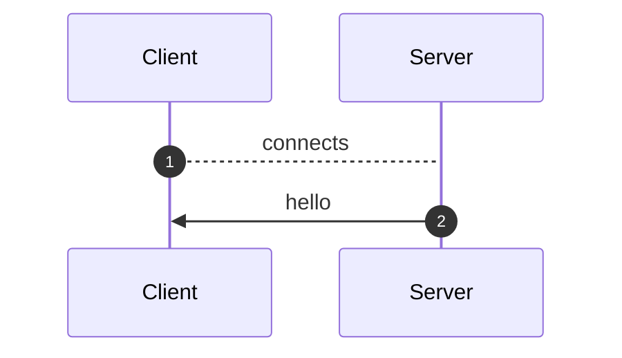
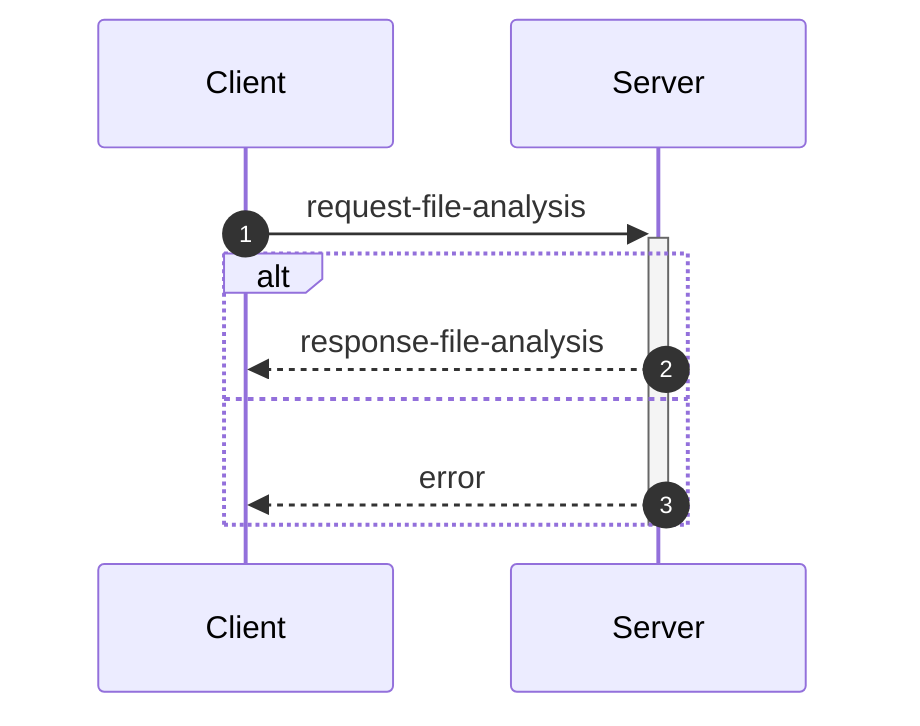
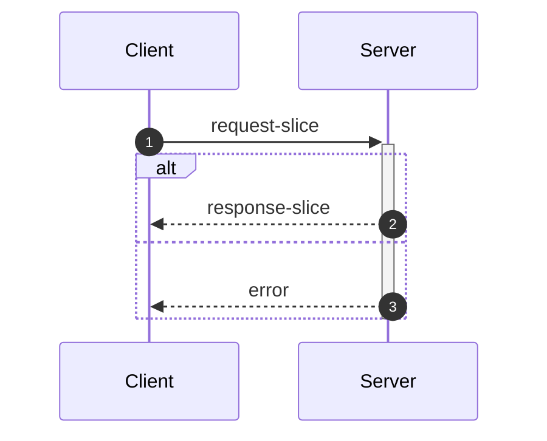
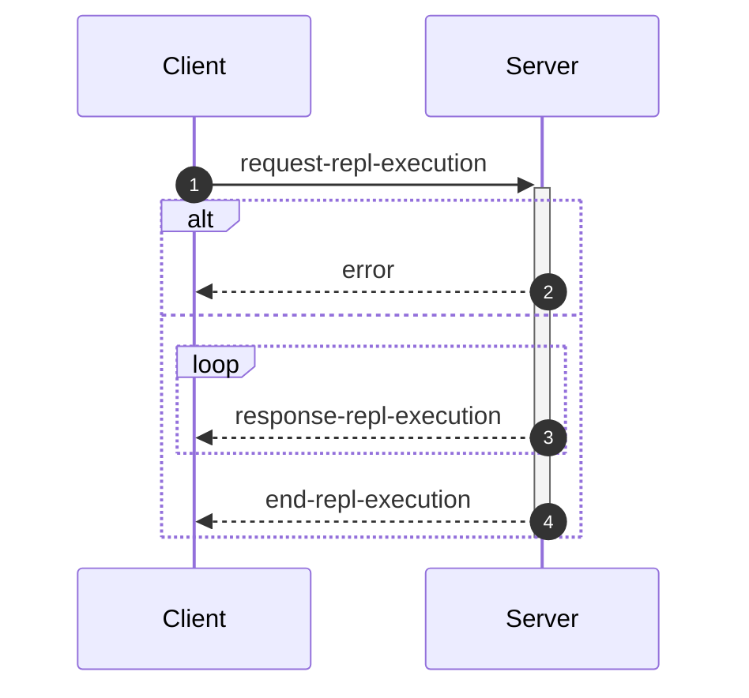

_This document was generated from '[src/documentation/wiki-interface.ts](https://github.com/flowr-analysis/flowr/tree/main//src/documentation/wiki-interface.ts)' on 2026-07-29, 17:42:22 UTC presenting an overview of flowR's interface (v2.13.4, using R v4.5.0). Please do not edit this file/wiki page directly._

Although far from being as detailed as the in-depth explanation of [_flowR_](https://github.com/flowr-analysis/flowr/wiki/core),
this wiki page explains how to interface with _flowR_ in more detail.
In general, command line arguments and other options provide short descriptions on hover over.

* [💻 Using the REPL](#using-the-repl)
* [⚙️ Configuring FlowR](#configuring-flowr)
* [⚒️ Writing Code](#writing-code)
* [💬 Communicating with the Server](#communicating-with-the-server)

<a id='using-the-repl'></a>
## 💻 Using the REPL


> [!NOTE]
> To execute arbitrary R commands with a repl request, _flowR_ has to be started explicitly with <span title="Description (Command Line Argument): Allow to access the underlying R session when using flowR (security warning: this allows the execution of arbitrary R code!)">`--r-session-access`</span>.
> Please be aware that this introduces a security risk and note that this relies on the [`r-shell` engine](https://github.com/flowr-analysis/flowr/wiki/engines) .

Although primarily meant for users to explore,
there is nothing which forbids simply calling _flowR_ as a subprocess to use standard-in, -output, and -error
for communication (although you can access the REPL using the server as well,
with the [REPL Request](#message-request-repl-execution) message).

The read-eval-print loop&nbsp;(REPL) works relatively simple.
You can submit an expression (using <kbd>Enter</kbd>),
which is interpreted as an R&nbsp;expression by default but interpreted as a *command* if it starts with a colon (`:`).
The best command to get started with the REPL is <span title="Description (Repl Command): Show help information (aliases: :h, :?)">`:help`</span>.
Besides, you can leave the REPL either with the command <span title="Description (Repl Command): End the repl (aliases: :q, :exit)">`:quit`</span> or by pressing <kbd>Ctrl</kbd>+<kbd>C</kbd> twice.
When writing a *command*, you may press <kbd>Tab</kbd> to get a list of completions, if available.
Multiple commands can be entered in a single line by separating them with a semicolon (`;`), e.g. `:parse "x<-2"; :df*`.
If a command is given without R code, the REPL will re-use R code given in a previous command.
The prior example will hence return first the parsed AST of the program and then the dataflow graph for `"x <- 2"`.

> [!NOTE]
> If you develop flowR, you may want to launch the repl using the `npm run main-dev` command, this way, you get a non-minified version of flowR with debug information and hot-reloading of source files.

<details>
<summary>Available Commands</summary>

We currently offer the following commands (this with a `[*]` suffix are available with and without the star):


| Command | Description |
| ------- | ----------- |
| **<span title="Description (Repl Command): End the repl (aliases: :q, :exit)">:quit</span>** | End the repl (aliases: **:<span title="Alias of ':quit'. End the repl">q</span>**, **:<span title="Alias of ':quit'. End the repl">exit</span>**) |
| **<span title="Description (Repl Command): Execute the given code as R code. This requires the `--r-session-access` flag to be set and requires the r-shell engine. (aliases: :e, :r)">:execute</span>** | Execute the given code as R code. This requires the `--r-session-access` flag to be set and requires the r-shell engine. (aliases: **:<span title="Alias of ':execute'. Execute the given code as R code. This requires the `--r-session-access` flag to be set and requires the r-shell engine.">e</span>**, **:<span title="Alias of ':execute'. Execute the given code as R code. This requires the `--r-session-access` flag to be set and requires the r-shell engine.">r</span>**) |
| **<span title="Description (Repl Command): Get mermaid code for the control-flow graph of R code (aliases: :cfg, :cf)">:controlflow[*]</span>** | Get mermaid code for the control-flow graph of R code (star: Returns the URL to mermaid.live) (aliases: **:<span title="Alias of ':controlflow'. Get mermaid code for the control-flow graph of R code">cfg</span>**, **:<span title="Alias of ':controlflow'. Get mermaid code for the control-flow graph of R code">cf</span>**) |
| **<span title="Description (Repl Command): Get mermaid code for the control-flow graph with basic blocks (aliases: :cfgb, :cfb)">:controlflowbb[*]</span>** | Get mermaid code for the control-flow graph with basic blocks (star: Returns the URL to mermaid.live) (aliases: **:<span title="Alias of ':controlflowbb'. Get mermaid code for the control-flow graph with basic blocks">cfgb</span>**, **:<span title="Alias of ':controlflowbb'. Get mermaid code for the control-flow graph with basic blocks">cfb</span>**) |
| **<span title="Description (Repl Command): Get mermaid code for the dataflow graph (aliases: :d, :df)">:dataflow[*]</span>** | Get mermaid code for the dataflow graph (star: Returns the URL to mermaid.live) (aliases: **:<span title="Alias of ':dataflow'. Get mermaid code for the dataflow graph">d</span>**, **:<span title="Alias of ':dataflow'. Get mermaid code for the dataflow graph">df</span>**) |
| **<span title="Description (Repl Command): Get mermaid code for the normalized AST of R code (aliases: :n)">:normalize[*]</span>** | Get mermaid code for the normalized AST of R code (star: Returns the URL to mermaid.live) (alias: **:<span title="Alias of ':normalize'. Get mermaid code for the normalized AST of R code">n</span>**) |
| **<span title="Description (Repl Command): Get mermaid code for the simplified dataflow graph (aliases: :ds, :dfs)">:dataflowsimple[*]</span>** | Get mermaid code for the simplified dataflow graph (star: Returns the URL to mermaid.live) (aliases: **:<span title="Alias of ':dataflowsimple'. Get mermaid code for the simplified dataflow graph">ds</span>**, **:<span title="Alias of ':dataflowsimple'. Get mermaid code for the simplified dataflow graph">dfs</span>**) |
| **<span title="Description (Repl Command): Inspect and extend the signature database: `query` (identical to :query @signature), `add <path>` to mount another database/source, `download` to fetch the full-history database. (aliases: :sig)">:signature</span>** | Inspect and extend the signature database: `query` (identical to :query @signature), `add <path>` to mount another database/source, `download` to fetch the full-history database. (alias: **:<span title="Alias of ':signature'. Inspect and extend the signature database: `query` (identical to :query @signature), `add <path>` to mount another database/source, `download` to fetch the full-history database.">sig</span>**) |
| **<span title="Description (Repl Command): Just calculates the DFG, but only prints summary info (aliases: :d#, :df#)">:dataflowsilent</span>** | Just calculates the DFG, but only prints summary info (aliases: **:<span title="Alias of ':dataflowsilent'. Just calculates the DFG, but only prints summary info">d#</span>**, **:<span title="Alias of ':dataflowsilent'. Just calculates the DFG, but only prints summary info">df#</span>**) |
| **<span title="Description (Repl Command): Prints ASCII Art of the parsed, unmodified AST (aliases: :p)">:parse</span>** | Prints ASCII Art of the parsed, unmodified AST (alias: **:<span title="Alias of ':parse'. Prints ASCII Art of the parsed, unmodified AST">p</span>**) |
| **<span title="Description (Repl Command): Prints the version of flowR as well as the current version of R">:version</span>** | Prints the version of flowR as well as the current version of R
| **<span title="Description (Repl Command): Query the given R code (use 'help' for more information)">:query[*]</span>** | Query the given R code (use 'help' for more information) (star: Similar to query, but returns the output in json format.)
| **<span title="Description (Repl Command): Returns an ASCII representation of the dataflow graph (aliases: :df!)">:dataflowascii</span>** | Returns an ASCII representation of the dataflow graph (alias: **:<span title="Alias of ':dataflowascii'. Returns an ASCII representation of the dataflow graph">df!</span>**) |
| **<span title="Description (Repl Command): Returns summarization stats for the normalized AST (aliases: :n#)">:normalize#</span>** | Returns summarization stats for the normalized AST (alias: **:<span title="Alias of ':normalize#'. Returns summarization stats for the normalized AST">n#</span>**) |
| **<span title="Description (Repl Command): Show help information (aliases: :h, :?)">:help</span>** | Show help information (aliases: **:<span title="Alias of ':help'. Show help information">h</span>**, **:<span title="Alias of ':help'. Show help information">?</span>**) |


</details>


> [!TIP]
> 
> As indicated by the examples before, all REPL commands that operate on code keep track of the state.
> Hence, if you run a command like <span title="Description (Repl Command, starred version): Returns the URL to mermaid.live; Base Command: Get mermaid code for the dataflow graph (aliases: :d*, :df*)">`:dataflow*`</span> without providing R code,
> the REPL will re-use the R code provided in a previous command.
> Likewise, doing this will benefit from incrementality!
> If you request the dataflow graph with `:df* x <- 2 * y` and then want to see the parsed AST with `:parse`,
> the REPL will re-use previously obtained information and not re-parse the code again.
> 		


Generally, many commands offer shortcut versions in the REPL. Many queries, for example, offer a shortened format (see the example below).
Of special note, the [Config Query](https://github.com/flowr-analysis/flowr/wiki/%5BQuery%5D-Config)
can be used to also modify the currently active configuration of _flowR_ within the REPL (see the [wiki page](https://github.com/flowr-analysis/flowr/wiki/%5BQuery%5D-Config) for more information).

### Example: Retrieving the Dataflow Graph

To retrieve a URL to the [mermaid](https://mermaid.js.org/) diagram of the dataflow of a given expression,
use <span title="Description (Repl Command, starred version): Returns the URL to mermaid.live; Base Command: Get mermaid code for the dataflow graph (aliases: :d*, :df*)">`:dataflow*`</span> (or <span title="Description (Repl Command): Get mermaid code for the dataflow graph (aliases: :d, :df)">`:dataflow`</span> to get the mermaid code in the cli):


```shell
$ docker run -it --rm eagleoutice/flowr # or npm run flowr 
flowR repl v2.13.4, R grammar v14 (tree-sitter engine)
R> :dataflow* y <- 1 + x
```

<details>
<summary style='color:gray'>Output</summary>


```text
https://mermaid.live/view#base64:eyJjb2RlIjoiZmxvd2NoYXJ0IEJUXG4gICAgMXt7XCJgKiM5MTtSTnVtYmVyIzkzOyogKioxKipcbiAgICAgICoxLjYqICgqKmlkOiAxKiopYFwifX1cbiAgICUlIE5vIGVkZ2VzIGZvdW5kIGZvciAxXG4gICAgMihbXCJgKiM5MTtSU3ltYm9sIzkzOyogKip4KipcbiAgICAgICoxLjEwKiAoKippZDogMioqKWBcIl0pXG4gICAlJSBObyBlZGdlcyBmb3VuZCBmb3IgMlxuICAgIDNbW1wiYCojOTE7UkJpbmFyeU9wIzkzOyogYmFzZSM1ODsjNTg7KiojNDM7KipcbiAgICAgICoxLjYtMTAqICgqKmlkOiAzKiopXG4gICAgYXJnOiAoMSwgMilgXCJdXVxuICAgIGJ1aWx0LWluOl9bXCJgQnVpbHQtSW46XG4jNDM7YFwiXVxuICAgIHN0eWxlIGJ1aWx0LWluOl8gc3Ryb2tlOmdyYXksZmlsbDpncmF5LHN0cm9rZS13aWR0aDoycHgsb3BhY2l0eTouODtcbiAgICAwW1wiYCojOTE7UlN5bWJvbCM5MzsqICoqeSoqXG4gICAgICAqMS4xKiAoKippZDogMCoqLCB2OiAzKWBcIl1cbiAgICA0W1tcImAqIzkxO1JCaW5hcnlPcCM5MzsqIGJhc2UjNTg7IzU4OyoqIzYwOyM0NTsqKlxuICAgICAgKjEuMS0xMCogKCoqaWQ6IDQqKilcbiAgICBhcmc6ICgwLCAzKWBcIl1dXG4gICAgYnVpbHQtaW46Xy1bXCJgQnVpbHQtSW46XG4jNjA7IzQ1O2BcIl1cbiAgICBzdHlsZSBidWlsdC1pbjpfLSBzdHJva2U6Z3JheSxmaWxsOmdyYXksc3Ryb2tlLXdpZHRoOjJweCxvcGFjaXR5Oi44O1xuICAgIDMgLS0+fFwicmVhZHMsIGFyZ1wifCAxXG4gICAgMyAtLT58XCJyZWFkcywgYXJnXCJ8IDJcbiAgICAzIC0uLT58XCJyZWFkcywgY2FsbHNcInwgYnVpbHQtaW46X1xuICAgIGxpbmtTdHlsZSAyIHN0cm9rZTpncmF5O1xuICAgIDAgLS0+fFwiZGVmaW5lZC1ieVwifCAzXG4gICAgMCAtLT58XCJkZWZpbmVkLWJ5XCJ8IDRcbiAgICA0IC0tPnxcInJlYWRzLCBhcmdcInwgM1xuICAgIDQgLS0+fFwicmV0dXJucywgYXJnXCJ8IDBcbiAgICA0IC0uLT58XCJyZWFkcywgY2FsbHNcInwgYnVpbHQtaW46Xy1cbiAgICBsaW5rU3R5bGUgNyBzdHJva2U6Z3JheTsiLCJtZXJtYWlkIjp7ImF1dG9TeW5jIjp0cnVlfX0=
```


Retrieve the dataflow graph of the expression `y <- 1 + x`. It looks like this:


```mermaid
flowchart LR
    1{{"`*#91;RNumber#93;* **1**
      *1.6* (**id: 1**)`"}}
   %% No edges found for 1
    2(["`*#91;RSymbol#93;* **x**
      *1.10* (**id: 2**)`"])
   %% No edges found for 2
    3[["`*#91;RBinaryOp#93;* base#58;#58;**#43;**
      *1.6-10* (**id: 3**)
    arg: (1, 2)`"]]
    built-in:_["`Built-In:
#43;`"]
    style built-in:_ stroke:gray,fill:gray,stroke-width:2px,opacity:.8;
    0["`*#91;RSymbol#93;* **y**
      *1.1* (**id: 0**, v: 3)`"]
    4[["`*#91;RBinaryOp#93;* base#58;#58;**#60;#45;**
      *1.1-10* (**id: 4**)
    arg: (0, 3)`"]]
    built-in:_-["`Built-In:
#60;#45;`"]
    style built-in:_- stroke:gray,fill:gray,stroke-width:2px,opacity:.8;
    3 -->|"reads, arg"| 1
    3 -->|"reads, arg"| 2
    3 -.->|"reads, calls"| built-in:_
    linkStyle 2 stroke:gray;
    0 -->|"defined-by"| 3
    0 -->|"defined-by"| 4
    4 -->|"reads, arg"| 3
    4 -->|"returns, arg"| 0
    4 -.->|"reads, calls"| built-in:_-
    linkStyle 7 stroke:gray;
```

	
<details>

<summary style="color:gray">R Code of the Dataflow Graph</summary>

The analysis required _0.9 ms_ (including parse and normalize, using the [tree-sitter](https://github.com/flowr-analysis/flowr/wiki/Engines) engine) within the generation environment. No [signature database](https://github.com/flowr-analysis/flowr/wiki/Signature-Database) is mounted for these generated graphs, so `library()` calls attach no package exports; base-R names are still qualified via the generated base-package store (e.g. `acf` as `stats::acf`). 
We encountered no unknown side effects during the analysis.


```r
y <- 1 + x
```


</details>


</details>


For small graphs like this, <span title="Description (Repl Command): Returns an ASCII representation of the dataflow graph (aliases: :df!)">`:dataflowascii`</span> also provides an ASCII representation directly in the REPL:


```shell
$ docker run -it --rm eagleoutice/flowr # or npm run flowr 
flowR repl v2.13.4, R grammar v14 (tree-sitter engine)
R> :df! y <- 1 + x
```

<details open>
<summary style='color:gray'>Output</summary>


```text
                        0<1>0
                   ┌────| 1 |
    ┌────────┐     │    0---0
 c<4>c       └──c<3>c
 |<- |  v<0>v┌──| + |
 c---c──| y |┘  c---c   u<2>u
        v---v      └────| x |
                        u---u
Edges:
3 -> 1: reads, arg  3 -> 2: reads, arg
4 -> 3: reads, arg  4 -> 0: returns, arg
0 -> 3: defined-by  0 -> 4: defined-by
```


Retrieve the dataflow graph of the expression `y <- 1 + x` as ASCII art.

</details>


For the slicing with <span title="Description (Repl Command): Static backwards executable slicer for R">`:slicer`</span>, you have access to the same [magic comments](#slice-magic-comments) as with the [slice request](#message-request-slice).
Pass `--inline` to splice resolvable `source()` calls into the reconstruction so the slice is a single self-contained R text (the same as the static slice query's `inlineSources` flag).
See `--help` for more flags!

### Example: Interfacing with the File System

Many commands that allow for an R-expression (like <span title="Description (Repl Command, starred version): Returns the URL to mermaid.live; Base Command: Get mermaid code for the dataflow graph (aliases: :d*, :df*)">`:dataflow*`</span>) allow for a file as well
if the argument starts with `file://`.
If you are working from the root directory of the _flowR_ repository, the following gives you the parsed AST of the example file using the <span title="Description (Repl Command): Prints ASCII Art of the parsed, unmodified AST (aliases: :p)">`:parse`</span> command:

> **Watch mode**: Replace `file://` with `watch://` to enter watch mode.
> flowR runs the command immediately and then re-runs it every time the file (or any file inside the folder) changes.
> Enter any other command to leave watch mode.
> For example: `:df watch://analysis.R`


```shell
$ docker run -it --rm eagleoutice/flowr # or npm run flowr 
flowR repl v2.13.4, R grammar v14 (tree-sitter engine)
R> :parse file://test/testfiles/example.R
```

<details>
<summary style='color:gray'>Output</summary>


```text
File: test/testfiles/example.R

program
├ binaryoperator
│ ├ identifier "sum" (1:1─4)
│ ├ <- "<-" (1:5─7)
│ ╰ float "0" (1:8─9)
├ binaryoperator
│ ├ identifier "product" (2:1─8)
│ ├ <- "<-" (2:9─11)
│ ╰ float "1" (2:12─13)
├ binaryoperator
│ ├ identifier "w" (3:1─2)
│ ├ <- "<-" (3:3─5)
│ ╰ float "7" (3:6─7)
├ binaryoperator
│ ├ identifier "N" (4:1─2)
│ ├ <- "<-" (4:3─5)
│ ╰ float "10" (4:6─8)
├ forstatement
│ ├ for "for" (6:1─4)
│ ├ ( "(" (6:5─6)
│ ├ identifier "i" (6:6─7)
│ ├ in "in" (6:8─10)
│ ├ binaryoperator
│ │ ├ float "1" (6:11─12)
│ │ ├ : ":" (6:12─13)
│ │ ╰ parenthesizedexpression
│ │   ├ ( "(" (6:13─14)
│ │   ├ binaryoperator
│ │   │ ├ identifier "N" (6:14─15)
│ │   │ ├ - "-" (6:15─16)
│ │   │ ╰ float "1" (6:16─17)
│ │   ╰ ) ")" (6:17─18)
│ ├ ) ")" (6:18─19)
│ ╰ bracedexpression
│   ├ { "{" (6:20─21)
│   ├ binaryoperator
│   │ ├ identifier "sum" (7:3─6)
│   │ ├ <- "<-" (7:7─9)
│   │ ╰ binaryoperator
│   │   ├ binaryoperator
│   │   │ ├ identifier "sum" (7:10─13)
│   │   │ ├ + "+" (7:14─15)
│   │   │ ╰ identifier "i" (7:16─17)
│   │   ├ + "+" (7:18─19)
│   │   ╰ identifier "w" (7:20─21)
│   ├ binaryoperator
│   │ ├ identifier "product" (8:3─10)
│   │ ├ <- "<-" (8:11─13)
│   │ ╰ binaryoperator
│   │   ├ identifier "product" (8:14─21)
│   │   ├  "" (8:22─23)
│   │   ╰ identifier "i" (8:24─25)
│   ╰ } "}" (9:1─2)
├ call
│ ├ identifier "cat" (11:1─4)
│ ╰ arguments
│   ├ ( "(" (11:4─5)
│   ├ argument
│   │ ╰ string
│   │   ├ " "\"" (11:5─6)
│   │   ├ stringcontent "Sum:" (11:6─10)
│   │   ╰ " "\"" (11:10─11)
│   ├ comma "," (11:11─12)
│   ├ argument
│   │ ╰ identifier "sum" (11:13─16)
│   ├ comma "," (11:16─17)
│   ├ argument
│   │ ╰ string
│   │   ├ " "\"" (11:18─19)
│   │   ├ stringcontent
│   │   │ ╰ escapesequence "\\n" (11:19─21)
│   │   ╰ " "\"" (11:21─22)
│   ╰ ) ")" (11:22─23)
╰ call
  ├ identifier "cat" (12:1─4)
  ╰ arguments
    ├ ( "(" (12:4─5)
    ├ argument
    │ ╰ string
    │   ├ " "\"" (12:5─6)
    │   ├ stringcontent "Product:" (12:6─14)
    │   ╰ " "\"" (12:14─15)
    ├ comma "," (12:15─16)
    ├ argument
    │ ╰ identifier "product" (12:17─24)
    ├ comma "," (12:24─25)
    ├ argument
    │ ╰ string
    │   ├ " "\"" (12:26─27)
    │   ├ stringcontent
    │   │ ╰ escapesequence "\\n" (12:27─29)
    │   ╰ " "\"" (12:29─30)
    ╰ ) ")" (12:30─31)
```


Retrieve the parsed AST of the example file.

<details>

<summary>File Content</summary>


```r
sum <- 0
product <- 1
w <- 7
N <- 10

for (i in 1:(N-1)) {
  sum <- sum + i + w
  product <- product * i
}

cat("Sum:", sum, "\n")
cat("Product:", product, "\n")
```


</details>

As _flowR_ directly transforms this AST the output focuses on being human-readable instead of being machine-readable.
		

</details>


### Example: Run a Query

You can run any query supported by _flowR_ using the <span title="Description (Repl Command): Query the given R code (use 'help' for more information)">`:query`</span> command.
For example, to obtain the shapes of all data frames in a given piece of code, you can run:


```shell
$ docker run -it --rm eagleoutice/flowr # or npm run flowr 
flowR repl v2.13.4, R grammar v14 (tree-sitter engine)
R> :query @absint df-shape "x <- data.frame(a = 1:10, b = 1:10)\ny <- x$a"
```

<details open>
<summary style='color:gray'>Output</summary>


```text
Query: absint (1 ms)
   ╰ $12: (colnames: [{"a", "b"}, {}], cols: [2, 2], rows: [10, 10])
   ╰ $0: (colnames: [{"a", "b"}, {}], cols: [2, 2], rows: [10, 10])
All queries together required ≈5 ms (1ms accuracy, total 5 ms)
```


Retrieve the shapes of all data frames in the given code.

</details>


To run the linter on a file, you can use (in this example, we just issue the `dead-code` linter on a small piece of code):


```shell
$ docker run -it --rm eagleoutice/flowr # or npm run flowr 
flowR repl v2.13.4, R grammar v14 (tree-sitter engine)
R> :query @linter rules:dead-code "if(FALSE) x <- 2"
```

<details open>
<summary style='color:gray'>Output</summary>


```text
Query: linter (4 ms)
   ╰ Dead Code (dead-code):
       ╰ certain:
           ╰ Code at 1.11-16
       ╰ Metadata: searchTimeMs: 2, processTimeMs: 1
All queries together required ≈4 ms (1ms accuracy, total 4 ms)
```


Run the linter on the given code, with only the `dead-code` rule enabled.

</details>


For more information on the available queries, please check out the [Query API](https://github.com/flowr-analysis/flowr/wiki/query-api).


<a id='configuring-flowr'></a>
## ⚙️ Configuring FlowR


When running _flowR_, you may want to specify some behaviors with a dedicated configuration file.
By default, flowR looks for a file named `flowr.json` in the current working directory (or any higher directory).
You can also specify a different file with <span title="Description (Command Line Argument): The name of the configuration file to use">`--config-file`</span> or pass the configuration inline using <span title="Description (Command Line Argument): The flowR configuration to use, as a JSON string">`--config-json`</span>.
To inspect the current configuration, you can run flowr with the <span title="Description (Command Line Argument): Run with verbose logging (will be passed to the corresponding script)">`--verbose`</span> flag, or use the `config` [Query](https://github.com/flowr-analysis/flowr/wiki/query-api).
Within the REPL this works by running the following:


```shell
:query @config
```


To work with the <a href="https://github.com/flowr-analysis/flowr/tree/main/src/config.ts#L132"><code><span title="The configuration file format for flowR.">FlowrConfig</span></code></a> you can use the provided helper objects alongside its methods like
<a href="https://github.com/flowr-analysis/flowr/tree/main/src/config.ts#L786"><code><span title="Creates a new flowr config that has the updated values.">FlowrConfig::<b>amend</b></span></code></a>.
The schema below documents every option; the ones you most likely want are:

- <a href="https://github.com/flowr-analysis/flowr/wiki/Interface#configuring-flowr" title="Configuration Option (boolean): Whether source calls should be ignored, causing {@link processSourceCall}&#39;s behavior to be skipped.">ignoreSourceCalls</a>: ignore source calls when analyzing the code, i.e., ignore the inclusion of other files.
- <a href="https://github.com/flowr-analysis/flowr/wiki/Interface#configuring-flowr" title="Configuration Option (boolean): Whether load calls should be ignored, causing {@link processLoadCall}&#39;s behavior to be skipped.">ignoreLoadCalls</a>: ignore load calls when analyzing the code, i.e., ignore the loading of r-data files.
- <a href="https://github.com/flowr-analysis/flowr/wiki/Interface#configuring-flowr" title="Configuration Option (object): Do you want to overwrite (parts) of the builtin definition?">semantics.environment.overwriteBuiltIns</a>: overwrite _flowR_'s handling of built-in functions, or clear the preset definitions entirely.
  See [Configure BuiltIn Semantics](#configure-builtin-semantics) for more information.
- <a href="https://github.com/flowr-analysis/flowr/wiki/Interface#configuring-flowr" title="Configuration Option (string): How to resolve variables and their values. (one of &quot;disabled&quot;, &quot;alias&quot;, &quot;builtin&quot;)">solver.variables</a>: how to resolve variables and their values (`disabled`, `alias`, `builtin`).
- <a href="https://github.com/flowr-analysis/flowr/wiki/Interface#configuring-flowr" title="Configuration Option (array): The engine or set of engines to use for interacting with R code. An empty array means all available engines will be used.">engines</a> and <a href="https://github.com/flowr-analysis/flowr/wiki/Interface#configuring-flowr" title="Configuration Option (string): The default engine to use for interacting with R code. If this is undefined, an arbitrary engine from the specified list will be used. (one of &quot;tree-sitter&quot;, &quot;r-shell&quot;)">defaultEngine</a>: the engines used to interact with R code, see the [Engines wiki page](https://github.com/flowr-analysis/flowr/wiki/engines).
- <a href="https://github.com/flowr-analysis/flowr/wiki/Interface#configuring-flowr" title="Configuration Option (array): Files a framework loads on its own, without any source() call (e.g. global.R in a shiny app), in the order they are loaded; flowR orders the matching project files accordingly and analyzes them as one program. Entries are case-insensitive globs matched against the file path, a plain name matches any file with that name, and entries matching no project file are warned about. Usually set per project kind via specializeConfig.">project.implicitSources</a>: the files a framework loads without any `source()` call, in the order in which they are
  loaded. Entries are globs (e.g. `R/*.R`) matched against the file path ignoring capitalization; one matching no file is reported.
- <a href="https://github.com/flowr-analysis/flowr/wiki/Interface#configuring-flowr" title="Configuration Option (object): Overwrite (parts of) the configuration depending on the project kind flowR detects, e.g. to give a shiny app its implicit sources.">specializeConfig</a>: overwrite (parts of) the configuration depending on the kind of project _flowR_ detects
  (e.g. `shiny-app`), which is how a shiny app gets its implicit sources by default. What you configure directly wins.
- <a href="https://github.com/flowr-analysis/flowr/wiki/Interface#configuring-flowr" title="Configuration Option (string): Overwrite the project kind flowR would otherwise infer from the analyzed files, e.g. when auto-detection guesses wrong. (one of &quot;package&quot;, &quot;script&quot;, &quot;shiny-app&quot;, &quot;notebook&quot;, &quot;project&quot;, &quot;unknown&quot;)">project.useProjectType</a>: skip that detection and force a project kind yourself, when auto-detection guesses wrong.
- <a href="https://github.com/flowr-analysis/flowr/wiki/Interface#configuring-flowr" title="Configuration Option (array): The default plugins to load when creating a new instance of FlowrAnalyzer">defaultPlugins</a> and <a href="https://github.com/flowr-analysis/flowr/wiki/Interface#configuring-flowr" title="Configuration Option (array): The plugins to load in REPL mode">repl.plugins</a>: the plugins to load for a new <a href="https://github.com/flowr-analysis/flowr/tree/main/src/project/flowr-analyzer.ts#L173"><code><span title="Central class for conducting analyses with FlowR. Use the FlowrAnalyzerBuilder to create a new instance. If you want the original pattern of creating a pipeline and running all steps, you can still do this with FlowrAnalyzer#runFull . To inspect the context of the analyzer, use FlowrAnalyzer#inspectContext (if you are a plugin and need to modify it, use FlowrAnalyzer#context instead).">FlowrAnalyzer</span></code></a> and in the REPL
  (use `flowr:default` to reference the former).

So you can configure _flowR_ by adding a file like the following:

<details>

<summary>Example Configuration File</summary>


```json
{
  "ignoreSourceCalls": true,
  "ignoreLoadCalls": true,
  "semantics": {
    "environment": {
      "overwriteBuiltIns": {
        "definitions": [
          {
            "type": "function",
            "names": [
              "foo"
            ],
            "processor": "builtin:assign",
            "config": {}
          }
        ]
      }
    }
  },
  "defaultPlugins": [
    "file:description",
    "versions:description"
  ],
  "repl": {
    "quickStats": false,
    "dfProcessorHeat": false,
    "hints": true,
    "plugins": [
      "flowr:default"
    ]
  },
  "project": {
    "resolveUnknownPathsOnDisk": true,
    "implicitSources": [
      "global.R",
      "app.R"
    ]
  },
  "linter": {
    "disabledRules": []
  },
  "specializeConfig": {
    "shiny-app": {
      "project": {
        "implicitSources": [
          "global.R",
          "ui.R",
          "server.R",
          "app.R"
        ]
      }
    }
  },
  "engines": [
    {
      "type": "r-shell"
    }
  ],
  "solver": {
    "variables": "alias",
    "evalStrings": true,
    "trackEnvironments": true,
    "sigdb": {
      "enabled": true,
      "loadProjectDependencies": true,
      "eagerlyLoad": false,
      "eagerlyLoadExports": false,
      "linkBaseR": false,
      "linkDescriptionDependencies": false
    },
    "resolveSource": {
      "dropPaths": "no",
      "ignoreCapitalization": true,
      "inferWorkingDirectory": "active-script",
      "searchPath": []
    },
    "instrument": {},
    "slicer": {
      "threshold": 50
    }
  },
  "abstractInterpretation": {
    "wideningThreshold": 4,
    "dataFrame": {
      "maxColNames": 20,
      "readLoadedData": {
        "readExternalFiles": true,
        "maxReadLines": 1000000
      }
    }
  },
  "incrementalParsing": {
    "activated": false
  },
  "gas": {
    "thresholds": {
      "memory": {
        "problematic": 0.7,
        "critical": 0.9
      },
      "timeMs": {
        "problematic": 100000,
        "critical": 120000
      }
    },
    "features": {}
  }
}
```


</details>

<details>
<a id='configure-builtin-semantics'></a>
<summary>Configure Built-In Semantics</summary>


`semantics/environment/overwriteBuiltins` accepts two keys:

- `loadDefaults` (boolean, initially `true`): If set to `true`, the default built-in definitions are loaded before applying the custom definitions. Setting this flag to `false` explicitly disables the loading of the default definitions.
- `definitions` (array, initially empty): Allows to overwrite or define new built-in elements. Each object within must have a `type` which is one of the below. Furthermore, they may define a string array of `names` which specifies the identifiers to bind the definitions to. You may use `assumePrimitive` to specify whether _flowR_ should assume that this is a primitive non-library definition (so you probably just do not want to specify the key).

  | Type            | Description                                                                                                                                                                                                                                                                                              | Example                                                                                                    |
  | --------------- | -------------------------------------------------------------------------------------------------------------------------------------------------------------------------------------------------------------------------------------------------------------------------------------------------------- | ---------------------------------------------------------------------------------------------------------- |
  | `constant`    | Additionally allows for a `value` this should resolve to.                                                                                                                                                                                                                                                | `{ type: 'constant', names: ['NULL', 'NA'],  value: null }`                                                |
  | `function`    | Is a rather flexible way to define and bind built-in functions. For the time, we do not have extensive documentation to cover all the cases, so please either consult the sources with the `default-builtin-config.ts` or open a [new issue](https://github.com/flowr-analysis/flowr/issues/new/choose). | `{ type: 'function', names: ['next'], processor: 'builtin:d', config: { cfg: ExitPointType.Next } }` |
  | `replacement` | A comfortable way to specify replacement functions like `$<-` or `names<-`. `suffixes` describes the... suffixes to attach automatically. | `{ type: 'replacement', suffixes: ['<-', '<<-'], names: ['[', '[['] }` |


</details>

<details>

<summary style='color:gray'>Full Configuration-File Schema</summary>

- _The configuration file format for flowR._ (object)
    - **logLevel** [optional] _flowR's global minimum log level, applied when the config is loaded._ (string)
        Only allows: 'silly', 'trace', 'debug', 'info', 'warn', 'error', 'fatal'
    - **ignoreSourceCalls** [optional] _Whether source calls should be ignored, causing {@link processSourceCall}'s behavior to be skipped._ (boolean)
    - **ignoreLoadCalls** [optional] _Whether load calls should be ignored, causing {@link processLoadCall}'s behavior to be skipped._ (boolean)
    - **semantics** _Configure language semantics and how flowR handles them._ (object)
        - **environment** [optional] _Semantics regarding how to handle the R environment._ (object)
            - **overwriteBuiltIns** [optional] _Do you want to overwrite (parts) of the builtin definition?_ (object)
                - **loadDefaults** [optional] _Should the default configuration still be loaded?_ (boolean)
                - **definitions** [optional] _The definitions to load/overwrite._ (array)
                Valid item types:
                    - (object)
    - **defaultPlugins** [optional] _The default plugins to load when creating a new instance of FlowrAnalyzer_ (array)
    Valid item types:
        - (alternatives)
            - (string)
            - (array)
    - **repl** _Configuration options for the REPL._ (object)
        - **quickStats** [optional] _Whether to show quick stats in the REPL after each evaluation._ (boolean)
        - **dfProcessorHeat** [optional] _This instruments the dataflow processors to count how often each processor is called._ (boolean)
        - **hints** [optional] _Whether to show dim inline hints on the empty prompt (automatically disabled on non-interactive terminals)._ (boolean)
        - **plugins** [optional] _The plugins to load in REPL mode_ (array)
        Valid item types:
            - (alternatives)
                - (string)
                - (array)
        - **autoUseFileProtocol** [optional] _Prepend the file protocol to a repl input that looks like a path, instead of only warning about it._ (boolean)
        - **queryStats** [optional] _Whether `:query` closes with the line stating how long the queries took (`:query*` never prints it)._ (boolean)
        - **showPlugins** [optional] _Whether `:version` grays out the plugins that did not activate during the last analysis._ (boolean)
    - **project** _Project specific configuration options._ (object)
        - **resolveUnknownPathsOnDisk** [optional] _Whether to resolve unknown paths loaded by the r project disk when trying to source/analyze files._ (boolean)
        - **failOnInaccessiblePath** [optional] _Whether a directory that cannot be traversed during file discovery (e.g. due to permissions) aborts the analysis; when false (the default) such paths are logged and skipped._ (boolean)
        - **basePackages** [optional] _The packages considered part of R itself (base and recommended); if unset, flowR uses its built-in list._ (array)
        Valid item types:
            - (string)
        - **implicitSources** [optional] _Files a framework loads on its own, without any source() call (e.g. global.R in a shiny app), in the order they are loaded; flowR orders the matching project files accordingly and analyzes them as one program. Entries are case-insensitive globs matched against the file path, a plain name matches any file with that name, and entries matching no project file are warned about. Usually set per project kind via specializeConfig._ (array)
        Valid item types:
            - (string)
        - **useProjectType** [optional] _Overwrite the project kind flowR would otherwise infer from the analyzed files, e.g. when auto-detection guesses wrong._ (string)
            Only allows: 'package', 'script', 'shiny-app', 'notebook', 'project', 'unknown'
        - **discovery** [optional] _Scoping options for the default project discovery._ (object)
            - **full** [optional] _Collect every file below the project root (greedy) instead of only the files the detected project kind needs (default false)._ (boolean)
            - **perKind** [optional] _Per-kind include/exclude glob overrides layered on the default scoping._ (object)
            - **ignore** [optional] _Case-insensitive globs that drop matching files from the intelligent discovery, regardless of kind (e.g. .Renviron to ignore environment files)._ (array)
            Valid item types:
                - (string)
        - **classification** [optional] _Overrides for the signals flowR uses to classify the project kind._ (object)
            - **shinyDescriptionTypes** [optional] _DESCRIPTION Type: values that mark a shiny app._ (array)
            Valid item types:
                - (string)
            - **shinyEntryFiles** [optional] _File names a shiny app is assembled from._ (array)
            Valid item types:
                - (string)
            - **shinyUsagePattern** [optional] _Regex source evidencing shiny usage in an entry file._ (string)
            - **notebookExtensions** [optional] _File extensions marking a notebook._ (array)
            Valid item types:
                - (string)
    - **linter** _Linter configuration options._ (object)
        - **disabledRules** _Linting rule names excluded from the default rule set (a rule requested explicitly via a linter query still runs). Usually set per project kind via specializeConfig._ (array)
        Valid item types:
            - (string)
    - **inputSources** [optional] _Further frameworks the input-sources analysis should know about; entries are added to flowR's defaults._ (object)
        - **pure** [optional] _Functions that only pass the constantness of their arguments on._ (array)
        Valid item types:
            - (string)
        - **param** [optional] _Functions whose result is a 'param' input._ (array)
        Valid item types:
            - (string)
        - **file** [optional] _Functions whose result is a 'file' input._ (array)
        Valid item types:
            - (string)
        - **tempfile** [optional] _Functions whose result is a 'tempfile' input._ (array)
        Valid item types:
            - (string)
        - **net** [optional] _Functions whose result is a 'net' input._ (array)
        Valid item types:
            - (string)
        - **rand** [optional] _Functions whose result is a 'rand' input._ (array)
        Valid item types:
            - (string)
        - **system** [optional] _Functions whose result is a 'system' input._ (array)
        Valid item types:
            - (string)
        - **ffi** [optional] _Functions whose result is a 'ffi' input._ (array)
        Valid item types:
            - (string)
        - **lang** [optional] _Functions whose result is a 'lang' input._ (array)
        Valid item types:
            - (string)
        - **options** [optional] _Functions whose result is a 'options' input._ (array)
        Valid item types:
            - (string)
        - **user** [optional] _Functions whose result is a 'user' input._ (array)
        Valid item types:
            - (string)
        - **const** [optional] _Functions whose result is a 'const' input._ (array)
        Valid item types:
            - (string)
        - **scope** [optional] _Functions whose result is a 'scope' input._ (array)
        Valid item types:
            - (string)
        - **dconst** [optional] _Functions whose result is a 'dconst' input._ (array)
        Valid item types:
            - (string)
        - **unknown** [optional] _Functions whose result is a 'unknown' input._ (array)
        Valid item types:
            - (string)
        - **linkedObjects** [optional] _Objects a framework provides without a definition in the code, e.g. shiny's input._ (array)
        Valid item types:
            - (object)
        - **linkedEntryPoints** [optional] _Calls that hand a function to a framework, which binds its objects to the parameters by position._ (array)
        Valid item types:
            - (object)
    - **specializeConfig** [optional] _Overwrite (parts of) the configuration depending on the project kind flowR detects, e.g. to give a shiny app its implicit sources._ (object)
    - **engines** _The engine or set of engines to use for interacting with R code. An empty array means all available engines will be used._ (array)
    Valid item types:
        - (alternatives)
            - _The configuration for the tree sitter engine._ (object)
                - **type** [required] _Use the tree sitter engine._ (string)
                    Only allows: 'tree-sitter'
                - **wasmPath** [optional] _The path to the tree-sitter-r WASM binary to use. If this is undefined, this uses the default path._ (string)
                - **treeSitterWasmPath** [optional] _The path to the tree-sitter WASM binary to use. If this is undefined, this uses the default path._ (string)
                - **lax** [optional] _Whether to use the lax parser for parsing R code (allowing for syntax errors). If this is undefined, the strict parser will be used._ (boolean)
            - _The configuration for the R shell engine._ (object)
                - **type** [required] _Use the R shell engine._ (string)
                    Only allows: 'r-shell'
                - **rPath** [optional] _The path to the R executable to use. If this is undefined, this uses the default path._ (string)
    - **defaultEngine** [optional] _The default engine to use for interacting with R code. If this is undefined, an arbitrary engine from the specified list will be used._ (string)
        Only allows: 'tree-sitter', 'r-shell'
    - **solver** _How to resolve constants, constraints, cells, ..._ (object)
        - **variables** _How to resolve variables and their values._ (string)
            Only allows: 'disabled', 'alias', 'builtin'
        - **evalStrings** _Should we include eval(parse(text="...")) calls in the dataflow graph?_ (boolean)
        - **trackEnvironments** [optional] _Track user-created environments (new.env, assign/get/local with envir=, dollar-assign, attach). When false, all envir-style calls fall through conservatively._ (boolean)
        - **sigdb** _Resolving library exports from a signature database._ (object)
            - **enabled** [optional] _Resolve library()/use() exports from a signature database (default true); when false no database is consulted._ (boolean)
            - **loadProjectDependencies** [optional] _Load the project's declared dependencies from its metadata files (DESCRIPTION Imports/Depends, rproject.toml, uvr.toml, renv.lock, rv.lock, uvr.lock) (default true); when false these files are not read for dependencies._ (boolean)
            - **eagerlyLoad** [optional] _Parse the database up front rather than on the first package load (default false, ignored if disabled)._ (boolean)
            - **eagerlyLoadExports** [optional] _Add a vertex for every export on load rather than on demand (default false); keeps the dataflow graph small._ (boolean)
            - **assumedRVersion** [optional] _R version assumed when resolving versioned (base-R) exports: a pin like "4.5" or "auto" to detect the installed R (default "auto")._ (string)
            - **linkBaseR** [optional] _Eagerly attach base-R namespaces so bare base calls resolve without library() (default false)._ (boolean)
            - **linkBaseRCalls** [optional] _Add a lightweight Reads edge from a bare base-R call to its signature-database function vertex (default false; base-R qualification is edge-free otherwise)._ (boolean)
            - **linkPackageCalls** [optional] _Add a lightweight Reads edge from a resolved package call to its signature-database function vertex (default false)._ (boolean)
            - **linkDescriptionDependencies** [optional] _Eagerly attach the namespaces of the project's declared DESCRIPTION dependencies (Imports/Depends) so their exports resolve without an explicit library() (default false)._ (boolean)
            - **warmInBackground** [optional] _Decompress the hot shards (base + most-downloaded) in a background task on startup so the first library() lookup is warm (default false; for long-running servers/REPLs)._ (boolean)
            - **additionalPaths** [optional] _Extra directories or bundle/manifest files searched for signature databases (alongside the shipped default and $FLOWR_SIGDB_DIR); a downloaded full-history bundle placed here is mounted automatically._ (array)
            Valid item types:
                - (string)
            - **downloadRepo** [optional] _GitHub owner/repo the full-history bundle is downloaded from via ":signature download" (default "flowr-analysis/flowr", release tag "sigdb-v<flowR-version>")._ (string)
            - **autoSync** [optional] _On startup, re-download shards whose committed sigdb.remote.json hash no longer matches the cache, in the background (default false; opt-in network sync after a git pull)._ (boolean)
            - **versionSelection** [optional] _When a project constrains a dependency, resolve to the newest (default), oldest, or system-installed version satisfying it; system needs R and falls back to newest. Base-R packages always resolve against the assumed R version._ (string)
                Only allows: 'newest', 'oldest', 'system'
            - **versionOverrides** [optional] _Force an exact version for specific packages (name -> version), overriding both the project constraint and the versionSelection policy (default {})._ (object)
        - **versionManagement** _Policies for reasoning about dependency versions._ (object)
            - **linkedVersionGroups** [optional] _Groups of packages that must resolve to the same version; version guessing intersects each group so its members stay mutually compatible (default [])._ (array)
            Valid item types:
                - (array)
                Valid item types:
                    - (string)
        - **instrument** (object)
            - **dataflowExtractors** [optional] _These keys are only intended for use within code, allowing to instrument the dataflow analyzer!_ (any)
        - **resolveSource** [optional] _If lax source calls are active, flowR searches for sourced files much more freely, based on the configurations you give it. This option is only in effect if `ignoreSourceCalls` is set to false._ (object)
            - **dropPaths** _Allow to drop the first or all parts of the sourced path, if it is relative._ (string)
                Only allows: 'no', 'once', 'all'
            - **ignoreCapitalization** _Search for filenames matching in the lowercase._ (boolean)
            - **inferWorkingDirectory** _Try to infer the working directory from the main or any script to analyze._ (string)
                Only allows: 'no', 'main-script', 'active-script', 'any-script'
            - **searchPath** _Additionally search in these paths._ (array)
            Valid item types:
                - (string)
            - **repeatedSourceLimit** [optional] _How often the same file can be sourced within a single run? Please be aware: in case of cyclic sources this may not reach a fixpoint so give this a sensible limit._ (number)
            - **applyReplacements** _Provide name replacements for loaded files_ (array)
            Valid item types:
                - (object)
            - **assumeFilesExist** [optional] _Assume a sourced file is always there, making what it defines certain instead of conditional on the source call._ (boolean)
        - **slicer** [optional] _The configuration for the slicer._ (object)
            - **threshold** [optional] _The maximum number of iterations to perform on a single function call during slicing._ (number)
            - **autoExtend** [optional] _If set, the slicer will gain an additional post-pass._ (boolean)
    - **abstractInterpretation** _The configuration options for abstract interpretation._ (object)
        - **wideningThreshold** _The threshold for the number of visitations of a node at which widening should be performed to ensure the termination of the fixpoint iteration._ (number)
        - **dataFrame** _The configuration of the shape inference for data frames._ (object)
            - **maxColNames** _The maximum number of columns names to infer for data frames before over-approximating the column names to top._ (number)
            - **readLoadedData** _Configuration options for reading data frame shapes from loaded external data files, such as CSV files._ (object)
                - **readExternalFiles** _Whether data frame shapes should be extracted from loaded external files, such as CSV files._ (boolean)
                - **maxReadLines** _The maximum number of lines to read when extracting data frame shapes from loaded files, such as CSV files._ (number)
    - **incrementalParsing** (object)
        - **activated** _If set, incremental parsing will be used._ (boolean)
    - **gas** [optional] _Resource-usage guard (gas) configuration. All feature factors default to 0 (disabled). See https://github.com/flowr-analysis/flowr/wiki/Core#gas-resource-guard._ (object)
        - **thresholds** [optional] _Shared thresholds for all gas checks (scaled by per-feature factor)._ (object)
            - **memory** [optional] _Heap-usage fraction thresholds (0-1)._ (object)
                - **problematic** [optional] _Heap fraction (0-1) above which Problematic is returned._ (number)
                - **critical** [optional] _Heap fraction (0-1) above which Critical is returned._ (number)
            - **timeMs** [optional] _Elapsed analysis time thresholds in milliseconds._ (object)
                - **problematic** [optional] _Elapsed ms above which Problematic is returned._ (number)
                - **critical** [optional] _Elapsed ms above which Critical is returned._ (number)
        - **features** [optional] _Per-feature sensitivity factors. 0 or absent disables gas checking for that feature. A factor of 2 makes the feature twice as sensitive. Recognised keys: `source`, `side-effect-linking`, `linter`._ (object)
        - **heapProvider** [optional] _Custom heap statistics source (programmatic configs only), overriding the built-in v8/performance.memory detection._ (function)

</details>

	

<a id='writing-code'></a>
## ⚒️ Writing Code

_flowR_ can be used as a [module](https://www.npmjs.com/package/@eagleoutice/flowr) and offers several main classes and interfaces that are interesting for extension writers 
(see the [Visual Studio Code extension](https://marketplace.visualstudio.com/items?itemName=code-inspect.vscode-flowr) or the [Core](https://github.com/flowr-analysis/flowr/wiki/core) wiki page for more information).

### Creating Analyses with _flowR_

Nowadays, instances of the <a href="https://github.com/flowr-analysis/flowr/tree/main/src/project/flowr-analyzer.ts#L173"><code><span title="Central class for conducting analyses with FlowR. Use the FlowrAnalyzerBuilder to create a new instance. If you want the original pattern of creating a pipeline and running all steps, you can still do this with FlowrAnalyzer#runFull . To inspect the context of the analyzer, use FlowrAnalyzer#inspectContext (if you are a plugin and need to modify it, use FlowrAnalyzer#context instead).">FlowrAnalyzer</span></code></a> should be used as central frontend to get analysis results from _flowR_.
For example, a program slice can be created like this:


```ts
const analyzer = await new FlowrAnalyzerBuilder()
    .setEngine('tree-sitter')
    .build();
analyzer.addRequest('x <- 1\ny <- x\nx');
const result = await analyzer.query([
    {
        type:     'static-slice',
        criteria: ['3@x']
    }
]);
//console.log(result['static-slice']);
```


For more information, please have a look at the [Analyzer](https://github.com/flowr-analysis/flowr/wiki/analyzer) wiki page, which explains how to construct and use the <a href="https://github.com/flowr-analysis/flowr/tree/main/src/project/flowr-analyzer.ts#L173"><code><span title="Central class for conducting analyses with FlowR. Use the FlowrAnalyzerBuilder to create a new instance. If you want the original pattern of creating a pipeline and running all steps, you can still do this with FlowrAnalyzer#runFull . To inspect the context of the analyzer, use FlowrAnalyzer#inspectContext (if you are a plugin and need to modify it, use FlowrAnalyzer#context instead).">FlowrAnalyzer</span></code></a> in more detail.
To work with specific perspectives, you can also consult the respective pages like the [Dataflow Graph](https://github.com/flowr-analysis/flowr/wiki/dataflow-graph) or the [Abstract Interpretation](https://github.com/flowr-analysis/flowr/wiki/abstract-interpretation) wiki pages.
### The Pipeline Executor (Low-Level Interface)

Once, in the beginning, _flowR_ was meant to produce a dataflow graph merely to provide *program slices*. 
However, with continuous updates, the [Dataflow Graph](https://github.com/flowr-analysis/flowr/wiki/dataflow-graph) repeatedly proves to be the more interesting part.
With this, we restructured _flowR_'s originally *hardcoded* pipeline to be far more flexible. 
Now, it can be theoretically extended or replaced with arbitrary steps, optional steps, and what we call 'decorations' of these steps. 
In short, a slicing pipeline using the <a href="https://github.com/flowr-analysis/flowr/tree/main/src/core/pipeline-executor.ts#L97"><code><span title="**Please note:** The PipelineExecutor is now considered to be a rather low-level API for flowR. While it still works and is the basis for all other layers, we strongly recommend using the FlowrAnalyzer and its builder to create and use an analyzer instance that is pre-configured for your use-case. The pipeline executor allows to execute arbitrary pipelines in a step-by-step fashion. If you are not...">PipelineExecutor</span></code></a> looks like this:


```ts

const slicer = new PipelineExecutor(DEFAULT_SLICING_PIPELINE, {
  parser:    new RShell(),
  request:   requestFromInput('x <- 1\nx + 1'),
  criterion: ['2@x']
})
const slice = await slicer.allRemainingSteps()
// console.log(slice.reconstruct.code)
```


<details><summary>More Information</summary>


If you compare this, with what you would have done with the old (and removed) `SteppingSlicer`, 
this essentially just requires you to replace the `SteppingSlicer` with the <a href="https://github.com/flowr-analysis/flowr/tree/main/src/core/pipeline-executor.ts#L97"><code><span title="**Please note:** The PipelineExecutor is now considered to be a rather low-level API for flowR. While it still works and is the basis for all other layers, we strongly recommend using the FlowrAnalyzer and its builder to create and use an analyzer instance that is pre-configured for your use-case. The pipeline executor allows to execute arbitrary pipelines in a step-by-step fashion. If you are not...">PipelineExecutor</span></code></a>
and to pass the <a href="https://github.com/flowr-analysis/flowr/tree/main/src/core/steps/pipeline/default-pipelines.ts#L18"><code>DEFAULT_SLICING_PIPELINE</code></a> as the first argument.
The <a href="https://github.com/flowr-analysis/flowr/tree/main/src/core/pipeline-executor.ts#L97"><code><span title="**Please note:** The PipelineExecutor is now considered to be a rather low-level API for flowR. While it still works and is the basis for all other layers, we strongly recommend using the FlowrAnalyzer and its builder to create and use an analyzer instance that is pre-configured for your use-case. The pipeline executor allows to execute arbitrary pipelines in a step-by-step fashion. If you are not...">PipelineExecutor</span></code></a>...

1. Provides structures to investigate the results of all intermediate steps
2. Can be executed step-by-step
3. Can repeat steps (e.g., to calculate multiple slices on the same input)

See the in-code documentation for more information.


</details>

### Using the <a href="https://github.com/flowr-analysis/flowr/tree/main/src/r-bridge/shell.ts#L143"><code><span title="The RShell represents an interactive session with the R interpreter. You can configure it by RShellOptions . At the moment we are using a live R session (and not networking etc.) to communicate with R easily, which allows us to install packages etc. However, this might and probably will change in the future (leaving this as a legacy mode :D)">RShell</span></code></a> to Interact with R

The <a href="https://github.com/flowr-analysis/flowr/tree/main/src/r-bridge/shell.ts#L143"><code><span title="The RShell represents an interactive session with the R interpreter. You can configure it by RShellOptions . At the moment we are using a live R session (and not networking etc.) to communicate with R easily, which allows us to install packages etc. However, this might and probably will change in the future (leaving this as a legacy mode :D)">RShell</span></code></a> class allows interfacing with the `R`&nbsp;ecosystem installed on the host system.
Please have a look at [flowR's Engines](https://github.com/flowr-analysis/flowr/wiki/engines) for more information on alternatives (for example, the <a href="https://github.com/flowr-analysis/flowr/tree/main/src/r-bridge/lang-4.x/tree-sitter/tree-sitter-executor.ts#L20"><code><span title="Synchronous and (way) faster alternative to the RShell using tree-sitter.">TreeSitterExecutor</span></code></a>).


> [!IMPORTANT]
> 
> Each <a href="https://github.com/flowr-analysis/flowr/tree/main/src/r-bridge/shell.ts#L143"><code><span title="The RShell represents an interactive session with the R interpreter. You can configure it by RShellOptions . At the moment we are using a live R session (and not networking etc.) to communicate with R easily, which allows us to install packages etc. However, this might and probably will change in the future (leaving this as a legacy mode :D)">RShell</span></code></a> controls a new instance of the R&nbsp;interpreter, 
> make sure to call <code><a href="https://github.com/flowr-analysis/flowr/tree/main/src/r-bridge/shell.ts#L352"><span title="Close the current R session, makes the object effectively invalid (can no longer be reopened etc.)">RShell::<i>close</i></span></a>()</code> when you are done.


You can start a new "session" simply by constructing a new object with <code>new <a href="https://github.com/flowr-analysis/flowr/tree/main/src/r-bridge/shell.ts#L143"><span title="The RShell represents an interactive session with the R interpreter. You can configure it by RShellOptions . At the moment we are using a live R session (and not networking etc.) to communicate with R easily, which allows us to install packages etc. However, this might and probably will change in the future (leaving this as a legacy mode :D)">RShell</span></a>()</code>.

However, there are several options that may be of interest 
(e.g., to automatically revive the shell in case of errors or to control the name location of the R process on the system).

With a shell object (let's call it `shell`), you can execute R code by using <a href="https://github.com/flowr-analysis/flowr/tree/main/src/r-bridge/shell.ts#L213"><code><span title="sends the given command directly to the current R session will not do anything to alter input markers!">RShell::<i>sendCommand</i></span></code></a>,
for example <code>shell.<a href="https://github.com/flowr-analysis/flowr/tree/main/src/r-bridge/shell.ts#L213"><span title="sends the given command directly to the current R session will not do anything to alter input markers!">sendCommand</span></a>("1 + 1")</code>.
However, this does not return anything, so if you want to collect the output of your command, use
<a href="https://github.com/flowr-analysis/flowr/tree/main/src/r-bridge/shell.ts#L296"><code><span title="Send a command and collect the output">RShell::<i>sendCommandWithOutput</i></span></code></a> instead.


<a id='communicating-with-the-server'></a>
## 💬 Communicating with the Server


As explained in the [Overview](https://github.com/flowr-analysis/flowr/wiki/overview), you can simply run the [TCP](https://de.wikipedia.org/wiki/Transmission_Control_Protocol)&nbsp;server by adding the <span title="Description (Command Line Argument): Do not drop into a repl, but instead start a server on the given port (default: 1042) and listen for messages.">`--server`</span> flag (and, due to the interactive mode, exit with the conventional <kbd>CTRL</kbd>+<kbd>C</kbd>).
Currently, every connection is handled by the same underlying `RShell` - so the server is not designed to handle many clients at a time.
Additionally, the server is not well guarded against attacks (e.g., you can theoretically spawn an arbitrary number of&nbsp;RShell sessions on the target machine).

Every message has to be given in a single line (i.e., without a newline in-between) and end with a newline character. Nevertheless, we will pretty-print example given in the following segments for the ease of reading.


> [!NOTE]
> 
> The default <span title="Description (Command Line Argument): Do not drop into a repl, but instead start a server on the given port (default: 1042) and listen for messages.">`--server`</span> uses a simple [TCP](https://de.wikipedia.org/wiki/Transmission_Control_Protocol)
> connection. If you want _flowR_ to expose a [WebSocket](https://de.wikipedia.org/wiki/WebSocket) server instead, add the <span title="Description (Command Line Argument): If the server flag is set, use websocket for messaging">`--ws`</span> flag (i.e., <span title="Description (Command Line Argument): Do not drop into a repl, but instead start a server on the given port (default: 1042) and listen for messages.">`--server`</span> <span title="Description (Command Line Argument): If the server flag is set, use websocket for messaging">`--ws`</span>) when starting _flowR_ from the command line.


<ul><li>
<a id="message-hello"></a>
<b>Hello</b> Message (<code>hello</code>) 
<details>

<summary style="color:gray"> View Details. <i>The server informs the client about the successful connection and provides Meta-Information.</i> </summary>


```mermaid
sequenceDiagram
    autonumber
    participant Client
    participant Server

    
    Client-->Server: connects
    Server->>Client: hello
	
```


	
After launching _flowR_, for example, with <code>docker run -it --rm eagleoutice/flowr <span title="Description (Command Line Argument): Do not drop into a repl, but instead start a server on the given port (default: 1042) and listen for messages.">-<span/>-server</span></code>&nbsp;(🐳️), simply connecting should present you with a `hello` message, that amongst others should reveal the versions of&nbsp;_flowR_ and&nbsp;R, using the [semver 2.0](https://semver.org/spec/v2.0.0.html) versioning scheme.
The message looks like this:


```json
{
  "type": "hello",
  "clientName": "client-0",
  "versions": {
    "flowr": "2.13.4",
    "r": "4.5.0",
    "engine": "r-shell"
  }
}
```


There are currently a few messages that you can send after the hello message.
If you want to _slice_ a piece of R code you first have to send an [analysis request](#message-request-file-analysis), so that you can send one or multiple slice requests afterward.
Requests for the [REPL](#message-request-repl) are independent of that.
	

<hr>


<details>
<summary style="color:gray">Message schema (<code>hello</code>)</summary>

For the definition of the hello message, please see it's implementation at [`./src/cli/repl/server/messages/message-hello.ts`](https://github.com/flowr-analysis/flowr/tree/main/./src/cli/repl/server/messages/message-hello.ts).

- [required] (object)
    - **type** [required] _The type of the hello message._ (string)
        Only allows: 'hello'
    - **id** [forbidden] _The id of the message is always undefined (as it is the initial message and not requested)._ (any)
    - **clientName** [required] _A unique name that is assigned to each client. It has no semantic meaning and is only used/useful for debugging._ (string)
    - **versions** [required] (object)
        - **flowr** [required] _The version of the flowr server running in semver format._ (string)
        - **r** [required] _The version of the underlying R shell running in semver format._ (string)
        - **engine** [required] _The parser backend that is used to parse the R code._ (string)

</details>


<hr>

</details>
	</li>

<li>
<a id="message-request-file-analysis"></a>
<b>Analysis</b> Message (<code>request-file-analysis</code>) 
<details>

<summary style="color:gray"> View Details. <i>The server builds the dataflow graph for a given input file (or a set of files).</i> </summary>


```mermaid
sequenceDiagram
    autonumber
    participant Client
    participant Server

    
    Client->>+Server: request-file-analysis
    alt
        Server-->>Client: response-file-analysis
    else
        Server-->>Client: error
    end
    deactivate  Server
	
```


	
The request allows the server to analyze a file and prepare it for slicing.
The message can contain a `filetoken`, which is used to identify the file in later slice or query requests (if you do not add one, the request will not be stored and therefore, it is not available for subsequent requests).

> **Please note!**\
> If you want to send and process a lot of analysis requests, but do not want to slice them, please do not pass the `filetoken` field. This will save the server a lot of memory allocation.

Furthermore, the request must contain either a `content` field to directly pass the file's content or a `filepath` field which contains the path to the file (this path must be accessible for the server to be useful).
If you add the `id` field, the answer will use the same `id` so you can match requests and the corresponding answers.
See the implementation of the request-file-analysis message for more information.

You can drop one or more stored file tokens by adding the `invalidateToken` field (a single token or an array of tokens).
The server frees the corresponding analyses _after_ it has answered the request.

> **Tip!**\
> If you only want to drop tokens, you do not need a separate message: send a `request-file-analysis` that contains _just_ the `invalidateToken` field (and no `content` or `filepath`).
> Such a request behaves like an empty file analysis and the server replies with an empty `results` object.
> Because invalidation happens after the response, you may even pass the _current_ `filetoken` in `invalidateToken` to analyze a file once and have the server forget it right after you received the results.


<details>
<summary>Example of the <code>request-file-analysis</code> Message</summary>

_Note:_ even though we pretty-print these messages, they are sent as a single line, ending with a newline.

The following lists all messages that were sent and received in case you want to reproduce the scenario:

<ol>
<li> <code>hello</code> (response)
<details> 

<summary> Show Details </summary>

The first message is always a hello message.


```json
{
  "type": "hello",
  "clientName": "client-0",
  "versions": {
    "flowr": "2.13.4",
    "r": "4.5.0",
    "engine": "r-shell"
  }
}
```


</details>
</li>

<li> <b><code>request-file-analysis</code> (request)</b>
<details open> 

<summary> Show Details </summary>

Let's suppose you simply want to analyze the following script:
 
```r
x <- 1
x + 1
```

 For this, you can send the following request:


```json
{
  "type": "request-file-analysis",
  "id": "1",
  "filetoken": "x",
  "content": "x <- 1\nx + 1"
}
```


</details>
</li>

<li> <code>response-file-analysis</code> (response)
<details> 

<summary> Show Details </summary>


The `results` field of the response effectively contains three keys of importance:

- `parse`: which contains 1:1 the parse result in CSV format that we received from the `RShell` (i.e., the AST produced by the parser of the R interpreter).
- `normalize`: which contains the normalized AST, including ids (see the `info` field and the [Normalized AST](https://github.com/flowr-analysis/flowr/wiki/normalized-ast) wiki page).
- `dataflow`: especially important is the `graph` field which contains the dataflow graph as a set of root vertices (see the [Dataflow Graph](https://github.com/flowr-analysis/flowr/wiki/dataflow-graph) wiki page).
			


_As the code is pretty long, we inhibit pretty printing and syntax highlighting (JSON, hiding built-in):_

```text
{"type":"response-file-analysis","format":"json","id":"1","results":{"parse":{"files":[{"parsed":"[1,1,1,6,7,0,\"expr\",false,\"x <- 1\"],[1,1,1,1,1,3,\"SYMBOL\",true,\"x\"],[1,1,1,1,3,7,\"expr\",false,\"x\"],[1,3,1,4,2,7,\"LEFT_ASSIGN\",true,\"<-\"],[1,6,1,6,4,5,\"NUM_CONST\",true,\"1\"],[1,6,1,6,5,7,\"expr\",false,\"1\"],[2,1,2,5,16,0,\"expr\",false,\"x + 1\"],[2,1,2,1,10,12,\"SYMBOL\",true,\"x\"],[2,1,2,1,12,16,\"expr\",false,\"x\"],[2,3,2,3,11,16,\"'+'\",true,\"+\"],[2,5,2,5,13,14,\"NUM_CONST\",true,\"1\"],[2,5,2,5,14,16,\"expr\",false,\"1\"]","filePath":"/tmp/tmp-10760-7VfaNaMtzSPe-.R"}],".meta":{"timing":2}},"normalize":{"ast":{"type":"RProject","files":[{"root":{"type":"RExpressionList","children":[{"type":"RBinaryOp","location":[1,3,1,4],"lhs":{"type":"RSymbol","location":[1,1,1,1],"content":"x","lexeme":"x","info":{"fullRange":[1,1,1,1],"adToks":[],"id":0,"parent":2,"role":"bin-l","index":0,"nest":0,"file":"/tmp/tmp-10760-7VfaNaMtzSPe-.R"}},"rhs":{"location":[1,6,1,6],"lexeme":"1","info":{"fullRange":[1,6,1,6],"adToks":[],"id":1,"parent":2,"role":"bin-r","index":1,"nest":0,"file":"/tmp/tmp-10760-7VfaNaMtzSPe-.R"},"type":"RNumber","content":{"num":1,"complexNumber":false,"markedAsInt":false}},"operator":"<-","lexeme":"<-","info":{"fullRange":[1,1,1,6],"adToks":[],"id":2,"parent":6,"nest":0,"file":"/tmp/tmp-10760-7VfaNaMtzSPe-.R","index":0,"role":"el-c"}},{"type":"RBinaryOp","location":[2,3,2,3],"lhs":{"type":"RSymbol","location":[2,1,2,1],"content":"x","lexeme":"x","info":{"fullRange":[2,1,2,1],"adToks":[],"id":3,"parent":5,"role":"bin-l","index":0,"nest":0,"file":"/tmp/tmp-10760-7VfaNaMtzSPe-.R"}},"rhs":{"location":[2,5,2,5],"lexeme":"1","info":{"fullRange":[2,5,2,5],"adToks":[],"id":4,"parent":5,"role":"bin-r","index":1,"nest":0,"file":"/tmp/tmp-10760-7VfaNaMtzSPe-.R"},"type":"RNumber","content":{"num":1,"complexNumber":false,"markedAsInt":false}},"operator":"+","lexeme":"+","info":{"fullRange":[2,1,2,5],"adToks":[],"id":5,"parent":6,"nest":0,"file":"/tmp/tmp-10760-7VfaNaMtzSPe-.R","index":1,"role":"el-c"}}],"info":{"adToks":[],"id":6,"nest":0,"file":"/tmp/tmp-10760-7VfaNaMtzSPe-.R","role":"root","index":0}},"filePath":"/tmp/tmp-10760-7VfaNaMtzSPe-.R"}],"info":{"id":7}},".meta":{"timing":0}},"dataflow":{"unknownReferences":[],"in":[{"nodeId":2,"name":"<-","type":2},{"nodeId":5,"name":"+","type":2}],"out":[{"nodeId":0,"name":"x","type":4,"definedAt":2,"value":[1]}],"environment":{"current":{"id":1828,"parent":"<BuiltInEnvironment>","memory":[["x",[{"nodeId":0,"name":"x","type":4,"definedAt":2,"value":[1]}]]],"globalEnv":true},"level":0},"graph":{"rootVertices":[1,0,2,3,4,5],"vertexInformation":[[1,{"tag":"value","id":1}],[0,{"tag":"vdef","id":0,"source":[1]}],[2,{"tag":"fcall","id":2,"name":"<-","onlyBuiltin":true,"args":[{"nodeId":0,"type":32},{"nodeId":1,"type":32}],"origin":["builtin:assign"]}],[3,{"tag":"use","id":3}],[4,{"tag":"value","id":4}],[5,{"tag":"fcall","id":5,"name":"+","onlyBuiltin":true,"args":[{"nodeId":3,"type":32},{"nodeId":4,"type":32}],"origin":["builtin:d"]}]],"edgeInformation":[[2,[[1,{"types":65}],[0,{"types":72}],["built-in:<-",{"types":5}]]],[0,[[1,{"types":2}],[2,{"types":2}]]],[3,[[0,{"types":1}]]],[5,[[3,{"types":65}],[4,{"types":65}],["built-in:+",{"types":5}]]]],"_unknownSideEffects":[]},"entryPoint":2,"exitPoints":[{"type":0,"nodeId":5}],"hooks":[],".meta":{"timing":2}}}}
```


</details>
</li>
</ol>

The complete round-trip took 14.0 ms (including time required to validate the messages, start, and stop the internal mock server).

</details>


You receive an error if, for whatever reason, the analysis fails (e.g., the message or code you sent contained syntax errors).
It contains a human-readable description *why* the analysis failed (see the error message implementation for more details).


<details>
<summary>Example Error Message</summary>

_Note:_ even though we pretty-print these messages, they are sent as a single line, ending with a newline.

The following lists all messages that were sent and received in case you want to reproduce the scenario:

<ol>
<li> <code>hello</code> (response)
<details> 

<summary> Show Details </summary>

The first message is always a hello message.


```json
{
  "type": "hello",
  "clientName": "client-0",
  "versions": {
    "flowr": "2.13.4",
    "r": "4.5.0",
    "engine": "r-shell"
  }
}
```


</details>
</li>

<li> <code>request-file-analysis</code> (request)
<details> 

<summary> Show Details </summary>


```json
{
  "type": "request-file-analysis",
  "id": "1",
  "filename": "sample.R",
  "content": "x <-"
}
```


</details>
</li>

<li> <b><code>error</code> (response)</b>
<details open> 

<summary> Show Details </summary>


```json
{
  "id": "1",
  "type": "error",
  "fatal": false,
  "reason": "Error while analyzing file sample.R: GuardError: unable to parse R code (see the log for more information) for request {\"request\":\"text\",\"content\":\"x <-\"}}\n Report a Bug: https://github.com/flowr-analysis/flowr/issues/new?body=%3C!%2D%2D%20Please%20describe%20your%20issue%20in%20more%20detail%20below!%20%2D%2D%3E%0A%0A%0A%3C!%2D%2D%20Automatically%20generated%20issue%20metadata%2C%20please%20do%20not%20edit%20or%20delete%20content%20below%20this%20line%20%2D%2D%3E%0A%2D%2D%2D%0A%0AflowR%20version%3A%202.13.4%0Anode%20version%3A%20v25.6.1%0Anode%20arch%3A%20x64%0Anode%20platform%3A%20linux%0Amessage%3A%20%60unable%20to%20parse%20R%20code%20%28see%20the%20log%20for%20more%20information%29%20for%20request%20%7B%22request%22%3A%22text%22%2C%22content%22%3A%22x%20%3C%2D%22%7D%7D%60%0Astack%20trace%3A%0A%60%60%60%0A%20%20%20%20at%20guard%20%28%3C%3E%2Fsrc%2Futil%2Fassert.ts%3A128%3A9%29%0A%20%20%20%20at%20guardRetrievedOutput%20%28%3C%3E%2Fsrc%2Fr%2Dbridge%2Fretriever.ts%3A229%3A7%29%0A%20%20%20%20at%20%2Fhome%2Frunner%2Fwork%2Fflowr%2Fflowr%2Fsrc%2Fr%2Dbridge%2Fretriever.ts%3A190%3A4%0A%20%20%20%20at%20processTicksAndRejections%20%28node%3Ainternal%2Fprocess%2Ftask_queues%3A104%3A5%29%0A%20%20%20%20at%20async%20Object.parseRequests%20%5Bas%20processor%5D%20%28%3C%3E%2Fsrc%2Fr%2Dbridge%2Fparser.ts%3A108%3A19%29%0A%20%20%20%20at%20async%20PipelineExecutor.nextStep%20%28%3C%3E%2Fsrc%2Fcore%2Fpipeline%2Dexecutor.ts%3A192%3A25%29%0A%20%20%20%20at%20async%20FlowrAnalyzerCache.runTapeUntil%20%28%3C%3E%2Fsrc%2Fproject%2Fcache%2Fflowr%2Danalyzer%2Dcache.ts%3A113%3A4%29%0A%20%20%20%20at%20async%20FlowRServerConnection.sendFileAnalysisResponse%20%28%3C%3E%2Fsrc%2Fcli%2Frepl%2Fserver%2Fconnection.ts%3A216%3A53%29%0A%60%60%60%0A%0A%2D%2D%2D%0A%09"
}
```


</details>
</li>
</ol>

The complete round-trip took 8.5 ms (including time required to validate the messages, start, and stop the internal mock server).

</details>


&nbsp;

<a id="analysis-include-cfg"></a>
**Including the Control Flow Graph**

While _flowR_ does (for the time being) not use an explicit control flow graph but instead relies on control-dependency edges within the dataflow graph, 
the respective structure can still be exposed using the server (note that, as this feature is not needed within _flowR_, it is tested significantly less - 
so please create a [new issue](https://github.com/flowr-analysis/flowr/issues/new/choose) for any bug you may encounter).
For this, the analysis request may add `cfg: true` to its list of options.


<details>
<summary>Requesting a Control Flow Graph</summary>

_Note:_ even though we pretty-print these messages, they are sent as a single line, ending with a newline.

The following lists all messages that were sent and received in case you want to reproduce the scenario:

<ol>
<li> <code>hello</code> (response)
<details> 

<summary> Show Details </summary>

The first message is always a hello message.


```json
{
  "type": "hello",
  "clientName": "client-0",
  "versions": {
    "flowr": "2.13.4",
    "r": "4.5.0",
    "engine": "r-shell"
  }
}
```


</details>
</li>

<li> <b><code>request-file-analysis</code> (request)</b>
<details open> 

<summary> Show Details </summary>


```json
{
  "type": "request-file-analysis",
  "id": "1",
  "filetoken": "x",
  "content": "if(unknown > 0) { x <- 2 } else { x <- 5 }\nfor(i in 1:x) { print(x); print(i) }",
  "cfg": true
}
```


</details>
</li>

<li> <code>response-file-analysis</code> (response)
<details> 

<summary> Show Details </summary>


The response looks basically the same as a response sent without the `cfg` flag. However, additionally it contains a `cfg` field. 
If you are interested in a visual representation of the control flow graph, see the 
[visualization with mermaid](https://mermaid.live/view#base64:eyJjb2RlIjoiZmxvd2NoYXJ0IEJUXG4gICAgbjMyKFtcImBSRXhwcmVzc2lvbkxpc3QgKDMyKWBcIl0pXG4gICAgbjE1W1wiYFJJZlRoZW5FbHNlICgxNSlcbiMzNDtpZih1bmtub3duICM2MjsgMCkgIzEyMzsgeCAjNjA7IzQ1OyAyICMxMjU7IGVsc2UgIzEyMzsgeCAjNjA7IzQ1OyA1ICMxMjU7IzM0O2BcIl1cbiAgICBuMTUtZVtbMTUtZV1dXG4gICAgbjAoW1wiYFJTeW1ib2wgKDApXG4jMzQ7dW5rbm93biMzNDtgXCJdKVxuICAgIG4xKFtcImBSTnVtYmVyICgxKVxuIzM0OzAjMzQ7YFwiXSlcbiAgICBuMihbXCJgUkJpbmFyeU9wICgyKVxuIzM0O3Vua25vd24gIzYyOyAwIzM0O2BcIl0pXG4gICAgbjItZVtbMi1lXV1cbiAgICBuOChbXCJgUkV4cHJlc3Npb25MaXN0ICg4KWBcIl0pXG4gICAgbjUoW1wiYFJTeW1ib2wgKDUpXG4jMzQ7eCMzNDtgXCJdKVxuICAgIG42KFtcImBSTnVtYmVyICg2KVxuIzM0OzIjMzQ7YFwiXSlcbiAgICBuNyhbXCJgUkJpbmFyeU9wICg3KVxuIzM0O3ggIzYwOyM0NTsgMiMzNDtgXCJdKVxuICAgIG43LWVbWzctZV1dXG4gICAgbjgtZVtbOC1lXV1cbiAgICBuMTQoW1wiYFJFeHByZXNzaW9uTGlzdCAoMTQpYFwiXSlcbiAgICBuMTEoW1wiYFJTeW1ib2wgKDExKVxuIzM0O3gjMzQ7YFwiXSlcbiAgICBuMTIoW1wiYFJOdW1iZXIgKDEyKVxuIzM0OzUjMzQ7YFwiXSlcbiAgICBuMTMoW1wiYFJCaW5hcnlPcCAoMTMpXG4jMzQ7eCAjNjA7IzQ1OyA1IzM0O2BcIl0pXG4gICAgbjEzLWVbWzEzLWVdXVxuICAgIG4xNC1lW1sxNC1lXV1cbiAgICBuMTYoW1wiYFJTeW1ib2wgKDE2KVxuIzM0O2kjMzQ7YFwiXSlcbiAgICBuMzFbXCJgUkZvckxvb3AgKDMxKVxuIzM0O2ZvcihpIGluIDEjNTg7eCkgIzEyMzsgcHJpbnQoeCk7IHByaW50KGkpICMxMjU7IzM0O2BcIl1cbiAgICBuMTcoW1wiYFJOdW1iZXIgKDE3KVxuIzM0OzEjMzQ7YFwiXSlcbiAgICBuMTgoW1wiYFJTeW1ib2wgKDE4KVxuIzM0O3gjMzQ7YFwiXSlcbiAgICBuMTkoW1wiYFJCaW5hcnlPcCAoMTkpXG4jMzQ7MSM1ODt4IzM0O2BcIl0pXG4gICAgbjE5LWVbWzE5LWVdXVxuICAgIG4zMChbXCJgUkV4cHJlc3Npb25MaXN0ICgzMClgXCJdKVxuICAgIG4yMihbXCJgUlN5bWJvbCAoMjIpXG4jMzQ7cHJpbnQoeCkjMzQ7YFwiXSlcbiAgICBuMjVbXCJgUkZ1bmN0aW9uQ2FsbCAoMjUpXG4jMzQ7cHJpbnQoeCkjMzQ7YFwiXVxuICAgIG4yNS1lW1syNS1lXV1cbiAgICBuMjQoW1wiYFJBcmd1bWVudCAoMjQpXG4jMzQ7eCMzNDtgXCJdKVxuICAgIG4yMyhbXCJgUlN5bWJvbCAoMjMpXG4jMzQ7eCMzNDtgXCJdKVxuICAgIG4yNC1lW1syNC1lXV1cbiAgICBuMjYoW1wiYFJTeW1ib2wgKDI2KVxuIzM0O3ByaW50KGkpIzM0O2BcIl0pXG4gICAgbjI5W1wiYFJGdW5jdGlvbkNhbGwgKDI5KVxuIzM0O3ByaW50KGkpIzM0O2BcIl1cbiAgICBuMjktZVtbMjktZV1dXG4gICAgbjI4KFtcImBSQXJndW1lbnQgKDI4KVxuIzM0O2kjMzQ7YFwiXSlcbiAgICBuMjcoW1wiYFJTeW1ib2wgKDI3KVxuIzM0O2kjMzQ7YFwiXSlcbiAgICBuMjgtZVtbMjgtZV1dXG4gICAgbjMwLWVbWzMwLWVdXVxuICAgIG4zMS1lW1szMS1lXV1cbiAgICBuMzItZVtbMzItZV1dXG4gICAgbjE1IC0uLT58XCJGRFwifCBuMzJcbiAgICBuMSAtLi0+fFwiRkRcInwgbjBcbiAgICBuMCAtLi0+fFwiRkRcInwgbjJcbiAgICBuMi1lIC0uLT58XCJGRFwifCBuMVxuICAgIG43IC0uLT58XCJGRFwifCBuOFxuICAgIG42IC0uLT58XCJGRFwifCBuNVxuICAgIG41IC0uLT58XCJGRFwifCBuN1xuICAgIG43LWUgLS4tPnxcIkZEXCJ8IG42XG4gICAgbjgtZSAtLi0+fFwiRkRcInwgbjctZVxuICAgIG4xMyAtLi0+fFwiRkRcInwgbjE0XG4gICAgbjEyIC0uLT58XCJGRFwifCBuMTFcbiAgICBuMTEgLS4tPnxcIkZEXCJ8IG4xM1xuICAgIG4xMy1lIC0uLT58XCJGRFwifCBuMTJcbiAgICBuMTQtZSAtLi0+fFwiRkRcInwgbjEzLWVcbiAgICBuOCAtLT58XCJDRCAoVFJVRSlcInwgbjItZVxuICAgIG4xNCAtLT58XCJDRCAoRkFMU0UpXCJ8IG4yLWVcbiAgICBuMiAtLi0+fFwiRkRcInwgbjE1XG4gICAgbjE1LWUgLS4tPnxcIkZEXCJ8IG44LWVcbiAgICBuMTUtZSAtLi0+fFwiRkRcInwgbjE0LWVcbiAgICBuMzEgLS4tPnxcIkZEXCJ8IG4xNS1lXG4gICAgbjMxIC0uLT58XCJGRFwifCBuMzAtZVxuICAgIG4xOCAtLi0+fFwiRkRcInwgbjE3XG4gICAgbjE3IC0uLT58XCJGRFwifCBuMTlcbiAgICBuMTktZSAtLi0+fFwiRkRcInwgbjE4XG4gICAgbjI1IC0uLT58XCJGRFwifCBuMzBcbiAgICBuMjIgLS4tPnxcIkZEXCJ8IG4yNVxuICAgIG4yMyAtLi0+fFwiRkRcInwgbjI0XG4gICAgbjI0LWUgLS4tPnxcIkZEXCJ8IG4yM1xuICAgIG4yNCAtLi0+fFwiRkRcInwgbjIyXG4gICAgbjI1LWUgLS4tPnxcIkZEXCJ8IG4yNC1lXG4gICAgbjI5IC0uLT58XCJGRFwifCBuMjUtZVxuICAgIG4yNiAtLi0+fFwiRkRcInwgbjI5XG4gICAgbjI3IC0uLT58XCJGRFwifCBuMjhcbiAgICBuMjgtZSAtLi0+fFwiRkRcInwgbjI3XG4gICAgbjI4IC0uLT58XCJGRFwifCBuMjZcbiAgICBuMjktZSAtLi0+fFwiRkRcInwgbjI4LWVcbiAgICBuMzAtZSAtLi0+fFwiRkRcInwgbjI5LWVcbiAgICBuMTkgLS4tPnxcIkZEXCJ8IG4zMVxuICAgIG4xNiAtLi0+fFwiRkRcInwgbjE5LWVcbiAgICBuMzAgLS0+fFwiQ0QgKFRSVUUpXCJ8IG4xNlxuICAgIG4zMS1lIC0tPnxcIkNEIChGQUxTRSlcInwgbjE2XG4gICAgbjMyLWUgLS4tPnxcIkZEXCJ8IG4zMS1lXG4gICAgc3R5bGUgbjMyIHN0cm9rZTpjeWFuLHN0cm9rZS13aWR0aDo2LjVweDsgICAgc3R5bGUgbjMyLWUgc3Ryb2tlOmdyZWVuLHN0cm9rZS13aWR0aDo2LjVweDsiLCJtZXJtYWlkIjp7ImF1dG9TeW5jIjp0cnVlfX0=).
			


_As the code is pretty long, we inhibit pretty printing and syntax highlighting (JSON, hiding built-in):_

```text
{"type":"response-file-analysis","format":"json","id":"1","cfg":{"returns":[],"entryPoints":[32],"exitPoints":["32-e"],"breaks":[],"nexts":[],"graph":{"roots":[32,15,"15-e",0,1,2,"2-e",8,5,6,7,"7-e","8-e",14,11,12,13,"13-e","14-e",16,31,17,18,19,"19-e",30,22,25,"25-e",24,23,"24-e",26,29,"29-e",28,27,"28-e","30-e","31-e","32-e"],"vtxInfos":[[32,[2,32,null,["32-e"]]],[15,[1,15,["2-e"],["15-e"]]],["15-e","15-e"],[0,[2,0]],[1,[2,1]],[2,[2,2,null,["2-e"]]],["2-e","2-e"],[8,[2,8,null,["8-e"]]],[5,[2,5]],[6,[2,6]],[7,[2,7,null,["7-e"]]],["7-e","7-e"],["8-e","8-e"],[14,[2,14,null,["14-e"]]],[11,[2,11]],[12,[2,12]],[13,[2,13,null,["13-e"]]],["13-e","13-e"],["14-e","14-e"],[16,[2,16]],[31,[1,31,[16],["31-e"]]],[17,[2,17]],[18,[2,18]],[19,[2,19,null,["19-e"]]],["19-e","19-e"],[30,[2,30,null,["30-e"]]],[22,[2,22]],[25,[1,25,[22],["25-e"]]],["25-e","25-e"],[24,[2,24,[24],["24-e"]]],[23,[2,23]],["24-e","24-e"],[26,[2,26]],[29,[1,29,[26],["29-e"]]],["29-e","29-e"],[28,[2,28,[28],["28-e"]]],[27,[2,27]],["28-e","28-e"],["30-e","30-e"],["31-e","31-e"],["32-e","32-e"]],"bbChildren":[],"edgeInfos":[[15,[[32,0]]],[1,[[0,0]]],[0,[[2,0]]],["2-e",[[1,0]]],[7,[[8,0]]],[6,[[5,0]]],[5,[[7,0]]],["7-e",[[6,0]]],["8-e",[["7-e",0]]],[13,[[14,0]]],[12,[[11,0]]],[11,[[13,0]]],["13-e",[[12,0]]],["14-e",[["13-e",0]]],[8,[["2-e",[15,"TRUE"]]]],[14,[["2-e",[15,"FALSE"]]]],[2,[[15,0]]],["15-e",[["8-e",0],["14-e",0]]],[31,[["15-e",0],["30-e",0]]],[18,[[17,0]]],[17,[[19,0]]],["19-e",[[18,0]]],[25,[[30,0]]],[22,[[25,0]]],[23,[[24,0]]],["24-e",[[23,0]]],[24,[[22,0]]],["25-e",[["24-e",0]]],[29,[["25-e",0]]],[26,[[29,0]]],[27,[[28,0]]],["28-e",[[27,0]]],[28,[[26,0]]],["29-e",[["28-e",0]]],["30-e",[["29-e",0]]],[19,[[31,0]]],[16,[["19-e",0]]],[30,[[16,[31,"TRUE"]]]],["31-e",[[16,[31,"FALSE"]]]],["32-e",[["31-e",0]]]],"_mayBB":false}},"results":{"parse":{"files":[{"parsed":"[1,1,1,42,38,0,\"expr\",false,\"if(unknown > 0) { x <- 2 } else { x <- 5 }\"],[1,1,1,2,1,38,\"IF\",true,\"if\"],[1,3,1,3,2,38,\"'('\",true,\"(\"],[1,4,1,14,9,38,\"expr\",false,\"unknown > 0\"],[1,4,1,10,3,5,\"SYMBOL\",true,\"unknown\"],[1,4,1,10,5,9,\"expr\",false,\"unknown\"],[1,12,1,12,4,9,\"GT\",true,\">\"],[1,14,1,14,6,7,\"NUM_CONST\",true,\"0\"],[1,14,1,14,7,9,\"expr\",false,\"0\"],[1,15,1,15,8,38,\"')'\",true,\")\"],[1,17,1,26,22,38,\"expr\",false,\"{ x <- 2 }\"],[1,17,1,17,12,22,\"'{'\",true,\"{\"],[1,19,1,24,19,22,\"expr\",false,\"x <- 2\"],[1,19,1,19,13,15,\"SYMBOL\",true,\"x\"],[1,19,1,19,15,19,\"expr\",false,\"x\"],[1,21,1,22,14,19,\"LEFT_ASSIGN\",true,\"<-\"],[1,24,1,24,16,17,\"NUM_CONST\",true,\"2\"],[1,24,1,24,17,19,\"expr\",false,\"2\"],[1,26,1,26,18,22,\"'}'\",true,\"}\"],[1,28,1,31,23,38,\"ELSE\",true,\"else\"],[1,33,1,42,35,38,\"expr\",false,\"{ x <- 5 }\"],[1,33,1,33,25,35,\"'{'\",true,\"{\"],[1,35,1,40,32,35,\"expr\",false,\"x <- 5\"],[1,35,1,35,26,28,\"SYMBOL\",true,\"x\"],[1,35,1,35,28,32,\"expr\",false,\"x\"],[1,37,1,38,27,32,\"LEFT_ASSIGN\",true,\"<-\"],[1,40,1,40,29,30,\"NUM_CONST\",true,\"5\"],[1,40,1,40,30,32,\"expr\",false,\"5\"],[1,42,1,42,31,35,\"'}'\",true,\"}\"],[2,1,2,36,84,0,\"expr\",false,\"for(i in 1:x) { print(x); print(i) }\"],[2,1,2,3,41,84,\"FOR\",true,\"for\"],[2,4,2,13,53,84,\"forcond\",false,\"(i in 1:x)\"],[2,4,2,4,42,53,\"'('\",true,\"(\"],[2,5,2,5,43,53,\"SYMBOL\",true,\"i\"],[2,7,2,8,44,53,\"IN\",true,\"in\"],[2,10,2,12,51,53,\"expr\",false,\"1:x\"],[2,10,2,10,45,46,\"NUM_CONST\",true,\"1\"],[2,10,2,10,46,51,\"expr\",false,\"1\"],[2,11,2,11,47,51,\"':'\",true,\":\"],[2,12,2,12,48,50,\"SYMBOL\",true,\"x\"],[2,12,2,12,50,51,\"expr\",false,\"x\"],[2,13,2,13,49,53,\"')'\",true,\")\"],[2,15,2,36,81,84,\"expr\",false,\"{ print(x); print(i) }\"],[2,15,2,15,54,81,\"'{'\",true,\"{\"],[2,17,2,24,64,81,\"expr\",false,\"print(x)\"],[2,17,2,21,55,57,\"SYMBOL_FUNCTION_CALL\",true,\"print\"],[2,17,2,21,57,64,\"expr\",false,\"print\"],[2,22,2,22,56,64,\"'('\",true,\"(\"],[2,23,2,23,58,60,\"SYMBOL\",true,\"x\"],[2,23,2,23,60,64,\"expr\",false,\"x\"],[2,24,2,24,59,64,\"')'\",true,\")\"],[2,25,2,25,65,81,\"';'\",true,\";\"],[2,27,2,34,77,81,\"expr\",false,\"print(i)\"],[2,27,2,31,68,70,\"SYMBOL_FUNCTION_CALL\",true,\"print\"],[2,27,2,31,70,77,\"expr\",false,\"print\"],[2,32,2,32,69,77,\"'('\",true,\"(\"],[2,33,2,33,71,73,\"SYMBOL\",true,\"i\"],[2,33,2,33,73,77,\"expr\",false,\"i\"],[2,34,2,34,72,77,\"')'\",true,\")\"],[2,36,2,36,78,81,\"'}'\",true,\"}\"]","filePath":"/tmp/tmp-10760-3kcsB8JDf1Ld-.R"}],".meta":{"timing":2}},"normalize":{"ast":{"type":"RProject","files":[{"root":{"type":"RExpressionList","children":[{"type":"RIfThenElse","condition":{"type":"RBinaryOp","location":[1,12,1,12],"lhs":{"type":"RSymbol","location":[1,4,1,10],"content":"unknown","lexeme":"unknown","info":{"fullRange":[1,4,1,10],"adToks":[],"id":0,"parent":2,"role":"bin-l","index":0,"nest":1,"file":"/tmp/tmp-10760-3kcsB8JDf1Ld-.R"}},"rhs":{"location":[1,14,1,14],"lexeme":"0","info":{"fullRange":[1,14,1,14],"adToks":[],"id":1,"parent":2,"role":"bin-r","index":1,"nest":1,"file":"/tmp/tmp-10760-3kcsB8JDf1Ld-.R"},"type":"RNumber","content":{"num":0,"complexNumber":false,"markedAsInt":false}},"operator":">","lexeme":">","info":{"fullRange":[1,4,1,14],"adToks":[],"id":2,"parent":15,"nest":1,"file":"/tmp/tmp-10760-3kcsB8JDf1Ld-.R","role":"if-c"}},"then":{"type":"RExpressionList","children":[{"type":"RBinaryOp","location":[1,21,1,22],"lhs":{"type":"RSymbol","location":[1,19,1,19],"content":"x","lexeme":"x","info":{"fullRange":[1,19,1,19],"adToks":[],"id":5,"parent":7,"role":"bin-l","index":0,"nest":1,"file":"/tmp/tmp-10760-3kcsB8JDf1Ld-.R"}},"rhs":{"location":[1,24,1,24],"lexeme":"2","info":{"fullRange":[1,24,1,24],"adToks":[],"id":6,"parent":7,"role":"bin-r","index":1,"nest":1,"file":"/tmp/tmp-10760-3kcsB8JDf1Ld-.R"},"type":"RNumber","content":{"num":2,"complexNumber":false,"markedAsInt":false}},"operator":"<-","lexeme":"<-","info":{"fullRange":[1,19,1,24],"adToks":[],"id":7,"parent":8,"nest":1,"file":"/tmp/tmp-10760-3kcsB8JDf1Ld-.R","index":0,"role":"el-c"}}],"grouping":[{"type":"RSymbol","location":[1,17,1,17],"content":"{","lexeme":"{","info":{"fullRange":[1,17,1,26],"adToks":[],"id":3,"role":"el-g","index":0,"nest":1,"file":"/tmp/tmp-10760-3kcsB8JDf1Ld-.R"}},{"type":"RSymbol","location":[1,26,1,26],"content":"}","lexeme":"}","info":{"fullRange":[1,17,1,26],"adToks":[],"id":4,"role":"el-g","index":0,"nest":1,"file":"/tmp/tmp-10760-3kcsB8JDf1Ld-.R"}}],"info":{"adToks":[],"id":8,"parent":15,"nest":1,"file":"/tmp/tmp-10760-3kcsB8JDf1Ld-.R","index":1,"role":"if-then"}},"location":[1,1,1,2],"lexeme":"if","info":{"fullRange":[1,1,1,42],"adToks":[],"id":15,"parent":32,"nest":1,"file":"/tmp/tmp-10760-3kcsB8JDf1Ld-.R","index":0,"role":"el-c"},"otherwise":{"type":"RExpressionList","children":[{"type":"RBinaryOp","location":[1,37,1,38],"lhs":{"type":"RSymbol","location":[1,35,1,35],"content":"x","lexeme":"x","info":{"fullRange":[1,35,1,35],"adToks":[],"id":11,"parent":13,"role":"bin-l","index":0,"nest":1,"file":"/tmp/tmp-10760-3kcsB8JDf1Ld-.R"}},"rhs":{"location":[1,40,1,40],"lexeme":"5","info":{"fullRange":[1,40,1,40],"adToks":[],"id":12,"parent":13,"role":"bin-r","index":1,"nest":1,"file":"/tmp/tmp-10760-3kcsB8JDf1Ld-.R"},"type":"RNumber","content":{"num":5,"complexNumber":false,"markedAsInt":false}},"operator":"<-","lexeme":"<-","info":{"fullRange":[1,35,1,40],"adToks":[],"id":13,"parent":14,"nest":1,"file":"/tmp/tmp-10760-3kcsB8JDf1Ld-.R","index":0,"role":"el-c"}}],"grouping":[{"type":"RSymbol","location":[1,33,1,33],"content":"{","lexeme":"{","info":{"fullRange":[1,33,1,42],"adToks":[],"id":9,"role":"el-g","index":0,"nest":1,"file":"/tmp/tmp-10760-3kcsB8JDf1Ld-.R"}},{"type":"RSymbol","location":[1,42,1,42],"content":"}","lexeme":"}","info":{"fullRange":[1,33,1,42],"adToks":[],"id":10,"role":"el-g","index":0,"nest":1,"file":"/tmp/tmp-10760-3kcsB8JDf1Ld-.R"}}],"info":{"adToks":[],"id":14,"parent":15,"nest":1,"file":"/tmp/tmp-10760-3kcsB8JDf1Ld-.R","index":2,"role":"if-other"}}},{"type":"RForLoop","variable":{"type":"RSymbol","location":[2,5,2,5],"content":"i","lexeme":"i","info":{"adToks":[],"id":16,"parent":31,"role":"for-var","index":0,"nest":1,"file":"/tmp/tmp-10760-3kcsB8JDf1Ld-.R"}},"vector":{"type":"RBinaryOp","location":[2,11,2,11],"lhs":{"location":[2,10,2,10],"lexeme":"1","info":{"fullRange":[2,10,2,10],"adToks":[],"id":17,"parent":19,"role":"bin-l","index":0,"nest":1,"file":"/tmp/tmp-10760-3kcsB8JDf1Ld-.R"},"type":"RNumber","content":{"num":1,"complexNumber":false,"markedAsInt":false}},"rhs":{"type":"RSymbol","location":[2,12,2,12],"content":"x","lexeme":"x","info":{"fullRange":[2,12,2,12],"adToks":[],"id":18,"parent":19,"role":"bin-r","index":1,"nest":1,"file":"/tmp/tmp-10760-3kcsB8JDf1Ld-.R"}},"operator":":","lexeme":":","info":{"fullRange":[2,10,2,12],"adToks":[],"id":19,"parent":31,"nest":1,"file":"/tmp/tmp-10760-3kcsB8JDf1Ld-.R","index":1,"role":"for-vec"}},"body":{"type":"RExpressionList","children":[{"type":"RFunctionCall","named":true,"location":[2,17,2,21],"lexeme":"print","functionName":{"type":"RSymbol","location":[2,17,2,21],"content":"print","lexeme":"print","info":{"fullRange":[2,17,2,24],"adToks":[],"id":22,"parent":25,"role":"call-name","index":0,"nest":1,"file":"/tmp/tmp-10760-3kcsB8JDf1Ld-.R"}},"arguments":[{"type":"RArgument","location":[2,23,2,23],"lexeme":"x","value":{"type":"RSymbol","location":[2,23,2,23],"content":"x","lexeme":"x","info":{"fullRange":[2,23,2,23],"adToks":[],"id":23,"parent":24,"role":"arg-v","index":0,"nest":1,"file":"/tmp/tmp-10760-3kcsB8JDf1Ld-.R"}},"info":{"fullRange":[2,23,2,23],"adToks":[],"id":24,"parent":25,"nest":1,"file":"/tmp/tmp-10760-3kcsB8JDf1Ld-.R","index":1,"role":"call-arg"}}],"info":{"fullRange":[2,17,2,24],"adToks":[],"id":25,"parent":30,"nest":1,"file":"/tmp/tmp-10760-3kcsB8JDf1Ld-.R","index":0,"role":"el-c"}},{"type":"RFunctionCall","named":true,"location":[2,27,2,31],"lexeme":"print","functionName":{"type":"RSymbol","location":[2,27,2,31],"content":"print","lexeme":"print","info":{"fullRange":[2,27,2,34],"adToks":[],"id":26,"parent":29,"role":"call-name","index":0,"nest":1,"file":"/tmp/tmp-10760-3kcsB8JDf1Ld-.R"}},"arguments":[{"type":"RArgument","location":[2,33,2,33],"lexeme":"i","value":{"type":"RSymbol","location":[2,33,2,33],"content":"i","lexeme":"i","info":{"fullRange":[2,33,2,33],"adToks":[],"id":27,"parent":28,"role":"arg-v","index":0,"nest":1,"file":"/tmp/tmp-10760-3kcsB8JDf1Ld-.R"}},"info":{"fullRange":[2,33,2,33],"adToks":[],"id":28,"parent":29,"nest":1,"file":"/tmp/tmp-10760-3kcsB8JDf1Ld-.R","index":1,"role":"call-arg"}}],"info":{"fullRange":[2,27,2,34],"adToks":[],"id":29,"parent":30,"nest":1,"file":"/tmp/tmp-10760-3kcsB8JDf1Ld-.R","index":1,"role":"el-c"}}],"grouping":[{"type":"RSymbol","location":[2,15,2,15],"content":"{","lexeme":"{","info":{"fullRange":[2,15,2,36],"adToks":[],"id":20,"role":"el-g","index":0,"nest":1,"file":"/tmp/tmp-10760-3kcsB8JDf1Ld-.R"}},{"type":"RSymbol","location":[2,36,2,36],"content":"}","lexeme":"}","info":{"fullRange":[2,15,2,36],"adToks":[],"id":21,"role":"el-g","index":0,"nest":1,"file":"/tmp/tmp-10760-3kcsB8JDf1Ld-.R"}}],"info":{"adToks":[],"id":30,"parent":31,"nest":1,"file":"/tmp/tmp-10760-3kcsB8JDf1Ld-.R","index":2,"role":"for-b"}},"lexeme":"for","info":{"fullRange":[2,1,2,36],"adToks":[],"id":31,"parent":32,"nest":1,"file":"/tmp/tmp-10760-3kcsB8JDf1Ld-.R","index":1,"role":"el-c"},"location":[2,1,2,3]}],"info":{"adToks":[],"id":32,"nest":0,"file":"/tmp/tmp-10760-3kcsB8JDf1Ld-.R","role":"root","index":0}},"filePath":"/tmp/tmp-10760-3kcsB8JDf1Ld-.R"}],"info":{"id":33}},".meta":{"timing":0}},"dataflow":{"unknownReferences":[],"in":[{"nodeId":15,"name":"if","type":2},{"nodeId":0,"name":"unknown","type":1},{"nodeId":2,"name":">","type":2},{"nodeId":7,"name":"<-","cds":[{"id":15,"when":true}],"type":2},{"nodeId":13,"name":"<-","cds":[{"id":15,"when":false}],"type":2},{"nodeId":8,"name":"{","cds":[{"id":15,"when":true}],"type":2},{"nodeId":14,"name":"{","cds":[{"id":15,"when":false}],"type":2},{"nodeId":31,"name":"for","type":2},{"nodeId":27,"name":"i","type":4},{"nodeId":19,"name":":","type":2},{"nodeId":25,"name":"print","type":2},{"nodeId":29,"name":"print","type":2}],"out":[{"nodeId":5,"name":"x","type":4,"definedAt":7,"cds":[{"id":15,"when":true}],"value":[6]},{"nodeId":11,"name":"x","type":4,"definedAt":13,"cds":[{"id":15,"when":false}],"value":[12]},{"nodeId":16,"name":"i","type":1}],"environment":{"current":{"id":1901,"parent":"<BuiltInEnvironment>","memory":[["x",[{"nodeId":5,"name":"x","type":4,"definedAt":7,"cds":[{"id":15,"when":true},{"id":15,"when":false}],"value":[6]},{"nodeId":11,"name":"x","type":4,"definedAt":13,"cds":[{"id":15,"when":true},{"id":15,"when":false}],"value":[12]}]],["i",[{"nodeId":16,"name":"i","type":4,"definedAt":31}]]],"globalEnv":true},"level":0},"graph":{"rootVertices":[0,1,2,6,5,7,8,12,11,13,14,15,16,17,18,19,23,25,27,29,30,31],"vertexInformation":[[0,{"tag":"use","id":0}],[1,{"tag":"value","id":1}],[2,{"tag":"fcall","id":2,"name":">","onlyBuiltin":true,"args":[{"nodeId":0,"type":32},{"nodeId":1,"type":32}],"origin":["builtin:d"]}],[6,{"tag":"value","id":6}],[5,{"tag":"vdef","id":5,"cds":[{"id":15,"when":true}],"source":[6]}],[7,{"tag":"fcall","id":7,"name":"<-","onlyBuiltin":true,"cds":[{"id":15,"when":true}],"args":[{"nodeId":5,"type":32},{"nodeId":6,"type":32}],"origin":["builtin:assign"]}],[8,{"tag":"fcall","id":8,"name":"{","onlyBuiltin":true,"cds":[{"id":15,"when":true}],"args":[{"nodeId":7,"type":32}],"origin":["builtin:el"]}],[12,{"tag":"value","id":12}],[11,{"tag":"vdef","id":11,"cds":[{"id":15,"when":false}],"source":[12]}],[13,{"tag":"fcall","id":13,"name":"<-","onlyBuiltin":true,"cds":[{"id":15,"when":false}],"args":[{"nodeId":11,"type":32},{"nodeId":12,"type":32}],"origin":["builtin:assign"]}],[14,{"tag":"fcall","id":14,"name":"{","onlyBuiltin":true,"cds":[{"id":15,"when":false}],"args":[{"nodeId":13,"type":32}],"origin":["builtin:el"]}],[15,{"tag":"fcall","id":15,"name":"if","onlyBuiltin":true,"args":[{"nodeId":2,"type":32},{"nodeId":8,"type":32},{"nodeId":14,"type":32}],"origin":["builtin:ite"]}],[16,{"tag":"vdef","id":16,"source":[19]}],[17,{"tag":"value","id":17}],[18,{"tag":"use","id":18}],[19,{"tag":"fcall","id":19,"name":":","onlyBuiltin":true,"args":[{"nodeId":17,"type":32},{"nodeId":18,"type":32}],"origin":["builtin:d"]}],[23,{"tag":"use","id":23,"cds":[{"id":31,"when":true}]}],[25,{"tag":"fcall","id":25,"name":"print","onlyBuiltin":true,"cds":[{"id":31,"when":true}],"args":[{"nodeId":23,"type":32}],"origin":["builtin:d"]}],[27,{"tag":"use","id":27,"cds":[{"id":31,"when":true}]}],[29,{"tag":"fcall","id":29,"name":"print","onlyBuiltin":true,"cds":[{"id":31,"when":true}],"args":[{"nodeId":27,"type":32}],"origin":["builtin:d"]}],[30,{"tag":"fcall","id":30,"name":"{","onlyBuiltin":true,"cds":[{"id":31,"when":true}],"args":[{"nodeId":25,"type":32},{"nodeId":29,"type":32}],"origin":["builtin:el"]}],[31,{"tag":"fcall","id":31,"name":"for","onlyBuiltin":true,"args":[{"nodeId":16,"type":32},{"nodeId":19,"type":32},{"nodeId":30,"type":32}],"origin":["builtin:fl"]}]],"edgeInformation":[[2,[[0,{"types":65}],[1,{"types":65}],["built-in:>",{"types":5}]]],[7,[[6,{"types":65}],[5,{"types":72}],["built-in:<-",{"types":5}]]],[5,[[6,{"types":2}],[7,{"types":2}]]],[8,[[7,{"types":72}],["built-in:{",{"types":5}]]],[15,[[8,{"types":72}],[14,{"types":72}],[2,{"types":65}],["built-in:if",{"types":5}]]],[13,[[12,{"types":65}],[11,{"types":72}],["built-in:<-",{"types":5}]]],[11,[[12,{"types":2}],[13,{"types":2}]]],[14,[[13,{"types":72}],["built-in:{",{"types":5}]]],[19,[[17,{"types":65}],[18,{"types":65}],["built-in::",{"types":5}]]],[18,[[5,{"types":1}],[11,{"types":1}]]],[25,[[23,{"types":73}],["built-in:print",{"types":5}]]],[23,[[5,{"types":1}],[11,{"types":1}]]],[29,[[27,{"types":73}],["built-in:print",{"types":5}]]],[27,[[16,{"types":1}]]],[30,[[25,{"types":64}],[29,{"types":72}],["built-in:{",{"types":5}]]],[16,[[19,{"types":2}]]],[31,[[16,{"types":64}],[19,{"types":65}],[30,{"types":320}],["built-in:for",{"types":5}]]]],"_unknownSideEffects":[{"id":25,"linkTo":{"type":"link-to-last-call","callName":{}}},{"id":29,"linkTo":{"type":"link-to-last-call","callName":{}}}]},"entryPoint":15,"exitPoints":[{"type":0,"nodeId":31}],"hooks":[],"cfgQuick":{"graph":{"roots":[32,15,"15-e",0,1,2,"2-e",8,5,6,7,"7-e","8-e",14,11,12,13,"13-e","14-e",16,31,17,18,19,"19-e",30,22,25,"25-e",24,23,"24-e",26,29,"29-e",28,27,"28-e","30-e","31-e","32-e"],"vtxInfos":[[32,[2,32,null,["32-e"]]],[15,[1,15,["2-e"],["15-e"]]],["15-e","15-e"],[0,[2,0]],[1,[2,1]],[2,[2,2,null,["2-e"]]],["2-e","2-e"],[8,[2,8,null,["8-e"]]],[5,[2,5]],[6,[2,6]],[7,[2,7,null,["7-e"]]],["7-e","7-e"],["8-e","8-e"],[14,[2,14,null,["14-e"]]],[11,[2,11]],[12,[2,12]],[13,[2,13,null,["13-e"]]],["13-e","13-e"],["14-e","14-e"],[16,[2,16]],[31,[1,31,[16],["31-e"]]],[17,[2,17]],[18,[2,18]],[19,[2,19,null,["19-e"]]],["19-e","19-e"],[30,[2,30,null,["30-e"]]],[22,[2,22]],[25,[1,25,[22],["25-e"]]],["25-e","25-e"],[24,[2,24,[24],["24-e"]]],[23,[2,23]],["24-e","24-e"],[26,[2,26]],[29,[1,29,[26],["29-e"]]],["29-e","29-e"],[28,[2,28,[28],["28-e"]]],[27,[2,27]],["28-e","28-e"],["30-e","30-e"],["31-e","31-e"],["32-e","32-e"]],"bbChildren":[],"edgeInfos":[[15,[[32,0]]],[1,[[0,0]]],[0,[[2,0]]],["2-e",[[1,0]]],[7,[[8,0]]],[6,[[5,0]]],[5,[[7,0]]],["7-e",[[6,0]]],["8-e",[["7-e",0]]],[13,[[14,0]]],[12,[[11,0]]],[11,[[13,0]]],["13-e",[[12,0]]],["14-e",[["13-e",0]]],[8,[["2-e",[15,"TRUE"]]]],[14,[["2-e",[15,"FALSE"]]]],[2,[[15,0]]],["15-e",[["8-e",0],["14-e",0]]],[31,[["15-e",0],["30-e",0]]],[18,[[17,0]]],[17,[[19,0]]],["19-e",[[18,0]]],[25,[[30,0]]],[22,[[25,0]]],[23,[[24,0]]],["24-e",[[23,0]]],[24,[[22,0]]],["25-e",[["24-e",0]]],[29,[["25-e",0]]],[26,[[29,0]]],[27,[[28,0]]],["28-e",[[27,0]]],[28,[[26,0]]],["29-e",[["28-e",0]]],["30-e",[["29-e",0]]],[19,[[31,0]]],[16,[["19-e",0]]],[30,[[16,[31,"TRUE"]]]],["31-e",[[16,[31,"FALSE"]]]],["32-e",[["31-e",0]]]],"_mayBB":false},"breaks":[],"nexts":[],"returns":[],"exitPoints":["32-e"],"entryPoints":[32]},".meta":{"timing":4}}}}
```


</details>
</li>
</ol>

The complete round-trip took 12.0 ms (including time required to validate the messages, start, and stop the internal mock server).

</details>


&nbsp;

<a id="analysis-format-n-quads"></a>
**Retrieve the Output as RDF N-Quads**

The default response is formatted as JSON.
However, by specifying `format: "n-quads"`, you can retrieve the individual results (e.g., the [Normalized AST](https://github.com/flowr-analysis/flowr/wiki/normalized-ast)),
as [RDF N-Quads](https://www.w3.org/TR/n-quads/).
This works with and without the control flow graph as described [above](#analysis-include-cfg).


<details>
<summary>Requesting RDF N-Quads</summary>

_Note:_ even though we pretty-print these messages, they are sent as a single line, ending with a newline.

The following lists all messages that were sent and received in case you want to reproduce the scenario:

<ol>
<li> <code>hello</code> (response)
<details> 

<summary> Show Details </summary>

The first message is always a hello message.


```json
{
  "type": "hello",
  "clientName": "client-0",
  "versions": {
    "flowr": "2.13.4",
    "r": "4.5.0",
    "engine": "r-shell"
  }
}
```


</details>
</li>

<li> <b><code>request-file-analysis</code> (request)</b>
<details open> 

<summary> Show Details </summary>


```json
{
  "type": "request-file-analysis",
  "id": "1",
  "filetoken": "x",
  "content": "x <- 1\nx + 1",
  "format": "n-quads",
  "cfg": true
}
```


</details>
</li>

<li> <code>response-file-analysis</code> (response)
<details> 

<summary> Show Details </summary>


Please note, that the base message format is still JSON. Only the individual results get converted. 
While the context is derived from the `filename`, we currently offer no way to customize other parts of the quads 
(please open a [new issue](https://github.com/flowr-analysis/flowr/issues/new/choose) if you require this).

			


_As the code is pretty long, we inhibit pretty printing and syntax highlighting (JSON, hiding built-in):_

```text
{"type":"response-file-analysis","format":"n-quads","id":"1","cfg":"<https://uni-ulm.de/r-ast/unknown/0> <https://uni-ulm.de/r-ast/rootIds> \"6\"^^<http://www.w3.org/2001/XMLSchema#integer> <unknown> .\n<https://uni-ulm.de/r-ast/unknown/0> <https://uni-ulm.de/r-ast/rootIds> \"0\"^^<http://www.w3.org/2001/XMLSchema#integer> <unknown> .\n<https://uni-ulm.de/r-ast/unknown/0> <https://uni-ulm.de/r-ast/rootIds> \"1\"^^<http://www.w3.org/2001/XMLSchema#integer> <unknown> .\n<https://uni-ulm.de/r-ast/unknown/0> <https://uni-ulm.de/r-ast/rootIds> \"2\"^^<http://www.w3.org/2001/XMLSchema#integer> <unknown> .\n<https://uni-ulm.de/r-ast/unknown/0> <https://uni-ulm.de/r-ast/rootIds> \"2-e\" <unknown> .\n<https://uni-ulm.de/r-ast/unknown/0> <https://uni-ulm.de/r-ast/rootIds> \"3\"^^<http://www.w3.org/2001/XMLSchema#integer> <unknown> .\n<https://uni-ulm.de/r-ast/unknown/0> <https://uni-ulm.de/r-ast/rootIds> \"4\"^^<http://www.w3.org/2001/XMLSchema#integer> <unknown> .\n<https://uni-ulm.de/r-ast/unknown/0> <https://uni-ulm.de/r-ast/rootIds> \"5\"^^<http://www.w3.org/2001/XMLSchema#integer> <unknown> .\n<https://uni-ulm.de/r-ast/unknown/0> <https://uni-ulm.de/r-ast/rootIds> \"5-e\" <unknown> .\n<https://uni-ulm.de/r-ast/unknown/0> <https://uni-ulm.de/r-ast/rootIds> \"6-e\" <unknown> .\n<https://uni-ulm.de/r-ast/unknown/0> <https://uni-ulm.de/r-ast/vertices> <https://uni-ulm.de/r-ast/unknown/1> <unknown> .\n<https://uni-ulm.de/r-ast/unknown/1> <https://uni-ulm.de/r-ast/next> <https://uni-ulm.de/r-ast/unknown/2> <unknown> .\n<https://uni-ulm.de/r-ast/unknown/1> <https://uni-ulm.de/r-ast/id> \"6\"^^<http://www.w3.org/2001/XMLSchema#integer> <unknown> .\n<https://uni-ulm.de/r-ast/unknown/0> <https://uni-ulm.de/r-ast/vertices> <https://uni-ulm.de/r-ast/unknown/2> <unknown> .\n<https://uni-ulm.de/r-ast/unknown/2> <https://uni-ulm.de/r-ast/next> <https://uni-ulm.de/r-ast/unknown/3> <unknown> .\n<https://uni-ulm.de/r-ast/unknown/2> <https://uni-ulm.de/r-ast/id> \"0\"^^<http://www.w3.org/2001/XMLSchema#integer> <unknown> .\n<https://uni-ulm.de/r-ast/unknown/0> <https://uni-ulm.de/r-ast/vertices> <https://uni-ulm.de/r-ast/unknown/3> <unknown> .\n<https://uni-ulm.de/r-ast/unknown/3> <https://uni-ulm.de/r-ast/next> <https://uni-ulm.de/r-ast/unknown/4> <unknown> .\n<https://uni-ulm.de/r-ast/unknown/3> <https://uni-ulm.de/r-ast/id> \"1\"^^<http://www.w3.org/2001/XMLSchema#integer> <unknown> .\n<https://uni-ulm.de/r-ast/unknown/0> <https://uni-ulm.de/r-ast/vertices> <https://uni-ulm.de/r-ast/unknown/4> <unknown> .\n<https://uni-ulm.de/r-ast/unknown/4> <https://uni-ulm.de/r-ast/next> <https://uni-ulm.de/r-ast/unknown/5> <unknown> .\n<https://uni-ulm.de/r-ast/unknown/4> <https://uni-ulm.de/r-ast/id> \"2\"^^<http://www.w3.org/2001/XMLSchema#integer> <unknown> .\n<https://uni-ulm.de/r-ast/unknown/0> <https://uni-ulm.de/r-ast/vertices> <https://uni-ulm.de/r-ast/unknown/5> <unknown> .\n<https://uni-ulm.de/r-ast/unknown/5> <https://uni-ulm.de/r-ast/next> <https://uni-ulm.de/r-ast/unknown/6> <unknown> .\n<https://uni-ulm.de/r-ast/unknown/5> <https://uni-ulm.de/r-ast/id> \"2-e\" <unknown> .\n<https://uni-ulm.de/r-ast/unknown/0> <https://uni-ulm.de/r-ast/vertices> <https://uni-ulm.de/r-ast/unknown/6> <unknown> .\n<https://uni-ulm.de/r-ast/unknown/6> <https://uni-ulm.de/r-ast/next> <https://uni-ulm.de/r-ast/unknown/7> <unknown> .\n<https://uni-ulm.de/r-ast/unknown/6> <https://uni-ulm.de/r-ast/id> \"3\"^^<http://www.w3.org/2001/XMLSchema#integer> <unknown> .\n<https://uni-ulm.de/r-ast/unknown/0> <https://uni-ulm.de/r-ast/vertices> <https://uni-ulm.de/r-ast/unknown/7> <unknown> .\n<https://uni-ulm.de/r-ast/unknown/7> <https://uni-ulm.de/r-ast/next> <https://uni-ulm.de/r-ast/unknown/8> <unknown> .\n<https://uni-ulm.de/r-ast/unknown/7> <https://uni-ulm.de/r-ast/id> \"4\"^^<http://www.w3.org/2001/XMLSchema#integer> <unknown> .\n<https://uni-ulm.de/r-ast/unknown/0> <https://uni-ulm.de/r-ast/vertices> <https://uni-ulm.de/r-ast/unknown/8> <unknown> .\n<https://uni-ulm.de/r-ast/unknown/8> <https://uni-ulm.de/r-ast/next> <https://uni-ulm.de/r-ast/unknown/9> <unknown> .\n<https://uni-ulm.de/r-ast/unknown/8> <https://uni-ulm.de/r-ast/id> \"5\"^^<http://www.w3.org/2001/XMLSchema#integer> <unknown> .\n<https://uni-ulm.de/r-ast/unknown/0> <https://uni-ulm.de/r-ast/vertices> <https://uni-ulm.de/r-ast/unknown/9> <unknown> .\n<https://uni-ulm.de/r-ast/unknown/9> <https://uni-ulm.de/r-ast/next> <https://uni-ulm.de/r-ast/unknown/10> <unknown> .\n<https://uni-ulm.de/r-ast/unknown/9> <https://uni-ulm.de/r-ast/id> \"5-e\" <unknown> .\n<https://uni-ulm.de/r-ast/unknown/0> <https://uni-ulm.de/r-ast/vertices> <https://uni-ulm.de/r-ast/unknown/10> <unknown> .\n<https://uni-ulm.de/r-ast/unknown/10> <https://uni-ulm.de/r-ast/id> \"6-e\" <unknown> .\n<https://uni-ulm.de/r-ast/unknown/0> <https://uni-ulm.de/r-ast/edges> <https://uni-ulm.de/r-ast/unknown/11> <unknown> .\n<https://uni-ulm.de/r-ast/unknown/11> <https://uni-ulm.de/r-ast/next> <https://uni-ulm.de/r-ast/unknown/12> <unknown> .\n<https://uni-ulm.de/r-ast/unknown/11> <https://uni-ulm.de/r-ast/from> \"2\"^^<http://www.w3.org/2001/XMLSchema#integer> <unknown> .\n<https://uni-ulm.de/r-ast/unknown/11> <https://uni-ulm.de/r-ast/to> \"6\"^^<http://www.w3.org/2001/XMLSchema#integer> <unknown> .\n<https://uni-ulm.de/r-ast/unknown/11> <https://uni-ulm.de/r-ast/type> \"0\"^^<http://www.w3.org/2001/XMLSchema#integer> <unknown> .\n<https://uni-ulm.de/r-ast/unknown/0> <https://uni-ulm.de/r-ast/edges> <https://uni-ulm.de/r-ast/unknown/12> <unknown> .\n<https://uni-ulm.de/r-ast/unknown/12> <https://uni-ulm.de/r-ast/next> <https://uni-ulm.de/r-ast/unknown/13> <unknown> .\n<https://uni-ulm.de/r-ast/unknown/12> <https://uni-ulm.de/r-ast/from> \"1\"^^<http://www.w3.org/2001/XMLSchema#integer> <unknown> .\n<https://uni-ulm.de/r-ast/unknown/12> <https://uni-ulm.de/r-ast/to> \"0\"^^<http://www.w3.org/2001/XMLSchema#integer> <unknown> .\n<https://uni-ulm.de/r-ast/unknown/12> <https://uni-ulm.de/r-ast/type> \"0\"^^<http://www.w3.org/2001/XMLSchema#integer> <unknown> .\n<https://uni-ulm.de/r-ast/unknown/0> <https://uni-ulm.de/r-ast/edges> <https://uni-ulm.de/r-ast/unknown/13> <unknown> .\n<https://uni-ulm.de/r-ast/unknown/13> <https://uni-ulm.de/r-ast/next> <https://uni-ulm.de/r-ast/unknown/14> <unknown> .\n<https://uni-ulm.de/r-ast/unknown/13> <https://uni-ulm.de/r-ast/from> \"0\"^^<http://www.w3.org/2001/XMLSchema#integer> <unknown> .\n<https://uni-ulm.de/r-ast/unknown/13> <https://uni-ulm.de/r-ast/to> \"2\"^^<http://www.w3.org/2001/XMLSchema#integer> <unknown> .\n<https://uni-ulm.de/r-ast/unknown/13> <https://uni-ulm.de/r-ast/type> \"0\"^^<http://www.w3.org/2001/XMLSchema#integer> <unknown> .\n<https://uni-ulm.de/r-ast/unknown/0> <https://uni-ulm.de/r-ast/edges> <https://uni-ulm.de/r-ast/unknown/14> <unknown> .\n<https://uni-ulm.de/r-ast/unknown/14> <https://uni-ulm.de/r-ast/next> <https://uni-ulm.de/r-ast/unknown/15> <unknown> .\n<https://uni-ulm.de/r-ast/unknown/14> <https://uni-ulm.de/r-ast/from> \"2-e\" <unknown> .\n<https://uni-ulm.de/r-ast/unknown/14> <https://uni-ulm.de/r-ast/to> \"1\"^^<http://www.w3.org/2001/XMLSchema#integer> <unknown> .\n<https://uni-ulm.de/r-ast/unknown/14> <https://uni-ulm.de/r-ast/type> \"0\"^^<http://www.w3.org/2001/XMLSchema#integer> <unknown> .\n<https://uni-ulm.de/r-ast/unknown/0> <https://uni-ulm.de/r-ast/edges> <https://uni-ulm.de/r-ast/unknown/15> <unknown> .\n<https://uni-ulm.de/r-ast/unknown/15> <https://uni-ulm.de/r-ast/next> <https://uni-ulm.de/r-ast/unknown/16> <unknown> .\n<https://uni-ulm.de/r-ast/unknown/15> <https://uni-ulm.de/r-ast/from> \"5\"^^<http://www.w3.org/2001/XMLSchema#integer> <unknown> .\n<https://uni-ulm.de/r-ast/unknown/15> <https://uni-ulm.de/r-ast/to> \"2-e\" <unknown> .\n<https://uni-ulm.de/r-ast/unknown/15> <https://uni-ulm.de/r-ast/type> \"0\"^^<http://www.w3.org/2001/XMLSchema#integer> <unknown> .\n<https://uni-ulm.de/r-ast/unknown/0> <https://uni-ulm.de/r-ast/edges> <https://uni-ulm.de/r-ast/unknown/16> <unknown> .\n<https://uni-ulm.de/r-ast/unknown/16> <https://uni-ulm.de/r-ast/next> <https://uni-ulm.de/r-ast/unknown/17> <unknown> .\n<https://uni-ulm.de/r-ast/unknown/16> <https://uni-ulm.de/r-ast/from> \"4\"^^<http://www.w3.org/2001/XMLSchema#integer> <unknown> .\n<https://uni-ulm.de/r-ast/unknown/16> <https://uni-ulm.de/r-ast/to> \"3\"^^<http://www.w3.org/2001/XMLSchema#integer> <unknown> .\n<https://uni-ulm.de/r-ast/unknown/16> <https://uni-ulm.de/r-ast/type> \"0\"^^<http://www.w3.org/2001/XMLSchema#integer> <unknown> .\n<https://uni-ulm.de/r-ast/unknown/0> <https://uni-ulm.de/r-ast/edges> <https://uni-ulm.de/r-ast/unknown/17> <unknown> .\n<https://uni-ulm.de/r-ast/unknown/17> <https://uni-ulm.de/r-ast/next> <https://uni-ulm.de/r-ast/unknown/18> <unknown> .\n<https://uni-ulm.de/r-ast/unknown/17> <https://uni-ulm.de/r-ast/from> \"3\"^^<http://www.w3.org/2001/XMLSchema#integer> <unknown> .\n<https://uni-ulm.de/r-ast/unknown/17> <https://uni-ulm.de/r-ast/to> \"5\"^^<http://www.w3.org/2001/XMLSchema#integer> <unknown> .\n<https://uni-ulm.de/r-ast/unknown/17> <https://uni-ulm.de/r-ast/type> \"0\"^^<http://www.w3.org/2001/XMLSchema#integer> <unknown> .\n<https://uni-ulm.de/r-ast/unknown/0> <https://uni-ulm.de/r-ast/edges> <https://uni-ulm.de/r-ast/unknown/18> <unknown> .\n<https://uni-ulm.de/r-ast/unknown/18> <https://uni-ulm.de/r-ast/next> <https://uni-ulm.de/r-ast/unknown/19> <unknown> .\n<https://uni-ulm.de/r-ast/unknown/18> <https://uni-ulm.de/r-ast/from> \"5-e\" <unknown> .\n<https://uni-ulm.de/r-ast/unknown/18> <https://uni-ulm.de/r-ast/to> \"4\"^^<http://www.w3.org/2001/XMLSchema#integer> <unknown> .\n<https://uni-ulm.de/r-ast/unknown/18> <https://uni-ulm.de/r-ast/type> \"0\"^^<http://www.w3.org/2001/XMLSchema#integer> <unknown> .\n<https://uni-ulm.de/r-ast/unknown/0> <https://uni-ulm.de/r-ast/edges> <https://uni-ulm.de/r-ast/unknown/19> <unknown> .\n<https://uni-ulm.de/r-ast/unknown/19> <https://uni-ulm.de/r-ast/from> \"6-e\" <unknown> .\n<https://uni-ulm.de/r-ast/unknown/19> <https://uni-ulm.de/r-ast/to> \"5-e\" <unknown> .\n<https://uni-ulm.de/r-ast/unknown/19> <https://uni-ulm.de/r-ast/type> \"0\"^^<http://www.w3.org/2001/XMLSchema#integer> <unknown> .\n<https://uni-ulm.de/r-ast/unknown/0> <https://uni-ulm.de/r-ast/entryPoints> \"6\"^^<http://www.w3.org/2001/XMLSchema#integer> <unknown> .\n<https://uni-ulm.de/r-ast/unknown/0> <https://uni-ulm.de/r-ast/exitPoints> \"6-e\" <unknown> .\n","results":{"parse":"<https://uni-ulm.de/r-ast/unknown/0> <https://uni-ulm.de/r-ast/token> \"exprlist\" <unknown> .\n<https://uni-ulm.de/r-ast/unknown/0> <https://uni-ulm.de/r-ast/text> \"\" <unknown> .\n<https://uni-ulm.de/r-ast/unknown/0> <https://uni-ulm.de/r-ast/id> \"0\"^^<http://www.w3.org/2001/XMLSchema#integer> <unknown> .\n<https://uni-ulm.de/r-ast/unknown/0> <https://uni-ulm.de/r-ast/parent> \"0\"^^<http://www.w3.org/2001/XMLSchema#integer> <unknown> .\n<https://uni-ulm.de/r-ast/unknown/0> <https://uni-ulm.de/r-ast/line1> \"1\"^^<http://www.w3.org/2001/XMLSchema#integer> <unknown> .\n<https://uni-ulm.de/r-ast/unknown/0> <https://uni-ulm.de/r-ast/col1> \"1\"^^<http://www.w3.org/2001/XMLSchema#integer> <unknown> .\n<https://uni-ulm.de/r-ast/unknown/0> <https://uni-ulm.de/r-ast/line2> \"2\"^^<http://www.w3.org/2001/XMLSchema#integer> <unknown> .\n<https://uni-ulm.de/r-ast/unknown/0> <https://uni-ulm.de/r-ast/col2> \"5\"^^<http://www.w3.org/2001/XMLSchema#integer> <unknown> .\n<https://uni-ulm.de/r-ast/unknown/0> <https://uni-ulm.de/r-ast/children> <https://uni-ulm.de/r-ast/unknown/1> <unknown> .\n<https://uni-ulm.de/r-ast/unknown/1> <https://uni-ulm.de/r-ast/next> <https://uni-ulm.de/r-ast/unknown/2> <unknown> .\n<https://uni-ulm.de/r-ast/unknown/1> <https://uni-ulm.de/r-ast/line1> \"1\"^^<http://www.w3.org/2001/XMLSchema#integer> <unknown> .\n<https://uni-ulm.de/r-ast/unknown/1> <https://uni-ulm.de/r-ast/col1> \"1\"^^<http://www.w3.org/2001/XMLSchema#integer> <unknown> .\n<https://uni-ulm.de/r-ast/unknown/1> <https://uni-ulm.de/r-ast/line2> \"1\"^^<http://www.w3.org/2001/XMLSchema#integer> <unknown> .\n<https://uni-ulm.de/r-ast/unknown/1> <https://uni-ulm.de/r-ast/col2> \"6\"^^<http://www.w3.org/2001/XMLSchema#integer> <unknown> .\n<https://uni-ulm.de/r-ast/unknown/1> <https://uni-ulm.de/r-ast/id> \"7\"^^<http://www.w3.org/2001/XMLSchema#integer> <unknown> .\n<https://uni-ulm.de/r-ast/unknown/1> <https://uni-ulm.de/r-ast/parent> \"0\"^^<http://www.w3.org/2001/XMLSchema#integer> <unknown> .\n<https://uni-ulm.de/r-ast/unknown/1> <https://uni-ulm.de/r-ast/token> \"expr\" <unknown> .\n<https://uni-ulm.de/r-ast/unknown/1> <https://uni-ulm.de/r-ast/terminal> \"false\"^^<http://www.w3.org/2001/XMLSchema#boolean> <unknown> .\n<https://uni-ulm.de/r-ast/unknown/1> <https://uni-ulm.de/r-ast/text> \"x <- 1\" <unknown> .\n<https://uni-ulm.de/r-ast/unknown/1> <https://uni-ulm.de/r-ast/children> <https://uni-ulm.de/r-ast/unknown/3> <unknown> .\n<https://uni-ulm.de/r-ast/unknown/3> <https://uni-ulm.de/r-ast/next> <https://uni-ulm.de/r-ast/unknown/4> <unknown> .\n<https://uni-ulm.de/r-ast/unknown/3> <https://uni-ulm.de/r-ast/line1> \"1\"^^<http://www.w3.org/2001/XMLSchema#integer> <unknown> .\n<https://uni-ulm.de/r-ast/unknown/3> <https://uni-ulm.de/r-ast/col1> \"1\"^^<http://www.w3.org/2001/XMLSchema#integer> <unknown> .\n<https://uni-ulm.de/r-ast/unknown/3> <https://uni-ulm.de/r-ast/line2> \"1\"^^<http://www.w3.org/2001/XMLSchema#integer> <unknown> .\n<https://uni-ulm.de/r-ast/unknown/3> <https://uni-ulm.de/r-ast/col2> \"1\"^^<http://www.w3.org/2001/XMLSchema#integer> <unknown> .\n<https://uni-ulm.de/r-ast/unknown/3> <https://uni-ulm.de/r-ast/id> \"3\"^^<http://www.w3.org/2001/XMLSchema#integer> <unknown> .\n<https://uni-ulm.de/r-ast/unknown/3> <https://uni-ulm.de/r-ast/parent> \"7\"^^<http://www.w3.org/2001/XMLSchema#integer> <unknown> .\n<https://uni-ulm.de/r-ast/unknown/3> <https://uni-ulm.de/r-ast/token> \"expr\" <unknown> .\n<https://uni-ulm.de/r-ast/unknown/3> <https://uni-ulm.de/r-ast/terminal> \"false\"^^<http://www.w3.org/2001/XMLSchema#boolean> <unknown> .\n<https://uni-ulm.de/r-ast/unknown/3> <https://uni-ulm.de/r-ast/text> \"x\" <unknown> .\n<https://uni-ulm.de/r-ast/unknown/3> <https://uni-ulm.de/r-ast/children> <https://uni-ulm.de/r-ast/unknown/5> <unknown> .\n<https://uni-ulm.de/r-ast/unknown/5> <https://uni-ulm.de/r-ast/line1> \"1\"^^<http://www.w3.org/2001/XMLSchema#integer> <unknown> .\n<https://uni-ulm.de/r-ast/unknown/5> <https://uni-ulm.de/r-ast/col1> \"1\"^^<http://www.w3.org/2001/XMLSchema#integer> <unknown> .\n<https://uni-ulm.de/r-ast/unknown/5> <https://uni-ulm.de/r-ast/line2> \"1\"^^<http://www.w3.org/2001/XMLSchema#integer> <unknown> .\n<https://uni-ulm.de/r-ast/unknown/5> <https://uni-ulm.de/r-ast/col2> \"1\"^^<http://www.w3.org/2001/XMLSchema#integer> <unknown> .\n<https://uni-ulm.de/r-ast/unknown/5> <https://uni-ulm.de/r-ast/id> \"1\"^^<http://www.w3.org/2001/XMLSchema#integer> <unknown> .\n<https://uni-ulm.de/r-ast/unknown/5> <https://uni-ulm.de/r-ast/parent> \"3\"^^<http://www.w3.org/2001/XMLSchema#integer> <unknown> .\n<https://uni-ulm.de/r-ast/unknown/5> <https://uni-ulm.de/r-ast/token> \"SYMBOL\" <unknown> .\n<https://uni-ulm.de/r-ast/unknown/5> <https://uni-ulm.de/r-ast/terminal> \"true\"^^<http://www.w3.org/2001/XMLSchema#boolean> <unknown> .\n<https://uni-ulm.de/r-ast/unknown/5> <https://uni-ulm.de/r-ast/text> \"x\" <unknown> .\n<https://uni-ulm.de/r-ast/unknown/1> <https://uni-ulm.de/r-ast/children> <https://uni-ulm.de/r-ast/unknown/4> <unknown> .\n<https://uni-ulm.de/r-ast/unknown/4> <https://uni-ulm.de/r-ast/next> <https://uni-ulm.de/r-ast/unknown/6> <unknown> .\n<https://uni-ulm.de/r-ast/unknown/4> <https://uni-ulm.de/r-ast/line1> \"1\"^^<http://www.w3.org/2001/XMLSchema#integer> <unknown> .\n<https://uni-ulm.de/r-ast/unknown/4> <https://uni-ulm.de/r-ast/col1> \"3\"^^<http://www.w3.org/2001/XMLSchema#integer> <unknown> .\n<https://uni-ulm.de/r-ast/unknown/4> <https://uni-ulm.de/r-ast/line2> \"1\"^^<http://www.w3.org/2001/XMLSchema#integer> <unknown> .\n<https://uni-ulm.de/r-ast/unknown/4> <https://uni-ulm.de/r-ast/col2> \"4\"^^<http://www.w3.org/2001/XMLSchema#integer> <unknown> .\n<https://uni-ulm.de/r-ast/unknown/4> <https://uni-ulm.de/r-ast/id> \"2\"^^<http://www.w3.org/2001/XMLSchema#integer> <unknown> .\n<https://uni-ulm.de/r-ast/unknown/4> <https://uni-ulm.de/r-ast/parent> \"7\"^^<http://www.w3.org/2001/XMLSchema#integer> <unknown> .\n<https://uni-ulm.de/r-ast/unknown/4> <https://uni-ulm.de/r-ast/token> \"LEFT_ASSIGN\" <unknown> .\n<https://uni-ulm.de/r-ast/unknown/4> <https://uni-ulm.de/r-ast/terminal> \"true\"^^<http://www.w3.org/2001/XMLSchema#boolean> <unknown> .\n<https://uni-ulm.de/r-ast/unknown/4> <https://uni-ulm.de/r-ast/text> \"<-\" <unknown> .\n<https://uni-ulm.de/r-ast/unknown/1> <https://uni-ulm.de/r-ast/children> <https://uni-ulm.de/r-ast/unknown/6> <unknown> .\n<https://uni-ulm.de/r-ast/unknown/6> <https://uni-ulm.de/r-ast/line1> \"1\"^^<http://www.w3.org/2001/XMLSchema#integer> <unknown> .\n<https://uni-ulm.de/r-ast/unknown/6> <https://uni-ulm.de/r-ast/col1> \"6\"^^<http://www.w3.org/2001/XMLSchema#integer> <unknown> .\n<https://uni-ulm.de/r-ast/unknown/6> <https://uni-ulm.de/r-ast/line2> \"1\"^^<http://www.w3.org/2001/XMLSchema#integer> <unknown> .\n<https://uni-ulm.de/r-ast/unknown/6> <https://uni-ulm.de/r-ast/col2> \"6\"^^<http://www.w3.org/2001/XMLSchema#integer> <unknown> .\n<https://uni-ulm.de/r-ast/unknown/6> <https://uni-ulm.de/r-ast/id> \"5\"^^<http://www.w3.org/2001/XMLSchema#integer> <unknown> .\n<https://uni-ulm.de/r-ast/unknown/6> <https://uni-ulm.de/r-ast/parent> \"7\"^^<http://www.w3.org/2001/XMLSchema#integer> <unknown> .\n<https://uni-ulm.de/r-ast/unknown/6> <https://uni-ulm.de/r-ast/token> \"expr\" <unknown> .\n<https://uni-ulm.de/r-ast/unknown/6> <https://uni-ulm.de/r-ast/terminal> \"false\"^^<http://www.w3.org/2001/XMLSchema#boolean> <unknown> .\n<https://uni-ulm.de/r-ast/unknown/6> <https://uni-ulm.de/r-ast/text> \"1\" <unknown> .\n<https://uni-ulm.de/r-ast/unknown/6> <https://uni-ulm.de/r-ast/children> <https://uni-ulm.de/r-ast/unknown/7> <unknown> .\n<https://uni-ulm.de/r-ast/unknown/7> <https://uni-ulm.de/r-ast/line1> \"1\"^^<http://www.w3.org/2001/XMLSchema#integer> <unknown> .\n<https://uni-ulm.de/r-ast/unknown/7> <https://uni-ulm.de/r-ast/col1> \"6\"^^<http://www.w3.org/2001/XMLSchema#integer> <unknown> .\n<https://uni-ulm.de/r-ast/unknown/7> <https://uni-ulm.de/r-ast/line2> \"1\"^^<http://www.w3.org/2001/XMLSchema#integer> <unknown> .\n<https://uni-ulm.de/r-ast/unknown/7> <https://uni-ulm.de/r-ast/col2> \"6\"^^<http://www.w3.org/2001/XMLSchema#integer> <unknown> .\n<https://uni-ulm.de/r-ast/unknown/7> <https://uni-ulm.de/r-ast/id> \"4\"^^<http://www.w3.org/2001/XMLSchema#integer> <unknown> .\n<https://uni-ulm.de/r-ast/unknown/7> <https://uni-ulm.de/r-ast/parent> \"5\"^^<http://www.w3.org/2001/XMLSchema#integer> <unknown> .\n<https://uni-ulm.de/r-ast/unknown/7> <https://uni-ulm.de/r-ast/token> \"NUM_CONST\" <unknown> .\n<https://uni-ulm.de/r-ast/unknown/7> <https://uni-ulm.de/r-ast/terminal> \"true\"^^<http://www.w3.org/2001/XMLSchema#boolean> <unknown> .\n<https://uni-ulm.de/r-ast/unknown/7> <https://uni-ulm.de/r-ast/text> \"1\" <unknown> .\n<https://uni-ulm.de/r-ast/unknown/0> <https://uni-ulm.de/r-ast/children> <https://uni-ulm.de/r-ast/unknown/2> <unknown> .\n<https://uni-ulm.de/r-ast/unknown/2> <https://uni-ulm.de/r-ast/line1> \"2\"^^<http://www.w3.org/2001/XMLSchema#integer> <unknown> .\n<https://uni-ulm.de/r-ast/unknown/2> <https://uni-ulm.de/r-ast/col1> \"1\"^^<http://www.w3.org/2001/XMLSchema#integer> <unknown> .\n<https://uni-ulm.de/r-ast/unknown/2> <https://uni-ulm.de/r-ast/line2> \"2\"^^<http://www.w3.org/2001/XMLSchema#integer> <unknown> .\n<https://uni-ulm.de/r-ast/unknown/2> <https://uni-ulm.de/r-ast/col2> \"5\"^^<http://www.w3.org/2001/XMLSchema#integer> <unknown> .\n<https://uni-ulm.de/r-ast/unknown/2> <https://uni-ulm.de/r-ast/id> \"16\"^^<http://www.w3.org/2001/XMLSchema#integer> <unknown> .\n<https://uni-ulm.de/r-ast/unknown/2> <https://uni-ulm.de/r-ast/parent> \"0\"^^<http://www.w3.org/2001/XMLSchema#integer> <unknown> .\n<https://uni-ulm.de/r-ast/unknown/2> <https://uni-ulm.de/r-ast/token> \"expr\" <unknown> .\n<https://uni-ulm.de/r-ast/unknown/2> <https://uni-ulm.de/r-ast/terminal> \"false\"^^<http://www.w3.org/2001/XMLSchema#boolean> <unknown> .\n<https://uni-ulm.de/r-ast/unknown/2> <https://uni-ulm.de/r-ast/text> \"x + 1\" <unknown> .\n<https://uni-ulm.de/r-ast/unknown/2> <https://uni-ulm.de/r-ast/children> <https://uni-ulm.de/r-ast/unknown/8> <unknown> .\n<https://uni-ulm.de/r-ast/unknown/8> <https://uni-ulm.de/r-ast/next> <https://uni-ulm.de/r-ast/unknown/9> <unknown> .\n<https://uni-ulm.de/r-ast/unknown/8> <https://uni-ulm.de/r-ast/line1> \"2\"^^<http://www.w3.org/2001/XMLSchema#integer> <unknown> .\n<https://uni-ulm.de/r-ast/unknown/8> <https://uni-ulm.de/r-ast/col1> \"1\"^^<http://www.w3.org/2001/XMLSchema#integer> <unknown> .\n<https://uni-ulm.de/r-ast/unknown/8> <https://uni-ulm.de/r-ast/line2> \"2\"^^<http://www.w3.org/2001/XMLSchema#integer> <unknown> .\n<https://uni-ulm.de/r-ast/unknown/8> <https://uni-ulm.de/r-ast/col2> \"1\"^^<http://www.w3.org/2001/XMLSchema#integer> <unknown> .\n<https://uni-ulm.de/r-ast/unknown/8> <https://uni-ulm.de/r-ast/id> \"12\"^^<http://www.w3.org/2001/XMLSchema#integer> <unknown> .\n<https://uni-ulm.de/r-ast/unknown/8> <https://uni-ulm.de/r-ast/parent> \"16\"^^<http://www.w3.org/2001/XMLSchema#integer> <unknown> .\n<https://uni-ulm.de/r-ast/unknown/8> <https://uni-ulm.de/r-ast/token> \"expr\" <unknown> .\n<https://uni-ulm.de/r-ast/unknown/8> <https://uni-ulm.de/r-ast/terminal> \"false\"^^<http://www.w3.org/2001/XMLSchema#boolean> <unknown> .\n<https://uni-ulm.de/r-ast/unknown/8> <https://uni-ulm.de/r-ast/text> \"x\" <unknown> .\n<https://uni-ulm.de/r-ast/unknown/8> <https://uni-ulm.de/r-ast/children> <https://uni-ulm.de/r-ast/unknown/10> <unknown> .\n<https://uni-ulm.de/r-ast/unknown/10> <https://uni-ulm.de/r-ast/line1> \"2\"^^<http://www.w3.org/2001/XMLSchema#integer> <unknown> .\n<https://uni-ulm.de/r-ast/unknown/10> <https://uni-ulm.de/r-ast/col1> \"1\"^^<http://www.w3.org/2001/XMLSchema#integer> <unknown> .\n<https://uni-ulm.de/r-ast/unknown/10> <https://uni-ulm.de/r-ast/line2> \"2\"^^<http://www.w3.org/2001/XMLSchema#integer> <unknown> .\n<https://uni-ulm.de/r-ast/unknown/10> <https://uni-ulm.de/r-ast/col2> \"1\"^^<http://www.w3.org/2001/XMLSchema#integer> <unknown> .\n<https://uni-ulm.de/r-ast/unknown/10> <https://uni-ulm.de/r-ast/id> \"10\"^^<http://www.w3.org/2001/XMLSchema#integer> <unknown> .\n<https://uni-ulm.de/r-ast/unknown/10> <https://uni-ulm.de/r-ast/parent> \"12\"^^<http://www.w3.org/2001/XMLSchema#integer> <unknown> .\n<https://uni-ulm.de/r-ast/unknown/10> <https://uni-ulm.de/r-ast/token> \"SYMBOL\" <unknown> .\n<https://uni-ulm.de/r-ast/unknown/10> <https://uni-ulm.de/r-ast/terminal> \"true\"^^<http://www.w3.org/2001/XMLSchema#boolean> <unknown> .\n<https://uni-ulm.de/r-ast/unknown/10> <https://uni-ulm.de/r-ast/text> \"x\" <unknown> .\n<https://uni-ulm.de/r-ast/unknown/2> <https://uni-ulm.de/r-ast/children> <https://uni-ulm.de/r-ast/unknown/9> <unknown> .\n<https://uni-ulm.de/r-ast/unknown/9> <https://uni-ulm.de/r-ast/next> <https://uni-ulm.de/r-ast/unknown/11> <unknown> .\n<https://uni-ulm.de/r-ast/unknown/9> <https://uni-ulm.de/r-ast/line1> \"2\"^^<http://www.w3.org/2001/XMLSchema#integer> <unknown> .\n<https://uni-ulm.de/r-ast/unknown/9> <https://uni-ulm.de/r-ast/col1> \"3\"^^<http://www.w3.org/2001/XMLSchema#integer> <unknown> .\n<https://uni-ulm.de/r-ast/unknown/9> <https://uni-ulm.de/r-ast/line2> \"2\"^^<http://www.w3.org/2001/XMLSchema#integer> <unknown> .\n<https://uni-ulm.de/r-ast/unknown/9> <https://uni-ulm.de/r-ast/col2> \"3\"^^<http://www.w3.org/2001/XMLSchema#integer> <unknown> .\n<https://uni-ulm.de/r-ast/unknown/9> <https://uni-ulm.de/r-ast/id> \"11\"^^<http://www.w3.org/2001/XMLSchema#integer> <unknown> .\n<https://uni-ulm.de/r-ast/unknown/9> <https://uni-ulm.de/r-ast/parent> \"16\"^^<http://www.w3.org/2001/XMLSchema#integer> <unknown> .\n<https://uni-ulm.de/r-ast/unknown/9> <https://uni-ulm.de/r-ast/token> \"+\" <unknown> .\n<https://uni-ulm.de/r-ast/unknown/9> <https://uni-ulm.de/r-ast/terminal> \"true\"^^<http://www.w3.org/2001/XMLSchema#boolean> <unknown> .\n<https://uni-ulm.de/r-ast/unknown/9> <https://uni-ulm.de/r-ast/text> \"+\" <unknown> .\n<https://uni-ulm.de/r-ast/unknown/2> <https://uni-ulm.de/r-ast/children> <https://uni-ulm.de/r-ast/unknown/11> <unknown> .\n<https://uni-ulm.de/r-ast/unknown/11> <https://uni-ulm.de/r-ast/line1> \"2\"^^<http://www.w3.org/2001/XMLSchema#integer> <unknown> .\n<https://uni-ulm.de/r-ast/unknown/11> <https://uni-ulm.de/r-ast/col1> \"5\"^^<http://www.w3.org/2001/XMLSchema#integer> <unknown> .\n<https://uni-ulm.de/r-ast/unknown/11> <https://uni-ulm.de/r-ast/line2> \"2\"^^<http://www.w3.org/2001/XMLSchema#integer> <unknown> .\n<https://uni-ulm.de/r-ast/unknown/11> <https://uni-ulm.de/r-ast/col2> \"5\"^^<http://www.w3.org/2001/XMLSchema#integer> <unknown> .\n<https://uni-ulm.de/r-ast/unknown/11> <https://uni-ulm.de/r-ast/id> \"14\"^^<http://www.w3.org/2001/XMLSchema#integer> <unknown> .\n<https://uni-ulm.de/r-ast/unknown/11> <https://uni-ulm.de/r-ast/parent> \"16\"^^<http://www.w3.org/2001/XMLSchema#integer> <unknown> .\n<https://uni-ulm.de/r-ast/unknown/11> <https://uni-ulm.de/r-ast/token> \"expr\" <unknown> .\n<https://uni-ulm.de/r-ast/unknown/11> <https://uni-ulm.de/r-ast/terminal> \"false\"^^<http://www.w3.org/2001/XMLSchema#boolean> <unknown> .\n<https://uni-ulm.de/r-ast/unknown/11> <https://uni-ulm.de/r-ast/text> \"1\" <unknown> .\n<https://uni-ulm.de/r-ast/unknown/11> <https://uni-ulm.de/r-ast/children> <https://uni-ulm.de/r-ast/unknown/12> <unknown> .\n<https://uni-ulm.de/r-ast/unknown/12> <https://uni-ulm.de/r-ast/line1> \"2\"^^<http://www.w3.org/2001/XMLSchema#integer> <unknown> .\n<https://uni-ulm.de/r-ast/unknown/12> <https://uni-ulm.de/r-ast/col1> \"5\"^^<http://www.w3.org/2001/XMLSchema#integer> <unknown> .\n<https://uni-ulm.de/r-ast/unknown/12> <https://uni-ulm.de/r-ast/line2> \"2\"^^<http://www.w3.org/2001/XMLSchema#integer> <unknown> .\n<https://uni-ulm.de/r-ast/unknown/12> <https://uni-ulm.de/r-ast/col2> \"5\"^^<http://www.w3.org/2001/XMLSchema#integer> <unknown> .\n<https://uni-ulm.de/r-ast/unknown/12> <https://uni-ulm.de/r-ast/id> \"13\"^^<http://www.w3.org/2001/XMLSchema#integer> <unknown> .\n<https://uni-ulm.de/r-ast/unknown/12> <https://uni-ulm.de/r-ast/parent> \"14\"^^<http://www.w3.org/2001/XMLSchema#integer> <unknown> .\n<https://uni-ulm.de/r-ast/unknown/12> <https://uni-ulm.de/r-ast/token> \"NUM_CONST\" <unknown> .\n<https://uni-ulm.de/r-ast/unknown/12> <https://uni-ulm.de/r-ast/terminal> \"true\"^^<http://www.w3.org/2001/XMLSchema#boolean> <unknown> .\n<https://uni-ulm.de/r-ast/unknown/12> <https://uni-ulm.de/r-ast/text> \"1\" <unknown> .\n<https://uni-ulm.de/r-ast/unknown/0> <https://uni-ulm.de/r-ast/terminal> \"false\"^^<http://www.w3.org/2001/XMLSchema#boolean> <unknown> .\n","normalize":"<https://uni-ulm.de/r-ast/unknown/0> <https://uni-ulm.de/r-ast/type> \"RExpressionList\" <unknown> .\n<https://uni-ulm.de/r-ast/unknown/0> <https://uni-ulm.de/r-ast/children> <https://uni-ulm.de/r-ast/unknown/1> <unknown> .\n<https://uni-ulm.de/r-ast/unknown/1> <https://uni-ulm.de/r-ast/next> <https://uni-ulm.de/r-ast/unknown/2> <unknown> .\n<https://uni-ulm.de/r-ast/unknown/1> <https://uni-ulm.de/r-ast/type> \"RBinaryOp\" <unknown> .\n<https://uni-ulm.de/r-ast/unknown/1> <https://uni-ulm.de/r-ast/location> \"1\"^^<http://www.w3.org/2001/XMLSchema#integer> <unknown> .\n<https://uni-ulm.de/r-ast/unknown/1> <https://uni-ulm.de/r-ast/location> \"3\"^^<http://www.w3.org/2001/XMLSchema#integer> <unknown> .\n<https://uni-ulm.de/r-ast/unknown/1> <https://uni-ulm.de/r-ast/location> \"1\"^^<http://www.w3.org/2001/XMLSchema#integer> <unknown> .\n<https://uni-ulm.de/r-ast/unknown/1> <https://uni-ulm.de/r-ast/location> \"4\"^^<http://www.w3.org/2001/XMLSchema#integer> <unknown> .\n<https://uni-ulm.de/r-ast/unknown/1> <https://uni-ulm.de/r-ast/lhs> <https://uni-ulm.de/r-ast/unknown/3> <unknown> .\n<https://uni-ulm.de/r-ast/unknown/3> <https://uni-ulm.de/r-ast/type> \"RSymbol\" <unknown> .\n<https://uni-ulm.de/r-ast/unknown/3> <https://uni-ulm.de/r-ast/location> \"1\"^^<http://www.w3.org/2001/XMLSchema#integer> <unknown> .\n<https://uni-ulm.de/r-ast/unknown/3> <https://uni-ulm.de/r-ast/location> \"1\"^^<http://www.w3.org/2001/XMLSchema#integer> <unknown> .\n<https://uni-ulm.de/r-ast/unknown/3> <https://uni-ulm.de/r-ast/location> \"1\"^^<http://www.w3.org/2001/XMLSchema#integer> <unknown> .\n<https://uni-ulm.de/r-ast/unknown/3> <https://uni-ulm.de/r-ast/location> \"1\"^^<http://www.w3.org/2001/XMLSchema#integer> <unknown> .\n<https://uni-ulm.de/r-ast/unknown/3> <https://uni-ulm.de/r-ast/content> \"x\" <unknown> .\n<https://uni-ulm.de/r-ast/unknown/3> <https://uni-ulm.de/r-ast/lexeme> \"x\" <unknown> .\n<https://uni-ulm.de/r-ast/unknown/1> <https://uni-ulm.de/r-ast/rhs> <https://uni-ulm.de/r-ast/unknown/4> <unknown> .\n<https://uni-ulm.de/r-ast/unknown/4> <https://uni-ulm.de/r-ast/location> \"1\"^^<http://www.w3.org/2001/XMLSchema#integer> <unknown> .\n<https://uni-ulm.de/r-ast/unknown/4> <https://uni-ulm.de/r-ast/location> \"6\"^^<http://www.w3.org/2001/XMLSchema#integer> <unknown> .\n<https://uni-ulm.de/r-ast/unknown/4> <https://uni-ulm.de/r-ast/location> \"1\"^^<http://www.w3.org/2001/XMLSchema#integer> <unknown> .\n<https://uni-ulm.de/r-ast/unknown/4> <https://uni-ulm.de/r-ast/location> \"6\"^^<http://www.w3.org/2001/XMLSchema#integer> <unknown> .\n<https://uni-ulm.de/r-ast/unknown/4> <https://uni-ulm.de/r-ast/lexeme> \"1\" <unknown> .\n<https://uni-ulm.de/r-ast/unknown/4> <https://uni-ulm.de/r-ast/type> \"RNumber\" <unknown> .\n<https://uni-ulm.de/r-ast/unknown/4> <https://uni-ulm.de/r-ast/content> <https://uni-ulm.de/r-ast/unknown/5> <unknown> .\n<https://uni-ulm.de/r-ast/unknown/5> <https://uni-ulm.de/r-ast/num> \"1\"^^<http://www.w3.org/2001/XMLSchema#integer> <unknown> .\n<https://uni-ulm.de/r-ast/unknown/1> <https://uni-ulm.de/r-ast/operator> \"<-\" <unknown> .\n<https://uni-ulm.de/r-ast/unknown/1> <https://uni-ulm.de/r-ast/lexeme> \"<-\" <unknown> .\n<https://uni-ulm.de/r-ast/unknown/0> <https://uni-ulm.de/r-ast/children> <https://uni-ulm.de/r-ast/unknown/2> <unknown> .\n<https://uni-ulm.de/r-ast/unknown/2> <https://uni-ulm.de/r-ast/type> \"RBinaryOp\" <unknown> .\n<https://uni-ulm.de/r-ast/unknown/2> <https://uni-ulm.de/r-ast/location> \"2\"^^<http://www.w3.org/2001/XMLSchema#integer> <unknown> .\n<https://uni-ulm.de/r-ast/unknown/2> <https://uni-ulm.de/r-ast/location> \"3\"^^<http://www.w3.org/2001/XMLSchema#integer> <unknown> .\n<https://uni-ulm.de/r-ast/unknown/2> <https://uni-ulm.de/r-ast/location> \"2\"^^<http://www.w3.org/2001/XMLSchema#integer> <unknown> .\n<https://uni-ulm.de/r-ast/unknown/2> <https://uni-ulm.de/r-ast/location> \"3\"^^<http://www.w3.org/2001/XMLSchema#integer> <unknown> .\n<https://uni-ulm.de/r-ast/unknown/2> <https://uni-ulm.de/r-ast/lhs> <https://uni-ulm.de/r-ast/unknown/6> <unknown> .\n<https://uni-ulm.de/r-ast/unknown/6> <https://uni-ulm.de/r-ast/type> \"RSymbol\" <unknown> .\n<https://uni-ulm.de/r-ast/unknown/6> <https://uni-ulm.de/r-ast/location> \"2\"^^<http://www.w3.org/2001/XMLSchema#integer> <unknown> .\n<https://uni-ulm.de/r-ast/unknown/6> <https://uni-ulm.de/r-ast/location> \"1\"^^<http://www.w3.org/2001/XMLSchema#integer> <unknown> .\n<https://uni-ulm.de/r-ast/unknown/6> <https://uni-ulm.de/r-ast/location> \"2\"^^<http://www.w3.org/2001/XMLSchema#integer> <unknown> .\n<https://uni-ulm.de/r-ast/unknown/6> <https://uni-ulm.de/r-ast/location> \"1\"^^<http://www.w3.org/2001/XMLSchema#integer> <unknown> .\n<https://uni-ulm.de/r-ast/unknown/6> <https://uni-ulm.de/r-ast/content> \"x\" <unknown> .\n<https://uni-ulm.de/r-ast/unknown/6> <https://uni-ulm.de/r-ast/lexeme> \"x\" <unknown> .\n<https://uni-ulm.de/r-ast/unknown/2> <https://uni-ulm.de/r-ast/rhs> <https://uni-ulm.de/r-ast/unknown/7> <unknown> .\n<https://uni-ulm.de/r-ast/unknown/7> <https://uni-ulm.de/r-ast/location> \"2\"^^<http://www.w3.org/2001/XMLSchema#integer> <unknown> .\n<https://uni-ulm.de/r-ast/unknown/7> <https://uni-ulm.de/r-ast/location> \"5\"^^<http://www.w3.org/2001/XMLSchema#integer> <unknown> .\n<https://uni-ulm.de/r-ast/unknown/7> <https://uni-ulm.de/r-ast/location> \"2\"^^<http://www.w3.org/2001/XMLSchema#integer> <unknown> .\n<https://uni-ulm.de/r-ast/unknown/7> <https://uni-ulm.de/r-ast/location> \"5\"^^<http://www.w3.org/2001/XMLSchema#integer> <unknown> .\n<https://uni-ulm.de/r-ast/unknown/7> <https://uni-ulm.de/r-ast/lexeme> \"1\" <unknown> .\n<https://uni-ulm.de/r-ast/unknown/7> <https://uni-ulm.de/r-ast/type> \"RNumber\" <unknown> .\n<https://uni-ulm.de/r-ast/unknown/7> <https://uni-ulm.de/r-ast/content> <https://uni-ulm.de/r-ast/unknown/8> <unknown> .\n<https://uni-ulm.de/r-ast/unknown/8> <https://uni-ulm.de/r-ast/num> \"1\"^^<http://www.w3.org/2001/XMLSchema#integer> <unknown> .\n<https://uni-ulm.de/r-ast/unknown/2> <https://uni-ulm.de/r-ast/operator> \"+\" <unknown> .\n<https://uni-ulm.de/r-ast/unknown/2> <https://uni-ulm.de/r-ast/lexeme> \"+\" <unknown> .\n","dataflow":"<https://uni-ulm.de/r-ast/unknown/0> <https://uni-ulm.de/r-ast/rootIds> \"1\"^^<http://www.w3.org/2001/XMLSchema#integer> <unknown> .\n<https://uni-ulm.de/r-ast/unknown/0> <https://uni-ulm.de/r-ast/rootIds> \"0\"^^<http://www.w3.org/2001/XMLSchema#integer> <unknown> .\n<https://uni-ulm.de/r-ast/unknown/0> <https://uni-ulm.de/r-ast/rootIds> \"2\"^^<http://www.w3.org/2001/XMLSchema#integer> <unknown> .\n<https://uni-ulm.de/r-ast/unknown/0> <https://uni-ulm.de/r-ast/rootIds> \"3\"^^<http://www.w3.org/2001/XMLSchema#integer> <unknown> .\n<https://uni-ulm.de/r-ast/unknown/0> <https://uni-ulm.de/r-ast/rootIds> \"4\"^^<http://www.w3.org/2001/XMLSchema#integer> <unknown> .\n<https://uni-ulm.de/r-ast/unknown/0> <https://uni-ulm.de/r-ast/rootIds> \"5\"^^<http://www.w3.org/2001/XMLSchema#integer> <unknown> .\n<https://uni-ulm.de/r-ast/unknown/0> <https://uni-ulm.de/r-ast/vertices> <https://uni-ulm.de/r-ast/unknown/1> <unknown> .\n<https://uni-ulm.de/r-ast/unknown/1> <https://uni-ulm.de/r-ast/next> <https://uni-ulm.de/r-ast/unknown/2> <unknown> .\n<https://uni-ulm.de/r-ast/unknown/1> <https://uni-ulm.de/r-ast/tag> \"value\" <unknown> .\n<https://uni-ulm.de/r-ast/unknown/1> <https://uni-ulm.de/r-ast/id> \"1\"^^<http://www.w3.org/2001/XMLSchema#integer> <unknown> .\n<https://uni-ulm.de/r-ast/unknown/0> <https://uni-ulm.de/r-ast/vertices> <https://uni-ulm.de/r-ast/unknown/2> <unknown> .\n<https://uni-ulm.de/r-ast/unknown/2> <https://uni-ulm.de/r-ast/next> <https://uni-ulm.de/r-ast/unknown/3> <unknown> .\n<https://uni-ulm.de/r-ast/unknown/2> <https://uni-ulm.de/r-ast/tag> \"vdef\" <unknown> .\n<https://uni-ulm.de/r-ast/unknown/2> <https://uni-ulm.de/r-ast/id> \"0\"^^<http://www.w3.org/2001/XMLSchema#integer> <unknown> .\n<https://uni-ulm.de/r-ast/unknown/2> <https://uni-ulm.de/r-ast/source> \"1\"^^<http://www.w3.org/2001/XMLSchema#integer> <unknown> .\n<https://uni-ulm.de/r-ast/unknown/0> <https://uni-ulm.de/r-ast/vertices> <https://uni-ulm.de/r-ast/unknown/3> <unknown> .\n<https://uni-ulm.de/r-ast/unknown/3> <https://uni-ulm.de/r-ast/next> <https://uni-ulm.de/r-ast/unknown/4> <unknown> .\n<https://uni-ulm.de/r-ast/unknown/3> <https://uni-ulm.de/r-ast/tag> \"fcall\" <unknown> .\n<https://uni-ulm.de/r-ast/unknown/3> <https://uni-ulm.de/r-ast/id> \"2\"^^<http://www.w3.org/2001/XMLSchema#integer> <unknown> .\n<https://uni-ulm.de/r-ast/unknown/3> <https://uni-ulm.de/r-ast/name> \"<-\" <unknown> .\n<https://uni-ulm.de/r-ast/unknown/3> <https://uni-ulm.de/r-ast/onlyBuiltin> \"true\"^^<http://www.w3.org/2001/XMLSchema#boolean> <unknown> .\n<https://uni-ulm.de/r-ast/unknown/3> <https://uni-ulm.de/r-ast/args> <https://uni-ulm.de/r-ast/unknown/5> <unknown> .\n<https://uni-ulm.de/r-ast/unknown/5> <https://uni-ulm.de/r-ast/next> <https://uni-ulm.de/r-ast/unknown/6> <unknown> .\n<https://uni-ulm.de/r-ast/unknown/5> <https://uni-ulm.de/r-ast/nodeId> \"0\"^^<http://www.w3.org/2001/XMLSchema#integer> <unknown> .\n<https://uni-ulm.de/r-ast/unknown/5> <https://uni-ulm.de/r-ast/type> \"32\"^^<http://www.w3.org/2001/XMLSchema#integer> <unknown> .\n<https://uni-ulm.de/r-ast/unknown/3> <https://uni-ulm.de/r-ast/args> <https://uni-ulm.de/r-ast/unknown/6> <unknown> .\n<https://uni-ulm.de/r-ast/unknown/6> <https://uni-ulm.de/r-ast/nodeId> \"1\"^^<http://www.w3.org/2001/XMLSchema#integer> <unknown> .\n<https://uni-ulm.de/r-ast/unknown/6> <https://uni-ulm.de/r-ast/type> \"32\"^^<http://www.w3.org/2001/XMLSchema#integer> <unknown> .\n<https://uni-ulm.de/r-ast/unknown/3> <https://uni-ulm.de/r-ast/origin> \"builtin:assign\" <unknown> .\n<https://uni-ulm.de/r-ast/unknown/0> <https://uni-ulm.de/r-ast/vertices> <https://uni-ulm.de/r-ast/unknown/4> <unknown> .\n<https://uni-ulm.de/r-ast/unknown/4> <https://uni-ulm.de/r-ast/next> <https://uni-ulm.de/r-ast/unknown/7> <unknown> .\n<https://uni-ulm.de/r-ast/unknown/4> <https://uni-ulm.de/r-ast/tag> \"use\" <unknown> .\n<https://uni-ulm.de/r-ast/unknown/4> <https://uni-ulm.de/r-ast/id> \"3\"^^<http://www.w3.org/2001/XMLSchema#integer> <unknown> .\n<https://uni-ulm.de/r-ast/unknown/0> <https://uni-ulm.de/r-ast/vertices> <https://uni-ulm.de/r-ast/unknown/7> <unknown> .\n<https://uni-ulm.de/r-ast/unknown/7> <https://uni-ulm.de/r-ast/next> <https://uni-ulm.de/r-ast/unknown/8> <unknown> .\n<https://uni-ulm.de/r-ast/unknown/7> <https://uni-ulm.de/r-ast/tag> \"value\" <unknown> .\n<https://uni-ulm.de/r-ast/unknown/7> <https://uni-ulm.de/r-ast/id> \"4\"^^<http://www.w3.org/2001/XMLSchema#integer> <unknown> .\n<https://uni-ulm.de/r-ast/unknown/0> <https://uni-ulm.de/r-ast/vertices> <https://uni-ulm.de/r-ast/unknown/8> <unknown> .\n<https://uni-ulm.de/r-ast/unknown/8> <https://uni-ulm.de/r-ast/tag> \"fcall\" <unknown> .\n<https://uni-ulm.de/r-ast/unknown/8> <https://uni-ulm.de/r-ast/id> \"5\"^^<http://www.w3.org/2001/XMLSchema#integer> <unknown> .\n<https://uni-ulm.de/r-ast/unknown/8> <https://uni-ulm.de/r-ast/name> \"+\" <unknown> .\n<https://uni-ulm.de/r-ast/unknown/8> <https://uni-ulm.de/r-ast/onlyBuiltin> \"true\"^^<http://www.w3.org/2001/XMLSchema#boolean> <unknown> .\n<https://uni-ulm.de/r-ast/unknown/8> <https://uni-ulm.de/r-ast/args> <https://uni-ulm.de/r-ast/unknown/9> <unknown> .\n<https://uni-ulm.de/r-ast/unknown/9> <https://uni-ulm.de/r-ast/next> <https://uni-ulm.de/r-ast/unknown/10> <unknown> .\n<https://uni-ulm.de/r-ast/unknown/9> <https://uni-ulm.de/r-ast/nodeId> \"3\"^^<http://www.w3.org/2001/XMLSchema#integer> <unknown> .\n<https://uni-ulm.de/r-ast/unknown/9> <https://uni-ulm.de/r-ast/type> \"32\"^^<http://www.w3.org/2001/XMLSchema#integer> <unknown> .\n<https://uni-ulm.de/r-ast/unknown/8> <https://uni-ulm.de/r-ast/args> <https://uni-ulm.de/r-ast/unknown/10> <unknown> .\n<https://uni-ulm.de/r-ast/unknown/10> <https://uni-ulm.de/r-ast/nodeId> \"4\"^^<http://www.w3.org/2001/XMLSchema#integer> <unknown> .\n<https://uni-ulm.de/r-ast/unknown/10> <https://uni-ulm.de/r-ast/type> \"32\"^^<http://www.w3.org/2001/XMLSchema#integer> <unknown> .\n<https://uni-ulm.de/r-ast/unknown/8> <https://uni-ulm.de/r-ast/origin> \"builtin:d\" <unknown> .\n<https://uni-ulm.de/r-ast/unknown/0> <https://uni-ulm.de/r-ast/edges> <https://uni-ulm.de/r-ast/unknown/11> <unknown> .\n<https://uni-ulm.de/r-ast/unknown/11> <https://uni-ulm.de/r-ast/next> <https://uni-ulm.de/r-ast/unknown/12> <unknown> .\n<https://uni-ulm.de/r-ast/unknown/11> <https://uni-ulm.de/r-ast/from> \"2\"^^<http://www.w3.org/2001/XMLSchema#integer> <unknown> .\n<https://uni-ulm.de/r-ast/unknown/11> <https://uni-ulm.de/r-ast/to> \"1\"^^<http://www.w3.org/2001/XMLSchema#integer> <unknown> .\n<https://uni-ulm.de/r-ast/unknown/11> <https://uni-ulm.de/r-ast/type> \"reads\" <unknown> .\n<https://uni-ulm.de/r-ast/unknown/11> <https://uni-ulm.de/r-ast/type> \"arg\" <unknown> .\n<https://uni-ulm.de/r-ast/unknown/0> <https://uni-ulm.de/r-ast/edges> <https://uni-ulm.de/r-ast/unknown/12> <unknown> .\n<https://uni-ulm.de/r-ast/unknown/12> <https://uni-ulm.de/r-ast/next> <https://uni-ulm.de/r-ast/unknown/13> <unknown> .\n<https://uni-ulm.de/r-ast/unknown/12> <https://uni-ulm.de/r-ast/from> \"2\"^^<http://www.w3.org/2001/XMLSchema#integer> <unknown> .\n<https://uni-ulm.de/r-ast/unknown/12> <https://uni-ulm.de/r-ast/to> \"0\"^^<http://www.w3.org/2001/XMLSchema#integer> <unknown> .\n<https://uni-ulm.de/r-ast/unknown/12> <https://uni-ulm.de/r-ast/type> \"returns\" <unknown> .\n<https://uni-ulm.de/r-ast/unknown/12> <https://uni-ulm.de/r-ast/type> \"arg\" <unknown> .\n<https://uni-ulm.de/r-ast/unknown/0> <https://uni-ulm.de/r-ast/edges> <https://uni-ulm.de/r-ast/unknown/13> <unknown> .\n<https://uni-ulm.de/r-ast/unknown/13> <https://uni-ulm.de/r-ast/next> <https://uni-ulm.de/r-ast/unknown/14> <unknown> .\n<https://uni-ulm.de/r-ast/unknown/13> <https://uni-ulm.de/r-ast/from> \"2\"^^<http://www.w3.org/2001/XMLSchema#integer> <unknown> .\n<https://uni-ulm.de/r-ast/unknown/13> <https://uni-ulm.de/r-ast/to> \"built-in:<-\" <unknown> .\n<https://uni-ulm.de/r-ast/unknown/13> <https://uni-ulm.de/r-ast/type> \"reads\" <unknown> .\n<https://uni-ulm.de/r-ast/unknown/13> <https://uni-ulm.de/r-ast/type> \"calls\" <unknown> .\n<https://uni-ulm.de/r-ast/unknown/0> <https://uni-ulm.de/r-ast/edges> <https://uni-ulm.de/r-ast/unknown/14> <unknown> .\n<https://uni-ulm.de/r-ast/unknown/14> <https://uni-ulm.de/r-ast/next> <https://uni-ulm.de/r-ast/unknown/15> <unknown> .\n<https://uni-ulm.de/r-ast/unknown/14> <https://uni-ulm.de/r-ast/from> \"0\"^^<http://www.w3.org/2001/XMLSchema#integer> <unknown> .\n<https://uni-ulm.de/r-ast/unknown/14> <https://uni-ulm.de/r-ast/to> \"1\"^^<http://www.w3.org/2001/XMLSchema#integer> <unknown> .\n<https://uni-ulm.de/r-ast/unknown/14> <https://uni-ulm.de/r-ast/type> \"defined-by\" <unknown> .\n<https://uni-ulm.de/r-ast/unknown/0> <https://uni-ulm.de/r-ast/edges> <https://uni-ulm.de/r-ast/unknown/15> <unknown> .\n<https://uni-ulm.de/r-ast/unknown/15> <https://uni-ulm.de/r-ast/next> <https://uni-ulm.de/r-ast/unknown/16> <unknown> .\n<https://uni-ulm.de/r-ast/unknown/15> <https://uni-ulm.de/r-ast/from> \"0\"^^<http://www.w3.org/2001/XMLSchema#integer> <unknown> .\n<https://uni-ulm.de/r-ast/unknown/15> <https://uni-ulm.de/r-ast/to> \"2\"^^<http://www.w3.org/2001/XMLSchema#integer> <unknown> .\n<https://uni-ulm.de/r-ast/unknown/15> <https://uni-ulm.de/r-ast/type> \"defined-by\" <unknown> .\n<https://uni-ulm.de/r-ast/unknown/0> <https://uni-ulm.de/r-ast/edges> <https://uni-ulm.de/r-ast/unknown/16> <unknown> .\n<https://uni-ulm.de/r-ast/unknown/16> <https://uni-ulm.de/r-ast/next> <https://uni-ulm.de/r-ast/unknown/17> <unknown> .\n<https://uni-ulm.de/r-ast/unknown/16> <https://uni-ulm.de/r-ast/from> \"3\"^^<http://www.w3.org/2001/XMLSchema#integer> <unknown> .\n<https://uni-ulm.de/r-ast/unknown/16> <https://uni-ulm.de/r-ast/to> \"0\"^^<http://www.w3.org/2001/XMLSchema#integer> <unknown> .\n<https://uni-ulm.de/r-ast/unknown/16> <https://uni-ulm.de/r-ast/type> \"reads\" <unknown> .\n<https://uni-ulm.de/r-ast/unknown/0> <https://uni-ulm.de/r-ast/edges> <https://uni-ulm.de/r-ast/unknown/17> <unknown> .\n<https://uni-ulm.de/r-ast/unknown/17> <https://uni-ulm.de/r-ast/next> <https://uni-ulm.de/r-ast/unknown/18> <unknown> .\n<https://uni-ulm.de/r-ast/unknown/17> <https://uni-ulm.de/r-ast/from> \"5\"^^<http://www.w3.org/2001/XMLSchema#integer> <unknown> .\n<https://uni-ulm.de/r-ast/unknown/17> <https://uni-ulm.de/r-ast/to> \"3\"^^<http://www.w3.org/2001/XMLSchema#integer> <unknown> .\n<https://uni-ulm.de/r-ast/unknown/17> <https://uni-ulm.de/r-ast/type> \"reads\" <unknown> .\n<https://uni-ulm.de/r-ast/unknown/17> <https://uni-ulm.de/r-ast/type> \"arg\" <unknown> .\n<https://uni-ulm.de/r-ast/unknown/0> <https://uni-ulm.de/r-ast/edges> <https://uni-ulm.de/r-ast/unknown/18> <unknown> .\n<https://uni-ulm.de/r-ast/unknown/18> <https://uni-ulm.de/r-ast/next> <https://uni-ulm.de/r-ast/unknown/19> <unknown> .\n<https://uni-ulm.de/r-ast/unknown/18> <https://uni-ulm.de/r-ast/from> \"5\"^^<http://www.w3.org/2001/XMLSchema#integer> <unknown> .\n<https://uni-ulm.de/r-ast/unknown/18> <https://uni-ulm.de/r-ast/to> \"4\"^^<http://www.w3.org/2001/XMLSchema#integer> <unknown> .\n<https://uni-ulm.de/r-ast/unknown/18> <https://uni-ulm.de/r-ast/type> \"reads\" <unknown> .\n<https://uni-ulm.de/r-ast/unknown/18> <https://uni-ulm.de/r-ast/type> \"arg\" <unknown> .\n<https://uni-ulm.de/r-ast/unknown/0> <https://uni-ulm.de/r-ast/edges> <https://uni-ulm.de/r-ast/unknown/19> <unknown> .\n<https://uni-ulm.de/r-ast/unknown/19> <https://uni-ulm.de/r-ast/from> \"5\"^^<http://www.w3.org/2001/XMLSchema#integer> <unknown> .\n<https://uni-ulm.de/r-ast/unknown/19> <https://uni-ulm.de/r-ast/to> \"built-in:+\" <unknown> .\n<https://uni-ulm.de/r-ast/unknown/19> <https://uni-ulm.de/r-ast/type> \"reads\" <unknown> .\n<https://uni-ulm.de/r-ast/unknown/19> <https://uni-ulm.de/r-ast/type> \"calls\" <unknown> .\n"}}
```


</details>
</li>
</ol>

The complete round-trip took 8.5 ms (including time required to validate the messages, start, and stop the internal mock server).

</details>


<a id="analysis-format-compact"></a>
**Retrieve the Output in a Compacted Form**

The default response is formatted as JSON. But this can get very big quickly.
By specifying `format: "compact"`, you can retrieve the results heavily compacted (using [lz-string](https://www.npmjs.com/package/lz-string)).
This works with and without the control flow graph as described [above](#analysis-include-cfg).


<details>
<summary>Requesting Compacted Results</summary>

_Note:_ even though we pretty-print these messages, they are sent as a single line, ending with a newline.

The following lists all messages that were sent and received in case you want to reproduce the scenario:

<ol>
<li> <code>hello</code> (response)
<details> 

<summary> Show Details </summary>

The first message is always a hello message.


```json
{
  "type": "hello",
  "clientName": "client-0",
  "versions": {
    "flowr": "2.13.4",
    "r": "4.5.0",
    "engine": "r-shell"
  }
}
```


</details>
</li>

<li> <b><code>request-file-analysis</code> (request)</b>
<details open> 

<summary> Show Details </summary>


```json
{
  "type": "request-file-analysis",
  "id": "1",
  "filetoken": "x",
  "content": "x <- 1\nx + 1",
  "format": "compact",
  "cfg": true
}
```


</details>
</li>

<li> <code>response-file-analysis</code> (response)
<details> 

<summary> Show Details </summary>


Please note, that the base message format is still JSON. Only the individual results are printed as binary objects.
			


_As the code is pretty long, we inhibit pretty printing and syntax highlighting (JSON, hiding built-in):_

```text
{"type":"response-file-analysis","format":"compact","id":"1","cfg":"ᯡ࠳䅬̀坐ᶡ乀஠洢琣℥犸ŜHߐএ妔Ǔ㗠ߙ⣬啕㑡偍ȱ琢᩠ѐې矏ġ巊☼Ćモ<M⥡䊵ᖻ■ƫCଠጮ᧾ၸƸ堠壐ː獞姣柾䀻䨣D帠ڊ℃⃱ヰᚱ砸-幊ᗭャ╥ස܉㑳ᚑ䝂斱㎬❅ⷜ㥀઻㖊⩞斻㇪㦄Დ⹹坲劇ᷲ嶧椑З禲廕ਔ䠠䁠ె均䐠䵁炒稨㋢䈨ᨾੈ䞄猒桦͔愆⭂畳⪭朾ݛᴗ寡歺ỽ烰綑紬簧䧠ӄ䃔ဳ㏝琠ὠזन0䤺䌥䊘儡!㻸倠 ","results":"ᯡࠣ䄬Ԁ朥ᢠ⹰ڀ■㚑䤦檲ⲐŒ≎ĸó⻀ᬵǸ吠拀ຨ㠠禥Ꮚᐰᨀ㢦瀠‣怫₱⧠ᝪ劭᫺⨡䲂ƴŔƄ¤Ȅ„Ƞ峀˙憮牲凃㮓✾㸢䉧溔㤦⫋㗈L⨠ጳ౬怪ဣࠠ吡稠䄽ຠበเβ嫹籡㉮唦㴵᱀૦ᗨˈ඲â፼仂⃎晀吮㥳䰚呕睎⽟аⱊᔁ甥⏈兕ਦᬧ䲛敔Ⲱͳ敫玱畖Դ㎿Ⲏ㔊瀍吮❔ٕ垤柺㹃㻲䒦椾†犍倅㦩嬻䛈声←厯⩔ⵖ䏁᭸崹䰸㥍憅䱩玭፿ᯄ偬ₔଠH₶\"晠ȉᘠ᛬φᥒԥ䒁桌ನ惁僑⩬#ⵢ⌠ހ̸òᤠݠň䀠⿒䈡䰉㡅䄢Ⅰ䬺ཫⅥY䤡≋૊Ъᐡ癰㵘⍠~ђȠ䂀䭖判堠佐᧲ǫⓈ૰Ź愂䟂楇゘⠸᫔㵎俏歁旑᣻ơ偶棌捣嵤磒䳣ࡰᰴⶭ㷞翎⩐෰㟄挡सᗜ⣇㌵戸፲䉊䘲䧡Ᏽ檇✗椠ᆵ冡㛻໮㞡㢈ᖘ厼姫䔘䋹焀畹෢ርᐵ娉₌ద݈䂭枊䌁⩀扂▌ધ尪嚥ᄰ㙘ഠ溰⢤̦Ⱜ䁮⃮ͦୠ欰ḩĞ养ɆῺ᫲٩䧁噽䪒湷䰒Ⅴ⡪楾⥊獨خ併寖嵡㮖ા䐖ᷯ㩀ဢ䈾典窾珲签䍶秱纡神៭碞⿺䌞㋴⩆䁘ࠚご⣨⠭䓡ϱΩр实⣳К晽Ӓ㙣䦒ṯ䠪慬⥪奡⪱擦嬄ᬲ㧠╂櫎⥟磚兡撺ᝊ橒ⰻ䏹䝉♀垾悠㭪Ȫስრ䲪╀僌桺⭯楠੦榰夻㮐巿榅⡝䒾ᝬ硾⯦穎甠⑺䟹竞㰴␡୰䏙ز橁㡛⒡晏☉䱈攁卟ѹ≁⠵ᕃ唡槿槠ద⎪ቊ䄊ᇹ䛶竪ɖ曢橱秫嬀⾰犈综䜮ᓥ㖮䧺㫮⩓娀ξノ㗽斎ⷑ䠚Ϡ咑拋䖵幖盼旺唩㫛塕䐻⁩睆剭⻄ϩ࡙⛡ⵍ嚉摇⛁䙷嘹汄昁獐䕹׌䔮倻㝱巂ੌهᕑᙍ䚝吻甑寢䴬䅖咩⡋箤࢞ᙀ⢖⚡灙撠桑࿉盉ು滍ڃⱘ朁㍀䙹扆杍ðᑮ❐婝应ʙ穻撠嗯攐උⲥ䶢桥⣘䃥㣑ᩅ剅ᕙ瓘ᒠ涻ᜅ㈣沝⋁亵⚏瑌嚐࿓竓䵀⢙圓囃╁仗⓫ో࿫䇏ཋ凄⺪燍⑺ƙ䓭㧄䒞䋓棵慜Ძ⿶ᱫ咆ക攎Ⱝ岉ⲭ≿ṭӡ້ᘩᜲᵜ䥲璟■㻛ో⇟ೋጞ䵷␱䈗㕣⦊⓯⠺捻稗戢䡠ᐵ堠睯⎂䕡ⶋ矱❉怴ԇ䮑⌸䆢奻ⴸᦱ㽠ᩈ›㾵⭳儳䵝㖈⿫磁䐘榯够㏃缵⋔ᬨ䴘উNſ䊊䁻椲ⶲ₎ㆢ琠䋖浄ᚠý䈮愷ᅣᔥ厶ī₀攴畫噦掀倲┳ᐢ㼩倠✥Γ㒑ベ牦ৣジঀ煶ᅥ¥ၒᆥ㫇刻✔㰫䁀཰昬恆Ḥもǰᘪ弣⚪䷠ᅢፀڱ´╦࢑ݚ➰師╡㰨冕ೂ䒢㣽Ġ啓祀堅䍡࣠䬨㇂䲃癅⎵ࡂᒊ⋈勵ᵭࣔ氳冘ᨤ幇抬㝂䉹䒀ब࣠欹绗䈳๙掚ĥ|␸扭Ӏ䥰Ⴜ䠦仙㱪Ʋౄ⁲ɤ䠦䓼൨㴿৞ᲃ⤪勼囇橪◄䙪擆ၱⒻ楕ᔄ͖ฒ㗦႒ݑ㺮磎伹檷ĝᓉਸᏦⳓР旈狶㓶䷱押姅Ჱ㭃dž⢦剥䖑ࣩ撽䮠㶷䨐r湁㍜Ⓟ米擜祫ಾ乖〯猛ḳ亨珔ⷄ㪗枔牢ʰ⩄᮴ᨗᦉ奖揦㸴硔敘寫䳂䱹亾㦸巡畟獊⣓․fᓨ㔕ࢥᰲ㤤匪ᣒ䥉㪵檂ី刦೴ⴹ牺斉⻫壖㏌㺄㱲摄俬ʡ⫅痡斄宰့ᆉㄅ㑣ᛤ卋Ჿ䩵乻㧼努㙛头❴⴮ᓘ棏拏䫵挳善卉夵墼⌢䒘䓈ᡊ㓕⦩皺㦲墡监殤׶疒ᕸ潉攟⫔❴ෆ剋՝抝⯄⍴㖨曮ҹ≐朸嘊䌡ီ緃℄⊇啢䊊ᤔ泭河䵴圡凄±⼆䎁呈妏䁌滠峽ⵉ医㣂氃㍶經㗠⮌囜業㭱丐ྻ滃⊫ㆵ⶟㞮䞍㫺欅環㖈咊φ嫭㸅䕩㘘服ໍ䣉䒧ᒕର⫐嫂㈶杤喔䨋ἀ溔䤰秖ᾛ柋寭⹖㺍甸對✃棝灳ᴺ坚矑穄ダ影噄⯬纯伵䉷煐㙫焵წݣ彡㔡嘏⬏Ⰽ⺺䐈㼛䯏⩍弱䎍䘱䘽䆽法ῷ煴㺚⢐ٝ✭㶔᝺籧ǒᴰ੔㕼㈛㒗孠棥㣹ᗥਡ㈉殃拿䍦ᅇ岇䬻␠ᔀ丂炿凤s㉳჊㖧ⲅ叏␮㔎俑⊻⻞ⵓ䥖卝帛࢑Ì耔ᑸǀᒿ化᯽䐢珼㧀㊫䉈ૃ塤⇰ᕤ桊䀠ຖಀ瘾۪㸆㚋稰昷㳹ᗤ≤⑸䎴ᴦ珠㞦⊏拲捍㌗ై物CɄ⚤␠Ʉⓤう※Ⴉ ⒩ፁठũॄ儲⦩#Ʉ敱㑆ѩ⒨䠠ᅨ䥓孌⴬౺ᵢሠͲሠݲሠòቝɄ%垙痰冥㦶㎆㏛ㅎ㳱漵奊恫εᰦ疭ᵇڗ٘矴滽沵毄㣢扄刡Ⅴ䶆‸桍᪱₱Ⴆᅄਸ਼扄΍ㅤ䊘䵨䠠ᇽ岩Ἅ㴱ჸ≊ባ烔矂’ᆈ຿㜙㸍᳚ᾎ窻妸⭇堤琁⛙ᒦ⡀ʐ✮⳩丏妹લ⚒枌硒㥃埏ࢳ戼Г罾䁂‴憀〰࡮‣垯叏伴峸す=Π䷂FĹΊ梷㫏䌩ᴄ睚劆㶇ᩕ❩㶊朗位沵淬僸䏻勼嶛⺴睎牦楁⊥珨ᬨ嶫涤ޫ▷⠤Ⱳ矡ᠨ䦅繾ᗢୋ䘧䯴䍷ᬠⰶ䧎怽㢢䢲瘅䉦囐婼䁗巩团撎矷ὼℌ᧯Ὓ婈☘ᴓ⾖䖄倠繲㊑憃侬绮㯯䯑ᨠ潰ۖ咥¦䌠ㅭ凯㦫Ь犱㊸࿳宣巷᎞᧾擄䤅⯜∯㽝䞿⾰刱⌔㙙亠␜ᗀၳ䠄罯画侫憰ij爈ଡᆼƣడ݉兡䊮濳笰ᠵ庤劋㪙䀢䩦┸øʑ瀩ಝᧉྜྷ㸇䭭᭠㘢᪭噁穿䲜ᐅἸï䲡琌罸ࣨผᨉ缴償冝㘆䃘ջ囬㜋畺Ҁⲵ嘭㰸̾ᛱ㰏徃䨗䘴氺ᐮӺᘼ栅䃯℀⼝砰罷⅟䘝␽→ؐኢ⚭⃞⠨⡢尴潕簅儡樹患㆏䔜畃Ƙծ寝䠱睃ࡠ㥀☹䂫箨㬝㠇䂢ٟ嚈父₯祈㰜⨷羞玘䪅㘱㐰捾ഠ؊¦ޠ⣢㘻ƚ㯲ᘤᒠ䁷㭍᳢ࠋጽפ㍱殧㄁硘㉈丿㽹磨ⷢ␱烂↘⪣㸱䢤䜝堣愾㭃祴⭃ⰶ䩡҄ㅂ࠲䣾Ӏ㻭樶椌䞀㇣㠰⣢ۨⓂਹ烏硴⾬ੋ棸੄◅㔴ᎊ㭺嚂䴴㴥ୠ㺰ᅯ䲖䖸⤣⤹朸⪌㮂潈ᾛӚɣ丽Ⴢߘ㲂改ᢿݬ␡䜽=䓴㥜甼潃磜⨠漵§ᎌ⧱就ワᤜㇱ猺犓䚯傃ሲ烂䜰㘜眴樧䗉ᕢ㥆Ӏ╤冂怽碠⛜⠲操6䜝ृ❩棃ᮔ☴䒸๓䔄⌂サ㣢䓼ⲃ瀏㤅ۂ㟣咾⩌⒜⦃వ楎✝ವڬ఻Ơ᥀Ꭸ✮䠌⯃ᘷ焱ⓠ屳኿棼䓿䢂刴擱䙂㖳䢾擿祜ⅲ抱ᔙ㤠㞲㢳僣╊⹤擌ₜ挊ɱ☸箒ⓝ叭㚾琣∋嚲̷䤕◢㦳媸傴⠊㥬溿㓯⑌Ⳳᄴ㽰撚⏰擊岃牚㵥亸㼽ц㹈庺唜䒊⒃䔰಩䘊ⴳ㙎䲯窺␢粹猲柳印ឥᓝ䔐⊲犻儙篫刲璽ҿ⛢㬂媿Ⴝ⑰㯢Ჴ確杇布斾㓭ᬮ㫳欴ɋ燅ྑⒼ琴旄㍬斢䁙摢㴝涵㽮晒㝒ࢻ泠昶㟣⮾峱暜㭢⮻᳖筮☠ᠦ䁛猢ℂ簽㕻柾⎒房Ⓗ本㗣箺⣽␮㡒㐷㲧攒Ⲓ决僷摞⨣䁷„䉲ᨄ羍ᒦ據㰂ぷʤᓊ㐒檵泭☆ℒְ˂攺别み˧憾⋓⡶純ឱ㨫呹吸硎⓰㊸泰◁↫ၪ჈➎㬫㮳系䘖㳃༼匲ᝄΪᑾᴛ᪩㱪瑷㺄䐊ː䱸䄄ᛆ㔢桰勬ᒖ㞫徿ҡᘾカ㸺ክᚡ㴒璅ጕᐺẼ䙱—允␲呷ዛ␃䷓庽劼树△穵ᢱ៉⛪ቾ˕᝱⧪噶䊸ʟᠵ㬴璶ᓁ∫ⅾરኆ⬫妷璾昞㿒䎡ࡊ䇰ࢪᬷળ㐙㻃ㅽ⋐堅Ⲵ急执曪㏭敱㱭ᔑ㥋嶷䋔唩を熁⪳ᙱ❢㕰徉晩ᇜ癴糪❺俋玵拍晼❫线䋖␹⨂⍿ᣒ暹⍭皏ᬚ㦶ᒹᅼ䴈囉▊㍧᱌䙅⭪ൻ䋿敂㵋䉻⾕堍↋墰૽咍⫪㍮ౄ杄㮋䮵዇垦◪妻瓦嚽な䆳䬇䚝㓓㝸⫴ң㺽ᚼ䠼槾☊撶竣䝺娻ヺࣚ呭㷫㩹犢យ㛜⣼Ք㒕㉪ハ䛘㟳刑䐧Ըࢆ₊啴㼪㕳ㅓ棰擩囅ⴊ⵸˞⡓⫒䓷㫊✰ኺ喸⒡㖩◓ᕺ挚㒫㊓䳵糬㕭㧋ù擉㖫㞻惿㌦㝫Ⲵ燬㔑㓥㍭嫼哣埵㠊❷劼㑽⾴۲㓐㖜❢囿✷ᠰ䅑䤪氻捙ᚺድ櫔ś㋠⻳䱺䣫ⷪ⥴欖㙋⨃໼盷㐧⋱㪬⁐ᗋ㥍廹༟㖋ೊ䧻眝犞ࣜỷ圛ᡧ⍚姼ᚏ啅⓺箶㚹圃⾵秼䡬瓡᡹ㇿ໻㚉嫛㗺伉昺ʱ灾眚柹⋳᷺㾂甽㓚ṿ䲪瑻❄᷵⑳硗⦋䬻畩疗⫪簡䋅ᕎ⤺䰼弒ᔻ⌻䇿竏ឯ㛤㧋奟妚ᐑ෱㳉ᚏ㒠倵坪⠽❚㭴㣻病Ċ捺猃喷㬺揺檺ݟ㫂ㇶ㻹砒⣥瀨₊䓿Ⱗ殡㥋␏Ἄ࿾竇癠瘫䆫Ǡ璟⒛卿糪矂〚偒䈔㣯㏊ჴ䈈ເ戦矻˶痴䘨瞻ޘ࿏⯅⁑↺瘷㥀㑗呔༯⬻⏵䆣眱㜧ᑚ或ನェ䓲粡೐滚汓ᨮྰ昛ɕᇒ挑ᛪ㷸᫆敐繧ቕ᥅໡ᮚ⳷ᛖ㐣⤒伱冤䖈滄㩟䝱ณ㱦⑕↫䯌嘨牖㈛ච૰妦♽㙟㛧䱚爗຤✈穛᛽瞷㞦㿷敳ൠ濦Ṙ৳痧⠧₱ለ䰤憐擌㹰䚍㘊⩰䈋⯄瘛ϼ㚼᚟➧松়䨄纃噐仼亪͇甃恖ښ㺧侻甦个䐜Փ廟嚤瓇ᳳ䥖仪崥T∛ᠬ潼嫾橵癃◆嵇๮ഴ挦ૼ㈅᧬性煒ᦸ⧬浇⊪娆䴭㟵䟪姗甝ↇ屙䇾䴣ㄇፗਓ疹☴坐ⲍ例⩛姺凚㔈∇㻲秂皎㸚屟ᛰ睌盝ὗ盗㔬綆扐㦽乁ᐶǴ禸⵰毦㥕؍㙂框䇽槏疤濇㙂ה⳼慆䠇䗢石劰嚧㓄ⱐ棤擑☔⿀洆䭛ᬅᣲ粢啔漛ᣒ湓厴ⰴ割暆䙃昍㪔罦⅕䖫优ぷ惛㨅哢剷孙ᗉ侄檶繌㸥⼼擛❐׃൒砶ኦ☍㧒挛睗嗾ⶵ⪴儈嗾睗㳷獗抦⸢杶嗳㗕佪溚嵋䵈㮌揶糟姎䬿᯶瓟秣ဏⳇ㣚ᐠ氲掆㕝疻▟奀ΰ痆暶Չ燕呠溊硗曺ස⭆籲৒痢ⴈ㝗⧟✲≡྆䶶ⷻ⻓⑛嫝䇻ॶ惖凛畊液䳑䃅ⴲ湺浧Ẏ涬ʖ罗櫔Ậ滶摖㣔㕞氮浗ᇙ׎䩮湪য়೿ၥ㼚潙盭᪂彇㽒㧛ⶊ沖䃹巪伬皖˜嶻塀ವḭ㱤ᗎ睚ヅ㸌獶惧⏕丑汈䈖⟸㗛佺䐗甎ᒀ惠୐䚨䷪搡栯欌ᘀ亂擆ᳰ㷐῏੷ב帘ἡ抇溼Ў濜罻ࡠ䐔漎獗忶縄㏺㵼忓ᘋ⧧į៛悋潄Ѳ汉䐕溬暯姧⏿䒿㈮ᣚ㛑⻡矢ῖ掦ᳮ曧ⵒ揪㟱笛厺嘊㟣㆓卛痃३榺碓ⷝ盞猆ክᏤὖ濶᪔曢ⓦᆮ矝㔨9梗՟䎥窒㓯ڨ㒀⡆Ɂ媔ㄳᴀὮ〣܋́拗Ẍ琗Ἔ⌮暕槼ᕊ૮溞瑟Ή䛮皙〧Ჾ濤㺖ொὮ⢤甈㐏༚奏椉搚⿯塎伱䯂≥痑冘珟అ沴㻥珃箠䃆ᳱ㑌悏ᜡ濚扨䌤丠ຒ毒ଘ㰥ᔌᏎ䢛ݬₔ㼹ǵ㛏伷ⓦ嶐᧎ᄪ氖彭珎似ᯍޞ矵䎖┠Ų܇℻㩖棿欞⊳㢸㓼⩭垧㫹ၗ㜅㹅㱠۽䥦䢻㳳᷼眈ᦕ㼻卾优矓㭛澦ἒ矑㱠᷽䥠š篟姐Ế矉៘㗻湺爗叟丒䳡簗廚ᣐῶ緗䫚淥溊紗㇚䏡溁缛俟䐍㳶熗Ở唏啩置%፳搾ニ➱崃澏嶭߃帳渾䃸柅徱矵ഖ▊㳲຿⦜䗎䨫硾暛寷怃綾尤⟎㴫红ᔖ៥㶲䀡㲊翇痈㘉估緧绽怪㝓㴇澤瘇侎婑ໝ䥠¤䶙ఒ地ஏ嶘Ƅḭ璏墘痰᪽纏总碳廩†㹍㼚䡟愒砝㻓晿䜙矿ڧ椿䬔ㅀ網䩡䈕椴綧栝⼙࿣㿝掾㈔礔翧綶ヂ俠緻挿᪀࿛㹫禿匓侢㷫擾伵⿅㼷竴⸜倒绾济樝「㸋斾᎟⿹㲽罟䪅ႊ羳淟㻁Ὰ㷍硾ᘟ㎊㿯秿ᨑྩ忝ᙿԇᯎ㳏柿Ẍ忚㰫惰ఝ濱㴸媾⠚忣㈯慥ᰜ७Ŋ㰛烫纪ɾ吔㘋⧟椟厼抛䀒栂䀜㘐࿺⽕斜䗯䯰Ґ怄磐ƿ筍旲㌰㜕⟨抋㷏痮ᶞ㰙ᰌ区ț礿䚠奈'烀᠂ㄢ䛵忿ྎ秃狀㢾㹱䠲LҸĀࠗㄣ垇ᘰ桁瀠ླ俤Ⱑഩ恨ģ䪤Š㬩ℤ栥䁈えྚ࿐娤牫恧ǀ焷星᯹氪༭䃞Ϩ䌀⧒㤥⤩䯖癎䃕⑀䢢戨䡚⽉˞犘孡ദᐰ䁱䒶ә浙⣀⡑ၝቇɓ瓡ᡡ儧䐵侦縳ͨᐭ⎢さ㟩⃹䲼૶喐狹倀瞦亼Ⱇ桀䞣䘮硋ê䇬ॹ屁₤氷煔∔猄݈ঠ殄桓昼䌒འメ伤䰷䞹䅒߂䮰繣嘭珥㈺䏒ঈᓤ䘛ᥬ桩∑֘ᦠ珰縭硷႖䌐ৰ忁猣槫㒽ڱؠᢠᣢᴪᡋ僩Μ२㛜榦ع協憄吆എ㭵⴮媣ガ䢆ୈㅁẦᘷ敎戍⧴ᆏᾩ✭啽ジ…Ȱɐೀ਴㼦戗֤⿐䉣崬呈ഷ䎅⒘㴁徚ဣ硣憰୮⇐䄩佴㱛ヿ⣡ࢤ⠆࿨ࠢ䓉ℿ߬Ჰ啢䛁䉘औ䐊ੑ̱㞤渶吥ჟࣈ攵ውጨ汎栯ᶼ台ℱ癩ᄷᢉ䄫ׂჂ㥃ҫ‿ຘϑ೘㜁੥ि✦懻把ސ樄伩桿䢽炥ಏa⇡椾⢞湿ܘ♈惂殴䩃䢫䌡ෘⁱࠠ┷属ሚ慙ྙ㎣✯⨷熙僼ౠٱ䎧攴碱刚䚺‐枸㚩ᩏ䣻䉉➉嘆ብⶏ㌦懎䛪䁝㕃═婓烦⏞ঔ♴癱ㄶ咗冁䔏侨殁ڧ幸⁣⎎஬⅑ᢧ細ょ⇒䙧斈犸ᬩ♝塮ᕵࠤ⽑⭣挰ⲓ冗ۊ樃ࣃ᪁㱊壸䶂ິ㍑䭧̰咍憇䁚⬳ᆂຯ㙞壴䵡๬㚶⡥㩧䲍ᙲ䟘᭐嚂㸭≄ᢹℏᝀ寑枦ܸ秔犃ۀ䜣ӣ尪䱏⢕揰༲Ա庥Ṇ履㐱䐢Ი皉甅湆夛ᣏ༼⌡ϧำ䥍熫䗻⊘完げ幘㣃ࡰ㗜㇑ᰘᤳᲑ爿䒾ዐ䫵䁨幉㬬ş೼⧒炦缾䲍㸵ۖᔑᰲ婈繴ቀ伅忖䁛᰾ᐮ৚ߢ᯳ஃi⅀䓳捋ᝂⱁų᰷嗄岆䘦ᄘ千ᚥ㩂䓃礈䤤㡄絢ĉ玬्理วἂ⑪吤灧掌✂ど偄慡ኂ⻡ኌⴀ粲暯湚⼹ⅴ仠⚢⽁⒲粷䢅⬦Λ߂㷒ᾩ℮ᰰ䴠⼾啄攮創㪚◑ᗵඳ༄奺礉ጼ䯜㥩獅咶῍㳦⯁ằ▵༃祩擻㠢䶒㄁୅Ⲻ㝐⥏䚉䰵ᮌ㒲繏抂◿ᜂ䩾睆ⲹ牿ᒩ⛹ዙₐ敶᥾ᓏ᧜䰜㼑ᕄ㲳|⳾╥ួڵ㥨՟ᓐƢ割㑉勅䒴㕝⦱⛦䵟㯌ㅮ狾⒝ዖ啄⮑煢窴ኗↁ⟅Ꮂჳ偢敞晩匿㎍墉䃆絥\"楁⚭᳴猳䭪䵋Ⓟ厦䧔山敧杏䪆出䕅ᗙੳ箓ൌ哅䐖临⟩喤溽㳐⑖䇷ⴀ珲纪ᅜ瓨絎䦊Ⅴ㟇֩⩬ᒟ➳⩈ᶄ٪懽ⴰ㉦䣀㰉晇⼯ᜠ᧦㩣ᚋ㯁ᥐ⍠㓆敀Ŧ⨹ዅ劻ៈ܁⛸䦬气࣭窨䲫淇ፆ■朦⦽䚊⦰ࠃṔ慒溧⸪䴍叽㚆⸠⪆౅䀬傰ʐᾴ璁㳬睶䲫厺䣉Ԡڅ⺷敀妜摈ቬ坨㋮୑溇䤴埪㵰憒᪴ಃᥦ友ᣅᷲ崁⭏笧ᄴ俪㱰掆㒺婪ᅲ摭Ẍ䢥狨૶泃㌹ǒㆉ⺱䶼皀т枆ၬ凉滮ᥚ㓹ⰼ䠖㹒㱫ि檇冡斌ⰴ兲湫䩇沥৽䢊㽹䤇㪼ू㦮⚻ဩல㇩ᅚ洂擓䯶㻹㼳厱Ⱝ劈Àආᇳ旬Χ᳍㌓䧭嫙ć⵫㒥㥶⣺͇㌵棭ɽ峏㏇࿎⎂ἅ妲Ư㦍姠ଊ㹲斢⺶峋㊞䦼䦔⌆ဩẝᴉ᥃䉢⯒ક哵㳳协攚⿙娄垶庒㥕ᧀל棢抶šᅞ勒ギ㧙琄ጾ尩䤿♁᜼盒੆ီ糊ၨʎ㟴砄৉繤丯筘ᇳ⦳我余䒯砷䬅塄㝠攣璘㈋日樸孈㰄歌ˀ㒀⮡┥␆絡䆔ㆍ歠宐嫩凷敆˂௾乪㨙澆徺瑁֝኿䃜椪瑌煂券ఓ౬℥䐢塺Ⲋ㇝敄ῼ䴪玮烜壁猰ⰱⳑ䓦ो㡾兮䒐匢璪ڭ⃀Ԟ଄⢒ᛱ瀄Յᆊ䕮䙨偨敃丩䃇䣖⎘⺚ᥥ湦夾摧⧡ՙ暂庪㩎ᵀ瓴㎄猎㺺൤Ẻ᫔祪ᛯጢ綫㝨フ担⍯ᇱ㘁䡥碲煽懟עᅢ妲⿭ᣜዬ≤ⴁ㷑ࢷ䧋㡺⣘炰媲䐡㤄孓拸㍒⻩⿥ᥡ割䥼煣䚤叁⬪推磉Ԋ୊⡼㋥ದቺ⥪焤ᝓ䓢᳙積屚䥶摠⭿䴥乩㩾榜᤭ᚒᓲ睪╎ဦɇ紼ⴎ✙ᰴ㔵ᥢ⩙ᓴ嬲擪〲Ⳑ動䯆⥉㢴亶恶㷎䛫ᓤ嘂䯂݈壌癮双⿹⓸ϡ㟬䥧סᙤ嚔攪篮ㅑ猕ૌᙩⲴ㉉⾶䙼敽ᄜ岂縝䱬˂桦ɤ˛倵嘨
拞⨂⩈勒洓烈し⠨⬞熲䥎穇犼䮰ᘑ李䱌㯀ᒦすི嵅抠堅✷繲ǃ祱ᚠ宲偔〡ὰ䫫Ʃ⡯俤䙶扂›:旋ᗪ䛒䝊僟䌕↍᠅㦵噶⹷煐嗼嚷ᵙ⬓垥⋆㌅ᓉⰑ๵⥁冠䖑旬⛊僊婙ᤷ૊抵⪌޵ⴸ嵥厏䪎懳夵ᣤ絊涨㞣狎⌍⫶䇰噄㡺ᑓ啔⑑᳸嶓㏫㫅欌ஆ㞕ⲵǥ渰㐽☼ᓜᨺ圌俭剋欞䯍ྌ㉕禨ឱඍ⚋ତ䇐刁৊♆⡬歳⻾㏰೦✻二礹唯䞺緋檩曌嫚䵭⵶㳅嫥⑿敵嗑哺强䎙ש೒ᣦ檅⮲⤼⠠㮴喁䤰⨖尢璊瓌⋙䒸g⣍⪕绷䧋Þ䔫咊塊垪䯏竉朥櫗斌хゅᤃԾ硶䈜ᵲ曊䃰ỏ炥狯⺁⅙㠢〫抎畦㬚䞜⸋纖ễ㬆኿⯜忮؄㽻ብⓨ䁪Т涠Ž⻕狀㘟⯔㈥⁗暥Ð粕埾叿࠭ろ拚䌚屛⣙⃵䐢僿⧏îژದ缪碈Ⓩ܊Ḋ事彉伣椬殠嗀㘑毠┺ᗈ凕䒋奫ྋ彉㣧嬍⍿ד柑兺伻䲌ᨭ䢇̃ళ␭⹗ᢼᎋᨋ唐᩸悻粈倳㑖᪄樵埅翤❴ې䷺灏ᇆ喴᧯囊▌牴湊⵭䍈岰幰ຟ寘枤斻⊉ᣖ㳵恉攍‱筗⭃敾东ॖ墆沒濋ǟ䫨஥撱㝭硗倈䅡䶃嘔嫺犸溥᧑朏ᷬ汄姭头ዹ掍䷐故僢玻Ҵ樮ܐ犧ⳳޘ㶆彳⍳挙㑶剶䰻⊥οᓀᰴోⱭٴധᙬⷿࡕ円䰡ᖋ㧚檛᪊洓㣕矷岈殚තᖕ匆䕺䁎帻囐孴楝㟢Ⳕۺ彃◓㓄勶沫喏懄猅嫄汩◍磗竿冐浖㜢庢绻ᮊ劷㛬實濱ㆍϕ煿䭼海㫽囕㕔ᓍ䳗ᛐᎯ䇅㨅梴坱⥍匑䓒垪棅࿐ⓐຠ੊╣㳙Ն惱ޕ洭笝娱㷹籏ϐ๓᫁河ᾭ⅖䬶孥⓻印圸漻ᤍぺ㠸෽৫㰹縩৿幙ֿ㞮嵖億ᔏ僉嚽Ы恞ἥ㿶ᕊ䨰،畳叜䯪疉䷋伟匹梼䁽櫪繏⑊ؼᒙ湎愳㓏ט曁擥梷㎍⦕䢍Ჹ呎琅Ỏ擃㖍縳䄞૕洺䆙Η䦼्剰‹凶倓呆箧⻹㌑⭗㯼؄᷸穥Ⓑ捘ᜎ䶻䔆僃滭嫽漳ᲁ⃔ḉ䠨䉚疛忢炚ᗈ䟌䨣ŝ䤁♝࿔秵筤溁盯Ἶ䖊樋኶纇˓洗⼵ᴖ㛵佹ᑭĆĮܫ䘍਴弄婳溂㳝䬔ុ⾅煺ᑈ徴粪皩毒惜⭻棍⯝磩災滀㶳ڀ差䆋㴉#弊ધ氷ろ冶⟿✻ԱЯ嗘紛䙏࿟䌅稲⹿㶁☶ഽ彭䷋璶寞曺摊廅剥䬵⭾劁ⶵᙾ潪䇀琐喞劊䌏妡绕哒⺐㣅㸖濰ݻ締痟嗍ᛃ㹤፥庠ࠕԽ㙽⧖␉സゾ䰐刜ು8羬⫋崀ᡠ纼渠睺❾痶叀㔒抚㔎緁⊍綇䧠拕ሯ捆ϟ夼᠞漃ሕ㈎◞缪䢨ᾝ⊣ឆ㛽℀໡杮⦀㬧㐾㷐㫒㩶ሀ犣種‴惸ൢ໐㤢䒧Ừ濎皇咗殰氊ỗ㵸惾ᖋᄰู㊊湠梊ʪ䧲ぼΥ紬ૼ僬秊཰咁䖊ᘹ彲怶獋䳗ㆦൢ汕䞁Θ嗠━䉪渼㝟攎ߺ汿⧒੦⏩畱㕊೬⋮㐝㏨Ҏ盟嵂ᢖ䙃ี媳焛戔䙂堚塧ष烁ᇠ䝖注窰弗‧उ夢凤㞘痊⤽қ㊩窪ᣄୃ濵⩘䤞ᅯ⧰䁚䘚宨汑刟悢ᡘ㯁ᧃ榱䃕֍඀ӱ䖊̽放ᒏګΉ㠼㖇⩛朤籩൮Ⴢ㐡䄅䯧䭗明掄ɀ䏧ᓩऄ挵唌㓑祔妍㇞懇Ხṑ⢣લ໹撹挩᠅儇᥈恤堿㱴䂡泷㑂枭Ǽ䭺㛒簓俎篦⼹Ὠ漟䜆䭷㸃ጣ篹䃣畽ቜ㿜㡇䙎粘ቿ䞇䦤渳Ҵ兒㽬ᐋむ㶜毺ツ抈窳߅灤笽㱷煕ᾜ淃ᖲ㽮ె㨦ᘥkzक़濤ᩭ楐攜Ꮀى⠑叧㒿ᝍ䧔⟾ᨄ纳䂲䅝攋Ꮓ⇜㩉潇᧡毘䦥ख़Ṥ恳ㅬ⭲擴叴俜㉾㍦犒㙦ভ⟹ề❳⼃祔礎叢䨖洀䣄嬃♒㜓≻⯧侹㥳教㣾ᔶ伢䅺䯆㵳䥓⢞檀Żᑂ弮⅐䎛ᕾ䳒尉缣䷎Ҕ戇᥷ቑ┭惬絗瓬疑亦㮱甅斦ှ᨞㊹ᱠ൓೬⛾í匱亘嘮䶠ᗩ䚀䜌熓ᢃ⋓擭囅坛綕䵉ᐭ㮌ᗎ㚔㳐Ë⳴秥ᴫ宁泾煭䶋䯹灚ξ咱甴㡘⾠ಓ坄᥷D玆㓮㩙愆喉亐㧉本噼撓༯坖ᤔ爰Ơࠈ⯦妽溟㦤穧樥䮺㷭博⭥獀䷇ᚒ喺㝋皂⭛昲ⷹ㯣幤㡸ㅵᇶ䴱標廧晏፨㌝ଠ岌玲恌仸̔ᔵ෢嚱搆䎱䆁ዧ籠䗲╈ᥢპ㽶叵⦟䪥簷⮿ݫהᙋ⬐嬫涶₳偑奶㒀٥絀㌎叞孿㏇˂懭樕唾ࢃய㠏ۥ䜪⡔熗؅᧘彂砽ᠹ壙ɡ䁊撎᠁斅厥ঝ䅸឴木㩫䄨⭿ዸ䰌ⱉ㹅䂇䆌⽆͕ង峚孫ᕎӟ帮䭰୮ศ䊳♿曟⃐瑤僒暕孌浇棱榝༑㓐玶伉ふᨁ秫ף⯫振㽔ڭ痜⇁兩嫃ž禐䥴倣棲懾巭Ტ྇丈ᙥ㖙屶僶㚃䊷➔尅͋Ҵ㋟磟ᱵ㓠⦵穅ո碐嘁⓰᝔拋၌൅⬆涳熵㎙త憐⥉嘋ª属嗋牭⼋₻⮙ⱅ憧ŷ〰秥窤圬唊眮䷔竞வ䫶˃⧹狋ᢍ䶀䵐ވ封䎂◍䧁烦殈楠ⶀ᩶喋涁妷ᙂ㑚獭⠕๊㫿瘢凕㕡痷㠽ẑ欩匎婲程巏签▢䧶7䬆㕶≲綃痍埾嶓ᒙ改砯ⴈᰗ⵹㚙乩ᙓΈ㦨㝲岑䲀獮懙ۭᆯ⻸䆉䉖㥽⎖娅ත挂椻ʏ໓۱ᬰ㞽㱕ᥗ◖ࡢ䢇Дᗆ砋嬓槑ť᭍壳㯁䛥刂䤮憩៞ጆ狠ᬆ䛒㇟ᯨ盓㣣ࣗ哽娢䡊堾⾆晻ኌᮇᛥ㗬浵䈭摦ڐ佝㊕㚈寠溫Աᒍ囫㍺泬㌸ጌႹ技⇧権‒樓ɵ畵㯊灇盎๜嚇仿㖞䗅械ᰛ䷻㉳㠨翚䬶涀㰊ῖⴁ殁痝㟤ࠖ睵≵⼂༆痳䰏౸⁧祬➞祜杶塌況₊叓⣸学ᄇ㊹灨׸ቌ᳠盁΅楛⚑Ꮎ೶㯞ଷ㒼䌓痻祬䪚眢溪犁圍糟䳬凹湷㛈㑻䱸ɓ己晽園粓᧮䟕滦㭝淎㒮┖㏈侗䂱瞤ࠖ䅩਌埒ᬕ卓沸滝咔௻侃㸃⃪债歓〢㟟䳥4Υ䋠ᴡ埼ᱚᠷ㦶־ⴛࣙ․㜵җ搊売䰗甁د桉䛓ᰞ綄㷥⿓㻽篽џ㣾ᐗ䱪ĕ縗盶᫛嘧橮᤬灤灈ᵉᨣ渖㾠偒Й旀㨦䴧涐䕏ȇ筷㨰絹⎓ጌ儕擬࿠㧡杨䠍栤䖕ߤᶯႣ穊帹幠䈠ྙ墢宧ဿ⿕䈝第ᵠ瓣攋籘娵䎯皃Л䘠縿捃֐ラƠౠབྷ淼൑⏋↴㵱恧〿ゖh䞘ᶨ炛⚯婜Ϊ␖๩Ⱡ᷐樱㒒出ᷝ⢓ᝲ㶯瀊㤌揽຤㢡烧䒫炜㲻䝎ḇԃ䮮羓┥ഇດ㱄䛮眾摵ৠ❔Ḩ督䆯㰭ऋ拸五㰩曮篕劐爐␡᷵ẳ籮穞ँᕿ࿣偉拧刽缂燹⬎ᣒ怛ᨡ娆卖厸Ȋ㲉挧ҿ璗䞪࠯͟㳳歮 唆⏋໼㞔ׇ循᪛眝䈼ថՓ慯ṟ億吃ྜᆹ杂䤽忖戅❶᳌璝䣆皠⧋᧧䜖㤑煇⺿啺⨒䲧Ἆぷ㫯剚羒䧰䒮㭮媴匍繻䔕呎㍜粓杯箖甜珺硞㽼Ἴ䆽準呠ᝮ᭮⻖☗丬䌊䚸獔ђဘ弨憝㧩ݣ᷒墠㉎ⷾ䄦̠睾㳖毄䴋㎣䗾爐忒ࢫ句Ӝ䳉⼀⻎瓅碷㉱敿海帙♒禀៛⹭጑䂒⾴斅綷᩽缋昈憃杛䜠㩪妹䄠䈱⿒⮥愷₈▕ᗪ᜻᷂煊哣䋘ℰ粆䒆䞼♰ॽ彈Ͷ堜䕊牫泎㎏⵻⯽⹠匿⊰嵠὎䕹垦彨矨巁㱣ㇷ㨟⛫尬瀱松惂ᒻ埦嶲縐矏⻛!ℇ』ኧဎ㵠•瘏坁嵚紻氵□翜櫀溳㺵班乿㦛⼴㝎巆献㒏懚巧ᯤ澪ⴾ㈐堵撟ⴙ㠂䉶皈啡᥷䌐Х亜㩹溊ш⮔嵘ᕀ尢Ოގ噷㘻ᚯ⽔妉揭歮ˢ恘ⳁЏ䳻䓠罘䓠㮹樷㼆㴫⻮㓭樋䥵ɐী㡸㯜᱆ё为㻌⺗Ჳ垑㵩嘍桚ෳ繳ڤ弝⪭滗㧽窗榛瞟樀⛧広㮛䛪秿䩳箳㯑渝甧]ᒹ帖矛徔ጛ磮䟝㜂珀ὖ梼/徍ğ䪗Ð㳧ሧ搎篞怵箣߿㩕ԯ叿㾘䁞ဇ弤䲜㍎妻ሏ㤔Ỡ磀∯䏽徝Ў圌屏ᥧ憤ᱠ㳜岤㨏㴣樗㲙椝伣࿓柀໧曻䊙ḭፈ7潱槒䘱ⵟ䴝㠁㎎緬ⴾ墜䈐⠆ᎄ糐牯㜇䔥੅䄅瑁ĸ喋㘯➣ι傌ロ՝ᔘ㡹ᘹ猁灜溾ᪧᨈ枣݆嵓积᳢ങ熹㟤ȆDŽᖎ纙梬᷈㘧៍瑌箣㨺牌瞬㲅Ⴅ㾿⚐⽘紤怌ษᤚ㫢ޗ䗰㮓塁↷稣憜㜐焈庚㣺㝏Ȍ䋓淹⽝呴䲝፠Ọ殑硚怈䯜⃏䣜⠼⯣体䩕爊曻㖙兗柙⇊憻Ǐ戢ܒ㬱⧍㵖璳䮏㏮Ὤ㟃㜿޻旛徫圢䰓䈛惍眠᫾暯䌔ၚ¬䑘〷䣠噓䐌⽙ႍ熳㛿ᮈ帕㠀怉懛渠㳜㡰篳濎ⓐਰ㬩Ქ爟㝈ࠄᢏ䏏㏞汢簙⿔庍瞷狾ᥒ㘜淌快少ȏ⢝眾簇漳帼ᰗ䰧㞼⥳堘㺚粎玏ҝ⁁Xሓ㾮㡯尡䔛㸃矏影碼ᨣ揟ɫ稀ῤ⪳繯妻䴚ช敲㸴䴇楩⒝⨖媎ᨔ綼磯䛥崜䶓侢㿡৭㯷⺞☜⸂ᾴ糃瘃拯㏫ն〉㹜ᵇ橿Ӿ䘾⫝̸殏ᴟᯏ稣㮟渓䢂毥䨷皙
所䥵弼沠ė竿ᮚᰋ䈳㿞㡀濢᧟ᢰ矢┮籣绘ㄶॱ➓㞠罌彦栜庞ᘙ೧彑㻯ᄗ䢟ᤅ⋛寯ᤃ硂濿㠡箜簐㽕嵯ᨆ䒟憆枋Ὼ湱⪀㐿ಹ箖俧㟧༐秆Ჟ娘燆᳜縫筏滟Ԝ䰗篍㾒ῼ㯵㮎Ѽ᎜対繺碍淏槜搚Ⱏ㽘ⶖ疗⾏⨞砜封ഢ秵晦磍䞔ῴ濇Ὃ癟無ఝ僵忔⫌㸍纟彞Ⱀ快㾕廏米柟綾圓忽纳穟ៗ᜝လᆵ㿲㼖滻琟禟 ⿫羯ស榟๖⠑ԇ翶䌷㽳㨿䕻ζ狝湋尠嗀䠢矘ᰕ֧″矁慭ṝᲞ橁‡榏䘠尡▵%Ⲓ匊ᐢv缴ႄ偣ʤⅡ⾴䲠淸戕↘㋂敤ڪ䁶Տ㙶ᴸۓ儷澵ҿܡ㯥ᥳ㋄᥯઱绀筰├ə碻Ѽ方䓊Ѵᗬ䕨砨㋏恅㧋άŃ䳻㏄捱摛䇾်梕尧栮Ṣ做ᷟ洰仚˻㍺Ӱ䅜壠猞糬㈧གྷᠷ偎翗㎋ȓ␭`ጂ潄ৠ嚡帢獰尩࡬恝ெ榋…চ凘柬༞偀䡾ㄜc㐫䵢ࡆ恴罈䇃撐樳㞨ᜀ㿓≡漢⫙䬡懆涣崴㦗穹̍πᓐ᝕ᝀ甌咢ᢈ⟤缧䡞㓒碗窺慕Єࢨ៥䛀煡箌⅚ᨫ⵮氦怱ば㋏縏篔ഈᝰ㷠弶庣ᒣ旡ᐸ楢Ḥ.䇣˺ܶʽ⼞䣐㺀䧭刧樬嵯ᡖぽ⺆䈛絶Ӄ䓨ᜠৠ䔒幁⸥ᘨహ㪠灷䂭䅞ͮ׍☸ᇮ䮫㗡ᨢ愦ဠᐷ拮災嬸癁᱾׍⊢ⱁḝ១䴨䤧ཅ簶㡍炞罠↿Ϙ⬂瓅⿏亖ં傣║Ḭ嵣њၨ❤↍夂᎘䒐ᔵ䵠擢孡枣浄᰸㍾ࡦ⥔↘䊡ࠈ࿿汨⌰嫴兡ḧ忶刹⑌棁Ⴘ㚔䌜Ղ࿿注∡ᮌ呔ⴰⶀ佅摚砥嚟䆓⤙ҿք᐀㡰柌廈笛熖繂嫷ⷘ℃䄹┰ᮼ୨ត䨠⪡ᢝộ唯琴泰่惱䩺䋻㉳占Bᛊ᜶⍢⚥攐枈摖戴“ↇԕ׊ᗔ᎚䋰嫴䴈ᠢ圡㴉њ⡢⥗ℾ䏕ܾ☔ᖈἼρỽƦ湱溆ᝫ⢶ぬ℺䍔嫜⏔͈ᩐ翁拕ᆦጨ烮塘࢚ម慱䎄ヾ⏴ຘ‚ᕺ糣緑⍰堼塂ፑㄟ瓯঵ҁ嚬ၸⵕը䅡㫨℩㷍瑑3ィᚢ䎴悖ল憸Ⲱ穎ợ੸䣳ᘣ扠懙ബ惃䋇姪ଦİΰ㺞婕䯲✨㇁᱋ᡟㅔ幑䋝ޅ眜⺀⍛ᝎ⛬盪ऒ灦┥ᐹᠶ戜೗ؘ䅜᧸ᘰ歈ᠠ甠侣Ἢᐧ‶㩸䀵斾儮ڝ౨۰Ḑ✩㦳㿇國渷愵炼恬ⱊ窙䘢ᑘ㪒Ữ怩丫₩๤㚴ⱗ3HȂȖጌ༤᭄㈱呃ᶨ猥循具䰨˜䂕¦恐ᔴ૜䅐ᰠ汃⺙㬤縲檭㿞湂ᅣ゘Ѥ㉜漤㎍ᰱ⧩䅂旣溏ɟᓗࢸᄨ⏓䄐ˢᚤ┤☱ᑂ桥炪ಌ戱䒆᱒ᅖH䕱഑䯁ሬ᱁䎥㉦∢敪併䒜尮戯ׇ˸ೳ࿤⒒㗸ᵂ䊉䲬ल判⑮࣎愊⇤䕉ഌՄ⨈ڱ剃摧圠㤳∶䑪ኚᆱ祖恗惲᳤㱭ֱ䷕緐碬然ݢ摵ⶀ儥ᤰ䝹ໂᢌᔤᱱ㊀乤ࢩ㤼㸭撅ࣱᅊ⋚lj༈⠄㙾qⵃᏋʭ㐆ਫ਼丱ђ儼ᑊ䐩୓䬴≨䶱Ӄ癦⒨侯䉓㠺⤙ᆪ⋒䖙྄䐄⊎㹱悱էؖ⺩⩓㛕⢳ᇳ䣬ɥ૬楔⒈䱱⅂䡧檯䔱䁱ᒂ椄免⏄䘱โᝄ⍈䞱ᩃ⩥梪ͣᩆ呾䢢砦⋎焽༺ᰲݠᓱ欝皃⺭䴿瑮咎棦刊䂲䙙ེᴄ⮈塊ໃ湥㪯洽版൝椃兵䔯⨏睥搬㌈䕨䗐㝧㨩桭ف瑱े兹⌌䛝ൺἔヰ⭱㈡浤皫紳䩀璏䊘㇠戽ኣ౒ᾆႸ摑䖭ᕤ䡰⌽抩ౣ⣧䄯ჾ䜁च᪴Ⰸ殱Ճ㽧榮田Ძᯙ猺儬ᓪ䝢勆ᖹ印൑ⷨ瓥ᚯ㼤橆摪⣖册揲䒓೪ᗬ䀈佱ὔ⍥糴ଽᲱာᣌⅻ䗕䖫೟Ō㥨哑咃㭦斪挿ᙇ瑲壅凼扒儣⟶ᑬ㽨塑ᕼ໤⦨䮯姶瑬ᒎᆕ⢭䓽ɦ˔⳸䭑䷡Āᖬ甼噏ಗ䤛皧㢪䔣✖Ⴒ寸䨸〈丫戢✹㉘⑺ᢺး⍭䝕ࣦᇔ⑘嗑柃奥䊣儵๓⑰梴爞ࣚ娝惎ጸ媒ઑϭỦ㣢测⩞㑳ᤔᆬ打䚪ݖ᳤὘乑焃䗦⎨䄍๜岓㢥猕捡案䕄ဃ᫑㹲⨂ㅑ崓䴵㉓屸䤌煒抣䖰؎ᣌヘ淑䛀䏥䮭佇ṅፐ⭋岧抜筮ⓞ༜䐪㹲ంᴦ䐒朤幐屶㣘換䜲ۺᗜ㜸䄑ể◦ʪͣ㹒殢禟熟帕夋ඬỀ㩈揱圃䯧ᚮ䬽≕粆磐煖扵䔓ઌ扴ㄐ妱嵄᮹檳秫ᑔ硗烘ß䍼ባ䎠׎ᙸ䦠ᢨ䗤䇣㨯㱔簧熇慐ⅿݿ¬౬ሌᤚ͡ʠ搠ឡȹ䲼格屎∇拖䛴߼ຨ䬠⣐ᐠ㤡ᅂହ綮ӢᙒᎵ䨡曷戙卐⊩㍙ᰰ缭恧籂栴⡲ॡ揨♆Ԝᮘ⚤搁稳嗁弮ス琽∻ҳ炼ውΐ侔௢㓰凐ij毃&ࢽ牔⊃…䂎籆熭኱᳤孔ᡴቩ汧ᑪ੠仺M☳皭掝␏ܩᅕ䃆᪩Ȳᩅࡪ梲⅌9ҪदᏈ⑞ுጘⳤ翺Ꮑ红㽰炵慇ү䐢扑ּ║֑ᩤѤ墩厝紘☣碽件ቷ畢ṑᏭ欞偱໲㍏✁墝ࠣ㩫啠䥐䉱⊂ग़᎓䒎ϱᄦ݈憩河柠䱬ゾ籂扺塂䥖ጌ▴䰁ᔂ⌐₩搠湄窨碵煉咺⥆䦕淢╭䆴ޠ㴷é⸕沛䵵ᜤ㚨㉲⒱䥉ዦ⛕ಹᥢ␠೩娲獆牪タ䥊㨵䔂䧖፪⑘䣉ᗒ◤滩ẃ筇橮䍁牸犕兛䨁₀ª≍橼஝ᔨⳠ偹㍐ᨮ䕘梕綟∯ፇ抈䤠ෂⵄ溩ಳ䡅ܧォᅊ倡紼⤵ಯ榨䟬ப㠤堁ऐ⯘ᛐⒸᥟʐ播䥄史⠈䣅ᄡ媑᱉救᳄ቴ犾塦к唿₦䓅✊Ƶᾒ㮴揩平⥇祪䲵繟ǐ咺⧬ⓓ卪丹⡀㨁᳉傩慧᳢ᗭ♬檂哖⥜匼⚜乑ᐒㆄ䅩㈠⭄䩩炾⥐塅┇⃵Ꮡ㊆牂丠˴穎⣘໱଀⬏ࣸ᪚坎⥶厵⓺䫩ᘒ⨐緉猳໇ᢦ㪴Օ橦攒䧻ዝ✔戕ᔦ࿴䊀ჲDž䍭ଆ䃵ൂ㲉久匏䐲䨼Ԓ␄䲉㭲౅物スㅙ᩺撰⨎勡╴䢥ᐞ᭔弸無旅ड⬍怯媟䤯㇐揂䥼牖䓑䖤䳀啁ⱃ暩⼿琺㪁ᡛ䊾䄰䓝ࡽᚮ䨨⇀挣懁ᑀ媋䉿折甐¬Ⴘⅽ撙淫ᆤᦶ⨬ោ⭪⪸╙ቷ偽䢶‚䏤ԴӰݎㅰ⫱㻳䔅墯涳Ⱕ灍ㄓ㦍┄俍ᰒ㇔狩瘳⭇ū㪿慝媇哮楆䇛☺䂁Ԡጔ穎㎄⢄奫䰎ൽ⿊䓻極剖❸ڙԚ☠ఉ㟳㕰㽫弥絝䜯璶㡺尠暱ȣḒ␬䏉羳䷅⃫⚱畈≭Ⓚ撨㏷₫ǣዋ乿Ϧ⃣DŽ㡲丫怿檜ⓜᥤ匨摲ڝᬚ㸔樠俲ʑ㼠⢫絎䚈Ȧ᧕厠暸䴣ᓒ㔈I䡓⧆ᱯ⚾՛䙾剾ᥔ懤暩佥涆⳴䷄ӡ⺩┨帵ᡱ暕欨樊ጏ❶䲃᜺㦬䊉噒ႄ嵯墽͓㉦,樐㋴䉹倔॒䟣㐠တ⫘拪㦵㊸簡番㩰Ť搵㞂ˮ嵌撹米劇潩禿᥁媞䳢䦡㉳✥䤃ᬦ⮬矉፼㷇⁂於❧ᚁ厔⼕㍲教Эᄑ娠ٹμ嶆狪ᅉⵆ⚃甙ᦄ㊇q䣴ˆ⚬怉Ⱑ᪅⡫帻ᥗ暎䲶᧌ዸ朹䴥ᘶⳬ䵹ü㧅ᱢ㖿ୃڮ沮奰≉Ε䪩ᨎᤌ役湈·潭䦼⍔䚂䴂⃪㏟┺䝳‚⚌䶉㧓㇅૫榸䵐晰ⴕ䥆㍘攌体ဥੌ夠੤㚄喗ο㍚㤬愇ᦝᎁ撙䱩ᘆ⎄慹磲罇᛫ᖲ浄ᚉ䲮槠狛⛵䩣Ⴎ⫧ə巍㮢㻓Ꮉ㕓暞ഈ椿㌋♍倓ᆮ㫤忹囲ょ园掹孏㡮㒴㉂ࡵ㮓䨵桁ᣴ玢⥲Ṑ穷疿䭛暖䳆ᨔ珱敖䳧Ủ‼啹ₒᴆ禮䖾Ⱔ⺟㒬᫢猥敠↱¸ኰຠ⩀ᐧ䐭段␠溕垛䇌勉攲䵧᠆♼砹⚓文绫ⶾ୏๢ಢ㦜㊀»俷ᢎ㔜⽙⾒朇⠪㮆尦ɔ὾䦾嵼䀷䒁ࢮ㫴朴ᮓ包䃨ᦲ孂噢峖㦐㍽晥侗፬ɜ䢙ඒ䎋Ϫ䞶⪼丨瓽ㄸ撫杧䪭ᬾ㉼䋹ֲആ旨㮵䝒嚊㴊她卓栚ժκ᝜棪眓䶡䥧⶧倴䠥唜劝爧杕䪳᤺㤼䵙⌲㪄毫宸低⺊泖業犵擗䫻ᏺ㢜翉ᕽ氅㮥箋琰㹶㎎Û獧昅伿ᵮ㋜浙樓䖄绪➴睑㹫崅㧞刯摣䣣⤞㨼柆熼➆䝪䥡玧䑱糑㥇珍敷䬛ᓖ⻜恉ܒ⨅濩⾹李嚗糇禭ᐲ焟䯗慘ᾘ࠙ጓẁ၉妶Ὂ湡Ⳡֈ爳暵俏὎㧼䛹䠪⬆䂦ⁱ彟㚙̍秋䐳¯䮧ᨋ䙌崥猒ᐅ俪侵ᝆ㹾ˇ⨓玳攰⾇ቡ㟴挥ਫൊю偶R怪ːষ琳€⹟ᖡ≼稙瘫᠄˨ၰ录乤ʮ㓀玸䃥䶠婒孢氙઱ㄅᡈ烈ヂ癶牋娒૸᝷䩰壮㐢愥尓䐴㑍㞶․憓ⲵ⹎଍禋䨔ҁ⧫Ù⼫☶⿧ᡲ䝇ƍ峮թ变ᓿ䭰儁➬厥⴪欇൪᡾䗳憗偆Ԭ巜ᖆ㉧±㌢剙吒䒡揨灲⭋䅪䊾ؖଘᙘ⵿ᒦ⍂傥况ᔶ䑈咤䜩ฤ䋐禺⸊ᓨⰟᝁ⡂䊥⬫徇ᑍ塺僔ᚚ䌈䘅ଘ擔⫈囈䒂浥Ա电前ᶴㄪ㆟䋜ਟ珐ᚔ⨠孾㻼潥披ᄶ䩌౵Â六⋝妭ᔆᑬⶦи㪂栙㱬✷晎ᔮᝃ内䊵䗓琐៌⢨忱⩂䖹᢫䜷㠠⑲嗼♪⋕㬑͕橄૨匾㝂灥礒Ե䉊ᑴ磇๺㴛移㌲֜⣨Ꮩ倮ᮀ䚫ⶤ峫㨣9অ拴÷େ柭䯘娱㠌揙ᚓ伵㙍㱴ᣆ䱚ዬ◎੐橲⼴࢖⮩㮬ᡴ璵矩䱹ᕱ䦝牶䖷㊑ᛐ⯤审ⰲ慅〫㰷⅏灳䵆∸⨮◃ਡপ⪄彩ⰽ㠙ⓓ掻敏㦹❛ᅠ̅䖜䫏枤⹄唩㧜奥ᶪἅᕋ䖹潍⣜˄奻灣朾àઉჳÒ୫厣ⵍ悵㣑ㅥ䋾╁ఙ᝿仴堮㍔廅刪㷥浊婳働⣑灦ࢶ䨽ᔦ䯭႞㳴䒅冒岷ᵉ屺瓔আ动▾䬵枚⻸尉㝔斠槳猀喒䗭䳜᥶㌝Х䋃ᘶ⸰䱹╲偅姓㜴㕉瑴㍃ㅩጁ╞䮝☆⩌忻ᣲ䁂ᛪ斵孋ᕬ൛Ȥ意ࡅ䬷礨פ᳡❂喅ӫ礵ፌ㱲䳉㹺㋒☚䪉䈆Ⰼ剙㢇⾅Ⰱ綵渒⹽䀩ۈ㓜樛岗ᜁ䮬宩㐌䶅ᬪ疶⅊穱ୂ䁆䋬斫糐櫎⯼巙⮔䳶栠枤婗⣥瓶ࢀ⌃斔獇ᛶ⺇ᶮ㌒窙毪漶ॱ◢歓祥䵧籈䯯ؔ䵼ഥ⬲旙啪䬷⭋㩵᳜祬犡䘓䩓១⦇࠹⧭ʀ㱋稷᳣ᅠ搼㩽⥲ᕧ᱋ᑷ两廉⴪者≫v半平㳄᮱ೊᔡ午啼犠䌆Ĩవ矫₲磌媋罖ᦛ⊿攷珚ᖾ⠢壾⬪䡙偊䉷烌ॳ儶⦄磂岩⓿ᒁ㉟ݡ㵪椅㕫⡶ፈㅸᓄ冃㌔旞叔啓ݧˋ峪一哜㖛噡ั䓗殦烴▝ኴすⵌ❙ᝪ䨵৫嘴䁈慴拖㥫૗䖎⭓™ⴞ໹⸟Ἁ䝋ṷӬ㦽㵕ρ疎ܑ⯈哐ⷂ必〒咵䙊㉴幋䥾Ⓨ⑂⬔ᧈ㋞ᐵ⾪峌嬐㼵䵋椰喴牶ホ䥺⪿ᖲ⬜坩⼠厵㼼幵ん啶╉㞩櫈煵д偌䫮᝺䐊卵⁂嵵燪➷棌整㋓ㅩ䬌ᗞ厦喕⩟Õ⤂搠ԩ哪ᒒ繶᫝皚⫿ᖋజ垅ⵄ宵→宙්ᅵವᵴ嶭挠櫴Ը⑲䄳咔嶩⤒佅৊ٵ⛋塳᫗⦉䪼構䃎坲⯯ᰕ⻿ⱙニ乶惌笄ۉ敷䪷╏⩒啕⫪勵ㄊ孵揋丵浆Ͷ㫇⅘᪸啗䤌炣⠲埭嗐༁凊佷櫎䍻嫎㺒㊠嗒⬱咆ⶦ䬀㞼癕㨕佁瞤㦅䳫N砻墰氃ᒳⲊ埕㧊僅俊獴獭㍴曟ㆈ敁㘌歸ᏲƦ䫪Րⓚ䦊涊拐獾ዑ↗᫒㗳䩉囕⮗ỵ㦨̀⦊૵ⲑ歿ᛅᠯ㋨瑽ʎ喕≋䌍ْ浵⊋捶罍፰磟㖜᫹啧⩓ᕥ擖嚭㧚ו㞂冑̢娢䀯ᠯჳ癥㦝堛⭠H〲䴵宊ቷI獷ۏ䶒糆教劝圦Ԯ偈㝒炕ᔊǴ୎㸶䑒糅硌意擆¶⧮彸⒠㺕俠䛈ⅱ╶᳛㕣⪸痊欽埧⮼匍㧒兼ጊ▥䯎湸⻊嵡㒤愍欓喗Ⳏ宅㓴䊀曢▵䟎坷勎嶊抦痜殬堓⦎咽⣎ԕ弊ಠ哖Ḿѷ㚋業畃⨶ᖩ⺚垍╺䏕㨊ὴᏊ絳浔帶立ື橴哮⁎兵㖗⻴簋ࡷ㽈ώໆ㶑竘瘓櫯含⨍ቘ㐐⊵簜巶濊煾泥羹嫭ᣀ᪅Ϸ疰岥⨺戕笋ῷ⛈㙰廊䶏哈഼㓼៑ⷼ洣⺝ᾰ筘䊋炎ᗩớ敷᫤ඥ૵吽⺖嚣ぺ儭䰺ᢈ〣僳卤簣窥噠㤥̏⪔忝㢺䈭ညᑖᯎ罼滆䍽ⴖঠᩀ动湂嘈dž⬭⡢䙁༔烸竛䍴㬅㘄ᯡᙰ檖媣㍺剕涋剖ᛊ㏋凈煽䲢ං㉤攵憡囱⸦杕帻眷碉ὲ䇇綂窾楦ᮨ㛹䵑偣㤫⪕⚡涃扔杶໋掂嫗畊ᬘ㗈栱媝⡦嚭型㹖ԧ磼᧪᎟䛶Ц䄯柰Ⳳ澉ॆ䁭ḻ濴沉ӷ㇇⥣䜁൨㍲㖨梼䢳㜚灈撺༑䪏⓼凋冊䚡☏Ⰼ㞤棯ᗍ⿴䣕偼ηՅ姭㫒ⅶ煢层⯍啈淎噣㡆嵭㺫㥖᪉ż槗压⚠≳᫁劔桬௤⭓ᓭ㙂ᇶ勎哿䓝楶匕㔨橂㜚乹厹⌭㻭㦻戃挰缥ᏢΝ䰻᱇ᰋɺె偓⽂緕嬺念䊊չ᧐桕曓䴾歎㟜橸掓⺆揖Ⰻ埚ഠ˰凉օ㋡䷶ᨩᒚ⻹嵣㞆争᭘⃕璌榠䗆栶窮丐ýĆƱ囸⛮ٍ౫懐忊浰秈絳朄ඃ᭾㞈樧फ़ᨄ㹍⊻录熊拹ᇆ朴唄氰毲娺ƅ尸බ戅箺₴懍䝶◈լኾ槬嫳ᦒ洒喃呶皐煻慴ᦒ兲旣䖊暺痤宊㝢櫁姃⧆敍⒐ᱴ喖櫽拖⫖ᚷ᤭଩㓻⢥妳⨶园畺祕憉皼㗏疕⋻痋旣㨺氉ᔋ㝯⡍堊ᥕʊ擲᧞妙ᜀᕗ䫽㒐橥徆ࡖ渕ঢ؀嶌笁ෟ啿⛛䶶᪵哴渹囋⍦痍䵺ᦴ掋勵ⒶɌ㛛㼂㣺⪅ᝪ滧Ö䵄Ṻ৖ʊ⛳病᭳㪪ⴹ䰓㘪➸䋋廖筪狀封⡠㨬函堤刦乽᪺ᑛ慠໻㏖䐠滺ổঋ狸秛᎓暦䷕宝␮沔ћ⒖䢍緵ϕ䀢盶ȶ絼皮淋嫭⦆㓽呛⫆姍潺ᛗ䧊嫾ᧆ祾眍浿᮷㟮泝囻✖垍ⷄ˨垈㻹磩⭴竁䵵孍㛆歝圑⌖䰍ᐈ⫙美໵ᩮ筶盎浘吾⭞渽儧Ⳗ硍ᕻ䧕㾉困෗筴༄䁐㬠盁槥⨧☺䀌咳㷔峌笇巌㎾໘涛毫㖚泍岛㵦刽慺䢅ऍ懼ዚ㎘ɡ淤㬸皶搽彨ඖ侍᭫㯔㤊燺ᷔ殜໯浇察㓮槭៛㎮焍痺䯗ⵠ䧿插⍼亽淌䩢䈑法⬣⸮礍ቻᏖ֎ㅼ䏙厂介淒㭴矑澽奇㟄ἦ岊㨲ᔏ᧰㷈❵໰䷳嬔癲滓峼⌮榽翺⚔㮋᧱ω箛伈ᷭ㳿㚰沥姓⑮䴽ᅪ㷇ⴏ⇱䍲ᝰ㖚㺣尐䯇䉗᳇⾖䉽ソ㚖㔍⫸䏐⍸亨帑㭲⇅櫑抷㽎涑㣛珔妋厈ᷜ坩ܘฆ婢睱滫唇⍒弍⫛棛ᬌ庎䗂穴㛭ᛘ孚璺清坥㘊汕ᵛŶᬋ泿⫥ٶ㜄㔃㨨⊴潅䕄ͪ搕擐玗绶嗰⍈㙩ಥᨄ㊴晱䢻ᴖ㚬毹䂠媄܏狻Ị㮟固ᶜ㌢߭汓婬妎焕坠倐瑤⻉給窉嚻姣㐎柼᜻ᔖ⵬绽槓ޗ嚍Ṵᯞ厙漐嵨㋢ᥝ櫑愯ㅜ⏘⏝づ戍ⷸ煝睦溱姇䄾東䯻啖㺬恝䧋䄖䚊૶ߏ䚝ဤ㸈嶩瑔掿➗䎥௽䷊澗國嶵寁癮溿嵶峑痝䯓坷⇮桝䔊㷇⨉巵椷例ʒ㶲璥盡沮儚⢬䟽ښ徕⣫ォ䟃♠ợ涴㩙甄桇巯⃆䣝ᕼ焕堲ց㏒喆䱌Z稯㝃濇婖㮎矽ಛ㾖娈⯾柝ժ廽ᴷ㪉䀻泜斃䧾丆㿵ℲБ଱矕睠會㶻㭭癓潗孏㋾糝䁒ᦔᄍװ毁澟備⥫ᕕ瞛潆䷠ࡀ沪┚㔖縋叿矍ཱིẫ㵌筣甽槺嗇㟶䘅箛Ԕ⥍⟷柉杙㺺仩焭Ʈ൞浘ᯰ⶝⧢撗䆋篺䟌㙬廵᧙種疧湛兛⣞昵උ槗ᭈ㟴濂彿䑋喭竷Ѵ䒿垎幃Ν㨛⌕嚏௷ፅ྇演㷡篛砝渏偿㍎撝ុ⎕Ꮘ⿼ᙸ㏑绵ȴ擰ϒ䶱兟㌞凝ഛ渕丌矹᭏Ὦỡ崢婡盋潞咦◬⎍౔䀖歒㓥䳬堲䌫෍簏矏滯姟☌眝紛号ԏ嗰㿚ό€ͬ㪠㞬懜䗍䎐˽㘻ᠯ⼌⏹抭彤ǀ絽節ྃ汷凓㛾姽倛㿵ჯ䀨㐩凅䫺懘ࠞ樲⊁౫噥ᬣ▕Ɨ⭬ၕៃ㽩ǟ嶄ڍ瘹⤟剿⵾弹≩氭㌬灟㯆X灉恵櫊毨᭚ᾠ紤㠣㸧ာк寳忎ĝ仛㵃㪰དΰ㆔ߚ潙攦჈ᦒ⎢篙惝⌋ϊڃ又ᠯ嵏㞎䢝Ἓ〬㾋桕₌⃷缁䕶݁矂痐㔗㋡疡ี甴䈺⿳⻗䃳䈞ϯ竼ໟ楛咣㑡䆣匛纡䈾簵㇭ჱ烧ກᶣ橈䢾┃坁偩渦殔☋⿱傘䄌↸Бࠛ睶檯劰礡䅣œ┦ᨾ氀䧃嬿甌Ϸ箔ᄖ濻嚿㲮䎣劦✕㐈呗៎ᄙǀ㸏簑瞘ᧀ㟦㝰㭣ᧁబᛱ瑑梍㔺岗窋ࠌ೏淛ᦿ⏞䮣⸚䈯䐏䁙柚䄃䛄᧖ǵ懄୸㪉䆮㘎橓ᬭ∾౔翔ヵ∑䏘筆บ楘㾳⾬砉䥻咇Ӭ稰⏓◘䳛綣ږ๟毸㩠涾懣伧䎖⧉嫴䍘ࣵ䞀␑䤏ጷ伉嬤唱䡃嘚䌮瘾㏹Қ澔ህ㵾޲ྨ᫯ᦨ櫧㸲ڽㄳ໫巻Ɇ䤕⑞䎀ݡ౟氯唐痡䯣愦潵☹ቓ炆䱘ᳺ⍶ḙ౒Ễ㦀ើ䠆੠抬∼඼撈䃻ም䍰䜛瘷淈㢠绁猰੥ኮ⇨䩗㯸⥎惩㕜槏㬊ᲆ䆹ੱ痹䜧༬ℼࡐ咗㽤㺤ή㬬ണ䑔㏭ᴷ⧡⍦秖ി䤬䠢၎廥巨槽఺Ԕ㊙䮦罣⶧጗∼桙⢀焂凝緖䛙眒—̈揱埃爛ࠠጿ穔䲇⤏䠸㒎ᣂ䎺㑔㎺ؐ࿝惦༮焹柿䒇⃧䇂⏐䚧瑬泅匈网亃䥺禯㌹㊲璇⫚⭣⎍䙭ഐ᭔㉸模旃ɦ冬派ᱝᢔ焗憮掗岻㞮ᩢ滽ჱ䨣峧᦭朿屓沜ࣾሞ搅䞢癰ᫌ㏓㢞籍姦羛ᴻ湞䂘ራ决処㲶㘺ᵜボ㵮壝拦⮮䬻⹞炃㣨䈎⎐䚗ಪ棜㩄㇑暃䯧喘ᑡ㩓惧㚜燝⎀㤠䵎ᦴ㹰湱妃䟧㖖㜺⑚粆壽㛧⍀➺穮ᳬ〤癎䕨ᝦ䤵ጿ㙙䲛Ԁ㇥൥䞷໒ᣔ㷀稩刍䫦灯⬹幵䊎ᅯ值ጧ䜐䷱ἔຸ暑暃梚堔熌ᩑ抋ख憶⏮ݷනỈ㓈歎䫃剧熯㢼㷺ⵑ䔄媾ጹ䝅啙ج೔䬵㨃䳧੬津ŕ沄儖ᇐ⍄✤䳟涘㜟㔎圃塺澭ჩ㩞劙┐塴ጪ⛸൹᪦䢈狩仹睽梮㳠套㊙攏ৰ搆䠔䶬ᴄ㞯␁䤃⾦㓣岺⥙犋礍䧐台ī媁᱔㫠㑜恃ޘ⺯抺祖⢌ᣨ或⎱䟍഼῰㼤暩屳爣㼆ຈᕘཁ攆㇛̦䟪倘Ṉ㒯㢩䂳篦䉮ಸ⑚◊䔖熤᎛ᬭ෸ᦲ㌍ࡁ嬳䦊䤵¾䣫烊涜㛆⍚⠘䳤ẘ㖴睡攳៧呭幍兜᪙ᤂ樕㨒➲Ί坵⥴牺䛳㱳‬漻啙᪓ᓵ冹叐✆䷕Ὺ㦸枉瀝䚴⺭⺻ᕝ媌㦶樕厫Ϗཏ淜㟄應䆳罇漯ఉ牓ᢄᔁ刚䗫✡侌ఊ㴔柉榉⟇甴↼ᙖ᪏䔌凲፿✩ຽᰪ㠔璑䁓䯆珹㪹奞ښ惺槚ͣඐ䷫⺀㪴朱布㻧൯㺾ᥚ檔攛⧽掹䘩䲔㜊㣬箓㈃仇箖ڹ㶺⚗┝⦪㍨朧അṄ㞴憉筓㿳䃯䪸獖媉ᅠ㇡史昸䳵ᡀゔ籑哳揆ᖬ冽絜ᚒ㎁凙㌠㮪䵑Ḻ㍌涉彵俵ͯල׊ወ䔘ਔ厰☿༩Ậ㱘洹灳े᦭䶻歃䚕洝槊㑲ₓ攳ᬖ㤾ⴻᡍ緆囬粼絗犙ഓ燴㎺枋๚`ᶄ潹廃备ữ᲌൜二Ԙ榤㏞♙ྦྷᬄ㤼纉囓䳧⧯㪾❖媍჏姲獺➊伧Ḍ㗀羹癳ᡦ㓬㖋卞粍ԅ栨却桝᫥ᡎ㿻Ѱ濓⠙粧㦸䵜嚈瓠燚珓➓侽ᤶ㗼翙宓㼆⊥嚸捾૗波禢㕍窣俇ᢢ㢬汙䃓笆杮榸嵙ᛙ㴘妣獈橁埯ᣊ㫄愙坳ֆ樭⮿ፓ⺋㴈稕㎣穇倇᳞䀀朹敀㲆惭缢⧸᫞㵗৽䠣晓产᫮㷜沙䛓㴇凯墼Ö溇紇妮҂⢥畝ᡡ㉯㬙䃣瘇囮㞽Ø纂᳤ַ獰ᜅ哀ѡ㠍䤙䱔∶嬕䆼箸䫅擿㛩䊕䛝攠壾㦼窉嫓尷俭瞼佗ᛁ䋻㧊ச獝䱃檚㪢瘉摣▆᥯改དྷ㪍䋬ᛦ琛枨⻀ᣔ䇸精哓晆庯ሣᛥ繷洞৕ஸÐ1ᰮ㜔瑥䷓䪇姬ʻ惑憕糰榱㧊៴⼋᧚㷌敥敔ᬷỮ繅㎧⿙❫冷୳䆻甦ᮦ㸄站䒃喆侬玻ᣓᆓ䋥撃ⅾᝨ⺘庿堘潑竁娶㵕扼ベ䆙䌀▸፲ᝯ㔅潒㒲枥乮伇絯⑏懺ۛ垖姢䯄㪜⷏ᾦ㓢搥䬫₷♏塽ӑ㆏↝囕≸⛪ⷚἜ㙸ǂ䎝䇆殰杔俼䦄᳿ᦧ玲អⱔ孭哼筅杫纶㵍宻瓝榍汽㈕悈䘲ⵖ≹㒕䴥䢃㓆䍏澾惚ᦞ匔䖩䯒ᙱ䮋䇦㊒珹糍ఇ牲ཬ泞窗䴎旺䰉ᛦ⸼娝冂杶粓殶㸅䆿䤣䊉瓯旝ா寰⵴奩㍲浅䔳⠆⽍㉻๐⺀栣়㐟ូⲌ᪚㺐炅羫ᖆ቎塾㳙䦐羓㧩㕈囻䳂孺㨳䥎怓⺰ṍᲕ⋗㺀ዦᗚ䭟⟦⻜塁㆒ʵ䅋੶歭⼈ࡢ⒩甛ᗢ洵朵仿ᤚ㱒澅晋η壏洹㩝斔孮ᦩ⯍嫡俒尺㝊浙灋ᶷ哏场㳒ᖔ❮ᗉ䮲樵⾕᮵㽜睦Ᏻ硈徸ⶽ磝妍ଐ秵Ⰰ噒Ⲋ嬵㢈棵椫筶◮掾棟絛棢殟揮嚼⹊少㕪紵旋▚჎䕽⩐璅崗姦ࡎ垔⺰廯Ḻ槥嫳偆罌̎ࣝᒃ̒嗟Ⰴ☣⽺嬫幄沠ʃᑆ὎º᭞㺝持冢ࡷ暳⺺ 㾒敵窋ਧ᧍樾曜戥椉㘗猿ុⳣ欦㌗ブ右价◖湼ᣕ䆑狵嗌⭖垣Ⳛᨍ㷩ᯉ礋傲泭傾╴窐喌᧪䭞嘥ⱜ嬥ㆺ碕嚋㣦㧎ᴾ╽檁㬇姙絼噯眒姞㊺糵碫罷㗌㝿囕嶑嬁凥絲嚵䫪崿圂璵冨煶⿏㱼ᅚ㖌䳪瘊殖暧༅Ს㢤獑攝㈚淭䃹䓒ඐ䋫娮㏞昰ⶓἕ㚊矵䗋᫶ጯ⦽潘榑䫢ෘᯬ暨ⶓṱれ童享ശ佬疸䛑冄竰ᘅ歵図Ⱑ尶㊄欭䠻织䱬̸凛㆔㊪樃⦌㞃ⶣᾞ⥘ઌ泓݁ⴁ㖔勗綎䛳⦺䏂✍ຮ延㱆灭宓繖⊏⸳͛㸺䉞८ፎ㉌䱪ݳ㯔擵匋摗抎僿凓府㴙䗦⮊㙃懧椙㦆捭䰅徉窯䐬摪璌✍ฃ᮲㙤倏榳ヺ竐䕀᝖噛ᥱ㧛嫯曠槥╁㞸仙屚㆚洭寣ౖ暍᣽窸ஔᛤଐ孫➢漛℔㾊汍䙻罦妍⣺泛綍朔ⶳᰀ᠉ⵢ姆࠶獍懪库亍⫿ع瓯朂㇗⭽݊淆ᠥ㗕⼅呻⡆▎͹໓玕圈倹㌡㞊淕忓㌭༲㫰滺㵆ኼ䱈இ煗偉宱㚧伵夓㾌栭縫檋亏曼ⷜᮏ朖渙ႃ㞕⟪䵖嬄簂㎻⏗̅ჼᗕ殖洊淠᭢枠湅彛㒊ⅴ䩻很ឌ敯◜窓疿䷀㍷㚙䳽幑㘢矍朋翇红˻緖箛盷渙ၹ㘮婕墋⢒俕斋䂗㗯登務֓⫡劤㬵㗊滶ऻ㮮绍峅䛖湗䪍䷛⮔仲淑௽㜎汑墎㒒琪䕛॒ⵌĴ嗙➋盯熿寞楙瀝尾㵮眍啓䒧ᢌ᧾㓸இ仴ᷮ㭿㠍͞⻫㲰᩽堋紶≌凾ⷓ➐⻫⨁㬬坖渙德㲸灍仛⿗凍橢竟ށ朇喲ᰍ㞉睋怇㐮朥瘋ㅇ㟎糽ᯖඈ漙巽㯮㜭濑嬻㷖砅去㷖ᎌ᛿䭞⶛壵巃ஈ瞥ⲃ娭㿶殍翛⇖儏㷸伸瞗ഄẳ㭩矄佃孝㊦斍嫛浛甎㗺㷛箋೫㗘׮㟁䶟ᢋ㔎翹坛㾆㻯狼痒垀⻩䖨箝㘽渥屗㜎濭宛⿗庢䋹⟝澂ᜏḀ஢圧⿎彵㨮紹硛杖縍ᚽ淛皪㼊榻擱盃䩭宧㰎矺㛻㳗樍ᕿỚ垑廼ⶰ䭂睉㗭妯㞶曍忛☖எᵸ⿖㾂ᐫਆ宍䊯澿尯㟔惥䢛Ƕ母⽽࿓㶌໹'筗省〃廟ヸᖩ禛㈶哳ặ嘮尳儝緍孤᝷Π㤞ड檽梛ᆷ戍矻ᗕ䞂囬ϐݰƍ၀㵓䪞涝氧䏴㠼⁝ᮅ㾗浙ฃ㯋睌⾑幃㬊椣尛᩶櫍᯻࿔皇缓䷪ߎ皇泰㨔Ϧ痽埻帷ᦻᔋ䷝憖弟㗴䭬ວ⺟志㸞棡囻儮м懀フ箟ӵ㷵ܣ矊⴯徟㺦桽类Ж嬌⡘㣞澐成樀ߤ瞝厦ݩ抾狣惖栖䬌㏺᧕侗㼎䐝箙盙杙姐粁祀➧į煌曺湇ᮖ戞䶷笮ສ洏帧㝺晣礛瘮箎Ǥ⢑悬㛽槹㭩໤ở墰禚杣竛㴮渿⁍緔㕭⫕丂箙ྭ⭮ᤠ炜卭彩䃗攼ᡟ⒓ஈ擫䐔ࠖ䛊ẏᑞ⣁竃䪧噖㼏ј炙椂漚㻔䟀坄Ჯ妀瘞穃岧哖⌆揼⢓嚌㛡垏砵ཝ㨥宸窑ᕃ桧咖⠾楻ₙ䞉凧䎫怭ᱶṈ㹸狪㠝梘ᔗ玌橜಑䤖ᛣ␍䟡噮῍̐纑揃榧䜶尼叺棕疕ㇶ緬簁ྍ潨㼓㋾柃䯧侗尼㹟炞ℇ㛪㶣嬺๡ⶈ㨸爞撃呧㘯挼狻㭐ĕ৷巭ኇํ䪏姃㻑桵曧ᮯሎśῘ礇⒤ᐚ挫ྦྷ㦍庌㆑渳嗧窮夾屟ᗑᾏ㜍ᐎ޴仦求嶷㷩氃幇笖㜏出沜┖∂㷾➪ั⺹੽⛦呛ᵇ嗷炾㉙柑垅䧳哹❎箅Ố➢仈മ祌㰖⺅⟆檔皰❎Ꮳᮁ฻汤㯗〩瑳䇇塈䚼㣻⩃㔇⧻ѭ⟙ℰⲇ䎥◉瘪␧ߋଏ፾粘焗燰参⟭矍ẚ㮔罂抒ᢇ潯喱䍘⥥෼玉淆㫑佣⧺י嫜摃翇㍯ʾ偞ښ愞ऌ戄柕ᥳ὆Ე眹磓䯇浮瞲ത刦➋㣃及杕伅„巇㪆禳䘧ᤚ憼᭘䚓梳娐籦朵仉ᱛ懔瓹扭皛ț㜼糾ຟ囓槬㏷⟜↋ᵖ⒔罙撓箻㇯䪭ⵛಕ琬ᨒ琉枓乜塟曼皴ԍ櫫佐䮽ཙ⺔焂樟揸揁伇ι㷼緉矷৉ⷯ⺿㞤䔤Ŭ᧻琐畡矔了㿤籞愳烇ჯᮾᵚ纒ⴓ稕籹柺倐䯂⺏≌ⱓ䰷Ṅ済罜坖夀⧸㷢❬伺ἦ岔碥歐᷂䶚ࡼࢰᩀᴆ೾㝩㫝侐₟各窉耓皧殮塼❘㯟ⴆቕ௢៎乾瘆畂癉qℇ䦥ຼ磚嘲㔚眚஭䟬ຠ帆㭒べ痳悷堉汿㕝䦒救樜癞ផ代᳉㣜砹杓挷ᅮⁿ哜媅ⴼ؋厭ោ⹍ᬾ䀐磙焓尠ᇇ榿汛纚ጀ䨘䯼柃ྱ᳞㲜癸Ć䋺⭏侾ᵚⁱ紕槿䮸⟉坷὘㧲簥痫澷沵牾惃禚⌒怩㍵泪㬽ῥ㿄棚捓罇殖᡽᳛֙ጒ㌔䰍❉⼄岁噪炵楫墇栨⢄ᓁᏁ㧟䅙⮫極⸣丢塋〮懫䀷䕯掾瓘䖗⬒嗮䑘獾⽽ᱵ㡁õ瓖㊹㶤ཊ䛛᱌ጅ嘆⯑ᝲ༱᲎㶒紀沋歽ৎ⪏樑䑞ᬜᣰⰍ簆伞῭㧜秙櫕慽ᢦ睈眈渎⋗㮒䴓埪㔌Ḛ㣪粡燫峷ॎ⹿獙匬炚瘒㈗垉⃞⼤䜀చ㧡ῷᚑ᩾盚ړ䬅痴䮺゠濥怮倚簍䞟㓮碎㑼䓙䶘笘㈓毄⟏⻾䉃㦦箸㡄㟀翎᱋燚Ν嬇燨ᰍᝪ俒᳊㺂ѭ稻䘺᪏甃營☿䩱䷪禪䰉⾈廕㿂磩抻宇筦⳿ጿ玕 壌਷巕棉ø⅀稓㲓プᢆ拾⤠䮛䄝䊲ᰉ圯⻺屑㨆綥翍䳗冏ᾣ䗟䂔圗亖宽࢒渵帜樶籀ᘪᦌ睘嬁⁙㦲ᷫ$㘋㟾ࡩ尦㭆禥捻匷兯盾ⷙ棔眑ㄈ斏㞮湮⻨ᦶ縰䛰⯎孨ᮣ䂌⚚䂴ᷱᵚ䣞嵃嵩ݑ就滫緷䘮ಿ᪸箙欓෯緘矍䀳巅ɮ猃・䗗眇懾Ꮬ忼伟容㯌恮䇎Ⱗ䁬犙簂೗㬏ぱ洤㞜ܛᨛ宮堁⾓崸ᶎ縩Ǜ斕嶗Ͽ毘瞒Ἔ淣寐码国ጁ汪眚綵㺗ᄒ汓猧侖䬍ᷧ᮴㞊濙弗㷪玙せ䴗樸毽䬢ᖗÙ㸌箳眺䆮὏㯉Ȗ糫煫ޙ߿揚咢箆旻ᯭ矨潵嶓㫮矝簻幷૗㟾忘温㮅噰ࠛ睕渽嵻㻞ஈΐ㕷ᤎ剰旞䄗૮Ѓ⮮専ཎᷴ㸞给愋殷䄏䡞悞梊Ἄ巡߆䚌ξძ㸰Ȼ墖䔗瘴喊⢘怭∘㷲寉垜矟届㽶砝挻䑗炖ౝᢝ儙抴巣寊࿌冸㲗᣸䒣矻斗ອ瑜䢚䤔⼊巯叆垕矗崟㪳㘆眧羗ਾ牜⼠䞘刘䏴࠙ྯ䈔㵯㶢䛽润ↁ焢揾᎒঒䌏䫺௵༼ᾗ崀紘㗃灛禯幎ٝ䲚ྙ爔搃寊ऌ㨓j⁲⥃睧䁯俠䅟䗥ㄘᾞ⨆㰕ད䝼㴐篮珃欄㡯㝩䅜˽Ԛ䨚䈤⟗᲌焜㲲䗴࢔䫧妗䊾窠㟛嶕弝䏼⟯ᬩẢ䷘禶癳璊Ⴏ塈䵜濛ធ篖搸䞰伽Ẕ↔砱痽歋号杏屜焛樁џ⠋恃潒㱬磴൸ᯇ徯ᄾ劔ഥ患樘␃߱ဒ⃶㳛㫬瑓活䣯׎൝䯞ⴕᮇ㏸޳侻Ṷ㽢息㴝惛嬼歏歞惃ޘ⼑琎柚ᝮῐ㽩峱璳悛妗ើཞ㳘ޔȌ昄ࠇ佤痣⽨秆䉳窛䑏䌏䙝ᦾ䔙儖᏶࠘伮曃佳⣞缫磛垯猏ნᒟ縧爇⸑‘㞾῅巬祖癫祻嬯ഏ⣞檟⌘箋乱尕⻚瀅嵲禉筍疷䖯ۢ቟纙㾜༚ḓ㮨ᑠḥ㸬綺炓氻棯Ў⋟ᙹ䀯⇜緿᠛係弜㰢筩礳樇禗㪰櫝犛ଚ䜐؁枿侃ᾲ㻢翙緋捇䗯፿懽䶟攓㲺揹柲᭐応㿷㻹祦椷汇ᑾ㶎≚ᴛ稛⏣尓ཎ怍ồ寕瀻氷幏汿੟⛼㾛ᮋ௾䞭怪瞴㲀翄睫涍䏻෗ঌ掚䌙〭ৢ埫〘帱㵩؜㰋摻燗⹾͟䦘㮜☜ⷹ㠊⽑Ά᷎㼙碳棷忯૾◜䦟䮝⸃䰅㠖濳Ṅ⫺祩皧❇穯卥㉞ಛԘḈᐒ௻圵嘼㽴繭羖熭级瓿緝䶘ᆛⱋᏠ矠侎㧀樖紽疒೗䤏ᾏ㩟⮛㬜଒秾气㟾庻㴶粖燻涗羏ƾ⫝̸忙⼑嘕Ⱈ矍濚店嶜磱磻穷拏⭾濝慥挚縓㰀࿟ྲྀ漇庿㵲练ᶗ䐿氎῝咟匞宜朆᠞濐㻯弢絣疝枷瘏༾墝ℝɧ㘍ߥ⠉瀖⼼㳴祭烛权洣䉞碞熝戜⏛ࠞ߿㝁快㸾站˧曗牏㫿ⅿ㏛瞓瘉䠎䞮Ἴ廍岦笣簍泷廇䪯毜┟䈙稍௲ྤ孬德㰡簭灧祯䠿宾㇜悛ᄐ䪊ᯠ⏍ὈẨ㿜紆睇焯檏摞䯞玚ᯘ㐋ʧៃ瞊ᚌ羰篙耛捯䰏⟾⪞攟ሟḗỵᰋ濠㾒㷐戣缇痯䅯湾᪣䪘欒┷䗱⠂ῡ皇㻲紕禉烷瀏ގ农ቁ䘛䘍᠚瀬從Ῥ㱠綃猭࢛繿也滟㤚废嬇簈૛⿥㹙㸅箞稻毗瀯㵲᫞ᬞᘒ㸇㘗㰌埜䀗嵵磅痫曏帏᛾ⳝ定㘜㮔ᰁ嫸ᔚ溻屹㭳砋空擿䦎ⱝ沝Ớ␖㰂》枵㽥滗㾻窍橻䗏㌾㮝✘㘚渔䰍ྡྷ徭㺨纙箽睮祳箇捿䗟ܝḐ搚瓦࿁忂峙㹽笳篃椏䅿⮎㾜䬝ἕ匇巫䠚倜㿷䀝縳簍椏徯זᦜଝ䐑ఘ柹ဋ忍何峗妶炯秇惿塉᤟媜嬜ケ㠔濝῰㼟㰳籶皹搛敯『জ孝ᗙ眓㨓俒㾟ᮆ䀃緻篻湩᷏῞ߞଟ垟簝堉ᯮ忣ὅ㹾祫甋憏祟㩞䏿∙漞ؕ塅簗␧㨪翹禬䣏怿䝿綿竟؞☛氊栊箥䀟㩹绫祾狏耎兏Ꮮ泟匜␝栂砅怗૫㿈浴秇罻簗桟⯿Ǽ渞昘䠟㠇ឱ忱㹂経站穗猍睟厾涟渞㖓☖刚澪忎罥緫尯灗杗水償疞ᾚ⬛ᘍ栚㾻㝷㿃籾绷痗璿志⃞娟㱀ࠔ戒矡⿳伵绵簫磷绵搿揓掾᭟䰛ḝ砊怍࿏彷ჩ㾓缣箃檗屿嗞伜礚焒᠇⿻࿐忘徛繑粉焃᎚槤溞Ⓜ➷Ꭻగ稚㯈翔繡瀟㮯磟沙㌟䳟㐝砜砛฀實埋㞹怃㿀砸璻睟䇏䷟ࠏ垟’ 搑㯢瀎ẜ㻻翣狽盛簟侞真簝〘砎怌砇⨈瀆ࠍ耏⼇砅䠄倃栃㈋耇䠃䠇皀㐠剎伡嘀宁ང䀳Ĩ撀㎍⠄< 瀁䘉㐀䀾䀹爩䀻䘆䀶尡䀲䀶倂弌༉倃‱倄䠆封怅瘏倏䀇縎උ‸㠆ค」‼㼏堏Ȅᘋ༈。㠁㝀丅䀁瘌怴䰇䀂䐊栂့權簄㠇怺䕪㠃᠍怵栈瘆倸⠃倉ေ尋ဆ 倱᠅怿㐍᠁栆⼀安9而ᘆ〶ఇࠃ《眈᠁ᘍ氅怏倾〱耆″〿砊倹樀威」㠇樃瀺瀏栏〷〉戏䀸昇⭌昏ᨇ琧堎弋䘍瀽࠹簊倿㐍㘇‾ං䠸怴‎Ⰷ倍း‽怾䠽砌䠰Ѓ㘊〼瀊ሁ〱嘅〆瀱䠻䀵䠻䀇倰《⠼᷎⠵怹⠷:ฌ‼䀶环䰍栁根䀴ည箄࠷娎ᘉ堄瀵ᘏ倻栾伯栴؂㓇༆啢‹ᠱȄ䀁ᰦⰦ䭊䀌搂堺္䀏ః⠾㸇⠺6砎希堺ᗤ⪍2ᐁ堲㽮爃對栱倱ᰅᠽ值0昆丄吇ᰋ૧㠵总㠸場䠲缋瀱倰؍〈ᠱ稅球㰉✇㰌済倳࠹Ќ『༈䠲⠴㠆䠰Ќḋ砷؁帀ఉḊ伅⠂圉䠻堵堃䠼砷е嘀䐵пвЍ帋гڅ樍㠼ᄉ࠱␿Ⰽ⠹䈃䀃䐿⠶怶簃␲Ȋ箉渏瀽࠹砶␿㐉␦幣格䐷搲怊䌈 堺܊ᠺ 栿䐷ʪ植䠍怴ᐼ㰈簏ᜂ搇瀴吿㘇椉㚍堿␳倳ဏ堷ဈ氄ᐇᐰ㐺娅繫怳ᐹ〴်栀吷␽䀃吽䠴搳ှн㐰⠲缀吻䰃封ᠻ㜅ᐋ⼁琱‿ᠵ䀾會䀽吰砰合帇䐻囍࠹琷␋琷ᠹ栾格䐳ᐄ堀䰱球㐱ဲా㐈吁࠾怰␺琄〼䰲ఊ倾㈅రⰄⰷ琷఺䰶Ⰽ䐱ᐺ怸琳8䀿琹᠏⼅శ㐿帄䐿㨌㸎ဂ刄怾䰹␋琈栍樇䰾氳渎ል㸊栱㐸䈉㨎〇瀎䐲␆怌ష䀰渀琻䠶᰻䘂尳ࠃڭᵯࠁ尷ᵡⰺᴀ尲砇吲瀽尽洄㢡䠌㰾ᰃ専吳㠹㰲㐱吳綉䐶ᐾ✂ ⰻ䠻㠸㐽6簻㰾ᰎҡ嘆漏㠿尲0‾ష簾砳簶㐽吊䈇‽㐈∅䅠в㐄к䠏⠇䈄ȁȴ㐂琿㨊䈲⯆ݣᘃ㜉ฉ㏉㐾м༁䀉㞅吻㐳氳琊з琏昋ᘍ一倹嘇眊耇㘇ƂⰴἌ户〴ᠷ嘏〈尸㰵ᐷⰶ戻Ⰺ戸Ǝ尵㰵␽〱搇ȼ䠀搽ⰻ䐵䰰眀宎簷∿ስ簾尳砺ሷሱзЋ尲ଋ⠸搳戼搰䀽、明〱瀊债㨌ⰲဈဌⰾ戸в䠇⠃伆8栿ⰾⰶ瀉㈶ⰺ‴䀎㈱倵㜅㈱ሽ氰ȸ砱㐎ఽ父爲䀵怼਻ా爵瀹搾؁਺਺吵࠳ਿ㒬爻爵䐾ᐼ簳ሽ␇ᨅ樅㈱搹ᨀ娌氵砷᠇⤪ᘄ䰴⨷眂伏槉吺ᐿᰳ刽ሴ尾ి㐂⨾䈿″㜊M䈽䰱瀼⨆刽ᐼ栽㈿Ȼ㈹怆ᠻ戼堅⠼樻ἆ瀽‿䘆稀ᐶ⨺؅制㸆䨶࠴砻ሽᐷᨶᨺ稌紈༂┡፩ఇ皠፩።䨸簼ࠍ戴Ȳ娼䠭娳፩፡昁㨿娺ฅఆ㰀态刺ⱉ⨿㰹ဃ⨵ⰾ䨿⨶㨿㨼簏怃о樺栉爽樿∳爹永丆䰿爺వ␁睄ȃ䨷ᐰ؀⨶␱䄠Ⰼ䘷樹ሷ㐷堺㨹䨰眊䘱昁䄮尴怄‪䀰䀄☿ᨴࠅ氉稷刻ⰰ守☰㤇ᐳ☻怄☹ᨾฅ༊䠲昽⼆☶省☴娸ਸ਼㨿㐉丏ᘇ∿昰☍⼆㐼栳ᨽкᨸ㨾稸娲㨾࠽䘾л樷㐍砱ᨸ⨹ᘰ弃⬂粤ȅ☍ᘶ∹ر䰶ష昲嘾䐃ᠼှƪ倲┤ظ弉䍣 ؿ耂ᐷ᰷嘻⨹☵䘳غ⨄爺‵怹㘲ਲ༁樺氼ؿ㐁氿㘿㈍⨴瘱稳昹䰰嘽总㸍8฼᰺ฆ䀂ᘼ⇃瀌耈刁⨺᪍䀰簳ᘴ簱ุ㘵ุ丿丂⼇ᐰ⸼⼆樻昋师؆堻分娻嘱ؼ瘻丽ظȏ渆娹ࠍ⸱猏శ⨴∶昰房簿⸷ᘼ娵ุ樳∴␼⨼Ḽ显吽渾ሶؾ္ⰻᘰ㰺瘴渻堀刺㘴帼制嘷⤢ሽ㘿氵Ḽา專瘷⸾฿渻昸Ḳ缌帴จ《ᐎ帼䀅丅Ƚ㸼∿椊∰㸷Ḹȿᘶ瘺栈耈ᰱ⼄丸戱樽瀆氼㠍ᰲ稹丶稶฼縰ਹึ縳樵ⱌ嘶⨻爊倾Ї㒢⎋吏䈱ᰱ⸷ျ游㸿Ḻ縸帾‎䄶਻眎䄶㐹下㸼ℹ昰瀲ᠲ瘽䄾ᨎ縴丵о昷㟮砎㠁瘷਱倸氇㘳ᰰ‏帻ḳ临㸱ij䄳砎ᜇؽ6愳瘱㰷囍栁ᰁ䄶ĵط氽將囍砉ᄴ䀍㐲主刌琻⸽愼㨵䄰ḹĸ県琺渵㤦琵਷䨳ᛏ਺䘾儷尷渵儼㸳儿࠲簂帰簀䨱渲弉␵帳ฆဋ帰砄఺ij愵ㄷ愽ℽᐸ倄ᘼ䐽搰ظ䷧䐀᰽栄␀ᰶ䘷爹ㄲ總儿愵ळื∴䤿ิ䀂焹嘴悮帎焱愰5焴縳焿ऽㄿ愵㜈िㄸ眂ा⸰䀳娵尳⤳ऺ䨸⤾ķ丳儰宇⤴㈷娻፤㄰䨱Ḿ㰍ਲ਼椿⤴㨽昻愼椿愻ㄿ椻䨽椹㸶␿瘋㰷ឃƁᄴἀง᤼礥ᄸ椳ᄹ∶而瘋᤿户ᐳᤳ㨌夵吢刹㈌غ瀼稱丸వ丽焹儴⤷焿㰌䠪㤷ㄾ㸾刷Ķ␲┩帹䤸憣 帻䤰瘸=丽㤴椸渿焾㨾ᤷᐶ礶帽ᤳ尊刺焳琺砿砽Ḹ縱儴᤻焲᤼Ի㠸㈻夵Բ㈳搼䐴㠺堺⨲弇䔹堲∺ะ⤰Ծ头椃ค┿ှ⤿㐍┷㨱 Ⰵ䰌ᐲี愱ㄹ䄳㤺䔷㤼攷稾㘶␵ऱ䤰䈊㰶⼀ᔻ␰᤿礼䔹攴Է㤺ᔶ搽ᠴ礶़簇㠶《攡⠵㨊夾┰㘽ᔶпဍ∊尾唴䀂⨲儵㤤樾ㄽ刱攸Իᄿ渄樿儾⨴焱帾㠻㸿┶Ⅎ࠼爌᤽唵∿㨌甼樰甼㠱㠳Ѕ⠼㔹樲攷帷礵㤹ᔹ㔱夰ശ栿䄻刎⠾琺砿瘳Բ砽࠴ำ示收ശ┱റ┷㤇ᄺ䴿฾砳尀縆嘾අ㘱礲ƣฎ愴ı㤲ĵ䴴᠇⨵☻䠿㐄ᄴश⨸䘺ऻ唺ሎ值غ㨇栀䔺┴䔿ⴹℰ䤼Ի洵倲核ဂ〱洵渂氎㠁唽䴵唵㔶簇ᜇ࠷ᴺఋᵠ崋ᰊ樎㰲甼ᠵ戲䔱电娳崽砂┡崰主眅渻簁㴼ḻ崹戺࠾甴崾 㴽砅㜅渷爀刂愼ر細హ缉㤷ⴸ瀼ᴼ⤼Խ紻䘂̾籩䢧(䠠榧牁Ṩ⋎尥̷盧牎ᔾഴᴰ渻琌డ̰䌹〤䌶䡇̹̻̽ⳣᄮѭ䠮掣̴‹尪⼢⌹簤䌶㔰娶夸崹∶Ⱔ⌷%⌼‣䌺⡁⌼⌺⌸⌹⌾掭嬨⛬挺挿挼䌿紱ℶ䌸挹挲挷挼䲄挻挹簭嬪Ṩጷ㢉囤匼㔏洶放㔽ᄰ挿㒋ጵ挸Ꭶ䡉ጺ挱㍬穦ኢ梥琾ཌ℉⚮傯ᴺ䌰紹∷ă䄊㌻汆䍉㌴猹ɋ㳢㌰䤅⃪猵猲ጸᴰ̾ጿ㒀猹⚫猲嗬ଶ↌㌸猾氯浭峊獬収ଽହčᕣ㌰ଷ㌴଺猸䬻଻∲拡䬷୅䬹଺礃䨩ᐁ㌲㌾䀤⬲䬶ጶ䬼ඎଶ⬹⎆଺猻⬰侃⬾⒊㙠款⒇猾攵医氿㌶欵⒁⒋欳笁⤮଴෉㦏଺猲ᬳ㦎匹䴿猹⬰㴻琌ᬸᄫ叮禇佂㌱ᬸᬰ乪猳᳣ᨊ欲㌵嬴封焱ဋ⸉欿⌽款䬻嬷ᕨሁ䍮ଷ嬲᰾଺ᬽ㘷㬹ᬰ㬵氰椹唺㬽⬺猼嬳Ὡ笿嗁猸猵㫂劆ᬲ㌰ܶ䈂┱匷⌶笱∶㬿笽ᰧ䶂嬳ܿ涤ག㌷ࢧ喥㍬䜺單仮㤻紻ⴳᬿ崵ᔿᬹ笱䜼䲇㬴✴嶢㌰切∊盪猱✱⠍綌Ĵ㬹匲㬵ܱ笾✼㈀㜅㬽✶朲᰽㰭㐡̿兣妧䌱⬷䜹ി㒃朸᜵߀᜷朸⒩ᜳ娧Ԩ䯇塈㳣᜶☧᜾琯䑌笾ػ䜿㴷ᬹ∶᜹䢩氢地⼣权Ⓞ圿圶㙪圿灍Ţ㜳䰤斀⯂Ⅵ㜸ᮌ▌┰縰ᴼ㬹ܻ㰊᜿㜳㜻㐌㜻朻᜸眲㽫圻᜿㬾ⴷன眸嗅ᬿ䤹圶甽圱眻眼圵笶周༿༻笲慩眷ౣ㗧⨫ᅦ伺ⱡ伳紱䐳䜺眰崾笳玄伿圾伾෯眈伽伱恡⼽ⓧ穮㌴ҏ⼴᜵圿䜹∵ᰣ䄎✬䲎漷⺯㯃㎫࿎ᰲ⚣⼺ᒂഹ焷紵༵縊漶ᖄἸ⤉掍ἲ敀綪屇䈷埌掩 ᝅ㲎圳Ḹ⼻㌳༼඀弻ঢ嗧張Ώ掫↯ݫ䍪Ꭳ檊ç伻᰽ᬵ强䬳弳玌㼶帢寎䗨缹㼽䍪弲଼ᜆ㼱缳䏁㜌漽༹Ἳ弾㼽県䲏探¼ᒨᄯ差㓩º㎫⌾☽弸³玁䙅亩⼳ᧃ¿㯍㬃嚩俫峥䂱欸朶眲п㒉䂸㚩㥍笃嚪⌁䓇㲬⬲䧎⬍ᰦ匱弸䔻㼻ᬸ䂼挋₵₴㌍唉₼甅惦ഉ␨䐴䬋悶䐽ⴽ䜰朱ܴ⼼朹ᴈႱ悺⊪␷給ഃ性㸥㤮ു⌊甀傳ᨯඤⵋ㴹縏ᐍ匳䌏Ⴝ怨傱債ଌ⬏傸ゾൊ⌍㸦ᗠႺ甉タ缱ἲ᜷傳ス傾䗨甋ズ⌁厇ଽ㘻䌊曏㸵⨾ܿ·㼲悻㴍̃炽ႷԪࢺ⌋ƪ⽡甊甅ࢷコ傼⼺悻ࢳ)⽭ଃ⺢䢵̌稌ု悵炰䌍䢿ࢶ㐈䢼ࢵ䢾瑆ࢰⱫႳᢦഈ 猍唍⢵傰䐁␁Ⴔ䢻⢷ܺᥨ甍⢺⌌Ἧ㴃ࢽ唅梱楯⢺㐈梾眸炻梴紆ࢷ梳猆悿䒢
璃⢶㈋ܻ碤琩⚮主㌏伺Ⴐࢼ悰点Ⴐᬀ墾Ҭ墶ࢹ₽ᢿ墺⌆傴⠂䄻⬊傰コ棠ᢰ䈷㈷搅㸈甊㢶ࢴ碲㢺爨î甏̊傶碽扤刅堲眿䂾Ⴜᢽ墽唎ణ䰮碲㰲墯Ⴝ碱□₹䢫纂༻傮⬇Ұ⢴ᢸ₲ᢶ㈌䒰紁䒳帩䢹禇ᢷ䒳㢰ᨲ怱䨿䬎漈㵆䢶㵀㴃ソ皡听Ⱟ浭琨૨洂傽唎䀮ѥ␭℣琨撻碶ܳ㼰Ұ䂵墼梳眆撷Ⓓ撷洁һ甪炳Ⓘ撿⒵撻䒺ҷ灇㒣⺬Ⱑ嘴ᔹҵ碶ҳ碴咶൧䂶Ⴟ撳䴼һʯᒾҵ咲㘰Ѩ碽Ҿ琢㒶⬀ଏ䤬撳ଋ㒳咱墼᜿咸ᒱᒠ璶䢽崡ゴ筣娯䒼್丣璸⒵ሸ̻㤽囆ഇ環ᑯ弲コソ璶㹅Ⓒ紉ᥣⷯ䒱旆氥㼹愻撻咸ࢰᒼ⢷⎠䲺䂺㴍崋䲻䒱缰ဳᰄ㼮梽㶤眷炾䲴璲漵䲷匊甌ⲳ┶㒵⢱Ⲳ㽨甈㢸墰瘍ス悻墴墲䒽琄Һ璱沷墰㢻沺㐸ⰳ将䋡ᡋ簹Ჶ䣭Ჸಱ䘻到帶䔻Ჽ᥯Ჰ儺岺曅䜤䀈沵⸵㤫岰岾∸Ჵ眎帀㲲紻看岰䴽࠻ゲⰳ尃㲸璵昷咻債國Խ㲼炻Ⰷ㲴ⵎḺ㢴ソ渳粼傰精ℼ璼精䠁樿精粿ؼ䐾ʱ嗢ⴷ⤧悽渿ʸ㲿嘴⢰栃จ䊾娷ʡ⢽㸅㜍伪溄഻䊻✻甍㼹༴悼ʲ䊼䈿渀⊴耋刅⊴䀀ᘺᚦ岵䜥㴶游⸱ࠠ抵岿沼л朋䴼渴丶抵Ჴ抾㲲抺⸾押礭岱Ჺ砾⢳Ჹ኿䢴䊷षⲱ⊲䴲⢺币簱琿䢸㔹䒴഼敦叀悿碱䲹墲璲㲽㔹䒴ኲ㔼䒾Ḱኽ渹㊷኱㔸㊺䊱樽㊱䊹㊾Ḳ稅ኍ₴缉ⴿ༆犹抸䈿㈰㠱樺犹絪吅耋堈લυ㸽劻㸹ળ㊵欴梴㊺栍ળ甾玣䒽粱㒹崲ઽᐴ㒳碳犷㢳氌ᨵʶ䪲ḽ焈⪱爻ኴവኳ઴朼㲿㊱⸱⪺㊷Ԯ势ĺ丱尪኿Ჴഹ上檸኷¸粹䲷㊸劾 檸犻㔸᪷ᲾኹԹኵ䀮ѭ溎犽ช粼稉᪳ᨭ㶣䪸ᨹᐿ刱ి᪻怍᪽ఱ᪹媴媶㐰㲱ᘼ燪沼媼⒵稲㸿㨆㲳ľ༉㲻ʼ凬㪰┾ආ㲽檴ʻⲷ檴瀍ᐹ㪹ʶ⨳㪳䔱䈵ᒲᒰ撶ᒻ㸺撻⒱撸ڽⴍ撼眿炳檰㊲ʿાвڽᒺᒱڷℽ册ᒶڻᒶ㐷ࢰ┷⤭䚸ʺ甿ザ窰爾з䚵㪻䚱䢵㲽䒻⡋㲺砸䪼窰⚰䢷ળ⪰㰋⚲㊱粺暲䪻㪼䲸䲰窰伈ⲹ⪰₽抲粻堍暷䲱䪽怺ᚿ㔼愶玭㊸㪽ᚹ檲㪵ံ㪳儰䘳瘰嚹縷⤩琰嚴䀄碼抵㤫嚿䚷崺窷ڼ暸眀㚻㔲碵㸳㲷ᚿ㲿⚴㚰°劾窿∿㲶⚰球ʶ␶᤽઺㄰娇⚱༶Ἲ⊼㚾⊴皹皶暴㐷椹હ⚺㌻尮否㢼弼ᔴ劵ີ墭㢸㚷㴰皴⚿犰亸⍄亹㬺劺砵亳ີᚻᚿ縷⤨犷㚺亸⚲㚿檿∴᪵窾༌犵㸶ર湌䴾и溷㰿✵搀ຶ亹⺴皺嚰⼍犱嚹嘍犱爵犴ષ岸ẺẰᚸҶ䒼ᚾ 溽⊵㤧Ếḵ皿縱怲㊶⺽傸⢴暵⺴ḳ䒹縺庹暶␵㜍䚴ഷ䚾庰械ᲽẺʱ⸺⚼⸻眇ࢲ状⪲庹嚻ኲ亱庺䒴ᚵ㺽ᐷ⪵㪺ⴸ檻窲弈䚰ڻᒻ暶䚺ڳᒴڹẴ粴ຼ⚽怸Ʊ䚱Ʊ䊷ƾƲ䚴儳䢰䒰᐀ㄴႵ䜶墱溷撻檽溳Ƶ㜎䊻㔿ʹ຾ᐫ厍優㑁ᄱ琱↸涪纾㺵抶䠏ھ媷ԫ↳再媹శ憶嬁洵㜍ʶặ憹ƿ䆽Ʊ亾 ᆿ⪷憶㐼Ჷ河䚳ڦᲶ溳ⴾ墳ڶ⊵庳溿昇ᆺ䚵ᆾᲿ纷⤫嚷ᚰ㚶㺸ᢱ㺱纼憰؎㚻⺳况㢲᰼琎උ冴纽焉ㆸ嚻倸洰樵ʰ熷庱ㆸ傾㴻刄⺼ص㜊⺷皰⼷䆻ڼᆷဇ熺ᪿẽ嚻㪵⊲ƽি↸ㆸ憴䈺冽窼杤⪻⊻㪰ᷤℭ渱䦳劾䴺ല⊴়冽⪽庼䐽䦴⪺⦴ℷ抾嚷ᚿ⊿熻劽ڲ窵溲াᠲ缃⦾রẺ榸抴焱怾冲ƹ冿ᆲႻ䆿劸⦹㺲ㆼ䐷榴⪾ᦾḱ榱抲ƽᦶኸ熻吼岷㤼ᘺ抾嚱䊷ᦽᲺ⪶ᄯҺ咵䤿渊⦸ᆼল冸↻眀㦿⪾⦵㸽ষᚻরㆻ㢲媲簲熱㪲䦰Ặ䦽冿ㆶス傷冹ㆻ粸㦼ᦼㆺ㚺ㆽ禰ʺ皱ᆵ㸵䪶⥠า缎־₫㦴⒴嚼熴㘿㨍־ᒹ礸「䖵熿嚸⪷嚼⪱咵⥠স冰榱⺴榻戻憵䖾ᆲ⪴檻刄䆼䚴撴ഽ▾ڴ撷ষ㦺㪰䖿主眏▼ƿ⪱斴ڵᦴ丵⦷ㆲ᪹榻禸ຼ㦲ᆱᚷ斳⺻฼䐸ᖱ抾ḽ㚷ㆻ㚿䖸ᦳⲸ榺ᖷဏ㐂皻⺳අ粰溸纹ֿ㨇⪻ִಸଳ抸ز纺皵ኴ䀏ᖻ熾於炴㖸岰洴妳唼䈌ズ㠻㖾皳憵ሏ暾檿暴斷ִ熴疽䊵疲䲱হᚶ㐸䊷ᚾ䊿㖴㲲ᦰֺ琲劺派༊↵㸹ᚳᆺ䶷疼㖵⬳ế∾䶺皶ර喽妻㸶㦽඼䊶喼榰㖽㰩䦰ằ㦶禳ᖿᦶ䶱ᖶ榱䶰疼ವ攳唰؇ⶾ岷䶸涹榸㔳榵劳榼涳඿禵⺺紸ᶻ㔹ᦹ▰庶嚳熼溸眅嚻⦻䦺Ἰ঴ᦲᖴ⦴皾਴䨷根ᖷ∹嶹″ᚾাḼ㺷ㆺ㺴喺Ⰹ溴▶⶿䪶⨳㺵ᖳ㶱⚾溧斲稂䛨⸹嘀妿㐺施碄綿༌媍綰⼇ᧈᬆ盀暧慄׈α㛌β㍆㶸ࠄ冶嶻ය猃毁ᯎβᚡ奄淍ᯄμ䎽憲ỏ叭燇⩤⮣ৄᶺⶾ嶳瘅ய䎾什䰯৆坭㶥毀瞤焭丠Ꮕڽⲳκ喴⎵㸋⎶ೄ䒅⎹ᇀ㭆㇊䇫歌㇀⎿ኾ亳㳍掿掵磇掼⮠磣­ᥭ⎹ᡠᄪ朥䀯⎵ⲿ䦺嶼掷ε切ᎽᎳᏋ甡厰厴旁旁罤׎⌆㎧㲡ᰢ絎啅ద᷈Ꮀ↵㸌旆挈㧏厷罭Ც⥌凤⦎㢽㔬玺ׂ㎶㎾祄欌ᶴ憹崁玵县柌晢玴㣈⧄䎳᪷ⴂ⧁ஷ⪥玷婃䩋玸⎶厳瘎஼皡⚢ⴍஶ䮰ᚤോ皮䮺ോ䮽䮴㚧ா㎴⊳⯅Ƶ㶹◆⧇ឈ⮰ⵀ⮰侌ⷠ檽伨愠ἳ塤෮氤殶Ⱛ஼㑍玹籈䮵㎼▽凌摦殻峯ଉ段㘠ⷫ古ⷬ᮱殲敏ᗮ殺᮲殳繬ᗯᮼ段殺㎿ஶਧ殻㊽㎹僆繬宲ᮺ家姪䗪♃ԧ᮰㮹殾塤෭矢䷠䷣⺤矤⮽殱宱㎸Ꮔ䮲ᶲ㐩䇥旨㡥䍋ឧΈ毠殽知㼦ⱡ෥㇯箴矠狩ᗧ盇焌⠊璬ᗩ޶害殺剅宻લ掱箻瓇宱޺湤㮴嗢㮼湫޺湦┠!⚐≇䩖䐅ፅဵႮቯ≨⃀Ɗ℠Ň佥扇亃⒜ޯ疮䨔㎛֠ᓆ䍭᠔⇗嘋俫ᗠұŴƊ䓱ݳℇ䦇丛̾╚ᚖႁ唷䧫䛐柾ҫ佱䃴޷䯊䈇䱧䰇䠷䬩䀢ᚼ折搤摃掠䙷仐摬ᅁၷ䱩䋬垠֕眇书㘇䱸堇䱈з伒ᘷ䭼捗乗䡾暗䫱仧␡ž玓仳䴗䥷䫗䭷䧗䣷䵉䓰ּᗞ恁昗䭤昗佔劶摰㗽准戎偉䕷䡫佷䯗䬩䄯䮼ᕝ➯䴢ዛ䟆惐㕬撅ᇁц㝃⁏䧬ц㍓䉯䳻䥯䯐ڂⓁב旁ʆま●䱏䱅皼䆴է儁⎏䬇䩂⃏些䫠嗗仏伻䪣䑈䍪䞚㔏佃ኍɩPݝŴƴݬ”摬⃽ҿ亿䣔Ώ䷑ƴɿ䡉ƴިގↈ䍿䣿侻䄆䏀ɳ戦䌿䱌⑃敟俇ֿ䰖抒ʶ矪⋟便䱂䨏䩂倏䮠ŴЫ䃾ፚ䔿侏傿䵨ʿ䳿䮿䧟䡿䨟䰟䦿䫋ѿ丟乿䵴ۿ倍◿传⤠⸢剟䲽慟䠠⽗≶灾⟟䰠⤼ൿ䤏侶摯倗乯䰯䵯体䇲䄿乂ミ䮠Ⲡ⣠ⵠⴻᘠⳀ⬠ⷀ⳿亠⠰䏿䢠⡷呟也丐䛠⳻╿䯕ʀⷿ䤏䰀ⴽ朂䊟䫛ᆟ䮟䤵䚰䕀々㝀⢀⦿䥠ⴙ僀⳿俀⵴߿䥿䰰ⷺŰⶀ⡟䨬䑠⴨ş佰⣍⋿䧿倓╬懙ף⍐ⰲၫ冢׺ត唜ᚠ䏼枎⇐⾝ᑪЃ䃐⳻⌾➇癛䇙ˣཐ⸰ȐⳐ⵩ې⭢ᗐ⵲័⮑䠍⊐⽃ᒱ*朐⤷凰˔ۋԩЛ䄐⣠Ȑ⡱杪䭬䂆柫㐓䱩䬦Ɨ恛悉᠈ʁ杗惿慑憆恕ᓨ⢁೮䑨朼曈⫨搫匰⬥➠ƪؖ唞惤厖µġ䏈⡰☃䅑䜈⦽⠈ⴾ┻䩿இ䧫昸⯊䜴Šþ͇ܲ伹ኲΙᔜᝯAᆠֈ⴪儈⾩ܜ⃴ҁ϶◾ⁱύֽ旇䵞相⦳૸⽗↺昅䑴僘⭓䉸⦈⸬Έ⣪Ѝġ䒭呌ʸⳡ؏乢呸旊䟗䷄₅⚘⫺敕䇼枏ࣨ⯫∤⯊䇘⥸⯘⭸⨕ʘ⫘Ⲹ⣾܆԰⤹᜘ⰰ❡┤⯮܎㙔Л䆇ľ⛢⍠η㍤ⵖ⏜䟤ⰾ⛘⺈⢤⮌ʤⲘ⨬斤⶘⽔➘ⱁᔘ⦼٤⺴⁝䉄⻤⧼੖Ϝ䂖掄ⴤ⳴疐℔疐╄⹸⵸⩤坸⨱Ƥ⨵䗄⡤Ⰷ䩤⬩䏰⦻Ⓞд⮴ޠ慜ݥ⑴Ⱘ◺慭䊑˓़Ә⩴䚇䭑န✤⤴⾈⺤⻄Ⲵ⾤⿄⩩ᒄ⡉P☘⫴⡔ⷴ⩝ኁɣ䌟႔⧴⩖偿㞔⼐琸憊书࡚朔⾈抲̲䊔⡉䙔Ⲥⴴ⭔ⱺ懄Ⳕ⺟䶴⠬⟔⿴Ⳇ䈬⸖䕦ཊ䆔⼊播厔乬⸔⸬⿦ଔ⩬⨔ⴸ挙䌟⏴⻬⩌⪈撾枰⌤⭄⥔⢘⮽´⦘ⶬⱤ⧫䚄ⳡѬ⽌⥬⫌　❬⥝ᖱ括⻴⣌⦊䤏⚈䌗䮮䥸䂘牖䊟䕓捀Ǥؤ囮ڻᙆЎٳېߵጢፌ䢘甼⮝ᇈ⮥❺ۼ⿈〔⚼ⲻ䡎٦拁ၼⴏঔӒ㖼⯒〧Ǚ儼䈎Ꮬ⻔䌣⏼⦸惍╼⿼⦪ㆸ䆜⨐捐ӧⒷ✜⩌؜⢣䑜ⳂʧŜ⮦懍᝜⯇Ӝ⧜⡎ǜ⻲͙埜『Ѣ⪜ⵕ朔Ĝ⨢⭰㝢⦸擢⯕曢⨜⡇⁌⽎☇ച慪ق⽉゘ᅘѬ⽂⽈⽼⢢䒭凂⥩➠ࠍ⌲䖅ؤ⽶䐣䊒լ⮂⯼⍧䧁⚂⼂⫨⽤匂⫄׆拤ⴂ⦂ⴲⱠ嗹Ю噳剘ࢠܜ牂✬⣄Ⲭ⫄Ⱡ޲⼮嗄⣬僲⬏লⳜ≡㋬恢Ł㉖䎤⩠Ӱؕቒ⥥䩑Ӓ⿇Ԡā⏒⨽䘕႒⥵攠Œ撁˞ᜰᄯᓕ掺ዐ⻖ፆĨ⡀⯞ۿ䣜Ш∃Π…⌒⠰Ꮒⵠ䒪⿇qā➪⭓䇛Ꭺה䔞憪ǰغ惾Ԫۥ䘕ᑪ⥵恱ͅ»䁪ⱪ⡉䙪⻮͸杪⳪⡪ӖϞ僒慮ᆺ̜Ǿ᛭䝀Ϫ⣣₻䍅 ņ㡂畊᭣ᕍ╎怤啎䶇㲱ำ啌忲婱ᗭ瑊↱畏⌂畋አ ୘၍᜕ᙞ䣅ᑵᓠ…ᔭ᚞ࢭᒀ΢Ᏽឭៜ䩭ᘑ䥍ែ灍ᖲ䉀П搅Ꮍᔛஈえᓘᔖ䥽ᕸ煽ᖽᑝᙽᑝᓗ࡟柊䬚䮽ᜠ჊玝ᘒᅣ枛撮ᄤ㯖⌚䪈਩䨄孒፿̘Ⱥᅣᓌ㠴扮䪚˙˜䍦㡺R╶䧃ᒋ䦰ͺ̅戽ᒼዣᕥᔶ球ᚶ掷၌ᩍ摋Ⴓᝣᑮ䥄䪠ŃᖰÃᐳ䏿Sᙐᦃឩ焅᜘〈犳᜝䎪ေ㈝悓ᝣឩ䃀ˤɳ᠅ኄȫᙳᖹ恃ᓚ˳ᔈ殰₃ᝳ㰀㤵@䄃᝹㈑䪫ᔫᗳٔ凋᠓ᚢᄰ媓ឦ匋ឫ៣ᝳᚨₘ䅃ᔿलǫᑞ䫪ҏઌ͋ᝣ㋸䎷ᄚᓌ㩍∳ᕛᓖ᭓⬶多㬌᛹僯歹厥䋕怷晠შ䃡lЛᑴ䉃壍珽䐛ᝑᄎ㧵㐎㡴䂹旅ɮᗑ区े៟㡜ਭ旐䭌ڧ䂥ેᘧ䊯ᅚ榭暋㈷ᗿࣕ⊇ᖔ娨䆭朕熍䝰䃒䭺煲䉲Į䏖䉽劊Ķŗᘹ㢹ᘗ傸Ȱ২䀽ᓂ⊇៷ᗗᑶ䍗᛼㋽䁗ៗᕡ⎗炷ᑯᖳᚌᝯᜯᒗᖹ揎Ꮦ䎗៾᚞੯勏᜗ᕕិᓷᖶïᔻ㏯ឆ䍗ᕓ朰Џᕳ梓斿ᕏᑏᗿʏᒵ撏ᔗᑭ᠗ᘑᔰ੿ᖉ偿᝿ᓒ䮠ᄃ⮮ᓖ挦˓㫀ȟᜧ厤᠄䥕ᙛ敜↟ᘾɒėጓᘟᝏᏯ硱燣ᘾᔦ৴ǜ䈗្↠坉䅌ᙸ㇜䍇才搅᎟4怮焸Ƴ瀹㥷䏙Ώᒆ⮟Ê熅ϋ捘ሗ搚ᄰ咰咖憰圓p圚䭷惊犋憽ᖗ捉橀ϰ坺㊇ᘐ喓ᘪᄓᙝᖐ噂⯾⢄叾⥅ᕌりͣଜ⃡㏜䧺Κ͕䊳烧冶Ȱ䪞ॗ暷撎Ƈ倷ȧᖤ抝撤ㄛ䏄㌄爛ᐧᐤ硬§柆匃婧ᚧᒼ卨嘘冁卸㍣॰✧箨২基˺‬ࠚᆚ㏮㯨垒厌先嗫䋈垢Ꮘ坁⦈咷柷敩Ȉ喐8嚴抇ᗠ⋘呤竝寊ŲȠ䄃敐⊘嗘嚝墀᩸ʩ㏄咻果₊4喲戈娘嚘呈唤埏᝾̰噿͐圶᝵ឱ䁴圐䊞ėΩ欅悂⯙ᚚ䥷ˉ»ો䤀䎻ᚱ̧ក͠យ撌⊤K梩₴囲◰㇄喴嚄员㐄囬呇声懫䍥đძ奙㐖恒⛻ʌ呋墅௤ប咵擔吤噈嗐團⇌圌哥ɘ嘱煼和坘坮ⅨЅЀ吰堚ᏸᕙü囡卩ࣴ嚪Ǵ嚰噔嗀吮≲歜噍揂犢埳䃨ʧ搅ᅢ嗵⃠ä䦠ļ啺䮇΋࡯䂀⏜䩐埴堖惐味撊䤮ɲ櫢啸狢唉䀧换喆ㅢ嗧怴悜啠Ɯ喎䤜嚤ᑂ啂唞ࣂ囨圂堐䨜啐垂嘢呼唖䡲坆ᨒ嘍፳┽ጏ▹捲囲坤圂嗪炪呼䡅䠿⛥͕᩸䊊ጆᡊ啊垰ᆪ⊜堌埲嗸ģ⏮㩊咪坕䎑Ꮽȝ挊啊喲䀠Ʊ䵷ᰰ⵶挄†ᴡ㞶咨刵攢ܠ団惁ἇ䖁ṃ⵴ታ⵷䵵⵴浵浴䬆ᵷᵶ嵶ᾷ涵ൢ⵵㵷槠 絃⮼ৃ⬝Ⰽ⪒䔣⪝ᦣ⫢䫹䪾ᄃ⨲⤃⫩₃⩘⢓⮬玍⨳⫢䂳⩽⯜女⯽⮴愓⨷䢃⯓⫩⮴畃⭉⯳࠺㤀'擋⃩ネᒼ䇖①ũₓ☋⮳ඛ⨥瀣煯熴痉焧⩦炻⩻⬏䃻⬋兛⫲䢩䀬åᎨ⯮䀴൞䭿照⯦琈熎慽ਹ照⨥燍烷Ⱂ䧉焗⩅炊燧⫙⫇⩛⬘文⫀ħȇ⩁匷⯬౷⪛┯⫷⯱㦿⮟熢⇉烄ȗ⫓ᥟ⩿⩯⬝G⬀ǯ⫀‡⪩ƀ峗⓬Ʈ䃖䪏⨷⬀·⭎䂫䓙烟⩅熽㡶磺夞熟⯿⩊⇉焲ǟ⮧⮐殯⬻⨠櫯Ⰽᑏ⪉䃏⭮ஓÀ歴䗏⪀Ə⪋ḏ⩬ി⮴悐橿⭰毨ӗ⯟瀨毉෥ၐĭŹ父外㡽刘權充䭠ķ⑽ŷ☝䕏⮎⥨䆷╄欇⒀◨橗⑥䃗⒍—◥㕓Æ⫝̸䢐ጘ歘军୘殝₤欔檘橆℉෥ၗᡅ䮭䩄殇⒓䂿䓨ķ┷䅄怴檓䁱䗷▒熀槴櫷玗␼嗔欙₤歌樬歯⒐ኴҮ日ᆨ¿燬櫸ㅂ櫉䬏◤檇☏䔱䈌殸䄼欄殼殌櫥䂓▷╨䅜歚牗ₜ櫔樯◢檂殽ଛଥಐቂ橧ʤ檫ư⊟䫮日ႊ此毌樲櫄殲歵Ƅ橷珲欲歴䃼樼橴殒橔橜唪檡凊欵૪ᆯ┬氊欁⃦檊䡶⵫ዚ凣抨䣤歵#畺櫒樷惲橷┴殚橲氚櫴欒檻‪気⒡僺䧕悢櫊㥉ኇ疬橤氂᧎欨厶欇ࣖ欌毶檷ⓚ櫄檖歵Ė毗◜歔殮殜ᅮ殤气橆櫎瀡橬殆櫬殎橢殭ಭ䬂橶檾檲橾檼氁檚櫒櫞櫜氒殞殸࡮樢殭෮殦㢑歗ᒤ歊毉䢩橪檁櫇╶欴櫺款檱橼歒檛◒歗◞橑檦欞毣兩檡橓੎橊歂毡欺歁樺櫦殂橉殱氇␼橖歚步檴毼檒氖欦櫂唜檒‡氙歪歆檬↵檆櫢欥㸆櫧ⓠvች>橺櫉櫒殎⡷玛䩒橱樹歰䭞櫅氚⬚橜欅檞歹櫑歊ᆗᡘ椑歩瓽檘櫸剬毥ക次檺殁檌毚櫥橲歭歵ǭ橣毅樼母氄橍殗䒰改歴殹欮歑欵毤䣽樣檺䆡毂ᥓ櫡櫕橁毆᨝歌毩歝ƣ櫶樹毣檅Ń毾櫒殃櫾欴欍殖樽橳歵®橽檾ᄖ㣸匢檓毪殫歹䱊⃛毂樤櫚ಧ殩殥櫫檭殾歋殒燋櫅橞欇殉氃樹䐹櫱樮櫻櫳檪櫸叧歵殢氝殩殧⓸吙檫檯檥櫌檣櫇樱檇欄檋毖欋歾殍歱橻毱歳殽毳檕䥓橵橝歕ฝ欺欽愠⇫䣧୦બ↣䬠ᬣ櫇╏毺⯏歖欉歍欳櫷殏Ȝ␠ᩰȅ懟橐楠ᩰ᪽㦰᪠ᨶ夕ǐᯠᭇ櫅毉橚檍殀᫷☍殅橳檕⑐᭰ᮛ毱㤐᩻䦿᳃㤆毁玾श毘儭檨ᩭ樿櫨ᯃ殻歈᩿毈ᬯ⓰ᬺ⦸ᰃ㦘檎檎牄ᰎ殺櫘ᯀᭅ殘ᨷ樰ᰊ䄣㦔檎殗歃㤎毤ᬫ櫑␩樨᩽ǫ殭氄᭨᮷檴ᮿ樮檤ᩌ殑欈ᬤ攔᭎犙橧櫻ָᮧ气ᰂ欄ᬳ橨ᬃ櫃櫬ᨤᩌ᭴᮪歙櫪氈ᩙ比ᮯ殔᪐ት歫樬ᭀ᭣毺檘᭬ᪿ殜ᬰᰜᯆ殥䁤᭦⦼ᬟ歡ࢤ毡ࣰ㎖㉧࢒ᮩ壂᫼ᮘᮨᰂᯜᬲ᪹欤ᩲᮒ᯦櫙橡猪᫐匸㑎嶴疺᪎屘ᮄ᭪ᯘ᪷橊᭷毬᮲ᮜჺᬊ᪢᩵㢦ᰟ欸ᯕ歸᯲ᇐᰕ歠Ř᫚ᯏ櫭氇氏檚᫄檻檍檲ᩴᭊႆᮦ᫵櫹ᑆ᭬樹墫欅沝Ḇ᮷櫪ᬄ殉头᫒殉奶ᬻ歊᮳橿橗櫿檪橮ᮖᬗ櫾᯦ᬠ᫾᩟᧐᪞ᯯ橀᯼᪄殇櫎ᨲᨹ殎᪀᮷毶᪳樦檽樵檰ᬸᰞ᯲᫵࢈᭞᪼犤檮᩹呑᭮᭚ᯮᯚ᩷獡ᮚᬳ橁ᨴ᫁ᨾᮁᩡ䇴槑᯾ᬞ烺᫱᫘䡢模䬊橠ᬹ᭼ᬂᨶᩜᮇ殻ǎᨹ檛敁᫃毁᮴ᩗ⅙䭾᭔ֱ᫅ᕹ᫞ᩰ᫊₹ᮠᰖᯞ᭔֪᯹ᬑᬶ᫻殶ᮙᯪ᫶ᯩᬽ殥ᯁ䨱ᨵᬡ懥᩻愞ᩁ槎怢殅ᨶ変ᬵᰝ࣮᫃橎᩷珙᫡ᬳ欙᭩ᨥᯕ᭻檅e᫉᭹ᯓ氊ᯱ㣍ᩁ䰍禤Ƅ䯍䊂⑐Ĵ䩚ᩏ檡ᯨ歜ᨻ歼毽᪾ᮙ䥗欓䅈殂⬼橮◣᪉ᫌ㣣ᩅ׳⢓ᬭਓᩇ毂ᯃᨷ▃᯵ᰀᰚᭋ䂮௭棳ᯣ殓फᩔᩡ琓᫪儫ᬊ䠻᪵ᬾ橙᭏⩅橬᪩᭏⪥᭿氁ᩳᮦ૳ᭌ燣倻᪭᪬䦻᫢◣ᭆᬡ䰓妣ᮆ᭽Ƒᬍᰑᩃ毫᭏Ⰻ欿欚᭖᩹檧᪇ၧᬆᣣ殒熴悓᯽檌ᩐ棯᭬殊ᬝ櫰璪᪍᩷ᩋ歙ᬎᰃ᪗᫊᯷檳᫿樽ᩐⅾ᪏ᬻ᭝毥ᆊᯡ檏ᬊ䤺᫹᭛᩵ᬳ檛᫜ᮋ櫿ᬾ᩟᯻檩ƙ䢟ᯑ檐ጟᭇᨶ櫰宭憧◄㇓悈ⲕ櫙恊櫕惣ᠿ᫃᫛᪃ᮇ檀䄐寗ᬳ櫈孴ਙ᫕ᬀ婉᪻⃲䂌煈沓⣼烼⇿樴₩殨媚੏ᬺ⦘寈嫅ᯬ̘宀䔞ᬈ孑拫䄿᪬ᮿ᩷獄媈孏⨴婿ᬱ䄥ᭋᩗⅸ官䁯偘尃㄰⇘娹愱ᨴ宝ᩦᯰᩄ嫤嬯欏ᬒᬤ̨尝欟ᩛ᪂ᯄ橈媏橗ᯨ櫗ᮘ᫴宗ᬧᮜ毟ᩧ×歌嫓ᨠ嫸加媗ᢘᤖ棠燠娼寉毢ࡼ瀸嬏歷檧׿ᯣ↏৮◣ろㅲ槢孵偵㣉⇢孧䥰⁸イ᷍䐆划嫄娭檄寇殈婲厂孿ᰀ᭫䤲嫷珂尔媪寊਴ࡽ䪠Ԓ宺孫ㅟథ䥟഼䯤璚嬠畤䓩⇸$Ȓ䦦孔冝ⓦ嫌㣦娹㤵䒌ආ媭偒䖅䖓ᡲ䫏橺凳玏央इઈė憇䡒䑋⤖娾ᤖ嫤撮嫬然媣䖶媬᫶季珞秓煯ઈࠨ㡮媭栮嬺墦奢ᄆၺ奾専峮⍝î嬆੣ᤝᡶ嫀ᭈ↏愡嬭䃎嬇Ֆ嬎媖宮煛ℱ楺壾宩䤕琁嫞將扚䖐棱娶嬵䒶害ᥡ媱䆪犡⪧Ƕ將ҾᇫǨ䗻䁑૎煩娴䘊ず䐻戽烉富楮嫑寮媑媬ᰑ媺䪩娢妉審媘䅉寙媆娱恹㧉孑婈䗑娡嫹嬾牣⨧ᅙ宜ჩ寱ங娥㧉娥嬉孆২䖁֞孺䑎寇毹嬥⒇ѓ玅娴䗱慄砵婒ഭ嫌凧4䡍婥寷å嫉Ƒ媟•孉珅寎娹⣍媠䁉宄㡍嫀ᇧu娢Ო嬊偕娸൹寕孅娩嫬䩽嬬初尅宠煝寈墉宬෱娳寍媱敕宣嫏欽嬑⯣尕婩嬤ჽ宭媃嫌㣵擝尓玬ඝ媻Ⴋ嬃害宍孉ȍ嫖䅣婙婃媓孫媙娫婿掓嬃宧ן戣䴣嫐ೳ嫀ᩓ嫳猻宴惖寽婭婿掱妧ӫ孜悑ǵ容嬞嫕寳尋宕媅婩嫦­婝嬫嫷尉懨䕳ペ䏍䊗媍樝࢛将甛婆䀧宣犧宋怯孅ਓ孑୭嫔㢌⅄⦗宇䬰⦿娣嬇孳寥婣寶狅嬩孏嫙兘媏婗嫓Ԡ㪕ऱᖀ泥䱶桀㮳刪ㆯ尞嬍婅媟嫣嬕嫣爦⧀㭘冏導棼瀨淠㰚墘㧍䋽Ɯ焂⒯婟媣嫟嬷媰㨻寓孂楢烊䯃嬏婠㪨㭰燙㈇愇᮹᮫䥸㰁狽⪿獣䕙䒰◕⩅ㅘ㰈㨽奘㯈瀩姧؏᪨䧯媘㨫䕟䐢墒䄍ॐ㮲਴㬙ࣤ‫ಗ梽倻ඬ犷密☐ૢ䆘㬜䬝䗂ਵࣴ㫔㩐宋६㭐敌㨩ᎎ╔㫩ᏺ᫗ᇄ㬔㯞䔛䘘㯢䩬㬌㨩ᐟᬤ旌㭎櫴攇ļ᩼旖䂄ᮁ歈ↇం⬇௠䭀ၥ玤⡢䐢㰎砳ᦾ礲㮚婉㦲㬻堳ᣑ㧹ቦਸ਼妺寭䱡䬋夝ᡡ移礪㬫㷵㥝᭛⁻楥㧪㪓稁ਜ࣊㫢㨲⣪㫢㩆㈗䇜᳂⪫猬䭥㣺㨢㲔⯁毉ऊ㭺㯔⩅⩻娸㩵㧵㧚㬋犦ᣩ℅ĈºǨ䡘⢆㬆㯱ᗦ宜ᄶ㰆㨣ĈÎ烶㮶㯌᥏䁰¶㮐䧧奌Ė㨮㭢ו牮㯶㰆⩒⯚塕N㪖㯻倣↘ࡽ姼ⴾ㨺㩲㮴战歃⁍嵛ℊ奾㬯ℱᦼ›㭕椡㪞㬧倨㡡㰇䤨磭↺㭳᤹řቊ㫓ᦗǓ怹፡㰚㬘焁㩱㭁㩊୔悱㰁㯤⃭ㆸ⇊㯶唩㫾㫡㰞欟Ä䂩㨲⢘₩㨩㩗n䦩㰉㨼⡶㯣偉㬫ᖜ⤨碉㮹㭏ㇺ㩗Ĥ⑘⢦㪺ᨙ㯾㮋愥㬙㩵न磥㫄䄤⒔⣅㯸䫉ᆎअ㩹㪈㯊㭆㨻猨碀⢵㪊㦎ࠫ惉㬊䧼ㅰ壍É㩥㫋倭㮕㫾㨷䡦㤭㮉㪏ᇝǻথࢴญ㯕棱㩬ㄍ㨹㩜᣽㯙㮍㪽㩏১ᥝ㯷ხ㭃媝㬲礕琝㫿ࣘᦽ䀱㪲嵃㪊㫁რ梃㫿ਲ਼㩯䩑棗儧祢慇㡏祧硥獳㫿䮈傗ᣧ䮳夯ᠫ㩪孼◎᥻䫂ᣁ疫㭅変姍夃㯤甞ठ瑒䃻ᢨ昋ᤝÒ૩㬟哕恻㰗磛㮎ᨳ妫ŝ疴畳夔渒㪛▧㬾⎳砧㮆犭㯀撮䢇㫛玉䓀┿䑼㩟䘛䓢㆚䓚⒘䰗䑸⡔◈⥆⦀⡖Ⓗ樇㭐牠p⬀Ū⮃樒䣯㩏㬔ⶶ檢壴⤏ⰰ䂄⡠ñ祗ſ㬍䨠倵Ғ⇏㩶⩋⢟㬪⯒࠺わ㮼঒ 箟㪫᭠ȏ㪽ि㫴⦲䂉稄ᦸ䇿㪒毸䂼䈂ğ䬆㯼ㅶ现㮶¡兠笝妠稲⤐箶⨠空㬈燫ƀ筊㭺㫀稴⠡᭝°旝惽ᄙ䢫Ƃ⬸窆ᤆ〈Ⓝµ悛䒵憷஋懦㯈笍࢔ĸưᣚ㨤笾兌ǒǨ窄⢷ᡄ竄窈窵ᰈ筅࡛ࡗ䒘篕獄窿㪈竎㯳ᢎ㮄穔竐劤笕粸簐嫆᭔怬筸窊௔㭈㬪ġ䔸Ĭ筿୓憤笞烬簓¬築ೂ䃝䳢灚Ӿ৥෼筼䅜簂⠢焔宨儼穦樴䪂䐜篜竉㓂炂燪殜穠䖱ő२笐嶈䣚㮲篗傢穖ၢ箜ᇦ㫲穕愼竌㢒竈䤒⭮㫷娔秶㭚げ箾ᅆ⭇⦼祎㩶⬶⩠ㆊ簎㯖⇶↮⏍䍠筇儏䗎嶋宨䤗䖟䔚ॺ笱寑㰌恚笙⋁䖁࢟ɘ⤶恆筑წ燚筎孧椦䖇䧆管ॆ策桶竢რ䉉䤂旙⤢㬚┨ƕȖ揘分篇毎岇⩴欂悖窵巬㬓僎竐ણ¿抉Ꮌࢅ>筠ᢾ竳䐶䖷㯹䔰▴䓖䯐L塤↙㨨䕞㪽ᮋ恾童栢ㅰ旰୾竁穹⒅ȍ䅐ா笱篈௎䨿䓒䒟,㯗䒈氞窖䪰Ⅵ}⃵㮡笾㫡笙‱窎䫰௯牱筞㖄ᢼ䂀㶏䁿嬡৔ᨉ穅ď䓑筟䑛䔣䔞嫨Üᅸ沨⡺ၯ偓寞হ窏䅹笉䄉筥箍㡡牥筄䅇䭭棫Ⴅ搵窭凹竷㯚櫻䐳殀⓶䗙箖檵愋嫌稤㪯ࢵ笝╽ワ࠵篎恁㏍䐇ࣝ䭧梁䧴棧ࣔ梁Ꮿ䗣`狓᥏䇑昝ࢥ筶㮽笼┠◝竌㍝㫚寤У稺䐾琕簔㰆旛䩫慥–悼䃍Ĕ⫈㭰㭽㮛ࡣ筆妣簂䘃ᄐ䦬⦍穅ゴ够ㄹƴ竈ᨓ箕筥⫠࠮௿⢫箬᤹”䄖ᯌ㡋穌棋笧㨾掷㈀׾⬋烫稯ㆻ笑␻稠昚換笇桙珥ǰ㤴椿ħ稼㭏恋珓㮨ŧ篕䇛窋窨ׇ篌ᧀ䦤᱕Ȁ䢨䥑⨡⯄䗒䫝Ź⫮⪢⫗笍Â䄃慕䁪玴⭢⯯㯴歔⯌窽玏ম䥤⩺摷篣㬄䡕§Ⅺ穿穬䮊⭙⫋⅗窊䭮⭾ᄴⰗ竢窯窿ⅴ䕯竴⩏窲▬㪗奌ÿ筆妿笿竡桕Â䂐᩺洰۾㳬燷稺⯟箺⪗笟笗窊䨯篯㬅憯箢⩴⫠ٔ⩀ۏ竀ڰޤ⫕ए箙数ݖ䈸޾㫗䊸ن੟竑⫟篼䃗箟竊⫚䀠ܯ窨ޠڒ䕠ۢ⯠܏╀߆⭌°ڷ↏窀妄㥸ߌ᥷⒮㪴߰߸ٗ竘ڟ窐ޘ޽ȘܨߝƨݟѤ߯篨ߤ݈݄ٴބߖ⨄ࠍᇦ䄴ࠆ䖸߰㏢縌۸ٙ⩘ڑ⪺⮘悘ܢ⬘ࠐܠܤٯ穢⫨ق⫬ޟ傌ژ„ߙ䬄آ沼ٴ䈑㬒⯍㦊欅᭐榷䅗⩼ࠞ⭐ٔߐ۱⭌Ɨ窜ߨ怨ڠآݨݤ٬ٟѢقひڎ塺⅂ی߂ݒᆚ姝㰀ᥥŝ᪳瘅㩿ჽ㪓zܩ凫猔㭽宎ग़ژǚ۬桚޺ܦ܍磽ï䩒⥏䬐஡汄ދ恆ٟ䭪樐ᄶھ㈚偈碖ㆽ㯛玚ޜᄮぅ㮦箭ㄿ孷ৈↀ⤿┹竭桮ڨ攏䒿牙偃礠䒯মސ瓋ҽ栾ݮݦৈ℁ⅾ٘⣭桞ݎܝ玆ޕ嫹5礎٣ᇾܾݿ偅䣎燞ۡٹⓧţণ䮼ঁހ⥉ȁڭ凎ڣᆎܡ䓽㪫qݖ椱ߑڄ᥄焨׸▼য䂪┞ܿ䲺䬡ޱ禡ޕラز⥩ީ޷㢪⥄按墔䆹޸揩ٮ䵉ّ߹䫹ޔ戩䮙䬙ٹڹݶ偘碙䥥ښࠞڽ寣碡ݯ⢥ܽ椨礥䥶傹ڞ喰ۻԥ䥵ݙ۵䷙ޅޙڙ䥕ߥ⓹ݕڹ܉إ䣹܉݅ىءڙߠ⯭ީܭڙ䣩ڹگᦽ瓭ڙ䡽ݿ㕍狅ݓ嫴䂍ݥ⓹ٝޕ琖ބ琣ߏᠳ洱٣ģ箴瑃ښ媆ۍ߅٭ĝދ悃ٳ稷䡳߳笓қ䲫қ䵍ۙߍص碎婆煐Շ⨍݆夹ߖ笲ض夊᎓ߕءޖ牄䇎㣽㨏်穇瑐䲆ᄊጁ⧋܃ܓسޞ㷻޺祲牝DZ⡚ዘᤲ㓇ᴁ⣧ڇᵱ޼㫓䨱爭穷େ۝䀠ち䤣⑘㡡䦧᱈ቝ䮒ሦ嶼姛ދڒ䕝窧ᇪ嶼壆㒂穼Ꭿ܍硃搬䫦拼䆬䪋ٗൟԯ܄夾䄏ߝ᳄䨽塿܍礳䨻•㧝Š₤椓䯶䆟ࠟ߇ߝܕ笇߼㩌ठ䟝Ơ䜷䶓䯓䪠䜃刟ۗ椩⦔㶢㪗楰䛎⇰䝠䠃ۢ䂿ߓ㤤ᆧᄝ冂㩅㥅牻ڹ筐䞨䝜ஹन䠇悥䦔砳㣇宾ঈ䙏Ȉ䜥ĸ䛕ؿݴ䗯媎ݢ愸Ǿ禥筐䛸䙘䛡⤳硱⒤䙝じ䙰䞧ၐ䚄䚐䚛ܐ䚔㪝۹Ę䘤䙬㭐䟥爨⃨䟤䚄䟄䠇愈焝ᡪ妎╈䜞椙˂㳝ސ䟠䛽⮘䝔Ș䠅ఁ⑬䜬䟥慨䙩䒔䠔䝬䘺墌⬼䝥ඩ嶬䚨䜞栩帏ڀ䴿ڴ䟑㇤ঌ䛴䘼䠜䙝疩崬惔䝼䝃㡸䛎•䚡崔䜤絢ဤ₼磺߁ࢲ䟛㕌Œ䜔祘䞢䟘䝢䞚㇢䜌䜤䚨䜾ᠪ䞼塼䛮䔲䝈䟊䙚Ԫ䛲䛎ⅰԜ䠔䝰Ң䟡Ɫ䛣竢䝴䠌䞓঒䛚䜊䛅獤ᮦ䟔祺䘬䟒䙧঒䜞梪䚚䙪䜚䛪䘦䝊䟼䟚ݦ䟨䘭ǜ䝴㭈䜄㧒㫚ූ䚨䠖䘶䘣⶚䙀䠚䙂䜦䘨䜖䘨ℕ䥖䛼䞔㱮䛆䜇糯ප璮䠔䝾䟷掤ઇژ䟱ݶ䟴䚨䛞䠎䙅爲䟅筈䞡䞷䡴㣬ㅄ䞘䂸䙞㇁䛀ㆁ䞀ቌ䘴䛌䞟嬳ء䚾ᄴ崎券䜁䝔䟔䜞炑䞱䠎琦ݺݾ䥦ߩ䝱ܯ⣠䮩4䃦۠殭䭂㭸↨À᪰攇୨䇲獄歹䟨ᬇ悊玷ᐧᓢ䭙䝲嶢䁹䜚⪓▗䃐⠥䝅⮘笙⃩䚦ܨ稅䝗ᕿᔹ笨İ⨮掑䪵橵䜨姕䟭篽c⣐ȁ䠕甍ိ䙱䙕䙱ᅆ礮ঞ犦䓍筭䟓玉ᩭ䟃Ȏ瓭梥旈 㑺免䟚্䝍磽䚍磽䚙㪮宫牮孖ⷡ嬳箧嫍䓋ᦾ嫳䡽簂户㮤ኩ╣䞩嬄夯㬨磽⒔⦇㬯᡽ः䟐㐏┳䟰⣓䚝穕㨫䟙挵㩷Ӿ䘨㭫䜷Է揽䙱ၷ婵㪑œÛࢫ䙺ۋ䚎䂔⡍榴甄⥖ڷ㉏寈㰆ܻ⤭榻䜮ݺ⦬භ⩶椳п⭖ഓ䘦⡇䚸殎ᦎ१䝎䂔⡑ભ⥙ⵓ䜇࢘䅷䙧掛䛣䠛䙗䚭×䚶ࠗ䙑䕺ಮ撜ᠯ㫈㋓ᢖ᧽篭䟹ᄋ䚔毯䙢搷䧏䞅猺ٓ䞤᳑ߓ䝶᎓䞋䠟寱ᅟ䜫䞣ڸဠ⟙掗㩨⦗㰒淇䙳ј篠天␼壵䛮޿凵䚛䛀♣Ⴐ☥ࠐװ⚥㠰⛨槥㧰➁㧣絰❼墐♋⣈婵䚸梗ᣍ簔⣈⚖秎嬮▇㢖宁䢈♮棈❏ゎℾ䴱㯸⚭礈⟚ᣁ嫣䯿〬⨨棘⚨棘⚙㫖宫牧孖ⴞ䜏䜟䞌⇨筯୧孻娯抬䫡壤⛗娥㩴⟠哄❪䚨✙∄✘Ƿ嫧宴⚇孴㮉碗棬❖හ➽嬛䙮ࡋ樗಴㯅竬☣䘴䕹䢣䙼☯㓌✟媌⠚ず䕄格⛻寨䓙䨓狵孼✱㮉娮䏣絜⛓宗䜔⟢♦㬙婢⠔䭺㭻ᒖ㏌孖ペ㩲♜⚔➟䟜➌⇦㭒➤㬞爒⛛ᔮ⏇Ⴈⶈ欉塎⃌৔➶䞔♯㣊✬⚴⟂琺❫ぽ偔ࠥ䣺❳ቖⓂ♰㪳䚹奚⠂➙䨦⛗愦泇ă儉奦♃琒沚⠏䟅䥆⟦✪✪瘆➿ᱰĦ汰ȉƃ玲瓶♖⛚✼⒆➄⚭ⅶ⛴Ⲗ✦⚶➮✓琉秖♤ƿ媭䠌悮⟶⟎❷窛䠖➒✮⛎❠㭬爜✠痾⚎❦टܤ⣗傮䨞⚨ҋ䜕ᆔଅ㦡♙獨❁✓㫹䷀ٛǡ਀橐D愥寯ก➕ı⟬౱❡❟㩘ਭᄀّ✀櫑☱␷䨇ᴵ℩⚱⟑⛼䫹Ⓔė᧬姚⮉⛧篟䟋⒚⛊¤ࢰպ䂇㡪硂䨹✉♍ąĉᖻƄ㥂䬹☼䵌»‡䓱♅❌福䛢磈䮜ሇ᷅⛼祩♕µ✫㴱ࠇᲡ㫓ᡕ⟏嵱㮅⚧d䤘䪕⟷ž㫳۽㭕⠞㩊ℱگű⟃۽㪍⚑☭⠅⚾ᇍ♩✨祽♘䃩↭♼悪⪔ᇝ⠈ተ♍䞽➴戝⚣߂䬎䗭♕⛥➵珻ಕ猽❃䆣✑債狣⛎爇ᰭ犇ථ㭁䜃✅Ǔ❀⚣✘䰇ᶓ⟩悻䚠⛩ⶎ㭁䟆㪅dž简ǫ䘱Ꮅઋ⟋䛇䘫✟䗋♫➵✨砻⟻⟵⛽㬁縒䤱ތɣ䙻➜ဧ⛝糭⚕㭜ˎ䓽㯊惺稱ጱڇ⟞孉粟䟹ᄭ❑ގ࠷♐⟡䗇⛦稴Ⅷ⟵=“Ĺ笗✀/⛳洨➧♽➛⟪㵯❗♵㦯⚏❦ই⠒᪬ₕ䏯♷⚳✙⃉㲽梗♈ᇥŰ壍絯夎ట✟紣⟿✘䪴ᄟ➌͍㪠暒緝㪓慍嬙斻⟹ᇢ憤घ䬄ര杳笙旝寙擸㪲߰暓悷᪺屺偰暢愚ب暇⤍㯨曳偬⍯墻⨳✰h柠月柉㬈曀ሀ兏䞤᷸木动晱ᄸ昹⣘暇⠤書曕㡺ߤ㯤Ә杤曐㎹♖▨杰栘晤暗ǩ士♠い朴杶ో榎⚁₠档Ɩ❘傚✘暔є曱憫a䢔曇禯䃬果碫⴪娰僫⸕⚺⃊İӏ禨Ú䲲禌枚䴥稕۩ㇼㄹ穕ߜ枰⠃䞷☧ၢ悼朕߳碙゜枵墭ࠜ朋䪀ĥĔǐk慚⨂朲曘碧⟰⬼杔ß㮌⃽r栐ი碅⪉ᔂ昲栒曎夯⨀č䜐䢂杊暰枢杒柒枝䧊暽䞏砽墺暔䈎瑂晊晽䞎姪柳秚栓♒杢晰䧊栚未暦桦栝䛀䗫¸厙⥜䈈晢曒晦毆智柂ᦶ暏僐Cƺ⢆䜺穖曓ᖸ⟲朊暦柆⮖曖晶柂ٮ杸☳堭NJ憖筫ࡖ䬏⥣ᯎ枎札Ȏ柯夢柋⒥琊染墾晷塾月㮫磦䝦⤩㢎枞松暖㢫增朑梲㭥a曁昦朮朶昪㪁枾曮李╁木䬄䣩㈗䆝唁㨴䣑暑曺㧆⟒✦朱晬㈑期䬩柿悌ƍᆀל憄㧩枷㇦܂柀௩Ġ爗䆾䦲晹柱ᗹ暐᳒➊♱ံ昺朶ᦹ暍Ź栁⩙朓䇽lj染Ɨ᥼懤䬥Ù曹晙柶枾傎晰඄⃷妖曵极৳䭪珚➩昱暥枡僕枋䮡ਅ惉暉枅暎㩭柵杗੐ඖ晋䔹簀=晻種抚✥柇᡽暶⡍暅有柮枾儽曌僑柦愌ǽᅿⷰ㎣杣柋ࢩ栙晩暭曺梀っ暐烼碝枉朅昢浃枳末㱼札Ă䄭磞ܘ欓柍碃晎䝪そ李⬫柣ㆫ朄㦁杫২䚓暫晜ᔘ檻ç墮䦻栗ᤙ杫杞暮暶৻曧妾ဨ↋朩┞炓晻染朘欓^Ꮄ璓杇杁厣෽曞晋札Ƈ曱愧枾栋晇朽筭椘毎䕏⓻晾来碊⛛春朷暯ࢗ来碋柷杁߯曬墍ᄘ櫵暥昏枝䙫柌䙯暛束⚿昩⣷枞晗札?杸ᄥdž殚暊朁⤠᝚柳禺杌☭暧ǫ暧რ᛺札䟰∐䣄ێ烄ڠ᚜杊映៰ᛚ枝䝠័᜚枿暯板會曠樀ហ᠚柘᧜↡牼የᙐᙽ䘩㰀³柶䃡枩㬸ᜌƸ᠞暨ᙑ䙔Ⅿ李窨¸៝xᜊ灬朄⃊㡵䘤ᙸᚕൌDᜈ㨭හ៸ᜤ᝘ᝂ⟀ᘼ柿晇偕„ំ妤ᜲ㓳♔ᘴᝄᝓ✊ń祴⫺榵⪬ᙐlᙫ㬕朖♴ᚘᛴᝑ塕Ǭᝌឬ暔ឭ⬼ឬ᛽şଏ哢ሑ簓杕奵拫Ļ杛枨ᜭ栛ᠢវ់晤ᛇ礰䇴檢ᘸᝈ䐧䅛兔柾㡵䜽朧䇊➴ឃ杢៩㪨òᚲᙼᙡ䤽柨䘰✒ᚔ࠽偵䛵柲᝸ᜀŊឯⳘឰ㮀᜘᠀Ɗ᠘ࣺ椲㒪ᙡ橊ៈ⃊᠂ភ枻⩯甊䡵䜚ᛊᛀᛒ ម᠞㢦ᝩ硦ើၤᙚᛤᚨƦᚿⵑ柺ᚔ䄊禚朑杶ᛐǶᝂ杦ឯ晨ᜬ儆ᛶᚂ昪៝Ȇᙓ曖ᜀ–ᚐ⪏ၤᛵ柎ᚽ朎ៈ‾អ៘᜺ᚈႾᛀ~។ᜪ៺柚奞ᙾᛸ李᜚᝖ឞᛐa᜖ᙢ៦᠌ឨ傮១ᙏ朁឵㦋Աᙡᛄ៙㵲☨婩処敵⩿曾ᙆᛒ姑ᙥ⭷é㈛⢬Ü⁾䣼ᙈᴅ⩖ြ䆲åၺ奅嘉ᝁᜑᚁᚉ᜹឴桩ᝌéᙫ›空斉᠉ᝒ桜煅❛䝗⯭䮹ᘺ᠑ᚒ′ۥᛯ慙៙៻⪋篅ឃᐅ⮲創ዲ➝೷洙揥ᝠ⭅ᘼ᝕ឌ㴅៩យᝇต័絷c䯜才ទᙅ᝹ᛯ惍ឩ៻䨅ᙉ᠚扣䯲泙浾ᚍᝩ朞姻㫍ĭᚙᚋ箹⤟ぇ傼䅗唐䦣ី䫣៕ផ対᜙₦䡣ᙐ搩⡤ឫ椝ᘵᘽ塃ᝣ៨㸃ᜤ⇣ᜉ᚞姍ᚕឍ៓᠓᛺ᙡ䡳᜽ᚭᚋ箫ᚣំ欖浓ᝋۚฃᙉ⃷渋ᙝᜫᛝឋ悻ᛸ䨳ᛃឆᜲ㗫ᝩᝋ៳ឋᙻᜳᚋុᜓនᙇᚓៃលރᙆ䦣ះᙫឳឝᙋ᠝ឧᚷᛁ傇៏㢇ᘫᚃផᚭ↰፮ᘧᛙᚧឭ⪓ᘼ墄℅洙⚼壏ᚯ᣻᠗ឍ 䄏᜙✛᛫᝷ᜧ៷ᙧ晈描៶拄㘓策䱥䒱㯷㠮晒凾礚⛴ᆠ圏㥀⣀坪ᴟ⢱㯚朁⠰在᛿❁Ⓡ㣠榰囋䘕啐垩䪑䊱㭹ܐ埰㤗លقǠ圅ܨ埕恁ܥو图٫吐回߾ړ悹⚷♹➌ᝨ埰坎⬸堈垩ȋ曘噰㦸栫रⰠ圻稱Ꭲ㪤因`坒᠖ᛰ噀垄ࠢ㯤執㦺嬇簄嚸器ӎ查嵴圠嚧㬝ᠴ坽枾⛸囨嘪㩔垀堆Ⴔ垉㢔坔圀堜㬤嚸地噹呴嚐垇᚝߸垄嚟␼圹Ț曬垉᯼噴㥆晁枬噜垐ᛓᦺ寤堚栊ᚺ䩼埞昢垜垥䃜埓ᩌ嚐囫㢬礗柨掅⇾箨垼囏禲堆ᅫᝤ᚛㫲垏杬੗ŏ䀪圹算糄䁪埒嘿ᙨ嚂ப垾⃊嚞ᜒ噿握ࡊ堊圩⛵᧓䆂z埖枹ᧀ䃚圱㳄囁ᘠ䀨㤚埚坮ᛨ㥦噻猱ᧀ䃿⒫Ĺ箚䦆堀凊坒垜ံ嘻䪒囂᜞烶圆垽ঁ拵ᝑᚖमጷ✉掷璚✘䰓Ė噖坼ᙡ犮噹ⓚ⸋᡾䳽書堛᥇ᦒ埂ᝡ䵭棥應停䯇曞坵㇗䛮圅㤞囥笺坁ޡ圅笄ቐ控扟᳁噧㪓䝸囦ឦ嘵஁囎坁䣵ੱ型ᥪ坼⫋㧒埑嚼執㫒圩✑囿ᚺ嘬拑埈䛚禑埬↲ᚶ䣺嚉፼⭣架嘩垟秩垎⇱惾嚠չ圹嚲嚩埉垿w望磉囹堙圑㊾圱圾ԩ堉圙囍%噩埂ᛙ埐e噺⧥䣫o♨⭹圉奵嚽Ŋ垙埘曖唡培䫕埵嚥埦嚀⩨◕圉埡৑嚷ㅙᛌ榍堑埫⭛ᙟហ⥳ួᙼ掍埌ᦄ㎮⪮㫝囹Ⓓ圽噊۷涂䪜䅽垭ᚸಣ垮⮥偢掣器⡥僚⬝嘽坕䚒會垣垅ᛷᛳᛑੳ坃坄焱䠆Ꮭ堒䢑䠃埜䬦埘ᚨ焫坳嘽᝟ᙓ囌㧫埓埀⡥偀ሔ⠻坳䑒図⭂榻坋䗕䅣圵ᙛ囐䈴ₑ䜻圬ᦓ噽ⶀ䉫埐筎ㆧ圧図囋国噵㠧嚳䕱ѧ噫ቬ究充哇埢嘡ࠗҷ嚞㇛囇磷嘷坡᥸燈ۤ旀䆲Ư坻嘣嚒↚䣯困݋坯ᛟᚱ൯埈ؾᢿ埌岉埁᥿圍㰝嚳嚭⇏嚰ޔগ囖坟堎璀⨒䚈♒⥰夾璁㋧坉ࠓ䝀㠖枽嚽ᛣ场⥠㛀㜍磠㙍稱ቐ㟀㛥埄噃姐㙽埳垇垪峰㚆堻ᠮ塖Ⲁ㝗圬冶ⳛ嚨㞰㘣嶈㛃嚽岻噢授㜳噵䫙儃埸㟇堏埋囓ט㜋ᤷ埮Ⳙ夅咘㙗垛ڨ熍x㙣堈㚋範㟮ⶴЮ䛻Ҡ槟坘㚁妫笏嚰㠄㚘篛秢᠋ᨔ㙘㝣Ⱅ墂ᛋ䫔㛯᚛㰔㜪䩾⫓ᦐþ⪨䦯其䭨㠺៙䇠橅⩻晿刋௟䀪ࠜܰ檓╺䬺⤌㝶燇ᄌ㚌㞴畢㛡⨪ㄼ㟪䮼㝠⭼㝕⩆╲䅽䅒䇜㜜ࠔڤ݀䚰搢㝦⡂㜂䪢㞼ऺ爌㟘凂㠚䫪܇᠂㝰梺ᡜ㞲㞸䅲㘤߲㞸欘撪䯱㤪㞢㞢K㛢㟍䉚㝂㠝ࡪ㘰㡼㟊䀲㠆લ㛾ঊ㜊㜔جߪࠝƺ㠒䮒㠟槓⅚㘱᏷ࢪ㛗ᄚ㞂㚃ᙊ㟞⬲㙽䅦㞪á⪜㘺㜜㚾ᆿन禶㛺㙊↶㜶㞿❒ࡋ⁁⪭僶㠏䄂㜦㝊㟖㝜㛽䄎㛏戊㝆㠇ܘ竰䠷䥎㟮㛿䢗঎㜐⯥㦡㘶㚚㘼㘰傼㜾㙖㞾㛖㞦㚖㛜㠖㛲㟞㝒㚶ৡ㙣㮴朜⇯৐ˆ⪮ࠉ!㝽䜩㞎㙶㝏怾㛪㚝޺⃼㛊㙦㛜㟦㜪ڮ㙡٩㞝㭖榑㚀A⬥ᙼⴆၙ㝡㙥ᙜ灿愑㝁㞪㟁㚂㞁㟪㠁㜉⭾㚊㜖㠓㣞㙒㟰⥥ᜥ㠍䝋㨥㚙㠑㟀⢵㟵㛎㟵ᚐ⣕㝀ᱞ㛂㝥㝪㛾᝖㛅㜱㛾㙲㙱㠅㜺㛙刕㛑㟣⛉ል㙙㙕㙸⥗⪕㘮圕㟌é㝝I㝭㝅㟼㜉㟾㟍㙆㘵㛫㫐囓׽㜡㝽ǽ㙝㙷嚽㟝㚝㙽ĝ㘦㠘䨱㟥⚣㛍㜅㝣㞍㛅ᝲݧ䬳㟃㜐崃㠇᮫䠨䢳㜃ƭ㠚㚾㛳㟭㙓㚱㞣㟓㜹㜆܃៶㯟⧫㚫㟫㙫㟸㯌㣛㞥㝶㛋㟶㙅㞋㜣㘻㛓㟦犍㚹㝛᛻㝳䜛㘹哆厙㚤楖匷㠎㜧㟥㛉㛭㝧㝍㞊㙣㞻㛆㚟▷㞘榷㝽㛴斯㟛㚲ض剤ĭ㞚㛷㝉㛢㇉㚦㠋㟗㞪9㞜㙻㞄य㙗棯㟃㚟ࡡ㟿槠䢥㜊偳㚋㚉㟅㞖㝿㜮㟿㚍Р癵㚜Ҁ癯㝆䇯䅩㜙㜪尀癋㛚禨㜏㛫杗㞉㛧㛦㞗㛿㠗㙇む登ᣰ皫㟇î㙈壈睷㜿Ð砝㙧㜐瞿㙀盱㙛竀䤞㝳䝈真㝀䢩㟜揸瘶㟰瞠省㜸盠砉㜨着瞨癖搘瘽㙟߄白㟃㛦⟝ǯ㘶头眤瞏㘸睠癍㚅㙸監㚾ᄴ瞵ᥝ爰睴瞴盚ඬ砛㟩㟴睳㝔皿㟔皔瞓㞌∔睃猃兙㠓犚㩅⩬盻ԅ㫴眈盥㟐皥玐睤眻㙇㚓㛇㞂⛼盫猻犡筌0盜癜發斂矬瞝㝌癠眿㟊㟠県睢皜⟢矵㯑㟓ᣂ發砉磓猂眚▓牷㛬炤瞧㟌盲瞱㚻㚨皞㟅䣓玵墪矃㝪眎㞍ᒃ琄皠瞲瞤益睓㘨瞊癄砊癯㤺知⒪瘰睌প睝㡆眲瞳㟚睊睲眚瞅㞢眗㚦瘯㟴ࢯ㟴০瞏棺癹嗖矜睐瞜癔瘶砐癿㟤睸眦᭫੢䔖矃㛦ॆ睔妎皆睋㚜癭㛌瞮瞸目瞔瞹㝨✕0瞎眎瘽焞眾癐砈睾百㛔矲癞砌瘻䠯֒眡睙⤪Ⱎ睆ࣔ簖癡矷䰂箌Cś⪀Ƥ稣㚸矔睁睒矤䧠笒筯⑶⨰瞱眱盗ࡉ皡癊盢䄜稲簁♊沑癤矡盤瘦矮睛殩皤筩瘱瘰癚䭉皻ሙ皉睌盗簜瞑眢睒䀩盀瞸䇆䩵㢥砉戙瘥睜愵瞥瞾砚㝥瘥昢睹矾㙒矅癠ƅ癐桵砉愆䪵皯恭睵瘮百癕矰⫕皌矠盅瞨癠Ʈ䩵㧭瞭皖瞴瑭癱眮盫⫥癹眍盹瞶眊矱㚉䆽癐楝盺㠆燄⁕曈⨀⃞ჺ櫌ㆶ䇽憗䘖ஈ䃨⃖⁵a笣⁳₮㝏㜀䅨䆃㧉Ƴ㜲咋⚍㨏䅴øȖ䇊uŗ唡㡱⛅妴䔺燈•ǃ㣨Ȗ੃䅱Ⴂøƻ癗䆋⇐ℯßǐ㦂䭳矨№䄶䇗窛癰b斅痶ᯟ䂓Ƴ戅᠍ၪ獅䮃盷悟Ǵ⁣琟䈊ᇤ䇷盀↲䆞ᅮ㐼癖ର⣐棳癴ǔǛ盨Ð⯻矬䪢ǢO瞸䃻眘℔ઢŠȏ瞩Ç瞠ₓ◠ℇ矝7睌凾▷瘠∑⇡䂗睗盞ᇙ䅠࿀∗砟瘴⅚ઑ㜮璯⃘ƨƘ䄋癉झ䔺烂Ļ盧瞌䇦ᙧ盛癀∑⮗瞀ဌ戒䃡‭⚢⅛癴Ŵèྦ圆ǐ࿋č䗳盯盈တຐ๴ႸྐŠĺ燯瘨฼晧眏瞘ຘᙧ皔ႝ䂈༙䁈๵ĉ᙮䷿Ũ䁗Ƕ䃇䑧ᡷ櫦ش࿎痛Ç∀䃷惊Ǩ⁞⒉䙙䅵ò⩷䂕÷䆠烡䃭ĵ   "}
```


</details>
</li>
</ol>

The complete round-trip took 63.8 ms (including time required to validate the messages, start, and stop the internal mock server).

</details>

	

<hr>

<details>
<summary style="color:gray">Message schema (<code>request-file-analysis</code>)</summary>

For the definition of the hello message, please see it's implementation at [`./src/cli/repl/server/messages/message-analysis.ts`](https://github.com/flowr-analysis/flowr/tree/main/./src/cli/repl/server/messages/message-analysis.ts).

- (object)
    - **type** [required] _The type of the message._ (string)
        Only allows: 'request-file-analysis'
    - **id** [optional] _You may pass an id to link requests with responses (they get the same id)._ (string)
    - **filetoken** [optional] _A unique token to identify the file for subsequent requests. Only use this if you plan to send more queries!_ (string)
    - **filename** [optional] _A human-readable name of the file, only for debugging purposes._ (string)
    - **content** [optional] _The content of the file or an R expression (either give this or the filepath)._ (string)
    - **filepath** [optional] _The path to the file(s) on the local machine (either give this or the content)._ (alternatives)
        - (string)
        - (array)
        Valid item types:
            - (string)
    - **cfg** [optional] _If you want to extract the control flow information of the file._ (boolean)
    - **format** [optional] _The format of the results, if missing we assume json._ (string)
        Only allows: 'json', 'n-quads', 'compact'
    - **invalidateToken** [optional] _One or more file tokens to drop from the server store after this request has been answered._ (alternatives)
        - (string)
        - (array)
        Valid item types:
            - (string)

</details>

<details>
<summary style="color:gray">Message schema (<code>response-file-analysis</code>)</summary>

For the definition of the hello message, please see it's implementation at [`./src/cli/repl/server/messages/message-analysis.ts`](https://github.com/flowr-analysis/flowr/tree/main/./src/cli/repl/server/messages/message-analysis.ts).

- [required] _The response to a file analysis request (based on the `format` field)._ (alternatives)
    - _The response in JSON format._ (object)
        - **type** [required] _The type of the message._ (string)
            Only allows: 'response-file-analysis'
        - **id** [optional] _The id of the message, if you passed one in the request._ (string)
        - **format** [required] _The format of the results in json format._ (string)
            Only allows: 'json'
        - **results** [required] _The results of the analysis (one field per step)._ (object)
        - **cfg** [optional] _The control flow information of the file, only present if requested._ (object)
    - _The response as n-quads._ (object)
        - **type** [required] _The type of the message._ (string)
            Only allows: 'response-file-analysis'
        - **id** [optional] _The id of the message, if you passed one in the request._ (string)
        - **format** [required] _The format of the results in n-quads format._ (string)
            Only allows: 'n-quads'
        - **results** [required] _The results of the analysis (one field per step). Quads are presented as string._ (object)
        - **cfg** [optional] _The control flow information of the file, only present if requested._ (string)
    - (object)
        - **type** [required] _The type of the message._ (string)
            Only allows: 'response-file-analysis'
        - **id** [optional] _The id of the message, if you passed one in the request._ (string)
        - **format** [required] _The format of the results in bson format._ (string)
            Only allows: 'bson'
        - **results** [required] _The results of the analysis (one field per step)._ (string)
        - **cfg** [optional] _The control flow information of the file, only present if requested._ (string)

</details>


<hr>

</details>
	</li>

<li>
<a id="message-request-slice"></a>
<b>Slice</b> Message (<code>request-slice</code>) 
<details>

<summary style="color:gray"> View Details. <i>(<a href="https://github.com/flowr-analysis/flowr/wiki/Query%20API">deprecated</a>) The server slices a file based on the given criteria.</i> </summary>


```mermaid
sequenceDiagram
    autonumber
    participant Client
    participant Server

    
    Client->>+Server: request-slice

    alt
        Server-->>Client: response-slice
    else
        Server-->>Client: error
    end
    deactivate  Server
	
```


**We deprecated the slice request in favor of the `static-slice` [Query](https://github.com/flowr-analysis/flowr/wiki/query-api).**

To slice, you have to send a file analysis request first. The `filetoken` you assign is of use here as you can re-use it to repeatedly slice the same file.
Besides that, you only need to add an array of slicing criteria, using one of the formats described on the [terminology wiki page](https://github.com/flowr-analysis/flowr/wiki/Terminology#slicing-criterion) 
(however, instead of using `;`, you can simply pass separate array elements).
See the implementation of the request-slice message for more information.

Additionally, you may pass `"noMagicComments": true` to disable the automatic selection of elements based on magic comments (see below).


<details>
<summary>Example of the <code>request-slice</code> Message</summary>

_Note:_ even though we pretty-print these messages, they are sent as a single line, ending with a newline.

The following lists all messages that were sent and received in case you want to reproduce the scenario:

<ol>
<li> <code>hello</code> (response)
<details> 

<summary> Show Details </summary>

The first message is always a hello message.


```json
{
  "type": "hello",
  "clientName": "client-0",
  "versions": {
    "flowr": "2.13.4",
    "r": "4.5.0",
    "engine": "r-shell"
  }
}
```


</details>
</li>

<li> <code>request-file-analysis</code> (request)
<details> 

<summary> Show Details </summary>

Let's assume you want to slice the following script:

```r
x <- 1
x + 1
```


For this we first request the analysis, using a `filetoken` of `x` to slice the file in the next request.


```json
{
  "type": "request-file-analysis",
  "id": "1",
  "filetoken": "x",
  "content": "x <- 1\nx + 1"
}
```


</details>
</li>

<li> <code>response-file-analysis</code> (response)
<details> 

<summary> Show Details </summary>


See [above](#message-request-file-analysis) for the general structure of the response.
			


_As the code is pretty long, we inhibit pretty printing and syntax highlighting (JSON, hiding built-in):_

```text
{"type":"response-file-analysis","format":"json","id":"1","results":{"parse":{"files":[{"parsed":"[1,1,1,6,7,0,\"expr\",false,\"x <- 1\"],[1,1,1,1,1,3,\"SYMBOL\",true,\"x\"],[1,1,1,1,3,7,\"expr\",false,\"x\"],[1,3,1,4,2,7,\"LEFT_ASSIGN\",true,\"<-\"],[1,6,1,6,4,5,\"NUM_CONST\",true,\"1\"],[1,6,1,6,5,7,\"expr\",false,\"1\"],[2,1,2,5,16,0,\"expr\",false,\"x + 1\"],[2,1,2,1,10,12,\"SYMBOL\",true,\"x\"],[2,1,2,1,12,16,\"expr\",false,\"x\"],[2,3,2,3,11,16,\"'+'\",true,\"+\"],[2,5,2,5,13,14,\"NUM_CONST\",true,\"1\"],[2,5,2,5,14,16,\"expr\",false,\"1\"]","filePath":"/tmp/tmp-10760-HtVi8yLD6JTo-.R"}],".meta":{"timing":4}},"normalize":{"ast":{"type":"RProject","files":[{"root":{"type":"RExpressionList","children":[{"type":"RBinaryOp","location":[1,3,1,4],"lhs":{"type":"RSymbol","location":[1,1,1,1],"content":"x","lexeme":"x","info":{"fullRange":[1,1,1,1],"adToks":[],"id":0,"parent":2,"role":"bin-l","index":0,"nest":0,"file":"/tmp/tmp-10760-HtVi8yLD6JTo-.R"}},"rhs":{"location":[1,6,1,6],"lexeme":"1","info":{"fullRange":[1,6,1,6],"adToks":[],"id":1,"parent":2,"role":"bin-r","index":1,"nest":0,"file":"/tmp/tmp-10760-HtVi8yLD6JTo-.R"},"type":"RNumber","content":{"num":1,"complexNumber":false,"markedAsInt":false}},"operator":"<-","lexeme":"<-","info":{"fullRange":[1,1,1,6],"adToks":[],"id":2,"parent":6,"nest":0,"file":"/tmp/tmp-10760-HtVi8yLD6JTo-.R","index":0,"role":"el-c"}},{"type":"RBinaryOp","location":[2,3,2,3],"lhs":{"type":"RSymbol","location":[2,1,2,1],"content":"x","lexeme":"x","info":{"fullRange":[2,1,2,1],"adToks":[],"id":3,"parent":5,"role":"bin-l","index":0,"nest":0,"file":"/tmp/tmp-10760-HtVi8yLD6JTo-.R"}},"rhs":{"location":[2,5,2,5],"lexeme":"1","info":{"fullRange":[2,5,2,5],"adToks":[],"id":4,"parent":5,"role":"bin-r","index":1,"nest":0,"file":"/tmp/tmp-10760-HtVi8yLD6JTo-.R"},"type":"RNumber","content":{"num":1,"complexNumber":false,"markedAsInt":false}},"operator":"+","lexeme":"+","info":{"fullRange":[2,1,2,5],"adToks":[],"id":5,"parent":6,"nest":0,"file":"/tmp/tmp-10760-HtVi8yLD6JTo-.R","index":1,"role":"el-c"}}],"info":{"adToks":[],"id":6,"nest":0,"file":"/tmp/tmp-10760-HtVi8yLD6JTo-.R","role":"root","index":0}},"filePath":"/tmp/tmp-10760-HtVi8yLD6JTo-.R"}],"info":{"id":7}},".meta":{"timing":0}},"dataflow":{"unknownReferences":[],"in":[{"nodeId":2,"name":"<-","type":2},{"nodeId":5,"name":"+","type":2}],"out":[{"nodeId":0,"name":"x","type":4,"definedAt":2,"value":[1]}],"environment":{"current":{"id":1922,"parent":"<BuiltInEnvironment>","memory":[["x",[{"nodeId":0,"name":"x","type":4,"definedAt":2,"value":[1]}]]],"globalEnv":true},"level":0},"graph":{"rootVertices":[1,0,2,3,4,5],"vertexInformation":[[1,{"tag":"value","id":1}],[0,{"tag":"vdef","id":0,"source":[1]}],[2,{"tag":"fcall","id":2,"name":"<-","onlyBuiltin":true,"args":[{"nodeId":0,"type":32},{"nodeId":1,"type":32}],"origin":["builtin:assign"]}],[3,{"tag":"use","id":3}],[4,{"tag":"value","id":4}],[5,{"tag":"fcall","id":5,"name":"+","onlyBuiltin":true,"args":[{"nodeId":3,"type":32},{"nodeId":4,"type":32}],"origin":["builtin:d"]}]],"edgeInformation":[[2,[[1,{"types":65}],[0,{"types":72}],["built-in:<-",{"types":5}]]],[0,[[1,{"types":2}],[2,{"types":2}]]],[3,[[0,{"types":1}]]],[5,[[3,{"types":65}],[4,{"types":65}],["built-in:+",{"types":5}]]]],"_unknownSideEffects":[]},"entryPoint":2,"exitPoints":[{"type":0,"nodeId":5}],"hooks":[],".meta":{"timing":3}}}}
```


</details>
</li>

<li> <b><code>request-slice</code> (request)</b>
<details open> 

<summary> Show Details </summary>

Of course, the second slice criterion `2:1` is redundant for the input, as they refer to the same variable. It is only for demonstration purposes.


```json
{
  "type": "request-slice",
  "id": "2",
  "filetoken": "x",
  "criterion": [
    "2@x",
    "2:1"
  ]
}
```


</details>
</li>

<li> <code>response-slice</code> (response)
<details> 

<summary> Show Details </summary>


The `results` field of the response contains two keys of importance:

- `slice`: which contains the result of the slicing (e.g., the ids included in the slice in `result`).
- `reconstruct`: contains the reconstructed code, as well as additional meta information. 
                   The automatically selected lines correspond to additional filters (e.g., magic comments) which force the unconditiojnal inclusion of certain elements.


```json
{
  "type": "response-slice",
  "id": "2",
  "results": {}
}
```


</details>
</li>
</ol>

The complete round-trip took 13.9 ms (including time required to validate the messages, start, and stop the internal mock server).

</details>


The semantics of the error message are similar. If, for example, the slicing criterion is invalid or the `filetoken` is unknown, _flowR_ will respond with an error.

&nbsp;

<a id="slice-magic-comments"></a>
**Magic Comments**


Within a document that is to be sliced, you can use magic comments to influence the slicing process:

- `# flowr@include_next_line` will cause the next line to be included, independent of if it is important for the slice.
- `# flowr@include_this_line` will cause the current line to be included, independent of if it is important for the slice.
- `# flowr@include_start` and `# flowr@include_end` will cause the lines between them to be included, independent of if they are important for the slice. These magic comments can be nested but should appear on a separate line.

	

<hr>

<details>
<summary style="color:gray">Message schema (<code>request-slice</code>)</summary>

For the definition of the hello message, please see it's implementation at [`./src/cli/repl/server/messages/message-slice.ts`](https://github.com/flowr-analysis/flowr/tree/main/./src/cli/repl/server/messages/message-slice.ts).

- (object)
    - **type** [required] _The type of the message._ (string)
        Only allows: 'request-slice'
    - **id** [optional] _The id of the message, if you passed one in the request._ (string)
    - **filetoken** [required] _The filetoken of the file to slice must be the same as with the analysis request._ (string)
    - **criterion** [required] _The slicing criteria to use._ (array)
    Valid item types:
        - (string)
    - **direction** _The direction to slice in. Defaults to backward slicing if unset._ (string)
        Only allows: 'backward', 'forward'

</details>

<details>
<summary style="color:gray">Message schema (<code>response-slice</code>)</summary>

For the definition of the hello message, please see it's implementation at [`./src/cli/repl/server/messages/message-slice.ts`](https://github.com/flowr-analysis/flowr/tree/main/./src/cli/repl/server/messages/message-slice.ts).

- _The response to a slice request._ (object)
    - **type** [required] _The type of the message._ (string)
        Only allows: 'response-slice'
    - **id** [optional] _The id of the message, if you passed one in the request._ (string)
    - **results** [required] _The results of the slice (one field per step slicing step)._ (object)

</details>


<hr>

</details>
	</li>

<li>
<a id="message-request-repl-execution"></a>
<b>REPL</b> Message (<code>request-repl-execution</code>) 
<details>

<summary style="color:gray"> View Details. <i>Access the read evaluate print loop of flowR.</i> </summary>


```mermaid
sequenceDiagram
    autonumber
    participant Client
    participant Server

    
    Client->>+Server: request-repl-execution

    alt
        Server-->>Client: error
    else

    loop
        Server-->>Client: response-repl-execution
    end
        Server-->>Client: end-repl-execution

    end

    deactivate  Server
	
```


> [!WARNING]
> To execute arbitrary R commands with a request, the server has to be started explicitly with <span title="Description (Command Line Argument): Allow to access the underlying R session when using flowR (security warning: this allows the execution of arbitrary R code!)">`--r-session-access`</span>.
> Please be aware that this introduces a security risk.


The REPL execution message allows to send a REPL command to receive its output. 
For more on the REPL, see the [introduction](https://github.com/flowr-analysis/flowr/wiki/overview#the-read-eval-print-loop-repl), or the [description below](#using-the-repl).
You only have to pass the command you want to execute in the `expression` field. 
Furthermore, you can set the `ansi` field to `true` if you are interested in output formatted using [ANSI escape codes](https://en.wikipedia.org/wiki/ANSI_escape_code).
We strongly recommend you to make use of the `id` field to link answers with requests as you can theoretically request the execution of multiple scripts at the same time, which then happens in parallel.

> [!WARNING]
> There is currently no automatic sandboxing or safeguarding against such requests. They simply execute the respective&nbsp;R code on your machine. 
> Please be very careful (and do not use <span title="Description (Command Line Argument): Allow to access the underlying R session when using flowR (security warning: this allows the execution of arbitrary R code!)">`--r-session-access`</span> if you are unsure).


The answer on such a request is different from the other messages as the `response-repl-execution` message may be sent multiple times. 
This allows to better handle requests that require more time but already output intermediate results.
You can detect the end of the execution by receiving the `end-repl-execution` message.

The semantics of the error message are similar to that of the other messages.

<details>
<summary>Example of the <code>request-slice</code> Message</summary>

_Note:_ even though we pretty-print these messages, they are sent as a single line, ending with a newline.

The following lists all messages that were sent and received in case you want to reproduce the scenario:

<ol>
<li> <code>hello</code> (response)
<details> 

<summary> Show Details </summary>

The first message is always a hello message.


```json
{
  "type": "hello",
  "clientName": "client-0",
  "versions": {
    "flowr": "2.13.4",
    "r": "4.5.0",
    "engine": "r-shell"
  }
}
```


</details>
</li>

<li> <b><code>request-repl-execution</code> (request)</b>
<details open> 

<summary> Show Details </summary>


```json
{
  "type": "request-repl-execution",
  "id": "1",
  "expression": ":help"
}
```


</details>
</li>

<li> <code>response-repl-execution</code> (response)
<details> 

<summary> Show Details </summary>


The `stream` field (either `stdout` or `stderr`) informs you of the output's origin: either the standard output or the standard error channel. After this message follows the end marker.


<details>
<summary>Pretty-Printed Result</summary>


```text

If enabled ('--r-session-access' and if using the 'r-shell' engine), you can just enter R expressions which get evaluated right away:
R> 1 + 1
[1] 2

Besides that, you can use the following commands. The scripts can accept further arguments. In general, those ending with [*] may be called with and without the star. 
There are the following basic commands:
  :controlflow[*]     Get mermaid code for the control-flow graph of R code (star: Returns the URL to mermaid.live) (aliases: :cfg, :cf)
     variants: :controlflowbb[*] (:cfgb, :cfb)
  :dataflow[*]        Get mermaid code for the dataflow graph (star: Returns the URL to mermaid.live) (aliases: :d, :df)
     variants: :dataflowascii (:df!), :dataflowsilent (:d#, :df#), :dataflowsimple[*] (:ds, :dfs)
  :execute            Execute the given code as R code. This requires the `--r-session-access` flag to be set and requires the r-shell engine. (aliases: :e, :r)
  :help               Show help information (aliases: :h, :?)
  :normalize[*]       Get mermaid code for the normalized AST of R code (star: Returns the URL to mermaid.live) (alias: :n)
     variants: :normalize# (:n#)
  :parse              Prints ASCII Art of the parsed, unmodified AST (alias: :p)
  :query[*]           Query the given R code (use 'help' for more information) (star: Similar to query, but returns the output in json format.)
  :quit               End the repl (aliases: :q, :exit)
  :signature          Inspect and extend the signature database: `query` (identical to :query @signature), `add <path>` to mount another database/source, `download` to fetch the full-history database. (alias: :sig)
  :version            Prints the version of flowR as well as the current version of R

Furthermore, you can directly call the following scripts which accept arguments. If you are unsure, try to add --help after the command.
  :benchmark          Benchmark the static backwards slicer
  :export-quads       Export quads of the normalized AST of a given R code file
  :slicer             Static backwards executable slicer for R
  :summarizer         Summarize the results of the benchmark

You can combine commands by separating them with a semicolon ;.

Commands that accept a file path support two path prefixes:
  file://<path>   run the command once on the given file or folder
  watch://<path>  re-run the command whenever the file (or any file in the folder) changes
                     Press Ctrl+C or enter any other command to leave watch mode.

You are running flowR v2.13.4 (use :version for details). Check for newer releases and per-install upgrade steps (Docker, npm, source) at:
  https://github.com/flowr-analysis/flowr/releases
```


</details>
				


```json
{
  "type": "response-repl-execution",
  "id": "1",
  "result": "\nIf enabled ('--r-session-access' and if using the 'r-shell' engine), you can just enter R expressions which get evaluated right away:\nR> 1 + 1\n[1] 2\n\nBesides that, you can use the following commands. The scripts can accept further arguments. In general, those ending with [*] may be called with and without the star. \nThere are the following basic commands:\n  :controlflow[*]     Get mermaid code for the control-flow graph of R code (star: Returns the URL to mermaid.live) (aliases: :cfg, :cf)\n     variants: :controlflowbb[*] (:cfgb, :cfb)\n  :dataflow[*]        Get mermaid code for the dataflow graph (star: Returns the URL to mermaid.live) (aliases: :d, :df)\n     variants: :dataflowascii (:df!), :dataflowsilent (:d#, :df#), :dataflowsimple[*] (:ds, :dfs)\n  :execute            Execute the given code as R code. This requires the `--r-session-access` flag to be set and requires the r-shell engine. (aliases: :e, :r)\n  :help               Show help information (aliases: :h, :?)\n  :normalize[*]       Get mermaid code for the normalized AST of R code (star: Returns the URL to mermaid.live) (alias: :n)\n     variants: :normalize# (:n#)\n  :parse              Prints ASCII Art of the parsed, unmodified AST (alias: :p)\n  :query[*]           Query the given R code (use 'help' for more information) (star: Similar to query, but returns the output in json format.)\n  :quit               End the repl (aliases: :q, :exit)\n  :signature          Inspect and extend the signature database: `query` (identical to :query @signature), `add <path>` to mount another database/source, `download` to fetch the full-history database. (alias: :sig)\n  :version            Prints the version of flowR as well as the current version of R\n\nFurthermore, you can directly call the following scripts which accept arguments. If you are unsure, try to add --help after the command.\n  :benchmark          Benchmark the static backwards slicer\n  :export-quads       Export quads of the normalized AST of a given R code file\n  :slicer             Static backwards executable slicer for R\n  :summarizer         Summarize the results of the benchmark\n\nYou can combine commands by separating them with a semicolon ;.\n\nCommands that accept a file path support two path prefixes:\n  file://<path>   run the command once on the given file or folder\n  watch://<path>  re-run the command whenever the file (or any file in the folder) changes\n                     Press Ctrl+C or enter any other command to leave watch mode.\n\nYou are running flowR v2.13.4 (use :version for details). Check for newer releases and per-install upgrade steps (Docker, npm, source) at:\n  https://github.com/flowr-analysis/flowr/releases\n",
  "stream": "stdout"
}
```


</details>
</li>

<li> <code>end-repl-execution</code> (response)
<details> 

<summary> Show Details </summary>


```json
{
  "type": "end-repl-execution",
  "id": "1"
}
```


</details>
</li>
</ol>

The complete round-trip took 2.1 ms (including time required to validate the messages, start, and stop the internal mock server).

</details>

	

<hr>

<details>
<summary style="color:gray">Message schema (<code>request-repl-execution</code>)</summary>

For the definition of the hello message, please see it's implementation at [`./src/cli/repl/server/messages/message-repl.ts`](https://github.com/flowr-analysis/flowr/tree/main/./src/cli/repl/server/messages/message-repl.ts).

- (object)
    - **type** [required] _The type of the message._ (string)
        Only allows: 'request-repl-execution'
    - **id** [optional] _The id of the message, will be the same for the request._ (string)
    - **ansi** [optional] _Should ansi formatting be enabled for the response? Is `false` by default._ (boolean)
    - **expression** [required] _The expression to execute._ (string)

</details>

<details>
<summary style="color:gray">Message schema (<code>response-repl-execution</code>)</summary>

For the definition of the hello message, please see it's implementation at [`./src/cli/repl/server/messages/message-repl.ts`](https://github.com/flowr-analysis/flowr/tree/main/./src/cli/repl/server/messages/message-repl.ts).

- (object)
    - **type** [required] _The type of the message._ (string)
        Only allows: 'response-repl-execution'
    - **id** [optional] _The id of the message, will be the same for the request._ (string)
    - **stream** [required] _The stream the message is from._ (string)
        Only allows: 'stdout', 'stderr'
    - **result** [required] _The output of the execution._ (string)

</details>

<details>
<summary style="color:gray">Message schema (<code>end-repl-execution</code>)</summary>

For the definition of the hello message, please see it's implementation at [`./src/cli/repl/server/messages/message-repl.ts`](https://github.com/flowr-analysis/flowr/tree/main/./src/cli/repl/server/messages/message-repl.ts).

- (object)
    - **type** [required] _The type of the message._ (string)
        Only allows: 'end-repl-execution'
    - **id** [optional] _The id of the message, will be the same for the request._ (string)

</details>


<hr>

</details>
	</li>

<li>
<a id="message-request-query"></a>
<b>Query</b> Message (<code>request-query</code>) 
<details>

<summary style="color:gray"> View Details. <i>Query an analysis result for specific information.</i> </summary>


```mermaid
sequenceDiagram
    autonumber
    participant Client
    participant Server

    
    Client->>+Server: request-query

    alt
        Server-->>Client: response-query
    else
        Server-->>Client: error
    end
    deactivate  Server
	
```


To send queries, you have to send an [analysis request](#message-request-file-analysis) first. The `filetoken` you assign is of use here as you can re-use it to repeatedly query the same file.
This message provides direct access to _flowR_'s Query API. Please consult the [Query API documentation](https://github.com/flowr-analysis/flowr/wiki/query-api) for more information.


<details>
<summary>Example of the <code>request-query</code> Message</summary>

_Note:_ even though we pretty-print these messages, they are sent as a single line, ending with a newline.

The following lists all messages that were sent and received in case you want to reproduce the scenario:

<ol>
<li> <code>hello</code> (response)
<details> 

<summary> Show Details </summary>

The first message is always a hello message.


```json
{
  "type": "hello",
  "clientName": "client-0",
  "versions": {
    "flowr": "2.13.4",
    "r": "4.5.0",
    "engine": "r-shell"
  }
}
```


</details>
</li>

<li> <code>request-file-analysis</code> (request)
<details> 

<summary> Show Details </summary>

Let's assume you want to query the following script:

```r
library(ggplot)
library(dplyr)
library(readr)

# read data with read_csv
data <- read_csv('data.csv')
data2 <- read_csv('data2.csv')

m <- mean(data$x) 
print(m)

data %>%
	ggplot(aes(x = x, y = y)) +
	geom_point()
	
plot(data2$x, data2$y)
points(data2$x, data2$y)
	
print(mean(data2$k))
```
.

For this we first request the analysis, using a dummy `filetoken` of `x` to slice the file in the next request.


```json
{
  "type": "request-file-analysis",
  "id": "1",
  "filetoken": "x",
  "content": "library(ggplot)\nlibrary(dplyr)\nlibrary(readr)\n\n# read data with read_csv\ndata <- read_csv('data.csv')\ndata2 <- read_csv('data2.csv')\n\nm <- mean(data$x) \nprint(m)\n\ndata %>%\n\tggplot(aes(x = x, y = y)) +\n\tgeom_point()\n\t\nplot(data2$x, data2$y)\npoints(data2$x, data2$y)\n\t\nprint(mean(data2$k))"
}
```


</details>
</li>

<li> <code>response-file-analysis</code> (response)
<details> 

<summary> Show Details </summary>


See [above](#message-request-file-analysis) for the general structure of the response.
			


_As the code is pretty long, we inhibit pretty printing and syntax highlighting (JSON, hiding built-in):_

```text
{"type":"response-file-analysis","format":"json","id":"1","results":{"parse":{"files":[{"parsed":"[1,1,1,15,10,0,\"expr\",false,\"library(ggplot)\"],[1,1,1,7,1,3,\"SYMBOL_FUNCTION_CALL\",true,\"library\"],[1,1,1,7,3,10,\"expr\",false,\"library\"],[1,8,1,8,2,10,\"'('\",true,\"(\"],[1,9,1,14,4,6,\"SYMBOL\",true,\"ggplot\"],[1,9,1,14,6,10,\"expr\",false,\"ggplot\"],[1,15,1,15,5,10,\"')'\",true,\")\"],[2,1,2,14,23,0,\"expr\",false,\"library(dplyr)\"],[2,1,2,7,14,16,\"SYMBOL_FUNCTION_CALL\",true,\"library\"],[2,1,2,7,16,23,\"expr\",false,\"library\"],[2,8,2,8,15,23,\"'('\",true,\"(\"],[2,9,2,13,17,19,\"SYMBOL\",true,\"dplyr\"],[2,9,2,13,19,23,\"expr\",false,\"dplyr\"],[2,14,2,14,18,23,\"')'\",true,\")\"],[3,1,3,14,36,0,\"expr\",false,\"library(readr)\"],[3,1,3,7,27,29,\"SYMBOL_FUNCTION_CALL\",true,\"library\"],[3,1,3,7,29,36,\"expr\",false,\"library\"],[3,8,3,8,28,36,\"'('\",true,\"(\"],[3,9,3,13,30,32,\"SYMBOL\",true,\"readr\"],[3,9,3,13,32,36,\"expr\",false,\"readr\"],[3,14,3,14,31,36,\"')'\",true,\")\"],[5,1,5,25,42,-59,\"COMMENT\",true,\"# read data with read_csv\"],[6,1,6,28,59,0,\"expr\",false,\"data <- read_csv('data.csv')\"],[6,1,6,4,45,47,\"SYMBOL\",true,\"data\"],[6,1,6,4,47,59,\"expr\",false,\"data\"],[6,6,6,7,46,59,\"LEFT_ASSIGN\",true,\"<-\"],[6,9,6,28,57,59,\"expr\",false,\"read_csv('data.csv')\"],[6,9,6,16,48,50,\"SYMBOL_FUNCTION_CALL\",true,\"read_csv\"],[6,9,6,16,50,57,\"expr\",false,\"read_csv\"],[6,17,6,17,49,57,\"'('\",true,\"(\"],[6,18,6,27,51,53,\"STR_CONST\",true,\"'data.csv'\"],[6,18,6,27,53,57,\"expr\",false,\"'data.csv'\"],[6,28,6,28,52,57,\"')'\",true,\")\"],[7,1,7,30,76,0,\"expr\",false,\"data2 <- read_csv('data2.csv')\"],[7,1,7,5,62,64,\"SYMBOL\",true,\"data2\"],[7,1,7,5,64,76,\"expr\",false,\"data2\"],[7,7,7,8,63,76,\"LEFT_ASSIGN\",true,\"<-\"],[7,10,7,30,74,76,\"expr\",false,\"read_csv('data2.csv')\"],[7,10,7,17,65,67,\"SYMBOL_FUNCTION_CALL\",true,\"read_csv\"],[7,10,7,17,67,74,\"expr\",false,\"read_csv\"],[7,18,7,18,66,74,\"'('\",true,\"(\"],[7,19,7,29,68,70,\"STR_CONST\",true,\"'data2.csv'\"],[7,19,7,29,70,74,\"expr\",false,\"'data2.csv'\"],[7,30,7,30,69,74,\"')'\",true,\")\"],[9,1,9,17,98,0,\"expr\",false,\"m <- mean(data$x)\"],[9,1,9,1,81,83,\"SYMBOL\",true,\"m\"],[9,1,9,1,83,98,\"expr\",false,\"m\"],[9,3,9,4,82,98,\"LEFT_ASSIGN\",true,\"<-\"],[9,6,9,17,96,98,\"expr\",false,\"mean(data$x)\"],[9,6,9,9,84,86,\"SYMBOL_FUNCTION_CALL\",true,\"mean\"],[9,6,9,9,86,96,\"expr\",false,\"mean\"],[9,10,9,10,85,96,\"'('\",true,\"(\"],[9,11,9,16,91,96,\"expr\",false,\"data$x\"],[9,11,9,14,87,89,\"SYMBOL\",true,\"data\"],[9,11,9,14,89,91,\"expr\",false,\"data\"],[9,15,9,15,88,91,\"'$'\",true,\"$\"],[9,16,9,16,90,91,\"SYMBOL\",true,\"x\"],[9,17,9,17,92,96,\"')'\",true,\")\"],[10,1,10,8,110,0,\"expr\",false,\"print(m)\"],[10,1,10,5,101,103,\"SYMBOL_FUNCTION_CALL\",true,\"print\"],[10,1,10,5,103,110,\"expr\",false,\"print\"],[10,6,10,6,102,110,\"'('\",true,\"(\"],[10,7,10,7,104,106,\"SYMBOL\",true,\"m\"],[10,7,10,7,106,110,\"expr\",false,\"m\"],[10,8,10,8,105,110,\"')'\",true,\")\"],[12,1,14,20,158,0,\"expr\",false,\"data %>%\\n\\tggplot(aes(x = x, y = y)) +\\n\\tgeom_point()\"],[12,1,13,33,149,158,\"expr\",false,\"data %>%\\n\\tggplot(aes(x = x, y = y))\"],[12,1,12,4,116,118,\"SYMBOL\",true,\"data\"],[12,1,12,4,118,149,\"expr\",false,\"data\"],[12,6,12,8,117,149,\"SPECIAL\",true,\"%>%\"],[13,9,13,33,147,149,\"expr\",false,\"ggplot(aes(x = x, y = y))\"],[13,9,13,14,120,122,\"SYMBOL_FUNCTION_CALL\",true,\"ggplot\"],[13,9,13,14,122,147,\"expr\",false,\"ggplot\"],[13,15,13,15,121,147,\"'('\",true,\"(\"],[13,16,13,32,142,147,\"expr\",false,\"aes(x = x, y = y)\"],[13,16,13,18,123,125,\"SYMBOL_FUNCTION_CALL\",true,\"aes\"],[13,16,13,18,125,142,\"expr\",false,\"aes\"],[13,19,13,19,124,142,\"'('\",true,\"(\"],[13,20,13,20,126,142,\"SYMBOL_SUB\",true,\"x\"],[13,22,13,22,127,142,\"EQ_SUB\",true,\"=\"],[13,24,13,24,128,130,\"SYMBOL\",true,\"x\"],[13,24,13,24,130,142,\"expr\",false,\"x\"],[13,25,13,25,129,142,\"','\",true,\",\"],[13,27,13,27,134,142,\"SYMBOL_SUB\",true,\"y\"],[13,29,13,29,135,142,\"EQ_SUB\",true,\"=\"],[13,31,13,31,136,138,\"SYMBOL\",true,\"y\"],[13,31,13,31,138,142,\"expr\",false,\"y\"],[13,32,13,32,137,142,\"')'\",true,\")\"],[13,33,13,33,143,147,\"')'\",true,\")\"],[13,35,13,35,148,158,\"'+'\",true,\"+\"],[14,9,14,20,156,158,\"expr\",false,\"geom_point()\"],[14,9,14,18,151,153,\"SYMBOL_FUNCTION_CALL\",true,\"geom_point\"],[14,9,14,18,153,156,\"expr\",false,\"geom_point\"],[14,19,14,19,152,156,\"'('\",true,\"(\"],[14,20,14,20,154,156,\"')'\",true,\")\"],[16,1,16,22,184,0,\"expr\",false,\"plot(data2$x, data2$y)\"],[16,1,16,4,163,165,\"SYMBOL_FUNCTION_CALL\",true,\"plot\"],[16,1,16,4,165,184,\"expr\",false,\"plot\"],[16,5,16,5,164,184,\"'('\",true,\"(\"],[16,6,16,12,170,184,\"expr\",false,\"data2$x\"],[16,6,16,10,166,168,\"SYMBOL\",true,\"data2\"],[16,6,16,10,168,170,\"expr\",false,\"data2\"],[16,11,16,11,167,170,\"'$'\",true,\"$\"],[16,12,16,12,169,170,\"SYMBOL\",true,\"x\"],[16,13,16,13,171,184,\"','\",true,\",\"],[16,15,16,21,179,184,\"expr\",false,\"data2$y\"],[16,15,16,19,175,177,\"SYMBOL\",true,\"data2\"],[16,15,16,19,177,179,\"expr\",false,\"data2\"],[16,20,16,20,176,179,\"'$'\",true,\"$\"],[16,21,16,21,178,179,\"SYMBOL\",true,\"y\"],[16,22,16,22,180,184,\"')'\",true,\")\"],[17,1,17,24,209,0,\"expr\",false,\"points(data2$x, data2$y)\"],[17,1,17,6,188,190,\"SYMBOL_FUNCTION_CALL\",true,\"points\"],[17,1,17,6,190,209,\"expr\",false,\"points\"],[17,7,17,7,189,209,\"'('\",true,\"(\"],[17,8,17,14,195,209,\"expr\",false,\"data2$x\"],[17,8,17,12,191,193,\"SYMBOL\",true,\"data2\"],[17,8,17,12,193,195,\"expr\",false,\"data2\"],[17,13,17,13,192,195,\"'$'\",true,\"$\"],[17,14,17,14,194,195,\"SYMBOL\",true,\"x\"],[17,15,17,15,196,209,\"','\",true,\",\"],[17,17,17,23,204,209,\"expr\",false,\"data2$y\"],[17,17,17,21,200,202,\"SYMBOL\",true,\"data2\"],[17,17,17,21,202,204,\"expr\",false,\"data2\"],[17,22,17,22,201,204,\"'$'\",true,\"$\"],[17,23,17,23,203,204,\"SYMBOL\",true,\"y\"],[17,24,17,24,205,209,\"')'\",true,\")\"],[19,1,19,20,235,0,\"expr\",false,\"print(mean(data2$k))\"],[19,1,19,5,215,217,\"SYMBOL_FUNCTION_CALL\",true,\"print\"],[19,1,19,5,217,235,\"expr\",false,\"print\"],[19,6,19,6,216,235,\"'('\",true,\"(\"],[19,7,19,19,230,235,\"expr\",false,\"mean(data2$k)\"],[19,7,19,10,218,220,\"SYMBOL_FUNCTION_CALL\",true,\"mean\"],[19,7,19,10,220,230,\"expr\",false,\"mean\"],[19,11,19,11,219,230,\"'('\",true,\"(\"],[19,12,19,18,225,230,\"expr\",false,\"data2$k\"],[19,12,19,16,221,223,\"SYMBOL\",true,\"data2\"],[19,12,19,16,223,225,\"expr\",false,\"data2\"],[19,17,19,17,222,225,\"'$'\",true,\"$\"],[19,18,19,18,224,225,\"SYMBOL\",true,\"k\"],[19,19,19,19,226,230,\"')'\",true,\")\"],[19,20,19,20,231,235,\"')'\",true,\")\"]","filePath":"/tmp/tmp-10760-2MfmmujgSBWW-.R"}],".meta":{"timing":4}},"normalize":{"ast":{"type":"RProject","files":[{"root":{"type":"RExpressionList","children":[{"type":"RFunctionCall","named":true,"location":[1,1,1,7],"lexeme":"library","functionName":{"type":"RSymbol","location":[1,1,1,7],"content":"library","lexeme":"library","info":{"fullRange":[1,1,1,15],"adToks":[],"id":0,"parent":3,"role":"call-name","index":0,"nest":0,"file":"/tmp/tmp-10760-2MfmmujgSBWW-.R"}},"arguments":[{"type":"RArgument","location":[1,9,1,14],"lexeme":"ggplot","value":{"type":"RSymbol","location":[1,9,1,14],"content":"ggplot","lexeme":"ggplot","info":{"fullRange":[1,9,1,14],"adToks":[],"id":1,"parent":2,"role":"arg-v","index":0,"nest":0,"file":"/tmp/tmp-10760-2MfmmujgSBWW-.R"}},"info":{"fullRange":[1,9,1,14],"adToks":[],"id":2,"parent":3,"nest":0,"file":"/tmp/tmp-10760-2MfmmujgSBWW-.R","index":1,"role":"call-arg"}}],"info":{"fullRange":[1,1,1,15],"adToks":[],"id":3,"parent":90,"nest":0,"file":"/tmp/tmp-10760-2MfmmujgSBWW-.R","index":0,"role":"el-c"}},{"type":"RFunctionCall","named":true,"location":[2,1,2,7],"lexeme":"library","functionName":{"type":"RSymbol","location":[2,1,2,7],"content":"library","lexeme":"library","info":{"fullRange":[2,1,2,14],"adToks":[],"id":4,"parent":7,"role":"call-name","index":0,"nest":0,"file":"/tmp/tmp-10760-2MfmmujgSBWW-.R"}},"arguments":[{"type":"RArgument","location":[2,9,2,13],"lexeme":"dplyr","value":{"type":"RSymbol","location":[2,9,2,13],"content":"dplyr","lexeme":"dplyr","info":{"fullRange":[2,9,2,13],"adToks":[],"id":5,"parent":6,"role":"arg-v","index":0,"nest":0,"file":"/tmp/tmp-10760-2MfmmujgSBWW-.R"}},"info":{"fullRange":[2,9,2,13],"adToks":[],"id":6,"parent":7,"nest":0,"file":"/tmp/tmp-10760-2MfmmujgSBWW-.R","index":1,"role":"call-arg"}}],"info":{"fullRange":[2,1,2,14],"adToks":[],"id":7,"parent":90,"nest":0,"file":"/tmp/tmp-10760-2MfmmujgSBWW-.R","index":1,"role":"el-c"}},{"type":"RFunctionCall","named":true,"location":[3,1,3,7],"lexeme":"library","functionName":{"type":"RSymbol","location":[3,1,3,7],"content":"library","lexeme":"library","info":{"fullRange":[3,1,3,14],"adToks":[],"id":8,"parent":11,"role":"call-name","index":0,"nest":0,"file":"/tmp/tmp-10760-2MfmmujgSBWW-.R"}},"arguments":[{"type":"RArgument","location":[3,9,3,13],"lexeme":"readr","value":{"type":"RSymbol","location":[3,9,3,13],"content":"readr","lexeme":"readr","info":{"fullRange":[3,9,3,13],"adToks":[],"id":9,"parent":10,"role":"arg-v","index":0,"nest":0,"file":"/tmp/tmp-10760-2MfmmujgSBWW-.R"}},"info":{"fullRange":[3,9,3,13],"adToks":[],"id":10,"parent":11,"nest":0,"file":"/tmp/tmp-10760-2MfmmujgSBWW-.R","index":1,"role":"call-arg"}}],"info":{"fullRange":[3,1,3,14],"adToks":[],"id":11,"parent":90,"nest":0,"file":"/tmp/tmp-10760-2MfmmujgSBWW-.R","index":2,"role":"el-c"}},{"type":"RBinaryOp","location":[6,6,6,7],"lhs":{"type":"RSymbol","location":[6,1,6,4],"content":"data","lexeme":"data","info":{"fullRange":[6,1,6,4],"adToks":[],"id":12,"parent":17,"role":"bin-l","index":0,"nest":0,"file":"/tmp/tmp-10760-2MfmmujgSBWW-.R"}},"rhs":{"type":"RFunctionCall","named":true,"location":[6,9,6,16],"lexeme":"read_csv","functionName":{"type":"RSymbol","location":[6,9,6,16],"content":"read_csv","lexeme":"read_csv","info":{"fullRange":[6,9,6,28],"adToks":[],"id":13,"parent":16,"role":"call-name","index":0,"nest":0,"file":"/tmp/tmp-10760-2MfmmujgSBWW-.R"}},"arguments":[{"type":"RArgument","location":[6,18,6,27],"lexeme":"'data.csv'","value":{"type":"RString","location":[6,18,6,27],"content":{"str":"data.csv","quotes":"'"},"lexeme":"'data.csv'","info":{"fullRange":[6,18,6,27],"adToks":[],"id":14,"parent":15,"role":"arg-v","index":0,"nest":0,"file":"/tmp/tmp-10760-2MfmmujgSBWW-.R"}},"info":{"fullRange":[6,18,6,27],"adToks":[],"id":15,"parent":16,"nest":0,"file":"/tmp/tmp-10760-2MfmmujgSBWW-.R","index":1,"role":"call-arg"}}],"info":{"fullRange":[6,9,6,28],"adToks":[],"id":16,"parent":17,"nest":0,"file":"/tmp/tmp-10760-2MfmmujgSBWW-.R","index":1,"role":"bin-r"}},"operator":"<-","lexeme":"<-","info":{"fullRange":[6,1,6,28],"adToks":[{"type":"RComment","location":[5,1,5,25],"lexeme":"# read data with read_csv","info":{"fullRange":[6,1,6,28],"adToks":[]}}],"id":17,"parent":90,"nest":0,"file":"/tmp/tmp-10760-2MfmmujgSBWW-.R","index":3,"role":"el-c"}},{"type":"RBinaryOp","location":[7,7,7,8],"lhs":{"type":"RSymbol","location":[7,1,7,5],"content":"data2","lexeme":"data2","info":{"fullRange":[7,1,7,5],"adToks":[],"id":18,"parent":23,"role":"bin-l","index":0,"nest":0,"file":"/tmp/tmp-10760-2MfmmujgSBWW-.R"}},"rhs":{"type":"RFunctionCall","named":true,"location":[7,10,7,17],"lexeme":"read_csv","functionName":{"type":"RSymbol","location":[7,10,7,17],"content":"read_csv","lexeme":"read_csv","info":{"fullRange":[7,10,7,30],"adToks":[],"id":19,"parent":22,"role":"call-name","index":0,"nest":0,"file":"/tmp/tmp-10760-2MfmmujgSBWW-.R"}},"arguments":[{"type":"RArgument","location":[7,19,7,29],"lexeme":"'data2.csv'","value":{"type":"RString","location":[7,19,7,29],"content":{"str":"data2.csv","quotes":"'"},"lexeme":"'data2.csv'","info":{"fullRange":[7,19,7,29],"adToks":[],"id":20,"parent":21,"role":"arg-v","index":0,"nest":0,"file":"/tmp/tmp-10760-2MfmmujgSBWW-.R"}},"info":{"fullRange":[7,19,7,29],"adToks":[],"id":21,"parent":22,"nest":0,"file":"/tmp/tmp-10760-2MfmmujgSBWW-.R","index":1,"role":"call-arg"}}],"info":{"fullRange":[7,10,7,30],"adToks":[],"id":22,"parent":23,"nest":0,"file":"/tmp/tmp-10760-2MfmmujgSBWW-.R","index":1,"role":"bin-r"}},"operator":"<-","lexeme":"<-","info":{"fullRange":[7,1,7,30],"adToks":[],"id":23,"parent":90,"nest":0,"file":"/tmp/tmp-10760-2MfmmujgSBWW-.R","index":4,"role":"el-c"}},{"type":"RBinaryOp","location":[9,3,9,4],"lhs":{"type":"RSymbol","location":[9,1,9,1],"content":"m","lexeme":"m","info":{"fullRange":[9,1,9,1],"adToks":[],"id":24,"parent":32,"role":"bin-l","index":0,"nest":0,"file":"/tmp/tmp-10760-2MfmmujgSBWW-.R"}},"rhs":{"type":"RFunctionCall","named":true,"location":[9,6,9,9],"lexeme":"mean","functionName":{"type":"RSymbol","location":[9,6,9,9],"content":"mean","lexeme":"mean","info":{"fullRange":[9,6,9,17],"adToks":[],"id":25,"parent":31,"role":"call-name","index":0,"nest":0,"file":"/tmp/tmp-10760-2MfmmujgSBWW-.R"}},"arguments":[{"type":"RArgument","location":[9,11,9,16],"lexeme":"data$x","value":{"type":"RAccess","location":[9,15,9,15],"lexeme":"$","accessed":{"type":"RSymbol","location":[9,11,9,14],"content":"data","lexeme":"data","info":{"fullRange":[9,11,9,14],"adToks":[],"id":26,"parent":29,"role":"acc","index":0,"nest":0,"file":"/tmp/tmp-10760-2MfmmujgSBWW-.R"}},"operator":"$","access":[{"type":"RArgument","location":[9,16,9,16],"lexeme":"x","value":{"type":"RSymbol","location":[9,16,9,16],"content":"x","lexeme":"x","info":{"fullRange":[9,16,9,16],"adToks":[],"id":27,"parent":28,"role":"arg-v","index":0,"nest":0,"file":"/tmp/tmp-10760-2MfmmujgSBWW-.R"}},"info":{"fullRange":[9,16,9,16],"adToks":[],"id":28,"parent":29,"nest":0,"file":"/tmp/tmp-10760-2MfmmujgSBWW-.R","index":1,"role":"idx-acc"}}],"info":{"fullRange":[9,11,9,16],"adToks":[],"id":29,"parent":30,"nest":0,"file":"/tmp/tmp-10760-2MfmmujgSBWW-.R","index":0,"role":"arg-v"}},"info":{"fullRange":[9,11,9,16],"adToks":[],"id":30,"parent":31,"nest":0,"file":"/tmp/tmp-10760-2MfmmujgSBWW-.R","index":1,"role":"call-arg"}}],"info":{"fullRange":[9,6,9,17],"adToks":[],"id":31,"parent":32,"nest":0,"file":"/tmp/tmp-10760-2MfmmujgSBWW-.R","index":1,"role":"bin-r"}},"operator":"<-","lexeme":"<-","info":{"fullRange":[9,1,9,17],"adToks":[],"id":32,"parent":90,"nest":0,"file":"/tmp/tmp-10760-2MfmmujgSBWW-.R","index":5,"role":"el-c"}},{"type":"RFunctionCall","named":true,"location":[10,1,10,5],"lexeme":"print","functionName":{"type":"RSymbol","location":[10,1,10,5],"content":"print","lexeme":"print","info":{"fullRange":[10,1,10,8],"adToks":[],"id":33,"parent":36,"role":"call-name","index":0,"nest":0,"file":"/tmp/tmp-10760-2MfmmujgSBWW-.R"}},"arguments":[{"type":"RArgument","location":[10,7,10,7],"lexeme":"m","value":{"type":"RSymbol","location":[10,7,10,7],"content":"m","lexeme":"m","info":{"fullRange":[10,7,10,7],"adToks":[],"id":34,"parent":35,"role":"arg-v","index":0,"nest":0,"file":"/tmp/tmp-10760-2MfmmujgSBWW-.R"}},"info":{"fullRange":[10,7,10,7],"adToks":[],"id":35,"parent":36,"nest":0,"file":"/tmp/tmp-10760-2MfmmujgSBWW-.R","index":1,"role":"call-arg"}}],"info":{"fullRange":[10,1,10,8],"adToks":[],"id":36,"parent":90,"nest":0,"file":"/tmp/tmp-10760-2MfmmujgSBWW-.R","index":6,"role":"el-c"}},{"type":"RBinaryOp","location":[13,35,13,35],"lhs":{"type":"RFunctionCall","named":true,"infixSpecial":true,"lexeme":"data %>%\n\tggplot(aes(x = x, y = y))","location":[12,6,12,8],"functionName":{"type":"RSymbol","location":[12,6,12,8],"lexeme":"%>%","content":"%>%","info":{"id":37,"parent":52,"role":"call-name","index":0,"nest":0,"file":"/tmp/tmp-10760-2MfmmujgSBWW-.R"}},"arguments":[{"type":"RArgument","location":[12,1,12,4],"value":{"type":"RSymbol","location":[12,1,12,4],"content":"data","lexeme":"data","info":{"fullRange":[12,1,12,4],"adToks":[],"id":38,"parent":39,"role":"arg-v","index":0,"nest":0,"file":"/tmp/tmp-10760-2MfmmujgSBWW-.R"}},"lexeme":"data","info":{"id":39,"parent":52,"nest":0,"file":"/tmp/tmp-10760-2MfmmujgSBWW-.R","index":1,"role":"call-arg"}},{"type":"RArgument","location":[13,9,13,14],"value":{"type":"RFunctionCall","named":true,"location":[13,9,13,14],"lexeme":"ggplot","functionName":{"type":"RSymbol","location":[13,9,13,14],"content":"ggplot","lexeme":"ggplot","info":{"fullRange":[13,9,13,33],"adToks":[],"id":40,"parent":50,"role":"call-name","index":0,"nest":0,"file":"/tmp/tmp-10760-2MfmmujgSBWW-.R"}},"arguments":[{"type":"RArgument","location":[13,16,13,32],"lexeme":"aes(x = x, y = y)","value":{"type":"RFunctionCall","named":true,"location":[13,16,13,18],"lexeme":"aes","functionName":{"type":"RSymbol","location":[13,16,13,18],"content":"aes","lexeme":"aes","info":{"fullRange":[13,16,13,32],"adToks":[],"id":41,"parent":48,"role":"call-name","index":0,"nest":0,"file":"/tmp/tmp-10760-2MfmmujgSBWW-.R"}},"arguments":[{"type":"RArgument","location":[13,20,13,20],"lexeme":"x","name":{"type":"RSymbol","location":[13,20,13,20],"content":"x","lexeme":"x","info":{"fullRange":[13,20,13,20],"adToks":[],"id":42,"parent":44,"role":"arg-n","index":0,"nest":0,"file":"/tmp/tmp-10760-2MfmmujgSBWW-.R"}},"value":{"type":"RSymbol","location":[13,24,13,24],"content":"x","lexeme":"x","info":{"fullRange":[13,24,13,24],"adToks":[],"id":43,"parent":44,"role":"arg-v","index":1,"nest":0,"file":"/tmp/tmp-10760-2MfmmujgSBWW-.R"}},"info":{"fullRange":[13,20,13,20],"adToks":[],"id":44,"parent":48,"nest":0,"file":"/tmp/tmp-10760-2MfmmujgSBWW-.R","index":1,"role":"call-arg"}},{"type":"RArgument","location":[13,27,13,27],"lexeme":"y","name":{"type":"RSymbol","location":[13,27,13,27],"content":"y","lexeme":"y","info":{"fullRange":[13,27,13,27],"adToks":[],"id":45,"parent":47,"role":"arg-n","index":0,"nest":0,"file":"/tmp/tmp-10760-2MfmmujgSBWW-.R"}},"value":{"type":"RSymbol","location":[13,31,13,31],"content":"y","lexeme":"y","info":{"fullRange":[13,31,13,31],"adToks":[],"id":46,"parent":47,"role":"arg-v","index":1,"nest":0,"file":"/tmp/tmp-10760-2MfmmujgSBWW-.R"}},"info":{"fullRange":[13,27,13,27],"adToks":[],"id":47,"parent":48,"nest":0,"file":"/tmp/tmp-10760-2MfmmujgSBWW-.R","index":2,"role":"call-arg"}}],"info":{"fullRange":[13,16,13,32],"adToks":[],"id":48,"parent":49,"nest":0,"file":"/tmp/tmp-10760-2MfmmujgSBWW-.R","index":0,"role":"arg-v"}},"info":{"fullRange":[13,16,13,32],"adToks":[],"id":49,"parent":50,"nest":0,"file":"/tmp/tmp-10760-2MfmmujgSBWW-.R","index":1,"role":"call-arg"}}],"info":{"fullRange":[13,9,13,33],"adToks":[],"id":50,"parent":51,"nest":0,"file":"/tmp/tmp-10760-2MfmmujgSBWW-.R","index":0,"role":"arg-v"}},"lexeme":"ggplot","info":{"id":51,"parent":52,"nest":0,"file":"/tmp/tmp-10760-2MfmmujgSBWW-.R","index":2,"role":"call-arg"}}],"info":{"adToks":[],"id":52,"parent":55,"nest":0,"file":"/tmp/tmp-10760-2MfmmujgSBWW-.R","role":"bin-l"}},"rhs":{"type":"RFunctionCall","named":true,"location":[14,9,14,18],"lexeme":"geom_point","functionName":{"type":"RSymbol","location":[14,9,14,18],"content":"geom_point","lexeme":"geom_point","info":{"fullRange":[14,9,14,20],"adToks":[],"id":53,"parent":54,"role":"call-name","index":0,"nest":0,"file":"/tmp/tmp-10760-2MfmmujgSBWW-.R"}},"arguments":[],"info":{"fullRange":[14,9,14,20],"adToks":[],"id":54,"parent":55,"nest":0,"file":"/tmp/tmp-10760-2MfmmujgSBWW-.R","index":1,"role":"bin-r"}},"operator":"+","lexeme":"+","info":{"fullRange":[12,1,14,20],"adToks":[],"id":55,"parent":90,"nest":0,"file":"/tmp/tmp-10760-2MfmmujgSBWW-.R","index":7,"role":"el-c"}},{"type":"RFunctionCall","named":true,"location":[16,1,16,4],"lexeme":"plot","functionName":{"type":"RSymbol","location":[16,1,16,4],"content":"plot","lexeme":"plot","info":{"fullRange":[16,1,16,22],"adToks":[],"id":56,"parent":67,"role":"call-name","index":0,"nest":0,"file":"/tmp/tmp-10760-2MfmmujgSBWW-.R"}},"arguments":[{"type":"RArgument","location":[16,6,16,12],"lexeme":"data2$x","value":{"type":"RAccess","location":[16,11,16,11],"lexeme":"$","accessed":{"type":"RSymbol","location":[16,6,16,10],"content":"data2","lexeme":"data2","info":{"fullRange":[16,6,16,10],"adToks":[],"id":57,"parent":60,"role":"acc","index":0,"nest":0,"file":"/tmp/tmp-10760-2MfmmujgSBWW-.R"}},"operator":"$","access":[{"type":"RArgument","location":[16,12,16,12],"lexeme":"x","value":{"type":"RSymbol","location":[16,12,16,12],"content":"x","lexeme":"x","info":{"fullRange":[16,12,16,12],"adToks":[],"id":58,"parent":59,"role":"arg-v","index":0,"nest":0,"file":"/tmp/tmp-10760-2MfmmujgSBWW-.R"}},"info":{"fullRange":[16,12,16,12],"adToks":[],"id":59,"parent":60,"nest":0,"file":"/tmp/tmp-10760-2MfmmujgSBWW-.R","index":1,"role":"idx-acc"}}],"info":{"fullRange":[16,6,16,12],"adToks":[],"id":60,"parent":61,"nest":0,"file":"/tmp/tmp-10760-2MfmmujgSBWW-.R","index":0,"role":"arg-v"}},"info":{"fullRange":[16,6,16,12],"adToks":[],"id":61,"parent":67,"nest":0,"file":"/tmp/tmp-10760-2MfmmujgSBWW-.R","index":1,"role":"call-arg"}},{"type":"RArgument","location":[16,15,16,21],"lexeme":"data2$y","value":{"type":"RAccess","location":[16,20,16,20],"lexeme":"$","accessed":{"type":"RSymbol","location":[16,15,16,19],"content":"data2","lexeme":"data2","info":{"fullRange":[16,15,16,19],"adToks":[],"id":62,"parent":65,"role":"acc","index":0,"nest":0,"file":"/tmp/tmp-10760-2MfmmujgSBWW-.R"}},"operator":"$","access":[{"type":"RArgument","location":[16,21,16,21],"lexeme":"y","value":{"type":"RSymbol","location":[16,21,16,21],"content":"y","lexeme":"y","info":{"fullRange":[16,21,16,21],"adToks":[],"id":63,"parent":64,"role":"arg-v","index":0,"nest":0,"file":"/tmp/tmp-10760-2MfmmujgSBWW-.R"}},"info":{"fullRange":[16,21,16,21],"adToks":[],"id":64,"parent":65,"nest":0,"file":"/tmp/tmp-10760-2MfmmujgSBWW-.R","index":1,"role":"idx-acc"}}],"info":{"fullRange":[16,15,16,21],"adToks":[],"id":65,"parent":66,"nest":0,"file":"/tmp/tmp-10760-2MfmmujgSBWW-.R","index":0,"role":"arg-v"}},"info":{"fullRange":[16,15,16,21],"adToks":[],"id":66,"parent":67,"nest":0,"file":"/tmp/tmp-10760-2MfmmujgSBWW-.R","index":2,"role":"call-arg"}}],"info":{"fullRange":[16,1,16,22],"adToks":[],"id":67,"parent":90,"nest":0,"file":"/tmp/tmp-10760-2MfmmujgSBWW-.R","index":8,"role":"el-c"}},{"type":"RFunctionCall","named":true,"location":[17,1,17,6],"lexeme":"points","functionName":{"type":"RSymbol","location":[17,1,17,6],"content":"points","lexeme":"points","info":{"fullRange":[17,1,17,24],"adToks":[],"id":68,"parent":79,"role":"call-name","index":0,"nest":0,"file":"/tmp/tmp-10760-2MfmmujgSBWW-.R"}},"arguments":[{"type":"RArgument","location":[17,8,17,14],"lexeme":"data2$x","value":{"type":"RAccess","location":[17,13,17,13],"lexeme":"$","accessed":{"type":"RSymbol","location":[17,8,17,12],"content":"data2","lexeme":"data2","info":{"fullRange":[17,8,17,12],"adToks":[],"id":69,"parent":72,"role":"acc","index":0,"nest":0,"file":"/tmp/tmp-10760-2MfmmujgSBWW-.R"}},"operator":"$","access":[{"type":"RArgument","location":[17,14,17,14],"lexeme":"x","value":{"type":"RSymbol","location":[17,14,17,14],"content":"x","lexeme":"x","info":{"fullRange":[17,14,17,14],"adToks":[],"id":70,"parent":71,"role":"arg-v","index":0,"nest":0,"file":"/tmp/tmp-10760-2MfmmujgSBWW-.R"}},"info":{"fullRange":[17,14,17,14],"adToks":[],"id":71,"parent":72,"nest":0,"file":"/tmp/tmp-10760-2MfmmujgSBWW-.R","index":1,"role":"idx-acc"}}],"info":{"fullRange":[17,8,17,14],"adToks":[],"id":72,"parent":73,"nest":0,"file":"/tmp/tmp-10760-2MfmmujgSBWW-.R","index":0,"role":"arg-v"}},"info":{"fullRange":[17,8,17,14],"adToks":[],"id":73,"parent":79,"nest":0,"file":"/tmp/tmp-10760-2MfmmujgSBWW-.R","index":1,"role":"call-arg"}},{"type":"RArgument","location":[17,17,17,23],"lexeme":"data2$y","value":{"type":"RAccess","location":[17,22,17,22],"lexeme":"$","accessed":{"type":"RSymbol","location":[17,17,17,21],"content":"data2","lexeme":"data2","info":{"fullRange":[17,17,17,21],"adToks":[],"id":74,"parent":77,"role":"acc","index":0,"nest":0,"file":"/tmp/tmp-10760-2MfmmujgSBWW-.R"}},"operator":"$","access":[{"type":"RArgument","location":[17,23,17,23],"lexeme":"y","value":{"type":"RSymbol","location":[17,23,17,23],"content":"y","lexeme":"y","info":{"fullRange":[17,23,17,23],"adToks":[],"id":75,"parent":76,"role":"arg-v","index":0,"nest":0,"file":"/tmp/tmp-10760-2MfmmujgSBWW-.R"}},"info":{"fullRange":[17,23,17,23],"adToks":[],"id":76,"parent":77,"nest":0,"file":"/tmp/tmp-10760-2MfmmujgSBWW-.R","index":1,"role":"idx-acc"}}],"info":{"fullRange":[17,17,17,23],"adToks":[],"id":77,"parent":78,"nest":0,"file":"/tmp/tmp-10760-2MfmmujgSBWW-.R","index":0,"role":"arg-v"}},"info":{"fullRange":[17,17,17,23],"adToks":[],"id":78,"parent":79,"nest":0,"file":"/tmp/tmp-10760-2MfmmujgSBWW-.R","index":2,"role":"call-arg"}}],"info":{"fullRange":[17,1,17,24],"adToks":[],"id":79,"parent":90,"nest":0,"file":"/tmp/tmp-10760-2MfmmujgSBWW-.R","index":9,"role":"el-c"}},{"type":"RFunctionCall","named":true,"location":[19,1,19,5],"lexeme":"print","functionName":{"type":"RSymbol","location":[19,1,19,5],"content":"print","lexeme":"print","info":{"fullRange":[19,1,19,20],"adToks":[],"id":80,"parent":89,"role":"call-name","index":0,"nest":0,"file":"/tmp/tmp-10760-2MfmmujgSBWW-.R"}},"arguments":[{"type":"RArgument","location":[19,7,19,19],"lexeme":"mean(data2$k)","value":{"type":"RFunctionCall","named":true,"location":[19,7,19,10],"lexeme":"mean","functionName":{"type":"RSymbol","location":[19,7,19,10],"content":"mean","lexeme":"mean","info":{"fullRange":[19,7,19,19],"adToks":[],"id":81,"parent":87,"role":"call-name","index":0,"nest":0,"file":"/tmp/tmp-10760-2MfmmujgSBWW-.R"}},"arguments":[{"type":"RArgument","location":[19,12,19,18],"lexeme":"data2$k","value":{"type":"RAccess","location":[19,17,19,17],"lexeme":"$","accessed":{"type":"RSymbol","location":[19,12,19,16],"content":"data2","lexeme":"data2","info":{"fullRange":[19,12,19,16],"adToks":[],"id":82,"parent":85,"role":"acc","index":0,"nest":0,"file":"/tmp/tmp-10760-2MfmmujgSBWW-.R"}},"operator":"$","access":[{"type":"RArgument","location":[19,18,19,18],"lexeme":"k","value":{"type":"RSymbol","location":[19,18,19,18],"content":"k","lexeme":"k","info":{"fullRange":[19,18,19,18],"adToks":[],"id":83,"parent":84,"role":"arg-v","index":0,"nest":0,"file":"/tmp/tmp-10760-2MfmmujgSBWW-.R"}},"info":{"fullRange":[19,18,19,18],"adToks":[],"id":84,"parent":85,"nest":0,"file":"/tmp/tmp-10760-2MfmmujgSBWW-.R","index":1,"role":"idx-acc"}}],"info":{"fullRange":[19,12,19,18],"adToks":[],"id":85,"parent":86,"nest":0,"file":"/tmp/tmp-10760-2MfmmujgSBWW-.R","index":0,"role":"arg-v"}},"info":{"fullRange":[19,12,19,18],"adToks":[],"id":86,"parent":87,"nest":0,"file":"/tmp/tmp-10760-2MfmmujgSBWW-.R","index":1,"role":"call-arg"}}],"info":{"fullRange":[19,7,19,19],"adToks":[],"id":87,"parent":88,"nest":0,"file":"/tmp/tmp-10760-2MfmmujgSBWW-.R","index":0,"role":"arg-v"}},"info":{"fullRange":[19,7,19,19],"adToks":[],"id":88,"parent":89,"nest":0,"file":"/tmp/tmp-10760-2MfmmujgSBWW-.R","index":1,"role":"call-arg"}}],"info":{"fullRange":[19,1,19,20],"adToks":[],"id":89,"parent":90,"nest":0,"file":"/tmp/tmp-10760-2MfmmujgSBWW-.R","index":10,"role":"el-c"}}],"info":{"adToks":[],"id":90,"nest":0,"file":"/tmp/tmp-10760-2MfmmujgSBWW-.R","role":"root","index":0}},"filePath":"/tmp/tmp-10760-2MfmmujgSBWW-.R"}],"info":{"id":91}},".meta":{"timing":1}},"dataflow":{"unknownReferences":[],"in":[{"nodeId":3,"name":"library","type":2},{"nodeId":7,"name":"library","type":2},{"nodeId":11,"name":"library","type":2},{"nodeId":17,"name":"<-","type":2},{"nodeId":23,"name":"<-","type":2},{"nodeId":32,"name":"<-","type":2},{"nodeId":16,"name":"read_csv","type":2},{"nodeId":22,"name":"read_csv","type":2},{"nodeId":29,"name":"$","type":2},{"nodeId":60,"name":"$","type":2},{"nodeId":65,"name":"$","type":2},{"nodeId":72,"name":"$","type":2},{"nodeId":77,"name":"$","type":2},{"nodeId":85,"name":"$","type":2},{"nodeId":31,"name":"mean","type":2},{"nodeId":87,"name":"mean","type":2},{"nodeId":36,"name":"print","type":2},{"nodeId":89,"name":"print","type":2},{"nodeId":43,"name":"x","type":1},{"nodeId":46,"name":"y","type":1},{"nodeId":48,"name":"aes","type":2},{"nodeId":50,"name":"ggplot","type":2},{"nodeId":52,"name":"%>%","type":2},{"nodeId":54,"name":"geom_point","type":2},{"nodeId":55,"name":"+","type":2},{"nodeId":67,"name":"plot","type":2},{"nodeId":79,"name":"points","type":2}],"out":[{"nodeId":12,"name":"data","type":1,"definedAt":17,"value":[]},{"nodeId":18,"name":"data2","type":1,"definedAt":23,"value":[]},{"nodeId":24,"name":"m","type":1,"definedAt":32,"value":[31]}],"environment":{"current":{"id":1972,"parent":{"id":1942,"parent":{"id":1937,"parent":{"id":1932,"parent":"<BuiltInEnvironment>","memory":[[" library-load",[{"name":[" library-load","ggplot",false],"type":2,"nodeId":3,"definedAt":3}]]],"n":"ggplot","t":"lns"},"memory":[[" library-load",[{"name":[" library-load","dplyr",false],"type":2,"nodeId":7,"definedAt":7}]]],"n":"dplyr","t":"lns"},"memory":[[" library-load",[{"name":[" library-load","readr",false],"type":2,"nodeId":11,"definedAt":11}]]],"n":"readr","t":"lns"},"memory":[["data",[{"nodeId":12,"name":"data","type":1,"definedAt":17,"value":[]}]],["data2",[{"nodeId":18,"name":"data2","type":1,"definedAt":23,"value":[]}]],["m",[{"nodeId":24,"name":"m","type":1,"definedAt":32,"value":[31]}]]],"globalEnv":true},"level":0},"graph":{"rootVertices":[1,3,5,7,9,11,14,16,12,17,20,22,18,23,26,27,29,31,24,32,34,36,38,43,44,46,47,48,50,52,54,55,57,58,60,62,63,65,67,69,70,72,74,75,77,79,82,83,85,87,89],"vertexInformation":[[1,{"tag":"value","id":1}],[3,{"tag":"fcall","id":3,"name":"library","onlyBuiltin":true,"args":[{"nodeId":1,"type":32}],"origin":["builtin:lib"]}],[5,{"tag":"value","id":5}],[7,{"tag":"fcall","id":7,"name":"library","onlyBuiltin":true,"args":[{"nodeId":5,"type":32}],"origin":["builtin:lib"]}],[9,{"tag":"value","id":9}],[11,{"tag":"fcall","id":11,"name":"library","onlyBuiltin":true,"args":[{"nodeId":9,"type":32}],"origin":["builtin:lib"]}],[14,{"tag":"value","id":14}],[16,{"tag":"fcall","id":16,"environment":{"current":{"id":1950,"parent":{"id":1949,"parent":{"id":1948,"parent":{"id":1947,"parent":"<BuiltInEnvironment>","memory":[[" library-load",[{"name":[" library-load","ggplot",false],"type":2,"nodeId":3,"definedAt":3}]]],"n":"ggplot","t":"lns"},"memory":[[" library-load",[{"name":[" library-load","dplyr",false],"type":2,"nodeId":7,"definedAt":7}]]],"n":"dplyr","t":"lns"},"memory":[[" library-load",[{"name":[" library-load","readr",false],"type":2,"nodeId":11,"definedAt":11}]]],"n":"readr","t":"lns"},"memory":[],"globalEnv":true},"level":0},"name":"read_csv","onlyBuiltin":false,"args":[{"nodeId":14,"type":32}],"origin":["function"]}],[12,{"tag":"vdef","id":12,"source":[16]}],[17,{"tag":"fcall","id":17,"name":"<-","onlyBuiltin":true,"args":[{"nodeId":12,"type":32},{"nodeId":16,"type":32}],"origin":["builtin:assign"]}],[20,{"tag":"value","id":20}],[22,{"tag":"fcall","id":22,"environment":{"current":{"id":1960,"parent":{"id":1959,"parent":{"id":1958,"parent":{"id":1957,"parent":"<BuiltInEnvironment>","memory":[[" library-load",[{"name":[" library-load","ggplot",false],"type":2,"nodeId":3,"definedAt":3}]]],"n":"ggplot","t":"lns"},"memory":[[" library-load",[{"name":[" library-load","dplyr",false],"type":2,"nodeId":7,"definedAt":7}]]],"n":"dplyr","t":"lns"},"memory":[[" library-load",[{"name":[" library-load","readr",false],"type":2,"nodeId":11,"definedAt":11}]]],"n":"readr","t":"lns"},"memory":[["data",[{"nodeId":12,"name":"data","type":1,"definedAt":17,"value":[]}]]],"globalEnv":true},"level":0},"name":"read_csv","onlyBuiltin":false,"args":[{"nodeId":20,"type":32}],"origin":["function"]}],[18,{"tag":"vdef","id":18,"source":[22]}],[23,{"tag":"fcall","id":23,"name":"<-","onlyBuiltin":true,"args":[{"nodeId":18,"type":32},{"nodeId":22,"type":32}],"origin":["builtin:assign"]}],[26,{"tag":"use","id":26}],[27,{"tag":"value","id":27}],[29,{"tag":"fcall","id":29,"name":"$","onlyBuiltin":true,"args":[{"nodeId":26,"type":32},{"nodeId":27,"type":32}],"origin":["builtin:acc"]}],[31,{"tag":"fcall","id":31,"name":"mean","onlyBuiltin":true,"args":[{"nodeId":29,"type":32}],"origin":["builtin:d"]}],[24,{"tag":"vdef","id":24,"source":[31]}],[32,{"tag":"fcall","id":32,"name":"<-","onlyBuiltin":true,"args":[{"nodeId":24,"type":32},{"nodeId":31,"type":32}],"origin":["builtin:assign"]}],[34,{"tag":"use","id":34}],[36,{"tag":"fcall","id":36,"name":"print","onlyBuiltin":true,"args":[{"nodeId":34,"type":32}],"origin":["builtin:d"]}],[38,{"tag":"use","id":38}],[43,{"tag":"use","id":43}],[44,{"tag":"use","id":44}],[46,{"tag":"use","id":46}],[47,{"tag":"use","id":47}],[48,{"tag":"fcall","id":48,"name":"aes","onlyBuiltin":true,"args":[{"nodeId":44,"valueId":43,"name":"x","type":32},{"nodeId":47,"valueId":46,"name":"y","type":32}],"origin":["builtin:d"]}],[50,{"tag":"fcall","id":50,"name":"ggplot","onlyBuiltin":true,"args":[{"nodeId":38,"type":2},{"nodeId":48,"type":32}],"origin":["builtin:d"]}],[52,{"tag":"fcall","id":52,"name":"%>%","onlyBuiltin":true,"args":[{"nodeId":38,"type":32},{"nodeId":50,"type":32}],"origin":["builtin:pipe"]}],[54,{"tag":"fcall","id":54,"name":"geom_point","onlyBuiltin":true,"args":[],"origin":["builtin:d"]}],[55,{"tag":"fcall","id":55,"name":"+","onlyBuiltin":true,"args":[{"nodeId":52,"type":32},{"nodeId":54,"type":32}],"origin":["builtin:d"]}],[57,{"tag":"use","id":57}],[58,{"tag":"value","id":58}],[60,{"tag":"fcall","id":60,"name":"$","onlyBuiltin":true,"args":[{"nodeId":57,"type":32},{"nodeId":58,"type":32}],"origin":["builtin:acc"]}],[62,{"tag":"use","id":62}],[63,{"tag":"value","id":63}],[65,{"tag":"fcall","id":65,"name":"$","onlyBuiltin":true,"args":[{"nodeId":62,"type":32},{"nodeId":63,"type":32}],"origin":["builtin:acc"]}],[67,{"tag":"fcall","id":67,"name":"plot","onlyBuiltin":true,"args":[{"nodeId":60,"type":32},{"nodeId":65,"type":32}],"origin":["builtin:d"]}],[69,{"tag":"use","id":69}],[70,{"tag":"value","id":70}],[72,{"tag":"fcall","id":72,"name":"$","onlyBuiltin":true,"args":[{"nodeId":69,"type":32},{"nodeId":70,"type":32}],"origin":["builtin:acc"]}],[74,{"tag":"use","id":74}],[75,{"tag":"value","id":75}],[77,{"tag":"fcall","id":77,"name":"$","onlyBuiltin":true,"args":[{"nodeId":74,"type":32},{"nodeId":75,"type":32}],"origin":["builtin:acc"]}],[79,{"tag":"fcall","id":79,"name":"points","onlyBuiltin":true,"args":[{"nodeId":72,"type":32},{"nodeId":77,"type":32}],"origin":["builtin:d"]}],[82,{"tag":"use","id":82}],[83,{"tag":"value","id":83}],[85,{"tag":"fcall","id":85,"name":"$","onlyBuiltin":true,"args":[{"nodeId":82,"type":32},{"nodeId":83,"type":32}],"origin":["builtin:acc"]}],[87,{"tag":"fcall","id":87,"name":"mean","onlyBuiltin":true,"args":[{"nodeId":85,"type":32}],"origin":["builtin:d"]}],[89,{"tag":"fcall","id":89,"name":"print","onlyBuiltin":true,"args":[{"nodeId":87,"type":32}],"origin":["builtin:d"]}]],"edgeInformation":[[3,[[1,{"types":64}],["built-in:library",{"types":5}]]],[7,[[5,{"types":64}],["built-in:library",{"types":5}]]],[11,[[9,{"types":64}],["built-in:library",{"types":5}]]],[16,[[14,{"types":64}]]],[17,[[16,{"types":65}],[12,{"types":72}],["built-in:<-",{"types":5}]]],[12,[[16,{"types":2}],[17,{"types":2}]]],[22,[[20,{"types":64}]]],[23,[[22,{"types":65}],[18,{"types":72}],["built-in:<-",{"types":5}]]],[18,[[22,{"types":2}],[23,{"types":2}]]],[26,[[12,{"types":1}]]],[29,[[26,{"types":73}],[27,{"types":65}],["built-in:$",{"types":5}]]],[31,[[29,{"types":65}],["built-in:mean",{"types":5}]]],[32,[[31,{"types":65}],[24,{"types":72}],["built-in:<-",{"types":5}]]],[24,[[31,{"types":2}],[32,{"types":2}]]],[36,[[34,{"types":73}],["built-in:print",{"types":5}]]],[34,[[24,{"types":1}]]],[38,[[12,{"types":1}]]],[52,[[38,{"types":64}],[50,{"types":72}],["built-in:%>%",{"types":5}]]],[44,[[43,{"types":1}]]],[48,[[44,{"types":321}],[47,{"types":321}],[43,{"types":256}],[46,{"types":256}],["built-in:aes",{"types":5}]]],[47,[[46,{"types":1}]]],[50,[[48,{"types":65}],[38,{"types":65}],["built-in:ggplot",{"types":5}]]],[55,[[52,{"types":65}],[54,{"types":65}],["built-in:+",{"types":5}]]],[54,[["built-in:geom_point",{"types":5}],[50,{"types":1}]]],[57,[[18,{"types":1}]]],[60,[[57,{"types":73}],[58,{"types":65}],["built-in:$",{"types":5}]]],[67,[[60,{"types":65}],[65,{"types":65}],["built-in:plot",{"types":5}]]],[62,[[18,{"types":1}]]],[65,[[62,{"types":73}],[63,{"types":65}],["built-in:$",{"types":5}]]],[69,[[18,{"types":1}]]],[72,[[69,{"types":73}],[70,{"types":65}],["built-in:$",{"types":5}]]],[79,[[72,{"types":65}],[77,{"types":65}],["built-in:points",{"types":5}],[67,{"types":1}]]],[74,[[18,{"types":1}]]],[77,[[74,{"types":73}],[75,{"types":65}],["built-in:$",{"types":5}]]],[82,[[18,{"types":1}]]],[85,[[82,{"types":73}],[83,{"types":65}],["built-in:$",{"types":5}]]],[87,[[85,{"types":65}],["built-in:mean",{"types":5}]]],[89,[[87,{"types":73}],["built-in:print",{"types":5}]]]],"_unknownSideEffects":[3,7,11,{"id":36,"linkTo":{"type":"link-to-last-call","callName":{}}},{"id":50,"linkTo":{"type":"link-to-last-call","callName":{}}},{"id":67,"linkTo":{"type":"link-to-last-call","callName":{}}},{"id":89,"linkTo":{"type":"link-to-last-call","callName":{}}}]},"entryPoint":3,"exitPoints":[{"type":0,"nodeId":89}],"hooks":[],"cfgQuick":{"graph":{"roots":[90,0,3,"3-e",2,1,"2-e",4,7,"7-e",6,5,"6-e",8,11,"11-e",10,9,"10-e",12,13,16,"16-e",15,14,"15-e",17,"17-e",18,19,22,"22-e",21,20,"21-e",23,"23-e",24,25,31,"31-e",30,26,29,28,27,"28-e","29-e","30-e",32,"32-e",33,36,"36-e",35,34,"35-e",37,52,"52-e",39,38,"39-e",51,40,50,"50-e",49,41,48,"48-e",44,42,43,"44-e",47,45,46,"47-e","49-e","51-e",53,54,"54-e",55,"55-e",56,67,"67-e",61,57,60,59,58,"59-e","60-e","61-e",66,62,65,64,63,"64-e","65-e","66-e",68,79,"79-e",73,69,72,71,70,"71-e","72-e","73-e",78,74,77,76,75,"76-e","77-e","78-e",80,89,"89-e",88,81,87,"87-e",86,82,85,84,83,"84-e","85-e","86-e","88-e","90-e"],"vtxInfos":[[90,[2,90,null,["90-e"]]],[0,[2,0]],[3,[1,3,[0],["3-e"]]],["3-e","3-e"],[2,[2,2,[2],["2-e"]]],[1,[2,1]],["2-e","2-e"],[4,[2,4]],[7,[1,7,[4],["7-e"]]],["7-e","7-e"],[6,[2,6,[6],["6-e"]]],[5,[2,5]],["6-e","6-e"],[8,[2,8]],[11,[1,11,[8],["11-e"]]],["11-e","11-e"],[10,[2,10,[10],["10-e"]]],[9,[2,9]],["10-e","10-e"],[12,[2,12]],[13,[2,13]],[16,[2,16,[13],["16-e"]]],["16-e","16-e"],[15,[2,15,[15],["15-e"]]],[14,[2,14]],["15-e","15-e"],[17,[2,17,null,["17-e"]]],["17-e","17-e"],[18,[2,18]],[19,[2,19]],[22,[2,22,[19],["22-e"]]],["22-e","22-e"],[21,[2,21,[21],["21-e"]]],[20,[2,20]],["21-e","21-e"],[23,[2,23,null,["23-e"]]],["23-e","23-e"],[24,[2,24]],[25,[2,25]],[31,[2,31,[25],["31-e"]]],["31-e","31-e"],[30,[2,30,[30],["30-e"]]],[26,[2,26]],[29,[2,29,[26],["29-e"]]],[28,[2,28,[28],["28-e"]]],[27,[2,27]],["28-e","28-e"],["29-e","29-e"],["30-e","30-e"],[32,[2,32,null,["32-e"]]],["32-e","32-e"],[33,[2,33]],[36,[1,36,[33],["36-e"]]],["36-e","36-e"],[35,[2,35,[35],["35-e"]]],[34,[2,34]],["35-e","35-e"],[37,[2,37]],[52,[2,52,[37],["52-e"]]],["52-e","52-e"],[39,[2,39,[39],["39-e"]]],[38,[2,38]],["39-e","39-e"],[51,[2,51,[51],["51-e"]]],[40,[2,40]],[50,[2,50,[40],["50-e"]]],["50-e","50-e"],[49,[2,49,[49],["49-e"]]],[41,[2,41]],[48,[2,48,[41],["48-e"]]],["48-e","48-e"],[44,[2,44,[42],["44-e"]]],[42,[2,42]],[43,[2,43]],["44-e","44-e"],[47,[2,47,[45],["47-e"]]],[45,[2,45]],[46,[2,46]],["47-e","47-e"],["49-e","49-e"],["51-e","51-e"],[53,[2,53]],[54,[2,54,[53],["54-e"]]],["54-e","54-e"],[55,[2,55,null,["55-e"]]],["55-e","55-e"],[56,[2,56]],[67,[1,67,[56],["67-e"]]],["67-e","67-e"],[61,[2,61,[61],["61-e"]]],[57,[2,57]],[60,[2,60,[57],["60-e"]]],[59,[2,59,[59],["59-e"]]],[58,[2,58]],["59-e","59-e"],["60-e","60-e"],["61-e","61-e"],[66,[2,66,[66],["66-e"]]],[62,[2,62]],[65,[2,65,[62],["65-e"]]],[64,[2,64,[64],["64-e"]]],[63,[2,63]],["64-e","64-e"],["65-e","65-e"],["66-e","66-e"],[68,[2,68]],[79,[1,79,[68],["79-e"]]],["79-e","79-e"],[73,[2,73,[73],["73-e"]]],[69,[2,69]],[72,[2,72,[69],["72-e"]]],[71,[2,71,[71],["71-e"]]],[70,[2,70]],["71-e","71-e"],["72-e","72-e"],["73-e","73-e"],[78,[2,78,[78],["78-e"]]],[74,[2,74]],[77,[2,77,[74],["77-e"]]],[76,[2,76,[76],["76-e"]]],[75,[2,75]],["76-e","76-e"],["77-e","77-e"],["78-e","78-e"],[80,[2,80]],[89,[1,89,[80],["89-e"]]],["89-e","89-e"],[88,[2,88,[88],["88-e"]]],[81,[2,81]],[87,[2,87,[81],["87-e"]]],["87-e","87-e"],[86,[2,86,[86],["86-e"]]],[82,[2,82]],[85,[2,85,[82],["85-e"]]],[84,[2,84,[84],["84-e"]]],[83,[2,83]],["84-e","84-e"],["85-e","85-e"],["86-e","86-e"],["88-e","88-e"],["90-e","90-e"]],"bbChildren":[],"edgeInfos":[[3,[[90,0]]],[0,[[3,0]]],[1,[[2,0]]],["2-e",[[1,0]]],[2,[[0,0]]],["3-e",[["2-e",0]]],[7,[["3-e",0]]],[4,[[7,0]]],[5,[[6,0]]],["6-e",[[5,0]]],[6,[[4,0]]],["7-e",[["6-e",0]]],[11,[["7-e",0]]],[8,[[11,0]]],[9,[[10,0]]],["10-e",[[9,0]]],[10,[[8,0]]],["11-e",[["10-e",0]]],[17,[["11-e",0]]],[13,[[16,0]]],[14,[[15,0]]],["15-e",[[14,0]]],[15,[[13,0]]],["16-e",[["15-e",0]]],[16,[[12,0]]],[12,[[17,0]]],["17-e",[["16-e",0]]],[23,[["17-e",0]]],[19,[[22,0]]],[20,[[21,0]]],["21-e",[[20,0]]],[21,[[19,0]]],["22-e",[["21-e",0]]],[22,[[18,0]]],[18,[[23,0]]],["23-e",[["22-e",0]]],[32,[["23-e",0]]],[25,[[31,0]]],[26,[[29,0]]],[27,[[28,0]]],["28-e",[[27,0]]],[28,[[26,0]]],["29-e",[["28-e",0]]],[29,[[30,0]]],["30-e",[["29-e",0]]],[30,[[25,0]]],["31-e",[["30-e",0]]],[31,[[24,0]]],[24,[[32,0]]],["32-e",[["31-e",0]]],[36,[["32-e",0]]],[33,[[36,0]]],[34,[[35,0]]],["35-e",[[34,0]]],[35,[[33,0]]],["36-e",[["35-e",0]]],[55,[["36-e",0]]],[37,[[52,0]]],[38,[[39,0]]],["39-e",[[38,0]]],[39,[[37,0]]],[40,[[50,0]]],[41,[[48,0]]],[42,[[44,0]]],[43,[[42,0]]],["44-e",[[43,0]]],[44,[[41,0]]],[45,[[47,0]]],[46,[[45,0]]],["47-e",[[46,0]]],[47,[["44-e",0]]],["48-e",[["47-e",0]]],[48,[[49,0]]],["49-e",[["48-e",0]]],[49,[[40,0]]],["50-e",[["49-e",0]]],[50,[[51,0]]],["51-e",[["50-e",0]]],[51,[["39-e",0]]],["52-e",[["51-e",0]]],[53,[[54,0]]],["54-e",[[53,0]]],[54,[["52-e",0]]],[52,[[55,0]]],["55-e",[["54-e",0]]],[67,[["55-e",0]]],[56,[[67,0]]],[57,[[60,0]]],[58,[[59,0]]],["59-e",[[58,0]]],[59,[[57,0]]],["60-e",[["59-e",0]]],[60,[[61,0]]],["61-e",[["60-e",0]]],[61,[[56,0]]],[62,[[65,0]]],[63,[[64,0]]],["64-e",[[63,0]]],[64,[[62,0]]],["65-e",[["64-e",0]]],[65,[[66,0]]],["66-e",[["65-e",0]]],[66,[["61-e",0]]],["67-e",[["66-e",0]]],[79,[["67-e",0]]],[68,[[79,0]]],[69,[[72,0]]],[70,[[71,0]]],["71-e",[[70,0]]],[71,[[69,0]]],["72-e",[["71-e",0]]],[72,[[73,0]]],["73-e",[["72-e",0]]],[73,[[68,0]]],[74,[[77,0]]],[75,[[76,0]]],["76-e",[[75,0]]],[76,[[74,0]]],["77-e",[["76-e",0]]],[77,[[78,0]]],["78-e",[["77-e",0]]],[78,[["73-e",0]]],["79-e",[["78-e",0]]],[89,[["79-e",0]]],[80,[[89,0]]],[81,[[87,0]]],[82,[[85,0]]],[83,[[84,0]]],["84-e",[[83,0]]],[84,[[82,0]]],["85-e",[["84-e",0]]],[85,[[86,0]]],["86-e",[["85-e",0]]],[86,[[81,0]]],["87-e",[["86-e",0]]],[87,[[88,0]]],["88-e",[["87-e",0]]],[88,[[80,0]]],["89-e",[["88-e",0]]],["90-e",[["89-e",0]]]],"_mayBB":false},"breaks":[],"nexts":[],"returns":[],"exitPoints":["90-e"],"entryPoints":[90]},".meta":{"timing":3}}}}
```


</details>
</li>

<li> <b><code>request-query</code> (request)</b>
<details open> 

<summary> Show Details </summary>


```json
{
  "type": "request-query",
  "id": "2",
  "filetoken": "x",
  "query": [
    {
      "type": "compound",
      "query": "call-context",
      "commonArguments": {
        "kind": "visualize",
        "subkind": "text",
        "callTargets": "global"
      },
      "arguments": [
        {
          "callName": "^mean$"
        },
        {
          "callName": "^print$",
          "callTargets": "local"
        }
      ]
    }
  ]
}
```


</details>
</li>

<li> <code>response-query</code> (response)
<details> 

<summary> Show Details </summary>


```json
{
  "type": "response-query",
  "id": "2",
  "results": {
    "call-context": {
      ".meta": {
        "timing": 0
      },
      "kinds": {
        "visualize": {
          "subkinds": {
            "text": [
              {
                "id": 31,
                "name": "mean",
                "calls": [
                  "built-in"
                ]
              },
              {
                "id": 87,
                "name": "mean",
                "calls": [
                  "built-in"
                ]
              }
            ]
          }
        }
      }
    },
    ".meta": {
      "timing": 0
    }
  }
}
```


</details>
</li>
</ol>

The complete round-trip took 25.4 ms (including time required to validate the messages, start, and stop the internal mock server).

</details>


	

<hr>

<details>
<summary style="color:gray">Message schema (<code>request-query</code>)</summary>

For the definition of the hello message, please see it's implementation at [`./src/cli/repl/server/messages/message-query.ts`](https://github.com/flowr-analysis/flowr/tree/main/./src/cli/repl/server/messages/message-query.ts).

- _Request a query to be run on the file analysis information._ (object)
    - **type** [required] _The type of the message._ (string)
        Only allows: 'request-query'
    - **id** [optional] _If you give the id, the response will be sent to the client with the same id._ (string)
    - **filetoken** [required] _The filetoken of the file/data retrieved from the analysis request._ (string)
    - **query** [required] _The query to run on the file analysis information._ (array)
    Valid item types:
        - _A virtual or an active query!_ (alternatives)
            - _Supported queries_ (alternatives)
                - _Call context query used to find calls in the dataflow graph_ (object)
                    - **type** [required] _The type of the query._ (string)
                        Only allows: 'call-context'
                    - **callName** [required] _Regex regarding the function name!_ (string)
                    - **callNameExact** [optional] _Should we automatically add the `^` and `$` anchors to the regex to make it an exact match?_ (boolean)
                    - **kind** [optional] _The kind of the call, this can be used to group calls together (e.g., linking `plot` to `visualize`). Defaults to `.`_ (string)
                    - **subkind** [optional] _The subkind of the call, this can be used to uniquely identify the respective call type when grouping the output (e.g., the normalized name, linking `ggplot` to `plot`). Defaults to `.`_ (string)
                    - **callTargets** [optional] _Call targets the function may have. This defaults to `any`. Request this specifically to gain all call targets we can resolve._ (string)
                        Only allows: 'global', 'must-include-global', 'local', 'must-include-local', 'any'
                    - **callTargetNamespace** [optional] _Only keep calls that resolve to (or are explicitly qualified with) this package (e.g. `bar` to find `bar::foo`)._ (string)
                    - **ignoreParameterValues** [optional] _Should we ignore default values for parameters in the results?_ (boolean)
                    - **includeAliases** [optional] _Consider a case like `f <- function_of_interest`, do you want uses of `f` to be included in the results?_ (boolean)
                    - **fileFilter** [optional] _Filter that, when set, a node's file attribute must match to be considered_ (object)
                        - **fileFilter** [required] _Regex that a node's file attribute must match to be considered_ (string)
                        - **includeUndefinedFiles** [optional] _If `fileFilter` is set, but a nodes `file` attribute is `undefined`, should we include it in the results? Defaults to `true`._ (boolean)
                    - **linkTo** [optional] _Links the current call to the last call of the given kind. This way, you can link a call like `points` to the latest graphics plot etc._ (alternatives)
                        - (alternatives)
                            - _Links the current call to the last call of the given kind. This way, you can link a call like `points` to the latest graphics plot etc._ (object)
                                - **type** [required] _The type of the linkTo sub-query._ (string)
                                    Only allows: 'link-to-last-call'
                                - **callName** [required] _Test regarding the function name of the last call. Similar to `callName`, strings are interpreted as a regular expression, and string arrays are checked for containment._ (alternatives)
                                    - (string)
                                    - (array)
                                    Valid item types:
                                        - (string)
                                - **ignoreIf** [optional] _Should we ignore this (source) call? Currently, there is no well working serialization for this._ (function)
                                - **cascadeIf** [optional] _Should we continue searching after the link was created? Currently, there is no well working serialization for this._ (function)
                                - **attachLinkInfo** [optional] _Additional information to attach to the link._ (object)
                            - _Allows to link nested calls to their parent calls. This way, you can link an `assert_equal` call to the parent `test_that` call etc._ (object)
                                - **type** [required] _The type of the linkTo sub-query._ (string)
                                    Only allows: 'link-to-nested-call'
                                - **callName** [required] _Test regarding the function name of the last call. Similar to `callName`, strings are interpreted as a regular expression, and string arrays are checked for containment._ (alternatives)
                                    - (string)
                                    - (array)
                                    Valid item types:
                                        - (string)
                                - **ignoreIf** [optional] _Should we ignore this (source) call? Currently, there is no well working serialization for this._ (function)
                                - **attachLinkInfo** [optional] _Additional information to attach to the link._ (object)
                        - (array)
                        Valid item types:
                            - (alternatives)
                                - _Links the current call to the last call of the given kind. This way, you can link a call like `points` to the latest graphics plot etc._ (object)
                                    - **type** [required] _The type of the linkTo sub-query._ (string)
                                        Only allows: 'link-to-last-call'
                                    - **callName** [required] _Test regarding the function name of the last call. Similar to `callName`, strings are interpreted as a regular expression, and string arrays are checked for containment._ (alternatives)
                                        - (string)
                                        - (array)
                                        Valid item types:
                                            - (string)
                                    - **ignoreIf** [optional] _Should we ignore this (source) call? Currently, there is no well working serialization for this._ (function)
                                    - **cascadeIf** [optional] _Should we continue searching after the link was created? Currently, there is no well working serialization for this._ (function)
                                    - **attachLinkInfo** [optional] _Additional information to attach to the link._ (object)
                                - _Allows to link nested calls to their parent calls. This way, you can link an `assert_equal` call to the parent `test_that` call etc._ (object)
                                    - **type** [required] _The type of the linkTo sub-query._ (string)
                                        Only allows: 'link-to-nested-call'
                                    - **callName** [required] _Test regarding the function name of the last call. Similar to `callName`, strings are interpreted as a regular expression, and string arrays are checked for containment._ (alternatives)
                                        - (string)
                                        - (array)
                                        Valid item types:
                                            - (string)
                                    - **ignoreIf** [optional] _Should we ignore this (source) call? Currently, there is no well working serialization for this._ (function)
                                    - **attachLinkInfo** [optional] _Additional information to attach to the link._ (object)
                - _The config query retrieves the current configuration of the flowR instance and optionally also updates it._ (object)
                    - **type** [required] _The type of the query._ (string)
                        Only allows: 'config'
                    - **update** [optional] _An optional partial configuration to update the current configuration with before returning it. Only the provided fields will be updated, all other fields will remain unchanged._ (object)
                    - **inspect** [optional] _An optional `.`-separated path (as a string array) to read a single configuration value instead of returning the whole configuration._ (array)
                    Valid item types:
                        - (string)
                    - **reset** [optional] _If true, discard every prior update and revert to the config the analyzer was created with, before returning it._ (boolean)
                - _The control flow query provides the control flow graph of the analysis, optionally simplified._ (object)
                    - **type** [required] _The type of the query._ (string)
                        Only allows: 'control-flow'
                    - **config** [optional] _Optional configuration for the control flow query._ (object)
                        - **simplificationPasses** _The simplification passes to apply to the control flow graph. If unset, the default simplification order will be used._ (array)
                        Valid item types:
                            - (string)
                                Only allows: 'unique-cf-sets', 'analyze-dead-code', 'remove-dead-code', 'to-basic-blocks'
                - _A query to compute the Call Graph of the analyzed project._ (object)
                    - **type** [required] _The type of the query._ (string)
                        Only allows: 'call-graph'
                    - **expandLibraryInternals** [optional] _Expand library/built-in leaf calls into their internal callees via the signature database (default false)._ (boolean)
                - _The dataflow query simply returns the dataflow graph, there is no need to pass it multiple times!_ (object)
                    - **type** [required] _The type of the query._ (string)
                        Only allows: 'dataflow'
                - _Either returns all function definitions alongside whether they are recursive, or just those matching the filters._ (object)
                    - **type** [required] _The type of the query._ (string)
                        Only allows: 'does-call'
                    - **queryId** [optional] _An optional unique identifier for this query, to identify it in the output._ (string)
                    - **call** _The function from which calls are being made. This is a slicing criterion that resolves to a function definition node._ (string)
                    - **calls** [required] _The constraints on which functions are being called. This can be a combination of name-based or id-based constraints, combined with logical operators (and, or, one-of)._ (object)
                    - **expandLibraryInternals** [optional] _Expand a reached library/built-in leaf call into its internal callees via the signature database and match constraints against those too (default false)._ (boolean)
                - _The dataflow-lens query returns a simplified view on the dataflow graph_ (object)
                    - **type** [required] _The type of the query._ (string)
                        Only allows: 'dataflow-lens'
                - _The abstract interpretation query retrieves inferred abstract values_ (object)
                    - **type** [required] _The type of the query._ (string)
                        Only allows: 'absint'
                    - **inference** [required] _The type of abstract interpretation inference._ (string)
                        Only allows: 'df-shape'
                    - **criteria** [optional] _The slicing criteria of the nodes to get the inferred abstract values for._ (array)
                    Valid item types:
                        - (string)
                - _The file query finds files in the project based on their roles and path patterns._ (object)
                    - **type** [required] _The type of the query._ (string)
                        Only allows: 'files'
                    - **roles** [optional] _Optional roles of the files to query. If not provided, all roles are considered._ (array)
                    Valid item types:
                        - (string)
                            Only allows: 'description', 'namespace', 'news', 'vignette', 'test', 'install', 'data', 'license', 'virtual-env', 'manifest', 'startup', 'environment', 'source', 'other'
                    - **matchesPathRegex** [optional] _An optional regular expression to match the file paths against._ (string)
                - _The id map query retrieves the id map from the normalized AST._ (object)
                    - **type** [required] _The type of the query._ (string)
                        Only allows: 'id-map'
                - _The normalized AST query simply returns the normalized AST, there is no need to pass it multiple times!_ (object)
                    - **type** [required] _The type of the query._ (string)
                        Only allows: 'normalized-ast'
                - _The cluster query calculates and returns all clusters in the dataflow graph._ (object)
                    - **type** [required] _The type of the query._ (string)
                        Only allows: 'dataflow-cluster'
                - _Slice query used to slice the dataflow graph_ (object)
                    - **type** [required] _The type of the query._ (string)
                        Only allows: 'static-slice'
                    - **criteria** [required] _The slicing criteria to use._ (array)
                    Valid item types:
                        - (string)
                    - **direction** [optional] _The direction to slice in. Defaults to backward slicing if unset._ (string)
                        Only allows: 'backward', 'forward'
                    - **noReconstruction** [optional] _Do not reconstruct the slice into readable code._ (boolean)
                    - **noMagicComments** [optional] _Should the magic comments (force-including lines within the slice) be ignored?_ (boolean)
                    - **inlineSources** [optional] _Inline resolvable source() calls into the reconstruction so the result is a single self-contained R text._ (boolean)
                    - **inlineFull** [optional] _Inline all files into the reconstruction, in flowR's loading order and independent of whether they are sourced explicitly; "banner" precedes every file with a banner comment naming it._ (alternatives)
                        - (boolean)
                        - (string)
                            Only allows: 'banner'
                    - **includeCallees** [optional] _If set (and slicing backward), continue the slice past a function-definition boundary, also including the definition's binding and call sites._ (boolean)
                - _Provenance query definition_ (object)
                    - **type** [required] _The type of the query._ (string)
                        Only allows: 'provenance'
                    - **criterion** [required] _The slicing criterion to use._ (string)
                    - **restrictFdef** [required] _Whether to stop on fdef boundaries._ (boolean)
                - _Input Sources query definition_ (object)
                    - **type** [required] _The type of the query._ (string)
                        Only allows: 'input-sources'
                    - **criterion** [required] _The slicing criterion or array of criteria to use._ (alternatives)
                        - (string)
                        - (array)
                        Valid item types:
                            - (string)
                    - **config** [optional] (object)
                        - **pure** [optional] _Deterministic/pure functions: functions that preserve constantness of their inputs (e.g., arithmetic, parse)._ (array)
                        Valid item types:
                            - (string)
                        - **file** [optional] _Functions that read from the filesystem and produce data (e.g., read.csv, readRDS)._ (array)
                        Valid item types:
                            - (string)
                        - **tempfile** [optional] _Functions that produce a temporary file path, which on its own touches no file system (e.g., tempfile, tempdir)._ (array)
                        Valid item types:
                            - (string)
                        - **net** [optional] _Functions that fetch data from the network (e.g., download.file, url connections)._ (array)
                        Valid item types:
                            - (string)
                        - **rand** [optional] _Functions that produce randomness (e.g., runif, rnorm)._ (array)
                        Valid item types:
                            - (string)
                        - **system** [optional] _Functions that execute system commands (e.g., system, system2, shell, pipe)._ (array)
                        Valid item types:
                            - (string)
                        - **ffi** [optional] _Functions that call native code via the R FFI (.C, .Call, .Fortran, .External, dyn.load)._ (array)
                        Valid item types:
                            - (string)
                        - **lang** [optional] _Functions that produce language objects (e.g., substitute, quote, bquote, expression)._ (array)
                        Valid item types:
                            - (string)
                        - **options** [optional] _Functions that access or set global options (e.g., options, getOption)._ (array)
                        Valid item types:
                            - (string)
                        - **user** [optional] _Functions that read interactive user input (e.g., file.choose, readline, menu, askYesNo)._ (array)
                        Valid item types:
                            - (string)
                        - **linkedObjects** [optional] _Objects a framework provides without a definition in the code, e.g. shiny's input._ (array)
                        Valid item types:
                            - (object)
                                - **name** [required] _Name of the object, e.g. input._ (string)
                                - **type** [required] _How reads of the object (or of its fields) are classified._ (string)
                                    Only allows: 'param', 'file', 'tempfile', 'net', 'rand', 'system', 'ffi', 'lang', 'options', 'user', 'const', 'scope', 'dconst', 'unknown'
                                - **withParams** [optional] _Only link the object if the function binding it declares all of these parameters as well._ (array)
                                Valid item types:
                                    - (string)
                        - **linkedEntryPoints** [optional] _Calls that hand a function to a framework, which binds its objects to the parameters by position._ (array)
                        Valid item types:
                            - (object)
                                - **call** [required] _The call taking the function, e.g. shiny::shinyApp._ (string)
                                - **argName** [required] _Name of the argument holding the function._ (string)
                                - **argIdx** [required] _Index of that argument when it is passed positionally._ (number)
                                - **params** [required] _Which linkedObject the framework binds to each parameter, by position._ (array)
                                Valid item types:
                                    - (string)
                                        Only allows: 'null'
                - _The dependencies query retrieves and returns the set of all dependencies in the dataflow graph, which includes libraries, sourced files, read data, and written data._ (object)
                    - **type** [required] _The type of the query._ (string)
                        Only allows: 'dependencies'
                    - **ignoreDefaultFunctions** [optional] _Should the set of functions that are detected by default be ignored/skipped? Defaults to false._ (boolean)
                    - **libraryFunctions** [optional] _The set of library functions to search for._ (array)
                    Valid item types:
                        - (object)
                            - **name** [required] _The name of the library function._ (string)
                            - **package** [optional] _The package name of the library function_ (string)
                            - **argIdx** [optional] _The index of the argument that contains the library name._ (number)
                            - **argName** [optional] _The name of the argument that contains the library name._ (string)
                    - **sourceFunctions** [optional] _The set of source functions to search for._ (array)
                    Valid item types:
                        - (object)
                            - **name** [required] _The name of the library function._ (string)
                            - **package** [optional] _The package name of the library function_ (string)
                            - **argIdx** [optional] _The index of the argument that contains the library name._ (number)
                            - **argName** [optional] _The name of the argument that contains the library name._ (string)
                    - **readFunctions** [optional] _The set of read functions to search for._ (array)
                    Valid item types:
                        - (object)
                            - **name** [required] _The name of the library function._ (string)
                            - **package** [optional] _The package name of the library function_ (string)
                            - **argIdx** [optional] _The index of the argument that contains the library name._ (number)
                            - **argName** [optional] _The name of the argument that contains the library name._ (string)
                    - **writeFunctions** [optional] _The set of write functions to search for._ (array)
                    Valid item types:
                        - (object)
                            - **name** [required] _The name of the library function._ (string)
                            - **package** [optional] _The package name of the library function_ (string)
                            - **argIdx** [optional] _The index of the argument that contains the library name._ (number)
                            - **argName** [optional] _The name of the argument that contains the library name._ (string)
                    - **visualizeFunctions** [optional] _The set of visualize functions to search for._ (array)
                    Valid item types:
                        - (object)
                            - **name** [required] _The name of the library function._ (string)
                            - **package** [optional] _The package name of the library function_ (string)
                            - **argIdx** [optional] _The index of the argument that contains the library name._ (number)
                            - **argName** [optional] _The name of the argument that contains the library name._ (string)
                    - **testFunctions** [optional] _The set of test functions to search for._ (array)
                    Valid item types:
                        - (object)
                            - **name** [required] _The name of the library function._ (string)
                            - **package** [optional] _The package name of the library function_ (string)
                            - **argIdx** [optional] _The index of the argument that contains the library name._ (number)
                            - **argName** [optional] _The name of the argument that contains the library name._ (string)
                    - **enabledCategories** [optional] _A set of flags that determines what types of dependencies are searched for. If unset, all dependency types are searched for._ (array)
                    Valid item types:
                        - (string)
                    - **additionalCategories** [optional] _A set of additional, user-supplied dependency categories, whose results will be included in the query return value._ (object)
                        Only allows: '[object Object]'
                - _The location map query retrieves the location of every id in the ast._ (object)
                    - **type** [required] _The type of the query._ (string)
                        Only allows: 'location-map'
                    - **ids** [optional] _Optional list of ids to filter the results by._ (array)
                    Valid item types:
                        - (string)
                - _The search query searches the normalized AST and dataflow graph for nodes that match the given search query._ (object)
                    - **type** [required] _The type of the query._ (string)
                        Only allows: 'search'
                    - **search** [required] _The search query to execute._ (object)
                - _Happens-Before tracks whether a always happens before b._ (object)
                    - **type** [required] _The type of the query._ (string)
                        Only allows: 'happens-before'
                    - **a** [required] _The first slicing criterion._ (string)
                    - **b** [required] _The second slicing criterion._ (string)
                - _Query to inspect which functions throw exceptions._ (object)
                    - **type** [required] _The type of the query._ (string)
                        Only allows: 'inspect-exception'
                    - **filter** [optional] _If given, only function definitions that match one of the given slicing criteria are considered. Each criterion can be either `line:column`, `line@variable-name`, or `$id`, where the latter directly specifies the node id of the function definition to be considered._ (array)
                    Valid item types:
                        - [required] (string)
                - _Either returns all function definitions alongside whether they are higher-order functions, or just those matching the filters._ (object)
                    - **type** [required] _The type of the query._ (string)
                        Only allows: 'inspect-higher-order'
                    - **filter** [optional] _If given, only function definitions that match one of the given slicing criteria are considered. Each criterion can be either `line:column`, `line@variable-name`, or `$id`, where the latter directly specifies the node id of the function definition to be considered._ (array)
                    Valid item types:
                        - [required] (string)
                - _Either returns all function definitions alongside whether they are recursive, or just those matching the filters._ (object)
                    - **type** [required] _The type of the query._ (string)
                        Only allows: 'inspect-recursion'
                    - **filter** [optional] _If given, only function definitions that match one of the given slicing criteria are considered. Each criterion can be either `line:column`, `line@variable-name`, or `$id`, where the latter directly specifies the node id of the function definition to be considered._ (array)
                    Valid item types:
                        - [required] (string)
                - _The resolve value query used to get definitions of an identifier_ (object)
                    - **type** [required] _The type of the query._ (string)
                        Only allows: 'resolve-value'
                    - **criteria** [required] _The slicing criteria to use._ (array)
                    Valid item types:
                        - (string)
                - _The project query provides information on the analyzed project._ (object)
                    - **type** [required] _The type of the query._ (string)
                        Only allows: 'project'
                    - **withDf** [optional] _Whether to include Dataflow information in the result._ (boolean)
                - _Inspects the loaded signature database(s): loaded databases, a package, a function, or wildcard matches (optionally filtered by parameter name or required-parameter count)._ (object)
                    - **type** [required] _The type of the query._ (string)
                        Only allows: 'signature'
                    - **package** [optional] _The package to inspect (glob wildcards allowed); omit for a summary of the loaded databases._ (string)
                    - **function** [optional] _A function/symbol to inspect (glob wildcards allowed)._ (string)
                    - **version** [optional] _A version spec: an exact version, a glob (3.*), a semver range (>=3.0.0, 3.x), or a release-date bound (<=2026, >=2021.05 in YYYY.MM.DD)._ (string)
                    - **parameters** [optional] _Keep only functions that have a parameter matching every one of these names (glob wildcards allowed, position-independent)._ (array)
                    Valid item types:
                        - (string)
                    - **requiredParameters** [optional] _Keep only functions with exactly this many required (no-default) parameters, excluding `...`._ (number)
                    - **callGraph** [optional] _For a single function, also render its transitive call graph as a mermaid.live link (`--cg`)._ (boolean)
                - _The resolve value query used to get definitions of an identifier_ (object)
                    - **type** [required] _The type of the query._ (string)
                        Only allows: 'origin'
                    - **criterion** [required] _The slicing criteria to use_ (string)
                - _The linter query lints for the given set of rules and returns the result._ (object)
                    - **type** [required] _The type of the query._ (string)
                        Only allows: 'linter'
                    - **format** [optional] _Print the findings in a machine-readable format instead of the human-readable summary._ (string)
                        Only allows: 'text', 'sarif', 'github'
                    - **rules** _The rules to lint for. If unset, all rules will be included._ (array)
                    Valid item types:
                        - (string)
                            Only allows: 'deprecated-functions', 'file-path-validity', 'seeded-randomness', 'absolute-file-paths', 'unused-definitions', 'naming-convention', 'network-functions', 'dataframe-access-validation', 'dead-code', 'useless-loop', 'problematic-inputs', 'stop-call', 'roxygen-arguments', 'software-has-license', 'software-has-tests', 'no-leaked-credentials', 'undefined-symbol', 'syntactically-valid'
                        - (object)
                            - **name** [required] (string)
                                Only allows: 'deprecated-functions', 'file-path-validity', 'seeded-randomness', 'absolute-file-paths', 'unused-definitions', 'naming-convention', 'network-functions', 'dataframe-access-validation', 'dead-code', 'useless-loop', 'problematic-inputs', 'stop-call', 'roxygen-arguments', 'software-has-license', 'software-has-tests', 'no-leaked-credentials', 'undefined-symbol', 'syntactically-valid'
                            - **config** (object)
                - _Dice query: selects only paths from the given start nodes that reach the given end nodes._ (object)
                    - **type** [required] _The type of the query._ (string)
                        Only allows: 'dice'
                    - **from** [required] _Slicing criteria for the start of the dice (forward slice seeds)._ (array)
                    Valid item types:
                        - (string)
                    - **to** [required] _Slicing criteria for the end of the dice (backward slice seeds)._ (array)
                    Valid item types:
                        - (string)
                    - **noReconstruction** [optional] _Do not reconstruct the slice into readable code._ (boolean)
                    - **noMagicComments** [optional] _Should the magic comments (force-including lines within the slice) be ignored?_ (boolean)
                    - **inlineSources** [optional] _Inline resolvable source() calls into the reconstruction so the result is a single self-contained R text._ (boolean)
                    - **inlineFull** [optional] _Inline all files into the reconstruction, in flowR's loading order and independent of whether they are sourced explicitly; "banner" precedes every file with a banner comment naming it._ (alternatives)
                        - (boolean)
                        - (string)
                            Only allows: 'banner'
                    - **includeCallees** [optional] _If set (and slicing backward), continue the slice past a function-definition boundary, also including the definition's binding and call sites._ (boolean)
                - _Guesses the possible version range of every dependency from declared constraints and signature-database usage._ (object)
                    - **type** [required] _The type of the query._ (string)
                        Only allows: 'guess-dep-versions'
                    - **packages** [optional] _Restrict the guess to these packages; omit to guess for every declared and used dependency._ (array)
                    Valid item types:
                        - (string)
                    - **date** [optional] _Only consider versions released on or before this day, written YYYY.MM.DD (also YYYY or YYYY.MM)._ (string)
                    - **maxCandidates** [optional] _Cap the number of candidate versions listed per dependency._ (number)
                    - **maxIterations** [optional] _Bound both fixpoint loops (mutual transitive refinement and arc consistency)._ (number)
                    - **clean** [optional] _Ignore the project declared constraints (DESCRIPTION/lockfile/transitive); guess purely from code usage and the date/R bounds._ (boolean)
                    - **disabled** [optional] _Exclude these evidence sources from consideration entirely (repl: --disabled followed by their one-letter codes, e.g. --disabled ds for declared+signature)._ (array)
                    Valid item types:
                        - (string)
                            Only allows: 'declared', 'transitive', 'signature', 'date', 'base-r', 'available', 'indirect'
                    - **explode** [optional] _Also explode the guessed space into concrete per-dependency version assignments._ (object)
                        - **order** [optional] _Iterate each dependency newest-first (default) or oldest-first._ (string)
                            Only allows: 'newest', 'oldest'
                        - **prefer** [optional] _A version to prefer per dependency when it survives the constraints._ (object)
                        - **limit** [optional] _Cap the number of concrete assignments produced._ (number)
            - _Virtual queries (used for structure)_ (alternatives)
                - _Compound query used to combine queries of the same type_ (object)
                    - **type** [required] _The type of the query._ (string)
                        Only allows: 'compound'
                    - **query** [required] _The query to run on the file analysis information._ (string)
                    - **commonArguments** [required] _Common arguments for all queries._ (object)
                    - **arguments** [required] _Arguments for each query._ (array)
                    Valid item types:
                        - (object)

</details>

<details>
<summary style="color:gray">Message schema (<code>response-query</code>)</summary>

For the definition of the hello message, please see it's implementation at [`./src/cli/repl/server/messages/message-query.ts`](https://github.com/flowr-analysis/flowr/tree/main/./src/cli/repl/server/messages/message-query.ts).

- _The response to a query request._ (object)
    - **type** [required] (string)
        Only allows: 'response-query'
    - **id** [optional] _The id of the message, will be the same for the request._ (string)
    - **results** [required] _The results of the query._ (object)

</details>


<hr>

</details>
	</li>

</ul>

### 📡 Ways of Connecting

If you are interested in clients that communicate with _flowR_, please check out the [R adapter](https://github.com/flowr-analysis/flowr-r-adapter)
as well as the [Visual Studio Code extension](https://github.com/flowr-analysis/vscode-flowr).

<ol>

<li>
<a id="using-netcat-without-websocket"></a>Using Netcat

<details>

<summary>Without Websocket</summary>

Suppose, you want to launch the server using a docker container. Then, start the server by (forwarding the internal default port):


```shell
docker run -p1042:1042 -it --rm eagleoutice/flowr --server
```


Now, using a tool like [_netcat_](https://linux.die.net/man/1/nc) to connect:


```shell
nc 127.0.0.1 1042
```


Within the started session, type the following message (as a single line) and press enter to see the response:


```json
{"type":"request-file-analysis","content":"x <- 1","id":"1"}
```


</details>
</li>

<li> Using Python
<details>
<summary>Without Websocket</summary>

In Python, a similar process would look like this. After starting the server as with using [netcat](#using-netcat-without-websocket), you can use the following script to connect:


```python

import socket

with socket.socket(socket.AF_INET, socket.SOCK_STREAM) as s:
    s.connect(('127.0.0.1', 1042))
    print(s.recv(4096))  # for the hello message

    s.send(b'{"type":"request-file-analysis","content":"x <- 1","id":"1"}\n')

    print(s.recv(65536))  # for the response (please use a more sophisticated mechanism)
```


</details>
</li>

</ol>


