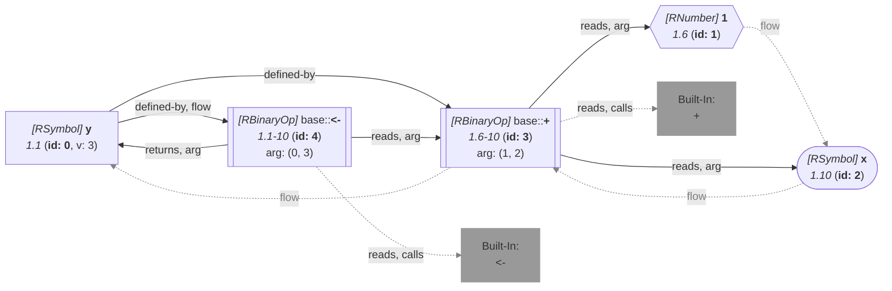
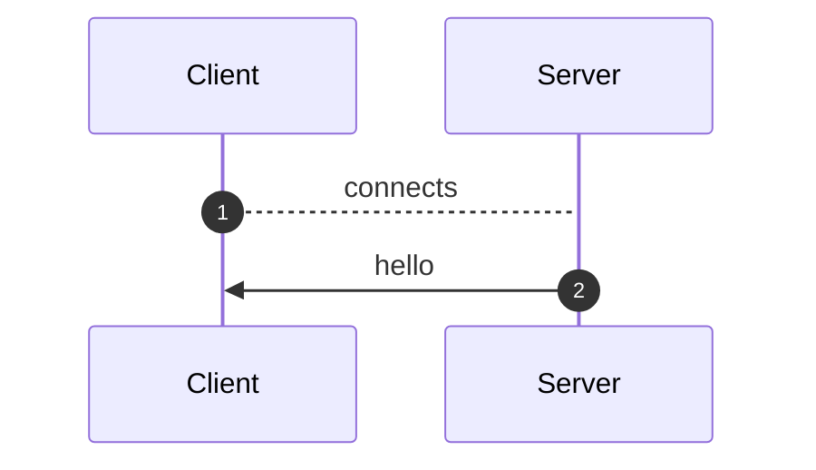
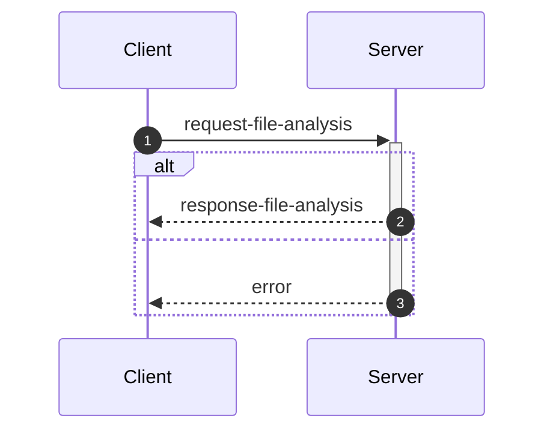
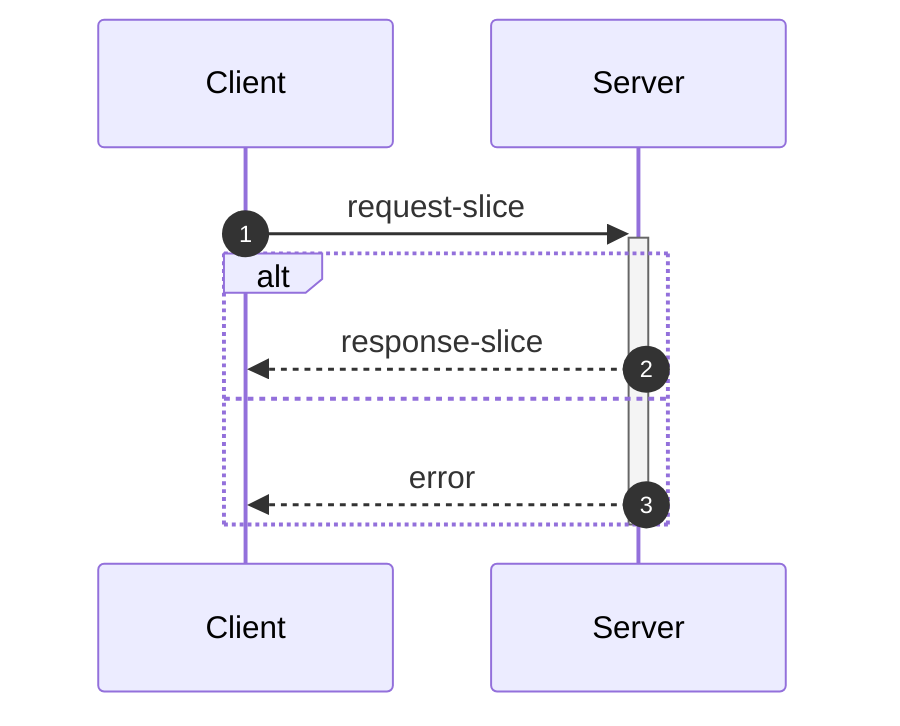
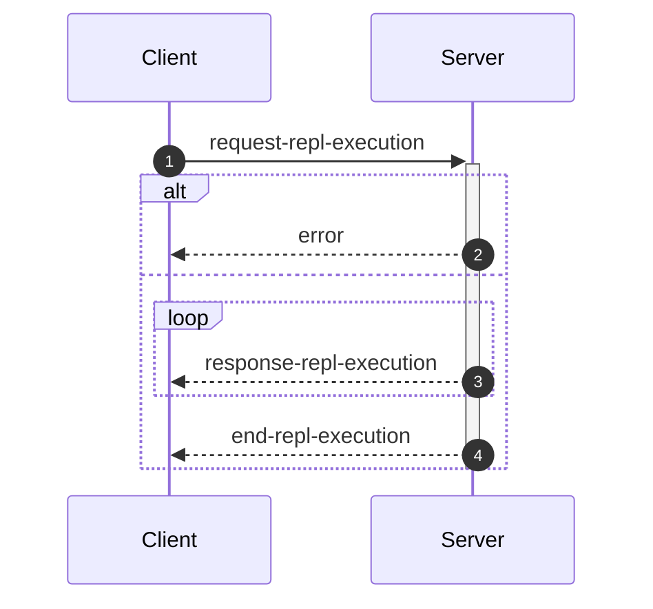

_<span title="an overview of flowR's interface">Generated</span> from '[wiki-interface.ts](https://github.com/flowr-analysis/flowr/tree/main/src/documentation/wiki-interface.ts "src/documentation/wiki-interface.ts")' on 2026-10-04, 18:35:24 UTC (v2.15.10, R v4.5.0), do not edit directly._

Although far from being as detailed as the in-depth explanation of [_flowR_](https://github.com/flowr-analysis/flowr/wiki/Core),
this wiki page explains how to interface with _flowR_ in more detail.
In general, command line arguments and other options provide short descriptions on hover over.

* [💻 Using the REPL](#using-the-repl)
* [⚙️ Configuring FlowR](#configuring-flowr)
* [⚒️ Writing Code](#writing-code)
* [💬 Communicating with the Server](#communicating-with-the-server)

<a id='using-the-repl'></a>
## 💻 Using the REPL

> [!NOTE]
> To execute arbitrary R commands with a repl request, _flowR_ has to be started explicitly with <span title="Description (Command Line Argument): Allow to access the underlying R session when using flowR (security warning: this allows the execution of arbitrary R code!)">`--r-session-access`</span>.
> Please be aware that this introduces a security risk and note that this relies on the [`r-shell` engine](https://github.com/flowr-analysis/flowr/wiki/Engines) .

Although primarily meant for users to explore,
there is nothing which forbids calling _flowR_ as a subprocess to use standard-in, -output, and -error
for communication (although you can access the REPL using the server as well,
with the [REPL Request](#message-request-repl-execution) message).

The read-eval-print loop&nbsp;(REPL) works relatively simple.
You can submit an expression (using <kbd>Enter</kbd>),
which is interpreted as an R&nbsp;expression by default but interpreted as a *command* if it starts with a colon (`:`).
The best command to get started with the REPL is <span title="Description (Repl Command): Show help information (aliases: :h, :?)">`:help`</span>.
Besides, you can leave the REPL either with the command <span title="Description (Repl Command): End the repl (aliases: :q, :exit)">`:quit`</span> or by pressing <kbd>Ctrl</kbd>+<kbd>C</kbd> twice.
When writing a *command*, you may press <kbd>Tab</kbd> to get a list of completions, if available.
Multiple commands can be entered in a single line by separating them with a semicolon (`;`), e.g. `:parse "x<-2"; :df*`.
If a command is given without R code, the REPL will re-use R code given in a previous command.
The prior example will hence return first the parsed AST of the program and then the dataflow graph for `"x <- 2"`.

> [!NOTE]
> If you develop flowR, you may want to launch the repl using the `npm run main-dev` command, this way, you get a non-minified version of flowR with debug information and hot-reloading of source files.

<details>
<summary>Available Commands</summary>

We currently offer the following commands (this with a `[*]` suffix are available with and without the star):

| Command | Description |
| ------- | ----------- |
| **<span title="Description (Repl Command): End the repl (aliases: :q, :exit)">:quit</span>** | End the repl (aliases: **:<span title="Alias of ':quit'. End the repl">q</span>**, **:<span title="Alias of ':quit'. End the repl">exit</span>**) |
| **<span title="Description (Repl Command): Execute the given code as R code. This requires the `--r-session-access` flag to be set and requires the r-shell engine. (aliases: :e, :r)">:execute</span>** | Execute the given code as R code. This requires the `--r-session-access` flag to be set and requires the r-shell engine. (aliases: **:<span title="Alias of ':execute'. Execute the given code as R code. This requires the `--r-session-access` flag to be set and requires the r-shell engine.">e</span>**, **:<span title="Alias of ':execute'. Execute the given code as R code. This requires the `--r-session-access` flag to be set and requires the r-shell engine.">r</span>**) |
| **<span title="Description (Repl Command): Get mermaid code for the control-flow graph of R code (aliases: :cfg, :cf)">:controlflow[*]</span>** | Get mermaid code for the control-flow graph of R code (star: Returns the URL to mermaid.live) (aliases: **:<span title="Alias of ':controlflow'. Get mermaid code for the control-flow graph of R code">cfg</span>**, **:<span title="Alias of ':controlflow'. Get mermaid code for the control-flow graph of R code">cf</span>**) |
| **<span title="Description (Repl Command): Get mermaid code for the control-flow graph with basic blocks (aliases: :cfgb, :cfb)">:controlflowbb[*]</span>** | Get mermaid code for the control-flow graph with basic blocks (star: Returns the URL to mermaid.live) (aliases: **:<span title="Alias of ':controlflowbb'. Get mermaid code for the control-flow graph with basic blocks">cfgb</span>**, **:<span title="Alias of ':controlflowbb'. Get mermaid code for the control-flow graph with basic blocks">cfb</span>**) |
| **<span title="Description (Repl Command): Get mermaid code for the dataflow graph (aliases: :d, :df)">:dataflow[*]</span>** | Get mermaid code for the dataflow graph (star: Returns the URL to mermaid.live) (aliases: **:<span title="Alias of ':dataflow'. Get mermaid code for the dataflow graph">d</span>**, **:<span title="Alias of ':dataflow'. Get mermaid code for the dataflow graph">df</span>**) |
| **<span title="Description (Repl Command): Get mermaid code for the normalized AST of R code (aliases: :n)">:normalize[*]</span>** | Get mermaid code for the normalized AST of R code (star: Returns the URL to mermaid.live) (alias: **:<span title="Alias of ':normalize'. Get mermaid code for the normalized AST of R code">n</span>**) |
| **<span title="Description (Repl Command): Get mermaid code for the simplified dataflow graph (aliases: :ds, :dfs)">:dataflowsimple[*]</span>** | Get mermaid code for the simplified dataflow graph (star: Returns the URL to mermaid.live) (aliases: **:<span title="Alias of ':dataflowsimple'. Get mermaid code for the simplified dataflow graph">ds</span>**, **:<span title="Alias of ':dataflowsimple'. Get mermaid code for the simplified dataflow graph">dfs</span>**) |
| **<span title="Description (Repl Command): Inspect and extend the signature database: `query` (identical to :query @signature), `info <name>` for where a function comes from (identical to :query @function-info), `add <path>` to mount another database/source, `download` to fetch the full-history database. (aliases: :sig)">:signature</span>** | Inspect and extend the signature database: `query` (identical to :query @signature), `info <name>` for where a function comes from (identical to :query @function-info), `add <path>` to mount another database/source, `download` to fetch the full-history database. (alias: **:<span title="Alias of ':signature'. Inspect and extend the signature database: `query` (identical to :query @signature), `info <name>` for where a function comes from (identical to :query @function-info), `add <path>` to mount another database/source, `download` to fetch the full-history database.">sig</span>**) |
| **<span title="Description (Repl Command): Just calculates the DFG, but only prints summary info (aliases: :d#, :df#)">:dataflowsilent</span>** | Just calculates the DFG, but only prints summary info (aliases: **:<span title="Alias of ':dataflowsilent'. Just calculates the DFG, but only prints summary info">d#</span>**, **:<span title="Alias of ':dataflowsilent'. Just calculates the DFG, but only prints summary info">df#</span>**) |
| **<span title="Description (Repl Command): Prints ASCII Art of the parsed, unmodified AST (aliases: :p)">:parse</span>** | Prints ASCII Art of the parsed, unmodified AST (alias: **:<span title="Alias of ':parse'. Prints ASCII Art of the parsed, unmodified AST">p</span>**) |
| **<span title="Description (Repl Command): Prints the version of flowR as well as the current version of R">:version</span>** | Prints the version of flowR as well as the current version of R
| **<span title="Description (Repl Command): Query the given R code (use 'help' for more information)">:query[*]</span>** | Query the given R code (use 'help' for more information) (star: Similar to query, but returns the output in json format.)
| **<span title="Description (Repl Command): Returns an ASCII representation of the dataflow graph (aliases: :df!)">:dataflowascii</span>** | Returns an ASCII representation of the dataflow graph (alias: **:<span title="Alias of ':dataflowascii'. Returns an ASCII representation of the dataflow graph">df!</span>**) |
| **<span title="Description (Repl Command): Returns summarization stats for the normalized AST (aliases: :n#)">:normalize#</span>** | Returns summarization stats for the normalized AST (alias: **:<span title="Alias of ':normalize#'. Returns summarization stats for the normalized AST">n#</span>**) |
| **<span title="Description (Repl Command): Show help information (aliases: :h, :?)">:help</span>** | Show help information (aliases: **:<span title="Alias of ':help'. Show help information">h</span>**, **:<span title="Alias of ':help'. Show help information">?</span>**) |

</details>

> [!TIP]
> 
> As indicated by the examples before, all REPL commands that operate on code keep track of the state.
> Hence, if you run a command like <span title="Description (Repl Command, starred version): Returns the URL to mermaid.live; Base Command: Get mermaid code for the dataflow graph (aliases: :d*, :df*)">`:dataflow*`</span> without providing R code,
> the REPL will re-use the R code provided in a previous command.
> Likewise, doing this will benefit from incrementality!
> If you request the dataflow graph with `:df* x <- 2 * y` and then want to see the parsed AST with `:parse`,
> the REPL will re-use previously obtained information and not re-parse the code again.
> 		

Generally, many commands offer shortcut versions in the REPL. Many queries, for example, offer a shortened format (see the example below).
Of special note, the [Config Query](https://github.com/flowr-analysis/flowr/wiki/%5BQuery%5D-Config)
can be used to also modify the currently active configuration of _flowR_ within the REPL (see the [wiki page](https://github.com/flowr-analysis/flowr/wiki/%5BQuery%5D-Config) for more information).

### Example: Retrieving the Dataflow Graph

To retrieve a URL to the [mermaid](https://mermaid.js.org/) diagram of the dataflow of a given expression,
use <span title="Description (Repl Command, starred version): Returns the URL to mermaid.live; Base Command: Get mermaid code for the dataflow graph (aliases: :d*, :df*)">`:dataflow*`</span> (or <span title="Description (Repl Command): Get mermaid code for the dataflow graph (aliases: :d, :df)">`:dataflow`</span> to get the mermaid code in the cli):

```shell
$ docker run -it --rm eagleoutice/flowr # or npm run flowr 
flowR repl v2.15.10, R grammar v14 (tree-sitter engine)
R> :dataflow* y <- 1 + x
```

<details>
<summary style='color:gray'>Output</summary>

```text
https://mermaid.live/view#base64:eyJjb2RlIjoiZmxvd2NoYXJ0IFREXG4gICAgMXt7XCJgKiM5MTtSTnVtYmVyIzkzOyogKioxKipcbiAgICAgICoxLjYqICgqKmlkOiAxKiopYFwifX1cbiAgICAyKFtcImAqIzkxO1JTeW1ib2wjOTM7KiAqKngqKlxuICAgICAgKjEuMTAqICgqKmlkOiAyKiopYFwiXSlcbiAgICAzW1tcImAqIzkxO1JCaW5hcnlPcCM5MzsqIGJhc2UjNTg7IzU4OyoqIzQzOyoqXG4gICAgICAqMS42LTEwKiAoKippZDogMyoqKVxuICAgIGFyZzogKDEsIDIpYFwiXV1cbiAgICBidWlsdC1pbjpfNDNfW1wiYEJ1aWx0LUluOlxuIzQzO2BcIl1cbiAgICBzdHlsZSBidWlsdC1pbjpfNDNfIHN0cm9rZTpncmF5LGZpbGw6Z3JheSxzdHJva2Utd2lkdGg6MnB4LG9wYWNpdHk6Ljg7XG4gICAgMFtcImAqIzkxO1JTeW1ib2wjOTM7KiAqKnkqKlxuICAgICAgKjEuMSogKCoqaWQ6IDAqKiwgdjogMylgXCJdXG4gICAgNFtbXCJgKiM5MTtSQmluYXJ5T3AjOTM7KiBiYXNlIzU4OyM1ODsqKiM2MDsjNDU7KipcbiAgICAgICoxLjEtMTAqICgqKmlkOiA0KiopXG4gICAgYXJnOiAoMCwgMylgXCJdXVxuICAgIGJ1aWx0LWluOl82MF8tW1wiYEJ1aWx0LUluOlxuIzYwOyM0NTtgXCJdXG4gICAgc3R5bGUgYnVpbHQtaW46XzYwXy0gc3Ryb2tlOmdyYXksZmlsbDpncmF5LHN0cm9rZS13aWR0aDoycHgsb3BhY2l0eTouODtcbiAgICAxIC0uLT58XCJmbG93XCJ8IDJcbiAgICBsaW5rU3R5bGUgMCBzdHJva2U6Z3JheSxjb2xvcjpncmF5O1xuICAgIDIgLS4tPnxcImZsb3dcInwgM1xuICAgIGxpbmtTdHlsZSAxIHN0cm9rZTpncmF5LGNvbG9yOmdyYXk7XG4gICAgMyAtLT58XCJyZWFkcywgYXJnXCJ8IDFcbiAgICAzIC0tPnxcInJlYWRzLCBhcmdcInwgMlxuICAgIDMgLS4tPnxcImZsb3dcInwgMFxuICAgIGxpbmtTdHlsZSA0IHN0cm9rZTpncmF5LGNvbG9yOmdyYXk7XG4gICAgMyAtLi0+fFwicmVhZHMsIGNhbGxzXCJ8IGJ1aWx0LWluOl80M19cbiAgICBsaW5rU3R5bGUgNSBzdHJva2U6Z3JheTtcbiAgICAwIC0tPnxcImRlZmluZWQtYnksIGZsb3dcInwgNFxuICAgIDAgLS0+fFwiZGVmaW5lZC1ieVwifCAzXG4gICAgNCAtLT58XCJyZWFkcywgYXJnXCJ8IDNcbiAgICA0IC0tPnxcInJldHVybnMsIGFyZ1wifCAwXG4gICAgNCAtLi0+fFwicmVhZHMsIGNhbGxzXCJ8IGJ1aWx0LWluOl82MF8tXG4gICAgbGlua1N0eWxlIDEwIHN0cm9rZTpncmF5OyIsIm1lcm1haWQiOnsiYXV0b1N5bmMiOnRydWV9fQ==
```

Retrieve the dataflow graph of the expression `y <- 1 + x`. It looks like this:


```mermaid
flowchart LR
    1{{"`*#91;RNumber#93;* **1**
      *1.6* (**id: 1**)`"}}
    2(["`*#91;RSymbol#93;* **x**
      *1.10* (**id: 2**)`"])
    3[["`*#91;RBinaryOp#93;* base#58;#58;**#43;**
      *1.6-10* (**id: 3**)
    arg: (1, 2)`"]]
    built-in:_43_["`Built-In:
#43;`"]
    style built-in:_43_ stroke:gray,fill:gray,stroke-width:2px,opacity:.8;
    0["`*#91;RSymbol#93;* **y**
      *1.1* (**id: 0**, v: 3)`"]
    4[["`*#91;RBinaryOp#93;* base#58;#58;**#60;#45;**
      *1.1-10* (**id: 4**)
    arg: (0, 3)`"]]
    built-in:_60_-["`Built-In:
#60;#45;`"]
    style built-in:_60_- stroke:gray,fill:gray,stroke-width:2px,opacity:.8;
    1 -.->|"flow"| 2
    linkStyle 0 stroke:gray,color:gray;
    2 -.->|"flow"| 3
    linkStyle 1 stroke:gray,color:gray;
    3 -->|"reads, arg"| 1
    3 -->|"reads, arg"| 2
    3 -.->|"flow"| 0
    linkStyle 4 stroke:gray,color:gray;
    3 -.->|"reads, calls"| built-in:_43_
    linkStyle 5 stroke:gray;
    0 -->|"defined-by, flow"| 4
    0 -->|"defined-by"| 3
    4 -->|"reads, arg"| 3
    4 -->|"returns, arg"| 0
    4 -.->|"reads, calls"| built-in:_60_-
    linkStyle 10 stroke:gray;
```

<details>

<summary style="color:gray">R Code of the Dataflow Graph</summary>

The analysis ran (including parse and normalize, using the [tree-sitter](https://github.com/flowr-analysis/flowr/wiki/Engines) engine) within the generation environment. No [signature database](https://github.com/flowr-analysis/flowr/wiki/Signature-Database) is mounted for these generated graphs, so `library()` calls attach no package exports; base-R names are still qualified via the generated base-package store (e.g. `acf` as `stats::acf`). 
We encountered no unknown side effects during the analysis.

```r
y <- 1 + x
```

</details>

</details>

For small graphs like this, <span title="Description (Repl Command): Returns an ASCII representation of the dataflow graph (aliases: :df!)">`:dataflowascii`</span> also provides an ASCII representation directly in the REPL:

```shell
$ docker run -it --rm eagleoutice/flowr # or npm run flowr 
flowR repl v2.15.10, R grammar v14 (tree-sitter engine)
R> :df! y <- 1 + x
```

<details open>
<summary style='color:gray'>Output</summary>

```text
                        v<0>v
 c<4>c──────────────────| y |
 |<- |     ┌────────────v---v
 c---c     │
    │   c<3>c   0<1>0
    └───| + |───| 1 |───u<2>u
        c---c   0---0   | x |
           └────────────u---u
Edges:
3 -> 1: reads, arg          3 -> 2: reads, arg
3 -> 0: flows-to            1 -> 2: flows-to
2 -> 3: flows-to            4 -> 3: reads, arg
4 -> 0: returns, arg        0 -> 4: defined-by, flows-to
0 -> 3: defined-by
```

Retrieve the dataflow graph of the expression `y <- 1 + x` as ASCII art.

</details>

For the slicing with <span title="Description (Repl Command): Static backwards executable slicer for R">`:slicer`</span>, you have access to the same [magic comments](#slice-magic-comments) as with the [slice request](#message-request-slice).
Pass `--inline` to splice resolvable `source()` calls into the reconstruction so the slice is a single self-contained R text (the same as the static slice query's `inlineSources` flag).
See `--help` for more flags!

### Example: Interfacing with the File System

Many commands that allow for an R-expression (like <span title="Description (Repl Command, starred version): Returns the URL to mermaid.live; Base Command: Get mermaid code for the dataflow graph (aliases: :d*, :df*)">`:dataflow*`</span>) allow for a file as well
if the argument starts with `file://`.
If you are working from the root directory of the _flowR_ repository, the following gives you the parsed AST of the example file using the <span title="Description (Repl Command): Prints ASCII Art of the parsed, unmodified AST (aliases: :p)">`:parse`</span> command:

> **Watch mode**: Replace `file://` with `watch://` to enter watch mode.
> flowR runs the command immediately and then re-runs it every time the file (or any file inside the folder) changes.
> Enter any other command to leave watch mode.
> For example: `:df watch://analysis.R`

```shell
$ docker run -it --rm eagleoutice/flowr # or npm run flowr 
flowR repl v2.15.10, R grammar v14 (tree-sitter engine)
R> :parse file://test/testfiles/example.R
```

<details>
<summary style='color:gray'>Output</summary>

```text
File: test/testfiles/example.R

program
├ binaryoperator
│ ├ identifier "sum" (1:1─4)
│ ├ <- "<-" (1:5─7)
│ ╰ float "0" (1:8─9)
├ binaryoperator
│ ├ identifier "product" (2:1─8)
│ ├ <- "<-" (2:9─11)
│ ╰ float "1" (2:12─13)
├ binaryoperator
│ ├ identifier "w" (3:1─2)
│ ├ <- "<-" (3:3─5)
│ ╰ float "7" (3:6─7)
├ binaryoperator
│ ├ identifier "N" (4:1─2)
│ ├ <- "<-" (4:3─5)
│ ╰ float "10" (4:6─8)
├ forstatement
│ ├ for "for" (6:1─4)
│ ├ ( "(" (6:5─6)
│ ├ identifier "i" (6:6─7)
│ ├ in "in" (6:8─10)
│ ├ binaryoperator
│ │ ├ float "1" (6:11─12)
│ │ ├ : ":" (6:12─13)
│ │ ╰ parenthesizedexpression
│ │   ├ ( "(" (6:13─14)
│ │   ├ binaryoperator
│ │   │ ├ identifier "N" (6:14─15)
│ │   │ ├ - "-" (6:15─16)
│ │   │ ╰ float "1" (6:16─17)
│ │   ╰ ) ")" (6:17─18)
│ ├ ) ")" (6:18─19)
│ ╰ bracedexpression
│   ├ { "{" (6:20─21)
│   ├ binaryoperator
│   │ ├ identifier "sum" (7:3─6)
│   │ ├ <- "<-" (7:7─9)
│   │ ╰ binaryoperator
│   │   ├ binaryoperator
│   │   │ ├ identifier "sum" (7:10─13)
│   │   │ ├ + "+" (7:14─15)
│   │   │ ╰ identifier "i" (7:16─17)
│   │   ├ + "+" (7:18─19)
│   │   ╰ identifier "w" (7:20─21)
│   ├ binaryoperator
│   │ ├ identifier "product" (8:3─10)
│   │ ├ <- "<-" (8:11─13)
│   │ ╰ binaryoperator
│   │   ├ identifier "product" (8:14─21)
│   │   ├  "" (8:22─23)
│   │   ╰ identifier "i" (8:24─25)
│   ╰ } "}" (9:1─2)
├ call
│ ├ identifier "cat" (11:1─4)
│ ╰ arguments
│   ├ ( "(" (11:4─5)
│   ├ argument
│   │ ╰ string
│   │   ├ " "\"" (11:5─6)
│   │   ├ stringcontent "Sum:" (11:6─10)
│   │   ╰ " "\"" (11:10─11)
│   ├ comma "," (11:11─12)
│   ├ argument
│   │ ╰ identifier "sum" (11:13─16)
│   ├ comma "," (11:16─17)
│   ├ argument
│   │ ╰ string
│   │   ├ " "\"" (11:18─19)
│   │   ├ stringcontent
│   │   │ ╰ escapesequence "\\n" (11:19─21)
│   │   ╰ " "\"" (11:21─22)
│   ╰ ) ")" (11:22─23)
╰ call
  ├ identifier "cat" (12:1─4)
  ╰ arguments
    ├ ( "(" (12:4─5)
    ├ argument
    │ ╰ string
    │   ├ " "\"" (12:5─6)
    │   ├ stringcontent "Product:" (12:6─14)
    │   ╰ " "\"" (12:14─15)
    ├ comma "," (12:15─16)
    ├ argument
    │ ╰ identifier "product" (12:17─24)
    ├ comma "," (12:24─25)
    ├ argument
    │ ╰ string
    │   ├ " "\"" (12:26─27)
    │   ├ stringcontent
    │   │ ╰ escapesequence "\\n" (12:27─29)
    │   ╰ " "\"" (12:29─30)
    ╰ ) ")" (12:30─31)
```

Retrieve the parsed AST of the example file.

<details>

<summary>File Content</summary>

```r
sum <- 0
product <- 1
w <- 7
N <- 10

for (i in 1:(N-1)) {
  sum <- sum + i + w
  product <- product * i
}

cat("Sum:", sum, "\n")
cat("Product:", product, "\n")
```

</details>

As _flowR_ directly transforms this AST the output focuses on being human-readable instead of being machine-readable.
		
</details>

### Example: Run a Query

You can run any query supported by _flowR_ using the <span title="Description (Repl Command): Query the given R code (use 'help' for more information)">`:query`</span> command.
For example, to obtain the shapes of all data frames in a given piece of code, you can run:

```shell
$ docker run -it --rm eagleoutice/flowr # or npm run flowr 
flowR repl v2.15.10, R grammar v14 (tree-sitter engine)
R> :query @absint df-shape "x <- data.frame(a = 1:10, b = 1:10)\ny <- x$a"
```

<details open>
<summary style='color:gray'>Output</summary>

```text
Query: absint (1 ms)
```

Retrieve the shapes of all data frames in the given code.

</details>

To run the linter on a file, you can use (in this example, we just issue the `dead-code` linter on a small piece of code):

```shell
$ docker run -it --rm eagleoutice/flowr # or npm run flowr 
flowR repl v2.15.10, R grammar v14 (tree-sitter engine)
R> :query @linter rules:dead-code "if(FALSE) x <- 2"
```

<details open>
<summary style='color:gray'>Output</summary>

```text
Query: linter (1 ms)
   ╰ Dead Code (dead-code):
       ╰ certain:
           ╰ Code at 1.11-16
```

Run the linter on the given code, with only the `dead-code` rule enabled.

</details>

For more information on the available queries, please check out the [Query API](https://github.com/flowr-analysis/flowr/wiki/Query-API).

<a id='configuring-flowr'></a>
## ⚙️ Configuring FlowR

When running _flowR_, you may want to specify some behaviors with a dedicated configuration file.
By default, flowR looks for a file named `flowr.json` in the current working directory (or any higher directory).
You can also specify a different file with <span title="Description (Command Line Argument): The name of the configuration file to use">`--config-file`</span> or pass the configuration inline using <span title="Description (Command Line Argument): The flowR configuration to use, as a JSON string">`--config-json`</span>.
To inspect the current configuration, you can run flowr with the <span title="Description (Command Line Argument): Run with verbose logging (will be passed to the corresponding script)">`--verbose`</span> flag, or use the `config` [Query](https://github.com/flowr-analysis/flowr/wiki/Query-API).
Within the REPL this works by running the following:

```shell
:query @config
```

To work with the <a href="https://github.com/flowr-analysis/flowr/tree/main/src/config.ts#L108"><code><span title="The configuration file format for flowR.">FlowrConfig</span></code></a> you can use the provided helper objects alongside its methods like
<a href="https://github.com/flowr-analysis/flowr/tree/main/src/config.ts#L871"><code><span title="Creates a new flowr config that has the updated values.">FlowrConfig::<b>amend</b></span></code></a>.
The schema below documents every option; the ones you most likely want are:

- <a href="https://github.com/flowr-analysis/flowr/wiki/Interface#configuring-flowr" title="Configuration Option (boolean): Whether source calls should be ignored, causing {@link processSourceCall}&#39;s behavior to be skipped.">ignoreSourceCalls</a>: ignore source calls when analyzing the code, i.e., ignore the inclusion of other files.
- <a href="https://github.com/flowr-analysis/flowr/wiki/Interface#configuring-flowr" title="Configuration Option (boolean): Whether load calls should be ignored, causing {@link processLoadCall}&#39;s behavior to be skipped.">ignoreLoadCalls</a>: ignore load calls when analyzing the code, i.e., ignore the loading of r-data files.
- <a href="https://github.com/flowr-analysis/flowr/wiki/Interface#configuring-flowr" title="Configuration Option (object): Do you want to overwrite (parts) of the builtin definition?">semantics.environment.overwriteBuiltIns</a>: overwrite _flowR_'s handling of built-in functions, or clear the preset definitions entirely.
  See [Configure BuiltIn Semantics](#configure-builtin-semantics) for more information.
- <a href="https://github.com/flowr-analysis/flowr/wiki/Interface#configuring-flowr" title="Configuration Option (string): How to resolve variables and their values. (one of &quot;disabled&quot;, &quot;alias&quot;, &quot;builtin&quot;)">solver.variables</a>: how to resolve variables and their values (`disabled`, `alias`, `builtin`).
- <a href="https://github.com/flowr-analysis/flowr/wiki/Interface#configuring-flowr" title="Configuration Option (array): The engine or set of engines to use for interacting with R code. An empty array means all available engines will be used.">engines</a> and <a href="https://github.com/flowr-analysis/flowr/wiki/Interface#configuring-flowr" title="Configuration Option (string): The default engine to use for interacting with R code. If this is undefined, an arbitrary engine from the specified list will be used. (one of &quot;tree-sitter&quot;, &quot;r-shell&quot;)">defaultEngine</a>: the engines used to interact with R code, see the [Engines wiki page](https://github.com/flowr-analysis/flowr/wiki/Engines).
- <a href="https://github.com/flowr-analysis/flowr/wiki/Interface#configuring-flowr" title="Configuration Option (array): Files a framework loads on its own, without any source() call (e.g. global.R in a shiny app), in the order they are loaded; flowR orders the matching project files accordingly and analyzes them as one program. Entries are case-insensitive globs matched against the file path, a plain name matches any file with that name, and entries matching no project file are warned about. Usually set per project kind via specializeConfig.">project.implicitSources</a>: the files a framework loads without any `source()` call, in the order in which they are
  loaded. Entries are globs (e.g. `R/*.R`) matched against the file path ignoring capitalization; one matching no file is reported.
- <a href="https://github.com/flowr-analysis/flowr/wiki/Interface#configuring-flowr" title="Configuration Option (object): Overwrite (parts of) the configuration depending on the project kind flowR detects, e.g. to give a shiny app its implicit sources.">specializeConfig</a>: overwrite (parts of) the configuration depending on the kind of project _flowR_ detects
  (e.g. `shiny-app`), which is how a shiny app gets its implicit sources by default. What you configure directly wins.
- <a href="https://github.com/flowr-analysis/flowr/wiki/Interface#configuring-flowr" title="Configuration Option (string): Overwrite the project kind flowR would otherwise infer from the analyzed files, e.g. when auto-detection guesses wrong. (one of &quot;package&quot;, &quot;script&quot;, &quot;shiny-app&quot;, &quot;notebook&quot;, &quot;project&quot;, &quot;unknown&quot;)">project.useProjectType</a>: skip that detection and force a project kind yourself, when auto-detection guesses wrong.
- <a href="https://github.com/flowr-analysis/flowr/wiki/Interface#configuring-flowr" title="Configuration Option (array): The default plugins to load when creating a new instance of FlowrAnalyzer">defaultPlugins</a> and <a href="https://github.com/flowr-analysis/flowr/wiki/Interface#configuring-flowr" title="Configuration Option (array): The plugins to load in REPL mode">repl.plugins</a>: the plugins to load for a new <a href="https://github.com/flowr-analysis/flowr/tree/main/src/project/flowr-analyzer.ts#L205"><code><span title="Central class for conducting analyses with FlowR. Use the FlowrAnalyzerBuilder to create a new instance. If you want the original pattern of creating a pipeline and running all steps, you can still do this with FlowrAnalyzer#runFull . To inspect the context of the analyzer, use FlowrAnalyzer#inspectContext (if you are a plugin and need to modify it, use FlowrAnalyzer#context instead).">FlowrAnalyzer</span></code></a> and in the REPL
  (use `flowr:default` to reference the former).

So you can configure _flowR_ by adding a file like the following:

<details>

<summary>Example Configuration File</summary>

```json
{
  "ignoreSourceCalls": true,
  "ignoreLoadCalls": true,
  "semantics": {
    "environment": {
      "overwriteBuiltIns": {
        "definitions": [
          {
            "type": "function",
            "names": [
              "foo"
            ],
            "processor": "builtin:assign",
            "config": {}
          }
        ]
      }
    }
  },
  "defaultPlugins": [
    "file:description",
    "versions:description"
  ],
  "repl": {
    "quickStats": false,
    "dfProcessorHeat": false,
    "hints": true,
    "plugins": [
      "flowr:default"
    ]
  },
  "project": {
    "resolveUnknownPathsOnDisk": true,
    "implicitSources": [
      "global.R",
      "app.R"
    ]
  },
  "linter": {
    "disabledRules": []
  },
  "specializeConfig": {
    "shiny-app": {
      "project": {
        "implicitSources": [
          "global.R",
          "ui.R",
          "server.R",
          "app.R"
        ]
      }
    }
  },
  "engines": [
    {
      "type": "r-shell"
    }
  ],
  "solver": {
    "variables": "alias",
    "evalStrings": true,
    "trackEnvironments": true,
    "sigdb": {
      "enabled": true,
      "loadProjectDependencies": true,
      "eagerlyLoad": false,
      "eagerlyLoadExports": false,
      "linkBaseR": false,
      "linkDescriptionDependencies": false
    },
    "resolveSource": {
      "dropPaths": "no",
      "ignoreCapitalization": true,
      "inferWorkingDirectory": "active-script",
      "searchPath": []
    },
    "instrument": {},
    "slicer": {
      "threshold": 50
    }
  },
  "abstractInterpretation": {
    "wideningThreshold": 4,
    "followCalls": true,
    "dataFrame": {
      "maxColNames": 20,
      "readLoadedData": {
        "readExternalFiles": true,
        "maxReadLines": 1000000
      }
    }
  },
  "incremental": {
    "alwaysIncremental": false,
    "parsing": {
      "activated": false,
      "heuristics": {
        "activated": true,
        "mtime": true,
        "linesFrom": 500,
        "bytesFrom": 50000,
        "alwaysWithEdits": false,
        "minFiles": 1
      }
    }
  },
  "gas": {
    "thresholds": {
      "memory": {
        "problematic": 0.7,
        "critical": 0.9
      },
      "timeMs": {
        "problematic": 100000,
        "critical": 120000
      }
    },
    "features": {}
  }
}
```

</details>

<details>
<a id='configure-builtin-semantics'></a>
<summary>Configure Built-In Semantics</summary>

`semantics/environment/overwriteBuiltins` accepts two keys:

- `loadDefaults` (boolean, initially `true`): If set to `true`, the default built-in definitions are loaded before applying the custom definitions. Setting this flag to `false` explicitly disables the loading of the default definitions.
- `definitions` (array, initially empty): Allows to overwrite or define new built-in elements. Each object within must have a `type` which is one of the below. Furthermore, they may define a string array of `names` which specifies the identifiers to bind the definitions to. You may use `assumePrimitive` to specify whether _flowR_ should assume that this is a primitive non-library definition (so you probably just do not want to specify the key).

  | Type            | Description                                                                                                                                                                                                                                                                                              | Example                                                                                                    |
  | --------------- | -------------------------------------------------------------------------------------------------------------------------------------------------------------------------------------------------------------------------------------------------------------------------------------------------------- | ---------------------------------------------------------------------------------------------------------- |
  | `constant`    | Additionally allows for a `value` this should resolve to.                                                                                                                                                                                                                                                | `{ type: 'constant', names: ['NULL', 'NA'],  value: null }`                                                |
  | `function`    | Is a rather flexible way to define and bind built-in functions. For the time, we do not have extensive documentation to cover all the cases, so please either consult the sources with the `default-builtin-config.ts` or open a [new issue](https://github.com/flowr-analysis/flowr/issues/new/choose). | `{ type: 'function', names: ['next'], processor: 'builtin:d', config: { cfg: ExitPointType.Next } }` |
  | `replacement` | A comfortable way to specify replacement functions like `$<-` or `names<-`. `suffixes` describes the... suffixes to attach automatically. | `{ type: 'replacement', suffixes: ['<-', '<<-'], names: ['[', '[['] }` |

</details>

<details>

<summary style='color:gray'>Full Configuration-File Schema</summary>

- _The configuration file format for flowR._ (object)
    - **logLevel** [optional] _flowR's global minimum log level, applied when the config is loaded._ (string)
        Only allows: 'silly', 'trace', 'debug', 'info', 'warn', 'error', 'fatal'
    - **ignoreSourceCalls** [optional] _Whether source calls should be ignored, causing {@link processSourceCall}'s behavior to be skipped._ (boolean)
    - **ignoreLoadCalls** [optional] _Whether load calls should be ignored, causing {@link processLoadCall}'s behavior to be skipped._ (boolean)
    - **semantics** _Configure language semantics and how flowR handles them._ (object)
        - **environment** [optional] _Semantics regarding how to handle the R environment._ (object)
            - **overwriteBuiltIns** [optional] _Do you want to overwrite (parts) of the builtin definition?_ (object)
                - **loadDefaults** [optional] _Should the default configuration still be loaded?_ (boolean)
                - **definitions** [optional] _The definitions to load/overwrite._ (array)
                Valid item types:
                    - (object)
    - **defaultPlugins** [optional] _The default plugins to load when creating a new instance of FlowrAnalyzer_ (array)
    Valid item types:
        - (alternatives)
            - (string)
            - (array)
    - **repl** _Configuration options for the REPL._ (object)
        - **quickStats** [optional] _Whether to show quick stats in the REPL after each evaluation._ (boolean)
        - **dfProcessorHeat** [optional] _This instruments the dataflow processors to count how often each processor is called._ (boolean)
        - **hints** [optional] _Whether to show dim inline hints on the empty prompt (automatically disabled on non-interactive terminals)._ (boolean)
        - **plugins** [optional] _The plugins to load in REPL mode_ (array)
        Valid item types:
            - (alternatives)
                - (string)
                - (array)
        - **autoUseFileProtocol** [optional] _Prepend the file protocol to a repl input that looks like a path, instead of only warning about it._ (boolean)
        - **queryStats** [optional] _Whether `:query` closes with the line stating how long the queries took (`:query*` never prints it)._ (boolean)
        - **showPlugins** [optional] _Whether `:version` grays out the plugins that did not activate during the last analysis._ (boolean)
    - **project** _Project specific configuration options._ (object)
        - **resolveUnknownPathsOnDisk** [optional] _Whether to resolve unknown paths loaded by the r project disk when trying to source/analyze files._ (boolean)
        - **failOnInaccessiblePath** [optional] _Whether a directory that cannot be traversed during file discovery (e.g. due to permissions) aborts the analysis; when false (the default) such paths are logged and skipped._ (boolean)
        - **basePackages** [optional] _The packages considered part of R itself (base and recommended); if unset, flowR uses its built-in list._ (array)
        Valid item types:
            - (string)
        - **implicitSources** [optional] _Files a framework loads on its own, without any source() call (e.g. global.R in a shiny app), in the order they are loaded; flowR orders the matching project files accordingly and analyzes them as one program. Entries are case-insensitive globs matched against the file path, a plain name matches any file with that name, and entries matching no project file are warned about. Usually set per project kind via specializeConfig._ (array)
        Valid item types:
            - (string)
        - **useProjectType** [optional] _Overwrite the project kind flowR would otherwise infer from the analyzed files, e.g. when auto-detection guesses wrong._ (string)
            Only allows: 'package', 'script', 'shiny-app', 'notebook', 'project', 'unknown'
        - **assumeImplicitEcho** [optional] _Whether the top level of the analyzed code is echoed, so that every visible result printed there is collected as an output by the dependencies query (default true, false for a package)._ (boolean)
        - **discovery** [optional] _Scoping options for the default project discovery._ (object)
            - **full** [optional] _Collect every file below the project root (greedy) instead of only the files the detected project kind needs (default false)._ (boolean)
            - **perKind** [optional] _Per-kind include/exclude glob overrides layered on the default scoping._ (object)
            - **ignore** [optional] _Case-insensitive globs that drop matching files from the intelligent discovery, regardless of kind (e.g. .Renviron to ignore environment files)._ (array)
            Valid item types:
                - (string)
        - **classification** [optional] _Overrides for the signals flowR uses to classify the project kind._ (object)
            - **shinyDescriptionTypes** [optional] _DESCRIPTION Type: values that mark a shiny app._ (array)
            Valid item types:
                - (string)
            - **shinyEntryFiles** [optional] _File names a shiny app is assembled from._ (array)
            Valid item types:
                - (string)
            - **shinyUsagePattern** [optional] _Regex source evidencing shiny usage in an entry file._ (string)
            - **notebookExtensions** [optional] _File extensions marking a notebook._ (array)
            Valid item types:
                - (string)
    - **linter** _Linter configuration options._ (object)
        - **disabledRules** _Linting rule names excluded from the default rule set (a rule requested explicitly via a linter query still runs). Usually set per project kind via specializeConfig._ (array)
        Valid item types:
            - (string)
    - **inputSources** [optional] _Further frameworks the input-sources analysis should know about; entries are added to flowR's defaults._ (object)
        - **pure** [optional] _Functions that only pass the constantness of their arguments on._ (array)
        Valid item types:
            - (string)
        - **param** [optional] _Functions whose result is a 'param' input._ (array)
        Valid item types:
            - (string)
        - **file** [optional] _Functions whose result is a 'file' input._ (array)
        Valid item types:
            - (string)
        - **tempfile** [optional] _Functions whose result is a 'tempfile' input._ (array)
        Valid item types:
            - (string)
        - **glob** [optional] _Functions whose result is a 'glob' input._ (array)
        Valid item types:
            - (string)
        - **net** [optional] _Functions whose result is a 'net' input._ (array)
        Valid item types:
            - (string)
        - **rand** [optional] _Functions whose result is a 'rand' input._ (array)
        Valid item types:
            - (string)
        - **system** [optional] _Functions whose result is a 'system' input._ (array)
        Valid item types:
            - (string)
        - **ffi** [optional] _Functions whose result is a 'ffi' input._ (array)
        Valid item types:
            - (string)
        - **lang** [optional] _Functions whose result is a 'lang' input._ (array)
        Valid item types:
            - (string)
        - **options** [optional] _Functions whose result is a 'options' input._ (array)
        Valid item types:
            - (string)
        - **cmdline** [optional] _Functions whose result is a 'cmdline' input._ (array)
        Valid item types:
            - (string)
        - **user** [optional] _Functions whose result is a 'user' input._ (array)
        Valid item types:
            - (string)
        - **const** [optional] _Functions whose result is a 'const' input._ (array)
        Valid item types:
            - (string)
        - **scope** [optional] _Functions whose result is a 'scope' input._ (array)
        Valid item types:
            - (string)
        - **dconst** [optional] _Functions whose result is a 'dconst' input._ (array)
        Valid item types:
            - (string)
        - **unknown** [optional] _Functions whose result is a 'unknown' input._ (array)
        Valid item types:
            - (string)
        - **linkedObjects** [optional] _Objects a framework provides without a definition in the code, e.g. shiny's input._ (array)
        Valid item types:
            - (object)
        - **linkedEntryPoints** [optional] _Calls that hand a function to a framework, which binds its objects to the parameters by position._ (array)
        Valid item types:
            - (object)
    - **specializeConfig** [optional] _Overwrite (parts of) the configuration depending on the project kind flowR detects, e.g. to give a shiny app its implicit sources._ (object)
    - **engines** _The engine or set of engines to use for interacting with R code. An empty array means all available engines will be used._ (array)
    Valid item types:
        - (alternatives)
            - _The configuration for the tree sitter engine._ (object)
                - **type** [required] _Use the tree sitter engine._ (string)
                    Only allows: 'tree-sitter'
                - **wasmPath** [optional] _The path to the tree-sitter-r WASM binary to use. If this is undefined, this uses the default path._ (string)
                - **treeSitterWasmPath** [optional] _The path to the tree-sitter WASM binary to use. If this is undefined, this uses the default path._ (string)
                - **lax** [optional] _Whether to use the lax parser for parsing R code (allowing for syntax errors). If this is undefined, the strict parser will be used._ (boolean)
            - _The configuration for the R shell engine._ (object)
                - **type** [required] _Use the R shell engine._ (string)
                    Only allows: 'r-shell'
                - **rPath** [optional] _The path to the R executable to use. If this is undefined, this uses the default path._ (string)
                - **pipeBind** [optional] _Whether to enable R's experimental pipe-bind operator "=>" by setting _R_USE_PIPEBIND_ for the R session (default false); R itself keeps this off by default, as it is experimental and has never shipped in a release version of R._ (boolean)
    - **defaultEngine** [optional] _The default engine to use for interacting with R code. If this is undefined, an arbitrary engine from the specified list will be used._ (string)
        Only allows: 'tree-sitter', 'r-shell'
    - **solver** _How to resolve constants, constraints, cells, ..._ (object)
        - **variables** _How to resolve variables and their values._ (string)
            Only allows: 'disabled', 'alias', 'builtin'
        - **evalStrings** _Should we include eval(parse(text="...")) calls in the dataflow graph?_ (boolean)
        - **trackEnvironments** [optional] _Track user-created environments (new.env, assign/get/local with envir=, dollar-assign, attach). When false, all envir-style calls fall through conservatively._ (boolean)
        - **sigdb** _Resolving library exports from a signature database._ (object)
            - **enabled** [optional] _Resolve library()/use() exports from a signature database (default true); when false no database is consulted._ (boolean)
            - **loadProjectDependencies** [optional] _Load the project's declared dependencies from its metadata files (DESCRIPTION Imports/Depends, rproject.toml, uvr.toml, renv.lock, rv.lock, uvr.lock) (default true); when false these files are not read for dependencies._ (boolean)
            - **eagerlyLoad** [optional] _Parse the database up front rather than on the first package load (default false, ignored if disabled)._ (boolean)
            - **eagerlyLoadExports** [optional] _Add a vertex for every export on load rather than on demand (default false); keeps the dataflow graph small._ (boolean)
            - **assumedRVersion** [optional] _R version assumed when resolving versioned (base-R) exports: a pin like "4.5" or "auto" to detect the installed R (default "auto")._ (string)
            - **linkBaseR** [optional] _Eagerly attach base-R namespaces so bare base calls resolve without library() (default false)._ (boolean)
            - **linkBaseRCalls** [optional] _Add a lightweight Reads edge from a bare base-R call to its signature-database function vertex (default false; base-R qualification is edge-free otherwise)._ (boolean)
            - **linkPackageCalls** [optional] _Add a lightweight Reads edge from a resolved package call to its signature-database function vertex (default false)._ (boolean)
            - **linkDescriptionDependencies** [optional] _Eagerly attach the namespaces of the project's declared DESCRIPTION dependencies (Imports/Depends) so their exports resolve without an explicit library() (default false)._ (boolean)
            - **warmInBackground** [optional] _Decompress the hot shards (base + most-downloaded) in a background task on startup so the first library() lookup is warm (default false; for long-running servers/REPLs)._ (boolean)
            - **additionalPaths** [optional] _Extra directories or bundle/manifest files searched for signature databases (alongside the shipped default and $FLOWR_SIGDB_DIR); a downloaded full-history bundle placed here is mounted automatically._ (array)
            Valid item types:
                - (string)
            - **downloadRepo** [optional] _GitHub owner/repo the full-history bundle is downloaded from via ":signature download" (default "flowr-analysis/flowr", release tag "sigdb-v<flowR-version>")._ (string)
            - **autoSync** [optional] _On startup, re-download shards whose committed sigdb.remote.json hash no longer matches the cache, in the background (default false; opt-in network sync after a git pull)._ (boolean)
            - **installedLibrary** [optional] _Recovering packages no signature database knows from the copy installed on this machine._ (object)
                - **enabled** [required] _Recover packages no signature database knows from their installed copy (default false)._ (boolean)
                - **paths** [optional] _Library directories to search; when empty they are discovered from the environment and the project._ (array)
                Valid item types:
                    - (string)
                - **useEnvironment** [optional] _Search the libraries R_LIBS_USER/R_LIBS/R_LIBS_SITE name (default true)._ (boolean)
                - **useProjectLibrary** [optional] _Search a project-local renv/packrat library (default true)._ (boolean)
                - **maxDepth** [optional] _How far to descend into the nested layout of a project-local library (default 3)._ (number)
                - **packages** [optional] _Only recover packages whose name matches one of these regular expressions; empty means any._ (array)
                Valid item types:
                    - (string)
            - **blobCacheBudgetMb** [optional] _How many MiB of decoded package blobs every open bundle may hold together (default 16)._ (number)
            - **versionSelection** [optional] _When a project constrains a dependency, resolve to the newest (default), oldest, or system-installed version satisfying it; system needs R and falls back to newest. Base-R packages always resolve against the assumed R version._ (string)
                Only allows: 'newest', 'oldest', 'system'
            - **versionOverrides** [optional] _Force an exact version for specific packages (name -> version), overriding both the project constraint and the versionSelection policy (default {})._ (object)
        - **versionManagement** _Policies for reasoning about dependency versions._ (object)
            - **linkedVersionGroups** [optional] _Groups of packages that must resolve to the same version; version guessing intersects each group so its members stay mutually compatible (default [])._ (array)
            Valid item types:
                - (array)
                Valid item types:
                    - (string)
        - **assumeAttachedPackages** [optional] _Packages to treat as attached without a `library()` call, so what the built-in configuration states about them applies to the analyzed code. The base packages R attaches on startup already resolve without it._ (array)
        Valid item types:
            - (string)
        - **transitiveSideEffectRounds** [optional] _How many rounds the transitive side-effect fixpoint may run before it is cut off (default 32); the propagation stops on its own as soon as a round adds nothing._ (number)
        - **maxOverlayDepth** [optional] _How many binding overlays may stack on one environment frame before a write flattens them (default 4); a pure performance knob, trading lookup cost against copy cost without changing any result._ (number)
        - **instrument** (object)
            - **dataflowExtractors** [optional] _These keys are only intended for use within code, allowing to instrument the dataflow analyzer!_ (any)
        - **resolveSource** [optional] _If lax source calls are active, flowR searches for sourced files much more freely, based on the configurations you give it. This option is only in effect if `ignoreSourceCalls` is set to false._ (object)
            - **dropPaths** _Allow to drop the first or all parts of the sourced path, if it is relative._ (string)
                Only allows: 'no', 'once', 'all'
            - **ignoreCapitalization** _Search for filenames matching in the lowercase._ (boolean)
            - **inferWorkingDirectory** _Try to infer the working directory from the main or any script to analyze._ (string)
                Only allows: 'no', 'main-script', 'active-script', 'any-script'
            - **searchPath** _Additionally search in these paths._ (array)
            Valid item types:
                - (string)
            - **repeatedSourceLimit** [optional] _How often the same file can be sourced within a single run? Please be aware: in case of cyclic sources this may not reach a fixpoint so give this a sensible limit._ (number)
            - **applyReplacements** _Provide name replacements for loaded files_ (array)
            Valid item types:
                - (object)
            - **assumeFilesExist** [optional] _Assume a sourced file is always there, making what it defines certain instead of conditional on the source call._ (boolean)
        - **slicer** [optional] _The configuration for the slicer._ (object)
            - **threshold** [optional] _The maximum number of iterations to perform on a single function call during slicing._ (number)
            - **autoExtend** [optional] _If set, the slicer will gain an additional post-pass._ (boolean)
    - **abstractInterpretation** _The configuration options for abstract interpretation._ (object)
        - **wideningThreshold** _The threshold for the number of visitations of a node at which widening should be performed to ensure the termination of the fixpoint iteration._ (number)
        - **followCalls** _Whether the abstract interpretation is interprocedural, i.e. whether it steps into the functions a call may dispatch to._ (boolean)
        - **dataFrame** _The configuration of the shape inference for data frames._ (object)
            - **maxColNames** _The maximum number of columns names to infer for data frames before over-approximating the column names to top._ (number)
            - **readLoadedData** _Configuration options for reading data frame shapes from loaded external data files, such as CSV files._ (object)
                - **readExternalFiles** _Whether data frame shapes should be extracted from loaded external files, such as CSV files._ (boolean)
                - **maxReadLines** _The maximum number of lines to read when extracting data frame shapes from loaded files, such as CSV files._ (number)
    - **incremental** (object)
        - **alwaysIncremental** _Always take the incremental path, regardless of heuristics._ (boolean)
        - **parsing** (object)
            - **activated** _If set, incremental parsing will be used._ (boolean)
            - **heuristics** (object)
                - **activated** [optional] _If set, the heuristics for incremental parsing will be used._ (boolean)
                - **mtime** [optional] _Skip reparsing entirely if the file's modification time is unchanged since the last parse._ (boolean)
                - **linesFrom** [optional] _Only consider incremental parsing for files with at least this many lines._ (number)
                - **bytesFrom** [optional] _Only consider incremental parsing for files with at least this many bytes._ (number)
                - **alwaysWithEdits** [optional] _Always take the incremental path whenever there is a computed edit region, regardless of the other thresholds._ (boolean)
                - **minFiles** [optional] _Only apply these heuristics once the project has at least this many files loaded._ (number)
    - **gas** [optional] _Resource-usage guard (gas) configuration. All feature factors default to 0 (disabled). See https://github.com/flowr-analysis/flowr/wiki/Core#gas-resource-guard._ (object)
        - **thresholds** [optional] _Thresholds for all gas checks (scaled by per-feature factor), boundable per feature._ (object)
            - **memory** [optional] _Heap-usage fraction thresholds (0-1), either shared or given per feature key (with `default` covering the rest)._ (object)
                - **problematic** [optional] _Heap fraction (0-1) above which Problematic is returned, for every feature without an entry of its own._ (number)
                - **critical** [optional] _Heap fraction (0-1) above which Critical is returned, for every feature without an entry of its own._ (number)
            - **timeMs** [optional] _Elapsed analysis time thresholds in milliseconds, either shared or given per feature key (with `default` covering the rest)._ (object)
                - **problematic** [optional] _Elapsed ms above which Problematic is returned, for every feature without an entry of its own._ (number)
                - **critical** [optional] _Elapsed ms above which Critical is returned, for every feature without an entry of its own._ (number)
            - **steps** [optional] _Processed-AST-node thresholds, counted rather than sampled; only a key that arms a budget (`dataflow`) reads them._ (object)
                - **problematic** [optional] _Processed AST nodes above which Problematic is returned, for every feature without an entry of its own._ (number)
                - **critical** [optional] _Processed AST nodes above which the extraction is cut short, for every feature without an entry of its own._ (number)
            - **vertices** [optional] _Created-dataflow-vertex thresholds, counted like `steps`._ (object)
                - **problematic** [optional] _Created dataflow vertices above which Problematic is returned, for every feature without an entry of its own._ (number)
                - **critical** [optional] _Created dataflow vertices above which the extraction is cut short, for every feature without an entry of its own._ (number)
        - **features** [optional] _Per-feature sensitivity factors. 0 or absent disables gas checking for that feature. A factor of 2 makes the feature twice as sensitive. Recognised keys: `source`, `side-effect-linking`, `linter`, `slicer`, `dataflow`._ (object)
        - **countedCheckEvery** [optional] _How many counted steps pass between two accountings of an armed check, be it a dataflow budget or the slicer's traversal (default 128); trades overshoot against the cost of the check._ (number)
        - **heapProvider** [optional] _Custom heap statistics source (programmatic configs only), overriding the built-in v8/performance.memory detection._ (function)

</details>

<a id='writing-code'></a>
## ⚒️ Writing Code

_flowR_ can be used as a [module](https://www.npmjs.com/package/@eagleoutice/flowr) and offers several main classes and interfaces that are interesting for extension writers 
(see the [Visual Studio Code extension](https://marketplace.visualstudio.com/items?itemName=code-inspect.vscode-flowr) or the [Core](https://github.com/flowr-analysis/flowr/wiki/Core) wiki page for more information).

### Creating Analyses with _flowR_

Nowadays, instances of the <a href="https://github.com/flowr-analysis/flowr/tree/main/src/project/flowr-analyzer.ts#L205"><code><span title="Central class for conducting analyses with FlowR. Use the FlowrAnalyzerBuilder to create a new instance. If you want the original pattern of creating a pipeline and running all steps, you can still do this with FlowrAnalyzer#runFull . To inspect the context of the analyzer, use FlowrAnalyzer#inspectContext (if you are a plugin and need to modify it, use FlowrAnalyzer#context instead).">FlowrAnalyzer</span></code></a> should be used as central frontend to get analysis results from _flowR_.
The entry points an analysis is written against are re-exported from the package root (`import { FlowrAnalyzerBuilder } from '@eagleoutice/flowr'`);
everything else stays reachable under its own path, as in `@eagleoutice/flowr/dataflow/graph/graph`.
For example, a program slice can be created like this:

```ts
const analyzer = await new FlowrAnalyzerBuilder()
    .setEngine('tree-sitter')
    .build();
analyzer.addRequest('x <- 1\ny <- x\nx');
const result = await analyzer.query([
    {
        type:     'static-slice',
        criteria: ['3@x']
    }
]);
```

For more information, please have a look at the [Analyzer](https://github.com/flowr-analysis/flowr/wiki/Analyzer) wiki page, which explains how to construct and use the <a href="https://github.com/flowr-analysis/flowr/tree/main/src/project/flowr-analyzer.ts#L205"><code><span title="Central class for conducting analyses with FlowR. Use the FlowrAnalyzerBuilder to create a new instance. If you want the original pattern of creating a pipeline and running all steps, you can still do this with FlowrAnalyzer#runFull . To inspect the context of the analyzer, use FlowrAnalyzer#inspectContext (if you are a plugin and need to modify it, use FlowrAnalyzer#context instead).">FlowrAnalyzer</span></code></a> in more detail.
To work with specific perspectives, you can also consult the respective pages like the [Dataflow Graph](https://github.com/flowr-analysis/flowr/wiki/Dataflow-Graph) or the [Abstract Interpretation](https://github.com/flowr-analysis/flowr/wiki/Abstract-Interpretation) wiki pages.
### The Pipeline Executor (Low-Level Interface)

Once, in the beginning, _flowR_ was meant to produce a dataflow graph merely to provide *program slices*. 
However, with continuous updates, the [Dataflow Graph](https://github.com/flowr-analysis/flowr/wiki/Dataflow-Graph) repeatedly proves to be the more interesting part.
With this, we restructured _flowR_'s originally *hardcoded* pipeline to be far more flexible. 
Now, it can be theoretically extended or replaced with arbitrary steps, optional steps, and what we call 'decorations' of these steps. 
In short, a slicing pipeline using the <a href="https://github.com/flowr-analysis/flowr/tree/main/src/core/pipeline-executor.ts#L97"><code><span title="**Please note:** The PipelineExecutor is now considered to be a rather low-level API for flowR. While it still works and is the basis for all other layers, we strongly recommend using the FlowrAnalyzer and its builder to create and use an analyzer instance that is pre-configured for your use-case. The pipeline executor allows to execute arbitrary pipelines in a step-by-step fashion. If you are not...">PipelineExecutor</span></code></a> looks like this:

```ts

const slicer = new PipelineExecutor(DEFAULT_SLICING_PIPELINE, {
  parser:    new RShell(),
  request:   requestFromInput('x <- 1\nx + 1'),
  criterion: ['2@x']
})
const slice = await slicer.allRemainingSteps()
// console.log(slice.reconstruct.code)
```

<details><summary>More Information</summary>

If you compare this, with what you would have done with the old (and removed) `SteppingSlicer`, 
this essentially just requires you to replace the `SteppingSlicer` with the <a href="https://github.com/flowr-analysis/flowr/tree/main/src/core/pipeline-executor.ts#L97"><code><span title="**Please note:** The PipelineExecutor is now considered to be a rather low-level API for flowR. While it still works and is the basis for all other layers, we strongly recommend using the FlowrAnalyzer and its builder to create and use an analyzer instance that is pre-configured for your use-case. The pipeline executor allows to execute arbitrary pipelines in a step-by-step fashion. If you are not...">PipelineExecutor</span></code></a>
and to pass the <a href="https://github.com/flowr-analysis/flowr/tree/main/src/core/steps/pipeline/default-pipelines.ts#L18"><code>DEFAULT_SLICING_PIPELINE</code></a> as the first argument.
The <a href="https://github.com/flowr-analysis/flowr/tree/main/src/core/pipeline-executor.ts#L97"><code><span title="**Please note:** The PipelineExecutor is now considered to be a rather low-level API for flowR. While it still works and is the basis for all other layers, we strongly recommend using the FlowrAnalyzer and its builder to create and use an analyzer instance that is pre-configured for your use-case. The pipeline executor allows to execute arbitrary pipelines in a step-by-step fashion. If you are not...">PipelineExecutor</span></code></a>...

1. Provides structures to investigate the results of all intermediate steps
2. Can be executed step-by-step
3. Can repeat steps (e.g., to calculate multiple slices on the same input)

See the in-code documentation for more information.

</details>

### Using the <a href="https://github.com/flowr-analysis/flowr/tree/main/src/r-bridge/shell.ts#L143"><code><span title="The RShell represents an interactive session with the R interpreter. You can configure it by RShellOptions . At the moment we are using a live R session (and not networking etc.) to communicate with R easily, which allows us to install packages etc. However, this might and probably will change in the future (leaving this as a legacy mode :D)">RShell</span></code></a> to Interact with R

The <a href="https://github.com/flowr-analysis/flowr/tree/main/src/r-bridge/shell.ts#L143"><code><span title="The RShell represents an interactive session with the R interpreter. You can configure it by RShellOptions . At the moment we are using a live R session (and not networking etc.) to communicate with R easily, which allows us to install packages etc. However, this might and probably will change in the future (leaving this as a legacy mode :D)">RShell</span></code></a> class allows interfacing with the `R`&nbsp;ecosystem installed on the host system.
Please have a look at [flowR's Engines](https://github.com/flowr-analysis/flowr/wiki/Engines) for more information on alternatives (for example, the <a href="https://github.com/flowr-analysis/flowr/tree/main/src/r-bridge/lang-4.x/tree-sitter/tree-sitter-executor.ts#L29"><code><span title="Synchronous and (way) faster alternative to the RShell using tree-sitter.">TreeSitterExecutor</span></code></a>).

> [!IMPORTANT]
> 
> Each <a href="https://github.com/flowr-analysis/flowr/tree/main/src/r-bridge/shell.ts#L143"><code><span title="The RShell represents an interactive session with the R interpreter. You can configure it by RShellOptions . At the moment we are using a live R session (and not networking etc.) to communicate with R easily, which allows us to install packages etc. However, this might and probably will change in the future (leaving this as a legacy mode :D)">RShell</span></code></a> controls a new instance of the R&nbsp;interpreter, 
> make sure to call <code><a href="https://github.com/flowr-analysis/flowr/tree/main/src/r-bridge/shell.ts#L353"><span title="Close the current R session, makes the object effectively invalid (can no longer be reopened etc.)">RShell::<i>close</i></span></a>()</code> when you are done.

You can start a new "session" by constructing a new object with <code>new <a href="https://github.com/flowr-analysis/flowr/tree/main/src/r-bridge/shell.ts#L143"><span title="The RShell represents an interactive session with the R interpreter. You can configure it by RShellOptions . At the moment we are using a live R session (and not networking etc.) to communicate with R easily, which allows us to install packages etc. However, this might and probably will change in the future (leaving this as a legacy mode :D)">RShell</span></a>()</code>.

However, there are several options that may be of interest 
(e.g., to automatically revive the shell in case of errors or to control the name location of the R process on the system).

With a shell object (let's call it `shell`), you can execute R code by using <a href="https://github.com/flowr-analysis/flowr/tree/main/src/r-bridge/shell.ts#L212"><code><span title="sends the given command directly to the current R session will not do anything to alter input markers!">RShell::<i>sendCommand</i></span></code></a>,
for example <code>shell.<a href="https://github.com/flowr-analysis/flowr/tree/main/src/r-bridge/shell.ts#L212"><span title="sends the given command directly to the current R session will not do anything to alter input markers!">sendCommand</span></a>("1 + 1")</code>.
However, this does not return anything, so if you want to collect the output of your command, use
<a href="https://github.com/flowr-analysis/flowr/tree/main/src/r-bridge/shell.ts#L295"><code><span title="Send a command and collect the output">RShell::<i>sendCommandWithOutput</i></span></code></a> instead.

<a id='communicating-with-the-server'></a>
## 💬 Communicating with the Server

As explained in the [Overview](https://github.com/flowr-analysis/flowr/wiki/Overview), you can run the [TCP](https://de.wikipedia.org/wiki/Transmission_Control_Protocol)&nbsp;server by adding the <span title="Description (Command Line Argument): Do not drop into a repl, but instead start a server on the given port (default: 1042) and listen for messages.">`--server`</span> flag (and, due to the interactive mode, exit with the conventional <kbd>CTRL</kbd>+<kbd>C</kbd>).
Currently, every connection is handled by the same underlying `RShell` - so the server is not designed to handle many clients at a time.
Additionally, the server is not well guarded against attacks (e.g., you can theoretically spawn an arbitrary number of&nbsp;RShell sessions on the target machine).

Every message has to be given in a single line (i.e., without a newline in-between) and end with a newline character. Nevertheless, we will pretty-print example given in the following segments for the ease of reading.

> [!NOTE]
> 
> The default <span title="Description (Command Line Argument): Do not drop into a repl, but instead start a server on the given port (default: 1042) and listen for messages.">`--server`</span> uses a simple [TCP](https://de.wikipedia.org/wiki/Transmission_Control_Protocol)
> connection. If you want _flowR_ to expose a [WebSocket](https://de.wikipedia.org/wiki/WebSocket) server instead, add the <span title="Description (Command Line Argument): If the server flag is set, use websocket for messaging">`--ws`</span> flag (i.e., <span title="Description (Command Line Argument): Do not drop into a repl, but instead start a server on the given port (default: 1042) and listen for messages.">`--server`</span> <span title="Description (Command Line Argument): If the server flag is set, use websocket for messaging">`--ws`</span>) when starting _flowR_ from the command line.

<ul><li>
<a id="message-hello"></a>
<b>Hello</b> Message (<code>hello</code>) 
<details>

<summary style="color:gray"> View Details. <i>The server informs the client about the successful connection and provides Meta-Information.</i> </summary>


```mermaid
sequenceDiagram
    autonumber
    participant Client
    participant Server

    
    Client-->Server: connects
    Server->>Client: hello
	
```

After launching _flowR_, for example, with <code>docker run -it --rm eagleoutice/flowr <span title="Description (Command Line Argument): Do not drop into a repl, but instead start a server on the given port (default: 1042) and listen for messages.">-<span/>-server</span></code>&nbsp;(🐳️), connecting should present you with a `hello` message, that amongst others should reveal the versions of&nbsp;_flowR_ and&nbsp;R, using the [semver 2.0](https://semver.org/spec/v2.0.0.html) versioning scheme.
The message looks like this:

```json
{
  "type": "hello",
  "clientName": "client-0",
  "versions": {
    "flowr": "2.15.10",
    "r": "4.5.0",
    "engine": "r-shell"
  }
}
```

There are currently a few messages that you can send after the hello message.
If you want to _slice_ a piece of R code you first have to send an [analysis request](#message-request-file-analysis), so that you can send one or multiple slice requests afterward.
Requests for the [REPL](#message-request-repl-execution) are independent of that.
	
<hr>

<details>
<summary style="color:gray">Message schema (<code>hello</code>)</summary>

For the definition of the hello message, please see it's implementation at [`./src/cli/repl/server/messages/message-hello.ts`](https://github.com/flowr-analysis/flowr/tree/main/src/cli/repl/server/messages/message-hello.ts).

- [required] (object)
    - **type** [required] _The type of the hello message._ (string)
        Only allows: 'hello'
    - **id** [forbidden] _The id of the message is always undefined (as it is the initial message and not requested)._ (any)
    - **clientName** [required] _A unique name that is assigned to each client. It has no semantic meaning and is only used/useful for debugging._ (string)
    - **versions** [required] (object)
        - **flowr** [required] _The version of the flowr server running in semver format._ (string)
        - **r** [required] _The version of the underlying R shell running in semver format._ (string)
        - **engine** [required] _The parser backend that is used to parse the R code._ (string)

</details>

<hr>

</details>
	</li>

<li>
<a id="message-request-file-analysis"></a>
<b>Analysis</b> Message (<code>request-file-analysis</code>) 
<details>

<summary style="color:gray"> View Details. <i>The server builds the dataflow graph for a given input file (or a set of files).</i> </summary>


```mermaid
sequenceDiagram
    autonumber
    participant Client
    participant Server

    
    Client->>+Server: request-file-analysis
    alt
        Server-->>Client: response-file-analysis
    else
        Server-->>Client: error
    end
    deactivate  Server
	
```

The request allows the server to analyze a file and prepare it for slicing.
The message can contain a `filetoken`, which is used to identify the file in later slice or query requests (if you do not add one, the request will not be stored and therefore, it is not available for subsequent requests).

> **Please note!**\
> If you want to send and process a lot of analysis requests, but do not want to slice them, please do not pass the `filetoken` field. This will save the server a lot of memory allocation.

Furthermore, the request must contain either a `content` field to directly pass the file's content or a `filepath` field which contains the path to the file (this path must be accessible for the server to be useful).
If you add the `id` field, the answer will use the same `id` so you can match requests and the corresponding answers.
See the implementation of the request-file-analysis message for more information.

You can drop one or more stored file tokens by adding the `invalidateToken` field (a single token or an array of tokens).
The server frees the corresponding analyses _after_ it has answered the request.

> **Tip!**\
> If you only want to drop tokens, you do not need a separate message: send a `request-file-analysis` that contains _just_ the `invalidateToken` field (and no `content` or `filepath`).
> Such a request behaves like an empty file analysis and the server replies with an empty `results` object.
> Because invalidation happens after the response, you may even pass the _current_ `filetoken` in `invalidateToken` to analyze a file once and have the server forget it right after you received the results.

<details>
<summary>Example of the <code>request-file-analysis</code> Message</summary>

_Note:_ even though we pretty-print these messages, they are sent as a single line, ending with a newline.

The following lists all messages that were sent and received in case you want to reproduce the scenario:

<ol>
<li> <code>hello</code> (response)
<details> 

<summary> Show Details </summary>

The first message is always a hello message.

```json
{"type":"hello","clientName":"client-0","versions":{"flowr":"2.15.10","r":"4.5.0","engine":"r-shell"}}
```

</details>
</li>

<li> <b><code>request-file-analysis</code> (request)</b>
<details open> 

<summary> Show Details </summary>

Let's suppose you simply want to analyze the following script:
 
```r
x <- 1
x + 1
```

 For this, you can send the following request:

```json
{"type":"request-file-analysis","id":"1","filetoken":"x","content":"x <- 1\nx + 1"}
```

</details>
</li>

<li> <code>response-file-analysis</code> (response)
<details> 

<summary> Show Details </summary>

The `results` field of the response effectively contains three keys of importance:

- `parse`: which contains 1:1 the parse result in CSV format that we received from the `RShell` (i.e., the AST produced by the parser of the R interpreter).
- `normalize`: which contains the normalized AST, including ids (see the `info` field and the [Normalized AST](https://github.com/flowr-analysis/flowr/wiki/Normalized-AST) wiki page).
- `dataflow`: especially important is the `graph` field which contains the dataflow graph as a set of root vertices (see the [Dataflow Graph](https://github.com/flowr-analysis/flowr/wiki/Dataflow-Graph) wiki page).
			
_As the code is pretty long, we inhibit pretty printing and syntax highlighting (JSON, hiding built-in):_

```text
{"type":"response-file-analysis","format":"json","id":"1","results":{"parse":{"files":[{"parsed":"[1,1,1,6,7,0,\"expr\",false,\"x <- 1\"],[1,1,1,1,1,3,\"SYMBOL\",true,\"x\"],[1,1,1,1,3,7,\"expr\",false,\"x\"],[1,3,1,4,2,7,\"LEFT_ASSIGN\",true,\"<-\"],[1,6,1,6,4,5,\"NUM_CONST\",true,\"1\"],[1,6,1,6,5,7,\"expr\",false,\"1\"],[2,1,2,5,16,0,\"expr\",false,\"x + 1\"],[2,1,2,1,10,12,\"SYMBOL\",true,\"x\"],[2,1,2,1,12,16,\"expr\",false,\"x\"],[2,3,2,3,11,16,\"'+'\",true,\"+\"],[2,5,2,5,13,14,\"NUM_CONST\",true,\"1\"],[2,5,2,5,14,16,\"expr\",false,\"1\"]","filePath":"/tmp/tmp-13208-FB9OxHFKvi1x-.R"}],".meta":{}},"normalize":{"ast":{"type":"RProject","files":[{"root":{"type":"RExpressionList","children":[{"type":"RBinaryOp","location":[1,3,1,4],"lhs":{"type":"RSymbol","location":[1,1,1,1],"content":"x","lexeme":"x","info":{"fullRange":[1,1,1,1],"adToks":[],"id":0,"parent":2,"role":"bin-l","index":0,"nest":0,"file":"/tmp/tmp-13208-FB9OxHFKvi1x-.R"}},"rhs":{"location":[1,6,1,6],"lexeme":"1","info":{"fullRange":[1,6,1,6],"adToks":[],"id":1,"parent":2,"role":"bin-r","index":1,"nest":0,"file":"/tmp/tmp-13208-FB9OxHFKvi1x-.R"},"type":"RNumber","content":{"num":1,"complexNumber":false,"markedAsInt":false}},"operator":"<-","lexeme":"<-","info":{"fullRange":[1,1,1,6],"adToks":[],"id":2,"parent":6,"nest":0,"file":"/tmp/tmp-13208-FB9OxHFKvi1x-.R","index":0,"role":"el-c"}},{"type":"RBinaryOp","location":[2,3,2,3],"lhs":{"type":"RSymbol","location":[2,1,2,1],"content":"x","lexeme":"x","info":{"fullRange":[2,1,2,1],"adToks":[],"id":3,"parent":5,"role":"bin-l","index":0,"nest":0,"file":"/tmp/tmp-13208-FB9OxHFKvi1x-.R"}},"rhs":{"location":[2,5,2,5],"lexeme":"1","info":{"fullRange":[2,5,2,5],"adToks":[],"id":4,"parent":5,"role":"bin-r","index":1,"nest":0,"file":"/tmp/tmp-13208-FB9OxHFKvi1x-.R"},"type":"RNumber","content":{"num":1,"complexNumber":false,"markedAsInt":false}},"operator":"+","lexeme":"+","info":{"fullRange":[2,1,2,5],"adToks":[],"id":5,"parent":6,"nest":0,"file":"/tmp/tmp-13208-FB9OxHFKvi1x-.R","index":1,"role":"el-c"}}],"info":{"adToks":[],"id":6,"nest":0,"file":"/tmp/tmp-13208-FB9OxHFKvi1x-.R","role":"root","index":0}},"filePath":"/tmp/tmp-13208-FB9OxHFKvi1x-.R"}],"info":{"id":7}},".meta":{}},"dataflow":{"unknownReferences":[],"in":[{"nodeId":2,"name":"<-","type":2},{"nodeId":5,"name":"+","type":2}],"out":[{"nodeId":0,"name":"x","type":4,"definedAt":2,"value":[1]}],"environment":{"current":{"id":708,"parent":"<BuiltInEnvironment>","memory":[["x",[{"nodeId":0,"name":"x","type":4,"definedAt":2,"value":[1]}]]],"globalEnv":true},"level":0},"graph":{"rootVertices":[1,0,2,3,4,5],"vertexInformation":[[1,{"tag":"value","id":1}],[0,{"tag":"vdef","id":0,"source":[1]}],[2,{"tag":"fcall","id":2,"name":"<-","onlyBuiltin":true,"args":[{"nodeId":0,"type":32},{"nodeId":1,"type":32}],"origin":["builtin:assign"]}],[3,{"tag":"use","id":3}],[4,{"tag":"value","id":4}],[5,{"tag":"fcall","id":5,"name":"+","onlyBuiltin":true,"args":[{"nodeId":3,"type":32},{"nodeId":4,"type":32}],"origin":["builtin:d"]}]],"edgeInformation":[[2,[[1,{"types":65}],[0,{"types":72}],["built-in:<-",{"types":5}],[3,{"types":4096}]]],[1,[[0,{"types":4096}]]],[0,[[2,{"types":4098}],[1,{"types":2}]]],[5,[[3,{"types":65}],[4,{"types":65}],["built-in:+",{"types":5}]]],[3,[[0,{"types":1}],[4,{"types":4096}]]],[4,[[5,{"types":4096}]]]],"_unknownSideEffects":[]},"entryPoint":2,"cfgEntry":1,"exitPoints":[{"type":0,"nodeId":5}],"hooks":[],".meta":{}}}}
```

</details>
</li>
</ol>

The complete round-trip covers validating the messages as well as starting and stopping the internal mock server.

</details>

You receive an error if, for whatever reason, the analysis fails (e.g., the message or code you sent contained syntax errors).
It contains a human-readable description *why* the analysis failed (see the error message implementation for more details).

<details>
<summary>Example Error Message</summary>

_Note:_ even though we pretty-print these messages, they are sent as a single line, ending with a newline.

The following lists all messages that were sent and received in case you want to reproduce the scenario:

<ol>
<li> <code>hello</code> (response)
<details> 

<summary> Show Details </summary>

The first message is always a hello message.

```json
{"type":"hello","clientName":"client-0","versions":{"flowr":"2.15.10","r":"4.5.0","engine":"r-shell"}}
```

</details>
</li>

<li> <code>request-file-analysis</code> (request)
<details> 

<summary> Show Details </summary>

```json
{"type":"request-file-analysis","id":"1","filename":"sample.R","content":"x <-"}
```

</details>
</li>

<li> <b><code>error</code> (response)</b>
<details open> 

<summary> Show Details </summary>

```json
{
  "id": "1",
  "type": "error",
  "fatal": false,
  "reason": "Error while analyzing file sample.R: GuardError: unable to parse R code (see the log for more information) for request {\"request\":\"text\",\"content\":\"x <-\"}}\n Report a Bug: https://github.com/flowr-analysis/flowr/issues/new?body=%3C!%2D%2D%20Please%20describe%20your%20issue%20in%20more%20detail%20below!%20%2D%2D%3E%0A%0A%0A%3C!%2D%2D%20Automatically%20generated%20issue%20metadata%2C%20please%20do%20not%20edit%20or%20delete%20content%20below%20this%20line%20%2D%2D%3E%0A%2D%2D%2D%0A%0AflowR%20version%3A%202.15.10%0Anode%20version%3A%20v25.6.1%0Anode%20arch%3A%20x64%0Anode%20platform%3A%20linux%0Amessage%3A%20%60unable%20to%20parse%20R%20code%20%28see%20the%20log%20for%20more%20information%29%20for%20request%20%7B%22request%22%3A%22text%22%2C%22content%22%3A%22x%20%3C%2D%22%7D%7D%60%0Astack%20trace%3A%0A%60%60%60%0A%20%20%20%20at%20guard%20%28%3C%3E%2Fsrc%2Futil%2Fassert.ts%3A128%3A9%29%0A%20%20%20%20at%20guardRetrievedOutput%20%28%3C%3E%2Fsrc%2Fr%2Dbridge%2Fretriever.ts%3A167%3A7%29%0A%20%20%20%20at%20%2Fhome%2Frunner%2Fwork%2Fflowr%2Fflowr%2Fsrc%2Fr%2Dbridge%2Fretriever.ts%3A123%3A4%0A%20%20%20%20at%20processTicksAndRejections%20%28node%3Ainternal%2Fprocess%2Ftask_queues%3A104%3A5%29%0A%20%20%20%20at%20async%20Object.parseRequests%20%5Bas%20processor%5D%20%28%3C%3E%2Fsrc%2Fr%2Dbridge%2Fparser.ts%3A108%3A19%29%0A%20%20%20%20at%20async%20PipelineExecutor.nextStep%20%28%3C%3E%2Fsrc%2Fcore%2Fpipeline%2Dexecutor.ts%3A192%3A25%29%0A%20%20%20%20at%20async%20FlowrAnalyzerCache.stepTapeUntil%20%28%3C%3E%2Fsrc%2Fproject%2Fcache%2Fflowr%2Danalyzer%2Dcache.ts%3A117%3A4%29%0A%20%20%20%20at%20async%20FlowRServerConnection.sendFileAnalysisResponse%20%28%3C%3E%2Fsrc%2Fcli%2Frepl%2Fserver%2Fconnection.ts%3A216%3A53%29%0A%60%60%60%0A%0A%2D%2D%2D%0A%09"
}
```

</details>
</li>
</ol>

The complete round-trip covers validating the messages as well as starting and stopping the internal mock server.

</details>

&nbsp;

<a id="analysis-include-cfg"></a>
**Including the Control Flow Graph**

The control flow graph is a view on the dataflow graph: the dataflow analysis records the control flow while it walks
the program, and the graph projects those edges on demand. The server can expose that structure as well (please create
a [new issue](https://github.com/flowr-analysis/flowr/issues/new/choose) for any bug you may encounter).
For this, the analysis request may add `cfg: true` to its list of options.

<details>
<summary>Requesting a Control Flow Graph</summary>

_Note:_ even though we pretty-print these messages, they are sent as a single line, ending with a newline.

The following lists all messages that were sent and received in case you want to reproduce the scenario:

<ol>
<li> <code>hello</code> (response)
<details> 

<summary> Show Details </summary>

The first message is always a hello message.

```json
{"type":"hello","clientName":"client-0","versions":{"flowr":"2.15.10","r":"4.5.0","engine":"r-shell"}}
```

</details>
</li>

<li> <b><code>request-file-analysis</code> (request)</b>
<details open> 

<summary> Show Details </summary>

```json
{
  "type": "request-file-analysis",
  "id": "1",
  "filetoken": "x",
  "content": "if(unknown > 0) { x <- 2 } else { x <- 5 }\nfor(i in 1:x) { print(x); print(i) }",
  "cfg": true
}
```

</details>
</li>

<li> <code>response-file-analysis</code> (response)
<details> 

<summary> Show Details </summary>

The response looks basically the same as a response sent without the `cfg` flag. However, additionally it contains a `cfg` field. 
If you are interested in a visual representation of the control flow graph, see the 
[visualization with mermaid](https://mermaid.live/view#base64:eyJjb2RlIjoiZmxvd2NoYXJ0IFREXG4gICAgbjAoW1wiYFJTeW1ib2wgKDApXG4qKnVua25vd24qKmBcIl0pXG4gICAgbjEoW1wiYFJOdW1iZXIgKDEpXG4qKjAqKmBcIl0pXG4gICAgbjIoW1wiYFJCaW5hcnlPcCAoMilcbioqdW5rbm93biAjNjI7IDAqKmBcIl0pXG4gICAgbjYoW1wiYFJOdW1iZXIgKDYpXG4qKjIqKmBcIl0pXG4gICAgbjUoW1wiYFJTeW1ib2wgKDUpXG4qKngqKmBcIl0pXG4gICAgbjdbXCJgUkJpbmFyeU9wICg3KVxuKip4ICM2MDsjNDU7IDIqKmBcIl1cbiAgICBuOChbXCJgUkV4cHJlc3Npb25MaXN0ICg4KWBcIl0pXG4gICAgbjEyKFtcImBSTnVtYmVyICgxMilcbioqNSoqYFwiXSlcbiAgICBuMTEoW1wiYFJTeW1ib2wgKDExKVxuKip4KipgXCJdKVxuICAgIG4xM1tcImBSQmluYXJ5T3AgKDEzKVxuKip4ICM2MDsjNDU7IDUqKmBcIl1cbiAgICBuMTQoW1wiYFJFeHByZXNzaW9uTGlzdCAoMTQpYFwiXSlcbiAgICBuMTVbXCJgUklmVGhlbkVsc2UgKDE1KVxuKippZih1bmtub3duICM2MjsgMCkgIzEyMzsgeCAjNjA7IzQ1OyAyICMxMjU7IGVsc2UgIzEyMzsgeCAjNjA7IzQ1OyA1ICMxMjU7KipgXCJdXG4gICAgbjE2KFtcImBSU3ltYm9sICgxNilcbioqaSoqYFwiXSlcbiAgICBuMTcoW1wiYFJOdW1iZXIgKDE3KVxuKioxKipgXCJdKVxuICAgIG4xOChbXCJgUlN5bWJvbCAoMTgpXG4qKngqKmBcIl0pXG4gICAgbjE5KFtcImBSQmluYXJ5T3AgKDE5KVxuKioxIzU4O3gqKmBcIl0pXG4gICAgbjIzKFtcImBSU3ltYm9sICgyMylcbioqeCoqYFwiXSlcbiAgICBuMjVbXCJgUkZ1bmN0aW9uQ2FsbCAoMjUpXG4qKnByaW50KHgpKipgXCJdXG4gICAgbjI3KFtcImBSU3ltYm9sICgyNylcbioqaSoqYFwiXSlcbiAgICBuMjlbXCJgUkZ1bmN0aW9uQ2FsbCAoMjkpXG4qKnByaW50KGkpKipgXCJdXG4gICAgbjMwKFtcImBSRXhwcmVzc2lvbkxpc3QgKDMwKWBcIl0pXG4gICAgbjMxW1wiYFJGb3JMb29wICgzMSlcbioqZm9yKGkgaW4gMSM1ODt4KSAjMTIzOyBwcmludCh4KTsgcHJpbnQoaSkgIzEyNTsqKmBcIl1cbiAgICBuMiAtLi0+fFwiYnJhbmNoIG9uIHVua25vd24gIzYyOyAwICgyKSBpZiBUXCJ8IG42XG4gICAgbjIgLS4tPnxcImJyYW5jaCBvbiB1bmtub3duICM2MjsgMCAoMikgaWYgRlwifCBuMTJcbiAgICBuMCAtLT58XCJmbG93cyB0b1wifCBuMVxuICAgIG4xIC0tPnxcImZsb3dzIHRvXCJ8IG4yXG4gICAgbjcgLS0+fFwiZmxvd3MgdG9cInwgbjhcbiAgICBuNiAtLT58XCJmbG93cyB0b1wifCBuNVxuICAgIG41IC0tPnxcImZsb3dzIHRvXCJ8IG43XG4gICAgbjggLS0+fFwiZmxvd3MgdG9cInwgbjE1XG4gICAgbjE1IC0tPnxcImZsb3dzIHRvXCJ8IG4xN1xuICAgIG4xMyAtLT58XCJmbG93cyB0b1wifCBuMTRcbiAgICBuMTIgLS0+fFwiZmxvd3MgdG9cInwgbjExXG4gICAgbjExIC0tPnxcImZsb3dzIHRvXCJ8IG4xM1xuICAgIG4xNCAtLT58XCJmbG93cyB0b1wifCBuMTVcbiAgICBuMTkgLS0+fFwiZmxvd3MgdG9cInwgbjE2XG4gICAgbjE4IC0tPnxcImZsb3dzIHRvXCJ8IG4xOVxuICAgIG4xNyAtLT58XCJmbG93cyB0b1wifCBuMThcbiAgICBuMjUgLS0+fFwiZmxvd3MgdG9cInwgbjI3XG4gICAgbjIzIC0tPnxcImZsb3dzIHRvXCJ8IG4yNVxuICAgIG4yOSAtLT58XCJmbG93cyB0b1wifCBuMzBcbiAgICBuMjcgLS0+fFwiZmxvd3MgdG9cInwgbjI5XG4gICAgbjMwIC0tPnxcImZsb3dzIHRvXCJ8IG4xNlxuICAgIG4xNiAtLi0+fFwiYnJhbmNoIG9uIGkgKDE2KSBpZiBUXCJ8IG4yM1xuICAgIG4xNiAtLi0+fFwiYnJhbmNoIG9uIGkgKDE2KSBpZiBGXCJ8IG4zMVxuICAgIHN0eWxlIG4wIHN0cm9rZTpjeWFuLHN0cm9rZS13aWR0aDo2LjVweDsgICAgc3R5bGUgbjMxIHN0cm9rZTpncmVlbixzdHJva2Utd2lkdGg6Ni41cHg7IiwibWVybWFpZCI6eyJhdXRvU3luYyI6dHJ1ZX19).
			
_As the code is pretty long, we inhibit pretty printing and syntax highlighting (JSON, hiding built-in):_

```text
{"type":"response-file-analysis","format":"json","id":"1","cfg":{"graph":{"roots":[0,1,2,6,5,7,8,12,11,13,14,15,16,17,18,19,23,25,27,29,30,31],"vtxInfos":[[0,[2,0]],[1,[2,1]],[2,[2,2]],[6,[2,6]],[5,[2,5]],[7,[1,7]],[8,[2,8]],[12,[2,12]],[11,[2,11]],[13,[1,13]],[14,[2,14]],[15,[1,15]],[16,[2,16]],[17,[2,17]],[18,[2,18]],[19,[2,19]],[23,[2,23]],[25,[1,25]],[27,[2,27]],[29,[1,29]],[30,[2,30]],[31,[1,31]]],"bbChildren":[],"edgeInfos":[[2,[[6,{"id":15,"when":true}],[12,{"id":15,"when":false}]]],[0,[[1,0]]],[1,[[2,0]]],[7,[[8,0]]],[6,[[5,0]]],[5,[[7,0]]],[8,[[15,0]]],[15,[[17,0]]],[13,[[14,0]]],[12,[[11,0]]],[11,[[13,0]]],[14,[[15,0]]],[19,[[16,0]]],[18,[[19,0]]],[17,[[18,0]]],[25,[[27,0]]],[23,[[25,0]]],[29,[[30,0]]],[27,[[29,0]]],[30,[[16,0]]],[16,[[23,{"id":31,"when":true}],[31,{"id":31,"when":false}]]]],"mayHaveBasicBlocks":false},"entryPoints":[0],"exitPoints":[31],"returns":[],"breaks":[],"nexts":[]},"results":{"parse":{"files":[{"parsed":"[1,1,1,42,38,0,\"expr\",false,\"if(unknown > 0) { x <- 2 } else { x <- 5 }\"],[1,1,1,2,1,38,\"IF\",true,\"if\"],[1,3,1,3,2,38,\"'('\",true,\"(\"],[1,4,1,14,9,38,\"expr\",false,\"unknown > 0\"],[1,4,1,10,3,5,\"SYMBOL\",true,\"unknown\"],[1,4,1,10,5,9,\"expr\",false,\"unknown\"],[1,12,1,12,4,9,\"GT\",true,\">\"],[1,14,1,14,6,7,\"NUM_CONST\",true,\"0\"],[1,14,1,14,7,9,\"expr\",false,\"0\"],[1,15,1,15,8,38,\"')'\",true,\")\"],[1,17,1,26,22,38,\"expr\",false,\"{ x <- 2 }\"],[1,17,1,17,12,22,\"'{'\",true,\"{\"],[1,19,1,24,19,22,\"expr\",false,\"x <- 2\"],[1,19,1,19,13,15,\"SYMBOL\",true,\"x\"],[1,19,1,19,15,19,\"expr\",false,\"x\"],[1,21,1,22,14,19,\"LEFT_ASSIGN\",true,\"<-\"],[1,24,1,24,16,17,\"NUM_CONST\",true,\"2\"],[1,24,1,24,17,19,\"expr\",false,\"2\"],[1,26,1,26,18,22,\"'}'\",true,\"}\"],[1,28,1,31,23,38,\"ELSE\",true,\"else\"],[1,33,1,42,35,38,\"expr\",false,\"{ x <- 5 }\"],[1,33,1,33,25,35,\"'{'\",true,\"{\"],[1,35,1,40,32,35,\"expr\",false,\"x <- 5\"],[1,35,1,35,26,28,\"SYMBOL\",true,\"x\"],[1,35,1,35,28,32,\"expr\",false,\"x\"],[1,37,1,38,27,32,\"LEFT_ASSIGN\",true,\"<-\"],[1,40,1,40,29,30,\"NUM_CONST\",true,\"5\"],[1,40,1,40,30,32,\"expr\",false,\"5\"],[1,42,1,42,31,35,\"'}'\",true,\"}\"],[2,1,2,36,84,0,\"expr\",false,\"for(i in 1:x) { print(x); print(i) }\"],[2,1,2,3,41,84,\"FOR\",true,\"for\"],[2,4,2,13,53,84,\"forcond\",false,\"(i in 1:x)\"],[2,4,2,4,42,53,\"'('\",true,\"(\"],[2,5,2,5,43,53,\"SYMBOL\",true,\"i\"],[2,7,2,8,44,53,\"IN\",true,\"in\"],[2,10,2,12,51,53,\"expr\",false,\"1:x\"],[2,10,2,10,45,46,\"NUM_CONST\",true,\"1\"],[2,10,2,10,46,51,\"expr\",false,\"1\"],[2,11,2,11,47,51,\"':'\",true,\":\"],[2,12,2,12,48,50,\"SYMBOL\",true,\"x\"],[2,12,2,12,50,51,\"expr\",false,\"x\"],[2,13,2,13,49,53,\"')'\",true,\")\"],[2,15,2,36,81,84,\"expr\",false,\"{ print(x); print(i) }\"],[2,15,2,15,54,81,\"'{'\",true,\"{\"],[2,17,2,24,64,81,\"expr\",false,\"print(x)\"],[2,17,2,21,55,57,\"SYMBOL_FUNCTION_CALL\",true,\"print\"],[2,17,2,21,57,64,\"expr\",false,\"print\"],[2,22,2,22,56,64,\"'('\",true,\"(\"],[2,23,2,23,58,60,\"SYMBOL\",true,\"x\"],[2,23,2,23,60,64,\"expr\",false,\"x\"],[2,24,2,24,59,64,\"')'\",true,\")\"],[2,25,2,25,65,81,\"';'\",true,\";\"],[2,27,2,34,77,81,\"expr\",false,\"print(i)\"],[2,27,2,31,68,70,\"SYMBOL_FUNCTION_CALL\",true,\"print\"],[2,27,2,31,70,77,\"expr\",false,\"print\"],[2,32,2,32,69,77,\"'('\",true,\"(\"],[2,33,2,33,71,73,\"SYMBOL\",true,\"i\"],[2,33,2,33,73,77,\"expr\",false,\"i\"],[2,34,2,34,72,77,\"')'\",true,\")\"],[2,36,2,36,78,81,\"'}'\",true,\"}\"]","filePath":"/tmp/tmp-13208-tGIjjCkwgboT-.R"}],".meta":{}},"normalize":{"ast":{"type":"RProject","files":[{"root":{"type":"RExpressionList","children":[{"type":"RIfThenElse","condition":{"type":"RBinaryOp","location":[1,12,1,12],"lhs":{"type":"RSymbol","location":[1,4,1,10],"content":"unknown","lexeme":"unknown","info":{"fullRange":[1,4,1,10],"adToks":[],"id":0,"parent":2,"role":"bin-l","index":0,"nest":1,"file":"/tmp/tmp-13208-tGIjjCkwgboT-.R"}},"rhs":{"location":[1,14,1,14],"lexeme":"0","info":{"fullRange":[1,14,1,14],"adToks":[],"id":1,"parent":2,"role":"bin-r","index":1,"nest":1,"file":"/tmp/tmp-13208-tGIjjCkwgboT-.R"},"type":"RNumber","content":{"num":0,"complexNumber":false,"markedAsInt":false}},"operator":">","lexeme":">","info":{"fullRange":[1,4,1,14],"adToks":[],"id":2,"parent":15,"nest":1,"file":"/tmp/tmp-13208-tGIjjCkwgboT-.R","role":"if-c"}},"then":{"type":"RExpressionList","children":[{"type":"RBinaryOp","location":[1,21,1,22],"lhs":{"type":"RSymbol","location":[1,19,1,19],"content":"x","lexeme":"x","info":{"fullRange":[1,19,1,19],"adToks":[],"id":5,"parent":7,"role":"bin-l","index":0,"nest":1,"file":"/tmp/tmp-13208-tGIjjCkwgboT-.R"}},"rhs":{"location":[1,24,1,24],"lexeme":"2","info":{"fullRange":[1,24,1,24],"adToks":[],"id":6,"parent":7,"role":"bin-r","index":1,"nest":1,"file":"/tmp/tmp-13208-tGIjjCkwgboT-.R"},"type":"RNumber","content":{"num":2,"complexNumber":false,"markedAsInt":false}},"operator":"<-","lexeme":"<-","info":{"fullRange":[1,19,1,24],"adToks":[],"id":7,"parent":8,"nest":1,"file":"/tmp/tmp-13208-tGIjjCkwgboT-.R","index":0,"role":"el-c"}}],"grouping":[{"type":"RSymbol","location":[1,17,1,17],"content":"{","lexeme":"{","info":{"fullRange":[1,17,1,26],"adToks":[],"id":3,"role":"el-g","index":0,"nest":1,"file":"/tmp/tmp-13208-tGIjjCkwgboT-.R"}},{"type":"RSymbol","location":[1,26,1,26],"content":"}","lexeme":"}","info":{"fullRange":[1,17,1,26],"adToks":[],"id":4,"role":"el-g","index":0,"nest":1,"file":"/tmp/tmp-13208-tGIjjCkwgboT-.R"}}],"info":{"adToks":[],"id":8,"parent":15,"nest":1,"file":"/tmp/tmp-13208-tGIjjCkwgboT-.R","index":1,"role":"if-then"}},"location":[1,1,1,2],"lexeme":"if","info":{"fullRange":[1,1,1,42],"adToks":[],"id":15,"parent":32,"nest":1,"file":"/tmp/tmp-13208-tGIjjCkwgboT-.R","index":0,"role":"el-c"},"otherwise":{"type":"RExpressionList","children":[{"type":"RBinaryOp","location":[1,37,1,38],"lhs":{"type":"RSymbol","location":[1,35,1,35],"content":"x","lexeme":"x","info":{"fullRange":[1,35,1,35],"adToks":[],"id":11,"parent":13,"role":"bin-l","index":0,"nest":1,"file":"/tmp/tmp-13208-tGIjjCkwgboT-.R"}},"rhs":{"location":[1,40,1,40],"lexeme":"5","info":{"fullRange":[1,40,1,40],"adToks":[],"id":12,"parent":13,"role":"bin-r","index":1,"nest":1,"file":"/tmp/tmp-13208-tGIjjCkwgboT-.R"},"type":"RNumber","content":{"num":5,"complexNumber":false,"markedAsInt":false}},"operator":"<-","lexeme":"<-","info":{"fullRange":[1,35,1,40],"adToks":[],"id":13,"parent":14,"nest":1,"file":"/tmp/tmp-13208-tGIjjCkwgboT-.R","index":0,"role":"el-c"}}],"grouping":[{"type":"RSymbol","location":[1,33,1,33],"content":"{","lexeme":"{","info":{"fullRange":[1,33,1,42],"adToks":[],"id":9,"role":"el-g","index":0,"nest":1,"file":"/tmp/tmp-13208-tGIjjCkwgboT-.R"}},{"type":"RSymbol","location":[1,42,1,42],"content":"}","lexeme":"}","info":{"fullRange":[1,33,1,42],"adToks":[],"id":10,"role":"el-g","index":0,"nest":1,"file":"/tmp/tmp-13208-tGIjjCkwgboT-.R"}}],"info":{"adToks":[],"id":14,"parent":15,"nest":1,"file":"/tmp/tmp-13208-tGIjjCkwgboT-.R","index":2,"role":"if-other"}}},{"type":"RForLoop","variable":{"type":"RSymbol","location":[2,5,2,5],"content":"i","lexeme":"i","info":{"adToks":[],"id":16,"parent":31,"role":"for-var","index":0,"nest":1,"file":"/tmp/tmp-13208-tGIjjCkwgboT-.R"}},"vector":{"type":"RBinaryOp","location":[2,11,2,11],"lhs":{"location":[2,10,2,10],"lexeme":"1","info":{"fullRange":[2,10,2,10],"adToks":[],"id":17,"parent":19,"role":"bin-l","index":0,"nest":1,"file":"/tmp/tmp-13208-tGIjjCkwgboT-.R"},"type":"RNumber","content":{"num":1,"complexNumber":false,"markedAsInt":false}},"rhs":{"type":"RSymbol","location":[2,12,2,12],"content":"x","lexeme":"x","info":{"fullRange":[2,12,2,12],"adToks":[],"id":18,"parent":19,"role":"bin-r","index":1,"nest":1,"file":"/tmp/tmp-13208-tGIjjCkwgboT-.R"}},"operator":":","lexeme":":","info":{"fullRange":[2,10,2,12],"adToks":[],"id":19,"parent":31,"nest":1,"file":"/tmp/tmp-13208-tGIjjCkwgboT-.R","index":1,"role":"for-vec"}},"body":{"type":"RExpressionList","children":[{"type":"RFunctionCall","named":true,"location":[2,17,2,21],"lexeme":"print","functionName":{"type":"RSymbol","location":[2,17,2,21],"content":"print","lexeme":"print","info":{"fullRange":[2,17,2,24],"adToks":[],"id":22,"parent":25,"role":"call-name","index":0,"nest":1,"file":"/tmp/tmp-13208-tGIjjCkwgboT-.R"}},"arguments":[{"type":"RArgument","location":[2,23,2,23],"lexeme":"x","value":{"type":"RSymbol","location":[2,23,2,23],"content":"x","lexeme":"x","info":{"fullRange":[2,23,2,23],"adToks":[],"id":23,"parent":24,"role":"arg-v","index":0,"nest":1,"file":"/tmp/tmp-13208-tGIjjCkwgboT-.R"}},"info":{"fullRange":[2,23,2,23],"adToks":[],"id":24,"parent":25,"nest":1,"file":"/tmp/tmp-13208-tGIjjCkwgboT-.R","index":1,"role":"call-arg"}}],"info":{"fullRange":[2,17,2,24],"adToks":[],"id":25,"parent":30,"nest":1,"file":"/tmp/tmp-13208-tGIjjCkwgboT-.R","index":0,"role":"el-c"}},{"type":"RFunctionCall","named":true,"location":[2,27,2,31],"lexeme":"print","functionName":{"type":"RSymbol","location":[2,27,2,31],"content":"print","lexeme":"print","info":{"fullRange":[2,27,2,34],"adToks":[],"id":26,"parent":29,"role":"call-name","index":0,"nest":1,"file":"/tmp/tmp-13208-tGIjjCkwgboT-.R"}},"arguments":[{"type":"RArgument","location":[2,33,2,33],"lexeme":"i","value":{"type":"RSymbol","location":[2,33,2,33],"content":"i","lexeme":"i","info":{"fullRange":[2,33,2,33],"adToks":[],"id":27,"parent":28,"role":"arg-v","index":0,"nest":1,"file":"/tmp/tmp-13208-tGIjjCkwgboT-.R"}},"info":{"fullRange":[2,33,2,33],"adToks":[],"id":28,"parent":29,"nest":1,"file":"/tmp/tmp-13208-tGIjjCkwgboT-.R","index":1,"role":"call-arg"}}],"info":{"fullRange":[2,27,2,34],"adToks":[],"id":29,"parent":30,"nest":1,"file":"/tmp/tmp-13208-tGIjjCkwgboT-.R","index":1,"role":"el-c"}}],"grouping":[{"type":"RSymbol","location":[2,15,2,15],"content":"{","lexeme":"{","info":{"fullRange":[2,15,2,36],"adToks":[],"id":20,"role":"el-g","index":0,"nest":1,"file":"/tmp/tmp-13208-tGIjjCkwgboT-.R"}},{"type":"RSymbol","location":[2,36,2,36],"content":"}","lexeme":"}","info":{"fullRange":[2,15,2,36],"adToks":[],"id":21,"role":"el-g","index":0,"nest":1,"file":"/tmp/tmp-13208-tGIjjCkwgboT-.R"}}],"info":{"adToks":[],"id":30,"parent":31,"nest":1,"file":"/tmp/tmp-13208-tGIjjCkwgboT-.R","index":2,"role":"for-b"}},"lexeme":"for","info":{"fullRange":[2,1,2,36],"adToks":[],"id":31,"parent":32,"nest":1,"file":"/tmp/tmp-13208-tGIjjCkwgboT-.R","index":1,"role":"el-c"},"location":[2,1,2,3]}],"info":{"adToks":[],"id":32,"nest":0,"file":"/tmp/tmp-13208-tGIjjCkwgboT-.R","role":"root","index":0}},"filePath":"/tmp/tmp-13208-tGIjjCkwgboT-.R"}],"info":{"id":33}},".meta":{}},"dataflow":{"unknownReferences":[],"in":[{"nodeId":15,"name":"if","type":2},{"nodeId":0,"name":"unknown","type":1024},{"nodeId":2,"name":">","type":2},{"nodeId":7,"name":"<-","cds":[{"id":15,"when":true}],"type":2},{"nodeId":13,"name":"<-","cds":[{"id":15,"when":false}],"type":2},{"nodeId":8,"name":"{","cds":[{"id":15,"when":true}],"type":2},{"nodeId":14,"name":"{","cds":[{"id":15,"when":false}],"type":2},{"nodeId":31,"name":"for","type":2},{"nodeId":19,"name":":","type":2},{"nodeId":25,"name":"print","type":2},{"nodeId":29,"name":"print","type":2}],"out":[{"nodeId":5,"name":"x","type":4,"definedAt":7,"cds":[{"id":15,"when":true}],"value":[6]},{"nodeId":11,"name":"x","type":4,"definedAt":13,"cds":[{"id":15,"when":false}],"value":[12]},{"nodeId":16,"name":"i","type":1}],"environment":{"current":{"id":730,"parent":"<BuiltInEnvironment>","memory":[["x",[{"nodeId":5,"name":"x","type":4,"definedAt":7,"cds":[{"id":15,"when":true}],"value":[6]},{"nodeId":11,"name":"x","type":4,"definedAt":13,"cds":[{"id":15,"when":false}],"value":[12]}]],["i",[{"nodeId":16,"name":"i","type":4,"definedAt":31,"value":[19],"iterated":true}]]],"globalEnv":true},"level":0},"graph":{"rootVertices":[0,1,2,6,5,7,8,12,11,13,14,15,16,17,18,19,23,25,27,29,30,31],"vertexInformation":[[0,{"tag":"use","id":0}],[1,{"tag":"value","id":1}],[2,{"tag":"fcall","id":2,"name":">","onlyBuiltin":true,"args":[{"nodeId":0,"type":32},{"nodeId":1,"type":32}],"origin":["builtin:d"]}],[6,{"tag":"value","id":6}],[5,{"tag":"vdef","id":5,"cds":[{"id":15,"when":true}],"source":[6]}],[7,{"tag":"fcall","id":7,"name":"<-","onlyBuiltin":true,"cds":[{"id":15,"when":true}],"args":[{"nodeId":5,"type":32},{"nodeId":6,"type":32}],"origin":["builtin:assign"]}],[8,{"tag":"fcall","id":8,"name":"{","onlyBuiltin":true,"cds":[{"id":15,"when":true}],"args":[{"nodeId":7,"type":32}],"origin":["builtin:el"]}],[12,{"tag":"value","id":12}],[11,{"tag":"vdef","id":11,"cds":[{"id":15,"when":false}],"source":[12]}],[13,{"tag":"fcall","id":13,"name":"<-","onlyBuiltin":true,"cds":[{"id":15,"when":false}],"args":[{"nodeId":11,"type":32},{"nodeId":12,"type":32}],"origin":["builtin:assign"]}],[14,{"tag":"fcall","id":14,"name":"{","onlyBuiltin":true,"cds":[{"id":15,"when":false}],"args":[{"nodeId":13,"type":32}],"origin":["builtin:el"]}],[15,{"tag":"fcall","id":15,"name":"if","onlyBuiltin":true,"args":[{"nodeId":2,"type":32},{"nodeId":8,"type":32},{"nodeId":14,"type":32}],"origin":["builtin:ite"]}],[16,{"tag":"vdef","id":16,"source":[19]}],[17,{"tag":"value","id":17}],[18,{"tag":"use","id":18}],[19,{"tag":"fcall","id":19,"name":":","onlyBuiltin":true,"args":[{"nodeId":17,"type":32},{"nodeId":18,"type":32}],"origin":["builtin:d"]}],[23,{"tag":"use","id":23,"cds":[{"id":31,"when":true}]}],[25,{"tag":"fcall","id":25,"name":"print","onlyBuiltin":true,"cds":[{"id":31,"when":true}],"args":[{"nodeId":23,"type":32}],"origin":["builtin:d"]}],[27,{"tag":"use","id":27,"cds":[{"id":31,"when":true}]}],[29,{"tag":"fcall","id":29,"name":"print","onlyBuiltin":true,"cds":[{"id":31,"when":true}],"args":[{"nodeId":27,"type":32}],"origin":["builtin:d"]}],[30,{"tag":"fcall","id":30,"name":"{","onlyBuiltin":true,"cds":[{"id":31,"when":true}],"args":[{"nodeId":25,"type":32},{"nodeId":29,"type":32}],"origin":["builtin:el"]}],[31,{"tag":"fcall","id":31,"name":"for","onlyBuiltin":true,"args":[{"nodeId":16,"type":32},{"nodeId":19,"type":32},{"nodeId":30,"type":32}],"origin":["builtin:fl"]}]],"edgeInformation":[[2,[[0,{"types":65}],[1,{"types":65}],[6,{"types":8192,"cd":{"id":15,"when":true}}],[12,{"types":8192,"cd":{"id":15,"when":false}}],["built-in:>",{"types":5}]]],[0,[[1,{"types":4096}]]],[1,[[2,{"types":4096}]]],[7,[[6,{"types":65}],[5,{"types":72}],["built-in:<-",{"types":5}],[8,{"types":4096}]]],[6,[[5,{"types":4096}]]],[5,[[7,{"types":4098}],[6,{"types":2}]]],[8,[[7,{"types":72}],["built-in:{",{"types":5}],[15,{"types":4096}]]],[15,[[8,{"types":72}],[14,{"types":72}],[2,{"types":65}],["built-in:if",{"types":5}],[17,{"types":4096}]]],[13,[[12,{"types":65}],[11,{"types":72}],["built-in:<-",{"types":5}],[14,{"types":4096}]]],[12,[[11,{"types":4096}]]],[11,[[13,{"types":4098}],[12,{"types":2}]]],[14,[[13,{"types":72}],["built-in:{",{"types":5}],[15,{"types":4096}]]],[19,[[17,{"types":65}],[18,{"types":65}],[16,{"types":4096}],["built-in::",{"types":5}]]],[18,[[5,{"types":1}],[11,{"types":1}],[19,{"types":4096}]]],[17,[[18,{"types":4096}]]],[25,[[23,{"types":73}],["built-in:print",{"types":5}],[27,{"types":4096}]]],[23,[[5,{"types":1}],[11,{"types":1}],[25,{"types":4096}]]],[29,[[27,{"types":73}],["built-in:print",{"types":5}],[30,{"types":4096}]]],[27,[[16,{"types":1}],[29,{"types":4096}]]],[30,[[25,{"types":64}],[29,{"types":72}],["built-in:{",{"types":5}],[16,{"types":4096}]]],[16,[[19,{"types":2}],[23,{"types":8192,"cd":{"id":31,"when":true}}],[31,{"types":8192,"cd":{"id":31,"when":false}}]]],[31,[[16,{"types":64}],[19,{"types":65}],[30,{"types":320}],["built-in:for",{"types":5}]]]],"_unknownSideEffects":[{"id":25,"linkTo":{"type":"link-to-last-call","callName":{}}},{"id":29,"linkTo":{"type":"link-to-last-call","callName":{}}}]},"entryPoint":15,"cfgEntry":0,"exitPoints":[{"type":0,"nodeId":31}],"hooks":[],".meta":{}}}}
```

</details>
</li>
</ol>

The complete round-trip covers validating the messages as well as starting and stopping the internal mock server.

</details>

&nbsp;

<a id="analysis-format-n-quads"></a>
**Retrieve the Output as RDF N-Quads**

The default response is formatted as JSON.
However, by specifying `format: "n-quads"`, you can retrieve the individual results (e.g., the [Normalized AST](https://github.com/flowr-analysis/flowr/wiki/Normalized-AST)),
as [RDF N-Quads](https://www.w3.org/TR/n-quads/).
This works with and without the control flow graph as described [above](#analysis-include-cfg).

<details>
<summary>Requesting RDF N-Quads</summary>

_Note:_ even though we pretty-print these messages, they are sent as a single line, ending with a newline.

The following lists all messages that were sent and received in case you want to reproduce the scenario:

<ol>
<li> <code>hello</code> (response)
<details> 

<summary> Show Details </summary>

The first message is always a hello message.

```json
{"type":"hello","clientName":"client-0","versions":{"flowr":"2.15.10","r":"4.5.0","engine":"r-shell"}}
```

</details>
</li>

<li> <b><code>request-file-analysis</code> (request)</b>
<details open> 

<summary> Show Details </summary>

```json
{"type":"request-file-analysis","id":"1","filetoken":"x","content":"x <- 1\nx + 1","format":"n-quads","cfg":true}
```

</details>
</li>

<li> <code>response-file-analysis</code> (response)
<details> 

<summary> Show Details </summary>

The base message format is still JSON, only the individual results get converted.
While the context is derived from the `filename`, we currently offer no way to customize other parts of the quads 
(please open a [new issue](https://github.com/flowr-analysis/flowr/issues/new/choose) if you require this).

_As the code is pretty long, we inhibit pretty printing and syntax highlighting (JSON, hiding built-in):_

```text
{"type":"response-file-analysis","format":"n-quads","id":"1","cfg":"<https://uni-ulm.de/r-ast/unknown/0> <https://uni-ulm.de/r-ast/rootIds> \"1\"^^<http://www.w3.org/2001/XMLSchema#integer> <unknown> .\n<https://uni-ulm.de/r-ast/unknown/0> <https://uni-ulm.de/r-ast/rootIds> \"0\"^^<http://www.w3.org/2001/XMLSchema#integer> <unknown> .\n<https://uni-ulm.de/r-ast/unknown/0> <https://uni-ulm.de/r-ast/rootIds> \"2\"^^<http://www.w3.org/2001/XMLSchema#integer> <unknown> .\n<https://uni-ulm.de/r-ast/unknown/0> <https://uni-ulm.de/r-ast/rootIds> \"3\"^^<http://www.w3.org/2001/XMLSchema#integer> <unknown> .\n<https://uni-ulm.de/r-ast/unknown/0> <https://uni-ulm.de/r-ast/rootIds> \"4\"^^<http://www.w3.org/2001/XMLSchema#integer> <unknown> .\n<https://uni-ulm.de/r-ast/unknown/0> <https://uni-ulm.de/r-ast/rootIds> \"5\"^^<http://www.w3.org/2001/XMLSchema#integer> <unknown> .\n<https://uni-ulm.de/r-ast/unknown/0> <https://uni-ulm.de/r-ast/vertices> <https://uni-ulm.de/r-ast/unknown/1> <unknown> .\n<https://uni-ulm.de/r-ast/unknown/1> <https://uni-ulm.de/r-ast/next> <https://uni-ulm.de/r-ast/unknown/2> <unknown> .\n<https://uni-ulm.de/r-ast/unknown/1> <https://uni-ulm.de/r-ast/id> \"1\"^^<http://www.w3.org/2001/XMLSchema#integer> <unknown> .\n<https://uni-ulm.de/r-ast/unknown/0> <https://uni-ulm.de/r-ast/vertices> <https://uni-ulm.de/r-ast/unknown/2> <unknown> .\n<https://uni-ulm.de/r-ast/unknown/2> <https://uni-ulm.de/r-ast/next> <https://uni-ulm.de/r-ast/unknown/3> <unknown> .\n<https://uni-ulm.de/r-ast/unknown/2> <https://uni-ulm.de/r-ast/id> \"0\"^^<http://www.w3.org/2001/XMLSchema#integer> <unknown> .\n<https://uni-ulm.de/r-ast/unknown/0> <https://uni-ulm.de/r-ast/vertices> <https://uni-ulm.de/r-ast/unknown/3> <unknown> .\n<https://uni-ulm.de/r-ast/unknown/3> <https://uni-ulm.de/r-ast/next> <https://uni-ulm.de/r-ast/unknown/4> <unknown> .\n<https://uni-ulm.de/r-ast/unknown/3> <https://uni-ulm.de/r-ast/id> \"2\"^^<http://www.w3.org/2001/XMLSchema#integer> <unknown> .\n<https://uni-ulm.de/r-ast/unknown/0> <https://uni-ulm.de/r-ast/vertices> <https://uni-ulm.de/r-ast/unknown/4> <unknown> .\n<https://uni-ulm.de/r-ast/unknown/4> <https://uni-ulm.de/r-ast/next> <https://uni-ulm.de/r-ast/unknown/5> <unknown> .\n<https://uni-ulm.de/r-ast/unknown/4> <https://uni-ulm.de/r-ast/id> \"3\"^^<http://www.w3.org/2001/XMLSchema#integer> <unknown> .\n<https://uni-ulm.de/r-ast/unknown/0> <https://uni-ulm.de/r-ast/vertices> <https://uni-ulm.de/r-ast/unknown/5> <unknown> .\n<https://uni-ulm.de/r-ast/unknown/5> <https://uni-ulm.de/r-ast/next> <https://uni-ulm.de/r-ast/unknown/6> <unknown> .\n<https://uni-ulm.de/r-ast/unknown/5> <https://uni-ulm.de/r-ast/id> \"4\"^^<http://www.w3.org/2001/XMLSchema#integer> <unknown> .\n<https://uni-ulm.de/r-ast/unknown/0> <https://uni-ulm.de/r-ast/vertices> <https://uni-ulm.de/r-ast/unknown/6> <unknown> .\n<https://uni-ulm.de/r-ast/unknown/6> <https://uni-ulm.de/r-ast/id> \"5\"^^<http://www.w3.org/2001/XMLSchema#integer> <unknown> .\n<https://uni-ulm.de/r-ast/unknown/0> <https://uni-ulm.de/r-ast/edges> <https://uni-ulm.de/r-ast/unknown/7> <unknown> .\n<https://uni-ulm.de/r-ast/unknown/7> <https://uni-ulm.de/r-ast/next> <https://uni-ulm.de/r-ast/unknown/8> <unknown> .\n<https://uni-ulm.de/r-ast/unknown/7> <https://uni-ulm.de/r-ast/from> \"2\"^^<http://www.w3.org/2001/XMLSchema#integer> <unknown> .\n<https://uni-ulm.de/r-ast/unknown/7> <https://uni-ulm.de/r-ast/to> \"3\"^^<http://www.w3.org/2001/XMLSchema#integer> <unknown> .\n<https://uni-ulm.de/r-ast/unknown/7> <https://uni-ulm.de/r-ast/type> \"0\"^^<http://www.w3.org/2001/XMLSchema#integer> <unknown> .\n<https://uni-ulm.de/r-ast/unknown/0> <https://uni-ulm.de/r-ast/edges> <https://uni-ulm.de/r-ast/unknown/8> <unknown> .\n<https://uni-ulm.de/r-ast/unknown/8> <https://uni-ulm.de/r-ast/next> <https://uni-ulm.de/r-ast/unknown/9> <unknown> .\n<https://uni-ulm.de/r-ast/unknown/8> <https://uni-ulm.de/r-ast/from> \"1\"^^<http://www.w3.org/2001/XMLSchema#integer> <unknown> .\n<https://uni-ulm.de/r-ast/unknown/8> <https://uni-ulm.de/r-ast/to> \"0\"^^<http://www.w3.org/2001/XMLSchema#integer> <unknown> .\n<https://uni-ulm.de/r-ast/unknown/8> <https://uni-ulm.de/r-ast/type> \"0\"^^<http://www.w3.org/2001/XMLSchema#integer> <unknown> .\n<https://uni-ulm.de/r-ast/unknown/0> <https://uni-ulm.de/r-ast/edges> <https://uni-ulm.de/r-ast/unknown/9> <unknown> .\n<https://uni-ulm.de/r-ast/unknown/9> <https://uni-ulm.de/r-ast/next> <https://uni-ulm.de/r-ast/unknown/10> <unknown> .\n<https://uni-ulm.de/r-ast/unknown/9> <https://uni-ulm.de/r-ast/from> \"0\"^^<http://www.w3.org/2001/XMLSchema#integer> <unknown> .\n<https://uni-ulm.de/r-ast/unknown/9> <https://uni-ulm.de/r-ast/to> \"2\"^^<http://www.w3.org/2001/XMLSchema#integer> <unknown> .\n<https://uni-ulm.de/r-ast/unknown/9> <https://uni-ulm.de/r-ast/type> \"0\"^^<http://www.w3.org/2001/XMLSchema#integer> <unknown> .\n<https://uni-ulm.de/r-ast/unknown/0> <https://uni-ulm.de/r-ast/edges> <https://uni-ulm.de/r-ast/unknown/10> <unknown> .\n<https://uni-ulm.de/r-ast/unknown/10> <https://uni-ulm.de/r-ast/next> <https://uni-ulm.de/r-ast/unknown/11> <unknown> .\n<https://uni-ulm.de/r-ast/unknown/10> <https://uni-ulm.de/r-ast/from> \"3\"^^<http://www.w3.org/2001/XMLSchema#integer> <unknown> .\n<https://uni-ulm.de/r-ast/unknown/10> <https://uni-ulm.de/r-ast/to> \"4\"^^<http://www.w3.org/2001/XMLSchema#integer> <unknown> .\n<https://uni-ulm.de/r-ast/unknown/10> <https://uni-ulm.de/r-ast/type> \"0\"^^<http://www.w3.org/2001/XMLSchema#integer> <unknown> .\n<https://uni-ulm.de/r-ast/unknown/0> <https://uni-ulm.de/r-ast/edges> <https://uni-ulm.de/r-ast/unknown/11> <unknown> .\n<https://uni-ulm.de/r-ast/unknown/11> <https://uni-ulm.de/r-ast/from> \"4\"^^<http://www.w3.org/2001/XMLSchema#integer> <unknown> .\n<https://uni-ulm.de/r-ast/unknown/11> <https://uni-ulm.de/r-ast/to> \"5\"^^<http://www.w3.org/2001/XMLSchema#integer> <unknown> .\n<https://uni-ulm.de/r-ast/unknown/11> <https://uni-ulm.de/r-ast/type> \"0\"^^<http://www.w3.org/2001/XMLSchema#integer> <unknown> .\n<https://uni-ulm.de/r-ast/unknown/0> <https://uni-ulm.de/r-ast/entryPoints> \"1\"^^<http://www.w3.org/2001/XMLSchema#integer> <unknown> .\n<https://uni-ulm.de/r-ast/unknown/0> <https://uni-ulm.de/r-ast/exitPoints> \"5\"^^<http://www.w3.org/2001/XMLSchema#integer> <unknown> .\n","results":{"parse":"<https://uni-ulm.de/r-ast/unknown/0> <https://uni-ulm.de/r-ast/token> \"exprlist\" <unknown> .\n<https://uni-ulm.de/r-ast/unknown/0> <https://uni-ulm.de/r-ast/text> \"\" <unknown> .\n<https://uni-ulm.de/r-ast/unknown/0> <https://uni-ulm.de/r-ast/id> \"0\"^^<http://www.w3.org/2001/XMLSchema#integer> <unknown> .\n<https://uni-ulm.de/r-ast/unknown/0> <https://uni-ulm.de/r-ast/parent> \"0\"^^<http://www.w3.org/2001/XMLSchema#integer> <unknown> .\n<https://uni-ulm.de/r-ast/unknown/0> <https://uni-ulm.de/r-ast/line1> \"1\"^^<http://www.w3.org/2001/XMLSchema#integer> <unknown> .\n<https://uni-ulm.de/r-ast/unknown/0> <https://uni-ulm.de/r-ast/col1> \"1\"^^<http://www.w3.org/2001/XMLSchema#integer> <unknown> .\n<https://uni-ulm.de/r-ast/unknown/0> <https://uni-ulm.de/r-ast/line2> \"2\"^^<http://www.w3.org/2001/XMLSchema#integer> <unknown> .\n<https://uni-ulm.de/r-ast/unknown/0> <https://uni-ulm.de/r-ast/col2> \"5\"^^<http://www.w3.org/2001/XMLSchema#integer> <unknown> .\n<https://uni-ulm.de/r-ast/unknown/0> <https://uni-ulm.de/r-ast/children> <https://uni-ulm.de/r-ast/unknown/1> <unknown> .\n<https://uni-ulm.de/r-ast/unknown/1> <https://uni-ulm.de/r-ast/next> <https://uni-ulm.de/r-ast/unknown/2> <unknown> .\n<https://uni-ulm.de/r-ast/unknown/1> <https://uni-ulm.de/r-ast/line1> \"1\"^^<http://www.w3.org/2001/XMLSchema#integer> <unknown> .\n<https://uni-ulm.de/r-ast/unknown/1> <https://uni-ulm.de/r-ast/col1> \"1\"^^<http://www.w3.org/2001/XMLSchema#integer> <unknown> .\n<https://uni-ulm.de/r-ast/unknown/1> <https://uni-ulm.de/r-ast/line2> \"1\"^^<http://www.w3.org/2001/XMLSchema#integer> <unknown> .\n<https://uni-ulm.de/r-ast/unknown/1> <https://uni-ulm.de/r-ast/col2> \"6\"^^<http://www.w3.org/2001/XMLSchema#integer> <unknown> .\n<https://uni-ulm.de/r-ast/unknown/1> <https://uni-ulm.de/r-ast/id> \"7\"^^<http://www.w3.org/2001/XMLSchema#integer> <unknown> .\n<https://uni-ulm.de/r-ast/unknown/1> <https://uni-ulm.de/r-ast/parent> \"0\"^^<http://www.w3.org/2001/XMLSchema#integer> <unknown> .\n<https://uni-ulm.de/r-ast/unknown/1> <https://uni-ulm.de/r-ast/token> \"expr\" <unknown> .\n<https://uni-ulm.de/r-ast/unknown/1> <https://uni-ulm.de/r-ast/terminal> \"false\"^^<http://www.w3.org/2001/XMLSchema#boolean> <unknown> .\n<https://uni-ulm.de/r-ast/unknown/1> <https://uni-ulm.de/r-ast/text> \"x <- 1\" <unknown> .\n<https://uni-ulm.de/r-ast/unknown/1> <https://uni-ulm.de/r-ast/children> <https://uni-ulm.de/r-ast/unknown/3> <unknown> .\n<https://uni-ulm.de/r-ast/unknown/3> <https://uni-ulm.de/r-ast/next> <https://uni-ulm.de/r-ast/unknown/4> <unknown> .\n<https://uni-ulm.de/r-ast/unknown/3> <https://uni-ulm.de/r-ast/line1> \"1\"^^<http://www.w3.org/2001/XMLSchema#integer> <unknown> .\n<https://uni-ulm.de/r-ast/unknown/3> <https://uni-ulm.de/r-ast/col1> \"1\"^^<http://www.w3.org/2001/XMLSchema#integer> <unknown> .\n<https://uni-ulm.de/r-ast/unknown/3> <https://uni-ulm.de/r-ast/line2> \"1\"^^<http://www.w3.org/2001/XMLSchema#integer> <unknown> .\n<https://uni-ulm.de/r-ast/unknown/3> <https://uni-ulm.de/r-ast/col2> \"1\"^^<http://www.w3.org/2001/XMLSchema#integer> <unknown> .\n<https://uni-ulm.de/r-ast/unknown/3> <https://uni-ulm.de/r-ast/id> \"3\"^^<http://www.w3.org/2001/XMLSchema#integer> <unknown> .\n<https://uni-ulm.de/r-ast/unknown/3> <https://uni-ulm.de/r-ast/parent> \"7\"^^<http://www.w3.org/2001/XMLSchema#integer> <unknown> .\n<https://uni-ulm.de/r-ast/unknown/3> <https://uni-ulm.de/r-ast/token> \"expr\" <unknown> .\n<https://uni-ulm.de/r-ast/unknown/3> <https://uni-ulm.de/r-ast/terminal> \"false\"^^<http://www.w3.org/2001/XMLSchema#boolean> <unknown> .\n<https://uni-ulm.de/r-ast/unknown/3> <https://uni-ulm.de/r-ast/text> \"x\" <unknown> .\n<https://uni-ulm.de/r-ast/unknown/3> <https://uni-ulm.de/r-ast/children> <https://uni-ulm.de/r-ast/unknown/5> <unknown> .\n<https://uni-ulm.de/r-ast/unknown/5> <https://uni-ulm.de/r-ast/line1> \"1\"^^<http://www.w3.org/2001/XMLSchema#integer> <unknown> .\n<https://uni-ulm.de/r-ast/unknown/5> <https://uni-ulm.de/r-ast/col1> \"1\"^^<http://www.w3.org/2001/XMLSchema#integer> <unknown> .\n<https://uni-ulm.de/r-ast/unknown/5> <https://uni-ulm.de/r-ast/line2> \"1\"^^<http://www.w3.org/2001/XMLSchema#integer> <unknown> .\n<https://uni-ulm.de/r-ast/unknown/5> <https://uni-ulm.de/r-ast/col2> \"1\"^^<http://www.w3.org/2001/XMLSchema#integer> <unknown> .\n<https://uni-ulm.de/r-ast/unknown/5> <https://uni-ulm.de/r-ast/id> \"1\"^^<http://www.w3.org/2001/XMLSchema#integer> <unknown> .\n<https://uni-ulm.de/r-ast/unknown/5> <https://uni-ulm.de/r-ast/parent> \"3\"^^<http://www.w3.org/2001/XMLSchema#integer> <unknown> .\n<https://uni-ulm.de/r-ast/unknown/5> <https://uni-ulm.de/r-ast/token> \"SYMBOL\" <unknown> .\n<https://uni-ulm.de/r-ast/unknown/5> <https://uni-ulm.de/r-ast/terminal> \"true\"^^<http://www.w3.org/2001/XMLSchema#boolean> <unknown> .\n<https://uni-ulm.de/r-ast/unknown/5> <https://uni-ulm.de/r-ast/text> \"x\" <unknown> .\n<https://uni-ulm.de/r-ast/unknown/1> <https://uni-ulm.de/r-ast/children> <https://uni-ulm.de/r-ast/unknown/4> <unknown> .\n<https://uni-ulm.de/r-ast/unknown/4> <https://uni-ulm.de/r-ast/next> <https://uni-ulm.de/r-ast/unknown/6> <unknown> .\n<https://uni-ulm.de/r-ast/unknown/4> <https://uni-ulm.de/r-ast/line1> \"1\"^^<http://www.w3.org/2001/XMLSchema#integer> <unknown> .\n<https://uni-ulm.de/r-ast/unknown/4> <https://uni-ulm.de/r-ast/col1> \"3\"^^<http://www.w3.org/2001/XMLSchema#integer> <unknown> .\n<https://uni-ulm.de/r-ast/unknown/4> <https://uni-ulm.de/r-ast/line2> \"1\"^^<http://www.w3.org/2001/XMLSchema#integer> <unknown> .\n<https://uni-ulm.de/r-ast/unknown/4> <https://uni-ulm.de/r-ast/col2> \"4\"^^<http://www.w3.org/2001/XMLSchema#integer> <unknown> .\n<https://uni-ulm.de/r-ast/unknown/4> <https://uni-ulm.de/r-ast/id> \"2\"^^<http://www.w3.org/2001/XMLSchema#integer> <unknown> .\n<https://uni-ulm.de/r-ast/unknown/4> <https://uni-ulm.de/r-ast/parent> \"7\"^^<http://www.w3.org/2001/XMLSchema#integer> <unknown> .\n<https://uni-ulm.de/r-ast/unknown/4> <https://uni-ulm.de/r-ast/token> \"LEFT_ASSIGN\" <unknown> .\n<https://uni-ulm.de/r-ast/unknown/4> <https://uni-ulm.de/r-ast/terminal> \"true\"^^<http://www.w3.org/2001/XMLSchema#boolean> <unknown> .\n<https://uni-ulm.de/r-ast/unknown/4> <https://uni-ulm.de/r-ast/text> \"<-\" <unknown> .\n<https://uni-ulm.de/r-ast/unknown/1> <https://uni-ulm.de/r-ast/children> <https://uni-ulm.de/r-ast/unknown/6> <unknown> .\n<https://uni-ulm.de/r-ast/unknown/6> <https://uni-ulm.de/r-ast/line1> \"1\"^^<http://www.w3.org/2001/XMLSchema#integer> <unknown> .\n<https://uni-ulm.de/r-ast/unknown/6> <https://uni-ulm.de/r-ast/col1> \"6\"^^<http://www.w3.org/2001/XMLSchema#integer> <unknown> .\n<https://uni-ulm.de/r-ast/unknown/6> <https://uni-ulm.de/r-ast/line2> \"1\"^^<http://www.w3.org/2001/XMLSchema#integer> <unknown> .\n<https://uni-ulm.de/r-ast/unknown/6> <https://uni-ulm.de/r-ast/col2> \"6\"^^<http://www.w3.org/2001/XMLSchema#integer> <unknown> .\n<https://uni-ulm.de/r-ast/unknown/6> <https://uni-ulm.de/r-ast/id> \"5\"^^<http://www.w3.org/2001/XMLSchema#integer> <unknown> .\n<https://uni-ulm.de/r-ast/unknown/6> <https://uni-ulm.de/r-ast/parent> \"7\"^^<http://www.w3.org/2001/XMLSchema#integer> <unknown> .\n<https://uni-ulm.de/r-ast/unknown/6> <https://uni-ulm.de/r-ast/token> \"expr\" <unknown> .\n<https://uni-ulm.de/r-ast/unknown/6> <https://uni-ulm.de/r-ast/terminal> \"false\"^^<http://www.w3.org/2001/XMLSchema#boolean> <unknown> .\n<https://uni-ulm.de/r-ast/unknown/6> <https://uni-ulm.de/r-ast/text> \"1\" <unknown> .\n<https://uni-ulm.de/r-ast/unknown/6> <https://uni-ulm.de/r-ast/children> <https://uni-ulm.de/r-ast/unknown/7> <unknown> .\n<https://uni-ulm.de/r-ast/unknown/7> <https://uni-ulm.de/r-ast/line1> \"1\"^^<http://www.w3.org/2001/XMLSchema#integer> <unknown> .\n<https://uni-ulm.de/r-ast/unknown/7> <https://uni-ulm.de/r-ast/col1> \"6\"^^<http://www.w3.org/2001/XMLSchema#integer> <unknown> .\n<https://uni-ulm.de/r-ast/unknown/7> <https://uni-ulm.de/r-ast/line2> \"1\"^^<http://www.w3.org/2001/XMLSchema#integer> <unknown> .\n<https://uni-ulm.de/r-ast/unknown/7> <https://uni-ulm.de/r-ast/col2> \"6\"^^<http://www.w3.org/2001/XMLSchema#integer> <unknown> .\n<https://uni-ulm.de/r-ast/unknown/7> <https://uni-ulm.de/r-ast/id> \"4\"^^<http://www.w3.org/2001/XMLSchema#integer> <unknown> .\n<https://uni-ulm.de/r-ast/unknown/7> <https://uni-ulm.de/r-ast/parent> \"5\"^^<http://www.w3.org/2001/XMLSchema#integer> <unknown> .\n<https://uni-ulm.de/r-ast/unknown/7> <https://uni-ulm.de/r-ast/token> \"NUM_CONST\" <unknown> .\n<https://uni-ulm.de/r-ast/unknown/7> <https://uni-ulm.de/r-ast/terminal> \"true\"^^<http://www.w3.org/2001/XMLSchema#boolean> <unknown> .\n<https://uni-ulm.de/r-ast/unknown/7> <https://uni-ulm.de/r-ast/text> \"1\" <unknown> .\n<https://uni-ulm.de/r-ast/unknown/0> <https://uni-ulm.de/r-ast/children> <https://uni-ulm.de/r-ast/unknown/2> <unknown> .\n<https://uni-ulm.de/r-ast/unknown/2> <https://uni-ulm.de/r-ast/line1> \"2\"^^<http://www.w3.org/2001/XMLSchema#integer> <unknown> .\n<https://uni-ulm.de/r-ast/unknown/2> <https://uni-ulm.de/r-ast/col1> \"1\"^^<http://www.w3.org/2001/XMLSchema#integer> <unknown> .\n<https://uni-ulm.de/r-ast/unknown/2> <https://uni-ulm.de/r-ast/line2> \"2\"^^<http://www.w3.org/2001/XMLSchema#integer> <unknown> .\n<https://uni-ulm.de/r-ast/unknown/2> <https://uni-ulm.de/r-ast/col2> \"5\"^^<http://www.w3.org/2001/XMLSchema#integer> <unknown> .\n<https://uni-ulm.de/r-ast/unknown/2> <https://uni-ulm.de/r-ast/id> \"16\"^^<http://www.w3.org/2001/XMLSchema#integer> <unknown> .\n<https://uni-ulm.de/r-ast/unknown/2> <https://uni-ulm.de/r-ast/parent> \"0\"^^<http://www.w3.org/2001/XMLSchema#integer> <unknown> .\n<https://uni-ulm.de/r-ast/unknown/2> <https://uni-ulm.de/r-ast/token> \"expr\" <unknown> .\n<https://uni-ulm.de/r-ast/unknown/2> <https://uni-ulm.de/r-ast/terminal> \"false\"^^<http://www.w3.org/2001/XMLSchema#boolean> <unknown> .\n<https://uni-ulm.de/r-ast/unknown/2> <https://uni-ulm.de/r-ast/text> \"x + 1\" <unknown> .\n<https://uni-ulm.de/r-ast/unknown/2> <https://uni-ulm.de/r-ast/children> <https://uni-ulm.de/r-ast/unknown/8> <unknown> .\n<https://uni-ulm.de/r-ast/unknown/8> <https://uni-ulm.de/r-ast/next> <https://uni-ulm.de/r-ast/unknown/9> <unknown> .\n<https://uni-ulm.de/r-ast/unknown/8> <https://uni-ulm.de/r-ast/line1> \"2\"^^<http://www.w3.org/2001/XMLSchema#integer> <unknown> .\n<https://uni-ulm.de/r-ast/unknown/8> <https://uni-ulm.de/r-ast/col1> \"1\"^^<http://www.w3.org/2001/XMLSchema#integer> <unknown> .\n<https://uni-ulm.de/r-ast/unknown/8> <https://uni-ulm.de/r-ast/line2> \"2\"^^<http://www.w3.org/2001/XMLSchema#integer> <unknown> .\n<https://uni-ulm.de/r-ast/unknown/8> <https://uni-ulm.de/r-ast/col2> \"1\"^^<http://www.w3.org/2001/XMLSchema#integer> <unknown> .\n<https://uni-ulm.de/r-ast/unknown/8> <https://uni-ulm.de/r-ast/id> \"12\"^^<http://www.w3.org/2001/XMLSchema#integer> <unknown> .\n<https://uni-ulm.de/r-ast/unknown/8> <https://uni-ulm.de/r-ast/parent> \"16\"^^<http://www.w3.org/2001/XMLSchema#integer> <unknown> .\n<https://uni-ulm.de/r-ast/unknown/8> <https://uni-ulm.de/r-ast/token> \"expr\" <unknown> .\n<https://uni-ulm.de/r-ast/unknown/8> <https://uni-ulm.de/r-ast/terminal> \"false\"^^<http://www.w3.org/2001/XMLSchema#boolean> <unknown> .\n<https://uni-ulm.de/r-ast/unknown/8> <https://uni-ulm.de/r-ast/text> \"x\" <unknown> .\n<https://uni-ulm.de/r-ast/unknown/8> <https://uni-ulm.de/r-ast/children> <https://uni-ulm.de/r-ast/unknown/10> <unknown> .\n<https://uni-ulm.de/r-ast/unknown/10> <https://uni-ulm.de/r-ast/line1> \"2\"^^<http://www.w3.org/2001/XMLSchema#integer> <unknown> .\n<https://uni-ulm.de/r-ast/unknown/10> <https://uni-ulm.de/r-ast/col1> \"1\"^^<http://www.w3.org/2001/XMLSchema#integer> <unknown> .\n<https://uni-ulm.de/r-ast/unknown/10> <https://uni-ulm.de/r-ast/line2> \"2\"^^<http://www.w3.org/2001/XMLSchema#integer> <unknown> .\n<https://uni-ulm.de/r-ast/unknown/10> <https://uni-ulm.de/r-ast/col2> \"1\"^^<http://www.w3.org/2001/XMLSchema#integer> <unknown> .\n<https://uni-ulm.de/r-ast/unknown/10> <https://uni-ulm.de/r-ast/id> \"10\"^^<http://www.w3.org/2001/XMLSchema#integer> <unknown> .\n<https://uni-ulm.de/r-ast/unknown/10> <https://uni-ulm.de/r-ast/parent> \"12\"^^<http://www.w3.org/2001/XMLSchema#integer> <unknown> .\n<https://uni-ulm.de/r-ast/unknown/10> <https://uni-ulm.de/r-ast/token> \"SYMBOL\" <unknown> .\n<https://uni-ulm.de/r-ast/unknown/10> <https://uni-ulm.de/r-ast/terminal> \"true\"^^<http://www.w3.org/2001/XMLSchema#boolean> <unknown> .\n<https://uni-ulm.de/r-ast/unknown/10> <https://uni-ulm.de/r-ast/text> \"x\" <unknown> .\n<https://uni-ulm.de/r-ast/unknown/2> <https://uni-ulm.de/r-ast/children> <https://uni-ulm.de/r-ast/unknown/9> <unknown> .\n<https://uni-ulm.de/r-ast/unknown/9> <https://uni-ulm.de/r-ast/next> <https://uni-ulm.de/r-ast/unknown/11> <unknown> .\n<https://uni-ulm.de/r-ast/unknown/9> <https://uni-ulm.de/r-ast/line1> \"2\"^^<http://www.w3.org/2001/XMLSchema#integer> <unknown> .\n<https://uni-ulm.de/r-ast/unknown/9> <https://uni-ulm.de/r-ast/col1> \"3\"^^<http://www.w3.org/2001/XMLSchema#integer> <unknown> .\n<https://uni-ulm.de/r-ast/unknown/9> <https://uni-ulm.de/r-ast/line2> \"2\"^^<http://www.w3.org/2001/XMLSchema#integer> <unknown> .\n<https://uni-ulm.de/r-ast/unknown/9> <https://uni-ulm.de/r-ast/col2> \"3\"^^<http://www.w3.org/2001/XMLSchema#integer> <unknown> .\n<https://uni-ulm.de/r-ast/unknown/9> <https://uni-ulm.de/r-ast/id> \"11\"^^<http://www.w3.org/2001/XMLSchema#integer> <unknown> .\n<https://uni-ulm.de/r-ast/unknown/9> <https://uni-ulm.de/r-ast/parent> \"16\"^^<http://www.w3.org/2001/XMLSchema#integer> <unk
... [23500 more characters cut, run the example to see the whole response]
```

</details>
</li>
</ol>

The complete round-trip covers validating the messages as well as starting and stopping the internal mock server.

</details>

<a id="analysis-format-compact"></a>
**Retrieve the Output in a Compacted Form**

The default JSON response can get very big quickly.
By specifying `format: "compact"`, you can retrieve the results heavily compacted (using [lz-string](https://www.npmjs.com/package/lz-string)).
This works with and without the control flow graph as described [above](#analysis-include-cfg).

<details>
<summary>Requesting Compacted Results</summary>

_Note:_ even though we pretty-print these messages, they are sent as a single line, ending with a newline.

The following lists all messages that were sent and received in case you want to reproduce the scenario:

<ol>
<li> <code>hello</code> (response)
<details> 

<summary> Show Details </summary>

The first message is always a hello message.

```json
{"type":"hello","clientName":"client-0","versions":{"flowr":"2.15.10","r":"4.5.0","engine":"r-shell"}}
```

</details>
</li>

<li> <b><code>request-file-analysis</code> (request)</b>
<details open> 

<summary> Show Details </summary>

```json
{"type":"request-file-analysis","id":"1","filetoken":"x","content":"x <- 1\nx + 1","format":"compact","cfg":true}
```

</details>
</li>

<li> <code>response-file-analysis</code> (response)
<details> 

<summary> Show Details </summary>

The base message format is still JSON, only the individual results are printed as binary objects.
			
_As the code is pretty long, we inhibit pretty printing and syntax highlighting (JSON, hiding built-in):_

```text
{"type":"response-file-analysis","format":"compact","id":"1","cfg":"ᯡ࡙䂼ࢀܠ墠⹰ₛ⨢灓䤦栱䀭&℡ᤨ೨‶™堥樲Wؠ㰤䠧〬檧ᅎŢ尵礻ᬅᜲ╌⋈夥峴獊嗳䧊彬⢳ʰfጡ䊐ŌŒlဢ䲙獑җ㘱瞠傱▊祵ᄨ咸䕍ᖳ䮦嗵㢔ᤉ㛎άᜀג䀢㰠ተ噧0䨫րٔᓺ僪ö⅞ᐭ䬱怫熆㢀⃒*呋བ༲⻱拐挗笧䉬ᙇؠᗢϧ玑ᥙℋ⹌ṧܴ眱䋴  ","results":"ᯡࠣ䄬Ԁ朥ᢠ⹰ڀ■㚑䤦檲ⲐŒ≎ĸó⻀ᬵǸ吠拀ຨ㠠禥Ꮚᐰᨀ㢦瀠‣怫₱⧠ᝪ劭᫺⨡䲂ƴŔƄ¤Ȅ„Ƞ峀˙憮牲凃㮓✾㸢䉧溔㤦⫋㗈L⨠ጳ౬怪ဣࠠ吡稠䄽ຠበเβ嫹籡㉮唦㴵᱀૦ᗨˈ඲â፼仂⃎晀吮㥳䰚呕睎⽟аⱊᔁ甥⏈兕ਦᬧ䲛敔Ⲱͳ敫玱畖Դ㎿Ⲏ㔊瀍吮❔ٕ垤柺㹃㻲䒦椾†犍倅㦩嬻䛈声←厯⩔ⵖ䏁᭸崹䰸㥍憅䱩玭፿ᯄ偬ₔଠH₶\"晠ȉᘠ᛬φᥒԳ₨堠ܬ䔠T‰❌!ᓊG䀧㕄Šᐬ䀣匪†៹℣昔尲悡Ⴠ▭߅倲䀼撠䖵敵Ƞ䨠筈ẼᇀOȹĠ⁐▷⤢Ⲃ堵椣ׄ否校ⴀQ䯵㒳塜ᐢ೺廗㟿疱䋸䲍䃠栻≶㇁Ể≙⚁䑈ม៦㻟⁜ᔸ䜈౲ㆠ䒬۱౳㧊焬৉⅕〈─⧺絓冫璠ࣦ棡嬽垏ᯠ屔᫂ᯮⲵ犜⎌碐⛌䜁०䨦演偖أش⁆毕↑唰ㄱᇔöሎۋⅨ䐻ฦ䁻䳲婁䬣ၳ䣱䢓䫲᫤ޢ℟䉶惩怕䛔䆲㈸㖷㉼䞰੢呴䩒乴⩊勱pᢖ笍受橫埐唔႓渧儡4ᤐ䫇崔廷圖ᬗ冯瑯䘗㺿尕维(嘲奒䐴㚐ذ≱犼⸪Ẩ੪Ⅵ們䚸V㊸△㈼害犢䑷ੲ噰⩪岭⚕坁壳丢䃥䎒Ǝ䉶㥨੯⺬䬦灮◫㦨ᘇ塀Dz䂏䒥⑐ፅ䥨᱈婶䛷穰ʳ媄ᙥ滼ᾐٙ☪熇䷰幷䜓廫嵦ॶ娕㸿传䧠㩬礬᫶ℨ⽫ƌレ᧸㓫愶ギ奄⥲ᘊ㏈⧽⮠恒ɓᅴཱིຌ㻔㙰᧕㙶䚬⹝圢粧፤๴㒓♋⊖仓底函传ᴓඐ禩ⶪṻ▨ُ␡ṅ㔥焵巗ᖕ嗂⇍癭ㄦ桍⨉味⥬䇰㐈䨳㝯㕚㔯樈ㆳ畆㜯ᤤ⫮ᇖↈ凧㐦涔㞈䊫ᦫ旌㶬燼㓍縜㼒卣ѯ嘂☭缁ਾ♐琫䍊ⷯฐ㍪嫺┪甦⌮捘⳯憶⢩姄㻮ⶡ塊从㷭䦾㐦稔埪嬞Ⱔֺ筻ֻ૲䕑㢣䔩㥖☄ⵍ㦹㑉ûᝏ斄ᏺᖬ栏ᕌ怸ⴌ砼玭㮺⁐炥㔲揉⎈⟍䭸✸⭣₹⮃ㄾ⍲ほ႐ᚏ䴶尖ᗾ介ऱ琍纍㉼䶩搥畉繼ธ祽൤佛ㆩ婖枂斡◤彯ቴ区ᦀ῍措碌Ꮚ擟筵椤〣捲橚䕐ᩦ哳縣碠到ԧ㘠᷻棸७竺䐂⬪㠥˙䫢᧦よ坶孮ڄ忾⑪࠮丵᫴瞺䗍㑖䜝㾦೟人綿竚㧃⨻⇐擯䁠ሣ፼Ͼ䢰Ჲ᰷̓⁄Ꮦ㥅㐠܌႖೙ਵ⣍ዐࡺ¦ӄ橇唠ࣣばͅ䦴Ÿᆚ㑏ᣧ㴨⼴㊼ᬩ䂶µㄢ⠨⤣ᄤ⪊㵃婑⏠尢ĕڀ昢㄰⌦ွƀ丒᩸囼縸ᅒ҉࠱⎴ェࢋ厙ᘀ䮏矜Է⡪ᑨ厣栰൲徼ϟ㠰ࢬӐ̱ᑦឃ䩕⢢Ŧ刪䕍⧰棋⛡洷䄾ῃٗၢ㓤〩݀㤵⃜ةܴ燝Ң湗硠ཥ㱯䔸䡬ҵة撤㒻䁄倹ᅢ⨥ဤ⒠ᑭ惴䗱伽爑᪱ᕗⲊ⻅ቪ✠ᩮ墬䡩ẽ⧎⿲՛ቼ㠥犌┴坯೘Љᕨ偡ᙒᖸ√㕧ᚳⓔ亨ⳮ丑䶷ûᑨ䑙፽ࢅⲋ௨槯᳋⒑砣䧎ἂ汰厮Ⓡሶ撀ᵫᔛ伉ᎈਜ਼ᘳ⺿㋔㗇婼Ⓖ偉娠刀⦹㦣᱒睂厡ㄵ㉫曬爨粮义ㆱ䗼ဓ歜匩㊳․Ŧ⓯哕ࢥ᰸㦘匫彄奉㪶橥斸滅⊻ཅ㙹尼唒㍂ⴆ㸄ઞᕌ歈斖⥅නÙ୪筓∹♅ᦂ撼糌狋䩠଱䃗ᯫ᫈⯑⑶熘坒湤檠⽴沮沮ᆠ≌≴శ᪒坤孪ᴂ侴᭳㒖儊嫅క⍅㶍在Ὴᬇॕ禶啿᰺㻔᭤ⶅʜ儸Ꭸ嫭↠䠠纁寓慕櫁⏶ಒ㛆疨曊⮠ヲè嶒㳈ᩳ㸡厖ʆ禈✐涙兿䦿ᨊ痎;㓕㍢㕺冏䂌溕男䶬嚋櫑§㧖ᶅ㖒橬۾杴滱ⷯᄻ㥌⭛ブ坠皲粬⒁⏈墨嗙夳Ⴢ㯗㟦ྑ砚毀䣅桝⏲㷍厪凒㫞✔併噄⨏̑浵࿼⧟偓矐儿␠䄔机月皩⻝䓾⨑ર昧ⁿ❗羙瓊篎䜂乣呒縓巋᛿্҇ឞශ噈滗䮣晹⏿忚‾ᄟ◵・坢唉ㇰᩪ⮆⎈巧傆䟻⃖籫ൺ䉱⁶ᬽ癟䷘㢃኎窕㞨ℂ仞撊漘ᱠ䕕㕒ۆᢍ䞺⌖õ癀Ẻ煅ᱠ嵱І㕇檖ݤ泬瓳චᨦ䨚⤃䝚玶㧁犢䅢ʡ⨠ʐ∽Ŵ⚢呮∫䘤ர溳䯛栌皭㳻䵺層⑤䖨慣儎〦㢈ܬ㵎㌖⹹粬⒰ɐ≤桤䀠≤䡧ʛႩ ⒩ፁठũय़ᄲ঩#Ʉյ㑆ѩ⒨䠠ᅨ䣓䝍ⴴ෴ᅆ䩂†畂☄≧偤䀠嫏ṧ版囒暍ӻ㚺榿液嫕Ⱙ〢厠仁劄棯ㄇග旾已徔ܼⱤ䩠ᑈ䤌搢䴵卲లተ扄㟦汤䢌የ䣯૲㚨 ⎧㤲෹穂⇐ழⓧ斈ὶ⋍ৰ盺ᓝ段␕湛矺㏤笡࢞⏄㙪⥜偠ᔂ乼嶳䯵厔畩ങ仾揎漱Ꮴᰡ㏋⁐栤Ⓣߠ䒴⼑搠㬉窕昇஻'ဣ傐༮☪ᤦ曱杭⹦⅙壮㢇⚜ᝧ㜛᪙䪭箼姵啻穭巚⯫⟜⦖牒㲙㬙篩ᬠ崫润箱㺠ዮវঠ匂…湽Ⴂ岀ೝ⒅㧐⋥㒊瘡ᮤᒩ፾Ⱟ型ᗅ搽㿼ⶂᙀߎ࿭Ṽ㞎⊦灓緛ᮭᯃ⧺眧䖊/浆✳䣹擭㓫㼻ẇ⁍甠ᮊ䡰ಈ〮ᕥ昢涹̨ɑ晍痠礷䜱հ琨Ꮔ⸫₲纒⥏0挠ᇬ墺৩Ω宷㯜毣俩澩㟋⦠ᬥᴐസړ⑂ᷜἇ乿戥怛竴ᶇ濾䡟䐊Ἰί劜汭ἹА寥栫>爐൉簌怰˯乤㮥⁍箴幱ᠱᡍ禰䈬怀羊᮳䋼叏䂿祺嫡㞣s揺ᗜ、澜媹䊢እ⃛Ⅳ䐡殥扔З剉倦籁碯䲜Ẫėⅾȣ灃ႈه䞝瀻牤݀㟑牂窔ߨ匣犭䄕䢿幤䰲悺Յ䑬‍儊ػ૵㻤罖篰㧽ىĮ؟䷰瀷彿ႈ䖠副ᄙ禐Ωᔡ‶Ŵࡄ瀡ࠩ䀥寢ᨱͨ঳峼瘅祯㌉嚣　㥮筒䙡䀅意⏸㾜串焄䑈㷢ĵ炿޴俢㤴ࣼࠑ䛥ष傳妉兂囀J౤ⱑ曕ਏ✧㡕ᆮന㎥ⴵ戒Ꭰަɏᇽတ枥੓⅀҈稛ዣ绕૕ു橍纒か⾨晉凖ࡀ⼙剝儹ி㝦穗ᇞస彧Ʉ儹ቸ磧瑁ㆨƸ嗈/⭑㢨ぶ䲎᳑䲭ⱬ䍔亱京摻䊚ᡱ纪灞掖ᱱ磗䣃据ᅱ晱屵吠੩ӻ䜹弃䳍ӄ䓔ⶂ洱棄ڜ㮂㼷壌☢㳝ࢾ⢪㦉儲傳␸⑛妉昷ᤖ㡂㒲䢲䢴◜⎂ἵ夌䔬㠂Զ擣䔢␡Ⴛ⒢✰Ⰵ㲳Һ䙔Ⳣ琵┘䕮嫂挳ㄇ䝨⇣拮䒶➜㎳礿礁䑡婳оࢦ䕬⦬+柴汆ự暦䯄嶤ᥙぬ䩴䨤啀熊䧤䣥䵟䤱้ᧅⵠ¤⍯኉楉ទ䬭碷叭጑ժ婺ዚ᫩筨ಃ剀搹ᝬ㦰㋍†㺃⟟崂⦴礄⛜ⱓᬻ㒽䔤⇳᲻䓔⢆㐳Ҽ攴敺䩡⦿ᣳ᭶㍓璽䴗䓺⭂皻壢搼㣒㙏Ⳓ搪㣅喼䴏▪㙂炰೤ņ㯳氻潙⛔ㆳ憱䓨柖㩒䖲ᢩ枊㛝ຆ峊攮㒔纺᳧ᥨና㊵䳰杖≒涰ⴅ暖⒃޾岫箼㜒傽⣒✮㻂 ԇ朦㹲椸㼸て☈䆄ड़㨡⯒᥁糒✖㗳َʺ㤒⣰⾻崑⠚㇭Ⴟˏ曮㝒夰ˀ䮊ઐ恥‰ᒬ㔪ኡː䒎㸒桵㕖ᄚ㗰箲㒯筱⪓䴸泳朞㦲⠲䀰慣䩒㺫ދ摡冪摿㳳᧑Ᏺ㖽Ⓣ梚㴫ᚶ㲥擝ᾪ䜼嵉៦␜創㔠Г䓒⥿ᓲ䎅崼社੿ଚୈ敼住⺴䀾ʸǠໄ㿳┷㓌㇀䞦䗞≢缄㿫F䚒匴噛秈䪲㛀䟣ቿ暁ෂྦRڠၵ唿礳À⌡䳈亮⼒傴♜熾⪒畁⵸䀦䋲籅❧ᖌ๜䬷噍ডⴜ᤺䋜ᖱⰠ乪拆䀩ⴢ猊૎禉ⵓ୵⵰堺䃄ᐡ倥瓏䢴繵㹫售䛐ίⓉ姶佊灷․ᣵ⪪䶷壋֑Ⲋ䣤䛇嘃⥲秧囌㕧䔊䰣攠泎⍠㳰峙繃係直່痝ⵚ侴杆╳⢠ၷᝤᖓ⢪䋵櫎╋ⱪ䶩㫆畇ⶊ姦䳿痮♚冑ᣣᕴ䇛÷Ⴣ早⫂Ẵ䍇禼䆦㓶廖㖁⤚浴招甭⨩ʙ怰畅傸⚢ຩ嘒ኦ扖⃑晴槠㻶໗䒙⬼桕⼢㗌ⵦ嗃凞⊏⫦䵷⋉㖎চ㱶练ዌ桦⩷Nj✂涢坴ࡲᢹ然ⱗ峊瘒䞶咁㊩ඞ⮘嬴紹电⸆糴燐ⶪਚ䕖㺠瘊汶偕䅊㪒桶噰᧊⩴倵㍖ᳫ嗮澅㭔凍บ榺啷㇀ⵍ䨶姕囀疾涖围䇜ᴴ嚵⯔᧝壦䅚炡巃繽Ɱ犔ᆸ唶䪌滗㧒嘏〆拷ϔ渘潖窔洩ᶽ䂶烋Ӛⴧ⣮疖旀男䂴ᒀ溬疔⭬璗攵帍橼ᛔノ䂙氖䙔ψ嵿⦄烖囂ٽⰎ䕐淜妖榎樓篊堩汌␚Ⴢ痽濎糀〳㷾沐䤔廇䶸橖傗櫄⸅梎戕⏏㴧橌͗࠮ʘ⡠➕峒畝榞帛烞畇䨖坖䟌縃洚湕⟔ᷓ桚倕忑㶝䱑᝴悌Ь櫉૫㏹⵿毾樬橨絚洆廖俀嶜次䧖做綁澴㘯㏦䶉桚唭岩渐啖㰰㿇㷕䯾兊炀缘΅懖Ϙ嵷榾抷摣浬ᰪᰭ⃗拂ᡥỵᣫ唹⛧خ矙䬒ᢠ㙛翄嗧樁瀭ࢂ索᯦礭₞⠪ᢱ篔ໄ挬槬ৃ烉␌ᥱ䇵Ⲙ梟滮牕㒗涤ᰁ䔗䂅dz洶猉㫑掟沶淗ہ掻晡匸┮㗉潘呭䋋䍠ᤑ稗碒㵞Ს炯ⴺᐗ溅ᱯྪ檍泚⬭彖ᐋ䋮甄ˆ氤ᡖ牭㲔䏞ὖ䅬毆ڍ⫳⍮惗ტ䅐ૹઐ㖃䤉坬ኊ吞汎䤬䯌䍢ἄ罯㪆䐇હ筬娤拖ᢲ埪爡㎣ḁ䵮䚐⎞Ῑ᫯㊊㫋ὐ㎖篅涺橹皷੮㷇ᱏய㗀ᕚᴑ囬ಂ㐅狙䛖௸፫洩䧯庘珛更⾔㊠硝ᮦ櫗纂 宗ڬ珔ᦩỉ栯෌㐕ᣁ硎↘୓἞弑冁,比ᰰ⬻眇ᨺ旬໏஗望㑎岑⤻ᡥ昗ẇ㌶澴᥌ঔ揔᪅吣熄䃐ⱊ樨懛㷥ᾊ䇂禋䏒⢡妔䙇䭄濹埪▝᫐⸵䡌嗔昪峅差䖍ᐂ墣૎㺞Ϟᘵ嗈⌣>䐅巹㯎捳呕燌䖗ⷻὖ旌怴仕榉獋涞䵬㎺䋍ঌ㤾媵櫌ノ吉ἄ俍斚⯥ᘭ岀ඖ㢾怅潮᳴半巙翍ᆐᰅ瞭濌疒⎨ͭ峏犊⩑ṵ庎߆╇澥䣮ᆛ㐅სĵɺ㺁⡩⥖ຼ剑❷㶍㐼䵃எ沖妄卽巗ↂᲟᬼ砍朓⶟ͷ榀Ѡܼ润䂕䤎䎐打堽嗈⥴㻣琽獈垟䆣᢬緙㱒㬬峽嬏ⶫ⢴䘡㆗ᶊ㪧嵔ธ粱⮸ẅ⸙૜厺ᮼ昵展ℳт带澃୺㒝氵恐䭑崥榺Ą⯶䢬䠏⮜涀㾽澩䄏孵䏝犯毨椀㾼䭅ℋ笹᱔ሾ羒溈㷗У竘ݪ备ㄿ儍筊ૠ琼䙁栿⃭掻椖ԹⓊ㈿䶋狌䀚ᆎ⛃݈ૣ䍍㤝縘㪽Ⴞ惂ᣪ∣槎㿅ݿႳ氲⤔䌢㯕撿㮔朒㩦ା唝䟫ᬭ皽綑疜㫨犼䙊Ě㲃䠙䴁❶匠⸿垊㫖㭣似㧏礫䥓䐺ᴏܶ㽘枼ę䝚㣙憪洂䟮㰡壯崃Ꮱ㢃反◙䩱㶢獏洋犩㴫宭ᔆ䟸㼄䩼䔙᜼延ᗊ漯๾岓ⅾ䞕枸㣫䍎䬎ިՋ癵㆓䖎癋䠚冑堈屭旇匍⇔㢣⭽Ƙ⟾㾊䍿笀ܾ䓼ቿੲ¾䘳䝾珌㮎㳋祫怳㒹㽏ᓿ䜆堋㧥䮹䜎L»偾真㟉㯡祿礑㠒ᙻ栌ᦋ㟧㧫擽༖ב䞴␣᳙堇ປ毽Ǡ枓㭛熼⼘䡷㨋䙮㼂䣿㰻嚺䈄㰦庒䀌̘䮦ᒁ㵁戇矇䢣幖ÃƵ㯕汜羂ཎ巧熥ᣩ࿐㾛窿Ჶ߈絊唾偓࿴㼋櫽兤佁䃅繜ⶂ佌缳玳紌佺㉧羽⨟攡廍噜ᨁ䰜礫緾ማ伴㦧絁洞ྃ倇厾ؕ篢篇竃㈄㇪笓䱼䊘剚綢䟃攢Ḉᵃ縍❸濆秙琌憚倊穭ᛜ⃪濑榖甭娋牎者㹽᣸瀔ᡛ澩縗勴ᶻ婝ഄᵂ翇痿䷈ἳᄙ廝㺘勑筡䌮縁嶵泮䂞欝ή楮䧼獁濂纯䣧ฑ嶙窷悜琓ἥ㻚塖滋ῦ砦巶䐞濩岯曝䘆῕糴㶜欑徕簦䶟಍⌭网䤟琝⯫⾏䑿㥘潆ᰏ夝犍‒䉡簖稙䫦絿抽尃⽓罏✞忈ጩ緵皜堐翻㧍碕䒅䐋糗嘜撛䀕ⷿ叜㊊濷纫獮挎罆羟氶㔿亪祑暒Ḽ⸕䡰彈綡眄怞嶚䀏垢盠ޒ暠ਠ皅忦⭄̞攠㍨㤨㈈矇㸲寀ᛇᚸ㥶⁖Ըč˾婮㘺甈ㄹŰėঠ籵怪ᦢᡍ䠧㎍圡挙灎₁į宐ᖊց໅⁌᭘ć₀㬡ㅻ 䁤ఢԐᩇࢣふἭ$㡨␠␜䔧ᐳᯍ年婐Ꮯၨ䚡ᬲ䩗璎撰㎡಻吲健㺨θᆟ㥩䐡場沄畗ʳ䵤㍻⠻焽䄮۱׫㺝戨櫣⾝ʸ㑐⬠挤㠹™㰾п☀歝䠔曢ყ˙㝀䭞稥㐷㧏䅳碸ᘰ婈㷠篸剏₧町埊ቚ⠰ᖶ䳦破᧕⫝̸㨪㿴ღ㲌⍈⎊ရӧ…㻽⬍⒏㐭䎒㗼潹Ჳ焈‶㛚㐼抽庀܈Ṳᳵ䓱ۣ⽔偉䏯䲺᪥⬇桤ᘣۨᨏ⋣壗㑟㵛璤౑ᓞ㰊⨶䡤㸹۴ᆲ⻢刱摇・璿噿嚊焒䠈杓ӗԘᓠ弜棆᯦点㧮ঈ㸁ඦʆ志ℼ㬔Ὀ⿢屐᱔嵃䈶ਤ㱆ǘ戲⮸⛶᣸ὂ╀杆㡂䤹ᰡ౑ऱ柠䄼硫综䪂ᅫᖴ∢ၳᮜ⎀围ᑜ唧乎⑹♣ވᨨ浝猯᭺䤔㨕Ʉ㛪⩤‪ཌྷ屄ǀ 監㹄樧ᔠЖ઀Ⱈ挹⇧ᡱ㺹ػ䏨烃Ạ刼筏糞␴㞱瘉ᣬ傍烌䘜ᱰ沌 橖␬ゾസ∡控ᝯ呶先玊ঀ⋃䴬‼梬ェ爰᠆䩦䳬㞳凶氇推咣】㝺猵䌡ྔㇺ♒̴囟憎ٻഈ敢庭ᡛ䤰搝౑๑∛ᦍ炟ᇇ筆ᅫ̣冮䩄烲ⴒ熅䆞発㦊‵呤ኦᏈ䠼媅ᙛ㬼˅ൔ㹤⫦㩅㑭冩稸䕸丘⢭穭ऐ技ì╁⓻⨻Ᵽᙝ䙺჈煃ຆแ䵏烓砚䝰ਙỄ䧍᜚ᡨძഃ熪䣺甽‹凡ഠේ匷ằ偛䘬ᰅᄕ玭ᛸ䎒沐৞埚Ϥ㜉ゞ焲䈾Დ਀㞮橅惎挢睼㊦丨Ἳ㱣ǭ䣲晻ᵍ䮪幙碿揁ච◑俦䂸粄熜䖦መ戠㎩O壣Ḏぼ〩◥簲屦煐Քᤤ戲㡯䫩桢浳ࢴᢩ⻸⠂ⷐ朇䔡ᖤ䍭摫஦坒ጓ㇟ļ㨥㐃;৩۲ᛋ㩝䁩౳䔖ኊ琲⽁徛濠濘䦓䞧昨啽ቬ塉乗Ⲣ⁞۰㎻悰䟏䓪⚋⥰攝ܨ㋳┘籀䥟彩煙怩䀼盉䑟ڄ䧁န幛⽳ሯ囒⛎䭄Ჽ㶳೨䇗⒰涠Ṫ䥆侌ᒹ଒⼊侦ီ牤᫞ଐֿ➠㙯煂٨劊璪✜⸩ᄊ䲌糨┑ᑝ෍㙫恱ᓕ损曪⫴伣椡烊ㄥ⒘ⷄ䙳全擤咼勊䣛ዚ䆪匸什抅⟭慴睅൩敝哺厭̐䭞䔈窹≫⦔⒬⟴巼䅩ൖ՞卖䂊㋚ਣ懧粙⥣②䥔䝲㍭㘡ᓄ勴䬼䫦㋘Ḏ㛖槢☱汯ව⛓㹊䂤᏷էẉ䇇刾៑楙⑽ᙨ尳斫ᇹ䪍ⅲ乜㣖毆璴撐兡◝Ự厽⦨稥⽋匞眚ⓞ緇撽婡ⸯⓚᩰ汓䵫͆Ⓒ簱䨪⪴㯄ଏ穼᤻禃᢬滲☕捍ട叶䨧᥉⍣㼊ڞ᥹⑪ฯూ 士ᕃ劀Ն㎉㣻ັ♪য়㥳ᆳ׳㓬ᥓ᭾㌾䧆⥁寠㦶䪇楨摒ᐔ烒㖓㵑䳫緩䴿兹dž▷牤᧪散ᣌ䱓注㟰ⲵ㏙䶿佹祆ֹ䚈夭秫Ꮤ溢㈐孏弫㐘஡፮沆䔀皏㈂朑氄痽㘪灧㢰䏭儬ᔘ梧禸獟妺㡅ᲈЂ⠭㍞䳤劰પ⬩⾅Ꮝ㑬㈅烅ᬼ䇳懭䝋哾卋厮✉犱䧭䲒璩棍ᬄ丵㎣լ澇前猙፜␀䐉晫並枷䭼䖒٫慄缶猯䈗䳙笧劤䡼Ҁȗῌ嗒⌴枷崗㴉䫄ₙ㼇䡋櫝ᄁ⪙ႈ̓Ắᩄc煫ȯᶡ犳垸㱿㔏槶ᐈᴓ䯬塌㖙猴修⧤箒匾嵕㲴斬昗㊒棁彊ୀ县䲏ব᳉‥㹴㨇ટᮜ䎒憐䙡糢琄␞☙䨆օ繨摶卿ֿⰫ䏨䙠丰ଣܢ㷙䳺恱ጴ᳉䚄ԛᯓ෫೩ʣ犐⧪㢥⭰బĶ㼄ᛛሔ坒ь㽆扊઒䲁⫴ⷹᶵ祋֘旰岢䜪䅪滪橆䄓ԧඥ抰ѱᐰ䖼ᙀ形䙩≏ࣈᒹఅ〿唊剆ᑹ㙤㉴楨嬕પ䱩⣀歷㳝嘱ㄾ㴶⏁ᅢ猊ᝀ嶏㷲䙎睜剒緀䚺㝞ᩤ桿䅺䔨梈奭ڜ䷱嗶拹㖣獌㔉ኤ咋熊䗆ᛘ岢翜㖗篻ᖓ糓狿䄥Ⴕ㳄ܡ科ᙸᗟ㼣搕♞㼳੹ፑℙ䲵ʱㆳೠ䐸専ᅪ冫೧዁拁৪㠱ዤ᷇熊ᆇ⟉ᢠᗔ婫彂ᥕ秿咴㊺傴ྲ楻㦃䒟䟲怜ᒧ㋭⶝㦪Ⱡᒊ冷嗍Ⱬቱ᪛Ꮽ⧴ߪ䳎桑䬢䢡㲮䬣♿地繣ᑬ岏Ừ奏䝖乙䠻イㄅ㒆⷇⥫༊獄ਅ᚜ᖣ.狪憢⹼⛥҉ᦏĻ䔴⋼徒䵽ཎ㳍⣀䣥ྥޑⴘ䅸㑗८ᑀ⩣࿉憢殺㽼⏫悥ⰵ䛦䜾撒嘰媢婄偨Ⱞᵃᩮ㱆⯥⇶䪙婳Ɫ糿ᜲ偪䔪乩ؤ䫮㷨ዅ㒾 ᡄ斁ᕧᘇᅪ爫ᘣ㋆䪳玙⹌⦬渢咵⹯↦ጪ厏ḫ簂じԦⱅ⧪㹵今疤•ᖛ䝊张Ɋ效๋䪣獰ㅵ㭁බɽ㬢娪ўၝ⪃ਨཫ⬒⩠ֵ㳺䭶炰ᦙ戮嚰ᗈㄣᇭ૝ࢲ䫽⡀▙浶浽祣紎坴吊䤢䒑狅䳯⯣ഺ厙临³⊆়嘋⬣㮝㚡䛑ዝȪ㒄ࡁ㣣ၾ䵮⨙哹澺䓫䆐䛒洘欔㕩䥕屋烀㺉㗑唥ὺ糓敂䪸媫ᎃ噍⹕޺㚁㱻敺॓䭺磜᷈刡嫣⩍㘽ⳕڈய䩂⠳ᖕⵚ崨僈㵻ᥘⷈ䳍㯦囫₡垡ʁᐽ⃚倰ᅋ滋e殦⢭㼁’匾䶙瘋ᮖ壘喊渲䕡㌖կㅚ坕๢䈬奨痦焾榀嘋࿍ᭂ⢚剹ⵈ⸉⛅䥲擌嘅ᇋᴏ⠺㥫漰۸ᑀ䓐ᄘ咢ᶽ㹮煈㙛ᇪ䐊俎஠糄᭐氮ⴥ䝐ࣺ䎀啡ေ劀㵫ᶬ㓌㥪ᭅ⺥ⵎㆺ朱垾ബ寱厴䜺囀ᇗ䠱Ⱌⷴ㴂Ṗ婰ųറ䣑兦矪䊏瓃્ᣄ汣⌭ᴢ䬢䁅䂫ᬡ峪Ļઊ⁅⛷䩰ᜳ㳄⑛烰卲䷺㓵懆熺łㆬ曍᫦䝣㤭䵗ᓵ乘ේ㕞傆笺䚎姓䜗ᨼ澳㤭崐⠿捥㈊㒁堆人夷ড়洢ᩢ浓㡍ⓢ惌㑃斖ᗉ啚㱻欄㣙㬜ੋ⥩䎕㜪开ᕋ䵰㕞墴巀䓴瘥牍琄❪ᨨ⺶ާ䩗泵㘳⒀ᣁᮡ嶮ㄓ㑲浖݉盕朣㽖傔ӠӖ༃ᇈׅ璲֚滔₍潉澹䮍⛋昐ׂ㐺ᥗ䩏嚩嬙乃㺹㇗竸ᮌવ䌰৖导䦊粧㛝嫥䲃㔎嗵䟁䊝畒╍掀㈣᭰Ὀ皵寊䩦ᤍ刦术ᚧਏ㔾Ặ䈤ɪ線匟娪睪ଥϕᐌݨᅅ箣埿㡚囂ᡢ䡌紁橽㮢瀀₧嘽江᝞̀㓣嶥⎦ᑑ⁊凪兙咒ྣ籗䬔㣝毵ⴋ䵆筚检⍃էႺ碢漡స儃ヸҸᲀ檡整娨橬ȌῘ㢒ⵏ⒖ણ䞻⢮乳挏灝⸧䯅楶㓮妖ⰸ祭斀ƞ 䍪ŋ䡅⻊䣪瞷⭽⪗牾坊巎呃䒎䓫瀡ᯛ⻙㬐Ꭰ˽綕䝵祙嵦癦感ᅋ䀒寇䳗㭌ഁ展䊥㐎⡧桮㖄⸫஺奐毭厖糇̴୆櫖斋䶇疍ӵ瀎凜༪ᗴຽ䉳槷㧾ക簁侄㘸Ĉଯ᚝═៙ཬ穝濯ポ❆朢⾙稒ᇭ⍾䏪慰㟝滀治泏ㅽ㜖䯷佡䃠ҽỎ䂻檕丧廪ӫ漄哆戗ᡏ㩰緝瓑昵Ԛ縉凃⻮ᴇ榿◝猑曏Ὦ⤻瓯徴圤⽈䳔撡ᇾ䨛ⷦᆪ࿿待䈇產干㭺娕忎኶▒涒Ὅ比䒎ຑⵆ箄乶砡⹢嗑定拙✟㴠嫕乾⤣⵭㜆嵶凁狲ॕ嚱䘏泐㜝᯻׬䩽糁㔅全Ṻ俈◌娳毻焷⸝孠⬩罹ⷵ㙵娡粩䀾硞團ĺ溋ⴅ㷅停ቺͶ傯䓡檂氽᮰Ậێ暟㬣哖灐㵦帤ຝ༞焧▌瓟线竀П⥩㻋⡕ᄘД࿐ᛶ堙ᶋ⢙ǯ⇈淂帑⚷灍ずϏ畀♖吋ả┰᫛磔ỉ㋣̮㑖᫃䧈࿿侁䫙尺桧䂈恕環䏣₱ඈ伡稚๳勎ၲĹ໧囸<୷㆝ȕ羍〦㐧楃匛㜭⫭ᢂᇇ櫈ᯋ⩣爯㿴億Ѝ娀⬱橧䉨ᒞᇲόɷ⳽㊬ᗺ٠䦵࿣䰱浧投䝠懂⪺ᢃ┝叛㘊椅䗰˸㡲疡ᨃ㦢凚ʍи笭⌬ி焟⍃ུ啑橹滓⃬〹㨤䑸涝㑰⬬处崟ᑌ㥎⬧欹戮绝䙶ᱦ㸣䎮㙘䄉揉礤䢑磪᥈Ⲝ㌃䟄௘綅℆ⴄ礉Ł狩Ȋ烻嗮ᒠ䫊䡐ळⴍㆸ倯⑗䏂琩ሑ斠羆Ғ৉ᦁ涀䊰櫐♸䝲ጯಣ悩斡⢺Յৃ㴧䧻⇞㱭ヰ悄Ḟ䆁嚬慇撌因㫷搛氫⪔᫷㻱⧆䣃杲㎴䍆•澾⢖♫ⴄ箳䪤䙏シᏌ亍毩歇奱羢㋘ဲḸ㦳廘╒䥹̓༺຺溋㜾⪋竼氙Ი絳ࣶ㕐㝮卅䁦撔皧⹵凍䳖䚹ᣀ᭾ⵇ攴乬䵎夦᮪付䘎㪟ᾋ✇◔科ᐛ圦ᄵ哼́⃞亦暸羿榥ዘㄸ呓㥆㵔疉䲱价弈ⷀ䑀㟱᧹扥ਹ妔孮㟂㪭䩅磆㉘巇摷ᱶ砽㥗ท妢校倥擧⤛ា㯵ᖆ刳࡜盫峍૬扐ᳯḋⴅ㏭㔗ഹ緇᜔皞妼⩏䯀☌䇭㐈焨獺䆌巹癃榾㚋塯⇓ᰨ҂৮Ⱚᳬ玈吶㝽㪺㴿⺃周泀̼痽䏬㝖䴞㪹乎㛹猆ႇ⸤稊枬ὥビ䈕潕㡲䤧殧ᬄሇ⦨ἱᓯ杯᲌溓߯甩㴛㍀篞㒤ఆ㶺㙆᧨㷠尜羓惦竂‣倲䆞㚾䚲䡾ဥ׃曯᧱䌓絡⽖ឆ௸⺾㯹吇ᄖᆖ硑曍⎜ᛠਓЦ䋴㔨⛱ゾᰀ౿纐ঽϯᦌ搫毬㊂挝ସā㙥眆叀঍䗁ᚇᧂ愊෮匱簮ଠ⾑ベ䄷⁾牾◲ៀ尌氄界ლ弤V¶̾⌷弻ી⤝ᜬ嬴ū乎၄匐୊⸑㔠禷ᒢᦃ◧杤年⧫ᝎ瓞⥔䓠ጹ㭩䣻䪩⥘䁋ᛅ⤸㛫囮哞⽏䭁⻙㗙䘌䅻禊☕⊌ڜࢺ奏僗㒊⮐⊥㪖圶硹熞易㑕৪湋⽮㎂⬚⯾ⶈ々呦璹块ᘖ䠒屁弫◭᤼ጆ䰄⻝ᵥ匹ड堯༆墔ϋʅ㻌۔ᬌ猱⼑㺍⣶瀣ਰ㘁嚠彊燬᧍曞᫩ㇰ˵㐹匛䕅ᙑ嗫⚌塊祫㛌䙋嫹⭐⽒䪕當毬怽㢎Ŗ嵔箋䌰䧱䁍殛⹄ゕ䭷վᶂڇ坾孚歫抲结㐽毩⳶欉偓⺻ᓒ㗂噫璦摫Ӎᐌ甗൦䏢侕秵ཽ碹⑴㙘嬪窶䏍泝竦♸濲ǵ家ࣼᢸ䶾嚢≐ᠻ㒎尰䉭ᭀ濾㦸怷⵼ᆄㅦ㝩循楱抲㧚۫㗅䊑᝭溦䬔஄溼㜒媌栫䣌᳚䶸孼浍㈞ঁ֧ஊ瘔ƹ侢煜濮ତ䒄ୗ嚝㒕策ႇ⮗ⶥ㟮媽ӻ䶍ݛ❑㍩䱬劥䦇竸啭䷈囱ₖ滻䗏䷑狾㍤㬋јСᖦ஘ᨓ䑰峼Ώ䄌◔櫴孎滫㜍曂נ劢ḛ栁娆憖礏䏚䌟ᯔ灦Ҥᑰ䇸排㊼砗ú牛䭯⏕竱存㤷㞽翶嵿垺嶲盎寬ภ䐃䏯伔⏬南㫽斷◼⒜巣㝽姑௛㜎毞猑ⓣ洗㖕搡呁Ꮮ*㫲䞎绋ߘ柘ⰱ᪢众㍉娳仸垐㶬䧇媠᚛㘎祜伇⮃渽拝崗毺侓䢣睷嬄熛䃏៛㻼篳体㧥羖Ӽ垛䦝眯忞璛犏愃㼏篏滞㹲ဖ矺Ή䷍㝒弡溛䠽廙廧筒泡搣䐮㝽原練眠㣞梺砽㏞(挮娆ĝ俦䆔ᄌ䃬盿左殛ರ揓ϙߤẀ箈堠౜儔Й३Մҧ华ဩ懢ߺՀ畕䣤籚ㄟұ໇幞稧♍᩵㻣㐏滓㏝沖㙅䤊ג㛐㱠է๬〮៝淼ᶚ凃潆㉥䖊䏩㘴㠾楧㸎ಛ刈䝇篏㒃啖䮐劵昰愔㼌⧧樰洯懽暢᳣㞡㮮⹙夓ᮆ㉀ڑ珧簼瞹床ㄱᲽ哵焕婗⅁᪫ྷ⚩杉ᒽ⵭ਗ⩥ҹ㿃䙮̒䷖竫寭嗩牾⃇છᆰⓙḣᦵ敯䠌媎ᐗ೯ཽ⒂᪾劑幣Ზ㣿䎎恊ᱪ甏狎樲㪉竽ғ㪜኏❏ᚔ籓炠禠廓ᘓ㮲ʹ燩纾᪕䭠䥽᱌琱緛㼻ⴝ墋ቆ㨉椼⍦℄䕺ᔆ璦咮඼ู䄑㏻䱱歠ഽ㔰䀢瘪䢐ⅰ䄜ુ̍㱪倮⃅彌൦࣋拲০秈燁ֈ∑㵷傛ᛪࠔ䟗ౌા䧱䶙⑨䖐⥨ᡆ⚩己㐘嬕料玽㬍㹦N杬㊦ဈ೯剛๨䮵䣟ᗙ缇疁ẓါ柏埜緍៯羧杷琊吡㬠࠷忒ശ庘᝘弢㴫寙マ潞ே檱㹔Է⟴帳ㅙᝊ犂牀氋૿ᱶ⯤ᬹܼ海ⶉ⦓愣柔忲眓礱㎶㌇玥พ㣪Ꮇ◯▥䜿ឩ嗘⬸౏㼱Ꮨ䂇ᑕ眵牷䑷㴽撴瀺思䔠ᙏ૚箘剏⻶䮒㟵哧產₆埳䇼緋䵏Ⓕ匁Ⱍ⹞㡴䣷䁍妚㘀᜶帯ࠝᡏ㯪巋ᯪ悥㢕瑷眚嶚䗧㻿ឦ砖㳏壚⬑䄢ʏ恁ҷ沿㬸清᝱彲窔⏮燛欇ୄ湧ŭ疷፼搡旷ា庢綋庎盜ᜎே⸱㱤ㄝ㝿䄷媋㝶䍶耋䁖㐭㜀欻皍٨ఠ戡㹐ଉߞኖȃ弎ߛ㜕ຸ潛㷵慗廽ᦝ稊㝣岮离䡏㳝朒జ瀍㦽秷₲䮕ᘑ杖ኾ爸㨎嗝笎篺漙燽琯X⾒⵼࿊妊竢㩛㟞挑䯣⼿㰽瀇懽䶚Ḟ㝶岞穣ࡏ䋚桬㠲渷㭍燷忿䅑玢ྋ屟ध屼៙姸甋≸ୠ՜ⴘ墙琬Č㺑礻嘏䢙欛寛濰碄䂗ᴹ厓䏦㝷䶮缛䑎䒜ᩄ䞦䧨繥犯拽ថᔋ࿜㼕⿧俎绘㈀ᯒຘ簃竻無翡ᦗ6㹁绻瘎ƥ∁䮣⿤糣牯柾焚緯᝙屉灋縵䪚囥殪ế⫃溗狿ၵ㐒⋋御獻冿㹇ؔ崜犗࢔ઉ䳍ჴ䰅矱崩笻斁燛∉柯乼籁䩯៾攟䐘瞤㴙缝ι撘؍⟀幔粄▓䓜䊔⑝လ尠碠⩿䶙姤畭惒㩝枧坓⥠ཪⅨ㾚ే百㷛ਟា⽼绣磏恾㴑ḇ矤㼜〇怏Ɵ㟸ហṝ㭻䟏ᘻ甑Ϭ⼺ḍ繳祩㲠倨哬埮絊㌡⪣渮瑍侹㳾片湿䛛丝柏矫曛族⣟垛䘑⓿㿄笤ᙔ娑Ꮙర㹮珛繨凜亯㏫澮㷝绫䟿㯾┘ဃ獺粃檔゜忀幵吺䗰ᒢ檃礜堩˵㳁緊ሏ㇝㌜稈倖⋭璯䲾⤟䢸俲㹑穛斿湸䐸㪫㭑ᖓ璤㪭㞟帆࿱棛㢻皿䒟厞㘇澈僜緯窬洘漝惞㺙窷㨐᎘怨ႆ⭻Ⴅ㛹梢⤯杭簍㺍㪥矯徫焽何ⵠ碋泀䝚俋䄩㋙۹土㿨䗴丁⊆侯෋篏䭃噲ḛ〕㾝᱉㏐ෆ䦞Ა㽿䠻珫凞䒢ࡢᕢ㓼䙻楯Ἡ售䩱簢➧籄碟⬙֘䀨愯㯊爛䌳縛俠፜♧砝㒟ਝᰑ䣞滔㙟᏿ᴝ琕徒ᅋ祗綿澕ߧ栋㖮眄୷攠伜␓凁忨䜻穷犿勘撿瀞缞摄㌿乘尝῭旯䍿ੂޮ∞㜁ԍ㹷竁ڤ䈞ࢌ–烃缠幟癝㘛惾徬䳗糁ඟ期᠝䀎耍罉屉淦縛犖玒群瓏煯欜椙㿢羜䳇㗔╟嶳㙴ઘㅉ䀪歡翠䟗何ગ楜᥇燏曋ᄜ؞湨瘫㶒Ն䁘ᯃ强☥綯㦥ȅ漟䝦Ꮾࣈᓁᆣ罠㿷㛔Ğ⸱䤀䄉焃惝῀㊞㐝屐倯ឦ緻ণ兆ᣦ䂽¢焀揠₠绞∣Ⓒ䠭帬‼䁴㼱繴ͧ竰൓懽ᘷઞ俅Ⱕ兦瀾恓㏁䐵ƼɈ氐৑䊷孠捆㇜䈦⬡࠶⁘✥Ă㩫㵨ヨෳ惠㹠猡㢼䨤汢丧偓䛓䃟⛮͌篘൵侽ᢠ䲠刢戦䰨䠸㿪⁾㝋Ȕ̄Ր੠ᚿ䈬㜠伢䅨戫℥㔴籁Ὤ噩̗硵∐᠀㱠䖞䤢斘怨⹪ࡅṘℍ磉簼҄䕨፷ᕀ汚␥㄃㗖焩P悓ɿǂ˒ڟ燨὇媠繡氡㈤߅堹ࡔ傒璔•͌ਬଡ଼ࢰ♣᚜☰榋㡆砼၉偩䃂⁨↰槺ܧȤበ栎ʢ㘤∩ᐲᢲの⥽䅗灛åӤ枸नᬔ俔ᆡอ࣊㡁䁷䂦䇦Мь૴࢜ᦀ䞐㖣⑒侄➫桛ぷī䅺䃎ыℎ䦀䲡⿡探ኣ⸩崩槪,̽§Ʌᭅᖒന㘰瓆㵠眥昨㰷ษゔ⡷䅡͟㢜ຬؐㅠ櫮⡣⹠愩Ȳ൸䡴rⅧ˩௘㠘ᚐ⊅⽾偣悥⵴း↣႓₭栱䤁⢺嚣䞀㤠椒婢✤Ī嫇穰⡸ᄁ⇷甋槈揄რ⍅㓁Ⅳ璦渫㈻ᡓႇႥ擼䈱⢡␄ᔰ㌟㳁煣ધ牳樼摒⢛ʖ悅㑌䦺࿰ፉ劖ᓖ䍹䝫〣∶ȳ箧ʌдƂ恕燜榈㼉េ͹ᚦ刢帣ᑇັ㵟℡䈵ѳӚ⠩嘜㺔㭣瀣渪㨽垤ᡦ`憙䄽ボ㝘䌸⸠㿁ⓢ憥̮栀ⰻ␬嶇愙䍕᫒࣊䚀⽗ு䘣䃉ί㸡⃭㳔Dᳵ㘏䌠䎽䷚丐ܾ❁㈸ᐫ䷯桎廒ᆂ應䋶殼⛷恘⦟ㄠۡ氛笗植埢㡺€䤅䎽Ԕ૸ᡨ⇟ⴁⶭ侢朮栄栢䒫羂û䌸䥊ୌᠰ㊠持⑘Ҥ笯䯌簿㢔䶟幥綱୾଼᱈ی೸巢侦໥ᘿ᱘碈缵廥ɷ؟癿洘㜟ㄠ㟣ぱ㴓䀪᱂㊸ࢨᆅ③慫㎝昤㔼⑆初ಥὴ嘼只澡᩺ذ౺樄ラ䔤㭤℁⏝硤ଯ┇旭㡴❒ᅀ敘嬯▢ᠥ帨䖡ㆸ᪥䮓ℼ俹叅ࣧ⪪細ơ೼ᓦన䐁䡂糛碩䄿ሪŽ₮䅌䢸䛁੼ძྨ䔲䬥㉥䗡御>⴨࣓㫪⌀ˉาᜤ㆏㥾⹢厣慳ᜃ籏㓚䣭ᇡ౬䘡ੲሖ䵨喱ⵂ瑤璫搱⮬⼭䕘ǸɆϨ࠲⻄㫅➱䭂䓰ദ㵣䁛徲笺̊⍈ず܃䫏੐儞筃扤㣀‼㉞ⵈ⤟ᅾ∲䘙ယඵఠ៪䥬ᥧᄪ※≔⒛⃤ᆴ瓗ᰚ剒ᅋᭈ乲戡敦䢬㹀ቆ呤⤍ᇹ屇㨫勉੟䑣⥱ῌ糚劔甽⩓㡋㽎縯ⲛ禜䌢៴㜦⑱縝兦媫⒇੍䒁焱兕㦦䒷產៫䡳ઊ੃㍥怔䘰橘✢ࣜ溍∰޴䄩橩䍃ၨᮜᮒ⸕䯀㹸㑿፹繤⎶䒠ข᳔㯿⵱廂佧檫夸橗⑭喖冘⌾䒋爗曨圐澨懃弘窩ᗁ埨ۈ㼯磠握䚭ૺᰰ㐗ự欜䕚纨Ⴄ橦璇ई㇈拧Ӎৰ᤬㢐䮞ෂ昙⊮搳䑛翅⽶ᄭ粑䜩杦ᠬㄠ㿞篂圸尗⾫䪢㋑㼢灌振ڞॆኘⲸ宱ઃ群琗㌶悦䱹筿ࢌ戯儳撆ᘏ䘸歑᜝㬙䃴࠾ᩛ䲗焉冴搅䠝ி汀婸噑眝䳧椠䌱忩勘墣‪抩䕋ඈᩬ⋏ὑ䅘䳥֫⌺摳ⱽ烕㺚搜ᅤ哞໸࿟⇂哤㤘┠笲૭箧烷呯ɾש燺ᨛ垀喁嬥䡠缩禂㶦䫕弡࠲䷊梔啢ᕪऱঠố怋屐攦ᗹࢩ᲍廿ᒝ䘛ໜ⠝Ѹ签⌂㚢㶨䓤ऴᠮ煨瓉䖋䜐ピ悀ウ⬼᠉۠ᆨ䰡ࠩⒿ其U姄⊿ڬˠƶ⎑挴䅪䞮壉㮠桅瀪‡∦䔥ॉⵜ⣶。䖂ᕱ宯䊣䤨㴠䥅燓搓ᩛ౾Ὠژ磼╂ࣂ䷶╍縹䍉嵮㇫凷䒗໴᯸⤢ؑⰠ埥䲭Ἵ坤粓خቯ拍ӂඎᩀ⎘熱Ѱ幥o灈偿咚᭡冁壠◮৞“⏘榼栳ᮻ瞫匽ş䂱̰㪘捬憟ᖀ䌢⩰硞砳别偫漷矨䊟Ƃ㘯ᗨ⟴ఞᾢ⥇ᶚ䨳Ỻ㢪姦䵥䜫ݢ怯ᕸ⑦ୖᛜ⸤洩ੀ᱇࡬タ慊⻘⥹ㅂᏏ䘀侎ᯢ⋐ᢩ䀣硫⑪怶ᡸ桗砧 ᒴ⟫敬格≤䀩単橄呪₷矷⊉㍋䙺懕p䵾஢⊨༩㾄♆单䢲㾬杙䔞ʽ䀬婲կ⦢⭬ᐠ朲■旤梹ㅆ䉿奏ৎሤ⛳഑ᔅ噤Ꭹㆌཋᗔ煁ㅖ籴䔈䤧᰸⒤䡩ዧhܑ嚂楆灵祯亮ቿ奬䧡፥䗳࿩ῠ嗤儒ವ╇殲点Ὺ抉个䦥焌⚆擂୸ጃᣢఠ䑆妫㒳䅊䊗ԟ৆㥚✈≩ᡲ♣⤩睸᧲͗伸⿬ⱸ擸䥕Ꮔ୬俱ᣢ㪄缢䐂幀凐悸㙛欪攝⃬Ꮪ❴三ᵀ䮄嫩ʳ涛洤席奃㱺Ӫहᑅϰ丑᮲㓮෩⎲ୄ䉬㲼慟䂪⥶᱋ɒ⢜䷜ː㱤復䤲绨繫Ἤ㥝⏌d势ቸ牤㐪ᥒ⺸乱Ჳ㍆〕⤍曨y佈Āᐉ夻൏液❦㷩椤羀ᩮ݇ӽ欷㥔ĜႽ碄啅Ṫ⪀䮑ẳÆ䴂労暹牰擦⦌樘੠炙⇪㞄氩綳᠙㥬ಲ㥃䩡⹙爰墓ό䪼Ḹ䋓π䡤奅敀⊻敖㼨咹⧀厍४䴵᮵ګ㐢熲၄ឬ…簫⩬撥⨅爕⛏倵ể䓴䤚糄妢枇᫉䫧ࡖだℬү插̋䅐ᢘ秔筲㛄㢭匹畇ᠲ炅䤯ᖅ◴用ೞᗴ徑权ਃޫć㩼᪗≵繂惃⒨懆ⲕख़ᾑ㾄氳牴䬾⤻ສヌ籙升栩烫敯受ИⲕԦ獫昊ಱ䁒悟恧ᷚ灰…侺エ朱⛳ば✠㣥吲䈶㺖榔畗Ö䕵䋛ເᨐఀአ琡縮ⴹ¢娱怯僵ㄥ䆀௬໔屴ٸ㷄ῢ皳⮥㪇㓝桡ႛ⚿սዺᕑ༉昩ᯅ瘑煈ᵘ㩸⩱樃厂ɮ䪬൚㰬ⴉ秲懄᭯᭨㵏㩼瑀勏厯◖俧⯺㮈⹑ඳ຀㝫⺀尹挪⅓樇恏▮䮢ක㜘⸉焱矅߃亰嵁㝝㔅楟刿戞䵡⒗䠬昹濲ݳ㊫⺰㵇穡ഞ槗᧠撮䪣ᅚ㘬劒惄ࢇᴕ嚲䍉㩫甂ᨐჷ♸ልቦた㜉瑒媡䰧焪䫻䜱ಮ楊㘘故૶书㈬嘉᯲㒄杨戀捑摳ಱ䑠㌘撺3ᖦ㎨犹兒楥ᣢ☊㘭扠ಯ磚㊃憞▢ϠӠਠ碡⯰េ〉䄼暅䳖琴战ᆣ⊚೦ເჸ䭈ኢ享䀯㍌炍೎䂱˺䁦➨܆⊀ᑞ傤㠱椄ᴼ㍑Ẵⴐ䦰概朕ၫᗍᓬ眠㭒嚄溤⩫㍂暚Ⳝ恮㉯⧑ثἆ㔘ឹὓ嚆擬絈ୁ㤺汔ѡᄪ暥䥘ึ↶ᇌ䈅円ⰶ㖷卖Աж娚㉅⑁ጋᇶ㥌剐㍓妄᳨斵刺戺⳱姙㎧捙仼ݶ⫰ㅹ皕ᮢ䫨斾⭎㝅Ⲷ⓵㎴ዙ䨻ض⤬᮹祡加僥庠砱嚙媞姍㊢䡽䮫ᐲؠቹ球嶄䳪ය䭄㚏䴑妺䅆族⏫ᨄތ穘佒䮇㳩斳氭㙢劙ေ䣖曵䤫ᑐnj哂࣒砱ዪȰ䭈ຠ泀㊯㌦柉ԛᶆ㐘ӹ埓ຄ曯斻筁㚟沮㩋㐈䂣䤼خ⫌垑傥滄䥔嶶偐ὃ洒ԗ㍒宊ͧ᫋Ռ晙೓处㻭掽氻癫䴙夾㉪攣侣 㚒╙䷓唅┵厱̭习河牨犸披䙫漂㦴૙⟒ᤅ积儨䈧ຉᲩ•珗ï癇᳖㑼徹ࣀጅग喽湖๣ᘭ㥕㡕敺䞨ࡂዙƹ玩伅㱤咻犳亖崞㬚僙杭乔ୖⲠ㇙ᆒ厇ǫ冺碲⹧ઋ㥡Ⴔၒ愗ᙜ↼戠䔓Ꮷᣠ⧡᥹湱ጴ䉞琕擀䏷ᐮー䢙㿒戆糯Ꮌ樢᤽䱝姅槖朕₵洸ᶰお硰忋呇᭥佈䚱澖秐⥩̽ᇼ⇽ᕑྙ᳠㜦溅架㝗⺏ᴝ㥥狸䊧䠧ើ㳼娞椒失⯩䎳⽊燍⽍V犙南䭍⍶㳺ℙ㼒⊧Ꮿ澰度ʩ#ᚓ投⛢仞ހ万㩙懒琇䟫䀠ཀ溞Ჿ奓物斻住ᢠᆜ淎夓曳⿯ᾳ䩠ƞ垗ⱌ狵暩恧቞㨌琙䪸妆⟭㾲獝纉崐禂牍摵䶥⿄➰朙扡匇摥㫫䵱ᩣ汏ࢎ匟㯤断ᨷ噼滁皓ڥ᧩㦤⩋䟝ˍ㓭壠Ȼ䥐ؒ府䠠॓២⣩䆵ᵘ婠〧኏䂄ʇ䊢ٗຈ㔘拡吀᭦犮∸⿚ᶍ㺅口֣䖺恮䚽ㅚ拼㰱滔䊅笭ⅽᴲ庬疹櫓倧ᱽᮽ⯼ዠ紈Ⴄ嚱❗䱞㩄ᇛ⍢撚ಫ䣡㋡㚥璼ට䲶唎烚玪ↆ׌௸ᓮ䬀妚㨬璹ᇠ⌚юࡳ㐴ↇ傑ծ緸ᅨ⽃ђૢ爔㳂㩑汌缅ο䲗ቶ癿攇㏩ଐ強嚼㚀ㅓ៉੏Ի㦷慢˫Œள$⤔њ∬眥⥓咆䉏⏎ࣄ↏䎏ࣵ棓古ⶂࢱⴟᣱૈ椵䍬摽૴冚䳺㈉儎枉䳭╢ݐ⫱䳍债ଣኺ͇䒥⋀禫嗊ᛀⰄᬶ᡾ࣥ㑱ଵ晊ῦ䱄ൊ罣䔨䖩Ǻןḙ匂們ဠ欶曬汱惟墾ᩝ䕖ᇈዿ丸᎑㙺ᰰͥ㺣✱籿启煳˘Ċ焜ᓴⲯᬫෞ⯥ㆈ´眰籌作㪏抻妀᷻͢䢹ហ㓸ⱺ煒男佬㑼ࣙ冟˒ୂᒔ⦨己⬐㒥咰甚ଓ㨈柯᮴ງ椴紤稲⬎ನ婯ᓞ窈瘤Օ≸₯࡜nᆸ䫬竅ࣟᦪ►ᡱ宪㩘⤣䔯ࠢ⠳
⃫ׅ≸٨༶嶤ᆒ⚐ס〠⠎∰ᅯʰ䕌䩠̲⪨姱≢燐ẫ嗃⥈ᏋⓃ䦝ኺᲬ䨾筒⶧晠Ţ糾⧝➱囇ੳ篮䥿ዘ¼⎥ᙁ嘦桉㲓…ṫဥ㙤堭ᓖ⦜勴ª䮵᜕☜७ᵲ嘀涁䔰畊㑷惑楻ࡣ◄䫚ᙨ⣄傱ₘᘾڝ嚷前婽弮Ⅳ枇◨絽ᗄⅼ氹⬲俎⽫慢㢩丫性䥭癎႕擀Ȧ⭗⪜ᥩធ⻪↴ݩ扰棈ᅵഔ斁ભĨ⾈噁❒槅㳫㴴୏吉៫䮩㋴᥯䅉碆⣧Ⱡᶲ坎⒪漰ҵ癹泛奣㌋◾䭘䛿䄌嫼偒眺校嶷⾵幸᳝羸㊨斒䫹偊⢞Ӊ╲粅ͫশ㕋熊䳟ঘ狶䖳䩂ᔺ⭄容⌠╅㺪俛弓剺峉䙳ዂ榻䭋ᗲ⯼峐֓Ѕ竪⺵位匱ᳺ祳ౡ㚈䭏昀ూ嘙*夅㡓᮵㍉乲㓎ᆜ猓┲粗ᗕ㊝ᙹ⎒䣞ᑋ嚵僋倢ᢴ䖄⽦斻Ř䚱⼴泡า潞ᅊ䂵݉䀯⣂䙺㋪ᔳ䫯䊡⻬孥⯂吵䗪㒶惎ᙲ拝㥣化ᖌ䩽ᖑ⢵䒀㑪纩᱋Մ繊ྼ䓏Ŧ灘ࡆ䶨唐焀䙜姘寀牋㰵擎Ű勚㦔⋹斔⭀堆⣔冲࣏ᖅ硋⮣㓊ⅻ勓ໞ䫎╗䷌啐䔔媙⧒浑݊㙴āᎪ坍溈๴善⮧ᓩⰢ圅∇㔵⽋䩵䵉䡸担榐⫛★䯵䂑ⷼ唵㉎♵㹋煴Ӎ匾䨣ᨿ纃劼䑃Ǿ⳪浂༌䧴揪撇㋌䦻䫆䚜䫉敄䪈囤⥲堅㓊偵ⵋࡴ㮐ح⫉㦡䪨ᡝ⩚圾⻢債ツ嫵㻊涵穕樅ᔨ䖈匑抃⣠Ƚ⫪啅㜲椅坊⍷峋൶˛整檥昞⮺兺⥼坕㻲塵礪穵⭉⵸孴疙檦嗃峖埕狰懧崊丘坐䡡㫏p睪ඊ⶚攣⭎咮ⷴ偩⪪䠵佋䚶⛎ᕵⓆ㕼ય喵⭛㥍⫝̸栕㮲ڈ洰᭵⭍᥺۞ඞી䤛淕✽⤟í⌊璵⇊ᑶ滏敱䛜㖁⬌㘔⩪員⩌引㱎⦅僊୵ᵉ絺䋖喗笻盈煖啕ⱉይ⛮⩅㦜岘嗏琊曊疊ᫀᕼ橜唓⫦幩㟪珵㲋ᩴ䗋⹿ᫎ枤媨嗟⯙ᕆն吭⋷ࡕ甽ʶ嗋窇ࣻ∶㺎Ď櫃掂⹦厵⎺䭥嶋睵ᓋ獴㛁䖀嬅旬⫭呁ⴚ幍㖲痕告ᆻ㷎৯ᛗ恇࣏㔮Ӄ惣晄ᑾ䦤න⟪权䍉䀣ᓕ祼炗敺䆃ᛊ⡬嗌॒囅䂑͵煈ݿ哀啡媨ᗊ⩾嚠厚唽㆔䡵ஊ侚ᛌ䭹招⼾㪴畴檽固ᒁν⩅ҊẬㅉጤ͹ው䶃㪻喡毵䃗⼢坙ⱚ䃕䋫ᇶ࣐፶招畢㫁痝㨇啔㎪尭ⅺ禑吋㏷䍱䍾䫓㋟⬝㻯䮫噦⮜崹␒斕濪䛐毋繲䳁嶕櫝☈欕呝⩊忭㜺䒕♊篷⏍睻໒涜㬍昚⭂晸ӆ忥ⵚ䓥੠瓵ᜅ➡扻Ώ嫅甠᫱嚭Ⱳ兕ヺ箕ᎋ䋴篈啰㻂妀竽敕ทοⲖ妝㵧㓼ⳳធ糒刣倶䑝㣹丼ᭉƐ泠明⹲வ䀺䑖㇈潳狌䍤ے嘛檔嘿⡡厍⼢Ἥĺ䷦ᢍ䨎ởҬ…෼᫳摃䁧ޝ㟌卪㴻࿶佯罽囏ᕺ笎㕀᭣啨槾夣㒟ͅ噊牔梊ί⇂ّ䛡旱䷉埈焑嬶宭ࢩ氄扅ᇏ惾㇓䶅䜀ു歨㝭⺱孕㨦唭机啶梎⵲峬⊊㬞◘⯢䣷昤ႃ㜠伮捸ᶠ䲍祢ᇐ䍽欂ො櫂㜻⦩徭⹆厭⿊⹔ᒌ❼瞨䏇⫡斉᪝ᛳ࿩勳⿦炂ᭋ➠〤唲೚煳ў䴣ᬱ喡䭑孅ⱆ枎瘋ུ燎䅷㇆⍭⛑㖐᫗៸湆ସ埆洀冺㷡媌焺㰸㍶曬വ㑵垐ȋ᮳㽧௕去᫴凌䳺廚㍵䛨䶍毂㑌涩奣㛆岕喻ࡔ㴁ᳳ᜷㎓⪿䴠㡵唸↾ᛍ⻺灍⍹块緉⽼滁獩ۇ䶵᩾㝴殙峓㿚嗕ڻ䟶⌂˺悤ୣ嬕෬᮸㦂浙ᄫ㥺巕氱穻ࡉᛂ囌䭹擨⸌毁㔠渮圫㎚涭◪歗䫏㳲姘䶝᩻㕻ᗉ㑲楜冝⴦拕⩺㟣䦋ᨂ盖䂖⥪ⷄ寐Ū汾嗍㜆䱍ࢺ䳖⒎㳺旑㎒ᛞ瘚䫙㟌死䉋╉᪭ᯐᩖ沗櫷䩯凔f㕂汮呺淅峝㑦業焻㍕䂏䳾嗕玃ಸඤ樧囘湩徱䛶湍⍻磖㒍痏೽㠮⚸⦘ͣ㙞⼹堍⺶緍ℊ敖寎㋶嗝╰嬎瘎専㗴汩帋Ⓔ痆ᐻ൵֏㘉ෛ厝᪱䛒⅍㜧㔣䩻㕔垡栊◵⍎ሣೋ祦⒏町䮳ដ⢹展⼆䂥塻敗憏ݸ䗔涆囸෈尀㗌浆囗૖峕㈋ǖ沔仱᩠䒏⤥淁䬫哞⿍唈䋚厍㕪㿵宏坳෎歩✘涮孠㖏⼡偛⊦窍๺⏖㺍絽ᛜ帣䥭⚟ᬪ⟾澬护↰箦झ㗖忋᝾练㭼㌆淟䪗㚐⤍哽↶䊍ऺ佷箍㫴䗂筪ᜍ⵩ᩩ图櫨⼛㿶䯠᧻᧐傫搀䜽剱Ὄᵽኋ㓎榞婽㴐⎍㿺寖宋坴Ϗ㭡ڽ㘁ᬹ㜖橭傫⨮愍ᡚ嫗჏䇹操⬨扝ญ፝官淔ⷧ✤䅼㱈ỷ癶৳盟ݴ勢ᶋ婨畷⨜巛⊮煭ᩛ睗ᖏ出嗑䝪㛽甮᭥囑漪庫ⷦ氜ㅛ⏶傏⓸⥀㪧嫻㣏孏⫞梳命⻖尕ۺῶ㞎坾⏟禐༚ⶂᰕ垡殹囅㋲䚵珺઄㶎僵䷏❯嚼ᳶ㬿㟕甤漛⇪ሚ໥懔碒怫௃筡໛᷿娼眞涳勻㛚殽⩛⅕㮊ታ淑᭺仨ᴺ㫹㛨泭呭㶮滍Ⓢ䦔儋燿䉱ឞ᎒ћ䘟☸欼䠩▂癩俺䒗䯌繺⏙枖⻟痙㬵㚡橝厃㥖澽哺偕ތ競䗌㮈礶嵦㰓㒹澋懷㴂焼㘳筋㠤淳㏕㮝伕涝㭒琡桳圇⹖洽ず仔侉㫺⯃⭫༁涐㯓㞒溗䷗⪖熽皻⚔弈ǫᰬ⡑偻⧐歆玝減孳䲏㝽楛ທ笋䧲珈㝨⚱崾㯌㑴楋套㍮䷅王瞕夌㷽⯙⏀ị⨱㮽垃楔ዣ䙜〪哥ԕ紣Ϭ䯒➊⼂Ḁ窮矩槫匯㏖勍㩚䖔ℎ潴揟枙湴㷓㭧㖜沫丗㠥Í☺ו爊᏾⟛垨勋ⷬ欎㡳淓嘛㪾䙽》䞗樈⫸柔㞇仫嵌媎痚栫冻␆仍ȁ忻☋嗼㗓ᭋ䲓䔵䅵⦋爄ᯗ⩮绽ᥛକ樎䏲埄ݼủ䴬㬱琥⬎嵗⼎睝毻ൕ耔櫋䟈i啮仪䳗ζ桎漠౞妍ᦚ箕匈᷹统箃弖淣㭵盛極嫯㔖筝㓺㬖⾈㷲ேᮕ嶈緵媣皈楹ࣚ幓㉬ܘDz損寿࿞潲㻈㵉稹瓛梕廏㤖曝⒚斕ᚉ槿ᇞ㝶㶗咦孰眫浵፿✜─᧠䒩䷰俻ᰳ䉷⺴嶒箚癇歃塗㧞珝睚渗戋盶柋⾔໼緐㯱琷檛壖䚞唝䆚磔䠌棺㿞ᦾ䜛浹福璩槗啯⦞厽䢛Ⱆ瞉㟱忐箛㼑帊㫛盽濿寿㻆羝ಸဗ䔊磲㟑昸ȓ㷛㣀Ā噈嗏嘡簣㊪俴᠉痳緐督廆紿篷疽湳峯⯮珍Ὓἕ紉柹柆ᶏ弝㷆㢰ಚ⹗嚧㡙ണⓃ⁅ᮓ㗼๹⹍㼇紸޷琭渞囟✆媝业漗ଉ濿翛⾙Ǡ崩ᭊ璃桗廞嶡崣䰛癇堽沎愢㊳㜅涴笷疐ᶟ喷㞡丣縧⸗䀊濾矄⃩lj嵺㫙甥檰㒟㌾䙨㔧栔Έ⡙䶩宗඀㙡䮦禷甧垏⚾嘣砛ᒖ䀋恝淅❫Ἇᴽ殺↛潐ㅠ狡埍欦㈭᾵㡟ႅ㞚䜶昂㠯凅ⶀ㓍啁䜣䴧榖〼㟻炑❥䜜̷㩛瑭浐㲯㶶䈝嵚‭䟴摐䢝瞁㛬䏗欇㟻メ峰樞癣ԛ娭ᘊ㯿傋羙滑崨穬ໝⵀ㸏〡婝⪧㴖᳖⃶梔彩繱哌ኃ瞦嚝堎䊰㋣甧㌗倹摝悍美䇟Ϙد㠔᨟塐歞漝晚挮⠺嗻࢐湊懅渖ާ癄ᷔ⩕ᦁ磆ȱ 叢ァែ孱Ŏ㺽䇾౶̜䂝ઐ೅ⶪ笮稸ѐ⯈ᄁNj巤ަමᥧ壆⹳⯣徧ᘠ㸹縀㏭埚䝹㻨䝱೜᪅䄻寸坞᭠ᇙ䨗师Ҙࣧ˿㴹䊒硃甤㔫㰱暅䋚傮㰋ᑖ姘汅僘愡ɞ䑙༰㴚リ毣≦悛儾₻០⣼ⶄ㺘䙑♫潘佗䉱測犜ڵ䥯ቓᵒ䤅儊⌿అᑨ䐀㝨愁兣Ƨ尔丽ࡕ瓔條傮⏼峙೥ရ䛙┃⍞奧ᆙԺḃᒔ⤎ᆽ樤䝾എ兄㽄ಱ䒙罓㼔怡Ꮑ൭⤝睓涄ےჄ焪埨矔婃䏝ᱦ昐ၫ䒉џ卾㻏سഅౕ橨煱矃ࣁ㺯紹ᘨ಑䯐ㇱ䍈ࣣ༒ᱤ㷯兑巃棧㓦昑♙柵烼浭㼟㬬⋫矌㝈絑偃䳦䀯喣穓屷ᤄ潰䎡⬗甶ᮉ您捆㎃ᤤᖯ⌑䙕查壵吠4ⴙ环ōɹ⣑煷糄䛛ଜ゠Ѽ㡲㺑杮摔熗光焀缰籕ց෇㫱嗎ọᝠṬ䨤倅ljḨ瞾㳁礋啍䬐s૬狴ݮ寡㳍てឬ⅋⑤䍊ⷎ⓲ಏ䟞搘㔜㨤摕Ⰳၫᒻ摡丬‬玜⼝༐⚜❦瀐㠘籼旄杲䀆⡗䮬䅥ԇ඀ࢶ⩎៺ʸ®䄳᨝悻笯卋⹝䊈䞾ণ犐瓯瞂ヂ㼹弟Ẁ㰭䕫捨煐㵧礖冺ᐗ厶ੀ֟ॾ⼩杀㝣擳澫῍抖䉏ী匌➄久нѧ⊅㳀ᕆ籮授慑ਲܢ␣O僕Ԑ⚪࿡ࠢࠤ⹹吇⡢䡩ᓃㄝ㛕ᐒ䩴ጉᥝۈṰ⚀㳔⧳ᝧ䨠犇ሺ䧀梾⚼俤݀⫧ߩ橠㵆籸ツ〮梳䠨扻Ꮡઢ䭥Ἃⓦ᧩翆栔稒匴╚犆䪓䬓挢⠜攉Ḫ㿄箜$ĩ䀱уᥘḦŚѯΉ㬂䴥ᤪ㔄早牳㌋癭犺祝⬽攏䧋ℒ䈜䷰ᐪ㛴秉煤テᅭ⊿啕ũ匰烳ᢉ☺仡✒㫄申ᔳ忧奯㒻㧩犗䢁䧞Ҡतၯ䕊㘁䋉娣ᭆ㶕᪽啑檘㓷硦吊䇺俊֊ゔ燩䝳⻆䰰檼㥖䋜ᓷ၈卸䶳枙᰽ஔ灉檳俇䊩暿煙⋆㪎⦰卋✪䲹᥊㾲ᮉ坔䫇庣⪽畘㪝⡑槗፷♺俽ᬒ㐔瞈᧳㻇཮ڸ䆩檀ᔏ楗合柖橼䂪≬炌懌ᬠ灣痩痸ڗ峙Ɗ㐒䯢䅺ڀ儊ඟ㹹᧳称䐱❩緿ㆦ糦Ĝ果Ꮶ䪝⾜೰璜⥆ㅩ䦼忂⚛㮱櫉␊㨁樀滂㡰灁䄣ඛ兔⸼揊浙䳪䊠喊૑悈⽇ⷁ㉄⺥൴ഋ怢㏆溨慧ᵰᜉ⑲ុศ᳴♞灵砢䣧㘀⭕睾ອ簼捣㗲ྼ✌㏞ㄯ⟙⠵窣旆ᥟࠫ䕅♢㒑↣–ִ۬ᩔഢ澆䒢吔䭋࠷䡉ၑ儞ಳ伩ቮ㕎䔱堒ᦕ积ȋ㨧俫㰴䢛䔻జ៾䪮㌠ٙ䌾娤䝁漪᝜亂ⳉي栮઺儜嚎㈲⭰ጨ።昹刿᳽汳Ḽ椴䉕朋䷧ᾖ਒ڡओ拠⠡㞢炩穤⓬຺䜆ಪ᮸㖾⢤焑纮次⡬碳慨㡟ᰱ捵⇴焷↬昆や簀䙬帆治嚣቎娮⥮糐港晻斋⁞㆐⤙姦ᐆⴶ岡خ瘷糶䤼ࣳ熄⎹ᥚ㲆㲨㨄ᖬᤫ⯬༦Ƒ㹒籿愷䌅擟ᠮ㠔䔥傘ₜ咢䯌漬欣䢕ᱨᆣ㗐Ⲻס㊀㼥櫌砇愁墥獞琦㠿⵾ᣄ㇟侒䕁䆜瑁᡹滢ᳰᾯ穙␨䌑倲ఞ˨⺴瑁㵞ܥ師磬ϭဵ娫ᚋ烣瘱猲ᛦ㝰燢ㅡⱉἠᯑ場無ᠩ䃁૖˟楄ଖ䫨奠ू暃ᩰ㤶暙✢沥祅៙䗏攃晣Ϸᾮ㈚ʻᖫ掁珯᪢彟ଠ刳䗢䦆ᛮ⎣䟩䲧㒩㈽啹◭ဤ䌦熜䙛⢒接ኋൺ䔠Œ噅壦┷ᷯ承㘊 灳ы䗓᲌咜⪠公檹偙᪇ɬ湏祕㰾ጩ౱Ù≤䜳ࣖᏬ⫸撑眵ṉᬩᘫܮƷƔ䰃ପ▰ᎉ㩠崬噫侧ሔ空瓘嚞㓠᨟捨&ᖓ້㋌⠟ᲉḜ煰∧碀ᦓ抛◰㖫ᙠᔤ䞱Œ䎅䶽Ӏ㥰ᤓ䔣倹懝ؒ䭇䗄䡒ᗗ᧼殅签礰囁屄法妀嵥ွ䮪帖⸼孉ㄴːᤢడ狳ᷨᜫ簭㣮䥃ٰ㤁晉❀঒絧ᮤ⭰ 䣓獢彸㔒澅䰠ηĸ䄸糕筧猟⚰⍇ᙝ䫆厗અᏙ汋䊳働ⵠ ዯ䩪渵剐枷࣎幹人䖋猗䳛丸嚾ᛗᵾ⾎༵䨘အ擎੭ዕ⊺䕊ㅤ¬⣀ៅᩙ㣔爝ᰀ‘堵奼⃑憃䫠喥䈊ᴅ⼒尅㦵䁵惋ᴓ䫈亹ɔż⬎˃䒱Džⳃ⠈ᒠ๵浑啷㋲┾䣗㚻੼刨搼৞揔∫Ǐ΢Ἂᖭ堷Т泋暝檘妰⮉攪⚇Ꮁ䮜០㔂䃶斊ᄕ啢⺏ᡞ⑳暂䄿䋺哴殈ಠʋ㑋⑐㝖恳ඕ⋳㴊㨅档⽌影撠䃘௨嘬炦㋐प䲅䬇ᦲ㎽挙䰫ậዶ䵥僓眘⧧㿷ፂ䵇ѣᙲ殽㔵ᤤ䕍㲗Σᛀ㯙祚ࢂ獗ᰪ嬛႞㌩⨒ၖ壷䓺樣㊉灼淏䩡ᣟ姑没社殽坌Ѝ惛Ŀ㈤憨䩇呤ᚲ摯㜣⽗ི㔕垆⿗暿Ő刣㘥⠔׬櫪ⷮ⁺䇗㤓㓬➳攲ዕӤ㮕滉俷ع畾ồ൑庄瘓欺祏ⱊ搣ㅶ偦帋淓㐩ᰵỘ浓⌕㛀剟噎抏₨ࡦ㍋␔䬠梎䣮儺࠴ၒ秞橼;⷗䊋᪦涬売㉖寄糐盟㛦䛲本䣣堌᝶墽㍒窤ᐊ᧶刹᝹㭈⭮㫯夦ڔ㤈津ោǺ櫴朔⿷ツ砣৕粢報㦸ò䀷⅓Შჳ䆭斋憘揌歿䢮幮簼වᮌ㟻獌ჿ᫞ᔅ㎋幗⧄婼啂篑ܒ㳩᭜㵯⢶؎䞤猕᠊ݗ䗬Ҕƈ掓篜洕ᭌ㚬挑矤梆窖㎻圈׉˿䮢䎌挟尦劄剒䇿ᥛ䣠ዅ愬㾂ᅲ㍣ㆎ੓ƺ㢧ⅉ㚲䚞狫㷧ᬢ吼䨪浫⋿箦歘国秉㫪׈∔姽㙌⛽¨羦玪䍬Ƅ䮆⁎⸁ᴉ㜭ᭅ嫅શ暎ቂ஢嶌⸮旚↭圎喢孖捊汕屷❶櫍凜⯐槦筢㚮㙻⠩〥宅僟፻搇Ⲇ㦵擴⛗称嫹ෛ⨮㜇ⷶ寽㚦涬恍᎚晔愥㡀䝤滤ၳ怷ጛ窌ֲؚ℅㏬ശ㨕䅒旗ᒢ囸籴♻眏渓㷳㙋ȣ妷⅖柔ঈ䗖嫲禂㚩宄ˬ璭寞搁溬岄䯖杦㻻取攵竸縢㮐㜟格宸皾泳伻㽶戽窈⢖厏䇽ϛ⩹硈ᶩ䪞按滊憧㙺฽䡃䒖宏繻懞ᦈ峅㣽嫘皚渆灛㾶暮ⅻ㯻㴎᧻ൎធ໺淊䅨恾爳塧⬤ṽ幛宪ጅ凼შ㓿土ᷓ寨婦ᄀ䄪悖碀勛ᇖ䫋攲♰㞐优䷜Ŧ䃭涀×㋎溞筦⍉㚧ㇸැគ僺檆Ӻ䇭潋娋ヮ䇸凾ᮗ弍淽篟牞ᦻ⸉⁄爛擠瑇㤾簴䭁䁭伎Ô毓䞄㛧嶯᳑盃浺华ᴍ㍝粛ʛԍ痣倾ⵒ㡰禤ኍ㚫澔ඓ㷍ढ़璁垗嬏燺楰ᓰ廷ℋƠ䊓潐熏㱾攜匸䊈ጦ䍽峢泎倫撍嬪䢺∍帇㜎汬節⏖䢩⟼㟟㹡⼞嗥殍楾洳➛㣞ƶᾛણ׍ᣤᔪ䱷籍暀繦T䐨ㅏ਄Ꮍ卻竉堷宺〩岗籛⼼偶傗ቖḑҙՁ㈛吗⛢ђ㴩㾃㙦嘻箠౾ㇳҼ价䣲᙭⥺䃪枇݈Ὸ㸶備ᯝ⥹ᢐ⢔ݕ嵨礪ૡ䙬䄸⥘嵫㬵֦毜Ⓩ渃⛻ᮞ箌䨋䍗㪌䖡ᇒ得⶿ච嬰搭㑏恕埘繭䈔᳈䂷愬堢愇硑䫤Ự༴䴩犪伡拓ሧ᧲⠾灿䭮䄓ᢘ㖹槸໗̀㩃㭒粨⯌挐榔性揍䇍䐬p䀫ό⌀㮁ౠͨ␙㈠䴢籐燱ⰹ㱦Ⳃ᣼༞ᘎ⾫㩣ӣ嗌昗Ե⤡勍䃋⛣ⷱ㭇ᲤỐ㨀秈ף䵫傋帿ⱞᅐ缳ဵ巃捺䃢῍嵐狁篰ᪧ嘺搡㑙梙启⇵㡣ݫ六ܺ愂Ӂ掐❂昩⤼缠椮筀ᡋ噷㇋Ɍ῱Ö䵹㆘⊫坹ٲ煵ᢘᢻŦ獢؋䅼䋿䱀厡䏃䔺㲑з屟㽪椆ᇭ砲ؙࢲ䲩⯬ǂ惨䣧倴㚠Ѱ⊡害懭䑰䟈焜Ế怨狣㉃墫ⵠ㸋籙甉〧ㇺ揪⺜༷⠶ƪ€⸣朧愯ぐ㡌翝㸻缙緇傪㞚梖宔ࡱ罜嵐㡭ᴲ穾稦礛繦⎶䠧珷卻ι౽⻰㥃䯙娿ੂ῎ڠ凡䐗䜡䅞Ẅ㢕䦡矐㺧⊮᤼劰刣䒙㟎嗬⠙昦ᴤ䀤烠ⷣ滖ɯ敁⭠㢐疺ㇲɓ䢖瞔⻌矸眼⊶⫧㏸䞘ῠᲑⅯ㣽揃Ⱟ恙᰾ᯒ心䈜㝇㋰粽๙╂㤍9掴悢ཎṀ㻘炮眐ਛ慮༾ᶣ熬礋⠡㵛娺↪ƴ⏶䆑栃屇᭓慎ᅜ瓔妀槦䠾㤡䂩ᱢฤ筠⯉硇␩Ⴟ䢦䊛㪶ਚ⎰⮨乽Ჽ⓴簡孈⻇坸⢾ၥ粜⤑ሂ⥌⠟ߨ⌢㗤瘹缳畇歮ϰ䥞槞⃂䨉䐊⠐ƤΘᑸ筣䭰㋇㠡⊿྇碜䅈⧹緜杬侦⣥ը໽Ṻԁ᳉᝚忼䳁\"姵㏘U侒ᘰࣘ炡瞱㳇篲戽偞ᗂ䔁⧵灤⯿๘ᛨ㶲ཁ涬䨂䈮ⲱ呚䎭存᜔᳓殓ឡ⹙㊌爼旓氰岪䊎᭜昼洕姡ᝢ✥懣拥Ѐ篯䣶ಋ㮁➽᜻*暆䉛ᨛ楾㊁֔夀廉癳垇滁∿䏧ࢗ䴟娔䐛榃俣ᗎ挠䟡繰┇䟉厼Zҫ㾓㹏䉫䣀⹻₡夢盚─ቪ⏮ួ抠ゐ哼秩珆ޛ砗溅㊰࢞敁⸘瓀᡾኷废獖燩㎪ឈખ瀟媿䠡筴ḛ伇Ѿ畜㿔羉䘬䀬擉䓘嶞␔㈳䨓勫㉕ठ敛㏘唋绯Ꮉ欀䭐仜⏐癓᜝侻េᾌ㉝熛♗䘎䱄擼⽒妑㵌䮓ҫ殰㉏懨棜瑪滬@䮧烢⽤峼㼲箹磫盔㥎ᆰᓛ䞵䶃䫮䰙⯖䓼念救᥉侘ἷ笤ٿ๘忟㵇嶁ˬ᯴丮溥㭅῝ϐ㕇ᠬ㎡䫷巐涐䅾㰣皽⋳⑪昒烖⁝䲃彎囀#ህ㫯䁵怱䐠❡䤏糮ໜᐸ㠲汄∽䚴漫悕㇏༼ϋᗯ昃૙嗬⬊樠?᝷ⴘ㵼䫛ᖕ䄒爵Ⱎ嫕⹥⾊๨楰֠⏋⁈ij⛝㖖䔿嗭⺞堙⺪尭㤡㣆欵猫糨㺌㥄ѬĆ扁⮮埐⦚屬啚立ࣶ⃷㞶瘥碳晨⢷㘚刣圹ᇮ崥ᘊ緵歫綇⻏㩽笰爇4䡄䯳洝᭼䉲⤠Ւ᣶≲㌡䝢ᓹ䧗溒෨灥ᮊᔱ勷䱦䕛ε執睏硫凚䉡璩ᤢચ枰䢑屡⑭䰕耋妈䂏磐䇞痮琯䇼ᰑ坽极嵣㰃।ᠢ᪾ᐗ杢⠊櫚ㅩ෵挴㞻䘩弃㣦犟Ά烄惥⌇ᅓச喬⛐籐垱0⺬㳸挥綥懋๷珲į㘊土橳ಖ\"ų஋㰂烙੊೗卉狼䖤⮑斏⸍ᣝ㞘簡柿槖痍௬懙揔㭍箦歞圶积৿筈癈DZ὞㬊愥煶㮏ᘩ㳬⇌༂㊴灰矊堽年⪖紖㊈⋹宜ὀ⏙㍓኎旤崙椤㞍ማ㥿Ķ䉛氒愎瘸眵ㆱ扦懁㮵煜Ⓝ忌⼯勖姻篇䨱簰毜哬伇㾧尉។⽣ᄛ㲡ネ湻䳫園޵᱕ល䶖棞䌡眳①枇ᔑ☺昊⠠⻲砿佽఩ᜪ䌂挨ଫ䦙俒♃㌞ৌ夗⼴揾べ策⾉劷؝㝌䦣橢ߛ㬊碽勗䜩䵙㛷䴵孷㷵➚杼ᛈ䔑ᇀᦵ涰ᨗ֎៾ᄉ墤缛檁⓿砒塻寡㢌㾝❆ု㙒穼ᝁ⻤ܰ䆗с燗㎽2㳞纟䏖㠯绲䅫稖Ē粚簪j⠁༥ᴆ㧞ޣ穃燌墯穳员ヵ渮畊ї⠐侬Ệ㧨筄གྷ欌温㼾ⵛဠ狙䐃ᝉࠥ焣᷂㶠岉熵攡⺉㖡繼ᐩ㐿䏤ᠬ䝌侤㹥ʄ瞚⻠⫀明ⲳ࢚㢘ḷ狽淇♬ẍ潲㦱秃箙⥇橮⷏䆗ሢ垚䧸淝劤ᾐ㻆㡌监棓喯房ⰸ䍤祢ȗ洉䱇಑偼㺮悞ሃ滴㤻攓㹜㍚凗ʉ扚บ栋偀䀎姴ᨋ呇稯攒ᅟʚ瀨搷核⟰ཱི列Ç䆭㎦窧㶡㐕䥝㊟㺽㎟᏷㒻Რↄ䆀祍♳揵癯㳍㥜㏹ァ⨅慵⟌࿅Ḻ㰹奇峳惭獲ࠂ灟嘴淩樄㝞⤴睻䇄ᐿ嘹筄ᒇ睯楇䷿硜䴟ኜ㐅䂉գ砠巼ᅹ灔䈘燜㖾僫›㍔ȥ䞬䭯້Ỽ㶉䜃早儇䵯墽粤㴆ᵆ㨑吃㔻侹灺㷙ኙ欃羛筽ឿ幞䞰紛ᙣ琘纶瑃㧇砜窥䮓ࡩ氘ザ❘罪甜ࣲఀ柢䩐廅㍅ឥ爻ᕶ⡏潶擵ᆛ檌佞ሖᚘ暞揓䦂ᒋ㛴Ὀ堞媶ᩂ㟘጖歗伌渏孫㛳䔿㨼ヌ猍纯㐉䃑穘㘳羣奯⽭࿨Ṹ֝寅箌䚷籆孊䳴㼆ূ缁㤣ㄸᝫ㢍檳♱㪍惵嶞ᖎ婫嗜㪆᡽⹁㪹㬞䇽习繴䋑剩彡๷཈㖙睕嘌枮祶嶏Ἴ掺緘宊牕峷᧎⛽㍻⌞চ氀寬泎廂⪟僅ᦵ䘚៏ೆ汃⁍箷༄満Ჴ׃癱儲秱䈆璦㬒ֆ擰忠㚰㩖啒տ⿾⩐ژ燬喊ᢝ榇嶮ፋ㎟暙ἅ具吙傌↫㳣䁣㙠ቨ圵皨㞭㉃᜖划⒞嘓㔙廫ᳵ憍篑櫴⹠眭禾匲真瓠寭析毀ë㺶糌อ᳗哧㙀嗝綥㤮ພ਩䐃勈䟣㻂◍省ỗ牷૿搴ⲙ౧渑䨎㟫˛彥ḎỨٛ矞ܧ᏾ၺDŽ欄Ḅକ㲀寳狢浜䖢Ã瑵䨤⥶凥泤ၿୠ㳌⯓࣊ἚḸ罀儵愧碒烮撿摡块在‭ᜒץ弓枰⬵᳣ňധ㟄࿢姻⚽缛ᨅ䀫瀃後㻒㪜㶧甗愜䢸㴘♰歵嚠ᨘ㗀枦京᷑ґ稛啧烛滘妽ί⣧刈瞦嫂殸䲌㸖弃礁桅榧㸾椽梛刐戍嚿悻ྒἫᱚᢳ疋ய帯⡞砊攘㫨吂䠀俊ᾲᾈ粠߃缡奯䰠啞劝沙䨗搅⠐揎὚ű᠀缬⩺拯劀䞗尲⤝Ὡ吃ᇮ侨ᡖ㽌繣䞱粇盯劒ᰑ⢶筠煏琗欱縕Ὦ㾤紺㯆ଇ熍ၿ摿沟佉䘔㓯₼上ࡈ䞤ˈ篼ⲷ溡⩶ⓣኜ䌞᫤ᐗ燶俈忼䤫ͪū綷畧憿籟㓦䬟ᘖ䰌⠃ᤉऒ槲絻檋眠ዏ广摮᪟䌚ᘖᐞ⺻⿪徑㺛䰭碋盋戜୿竮Ὅ甙ᄕ氌᠁⾷ᾝ㼾ᮭ粳瑗梄瘠槞岝㡛ゕ庀⨕俀䟻㺆糐紜ഇ搵煿猑◍㜝碕琓䑥濧‧㺋犯摛灷烳䢇兞犞㾔㜝䃑䠍泑吨哯忠笏䨇穯朱ཡ䷳✷娝琱树瀐忏㺱֖᳠ሗ玗瘥劮⹽₂Д㐗楶揂疛༂䅝缋罗揳䒓䣯欺㟁Ꭻ∓ᚘ◬碬嵋摧᭱畯浧瘨嵶崿䄛⽈Ѕ䠅湍⃘缐翌㨾积涩斻怩⷟રఐḅბ㠒㽺㼱ᵣ绌హ挳䲇汮圅咛抚䒋㯨嶦ⱖ㟍࠶絻绷䍿惟໾Ѵ㴡眙䫥㭈徾ጂ纠岽羑㕏瑏瑟妞⃏ᘘ䚓䔉〜徯ܷ溘嘻綍畷枿縲᎞施㤚ᰟⴔ嬉忿ᔆ罸㳱磨綏罏繟៞猞䄝䚙ഒ应㏘罊缨ណ箓緑珿盟甼䈝縜ᓍᵪᠠ㿔伮瘓縎籘痍ᑟ秇ᅞ㠵ᑙ尓᠆”德㿻㤵羀⢗狯浟拺ጞ嬟⼝匿+!㿼羭㼓户繙糪ː᭿愞犰Ⱍ㲞ဃ樃ញ㿈亁继笞༿槿䮟䜟晝嘛筏尨䀆䀎羋㿧簯纵犇櫯䈲旟粞溁✱䳲৻ᇲྱ䅴ᱰ籖ু筣终ঞ஝攚㑮⑿ᇥ徰⮼Ẕ㾱ȁ炅洿溩截椒䕗擣掐℄ك棃栢༂挠ȇ扃瀈Ԡᜠह朡াĄ๯滣曤ઠᒸ٘\\Ĺท曋杖传ภᇽଣ戸ڠᙧ䫱殱揃油林沅⡡╪ོ浩濱欵斾撧ࡡ⺹杩搧擞桡⏀ী໧悧漠᳅懿沟溯海懲懗枿沟摚ⴾ潹暟愋̀Ⴞ揤䦟愩掲ು枟朱感梱洟扱ଟ殛洢䑮⿮⸟枏漂怠ᵮޠკ༛桱∴೫櫯撹滯捩浀ᚊ䞧ֿ毯攀ᄨⓦ׻擂⯘䦵䘀ᯜ◍ث䈳䃽抬഑⋩ೞⱀᥓ˒ကႛ攰Ნⓦा漓ࢣ斿°ᣍҰူᚋ䰰‘ਰኡབ⛢扑ʰឈڰᦀ䁰᯵̈Ք永ǜ໙斿཈Űᤪ䚠྽⻊旎℞⑮⩾♶⾚❪潍ూÓ晠࠳悬ห掂Ͱ᝜䟾⎄⬴歰᱐ẑ⽈Č॔櫄敐ቔ槎⾞♞⋰᭞⨞⻰ᶠؖ䗰ፓ恮⯰ዼ撢憳ॐᇊ湿଴歐᧊抦敃䑿汲͍悲搪橦暐䜚條ઞ⭙⪸䶜क⊰䘈槭怷☊悋愦ഐ᭥␴䐐ᛪ✫拝ʡ⠫挆棈⮓ܐᇡ⪜ə⟮䮾ň৖଄Έ஡此樰̊ⱨɗพ℥樸汘溵枡फ慍洫搨ᚐ₋Ѿ䮼伛ͧÕ搧侔䌘怷暎䗈ͨᶊ䅄⧛显䔮ฤ棓氋ࡪ⽬䝨ቭࠓ擫થ䥆敂濲橫ߨᷗ⎴⁰捆☍杳抟⑈ᨥ扈ᵲ䐚Ᵽ俨Ự䝮攡森栔槄惔愬䅎沾∈൮毾昨◰佹檜လ䪃⪿∧⧈愦҈Ḣ䲑◆ঈἜ䡩浢ʏع⵶毊⨜䤈᡽⮑♈ጛ本♄ⱽ࿰ᯌ梙䋠伈ᅴ℈ᠸᯜ▊Ϻ≸۞෺␚⤸៪䛈Ί⃔済ၴ⧜⠘ⷩĸᥨԸỚ⌸ᆸ᧩柈ᡁ⅐Ⰼ⥙⮋ⵧ≒瀆⾴☼ⴋ暪જྸᅰ⡸ሪ╰ⴜ♟枾࣎棸ᷟ惰ኈẤ梸ἔⷔ⃤⠈ၐ⿄ಃ۸ᡝ澤䴗Ӹሖ䃸ᑭ̈́ˆẐႸ䁘ᕘỷڤ擌湈ᙸᕲ漬⥸ᜑ❘ၻ享Ǡ⫸ẲŘᐟؠϗ手檆ഗ਻⟜摳▴橸ᄴ๸᯸᪸ᛠ⁘ᚘᅎ䄘ᚴ౤洗͸᷍䴜⍸ᇄ悸ᖘᒸᅸᘐሯXᘘᏘᑭྸῘᢔ〆战ᑭĤᶾ⇸ᓘᘈ᷸ᛘဤᬸ䁘ጤᤘ歬ⴗڤឦ⽈ਸٍ摆⎤ᅍ漸ቸ᳘ᶘ᫘ᐈᯢ⏺⮤ᰨỦ␚╤ᑨᡲ䑸ᚎ䣤ḘᱤႤᮌ悶撘⺈敒楷䪭浬䠒ⰱ䑸᫳旧䂘⡏䴯䔰梱旈૨梮ހ໔߮䑚⪢ౠҪ槜¤ᇀ仔ྸ∘ଘӯⱰ氟⺉⿸渰漨湡⮈ࡘᴘǞ潩潳摟⁉⣄⼶♈ܢH፶梠ນ殄᫸晄᥀怸੺⤵╳⚐揨擶⸾Ԅኧ⧤⤄ᘒ䤭⼱䐨䠸῞䲴䄱䨴ᅸƞ䩄᧸扺⥄ሄၸ愰游枡ऴᏇ䈩➧࣓⍭∴Ẵṓ䐿䴴᩾撤淸䘴ᵾ暸挄ᅷ✄Ⴔ᎛⨄ᇯ⦈托晭≴ᆄ᏿棴ᰈ⾈┴ᆴ᰸⛴᮴ᩴṇ䑏乄ᧁ整ᕍ⍴ሸ晨ᖈ樈◴ᣴ ᢵ⦈⻴឴Ὥ↹毡䱄ᱮഄ᜴ᥴḂठ೔ោቐ機䮞扸椷Ôᮘ䃏䳵ₔẑ⠨挶榅䂤渢ࣛℶ滔˟ैผ౸ិ∨愨ᠬ惙ɸրဤڃ曃栨洵檕Ξ欄༵拯洗ಧ⪿槟汔䙶憔ᾔᆺ➐᎔᤬ᖔ᪎氾樾恄ʟ擲䐾榚曶愯榴檈Ὣ⍚⌔ኮ淮揭఼▨⨼ⓗ䨎殎撬ᧉ䇾澤䚬ᖘŬἹ䃈ᭈᅒ䃬᪪䁚⋄䥢汨˄ࣈ᭴Λ濑䵟漉漂濑䭁Ⱡఘृ欯洘ū߫⫉氀ୁⳆ䆌ृ榠Ἀୌ᡾ौ᪡ↀᯋ槑䃠᱌ᵩ濜ऽਐ៸ὂ೬ႊ䶈᧽䱈ᘪ䫳溈⌾摠చ椃⊣䖌ῳ斌᪐ᗒ䬸ʬᙙদ扼≸⫝̸⅒涨⭃氃桎湯╸⏫楈ᑶ樈༌ᳺ⭬✌ᴌᢠ䱋杌摠䟆瀒⹸⫛䮊ࠌᴅຘ⍊毷ܼᆠ⛦椌ዟƄ棛∼᨜䦬ᰜ⧤ᥒ拷䒼ၮ押᳘⯐᰼ᯫ⮼ᘂ䧝μẀᓦϺⰌᅒ䳼ᒼᷪ⊏䉼ᢼᐊ಼᢭઼᳍愦ۼᏼᖸ႕ఌ᳓涊⠊⡴ᷜ楊⌊摠ᥜᮣǨӲ௎擳⍈᝜ᠨ⦒䫜ሒ潜ᷛ下潹挐ᵣ䇽拜掙䰐Ჾ⦻泟ऐᦵ䖏೅⧥䢜῟ℬ䠋朦丽Ł⑟ผ佹棿ఫ掜ከᣂ掌ᾜᵾǜ៘᳟୙懭濒䄃ટ◣ஜḄᗿШ䘢ၸ䐢ᦔొ␵࿒䲻楰䄢᝴ኴᬟಢᚬ䭵้䡠ƌό掖憋⫎斤昜ᓾ杉䮢᱘ኟbᄌᓦॸ਽旤愽榠会䆽暢។ᷩୢᠽ潓澽戜从ࡢᦗ侢ᏢᑠΗ䢾溽橢ᩘ恂ἠੴ䆠⹂ḑฺ來憜ό斚俜឵䐍摄撾泜Ꭷആ暻沾⣂ᴜᠨᄜረᓂᓵ䋂Ẩᛂᒜᕈῂᐨ⌸ᯂᮖ▂ᑙ懤䮂៚悜ቢᚨṦંវᮨᔜគ᱄䄂Ἱ䈵ࢢᩤ䨕྿ಂṦߛದ⼂ᆳࠂᘼᔲ樕Ϩᗤ+梫涕׳攊ⴂᑄ樲ᩂẫ梲ါ概ᦲᴢ䰏͍搬䦐ᣢቂᴣ⻪洏ঐᚬ䘵澴䦒“䱴䵲ặ䈓ⱚ檵䧘̀؆ⱸ䳠␍慺淬波柋槀śXš渒䱚梲⽄杲ᕲქ䜣橬湒ᕳ攖⤖惬朙⭬桜佬澲棬柦ӽ毓椑柦ࡠංJ7泚ൢ數ʿ䕳渼湦؞ⓢᕍ䴻氍槑丆浸Ⲣ䱚潎拢൴䜥慒ᶵैവ恫渌⬒ឫ搀䄴溲Ḱ䨒ᕫ捷ঔᜒᬤ瀖רộ滭歘ॆͰ≺昪ὰᜠĪᆠԪረ䐒ᓓ⯇曨Ḫ᪟⒪፷੺憊ƪᆔࢪุ᩼ᐚ⩺撓榋戞೼ᘚ⅟ԁఒᚪŪ៺⡳沌ᕚݪታ擼ᐚ☔സᝣ੼ժựͪᎂϺ⻪ቜᘘ䷤Ѫᩜᗈଆ࿩沘ᗆݪṊቋ൪᪪ᡜᱪᙊዀ捤ᩊᲣ⻢ק折擇濘歊ᏪὊᆳ੺槊ᶪᴘ挢䢖⛠ᜢ䪊ι揊᫛愠䫢ṾైƊ὜፷ྊ᜾淜᫪ፅ䂈ഈᬪ⏺⿈ØᎳ杊Ểᚸᐚ␊ᅢᦻชሊᶤ᰺ᔈ೽䇪ᗩ䈊ᔺṇ⠘倊ᚂᠺἊᧈ༺ሺᠦ␺᜺ᴺᘅ樊ហ〓ѢᓹҺḲ᪠ⴰᆠ☸ᝡ⇸଺ᰫɯ⮂浺᡺᪙౺ᤢ၉䝺᰺Ꮄ䜡ĸེᐂ䁊̍ܪᵘ䳊䯺Ỹ᭳擺ዢዘ䁚᳹掴䟊䡚ẑ⩺汈̡䤊ᯧ杚ᚊኗ܂ᳺế榀Ӛᦊᒊᇚ὚ሀᷦₕͶကᾤᢚᙽ檖䫚ᩚ᳦ₚᙺᲾ⏺⊚ፚᗈ˸ୈ〉ᕱ≾潲ዓ⩺棁⎉曋ɚᩔὴẗ愚ᬚᷚᤚ៚ዺ伪ʥ䞌಻憄䘦ᩀ⦡淪ፗ䇎洦ᒬԤȍ⺾戎仂⒬ଦᘎ䢦ᄦᐵࠓ殣₲ᮣ〒⇺ᶸŸⶦ᪚湚榺䖡䳺晁䑭ਈНþ⧦捦ᐨ䦀ྫɌ൶䫽䪪䭚湴⻿೬䘵਒䲣⼢௨ᇫ樒槲䶡⮧ǜ̈ݶ䴖檑ⳑ⩆ᎥȊ᠄ᦜ枘ᄫ悱渂Ⴑ枦ῘŒ≟扡ğ檌⎪⡣౦ᕩ棘⺦ᕆᅦᒻ梢ᶒᖣ⽦᪁䋦ᰜ掆᭹滁˞淦ᇏۚ⇏Ǧღ᫞˜䢈ॆᏆ撺⭑⭆ᰆᐈÆᦴⓆᕼኼ䯆ᝈ᫣₯殖⒨䯜ፘቲ䬶​栥䢆᩟䄸ཨઆᇆ撡ࢶᚱ䒋.က䇊杸⼆᝸ⷁ೜⥁䫞¾ঀӖȼ⸦樷倁䶶᱄䶶᎞ࢶፈ᎑䭓䳶៘೿਌Ⴖஂ扦ᕿ䩆᧨ຆ晭⻶឴഑䙔栛ౖᏒ䌆క旧䵖ᇼᩏ䣰⫈⏐ᓠỐ⫾昰⁝໨Vᕁ䔓䝸⳸⭹架჋抣戇ୖጁⵖᶿ䞟⭌ⴘຖ‒⬿䍀༿䂄ញ⿌ᗙ▖ႎ䦖ẇⰸ䄘᪛ྈ⋸ቶ䨖ၞ时ὂΖពᅰ滘ᅒ朏䋄䨺戤ᘮᘖ፿ܘ߀චா੟ମἮᬮඖᅞܿ传¿䯪Ꮈ䒮ጠ®ᖵ氏䈯慞ܮᮮᩐⱯఖᑭ़ዱ丮ᅮῄࡼᠥ䠮ᆮᾖᑚ䵮ᨼᇌ⒗䓲更᤼ᯂ䋮ម敮ᛴᯮ᪮Ꭾ搮ᖮ᳚Ǯ᝝䁎ᕬḉ乮ჼ᠟ॸƮྍ䝎ᆂ⃮Ჹ≎ᡱ⸄ۮ᧤❢Ʈ৳䟿旒侲መ毎᧐䝃䕲Ⳛ೎᦮៊᙭≿撎ᏼॎᐳ䖎ᥲᯤ⒈Ͷ௨䢽ӄ᝹漶ᗤ┎ጎ᥽܎ጁ倖ᵭ摎ᣮ᪦ᖱ☎ᕓ䲈ఎᇎ᭬☯䴎ᘾᄾᐯ䅈̾ᱼ䁢悾Ḏ᠎኎ီᚮᮖᐾᫎᶕ䊾ᘾ᤾”樾ᱼ乡Ƴ毠⫮⩾၀⺾ᐈƳ慁ƬమᲤ᳼䅾ᒑ♖ᬔ䓾ẑ⪾࿛䟆昻䆳恎ᰂ⇾᭾ᔈ∕⤖ᇾ၎ᩈ⣨ޘ排澥潹殠ѥ揤䷏伪検؞⓲อ撅旘˸ଌඍۤజĈ̴ൎ׌ૌᆱ昪殈䍞ᕱӦ͞ᕞሎẞ 抰佞ᥪ梇䳛澖˞ῡ滞ᆴ৞ᱰෞᏙ柞ᘦഠሪ撞ᾤ䖞ᬥཞƞ᷆ᘒСᶞ᝞Შ䃞ᛤჩೞᠵ歄̞ᜌࠉ椮ਞḾ࿞Ẏ⇪殒桲☡ᠡအធ櫥浆椡ឞᣞኮ次ṉ曞Ẵࢡᗞሞᯞ᪡ḞᲠᢞ᠞ኟСᇥ氪䉺డᙪᬳۡḡᰅஞᯒ污ፅ晞毬ԞᇑⅡ᜞ᵡឹ歡႞ᄲẻಾ⯫ˡῆ䛡ỡᑴႤ䝁᭞Ꮱᡡ១ᴡᬑ੡ṥ湡ᇞᾂ澡ᶌʡᙈڡẈᵁᲫ憣棁᪞ᾈὨ݁ᙱฌ⑋סၡᴘԡᦪ挡ᑁᜡጚ῁Ἄแᘞᕁ᪠⤁ᆁᲾ⬾䌠ཁᨢ䠱ᶠࢁᄁᮁᖁᴁᱠଁᄞᏁ᫞ἡᩁႁᰁ᥁ạẼጱᐱᣪᚠ䶱ᤱᘱ፞晕डऱᾁᦜᖖ௵ɱᨱᷡᝉ௡​䢱ሁᙡ኱ḁᒡᒁ፡ኁᝡᘖ楱᫦┲ỷ䦡䷱ᳶ䡱῱ᙪ⏱ᔱṱᱱᩑᛁ᭱ᇁάᓞᣱᯁᳱᬞᚱᯉ揞ᅁᇱ ῟űቑ᳁佄䗑ᕱᾡ᦬䶀ӁᵜႤ俱ᕑᷡݱᾞᝑ᭴ਁႡᙁዑᲁ᪁ṃ挦䳱䯑ᒑᶁ႔ⅱᙑ᜜ᘑẑḈ঑ῡ᛽托ұᴞ᪱ᐁằốᦱᬟűᜦ䰑ሑឡ⪁沑ᯗ溔䢩፱ᆑፑᖑቡὑᲱᘁᓑᐁᄑựᔑᐞ፰濧搴䬋ࡱṩᒩ᥊ጋࢩ᠑ᜈ)ᗁᡁ᎑ᓱᮩᥡ἞ၩᛑᑩὡᏬ䥇晩᭩Ἡႉ≀䁺敩ጼᳪ֠ཌྷɀݩႸƩᠩ᚟䈩ቁዱᗞᇩ᠁ᔩᛴ䑉ᬚ殱ᆐỉᵱᅔ䷉ḑሎṉ᱉ᕉᗙ₱ᶑᵭ择ទ᳑Სᡩ᧱ᓔ䷉ᇴ䟉ᡱḻω᫬↚━ᗍéᜁ᷁ᶩᨩᣉᏉ涉᧩ᮉᦟ䜉Ꮁዾᴌ䦜ԁᾌ䄹Ẻ࿉ሡᘻȹၱᚩ‑ፉᣩᰩᐉ჉ឩᶴĩᗩ᪇¹ᯱᘪ➹႑ᒔ䛲⼉ᔦቹጹᒹὩኹᘉᓩẉბ᫩ᾑ္ዉᚁᙞ䔻́ᧉ᢯۹ᅹṇ׹ᢹጉ乹៹ሉᵹჱᳩόᦉḩ᳉ᆱዹ᪻௹Ᾱᅝ⭙ᑹᡌ槐ᗘɉᦊ梖䃓沉ᨉ቙᝹Ꭹṙ᫱ᏡΉᇑᚪד潓泙᭄ࡱဥ欹ᇡ᪆ঙ᧙᱙ᚉ᱁េᦹᕡᥙᤩᵙᲙ᜴ᷰ䇙ᡱᕭ૙ၽ䰙᥹ᵉጁᑡ᪹ᢆङᣑᛩᶹᐹᛉႲ䄉Ⴒ䐙Ⴍ֙᳁ᓲ䰙យᰥᧁ፹ᚹᩙᯙᘩᖹᬙᎹញᬥᘂ䢥ᡱᡵ࠙ᾄᙥᠥ኉ሥᦥᘥᮑᮥᓉᓹᕙᴑᩘ懬⦼Ὠ੥ႈҥኑᓲ䙥ᚥἱ፥ᷙḥჹᖉᛱᠹᒙᎂ˵ࠪᗥᡱኤ湥ᯊ❅ᕥᗙ᪒ᆗ䴯佥᠉ᔥᅅᆲd檆䑤歅ៅὅᬪ❅ῥ᪉ኮ愰ૅᶥᰉᴙứᓥ᜙ዥᨋ䑤桤悤棙ṲӤ按ᶑ⩤楉ᓅᾙᚅᆅᏙᖅᤥᾥᴥᛠ⫤慎䫤桱ᜅᷥᲩᓲ䤵ኅᡅዅᑏ仅ᶅᢁ႙ṅ᫉ስᨅ᝙ቘḵᡱᤪ梅ហ➵ḅấά᧕漁ᦅᆹᠵᮅၥሪ恪滷䡵ᬥ޵᾵Ꮳ䣵ᑵ၅ᆥᶕ淍ཉᔙᤥᧅẵᝬ୵ể䋵ᬥ౪擵ῃ䉕᫵Ⴑ᩵ḉṵ᷵᣹ᙅ᳹ᾅḲ旪滷乕᱕ᔵᵩᕚɕ᜵ỵᕕ᭹᱅៙ጙᕵᰵᝬೕể䗕၉ቨϣ⽹榕ᑃ♽䫜䎕ቌ൚櫻榏乚∰䋺䵢࣢ҋۦ᧦搘丒䄕ዊ≘ጎ⋲⳹䭎䲴䧘ੜ敾ᑑ⣤ⓨᮖ⨻⿜䬭ᆹ枏䕶潨⵶䅡ஞ⦏中᜕ὂː⥑䃎䇨᠌渭ᬥ ‰Ҭ▉Ҥ⚵侢⚶⚱⚷ᬳ㮁㟋Ṋ
溅⚾⚶瘈猬暱⚸ब⢥ᄣᄡ喨䄡ᢥ吁稦儤眬樮満戦℮夦含样甥Ҹ㒶⻀ᝠᗏ碲剩愊爠⋨縪倦怯娭⠦吣ë毥Ժ⊍㍏Ἥ‫繆‫㾋愥㓤ࠦ怬㚶戠ℨ栉ย䘪㔆秦ᚾ℧娨Ĩઢཌྷ狊哀嘻縡径〡椦䎡⒍氏暰䀺琮搡ሁ㼠બ娪ົħ⽏皷ʇ皹⾠㗎ᚲ倭倥㚹㊪ඊ哉倬皾ࠪ人㚺哌㼤ࠣ⠪亲䀡皺ġ䤉ģ皿າ҉窠态ᢩئ優ຳ?傣ドຳĪ䨣ັ䚍Ẏ灬峭弢†ሧ嚺᪡䭏ἥࠨ㚺皻Ⱜҵ⠬皹㚵Ģᰯ஌皰粦⢦ԯ淬皲亽ẹ䄭ᬍ拁ᚷ栯ἥẰ爢ᰠ疁庿崦怤Ẻế琧庿ᬌ皴㚺庽罉暲倣⠯ἢ庻庸椡Ẵ࠭亵㺶ଧẺ㌫瘨庵ร㺻䀭倭庲㺸縮㚲倪纸纸䀯庻纾࠯Ἠ⺵㺱Ʊᚶ听䠥п窃⍅簮∥尮娣潍坧礎悯Ẃᄣ㺈咯搹䆳࿀怆儨䈯催纸ܦ昵昮吧焆帧吡席㉭帡㐤  "}
```

</details>
</li>
</ol>

The complete round-trip covers validating the messages as well as starting and stopping the internal mock server.

</details>

<hr>

<details>
<summary style="color:gray">Message schema (<code>request-file-analysis</code>)</summary>

For the definition of the hello message, please see it's implementation at [`./src/cli/repl/server/messages/message-analysis.ts`](https://github.com/flowr-analysis/flowr/tree/main/src/cli/repl/server/messages/message-analysis.ts).

- (object)
    - **type** [required] _The type of the message._ (string)
        Only allows: 'request-file-analysis'
    - **id** [optional] _You may pass an id to link requests with responses (they get the same id)._ (string)
    - **filetoken** [optional] _A unique token to identify the file for subsequent requests. Only use this if you plan to send more queries!_ (string)
    - **filename** [optional] _A human-readable name of the file, only for debugging purposes._ (string)
    - **content** [optional] _The content of the file or an R expression (either give this or the filepath)._ (string)
    - **filepath** [optional] _The path to the file(s) on the local machine (either give this or the content)._ (alternatives)
        - (string)
        - (array)
        Valid item types:
            - (string)
    - **cfg** [optional] _If you want to extract the control flow information of the file._ (boolean)
    - **format** [optional] _The format of the results, if missing we assume json._ (string)
        Only allows: 'json', 'n-quads', 'compact'
    - **invalidateToken** [optional] _One or more file tokens to drop from the server store after this request has been answered._ (alternatives)
        - (string)
        - (array)
        Valid item types:
            - (string)

</details>

<details>
<summary style="color:gray">Message schema (<code>response-file-analysis</code>)</summary>

For the definition of the hello message, please see it's implementation at [`./src/cli/repl/server/messages/message-analysis.ts`](https://github.com/flowr-analysis/flowr/tree/main/src/cli/repl/server/messages/message-analysis.ts).

- [required] _The response to a file analysis request (based on the `format` field)._ (alternatives)
    - _The response in JSON format._ (object)
        - **type** [required] _The type of the message._ (string)
            Only allows: 'response-file-analysis'
        - **id** [optional] _The id of the message, if you passed one in the request._ (string)
        - **format** [required] _The format of the results in json format._ (string)
            Only allows: 'json'
        - **results** [required] _The results of the analysis (one field per step)._ (object)
        - **cfg** [optional] _The control flow information of the file, only present if requested._ (object)
    - _The response as n-quads._ (object)
        - **type** [required] _The type of the message._ (string)
            Only allows: 'response-file-analysis'
        - **id** [optional] _The id of the message, if you passed one in the request._ (string)
        - **format** [required] _The format of the results in n-quads format._ (string)
            Only allows: 'n-quads'
        - **results** [required] _The results of the analysis (one field per step). Quads are presented as string._ (object)
        - **cfg** [optional] _The control flow information of the file, only present if requested._ (string)
    - (object)
        - **type** [required] _The type of the message._ (string)
            Only allows: 'response-file-analysis'
        - **id** [optional] _The id of the message, if you passed one in the request._ (string)
        - **format** [required] _The format of the results in bson format._ (string)
            Only allows: 'bson'
        - **results** [required] _The results of the analysis (one field per step)._ (string)
        - **cfg** [optional] _The control flow information of the file, only present if requested._ (string)

</details>

<hr>

</details>
	</li>

<li>
<a id="message-request-slice"></a>
<b>Slice</b> Message (<code>request-slice</code>) 
<details>

<summary style="color:gray"> View Details. <i>(<a href="https://github.com/flowr-analysis/flowr/wiki/Query%20API">deprecated</a>) The server slices a file based on the given criteria.</i> </summary>


```mermaid
sequenceDiagram
    autonumber
    participant Client
    participant Server

    
    Client->>+Server: request-slice

    alt
        Server-->>Client: response-slice
    else
        Server-->>Client: error
    end
    deactivate  Server
	
```

**We deprecated the slice request in favor of the `static-slice` [Query](https://github.com/flowr-analysis/flowr/wiki/Query-API).**

To slice, you have to send a file analysis request first. The `filetoken` you assign is of use here as you can re-use it to repeatedly slice the same file.
Besides that, you only need to add an array of slicing criteria, using one of the formats described on the [terminology wiki page](https://github.com/flowr-analysis/flowr/wiki/Terminology#slicing-criterion) 
(however, instead of using `;`, you can pass separate array elements).
See the implementation of the request-slice message for more information.

Additionally, you may pass `"noMagicComments": true` to disable the automatic selection of elements based on magic comments (see below).

<details>
<summary>Example of the <code>request-slice</code> Message</summary>

_Note:_ even though we pretty-print these messages, they are sent as a single line, ending with a newline.

The following lists all messages that were sent and received in case you want to reproduce the scenario:

<ol>
<li> <code>hello</code> (response)
<details> 

<summary> Show Details </summary>

The first message is always a hello message.

```json
{"type":"hello","clientName":"client-0","versions":{"flowr":"2.15.10","r":"4.5.0","engine":"r-shell"}}
```

</details>
</li>

<li> <code>request-file-analysis</code> (request)
<details> 

<summary> Show Details </summary>

Let's assume you want to slice the following script:

```r
x <- 1
x + 1
```

For this we first request the analysis, using a `filetoken` of `x` to slice the file in the next request.

```json
{"type":"request-file-analysis","id":"1","filetoken":"x","content":"x <- 1\nx + 1"}
```

</details>
</li>

<li> <code>response-file-analysis</code> (response)
<details> 

<summary> Show Details </summary>

See [above](#message-request-file-analysis) for the general structure of the response.
			
_As the code is pretty long, we inhibit pretty printing and syntax highlighting (JSON, hiding built-in):_

```text
{"type":"response-file-analysis","format":"json","id":"1","results":{"parse":{"files":[{"parsed":"[1,1,1,6,7,0,\"expr\",false,\"x <- 1\"],[1,1,1,1,1,3,\"SYMBOL\",true,\"x\"],[1,1,1,1,3,7,\"expr\",false,\"x\"],[1,3,1,4,2,7,\"LEFT_ASSIGN\",true,\"<-\"],[1,6,1,6,4,5,\"NUM_CONST\",true,\"1\"],[1,6,1,6,5,7,\"expr\",false,\"1\"],[2,1,2,5,16,0,\"expr\",false,\"x + 1\"],[2,1,2,1,10,12,\"SYMBOL\",true,\"x\"],[2,1,2,1,12,16,\"expr\",false,\"x\"],[2,3,2,3,11,16,\"'+'\",true,\"+\"],[2,5,2,5,13,14,\"NUM_CONST\",true,\"1\"],[2,5,2,5,14,16,\"expr\",false,\"1\"]","filePath":"/tmp/tmp-13208-vAq8USA14RML-.R"}],".meta":{}},"normalize":{"ast":{"type":"RProject","files":[{"root":{"type":"RExpressionList","children":[{"type":"RBinaryOp","location":[1,3,1,4],"lhs":{"type":"RSymbol","location":[1,1,1,1],"content":"x","lexeme":"x","info":{"fullRange":[1,1,1,1],"adToks":[],"id":0,"parent":2,"role":"bin-l","index":0,"nest":0,"file":"/tmp/tmp-13208-vAq8USA14RML-.R"}},"rhs":{"location":[1,6,1,6],"lexeme":"1","info":{"fullRange":[1,6,1,6],"adToks":[],"id":1,"parent":2,"role":"bin-r","index":1,"nest":0,"file":"/tmp/tmp-13208-vAq8USA14RML-.R"},"type":"RNumber","content":{"num":1,"complexNumber":false,"markedAsInt":false}},"operator":"<-","lexeme":"<-","info":{"fullRange":[1,1,1,6],"adToks":[],"id":2,"parent":6,"nest":0,"file":"/tmp/tmp-13208-vAq8USA14RML-.R","index":0,"role":"el-c"}},{"type":"RBinaryOp","location":[2,3,2,3],"lhs":{"type":"RSymbol","location":[2,1,2,1],"content":"x","lexeme":"x","info":{"fullRange":[2,1,2,1],"adToks":[],"id":3,"parent":5,"role":"bin-l","index":0,"nest":0,"file":"/tmp/tmp-13208-vAq8USA14RML-.R"}},"rhs":{"location":[2,5,2,5],"lexeme":"1","info":{"fullRange":[2,5,2,5],"adToks":[],"id":4,"parent":5,"role":"bin-r","index":1,"nest":0,"file":"/tmp/tmp-13208-vAq8USA14RML-.R"},"type":"RNumber","content":{"num":1,"complexNumber":false,"markedAsInt":false}},"operator":"+","lexeme":"+","info":{"fullRange":[2,1,2,5],"adToks":[],"id":5,"parent":6,"nest":0,"file":"/tmp/tmp-13208-vAq8USA14RML-.R","index":1,"role":"el-c"}}],"info":{"adToks":[],"id":6,"nest":0,"file":"/tmp/tmp-13208-vAq8USA14RML-.R","role":"root","index":0}},"filePath":"/tmp/tmp-13208-vAq8USA14RML-.R"}],"info":{"id":7}},".meta":{}},"dataflow":{"unknownReferences":[],"in":[{"nodeId":2,"name":"<-","type":2},{"nodeId":5,"name":"+","type":2}],"out":[{"nodeId":0,"name":"x","type":4,"definedAt":2,"value":[1]}],"environment":{"current":{"id":736,"parent":"<BuiltInEnvironment>","memory":[["x",[{"nodeId":0,"name":"x","type":4,"definedAt":2,"value":[1]}]]],"globalEnv":true},"level":0},"graph":{"rootVertices":[1,0,2,3,4,5],"vertexInformation":[[1,{"tag":"value","id":1}],[0,{"tag":"vdef","id":0,"source":[1]}],[2,{"tag":"fcall","id":2,"name":"<-","onlyBuiltin":true,"args":[{"nodeId":0,"type":32},{"nodeId":1,"type":32}],"origin":["builtin:assign"]}],[3,{"tag":"use","id":3}],[4,{"tag":"value","id":4}],[5,{"tag":"fcall","id":5,"name":"+","onlyBuiltin":true,"args":[{"nodeId":3,"type":32},{"nodeId":4,"type":32}],"origin":["builtin:d"]}]],"edgeInformation":[[2,[[1,{"types":65}],[0,{"types":72}],["built-in:<-",{"types":5}],[3,{"types":4096}]]],[1,[[0,{"types":4096}]]],[0,[[2,{"types":4098}],[1,{"types":2}]]],[5,[[3,{"types":65}],[4,{"types":65}],["built-in:+",{"types":5}]]],[3,[[0,{"types":1}],[4,{"types":4096}]]],[4,[[5,{"types":4096}]]]],"_unknownSideEffects":[]},"entryPoint":2,"cfgEntry":1,"exitPoints":[{"type":0,"nodeId":5}],"hooks":[],".meta":{}}}}
```

</details>
</li>

<li> <b><code>request-slice</code> (request)</b>
<details open> 

<summary> Show Details </summary>

The second slice criterion `2:1` is redundant for the input, as they refer to the same variable. It is only for demonstration purposes.

```json
{"type":"request-slice","id":"2","filetoken":"x","criterion":["2@x","2:1"]}
```

</details>
</li>

<li> <code>response-slice</code> (response)
<details> 

<summary> Show Details </summary>

The `results` field of the response contains two keys of importance:

- `slice`: which contains the result of the slicing (e.g., the ids included in the slice in `result`).
- `reconstruct`: contains the reconstructed code, as well as additional meta information. 
                   The automatically selected lines correspond to additional filters (e.g., magic comments) which force the unconditional inclusion of certain elements.

```json
{"type":"response-slice","id":"2","results":{}}
```

</details>
</li>
</ol>

The complete round-trip covers validating the messages as well as starting and stopping the internal mock server.

</details>

The semantics of the error message are similar. If, for example, the slicing criterion is invalid or the `filetoken` is unknown, _flowR_ will respond with an error.

&nbsp;

<a id="slice-magic-comments"></a>
**Magic Comments**

Within a document that is to be sliced, you can use magic comments to influence the slicing process:

- `# flowr@include_next_line` will cause the next line to be included, independent of if it is important for the slice.
- `# flowr@include_this_line` will cause the current line to be included, independent of if it is important for the slice.
- `# flowr@include_start` and `# flowr@include_end` will cause the lines between them to be included, independent of if they are important for the slice. These magic comments can be nested but should appear on a separate line.

<hr>

<details>
<summary style="color:gray">Message schema (<code>request-slice</code>)</summary>

For the definition of the hello message, please see it's implementation at [`./src/cli/repl/server/messages/message-slice.ts`](https://github.com/flowr-analysis/flowr/tree/main/src/cli/repl/server/messages/message-slice.ts).

- (object)
    - **type** [required] _The type of the message._ (string)
        Only allows: 'request-slice'
    - **id** [optional] _The id of the message, if you passed one in the request._ (string)
    - **filetoken** [required] _The filetoken of the file to slice must be the same as with the analysis request._ (string)
    - **criterion** [required] _The slicing criteria to use._ (array)
    Valid item types:
        - (string)
    - **direction** _The direction to slice in. Defaults to backward slicing if unset._ (string)
        Only allows: 'backward', 'forward'

</details>

<details>
<summary style="color:gray">Message schema (<code>response-slice</code>)</summary>

For the definition of the hello message, please see it's implementation at [`./src/cli/repl/server/messages/message-slice.ts`](https://github.com/flowr-analysis/flowr/tree/main/src/cli/repl/server/messages/message-slice.ts).

- _The response to a slice request._ (object)
    - **type** [required] _The type of the message._ (string)
        Only allows: 'response-slice'
    - **id** [optional] _The id of the message, if you passed one in the request._ (string)
    - **results** [required] _The results of the slice (one field per step slicing step)._ (object)

</details>

<hr>

</details>
	</li>

<li>
<a id="message-request-repl-execution"></a>
<b>REPL</b> Message (<code>request-repl-execution</code>) 
<details>

<summary style="color:gray"> View Details. <i>Access the read evaluate print loop of flowR.</i> </summary>


```mermaid
sequenceDiagram
    autonumber
    participant Client
    participant Server

    
    Client->>+Server: request-repl-execution

    alt
        Server-->>Client: error
    else

    loop
        Server-->>Client: response-repl-execution
    end
        Server-->>Client: end-repl-execution

    end

    deactivate  Server
	
```

> [!WARNING]
> To execute arbitrary R commands with a request, the server has to be started explicitly with <span title="Description (Command Line Argument): Allow to access the underlying R session when using flowR (security warning: this allows the execution of arbitrary R code!)">`--r-session-access`</span>.
> Please be aware that this introduces a security risk.

The REPL execution message allows to send a REPL command to receive its output. 
For more on the REPL, see the [introduction](https://github.com/flowr-analysis/flowr/wiki/Overview#the-read-eval-print-loop-repl), or the [description below](#using-the-repl).
You only have to pass the command you want to execute in the `expression` field. 
Furthermore, you can set the `ansi` field to `true` if you are interested in output formatted using [ANSI escape codes](https://en.wikipedia.org/wiki/ANSI_escape_code).
We strongly recommend you to make use of the `id` field to link answers with requests as you can theoretically request the execution of multiple scripts at the same time, which then happens in parallel.

> [!WARNING]
> There is currently no automatic sandboxing or safeguarding against such requests. They execute the respective&nbsp;R code on your machine.
> Please be very careful (and do not use <span title="Description (Command Line Argument): Allow to access the underlying R session when using flowR (security warning: this allows the execution of arbitrary R code!)">`--r-session-access`</span> if you are unsure).

The answer on such a request is different from the other messages as the `response-repl-execution` message may be sent multiple times. 
This allows to better handle requests that require more time but already output intermediate results.
You can detect the end of the execution by receiving the `end-repl-execution` message.

The semantics of the error message are similar to that of the other messages.

<details>
<summary>Example of the <code>request-slice</code> Message</summary>

_Note:_ even though we pretty-print these messages, they are sent as a single line, ending with a newline.

The following lists all messages that were sent and received in case you want to reproduce the scenario:

<ol>
<li> <code>hello</code> (response)
<details> 

<summary> Show Details </summary>

The first message is always a hello message.

```json
{"type":"hello","clientName":"client-0","versions":{"flowr":"2.15.10","r":"4.5.0","engine":"r-shell"}}
```

</details>
</li>

<li> <b><code>request-repl-execution</code> (request)</b>
<details open> 

<summary> Show Details </summary>

```json
{"type":"request-repl-execution","id":"1","expression":":help"}
```

</details>
</li>

<li> <code>response-repl-execution</code> (response)
<details> 

<summary> Show Details </summary>

The `stream` field (either `stdout` or `stderr`) informs you of the output's origin: either the standard output or the standard error channel. After this message follows the end marker.

<details>
<summary>Pretty-Printed Result</summary>

```text

If enabled ('--r-session-access' and if using the 'r-shell' engine), you can just enter R expressions which get evaluated right away:
R> 1 + 1
[1] 2

Besides that, you can use the following commands. The scripts can accept further arguments. In general, those ending with [*] may be called with and without the star. 
There are the following basic commands:
  :controlflow[*]     Get mermaid code for the control-flow graph of R code (star: Returns the URL to mermaid.live) (aliases: :cfg, :cf)
     variants: :controlflowbb[*] (:cfgb, :cfb)
  :dataflow[*]        Get mermaid code for the dataflow graph (star: Returns the URL to mermaid.live) (aliases: :d, :df)
     variants: :dataflowascii (:df!), :dataflowsilent (:d#, :df#), :dataflowsimple[*] (:ds, :dfs)
  :execute            Execute the given code as R code. This requires the `--r-session-access` flag to be set and requires the r-shell engine. (aliases: :e, :r)
  :help               Show help information (aliases: :h, :?)
  :normalize[*]       Get mermaid code for the normalized AST of R code (star: Returns the URL to mermaid.live) (alias: :n)
     variants: :normalize# (:n#)
  :parse              Prints ASCII Art of the parsed, unmodified AST (alias: :p)
  :query[*]           Query the given R code (use 'help' for more information) (star: Similar to query, but returns the output in json format.)
  :quit               End the repl (aliases: :q, :exit)
  :signature          Inspect and extend the signature database: `query` (identical to :query @signature), `info <name>` for where a function comes from (identical to :query @function-info), `add <path>` to mount another database/source, `download` to fetch the full-history database. (alias: :sig)
  :version            Prints the version of flowR as well as the current version of R

Furthermore, you can directly call the following scripts which accept arguments. If you are unsure, try to add --help after the command.
  :benchmark          Benchmark the static backwards slicer
  :slicer             Static backwards executable slicer for R
  :summarizer         Summarize the results of the benchmark

You can combine commands by separating them with a semicolon ;.

Commands that accept a file path support two path prefixes:
  file://<path>   run the command once on the given file or folder
  watch://<path>  re-run the command whenever the file (or any file in the folder) changes
                     Press Ctrl+C or enter any other command to leave watch mode.

You are running flowR v2.15.10 (use :version for details). Check for newer releases and per-install upgrade steps (Docker, npm, source) at:
  https://github.com/flowr-analysis/flowr/releases
```

</details>
				
```json
{
  "type": "response-repl-execution",
  "id": "1",
  "result": "\nIf enabled ('--r-session-access' and if using the 'r-shell' engine), you can just enter R expressions which get evaluated right away:\nR> 1 + 1\n[1] 2\n\nBesides that, you can use the following commands. The scripts can accept further arguments. In general, those ending with [*] may be called with and without the star. \nThere are the following basic commands:\n  :controlflow[*]     Get mermaid code for the control-flow graph of R code (star: Returns the URL to mermaid.live) (aliases: :cfg, :cf)\n     variants: :controlflowbb[*] (:cfgb, :cfb)\n  :dataflow[*]        Get mermaid code for the dataflow graph (star: Returns the URL to mermaid.live) (aliases: :d, :df)\n     variants: :dataflowascii (:df!), :dataflowsilent (:d#, :df#), :dataflowsimple[*] (:ds, :dfs)\n  :execute            Execute the given code as R code. This requires the `--r-session-access` flag to be set and requires the r-shell engine. (aliases: :e, :r)\n  :help               Show help information (aliases: :h, :?)\n  :normalize[*]       Get mermaid code for the normalized AST of R code (star: Returns the URL to mermaid.live) (alias: :n)\n     variants: :normalize# (:n#)\n  :parse              Prints ASCII Art of the parsed, unmodified AST (alias: :p)\n  :query[*]           Query the given R code (use 'help' for more information) (star: Similar to query, but returns the output in json format.)\n  :quit               End the repl (aliases: :q, :exit)\n  :signature          Inspect and extend the signature database: `query` (identical to :query @signature), `info <name>` for where a function comes from (identical to :query @function-info), `add <path>` to mount another database/source, `download` to fetch the full-history database. (alias: :sig)\n  :version            Prints the version of flowR as well as the current version of R\n\nFurthermore, you can directly call the following scripts which accept arguments. If you are unsure, try to add --help after the command.\n  :benchmark          Benchmark the static backwards slicer\n  :slicer             Static backwards executable slicer for R\n  :summarizer         Summarize the results of the benchmark\n\nYou can combine commands by separating them with a semicolon ;.\n\nCommands that accept a file path support two path prefixes:\n  file://<path>   run the command once on the given file or folder\n  watch://<path>  re-run the command whenever the file (or any file in the folder) changes\n                     Press Ctrl+C or enter any other command to leave watch mode.\n\nYou are running flowR v2.15.10 (use :version for details). Check for newer releases and per-install upgrade steps (Docker, npm, source) at:\n  https://github.com/flowr-analysis/flowr/releases\n",
  "stream": "stdout"
}
```

</details>
</li>

<li> <code>end-repl-execution</code> (response)
<details> 

<summary> Show Details </summary>

```json
{"type":"end-repl-execution","id":"1"}
```

</details>
</li>
</ol>

The complete round-trip covers validating the messages as well as starting and stopping the internal mock server.

</details>

<hr>

<details>
<summary style="color:gray">Message schema (<code>request-repl-execution</code>)</summary>

For the definition of the hello message, please see it's implementation at [`./src/cli/repl/server/messages/message-repl.ts`](https://github.com/flowr-analysis/flowr/tree/main/src/cli/repl/server/messages/message-repl.ts).

- (object)
    - **type** [required] _The type of the message._ (string)
        Only allows: 'request-repl-execution'
    - **id** [optional] _The id of the message, will be the same for the request._ (string)
    - **ansi** [optional] _Should ansi formatting be enabled for the response? Is `false` by default._ (boolean)
    - **expression** [required] _The expression to execute._ (string)

</details>

<details>
<summary style="color:gray">Message schema (<code>response-repl-execution</code>)</summary>

For the definition of the hello message, please see it's implementation at [`./src/cli/repl/server/messages/message-repl.ts`](https://github.com/flowr-analysis/flowr/tree/main/src/cli/repl/server/messages/message-repl.ts).

- (object)
    - **type** [required] _The type of the message._ (string)
        Only allows: 'response-repl-execution'
    - **id** [optional] _The id of the message, will be the same for the request._ (string)
    - **stream** [required] _The stream the message is from._ (string)
        Only allows: 'stdout', 'stderr'
    - **result** [required] _The output of the execution._ (string)

</details>

<details>
<summary style="color:gray">Message schema (<code>end-repl-execution</code>)</summary>

For the definition of the hello message, please see it's implementation at [`./src/cli/repl/server/messages/message-repl.ts`](https://github.com/flowr-analysis/flowr/tree/main/src/cli/repl/server/messages/message-repl.ts).

- (object)
    - **type** [required] _The type of the message._ (string)
        Only allows: 'end-repl-execution'
    - **id** [optional] _The id of the message, will be the same for the request._ (string)

</details>

<hr>

</details>
	</li>

<li>
<a id="message-request-query"></a>
<b>Query</b> Message (<code>request-query</code>) 
<details>

<summary style="color:gray"> View Details. <i>Query an analysis result for specific information.</i> </summary>


```mermaid
sequenceDiagram
    autonumber
    participant Client
    participant Server

    
    Client->>+Server: request-query

    alt
        Server-->>Client: response-query
    else
        Server-->>Client: error
    end
    deactivate  Server
	
```

To send queries, you have to send an [analysis request](#message-request-file-analysis) first. The `filetoken` you assign is of use here as you can re-use it to repeatedly query the same file.
This message provides direct access to _flowR_'s Query API. Please consult the [Query API documentation](https://github.com/flowr-analysis/flowr/wiki/Query-API) for more information.

<details>
<summary>Example of the <code>request-query</code> Message</summary>

_Note:_ even though we pretty-print these messages, they are sent as a single line, ending with a newline.

The following lists all messages that were sent and received in case you want to reproduce the scenario:

<ol>
<li> <code>hello</code> (response)
<details> 

<summary> Show Details </summary>

The first message is always a hello message.

```json
{"type":"hello","clientName":"client-0","versions":{"flowr":"2.15.10","r":"4.5.0","engine":"r-shell"}}
```

</details>
</li>

<li> <code>request-file-analysis</code> (request)
<details> 

<summary> Show Details </summary>

Let's assume you want to query the following script:

```r
library(ggplot)
library(dplyr)
library(readr)

# read data with read_csv
data <- read_csv('data.csv')
data2 <- read_csv('data2.csv')

m <- mean(data$x) 
print(m)

data %>%
	ggplot(aes(x = x, y = y)) +
	geom_point()
	
plot(data2$x, data2$y)
points(data2$x, data2$y)
	
print(mean(data2$k))
```
.

For this we first request the analysis, using a dummy `filetoken` of `x` to slice the file in the next request.

```json
{
  "type": "request-file-analysis",
  "id": "1",
  "filetoken": "x",
  "content": "library(ggplot)\nlibrary(dplyr)\nlibrary(readr)\n\n# read data with read_csv\ndata <- read_csv('data.csv')\ndata2 <- read_csv('data2.csv')\n\nm <- mean(data$x) \nprint(m)\n\ndata %>%\n\tggplot(aes(x = x, y = y)) +\n\tgeom_point()\n\t\nplot(data2$x, data2$y)\npoints(data2$x, data2$y)\n\t\nprint(mean(data2$k))"
}
```

</details>
</li>

<li> <code>response-file-analysis</code> (response)
<details> 

<summary> Show Details </summary>

See [above](#message-request-file-analysis) for the general structure of the response.
			
_As the code is pretty long, we inhibit pretty printing and syntax highlighting (JSON, hiding built-in):_

```text
{"type":"response-file-analysis","format":"json","id":"1","results":{"parse":{"files":[{"parsed":"[1,1,1,15,10,0,\"expr\",false,\"library(ggplot)\"],[1,1,1,7,1,3,\"SYMBOL_FUNCTION_CALL\",true,\"library\"],[1,1,1,7,3,10,\"expr\",false,\"library\"],[1,8,1,8,2,10,\"'('\",true,\"(\"],[1,9,1,14,4,6,\"SYMBOL\",true,\"ggplot\"],[1,9,1,14,6,10,\"expr\",false,\"ggplot\"],[1,15,1,15,5,10,\"')'\",true,\")\"],[2,1,2,14,23,0,\"expr\",false,\"library(dplyr)\"],[2,1,2,7,14,16,\"SYMBOL_FUNCTION_CALL\",true,\"library\"],[2,1,2,7,16,23,\"expr\",false,\"library\"],[2,8,2,8,15,23,\"'('\",true,\"(\"],[2,9,2,13,17,19,\"SYMBOL\",true,\"dplyr\"],[2,9,2,13,19,23,\"expr\",false,\"dplyr\"],[2,14,2,14,18,23,\"')'\",true,\")\"],[3,1,3,14,36,0,\"expr\",false,\"library(readr)\"],[3,1,3,7,27,29,\"SYMBOL_FUNCTION_CALL\",true,\"library\"],[3,1,3,7,29,36,\"expr\",false,\"library\"],[3,8,3,8,28,36,\"'('\",true,\"(\"],[3,9,3,13,30,32,\"SYMBOL\",true,\"readr\"],[3,9,3,13,32,36,\"expr\",false,\"readr\"],[3,14,3,14,31,36,\"')'\",true,\")\"],[5,1,5,25,42,-59,\"COMMENT\",true,\"# read data with read_csv\"],[6,1,6,28,59,0,\"expr\",false,\"data <- read_csv('data.csv')\"],[6,1,6,4,45,47,\"SYMBOL\",true,\"data\"],[6,1,6,4,47,59,\"expr\",false,\"data\"],[6,6,6,7,46,59,\"LEFT_ASSIGN\",true,\"<-\"],[6,9,6,28,57,59,\"expr\",false,\"read_csv('data.csv')\"],[6,9,6,16,48,50,\"SYMBOL_FUNCTION_CALL\",true,\"read_csv\"],[6,9,6,16,50,57,\"expr\",false,\"read_csv\"],[6,17,6,17,49,57,\"'('\",true,\"(\"],[6,18,6,27,51,53,\"STR_CONST\",true,\"'data.csv'\"],[6,18,6,27,53,57,\"expr\",false,\"'data.csv'\"],[6,28,6,28,52,57,\"')'\",true,\")\"],[7,1,7,30,76,0,\"expr\",false,\"data2 <- read_csv('data2.csv')\"],[7,1,7,5,62,64,\"SYMBOL\",true,\"data2\"],[7,1,7,5,64,76,\"expr\",false,\"data2\"],[7,7,7,8,63,76,\"LEFT_ASSIGN\",true,\"<-\"],[7,10,7,30,74,76,\"expr\",false,\"read_csv('data2.csv')\"],[7,10,7,17,65,67,\"SYMBOL_FUNCTION_CALL\",true,\"read_csv\"],[7,10,7,17,67,74,\"expr\",false,\"read_csv\"],[7,18,7,18,66,74,\"'('\",true,\"(\"],[7,19,7,29,68,70,\"STR_CONST\",true,\"'data2.csv'\"],[7,19,7,29,70,74,\"expr\",false,\"'data2.csv'\"],[7,30,7,30,69,74,\"')'\",true,\")\"],[9,1,9,17,98,0,\"expr\",false,\"m <- mean(data$x)\"],[9,1,9,1,81,83,\"SYMBOL\",true,\"m\"],[9,1,9,1,83,98,\"expr\",false,\"m\"],[9,3,9,4,82,98,\"LEFT_ASSIGN\",true,\"<-\"],[9,6,9,17,96,98,\"expr\",false,\"mean(data$x)\"],[9,6,9,9,84,86,\"SYMBOL_FUNCTION_CALL\",true,\"mean\"],[9,6,9,9,86,96,\"expr\",false,\"mean\"],[9,10,9,10,85,96,\"'('\",true,\"(\"],[9,11,9,16,91,96,\"expr\",false,\"data$x\"],[9,11,9,14,87,89,\"SYMBOL\",true,\"data\"],[9,11,9,14,89,91,\"expr\",false,\"data\"],[9,15,9,15,88,91,\"'$'\",true,\"$\"],[9,16,9,16,90,91,\"SYMBOL\",true,\"x\"],[9,17,9,17,92,96,\"')'\",true,\")\"],[10,1,10,8,110,0,\"expr\",false,\"print(m)\"],[10,1,10,5,101,103,\"SYMBOL_FUNCTION_CALL\",true,\"print\"],[10,1,10,5,103,110,\"expr\",false,\"print\"],[10,6,10,6,102,110,\"'('\",true,\"(\"],[10,7,10,7,104,106,\"SYMBOL\",true,\"m\"],[10,7,10,7,106,110,\"expr\",false,\"m\"],[10,8,10,8,105,110,\"')'\",true,\")\"],[12,1,14,20,158,0,\"expr\",false,\"data %>%\\n\\tggplot(aes(x = x, y = y)) +\\n\\tgeom_point()\"],[12,1,13,33,149,158,\"expr\",false,\"data %>%\\n\\tggplot(aes(x = x, y = y))\"],[12,1,12,4,116,118,\"SYMBOL\",true,\"data\"],[12,1,12,4,118,149,\"expr\",false,\"data\"],[12,6,12,8,117,149,\"SPECIAL\",true,\"%>%\"],[13,9,13,33,147,149,\"expr\",false,\"ggplot(aes(x = x, y = y))\"],[13,9,13,14,120,122,\"SYMBOL_FUNCTION_CALL\",true,\"ggplot\"],[13,9,13,14,122,147,\"expr\",false,\"ggplot\"],[13,15,13,15,121,147,\"'('\",true,\"(\"],[13,16,13,32,142,147,\"expr\",false,\"aes(x = x, y = y)\"],[13,16,13,18,123,125,\"SYMBOL_FUNCTION_CALL\",true,\"aes\"],[13,16,13,18,125,142,\"expr\",false,\"aes\"],[13,19,13,19,124,142,\"'('\",true,\"(\"],[13,20,13,20,126,142,\"SYMBOL_SUB\",true,\"x\"],[13,22,13,22,127,142,\"EQ_SUB\",true,\"=\"],[13,24,13,24,128,130,\"SYMBOL\",true,\"x\"],[13,24,13,24,130,142,\"expr\",false,\"x\"],[13,25,13,25,129,142,\"','\",true,\",\"],[13,27,13,27,134,142,\"SYMBOL_SUB\",true,\"y\"],[13,29,13,29,135,142,\"EQ_SUB\",true,\"=\"],[13,31,13,31,136,138,\"SYMBOL\",true,\"y\"],[13,31,13,31,138,142,\"expr\",false,\"y\"],[13,32,13,32,137,142,\"')'\",true,\")\"],[13,33,13,33,143,147,\"')'\",true,\")\"],[13,35,13,35,148,158,\"'+'\",true,\"+\"],[14,9,14,20,156,158,\"expr\",false,\"geom_point()\"],[14,9,14,18,151,153,\"SYMBOL_FUNCTION_CALL\",true,\"geom_point\"],[14,9,14,18,153,156,\"expr\",false,\"geom_point\"],[14,19,14,19,152,156,\"'('\",true,\"(\"],[14,20,14,20,154,156,\"')'\",true,\")\"],[16,1,16,22,184,0,\"expr\",false,\"plot(data2$x, data2$y)\"],[16,1,16,4,163,165,\"SYMBOL_FUNCTION_CALL\",true,\"plot\"],[16,1,16,4,165,184,\"expr\",false,\"plot\"],[16,5,16,5,164,184,\"'('\",true,\"(\"],[16,6,16,12,170,184,\"expr\",false,\"data2$x\"],[16,6,16,10,166,168,\"SYMBOL\",true,\"data2\"],[16,6,16,10,168,170,\"expr\",false,\"data2\"],[16,11,16,11,167,170,\"'$'\",true,\"$\"],[16,12,16,12,169,170,\"SYMBOL\",true,\"x\"],[16,13,16,13,171,184,\"','\",true,\",\"],[16,15,16,21,179,184,\"expr\",false,\"data2$y\"],[16,15,16,19,175,177,\"SYMBOL\",true,\"data2\"],[16,15,16,19,177,179,\"expr\",false,\"data2\"],[16,20,16,20,176,179,\"'$'\",true,\"$\"],[16,21,16,21,178,179,\"SYMBOL\",true,\"y\"],[16,22,16,22,180,184,\"')'\",true,\")\"],[17,1,17,24,209,0,\"expr\",false,\"points(data2$x, data2$y)\"],[17,1,17,6,188,190,\"SYMBOL_FUNCTION_CALL\",true,\"points\"],[17,1,17,6,190,209,\"expr\",false,\"points\"],[17,7,17,7,189,209,\"'('\",true,\"(\"],[17,8,17,14,195,209,\"expr\",false,\"data2$x\"],[17,8,17,12,191,193,\"SYMBOL\",true,\"data2\"],[17,8,17,12,193,195,\"expr\",false,\"data2\"],[17,13,17,13,192,195,\"'$'\",true,\"$\"],[17,14,17,14,194,195,\"SYMBOL\",true,\"x\"],[17,15,17,15,196,209,\"','\",true,\",\"],[17,17,17,23,204,209,\"expr\",false,\"data2$y\"],[17,17,17,21,200,202,\"SYMBOL\",true,\"data2\"],[17,17,17,21,202,204,\"expr\",false,\"data2\"],[17,22,17,22,201,204,\"'$'\",true,\"$\"],[17,23,17,23,203,204,\"SYMBOL\",true,\"y\"],[17,24,17,24,205,209,\"')'\",true,\")\"],[19,1,19,20,235,0,\"expr\",false,\"print(mean(data2$k))\"],[19,1,19,5,215,217,\"SYMBOL_FUNCTION_CALL\",true,\"print\"],[19,1,19,5,217,235,\"expr\",false,\"print\"],[19,6,19,6,216,235,\"'('\",true,\"(\"],[19,7,19,19,230,235,\"expr\",false,\"mean(data2$k)\"],[19,7,19,10,218,220,\"SYMBOL_FUNCTION_CALL\",true,\"mean\"],[19,7,19,10,220,230,\"expr\",false,\"mean\"],[19,11,19,11,219,230,\"'('\",true,\"(\"],[19,12,19,18,225,230,\"expr\",false,\"data2$k\"],[19,12,19,16,221,223,\"SYMBOL\",true,\"data2\"],[19,12,19,16,223,225,\"expr\",false,\"data2\"],[19,17,19,17,222,225,\"'$'\",true,\"$\"],[19,18,19,18,224,225,\"SYMBOL\",true,\"k\"],[19,19,19,19,226,230,\"')'\",true,\")\"],[19,20,19,20,231,235,\"')'\",true,\")\"]","filePath":"/tmp/tmp-13208-qSnR6yPpEVPY-.R"}],".meta":{}},"normalize":{"ast":{"type":"RProject","files":[{"root":{"type":"RExpressionList","children":[{"type":"RFunctionCall","named":true,"location":[1,1,1,7],"lexeme":"library","functionName":{"type":"RSymbol","location":[1,1,1,7],"content":"library","lexeme":"library","info":{"fullRange":[1,1,1,15],"adToks":[],"id":0,"parent":3,"role":"call-name","index":0,"nest":0,"file":"/tmp/tmp-13208-qSnR6yPpEVPY-.R"}},"arguments":[{"type":"RArgument","location":[1,9,1,14],"lexeme":"ggplot","value":{"type":"RSymbol","location":[1,9,1,14],"content":"ggplot","lexeme":"ggplot","info":{"fullRange":[1,9,1,14],"adToks":[],"id":1,"parent":2,"role":"arg-v","index":0,"nest":0,"file":"/tmp/tmp-13208-qSnR6yPpEVPY-.R"}},"info":{"fullRange":[1,9,1,14],"adToks":[],"id":2,"parent":3,"nest":0,"file":"/tmp/tmp-13208-qSnR6yPpEVPY-.R","index":1,"role":"call-arg"}}],"info":{"fullRange":[1,1,1,15],"adToks":[],"id":3,"parent":90,"nest":0,"file":"/tmp/tmp-13208-qSnR6yPpEVPY-.R","index":0,"role":"el-c"}},{"type":"RFunctionCall","named":true,"location":[2,1,2,7],"lexeme":"library","functionName":{"type":"RSymbol","location":[2,1,2,7],"content":"library","lexeme":"library","info":{"fullRange":[2,1,2,14],"adToks":[],"id":4,"parent":7,"role":"call-name","index":0,"nest":0,"file":"/tmp/tmp-13208-qSnR6yPpEVPY-.R"}},"arguments":[{"type":"RArgument","location":[2,9,2,13],"lexeme":"dplyr","value":{"type":"RSymbol","location":[2,9,2,13],"content":"dplyr","lexeme":"dplyr","info":{"fullRange":[2,9,2,13],"adToks":[],"id":5,"parent":6,"role":"arg-v","index":0,"nest":0,"file":"/tmp/tmp-13208-qSnR6yPpEVPY-.R"}},"info":{"fullRange":[2,9,2,13],"adToks":[],"id":6,"parent":7,"nest":0,"file":"/tmp/tmp-13208-qSnR6yPpEVPY-.R","index":1,"role":"call-arg"}}],"info":{"fullRange":[2,1,2,14],"adToks":[],"id":7,"parent":90,"nest":0,"file":"/tmp/tmp-13208-qSnR6yPpEVPY-.R","index":1,"role":"el-c"}},{"type":"RFunctionCall","named":true,"location":[3,1,3,7],"lexeme":"library","functionName":{"type":"RSymbol","location":[3,1,3,7],"content":"library","lexeme":"library","info":{"fullRange":[3,1,3,14],"adToks":[],"id":8,"parent":11,"role":"call-name","index":0,"nest":0,"file":"/tmp/tmp-13208-qSnR6yPpEVPY-.R"}},"arguments":[{"type":"RArgument","location":[3,9,3,13],"lexeme":"readr","value":{"type":"RSymbol","location":[3,9,3,13],"content":"readr","lexeme":"readr","info":{"fullRange":[3,9,3,13],"adToks":[],"id":9,"parent":10,"role":"arg-v","index":0,"nest":0,"file":"/tmp/tmp-13208-qSnR6yPpEVPY-.R"}},"info":{"fullRange":[3,9,3,13],"adToks":[],"id":10,"parent":11,"nest":0,"file":"/tmp/tmp-13208-qSnR6yPpEVPY-.R","index":1,"role":"call-arg"}}],"info":{"fullRange":[3,1,3,14],"adToks":[],"id":11,"parent":90,"nest":0,"file":"/tmp/tmp-13208-qSnR6yPpEVPY-.R","index":2,"role":"el-c"}},{"type":"RBinaryOp","location":[6,6,6,7],"lhs":{"type":"RSymbol","location":[6,1,6,4],"content":"data","lexeme":"data","info":{"fullRange":[6,1,6,4],"adToks":[],"id":12,"parent":17,"role":"bin-l","index":0,"nest":0,"file":"/tmp/tmp-13208-qSnR6yPpEVPY-.R"}},"rhs":{"type":"RFunctionCall","named":true,"location":[6,9,6,16],"lexeme":"read_csv","functionName":{"type":"RSymbol","location":[6,9,6,16],"content":"read_csv","lexeme":"read_csv","info":{"fullRange":[6,9,6,28],"adToks":[],"id":13,"parent":16,"role":"call-name","index":0,"nest":0,"file":"/tmp/tmp-13208-qSnR6yPpEVPY-.R"}},"arguments":[{"type":"RArgument","location":[6,18,6,27],"lexeme":"'data.csv'","value":{"type":"RString","location":[6,18,6,27],"content":{"str":"data.csv","quotes":"'"},"lexeme":"'data.csv'","info":{"fullRange":[6,18,6,27],"adToks":[],"id":14,"parent":15,"role":"arg-v","index":0,"nest":0,"file":"/tmp/tmp-13208-qSnR6yPpEVPY-.R"}},"info":{"fullRange":[6,18,6,27],"adToks":[],"id":15,"parent":16,"nest":0,"file":"/tmp/tmp-13208-qSnR6yPpEVPY-.R","index":1,"role":"call-arg"}}],"info":{"fullRange":[6,9,6,28],"adToks":[],"id":16,"parent":17,"nest":0,"file":"/tmp/tmp-13208-qSnR6yPpEVPY-.R","index":1,"role":"bin-r"}},"operator":"<-","lexeme":"<-","info":{"fullRange":[6,1,6,28],"adToks":[{"type":"RComment","location":[5,1,5,25],"lexeme":"# read data with read_csv","info":{"fullRange":[6,1,6,28],"adToks":[]}}],"id":17,"parent":90,"nest":0,"file":"/tmp/tmp-13208-qSnR6yPpEVPY-.R","index":3,"role":"el-c"}},{"type":"RBinaryOp","location":[7,7,7,8],"lhs":{"type":"RSymbol","location":[7,1,7,5],"content":"data2","lexeme":"data2","info":{"fullRange":[7,1,7,5],"adToks":[],"id":18,"parent":23,"role":"bin-l","index":0,"nest":0,"file":"/tmp/tmp-13208-qSnR6yPpEVPY-.R"}},"rhs":{"type":"RFunctionCall","named":true,"location":[7,10,7,17],"lexeme":"read_csv","functionName":{"type":"RSymbol","location":[7,10,7,17],"content":"read_csv","lexeme":"read_csv","info":{"fullRange":[7,10,7,30],"adToks":[],"id":19,"parent":22,"role":"call-name","index":0,"nest":0,"file":"/tmp/tmp-13208-qSnR6yPpEVPY-.R"}},"arguments":[{"type":"RArgument","location":[7,19,7,29],"lexeme":"'data2.csv'","value":{"type":"RString","location":[7,19,7,29],"content":{"str":"data2.csv","quotes":"'"},"lexeme":"'data2.csv'","info":{"fullRange":[7,19,7,29],"adToks":[],"id":20,"parent":21,"role":"arg-v","index":0,"nest":0,"file":"/tmp/tmp-13208-qSnR6yPpEVPY-.R"}},"info":{"fullRange":[7,19,7,29],"adToks":[],"id":21,"parent":22,"nest":0,"file":"/tmp/tmp-13208-qSnR6yPpEVPY-.R","index":1,"role":"call-arg"}}],"info":{"fullRange":[7,10,7,30],"adToks":[],"id":22,"parent":23,"nest":0,"file":"/tmp/tmp-13208-qSnR6yPpEVPY-.R","index":1,"role":"bin-r"}},"operator":"<-","lexeme":"<-","info":{"fullRange":[7,1,7,30],"adToks":[],"id":23,"parent":90,"nest":0,"file":"/tmp/tmp-13208-qSnR6yPpEVPY-.R","index":4,"role":"el-c"}},{"type":"RBinaryOp","location":[9,3,9,4],"lhs":{"type":"RSymbol","location":[9,1,9,1],"content":"m","lexeme":"m","info":{"fullRange":[9,1,9,1],"adToks":[],"id":24,"parent":32,"role":"bin-l","index":0,"nest":0,"file":"/tmp/tmp-13208-qSnR6yPpEVPY-.R"}},"rhs":{"type":"RFunctionCall","named":true,"location":[9,6,9,9],"lexeme":"mean","functionName":{"type":"RSymbol","location":[9,6,9,9],"content":"mean","lexeme":"mean","info":{"fullRange":[9,6,9,17],"adToks":[],"id":25,"parent":31,"role":"call-name","index":0,"nest":0,"file":"/tmp/tmp-13208-qSnR6yPpEVPY-.R"}},"arguments":[{"type":"RArgument","location":[9,11,9,16],"lexeme":"data$x","value":{"type":"RAccess","location":[9,15,9,15],"lexeme":"$","accessed":{"type":"RSymbol","location":[9,11,9,14],"content":"data","lexeme":"data","info":{"fullRange":[9,11,9,14],"adToks":[],"id":26,"parent":29,"role":"acc","index":0,"nest":0,"file":"/tmp/tmp-13208-qSnR6yPpEVPY-.R"}},"operator":"$","access":[{"type":"RArgument","location":[9,16,9,16],"lexeme":"x","value":{"type":"RSymbol","location":[9,16,9,16],"content":"x","lexeme":"x","info":{"fullRange":[9,16,9,16],"adToks":[],"id":27,"parent":28,"role":"arg-v","index":0,"nest":0,"file":"/tmp/tmp-13208-qSnR6yPpEVPY-.R"}},"info":{"fullRange":[9,16,9,16],"adToks":[],"id":28,"parent":29,"nest":0,"file":"/tmp/tmp-13208-qSnR6yPpEVPY-.R","index":1,"role":"idx-acc"}}],"info":{"fullRange":[9,11,9,16],"adToks":[],"id":29,"parent":30,"nest":0,"file":"/tmp/tmp-13208-qSnR6yPpEVPY-.R","index":0,"role":"arg-v"}},"info":{"fullRange":[9,11,9,16],"adToks":[],"id":30,"parent":31,"nest":0,"file":"/tmp/tmp-13208-qSnR6yPpEVPY-.R","index":1,"role":"call-arg"}}],"info":{"fullRange":[9,6,9,17],"adToks":[],"id":31,"parent":32,"nest":0,"file":"/tmp/tmp-13208-qSnR6yPpEVPY-.R","index":1,"role":"bin-r"}},"operator":"<-","lexeme":"<-","info":{"fullRange":[9,1,9,17],"adToks":[],"id":32,"parent":90,"nest":0,"file":"/tmp/tmp-13208-qSnR6yPpEVPY-.R","index":5,"role":"el-c"}},{"type":"RFunctionCall","named":true,"location":[10,1,10,5],"lexeme":"print","functionName":{"type":"RSymbol","location":[10,1,10,5],"content":"print","lexeme":"print","info":{"fullRange":[10,1,10,8],"adToks":[],"id":33,"parent":36,"role":"call-name","index":0,"nest":0,"file":"/tmp/tmp-13208-qSnR6yPpEVPY-.R"}},"arguments":[{"type":"RArgument","location":[10,7,10,7],"lexeme":"m","value":{"type":"RSymbol","location":[10,7,10,7],"content":"m","lexeme":"m","info":{"fullRange":[10,7,10,7],"adToks":[],"id":34,"parent":35,"role":"arg-v","index":0,"nest":0,"file":"/tmp/tmp-13208-qSnR6yPpEVPY-.R"}},"info":{"fullRange":[10,7,10,7],"adToks":[],"id":35,"parent":36,"nest":0,"file":"/tmp/tmp-13208-qSnR6yPpEVPY-.R","index":1,"role":"call-arg"}}],"info":{"fullRange":[10,1,10,8],"adToks":[],"id":36,"parent":90,"nest":0,"file":"/tmp/tmp-13208-qSnR6yPpEVPY-.R","index":6,"role":"el-c"}},{"type":"RBinaryOp","location":[13,35,13,35],"lhs":{"type":"RFunctionCall","named":true,"infixSpecial":true,"lexeme":"data %>%\n\tggplot(aes(x = x, y = y))","location":[12,6,12,8],"functionName":{"type":"RSymbol","location":[12,6,12,8],"lexeme":"%>%","content":"%>%","info":{"id":37,"parent":52,"role":"call-name","index":0,"nest":0,"file":"/tmp/tmp-13208-qSnR6yPpEVPY-.R"}},"arguments":[{"type":"RArgument","location":[12,1,12,4],"value":{"type":"RSymbol","location":[12,1,12,4],"content":"data","lexeme":"data","info":{"fullRange":[12,1,12,4],"adToks":[],"id":38,"parent":39,"role":"arg-v","index":0,"nest":0,"file":"/tmp/tmp-13208-qSnR6yPpEVPY-.R"}},"lexeme":"data","info":{"id":39,"parent":52,"nest":0,"file":"/tmp/tmp-13208-qSnR6yPpEVPY-.R","index":1,"role":"call-arg"}},{"type":"RArgument","location":[13,9,13,14],"value":{"type":"RFunctionCall","named":true,"location":[13,9,13,14],"lexeme":"ggplot","functionName":{"type":"RSymbol","location":[13,9,13,14],"content":"ggplot","lexeme":"ggplot","info":{"fullRange":[13,9,13,33],"adToks":[],"id":40,"parent":50,"role":"call-name","index":0,"nest":0,"file":"/tmp/tmp-13208-qSnR6yPpEVPY-.R"}},"arguments":[{"type":"RArgument","location":[13,16,13,32],"lexeme":"aes(x = x, y = y)","value":{"type":"RFunctionCall","named":true,"location":[13,16,13,18],"lexeme":"aes","functionName":{"type":"RSymbol","location":[13,16,13,18],"content":"aes","lexeme":"aes","info":{"fullRange":[13,16,13,32],"adToks":[],"id":41,"parent":48,"role":"call-name","index":0,"nest":0,"file":"/tmp/tmp-13208-qSnR6yPpEVPY-.R"}},"arguments":[{"type":"RArgument","location":[13,20,13,20],"lexeme":"x","name":{"type":"RSymbol","location":[13,20,13,20],"content":"x","lexeme":"x","info":{"fullRange":[13,20,13,20],"adToks":[],"id":42,"parent":44,"role":"arg-n","index":0,"nest":0,"file":"/tmp/tmp-13208-qSnR6yPpEVPY-.R"}},"value":{"type":"RSymbol","location":[13,24,13,24],"content":"x","lexeme":"x","info":{"fullRange":[13,24,13,24],"adToks":[],"id":43,"parent":44,"role":"arg-v","index":1,"nest":0,"file":"/tmp/tmp-13208-qSnR6yPpEVPY-.R"}},"info":{"fullRange":[13,20,13,20],"adToks":[],"id":44,"parent":48,"nest":0,"file":"/tmp/tmp-13208-qSnR6yPpEVPY-.R","index":1,"role":"call-arg"}},{"type":"RArgument","location":[13,27,13,27],"lexeme":"y","name":{"type":"RSymbol","location":[13,27,13,27],"content":"y","lexeme":"y","info":{"fullRange":[13,27,13,27],"adToks":[],"id":45,"parent":47,"role":"arg-n","index":0,"nest":0,"file":"/tmp/tmp-13208-qSnR6yPpEVPY-.R"}},"value":{"type":"RSymbol","location":[13,31,13,31],"content":"y","lexeme":"y","info":{"fullRange":[13,31,13,31],"adToks":[],"id":46,"parent":47,"role":"arg-v","index":1,"nest":0,"file":"/tmp/tmp-13208-qSnR6yPpEVPY-.R"}},"info":{"fullRange":[13,27,13,27],"adToks":[],"id":47,"parent":48,"nest":0,"file":"/tmp/tmp-13208-qSnR6yPpEVPY-.R","index":2,"role":"call-arg"}}],"info":{"fullRange":[13,16,13,32],"adToks":[],"id":48,"parent":49,"nest":0,"file":"/tmp/tmp-13208-qSnR6yPpEVPY-.R","index":0,"role":"arg-v"}},"info":{"fullRange":[13,16,13,32],"adToks":[],"id":49,"parent":50,"nest":0,"file":"/tmp/tmp-13208-qSnR6yPpEVPY-.R","index":1,"role":"call-arg"}}],"info":{"fullRange":[13,9,13,33],"adToks":[],"id":50,"parent":51,"nest":0,"file":"/tmp/tmp-13208-qSnR6yPpEVPY-.R","index":0,"role":"arg-v"}},"lexeme":"ggplot","info":{"id":51,"parent":52,"nest":0,"file":"/tmp/tmp-13208-qSnR6yPpEVPY-.R","index":2,"role":"call-arg"}}],"info":{"adToks":[],"id":52,"parent":55,"nest":0,"file":"/tmp/tmp-13208-qSnR6yPpEVPY-.R","role":"bin-l"}},"rhs":{"type":"RFunctionCall","named":true,"location":[14,9,14,18],"lexeme":"geom_point","functionName":{"type":"RSymbol","location":[14,9,14,18],"content":"geom_point","lexeme":"geom_point","info":{"fullRange":[14,9,14,20],"adToks":[],"id":53,"parent":54,"role":"call-name","index":0,"nest":0,"file":"/tmp/tmp-13208-qSnR6yPpEVPY-.R"}},"arguments":[],"info":{"fullRange":[14,9,14,20],"adToks":[],"id":54,"parent":55,"nest":0,"file":"/tmp/tmp-13208-qSnR6yPpEVPY-.R","index":1,"role":"bin-r"}},"operator":"+","lexeme":"+","info":{"fullRange":[12,1,14,20],"adToks":[],"id":55,"parent":90,"nest":0,"file":"/tmp/tmp-13208-qSnR6yPpEVPY-.R","index":7,"role":"el-c"}},{"type":"RFunctionCall","named":true,"location":[16,1,16,4],"lexeme":"plot","functionName":{"type":"RSymbol","location":[16,1,16,4],"content":"plot","lexeme":"plot","info":{"fullRange":[16,1,16,22],"adToks":[],"id":56,"parent":67,"role":"call-name","index":0,"nest":0,"file":"/tmp/tmp-13208-qSnR6yPpEVPY-.R"}},"arguments":[{"type":"RArgument","location":[16,6,16,12],"lexeme":"data2$x","value":{"type":"RAccess","location":[16,11,16,11],"lexeme":"$","accessed":{"type":"RSymbol","location":[16,6,16,10],"content":"data2","lexeme":"data2","info":{"fullRange":[16,6,16,10],"adToks":
... [679531 more characters cut, run the example to see the whole response]
```

</details>
</li>

<li> <b><code>request-query</code> (request)</b>
<details open> 

<summary> Show Details </summary>

```json
{
  "type": "request-query",
  "id": "2",
  "filetoken": "x",
  "query": [
    {
      "type": "compound",
      "query": "call-context",
      "commonArguments": {"kind":"visualize","subkind":"text","callTargets":"global"},
      "arguments": [{"callName":"^mean$"},{"callName":"^print$","callTargets":"local"}]
    }
  ]
}
```

</details>
</li>

<li> <code>response-query</code> (response)
<details> 

<summary> Show Details </summary>

```json
{
  "type": "response-query",
  "id": "2",
  "results": {
    "call-context": {".meta":{},"kinds":{"visualize":{"subkinds":{"text":[{"id":31,"name":"mean","calls":["built-in"]},{"id":87,"name":"mean","calls":["built-in"]}]}}}},
    ".meta": {}
  }
}
```

</details>
</li>
</ol>

The complete round-trip covers validating the messages as well as starting and stopping the internal mock server.

</details>

<hr>

<details>
<summary style="color:gray">Message schema (<code>request-query</code>)</summary>

For the definition of the hello message, please see it's implementation at [`./src/cli/repl/server/messages/message-query.ts`](https://github.com/flowr-analysis/flowr/tree/main/src/cli/repl/server/messages/message-query.ts).

- _Request a query to be run on the file analysis information._ (object)
    - **type** [required] _The type of the message._ (string)
        Only allows: 'request-query'
    - **id** [optional] _If you give the id, the response will be sent to the client with the same id._ (string)
    - **filetoken** [required] _The filetoken of the file/data retrieved from the analysis request._ (string)
    - **query** [required] _The query to run on the file analysis information._ (array)
    Valid item types:
        - _A virtual or an active query!_ (alternatives)
            - _Supported queries_ (alternatives)
                - _Call context query used to find calls in the dataflow graph_ (object)
                    - **type** [required] _The type of the query._ (string)
                        Only allows: 'call-context'
                    - **callName** [required] _Regex regarding the function name!_ (string)
                    - **callNameExact** [optional] _Should we automatically add the `^` and `$` anchors to the regex to make it an exact match?_ (boolean)
                    - **kind** [optional] _The kind of the call, this can be used to group calls together (e.g., linking `plot` to `visualize`). Defaults to `.`_ (string)
                    - **subkind** [optional] _The subkind of the call, this can be used to uniquely identify the respective call type when grouping the output (e.g., the normalized name, linking `ggplot` to `plot`). Defaults to `.`_ (string)
                    - **callTargets** [optional] _Call targets the function may have. This defaults to `any`. Request this specifically to gain all call targets we can resolve._ (string)
                        Only allows: 'global', 'must-include-global', 'local', 'must-include-local', 'any'
                    - **callTargetNamespace** [optional] _Only keep calls that resolve to (or are explicitly qualified with) this package (e.g. `bar` to find `bar::foo`)._ (string)
                    - **ignoreParameterValues** [optional] _Should we ignore default values for parameters in the results?_ (boolean)
                    - **includeAliases** [optional] _Consider a case like `f <- function_of_interest`, do you want uses of `f` to be included in the results?_ (boolean)
                    - **fileFilter** [optional] _Filter that, when set, a node's file attribute must match to be considered_ (object)
                        - **fileFilter** [required] _Regex that a node's file attribute must match to be considered_ (string)
                        - **includeUndefinedFiles** [optional] _If `fileFilter` is set, but a nodes `file` attribute is `undefined`, should we include it in the results? Defaults to `true`._ (boolean)
                    - **linkTo** [optional] _Links the current call to the last call of the given kind. This way, you can link a call like `points` to the latest graphics plot etc._ (alternatives)
                        - (alternatives)
                            - _Links the current call to the last call of the given kind. This way, you can link a call like `points` to the latest graphics plot etc._ (object)
                                - **type** [required] _The type of the linkTo sub-query._ (string)
                                    Only allows: 'link-to-last-call'
                                - **callName** [required] _Test regarding the function name of the last call. Similar to `callName`, strings are interpreted as a regular expression, and string arrays are checked for containment._ (alternatives)
                                    - (string)
                                    - (array)
                                    Valid item types:
                                        - (string)
                                - **ignoreIf** [optional] _Should we ignore this (source) call? Currently, there is no well working serialization for this._ (function)
                                - **cascadeIf** [optional] _Should we continue searching after the link was created? Currently, there is no well working serialization for this._ (function)
                                - **attachLinkInfo** [optional] _Additional information to attach to the link._ (object)
                            - _Allows to link nested calls to their parent calls. This way, you can link an `assert_equal` call to the parent `test_that` call etc._ (object)
                                - **type** [required] _The type of the linkTo sub-query._ (string)
                                    Only allows: 'link-to-nested-call'
                                - **callName** [required] _Test regarding the function name of the last call. Similar to `callName`, strings are interpreted as a regular expression, and string arrays are checked for containment._ (alternatives)
                                    - (string)
                                    - (array)
                                    Valid item types:
                                        - (string)
                                - **ignoreIf** [optional] _Should we ignore this (source) call? Currently, there is no well working serialization for this._ (function)
                                - **attachLinkInfo** [optional] _Additional information to attach to the link._ (object)
                        - (array)
                        Valid item types:
                            - (alternatives)
                                - _Links the current call to the last call of the given kind. This way, you can link a call like `points` to the latest graphics plot etc._ (object)
                                    - **type** [required] _The type of the linkTo sub-query._ (string)
                                        Only allows: 'link-to-last-call'
                                    - **callName** [required] _Test regarding the function name of the last call. Similar to `callName`, strings are interpreted as a regular expression, and string arrays are checked for containment._ (alternatives)
                                        - (string)
                                        - (array)
                                        Valid item types:
                                            - (string)
                                    - **ignoreIf** [optional] _Should we ignore this (source) call? Currently, there is no well working serialization for this._ (function)
                                    - **cascadeIf** [optional] _Should we continue searching after the link was created? Currently, there is no well working serialization for this._ (function)
                                    - **attachLinkInfo** [optional] _Additional information to attach to the link._ (object)
                                - _Allows to link nested calls to their parent calls. This way, you can link an `assert_equal` call to the parent `test_that` call etc._ (object)
                                    - **type** [required] _The type of the linkTo sub-query._ (string)
                                        Only allows: 'link-to-nested-call'
                                    - **callName** [required] _Test regarding the function name of the last call. Similar to `callName`, strings are interpreted as a regular expression, and string arrays are checked for containment._ (alternatives)
                                        - (string)
                                        - (array)
                                        Valid item types:
                                            - (string)
                                    - **ignoreIf** [optional] _Should we ignore this (source) call? Currently, there is no well working serialization for this._ (function)
                                    - **attachLinkInfo** [optional] _Additional information to attach to the link._ (object)
                - _The config query retrieves the current configuration of the flowR instance and optionally also updates it._ (object)
                    - **type** [required] _The type of the query._ (string)
                        Only allows: 'config'
                    - **update** [optional] _An optional partial configuration to update the current configuration with before returning it. Only the provided fields will be updated, all other fields will remain unchanged._ (object)
                    - **inspect** [optional] _An optional `.`-separated path (as a string array) to read a single configuration value instead of returning the whole configuration._ (array)
                    Valid item types:
                        - (string)
                    - **reset** [optional] _If true, discard every prior update and revert to the config the analyzer was created with, before returning it._ (boolean)
                - _The control flow query provides the control flow graph of the analysis, optionally simplified._ (object)
                    - **type** [required] _The type of the query._ (string)
                        Only allows: 'control-flow'
                    - **config** [optional] _Optional configuration for the control flow query._ (object)
                        - **simplificationPasses** _The simplification passes to apply to the control flow graph. If unset, the default simplification order will be used._ (array)
                        Valid item types:
                            - (string)
                                Only allows: 'unique-cf-sets', 'analyze-dead-code', 'remove-dead-code', 'to-basic-blocks'
                - _A query to compute the Call Graph of the analyzed project._ (object)
                    - **type** [required] _The type of the query._ (string)
                        Only allows: 'call-graph'
                    - **expandLibraryInternals** [optional] _Expand library/built-in leaf calls into their internal callees via the signature database (default false)._ (boolean)
                    - **reportUnreachable** [optional] _Also report the calls that top-level execution never reaches (default false)._ (boolean)
                - _The dataflow query simply returns the dataflow graph, there is no need to pass it multiple times!_ (object)
                    - **type** [required] _The type of the query._ (string)
                        Only allows: 'dataflow'
                - _Either returns all function definitions alongside whether they are recursive, or just those matching the filters._ (object)
                    - **type** [required] _The type of the query._ (string)
                        Only allows: 'does-call'
                    - **queryId** [optional] _An optional unique identifier for this query, to identify it in the output._ (string)
                    - **call** _The function from which calls are being made. This is a slicing criterion that resolves to a function definition node._ (string)
                    - **calls** [required] _The constraints on which functions are being called. This can be a combination of name-based or id-based constraints, combined with logical operators (and, or, one-of)._ (object)
                    - **expandLibraryInternals** [optional] _Expand a reached library/built-in leaf call into its internal callees via the signature database and match constraints against those too (default false)._ (boolean)
                - _The dataflow-lens query returns a simplified view on the dataflow graph_ (object)
                    - **type** [required] _The type of the query._ (string)
                        Only allows: 'dataflow-lens'
                - _The abstract interpretation query retrieves inferred abstract values_ (object)
                    - **type** [required] _The type of the query._ (string)
                        Only allows: 'absint'
                    - **inference** [required] _The type of abstract interpretation inference._ (string)
                        Only allows: 'df-shape'
                    - **criteria** [optional] _The slicing criteria of the nodes to get the inferred abstract values for._ (array)
                    Valid item types:
                        - (string)
                - _The file query finds files in the project based on their roles and path patterns._ (object)
                    - **type** [required] _The type of the query._ (string)
                        Only allows: 'files'
                    - **roles** [optional] _Optional roles of the files to query. If not provided, all roles are considered._ (array)
                    Valid item types:
                        - (string)
                            Only allows: 'description', 'namespace', 'news', 'vignette', 'test', 'install', 'data', 'documentation', 'license', 'virtual-env', 'manifest', 'startup', 'environment', 'source', 'other'
                    - **matchesPathRegex** [optional] _An optional regular expression to match the file paths against._ (string)
                - _The id map query retrieves the id map from the normalized AST._ (object)
                    - **type** [required] _The type of the query._ (string)
                        Only allows: 'id-map'
                - _The normalized AST query simply returns the normalized AST, there is no need to pass it multiple times!_ (object)
                    - **type** [required] _The type of the query._ (string)
                        Only allows: 'normalized-ast'
                - _The cluster query calculates and returns all clusters in the dataflow graph._ (object)
                    - **type** [required] _The type of the query._ (string)
                        Only allows: 'dataflow-cluster'
                - _Slice query used to slice the dataflow graph_ (object)
                    - **type** [required] _The type of the query._ (string)
                        Only allows: 'static-slice'
                    - **criteria** [required] _The slicing criteria to use._ (array)
                    Valid item types:
                        - (string)
                    - **direction** [optional] _The direction to slice in. Defaults to backward slicing if unset._ (string)
                        Only allows: 'backward', 'forward'
                    - **name** [optional] _What to call this slice: the results are keyed by it instead of by the serialized query._ (string)
                    - **noReconstruction** [optional] _Do not reconstruct the slice into readable code._ (boolean)
                    - **noMagicComments** [optional] _Should the magic comments (force-including lines within the slice) be ignored?_ (boolean)
                    - **inlineSources** [optional] _Inline resolvable source() calls into the reconstruction so the result is a single self-contained R text._ (boolean)
                    - **inlineFull** [optional] _Inline all files into the reconstruction, in flowR's loading order and independent of whether they are sourced explicitly; "banner" precedes every file with a banner comment naming it._ (alternatives)
                        - (boolean)
                        - (string)
                            Only allows: 'banner'
                    - **includeCallees** [optional] _If set (and slicing backward), continue the slice past a function-definition boundary, also including the definition's binding and call sites._ (boolean)
                    - **perFile** [optional] _Reconstruct the slice as the project's files, reported in `reconstruct.files` in loading order with their paths, instead of only the entry file._ (boolean)
                    - **reportPackages** [optional] _Also report the packages the slice calls into, i.e. what this selection needs installed rather than what the whole program loads._ (boolean)
                - _Provenance query definition_ (object)
                    - **type** [required] _The type of the query._ (string)
                        Only allows: 'provenance'
                    - **criterion** [required] _The slicing criterion to use._ (string)
                    - **restrictFdef** [required] _Whether to stop on fdef boundaries._ (boolean)
                - _Input Sources query definition_ (object)
                    - **type** [required] _The type of the query._ (string)
                        Only allows: 'input-sources'
                    - **criterion** [required] _The slicing criterion or array of criteria to use._ (alternatives)
                        - (string)
                        - (array)
                        Valid item types:
                            - (string)
                    - **config** [optional] (object)
                        - **pure** [optional] _Deterministic/pure functions: functions that preserve constantness of their inputs (e.g., arithmetic, parse)._ (array)
                        Valid item types:
                            - (string)
                        - **file** [optional] _Functions that read from the filesystem and produce data (e.g., read.csv, readRDS)._ (array)
                        Valid item types:
                            - (string)
                        - **tempfile** [optional] _Functions that produce a temporary file path, which on its own touches no file system (e.g., tempfile, tempdir)._ (array)
                        Valid item types:
                            - (string)
                        - **glob** [optional] _Functions that answer with the paths they match at run time (e.g., list.files, Sys.glob)._ (array)
                        Valid item types:
                            - (string)
                        - **net** [optional] _Functions that fetch data from the network (e.g., download.file, url connections)._ (array)
                        Valid item types:
                            - (string)
                        - **rand** [optional] _Functions that produce randomness (e.g., runif, rnorm)._ (array)
                        Valid item types:
                            - (string)
                        - **system** [optional] _Functions that execute system commands (e.g., system, system2, shell, pipe)._ (array)
                        Valid item types:
                            - (string)
                        - **ffi** [optional] _Functions that call native code via the R FFI (.C, .Call, .Fortran, .External, dyn.load)._ (array)
                        Valid item types:
                            - (string)
                        - **lang** [optional] _Functions that produce language objects (e.g., substitute, quote, bquote, expression)._ (array)
                        Valid item types:
                            - (string)
                        - **options** [optional] _Functions that access or set global options (e.g., options, getOption)._ (array)
                        Valid item types:
                            - (string)
                        - **cmdline** [optional] _Functions that hand back what the program was invoked with (e.g., commandArgs)._ (array)
                        Valid item types:
                            - (string)
                        - **user** [optional] _Functions that read interactive user input (e.g., file.choose, readline, menu, askYesNo)._ (array)
                        Valid item types:
                            - (string)
                        - **linkedObjects** [optional] _Objects a framework provides without a definition in the code, e.g. shiny's input._ (array)
                        Valid item types:
                            - (object)
                                - **name** [required] _Name of the object, e.g. input._ (string)
                                - **type** [required] _How reads of the object (or of its fields) are classified._ (string)
                                    Only allows: 'param', 'file', 'tempfile', 'glob', 'net', 'rand', 'system', 'ffi', 'lang', 'options', 'cmdline', 'user', 'const', 'scope', 'dconst', 'unknown'
                                - **withParams** [optional] _Only link the object if the function binding it declares all of these parameters as well._ (array)
                                Valid item types:
                                    - (string)
                        - **linkedEntryPoints** [optional] _Calls that hand a function to a framework, which binds its objects to the parameters by position._ (array)
                        Valid item types:
                            - (object)
                                - **call** [required] _The call taking the function, e.g. shiny::shinyApp._ (string)
                                - **argName** [required] _Name of the argument holding the function._ (string)
                                - **argIdx** [required] _Index of that argument when it is passed positionally._ (number)
                                - **params** [required] _Which linkedObject the framework binds to each parameter, by position._ (array)
                                Valid item types:
                                    - (string)
                                        Only allows: 'null'
                - _The dependencies query retrieves and returns the set of all dependencies in the dataflow graph, which includes libraries, sourced files, read data, and written data._ (object)
                    - **type** [required] _The type of the query._ (string)
                        Only allows: 'dependencies'
                    - **ignoreDefaultFunctions** [optional] _Should the set of functions that are detected by default be ignored/skipped? Defaults to false._ (boolean)
                    - **libraryFunctions** [optional] _The set of library functions to search for._ (array)
                    Valid item types:
                        - (object)
                            - **name** [required] _The name of the library function._ (string)
                            - **package** [optional] _The package name of the library function_ (string)
                            - **argIdx** [optional] _The index of the argument that contains the library name._ (number)
                            - **argName** [optional] _The name of the argument that contains the library name._ (string)
                    - **remoteFunctions** [optional] _The set of remote functions to search for._ (array)
                    Valid item types:
                        - (object)
                            - **name** [required] _The name of the library function._ (string)
                            - **package** [optional] _The package name of the library function_ (string)
                            - **argIdx** [optional] _The index of the argument that contains the library name._ (number)
                            - **argName** [optional] _The name of the argument that contains the library name._ (string)
                    - **sourceFunctions** [optional] _The set of source functions to search for._ (array)
                    Valid item types:
                        - (object)
                            - **name** [required] _The name of the library function._ (string)
                            - **package** [optional] _The package name of the library function_ (string)
                            - **argIdx** [optional] _The index of the argument that contains the library name._ (number)
                            - **argName** [optional] _The name of the argument that contains the library name._ (string)
                    - **readFunctions** [optional] _The set of read functions to search for._ (array)
                    Valid item types:
                        - (object)
                            - **name** [required] _The name of the library function._ (string)
                            - **package** [optional] _The package name of the library function_ (string)
                            - **argIdx** [optional] _The index of the argument that contains the library name._ (number)
                            - **argName** [optional] _The name of the argument that contains the library name._ (string)
                    - **writeFunctions** [optional] _The set of write functions to search for._ (array)
                    Valid item types:
                        - (object)
                            - **name** [required] _The name of the library function._ (string)
                            - **package** [optional] _The package name of the library function_ (string)
                            - **argIdx** [optional] _The index of the argument that contains the library name._ (number)
                            - **argName** [optional] _The name of the argument that contains the library name._ (string)
                    - **visualizeFunctions** [optional] _The set of visualize functions to search for._ (array)
                    Valid item types:
                        - (object)
                            - **name** [required] _The name of the library function._ (string)
                            - **package** [optional] _The package name of the library function_ (string)
                            - **argIdx** [optional] _The index of the argument that contains the library name._ (number)
                            - **argName** [optional] _The name of the argument that contains the library name._ (string)
                    - **testFunctions** [optional] _The set of test functions to search for._ (array)
                    Valid item types:
                        - (object)
                            - **name** [required] _The name of the library function._ (string)
                            - **package** [optional] _The package name of the library function_ (string)
                            - **argIdx** [optional] _The index of the argument that contains the library name._ (number)
                            - **argName** [optional] _The name of the argument that contains the library name._ (string)
                    - **statisticsFunctions** [optional] _The set of statistics functions to search for._ (array)
                    Valid item types:
                        - (object)
                            - **name** [required] _The name of the library function._ (string)
                            - **package** [optional] _The package name of the library function_ (string)
                            - **argIdx** [optional] _The index of the argument that contains the library name._ (number)
                            - **argName** [optional] _The name of the argument that contains the library name._ (string)
                    - **enabledCategories** [optional] _A set of flags that determines what types of dependencies are searched for. If unset, all dependency types are searched for._ (array)
                    Valid item types:
                        - (string)
                    - **assumedPackages** [optional] _Also report the base packages R attaches on startup (e.g. `stats` for a bare `sd()`) that the code uses but never asks for explicitly, as `library` entries marked `implicit`. `base` is reported too, additionally marked `alwaysAttached`. Defaults to false._ (boolean)
                    - **additionalCategories** [optional] _A set of additional, user-supplied dependency categories, whose results will be included in the query return value. Using the name of a built-in category extends it instead of replacing it._ (object)
                        Only allows: '[object Object]'
                - _The location map query retrieves the location of every id in the ast._ (object)
                    - **type** [required] _The type of the query._ (string)
                        Only allows: 'location-map'
                    - **ids** [optional] _Optional list of ids to filter the results by._ (array)
                    Valid item types:
                        - (string)
                    - **span** [optional] _How much of the source the reported range covers: the token itself (default), the whole subtree of the node, or the top-level statement it belongs to._ (string)
                        Only allows: 'token', 'full', 'statement'
                - _The search query searches the normalized AST and dataflow graph for nodes that match the given search query._ (object)
                    - **type** [required] _The type of the query._ (string)
                        Only allows: 'search'
                    - **search** [required] _The search query to execute._ (object)
                - _Happens-Before tracks whether a always happens before b._ (object)
                    - **type** [required] _The type of the query._ (string)
                        Only allows: 'happens-before'
                    - **a** [required] _The first slicing criterion._ (string)
                    - **b** [required] _The second slicing criterion._ (string)
                - _Query to inspect which functions throw exceptions._ (object)
                    - **type** [required] _The type of the query._ (string)
                        Only allows: 'inspect-exception'
                    - **filter** [optional] _If given, only function definitions that match one of the given slicing criteria are considered. Each criterion can be either `line:column`, `line@variable-name`, or `$id`, where the latter directly specifies the node id of the function definition to be considered._ (array)
                    Valid item types:
                        - [required] (string)
                - _Either returns all function definitions alongside whether they are higher-order functions, or just those matching the filters._ (object)
                    - **type** [required] _The type of the query._ (string)
                        Only allows: 'inspect-higher-order'
                    - **filter** [optional] _If given, only function definitions that match one of the given slicing criteria are considered. Each criterion can be either `line:column`, `line@variable-name`, or `$id`, where the latter directly specifies the node id of the function definition to be considered._ (array)
                    Valid item types:
                        - [required] (string)
                - _Either returns all function definitions alongside whether they are recursive, or just those matching the filters._ (object)
                    - **type** [required] _The type of the query._ (string)
                        Only allows: 'inspect-recursion'
                    - **filter** [optional] _If given, only function definitions that match one of the given slicing criteria are considered. Each criterion can be either `line:column`, `line@variable-name`, or `$id`, where the latter directly specifies the node id of the function definition to be considered._ (array)
                    Valid item types:
                        - [required] (string)
                - _Either returns all function definitions alongside what they and their formals do, or just those matching the filters._ (object)
                    - **type** [required] _The type of the query._ (string)
                        Only allows: 'inspect-fn-props'
                    - **filter** [optional] _If given, only function definitions that match one of the given slicing criteria are considered. Each criterion can be either `line:column`, `line@variable-name`, or `$id`, where the latter directly specifies the node id of the function definition to be considered._ (array)
                    Valid item types:
                        - [required] (string)
                    - **maxDepth** [optional] _How far a value is followed back through names and calls when deciding what a formal stands for (default 6)._ (number)
                    - **only** [optional] _Infer only what the formals do, or only what the function itself does; both are inferred when this is left out._ (string)
                        Only allows: 'arguments', 'function'
                    - **formals** [optional] _Keep only the formals written as one of these names._ (array)
                    Valid item types:
                        - (string)
                    - **props** [optional] _Keep only these properties, named as the ArgProp/CallProp/SemanticCallTag members they are._ (array)
                    Valid item types:
                        - (string)
                            Only allows: 'Forced', 'NoDefault', 'Alias', 'Value', 'Shape', 'Flag', 'Resource', 'Written', 'Nse', 'Callee', 'Presence', 'Bounds', 'Atomic', 'Handle', 'Lazy', 'Injectable', 'Pure', 'MayPure', 'Throws', 'Invisible', 'Generic', 'Method', 'Scope', 'NonDet', 'Ambient', 'Configures', 'Ffi', 'Lang', 'Strict', 'Concurrent', 'Primitive', 'Random', 'File', 'TempFile', 'Network', 'Process', 'User', 'CommandLine', 'Glob', 'Graphics', 'Database', 'Opens', 'Closes', 'Reads', 'Writes', 'Prints', 'Narrows', 'Statistics', 'Deprecated', 'Eval', 'Html', 'JavaScript', 'LoadsPackage', 'AttachesPackage', 'ChecksPackage'
                - _The resolve value query used to get definitions of an identifier_ (object)
                    - **type** [required] _The type of the query._ (string)
                        Only allows: 'resolve-value'
                    - **criteria** [required] _The slicing criteria to use._ (array)
                    Valid item types:
                        - (string)
                - _The project query provides information on the analyzed project._ (object)
                    - **type** [required] _The type of the query._ (string)
                        Only allows: 'project'
                    - **withDf** [optional] _Whether to include Dataflow information in the result._ (boolean)
                - _Inspects the loaded signature database(s): loaded databases, a package, a function, or wildcard matches (optionally filtered by parameter name or required-parameter count). Names no database records are answered from flowR's own built-in configuration instead and marked as such._ (object)
                    - **type** [required] _The type of the query._ (string)
                        Only allows: 'signature'
                    - **package** [optional] _The package to inspect (glob wildcards allowed); omit for a summary of the loaded databases._ (string)
                    - **function** [optional] _A function/symbol to inspect (glob wildcards allowed)._ (string)
                    - **version** [optional] _A version spec: an exact version, a glob (3.*), a semver range (>=3.0.0, 3.x), or a release-date bound (<=2026, >=2021.05 in YYYY.MM.DD)._ (string)
                    - **parameters** [optional] _Keep only functions that have a parameter matching every one of these names (glob wildcards allowed, position-independent)._ (array)
                    Valid item types:
                        - (string)
                    - **requiredParameters** [optional] _Keep only functions with exactly this many required (no-default) parameters, excluding `...`._ (number)
                    - **callGraph** [optional] _For a single function, also render its transitive call graph as a mermaid.live link (`--cg`)._ (boolean)
                    - **callGraphMaxNodes** [optional] _How many nodes the rendered call graph may hold before the expansion stops (default 300, `--cg-max <n>`)._ (number)
                - _The resolve value query used to get definitions of an identifier_ (object)
                    - **type** [required] _The type of the query._ (string)
                        Only allows: 'origin'
                    - **criterion** [required] _The slicing criteria to use_ (string)
                - _The linter query lints for the given set of rules and returns the result._ (object)
                    - **type** [required] _The type of the query._ (string)
                        Only allows: 'linter'
                    - **format** [optional] _Print the findings in a machine-readable format instead of the human-readable summary._ (string)
                        Only allows: 'text', 'sarif', 'github'
                    - **rules** _The rules to lint for. If unset, all rules will be included._ (array)
                    Valid item types:
                        - (string)
                            Only allows: 'deprecated-functions', 'file-path-validity', 'seeded-randomness', 'absolute-file-paths', 'unused-definitions', 'naming-convention', 'network-functions', 'dataframe-access-validation', 'dead-code', 'useless-loop', 'problematic-inputs', 'stop-call', 'roxygen-arguments', 'software-has-license', 'software-has-tests', 'no-leaked-credentials', 'undefined-symbol', 'unused-import', 'syntactically-valid', 'unclosed-connection', 'unescaped-arguments', 'namespace-access'
                        - (object)
                            - **name** [required] (string)
                                Only allows: 'deprecated-functions', 'file-path-validity', 'seeded-randomness', 'absolute-file-paths', 'unused-definitions', 'naming-convention', 'network-functions', 'dataframe-access-validation', 'dead-code', 'useless-loop', 'problematic-inputs', 'stop-call', 'roxygen-arguments', 'software-has-license', 'software-has-tests', 'no-leaked-credentials', 'undefined-symbol', 'unused-import', 'syntactically-valid', 'unclosed-connection', 'unescaped-arguments', 'namespace-access'
                            - **config** (object)
                - _Dice query: selects only paths from the given start nodes that reach the given end nodes._ (object)
                    - **type** [required] _The type of the query._ (string)
                        Only allows: 'dice'
                    - **from** [required] _Slicing criteria for the start of the dice (forward slice seeds)._ (array)
                    Valid item types:
                        - (string)
                    - **to** [required] _Slicing criteria for the end of the dice (backward slice seeds)._ (array)
                    Valid item types:
                        - (string)
                    - **name** [optional] _What to call this slice: the results are keyed by it instead of by the serialized query._ (string)
                    - **noReconstruction** [optional] _Do not reconstruct the slice into readable code._ (boolean)
                    - **noMagicComments** [optional] _Should the magic comments (force-including lines within the slice) be ignored?_ (boolean)
                    - **inlineSources** [optional] _Inline resolvable source() calls into the reconstruction so the result is a single self-contained R text._ (boolean)
                    - **inlineFull** [optional] _Inline all files into the reconstruction, in flowR's loading order and independent of whether they are sourced explicitly; "banner" precedes every file with a banner comment naming it._ (alternatives)
                        - (boolean)
                        - (string)
                            Only allows: 'banner'
                    - **includeCallees** [optional] _If set (and slicing backward), continue the slice past a function-definition boundary, also including the definition's binding and call sites._ (boolean)
                    - **perFile** [optional] _Reconstruct the slice as the project's files, reported in `reconstruct.files` in loading order with their paths, instead of only the entry file._ (boolean)
                    - **reportPackages** [optional] _Also report the packages the slice calls into, i.e. what this selection needs installed rather than what the whole program loads._ (boolean)
                - _Guesses the possible version range of every dependency from declared constraints and signature-database usage._ (object)
                    - **type** [required] _The type of the query._ (string)
                        Only allows: 'guess-dep-versions'
                    - **packages** [optional] _Restrict the guess to these packages; omit to guess for every declared and used dependency._ (array)
                    Valid item types:
                        - (string)
                    - **date** [optional] _Only consider versions released on or before this day, written YYYY.MM.DD (also YYYY or YYYY.MM)._ (string)
                    - **maxCandidates** [optional] _Cap the number of candidate versions listed per dependency._ (number)
                    - **maxIterations** [optional] _Bound both fixpoint loops (mutual transitive refinement and arc consistency)._ (number)
                    - **clean** [optional] _Ignore the project declared constraints (DESCRIPTION/lockfile/transitive); guess purely from code usage and the date/R bounds._ (boolean)
                    - **disabled** [optional] _Exclude these evidence sources from consideration entirely (repl: --disabled followed by their one-letter codes, e.g. --disabled ds for declared+signature)._ (array)
                    Valid item types:
                        - (string)
                            Only allows: 'declared', 'transitive', 'signature', 'date', 'base-r', 'available', 'indirect'
                    - **explode** [optional] _Also explode the guessed space into concrete per-dependency version assignments._ (object)
                        - **order** [optional] _Iterate each dependency newest-first (default) or oldest-first._ (string)
                            Only allows: 'newest', 'oldest'
                        - **prefer** [optional] _A version to prefer per dependency when it survives the constraints._ (object)
                        - **limit** [optional] _Cap the number of version combinations considered. Combinations whose versions cannot be loaded together are skipped, so fewer assignments may come out._ (number)
                - _Reports which packages export a function name, its signature/details in each, and whether flowR itself carries a built-in definition for it._ (object)
                    - **type** [required] _The type of the query._ (string)
                        Only allows: 'function-info'
                    - **name** [required] _The bare function/symbol name to look up._ (string)
                    - **packages** [optional] _Restrict the package list to these names; every exporting package is considered when omitted._ (array)
                    Valid item types:
                        - (string)
            - _Virtual queries (used for structure)_ (alternatives)
                - _Compound query used to combine queries of the same type_ (object)
                    - **type** [required] _The type of the query._ (string)
                        Only allows: 'compound'
                    - **query** [required] _The query to run on the file analysis information._ (string)
                    - **commonArguments** [required] _Common arguments for all queries._ (object)
                    - **arguments** [required] _Arguments for each query._ (array)
                    Valid item types:
                        - (object)

</details>

<details>
<summary style="color:gray">Message schema (<code>response-query</code>)</summary>

For the definition of the hello message, please see it's implementation at [`./src/cli/repl/server/messages/message-query.ts`](https://github.com/flowr-analysis/flowr/tree/main/src/cli/repl/server/messages/message-query.ts).

- _The response to a query request._ (object)
    - **type** [required] (string)
        Only allows: 'response-query'
    - **id** [optional] _The id of the message, will be the same for the request._ (string)
    - **results** [required] _The results of the query._ (object)

</details>

<hr>

</details>
	</li>

</ul>

### 📡 Ways of Connecting

If you are interested in clients that communicate with _flowR_, please check out the [R adapter](https://github.com/flowr-analysis/flowr-r-adapter)
as well as the [Visual Studio Code extension](https://github.com/flowr-analysis/vscode-flowr).

<ol>

<li>
<a id="using-netcat-without-websocket"></a>Using Netcat

<details>

<summary>Without Websocket</summary>

Suppose, you want to launch the server using a docker container. Then, start the server by (forwarding the internal default port):

```shell
docker run -p1042:1042 -it --rm eagleoutice/flowr --server
```

Now, using a tool like [_netcat_](https://linux.die.net/man/1/nc) to connect:

```shell
nc 127.0.0.1 1042
```

Within the started session, type the following message (as a single line) and press enter to see the response:

```json
{"type":"request-file-analysis","content":"x <- 1","id":"1"}
```

</details>
</li>

<li> Using Python
<details>
<summary>Without Websocket</summary>

In Python, a similar process would look like this. After starting the server as with using [netcat](#using-netcat-without-websocket), you can use the following script to connect:

```python

import socket

with socket.socket(socket.AF_INET, socket.SOCK_STREAM) as s:
    s.connect(('127.0.0.1', 1042))
    print(s.recv(4096))  # for the hello message

    s.send(b'{"type":"request-file-analysis","content":"x <- 1","id":"1"}\n')

    print(s.recv(65536))  # for the response (please use a more sophisticated mechanism)
```

</details>
</li>

</ol>
