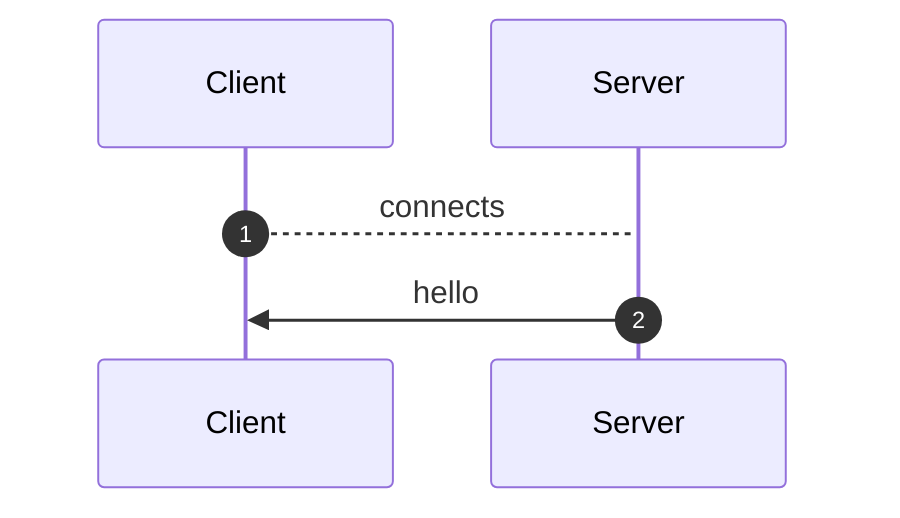
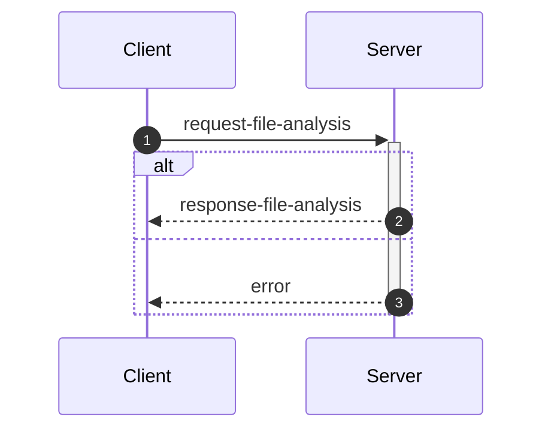
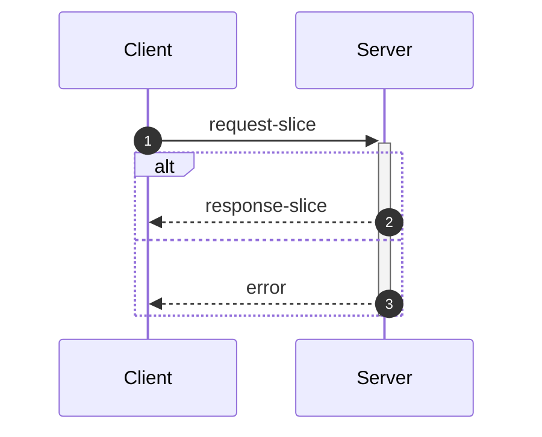
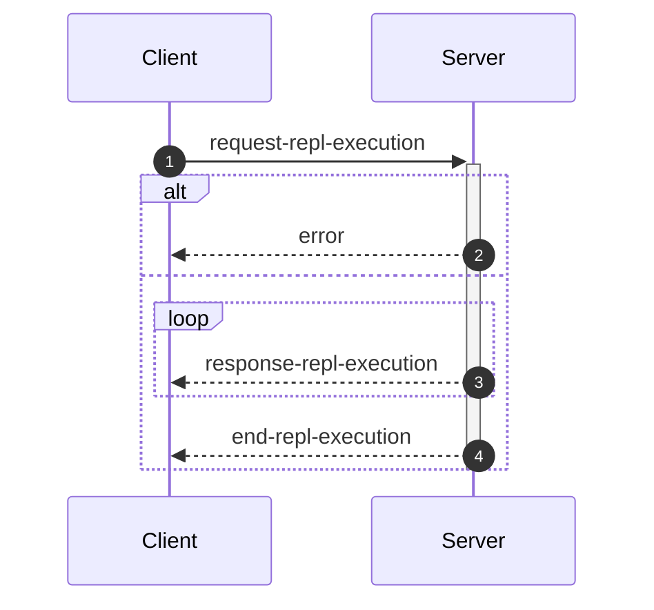

_<span title="an overview of flowR's interface">Generated</span> from '[wiki-interface.ts](https://github.com/flowr-analysis/flowr/tree/main/src/documentation/wiki-interface.ts "src/documentation/wiki-interface.ts")' on 2026-10-10, 17:07:04 UTC (v2.15.10, R v4.6.1), do not edit directly._

Although far from being as detailed as the in-depth explanation of [_flowR_](https://github.com/flowr-analysis/flowr/wiki/Core),
this wiki page explains how to interface with _flowR_ in more detail.
In general, command line arguments and other options provide short descriptions on hover over.

* [💻 Using the REPL](#using-the-repl)
* [⚙️ Configuring FlowR](#configuring-flowr)
* [⚒️ Writing Code](#writing-code)
* [💬 Communicating with the Server](#communicating-with-the-server)

<a id='using-the-repl'></a>
## 💻 Using the REPL

> [!NOTE]
> To execute arbitrary R commands with a repl request, _flowR_ has to be started explicitly with <span title="Description (Command Line Argument): Allow to access the underlying R session when using flowR (security warning: this allows the execution of arbitrary R code!)">`--r-session-access`</span>.
> Please be aware that this introduces a security risk and note that this relies on the [`r-shell` engine](https://github.com/flowr-analysis/flowr/wiki/Engines) .

Although primarily meant for users to explore,
there is nothing which forbids calling _flowR_ as a subprocess to use standard-in, -output, and -error
for communication (although you can access the REPL using the server as well,
with the [REPL Request](#message-request-repl-execution) message).

The read-eval-print loop&nbsp;(REPL) works relatively simple.
You can submit an expression (using <kbd>Enter</kbd>),
which is interpreted as an R&nbsp;expression by default but interpreted as a *command* if it starts with a colon (`:`).
The best command to get started with the REPL is <span title="Description (Repl Command): Show help information (aliases: :h, :?)">`:help`</span>.
Besides, you can leave the REPL either with the command <span title="Description (Repl Command): End the repl (aliases: :q, :exit)">`:quit`</span> or by pressing <kbd>Ctrl</kbd>+<kbd>C</kbd> twice.
When writing a *command*, you may press <kbd>Tab</kbd> to get a list of completions, if available.
Multiple commands can be entered in a single line by separating them with a semicolon (`;`), e.g. `:parse "x<-2"; :df*`.
If a command is given without R code, the REPL will re-use R code given in a previous command.
The prior example will hence return first the parsed AST of the program and then the dataflow graph for `"x <- 2"`.

> [!NOTE]
> If you develop flowR, you may want to launch the repl using the `npm run main-dev` command, this way, you get a non-minified version of flowR with debug information and hot-reloading of source files.

<details>
<summary>Available Commands</summary>

We currently offer the following commands (this with a `[*]` suffix are available with and without the star):

| Command | Description |
| ------- | ----------- |
| **<span title="Description (Repl Command): End the repl (aliases: :q, :exit)">:quit</span>** | End the repl (aliases: **:<span title="Alias of ':quit'. End the repl">q</span>**, **:<span title="Alias of ':quit'. End the repl">exit</span>**) |
| **<span title="Description (Repl Command): Execute the given code as R code. This requires the `--r-session-access` flag to be set and requires the r-shell engine. (aliases: :e, :r)">:execute</span>** | Execute the given code as R code. This requires the `--r-session-access` flag to be set and requires the r-shell engine. (aliases: **:<span title="Alias of ':execute'. Execute the given code as R code. This requires the `--r-session-access` flag to be set and requires the r-shell engine.">e</span>**, **:<span title="Alias of ':execute'. Execute the given code as R code. This requires the `--r-session-access` flag to be set and requires the r-shell engine.">r</span>**) |
| **<span title="Description (Repl Command): Get mermaid code for the control-flow graph of R code (aliases: :cfg, :cf)">:controlflow[*]</span>** | Get mermaid code for the control-flow graph of R code (star: Returns the URL to mermaid.live) (aliases: **:<span title="Alias of ':controlflow'. Get mermaid code for the control-flow graph of R code">cfg</span>**, **:<span title="Alias of ':controlflow'. Get mermaid code for the control-flow graph of R code">cf</span>**) |
| **<span title="Description (Repl Command): Get mermaid code for the control-flow graph with basic blocks (aliases: :cfgb, :cfb)">:controlflowbb[*]</span>** | Get mermaid code for the control-flow graph with basic blocks (star: Returns the URL to mermaid.live) (aliases: **:<span title="Alias of ':controlflowbb'. Get mermaid code for the control-flow graph with basic blocks">cfgb</span>**, **:<span title="Alias of ':controlflowbb'. Get mermaid code for the control-flow graph with basic blocks">cfb</span>**) |
| **<span title="Description (Repl Command): Get mermaid code for the dataflow graph (aliases: :d, :df)">:dataflow[*]</span>** | Get mermaid code for the dataflow graph (star: Returns the URL to mermaid.live) (aliases: **:<span title="Alias of ':dataflow'. Get mermaid code for the dataflow graph">d</span>**, **:<span title="Alias of ':dataflow'. Get mermaid code for the dataflow graph">df</span>**) |
| **<span title="Description (Repl Command): Get mermaid code for the normalized AST of R code (aliases: :n)">:normalize[*]</span>** | Get mermaid code for the normalized AST of R code (star: Returns the URL to mermaid.live) (alias: **:<span title="Alias of ':normalize'. Get mermaid code for the normalized AST of R code">n</span>**) |
| **<span title="Description (Repl Command): Get mermaid code for the simplified dataflow graph (aliases: :ds, :dfs)">:dataflowsimple[*]</span>** | Get mermaid code for the simplified dataflow graph (star: Returns the URL to mermaid.live) (aliases: **:<span title="Alias of ':dataflowsimple'. Get mermaid code for the simplified dataflow graph">ds</span>**, **:<span title="Alias of ':dataflowsimple'. Get mermaid code for the simplified dataflow graph">dfs</span>**) |
| **<span title="Description (Repl Command): Inspect and extend the signature database: `query` (identical to :query @signature), `info <name>` for where a function comes from (identical to :query @function-info), `add <path>` to mount another database/source, `download` to fetch the full-history database. (aliases: :sig)">:signature</span>** | Inspect and extend the signature database: `query` (identical to :query @signature), `info <name>` for where a function comes from (identical to :query @function-info), `add <path>` to mount another database/source, `download` to fetch the full-history database. (alias: **:<span title="Alias of ':signature'. Inspect and extend the signature database: `query` (identical to :query @signature), `info <name>` for where a function comes from (identical to :query @function-info), `add <path>` to mount another database/source, `download` to fetch the full-history database.">sig</span>**) |
| **<span title="Description (Repl Command): Just calculates the DFG, but only prints summary info (aliases: :d#, :df#)">:dataflowsilent</span>** | Just calculates the DFG, but only prints summary info (aliases: **:<span title="Alias of ':dataflowsilent'. Just calculates the DFG, but only prints summary info">d#</span>**, **:<span title="Alias of ':dataflowsilent'. Just calculates the DFG, but only prints summary info">df#</span>**) |
| **<span title="Description (Repl Command): Prints ASCII Art of the parsed, unmodified AST (aliases: :p)">:parse</span>** | Prints ASCII Art of the parsed, unmodified AST (alias: **:<span title="Alias of ':parse'. Prints ASCII Art of the parsed, unmodified AST">p</span>**) |
| **<span title="Description (Repl Command): Prints the version of flowR as well as the current version of R">:version</span>** | Prints the version of flowR as well as the current version of R
| **<span title="Description (Repl Command): Query the given R code (use 'help' for more information)">:query[*]</span>** | Query the given R code (use 'help' for more information) (star: Similar to query, but returns the output in json format.)
| **<span title="Description (Repl Command): Returns an ASCII representation of the dataflow graph (aliases: :df!)">:dataflowascii</span>** | Returns an ASCII representation of the dataflow graph (alias: **:<span title="Alias of ':dataflowascii'. Returns an ASCII representation of the dataflow graph">df!</span>**) |
| **<span title="Description (Repl Command): Returns summarization stats for the normalized AST (aliases: :n#)">:normalize#</span>** | Returns summarization stats for the normalized AST (alias: **:<span title="Alias of ':normalize#'. Returns summarization stats for the normalized AST">n#</span>**) |
| **<span title="Description (Repl Command): Show help information (aliases: :h, :?)">:help</span>** | Show help information (aliases: **:<span title="Alias of ':help'. Show help information">h</span>**, **:<span title="Alias of ':help'. Show help information">?</span>**) |

</details>

> [!TIP]
> 
> As indicated by the examples before, all REPL commands that operate on code keep track of the state.
> Hence, if you run a command like <span title="Description (Repl Command, starred version): Returns the URL to mermaid.live; Base Command: Get mermaid code for the dataflow graph (aliases: :d*, :df*)">`:dataflow*`</span> without providing R code,
> the REPL will re-use the R code provided in a previous command.
> Likewise, doing this will benefit from incrementality!
> If you request the dataflow graph with `:df* x <- 2 * y` and then want to see the parsed AST with `:parse`,
> the REPL will re-use previously obtained information and not re-parse the code again.
> 		

Generally, many commands offer shortcut versions in the REPL. Many queries, for example, offer a shortened format (see the example below).
Of special note, the [Config Query](https://github.com/flowr-analysis/flowr/wiki/%5BQuery%5D-Config)
can be used to also modify the currently active configuration of _flowR_ within the REPL (see the [wiki page](https://github.com/flowr-analysis/flowr/wiki/%5BQuery%5D-Config) for more information).

### Example: Retrieving the Dataflow Graph

To retrieve a URL to the [mermaid](https://mermaid.js.org/) diagram of the dataflow of a given expression,
use <span title="Description (Repl Command, starred version): Returns the URL to mermaid.live; Base Command: Get mermaid code for the dataflow graph (aliases: :d*, :df*)">`:dataflow*`</span> (or <span title="Description (Repl Command): Get mermaid code for the dataflow graph (aliases: :d, :df)">`:dataflow`</span> to get the mermaid code in the cli):

```shell
$ docker run -it --rm eagleoutice/flowr # or npm run flowr 
flowR repl v2.15.10, R grammar v14 (tree-sitter engine)
R> :dataflow* y <- 1 + x
```

<details>
<summary style='color:gray'>Output</summary>

```text
https://mermaid.live/view#base64:eyJjb2RlIjoiZmxvd2NoYXJ0IFREXG4gICAgMXt7XCJgKiM5MTtSTnVtYmVyIzkzOyogKioxKipcbiAgICAgICoxLjYqICgqKmlkOiAxKiopYFwifX1cbiAgICAyKFtcImAqIzkxO1JTeW1ib2wjOTM7KiAqKngqKlxuICAgICAgKjEuMTAqICgqKmlkOiAyKiopYFwiXSlcbiAgICAzW1tcImAqIzkxO1JCaW5hcnlPcCM5MzsqIGJhc2UjNTg7IzU4OyoqIzQzOyoqXG4gICAgICAqMS42LTEwKiAoKippZDogMyoqKVxuICAgIGFyZzogKDEsIDIpYFwiXV1cbiAgICBidWlsdC1pbjpfNDNfW1wiYEJ1aWx0LUluOlxuIzQzO2BcIl1cbiAgICBzdHlsZSBidWlsdC1pbjpfNDNfIHN0cm9rZTpncmF5LGZpbGw6Z3JheSxzdHJva2Utd2lkdGg6MnB4LG9wYWNpdHk6Ljg7XG4gICAgMFtcImAqIzkxO1JTeW1ib2wjOTM7KiAqKnkqKlxuICAgICAgKjEuMSogKCoqaWQ6IDAqKiwgdjogMylgXCJdXG4gICAgNFtbXCJgKiM5MTtSQmluYXJ5T3AjOTM7KiBiYXNlIzU4OyM1ODsqKiM2MDsjNDU7KipcbiAgICAgICoxLjEtMTAqICgqKmlkOiA0KiopXG4gICAgYXJnOiAoMCwgMylgXCJdXVxuICAgIGJ1aWx0LWluOl82MF8tW1wiYEJ1aWx0LUluOlxuIzYwOyM0NTtgXCJdXG4gICAgc3R5bGUgYnVpbHQtaW46XzYwXy0gc3Ryb2tlOmdyYXksZmlsbDpncmF5LHN0cm9rZS13aWR0aDoycHgsb3BhY2l0eTouODtcbiAgICAxIC0uLT58XCJmbG93XCJ8IDJcbiAgICBsaW5rU3R5bGUgMCBzdHJva2U6Z3JheSxjb2xvcjpncmF5O1xuICAgIDIgLS4tPnxcImZsb3dcInwgM1xuICAgIGxpbmtTdHlsZSAxIHN0cm9rZTpncmF5LGNvbG9yOmdyYXk7XG4gICAgMyAtLT58XCJyZWFkcywgYXJnXCJ8IDFcbiAgICAzIC0tPnxcInJlYWRzLCBhcmdcInwgMlxuICAgIDMgLS4tPnxcImZsb3dcInwgMFxuICAgIGxpbmtTdHlsZSA0IHN0cm9rZTpncmF5LGNvbG9yOmdyYXk7XG4gICAgMyAtLi0+fFwicmVhZHMsIGNhbGxzXCJ8IGJ1aWx0LWluOl80M19cbiAgICBsaW5rU3R5bGUgNSBzdHJva2U6Z3JheTtcbiAgICAwIC0tPnxcImRlZmluZWQtYnksIGZsb3dcInwgNFxuICAgIDAgLS0+fFwiZGVmaW5lZC1ieVwifCAzXG4gICAgNCAtLT58XCJyZWFkcywgYXJnXCJ8IDNcbiAgICA0IC0tPnxcInJldHVybnMsIGFyZ1wifCAwXG4gICAgNCAtLi0+fFwicmVhZHMsIGNhbGxzXCJ8IGJ1aWx0LWluOl82MF8tXG4gICAgbGlua1N0eWxlIDEwIHN0cm9rZTpncmF5OyIsIm1lcm1haWQiOnsiYXV0b1N5bmMiOnRydWV9fQ==
```

Retrieve the dataflow graph of the expression `y <- 1 + x`. It looks like this:


```mermaid
flowchart LR
    1{{"`*#91;RNumber#93;* **1**
      *1.6* (**id: 1**)`"}}
    2(["`*#91;RSymbol#93;* **x**
      *1.10* (**id: 2**)`"])
    3[["`*#91;RBinaryOp#93;* base#58;#58;**#43;**
      *1.6-10* (**id: 3**)
    arg: (1, 2)`"]]
    built-in:_43_["`Built-In:
#43;`"]
    style built-in:_43_ stroke:gray,fill:gray,stroke-width:2px,opacity:.8;
    0["`*#91;RSymbol#93;* **y**
      *1.1* (**id: 0**, v: 3)`"]
    4[["`*#91;RBinaryOp#93;* base#58;#58;**#60;#45;**
      *1.1-10* (**id: 4**)
    arg: (0, 3)`"]]
    built-in:_60_-["`Built-In:
#60;#45;`"]
    style built-in:_60_- stroke:gray,fill:gray,stroke-width:2px,opacity:.8;
    1 -.->|"flow"| 2
    linkStyle 0 stroke:gray,color:gray;
    2 -.->|"flow"| 3
    linkStyle 1 stroke:gray,color:gray;
    3 -->|"reads, arg"| 1
    3 -->|"reads, arg"| 2
    3 -.->|"flow"| 0
    linkStyle 4 stroke:gray,color:gray;
    3 -.->|"reads, calls"| built-in:_43_
    linkStyle 5 stroke:gray;
    0 -->|"defined-by, flow"| 4
    0 -->|"defined-by"| 3
    4 -->|"reads, arg"| 3
    4 -->|"returns, arg"| 0
    4 -.->|"reads, calls"| built-in:_60_-
    linkStyle 10 stroke:gray;
```

<details>

<summary style="color:gray">R Code of the Dataflow Graph</summary>

The analysis ran (including parse and normalize, using the [tree-sitter](https://github.com/flowr-analysis/flowr/wiki/Engines) engine) within the generation environment. No [signature database](https://github.com/flowr-analysis/flowr/wiki/Signature-Database) is mounted for these generated graphs, so `library()` calls attach no package exports; base-R names are still qualified via the generated base-package store (e.g. `acf` as `stats::acf`). 
We encountered no unknown side effects during the analysis.

```r
y <- 1 + x
```

</details>

</details>

For small graphs like this, <span title="Description (Repl Command): Returns an ASCII representation of the dataflow graph (aliases: :df!)">`:dataflowascii`</span> also provides an ASCII representation directly in the REPL:

```shell
$ docker run -it --rm eagleoutice/flowr # or npm run flowr 
flowR repl v2.15.10, R grammar v14 (tree-sitter engine)
R> :df! y <- 1 + x
```

<details open>
<summary style='color:gray'>Output</summary>

```text
                        v<0>v
 c<4>c──────────────────| y |
 |<- |     ┌────────────v---v
 c---c     │
    │   c<3>c   0<1>0
    └───| + |───| 1 |───u<2>u
        c---c   0---0   | x |
           └────────────u---u
Edges:
3 -> 1: reads, arg          3 -> 2: reads, arg
3 -> 0: flows-to            1 -> 2: flows-to
2 -> 3: flows-to            4 -> 3: reads, arg
4 -> 0: returns, arg        0 -> 4: defined-by, flows-to
0 -> 3: defined-by
```

Retrieve the dataflow graph of the expression `y <- 1 + x` as ASCII art.

</details>

For the slicing with <span title="Description (Repl Command): Static backwards executable slicer for R">`:slicer`</span>, you have access to the same [magic comments](#slice-magic-comments) as with the [slice request](#message-request-slice).
Pass `--inline` to splice resolvable `source()` calls into the reconstruction so the slice is a single self-contained R text (the same as the static slice query's `inlineSources` flag).
See `--help` for more flags!

### Example: Interfacing with the File System

Many commands that allow for an R-expression (like <span title="Description (Repl Command, starred version): Returns the URL to mermaid.live; Base Command: Get mermaid code for the dataflow graph (aliases: :d*, :df*)">`:dataflow*`</span>) allow for a file as well
if the argument starts with `file://`.
If you are working from the root directory of the _flowR_ repository, the following gives you the parsed AST of the example file using the <span title="Description (Repl Command): Prints ASCII Art of the parsed, unmodified AST (aliases: :p)">`:parse`</span> command:

> **Watch mode**: Replace `file://` with `watch://` to enter watch mode.
> flowR runs the command immediately and then re-runs it every time the file (or any file inside the folder) changes.
> Enter any other command to leave watch mode.
> For example: `:df watch://analysis.R`

```shell
$ docker run -it --rm eagleoutice/flowr # or npm run flowr 
flowR repl v2.15.10, R grammar v14 (tree-sitter engine)
R> :parse file://test/testfiles/example.R
```

<details>
<summary style='color:gray'>Output</summary>

```text
File: test/testfiles/example.R

program
├ binaryoperator
│ ├ identifier "sum" (1:1─4)
│ ├ <- "<-" (1:5─7)
│ ╰ float "0" (1:8─9)
├ binaryoperator
│ ├ identifier "product" (2:1─8)
│ ├ <- "<-" (2:9─11)
│ ╰ float "1" (2:12─13)
├ binaryoperator
│ ├ identifier "w" (3:1─2)
│ ├ <- "<-" (3:3─5)
│ ╰ float "7" (3:6─7)
├ binaryoperator
│ ├ identifier "N" (4:1─2)
│ ├ <- "<-" (4:3─5)
│ ╰ float "10" (4:6─8)
├ forstatement
│ ├ for "for" (6:1─4)
│ ├ ( "(" (6:5─6)
│ ├ identifier "i" (6:6─7)
│ ├ in "in" (6:8─10)
│ ├ binaryoperator
│ │ ├ float "1" (6:11─12)
│ │ ├ : ":" (6:12─13)
│ │ ╰ parenthesizedexpression
│ │   ├ ( "(" (6:13─14)
│ │   ├ binaryoperator
│ │   │ ├ identifier "N" (6:14─15)
│ │   │ ├ - "-" (6:15─16)
│ │   │ ╰ float "1" (6:16─17)
│ │   ╰ ) ")" (6:17─18)
│ ├ ) ")" (6:18─19)
│ ╰ bracedexpression
│   ├ { "{" (6:20─21)
│   ├ binaryoperator
│   │ ├ identifier "sum" (7:3─6)
│   │ ├ <- "<-" (7:7─9)
│   │ ╰ binaryoperator
│   │   ├ binaryoperator
│   │   │ ├ identifier "sum" (7:10─13)
│   │   │ ├ + "+" (7:14─15)
│   │   │ ╰ identifier "i" (7:16─17)
│   │   ├ + "+" (7:18─19)
│   │   ╰ identifier "w" (7:20─21)
│   ├ binaryoperator
│   │ ├ identifier "product" (8:3─10)
│   │ ├ <- "<-" (8:11─13)
│   │ ╰ binaryoperator
│   │   ├ identifier "product" (8:14─21)
│   │   ├  "" (8:22─23)
│   │   ╰ identifier "i" (8:24─25)
│   ╰ } "}" (9:1─2)
├ call
│ ├ identifier "cat" (11:1─4)
│ ╰ arguments
│   ├ ( "(" (11:4─5)
│   ├ argument
│   │ ╰ string
│   │   ├ " "\"" (11:5─6)
│   │   ├ stringcontent "Sum:" (11:6─10)
│   │   ╰ " "\"" (11:10─11)
│   ├ comma "," (11:11─12)
│   ├ argument
│   │ ╰ identifier "sum" (11:13─16)
│   ├ comma "," (11:16─17)
│   ├ argument
│   │ ╰ string
│   │   ├ " "\"" (11:18─19)
│   │   ├ stringcontent
│   │   │ ╰ escapesequence "\\n" (11:19─21)
│   │   ╰ " "\"" (11:21─22)
│   ╰ ) ")" (11:22─23)
╰ call
  ├ identifier "cat" (12:1─4)
  ╰ arguments
    ├ ( "(" (12:4─5)
    ├ argument
    │ ╰ string
    │   ├ " "\"" (12:5─6)
    │   ├ stringcontent "Product:" (12:6─14)
    │   ╰ " "\"" (12:14─15)
    ├ comma "," (12:15─16)
    ├ argument
    │ ╰ identifier "product" (12:17─24)
    ├ comma "," (12:24─25)
    ├ argument
    │ ╰ string
    │   ├ " "\"" (12:26─27)
    │   ├ stringcontent
    │   │ ╰ escapesequence "\\n" (12:27─29)
    │   ╰ " "\"" (12:29─30)
    ╰ ) ")" (12:30─31)
```

Retrieve the parsed AST of the example file.

<details>

<summary>File Content</summary>

```r
sum <- 0
product <- 1
w <- 7
N <- 10

for (i in 1:(N-1)) {
  sum <- sum + i + w
  product <- product * i
}

cat("Sum:", sum, "\n")
cat("Product:", product, "\n")
```

</details>

As _flowR_ directly transforms this AST the output focuses on being human-readable instead of being machine-readable.
		
</details>

### Example: Run a Query

You can run any query supported by _flowR_ using the <span title="Description (Repl Command): Query the given R code (use 'help' for more information)">`:query`</span> command.
For example, to obtain the shapes of all data frames in a given piece of code, you can run:

```shell
$ docker run -it --rm eagleoutice/flowr # or npm run flowr 
flowR repl v2.15.10, R grammar v14 (tree-sitter engine)
R> :query @absint df-shape "x <- data.frame(a = 1:10, b = 1:10)\ny <- x$a"
```

<details open>
<summary style='color:gray'>Output</summary>

```text
Query: absint (2 ms)
```

Retrieve the shapes of all data frames in the given code.

</details>

To run the linter on a file, you can use (in this example, we just issue the `dead-code` linter on a small piece of code):

```shell
$ docker run -it --rm eagleoutice/flowr # or npm run flowr 
flowR repl v2.15.10, R grammar v14 (tree-sitter engine)
R> :query @linter rules:dead-code "if(FALSE) x <- 2"
```

<details open>
<summary style='color:gray'>Output</summary>

```text
Query: linter (2 ms)
   ╰ Dead Code (dead-code):
       ╰ certain:
           ╰ Code at 1.11-16
```

Run the linter on the given code, with only the `dead-code` rule enabled.

</details>

For more information on the available queries, please check out the [Query API](https://github.com/flowr-analysis/flowr/wiki/Query-API).

<a id='configuring-flowr'></a>
## ⚙️ Configuring FlowR

When running _flowR_, you may want to specify some behaviors with a dedicated configuration file.
By default, flowR looks for a file named `flowr.json` in the current working directory (or any higher directory).
You can also specify a different file with <span title="Description (Command Line Argument): The name of the configuration file to use">`--config-file`</span> or pass the configuration inline using <span title="Description (Command Line Argument): The flowR configuration to use, as a JSON string">`--config-json`</span>.
To inspect the current configuration, you can run flowr with the <span title="Description (Command Line Argument): Run with verbose logging (will be passed to the corresponding script)">`--verbose`</span> flag, or use the `config` [Query](https://github.com/flowr-analysis/flowr/wiki/Query-API).
Within the REPL this works by running the following:

```shell
:query @config
```

To work with the <a href="https://github.com/flowr-analysis/flowr/tree/main/src/config.ts#L108"><code><span title="The configuration file format for flowR.">FlowrConfig</span></code></a> you can use the provided helper objects alongside its methods like
<a href="https://github.com/flowr-analysis/flowr/tree/main/src/config.ts#L871"><code><span title="Creates a new flowr config that has the updated values.">FlowrConfig::<b>amend</b></span></code></a>.
The schema below documents every option; the ones you most likely want are:

- <a href="https://github.com/flowr-analysis/flowr/wiki/Interface#configuring-flowr" title="Configuration Option (boolean): Whether source calls should be ignored, causing {@link processSourceCall}&#39;s behavior to be skipped.">ignoreSourceCalls</a>: ignore source calls when analyzing the code, i.e., ignore the inclusion of other files.
- <a href="https://github.com/flowr-analysis/flowr/wiki/Interface#configuring-flowr" title="Configuration Option (boolean): Whether load calls should be ignored, causing {@link processLoadCall}&#39;s behavior to be skipped.">ignoreLoadCalls</a>: ignore load calls when analyzing the code, i.e., ignore the loading of r-data files.
- <a href="https://github.com/flowr-analysis/flowr/wiki/Interface#configuring-flowr" title="Configuration Option (object): Do you want to overwrite (parts) of the builtin definition?">semantics.environment.overwriteBuiltIns</a>: overwrite _flowR_'s handling of built-in functions, or clear the preset definitions entirely.
  See [Configure BuiltIn Semantics](#configure-builtin-semantics) for more information.
- <a href="https://github.com/flowr-analysis/flowr/wiki/Interface#configuring-flowr" title="Configuration Option (string): How to resolve variables and their values. (one of &quot;disabled&quot;, &quot;alias&quot;, &quot;builtin&quot;)">solver.variables</a>: how to resolve variables and their values (`disabled`, `alias`, `builtin`).
- <a href="https://github.com/flowr-analysis/flowr/wiki/Interface#configuring-flowr" title="Configuration Option (array): The engine or set of engines to use for interacting with R code. An empty array means all available engines will be used.">engines</a> and <a href="https://github.com/flowr-analysis/flowr/wiki/Interface#configuring-flowr" title="Configuration Option (string): The default engine to use for interacting with R code. If this is undefined, an arbitrary engine from the specified list will be used. (one of &quot;tree-sitter&quot;, &quot;r-shell&quot;)">defaultEngine</a>: the engines used to interact with R code, see the [Engines wiki page](https://github.com/flowr-analysis/flowr/wiki/Engines).
- <a href="https://github.com/flowr-analysis/flowr/wiki/Interface#configuring-flowr" title="Configuration Option (array): Files a framework loads on its own, without any source() call (e.g. global.R in a shiny app), in the order they are loaded; flowR orders the matching project files accordingly and analyzes them as one program. Entries are case-insensitive globs matched against the file path, a plain name matches any file with that name, and entries matching no project file are warned about. Usually set per project kind via specializeConfig.">project.implicitSources</a>: the files a framework loads without any `source()` call, in the order in which they are
  loaded. Entries are globs (e.g. `R/*.R`) matched against the file path ignoring capitalization; one matching no file is reported.
- <a href="https://github.com/flowr-analysis/flowr/wiki/Interface#configuring-flowr" title="Configuration Option (object): Overwrite (parts of) the configuration depending on the project kind flowR detects, e.g. to give a shiny app its implicit sources.">specializeConfig</a>: overwrite (parts of) the configuration depending on the kind of project _flowR_ detects
  (e.g. `shiny-app`), which is how a shiny app gets its implicit sources by default. What you configure directly wins.
- <a href="https://github.com/flowr-analysis/flowr/wiki/Interface#configuring-flowr" title="Configuration Option (string): Overwrite the project kind flowR would otherwise infer from the analyzed files, e.g. when auto-detection guesses wrong. (one of &quot;package&quot;, &quot;script&quot;, &quot;shiny-app&quot;, &quot;notebook&quot;, &quot;project&quot;, &quot;unknown&quot;)">project.useProjectType</a>: skip that detection and force a project kind yourself, when auto-detection guesses wrong.
- <a href="https://github.com/flowr-analysis/flowr/wiki/Interface#configuring-flowr" title="Configuration Option (array): The default plugins to load when creating a new instance of FlowrAnalyzer">defaultPlugins</a> and <a href="https://github.com/flowr-analysis/flowr/wiki/Interface#configuring-flowr" title="Configuration Option (array): The plugins to load in REPL mode">repl.plugins</a>: the plugins to load for a new <a href="https://github.com/flowr-analysis/flowr/tree/main/src/project/flowr-analyzer.ts#L205"><code><span title="Central class for conducting analyses with FlowR. Use the FlowrAnalyzerBuilder to create a new instance. If you want the original pattern of creating a pipeline and running all steps, you can still do this with FlowrAnalyzer#runFull . To inspect the context of the analyzer, use FlowrAnalyzer#inspectContext (if you are a plugin and need to modify it, use FlowrAnalyzer#context instead).">FlowrAnalyzer</span></code></a> and in the REPL
  (use `flowr:default` to reference the former).

So you can configure _flowR_ by adding a file like the following:

<details>

<summary>Example Configuration File</summary>

```json
{
  "ignoreSourceCalls": true,
  "ignoreLoadCalls": true,
  "semantics": {
    "environment": {
      "overwriteBuiltIns": {
        "definitions": [
          {
            "type": "function",
            "names": [
              "foo"
            ],
            "processor": "builtin:assign",
            "config": {}
          }
        ]
      }
    }
  },
  "defaultPlugins": [
    "file:description",
    "versions:description"
  ],
  "repl": {
    "quickStats": false,
    "dfProcessorHeat": false,
    "hints": true,
    "plugins": [
      "flowr:default"
    ]
  },
  "project": {
    "resolveUnknownPathsOnDisk": true,
    "implicitSources": [
      "global.R",
      "app.R"
    ]
  },
  "linter": {
    "disabledRules": []
  },
  "specializeConfig": {
    "shiny-app": {
      "project": {
        "implicitSources": [
          "global.R",
          "ui.R",
          "server.R",
          "app.R"
        ]
      }
    }
  },
  "engines": [
    {
      "type": "r-shell"
    }
  ],
  "solver": {
    "variables": "alias",
    "evalStrings": true,
    "trackEnvironments": true,
    "sigdb": {
      "enabled": true,
      "loadProjectDependencies": true,
      "eagerlyLoad": false,
      "eagerlyLoadExports": false,
      "linkBaseR": false,
      "linkDescriptionDependencies": false
    },
    "resolveSource": {
      "dropPaths": "no",
      "ignoreCapitalization": true,
      "inferWorkingDirectory": "active-script",
      "searchPath": []
    },
    "instrument": {},
    "slicer": {
      "threshold": 50
    }
  },
  "abstractInterpretation": {
    "wideningThreshold": 4,
    "followCalls": true,
    "dataFrame": {
      "maxColNames": 20,
      "readLoadedData": {
        "readExternalFiles": true,
        "maxReadLines": 1000000
      }
    }
  },
  "incremental": {
    "alwaysIncremental": false,
    "parsing": {
      "activated": false,
      "heuristics": {
        "activated": true,
        "mtime": true,
        "linesFrom": 500,
        "bytesFrom": 50000,
        "alwaysWithEdits": false,
        "minFiles": 1
      }
    }
  },
  "gas": {
    "thresholds": {
      "memory": {
        "problematic": 0.7,
        "critical": 0.9
      },
      "timeMs": {
        "problematic": 100000,
        "critical": 120000
      }
    },
    "features": {}
  }
}
```

</details>

<details>
<a id='configure-builtin-semantics'></a>
<summary>Configure Built-In Semantics</summary>

`semantics/environment/overwriteBuiltins` accepts two keys:

- `loadDefaults` (boolean, initially `true`): If set to `true`, the default built-in definitions are loaded before applying the custom definitions. Setting this flag to `false` explicitly disables the loading of the default definitions.
- `definitions` (array, initially empty): Allows to overwrite or define new built-in elements. Each object within must have a `type` which is one of the below. Furthermore, they may define a string array of `names` which specifies the identifiers to bind the definitions to. You may use `assumePrimitive` to specify whether _flowR_ should assume that this is a primitive non-library definition (so you probably just do not want to specify the key).

  | Type            | Description                                                                                                                                                                                                                                                                                              | Example                                                                                                    |
  | --------------- | -------------------------------------------------------------------------------------------------------------------------------------------------------------------------------------------------------------------------------------------------------------------------------------------------------- | ---------------------------------------------------------------------------------------------------------- |
  | `constant`    | Additionally allows for a `value` this should resolve to.                                                                                                                                                                                                                                                | `{ type: 'constant', names: ['NULL', 'NA'],  value: null }`                                                |
  | `function`    | Is a rather flexible way to define and bind built-in functions. For the time, we do not have extensive documentation to cover all the cases, so please either consult the sources with the `default-builtin-config.ts` or open a [new issue](https://github.com/flowr-analysis/flowr/issues/new/choose). | `{ type: 'function', names: ['next'], processor: 'builtin:d', config: { cfg: ExitPointType.Next } }` |
  | `replacement` | A comfortable way to specify replacement functions like `$<-` or `names<-`. `suffixes` describes the... suffixes to attach automatically. | `{ type: 'replacement', suffixes: ['<-', '<<-'], names: ['[', '[['] }` |

</details>

<details>

<summary style='color:gray'>Full Configuration-File Schema</summary>

- _The configuration file format for flowR._ (object)
    - **logLevel** [optional] _flowR's global minimum log level, applied when the config is loaded._ (string)
        Only allows: 'silly', 'trace', 'debug', 'info', 'warn', 'error', 'fatal'
    - **ignoreSourceCalls** [optional] _Whether source calls should be ignored, causing {@link processSourceCall}'s behavior to be skipped._ (boolean)
    - **ignoreLoadCalls** [optional] _Whether load calls should be ignored, causing {@link processLoadCall}'s behavior to be skipped._ (boolean)
    - **semantics** _Configure language semantics and how flowR handles them._ (object)
        - **environment** [optional] _Semantics regarding how to handle the R environment._ (object)
            - **overwriteBuiltIns** [optional] _Do you want to overwrite (parts) of the builtin definition?_ (object)
                - **loadDefaults** [optional] _Should the default configuration still be loaded?_ (boolean)
                - **definitions** [optional] _The definitions to load/overwrite._ (array)
                Valid item types:
                    - (object)
    - **defaultPlugins** [optional] _The default plugins to load when creating a new instance of FlowrAnalyzer_ (array)
    Valid item types:
        - (alternatives)
            - (string)
            - (array)
    - **repl** _Configuration options for the REPL._ (object)
        - **quickStats** [optional] _Whether to show quick stats in the REPL after each evaluation._ (boolean)
        - **dfProcessorHeat** [optional] _This instruments the dataflow processors to count how often each processor is called._ (boolean)
        - **hints** [optional] _Whether to show dim inline hints on the empty prompt (automatically disabled on non-interactive terminals)._ (boolean)
        - **plugins** [optional] _The plugins to load in REPL mode_ (array)
        Valid item types:
            - (alternatives)
                - (string)
                - (array)
        - **autoUseFileProtocol** [optional] _Prepend the file protocol to a repl input that looks like a path, instead of only warning about it._ (boolean)
        - **queryStats** [optional] _Whether `:query` closes with the line stating how long the queries took (`:query*` never prints it)._ (boolean)
        - **showPlugins** [optional] _Whether `:version` grays out the plugins that did not activate during the last analysis._ (boolean)
    - **project** _Project specific configuration options._ (object)
        - **resolveUnknownPathsOnDisk** [optional] _Whether to resolve unknown paths loaded by the r project disk when trying to source/analyze files._ (boolean)
        - **failOnInaccessiblePath** [optional] _Whether a directory that cannot be traversed during file discovery (e.g. due to permissions) aborts the analysis; when false (the default) such paths are logged and skipped._ (boolean)
        - **basePackages** [optional] _The packages considered part of R itself (base and recommended); if unset, flowR uses its built-in list._ (array)
        Valid item types:
            - (string)
        - **implicitSources** [optional] _Files a framework loads on its own, without any source() call (e.g. global.R in a shiny app), in the order they are loaded; flowR orders the matching project files accordingly and analyzes them as one program. Entries are case-insensitive globs matched against the file path, a plain name matches any file with that name, and entries matching no project file are warned about. Usually set per project kind via specializeConfig._ (array)
        Valid item types:
            - (string)
        - **useProjectType** [optional] _Overwrite the project kind flowR would otherwise infer from the analyzed files, e.g. when auto-detection guesses wrong._ (string)
            Only allows: 'package', 'script', 'shiny-app', 'notebook', 'project', 'unknown'
        - **assumeImplicitEcho** [optional] _Whether the top level of the analyzed code is echoed, so that every visible result printed there is collected as an output by the dependencies query (default true, false for a package)._ (boolean)
        - **discovery** [optional] _Scoping options for the default project discovery._ (object)
            - **full** [optional] _Collect every file below the project root (greedy) instead of only the files the detected project kind needs (default false)._ (boolean)
            - **perKind** [optional] _Per-kind include/exclude glob overrides layered on the default scoping._ (object)
            - **ignore** [optional] _Case-insensitive globs that drop matching files from the intelligent discovery, regardless of kind (e.g. .Renviron to ignore environment files)._ (array)
            Valid item types:
                - (string)
        - **classification** [optional] _Overrides for the signals flowR uses to classify the project kind._ (object)
            - **shinyDescriptionTypes** [optional] _DESCRIPTION Type: values that mark a shiny app._ (array)
            Valid item types:
                - (string)
            - **shinyEntryFiles** [optional] _File names a shiny app is assembled from._ (array)
            Valid item types:
                - (string)
            - **shinyUsagePattern** [optional] _Regex source evidencing shiny usage in an entry file._ (string)
            - **notebookExtensions** [optional] _File extensions marking a notebook._ (array)
            Valid item types:
                - (string)
    - **linter** _Linter configuration options._ (object)
        - **disabledRules** _Linting rule names excluded from the default rule set (a rule requested explicitly via a linter query still runs). Usually set per project kind via specializeConfig._ (array)
        Valid item types:
            - (string)
    - **inputSources** [optional] _Further frameworks the input-sources analysis should know about; entries are added to flowR's defaults._ (object)
        - **pure** [optional] _Functions that only pass the constantness of their arguments on._ (array)
        Valid item types:
            - (string)
        - **param** [optional] _Functions whose result is a 'param' input._ (array)
        Valid item types:
            - (string)
        - **file** [optional] _Functions whose result is a 'file' input._ (array)
        Valid item types:
            - (string)
        - **tempfile** [optional] _Functions whose result is a 'tempfile' input._ (array)
        Valid item types:
            - (string)
        - **glob** [optional] _Functions whose result is a 'glob' input._ (array)
        Valid item types:
            - (string)
        - **net** [optional] _Functions whose result is a 'net' input._ (array)
        Valid item types:
            - (string)
        - **rand** [optional] _Functions whose result is a 'rand' input._ (array)
        Valid item types:
            - (string)
        - **system** [optional] _Functions whose result is a 'system' input._ (array)
        Valid item types:
            - (string)
        - **ffi** [optional] _Functions whose result is a 'ffi' input._ (array)
        Valid item types:
            - (string)
        - **lang** [optional] _Functions whose result is a 'lang' input._ (array)
        Valid item types:
            - (string)
        - **options** [optional] _Functions whose result is a 'options' input._ (array)
        Valid item types:
            - (string)
        - **cmdline** [optional] _Functions whose result is a 'cmdline' input._ (array)
        Valid item types:
            - (string)
        - **user** [optional] _Functions whose result is a 'user' input._ (array)
        Valid item types:
            - (string)
        - **const** [optional] _Functions whose result is a 'const' input._ (array)
        Valid item types:
            - (string)
        - **scope** [optional] _Functions whose result is a 'scope' input._ (array)
        Valid item types:
            - (string)
        - **dconst** [optional] _Functions whose result is a 'dconst' input._ (array)
        Valid item types:
            - (string)
        - **unknown** [optional] _Functions whose result is a 'unknown' input._ (array)
        Valid item types:
            - (string)
        - **linkedObjects** [optional] _Objects a framework provides without a definition in the code, e.g. shiny's input._ (array)
        Valid item types:
            - (object)
        - **linkedEntryPoints** [optional] _Calls that hand a function to a framework, which binds its objects to the parameters by position._ (array)
        Valid item types:
            - (object)
    - **specializeConfig** [optional] _Overwrite (parts of) the configuration depending on the project kind flowR detects, e.g. to give a shiny app its implicit sources._ (object)
    - **engines** _The engine or set of engines to use for interacting with R code. An empty array means all available engines will be used._ (array)
    Valid item types:
        - (alternatives)
            - _The configuration for the tree sitter engine._ (object)
                - **type** [required] _Use the tree sitter engine._ (string)
                    Only allows: 'tree-sitter'
                - **wasmPath** [optional] _The path to the tree-sitter-r WASM binary to use. If this is undefined, this uses the default path._ (string)
                - **treeSitterWasmPath** [optional] _The path to the tree-sitter WASM binary to use. If this is undefined, this uses the default path._ (string)
                - **lax** [optional] _Whether to use the lax parser for parsing R code (allowing for syntax errors). If this is undefined, the strict parser will be used._ (boolean)
            - _The configuration for the R shell engine._ (object)
                - **type** [required] _Use the R shell engine._ (string)
                    Only allows: 'r-shell'
                - **rPath** [optional] _The path to the R executable to use. If this is undefined, this uses the default path._ (string)
                - **pipeBind** [optional] _Whether to enable R's experimental pipe-bind operator "=>" by setting _R_USE_PIPEBIND_ for the R session (default false); R itself keeps this off by default, as it is experimental and has never shipped in a release version of R._ (boolean)
    - **defaultEngine** [optional] _The default engine to use for interacting with R code. If this is undefined, an arbitrary engine from the specified list will be used._ (string)
        Only allows: 'tree-sitter', 'r-shell'
    - **solver** _How to resolve constants, constraints, cells, ..._ (object)
        - **variables** _How to resolve variables and their values._ (string)
            Only allows: 'disabled', 'alias', 'builtin'
        - **evalStrings** _Should we include eval(parse(text="...")) calls in the dataflow graph?_ (boolean)
        - **trackEnvironments** [optional] _Track user-created environments (new.env, assign/get/local with envir=, dollar-assign, attach). When false, all envir-style calls fall through conservatively._ (boolean)
        - **sigdb** _Resolving library exports from a signature database._ (object)
            - **enabled** [optional] _Resolve library()/use() exports from a signature database (default true); when false no database is consulted._ (boolean)
            - **loadProjectDependencies** [optional] _Load the project's declared dependencies from its metadata files (DESCRIPTION Imports/Depends, rproject.toml, uvr.toml, renv.lock, rv.lock, uvr.lock) (default true); when false these files are not read for dependencies._ (boolean)
            - **eagerlyLoad** [optional] _Parse the database up front rather than on the first package load (default false, ignored if disabled)._ (boolean)
            - **eagerlyLoadExports** [optional] _Add a vertex for every export on load rather than on demand (default false); keeps the dataflow graph small._ (boolean)
            - **assumedRVersion** [optional] _R version assumed when resolving versioned (base-R) exports: a pin like "4.5" or "auto" to detect the installed R (default "auto")._ (string)
            - **linkBaseR** [optional] _Eagerly attach base-R namespaces so bare base calls resolve without library() (default false)._ (boolean)
            - **linkBaseRCalls** [optional] _Add a lightweight Reads edge from a bare base-R call to its signature-database function vertex (default false; base-R qualification is edge-free otherwise)._ (boolean)
            - **linkPackageCalls** [optional] _Add a lightweight Reads edge from a resolved package call to its signature-database function vertex (default false)._ (boolean)
            - **linkDescriptionDependencies** [optional] _Eagerly attach the namespaces of the project's declared DESCRIPTION dependencies (Imports/Depends) so their exports resolve without an explicit library() (default false)._ (boolean)
            - **warmInBackground** [optional] _Decompress the hot shards (base + most-downloaded) in a background task on startup so the first library() lookup is warm (default false; for long-running servers/REPLs)._ (boolean)
            - **additionalPaths** [optional] _Extra directories or bundle/manifest files searched for signature databases (alongside the shipped default and $FLOWR_SIGDB_DIR); a downloaded full-history bundle placed here is mounted automatically._ (array)
            Valid item types:
                - (string)
            - **downloadRepo** [optional] _GitHub owner/repo the full-history bundle is downloaded from via ":signature download" (default "flowr-analysis/flowr", release tag "sigdb-v<flowR-version>")._ (string)
            - **autoSync** [optional] _On startup, re-download shards whose committed sigdb.remote.json hash no longer matches the cache, in the background (default false; opt-in network sync after a git pull)._ (boolean)
            - **installedLibrary** [optional] _Recovering packages no signature database knows from the copy installed on this machine._ (object)
                - **enabled** [required] _Recover packages no signature database knows from their installed copy (default false)._ (boolean)
                - **paths** [optional] _Library directories to search; when empty they are discovered from the environment and the project._ (array)
                Valid item types:
                    - (string)
                - **useEnvironment** [optional] _Search the libraries R_LIBS_USER/R_LIBS/R_LIBS_SITE name (default true)._ (boolean)
                - **useProjectLibrary** [optional] _Search a project-local renv/packrat library (default true)._ (boolean)
                - **maxDepth** [optional] _How far to descend into the nested layout of a project-local library (default 3)._ (number)
                - **packages** [optional] _Only recover packages whose name matches one of these regular expressions; empty means any._ (array)
                Valid item types:
                    - (string)
            - **blobCacheBudgetMb** [optional] _How many MiB of decoded package blobs every open bundle may hold together (default 16)._ (number)
            - **versionSelection** [optional] _When a project constrains a dependency, resolve to the newest (default), oldest, or system-installed version satisfying it; system needs R and falls back to newest. Base-R packages always resolve against the assumed R version._ (string)
                Only allows: 'newest', 'oldest', 'system'
            - **versionOverrides** [optional] _Force an exact version for specific packages (name -> version), overriding both the project constraint and the versionSelection policy (default {})._ (object)
        - **versionManagement** _Policies for reasoning about dependency versions._ (object)
            - **linkedVersionGroups** [optional] _Groups of packages that must resolve to the same version; version guessing intersects each group so its members stay mutually compatible (default [])._ (array)
            Valid item types:
                - (array)
                Valid item types:
                    - (string)
        - **assumeAttachedPackages** [optional] _Packages to treat as attached without a `library()` call, so what the built-in configuration states about them applies to the analyzed code. The base packages R attaches on startup already resolve without it._ (array)
        Valid item types:
            - (string)
        - **transitiveSideEffectRounds** [optional] _How many rounds the transitive side-effect fixpoint may run before it is cut off (default 32); the propagation stops on its own as soon as a round adds nothing._ (number)
        - **maxOverlayDepth** [optional] _How many binding overlays may stack on one environment frame before a write flattens them (default 4); a pure performance knob, trading lookup cost against copy cost without changing any result._ (number)
        - **instrument** (object)
            - **dataflowExtractors** [optional] _These keys are only intended for use within code, allowing to instrument the dataflow analyzer!_ (any)
        - **resolveSource** [optional] _If lax source calls are active, flowR searches for sourced files much more freely, based on the configurations you give it. This option is only in effect if `ignoreSourceCalls` is set to false._ (object)
            - **dropPaths** _Allow to drop the first or all parts of the sourced path, if it is relative._ (string)
                Only allows: 'no', 'once', 'all'
            - **ignoreCapitalization** _Search for filenames matching in the lowercase._ (boolean)
            - **inferWorkingDirectory** _Try to infer the working directory from the main or any script to analyze._ (string)
                Only allows: 'no', 'main-script', 'active-script', 'any-script'
            - **searchPath** _Additionally search in these paths._ (array)
            Valid item types:
                - (string)
            - **repeatedSourceLimit** [optional] _How often the same file can be sourced within a single run? Please be aware: in case of cyclic sources this may not reach a fixpoint so give this a sensible limit._ (number)
            - **applyReplacements** _Provide name replacements for loaded files_ (array)
            Valid item types:
                - (object)
            - **assumeFilesExist** [optional] _Assume a sourced file is always there, making what it defines certain instead of conditional on the source call._ (boolean)
        - **slicer** [optional] _The configuration for the slicer._ (object)
            - **threshold** [optional] _The maximum number of iterations to perform on a single function call during slicing._ (number)
            - **autoExtend** [optional] _If set, the slicer will gain an additional post-pass._ (boolean)
    - **abstractInterpretation** _The configuration options for abstract interpretation._ (object)
        - **wideningThreshold** _The threshold for the number of visitations of a node at which widening should be performed to ensure the termination of the fixpoint iteration._ (number)
        - **followCalls** _Whether the abstract interpretation is interprocedural, i.e. whether it steps into the functions a call may dispatch to._ (boolean)
        - **dataFrame** _The configuration of the shape inference for data frames._ (object)
            - **maxColNames** _The maximum number of columns names to infer for data frames before over-approximating the column names to top._ (number)
            - **readLoadedData** _Configuration options for reading data frame shapes from loaded external data files, such as CSV files._ (object)
                - **readExternalFiles** _Whether data frame shapes should be extracted from loaded external files, such as CSV files._ (boolean)
                - **maxReadLines** _The maximum number of lines to read when extracting data frame shapes from loaded files, such as CSV files._ (number)
    - **incremental** (object)
        - **alwaysIncremental** _Always take the incremental path, regardless of heuristics._ (boolean)
        - **parsing** (object)
            - **activated** _If set, incremental parsing will be used._ (boolean)
            - **heuristics** (object)
                - **activated** [optional] _If set, the heuristics for incremental parsing will be used._ (boolean)
                - **mtime** [optional] _Skip reparsing entirely if the file's modification time is unchanged since the last parse._ (boolean)
                - **linesFrom** [optional] _Only consider incremental parsing for files with at least this many lines._ (number)
                - **bytesFrom** [optional] _Only consider incremental parsing for files with at least this many bytes._ (number)
                - **alwaysWithEdits** [optional] _Always take the incremental path whenever there is a computed edit region, regardless of the other thresholds._ (boolean)
                - **minFiles** [optional] _Only apply these heuristics once the project has at least this many files loaded._ (number)
    - **gas** [optional] _Resource-usage guard (gas) configuration. All feature factors default to 0 (disabled). See https://github.com/flowr-analysis/flowr/wiki/Core#gas-resource-guard._ (object)
        - **thresholds** [optional] _Thresholds for all gas checks (scaled by per-feature factor), boundable per feature._ (object)
            - **memory** [optional] _Heap-usage fraction thresholds (0-1), either shared or given per feature key (with `default` covering the rest)._ (object)
                - **problematic** [optional] _Heap fraction (0-1) above which Problematic is returned, for every feature without an entry of its own._ (number)
                - **critical** [optional] _Heap fraction (0-1) above which Critical is returned, for every feature without an entry of its own._ (number)
            - **timeMs** [optional] _Elapsed analysis time thresholds in milliseconds, either shared or given per feature key (with `default` covering the rest)._ (object)
                - **problematic** [optional] _Elapsed ms above which Problematic is returned, for every feature without an entry of its own._ (number)
                - **critical** [optional] _Elapsed ms above which Critical is returned, for every feature without an entry of its own._ (number)
            - **steps** [optional] _Processed-AST-node thresholds, counted rather than sampled; only a key that arms a budget (`dataflow`) reads them._ (object)
                - **problematic** [optional] _Processed AST nodes above which Problematic is returned, for every feature without an entry of its own._ (number)
                - **critical** [optional] _Processed AST nodes above which the extraction is cut short, for every feature without an entry of its own._ (number)
            - **vertices** [optional] _Created-dataflow-vertex thresholds, counted like `steps`._ (object)
                - **problematic** [optional] _Created dataflow vertices above which Problematic is returned, for every feature without an entry of its own._ (number)
                - **critical** [optional] _Created dataflow vertices above which the extraction is cut short, for every feature without an entry of its own._ (number)
        - **features** [optional] _Per-feature sensitivity factors. 0 or absent disables gas checking for that feature. A factor of 2 makes the feature twice as sensitive. Recognised keys: `source`, `side-effect-linking`, `linter`, `slicer`, `dataflow`._ (object)
        - **countedCheckEvery** [optional] _How many counted steps pass between two accountings of an armed check, be it a dataflow budget or the slicer's traversal (default 128); trades overshoot against the cost of the check._ (number)
        - **heapProvider** [optional] _Custom heap statistics source (programmatic configs only), overriding the built-in v8/performance.memory detection._ (function)

</details>

<a id='writing-code'></a>
## ⚒️ Writing Code

_flowR_ can be used as a [module](https://www.npmjs.com/package/@eagleoutice/flowr) and offers several main classes and interfaces that are interesting for extension writers 
(see the [Visual Studio Code extension](https://marketplace.visualstudio.com/items?itemName=code-inspect.vscode-flowr) or the [Core](https://github.com/flowr-analysis/flowr/wiki/Core) wiki page for more information).

### Creating Analyses with _flowR_

Nowadays, instances of the <a href="https://github.com/flowr-analysis/flowr/tree/main/src/project/flowr-analyzer.ts#L205"><code><span title="Central class for conducting analyses with FlowR. Use the FlowrAnalyzerBuilder to create a new instance. If you want the original pattern of creating a pipeline and running all steps, you can still do this with FlowrAnalyzer#runFull . To inspect the context of the analyzer, use FlowrAnalyzer#inspectContext (if you are a plugin and need to modify it, use FlowrAnalyzer#context instead).">FlowrAnalyzer</span></code></a> should be used as central frontend to get analysis results from _flowR_.
The entry points an analysis is written against are re-exported from the package root (`import { FlowrAnalyzerBuilder } from '@eagleoutice/flowr'`);
everything else stays reachable under its own path, as in `@eagleoutice/flowr/dataflow/graph/graph`.
For example, a program slice can be created like this:

```ts
const analyzer = await new FlowrAnalyzerBuilder()
    .setEngine('tree-sitter')
    .build();
analyzer.addRequest('x <- 1\ny <- x\nx');
const result = await analyzer.query([
    {
        type:     'static-slice',
        criteria: ['3@x']
    }
]);
```

For more information, please have a look at the [Analyzer](https://github.com/flowr-analysis/flowr/wiki/Analyzer) wiki page, which explains how to construct and use the <a href="https://github.com/flowr-analysis/flowr/tree/main/src/project/flowr-analyzer.ts#L205"><code><span title="Central class for conducting analyses with FlowR. Use the FlowrAnalyzerBuilder to create a new instance. If you want the original pattern of creating a pipeline and running all steps, you can still do this with FlowrAnalyzer#runFull . To inspect the context of the analyzer, use FlowrAnalyzer#inspectContext (if you are a plugin and need to modify it, use FlowrAnalyzer#context instead).">FlowrAnalyzer</span></code></a> in more detail.
To work with specific perspectives, you can also consult the respective pages like the [Dataflow Graph](https://github.com/flowr-analysis/flowr/wiki/Dataflow-Graph) or the [Abstract Interpretation](https://github.com/flowr-analysis/flowr/wiki/Abstract-Interpretation) wiki pages.
### The Pipeline Executor (Low-Level Interface)

Once, in the beginning, _flowR_ was meant to produce a dataflow graph merely to provide *program slices*. 
However, with continuous updates, the [Dataflow Graph](https://github.com/flowr-analysis/flowr/wiki/Dataflow-Graph) repeatedly proves to be the more interesting part.
With this, we restructured _flowR_'s originally *hardcoded* pipeline to be far more flexible. 
Now, it can be theoretically extended or replaced with arbitrary steps, optional steps, and what we call 'decorations' of these steps. 
In short, a slicing pipeline using the <a href="https://github.com/flowr-analysis/flowr/tree/main/src/core/pipeline-executor.ts#L97"><code><span title="**Please note:** The PipelineExecutor is now considered to be a rather low-level API for flowR. While it still works and is the basis for all other layers, we strongly recommend using the FlowrAnalyzer and its builder to create and use an analyzer instance that is pre-configured for your use-case. The pipeline executor allows to execute arbitrary pipelines in a step-by-step fashion. If you are not...">PipelineExecutor</span></code></a> looks like this:

```ts

const slicer = new PipelineExecutor(DEFAULT_SLICING_PIPELINE, {
  parser:    new RShell(),
  request:   requestFromInput('x <- 1\nx + 1'),
  criterion: ['2@x']
})
const slice = await slicer.allRemainingSteps()
// console.log(slice.reconstruct.code)
```

<details><summary>More Information</summary>

If you compare this, with what you would have done with the old (and removed) `SteppingSlicer`, 
this essentially just requires you to replace the `SteppingSlicer` with the <a href="https://github.com/flowr-analysis/flowr/tree/main/src/core/pipeline-executor.ts#L97"><code><span title="**Please note:** The PipelineExecutor is now considered to be a rather low-level API for flowR. While it still works and is the basis for all other layers, we strongly recommend using the FlowrAnalyzer and its builder to create and use an analyzer instance that is pre-configured for your use-case. The pipeline executor allows to execute arbitrary pipelines in a step-by-step fashion. If you are not...">PipelineExecutor</span></code></a>
and to pass the <a href="https://github.com/flowr-analysis/flowr/tree/main/src/core/steps/pipeline/default-pipelines.ts#L18"><code>DEFAULT_SLICING_PIPELINE</code></a> as the first argument.
The <a href="https://github.com/flowr-analysis/flowr/tree/main/src/core/pipeline-executor.ts#L97"><code><span title="**Please note:** The PipelineExecutor is now considered to be a rather low-level API for flowR. While it still works and is the basis for all other layers, we strongly recommend using the FlowrAnalyzer and its builder to create and use an analyzer instance that is pre-configured for your use-case. The pipeline executor allows to execute arbitrary pipelines in a step-by-step fashion. If you are not...">PipelineExecutor</span></code></a>...

1. Provides structures to investigate the results of all intermediate steps
2. Can be executed step-by-step
3. Can repeat steps (e.g., to calculate multiple slices on the same input)

See the in-code documentation for more information.

</details>

### Using the <a href="https://github.com/flowr-analysis/flowr/tree/main/src/r-bridge/shell.ts#L143"><code><span title="The RShell represents an interactive session with the R interpreter. You can configure it by RShellOptions . At the moment we are using a live R session (and not networking etc.) to communicate with R easily, which allows us to install packages etc. However, this might and probably will change in the future (leaving this as a legacy mode :D)">RShell</span></code></a> to Interact with R

The <a href="https://github.com/flowr-analysis/flowr/tree/main/src/r-bridge/shell.ts#L143"><code><span title="The RShell represents an interactive session with the R interpreter. You can configure it by RShellOptions . At the moment we are using a live R session (and not networking etc.) to communicate with R easily, which allows us to install packages etc. However, this might and probably will change in the future (leaving this as a legacy mode :D)">RShell</span></code></a> class allows interfacing with the `R`&nbsp;ecosystem installed on the host system.
Please have a look at [flowR's Engines](https://github.com/flowr-analysis/flowr/wiki/Engines) for more information on alternatives (for example, the <a href="https://github.com/flowr-analysis/flowr/tree/main/src/r-bridge/lang-4.x/tree-sitter/tree-sitter-executor.ts#L29"><code><span title="Synchronous and (way) faster alternative to the RShell using tree-sitter.">TreeSitterExecutor</span></code></a>).

> [!IMPORTANT]
> 
> Each <a href="https://github.com/flowr-analysis/flowr/tree/main/src/r-bridge/shell.ts#L143"><code><span title="The RShell represents an interactive session with the R interpreter. You can configure it by RShellOptions . At the moment we are using a live R session (and not networking etc.) to communicate with R easily, which allows us to install packages etc. However, this might and probably will change in the future (leaving this as a legacy mode :D)">RShell</span></code></a> controls a new instance of the R&nbsp;interpreter, 
> make sure to call <code><a href="https://github.com/flowr-analysis/flowr/tree/main/src/r-bridge/shell.ts#L353"><span title="Close the current R session, makes the object effectively invalid (can no longer be reopened etc.)">RShell::<i>close</i></span></a>()</code> when you are done.

You can start a new "session" by constructing a new object with <code>new <a href="https://github.com/flowr-analysis/flowr/tree/main/src/r-bridge/shell.ts#L143"><span title="The RShell represents an interactive session with the R interpreter. You can configure it by RShellOptions . At the moment we are using a live R session (and not networking etc.) to communicate with R easily, which allows us to install packages etc. However, this might and probably will change in the future (leaving this as a legacy mode :D)">RShell</span></a>()</code>.

However, there are several options that may be of interest 
(e.g., to automatically revive the shell in case of errors or to control the name location of the R process on the system).

With a shell object (let's call it `shell`), you can execute R code by using <a href="https://github.com/flowr-analysis/flowr/tree/main/src/r-bridge/shell.ts#L212"><code><span title="sends the given command directly to the current R session will not do anything to alter input markers!">RShell::<i>sendCommand</i></span></code></a>,
for example <code>shell.<a href="https://github.com/flowr-analysis/flowr/tree/main/src/r-bridge/shell.ts#L212"><span title="sends the given command directly to the current R session will not do anything to alter input markers!">sendCommand</span></a>("1 + 1")</code>.
However, this does not return anything, so if you want to collect the output of your command, use
<a href="https://github.com/flowr-analysis/flowr/tree/main/src/r-bridge/shell.ts#L295"><code><span title="Send a command and collect the output">RShell::<i>sendCommandWithOutput</i></span></code></a> instead.

<a id='communicating-with-the-server'></a>
## 💬 Communicating with the Server

As explained in the [Overview](https://github.com/flowr-analysis/flowr/wiki/Overview), you can run the [TCP](https://de.wikipedia.org/wiki/Transmission_Control_Protocol)&nbsp;server by adding the <span title="Description (Command Line Argument): Do not drop into a repl, but instead start a server on the given port (default: 1042) and listen for messages.">`--server`</span> flag (and, due to the interactive mode, exit with the conventional <kbd>CTRL</kbd>+<kbd>C</kbd>).
Currently, every connection is handled by the same underlying `RShell` - so the server is not designed to handle many clients at a time.
Additionally, the server is not well guarded against attacks (e.g., you can theoretically spawn an arbitrary number of&nbsp;RShell sessions on the target machine).

Every message has to be given in a single line (i.e., without a newline in-between) and end with a newline character. Nevertheless, we will pretty-print example given in the following segments for the ease of reading.

> [!NOTE]
> 
> The default <span title="Description (Command Line Argument): Do not drop into a repl, but instead start a server on the given port (default: 1042) and listen for messages.">`--server`</span> uses a simple [TCP](https://de.wikipedia.org/wiki/Transmission_Control_Protocol)
> connection. If you want _flowR_ to expose a [WebSocket](https://de.wikipedia.org/wiki/WebSocket) server instead, add the <span title="Description (Command Line Argument): If the server flag is set, use websocket for messaging">`--ws`</span> flag (i.e., <span title="Description (Command Line Argument): Do not drop into a repl, but instead start a server on the given port (default: 1042) and listen for messages.">`--server`</span> <span title="Description (Command Line Argument): If the server flag is set, use websocket for messaging">`--ws`</span>) when starting _flowR_ from the command line.

<ul><li>
<a id="message-hello"></a>
<b>Hello</b> Message (<code>hello</code>) 
<details>

<summary style="color:gray"> View Details. <i>The server informs the client about the successful connection and provides Meta-Information.</i> </summary>


```mermaid
sequenceDiagram
    autonumber
    participant Client
    participant Server

    
    Client-->Server: connects
    Server->>Client: hello
	
```

After launching _flowR_, for example, with <code>docker run -it --rm eagleoutice/flowr <span title="Description (Command Line Argument): Do not drop into a repl, but instead start a server on the given port (default: 1042) and listen for messages.">-<span/>-server</span></code>&nbsp;(🐳️), connecting should present you with a `hello` message, that amongst others should reveal the versions of&nbsp;_flowR_ and&nbsp;R, using the [semver 2.0](https://semver.org/spec/v2.0.0.html) versioning scheme.
The message looks like this:

```json
{
  "type": "hello",
  "clientName": "client-0",
  "versions": {
    "flowr": "2.15.10",
    "r": "4.6.1",
    "engine": "r-shell"
  }
}
```

There are currently a few messages that you can send after the hello message.
If you want to _slice_ a piece of R code you first have to send an [analysis request](#message-request-file-analysis), so that you can send one or multiple slice requests afterward.
Requests for the [REPL](#message-request-repl-execution) are independent of that.
	
<hr>

<details>
<summary style="color:gray">Message schema (<code>hello</code>)</summary>

For the definition of the hello message, please see it's implementation at [`./src/cli/repl/server/messages/message-hello.ts`](https://github.com/flowr-analysis/flowr/tree/main/src/cli/repl/server/messages/message-hello.ts).

- [required] (object)
    - **type** [required] _The type of the hello message._ (string)
        Only allows: 'hello'
    - **id** [forbidden] _The id of the message is always undefined (as it is the initial message and not requested)._ (any)
    - **clientName** [required] _A unique name that is assigned to each client. It has no semantic meaning and is only used/useful for debugging._ (string)
    - **versions** [required] (object)
        - **flowr** [required] _The version of the flowr server running in semver format._ (string)
        - **r** [required] _The version of the underlying R shell running in semver format._ (string)
        - **engine** [required] _The parser backend that is used to parse the R code._ (string)

</details>

<hr>

</details>
	</li>

<li>
<a id="message-request-file-analysis"></a>
<b>Analysis</b> Message (<code>request-file-analysis</code>) 
<details>

<summary style="color:gray"> View Details. <i>The server builds the dataflow graph for a given input file (or a set of files).</i> </summary>


```mermaid
sequenceDiagram
    autonumber
    participant Client
    participant Server

    
    Client->>+Server: request-file-analysis
    alt
        Server-->>Client: response-file-analysis
    else
        Server-->>Client: error
    end
    deactivate  Server
	
```

The request allows the server to analyze a file and prepare it for slicing.
The message can contain a `filetoken`, which is used to identify the file in later slice or query requests (if you do not add one, the request will not be stored and therefore, it is not available for subsequent requests).

> **Please note!**\
> If you want to send and process a lot of analysis requests, but do not want to slice them, please do not pass the `filetoken` field. This will save the server a lot of memory allocation.

Furthermore, the request must contain either a `content` field to directly pass the file's content or a `filepath` field which contains the path to the file (this path must be accessible for the server to be useful).
If you add the `id` field, the answer will use the same `id` so you can match requests and the corresponding answers.
See the implementation of the request-file-analysis message for more information.

You can drop one or more stored file tokens by adding the `invalidateToken` field (a single token or an array of tokens).
The server frees the corresponding analyses _after_ it has answered the request.

> **Tip!**\
> If you only want to drop tokens, you do not need a separate message: send a `request-file-analysis` that contains _just_ the `invalidateToken` field (and no `content` or `filepath`).
> Such a request behaves like an empty file analysis and the server replies with an empty `results` object.
> Because invalidation happens after the response, you may even pass the _current_ `filetoken` in `invalidateToken` to analyze a file once and have the server forget it right after you received the results.

<details>
<summary>Example of the <code>request-file-analysis</code> Message</summary>

_Note:_ even though we pretty-print these messages, they are sent as a single line, ending with a newline.

The following lists all messages that were sent and received in case you want to reproduce the scenario:

<ol>
<li> <code>hello</code> (response)
<details> 

<summary> Show Details </summary>

The first message is always a hello message.

```json
{"type":"hello","clientName":"client-0","versions":{"flowr":"2.15.10","r":"4.6.1","engine":"r-shell"}}
```

</details>
</li>

<li> <b><code>request-file-analysis</code> (request)</b>
<details open> 

<summary> Show Details </summary>

Let's suppose you simply want to analyze the following script:
 
```r
x <- 1
x + 1
```

 For this, you can send the following request:

```json
{"type":"request-file-analysis","id":"1","filetoken":"x","content":"x <- 1\nx + 1"}
```

</details>
</li>

<li> <code>response-file-analysis</code> (response)
<details> 

<summary> Show Details </summary>

The `results` field of the response effectively contains three keys of importance:

- `parse`: which contains 1:1 the parse result in CSV format that we received from the `RShell` (i.e., the AST produced by the parser of the R interpreter).
- `normalize`: which contains the normalized AST, including ids (see the `info` field and the [Normalized AST](https://github.com/flowr-analysis/flowr/wiki/Normalized-AST) wiki page).
- `dataflow`: especially important is the `graph` field which contains the dataflow graph as a set of root vertices (see the [Dataflow Graph](https://github.com/flowr-analysis/flowr/wiki/Dataflow-Graph) wiki page).
			
_As the code is pretty long, we inhibit pretty printing and syntax highlighting (JSON, hiding built-in):_

```text
{"type":"response-file-analysis","format":"json","id":"1","results":{"parse":{"files":[{"parsed":"[1,1,1,6,7,0,\"expr\",false,\"x <- 1\"],[1,1,1,1,1,3,\"SYMBOL\",true,\"x\"],[1,1,1,1,3,7,\"expr\",false,\"x\"],[1,3,1,4,2,7,\"LEFT_ASSIGN\",true,\"<-\"],[1,6,1,6,4,5,\"NUM_CONST\",true,\"1\"],[1,6,1,6,5,7,\"expr\",false,\"1\"],[2,1,2,5,16,0,\"expr\",false,\"x + 1\"],[2,1,2,1,10,12,\"SYMBOL\",true,\"x\"],[2,1,2,1,12,16,\"expr\",false,\"x\"],[2,3,2,3,11,16,\"'+'\",true,\"+\"],[2,5,2,5,13,14,\"NUM_CONST\",true,\"1\"],[2,5,2,5,14,16,\"expr\",false,\"1\"]","filePath":"/tmp/tmp-2618845-LR2b6WkHBYve-.R"}],".meta":{}},"normalize":{"ast":{"type":"RProject","files":[{"root":{"type":"RExpressionList","children":[{"type":"RBinaryOp","location":[1,3,1,4],"lhs":{"type":"RSymbol","location":[1,1,1,1],"content":"x","lexeme":"x","info":{"fullRange":[1,1,1,1],"adToks":[],"id":0,"parent":2,"role":"bin-l","index":0,"nest":0,"file":"/tmp/tmp-2618845-LR2b6WkHBYve-.R"}},"rhs":{"location":[1,6,1,6],"lexeme":"1","info":{"fullRange":[1,6,1,6],"adToks":[],"id":1,"parent":2,"role":"bin-r","index":1,"nest":0,"file":"/tmp/tmp-2618845-LR2b6WkHBYve-.R"},"type":"RNumber","content":{"num":1,"complexNumber":false,"markedAsInt":false}},"operator":"<-","lexeme":"<-","info":{"fullRange":[1,1,1,6],"adToks":[],"id":2,"parent":6,"nest":0,"file":"/tmp/tmp-2618845-LR2b6WkHBYve-.R","index":0,"role":"el-c"}},{"type":"RBinaryOp","location":[2,3,2,3],"lhs":{"type":"RSymbol","location":[2,1,2,1],"content":"x","lexeme":"x","info":{"fullRange":[2,1,2,1],"adToks":[],"id":3,"parent":5,"role":"bin-l","index":0,"nest":0,"file":"/tmp/tmp-2618845-LR2b6WkHBYve-.R"}},"rhs":{"location":[2,5,2,5],"lexeme":"1","info":{"fullRange":[2,5,2,5],"adToks":[],"id":4,"parent":5,"role":"bin-r","index":1,"nest":0,"file":"/tmp/tmp-2618845-LR2b6WkHBYve-.R"},"type":"RNumber","content":{"num":1,"complexNumber":false,"markedAsInt":false}},"operator":"+","lexeme":"+","info":{"fullRange":[2,1,2,5],"adToks":[],"id":5,"parent":6,"nest":0,"file":"/tmp/tmp-2618845-LR2b6WkHBYve-.R","index":1,"role":"el-c"}}],"info":{"adToks":[],"id":6,"nest":0,"file":"/tmp/tmp-2618845-LR2b6WkHBYve-.R","role":"root","index":0}},"filePath":"/tmp/tmp-2618845-LR2b6WkHBYve-.R"}],"info":{"id":7}},".meta":{}},"dataflow":{"unknownReferences":[],"in":[{"nodeId":2,"name":"<-","type":2},{"nodeId":5,"name":"+","type":2}],"out":[{"nodeId":0,"name":"x","type":4,"definedAt":2,"value":[1]}],"environment":{"current":{"id":824,"parent":"<BuiltInEnvironment>","memory":[["x",[{"nodeId":0,"name":"x","type":4,"definedAt":2,"value":[1]}]]],"globalEnv":true},"level":0},"graph":{"rootVertices":[1,0,2,3,4,5],"vertexInformation":[[1,{"tag":"value","id":1}],[0,{"tag":"vdef","id":0,"source":[1]}],[2,{"tag":"fcall","id":2,"name":"<-","onlyBuiltin":true,"args":[{"nodeId":0,"type":32},{"nodeId":1,"type":32}],"origin":["builtin:assign"]}],[3,{"tag":"use","id":3}],[4,{"tag":"value","id":4}],[5,{"tag":"fcall","id":5,"name":"+","onlyBuiltin":true,"args":[{"nodeId":3,"type":32},{"nodeId":4,"type":32}],"origin":["builtin:d"]}]],"edgeInformation":[[2,[[1,{"types":65}],[0,{"types":72}],["built-in:<-",{"types":5}],[3,{"types":4096}]]],[1,[[0,{"types":4096}]]],[0,[[2,{"types":4098}],[1,{"types":2}]]],[5,[[3,{"types":65}],[4,{"types":65}],["built-in:+",{"types":5}]]],[3,[[0,{"types":1}],[4,{"types":4096}]]],[4,[[5,{"types":4096}]]]],"_unknownSideEffects":[]},"entryPoint":2,"cfgEntry":1,"exitPoints":[{"type":0,"nodeId":5}],"hooks":[],".meta":{}}}}
```

</details>
</li>
</ol>

The complete round-trip covers validating the messages as well as starting and stopping the internal mock server.

</details>

You receive an error if, for whatever reason, the analysis fails (e.g., the message or code you sent contained syntax errors).
It contains a human-readable description *why* the analysis failed (see the error message implementation for more details).

<details>
<summary>Example Error Message</summary>

_Note:_ even though we pretty-print these messages, they are sent as a single line, ending with a newline.

The following lists all messages that were sent and received in case you want to reproduce the scenario:

<ol>
<li> <code>hello</code> (response)
<details> 

<summary> Show Details </summary>

The first message is always a hello message.

```json
{"type":"hello","clientName":"client-0","versions":{"flowr":"2.15.10","r":"4.6.1","engine":"r-shell"}}
```

</details>
</li>

<li> <code>request-file-analysis</code> (request)
<details> 

<summary> Show Details </summary>

```json
{"type":"request-file-analysis","id":"1","filename":"sample.R","content":"x <-"}
```

</details>
</li>

<li> <b><code>error</code> (response)</b>
<details open> 

<summary> Show Details </summary>

```json
{
  "id": "1",
  "type": "error",
  "fatal": false,
  "reason": "Error while analyzing file sample.R: GuardError: unable to parse R code (see the log for more information) for request {\"request\":\"text\",\"content\":\"x <-\"}}\n Report a Bug: https://github.com/flowr-analysis/flowr/issues/new?body=%3C!%2D%2D%20Please%20describe%20your%20issue%20in%20more%20detail%20below!%20%2D%2D%3E%0A%0A%0A%3C!%2D%2D%20Automatically%20generated%20issue%20metadata%2C%20please%20do%20not%20edit%20or%20delete%20content%20below%20this%20line%20%2D%2D%3E%0A%2D%2D%2D%0A%0AflowR%20version%3A%202.15.10%0Anode%20version%3A%20v26.8.1%0Anode%20arch%3A%20x64%0Anode%20platform%3A%20linux%0Amessage%3A%20%60unable%20to%20parse%20R%20code%20%28see%20the%20log%20for%20more%20information%29%20for%20request%20%7B%22request%22%3A%22text%22%2C%22content%22%3A%22x%20%3C%2D%22%7D%7D%60%0Astack%20trace%3A%0A%60%60%60%0A%20%20%20%20at%20guard%20%28%3C%3E%2Fsrc%2Futil%2Fassert.ts%3A128%3A9%29%0A%20%20%20%20at%20guardRetrievedOutput%20%28%3C%3E%2Fsrc%2Fr%2Dbridge%2Fretriever.ts%3A167%3A7%29%0A%20%20%20%20at%20%2Fhome%2Fostwind%2Fgit%2Fphd%2Fflowr%2Dfield%2Fflowr%2Fsrc%2Fr%2Dbridge%2Fretriever.ts%3A123%3A4%0A%20%20%20%20at%20processTicksAndRejections%20%28node%3Ainternal%2Fprocess%2Ftask_queues%3A104%3A5%29%0A%20%20%20%20at%20async%20Object.parseRequests%20%5Bas%20processor%5D%20%28%3C%3E%2Fsrc%2Fr%2Dbridge%2Fparser.ts%3A108%3A19%29%0A%20%20%20%20at%20async%20PipelineExecutor.nextStep%20%28%3C%3E%2Fsrc%2Fcore%2Fpipeline%2Dexecutor.ts%3A192%3A25%29%0A%20%20%20%20at%20async%20FlowrAnalyzerCache.stepTapeUntil%20%28%3C%3E%2Fsrc%2Fproject%2Fcache%2Fflowr%2Danalyzer%2Dcache.ts%3A117%3A4%29%0A%20%20%20%20at%20async%20FlowRServerConnection.sendFileAnalysisResponse%20%28%3C%3E%2Fsrc%2Fcli%2Frepl%2Fserver%2Fconnection.ts%3A216%3A53%29%0A%60%60%60%0A%0A%2D%2D%2D%0A%09"
}
```

</details>
</li>
</ol>

The complete round-trip covers validating the messages as well as starting and stopping the internal mock server.

</details>

&nbsp;

<a id="analysis-include-cfg"></a>
**Including the Control Flow Graph**

The control flow graph is a view on the dataflow graph: the dataflow analysis records the control flow while it walks
the program, and the graph projects those edges on demand. The server can expose that structure as well (please create
a [new issue](https://github.com/flowr-analysis/flowr/issues/new/choose) for any bug you may encounter).
For this, the analysis request may add `cfg: true` to its list of options.

<details>
<summary>Requesting a Control Flow Graph</summary>

_Note:_ even though we pretty-print these messages, they are sent as a single line, ending with a newline.

The following lists all messages that were sent and received in case you want to reproduce the scenario:

<ol>
<li> <code>hello</code> (response)
<details> 

<summary> Show Details </summary>

The first message is always a hello message.

```json
{"type":"hello","clientName":"client-0","versions":{"flowr":"2.15.10","r":"4.6.1","engine":"r-shell"}}
```

</details>
</li>

<li> <b><code>request-file-analysis</code> (request)</b>
<details open> 

<summary> Show Details </summary>

```json
{
  "type": "request-file-analysis",
  "id": "1",
  "filetoken": "x",
  "content": "if(unknown > 0) { x <- 2 } else { x <- 5 }\nfor(i in 1:x) { print(x); print(i) }",
  "cfg": true
}
```

</details>
</li>

<li> <code>response-file-analysis</code> (response)
<details> 

<summary> Show Details </summary>

The response looks basically the same as a response sent without the `cfg` flag. However, additionally it contains a `cfg` field. 
If you are interested in a visual representation of the control flow graph, see the 
[visualization with mermaid](https://mermaid.live/view#base64:eyJjb2RlIjoiZmxvd2NoYXJ0IFREXG4gICAgbjAoW1wiYFJTeW1ib2wgKDApXG4qKnVua25vd24qKmBcIl0pXG4gICAgbjEoW1wiYFJOdW1iZXIgKDEpXG4qKjAqKmBcIl0pXG4gICAgbjIoW1wiYFJCaW5hcnlPcCAoMilcbioqdW5rbm93biAjNjI7IDAqKmBcIl0pXG4gICAgbjYoW1wiYFJOdW1iZXIgKDYpXG4qKjIqKmBcIl0pXG4gICAgbjUoW1wiYFJTeW1ib2wgKDUpXG4qKngqKmBcIl0pXG4gICAgbjdbXCJgUkJpbmFyeU9wICg3KVxuKip4ICM2MDsjNDU7IDIqKmBcIl1cbiAgICBuOChbXCJgUkV4cHJlc3Npb25MaXN0ICg4KWBcIl0pXG4gICAgbjEyKFtcImBSTnVtYmVyICgxMilcbioqNSoqYFwiXSlcbiAgICBuMTEoW1wiYFJTeW1ib2wgKDExKVxuKip4KipgXCJdKVxuICAgIG4xM1tcImBSQmluYXJ5T3AgKDEzKVxuKip4ICM2MDsjNDU7IDUqKmBcIl1cbiAgICBuMTQoW1wiYFJFeHByZXNzaW9uTGlzdCAoMTQpYFwiXSlcbiAgICBuMTVbXCJgUklmVGhlbkVsc2UgKDE1KVxuKippZih1bmtub3duICM2MjsgMCkgIzEyMzsgeCAjNjA7IzQ1OyAyICMxMjU7IGVsc2UgIzEyMzsgeCAjNjA7IzQ1OyA1ICMxMjU7KipgXCJdXG4gICAgbjE2KFtcImBSU3ltYm9sICgxNilcbioqaSoqYFwiXSlcbiAgICBuMTcoW1wiYFJOdW1iZXIgKDE3KVxuKioxKipgXCJdKVxuICAgIG4xOChbXCJgUlN5bWJvbCAoMTgpXG4qKngqKmBcIl0pXG4gICAgbjE5KFtcImBSQmluYXJ5T3AgKDE5KVxuKioxIzU4O3gqKmBcIl0pXG4gICAgbjIzKFtcImBSU3ltYm9sICgyMylcbioqeCoqYFwiXSlcbiAgICBuMjVbXCJgUkZ1bmN0aW9uQ2FsbCAoMjUpXG4qKnByaW50KHgpKipgXCJdXG4gICAgbjI3KFtcImBSU3ltYm9sICgyNylcbioqaSoqYFwiXSlcbiAgICBuMjlbXCJgUkZ1bmN0aW9uQ2FsbCAoMjkpXG4qKnByaW50KGkpKipgXCJdXG4gICAgbjMwKFtcImBSRXhwcmVzc2lvbkxpc3QgKDMwKWBcIl0pXG4gICAgbjMxW1wiYFJGb3JMb29wICgzMSlcbioqZm9yKGkgaW4gMSM1ODt4KSAjMTIzOyBwcmludCh4KTsgcHJpbnQoaSkgIzEyNTsqKmBcIl1cbiAgICBuMiAtLi0+fFwiYnJhbmNoIG9uIHVua25vd24gIzYyOyAwICgyKSBpZiBUXCJ8IG42XG4gICAgbjIgLS4tPnxcImJyYW5jaCBvbiB1bmtub3duICM2MjsgMCAoMikgaWYgRlwifCBuMTJcbiAgICBuMCAtLT58XCJmbG93cyB0b1wifCBuMVxuICAgIG4xIC0tPnxcImZsb3dzIHRvXCJ8IG4yXG4gICAgbjcgLS0+fFwiZmxvd3MgdG9cInwgbjhcbiAgICBuNiAtLT58XCJmbG93cyB0b1wifCBuNVxuICAgIG41IC0tPnxcImZsb3dzIHRvXCJ8IG43XG4gICAgbjggLS0+fFwiZmxvd3MgdG9cInwgbjE1XG4gICAgbjE1IC0tPnxcImZsb3dzIHRvXCJ8IG4xN1xuICAgIG4xMyAtLT58XCJmbG93cyB0b1wifCBuMTRcbiAgICBuMTIgLS0+fFwiZmxvd3MgdG9cInwgbjExXG4gICAgbjExIC0tPnxcImZsb3dzIHRvXCJ8IG4xM1xuICAgIG4xNCAtLT58XCJmbG93cyB0b1wifCBuMTVcbiAgICBuMTkgLS0+fFwiZmxvd3MgdG9cInwgbjE2XG4gICAgbjE4IC0tPnxcImZsb3dzIHRvXCJ8IG4xOVxuICAgIG4xNyAtLT58XCJmbG93cyB0b1wifCBuMThcbiAgICBuMjUgLS0+fFwiZmxvd3MgdG9cInwgbjI3XG4gICAgbjIzIC0tPnxcImZsb3dzIHRvXCJ8IG4yNVxuICAgIG4yOSAtLT58XCJmbG93cyB0b1wifCBuMzBcbiAgICBuMjcgLS0+fFwiZmxvd3MgdG9cInwgbjI5XG4gICAgbjMwIC0tPnxcImZsb3dzIHRvXCJ8IG4xNlxuICAgIG4xNiAtLi0+fFwiYnJhbmNoIG9uIGkgKDE2KSBpZiBUXCJ8IG4yM1xuICAgIG4xNiAtLi0+fFwiYnJhbmNoIG9uIGkgKDE2KSBpZiBGXCJ8IG4zMVxuICAgIHN0eWxlIG4wIHN0cm9rZTpjeWFuLHN0cm9rZS13aWR0aDo2LjVweDsgICAgc3R5bGUgbjMxIHN0cm9rZTpncmVlbixzdHJva2Utd2lkdGg6Ni41cHg7IiwibWVybWFpZCI6eyJhdXRvU3luYyI6dHJ1ZX19).
			
_As the code is pretty long, we inhibit pretty printing and syntax highlighting (JSON, hiding built-in):_

```text
{"type":"response-file-analysis","format":"json","id":"1","cfg":{"graph":{"roots":[0,1,2,6,5,7,8,12,11,13,14,15,16,17,18,19,23,25,27,29,30,31],"vtxInfos":[[0,[2,0]],[1,[2,1]],[2,[2,2]],[6,[2,6]],[5,[2,5]],[7,[1,7]],[8,[2,8]],[12,[2,12]],[11,[2,11]],[13,[1,13]],[14,[2,14]],[15,[1,15]],[16,[2,16]],[17,[2,17]],[18,[2,18]],[19,[2,19]],[23,[2,23]],[25,[1,25]],[27,[2,27]],[29,[1,29]],[30,[2,30]],[31,[1,31]]],"bbChildren":[],"edgeInfos":[[2,[[6,{"id":15,"when":true}],[12,{"id":15,"when":false}]]],[0,[[1,0]]],[1,[[2,0]]],[7,[[8,0]]],[6,[[5,0]]],[5,[[7,0]]],[8,[[15,0]]],[15,[[17,0]]],[13,[[14,0]]],[12,[[11,0]]],[11,[[13,0]]],[14,[[15,0]]],[19,[[16,0]]],[18,[[19,0]]],[17,[[18,0]]],[25,[[27,0]]],[23,[[25,0]]],[29,[[30,0]]],[27,[[29,0]]],[30,[[16,0]]],[16,[[23,{"id":31,"when":true}],[31,{"id":31,"when":false}]]]],"mayHaveBasicBlocks":false},"entryPoints":[0],"exitPoints":[31],"returns":[],"breaks":[],"nexts":[]},"results":{"parse":{"files":[{"parsed":"[1,1,1,42,38,0,\"expr\",false,\"if(unknown > 0) { x <- 2 } else { x <- 5 }\"],[1,1,1,2,1,38,\"IF\",true,\"if\"],[1,3,1,3,2,38,\"'('\",true,\"(\"],[1,4,1,14,9,38,\"expr\",false,\"unknown > 0\"],[1,4,1,10,3,5,\"SYMBOL\",true,\"unknown\"],[1,4,1,10,5,9,\"expr\",false,\"unknown\"],[1,12,1,12,4,9,\"GT\",true,\">\"],[1,14,1,14,6,7,\"NUM_CONST\",true,\"0\"],[1,14,1,14,7,9,\"expr\",false,\"0\"],[1,15,1,15,8,38,\"')'\",true,\")\"],[1,17,1,26,22,38,\"expr\",false,\"{ x <- 2 }\"],[1,17,1,17,12,22,\"'{'\",true,\"{\"],[1,19,1,24,19,22,\"expr\",false,\"x <- 2\"],[1,19,1,19,13,15,\"SYMBOL\",true,\"x\"],[1,19,1,19,15,19,\"expr\",false,\"x\"],[1,21,1,22,14,19,\"LEFT_ASSIGN\",true,\"<-\"],[1,24,1,24,16,17,\"NUM_CONST\",true,\"2\"],[1,24,1,24,17,19,\"expr\",false,\"2\"],[1,26,1,26,18,22,\"'}'\",true,\"}\"],[1,28,1,31,23,38,\"ELSE\",true,\"else\"],[1,33,1,42,35,38,\"expr\",false,\"{ x <- 5 }\"],[1,33,1,33,25,35,\"'{'\",true,\"{\"],[1,35,1,40,32,35,\"expr\",false,\"x <- 5\"],[1,35,1,35,26,28,\"SYMBOL\",true,\"x\"],[1,35,1,35,28,32,\"expr\",false,\"x\"],[1,37,1,38,27,32,\"LEFT_ASSIGN\",true,\"<-\"],[1,40,1,40,29,30,\"NUM_CONST\",true,\"5\"],[1,40,1,40,30,32,\"expr\",false,\"5\"],[1,42,1,42,31,35,\"'}'\",true,\"}\"],[2,1,2,36,84,0,\"expr\",false,\"for(i in 1:x) { print(x); print(i) }\"],[2,1,2,3,41,84,\"FOR\",true,\"for\"],[2,4,2,13,53,84,\"forcond\",false,\"(i in 1:x)\"],[2,4,2,4,42,53,\"'('\",true,\"(\"],[2,5,2,5,43,53,\"SYMBOL\",true,\"i\"],[2,7,2,8,44,53,\"IN\",true,\"in\"],[2,10,2,12,51,53,\"expr\",false,\"1:x\"],[2,10,2,10,45,46,\"NUM_CONST\",true,\"1\"],[2,10,2,10,46,51,\"expr\",false,\"1\"],[2,11,2,11,47,51,\"':'\",true,\":\"],[2,12,2,12,48,50,\"SYMBOL\",true,\"x\"],[2,12,2,12,50,51,\"expr\",false,\"x\"],[2,13,2,13,49,53,\"')'\",true,\")\"],[2,15,2,36,81,84,\"expr\",false,\"{ print(x); print(i) }\"],[2,15,2,15,54,81,\"'{'\",true,\"{\"],[2,17,2,24,64,81,\"expr\",false,\"print(x)\"],[2,17,2,21,55,57,\"SYMBOL_FUNCTION_CALL\",true,\"print\"],[2,17,2,21,57,64,\"expr\",false,\"print\"],[2,22,2,22,56,64,\"'('\",true,\"(\"],[2,23,2,23,58,60,\"SYMBOL\",true,\"x\"],[2,23,2,23,60,64,\"expr\",false,\"x\"],[2,24,2,24,59,64,\"')'\",true,\")\"],[2,25,2,25,65,81,\"';'\",true,\";\"],[2,27,2,34,77,81,\"expr\",false,\"print(i)\"],[2,27,2,31,68,70,\"SYMBOL_FUNCTION_CALL\",true,\"print\"],[2,27,2,31,70,77,\"expr\",false,\"print\"],[2,32,2,32,69,77,\"'('\",true,\"(\"],[2,33,2,33,71,73,\"SYMBOL\",true,\"i\"],[2,33,2,33,73,77,\"expr\",false,\"i\"],[2,34,2,34,72,77,\"')'\",true,\")\"],[2,36,2,36,78,81,\"'}'\",true,\"}\"]","filePath":"/tmp/tmp-2618845-5c6I4PuRKBYt-.R"}],".meta":{}},"normalize":{"ast":{"type":"RProject","files":[{"root":{"type":"RExpressionList","children":[{"type":"RIfThenElse","condition":{"type":"RBinaryOp","location":[1,12,1,12],"lhs":{"type":"RSymbol","location":[1,4,1,10],"content":"unknown","lexeme":"unknown","info":{"fullRange":[1,4,1,10],"adToks":[],"id":0,"parent":2,"role":"bin-l","index":0,"nest":1,"file":"/tmp/tmp-2618845-5c6I4PuRKBYt-.R"}},"rhs":{"location":[1,14,1,14],"lexeme":"0","info":{"fullRange":[1,14,1,14],"adToks":[],"id":1,"parent":2,"role":"bin-r","index":1,"nest":1,"file":"/tmp/tmp-2618845-5c6I4PuRKBYt-.R"},"type":"RNumber","content":{"num":0,"complexNumber":false,"markedAsInt":false}},"operator":">","lexeme":">","info":{"fullRange":[1,4,1,14],"adToks":[],"id":2,"parent":15,"nest":1,"file":"/tmp/tmp-2618845-5c6I4PuRKBYt-.R","role":"if-c"}},"then":{"type":"RExpressionList","children":[{"type":"RBinaryOp","location":[1,21,1,22],"lhs":{"type":"RSymbol","location":[1,19,1,19],"content":"x","lexeme":"x","info":{"fullRange":[1,19,1,19],"adToks":[],"id":5,"parent":7,"role":"bin-l","index":0,"nest":1,"file":"/tmp/tmp-2618845-5c6I4PuRKBYt-.R"}},"rhs":{"location":[1,24,1,24],"lexeme":"2","info":{"fullRange":[1,24,1,24],"adToks":[],"id":6,"parent":7,"role":"bin-r","index":1,"nest":1,"file":"/tmp/tmp-2618845-5c6I4PuRKBYt-.R"},"type":"RNumber","content":{"num":2,"complexNumber":false,"markedAsInt":false}},"operator":"<-","lexeme":"<-","info":{"fullRange":[1,19,1,24],"adToks":[],"id":7,"parent":8,"nest":1,"file":"/tmp/tmp-2618845-5c6I4PuRKBYt-.R","index":0,"role":"el-c"}}],"grouping":[{"type":"RSymbol","location":[1,17,1,17],"content":"{","lexeme":"{","info":{"fullRange":[1,17,1,26],"adToks":[],"id":3,"role":"el-g","index":0,"nest":1,"file":"/tmp/tmp-2618845-5c6I4PuRKBYt-.R"}},{"type":"RSymbol","location":[1,26,1,26],"content":"}","lexeme":"}","info":{"fullRange":[1,17,1,26],"adToks":[],"id":4,"role":"el-g","index":0,"nest":1,"file":"/tmp/tmp-2618845-5c6I4PuRKBYt-.R"}}],"info":{"adToks":[],"id":8,"parent":15,"nest":1,"file":"/tmp/tmp-2618845-5c6I4PuRKBYt-.R","index":1,"role":"if-then"}},"location":[1,1,1,2],"lexeme":"if","info":{"fullRange":[1,1,1,42],"adToks":[],"id":15,"parent":32,"nest":1,"file":"/tmp/tmp-2618845-5c6I4PuRKBYt-.R","index":0,"role":"el-c"},"otherwise":{"type":"RExpressionList","children":[{"type":"RBinaryOp","location":[1,37,1,38],"lhs":{"type":"RSymbol","location":[1,35,1,35],"content":"x","lexeme":"x","info":{"fullRange":[1,35,1,35],"adToks":[],"id":11,"parent":13,"role":"bin-l","index":0,"nest":1,"file":"/tmp/tmp-2618845-5c6I4PuRKBYt-.R"}},"rhs":{"location":[1,40,1,40],"lexeme":"5","info":{"fullRange":[1,40,1,40],"adToks":[],"id":12,"parent":13,"role":"bin-r","index":1,"nest":1,"file":"/tmp/tmp-2618845-5c6I4PuRKBYt-.R"},"type":"RNumber","content":{"num":5,"complexNumber":false,"markedAsInt":false}},"operator":"<-","lexeme":"<-","info":{"fullRange":[1,35,1,40],"adToks":[],"id":13,"parent":14,"nest":1,"file":"/tmp/tmp-2618845-5c6I4PuRKBYt-.R","index":0,"role":"el-c"}}],"grouping":[{"type":"RSymbol","location":[1,33,1,33],"content":"{","lexeme":"{","info":{"fullRange":[1,33,1,42],"adToks":[],"id":9,"role":"el-g","index":0,"nest":1,"file":"/tmp/tmp-2618845-5c6I4PuRKBYt-.R"}},{"type":"RSymbol","location":[1,42,1,42],"content":"}","lexeme":"}","info":{"fullRange":[1,33,1,42],"adToks":[],"id":10,"role":"el-g","index":0,"nest":1,"file":"/tmp/tmp-2618845-5c6I4PuRKBYt-.R"}}],"info":{"adToks":[],"id":14,"parent":15,"nest":1,"file":"/tmp/tmp-2618845-5c6I4PuRKBYt-.R","index":2,"role":"if-other"}}},{"type":"RForLoop","variable":{"type":"RSymbol","location":[2,5,2,5],"content":"i","lexeme":"i","info":{"adToks":[],"id":16,"parent":31,"role":"for-var","index":0,"nest":1,"file":"/tmp/tmp-2618845-5c6I4PuRKBYt-.R"}},"vector":{"type":"RBinaryOp","location":[2,11,2,11],"lhs":{"location":[2,10,2,10],"lexeme":"1","info":{"fullRange":[2,10,2,10],"adToks":[],"id":17,"parent":19,"role":"bin-l","index":0,"nest":1,"file":"/tmp/tmp-2618845-5c6I4PuRKBYt-.R"},"type":"RNumber","content":{"num":1,"complexNumber":false,"markedAsInt":false}},"rhs":{"type":"RSymbol","location":[2,12,2,12],"content":"x","lexeme":"x","info":{"fullRange":[2,12,2,12],"adToks":[],"id":18,"parent":19,"role":"bin-r","index":1,"nest":1,"file":"/tmp/tmp-2618845-5c6I4PuRKBYt-.R"}},"operator":":","lexeme":":","info":{"fullRange":[2,10,2,12],"adToks":[],"id":19,"parent":31,"nest":1,"file":"/tmp/tmp-2618845-5c6I4PuRKBYt-.R","index":1,"role":"for-vec"}},"body":{"type":"RExpressionList","children":[{"type":"RFunctionCall","named":true,"location":[2,17,2,21],"lexeme":"print","functionName":{"type":"RSymbol","location":[2,17,2,21],"content":"print","lexeme":"print","info":{"fullRange":[2,17,2,24],"adToks":[],"id":22,"parent":25,"role":"call-name","index":0,"nest":1,"file":"/tmp/tmp-2618845-5c6I4PuRKBYt-.R"}},"arguments":[{"type":"RArgument","location":[2,23,2,23],"lexeme":"x","value":{"type":"RSymbol","location":[2,23,2,23],"content":"x","lexeme":"x","info":{"fullRange":[2,23,2,23],"adToks":[],"id":23,"parent":24,"role":"arg-v","index":0,"nest":1,"file":"/tmp/tmp-2618845-5c6I4PuRKBYt-.R"}},"info":{"fullRange":[2,23,2,23],"adToks":[],"id":24,"parent":25,"nest":1,"file":"/tmp/tmp-2618845-5c6I4PuRKBYt-.R","index":1,"role":"call-arg"}}],"info":{"fullRange":[2,17,2,24],"adToks":[],"id":25,"parent":30,"nest":1,"file":"/tmp/tmp-2618845-5c6I4PuRKBYt-.R","index":0,"role":"el-c"}},{"type":"RFunctionCall","named":true,"location":[2,27,2,31],"lexeme":"print","functionName":{"type":"RSymbol","location":[2,27,2,31],"content":"print","lexeme":"print","info":{"fullRange":[2,27,2,34],"adToks":[],"id":26,"parent":29,"role":"call-name","index":0,"nest":1,"file":"/tmp/tmp-2618845-5c6I4PuRKBYt-.R"}},"arguments":[{"type":"RArgument","location":[2,33,2,33],"lexeme":"i","value":{"type":"RSymbol","location":[2,33,2,33],"content":"i","lexeme":"i","info":{"fullRange":[2,33,2,33],"adToks":[],"id":27,"parent":28,"role":"arg-v","index":0,"nest":1,"file":"/tmp/tmp-2618845-5c6I4PuRKBYt-.R"}},"info":{"fullRange":[2,33,2,33],"adToks":[],"id":28,"parent":29,"nest":1,"file":"/tmp/tmp-2618845-5c6I4PuRKBYt-.R","index":1,"role":"call-arg"}}],"info":{"fullRange":[2,27,2,34],"adToks":[],"id":29,"parent":30,"nest":1,"file":"/tmp/tmp-2618845-5c6I4PuRKBYt-.R","index":1,"role":"el-c"}}],"grouping":[{"type":"RSymbol","location":[2,15,2,15],"content":"{","lexeme":"{","info":{"fullRange":[2,15,2,36],"adToks":[],"id":20,"role":"el-g","index":0,"nest":1,"file":"/tmp/tmp-2618845-5c6I4PuRKBYt-.R"}},{"type":"RSymbol","location":[2,36,2,36],"content":"}","lexeme":"}","info":{"fullRange":[2,15,2,36],"adToks":[],"id":21,"role":"el-g","index":0,"nest":1,"file":"/tmp/tmp-2618845-5c6I4PuRKBYt-.R"}}],"info":{"adToks":[],"id":30,"parent":31,"nest":1,"file":"/tmp/tmp-2618845-5c6I4PuRKBYt-.R","index":2,"role":"for-b"}},"lexeme":"for","info":{"fullRange":[2,1,2,36],"adToks":[],"id":31,"parent":32,"nest":1,"file":"/tmp/tmp-2618845-5c6I4PuRKBYt-.R","index":1,"role":"el-c"},"location":[2,1,2,3]}],"info":{"adToks":[],"id":32,"nest":0,"file":"/tmp/tmp-2618845-5c6I4PuRKBYt-.R","role":"root","index":0}},"filePath":"/tmp/tmp-2618845-5c6I4PuRKBYt-.R"}],"info":{"id":33}},".meta":{}},"dataflow":{"unknownReferences":[],"in":[{"nodeId":15,"name":"if","type":2},{"nodeId":0,"name":"unknown","type":1024},{"nodeId":2,"name":">","type":2},{"nodeId":7,"name":"<-","cds":[{"id":15,"when":true}],"type":2},{"nodeId":13,"name":"<-","cds":[{"id":15,"when":false}],"type":2},{"nodeId":8,"name":"{","cds":[{"id":15,"when":true}],"type":2},{"nodeId":14,"name":"{","cds":[{"id":15,"when":false}],"type":2},{"nodeId":31,"name":"for","type":2},{"nodeId":19,"name":":","type":2},{"nodeId":25,"name":"print","type":2},{"nodeId":29,"name":"print","type":2}],"out":[{"nodeId":5,"name":"x","type":4,"definedAt":7,"cds":[{"id":15,"when":true}],"value":[6]},{"nodeId":11,"name":"x","type":4,"definedAt":13,"cds":[{"id":15,"when":false}],"value":[12]},{"nodeId":16,"name":"i","type":1}],"environment":{"current":{"id":842,"parent":"<BuiltInEnvironment>","memory":[["x",[{"nodeId":5,"name":"x","type":4,"definedAt":7,"cds":[{"id":15,"when":true}],"value":[6]},{"nodeId":11,"name":"x","type":4,"definedAt":13,"cds":[{"id":15,"when":false}],"value":[12]}]],["i",[{"nodeId":16,"name":"i","type":4,"definedAt":31,"value":[19],"iterated":true}]]],"globalEnv":true},"level":0},"graph":{"rootVertices":[0,1,2,6,5,7,8,12,11,13,14,15,16,17,18,19,23,25,27,29,30,31],"vertexInformation":[[0,{"tag":"use","id":0}],[1,{"tag":"value","id":1}],[2,{"tag":"fcall","id":2,"name":">","onlyBuiltin":true,"args":[{"nodeId":0,"type":32},{"nodeId":1,"type":32}],"origin":["builtin:d"]}],[6,{"tag":"value","id":6}],[5,{"tag":"vdef","id":5,"cds":[{"id":15,"when":true}],"source":[6]}],[7,{"tag":"fcall","id":7,"name":"<-","onlyBuiltin":true,"cds":[{"id":15,"when":true}],"args":[{"nodeId":5,"type":32},{"nodeId":6,"type":32}],"origin":["builtin:assign"]}],[8,{"tag":"fcall","id":8,"name":"{","onlyBuiltin":true,"cds":[{"id":15,"when":true}],"args":[{"nodeId":7,"type":32}],"origin":["builtin:el"]}],[12,{"tag":"value","id":12}],[11,{"tag":"vdef","id":11,"cds":[{"id":15,"when":false}],"source":[12]}],[13,{"tag":"fcall","id":13,"name":"<-","onlyBuiltin":true,"cds":[{"id":15,"when":false}],"args":[{"nodeId":11,"type":32},{"nodeId":12,"type":32}],"origin":["builtin:assign"]}],[14,{"tag":"fcall","id":14,"name":"{","onlyBuiltin":true,"cds":[{"id":15,"when":false}],"args":[{"nodeId":13,"type":32}],"origin":["builtin:el"]}],[15,{"tag":"fcall","id":15,"name":"if","onlyBuiltin":true,"args":[{"nodeId":2,"type":32},{"nodeId":8,"type":32},{"nodeId":14,"type":32}],"origin":["builtin:ite"]}],[16,{"tag":"vdef","id":16,"source":[19]}],[17,{"tag":"value","id":17}],[18,{"tag":"use","id":18}],[19,{"tag":"fcall","id":19,"name":":","onlyBuiltin":true,"args":[{"nodeId":17,"type":32},{"nodeId":18,"type":32}],"origin":["builtin:d"]}],[23,{"tag":"use","id":23,"cds":[{"id":31,"when":true}]}],[25,{"tag":"fcall","id":25,"name":"print","onlyBuiltin":true,"cds":[{"id":31,"when":true}],"args":[{"nodeId":23,"type":32}],"origin":["builtin:d"]}],[27,{"tag":"use","id":27,"cds":[{"id":31,"when":true}]}],[29,{"tag":"fcall","id":29,"name":"print","onlyBuiltin":true,"cds":[{"id":31,"when":true}],"args":[{"nodeId":27,"type":32}],"origin":["builtin:d"]}],[30,{"tag":"fcall","id":30,"name":"{","onlyBuiltin":true,"cds":[{"id":31,"when":true}],"args":[{"nodeId":25,"type":32},{"nodeId":29,"type":32}],"origin":["builtin:el"]}],[31,{"tag":"fcall","id":31,"name":"for","onlyBuiltin":true,"args":[{"nodeId":16,"type":32},{"nodeId":19,"type":32},{"nodeId":30,"type":32}],"origin":["builtin:fl"]}]],"edgeInformation":[[2,[[0,{"types":65}],[1,{"types":65}],[6,{"types":8192,"cd":{"id":15,"when":true}}],[12,{"types":8192,"cd":{"id":15,"when":false}}],["built-in:>",{"types":5}]]],[0,[[1,{"types":4096}]]],[1,[[2,{"types":4096}]]],[7,[[6,{"types":65}],[5,{"types":72}],["built-in:<-",{"types":5}],[8,{"types":4096}]]],[6,[[5,{"types":4096}]]],[5,[[7,{"types":4098}],[6,{"types":2}]]],[8,[[7,{"types":72}],["built-in:{",{"types":5}],[15,{"types":4096}]]],[15,[[8,{"types":72}],[14,{"types":72}],[2,{"types":65}],["built-in:if",{"types":5}],[17,{"types":4096}]]],[13,[[12,{"types":65}],[11,{"types":72}],["built-in:<-",{"types":5}],[14,{"types":4096}]]],[12,[[11,{"types":4096}]]],[11,[[13,{"types":4098}],[12,{"types":2}]]],[14,[[13,{"types":72}],["built-in:{",{"types":5}],[15,{"types":4096}]]],[19,[[17,{"types":65}],[18,{"types":65}],[16,{"types":4096}],["built-in::",{"types":5}]]],[18,[[5,{"types":1}],[11,{"types":1}],[19,{"types":4096}]]],[17,[[18,{"types":4096}]]],[25,[[23,{"types":73}],["built-in:print",{"types":5}],[27,{"types":4096}]]],[23,[[5,{"types":1}],[11,{"types":1}],[25,{"types":4096}]]],[29,[[27,{"types":73}],["built-in:print",{"types":5}],[30,{"types":4096}]]],[27,[[16,{"types":1}],[29,{"types":4096}]]],[30,[[25,{"types":64}],[29,{"types":72}],["built-in:{",{"types":5}],[16,{"types":4096}]]],[16,[[19,{"types":2}],[23,{"types":8192,"cd":{"id":31,"when":true}}],[31,{"types":8192,"cd":{"id":31,"when":false}}]]],[31,[[16,{"types":64}],[19,{"types":65}],[30,{"types":320}],["built-in:for",{"types":5}]]]],"_unknownSideEffects":[{"id":25,"linkTo":{"type":"link-to-last-call","callName":{}}},{"id":29,"linkTo":{"type":"link-to-last-call","callName":{}}}]},"entryPoint":15,"cfgEntry":0,"exitPoints":[{"type":0,"nodeId":31}],"hooks":[],".meta":{}}}}
```

</details>
</li>
</ol>

The complete round-trip covers validating the messages as well as starting and stopping the internal mock server.

</details>

&nbsp;

<a id="analysis-format-n-quads"></a>
**Retrieve the Output as RDF N-Quads**

The default response is formatted as JSON.
However, by specifying `format: "n-quads"`, you can retrieve the individual results (e.g., the [Normalized AST](https://github.com/flowr-analysis/flowr/wiki/Normalized-AST)),
as [RDF N-Quads](https://www.w3.org/TR/n-quads/).
This works with and without the control flow graph as described [above](#analysis-include-cfg).

<details>
<summary>Requesting RDF N-Quads</summary>

_Note:_ even though we pretty-print these messages, they are sent as a single line, ending with a newline.

The following lists all messages that were sent and received in case you want to reproduce the scenario:

<ol>
<li> <code>hello</code> (response)
<details> 

<summary> Show Details </summary>

The first message is always a hello message.

```json
{"type":"hello","clientName":"client-0","versions":{"flowr":"2.15.10","r":"4.6.1","engine":"r-shell"}}
```

</details>
</li>

<li> <b><code>request-file-analysis</code> (request)</b>
<details open> 

<summary> Show Details </summary>

```json
{"type":"request-file-analysis","id":"1","filetoken":"x","content":"x <- 1\nx + 1","format":"n-quads","cfg":true}
```

</details>
</li>

<li> <code>response-file-analysis</code> (response)
<details> 

<summary> Show Details </summary>

The base message format is still JSON, only the individual results get converted.
While the context is derived from the `filename`, we currently offer no way to customize other parts of the quads 
(please open a [new issue](https://github.com/flowr-analysis/flowr/issues/new/choose) if you require this).

_As the code is pretty long, we inhibit pretty printing and syntax highlighting (JSON, hiding built-in):_

```text
{"type":"response-file-analysis","format":"n-quads","id":"1","cfg":"<https://uni-ulm.de/r-ast/unknown/0> <https://uni-ulm.de/r-ast/rootIds> \"1\"^^<http://www.w3.org/2001/XMLSchema#integer> <unknown> .\n<https://uni-ulm.de/r-ast/unknown/0> <https://uni-ulm.de/r-ast/rootIds> \"0\"^^<http://www.w3.org/2001/XMLSchema#integer> <unknown> .\n<https://uni-ulm.de/r-ast/unknown/0> <https://uni-ulm.de/r-ast/rootIds> \"2\"^^<http://www.w3.org/2001/XMLSchema#integer> <unknown> .\n<https://uni-ulm.de/r-ast/unknown/0> <https://uni-ulm.de/r-ast/rootIds> \"3\"^^<http://www.w3.org/2001/XMLSchema#integer> <unknown> .\n<https://uni-ulm.de/r-ast/unknown/0> <https://uni-ulm.de/r-ast/rootIds> \"4\"^^<http://www.w3.org/2001/XMLSchema#integer> <unknown> .\n<https://uni-ulm.de/r-ast/unknown/0> <https://uni-ulm.de/r-ast/rootIds> \"5\"^^<http://www.w3.org/2001/XMLSchema#integer> <unknown> .\n<https://uni-ulm.de/r-ast/unknown/0> <https://uni-ulm.de/r-ast/vertices> <https://uni-ulm.de/r-ast/unknown/1> <unknown> .\n<https://uni-ulm.de/r-ast/unknown/1> <https://uni-ulm.de/r-ast/next> <https://uni-ulm.de/r-ast/unknown/2> <unknown> .\n<https://uni-ulm.de/r-ast/unknown/1> <https://uni-ulm.de/r-ast/id> \"1\"^^<http://www.w3.org/2001/XMLSchema#integer> <unknown> .\n<https://uni-ulm.de/r-ast/unknown/0> <https://uni-ulm.de/r-ast/vertices> <https://uni-ulm.de/r-ast/unknown/2> <unknown> .\n<https://uni-ulm.de/r-ast/unknown/2> <https://uni-ulm.de/r-ast/next> <https://uni-ulm.de/r-ast/unknown/3> <unknown> .\n<https://uni-ulm.de/r-ast/unknown/2> <https://uni-ulm.de/r-ast/id> \"0\"^^<http://www.w3.org/2001/XMLSchema#integer> <unknown> .\n<https://uni-ulm.de/r-ast/unknown/0> <https://uni-ulm.de/r-ast/vertices> <https://uni-ulm.de/r-ast/unknown/3> <unknown> .\n<https://uni-ulm.de/r-ast/unknown/3> <https://uni-ulm.de/r-ast/next> <https://uni-ulm.de/r-ast/unknown/4> <unknown> .\n<https://uni-ulm.de/r-ast/unknown/3> <https://uni-ulm.de/r-ast/id> \"2\"^^<http://www.w3.org/2001/XMLSchema#integer> <unknown> .\n<https://uni-ulm.de/r-ast/unknown/0> <https://uni-ulm.de/r-ast/vertices> <https://uni-ulm.de/r-ast/unknown/4> <unknown> .\n<https://uni-ulm.de/r-ast/unknown/4> <https://uni-ulm.de/r-ast/next> <https://uni-ulm.de/r-ast/unknown/5> <unknown> .\n<https://uni-ulm.de/r-ast/unknown/4> <https://uni-ulm.de/r-ast/id> \"3\"^^<http://www.w3.org/2001/XMLSchema#integer> <unknown> .\n<https://uni-ulm.de/r-ast/unknown/0> <https://uni-ulm.de/r-ast/vertices> <https://uni-ulm.de/r-ast/unknown/5> <unknown> .\n<https://uni-ulm.de/r-ast/unknown/5> <https://uni-ulm.de/r-ast/next> <https://uni-ulm.de/r-ast/unknown/6> <unknown> .\n<https://uni-ulm.de/r-ast/unknown/5> <https://uni-ulm.de/r-ast/id> \"4\"^^<http://www.w3.org/2001/XMLSchema#integer> <unknown> .\n<https://uni-ulm.de/r-ast/unknown/0> <https://uni-ulm.de/r-ast/vertices> <https://uni-ulm.de/r-ast/unknown/6> <unknown> .\n<https://uni-ulm.de/r-ast/unknown/6> <https://uni-ulm.de/r-ast/id> \"5\"^^<http://www.w3.org/2001/XMLSchema#integer> <unknown> .\n<https://uni-ulm.de/r-ast/unknown/0> <https://uni-ulm.de/r-ast/edges> <https://uni-ulm.de/r-ast/unknown/7> <unknown> .\n<https://uni-ulm.de/r-ast/unknown/7> <https://uni-ulm.de/r-ast/next> <https://uni-ulm.de/r-ast/unknown/8> <unknown> .\n<https://uni-ulm.de/r-ast/unknown/7> <https://uni-ulm.de/r-ast/from> \"2\"^^<http://www.w3.org/2001/XMLSchema#integer> <unknown> .\n<https://uni-ulm.de/r-ast/unknown/7> <https://uni-ulm.de/r-ast/to> \"3\"^^<http://www.w3.org/2001/XMLSchema#integer> <unknown> .\n<https://uni-ulm.de/r-ast/unknown/7> <https://uni-ulm.de/r-ast/type> \"0\"^^<http://www.w3.org/2001/XMLSchema#integer> <unknown> .\n<https://uni-ulm.de/r-ast/unknown/0> <https://uni-ulm.de/r-ast/edges> <https://uni-ulm.de/r-ast/unknown/8> <unknown> .\n<https://uni-ulm.de/r-ast/unknown/8> <https://uni-ulm.de/r-ast/next> <https://uni-ulm.de/r-ast/unknown/9> <unknown> .\n<https://uni-ulm.de/r-ast/unknown/8> <https://uni-ulm.de/r-ast/from> \"1\"^^<http://www.w3.org/2001/XMLSchema#integer> <unknown> .\n<https://uni-ulm.de/r-ast/unknown/8> <https://uni-ulm.de/r-ast/to> \"0\"^^<http://www.w3.org/2001/XMLSchema#integer> <unknown> .\n<https://uni-ulm.de/r-ast/unknown/8> <https://uni-ulm.de/r-ast/type> \"0\"^^<http://www.w3.org/2001/XMLSchema#integer> <unknown> .\n<https://uni-ulm.de/r-ast/unknown/0> <https://uni-ulm.de/r-ast/edges> <https://uni-ulm.de/r-ast/unknown/9> <unknown> .\n<https://uni-ulm.de/r-ast/unknown/9> <https://uni-ulm.de/r-ast/next> <https://uni-ulm.de/r-ast/unknown/10> <unknown> .\n<https://uni-ulm.de/r-ast/unknown/9> <https://uni-ulm.de/r-ast/from> \"0\"^^<http://www.w3.org/2001/XMLSchema#integer> <unknown> .\n<https://uni-ulm.de/r-ast/unknown/9> <https://uni-ulm.de/r-ast/to> \"2\"^^<http://www.w3.org/2001/XMLSchema#integer> <unknown> .\n<https://uni-ulm.de/r-ast/unknown/9> <https://uni-ulm.de/r-ast/type> \"0\"^^<http://www.w3.org/2001/XMLSchema#integer> <unknown> .\n<https://uni-ulm.de/r-ast/unknown/0> <https://uni-ulm.de/r-ast/edges> <https://uni-ulm.de/r-ast/unknown/10> <unknown> .\n<https://uni-ulm.de/r-ast/unknown/10> <https://uni-ulm.de/r-ast/next> <https://uni-ulm.de/r-ast/unknown/11> <unknown> .\n<https://uni-ulm.de/r-ast/unknown/10> <https://uni-ulm.de/r-ast/from> \"3\"^^<http://www.w3.org/2001/XMLSchema#integer> <unknown> .\n<https://uni-ulm.de/r-ast/unknown/10> <https://uni-ulm.de/r-ast/to> \"4\"^^<http://www.w3.org/2001/XMLSchema#integer> <unknown> .\n<https://uni-ulm.de/r-ast/unknown/10> <https://uni-ulm.de/r-ast/type> \"0\"^^<http://www.w3.org/2001/XMLSchema#integer> <unknown> .\n<https://uni-ulm.de/r-ast/unknown/0> <https://uni-ulm.de/r-ast/edges> <https://uni-ulm.de/r-ast/unknown/11> <unknown> .\n<https://uni-ulm.de/r-ast/unknown/11> <https://uni-ulm.de/r-ast/from> \"4\"^^<http://www.w3.org/2001/XMLSchema#integer> <unknown> .\n<https://uni-ulm.de/r-ast/unknown/11> <https://uni-ulm.de/r-ast/to> \"5\"^^<http://www.w3.org/2001/XMLSchema#integer> <unknown> .\n<https://uni-ulm.de/r-ast/unknown/11> <https://uni-ulm.de/r-ast/type> \"0\"^^<http://www.w3.org/2001/XMLSchema#integer> <unknown> .\n<https://uni-ulm.de/r-ast/unknown/0> <https://uni-ulm.de/r-ast/entryPoints> \"1\"^^<http://www.w3.org/2001/XMLSchema#integer> <unknown> .\n<https://uni-ulm.de/r-ast/unknown/0> <https://uni-ulm.de/r-ast/exitPoints> \"5\"^^<http://www.w3.org/2001/XMLSchema#integer> <unknown> .\n","results":{"parse":"<https://uni-ulm.de/r-ast/unknown/0> <https://uni-ulm.de/r-ast/token> \"exprlist\" <unknown> .\n<https://uni-ulm.de/r-ast/unknown/0> <https://uni-ulm.de/r-ast/text> \"\" <unknown> .\n<https://uni-ulm.de/r-ast/unknown/0> <https://uni-ulm.de/r-ast/id> \"0\"^^<http://www.w3.org/2001/XMLSchema#integer> <unknown> .\n<https://uni-ulm.de/r-ast/unknown/0> <https://uni-ulm.de/r-ast/parent> \"0\"^^<http://www.w3.org/2001/XMLSchema#integer> <unknown> .\n<https://uni-ulm.de/r-ast/unknown/0> <https://uni-ulm.de/r-ast/line1> \"1\"^^<http://www.w3.org/2001/XMLSchema#integer> <unknown> .\n<https://uni-ulm.de/r-ast/unknown/0> <https://uni-ulm.de/r-ast/col1> \"1\"^^<http://www.w3.org/2001/XMLSchema#integer> <unknown> .\n<https://uni-ulm.de/r-ast/unknown/0> <https://uni-ulm.de/r-ast/line2> \"2\"^^<http://www.w3.org/2001/XMLSchema#integer> <unknown> .\n<https://uni-ulm.de/r-ast/unknown/0> <https://uni-ulm.de/r-ast/col2> \"5\"^^<http://www.w3.org/2001/XMLSchema#integer> <unknown> .\n<https://uni-ulm.de/r-ast/unknown/0> <https://uni-ulm.de/r-ast/children> <https://uni-ulm.de/r-ast/unknown/1> <unknown> .\n<https://uni-ulm.de/r-ast/unknown/1> <https://uni-ulm.de/r-ast/next> <https://uni-ulm.de/r-ast/unknown/2> <unknown> .\n<https://uni-ulm.de/r-ast/unknown/1> <https://uni-ulm.de/r-ast/line1> \"1\"^^<http://www.w3.org/2001/XMLSchema#integer> <unknown> .\n<https://uni-ulm.de/r-ast/unknown/1> <https://uni-ulm.de/r-ast/col1> \"1\"^^<http://www.w3.org/2001/XMLSchema#integer> <unknown> .\n<https://uni-ulm.de/r-ast/unknown/1> <https://uni-ulm.de/r-ast/line2> \"1\"^^<http://www.w3.org/2001/XMLSchema#integer> <unknown> .\n<https://uni-ulm.de/r-ast/unknown/1> <https://uni-ulm.de/r-ast/col2> \"6\"^^<http://www.w3.org/2001/XMLSchema#integer> <unknown> .\n<https://uni-ulm.de/r-ast/unknown/1> <https://uni-ulm.de/r-ast/id> \"7\"^^<http://www.w3.org/2001/XMLSchema#integer> <unknown> .\n<https://uni-ulm.de/r-ast/unknown/1> <https://uni-ulm.de/r-ast/parent> \"0\"^^<http://www.w3.org/2001/XMLSchema#integer> <unknown> .\n<https://uni-ulm.de/r-ast/unknown/1> <https://uni-ulm.de/r-ast/token> \"expr\" <unknown> .\n<https://uni-ulm.de/r-ast/unknown/1> <https://uni-ulm.de/r-ast/terminal> \"false\"^^<http://www.w3.org/2001/XMLSchema#boolean> <unknown> .\n<https://uni-ulm.de/r-ast/unknown/1> <https://uni-ulm.de/r-ast/text> \"x <- 1\" <unknown> .\n<https://uni-ulm.de/r-ast/unknown/1> <https://uni-ulm.de/r-ast/children> <https://uni-ulm.de/r-ast/unknown/3> <unknown> .\n<https://uni-ulm.de/r-ast/unknown/3> <https://uni-ulm.de/r-ast/next> <https://uni-ulm.de/r-ast/unknown/4> <unknown> .\n<https://uni-ulm.de/r-ast/unknown/3> <https://uni-ulm.de/r-ast/line1> \"1\"^^<http://www.w3.org/2001/XMLSchema#integer> <unknown> .\n<https://uni-ulm.de/r-ast/unknown/3> <https://uni-ulm.de/r-ast/col1> \"1\"^^<http://www.w3.org/2001/XMLSchema#integer> <unknown> .\n<https://uni-ulm.de/r-ast/unknown/3> <https://uni-ulm.de/r-ast/line2> \"1\"^^<http://www.w3.org/2001/XMLSchema#integer> <unknown> .\n<https://uni-ulm.de/r-ast/unknown/3> <https://uni-ulm.de/r-ast/col2> \"1\"^^<http://www.w3.org/2001/XMLSchema#integer> <unknown> .\n<https://uni-ulm.de/r-ast/unknown/3> <https://uni-ulm.de/r-ast/id> \"3\"^^<http://www.w3.org/2001/XMLSchema#integer> <unknown> .\n<https://uni-ulm.de/r-ast/unknown/3> <https://uni-ulm.de/r-ast/parent> \"7\"^^<http://www.w3.org/2001/XMLSchema#integer> <unknown> .\n<https://uni-ulm.de/r-ast/unknown/3> <https://uni-ulm.de/r-ast/token> \"expr\" <unknown> .\n<https://uni-ulm.de/r-ast/unknown/3> <https://uni-ulm.de/r-ast/terminal> \"false\"^^<http://www.w3.org/2001/XMLSchema#boolean> <unknown> .\n<https://uni-ulm.de/r-ast/unknown/3> <https://uni-ulm.de/r-ast/text> \"x\" <unknown> .\n<https://uni-ulm.de/r-ast/unknown/3> <https://uni-ulm.de/r-ast/children> <https://uni-ulm.de/r-ast/unknown/5> <unknown> .\n<https://uni-ulm.de/r-ast/unknown/5> <https://uni-ulm.de/r-ast/line1> \"1\"^^<http://www.w3.org/2001/XMLSchema#integer> <unknown> .\n<https://uni-ulm.de/r-ast/unknown/5> <https://uni-ulm.de/r-ast/col1> \"1\"^^<http://www.w3.org/2001/XMLSchema#integer> <unknown> .\n<https://uni-ulm.de/r-ast/unknown/5> <https://uni-ulm.de/r-ast/line2> \"1\"^^<http://www.w3.org/2001/XMLSchema#integer> <unknown> .\n<https://uni-ulm.de/r-ast/unknown/5> <https://uni-ulm.de/r-ast/col2> \"1\"^^<http://www.w3.org/2001/XMLSchema#integer> <unknown> .\n<https://uni-ulm.de/r-ast/unknown/5> <https://uni-ulm.de/r-ast/id> \"1\"^^<http://www.w3.org/2001/XMLSchema#integer> <unknown> .\n<https://uni-ulm.de/r-ast/unknown/5> <https://uni-ulm.de/r-ast/parent> \"3\"^^<http://www.w3.org/2001/XMLSchema#integer> <unknown> .\n<https://uni-ulm.de/r-ast/unknown/5> <https://uni-ulm.de/r-ast/token> \"SYMBOL\" <unknown> .\n<https://uni-ulm.de/r-ast/unknown/5> <https://uni-ulm.de/r-ast/terminal> \"true\"^^<http://www.w3.org/2001/XMLSchema#boolean> <unknown> .\n<https://uni-ulm.de/r-ast/unknown/5> <https://uni-ulm.de/r-ast/text> \"x\" <unknown> .\n<https://uni-ulm.de/r-ast/unknown/1> <https://uni-ulm.de/r-ast/children> <https://uni-ulm.de/r-ast/unknown/4> <unknown> .\n<https://uni-ulm.de/r-ast/unknown/4> <https://uni-ulm.de/r-ast/next> <https://uni-ulm.de/r-ast/unknown/6> <unknown> .\n<https://uni-ulm.de/r-ast/unknown/4> <https://uni-ulm.de/r-ast/line1> \"1\"^^<http://www.w3.org/2001/XMLSchema#integer> <unknown> .\n<https://uni-ulm.de/r-ast/unknown/4> <https://uni-ulm.de/r-ast/col1> \"3\"^^<http://www.w3.org/2001/XMLSchema#integer> <unknown> .\n<https://uni-ulm.de/r-ast/unknown/4> <https://uni-ulm.de/r-ast/line2> \"1\"^^<http://www.w3.org/2001/XMLSchema#integer> <unknown> .\n<https://uni-ulm.de/r-ast/unknown/4> <https://uni-ulm.de/r-ast/col2> \"4\"^^<http://www.w3.org/2001/XMLSchema#integer> <unknown> .\n<https://uni-ulm.de/r-ast/unknown/4> <https://uni-ulm.de/r-ast/id> \"2\"^^<http://www.w3.org/2001/XMLSchema#integer> <unknown> .\n<https://uni-ulm.de/r-ast/unknown/4> <https://uni-ulm.de/r-ast/parent> \"7\"^^<http://www.w3.org/2001/XMLSchema#integer> <unknown> .\n<https://uni-ulm.de/r-ast/unknown/4> <https://uni-ulm.de/r-ast/token> \"LEFT_ASSIGN\" <unknown> .\n<https://uni-ulm.de/r-ast/unknown/4> <https://uni-ulm.de/r-ast/terminal> \"true\"^^<http://www.w3.org/2001/XMLSchema#boolean> <unknown> .\n<https://uni-ulm.de/r-ast/unknown/4> <https://uni-ulm.de/r-ast/text> \"<-\" <unknown> .\n<https://uni-ulm.de/r-ast/unknown/1> <https://uni-ulm.de/r-ast/children> <https://uni-ulm.de/r-ast/unknown/6> <unknown> .\n<https://uni-ulm.de/r-ast/unknown/6> <https://uni-ulm.de/r-ast/line1> \"1\"^^<http://www.w3.org/2001/XMLSchema#integer> <unknown> .\n<https://uni-ulm.de/r-ast/unknown/6> <https://uni-ulm.de/r-ast/col1> \"6\"^^<http://www.w3.org/2001/XMLSchema#integer> <unknown> .\n<https://uni-ulm.de/r-ast/unknown/6> <https://uni-ulm.de/r-ast/line2> \"1\"^^<http://www.w3.org/2001/XMLSchema#integer> <unknown> .\n<https://uni-ulm.de/r-ast/unknown/6> <https://uni-ulm.de/r-ast/col2> \"6\"^^<http://www.w3.org/2001/XMLSchema#integer> <unknown> .\n<https://uni-ulm.de/r-ast/unknown/6> <https://uni-ulm.de/r-ast/id> \"5\"^^<http://www.w3.org/2001/XMLSchema#integer> <unknown> .\n<https://uni-ulm.de/r-ast/unknown/6> <https://uni-ulm.de/r-ast/parent> \"7\"^^<http://www.w3.org/2001/XMLSchema#integer> <unknown> .\n<https://uni-ulm.de/r-ast/unknown/6> <https://uni-ulm.de/r-ast/token> \"expr\" <unknown> .\n<https://uni-ulm.de/r-ast/unknown/6> <https://uni-ulm.de/r-ast/terminal> \"false\"^^<http://www.w3.org/2001/XMLSchema#boolean> <unknown> .\n<https://uni-ulm.de/r-ast/unknown/6> <https://uni-ulm.de/r-ast/text> \"1\" <unknown> .\n<https://uni-ulm.de/r-ast/unknown/6> <https://uni-ulm.de/r-ast/children> <https://uni-ulm.de/r-ast/unknown/7> <unknown> .\n<https://uni-ulm.de/r-ast/unknown/7> <https://uni-ulm.de/r-ast/line1> \"1\"^^<http://www.w3.org/2001/XMLSchema#integer> <unknown> .\n<https://uni-ulm.de/r-ast/unknown/7> <https://uni-ulm.de/r-ast/col1> \"6\"^^<http://www.w3.org/2001/XMLSchema#integer> <unknown> .\n<https://uni-ulm.de/r-ast/unknown/7> <https://uni-ulm.de/r-ast/line2> \"1\"^^<http://www.w3.org/2001/XMLSchema#integer> <unknown> .\n<https://uni-ulm.de/r-ast/unknown/7> <https://uni-ulm.de/r-ast/col2> \"6\"^^<http://www.w3.org/2001/XMLSchema#integer> <unknown> .\n<https://uni-ulm.de/r-ast/unknown/7> <https://uni-ulm.de/r-ast/id> \"4\"^^<http://www.w3.org/2001/XMLSchema#integer> <unknown> .\n<https://uni-ulm.de/r-ast/unknown/7> <https://uni-ulm.de/r-ast/parent> \"5\"^^<http://www.w3.org/2001/XMLSchema#integer> <unknown> .\n<https://uni-ulm.de/r-ast/unknown/7> <https://uni-ulm.de/r-ast/token> \"NUM_CONST\" <unknown> .\n<https://uni-ulm.de/r-ast/unknown/7> <https://uni-ulm.de/r-ast/terminal> \"true\"^^<http://www.w3.org/2001/XMLSchema#boolean> <unknown> .\n<https://uni-ulm.de/r-ast/unknown/7> <https://uni-ulm.de/r-ast/text> \"1\" <unknown> .\n<https://uni-ulm.de/r-ast/unknown/0> <https://uni-ulm.de/r-ast/children> <https://uni-ulm.de/r-ast/unknown/2> <unknown> .\n<https://uni-ulm.de/r-ast/unknown/2> <https://uni-ulm.de/r-ast/line1> \"2\"^^<http://www.w3.org/2001/XMLSchema#integer> <unknown> .\n<https://uni-ulm.de/r-ast/unknown/2> <https://uni-ulm.de/r-ast/col1> \"1\"^^<http://www.w3.org/2001/XMLSchema#integer> <unknown> .\n<https://uni-ulm.de/r-ast/unknown/2> <https://uni-ulm.de/r-ast/line2> \"2\"^^<http://www.w3.org/2001/XMLSchema#integer> <unknown> .\n<https://uni-ulm.de/r-ast/unknown/2> <https://uni-ulm.de/r-ast/col2> \"5\"^^<http://www.w3.org/2001/XMLSchema#integer> <unknown> .\n<https://uni-ulm.de/r-ast/unknown/2> <https://uni-ulm.de/r-ast/id> \"16\"^^<http://www.w3.org/2001/XMLSchema#integer> <unknown> .\n<https://uni-ulm.de/r-ast/unknown/2> <https://uni-ulm.de/r-ast/parent> \"0\"^^<http://www.w3.org/2001/XMLSchema#integer> <unknown> .\n<https://uni-ulm.de/r-ast/unknown/2> <https://uni-ulm.de/r-ast/token> \"expr\" <unknown> .\n<https://uni-ulm.de/r-ast/unknown/2> <https://uni-ulm.de/r-ast/terminal> \"false\"^^<http://www.w3.org/2001/XMLSchema#boolean> <unknown> .\n<https://uni-ulm.de/r-ast/unknown/2> <https://uni-ulm.de/r-ast/text> \"x + 1\" <unknown> .\n<https://uni-ulm.de/r-ast/unknown/2> <https://uni-ulm.de/r-ast/children> <https://uni-ulm.de/r-ast/unknown/8> <unknown> .\n<https://uni-ulm.de/r-ast/unknown/8> <https://uni-ulm.de/r-ast/next> <https://uni-ulm.de/r-ast/unknown/9> <unknown> .\n<https://uni-ulm.de/r-ast/unknown/8> <https://uni-ulm.de/r-ast/line1> \"2\"^^<http://www.w3.org/2001/XMLSchema#integer> <unknown> .\n<https://uni-ulm.de/r-ast/unknown/8> <https://uni-ulm.de/r-ast/col1> \"1\"^^<http://www.w3.org/2001/XMLSchema#integer> <unknown> .\n<https://uni-ulm.de/r-ast/unknown/8> <https://uni-ulm.de/r-ast/line2> \"2\"^^<http://www.w3.org/2001/XMLSchema#integer> <unknown> .\n<https://uni-ulm.de/r-ast/unknown/8> <https://uni-ulm.de/r-ast/col2> \"1\"^^<http://www.w3.org/2001/XMLSchema#integer> <unknown> .\n<https://uni-ulm.de/r-ast/unknown/8> <https://uni-ulm.de/r-ast/id> \"12\"^^<http://www.w3.org/2001/XMLSchema#integer> <unknown> .\n<https://uni-ulm.de/r-ast/unknown/8> <https://uni-ulm.de/r-ast/parent> \"16\"^^<http://www.w3.org/2001/XMLSchema#integer> <unknown> .\n<https://uni-ulm.de/r-ast/unknown/8> <https://uni-ulm.de/r-ast/token> \"expr\" <unknown> .\n<https://uni-ulm.de/r-ast/unknown/8> <https://uni-ulm.de/r-ast/terminal> \"false\"^^<http://www.w3.org/2001/XMLSchema#boolean> <unknown> .\n<https://uni-ulm.de/r-ast/unknown/8> <https://uni-ulm.de/r-ast/text> \"x\" <unknown> .\n<https://uni-ulm.de/r-ast/unknown/8> <https://uni-ulm.de/r-ast/children> <https://uni-ulm.de/r-ast/unknown/10> <unknown> .\n<https://uni-ulm.de/r-ast/unknown/10> <https://uni-ulm.de/r-ast/line1> \"2\"^^<http://www.w3.org/2001/XMLSchema#integer> <unknown> .\n<https://uni-ulm.de/r-ast/unknown/10> <https://uni-ulm.de/r-ast/col1> \"1\"^^<http://www.w3.org/2001/XMLSchema#integer> <unknown> .\n<https://uni-ulm.de/r-ast/unknown/10> <https://uni-ulm.de/r-ast/line2> \"2\"^^<http://www.w3.org/2001/XMLSchema#integer> <unknown> .\n<https://uni-ulm.de/r-ast/unknown/10> <https://uni-ulm.de/r-ast/col2> \"1\"^^<http://www.w3.org/2001/XMLSchema#integer> <unknown> .\n<https://uni-ulm.de/r-ast/unknown/10> <https://uni-ulm.de/r-ast/id> \"10\"^^<http://www.w3.org/2001/XMLSchema#integer> <unknown> .\n<https://uni-ulm.de/r-ast/unknown/10> <https://uni-ulm.de/r-ast/parent> \"12\"^^<http://www.w3.org/2001/XMLSchema#integer> <unknown> .\n<https://uni-ulm.de/r-ast/unknown/10> <https://uni-ulm.de/r-ast/token> \"SYMBOL\" <unknown> .\n<https://uni-ulm.de/r-ast/unknown/10> <https://uni-ulm.de/r-ast/terminal> \"true\"^^<http://www.w3.org/2001/XMLSchema#boolean> <unknown> .\n<https://uni-ulm.de/r-ast/unknown/10> <https://uni-ulm.de/r-ast/text> \"x\" <unknown> .\n<https://uni-ulm.de/r-ast/unknown/2> <https://uni-ulm.de/r-ast/children> <https://uni-ulm.de/r-ast/unknown/9> <unknown> .\n<https://uni-ulm.de/r-ast/unknown/9> <https://uni-ulm.de/r-ast/next> <https://uni-ulm.de/r-ast/unknown/11> <unknown> .\n<https://uni-ulm.de/r-ast/unknown/9> <https://uni-ulm.de/r-ast/line1> \"2\"^^<http://www.w3.org/2001/XMLSchema#integer> <unknown> .\n<https://uni-ulm.de/r-ast/unknown/9> <https://uni-ulm.de/r-ast/col1> \"3\"^^<http://www.w3.org/2001/XMLSchema#integer> <unknown> .\n<https://uni-ulm.de/r-ast/unknown/9> <https://uni-ulm.de/r-ast/line2> \"2\"^^<http://www.w3.org/2001/XMLSchema#integer> <unknown> .\n<https://uni-ulm.de/r-ast/unknown/9> <https://uni-ulm.de/r-ast/col2> \"3\"^^<http://www.w3.org/2001/XMLSchema#integer> <unknown> .\n<https://uni-ulm.de/r-ast/unknown/9> <https://uni-ulm.de/r-ast/id> \"11\"^^<http://www.w3.org/2001/XMLSchema#integer> <unknown> .\n<https://uni-ulm.de/r-ast/unknown/9> <https://uni-ulm.de/r-ast/parent> \"16\"^^<http://www.w3.org/2001/XMLSchema#integer> <unk
... [23500 more characters cut, run the example to see the whole response]
```

</details>
</li>
</ol>

The complete round-trip covers validating the messages as well as starting and stopping the internal mock server.

</details>

<a id="analysis-format-compact"></a>
**Retrieve the Output in a Compacted Form**

The default JSON response can get very big quickly.
By specifying `format: "compact"`, you can retrieve the results heavily compacted (using [lz-string](https://www.npmjs.com/package/lz-string)).
This works with and without the control flow graph as described [above](#analysis-include-cfg).

<details>
<summary>Requesting Compacted Results</summary>

_Note:_ even though we pretty-print these messages, they are sent as a single line, ending with a newline.

The following lists all messages that were sent and received in case you want to reproduce the scenario:

<ol>
<li> <code>hello</code> (response)
<details> 

<summary> Show Details </summary>

The first message is always a hello message.

```json
{"type":"hello","clientName":"client-0","versions":{"flowr":"2.15.10","r":"4.6.1","engine":"r-shell"}}
```

</details>
</li>

<li> <b><code>request-file-analysis</code> (request)</b>
<details open> 

<summary> Show Details </summary>

```json
{"type":"request-file-analysis","id":"1","filetoken":"x","content":"x <- 1\nx + 1","format":"compact","cfg":true}
```

</details>
</li>

<li> <code>response-file-analysis</code> (response)
<details> 

<summary> Show Details </summary>

The base message format is still JSON, only the individual results are printed as binary objects.
			
_As the code is pretty long, we inhibit pretty printing and syntax highlighting (JSON, hiding built-in):_

```text
{"type":"response-file-analysis","format":"compact","id":"1","cfg":"ᯡ࡙䂼ࢀܠ墠⹰ₛ⨢灓䤦栱䀭&℡ᤨ೨‶™堥樲Wؠ㰤䠧〬檧ᅎŢ尵礻ᬅᜲ╌⋈夥峴獊嗳䧊彬⢳ʰfጡ䊐ŌŒlဢ䲙獑җ㘱瞠傱▊祵ᄨ咸䕍ᖳ䮦嗵㢔ᤉ㛎άᜀג䀢㰠ተ噧0䨫րٔᓺ僪ö⅞ᐭ䬱怫熆㢀⃒*呋བ༲⻱拐挗笧䉬ᙇؠᗢϧ玑ᥙℋ⹌ṧܴ眱䋴  ","results":"ᯡࠣ䄬Ԁ朥ᢠ⹰ڀ■㚑䤦檲ⲐŒ≎ĸó⻀ᬵǸ吠拀ຨ㠠禥Ꮚᐰᨀ㢦瀠‣怫₱⧠ᝪ劭᫺⨡䲂ƴŔƄ¤Ȅ„Ƞ峀˙憮牲凃㮓✾㸢䉧溔㤦⫋㗈L⨠ጳ౬怪ဣࠠ吡稠䄽ຠበเβ嫹籡㉮唦㴵᱀૦ᗨˈ඲â፼仂⃎晀吮㥳䰚呕睎⽟аⱊᔁ甥⏈兕ਦᬧ䲛敔Ⲱͳ敫玱畖Դ㎿Ⲏ㔊瀍吮❔ٕ垤柺㹃㻲䒦椾†犍倅㦩嬻䛈声←厯⩔ⵖ䏁᭸崹䰸㥍憅䱩玭፿ᯄ偬ₔଠH₶\"晠ȉᘠ᛬φᥒѮ䃀<ຈ╱䤔:丠©恚=怢姀疅䙠ǰjဠఌ傠猚⸩だ䡰ዦ䏲栠໠ݒ⅔斒啡­]䨯✨栠௡٠䀰ల旴䂶3昣㩠։ᔥ婅㠠಍睺┌༪Ƨ㜏㷿瘦搥㙆ᮀごᛴ㖸桏⢹๳ᢂਧĺ৿⁔ొ䚃㨧璸恂⌫㙦ᓜ竘䌤橰䵱䉲㡴滑䴈缚․㗔ㄍ枛忭灎ഭⲯ玶ᖅἳ孜ᰳ⭃㡤燅ה絈ඣàᔰ⧍浰岊䐸䑪洠㗈箣⫰剂ۧðᮒⁱУٸದ仦䙧件壶ၜठŦ嬡☠⹕刬䦲懌嶲牜侴ੂ屲䩒产䩪勶婰ґ稽䯗櫫俐唔ࢗ溧儡4Ԓ᪇䌒幗休ᨯ䖯瓯嘐繿䠓维ာ噦䕕Ȁ⡒䅦䙢䁜℮Ẩᙩ⇥怕䚸ࡖ㋸△㊼宵爢塵લ婵䪪䕶媉廕摖ړ䀺㫰渪㠯㩦巪⃒⎔㉸ᮣ㤾⍬⃏ỡ®䨧㹄ᕁ䂹Ū⁑⪩Ö偒䀴廳გྖ瀧䡔ᖐ㞯Ἆ化廗弑⼊౮婏且纘ᩩǶ傣礬۵Ⅸヨ䆼ⓩ᧘⋨ᇶ㢫妄⊬榨⃫Ɠ䡓䀸٤䙊䫳欃厨㙭䨡㚍嫷八埕恿ᄄ档嚫༉完乓亐⸬⟓性ẇ⺻俭溧㶪ۧ峋煵嗢☍岋䧈䧍⿗㖨᭣䦞⛀ⶣ␥⥐㚎槨⿏䴸⢊慃㳯慶⢭姄⇬其䰪巀ऌㅇ∴Ⲍ㣈煼➨ψ࠺य庺ം◊䦐〗Ԑ浌₨祬䇰⯩Đ⺍楸紪ᦸㆷ掘㋬ᅖ⒯娄㇨华⍐䗳叩ᘿ⑽!㺲׾㛵՜úᯱ㎆嬑ㅎჩ㕉☹⊾斾⽊䕀ᮂᕅⲠࠟ㋏㍕㎽̫޸䎜淈୨ᄺ畂柋榈₎ᦘ木ᎊ抉፺暏ᕺ㋺⍫▋ⶶ䠐啞姌䨑穻绉繸杪瓫Ãタ⮳㒾歪媬ⶄ॑䛲棶᠟卋䜄䪵㝊沊ጺ檋ፊ䫛㌭椤ス⍲橚啐᫦䳷༴碠到Ԡ皂䟱塦帓媂䣰⪐Ԥ祵剗䛰糉嚖䄬撟吪ᨰᦹ䫍ヽѠ活◔瀇粨瀝䳤ᶠⷲ䁺勺ඡ⚜ܡ䠿橖䀣㽨䤕儡֢ீਵ㭥ᛔ&瘰㬢岪ૉ嚪壨ⴡ䌱劊⧑h懐⠯቉䨡㾩Ǚβ㪰ૐ漯䶉懐䰩ド⬰䚬䊰ᤲ拆史㷃穜נု⢆ڀጭ̐⺠ࢃ笺ቱ湑ࢱ᤬㒨ǂ婜䍈ⷰ˕獺న㺕ை䴴⓳䨈࠭⣟丠翄ந䘤塓੔ଲ煺᫈䄽⍲᭦㚭樈痄უु㼺㈆᮰党扐ધဥᩘ帤䓗ऑ庮䅞᠘⣿挢㕅⊘Ⓢ⑮⒃⋼慅éള灉Ă␠ኑۄㆯᓀ䣑咧⧞⣳䵃ዒ㠠犖؄婬ದ䴒ᆲ䚥ᘂ၄厲⁅窔柴尦അ炩榹Ⳣɒ㩋㗺㏅ಊ摴火泘Y≡↹ᜉ捁捆⿒檞撀㳯㤘ɉ漻熼⊂歒厲ง᪕◈瓩Ր̪䎳঎䊒ً劚╆⹠摢呍岻෴঱技劫囲ઘІᙣ䝌濫ᓄ〉撪䔤叒㕜୉ᨠ⁔㇬䭭椝ੁ㎷秝ᠫ□䪹⧇冝暂叮拺䨅峇斤嘒䭃͙㲵榏ᖎ㽍̕ࢠ岢旧᛫ज़叮㶆啠善嶨悁⪑岧嗶䨓Ṙ䪅Ⲵƅ昊狋䪌䄌眱䃲ᭂ⨦ૺ㍴ᅮ垸揎㬁Ε絰祸唃绖桽⡗䵱᜴楏粫䱠烹൒፪橎⢬Ϧ䶆僠␥㽈橙墽甼厊ঢ়᭓㬤玃ᗠᒉ[䬹僷䦅张姛Ɠ㫔厔㕪嗉⳹ⷕ䓱䷭兺淈ᨽₗ宛吶汊ᛄ不勶ᵕ坺⇘欻㺔㭢斖沍ᔘ氉⛾᷉刡ड⤊ᙃ喁㟤籎ᜍ潑䏼㷡坃Թ㩾✔侇㙺服笀亝緸䣇啛柝䪇ⓕ穯皬寇䣧歱ၞ嶏吒寋䭟㾗扊↸ມ㻩欕翵喨基䢅ٿ㛔ㅣ専ᘩૼᵣʱ巐㈛ࠬ䙯㥷扏璁䝨廠᫝悰揀㺵໤䚼⎯℗撲尿ኦṵ哂䂬㢠烀ߕ㚕穸䷾戤᪨ᤠ祚索㶊沑Ȅ祴摊俁撾亹ᨣ猻叜⃆䪇䜒㓯䓺佪侎ᨀ仓緶ˆņ劋߈旬ᔆ䇪ԥЪˈ)掄⪩偵ǩƑ䄢渺牫料涾盘澣䐥珪圱ऱᆂŰ琻丹瘸✔峫泐厊Ẳ
悩ুर儲㸻爌䉄!ቄ䲤␠Մ␠ൄ⑶ሠب䣵㫰䰱ኲᅀeᅃ眰ǫ步Εѩ粨䠠ᵨ䠠ͨ䤔ࢰ6將Ṻ䘵噹丞ᯓⓞ┧㱷䫋Ōᅴ瀧囔䆼憿ⶳ猵㭗㉶ậ扫ࢲ䠽ԲඹS⛔橧ɤ䅈䒽移ࢰⶣ䔲㨄畂†䝂⊶寛瑤䎁㝈䡏嫱纨È痆㩽夵埙狈熋檞杔撾恞畈䊴剙₠槭᳙㤗៙ᜉ檲ᨓ῝孻幂➨㠢柶䂁倨䥲ྡै怃䠣㗋瞋⯮᝖࠯厎.䐠䱔〭淇㪰Ĵ㗅熛㜵ᮡ亹硿༂⴩後珳㨇敳㞒䮲瞕䫹疬㧩幛擬熷䰇Ì氢瑏㘿湥稢䭘帐☢䮨Ʒ㦒䈪熠㌕ᆵ曣୕儈᫚湨剄䶙〱咍嚷႕愒ප尋熚᭣㤵ޔ眶缛侘Ꮛ犇ᕠȘⓩ怨猾䨜尉圕㛜⚠ߴƽ啁
僠㉵ஸƖ㈬ა∡㦠綐൧燤ⅴᴠ䓅ࡢ塊弼䣀檯䇒咓ᙆ䎒Ή㳾総⩟⾨૿䫆Œ᪓怬㐉箝㯃ᳳ簘罺䲍縐㼂娣弤㺃炿⟃⟳䓓熰ᢪɽÐؾș䀨绬޿Ě呫瓛燉᳂あホ燁㊺㿩縴ㆣ₻⣿ǿ癵㖡漦‡䂔ᮘ∣廇᎗㥈⡈桴࿔㑙塿ᤈПㄚ䟼㹐ҿᠤ㴺碰ॡಠ恕ἀ̬ȥʩī畠忳偍᩸ીล俭⋬඀䴤ዮ帮㑠ڧ⡂泪儮ఙ桍绽睑ᰨ粫䅞䞠则瑥䃒⎰征呮üⓈԠ堪倱ᎠѠ☿暾௿ᪧ綰䄴畛ᾈΧ⛔࿀䬻忹ᙒȟ㖧崶慡⟐掤偙慼ΐ羥㱆剞ఐ䞥㱗ƶ㆙㱧㑊绚ྨ狈*䔱㌮冭⌛梱Ȣ䡽䍢ā止㡲絒ᾱ­撏䏼ေ⊭䖺䐺ᦞ戮徭⎵⍨媬瞧䷏浑䚯⒓⌯抱㚫⒂籼ᖱʮ碟⏒ᠱ敐ⱸ扔沶榮⪠Ĕ㌰惸䞲䌃ଷ羄䔉ᕂᴾ䣎䛘⟂㤲烽䞌⢂䜋㣃䙳奌᜼唠ʳŒ煑ཐ灪䅁ᅫರ䫦ṍ㇯ࣸ睤ك煼̘惥ɚঅ༸溧⅄॔䌤珙㚵结છṆॆਗঈ櫧婙Ǩ䮘橄癝爛่媫Œ䥘乘祈㥌৵࢈䦧≋引സ喦慁爋ൠ捅癏兌䨘䣉⩔㈄煛ᗘ፱⨛倠⼦叡᱉氒橵ኌ፩ѫ劇⍖ዩ奪㊜劼⿉⹨ʙᘕ᳊$ᎊ㢲㝪Ⓥ䙢ㄡ亰㓄䔺㦁ࢿⓉ▌㟃ἷᓀ䞚㛲愰䶏❊䀠籚䮸溧捎熦侤翄䵅熆䪄䗅癊榙ᙬ翥⍏匑乵ᒠ፜䦺㍌䪆絍᥯బ䙧╛ㅙ优健⭐姊䰉ᦅ捅榢䯈瘚捅椼ฟ⪇⑘榲䢌炅兏ᆶ䨨䄄䉅⧴㎼榄筓橚═奇姼䩲м壇⥖夡䵔䩄敔ᥓ乳㜇杒滴㝜䡅⩈䧝䣼挥筸ৗ䨔狦䝘縼䑦∅纰ᘱ៧々獅狯䩄箇⣸؛嘤燁潕㨎䢤堵⃕禐侜則摂ミ䧉㛃✢Ѵ\"噄გ᤽佑␵യ䦛燉✲嵍棐ⷴ溤⣈㥭੢嶤俫禹乄ᢃ⇸秞䎧⺅Ɏ䗪䳜瘚㢩樅䳼徊ᵑԲ䯌砅䍙✂⡂画䓙⨠ࠁঃ爳⋅櫭A猹᫞瘐媎䭹᱑ဠ楨p⦠ᰠ⺕籴妖⫡ᩔ祈吴痨窕೐ઈ筏冘匝᝹浣྾☟䧢季ਬ„ഠ彋⩔䪈࣠䍊ᯋ䬌尮偎忌⯇䳊戠ᩊ䯎៺哏ゎ牧᫱㩩祷烐‵⃉֏ʪℵਢ䖀૴▵௩梆䶊峊⋠樥Ⴠڠ㿇库䯏泵䝦塛⩄嘅èᕿ䯀ظውե䩰冱㿄喔⩥⏵囏疜䯚匠ᛋ疑為嫕玄示ö䄅㗪ં㍔泵淋㕾橜埙矮祤Ɯ匒罋ඐ⩆幵噉䵵⪢ን睁涙氘彵擐綆僮忚Ⓧ兞毈咕擖ΊᲒ卹⯎㆓䢎塵篌փ櫪帵ៈ䱌檊⊾㠤篖㑆ীெ啨Ł坵犪反䫉Π䷌㮠䧲娉࿎帠残ᜭ彠⍨殪劭ナ䵷⍾坕✰㍼粞噭㿊涍ᯉ噢⣥枷䥚圥ᗋ䨤寃ྴ䵌ㅪ≹展㯍ඒ᭪嗭竩獦᫾峆曈⭴孩宩揍ⶑ尒䵭ㅴ㋂唉嵦曉孿ᒹ嬭俯䎍櫴⒭燍⎗᫴⯭⊌㮝ᗥ➍旍梀㨵⒌檈瘩冖局箋䮔㮃坞梋㹳૽嫭ྊᕣ毕奕嶋箞嬙垲曌❷ㄥ区憏ዑ㮍̽匏滓⭏҈棦㵈᪼孍ㄍⵣ㪻峘斌䥺嫹凍ຉ枓殱‍矈睵磛嵸儏᭼兛孬㬍ⵦ«ഞᡍ㝭ઇ哝ऩ❪嬾៽䴊箇ᮓ兵΋㊔夷峝厎牿㖫冝檎ၒӐ傠ᜌᵥ㉥坈簈㿖੎宵喏➚孝姍澉殑笫匒曈羃筏垉氍ⵤـ䵭䶴㓜㯻坈䐿柗突嚽䒇罶㫕唕㒉ཡ㨣嫕㐺䬰嫭圝券⽼僉⇵嘉㾈䨳⤍㱳ԫ嫐㼍䒌ā箧媥䣍ú䖸㎌岗ჵ窸㫕娾儎⧑捍瘋㽴䛸㰝氿睠ܧ徣徊経殨㝈社佼䙀Ɯ檍晉凐千炌垊檬㊈『澏㬟峃尺ñ篱埣ⴼ壷穤㴣ㄻ䨻䘰ೊ⍣ඒݔ瀃䃈⣮䡘㻭洋⣾㩔㊝⍎Ԗᰲ寁碿滃㨾䴝㻪ⓦ熳姡佋⚘☧夳ᾎ䔈箴檳㌌冥ߩ♳緵搢偬˖璸㹦⨳⭳窽Ԍ䢐ゝ∈ᄏݔ㐱嚸㔂❔恓᪹㐵䕬㬝㥳ഛ⠒㋃䊾ē䜚㳆岦䴎䛆㺀樺ࡂ寅彣ಹ佶晭叽㽭䳣䟘㏳槊ჸ箇宍▊೻種㖍㉈ऌٯ䭝峄ṃ⛚劣搆樻曝憣唉ᝇ⛘㷳甹ᔉ篠㬓ᐧ㳳笎㺃砊䋬ៈ㾈ф嘯汆㣣㺶㕪ឿ䐖y潧⠌㗳⢹ö䚑㚫⠺ᚙ䗑㔠呹ၞ瓒夂寐拺䬚⣫૷㓴䬶㬳⎗㋾᫶㦵͢㋪♙㨓㜊Ԉ堑㥅Ϯ猟ژ普猌哿㖥㳊䣠恇冹㯓⚼空噕㧫ᚍደ⎕㌠ո唈䜚ⲋ⪊㳢椏䩋ᙾ㓿ⓦ屋⎻攑❎㳆❼䫧䛉㰲佻掊圇ഋ筹欀㝅㎃掻㫫䚭㨻繻䋿㓒㋋歼㝰㬢㲶擻஫坽哃縉˩ចㆥ燡慤▇栵㒷捥梊⢴㖓ᛶ䄩吱瓻ᄂ埭㺂۽厱ㅌ㪻牴ᨩ堗俋甈啫Bࡘ⊎盧㘥ズ函眒嘉⹞刔盿㒇㐡ᦾ䓳屜ᑛ㥼⻼皽䗈䩠䃎㩋僛佢⻽索䙋夿ዝ緒厳䯋斘狚ᦡ㥣ⅼ坏㥫䉎ҫ瞵₞瑺櫷杔昛乹䬒ሿ㔛⊏缘眚〛箖ᩜ癇㴧䳽弚䞠瑻ᇻ䇼㞀絸箐䀽ࠎ昭䦾家ภ熹⁞⢎ழ椈愺㜇䜚⹧緵攽⣯㚃㻳凨ᨀ筩㯺⢃瞰琱晝䌗囿㢠ṟ滄ㅴ丛ᱛ⾃ำⱇ硄ማ࿵ɧ㥺䨈祿㵦䕝ၒ哀ɇᡜ㬆佸癙䑟䧱ᩔ絇灟ᢱ亴稛䍢侐㝜榇㻹㆑མ穧吋M乬簲᝞䇥丨烧㱘⚫俜畋⽈ᬋર甇⍏秥໭㕧猰䘞痩㗇猷䘎也ᾇ吭׼嚲皧㺷䘒唏ྮ歞徾⼌翇䝛䫱⻼碠⋙▂ᛝ恷崩糤Ğ㈓䃝㬁珲瑭ۚ㘏཈琋䐤瘔ᚻ涋䠢稳笊砛佢湑⿂㺷᪷䀡棢璎懜䷥⺶簃⇘䷼x·睘淶澲睠惘㧳瞆盎ၚҊ漖疷ᣝ渞甃݈䠧奸澲林ߟ䖘㞹忻ჟ䧭⑰ݗ㏞⦫湉༵㹞净ᾲ嶋瘷别皜禫猴䐔Ṻ疕䁝焚੘耗吏䐉盎簲䲜ᡤῼ䘧⟟ዄỠ碯ќ䜊ἄ穷⊉ᏸㄑ㈯氕古Ҥ缄ᩙ䐋ᜁ端ß㷲Ẩ犯ࢷ㗱囙礷∮㛮ᾥ狯穥㧱 㫯呙琙Ṃ奯䆞⧄ὼ綯䐣Ⰷ俍㨈ᨺލ尓捏ӵ毳婣噯㙛̑滱痧救ᰞ徽具㮘䝦䦒牣↴ᯯ知㲶嶚儞澱熓⋸恡亢ᐏ瞜㛴⾚稿妱㯮強嵽┎清⼃獽㤋篿ḣ糏愝尒㸳礏ᴝ型庉倭巌⠎彮剿㔝䧯爥疿吋᠇次垿⌚綞疕珃⎛璻䀔㍇䮜ࠕ帶牊⼘ⓣᾔᑟ圝䃣穬㨏珻盎开㬫֘寥ẋ絯ᄘ倇篚焿繛倄绶类焹㄂৹焋猱ᰁ羑棟㵞⿰㽷綿ᨿ‒伪炟ℽ叕擌絟फ़击翺㭁朼栍罯哴ᾼ૙1䏕囉⣀Άޝ晀䁟癫絊嘏怞璙ೋƒ缕㧀ठ缈〧娥㵑᰸ㄇ帖ᰤ耈䁤␨≦࿒ᤌӱ⿹Ã㧐ઠᢘመ㿤ₚ亐n䈟⾽໕じ䄋縛玵勐嶒ᠼ䭟ț兿ڠɘ呆ῳ楱Ϥࡿ嬖 璫翁ڝ碯Ī͉࿵嶩»㵯嚰≡඘琷徭ⓤøपⲔ宥৯ɼᶁ瘩࣡ጤ᢯◒⺪ࠓ捲㇁⨭攽⃋㳉燀⑴ᬥះゝṝ㰑搀榣瓗ၱᾁ爀ಐ⍞樥㐴㊣ġݱ丈↝㵳㕻ܫϤ焀㔞嗋ሴ嫙帪Ұ᎟អ久毻Ⴑ㵢᛿䭁䗈㛋ྡྷᛟᠭ戓㐣䅃俦垆层࿨ⵤ㇊燏౒䇹⋳િᔢԩ䑈湆䎊੥䧞给ᆈ⿆竘ׄᾠ䨝യὫ㵙͐ㆰ䷁伦ظᾢ憑֏浦⻜匯࿱乮ৃ敏喊凉ะ炊慊秷抐懢㌄࡜䩽㵮ॱპἻ฽燞磶᥌ᠫṢ㰫ⱀ㽂䉌㞘㎞军⌏᡻懦ᠸᛂ╁均ᡄ䦔䋌ౠ਱៣㠴埔↟؄䢨幌晱ࠬ儊ᡑ࿽᭰䤒␰䡤¤䜄Ⴀ俣ᜭ䑄䣙磑࿽䥶Ӱिᱝ屄ǀఠ䍣ࠤ樵ᖀ˩ನ⽺攧羭凔ᴝܐቛୃ岪稢䡚⋥焄ⱱ〤≮ၽ焚䅯枠廭䦀⩁⑥㇮ࣄ㛞⍋唴和ᘲ䙸Ո䡃ࠣ橑Ɫ簾ㇹ䕱浸瘱溭晲揠ᆐ仂䌫婛㍔͔旷勱寛洸侷凩㥚ဠ冴纨毫棢緩㟐㶱嶛䌷䗃出䘦ገ峁冯㩛潵咳๵ʤ⭤昺咙ᐹ䝎抨䃢梩㲷᢮䗕ɔ✱氒猷㼬ᆎ䧢ၠ戠〡䙓炢Ⱓై⽄ۥन㒑凝㯖ᵭ䀑਑ᵧ⡪籮㙅䣆ᑥ㒇汥⸣䚌沈ᨡ䮗㉞崹掶獄㬊ᳺ咊᱿纒塎ᒈⴂ䂯ᙅ͂ࢗແ唐䗦䜎悜ᇭ⬾ᷘ匃瀩⹓䍕戶㉰パ枺傏漵燛䙹⊣☃ޭ癍䣓挋࠼⪚日ۄ◎㜋䙞᧘囵岫屆ͯ㤅৉ࣰ条䕨侢२⠍柝ḃ獒㣼ӂ㑰䥭䋎居䗧㼢ᴔه挠ㄳ愪㙚⮔紙જ㺜片ጱ㷝৙㩟䩿ଲ䎮⿨䵆㥭㘤㉞ᙇᕦ㹍偪毒၄淬㞯篦䓙Ɽ伯䞩繙⒴Ꮌ¸̖摨捜੪⽴栾籘䩕啩╄㘊繂䨊➰⮀⎔愪ᥜ畑Ꮘ修嶁✳ᄬ㉥⹖⑷උ➡਒㥝䓑抢ᆒ⍾❅濠Ὓ绶䜞沶̙i幐瞞㲩吪↩㻳䊼啇䄔䇘⻨䱲渶⹄ᓈ䊩偪≉ӱ効㭕㬝௒ᴽ㽤䥬緻Ӏ䔒佪⿄ዅ㊲㐧䊩筧╴娳խ՘唊疊䣷䛉ⷘ⪱‡棙╕Ỏび畩║哪叵暢⅔᫅嬭犏䥹䓺ᶞᆬ厓㥏Ŵᶦ䰉ډú㖇牷廤竺ԭ┲䆓畂Ⓔ㵖䵊⸾χ䡋籺楓硒ᷨ潳⦗留⚍℠䱺㳤㯇䠇τㅓ◵ᶔ廲氐ⵞჇ緕癍䎐嗆⚿犝愠曭ᇘ朳⃬㯴೼岾乲㒞墄઱窅䧔Ⓙྔ俳烯玼㔀㧹ੑ与淄㼄䙷棔✃ᢔ簍䚦別㔌㌟ஸ㍾䷅熼᳒懛欍Წ䊼瓭ፖ䲸I仕伉⪅亹翃榗䏳ქⶭӮ埨䴾㏹䢶㗾犇ำ᚛楄ڑቬ府㋭无೾㊡佺㚞㖅䆴⪍建散᛬䱓˭២ⴙ㍔䷗哹ක况晤⒁䅿൸唵㖩华泅ᵼ䣼メȒ朱偿Ǩዛᇏ௒檖嫰ᒬͨ䨒⑙㞇䂱癬㪅䕹ᛸ墓羀㵌䲳⇗༳ˉ櫇⯁办ㆊᎳ䬼䯩凷㍟ᴒԇЪ䏾㺄㈼ॎ㴇揀斔䋒䄴坄崉጗ೳộㅢ⏍暒Ҁąذ䞒巫᭎㓳疓晐㟙ක޹湻㤱ሕ⽨ၴ♨ᨺ㴟⊞଴೐ㄒ殁ू祛䙶䬜⮂⽄低㲱狺劾⫶ࢰⵤ睛ᇧ栜捼瑭⾒潛Ჯࢋ摮ㄠ㐆༢䫃ч杳ᨉ⩴倡垢糣擏䷮⛊᠇纏㹧秙ፊ䄜⊜恋睕䕢㤟丬ḑŊ瑆ƈ䳰珒ᦰᘌ೪籅ផවⷂ㔥皆灼唡䃬秣ᧆÅද⃀䬣嶹䤠ᬥ㥺䡾晽ת兎汢牸䱌⍋̋牠ց㼙揻ⶄ桞む獐幪Ἢ䚠࣍䌈䲈⩆塥儷澵ᅪ☭硷滨禜景捋ᮕඡ儁⥥皆㑺嗝幁毒᪏㖒⩏ヺ᎕઀⡑㇙࿦㓮ㅰᬑ竷⡂很◵⟬⋣敬ⷂ㇥犸撲狍䖑楕☿㾂繌䃙ॷୗࠩ⍾⨸勋忂㼓礋᪡なᶔ䓂垈䯴眏廥Ӱ璌熋ઑទ抲翓帗ൊ捳拫侤☁稄山⛐᳤昢Ử䯣榬䭨ⓗ珈擖䇱⌶ᒎ准籯欪ᱭ㥪᱊㓝䳾䭐瓐ᅑ⠣旅ూ㻝⤬剒犫摈䩽⎟౜ි㚩熷洩ᦛᥫᜬ働㻣㵍ⓓ弫㔊⺉㪅᷆䖱炛★妵毒寂丗瓚歪惠٨ᗪ䔘湷㥵けᕤ፲さ঩₣䋧䰎⣋尅枵粈毕壓䝁ᠪ懀ᑨ᳍᥾⋴₭ɐⶓᐹ⑱尢䔢屜➂䷫⛴଀⭵㌬Ӷ䊘᩸柖ᕙ凳挒䒲㕇繡✢⭩矞㲡䷆ॼ柙˴唂呪盫ཨ㋖䫒஥䱙㖁㉷䖺斅ᘈ杗ᯪ克䫆瀾勂䬋व㾅๶嬎皒簼ᑪ廬糋㹉嶲⶟வ⮥ⲱ⹴㡹失Ċ埿᷊簠嬆⪴ℎ痹๕⡉ᚵ䊃碗ᕡ঺廬淊砂樵Ć⯿㒕⌡㠤⵵⾧䇶嘀⬊昢ᖒ㾵¡䮷侄㟊昅䑼ם煸╘ềፙ塴叮桰橊⢩ס㱱吵䁗奃塲غ縓ৎ㦷ᬇ⩲柭㱕၆⍳懋救噠挢羽ᘦ曟䬄始⬯ݥ栣獿兰㩥呿ᄺ昲旉ዂ嫘樴玍⭕悙歼➠畕哻ᴀ櫵䭡ᔭᐢ殺劽▤灵╼䊦㨸☀昤哅つ叠䄸ଇ⫠ƕ皆睽ᶂ⇶婆傐恘⇌໌笅浛⭽∑吪䋁炉ブ䌍◰䑠Ⱕб㋫樿⤠Ⱅ㧹ප㐮⦘咃ဦ煋㋎⡌Ⲱ紎俪㼙咆籌唴ࢶƪર⯓⟭义۟㏟䶂傑䪛׫≢จ㠘᷐瘙碎⇐᳃狰楐ፑ塦昹瓞ප㚡刖㊣㢋䫮䚫ఀⳳᖭ緳烺孈唺枽៲㜻≨竒䋢㏐橞⎥䅕壻站ᒲ㖑嚦亠斡′悑䲠椃㹭䕗ᓰ捸丐⑩廆䘣᪈嗿ڥᰔ欩᫶⍔㓷湊ඨ㜹哆哹ᢎ≻⛯㖔滓⋭皇䳿厅ࢆ㗁塾㓣咎晏媜᪜櫳㧭ㅡ˸㎗䷩䐎䊈෫で㉚ᛕ㧒ゥ㕥ᗴ⊋㵴㔹࡝棊ᔕᔖ培愄琍Ǧ䯐⾰垳⤮⣐⊔庠ㅰ㾄瓛ൃĝ˼ᜌ⨥৏஄ᔌ擕哨傓媧偆E妇ྲྀ⿭⧆瑁ᒗⷝ㟙⇺䦊巏᳧嫩Ь₣⼢⻕ഺ᭰畤㔭僖佺綏溪墂Ƕ沛啭擑㛳孰姙ᭅ厚掭巉㍖㜻ŀ੺嚩ϕ᛾晽活㗿䝘ӕ⑩㷖⃄嬰ረ嬡ఢ廿疛淍礅ಢ廻眪χ缰糡沗䰽繅塁⑏凐癎嬩(偣礵㥐ᇁর߁Ợ凨䨿傥⫅ⴼ橘报總斒Ḏ玊䚕າ㶴㒗䙱䋃䶭㱠瞤䘯桑墌٬Ṑ㕢勉ⴸ畆̖ˠՐኲ䋈䳴⍄䡧㶹̩懲悇⥀畑檗㯳岓䯟泳峅榜㟭᫤棽⌭旊痹惎堡嬍糍⺍㨽⡧ώᲅ怢㞝⑚甚冎敛矯䀦漃橂₱䃕枖ᆽණ縵㡨恒䩢捌呁䚦帆⠩徱Ⲹ㰽᰿偡皔埫ᝣ῏⵵㋟㮒燘㓞䔗旻㟒㵶晇倻ؠ㨧㤰ಡ审侭亐洕∅㝦ấ甇廬噬䘌὆剑哋梙お㬔叺㻍㸅眜僾禛ᨈᠭ罼篵瀓㉮㧡㯹₩㵦⦄桞䬤ᘈ࿛建ᴢ匿⟝䞄㗽㼸櫓眯咎ጚ吋㟌⢅篂䠿ᨅ˴ᒼ቙喿㙈漄会棩ⷓ⚝簞⻕䗍䔘濸ঊʹ㚙බ䑩㦈ࣿᛪ悈㑉Ӎ㔱䫺㥭⒫刟囂╻瘩嗞Z娺氠撘ঈ䢲库ⵗᗕ弡䨍䌁捁縦ᬿ洞⏡ᣕ⭯嶘ാԙၶ栛䖌瓗缏箩ފ䐣ૹ呫⮝⵽Օ帖樧绍ₙ⩑砸᮫㐜㐬⤥䮆̩㞀㰤⸧䨯悃绂婚Ⳁ簠佃䫺ᄐϵ㚨㵡䐧〺ѥ䈓㨏䱰次ࠑ㴥⎏㶣㒟䛁疠಍㿞㸥婜ଔᭈื灋儃ί猈㒡窦䩩ₒ憪㩵染㔢ⷣ㠣౅ἂ৘ㄲ㫍⨆ፇ↧ߊⰐ檖他怢ぺ帓瘗哔疠㧂⽱ົ浺⨘㩃恷ᐵᄄ̈́ຠ㜠㠧㐻图㚰䚂ỉ⩃傭〽ぜ̥埈㉱寚㤿ᒎ漂䞵梧䡚献孽Y䌵ಃ潱咺ߔ䧭凂䠈ຝ㒩欢珪獝縅堑䌢窦̿撇凷ᡸาಀ޵㙣䐪終剶͑擘܉ⲆἨ䨂潸眝斬ᙔ潱䩻ฌ㇏⇧㌾䲟㡝嗹෸磈⦵᝵䆢嵓ຬ囑秦堨䞡⑈ʅ桭Ⴕ窳嵴㽳ᦤ擀ཨ➦֮㻵燫3丽㉉偮厽㖤嶶ŵ䁺汇点㒈ᢤ㪱῞ㄳ䂖̢䍧掽禯ᆦ䟊ᄊ抐䛯ପ珤沭ొ捸⥿ผ摷ᥩ筬痫劎據❟㊰买䱋ᔽ┙㥉㋒㻩䟻㜺Լ眾✹᣷帢㙯ᥞ—簥呁଱粢ᐢѺ⨖㈵Ẹ煕⺦⹕太卻✜㝉䟍檼໋僅㩭ô桮幕珹嚟㶲圽咞㒌⤅ᙋ夞᱗ø曄෡堶ᕭ᧮俲㫏໘ᶭ媍ભ厄☵㌪㨖᳀徎䋎එሉ樔憻ㅀ懩⎝ᰍ੓欕呧㰮岣䙦ឈԩ尩惰椅疖僒䑞瓮ܳ೹ㆶល恹殜ⰶ䀭V✚䁍㊢䫯⭘塶卨আ㩸亇ᆣ暖漪曺傌攵Ὤ䭟㡷㍵䱕夎䵩湇偕瘾朳猼狠৯ݙ䴝䛹䶚ஹ恠䄶亖㦺暫ᯔ窬㗭㔨᥼猡嬬坙䯛䭊ẇ䢳䴷ῴᷓᗮ㵘㳦珈堖ま渇䖧煉㶄獜䒼愳埬傤糬厬枲ዹ瞀䮺庈䵓炜侜甓篯壼箷琀⸕࿤孴␤㨨栯枤䡢碠⑌㽖㳪ⵏၾ㳙䠶桸憂מ曀彅ᨶ㐢თ㱄珪叞஀ᔙ䈡ↇਓ࢈奯Ḑ穎佚梖ஊጁ㰥健䱻冃lᝀ庳⿔㹎壐ጞ珶媞å毇Ẳ䦝䖯⮻᡼痓⁌㭚㺼䮗伱㱅䊉橾㺄窨ŒՌŜ楎㥟҃倦⹲҅粶䶿ẙ◫杴婒䳫䍍紨ጆ䬽ཱ濅厶呹Ố│Ƭ嵔羭猱ᑡņ଼Ⱑ㿈ષ垼G斷ឃᢜ抖棌ⓟᑭ䁏䄃⒙筂નℤᖥᚌ尢滫䣎甼䬆⭤⻥㉥很᥽▎؎㌜峰罝٥㋝㌇୥䷖㾅凘箸榄嗍᜚⎊睫ࢲሣぎᶭㄈͶƊ絸ඈ㘙杓圂旋ᅲ䛗?傣⼭㧙岆৅䶞㘑埳ຠ᫋炭㑜䬦㈕〒㸐塷䵿斈湝垪幌瓋ӱ仙⬊禸Ž෠ᛷ䆸䒜抂㩐ߚ羋䭬嘸櫴歇Ⲫ䬕篷杺溚纟垍š煋᪰‥甍㍰沊帕涶硹ߦශ᛼嵟䯳硗ഭ㙃欧⭝㰲⪱᣺妀痢ⵆ徦枫救營␬⬷⺕㺂㥖幸䒨恰㛑峐⻑ڍ䇑崌ㅧⱥ㑭⭗ᓺΗℾ㟡孱ᓐ⋠䷶䬃୘禶٤䟶焼嫓䷜嚉璶瑻盍⧒䛤孂淳㐗ᆀ傩纗棍㞀岌炻᳏䋟ᛰ⌈ʓ῍澆ᵽ⮚ᑝ㚕峣䳓˵გ䴕番⼅キ夽䦸暄壋㠉ྒ泓箍㜬ᰤu䅓㔌柄䡼ޞ䨰瘩崚登垏ෞ眀ƪ䝍Խ爷þⶏ淨瞣孮朋᪳椩పऑ⊧㈹暹秼ន㖸皅婆烊ῌ䞀⻡瀵潋㟭榗痺ថⷌ偰䌴ᩜ挌燘䁞ゐƗ㴅斗㊺ᮘ痂㘛尾瞻എጉ漗㰍湠࣢ㅛ瀧Ꮫᐾ皖彅ƛ⠡៓䛈口渞㩝块枑ቋ㷂悗娄槛樌眈弉筋渋彝爗寻㊍㷺噀炞望滎网䅡筆潉䧝搖῾窇渉⌟從捻―応廨ᮌ滇仨䠯ၛ嶑䷝盟宦添劏ᴁǮᩰᵯ㜵気埿䄍痤ྒྷ娟㨕፻猬绹匰㢰綠亖۽䞚巖扩庺槤〡⢖√㭘᳥櫣䴮⎻⢴䡲⇨㠪硄㸿◒Ừܩ淀璅ク汜嶏剉ຨ㩢䁧ᩯ㥚廲߭䖨癝惆⩘徃䐗ᷯ娊瓍ṯ撫狸孒⺙䢃固≟澝⏣瞟彑璘氼撓஽䟦Ῠ秬䐠⺃ر⏎⛼㤑盰䬿႗ᜂ㭦⤘磢ᾯ剞厝箚⦜㬡搠㘇;ᜂ‘ᴽ啽䢻䎭Ōᕀ䒲㾆⭇敱ኒ櫊∞ⵈ瞳孝䗍⹒㛬亷䢇Ӈ簇ઐ⏎➵ᲊ̔䉯䕟䯸✔፲歛⢺ᚽ俲┎䋽ᶀẎ只፬ᔛ握亞ⵉ疕亿㻶ᨎ紺篻呓䃮आ␸ₜ懯⡩纇ᖿ咶㚉涇᭬瓓曮⬃寐㎣伶㵂㳽摥㼏౨唖睴库栌孝䄋㐜ⶱ潂疤㰱㊥䓬䀨⁐䧜䃚䚲吭窳䱋߱塊棗岔床᰸⍺و᭴်䷈ǃႽ揀ല抗࠯㋅Ṱ䐯䥨၆⊯ᷩ琈婥ș掽䜿崀㊕嘲䈦ۓ榯堀匋㉤ᑾ㵧㼌྽⬥程ŏ啙ϝNa惸ல員㬠ȷ㿒㔻਌៤彤朸቎⣙Ꮙ᪺䥑㥔ᬷ༤ᅲᕍᝊ瀲盫民䷾▥⯎ᬹʼ睷斈ᦖ秶棬巉ณ筎罟䉫䯀⻄㔥睈ſᝒ湔ែ必嗱ӎ弆⌖痔⺅㲤㾝տ慼瑨哳䐊瀮ᐡә㻓⮹ᮕ㽀䷵イ掐㗬烏ᾐ䓫矑⛟⬗据刞㰥燋幾涞ף垄ඟ⌫笓枈ᜊ増⻅㬕握㥽継傍ਚ䈚刻墎᫜徏ℸ漏捁ષፍ欳'㠔屆磫篮⧝㌈䮮⸾ዕ筗᭼搯昀垮岪类籏◜䬓气⹂⛍朷徧ᾋ渕傊崲焻摳㷝⫸緻↲̠ᢠ瞯⦛傷チᲾ皛徎⤊ᬆ琳⾧㽕捗䭽㎓昄石怆甫崎烟⣭殯䱝㧉ᔷᗾ斛瘚睪嵘䖛墀㟟綧㰐湻㺣礗叿⅑पྩ篁缻縎䧜༓珓⾞㶝璒燼㾒״瞖峮穻噙仙ᜊீῴᑍ䌷灜㰲З圻庡殛眏⇛✏㯟ᶏ㴝厉⍧䠶䀸൝㻝很ⱚ稦AṤ篝煗ὢ焒昞ဉ庒缛綬㧛ሏᯋ枇㩍瀗煾㔷␋⓪׎糧瓏૘ܙ䎡ῄ箊噯九ᮖᘕ宲㸩率伯戦塠嬎Ǽ纙翗߽̤Ḓ促庆緫窿῟ማ簁⾔笵焒婝兇噑佬㽈ዧ禾坚㢳枴Ԍ缃旗㓝䴮䛣ᄎᵮ㭘揀㵪㙐殼ᾭ䀓浗䃝徜ఆ㨺㶞緇放仟伟箣ᾂ碃疗Ӟ⨄䰟坉㸄䂦兾䒧䈙宽฿䱋罏俺盂烦ླ㴿渇瘾ટᘏߪ幍㩃浯嫞䌕各ᜱ㽱烛䱾Ꮿ㘌ߌ⿷㼋盗㥸峤敎ᱣ㱙簍䱼㎚呂ት塈Ϊⅇ䟞ኹ㾵℗šЇ奿࿘嘄㯽ぢ絃经☽牪簀潼㼎狻塟㥟䄹൤綩派฿嵘㼚ɉ⼫㼝瓗翿囚Ќឩອ恧缚帅⼓揿␤緣糊˃琮䃝ᘄ囉紩䔿⛃㼞䟿侸糞煛也ᮝ綉扪㽌ڡ㇗䳜䜓栁᱉⫐ᤎĖ免ఓ帚㽞筧笈᚝ᔜ尖ᾜ弃爯䯩彛ఁᎂ㹻㽷橿ᘤ弣↯㞓ဋ绹滙寱惧簝䧖槃痏ໜ動片▟㭈Ṁ筚ḫ၃悲⁄᪗㫸׵瘁䷉澦㭢ႏ滙㒩㜒激绐ଌᢇᫌ⢞ㅔ侷╖ẏ烏᜝⎴ƀ嗑僲តᮟ矣媈⃿㙧絲纞笝禘䁨懯㬍秹䄜䰓磣઩綟ⲿ痟塴᨝坢ỳ嗯杳綝Ⱎ晸㾽紷筝ᣀ昙ഞ࣐繰ࠏ焪嬞憏〆㾭緂⤧幩䐝ယ栰繦羿甯ᬗℰ縬䓁ᵧ緕䰗⚗〞䉍继翑䋿桤嶞ȝ䩭簹拿瀔渞㟟㿭纸⌏缟ز‛濲䶬䷊㿏簟ᗏ拼䀄㥯碏攝ጟ⽾ឱ䐚祔Ă囦矏噠绿縀㎠၇䔲䄠狔䀜䶙甑㣁㺹ᆭ往⛹籞狿煠⒠⍾ᆢ⣼ズ㔶ौᗬ濝䘴满⨉⊯̞䊟䘐ᅚᷝ橐Ⴆ娌᏾㵟⁢䓷粹䨀੗Л崳㧂氕亡↓䗄ၜ䁢㽪Ÿ䷈׾ـݠ⥟!吢冚壁〳ᏽ䁧圼ǎ梘Ҫ䅔ੀ㷦цӱ娤ェ䇃偊䧀罚拳䆬Կ瓮䕠♠ഡᤣビ株尀偌翓౶ł㶻凈଀ሙ፠厨猢簥琨ুじ⪥䂯ỡΟ硨ૌՀ㚠綡㤢థ⤖㘍হ侗ƼɈ⢿䜐ឲᮠ⡡簅ᤦమ嫥㸺侢➜䆶̪卸ැᭀ⻟㲡忽ਧᅄ␶恙ၹੴ䇇熴愴࣋䑰㾩آ㢐搥碦‾ࡅ䄭䄉ȅɇ穴ಫ洀㛀审漈Ḧᨯ␲礽W₰戽ɤॠ֫⡰⦀煡㲱┤ح䋢䈱۝倨㣴†ю猸ᫀ╀涬榢吺嘭㐺塙盄つ傐专ÁҾ䜖䜀囀愴༧堫еげ₟⃈䅤䇖֪׸‟噀䌎巹⨂☭᰽筳塍惷䆲榻凬璤ጐ㼀䱁无້…䂃倾࢈侌㜂㵞᪙ͤᆨⶀ䯨ජ㼤ᱢ樯硁ᑀ჋㻠䈤硬̤Ꮏ媇⩁佁梧Ḫ汋槣繎ღ∘䏨ᄐϘᒈ฀玔癤⸸礫爽溣灩⃏䆅˿∾↥⋊央➡䨴朦紦爽ё災䥅↨䌾݄匴ೈ㶠旦紹媦愨倹硂႗惛Ņ巅ע倢䝈ⵀ癪ⵣ檧帯彅ᆿ⢒Ⴈ㰽䆪氈喔៩噛ᄌᎸ櫒㚶怢㑂Т眿ჸࡈͥ䄷⍯ϰ䖚䣣⫐㴭␭㰩梘紷㫑䐃׺໧⨳Ϝฬ彣瀢∭ᨱ౏桼ガ)䏘䩁癬ᡸ㕐纀䓭椈弤ᘧ刨濑:戚䴭صₐᴀ㡐䜡ࢱ倈橠縩ë嶦Ͳُ恀ⅉዽ⼘ᡯ᮰依樦尐⯍ⱐ扑ㄅ绰䐻ٶ೗棸ᮟᢾ帝値弦⸰⑁஥⃀∊᣻۲෠ᕘ㢠✁Δᮥ纳。簩倾९绤Ï҆攴ឲא䦎緢✥椯㠋㱏Ҳ嵫慉墫硊ȴ͖ܐ态⏐䶦Ἡ䐹⑅埔缦䈀䏿ԡટ挘ᘨ湮兼஧戒ℳᱟ⭐ⰳ䱟屦ԲԤ洀ば搊ঢ梲Ḕ叫ძᆼ器廨≊灱ୢᢤ➑ਁ癥ᆘ伪╁䉑営ࣆDZ᧭ߎ熜Ṥ㑷ጱ᪽㱧伫⢩௮硦䌽繑綢〈ജᰴ䖨䨡⪣並㢨ᄵậ₆❱⹂⏒㫉ਜᐼ䈠Ӕ塃┻㒫䀫剙䒈ࡹᇸ∷㡉ೠᤤⱉ㺱䍂看ⲯ縵䁿⒉१ᆈ⒄䜿盻漰ⷎ㟼㔰笨Ⲫ8⢻盓䣙亮⌏搉ൡ䤈֮๒僂ڠ滄稳ᛣ᡻䣢漌⏂禇瀪ᅍై䱱檴內䊨䉁椬G敉⚙⍟嫄ඒᦽඨ熎೽畃ᰯ梇寣坁⣥⚕⎈䗮ᚉ橋嵐昱睂爺⑄唲ⷺ呪⤅ᢱ㷴䞞ᛕ䤷帚⦞ᑂ㮨䚮堋໾ᒉ⤖凵σ⩕癲៴㑷ӱǂ宠嚬㔺䫣翓⤑刀Δ獭ຌ᭔⫈篞Ⱒ䦹䥔䂌矹㜣彙㫔▦䜍൒䓈䒿௶旃怤㚯ࠀ⵸㑩彶凌⌮䞕๚ᦄ╨磱促ఘẩ㜁穐濋梳㺠㑏㪉䌦ᙢὉ☜緃⁦ከ礳ᕡ㒟䣅冠抛㰅ቿ扫兇㋱䢃㒒Е洳㱌⦯缰ᅓˠ䝘৊ᒘ㒸堔ᲂᅘԂጾᓶ泅㾅傉⠫⮗玆ᚢ䛟ɱ↣㮧甗紾籝紷ᤔ㡀指җ然᯿䂸䝑䄝勤Ἠ匳屜Ѡ壟ᆜօ䖃ശẅᑟ᫑㢃Ӥ▪⽯␪ಙ㽯Ⓖ搕䟣༰ፔㅸ啑廂砙疨ᨭ䙌Ⲏᢳ㆖戹㈥≔Ǹట⤡ҽԙ嶭娡癃烙ծ䳄䈡ԉ牪᫥Τⰰ䍜Ⱕ䅑ᴷਧ㬱ժ㴂ר壦ԉ⊒奡ក勠瀠䰦疯汕懎⡊滰䕩捅焁⸌㷸澶´瓧ⷑ᜻癌屠䂨䡲䇎抷ቖᵦỘ姜犃洫␮嬫穒ဤ⑟≌ƫㅈ䋞̸࿘兔ᜃ桓澵༸瓫䖡偋怴䁬ݧ琱潸媘竌毥曦ૃ凯㺢氤炴䓿㒷䛯ࢠᤔⲹ㵀ᨃ᎐䊩嬪㝽㎠Ҝ⤚瘅䟗౧槜⫰卡合〢⾪怭㹖摹磫㫇搑⅙৖טⰨޑ丂Ŧ羯竂繇ᑱ䦐犷൤੭టΣᶘ枑䍘假瞭ࠈ䅝✽偍ҷ೰➓ඤ䬢․坞㨝ᡅၮ　⅝❙ᬧ䫄ኚڇ⎡ᠢ⏶㤩◍䰚䡯⧢懨堣敆঺䲙䙰䷡ᢇᖤ愩䞃屄堵瀧ᣠ≥ӕ熼ስ椨䯁ᤌ⯩㗪፠Bᴠ㳃ᅊ⽁㍖爟挏䘀䴠Ⴢ⹤矖䠣努䟥䢳吤䊖硒দᎤ◯由።㣤䒩ڂ᪒౯⧥氼旞⸤买Č⚶Ʒೂ⪤媩皥乆⤡䮬䛪`乏९׎⬫㍂ℒ塄剘ጳ‥䱮㟆े䉵䒸䨊㦤䊗आᢲ⬤䰩笹湆ഁⒻग़淈籘½援玘与⦑僄憪ă楅≪ᥣ∮堭區ๆ䓊▗ᝳ䆠¤䝑⚲氱羨撽掵剶䉫ख़ዚ☃旖⢽ࡓᙁ㗢ʒٯ㒱⥕㺸操ध捦⟧摼ᒜ⁄ٖ悕僥аⲿ吡᫘擵দ㣶╌仩᠂⇰ᘀ疳祇⹲ᨮ⅃ʍӗळ኶᪼䷹ᵒ㑟෩ඳ檒ʳ凧塒燓擛悛ʏ䓈䣾ሂⰨ㯩氀筄瑯粱ܽ❆ᄆ㛮撪䔀䫹ᷧዻ㚩㪳⺙†ဏṉ⏂ᓭ䥟ጬ琝䘑Ꮒ㖟㭢圄校䑤㍡晏੡ᓤ嬌ቤ❢䤕䱪㚺ᷩ昜哆ᧇ⧥ǡ狃ᒨ䧗揱➑暅Ᏺ㾄捉ԕ入帶Ⲵ湐坞祦峙䅲⑉睉ᅪ⻞჉㹳Ä䴴嚈琺⪕୰ɣᏡ⛩㉵ᚪ㸤漶㕲㓆熯㸦啚ᓖ〾汆吲㤂Ǭˆ⏵㝀䴡⁢㲬燬ṝ撡哼恂䐏䢺䱕ᜤ巁㽉匣仪䕫纇儭㸩⸩䂝拾⢀࠭ᱣ圌ら⸠ရ絮⛄㐻⶷奨槻ዛ簔䬌Ṑㅐ筂Ⲕᖥ攐༌㗩繆ᶄ楴楜ِٸ$᫴䙔೙㧇妳⚾ό⩄瀫౺䈈≇曍᭮䮐ᬈ済㏑樦弫㸨栮䁿惵兀੫┼ฦʥ⁸矴绅圢፠浉總㒪崃压Ⓠ䋍ឮ买ᘐ৲᷃夰㚸嵆㪉彆拍叻⛛଍Ⴄᙀ⾉棡緄ὤຼᵚ㝒䈪’奷ⓐ❽Ử䬔匉罭囓❩予尣䦧哯⑯劮䐛ࢂ䗚✘༉滳篅ᾤế㴫倩瓁ュ卧┤ℝጚ⸥͑⡓◰犨㚸⩒㩪甙楨㎻⚎䴔ۺ㠔帐已㷆ëᙇ傸穸睌漀㉏▮䵣ኢኔ䛜䑓ᒆ杬㺿ᵉ縹䁁ჩⱂ䑄犝ᓦ㓰ହ壂㺠罨皻䍀ٿ㔀᧑↨收䳙扺㲬䶉敕䲄㊪亰捋⠧ಳ⁼㎉揘璥Ă▄垌ᕒਂჁ䬭怤怪˜䀳樇叭ґ߆⃬掔媀䀲㻁ଢ>ွ⁡壆⢭}஠چ㈀愹ၓ㙐窤ṫ㍐㘪ᾈ䋊࡝媗ዳᐚ偌恩⼭᪅哨઻傽⬨ⴍᧃ悘ʹ䱓ᴔድহ絓ই猤妿嵳䑗䴔㢮㋹榎Ɠᒆₔ䞹甹殀呀䒭䭈〩恟ᦒ姂曉䡎⸶㾔Ԩᣒ׉᫫喼嚧♢ⴓᥩ㎔䎀䔋ᥝ͌柰૒຅᳨ᖴ䭈噮楯᧌⥪晈⇓ឆ⊀⾹᪱庅攧爬䌶稣悊奤楺攥䣷䗖㑌泼ے穧᫯拡歕ᙷⳆၝ㍕ȕ䣓ᩞ૬伀⇒埠䛫▻氼㚜ቋ⥳㏐Ꮅ䮻᥶≀۹Â䞆沩䖻䮹嚄ㅃ姻桮暭䪂ࠜ៌槹绒㞆㋭䶿㍁百ⴇ᥯㊤斐஛Ჩᓌ俹ƥ㛆渇綿灔罀ᴎ㈧㈥н乛᜶㝬䱙⍒儆⻪厳氠㚕䴛姙㏹档些ᑦ⣲ٙ吨备∵掰Ṭ亝禍⁤牂⊫䚷⻆⿔ࣙ壒婡⻪▼䈺຋Ღ㥛䈞慃䦇᪮ⷬ点ຓ翛曪喰᡿暉稩㤵㡅柱䂱ࣼ⸔甸碡䜄ⵓ羮ݕ⺌峺㨒猁暝ɷᳮ㽌櫙៓⎲㧨摣㌡㚅䥽㥦⧭搤䌾ၮ㶬י䑑䚓夷ᮿ䓼䋕峓妜疭⍫佫ᄎ㫬叙䟒㈅凩潡睕殶崌㥞玍䤽矦䶾㰤㺊徒䜀⏮ኂ淴庞瑲₻▇ఒࡩ敾㝐㯡をᔇ揭䞳挥幢峒é玱曓䭯ᄑ͜倦ⴒ〈㻩埇佋‡㲤檣呞攳⟏፾ㇴ備䐠㐇柅†於磑ᄫ房䄸ᓾ⻶㧜嵙♁㜆㎫澴㐣庇ࡎ祊獳旋佧᧎㰌峌专Ⰷ妳徻秺犩᳧঄犻敫䩟ቼՌ緙䕓焅俩㮱㽍湺㩩姨䧬䐷䧓~㋶ᝢンрɤ䚻ᗤፋ>㦜ؙ柯䯕杶△◚˵₺Ⴢ囦!⹩䁯䪷牠̑䰝៚℔䄹㒔橫弡䠫伦Ф湵僓火˯䆍পʸⳞ㒕᜘獭匣䝮㗞ᶊ㩤瓬祛ˣ乮䬢啚䊕㔈ᬐ㏄来仒᳼瑼琾状؇⒤֏⤀潣ൺ炪眳ῢ枾␼Ջ㡉櫙瘌ᷘ䈇㍮校䘶᱒㙇䃀䅱ʡ槄ઐ栞䣀婘ઢ燀ᨪ琷㱔Ҫ⺹ᴫ̇䤃ᅴᛋ⅊ᡵ።䌎⑙棦係ᡳ剦厹䋀䘻炓é䤭⬱▮㹌⬫ਆⰤၲ䰶憆഍樖௨᠁䪐哫媢津孡琵㴤へ╍䉗䊮პ૘ك஫㧠䡥㥹姃ᾬ⑳䵡ᅮ⤃‬ᆓɶ垼⧟䯂堉塩䤶翮渦䣗幰⺈壝祢ᔹ℈呸ἴ溡琔署積䱳䩚䅖紁጖䇗敄⮠ێ᫢穥皓勉ᐴ䱻恝ㅬഋ㙋௺ᑁô〈ῑץ絠圷ᗄ౻㭄㆑ʹ䪱央៭⇘存圁㴙滳᜵盩翁氬੸㭯ᠠ䬰凸ⴍᄁ㝂獞㈠Ե屈べ烙䆕灶׹အ篍焇澋堫उ㉓ഛ朓䰈ḣ໐Ὂ幷⧮炢⭳ިḠࣾ䡱ᆉ᫆政汦䦒ĝ䢶Ʋ䏤ɔӰঢ啰⫱ᘣሦ䗂ᄻ摳ᲅ偸S硳̤忦㇢呅乀サ੏㡺⣋憂኿ֹ⁨筋甇氱㴔䍡ส䳙㡈ቷ烑煛橚╁嵙禲⮠ɗ婈䡐硕⃺⥌ɲ⻹ᙌ灾D䮟硒⪄勩ⶲ樠๪岵嫃縫擐汕瀪硢䭒ខ伤厱ぬ湅煪⸶੎ᑱ烉䆗䠪䕁偱᠃僻溩㻂䫅柠䴙͊嘼″⟜㋢▖ॷᦺⷔ偩⃲䣾歫暶呕焥⹪1㋲䙷怤䫗ፌ安◔濅㹒Ⴖ͎㡽㸴ᥴ匘▱䮅ᙴ⾴堯兲䚅敫Ბㅊ縃䓓䆞ኵ㺹䯗䘀Ⓦ婹㳒廅೫禶熯徢ⳁ岱㌘᫰ǫᚿ፼孹⅟㷅ᠡ䲶奌㍮擕籇ጎ☎䮩划⬔塉⠼㶅㈪碅᭏摲ೖ३⌖昅୛ᝦ⩷殻俒晅啫䦴䝉㸮䳐⮶包䃋䵗ᙥ唃濉♈ƅ။⺚◐婻滦ֈጋ旹ஏᔡ䥬光ⱒ瓅Ѫᠡᅊ呾柷妀垞昂㏑៩煬凉Ⲓ怵㨠䄳惋ŷ᳂֎ᤘᕂ籸ኜ⢷棥⼂繌慫ප僎㙺烒⥼ከ敏䫐嗪⦬垲໏ᤅɋ⏅࣌暸練䖇ᾒᘒ䱂Ց⯙Ὑ↸䗥ܒ缵݄ཊቕ㢘䣺㈪↰≻䨃ᢥ㿲爵䨫瞴孌㹾ೌ冇䌌ᗽ䭱ᘁ⯢昙⥒焅畫⎴擋䨽භ╧Ґ㼀⭖­爒Dž㧬⥘冓ᆅ羄հ䋆6ದ攡䭘嚹⼂庥㨒喵䅋澷罏奶㵀㦗狇ᘏ᷄咆ⶲ尝告电᧽㑴ᦩ攣䴶乆椲⊱䇷ᑄ牱ജ㞊അ㫫慵㉊ᥰፚᖛ杔ᖍ䬘呅⬌呅⵿ᲅ籊๴Ⓧ稇䓏禆勗ᖄ㣪囵ⷬ噙⥪痖櫋整坎ҌᏬ⩌ଌ↱ಌ祍⬪儵✒獵ፋ⵴Ὁ煴糃啴㋖թ⨩ᖩⰼ囉㍊䮵泋⍵ᾫ畦=㖞⪧⺥⯍壸㟚影䘃↨䫊挆㹑㦢䈮啦ದ喞䩥ᙢⵢ埕⹊懵埫䝶烈繷櫕ᖁુ旤⮟ᗆ⤺兢對⿵ӕ⁶杈ᕳ狁㦚ᬙ喈㶯孊䨤嶞᎛ᬩ塩汵⋉浼㗭喏૫ᕧ⮱ᒽⴲ念℺撵⃠奴É嵾ர䵷䪺ᕘ檪垓ⴝ䀩⍿ؾ↊匛ᗀ卼㋏ᆎ櫓ᘛ⩌哪⠲嗵ㆺ勅暊᝷඗㍼峳ᑘ⹱㘂紾垉皚堂㳲烕慵ह揠稂㛛䚛倩㗻⫅坳⬦廵⺺摕ڋ僷ወ扷ۜ╫᫡喼⇵啾㓶咎ᮠ㧕ẋ壶簡ฏ盄悼㱵ⰼᄞ氈咮再⽰༅㷪亷ड㩲㳏ቚ噯┢䭂奻ⴴ娭♺硕ފ૵彎㭺㫅ⵯ猇ᗣ⫨唫悄ᠽ⨊录殍汁⯈䓆ᵩ冴▄怯⫸嘹⸦垙㩺汵箋狷Ⳏ畳⪷啪⫲ᨉ⬱喷⹦兽㥬㸔✊〹㇉坼໗ಔ笕唣ᓞ圥⤇Ũ 䂑礋ິཎ㩴㳕楯ዓ昉毝ᕾⰦ夵㉺壅抈盶構睸䫈嵳᫗㘇⭫噽⽎卅⡂⽴᧪禷痎䩁组ॽ籬碝యⲊ姽◊淕崋㷶ハ睴囓禃竱痌檦呯⮞彖䠦滕寑忴䴱෨䵋䖰⭊⁚8䈈坹殣㊰㸭中╇㽨睱拊䶃眺㔧Ⱃ坠濞峍⸦掵㈊⿵ႎ敽筸䎉ڦ煲惟囷Ⱁጠ஦䄭爄㕀ᇠ⎪廔溕籑ර橈㖿⫺嶽⮪殅ᰊ偕濈⩳ۘ㵸䴗㗊櫄啽⠢吱ᩦ淅呵卵籨ᣵⓌ暰䓳猂ᐊ嚍⩢嶍㌚洭㦊⩖ᗌ・DŽ㵫ڤൾ殔㒋⵼湂⾦䌕ڃ厠ѭ㯭䁢啩ዷ剁᪄㞳ⳁ奭⛺䴭氊瑖濎㣶凅浢㋔嘎᭝囆⥩廔᭞ѭ䧋幷粎宁喳塞ᪿ岚⫯€ـŃ㤴坆㏠᱃䪌哵峜䊶㪰㖪ᯬ咁⤌偽⨺牭挋䱔ۉ縆曋捯嫳㚅ᬇT泦堃㲲湑媻ࣆ䚉ᓿ磙ᠼ傎1㍄㜈⑖哓㠦偕⨻ㅕ̠㣾槟䕣܎䴯櫼㘔泞帍⪺ㅅֻ歕傉㰯懘ΰ嬕䶢樶㐸↾ቍ⨆嬤ុ拷⊈彳仇嶒䚮䴧᪛ៈ涖岓⏺罭䐺奖緉ન㛙玚嚊疚殎㒺ᚥ弓㘶揭䆵у瓓䁽䃈⶚ᛣ䤻ᯯ嗸標哃ⅆ厭䌋ݕᢉ˽净㎋窮ෟ淑㙟å屜ʆ懅岃۴熋䁺䗘Ⲙ⥌⴫᩸ԙᏥ彃◆䱵≻๗纍⣸׋፹欘ഹ᫮㞄溓䝫⮶崕硺Քා䫷旟綔B㖶䩏㆕卆堞ᧆ垕瀻㽗঍૴䧜⭯⚪ⷯ櫵嘬潙彖䍶屍琺ࣗ㬱櫼㓪厚糅฻䅂㘊欙偫㗆法㶻ᵶ䦋᫴㧓⍳窬啶寉㘈洔樝⪊䘭廘ổ翊෬絡⑆图癬Ꮃ㖯盾忙㺐∅ⵠ߶佋❿擄絩̏⴪᪥㗔澪彭✪奍场⇕▋˹燂᭦嫮㖫㢳㓧ᑵ儋㥶瀮囻ᖥ咵⪀䧷宎嚥ẹ嬳喌旭劽⽙㨅ഊ䔳疋÷ূͿ朝䶂完唢浩弭㊶硍ᒋታળℽ㧘掔儡渘䗙֤ቝ彩㬄⍅巪㯷㎋潶᷍榊㫩浥媇㝰槹弳⑶挍卻䯔▉᝶෇⎃㚿㗭婥␁෽嬻㾮㸱જःᩯ▎ύ劉皪‮䫓㑾ٮ宛⊖爕䯫䗕撍壺ⷛ嶐土ⶵ媌囦⭤嬭⋶砍⩻汔㧍⍼匬⎓Ⓟ嚛婭ੱ殉᳤埖欲䙚゗侈❻廉ᶞ笑派䬫㛁沝巓㨲䰍ᱛ໵⮊۾◖定✚涹᭕ᒧ拢䢂Ỷ䷭任㋆攏ݲ㵰ݨ㕠ᶖ䫯㗡椽墧ㄚ䆍௫᧴䮌૵䏜孤᫮䵮毋㘱漳劓⒪痍奺๸㔊㋲ᯰ঱皻ᐧ琽䦉⡾ᖠᷮ䚍ⵚៗ愉曼㳉ޗຣᷳ媬琺殽咋㘖䂍⺻⊔殊ᷥ凒歯盲᷾᮴掙櫻⽇⚮潼瓛暓㦵乊絚厜ᅻ䘝઀✮澃婛⡎庽篻㲗䌍仼緞㮑囗涡婟㞺滓娫㔆嶽䡻噫猍䋤珗಑⺼典㦸⛶㜀౗㍮氽罚㪖㤎״㻇䞁伔ᵭ⭐瘺滣养㡮帽慊䏷Ƌ㗾巁孪⻁䷖祦盃䐋僬⢎斁ᘼ਀䴢᪽竒䎥溱ↆ糪畾椃厛⫎䨽秚㙖ᜎ᧼寔枝ۅ渘㬌喍桫娻㖦碍㷚㛗ᴃ丧琲瞀ঃ嶮㱁畣溓į㠙Ⱞ䒚䄒紈䷶揑睥⻜涗孾疥桻娣⨖䂽ۛ冖焈ཱ椳㞊盤巤㩗㙯⼧傾᠙㮍՛ፕૉ⏾ޭߙஉ廑殝]档嵗☎峽㲛澔ਏ燼೘佰伓ᵂ㩺眦氧坻⏎瀍゛憐㨊Ǹ痟䜫䱐॒䋵ᯊ埛堇⌾潝柛秗⬋㷲Nj㎝䛡᷋㩅矍樊偧⍦䳝ग़猖䈏姺彦⢃Ọ帜㥋Ⱥ刮⻉宐ઍᗋ㈙㸏⛲換➙⻽ᴦ箑甚⿧劏ザ矽䒻䶕缉⻲ⷩܰắ൲㮉眤砗囻☾䂭甛ᖥ㢂⟀窭ྋ໫涚筊皧样帿⡾撝彺秴損䗵៌➍庻ᵨ橁㒧愆䦷㠮仢圚码✥中䑴凗㻙患孳ē氫嶯㤮妝吊ᘔ抍᯶ៜ潠ᛚ縑㫲牆ⲏ幝㧞帤缛㸔帏㟽᩽㾅パ෬㭀睑漻塿⁎瘍ጚ㤗䠋⇹Ί獵㻨െ它璍滗倯㆞婭昚汖堍ὧ忎➂䫍線य़瓉淖⇗ਠ⨪㢫〄䜂[哛⾚Ể絃竘盭洫广㣾唝⤚绖栍緰翟瞅Ễ緲孚瞄匠㰠煂暝ᴳ/瀻¼圡犹Ǡ綳㮣瘓浏张択戣氚旔倻᧷῎ᾇ盾不㮌矫沗哑䊡朝ᖛᬉ䠾る㷀媪㫪Ϛ窀೭濳啛℡曭␦㠔ញ䗱㏎᝵亦綼ڻ睩湳ـ羡抽廘⧶䵈ᔈ⯌悈ᬢ絡筑璧潟坠猞䌣ὺ䰯Ⰹዻ⿍䄋⻕͛㩳着浞䶉ⷞ䂣扔☬挮ਈ侭⭟䈑ϰݯ皯椫區纡岣䘦⚗ᠹ緾緉愔弇綋媲璱澟剞䦚㫘䈦⚪Ȼേ勲怺㚸爷嘒ྖ浐㕠糡䴣䬦ᄯⰺ䑛ゆᄝ䇛綮߰࿧沵垏⮡䏝⻚祀㿉ᑜ埗℟๎䍽∦⠾沖慨ࢁ初㌧䘕䈻䁕⢏䞔终市筸ൔᾀ㑧㠾牽㒦䜂竅ౕ䢗圦憺ᄲ䳨⊟儳懢ග枽┽欙㬤᱙ⰱԲ窉惬䫳擬Ṡ㽰槎捣⮚ᠬᐌ♷ዟㄙ懫gߡ篹熹ᚐ緧㟣䮦⌛瘽娧畽䣚彐⏰ᐄࡓ狞厐涼䠹圦妥怦㼀⏺儞ᛅ嶱㩶瓐᭠㌐繞瞰ར㦦ث䐶䁜❧懤戭峕碭璤㦠塡曾੦䣅嶊犌ߡ䤔彰ჷގ༰⩤㈈㔱汌㙫牂搸扙篋औ㺧Ϫࠇ瑱癤㑨穀牑剧㜔ᑑⰊ撃ោἱ幌䛁౒攷淚䈱曃䥭㤪愸牐䒖ᑋ䆸ä瓧⬒ᤅ榇⛾樤Ⲽႅ⟉橘旂ྡྷྊ␖䙕ဌᥢଁ䉿ᯃᏺ窮㼐ᩖ佘椉凲愆䛩璩⿏嶈狇㢹牧溬ᴻ籝埲⿋仝䐄瓘४㔷柠ᥑ促癧磆㤸ະಖ㢰ㆠ幁䙉璶燔㙦㲱媃嶐咮៍♜ၹ⨠*⊜竧眵㙏恲䣉煰̘䘱⣾ᔦҌレ㻑䏊䑔ẗٮ楴缬⡛ᕈ䴱窰࿖ᡰ⡺㦠挨匭⒥䯩ขᲜ䦷୍⃔瑃ௌ獼㼠ỡ㮕১录✾Ⱔᵈⰴᔔ⨊᧗ഝ䙆◘殂挃ת垬䈳ᧁĹ㍱䆺㋓䆨˘䠦喟₶䈃୳縇ध䮣ŵ磷挙䕒㔿໽斧⯿ⶂ䏀⦡糔ㄉͽ粔၅唟漟䞈䡫僿庩尩斁М䱀灗䕀翿ᠮͽ掿䟓吮䯈✈Ϝ㑾翦Ტ䌬፠繁⡶ਜ᎜൜䨁ẁతǴ㰽˴犣墼ᅓ゘䔑瓖岉ာÞ䓔„ňဤ㸨ȳ榅Ᾰ愢⅕䀽㵁ߵ%歭D攔ᫀ㥠妡㋳䝢礮⡒䧂䢼✻℉ᵲ㼰ܡᴼ絇⤢Ҽ䖈᝭儧၀䒼✘埿ᗒ㽪㫶᪳圬倊吇㉌犃┉ᔑ捤✀丑ᤫ䏄癰䢳䀩㰰䁂侩ኌ䇌ɼࣣ筠Yử哄泩䪳歠Ṯ岻䕞吠擲⧊塺⟲俊ɒ㽠䓩噳ӆ᙭組〥㊆攚䦴同斲亟ሑ┄縳㮳⑭噔碽祒͟䔁⧠卜ঠᐐ┠临揣ᑳ㥆⠔ᒻ㉿જ攊䨒叵❲侉᱊㫄獉烳䓆㥯ಿ玠⪄㔀લ卌nj佉䏲ㅷཀྵ䏈峇䰲ᐃ䨫媄攇曝捿䜜䴡怪㱄揉碳滇╂窾㤭ઐ㓡狹叚⛦借º㶴潩勳㧆ݬᚹᴦ䪊㓪槲医✮䵡ឿᐔ潉晒䝄睃Ჶ䍓彍⬭䀤჌爢琮俟ৼ䜡ቓ㙪ㅣⴣ恶甫㿆ⲡ楘᥸১⁽柑勴挠犇帰⍮⡂縵桨๺ᐎ▁亙ᚦ㢛妊䣩ـぬ㼈䗿⯎ㄊȇ෎ۘᑶ一垮塪䂥Ⲑ䈷翠㶇僜ⅷ奩ؔ瘀ɓ咎䭁㶽⪶弈ĵᆭ䋭䉂咚㛑ᘎ෍䒯厧⨎剽႒䃧綋Ἴ穢㒏ᤒ✺瀡珊倊¶䙄繀㬴ጁ壳እة氧ᡞ⡹棑籭䴁അⴳᙀ⫸剠緣঱筟畧泫ŀ⍋䊧౏ೌ़焪⦞Ё㉠Ṉ⻆沘穫妸Ž晕㧰᝙ߟ乙䐑䊄8禤Ů䝯ᳵ䓍‼ᅽ␸ㅐ橱坜ㅾ爵槮㎸筗瘾ᩌ㽺獅䁰?ȶஃᲩ奃秕嗭暓㝘㉩磳ᇂ嶛ℰ冁⒤ᙠःӁ᪑奃咃沌ኚѠ祑玖ⓧ䴯ᶄ噚䓩῀ฆ懋㟀体㡊㴌捋敱·亠Ԓظ࿸㨓宸䑂柡⢥ኍ瓶䲪ヺ⢯予᜗ᙡ䈙䬘㘐健弮⽝庒㺊租玻暁祲˭応ᇌ⛡᪑潥竵Ú㐼˩秡緀ȗ䱣䔂ґ䦼ย几壯ஏ䃔ᔺጢ稈䋞㋗䞐೩洢皜ᠫ࠷㎦熭ᩙ␦˩偘஖ʉ搟⻪Ơ仰⭓懧㗯᡼捿w磲๐楘䆎怷䧤ʀ᪐ⱊᣠ؆㽫䚽筽䋪6ఙಸ⽨孑咜径⯩ҽ厡ᑼⅠ溌ᠶ㧯㍅傉姈弒Ǽ揈ᓡ㐐⣡瑸Ӷ冏挩盥૾䟗假ὔཬ爔⽰ཧ㣧⌿溪 媻䖬䨩㮙曥䄠Ȃ竻⠠柔᱂噏ⴇ勃ㅳ㴘㎨暾权ṝᚑ⣩瘀Ⴘ䒂䐦ᔼ㉗䱥჋ㆰ⋾⣞䲠攸ព⧪ヅ⅌么ࣰ⦋£ം䮝穌ㆴ异㍰瞩箹⍨㔷㜫猴噙ᑦ▷Ѵ普̳ᕉ㐲烅瓂ᠡᵍᱩ收儠嫀旃緉ⅲ傊癪π࿊㪲䒷欇着奌ᝧ⺈ڒß̜◈䙵ױࢅ烫䠧ቂ䞧܁ᦊ㋡硬வ䂞桫❗᳔တȃ⹹ᇫ⸆ូ昣㋣ᣎ䓪倠²ᐁ㳒揔㋾斸³᠜ᬰ⹙㼖䴅䕭冪獎㵷牅眠救㧗䬬找⽊䀠H侮ଛ旽䰃ᛞⰼ孯᠒砍㎹牍Ïṋ筕乲晄⁏珥昱ⱓ஥㳊ᄠԴ癥擎括祕挸䘯禗悠燧斢弞㢘⇥啋岂响䥿㋙▝䬙Ჺ⯤ఉ⹒夌ᳪ炥垡挷操棆宁ᖎ嵃ᆳ䍼䷣䰂摜䐄ࠌ᭤䃑ᔐ粤仄㺀庐䁡䪛ට䟸幈䵌‌㗖ᄄ䵱ᾥ砯汼欑ⶇ亅⧽͊孀ઙ俰ᰐ㲑窹洣ဦ疐֚䙃春犽【夌ᜮࠌ䂔⭷嵌䴰恌娫牓ͩ⚑㖕ྭ哮䑬纐̎㿀擬⦽ᗀ㩬㺅ᦷ继ᖶ≠㝆⏕ٙᴦⴧ㪯ᑓၭ㽫⠾溈殶Ŏ狦届伺毘犋⣉㤱⦼只乓勎㗸⺭㕤ᢐ嬤氌䌑峌慁ᗍ嫳ᛔڧ潨播絮౒ᅛ䓇䥇彜䚋㧧䨪柤瑈歠庚͉瑓㌈সᆽ㑭ഩ紙汥䫂㢩ໝ募㫣൩殈㳳⹺䶽㘄ኾ̋杹柎䫳ჷ汍㫮İڡ嚢ᄾ壋䒚猌㌔ࢡ䢇箊绕⍌Ⓢ‾珷៣⚆姀ݡی怋㗱矩☶绗⍃㹟㗑䨨㟖㯸旍㢺罜祓۷ⵎ䃾㛝䶔䆷㗺䷎敉燖嶭ὁ䲮ሻ඙璠ჿ檼庠竢碾T㜰勧ᣎ㌠ᾰℸ䰶⋨亅⇛澾嬊禍㘽ᐤⵖ娎ᩐ圕媨ᛷ᷏⍫曑涎⭝෉ḯ㔮疶ር⃮ǚ⿚ㇵ㏳缽䎈⚚ೢ眪奜㜬஀֞ଌ崕暊啗䪌罱᧟ᜳ笊䘀磙☑✅ž㮰冠੫䴉◧˅暪拱ᆇͦ⡰䕼湒䞓㥈㖪ᮻᥒ؄硸䇕㎞朔෻ᰞ灸ੇ೘㍌♍坝楹㻆᫑㧓ူᛧ下塾㠝ׅ塿䔨䜀侻ᮢᥤព旑ᠸᜒ䊏୮簂浟瓋㌬孰⦀ᛰᯫ฾䝔凳曽ⷁ桵刃伈唒௮䭬之編䦌炁◜⮉否ⶬ爙㜜沶瑬᳚浕䰥㖐ދ恉㡭怢ዳ稢祎Ւ⊅㟬ж☕䗒嫗ᒣ櫻㚮晥圎淖孯特䟥寻㻶湍碨䫡枍䉺㙄断婗ⷛ猣召⩝娥㒯῍綬䇗㺌擫カ䮓硊⸏孀悪渣幻㲡 ᧻揖⇎笄嘡ޛᩞ淌剏䂎湕奵ᘂ儽摛䑉瞍⭥㷜⃅盻壇宛઱爡奙䘖惍偛甸䎎䫹媳⭚屲ᶢ牔矱濔࿑摖沠卛႗⅒瓁稷箌㜁⶧ᗆ渀䏽掇ㅷࢤ⾶拗㹈┲穲ង།ළ໦䇥涀ҷ㩮燐䗊ທ൸㎫旐ޑ⻻懔丏⡸ᎊ·ぎ煽絚ނ೦旻毟ក滿䷓嵀眥ˠ׏ᶗ㬎⋛ᮖໆ࿰ᶂ垓ᡷᶭ㰃㙺ി㒗㩮ᘰ䖑΋圍緾㨰⛑⻨偷Ś䈲㮅弯㋀⳴濦㞗癑嗿緜⮛漏笰㭑皲Ҫ࠯㰣嵝纻䴗ᗯ㇄⟨⾙ⵕ勚䁿ᆚ溮➉V竘睛瓖㮍㋻㏜ޓ⼗㤇ʭ棶洃⃻㋞๶㆛㴤ᇏⶃᔮ摨ȭ䗛恦,䔐㖞ྫྷ悽此ⓖᅰ௬ᝓ新ɉ∦ㆥ↵⃎⟗㰲ޒᎂ䤝␌ᾤ䊫惤ⱅ斾⁀஘㇯壥Ӡঅ愄殍媳ʋ狻⳧孒㥃给ፌˑ宊䝩墢揀种穦ࡴ嘦ኍẝশጪ₷ダ嫆ㅢ䤝澜᧓׬曮仞䶑嬈ถ硱劃⠆嫻㖐䅶䰺簗ᗭῥ㇔庵ᔽ拓㫯皽Ā㾜㹢䍶ྲ䳒窢䋂樢羕䣄ڗ篱燠Ⱬ✟㜠᠝焥耖௉YǗᲂ䱅嚝㢯㮚ⶀ歀̠ᑀ⿡氰䀼硦အ䘡拳₏ڙ叱歏੫ၦᬣ匵⵫ຏ咂䢗喥弈䷘煟〫晏᚞ł柵㸧䔯ⱶ㔢刧嶥密΢ݪཝ癨䚷㩓䛣粓椮㰼紣炐Ǔ䑀䐁޺䅤᱗°碊狶㜰ⸯᮠ䤱づ焗硖䠫奡䅍㇡埸ᝁ榨ᨔ燫ࠠ呞䓧焄図嶉ࠝࠫ放㌭ᇘᏨ㜙ヲ堺牚὏䜬᪎䏸孹༼ṟ޻㩐৔珛ℶ≎⩟彧慦汒溒寷᳕ʄէʁ瞖ዑ៊派⬪㾥潴戀熴㯳ⓕ,㬈罫崣䌊䋡ॡ䕪㿕ℍ缓涱箃眗汯尒ঢ母Ȼ睡ℾち磚乣兑◍䠂༬ⴘ崉୞⌮Ꮠ斱㮷洤牕拨⇱∣穿⡢ᴼ㹓ᴒᢰݎ䭹䰽偦沜䭕爀⤪ ވ⎪煨筗ߩ㿧劯␫慣ᲜԈ⑿෪䞫僴Ჺ擈缠ᡠ㶢ᚮ乃穚梕ܫ⇬撬➣ฦ㩸׿㻋ᘘᣧ∴砾ग़嚢┌㣿簲ߩ擆᷀Ƹ窸ʣ縧堖㐾ᙚᨣ徜㻱畺⭩ᙖᶊۯⶖ孨ㅠ☗㲽᎖粐㽓幧ឌɽ᚝Μ㧇ᐸᔃ匙மⰦ犹岟Ἦ燥ᠧ䞇⢾ᴘ㷸燫即滴繯ᖈઢ⿑礖櫷搇䠁ฤẢ㨤㛗ᬜ䆙㾮㚿橜䊞恇∌Ꮔ؟璌⁂㴭ᄲᤳ糛紮俥㔧ኜ┓ਖ癡䝘伣Ẓ㳄糆ㅈ⩠✈ዳᜭ╢ポ㻧ᄨQ伃ᲄ㞢τ䊠峧䫬ିཨ翟ℎCІޫ࿏Ɯ塘灚㖣眀瘮咆ዾῑ䢷匔᰹姆㛿乮侠禺䵓巓೯㭍ẑ曊䴉䈚㎤柱ଔ濊投㬌ᴣ䓞凮䥠❚㙖圷ഖয়ဣ劼柂ິ籡⑳糧噯禽桚翐⭤娑瓊枠༇㎠❠睈ᛓ惴ᨗ乒俼ઠ▆㚜㗳朽像Ⲿ㮌焰ᚩ᜘椑厾偟侶紌㨒⡈匝瘧汄犰ў槑⩓佁㾾䡜⺜㵛㼒揂❼之潯忌矨䬓䒢ؗ╡f宄̒兕嘹é䧹ँ㱢䊈緧ଇ纷⒊ሢ㊖佚װ㏘ᝳ䜲Ḿ➿㑞㯘熓籏㣧烙榫ಷע✼ᜥ䧗务㪠ล皳搷ᛆ巹䀦ᆚ縴䘙஼㭫່幯巉㼩ᚫ欴穎㕁约ₓ熋䗪昉⊊⿊玊ʩ⊜«熢くጾӝ䔮͌ᩯ䣐楣㝬怂䮴ཤำ枰姡䖊硺卖ൈ帶笶全ਗ਼猉㸦᧌㪱溷数!䤜幇怪疐戠㏀粖₇捸⨢ᰩ㘴ᅣ␙枛狊峇侮ᕵ淫✱䅼⬆֜唠/䭋抜᳎ⅽ䋛翗㤪ᗯ⵸埼來⽅傪䢵瀒ᾤᘡƂ勛撯䬂坞Ⱏᝡ⸪巿ᾃ㡕ẅ掄ᘡᢏ允瑪䌏ቀ⮬堛冒尶区羫ᵶⅷᦶ犧䒲景炯嘔爥垒塆忿ᗪ綵掫犇ⳏ屾⢶ਇ4䡌௽氵᭜䅂⤠དྷڳ䆀⯀䝏䮼罆〪瘗షੀ梆擱כ౛ᣥ盷畎⚨㻙ɨ璶ᥔ઄柠䦞岡⇑䟕愋喈⏏⣒仜燡琽ǽ殬௼ジ滽㿚籦؋䆠⏝␍溡矶佑瘍沇址棾屘尦砕琋潼⊏⑰箭⎰䓲丂嗌᫃炜䐹◨䗊籌ୋണ䙍柅䈺㣕ຒ咖\"ǹओ㡂筭櫦ءڎஎ噑澤妟与ᤞ㜴綱晇抓ᢥ৬䋙䏕⍍暠ģ䚙䓬䮪坧炟࿯᪆绞ࢺ㳗૙狿惴ᮚ㹰渞ᙥ㝉வ屳䳡೎㊎Ῠ玏櫼怐ㅐ㾊㻨ࢗ橠㛅ላ㦃⺍缙㔀掎䇨瑕义⍔䒰㰏䍋揨⩻㨸岻⦍૗Ἧ瑁C䞒⸩淾ᧃើʕ开弖笡檜紦䬭䇽ᜳ密༄᷶⥛੽┌⣺巚䚜敔〧偗⌢◡⃚㣷⸊捉撍០涎嫩ㅷᱥ瀫历⏭欲僐ᜆ傇䮪ºƘⶊ嬧䀛⧤㾗⩂侉ګ痄槹᧵׶伄ᔯဧ咤੝汻礗牚愵柙甊ه㷪☡眗乽᧏⫉䢝耕䠷噈㏓ǧᦔᄨ㱯厷樕ⴸ嵉䚝樭紙伌䟿煘㼢䀫槹朢➯憟彋✀甸ឣ幚圮恣仄㢭唇㈋揿眡ิ䄤㶽䖎㨃峇㈠繶႘猈儤幇揑ށ฼⿀ݙ㪮ר׫䊠恃㹙䖪礓凹䏰杽ຯ◸մԜ疪 瀪壎ᰪ撘ख⼅⏊ྌᾘ済㾔灃ɭ汎牡不䍩ז੢᧯簉ݸ代Ᾰ㢱眣笝ˆ坉䟼嚌榥ㆢᨪᐔ᥺丅ш㑱畦㥣⺯㡗⎸㱡络䴂橙篍࿶䋩嬸箞簤恍㖯߳帲ᤧ稢㈄緿㐣恂㲽⺈籆淃祬㮯朾㙞夯淄爓揣䟛歼ᅟ往ⷞ焳惉ˁ攁㫌ʙ㜇ਓ縇癈俄♐竄紸⌳椛㡯㒾⮐㊜෡㶅清䁶֛瑕徎ʼn疳矧奯Հᕝᵮ唜⨀古᭩欕὾࠾㩊ᓜ棪⻜㚾ޏ᪞㮐ĕ柄佖⚞ᱼ㳈翍⧔䢇瑯廅ㅟ䚝枭ਞ糀柹侕劫䦂㙱皌慁઎ෲᙞᾭ䑁娒Ⳏ柎紽楦ःួ᮳缶ᩯ䐠Ḁ㪝偂㨓ᏽ崻侭Ộ导者䲓焇墌⛥杞⺙罜৩琞卛俏”㍺敎Ẽ䤱῜࿖ᛦ᩿ⓔ@三穀⾽濋䛗愻㏽湵籂䏖Ͽ䌸᭕ᮛ樜ॏ㣥໬៿慌套寳棋Ἶ瘒ᆘᷖ☆ໆ䫆孕᪤歏㡲熻ᱻ䧼炳∹癔ې㖗㈍晳䖯᡹䘦V㛉垷共标⬸梾㾘㖆犹皲㞎箆活ḃ㨌↛妀ዛ举壇嫙⠮嘅Ṷ⽌潇ј孾☝᫻໏᳃矲㿴኱ҏ揜⫆拱獼搡ϖ犮〢寗⚄㵢㓾፞冱㲡妢㒔ࡏ④㍊䌢僷琅‵⛝ᡎ⪦⾈姨㐖≡廃᰺痕㨠έ嫰乁凞懦࣒啳䐢䤒ᖍ।杂⎭燁歈ʏ㡴⩽෣ܒഃ⽞㟜⟪冒Β༭绨哗殦烾ᗽ牋䜛ช堫㺋‪⊳㾆籨〔Ꮸ⏓殀刾㚱籟̖䤺㟴й徼廖糈癃翆ᦏ˿矪⮜堥ട外…澭礐΅缜慿ۗ俀ἶ㘃ᓽᾱ㎜橜࡚࿦⽸兛䁏ᡢዃ瑺༄炾㵚䤟或Ꮋ去睂‏彇ጤ礝扄㪓ᅠ䈢熎弝ง底瞱⨘兲䉀㪇⦼⼽岉਎涩㔦⼘渖ᱬ䟅搀㸷㲷惑㵃Ňᣕ籹⚼㷅愓ș䱜䟵ݷ彉瀚㮩䏍⨯洯᛽㬚䭻䊅㸂嬀޴ῲຐ㾘㣣琸ṧ䊦អ埞छᢚ咉䟾器殄㹕㇞緟⻧擶༿‿咝䵟−礓ߴ䞦ྥ囘耑磈獣疯湑绶庼礜爓倠঍䐘⌝噴罆a㛢࡯娿婟⊟椟ਜ歯䨊倉ཤ㻸繸ӳ烆桙E竗⑪洛㴞ⅵ߷瀱 佘䁑篠䄇癖㜯ᱮ废挤浯搱䉗戁  ࣑娫粵僐猿ᬷ㪜崟樖琄'侨ⴁ䀈੥糃琇旗ᆀ䃟⦜䌚ᨒ晉∤婰微ሯķ䓃猷捶ിㅯሽഘ⯀ⰎZ「❺挊翨禆ᔞ࣏犇掶粟㔞㨓Ⱚ堁嗄徵Ꮠƕ筓睇泙孿㳞㕃筺悛簡╥㘉徤฼ᱵ縳缷竏䜿损ؼ朞ᢘ氂栜濋ࠛ禮੍祕䥷拳櫿䑯½┩༙丙䏯叞咐啧巿㱶≗篃復你௳笶瘛గ埩濿މྷ䏈挠媱捶㩧ࡄ侜普タ沙ᐿ篨㾢㺶縉簋篑槹恇断䯲䧦䄓礙䱎㱩⟌⧁ㅄ䣨瀺戳䐥ṿま⩙ᒜ縜␙盰㿒ṉ罱媳湻磴粻縨ן㟆䜖䠁៾掽ῐ缂羜㳔省竳䁇川傿楇缨甚篸矿༬翋㲅礻捆棱ⴏ歸㏑樞⚐堉俳ㄶ㽧佼耀羘稗濐ࢿẞ䌝ᾛ縔ԓᯣ县䏂绪沎攔ॏ箏崵䮟ᢾ㤜Ⱊ爟₈掵䀄ᓵ罀秴笑綿使ᶟ窝瘙ᰜҀ】忞䀀云昖店瞩癯珿楥緍昙窕ᵺᠣ忱伷娃糮禗烥෿䳇枮洝㘜琕簏Ё嘟㿖亭翺㸯紛瑟碯Ⱐਜச䰛㲒怊䀂濷ᑪ籐㤭籷滏疏暞炞⌥㐙堋䈖怓⠙纜⸷籗紷偿償㎞唌Г㠝〚濹㧉缭缃絩筳緻墏狔Ꮄ㡹湘ቝ搄Г䏐འ᫼ᴨ㹕෿翏碿㼐ҫɟⰛ焃䐅㔍沱↮簯綘玒叏䈯瞣䑝ӫ¨—栓䡚恄 㴀෯̄ി唧厨Ĝ‟岐ፈᄒᬏ䶟൑帠᨟姚ᳫ䱐ᐠ㵐ᬗ崧厧嬗伄ᎏ䣃怉୙䒿圗䉄ᨣ᧽䤳嬄࿳嬗䋫䉄ݠ፠͏䠗吟块嗃冟势䘯亠㿑䯳䷔份凿䦉௏䖠⼎䧑ඟ圃䣄ᠧ䵶ޟ徣徟䏣䦣䌟帿嘃䐥ᆟᮑŜ巿䰜劧峜ƥ冧夲ग䙂剈ଷ䘳侧䴳䰯冟厠〩۟䆸岏䍶ᝠ⛆஄྘䃕ᓗ䙤䉛䆪طᷧज़庈؂䒟䜜䢺ˠⳠ⍾נ┘嫶ၰᮆț兞௠⩺ߠ㥺۠Ⱐ໠
Ǡ㖪ˌ䂥䡂࿠㻰@⍾ᩀⷊᗰᾔ๰ᑐ྘௓徉䕀ⰵഠဍ᲼䐜䟜庈᫷佀ₔ崵䉺੤ׇ噗內培喵唚᥀㾙ۜ孀㻩䍀⻀❈买᷸ˉ䎩嗀㲉剼幌吜彀㧼䛷嗬䣀㬠ḍᓀ⿇帼䵧䗴ዀ㖻䎉䏀⸉勉䚀⛉䯣̠䛭嚧Շ᥉἖ᥢNj余̠䗉᜚᫶Ș᷒嶱ᾀ⏊䧑࿱䁵卦䨛䬇䑴ऀⳂ弙ᬀ⏍߳䔇劻䘇䵭啜奺ᔀₔ䬘࿲垽ნࣰ஌Ꮸᛰࠣ帩儩䶪ᨄս儒۱䭠✫ሀ㘀⺇ᨰ⍰䈾A卙፦厀⡻˝ἳ仯哃୰̰㘻̏仃徱ᨼ጑䇇噖଴匦䬰⎶ć兑ᤫậ喥䆘侣劰㔓咎䣈弁包勧䨘应䲧᪰㫅ᶰ⪰ㆰ㲞ᚽ伝徰⫅䡱偒䁱孞ၰⴣ嚽䣵ឰ囎Ⴠ婰◁Б䧉䑰㒧姀买⨽微ଘХᰡᆤڦƲ夽墺崡ᢅᲡഖ䮾妰㤔䓨嶨匀⧤Йݰ㣰ㅳ᭰⣰⾘五屦ኰ᎜Ổ应哐ᗰ㤉䟩䥰␬峰㹀勰⽄ǔ䏰⢥᪬巰◰⺵ཀ䷸䗢䣝䩐‴䯰ㅰ┪䂹啅䧠䣄P☄ଘ᪢仵ᙐ␴䒠嘘勐໏坻ཐ⧟䓰㛎䂬䥐㰷䒱䱷൐⇅学ᣐ㱽ࣨᛐ⃐㷀䣐㘙ᥓ伎ṨᴙŰ㫅姉噈࿰⽯᫐㓗ᛐ⼙ẜ巐ⳗਙᝐネᭈᢙ夷仑༎϶䢣噦寰ㅐ⳰㥐⹨啐Ⰷ垠䇐㺐㻐㘘宐㧐✺ፐℳǐㄐ⡰⁶䟰㟐㖐㓨嶷厐㘘䔐㾠圐㩐㾐ㆼഈ䤐㘘䕬䍎幐㯐㴐ⷈ噱䫐⎐⑴༎Ḑ⿹ἐ✺ࠨ░媌Ẕ䉰਀ⶬ刨㪻凉䰐㦐㟰㌐➏ሬ嘨☰㼙ǔ䨨㕜岉ᥥ奓䣦ᐄ帨㡰ㄨ⭻忢䧭䄈堐㈷䚰娷塇ᩐ㿵ሐ㶎ષ境喆弐帏ٿՁ䁣䭰୆嫰١ྈួු凤ᢠᰅ徘ᾗ宨⻠ྈې吐ฐᚁ嬱乁婒僑刞劾䱔仰ᛐ☐Ꮭ伯冎ἐ䟆凯Ⴉ့婜ᤤڰ⥧ᒓ彨ⶱ嘞䭔厨┺勱䨞䍂ᅞ䛌佨㽈冾䒏ࣨ㐅༜ᑃ᯦ࣰ㞝ܹᗨ㫯ஂ䗽噛ᘱ壱峨Ⲫ䘦啡䥁囱䨘䯨㷨㨾䈚䘊䉈㋐ଝ߳剈㒩ᅈ㤿ඨ㪾䷣偈㗪䗦䑈㫨㸁伢᥈⇨→先♐俰䷨⹈⩙䦨⫥ϰ哈⟨ⓨ㵡䦷᭔䋨╡䫱䝈㭽啾ૈ㯨㚇୨⿤失嫈㹈⼕䒼ᵇ䂈╈㔿ᶨ㵈いሠˆ㹨㘁䆗კ哑䵝䢈㾿ձ䖶䔳䇘䠺ቍ侈Ḛ࿰ؤ᫉ᶈ㧫ฑ守㐐⢨Ⳑ㤔帀ⴉ唢ᓐՠ⼕姝䱥䫫䛫南娣ừ䳟䛐┖呧峿䮕垈㎈℈➀ⱍ侈⮈․໚᝽䆕孍䦟䚹ᓽ䠸⩽䎹塾䵜唈㙫咒ễ埈ހ岰䑘店ݽ乽䋽䙈䣽寫圸䰸㬐ᴸ㡨ዐ䎰㞰⃕Ⴘ⥃ඪ偩ᤥ墰൨Ꮀ⧈቗仛䩈Ϳ僵䆃ᶢ墠တ᝿䇥䘐༶බ䏸ᎀᶢ䥭Ỹѯ䠠⏰ྸ⩸ஸ⸟䥠⯻喃౔䎸㋃唘њ̀䀐⧤Ҹ▰䗗ॸ㧬Ͷ佰⭶䉯ᵸ↭ۨ㐮᭸⽇䢠ඈ⯰ᚚࣨи㏲ઁӸ㵕ဘ䨐宗᧴ӗ᠙Đ䪀☷妚ዸ㠇䞕䗸⹐ዐ䐙੅ຕ䰄䛸‼໸㠽䌟ᘐ䫀┡៸⠥Ꭳ倷䗸␙೸◪ᩘ㩩嫸㊸傏ၘ㲽唾巐墷喰⣪˸♘⃙Ṙ↥庬喊ᲀⷰヘ⻸▴减ᕒ䤎䕘㌙࠾ᜌᇸ⭷唚ǔ䣘㙬䓘≔ᾁ᧴䂠⼝䆰㨠⏘㝁ต᷄෦䶞௘㤅䟘ⴣ䢘㓴䑝䧳ɒ彥ᤀ⭳͛䂘㕾໩府帲僞ĀⅇӾژセຘ㟙䬁ࣷ䏥חᶘ㇩從Ꮑᘁఙ᳴䄩宥坈➘㢐㛧壾ሩᲐ⤘㇓䬻变㈘ⵆಱ஘㹱伞ؘ⾘⒏᝾ఘ㗞௷剑௷丘㴘㞽啝៪ᇾೊѿႠ෰䯸䵼ὸ㠤㠰㺘㔚Ĩᨤ⵰㪬Ԥ㭸㩉࿀㧩ᬤ㝮ตࢽ妦巩ᜤ⦩䁛䈳唤㨏ᥓ䌤⢠ฏ᥽䏻吤㤤⸤㪤ㅳᆤ㸠ΰ佁哐ម╭䎤⳷嚘␤␰⎨ర㮘⇫ጕ៷府唕ᦘ⡙ᷰ⪘㶇੤㋪䴘㠰㴇偤␘ⶰ㱦ᆘ✘⦉ᙤ㼀㚎፤㙘㮞啤ⳓ巆͛兤⌓奤㰇彤㮕嵤㙟ݤ⑶$⤯䨊᥎ࣤ⤶ݨ႖బ䡤ㄵỤ⍾Ὺ៪ʰ㞨इ䙤⮊ᔇ帡ᇤ㨄ඖᗤ㓤㬇䁄㜇府亰㟤∇䡢ঀ⶘⟨埘⺤ⷺ尵䑞ॄ☭ཱྀᩉ༄᱄幉݄⍔䍆幕奋ஐ٠৬䵮ᵛ侤ㇷ䅕䧛廿қ嶖ᘣ井圍ὄ⋎ṕ䤼᭄㺫็䘹䏄㜛噌䦍䌹䄒䔹䢙ᴹ䩅匹宬՛䆓䑸ᶭ䆴ӣ䔋䎶؄ः᫐ᾜ᜛凹娄ઑ弤㸸⮭卛塷䉀̭䏐䎥༓叄◄⼄}䮤ƶஈ㫫帷䩳ᴄ㘷䞱૩庤┡ᬄ㌄゠刄⤱Ꭿ哴௓医亐౬Ꮐ䅇῕帄⭀㑰ᶞ射⠞༄イ㉯怄≺ᐄ⌠ᠴ⋎င㯐ሴ⠴㫘ৰ⹰῕䒇䶇嬜ᇘ✔徎Ợἄ⣼ጴ⧔䁡ẜ弴⦇䃘☑ᯀ䔬䷾຀䜑ܴⰴ⇘㺔唐฼ᑐ㊴㴐ᤴ㿕䗬ࢃ彰㍬ἴ㶴㎶ڴ⤤⣪᮴㞤᧘┴⭰޴㎯咑垯䂑垴ⷂ᜴⭠䆑傕䩴㐥ᦌ塝峈㎴㥌Űᥴ㛽䮠⭧侴ⷤ⬀㍴⒘㺜䍴⧽娈ᤴ㽰ềب㖊᳴⅍䯪᝴㱄⑴ǔ嫴㜔应䧴⳴⃰ภ᧰Ίᣘⶳᷴ㏴㓺妑໴㑈⺈⺴⫴㟴⯴㡴㫴⿴⃷䳠∱嗠㪴♴㚴┡ᗠ⠥ᇰ⢎፥䟴⋴㥓䄜ቐ͔⛴㛒ၔ◈㉑囧Ꮠ᝔㶹᭔㓔⥵߸ᵓ啵૔ⵀ㬴⅔㾴⣼᭵᛺4ℕ៨ᡚᗔ㎯䅰ἠ㖠⥟俔῕寔╴㶽䓤⡔ⱟ䂳䟔⺜勤㡄”⊔㋙䇔䡰ٔ㋴⹰Ɣ⫠⯰䒔ピⱈ⁴㺔䖔ⴤ⌴㮔㕔㎃୰ᗐቝ奓忕夔⹝䆪ᗡ忕客哴⹰䃔㶀㗈㔚ഔ㥔䅴㴔⊘⡻᯿᩠堝夓ᅤ咘ᰔ⁔⅔㍐吔㒘ب๮啝哝᠔㗸ࠤ⪵ᠬ⨬㯤㉤㾣峅䀦䳘㭔❐ᨐ嘬㴭䕕䁧䮣༭帝ܺ௰Кᥘ叕伬㯦ዠᔶᛄ㖙ұࢬ⩔仈奡Ꮉ၊Ѕὁ䔤Ằ⍵䂘أ呭䚑ჰᗰᫍ֍冂動ѭ埰ᷴ㣨ぉ䂐◣唦嘰㾣䄇卜ჸ俔㐃ស䃸倘唬ㄳ䡐䌬Ⲝ垄㏷尤㝭䮫ಬ㡬⮕ಬ㴙䣣ಬ⸮ڌ声ᚬ㵷䈓劬⥃՘厬∛䞬⩔参䦂䚕䌪࡬㽈写䅸ⷑṬ㨭ᩄ㏬⬡਱᣷嶇࿬⯩䵄博६㗐庰ެ㵬⮫၌㷿ᵶြࢭ巔⪚Ꮕ௛૬㑣͢ᦘ䑣Μ՜ዠঌᡘ䁬㚟ܫᩌ㿵ᩌ⼜၌↰㈃ܹᓌ㨃Ԭ㍥䴬⪟ᾭ䎰Õ䨘勌㬃᫅᧌㒅ʏठ㘧ྋ倘䢰哰嘗ᬠ㄀佝什寚ዴ䇌㑣՗ᭅ商ᅓ乌㍷䜟ᴎᯌ▎ᯌ⣟ᾞ壏䘐ᄞ奤啟٠ᵟ୽帺䂐㋿ᄞ䇰娱ᆮ䨐⨕࿰僐ネពഌⳘ㎌㮌◁嬐
⮐㌌㫵䐨⽾ၩ࿝從Ḑའᬠნᤁᐌ㰌ㆴ⎌⪜ൟḠ͟ᙴ䀁ဌ☠ࠌ⯫嬱࠘⪜ఌ㈼▴⻃ฌ✺ᏸ⁁䨌┼㓸〘䜌␼➌㎔⣼ᔌ㦛ᔼ㨼⚄䂼⌼⫸❥᤼㸚ຕ嗕ኼ㯸㬌⠼⮌✼㰬⒝ᴼ⪼⩸᭝孁喼㯸㦱Hಅૐ̼Ẽ䀍圌ⰼ㏁徼⍸䘼㜸䖤̼ǵໟ嫫䅄⼨╟乼▀ⱴ博ᬼ⋜Ѽ✫ᅼ⥄⎼㯑୼㞀㜋ࣰࡰᖱᩚࡨ⥓䶠☋ᣰࣼ▇Ӱᓼ⋢䳄啼↼㡼ㅔ㼿ዼ㣼㫚᛼㱼⚄䄿ૼ⓼㔵䘿ჼⷼ㏗ᙬ㒿ᗼ㫼⬼ㇼ⦼⍼⡨呜㽙ᢼ⾛䁜ⱜ⮰冰ᡠ䅇፜ఠࠗᥤ䵜Ɫᅸ༌㑷噁ᷧ俠䪔⽢Ü㛘䌪ᷧ亼⁰峜㟸㍜㷧孜ぐ妺䂐ⵜ⺼⒙૜㊘岠+奓圠ᠫ岥ዿЅ姗࿗䈌ػ偉ՙ䝈៸ᣳ䨼ΐ婼ჸฟ䇥墅嫻௜⬫䉄௜⏜㳼㡄ᦜ⓳䧑ៜ⤵丘ઑ巄̋䒜⟸ӺᎨጫ䊜ㅈજⰬᥰヵ亜㖅䔜㶅䆜ㅞজᯜ↪ஜⲅ䞜⻷侜ル䅨ᗐᄜ㭥䠤ᇰജ㩜᪜⵼壥弅府㼜⼜├㎅刢㼶؜ℯœ␜㢜㢂咜⤜㣀လ㊜〢⌜㺧嚜㬜㩱ሜ▝䥖˔֜㡜◖Ⴂ⎜⟜㨱࿜⸜㘸㒐Ģ∫䰜㤢㠜⦝怜⣓䌢⚜㔚᧶Ꮴ㒢⑶᭔ሢㅥႢ⨜㘲ᘢ㿜㞜⡸ᾜ⤢⠜⿸ᨢ㦢㴜ⶢ⹆௶ḛ徢㆜⏹Ằশࢢ㴴㴡բ⮢㥺ࡢ⪢⒨゜Ɫ㺢≢㲜㡢䀢⿰ࠢ㑰㤤⡶Ṣ⣜⩝ؠἢ㒡ૢ➢ⵢ㟛䚹ᛢ㨢㮚ݢ⑨➚ᚢ僢㝈Ԣ⩢㴢Ⳣ㌢⸠ṳᇢⷸ⛢㱂⻢㻢∻ᬌ්ਢᬠ᧢⚐⚹ᎣṂ㊬仢Ⲣ㨜⊢㮜⯢∂ߢ㿇尜㿢ㆢ㔜▢㡂㙢⢁โ㼴嵂㲷俊ł⍂ℷ囂㵂㞢⶘㋂⻂㷢㎜㭂㘜㝂⣲ὂℜ⣂㉢ⴢ㓢㳢㌜㏇嗂㫂ㇾಂ⇍᜜❾โ⥂㪷䔷嚂㍂ぢ㏂⸢③⧈ᐜ㕂䆢㉢⦢⡂㢂⬢㒷姃حᆂ⇂⨠ᧂ㥓啂㷂㲢☐ኢ㯂㸲ែ㱢㿂⃈ႂ㓂⾂㑂㮍巃؏嚂♂⡻ᩣ亂⋈㥌ዶb〜Ꮲ⸍䚢㑢⎂ヂⲜ㤜➂⢂⑂⣶᦯䪵᠂⥢⠂⍶ം㖜㍾᠂⠲⟰в㸢㰲ㄢ⿢⨲㔢☲☂⸲ⷈ㵣坩ጲ㤲⯅ɺѠဂ⵴㲴ଠڲ㻂㭢▂㡢㸜⼲⺢㎂⣢㨲Ⓜ♢㠢ⵎ喡᱕䃙ၲ㚲⪲ㆲ㱕䴲㢢㡄ᱲ㚲⬲㷰ܲⶂ⢜㎲㈲⁂㨂⾲⋢⭘⑲⊥䆸䙲㩂⪲⿶ᅂ㓂ጃᗸ䭢☢㖲㝢⮠异₲⁂㢲㵲⒂㖝Ӳ㙖ǰ凲ヲ㪝ᛶৢ⣲㇤䗲⽲ㆭ峲㜂㋝䎲㟢⮲㈂㤜⵲㖢㾲㧝᯲⯟᯲㪂⯿ৄ䭢㽥ٖᗲ▲㬂❂㐲⦬â㡒ゲⱒⳂ≒⒝॒㭲⻚䃒㰂⎢Ṓ⏲⁁壒⹲ㅐ࿲㵒㽢∲⮂⨂㛲㱒⍲㼼⃒⊝೒ㅂⓒ⷇亲㍸⍉ệ䫒㕒䜂㛒⫲⭒⛲㞲㧒㻲⑴ᯇ䗄㿒⪲㯒⟒㟛Ẓ⦂㠲⛒㜲㶂㼲㒒㠜❒㘂⢤㒀ㆩ仇侒Ⅸᙒ⸅᳅ƒ㟾婲㔒㦒㬲㖒ㅲ㍒╲㣂ⓢ⒲㳂㢼ᯅᏛ匒⠺ᔒⴒ㒕吒⬒㹲✒㶲㶒㥲⇒㑒⧒㝒◒☒ⷪᦍ၇䆲⠒↶ðఒ㭪䭊’ⅲ‪⥲⡒㼒㮂㲒Ⱚ㊒⫰㶸傠帪⪲⤪K↘䢪㠒㫒㕒⯂㢒げ⃂㠪⢲⬪➒⪚伪≘㺰ᤒ㭙ሑ墪⥧ဩ太䀒㪢␨ਏᔿỒ㮲⡳庪㒲⏡吩僭ᶪ⪲⮪⎪⮳ᩪⲪをⵒₜ≀ᾪ〪㴪㚪あ㘲㨒⟠屪⍾๪Ⱙ䨩呲㸽ê㦲Ⳳ⊪㖂⻷奪♿ၪ⑒㡪㈒⻲㾂┳ᣪ㱽̩䓒㔩䟲ℳת㮪⳪ⶲ㞪ㄠዪ⎒〉㇒⑪⭪㈐䌩姪㣪㖪␠ਅ䙪㸱ي㹪✲㏋伂㪪⿂㭒㐪↪ヵ刵嫻Ṋ㾔ي㙊⻑ཊ⅊㖒⥊⁒㕪⚪⡪⍪⨒⽒㘃䭊⿤僊㾔ص彊⚹ᇊ⣊㯪⸘ӊⰲⳊ㕊Ⲓ⻪⊒⇪㘃墵嫻׊⇊㉲㵢㍬ᇊ⯪㢠࢒⚋寢╊∂㭒㮒㑪⟥傊⿤䊊⪲⒰Ⴆ䷐⑜哅ᔸ䎊㽜᧕䑓䇿ᯔ对৳ᆤᶤᵶʬ㗝䥃ԩ宊㎴婱ྊⷜ⒎ࡊ䩲㻑ஐ໙䲴坢仂䳰匏䮕϶䨚᠊┳嗿ᆤर兌㕌㱴͌㚎ช┊ⵤྀ墹ช♴䧶囃Ʉ øद૸ह൑ἵ൝൓ൌ居ɝ潶㱴䀸峻ൃ൒⯺䘤䵓൜ረ儱∹∷䌭Ȫ縡៷ฯȯᘰ拠ƹ䐦䈯㸭⠼ぐᨺ巢慆⥅ⅿᕻॐⒹ绳搲禭簵‭䀬琺倭⠺ƥ憻牊Ө晩㸺䀼䇠簡⇷₤∮⦨ိ䀥ⵌ䀬䈤篡᰾㐪⧿勺䈶䈴琪䀧ⵔ繹祤∰ⱈȳ廨怼刺ܫ䣹㟡䵋翦琲橽翼ㄣ匫㐽浉ȭ唦ᴯ瓥峾ゼᒣ䵅※•浔攺櫤∢栨ြြᵐ峭㰿ȴ浆值ᵅ*浊ȡ拮Ȯ流济ᗣ根浜ㄮయȽ浜济常磻浑ȩ寯浑浛᲻ᵏ圥㦡偤䀸␾ⵗ唩ᙩ㸪ဩⵘ嵅搦䅊倴浛ⵞȴ㠱更浗ℬ否਴㠻嵈ာᵏ嵉5⫢䕳䵏倩㸷嵓嵊㵎嗦㵉猭䀵嵃嵎場㠥ᗴ浙ⵒ㵏敊䵅…倩㸢㵑㵒☬㵅‶ᵏ㵙ர㵓☤ᰤ㵑ᰠ絗;‾㵃㵐ᠪ榦ᵕ絍簺㵑絜ဩ㸹ᵏ㵛絓䵍⠹ဳ灈瑊␢䰻㠯㐪干溯敟⋤栺∺怮糶␺䡚͝᭧濯ȹмㄼ組䅼䱟䰽⠤懧㰯⠯㰺㋮⦲栨  "}
```

</details>
</li>
</ol>

The complete round-trip covers validating the messages as well as starting and stopping the internal mock server.

</details>

<hr>

<details>
<summary style="color:gray">Message schema (<code>request-file-analysis</code>)</summary>

For the definition of the hello message, please see it's implementation at [`./src/cli/repl/server/messages/message-analysis.ts`](https://github.com/flowr-analysis/flowr/tree/main/src/cli/repl/server/messages/message-analysis.ts).

- (object)
    - **type** [required] _The type of the message._ (string)
        Only allows: 'request-file-analysis'
    - **id** [optional] _You may pass an id to link requests with responses (they get the same id)._ (string)
    - **filetoken** [optional] _A unique token to identify the file for subsequent requests. Only use this if you plan to send more queries!_ (string)
    - **filename** [optional] _A human-readable name of the file, only for debugging purposes._ (string)
    - **content** [optional] _The content of the file or an R expression (either give this or the filepath)._ (string)
    - **filepath** [optional] _The path to the file(s) on the local machine (either give this or the content)._ (alternatives)
        - (string)
        - (array)
        Valid item types:
            - (string)
    - **cfg** [optional] _If you want to extract the control flow information of the file._ (boolean)
    - **format** [optional] _The format of the results, if missing we assume json._ (string)
        Only allows: 'json', 'n-quads', 'compact'
    - **invalidateToken** [optional] _One or more file tokens to drop from the server store after this request has been answered._ (alternatives)
        - (string)
        - (array)
        Valid item types:
            - (string)

</details>

<details>
<summary style="color:gray">Message schema (<code>response-file-analysis</code>)</summary>

For the definition of the hello message, please see it's implementation at [`./src/cli/repl/server/messages/message-analysis.ts`](https://github.com/flowr-analysis/flowr/tree/main/src/cli/repl/server/messages/message-analysis.ts).

- [required] _The response to a file analysis request (based on the `format` field)._ (alternatives)
    - _The response in JSON format._ (object)
        - **type** [required] _The type of the message._ (string)
            Only allows: 'response-file-analysis'
        - **id** [optional] _The id of the message, if you passed one in the request._ (string)
        - **format** [required] _The format of the results in json format._ (string)
            Only allows: 'json'
        - **results** [required] _The results of the analysis (one field per step)._ (object)
        - **cfg** [optional] _The control flow information of the file, only present if requested._ (object)
    - _The response as n-quads._ (object)
        - **type** [required] _The type of the message._ (string)
            Only allows: 'response-file-analysis'
        - **id** [optional] _The id of the message, if you passed one in the request._ (string)
        - **format** [required] _The format of the results in n-quads format._ (string)
            Only allows: 'n-quads'
        - **results** [required] _The results of the analysis (one field per step). Quads are presented as string._ (object)
        - **cfg** [optional] _The control flow information of the file, only present if requested._ (string)
    - (object)
        - **type** [required] _The type of the message._ (string)
            Only allows: 'response-file-analysis'
        - **id** [optional] _The id of the message, if you passed one in the request._ (string)
        - **format** [required] _The format of the results in bson format._ (string)
            Only allows: 'bson'
        - **results** [required] _The results of the analysis (one field per step)._ (string)
        - **cfg** [optional] _The control flow information of the file, only present if requested._ (string)

</details>

<hr>

</details>
	</li>

<li>
<a id="message-request-slice"></a>
<b>Slice</b> Message (<code>request-slice</code>) 
<details>

<summary style="color:gray"> View Details. <i>(<a href="https://github.com/flowr-analysis/flowr/wiki/Query%20API">deprecated</a>) The server slices a file based on the given criteria.</i> </summary>


```mermaid
sequenceDiagram
    autonumber
    participant Client
    participant Server

    
    Client->>+Server: request-slice

    alt
        Server-->>Client: response-slice
    else
        Server-->>Client: error
    end
    deactivate  Server
	
```

**We deprecated the slice request in favor of the `static-slice` [Query](https://github.com/flowr-analysis/flowr/wiki/Query-API).**

To slice, you have to send a file analysis request first. The `filetoken` you assign is of use here as you can re-use it to repeatedly slice the same file.
Besides that, you only need to add an array of slicing criteria, using one of the formats described on the [terminology wiki page](https://github.com/flowr-analysis/flowr/wiki/Terminology#slicing-criterion) 
(however, instead of using `;`, you can pass separate array elements).
See the implementation of the request-slice message for more information.

Additionally, you may pass `"noMagicComments": true` to disable the automatic selection of elements based on magic comments (see below).

<details>
<summary>Example of the <code>request-slice</code> Message</summary>

_Note:_ even though we pretty-print these messages, they are sent as a single line, ending with a newline.

The following lists all messages that were sent and received in case you want to reproduce the scenario:

<ol>
<li> <code>hello</code> (response)
<details> 

<summary> Show Details </summary>

The first message is always a hello message.

```json
{"type":"hello","clientName":"client-0","versions":{"flowr":"2.15.10","r":"4.6.1","engine":"r-shell"}}
```

</details>
</li>

<li> <code>request-file-analysis</code> (request)
<details> 

<summary> Show Details </summary>

Let's assume you want to slice the following script:

```r
x <- 1
x + 1
```

For this we first request the analysis, using a `filetoken` of `x` to slice the file in the next request.

```json
{"type":"request-file-analysis","id":"1","filetoken":"x","content":"x <- 1\nx + 1"}
```

</details>
</li>

<li> <code>response-file-analysis</code> (response)
<details> 

<summary> Show Details </summary>

See [above](#message-request-file-analysis) for the general structure of the response.
			
_As the code is pretty long, we inhibit pretty printing and syntax highlighting (JSON, hiding built-in):_

```text
{"type":"response-file-analysis","format":"json","id":"1","results":{"parse":{"files":[{"parsed":"[1,1,1,6,7,0,\"expr\",false,\"x <- 1\"],[1,1,1,1,1,3,\"SYMBOL\",true,\"x\"],[1,1,1,1,3,7,\"expr\",false,\"x\"],[1,3,1,4,2,7,\"LEFT_ASSIGN\",true,\"<-\"],[1,6,1,6,4,5,\"NUM_CONST\",true,\"1\"],[1,6,1,6,5,7,\"expr\",false,\"1\"],[2,1,2,5,16,0,\"expr\",false,\"x + 1\"],[2,1,2,1,10,12,\"SYMBOL\",true,\"x\"],[2,1,2,1,12,16,\"expr\",false,\"x\"],[2,3,2,3,11,16,\"'+'\",true,\"+\"],[2,5,2,5,13,14,\"NUM_CONST\",true,\"1\"],[2,5,2,5,14,16,\"expr\",false,\"1\"]","filePath":"/tmp/tmp-2618845-MRvA0FWJWphR-.R"}],".meta":{}},"normalize":{"ast":{"type":"RProject","files":[{"root":{"type":"RExpressionList","children":[{"type":"RBinaryOp","location":[1,3,1,4],"lhs":{"type":"RSymbol","location":[1,1,1,1],"content":"x","lexeme":"x","info":{"fullRange":[1,1,1,1],"adToks":[],"id":0,"parent":2,"role":"bin-l","index":0,"nest":0,"file":"/tmp/tmp-2618845-MRvA0FWJWphR-.R"}},"rhs":{"location":[1,6,1,6],"lexeme":"1","info":{"fullRange":[1,6,1,6],"adToks":[],"id":1,"parent":2,"role":"bin-r","index":1,"nest":0,"file":"/tmp/tmp-2618845-MRvA0FWJWphR-.R"},"type":"RNumber","content":{"num":1,"complexNumber":false,"markedAsInt":false}},"operator":"<-","lexeme":"<-","info":{"fullRange":[1,1,1,6],"adToks":[],"id":2,"parent":6,"nest":0,"file":"/tmp/tmp-2618845-MRvA0FWJWphR-.R","index":0,"role":"el-c"}},{"type":"RBinaryOp","location":[2,3,2,3],"lhs":{"type":"RSymbol","location":[2,1,2,1],"content":"x","lexeme":"x","info":{"fullRange":[2,1,2,1],"adToks":[],"id":3,"parent":5,"role":"bin-l","index":0,"nest":0,"file":"/tmp/tmp-2618845-MRvA0FWJWphR-.R"}},"rhs":{"location":[2,5,2,5],"lexeme":"1","info":{"fullRange":[2,5,2,5],"adToks":[],"id":4,"parent":5,"role":"bin-r","index":1,"nest":0,"file":"/tmp/tmp-2618845-MRvA0FWJWphR-.R"},"type":"RNumber","content":{"num":1,"complexNumber":false,"markedAsInt":false}},"operator":"+","lexeme":"+","info":{"fullRange":[2,1,2,5],"adToks":[],"id":5,"parent":6,"nest":0,"file":"/tmp/tmp-2618845-MRvA0FWJWphR-.R","index":1,"role":"el-c"}}],"info":{"adToks":[],"id":6,"nest":0,"file":"/tmp/tmp-2618845-MRvA0FWJWphR-.R","role":"root","index":0}},"filePath":"/tmp/tmp-2618845-MRvA0FWJWphR-.R"}],"info":{"id":7}},".meta":{}},"dataflow":{"unknownReferences":[],"in":[{"nodeId":2,"name":"<-","type":2},{"nodeId":5,"name":"+","type":2}],"out":[{"nodeId":0,"name":"x","type":4,"definedAt":2,"value":[1]}],"environment":{"current":{"id":850,"parent":"<BuiltInEnvironment>","memory":[["x",[{"nodeId":0,"name":"x","type":4,"definedAt":2,"value":[1]}]]],"globalEnv":true},"level":0},"graph":{"rootVertices":[1,0,2,3,4,5],"vertexInformation":[[1,{"tag":"value","id":1}],[0,{"tag":"vdef","id":0,"source":[1]}],[2,{"tag":"fcall","id":2,"name":"<-","onlyBuiltin":true,"args":[{"nodeId":0,"type":32},{"nodeId":1,"type":32}],"origin":["builtin:assign"]}],[3,{"tag":"use","id":3}],[4,{"tag":"value","id":4}],[5,{"tag":"fcall","id":5,"name":"+","onlyBuiltin":true,"args":[{"nodeId":3,"type":32},{"nodeId":4,"type":32}],"origin":["builtin:d"]}]],"edgeInformation":[[2,[[1,{"types":65}],[0,{"types":72}],["built-in:<-",{"types":5}],[3,{"types":4096}]]],[1,[[0,{"types":4096}]]],[0,[[2,{"types":4098}],[1,{"types":2}]]],[5,[[3,{"types":65}],[4,{"types":65}],["built-in:+",{"types":5}]]],[3,[[0,{"types":1}],[4,{"types":4096}]]],[4,[[5,{"types":4096}]]]],"_unknownSideEffects":[]},"entryPoint":2,"cfgEntry":1,"exitPoints":[{"type":0,"nodeId":5}],"hooks":[],".meta":{}}}}
```

</details>
</li>

<li> <b><code>request-slice</code> (request)</b>
<details open> 

<summary> Show Details </summary>

The second slice criterion `2:1` is redundant for the input, as they refer to the same variable. It is only for demonstration purposes.

```json
{"type":"request-slice","id":"2","filetoken":"x","criterion":["2@x","2:1"]}
```

</details>
</li>

<li> <code>response-slice</code> (response)
<details> 

<summary> Show Details </summary>

The `results` field of the response contains two keys of importance:

- `slice`: which contains the result of the slicing (e.g., the ids included in the slice in `result`).
- `reconstruct`: contains the reconstructed code, as well as additional meta information. 
                   The automatically selected lines correspond to additional filters (e.g., magic comments) which force the unconditional inclusion of certain elements.

```json
{"type":"response-slice","id":"2","results":{}}
```

</details>
</li>
</ol>

The complete round-trip covers validating the messages as well as starting and stopping the internal mock server.

</details>

The semantics of the error message are similar. If, for example, the slicing criterion is invalid or the `filetoken` is unknown, _flowR_ will respond with an error.

&nbsp;

<a id="slice-magic-comments"></a>
**Magic Comments**

Within a document that is to be sliced, you can use magic comments to influence the slicing process:

- `# flowr@include_next_line` will cause the next line to be included, independent of if it is important for the slice.
- `# flowr@include_this_line` will cause the current line to be included, independent of if it is important for the slice.
- `# flowr@include_start` and `# flowr@include_end` will cause the lines between them to be included, independent of if they are important for the slice. These magic comments can be nested but should appear on a separate line.

<hr>

<details>
<summary style="color:gray">Message schema (<code>request-slice</code>)</summary>

For the definition of the hello message, please see it's implementation at [`./src/cli/repl/server/messages/message-slice.ts`](https://github.com/flowr-analysis/flowr/tree/main/src/cli/repl/server/messages/message-slice.ts).

- (object)
    - **type** [required] _The type of the message._ (string)
        Only allows: 'request-slice'
    - **id** [optional] _The id of the message, if you passed one in the request._ (string)
    - **filetoken** [required] _The filetoken of the file to slice must be the same as with the analysis request._ (string)
    - **criterion** [required] _The slicing criteria to use._ (array)
    Valid item types:
        - (string)
    - **direction** _The direction to slice in. Defaults to backward slicing if unset._ (string)
        Only allows: 'backward', 'forward'

</details>

<details>
<summary style="color:gray">Message schema (<code>response-slice</code>)</summary>

For the definition of the hello message, please see it's implementation at [`./src/cli/repl/server/messages/message-slice.ts`](https://github.com/flowr-analysis/flowr/tree/main/src/cli/repl/server/messages/message-slice.ts).

- _The response to a slice request._ (object)
    - **type** [required] _The type of the message._ (string)
        Only allows: 'response-slice'
    - **id** [optional] _The id of the message, if you passed one in the request._ (string)
    - **results** [required] _The results of the slice (one field per step slicing step)._ (object)

</details>

<hr>

</details>
	</li>

<li>
<a id="message-request-repl-execution"></a>
<b>REPL</b> Message (<code>request-repl-execution</code>) 
<details>

<summary style="color:gray"> View Details. <i>Access the read evaluate print loop of flowR.</i> </summary>


```mermaid
sequenceDiagram
    autonumber
    participant Client
    participant Server

    
    Client->>+Server: request-repl-execution

    alt
        Server-->>Client: error
    else

    loop
        Server-->>Client: response-repl-execution
    end
        Server-->>Client: end-repl-execution

    end

    deactivate  Server
	
```

> [!WARNING]
> To execute arbitrary R commands with a request, the server has to be started explicitly with <span title="Description (Command Line Argument): Allow to access the underlying R session when using flowR (security warning: this allows the execution of arbitrary R code!)">`--r-session-access`</span>.
> Please be aware that this introduces a security risk.

The REPL execution message allows to send a REPL command to receive its output. 
For more on the REPL, see the [introduction](https://github.com/flowr-analysis/flowr/wiki/Overview#the-read-eval-print-loop-repl), or the [description below](#using-the-repl).
You only have to pass the command you want to execute in the `expression` field. 
Furthermore, you can set the `ansi` field to `true` if you are interested in output formatted using [ANSI escape codes](https://en.wikipedia.org/wiki/ANSI_escape_code).
We strongly recommend you to make use of the `id` field to link answers with requests as you can theoretically request the execution of multiple scripts at the same time, which then happens in parallel.

> [!WARNING]
> There is currently no automatic sandboxing or safeguarding against such requests. They execute the respective&nbsp;R code on your machine.
> Please be very careful (and do not use <span title="Description (Command Line Argument): Allow to access the underlying R session when using flowR (security warning: this allows the execution of arbitrary R code!)">`--r-session-access`</span> if you are unsure).

The answer on such a request is different from the other messages as the `response-repl-execution` message may be sent multiple times. 
This allows to better handle requests that require more time but already output intermediate results.
You can detect the end of the execution by receiving the `end-repl-execution` message.

The semantics of the error message are similar to that of the other messages.

<details>
<summary>Example of the <code>request-slice</code> Message</summary>

_Note:_ even though we pretty-print these messages, they are sent as a single line, ending with a newline.

The following lists all messages that were sent and received in case you want to reproduce the scenario:

<ol>
<li> <code>hello</code> (response)
<details> 

<summary> Show Details </summary>

The first message is always a hello message.

```json
{"type":"hello","clientName":"client-0","versions":{"flowr":"2.15.10","r":"4.6.1","engine":"r-shell"}}
```

</details>
</li>

<li> <b><code>request-repl-execution</code> (request)</b>
<details open> 

<summary> Show Details </summary>

```json
{"type":"request-repl-execution","id":"1","expression":":help"}
```

</details>
</li>

<li> <code>response-repl-execution</code> (response)
<details> 

<summary> Show Details </summary>

The `stream` field (either `stdout` or `stderr`) informs you of the output's origin: either the standard output or the standard error channel. After this message follows the end marker.

<details>
<summary>Pretty-Printed Result</summary>

```text

If enabled ('--r-session-access' and if using the 'r-shell' engine), you can just enter R expressions which get evaluated right away:
R> 1 + 1
[1] 2

Besides that, you can use the following commands. The scripts can accept further arguments. In general, those ending with [*] may be called with and without the star. 
There are the following basic commands:
  :controlflow[*]     Get mermaid code for the control-flow graph of R code (star: Returns the URL to mermaid.live) (aliases: :cfg, :cf)
     variants: :controlflowbb[*] (:cfgb, :cfb)
  :dataflow[*]        Get mermaid code for the dataflow graph (star: Returns the URL to mermaid.live) (aliases: :d, :df)
     variants: :dataflowascii (:df!), :dataflowsilent (:d#, :df#), :dataflowsimple[*] (:ds, :dfs)
  :execute            Execute the given code as R code. This requires the `--r-session-access` flag to be set and requires the r-shell engine. (aliases: :e, :r)
  :help               Show help information (aliases: :h, :?)
  :normalize[*]       Get mermaid code for the normalized AST of R code (star: Returns the URL to mermaid.live) (alias: :n)
     variants: :normalize# (:n#)
  :parse              Prints ASCII Art of the parsed, unmodified AST (alias: :p)
  :query[*]           Query the given R code (use 'help' for more information) (star: Similar to query, but returns the output in json format.)
  :quit               End the repl (aliases: :q, :exit)
  :signature          Inspect and extend the signature database: `query` (identical to :query @signature), `info <name>` for where a function comes from (identical to :query @function-info), `add <path>` to mount another database/source, `download` to fetch the full-history database. (alias: :sig)
  :version            Prints the version of flowR as well as the current version of R

Furthermore, you can directly call the following scripts which accept arguments. If you are unsure, try to add --help after the command.
  :benchmark          Benchmark the static backwards slicer
  :slicer             Static backwards executable slicer for R
  :summarizer         Summarize the results of the benchmark

You can combine commands by separating them with a semicolon ;.

Commands that accept a file path support two path prefixes:
  file://<path>   run the command once on the given file or folder
  watch://<path>  re-run the command whenever the file (or any file in the folder) changes
                     Press Ctrl+C or enter any other command to leave watch mode.

You are running flowR v2.15.10 (use :version for details). Check for newer releases and per-install upgrade steps (Docker, npm, source) at:
  https://github.com/flowr-analysis/flowr/releases
```

</details>
				
```json
{
  "type": "response-repl-execution",
  "id": "1",
  "result": "\nIf enabled ('--r-session-access' and if using the 'r-shell' engine), you can just enter R expressions which get evaluated right away:\nR> 1 + 1\n[1] 2\n\nBesides that, you can use the following commands. The scripts can accept further arguments. In general, those ending with [*] may be called with and without the star. \nThere are the following basic commands:\n  :controlflow[*]     Get mermaid code for the control-flow graph of R code (star: Returns the URL to mermaid.live) (aliases: :cfg, :cf)\n     variants: :controlflowbb[*] (:cfgb, :cfb)\n  :dataflow[*]        Get mermaid code for the dataflow graph (star: Returns the URL to mermaid.live) (aliases: :d, :df)\n     variants: :dataflowascii (:df!), :dataflowsilent (:d#, :df#), :dataflowsimple[*] (:ds, :dfs)\n  :execute            Execute the given code as R code. This requires the `--r-session-access` flag to be set and requires the r-shell engine. (aliases: :e, :r)\n  :help               Show help information (aliases: :h, :?)\n  :normalize[*]       Get mermaid code for the normalized AST of R code (star: Returns the URL to mermaid.live) (alias: :n)\n     variants: :normalize# (:n#)\n  :parse              Prints ASCII Art of the parsed, unmodified AST (alias: :p)\n  :query[*]           Query the given R code (use 'help' for more information) (star: Similar to query, but returns the output in json format.)\n  :quit               End the repl (aliases: :q, :exit)\n  :signature          Inspect and extend the signature database: `query` (identical to :query @signature), `info <name>` for where a function comes from (identical to :query @function-info), `add <path>` to mount another database/source, `download` to fetch the full-history database. (alias: :sig)\n  :version            Prints the version of flowR as well as the current version of R\n\nFurthermore, you can directly call the following scripts which accept arguments. If you are unsure, try to add --help after the command.\n  :benchmark          Benchmark the static backwards slicer\n  :slicer             Static backwards executable slicer for R\n  :summarizer         Summarize the results of the benchmark\n\nYou can combine commands by separating them with a semicolon ;.\n\nCommands that accept a file path support two path prefixes:\n  file://<path>   run the command once on the given file or folder\n  watch://<path>  re-run the command whenever the file (or any file in the folder) changes\n                     Press Ctrl+C or enter any other command to leave watch mode.\n\nYou are running flowR v2.15.10 (use :version for details). Check for newer releases and per-install upgrade steps (Docker, npm, source) at:\n  https://github.com/flowr-analysis/flowr/releases\n",
  "stream": "stdout"
}
```

</details>
</li>

<li> <code>end-repl-execution</code> (response)
<details> 

<summary> Show Details </summary>

```json
{"type":"end-repl-execution","id":"1"}
```

</details>
</li>
</ol>

The complete round-trip covers validating the messages as well as starting and stopping the internal mock server.

</details>

<hr>

<details>
<summary style="color:gray">Message schema (<code>request-repl-execution</code>)</summary>

For the definition of the hello message, please see it's implementation at [`./src/cli/repl/server/messages/message-repl.ts`](https://github.com/flowr-analysis/flowr/tree/main/src/cli/repl/server/messages/message-repl.ts).

- (object)
    - **type** [required] _The type of the message._ (string)
        Only allows: 'request-repl-execution'
    - **id** [optional] _The id of the message, will be the same for the request._ (string)
    - **ansi** [optional] _Should ansi formatting be enabled for the response? Is `false` by default._ (boolean)
    - **expression** [required] _The expression to execute._ (string)

</details>

<details>
<summary style="color:gray">Message schema (<code>response-repl-execution</code>)</summary>

For the definition of the hello message, please see it's implementation at [`./src/cli/repl/server/messages/message-repl.ts`](https://github.com/flowr-analysis/flowr/tree/main/src/cli/repl/server/messages/message-repl.ts).

- (object)
    - **type** [required] _The type of the message._ (string)
        Only allows: 'response-repl-execution'
    - **id** [optional] _The id of the message, will be the same for the request._ (string)
    - **stream** [required] _The stream the message is from._ (string)
        Only allows: 'stdout', 'stderr'
    - **result** [required] _The output of the execution._ (string)

</details>

<details>
<summary style="color:gray">Message schema (<code>end-repl-execution</code>)</summary>

For the definition of the hello message, please see it's implementation at [`./src/cli/repl/server/messages/message-repl.ts`](https://github.com/flowr-analysis/flowr/tree/main/src/cli/repl/server/messages/message-repl.ts).

- (object)
    - **type** [required] _The type of the message._ (string)
        Only allows: 'end-repl-execution'
    - **id** [optional] _The id of the message, will be the same for the request._ (string)

</details>

<hr>

</details>
	</li>

<li>
<a id="message-request-query"></a>
<b>Query</b> Message (<code>request-query</code>) 
<details>

<summary style="color:gray"> View Details. <i>Query an analysis result for specific information.</i> </summary>


```mermaid
sequenceDiagram
    autonumber
    participant Client
    participant Server

    
    Client->>+Server: request-query

    alt
        Server-->>Client: response-query
    else
        Server-->>Client: error
    end
    deactivate  Server
	
```

To send queries, you have to send an [analysis request](#message-request-file-analysis) first. The `filetoken` you assign is of use here as you can re-use it to repeatedly query the same file.
This message provides direct access to _flowR_'s Query API. Please consult the [Query API documentation](https://github.com/flowr-analysis/flowr/wiki/Query-API) for more information.

<details>
<summary>Example of the <code>request-query</code> Message</summary>

_Note:_ even though we pretty-print these messages, they are sent as a single line, ending with a newline.

The following lists all messages that were sent and received in case you want to reproduce the scenario:

<ol>
<li> <code>hello</code> (response)
<details> 

<summary> Show Details </summary>

The first message is always a hello message.

```json
{"type":"hello","clientName":"client-0","versions":{"flowr":"2.15.10","r":"4.6.1","engine":"r-shell"}}
```

</details>
</li>

<li> <code>request-file-analysis</code> (request)
<details> 

<summary> Show Details </summary>

Let's assume you want to query the following script:

```r
library(ggplot)
library(dplyr)
library(readr)

# read data with read_csv
data <- read_csv('data.csv')
data2 <- read_csv('data2.csv')

m <- mean(data$x) 
print(m)

data %>%
	ggplot(aes(x = x, y = y)) +
	geom_point()
	
plot(data2$x, data2$y)
points(data2$x, data2$y)
	
print(mean(data2$k))
```
.

For this we first request the analysis, using a dummy `filetoken` of `x` to slice the file in the next request.

```json
{
  "type": "request-file-analysis",
  "id": "1",
  "filetoken": "x",
  "content": "library(ggplot)\nlibrary(dplyr)\nlibrary(readr)\n\n# read data with read_csv\ndata <- read_csv('data.csv')\ndata2 <- read_csv('data2.csv')\n\nm <- mean(data$x) \nprint(m)\n\ndata %>%\n\tggplot(aes(x = x, y = y)) +\n\tgeom_point()\n\t\nplot(data2$x, data2$y)\npoints(data2$x, data2$y)\n\t\nprint(mean(data2$k))"
}
```

</details>
</li>

<li> <code>response-file-analysis</code> (response)
<details> 

<summary> Show Details </summary>

See [above](#message-request-file-analysis) for the general structure of the response.
			
_As the code is pretty long, we inhibit pretty printing and syntax highlighting (JSON, hiding built-in):_

```text
{"type":"response-file-analysis","format":"json","id":"1","results":{"parse":{"files":[{"parsed":"[1,1,1,15,10,0,\"expr\",false,\"library(ggplot)\"],[1,1,1,7,1,3,\"SYMBOL_FUNCTION_CALL\",true,\"library\"],[1,1,1,7,3,10,\"expr\",false,\"library\"],[1,8,1,8,2,10,\"'('\",true,\"(\"],[1,9,1,14,4,6,\"SYMBOL\",true,\"ggplot\"],[1,9,1,14,6,10,\"expr\",false,\"ggplot\"],[1,15,1,15,5,10,\"')'\",true,\")\"],[2,1,2,14,23,0,\"expr\",false,\"library(dplyr)\"],[2,1,2,7,14,16,\"SYMBOL_FUNCTION_CALL\",true,\"library\"],[2,1,2,7,16,23,\"expr\",false,\"library\"],[2,8,2,8,15,23,\"'('\",true,\"(\"],[2,9,2,13,17,19,\"SYMBOL\",true,\"dplyr\"],[2,9,2,13,19,23,\"expr\",false,\"dplyr\"],[2,14,2,14,18,23,\"')'\",true,\")\"],[3,1,3,14,36,0,\"expr\",false,\"library(readr)\"],[3,1,3,7,27,29,\"SYMBOL_FUNCTION_CALL\",true,\"library\"],[3,1,3,7,29,36,\"expr\",false,\"library\"],[3,8,3,8,28,36,\"'('\",true,\"(\"],[3,9,3,13,30,32,\"SYMBOL\",true,\"readr\"],[3,9,3,13,32,36,\"expr\",false,\"readr\"],[3,14,3,14,31,36,\"')'\",true,\")\"],[5,1,5,25,42,-59,\"COMMENT\",true,\"# read data with read_csv\"],[6,1,6,28,59,0,\"expr\",false,\"data <- read_csv('data.csv')\"],[6,1,6,4,45,47,\"SYMBOL\",true,\"data\"],[6,1,6,4,47,59,\"expr\",false,\"data\"],[6,6,6,7,46,59,\"LEFT_ASSIGN\",true,\"<-\"],[6,9,6,28,57,59,\"expr\",false,\"read_csv('data.csv')\"],[6,9,6,16,48,50,\"SYMBOL_FUNCTION_CALL\",true,\"read_csv\"],[6,9,6,16,50,57,\"expr\",false,\"read_csv\"],[6,17,6,17,49,57,\"'('\",true,\"(\"],[6,18,6,27,51,53,\"STR_CONST\",true,\"'data.csv'\"],[6,18,6,27,53,57,\"expr\",false,\"'data.csv'\"],[6,28,6,28,52,57,\"')'\",true,\")\"],[7,1,7,30,76,0,\"expr\",false,\"data2 <- read_csv('data2.csv')\"],[7,1,7,5,62,64,\"SYMBOL\",true,\"data2\"],[7,1,7,5,64,76,\"expr\",false,\"data2\"],[7,7,7,8,63,76,\"LEFT_ASSIGN\",true,\"<-\"],[7,10,7,30,74,76,\"expr\",false,\"read_csv('data2.csv')\"],[7,10,7,17,65,67,\"SYMBOL_FUNCTION_CALL\",true,\"read_csv\"],[7,10,7,17,67,74,\"expr\",false,\"read_csv\"],[7,18,7,18,66,74,\"'('\",true,\"(\"],[7,19,7,29,68,70,\"STR_CONST\",true,\"'data2.csv'\"],[7,19,7,29,70,74,\"expr\",false,\"'data2.csv'\"],[7,30,7,30,69,74,\"')'\",true,\")\"],[9,1,9,17,98,0,\"expr\",false,\"m <- mean(data$x)\"],[9,1,9,1,81,83,\"SYMBOL\",true,\"m\"],[9,1,9,1,83,98,\"expr\",false,\"m\"],[9,3,9,4,82,98,\"LEFT_ASSIGN\",true,\"<-\"],[9,6,9,17,96,98,\"expr\",false,\"mean(data$x)\"],[9,6,9,9,84,86,\"SYMBOL_FUNCTION_CALL\",true,\"mean\"],[9,6,9,9,86,96,\"expr\",false,\"mean\"],[9,10,9,10,85,96,\"'('\",true,\"(\"],[9,11,9,16,91,96,\"expr\",false,\"data$x\"],[9,11,9,14,87,89,\"SYMBOL\",true,\"data\"],[9,11,9,14,89,91,\"expr\",false,\"data\"],[9,15,9,15,88,91,\"'$'\",true,\"$\"],[9,16,9,16,90,91,\"SYMBOL\",true,\"x\"],[9,17,9,17,92,96,\"')'\",true,\")\"],[10,1,10,8,110,0,\"expr\",false,\"print(m)\"],[10,1,10,5,101,103,\"SYMBOL_FUNCTION_CALL\",true,\"print\"],[10,1,10,5,103,110,\"expr\",false,\"print\"],[10,6,10,6,102,110,\"'('\",true,\"(\"],[10,7,10,7,104,106,\"SYMBOL\",true,\"m\"],[10,7,10,7,106,110,\"expr\",false,\"m\"],[10,8,10,8,105,110,\"')'\",true,\")\"],[12,1,14,20,158,0,\"expr\",false,\"data %>%\\n\\tggplot(aes(x = x, y = y)) +\\n\\tgeom_point()\"],[12,1,13,33,149,158,\"expr\",false,\"data %>%\\n\\tggplot(aes(x = x, y = y))\"],[12,1,12,4,116,118,\"SYMBOL\",true,\"data\"],[12,1,12,4,118,149,\"expr\",false,\"data\"],[12,6,12,8,117,149,\"SPECIAL\",true,\"%>%\"],[13,9,13,33,147,149,\"expr\",false,\"ggplot(aes(x = x, y = y))\"],[13,9,13,14,120,122,\"SYMBOL_FUNCTION_CALL\",true,\"ggplot\"],[13,9,13,14,122,147,\"expr\",false,\"ggplot\"],[13,15,13,15,121,147,\"'('\",true,\"(\"],[13,16,13,32,142,147,\"expr\",false,\"aes(x = x, y = y)\"],[13,16,13,18,123,125,\"SYMBOL_FUNCTION_CALL\",true,\"aes\"],[13,16,13,18,125,142,\"expr\",false,\"aes\"],[13,19,13,19,124,142,\"'('\",true,\"(\"],[13,20,13,20,126,142,\"SYMBOL_SUB\",true,\"x\"],[13,22,13,22,127,142,\"EQ_SUB\",true,\"=\"],[13,24,13,24,128,130,\"SYMBOL\",true,\"x\"],[13,24,13,24,130,142,\"expr\",false,\"x\"],[13,25,13,25,129,142,\"','\",true,\",\"],[13,27,13,27,134,142,\"SYMBOL_SUB\",true,\"y\"],[13,29,13,29,135,142,\"EQ_SUB\",true,\"=\"],[13,31,13,31,136,138,\"SYMBOL\",true,\"y\"],[13,31,13,31,138,142,\"expr\",false,\"y\"],[13,32,13,32,137,142,\"')'\",true,\")\"],[13,33,13,33,143,147,\"')'\",true,\")\"],[13,35,13,35,148,158,\"'+'\",true,\"+\"],[14,9,14,20,156,158,\"expr\",false,\"geom_point()\"],[14,9,14,18,151,153,\"SYMBOL_FUNCTION_CALL\",true,\"geom_point\"],[14,9,14,18,153,156,\"expr\",false,\"geom_point\"],[14,19,14,19,152,156,\"'('\",true,\"(\"],[14,20,14,20,154,156,\"')'\",true,\")\"],[16,1,16,22,184,0,\"expr\",false,\"plot(data2$x, data2$y)\"],[16,1,16,4,163,165,\"SYMBOL_FUNCTION_CALL\",true,\"plot\"],[16,1,16,4,165,184,\"expr\",false,\"plot\"],[16,5,16,5,164,184,\"'('\",true,\"(\"],[16,6,16,12,170,184,\"expr\",false,\"data2$x\"],[16,6,16,10,166,168,\"SYMBOL\",true,\"data2\"],[16,6,16,10,168,170,\"expr\",false,\"data2\"],[16,11,16,11,167,170,\"'$'\",true,\"$\"],[16,12,16,12,169,170,\"SYMBOL\",true,\"x\"],[16,13,16,13,171,184,\"','\",true,\",\"],[16,15,16,21,179,184,\"expr\",false,\"data2$y\"],[16,15,16,19,175,177,\"SYMBOL\",true,\"data2\"],[16,15,16,19,177,179,\"expr\",false,\"data2\"],[16,20,16,20,176,179,\"'$'\",true,\"$\"],[16,21,16,21,178,179,\"SYMBOL\",true,\"y\"],[16,22,16,22,180,184,\"')'\",true,\")\"],[17,1,17,24,209,0,\"expr\",false,\"points(data2$x, data2$y)\"],[17,1,17,6,188,190,\"SYMBOL_FUNCTION_CALL\",true,\"points\"],[17,1,17,6,190,209,\"expr\",false,\"points\"],[17,7,17,7,189,209,\"'('\",true,\"(\"],[17,8,17,14,195,209,\"expr\",false,\"data2$x\"],[17,8,17,12,191,193,\"SYMBOL\",true,\"data2\"],[17,8,17,12,193,195,\"expr\",false,\"data2\"],[17,13,17,13,192,195,\"'$'\",true,\"$\"],[17,14,17,14,194,195,\"SYMBOL\",true,\"x\"],[17,15,17,15,196,209,\"','\",true,\",\"],[17,17,17,23,204,209,\"expr\",false,\"data2$y\"],[17,17,17,21,200,202,\"SYMBOL\",true,\"data2\"],[17,17,17,21,202,204,\"expr\",false,\"data2\"],[17,22,17,22,201,204,\"'$'\",true,\"$\"],[17,23,17,23,203,204,\"SYMBOL\",true,\"y\"],[17,24,17,24,205,209,\"')'\",true,\")\"],[19,1,19,20,235,0,\"expr\",false,\"print(mean(data2$k))\"],[19,1,19,5,215,217,\"SYMBOL_FUNCTION_CALL\",true,\"print\"],[19,1,19,5,217,235,\"expr\",false,\"print\"],[19,6,19,6,216,235,\"'('\",true,\"(\"],[19,7,19,19,230,235,\"expr\",false,\"mean(data2$k)\"],[19,7,19,10,218,220,\"SYMBOL_FUNCTION_CALL\",true,\"mean\"],[19,7,19,10,220,230,\"expr\",false,\"mean\"],[19,11,19,11,219,230,\"'('\",true,\"(\"],[19,12,19,18,225,230,\"expr\",false,\"data2$k\"],[19,12,19,16,221,223,\"SYMBOL\",true,\"data2\"],[19,12,19,16,223,225,\"expr\",false,\"data2\"],[19,17,19,17,222,225,\"'$'\",true,\"$\"],[19,18,19,18,224,225,\"SYMBOL\",true,\"k\"],[19,19,19,19,226,230,\"')'\",true,\")\"],[19,20,19,20,231,235,\"')'\",true,\")\"]","filePath":"/tmp/tmp-2618845-pOLckDQ2ha38-.R"}],".meta":{}},"normalize":{"ast":{"type":"RProject","files":[{"root":{"type":"RExpressionList","children":[{"type":"RFunctionCall","named":true,"location":[1,1,1,7],"lexeme":"library","functionName":{"type":"RSymbol","location":[1,1,1,7],"content":"library","lexeme":"library","info":{"fullRange":[1,1,1,15],"adToks":[],"id":0,"parent":3,"role":"call-name","index":0,"nest":0,"file":"/tmp/tmp-2618845-pOLckDQ2ha38-.R"}},"arguments":[{"type":"RArgument","location":[1,9,1,14],"lexeme":"ggplot","value":{"type":"RSymbol","location":[1,9,1,14],"content":"ggplot","lexeme":"ggplot","info":{"fullRange":[1,9,1,14],"adToks":[],"id":1,"parent":2,"role":"arg-v","index":0,"nest":0,"file":"/tmp/tmp-2618845-pOLckDQ2ha38-.R"}},"info":{"fullRange":[1,9,1,14],"adToks":[],"id":2,"parent":3,"nest":0,"file":"/tmp/tmp-2618845-pOLckDQ2ha38-.R","index":1,"role":"call-arg"}}],"info":{"fullRange":[1,1,1,15],"adToks":[],"id":3,"parent":90,"nest":0,"file":"/tmp/tmp-2618845-pOLckDQ2ha38-.R","index":0,"role":"el-c"}},{"type":"RFunctionCall","named":true,"location":[2,1,2,7],"lexeme":"library","functionName":{"type":"RSymbol","location":[2,1,2,7],"content":"library","lexeme":"library","info":{"fullRange":[2,1,2,14],"adToks":[],"id":4,"parent":7,"role":"call-name","index":0,"nest":0,"file":"/tmp/tmp-2618845-pOLckDQ2ha38-.R"}},"arguments":[{"type":"RArgument","location":[2,9,2,13],"lexeme":"dplyr","value":{"type":"RSymbol","location":[2,9,2,13],"content":"dplyr","lexeme":"dplyr","info":{"fullRange":[2,9,2,13],"adToks":[],"id":5,"parent":6,"role":"arg-v","index":0,"nest":0,"file":"/tmp/tmp-2618845-pOLckDQ2ha38-.R"}},"info":{"fullRange":[2,9,2,13],"adToks":[],"id":6,"parent":7,"nest":0,"file":"/tmp/tmp-2618845-pOLckDQ2ha38-.R","index":1,"role":"call-arg"}}],"info":{"fullRange":[2,1,2,14],"adToks":[],"id":7,"parent":90,"nest":0,"file":"/tmp/tmp-2618845-pOLckDQ2ha38-.R","index":1,"role":"el-c"}},{"type":"RFunctionCall","named":true,"location":[3,1,3,7],"lexeme":"library","functionName":{"type":"RSymbol","location":[3,1,3,7],"content":"library","lexeme":"library","info":{"fullRange":[3,1,3,14],"adToks":[],"id":8,"parent":11,"role":"call-name","index":0,"nest":0,"file":"/tmp/tmp-2618845-pOLckDQ2ha38-.R"}},"arguments":[{"type":"RArgument","location":[3,9,3,13],"lexeme":"readr","value":{"type":"RSymbol","location":[3,9,3,13],"content":"readr","lexeme":"readr","info":{"fullRange":[3,9,3,13],"adToks":[],"id":9,"parent":10,"role":"arg-v","index":0,"nest":0,"file":"/tmp/tmp-2618845-pOLckDQ2ha38-.R"}},"info":{"fullRange":[3,9,3,13],"adToks":[],"id":10,"parent":11,"nest":0,"file":"/tmp/tmp-2618845-pOLckDQ2ha38-.R","index":1,"role":"call-arg"}}],"info":{"fullRange":[3,1,3,14],"adToks":[],"id":11,"parent":90,"nest":0,"file":"/tmp/tmp-2618845-pOLckDQ2ha38-.R","index":2,"role":"el-c"}},{"type":"RBinaryOp","location":[6,6,6,7],"lhs":{"type":"RSymbol","location":[6,1,6,4],"content":"data","lexeme":"data","info":{"fullRange":[6,1,6,4],"adToks":[],"id":12,"parent":17,"role":"bin-l","index":0,"nest":0,"file":"/tmp/tmp-2618845-pOLckDQ2ha38-.R"}},"rhs":{"type":"RFunctionCall","named":true,"location":[6,9,6,16],"lexeme":"read_csv","functionName":{"type":"RSymbol","location":[6,9,6,16],"content":"read_csv","lexeme":"read_csv","info":{"fullRange":[6,9,6,28],"adToks":[],"id":13,"parent":16,"role":"call-name","index":0,"nest":0,"file":"/tmp/tmp-2618845-pOLckDQ2ha38-.R"}},"arguments":[{"type":"RArgument","location":[6,18,6,27],"lexeme":"'data.csv'","value":{"type":"RString","location":[6,18,6,27],"content":{"str":"data.csv","quotes":"'"},"lexeme":"'data.csv'","info":{"fullRange":[6,18,6,27],"adToks":[],"id":14,"parent":15,"role":"arg-v","index":0,"nest":0,"file":"/tmp/tmp-2618845-pOLckDQ2ha38-.R"}},"info":{"fullRange":[6,18,6,27],"adToks":[],"id":15,"parent":16,"nest":0,"file":"/tmp/tmp-2618845-pOLckDQ2ha38-.R","index":1,"role":"call-arg"}}],"info":{"fullRange":[6,9,6,28],"adToks":[],"id":16,"parent":17,"nest":0,"file":"/tmp/tmp-2618845-pOLckDQ2ha38-.R","index":1,"role":"bin-r"}},"operator":"<-","lexeme":"<-","info":{"fullRange":[6,1,6,28],"adToks":[{"type":"RComment","location":[5,1,5,25],"lexeme":"# read data with read_csv","info":{"fullRange":[6,1,6,28],"adToks":[]}}],"id":17,"parent":90,"nest":0,"file":"/tmp/tmp-2618845-pOLckDQ2ha38-.R","index":3,"role":"el-c"}},{"type":"RBinaryOp","location":[7,7,7,8],"lhs":{"type":"RSymbol","location":[7,1,7,5],"content":"data2","lexeme":"data2","info":{"fullRange":[7,1,7,5],"adToks":[],"id":18,"parent":23,"role":"bin-l","index":0,"nest":0,"file":"/tmp/tmp-2618845-pOLckDQ2ha38-.R"}},"rhs":{"type":"RFunctionCall","named":true,"location":[7,10,7,17],"lexeme":"read_csv","functionName":{"type":"RSymbol","location":[7,10,7,17],"content":"read_csv","lexeme":"read_csv","info":{"fullRange":[7,10,7,30],"adToks":[],"id":19,"parent":22,"role":"call-name","index":0,"nest":0,"file":"/tmp/tmp-2618845-pOLckDQ2ha38-.R"}},"arguments":[{"type":"RArgument","location":[7,19,7,29],"lexeme":"'data2.csv'","value":{"type":"RString","location":[7,19,7,29],"content":{"str":"data2.csv","quotes":"'"},"lexeme":"'data2.csv'","info":{"fullRange":[7,19,7,29],"adToks":[],"id":20,"parent":21,"role":"arg-v","index":0,"nest":0,"file":"/tmp/tmp-2618845-pOLckDQ2ha38-.R"}},"info":{"fullRange":[7,19,7,29],"adToks":[],"id":21,"parent":22,"nest":0,"file":"/tmp/tmp-2618845-pOLckDQ2ha38-.R","index":1,"role":"call-arg"}}],"info":{"fullRange":[7,10,7,30],"adToks":[],"id":22,"parent":23,"nest":0,"file":"/tmp/tmp-2618845-pOLckDQ2ha38-.R","index":1,"role":"bin-r"}},"operator":"<-","lexeme":"<-","info":{"fullRange":[7,1,7,30],"adToks":[],"id":23,"parent":90,"nest":0,"file":"/tmp/tmp-2618845-pOLckDQ2ha38-.R","index":4,"role":"el-c"}},{"type":"RBinaryOp","location":[9,3,9,4],"lhs":{"type":"RSymbol","location":[9,1,9,1],"content":"m","lexeme":"m","info":{"fullRange":[9,1,9,1],"adToks":[],"id":24,"parent":32,"role":"bin-l","index":0,"nest":0,"file":"/tmp/tmp-2618845-pOLckDQ2ha38-.R"}},"rhs":{"type":"RFunctionCall","named":true,"location":[9,6,9,9],"lexeme":"mean","functionName":{"type":"RSymbol","location":[9,6,9,9],"content":"mean","lexeme":"mean","info":{"fullRange":[9,6,9,17],"adToks":[],"id":25,"parent":31,"role":"call-name","index":0,"nest":0,"file":"/tmp/tmp-2618845-pOLckDQ2ha38-.R"}},"arguments":[{"type":"RArgument","location":[9,11,9,16],"lexeme":"data$x","value":{"type":"RAccess","location":[9,15,9,15],"lexeme":"$","accessed":{"type":"RSymbol","location":[9,11,9,14],"content":"data","lexeme":"data","info":{"fullRange":[9,11,9,14],"adToks":[],"id":26,"parent":29,"role":"acc","index":0,"nest":0,"file":"/tmp/tmp-2618845-pOLckDQ2ha38-.R"}},"operator":"$","access":[{"type":"RArgument","location":[9,16,9,16],"lexeme":"x","value":{"type":"RSymbol","location":[9,16,9,16],"content":"x","lexeme":"x","info":{"fullRange":[9,16,9,16],"adToks":[],"id":27,"parent":28,"role":"arg-v","index":0,"nest":0,"file":"/tmp/tmp-2618845-pOLckDQ2ha38-.R"}},"info":{"fullRange":[9,16,9,16],"adToks":[],"id":28,"parent":29,"nest":0,"file":"/tmp/tmp-2618845-pOLckDQ2ha38-.R","index":1,"role":"idx-acc"}}],"info":{"fullRange":[9,11,9,16],"adToks":[],"id":29,"parent":30,"nest":0,"file":"/tmp/tmp-2618845-pOLckDQ2ha38-.R","index":0,"role":"arg-v"}},"info":{"fullRange":[9,11,9,16],"adToks":[],"id":30,"parent":31,"nest":0,"file":"/tmp/tmp-2618845-pOLckDQ2ha38-.R","index":1,"role":"call-arg"}}],"info":{"fullRange":[9,6,9,17],"adToks":[],"id":31,"parent":32,"nest":0,"file":"/tmp/tmp-2618845-pOLckDQ2ha38-.R","index":1,"role":"bin-r"}},"operator":"<-","lexeme":"<-","info":{"fullRange":[9,1,9,17],"adToks":[],"id":32,"parent":90,"nest":0,"file":"/tmp/tmp-2618845-pOLckDQ2ha38-.R","index":5,"role":"el-c"}},{"type":"RFunctionCall","named":true,"location":[10,1,10,5],"lexeme":"print","functionName":{"type":"RSymbol","location":[10,1,10,5],"content":"print","lexeme":"print","info":{"fullRange":[10,1,10,8],"adToks":[],"id":33,"parent":36,"role":"call-name","index":0,"nest":0,"file":"/tmp/tmp-2618845-pOLckDQ2ha38-.R"}},"arguments":[{"type":"RArgument","location":[10,7,10,7],"lexeme":"m","value":{"type":"RSymbol","location":[10,7,10,7],"content":"m","lexeme":"m","info":{"fullRange":[10,7,10,7],"adToks":[],"id":34,"parent":35,"role":"arg-v","index":0,"nest":0,"file":"/tmp/tmp-2618845-pOLckDQ2ha38-.R"}},"info":{"fullRange":[10,7,10,7],"adToks":[],"id":35,"parent":36,"nest":0,"file":"/tmp/tmp-2618845-pOLckDQ2ha38-.R","index":1,"role":"call-arg"}}],"info":{"fullRange":[10,1,10,8],"adToks":[],"id":36,"parent":90,"nest":0,"file":"/tmp/tmp-2618845-pOLckDQ2ha38-.R","index":6,"role":"el-c"}},{"type":"RBinaryOp","location":[13,35,13,35],"lhs":{"type":"RFunctionCall","named":true,"infixSpecial":true,"lexeme":"data %>%\n\tggplot(aes(x = x, y = y))","location":[12,6,12,8],"functionName":{"type":"RSymbol","location":[12,6,12,8],"lexeme":"%>%","content":"%>%","info":{"id":37,"parent":52,"role":"call-name","index":0,"nest":0,"file":"/tmp/tmp-2618845-pOLckDQ2ha38-.R"}},"arguments":[{"type":"RArgument","location":[12,1,12,4],"value":{"type":"RSymbol","location":[12,1,12,4],"content":"data","lexeme":"data","info":{"fullRange":[12,1,12,4],"adToks":[],"id":38,"parent":39,"role":"arg-v","index":0,"nest":0,"file":"/tmp/tmp-2618845-pOLckDQ2ha38-.R"}},"lexeme":"data","info":{"id":39,"parent":52,"nest":0,"file":"/tmp/tmp-2618845-pOLckDQ2ha38-.R","index":1,"role":"call-arg"}},{"type":"RArgument","location":[13,9,13,14],"value":{"type":"RFunctionCall","named":true,"location":[13,9,13,14],"lexeme":"ggplot","functionName":{"type":"RSymbol","location":[13,9,13,14],"content":"ggplot","lexeme":"ggplot","info":{"fullRange":[13,9,13,33],"adToks":[],"id":40,"parent":50,"role":"call-name","index":0,"nest":0,"file":"/tmp/tmp-2618845-pOLckDQ2ha38-.R"}},"arguments":[{"type":"RArgument","location":[13,16,13,32],"lexeme":"aes(x = x, y = y)","value":{"type":"RFunctionCall","named":true,"location":[13,16,13,18],"lexeme":"aes","functionName":{"type":"RSymbol","location":[13,16,13,18],"content":"aes","lexeme":"aes","info":{"fullRange":[13,16,13,32],"adToks":[],"id":41,"parent":48,"role":"call-name","index":0,"nest":0,"file":"/tmp/tmp-2618845-pOLckDQ2ha38-.R"}},"arguments":[{"type":"RArgument","location":[13,20,13,20],"lexeme":"x","name":{"type":"RSymbol","location":[13,20,13,20],"content":"x","lexeme":"x","info":{"fullRange":[13,20,13,20],"adToks":[],"id":42,"parent":44,"role":"arg-n","index":0,"nest":0,"file":"/tmp/tmp-2618845-pOLckDQ2ha38-.R"}},"value":{"type":"RSymbol","location":[13,24,13,24],"content":"x","lexeme":"x","info":{"fullRange":[13,24,13,24],"adToks":[],"id":43,"parent":44,"role":"arg-v","index":1,"nest":0,"file":"/tmp/tmp-2618845-pOLckDQ2ha38-.R"}},"info":{"fullRange":[13,20,13,20],"adToks":[],"id":44,"parent":48,"nest":0,"file":"/tmp/tmp-2618845-pOLckDQ2ha38-.R","index":1,"role":"call-arg"}},{"type":"RArgument","location":[13,27,13,27],"lexeme":"y","name":{"type":"RSymbol","location":[13,27,13,27],"content":"y","lexeme":"y","info":{"fullRange":[13,27,13,27],"adToks":[],"id":45,"parent":47,"role":"arg-n","index":0,"nest":0,"file":"/tmp/tmp-2618845-pOLckDQ2ha38-.R"}},"value":{"type":"RSymbol","location":[13,31,13,31],"content":"y","lexeme":"y","info":{"fullRange":[13,31,13,31],"adToks":[],"id":46,"parent":47,"role":"arg-v","index":1,"nest":0,"file":"/tmp/tmp-2618845-pOLckDQ2ha38-.R"}},"info":{"fullRange":[13,27,13,27],"adToks":[],"id":47,"parent":48,"nest":0,"file":"/tmp/tmp-2618845-pOLckDQ2ha38-.R","index":2,"role":"call-arg"}}],"info":{"fullRange":[13,16,13,32],"adToks":[],"id":48,"parent":49,"nest":0,"file":"/tmp/tmp-2618845-pOLckDQ2ha38-.R","index":0,"role":"arg-v"}},"info":{"fullRange":[13,16,13,32],"adToks":[],"id":49,"parent":50,"nest":0,"file":"/tmp/tmp-2618845-pOLckDQ2ha38-.R","index":1,"role":"call-arg"}}],"info":{"fullRange":[13,9,13,33],"adToks":[],"id":50,"parent":51,"nest":0,"file":"/tmp/tmp-2618845-pOLckDQ2ha38-.R","index":0,"role":"arg-v"}},"lexeme":"ggplot","info":{"id":51,"parent":52,"nest":0,"file":"/tmp/tmp-2618845-pOLckDQ2ha38-.R","index":2,"role":"call-arg"}}],"info":{"adToks":[],"id":52,"parent":55,"nest":0,"file":"/tmp/tmp-2618845-pOLckDQ2ha38-.R","role":"bin-l"}},"rhs":{"type":"RFunctionCall","named":true,"location":[14,9,14,18],"lexeme":"geom_point","functionName":{"type":"RSymbol","location":[14,9,14,18],"content":"geom_point","lexeme":"geom_point","info":{"fullRange":[14,9,14,20],"adToks":[],"id":53,"parent":54,"role":"call-name","index":0,"nest":0,"file":"/tmp/tmp-2618845-pOLckDQ2ha38-.R"}},"arguments":[],"info":{"fullRange":[14,9,14,20],"adToks":[],"id":54,"parent":55,"nest":0,"file":"/tmp/tmp-2618845-pOLckDQ2ha38-.R","index":1,"role":"bin-r"}},"operator":"+","lexeme":"+","info":{"fullRange":[12,1,14,20],"adToks":[],"id":55,"parent":90,"nest":0,"file":"/tmp/tmp-2618845-pOLckDQ2ha38-.R","index":7,"role":"el-c"}},{"type":"RFunctionCall","named":true,"location":[16,1,16,4],"lexeme":"plot","functionName":{"type":"RSymbol","location":[16,1,16,4],"content":"plot","lexeme":"plot","info":{"fullRange":[16,1,16,22],"adToks":[],"id":56,"parent":67,"role":"call-name","index":0,"nest":0,"file":"/tmp/tmp-2618845-pOLckDQ2ha38-.R"}},"arguments":[{"type":"RArgument","location":[16,6,16,12],"lexeme":"data2$x","value":{"type":"RAccess","location":[16,11,16,11],"lexeme":"$","accessed":{"t
... [679717 more characters cut, run the example to see the whole response]
```

</details>
</li>

<li> <b><code>request-query</code> (request)</b>
<details open> 

<summary> Show Details </summary>

```json
{
  "type": "request-query",
  "id": "2",
  "filetoken": "x",
  "query": [
    {
      "type": "compound",
      "query": "call-context",
      "commonArguments": {"kind":"visualize","subkind":"text","callTargets":"global"},
      "arguments": [{"callName":"^mean$"},{"callName":"^print$","callTargets":"local"}]
    }
  ]
}
```

</details>
</li>

<li> <code>response-query</code> (response)
<details> 

<summary> Show Details </summary>

```json
{
  "type": "response-query",
  "id": "2",
  "results": {
    "call-context": {".meta":{},"kinds":{"visualize":{"subkinds":{"text":[{"id":31,"name":"mean","calls":["built-in"]},{"id":87,"name":"mean","calls":["built-in"]}]}}}},
    ".meta": {}
  }
}
```

</details>
</li>
</ol>

The complete round-trip covers validating the messages as well as starting and stopping the internal mock server.

</details>

<hr>

<details>
<summary style="color:gray">Message schema (<code>request-query</code>)</summary>

For the definition of the hello message, please see it's implementation at [`./src/cli/repl/server/messages/message-query.ts`](https://github.com/flowr-analysis/flowr/tree/main/src/cli/repl/server/messages/message-query.ts).

- _Request a query to be run on the file analysis information._ (object)
    - **type** [required] _The type of the message._ (string)
        Only allows: 'request-query'
    - **id** [optional] _If you give the id, the response will be sent to the client with the same id._ (string)
    - **filetoken** [required] _The filetoken of the file/data retrieved from the analysis request._ (string)
    - **query** [required] _The query to run on the file analysis information._ (array)
    Valid item types:
        - _A virtual or an active query!_ (alternatives)
            - _Supported queries_ (alternatives)
                - _Call context query used to find calls in the dataflow graph_ (object)
                    - **type** [required] _The type of the query._ (string)
                        Only allows: 'call-context'
                    - **callName** [required] _Regex regarding the function name!_ (string)
                    - **callNameExact** [optional] _Should we automatically add the `^` and `$` anchors to the regex to make it an exact match?_ (boolean)
                    - **kind** [optional] _The kind of the call, this can be used to group calls together (e.g., linking `plot` to `visualize`). Defaults to `.`_ (string)
                    - **subkind** [optional] _The subkind of the call, this can be used to uniquely identify the respective call type when grouping the output (e.g., the normalized name, linking `ggplot` to `plot`). Defaults to `.`_ (string)
                    - **callTargets** [optional] _Call targets the function may have. This defaults to `any`. Request this specifically to gain all call targets we can resolve._ (string)
                        Only allows: 'global', 'must-include-global', 'local', 'must-include-local', 'any'
                    - **callTargetNamespace** [optional] _Only keep calls that resolve to (or are explicitly qualified with) this package (e.g. `bar` to find `bar::foo`)._ (string)
                    - **ignoreParameterValues** [optional] _Should we ignore default values for parameters in the results?_ (boolean)
                    - **includeAliases** [optional] _Consider a case like `f <- function_of_interest`, do you want uses of `f` to be included in the results?_ (boolean)
                    - **fileFilter** [optional] _Filter that, when set, a node's file attribute must match to be considered_ (object)
                        - **fileFilter** [required] _Regex that a node's file attribute must match to be considered_ (string)
                        - **includeUndefinedFiles** [optional] _If `fileFilter` is set, but a nodes `file` attribute is `undefined`, should we include it in the results? Defaults to `true`._ (boolean)
                    - **linkTo** [optional] _Links the current call to the last call of the given kind. This way, you can link a call like `points` to the latest graphics plot etc._ (alternatives)
                        - (alternatives)
                            - _Links the current call to the last call of the given kind. This way, you can link a call like `points` to the latest graphics plot etc._ (object)
                                - **type** [required] _The type of the linkTo sub-query._ (string)
                                    Only allows: 'link-to-last-call'
                                - **callName** [required] _Test regarding the function name of the last call. Similar to `callName`, strings are interpreted as a regular expression, and string arrays are checked for containment._ (alternatives)
                                    - (string)
                                    - (array)
                                    Valid item types:
                                        - (string)
                                - **ignoreIf** [optional] _Should we ignore this (source) call? Currently, there is no well working serialization for this._ (function)
                                - **cascadeIf** [optional] _Should we continue searching after the link was created? Currently, there is no well working serialization for this._ (function)
                                - **attachLinkInfo** [optional] _Additional information to attach to the link._ (object)
                            - _Allows to link nested calls to their parent calls. This way, you can link an `assert_equal` call to the parent `test_that` call etc._ (object)
                                - **type** [required] _The type of the linkTo sub-query._ (string)
                                    Only allows: 'link-to-nested-call'
                                - **callName** [required] _Test regarding the function name of the last call. Similar to `callName`, strings are interpreted as a regular expression, and string arrays are checked for containment._ (alternatives)
                                    - (string)
                                    - (array)
                                    Valid item types:
                                        - (string)
                                - **ignoreIf** [optional] _Should we ignore this (source) call? Currently, there is no well working serialization for this._ (function)
                                - **attachLinkInfo** [optional] _Additional information to attach to the link._ (object)
                        - (array)
                        Valid item types:
                            - (alternatives)
                                - _Links the current call to the last call of the given kind. This way, you can link a call like `points` to the latest graphics plot etc._ (object)
                                    - **type** [required] _The type of the linkTo sub-query._ (string)
                                        Only allows: 'link-to-last-call'
                                    - **callName** [required] _Test regarding the function name of the last call. Similar to `callName`, strings are interpreted as a regular expression, and string arrays are checked for containment._ (alternatives)
                                        - (string)
                                        - (array)
                                        Valid item types:
                                            - (string)
                                    - **ignoreIf** [optional] _Should we ignore this (source) call? Currently, there is no well working serialization for this._ (function)
                                    - **cascadeIf** [optional] _Should we continue searching after the link was created? Currently, there is no well working serialization for this._ (function)
                                    - **attachLinkInfo** [optional] _Additional information to attach to the link._ (object)
                                - _Allows to link nested calls to their parent calls. This way, you can link an `assert_equal` call to the parent `test_that` call etc._ (object)
                                    - **type** [required] _The type of the linkTo sub-query._ (string)
                                        Only allows: 'link-to-nested-call'
                                    - **callName** [required] _Test regarding the function name of the last call. Similar to `callName`, strings are interpreted as a regular expression, and string arrays are checked for containment._ (alternatives)
                                        - (string)
                                        - (array)
                                        Valid item types:
                                            - (string)
                                    - **ignoreIf** [optional] _Should we ignore this (source) call? Currently, there is no well working serialization for this._ (function)
                                    - **attachLinkInfo** [optional] _Additional information to attach to the link._ (object)
                - _The config query retrieves the current configuration of the flowR instance and optionally also updates it._ (object)
                    - **type** [required] _The type of the query._ (string)
                        Only allows: 'config'
                    - **update** [optional] _An optional partial configuration to update the current configuration with before returning it. Only the provided fields will be updated, all other fields will remain unchanged._ (object)
                    - **inspect** [optional] _An optional `.`-separated path (as a string array) to read a single configuration value instead of returning the whole configuration._ (array)
                    Valid item types:
                        - (string)
                    - **reset** [optional] _If true, discard every prior update and revert to the config the analyzer was created with, before returning it._ (boolean)
                - _The control flow query provides the control flow graph of the analysis, optionally simplified._ (object)
                    - **type** [required] _The type of the query._ (string)
                        Only allows: 'control-flow'
                    - **config** [optional] _Optional configuration for the control flow query._ (object)
                        - **simplificationPasses** _The simplification passes to apply to the control flow graph. If unset, the default simplification order will be used._ (array)
                        Valid item types:
                            - (string)
                                Only allows: 'unique-cf-sets', 'analyze-dead-code', 'remove-dead-code', 'to-basic-blocks'
                - _A query to compute the Call Graph of the analyzed project._ (object)
                    - **type** [required] _The type of the query._ (string)
                        Only allows: 'call-graph'
                    - **expandLibraryInternals** [optional] _Expand library/built-in leaf calls into their internal callees via the signature database (default false)._ (boolean)
                    - **reportUnreachable** [optional] _Also report the calls that top-level execution never reaches (default false)._ (boolean)
                - _The dataflow query simply returns the dataflow graph, there is no need to pass it multiple times!_ (object)
                    - **type** [required] _The type of the query._ (string)
                        Only allows: 'dataflow'
                - _Either returns all function definitions alongside whether they are recursive, or just those matching the filters._ (object)
                    - **type** [required] _The type of the query._ (string)
                        Only allows: 'does-call'
                    - **queryId** [optional] _An optional unique identifier for this query, to identify it in the output._ (string)
                    - **call** _The function from which calls are being made. This is a slicing criterion that resolves to a function definition node._ (string)
                    - **calls** [required] _The constraints on which functions are being called. This can be a combination of name-based or id-based constraints, combined with logical operators (and, or, one-of)._ (object)
                    - **expandLibraryInternals** [optional] _Expand a reached library/built-in leaf call into its internal callees via the signature database and match constraints against those too (default false)._ (boolean)
                - _The dataflow-lens query returns a simplified view on the dataflow graph_ (object)
                    - **type** [required] _The type of the query._ (string)
                        Only allows: 'dataflow-lens'
                - _The abstract interpretation query retrieves inferred abstract values_ (object)
                    - **type** [required] _The type of the query._ (string)
                        Only allows: 'absint'
                    - **inference** [required] _The type of abstract interpretation inference._ (string)
                        Only allows: 'df-shape'
                    - **criteria** [optional] _The slicing criteria of the nodes to get the inferred abstract values for._ (array)
                    Valid item types:
                        - (string)
                - _The file query finds files in the project based on their roles and path patterns._ (object)
                    - **type** [required] _The type of the query._ (string)
                        Only allows: 'files'
                    - **roles** [optional] _Optional roles of the files to query. If not provided, all roles are considered._ (array)
                    Valid item types:
                        - (string)
                            Only allows: 'description', 'namespace', 'news', 'vignette', 'test', 'install', 'data', 'documentation', 'license', 'virtual-env', 'manifest', 'startup', 'environment', 'source', 'other'
                    - **matchesPathRegex** [optional] _An optional regular expression to match the file paths against._ (string)
                - _The id map query retrieves the id map from the normalized AST._ (object)
                    - **type** [required] _The type of the query._ (string)
                        Only allows: 'id-map'
                - _The normalized AST query simply returns the normalized AST, there is no need to pass it multiple times!_ (object)
                    - **type** [required] _The type of the query._ (string)
                        Only allows: 'normalized-ast'
                - _The cluster query calculates and returns all clusters in the dataflow graph._ (object)
                    - **type** [required] _The type of the query._ (string)
                        Only allows: 'dataflow-cluster'
                - _Slice query used to slice the dataflow graph_ (object)
                    - **type** [required] _The type of the query._ (string)
                        Only allows: 'static-slice'
                    - **criteria** [required] _The slicing criteria to use._ (array)
                    Valid item types:
                        - (string)
                    - **direction** [optional] _The direction to slice in. Defaults to backward slicing if unset._ (string)
                        Only allows: 'backward', 'forward'
                    - **name** [optional] _What to call this slice: the results are keyed by it instead of by the serialized query._ (string)
                    - **noReconstruction** [optional] _Do not reconstruct the slice into readable code._ (boolean)
                    - **noMagicComments** [optional] _Should the magic comments (force-including lines within the slice) be ignored?_ (boolean)
                    - **inlineSources** [optional] _Inline resolvable source() calls into the reconstruction so the result is a single self-contained R text._ (boolean)
                    - **inlineFull** [optional] _Inline all files into the reconstruction, in flowR's loading order and independent of whether they are sourced explicitly; "banner" precedes every file with a banner comment naming it._ (alternatives)
                        - (boolean)
                        - (string)
                            Only allows: 'banner'
                    - **includeCallees** [optional] _If set (and slicing backward), continue the slice past a function-definition boundary, also including the definition's binding and call sites._ (boolean)
                    - **perFile** [optional] _Reconstruct the slice as the project's files, reported in `reconstruct.files` in loading order with their paths, instead of only the entry file._ (boolean)
                    - **reportPackages** [optional] _Also report the packages the slice calls into, i.e. what this selection needs installed rather than what the whole program loads._ (boolean)
                - _Provenance query definition_ (object)
                    - **type** [required] _The type of the query._ (string)
                        Only allows: 'provenance'
                    - **criterion** [required] _The slicing criterion to use._ (string)
                    - **restrictFdef** [required] _Whether to stop on fdef boundaries._ (boolean)
                - _Input Sources query definition_ (object)
                    - **type** [required] _The type of the query._ (string)
                        Only allows: 'input-sources'
                    - **criterion** [required] _The slicing criterion or array of criteria to use._ (alternatives)
                        - (string)
                        - (array)
                        Valid item types:
                            - (string)
                    - **config** [optional] (object)
                        - **pure** [optional] _Deterministic/pure functions: functions that preserve constantness of their inputs (e.g., arithmetic, parse)._ (array)
                        Valid item types:
                            - (string)
                        - **file** [optional] _Functions that read from the filesystem and produce data (e.g., read.csv, readRDS)._ (array)
                        Valid item types:
                            - (string)
                        - **tempfile** [optional] _Functions that produce a temporary file path, which on its own touches no file system (e.g., tempfile, tempdir)._ (array)
                        Valid item types:
                            - (string)
                        - **glob** [optional] _Functions that answer with the paths they match at run time (e.g., list.files, Sys.glob)._ (array)
                        Valid item types:
                            - (string)
                        - **net** [optional] _Functions that fetch data from the network (e.g., download.file, url connections)._ (array)
                        Valid item types:
                            - (string)
                        - **rand** [optional] _Functions that produce randomness (e.g., runif, rnorm)._ (array)
                        Valid item types:
                            - (string)
                        - **system** [optional] _Functions that execute system commands (e.g., system, system2, shell, pipe)._ (array)
                        Valid item types:
                            - (string)
                        - **ffi** [optional] _Functions that call native code via the R FFI (.C, .Call, .Fortran, .External, dyn.load)._ (array)
                        Valid item types:
                            - (string)
                        - **lang** [optional] _Functions that produce language objects (e.g., substitute, quote, bquote, expression)._ (array)
                        Valid item types:
                            - (string)
                        - **options** [optional] _Functions that access or set global options (e.g., options, getOption)._ (array)
                        Valid item types:
                            - (string)
                        - **cmdline** [optional] _Functions that hand back what the program was invoked with (e.g., commandArgs)._ (array)
                        Valid item types:
                            - (string)
                        - **user** [optional] _Functions that read interactive user input (e.g., file.choose, readline, menu, askYesNo)._ (array)
                        Valid item types:
                            - (string)
                        - **linkedObjects** [optional] _Objects a framework provides without a definition in the code, e.g. shiny's input._ (array)
                        Valid item types:
                            - (object)
                                - **name** [required] _Name of the object, e.g. input._ (string)
                                - **type** [required] _How reads of the object (or of its fields) are classified._ (string)
                                    Only allows: 'param', 'file', 'tempfile', 'glob', 'net', 'rand', 'system', 'ffi', 'lang', 'options', 'cmdline', 'user', 'const', 'scope', 'dconst', 'unknown'
                                - **withParams** [optional] _Only link the object if the function binding it declares all of these parameters as well._ (array)
                                Valid item types:
                                    - (string)
                        - **linkedEntryPoints** [optional] _Calls that hand a function to a framework, which binds its objects to the parameters by position._ (array)
                        Valid item types:
                            - (object)
                                - **call** [required] _The call taking the function, e.g. shiny::shinyApp._ (string)
                                - **argName** [required] _Name of the argument holding the function._ (string)
                                - **argIdx** [required] _Index of that argument when it is passed positionally._ (number)
                                - **params** [required] _Which linkedObject the framework binds to each parameter, by position._ (array)
                                Valid item types:
                                    - (string)
                                        Only allows: 'null'
                - _The dependencies query retrieves and returns the set of all dependencies in the dataflow graph, which includes libraries, sourced files, read data, and written data._ (object)
                    - **type** [required] _The type of the query._ (string)
                        Only allows: 'dependencies'
                    - **ignoreDefaultFunctions** [optional] _Should the set of functions that are detected by default be ignored/skipped? Defaults to false._ (boolean)
                    - **libraryFunctions** [optional] _The set of library functions to search for._ (array)
                    Valid item types:
                        - (object)
                            - **name** [required] _The name of the library function._ (string)
                            - **package** [optional] _The package name of the library function_ (string)
                            - **argIdx** [optional] _The index of the argument that contains the library name._ (number)
                            - **argName** [optional] _The name of the argument that contains the library name._ (string)
                    - **remoteFunctions** [optional] _The set of remote functions to search for._ (array)
                    Valid item types:
                        - (object)
                            - **name** [required] _The name of the library function._ (string)
                            - **package** [optional] _The package name of the library function_ (string)
                            - **argIdx** [optional] _The index of the argument that contains the library name._ (number)
                            - **argName** [optional] _The name of the argument that contains the library name._ (string)
                    - **sourceFunctions** [optional] _The set of source functions to search for._ (array)
                    Valid item types:
                        - (object)
                            - **name** [required] _The name of the library function._ (string)
                            - **package** [optional] _The package name of the library function_ (string)
                            - **argIdx** [optional] _The index of the argument that contains the library name._ (number)
                            - **argName** [optional] _The name of the argument that contains the library name._ (string)
                    - **readFunctions** [optional] _The set of read functions to search for._ (array)
                    Valid item types:
                        - (object)
                            - **name** [required] _The name of the library function._ (string)
                            - **package** [optional] _The package name of the library function_ (string)
                            - **argIdx** [optional] _The index of the argument that contains the library name._ (number)
                            - **argName** [optional] _The name of the argument that contains the library name._ (string)
                    - **writeFunctions** [optional] _The set of write functions to search for._ (array)
                    Valid item types:
                        - (object)
                            - **name** [required] _The name of the library function._ (string)
                            - **package** [optional] _The package name of the library function_ (string)
                            - **argIdx** [optional] _The index of the argument that contains the library name._ (number)
                            - **argName** [optional] _The name of the argument that contains the library name._ (string)
                    - **visualizeFunctions** [optional] _The set of visualize functions to search for._ (array)
                    Valid item types:
                        - (object)
                            - **name** [required] _The name of the library function._ (string)
                            - **package** [optional] _The package name of the library function_ (string)
                            - **argIdx** [optional] _The index of the argument that contains the library name._ (number)
                            - **argName** [optional] _The name of the argument that contains the library name._ (string)
                    - **testFunctions** [optional] _The set of test functions to search for._ (array)
                    Valid item types:
                        - (object)
                            - **name** [required] _The name of the library function._ (string)
                            - **package** [optional] _The package name of the library function_ (string)
                            - **argIdx** [optional] _The index of the argument that contains the library name._ (number)
                            - **argName** [optional] _The name of the argument that contains the library name._ (string)
                    - **statisticsFunctions** [optional] _The set of statistics functions to search for._ (array)
                    Valid item types:
                        - (object)
                            - **name** [required] _The name of the library function._ (string)
                            - **package** [optional] _The package name of the library function_ (string)
                            - **argIdx** [optional] _The index of the argument that contains the library name._ (number)
                            - **argName** [optional] _The name of the argument that contains the library name._ (string)
                    - **enabledCategories** [optional] _A set of flags that determines what types of dependencies are searched for. If unset, all dependency types are searched for._ (array)
                    Valid item types:
                        - (string)
                    - **assumedPackages** [optional] _Also report the base packages R attaches on startup (e.g. `stats` for a bare `sd()`) that the code uses but never asks for explicitly, as `library` entries marked `implicit`. `base` is reported too, additionally marked `alwaysAttached`. Defaults to false._ (boolean)
                    - **additionalCategories** [optional] _A set of additional, user-supplied dependency categories, whose results will be included in the query return value. Using the name of a built-in category extends it instead of replacing it._ (object)
                        Only allows: '[object Object]'
                - _The location map query retrieves the location of every id in the ast._ (object)
                    - **type** [required] _The type of the query._ (string)
                        Only allows: 'location-map'
                    - **ids** [optional] _Optional list of ids to filter the results by._ (array)
                    Valid item types:
                        - (string)
                    - **span** [optional] _How much of the source the reported range covers: the token itself (default), the whole subtree of the node, or the top-level statement it belongs to._ (string)
                        Only allows: 'token', 'full', 'statement'
                - _The search query searches the normalized AST and dataflow graph for nodes that match the given search query._ (object)
                    - **type** [required] _The type of the query._ (string)
                        Only allows: 'search'
                    - **search** [required] _The search query to execute._ (object)
                - _Happens-Before tracks whether a always happens before b._ (object)
                    - **type** [required] _The type of the query._ (string)
                        Only allows: 'happens-before'
                    - **a** [required] _The first slicing criterion._ (string)
                    - **b** [required] _The second slicing criterion._ (string)
                - _Query to inspect which functions throw exceptions._ (object)
                    - **type** [required] _The type of the query._ (string)
                        Only allows: 'inspect-exception'
                    - **filter** [optional] _If given, only function definitions that match one of the given slicing criteria are considered. Each criterion can be either `line:column`, `line@variable-name`, or `$id`, where the latter directly specifies the node id of the function definition to be considered._ (array)
                    Valid item types:
                        - [required] (string)
                - _Either returns all function definitions alongside whether they are higher-order functions, or just those matching the filters._ (object)
                    - **type** [required] _The type of the query._ (string)
                        Only allows: 'inspect-higher-order'
                    - **filter** [optional] _If given, only function definitions that match one of the given slicing criteria are considered. Each criterion can be either `line:column`, `line@variable-name`, or `$id`, where the latter directly specifies the node id of the function definition to be considered._ (array)
                    Valid item types:
                        - [required] (string)
                - _Either returns all function definitions alongside whether they are recursive, or just those matching the filters._ (object)
                    - **type** [required] _The type of the query._ (string)
                        Only allows: 'inspect-recursion'
                    - **filter** [optional] _If given, only function definitions that match one of the given slicing criteria are considered. Each criterion can be either `line:column`, `line@variable-name`, or `$id`, where the latter directly specifies the node id of the function definition to be considered._ (array)
                    Valid item types:
                        - [required] (string)
                - _Either returns all function definitions alongside what they and their formals do, or just those matching the filters._ (object)
                    - **type** [required] _The type of the query._ (string)
                        Only allows: 'inspect-fn-props'
                    - **filter** [optional] _If given, only function definitions that match one of the given slicing criteria are considered. Each criterion can be either `line:column`, `line@variable-name`, or `$id`, where the latter directly specifies the node id of the function definition to be considered._ (array)
                    Valid item types:
                        - [required] (string)
                    - **maxDepth** [optional] _How far a value is followed back through names and calls when deciding what a formal stands for (default 6)._ (number)
                    - **only** [optional] _Infer only what the formals do, or only what the function itself does; both are inferred when this is left out._ (string)
                        Only allows: 'arguments', 'function'
                    - **formals** [optional] _Keep only the formals written as one of these names._ (array)
                    Valid item types:
                        - (string)
                    - **props** [optional] _Keep only these properties, named as the ArgProp/CallProp/SemanticCallTag members they are._ (array)
                    Valid item types:
                        - (string)
                            Only allows: 'Forced', 'NoDefault', 'Alias', 'Value', 'Shape', 'Flag', 'Resource', 'Written', 'Nse', 'Callee', 'Presence', 'Bounds', 'Atomic', 'Handle', 'Lazy', 'Injectable', 'Pure', 'MayPure', 'Throws', 'Invisible', 'Generic', 'Method', 'Scope', 'NonDet', 'Ambient', 'Configures', 'Ffi', 'Lang', 'Strict', 'Concurrent', 'Primitive', 'Random', 'File', 'TempFile', 'Network', 'Process', 'User', 'CommandLine', 'Glob', 'Graphics', 'Database', 'Opens', 'Closes', 'Reads', 'Writes', 'Prints', 'Narrows', 'Statistics', 'Deprecated', 'Eval', 'Html', 'JavaScript', 'LoadsPackage', 'AttachesPackage', 'ChecksPackage'
                - _The resolve value query used to get definitions of an identifier_ (object)
                    - **type** [required] _The type of the query._ (string)
                        Only allows: 'resolve-value'
                    - **criteria** [required] _The slicing criteria to use._ (array)
                    Valid item types:
                        - (string)
                - _The project query provides information on the analyzed project._ (object)
                    - **type** [required] _The type of the query._ (string)
                        Only allows: 'project'
                    - **withDf** [optional] _Whether to include Dataflow information in the result._ (boolean)
                - _Inspects the loaded signature database(s): loaded databases, a package, a function, or wildcard matches (optionally filtered by parameter name or required-parameter count). Names no database records are answered from flowR's own built-in configuration instead and marked as such._ (object)
                    - **type** [required] _The type of the query._ (string)
                        Only allows: 'signature'
                    - **package** [optional] _The package to inspect (glob wildcards allowed); omit for a summary of the loaded databases._ (string)
                    - **function** [optional] _A function/symbol to inspect (glob wildcards allowed)._ (string)
                    - **version** [optional] _A version spec: an exact version, a glob (3.*), a semver range (>=3.0.0, 3.x), or a release-date bound (<=2026, >=2021.05 in YYYY.MM.DD)._ (string)
                    - **parameters** [optional] _Keep only functions that have a parameter matching every one of these names (glob wildcards allowed, position-independent)._ (array)
                    Valid item types:
                        - (string)
                    - **requiredParameters** [optional] _Keep only functions with exactly this many required (no-default) parameters, excluding `...`._ (number)
                    - **callGraph** [optional] _For a single function, also render its transitive call graph as a mermaid.live link (`--cg`)._ (boolean)
                    - **callGraphMaxNodes** [optional] _How many nodes the rendered call graph may hold before the expansion stops (default 300, `--cg-max <n>`)._ (number)
                - _The resolve value query used to get definitions of an identifier_ (object)
                    - **type** [required] _The type of the query._ (string)
                        Only allows: 'origin'
                    - **criterion** [required] _The slicing criteria to use_ (string)
                - _The linter query lints for the given set of rules and returns the result._ (object)
                    - **type** [required] _The type of the query._ (string)
                        Only allows: 'linter'
                    - **format** [optional] _Print the findings in a machine-readable format instead of the human-readable summary._ (string)
                        Only allows: 'text', 'sarif', 'github'
                    - **rules** _The rules to lint for. If unset, all rules will be included._ (array)
                    Valid item types:
                        - (string)
                            Only allows: 'deprecated-functions', 'file-path-validity', 'seeded-randomness', 'absolute-file-paths', 'unused-definitions', 'naming-convention', 'network-functions', 'dataframe-access-validation', 'dead-code', 'useless-loop', 'problematic-inputs', 'stop-call', 'roxygen-arguments', 'software-has-license', 'software-has-tests', 'no-leaked-credentials', 'undefined-symbol', 'unused-import', 'syntactically-valid', 'unclosed-connection', 'unescaped-arguments', 'namespace-access'
                        - (object)
                            - **name** [required] (string)
                                Only allows: 'deprecated-functions', 'file-path-validity', 'seeded-randomness', 'absolute-file-paths', 'unused-definitions', 'naming-convention', 'network-functions', 'dataframe-access-validation', 'dead-code', 'useless-loop', 'problematic-inputs', 'stop-call', 'roxygen-arguments', 'software-has-license', 'software-has-tests', 'no-leaked-credentials', 'undefined-symbol', 'unused-import', 'syntactically-valid', 'unclosed-connection', 'unescaped-arguments', 'namespace-access'
                            - **config** (object)
                - _Dice query: selects only paths from the given start nodes that reach the given end nodes._ (object)
                    - **type** [required] _The type of the query._ (string)
                        Only allows: 'dice'
                    - **from** [required] _Slicing criteria for the start of the dice (forward slice seeds)._ (array)
                    Valid item types:
                        - (string)
                    - **to** [required] _Slicing criteria for the end of the dice (backward slice seeds)._ (array)
                    Valid item types:
                        - (string)
                    - **name** [optional] _What to call this slice: the results are keyed by it instead of by the serialized query._ (string)
                    - **noReconstruction** [optional] _Do not reconstruct the slice into readable code._ (boolean)
                    - **noMagicComments** [optional] _Should the magic comments (force-including lines within the slice) be ignored?_ (boolean)
                    - **inlineSources** [optional] _Inline resolvable source() calls into the reconstruction so the result is a single self-contained R text._ (boolean)
                    - **inlineFull** [optional] _Inline all files into the reconstruction, in flowR's loading order and independent of whether they are sourced explicitly; "banner" precedes every file with a banner comment naming it._ (alternatives)
                        - (boolean)
                        - (string)
                            Only allows: 'banner'
                    - **includeCallees** [optional] _If set (and slicing backward), continue the slice past a function-definition boundary, also including the definition's binding and call sites._ (boolean)
                    - **perFile** [optional] _Reconstruct the slice as the project's files, reported in `reconstruct.files` in loading order with their paths, instead of only the entry file._ (boolean)
                    - **reportPackages** [optional] _Also report the packages the slice calls into, i.e. what this selection needs installed rather than what the whole program loads._ (boolean)
                - _Guesses the possible version range of every dependency from declared constraints and signature-database usage._ (object)
                    - **type** [required] _The type of the query._ (string)
                        Only allows: 'guess-dep-versions'
                    - **packages** [optional] _Restrict the guess to these packages; omit to guess for every declared and used dependency._ (array)
                    Valid item types:
                        - (string)
                    - **date** [optional] _Only consider versions released on or before this day, written YYYY.MM.DD (also YYYY or YYYY.MM)._ (string)
                    - **maxCandidates** [optional] _Cap the number of candidate versions listed per dependency._ (number)
                    - **maxIterations** [optional] _Bound both fixpoint loops (mutual transitive refinement and arc consistency)._ (number)
                    - **clean** [optional] _Ignore the project declared constraints (DESCRIPTION/lockfile/transitive); guess purely from code usage and the date/R bounds._ (boolean)
                    - **disabled** [optional] _Exclude these evidence sources from consideration entirely (repl: --disabled followed by their one-letter codes, e.g. --disabled ds for declared+signature)._ (array)
                    Valid item types:
                        - (string)
                            Only allows: 'declared', 'transitive', 'signature', 'date', 'base-r', 'available', 'indirect'
                    - **explode** [optional] _Also explode the guessed space into concrete per-dependency version assignments._ (object)
                        - **order** [optional] _Iterate each dependency newest-first (default) or oldest-first._ (string)
                            Only allows: 'newest', 'oldest'
                        - **prefer** [optional] _A version to prefer per dependency when it survives the constraints._ (object)
                        - **limit** [optional] _Cap the number of version combinations considered. Combinations whose versions cannot be loaded together are skipped, so fewer assignments may come out._ (number)
                - _Reports which packages export a function name, its signature/details in each, and whether flowR itself carries a built-in definition for it._ (object)
                    - **type** [required] _The type of the query._ (string)
                        Only allows: 'function-info'
                    - **name** [required] _The bare function/symbol name to look up._ (string)
                    - **packages** [optional] _Restrict the package list to these names; every exporting package is considered when omitted._ (array)
                    Valid item types:
                        - (string)
            - _Virtual queries (used for structure)_ (alternatives)
                - _Compound query used to combine queries of the same type_ (object)
                    - **type** [required] _The type of the query._ (string)
                        Only allows: 'compound'
                    - **query** [required] _The query to run on the file analysis information._ (string)
                    - **commonArguments** [required] _Common arguments for all queries._ (object)
                    - **arguments** [required] _Arguments for each query._ (array)
                    Valid item types:
                        - (object)

</details>

<details>
<summary style="color:gray">Message schema (<code>response-query</code>)</summary>

For the definition of the hello message, please see it's implementation at [`./src/cli/repl/server/messages/message-query.ts`](https://github.com/flowr-analysis/flowr/tree/main/src/cli/repl/server/messages/message-query.ts).

- _The response to a query request._ (object)
    - **type** [required] (string)
        Only allows: 'response-query'
    - **id** [optional] _The id of the message, will be the same for the request._ (string)
    - **results** [required] _The results of the query._ (object)

</details>

<hr>

</details>
	</li>

</ul>

### 📡 Ways of Connecting

If you are interested in clients that communicate with _flowR_, please check out the [R adapter](https://github.com/flowr-analysis/flowr-r-adapter)
as well as the [Visual Studio Code extension](https://github.com/flowr-analysis/vscode-flowr).

<ol>

<li>
<a id="using-netcat-without-websocket"></a>Using Netcat

<details>

<summary>Without Websocket</summary>

Suppose, you want to launch the server using a docker container. Then, start the server by (forwarding the internal default port):

```shell
docker run -p1042:1042 -it --rm eagleoutice/flowr --server
```

Now, using a tool like [_netcat_](https://linux.die.net/man/1/nc) to connect:

```shell
nc 127.0.0.1 1042
```

Within the started session, type the following message (as a single line) and press enter to see the response:

```json
{"type":"request-file-analysis","content":"x <- 1","id":"1"}
```

</details>
</li>

<li> Using Python
<details>
<summary>Without Websocket</summary>

In Python, a similar process would look like this. After starting the server as with using [netcat](#using-netcat-without-websocket), you can use the following script to connect:

```python

import socket

with socket.socket(socket.AF_INET, socket.SOCK_STREAM) as s:
    s.connect(('127.0.0.1', 1042))
    print(s.recv(4096))  # for the hello message

    s.send(b'{"type":"request-file-analysis","content":"x <- 1","id":"1"}\n')

    print(s.recv(65536))  # for the response (please use a more sophisticated mechanism)
```

</details>
</li>

</ol>
