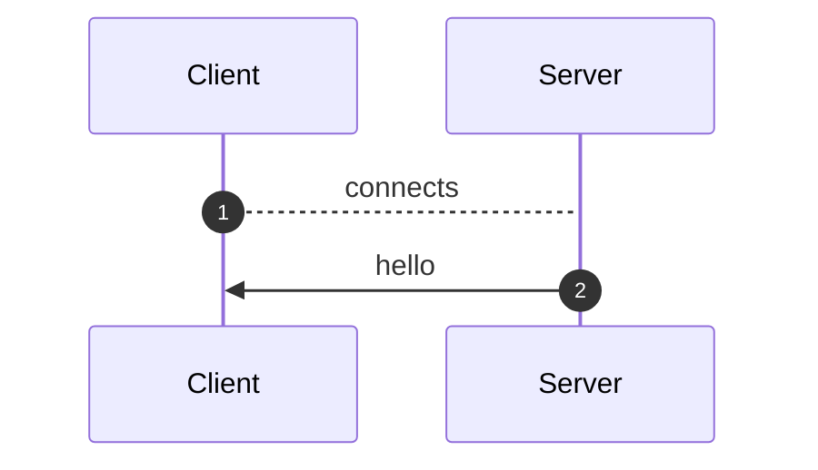
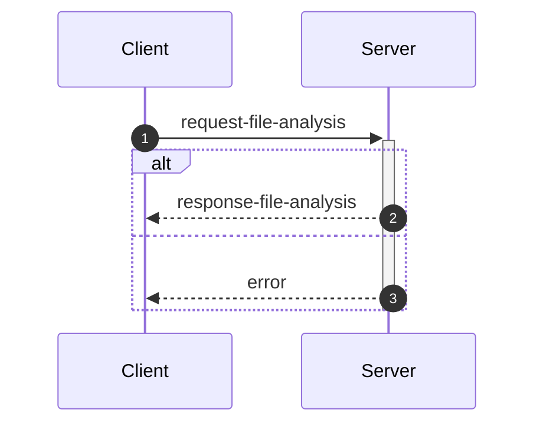
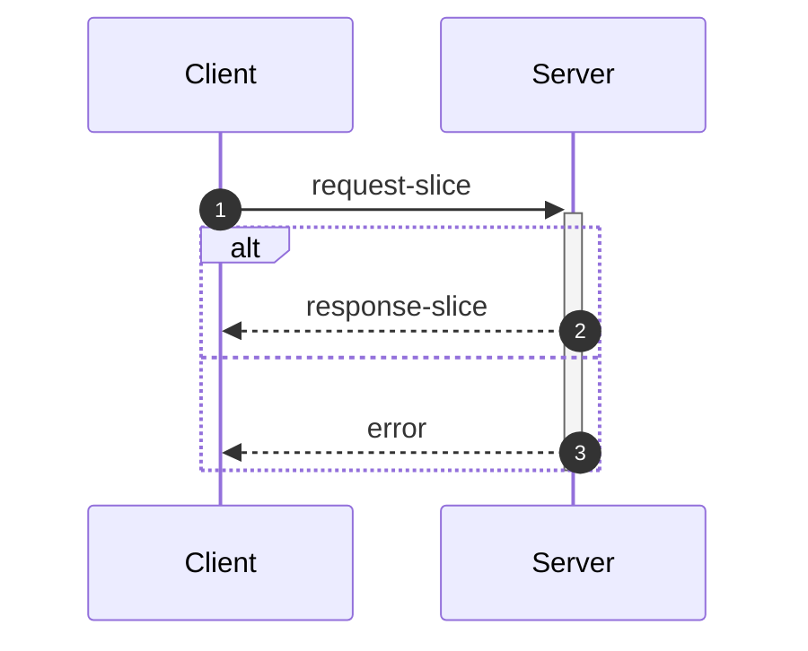
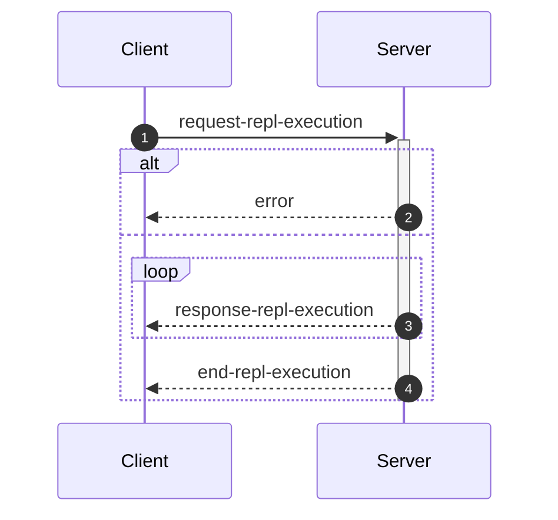

_<span title="an overview of flowR's interface">Generated</span> from '[wiki-interface.ts](https://github.com/flowr-analysis/flowr/tree/main/src/documentation/wiki-interface.ts "src/documentation/wiki-interface.ts")' on 2026-10-04, 17:18:08 UTC (v2.15.9, R v4.6.1), do not edit directly._

Although far from being as detailed as the in-depth explanation of [_flowR_](https://github.com/flowr-analysis/flowr/wiki/Core),
this wiki page explains how to interface with _flowR_ in more detail.
In general, command line arguments and other options provide short descriptions on hover over.

* [💻 Using the REPL](#using-the-repl)
* [⚙️ Configuring FlowR](#configuring-flowr)
* [⚒️ Writing Code](#writing-code)
* [💬 Communicating with the Server](#communicating-with-the-server)

<a id='using-the-repl'></a>
## 💻 Using the REPL

> [!NOTE]
> To execute arbitrary R commands with a repl request, _flowR_ has to be started explicitly with <span title="Description (Command Line Argument): Allow to access the underlying R session when using flowR (security warning: this allows the execution of arbitrary R code!)">`--r-session-access`</span>.
> Please be aware that this introduces a security risk and note that this relies on the [`r-shell` engine](https://github.com/flowr-analysis/flowr/wiki/Engines) .

Although primarily meant for users to explore,
there is nothing which forbids calling _flowR_ as a subprocess to use standard-in, -output, and -error
for communication (although you can access the REPL using the server as well,
with the [REPL Request](#message-request-repl-execution) message).

The read-eval-print loop&nbsp;(REPL) works relatively simple.
You can submit an expression (using <kbd>Enter</kbd>),
which is interpreted as an R&nbsp;expression by default but interpreted as a *command* if it starts with a colon (`:`).
The best command to get started with the REPL is <span title="Description (Repl Command): Show help information (aliases: :h, :?)">`:help`</span>.
Besides, you can leave the REPL either with the command <span title="Description (Repl Command): End the repl (aliases: :q, :exit)">`:quit`</span> or by pressing <kbd>Ctrl</kbd>+<kbd>C</kbd> twice.
When writing a *command*, you may press <kbd>Tab</kbd> to get a list of completions, if available.
Multiple commands can be entered in a single line by separating them with a semicolon (`;`), e.g. `:parse "x<-2"; :df*`.
If a command is given without R code, the REPL will re-use R code given in a previous command.
The prior example will hence return first the parsed AST of the program and then the dataflow graph for `"x <- 2"`.

> [!NOTE]
> If you develop flowR, you may want to launch the repl using the `npm run main-dev` command, this way, you get a non-minified version of flowR with debug information and hot-reloading of source files.

<details>
<summary>Available Commands</summary>

We currently offer the following commands (this with a `[*]` suffix are available with and without the star):

| Command | Description |
| ------- | ----------- |
| **<span title="Description (Repl Command): End the repl (aliases: :q, :exit)">:quit</span>** | End the repl (aliases: **:<span title="Alias of ':quit'. End the repl">q</span>**, **:<span title="Alias of ':quit'. End the repl">exit</span>**) |
| **<span title="Description (Repl Command): Execute the given code as R code. This requires the `--r-session-access` flag to be set and requires the r-shell engine. (aliases: :e, :r)">:execute</span>** | Execute the given code as R code. This requires the `--r-session-access` flag to be set and requires the r-shell engine. (aliases: **:<span title="Alias of ':execute'. Execute the given code as R code. This requires the `--r-session-access` flag to be set and requires the r-shell engine.">e</span>**, **:<span title="Alias of ':execute'. Execute the given code as R code. This requires the `--r-session-access` flag to be set and requires the r-shell engine.">r</span>**) |
| **<span title="Description (Repl Command): Get mermaid code for the control-flow graph of R code (aliases: :cfg, :cf)">:controlflow[*]</span>** | Get mermaid code for the control-flow graph of R code (star: Returns the URL to mermaid.live) (aliases: **:<span title="Alias of ':controlflow'. Get mermaid code for the control-flow graph of R code">cfg</span>**, **:<span title="Alias of ':controlflow'. Get mermaid code for the control-flow graph of R code">cf</span>**) |
| **<span title="Description (Repl Command): Get mermaid code for the control-flow graph with basic blocks (aliases: :cfgb, :cfb)">:controlflowbb[*]</span>** | Get mermaid code for the control-flow graph with basic blocks (star: Returns the URL to mermaid.live) (aliases: **:<span title="Alias of ':controlflowbb'. Get mermaid code for the control-flow graph with basic blocks">cfgb</span>**, **:<span title="Alias of ':controlflowbb'. Get mermaid code for the control-flow graph with basic blocks">cfb</span>**) |
| **<span title="Description (Repl Command): Get mermaid code for the dataflow graph (aliases: :d, :df)">:dataflow[*]</span>** | Get mermaid code for the dataflow graph (star: Returns the URL to mermaid.live) (aliases: **:<span title="Alias of ':dataflow'. Get mermaid code for the dataflow graph">d</span>**, **:<span title="Alias of ':dataflow'. Get mermaid code for the dataflow graph">df</span>**) |
| **<span title="Description (Repl Command): Get mermaid code for the normalized AST of R code (aliases: :n)">:normalize[*]</span>** | Get mermaid code for the normalized AST of R code (star: Returns the URL to mermaid.live) (alias: **:<span title="Alias of ':normalize'. Get mermaid code for the normalized AST of R code">n</span>**) |
| **<span title="Description (Repl Command): Get mermaid code for the simplified dataflow graph (aliases: :ds, :dfs)">:dataflowsimple[*]</span>** | Get mermaid code for the simplified dataflow graph (star: Returns the URL to mermaid.live) (aliases: **:<span title="Alias of ':dataflowsimple'. Get mermaid code for the simplified dataflow graph">ds</span>**, **:<span title="Alias of ':dataflowsimple'. Get mermaid code for the simplified dataflow graph">dfs</span>**) |
| **<span title="Description (Repl Command): Inspect and extend the signature database: `query` (identical to :query @signature), `info <name>` for where a function comes from (identical to :query @function-info), `add <path>` to mount another database/source, `download` to fetch the full-history database. (aliases: :sig)">:signature</span>** | Inspect and extend the signature database: `query` (identical to :query @signature), `info <name>` for where a function comes from (identical to :query @function-info), `add <path>` to mount another database/source, `download` to fetch the full-history database. (alias: **:<span title="Alias of ':signature'. Inspect and extend the signature database: `query` (identical to :query @signature), `info <name>` for where a function comes from (identical to :query @function-info), `add <path>` to mount another database/source, `download` to fetch the full-history database.">sig</span>**) |
| **<span title="Description (Repl Command): Just calculates the DFG, but only prints summary info (aliases: :d#, :df#)">:dataflowsilent</span>** | Just calculates the DFG, but only prints summary info (aliases: **:<span title="Alias of ':dataflowsilent'. Just calculates the DFG, but only prints summary info">d#</span>**, **:<span title="Alias of ':dataflowsilent'. Just calculates the DFG, but only prints summary info">df#</span>**) |
| **<span title="Description (Repl Command): Prints ASCII Art of the parsed, unmodified AST (aliases: :p)">:parse</span>** | Prints ASCII Art of the parsed, unmodified AST (alias: **:<span title="Alias of ':parse'. Prints ASCII Art of the parsed, unmodified AST">p</span>**) |
| **<span title="Description (Repl Command): Prints the version of flowR as well as the current version of R">:version</span>** | Prints the version of flowR as well as the current version of R
| **<span title="Description (Repl Command): Query the given R code (use 'help' for more information)">:query[*]</span>** | Query the given R code (use 'help' for more information) (star: Similar to query, but returns the output in json format.)
| **<span title="Description (Repl Command): Returns an ASCII representation of the dataflow graph (aliases: :df!)">:dataflowascii</span>** | Returns an ASCII representation of the dataflow graph (alias: **:<span title="Alias of ':dataflowascii'. Returns an ASCII representation of the dataflow graph">df!</span>**) |
| **<span title="Description (Repl Command): Returns summarization stats for the normalized AST (aliases: :n#)">:normalize#</span>** | Returns summarization stats for the normalized AST (alias: **:<span title="Alias of ':normalize#'. Returns summarization stats for the normalized AST">n#</span>**) |
| **<span title="Description (Repl Command): Show help information (aliases: :h, :?)">:help</span>** | Show help information (aliases: **:<span title="Alias of ':help'. Show help information">h</span>**, **:<span title="Alias of ':help'. Show help information">?</span>**) |

</details>

> [!TIP]
> 
> As indicated by the examples before, all REPL commands that operate on code keep track of the state.
> Hence, if you run a command like <span title="Description (Repl Command, starred version): Returns the URL to mermaid.live; Base Command: Get mermaid code for the dataflow graph (aliases: :d*, :df*)">`:dataflow*`</span> without providing R code,
> the REPL will re-use the R code provided in a previous command.
> Likewise, doing this will benefit from incrementality!
> If you request the dataflow graph with `:df* x <- 2 * y` and then want to see the parsed AST with `:parse`,
> the REPL will re-use previously obtained information and not re-parse the code again.
> 		

Generally, many commands offer shortcut versions in the REPL. Many queries, for example, offer a shortened format (see the example below).
Of special note, the [Config Query](https://github.com/flowr-analysis/flowr/wiki/%5BQuery%5D-Config)
can be used to also modify the currently active configuration of _flowR_ within the REPL (see the [wiki page](https://github.com/flowr-analysis/flowr/wiki/%5BQuery%5D-Config) for more information).

### Example: Retrieving the Dataflow Graph

To retrieve a URL to the [mermaid](https://mermaid.js.org/) diagram of the dataflow of a given expression,
use <span title="Description (Repl Command, starred version): Returns the URL to mermaid.live; Base Command: Get mermaid code for the dataflow graph (aliases: :d*, :df*)">`:dataflow*`</span> (or <span title="Description (Repl Command): Get mermaid code for the dataflow graph (aliases: :d, :df)">`:dataflow`</span> to get the mermaid code in the cli):

```shell
$ docker run -it --rm eagleoutice/flowr # or npm run flowr 
flowR repl v2.15.9, R grammar v14 (tree-sitter engine)
R> :dataflow* y <- 1 + x
```

<details>
<summary style='color:gray'>Output</summary>

```text
https://mermaid.live/view#base64:eyJjb2RlIjoiZmxvd2NoYXJ0IFREXG4gICAgMXt7XCJgKiM5MTtSTnVtYmVyIzkzOyogKioxKipcbiAgICAgICoxLjYqICgqKmlkOiAxKiopYFwifX1cbiAgICAyKFtcImAqIzkxO1JTeW1ib2wjOTM7KiAqKngqKlxuICAgICAgKjEuMTAqICgqKmlkOiAyKiopYFwiXSlcbiAgICAzW1tcImAqIzkxO1JCaW5hcnlPcCM5MzsqIGJhc2UjNTg7IzU4OyoqIzQzOyoqXG4gICAgICAqMS42LTEwKiAoKippZDogMyoqKVxuICAgIGFyZzogKDEsIDIpYFwiXV1cbiAgICBidWlsdC1pbjpfNDNfW1wiYEJ1aWx0LUluOlxuIzQzO2BcIl1cbiAgICBzdHlsZSBidWlsdC1pbjpfNDNfIHN0cm9rZTpncmF5LGZpbGw6Z3JheSxzdHJva2Utd2lkdGg6MnB4LG9wYWNpdHk6Ljg7XG4gICAgMFtcImAqIzkxO1JTeW1ib2wjOTM7KiAqKnkqKlxuICAgICAgKjEuMSogKCoqaWQ6IDAqKiwgdjogMylgXCJdXG4gICAgNFtbXCJgKiM5MTtSQmluYXJ5T3AjOTM7KiBiYXNlIzU4OyM1ODsqKiM2MDsjNDU7KipcbiAgICAgICoxLjEtMTAqICgqKmlkOiA0KiopXG4gICAgYXJnOiAoMCwgMylgXCJdXVxuICAgIGJ1aWx0LWluOl82MF8tW1wiYEJ1aWx0LUluOlxuIzYwOyM0NTtgXCJdXG4gICAgc3R5bGUgYnVpbHQtaW46XzYwXy0gc3Ryb2tlOmdyYXksZmlsbDpncmF5LHN0cm9rZS13aWR0aDoycHgsb3BhY2l0eTouODtcbiAgICAxIC0uLT58XCJmbG93XCJ8IDJcbiAgICBsaW5rU3R5bGUgMCBzdHJva2U6Z3JheSxjb2xvcjpncmF5O1xuICAgIDIgLS4tPnxcImZsb3dcInwgM1xuICAgIGxpbmtTdHlsZSAxIHN0cm9rZTpncmF5LGNvbG9yOmdyYXk7XG4gICAgMyAtLT58XCJyZWFkcywgYXJnXCJ8IDFcbiAgICAzIC0tPnxcInJlYWRzLCBhcmdcInwgMlxuICAgIDMgLS4tPnxcImZsb3dcInwgMFxuICAgIGxpbmtTdHlsZSA0IHN0cm9rZTpncmF5LGNvbG9yOmdyYXk7XG4gICAgMyAtLi0+fFwicmVhZHMsIGNhbGxzXCJ8IGJ1aWx0LWluOl80M19cbiAgICBsaW5rU3R5bGUgNSBzdHJva2U6Z3JheTtcbiAgICAwIC0tPnxcImRlZmluZWQtYnksIGZsb3dcInwgNFxuICAgIDAgLS0+fFwiZGVmaW5lZC1ieVwifCAzXG4gICAgNCAtLT58XCJyZWFkcywgYXJnXCJ8IDNcbiAgICA0IC0tPnxcInJldHVybnMsIGFyZ1wifCAwXG4gICAgNCAtLi0+fFwicmVhZHMsIGNhbGxzXCJ8IGJ1aWx0LWluOl82MF8tXG4gICAgbGlua1N0eWxlIDEwIHN0cm9rZTpncmF5OyIsIm1lcm1haWQiOnsiYXV0b1N5bmMiOnRydWV9fQ==
```

Retrieve the dataflow graph of the expression `y <- 1 + x`. It looks like this:


```mermaid
flowchart LR
    1{{"`*#91;RNumber#93;* **1**
      *1.6* (**id: 1**)`"}}
    2(["`*#91;RSymbol#93;* **x**
      *1.10* (**id: 2**)`"])
    3[["`*#91;RBinaryOp#93;* base#58;#58;**#43;**
      *1.6-10* (**id: 3**)
    arg: (1, 2)`"]]
    built-in:_43_["`Built-In:
#43;`"]
    style built-in:_43_ stroke:gray,fill:gray,stroke-width:2px,opacity:.8;
    0["`*#91;RSymbol#93;* **y**
      *1.1* (**id: 0**, v: 3)`"]
    4[["`*#91;RBinaryOp#93;* base#58;#58;**#60;#45;**
      *1.1-10* (**id: 4**)
    arg: (0, 3)`"]]
    built-in:_60_-["`Built-In:
#60;#45;`"]
    style built-in:_60_- stroke:gray,fill:gray,stroke-width:2px,opacity:.8;
    1 -.->|"flow"| 2
    linkStyle 0 stroke:gray,color:gray;
    2 -.->|"flow"| 3
    linkStyle 1 stroke:gray,color:gray;
    3 -->|"reads, arg"| 1
    3 -->|"reads, arg"| 2
    3 -.->|"flow"| 0
    linkStyle 4 stroke:gray,color:gray;
    3 -.->|"reads, calls"| built-in:_43_
    linkStyle 5 stroke:gray;
    0 -->|"defined-by, flow"| 4
    0 -->|"defined-by"| 3
    4 -->|"reads, arg"| 3
    4 -->|"returns, arg"| 0
    4 -.->|"reads, calls"| built-in:_60_-
    linkStyle 10 stroke:gray;
```

<details>

<summary style="color:gray">R Code of the Dataflow Graph</summary>

The analysis ran (including parse and normalize, using the [tree-sitter](https://github.com/flowr-analysis/flowr/wiki/Engines) engine) within the generation environment. No [signature database](https://github.com/flowr-analysis/flowr/wiki/Signature-Database) is mounted for these generated graphs, so `library()` calls attach no package exports; base-R names are still qualified via the generated base-package store (e.g. `acf` as `stats::acf`). 
We encountered no unknown side effects during the analysis.

```r
y <- 1 + x
```

</details>

</details>

For small graphs like this, <span title="Description (Repl Command): Returns an ASCII representation of the dataflow graph (aliases: :df!)">`:dataflowascii`</span> also provides an ASCII representation directly in the REPL:

```shell
$ docker run -it --rm eagleoutice/flowr # or npm run flowr 
flowR repl v2.15.9, R grammar v14 (tree-sitter engine)
R> :df! y <- 1 + x
```

<details open>
<summary style='color:gray'>Output</summary>

```text
                        v<0>v
 c<4>c──────────────────| y |
 |<- |     ┌────────────v---v
 c---c     │
    │   c<3>c   0<1>0
    └───| + |───| 1 |───u<2>u
        c---c   0---0   | x |
           └────────────u---u
Edges:
3 -> 1: reads, arg          3 -> 2: reads, arg
3 -> 0: flows-to            1 -> 2: flows-to
2 -> 3: flows-to            4 -> 3: reads, arg
4 -> 0: returns, arg        0 -> 4: defined-by, flows-to
0 -> 3: defined-by
```

Retrieve the dataflow graph of the expression `y <- 1 + x` as ASCII art.

</details>

For the slicing with <span title="Description (Repl Command): Static backwards executable slicer for R">`:slicer`</span>, you have access to the same [magic comments](#slice-magic-comments) as with the [slice request](#message-request-slice).
Pass `--inline` to splice resolvable `source()` calls into the reconstruction so the slice is a single self-contained R text (the same as the static slice query's `inlineSources` flag).
See `--help` for more flags!

### Example: Interfacing with the File System

Many commands that allow for an R-expression (like <span title="Description (Repl Command, starred version): Returns the URL to mermaid.live; Base Command: Get mermaid code for the dataflow graph (aliases: :d*, :df*)">`:dataflow*`</span>) allow for a file as well
if the argument starts with `file://`.
If you are working from the root directory of the _flowR_ repository, the following gives you the parsed AST of the example file using the <span title="Description (Repl Command): Prints ASCII Art of the parsed, unmodified AST (aliases: :p)">`:parse`</span> command:

> **Watch mode**: Replace `file://` with `watch://` to enter watch mode.
> flowR runs the command immediately and then re-runs it every time the file (or any file inside the folder) changes.
> Enter any other command to leave watch mode.
> For example: `:df watch://analysis.R`

```shell
$ docker run -it --rm eagleoutice/flowr # or npm run flowr 
flowR repl v2.15.9, R grammar v14 (tree-sitter engine)
R> :parse file://test/testfiles/example.R
```

<details>
<summary style='color:gray'>Output</summary>

```text
File: test/testfiles/example.R

program
├ binaryoperator
│ ├ identifier "sum" (1:1─4)
│ ├ <- "<-" (1:5─7)
│ ╰ float "0" (1:8─9)
├ binaryoperator
│ ├ identifier "product" (2:1─8)
│ ├ <- "<-" (2:9─11)
│ ╰ float "1" (2:12─13)
├ binaryoperator
│ ├ identifier "w" (3:1─2)
│ ├ <- "<-" (3:3─5)
│ ╰ float "7" (3:6─7)
├ binaryoperator
│ ├ identifier "N" (4:1─2)
│ ├ <- "<-" (4:3─5)
│ ╰ float "10" (4:6─8)
├ forstatement
│ ├ for "for" (6:1─4)
│ ├ ( "(" (6:5─6)
│ ├ identifier "i" (6:6─7)
│ ├ in "in" (6:8─10)
│ ├ binaryoperator
│ │ ├ float "1" (6:11─12)
│ │ ├ : ":" (6:12─13)
│ │ ╰ parenthesizedexpression
│ │   ├ ( "(" (6:13─14)
│ │   ├ binaryoperator
│ │   │ ├ identifier "N" (6:14─15)
│ │   │ ├ - "-" (6:15─16)
│ │   │ ╰ float "1" (6:16─17)
│ │   ╰ ) ")" (6:17─18)
│ ├ ) ")" (6:18─19)
│ ╰ bracedexpression
│   ├ { "{" (6:20─21)
│   ├ binaryoperator
│   │ ├ identifier "sum" (7:3─6)
│   │ ├ <- "<-" (7:7─9)
│   │ ╰ binaryoperator
│   │   ├ binaryoperator
│   │   │ ├ identifier "sum" (7:10─13)
│   │   │ ├ + "+" (7:14─15)
│   │   │ ╰ identifier "i" (7:16─17)
│   │   ├ + "+" (7:18─19)
│   │   ╰ identifier "w" (7:20─21)
│   ├ binaryoperator
│   │ ├ identifier "product" (8:3─10)
│   │ ├ <- "<-" (8:11─13)
│   │ ╰ binaryoperator
│   │   ├ identifier "product" (8:14─21)
│   │   ├  "" (8:22─23)
│   │   ╰ identifier "i" (8:24─25)
│   ╰ } "}" (9:1─2)
├ call
│ ├ identifier "cat" (11:1─4)
│ ╰ arguments
│   ├ ( "(" (11:4─5)
│   ├ argument
│   │ ╰ string
│   │   ├ " "\"" (11:5─6)
│   │   ├ stringcontent "Sum:" (11:6─10)
│   │   ╰ " "\"" (11:10─11)
│   ├ comma "," (11:11─12)
│   ├ argument
│   │ ╰ identifier "sum" (11:13─16)
│   ├ comma "," (11:16─17)
│   ├ argument
│   │ ╰ string
│   │   ├ " "\"" (11:18─19)
│   │   ├ stringcontent
│   │   │ ╰ escapesequence "\\n" (11:19─21)
│   │   ╰ " "\"" (11:21─22)
│   ╰ ) ")" (11:22─23)
╰ call
  ├ identifier "cat" (12:1─4)
  ╰ arguments
    ├ ( "(" (12:4─5)
    ├ argument
    │ ╰ string
    │   ├ " "\"" (12:5─6)
    │   ├ stringcontent "Product:" (12:6─14)
    │   ╰ " "\"" (12:14─15)
    ├ comma "," (12:15─16)
    ├ argument
    │ ╰ identifier "product" (12:17─24)
    ├ comma "," (12:24─25)
    ├ argument
    │ ╰ string
    │   ├ " "\"" (12:26─27)
    │   ├ stringcontent
    │   │ ╰ escapesequence "\\n" (12:27─29)
    │   ╰ " "\"" (12:29─30)
    ╰ ) ")" (12:30─31)
```

Retrieve the parsed AST of the example file.

<details>

<summary>File Content</summary>

```r
sum <- 0
product <- 1
w <- 7
N <- 10

for (i in 1:(N-1)) {
  sum <- sum + i + w
  product <- product * i
}

cat("Sum:", sum, "\n")
cat("Product:", product, "\n")
```

</details>

As _flowR_ directly transforms this AST the output focuses on being human-readable instead of being machine-readable.
		
</details>

### Example: Run a Query

You can run any query supported by _flowR_ using the <span title="Description (Repl Command): Query the given R code (use 'help' for more information)">`:query`</span> command.
For example, to obtain the shapes of all data frames in a given piece of code, you can run:

```shell
$ docker run -it --rm eagleoutice/flowr # or npm run flowr 
flowR repl v2.15.9, R grammar v14 (tree-sitter engine)
R> :query @absint df-shape "x <- data.frame(a = 1:10, b = 1:10)\ny <- x$a"
```

<details open>
<summary style='color:gray'>Output</summary>

```text
Query: absint (1 ms)
```

Retrieve the shapes of all data frames in the given code.

</details>

To run the linter on a file, you can use (in this example, we just issue the `dead-code` linter on a small piece of code):

```shell
$ docker run -it --rm eagleoutice/flowr # or npm run flowr 
flowR repl v2.15.9, R grammar v14 (tree-sitter engine)
R> :query @linter rules:dead-code "if(FALSE) x <- 2"
```

<details open>
<summary style='color:gray'>Output</summary>

```text
Query: linter (2 ms)
   ╰ Dead Code (dead-code):
       ╰ certain:
           ╰ Code at 1.11-16
```

Run the linter on the given code, with only the `dead-code` rule enabled.

</details>

For more information on the available queries, please check out the [Query API](https://github.com/flowr-analysis/flowr/wiki/Query-API).

<a id='configuring-flowr'></a>
## ⚙️ Configuring FlowR

When running _flowR_, you may want to specify some behaviors with a dedicated configuration file.
By default, flowR looks for a file named `flowr.json` in the current working directory (or any higher directory).
You can also specify a different file with <span title="Description (Command Line Argument): The name of the configuration file to use">`--config-file`</span> or pass the configuration inline using <span title="Description (Command Line Argument): The flowR configuration to use, as a JSON string">`--config-json`</span>.
To inspect the current configuration, you can run flowr with the <span title="Description (Command Line Argument): Run with verbose logging (will be passed to the corresponding script)">`--verbose`</span> flag, or use the `config` [Query](https://github.com/flowr-analysis/flowr/wiki/Query-API).
Within the REPL this works by running the following:

```shell
:query @config
```

To work with the <a href="https://github.com/flowr-analysis/flowr/tree/main/src/config.ts#L108"><code><span title="The configuration file format for flowR.">FlowrConfig</span></code></a> you can use the provided helper objects alongside its methods like
<a href="https://github.com/flowr-analysis/flowr/tree/main/src/config.ts#L871"><code><span title="Creates a new flowr config that has the updated values.">FlowrConfig::<b>amend</b></span></code></a>.
The schema below documents every option; the ones you most likely want are:

- <a href="https://github.com/flowr-analysis/flowr/wiki/Interface#configuring-flowr" title="Configuration Option (boolean): Whether source calls should be ignored, causing {@link processSourceCall}&#39;s behavior to be skipped.">ignoreSourceCalls</a>: ignore source calls when analyzing the code, i.e., ignore the inclusion of other files.
- <a href="https://github.com/flowr-analysis/flowr/wiki/Interface#configuring-flowr" title="Configuration Option (boolean): Whether load calls should be ignored, causing {@link processLoadCall}&#39;s behavior to be skipped.">ignoreLoadCalls</a>: ignore load calls when analyzing the code, i.e., ignore the loading of r-data files.
- <a href="https://github.com/flowr-analysis/flowr/wiki/Interface#configuring-flowr" title="Configuration Option (object): Do you want to overwrite (parts) of the builtin definition?">semantics.environment.overwriteBuiltIns</a>: overwrite _flowR_'s handling of built-in functions, or clear the preset definitions entirely.
  See [Configure BuiltIn Semantics](#configure-builtin-semantics) for more information.
- <a href="https://github.com/flowr-analysis/flowr/wiki/Interface#configuring-flowr" title="Configuration Option (string): How to resolve variables and their values. (one of &quot;disabled&quot;, &quot;alias&quot;, &quot;builtin&quot;)">solver.variables</a>: how to resolve variables and their values (`disabled`, `alias`, `builtin`).
- <a href="https://github.com/flowr-analysis/flowr/wiki/Interface#configuring-flowr" title="Configuration Option (array): The engine or set of engines to use for interacting with R code. An empty array means all available engines will be used.">engines</a> and <a href="https://github.com/flowr-analysis/flowr/wiki/Interface#configuring-flowr" title="Configuration Option (string): The default engine to use for interacting with R code. If this is undefined, an arbitrary engine from the specified list will be used. (one of &quot;tree-sitter&quot;, &quot;r-shell&quot;)">defaultEngine</a>: the engines used to interact with R code, see the [Engines wiki page](https://github.com/flowr-analysis/flowr/wiki/Engines).
- <a href="https://github.com/flowr-analysis/flowr/wiki/Interface#configuring-flowr" title="Configuration Option (array): Files a framework loads on its own, without any source() call (e.g. global.R in a shiny app), in the order they are loaded; flowR orders the matching project files accordingly and analyzes them as one program. Entries are case-insensitive globs matched against the file path, a plain name matches any file with that name, and entries matching no project file are warned about. Usually set per project kind via specializeConfig.">project.implicitSources</a>: the files a framework loads without any `source()` call, in the order in which they are
  loaded. Entries are globs (e.g. `R/*.R`) matched against the file path ignoring capitalization; one matching no file is reported.
- <a href="https://github.com/flowr-analysis/flowr/wiki/Interface#configuring-flowr" title="Configuration Option (object): Overwrite (parts of) the configuration depending on the project kind flowR detects, e.g. to give a shiny app its implicit sources.">specializeConfig</a>: overwrite (parts of) the configuration depending on the kind of project _flowR_ detects
  (e.g. `shiny-app`), which is how a shiny app gets its implicit sources by default. What you configure directly wins.
- <a href="https://github.com/flowr-analysis/flowr/wiki/Interface#configuring-flowr" title="Configuration Option (string): Overwrite the project kind flowR would otherwise infer from the analyzed files, e.g. when auto-detection guesses wrong. (one of &quot;package&quot;, &quot;script&quot;, &quot;shiny-app&quot;, &quot;notebook&quot;, &quot;project&quot;, &quot;unknown&quot;)">project.useProjectType</a>: skip that detection and force a project kind yourself, when auto-detection guesses wrong.
- <a href="https://github.com/flowr-analysis/flowr/wiki/Interface#configuring-flowr" title="Configuration Option (array): The default plugins to load when creating a new instance of FlowrAnalyzer">defaultPlugins</a> and <a href="https://github.com/flowr-analysis/flowr/wiki/Interface#configuring-flowr" title="Configuration Option (array): The plugins to load in REPL mode">repl.plugins</a>: the plugins to load for a new <a href="https://github.com/flowr-analysis/flowr/tree/main/src/project/flowr-analyzer.ts#L205"><code><span title="Central class for conducting analyses with FlowR. Use the FlowrAnalyzerBuilder to create a new instance. If you want the original pattern of creating a pipeline and running all steps, you can still do this with FlowrAnalyzer#runFull . To inspect the context of the analyzer, use FlowrAnalyzer#inspectContext (if you are a plugin and need to modify it, use FlowrAnalyzer#context instead).">FlowrAnalyzer</span></code></a> and in the REPL
  (use `flowr:default` to reference the former).

So you can configure _flowR_ by adding a file like the following:

<details>

<summary>Example Configuration File</summary>

```json
{
  "ignoreSourceCalls": true,
  "ignoreLoadCalls": true,
  "semantics": {
    "environment": {
      "overwriteBuiltIns": {
        "definitions": [
          {
            "type": "function",
            "names": [
              "foo"
            ],
            "processor": "builtin:assign",
            "config": {}
          }
        ]
      }
    }
  },
  "defaultPlugins": [
    "file:description",
    "versions:description"
  ],
  "repl": {
    "quickStats": false,
    "dfProcessorHeat": false,
    "hints": true,
    "plugins": [
      "flowr:default"
    ]
  },
  "project": {
    "resolveUnknownPathsOnDisk": true,
    "implicitSources": [
      "global.R",
      "app.R"
    ]
  },
  "linter": {
    "disabledRules": []
  },
  "specializeConfig": {
    "shiny-app": {
      "project": {
        "implicitSources": [
          "global.R",
          "ui.R",
          "server.R",
          "app.R"
        ]
      }
    }
  },
  "engines": [
    {
      "type": "r-shell"
    }
  ],
  "solver": {
    "variables": "alias",
    "evalStrings": true,
    "trackEnvironments": true,
    "sigdb": {
      "enabled": true,
      "loadProjectDependencies": true,
      "eagerlyLoad": false,
      "eagerlyLoadExports": false,
      "linkBaseR": false,
      "linkDescriptionDependencies": false
    },
    "resolveSource": {
      "dropPaths": "no",
      "ignoreCapitalization": true,
      "inferWorkingDirectory": "active-script",
      "searchPath": []
    },
    "instrument": {},
    "slicer": {
      "threshold": 50
    }
  },
  "abstractInterpretation": {
    "wideningThreshold": 4,
    "followCalls": true,
    "dataFrame": {
      "maxColNames": 20,
      "readLoadedData": {
        "readExternalFiles": true,
        "maxReadLines": 1000000
      }
    }
  },
  "incremental": {
    "alwaysIncremental": false,
    "parsing": {
      "activated": false,
      "heuristics": {
        "activated": true,
        "mtime": true,
        "linesFrom": 500,
        "bytesFrom": 50000,
        "alwaysWithEdits": false,
        "minFiles": 1
      }
    }
  },
  "gas": {
    "thresholds": {
      "memory": {
        "problematic": 0.7,
        "critical": 0.9
      },
      "timeMs": {
        "problematic": 100000,
        "critical": 120000
      }
    },
    "features": {}
  }
}
```

</details>

<details>
<a id='configure-builtin-semantics'></a>
<summary>Configure Built-In Semantics</summary>

`semantics/environment/overwriteBuiltins` accepts two keys:

- `loadDefaults` (boolean, initially `true`): If set to `true`, the default built-in definitions are loaded before applying the custom definitions. Setting this flag to `false` explicitly disables the loading of the default definitions.
- `definitions` (array, initially empty): Allows to overwrite or define new built-in elements. Each object within must have a `type` which is one of the below. Furthermore, they may define a string array of `names` which specifies the identifiers to bind the definitions to. You may use `assumePrimitive` to specify whether _flowR_ should assume that this is a primitive non-library definition (so you probably just do not want to specify the key).

  | Type            | Description                                                                                                                                                                                                                                                                                              | Example                                                                                                    |
  | --------------- | -------------------------------------------------------------------------------------------------------------------------------------------------------------------------------------------------------------------------------------------------------------------------------------------------------- | ---------------------------------------------------------------------------------------------------------- |
  | `constant`    | Additionally allows for a `value` this should resolve to.                                                                                                                                                                                                                                                | `{ type: 'constant', names: ['NULL', 'NA'],  value: null }`                                                |
  | `function`    | Is a rather flexible way to define and bind built-in functions. For the time, we do not have extensive documentation to cover all the cases, so please either consult the sources with the `default-builtin-config.ts` or open a [new issue](https://github.com/flowr-analysis/flowr/issues/new/choose). | `{ type: 'function', names: ['next'], processor: 'builtin:d', config: { cfg: ExitPointType.Next } }` |
  | `replacement` | A comfortable way to specify replacement functions like `$<-` or `names<-`. `suffixes` describes the... suffixes to attach automatically. | `{ type: 'replacement', suffixes: ['<-', '<<-'], names: ['[', '[['] }` |

</details>

<details>

<summary style='color:gray'>Full Configuration-File Schema</summary>

- _The configuration file format for flowR._ (object)
    - **logLevel** [optional] _flowR's global minimum log level, applied when the config is loaded._ (string)
        Only allows: 'silly', 'trace', 'debug', 'info', 'warn', 'error', 'fatal'
    - **ignoreSourceCalls** [optional] _Whether source calls should be ignored, causing {@link processSourceCall}'s behavior to be skipped._ (boolean)
    - **ignoreLoadCalls** [optional] _Whether load calls should be ignored, causing {@link processLoadCall}'s behavior to be skipped._ (boolean)
    - **semantics** _Configure language semantics and how flowR handles them._ (object)
        - **environment** [optional] _Semantics regarding how to handle the R environment._ (object)
            - **overwriteBuiltIns** [optional] _Do you want to overwrite (parts) of the builtin definition?_ (object)
                - **loadDefaults** [optional] _Should the default configuration still be loaded?_ (boolean)
                - **definitions** [optional] _The definitions to load/overwrite._ (array)
                Valid item types:
                    - (object)
    - **defaultPlugins** [optional] _The default plugins to load when creating a new instance of FlowrAnalyzer_ (array)
    Valid item types:
        - (alternatives)
            - (string)
            - (array)
    - **repl** _Configuration options for the REPL._ (object)
        - **quickStats** [optional] _Whether to show quick stats in the REPL after each evaluation._ (boolean)
        - **dfProcessorHeat** [optional] _This instruments the dataflow processors to count how often each processor is called._ (boolean)
        - **hints** [optional] _Whether to show dim inline hints on the empty prompt (automatically disabled on non-interactive terminals)._ (boolean)
        - **plugins** [optional] _The plugins to load in REPL mode_ (array)
        Valid item types:
            - (alternatives)
                - (string)
                - (array)
        - **autoUseFileProtocol** [optional] _Prepend the file protocol to a repl input that looks like a path, instead of only warning about it._ (boolean)
        - **queryStats** [optional] _Whether `:query` closes with the line stating how long the queries took (`:query*` never prints it)._ (boolean)
        - **showPlugins** [optional] _Whether `:version` grays out the plugins that did not activate during the last analysis._ (boolean)
    - **project** _Project specific configuration options._ (object)
        - **resolveUnknownPathsOnDisk** [optional] _Whether to resolve unknown paths loaded by the r project disk when trying to source/analyze files._ (boolean)
        - **failOnInaccessiblePath** [optional] _Whether a directory that cannot be traversed during file discovery (e.g. due to permissions) aborts the analysis; when false (the default) such paths are logged and skipped._ (boolean)
        - **basePackages** [optional] _The packages considered part of R itself (base and recommended); if unset, flowR uses its built-in list._ (array)
        Valid item types:
            - (string)
        - **implicitSources** [optional] _Files a framework loads on its own, without any source() call (e.g. global.R in a shiny app), in the order they are loaded; flowR orders the matching project files accordingly and analyzes them as one program. Entries are case-insensitive globs matched against the file path, a plain name matches any file with that name, and entries matching no project file are warned about. Usually set per project kind via specializeConfig._ (array)
        Valid item types:
            - (string)
        - **useProjectType** [optional] _Overwrite the project kind flowR would otherwise infer from the analyzed files, e.g. when auto-detection guesses wrong._ (string)
            Only allows: 'package', 'script', 'shiny-app', 'notebook', 'project', 'unknown'
        - **assumeImplicitEcho** [optional] _Whether the top level of the analyzed code is echoed, so that every visible result printed there is collected as an output by the dependencies query (default true, false for a package)._ (boolean)
        - **discovery** [optional] _Scoping options for the default project discovery._ (object)
            - **full** [optional] _Collect every file below the project root (greedy) instead of only the files the detected project kind needs (default false)._ (boolean)
            - **perKind** [optional] _Per-kind include/exclude glob overrides layered on the default scoping._ (object)
            - **ignore** [optional] _Case-insensitive globs that drop matching files from the intelligent discovery, regardless of kind (e.g. .Renviron to ignore environment files)._ (array)
            Valid item types:
                - (string)
        - **classification** [optional] _Overrides for the signals flowR uses to classify the project kind._ (object)
            - **shinyDescriptionTypes** [optional] _DESCRIPTION Type: values that mark a shiny app._ (array)
            Valid item types:
                - (string)
            - **shinyEntryFiles** [optional] _File names a shiny app is assembled from._ (array)
            Valid item types:
                - (string)
            - **shinyUsagePattern** [optional] _Regex source evidencing shiny usage in an entry file._ (string)
            - **notebookExtensions** [optional] _File extensions marking a notebook._ (array)
            Valid item types:
                - (string)
    - **linter** _Linter configuration options._ (object)
        - **disabledRules** _Linting rule names excluded from the default rule set (a rule requested explicitly via a linter query still runs). Usually set per project kind via specializeConfig._ (array)
        Valid item types:
            - (string)
    - **inputSources** [optional] _Further frameworks the input-sources analysis should know about; entries are added to flowR's defaults._ (object)
        - **pure** [optional] _Functions that only pass the constantness of their arguments on._ (array)
        Valid item types:
            - (string)
        - **param** [optional] _Functions whose result is a 'param' input._ (array)
        Valid item types:
            - (string)
        - **file** [optional] _Functions whose result is a 'file' input._ (array)
        Valid item types:
            - (string)
        - **tempfile** [optional] _Functions whose result is a 'tempfile' input._ (array)
        Valid item types:
            - (string)
        - **glob** [optional] _Functions whose result is a 'glob' input._ (array)
        Valid item types:
            - (string)
        - **net** [optional] _Functions whose result is a 'net' input._ (array)
        Valid item types:
            - (string)
        - **rand** [optional] _Functions whose result is a 'rand' input._ (array)
        Valid item types:
            - (string)
        - **system** [optional] _Functions whose result is a 'system' input._ (array)
        Valid item types:
            - (string)
        - **ffi** [optional] _Functions whose result is a 'ffi' input._ (array)
        Valid item types:
            - (string)
        - **lang** [optional] _Functions whose result is a 'lang' input._ (array)
        Valid item types:
            - (string)
        - **options** [optional] _Functions whose result is a 'options' input._ (array)
        Valid item types:
            - (string)
        - **cmdline** [optional] _Functions whose result is a 'cmdline' input._ (array)
        Valid item types:
            - (string)
        - **user** [optional] _Functions whose result is a 'user' input._ (array)
        Valid item types:
            - (string)
        - **const** [optional] _Functions whose result is a 'const' input._ (array)
        Valid item types:
            - (string)
        - **scope** [optional] _Functions whose result is a 'scope' input._ (array)
        Valid item types:
            - (string)
        - **dconst** [optional] _Functions whose result is a 'dconst' input._ (array)
        Valid item types:
            - (string)
        - **unknown** [optional] _Functions whose result is a 'unknown' input._ (array)
        Valid item types:
            - (string)
        - **linkedObjects** [optional] _Objects a framework provides without a definition in the code, e.g. shiny's input._ (array)
        Valid item types:
            - (object)
        - **linkedEntryPoints** [optional] _Calls that hand a function to a framework, which binds its objects to the parameters by position._ (array)
        Valid item types:
            - (object)
    - **specializeConfig** [optional] _Overwrite (parts of) the configuration depending on the project kind flowR detects, e.g. to give a shiny app its implicit sources._ (object)
    - **engines** _The engine or set of engines to use for interacting with R code. An empty array means all available engines will be used._ (array)
    Valid item types:
        - (alternatives)
            - _The configuration for the tree sitter engine._ (object)
                - **type** [required] _Use the tree sitter engine._ (string)
                    Only allows: 'tree-sitter'
                - **wasmPath** [optional] _The path to the tree-sitter-r WASM binary to use. If this is undefined, this uses the default path._ (string)
                - **treeSitterWasmPath** [optional] _The path to the tree-sitter WASM binary to use. If this is undefined, this uses the default path._ (string)
                - **lax** [optional] _Whether to use the lax parser for parsing R code (allowing for syntax errors). If this is undefined, the strict parser will be used._ (boolean)
            - _The configuration for the R shell engine._ (object)
                - **type** [required] _Use the R shell engine._ (string)
                    Only allows: 'r-shell'
                - **rPath** [optional] _The path to the R executable to use. If this is undefined, this uses the default path._ (string)
                - **pipeBind** [optional] _Whether to enable R's experimental pipe-bind operator "=>" by setting _R_USE_PIPEBIND_ for the R session (default false); R itself keeps this off by default, as it is experimental and has never shipped in a release version of R._ (boolean)
    - **defaultEngine** [optional] _The default engine to use for interacting with R code. If this is undefined, an arbitrary engine from the specified list will be used._ (string)
        Only allows: 'tree-sitter', 'r-shell'
    - **solver** _How to resolve constants, constraints, cells, ..._ (object)
        - **variables** _How to resolve variables and their values._ (string)
            Only allows: 'disabled', 'alias', 'builtin'
        - **evalStrings** _Should we include eval(parse(text="...")) calls in the dataflow graph?_ (boolean)
        - **trackEnvironments** [optional] _Track user-created environments (new.env, assign/get/local with envir=, dollar-assign, attach). When false, all envir-style calls fall through conservatively._ (boolean)
        - **sigdb** _Resolving library exports from a signature database._ (object)
            - **enabled** [optional] _Resolve library()/use() exports from a signature database (default true); when false no database is consulted._ (boolean)
            - **loadProjectDependencies** [optional] _Load the project's declared dependencies from its metadata files (DESCRIPTION Imports/Depends, rproject.toml, uvr.toml, renv.lock, rv.lock, uvr.lock) (default true); when false these files are not read for dependencies._ (boolean)
            - **eagerlyLoad** [optional] _Parse the database up front rather than on the first package load (default false, ignored if disabled)._ (boolean)
            - **eagerlyLoadExports** [optional] _Add a vertex for every export on load rather than on demand (default false); keeps the dataflow graph small._ (boolean)
            - **assumedRVersion** [optional] _R version assumed when resolving versioned (base-R) exports: a pin like "4.5" or "auto" to detect the installed R (default "auto")._ (string)
            - **linkBaseR** [optional] _Eagerly attach base-R namespaces so bare base calls resolve without library() (default false)._ (boolean)
            - **linkBaseRCalls** [optional] _Add a lightweight Reads edge from a bare base-R call to its signature-database function vertex (default false; base-R qualification is edge-free otherwise)._ (boolean)
            - **linkPackageCalls** [optional] _Add a lightweight Reads edge from a resolved package call to its signature-database function vertex (default false)._ (boolean)
            - **linkDescriptionDependencies** [optional] _Eagerly attach the namespaces of the project's declared DESCRIPTION dependencies (Imports/Depends) so their exports resolve without an explicit library() (default false)._ (boolean)
            - **warmInBackground** [optional] _Decompress the hot shards (base + most-downloaded) in a background task on startup so the first library() lookup is warm (default false; for long-running servers/REPLs)._ (boolean)
            - **additionalPaths** [optional] _Extra directories or bundle/manifest files searched for signature databases (alongside the shipped default and $FLOWR_SIGDB_DIR); a downloaded full-history bundle placed here is mounted automatically._ (array)
            Valid item types:
                - (string)
            - **downloadRepo** [optional] _GitHub owner/repo the full-history bundle is downloaded from via ":signature download" (default "flowr-analysis/flowr", release tag "sigdb-v<flowR-version>")._ (string)
            - **autoSync** [optional] _On startup, re-download shards whose committed sigdb.remote.json hash no longer matches the cache, in the background (default false; opt-in network sync after a git pull)._ (boolean)
            - **installedLibrary** [optional] _Recovering packages no signature database knows from the copy installed on this machine._ (object)
                - **enabled** [required] _Recover packages no signature database knows from their installed copy (default false)._ (boolean)
                - **paths** [optional] _Library directories to search; when empty they are discovered from the environment and the project._ (array)
                Valid item types:
                    - (string)
                - **useEnvironment** [optional] _Search the libraries R_LIBS_USER/R_LIBS/R_LIBS_SITE name (default true)._ (boolean)
                - **useProjectLibrary** [optional] _Search a project-local renv/packrat library (default true)._ (boolean)
                - **maxDepth** [optional] _How far to descend into the nested layout of a project-local library (default 3)._ (number)
                - **packages** [optional] _Only recover packages whose name matches one of these regular expressions; empty means any._ (array)
                Valid item types:
                    - (string)
            - **blobCacheBudgetMb** [optional] _How many MiB of decoded package blobs every open bundle may hold together (default 16)._ (number)
            - **versionSelection** [optional] _When a project constrains a dependency, resolve to the newest (default), oldest, or system-installed version satisfying it; system needs R and falls back to newest. Base-R packages always resolve against the assumed R version._ (string)
                Only allows: 'newest', 'oldest', 'system'
            - **versionOverrides** [optional] _Force an exact version for specific packages (name -> version), overriding both the project constraint and the versionSelection policy (default {})._ (object)
        - **versionManagement** _Policies for reasoning about dependency versions._ (object)
            - **linkedVersionGroups** [optional] _Groups of packages that must resolve to the same version; version guessing intersects each group so its members stay mutually compatible (default [])._ (array)
            Valid item types:
                - (array)
                Valid item types:
                    - (string)
        - **assumeAttachedPackages** [optional] _Packages to treat as attached without a `library()` call, so what the built-in configuration states about them applies to the analyzed code. The base packages R attaches on startup already resolve without it._ (array)
        Valid item types:
            - (string)
        - **transitiveSideEffectRounds** [optional] _How many rounds the transitive side-effect fixpoint may run before it is cut off (default 32); the propagation stops on its own as soon as a round adds nothing._ (number)
        - **maxOverlayDepth** [optional] _How many binding overlays may stack on one environment frame before a write flattens them (default 4); a pure performance knob, trading lookup cost against copy cost without changing any result._ (number)
        - **instrument** (object)
            - **dataflowExtractors** [optional] _These keys are only intended for use within code, allowing to instrument the dataflow analyzer!_ (any)
        - **resolveSource** [optional] _If lax source calls are active, flowR searches for sourced files much more freely, based on the configurations you give it. This option is only in effect if `ignoreSourceCalls` is set to false._ (object)
            - **dropPaths** _Allow to drop the first or all parts of the sourced path, if it is relative._ (string)
                Only allows: 'no', 'once', 'all'
            - **ignoreCapitalization** _Search for filenames matching in the lowercase._ (boolean)
            - **inferWorkingDirectory** _Try to infer the working directory from the main or any script to analyze._ (string)
                Only allows: 'no', 'main-script', 'active-script', 'any-script'
            - **searchPath** _Additionally search in these paths._ (array)
            Valid item types:
                - (string)
            - **repeatedSourceLimit** [optional] _How often the same file can be sourced within a single run? Please be aware: in case of cyclic sources this may not reach a fixpoint so give this a sensible limit._ (number)
            - **applyReplacements** _Provide name replacements for loaded files_ (array)
            Valid item types:
                - (object)
            - **assumeFilesExist** [optional] _Assume a sourced file is always there, making what it defines certain instead of conditional on the source call._ (boolean)
        - **slicer** [optional] _The configuration for the slicer._ (object)
            - **threshold** [optional] _The maximum number of iterations to perform on a single function call during slicing._ (number)
            - **autoExtend** [optional] _If set, the slicer will gain an additional post-pass._ (boolean)
    - **abstractInterpretation** _The configuration options for abstract interpretation._ (object)
        - **wideningThreshold** _The threshold for the number of visitations of a node at which widening should be performed to ensure the termination of the fixpoint iteration._ (number)
        - **followCalls** _Whether the abstract interpretation is interprocedural, i.e. whether it steps into the functions a call may dispatch to._ (boolean)
        - **dataFrame** _The configuration of the shape inference for data frames._ (object)
            - **maxColNames** _The maximum number of columns names to infer for data frames before over-approximating the column names to top._ (number)
            - **readLoadedData** _Configuration options for reading data frame shapes from loaded external data files, such as CSV files._ (object)
                - **readExternalFiles** _Whether data frame shapes should be extracted from loaded external files, such as CSV files._ (boolean)
                - **maxReadLines** _The maximum number of lines to read when extracting data frame shapes from loaded files, such as CSV files._ (number)
    - **incremental** (object)
        - **alwaysIncremental** _Always take the incremental path, regardless of heuristics._ (boolean)
        - **parsing** (object)
            - **activated** _If set, incremental parsing will be used._ (boolean)
            - **heuristics** (object)
                - **activated** [optional] _If set, the heuristics for incremental parsing will be used._ (boolean)
                - **mtime** [optional] _Skip reparsing entirely if the file's modification time is unchanged since the last parse._ (boolean)
                - **linesFrom** [optional] _Only consider incremental parsing for files with at least this many lines._ (number)
                - **bytesFrom** [optional] _Only consider incremental parsing for files with at least this many bytes._ (number)
                - **alwaysWithEdits** [optional] _Always take the incremental path whenever there is a computed edit region, regardless of the other thresholds._ (boolean)
                - **minFiles** [optional] _Only apply these heuristics once the project has at least this many files loaded._ (number)
    - **gas** [optional] _Resource-usage guard (gas) configuration. All feature factors default to 0 (disabled). See https://github.com/flowr-analysis/flowr/wiki/Core#gas-resource-guard._ (object)
        - **thresholds** [optional] _Thresholds for all gas checks (scaled by per-feature factor), boundable per feature._ (object)
            - **memory** [optional] _Heap-usage fraction thresholds (0-1), either shared or given per feature key (with `default` covering the rest)._ (object)
                - **problematic** [optional] _Heap fraction (0-1) above which Problematic is returned, for every feature without an entry of its own._ (number)
                - **critical** [optional] _Heap fraction (0-1) above which Critical is returned, for every feature without an entry of its own._ (number)
            - **timeMs** [optional] _Elapsed analysis time thresholds in milliseconds, either shared or given per feature key (with `default` covering the rest)._ (object)
                - **problematic** [optional] _Elapsed ms above which Problematic is returned, for every feature without an entry of its own._ (number)
                - **critical** [optional] _Elapsed ms above which Critical is returned, for every feature without an entry of its own._ (number)
            - **steps** [optional] _Processed-AST-node thresholds, counted rather than sampled; only a key that arms a budget (`dataflow`) reads them._ (object)
                - **problematic** [optional] _Processed AST nodes above which Problematic is returned, for every feature without an entry of its own._ (number)
                - **critical** [optional] _Processed AST nodes above which the extraction is cut short, for every feature without an entry of its own._ (number)
            - **vertices** [optional] _Created-dataflow-vertex thresholds, counted like `steps`._ (object)
                - **problematic** [optional] _Created dataflow vertices above which Problematic is returned, for every feature without an entry of its own._ (number)
                - **critical** [optional] _Created dataflow vertices above which the extraction is cut short, for every feature without an entry of its own._ (number)
        - **features** [optional] _Per-feature sensitivity factors. 0 or absent disables gas checking for that feature. A factor of 2 makes the feature twice as sensitive. Recognised keys: `source`, `side-effect-linking`, `linter`, `slicer`, `dataflow`._ (object)
        - **countedCheckEvery** [optional] _How many counted steps pass between two accountings of an armed check, be it a dataflow budget or the slicer's traversal (default 128); trades overshoot against the cost of the check._ (number)
        - **heapProvider** [optional] _Custom heap statistics source (programmatic configs only), overriding the built-in v8/performance.memory detection._ (function)

</details>

<a id='writing-code'></a>
## ⚒️ Writing Code

_flowR_ can be used as a [module](https://www.npmjs.com/package/@eagleoutice/flowr) and offers several main classes and interfaces that are interesting for extension writers 
(see the [Visual Studio Code extension](https://marketplace.visualstudio.com/items?itemName=code-inspect.vscode-flowr) or the [Core](https://github.com/flowr-analysis/flowr/wiki/Core) wiki page for more information).

### Creating Analyses with _flowR_

Nowadays, instances of the <a href="https://github.com/flowr-analysis/flowr/tree/main/src/project/flowr-analyzer.ts#L205"><code><span title="Central class for conducting analyses with FlowR. Use the FlowrAnalyzerBuilder to create a new instance. If you want the original pattern of creating a pipeline and running all steps, you can still do this with FlowrAnalyzer#runFull . To inspect the context of the analyzer, use FlowrAnalyzer#inspectContext (if you are a plugin and need to modify it, use FlowrAnalyzer#context instead).">FlowrAnalyzer</span></code></a> should be used as central frontend to get analysis results from _flowR_.
The entry points an analysis is written against are re-exported from the package root (`import { FlowrAnalyzerBuilder } from '@eagleoutice/flowr'`);
everything else stays reachable under its own path, as in `@eagleoutice/flowr/dataflow/graph/graph`.
For example, a program slice can be created like this:

```ts
const analyzer = await new FlowrAnalyzerBuilder()
    .setEngine('tree-sitter')
    .build();
analyzer.addRequest('x <- 1\ny <- x\nx');
const result = await analyzer.query([
    {
        type:     'static-slice',
        criteria: ['3@x']
    }
]);
```

For more information, please have a look at the [Analyzer](https://github.com/flowr-analysis/flowr/wiki/Analyzer) wiki page, which explains how to construct and use the <a href="https://github.com/flowr-analysis/flowr/tree/main/src/project/flowr-analyzer.ts#L205"><code><span title="Central class for conducting analyses with FlowR. Use the FlowrAnalyzerBuilder to create a new instance. If you want the original pattern of creating a pipeline and running all steps, you can still do this with FlowrAnalyzer#runFull . To inspect the context of the analyzer, use FlowrAnalyzer#inspectContext (if you are a plugin and need to modify it, use FlowrAnalyzer#context instead).">FlowrAnalyzer</span></code></a> in more detail.
To work with specific perspectives, you can also consult the respective pages like the [Dataflow Graph](https://github.com/flowr-analysis/flowr/wiki/Dataflow-Graph) or the [Abstract Interpretation](https://github.com/flowr-analysis/flowr/wiki/Abstract-Interpretation) wiki pages.
### The Pipeline Executor (Low-Level Interface)

Once, in the beginning, _flowR_ was meant to produce a dataflow graph merely to provide *program slices*. 
However, with continuous updates, the [Dataflow Graph](https://github.com/flowr-analysis/flowr/wiki/Dataflow-Graph) repeatedly proves to be the more interesting part.
With this, we restructured _flowR_'s originally *hardcoded* pipeline to be far more flexible. 
Now, it can be theoretically extended or replaced with arbitrary steps, optional steps, and what we call 'decorations' of these steps. 
In short, a slicing pipeline using the <a href="https://github.com/flowr-analysis/flowr/tree/main/src/core/pipeline-executor.ts#L97"><code><span title="**Please note:** The PipelineExecutor is now considered to be a rather low-level API for flowR. While it still works and is the basis for all other layers, we strongly recommend using the FlowrAnalyzer and its builder to create and use an analyzer instance that is pre-configured for your use-case. The pipeline executor allows to execute arbitrary pipelines in a step-by-step fashion. If you are not...">PipelineExecutor</span></code></a> looks like this:

```ts

const slicer = new PipelineExecutor(DEFAULT_SLICING_PIPELINE, {
  parser:    new RShell(),
  request:   requestFromInput('x <- 1\nx + 1'),
  criterion: ['2@x']
})
const slice = await slicer.allRemainingSteps()
// console.log(slice.reconstruct.code)
```

<details><summary>More Information</summary>

If you compare this, with what you would have done with the old (and removed) `SteppingSlicer`, 
this essentially just requires you to replace the `SteppingSlicer` with the <a href="https://github.com/flowr-analysis/flowr/tree/main/src/core/pipeline-executor.ts#L97"><code><span title="**Please note:** The PipelineExecutor is now considered to be a rather low-level API for flowR. While it still works and is the basis for all other layers, we strongly recommend using the FlowrAnalyzer and its builder to create and use an analyzer instance that is pre-configured for your use-case. The pipeline executor allows to execute arbitrary pipelines in a step-by-step fashion. If you are not...">PipelineExecutor</span></code></a>
and to pass the <a href="https://github.com/flowr-analysis/flowr/tree/main/src/core/steps/pipeline/default-pipelines.ts#L18"><code>DEFAULT_SLICING_PIPELINE</code></a> as the first argument.
The <a href="https://github.com/flowr-analysis/flowr/tree/main/src/core/pipeline-executor.ts#L97"><code><span title="**Please note:** The PipelineExecutor is now considered to be a rather low-level API for flowR. While it still works and is the basis for all other layers, we strongly recommend using the FlowrAnalyzer and its builder to create and use an analyzer instance that is pre-configured for your use-case. The pipeline executor allows to execute arbitrary pipelines in a step-by-step fashion. If you are not...">PipelineExecutor</span></code></a>...

1. Provides structures to investigate the results of all intermediate steps
2. Can be executed step-by-step
3. Can repeat steps (e.g., to calculate multiple slices on the same input)

See the in-code documentation for more information.

</details>

### Using the <a href="https://github.com/flowr-analysis/flowr/tree/main/src/r-bridge/shell.ts#L143"><code><span title="The RShell represents an interactive session with the R interpreter. You can configure it by RShellOptions . At the moment we are using a live R session (and not networking etc.) to communicate with R easily, which allows us to install packages etc. However, this might and probably will change in the future (leaving this as a legacy mode :D)">RShell</span></code></a> to Interact with R

The <a href="https://github.com/flowr-analysis/flowr/tree/main/src/r-bridge/shell.ts#L143"><code><span title="The RShell represents an interactive session with the R interpreter. You can configure it by RShellOptions . At the moment we are using a live R session (and not networking etc.) to communicate with R easily, which allows us to install packages etc. However, this might and probably will change in the future (leaving this as a legacy mode :D)">RShell</span></code></a> class allows interfacing with the `R`&nbsp;ecosystem installed on the host system.
Please have a look at [flowR's Engines](https://github.com/flowr-analysis/flowr/wiki/Engines) for more information on alternatives (for example, the <a href="https://github.com/flowr-analysis/flowr/tree/main/src/r-bridge/lang-4.x/tree-sitter/tree-sitter-executor.ts#L29"><code><span title="Synchronous and (way) faster alternative to the RShell using tree-sitter.">TreeSitterExecutor</span></code></a>).

> [!IMPORTANT]
> 
> Each <a href="https://github.com/flowr-analysis/flowr/tree/main/src/r-bridge/shell.ts#L143"><code><span title="The RShell represents an interactive session with the R interpreter. You can configure it by RShellOptions . At the moment we are using a live R session (and not networking etc.) to communicate with R easily, which allows us to install packages etc. However, this might and probably will change in the future (leaving this as a legacy mode :D)">RShell</span></code></a> controls a new instance of the R&nbsp;interpreter, 
> make sure to call <code><a href="https://github.com/flowr-analysis/flowr/tree/main/src/r-bridge/shell.ts#L353"><span title="Close the current R session, makes the object effectively invalid (can no longer be reopened etc.)">RShell::<i>close</i></span></a>()</code> when you are done.

You can start a new "session" by constructing a new object with <code>new <a href="https://github.com/flowr-analysis/flowr/tree/main/src/r-bridge/shell.ts#L143"><span title="The RShell represents an interactive session with the R interpreter. You can configure it by RShellOptions . At the moment we are using a live R session (and not networking etc.) to communicate with R easily, which allows us to install packages etc. However, this might and probably will change in the future (leaving this as a legacy mode :D)">RShell</span></a>()</code>.

However, there are several options that may be of interest 
(e.g., to automatically revive the shell in case of errors or to control the name location of the R process on the system).

With a shell object (let's call it `shell`), you can execute R code by using <a href="https://github.com/flowr-analysis/flowr/tree/main/src/r-bridge/shell.ts#L212"><code><span title="sends the given command directly to the current R session will not do anything to alter input markers!">RShell::<i>sendCommand</i></span></code></a>,
for example <code>shell.<a href="https://github.com/flowr-analysis/flowr/tree/main/src/r-bridge/shell.ts#L212"><span title="sends the given command directly to the current R session will not do anything to alter input markers!">sendCommand</span></a>("1 + 1")</code>.
However, this does not return anything, so if you want to collect the output of your command, use
<a href="https://github.com/flowr-analysis/flowr/tree/main/src/r-bridge/shell.ts#L295"><code><span title="Send a command and collect the output">RShell::<i>sendCommandWithOutput</i></span></code></a> instead.

<a id='communicating-with-the-server'></a>
## 💬 Communicating with the Server

As explained in the [Overview](https://github.com/flowr-analysis/flowr/wiki/Overview), you can run the [TCP](https://de.wikipedia.org/wiki/Transmission_Control_Protocol)&nbsp;server by adding the <span title="Description (Command Line Argument): Do not drop into a repl, but instead start a server on the given port (default: 1042) and listen for messages.">`--server`</span> flag (and, due to the interactive mode, exit with the conventional <kbd>CTRL</kbd>+<kbd>C</kbd>).
Currently, every connection is handled by the same underlying `RShell` - so the server is not designed to handle many clients at a time.
Additionally, the server is not well guarded against attacks (e.g., you can theoretically spawn an arbitrary number of&nbsp;RShell sessions on the target machine).

Every message has to be given in a single line (i.e., without a newline in-between) and end with a newline character. Nevertheless, we will pretty-print example given in the following segments for the ease of reading.

> [!NOTE]
> 
> The default <span title="Description (Command Line Argument): Do not drop into a repl, but instead start a server on the given port (default: 1042) and listen for messages.">`--server`</span> uses a simple [TCP](https://de.wikipedia.org/wiki/Transmission_Control_Protocol)
> connection. If you want _flowR_ to expose a [WebSocket](https://de.wikipedia.org/wiki/WebSocket) server instead, add the <span title="Description (Command Line Argument): If the server flag is set, use websocket for messaging">`--ws`</span> flag (i.e., <span title="Description (Command Line Argument): Do not drop into a repl, but instead start a server on the given port (default: 1042) and listen for messages.">`--server`</span> <span title="Description (Command Line Argument): If the server flag is set, use websocket for messaging">`--ws`</span>) when starting _flowR_ from the command line.

<ul><li>
<a id="message-hello"></a>
<b>Hello</b> Message (<code>hello</code>) 
<details>

<summary style="color:gray"> View Details. <i>The server informs the client about the successful connection and provides Meta-Information.</i> </summary>


```mermaid
sequenceDiagram
    autonumber
    participant Client
    participant Server

    
    Client-->Server: connects
    Server->>Client: hello
	
```

After launching _flowR_, for example, with <code>docker run -it --rm eagleoutice/flowr <span title="Description (Command Line Argument): Do not drop into a repl, but instead start a server on the given port (default: 1042) and listen for messages.">-<span/>-server</span></code>&nbsp;(🐳️), connecting should present you with a `hello` message, that amongst others should reveal the versions of&nbsp;_flowR_ and&nbsp;R, using the [semver 2.0](https://semver.org/spec/v2.0.0.html) versioning scheme.
The message looks like this:

```json
{
  "type": "hello",
  "clientName": "client-0",
  "versions": {
    "flowr": "2.15.9",
    "r": "4.6.1",
    "engine": "r-shell"
  }
}
```

There are currently a few messages that you can send after the hello message.
If you want to _slice_ a piece of R code you first have to send an [analysis request](#message-request-file-analysis), so that you can send one or multiple slice requests afterward.
Requests for the [REPL](#message-request-repl-execution) are independent of that.
	
<hr>

<details>
<summary style="color:gray">Message schema (<code>hello</code>)</summary>

For the definition of the hello message, please see it's implementation at [`./src/cli/repl/server/messages/message-hello.ts`](https://github.com/flowr-analysis/flowr/tree/main/src/cli/repl/server/messages/message-hello.ts).

- [required] (object)
    - **type** [required] _The type of the hello message._ (string)
        Only allows: 'hello'
    - **id** [forbidden] _The id of the message is always undefined (as it is the initial message and not requested)._ (any)
    - **clientName** [required] _A unique name that is assigned to each client. It has no semantic meaning and is only used/useful for debugging._ (string)
    - **versions** [required] (object)
        - **flowr** [required] _The version of the flowr server running in semver format._ (string)
        - **r** [required] _The version of the underlying R shell running in semver format._ (string)
        - **engine** [required] _The parser backend that is used to parse the R code._ (string)

</details>

<hr>

</details>
	</li>

<li>
<a id="message-request-file-analysis"></a>
<b>Analysis</b> Message (<code>request-file-analysis</code>) 
<details>

<summary style="color:gray"> View Details. <i>The server builds the dataflow graph for a given input file (or a set of files).</i> </summary>


```mermaid
sequenceDiagram
    autonumber
    participant Client
    participant Server

    
    Client->>+Server: request-file-analysis
    alt
        Server-->>Client: response-file-analysis
    else
        Server-->>Client: error
    end
    deactivate  Server
	
```

The request allows the server to analyze a file and prepare it for slicing.
The message can contain a `filetoken`, which is used to identify the file in later slice or query requests (if you do not add one, the request will not be stored and therefore, it is not available for subsequent requests).

> **Please note!**\
> If you want to send and process a lot of analysis requests, but do not want to slice them, please do not pass the `filetoken` field. This will save the server a lot of memory allocation.

Furthermore, the request must contain either a `content` field to directly pass the file's content or a `filepath` field which contains the path to the file (this path must be accessible for the server to be useful).
If you add the `id` field, the answer will use the same `id` so you can match requests and the corresponding answers.
See the implementation of the request-file-analysis message for more information.

You can drop one or more stored file tokens by adding the `invalidateToken` field (a single token or an array of tokens).
The server frees the corresponding analyses _after_ it has answered the request.

> **Tip!**\
> If you only want to drop tokens, you do not need a separate message: send a `request-file-analysis` that contains _just_ the `invalidateToken` field (and no `content` or `filepath`).
> Such a request behaves like an empty file analysis and the server replies with an empty `results` object.
> Because invalidation happens after the response, you may even pass the _current_ `filetoken` in `invalidateToken` to analyze a file once and have the server forget it right after you received the results.

<details>
<summary>Example of the <code>request-file-analysis</code> Message</summary>

_Note:_ even though we pretty-print these messages, they are sent as a single line, ending with a newline.

The following lists all messages that were sent and received in case you want to reproduce the scenario:

<ol>
<li> <code>hello</code> (response)
<details> 

<summary> Show Details </summary>

The first message is always a hello message.

```json
{"type":"hello","clientName":"client-0","versions":{"flowr":"2.15.9","r":"4.6.1","engine":"r-shell"}}
```

</details>
</li>

<li> <b><code>request-file-analysis</code> (request)</b>
<details open> 

<summary> Show Details </summary>

Let's suppose you simply want to analyze the following script:
 
```r
x <- 1
x + 1
```

 For this, you can send the following request:

```json
{"type":"request-file-analysis","id":"1","filetoken":"x","content":"x <- 1\nx + 1"}
```

</details>
</li>

<li> <code>response-file-analysis</code> (response)
<details> 

<summary> Show Details </summary>

The `results` field of the response effectively contains three keys of importance:

- `parse`: which contains 1:1 the parse result in CSV format that we received from the `RShell` (i.e., the AST produced by the parser of the R interpreter).
- `normalize`: which contains the normalized AST, including ids (see the `info` field and the [Normalized AST](https://github.com/flowr-analysis/flowr/wiki/Normalized-AST) wiki page).
- `dataflow`: especially important is the `graph` field which contains the dataflow graph as a set of root vertices (see the [Dataflow Graph](https://github.com/flowr-analysis/flowr/wiki/Dataflow-Graph) wiki page).
			
_As the code is pretty long, we inhibit pretty printing and syntax highlighting (JSON, hiding built-in):_

```text
{"type":"response-file-analysis","format":"json","id":"1","results":{"parse":{"files":[{"parsed":"[1,1,1,6,7,0,\"expr\",false,\"x <- 1\"],[1,1,1,1,1,3,\"SYMBOL\",true,\"x\"],[1,1,1,1,3,7,\"expr\",false,\"x\"],[1,3,1,4,2,7,\"LEFT_ASSIGN\",true,\"<-\"],[1,6,1,6,4,5,\"NUM_CONST\",true,\"1\"],[1,6,1,6,5,7,\"expr\",false,\"1\"],[2,1,2,5,16,0,\"expr\",false,\"x + 1\"],[2,1,2,1,10,12,\"SYMBOL\",true,\"x\"],[2,1,2,1,12,16,\"expr\",false,\"x\"],[2,3,2,3,11,16,\"'+'\",true,\"+\"],[2,5,2,5,13,14,\"NUM_CONST\",true,\"1\"],[2,5,2,5,14,16,\"expr\",false,\"1\"]","filePath":"/tmp/tmp-4171881-H3oA91hhZHkp-.R"}],".meta":{}},"normalize":{"ast":{"type":"RProject","files":[{"root":{"type":"RExpressionList","children":[{"type":"RBinaryOp","location":[1,3,1,4],"lhs":{"type":"RSymbol","location":[1,1,1,1],"content":"x","lexeme":"x","info":{"fullRange":[1,1,1,1],"adToks":[],"id":0,"parent":2,"role":"bin-l","index":0,"nest":0,"file":"/tmp/tmp-4171881-H3oA91hhZHkp-.R"}},"rhs":{"location":[1,6,1,6],"lexeme":"1","info":{"fullRange":[1,6,1,6],"adToks":[],"id":1,"parent":2,"role":"bin-r","index":1,"nest":0,"file":"/tmp/tmp-4171881-H3oA91hhZHkp-.R"},"type":"RNumber","content":{"num":1,"complexNumber":false,"markedAsInt":false}},"operator":"<-","lexeme":"<-","info":{"fullRange":[1,1,1,6],"adToks":[],"id":2,"parent":6,"nest":0,"file":"/tmp/tmp-4171881-H3oA91hhZHkp-.R","index":0,"role":"el-c"}},{"type":"RBinaryOp","location":[2,3,2,3],"lhs":{"type":"RSymbol","location":[2,1,2,1],"content":"x","lexeme":"x","info":{"fullRange":[2,1,2,1],"adToks":[],"id":3,"parent":5,"role":"bin-l","index":0,"nest":0,"file":"/tmp/tmp-4171881-H3oA91hhZHkp-.R"}},"rhs":{"location":[2,5,2,5],"lexeme":"1","info":{"fullRange":[2,5,2,5],"adToks":[],"id":4,"parent":5,"role":"bin-r","index":1,"nest":0,"file":"/tmp/tmp-4171881-H3oA91hhZHkp-.R"},"type":"RNumber","content":{"num":1,"complexNumber":false,"markedAsInt":false}},"operator":"+","lexeme":"+","info":{"fullRange":[2,1,2,5],"adToks":[],"id":5,"parent":6,"nest":0,"file":"/tmp/tmp-4171881-H3oA91hhZHkp-.R","index":1,"role":"el-c"}}],"info":{"adToks":[],"id":6,"nest":0,"file":"/tmp/tmp-4171881-H3oA91hhZHkp-.R","role":"root","index":0}},"filePath":"/tmp/tmp-4171881-H3oA91hhZHkp-.R"}],"info":{"id":7}},".meta":{}},"dataflow":{"unknownReferences":[],"in":[{"nodeId":2,"name":"<-","type":2},{"nodeId":5,"name":"+","type":2}],"out":[{"nodeId":0,"name":"x","type":4,"definedAt":2,"value":[1]}],"environment":{"current":{"id":827,"parent":"<BuiltInEnvironment>","memory":[["x",[{"nodeId":0,"name":"x","type":4,"definedAt":2,"value":[1]}]]],"globalEnv":true},"level":0},"graph":{"rootVertices":[1,0,2,3,4,5],"vertexInformation":[[1,{"tag":"value","id":1}],[0,{"tag":"vdef","id":0,"source":[1]}],[2,{"tag":"fcall","id":2,"name":"<-","onlyBuiltin":true,"args":[{"nodeId":0,"type":32},{"nodeId":1,"type":32}],"origin":["builtin:assign"]}],[3,{"tag":"use","id":3}],[4,{"tag":"value","id":4}],[5,{"tag":"fcall","id":5,"name":"+","onlyBuiltin":true,"args":[{"nodeId":3,"type":32},{"nodeId":4,"type":32}],"origin":["builtin:d"]}]],"edgeInformation":[[2,[[1,{"types":65}],[0,{"types":72}],["built-in:<-",{"types":5}],[3,{"types":4096}]]],[1,[[0,{"types":4096}]]],[0,[[2,{"types":4098}],[1,{"types":2}]]],[5,[[3,{"types":65}],[4,{"types":65}],["built-in:+",{"types":5}]]],[3,[[0,{"types":1}],[4,{"types":4096}]]],[4,[[5,{"types":4096}]]]],"_unknownSideEffects":[]},"entryPoint":2,"cfgEntry":1,"exitPoints":[{"type":0,"nodeId":5}],"hooks":[],".meta":{}}}}
```

</details>
</li>
</ol>

The complete round-trip covers validating the messages as well as starting and stopping the internal mock server.

</details>

You receive an error if, for whatever reason, the analysis fails (e.g., the message or code you sent contained syntax errors).
It contains a human-readable description *why* the analysis failed (see the error message implementation for more details).

<details>
<summary>Example Error Message</summary>

_Note:_ even though we pretty-print these messages, they are sent as a single line, ending with a newline.

The following lists all messages that were sent and received in case you want to reproduce the scenario:

<ol>
<li> <code>hello</code> (response)
<details> 

<summary> Show Details </summary>

The first message is always a hello message.

```json
{"type":"hello","clientName":"client-0","versions":{"flowr":"2.15.9","r":"4.6.1","engine":"r-shell"}}
```

</details>
</li>

<li> <code>request-file-analysis</code> (request)
<details> 

<summary> Show Details </summary>

```json
{"type":"request-file-analysis","id":"1","filename":"sample.R","content":"x <-"}
```

</details>
</li>

<li> <b><code>error</code> (response)</b>
<details open> 

<summary> Show Details </summary>

```json
{
  "id": "1",
  "type": "error",
  "fatal": false,
  "reason": "Error while analyzing file sample.R: GuardError: unable to parse R code (see the log for more information) for request {\"request\":\"text\",\"content\":\"x <-\"}}\n Report a Bug: https://github.com/flowr-analysis/flowr/issues/new?body=%3C!%2D%2D%20Please%20describe%20your%20issue%20in%20more%20detail%20below!%20%2D%2D%3E%0A%0A%0A%3C!%2D%2D%20Automatically%20generated%20issue%20metadata%2C%20please%20do%20not%20edit%20or%20delete%20content%20below%20this%20line%20%2D%2D%3E%0A%2D%2D%2D%0A%0AflowR%20version%3A%202.15.9%0Anode%20version%3A%20v26.8.1%0Anode%20arch%3A%20x64%0Anode%20platform%3A%20linux%0Amessage%3A%20%60unable%20to%20parse%20R%20code%20%28see%20the%20log%20for%20more%20information%29%20for%20request%20%7B%22request%22%3A%22text%22%2C%22content%22%3A%22x%20%3C%2D%22%7D%7D%60%0Astack%20trace%3A%0A%60%60%60%0A%20%20%20%20at%20guard%20%28%3C%3E%2Fsrc%2Futil%2Fassert.ts%3A128%3A9%29%0A%20%20%20%20at%20guardRetrievedOutput%20%28%3C%3E%2Fsrc%2Fr%2Dbridge%2Fretriever.ts%3A167%3A7%29%0A%20%20%20%20at%20%2Fhome%2Fostwind%2Fgit%2Fphd%2Fflowr%2Dfield%2Fflowr%2Fsrc%2Fr%2Dbridge%2Fretriever.ts%3A123%3A4%0A%20%20%20%20at%20processTicksAndRejections%20%28node%3Ainternal%2Fprocess%2Ftask_queues%3A104%3A5%29%0A%20%20%20%20at%20async%20Object.parseRequests%20%5Bas%20processor%5D%20%28%3C%3E%2Fsrc%2Fr%2Dbridge%2Fparser.ts%3A108%3A19%29%0A%20%20%20%20at%20async%20PipelineExecutor.nextStep%20%28%3C%3E%2Fsrc%2Fcore%2Fpipeline%2Dexecutor.ts%3A192%3A25%29%0A%20%20%20%20at%20async%20FlowrAnalyzerCache.stepTapeUntil%20%28%3C%3E%2Fsrc%2Fproject%2Fcache%2Fflowr%2Danalyzer%2Dcache.ts%3A117%3A4%29%0A%20%20%20%20at%20async%20FlowRServerConnection.sendFileAnalysisResponse%20%28%3C%3E%2Fsrc%2Fcli%2Frepl%2Fserver%2Fconnection.ts%3A216%3A53%29%0A%60%60%60%0A%0A%2D%2D%2D%0A%09"
}
```

</details>
</li>
</ol>

The complete round-trip covers validating the messages as well as starting and stopping the internal mock server.

</details>

&nbsp;

<a id="analysis-include-cfg"></a>
**Including the Control Flow Graph**

The control flow graph is a view on the dataflow graph: the dataflow analysis records the control flow while it walks
the program, and the graph projects those edges on demand. The server can expose that structure as well (please create
a [new issue](https://github.com/flowr-analysis/flowr/issues/new/choose) for any bug you may encounter).
For this, the analysis request may add `cfg: true` to its list of options.

<details>
<summary>Requesting a Control Flow Graph</summary>

_Note:_ even though we pretty-print these messages, they are sent as a single line, ending with a newline.

The following lists all messages that were sent and received in case you want to reproduce the scenario:

<ol>
<li> <code>hello</code> (response)
<details> 

<summary> Show Details </summary>

The first message is always a hello message.

```json
{"type":"hello","clientName":"client-0","versions":{"flowr":"2.15.9","r":"4.6.1","engine":"r-shell"}}
```

</details>
</li>

<li> <b><code>request-file-analysis</code> (request)</b>
<details open> 

<summary> Show Details </summary>

```json
{
  "type": "request-file-analysis",
  "id": "1",
  "filetoken": "x",
  "content": "if(unknown > 0) { x <- 2 } else { x <- 5 }\nfor(i in 1:x) { print(x); print(i) }",
  "cfg": true
}
```

</details>
</li>

<li> <code>response-file-analysis</code> (response)
<details> 

<summary> Show Details </summary>

The response looks basically the same as a response sent without the `cfg` flag. However, additionally it contains a `cfg` field. 
If you are interested in a visual representation of the control flow graph, see the 
[visualization with mermaid](https://mermaid.live/view#base64:eyJjb2RlIjoiZmxvd2NoYXJ0IFREXG4gICAgbjAoW1wiYFJTeW1ib2wgKDApXG4qKnVua25vd24qKmBcIl0pXG4gICAgbjEoW1wiYFJOdW1iZXIgKDEpXG4qKjAqKmBcIl0pXG4gICAgbjIoW1wiYFJCaW5hcnlPcCAoMilcbioqdW5rbm93biAjNjI7IDAqKmBcIl0pXG4gICAgbjYoW1wiYFJOdW1iZXIgKDYpXG4qKjIqKmBcIl0pXG4gICAgbjUoW1wiYFJTeW1ib2wgKDUpXG4qKngqKmBcIl0pXG4gICAgbjdbXCJgUkJpbmFyeU9wICg3KVxuKip4ICM2MDsjNDU7IDIqKmBcIl1cbiAgICBuOChbXCJgUkV4cHJlc3Npb25MaXN0ICg4KWBcIl0pXG4gICAgbjEyKFtcImBSTnVtYmVyICgxMilcbioqNSoqYFwiXSlcbiAgICBuMTEoW1wiYFJTeW1ib2wgKDExKVxuKip4KipgXCJdKVxuICAgIG4xM1tcImBSQmluYXJ5T3AgKDEzKVxuKip4ICM2MDsjNDU7IDUqKmBcIl1cbiAgICBuMTQoW1wiYFJFeHByZXNzaW9uTGlzdCAoMTQpYFwiXSlcbiAgICBuMTVbXCJgUklmVGhlbkVsc2UgKDE1KVxuKippZih1bmtub3duICM2MjsgMCkgIzEyMzsgeCAjNjA7IzQ1OyAyICMxMjU7IGVsc2UgIzEyMzsgeCAjNjA7IzQ1OyA1ICMxMjU7KipgXCJdXG4gICAgbjE2KFtcImBSU3ltYm9sICgxNilcbioqaSoqYFwiXSlcbiAgICBuMTcoW1wiYFJOdW1iZXIgKDE3KVxuKioxKipgXCJdKVxuICAgIG4xOChbXCJgUlN5bWJvbCAoMTgpXG4qKngqKmBcIl0pXG4gICAgbjE5KFtcImBSQmluYXJ5T3AgKDE5KVxuKioxIzU4O3gqKmBcIl0pXG4gICAgbjIzKFtcImBSU3ltYm9sICgyMylcbioqeCoqYFwiXSlcbiAgICBuMjVbXCJgUkZ1bmN0aW9uQ2FsbCAoMjUpXG4qKnByaW50KHgpKipgXCJdXG4gICAgbjI3KFtcImBSU3ltYm9sICgyNylcbioqaSoqYFwiXSlcbiAgICBuMjlbXCJgUkZ1bmN0aW9uQ2FsbCAoMjkpXG4qKnByaW50KGkpKipgXCJdXG4gICAgbjMwKFtcImBSRXhwcmVzc2lvbkxpc3QgKDMwKWBcIl0pXG4gICAgbjMxW1wiYFJGb3JMb29wICgzMSlcbioqZm9yKGkgaW4gMSM1ODt4KSAjMTIzOyBwcmludCh4KTsgcHJpbnQoaSkgIzEyNTsqKmBcIl1cbiAgICBuMiAtLi0+fFwiYnJhbmNoIG9uIHVua25vd24gIzYyOyAwICgyKSBpZiBUXCJ8IG42XG4gICAgbjIgLS4tPnxcImJyYW5jaCBvbiB1bmtub3duICM2MjsgMCAoMikgaWYgRlwifCBuMTJcbiAgICBuMCAtLT58XCJmbG93cyB0b1wifCBuMVxuICAgIG4xIC0tPnxcImZsb3dzIHRvXCJ8IG4yXG4gICAgbjcgLS0+fFwiZmxvd3MgdG9cInwgbjhcbiAgICBuNiAtLT58XCJmbG93cyB0b1wifCBuNVxuICAgIG41IC0tPnxcImZsb3dzIHRvXCJ8IG43XG4gICAgbjggLS0+fFwiZmxvd3MgdG9cInwgbjE1XG4gICAgbjE1IC0tPnxcImZsb3dzIHRvXCJ8IG4xN1xuICAgIG4xMyAtLT58XCJmbG93cyB0b1wifCBuMTRcbiAgICBuMTIgLS0+fFwiZmxvd3MgdG9cInwgbjExXG4gICAgbjExIC0tPnxcImZsb3dzIHRvXCJ8IG4xM1xuICAgIG4xNCAtLT58XCJmbG93cyB0b1wifCBuMTVcbiAgICBuMTkgLS0+fFwiZmxvd3MgdG9cInwgbjE2XG4gICAgbjE4IC0tPnxcImZsb3dzIHRvXCJ8IG4xOVxuICAgIG4xNyAtLT58XCJmbG93cyB0b1wifCBuMThcbiAgICBuMjUgLS0+fFwiZmxvd3MgdG9cInwgbjI3XG4gICAgbjIzIC0tPnxcImZsb3dzIHRvXCJ8IG4yNVxuICAgIG4yOSAtLT58XCJmbG93cyB0b1wifCBuMzBcbiAgICBuMjcgLS0+fFwiZmxvd3MgdG9cInwgbjI5XG4gICAgbjMwIC0tPnxcImZsb3dzIHRvXCJ8IG4xNlxuICAgIG4xNiAtLi0+fFwiYnJhbmNoIG9uIGkgKDE2KSBpZiBUXCJ8IG4yM1xuICAgIG4xNiAtLi0+fFwiYnJhbmNoIG9uIGkgKDE2KSBpZiBGXCJ8IG4zMVxuICAgIHN0eWxlIG4wIHN0cm9rZTpjeWFuLHN0cm9rZS13aWR0aDo2LjVweDsgICAgc3R5bGUgbjMxIHN0cm9rZTpncmVlbixzdHJva2Utd2lkdGg6Ni41cHg7IiwibWVybWFpZCI6eyJhdXRvU3luYyI6dHJ1ZX19).
			
_As the code is pretty long, we inhibit pretty printing and syntax highlighting (JSON, hiding built-in):_

```text
{"type":"response-file-analysis","format":"json","id":"1","cfg":{"graph":{"roots":[0,1,2,6,5,7,8,12,11,13,14,15,16,17,18,19,23,25,27,29,30,31],"vtxInfos":[[0,[2,0]],[1,[2,1]],[2,[2,2]],[6,[2,6]],[5,[2,5]],[7,[1,7]],[8,[2,8]],[12,[2,12]],[11,[2,11]],[13,[1,13]],[14,[2,14]],[15,[1,15]],[16,[2,16]],[17,[2,17]],[18,[2,18]],[19,[2,19]],[23,[2,23]],[25,[1,25]],[27,[2,27]],[29,[1,29]],[30,[2,30]],[31,[1,31]]],"bbChildren":[],"edgeInfos":[[2,[[6,{"id":15,"when":true}],[12,{"id":15,"when":false}]]],[0,[[1,0]]],[1,[[2,0]]],[7,[[8,0]]],[6,[[5,0]]],[5,[[7,0]]],[8,[[15,0]]],[15,[[17,0]]],[13,[[14,0]]],[12,[[11,0]]],[11,[[13,0]]],[14,[[15,0]]],[19,[[16,0]]],[18,[[19,0]]],[17,[[18,0]]],[25,[[27,0]]],[23,[[25,0]]],[29,[[30,0]]],[27,[[29,0]]],[30,[[16,0]]],[16,[[23,{"id":31,"when":true}],[31,{"id":31,"when":false}]]]],"mayHaveBasicBlocks":false},"entryPoints":[0],"exitPoints":[31],"returns":[],"breaks":[],"nexts":[]},"results":{"parse":{"files":[{"parsed":"[1,1,1,42,38,0,\"expr\",false,\"if(unknown > 0) { x <- 2 } else { x <- 5 }\"],[1,1,1,2,1,38,\"IF\",true,\"if\"],[1,3,1,3,2,38,\"'('\",true,\"(\"],[1,4,1,14,9,38,\"expr\",false,\"unknown > 0\"],[1,4,1,10,3,5,\"SYMBOL\",true,\"unknown\"],[1,4,1,10,5,9,\"expr\",false,\"unknown\"],[1,12,1,12,4,9,\"GT\",true,\">\"],[1,14,1,14,6,7,\"NUM_CONST\",true,\"0\"],[1,14,1,14,7,9,\"expr\",false,\"0\"],[1,15,1,15,8,38,\"')'\",true,\")\"],[1,17,1,26,22,38,\"expr\",false,\"{ x <- 2 }\"],[1,17,1,17,12,22,\"'{'\",true,\"{\"],[1,19,1,24,19,22,\"expr\",false,\"x <- 2\"],[1,19,1,19,13,15,\"SYMBOL\",true,\"x\"],[1,19,1,19,15,19,\"expr\",false,\"x\"],[1,21,1,22,14,19,\"LEFT_ASSIGN\",true,\"<-\"],[1,24,1,24,16,17,\"NUM_CONST\",true,\"2\"],[1,24,1,24,17,19,\"expr\",false,\"2\"],[1,26,1,26,18,22,\"'}'\",true,\"}\"],[1,28,1,31,23,38,\"ELSE\",true,\"else\"],[1,33,1,42,35,38,\"expr\",false,\"{ x <- 5 }\"],[1,33,1,33,25,35,\"'{'\",true,\"{\"],[1,35,1,40,32,35,\"expr\",false,\"x <- 5\"],[1,35,1,35,26,28,\"SYMBOL\",true,\"x\"],[1,35,1,35,28,32,\"expr\",false,\"x\"],[1,37,1,38,27,32,\"LEFT_ASSIGN\",true,\"<-\"],[1,40,1,40,29,30,\"NUM_CONST\",true,\"5\"],[1,40,1,40,30,32,\"expr\",false,\"5\"],[1,42,1,42,31,35,\"'}'\",true,\"}\"],[2,1,2,36,84,0,\"expr\",false,\"for(i in 1:x) { print(x); print(i) }\"],[2,1,2,3,41,84,\"FOR\",true,\"for\"],[2,4,2,13,53,84,\"forcond\",false,\"(i in 1:x)\"],[2,4,2,4,42,53,\"'('\",true,\"(\"],[2,5,2,5,43,53,\"SYMBOL\",true,\"i\"],[2,7,2,8,44,53,\"IN\",true,\"in\"],[2,10,2,12,51,53,\"expr\",false,\"1:x\"],[2,10,2,10,45,46,\"NUM_CONST\",true,\"1\"],[2,10,2,10,46,51,\"expr\",false,\"1\"],[2,11,2,11,47,51,\"':'\",true,\":\"],[2,12,2,12,48,50,\"SYMBOL\",true,\"x\"],[2,12,2,12,50,51,\"expr\",false,\"x\"],[2,13,2,13,49,53,\"')'\",true,\")\"],[2,15,2,36,81,84,\"expr\",false,\"{ print(x); print(i) }\"],[2,15,2,15,54,81,\"'{'\",true,\"{\"],[2,17,2,24,64,81,\"expr\",false,\"print(x)\"],[2,17,2,21,55,57,\"SYMBOL_FUNCTION_CALL\",true,\"print\"],[2,17,2,21,57,64,\"expr\",false,\"print\"],[2,22,2,22,56,64,\"'('\",true,\"(\"],[2,23,2,23,58,60,\"SYMBOL\",true,\"x\"],[2,23,2,23,60,64,\"expr\",false,\"x\"],[2,24,2,24,59,64,\"')'\",true,\")\"],[2,25,2,25,65,81,\"';'\",true,\";\"],[2,27,2,34,77,81,\"expr\",false,\"print(i)\"],[2,27,2,31,68,70,\"SYMBOL_FUNCTION_CALL\",true,\"print\"],[2,27,2,31,70,77,\"expr\",false,\"print\"],[2,32,2,32,69,77,\"'('\",true,\"(\"],[2,33,2,33,71,73,\"SYMBOL\",true,\"i\"],[2,33,2,33,73,77,\"expr\",false,\"i\"],[2,34,2,34,72,77,\"')'\",true,\")\"],[2,36,2,36,78,81,\"'}'\",true,\"}\"]","filePath":"/tmp/tmp-4171881-yzL39gHMTquZ-.R"}],".meta":{}},"normalize":{"ast":{"type":"RProject","files":[{"root":{"type":"RExpressionList","children":[{"type":"RIfThenElse","condition":{"type":"RBinaryOp","location":[1,12,1,12],"lhs":{"type":"RSymbol","location":[1,4,1,10],"content":"unknown","lexeme":"unknown","info":{"fullRange":[1,4,1,10],"adToks":[],"id":0,"parent":2,"role":"bin-l","index":0,"nest":1,"file":"/tmp/tmp-4171881-yzL39gHMTquZ-.R"}},"rhs":{"location":[1,14,1,14],"lexeme":"0","info":{"fullRange":[1,14,1,14],"adToks":[],"id":1,"parent":2,"role":"bin-r","index":1,"nest":1,"file":"/tmp/tmp-4171881-yzL39gHMTquZ-.R"},"type":"RNumber","content":{"num":0,"complexNumber":false,"markedAsInt":false}},"operator":">","lexeme":">","info":{"fullRange":[1,4,1,14],"adToks":[],"id":2,"parent":15,"nest":1,"file":"/tmp/tmp-4171881-yzL39gHMTquZ-.R","role":"if-c"}},"then":{"type":"RExpressionList","children":[{"type":"RBinaryOp","location":[1,21,1,22],"lhs":{"type":"RSymbol","location":[1,19,1,19],"content":"x","lexeme":"x","info":{"fullRange":[1,19,1,19],"adToks":[],"id":5,"parent":7,"role":"bin-l","index":0,"nest":1,"file":"/tmp/tmp-4171881-yzL39gHMTquZ-.R"}},"rhs":{"location":[1,24,1,24],"lexeme":"2","info":{"fullRange":[1,24,1,24],"adToks":[],"id":6,"parent":7,"role":"bin-r","index":1,"nest":1,"file":"/tmp/tmp-4171881-yzL39gHMTquZ-.R"},"type":"RNumber","content":{"num":2,"complexNumber":false,"markedAsInt":false}},"operator":"<-","lexeme":"<-","info":{"fullRange":[1,19,1,24],"adToks":[],"id":7,"parent":8,"nest":1,"file":"/tmp/tmp-4171881-yzL39gHMTquZ-.R","index":0,"role":"el-c"}}],"grouping":[{"type":"RSymbol","location":[1,17,1,17],"content":"{","lexeme":"{","info":{"fullRange":[1,17,1,26],"adToks":[],"id":3,"role":"el-g","index":0,"nest":1,"file":"/tmp/tmp-4171881-yzL39gHMTquZ-.R"}},{"type":"RSymbol","location":[1,26,1,26],"content":"}","lexeme":"}","info":{"fullRange":[1,17,1,26],"adToks":[],"id":4,"role":"el-g","index":0,"nest":1,"file":"/tmp/tmp-4171881-yzL39gHMTquZ-.R"}}],"info":{"adToks":[],"id":8,"parent":15,"nest":1,"file":"/tmp/tmp-4171881-yzL39gHMTquZ-.R","index":1,"role":"if-then"}},"location":[1,1,1,2],"lexeme":"if","info":{"fullRange":[1,1,1,42],"adToks":[],"id":15,"parent":32,"nest":1,"file":"/tmp/tmp-4171881-yzL39gHMTquZ-.R","index":0,"role":"el-c"},"otherwise":{"type":"RExpressionList","children":[{"type":"RBinaryOp","location":[1,37,1,38],"lhs":{"type":"RSymbol","location":[1,35,1,35],"content":"x","lexeme":"x","info":{"fullRange":[1,35,1,35],"adToks":[],"id":11,"parent":13,"role":"bin-l","index":0,"nest":1,"file":"/tmp/tmp-4171881-yzL39gHMTquZ-.R"}},"rhs":{"location":[1,40,1,40],"lexeme":"5","info":{"fullRange":[1,40,1,40],"adToks":[],"id":12,"parent":13,"role":"bin-r","index":1,"nest":1,"file":"/tmp/tmp-4171881-yzL39gHMTquZ-.R"},"type":"RNumber","content":{"num":5,"complexNumber":false,"markedAsInt":false}},"operator":"<-","lexeme":"<-","info":{"fullRange":[1,35,1,40],"adToks":[],"id":13,"parent":14,"nest":1,"file":"/tmp/tmp-4171881-yzL39gHMTquZ-.R","index":0,"role":"el-c"}}],"grouping":[{"type":"RSymbol","location":[1,33,1,33],"content":"{","lexeme":"{","info":{"fullRange":[1,33,1,42],"adToks":[],"id":9,"role":"el-g","index":0,"nest":1,"file":"/tmp/tmp-4171881-yzL39gHMTquZ-.R"}},{"type":"RSymbol","location":[1,42,1,42],"content":"}","lexeme":"}","info":{"fullRange":[1,33,1,42],"adToks":[],"id":10,"role":"el-g","index":0,"nest":1,"file":"/tmp/tmp-4171881-yzL39gHMTquZ-.R"}}],"info":{"adToks":[],"id":14,"parent":15,"nest":1,"file":"/tmp/tmp-4171881-yzL39gHMTquZ-.R","index":2,"role":"if-other"}}},{"type":"RForLoop","variable":{"type":"RSymbol","location":[2,5,2,5],"content":"i","lexeme":"i","info":{"adToks":[],"id":16,"parent":31,"role":"for-var","index":0,"nest":1,"file":"/tmp/tmp-4171881-yzL39gHMTquZ-.R"}},"vector":{"type":"RBinaryOp","location":[2,11,2,11],"lhs":{"location":[2,10,2,10],"lexeme":"1","info":{"fullRange":[2,10,2,10],"adToks":[],"id":17,"parent":19,"role":"bin-l","index":0,"nest":1,"file":"/tmp/tmp-4171881-yzL39gHMTquZ-.R"},"type":"RNumber","content":{"num":1,"complexNumber":false,"markedAsInt":false}},"rhs":{"type":"RSymbol","location":[2,12,2,12],"content":"x","lexeme":"x","info":{"fullRange":[2,12,2,12],"adToks":[],"id":18,"parent":19,"role":"bin-r","index":1,"nest":1,"file":"/tmp/tmp-4171881-yzL39gHMTquZ-.R"}},"operator":":","lexeme":":","info":{"fullRange":[2,10,2,12],"adToks":[],"id":19,"parent":31,"nest":1,"file":"/tmp/tmp-4171881-yzL39gHMTquZ-.R","index":1,"role":"for-vec"}},"body":{"type":"RExpressionList","children":[{"type":"RFunctionCall","named":true,"location":[2,17,2,21],"lexeme":"print","functionName":{"type":"RSymbol","location":[2,17,2,21],"content":"print","lexeme":"print","info":{"fullRange":[2,17,2,24],"adToks":[],"id":22,"parent":25,"role":"call-name","index":0,"nest":1,"file":"/tmp/tmp-4171881-yzL39gHMTquZ-.R"}},"arguments":[{"type":"RArgument","location":[2,23,2,23],"lexeme":"x","value":{"type":"RSymbol","location":[2,23,2,23],"content":"x","lexeme":"x","info":{"fullRange":[2,23,2,23],"adToks":[],"id":23,"parent":24,"role":"arg-v","index":0,"nest":1,"file":"/tmp/tmp-4171881-yzL39gHMTquZ-.R"}},"info":{"fullRange":[2,23,2,23],"adToks":[],"id":24,"parent":25,"nest":1,"file":"/tmp/tmp-4171881-yzL39gHMTquZ-.R","index":1,"role":"call-arg"}}],"info":{"fullRange":[2,17,2,24],"adToks":[],"id":25,"parent":30,"nest":1,"file":"/tmp/tmp-4171881-yzL39gHMTquZ-.R","index":0,"role":"el-c"}},{"type":"RFunctionCall","named":true,"location":[2,27,2,31],"lexeme":"print","functionName":{"type":"RSymbol","location":[2,27,2,31],"content":"print","lexeme":"print","info":{"fullRange":[2,27,2,34],"adToks":[],"id":26,"parent":29,"role":"call-name","index":0,"nest":1,"file":"/tmp/tmp-4171881-yzL39gHMTquZ-.R"}},"arguments":[{"type":"RArgument","location":[2,33,2,33],"lexeme":"i","value":{"type":"RSymbol","location":[2,33,2,33],"content":"i","lexeme":"i","info":{"fullRange":[2,33,2,33],"adToks":[],"id":27,"parent":28,"role":"arg-v","index":0,"nest":1,"file":"/tmp/tmp-4171881-yzL39gHMTquZ-.R"}},"info":{"fullRange":[2,33,2,33],"adToks":[],"id":28,"parent":29,"nest":1,"file":"/tmp/tmp-4171881-yzL39gHMTquZ-.R","index":1,"role":"call-arg"}}],"info":{"fullRange":[2,27,2,34],"adToks":[],"id":29,"parent":30,"nest":1,"file":"/tmp/tmp-4171881-yzL39gHMTquZ-.R","index":1,"role":"el-c"}}],"grouping":[{"type":"RSymbol","location":[2,15,2,15],"content":"{","lexeme":"{","info":{"fullRange":[2,15,2,36],"adToks":[],"id":20,"role":"el-g","index":0,"nest":1,"file":"/tmp/tmp-4171881-yzL39gHMTquZ-.R"}},{"type":"RSymbol","location":[2,36,2,36],"content":"}","lexeme":"}","info":{"fullRange":[2,15,2,36],"adToks":[],"id":21,"role":"el-g","index":0,"nest":1,"file":"/tmp/tmp-4171881-yzL39gHMTquZ-.R"}}],"info":{"adToks":[],"id":30,"parent":31,"nest":1,"file":"/tmp/tmp-4171881-yzL39gHMTquZ-.R","index":2,"role":"for-b"}},"lexeme":"for","info":{"fullRange":[2,1,2,36],"adToks":[],"id":31,"parent":32,"nest":1,"file":"/tmp/tmp-4171881-yzL39gHMTquZ-.R","index":1,"role":"el-c"},"location":[2,1,2,3]}],"info":{"adToks":[],"id":32,"nest":0,"file":"/tmp/tmp-4171881-yzL39gHMTquZ-.R","role":"root","index":0}},"filePath":"/tmp/tmp-4171881-yzL39gHMTquZ-.R"}],"info":{"id":33}},".meta":{}},"dataflow":{"unknownReferences":[],"in":[{"nodeId":15,"name":"if","type":2},{"nodeId":0,"name":"unknown","type":1024},{"nodeId":2,"name":">","type":2},{"nodeId":7,"name":"<-","cds":[{"id":15,"when":true}],"type":2},{"nodeId":13,"name":"<-","cds":[{"id":15,"when":false}],"type":2},{"nodeId":8,"name":"{","cds":[{"id":15,"when":true}],"type":2},{"nodeId":14,"name":"{","cds":[{"id":15,"when":false}],"type":2},{"nodeId":31,"name":"for","type":2},{"nodeId":19,"name":":","type":2},{"nodeId":25,"name":"print","type":2},{"nodeId":29,"name":"print","type":2}],"out":[{"nodeId":5,"name":"x","type":4,"definedAt":7,"cds":[{"id":15,"when":true}],"value":[6]},{"nodeId":11,"name":"x","type":4,"definedAt":13,"cds":[{"id":15,"when":false}],"value":[12]},{"nodeId":16,"name":"i","type":1}],"environment":{"current":{"id":849,"parent":"<BuiltInEnvironment>","memory":[["x",[{"nodeId":5,"name":"x","type":4,"definedAt":7,"cds":[{"id":15,"when":true}],"value":[6]},{"nodeId":11,"name":"x","type":4,"definedAt":13,"cds":[{"id":15,"when":false}],"value":[12]}]],["i",[{"nodeId":16,"name":"i","type":4,"definedAt":31,"value":[19],"iterated":true}]]],"globalEnv":true},"level":0},"graph":{"rootVertices":[0,1,2,6,5,7,8,12,11,13,14,15,16,17,18,19,23,25,27,29,30,31],"vertexInformation":[[0,{"tag":"use","id":0}],[1,{"tag":"value","id":1}],[2,{"tag":"fcall","id":2,"name":">","onlyBuiltin":true,"args":[{"nodeId":0,"type":32},{"nodeId":1,"type":32}],"origin":["builtin:d"]}],[6,{"tag":"value","id":6}],[5,{"tag":"vdef","id":5,"cds":[{"id":15,"when":true}],"source":[6]}],[7,{"tag":"fcall","id":7,"name":"<-","onlyBuiltin":true,"cds":[{"id":15,"when":true}],"args":[{"nodeId":5,"type":32},{"nodeId":6,"type":32}],"origin":["builtin:assign"]}],[8,{"tag":"fcall","id":8,"name":"{","onlyBuiltin":true,"cds":[{"id":15,"when":true}],"args":[{"nodeId":7,"type":32}],"origin":["builtin:el"]}],[12,{"tag":"value","id":12}],[11,{"tag":"vdef","id":11,"cds":[{"id":15,"when":false}],"source":[12]}],[13,{"tag":"fcall","id":13,"name":"<-","onlyBuiltin":true,"cds":[{"id":15,"when":false}],"args":[{"nodeId":11,"type":32},{"nodeId":12,"type":32}],"origin":["builtin:assign"]}],[14,{"tag":"fcall","id":14,"name":"{","onlyBuiltin":true,"cds":[{"id":15,"when":false}],"args":[{"nodeId":13,"type":32}],"origin":["builtin:el"]}],[15,{"tag":"fcall","id":15,"name":"if","onlyBuiltin":true,"args":[{"nodeId":2,"type":32},{"nodeId":8,"type":32},{"nodeId":14,"type":32}],"origin":["builtin:ite"]}],[16,{"tag":"vdef","id":16,"source":[19]}],[17,{"tag":"value","id":17}],[18,{"tag":"use","id":18}],[19,{"tag":"fcall","id":19,"name":":","onlyBuiltin":true,"args":[{"nodeId":17,"type":32},{"nodeId":18,"type":32}],"origin":["builtin:d"]}],[23,{"tag":"use","id":23,"cds":[{"id":31,"when":true}]}],[25,{"tag":"fcall","id":25,"name":"print","onlyBuiltin":true,"cds":[{"id":31,"when":true}],"args":[{"nodeId":23,"type":32}],"origin":["builtin:d"]}],[27,{"tag":"use","id":27,"cds":[{"id":31,"when":true}]}],[29,{"tag":"fcall","id":29,"name":"print","onlyBuiltin":true,"cds":[{"id":31,"when":true}],"args":[{"nodeId":27,"type":32}],"origin":["builtin:d"]}],[30,{"tag":"fcall","id":30,"name":"{","onlyBuiltin":true,"cds":[{"id":31,"when":true}],"args":[{"nodeId":25,"type":32},{"nodeId":29,"type":32}],"origin":["builtin:el"]}],[31,{"tag":"fcall","id":31,"name":"for","onlyBuiltin":true,"args":[{"nodeId":16,"type":32},{"nodeId":19,"type":32},{"nodeId":30,"type":32}],"origin":["builtin:fl"]}]],"edgeInformation":[[2,[[0,{"types":65}],[1,{"types":65}],[6,{"types":8192,"cd":{"id":15,"when":true}}],[12,{"types":8192,"cd":{"id":15,"when":false}}],["built-in:>",{"types":5}]]],[0,[[1,{"types":4096}]]],[1,[[2,{"types":4096}]]],[7,[[6,{"types":65}],[5,{"types":72}],["built-in:<-",{"types":5}],[8,{"types":4096}]]],[6,[[5,{"types":4096}]]],[5,[[7,{"types":4098}],[6,{"types":2}]]],[8,[[7,{"types":72}],["built-in:{",{"types":5}],[15,{"types":4096}]]],[15,[[8,{"types":72}],[14,{"types":72}],[2,{"types":65}],["built-in:if",{"types":5}],[17,{"types":4096}]]],[13,[[12,{"types":65}],[11,{"types":72}],["built-in:<-",{"types":5}],[14,{"types":4096}]]],[12,[[11,{"types":4096}]]],[11,[[13,{"types":4098}],[12,{"types":2}]]],[14,[[13,{"types":72}],["built-in:{",{"types":5}],[15,{"types":4096}]]],[19,[[17,{"types":65}],[18,{"types":65}],[16,{"types":4096}],["built-in::",{"types":5}]]],[18,[[5,{"types":1}],[11,{"types":1}],[19,{"types":4096}]]],[17,[[18,{"types":4096}]]],[25,[[23,{"types":73}],["built-in:print",{"types":5}],[27,{"types":4096}]]],[23,[[5,{"types":1}],[11,{"types":1}],[25,{"types":4096}]]],[29,[[27,{"types":73}],["built-in:print",{"types":5}],[30,{"types":4096}]]],[27,[[16,{"types":1}],[29,{"types":4096}]]],[30,[[25,{"types":64}],[29,{"types":72}],["built-in:{",{"types":5}],[16,{"types":4096}]]],[16,[[19,{"types":2}],[23,{"types":8192,"cd":{"id":31,"when":true}}],[31,{"types":8192,"cd":{"id":31,"when":false}}]]],[31,[[16,{"types":64}],[19,{"types":65}],[30,{"types":320}],["built-in:for",{"types":5}]]]],"_unknownSideEffects":[{"id":25,"linkTo":{"type":"link-to-last-call","callName":{}}},{"id":29,"linkTo":{"type":"link-to-last-call","callName":{}}}]},"entryPoint":15,"cfgEntry":0,"exitPoints":[{"type":0,"nodeId":31}],"hooks":[],".meta":{}}}}
```

</details>
</li>
</ol>

The complete round-trip covers validating the messages as well as starting and stopping the internal mock server.

</details>

&nbsp;

<a id="analysis-format-n-quads"></a>
**Retrieve the Output as RDF N-Quads**

The default response is formatted as JSON.
However, by specifying `format: "n-quads"`, you can retrieve the individual results (e.g., the [Normalized AST](https://github.com/flowr-analysis/flowr/wiki/Normalized-AST)),
as [RDF N-Quads](https://www.w3.org/TR/n-quads/).
This works with and without the control flow graph as described [above](#analysis-include-cfg).

<details>
<summary>Requesting RDF N-Quads</summary>

_Note:_ even though we pretty-print these messages, they are sent as a single line, ending with a newline.

The following lists all messages that were sent and received in case you want to reproduce the scenario:

<ol>
<li> <code>hello</code> (response)
<details> 

<summary> Show Details </summary>

The first message is always a hello message.

```json
{"type":"hello","clientName":"client-0","versions":{"flowr":"2.15.9","r":"4.6.1","engine":"r-shell"}}
```

</details>
</li>

<li> <b><code>request-file-analysis</code> (request)</b>
<details open> 

<summary> Show Details </summary>

```json
{"type":"request-file-analysis","id":"1","filetoken":"x","content":"x <- 1\nx + 1","format":"n-quads","cfg":true}
```

</details>
</li>

<li> <code>response-file-analysis</code> (response)
<details> 

<summary> Show Details </summary>

The base message format is still JSON, only the individual results get converted.
While the context is derived from the `filename`, we currently offer no way to customize other parts of the quads 
(please open a [new issue](https://github.com/flowr-analysis/flowr/issues/new/choose) if you require this).

_As the code is pretty long, we inhibit pretty printing and syntax highlighting (JSON, hiding built-in):_

```text
{"type":"response-file-analysis","format":"n-quads","id":"1","cfg":"<https://uni-ulm.de/r-ast/unknown/0> <https://uni-ulm.de/r-ast/rootIds> \"1\"^^<http://www.w3.org/2001/XMLSchema#integer> <unknown> .\n<https://uni-ulm.de/r-ast/unknown/0> <https://uni-ulm.de/r-ast/rootIds> \"0\"^^<http://www.w3.org/2001/XMLSchema#integer> <unknown> .\n<https://uni-ulm.de/r-ast/unknown/0> <https://uni-ulm.de/r-ast/rootIds> \"2\"^^<http://www.w3.org/2001/XMLSchema#integer> <unknown> .\n<https://uni-ulm.de/r-ast/unknown/0> <https://uni-ulm.de/r-ast/rootIds> \"3\"^^<http://www.w3.org/2001/XMLSchema#integer> <unknown> .\n<https://uni-ulm.de/r-ast/unknown/0> <https://uni-ulm.de/r-ast/rootIds> \"4\"^^<http://www.w3.org/2001/XMLSchema#integer> <unknown> .\n<https://uni-ulm.de/r-ast/unknown/0> <https://uni-ulm.de/r-ast/rootIds> \"5\"^^<http://www.w3.org/2001/XMLSchema#integer> <unknown> .\n<https://uni-ulm.de/r-ast/unknown/0> <https://uni-ulm.de/r-ast/vertices> <https://uni-ulm.de/r-ast/unknown/1> <unknown> .\n<https://uni-ulm.de/r-ast/unknown/1> <https://uni-ulm.de/r-ast/next> <https://uni-ulm.de/r-ast/unknown/2> <unknown> .\n<https://uni-ulm.de/r-ast/unknown/1> <https://uni-ulm.de/r-ast/id> \"1\"^^<http://www.w3.org/2001/XMLSchema#integer> <unknown> .\n<https://uni-ulm.de/r-ast/unknown/0> <https://uni-ulm.de/r-ast/vertices> <https://uni-ulm.de/r-ast/unknown/2> <unknown> .\n<https://uni-ulm.de/r-ast/unknown/2> <https://uni-ulm.de/r-ast/next> <https://uni-ulm.de/r-ast/unknown/3> <unknown> .\n<https://uni-ulm.de/r-ast/unknown/2> <https://uni-ulm.de/r-ast/id> \"0\"^^<http://www.w3.org/2001/XMLSchema#integer> <unknown> .\n<https://uni-ulm.de/r-ast/unknown/0> <https://uni-ulm.de/r-ast/vertices> <https://uni-ulm.de/r-ast/unknown/3> <unknown> .\n<https://uni-ulm.de/r-ast/unknown/3> <https://uni-ulm.de/r-ast/next> <https://uni-ulm.de/r-ast/unknown/4> <unknown> .\n<https://uni-ulm.de/r-ast/unknown/3> <https://uni-ulm.de/r-ast/id> \"2\"^^<http://www.w3.org/2001/XMLSchema#integer> <unknown> .\n<https://uni-ulm.de/r-ast/unknown/0> <https://uni-ulm.de/r-ast/vertices> <https://uni-ulm.de/r-ast/unknown/4> <unknown> .\n<https://uni-ulm.de/r-ast/unknown/4> <https://uni-ulm.de/r-ast/next> <https://uni-ulm.de/r-ast/unknown/5> <unknown> .\n<https://uni-ulm.de/r-ast/unknown/4> <https://uni-ulm.de/r-ast/id> \"3\"^^<http://www.w3.org/2001/XMLSchema#integer> <unknown> .\n<https://uni-ulm.de/r-ast/unknown/0> <https://uni-ulm.de/r-ast/vertices> <https://uni-ulm.de/r-ast/unknown/5> <unknown> .\n<https://uni-ulm.de/r-ast/unknown/5> <https://uni-ulm.de/r-ast/next> <https://uni-ulm.de/r-ast/unknown/6> <unknown> .\n<https://uni-ulm.de/r-ast/unknown/5> <https://uni-ulm.de/r-ast/id> \"4\"^^<http://www.w3.org/2001/XMLSchema#integer> <unknown> .\n<https://uni-ulm.de/r-ast/unknown/0> <https://uni-ulm.de/r-ast/vertices> <https://uni-ulm.de/r-ast/unknown/6> <unknown> .\n<https://uni-ulm.de/r-ast/unknown/6> <https://uni-ulm.de/r-ast/id> \"5\"^^<http://www.w3.org/2001/XMLSchema#integer> <unknown> .\n<https://uni-ulm.de/r-ast/unknown/0> <https://uni-ulm.de/r-ast/edges> <https://uni-ulm.de/r-ast/unknown/7> <unknown> .\n<https://uni-ulm.de/r-ast/unknown/7> <https://uni-ulm.de/r-ast/next> <https://uni-ulm.de/r-ast/unknown/8> <unknown> .\n<https://uni-ulm.de/r-ast/unknown/7> <https://uni-ulm.de/r-ast/from> \"2\"^^<http://www.w3.org/2001/XMLSchema#integer> <unknown> .\n<https://uni-ulm.de/r-ast/unknown/7> <https://uni-ulm.de/r-ast/to> \"3\"^^<http://www.w3.org/2001/XMLSchema#integer> <unknown> .\n<https://uni-ulm.de/r-ast/unknown/7> <https://uni-ulm.de/r-ast/type> \"0\"^^<http://www.w3.org/2001/XMLSchema#integer> <unknown> .\n<https://uni-ulm.de/r-ast/unknown/0> <https://uni-ulm.de/r-ast/edges> <https://uni-ulm.de/r-ast/unknown/8> <unknown> .\n<https://uni-ulm.de/r-ast/unknown/8> <https://uni-ulm.de/r-ast/next> <https://uni-ulm.de/r-ast/unknown/9> <unknown> .\n<https://uni-ulm.de/r-ast/unknown/8> <https://uni-ulm.de/r-ast/from> \"1\"^^<http://www.w3.org/2001/XMLSchema#integer> <unknown> .\n<https://uni-ulm.de/r-ast/unknown/8> <https://uni-ulm.de/r-ast/to> \"0\"^^<http://www.w3.org/2001/XMLSchema#integer> <unknown> .\n<https://uni-ulm.de/r-ast/unknown/8> <https://uni-ulm.de/r-ast/type> \"0\"^^<http://www.w3.org/2001/XMLSchema#integer> <unknown> .\n<https://uni-ulm.de/r-ast/unknown/0> <https://uni-ulm.de/r-ast/edges> <https://uni-ulm.de/r-ast/unknown/9> <unknown> .\n<https://uni-ulm.de/r-ast/unknown/9> <https://uni-ulm.de/r-ast/next> <https://uni-ulm.de/r-ast/unknown/10> <unknown> .\n<https://uni-ulm.de/r-ast/unknown/9> <https://uni-ulm.de/r-ast/from> \"0\"^^<http://www.w3.org/2001/XMLSchema#integer> <unknown> .\n<https://uni-ulm.de/r-ast/unknown/9> <https://uni-ulm.de/r-ast/to> \"2\"^^<http://www.w3.org/2001/XMLSchema#integer> <unknown> .\n<https://uni-ulm.de/r-ast/unknown/9> <https://uni-ulm.de/r-ast/type> \"0\"^^<http://www.w3.org/2001/XMLSchema#integer> <unknown> .\n<https://uni-ulm.de/r-ast/unknown/0> <https://uni-ulm.de/r-ast/edges> <https://uni-ulm.de/r-ast/unknown/10> <unknown> .\n<https://uni-ulm.de/r-ast/unknown/10> <https://uni-ulm.de/r-ast/next> <https://uni-ulm.de/r-ast/unknown/11> <unknown> .\n<https://uni-ulm.de/r-ast/unknown/10> <https://uni-ulm.de/r-ast/from> \"3\"^^<http://www.w3.org/2001/XMLSchema#integer> <unknown> .\n<https://uni-ulm.de/r-ast/unknown/10> <https://uni-ulm.de/r-ast/to> \"4\"^^<http://www.w3.org/2001/XMLSchema#integer> <unknown> .\n<https://uni-ulm.de/r-ast/unknown/10> <https://uni-ulm.de/r-ast/type> \"0\"^^<http://www.w3.org/2001/XMLSchema#integer> <unknown> .\n<https://uni-ulm.de/r-ast/unknown/0> <https://uni-ulm.de/r-ast/edges> <https://uni-ulm.de/r-ast/unknown/11> <unknown> .\n<https://uni-ulm.de/r-ast/unknown/11> <https://uni-ulm.de/r-ast/from> \"4\"^^<http://www.w3.org/2001/XMLSchema#integer> <unknown> .\n<https://uni-ulm.de/r-ast/unknown/11> <https://uni-ulm.de/r-ast/to> \"5\"^^<http://www.w3.org/2001/XMLSchema#integer> <unknown> .\n<https://uni-ulm.de/r-ast/unknown/11> <https://uni-ulm.de/r-ast/type> \"0\"^^<http://www.w3.org/2001/XMLSchema#integer> <unknown> .\n<https://uni-ulm.de/r-ast/unknown/0> <https://uni-ulm.de/r-ast/entryPoints> \"1\"^^<http://www.w3.org/2001/XMLSchema#integer> <unknown> .\n<https://uni-ulm.de/r-ast/unknown/0> <https://uni-ulm.de/r-ast/exitPoints> \"5\"^^<http://www.w3.org/2001/XMLSchema#integer> <unknown> .\n","results":{"parse":"<https://uni-ulm.de/r-ast/unknown/0> <https://uni-ulm.de/r-ast/token> \"exprlist\" <unknown> .\n<https://uni-ulm.de/r-ast/unknown/0> <https://uni-ulm.de/r-ast/text> \"\" <unknown> .\n<https://uni-ulm.de/r-ast/unknown/0> <https://uni-ulm.de/r-ast/id> \"0\"^^<http://www.w3.org/2001/XMLSchema#integer> <unknown> .\n<https://uni-ulm.de/r-ast/unknown/0> <https://uni-ulm.de/r-ast/parent> \"0\"^^<http://www.w3.org/2001/XMLSchema#integer> <unknown> .\n<https://uni-ulm.de/r-ast/unknown/0> <https://uni-ulm.de/r-ast/line1> \"1\"^^<http://www.w3.org/2001/XMLSchema#integer> <unknown> .\n<https://uni-ulm.de/r-ast/unknown/0> <https://uni-ulm.de/r-ast/col1> \"1\"^^<http://www.w3.org/2001/XMLSchema#integer> <unknown> .\n<https://uni-ulm.de/r-ast/unknown/0> <https://uni-ulm.de/r-ast/line2> \"2\"^^<http://www.w3.org/2001/XMLSchema#integer> <unknown> .\n<https://uni-ulm.de/r-ast/unknown/0> <https://uni-ulm.de/r-ast/col2> \"5\"^^<http://www.w3.org/2001/XMLSchema#integer> <unknown> .\n<https://uni-ulm.de/r-ast/unknown/0> <https://uni-ulm.de/r-ast/children> <https://uni-ulm.de/r-ast/unknown/1> <unknown> .\n<https://uni-ulm.de/r-ast/unknown/1> <https://uni-ulm.de/r-ast/next> <https://uni-ulm.de/r-ast/unknown/2> <unknown> .\n<https://uni-ulm.de/r-ast/unknown/1> <https://uni-ulm.de/r-ast/line1> \"1\"^^<http://www.w3.org/2001/XMLSchema#integer> <unknown> .\n<https://uni-ulm.de/r-ast/unknown/1> <https://uni-ulm.de/r-ast/col1> \"1\"^^<http://www.w3.org/2001/XMLSchema#integer> <unknown> .\n<https://uni-ulm.de/r-ast/unknown/1> <https://uni-ulm.de/r-ast/line2> \"1\"^^<http://www.w3.org/2001/XMLSchema#integer> <unknown> .\n<https://uni-ulm.de/r-ast/unknown/1> <https://uni-ulm.de/r-ast/col2> \"6\"^^<http://www.w3.org/2001/XMLSchema#integer> <unknown> .\n<https://uni-ulm.de/r-ast/unknown/1> <https://uni-ulm.de/r-ast/id> \"7\"^^<http://www.w3.org/2001/XMLSchema#integer> <unknown> .\n<https://uni-ulm.de/r-ast/unknown/1> <https://uni-ulm.de/r-ast/parent> \"0\"^^<http://www.w3.org/2001/XMLSchema#integer> <unknown> .\n<https://uni-ulm.de/r-ast/unknown/1> <https://uni-ulm.de/r-ast/token> \"expr\" <unknown> .\n<https://uni-ulm.de/r-ast/unknown/1> <https://uni-ulm.de/r-ast/terminal> \"false\"^^<http://www.w3.org/2001/XMLSchema#boolean> <unknown> .\n<https://uni-ulm.de/r-ast/unknown/1> <https://uni-ulm.de/r-ast/text> \"x <- 1\" <unknown> .\n<https://uni-ulm.de/r-ast/unknown/1> <https://uni-ulm.de/r-ast/children> <https://uni-ulm.de/r-ast/unknown/3> <unknown> .\n<https://uni-ulm.de/r-ast/unknown/3> <https://uni-ulm.de/r-ast/next> <https://uni-ulm.de/r-ast/unknown/4> <unknown> .\n<https://uni-ulm.de/r-ast/unknown/3> <https://uni-ulm.de/r-ast/line1> \"1\"^^<http://www.w3.org/2001/XMLSchema#integer> <unknown> .\n<https://uni-ulm.de/r-ast/unknown/3> <https://uni-ulm.de/r-ast/col1> \"1\"^^<http://www.w3.org/2001/XMLSchema#integer> <unknown> .\n<https://uni-ulm.de/r-ast/unknown/3> <https://uni-ulm.de/r-ast/line2> \"1\"^^<http://www.w3.org/2001/XMLSchema#integer> <unknown> .\n<https://uni-ulm.de/r-ast/unknown/3> <https://uni-ulm.de/r-ast/col2> \"1\"^^<http://www.w3.org/2001/XMLSchema#integer> <unknown> .\n<https://uni-ulm.de/r-ast/unknown/3> <https://uni-ulm.de/r-ast/id> \"3\"^^<http://www.w3.org/2001/XMLSchema#integer> <unknown> .\n<https://uni-ulm.de/r-ast/unknown/3> <https://uni-ulm.de/r-ast/parent> \"7\"^^<http://www.w3.org/2001/XMLSchema#integer> <unknown> .\n<https://uni-ulm.de/r-ast/unknown/3> <https://uni-ulm.de/r-ast/token> \"expr\" <unknown> .\n<https://uni-ulm.de/r-ast/unknown/3> <https://uni-ulm.de/r-ast/terminal> \"false\"^^<http://www.w3.org/2001/XMLSchema#boolean> <unknown> .\n<https://uni-ulm.de/r-ast/unknown/3> <https://uni-ulm.de/r-ast/text> \"x\" <unknown> .\n<https://uni-ulm.de/r-ast/unknown/3> <https://uni-ulm.de/r-ast/children> <https://uni-ulm.de/r-ast/unknown/5> <unknown> .\n<https://uni-ulm.de/r-ast/unknown/5> <https://uni-ulm.de/r-ast/line1> \"1\"^^<http://www.w3.org/2001/XMLSchema#integer> <unknown> .\n<https://uni-ulm.de/r-ast/unknown/5> <https://uni-ulm.de/r-ast/col1> \"1\"^^<http://www.w3.org/2001/XMLSchema#integer> <unknown> .\n<https://uni-ulm.de/r-ast/unknown/5> <https://uni-ulm.de/r-ast/line2> \"1\"^^<http://www.w3.org/2001/XMLSchema#integer> <unknown> .\n<https://uni-ulm.de/r-ast/unknown/5> <https://uni-ulm.de/r-ast/col2> \"1\"^^<http://www.w3.org/2001/XMLSchema#integer> <unknown> .\n<https://uni-ulm.de/r-ast/unknown/5> <https://uni-ulm.de/r-ast/id> \"1\"^^<http://www.w3.org/2001/XMLSchema#integer> <unknown> .\n<https://uni-ulm.de/r-ast/unknown/5> <https://uni-ulm.de/r-ast/parent> \"3\"^^<http://www.w3.org/2001/XMLSchema#integer> <unknown> .\n<https://uni-ulm.de/r-ast/unknown/5> <https://uni-ulm.de/r-ast/token> \"SYMBOL\" <unknown> .\n<https://uni-ulm.de/r-ast/unknown/5> <https://uni-ulm.de/r-ast/terminal> \"true\"^^<http://www.w3.org/2001/XMLSchema#boolean> <unknown> .\n<https://uni-ulm.de/r-ast/unknown/5> <https://uni-ulm.de/r-ast/text> \"x\" <unknown> .\n<https://uni-ulm.de/r-ast/unknown/1> <https://uni-ulm.de/r-ast/children> <https://uni-ulm.de/r-ast/unknown/4> <unknown> .\n<https://uni-ulm.de/r-ast/unknown/4> <https://uni-ulm.de/r-ast/next> <https://uni-ulm.de/r-ast/unknown/6> <unknown> .\n<https://uni-ulm.de/r-ast/unknown/4> <https://uni-ulm.de/r-ast/line1> \"1\"^^<http://www.w3.org/2001/XMLSchema#integer> <unknown> .\n<https://uni-ulm.de/r-ast/unknown/4> <https://uni-ulm.de/r-ast/col1> \"3\"^^<http://www.w3.org/2001/XMLSchema#integer> <unknown> .\n<https://uni-ulm.de/r-ast/unknown/4> <https://uni-ulm.de/r-ast/line2> \"1\"^^<http://www.w3.org/2001/XMLSchema#integer> <unknown> .\n<https://uni-ulm.de/r-ast/unknown/4> <https://uni-ulm.de/r-ast/col2> \"4\"^^<http://www.w3.org/2001/XMLSchema#integer> <unknown> .\n<https://uni-ulm.de/r-ast/unknown/4> <https://uni-ulm.de/r-ast/id> \"2\"^^<http://www.w3.org/2001/XMLSchema#integer> <unknown> .\n<https://uni-ulm.de/r-ast/unknown/4> <https://uni-ulm.de/r-ast/parent> \"7\"^^<http://www.w3.org/2001/XMLSchema#integer> <unknown> .\n<https://uni-ulm.de/r-ast/unknown/4> <https://uni-ulm.de/r-ast/token> \"LEFT_ASSIGN\" <unknown> .\n<https://uni-ulm.de/r-ast/unknown/4> <https://uni-ulm.de/r-ast/terminal> \"true\"^^<http://www.w3.org/2001/XMLSchema#boolean> <unknown> .\n<https://uni-ulm.de/r-ast/unknown/4> <https://uni-ulm.de/r-ast/text> \"<-\" <unknown> .\n<https://uni-ulm.de/r-ast/unknown/1> <https://uni-ulm.de/r-ast/children> <https://uni-ulm.de/r-ast/unknown/6> <unknown> .\n<https://uni-ulm.de/r-ast/unknown/6> <https://uni-ulm.de/r-ast/line1> \"1\"^^<http://www.w3.org/2001/XMLSchema#integer> <unknown> .\n<https://uni-ulm.de/r-ast/unknown/6> <https://uni-ulm.de/r-ast/col1> \"6\"^^<http://www.w3.org/2001/XMLSchema#integer> <unknown> .\n<https://uni-ulm.de/r-ast/unknown/6> <https://uni-ulm.de/r-ast/line2> \"1\"^^<http://www.w3.org/2001/XMLSchema#integer> <unknown> .\n<https://uni-ulm.de/r-ast/unknown/6> <https://uni-ulm.de/r-ast/col2> \"6\"^^<http://www.w3.org/2001/XMLSchema#integer> <unknown> .\n<https://uni-ulm.de/r-ast/unknown/6> <https://uni-ulm.de/r-ast/id> \"5\"^^<http://www.w3.org/2001/XMLSchema#integer> <unknown> .\n<https://uni-ulm.de/r-ast/unknown/6> <https://uni-ulm.de/r-ast/parent> \"7\"^^<http://www.w3.org/2001/XMLSchema#integer> <unknown> .\n<https://uni-ulm.de/r-ast/unknown/6> <https://uni-ulm.de/r-ast/token> \"expr\" <unknown> .\n<https://uni-ulm.de/r-ast/unknown/6> <https://uni-ulm.de/r-ast/terminal> \"false\"^^<http://www.w3.org/2001/XMLSchema#boolean> <unknown> .\n<https://uni-ulm.de/r-ast/unknown/6> <https://uni-ulm.de/r-ast/text> \"1\" <unknown> .\n<https://uni-ulm.de/r-ast/unknown/6> <https://uni-ulm.de/r-ast/children> <https://uni-ulm.de/r-ast/unknown/7> <unknown> .\n<https://uni-ulm.de/r-ast/unknown/7> <https://uni-ulm.de/r-ast/line1> \"1\"^^<http://www.w3.org/2001/XMLSchema#integer> <unknown> .\n<https://uni-ulm.de/r-ast/unknown/7> <https://uni-ulm.de/r-ast/col1> \"6\"^^<http://www.w3.org/2001/XMLSchema#integer> <unknown> .\n<https://uni-ulm.de/r-ast/unknown/7> <https://uni-ulm.de/r-ast/line2> \"1\"^^<http://www.w3.org/2001/XMLSchema#integer> <unknown> .\n<https://uni-ulm.de/r-ast/unknown/7> <https://uni-ulm.de/r-ast/col2> \"6\"^^<http://www.w3.org/2001/XMLSchema#integer> <unknown> .\n<https://uni-ulm.de/r-ast/unknown/7> <https://uni-ulm.de/r-ast/id> \"4\"^^<http://www.w3.org/2001/XMLSchema#integer> <unknown> .\n<https://uni-ulm.de/r-ast/unknown/7> <https://uni-ulm.de/r-ast/parent> \"5\"^^<http://www.w3.org/2001/XMLSchema#integer> <unknown> .\n<https://uni-ulm.de/r-ast/unknown/7> <https://uni-ulm.de/r-ast/token> \"NUM_CONST\" <unknown> .\n<https://uni-ulm.de/r-ast/unknown/7> <https://uni-ulm.de/r-ast/terminal> \"true\"^^<http://www.w3.org/2001/XMLSchema#boolean> <unknown> .\n<https://uni-ulm.de/r-ast/unknown/7> <https://uni-ulm.de/r-ast/text> \"1\" <unknown> .\n<https://uni-ulm.de/r-ast/unknown/0> <https://uni-ulm.de/r-ast/children> <https://uni-ulm.de/r-ast/unknown/2> <unknown> .\n<https://uni-ulm.de/r-ast/unknown/2> <https://uni-ulm.de/r-ast/line1> \"2\"^^<http://www.w3.org/2001/XMLSchema#integer> <unknown> .\n<https://uni-ulm.de/r-ast/unknown/2> <https://uni-ulm.de/r-ast/col1> \"1\"^^<http://www.w3.org/2001/XMLSchema#integer> <unknown> .\n<https://uni-ulm.de/r-ast/unknown/2> <https://uni-ulm.de/r-ast/line2> \"2\"^^<http://www.w3.org/2001/XMLSchema#integer> <unknown> .\n<https://uni-ulm.de/r-ast/unknown/2> <https://uni-ulm.de/r-ast/col2> \"5\"^^<http://www.w3.org/2001/XMLSchema#integer> <unknown> .\n<https://uni-ulm.de/r-ast/unknown/2> <https://uni-ulm.de/r-ast/id> \"16\"^^<http://www.w3.org/2001/XMLSchema#integer> <unknown> .\n<https://uni-ulm.de/r-ast/unknown/2> <https://uni-ulm.de/r-ast/parent> \"0\"^^<http://www.w3.org/2001/XMLSchema#integer> <unknown> .\n<https://uni-ulm.de/r-ast/unknown/2> <https://uni-ulm.de/r-ast/token> \"expr\" <unknown> .\n<https://uni-ulm.de/r-ast/unknown/2> <https://uni-ulm.de/r-ast/terminal> \"false\"^^<http://www.w3.org/2001/XMLSchema#boolean> <unknown> .\n<https://uni-ulm.de/r-ast/unknown/2> <https://uni-ulm.de/r-ast/text> \"x + 1\" <unknown> .\n<https://uni-ulm.de/r-ast/unknown/2> <https://uni-ulm.de/r-ast/children> <https://uni-ulm.de/r-ast/unknown/8> <unknown> .\n<https://uni-ulm.de/r-ast/unknown/8> <https://uni-ulm.de/r-ast/next> <https://uni-ulm.de/r-ast/unknown/9> <unknown> .\n<https://uni-ulm.de/r-ast/unknown/8> <https://uni-ulm.de/r-ast/line1> \"2\"^^<http://www.w3.org/2001/XMLSchema#integer> <unknown> .\n<https://uni-ulm.de/r-ast/unknown/8> <https://uni-ulm.de/r-ast/col1> \"1\"^^<http://www.w3.org/2001/XMLSchema#integer> <unknown> .\n<https://uni-ulm.de/r-ast/unknown/8> <https://uni-ulm.de/r-ast/line2> \"2\"^^<http://www.w3.org/2001/XMLSchema#integer> <unknown> .\n<https://uni-ulm.de/r-ast/unknown/8> <https://uni-ulm.de/r-ast/col2> \"1\"^^<http://www.w3.org/2001/XMLSchema#integer> <unknown> .\n<https://uni-ulm.de/r-ast/unknown/8> <https://uni-ulm.de/r-ast/id> \"12\"^^<http://www.w3.org/2001/XMLSchema#integer> <unknown> .\n<https://uni-ulm.de/r-ast/unknown/8> <https://uni-ulm.de/r-ast/parent> \"16\"^^<http://www.w3.org/2001/XMLSchema#integer> <unknown> .\n<https://uni-ulm.de/r-ast/unknown/8> <https://uni-ulm.de/r-ast/token> \"expr\" <unknown> .\n<https://uni-ulm.de/r-ast/unknown/8> <https://uni-ulm.de/r-ast/terminal> \"false\"^^<http://www.w3.org/2001/XMLSchema#boolean> <unknown> .\n<https://uni-ulm.de/r-ast/unknown/8> <https://uni-ulm.de/r-ast/text> \"x\" <unknown> .\n<https://uni-ulm.de/r-ast/unknown/8> <https://uni-ulm.de/r-ast/children> <https://uni-ulm.de/r-ast/unknown/10> <unknown> .\n<https://uni-ulm.de/r-ast/unknown/10> <https://uni-ulm.de/r-ast/line1> \"2\"^^<http://www.w3.org/2001/XMLSchema#integer> <unknown> .\n<https://uni-ulm.de/r-ast/unknown/10> <https://uni-ulm.de/r-ast/col1> \"1\"^^<http://www.w3.org/2001/XMLSchema#integer> <unknown> .\n<https://uni-ulm.de/r-ast/unknown/10> <https://uni-ulm.de/r-ast/line2> \"2\"^^<http://www.w3.org/2001/XMLSchema#integer> <unknown> .\n<https://uni-ulm.de/r-ast/unknown/10> <https://uni-ulm.de/r-ast/col2> \"1\"^^<http://www.w3.org/2001/XMLSchema#integer> <unknown> .\n<https://uni-ulm.de/r-ast/unknown/10> <https://uni-ulm.de/r-ast/id> \"10\"^^<http://www.w3.org/2001/XMLSchema#integer> <unknown> .\n<https://uni-ulm.de/r-ast/unknown/10> <https://uni-ulm.de/r-ast/parent> \"12\"^^<http://www.w3.org/2001/XMLSchema#integer> <unknown> .\n<https://uni-ulm.de/r-ast/unknown/10> <https://uni-ulm.de/r-ast/token> \"SYMBOL\" <unknown> .\n<https://uni-ulm.de/r-ast/unknown/10> <https://uni-ulm.de/r-ast/terminal> \"true\"^^<http://www.w3.org/2001/XMLSchema#boolean> <unknown> .\n<https://uni-ulm.de/r-ast/unknown/10> <https://uni-ulm.de/r-ast/text> \"x\" <unknown> .\n<https://uni-ulm.de/r-ast/unknown/2> <https://uni-ulm.de/r-ast/children> <https://uni-ulm.de/r-ast/unknown/9> <unknown> .\n<https://uni-ulm.de/r-ast/unknown/9> <https://uni-ulm.de/r-ast/next> <https://uni-ulm.de/r-ast/unknown/11> <unknown> .\n<https://uni-ulm.de/r-ast/unknown/9> <https://uni-ulm.de/r-ast/line1> \"2\"^^<http://www.w3.org/2001/XMLSchema#integer> <unknown> .\n<https://uni-ulm.de/r-ast/unknown/9> <https://uni-ulm.de/r-ast/col1> \"3\"^^<http://www.w3.org/2001/XMLSchema#integer> <unknown> .\n<https://uni-ulm.de/r-ast/unknown/9> <https://uni-ulm.de/r-ast/line2> \"2\"^^<http://www.w3.org/2001/XMLSchema#integer> <unknown> .\n<https://uni-ulm.de/r-ast/unknown/9> <https://uni-ulm.de/r-ast/col2> \"3\"^^<http://www.w3.org/2001/XMLSchema#integer> <unknown> .\n<https://uni-ulm.de/r-ast/unknown/9> <https://uni-ulm.de/r-ast/id> \"11\"^^<http://www.w3.org/2001/XMLSchema#integer> <unknown> .\n<https://uni-ulm.de/r-ast/unknown/9> <https://uni-ulm.de/r-ast/parent> \"16\"^^<http://www.w3.org/2001/XMLSchema#integer> <unk
... [23500 more characters cut, run the example to see the whole response]
```

</details>
</li>
</ol>

The complete round-trip covers validating the messages as well as starting and stopping the internal mock server.

</details>

<a id="analysis-format-compact"></a>
**Retrieve the Output in a Compacted Form**

The default JSON response can get very big quickly.
By specifying `format: "compact"`, you can retrieve the results heavily compacted (using [lz-string](https://www.npmjs.com/package/lz-string)).
This works with and without the control flow graph as described [above](#analysis-include-cfg).

<details>
<summary>Requesting Compacted Results</summary>

_Note:_ even though we pretty-print these messages, they are sent as a single line, ending with a newline.

The following lists all messages that were sent and received in case you want to reproduce the scenario:

<ol>
<li> <code>hello</code> (response)
<details> 

<summary> Show Details </summary>

The first message is always a hello message.

```json
{"type":"hello","clientName":"client-0","versions":{"flowr":"2.15.9","r":"4.6.1","engine":"r-shell"}}
```

</details>
</li>

<li> <b><code>request-file-analysis</code> (request)</b>
<details open> 

<summary> Show Details </summary>

```json
{"type":"request-file-analysis","id":"1","filetoken":"x","content":"x <- 1\nx + 1","format":"compact","cfg":true}
```

</details>
</li>

<li> <code>response-file-analysis</code> (response)
<details> 

<summary> Show Details </summary>

The base message format is still JSON, only the individual results are printed as binary objects.
			
_As the code is pretty long, we inhibit pretty printing and syntax highlighting (JSON, hiding built-in):_

```text
{"type":"response-file-analysis","format":"compact","id":"1","cfg":"ᯡ࡙䂼ࢀܠ墠⹰ₛ⨢灓䤦栱䀭&℡ᤨ೨‶™堥樲Wؠ㰤䠧〬檧ᅎŢ尵礻ᬅᜲ╌⋈夥峴獊嗳䧊彬⢳ʰfጡ䊐ŌŒlဢ䲙獑җ㘱瞠傱▊祵ᄨ咸䕍ᖳ䮦嗵㢔ᤉ㛎άᜀג䀢㰠ተ噧0䨫րٔᓺ僪ö⅞ᐭ䬱怫熆㢀⃒*呋བ༲⻱拐挗笧䉬ᙇؠᗢϧ玑ᥙℋ⹌ṧܴ眱䋴  ","results":"ᯡࠣ䄬Ԁ朥ᢠ⹰ڀ■㚑䤦檲ⲐŒ≎ĸó⻀ᬵǸ吠拀ຨ㠠禥Ꮚᐰᨀ㢦瀠‣怫₱⧠ᝪ劭᫺⨡䲂ƴŔƄ¤Ȅ„Ƞ峀˙憮牲凃㮓✾㸢䉧溔㤦⫋㗈L⨠ጳ౬怪ဣࠠ吡稠䄽ຠበเβ嫹籡㉮唦㴵᱀૦ᗨˈ඲â፼仂⃎晀吮㥳䰚呕睎⽟аⱊᔁ甥⏈兕ਦᬧ䲛敔Ⲱͳ敫玱畖Դ㎿Ⲏ㔊瀍吮❔ٕ垤柺㹃㻲䒦椾†犍倅㦩嬻䛈声←厯⩔ⵖ䏁᭸崹䰸㥍憅䱩玭፿ᯄ偬ₔଠH₶\"晠ȉᘠ᛬φᥒ⡢䒀⠠݇ᅡ䠠楚䖢䈈“㵄⫉᫁-捀ĈEࠠؖ⡠㦝ᜤ塀⑈ঃ∉㐠ނᕀᆅ㥵₠䚠Ừ߇҈+悦⁠ࠬঅ橠䬠ਆ˚‥㒵úKᰠْ竍ኖޥţ᭷國稣㈢嬳ැᠺΊ᫬㑇呬䝉䱑ԣ䂭ӯ怌ص⍑崥穬〱ᆡ孃੾㵼↢㕈⛈慉᱊㝸暔徝ဢ᣺ᢖ珝瀆砷ڦ噧秫૒侩涾ษ喱层㣲䃻庴ۡ䂀નӺ盈⹕∬≄㚠᫴㷡喈⤱΃䂈ෙ䵋⨹げ൛ഹཙⶃⱠ硄%ඌʸØ歨᥆⦦妖◨禞⡋Ցⅉ╹⣈啫∡‱済㭎濋᝞慳桁濚ཤȠ⠳撉伫斘潛扈ᾆῳί戙㼿栛⡠᥹ഴ攱⣙栺⃃⍁₎ἧཤ͇ᄂ瀚捬࠻᥌ዩ央ⷪ礡⑊䖑⥈料Ⓤ⣔潺爻͙怭ᖈ㞙ᰥ嵃⼅္ᇚ᥌෡岯ᇆၷ侀䀧┣弲ર恬佅း冉ⴻ‹‪➉䡹ߛ㠣栺૸Ꮷ佗⦛⽻澘垕੅ⴷ朚㽜Մ䃹᠄ᢋ⊦უḤ㢳ኄ炫ᾧⳂឆ䣧ᧄႣᓄێƠ摨慥⡝⹘㢦擹‶曹ⵚᓚ筼ؒ๭ј棑溺㛩捙朥潤筜“暕槙糽濕壠沛䫾ᕷ磺呅ỻ䛙ᬑ᫵箖墣㑮嚶်佔哈ጤ䁘᭕ჾ块僡妧ܓឥⳢᮄ䢧Ṧ㋊ᆖ䀣僥ຨ⣒夂廦㤎᠖倠㡄὚㑑䒶奆惟渲憴悭䃄㛅㳴㒉㓀喉瓴ῷ೼㶧燫ၤ洂ᾅ䣇ᖈ岬愷❯ቹ廘㨠̚⍌䀰嘡䌝㢏⋭䖋拤屣ዴ劸㋪ᶶ㳜唴䂍䑴䫒ဎ绪囬檮㰬ᚎ㘮秖忭ဤ㡡㫹㦭僃ᆦᥜ㮦嘑屮㘉幷▽ᨧᓒܡᚵ冈缪帋᪩᜾凟淵旞屫厼㦿ᘌ癕ভ㕗䢲烕ጸ楍ஶ๭排╨㏳ᘠ䚢㛌⚲㗌喊竮ᯄࣣ䦭◈畴悋൳〛䨂Ũ‴Ǹ—㟃キ㰋㕏净唀਩狋⒏ു祳ⶍ㰹䤟⊲ᨨʆ㋋ⱷ⺈歺梍မ缢ᤠ卖ݐඔ獦呖䎀⦿À☦寜ޝᅅ此ж硎䃨⌌੪槅ᡡ氪版⫂婊暴㐪౦䧈⛲沌ਡ撪㊠。⋈ᢄ二ᯢ獺㢌ጢⱊ⫤ᇆ䩄٤壉唔䞉㺯ƐУ樹䆸Ӥ悢ீ∲绦䒴㮬≄♣ൂˆ嚨僊ඔÍ㳒氢྽⌊፥॔炚ȣ⩿玠老̂ᆡᘬ抭ˤ屶䛊ၧ⣴䛱病㪚ᖉ䑐拨⿦䲙䜄ᑮ墬ہ搩⋘ឡᅍ扜㟁は䘞ࠡᢠ䨩ଵਁ዁ᅙᆭ஑Ҵ̈́㑪⃄Ωဠ䧄᪱䙟挢㕆剝✙፩㒬䫩怣䦮ឲ楈㌺㏪䙹☴垮䂲乩ર᧓ᜠ⍕㱂⚆⭐䊬亨洮䬉⌶娝ᰲ筎.⢲⢆⛚Ө㤖፱⮳㥶伃瀨叜㟤㣙⑼啮⒝䣠ᚳ⥏ᡒ囬ᔮ♆崩搸睭璴䳙灳㓁⏠୎珦㊇ṽ③婈ᓯ乹氻禝ᥲ㍗௘жᑎ枢敆䀨ڬ禺槚ῂ⑌玩ㄴƉㇲ䍎㓻䧑嵥䕮ᙫ㓗ᒙↄ㺇䛫૩糒䥅ඵ旂嗙㳔௴∢爳᜼䭌Ⓘ余剶喜徒䠮扐ਅ֞埜勪䫂ⶵ๻䤚勊犻ၛᷤご䛨䪦䌖䫵硻嘆ᤋ付⃽⃶ㆉ嘄翉娷⨭୰╶嫓泝㎢㱖⍬䔌浫䩃đ㭹呐ठῪ᪮㙇㵻ᓺ䊌ₔ泭䜳且圠凄Q∆ո㒆簢朌׭᫲䷱奋䕆⬞㋇䭫㙶箊ڧ⺍໾甥匪䗉ᐃ䀄ޘ眦䎍۞杴ㇻⴲ嘓勔匛⿵坪㓊扠⩚䖨൸⸑ᜫ䗇㮢ㄗྂ痨慦⻕ঢ়Ᏽ涻嶊埑ƿ㕕ᾉ畮稍㊹楍羸䢗墡牑穠Ю征ᗦ值咰᥵碪䢆π⿒㫝䀗㕢ᚶ刹↷母繿㜘䶈卅㮐甯熗㞜看䬀佃ᏸ䏟冧ᵂ笠搗扈೥и爈ᶭ廻⎨Ǧ⫕ᑰম၌ᐡ仍仪䤳停㔰㭇㲇媈掶擪哨⊿∑ẽ⥗Іᇆ㱮⠘䈬ഈ䵉甽笀䵓濾ˆنኋ݌無䀽䶬毄桙⃀㙥⠠ৡ࢔B唳䢜熠糬ᬄ䬉㧪ᮝ塑統㋊焱ᄲᙀᔮ䏹亾戟䱫據䯀㛃楄¬ࢱᨱဠࢱᐁ伹Œ䉄!ቄ䲤␠Մ⒜䑨噄,ࢳ啵傸ᅅቂ†䕂≴⭦䭶䔦‮傩!咩#咩 㒩ཡठƉ㺉෈癹☑屹᣼卮㯗㦅⫐ዡᕮš孮槬ᨕ楞㈇㦖禝棼ⓑॉϰ元ᦰՔ⭭ⓐ⑨憨䧿᷑ख़嫫ᅇṋ⏺ဠ®≡ᙷ㐈䒦憎⢳⾵儝ࠡ⣋⊔ⷝ䕯㨅䤃㪀羬㥱Ỡය⤙ᓄ㥡ó䵙榎睏槵Ᏻ捙㷆寜≯࢐Ӯ嚠懀ࢲ刿IJポ掰ʋ尌歷䩎㘯癠ݡ恌Ჸ㒆疻➕ဪ⭱䁮九伉憾ס浱圊㧣㴇⚒営箳垙䩹涭娆燳巘ᇣ⥽Ẑ૭䟮̖悝桿⁉㊫弤怩㢠⦓៨❎ᠪ⽲ᅼ汑ㆭ櫚湨剄疙〱墌嚷ვ愐ඤ嬋䠓⟏໻㣂瞒䜏┏䙴瓖淴擊䀣禩䧤牧㷳࿼濾⾹栨絠৺刴ªద▁㦠枆⃢ʭ㦨綐൦燤ⅴᴠ䓅ྡྷᡈ徼䕪ㄔᣠᒓᙆ䊒⡤㚵欏厓ఄ穻丅⪀ۣ❜æᚽ㠖糫䪳㾗痈䛧䓰࿝拔Ϟ℞࿈籝Şโ侬䃤⠲琥䀨礘ප㸖〨‡櫂࿄澺㔅݈ত濍р朞簖䖹ᶋ瀒尨羪嗌ޘᠣṝ偻愰㜑㇄䱿溂㈪ᨥ̍Į䮁矗緝^∑ྫྷç戡睦幘ϰ⍀⠪⟘—漡⭢ⁿヴ␔含⣚ɐᕠⰮᾺ䒸ዡ⨯᧙尾氲ബ備塵ⰼ䠑傓粼梢ὅ矗冀ᯞ⃃梫„䍁㨒瀷ॊŠᘢ吤─İণ㈧䋉⛁㾇恭㷬ᎆᤦ傍ͮ┎๷җ㳟搞ᬫ濝䌼᧡天㢏䏼ᨁ媶硦␜ᶡቖ拌⋯恡❗Ѫ吠ա࣓܈ㄡᔷ࣋ךᅂ瘺ࠧݨ㕃丷wؘ⭂橃䣗؄あ甼⢰䓴㋂⫃⑊䗰㇬㔱ᤚ䛄₡ሼ棶䙀㷃㴵棬䖘⟣紹焜䑥䵥㌼ᣃ壬⛬'咸呤㯠⚇ஸ䉦ᙇⓩஈ洙噗ᅝ଀ᛧ㩀ᄰ㛘懤⳦冇ॵ\"䠡ẑ噔屧ᒡ᨞ڨⱼʶ኱➯⒖捖጑侨ᑳ䑁᷁矰তጡ፨息宦梿救篓槐␡ᮩ䡯䱤䊁ᾑᚫ䊒͚Ჩ沯㱦掖ᙾ㉫扯抔ቩ䐧㉭䷪᝱ጬ䒈ሸᰲ繨劍揉ᝩ㒨㊂ኹᲩ噮抸剑ᬶœ੪吠௮咰⟰⧭᪾ᔋ׼㦁㒸礚⟌㿢犸䒥╘佳䪱㾟䨊╴(⋴繅⺰䤷ऴ戣ᵟ⦭౔䏤噞॒䤘䗄㹊榙᜔淆ࡒ勾䥵!秕ᵑ湯䙭戭᥉罪㢓掅ᯱ晨౤ඳ᧩䱨狜㉵╀Ӯቧ畫ኹ彫⚑刣᪉䙮暜匢᥹˩⩧ᕫ᜹ᝬક⊳ጉ瘯䒊㎌፩斨晢Ꭳ᣹䭬Ҍ㌛ᵾ⎭癭䳄׹佱楉䊩᫮盫皅䍉ᓱ懪䩧⋭ᬑ㺭ړ㊇ᦊ㧨噶匡ṱ㱮発珂᩺n幯叁ᑙ縗炩勲ᐔὐ䓎ᷟᘹᗴ㹧ᎇᰑ湬ŭ䰡ᲈᯮ⺛厥ᔆࡊᨧ዗ᅉ埨纓䋟ᄲ浦乘ࣈ࠙䂯䅰૯ሥ࿷慭䱘䬉坡䅮劊ᙥ绪䉵፿ᝠА⍈牰ਸࢗ๯凁沙ࡑ冐૙ሚโ㩹㏷᩺䝮㺝લ᭹凩絗ୱḹ悯Ṡ䳤勊'猩㼓罆勊暠ᒒ㊸待硺㽪⢷墰Ɖ␡桉䀼´⛂橶㭊悪᪙摴ੵ撚⧬堢㑧ᛱ㮒纻ⴍ⌯佄䁉愻≿ؠ㈭Ÿᗊᩪጮ撃ᖷ巪๰ݶ旺㋅煽ḵ⬰ñ橶Ӳ梅ⶢ䡸ᳩᝌ⿪徢⍀咥ⱊ㰴⥈哰ᆡㅽ䕼呉⢪ʀ檵⤶ͰᒥTĝᜓ⹳⣖呚᫠嵾ኽ攺⣊ု犵樥㑑敾ોᛁ⹣养⬟旈忊ᵴ᫨教喋ͼ㱶哠ዝ湩牔Í৪⮴ᓊធⷊ曨㬃喙㤫ճኂ吥㨡卺ૹ啵㖂ὣଅ囃ྊ坹檻嘑ビ◉㪣堝⛭⥳∳噱ㅒ῁܄㰅㫒౴抽㎭Ⓤ卼૷噵㉊έ稸围兜瀩⽪桬፠杭竘㙕㾪ʁ⛽堍㬐她環㟳㭪ቷ㄄㔚ᔺ佶⫬㑥㺋ὴ嫠䕓┹ö洀㜝㾨㚆欉Ⅶ፜幣櫸ᘕ⾋勽ಜ僓⒋౾粮㑭ⵥ棳ᫌ㘓㜺˱͉㓫㕺䥵ഓࢻ╺ᩫ⚥⯲䥴೹嫝嗻➵䍷甖㙝㊋佱䚪圓⻓Ᾰ嫚啘䷊⻰皭噋⹱⇸㙺㒖Ѱ䝼ၧ㑧㙛燲䘤㓞⥂ỹ曏㞓㟺獿盔ᘧ㰊浼从挫オ哱斂瓺๛◹ᛝ噾ࣱ冨穈㓙ⅺ᝿⻻煗㦐櫾盭㚛❻廷囟㝵Ⰻ˱滦瓳ኺ䃿祖呗⯛喣ໂ恟娫ⷾ㪯欷⦚滶䳬瞋㓊⽻众埢ヺ䇷䤭瞨⑻䥹㛝咀᎛㓼⁔ঁ℠ⷶ㪸㐩䷋矻㾌᛽⃊泷滌琯❚潽䛃瘷Ⲛ犡继畯㑺㏷媨ྡᚺ൅妌篫⶚濷嫤ൔ䮚䣷绽看➺秲ể㗩▔浱䈌箻⧺犦↻㖏䖋仲䖋ぁᨚ㶾弚ໂ嬼槺望䔏ⴻϿ䇣着㤚䗶懦ྃ䌚᛼र瑐汈痷ᑼ劃䔧⿹⻝埨欦᧳䇾ภ罻称媺咿⒦⩑l㡰扛⩛⛼悺ᬫਫ਼Ⳕ෪˦⊥绮࿋➦峿廀఻㐧䛷嬛ඟ㱧ᑓ熤Ê䣱卸伎✤硊橑㚞瘏⟻湓刞㠈杺⅞໐䲤框ᮣʋ಩䀅෷㨾癪┻㡗憣眠灧Ṝ↽㒄樧៼ॼ修յ㤠吳ɍ妦瞽䬟䩔秇ᅜ⹍㚈淧婘⇤俈䧆ⵒ㈎⚔熌൒桋঄捫Ⓧᨎ䱝䀚ㅔẢഃ㳆♻䠥䳄搔孞べന᫻⅚懙∼登୘⧞令悇歗刁ຼ绺曷熨疼罈矶㹳伅ᄑⵛ欖瞠搇Ⱶᦜ䳁㟇⹝㨁盼璚幟稍⊜栶捒㧳狢瀷ޫ⛛⏡ዑᾋᨖ乴䷋棖繯実ㄺ簉㧐⻌恦Ƿ㧐ဂ猷啑ᇤȂ樠ᣒ※ᬅ㜤垍䗯◒碻䃟㪯൲戭峝䵚ⵙ䡷熤া⺒槭泘娔晢梦♳ᖽ䰩䙶⫉బšζ⯲纻ಒ嵷᫛ᘖ㘬簋竓2㮷㪛ᕊ㖼Ê媊䫕ᖺ䗺架䓞享㌺灂仜ᘅⲒ号招∖Ҁỷ嫒憡ᢄ楶⻕懝月樶ᕐฐ潜箲懜✔䲪夆⫐啣Ⲉ沷籚⧪⸃㵣掣䊨䥯塊楂⛓勴光⬆ⷍƳぃ෺丏⺶䇖⌃㝂揸浖᳈㑓⸿ፗ䱹ֶd႑彽涮浖者⏛涵⫲䒜䐉淲森怢᝟৛㯘⢖䍘巙湛ୱᒭŜ畕⎵ᯚ㒋稥ࠆ深紻稅⎢睻Ӟ㕈⊁㡳䃳求恭៓㍸ւ硖浙璯滪橪὿㷂澝㠗揙⥿淖竐柚䇎漺ဖ⎰Дў梇کη泡憛绐璎喞砆῅䏘ᵦ統࢔Ϡ䠁琯晏䏻Ⱨਮ䩚⵼凵ិ㟟ৠṞ癗璔ڒἤ嶯ş痨拉ᐖ㞍۽⺶侮灠⏛漱疮♺Ꮙオ曂㊚⁻】纗罅…ṑ瞒ኜ僉ᶷ䵮抙揤ȉ癮⫆4᳉氮暑受栖縲Ⲕ᧳ỡ惮ຑ䎨䪹戡墘Ᏽ盱耄溑戋洟㮧᫺᳛ἡ沮梚⵿᳹䚷暞ㆈ嵹捺㚜䂰帤⹏憟禈峊休㤀瘎▅濖媔䐏嘅惮禞䪠⶜樚㦑組Ⱡื彑න吵撯˞Ⱈⱆ竏⶚䘟⹠Ᏹᖓ䐓氩䟎宯䰆ṩ扅瀧娽ᾂ䢎俶䯐Ლᢎ⚐寘Ðُ䅃᯵忥棶࢝向廋像ı寙ᾒ⤎⫇ౙ≠ᇪ喐᎓幽煊乛滤巄⻯㕂䀩尽戭㞑⑤埕朎䙡㰏峹剑湦綺Ἡ者䄟⑰㱕柫炒ǂ淀㞎⛒ࠇ漝潶⤘ヾῙЯ垞䟦⊦ႶྒྷⳘ㶴愿ਸ਼ᰄ䀃稥䞑絨㾡欿璦⏼㲩編憔➦᠞縿徸䞯廦爾憖䞶㹓緮䄚柧ὓ戾挚䐖㸒繇桳栆帓橾㔚ฅ㺅秺⋏㜄ပ稯◁瑨皋痻熙柲㾓精䤘झ㵧≹̟祋㸻懻欕∁䮋珮㫝䧪䰋窧抗ោ᱋檎久瞷㳻拷偙研༧曭笒⺤疣揿晍ည瓇⟿啶㟂ᱻ戭ਓ⻸緭慟埴俺畛瀊䝶寤Ћ磞㝳ំệ扅䦙們㚊఺▐瀋啧烦੓堏ᾧ湦䙒俻䷇滟㇟埵བྷ柟埤矘ต淾⇑斝㹯濞崛⾪㹻瘦࿻燰糴泟Ⱉ纾ἶ摦㉗࿙万牛剔憸㼳炯猞㟾㲹⫿⠖ᆭ翲漟汝➋䩡承ᕉ呾㥹愢㘟砄ᷟ拏ឍ/╭4ì感峤ೋ䀸姏缝祏憿ⲍ倩綶潪䦰৓ؠ㭣៍ῗ癮㊀ᔠऐ嘑椮å綊➢ቐ綱䞊⚢ŗ禷侠䤑⠯ᢾ䂻᥋½Ꮮ炚⩪悌Ȝ堯泟и尨᧫䂵⦏䍠฼樲ဃ䗙䑂֨᭗ᄣ没灂ኃ⃍䏅ሚ⯒砸䁩䫲ިᮿと娭濬䂻Ǎ䞮䮐ŘࡤᏜ㻡ጰࢀ丕瑡㋧缥Ί≰↦ᔥ〦偭ƪ碹▀冣㘬ዱ䃫ό๐▶刪䰈₟令夥ɠ槝渨߯ሦ̿犓௰➘ۉ檧了֙懠爝䤯⵼罷敂೅嵡娧ㅯ垶ℯ稽䂛Ờ筱ᑍ弸ⶊ煥䪞㒧帄㿐⒓窕歀塣⻖၁惕৆剆䯶㔛㊣♌㻴ࠟ摷Ⱝ⴪B傺䌊矰ⵤ椚㟁ႇ劓ި❀幢׳ᏽὢ䌣盞庁ᴥ㠇ᐭ童䅛洕ҙ☗毸烉㡶ଈ⎁༥䯦㢇чگ源畢ŕᱛ捣焼㞈㉖喦璀⡭慥לᦃ⳼縫汅焉淎═₲璤ⰸ䁅ᄀ䞐ᰏ㫣Б᥶ࢷ慱柴Ѡ琓概䒂伞宊ؾˢन䀿ࢼ䋄ၤ㠁ᢤ坧䑪ᠶ⢂ᶅ㝄咭㿣ᖏ絀ษ፰♧☉硨櫿ҝڿဨ牐䎸ㄋ紞ࡗҠ㐣䀈䃖傶Ў慽ᶙ⊭玥⩑̏ݤ㻁䡦ᨹ႐⒪䟩ຼ㶢撮䑈㍭⎵੄Ᏸ੣┹㗙䐦䟇ԏ⯬狷ずझ㷍๽倞Ⅴ⤻ᢝ㪯ᢧ晰䳂眓㩈獓巽൏䇱⭙⸴䑹㲡䜌ᄈ叜㓓塅䣝䋃ే厱䍫̷恰纛⧦ᅐ矂犣♅⩪ࢍৠ㜮Ő猸璜Ńؤ⡸璥ክᩌᾓफໟȱ㝩ℴ梂PϦၙ㡢㵒㩚炷⌰ᑅ壱⥦ㄷ䁮ᆪܝ⏈łᇲ§澈䴐ㅉ䅡箻䜰㏅橚䋳≢ᨡ䎕๏玅捷ॄ⦮䧧ઇভ㼗ᢎᐨ籢⽖ᨥ㢹䊞嚗儑匚䢅缱傇䑮᳓ᔂ箯䁞獳慯೼㠱ᯥ⼻⚰ԏ竺᣸䌂Ჭ㙃僱咶㉉䭦ࡺ᠋Ი冿䜮ጇ⵨䚢㨣᭕扟③㤩ⷦ̀䘮焰◌攤綌䡬㛷ピ፳㛟฼Ȧ䰃9ুܡ᤻᳌硩恪䔔捿撂㍎㰒丶抑幄簄ᑓ͙曔穌椆䋸䭛䏐喈挱㸭傆槨ᝤ呣彷ॉ玃揙Ꮂ⚦ࢰ㾩䁏㙈⚦朠᪲⚠⿦ⓠ䕴䧞䝩͘ವ᷎ᇖɗ∰禳ᘐ♂缹挢ᙤ˩͘Ჹ⹟嚾ʷ朄朳᠔汏ሯ᎖ஒ㬜瀑缷䱠渼僯䐤崵乒ץ磠䓢䪂⦡䃄泩灝჎ࣦᒴ殤ᡮ姮撨ᣲ䮪㡄᳅仭⺶扑䛧◑ٲ঒敖ᬲ厒䱠ૉ˄䔮烉㻑桕ᗗᑳ瑬啚嶆厖ઊ㖎㫄⠧婑⤽⛣䕄盼浩ᥩ哸㦡༺⌡熛缾味ㆮ㦵ቔ庲㠰ⵘࢫಡ燔୶惆瘁߆楃㰎ῄ廳䙫浔䆆⎆䴔孰烇㳍廋⧫⛦榔畲཯⯦㔍勛珯䆉懆溽抈懋⑉ሚ߁ゔ旣㡍刺ি佾悇皽આ㸰撵愬晼ཨ楖㼤㌶䬚ⶁ⻥侪䏐ᄸ杭ᒈXㆨ壾眻Ꮠ㊛䴹↸ঽ⪙ᦊ媍ឬ秲了͐䲺ፂ䥆⠁↻榽⩻ᧇ✃ሰ帀೨䕑眪剬哚⠎㿄Ӥᙻ㻦䃳ᬔ䙣䴯ፅ唆㊙ਂ㙹嶤Ƶ晰᧴暼᛬峒˭屓ⴅ㉙倕䌹䦆䆻䁭⊦晣ᩔ淢择ᗬ⳻⳰△儹㩙液汿᧖✊ᙠ砘⮫㡛異憏䘐⑹όᶽᩨ傗䑠᭬䵤慫W┎ᏽ䮮俑慥牡๪Ȟ暶䢼硕嗴㕝ᳯዎࣽṙᗲ揍⪞㧄৮వ⯝䛯晃䩬磏䝁吉禇働竅㥅撚ᚎ²悆ᝒ粈疑ୡఠ᳀䈵湯㥺朊ὼ従摖ɓṣʛ䵀及穠䋉㉡偓攦ᜌ媩៣ᘸṺ求♾ⴑ⫰㾭犅ᅳ柯ᯐ惵叩嫿欩⤍憬㔙硸殷暽湛旈䆜絽䂯彜碬哀͞ⱙ湨徶眵稑᣿ᮼ媩Ύ㗹ᴟ䠠⬋䉄栂䰎Š秃䰃䠜傀䞯煊夀䧠⸳ȼᣦ㈥㷃᨜柤挢垃桎問ʵ⠬ۇ䇹羱ࡼ皕槤易⎢僬摎啖䊵⢷ㅁ㋄䘴冿ᚕ׿⣐尨匌⫂㐿ᢀ㢸⽑ឥ⍣硺慵ח撠т䢫䂬䣆昪絫玱⨥࿈⇎ᅢ䕤⚣≿ᫌ༕᝕⣐㉁狱≸瀆䝌册׶篓ῂ媓娔擽糸㐫燯僥┷泈犷ㅑ禷₢朜⹌䭲ἡୄ㌑㑥碻౵沗弓䙧溵ᬜ⪯噍⣎Ⳣ⽖㤢µڏᾡ伓祱懿ᓓ傩࿯拃଼⠧௑璷Ķ㇟噏ޘ彔恂䖯䉮ጏ唪ⷸ㐱罻ᗎ㦱◕ᙩᑬ窭狭⾩絡≠݉㓑厉ᮿ汭∭ᝉ᭲õᦪ䀮⢅㕫爹⻰况痠庈狡ᨛ楳㢪ፉೌ㊣Ჶ⪹◩㸛噷⥬㈚簔匲璒橅㓜孥㋖⾲ⷥ⠙ᗍ楫NJ獄༅⦝ᖣ6狊或ⵆ㛄ࢊ㌾䅘䔯ᕜ妬倫ᰩ峎犩ⵓ౔ᬡ㌄䊼淍⹈僎Ἠ椄ᇀ䘣⹤⎳౵刵ၵറⲏ▁ᣂ崪嫍↣᫧ྋୣ㗥❔ʘ干暍ⓟ䫓ᑪ䠽㬨偓㔂⯉畀嚵㱴䥴⦅䁬埲幢不ᡪ层䬚珹⻅㒙繴䥲啗Â␲凪⣊ي㓍殂搇朱㉵櫄ᕺ櫏䡤B匸戭⫎充沰ⱛฅぺᕷ怠䖎愺嘺墰翌∮睦᢫⫎䬅⯩疥畱͕嗵╚嶞ᛁ株ᓞ纗⩒䨅㱥併䀴亙斘ך怊畘ᒥ⽆ᢡ啷䰑㬩纺₵ࢍⒸ⮁⯨䩈懎擑⃼䴹Ɛ㹐堶⍼ 㕕ଆ弛↊䕋㧭䫾㉈⺉㒶洊捻䊜㘊ࡓ䒺綽䗍汔嬀祔⺠ᣕᣤᕬ涗祑垢歺䇪᳴䃤抱⦻⸤㯕哶撎⸩⢉ℴ囵㔋ⱂ櫂嫈䴿෼✆䃨悦侾ː៮喠⌋啭滆㫓⩷敭㺼ⷸ⍺㶘⫫娖幫⺍串廝ヲ悍ɚ孕ࢠ堪࠷㇙喾哎あ忊廞೛悪伵⽾䯆䪿㆜ሴ围䝼旝₎啃ಿѵ⒢ዠ䰂刯㚙祋䓁後䙪άํὡ㣛੣㌭㾇獽擁෈㘮᭲℺☥晌ઽ半⋃⩵䰴溿ᚎറᐁ呓̻啬燑ڬ᪶挵㕅䛦ࣷ掃෺噶弳⬻ᒏࣈ⛓䮻䱡ㄠ楔ٷ㹦൚ƶʠ■㍖ǟ牢ᩴ欠㵭剶廮墄ฤ㝉嫆庺ږ槔曐䡯䥓㝭凓僼䍮䶊㚭䶦籄኉歪⚻᪼欃㏭䬡Ჭ㎒ෙ犢参䧓⒈懐᜝᭸漚傭烗䳶ஒざオĒ喪ʋ䵑ᛵ㥳嚵㮵偻⭿浥ᛮ੽擊ᆺᅂ念ಀ猍ц䯐侱垻⤮⡐⏔庠ㅱᾇ㓀䵃Ɲ˼ଌ樧㻆䮕壵➕彳ū媠၆™塷੖㡍猄厸᭴元㚙⯺權㡫旌䫕घQᨭᰩ⛼ᮈ洴撍卖畀⫂嘸䁭嫎瓳㋄ϕ໾ⶍ嘅➅倣උஈ⭖刻秠ེ䯑㏖盽⪋浻㝿䝘㓔ᑮ緍僆ᮒপ」ઇǹ䮮⣈ᒽ傿㡛〬寺າ巁歛喢੠̴䝲畟猠䤤ᾱ䮲儼ࢹ&਌᤼䓂索⪦⫑权䦜、Ṳ懢睮喇ⴉϹ⥥沅౒ᰤ毤ޘ⒁㺤ඦ悄戃ʹ͊⫱䭲く㄃掏䥉㝂▉ٛਣֱ桓婽揶橠禝昛㧫ላ㋛㬬⯖歵㦽爫≅崷繶V嶝嫋傎䍩啨㳐滷⬁摗⏵㠡ⷺ㝪嵘ૻ嶎啪伍ᯊ䲷粪⽅ࣽࡑ㷼㩫繖燍⪰磻惈仰Ἕ᪊瞹㫰撺礵⧚懳䌚ಳ㭪拒答䝐筶⬯㍎箧㌉ޓⅹ瞛呟ẚ▓柊䲬”ħ哞ಹ䯵ߞ㷲㧮վ弳㊌濲弒箍䳞ờ箷ˎ潣嶌㪗幾患㸎埄庣ÿ焦㡝㩗䱡䧐縄ࣷ噾┚␏㍎㡉箸ᆀ㡊☖䟻坨ⴿ卭⛞䴛壆濞㼞筏䇿㾍瀓Ṵ⥶䥢⃺倷㖽İ忌统፯澢ⵤ滖䰂羂䘐䠵娄ᅺ傌䟐ᔒ孃呉ᫍ旖㲧⭥㚊᏶䲒毼嵳塙團ź澋㈣ᗈ摩爬ソ㘤✞滢〉Ự⺜㎏柳㐝堆⏴䮕㔛埌ቶ怛ᖠŠ圖䮊池淘䛕桒死ⷹ嗀㔛৘歫悅⪁礐ᩉ㮣᎓䃼䂡Ͽ瞔Ặ䤧䁣႗绒孈᳋ⷅ〯䀢ý̭㓠㝁匦࠻⽋囗禚泰笣你棶ύ槡ጀⶀ㺺▎ᩜ䔕䍝۪៵尒瑑♭䏦ഈ㡕ᆳ㠻復懅㠤᭨䮐渠挦侸䉞౤䇋ኘ嶪ᢖ亿欞⪀㻣催〽〮㑗椋入΂獭梖ለ⯿母ㄢ⌧籕ã͠࿨㔠⠦ᅅ⢅䇚淶涠ፃ淕䩗औ⎼ፋ徬疡଎矄敽غ᫉㻃緛孰⁾䌻瑭埂琡䘼㒖㺱⨚ᧅ⢃䕔┰ₓ甴❸া⮸⺏⒇ᴀ䟆Ჸ惮崬晝㥰䢃ŋ凑磘̻濉ͭ䜤࿸籼⸮⬭壷〈๤唆᩺朽濉抋䚑؋㔃ޮ㗱夔救䕜㱴㖲Ď㓕⻷䘡在殮維痭㽈㴒⊧኶柅䓈㒧瘯޼ᅠẰⲯᴶ⚈Ꮆ&壾経傻ʆ晙㩪扉✳宭牯䔌巈璵䘮䂀梉柌徎爮汹嘽牯ࣾ䓳䰰Ͳ㲇⹂ාӂ燝㬸ង皳ࡒ፿ƃፕఒ㼛༘犦઄嫱⟥ᣪㄎ䥬祔珌厰ᯅ∞ᅫ灣⏚绠䕵Ị㍳ឮ獽䶛捻ጊ㼭♺ᐥ粐槓㨭ᵭ⿶ᕇ磻⍡䎨ŽɆ猊㩤ᵉດ⬉෇丆幙㗡⾗卶㨽᷎⾃ᖪ㟛榱⭐坿㎳且ӭ焏ড়仦洹䜲ኩᩃય樃Ṟ㣖孢⡪㡦㍃䒅Ⴁ㑭㶪⽨畋ᕍ盬洵⓯嵐ጽ灺牎ႌ猥倣‬⧾傪⽀廓䛯ᘼ㓾㏫ᠶ㨈ᆇġᚆv柺椾ၓ擮⭗ⴇ⪍俫垜彦侄五得ࠨ඼梓硧獙ᒁ㎱䌶ㄦ̇ᘢ⺉姤望࣌掴淮睘㡷千ᝎ㨎擪ួ暊嫕৛ῴΓ㻬緵㳾獃举㉇ఇ➸䒢籠卜䎼漳ᰋη紕玷ݽ忙笇ᮽ䛧秀៯ᶜ淳ᆪᒸ࣐̒⶞㬗❴␠㨨梟曤佢碠䱏罓㳸గ伖㭄渷硾庍禤ᙟ▂䴠్漧ᳪ唏䋸๞ァ塼劉䗤秿ւ搫໮潞˯㎯依⇥䬶ᠠᆒ䗥ᑙ☲殫兏᝘拾樷䳦ᨘķ⁽⺛堡ᝀ奒䥫੏惑ጉ㑺⼕>䶡▥䞭䖨♍悠࣫䩠䳓挗挱ؑ㱥悷⨌妚旘៫᫂涼୏೛琣ஸ㡩ᱠ⦷㚾䭑Eী♲瞫≍坞勳珑墥䀅皶湽概㭟᚜墩ᅱ础˟僰⮉⸳⎅梺癸䖍▧晔孏ᭋㅌ瓞⢟擅⻩㮨䙷崹ߒ剫â巒珁ˏ甥ଝ㦅ⱅㅵ䍶⥽咱ျ©淋ݠ狑੿欀毣Ⳏ㗹摶䕾䖄救圀ؔࢋᇏ睔ഝᜓ⹍ㅕ皃倥喂ᦾ䝊⇬⧋㳌嫚勻⭓⾝ₕ籶޿㦃䨫嘬怕䊽ఠ㜭怮毮⩼㍱϶佼ᶉ標ͺ墢皋㌐㻓㑓殷⻍㔆⁗䃻嶘孿⚖⸔篵忏嫙㟌ᰂ⾕タࢇ嚍娾䠷坮匄硄啀入笍嘖⽭㉥恤磼掄෱暯ṔἻ櫌≤〰᭸澸᣸絖ჿ㚙嗐ቪ傒磋汰姙櫵殩⹴䯭浗㕅ᘨ塋㨴峄瑻䩄ঢ়㽱ᮥⲳ㐎妁勸厝秝૥帊浤琠怫Ѫ఑ໝ㎭瑰䖡殆ⷖ扙塮㢻䝎㼄㜐௎〓㊭灨嫾ᮘⷣ䫋ᳬ棅䱏⭝㵴氒湻㌵毖㦾⎋棯縝崭㟨懠‥ⱃᮩບ⦥圁懼䞗ᘏ圅嵚慻㾍䏛┢㯖溣ぺ勃无枋؇㜂䒬ᤨ磁⏖笗ጔ䌷゘㛷ৼ᎞ී坨狎瓛ᖏ⻗⼳㭕湣㭲㺀瀤弢Ṓ瘭弎矛潎毛᜝㯉油⡝徖ⷸ஖ងႧ壶瀨☰⧿-᷹␗㤹䝉ဢ⾈塢㒌ᅖ搩攍络αᅰ͏㯝擆姼厂ᜳ盯嵾惽䌍㟚㻮箂俏㟕禩࿽徑喱睭属愻ࡐ㿜绷箷滋㽗㜖⯺ĕ؅媏庞簻堏櫞缔݋滠縝䈖揽箄攠ະ㳠ᐋ樏淜獂ޤ歀秽狻俋᫿ᡘ࿧潻咧䰤ௗ峼䇟汗䀝甯摝愈ḗ瞸㷁爧ဢ䤪␥ޖ䴐翝撌౟ྌ帡ླྀ㦎Ⱨ房棇懰⮛泀瑃娯峺㢮␀ཻ娓䌛⸽撗ሼ⭭䳦ᗃ䇻ɜ㗱␟埆璴筧㺏㏒㮹䜦ḷ㷍獆䱁娦␈⌌㦓ᑐ䌾ጼ㇥◔勘礃碮犉㤁接癗伭㊳悼⻽㽵浗唆栱ᡯ啭䔅⩐俺刯⻋䨾ဨ䧻Ủ乤罖添彷┄⼣ᴒ㧺弋ᘅ槩㎬㈉Ოᦳ䮬㦍廆Ꮂ乕ؚ⒭࿰⪔羂˖甜兤筮睈ཊᎲ䲂䬉缝㗄ښ樜獄ీ㺀羇捝厩京亭㭇峔⩳᧧んᴬ癓泯䟐ᓖ滮丱懴㡎⑵栽姪揻Ჹ洁敆怣䴓䌬㮈宁¤အ㶦剜ࢬᎏᥤ༄唣㻏䖪悬㔪免晬垼䝚ࡶ䉿৵Ȧ矌殈摛㠢松㊽㓶橫җ粴䉂㧸綼獜◗⺇侙歱氮ᵄ啦ఠびṲ㞫囩扶崋ົ娎㽄晠➼彲呈嵣䯜瀤㑬彟ᕷ珐Ȟ㼛᭱ဣƙ幽涑䉢笑՛䐢㣂ኘ⹥ѥ牝䦕ᱤ◲岈巠ƫ斮ῆ䬆暉愹޼畷ᚊ䦛㧦栴嵶ի峎㓝㴎焦⽞㾱䠇峁妛波堸炢禫籬糚˪௺䤥㸵渷గ䖘䕦䆅烊笮ⳏ狚律⛵⽨ᄭ㖵惼⎉嘗Ԅ屜矋䙏㓚烸毐ឹ㭕瀇䭽宥绗ៀ帓⾋短໚⽆௨筥㾕粱↻産u僞峞僋棒⇎徺⠢⻬弮㛗ቼ朣㧤㞗ᵦ絫䯮瓝฾ᯆ⽭㦰ᖷ白ⶔ׭圣嗢ㄫ䏎˛朝ア溱㲵慙䛽䮕Z᜵怚笞⎎櫑ᾆ梄䃠ـᰳ䃏ℵ氣䟻弎瓻晚嫚崧⯧倕㴍湗ྼ᎗淠睉帢痫䤏㳟༛ᯩ溥㶥浤᧼▐㨖ᒧ度ಛ俹旘缲寝ⵗ㸣縖ᏼ䭳ϸ㟭嶲盻敎ᷜӫ室焏㸍簇绿䶘Ḋ㟓㯆箋䬵媩服劉滽㩥秷濿ᆜμ࿀㻺瞣伏⊁᧳㓉≈ୠఠ㶏㇑廤⹌㳠ۧ䜿⟙㜛桄ᾕ㥣癗㞼ㄜ姂㟸㽆礙儎⿙猌௜ṆŃ睸㉜ᆑ⏴睥弡毧缾⏣刜޾ὝЃ珊Ŝ䕵ケ◼y缧娏ⷞ欝尋潰緝熷⥜ᾓ䏳瞼就穛硏塵⨐孔綟㽸㊯㿾㶝䔵侼੎糛堿⯟ᢼ៭仸楼⇰细⥔䍲⾢㹁羇爿ຟਈ毩ᾗ嚳爗㥟ᔜḂ侹弱笑᪾Ɵሒἀ幝㤓↰晭ठ㏬⿘湅磷䦼䝲碔強ᠹ␓䚩烿ԙ䰈俹㸺絩ྏ⺚成垠⽜綝楯䁽紞䱚侂庉瘛䡿扉瘋埨弼籓柮仜Ⴂ唲水Åᥩ懿楪၊傛䇽c紗䃠ᴓณ䠳㳒缇種昅ḉ埅濖禋焠㟜ኗȦ᫅硳啌㿾᪐帑␡彎䗛歏篜䶙ᰓ潪Ḅ䠯縕篮㘄Гऱ耛慱ᬡ穓Ŭㆪ䐰ጢ䘳ℚ㔺矛ṏ㯛惷ᢝἛᐜὋ刃禀Ş⤚挜棌䀑綅乷䬐篚⾳朼缸溗旿愞揜侻潐竇拷៟櫎柼簏㵥罧嬯ᘬ䰓俭㩿Ү䘠㘧殝擞攞Ⲏ㷎✭兖㼓』ᾪ祃笱洓婾篚憂ԓ夾礣ሉሠ冱㙱⑽⃾ᆑ欛Ɔ彊羋䍨仿罎Ⱋ⾬˛Ȫ㾗䛥礞ᒎ快ᰋ縨牙䀵ՠ䴭ᄆ罋殜婄࿤㼮ȡ米ᚿ募繾ဲᡝ潒孩㰱瀸琞ኾ徼尻眛澿⼱׭ߠ屳箃䃟洝兕簛弭罼峏䨡៥栅Ꮫ⟽羏昳侤䰕纹䀑籷矈矒؝砍࣫ᒻ缿揟土ࠬ縬䐮ḧ瞿掃ᬘ】䊆ফ缯瓟䤝滻繩ཱུ絇碞⫚⾧〉䀓❯碁ᴟ䴞于ᔞ厍絪㘿演ሙ㸰瀙彋耝槤Ἕ╘໫㧿紒㺵ᬾ᝞•⳰ࠗ戋ᯯ䴡慄⼏絧筷玜䭿叡ࠡ嶤嘪Η竨׬Ⓡᝇ繅⠾㪥◅Ռచఞ䏕囚䬗䓯Ȥ柛ཀྵ甝–ᇠࣶ䂠㑑❎恥桡㡒㨮䁒䦨倶ƸЛ筌懠ፀ༠焠Ȣ㰚怖ေ䷴䂖]ử棁㧊Ҫ❠㬴㬡柽䂩搬婂㹣䁵䘴幊О槱⚩䏠⾠䂡䈝㰘䬑࠺Წ䂘䄎璲ʈ݇畆滀⮭ᖡᅴ嘦ⴓ報ණₙ፼Ɨ䈘ۭ摀Ṯ䈠梡爢Ი␮倴㿦⁳䒎.Ρତ઀Ẋ儩⦜尀ԙ〫播偕悎䃹岅簬ر焚䲀㓯┡㌢ĦɆ䐼畲ၹ湐˰灐ܑԠᷠ㧠漡ң渦Ъဲ䡐濚₪ƞ̳筨న亠Ӏ碂䊢㚀㡦◄࿮㒷⃍绛樂ࠀර䲤᤭᷀傑⁢砒⨏⡗悉䄟ǭ̽Ⰴ㚕⣐Ⰽ⒀䓁ᘡѶℯặ益惍※ʅ南⒐ᙰ⫐஡↢䒠䘬弦ᡑไ惞㓛墳憄ྸᬻጡ໡疣禢㘬倵⥳堺惝䅻ͽ⥠ڶ䔠ݠ⟡敭卙縬礨љ炟ℌȅʔܬ૴Ɛⅈᗡ™䪚温䘯㡗嵀₤犾∞ޢ୸ᅬ䬰塁⁢厸紡瀢硈栻愆瑑䓜᪲ང᷽ᄀ䃡档ᔥ滳䋃ᚰ坙䄃纜䱩ޜ྘ᩜ厰毡綣䮣ቲ爱⑒䧜䙁⇔䎂ӎ䐸ᜀ⦰甀硵縹␯∱疨挸僿䩭ᰤ抪ఄᐐ㞮ހ⫔巈用栴瓨㬿கⲻ◐t൘ᓇ䟨☤ਠ憂䠗楏呝䲣僕ⴚ䍲;Ŵḹ彻㜾࢘⺥崬樳☨槓⭺ӱᡭߠŘᵈ⓶࿁డ溦ᴭᨺ瑊᡿傢㪓紫ȉɷ⌘ᥐ皊㩢╰㰫巅㑊䁤⒁ܗᷦߔ嘎桡坃㰐栱橩㝷㸮揭搡⌥⅗⑑ӎ䓷溸⇝㔞㓣ف卐⯎ѱ塒罎繡ⵕ礖ತᡩ嫀懞峢梤ᬩ‌‰㢁挷患䍓祔ҍ侟墠́ឝᦧܫ栴䑏䴸烙䆪䐘஢ᅼᏲ唿⁆០ޥ栐⨪⬼㘲焓戛ぅԙ牨ᶐ⻷ʞ竣塒ᬩࢊ㿢硥羙縿䈲㣺熌ု堐䞁䍸纁磖㼅珨䠪፣㹴䍃殎௻䥗Ⴣᰦ昬ᶈ䩕䛠⏯硡✠ᅉ䊟־ᚼṳ䛷㔁䗅䁥䃕ĵ灖ૌ傶↯喆Ԭ恃澤㠱㔱䂅睸涕Ḵ⥠䞳ࢢᆪ⃠ܨ൨Ἡᦰ䉊㔘て犔ㄸ≶䒀䣶氥ᑀͫ⛜ᅤ屨尠䥂宒ࢨ焻⡆⡼僻㹯䊂䭩඲ᕲ嵨码ㅂ㾈㵶䤴ɝ䒖罔湄⊖牧加ዄ⒟ժ終⬻璮徭ቊ䌣倮ᴘ昌䐺ܺ䂈⮵ႁ⍃怤䠪ሉ㉍⒔娧ᆎ≉䣙ಒᴜ䰠⟪ᕭ慥啕ᮈ抾⑷䣮ᇨ灀䗽克⌠㰊ㄠ⣂媸㊪愺屷ҝ焭Ჾ⎿磭爅淞DŽ⇞ᓃ⩤⃠ሇ০殭䰢ấ絛笍㞡氲່䮞糂⁥બᠻᕨ澮戸乖帊䝵ଡ଼⿴㭈乶㥭㥥㜣ઇᓣҡ⣌愽⋘䟄ㆠ᭲ᦳ㵆㨭᜚圳ᰌ坫墽⣉♾糞禍ࠠფよ忞時絥ສ䴾橘摯䣎凉⎚䘽൷楟嚱፞曂❥溮റ矨ۚ徆仯⏅ơ哫ⵔ㶐瞱仃␩漩⨃橒呷棲剛⊯ׄ眦᝟䊈焊◢烤㸱兀則ໆ烧憞⌗݋盺Ẩ寿㦨瞝䊸瀓⾩䪨勓㾒烤拷ӎ䛬ᱟ䨚⒡䧣恑䦫どّ璁亚縬掁䞋瞚Ᏸ㏲㯞ຂ䎦⦩฾⿦䲈ᣚ绞絵硣০ᛸ⭿ᣑ墂䓧椤猲忮㓉ᢻ璒挙䜣ࢸᚬ㟨僑↸䫤ധଵῪ౮墵㇁ᔿ䂖Ώ淈䙑቞⍡⛧糖㼋㱇呈悤−㳠䕉琈ីⲡਰ׃݈瞆჆侬⃍୴ڒಮ⩞埅ନ䓠᭸㋣帺犧朎Ѹ为潸શ揍䚼攅擬⚛▢惈囤洣ᬿƿ欸〵抁梃ଇࣛർ䮠演穙石䶢⨃稢ၗ玟⋌ƫㅈ䗞̸֠წ䌂懲瘵㜱湼㜡偋怴䁙᪚ஞ梁寘䛌䷤盥䮩⊤⤽⴬⥁燝拫᧻㎷潔庰ྑ䗘扦兦富牕㲝崪ㇽռޯຜểᘐ戤怱౓ᷳⵄ㹋%崵熬ᣄ䛂䕶ᕤޘ䖑㕂㟤沩弻㖤₣⤞煭⌬營ෞᙜ∘缢瀃斩㫗伾㉲᳍噻⁺৾ᮠ䣡⧀㦆】ጼ怙伻䙋䝂Ӆ᳴汁條ུ᙭䠘縑砲祁ഇ༸Ŏ㱿羌৖壠ʰ矙⹢⣐ษₜ翥夂傼䜷羼䵈,Ꮞ⬐ɷ⻢㓀榑尲搚㡩ⶍ´䊍嘱⃠ွϼ嘱ᱏڤ禑㰲䶧䑭ࢴ⅙ʁ乹ॕ䱂⇉旾ྒ䃸㛀䤳㯤㶀械໼嗐ӽौӛɹ㛯⦢⟶ㆩ勠ᜨ䮩ᕧś沥䓪⁲炸⚏抠ྂ╤ⷌ⦍㭛幐碵兎䉩䨷४涖㰐䡖Ḃ⡤尠䈳漹ҤႵ幎粍ԉ৽Ղ◐⊑Ὣ࢜ᡩ䲘⩄ᱯ睎磣ኑ㤄㇐ኘ⒚曩ᬉ䠤怞䊲Ⱚ΅は㥼剶䊈䧖ቝㅴ䱩ῂ〟㵩㊲䨐㴪爀Ṑ杒㨠慐Ꮨ⛤伖◲⤤厞Ƴ㛒ឨҮ䅞狈攝‸沜◤䫂॒㲄粩✝獇♫½䅄䱱偕䥕ᐒ⠐ჹგ⡄獑堅⑇綅䀨੾䝘愗䚁⓮⓬伖⦒⼐㣡綳⧦അ岷㸥䃇ཆ㚪揂䘊ϩ៲⏶ㄆ䚳䱅प䀮繝劇磀⧷ቝㄝ䉩ᔆఴ淌眄校䑦㍮磮੢ᒬ嫙᎚╨伖Ⲫ≺⋩΂壇槅䊽䇨ෝ斐㜀吘ࢲ䧥႒⒴暚坂癓঩泅Ṷ坎よ঴䧂㋴䳯䃪㚴䍩抲犋歐㨩敆晛灏糫璪⨪䡟◒⠄䐸关合⥬㲵ᕙ㻞涌恝奍⩲㇤θĀ岢䐑ᨢᒧ洌傹岗橵⥪卵ت㜄䂊㝐Á掲ᡅ㦮䊼敒盈⁅硭㦻䗜垸⤊⒧ᗸᝲ尢᠒礮畂ⳁ橘犚剝㇐⏩⚲⯛ೡ慲ㆫ燷昭楒䤠徒⼗焑檦䧕䜠⎰ᴠ@㫇⋂ೡ൘⪎慬榽䋴≮ܑ䗈Ƥ⦜糲䴉㜤皡ඦ㬽⁛瀯悭Ĉ؜ͺᰡ೔凡悂梱禮絩圥A䱅吏愶䡓䷺ピ缈罸◆澡皹洦ᣐ甆У劕窜ᓍᵺ㵘嶉硁ㄢ᭮䘬流穋㔖槃㦴ኖ会䅚㒔盘恥㯅❩妯浇㧂灵Ɔ፫₾䡚Ҭ⺪ⴉ簁珇歪⺺縥㪝瑎䄋匥䇆䭼Ϛ㢽⦉毲ʹ㼒庶㵜碩㓈凝叧┞䴣Ṻ㎦ḉ᫲௄᭮㺷汬غ璩ỉ卬䖞䰨䈦㴤⾉嶥ᢅ䭭䢢唤穹䁡ၸ粼䙲㑃ᱦ⡈䭔ᡒ࿆ᝮ⺸䍅婪ಮ楽功⟿䉃ኈҬ耉⢃撇壪԰ཻ峌㲑䩫∤擓⍦෠Ӡਠ碡ᷲ⟃䴫䄼⚄䲩瑝䀠ွ⎦ȠṀᵠố晱ഥⴷ>♶惄ᦏ卂䮕Լ䛆⟌⡞眥⨰⃢☍㘪⹏畁ᦎᐝり栃᪂⫴䵤䝓嚇䓅ষፊ⚃栾䳒㉄枙俬ӆ㾕ܰፓ⤁㓮珅尷⚔䲦᧝梬撝ⅻˁɄ⡹↠✣䳪೦獘♷⥛ᥖㅈ⅙䵏䮶㷬䢹⦀㰡㳨⦸户⑃䑲娓梢柝٫ᧆ㭬呹ὒㆄ溳䖿ҡᙢ䉵ᨊ㉆ƹ䷉ʆ⹰೸摑㟀ḣ▾㫻ᙡ丢夢㌌䘅䯲ᵖ≖➹罒斆笠喹吪噭ᠺ奊㌊替‹ံ㟐㍹⇩嫇括恤䭋噪ⴊ焪硌晜଻ᧄ⽌奆慒㭊曬烯᭑嚃ࡠࢵ㈶杵䨿ೆ➐⛹烒㴋ử涼䍎無泖夳î攪᠕ᦿᚌ噒ᯒ治⛬刵㭑皑ⳑᨏ㏄曝䥻ኮㅬ柹惓ᶄ㓪涱େ♮泷槑ₗጣ习䂶ⰼ痢࢓睩⻭ཌྷ䭐䋃⽂䫢炦䪜ኛᡮ♬对翓殄眡綧䝏登᳝姃䅩旄⍓϶⡱׹ፈ䴅桷㘏疾ဤ䒍ઝ䏁૫䠩β⺪⭙䗒㡀㧩涵杌䀯᳿妱㐙昣仄䑎⸳㝹哒䀊ዮ絤坍岐ᅋ㦽掚栉憬⭎⬭≙ⵁ⮄糪℩坑㚖岮ლ珖柋俳ᱮ⠼暎厒ᔇ摁⢱古䴥Წ㚳呍昤⊗ჩ䰏㲙᭑⒢㚱⹌ᑂ窟搴秙䇾ӛ䥋ᆮㆨߙ璓ᴅ㇯㴫睟ຟ泂㧵維暋ㄯᱶ䤌䋚ऒ娡⏩⛆⵨皗橌禉玉ܢᄏᥝմ㐐⬥審੷瞴㋽撗偕㦚㌫无Ηᠶⓜ䪹㌒紇編ற樥䕍㴏哣猧朌᝿ẘ峷ⅹ瞬ऄ姪⎽Ὁ㚉呃秾玩ƥ䰗ំ⦜恼囓䠰碩䘡❌春ᴋ⳹嗽✰䀩Őᷴ漌䲑滆Ă厷煆习፣Ე珚狳厙ᴽ䧬੆煈嗑䀢玲〳犠㴟堾䃋⟾䲞ܦ⨔厉䇜៚ಷ㸣ဳṔࠥ峫⃇悶ʿૺt┰ᣲ睚㘗䚿瑄ย欲㨬痩楮瘟ക䨢籨䘪䴉କ㏎杳仞᳜甜畎状ȷ⢤ᒏ㻹䆁兑ኬ圽歎梟筐׵Ⓚᑄ皠ޘ䴇ڙ䪰▧ᑏ㢉硦żʤՍ又旀ⲝᝦ㒐㙚ᰪ破洠ၹ琨䆓ᩫツ୨恬䔰冽่演䤪䶓֩᥮僝Ⓨ愯՘嵐焆Ӄᄺ俢䜼ࣹ娶柬堯Åᠾ䌄֓刬ᛱ䡣ᲁ㲷⦥簫ĺɥᝪ亶憛࢛׵紞䙥䌠墏倮ᮥ㌑姀ݒѻ絰ᆙ熃€ᆓϣೄ慱⣐㱉᯳ᒰ䉉ਥ筜ᆅ㳄纁㈙〴⻥ୱ⫂笜㕣ᗲ᠕瑾㱲䅀糑ኖ䁗暐抈勱㝢懙ᵵ㝑㩊㢢ᣓ䚓ᣅ䖲樀䆊ᐔ඘嶂绀䶪⳱♌⻊棑Ţ䞊含୯厌⥼⎆⠢綉ණ皆崀瘮Ü嶼ⲛ䘂⨔ᛶ䱐圱⬢悀䒫昷ቊ塶䣚砹̌䠯㸒秙盇枖倮㜉抝㚚㹋ိ⃊㞮⽔撧㦾ᛞ䏤༠ਸ痐磕⵲䊮幍䓔ž摫é∂ĺʈౡ⫈㖈䬡䤢ዱࢦ儣⬡墋悦戒ዜ⽠咁☲䜰澪ᘴ剎ၽ爽ᅣ㒀╄畡ᖫ珨屧ሲ嗾桪ᄚ慍描Ӂ慽䉡㓘䮞懣熘৐ਸ殱₁ࢉǐ扰磀淌灾è䬼ࠂⱄ屩㒲樠牫ᒶ㫃縣Ⓛ乙㡌‘絈䅒⾘妡㱲孅捡㠵ቌၺ䣄䅠ዛ؄恥祆琴帩㡲択䨫嫙慈⩽ᓞ煉ᮕ◚䰁ᛂ⮠Ԭ㭲䛅థ㟣䒷㝂慙঎̾ၵ敳៥勃ᔱ㔢寥墪ິ䱎㩶ッ䥿抯┸ġᚄ⿝欯䰲劾࡫ƴ䨕㉺䙘䀬佟▁䮶åቬ妹⅒挎なㆵ↩御䳑岢㋤᫰›ឿጼ寉㝿㻅ᠠ䒴䥏卦Ⓝ簥ዊ☆䩚⩺⿄厉⤢䰠ᐫょ浉㺸瓃勑㋷▶௽ធⴔ冱㯲揾彫泙歈ټ簱奡犰斀䯻ᗰՆ楙㭒糅㻪ㅡ捏㹴⑉ⷆ勏↵ሟᓜⷬ寙⃒缅⋪矠䭍籺㳆憙狾▴総ᒱ㊃ᾙⱲ癚⟪涴栬Ѭ˗奿匞旬掠啊㚀䆑⮿㇡ቊ㦷㝎䑿䳞ځ㊤䕧䪞ᗚ⬄圥⋒埅㹪祀ଐ⩻㳋㩣㋔ᘄ屐埒熜凉䲪滥縳硶ṯⱽ佖煣徙ႈᇮᢟ൩搄ಙ⏆‐皷䃌↹˅楣ળ敬⭲ᙶⳜ利⛒必⹋槆僊ਈ糒⦈㋌ᗯ䲄咐䞛昙⥲獑䕋㉷徆Ꭼ䯵↛筷ᕀ⭈嘆⺄刑ℒ筅ᡊ㩴祏ၸ䋕奭犴ᕰ䫬埁⣒崙⫪沌᳀㧁泋慽糙䱢⫖恖煖䤲ᒬ๙㊳ከǬ䝰筈嚺ˆ䙭નᖔ⫀圾ⴄ嶁㝪欵僋炷ೊ纹ૃឥ瞞ᗝ䴤噹䳪偵⩒䋅ㅊ硙狊敲᳀㛉伥⠠⩚✈㞃払⯪伅ዊᠵ䫋崀૑䖕⬀啠䬊嚑⢪婉⩊張ᣋᡶ梱䕈᪬D櫼ᖣ屲噜伺傕⢃آᝑ䡠狏㥸リ疚⴯旰㎪哤ⵊ廅㳊暵勫ぴ櫈并担㨧ૺ昋⪣ᓕ⻺偅⹊卦篋շ⍉ᵷ䇧ᩁ䑡嗎㡯委侙ᐛᄺ哵⩋㹶棏䵿⋓異⬘ᕁ⯋ᚫ眪姚⓪卵ᯜኴ弣ն櫌൹㱧盨烁呙ⲙ᭭㸖㷥ẝ嶘姊䰁⋚㕫櫹喏⫑呵⫲啵䀂䬵Ή⭴ǎ፸櫃㖓⫠惍⬿᮳á滭㎿ᇵ䭽僷枨橺曄⪪⎈碶㵕嚯䮔ૅ㘊籥㺊ὶˊ⵷䛅㕡᫄ᖢⴡ呞⺪六⩲恤渠㫵ዎᵰ曏σ嫃˱烵ゐ䗲ᗺ寺滕㵠㎵杊᩼␤楪狜䣔䫍ᑒⷔ崕㪪何䎋嫘ᛎ楺㛘ⵢફ㖴櫍垫⤴吭㩺䡕㛋穩緎㭼囕涜礀㳀䍹㍆њ册⋚䗵事棵睍獰仛൩嫁㖚⮞堟ဴ呭㐔嚕ᮊ孵淍ٱ哺嵿⍢疒㱵哗៞䙺䢚䂚䬠㝴峨垁␰喔猋䠤䮇ᘺ⡼岉⦒槅橪段楎婽૿⵼㫆斩欥垶ⶎ婍⣪痕幊吶珍䭺佺㶗⬛ᗞÁ䐭➦儖啜ᓦϠ棴糏坿໛ų㫥啍殊嗇⿊冝㎊嘕㼋侵盈罴囄㶑㪶狝㦣◾ㄪ敨ݠ㴰紃ᒸ怢⃹␥ͥၖ煯⯜喡⡖墝〚劕:⋵‹⵹仇䖈܀旷檍ュᓡ嶣⣘䓐窋࿷ᦨ惱ቹΊۛ㦊ᄁ懣䆾僌㏲⼭؊㏄揈捷᫑嶟᪼㗩歯垰欶嗽⪦哕犊⶷淈䆤ᇗ⥨獾嘓拴㚂⥞⧢㴙Ἡ㰺島揉㉿狘䎑竓敉民唚⽮呉㮪榵䔺ᱠ旋僵峯䉫۔◬揇Ȩ䡖♣孊媅䩭᫒㬦ࣳ≿㵩䚭ᗰⰟ咿Ⱑ嶃㠦攭笺擶᲍僺娥ᢳ惨㕝⭧唒䨑匝㍻ⲵ㏠ᠣ劫磻㫚ᐮ⛙愙ᬾ咨濡单㑆篵為⑖⊋ჽূ䎜䛘䷄粓垠殌勰㣆幭咺࿷岌㲶㰣䉎⛲䵤䋵垐ړ၃㈢䭕冻ῴ࢈ὺ㇒⎓㫚䷉樺㗨正᷽㌚䴭㚺ɵᅎ☧ᐪ㎔ۋ変᭗炬檲峖䖺䆤ἂ泴皏ᳱ喺㎅⛟ᖁᭊ営⣑千㦆稕墻⓴媊⣳㇉᎜嫋䷌ࡎ㠌汴嫣ㆺ姭羺㝔䴁㍼™斧粲檰婿䍢洙ሠц緭檻ཕ㻎⵵ⳕ率㫵䴪ᰂ㝖⼙坍⚺屍℠垣甓⓻ǎ⚺嫈ⷄ容唌歀Ⴔ嘶嵍氠ೕૈ哽曊危媺丆᮸哜櫜帓⇊嫭樻䃶㚋板绮஌⥠ⶺ᩻䥲溅尼婃㐠⒊့䎴ළ൅█䜏畤ᰆ㑤溙唳⾶䱭⚺ὕᭊ㣳秎䂪圁甧ᩉ㚏捐殺㶢㼭֓ඨ㜢ӻ㵝⭺䪿畿૬㕜樅寋⃪慕摋潖○拼㗐䭠ྌ儗殲噺濅䤋㨂猾勃嶛ί䤪嗘⟀㫵瘓䄷ᖊӾ嫙≚䜅㸊⻖ࢋ䳼㛛⭷圚䶚嬺㔂溉咋ㅆ筵磋燕掴繾ෘୣ༺浖嬬䨊㓄拻ㅖ檀擻玶厏⽾䷌ᵾ㦕旛欹ᜆ涹儓⁺柍濊䭔䮉⳻㎮禁圓ᕂ宅坳ⱇࠤ㉶懭穹淔波䄺敤䢑㽎淡欮㈖歔帽ゖ咕ⷪ䙕䒈㝻绋⮍⚽ⷥ媝㙻ⷑ剭⁖柭һ௖፭浱摛懙囀ⷝᬐ㥡ࡴ✮ᄤ兪帻䂕畊⽰㓛孥灰痧娧㔏⭝咫⒖䝍ऺז澊ᛵ᷁箟ᚰമᰑ㕪⹽唂ᐮ䕩䖲動擴ᇵ₵䒫㜖ኴ㬑ᑡ楾唧ⵖ猅塚ᚷ愌湸䏍䮑䚴ⶼ嫱㜃ⳑ庍⬶忍ͺ⿔⮏㻲㗈傶੣࡟婨皏悍ⅇ⛼㜍ࣵ寗䄈利π筬ໍ畹媧㝧⾃妛ⷶ夠␊Ꮤ㆏楿擐斖᛹涖ᰇ㛻⹱忽㋬抽㜻ㆷᦨ⊋巎故絚抭⍲㦀Ɠ埛㚮傕㘊⇴㟏盼插ᶋ༄ⶸ橰疒桓嚍㌶甍㞻ʗ㏊糲凒咲ٌ᪖㫁䒙槄搻䞓ᾑၳ⥘癈㑳缺恗亴淰㰜畑滾吷❖皽ൻ秗䌏⋹ை枛મ產㫫㑹渎喇∦彆ᗤ忰匎㌻䯜磛亊৭䷘-橳峝⟮侍㽚䟗唍Ỽ௉އ໐巼㯄㞚湓尋⍚汽Ἂ恕嬏㓹侨㝽ᬒⴭ將䠕槕幢㙜ࣀ敳՗།稪㯊织㛢帔㮛㙑檻勧⋎䘍⫚揕⒍ჱ䏙㞃真☆㪤瑎泻嗓⦧৽婣嶖᧋丩㯜檋亐㷟攔㭣氧䍧㥮崽啚▖Ἇᗼ᷒型园ⷈ㯙㙮櫑崷㓮剼㧺羖ⴈዸ㮮྇䩰㶭它惿ᄋ斷㤺搥婌庖ላ෼⯒㞆㜉巯㬋嚃滋僗␎幝䱛竗ᬎᏺ比侟筦㶋婃㑓滿Ṥ㽳ᇊ䘋䴕ଈㇱ䷄筳演㵏㯙痝桹垛㐎䍽ፚ䶕䴎㻷்筠ựⶕ粭⩳渡የ㗵ᣀ淡૖ṍ㻠㓶潳ự嶪簎睋殣嚯⭮竝㳻ᬖ஍揷揟ྞ廢㷟㪭省滓夐ㇾ䊍䥛毕ͱ寵࿓ẫ橳䋼榽瓉渓墛∎筝喚引㨉篺䗜㮍⻾ᵱ㨥皶桗免㑞傍䮙䨔☏淲湯䌦ʼn惓䁑࢚傏坘ϖ䂕寛䤕娉⯹矜筮㻱涙篾癌瀇嘗⬮翍猛ᗔ抱㟴濎孫媺縞᳇瓺渁嵧㜿᱘橚⎖吏෾保澀⼌涊笛睁滝嶯≎憝竚罶ᬍⷴៜ㽨伀洤㭷瑩湃匿⛂ጝ奛䝇ᜂ䀮䅿慨僗紿窢៫榗垗⊎䚝漛㰗㐊罱埀㽶弔ᷣ箕瓍檝噿㶎䛭᎚㟷砶翷ᓂ潿罴Ϝ㎮♋䟙⎠愾耝会䀬㸉[濌Ď㻎ḙ窘眒湏卛㡞懝Ч䋕ှ㣶掯ì绂疓箼─ᥘ毢ឣ㈍簦ᰖ娊ၓ忓➉ƹ䴧篽㓾槧墇ⷚ杨琚瀮։懱⿂ظ㬊綟將䖧⭴岳䷮巆浪⨕ላ⟶叓Ὧ㻖᷾簛瑰᰿巏㨡娝㶚᠖䰈⡘ෂ㽶獂⧊ࠌ癜䷰㴈㶯֚ᰉ䴇ᆯ滰ゅཱ䆲͆ࠗ痭江卷⪡勽ᠧ徔֍拺緌ᾛ⻞㳾߃癫澳䒰檚唩⤛滻柊㛷傅佲庠嶅㪢ಥ漱嘰瞾儝Ě㐬挌忰悕即DZᴦ燒໦榐㔝㇁粝䱘ᒢ㞊摓峵㮚缝λ第༠ᤰ㰰没妣秛ᐮᜏ廲ῐ⽽䇸䏢㬊೿毩UᏁ嬣ᠺᰯ概ⱘɉ⧔倠ؼ㱘⇳橵刜嶿ក嶧ᖣ䓁彭ᰨ䥻⌂䍷婄ി桏嵠檁䦝㨧梆ւᱜ擲怾戉㺿㳁䞓癘㈐甁団䳥◘⶯㐃㐴寁Ὣ弇ݎ഼⴯券⸠㒎ઝ䌭䐽ћ㢜ფ憽㷶ހಶߴᘸㅀ䉱Ὶ♵ӎ汖҄ާ潟⹟ݡೠᅘ浯䠱灉窚㔱✕剝榨俁犫䌠狿⛢ῴႨ掜楅礱 ᄽ׺⢜ヿẪ䎯ܛᙻǤ㺈㩰发ፂ㌭㫳䐄撋㟙ሆㆬ䙩ී相㷚䐱䛃敬Ⴎᒢ䉞撖ᑈ㺸4瓫⮒᪓濧㛡爤墼⼭့㐍嵾⥬弥ৼ紐ሢṢป╳˞睧㪯皧䊽҅婱决⏅䃭໦烔㢏嫱眉≦ᴙ㴼㐎ዓ棱ᄎ㹋㓵端⻋仯兑獃䡧㺬ഹ㗷㧸棪煀掂㲄ဝ⫈㼩᱑籪哦Ȩᴾ籜晁ᣰ䆟ⰠI☐ᬻ汷5⸮䊨䗓૤梼⿱䈠৑揩ۧ⻋ჵ㧿ዎ槝籫炼嗝ͼᵽႆヲ㊉呓炰徵竇сṠ狅挸ӕœ嚬⺣㶑簠㬥Ⳗ䰹᣽㽙〻㔑׿ቑ☓⇼㨖ᡃ㜃ᛧ䮭墎幔ࡤ糔ё世嬆䫮ـւ㡆泽ݫޮ㕮垼␶⹌՗掷చᚶ䈢㶩䤽᎝ㆫ皡☥峾族敯燰䁺卓㠡ᬌⵎ媞挡ࡆ㛕〖オ⃵ᓇ唜惄ഗತἜ㛚⻁Ἠ摇႐礥娷幗紡礌ጤ⟤ᨙ២㋢ᠨψ⡚䕉攧ㅔ⊄メ燕槡㣲‸Ɲ࠙ᇸ‘)㰳硁㋣睉䉘䈢崪稠ຑᵄ壁i䨈㕠犡㌤ᗀ亥㨼傅፥ᅘ䶦䇲㫄繀ᘢ穙穮判ढ़૫䢫≮₡࠴佸⸤⮄翍⶜畆怊搁䙆力憫䧴⧮婑瘆榍ῤ泩傳䔝尲C灬²⓻㢈Ԙᄜྭ梒㪄糩檳杇⿪㒺⥐ગⓩⱍጦ⛍Ǫɒ㧱垼ٳ哇礲ⲹ〭㊂ٛ䦭Ꮞᖭ⒞䍊㨄曬ẳ็㢻㢸੟峏擠฽፠㡤䱅̲㐡Ნ㡳㼬公㰍移ટᔜ⧌厩⚠⋆楪㉔絰㩳䧆⩭㊹敔悮ᓪ䨖斬Ì䳹ᢊ㾄璳㿌泇䙭亴ᓳ媗ᔕ滰³䛺᠙ὒ㻴砜❳ḩ嵬у畓嘺ᔗ偁叓➔䶭Ṫ㻈ፉ瓳◇㩬ᚹᥜ᪙㓲㓕叅⚞䳡ሠ傔熉绺㮱湪↺ᖾ喦恜࢟娔㬜侯ዠ€璲圸ဠ〵嵢「୅媔♙⸩梴硜㊏ᣠҹ垤佳ላ御樺摛႖⦈㎞╁䲎町娜㺨ⰳ๛ʮ儻ᑙ゜浵纶教匈ᜳ垂壡⌼㌥檔氷槳Ꮙ情仜V㪭榘ᔓ咢洃ৢ䳱ூ樸⑅䛰櫗憥⣞㱒璉⭃囟࠸沍ః䡬۬䦖⮴䪟⡔婑ᐑø偻F䲴ѐ➀᳡祢杢あ㚍䢜奸䁫ㅩʭ䘨朌櫅৓䶕缮笮桟汋⠧у厶恰ĿƲ࿑㮐⇥ᛲ盬怠㭖ϿÙ摜ㆁ杫Կ瞶℡宸䀄Ე䇭丬寰⺚繆㱗ᗩ䝿㊷ἲ䢼祙叓往罁ᠴ坝爪ᳲaケ█ᅔ毺喁䖃▓䨅侬䎾䉍〣磽ੌᒿ˫䀼㑣呐⪼㙨㺈䓯ҹ卟㩧㑃楥珝晩ᛗ䶅⏔ᖙ咊丸⏮嘫ན壢㳻䃉珀Ŝ䊦ؖʜ泺न⨐⩁Ⓙ൙ᭆ㳡捿䋂狻䋿᡿Ӟী漁؇㺢㞻曉⪔Ⲧ秩櫟㳉Ζ汞୶ዀ啘晃⎋yᨪƒ㳻㻒䢔Ⅱ悑Ɇ㼈ᚐჺ瓀໠྾婼ヒ䑎䨧琎Ӭ擱᧏挳別唘ံ恎嬪䌲㒒䠴ֱ⁐ᜯ䳺泐挆Ԡⷀ⚇⥚᡻B憑㌿營祾ࣦŽ䃇ᎨӠᤱѴᔇ⽬羶♴峧֯斋╄⽐姱囦径㧩ᓝ੍⮿䀯㚔ᠪ㨇㍠㇬⍮ű㓼椘⊰ޢᆁ䩣棖炅⋰♽浥ᓽโ槯撜ၤࠓ挷噎ஹ㝄熅⩈B䬎ᜆ᭝晃倞㒬ࠠ伶硚䀢緁愴㆚۹ᔳਯ曣ᾦ㏖ㄹ椳熪㪅朢弮䆘䙂姣ᆥ≗԰ໆሬ⁃ᨉ㨬冢瞆᳁⥼ጒ拳嗥᠋瞘捉㳿⋅䡫羊䢭溉ᅝᲚ䥖⋕㇭䫿硇盨乬暠Ѡ悬Ⲇ⩺哋榆勭䱕ࡥᖦⲭ浪Ƶయ㉰ᴠ渻ችࠫ≤潀畠ᴂ猜⺬寡曂մ㎤ᆷ⍍耏೑ⷪ㋬旂ᢓᝋʀრ്ᙼ禐㿡ޯ⒴Ⳝ⎹㋳ᡭ䮯Ꮌ჊䀠ɪ⾵猞ǽ䮳 ͬ媨撑㤅忺玶祕婏⭠妕犠窏䱦⤓俜岙ᬒ整 Ų簨噞⵫Ϲ㸒愅䮉羷❌瓭冄ֈ煳᥋䊖煁⼿䄠Ҫ爄䉋ᕱࠡ䣁䙉▃晪喑叓គ䊮⌠༘ဌᒙ⁹嗦ࡿ䀼▆䬓ᢺ⬴嚙⽲娅㝖⺵暳ᛆ 好ο䱝䬛禩懫傰Ī寡楪灪㿌䤄珉簑兊Ყ摇氶䑞ㄘ䙦䮴Ѭ押炠䛌䓭畫㈸汕య汜ເት⻟ؐ඘仵啺ヽᕱ崢櫖›秏偯灘灓ۺ̀ఊ緒彔௬ᔆ㵿烟䱚วᗡ㒮噪⽺媭ザ堰嬡ᵦ玊矇损ᰪ↑᧲㍕㒮䦊䭆㇟剝႑皴㻄䆒ℴᦨ␼ℰᐟᅫⷦ峐ৗّ⦋䷙獛፼䍖䶋⩩᧺吽ន⿌៭㝁僕柒㨬剎兔݋Ů嬏ⵍ⁝␼旻桖浟㘳㡋⠈樓䡨痀ᆓ勺㹉磝Ѹᡳ䨰潾⼓ᘢᠬᇌ⃧⅔Ãࢪ咛礳圠囥昱㭻㪕岴疥珎⏩曔愲Ẫ病⳹嚊椀欟⧚焢㜋⛕㯎掆ờ⩷竹汅琱à旖氣㶦⩩⡠傡淭㪮慝દ䅚⳰ᰅ卆䡁忣ᦧዕ篖㑖෌䫁⛜䩒ẋ㗛歾⃳熖屰❂悕濒怕㣪絮ᛒᶣ܏番欪劷傾変Ꮰƭ碴䫠䇬怡䶨⌽ഞᗐᛸ㞻Ɽϣ㔋䝻᭪䗶᷎籐嗫㶐㊪摞欴㚫⸴巟⏗㛖灂晗䚚䍳ᛊ㦠ӥ疕ᬭ棝婖塆㟭᥌䮋೷翩䐩劄潙݉甽ᰉ痔滫䀣㯂恜ㅲ硳㥢ី槨怭ዩ⪋㇁⦓↑㈨厣⑘姁潖䅥ᔔב探乯ؒ㑮㘣憕ᒫ㳜礄淚焱✬䦯䗔愶勨ᘛ⦀ⵜ注ī㭗࿭榀×瓀糽䡋ѵぷ䶢孡㟏䦵崫㼀埥廦㾃এ嗶◐Ҁ沥氰燍僗䰌ῗ咬孰⦀㛗淃䓆寤ᝠ♾ᖿᔉ㟂㊅廫㑨ᝍ求勗⬧䫹⻪ඓ᫻咨䤐∉᥍廨䷠੅吔઒䨪㉧▏䰸⚗痻籍㚚洮䛍ܦ复敀廖枎㗳嗗*眈◢䶵䆎濽巉㻫ᷔ⃻氆ⷄۺ嬹箃夓≱寫᧦湵婋㔸ᐐᙻ悖簘⇼䐭⮛ⲃⷛ寇㙗昄厧㌖浙ఀᒖ䕋⶯⏑ත眕㐯宍௞洭嫙ㄦ秅䝪䴃ދ䇽䷔ظᛴ᷐孞៲斳嫧㥔䆽䉛憪灠Ȅ发殀涩ҟᘳ㙔琉♔ᱶ氽䓻ᢧ㉩姽珞桊ⱛᷢ宾ᖭ௲⨇㰮熭树捡㌍〧䯑枎˩Რ㯛椒沵壇㵎摽绊ᖖ␡◻㤲杢Ⲓ匆Ӻ䄅治娲җ㠽䳸抑樇䮼澏㞑漘僬嬜盠夋娷ㄮ惽耖垖❆椩✰揠ỹ哶仹㞕愘ೀៃ堽撛ጢᇮ㗾甬౐⻬渝㭈⬮狧嬰ᆰ℀炛喋ᨍ⏼㴬ၷ⢅ጢ㔂⧕ᗴԙౖ窲ݨ㇖攎叼冾琢眞ⶮ㮰登潣岐⣽ឍ慔緖ఁڅ័㎴廩㉸䑑䕠⊐怯撀٨梦挐繡৿◝⪢乮㦥Ⲟᝠ∀瑊ljᓞ✄侥搎⟾嬦ხౌ緻禴堷瀒䊀෸濒Ḯ䯩幔▉泃涮⮉₴䦶Ř溕∄撑⇰⋶楂䑊⬣ॖ棞䓫ਙၫ墰⺔徹㝞眆ݹᴆᶄ潿᧞涞竷▮奝圃䮆崸⅋㥹⸛ᆼ媢㣹彡䪷㆔杧箮䃐ᴯậ᪡硌埩ࠖ倍䔴䃪羂Ṉ؉㒿眀Ο婘尞熕'ཱི㧎⢦嫤⼼㝬‚㪏橘䃠Ԩڐ㇤'ḱ䐣㒤侶
偀⌯涵䆧䔙侗ఘҪ墅㝖糰⑘᫮澋汵ႂ਴玷䧟ܱ㓓圣昧牊煣㶬擗㲟∜䏭䔣䝒ɋ宁㗈ૣ罻䤮᰿㴢炟nj䀿Ρ޺䂤ṗ԰睊競ᜰ㘯ᮡशど焗硖䢅妡䇍ぁ傸ፁ熨࿴Ѫ䎱ᑟ䓫焒⫨孩ݻࡉ摾㞕ᇘᏨℙ睳䐸牛㇋䜽檖䏤容฼᳟ܱ㻖泔墛ℷ䩥殫၃㐷䋊ᑵ払㚼⏿䏐緛ͣ䦧友㘼᡺樬έ切❫ĝྗ㎮ᮔো၉⌊䋡ॣԗծ䄞妫総宗䁇潟׿㵞游㩓䇕ᗍ崡ґ坉䰳ྉ҅៖Შ㤊ಂ毄➙؉໠噥乷㐺ࣽ玞࠙ॏ歽☨粑綼廧壽囓桜患夗晿䗐刴䅞෰䏕沱漓⁲羮┿᛻䊮㤘৷ខᬵ࿠᣸䅰皋ำ孮愠瘨婜戴ᤘ战ᲃܪᐏ挬㢅◓埭ᔛ㠡碽ܾ旲᲋⠪掭ⰿ慩Ჲ牀緘ઃ䏨ຉ␿晘傘夈桒搂⟡㉖Ử㳐پ䨍㚰抠䔲㙘群㤛我ړ祘ᜮἨ㻲ڮぐ᧧弓᜽䠩敛㤑ŝ揪Ⴏသ卜㼴粂羃濸⫡坳祘㗀⨨儧掷⭿๾ᶤ㶐稩老似愒樼͂«㔙ৢ吆瑺ཱྀᷴ㾤羒ᄳ嫻㯭坂嗽梟槨䨊掲❸乚Წ㷤祩碳浇ĕॢ刢㝭ᚧ塦⨵׮看恠ά点渠ኇ伪战奞㿖攍㩻縊݄俪毰㱸綘ᰅ懧ᛳి㜦ゝ䍍ᜁ縇Ѽแ悕䫓㔜矔殘ୖᦼⶺ暗ȳ憍䴎枈ijḖ㨐儩捶⟋ខ⠾䣏ດ䨪㨓ㇵ㡸暐䳯孽᷆〰惫⎪⊾灟暐ᨥ婱㎯篅乽⽶㺂㓡準⠤吮ۏ䭨㚟斸缁周䁡ボᇼ䃜缊ᦕ稇໯嵍䬹亙ᴙȐᅕ砱熇ụᅌ䙴ҝ椛侤㠀犦┦੧೺甍筴众濖Ᲊ㇯У籜ᯯ戩៹¢從㱴䁕簞墄͆↬⮥籪㇃晬殼屫傕ᘱ၏ᐜ㭫ທ潲㩝Ⱚ漂ɧ凩఍毮䏗亀䘓ᢢ᠊ㆃሁ㳄殥罒✬くṠ⃘䲜崍穱ௐD⹟䎱僂焞檫䝇ᩎ灿棞剨挃畓ఓ㦧㜜⸑㺑㝆䭫奼䴲⪹侤ᆘと☝ᐝ箜⛰柚佒ᨉ瀨ᮛ䭏烇瘴瘬䔟炌灊嬎劀潹㯯ઝ䛈嶑㓃ٽⴥ柖Ố旪吠„惏☒䋛᱑)桏淗楉嘵®޻ନ䭑嚓繸㫍吅掣喎狳䐨圦㡂峊䀠Џ䬔彁⯨埱⺟淼䞪籖䥋䍋瞇⥼堥櫓粷慝⯌垙ၪ尹慊爵籋楷氇岎戄ᇤಽ愻㖩撞ࣰ待㻊☵惋煷滎㕿智煏岷ᄰ毗䐫⺦ㄵ㾊玆Ὃ伷䊺᭿ۇ㈇4䡍௽沙᭜䈢⤠Òᲃ炒㌠ᝣ冻㇞ຒ瘈炔㍦ᕁ傕仂֖ᢖㅋ淏䳧㛜ɨ璶ᤴ੢䴠䢞幁┄⯕羋疈䏎ᣐ仞⡮琵ǽ殹块⽿䫣㱙㬴؋䆠൜ᐌ溤㟺㪉⊳气䧏⿛ణ㸚緅玞ŗ恨枒৫抎✂ᭈ犐呶⺬反姸懞ٵ䰁扶珳師愊朐弟嚖\"ƒஓ㱂玦䢜ⵗ㠇瓽㲤㎗亏专ᣞ㞸糍碡濧ṅ᭬坙珕捏冢娩䚘稈䯠禲䦟࿿ᢆ眜簊㚹櫄۾ჰᮔ⥺㠩宨氪潢ᕋ㩧᫼ូ烼徱曽嗘瀀抌既௡㨏哀渦⁘摪殓㧗䠄䛼੷墂屫٥ी眿٧䚜ᓖ糱㆕㗗㈁瑀摠l圔ሊ家掀ķ᳛㾢种瘒㛗碹ۏם瑩津嗪瑃ۡ湟ठ⥎總紑᢫ಗ㥌㖑㫜㺅ᩀή毃ǥ慀峸探搊ᅓ䏩ᵎ㭟፫⼋哎◠஦栛乖዁㿭纑德ਡᨡ峞箓ޓ䬋狪养㐪㪝埚橖䘉⪇羰呎⪐櫖䡒㸔篾ବ漇态桧曝棴滱吏㉈篒㺟ᅪ緸෰᜿⢇〣䞕ᑂ৘垑ᝡ㨿䵿囫㼑۰˙盷渧ཟŠЉ炃怯怾ⳳ塚䘩愛䇧竧ൗ⦐⎊㷸砸ᠧ羧祁ľ极羭礎⧹eᖈᾃ㩈䁏਑晳䗐嵮㣌横₩㦐偅偂࿰愅⺊Ԉ粮ວ䒇⊓⪠㯟䉦ȑ纉߿⠝䤑ପ侕ᣣ澖㉇抮俳㵭䧒屼䡍䯙睡你㹨㻤罣氏㸘椾ۑ㡐ڮ犩ᤘ暦⍊Ἇ忓㗀ạ卧倗狷ᕀᲀ䚪䔐㩻യ࣠㜪㑪䋱璕䮵圆猿穞羺ẏ㈅۷䉦₞䁌㲏㵛✃珵吹⪽沦掀ḡ揧搞瓀֡ῼ㺸禝㗢ᬛ䦊⁁牣⊙⍀㹅縜⠀≩ẫ╍抩癤晇䙯ॖ⵪ኝ䔘櫳Ꮻ㖜俳Բ䯋㾲١㴝᥯䬠ᕜኝ必⨆吒业伭燜㕞㻦㹁䜝歯◮甊㺰Ἷ垦姽ᵌ㊛⨚㼬泺♉凧ޯ甾➒䚜枯ਇ叹ἙᜃḼ㶝瞽㙓耛枒牬橝ම⑀秺㪖䞫Ɯ䲖㹝ᑙ綞ࠔ景粅❜犘䛦⊑MɃஔю㸠偑瓠䈇株ߔ⽞完ᓼ焚ゼ؋俗Ḽ⿼翎䅷ʥ嬭瞿䷕䧸杊䑸漶帅㐗䉕䒝➻朕澕硏͙囥␀巚㡽௫ᩱ擫撅毎婚⼊⻼ᅧ┪⠐㍌瘄实㸞柁粸徵䯂籧❅㲳偶䨩揿၃ᙈ朁皱杙ڦ嚹怏আ皍ᶻ柆ᔳ⬁៊⯀ధⳠ䯮眧೩功㮵ㄒ塷䇩ⅾ端ગᬺ৬堾⻇ܿ⣽⹴ߊ皿ஷ䕏缿䙌㞲罧䇰氓祧໇䫋吠㛊傞㗼纙憕繽痨Ꮈ彏盭糞᚜㜙儂砮፡Ꮤ拱䫉燥䶚ㅳ紟氞ᔟⰵ督ᰬ㩉⨻皳嶗৉•㕙១戮ᯭ檛禄Ƴ㳞⦈䝘礢⊏桯䧞壜ѩฌᨎ憜漣ฺゲભ猸址⦏˾坛毟檜䋾ᰍ㟶籹⇯Ⳇ纍祤ᔐ➰殆⣀⑜浉碊廧Ḷ9廲ᆆ礒系竫硻䂨ᗟ㱒䜛塲㰆ᐂ澤俒:㪏䎡熗嶏⾬瑱廇礧熍渮䶿㧖㟾⇡ʼ㣪搊⅋࡮暃嵬◅湩既Ꮉ࿶⺤㽂㸇㼊〃珇歏৮痡ዳׂ篲矃吵珌嵒䲁䪴ݻଂ皔各绸羙緂ᾅ䁵澭庬ᷨ祼㔧簗䛪х૴挰獱ඬ樖媊ྂ๘䍀穳滣牧䐸㑟籝㩛愅៫䇎惻濕噈终㽣祁炧垧䐿戼撙ㄜ傚䟲ᐐ朢ề䚶巣焲ᮯ奧㩦ܬ㽣爙喽簝䏭ⴔ㿞ᾁ碱⳧母ᬿᠡ⊜㤙ሞ傎⠈倒ᾜ倎᝸㯔橺杠ڿㅞ曐┙㲕ᐗࠚ͍⁚㾳P秤瘗孯溿民眵嫸兇㐙欸線 仐緪幓玡ᇯ埌塞䱜݊稕㓱悧ෆ࠿ޤƠ罵␷悡ᙞ⣣㟞椟ਚ琁䠋揄དྷ㻧僭䘫男氧便也䳥ଥ☙ఔ៬信⽪ᇅ冥礴႘ཛྷٿ杞熞ㄘ☔㐙៾烂徐R缱硱᥸Ǐ伿⻣砀䬜㷝䀮⟾倔ཿ䃼籪㤓睿叏䱿曟吚䜚⤟疴嫦Гޝ枧ഥㆻ瞡烣敿絟熞┟㨗Ⱆᬲ澣݂⯦綑箸篗攆瑗垤綜ഞ➔ᰆ⟿ᨼ漴琐统〚䬝狃悇笙㉞紞㌱琮嵕煘ସ㸦籅竔燤Ƀ欐毟⏟῭⒙ᖘ⍋濌徯Ꮘ␮Ṫࡑ渿砯᝟喜㜘䪚押㲀Ᏻ䙫榩恀稘瓬፜Ⲏᙈ㛬ᵟ搐甘䉔Ꮬ䟢ῷ䢚㽤籽歰ɟ䳞䪝悋吕䊑⛿ɐ柉╹置紁䢻朿咿㵮㾜欦粟簑槸Ꮫ❠丽὞紘㙛溽绉亞ן眞㌲厊⢬㐟ⱓ士㹲㍷畻琁ཟ可Ξ畟㲔䠗矰忙⮲纺濺㣇᪏犿䋜᪞㿘㴦伐堑犆怙濜㼚ΐ硭㝛撃碴ᶞᡞഛ䫟栐瀀快❆纍ᰢ㮻洩狿片燿Ⲝ㸞Ⴠ栁⊉㖵㾛㣐ͦݷ稓窕ટ⶞㑫㸛ྻ砕࿡忊彦纣籪㢯砩斜䓟ᄟ悿⸛ፎ倆 ᘧ㽐檋繇笌ჷ畟枯甆⸞㐛六倌⨃྿㨙绶罃穏粂擟墟猟䇪䘜䠓᠕⺧䀐澑翇磯紗灘每実䌭㶜姂᳌⼞爗䡒䠊墼ὠ罖௡羣槈废ᮝᒛ䑣戝З傃୘᾵渀翯х綏償㼶ཋ๾渨㨿Ƚ〪ྖÈ㼷緳珌ᐟ猯㶁⚘ர๟ᘯܰⰤ〠礀㥐⤄᷿ࢦૺ㰠⨯┡㐗⢀␠拾♧g⸟㖷ᷨ᳿㉇㵈ઓ₯㕟Ѩ㿡ᢛ㉇㰠⩇⟸㐗ᑛ㯉ຠ⚠㣿‏‟ڷ㙈⓿㬿ᴟ㰿㭿ῇ㫡⒧ᖉᏛ⓯،Ჿ㜠篛ലܟᷧᅨЯ⼟ᯀ㎧༧᫇㮧ᴧ⻟ൿ᳋⹨┰㗊๟ミ㸯ⲑ㐠䨏㓋⃪㸟㠫ᅧ℠座࿇ 樼㶟㴑㌠攵❗⻨ᛨ഑ᅪ֏ォҗലぎ㍆ኗ⮐ᆮᦟīԏᖠ妗Ꮿ◨➠稂ϛ㗔㏀❛⨋と㾠泔⁠碴⎠堠㎠峰⮠䟴㉹㮠䐸⡠巀㡠䆼በ杴㰗ψࢀȐ྇⦜᳀ᙠ䡊ᄇ⵫㤙㒹0ᷗ⏏ᘙᬉ♋㓔ᒨᕯᤠᆯை㠱㿯㙈Ṡ唒᪙⺱⻢ୠ癠慠浳ᯐ൳ܳ⽠剳ឳ╄ㅠ篙㷏☙㑹╠瘠Ὼൠ珗‛ༀ㵠亜ᷯ㍠䃠絋Ƽ᳀ૠ䊔;ኘ⎻᭖දᗺ⠉ᆗ൅໢ሻᜮ㐐㧏╆᧠亵⟢㻃ᙗ⦝᧋㴓঴◠嶳ဥᏠ掳ᯯ㤔ᛡᕫڻ㫙୔෠凥⸐ẅლ⺘ᇀ㫸➰ව'ȳሳㅀһ∠⟛㙏८㏿⏡⧯╗᫲㉀站֚ᫌᒒ㎤ያ⭒㭒ᬃ㕯Ⓦᜃŀ瞿㴮㱬ຏ⽂јᘃㅀ䚁ᑉ㢒ᛀ㶿৯⪂ᘶ㌻⬫ःဉ㤮ୀ歓ຽ኷㍗ฤ㭀獀僽ᦋ⎯઒㽀䇋⃀宜㩛ปᙛ↭ㄳ㍳┯㶜⍛ဥ߀ਜ਼ア᥁၌ᗊᫀ絼ೀ伳㰳㳀沌⸐ᖘဥǀ獯㋻ጨ⒔㹅ၠ䝩ఒ㧀匕⵫৳܇㱱⊱ỏȑ㗀䔢ⷀ囆ᧀ寀䴑Ĺဉ⦀⬘ㆉ⿀敀㿀涕ເ䍫Ɒੑ㏑㓏Ⲍউ῀沟ȉ₀翀櫀严ᑡᗑ㏅ᝀ啽⹓⏀䊾ࢡዠ厨⸐㊀䄛⪀䯩š㨑⭿ẘ‚㿼ᦀ筠盀即㴹ᬉҀ垡⺀翱Წ᥿㭠挡▀殀歛⦀喀㫀敆㧼Ჰ☒㥭㼃⻀尉΀䤡ᎀ网㞀懀瞠懖ᔀ䧀否㨑⏍㳿͏㑂㧼ጀ窀睝⚀穫QⷎԀ币ਜᠠ〳ダ翨ᬀ癰ㇿ㧼ƀ䘡㨑ƀ捳㵫᳀椀嚀撀䏠紡㘀媀泚㿼㊀䦀慔ዱᦻᘀ砀䭆⣧ㇳ᠃㸀碀搀掀占拥㿼က嘺㮀稑㐰䔺ẉဉᢀ㥗㠹Ỵ㈰俠渀尳ᢀ秱ༀ䵞∰娰䩀倥উ㨰囁ទ௩ߊᰀ昰孓࠰禡ዓ㿱㹃ᙫ㽠≏⏡┰嫲᪀穯㝾⬁὞ᡞൣ⮧ᛀ㟭ᗀಢ໰ლᖉ⸨ㄠ࿫∐ሏ₰嶠໰㊁⠀ᰀᙝᩃࣃ㶥ↃᲣŃ㖷ⷀ஀䰀ྛ≀䘮⬁౭࢛ᣦ㤇ᨨ⭀偶ㆰ䑱㟃ポ຃㼰帽ⲭㆃ㏣҃ἋҘর倍⩽㎰柪ࡆᱦᶬᯀ娚㹒♦㞰斀㸚㜰皃㛎Ᲊⶰ梃㪰掰握㾰䦾ஃ⨼ư榠䱰侰䣮㉰䔲⩰䡞㽞⼰漧ධ斵ᶰ䅝㞫ᶭ౲㩰䫣⹇⩰珁⧁p屰垣հ汰偰智ୃᇃ๰汵Ṱ傝Ű慃࿚㻁╰縚ɰ䮒᱃ᝰ碛⩇ᆑ✰兘㪃༰竭؎Ᲊ␠ࣰ檰䶣⇞ຓᑰ庰䣰勃଎㩅⃰猑f౻㞶㰃㰨⍲⛰砬⿀໰䢀涀咰歃ῃ㦷㱄⦀⨏ఋᮛ⢫㶷ᴰ㑇㎷⧁㉇㧼▫〙ᔟἋỰ盰瀨ƒ⟰䇰矰狊૛ෛ߯ଟ͌◛ଋ㙻ᰫ㷀䮉ῠ瘙ज़㧡◡ೃ⊾⇛ᗛ⢶ѐ緱ʩ㋛੐偐䷍݀磀兪⹐橦։Ҳ∫ㅀ᪰❀印ඏϦྟ≿ἓුᡐ 㔯ミఀ⅌㕍࠙቗ԥ᷐᪺㔯ᠠ節❐䓐⭐暗ڠ埗໦㯉㍐渠彐砿ἀ緮À慐灂Ő热ˍ◀树℠Ꮛ☋㶅㈖ᄠ㲥⋐硔ጔኑ⮢⻰柀Ố䚁᷑㚁ᦎ㏈⑛⎴㤁⽀敲⻐岀く⏩ᐡᇐ䷍̃૆ధ㑩⧐濸㧐畛◐企ⳋሢᯐ倇㸋ᛠ捶ఒ⚿ᦰ滐梐渑ߐ絠䗐䁘ᗐ住߰懐撐䩏Ґ璳㈉ဉಐ兪উ⚐篐䃑᧐䒈Ⲑ嗸㲐洳عڐ秐徉ᦐ䆐叜⧉༠囯⧒ჯ⋉ठ彛ଠݨޓ㶜ᣀ簠厐䨧ސ燫ठ䜎≉ⓖᗠ策ທᮐ盓㏠䴀篅Ꮬ㧠慭ᗜᄐ䶯ऐ妍ଜ●ճ៾ⴐ炏⛪ᰒഐ焂ᛀ燆̐峃ጐ甀爀瞜⊠䭯㎇♗㎆㞬ᔝ⋬ἐ䎰䧪ᨐ幬㞐縐寠波⿏㵉㾴ᖼฐ孰䷃⸜⿏㋒╴዆ૐ勐橮ૻ㛐䠐戳㜫ḅႵ
囆⫘㛐绺Ϗ㮲Ȩ玐搻㪛㙲ረ匳—ч
燾Ⅽࠨ儠᧾ߛߗ⨨淃㘨䰨椨唕⦀㌐悹㪻៵⼐砨沀ీ局挐方⨊ⰵⶹന焥⍀唨埠洨焐紨瑀椸ጨ缐彀珔㦗⿀木䅪Ҩ䖇Բ㒨唋ᴨ呀痯Ⴈ渐䕪Შ緐䱕᪨沪᯴ᖫ㚨䙲ທ㗯ᬌࠉ㌨沌⁴㰐儲᯴ᜨ估๯㧯⿴Ⅿۉ㼨䆨愌ᆨ炨剀涨旯⩀宨紀波ᖷ໪ᖷزᰊਨ磕࿗ᄜᾨ噒㦱ѓ゠➩ૉᷨ⁩ᗮᙰ圠و⾑ಠ㚹⊼ᰡທṓᎋ໗ឰ⥔Ꭸ縻㢪ઋ⁩㊻౨扲␇గᑓ⬶ᥨ䱓ល⩓̅ቓ㞒੓౫ᩓثᏗ᭯㫧ث℠⎨ወ㶿ଈ㈫㖀ᒡ㹯㗓⤸㘙h䥛ᯏ⺗Ⓩ»ㆻ㗀㹨楨繯㯺⳨在⭌ǰ䎷⑏ב㋨橏လᖳㄨ枢㫨牏㈡⻨橂ᪿ᷈྇ٗᴀࢸᅡ㯟㇨慠槨䘠㧨氢ᛨ汭িŀ䧨唝ᷨ䆼⦋ᗨ瓔෨巨俀廴⦋ӯᶐ睄㚐刉㱼㶤㛨妘え帹㕲⑈婯ᄉဉ⨀ר慭উɈ泌ᡈ揨䐸㉈䶐֐䒜⼰⿨峀⦋ஸ᥇㵃၈䚐囀ⅈ橈䭤㡈癈⑈祈癈繈奈漨ᪿᤃⰚ⬃⡈效穈盿⭈昦⬃ᾙ㽹ᯛん˿㑂ˀὈ悛ʛῄᩈ椐揠䣈垐灂ト䏛⣈窐粶ǀဨ巆উ㻀༐皯ӈ熨䦴᫈狈瑈倉㫈瀹Lj狈叀㞖€勈曀⧈囕ᥲᛈ䮨仈燈旈姈嵈懈嗈琒㖠䗑㖠䷈筈擈妘ቌ㒋㴑Ὲ䣆➀ᣆỈ䓆よ懈䕈意㙀搨沥㢈梈䮊ګ࢈毯ሦወ㷔㝠崊૊᪈疀普ⷈ䪨绊⪈暇Ȋ⚈憈媿ˀㄠ涐䤗⩺╇㦈悠凶㊨堐䋰妘⦋ᦈ罈䤋⾺ඈ歮উ⥸㯈夹ဉ㞈綠嶈刷Ẉ䙈很柈粀廴㾈稂⦋⮀㒛㯟ഈ竉⟢⢝⦋ഥ↛ഡ⺈䎈䦋ᛀ㴈垙ဥ㔈梉۲ボᓐ㠛☆∈䯐【咲ᩈ炁⏞⮡㐰ҽΊ὜㘈刈瀐礊␈娈羴⍀尕ᕫ⠈瑩Ⱔ㸠旁Ⰸ渻ᓨ䛊␼Ƌᒦ⅔⟀ࠔ‘⊢ᠸ嶬■ٌ㙨岦⾖⩦Ƌᇀٱ֦㠙ߪ㔕㨨⚂ᘶྰ৫ࢻଘ⨂⇀ீ᠋㪊╥㵥ĸ䊊㋈䮰䗳ᓐ撠吭㽫஧ࠈ䈀㳑⁈䘌㼟࿱ᩉॴ〈亀ກ8窋⋷㚨冻⋷и䴸圊᰸䨓⒚и掼ᰧ⨸䑱໏➈᪜ሸ吸惪ᄸ恠椸䞛㤸焊㐋㪤㔸粸睏ঐ䢨檘⥲ި熸䘢ⱂĐ柯ָ僠繽㋬༸則◁㵀᠋₻Ḇ㖸淞یῸ᪜〸崦㊸崦ڤㄑⲦଘ⊘■㳸ɐ亸甾౲᮸䫦᮸瘘㖸壀實㨭ᱸ缀㬏୉ᶸ䚫⼸挰囉❀⬦⏡ቸ柦ՒṸ灆㝼⻷㝾ॸ圩ᑁ㇡ᓃ᠔㶸嵡᚛͡㞔ᙸ筪Ϯṫ⹬㊇➸䆸儫ᣝ⋾ஊॸ暞㌝⥿ఀᬝ᷑㒞ಠⲞ⑰䝸涯࣑㼡㸝ͻ⃸䰝㠆㿼ᐊᏰ幆⋸漌㋸瑩ࣸ壸䣛ᒀ䦴ᬀ嫸友ⰰ䕺㻸彽㤘Ạ㘠⺘⯢㰀᧸䰠׸祸幨⛸簠Პᕈ团ᗸ秸瑘㦴㧛㯿⧸寸停ㇸ叐䖚Ὸ巐渑ϸ䍅㏸幨ዸ䬖ၘ羷⟸揩ј慔ၘ暪Ҳଖௐ垊Ὸ䯐䛸礘ಞ⏸磸䧌ᩘ寐䁷Ჺ᱘砬႐澥p㣪ᖀᩘ᷸䬈ࡘ司䝈䦴⬨╘䟸绑ν՘嬃㊟⍶ྨ圃㭘绢໢ヸ晘棸癘縈卦ඟམ碤Ř嗍ࣘ硨欗ᇀ⥸ᣂⲔҰ䪇⼠䂸⁞Ⳙ䓮ࣀ˘暥᜸緸罘囸塘䬈૘峘疔ۘ穐稗೘懘竘䳫⿾᧘嫘䁞㇀⫘纒ᕘ毂ᡛ⻘嵘䁖ᷘ秘䧘攫㯘䷘椤⬡Ⅽ⪘ᠠⷑ㖩Ɫ⢤㪐㛸琀癈ₘ粡ဥಘ务ش੘敆ₘ穘巑ₘ碘砰⒘哐檘䂐岘劘䥘䑨⸠့╆㆘槇⟢⛞⟫⠐㘙ݨ㧷᳠殀㟐㧬ܰ⠨π≰ⓘǐ㌯᳋⫫㴑ᦘ僫ᘷㄛ⦘羘欻㡂ᖘ䧰伄⶘榷ᡥ๰࿐Ű஘窇ेҘޘ䂙ㅋ㞘䮒㆘瘷ᆘ澘囫࠷ല▘䩋㑾ᾏ⤀Ԙ搷Დ㔘厘僇㡘㴘箘毀ὃម欘岺ᴘܘ浨␘䦘慭ఘ禘漘䤘缘疘珏㈘䢷㲰Θ湰㨘儘䢳ᮘ挘丘廀熫ϫ᫫㬘奤㿌㭌Ⱈ䡐䈤䠘崴Ἐ䓫ဘ寗㌸ᶘ䇥ᨘ嚫ᴘ堤激ጘ渘䦨珌あ㈤嚨皈ࠤ樿█ࠤ䒌ᨤ䬎∘嘤攘怤䴘玘縤䌘愤䐤砟ℿ⤤瀗ത吘耒ǀ㤤毐絀イ崤堘稤夘巤‘炒ฤ掘帤兤⮘䜤儤搤濈傤漤䴀犚¤絚⢤缤䄘渨窤攤优樤䒤䌤䶘惐㘤樘粤濐ⴤ劤瘘枘翐溤瞿ₐ厤瘠ᄘ籒⃴Фᮤ纤䡐中❴ឤ䰠ㆤ敄㴤䈘禤印㌤渤䶤护嘘砤䎤击➤嘹㪨䇽׸㾤扤皤徤籉ᩤ戤勘坻⩤筺ⴤ本ࡤ䘤嚗መ䖤䑤疤洘瑤䄤䪤眤問ɤ櫓ᙒ੤晤繤穤䩤癤嬸斆᭤䨤灤榤桤瀘奤䨘䀤摤䧇☘畤圤尠఺ユ⍤疠⭤䳤筤斈拢᭤偤倘ᅤ咤疛ä耘唘䕤嬤啤犤磤擤戁㯿ዤ尤䪲⒧㳤惈䏍᧤睤䫤潤煤疞ತ綘烤玘滤綤猘䝰䴿㤊ᗤ停᧤秤䬀旤曌Ť䖘淤嫤億Ϥ岤値帤笤毤焤璼౿⟤䁄皤嘠㓔ࢠ⿤煈汔᳎㦐⁤痤矀⫤佀楤硤惤囤䑄呤棤廤層屴ل缋ഀ剄晄扄敄恤橄悿㕔㵄恄栘䰀⤘幄匤慄䬤瀤呄汤寤扽㉄剤䮒ൄ䩄皤濌ᙄ䞚␐ത癄寀⹄挤淸㑗㝄古䘘栤奄䃄復㪑ڤ刐幑ᛄ攤䧤䋚Ễ室捄杻⏒㓄冤泄技い杄拄斤僤盤煠ὄ朤祄弚ᇄ烄猩ᯄ箤埆₌ೄ俆࿄组焘筄砘䡄繄勄曤佄䊤楄瑄檤䢍㿄䚁ఈ岄擄䦚Ȥ䧄䇖ኌׄ悄焠݄䋄塄喤煄敤咄罄䱄洚ᴀ㲌ဥ㪄燄䇄䆗Ⳡ挊⪄灠戠ワ㋤乄痄亄䛤沤庄欤櫄瀘ᣤ䯄厨ワ㯺ᕯ㚤掄嶄医℄厄峄䮄塤墄箄緄纄令憄珄䛄妘㾄䆼㄄善䝪ᙪऄ树є㤄嗄傄撤䷄溄洄构叄䵤䓤弋ᙪƒ✄笄伄圄箽✄漄玅㚄唄巄兄䨄樄绤䘄䞴ဓ៾⸄笄湴Ḅ巆4旄各炄戄宄揤䏄䠄澄惓₉ဥ〴歌ǀᔤ敆4搄糄䰄祤崄揄䯤冄䲄厨ʹ≪ሴ皤倳‴偶ऴ䠴稴珏Ѡᇾᡞ☴䨄临挄熄癈ᠳ㦺ᐃㄴ嬴椴瑂ऴ娴攄唴䴴䅄碄䫄涤䱤挴帴幨଴滢㜴笄娳Ⓞ幆☳༴缄妤弴罞ᴴ瀤䌴娄䝭㐳ᕄ仄䏖㲴璴粴朴掂಴歄䦤抴彤昤汀缴甄搴嘴炴侄匄哚☳㕲ㆴ皤珫↴峲᮴䔴䮄潷㫤䂴䴄射媴䌄䚴峋㑋Ḯ➴䶸᮴箴柄⑴垴妴栐ྴ桄䐴硄簄窴栄䓇⡴紑౴䶸᱋ᑴ厸๴汴嚄場剗㷤剴䞄恴嫄璄浤熫⥋Ḯ㹴癴爴慭๴䊴慴䈄煴圬ሄ䁴摄橴䰴䜰൴紑፴璴峙㵏ᩄ忼᧓⥪㳱ჴ庋ᢇ᧞㶉ᮢࣖጨぜیȸ窊⩦⨳⓴䳉㭗⓴䦓ⵦ㨭ᜀྣཀྵ㜸湥኱㤱ᜊ⏍ⴋ㣼⦔㧴篒▀⟠筪ᤤℙ᧞Ỵ峴媨㣡⋦᫚ⵀ睄⽼㩵㿌 Ơሼᖠሯ檉㸿橠ᩰ᪃屫ప洯䅔䒨(᪀ᩱᯝᙌᩰ᪘⑞≂䑒䑉Ṇя戴俖ᰡЦⰧ⠤̳ࡍеᐺ倢悋呃㯑ʈ剨䊱檮ቧۜ呣獇硊䀻)桕›偟悷䍙撔৔䲼籕7撱硛屖䄨䐩匰※/᩹T倹῜㠼框Ś珅Aᩪ䀴
婯峌ન䐯ᢈЯ㶱䀿⑌ฬᇜ⿆᪟羵栶咯翏戣樦桞媊ч⨼㨱桖䖬奌⥌媎V䀢媙䨳喨䑆䀽юX⁝婮㦦硁Ы婭⁝婪2媌м嗂к婦媒⯆瞦ᩮ䈬ᠡў媄я托䋑婪ж⠹媆婽礨㪂IA᩺倩0䡛᩠樯䲼簴‷᪄Ы䠱籵‫媐婲ш瀻䶫媗ሹ⡔ᑗ㜫婽婥㩫㧝⯋犱᩿‼籙㪑㪓㩯䱋㪍ػ^㩱㩽え灆⮫媗ᩳ㪌႒ᩪ䀭‼籃㩷㪘䱉㩰※媘穠ⱕ㩧瑐㠽㩢㡄窍婪䁎G㩰穰⠫婲穼穮嗏㪂穮穯媘穩窒᩺偒†႑桻⡅ࡖ瀮株㳉嵌႞䗔䑀禥堫ၫ穴㺿げ爲࠮䈢窟汑᡿ᡚ倽޾砾倡砮䥓匥倰  "}
```

</details>
</li>
</ol>

The complete round-trip covers validating the messages as well as starting and stopping the internal mock server.

</details>

<hr>

<details>
<summary style="color:gray">Message schema (<code>request-file-analysis</code>)</summary>

For the definition of the hello message, please see it's implementation at [`./src/cli/repl/server/messages/message-analysis.ts`](https://github.com/flowr-analysis/flowr/tree/main/src/cli/repl/server/messages/message-analysis.ts).

- (object)
    - **type** [required] _The type of the message._ (string)
        Only allows: 'request-file-analysis'
    - **id** [optional] _You may pass an id to link requests with responses (they get the same id)._ (string)
    - **filetoken** [optional] _A unique token to identify the file for subsequent requests. Only use this if you plan to send more queries!_ (string)
    - **filename** [optional] _A human-readable name of the file, only for debugging purposes._ (string)
    - **content** [optional] _The content of the file or an R expression (either give this or the filepath)._ (string)
    - **filepath** [optional] _The path to the file(s) on the local machine (either give this or the content)._ (alternatives)
        - (string)
        - (array)
        Valid item types:
            - (string)
    - **cfg** [optional] _If you want to extract the control flow information of the file._ (boolean)
    - **format** [optional] _The format of the results, if missing we assume json._ (string)
        Only allows: 'json', 'n-quads', 'compact'
    - **invalidateToken** [optional] _One or more file tokens to drop from the server store after this request has been answered._ (alternatives)
        - (string)
        - (array)
        Valid item types:
            - (string)

</details>

<details>
<summary style="color:gray">Message schema (<code>response-file-analysis</code>)</summary>

For the definition of the hello message, please see it's implementation at [`./src/cli/repl/server/messages/message-analysis.ts`](https://github.com/flowr-analysis/flowr/tree/main/src/cli/repl/server/messages/message-analysis.ts).

- [required] _The response to a file analysis request (based on the `format` field)._ (alternatives)
    - _The response in JSON format._ (object)
        - **type** [required] _The type of the message._ (string)
            Only allows: 'response-file-analysis'
        - **id** [optional] _The id of the message, if you passed one in the request._ (string)
        - **format** [required] _The format of the results in json format._ (string)
            Only allows: 'json'
        - **results** [required] _The results of the analysis (one field per step)._ (object)
        - **cfg** [optional] _The control flow information of the file, only present if requested._ (object)
    - _The response as n-quads._ (object)
        - **type** [required] _The type of the message._ (string)
            Only allows: 'response-file-analysis'
        - **id** [optional] _The id of the message, if you passed one in the request._ (string)
        - **format** [required] _The format of the results in n-quads format._ (string)
            Only allows: 'n-quads'
        - **results** [required] _The results of the analysis (one field per step). Quads are presented as string._ (object)
        - **cfg** [optional] _The control flow information of the file, only present if requested._ (string)
    - (object)
        - **type** [required] _The type of the message._ (string)
            Only allows: 'response-file-analysis'
        - **id** [optional] _The id of the message, if you passed one in the request._ (string)
        - **format** [required] _The format of the results in bson format._ (string)
            Only allows: 'bson'
        - **results** [required] _The results of the analysis (one field per step)._ (string)
        - **cfg** [optional] _The control flow information of the file, only present if requested._ (string)

</details>

<hr>

</details>
	</li>

<li>
<a id="message-request-slice"></a>
<b>Slice</b> Message (<code>request-slice</code>) 
<details>

<summary style="color:gray"> View Details. <i>(<a href="https://github.com/flowr-analysis/flowr/wiki/Query%20API">deprecated</a>) The server slices a file based on the given criteria.</i> </summary>


```mermaid
sequenceDiagram
    autonumber
    participant Client
    participant Server

    
    Client->>+Server: request-slice

    alt
        Server-->>Client: response-slice
    else
        Server-->>Client: error
    end
    deactivate  Server
	
```

**We deprecated the slice request in favor of the `static-slice` [Query](https://github.com/flowr-analysis/flowr/wiki/Query-API).**

To slice, you have to send a file analysis request first. The `filetoken` you assign is of use here as you can re-use it to repeatedly slice the same file.
Besides that, you only need to add an array of slicing criteria, using one of the formats described on the [terminology wiki page](https://github.com/flowr-analysis/flowr/wiki/Terminology#slicing-criterion) 
(however, instead of using `;`, you can pass separate array elements).
See the implementation of the request-slice message for more information.

Additionally, you may pass `"noMagicComments": true` to disable the automatic selection of elements based on magic comments (see below).

<details>
<summary>Example of the <code>request-slice</code> Message</summary>

_Note:_ even though we pretty-print these messages, they are sent as a single line, ending with a newline.

The following lists all messages that were sent and received in case you want to reproduce the scenario:

<ol>
<li> <code>hello</code> (response)
<details> 

<summary> Show Details </summary>

The first message is always a hello message.

```json
{"type":"hello","clientName":"client-0","versions":{"flowr":"2.15.9","r":"4.6.1","engine":"r-shell"}}
```

</details>
</li>

<li> <code>request-file-analysis</code> (request)
<details> 

<summary> Show Details </summary>

Let's assume you want to slice the following script:

```r
x <- 1
x + 1
```

For this we first request the analysis, using a `filetoken` of `x` to slice the file in the next request.

```json
{"type":"request-file-analysis","id":"1","filetoken":"x","content":"x <- 1\nx + 1"}
```

</details>
</li>

<li> <code>response-file-analysis</code> (response)
<details> 

<summary> Show Details </summary>

See [above](#message-request-file-analysis) for the general structure of the response.
			
_As the code is pretty long, we inhibit pretty printing and syntax highlighting (JSON, hiding built-in):_

```text
{"type":"response-file-analysis","format":"json","id":"1","results":{"parse":{"files":[{"parsed":"[1,1,1,6,7,0,\"expr\",false,\"x <- 1\"],[1,1,1,1,1,3,\"SYMBOL\",true,\"x\"],[1,1,1,1,3,7,\"expr\",false,\"x\"],[1,3,1,4,2,7,\"LEFT_ASSIGN\",true,\"<-\"],[1,6,1,6,4,5,\"NUM_CONST\",true,\"1\"],[1,6,1,6,5,7,\"expr\",false,\"1\"],[2,1,2,5,16,0,\"expr\",false,\"x + 1\"],[2,1,2,1,10,12,\"SYMBOL\",true,\"x\"],[2,1,2,1,12,16,\"expr\",false,\"x\"],[2,3,2,3,11,16,\"'+'\",true,\"+\"],[2,5,2,5,13,14,\"NUM_CONST\",true,\"1\"],[2,5,2,5,14,16,\"expr\",false,\"1\"]","filePath":"/tmp/tmp-4171881-j66fVNITa1uQ-.R"}],".meta":{}},"normalize":{"ast":{"type":"RProject","files":[{"root":{"type":"RExpressionList","children":[{"type":"RBinaryOp","location":[1,3,1,4],"lhs":{"type":"RSymbol","location":[1,1,1,1],"content":"x","lexeme":"x","info":{"fullRange":[1,1,1,1],"adToks":[],"id":0,"parent":2,"role":"bin-l","index":0,"nest":0,"file":"/tmp/tmp-4171881-j66fVNITa1uQ-.R"}},"rhs":{"location":[1,6,1,6],"lexeme":"1","info":{"fullRange":[1,6,1,6],"adToks":[],"id":1,"parent":2,"role":"bin-r","index":1,"nest":0,"file":"/tmp/tmp-4171881-j66fVNITa1uQ-.R"},"type":"RNumber","content":{"num":1,"complexNumber":false,"markedAsInt":false}},"operator":"<-","lexeme":"<-","info":{"fullRange":[1,1,1,6],"adToks":[],"id":2,"parent":6,"nest":0,"file":"/tmp/tmp-4171881-j66fVNITa1uQ-.R","index":0,"role":"el-c"}},{"type":"RBinaryOp","location":[2,3,2,3],"lhs":{"type":"RSymbol","location":[2,1,2,1],"content":"x","lexeme":"x","info":{"fullRange":[2,1,2,1],"adToks":[],"id":3,"parent":5,"role":"bin-l","index":0,"nest":0,"file":"/tmp/tmp-4171881-j66fVNITa1uQ-.R"}},"rhs":{"location":[2,5,2,5],"lexeme":"1","info":{"fullRange":[2,5,2,5],"adToks":[],"id":4,"parent":5,"role":"bin-r","index":1,"nest":0,"file":"/tmp/tmp-4171881-j66fVNITa1uQ-.R"},"type":"RNumber","content":{"num":1,"complexNumber":false,"markedAsInt":false}},"operator":"+","lexeme":"+","info":{"fullRange":[2,1,2,5],"adToks":[],"id":5,"parent":6,"nest":0,"file":"/tmp/tmp-4171881-j66fVNITa1uQ-.R","index":1,"role":"el-c"}}],"info":{"adToks":[],"id":6,"nest":0,"file":"/tmp/tmp-4171881-j66fVNITa1uQ-.R","role":"root","index":0}},"filePath":"/tmp/tmp-4171881-j66fVNITa1uQ-.R"}],"info":{"id":7}},".meta":{}},"dataflow":{"unknownReferences":[],"in":[{"nodeId":2,"name":"<-","type":2},{"nodeId":5,"name":"+","type":2}],"out":[{"nodeId":0,"name":"x","type":4,"definedAt":2,"value":[1]}],"environment":{"current":{"id":855,"parent":"<BuiltInEnvironment>","memory":[["x",[{"nodeId":0,"name":"x","type":4,"definedAt":2,"value":[1]}]]],"globalEnv":true},"level":0},"graph":{"rootVertices":[1,0,2,3,4,5],"vertexInformation":[[1,{"tag":"value","id":1}],[0,{"tag":"vdef","id":0,"source":[1]}],[2,{"tag":"fcall","id":2,"name":"<-","onlyBuiltin":true,"args":[{"nodeId":0,"type":32},{"nodeId":1,"type":32}],"origin":["builtin:assign"]}],[3,{"tag":"use","id":3}],[4,{"tag":"value","id":4}],[5,{"tag":"fcall","id":5,"name":"+","onlyBuiltin":true,"args":[{"nodeId":3,"type":32},{"nodeId":4,"type":32}],"origin":["builtin:d"]}]],"edgeInformation":[[2,[[1,{"types":65}],[0,{"types":72}],["built-in:<-",{"types":5}],[3,{"types":4096}]]],[1,[[0,{"types":4096}]]],[0,[[2,{"types":4098}],[1,{"types":2}]]],[5,[[3,{"types":65}],[4,{"types":65}],["built-in:+",{"types":5}]]],[3,[[0,{"types":1}],[4,{"types":4096}]]],[4,[[5,{"types":4096}]]]],"_unknownSideEffects":[]},"entryPoint":2,"cfgEntry":1,"exitPoints":[{"type":0,"nodeId":5}],"hooks":[],".meta":{}}}}
```

</details>
</li>

<li> <b><code>request-slice</code> (request)</b>
<details open> 

<summary> Show Details </summary>

The second slice criterion `2:1` is redundant for the input, as they refer to the same variable. It is only for demonstration purposes.

```json
{"type":"request-slice","id":"2","filetoken":"x","criterion":["2@x","2:1"]}
```

</details>
</li>

<li> <code>response-slice</code> (response)
<details> 

<summary> Show Details </summary>

The `results` field of the response contains two keys of importance:

- `slice`: which contains the result of the slicing (e.g., the ids included in the slice in `result`).
- `reconstruct`: contains the reconstructed code, as well as additional meta information. 
                   The automatically selected lines correspond to additional filters (e.g., magic comments) which force the unconditional inclusion of certain elements.

```json
{"type":"response-slice","id":"2","results":{}}
```

</details>
</li>
</ol>

The complete round-trip covers validating the messages as well as starting and stopping the internal mock server.

</details>

The semantics of the error message are similar. If, for example, the slicing criterion is invalid or the `filetoken` is unknown, _flowR_ will respond with an error.

&nbsp;

<a id="slice-magic-comments"></a>
**Magic Comments**

Within a document that is to be sliced, you can use magic comments to influence the slicing process:

- `# flowr@include_next_line` will cause the next line to be included, independent of if it is important for the slice.
- `# flowr@include_this_line` will cause the current line to be included, independent of if it is important for the slice.
- `# flowr@include_start` and `# flowr@include_end` will cause the lines between them to be included, independent of if they are important for the slice. These magic comments can be nested but should appear on a separate line.

<hr>

<details>
<summary style="color:gray">Message schema (<code>request-slice</code>)</summary>

For the definition of the hello message, please see it's implementation at [`./src/cli/repl/server/messages/message-slice.ts`](https://github.com/flowr-analysis/flowr/tree/main/src/cli/repl/server/messages/message-slice.ts).

- (object)
    - **type** [required] _The type of the message._ (string)
        Only allows: 'request-slice'
    - **id** [optional] _The id of the message, if you passed one in the request._ (string)
    - **filetoken** [required] _The filetoken of the file to slice must be the same as with the analysis request._ (string)
    - **criterion** [required] _The slicing criteria to use._ (array)
    Valid item types:
        - (string)
    - **direction** _The direction to slice in. Defaults to backward slicing if unset._ (string)
        Only allows: 'backward', 'forward'

</details>

<details>
<summary style="color:gray">Message schema (<code>response-slice</code>)</summary>

For the definition of the hello message, please see it's implementation at [`./src/cli/repl/server/messages/message-slice.ts`](https://github.com/flowr-analysis/flowr/tree/main/src/cli/repl/server/messages/message-slice.ts).

- _The response to a slice request._ (object)
    - **type** [required] _The type of the message._ (string)
        Only allows: 'response-slice'
    - **id** [optional] _The id of the message, if you passed one in the request._ (string)
    - **results** [required] _The results of the slice (one field per step slicing step)._ (object)

</details>

<hr>

</details>
	</li>

<li>
<a id="message-request-repl-execution"></a>
<b>REPL</b> Message (<code>request-repl-execution</code>) 
<details>

<summary style="color:gray"> View Details. <i>Access the read evaluate print loop of flowR.</i> </summary>


```mermaid
sequenceDiagram
    autonumber
    participant Client
    participant Server

    
    Client->>+Server: request-repl-execution

    alt
        Server-->>Client: error
    else

    loop
        Server-->>Client: response-repl-execution
    end
        Server-->>Client: end-repl-execution

    end

    deactivate  Server
	
```

> [!WARNING]
> To execute arbitrary R commands with a request, the server has to be started explicitly with <span title="Description (Command Line Argument): Allow to access the underlying R session when using flowR (security warning: this allows the execution of arbitrary R code!)">`--r-session-access`</span>.
> Please be aware that this introduces a security risk.

The REPL execution message allows to send a REPL command to receive its output. 
For more on the REPL, see the [introduction](https://github.com/flowr-analysis/flowr/wiki/Overview#the-read-eval-print-loop-repl), or the [description below](#using-the-repl).
You only have to pass the command you want to execute in the `expression` field. 
Furthermore, you can set the `ansi` field to `true` if you are interested in output formatted using [ANSI escape codes](https://en.wikipedia.org/wiki/ANSI_escape_code).
We strongly recommend you to make use of the `id` field to link answers with requests as you can theoretically request the execution of multiple scripts at the same time, which then happens in parallel.

> [!WARNING]
> There is currently no automatic sandboxing or safeguarding against such requests. They execute the respective&nbsp;R code on your machine.
> Please be very careful (and do not use <span title="Description (Command Line Argument): Allow to access the underlying R session when using flowR (security warning: this allows the execution of arbitrary R code!)">`--r-session-access`</span> if you are unsure).

The answer on such a request is different from the other messages as the `response-repl-execution` message may be sent multiple times. 
This allows to better handle requests that require more time but already output intermediate results.
You can detect the end of the execution by receiving the `end-repl-execution` message.

The semantics of the error message are similar to that of the other messages.

<details>
<summary>Example of the <code>request-slice</code> Message</summary>

_Note:_ even though we pretty-print these messages, they are sent as a single line, ending with a newline.

The following lists all messages that were sent and received in case you want to reproduce the scenario:

<ol>
<li> <code>hello</code> (response)
<details> 

<summary> Show Details </summary>

The first message is always a hello message.

```json
{"type":"hello","clientName":"client-0","versions":{"flowr":"2.15.9","r":"4.6.1","engine":"r-shell"}}
```

</details>
</li>

<li> <b><code>request-repl-execution</code> (request)</b>
<details open> 

<summary> Show Details </summary>

```json
{"type":"request-repl-execution","id":"1","expression":":help"}
```

</details>
</li>

<li> <code>response-repl-execution</code> (response)
<details> 

<summary> Show Details </summary>

The `stream` field (either `stdout` or `stderr`) informs you of the output's origin: either the standard output or the standard error channel. After this message follows the end marker.

<details>
<summary>Pretty-Printed Result</summary>

```text

If enabled ('--r-session-access' and if using the 'r-shell' engine), you can just enter R expressions which get evaluated right away:
R> 1 + 1
[1] 2

Besides that, you can use the following commands. The scripts can accept further arguments. In general, those ending with [*] may be called with and without the star. 
There are the following basic commands:
  :controlflow[*]     Get mermaid code for the control-flow graph of R code (star: Returns the URL to mermaid.live) (aliases: :cfg, :cf)
     variants: :controlflowbb[*] (:cfgb, :cfb)
  :dataflow[*]        Get mermaid code for the dataflow graph (star: Returns the URL to mermaid.live) (aliases: :d, :df)
     variants: :dataflowascii (:df!), :dataflowsilent (:d#, :df#), :dataflowsimple[*] (:ds, :dfs)
  :execute            Execute the given code as R code. This requires the `--r-session-access` flag to be set and requires the r-shell engine. (aliases: :e, :r)
  :help               Show help information (aliases: :h, :?)
  :normalize[*]       Get mermaid code for the normalized AST of R code (star: Returns the URL to mermaid.live) (alias: :n)
     variants: :normalize# (:n#)
  :parse              Prints ASCII Art of the parsed, unmodified AST (alias: :p)
  :query[*]           Query the given R code (use 'help' for more information) (star: Similar to query, but returns the output in json format.)
  :quit               End the repl (aliases: :q, :exit)
  :signature          Inspect and extend the signature database: `query` (identical to :query @signature), `info <name>` for where a function comes from (identical to :query @function-info), `add <path>` to mount another database/source, `download` to fetch the full-history database. (alias: :sig)
  :version            Prints the version of flowR as well as the current version of R

Furthermore, you can directly call the following scripts which accept arguments. If you are unsure, try to add --help after the command.
  :benchmark          Benchmark the static backwards slicer
  :slicer             Static backwards executable slicer for R
  :summarizer         Summarize the results of the benchmark

You can combine commands by separating them with a semicolon ;.

Commands that accept a file path support two path prefixes:
  file://<path>   run the command once on the given file or folder
  watch://<path>  re-run the command whenever the file (or any file in the folder) changes
                     Press Ctrl+C or enter any other command to leave watch mode.

You are running flowR v2.15.9 (use :version for details). Check for newer releases and per-install upgrade steps (Docker, npm, source) at:
  https://github.com/flowr-analysis/flowr/releases
```

</details>
				
```json
{
  "type": "response-repl-execution",
  "id": "1",
  "result": "\nIf enabled ('--r-session-access' and if using the 'r-shell' engine), you can just enter R expressions which get evaluated right away:\nR> 1 + 1\n[1] 2\n\nBesides that, you can use the following commands. The scripts can accept further arguments. In general, those ending with [*] may be called with and without the star. \nThere are the following basic commands:\n  :controlflow[*]     Get mermaid code for the control-flow graph of R code (star: Returns the URL to mermaid.live) (aliases: :cfg, :cf)\n     variants: :controlflowbb[*] (:cfgb, :cfb)\n  :dataflow[*]        Get mermaid code for the dataflow graph (star: Returns the URL to mermaid.live) (aliases: :d, :df)\n     variants: :dataflowascii (:df!), :dataflowsilent (:d#, :df#), :dataflowsimple[*] (:ds, :dfs)\n  :execute            Execute the given code as R code. This requires the `--r-session-access` flag to be set and requires the r-shell engine. (aliases: :e, :r)\n  :help               Show help information (aliases: :h, :?)\n  :normalize[*]       Get mermaid code for the normalized AST of R code (star: Returns the URL to mermaid.live) (alias: :n)\n     variants: :normalize# (:n#)\n  :parse              Prints ASCII Art of the parsed, unmodified AST (alias: :p)\n  :query[*]           Query the given R code (use 'help' for more information) (star: Similar to query, but returns the output in json format.)\n  :quit               End the repl (aliases: :q, :exit)\n  :signature          Inspect and extend the signature database: `query` (identical to :query @signature), `info <name>` for where a function comes from (identical to :query @function-info), `add <path>` to mount another database/source, `download` to fetch the full-history database. (alias: :sig)\n  :version            Prints the version of flowR as well as the current version of R\n\nFurthermore, you can directly call the following scripts which accept arguments. If you are unsure, try to add --help after the command.\n  :benchmark          Benchmark the static backwards slicer\n  :slicer             Static backwards executable slicer for R\n  :summarizer         Summarize the results of the benchmark\n\nYou can combine commands by separating them with a semicolon ;.\n\nCommands that accept a file path support two path prefixes:\n  file://<path>   run the command once on the given file or folder\n  watch://<path>  re-run the command whenever the file (or any file in the folder) changes\n                     Press Ctrl+C or enter any other command to leave watch mode.\n\nYou are running flowR v2.15.9 (use :version for details). Check for newer releases and per-install upgrade steps (Docker, npm, source) at:\n  https://github.com/flowr-analysis/flowr/releases\n",
  "stream": "stdout"
}
```

</details>
</li>

<li> <code>end-repl-execution</code> (response)
<details> 

<summary> Show Details </summary>

```json
{"type":"end-repl-execution","id":"1"}
```

</details>
</li>
</ol>

The complete round-trip covers validating the messages as well as starting and stopping the internal mock server.

</details>

<hr>

<details>
<summary style="color:gray">Message schema (<code>request-repl-execution</code>)</summary>

For the definition of the hello message, please see it's implementation at [`./src/cli/repl/server/messages/message-repl.ts`](https://github.com/flowr-analysis/flowr/tree/main/src/cli/repl/server/messages/message-repl.ts).

- (object)
    - **type** [required] _The type of the message._ (string)
        Only allows: 'request-repl-execution'
    - **id** [optional] _The id of the message, will be the same for the request._ (string)
    - **ansi** [optional] _Should ansi formatting be enabled for the response? Is `false` by default._ (boolean)
    - **expression** [required] _The expression to execute._ (string)

</details>

<details>
<summary style="color:gray">Message schema (<code>response-repl-execution</code>)</summary>

For the definition of the hello message, please see it's implementation at [`./src/cli/repl/server/messages/message-repl.ts`](https://github.com/flowr-analysis/flowr/tree/main/src/cli/repl/server/messages/message-repl.ts).

- (object)
    - **type** [required] _The type of the message._ (string)
        Only allows: 'response-repl-execution'
    - **id** [optional] _The id of the message, will be the same for the request._ (string)
    - **stream** [required] _The stream the message is from._ (string)
        Only allows: 'stdout', 'stderr'
    - **result** [required] _The output of the execution._ (string)

</details>

<details>
<summary style="color:gray">Message schema (<code>end-repl-execution</code>)</summary>

For the definition of the hello message, please see it's implementation at [`./src/cli/repl/server/messages/message-repl.ts`](https://github.com/flowr-analysis/flowr/tree/main/src/cli/repl/server/messages/message-repl.ts).

- (object)
    - **type** [required] _The type of the message._ (string)
        Only allows: 'end-repl-execution'
    - **id** [optional] _The id of the message, will be the same for the request._ (string)

</details>

<hr>

</details>
	</li>

<li>
<a id="message-request-query"></a>
<b>Query</b> Message (<code>request-query</code>) 
<details>

<summary style="color:gray"> View Details. <i>Query an analysis result for specific information.</i> </summary>


```mermaid
sequenceDiagram
    autonumber
    participant Client
    participant Server

    
    Client->>+Server: request-query

    alt
        Server-->>Client: response-query
    else
        Server-->>Client: error
    end
    deactivate  Server
	
```

To send queries, you have to send an [analysis request](#message-request-file-analysis) first. The `filetoken` you assign is of use here as you can re-use it to repeatedly query the same file.
This message provides direct access to _flowR_'s Query API. Please consult the [Query API documentation](https://github.com/flowr-analysis/flowr/wiki/Query-API) for more information.

<details>
<summary>Example of the <code>request-query</code> Message</summary>

_Note:_ even though we pretty-print these messages, they are sent as a single line, ending with a newline.

The following lists all messages that were sent and received in case you want to reproduce the scenario:

<ol>
<li> <code>hello</code> (response)
<details> 

<summary> Show Details </summary>

The first message is always a hello message.

```json
{"type":"hello","clientName":"client-0","versions":{"flowr":"2.15.9","r":"4.6.1","engine":"r-shell"}}
```

</details>
</li>

<li> <code>request-file-analysis</code> (request)
<details> 

<summary> Show Details </summary>

Let's assume you want to query the following script:

```r
library(ggplot)
library(dplyr)
library(readr)

# read data with read_csv
data <- read_csv('data.csv')
data2 <- read_csv('data2.csv')

m <- mean(data$x) 
print(m)

data %>%
	ggplot(aes(x = x, y = y)) +
	geom_point()
	
plot(data2$x, data2$y)
points(data2$x, data2$y)
	
print(mean(data2$k))
```
.

For this we first request the analysis, using a dummy `filetoken` of `x` to slice the file in the next request.

```json
{
  "type": "request-file-analysis",
  "id": "1",
  "filetoken": "x",
  "content": "library(ggplot)\nlibrary(dplyr)\nlibrary(readr)\n\n# read data with read_csv\ndata <- read_csv('data.csv')\ndata2 <- read_csv('data2.csv')\n\nm <- mean(data$x) \nprint(m)\n\ndata %>%\n\tggplot(aes(x = x, y = y)) +\n\tgeom_point()\n\t\nplot(data2$x, data2$y)\npoints(data2$x, data2$y)\n\t\nprint(mean(data2$k))"
}
```

</details>
</li>

<li> <code>response-file-analysis</code> (response)
<details> 

<summary> Show Details </summary>

See [above](#message-request-file-analysis) for the general structure of the response.
			
_As the code is pretty long, we inhibit pretty printing and syntax highlighting (JSON, hiding built-in):_

```text
{"type":"response-file-analysis","format":"json","id":"1","results":{"parse":{"files":[{"parsed":"[1,1,1,15,10,0,\"expr\",false,\"library(ggplot)\"],[1,1,1,7,1,3,\"SYMBOL_FUNCTION_CALL\",true,\"library\"],[1,1,1,7,3,10,\"expr\",false,\"library\"],[1,8,1,8,2,10,\"'('\",true,\"(\"],[1,9,1,14,4,6,\"SYMBOL\",true,\"ggplot\"],[1,9,1,14,6,10,\"expr\",false,\"ggplot\"],[1,15,1,15,5,10,\"')'\",true,\")\"],[2,1,2,14,23,0,\"expr\",false,\"library(dplyr)\"],[2,1,2,7,14,16,\"SYMBOL_FUNCTION_CALL\",true,\"library\"],[2,1,2,7,16,23,\"expr\",false,\"library\"],[2,8,2,8,15,23,\"'('\",true,\"(\"],[2,9,2,13,17,19,\"SYMBOL\",true,\"dplyr\"],[2,9,2,13,19,23,\"expr\",false,\"dplyr\"],[2,14,2,14,18,23,\"')'\",true,\")\"],[3,1,3,14,36,0,\"expr\",false,\"library(readr)\"],[3,1,3,7,27,29,\"SYMBOL_FUNCTION_CALL\",true,\"library\"],[3,1,3,7,29,36,\"expr\",false,\"library\"],[3,8,3,8,28,36,\"'('\",true,\"(\"],[3,9,3,13,30,32,\"SYMBOL\",true,\"readr\"],[3,9,3,13,32,36,\"expr\",false,\"readr\"],[3,14,3,14,31,36,\"')'\",true,\")\"],[5,1,5,25,42,-59,\"COMMENT\",true,\"# read data with read_csv\"],[6,1,6,28,59,0,\"expr\",false,\"data <- read_csv('data.csv')\"],[6,1,6,4,45,47,\"SYMBOL\",true,\"data\"],[6,1,6,4,47,59,\"expr\",false,\"data\"],[6,6,6,7,46,59,\"LEFT_ASSIGN\",true,\"<-\"],[6,9,6,28,57,59,\"expr\",false,\"read_csv('data.csv')\"],[6,9,6,16,48,50,\"SYMBOL_FUNCTION_CALL\",true,\"read_csv\"],[6,9,6,16,50,57,\"expr\",false,\"read_csv\"],[6,17,6,17,49,57,\"'('\",true,\"(\"],[6,18,6,27,51,53,\"STR_CONST\",true,\"'data.csv'\"],[6,18,6,27,53,57,\"expr\",false,\"'data.csv'\"],[6,28,6,28,52,57,\"')'\",true,\")\"],[7,1,7,30,76,0,\"expr\",false,\"data2 <- read_csv('data2.csv')\"],[7,1,7,5,62,64,\"SYMBOL\",true,\"data2\"],[7,1,7,5,64,76,\"expr\",false,\"data2\"],[7,7,7,8,63,76,\"LEFT_ASSIGN\",true,\"<-\"],[7,10,7,30,74,76,\"expr\",false,\"read_csv('data2.csv')\"],[7,10,7,17,65,67,\"SYMBOL_FUNCTION_CALL\",true,\"read_csv\"],[7,10,7,17,67,74,\"expr\",false,\"read_csv\"],[7,18,7,18,66,74,\"'('\",true,\"(\"],[7,19,7,29,68,70,\"STR_CONST\",true,\"'data2.csv'\"],[7,19,7,29,70,74,\"expr\",false,\"'data2.csv'\"],[7,30,7,30,69,74,\"')'\",true,\")\"],[9,1,9,17,98,0,\"expr\",false,\"m <- mean(data$x)\"],[9,1,9,1,81,83,\"SYMBOL\",true,\"m\"],[9,1,9,1,83,98,\"expr\",false,\"m\"],[9,3,9,4,82,98,\"LEFT_ASSIGN\",true,\"<-\"],[9,6,9,17,96,98,\"expr\",false,\"mean(data$x)\"],[9,6,9,9,84,86,\"SYMBOL_FUNCTION_CALL\",true,\"mean\"],[9,6,9,9,86,96,\"expr\",false,\"mean\"],[9,10,9,10,85,96,\"'('\",true,\"(\"],[9,11,9,16,91,96,\"expr\",false,\"data$x\"],[9,11,9,14,87,89,\"SYMBOL\",true,\"data\"],[9,11,9,14,89,91,\"expr\",false,\"data\"],[9,15,9,15,88,91,\"'$'\",true,\"$\"],[9,16,9,16,90,91,\"SYMBOL\",true,\"x\"],[9,17,9,17,92,96,\"')'\",true,\")\"],[10,1,10,8,110,0,\"expr\",false,\"print(m)\"],[10,1,10,5,101,103,\"SYMBOL_FUNCTION_CALL\",true,\"print\"],[10,1,10,5,103,110,\"expr\",false,\"print\"],[10,6,10,6,102,110,\"'('\",true,\"(\"],[10,7,10,7,104,106,\"SYMBOL\",true,\"m\"],[10,7,10,7,106,110,\"expr\",false,\"m\"],[10,8,10,8,105,110,\"')'\",true,\")\"],[12,1,14,20,158,0,\"expr\",false,\"data %>%\\n\\tggplot(aes(x = x, y = y)) +\\n\\tgeom_point()\"],[12,1,13,33,149,158,\"expr\",false,\"data %>%\\n\\tggplot(aes(x = x, y = y))\"],[12,1,12,4,116,118,\"SYMBOL\",true,\"data\"],[12,1,12,4,118,149,\"expr\",false,\"data\"],[12,6,12,8,117,149,\"SPECIAL\",true,\"%>%\"],[13,9,13,33,147,149,\"expr\",false,\"ggplot(aes(x = x, y = y))\"],[13,9,13,14,120,122,\"SYMBOL_FUNCTION_CALL\",true,\"ggplot\"],[13,9,13,14,122,147,\"expr\",false,\"ggplot\"],[13,15,13,15,121,147,\"'('\",true,\"(\"],[13,16,13,32,142,147,\"expr\",false,\"aes(x = x, y = y)\"],[13,16,13,18,123,125,\"SYMBOL_FUNCTION_CALL\",true,\"aes\"],[13,16,13,18,125,142,\"expr\",false,\"aes\"],[13,19,13,19,124,142,\"'('\",true,\"(\"],[13,20,13,20,126,142,\"SYMBOL_SUB\",true,\"x\"],[13,22,13,22,127,142,\"EQ_SUB\",true,\"=\"],[13,24,13,24,128,130,\"SYMBOL\",true,\"x\"],[13,24,13,24,130,142,\"expr\",false,\"x\"],[13,25,13,25,129,142,\"','\",true,\",\"],[13,27,13,27,134,142,\"SYMBOL_SUB\",true,\"y\"],[13,29,13,29,135,142,\"EQ_SUB\",true,\"=\"],[13,31,13,31,136,138,\"SYMBOL\",true,\"y\"],[13,31,13,31,138,142,\"expr\",false,\"y\"],[13,32,13,32,137,142,\"')'\",true,\")\"],[13,33,13,33,143,147,\"')'\",true,\")\"],[13,35,13,35,148,158,\"'+'\",true,\"+\"],[14,9,14,20,156,158,\"expr\",false,\"geom_point()\"],[14,9,14,18,151,153,\"SYMBOL_FUNCTION_CALL\",true,\"geom_point\"],[14,9,14,18,153,156,\"expr\",false,\"geom_point\"],[14,19,14,19,152,156,\"'('\",true,\"(\"],[14,20,14,20,154,156,\"')'\",true,\")\"],[16,1,16,22,184,0,\"expr\",false,\"plot(data2$x, data2$y)\"],[16,1,16,4,163,165,\"SYMBOL_FUNCTION_CALL\",true,\"plot\"],[16,1,16,4,165,184,\"expr\",false,\"plot\"],[16,5,16,5,164,184,\"'('\",true,\"(\"],[16,6,16,12,170,184,\"expr\",false,\"data2$x\"],[16,6,16,10,166,168,\"SYMBOL\",true,\"data2\"],[16,6,16,10,168,170,\"expr\",false,\"data2\"],[16,11,16,11,167,170,\"'$'\",true,\"$\"],[16,12,16,12,169,170,\"SYMBOL\",true,\"x\"],[16,13,16,13,171,184,\"','\",true,\",\"],[16,15,16,21,179,184,\"expr\",false,\"data2$y\"],[16,15,16,19,175,177,\"SYMBOL\",true,\"data2\"],[16,15,16,19,177,179,\"expr\",false,\"data2\"],[16,20,16,20,176,179,\"'$'\",true,\"$\"],[16,21,16,21,178,179,\"SYMBOL\",true,\"y\"],[16,22,16,22,180,184,\"')'\",true,\")\"],[17,1,17,24,209,0,\"expr\",false,\"points(data2$x, data2$y)\"],[17,1,17,6,188,190,\"SYMBOL_FUNCTION_CALL\",true,\"points\"],[17,1,17,6,190,209,\"expr\",false,\"points\"],[17,7,17,7,189,209,\"'('\",true,\"(\"],[17,8,17,14,195,209,\"expr\",false,\"data2$x\"],[17,8,17,12,191,193,\"SYMBOL\",true,\"data2\"],[17,8,17,12,193,195,\"expr\",false,\"data2\"],[17,13,17,13,192,195,\"'$'\",true,\"$\"],[17,14,17,14,194,195,\"SYMBOL\",true,\"x\"],[17,15,17,15,196,209,\"','\",true,\",\"],[17,17,17,23,204,209,\"expr\",false,\"data2$y\"],[17,17,17,21,200,202,\"SYMBOL\",true,\"data2\"],[17,17,17,21,202,204,\"expr\",false,\"data2\"],[17,22,17,22,201,204,\"'$'\",true,\"$\"],[17,23,17,23,203,204,\"SYMBOL\",true,\"y\"],[17,24,17,24,205,209,\"')'\",true,\")\"],[19,1,19,20,235,0,\"expr\",false,\"print(mean(data2$k))\"],[19,1,19,5,215,217,\"SYMBOL_FUNCTION_CALL\",true,\"print\"],[19,1,19,5,217,235,\"expr\",false,\"print\"],[19,6,19,6,216,235,\"'('\",true,\"(\"],[19,7,19,19,230,235,\"expr\",false,\"mean(data2$k)\"],[19,7,19,10,218,220,\"SYMBOL_FUNCTION_CALL\",true,\"mean\"],[19,7,19,10,220,230,\"expr\",false,\"mean\"],[19,11,19,11,219,230,\"'('\",true,\"(\"],[19,12,19,18,225,230,\"expr\",false,\"data2$k\"],[19,12,19,16,221,223,\"SYMBOL\",true,\"data2\"],[19,12,19,16,223,225,\"expr\",false,\"data2\"],[19,17,19,17,222,225,\"'$'\",true,\"$\"],[19,18,19,18,224,225,\"SYMBOL\",true,\"k\"],[19,19,19,19,226,230,\"')'\",true,\")\"],[19,20,19,20,231,235,\"')'\",true,\")\"]","filePath":"/tmp/tmp-4171881-Vk7cTF1yxIvd-.R"}],".meta":{}},"normalize":{"ast":{"type":"RProject","files":[{"root":{"type":"RExpressionList","children":[{"type":"RFunctionCall","named":true,"location":[1,1,1,7],"lexeme":"library","functionName":{"type":"RSymbol","location":[1,1,1,7],"content":"library","lexeme":"library","info":{"fullRange":[1,1,1,15],"adToks":[],"id":0,"parent":3,"role":"call-name","index":0,"nest":0,"file":"/tmp/tmp-4171881-Vk7cTF1yxIvd-.R"}},"arguments":[{"type":"RArgument","location":[1,9,1,14],"lexeme":"ggplot","value":{"type":"RSymbol","location":[1,9,1,14],"content":"ggplot","lexeme":"ggplot","info":{"fullRange":[1,9,1,14],"adToks":[],"id":1,"parent":2,"role":"arg-v","index":0,"nest":0,"file":"/tmp/tmp-4171881-Vk7cTF1yxIvd-.R"}},"info":{"fullRange":[1,9,1,14],"adToks":[],"id":2,"parent":3,"nest":0,"file":"/tmp/tmp-4171881-Vk7cTF1yxIvd-.R","index":1,"role":"call-arg"}}],"info":{"fullRange":[1,1,1,15],"adToks":[],"id":3,"parent":90,"nest":0,"file":"/tmp/tmp-4171881-Vk7cTF1yxIvd-.R","index":0,"role":"el-c"}},{"type":"RFunctionCall","named":true,"location":[2,1,2,7],"lexeme":"library","functionName":{"type":"RSymbol","location":[2,1,2,7],"content":"library","lexeme":"library","info":{"fullRange":[2,1,2,14],"adToks":[],"id":4,"parent":7,"role":"call-name","index":0,"nest":0,"file":"/tmp/tmp-4171881-Vk7cTF1yxIvd-.R"}},"arguments":[{"type":"RArgument","location":[2,9,2,13],"lexeme":"dplyr","value":{"type":"RSymbol","location":[2,9,2,13],"content":"dplyr","lexeme":"dplyr","info":{"fullRange":[2,9,2,13],"adToks":[],"id":5,"parent":6,"role":"arg-v","index":0,"nest":0,"file":"/tmp/tmp-4171881-Vk7cTF1yxIvd-.R"}},"info":{"fullRange":[2,9,2,13],"adToks":[],"id":6,"parent":7,"nest":0,"file":"/tmp/tmp-4171881-Vk7cTF1yxIvd-.R","index":1,"role":"call-arg"}}],"info":{"fullRange":[2,1,2,14],"adToks":[],"id":7,"parent":90,"nest":0,"file":"/tmp/tmp-4171881-Vk7cTF1yxIvd-.R","index":1,"role":"el-c"}},{"type":"RFunctionCall","named":true,"location":[3,1,3,7],"lexeme":"library","functionName":{"type":"RSymbol","location":[3,1,3,7],"content":"library","lexeme":"library","info":{"fullRange":[3,1,3,14],"adToks":[],"id":8,"parent":11,"role":"call-name","index":0,"nest":0,"file":"/tmp/tmp-4171881-Vk7cTF1yxIvd-.R"}},"arguments":[{"type":"RArgument","location":[3,9,3,13],"lexeme":"readr","value":{"type":"RSymbol","location":[3,9,3,13],"content":"readr","lexeme":"readr","info":{"fullRange":[3,9,3,13],"adToks":[],"id":9,"parent":10,"role":"arg-v","index":0,"nest":0,"file":"/tmp/tmp-4171881-Vk7cTF1yxIvd-.R"}},"info":{"fullRange":[3,9,3,13],"adToks":[],"id":10,"parent":11,"nest":0,"file":"/tmp/tmp-4171881-Vk7cTF1yxIvd-.R","index":1,"role":"call-arg"}}],"info":{"fullRange":[3,1,3,14],"adToks":[],"id":11,"parent":90,"nest":0,"file":"/tmp/tmp-4171881-Vk7cTF1yxIvd-.R","index":2,"role":"el-c"}},{"type":"RBinaryOp","location":[6,6,6,7],"lhs":{"type":"RSymbol","location":[6,1,6,4],"content":"data","lexeme":"data","info":{"fullRange":[6,1,6,4],"adToks":[],"id":12,"parent":17,"role":"bin-l","index":0,"nest":0,"file":"/tmp/tmp-4171881-Vk7cTF1yxIvd-.R"}},"rhs":{"type":"RFunctionCall","named":true,"location":[6,9,6,16],"lexeme":"read_csv","functionName":{"type":"RSymbol","location":[6,9,6,16],"content":"read_csv","lexeme":"read_csv","info":{"fullRange":[6,9,6,28],"adToks":[],"id":13,"parent":16,"role":"call-name","index":0,"nest":0,"file":"/tmp/tmp-4171881-Vk7cTF1yxIvd-.R"}},"arguments":[{"type":"RArgument","location":[6,18,6,27],"lexeme":"'data.csv'","value":{"type":"RString","location":[6,18,6,27],"content":{"str":"data.csv","quotes":"'"},"lexeme":"'data.csv'","info":{"fullRange":[6,18,6,27],"adToks":[],"id":14,"parent":15,"role":"arg-v","index":0,"nest":0,"file":"/tmp/tmp-4171881-Vk7cTF1yxIvd-.R"}},"info":{"fullRange":[6,18,6,27],"adToks":[],"id":15,"parent":16,"nest":0,"file":"/tmp/tmp-4171881-Vk7cTF1yxIvd-.R","index":1,"role":"call-arg"}}],"info":{"fullRange":[6,9,6,28],"adToks":[],"id":16,"parent":17,"nest":0,"file":"/tmp/tmp-4171881-Vk7cTF1yxIvd-.R","index":1,"role":"bin-r"}},"operator":"<-","lexeme":"<-","info":{"fullRange":[6,1,6,28],"adToks":[{"type":"RComment","location":[5,1,5,25],"lexeme":"# read data with read_csv","info":{"fullRange":[6,1,6,28],"adToks":[]}}],"id":17,"parent":90,"nest":0,"file":"/tmp/tmp-4171881-Vk7cTF1yxIvd-.R","index":3,"role":"el-c"}},{"type":"RBinaryOp","location":[7,7,7,8],"lhs":{"type":"RSymbol","location":[7,1,7,5],"content":"data2","lexeme":"data2","info":{"fullRange":[7,1,7,5],"adToks":[],"id":18,"parent":23,"role":"bin-l","index":0,"nest":0,"file":"/tmp/tmp-4171881-Vk7cTF1yxIvd-.R"}},"rhs":{"type":"RFunctionCall","named":true,"location":[7,10,7,17],"lexeme":"read_csv","functionName":{"type":"RSymbol","location":[7,10,7,17],"content":"read_csv","lexeme":"read_csv","info":{"fullRange":[7,10,7,30],"adToks":[],"id":19,"parent":22,"role":"call-name","index":0,"nest":0,"file":"/tmp/tmp-4171881-Vk7cTF1yxIvd-.R"}},"arguments":[{"type":"RArgument","location":[7,19,7,29],"lexeme":"'data2.csv'","value":{"type":"RString","location":[7,19,7,29],"content":{"str":"data2.csv","quotes":"'"},"lexeme":"'data2.csv'","info":{"fullRange":[7,19,7,29],"adToks":[],"id":20,"parent":21,"role":"arg-v","index":0,"nest":0,"file":"/tmp/tmp-4171881-Vk7cTF1yxIvd-.R"}},"info":{"fullRange":[7,19,7,29],"adToks":[],"id":21,"parent":22,"nest":0,"file":"/tmp/tmp-4171881-Vk7cTF1yxIvd-.R","index":1,"role":"call-arg"}}],"info":{"fullRange":[7,10,7,30],"adToks":[],"id":22,"parent":23,"nest":0,"file":"/tmp/tmp-4171881-Vk7cTF1yxIvd-.R","index":1,"role":"bin-r"}},"operator":"<-","lexeme":"<-","info":{"fullRange":[7,1,7,30],"adToks":[],"id":23,"parent":90,"nest":0,"file":"/tmp/tmp-4171881-Vk7cTF1yxIvd-.R","index":4,"role":"el-c"}},{"type":"RBinaryOp","location":[9,3,9,4],"lhs":{"type":"RSymbol","location":[9,1,9,1],"content":"m","lexeme":"m","info":{"fullRange":[9,1,9,1],"adToks":[],"id":24,"parent":32,"role":"bin-l","index":0,"nest":0,"file":"/tmp/tmp-4171881-Vk7cTF1yxIvd-.R"}},"rhs":{"type":"RFunctionCall","named":true,"location":[9,6,9,9],"lexeme":"mean","functionName":{"type":"RSymbol","location":[9,6,9,9],"content":"mean","lexeme":"mean","info":{"fullRange":[9,6,9,17],"adToks":[],"id":25,"parent":31,"role":"call-name","index":0,"nest":0,"file":"/tmp/tmp-4171881-Vk7cTF1yxIvd-.R"}},"arguments":[{"type":"RArgument","location":[9,11,9,16],"lexeme":"data$x","value":{"type":"RAccess","location":[9,15,9,15],"lexeme":"$","accessed":{"type":"RSymbol","location":[9,11,9,14],"content":"data","lexeme":"data","info":{"fullRange":[9,11,9,14],"adToks":[],"id":26,"parent":29,"role":"acc","index":0,"nest":0,"file":"/tmp/tmp-4171881-Vk7cTF1yxIvd-.R"}},"operator":"$","access":[{"type":"RArgument","location":[9,16,9,16],"lexeme":"x","value":{"type":"RSymbol","location":[9,16,9,16],"content":"x","lexeme":"x","info":{"fullRange":[9,16,9,16],"adToks":[],"id":27,"parent":28,"role":"arg-v","index":0,"nest":0,"file":"/tmp/tmp-4171881-Vk7cTF1yxIvd-.R"}},"info":{"fullRange":[9,16,9,16],"adToks":[],"id":28,"parent":29,"nest":0,"file":"/tmp/tmp-4171881-Vk7cTF1yxIvd-.R","index":1,"role":"idx-acc"}}],"info":{"fullRange":[9,11,9,16],"adToks":[],"id":29,"parent":30,"nest":0,"file":"/tmp/tmp-4171881-Vk7cTF1yxIvd-.R","index":0,"role":"arg-v"}},"info":{"fullRange":[9,11,9,16],"adToks":[],"id":30,"parent":31,"nest":0,"file":"/tmp/tmp-4171881-Vk7cTF1yxIvd-.R","index":1,"role":"call-arg"}}],"info":{"fullRange":[9,6,9,17],"adToks":[],"id":31,"parent":32,"nest":0,"file":"/tmp/tmp-4171881-Vk7cTF1yxIvd-.R","index":1,"role":"bin-r"}},"operator":"<-","lexeme":"<-","info":{"fullRange":[9,1,9,17],"adToks":[],"id":32,"parent":90,"nest":0,"file":"/tmp/tmp-4171881-Vk7cTF1yxIvd-.R","index":5,"role":"el-c"}},{"type":"RFunctionCall","named":true,"location":[10,1,10,5],"lexeme":"print","functionName":{"type":"RSymbol","location":[10,1,10,5],"content":"print","lexeme":"print","info":{"fullRange":[10,1,10,8],"adToks":[],"id":33,"parent":36,"role":"call-name","index":0,"nest":0,"file":"/tmp/tmp-4171881-Vk7cTF1yxIvd-.R"}},"arguments":[{"type":"RArgument","location":[10,7,10,7],"lexeme":"m","value":{"type":"RSymbol","location":[10,7,10,7],"content":"m","lexeme":"m","info":{"fullRange":[10,7,10,7],"adToks":[],"id":34,"parent":35,"role":"arg-v","index":0,"nest":0,"file":"/tmp/tmp-4171881-Vk7cTF1yxIvd-.R"}},"info":{"fullRange":[10,7,10,7],"adToks":[],"id":35,"parent":36,"nest":0,"file":"/tmp/tmp-4171881-Vk7cTF1yxIvd-.R","index":1,"role":"call-arg"}}],"info":{"fullRange":[10,1,10,8],"adToks":[],"id":36,"parent":90,"nest":0,"file":"/tmp/tmp-4171881-Vk7cTF1yxIvd-.R","index":6,"role":"el-c"}},{"type":"RBinaryOp","location":[13,35,13,35],"lhs":{"type":"RFunctionCall","named":true,"infixSpecial":true,"lexeme":"data %>%\n\tggplot(aes(x = x, y = y))","location":[12,6,12,8],"functionName":{"type":"RSymbol","location":[12,6,12,8],"lexeme":"%>%","content":"%>%","info":{"id":37,"parent":52,"role":"call-name","index":0,"nest":0,"file":"/tmp/tmp-4171881-Vk7cTF1yxIvd-.R"}},"arguments":[{"type":"RArgument","location":[12,1,12,4],"value":{"type":"RSymbol","location":[12,1,12,4],"content":"data","lexeme":"data","info":{"fullRange":[12,1,12,4],"adToks":[],"id":38,"parent":39,"role":"arg-v","index":0,"nest":0,"file":"/tmp/tmp-4171881-Vk7cTF1yxIvd-.R"}},"lexeme":"data","info":{"id":39,"parent":52,"nest":0,"file":"/tmp/tmp-4171881-Vk7cTF1yxIvd-.R","index":1,"role":"call-arg"}},{"type":"RArgument","location":[13,9,13,14],"value":{"type":"RFunctionCall","named":true,"location":[13,9,13,14],"lexeme":"ggplot","functionName":{"type":"RSymbol","location":[13,9,13,14],"content":"ggplot","lexeme":"ggplot","info":{"fullRange":[13,9,13,33],"adToks":[],"id":40,"parent":50,"role":"call-name","index":0,"nest":0,"file":"/tmp/tmp-4171881-Vk7cTF1yxIvd-.R"}},"arguments":[{"type":"RArgument","location":[13,16,13,32],"lexeme":"aes(x = x, y = y)","value":{"type":"RFunctionCall","named":true,"location":[13,16,13,18],"lexeme":"aes","functionName":{"type":"RSymbol","location":[13,16,13,18],"content":"aes","lexeme":"aes","info":{"fullRange":[13,16,13,32],"adToks":[],"id":41,"parent":48,"role":"call-name","index":0,"nest":0,"file":"/tmp/tmp-4171881-Vk7cTF1yxIvd-.R"}},"arguments":[{"type":"RArgument","location":[13,20,13,20],"lexeme":"x","name":{"type":"RSymbol","location":[13,20,13,20],"content":"x","lexeme":"x","info":{"fullRange":[13,20,13,20],"adToks":[],"id":42,"parent":44,"role":"arg-n","index":0,"nest":0,"file":"/tmp/tmp-4171881-Vk7cTF1yxIvd-.R"}},"value":{"type":"RSymbol","location":[13,24,13,24],"content":"x","lexeme":"x","info":{"fullRange":[13,24,13,24],"adToks":[],"id":43,"parent":44,"role":"arg-v","index":1,"nest":0,"file":"/tmp/tmp-4171881-Vk7cTF1yxIvd-.R"}},"info":{"fullRange":[13,20,13,20],"adToks":[],"id":44,"parent":48,"nest":0,"file":"/tmp/tmp-4171881-Vk7cTF1yxIvd-.R","index":1,"role":"call-arg"}},{"type":"RArgument","location":[13,27,13,27],"lexeme":"y","name":{"type":"RSymbol","location":[13,27,13,27],"content":"y","lexeme":"y","info":{"fullRange":[13,27,13,27],"adToks":[],"id":45,"parent":47,"role":"arg-n","index":0,"nest":0,"file":"/tmp/tmp-4171881-Vk7cTF1yxIvd-.R"}},"value":{"type":"RSymbol","location":[13,31,13,31],"content":"y","lexeme":"y","info":{"fullRange":[13,31,13,31],"adToks":[],"id":46,"parent":47,"role":"arg-v","index":1,"nest":0,"file":"/tmp/tmp-4171881-Vk7cTF1yxIvd-.R"}},"info":{"fullRange":[13,27,13,27],"adToks":[],"id":47,"parent":48,"nest":0,"file":"/tmp/tmp-4171881-Vk7cTF1yxIvd-.R","index":2,"role":"call-arg"}}],"info":{"fullRange":[13,16,13,32],"adToks":[],"id":48,"parent":49,"nest":0,"file":"/tmp/tmp-4171881-Vk7cTF1yxIvd-.R","index":0,"role":"arg-v"}},"info":{"fullRange":[13,16,13,32],"adToks":[],"id":49,"parent":50,"nest":0,"file":"/tmp/tmp-4171881-Vk7cTF1yxIvd-.R","index":1,"role":"call-arg"}}],"info":{"fullRange":[13,9,13,33],"adToks":[],"id":50,"parent":51,"nest":0,"file":"/tmp/tmp-4171881-Vk7cTF1yxIvd-.R","index":0,"role":"arg-v"}},"lexeme":"ggplot","info":{"id":51,"parent":52,"nest":0,"file":"/tmp/tmp-4171881-Vk7cTF1yxIvd-.R","index":2,"role":"call-arg"}}],"info":{"adToks":[],"id":52,"parent":55,"nest":0,"file":"/tmp/tmp-4171881-Vk7cTF1yxIvd-.R","role":"bin-l"}},"rhs":{"type":"RFunctionCall","named":true,"location":[14,9,14,18],"lexeme":"geom_point","functionName":{"type":"RSymbol","location":[14,9,14,18],"content":"geom_point","lexeme":"geom_point","info":{"fullRange":[14,9,14,20],"adToks":[],"id":53,"parent":54,"role":"call-name","index":0,"nest":0,"file":"/tmp/tmp-4171881-Vk7cTF1yxIvd-.R"}},"arguments":[],"info":{"fullRange":[14,9,14,20],"adToks":[],"id":54,"parent":55,"nest":0,"file":"/tmp/tmp-4171881-Vk7cTF1yxIvd-.R","index":1,"role":"bin-r"}},"operator":"+","lexeme":"+","info":{"fullRange":[12,1,14,20],"adToks":[],"id":55,"parent":90,"nest":0,"file":"/tmp/tmp-4171881-Vk7cTF1yxIvd-.R","index":7,"role":"el-c"}},{"type":"RFunctionCall","named":true,"location":[16,1,16,4],"lexeme":"plot","functionName":{"type":"RSymbol","location":[16,1,16,4],"content":"plot","lexeme":"plot","info":{"fullRange":[16,1,16,22],"adToks":[],"id":56,"parent":67,"role":"call-name","index":0,"nest":0,"file":"/tmp/tmp-4171881-Vk7cTF1yxIvd-.R"}},"arguments":[{"type":"RArgument","location":[16,6,16,12],"lexeme":"data2$x","value":{"type":"RAccess","location":[16,11,16,11],"lexeme":"$","accessed":{"t
... [679717 more characters cut, run the example to see the whole response]
```

</details>
</li>

<li> <b><code>request-query</code> (request)</b>
<details open> 

<summary> Show Details </summary>

```json
{
  "type": "request-query",
  "id": "2",
  "filetoken": "x",
  "query": [
    {
      "type": "compound",
      "query": "call-context",
      "commonArguments": {"kind":"visualize","subkind":"text","callTargets":"global"},
      "arguments": [{"callName":"^mean$"},{"callName":"^print$","callTargets":"local"}]
    }
  ]
}
```

</details>
</li>

<li> <code>response-query</code> (response)
<details> 

<summary> Show Details </summary>

```json
{
  "type": "response-query",
  "id": "2",
  "results": {
    "call-context": {".meta":{},"kinds":{"visualize":{"subkinds":{"text":[{"id":31,"name":"mean","calls":["built-in"]},{"id":87,"name":"mean","calls":["built-in"]}]}}}},
    ".meta": {}
  }
}
```

</details>
</li>
</ol>

The complete round-trip covers validating the messages as well as starting and stopping the internal mock server.

</details>

<hr>

<details>
<summary style="color:gray">Message schema (<code>request-query</code>)</summary>

For the definition of the hello message, please see it's implementation at [`./src/cli/repl/server/messages/message-query.ts`](https://github.com/flowr-analysis/flowr/tree/main/src/cli/repl/server/messages/message-query.ts).

- _Request a query to be run on the file analysis information._ (object)
    - **type** [required] _The type of the message._ (string)
        Only allows: 'request-query'
    - **id** [optional] _If you give the id, the response will be sent to the client with the same id._ (string)
    - **filetoken** [required] _The filetoken of the file/data retrieved from the analysis request._ (string)
    - **query** [required] _The query to run on the file analysis information._ (array)
    Valid item types:
        - _A virtual or an active query!_ (alternatives)
            - _Supported queries_ (alternatives)
                - _Call context query used to find calls in the dataflow graph_ (object)
                    - **type** [required] _The type of the query._ (string)
                        Only allows: 'call-context'
                    - **callName** [required] _Regex regarding the function name!_ (string)
                    - **callNameExact** [optional] _Should we automatically add the `^` and `$` anchors to the regex to make it an exact match?_ (boolean)
                    - **kind** [optional] _The kind of the call, this can be used to group calls together (e.g., linking `plot` to `visualize`). Defaults to `.`_ (string)
                    - **subkind** [optional] _The subkind of the call, this can be used to uniquely identify the respective call type when grouping the output (e.g., the normalized name, linking `ggplot` to `plot`). Defaults to `.`_ (string)
                    - **callTargets** [optional] _Call targets the function may have. This defaults to `any`. Request this specifically to gain all call targets we can resolve._ (string)
                        Only allows: 'global', 'must-include-global', 'local', 'must-include-local', 'any'
                    - **callTargetNamespace** [optional] _Only keep calls that resolve to (or are explicitly qualified with) this package (e.g. `bar` to find `bar::foo`)._ (string)
                    - **ignoreParameterValues** [optional] _Should we ignore default values for parameters in the results?_ (boolean)
                    - **includeAliases** [optional] _Consider a case like `f <- function_of_interest`, do you want uses of `f` to be included in the results?_ (boolean)
                    - **fileFilter** [optional] _Filter that, when set, a node's file attribute must match to be considered_ (object)
                        - **fileFilter** [required] _Regex that a node's file attribute must match to be considered_ (string)
                        - **includeUndefinedFiles** [optional] _If `fileFilter` is set, but a nodes `file` attribute is `undefined`, should we include it in the results? Defaults to `true`._ (boolean)
                    - **linkTo** [optional] _Links the current call to the last call of the given kind. This way, you can link a call like `points` to the latest graphics plot etc._ (alternatives)
                        - (alternatives)
                            - _Links the current call to the last call of the given kind. This way, you can link a call like `points` to the latest graphics plot etc._ (object)
                                - **type** [required] _The type of the linkTo sub-query._ (string)
                                    Only allows: 'link-to-last-call'
                                - **callName** [required] _Test regarding the function name of the last call. Similar to `callName`, strings are interpreted as a regular expression, and string arrays are checked for containment._ (alternatives)
                                    - (string)
                                    - (array)
                                    Valid item types:
                                        - (string)
                                - **ignoreIf** [optional] _Should we ignore this (source) call? Currently, there is no well working serialization for this._ (function)
                                - **cascadeIf** [optional] _Should we continue searching after the link was created? Currently, there is no well working serialization for this._ (function)
                                - **attachLinkInfo** [optional] _Additional information to attach to the link._ (object)
                            - _Allows to link nested calls to their parent calls. This way, you can link an `assert_equal` call to the parent `test_that` call etc._ (object)
                                - **type** [required] _The type of the linkTo sub-query._ (string)
                                    Only allows: 'link-to-nested-call'
                                - **callName** [required] _Test regarding the function name of the last call. Similar to `callName`, strings are interpreted as a regular expression, and string arrays are checked for containment._ (alternatives)
                                    - (string)
                                    - (array)
                                    Valid item types:
                                        - (string)
                                - **ignoreIf** [optional] _Should we ignore this (source) call? Currently, there is no well working serialization for this._ (function)
                                - **attachLinkInfo** [optional] _Additional information to attach to the link._ (object)
                        - (array)
                        Valid item types:
                            - (alternatives)
                                - _Links the current call to the last call of the given kind. This way, you can link a call like `points` to the latest graphics plot etc._ (object)
                                    - **type** [required] _The type of the linkTo sub-query._ (string)
                                        Only allows: 'link-to-last-call'
                                    - **callName** [required] _Test regarding the function name of the last call. Similar to `callName`, strings are interpreted as a regular expression, and string arrays are checked for containment._ (alternatives)
                                        - (string)
                                        - (array)
                                        Valid item types:
                                            - (string)
                                    - **ignoreIf** [optional] _Should we ignore this (source) call? Currently, there is no well working serialization for this._ (function)
                                    - **cascadeIf** [optional] _Should we continue searching after the link was created? Currently, there is no well working serialization for this._ (function)
                                    - **attachLinkInfo** [optional] _Additional information to attach to the link._ (object)
                                - _Allows to link nested calls to their parent calls. This way, you can link an `assert_equal` call to the parent `test_that` call etc._ (object)
                                    - **type** [required] _The type of the linkTo sub-query._ (string)
                                        Only allows: 'link-to-nested-call'
                                    - **callName** [required] _Test regarding the function name of the last call. Similar to `callName`, strings are interpreted as a regular expression, and string arrays are checked for containment._ (alternatives)
                                        - (string)
                                        - (array)
                                        Valid item types:
                                            - (string)
                                    - **ignoreIf** [optional] _Should we ignore this (source) call? Currently, there is no well working serialization for this._ (function)
                                    - **attachLinkInfo** [optional] _Additional information to attach to the link._ (object)
                - _The config query retrieves the current configuration of the flowR instance and optionally also updates it._ (object)
                    - **type** [required] _The type of the query._ (string)
                        Only allows: 'config'
                    - **update** [optional] _An optional partial configuration to update the current configuration with before returning it. Only the provided fields will be updated, all other fields will remain unchanged._ (object)
                    - **inspect** [optional] _An optional `.`-separated path (as a string array) to read a single configuration value instead of returning the whole configuration._ (array)
                    Valid item types:
                        - (string)
                    - **reset** [optional] _If true, discard every prior update and revert to the config the analyzer was created with, before returning it._ (boolean)
                - _The control flow query provides the control flow graph of the analysis, optionally simplified._ (object)
                    - **type** [required] _The type of the query._ (string)
                        Only allows: 'control-flow'
                    - **config** [optional] _Optional configuration for the control flow query._ (object)
                        - **simplificationPasses** _The simplification passes to apply to the control flow graph. If unset, the default simplification order will be used._ (array)
                        Valid item types:
                            - (string)
                                Only allows: 'unique-cf-sets', 'analyze-dead-code', 'remove-dead-code', 'to-basic-blocks'
                - _A query to compute the Call Graph of the analyzed project._ (object)
                    - **type** [required] _The type of the query._ (string)
                        Only allows: 'call-graph'
                    - **expandLibraryInternals** [optional] _Expand library/built-in leaf calls into their internal callees via the signature database (default false)._ (boolean)
                    - **reportUnreachable** [optional] _Also report the calls that top-level execution never reaches (default false)._ (boolean)
                - _The dataflow query simply returns the dataflow graph, there is no need to pass it multiple times!_ (object)
                    - **type** [required] _The type of the query._ (string)
                        Only allows: 'dataflow'
                - _Either returns all function definitions alongside whether they are recursive, or just those matching the filters._ (object)
                    - **type** [required] _The type of the query._ (string)
                        Only allows: 'does-call'
                    - **queryId** [optional] _An optional unique identifier for this query, to identify it in the output._ (string)
                    - **call** _The function from which calls are being made. This is a slicing criterion that resolves to a function definition node._ (string)
                    - **calls** [required] _The constraints on which functions are being called. This can be a combination of name-based or id-based constraints, combined with logical operators (and, or, one-of)._ (object)
                    - **expandLibraryInternals** [optional] _Expand a reached library/built-in leaf call into its internal callees via the signature database and match constraints against those too (default false)._ (boolean)
                - _The dataflow-lens query returns a simplified view on the dataflow graph_ (object)
                    - **type** [required] _The type of the query._ (string)
                        Only allows: 'dataflow-lens'
                - _The abstract interpretation query retrieves inferred abstract values_ (object)
                    - **type** [required] _The type of the query._ (string)
                        Only allows: 'absint'
                    - **inference** [required] _The type of abstract interpretation inference._ (string)
                        Only allows: 'df-shape'
                    - **criteria** [optional] _The slicing criteria of the nodes to get the inferred abstract values for._ (array)
                    Valid item types:
                        - (string)
                - _The file query finds files in the project based on their roles and path patterns._ (object)
                    - **type** [required] _The type of the query._ (string)
                        Only allows: 'files'
                    - **roles** [optional] _Optional roles of the files to query. If not provided, all roles are considered._ (array)
                    Valid item types:
                        - (string)
                            Only allows: 'description', 'namespace', 'news', 'vignette', 'test', 'install', 'data', 'documentation', 'license', 'virtual-env', 'manifest', 'startup', 'environment', 'source', 'other'
                    - **matchesPathRegex** [optional] _An optional regular expression to match the file paths against._ (string)
                - _The id map query retrieves the id map from the normalized AST._ (object)
                    - **type** [required] _The type of the query._ (string)
                        Only allows: 'id-map'
                - _The normalized AST query simply returns the normalized AST, there is no need to pass it multiple times!_ (object)
                    - **type** [required] _The type of the query._ (string)
                        Only allows: 'normalized-ast'
                - _The cluster query calculates and returns all clusters in the dataflow graph._ (object)
                    - **type** [required] _The type of the query._ (string)
                        Only allows: 'dataflow-cluster'
                - _Slice query used to slice the dataflow graph_ (object)
                    - **type** [required] _The type of the query._ (string)
                        Only allows: 'static-slice'
                    - **criteria** [required] _The slicing criteria to use._ (array)
                    Valid item types:
                        - (string)
                    - **direction** [optional] _The direction to slice in. Defaults to backward slicing if unset._ (string)
                        Only allows: 'backward', 'forward'
                    - **name** [optional] _What to call this slice: the results are keyed by it instead of by the serialized query._ (string)
                    - **noReconstruction** [optional] _Do not reconstruct the slice into readable code._ (boolean)
                    - **noMagicComments** [optional] _Should the magic comments (force-including lines within the slice) be ignored?_ (boolean)
                    - **inlineSources** [optional] _Inline resolvable source() calls into the reconstruction so the result is a single self-contained R text._ (boolean)
                    - **inlineFull** [optional] _Inline all files into the reconstruction, in flowR's loading order and independent of whether they are sourced explicitly; "banner" precedes every file with a banner comment naming it._ (alternatives)
                        - (boolean)
                        - (string)
                            Only allows: 'banner'
                    - **includeCallees** [optional] _If set (and slicing backward), continue the slice past a function-definition boundary, also including the definition's binding and call sites._ (boolean)
                    - **perFile** [optional] _Reconstruct the slice as the project's files, reported in `reconstruct.files` in loading order with their paths, instead of only the entry file._ (boolean)
                    - **reportPackages** [optional] _Also report the packages the slice calls into, i.e. what this selection needs installed rather than what the whole program loads._ (boolean)
                - _Provenance query definition_ (object)
                    - **type** [required] _The type of the query._ (string)
                        Only allows: 'provenance'
                    - **criterion** [required] _The slicing criterion to use._ (string)
                    - **restrictFdef** [required] _Whether to stop on fdef boundaries._ (boolean)
                - _Input Sources query definition_ (object)
                    - **type** [required] _The type of the query._ (string)
                        Only allows: 'input-sources'
                    - **criterion** [required] _The slicing criterion or array of criteria to use._ (alternatives)
                        - (string)
                        - (array)
                        Valid item types:
                            - (string)
                    - **config** [optional] (object)
                        - **pure** [optional] _Deterministic/pure functions: functions that preserve constantness of their inputs (e.g., arithmetic, parse)._ (array)
                        Valid item types:
                            - (string)
                        - **file** [optional] _Functions that read from the filesystem and produce data (e.g., read.csv, readRDS)._ (array)
                        Valid item types:
                            - (string)
                        - **tempfile** [optional] _Functions that produce a temporary file path, which on its own touches no file system (e.g., tempfile, tempdir)._ (array)
                        Valid item types:
                            - (string)
                        - **glob** [optional] _Functions that answer with the paths they match at run time (e.g., list.files, Sys.glob)._ (array)
                        Valid item types:
                            - (string)
                        - **net** [optional] _Functions that fetch data from the network (e.g., download.file, url connections)._ (array)
                        Valid item types:
                            - (string)
                        - **rand** [optional] _Functions that produce randomness (e.g., runif, rnorm)._ (array)
                        Valid item types:
                            - (string)
                        - **system** [optional] _Functions that execute system commands (e.g., system, system2, shell, pipe)._ (array)
                        Valid item types:
                            - (string)
                        - **ffi** [optional] _Functions that call native code via the R FFI (.C, .Call, .Fortran, .External, dyn.load)._ (array)
                        Valid item types:
                            - (string)
                        - **lang** [optional] _Functions that produce language objects (e.g., substitute, quote, bquote, expression)._ (array)
                        Valid item types:
                            - (string)
                        - **options** [optional] _Functions that access or set global options (e.g., options, getOption)._ (array)
                        Valid item types:
                            - (string)
                        - **cmdline** [optional] _Functions that hand back what the program was invoked with (e.g., commandArgs)._ (array)
                        Valid item types:
                            - (string)
                        - **user** [optional] _Functions that read interactive user input (e.g., file.choose, readline, menu, askYesNo)._ (array)
                        Valid item types:
                            - (string)
                        - **linkedObjects** [optional] _Objects a framework provides without a definition in the code, e.g. shiny's input._ (array)
                        Valid item types:
                            - (object)
                                - **name** [required] _Name of the object, e.g. input._ (string)
                                - **type** [required] _How reads of the object (or of its fields) are classified._ (string)
                                    Only allows: 'param', 'file', 'tempfile', 'glob', 'net', 'rand', 'system', 'ffi', 'lang', 'options', 'cmdline', 'user', 'const', 'scope', 'dconst', 'unknown'
                                - **withParams** [optional] _Only link the object if the function binding it declares all of these parameters as well._ (array)
                                Valid item types:
                                    - (string)
                        - **linkedEntryPoints** [optional] _Calls that hand a function to a framework, which binds its objects to the parameters by position._ (array)
                        Valid item types:
                            - (object)
                                - **call** [required] _The call taking the function, e.g. shiny::shinyApp._ (string)
                                - **argName** [required] _Name of the argument holding the function._ (string)
                                - **argIdx** [required] _Index of that argument when it is passed positionally._ (number)
                                - **params** [required] _Which linkedObject the framework binds to each parameter, by position._ (array)
                                Valid item types:
                                    - (string)
                                        Only allows: 'null'
                - _The dependencies query retrieves and returns the set of all dependencies in the dataflow graph, which includes libraries, sourced files, read data, and written data._ (object)
                    - **type** [required] _The type of the query._ (string)
                        Only allows: 'dependencies'
                    - **ignoreDefaultFunctions** [optional] _Should the set of functions that are detected by default be ignored/skipped? Defaults to false._ (boolean)
                    - **libraryFunctions** [optional] _The set of library functions to search for._ (array)
                    Valid item types:
                        - (object)
                            - **name** [required] _The name of the library function._ (string)
                            - **package** [optional] _The package name of the library function_ (string)
                            - **argIdx** [optional] _The index of the argument that contains the library name._ (number)
                            - **argName** [optional] _The name of the argument that contains the library name._ (string)
                    - **remoteFunctions** [optional] _The set of remote functions to search for._ (array)
                    Valid item types:
                        - (object)
                            - **name** [required] _The name of the library function._ (string)
                            - **package** [optional] _The package name of the library function_ (string)
                            - **argIdx** [optional] _The index of the argument that contains the library name._ (number)
                            - **argName** [optional] _The name of the argument that contains the library name._ (string)
                    - **sourceFunctions** [optional] _The set of source functions to search for._ (array)
                    Valid item types:
                        - (object)
                            - **name** [required] _The name of the library function._ (string)
                            - **package** [optional] _The package name of the library function_ (string)
                            - **argIdx** [optional] _The index of the argument that contains the library name._ (number)
                            - **argName** [optional] _The name of the argument that contains the library name._ (string)
                    - **readFunctions** [optional] _The set of read functions to search for._ (array)
                    Valid item types:
                        - (object)
                            - **name** [required] _The name of the library function._ (string)
                            - **package** [optional] _The package name of the library function_ (string)
                            - **argIdx** [optional] _The index of the argument that contains the library name._ (number)
                            - **argName** [optional] _The name of the argument that contains the library name._ (string)
                    - **writeFunctions** [optional] _The set of write functions to search for._ (array)
                    Valid item types:
                        - (object)
                            - **name** [required] _The name of the library function._ (string)
                            - **package** [optional] _The package name of the library function_ (string)
                            - **argIdx** [optional] _The index of the argument that contains the library name._ (number)
                            - **argName** [optional] _The name of the argument that contains the library name._ (string)
                    - **visualizeFunctions** [optional] _The set of visualize functions to search for._ (array)
                    Valid item types:
                        - (object)
                            - **name** [required] _The name of the library function._ (string)
                            - **package** [optional] _The package name of the library function_ (string)
                            - **argIdx** [optional] _The index of the argument that contains the library name._ (number)
                            - **argName** [optional] _The name of the argument that contains the library name._ (string)
                    - **testFunctions** [optional] _The set of test functions to search for._ (array)
                    Valid item types:
                        - (object)
                            - **name** [required] _The name of the library function._ (string)
                            - **package** [optional] _The package name of the library function_ (string)
                            - **argIdx** [optional] _The index of the argument that contains the library name._ (number)
                            - **argName** [optional] _The name of the argument that contains the library name._ (string)
                    - **statisticsFunctions** [optional] _The set of statistics functions to search for._ (array)
                    Valid item types:
                        - (object)
                            - **name** [required] _The name of the library function._ (string)
                            - **package** [optional] _The package name of the library function_ (string)
                            - **argIdx** [optional] _The index of the argument that contains the library name._ (number)
                            - **argName** [optional] _The name of the argument that contains the library name._ (string)
                    - **enabledCategories** [optional] _A set of flags that determines what types of dependencies are searched for. If unset, all dependency types are searched for._ (array)
                    Valid item types:
                        - (string)
                    - **assumedPackages** [optional] _Also report the base packages R attaches on startup (e.g. `stats` for a bare `sd()`) that the code uses but never asks for explicitly, as `library` entries marked `implicit`. `base` is reported too, additionally marked `alwaysAttached`. Defaults to false._ (boolean)
                    - **additionalCategories** [optional] _A set of additional, user-supplied dependency categories, whose results will be included in the query return value. Using the name of a built-in category extends it instead of replacing it._ (object)
                        Only allows: '[object Object]'
                - _The location map query retrieves the location of every id in the ast._ (object)
                    - **type** [required] _The type of the query._ (string)
                        Only allows: 'location-map'
                    - **ids** [optional] _Optional list of ids to filter the results by._ (array)
                    Valid item types:
                        - (string)
                    - **span** [optional] _How much of the source the reported range covers: the token itself (default), the whole subtree of the node, or the top-level statement it belongs to._ (string)
                        Only allows: 'token', 'full', 'statement'
                - _The search query searches the normalized AST and dataflow graph for nodes that match the given search query._ (object)
                    - **type** [required] _The type of the query._ (string)
                        Only allows: 'search'
                    - **search** [required] _The search query to execute._ (object)
                - _Happens-Before tracks whether a always happens before b._ (object)
                    - **type** [required] _The type of the query._ (string)
                        Only allows: 'happens-before'
                    - **a** [required] _The first slicing criterion._ (string)
                    - **b** [required] _The second slicing criterion._ (string)
                - _Query to inspect which functions throw exceptions._ (object)
                    - **type** [required] _The type of the query._ (string)
                        Only allows: 'inspect-exception'
                    - **filter** [optional] _If given, only function definitions that match one of the given slicing criteria are considered. Each criterion can be either `line:column`, `line@variable-name`, or `$id`, where the latter directly specifies the node id of the function definition to be considered._ (array)
                    Valid item types:
                        - [required] (string)
                - _Either returns all function definitions alongside whether they are higher-order functions, or just those matching the filters._ (object)
                    - **type** [required] _The type of the query._ (string)
                        Only allows: 'inspect-higher-order'
                    - **filter** [optional] _If given, only function definitions that match one of the given slicing criteria are considered. Each criterion can be either `line:column`, `line@variable-name`, or `$id`, where the latter directly specifies the node id of the function definition to be considered._ (array)
                    Valid item types:
                        - [required] (string)
                - _Either returns all function definitions alongside whether they are recursive, or just those matching the filters._ (object)
                    - **type** [required] _The type of the query._ (string)
                        Only allows: 'inspect-recursion'
                    - **filter** [optional] _If given, only function definitions that match one of the given slicing criteria are considered. Each criterion can be either `line:column`, `line@variable-name`, or `$id`, where the latter directly specifies the node id of the function definition to be considered._ (array)
                    Valid item types:
                        - [required] (string)
                - _Either returns all function definitions alongside what they and their formals do, or just those matching the filters._ (object)
                    - **type** [required] _The type of the query._ (string)
                        Only allows: 'inspect-fn-props'
                    - **filter** [optional] _If given, only function definitions that match one of the given slicing criteria are considered. Each criterion can be either `line:column`, `line@variable-name`, or `$id`, where the latter directly specifies the node id of the function definition to be considered._ (array)
                    Valid item types:
                        - [required] (string)
                    - **maxDepth** [optional] _How far a value is followed back through names and calls when deciding what a formal stands for (default 6)._ (number)
                    - **only** [optional] _Infer only what the formals do, or only what the function itself does; both are inferred when this is left out._ (string)
                        Only allows: 'arguments', 'function'
                    - **formals** [optional] _Keep only the formals written as one of these names._ (array)
                    Valid item types:
                        - (string)
                    - **props** [optional] _Keep only these properties, named as the ArgProp/CallProp/SemanticCallTag members they are._ (array)
                    Valid item types:
                        - (string)
                            Only allows: 'Forced', 'NoDefault', 'Alias', 'Value', 'Shape', 'Flag', 'Resource', 'Written', 'Nse', 'Callee', 'Presence', 'Bounds', 'Atomic', 'Handle', 'Lazy', 'Injectable', 'Pure', 'MayPure', 'Throws', 'Invisible', 'Generic', 'Method', 'Scope', 'NonDet', 'Ambient', 'Configures', 'Ffi', 'Lang', 'Strict', 'Concurrent', 'Primitive', 'Random', 'File', 'TempFile', 'Network', 'Process', 'User', 'CommandLine', 'Glob', 'Graphics', 'Database', 'Opens', 'Closes', 'Reads', 'Writes', 'Prints', 'Narrows', 'Statistics', 'Deprecated', 'Eval', 'Html', 'JavaScript', 'LoadsPackage', 'AttachesPackage', 'ChecksPackage'
                - _The resolve value query used to get definitions of an identifier_ (object)
                    - **type** [required] _The type of the query._ (string)
                        Only allows: 'resolve-value'
                    - **criteria** [required] _The slicing criteria to use._ (array)
                    Valid item types:
                        - (string)
                - _The project query provides information on the analyzed project._ (object)
                    - **type** [required] _The type of the query._ (string)
                        Only allows: 'project'
                    - **withDf** [optional] _Whether to include Dataflow information in the result._ (boolean)
                - _Inspects the loaded signature database(s): loaded databases, a package, a function, or wildcard matches (optionally filtered by parameter name or required-parameter count). Names no database records are answered from flowR's own built-in configuration instead and marked as such._ (object)
                    - **type** [required] _The type of the query._ (string)
                        Only allows: 'signature'
                    - **package** [optional] _The package to inspect (glob wildcards allowed); omit for a summary of the loaded databases._ (string)
                    - **function** [optional] _A function/symbol to inspect (glob wildcards allowed)._ (string)
                    - **version** [optional] _A version spec: an exact version, a glob (3.*), a semver range (>=3.0.0, 3.x), or a release-date bound (<=2026, >=2021.05 in YYYY.MM.DD)._ (string)
                    - **parameters** [optional] _Keep only functions that have a parameter matching every one of these names (glob wildcards allowed, position-independent)._ (array)
                    Valid item types:
                        - (string)
                    - **requiredParameters** [optional] _Keep only functions with exactly this many required (no-default) parameters, excluding `...`._ (number)
                    - **callGraph** [optional] _For a single function, also render its transitive call graph as a mermaid.live link (`--cg`)._ (boolean)
                    - **callGraphMaxNodes** [optional] _How many nodes the rendered call graph may hold before the expansion stops (default 300, `--cg-max <n>`)._ (number)
                - _The resolve value query used to get definitions of an identifier_ (object)
                    - **type** [required] _The type of the query._ (string)
                        Only allows: 'origin'
                    - **criterion** [required] _The slicing criteria to use_ (string)
                - _The linter query lints for the given set of rules and returns the result._ (object)
                    - **type** [required] _The type of the query._ (string)
                        Only allows: 'linter'
                    - **format** [optional] _Print the findings in a machine-readable format instead of the human-readable summary._ (string)
                        Only allows: 'text', 'sarif', 'github'
                    - **rules** _The rules to lint for. If unset, all rules will be included._ (array)
                    Valid item types:
                        - (string)
                            Only allows: 'deprecated-functions', 'file-path-validity', 'seeded-randomness', 'absolute-file-paths', 'unused-definitions', 'naming-convention', 'network-functions', 'dataframe-access-validation', 'dead-code', 'useless-loop', 'problematic-inputs', 'stop-call', 'roxygen-arguments', 'software-has-license', 'software-has-tests', 'no-leaked-credentials', 'undefined-symbol', 'unused-import', 'syntactically-valid', 'unclosed-connection', 'unescaped-arguments', 'namespace-access'
                        - (object)
                            - **name** [required] (string)
                                Only allows: 'deprecated-functions', 'file-path-validity', 'seeded-randomness', 'absolute-file-paths', 'unused-definitions', 'naming-convention', 'network-functions', 'dataframe-access-validation', 'dead-code', 'useless-loop', 'problematic-inputs', 'stop-call', 'roxygen-arguments', 'software-has-license', 'software-has-tests', 'no-leaked-credentials', 'undefined-symbol', 'unused-import', 'syntactically-valid', 'unclosed-connection', 'unescaped-arguments', 'namespace-access'
                            - **config** (object)
                - _Dice query: selects only paths from the given start nodes that reach the given end nodes._ (object)
                    - **type** [required] _The type of the query._ (string)
                        Only allows: 'dice'
                    - **from** [required] _Slicing criteria for the start of the dice (forward slice seeds)._ (array)
                    Valid item types:
                        - (string)
                    - **to** [required] _Slicing criteria for the end of the dice (backward slice seeds)._ (array)
                    Valid item types:
                        - (string)
                    - **name** [optional] _What to call this slice: the results are keyed by it instead of by the serialized query._ (string)
                    - **noReconstruction** [optional] _Do not reconstruct the slice into readable code._ (boolean)
                    - **noMagicComments** [optional] _Should the magic comments (force-including lines within the slice) be ignored?_ (boolean)
                    - **inlineSources** [optional] _Inline resolvable source() calls into the reconstruction so the result is a single self-contained R text._ (boolean)
                    - **inlineFull** [optional] _Inline all files into the reconstruction, in flowR's loading order and independent of whether they are sourced explicitly; "banner" precedes every file with a banner comment naming it._ (alternatives)
                        - (boolean)
                        - (string)
                            Only allows: 'banner'
                    - **includeCallees** [optional] _If set (and slicing backward), continue the slice past a function-definition boundary, also including the definition's binding and call sites._ (boolean)
                    - **perFile** [optional] _Reconstruct the slice as the project's files, reported in `reconstruct.files` in loading order with their paths, instead of only the entry file._ (boolean)
                    - **reportPackages** [optional] _Also report the packages the slice calls into, i.e. what this selection needs installed rather than what the whole program loads._ (boolean)
                - _Guesses the possible version range of every dependency from declared constraints and signature-database usage._ (object)
                    - **type** [required] _The type of the query._ (string)
                        Only allows: 'guess-dep-versions'
                    - **packages** [optional] _Restrict the guess to these packages; omit to guess for every declared and used dependency._ (array)
                    Valid item types:
                        - (string)
                    - **date** [optional] _Only consider versions released on or before this day, written YYYY.MM.DD (also YYYY or YYYY.MM)._ (string)
                    - **maxCandidates** [optional] _Cap the number of candidate versions listed per dependency._ (number)
                    - **maxIterations** [optional] _Bound both fixpoint loops (mutual transitive refinement and arc consistency)._ (number)
                    - **clean** [optional] _Ignore the project declared constraints (DESCRIPTION/lockfile/transitive); guess purely from code usage and the date/R bounds._ (boolean)
                    - **disabled** [optional] _Exclude these evidence sources from consideration entirely (repl: --disabled followed by their one-letter codes, e.g. --disabled ds for declared+signature)._ (array)
                    Valid item types:
                        - (string)
                            Only allows: 'declared', 'transitive', 'signature', 'date', 'base-r', 'available', 'indirect'
                    - **explode** [optional] _Also explode the guessed space into concrete per-dependency version assignments._ (object)
                        - **order** [optional] _Iterate each dependency newest-first (default) or oldest-first._ (string)
                            Only allows: 'newest', 'oldest'
                        - **prefer** [optional] _A version to prefer per dependency when it survives the constraints._ (object)
                        - **limit** [optional] _Cap the number of version combinations considered. Combinations whose versions cannot be loaded together are skipped, so fewer assignments may come out._ (number)
                - _Reports which packages export a function name, its signature/details in each, and whether flowR itself carries a built-in definition for it._ (object)
                    - **type** [required] _The type of the query._ (string)
                        Only allows: 'function-info'
                    - **name** [required] _The bare function/symbol name to look up._ (string)
                    - **packages** [optional] _Restrict the package list to these names; every exporting package is considered when omitted._ (array)
                    Valid item types:
                        - (string)
            - _Virtual queries (used for structure)_ (alternatives)
                - _Compound query used to combine queries of the same type_ (object)
                    - **type** [required] _The type of the query._ (string)
                        Only allows: 'compound'
                    - **query** [required] _The query to run on the file analysis information._ (string)
                    - **commonArguments** [required] _Common arguments for all queries._ (object)
                    - **arguments** [required] _Arguments for each query._ (array)
                    Valid item types:
                        - (object)

</details>

<details>
<summary style="color:gray">Message schema (<code>response-query</code>)</summary>

For the definition of the hello message, please see it's implementation at [`./src/cli/repl/server/messages/message-query.ts`](https://github.com/flowr-analysis/flowr/tree/main/src/cli/repl/server/messages/message-query.ts).

- _The response to a query request._ (object)
    - **type** [required] (string)
        Only allows: 'response-query'
    - **id** [optional] _The id of the message, will be the same for the request._ (string)
    - **results** [required] _The results of the query._ (object)

</details>

<hr>

</details>
	</li>

</ul>

### 📡 Ways of Connecting

If you are interested in clients that communicate with _flowR_, please check out the [R adapter](https://github.com/flowr-analysis/flowr-r-adapter)
as well as the [Visual Studio Code extension](https://github.com/flowr-analysis/vscode-flowr).

<ol>

<li>
<a id="using-netcat-without-websocket"></a>Using Netcat

<details>

<summary>Without Websocket</summary>

Suppose, you want to launch the server using a docker container. Then, start the server by (forwarding the internal default port):

```shell
docker run -p1042:1042 -it --rm eagleoutice/flowr --server
```

Now, using a tool like [_netcat_](https://linux.die.net/man/1/nc) to connect:

```shell
nc 127.0.0.1 1042
```

Within the started session, type the following message (as a single line) and press enter to see the response:

```json
{"type":"request-file-analysis","content":"x <- 1","id":"1"}
```

</details>
</li>

<li> Using Python
<details>
<summary>Without Websocket</summary>

In Python, a similar process would look like this. After starting the server as with using [netcat](#using-netcat-without-websocket), you can use the following script to connect:

```python

import socket

with socket.socket(socket.AF_INET, socket.SOCK_STREAM) as s:
    s.connect(('127.0.0.1', 1042))
    print(s.recv(4096))  # for the hello message

    s.send(b'{"type":"request-file-analysis","content":"x <- 1","id":"1"}\n')

    print(s.recv(65536))  # for the response (please use a more sophisticated mechanism)
```

</details>
</li>

</ol>
