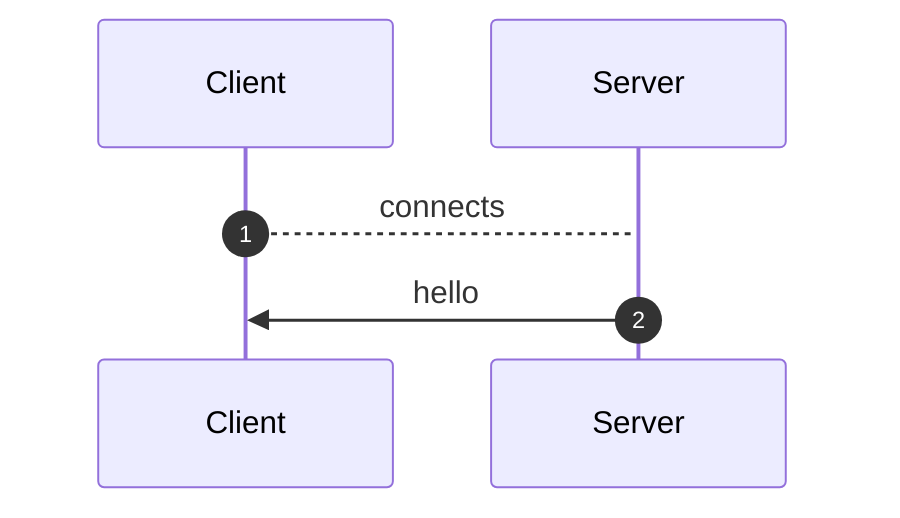
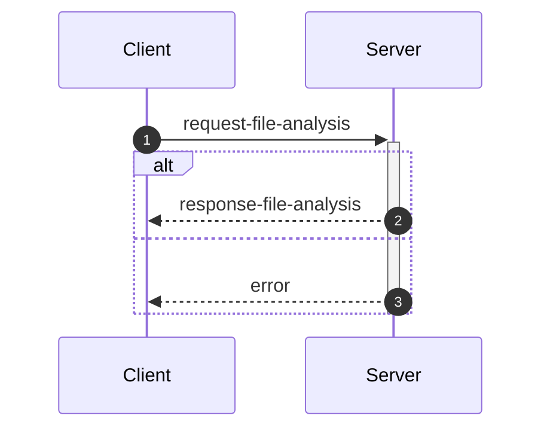
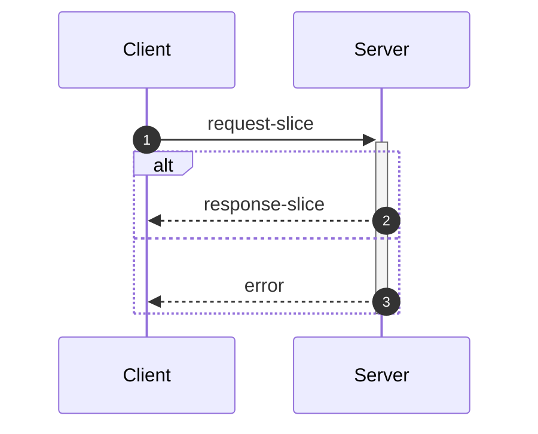
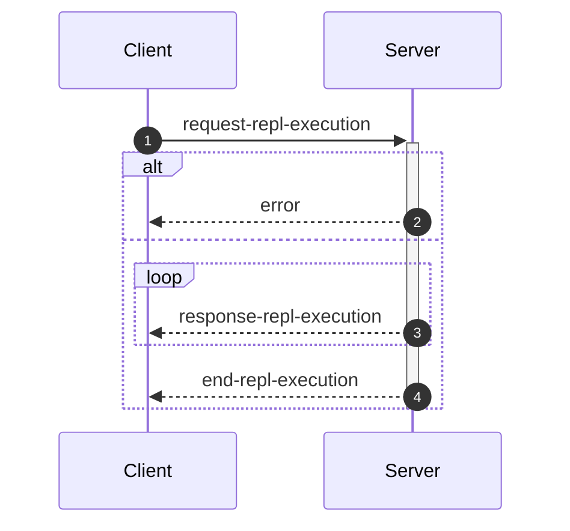

_<span title="an overview of flowR's interface">Generated</span> from '[wiki-interface.ts](https://github.com/flowr-analysis/flowr/tree/main/src/documentation/wiki-interface.ts "src/documentation/wiki-interface.ts")' on 2026-10-04, 19:09:10 UTC (v2.15.10, R v4.6.1), do not edit directly._

Although far from being as detailed as the in-depth explanation of [_flowR_](https://github.com/flowr-analysis/flowr/wiki/Core),
this wiki page explains how to interface with _flowR_ in more detail.
In general, command line arguments and other options provide short descriptions on hover over.

* [💻 Using the REPL](#using-the-repl)
* [⚙️ Configuring FlowR](#configuring-flowr)
* [⚒️ Writing Code](#writing-code)
* [💬 Communicating with the Server](#communicating-with-the-server)

<a id='using-the-repl'></a>
## 💻 Using the REPL

> [!NOTE]
> To execute arbitrary R commands with a repl request, _flowR_ has to be started explicitly with <span title="Description (Command Line Argument): Allow to access the underlying R session when using flowR (security warning: this allows the execution of arbitrary R code!)">`--r-session-access`</span>.
> Please be aware that this introduces a security risk and note that this relies on the [`r-shell` engine](https://github.com/flowr-analysis/flowr/wiki/Engines) .

Although primarily meant for users to explore,
there is nothing which forbids calling _flowR_ as a subprocess to use standard-in, -output, and -error
for communication (although you can access the REPL using the server as well,
with the [REPL Request](#message-request-repl-execution) message).

The read-eval-print loop&nbsp;(REPL) works relatively simple.
You can submit an expression (using <kbd>Enter</kbd>),
which is interpreted as an R&nbsp;expression by default but interpreted as a *command* if it starts with a colon (`:`).
The best command to get started with the REPL is <span title="Description (Repl Command): Show help information (aliases: :h, :?)">`:help`</span>.
Besides, you can leave the REPL either with the command <span title="Description (Repl Command): End the repl (aliases: :q, :exit)">`:quit`</span> or by pressing <kbd>Ctrl</kbd>+<kbd>C</kbd> twice.
When writing a *command*, you may press <kbd>Tab</kbd> to get a list of completions, if available.
Multiple commands can be entered in a single line by separating them with a semicolon (`;`), e.g. `:parse "x<-2"; :df*`.
If a command is given without R code, the REPL will re-use R code given in a previous command.
The prior example will hence return first the parsed AST of the program and then the dataflow graph for `"x <- 2"`.

> [!NOTE]
> If you develop flowR, you may want to launch the repl using the `npm run main-dev` command, this way, you get a non-minified version of flowR with debug information and hot-reloading of source files.

<details>
<summary>Available Commands</summary>

We currently offer the following commands (this with a `[*]` suffix are available with and without the star):

| Command | Description |
| ------- | ----------- |
| **<span title="Description (Repl Command): End the repl (aliases: :q, :exit)">:quit</span>** | End the repl (aliases: **:<span title="Alias of ':quit'. End the repl">q</span>**, **:<span title="Alias of ':quit'. End the repl">exit</span>**) |
| **<span title="Description (Repl Command): Execute the given code as R code. This requires the `--r-session-access` flag to be set and requires the r-shell engine. (aliases: :e, :r)">:execute</span>** | Execute the given code as R code. This requires the `--r-session-access` flag to be set and requires the r-shell engine. (aliases: **:<span title="Alias of ':execute'. Execute the given code as R code. This requires the `--r-session-access` flag to be set and requires the r-shell engine.">e</span>**, **:<span title="Alias of ':execute'. Execute the given code as R code. This requires the `--r-session-access` flag to be set and requires the r-shell engine.">r</span>**) |
| **<span title="Description (Repl Command): Get mermaid code for the control-flow graph of R code (aliases: :cfg, :cf)">:controlflow[*]</span>** | Get mermaid code for the control-flow graph of R code (star: Returns the URL to mermaid.live) (aliases: **:<span title="Alias of ':controlflow'. Get mermaid code for the control-flow graph of R code">cfg</span>**, **:<span title="Alias of ':controlflow'. Get mermaid code for the control-flow graph of R code">cf</span>**) |
| **<span title="Description (Repl Command): Get mermaid code for the control-flow graph with basic blocks (aliases: :cfgb, :cfb)">:controlflowbb[*]</span>** | Get mermaid code for the control-flow graph with basic blocks (star: Returns the URL to mermaid.live) (aliases: **:<span title="Alias of ':controlflowbb'. Get mermaid code for the control-flow graph with basic blocks">cfgb</span>**, **:<span title="Alias of ':controlflowbb'. Get mermaid code for the control-flow graph with basic blocks">cfb</span>**) |
| **<span title="Description (Repl Command): Get mermaid code for the dataflow graph (aliases: :d, :df)">:dataflow[*]</span>** | Get mermaid code for the dataflow graph (star: Returns the URL to mermaid.live) (aliases: **:<span title="Alias of ':dataflow'. Get mermaid code for the dataflow graph">d</span>**, **:<span title="Alias of ':dataflow'. Get mermaid code for the dataflow graph">df</span>**) |
| **<span title="Description (Repl Command): Get mermaid code for the normalized AST of R code (aliases: :n)">:normalize[*]</span>** | Get mermaid code for the normalized AST of R code (star: Returns the URL to mermaid.live) (alias: **:<span title="Alias of ':normalize'. Get mermaid code for the normalized AST of R code">n</span>**) |
| **<span title="Description (Repl Command): Get mermaid code for the simplified dataflow graph (aliases: :ds, :dfs)">:dataflowsimple[*]</span>** | Get mermaid code for the simplified dataflow graph (star: Returns the URL to mermaid.live) (aliases: **:<span title="Alias of ':dataflowsimple'. Get mermaid code for the simplified dataflow graph">ds</span>**, **:<span title="Alias of ':dataflowsimple'. Get mermaid code for the simplified dataflow graph">dfs</span>**) |
| **<span title="Description (Repl Command): Inspect and extend the signature database: `query` (identical to :query @signature), `info <name>` for where a function comes from (identical to :query @function-info), `add <path>` to mount another database/source, `download` to fetch the full-history database. (aliases: :sig)">:signature</span>** | Inspect and extend the signature database: `query` (identical to :query @signature), `info <name>` for where a function comes from (identical to :query @function-info), `add <path>` to mount another database/source, `download` to fetch the full-history database. (alias: **:<span title="Alias of ':signature'. Inspect and extend the signature database: `query` (identical to :query @signature), `info <name>` for where a function comes from (identical to :query @function-info), `add <path>` to mount another database/source, `download` to fetch the full-history database.">sig</span>**) |
| **<span title="Description (Repl Command): Just calculates the DFG, but only prints summary info (aliases: :d#, :df#)">:dataflowsilent</span>** | Just calculates the DFG, but only prints summary info (aliases: **:<span title="Alias of ':dataflowsilent'. Just calculates the DFG, but only prints summary info">d#</span>**, **:<span title="Alias of ':dataflowsilent'. Just calculates the DFG, but only prints summary info">df#</span>**) |
| **<span title="Description (Repl Command): Prints ASCII Art of the parsed, unmodified AST (aliases: :p)">:parse</span>** | Prints ASCII Art of the parsed, unmodified AST (alias: **:<span title="Alias of ':parse'. Prints ASCII Art of the parsed, unmodified AST">p</span>**) |
| **<span title="Description (Repl Command): Prints the version of flowR as well as the current version of R">:version</span>** | Prints the version of flowR as well as the current version of R
| **<span title="Description (Repl Command): Query the given R code (use 'help' for more information)">:query[*]</span>** | Query the given R code (use 'help' for more information) (star: Similar to query, but returns the output in json format.)
| **<span title="Description (Repl Command): Returns an ASCII representation of the dataflow graph (aliases: :df!)">:dataflowascii</span>** | Returns an ASCII representation of the dataflow graph (alias: **:<span title="Alias of ':dataflowascii'. Returns an ASCII representation of the dataflow graph">df!</span>**) |
| **<span title="Description (Repl Command): Returns summarization stats for the normalized AST (aliases: :n#)">:normalize#</span>** | Returns summarization stats for the normalized AST (alias: **:<span title="Alias of ':normalize#'. Returns summarization stats for the normalized AST">n#</span>**) |
| **<span title="Description (Repl Command): Show help information (aliases: :h, :?)">:help</span>** | Show help information (aliases: **:<span title="Alias of ':help'. Show help information">h</span>**, **:<span title="Alias of ':help'. Show help information">?</span>**) |

</details>

> [!TIP]
> 
> As indicated by the examples before, all REPL commands that operate on code keep track of the state.
> Hence, if you run a command like <span title="Description (Repl Command, starred version): Returns the URL to mermaid.live; Base Command: Get mermaid code for the dataflow graph (aliases: :d*, :df*)">`:dataflow*`</span> without providing R code,
> the REPL will re-use the R code provided in a previous command.
> Likewise, doing this will benefit from incrementality!
> If you request the dataflow graph with `:df* x <- 2 * y` and then want to see the parsed AST with `:parse`,
> the REPL will re-use previously obtained information and not re-parse the code again.
> 		

Generally, many commands offer shortcut versions in the REPL. Many queries, for example, offer a shortened format (see the example below).
Of special note, the [Config Query](https://github.com/flowr-analysis/flowr/wiki/%5BQuery%5D-Config)
can be used to also modify the currently active configuration of _flowR_ within the REPL (see the [wiki page](https://github.com/flowr-analysis/flowr/wiki/%5BQuery%5D-Config) for more information).

### Example: Retrieving the Dataflow Graph

To retrieve a URL to the [mermaid](https://mermaid.js.org/) diagram of the dataflow of a given expression,
use <span title="Description (Repl Command, starred version): Returns the URL to mermaid.live; Base Command: Get mermaid code for the dataflow graph (aliases: :d*, :df*)">`:dataflow*`</span> (or <span title="Description (Repl Command): Get mermaid code for the dataflow graph (aliases: :d, :df)">`:dataflow`</span> to get the mermaid code in the cli):

```shell
$ docker run -it --rm eagleoutice/flowr # or npm run flowr 
flowR repl v2.15.10, R grammar v14 (tree-sitter engine)
R> :dataflow* y <- 1 + x
```

<details>
<summary style='color:gray'>Output</summary>

```text
https://mermaid.live/view#base64:eyJjb2RlIjoiZmxvd2NoYXJ0IFREXG4gICAgMXt7XCJgKiM5MTtSTnVtYmVyIzkzOyogKioxKipcbiAgICAgICoxLjYqICgqKmlkOiAxKiopYFwifX1cbiAgICAyKFtcImAqIzkxO1JTeW1ib2wjOTM7KiAqKngqKlxuICAgICAgKjEuMTAqICgqKmlkOiAyKiopYFwiXSlcbiAgICAzW1tcImAqIzkxO1JCaW5hcnlPcCM5MzsqIGJhc2UjNTg7IzU4OyoqIzQzOyoqXG4gICAgICAqMS42LTEwKiAoKippZDogMyoqKVxuICAgIGFyZzogKDEsIDIpYFwiXV1cbiAgICBidWlsdC1pbjpfNDNfW1wiYEJ1aWx0LUluOlxuIzQzO2BcIl1cbiAgICBzdHlsZSBidWlsdC1pbjpfNDNfIHN0cm9rZTpncmF5LGZpbGw6Z3JheSxzdHJva2Utd2lkdGg6MnB4LG9wYWNpdHk6Ljg7XG4gICAgMFtcImAqIzkxO1JTeW1ib2wjOTM7KiAqKnkqKlxuICAgICAgKjEuMSogKCoqaWQ6IDAqKiwgdjogMylgXCJdXG4gICAgNFtbXCJgKiM5MTtSQmluYXJ5T3AjOTM7KiBiYXNlIzU4OyM1ODsqKiM2MDsjNDU7KipcbiAgICAgICoxLjEtMTAqICgqKmlkOiA0KiopXG4gICAgYXJnOiAoMCwgMylgXCJdXVxuICAgIGJ1aWx0LWluOl82MF8tW1wiYEJ1aWx0LUluOlxuIzYwOyM0NTtgXCJdXG4gICAgc3R5bGUgYnVpbHQtaW46XzYwXy0gc3Ryb2tlOmdyYXksZmlsbDpncmF5LHN0cm9rZS13aWR0aDoycHgsb3BhY2l0eTouODtcbiAgICAxIC0uLT58XCJmbG93XCJ8IDJcbiAgICBsaW5rU3R5bGUgMCBzdHJva2U6Z3JheSxjb2xvcjpncmF5O1xuICAgIDIgLS4tPnxcImZsb3dcInwgM1xuICAgIGxpbmtTdHlsZSAxIHN0cm9rZTpncmF5LGNvbG9yOmdyYXk7XG4gICAgMyAtLT58XCJyZWFkcywgYXJnXCJ8IDFcbiAgICAzIC0tPnxcInJlYWRzLCBhcmdcInwgMlxuICAgIDMgLS4tPnxcImZsb3dcInwgMFxuICAgIGxpbmtTdHlsZSA0IHN0cm9rZTpncmF5LGNvbG9yOmdyYXk7XG4gICAgMyAtLi0+fFwicmVhZHMsIGNhbGxzXCJ8IGJ1aWx0LWluOl80M19cbiAgICBsaW5rU3R5bGUgNSBzdHJva2U6Z3JheTtcbiAgICAwIC0tPnxcImRlZmluZWQtYnksIGZsb3dcInwgNFxuICAgIDAgLS0+fFwiZGVmaW5lZC1ieVwifCAzXG4gICAgNCAtLT58XCJyZWFkcywgYXJnXCJ8IDNcbiAgICA0IC0tPnxcInJldHVybnMsIGFyZ1wifCAwXG4gICAgNCAtLi0+fFwicmVhZHMsIGNhbGxzXCJ8IGJ1aWx0LWluOl82MF8tXG4gICAgbGlua1N0eWxlIDEwIHN0cm9rZTpncmF5OyIsIm1lcm1haWQiOnsiYXV0b1N5bmMiOnRydWV9fQ==
```

Retrieve the dataflow graph of the expression `y <- 1 + x`. It looks like this:


```mermaid
flowchart LR
    1{{"`*#91;RNumber#93;* **1**
      *1.6* (**id: 1**)`"}}
    2(["`*#91;RSymbol#93;* **x**
      *1.10* (**id: 2**)`"])
    3[["`*#91;RBinaryOp#93;* base#58;#58;**#43;**
      *1.6-10* (**id: 3**)
    arg: (1, 2)`"]]
    built-in:_43_["`Built-In:
#43;`"]
    style built-in:_43_ stroke:gray,fill:gray,stroke-width:2px,opacity:.8;
    0["`*#91;RSymbol#93;* **y**
      *1.1* (**id: 0**, v: 3)`"]
    4[["`*#91;RBinaryOp#93;* base#58;#58;**#60;#45;**
      *1.1-10* (**id: 4**)
    arg: (0, 3)`"]]
    built-in:_60_-["`Built-In:
#60;#45;`"]
    style built-in:_60_- stroke:gray,fill:gray,stroke-width:2px,opacity:.8;
    1 -.->|"flow"| 2
    linkStyle 0 stroke:gray,color:gray;
    2 -.->|"flow"| 3
    linkStyle 1 stroke:gray,color:gray;
    3 -->|"reads, arg"| 1
    3 -->|"reads, arg"| 2
    3 -.->|"flow"| 0
    linkStyle 4 stroke:gray,color:gray;
    3 -.->|"reads, calls"| built-in:_43_
    linkStyle 5 stroke:gray;
    0 -->|"defined-by, flow"| 4
    0 -->|"defined-by"| 3
    4 -->|"reads, arg"| 3
    4 -->|"returns, arg"| 0
    4 -.->|"reads, calls"| built-in:_60_-
    linkStyle 10 stroke:gray;
```

<details>

<summary style="color:gray">R Code of the Dataflow Graph</summary>

The analysis ran (including parse and normalize, using the [tree-sitter](https://github.com/flowr-analysis/flowr/wiki/Engines) engine) within the generation environment. No [signature database](https://github.com/flowr-analysis/flowr/wiki/Signature-Database) is mounted for these generated graphs, so `library()` calls attach no package exports; base-R names are still qualified via the generated base-package store (e.g. `acf` as `stats::acf`). 
We encountered no unknown side effects during the analysis.

```r
y <- 1 + x
```

</details>

</details>

For small graphs like this, <span title="Description (Repl Command): Returns an ASCII representation of the dataflow graph (aliases: :df!)">`:dataflowascii`</span> also provides an ASCII representation directly in the REPL:

```shell
$ docker run -it --rm eagleoutice/flowr # or npm run flowr 
flowR repl v2.15.10, R grammar v14 (tree-sitter engine)
R> :df! y <- 1 + x
```

<details open>
<summary style='color:gray'>Output</summary>

```text
                        v<0>v
 c<4>c──────────────────| y |
 |<- |     ┌────────────v---v
 c---c     │
    │   c<3>c   0<1>0
    └───| + |───| 1 |───u<2>u
        c---c   0---0   | x |
           └────────────u---u
Edges:
3 -> 1: reads, arg          3 -> 2: reads, arg
3 -> 0: flows-to            1 -> 2: flows-to
2 -> 3: flows-to            4 -> 3: reads, arg
4 -> 0: returns, arg        0 -> 4: defined-by, flows-to
0 -> 3: defined-by
```

Retrieve the dataflow graph of the expression `y <- 1 + x` as ASCII art.

</details>

For the slicing with <span title="Description (Repl Command): Static backwards executable slicer for R">`:slicer`</span>, you have access to the same [magic comments](#slice-magic-comments) as with the [slice request](#message-request-slice).
Pass `--inline` to splice resolvable `source()` calls into the reconstruction so the slice is a single self-contained R text (the same as the static slice query's `inlineSources` flag).
See `--help` for more flags!

### Example: Interfacing with the File System

Many commands that allow for an R-expression (like <span title="Description (Repl Command, starred version): Returns the URL to mermaid.live; Base Command: Get mermaid code for the dataflow graph (aliases: :d*, :df*)">`:dataflow*`</span>) allow for a file as well
if the argument starts with `file://`.
If you are working from the root directory of the _flowR_ repository, the following gives you the parsed AST of the example file using the <span title="Description (Repl Command): Prints ASCII Art of the parsed, unmodified AST (aliases: :p)">`:parse`</span> command:

> **Watch mode**: Replace `file://` with `watch://` to enter watch mode.
> flowR runs the command immediately and then re-runs it every time the file (or any file inside the folder) changes.
> Enter any other command to leave watch mode.
> For example: `:df watch://analysis.R`

```shell
$ docker run -it --rm eagleoutice/flowr # or npm run flowr 
flowR repl v2.15.10, R grammar v14 (tree-sitter engine)
R> :parse file://test/testfiles/example.R
```

<details>
<summary style='color:gray'>Output</summary>

```text
File: test/testfiles/example.R

program
├ binaryoperator
│ ├ identifier "sum" (1:1─4)
│ ├ <- "<-" (1:5─7)
│ ╰ float "0" (1:8─9)
├ binaryoperator
│ ├ identifier "product" (2:1─8)
│ ├ <- "<-" (2:9─11)
│ ╰ float "1" (2:12─13)
├ binaryoperator
│ ├ identifier "w" (3:1─2)
│ ├ <- "<-" (3:3─5)
│ ╰ float "7" (3:6─7)
├ binaryoperator
│ ├ identifier "N" (4:1─2)
│ ├ <- "<-" (4:3─5)
│ ╰ float "10" (4:6─8)
├ forstatement
│ ├ for "for" (6:1─4)
│ ├ ( "(" (6:5─6)
│ ├ identifier "i" (6:6─7)
│ ├ in "in" (6:8─10)
│ ├ binaryoperator
│ │ ├ float "1" (6:11─12)
│ │ ├ : ":" (6:12─13)
│ │ ╰ parenthesizedexpression
│ │   ├ ( "(" (6:13─14)
│ │   ├ binaryoperator
│ │   │ ├ identifier "N" (6:14─15)
│ │   │ ├ - "-" (6:15─16)
│ │   │ ╰ float "1" (6:16─17)
│ │   ╰ ) ")" (6:17─18)
│ ├ ) ")" (6:18─19)
│ ╰ bracedexpression
│   ├ { "{" (6:20─21)
│   ├ binaryoperator
│   │ ├ identifier "sum" (7:3─6)
│   │ ├ <- "<-" (7:7─9)
│   │ ╰ binaryoperator
│   │   ├ binaryoperator
│   │   │ ├ identifier "sum" (7:10─13)
│   │   │ ├ + "+" (7:14─15)
│   │   │ ╰ identifier "i" (7:16─17)
│   │   ├ + "+" (7:18─19)
│   │   ╰ identifier "w" (7:20─21)
│   ├ binaryoperator
│   │ ├ identifier "product" (8:3─10)
│   │ ├ <- "<-" (8:11─13)
│   │ ╰ binaryoperator
│   │   ├ identifier "product" (8:14─21)
│   │   ├  "" (8:22─23)
│   │   ╰ identifier "i" (8:24─25)
│   ╰ } "}" (9:1─2)
├ call
│ ├ identifier "cat" (11:1─4)
│ ╰ arguments
│   ├ ( "(" (11:4─5)
│   ├ argument
│   │ ╰ string
│   │   ├ " "\"" (11:5─6)
│   │   ├ stringcontent "Sum:" (11:6─10)
│   │   ╰ " "\"" (11:10─11)
│   ├ comma "," (11:11─12)
│   ├ argument
│   │ ╰ identifier "sum" (11:13─16)
│   ├ comma "," (11:16─17)
│   ├ argument
│   │ ╰ string
│   │   ├ " "\"" (11:18─19)
│   │   ├ stringcontent
│   │   │ ╰ escapesequence "\\n" (11:19─21)
│   │   ╰ " "\"" (11:21─22)
│   ╰ ) ")" (11:22─23)
╰ call
  ├ identifier "cat" (12:1─4)
  ╰ arguments
    ├ ( "(" (12:4─5)
    ├ argument
    │ ╰ string
    │   ├ " "\"" (12:5─6)
    │   ├ stringcontent "Product:" (12:6─14)
    │   ╰ " "\"" (12:14─15)
    ├ comma "," (12:15─16)
    ├ argument
    │ ╰ identifier "product" (12:17─24)
    ├ comma "," (12:24─25)
    ├ argument
    │ ╰ string
    │   ├ " "\"" (12:26─27)
    │   ├ stringcontent
    │   │ ╰ escapesequence "\\n" (12:27─29)
    │   ╰ " "\"" (12:29─30)
    ╰ ) ")" (12:30─31)
```

Retrieve the parsed AST of the example file.

<details>

<summary>File Content</summary>

```r
sum <- 0
product <- 1
w <- 7
N <- 10

for (i in 1:(N-1)) {
  sum <- sum + i + w
  product <- product * i
}

cat("Sum:", sum, "\n")
cat("Product:", product, "\n")
```

</details>

As _flowR_ directly transforms this AST the output focuses on being human-readable instead of being machine-readable.
		
</details>

### Example: Run a Query

You can run any query supported by _flowR_ using the <span title="Description (Repl Command): Query the given R code (use 'help' for more information)">`:query`</span> command.
For example, to obtain the shapes of all data frames in a given piece of code, you can run:

```shell
$ docker run -it --rm eagleoutice/flowr # or npm run flowr 
flowR repl v2.15.10, R grammar v14 (tree-sitter engine)
R> :query @absint df-shape "x <- data.frame(a = 1:10, b = 1:10)\ny <- x$a"
```

<details open>
<summary style='color:gray'>Output</summary>

```text
Query: absint (0 ms)
```

Retrieve the shapes of all data frames in the given code.

</details>

To run the linter on a file, you can use (in this example, we just issue the `dead-code` linter on a small piece of code):

```shell
$ docker run -it --rm eagleoutice/flowr # or npm run flowr 
flowR repl v2.15.10, R grammar v14 (tree-sitter engine)
R> :query @linter rules:dead-code "if(FALSE) x <- 2"
```

<details open>
<summary style='color:gray'>Output</summary>

```text
Query: linter (2 ms)
   ╰ Dead Code (dead-code):
       ╰ certain:
           ╰ Code at 1.11-16
```

Run the linter on the given code, with only the `dead-code` rule enabled.

</details>

For more information on the available queries, please check out the [Query API](https://github.com/flowr-analysis/flowr/wiki/Query-API).

<a id='configuring-flowr'></a>
## ⚙️ Configuring FlowR

When running _flowR_, you may want to specify some behaviors with a dedicated configuration file.
By default, flowR looks for a file named `flowr.json` in the current working directory (or any higher directory).
You can also specify a different file with <span title="Description (Command Line Argument): The name of the configuration file to use">`--config-file`</span> or pass the configuration inline using <span title="Description (Command Line Argument): The flowR configuration to use, as a JSON string">`--config-json`</span>.
To inspect the current configuration, you can run flowr with the <span title="Description (Command Line Argument): Run with verbose logging (will be passed to the corresponding script)">`--verbose`</span> flag, or use the `config` [Query](https://github.com/flowr-analysis/flowr/wiki/Query-API).
Within the REPL this works by running the following:

```shell
:query @config
```

To work with the <a href="https://github.com/flowr-analysis/flowr/tree/main/src/config.ts#L108"><code><span title="The configuration file format for flowR.">FlowrConfig</span></code></a> you can use the provided helper objects alongside its methods like
<a href="https://github.com/flowr-analysis/flowr/tree/main/src/config.ts#L871"><code><span title="Creates a new flowr config that has the updated values.">FlowrConfig::<b>amend</b></span></code></a>.
The schema below documents every option; the ones you most likely want are:

- <a href="https://github.com/flowr-analysis/flowr/wiki/Interface#configuring-flowr" title="Configuration Option (boolean): Whether source calls should be ignored, causing {@link processSourceCall}&#39;s behavior to be skipped.">ignoreSourceCalls</a>: ignore source calls when analyzing the code, i.e., ignore the inclusion of other files.
- <a href="https://github.com/flowr-analysis/flowr/wiki/Interface#configuring-flowr" title="Configuration Option (boolean): Whether load calls should be ignored, causing {@link processLoadCall}&#39;s behavior to be skipped.">ignoreLoadCalls</a>: ignore load calls when analyzing the code, i.e., ignore the loading of r-data files.
- <a href="https://github.com/flowr-analysis/flowr/wiki/Interface#configuring-flowr" title="Configuration Option (object): Do you want to overwrite (parts) of the builtin definition?">semantics.environment.overwriteBuiltIns</a>: overwrite _flowR_'s handling of built-in functions, or clear the preset definitions entirely.
  See [Configure BuiltIn Semantics](#configure-builtin-semantics) for more information.
- <a href="https://github.com/flowr-analysis/flowr/wiki/Interface#configuring-flowr" title="Configuration Option (string): How to resolve variables and their values. (one of &quot;disabled&quot;, &quot;alias&quot;, &quot;builtin&quot;)">solver.variables</a>: how to resolve variables and their values (`disabled`, `alias`, `builtin`).
- <a href="https://github.com/flowr-analysis/flowr/wiki/Interface#configuring-flowr" title="Configuration Option (array): The engine or set of engines to use for interacting with R code. An empty array means all available engines will be used.">engines</a> and <a href="https://github.com/flowr-analysis/flowr/wiki/Interface#configuring-flowr" title="Configuration Option (string): The default engine to use for interacting with R code. If this is undefined, an arbitrary engine from the specified list will be used. (one of &quot;tree-sitter&quot;, &quot;r-shell&quot;)">defaultEngine</a>: the engines used to interact with R code, see the [Engines wiki page](https://github.com/flowr-analysis/flowr/wiki/Engines).
- <a href="https://github.com/flowr-analysis/flowr/wiki/Interface#configuring-flowr" title="Configuration Option (array): Files a framework loads on its own, without any source() call (e.g. global.R in a shiny app), in the order they are loaded; flowR orders the matching project files accordingly and analyzes them as one program. Entries are case-insensitive globs matched against the file path, a plain name matches any file with that name, and entries matching no project file are warned about. Usually set per project kind via specializeConfig.">project.implicitSources</a>: the files a framework loads without any `source()` call, in the order in which they are
  loaded. Entries are globs (e.g. `R/*.R`) matched against the file path ignoring capitalization; one matching no file is reported.
- <a href="https://github.com/flowr-analysis/flowr/wiki/Interface#configuring-flowr" title="Configuration Option (object): Overwrite (parts of) the configuration depending on the project kind flowR detects, e.g. to give a shiny app its implicit sources.">specializeConfig</a>: overwrite (parts of) the configuration depending on the kind of project _flowR_ detects
  (e.g. `shiny-app`), which is how a shiny app gets its implicit sources by default. What you configure directly wins.
- <a href="https://github.com/flowr-analysis/flowr/wiki/Interface#configuring-flowr" title="Configuration Option (string): Overwrite the project kind flowR would otherwise infer from the analyzed files, e.g. when auto-detection guesses wrong. (one of &quot;package&quot;, &quot;script&quot;, &quot;shiny-app&quot;, &quot;notebook&quot;, &quot;project&quot;, &quot;unknown&quot;)">project.useProjectType</a>: skip that detection and force a project kind yourself, when auto-detection guesses wrong.
- <a href="https://github.com/flowr-analysis/flowr/wiki/Interface#configuring-flowr" title="Configuration Option (array): The default plugins to load when creating a new instance of FlowrAnalyzer">defaultPlugins</a> and <a href="https://github.com/flowr-analysis/flowr/wiki/Interface#configuring-flowr" title="Configuration Option (array): The plugins to load in REPL mode">repl.plugins</a>: the plugins to load for a new <a href="https://github.com/flowr-analysis/flowr/tree/main/src/project/flowr-analyzer.ts#L205"><code><span title="Central class for conducting analyses with FlowR. Use the FlowrAnalyzerBuilder to create a new instance. If you want the original pattern of creating a pipeline and running all steps, you can still do this with FlowrAnalyzer#runFull . To inspect the context of the analyzer, use FlowrAnalyzer#inspectContext (if you are a plugin and need to modify it, use FlowrAnalyzer#context instead).">FlowrAnalyzer</span></code></a> and in the REPL
  (use `flowr:default` to reference the former).

So you can configure _flowR_ by adding a file like the following:

<details>

<summary>Example Configuration File</summary>

```json
{
  "ignoreSourceCalls": true,
  "ignoreLoadCalls": true,
  "semantics": {
    "environment": {
      "overwriteBuiltIns": {
        "definitions": [
          {
            "type": "function",
            "names": [
              "foo"
            ],
            "processor": "builtin:assign",
            "config": {}
          }
        ]
      }
    }
  },
  "defaultPlugins": [
    "file:description",
    "versions:description"
  ],
  "repl": {
    "quickStats": false,
    "dfProcessorHeat": false,
    "hints": true,
    "plugins": [
      "flowr:default"
    ]
  },
  "project": {
    "resolveUnknownPathsOnDisk": true,
    "implicitSources": [
      "global.R",
      "app.R"
    ]
  },
  "linter": {
    "disabledRules": []
  },
  "specializeConfig": {
    "shiny-app": {
      "project": {
        "implicitSources": [
          "global.R",
          "ui.R",
          "server.R",
          "app.R"
        ]
      }
    }
  },
  "engines": [
    {
      "type": "r-shell"
    }
  ],
  "solver": {
    "variables": "alias",
    "evalStrings": true,
    "trackEnvironments": true,
    "sigdb": {
      "enabled": true,
      "loadProjectDependencies": true,
      "eagerlyLoad": false,
      "eagerlyLoadExports": false,
      "linkBaseR": false,
      "linkDescriptionDependencies": false
    },
    "resolveSource": {
      "dropPaths": "no",
      "ignoreCapitalization": true,
      "inferWorkingDirectory": "active-script",
      "searchPath": []
    },
    "instrument": {},
    "slicer": {
      "threshold": 50
    }
  },
  "abstractInterpretation": {
    "wideningThreshold": 4,
    "followCalls": true,
    "dataFrame": {
      "maxColNames": 20,
      "readLoadedData": {
        "readExternalFiles": true,
        "maxReadLines": 1000000
      }
    }
  },
  "incremental": {
    "alwaysIncremental": false,
    "parsing": {
      "activated": false,
      "heuristics": {
        "activated": true,
        "mtime": true,
        "linesFrom": 500,
        "bytesFrom": 50000,
        "alwaysWithEdits": false,
        "minFiles": 1
      }
    }
  },
  "gas": {
    "thresholds": {
      "memory": {
        "problematic": 0.7,
        "critical": 0.9
      },
      "timeMs": {
        "problematic": 100000,
        "critical": 120000
      }
    },
    "features": {}
  }
}
```

</details>

<details>
<a id='configure-builtin-semantics'></a>
<summary>Configure Built-In Semantics</summary>

`semantics/environment/overwriteBuiltins` accepts two keys:

- `loadDefaults` (boolean, initially `true`): If set to `true`, the default built-in definitions are loaded before applying the custom definitions. Setting this flag to `false` explicitly disables the loading of the default definitions.
- `definitions` (array, initially empty): Allows to overwrite or define new built-in elements. Each object within must have a `type` which is one of the below. Furthermore, they may define a string array of `names` which specifies the identifiers to bind the definitions to. You may use `assumePrimitive` to specify whether _flowR_ should assume that this is a primitive non-library definition (so you probably just do not want to specify the key).

  | Type            | Description                                                                                                                                                                                                                                                                                              | Example                                                                                                    |
  | --------------- | -------------------------------------------------------------------------------------------------------------------------------------------------------------------------------------------------------------------------------------------------------------------------------------------------------- | ---------------------------------------------------------------------------------------------------------- |
  | `constant`    | Additionally allows for a `value` this should resolve to.                                                                                                                                                                                                                                                | `{ type: 'constant', names: ['NULL', 'NA'],  value: null }`                                                |
  | `function`    | Is a rather flexible way to define and bind built-in functions. For the time, we do not have extensive documentation to cover all the cases, so please either consult the sources with the `default-builtin-config.ts` or open a [new issue](https://github.com/flowr-analysis/flowr/issues/new/choose). | `{ type: 'function', names: ['next'], processor: 'builtin:d', config: { cfg: ExitPointType.Next } }` |
  | `replacement` | A comfortable way to specify replacement functions like `$<-` or `names<-`. `suffixes` describes the... suffixes to attach automatically. | `{ type: 'replacement', suffixes: ['<-', '<<-'], names: ['[', '[['] }` |

</details>

<details>

<summary style='color:gray'>Full Configuration-File Schema</summary>

- _The configuration file format for flowR._ (object)
    - **logLevel** [optional] _flowR's global minimum log level, applied when the config is loaded._ (string)
        Only allows: 'silly', 'trace', 'debug', 'info', 'warn', 'error', 'fatal'
    - **ignoreSourceCalls** [optional] _Whether source calls should be ignored, causing {@link processSourceCall}'s behavior to be skipped._ (boolean)
    - **ignoreLoadCalls** [optional] _Whether load calls should be ignored, causing {@link processLoadCall}'s behavior to be skipped._ (boolean)
    - **semantics** _Configure language semantics and how flowR handles them._ (object)
        - **environment** [optional] _Semantics regarding how to handle the R environment._ (object)
            - **overwriteBuiltIns** [optional] _Do you want to overwrite (parts) of the builtin definition?_ (object)
                - **loadDefaults** [optional] _Should the default configuration still be loaded?_ (boolean)
                - **definitions** [optional] _The definitions to load/overwrite._ (array)
                Valid item types:
                    - (object)
    - **defaultPlugins** [optional] _The default plugins to load when creating a new instance of FlowrAnalyzer_ (array)
    Valid item types:
        - (alternatives)
            - (string)
            - (array)
    - **repl** _Configuration options for the REPL._ (object)
        - **quickStats** [optional] _Whether to show quick stats in the REPL after each evaluation._ (boolean)
        - **dfProcessorHeat** [optional] _This instruments the dataflow processors to count how often each processor is called._ (boolean)
        - **hints** [optional] _Whether to show dim inline hints on the empty prompt (automatically disabled on non-interactive terminals)._ (boolean)
        - **plugins** [optional] _The plugins to load in REPL mode_ (array)
        Valid item types:
            - (alternatives)
                - (string)
                - (array)
        - **autoUseFileProtocol** [optional] _Prepend the file protocol to a repl input that looks like a path, instead of only warning about it._ (boolean)
        - **queryStats** [optional] _Whether `:query` closes with the line stating how long the queries took (`:query*` never prints it)._ (boolean)
        - **showPlugins** [optional] _Whether `:version` grays out the plugins that did not activate during the last analysis._ (boolean)
    - **project** _Project specific configuration options._ (object)
        - **resolveUnknownPathsOnDisk** [optional] _Whether to resolve unknown paths loaded by the r project disk when trying to source/analyze files._ (boolean)
        - **failOnInaccessiblePath** [optional] _Whether a directory that cannot be traversed during file discovery (e.g. due to permissions) aborts the analysis; when false (the default) such paths are logged and skipped._ (boolean)
        - **basePackages** [optional] _The packages considered part of R itself (base and recommended); if unset, flowR uses its built-in list._ (array)
        Valid item types:
            - (string)
        - **implicitSources** [optional] _Files a framework loads on its own, without any source() call (e.g. global.R in a shiny app), in the order they are loaded; flowR orders the matching project files accordingly and analyzes them as one program. Entries are case-insensitive globs matched against the file path, a plain name matches any file with that name, and entries matching no project file are warned about. Usually set per project kind via specializeConfig._ (array)
        Valid item types:
            - (string)
        - **useProjectType** [optional] _Overwrite the project kind flowR would otherwise infer from the analyzed files, e.g. when auto-detection guesses wrong._ (string)
            Only allows: 'package', 'script', 'shiny-app', 'notebook', 'project', 'unknown'
        - **assumeImplicitEcho** [optional] _Whether the top level of the analyzed code is echoed, so that every visible result printed there is collected as an output by the dependencies query (default true, false for a package)._ (boolean)
        - **discovery** [optional] _Scoping options for the default project discovery._ (object)
            - **full** [optional] _Collect every file below the project root (greedy) instead of only the files the detected project kind needs (default false)._ (boolean)
            - **perKind** [optional] _Per-kind include/exclude glob overrides layered on the default scoping._ (object)
            - **ignore** [optional] _Case-insensitive globs that drop matching files from the intelligent discovery, regardless of kind (e.g. .Renviron to ignore environment files)._ (array)
            Valid item types:
                - (string)
        - **classification** [optional] _Overrides for the signals flowR uses to classify the project kind._ (object)
            - **shinyDescriptionTypes** [optional] _DESCRIPTION Type: values that mark a shiny app._ (array)
            Valid item types:
                - (string)
            - **shinyEntryFiles** [optional] _File names a shiny app is assembled from._ (array)
            Valid item types:
                - (string)
            - **shinyUsagePattern** [optional] _Regex source evidencing shiny usage in an entry file._ (string)
            - **notebookExtensions** [optional] _File extensions marking a notebook._ (array)
            Valid item types:
                - (string)
    - **linter** _Linter configuration options._ (object)
        - **disabledRules** _Linting rule names excluded from the default rule set (a rule requested explicitly via a linter query still runs). Usually set per project kind via specializeConfig._ (array)
        Valid item types:
            - (string)
    - **inputSources** [optional] _Further frameworks the input-sources analysis should know about; entries are added to flowR's defaults._ (object)
        - **pure** [optional] _Functions that only pass the constantness of their arguments on._ (array)
        Valid item types:
            - (string)
        - **param** [optional] _Functions whose result is a 'param' input._ (array)
        Valid item types:
            - (string)
        - **file** [optional] _Functions whose result is a 'file' input._ (array)
        Valid item types:
            - (string)
        - **tempfile** [optional] _Functions whose result is a 'tempfile' input._ (array)
        Valid item types:
            - (string)
        - **glob** [optional] _Functions whose result is a 'glob' input._ (array)
        Valid item types:
            - (string)
        - **net** [optional] _Functions whose result is a 'net' input._ (array)
        Valid item types:
            - (string)
        - **rand** [optional] _Functions whose result is a 'rand' input._ (array)
        Valid item types:
            - (string)
        - **system** [optional] _Functions whose result is a 'system' input._ (array)
        Valid item types:
            - (string)
        - **ffi** [optional] _Functions whose result is a 'ffi' input._ (array)
        Valid item types:
            - (string)
        - **lang** [optional] _Functions whose result is a 'lang' input._ (array)
        Valid item types:
            - (string)
        - **options** [optional] _Functions whose result is a 'options' input._ (array)
        Valid item types:
            - (string)
        - **cmdline** [optional] _Functions whose result is a 'cmdline' input._ (array)
        Valid item types:
            - (string)
        - **user** [optional] _Functions whose result is a 'user' input._ (array)
        Valid item types:
            - (string)
        - **const** [optional] _Functions whose result is a 'const' input._ (array)
        Valid item types:
            - (string)
        - **scope** [optional] _Functions whose result is a 'scope' input._ (array)
        Valid item types:
            - (string)
        - **dconst** [optional] _Functions whose result is a 'dconst' input._ (array)
        Valid item types:
            - (string)
        - **unknown** [optional] _Functions whose result is a 'unknown' input._ (array)
        Valid item types:
            - (string)
        - **linkedObjects** [optional] _Objects a framework provides without a definition in the code, e.g. shiny's input._ (array)
        Valid item types:
            - (object)
        - **linkedEntryPoints** [optional] _Calls that hand a function to a framework, which binds its objects to the parameters by position._ (array)
        Valid item types:
            - (object)
    - **specializeConfig** [optional] _Overwrite (parts of) the configuration depending on the project kind flowR detects, e.g. to give a shiny app its implicit sources._ (object)
    - **engines** _The engine or set of engines to use for interacting with R code. An empty array means all available engines will be used._ (array)
    Valid item types:
        - (alternatives)
            - _The configuration for the tree sitter engine._ (object)
                - **type** [required] _Use the tree sitter engine._ (string)
                    Only allows: 'tree-sitter'
                - **wasmPath** [optional] _The path to the tree-sitter-r WASM binary to use. If this is undefined, this uses the default path._ (string)
                - **treeSitterWasmPath** [optional] _The path to the tree-sitter WASM binary to use. If this is undefined, this uses the default path._ (string)
                - **lax** [optional] _Whether to use the lax parser for parsing R code (allowing for syntax errors). If this is undefined, the strict parser will be used._ (boolean)
            - _The configuration for the R shell engine._ (object)
                - **type** [required] _Use the R shell engine._ (string)
                    Only allows: 'r-shell'
                - **rPath** [optional] _The path to the R executable to use. If this is undefined, this uses the default path._ (string)
                - **pipeBind** [optional] _Whether to enable R's experimental pipe-bind operator "=>" by setting _R_USE_PIPEBIND_ for the R session (default false); R itself keeps this off by default, as it is experimental and has never shipped in a release version of R._ (boolean)
    - **defaultEngine** [optional] _The default engine to use for interacting with R code. If this is undefined, an arbitrary engine from the specified list will be used._ (string)
        Only allows: 'tree-sitter', 'r-shell'
    - **solver** _How to resolve constants, constraints, cells, ..._ (object)
        - **variables** _How to resolve variables and their values._ (string)
            Only allows: 'disabled', 'alias', 'builtin'
        - **evalStrings** _Should we include eval(parse(text="...")) calls in the dataflow graph?_ (boolean)
        - **trackEnvironments** [optional] _Track user-created environments (new.env, assign/get/local with envir=, dollar-assign, attach). When false, all envir-style calls fall through conservatively._ (boolean)
        - **sigdb** _Resolving library exports from a signature database._ (object)
            - **enabled** [optional] _Resolve library()/use() exports from a signature database (default true); when false no database is consulted._ (boolean)
            - **loadProjectDependencies** [optional] _Load the project's declared dependencies from its metadata files (DESCRIPTION Imports/Depends, rproject.toml, uvr.toml, renv.lock, rv.lock, uvr.lock) (default true); when false these files are not read for dependencies._ (boolean)
            - **eagerlyLoad** [optional] _Parse the database up front rather than on the first package load (default false, ignored if disabled)._ (boolean)
            - **eagerlyLoadExports** [optional] _Add a vertex for every export on load rather than on demand (default false); keeps the dataflow graph small._ (boolean)
            - **assumedRVersion** [optional] _R version assumed when resolving versioned (base-R) exports: a pin like "4.5" or "auto" to detect the installed R (default "auto")._ (string)
            - **linkBaseR** [optional] _Eagerly attach base-R namespaces so bare base calls resolve without library() (default false)._ (boolean)
            - **linkBaseRCalls** [optional] _Add a lightweight Reads edge from a bare base-R call to its signature-database function vertex (default false; base-R qualification is edge-free otherwise)._ (boolean)
            - **linkPackageCalls** [optional] _Add a lightweight Reads edge from a resolved package call to its signature-database function vertex (default false)._ (boolean)
            - **linkDescriptionDependencies** [optional] _Eagerly attach the namespaces of the project's declared DESCRIPTION dependencies (Imports/Depends) so their exports resolve without an explicit library() (default false)._ (boolean)
            - **warmInBackground** [optional] _Decompress the hot shards (base + most-downloaded) in a background task on startup so the first library() lookup is warm (default false; for long-running servers/REPLs)._ (boolean)
            - **additionalPaths** [optional] _Extra directories or bundle/manifest files searched for signature databases (alongside the shipped default and $FLOWR_SIGDB_DIR); a downloaded full-history bundle placed here is mounted automatically._ (array)
            Valid item types:
                - (string)
            - **downloadRepo** [optional] _GitHub owner/repo the full-history bundle is downloaded from via ":signature download" (default "flowr-analysis/flowr", release tag "sigdb-v<flowR-version>")._ (string)
            - **autoSync** [optional] _On startup, re-download shards whose committed sigdb.remote.json hash no longer matches the cache, in the background (default false; opt-in network sync after a git pull)._ (boolean)
            - **installedLibrary** [optional] _Recovering packages no signature database knows from the copy installed on this machine._ (object)
                - **enabled** [required] _Recover packages no signature database knows from their installed copy (default false)._ (boolean)
                - **paths** [optional] _Library directories to search; when empty they are discovered from the environment and the project._ (array)
                Valid item types:
                    - (string)
                - **useEnvironment** [optional] _Search the libraries R_LIBS_USER/R_LIBS/R_LIBS_SITE name (default true)._ (boolean)
                - **useProjectLibrary** [optional] _Search a project-local renv/packrat library (default true)._ (boolean)
                - **maxDepth** [optional] _How far to descend into the nested layout of a project-local library (default 3)._ (number)
                - **packages** [optional] _Only recover packages whose name matches one of these regular expressions; empty means any._ (array)
                Valid item types:
                    - (string)
            - **blobCacheBudgetMb** [optional] _How many MiB of decoded package blobs every open bundle may hold together (default 16)._ (number)
            - **versionSelection** [optional] _When a project constrains a dependency, resolve to the newest (default), oldest, or system-installed version satisfying it; system needs R and falls back to newest. Base-R packages always resolve against the assumed R version._ (string)
                Only allows: 'newest', 'oldest', 'system'
            - **versionOverrides** [optional] _Force an exact version for specific packages (name -> version), overriding both the project constraint and the versionSelection policy (default {})._ (object)
        - **versionManagement** _Policies for reasoning about dependency versions._ (object)
            - **linkedVersionGroups** [optional] _Groups of packages that must resolve to the same version; version guessing intersects each group so its members stay mutually compatible (default [])._ (array)
            Valid item types:
                - (array)
                Valid item types:
                    - (string)
        - **assumeAttachedPackages** [optional] _Packages to treat as attached without a `library()` call, so what the built-in configuration states about them applies to the analyzed code. The base packages R attaches on startup already resolve without it._ (array)
        Valid item types:
            - (string)
        - **transitiveSideEffectRounds** [optional] _How many rounds the transitive side-effect fixpoint may run before it is cut off (default 32); the propagation stops on its own as soon as a round adds nothing._ (number)
        - **maxOverlayDepth** [optional] _How many binding overlays may stack on one environment frame before a write flattens them (default 4); a pure performance knob, trading lookup cost against copy cost without changing any result._ (number)
        - **instrument** (object)
            - **dataflowExtractors** [optional] _These keys are only intended for use within code, allowing to instrument the dataflow analyzer!_ (any)
        - **resolveSource** [optional] _If lax source calls are active, flowR searches for sourced files much more freely, based on the configurations you give it. This option is only in effect if `ignoreSourceCalls` is set to false._ (object)
            - **dropPaths** _Allow to drop the first or all parts of the sourced path, if it is relative._ (string)
                Only allows: 'no', 'once', 'all'
            - **ignoreCapitalization** _Search for filenames matching in the lowercase._ (boolean)
            - **inferWorkingDirectory** _Try to infer the working directory from the main or any script to analyze._ (string)
                Only allows: 'no', 'main-script', 'active-script', 'any-script'
            - **searchPath** _Additionally search in these paths._ (array)
            Valid item types:
                - (string)
            - **repeatedSourceLimit** [optional] _How often the same file can be sourced within a single run? Please be aware: in case of cyclic sources this may not reach a fixpoint so give this a sensible limit._ (number)
            - **applyReplacements** _Provide name replacements for loaded files_ (array)
            Valid item types:
                - (object)
            - **assumeFilesExist** [optional] _Assume a sourced file is always there, making what it defines certain instead of conditional on the source call._ (boolean)
        - **slicer** [optional] _The configuration for the slicer._ (object)
            - **threshold** [optional] _The maximum number of iterations to perform on a single function call during slicing._ (number)
            - **autoExtend** [optional] _If set, the slicer will gain an additional post-pass._ (boolean)
    - **abstractInterpretation** _The configuration options for abstract interpretation._ (object)
        - **wideningThreshold** _The threshold for the number of visitations of a node at which widening should be performed to ensure the termination of the fixpoint iteration._ (number)
        - **followCalls** _Whether the abstract interpretation is interprocedural, i.e. whether it steps into the functions a call may dispatch to._ (boolean)
        - **dataFrame** _The configuration of the shape inference for data frames._ (object)
            - **maxColNames** _The maximum number of columns names to infer for data frames before over-approximating the column names to top._ (number)
            - **readLoadedData** _Configuration options for reading data frame shapes from loaded external data files, such as CSV files._ (object)
                - **readExternalFiles** _Whether data frame shapes should be extracted from loaded external files, such as CSV files._ (boolean)
                - **maxReadLines** _The maximum number of lines to read when extracting data frame shapes from loaded files, such as CSV files._ (number)
    - **incremental** (object)
        - **alwaysIncremental** _Always take the incremental path, regardless of heuristics._ (boolean)
        - **parsing** (object)
            - **activated** _If set, incremental parsing will be used._ (boolean)
            - **heuristics** (object)
                - **activated** [optional] _If set, the heuristics for incremental parsing will be used._ (boolean)
                - **mtime** [optional] _Skip reparsing entirely if the file's modification time is unchanged since the last parse._ (boolean)
                - **linesFrom** [optional] _Only consider incremental parsing for files with at least this many lines._ (number)
                - **bytesFrom** [optional] _Only consider incremental parsing for files with at least this many bytes._ (number)
                - **alwaysWithEdits** [optional] _Always take the incremental path whenever there is a computed edit region, regardless of the other thresholds._ (boolean)
                - **minFiles** [optional] _Only apply these heuristics once the project has at least this many files loaded._ (number)
    - **gas** [optional] _Resource-usage guard (gas) configuration. All feature factors default to 0 (disabled). See https://github.com/flowr-analysis/flowr/wiki/Core#gas-resource-guard._ (object)
        - **thresholds** [optional] _Thresholds for all gas checks (scaled by per-feature factor), boundable per feature._ (object)
            - **memory** [optional] _Heap-usage fraction thresholds (0-1), either shared or given per feature key (with `default` covering the rest)._ (object)
                - **problematic** [optional] _Heap fraction (0-1) above which Problematic is returned, for every feature without an entry of its own._ (number)
                - **critical** [optional] _Heap fraction (0-1) above which Critical is returned, for every feature without an entry of its own._ (number)
            - **timeMs** [optional] _Elapsed analysis time thresholds in milliseconds, either shared or given per feature key (with `default` covering the rest)._ (object)
                - **problematic** [optional] _Elapsed ms above which Problematic is returned, for every feature without an entry of its own._ (number)
                - **critical** [optional] _Elapsed ms above which Critical is returned, for every feature without an entry of its own._ (number)
            - **steps** [optional] _Processed-AST-node thresholds, counted rather than sampled; only a key that arms a budget (`dataflow`) reads them._ (object)
                - **problematic** [optional] _Processed AST nodes above which Problematic is returned, for every feature without an entry of its own._ (number)
                - **critical** [optional] _Processed AST nodes above which the extraction is cut short, for every feature without an entry of its own._ (number)
            - **vertices** [optional] _Created-dataflow-vertex thresholds, counted like `steps`._ (object)
                - **problematic** [optional] _Created dataflow vertices above which Problematic is returned, for every feature without an entry of its own._ (number)
                - **critical** [optional] _Created dataflow vertices above which the extraction is cut short, for every feature without an entry of its own._ (number)
        - **features** [optional] _Per-feature sensitivity factors. 0 or absent disables gas checking for that feature. A factor of 2 makes the feature twice as sensitive. Recognised keys: `source`, `side-effect-linking`, `linter`, `slicer`, `dataflow`._ (object)
        - **countedCheckEvery** [optional] _How many counted steps pass between two accountings of an armed check, be it a dataflow budget or the slicer's traversal (default 128); trades overshoot against the cost of the check._ (number)
        - **heapProvider** [optional] _Custom heap statistics source (programmatic configs only), overriding the built-in v8/performance.memory detection._ (function)

</details>

<a id='writing-code'></a>
## ⚒️ Writing Code

_flowR_ can be used as a [module](https://www.npmjs.com/package/@eagleoutice/flowr) and offers several main classes and interfaces that are interesting for extension writers 
(see the [Visual Studio Code extension](https://marketplace.visualstudio.com/items?itemName=code-inspect.vscode-flowr) or the [Core](https://github.com/flowr-analysis/flowr/wiki/Core) wiki page for more information).

### Creating Analyses with _flowR_

Nowadays, instances of the <a href="https://github.com/flowr-analysis/flowr/tree/main/src/project/flowr-analyzer.ts#L205"><code><span title="Central class for conducting analyses with FlowR. Use the FlowrAnalyzerBuilder to create a new instance. If you want the original pattern of creating a pipeline and running all steps, you can still do this with FlowrAnalyzer#runFull . To inspect the context of the analyzer, use FlowrAnalyzer#inspectContext (if you are a plugin and need to modify it, use FlowrAnalyzer#context instead).">FlowrAnalyzer</span></code></a> should be used as central frontend to get analysis results from _flowR_.
The entry points an analysis is written against are re-exported from the package root (`import { FlowrAnalyzerBuilder } from '@eagleoutice/flowr'`);
everything else stays reachable under its own path, as in `@eagleoutice/flowr/dataflow/graph/graph`.
For example, a program slice can be created like this:

```ts
const analyzer = await new FlowrAnalyzerBuilder()
    .setEngine('tree-sitter')
    .build();
analyzer.addRequest('x <- 1\ny <- x\nx');
const result = await analyzer.query([
    {
        type:     'static-slice',
        criteria: ['3@x']
    }
]);
```

For more information, please have a look at the [Analyzer](https://github.com/flowr-analysis/flowr/wiki/Analyzer) wiki page, which explains how to construct and use the <a href="https://github.com/flowr-analysis/flowr/tree/main/src/project/flowr-analyzer.ts#L205"><code><span title="Central class for conducting analyses with FlowR. Use the FlowrAnalyzerBuilder to create a new instance. If you want the original pattern of creating a pipeline and running all steps, you can still do this with FlowrAnalyzer#runFull . To inspect the context of the analyzer, use FlowrAnalyzer#inspectContext (if you are a plugin and need to modify it, use FlowrAnalyzer#context instead).">FlowrAnalyzer</span></code></a> in more detail.
To work with specific perspectives, you can also consult the respective pages like the [Dataflow Graph](https://github.com/flowr-analysis/flowr/wiki/Dataflow-Graph) or the [Abstract Interpretation](https://github.com/flowr-analysis/flowr/wiki/Abstract-Interpretation) wiki pages.
### The Pipeline Executor (Low-Level Interface)

Once, in the beginning, _flowR_ was meant to produce a dataflow graph merely to provide *program slices*. 
However, with continuous updates, the [Dataflow Graph](https://github.com/flowr-analysis/flowr/wiki/Dataflow-Graph) repeatedly proves to be the more interesting part.
With this, we restructured _flowR_'s originally *hardcoded* pipeline to be far more flexible. 
Now, it can be theoretically extended or replaced with arbitrary steps, optional steps, and what we call 'decorations' of these steps. 
In short, a slicing pipeline using the <a href="https://github.com/flowr-analysis/flowr/tree/main/src/core/pipeline-executor.ts#L97"><code><span title="**Please note:** The PipelineExecutor is now considered to be a rather low-level API for flowR. While it still works and is the basis for all other layers, we strongly recommend using the FlowrAnalyzer and its builder to create and use an analyzer instance that is pre-configured for your use-case. The pipeline executor allows to execute arbitrary pipelines in a step-by-step fashion. If you are not...">PipelineExecutor</span></code></a> looks like this:

```ts

const slicer = new PipelineExecutor(DEFAULT_SLICING_PIPELINE, {
  parser:    new RShell(),
  request:   requestFromInput('x <- 1\nx + 1'),
  criterion: ['2@x']
})
const slice = await slicer.allRemainingSteps()
// console.log(slice.reconstruct.code)
```

<details><summary>More Information</summary>

If you compare this, with what you would have done with the old (and removed) `SteppingSlicer`, 
this essentially just requires you to replace the `SteppingSlicer` with the <a href="https://github.com/flowr-analysis/flowr/tree/main/src/core/pipeline-executor.ts#L97"><code><span title="**Please note:** The PipelineExecutor is now considered to be a rather low-level API for flowR. While it still works and is the basis for all other layers, we strongly recommend using the FlowrAnalyzer and its builder to create and use an analyzer instance that is pre-configured for your use-case. The pipeline executor allows to execute arbitrary pipelines in a step-by-step fashion. If you are not...">PipelineExecutor</span></code></a>
and to pass the <a href="https://github.com/flowr-analysis/flowr/tree/main/src/core/steps/pipeline/default-pipelines.ts#L18"><code>DEFAULT_SLICING_PIPELINE</code></a> as the first argument.
The <a href="https://github.com/flowr-analysis/flowr/tree/main/src/core/pipeline-executor.ts#L97"><code><span title="**Please note:** The PipelineExecutor is now considered to be a rather low-level API for flowR. While it still works and is the basis for all other layers, we strongly recommend using the FlowrAnalyzer and its builder to create and use an analyzer instance that is pre-configured for your use-case. The pipeline executor allows to execute arbitrary pipelines in a step-by-step fashion. If you are not...">PipelineExecutor</span></code></a>...

1. Provides structures to investigate the results of all intermediate steps
2. Can be executed step-by-step
3. Can repeat steps (e.g., to calculate multiple slices on the same input)

See the in-code documentation for more information.

</details>

### Using the <a href="https://github.com/flowr-analysis/flowr/tree/main/src/r-bridge/shell.ts#L143"><code><span title="The RShell represents an interactive session with the R interpreter. You can configure it by RShellOptions . At the moment we are using a live R session (and not networking etc.) to communicate with R easily, which allows us to install packages etc. However, this might and probably will change in the future (leaving this as a legacy mode :D)">RShell</span></code></a> to Interact with R

The <a href="https://github.com/flowr-analysis/flowr/tree/main/src/r-bridge/shell.ts#L143"><code><span title="The RShell represents an interactive session with the R interpreter. You can configure it by RShellOptions . At the moment we are using a live R session (and not networking etc.) to communicate with R easily, which allows us to install packages etc. However, this might and probably will change in the future (leaving this as a legacy mode :D)">RShell</span></code></a> class allows interfacing with the `R`&nbsp;ecosystem installed on the host system.
Please have a look at [flowR's Engines](https://github.com/flowr-analysis/flowr/wiki/Engines) for more information on alternatives (for example, the <a href="https://github.com/flowr-analysis/flowr/tree/main/src/r-bridge/lang-4.x/tree-sitter/tree-sitter-executor.ts#L29"><code><span title="Synchronous and (way) faster alternative to the RShell using tree-sitter.">TreeSitterExecutor</span></code></a>).

> [!IMPORTANT]
> 
> Each <a href="https://github.com/flowr-analysis/flowr/tree/main/src/r-bridge/shell.ts#L143"><code><span title="The RShell represents an interactive session with the R interpreter. You can configure it by RShellOptions . At the moment we are using a live R session (and not networking etc.) to communicate with R easily, which allows us to install packages etc. However, this might and probably will change in the future (leaving this as a legacy mode :D)">RShell</span></code></a> controls a new instance of the R&nbsp;interpreter, 
> make sure to call <code><a href="https://github.com/flowr-analysis/flowr/tree/main/src/r-bridge/shell.ts#L353"><span title="Close the current R session, makes the object effectively invalid (can no longer be reopened etc.)">RShell::<i>close</i></span></a>()</code> when you are done.

You can start a new "session" by constructing a new object with <code>new <a href="https://github.com/flowr-analysis/flowr/tree/main/src/r-bridge/shell.ts#L143"><span title="The RShell represents an interactive session with the R interpreter. You can configure it by RShellOptions . At the moment we are using a live R session (and not networking etc.) to communicate with R easily, which allows us to install packages etc. However, this might and probably will change in the future (leaving this as a legacy mode :D)">RShell</span></a>()</code>.

However, there are several options that may be of interest 
(e.g., to automatically revive the shell in case of errors or to control the name location of the R process on the system).

With a shell object (let's call it `shell`), you can execute R code by using <a href="https://github.com/flowr-analysis/flowr/tree/main/src/r-bridge/shell.ts#L212"><code><span title="sends the given command directly to the current R session will not do anything to alter input markers!">RShell::<i>sendCommand</i></span></code></a>,
for example <code>shell.<a href="https://github.com/flowr-analysis/flowr/tree/main/src/r-bridge/shell.ts#L212"><span title="sends the given command directly to the current R session will not do anything to alter input markers!">sendCommand</span></a>("1 + 1")</code>.
However, this does not return anything, so if you want to collect the output of your command, use
<a href="https://github.com/flowr-analysis/flowr/tree/main/src/r-bridge/shell.ts#L295"><code><span title="Send a command and collect the output">RShell::<i>sendCommandWithOutput</i></span></code></a> instead.

<a id='communicating-with-the-server'></a>
## 💬 Communicating with the Server

As explained in the [Overview](https://github.com/flowr-analysis/flowr/wiki/Overview), you can run the [TCP](https://de.wikipedia.org/wiki/Transmission_Control_Protocol)&nbsp;server by adding the <span title="Description (Command Line Argument): Do not drop into a repl, but instead start a server on the given port (default: 1042) and listen for messages.">`--server`</span> flag (and, due to the interactive mode, exit with the conventional <kbd>CTRL</kbd>+<kbd>C</kbd>).
Currently, every connection is handled by the same underlying `RShell` - so the server is not designed to handle many clients at a time.
Additionally, the server is not well guarded against attacks (e.g., you can theoretically spawn an arbitrary number of&nbsp;RShell sessions on the target machine).

Every message has to be given in a single line (i.e., without a newline in-between) and end with a newline character. Nevertheless, we will pretty-print example given in the following segments for the ease of reading.

> [!NOTE]
> 
> The default <span title="Description (Command Line Argument): Do not drop into a repl, but instead start a server on the given port (default: 1042) and listen for messages.">`--server`</span> uses a simple [TCP](https://de.wikipedia.org/wiki/Transmission_Control_Protocol)
> connection. If you want _flowR_ to expose a [WebSocket](https://de.wikipedia.org/wiki/WebSocket) server instead, add the <span title="Description (Command Line Argument): If the server flag is set, use websocket for messaging">`--ws`</span> flag (i.e., <span title="Description (Command Line Argument): Do not drop into a repl, but instead start a server on the given port (default: 1042) and listen for messages.">`--server`</span> <span title="Description (Command Line Argument): If the server flag is set, use websocket for messaging">`--ws`</span>) when starting _flowR_ from the command line.

<ul><li>
<a id="message-hello"></a>
<b>Hello</b> Message (<code>hello</code>) 
<details>

<summary style="color:gray"> View Details. <i>The server informs the client about the successful connection and provides Meta-Information.</i> </summary>


```mermaid
sequenceDiagram
    autonumber
    participant Client
    participant Server

    
    Client-->Server: connects
    Server->>Client: hello
	
```

After launching _flowR_, for example, with <code>docker run -it --rm eagleoutice/flowr <span title="Description (Command Line Argument): Do not drop into a repl, but instead start a server on the given port (default: 1042) and listen for messages.">-<span/>-server</span></code>&nbsp;(🐳️), connecting should present you with a `hello` message, that amongst others should reveal the versions of&nbsp;_flowR_ and&nbsp;R, using the [semver 2.0](https://semver.org/spec/v2.0.0.html) versioning scheme.
The message looks like this:

```json
{
  "type": "hello",
  "clientName": "client-0",
  "versions": {
    "flowr": "2.15.10",
    "r": "4.6.1",
    "engine": "r-shell"
  }
}
```

There are currently a few messages that you can send after the hello message.
If you want to _slice_ a piece of R code you first have to send an [analysis request](#message-request-file-analysis), so that you can send one or multiple slice requests afterward.
Requests for the [REPL](#message-request-repl-execution) are independent of that.
	
<hr>

<details>
<summary style="color:gray">Message schema (<code>hello</code>)</summary>

For the definition of the hello message, please see it's implementation at [`./src/cli/repl/server/messages/message-hello.ts`](https://github.com/flowr-analysis/flowr/tree/main/src/cli/repl/server/messages/message-hello.ts).

- [required] (object)
    - **type** [required] _The type of the hello message._ (string)
        Only allows: 'hello'
    - **id** [forbidden] _The id of the message is always undefined (as it is the initial message and not requested)._ (any)
    - **clientName** [required] _A unique name that is assigned to each client. It has no semantic meaning and is only used/useful for debugging._ (string)
    - **versions** [required] (object)
        - **flowr** [required] _The version of the flowr server running in semver format._ (string)
        - **r** [required] _The version of the underlying R shell running in semver format._ (string)
        - **engine** [required] _The parser backend that is used to parse the R code._ (string)

</details>

<hr>

</details>
	</li>

<li>
<a id="message-request-file-analysis"></a>
<b>Analysis</b> Message (<code>request-file-analysis</code>) 
<details>

<summary style="color:gray"> View Details. <i>The server builds the dataflow graph for a given input file (or a set of files).</i> </summary>


```mermaid
sequenceDiagram
    autonumber
    participant Client
    participant Server

    
    Client->>+Server: request-file-analysis
    alt
        Server-->>Client: response-file-analysis
    else
        Server-->>Client: error
    end
    deactivate  Server
	
```

The request allows the server to analyze a file and prepare it for slicing.
The message can contain a `filetoken`, which is used to identify the file in later slice or query requests (if you do not add one, the request will not be stored and therefore, it is not available for subsequent requests).

> **Please note!**\
> If you want to send and process a lot of analysis requests, but do not want to slice them, please do not pass the `filetoken` field. This will save the server a lot of memory allocation.

Furthermore, the request must contain either a `content` field to directly pass the file's content or a `filepath` field which contains the path to the file (this path must be accessible for the server to be useful).
If you add the `id` field, the answer will use the same `id` so you can match requests and the corresponding answers.
See the implementation of the request-file-analysis message for more information.

You can drop one or more stored file tokens by adding the `invalidateToken` field (a single token or an array of tokens).
The server frees the corresponding analyses _after_ it has answered the request.

> **Tip!**\
> If you only want to drop tokens, you do not need a separate message: send a `request-file-analysis` that contains _just_ the `invalidateToken` field (and no `content` or `filepath`).
> Such a request behaves like an empty file analysis and the server replies with an empty `results` object.
> Because invalidation happens after the response, you may even pass the _current_ `filetoken` in `invalidateToken` to analyze a file once and have the server forget it right after you received the results.

<details>
<summary>Example of the <code>request-file-analysis</code> Message</summary>

_Note:_ even though we pretty-print these messages, they are sent as a single line, ending with a newline.

The following lists all messages that were sent and received in case you want to reproduce the scenario:

<ol>
<li> <code>hello</code> (response)
<details> 

<summary> Show Details </summary>

The first message is always a hello message.

```json
{"type":"hello","clientName":"client-0","versions":{"flowr":"2.15.10","r":"4.6.1","engine":"r-shell"}}
```

</details>
</li>

<li> <b><code>request-file-analysis</code> (request)</b>
<details open> 

<summary> Show Details </summary>

Let's suppose you simply want to analyze the following script:
 
```r
x <- 1
x + 1
```

 For this, you can send the following request:

```json
{"type":"request-file-analysis","id":"1","filetoken":"x","content":"x <- 1\nx + 1"}
```

</details>
</li>

<li> <code>response-file-analysis</code> (response)
<details> 

<summary> Show Details </summary>

The `results` field of the response effectively contains three keys of importance:

- `parse`: which contains 1:1 the parse result in CSV format that we received from the `RShell` (i.e., the AST produced by the parser of the R interpreter).
- `normalize`: which contains the normalized AST, including ids (see the `info` field and the [Normalized AST](https://github.com/flowr-analysis/flowr/wiki/Normalized-AST) wiki page).
- `dataflow`: especially important is the `graph` field which contains the dataflow graph as a set of root vertices (see the [Dataflow Graph](https://github.com/flowr-analysis/flowr/wiki/Dataflow-Graph) wiki page).
			
_As the code is pretty long, we inhibit pretty printing and syntax highlighting (JSON, hiding built-in):_

```text
{"type":"response-file-analysis","format":"json","id":"1","results":{"parse":{"files":[{"parsed":"[1,1,1,6,7,0,\"expr\",false,\"x <- 1\"],[1,1,1,1,1,3,\"SYMBOL\",true,\"x\"],[1,1,1,1,3,7,\"expr\",false,\"x\"],[1,3,1,4,2,7,\"LEFT_ASSIGN\",true,\"<-\"],[1,6,1,6,4,5,\"NUM_CONST\",true,\"1\"],[1,6,1,6,5,7,\"expr\",false,\"1\"],[2,1,2,5,16,0,\"expr\",false,\"x + 1\"],[2,1,2,1,10,12,\"SYMBOL\",true,\"x\"],[2,1,2,1,12,16,\"expr\",false,\"x\"],[2,3,2,3,11,16,\"'+'\",true,\"+\"],[2,5,2,5,13,14,\"NUM_CONST\",true,\"1\"],[2,5,2,5,14,16,\"expr\",false,\"1\"]","filePath":"/tmp/tmp-74968-4fPebGfkLHLb-.R"}],".meta":{}},"normalize":{"ast":{"type":"RProject","files":[{"root":{"type":"RExpressionList","children":[{"type":"RBinaryOp","location":[1,3,1,4],"lhs":{"type":"RSymbol","location":[1,1,1,1],"content":"x","lexeme":"x","info":{"fullRange":[1,1,1,1],"adToks":[],"id":0,"parent":2,"role":"bin-l","index":0,"nest":0,"file":"/tmp/tmp-74968-4fPebGfkLHLb-.R"}},"rhs":{"location":[1,6,1,6],"lexeme":"1","info":{"fullRange":[1,6,1,6],"adToks":[],"id":1,"parent":2,"role":"bin-r","index":1,"nest":0,"file":"/tmp/tmp-74968-4fPebGfkLHLb-.R"},"type":"RNumber","content":{"num":1,"complexNumber":false,"markedAsInt":false}},"operator":"<-","lexeme":"<-","info":{"fullRange":[1,1,1,6],"adToks":[],"id":2,"parent":6,"nest":0,"file":"/tmp/tmp-74968-4fPebGfkLHLb-.R","index":0,"role":"el-c"}},{"type":"RBinaryOp","location":[2,3,2,3],"lhs":{"type":"RSymbol","location":[2,1,2,1],"content":"x","lexeme":"x","info":{"fullRange":[2,1,2,1],"adToks":[],"id":3,"parent":5,"role":"bin-l","index":0,"nest":0,"file":"/tmp/tmp-74968-4fPebGfkLHLb-.R"}},"rhs":{"location":[2,5,2,5],"lexeme":"1","info":{"fullRange":[2,5,2,5],"adToks":[],"id":4,"parent":5,"role":"bin-r","index":1,"nest":0,"file":"/tmp/tmp-74968-4fPebGfkLHLb-.R"},"type":"RNumber","content":{"num":1,"complexNumber":false,"markedAsInt":false}},"operator":"+","lexeme":"+","info":{"fullRange":[2,1,2,5],"adToks":[],"id":5,"parent":6,"nest":0,"file":"/tmp/tmp-74968-4fPebGfkLHLb-.R","index":1,"role":"el-c"}}],"info":{"adToks":[],"id":6,"nest":0,"file":"/tmp/tmp-74968-4fPebGfkLHLb-.R","role":"root","index":0}},"filePath":"/tmp/tmp-74968-4fPebGfkLHLb-.R"}],"info":{"id":7}},".meta":{}},"dataflow":{"unknownReferences":[],"in":[{"nodeId":2,"name":"<-","type":2},{"nodeId":5,"name":"+","type":2}],"out":[{"nodeId":0,"name":"x","type":4,"definedAt":2,"value":[1]}],"environment":{"current":{"id":827,"parent":"<BuiltInEnvironment>","memory":[["x",[{"nodeId":0,"name":"x","type":4,"definedAt":2,"value":[1]}]]],"globalEnv":true},"level":0},"graph":{"rootVertices":[1,0,2,3,4,5],"vertexInformation":[[1,{"tag":"value","id":1}],[0,{"tag":"vdef","id":0,"source":[1]}],[2,{"tag":"fcall","id":2,"name":"<-","onlyBuiltin":true,"args":[{"nodeId":0,"type":32},{"nodeId":1,"type":32}],"origin":["builtin:assign"]}],[3,{"tag":"use","id":3}],[4,{"tag":"value","id":4}],[5,{"tag":"fcall","id":5,"name":"+","onlyBuiltin":true,"args":[{"nodeId":3,"type":32},{"nodeId":4,"type":32}],"origin":["builtin:d"]}]],"edgeInformation":[[2,[[1,{"types":65}],[0,{"types":72}],["built-in:<-",{"types":5}],[3,{"types":4096}]]],[1,[[0,{"types":4096}]]],[0,[[2,{"types":4098}],[1,{"types":2}]]],[5,[[3,{"types":65}],[4,{"types":65}],["built-in:+",{"types":5}]]],[3,[[0,{"types":1}],[4,{"types":4096}]]],[4,[[5,{"types":4096}]]]],"_unknownSideEffects":[]},"entryPoint":2,"cfgEntry":1,"exitPoints":[{"type":0,"nodeId":5}],"hooks":[],".meta":{}}}}
```

</details>
</li>
</ol>

The complete round-trip covers validating the messages as well as starting and stopping the internal mock server.

</details>

You receive an error if, for whatever reason, the analysis fails (e.g., the message or code you sent contained syntax errors).
It contains a human-readable description *why* the analysis failed (see the error message implementation for more details).

<details>
<summary>Example Error Message</summary>

_Note:_ even though we pretty-print these messages, they are sent as a single line, ending with a newline.

The following lists all messages that were sent and received in case you want to reproduce the scenario:

<ol>
<li> <code>hello</code> (response)
<details> 

<summary> Show Details </summary>

The first message is always a hello message.

```json
{"type":"hello","clientName":"client-0","versions":{"flowr":"2.15.10","r":"4.6.1","engine":"r-shell"}}
```

</details>
</li>

<li> <code>request-file-analysis</code> (request)
<details> 

<summary> Show Details </summary>

```json
{"type":"request-file-analysis","id":"1","filename":"sample.R","content":"x <-"}
```

</details>
</li>

<li> <b><code>error</code> (response)</b>
<details open> 

<summary> Show Details </summary>

```json
{
  "id": "1",
  "type": "error",
  "fatal": false,
  "reason": "Error while analyzing file sample.R: GuardError: unable to parse R code (see the log for more information) for request {\"request\":\"text\",\"content\":\"x <-\"}}\n Report a Bug: https://github.com/flowr-analysis/flowr/issues/new?body=%3C!%2D%2D%20Please%20describe%20your%20issue%20in%20more%20detail%20below!%20%2D%2D%3E%0A%0A%0A%3C!%2D%2D%20Automatically%20generated%20issue%20metadata%2C%20please%20do%20not%20edit%20or%20delete%20content%20below%20this%20line%20%2D%2D%3E%0A%2D%2D%2D%0A%0AflowR%20version%3A%202.15.10%0Anode%20version%3A%20v26.8.1%0Anode%20arch%3A%20x64%0Anode%20platform%3A%20linux%0Amessage%3A%20%60unable%20to%20parse%20R%20code%20%28see%20the%20log%20for%20more%20information%29%20for%20request%20%7B%22request%22%3A%22text%22%2C%22content%22%3A%22x%20%3C%2D%22%7D%7D%60%0Astack%20trace%3A%0A%60%60%60%0A%20%20%20%20at%20guard%20%28%3C%3E%2Fsrc%2Futil%2Fassert.ts%3A128%3A9%29%0A%20%20%20%20at%20guardRetrievedOutput%20%28%3C%3E%2Fsrc%2Fr%2Dbridge%2Fretriever.ts%3A167%3A7%29%0A%20%20%20%20at%20%2Fhome%2Fostwind%2Fgit%2Fphd%2Fflowr%2Dfield%2Fflowr%2Fsrc%2Fr%2Dbridge%2Fretriever.ts%3A123%3A4%0A%20%20%20%20at%20processTicksAndRejections%20%28node%3Ainternal%2Fprocess%2Ftask_queues%3A104%3A5%29%0A%20%20%20%20at%20async%20Object.parseRequests%20%5Bas%20processor%5D%20%28%3C%3E%2Fsrc%2Fr%2Dbridge%2Fparser.ts%3A108%3A19%29%0A%20%20%20%20at%20async%20PipelineExecutor.nextStep%20%28%3C%3E%2Fsrc%2Fcore%2Fpipeline%2Dexecutor.ts%3A192%3A25%29%0A%20%20%20%20at%20async%20FlowrAnalyzerCache.stepTapeUntil%20%28%3C%3E%2Fsrc%2Fproject%2Fcache%2Fflowr%2Danalyzer%2Dcache.ts%3A117%3A4%29%0A%20%20%20%20at%20async%20FlowRServerConnection.sendFileAnalysisResponse%20%28%3C%3E%2Fsrc%2Fcli%2Frepl%2Fserver%2Fconnection.ts%3A216%3A53%29%0A%60%60%60%0A%0A%2D%2D%2D%0A%09"
}
```

</details>
</li>
</ol>

The complete round-trip covers validating the messages as well as starting and stopping the internal mock server.

</details>

&nbsp;

<a id="analysis-include-cfg"></a>
**Including the Control Flow Graph**

The control flow graph is a view on the dataflow graph: the dataflow analysis records the control flow while it walks
the program, and the graph projects those edges on demand. The server can expose that structure as well (please create
a [new issue](https://github.com/flowr-analysis/flowr/issues/new/choose) for any bug you may encounter).
For this, the analysis request may add `cfg: true` to its list of options.

<details>
<summary>Requesting a Control Flow Graph</summary>

_Note:_ even though we pretty-print these messages, they are sent as a single line, ending with a newline.

The following lists all messages that were sent and received in case you want to reproduce the scenario:

<ol>
<li> <code>hello</code> (response)
<details> 

<summary> Show Details </summary>

The first message is always a hello message.

```json
{"type":"hello","clientName":"client-0","versions":{"flowr":"2.15.10","r":"4.6.1","engine":"r-shell"}}
```

</details>
</li>

<li> <b><code>request-file-analysis</code> (request)</b>
<details open> 

<summary> Show Details </summary>

```json
{
  "type": "request-file-analysis",
  "id": "1",
  "filetoken": "x",
  "content": "if(unknown > 0) { x <- 2 } else { x <- 5 }\nfor(i in 1:x) { print(x); print(i) }",
  "cfg": true
}
```

</details>
</li>

<li> <code>response-file-analysis</code> (response)
<details> 

<summary> Show Details </summary>

The response looks basically the same as a response sent without the `cfg` flag. However, additionally it contains a `cfg` field. 
If you are interested in a visual representation of the control flow graph, see the 
[visualization with mermaid](https://mermaid.live/view#base64:eyJjb2RlIjoiZmxvd2NoYXJ0IFREXG4gICAgbjAoW1wiYFJTeW1ib2wgKDApXG4qKnVua25vd24qKmBcIl0pXG4gICAgbjEoW1wiYFJOdW1iZXIgKDEpXG4qKjAqKmBcIl0pXG4gICAgbjIoW1wiYFJCaW5hcnlPcCAoMilcbioqdW5rbm93biAjNjI7IDAqKmBcIl0pXG4gICAgbjYoW1wiYFJOdW1iZXIgKDYpXG4qKjIqKmBcIl0pXG4gICAgbjUoW1wiYFJTeW1ib2wgKDUpXG4qKngqKmBcIl0pXG4gICAgbjdbXCJgUkJpbmFyeU9wICg3KVxuKip4ICM2MDsjNDU7IDIqKmBcIl1cbiAgICBuOChbXCJgUkV4cHJlc3Npb25MaXN0ICg4KWBcIl0pXG4gICAgbjEyKFtcImBSTnVtYmVyICgxMilcbioqNSoqYFwiXSlcbiAgICBuMTEoW1wiYFJTeW1ib2wgKDExKVxuKip4KipgXCJdKVxuICAgIG4xM1tcImBSQmluYXJ5T3AgKDEzKVxuKip4ICM2MDsjNDU7IDUqKmBcIl1cbiAgICBuMTQoW1wiYFJFeHByZXNzaW9uTGlzdCAoMTQpYFwiXSlcbiAgICBuMTVbXCJgUklmVGhlbkVsc2UgKDE1KVxuKippZih1bmtub3duICM2MjsgMCkgIzEyMzsgeCAjNjA7IzQ1OyAyICMxMjU7IGVsc2UgIzEyMzsgeCAjNjA7IzQ1OyA1ICMxMjU7KipgXCJdXG4gICAgbjE2KFtcImBSU3ltYm9sICgxNilcbioqaSoqYFwiXSlcbiAgICBuMTcoW1wiYFJOdW1iZXIgKDE3KVxuKioxKipgXCJdKVxuICAgIG4xOChbXCJgUlN5bWJvbCAoMTgpXG4qKngqKmBcIl0pXG4gICAgbjE5KFtcImBSQmluYXJ5T3AgKDE5KVxuKioxIzU4O3gqKmBcIl0pXG4gICAgbjIzKFtcImBSU3ltYm9sICgyMylcbioqeCoqYFwiXSlcbiAgICBuMjVbXCJgUkZ1bmN0aW9uQ2FsbCAoMjUpXG4qKnByaW50KHgpKipgXCJdXG4gICAgbjI3KFtcImBSU3ltYm9sICgyNylcbioqaSoqYFwiXSlcbiAgICBuMjlbXCJgUkZ1bmN0aW9uQ2FsbCAoMjkpXG4qKnByaW50KGkpKipgXCJdXG4gICAgbjMwKFtcImBSRXhwcmVzc2lvbkxpc3QgKDMwKWBcIl0pXG4gICAgbjMxW1wiYFJGb3JMb29wICgzMSlcbioqZm9yKGkgaW4gMSM1ODt4KSAjMTIzOyBwcmludCh4KTsgcHJpbnQoaSkgIzEyNTsqKmBcIl1cbiAgICBuMiAtLi0+fFwiYnJhbmNoIG9uIHVua25vd24gIzYyOyAwICgyKSBpZiBUXCJ8IG42XG4gICAgbjIgLS4tPnxcImJyYW5jaCBvbiB1bmtub3duICM2MjsgMCAoMikgaWYgRlwifCBuMTJcbiAgICBuMCAtLT58XCJmbG93cyB0b1wifCBuMVxuICAgIG4xIC0tPnxcImZsb3dzIHRvXCJ8IG4yXG4gICAgbjcgLS0+fFwiZmxvd3MgdG9cInwgbjhcbiAgICBuNiAtLT58XCJmbG93cyB0b1wifCBuNVxuICAgIG41IC0tPnxcImZsb3dzIHRvXCJ8IG43XG4gICAgbjggLS0+fFwiZmxvd3MgdG9cInwgbjE1XG4gICAgbjE1IC0tPnxcImZsb3dzIHRvXCJ8IG4xN1xuICAgIG4xMyAtLT58XCJmbG93cyB0b1wifCBuMTRcbiAgICBuMTIgLS0+fFwiZmxvd3MgdG9cInwgbjExXG4gICAgbjExIC0tPnxcImZsb3dzIHRvXCJ8IG4xM1xuICAgIG4xNCAtLT58XCJmbG93cyB0b1wifCBuMTVcbiAgICBuMTkgLS0+fFwiZmxvd3MgdG9cInwgbjE2XG4gICAgbjE4IC0tPnxcImZsb3dzIHRvXCJ8IG4xOVxuICAgIG4xNyAtLT58XCJmbG93cyB0b1wifCBuMThcbiAgICBuMjUgLS0+fFwiZmxvd3MgdG9cInwgbjI3XG4gICAgbjIzIC0tPnxcImZsb3dzIHRvXCJ8IG4yNVxuICAgIG4yOSAtLT58XCJmbG93cyB0b1wifCBuMzBcbiAgICBuMjcgLS0+fFwiZmxvd3MgdG9cInwgbjI5XG4gICAgbjMwIC0tPnxcImZsb3dzIHRvXCJ8IG4xNlxuICAgIG4xNiAtLi0+fFwiYnJhbmNoIG9uIGkgKDE2KSBpZiBUXCJ8IG4yM1xuICAgIG4xNiAtLi0+fFwiYnJhbmNoIG9uIGkgKDE2KSBpZiBGXCJ8IG4zMVxuICAgIHN0eWxlIG4wIHN0cm9rZTpjeWFuLHN0cm9rZS13aWR0aDo2LjVweDsgICAgc3R5bGUgbjMxIHN0cm9rZTpncmVlbixzdHJva2Utd2lkdGg6Ni41cHg7IiwibWVybWFpZCI6eyJhdXRvU3luYyI6dHJ1ZX19).
			
_As the code is pretty long, we inhibit pretty printing and syntax highlighting (JSON, hiding built-in):_

```text
{"type":"response-file-analysis","format":"json","id":"1","cfg":{"graph":{"roots":[0,1,2,6,5,7,8,12,11,13,14,15,16,17,18,19,23,25,27,29,30,31],"vtxInfos":[[0,[2,0]],[1,[2,1]],[2,[2,2]],[6,[2,6]],[5,[2,5]],[7,[1,7]],[8,[2,8]],[12,[2,12]],[11,[2,11]],[13,[1,13]],[14,[2,14]],[15,[1,15]],[16,[2,16]],[17,[2,17]],[18,[2,18]],[19,[2,19]],[23,[2,23]],[25,[1,25]],[27,[2,27]],[29,[1,29]],[30,[2,30]],[31,[1,31]]],"bbChildren":[],"edgeInfos":[[2,[[6,{"id":15,"when":true}],[12,{"id":15,"when":false}]]],[0,[[1,0]]],[1,[[2,0]]],[7,[[8,0]]],[6,[[5,0]]],[5,[[7,0]]],[8,[[15,0]]],[15,[[17,0]]],[13,[[14,0]]],[12,[[11,0]]],[11,[[13,0]]],[14,[[15,0]]],[19,[[16,0]]],[18,[[19,0]]],[17,[[18,0]]],[25,[[27,0]]],[23,[[25,0]]],[29,[[30,0]]],[27,[[29,0]]],[30,[[16,0]]],[16,[[23,{"id":31,"when":true}],[31,{"id":31,"when":false}]]]],"mayHaveBasicBlocks":false},"entryPoints":[0],"exitPoints":[31],"returns":[],"breaks":[],"nexts":[]},"results":{"parse":{"files":[{"parsed":"[1,1,1,42,38,0,\"expr\",false,\"if(unknown > 0) { x <- 2 } else { x <- 5 }\"],[1,1,1,2,1,38,\"IF\",true,\"if\"],[1,3,1,3,2,38,\"'('\",true,\"(\"],[1,4,1,14,9,38,\"expr\",false,\"unknown > 0\"],[1,4,1,10,3,5,\"SYMBOL\",true,\"unknown\"],[1,4,1,10,5,9,\"expr\",false,\"unknown\"],[1,12,1,12,4,9,\"GT\",true,\">\"],[1,14,1,14,6,7,\"NUM_CONST\",true,\"0\"],[1,14,1,14,7,9,\"expr\",false,\"0\"],[1,15,1,15,8,38,\"')'\",true,\")\"],[1,17,1,26,22,38,\"expr\",false,\"{ x <- 2 }\"],[1,17,1,17,12,22,\"'{'\",true,\"{\"],[1,19,1,24,19,22,\"expr\",false,\"x <- 2\"],[1,19,1,19,13,15,\"SYMBOL\",true,\"x\"],[1,19,1,19,15,19,\"expr\",false,\"x\"],[1,21,1,22,14,19,\"LEFT_ASSIGN\",true,\"<-\"],[1,24,1,24,16,17,\"NUM_CONST\",true,\"2\"],[1,24,1,24,17,19,\"expr\",false,\"2\"],[1,26,1,26,18,22,\"'}'\",true,\"}\"],[1,28,1,31,23,38,\"ELSE\",true,\"else\"],[1,33,1,42,35,38,\"expr\",false,\"{ x <- 5 }\"],[1,33,1,33,25,35,\"'{'\",true,\"{\"],[1,35,1,40,32,35,\"expr\",false,\"x <- 5\"],[1,35,1,35,26,28,\"SYMBOL\",true,\"x\"],[1,35,1,35,28,32,\"expr\",false,\"x\"],[1,37,1,38,27,32,\"LEFT_ASSIGN\",true,\"<-\"],[1,40,1,40,29,30,\"NUM_CONST\",true,\"5\"],[1,40,1,40,30,32,\"expr\",false,\"5\"],[1,42,1,42,31,35,\"'}'\",true,\"}\"],[2,1,2,36,84,0,\"expr\",false,\"for(i in 1:x) { print(x); print(i) }\"],[2,1,2,3,41,84,\"FOR\",true,\"for\"],[2,4,2,13,53,84,\"forcond\",false,\"(i in 1:x)\"],[2,4,2,4,42,53,\"'('\",true,\"(\"],[2,5,2,5,43,53,\"SYMBOL\",true,\"i\"],[2,7,2,8,44,53,\"IN\",true,\"in\"],[2,10,2,12,51,53,\"expr\",false,\"1:x\"],[2,10,2,10,45,46,\"NUM_CONST\",true,\"1\"],[2,10,2,10,46,51,\"expr\",false,\"1\"],[2,11,2,11,47,51,\"':'\",true,\":\"],[2,12,2,12,48,50,\"SYMBOL\",true,\"x\"],[2,12,2,12,50,51,\"expr\",false,\"x\"],[2,13,2,13,49,53,\"')'\",true,\")\"],[2,15,2,36,81,84,\"expr\",false,\"{ print(x); print(i) }\"],[2,15,2,15,54,81,\"'{'\",true,\"{\"],[2,17,2,24,64,81,\"expr\",false,\"print(x)\"],[2,17,2,21,55,57,\"SYMBOL_FUNCTION_CALL\",true,\"print\"],[2,17,2,21,57,64,\"expr\",false,\"print\"],[2,22,2,22,56,64,\"'('\",true,\"(\"],[2,23,2,23,58,60,\"SYMBOL\",true,\"x\"],[2,23,2,23,60,64,\"expr\",false,\"x\"],[2,24,2,24,59,64,\"')'\",true,\")\"],[2,25,2,25,65,81,\"';'\",true,\";\"],[2,27,2,34,77,81,\"expr\",false,\"print(i)\"],[2,27,2,31,68,70,\"SYMBOL_FUNCTION_CALL\",true,\"print\"],[2,27,2,31,70,77,\"expr\",false,\"print\"],[2,32,2,32,69,77,\"'('\",true,\"(\"],[2,33,2,33,71,73,\"SYMBOL\",true,\"i\"],[2,33,2,33,73,77,\"expr\",false,\"i\"],[2,34,2,34,72,77,\"')'\",true,\")\"],[2,36,2,36,78,81,\"'}'\",true,\"}\"]","filePath":"/tmp/tmp-74968-nSYVsWFyVT41-.R"}],".meta":{}},"normalize":{"ast":{"type":"RProject","files":[{"root":{"type":"RExpressionList","children":[{"type":"RIfThenElse","condition":{"type":"RBinaryOp","location":[1,12,1,12],"lhs":{"type":"RSymbol","location":[1,4,1,10],"content":"unknown","lexeme":"unknown","info":{"fullRange":[1,4,1,10],"adToks":[],"id":0,"parent":2,"role":"bin-l","index":0,"nest":1,"file":"/tmp/tmp-74968-nSYVsWFyVT41-.R"}},"rhs":{"location":[1,14,1,14],"lexeme":"0","info":{"fullRange":[1,14,1,14],"adToks":[],"id":1,"parent":2,"role":"bin-r","index":1,"nest":1,"file":"/tmp/tmp-74968-nSYVsWFyVT41-.R"},"type":"RNumber","content":{"num":0,"complexNumber":false,"markedAsInt":false}},"operator":">","lexeme":">","info":{"fullRange":[1,4,1,14],"adToks":[],"id":2,"parent":15,"nest":1,"file":"/tmp/tmp-74968-nSYVsWFyVT41-.R","role":"if-c"}},"then":{"type":"RExpressionList","children":[{"type":"RBinaryOp","location":[1,21,1,22],"lhs":{"type":"RSymbol","location":[1,19,1,19],"content":"x","lexeme":"x","info":{"fullRange":[1,19,1,19],"adToks":[],"id":5,"parent":7,"role":"bin-l","index":0,"nest":1,"file":"/tmp/tmp-74968-nSYVsWFyVT41-.R"}},"rhs":{"location":[1,24,1,24],"lexeme":"2","info":{"fullRange":[1,24,1,24],"adToks":[],"id":6,"parent":7,"role":"bin-r","index":1,"nest":1,"file":"/tmp/tmp-74968-nSYVsWFyVT41-.R"},"type":"RNumber","content":{"num":2,"complexNumber":false,"markedAsInt":false}},"operator":"<-","lexeme":"<-","info":{"fullRange":[1,19,1,24],"adToks":[],"id":7,"parent":8,"nest":1,"file":"/tmp/tmp-74968-nSYVsWFyVT41-.R","index":0,"role":"el-c"}}],"grouping":[{"type":"RSymbol","location":[1,17,1,17],"content":"{","lexeme":"{","info":{"fullRange":[1,17,1,26],"adToks":[],"id":3,"role":"el-g","index":0,"nest":1,"file":"/tmp/tmp-74968-nSYVsWFyVT41-.R"}},{"type":"RSymbol","location":[1,26,1,26],"content":"}","lexeme":"}","info":{"fullRange":[1,17,1,26],"adToks":[],"id":4,"role":"el-g","index":0,"nest":1,"file":"/tmp/tmp-74968-nSYVsWFyVT41-.R"}}],"info":{"adToks":[],"id":8,"parent":15,"nest":1,"file":"/tmp/tmp-74968-nSYVsWFyVT41-.R","index":1,"role":"if-then"}},"location":[1,1,1,2],"lexeme":"if","info":{"fullRange":[1,1,1,42],"adToks":[],"id":15,"parent":32,"nest":1,"file":"/tmp/tmp-74968-nSYVsWFyVT41-.R","index":0,"role":"el-c"},"otherwise":{"type":"RExpressionList","children":[{"type":"RBinaryOp","location":[1,37,1,38],"lhs":{"type":"RSymbol","location":[1,35,1,35],"content":"x","lexeme":"x","info":{"fullRange":[1,35,1,35],"adToks":[],"id":11,"parent":13,"role":"bin-l","index":0,"nest":1,"file":"/tmp/tmp-74968-nSYVsWFyVT41-.R"}},"rhs":{"location":[1,40,1,40],"lexeme":"5","info":{"fullRange":[1,40,1,40],"adToks":[],"id":12,"parent":13,"role":"bin-r","index":1,"nest":1,"file":"/tmp/tmp-74968-nSYVsWFyVT41-.R"},"type":"RNumber","content":{"num":5,"complexNumber":false,"markedAsInt":false}},"operator":"<-","lexeme":"<-","info":{"fullRange":[1,35,1,40],"adToks":[],"id":13,"parent":14,"nest":1,"file":"/tmp/tmp-74968-nSYVsWFyVT41-.R","index":0,"role":"el-c"}}],"grouping":[{"type":"RSymbol","location":[1,33,1,33],"content":"{","lexeme":"{","info":{"fullRange":[1,33,1,42],"adToks":[],"id":9,"role":"el-g","index":0,"nest":1,"file":"/tmp/tmp-74968-nSYVsWFyVT41-.R"}},{"type":"RSymbol","location":[1,42,1,42],"content":"}","lexeme":"}","info":{"fullRange":[1,33,1,42],"adToks":[],"id":10,"role":"el-g","index":0,"nest":1,"file":"/tmp/tmp-74968-nSYVsWFyVT41-.R"}}],"info":{"adToks":[],"id":14,"parent":15,"nest":1,"file":"/tmp/tmp-74968-nSYVsWFyVT41-.R","index":2,"role":"if-other"}}},{"type":"RForLoop","variable":{"type":"RSymbol","location":[2,5,2,5],"content":"i","lexeme":"i","info":{"adToks":[],"id":16,"parent":31,"role":"for-var","index":0,"nest":1,"file":"/tmp/tmp-74968-nSYVsWFyVT41-.R"}},"vector":{"type":"RBinaryOp","location":[2,11,2,11],"lhs":{"location":[2,10,2,10],"lexeme":"1","info":{"fullRange":[2,10,2,10],"adToks":[],"id":17,"parent":19,"role":"bin-l","index":0,"nest":1,"file":"/tmp/tmp-74968-nSYVsWFyVT41-.R"},"type":"RNumber","content":{"num":1,"complexNumber":false,"markedAsInt":false}},"rhs":{"type":"RSymbol","location":[2,12,2,12],"content":"x","lexeme":"x","info":{"fullRange":[2,12,2,12],"adToks":[],"id":18,"parent":19,"role":"bin-r","index":1,"nest":1,"file":"/tmp/tmp-74968-nSYVsWFyVT41-.R"}},"operator":":","lexeme":":","info":{"fullRange":[2,10,2,12],"adToks":[],"id":19,"parent":31,"nest":1,"file":"/tmp/tmp-74968-nSYVsWFyVT41-.R","index":1,"role":"for-vec"}},"body":{"type":"RExpressionList","children":[{"type":"RFunctionCall","named":true,"location":[2,17,2,21],"lexeme":"print","functionName":{"type":"RSymbol","location":[2,17,2,21],"content":"print","lexeme":"print","info":{"fullRange":[2,17,2,24],"adToks":[],"id":22,"parent":25,"role":"call-name","index":0,"nest":1,"file":"/tmp/tmp-74968-nSYVsWFyVT41-.R"}},"arguments":[{"type":"RArgument","location":[2,23,2,23],"lexeme":"x","value":{"type":"RSymbol","location":[2,23,2,23],"content":"x","lexeme":"x","info":{"fullRange":[2,23,2,23],"adToks":[],"id":23,"parent":24,"role":"arg-v","index":0,"nest":1,"file":"/tmp/tmp-74968-nSYVsWFyVT41-.R"}},"info":{"fullRange":[2,23,2,23],"adToks":[],"id":24,"parent":25,"nest":1,"file":"/tmp/tmp-74968-nSYVsWFyVT41-.R","index":1,"role":"call-arg"}}],"info":{"fullRange":[2,17,2,24],"adToks":[],"id":25,"parent":30,"nest":1,"file":"/tmp/tmp-74968-nSYVsWFyVT41-.R","index":0,"role":"el-c"}},{"type":"RFunctionCall","named":true,"location":[2,27,2,31],"lexeme":"print","functionName":{"type":"RSymbol","location":[2,27,2,31],"content":"print","lexeme":"print","info":{"fullRange":[2,27,2,34],"adToks":[],"id":26,"parent":29,"role":"call-name","index":0,"nest":1,"file":"/tmp/tmp-74968-nSYVsWFyVT41-.R"}},"arguments":[{"type":"RArgument","location":[2,33,2,33],"lexeme":"i","value":{"type":"RSymbol","location":[2,33,2,33],"content":"i","lexeme":"i","info":{"fullRange":[2,33,2,33],"adToks":[],"id":27,"parent":28,"role":"arg-v","index":0,"nest":1,"file":"/tmp/tmp-74968-nSYVsWFyVT41-.R"}},"info":{"fullRange":[2,33,2,33],"adToks":[],"id":28,"parent":29,"nest":1,"file":"/tmp/tmp-74968-nSYVsWFyVT41-.R","index":1,"role":"call-arg"}}],"info":{"fullRange":[2,27,2,34],"adToks":[],"id":29,"parent":30,"nest":1,"file":"/tmp/tmp-74968-nSYVsWFyVT41-.R","index":1,"role":"el-c"}}],"grouping":[{"type":"RSymbol","location":[2,15,2,15],"content":"{","lexeme":"{","info":{"fullRange":[2,15,2,36],"adToks":[],"id":20,"role":"el-g","index":0,"nest":1,"file":"/tmp/tmp-74968-nSYVsWFyVT41-.R"}},{"type":"RSymbol","location":[2,36,2,36],"content":"}","lexeme":"}","info":{"fullRange":[2,15,2,36],"adToks":[],"id":21,"role":"el-g","index":0,"nest":1,"file":"/tmp/tmp-74968-nSYVsWFyVT41-.R"}}],"info":{"adToks":[],"id":30,"parent":31,"nest":1,"file":"/tmp/tmp-74968-nSYVsWFyVT41-.R","index":2,"role":"for-b"}},"lexeme":"for","info":{"fullRange":[2,1,2,36],"adToks":[],"id":31,"parent":32,"nest":1,"file":"/tmp/tmp-74968-nSYVsWFyVT41-.R","index":1,"role":"el-c"},"location":[2,1,2,3]}],"info":{"adToks":[],"id":32,"nest":0,"file":"/tmp/tmp-74968-nSYVsWFyVT41-.R","role":"root","index":0}},"filePath":"/tmp/tmp-74968-nSYVsWFyVT41-.R"}],"info":{"id":33}},".meta":{}},"dataflow":{"unknownReferences":[],"in":[{"nodeId":15,"name":"if","type":2},{"nodeId":0,"name":"unknown","type":1024},{"nodeId":2,"name":">","type":2},{"nodeId":7,"name":"<-","cds":[{"id":15,"when":true}],"type":2},{"nodeId":13,"name":"<-","cds":[{"id":15,"when":false}],"type":2},{"nodeId":8,"name":"{","cds":[{"id":15,"when":true}],"type":2},{"nodeId":14,"name":"{","cds":[{"id":15,"when":false}],"type":2},{"nodeId":31,"name":"for","type":2},{"nodeId":19,"name":":","type":2},{"nodeId":25,"name":"print","type":2},{"nodeId":29,"name":"print","type":2}],"out":[{"nodeId":5,"name":"x","type":4,"definedAt":7,"cds":[{"id":15,"when":true}],"value":[6]},{"nodeId":11,"name":"x","type":4,"definedAt":13,"cds":[{"id":15,"when":false}],"value":[12]},{"nodeId":16,"name":"i","type":1}],"environment":{"current":{"id":849,"parent":"<BuiltInEnvironment>","memory":[["x",[{"nodeId":5,"name":"x","type":4,"definedAt":7,"cds":[{"id":15,"when":true}],"value":[6]},{"nodeId":11,"name":"x","type":4,"definedAt":13,"cds":[{"id":15,"when":false}],"value":[12]}]],["i",[{"nodeId":16,"name":"i","type":4,"definedAt":31,"value":[19],"iterated":true}]]],"globalEnv":true},"level":0},"graph":{"rootVertices":[0,1,2,6,5,7,8,12,11,13,14,15,16,17,18,19,23,25,27,29,30,31],"vertexInformation":[[0,{"tag":"use","id":0}],[1,{"tag":"value","id":1}],[2,{"tag":"fcall","id":2,"name":">","onlyBuiltin":true,"args":[{"nodeId":0,"type":32},{"nodeId":1,"type":32}],"origin":["builtin:d"]}],[6,{"tag":"value","id":6}],[5,{"tag":"vdef","id":5,"cds":[{"id":15,"when":true}],"source":[6]}],[7,{"tag":"fcall","id":7,"name":"<-","onlyBuiltin":true,"cds":[{"id":15,"when":true}],"args":[{"nodeId":5,"type":32},{"nodeId":6,"type":32}],"origin":["builtin:assign"]}],[8,{"tag":"fcall","id":8,"name":"{","onlyBuiltin":true,"cds":[{"id":15,"when":true}],"args":[{"nodeId":7,"type":32}],"origin":["builtin:el"]}],[12,{"tag":"value","id":12}],[11,{"tag":"vdef","id":11,"cds":[{"id":15,"when":false}],"source":[12]}],[13,{"tag":"fcall","id":13,"name":"<-","onlyBuiltin":true,"cds":[{"id":15,"when":false}],"args":[{"nodeId":11,"type":32},{"nodeId":12,"type":32}],"origin":["builtin:assign"]}],[14,{"tag":"fcall","id":14,"name":"{","onlyBuiltin":true,"cds":[{"id":15,"when":false}],"args":[{"nodeId":13,"type":32}],"origin":["builtin:el"]}],[15,{"tag":"fcall","id":15,"name":"if","onlyBuiltin":true,"args":[{"nodeId":2,"type":32},{"nodeId":8,"type":32},{"nodeId":14,"type":32}],"origin":["builtin:ite"]}],[16,{"tag":"vdef","id":16,"source":[19]}],[17,{"tag":"value","id":17}],[18,{"tag":"use","id":18}],[19,{"tag":"fcall","id":19,"name":":","onlyBuiltin":true,"args":[{"nodeId":17,"type":32},{"nodeId":18,"type":32}],"origin":["builtin:d"]}],[23,{"tag":"use","id":23,"cds":[{"id":31,"when":true}]}],[25,{"tag":"fcall","id":25,"name":"print","onlyBuiltin":true,"cds":[{"id":31,"when":true}],"args":[{"nodeId":23,"type":32}],"origin":["builtin:d"]}],[27,{"tag":"use","id":27,"cds":[{"id":31,"when":true}]}],[29,{"tag":"fcall","id":29,"name":"print","onlyBuiltin":true,"cds":[{"id":31,"when":true}],"args":[{"nodeId":27,"type":32}],"origin":["builtin:d"]}],[30,{"tag":"fcall","id":30,"name":"{","onlyBuiltin":true,"cds":[{"id":31,"when":true}],"args":[{"nodeId":25,"type":32},{"nodeId":29,"type":32}],"origin":["builtin:el"]}],[31,{"tag":"fcall","id":31,"name":"for","onlyBuiltin":true,"args":[{"nodeId":16,"type":32},{"nodeId":19,"type":32},{"nodeId":30,"type":32}],"origin":["builtin:fl"]}]],"edgeInformation":[[2,[[0,{"types":65}],[1,{"types":65}],[6,{"types":8192,"cd":{"id":15,"when":true}}],[12,{"types":8192,"cd":{"id":15,"when":false}}],["built-in:>",{"types":5}]]],[0,[[1,{"types":4096}]]],[1,[[2,{"types":4096}]]],[7,[[6,{"types":65}],[5,{"types":72}],["built-in:<-",{"types":5}],[8,{"types":4096}]]],[6,[[5,{"types":4096}]]],[5,[[7,{"types":4098}],[6,{"types":2}]]],[8,[[7,{"types":72}],["built-in:{",{"types":5}],[15,{"types":4096}]]],[15,[[8,{"types":72}],[14,{"types":72}],[2,{"types":65}],["built-in:if",{"types":5}],[17,{"types":4096}]]],[13,[[12,{"types":65}],[11,{"types":72}],["built-in:<-",{"types":5}],[14,{"types":4096}]]],[12,[[11,{"types":4096}]]],[11,[[13,{"types":4098}],[12,{"types":2}]]],[14,[[13,{"types":72}],["built-in:{",{"types":5}],[15,{"types":4096}]]],[19,[[17,{"types":65}],[18,{"types":65}],[16,{"types":4096}],["built-in::",{"types":5}]]],[18,[[5,{"types":1}],[11,{"types":1}],[19,{"types":4096}]]],[17,[[18,{"types":4096}]]],[25,[[23,{"types":73}],["built-in:print",{"types":5}],[27,{"types":4096}]]],[23,[[5,{"types":1}],[11,{"types":1}],[25,{"types":4096}]]],[29,[[27,{"types":73}],["built-in:print",{"types":5}],[30,{"types":4096}]]],[27,[[16,{"types":1}],[29,{"types":4096}]]],[30,[[25,{"types":64}],[29,{"types":72}],["built-in:{",{"types":5}],[16,{"types":4096}]]],[16,[[19,{"types":2}],[23,{"types":8192,"cd":{"id":31,"when":true}}],[31,{"types":8192,"cd":{"id":31,"when":false}}]]],[31,[[16,{"types":64}],[19,{"types":65}],[30,{"types":320}],["built-in:for",{"types":5}]]]],"_unknownSideEffects":[{"id":25,"linkTo":{"type":"link-to-last-call","callName":{}}},{"id":29,"linkTo":{"type":"link-to-last-call","callName":{}}}]},"entryPoint":15,"cfgEntry":0,"exitPoints":[{"type":0,"nodeId":31}],"hooks":[],".meta":{}}}}
```

</details>
</li>
</ol>

The complete round-trip covers validating the messages as well as starting and stopping the internal mock server.

</details>

&nbsp;

<a id="analysis-format-n-quads"></a>
**Retrieve the Output as RDF N-Quads**

The default response is formatted as JSON.
However, by specifying `format: "n-quads"`, you can retrieve the individual results (e.g., the [Normalized AST](https://github.com/flowr-analysis/flowr/wiki/Normalized-AST)),
as [RDF N-Quads](https://www.w3.org/TR/n-quads/).
This works with and without the control flow graph as described [above](#analysis-include-cfg).

<details>
<summary>Requesting RDF N-Quads</summary>

_Note:_ even though we pretty-print these messages, they are sent as a single line, ending with a newline.

The following lists all messages that were sent and received in case you want to reproduce the scenario:

<ol>
<li> <code>hello</code> (response)
<details> 

<summary> Show Details </summary>

The first message is always a hello message.

```json
{"type":"hello","clientName":"client-0","versions":{"flowr":"2.15.10","r":"4.6.1","engine":"r-shell"}}
```

</details>
</li>

<li> <b><code>request-file-analysis</code> (request)</b>
<details open> 

<summary> Show Details </summary>

```json
{"type":"request-file-analysis","id":"1","filetoken":"x","content":"x <- 1\nx + 1","format":"n-quads","cfg":true}
```

</details>
</li>

<li> <code>response-file-analysis</code> (response)
<details> 

<summary> Show Details </summary>

The base message format is still JSON, only the individual results get converted.
While the context is derived from the `filename`, we currently offer no way to customize other parts of the quads 
(please open a [new issue](https://github.com/flowr-analysis/flowr/issues/new/choose) if you require this).

_As the code is pretty long, we inhibit pretty printing and syntax highlighting (JSON, hiding built-in):_

```text
{"type":"response-file-analysis","format":"n-quads","id":"1","cfg":"<https://uni-ulm.de/r-ast/unknown/0> <https://uni-ulm.de/r-ast/rootIds> \"1\"^^<http://www.w3.org/2001/XMLSchema#integer> <unknown> .\n<https://uni-ulm.de/r-ast/unknown/0> <https://uni-ulm.de/r-ast/rootIds> \"0\"^^<http://www.w3.org/2001/XMLSchema#integer> <unknown> .\n<https://uni-ulm.de/r-ast/unknown/0> <https://uni-ulm.de/r-ast/rootIds> \"2\"^^<http://www.w3.org/2001/XMLSchema#integer> <unknown> .\n<https://uni-ulm.de/r-ast/unknown/0> <https://uni-ulm.de/r-ast/rootIds> \"3\"^^<http://www.w3.org/2001/XMLSchema#integer> <unknown> .\n<https://uni-ulm.de/r-ast/unknown/0> <https://uni-ulm.de/r-ast/rootIds> \"4\"^^<http://www.w3.org/2001/XMLSchema#integer> <unknown> .\n<https://uni-ulm.de/r-ast/unknown/0> <https://uni-ulm.de/r-ast/rootIds> \"5\"^^<http://www.w3.org/2001/XMLSchema#integer> <unknown> .\n<https://uni-ulm.de/r-ast/unknown/0> <https://uni-ulm.de/r-ast/vertices> <https://uni-ulm.de/r-ast/unknown/1> <unknown> .\n<https://uni-ulm.de/r-ast/unknown/1> <https://uni-ulm.de/r-ast/next> <https://uni-ulm.de/r-ast/unknown/2> <unknown> .\n<https://uni-ulm.de/r-ast/unknown/1> <https://uni-ulm.de/r-ast/id> \"1\"^^<http://www.w3.org/2001/XMLSchema#integer> <unknown> .\n<https://uni-ulm.de/r-ast/unknown/0> <https://uni-ulm.de/r-ast/vertices> <https://uni-ulm.de/r-ast/unknown/2> <unknown> .\n<https://uni-ulm.de/r-ast/unknown/2> <https://uni-ulm.de/r-ast/next> <https://uni-ulm.de/r-ast/unknown/3> <unknown> .\n<https://uni-ulm.de/r-ast/unknown/2> <https://uni-ulm.de/r-ast/id> \"0\"^^<http://www.w3.org/2001/XMLSchema#integer> <unknown> .\n<https://uni-ulm.de/r-ast/unknown/0> <https://uni-ulm.de/r-ast/vertices> <https://uni-ulm.de/r-ast/unknown/3> <unknown> .\n<https://uni-ulm.de/r-ast/unknown/3> <https://uni-ulm.de/r-ast/next> <https://uni-ulm.de/r-ast/unknown/4> <unknown> .\n<https://uni-ulm.de/r-ast/unknown/3> <https://uni-ulm.de/r-ast/id> \"2\"^^<http://www.w3.org/2001/XMLSchema#integer> <unknown> .\n<https://uni-ulm.de/r-ast/unknown/0> <https://uni-ulm.de/r-ast/vertices> <https://uni-ulm.de/r-ast/unknown/4> <unknown> .\n<https://uni-ulm.de/r-ast/unknown/4> <https://uni-ulm.de/r-ast/next> <https://uni-ulm.de/r-ast/unknown/5> <unknown> .\n<https://uni-ulm.de/r-ast/unknown/4> <https://uni-ulm.de/r-ast/id> \"3\"^^<http://www.w3.org/2001/XMLSchema#integer> <unknown> .\n<https://uni-ulm.de/r-ast/unknown/0> <https://uni-ulm.de/r-ast/vertices> <https://uni-ulm.de/r-ast/unknown/5> <unknown> .\n<https://uni-ulm.de/r-ast/unknown/5> <https://uni-ulm.de/r-ast/next> <https://uni-ulm.de/r-ast/unknown/6> <unknown> .\n<https://uni-ulm.de/r-ast/unknown/5> <https://uni-ulm.de/r-ast/id> \"4\"^^<http://www.w3.org/2001/XMLSchema#integer> <unknown> .\n<https://uni-ulm.de/r-ast/unknown/0> <https://uni-ulm.de/r-ast/vertices> <https://uni-ulm.de/r-ast/unknown/6> <unknown> .\n<https://uni-ulm.de/r-ast/unknown/6> <https://uni-ulm.de/r-ast/id> \"5\"^^<http://www.w3.org/2001/XMLSchema#integer> <unknown> .\n<https://uni-ulm.de/r-ast/unknown/0> <https://uni-ulm.de/r-ast/edges> <https://uni-ulm.de/r-ast/unknown/7> <unknown> .\n<https://uni-ulm.de/r-ast/unknown/7> <https://uni-ulm.de/r-ast/next> <https://uni-ulm.de/r-ast/unknown/8> <unknown> .\n<https://uni-ulm.de/r-ast/unknown/7> <https://uni-ulm.de/r-ast/from> \"2\"^^<http://www.w3.org/2001/XMLSchema#integer> <unknown> .\n<https://uni-ulm.de/r-ast/unknown/7> <https://uni-ulm.de/r-ast/to> \"3\"^^<http://www.w3.org/2001/XMLSchema#integer> <unknown> .\n<https://uni-ulm.de/r-ast/unknown/7> <https://uni-ulm.de/r-ast/type> \"0\"^^<http://www.w3.org/2001/XMLSchema#integer> <unknown> .\n<https://uni-ulm.de/r-ast/unknown/0> <https://uni-ulm.de/r-ast/edges> <https://uni-ulm.de/r-ast/unknown/8> <unknown> .\n<https://uni-ulm.de/r-ast/unknown/8> <https://uni-ulm.de/r-ast/next> <https://uni-ulm.de/r-ast/unknown/9> <unknown> .\n<https://uni-ulm.de/r-ast/unknown/8> <https://uni-ulm.de/r-ast/from> \"1\"^^<http://www.w3.org/2001/XMLSchema#integer> <unknown> .\n<https://uni-ulm.de/r-ast/unknown/8> <https://uni-ulm.de/r-ast/to> \"0\"^^<http://www.w3.org/2001/XMLSchema#integer> <unknown> .\n<https://uni-ulm.de/r-ast/unknown/8> <https://uni-ulm.de/r-ast/type> \"0\"^^<http://www.w3.org/2001/XMLSchema#integer> <unknown> .\n<https://uni-ulm.de/r-ast/unknown/0> <https://uni-ulm.de/r-ast/edges> <https://uni-ulm.de/r-ast/unknown/9> <unknown> .\n<https://uni-ulm.de/r-ast/unknown/9> <https://uni-ulm.de/r-ast/next> <https://uni-ulm.de/r-ast/unknown/10> <unknown> .\n<https://uni-ulm.de/r-ast/unknown/9> <https://uni-ulm.de/r-ast/from> \"0\"^^<http://www.w3.org/2001/XMLSchema#integer> <unknown> .\n<https://uni-ulm.de/r-ast/unknown/9> <https://uni-ulm.de/r-ast/to> \"2\"^^<http://www.w3.org/2001/XMLSchema#integer> <unknown> .\n<https://uni-ulm.de/r-ast/unknown/9> <https://uni-ulm.de/r-ast/type> \"0\"^^<http://www.w3.org/2001/XMLSchema#integer> <unknown> .\n<https://uni-ulm.de/r-ast/unknown/0> <https://uni-ulm.de/r-ast/edges> <https://uni-ulm.de/r-ast/unknown/10> <unknown> .\n<https://uni-ulm.de/r-ast/unknown/10> <https://uni-ulm.de/r-ast/next> <https://uni-ulm.de/r-ast/unknown/11> <unknown> .\n<https://uni-ulm.de/r-ast/unknown/10> <https://uni-ulm.de/r-ast/from> \"3\"^^<http://www.w3.org/2001/XMLSchema#integer> <unknown> .\n<https://uni-ulm.de/r-ast/unknown/10> <https://uni-ulm.de/r-ast/to> \"4\"^^<http://www.w3.org/2001/XMLSchema#integer> <unknown> .\n<https://uni-ulm.de/r-ast/unknown/10> <https://uni-ulm.de/r-ast/type> \"0\"^^<http://www.w3.org/2001/XMLSchema#integer> <unknown> .\n<https://uni-ulm.de/r-ast/unknown/0> <https://uni-ulm.de/r-ast/edges> <https://uni-ulm.de/r-ast/unknown/11> <unknown> .\n<https://uni-ulm.de/r-ast/unknown/11> <https://uni-ulm.de/r-ast/from> \"4\"^^<http://www.w3.org/2001/XMLSchema#integer> <unknown> .\n<https://uni-ulm.de/r-ast/unknown/11> <https://uni-ulm.de/r-ast/to> \"5\"^^<http://www.w3.org/2001/XMLSchema#integer> <unknown> .\n<https://uni-ulm.de/r-ast/unknown/11> <https://uni-ulm.de/r-ast/type> \"0\"^^<http://www.w3.org/2001/XMLSchema#integer> <unknown> .\n<https://uni-ulm.de/r-ast/unknown/0> <https://uni-ulm.de/r-ast/entryPoints> \"1\"^^<http://www.w3.org/2001/XMLSchema#integer> <unknown> .\n<https://uni-ulm.de/r-ast/unknown/0> <https://uni-ulm.de/r-ast/exitPoints> \"5\"^^<http://www.w3.org/2001/XMLSchema#integer> <unknown> .\n","results":{"parse":"<https://uni-ulm.de/r-ast/unknown/0> <https://uni-ulm.de/r-ast/token> \"exprlist\" <unknown> .\n<https://uni-ulm.de/r-ast/unknown/0> <https://uni-ulm.de/r-ast/text> \"\" <unknown> .\n<https://uni-ulm.de/r-ast/unknown/0> <https://uni-ulm.de/r-ast/id> \"0\"^^<http://www.w3.org/2001/XMLSchema#integer> <unknown> .\n<https://uni-ulm.de/r-ast/unknown/0> <https://uni-ulm.de/r-ast/parent> \"0\"^^<http://www.w3.org/2001/XMLSchema#integer> <unknown> .\n<https://uni-ulm.de/r-ast/unknown/0> <https://uni-ulm.de/r-ast/line1> \"1\"^^<http://www.w3.org/2001/XMLSchema#integer> <unknown> .\n<https://uni-ulm.de/r-ast/unknown/0> <https://uni-ulm.de/r-ast/col1> \"1\"^^<http://www.w3.org/2001/XMLSchema#integer> <unknown> .\n<https://uni-ulm.de/r-ast/unknown/0> <https://uni-ulm.de/r-ast/line2> \"2\"^^<http://www.w3.org/2001/XMLSchema#integer> <unknown> .\n<https://uni-ulm.de/r-ast/unknown/0> <https://uni-ulm.de/r-ast/col2> \"5\"^^<http://www.w3.org/2001/XMLSchema#integer> <unknown> .\n<https://uni-ulm.de/r-ast/unknown/0> <https://uni-ulm.de/r-ast/children> <https://uni-ulm.de/r-ast/unknown/1> <unknown> .\n<https://uni-ulm.de/r-ast/unknown/1> <https://uni-ulm.de/r-ast/next> <https://uni-ulm.de/r-ast/unknown/2> <unknown> .\n<https://uni-ulm.de/r-ast/unknown/1> <https://uni-ulm.de/r-ast/line1> \"1\"^^<http://www.w3.org/2001/XMLSchema#integer> <unknown> .\n<https://uni-ulm.de/r-ast/unknown/1> <https://uni-ulm.de/r-ast/col1> \"1\"^^<http://www.w3.org/2001/XMLSchema#integer> <unknown> .\n<https://uni-ulm.de/r-ast/unknown/1> <https://uni-ulm.de/r-ast/line2> \"1\"^^<http://www.w3.org/2001/XMLSchema#integer> <unknown> .\n<https://uni-ulm.de/r-ast/unknown/1> <https://uni-ulm.de/r-ast/col2> \"6\"^^<http://www.w3.org/2001/XMLSchema#integer> <unknown> .\n<https://uni-ulm.de/r-ast/unknown/1> <https://uni-ulm.de/r-ast/id> \"7\"^^<http://www.w3.org/2001/XMLSchema#integer> <unknown> .\n<https://uni-ulm.de/r-ast/unknown/1> <https://uni-ulm.de/r-ast/parent> \"0\"^^<http://www.w3.org/2001/XMLSchema#integer> <unknown> .\n<https://uni-ulm.de/r-ast/unknown/1> <https://uni-ulm.de/r-ast/token> \"expr\" <unknown> .\n<https://uni-ulm.de/r-ast/unknown/1> <https://uni-ulm.de/r-ast/terminal> \"false\"^^<http://www.w3.org/2001/XMLSchema#boolean> <unknown> .\n<https://uni-ulm.de/r-ast/unknown/1> <https://uni-ulm.de/r-ast/text> \"x <- 1\" <unknown> .\n<https://uni-ulm.de/r-ast/unknown/1> <https://uni-ulm.de/r-ast/children> <https://uni-ulm.de/r-ast/unknown/3> <unknown> .\n<https://uni-ulm.de/r-ast/unknown/3> <https://uni-ulm.de/r-ast/next> <https://uni-ulm.de/r-ast/unknown/4> <unknown> .\n<https://uni-ulm.de/r-ast/unknown/3> <https://uni-ulm.de/r-ast/line1> \"1\"^^<http://www.w3.org/2001/XMLSchema#integer> <unknown> .\n<https://uni-ulm.de/r-ast/unknown/3> <https://uni-ulm.de/r-ast/col1> \"1\"^^<http://www.w3.org/2001/XMLSchema#integer> <unknown> .\n<https://uni-ulm.de/r-ast/unknown/3> <https://uni-ulm.de/r-ast/line2> \"1\"^^<http://www.w3.org/2001/XMLSchema#integer> <unknown> .\n<https://uni-ulm.de/r-ast/unknown/3> <https://uni-ulm.de/r-ast/col2> \"1\"^^<http://www.w3.org/2001/XMLSchema#integer> <unknown> .\n<https://uni-ulm.de/r-ast/unknown/3> <https://uni-ulm.de/r-ast/id> \"3\"^^<http://www.w3.org/2001/XMLSchema#integer> <unknown> .\n<https://uni-ulm.de/r-ast/unknown/3> <https://uni-ulm.de/r-ast/parent> \"7\"^^<http://www.w3.org/2001/XMLSchema#integer> <unknown> .\n<https://uni-ulm.de/r-ast/unknown/3> <https://uni-ulm.de/r-ast/token> \"expr\" <unknown> .\n<https://uni-ulm.de/r-ast/unknown/3> <https://uni-ulm.de/r-ast/terminal> \"false\"^^<http://www.w3.org/2001/XMLSchema#boolean> <unknown> .\n<https://uni-ulm.de/r-ast/unknown/3> <https://uni-ulm.de/r-ast/text> \"x\" <unknown> .\n<https://uni-ulm.de/r-ast/unknown/3> <https://uni-ulm.de/r-ast/children> <https://uni-ulm.de/r-ast/unknown/5> <unknown> .\n<https://uni-ulm.de/r-ast/unknown/5> <https://uni-ulm.de/r-ast/line1> \"1\"^^<http://www.w3.org/2001/XMLSchema#integer> <unknown> .\n<https://uni-ulm.de/r-ast/unknown/5> <https://uni-ulm.de/r-ast/col1> \"1\"^^<http://www.w3.org/2001/XMLSchema#integer> <unknown> .\n<https://uni-ulm.de/r-ast/unknown/5> <https://uni-ulm.de/r-ast/line2> \"1\"^^<http://www.w3.org/2001/XMLSchema#integer> <unknown> .\n<https://uni-ulm.de/r-ast/unknown/5> <https://uni-ulm.de/r-ast/col2> \"1\"^^<http://www.w3.org/2001/XMLSchema#integer> <unknown> .\n<https://uni-ulm.de/r-ast/unknown/5> <https://uni-ulm.de/r-ast/id> \"1\"^^<http://www.w3.org/2001/XMLSchema#integer> <unknown> .\n<https://uni-ulm.de/r-ast/unknown/5> <https://uni-ulm.de/r-ast/parent> \"3\"^^<http://www.w3.org/2001/XMLSchema#integer> <unknown> .\n<https://uni-ulm.de/r-ast/unknown/5> <https://uni-ulm.de/r-ast/token> \"SYMBOL\" <unknown> .\n<https://uni-ulm.de/r-ast/unknown/5> <https://uni-ulm.de/r-ast/terminal> \"true\"^^<http://www.w3.org/2001/XMLSchema#boolean> <unknown> .\n<https://uni-ulm.de/r-ast/unknown/5> <https://uni-ulm.de/r-ast/text> \"x\" <unknown> .\n<https://uni-ulm.de/r-ast/unknown/1> <https://uni-ulm.de/r-ast/children> <https://uni-ulm.de/r-ast/unknown/4> <unknown> .\n<https://uni-ulm.de/r-ast/unknown/4> <https://uni-ulm.de/r-ast/next> <https://uni-ulm.de/r-ast/unknown/6> <unknown> .\n<https://uni-ulm.de/r-ast/unknown/4> <https://uni-ulm.de/r-ast/line1> \"1\"^^<http://www.w3.org/2001/XMLSchema#integer> <unknown> .\n<https://uni-ulm.de/r-ast/unknown/4> <https://uni-ulm.de/r-ast/col1> \"3\"^^<http://www.w3.org/2001/XMLSchema#integer> <unknown> .\n<https://uni-ulm.de/r-ast/unknown/4> <https://uni-ulm.de/r-ast/line2> \"1\"^^<http://www.w3.org/2001/XMLSchema#integer> <unknown> .\n<https://uni-ulm.de/r-ast/unknown/4> <https://uni-ulm.de/r-ast/col2> \"4\"^^<http://www.w3.org/2001/XMLSchema#integer> <unknown> .\n<https://uni-ulm.de/r-ast/unknown/4> <https://uni-ulm.de/r-ast/id> \"2\"^^<http://www.w3.org/2001/XMLSchema#integer> <unknown> .\n<https://uni-ulm.de/r-ast/unknown/4> <https://uni-ulm.de/r-ast/parent> \"7\"^^<http://www.w3.org/2001/XMLSchema#integer> <unknown> .\n<https://uni-ulm.de/r-ast/unknown/4> <https://uni-ulm.de/r-ast/token> \"LEFT_ASSIGN\" <unknown> .\n<https://uni-ulm.de/r-ast/unknown/4> <https://uni-ulm.de/r-ast/terminal> \"true\"^^<http://www.w3.org/2001/XMLSchema#boolean> <unknown> .\n<https://uni-ulm.de/r-ast/unknown/4> <https://uni-ulm.de/r-ast/text> \"<-\" <unknown> .\n<https://uni-ulm.de/r-ast/unknown/1> <https://uni-ulm.de/r-ast/children> <https://uni-ulm.de/r-ast/unknown/6> <unknown> .\n<https://uni-ulm.de/r-ast/unknown/6> <https://uni-ulm.de/r-ast/line1> \"1\"^^<http://www.w3.org/2001/XMLSchema#integer> <unknown> .\n<https://uni-ulm.de/r-ast/unknown/6> <https://uni-ulm.de/r-ast/col1> \"6\"^^<http://www.w3.org/2001/XMLSchema#integer> <unknown> .\n<https://uni-ulm.de/r-ast/unknown/6> <https://uni-ulm.de/r-ast/line2> \"1\"^^<http://www.w3.org/2001/XMLSchema#integer> <unknown> .\n<https://uni-ulm.de/r-ast/unknown/6> <https://uni-ulm.de/r-ast/col2> \"6\"^^<http://www.w3.org/2001/XMLSchema#integer> <unknown> .\n<https://uni-ulm.de/r-ast/unknown/6> <https://uni-ulm.de/r-ast/id> \"5\"^^<http://www.w3.org/2001/XMLSchema#integer> <unknown> .\n<https://uni-ulm.de/r-ast/unknown/6> <https://uni-ulm.de/r-ast/parent> \"7\"^^<http://www.w3.org/2001/XMLSchema#integer> <unknown> .\n<https://uni-ulm.de/r-ast/unknown/6> <https://uni-ulm.de/r-ast/token> \"expr\" <unknown> .\n<https://uni-ulm.de/r-ast/unknown/6> <https://uni-ulm.de/r-ast/terminal> \"false\"^^<http://www.w3.org/2001/XMLSchema#boolean> <unknown> .\n<https://uni-ulm.de/r-ast/unknown/6> <https://uni-ulm.de/r-ast/text> \"1\" <unknown> .\n<https://uni-ulm.de/r-ast/unknown/6> <https://uni-ulm.de/r-ast/children> <https://uni-ulm.de/r-ast/unknown/7> <unknown> .\n<https://uni-ulm.de/r-ast/unknown/7> <https://uni-ulm.de/r-ast/line1> \"1\"^^<http://www.w3.org/2001/XMLSchema#integer> <unknown> .\n<https://uni-ulm.de/r-ast/unknown/7> <https://uni-ulm.de/r-ast/col1> \"6\"^^<http://www.w3.org/2001/XMLSchema#integer> <unknown> .\n<https://uni-ulm.de/r-ast/unknown/7> <https://uni-ulm.de/r-ast/line2> \"1\"^^<http://www.w3.org/2001/XMLSchema#integer> <unknown> .\n<https://uni-ulm.de/r-ast/unknown/7> <https://uni-ulm.de/r-ast/col2> \"6\"^^<http://www.w3.org/2001/XMLSchema#integer> <unknown> .\n<https://uni-ulm.de/r-ast/unknown/7> <https://uni-ulm.de/r-ast/id> \"4\"^^<http://www.w3.org/2001/XMLSchema#integer> <unknown> .\n<https://uni-ulm.de/r-ast/unknown/7> <https://uni-ulm.de/r-ast/parent> \"5\"^^<http://www.w3.org/2001/XMLSchema#integer> <unknown> .\n<https://uni-ulm.de/r-ast/unknown/7> <https://uni-ulm.de/r-ast/token> \"NUM_CONST\" <unknown> .\n<https://uni-ulm.de/r-ast/unknown/7> <https://uni-ulm.de/r-ast/terminal> \"true\"^^<http://www.w3.org/2001/XMLSchema#boolean> <unknown> .\n<https://uni-ulm.de/r-ast/unknown/7> <https://uni-ulm.de/r-ast/text> \"1\" <unknown> .\n<https://uni-ulm.de/r-ast/unknown/0> <https://uni-ulm.de/r-ast/children> <https://uni-ulm.de/r-ast/unknown/2> <unknown> .\n<https://uni-ulm.de/r-ast/unknown/2> <https://uni-ulm.de/r-ast/line1> \"2\"^^<http://www.w3.org/2001/XMLSchema#integer> <unknown> .\n<https://uni-ulm.de/r-ast/unknown/2> <https://uni-ulm.de/r-ast/col1> \"1\"^^<http://www.w3.org/2001/XMLSchema#integer> <unknown> .\n<https://uni-ulm.de/r-ast/unknown/2> <https://uni-ulm.de/r-ast/line2> \"2\"^^<http://www.w3.org/2001/XMLSchema#integer> <unknown> .\n<https://uni-ulm.de/r-ast/unknown/2> <https://uni-ulm.de/r-ast/col2> \"5\"^^<http://www.w3.org/2001/XMLSchema#integer> <unknown> .\n<https://uni-ulm.de/r-ast/unknown/2> <https://uni-ulm.de/r-ast/id> \"16\"^^<http://www.w3.org/2001/XMLSchema#integer> <unknown> .\n<https://uni-ulm.de/r-ast/unknown/2> <https://uni-ulm.de/r-ast/parent> \"0\"^^<http://www.w3.org/2001/XMLSchema#integer> <unknown> .\n<https://uni-ulm.de/r-ast/unknown/2> <https://uni-ulm.de/r-ast/token> \"expr\" <unknown> .\n<https://uni-ulm.de/r-ast/unknown/2> <https://uni-ulm.de/r-ast/terminal> \"false\"^^<http://www.w3.org/2001/XMLSchema#boolean> <unknown> .\n<https://uni-ulm.de/r-ast/unknown/2> <https://uni-ulm.de/r-ast/text> \"x + 1\" <unknown> .\n<https://uni-ulm.de/r-ast/unknown/2> <https://uni-ulm.de/r-ast/children> <https://uni-ulm.de/r-ast/unknown/8> <unknown> .\n<https://uni-ulm.de/r-ast/unknown/8> <https://uni-ulm.de/r-ast/next> <https://uni-ulm.de/r-ast/unknown/9> <unknown> .\n<https://uni-ulm.de/r-ast/unknown/8> <https://uni-ulm.de/r-ast/line1> \"2\"^^<http://www.w3.org/2001/XMLSchema#integer> <unknown> .\n<https://uni-ulm.de/r-ast/unknown/8> <https://uni-ulm.de/r-ast/col1> \"1\"^^<http://www.w3.org/2001/XMLSchema#integer> <unknown> .\n<https://uni-ulm.de/r-ast/unknown/8> <https://uni-ulm.de/r-ast/line2> \"2\"^^<http://www.w3.org/2001/XMLSchema#integer> <unknown> .\n<https://uni-ulm.de/r-ast/unknown/8> <https://uni-ulm.de/r-ast/col2> \"1\"^^<http://www.w3.org/2001/XMLSchema#integer> <unknown> .\n<https://uni-ulm.de/r-ast/unknown/8> <https://uni-ulm.de/r-ast/id> \"12\"^^<http://www.w3.org/2001/XMLSchema#integer> <unknown> .\n<https://uni-ulm.de/r-ast/unknown/8> <https://uni-ulm.de/r-ast/parent> \"16\"^^<http://www.w3.org/2001/XMLSchema#integer> <unknown> .\n<https://uni-ulm.de/r-ast/unknown/8> <https://uni-ulm.de/r-ast/token> \"expr\" <unknown> .\n<https://uni-ulm.de/r-ast/unknown/8> <https://uni-ulm.de/r-ast/terminal> \"false\"^^<http://www.w3.org/2001/XMLSchema#boolean> <unknown> .\n<https://uni-ulm.de/r-ast/unknown/8> <https://uni-ulm.de/r-ast/text> \"x\" <unknown> .\n<https://uni-ulm.de/r-ast/unknown/8> <https://uni-ulm.de/r-ast/children> <https://uni-ulm.de/r-ast/unknown/10> <unknown> .\n<https://uni-ulm.de/r-ast/unknown/10> <https://uni-ulm.de/r-ast/line1> \"2\"^^<http://www.w3.org/2001/XMLSchema#integer> <unknown> .\n<https://uni-ulm.de/r-ast/unknown/10> <https://uni-ulm.de/r-ast/col1> \"1\"^^<http://www.w3.org/2001/XMLSchema#integer> <unknown> .\n<https://uni-ulm.de/r-ast/unknown/10> <https://uni-ulm.de/r-ast/line2> \"2\"^^<http://www.w3.org/2001/XMLSchema#integer> <unknown> .\n<https://uni-ulm.de/r-ast/unknown/10> <https://uni-ulm.de/r-ast/col2> \"1\"^^<http://www.w3.org/2001/XMLSchema#integer> <unknown> .\n<https://uni-ulm.de/r-ast/unknown/10> <https://uni-ulm.de/r-ast/id> \"10\"^^<http://www.w3.org/2001/XMLSchema#integer> <unknown> .\n<https://uni-ulm.de/r-ast/unknown/10> <https://uni-ulm.de/r-ast/parent> \"12\"^^<http://www.w3.org/2001/XMLSchema#integer> <unknown> .\n<https://uni-ulm.de/r-ast/unknown/10> <https://uni-ulm.de/r-ast/token> \"SYMBOL\" <unknown> .\n<https://uni-ulm.de/r-ast/unknown/10> <https://uni-ulm.de/r-ast/terminal> \"true\"^^<http://www.w3.org/2001/XMLSchema#boolean> <unknown> .\n<https://uni-ulm.de/r-ast/unknown/10> <https://uni-ulm.de/r-ast/text> \"x\" <unknown> .\n<https://uni-ulm.de/r-ast/unknown/2> <https://uni-ulm.de/r-ast/children> <https://uni-ulm.de/r-ast/unknown/9> <unknown> .\n<https://uni-ulm.de/r-ast/unknown/9> <https://uni-ulm.de/r-ast/next> <https://uni-ulm.de/r-ast/unknown/11> <unknown> .\n<https://uni-ulm.de/r-ast/unknown/9> <https://uni-ulm.de/r-ast/line1> \"2\"^^<http://www.w3.org/2001/XMLSchema#integer> <unknown> .\n<https://uni-ulm.de/r-ast/unknown/9> <https://uni-ulm.de/r-ast/col1> \"3\"^^<http://www.w3.org/2001/XMLSchema#integer> <unknown> .\n<https://uni-ulm.de/r-ast/unknown/9> <https://uni-ulm.de/r-ast/line2> \"2\"^^<http://www.w3.org/2001/XMLSchema#integer> <unknown> .\n<https://uni-ulm.de/r-ast/unknown/9> <https://uni-ulm.de/r-ast/col2> \"3\"^^<http://www.w3.org/2001/XMLSchema#integer> <unknown> .\n<https://uni-ulm.de/r-ast/unknown/9> <https://uni-ulm.de/r-ast/id> \"11\"^^<http://www.w3.org/2001/XMLSchema#integer> <unknown> .\n<https://uni-ulm.de/r-ast/unknown/9> <https://uni-ulm.de/r-ast/parent> \"16\"^^<http://www.w3.org/2001/XMLSchema#integer> <unk
... [23500 more characters cut, run the example to see the whole response]
```

</details>
</li>
</ol>

The complete round-trip covers validating the messages as well as starting and stopping the internal mock server.

</details>

<a id="analysis-format-compact"></a>
**Retrieve the Output in a Compacted Form**

The default JSON response can get very big quickly.
By specifying `format: "compact"`, you can retrieve the results heavily compacted (using [lz-string](https://www.npmjs.com/package/lz-string)).
This works with and without the control flow graph as described [above](#analysis-include-cfg).

<details>
<summary>Requesting Compacted Results</summary>

_Note:_ even though we pretty-print these messages, they are sent as a single line, ending with a newline.

The following lists all messages that were sent and received in case you want to reproduce the scenario:

<ol>
<li> <code>hello</code> (response)
<details> 

<summary> Show Details </summary>

The first message is always a hello message.

```json
{"type":"hello","clientName":"client-0","versions":{"flowr":"2.15.10","r":"4.6.1","engine":"r-shell"}}
```

</details>
</li>

<li> <b><code>request-file-analysis</code> (request)</b>
<details open> 

<summary> Show Details </summary>

```json
{"type":"request-file-analysis","id":"1","filetoken":"x","content":"x <- 1\nx + 1","format":"compact","cfg":true}
```

</details>
</li>

<li> <code>response-file-analysis</code> (response)
<details> 

<summary> Show Details </summary>

The base message format is still JSON, only the individual results are printed as binary objects.
			
_As the code is pretty long, we inhibit pretty printing and syntax highlighting (JSON, hiding built-in):_

```text
{"type":"response-file-analysis","format":"compact","id":"1","cfg":"ᯡ࡙䂼ࢀܠ墠⹰ₛ⨢灓䤦栱䀭&℡ᤨ೨‶™堥樲Wؠ㰤䠧〬檧ᅎŢ尵礻ᬅᜲ╌⋈夥峴獊嗳䧊彬⢳ʰfጡ䊐ŌŒlဢ䲙獑җ㘱瞠傱▊祵ᄨ咸䕍ᖳ䮦嗵㢔ᤉ㛎άᜀג䀢㰠ተ噧0䨫րٔᓺ僪ö⅞ᐭ䬱怫熆㢀⃒*呋བ༲⻱拐挗笧䉬ᙇؠᗢϧ玑ᥙℋ⹌ṧܴ眱䋴  ","results":"ᯡࠣ䄬Ԁ朥ᢠ⹰ڀ■㚑䤦檲ⲐŒ≎ĸó⻀ᬵǸ吠拀ຨ㠠禥Ꮚᐰᨀ㢦瀠‣怫₱⧠ᝪ劭᫺⨡䲂ƴŔƄ¤Ȅ„Ƞ峀˙憮牲凃㮓✾㸢䉧溔㤦⫋㗈L⨠ጳ౬怪ဣࠠ吡稠䄽ຠበเβ嫹籡㉮唦㴵᱀૦ᗨˈ඲â፼仂⃎晀吮㥳䰚呕睎⽟аⱊᔁ甥⏈兕ਦᬧ䲛敔Ⲱͳ敫玱畖Դ㎿Ⲏ㔊瀍吮❔ٕ垤柺㹃㻲䒦椾†犍倅㦩嬻䛈声←厯⩔ⵖ䏁᭸崹䰸㥍憅䱩玭፿ᯄ偬ₔଠH₶\"晠ȉᘠ᛬φᥒ⌴ဢ㤈'٭䩐暎Ȣ䂸EẠΐ怠伹'ℴ䀠⿒䈥䰉㡅䄢Ⅰ䬺ཫ†㬠ᳩԪᖪ唤TĖ⡝᱃†⼤ᤢ`に᭲ɸ勐ײ«Ⓢ᫰Ź怠㇇妉Ꮠ㱈ా孝坯堋ၥ墸涡䃰歡嚃⁝⊘㥬憨⠼‹䟝徟削᤭栴劃©ౕ常劓䬂ళ⥢ᕦ३憳᫺㏂䰉1嫱䋗淮睗䃘㐵㱛乸ᗄ籪洐炕ⲭ愳ڴ᫵瓀㘬̢ᑡ䚷㕢烊ႂᅍ㐡団渥⭢䢨ᬼڢ㝄԰䂀斡䡩梈摹榊ංϡၟ悋い栘捺⃩᤬᫨㦎⯫祡ⱉ䕩⍋故ↈ䃁昉嬮毊᜾慳校毛睤Ƞ⡃悈体憙⼻撉漦ῲᾇ朘㽏搛⢟湸ൄ氦䄟ℤഹԠ㣘ᢚၩᒦ୿洺ゟ⳪ザ⛪㤾⟨Ձ⩈▉❈ᖒኺ歼䎁❘ˆⵕ捆÷₉᳄ॅ坦▣㡧ᴄ哤ଓ氰ྉ⁷扢券র擄ื䵫ⶉ絈Ū浒ୀ瞎ߛ紼匦㣳欋佫涚潅滁ӫ┘得枣䓀ᦊ࡯სⶄႦ瓐᫤ಣᶤ䳜Ẇ࣋ቤᕂ囅㪰፛絘Ơ撐晥⠽⩚壚惹⁆拺ⶊმ㭼ؒ๭Z⢱檹圑敘杙捥㭜“晵滚㴍揗᤟⢙૎ᩴ碪忧滻䋚檱ჴ筆墣㑉ᨄ檉叴䁥ᔦ唘Ꮔ㬍᪥甔ᣫ笃ᮥ䲢ᦇࢻᓔ⤁樢盺῔Ⅵ䓥状ᛤ㤏媢绞យ⧁䱇櫑ጤ羐䔮ዤ̯攐ᤦ岰ଧᇭ᧴凔᯴ㄌ㎦䴜ᆅऋᩥ泵倻˩挅இ忮䂏Ὢ糗ᶈʾ׌痐姒ⵈ匷ࡘ債ᎄ幥劷ᦶ䊰ි猜噡㷏創ᨒ勬ƥ仯Ǯ㣷㧄̮嬞㻵㒴᷷瓙㖤燥㱔৵㹕䖣⥔㓫⑎壙僕䣏汵㵚婆⏑㐛揉㺭懞媼ᗁ徬嗑呪ఉ墹ሕዠ匂⟇䥊⦮೐V燅㉖৕㙾ᦺ璢ᠡ盈㕍ⲹ畣⊊缡籠⥁⛸—ៃ〭Ⰳ㐯䇂ᔀਢ牋㢋ೡ兵ⲍ᰹䢟〰㑀ᵘ⯋㧱ࡍǖ婷爜ᢉ纔栍㿥樟䕳ⴭ䅆㸢婀஠㠅᪀ሔ䒾敭ዱ惚Ł㷕䥫✴愧に䣁䪲桋ᱱ偐〺㫇欰ܬᬥòⒹ※碰ற⩄᫧⬨⼴㒼ᬩ䂶µㄠ槥णᄤ⯊㵅婉⏠尢ĕڀ昢〰㌦ွ̓ฬ᩸勼Ĵᅒࢉࠩ≴ェ࡫厙☄婔௠䔷⣪ᑩᎽ栰հ忒Ԟ㱔ࢬӐ䌰㓦ᾂ⩙⢢ᅦ削䓍㧴椌ໞᴿ䈀☂㹈排ᑅ䱦°爧ᄻ਌Ⴘ燮ᯱࡘ⃦̂ኈ┤䪡Ԅ䑔෯扰ರ慒ʰቄ䁖䘀橣椘丑挺䠵ህ啖割ⵇ&▟ḇᓪ䮠庳䨐޲湅͸彧㱧╄睪咷ᗉ劰八ṹ䈯勴㖊᪓✈慨ⴂ乨ⶱ䂝ሠ䑕ችႇⲐ書曫䂍䲹᜽ㅨ᭓Ṉ匜㈇ẚ枴羳`凹炲甛ᴲⵍ勞㏇ሠᔢ兂岡䨹ᙁ好ᬪ㰢犼⪆岛撘糨┏䵥厈؈哉ਸ኶㣓․ɦ⫫唕ଥ尸㦓Ỳ❒䩒䚴檜ី盂⊱䣅䩥┼冫㥛ਪ㦵↟ᘪ䜄狟䷨ࠫ䢔埒婜હ㐇ທ柪坎峄ӑధ㧨壃᫒楑㘇犛䔼繎ᣭⰙ奭䢍䔂ᠴ⏤╠䅣❊捍䔑⽵䐫㘖局介⬱㽴䚏坺ψ܃⤵㞶ᖊ妋⇜᫤㒷ʌ儸㎫䬕↠䠯㸱寒ᅝ檂㗄ⵧⓆ媎೬滅㠡භᷫ楘ᮌⓗ恚㞀ᚌ囤沭ⱽฆ嘊燕ᬻⳔ孠㓺澍㜇ⷭ偿䴰呺䙁婧ご溏៶焊嚳⺹ᱵᶞ፛ό䫪ㅀ䔽⋤⋋曈䤕䋽洽ᯛ篎㩄チ歶⑾䈏㛳⦹屲斞ᾚ䧇㬯㲗ཡ㙢矌⑋池䤻㴪ဧ࿕㪃⼷佧瑈籥⑓ǰ߶ᶎ君Ꮜ窬⸬უ睶益宜⋔箵䦸㢦⽂ۛ㙔㪑ా忯䑏楣⚲喾兦ᢐߢ䐬䁍ྡ棏ᇈᦃ㾰䩈ݦᩂ㭵㞭籠両滏ㆩᬃ仱禂㢠኏犄ٯᄐ仁梽㻤ų义፜⻦㪐➄泷擶丹䰿Tȳٻ縋墠怪栚◲㑌偰⡠偊䞄ࢧ⁼ᕰ岽䤸ᶲ⇆⑈䎽ሎᵓ⡶டᜱऱᆂѰ瑕䲩匸⧸徫䓘̪Ჲ
悩ুठ©ॖຑ䠦摂†ूⓨ≠r≠ò≪ㅀ€䒡⭍ӡॉᄲ$⤲㚒◫⌣ဧ⡤䀠橤䀡橤䀠ᩤ䟀䒠Õ卐䘴㵌ጐ濣ᒉᦷ檥䷙䮟ᖡᘺ⪐׷檚䱑䨋绫⥛㏕䮎䤂䖨䥨ʥऱ䲠ৄ媊↢≢౤䬙ⶨ䢭嫥ॉ烕ᅀg➒ና弔≣ㄐ周䟲楞䐡撅剚᫸ᬛ妒碒崱㿗廏ྀˬ摬䩲Ⳁ䁩撼擑叉㗆ᔊ䧉皾ỽ⳾ᅇ䑘χ䭠ヰѩ⤯䂩ι㇨ǵ䨗喫搷ᬭ筀π瀻㑠Ӣ⌧⽺㏉b墬Გ᧬畮㔗亖揕盽下歛叟䭗ᬱ㰔劷⟙䜜⫿湳仸䝞祦指ẛ〾矯倸夥澢〨屠ᣘ䯄኷楣ᝦ䎁ֲ栵氠㜨⤲૜塐槶䭫䤊矙嫴ⳕ缙ᐋ䟍摷⹊㻗⎔綋座༄待ۥ繠șө憒͟宥᲏ᎉ抈ם‶浲ਡബǥ㽙䁛㍀愭ɀම寷4㌼∵⇰ど䣘ᚢؕ擻帡䆬Ƨᦂ㐷ᆺ㬸砒筃䣝疭砒〦慇ḡ⌺佗殝嶮䫟ᰑ哚旾㸒ᗀᘓ簀缯篃࿋ࡇ捀ı磚ƀԸ⸓╎綸՞漗䣋桗晲奡⁤恗晢癑㿍緢杆抔媶˿栒次帬oވ✐䐫㷎殆⬒Ʀ⠭੡孥Σ֓ຠ倓瞠粧挠ሔ{兏ȡ㠱䡘΃攡ḕ祌χ悡係⁢䑰ᭈ㐫ኢ瓒ⱡث႓̩殡㭑⢃Ϩ᠒㾇必̿枆࠷㤻˝ߠ栭祆䑸ॄ䤩瘢䔀໤䪠倫Êల㠠䐤懼欁䔯ㆤє኎娪筒䱈ᕡδ㎴ᒄ༞㌭㨥䋤ᇄ欭墜Ќᗠ✮硻䋪∁⼩㡻䉐ၦͲ䒑䶿➆⢫粠ÉℴヺѴ㏜㄰₍笏元ᚧヹ竄㭂㸹䣯ݘ⟢礲ରô├䔇㌪䘜䚱ᔽ⃔ᡛ儠挻⤄䟴㋢ऺ࠻ݔ㥃ⴸ焖䒄⇢崾䣿ࠄ⒄㌸ᣭ۰Ⲃ罀]㣧䉍幺㝘泦㿮ᆭ੸剤柡憉২箧㙍燝੏෦๐ᅳམ忨4䠩஬ㆵ拁Ⱙ梫䲈䈾᳑㠮㱻⏚᧑⸠籯⊴Ⴢ䡪ᒅ㳆ᤩ⁩刨ኍ櫔ࠐ䲆䱁ᾩ⡫屣⋌ᤑᖨ⊚抱ἑත汿⌡ṩⱬ䆶䵹ሩ犩呡䋢ᘩ⠒ᢹ∦᪁桯岑威Ⴁ穩沇⊹ᘑͶ੮̞჆䕫粠Ƙ檺һ姹䍲ᒾナ♌⸲ⴲ磆⛪↳犲᥽⟒➬媋哟䠠Ⴓ⦤佚ㅆ⹐⦞ᒔ廆所槫DŽ擄剚⦏୔令ⵖ抾仔娚⵳榟ဠἶ劈ᕑ㣭岞制ᰉ⍭Ⱪ刹᰹侯≨³ᰑ抭偼㌞╀磬䱢䵫Ჹ潭♳␝ᛑ垨瑶挅᮹䫨ᚖቋᆆᣪ㩿ዊᢹ❩で米ἱ㓪㱴刻Ჩⲯ᪎㋛ᓉ䋫癥䳄෹坰楁䉩ᄱ潴⹷吆᱙嫮᪂ኅᓹ⧯㇆牃ឡິ湰ዪၩừ⺘Ꮭ⠩⯪湬ዌ῞ᢃ溇槹ల䲔纈㋒ℙɫ㙧ቁᤙᩕ玷ᬉū姀ዠ唙煯朽㈴∙悴橄烠䕠῭晬ਭ%«乢䷐巩淰⣋ঽገ䡎檍ͨ偙㪮㹢⍿᭩Щ⁐ㅡ悙潠䎨㎓ᵥ㱏㙶䵸䄉㋭ኗ嘍ᜥὭ湦㍾䧥癑উ猌扅㾰_ၫ殹㕅ᕶ㐠箿⒥祏䳳婼擂秉␠灉䀼Ĭ㚢䩼㬪愺Ҙ摻牵旚⻬堬㐻ᓱⱲ扷瓭∯囥Ῥ憋‿ؠ㈭OᓊḒጡ⁦Љ㜼噲犾ᔡⒽ兽⑟䬰ཱ䩷㳫⭅㦣⊹Ⓔ撙∠幵䤿ᜦΎŹ惜䪥⚠ᅻ粥ࢅ㚓㱵Ժ嘜䃐檡⑈ǀᐈ㞰狺Օ㻱嘦櫱ᔅ⸳ṱ簢ᬙ㣊䅺㋦ᓄ㐉慹઱䮕◊絻ዎ哠᧋㵸㱦响ヸ⹦䁥勹▓粹⋉䕕⮋⵻嫷ច➓㥿䪥ਵ⿪ž᫒呩㪋ᕻ䴃啙ᮊ杻઻╢下檪㪫ᥙ㫫ᑧ媪ᑆⅭõ⒘㦅⢓ര挏∅㢋㝶᫲咥⨊慱૒䣧両㘆⴩䊈ᤈ啲(㜣〫彿ଇᙱ΋㘃扴埚ㄠ潹㲞唎⸺䍽猈ĵ㼊⣹᫶䝝㚋㙀曩禝㉒ᵀᚫᥕ㱰ᆪ佷႕⨫䭻ᐩ㙦୉橷⋝窐勱⳰⬖㗽Ⓥ䅽曄ៃ⾺奎ᛩ㕋㒻䋴ㆃ㙋╨哶斊⭪嚺的櫻㒒䦻ヶ團㝽⒊ᳳ嚩噁㘈㍸⛇㐪嶵直嫃响㧻盵⛖愺ދ䈠盙㓧⹛ᐍ܊杓㷺᫳㫍㝃㝺绻曠瓍⥚ᶨ᛽封⭬䵴⼘畳㴐ک౛傣㻫㋾໹⃷⻛஬團ᛋ☹᧵眍㑝㔺ࢿ价响㗚ᓫ⫘噺䧋⏷㪈琶༜ၸ滣呉䋚珺皷撇℺泺᫮㜇㳊Ǽỹ₀ᖚ懼廢盏⪻䐫Ŕᑀǚݶܒ瓍㌛堎䌓哣㶛巹廭㞏⟻ླྀả㐷㙰俽㼑疳㊛࿵㻐ᅳⲅ啀伆睠絝⿶仗㒟㏺䣳廿㘏☋沄欘ຫࡺ枱㚵圀決ᇴ╠勠甛㊦䖔㫇㮓䡞囯疇㰛緷土㖀澃糺⇓㏃弧໵戂⯍㢪拢媬勃䙺䯰绹⊨涛瑱廴྇㴧㿵ᄟ琿㩦⟹ሉ൳㭑䚮䌑࿿⠊⭽凃⃟㚦⫷‶㙐矚㧱䇔㑵ヺ੄櫃೟㞦狴熤Ȝ䃰䕱⇍᪘濪㉙ሾ痀栚ϼ凛ำ㟧⤆㚢ธ䉆ᚋ⼋勿㟒એ঴盐ⷫ⦰戙ཐ殺秲刖ᣄ搧曳৕拮ᙴ⊢べ婄眒瓻䢒乴焦瑑ᓠ䱈硇ⱔ἖᫴拇՝ਃ৴拭㤢桳ਈ糒媀ᨓИ獇ࣲ榶༄汇㦶᧶壘檂୒↶痻⥻䍔ዐ෌櫺ፑ盉侄瞛㙟弌ಯ㶆硚⻚垚䪛杚姽犊ך᥯届井㧛睑g佛䇆⫹᧍瞛⚇ᡟ㈁ภ澙὜秈丐搶ཛྷ挛䥳㛰灮ⱗ媌敪⋲嬘⻿ญ彙滿䶟䀆㥘֠࿂焷嵙ׂⲰˬ᥶䆓孂浊ᵉ◼㒗㷫榷给俑庶ᧂ◺ߒ癐Ṑ斺ⷳ⪷繞኶Ⲽ控᫱昕ൢ偶罎బϚ᪶௷㺱䵢噷狔ᗘ㐲睓⫓\"㩼抚ᵍ喼Ȝ䣋˒秆瑉䓶ೕ䖿◔潆拐八ⱪ户㐸疾⴨擇⛟旛ᢚ櫷♝䗹亪濂㻔病䱉塖滜ॺ眧㯦勖斕ⷨ愆磔㦱ⲃⅥᡁ䌀䡯俪䥇䜃冴䙉ଃ䷍3㝒凐ᝩ⾚䳗围ምℊ玘㇝畺洸繖澼㦶dῑӴ渚汶狵巜㐫ᠪ䢜Ѐ淫⤮砜筗崋㣘⏖䃞ᶱ泻ͱᒤſ㖷⨵珒㑫礙೶ቕՋ窅ⵆ᝻ӱ擄⹢ጩ䋬ގ秶匿嶫ᡸ⤷૔䧍᯾桶纷峓沆為⿛涮䣞狽ڪᶮ䰊ዑ೐᪳滔␖៟㗨倡栖䙌В㡠᷋࿝⧳㥁瘗䳐䃨ᴢ绰㱗嗰ഡ累䛜฽瀈篵琿穰ṽ㌯⟚䃯漆⊮㟽㶫⼧ٷ੠緫媣㥷廎ಖᲁ簯㈷⏈ᴦ澮炗煾ỡˬ倪ᏏⳚ瑯囖϶ཱྀ炻劙ᏑṀᕯ㧧㶤ằ箯ᛆ=᱉絛ⷐ䔅ἆ⃯゜搇汁瀄ڞ䏽ᶌ砗㢒淅ᴩ栶皗䐃㧎篴ẑ㍂⸡棥纕␚ป⳯沄ோᵢ忮罃㱬㫩檃㆒珰巙炻ঞ古嵅㐶ボ稘屉帆惔揟⳺祏爿⏖ⶅ樆䲚෍ᰅ筏湔ᇨšܛ㦜縗₎ॏ濖珒䯠ᮉ䊔⽦忕絮ΟⰀ䬭斠Ɨ煑岕扫墝毥㮾緮涗‘崭榏掗礸拪ሠ㙲毈⪍箏㾄㎰底瓏ᾶ⤴ĕ憏ӿ宪∽竎算前廽拭౏⑻汙收䙊簗崽窲㒓暥彀╎嫔爿忽枯ℓ爹ⵙᰗ㮑ߦ⌦ጶ䖘叹䶽灯➔׷從牏焗縗ⵙ᧮ᾛ●尳绯㾘㒡ờി⪬ࠖ᫝炾㤙㖚㴱缿璣变㵓悿᚜䠊ṳ礪䄑䟢㟳狯愙柖㰡晎ᇼ໛㟇䎾ᵎ瑊ཫ旻䆗篞㸣紾垛䲥㹧℧⌟៉㵪䝹ጛᒂള溺ଚ㠒㲮㛶᧐៭㿑䋾㵋堜ᴴ無༒妊溆烛嚫༂瑭淿弛砘瓋抾㜝⟐彡慿ᗲ⻏ᵼ狴刓砄瑹䅾❳嬟㳇縋署ဋ㻃祕㔙࿭嚇浟榘⿟嗇磾橗ៃࡋ浦圜ᗰ侧罞紳⾨ɤ潿嘒ᇶ罇簧俼殴Ờ慬ଔƳ฾減∛俛㶵惟QNJ峛柆䐛‎絰沧灦㟛ᮋ疞㑚ῄ໋汞稘៍䀐粦☒怎ླ䨄ₕ⿧㩿翦ሻ㇦縿維檩枕᳟狐䥶䀴Ĺ嬟ࠬ䬏緿濟├綐ᪿ罯姻琑డ୐怫㑜窼㩏♧㸥〬B㾊呃˹᧖拸ဏ㟔๐ՠडУࠣ恓梃ⴀԽ῞獹㓮Ⱖ屜磠␠䛜吓瑺䃮Ⳇ 〄ᐁ倥ܩԋ竰⇠圣֑濱匭ሏ熅媾䍠ť╕笇㉟掠彤簮灑伮䨄ऻ䳄戠氨Լ㨻䂑滂᜽ຒ᢭₭ʈ䝅孞ᄤᰌक़䅤剨ᖠ㒣堬え帣ʯ剐㌶䈤᰹備ᙤఛ椡ⴣ户偆佇緀灀㺞⴫᠃櫋⫨㯠ᓋẢ繀⯴ქ响畐⪊疙簻ၱ㱑э⨇֙竐矵㕐䎷痋勎甚῁⮷曾ܨᰀ兴㣰䫺佔偉䘯强嬤䀲ᤰ绥ޢ桠獣僐ᑘ潃疃星䩞搋戻灤㻭禿≁᭢〈၈⌥㷹儯Ⴡ檓ᡣᡩ䆣՗檰䫵匫஬ベ䉒䎱᣾㜺昻墂懈݄ក䇈ଗ汑ℌ䎖ఙኰ➳㐴⒢ƚ㢔䶐吀⠯ᕦ℃䉦⊘㌶捈䐪㼯⚿ѹ䧈႘㰪䱰ࣴ䴧ᗿ䳁䎥ش⽈ᆨ猊А妴₨䀨ṫ㡨͠ᘞ怛唬䫋縣ؼ᨜ᒭℇ员¼ᳱ৤⏰੢垇ྰໄ䒟摃ᜢ㞧䉏弨䊿㊥ằ᥀ㆠ㢋愭Ԣ曨捂焄樲恪⋒఑ឱಃค၎曠䘯暓Ⓜ園ⱟ愁䊖㊶䖡楥ᔵ䨦滗ᥪᗆӃ䪮柾⢴䈭⇴㓺䈥ഹ瞹␪禲殐䯅眪䑀ό⅍ಽ䈞湦匆䖴(嬸Ẑ瑣⺯㩔䁟䢨⚶䊡巻㵯璃凂ݚ᮹ࢃ䴰ੈ⢢Წℬ㌜⭧䣃㒇溞რү₢㽒䉙ィ⣳င⊱徥泫䱵ᪿ搛沕ᛁ娕噹卣䲌㌬…ዧ唆Ⲋ曘ᇀࡗ〜叴ᨥ墡ϡਰ❞⫥ᎃⱹ䄠᭖ᡗ⟃瓱ལ外峀㌏ð仦䬴⇔燓䑶ᖕ⊌緷择梠ද¼⺞夛Զᱩ師䙮ᑃᦂ堔ّôⲑ儣仞日纊岒㚣䐿⨜☃ЮṎ፧℃㋴⩶㟧⎁ⱥ䙹ᰖᓃ≣漮祫礒浧ࡔЩ㍤ᑣ4ᴘࠛ洤氲䮯緿ⵀዒ➢ぁᷦ挺䱬ळچ掞㪜硬⅍⼴ሴ⇇᝶ె帊≥䱈ǖǓ⨂༪ᢺ䔋Ⅽ啈❞⹧⼃≥朄└棤竃滓䀳>涟矞iǺࢿ徰弜┿⩄椃䉪䥓㭁න׎叡嬡ᒶ኎㺤橉ᨕၣ㐴楂景ȝ矲⵩㙆獈㊈爚♿䷾ਃ䲭⇶䆉祏ং㳦瞋ಹ䃅䥊䖉䞄庳㰧利慿絜ܒ㪎嫤䲵牳䊆✥ိ࿜崵翦ᵎ䔋烵嶑峫⊶牴ᒩ✽䐏஥缑䝽ᒿ押侪㶬䳄圊Პ⨁┺Š㛰八╉⸧ጂ䰪⽉ૅኲ✽⤶╹Ꮐ犃䔕♛伬捛咒⓮篤岴粖䥗填漋㗀૖奀㽍᣷ʦ叉ㅋ⪻檔ຳ⟵ᓯࣲ¨扎䓻⍕ߒ㪉᫪暸ʃ⇖ႍᣔ䝨ݬ䯶ݾ䏔〪⺉憤䘀᪔兣⚆惔䠃廆効㔌劚䷺⠶柅䢹䢆঎硍ጷdz཯䟠೸劒䧊㉞悅娼㩰䛺ᬝ䰟౒ᝯ㵐䶘㏴瞦♶ᇆ憶婪ㆨɭᢗᕳ⃬嵈帼㌮䬛崹ᗄഡ䙸榴բ䇔湒孮᧼⓼撉乆⿤⚄亾⚁↦䋳᷸妬㭨ϸ䓗↱䴼㷰亇ᐄ⚀ᨒ禫ሬ寲糫测ቯ匎燚⭬禇ᐄ暘姵立ᕌ䍒༐歒಻愲刱塐ᐂጷ㋄ⅸ昻ᗇᆲ亭⡛帶抌ॳ嘤ஆ䜾㚏凰晹ᘟᰲ滬綡擗泍今䛹䅤ല᤽䨎擃ᨌ煲ᥩ篿䝿ɷ⠆♚暆ဧ๱ɓ䈙⭏♒浪ƹᲣ瀰㏦㩹摆斶䷆㧮禑ᗁ↓ၯㅽ℔兜ඡఠ䬆庵噠⇵曷ᩘ檘ᗪᯡ⓶嘉ࠒ奩㵡㮷咁愧悶ဎᘢ敀ན夒樏䐮㾉༆箼溔祦夨把㗙䀔⽄僚㎮炲䄎䨅㉢庋↪敢䏜䪢绪䀩㳔猉噪夙嘇㦵檏ᧁ㍝濬稒昁㡚䉚碤㋞῾㠅殷盖ᴜ撟ᩘ尓粅η罬䀯㋞⚉粄前纞㥀̠弼䰪罀ᠨʟ㰰⽬㐥淇䁺棄ՠ孀弼瘪罀仭ⳟਐ⳶Ⱉ⸇㋠巈焳娜䓰⺀ĀბŠਭׁ㢥㷪へ⚣լᘰỢ屬䘕海罴糮凮㖦把䡵㐯ؑ栐北ዝ⇲ॊ⌌狷侞䡥ӈ䑳埇৿⛛拂煲䨓僚ἤ㍺ᘱ㙙䔙縎厮䖭⥛怸敒䆬佬拽਴⟱⨥䮛Ἵㅲ⩫称屟ឃ㑶彝˻઴⿞◥凥屵Ꮇ㺔ᛷ桂忔癊˶形͔㖖❦♤媺㚚㦇ӑᣂ䕔≋᱐䃫䊤ぶ坱怛㉼抜䗒ᬇ᱾ᰱ㧖Ҽዢ㔒⵱⃑娪⩸䏅䄖䕠ཌྷ㛘瑉畡勆䨤⡉㊾伹ሺ剴׍᛺໲粓経㓁ⶅ綊⯁ⅾ熷᡻皑╗毴ገ筫㪪୅㕺䭨ଠ᥀❋縎ⱚ斻᚟ᗨ奩䓷婎ȱ௖⣹⋐礆乹妏᜖䠊ܠ籪Ⲭ団獳ほঘ≪ヱ䌪坍帬ՠ徨珫့ቀ᳤⎲㊙㜅៛̣嗌ệ枚渪暉ऑ壊住斴⦥㬾䈧䌬䕼ᕤূ剔汋ࡋ僒恌⩁⮥⾅ᦷ㽄מᘈ圂峼䅊㣉㭘኎ƈ䣑ⴑ⌳楺ᙒ▧ڲ塭ୋ燪狔拓奅啌⏨∢㹷ᒛᕂᖬ䑊稲橉瓼⬘ŵ枀⚑眊老悛㩂堌坞ࢫ䫏畘峾ȵⷄ㡄少‷Ⅱ啿禛᧲澢᳍晸檠ɱ䣴ਡ䮐⤤Ẇᄮ喓ሂ堪⡑⹚挠ኅ䥢䚼瑋⨃㐯⩣斨ἳ⍀嘭䘿䳠樵仵⪂䣷㔌疟庖㰂匊穭瓯泦磯⩢㞚Ⳅ呉絾珌㕣㫦卋ゕ秉䣚œ殨Ⰼ㜑ǥ㍶䷏啗楠囪㦋⣎ᛞ᫊㔆䟪ᅈ㨵ᫎ浽Ѿֺ嚺湌嗊竁憈ᇉ盠徹滵〫涜㦳咖厤奩ᇋ䱛癇⪳⩽⾆䫴㍺憰⩩ܶඈ໵懈䐥䀮ₐ皕ⶕ㠚佽嶟楗䉥ᔪ洤篠ᨦᓰ䬗ᕅⳄ摊匁婬⧚摞円бᘠἵါ㎷䦌䀕䞅άዙㇴ笓䔢瀊₎㡏㴏⢀栣㚵㊰惲す䘗ᓹᕑ⨻Ⳍ瓛响檲ણ⠶汗掼⍿摐㗭䃪䘻捯潘ڪ᪐浡㕕㷨⃼ुඤ殱岈簻ᛇ㇌岸᪔ŌԠ䬡ڋ㵶෠㘑嘟₻烎㇌到᷀洳㾭ॗ唋掜䶡၏ᝆ碻换Ǐ竑ᨤ滮భѩ⓳㪨䕪㟉剦媺㪉绘۬礎⯘ⅅ㪈惵㎄䵦㙹叼⊻亏仁≃⇖⺢᠞佖ᗦҋ喈៚庺抭᧍㑻㞉⢄毅⥁䭆洭䚧びጯᨶற偢ቁ⊔Ē䎛ᕍ⍋怤〴倻䎽佒溅㺌ʾᴂ孪㚦㍰簤怭ᬫㄴ敱啬矉撪嗆嚷ᕢ⣽⑍弥砭ऻ疶噵塈䭺凊䫐壞寊淋⽩崂䛳寐䴪ぶౠ⓻䧊ỡ⊡檸㠜㑍㴇畳し纫⥠孖系燭淀㜈ʇ¶丩揗屲䵬ʶ喽弼䰢ᠡ᷆ប儠⺻⥹䟕瀅埋渉㫝凗ጤᒧ篭ⅿ宵匞Ȩ佃ᝂȭ慒ôᗸ㱘ㅢ䨸㖄喃倮㋰Ѓ㼢狎๻㫕⧺卩绬ᣢᢘ㣑垨ܐ烡┧欭䂩䋦ˈ㉵旂⛄悎戛䆊߲ҧ㵼⒕湟㙪嵲哥羏㧌໒厾檥ᮅᛸᤏᯚ伜痌忘疻嚭姎暍䫥样㶬榖⩡㦂屒癿䜠ᑘ㌊᫕⼕㫅䳕㍽֔浶坢嶈枿杢甭㌏䵋㾘獭濕ⶊ羚戽徣ซ摂⼓ཪ幒糊栲䰨檴ᗽⳗ㦇㚎㊖甬庰犝猫䗷仇剣歗㧞ग匁ེᤸĈਯ㿜═⟍睨笩䦼՝⿇姶ඦ㶩眺栅⚚孈៑ỷ券癏㕝憗䯿Ẑ⑅ᠸট⣳疌壀欹愋楀䵝Ͳ毿⾅嵍疗徾䈑⸈と弞竛浏⹽㽈ߵ佰ᕴޯ対傭籯焹咻ᨾⳕẝ玶䟽ϊ絺唭孡✚ᚆᗟ澝箩⡤屍ᝂ⋺綔ⵦ䃺๸ᔭ㥄◜„孪⭉Ĵ㦵玆䭻⫦օ喭⹻禌㿁捑ࡼ䊬Ⴭ癒࿺Პ絻嬓䜬瘙烉Ῐ糄䋜棍᪕㞗稀燅緑㓿傶噻楡◕绡灒渟㭍㠣㿾൰Ϙՠ㊬否罄ྫྷ䆿᩿暠抰ࣕ恗獢Π⅀㆞嘚熍忓Ƨ笏潫␝ᰭ㿷䮑ͅ嬠㭡窼吸宺ഋ硝ݣ⦝䱔ᓥ䃕䄐址㕞ὺ䤨稭ᑔ䫄ᱰ粣ᰒᑞĔ䎢▧御ᚦᤋ䮯⚤ї܀੐檛эヹ▍㪈㯁榦㞉ᢞ孫秌ӭच熕ጹឍ䤾ಈ៺䏚䮋⫊㸠䚲฀獍ᰭた䃠䍟疀ᒬ羦帹巑ᆷ䯼ẁࡽ㢇Ⱟ枚綝୨㶱椂礿䷨嬈ǔᵍ㼡穔˼㎶囡殈㍄䵦旮䢕ṧᥒῠ⾕┬ࣻ㽴֭ු㊬疠䴺䧼㈼⃖ⰸ沀眔䙮ⱟࣃ༫剑烙ᐸ䲈㇚ஜ沸硼Ჭ௤壢揀࿬㩑椣ጾ㓗罍䞺⻷⹽ᆮ๕३掫≿䠾ರ䀒ᢙ繋䝌Օ⡃䊶墂䁝႖ན妊緧怬燎熬㨾᫂㖽ˑ桹杰፧ཡ戩粒Ⴘ㷏桠ᮎỏ䛙姗粎筬᎐㝦塟Ɇ媒ၮ嫯ϑữ冹屯ᮽ䔍任狪κ屫㈾凇朲⛩ᩤ綬㢪䥐━Ȕ䳲㒵ᰙ⹋㊊潼攀䎇⪝竊ࡀ㚘撱垦忑惇仏ۓ䨃䚭ȴ犝⎪堺ᓲ㔱妴䛘ದጎ⿙庪䙎渒୶厈ųಚ䗜⓷廎ኚ䚻抎伳♴Ῥ㞳ṙൗ礵䎴◰垉䄲ኾ䇱樘㦕ữ⭬坯ᐃ㐱ԉ礚㹸湂㷰ˎ㴽啬勷忳㳦Żᔀ縱䳥惡㐠栥ና吩䰃ᶊ䥓ᄨ墻°㌢䒦㸸ᢆ༕⚑᨜尞⺬⏳⡰䡀䴚㍼畘侠緸喿篦姫ċṌ攡泮㬡瑈㎡̆⣹率䦸媊ᨅⓔ戌捰窴孖䚃╍䲻偒攇Ƽ壸᦮朓ᬌ泳৭筞瓵卫Ⓨ㡸ۼ䟴必撚枡᧼椨䷮ə⣽ǫ㠖㮹纇悼ẏ㦹曷Ậ筱ᯯཕ⊋⩄Ϻˆ㼇䀖ㅭW暏߼皓例杛呂珷㫞㱠㰇羿庐㧝峠墢沓℺弫え糢ʞ㜩復ࡹ䞵破ᚇᳬ朶⡄獐峵玝ࢁ㲥䘡ၽ᚝㦮䡨嫢沫硏ɮ籊஬埱ấ䫴㡼瓋᧙昨帢梫⌐ᣗ㳥ଯ䵢䟥東盉堸墉ℸ岏⦵䞐…ጅဲⷑ㔑硴硸庐䗅柀矔๫Վ坐ጔ஭嫩㹅品疼宩䔂ń壄懍㻺䳟紎ఇ䴡㧹垍噿熒槡᜻㊒摫㩤氤籖᪳伟潨尰㙿ㆅ☛ᙠ巬快Ὄ瓒狾䮶厥㲅䊳晽⪎⇍ᥧᰌ盫㛮甦勦䨄ⵥ㸇◈⥺溈⍤䂌Ƨ㋌ᴣ૧ⅱ⭅ⶵ㫹朷涾熝◞䕊宠ੰ勏䫟泾卝ᥕ㋵當纮䀡ᖿ۵ᮬ⿋䕎体災䭼ⱙㄸ烷ᅸທᖮ䨝ப硄撔〦屗ĝⲻᡕ復䭽ⶐᗅᙘ尢抋像壭嬕傋⽙㭕啂䙁ᶌ疯ᝓㅔ矁獭奾䬅猭⻄ẉ吶獾埦槵ᨣ⽺羊䷎ဨ剉壛⺭ゥ㏷᥾皐梀㟮夊滬₏椨嫹⑦ʽ㠕溢壮⎆疬栛⼦绋䊈㇝䫥毛䠃㝥勆▦䅕෶匉噌Ð㖔䛙哸ᯕⲅ㮭畦㓸᎖෺׉彆撻㠔怭㢓珠䰶߭䡗瓸ӱ䶷城琶眓᧏姑构寯俺儹䭪㞧⮠ᧇ囥墦稞斎絕౮⮷⳩㬹䶌ಫ䴠⨪恉帐晕⎎ܡI宔湍僭䇶畼䶓⶯Ⴭ姖穻㋯瓒盩嬿侓㤴㢀䡢䔬涠㠉ࠖ澐槍㇔匐⮧ⴑり࢖ǿބ姽㞗ம汛禍ҋ䰼'悧䐽剶冒Å᷃ឍ嬿呻ލ᧔眔ู氷㛭䟗ᛄ垛᷿㝀ہ᤽砣凶䨮㮴倉沨吡䷾捹䧴埑彶离㩭㯓漋㮀ͷ㥥冩෾瞀塾矉ᷚ泄樎䟟䬗䌻⼇㐇ग㏽ኘⷛ㙫帺䑋ᤌ䙤延筋湦㍍䊹䟹㞔緻ᵗ妎笋眎ⳛ緍篸毿㑽䑂篽墠緷嘭ⓞ昛䰠盓ۭ㭯浗㗝氖௽֯㪽ⶓž槝⨎ₓo尝湧㹕揖䝾䇬˜࿀㰡犛䧚゘䇡⯡ኲ੨య剼
䎽瞫媮甧䐎汮∖ߎ⹺䝣砯∱ᄙ䘛ᨇ墮琻ဎ傽༗筧沐碽慖㽫瞀䏥矉Ẳ೫彍僞懻㯶˭兣簖呛ឍϞ䖹ᢱ抛ؾ美ሜ䟞漓ㄠι䆥ㄖ棝ฬ㻔ŧụᒞᜅ唢劸燃瑷倁多䉓ྜྷ崾ㇵ椾岐宑㮘㞾㐳㾕㦰礞Რ伞ℑ秊炥ⓖ懨✬秕妃⾮⣷礐㳊㠹瑀㉇ᚙᛐ䧺僇⟘纳憽兛繈㫢㕂㻚ⴳⵒગ啼湰熼壞扶᷾㾵⻪亲瞋㡆ᶔ⪛奡⎕ᵼ崬嵯䈥昹㬉ကÉ篇楆犑畨ⷭὄࡓ峘᥊甍堡汵榧ͽ禾焲㮺◊瓽嫓涽≭翬A乓ਧ⠓稳呢K塪⇡բԓ摧䅪偣橴孌ᗞÊ㳿刀稐燁Ү歴䀋ⷐ㱇ᖽ戓ঋᒖ续⟕懽牲༑矫準䥓曍㣮㽇㍧⨎暔ᆨゞ䌔瓥淂ࣟ಩祝乡泛इᡬ搪㨞番䏳僑ᗮ羡睶琂吾㬠ਇ࿐㤲!碏ὢ砍ಁ圁約㳟亲థ棰恽ሽѡ哈巫䄫夣篏ᾋ♞⺟ⲄǓ煾ǵᱞ柜ሼ粓湏˟ᴐ䰘䖩㧙瑦箼㊩☇㍩惃佫疋ⴲ㌛琄▱湀۪柵旻嵜岬䥘Ⓨ徂䀲ு⺠㩑ᛷᛡࡂ㖇䄾嵪簮䇮᫧䬏௅⼈啵紓㉼㖘稖垿ᵑ杫夓䏌䜙䰃⻹㮗⎷䭽帵Ǝ僶基礋縑䋞千毫秥ɥ籇挼ஞ䘔垸巪玫䂏湖⬘㢀潩㽵晠੽⦓嘋村岜碋珬Ⳙ⢤毓⾢♭搷⎥㩒⸅倢嵢玻捺◙䫫帋↲̠ᢠᮯᆕ䙧のỮ罛榎㻝䬏毪漵㻍桗殼䎐淳㜱峜筫廏㇘眆絎澉㱭糷⁼ޝ㘍䓫弦૛柹⏚㬇Ќ㏇㦝漖㗽桷ḃ揔⢂簋秱壘嘡⯈⸩㯽撷䬺䎘渆埭幦篋宎⼸牊簔涏㴅悗ỿ纞౽Ꮯ庆珛礏窓⼖朱匥୥ⴠԐ፶⏬4㵱縋䳎庠圌ߊ潀糙羗竽溗И㞫䳖窛爿ೝ∙ঔἛ㣕欯᯾焞䇭ྔ㹠✛皏仝愃桺ὺ勃盳㌨ᵞ吗晠㺎爧翎㯛㈀楚満籝縯揼榝ป杈㿁⚧椀䧛ਉᄌῙ㻬⒄渢㔗Ꮳឿ⸘䬇簤撉㙞栾㬷㽮㠕罟垘揹椞䈉焧䗯ژ爘柎ắ㸃焯图ⴘᐕ俢㻹熧䪏㽝ᬇޯ䟸昫罧≣崔⏧␥㷚烷໵ᘸ⛒埕糔筍砯ࣟ㞕௭㟱拥稍ⰾঞ㴜染濻㨳攪ೞ䔗㷣伲㸅纣䵿椆ᘁ⠛᧦磓ຌਠ粽ᇼ潁⚴ᕰ㷠溧嘇⟦幸翳滨㣟䦚㏪䝥煍瑷䏏Қ丘砀侀䏚忾撖玭㯨㻋㼡෇匾寞渙垣瀂硛暧Ⲳ漙㺬禳㲞簗痾罇剟ď猜嬒氿᤺Ἓ⨦潏㼉瓷繏㮟㘄枾῞硱ᐿ䬣㾰⏸睳㺃綮⭇报垳ḟ㵮㹇牆ᗝ圜簘⾄ɥ璯嫏ᾛ␏䏻ࣩ翮攏⳼㴗囿纄޳灑吀呑䀼䃠弉勹೫㳬栱䱯㩇庫翋尚榝ਛ旷გ泛䷽⸥䧴䡼ࣛ⣸㦠㘧ڻ㏳㡥㷫㕭扅ᮤؑ块慅㴸䩏姟倨瘪厡執忠仿⟩☓◬彤䀠‵ᙔ⩥瘞⾵⅜ⱟᜡ果冼砉Ȝ缰ุ̎䗛᭔澨縠纤嗿᠋帛砅矨䭉拷沭ȚざῨ缵漯睟ㄝ䳒䀡硱籹㬣復圞᠞`礳窃奟⭞吙ᐖ䀜絷眨䦴厜堄忞㾨˞౤✿渖廭❶糼᯿唨㑁㰒掉㺎භ耐ᭉ⾞俯ᤧ爫唘⤟縛标忪ࣷ籏旚ᩯɺ㟠䴤亸歿枑吟Ἇ埱徻穏瞟盌㰟快።ᧈ᥋瀝လ啒⿩翚砳澒溤ޒ稜罉㢇竍ୟ㶢ᢙ燨怒允摫禭ᝃ纶᦮㠥‵஼ؚᔞ⟡焀ⴐ㌇岮ђ佪ẃ樚̄†ᤄ䠠懂᩼⚩䔲ࣤ㐱栫朿ᬄˀן甖䬠♠㰡戡ࠥ帕‌䯭d䨬Œ㸋儜砗昢䂠䣨㈢⟚࠰࠲⁅䚵ýೲᵇƨཛ⍿䘠䱆㠢㞢ᠪ㇤䁎㚲༴弈ϐʐྎ䷠⼠缘㸣㙂␬࠳磥殴䂫᣼lњ㝐ḓߚᴡآ䰥ᐑ〿揭ₛ­Ŋ㷐ވ౿柀⭄ᦡ䌣䕙Ⅶ砲ၓ൘ট㱇懑筠වᝀ㺠䊡㬢瘘ᰭ″ΰ䂋䃎ǘɜ܆ℨἼ䵀䛼〘ᄂ‪焬嚺恤⃻Ūθ݀൰ᛠ⧽஡Ⱒ䤦㟠ࠋ䲽N⃱投ͯϐአฆ婧ጨ罔ਚ搨嘯၁sไ႟喍ģ䁎ટ䐇ɡ䪢娧ሩ吾挽傚₶䅧㗣åӐâ䤨ᮔȝ罺Ḗ㾮氱を惩㔕棌֔ࢀ䤰㟀兀红ߢة ⡃珒癸礎ˆ܀ዸᇈހ櫡ᯔ༥ᘭ昢塌㴪嵈2检Ĉ֘ᜤ䗨࿡㾢ତ㥓м᪦恴⃞䄺䃮ݥØዀ⬀夾ড㜦砩母硅摐ქ䆋ᳱܜဘᑡޠᯡ͠ἧ毅翩ム䡱Ⴕ⪀䎌⁢๘ሓ帅㽊俸㨥᠗ㆪ⑉炖Ć猘䍹ӯ⁖⫿Ꮀ拊椽≒礬浍晿႗⃃䆪΃㧲ങ␙ᆰ枡ݸ㲧席氲啪ዜ僢↪䋪㡈䖵䉔岳㕮䠌徑嬠◎➣嬪䭭∐šުङ漄ഢԠ⃐业ষ樽屻㺴戳↧搸⏺൨ঘၰ䎚㌝⑛ᴯ㨱䀳桬䙊ѝ榽ֺଢя෰䟁գ⬤敗备呋⡿傠憥縓Ɖظ攘ᥐ磆䩢奃ᐩ倉㑇„㙄䊏䈐ᦇ㖠枞优ဨỸ揊弤刈爷⾯Ô૒䋡槆ৱ̸㏯ڼᮥ榧⯳ᒪ៾堺惔㜉旛ҕᘴ἟廠旡嘹㦧ᄯ嘼忸䀯ㄕ繓䌫祔ܜ≉䨐́偅ᦥ昑䐺ᱏ浘烩䅈䎮᭎༜┌䜁ଁ㌅⌘䔤ᖬᬩ㡯㾓愳絝历ୟ栏䙰唁㏣宁乑」㱘Ꮭᜮ慗㵟ݖཱུ䘆ի਎㢢䒣湑倊⑇㪤愝⩢痉狤㈰搫ᔠ堁留灦缨縹汦㡽մƈ⎂䰞ཛྷ栤⟏⬬䥢ϛ㜫䄿◳Ғ✲ᆗ⑧䯲癜Ḙ㏑㔱ῥ塧ပ〳ῠ䒘ࢰ᳼М㥱࡜ᙤ㚨璌䰐ဠ◆㸷ɿ䑼aሔ⎠䉑ಐᙰ™଱㞕䀚牄嫌ቔ②⍥ሏ䏁䬩ਲኖ䱨䀱လ並䴂痫ㅸ絖彟㸪⍔䝉࿛⛄≺ড়筡ᒑ憶व㉏ᕔ䃑籡䎧զ珢᪷凟ቒ㭂窠Ჩ巅牚摫儂€Ʈ⫘刪ኙ䑻㦬ق⹦䨯䎢ɖᯒ䍙ᅠ夢䜥ထ⨴⋬⨡ᩂ⎪䨶㤻㱇⒘卸儿Ḃ䘕灉潫假ॱᑂᮢ…栎䉞䯅⤊繮⏔䓟∢ၴ㱃ᅱใᶪ檭ᔾ橎Ὰ⢺凛綟狀ࢄ氣ў㙱應㡦䀑䳀䩜梦፨䛡ჵ稭晷攤㢨筱氜᜙✐ി㿩㖭⤑㸹⌂樫琬ჴ㗨磱ュ枒媮ᶅ婏㒅偵冠緮䞨䝊ᯔ㱰ช憜皀گఈ絠动棻ࢃ⎔䖸ᅚᲄⴈ筱埂渘ᄱ䌅嫦璇䊍纝␙ڻ盟曘⥏⎁硢นᄯ䤷屒⎡ፋ兀拻ࠓ烺ᗸ㙟ᳰᓈ簛䐓挲Ŷ䔤䤚缎⊱䒻瑆ᒝᦢ㩑壢ᘚ熮匽濬濃椈缝䍭稣௨ᔴ㢀朁㷨।唇㌸៦ᓍ᣶懶紡䞏畿߈ָ矁㘽團▯刦穈㡮⢱愨揩䘆ဆᕬ㉸偑䮝瓤㖯䬱▯攡偖恍籀ݨ琛梌㫰㇑ሙ૦ᇆ䈾㡏䞳⣶౓̓ۈᙢ॔Ⅴ㫀⩡㣋⨂灃糰Ʈ̵礕咋歲䛘⊀᧌⦁⬬ᥣ妑屏䜩枢军Ȧ抭䔷燅汌⮿᧑䔂ⷰȨ⢢థ壔䖉໹据懨囖ᮂẢ☔⎁䵦∦Ҫ㑢〫l汒ၯ䅦ǎᡭ὘梔凥䷥宷櫇吢砥ႍ℮粧篕ោ׼㍈䴡懈◦䶣撥橲櫇㣙ⱃ䑞妓盬\\㪘䯁ᠠ忣१⯋㉌氶嵸㇃拫䙞ೠ䋜⬠ᛚವ篧㇄ᯆ剌氰䤓熼捝厏ງ檤夘澱球䛐㠵᠃呜徦亇煗䉧䑈ା዇И他ℽ⼐咷㭌㖪纳浇兎奠⚟๎ḜⳘ䌼䠳翧㖨槩Ř歜᭍䫈ዏ䖟௛欢⹽㨩ᰜῚ㔃༼㖣Ρき䫤዆䤷૩Μ╮ᤩ㐌Ḙ桭။怸㇃Ҭৰዐ⛿࢕䪄嚘漂狡ేංᨥ績栶斞ঌ祵嬯ඁ᩼㶤䠰愳Ʉၨ砍ᅋ⠪ӵ炈ኴⓐ䳁ጢ㉤璼ᔲ硄ㆬ梹吪✧すᛁ痠⛐ၑᱸ౼ᜑ甲⪒䱬刦ᜫ䉯楈öᏖ࠻ᔆ潓徃ன⠲橅塪墶⛱㎽䓠਎ጘ◠̾ᰲ徨ど綣埦ⱨ㇪ख़䄿䒾䰣炢┻ٕ䎂㛙㻦撳פ䦬壥⅁䜺⓱パዅ椄䪳䆠Ḥ绦⊲䰰㱫䨵煁䝉┒Ӓᐐ❴䱩ႌ䥚េ堃⑘娬⟮⅃ቤ⓪䦒璺⛰䯉Ỳ⩮̑嵠lj㙲ವ۸䲇⃎䤲ቴ熬䤹᭲❤泩䈲ۨധ₿壥㊘攒䥀⅂◫坹ᝒ㭤嵑␳⡇ඃ奏₨ゞ挳䥗䂦ޤ䳡ᵒ↮ש吀組瑯岴ܸ歊箕䆝扔熥রᕒ⠘䌼䄽ࡆ悶᫢繗岎傪纕⎳ʄ仹ᴧਠ⟸㲲⻒Ӧ᫥乭 䑦㓡ᒱⓂ䤈Ḓ✄濩㦕棄槇䲰㥛巟ब⥲㧎妌卅᫂⋄淩屳翺仔㲸╌䩬⸮爿ᨇ䟇暅ᭈᖴ敉ⶳ嵆␇㊹敟㊋イ朖䁙Ⓟ␙ଘḞ㍩ၲ濧䕩࿍㥜≮ᔈ᱒勻栲䶌ᓊゝῨᱠ妣म䤉啎嬥ხ䨧煔̡ٹ櫠࠶⻉泠䪥ఫ碮㕋䢐␺䨛ె✏㓱ࣞᗮ⥼ᬂ݋࿇㪱Ǽ瘷哎絼䌚䴆ⷕᄽ⎑ٙ樱⵨槠楘ቄᵼ悲匧窢䱠̺ゝ̾狼᫢濠䏀伪ມ佴撬ƶȞŕᅠ࠶኉ᛢ崛୨妮ᰧ຦灖棟硋⒒䣴ॢ਒ᄌ㪡⟣侠ᨣ倻硅㒏粲榧̡䍑仨क⯉ト䃒歭徠浝✨甚榩儞⋶䥞ਗ਼㫔璮᧲ల❨䰍晩婫㒣㈍匀䋤̍ᤸߔ丈㻲τ䬂ຸ⚱㩼璭㢤կ❎位ᬮ仔历秡戧౨⦡ᵎ窑㩧ᇎ䃷▿ýᇺ㮔丐巳埁㨠ẻ映媐璻槗熖䍘悭ᴚ㰬䯁嫳Ⅵ䝩嚳㵎ٻ㒏䰿卻⚎䴍ᰚ⁙ᴤS沛獩䷧⎰婩瓤ᦐყ⚮ᖣቦ⪔催柲昡碢禃㉁㪈ಭ⁔㎭DZ䮝ᨠᔬ堉ⷲ㯅ロ皻䍐㩪灂ᦵ厸杧䈒Ṛㆬ悺婒㹧浱坉༩ⶬ䴓ह䗥䎐ŐʠṀਐ枢⣡偡⦶卖崥᡿礏⨙䂑䏈৶࣪ǀ㧂瀠瓨榻捌˛⡝攑Ƭ摬қ殀崢㿚紽Ã嘰䚿珽晠ᩗ᧒㋂䬙䡳ᷬ䥬皹畒揰Ⴢ榺協ᙷゝ᧳啸䏹䥓ኜᳬ方ビ嚅偵妱ኡ㘵9Ѧ㍚慙䲿䌆⽉y礄狓擨妤ℴ噽֒姾㎵匥䲫ᯆ⼈㡹憰ↇ櫭昣୅瑜ⳤ㢆㍩梎٫ჶ㕌窔瓒ࢲ㋮斱歈〩悀䤑㎅m䞣চȀ㎹⁸喆擭่孉択啂奦嗶果旋᯶⺨⚰⛒疆嘫㖸㍔㚉䳄奱㌈䐕丼ಊ⍌䊤㊱⎅狨぀⭗Æ泃燅㏁ᨙ亱槖㓦㛹珓嶠㾧涳孀栱泍恇㌲枕䣓ᰖ䀔䑰硉垅ۨ䰡࠶惈㒧㰵㊥䧝䡲⻖⒰培䕓㧠砦㖱卟皚停㦚㈧怹䤧ᄆ㌈坹㊕ą⇨栋݁ņⲤ㦳碱搤ᆛᄺ㍰ᩙ悱紀̕㌷⚫乳爿奍㎉欦䉇ᴶⒼ汹扡ᶅ们ள❎䔽Ჴ䑦〾攼ኛ៱ྼ窼㺒㒁ѥ❈絋♜㤺䵟怫䣳ᢤ<濹悒搢㻣ε❒ຖഈ㤦䤅携璓Ṗ㴝ᙹ⁹㬇㱢ᝈ瑁☻峈瑢ᦕ曢㛷ᔪ࿼䨪婉܅䋮᮸❀皑ᴈ礂牍晳䨋ᶎ㌌獰䙽༆᧮⅍䭕商ཛྷ㓉猰␆噷ᑾ࡜粒̒罂䤡ൂ汻⩠㴏⡅珓ǒ༛Ꭾ㥬撙ۓ戅怡஺歌⹫桸祲狌栎䦧጑䕜呺ធ嶥ܒ栭佀᫜㔷㦤棋斷䳕ᰀ㋜榙侣⿨䠣ঃ湞᩻磋炊ч䣵䯏ዾ⡼廤渒朆墠瞾ݚ乭峺㧝狦摃䱆䛞⦜粒Ⱃ杛㤨喿士๰ⳍ礭玖末䶟ᐮⷜ憹䐒圇◩Ᾰ忰㚔䣩怿ᓃ·䩓඾ヶ㢊彲㡃㱦圷淯捉哆㤱ᕹ擯䳕ো寬煆㶔孙繒㹠ⶬPᲳçᘟ撑䣞຦⠔瞉碝纡⒵㸣ဵḴࡖ尫⁇愶¿Ӻ޴㤰檝ℊ䘐暱☺໓⭘㫸瑱扆猟ە弃⯸沔痆጗揈❸付᳿㒴痖猶LJ₤ᩏˤ⍣枻犩實俹柍䑱գ㢐ᜤ皠͘厇㮮䌪㷓㺃恰⃈䆏㒲֍叟➑䵆֫媢津歡琴㴤ぺ䕁䈫ˢᢣၴᝓ⒪ᨍ͢刉皀՚䱎䥌䧴ᆜ䦅硹䅤暂ᚨ奧᳢尠䖑ᘵጦ塾琹媇瓲֖୐摘ⱙ攁⺢峌㜫䗰参硲戧慦㼯兹ᄢᒺ书ᇅ乂䏁⧜ᧃឯ紪ㅪ䉖ぁ再䔛秔⫖᭥ˢ堙䬡д剎瞳ᩨᙆ䋀Ⲧ䅺ᝂ䢣᪡⑺❥䦪⺥䡀澵糶栦粤䕩ଚᐬ⦷​᳊൥㺨ଷ橈缇壌ⴼ࢖≞䅫଼ⷴઑ㥺⽥椓ᮠ㙏羵壖挮拂砽剮ᒙ亸再ᴂ䮂嗓௹嬣㲷汎䵀ᐷᩈ㋲៎䳨嗦㭂攥㈠礴屈ᑳ焨冓˫惌௲⍃玧⪯䭷࠶繓҆成漉ӕ䐷ˮ廹劗Ꮉ昘婦༰㰠࿽µ㧶礿⍂庄窟ᅎ糖≸Ϊ༰ð፠☫╠⭤堬䠳曛ь䢒姕䉾Ƕޱۢ夥笫㢵ৄᨣ⃟ᅣ̘▎៮䅤勯䴲啎ྼῑㅏ⸃䓆侾ጐ㨤䮜ᙔ▚佩⒗៾ឡᬠ㾖割瑚㡏2▔ᕍᙲ⢄唒ল䰠ᙪ沶ᧀ牿㸫䥯኿惖ᒉ懭ˠЏ岨ࣅⲪᐵ㕈䩺㸹憋䋘╬ଅᙂ⼐停Ꭿ㻾⚝⪴࣬澡惋௞ጃ▚䫌᎖㕚枉⣲卞㉪瀠㾕婲Ⓥ㭇ࡣ灎↓ᙠ㍌劼䨠⺅恪〣剋↴೏穨㌈┱䯼᜴⦬婱⹒廾ヽ梴栓⩲䳎ྨ㌔敬絓ᑄⓕ⊜ᆩᚒ嫫嚷涗晾ਣ箵粊敓䬍ᖱ嚠ॹ≠䜅㧪䠚᥎㉺擝䦊n◼䭺冚⩆䐉ひ翅ῐ₴㉍塾Әᦈᵖ旐䩛ᑂ⣠ҩⳂ䟾ӫ綶掔๸簸㦇ʽ┹䬐ޖ㛼吩₲䆅⋫⁵㧳ᎇ磒䶽䰸ᖭ劏ᕖ⿜勹㈒擅烫侶敌硵況⥣὏敊䭑ᔮ⳴倥⨐㜾濫掷ᘥ晠䋏ᦗ犨ᔸ戰囒む䘑㒿㝡晋䫲͉ⅵ䍍ո㌉▥ૃខ⮜嬹ㅲ器ໝ䚵ፍᗮ哕ᦁ東昄⮠嗒斂妑✟ᴵγ䜷⯮籱呝㡌е♲劝ډ⪁ࢥ⇒桅㯪ᢄὌ㡾䋗䖄㊯ե௿ᔖ⥧棯尒碵揳墵䌑ᅼ‬䕵ᜪᖔǕᣩ˲劗䆒槅ಃ湠害ᝎ䨳ᨢ㖜㣏絷╁ⴃኅ㔪妵Ṋゴ敏煽㋈╾૞攤⪢ᙩ〜嚹〪夅㥋桘⋋祻⋑㥦ᣰ嘅㶷悭ᙤ⸸᎒浅⁙ᕴ盃噺ㆣ䖌⫎ᘑ⫅ᙅⰂ喅㹲嬥㓋湴᳔ᅷ糘䕮⫲ᗚ䰒嘔↱೜⇊崅灊╴๨䵵⫍㥥ⴵẌ冀垻㞰毵ఠ૵͋ප拏ၷ૗ᆙ䪮営⭛ᘩ⼌居㫊㋅绋᥵ࣉ㥼ᫍ斈櫓ೝ㖶哴㉊峻嚊殁̭᭴廌岃儦啯᳢戮グ䉕⣬⳵⾊歵ϊॷ孊慲䫌疏⪢▮⨤杙⵭ሧ䙪䞵㇊䘂㍥絽᫘榒䪯喠欜椗Ǟ浢๔篩ӳ司㩮䉪ی⦋㋣啰殲垕⹤圭ⱪ䃵⒊඙䠥⍹泳料乎眐炆吥⡙ṭ⼖⿥府翛׋㐎拚ᕸ኶啙੕䅞⩪嗵✪併俫極⻎Ƹ᫖疔䫼嘄⮩ᙆĶ彙㣊罕団ᒶ稕媉烧≟庎†毣恫ⱒ宙㑲䑅᪋ჶハ卸囑䶒嫞唸䯎埋⹦怈κ挆Ȁ紲ⷈ桍㛟⵻櫣㕼粣啩ᆔᣢര劚☱♦睈㩿峅榌灗┺䁯ᜒ⼔偉⿲窶⪊໷㣏㕷⛁ⶉ櫼ᘎ氁哓⣴凍⍸῕⍸ℒ揉其໗性眸瘆⎢≿≭≱咿⊀ⷊ㛴益䭶ۆ⵨ཙ㖽⩮哹⽚哲ጊ柕㖋⳶㜗㍵囃敷ᎎ畏⨻垊瞚媼⦚枕殔罷▭婃檸ඐ僝敮䨯ᛚ⩜弉⍚娅繫㺵Ոٹᛘ敠笑◣殮回⬾哭ㅒ䖕⥋嗷柌獺獒怽㋞㕭橑䘏⥌其侐ᰲ䔑孵೏孺㋂ඁ㬇㗥橿喷⺆嘍⚚磅ᬋ䓢牗ò廗䞺竽扭㣃➕憱ࢸኰຠᩁ㧦櫊ᢣ0䍵ဲดෲ♳ⷞ唣㾊法媊灖䟍╸䇍綒۪畞欇咭⣬妊䪦焭刺ࡓ翏ቱ䙒䍳ঊ෢᫫䥣䊧ෝ◄嬮夻篶棃杽Ǚ䍳嬙㖌ᮁ咐梒弝㭊曕㸺掵䋓䣷᳝槎ᫎ㹪ᮠ㓑嚁᳜妤綅㼊矷⧈᝱䋓⎓笖ฑ䩵啯⿣ᅅ✊伭浫ٗ㗏昇㇔⎁㊬ㆳ䆘♬ኡ浵㫲姲ᠥ兕Ŋ㕰懙妘ᬕැ᭼㝦⥎响⏦䟕ǫ䦷㷋㍿燞疟ڧ㱱ᬟ唃⧡吔并㮀䗋ᗥ㓉ḡ䀰ᑬ✉็䂸⏴沉傳␺剭之ϵ⡉ヾ䧀╢܌丅櫘㒟⥦嘝㿺浡㪺㎣媍䨎⧜ᶎ然䵐叆㓴樘寍㮠ᆩ翋㐳ා⳱ǎ涒⚾䵰䬚㒯⮑巃⢆刭樋屔એ䌳䧝Ο⺁㕛᫐㞽䃉嬏ᮆ窵瀡䋵呂眰䵣獳ɏ䷝歀㠌梞咓⨚䙭䆻㶴溈⍵䫈㕡䛂䵦ᬉᤜ比ࠓ㑚欕离䉘ᆈ⼰允坐媼࣒ⶀᚫⷶ厫⌐៩⽡⩕ᢊོׅ禈᜗฀宦㑼洹對㲆涕硺ӗ⾥拻᧟敠ڡ㗸孹㔲樶勫⏩㹍窴ᠦ岷糷姛印ᚭ෧᫉㚼槅库㯦厵䮻㏶ઉ峰໎玟ᚱⷨ寐㛂榙巫⏩㮦栠⓷繎ව㗗㎒ଉ㔲嫲㕪根嵫⻪縵喋狖ᇌ⫺䇑䮍暼抵㖙嗬洅刕㷶䯼㓀䵗䢏১痃却⫻㖆小噛ⳕ别㫶䳍孻Ṗ犉磿䧉⮕曽◺䳪㒒欱傒ⶐ૭࠽ᕂඋ䅵姏㪬䠪㕕累坚ⱜ屨ᤒ柅嬱៶⽍杵槜此㚷൶媁嚷⭙姣⺶纭倊ŕ凌㵷⓰宂ᵭⵯᯕ㔔晁ᑻ›、洴ᏕⰭ᛼㻕ᶉ笔畵嬙ᑾ⧮屉㻖碍机ᙶ⦎䛺淖⮛㚧⵰嫋喬漍姭㴺湘⧺⅔㾒䝹汍᭞ჯ˗嬒Ӯ楮嚘ዖ樅櫻䯗⿎幺෗㕳䛖啭嫃㓖櫩寛㝦䣭仺䟖憍䥻淀ო盡浆䫝㖓猢ሯ䨼ㅩ椽㉗恮仴仈絳盔甾䭿㕎滮创␠⥍ᒻ擖▏绰曃祻㜀ᴽ寁㖖漣叻⊘笸呚敆摯᣻屩䞎䉩䊈⧭呬匃刽ㅚ䕀攋旔┰⻻䏋ᵵ立斤㫷㔞榡堛⮖䀽㞋ᒔ㋎凸㷁䮑皩䴮禘畑惝冬㟵㧕䮐恤婰᧾䏀➆ແᵏ孓垾⿣兇⢮䇭噁࿵攏ᇻ㋕ঝ䫅ḛ宜㕼歡嫋㙛ᆽ浚獴ᄊࣥ䀡㻑奲㖏挢療ゝ冧Ⳗ䨕ૺ柶ឋ৻ⷕ㭷眞痲㭲㛩溦备㲚梵㷺穤ᎉ⃲᳅歷亱䢁㬽䬙涌ᱷ㤭᪌ᛤ࿆㚉Ʌ⯍䚗偧涆㮂皩泓幇⻖剽䜻秶羌滾䯕浥ເ᷎㪒瑊濅寣⺮砕晢疖廉⋷ϗ㢥拨ಳט°䢹⣗㣖匾䛛冗ԉ懱㏆孪皻甽㬸㜱渉婧⇮彽❚䪴崏嫴ᯑ歨漅ⵉ娽烍檻嗋⚎敭ߛ⒛┢ᨧ摀ᮝ䰹恲䁞甪ॆỗ⺖䱽ᅛ宗徎姵Ꮛ坬亾嵎歒㑉栻妗⬮ṭ㳛⹴喏᧣篏瞃滁淯㩾㟃汼ܗ㟰Ḓⶼ㾖㞰䗲㏊ᝰử帇櫿㕹澋儃ℎ涽僫ᇔ伍䏿毖᭤ᛝൔ㫠盃氍嵈Ҿ䰽噛䉛਎㷫㎧秕⾚嶒ᳩ目溝峷㐾䵝䓚甖ƌ㛽ߞͭ圇ᶖ嫜㕽桝堃㥖煭㇜媖㶈更㛔⾉ů䩂䶥Ⱁ沔幯㩾䡝ఊ愖樈˾ᗉ⽱欆㶀嫹盲殓墻㧶媽♻僇椯珼秎ኟᔵ㩲䵗Ȇ歺弄偳⢝筫ጕㄏ仵寖潼廝崪笽璎溗寷▾姽ᅋ᏷掎෺ϕ❸漕ᷘՃ疮沙嬧ヾ崑挚ǩᥨ獦敆徉ừ㵲篐畳毣囷㹾䏝ۻ⨕ொ棳巍潼园㸎㪳㚙櫷䷝ጾ妝傺݄ᒆ䁁᰺㠯慃⫳窇ˍ湬࠯㫾粝檛⸕ᐏ㟾巛坺㺸㷎竵痦樜咯⧶繽澛⻕η俻῟澐盢户篏㒠ֱ唽㿾Н湛䚔ᰍ䟼ߕ㽫㺤崻童㒗滿嗿┆依縛洔䄌珿俛侔ງ絁櫬㐧毓Ԡ旰䙰⛘倣q䑿摉㝒ǣ●笤璍潓傿㶞栍攚耕∉濲埆ᮐȗ㸝筝璿桏吏⦡㨣ᐧ然䬊琈䂚⨣Ƥϒ烖⢐῏嶠抾渣㘛怔࠼濲䯄䝳ἔ綛篮矋槯嶗⽞棽ࠦ䰩㠺忽䟎ቧǙ䜌ᄶ᫞漀㪇✡䳝㰦Ȯ┏淸埓律۠Π㮛瞅汧宷㤞䩝㯛傑⮍៰៕漵㛒᪔劍ᓘ᫠㗀瞡亣縧㮖н翵忘䃠ȉⵠلి沥偟⯾䴣㐛稥尺せ屲楫湃瓼犗啎瑨㴿⸞卽ᮛ帬उ姱㗍ណ绵㵁٠ཉ滷呟⺾⩣笧〬㧕⑕廟學㼀瘴䅧㐮棗叠斞玝磚㸯琼ၟ炕ធ弎緆ߨท棐㮿Ⱑ沣ᬧ捴ᨽ呚῁惯♝疳ߍ楾淗ⅨƁ暣⮚丕挍㗷傇ჳ廠䏻尚ิᣀ㑐穡䣣寛㬗䘺㚎㷀澘绶慝⠶ำ營₾ত㌙მ⑙䨐瘠碜堳牃璳䁹ᓫ䫸㒀翆粽嚚̯䰽几䷋䦯ὗ䎶ľ࿓獛戛嘁纮⡦Ἥ渾娭㕹羯ἴ␀劤ࣣ炴帐篐⾉ᯛ⺥㔯ȏ⟳僰䇨㵝٨ดᮧ嚀皪慃卢抧∮䔸㿌ज䫂㸸䚁༃玤㺨怡᳦㒝皪儾䤉毿䤆ᇀ溋㳞ജ‟ၨ称煃ᖫ沶②翶ෘ⃱滱Йۨဌ᧦坨笠̓⊣൥岫⭴⭫矐冮␏屑䔪ᾄ㞐粕ᩃ⊝揋䨆扞ᒏञ璢⍐Ʊ楆冴㯛兮䉝ᒨŘӯɝ㒃䦠Ἤㆄ緐ᇼᩢց䖪兞僧䓔ℳ婜䕂⤞ᆹό↽ೖᙌ܈爯߃ක࠳㴼ᆻ璘侸㇃┼細⛓痝垐母პ᫚禐稕ᙝ߬⤌ㆧ⌠㊽೚ᥬ㫧华皝壼妮ኬ噜恿ᤌᇠ掽䛨ࡹ䀠ů瞨㣵拤䘘௶ᕸ⨸堶咂瀄ဠ⎬๪๒坯竐⻃ⷖ◁ܧ俁傀燾抙愤秆墇ὂ姹㣺权捫䜋✸Ꭶ⇈഑䜃倐嬬眾Ⱟ浗䰯㩊ৌᨀ̸ገ榘瘑橆侒ሗ橴繓絨Ȧ朄䍡㰠人漝儍⼑應箒榊◧獍᰸䀻挏搛摠依叔Րဍ࿺䰛ॕ㜸㛱ʔေ咷䙐⛀Ⱍ哟劈䌩帝东㑂ၕ祏畗ᡂΛ඄䞣᜖䯋䇢©䠼⹡嚤৅漱彦䔍жچ⒘佮凕ԛ⺥Ⳁ慇瑭簾卻浝笲␣/凅֟䚪ఞ஢༤牸ࠇৌ䁡៝ᄔ⻱ᐌ䮄ჩᡝˈᙰڀࣕ燱㉥䨯劏ቈ䨚栶✬俤֠⽡᫩橠奇橺㯃㈢怫䡎㈽ጾନঙὋⲺᣩ樚愙䀑಺墈ઓ੩ᚨ㶬⠗❩᪒㝄玜ܤ䀑尰E⥘ḢĦ҅緎䆜乙Ẓ㢄恉䘒唊穮押奐⬬擭䧫⃒䄌侴㔇ੴ棉幤坆䬰㲿ㆢ઄擬㹤᏾冺䶥ᣓք摩框ⱆ崮Ⓘ䕓ᮢ擣Ⴅ፟煘ᐟ䔿ʴ監㩳䣛ถ䀢敓⪇ᔙ⧜县怪今͊㫈Ӊ慳◇⪢⪹⡭䪀擥૗Ꭽ⟀玕ᴼ▄更ỳ݆≭⺹扇檁䓫㋉፣⚪䲭ᡪ㳄祉䞨槇櫰㊿䵕䏛㓡䨅叁⠒䰽Ṋ㈬盩綳櫇罬岸㏀檓攍槍穳㱊䱣ὴᗠ଄Ʋ㒇ᰆ斁堧Ȱ๶້ጵ斀ଃᾄ囦Рḥ❱縚拭皳溬䃜㨯丫ಭ♐҆㼁ῴ剢㰁窥⼂煗梦䴋⧉廼晾瀣刲‮屩拃牦∭爽ၚ⻀䣷˒榶䂁氐⡧⊠⡢婚崪夈ᖸ䡷䝾!ᵺ瑒૩楾㛞、㒈湱ᣂ缹␺ᤱ牋⬰姴⫟㕏扖ᯋ␤溺ኃ⓵棛巨彋吢ⴲ䨘䁌⡅ᆃ⎪и᷐ ⳁ巀⢍孜ɍ櫋ٸ䂓ㅩέ̈戼改࢓別ࢮ笯曷ᓱᳳ牨繻慄䍼ⵇទ㟔俓ᠠ绯㎓恁㔸㿊㧦Ⅵᖿ橙䱖䘮哙慉ൠ䱀冿⢄䢁⎑䝴碱⮈切ᡎ〼揸Ṉ਻ⷭଡ‥帷䱇䕊Ԛ䝐ሗḈ懁䢢⛰故Ɔ棃Ⅵ塌䀦换䆄熋∛⁸潄漀彤欠࡭✖潐ѳ㐻዇㎘启䶯伙作憀挓⦭ኖ稩⽚%摐〯ㄗ杭匀䂿݂൩櫳䤑摢㓂䲆硱⹫秫愓焷捴෼ူ䔙刓娄劢྿箩㯪䠪㫭炵ㅁֳ䝢᭶严燀ж㟮᠍.㺈ั㡋獔熀ମņ㳜璸᠓ॉ毮氲㦷ⱝᴣシ⎴䅰ⴺݡ㣀⤥椂娷瑎᡻穷㿑峷縻⃋⨡妐奠Ϣ翦ᐳ⎥㻄焧ᶭ佇ࠩ䂀ؔ䏓枡䮠傱䵈㜫᥊宺⣝Ⳬ㈹撩ĺᚿ႗Ḭࡼ灙沈᝽婍岠པ体㴁ಘユᘮ♮۱㈃἖弪桛♓厺‭愤̆␮備䘮♦ᣓਠລ⾫榴垗᧯㣟熕墈k硺⬶ᘔ炩㽷㱡⩨ᲇ㾅熿溷壎攅灟ಘㅤēၖ㨔㣀䫑広栚汷庿䃢ᡒ癲䩨旂Ⳝઁޞ㽵⠹状琖ಅ哜ᚌӴ⦼ᤦ䡊៎த፟䷸忉㈜慰∢璃⦒匞挑ണᘼⓚࡱݢ岅氝Ӂ䥳㎓䔣倷唠皔䯖牱炤ㄝ䞾⺸⓫团ੁ繥㑡ᦒ㋥弉䭢崆ⱌ嫾ɬ糐ⷺউ㬅暡縧㲞弭㕅㥵枖ⰼ䶈䠒 य़店䰕笮⻬妠དྷ秣䀙玶枉⹸㓹壉䬱ট⫮焔勮ᴙを㸅忨 ̞礱⶜差Ғ砅䧫ᦓÍ滰妳糤ଝ拐玘䕁ⴠ嶼㲪愄手㾱ࠢ䣅翩▟亀啵卩⇍䈛⌠ଘᰌङ䡷䁎✭庤䀺䕋ズ⬴嚉ⷰ哅㵥ᛜ䭳ᦒ箳᥽㋙ල䫵ח㒾ϙⴒ嬇摊決ぉᘓ⑘䎶糧岽搻汅䔌䇉珙ź䃑孜炠窴଺ᮬ獑㆝⬋㄀१䒏䌘Ռ⮊惰榬߉⺡㕻ဣᳪ⠣砬㤂䲍ưȕㅥ㖦┆洒ỏ䑼䛡ܢ纋樧⭣ᘮ▟掺Ւኣᭆὕ₦烵繌᪯䴙㢦㍬朷壝ቕᳬ柅寚ă砹ͫ㴀⭸⇍䆮♢Йᬤ䠂ঀ֎⊋᫶൚ⲃ⛓㞣ᬊ㚎䯴Ⴒ࠶察⑺盹↋ķঠ媈孅ź嫡⤪氕垮懴᣸ᒂጩ犋⼴᱑巰愀⭢⋫᧗㨳煊ର㛯ጡ䶩绊堤​䍻敂ⵗ㢯慟䠤≇Ⲝ䥝㼪嫼㕜׶娆獿㛒嶒砺痥毃㦈㒶໫ᱠ垕冉椶翇唇Ờ㬮㴤ₘ᧲ᷟ砡幣Ḍ呀ओᦴᑮ穿Ⳕ⯟笉ೢˠ㘻♻䛍㮎䔭栒檆棯卸䐨暕嫴ผ歨ᆛⴐ堽㜖ᡕὖỷ焻緳⇚᱾䠪ත⥋㬱欙ៃ㦢站經ᠠᎀ歡ፙ煨ᚶ⑆毓᡻ⷄ痞Κ獂㌋ᬬԫߨ啲⥫嬙ᦀ楅园║忻⽆竽ㆀᜈぬ坶⧓⺽㫃㗬ᯌᥦ树妖᭧屎事⻹⟈㓿Ị嵣⛿疻୞烂䭂䣪൜摞⌠煃ᙒᎨե䴫ל⌚ۡ拕ෙ娒ሓ䟭攼洒ῑɺឥ碎曮秫淖㙝抰ሖሐ澟౻竚嵪䈡㪾㳥曬䂟᭬㥜漶ܓ㵪ᷭ慼殤ଦ峹旛玕䍚⸘㦨牭篥屷⥶耉⛀拠䷃䞲㱚岁ᝉ沀爕㙻⇇ᶱ┠ڽ⒘籶㥳ዹ睪䮔圍⠶孹㜪汌๋㠍ᥔ䜋ៅ倶ᗥ淇ÓᅗL㎲㟓曤廦㶭ᝐⲹ㷷惪櫼刦殂婜㥬宛㠛‽庫㡂᳐㻻䢶得䬧䗙㮞坵ᘶ棽㛿伖䥱┖琵彻盀Όⶫ䷆䮈圜⋌嬥㞞澭怚ࠆ瀍且䃖璓˸᪣㮜盼[孵㞁濣嵪┘ḽ皪濗⤏㺀㷑ⴭ真糷宦掾浮᳚並敫⃻゗㇙۸䏖畈ୂ㢬㬨㟱沽嫉㊔㝘ᏼ悗ඏᎸ⦫䄬新淣∝㝌〣徜Ю睍獃揳㔦悡㏔ឝ❇ḑ㭲㊯ࡐ⓴ࡉ⮽塛叶৆ധቀ垚⼟ࢆ᭐玙溛⠇㙖桽塣䄈猌⟡အ垜⦪㣽拊砅涀ѷ㫮漞穻৑礃䯯ᙚ段伃巸›ͪஉ♔ᾶ恽楻䎗峵巺㯒啢漐䝐㰎癍ⓃὫ㗎ጠ暉俚⼍⋣ϓྒྷ₟漚㛾矯ᨋ尷ㅖ璙種┖ᔥ揼幊྅獾㷸簓玢Ↄ☨ᤊ捑◅㪠卂竿䑨椫眒Ì笾㙦潼៷㶾掙ᥛଂ敁囸։实㸰ᘪ簊㡋沶⑈䰟࠘Ꭻᯠ䘠䒪わ伳摍旄宠ଠ䮇䣎㓠૙倐团㥣啇篯沪㻡倹筷愡⍐㠆ࣞ祍祴嘗峃埽也沵墆剩㰢宂㒊溠ἲ㋠㬻囉墻翯娢櫸③֒恪⚅摱᷂㧘ʖᆐ时晑៹寭䭍㼖ⴋ氂㞤渆序຀婭熋᯶⺨֎ⳇ嗓去綧⃩⥎ᑾ᧠璝༣洓桩狒ⲵ䖳吨ᔦ傗簈䖠㆟夯¢扺‛㠠?翪›抆⑈ϖ毶棼䀴⦠޾࠾䰠墕恖ጽТ㡘㉈ϖࣤě䆒媈ߡ爯㦀樂඄烦縬拜㦃䷶ಒ໵ㄗ徖ᓛ᜵㚙ȅʎ䵪⍍℗ǻ૨傚๵䒝ⵐ瑡浣瘧䲡䬍徭徠焍᳿Ρݾ䂤Ḁ歀̠ౣ炈䤮㗠摛૪瑞⭛࢒ၡ⮱ࡐ⠐縘ᵨỹ㪁ۓ䆮ఴ儎䑐䙢◣䁔ᶎఀ甁Ȣ弧⺩娆❕窶尥搦糿⨐ඪ᳑哧ఊャ汻ʮ渿⾠ⷐ炴ᓳૼ恲ᙠ៴㪉ඈ᪥᧐䇘儍ΰ樢焑㭇壋ܵ箤⊐壴ݾ傃䁁䬡挿ឆ幑⸮孅絾欙䂂䅑狀玡搝崧ៗ后柾῟ᾟ䰩᧪婈㝽ͤ㵡Ƃ愴獤状䜿⑚➾熙刴粯籖悰⅚ⷔň権ᢧ㲨ఈ㻂䒕㤓⚉揨Ầ奸᱀䙘磶⺸ᶲ੡傯䡦➳儞े硤⍗榆漮៎䂁澻᱇悱倉㑙櫦椞P䂃ɝཟ妬㳐爮ዣ戩少匾ၲ⹔㾎⭝硲❋䟹洞ᣄ煺᪳穎禮᰾ӳ‬夂ઋ綺޿睖᰿廸祩溕͋籐ܼ㔠⟅孽⑑⁢䔐楿涚Ȥ瓾㳼搾ᠥ͌敞粐❟桍揯䄯๐ٵᦘ畞ฃ礰ྯ❱㹜Ҟ熌燷氪怿⥥῅囪ॉ考楴Ỡ刼扚狚Ԗਉᑓ秹玽ὢᱠ嚠䄳箔⑮䘾絫⊟ᄋ槴籇䡖砄ⴋ哐ཀྵ檳䅇Ʈ㌿क़樥എCᐛ⩑ⅲǷ₶䏸㥊ㆥ⿛皢卟⚘⃶й䊷篵囙᲌㿽Ḟ熣劇壕ⰾ㙜師禂爏㔖ߝ哘ằ䱫㺞扪Ⴇ傑妆䳼⮶ᵉȑ䷜枎昫Ể嬨娆∠ℇ㐠ᦾ୛䌆滎㐨㱸僬乸嗪愕㾌ᆓ椃䖑擮⢸⿟嵜晿情⠟玥᷌㷀珴។䖇怗喽浜㚐ኄǨ癀Ӭ侅˖㾒仹斶☛浱ᄡ糧㡥㤡移㒊㲄ཏ殞㺕ʐਥ⬘积⮼す㡇ᴅ㧼⡌ߡჄȵ¿㥞捑ᘘ瓁偿䡞源͎濁緙笢個汜⚜稳ᘓ眢瘹湍惜䪕徛㻰䘹i䦟煱㪜䴈罧ἇ冶䢊ሥⲓᝓ׿Ꮃ箣੺ⱌ❨矙ඝ残俁宏屽冑䙖䘒䰸擴⿄㥱㿬䪃ᤫ䮰呎ି僘䔯⌌Cఛ烬⽸弃嫸碹犹慛㒯䉏磟瞴ጂ挔䮳䅼絬庅揱ᬂ侘ᴷ甥牿ᥝ榐̈́檏唏纍຦泙㹥ᢝ᷐᭧ᾣ厠ድࣜ嶗橶㲎癅⎬ᶒ㇒禔㸱Ↄ᭎罀#ዥ䀗伵琁䐠䝠Ԍî獒ᐨ㡔沋䊕䞶⹑嗑䏊窾♘ᵶゎ汢▞厩ᗿ搠^⫏缐櫞▚䬐ǵ摬埵㒒帪㣩㗦曾ⅷ䑵ᔠ堧㈪⬋ቝⰕᴕ⼂幅㢊眜玭塋嘹ư堥懚䒸䗱㰤圵⹌拵㯁⫕簆᳌䛎䭍瀩筇⒡夼氖䐫⸭⏍㱀⭵立撷⿚啼擜畉⏮I႞⟫堺㓙ɤ删̄ 㳡❡乻坜㹬恇毦⭿綡叇並䧻ॢࠠ⯎晾眷ΔҾ椬㊐ᑿ㬡უ㠢䠋ᜋ緷૱ོᆁ㶚⮠ⲽ䥿垤᜹⾶Ѯ㮭緋䑰⠠䎠ణ弃ᾒ琬绑⬲⤧ν䈦纖л坋ҏー⇙終月䕅㣨㧠䷙岊弣⁞ᗫ簇ᵈ഼噗⾡斚䌈ᰉ瑊啻ի㥦㻠`〜禎瑿秞ᣬ㺯╂深㜿侇ോ㣦ᓍ搿㡙⠚ۿᗇᦼݞ㛔昄ゟ䃩佾㵟㟅矨␳槎匹ⅻք㜔㣙䲿檎溍ᒛ㼙䊍濂姗㬒卢ⷯ㗧ᤫ淵寑绠ຍ徑㾨䢚墽嬓䞏䓏㭒箘⁲㠻尝ط੨旡ደ拸嵛燗炓⛼۷ᮘऒ䉏簢眲䥣屳ᩲ瀠㻻沗䶏䋿㩸⡤䙳ᷴᆱ戹ᔻ忇㵪⒂峉ᆪⵜ皽澼⚦ďᬈ悁㣘ឆᡛ㥸慙ᦕ羇ӅՏ౴ᓓƎ洓㧌㋔឵嵛傪煠፠⢫䞏斌敺晼㫬㛂࣑媓潒㦝淁㡘㚪㨡嘏毿屄澔䃛㷤狽睴䂪㧕᳕ʝ改纖O缑忝ᆻጂ┰癿壞劘⊂㪔ʩ眛怡勹᧻忟⧩缒䚄ࣨ柷懱Ṙ㵁殞ଘਠ砿⸿文㢚琳懨䎰ႇ⣰℺㥘睬ᔧ塧痠ᄿހ᮲唋䬘⏵㮰㷄ℇ䀤焉扲ে屶⨧嗁嘣㦐倠Р䝎ᛙⲛ஬硩炃弉㬡䪢䡸≪䈊ਚ‹䭞匭ᣩՁ盱瞧䬌㚮唼兝矒䄅壙ၶ㮍ຢ洢扡眣桓䖧ľ厘璙℟ᄒ䆿呇ᒅ䠍䷹䙑䘺ᬳ栻᧶ටⲘ㪯΂᪃䟻࿗∷䭘䐣㘗⓴᠗笾⁶弾↴伓搔߬䒬䂝Ƙ硯㸊ྐʘྲྀ癝ᓗ怲㉬ᐌ⠓椱参㾤礩箜䖤Яⶼ`撠䄒١塯Ҝ佬䶒㲺壩矬ễ㌳㿽╜ଇ䛨⨆叵⟱扥Ᾰ䲊他禀ᖢ崪⛯ᮠ㪘ᔒ㉭可⟢ɽẄ䋐⹗䑓瞥攋⽤䯜揇䙡塢幑侧㘭ⷔ篝䉔咳᦮ࢿᙜ஍ㆎ娎᏷ܤ依寖㼴碭ლ涇簗┄ジⲘ⾞乵崏䠘俚̹䬼煩缑▹⏯⨚⏱䓻䍃㵑吉䚆ᎨÈᎸ姬☓汭䅦ⁿビ↵̑ᖳ琛柿ⰹ䖞䀜箑ㆭ∷磆಴䣝瀌✱๹炲焽㮦枵䚔嵣擭種㩏ᨏ伨櫾ܾ侭弒篬挢兠ᚭ憻㕊稆╧䌪Ⱁ䭌嘅ሄО枽宄忲灲祢㺤罼䞧ॉᆩ䗟ᔇ䚪縈少㟒坅庻↶炉䜸忀Ɔ僧斚䙑劬䋴据ፉ˙⾌傔园瀤峻殆䉒䞶嗹娊ㅁ堚嶺垓Ί尊絯ჵ䓏瘈狎䶙欓榡氓䔻竈县禸皦嶮⵨㜙Ď爄⇫羻㦟㹇淍ᯔ杸〯ဧ⾭ኢ↉獥╲籵㬓暎ࣧ埆֟ᆋ浆㦬簟ᕗ捇䂔㷽䵚Ẇ侵䐡吂籧᳟ⶎƂᨅ⦂ḹѩמ盆枳ቘ旡呬潑佧੖碸筊ἰ嚏怙㤣定㜔疇ᰕ㟒ĝ彲䂶緇汛粨㈀ᝁỮ䶣䢒᩺ऎ௟岵帰ሮ稪籛硓嚯䊈川ⱒ朚ᱣ㯴探❫䟒κ㫯䁡愗序ີ峫ᵸᬡㆌ带䶣禲燨䏑搱糅扪㗘洒㡁婜种⹧昙䑑ྵྱᷙ㼏㰊⏳畧猗瀡抢殤့䮐㐊濴玣`ๅ´ಭ䛲簀澏ౝỻ椒怩瞯唜Ἐ㵎⣴ধ耊ᶫㄹ剛䗎糫㔚産޿䞤Ṭ㲜猱祮籓繬ኝㆼᒘ缆柾᫲惀枕囤㺱簀罣殧政罠䑞৆囕搞⏰揽拢㿈絶岘᭱敵珣㘼ኟ傛咜嚬䟧瀪ᾒ佸䈩穋ⵇ煯柸兟ࡄᔙ櫮Џ㺨叿䔨 粹籬೦敯喀奯㈿⤚標〧⁉倌Ῥ㽭౹竏崬堂絻㡄府憞獍㐞槿ပὀŔ纀☓甋཯憯烟સᲃ㇝Kऐ䁑ྍ䔂耀ጒ瀈⽧厫Ṟ皾Ş粜ఔ᠔ย怳㈂緅礳瑩檏ⅿ拟ঞ┙挳ᄢⴲ⿈㇕㼀Ƒ糫罋ឯ涿₯禟㐔㘚Ⰰ搞ӝ恹焤緺仠෇挳弞少䶜㌰ؓ䰘槥䗮彥燮ⲭ羧ष濏磿櫞Ẉ汝⢟䄐⣦瀂ވẕ㇕緫瞇浶ク怬㮟䱞⸖琐䈆濗与䄪਍筁竇澯汧ş咟炩⼝佖䠞啾咿ᑗ屗चⓗ泏䠎寞᭱朷帐㰑槰␘䟎伝凶秏⎱泍䆔᝞抜纱Ⴔ岎ᑄ搔㿪㻒羱稫痪禪ዩ憣ㇱျᄜ唂ရ䗴砪乄吃紧ޱ汕洇瀪䎜癞⤝淯篸⯬к䅑耈秣繃⎿礳♖ᷜ畯琓渃ᣕ㠜လ䀅ᶤ㻧礗栳珿漯ᙩ䅚≞淬圗⺙㽎佷㹣害㝝ᮢᎏ௞݄砢氜䴈⌰瘡㽿㮭缫缆⩏眓媿㲞缽☙娝礖。ㇵ䀀亵絢㨣糯摥崌睠寞瘝㘶㠕尉Ĝ✳༶ᤧ禸甙ዿ礯᧞瓢䵚丑␑瀔Ꭵ䀕㣽Თ೟⢿獧䛟⅟∞⥵簕柺嬁忨ᅸŃ»粩羡ᷕᆟ玟㑰␝ᐐ∟栬㿛㾡㺅絚㺗磏祟䫟唞欞絫⼓坰怎砀罼罼簼侠Ͽ罟䵿ⴑ䘟඘嫯氉䇥䀈⑵罎ᵧ総箏痏癿㤞丟尙㰚瀊ӓ㾯㽽羮ᩕ稗砯杤唟㓾Ȝ悟嘕篕㠖䐏䰥坰䧜㸀磇癶ާ愯⁖䑟࢞听⿾⾳྽無੤㫗礯撧甯㤰⴯㲷ଟ᏿⛏⋘˿ಯᭁ㶰㬯Ⴏ㋰ၧఠ㎿⬯῀Ⱐ尠ч֤⪘㶰ᣟ⫇ᤠؠ技⤀Đἄ⟿᳏␠了㮔䀗む☠涾ŧ 犉‡ᦧ◥⿉㕈↓⊯⭟‡゛࠼‿⢇็㐋گょຠ⚠⑿ⰿሠ綏㨿ཿ㝟℟⋿㐢⋿㎉㏛ԟဃ㰯Ⲡ绉㝒ฟ⯧Ṩ⇌دڴ㐟ᇐⰟᾧ‟㭿㮫ᶘՙ⣙⒟⌯֫〠奘℠琏㭋̊㚘಑ょኯ㴿ᆝ㬿㳌አ昂ຟ⸭ಠ滊㽬㣨㞑㿜ត㼩ᄑ㝒ᵎ㺮গ੐ϥɄ˙㣹㬏⾠玗҉`徠忨⏛ᗔု㿜㉠哔⩠狔ࡠ堠ᡠ怀Ѡ䈤㷹㑠溄㩠淀♠椂ॠ歴㏀ᝳႀܐᄇ㿜Ⳁൠ淪┇౫ఙ㈙ ₗ㿏យ9ᙋӔࢨ㋯Ə᦯⢓❋⧳⍠妙⦱ླ⣠嵠䷈⏐❳ࢳೠ灓✙㟏࠙⿏➙੹㼉འ爨ǀ✇㢗ᜀ⮯┘O࢈㳠絋㪼Ⳁᇠ喔}㈔ර✮㡱ฒϫ⅔⃗ⅲ㨔̙ⳅ〜ᘐ⟏㝒㷃ൗ⷏⚞⺄ᯠ缵™㿠捔☘៯㝗ᑏ઻㓙㋔⟠耙ਐ⸅൚⚘ǀ㋸ர㗀⠧⸳㸳ㅀŢ∠㪛ἄ㟃⹇⨲⡀摀䡏औ⑙ೌኚᒒၥ÷ہ◚㒠筯ὌὮۀ㞿ᾒἄಱ㿊⡘㰃ⵀ双᱉ฌ̀湔ࡀ婌ࠆ㻟㣯ߩ➧㷂À拽㋏⥃ҳ㠳⷗⿠昤ฉ㐮⃀䷺㳀壀橦⑭⩛᧲ٛ㷳ᓀ獫ᨠ䥭ⵛ҉㯀ቛႬਐ਒៽ী昒ભ⑳⏳ܯ㓡⅁៬™㧀缀⠜⍪ᩊυ᭛㢝㵴㔨ᔬ⍅㵽⸃㼉ұϑۏ㐼㨒㟀寀校ៀ毀扠唹ฉㆀଘ㿜ⶉⲀ敊ᛀ䣓ເ䇱ፃ㭏㷯㬸ʀ敀ᲀ墹ᓜᲀ糊㔥ち⇑Ⓟ⠳㉽㓀䀹€宱Ǡ涨ਐᆀ䤛ঀ䏩♡ȑ㦀⍿Ὼ⏼⮀嚘ᦀ杽⪀丱ᇓ㤑ɏ℡஀爟⑆ހ䤀玀癔㒰㏘␡㄀妘㊀卫㗀斀坑⒱⿔඀嚁ᤀ搒҉⛼ᔀ叀催⛼ᚍ″ᗯᵔ㼀婰धฃᗀ伹㿀猀悀嬀笁ଜᠠ㡻ّ਀䐀砡ȑ㶀䴀癔㶀捫㦀澀喀䂾⸀撎∔⦀擛⏼ᆀ䔀畘㓱㮀䈑᮹㡽㠀侀挀䑰 䩾0曼ర插ㄡ㐰搰甉ฉࢀᡀ䌹૴⸰慀紀倀䈰媀匱⒩ⶉℰ珡Ẁ泀ᔰ妛૟ϩᇊ〰尰絝㯻ᾥᎻዑ⇱㟱㳙㹏㚯㌰䙪⦀世㚵⫋ᬮ℠㖃᏾ʃࢇྨ㠵㸝ᶠ⛰൚㎉ᨨㄠΎ✐␏◀㼢⛰㊁㰀ఀ⹣⽣ণ㉅ஃ׽ڃ⡃᭧වᒬ෢ěᎠ檮⠲ロᇕØㇸ࢘ⰨჀ䊉㌇Ꮀ碰牝ᙎ㪉ϵ㪃ᒣ㚃ⅹᓀ᮰榝☍⎰燪◦ឦ݉⯀嬚᱒fѰ禀ᬚⷃᕞ⒰垰倵ອ⃽⇣ᾰ渢౰犾≥☂ⶰ崑ᙰ摰䎓ⅰ尲ㅰ䏾≰燣ᒰ䫍Ⱅᔽߝ◊⥰䰽ጅㅰ䳌㷁Ɒ买劚୰癰籰敞Ұ䕰牰幵⩰柃мṭᛌݰ絰幰漂㏁⭰秪ถṘʊ㙇Ƒ㮰喣➰䛀⿻⳰憰撣Ⲏᬛٰ疰泰瞃❃⥵㳰戂ᥪ⑻⛰‬ᓀᠨٲৰ冶㰳װ棍઀椰乃ᲃ⃳Ʉㆀఏ⼠䓛ⲫ➷㔰㋟ʨ⾷ᛁ᭧⛼㸍➟ڟɲᗰ姰淰揠喻⧰䷰堐ᣔ㇛Ћ㩻ᦿⷂᗛ⬋≐瞀欰耙㑀伃᭫ݰáⱁ㷑ཾ⯴㱐夶ᩐ摷㮞ᧅㅐ姛ḝˀ磀翜൐䯪㬵ጲหㅀኰ⋀浰ຏღ㴟ඟ☓गᯀㄠက⬟ၧ᐀♌⅍Ⱕያ㬥º◐Կภ値ⓐ棐⣐圷ᨠ䢯ᓄᓦጠ罐孧Ⴠ⢔᧋ႀ彤㵐但ّỐ希Ǎ㯀䁖℠ᖛᷯⴋ々㝕ᄠ㲒᧐䯁㠞ڑ㖢◰䟀⏐䚁ᢩ㬀湏ᅾ㷈㥛ḒԁӗṲᴔ⯐䈋࿲ϐ䲀ḝȃ⮪ḋ᳉ߐ䜁ଯ៸㟐桛ᴞ༁ム彤Ґ羪㮋​ௐ稒ቐ噒ϐ皐曩ḁऎʐ䥻⿐犐翐慏ₐ纐熪▐煕㘉૴⎯㲀三ΐ坉←粐墈࿐摔Ցڀ十㐼ⶉ㎐夹᎐矐棯⚀ỉና߀史Njऐ撛ಬ∊⍨ປ⋂෉㔙ᐗ㻜Їᔐ淉዆ᒅ⃓ᖵljḳカᗐ嵜@䒉㱅㇜௠柹Ҕ㉵༐穀紐䫢㲏⋯⸐燜⧀䦟ଐ崀昐弐烰䥭ᬋḐ䰒ៜ݉؝Ợ‐皜ᖗ㘐䧢↬(狪【嗰ᾳಏ឴Ӫⲏᗜဨ浰䏜ᰨ孢⥴⭆᷐䬵㨨怨漐䃵㡃☨羪⋘㇐磺ߗ㔳ៗ៛ሊл┣Ὧ⊗⩯῏ՌĨ儠˾៽ᰰ᷐狾Ū㒗Ԩ穰䞃ନ校㴨簠⡧⇖⬊⨐亇⨊㯠圮ᖗ⿯㙀戨䚶ࢨ成珯∠⌊㈐硏㨐寏Ὦಀ䘐劶㢨晀撨攨峀犨䊏ルẨ寯㲏ຐ扪᪨嶇㾬⚨愸㚨木剒ᦨ䤳҉ࣀ入ḝྴన弪ϴᘨ穀濯ഌ္ᒨ彤ந炐毜㾨冨朰߯⪨更㟯Ⱀ璀♀瞨丨溨涘⍯੏㡨杢ⓢ⃗⽢Ϡ夨䲗৉ᏗϜϠ孢⮷ۉᗨ⮩້Ⅸ桾㛝㝓ា܀ಠ㦹⿂▗㘨稆⼻㠓૦㹔㮌㾀ȧḋ໺२窼㝓ౘŨ䨶/❯᠇㽨囹ⶔᱫ❠䕐≫Ꮇœ㸢ᅓ⯅॓ᦗᜇủ⍋℠ヨ㓈㞿༻ᘓ▀㿞⥯⟓ℸ༃㬨䪶ͨ櫏፨瘻⚋↺㽒㝓ᏼନ㻺⃨楯Ռ㧰垷♏㐞㷨兏㱢ͳⱨ炀珨矻⠡⟨䥏₟ⵀ儇ᕗഀ¸㙡㛿㿨獠恈䘠え帜ᯨ埕ο᳈H䘝ᑈ墦ཀ䉈搨呈瘰綐嘉ᴪᾐ噈嶜㖤㯨彤่喉Ꮿ㌐冨ᅈ刻㒀紂⹡ȹᕈ䑘Ṉ勤ň冘ⶉ㈀ᵈ䘉ฉୈ嶐泀㖋θേ㤐旈ᅈ佈僌㹈汈嚀厐䛀⃈䴰睈笨ᬿȐ⽈䁖㖋Ⳉ僈䍈䣈妋ሃ㉈䨃Ⱂᓹܠ簒ᛈ䟛㊠廯ト瀨䣨ࣀ⻈甐窼ৈ䒛㬐䊨ⶉ⻀๼㸰楆Ềɻᢴ⇈澨午三ⷈ咋⮁෈揈杈䟈揀ږ⎐欶⏈翈弽⸺ை亨澐篈炈䂈䴰忈䂈斷৐䓯“ᾠ䖂㢈䶨硷ᱠ岨緬ு֤㢀ψ巈埽⺈纈又䶄᪈䦰促ᵆẫㆈ淐喈䟈屐瓈ᷔ㍠䃊Έ纇ወ䌏㦈盰珥⃊⎈磠䒉㣊ྈ䯁㖋ࣀ࿡ᧈ嶋ㄈ盈䢜㖨䞈偌ᄈ䤈廡⤋㤈廈䩓ⶉⅸઈ䵈泀⬈偠桖ᔈ僰䭃⒈䫴✈柈坞ଈ咀咿㽥ƛȚۀ㎀඙⻮⒰疋㜥ഔḡᦈ漈䣛⧿㨈孁⤋㘈嗈䬤ࢩ⺐'ᔆ〈緐ᰨ䎲ト炁⧐㰆᮵␝›ᧆ‸耈䲲㠸䊡'ὀ昭ᑏ☭㒐桸ẫ Ⲏ㾰и嚙฻㈧̦ឋ⨦㘚߀ᐔῑ㦢ㄸ癔⤸縓ᆁ㉂㤸䪯⩱ᯚ⽖ᾴᇪ〕ᰨ⣀獏ⷺᳪ㚙〼ܐ㏀♺⫻⳥ჱ຋㚊⏈恰䜓℀稝ឧ੒㚠寯⊘ᓑሀ丝ḭˑ❩ヴ⺈嘸䗁ȸ䗒ẻलⲏຸ䪦ᤸ媦■Ɍ⮰ᤊㆸ氼㙹⇀⌸痏ဇዶᴸ縦⼸绀㼸傻‚ӥジ幧ᢸ灱Ҹ䪐扏㊸勀徸昘㗢ન䘟ၸ硳щe☸䙇ׁ㵀¸縸睼⡸硦᳌㟸りℸ噺ᚖ͐噺㚤⌑θ䲘■㓸᷑ࢸ桎ቒɸ䩒ɸ恸濅⬐廦Ὦ⡸數娏⪸亥⑸幏㨴ᇉᝀद⹦൸漀ᚲᲨ潖ո杸希ⷷ㕾⪀ᝉ㕁㣁ⅎଠ棡㺛㘡୸噺㇮ᅫ㱬ᚇ㉸俠栯ᵆø僼ø憞␝ő⌡ఝⱑ⟞ಠ㟞ホ⏍0棞⛸戁᐀␝㠰漊㿰䃖ȑᗸ秐絸峒⤘៞㰠࿞֕ਰ揼᷸刈䋭߸猌㿰擜ⰀẠ㘠⚘ⅢX偘嵈滸司绸䯸懸枈䠨桘䰠じ奐灑ԝ⤘⁘䉘卡㯌⿸䮖ᢐ劚ᙘ癔๘坉Ỹ䇸琸糲Ṙ傐囑ᓾ⟸祘冊ጲ஖Ґ䲪ⵘ癔᪐䑘䃛ㅘ捈䞚ᥘ媐军ཬᕘ䈃⩂㞰ⷚրቘ⅘摘存䫈磵ი䕘䠎ᴨቘ૚ྟူ佢㵀糘穨篐䤲⣘瑘䥘湦ᦟ㵪Ϡ睘憂㛘䋘坚ⷾⅸ㩂ಔર皇ᐐ嗶⇀৘睮ᇀ㧘妦⫘䃒⭘䛘筘䣨㇘様俜㷘哘䙑㯘淘埘旾ǀෘ岒㈫ₘ䟘䏘䔩᫘珘僅⯘涨⿘炘冴ᑷ᫱㗘墘䁂㑯ԡ㒮⊘ᠠ਎ⱑ⚘傤ِ⇛㧋Lj⚘価⥈䭒᪘暑㟀㑯㵘䚘喘咐亘瑯ẘ墁᯸撸绲⶘啪ࠎ⚘彘催⸠㰷㒮྘䷇ڂ⣞㟫А༃⍨㯷⾊㎀ᯐ㋂⬰တ⺇ኇ࢘㛐ᑙ⡗⛫᝞㾘䖸྘澘埽ܘ䄘睒ᄘ橋㲾ᴏᗸ㤘淥㩰㯐㙰ⴘ礇㴘哀⌘䷙㌘描ᶸ㜘笘嬘廫∷⼘䷢ㄘ媰崴ᤘ䎷ਘ唘䆫ؘ䱰⣘ธ糃ᝋᏫ᛫ᬘ仫␘䰘氘洴Ἐ䳫घ䳀砘嶲Ԙ樘甘煠$嘘瀤䷀偧ᠤ欘搘潌ڈ✘旘䱬ᦈత瑄ᰤ収∘判娷ರ┘䙰ᨤ䘤値䯀ࠤ琼⧌ᠲ⤤楤Ⴌᕌ⤷ࠗ⤤夤栘Ԥ䈘椘潐㈘洤樤耘挤䌘猤瘤徨嗌™㜤䔷ᮕỀ㜤礛⧑㊤䜤各₤䈤撗㄀㔤抷ᢤ怘䟐⒤瘘璤尠炀窤䢌҉⿚⊤痒㵀ʤ檤匨䖤瘠༤狔ᚤ栘簴Ấ䭇ᴤ娘䴘熤嘤妤檐厤䁨佬㖤䶤䤲⧸⭴⠤㎤䎤焤寜Ѥ牉हఠ㼤埀ᮤ嬰溤䢤倘䆤紤耘擇ᴘ匤匘盒⽴ᑤ灤䜜㱤煤塤寀ᥤ扤䮤潢ᕤ繺த矬⩤唤䙤爤瀘癤冤徤榤滀任⑤扤懻ᵤ玤䕤紦ᐠᄤ粠禆Ѥ牤毀፤炤浰♤稈憤症ࡘ☘繤渘慤箘亽Ӥ朤暌Ӥ棤抸帊໤优氤簘缘皤幷㩤泤此噤侤稤湤狤咤䅤佤罤疠༤獰糌⻤亵ᬮ⇌ⓤ粀㇤簤箤䇄➤䨤䋤䴘淤怤緤櫤糲ắ⩊ἧդ埤篤䢰淂᱄懤礤濤攤䳤癗ത糤筤稘桄昤坤䣰嘟㑄寤䕤嘠Ӕࢠ㱄岿ⷂ⥄沋㟤籑࠘婤紸⢤噄痤杤䏤彤㕄綨岨䝄剤囤䇪ᤢൄ䕄卻㡔㽄祄浄瓤戤䭤晄瞤䌤歄䑄筄䣄䥤洤㝄䯤䇒Ǒڤ灪᫄愤牄䂤橄傤䓄䗤哄碤冤湄䫤䬤匢⛄牏҉⯌ང咼ׄ剤惄浇὚᷄䍤榬㣄交捄峤瓄䒤䧄硄姄糿᷄䗪㏄汄䴀ત燆ᅩ㫄捤滄槤䚞⁄孤䭄俄䦤孄窚㢄斤岨碌හ岚㶤墄嚄殤咄翤䋤Ⲅ嗤䳄䊄群睤傌ࢄ岤刐䖄愤䕤壯τ彈䝨ᶄ盄䩤庄䍄刘柄凄拤䷐ᷤ抄峄冘˯ᝨ孯ⶄ億綄䁖ᶄ壄殄獤䇄纤獄熄勤塄澄忄䇈Ą缳ᢗେૄ奪ɴ⤄劈煔Ԅ吀㵄唄䙄䴄埄燄約幄劄呴⩪ㆪᜄ潄瞪Ք൤倻ᜄ弄焠Ȅ穄卄䨄乄娄槄䲤䡻ྪⅲᐄ渄噚㵀㜄䟩ٴ㐄氄组刄垤构䡄堄濄倄栢㹑㪐瀴怴場䠴䊉ᨴ玄哤攄射䞄灄䷤尴挄䈴䣨൴㪼☴考㰳㨴少ᰳᓀ㠴䧤纄咗㳾᏾Ḵ癄水瞄䌄榄皅㰳ऺ3դ䴴䐄瞯⼴崴忤宄䑠ጴ甄琴縴䍤幤簴䁤冘ഴ伴攴䕤焳හ灆ᤳゴ婄䳀墴啞଴粄愴朴笸઴摆㪴怴䪴䂴汤妴䚴廄範噀碴吴偄欴䄴笴稄径懂ᤳㆴ樳⣄怴毫ᔴ椮ྴ嘴俤缄紴煗಄擄爄䰴䓇㺴繄坋ో⮁㾴䖸ྴ澴嬮≴䁴嵄灴盷᠘塴撴掴璴侄䆴偧ⱴ坞ੴ䖸㱋ቴ淂⥴橴卤擷Ƅ噴䎴庴玴砄岴嵐⥋⮁մ䥴禴壤矈⥴喴䐐㕴䎛⵴岄崄䍴沴妄䖫୴坞㝴榴廙ᐰ䮑ᭊࡦी⢔㕜⢿㸦㚀ء༊㔨⌨᳌ዞฦԂࢪ˴䈬ᝀ䝛㓴箦٦Ὦ܀ᮓⓩ᪸䧓Ӂଏᤊᚍₑ㝼Ⰹ۞㔨᫁㸦ㄤܙ㋞㧴䶢㺌ᩪ㧴絉㟍ᅦႬ ǀቜᗀሰ᪟帨᩸ᩤ᩷ᓓҙ〳䅍碨4᪘᪝粍ɒᩤᩰ␾≔䑌䑈☢с㉐⿚ᱚ䐽尡Ю఺⑅9йᐪ倾恠㐤ቧኒ䊣㪪⊄䛛巐ଣ硊䀻A桕‪倯情䍐ᒊসⳌ籕Eζ硉ᩳ๏እYю;0婹X倻瞴㠪ᡂ又旉Ф婴⁔婡粶૏ኬ墄⪊⡞ᶱ䁜␠ไ凈ž᪒“䱟硜㈠♊栱咤Ꮙ₌㩞桁䖷儧䤥ᩪ䁖䀺婡̱瀯灆䀤媘※婺綿й倰‭※婪&婨зᖤР綾婰䐡媞ᆱ媅㱄ᡚ䑕媙媅㱃熵媔ъ⠦㲡婢䐯㧄ķ㍆簩_ࡏᩯ⨣Ⳍ簴†媜䡎䉵․婴媄ў䮤婴扁⠨ᑍ㜤媋婽㪉倿⮷䫅᩿⁌籍㪅㩧㪇၆ᩪ䀻I㩥㩭ぐ瀩⮤媀媛㩶ၰ窎-⁌簻㪟㩦䑕㩰 婬穯䰣㩢䰿塓㪔㠼窖䁏㩸穿偎籗婱穣砮喷㪑੘⁌簰㩬穥窆ᩪ偒⁌ႝ桶ೇ灙ࡆ灆栩㲢崶ၩ䖱偈䐾禢ੀ偷穸盀⿚䑂ࡅ㱊穯氳ᡷᡊ倧墺砮倦硂旘媙倰  "}
```

</details>
</li>
</ol>

The complete round-trip covers validating the messages as well as starting and stopping the internal mock server.

</details>

<hr>

<details>
<summary style="color:gray">Message schema (<code>request-file-analysis</code>)</summary>

For the definition of the hello message, please see it's implementation at [`./src/cli/repl/server/messages/message-analysis.ts`](https://github.com/flowr-analysis/flowr/tree/main/src/cli/repl/server/messages/message-analysis.ts).

- (object)
    - **type** [required] _The type of the message._ (string)
        Only allows: 'request-file-analysis'
    - **id** [optional] _You may pass an id to link requests with responses (they get the same id)._ (string)
    - **filetoken** [optional] _A unique token to identify the file for subsequent requests. Only use this if you plan to send more queries!_ (string)
    - **filename** [optional] _A human-readable name of the file, only for debugging purposes._ (string)
    - **content** [optional] _The content of the file or an R expression (either give this or the filepath)._ (string)
    - **filepath** [optional] _The path to the file(s) on the local machine (either give this or the content)._ (alternatives)
        - (string)
        - (array)
        Valid item types:
            - (string)
    - **cfg** [optional] _If you want to extract the control flow information of the file._ (boolean)
    - **format** [optional] _The format of the results, if missing we assume json._ (string)
        Only allows: 'json', 'n-quads', 'compact'
    - **invalidateToken** [optional] _One or more file tokens to drop from the server store after this request has been answered._ (alternatives)
        - (string)
        - (array)
        Valid item types:
            - (string)

</details>

<details>
<summary style="color:gray">Message schema (<code>response-file-analysis</code>)</summary>

For the definition of the hello message, please see it's implementation at [`./src/cli/repl/server/messages/message-analysis.ts`](https://github.com/flowr-analysis/flowr/tree/main/src/cli/repl/server/messages/message-analysis.ts).

- [required] _The response to a file analysis request (based on the `format` field)._ (alternatives)
    - _The response in JSON format._ (object)
        - **type** [required] _The type of the message._ (string)
            Only allows: 'response-file-analysis'
        - **id** [optional] _The id of the message, if you passed one in the request._ (string)
        - **format** [required] _The format of the results in json format._ (string)
            Only allows: 'json'
        - **results** [required] _The results of the analysis (one field per step)._ (object)
        - **cfg** [optional] _The control flow information of the file, only present if requested._ (object)
    - _The response as n-quads._ (object)
        - **type** [required] _The type of the message._ (string)
            Only allows: 'response-file-analysis'
        - **id** [optional] _The id of the message, if you passed one in the request._ (string)
        - **format** [required] _The format of the results in n-quads format._ (string)
            Only allows: 'n-quads'
        - **results** [required] _The results of the analysis (one field per step). Quads are presented as string._ (object)
        - **cfg** [optional] _The control flow information of the file, only present if requested._ (string)
    - (object)
        - **type** [required] _The type of the message._ (string)
            Only allows: 'response-file-analysis'
        - **id** [optional] _The id of the message, if you passed one in the request._ (string)
        - **format** [required] _The format of the results in bson format._ (string)
            Only allows: 'bson'
        - **results** [required] _The results of the analysis (one field per step)._ (string)
        - **cfg** [optional] _The control flow information of the file, only present if requested._ (string)

</details>

<hr>

</details>
	</li>

<li>
<a id="message-request-slice"></a>
<b>Slice</b> Message (<code>request-slice</code>) 
<details>

<summary style="color:gray"> View Details. <i>(<a href="https://github.com/flowr-analysis/flowr/wiki/Query%20API">deprecated</a>) The server slices a file based on the given criteria.</i> </summary>


```mermaid
sequenceDiagram
    autonumber
    participant Client
    participant Server

    
    Client->>+Server: request-slice

    alt
        Server-->>Client: response-slice
    else
        Server-->>Client: error
    end
    deactivate  Server
	
```

**We deprecated the slice request in favor of the `static-slice` [Query](https://github.com/flowr-analysis/flowr/wiki/Query-API).**

To slice, you have to send a file analysis request first. The `filetoken` you assign is of use here as you can re-use it to repeatedly slice the same file.
Besides that, you only need to add an array of slicing criteria, using one of the formats described on the [terminology wiki page](https://github.com/flowr-analysis/flowr/wiki/Terminology#slicing-criterion) 
(however, instead of using `;`, you can pass separate array elements).
See the implementation of the request-slice message for more information.

Additionally, you may pass `"noMagicComments": true` to disable the automatic selection of elements based on magic comments (see below).

<details>
<summary>Example of the <code>request-slice</code> Message</summary>

_Note:_ even though we pretty-print these messages, they are sent as a single line, ending with a newline.

The following lists all messages that were sent and received in case you want to reproduce the scenario:

<ol>
<li> <code>hello</code> (response)
<details> 

<summary> Show Details </summary>

The first message is always a hello message.

```json
{"type":"hello","clientName":"client-0","versions":{"flowr":"2.15.10","r":"4.6.1","engine":"r-shell"}}
```

</details>
</li>

<li> <code>request-file-analysis</code> (request)
<details> 

<summary> Show Details </summary>

Let's assume you want to slice the following script:

```r
x <- 1
x + 1
```

For this we first request the analysis, using a `filetoken` of `x` to slice the file in the next request.

```json
{"type":"request-file-analysis","id":"1","filetoken":"x","content":"x <- 1\nx + 1"}
```

</details>
</li>

<li> <code>response-file-analysis</code> (response)
<details> 

<summary> Show Details </summary>

See [above](#message-request-file-analysis) for the general structure of the response.
			
_As the code is pretty long, we inhibit pretty printing and syntax highlighting (JSON, hiding built-in):_

```text
{"type":"response-file-analysis","format":"json","id":"1","results":{"parse":{"files":[{"parsed":"[1,1,1,6,7,0,\"expr\",false,\"x <- 1\"],[1,1,1,1,1,3,\"SYMBOL\",true,\"x\"],[1,1,1,1,3,7,\"expr\",false,\"x\"],[1,3,1,4,2,7,\"LEFT_ASSIGN\",true,\"<-\"],[1,6,1,6,4,5,\"NUM_CONST\",true,\"1\"],[1,6,1,6,5,7,\"expr\",false,\"1\"],[2,1,2,5,16,0,\"expr\",false,\"x + 1\"],[2,1,2,1,10,12,\"SYMBOL\",true,\"x\"],[2,1,2,1,12,16,\"expr\",false,\"x\"],[2,3,2,3,11,16,\"'+'\",true,\"+\"],[2,5,2,5,13,14,\"NUM_CONST\",true,\"1\"],[2,5,2,5,14,16,\"expr\",false,\"1\"]","filePath":"/tmp/tmp-74968-R7iq5WMyBHk4-.R"}],".meta":{}},"normalize":{"ast":{"type":"RProject","files":[{"root":{"type":"RExpressionList","children":[{"type":"RBinaryOp","location":[1,3,1,4],"lhs":{"type":"RSymbol","location":[1,1,1,1],"content":"x","lexeme":"x","info":{"fullRange":[1,1,1,1],"adToks":[],"id":0,"parent":2,"role":"bin-l","index":0,"nest":0,"file":"/tmp/tmp-74968-R7iq5WMyBHk4-.R"}},"rhs":{"location":[1,6,1,6],"lexeme":"1","info":{"fullRange":[1,6,1,6],"adToks":[],"id":1,"parent":2,"role":"bin-r","index":1,"nest":0,"file":"/tmp/tmp-74968-R7iq5WMyBHk4-.R"},"type":"RNumber","content":{"num":1,"complexNumber":false,"markedAsInt":false}},"operator":"<-","lexeme":"<-","info":{"fullRange":[1,1,1,6],"adToks":[],"id":2,"parent":6,"nest":0,"file":"/tmp/tmp-74968-R7iq5WMyBHk4-.R","index":0,"role":"el-c"}},{"type":"RBinaryOp","location":[2,3,2,3],"lhs":{"type":"RSymbol","location":[2,1,2,1],"content":"x","lexeme":"x","info":{"fullRange":[2,1,2,1],"adToks":[],"id":3,"parent":5,"role":"bin-l","index":0,"nest":0,"file":"/tmp/tmp-74968-R7iq5WMyBHk4-.R"}},"rhs":{"location":[2,5,2,5],"lexeme":"1","info":{"fullRange":[2,5,2,5],"adToks":[],"id":4,"parent":5,"role":"bin-r","index":1,"nest":0,"file":"/tmp/tmp-74968-R7iq5WMyBHk4-.R"},"type":"RNumber","content":{"num":1,"complexNumber":false,"markedAsInt":false}},"operator":"+","lexeme":"+","info":{"fullRange":[2,1,2,5],"adToks":[],"id":5,"parent":6,"nest":0,"file":"/tmp/tmp-74968-R7iq5WMyBHk4-.R","index":1,"role":"el-c"}}],"info":{"adToks":[],"id":6,"nest":0,"file":"/tmp/tmp-74968-R7iq5WMyBHk4-.R","role":"root","index":0}},"filePath":"/tmp/tmp-74968-R7iq5WMyBHk4-.R"}],"info":{"id":7}},".meta":{}},"dataflow":{"unknownReferences":[],"in":[{"nodeId":2,"name":"<-","type":2},{"nodeId":5,"name":"+","type":2}],"out":[{"nodeId":0,"name":"x","type":4,"definedAt":2,"value":[1]}],"environment":{"current":{"id":855,"parent":"<BuiltInEnvironment>","memory":[["x",[{"nodeId":0,"name":"x","type":4,"definedAt":2,"value":[1]}]]],"globalEnv":true},"level":0},"graph":{"rootVertices":[1,0,2,3,4,5],"vertexInformation":[[1,{"tag":"value","id":1}],[0,{"tag":"vdef","id":0,"source":[1]}],[2,{"tag":"fcall","id":2,"name":"<-","onlyBuiltin":true,"args":[{"nodeId":0,"type":32},{"nodeId":1,"type":32}],"origin":["builtin:assign"]}],[3,{"tag":"use","id":3}],[4,{"tag":"value","id":4}],[5,{"tag":"fcall","id":5,"name":"+","onlyBuiltin":true,"args":[{"nodeId":3,"type":32},{"nodeId":4,"type":32}],"origin":["builtin:d"]}]],"edgeInformation":[[2,[[1,{"types":65}],[0,{"types":72}],["built-in:<-",{"types":5}],[3,{"types":4096}]]],[1,[[0,{"types":4096}]]],[0,[[2,{"types":4098}],[1,{"types":2}]]],[5,[[3,{"types":65}],[4,{"types":65}],["built-in:+",{"types":5}]]],[3,[[0,{"types":1}],[4,{"types":4096}]]],[4,[[5,{"types":4096}]]]],"_unknownSideEffects":[]},"entryPoint":2,"cfgEntry":1,"exitPoints":[{"type":0,"nodeId":5}],"hooks":[],".meta":{}}}}
```

</details>
</li>

<li> <b><code>request-slice</code> (request)</b>
<details open> 

<summary> Show Details </summary>

The second slice criterion `2:1` is redundant for the input, as they refer to the same variable. It is only for demonstration purposes.

```json
{"type":"request-slice","id":"2","filetoken":"x","criterion":["2@x","2:1"]}
```

</details>
</li>

<li> <code>response-slice</code> (response)
<details> 

<summary> Show Details </summary>

The `results` field of the response contains two keys of importance:

- `slice`: which contains the result of the slicing (e.g., the ids included in the slice in `result`).
- `reconstruct`: contains the reconstructed code, as well as additional meta information. 
                   The automatically selected lines correspond to additional filters (e.g., magic comments) which force the unconditional inclusion of certain elements.

```json
{"type":"response-slice","id":"2","results":{}}
```

</details>
</li>
</ol>

The complete round-trip covers validating the messages as well as starting and stopping the internal mock server.

</details>

The semantics of the error message are similar. If, for example, the slicing criterion is invalid or the `filetoken` is unknown, _flowR_ will respond with an error.

&nbsp;

<a id="slice-magic-comments"></a>
**Magic Comments**

Within a document that is to be sliced, you can use magic comments to influence the slicing process:

- `# flowr@include_next_line` will cause the next line to be included, independent of if it is important for the slice.
- `# flowr@include_this_line` will cause the current line to be included, independent of if it is important for the slice.
- `# flowr@include_start` and `# flowr@include_end` will cause the lines between them to be included, independent of if they are important for the slice. These magic comments can be nested but should appear on a separate line.

<hr>

<details>
<summary style="color:gray">Message schema (<code>request-slice</code>)</summary>

For the definition of the hello message, please see it's implementation at [`./src/cli/repl/server/messages/message-slice.ts`](https://github.com/flowr-analysis/flowr/tree/main/src/cli/repl/server/messages/message-slice.ts).

- (object)
    - **type** [required] _The type of the message._ (string)
        Only allows: 'request-slice'
    - **id** [optional] _The id of the message, if you passed one in the request._ (string)
    - **filetoken** [required] _The filetoken of the file to slice must be the same as with the analysis request._ (string)
    - **criterion** [required] _The slicing criteria to use._ (array)
    Valid item types:
        - (string)
    - **direction** _The direction to slice in. Defaults to backward slicing if unset._ (string)
        Only allows: 'backward', 'forward'

</details>

<details>
<summary style="color:gray">Message schema (<code>response-slice</code>)</summary>

For the definition of the hello message, please see it's implementation at [`./src/cli/repl/server/messages/message-slice.ts`](https://github.com/flowr-analysis/flowr/tree/main/src/cli/repl/server/messages/message-slice.ts).

- _The response to a slice request._ (object)
    - **type** [required] _The type of the message._ (string)
        Only allows: 'response-slice'
    - **id** [optional] _The id of the message, if you passed one in the request._ (string)
    - **results** [required] _The results of the slice (one field per step slicing step)._ (object)

</details>

<hr>

</details>
	</li>

<li>
<a id="message-request-repl-execution"></a>
<b>REPL</b> Message (<code>request-repl-execution</code>) 
<details>

<summary style="color:gray"> View Details. <i>Access the read evaluate print loop of flowR.</i> </summary>


```mermaid
sequenceDiagram
    autonumber
    participant Client
    participant Server

    
    Client->>+Server: request-repl-execution

    alt
        Server-->>Client: error
    else

    loop
        Server-->>Client: response-repl-execution
    end
        Server-->>Client: end-repl-execution

    end

    deactivate  Server
	
```

> [!WARNING]
> To execute arbitrary R commands with a request, the server has to be started explicitly with <span title="Description (Command Line Argument): Allow to access the underlying R session when using flowR (security warning: this allows the execution of arbitrary R code!)">`--r-session-access`</span>.
> Please be aware that this introduces a security risk.

The REPL execution message allows to send a REPL command to receive its output. 
For more on the REPL, see the [introduction](https://github.com/flowr-analysis/flowr/wiki/Overview#the-read-eval-print-loop-repl), or the [description below](#using-the-repl).
You only have to pass the command you want to execute in the `expression` field. 
Furthermore, you can set the `ansi` field to `true` if you are interested in output formatted using [ANSI escape codes](https://en.wikipedia.org/wiki/ANSI_escape_code).
We strongly recommend you to make use of the `id` field to link answers with requests as you can theoretically request the execution of multiple scripts at the same time, which then happens in parallel.

> [!WARNING]
> There is currently no automatic sandboxing or safeguarding against such requests. They execute the respective&nbsp;R code on your machine.
> Please be very careful (and do not use <span title="Description (Command Line Argument): Allow to access the underlying R session when using flowR (security warning: this allows the execution of arbitrary R code!)">`--r-session-access`</span> if you are unsure).

The answer on such a request is different from the other messages as the `response-repl-execution` message may be sent multiple times. 
This allows to better handle requests that require more time but already output intermediate results.
You can detect the end of the execution by receiving the `end-repl-execution` message.

The semantics of the error message are similar to that of the other messages.

<details>
<summary>Example of the <code>request-slice</code> Message</summary>

_Note:_ even though we pretty-print these messages, they are sent as a single line, ending with a newline.

The following lists all messages that were sent and received in case you want to reproduce the scenario:

<ol>
<li> <code>hello</code> (response)
<details> 

<summary> Show Details </summary>

The first message is always a hello message.

```json
{"type":"hello","clientName":"client-0","versions":{"flowr":"2.15.10","r":"4.6.1","engine":"r-shell"}}
```

</details>
</li>

<li> <b><code>request-repl-execution</code> (request)</b>
<details open> 

<summary> Show Details </summary>

```json
{"type":"request-repl-execution","id":"1","expression":":help"}
```

</details>
</li>

<li> <code>response-repl-execution</code> (response)
<details> 

<summary> Show Details </summary>

The `stream` field (either `stdout` or `stderr`) informs you of the output's origin: either the standard output or the standard error channel. After this message follows the end marker.

<details>
<summary>Pretty-Printed Result</summary>

```text

If enabled ('--r-session-access' and if using the 'r-shell' engine), you can just enter R expressions which get evaluated right away:
R> 1 + 1
[1] 2

Besides that, you can use the following commands. The scripts can accept further arguments. In general, those ending with [*] may be called with and without the star. 
There are the following basic commands:
  :controlflow[*]     Get mermaid code for the control-flow graph of R code (star: Returns the URL to mermaid.live) (aliases: :cfg, :cf)
     variants: :controlflowbb[*] (:cfgb, :cfb)
  :dataflow[*]        Get mermaid code for the dataflow graph (star: Returns the URL to mermaid.live) (aliases: :d, :df)
     variants: :dataflowascii (:df!), :dataflowsilent (:d#, :df#), :dataflowsimple[*] (:ds, :dfs)
  :execute            Execute the given code as R code. This requires the `--r-session-access` flag to be set and requires the r-shell engine. (aliases: :e, :r)
  :help               Show help information (aliases: :h, :?)
  :normalize[*]       Get mermaid code for the normalized AST of R code (star: Returns the URL to mermaid.live) (alias: :n)
     variants: :normalize# (:n#)
  :parse              Prints ASCII Art of the parsed, unmodified AST (alias: :p)
  :query[*]           Query the given R code (use 'help' for more information) (star: Similar to query, but returns the output in json format.)
  :quit               End the repl (aliases: :q, :exit)
  :signature          Inspect and extend the signature database: `query` (identical to :query @signature), `info <name>` for where a function comes from (identical to :query @function-info), `add <path>` to mount another database/source, `download` to fetch the full-history database. (alias: :sig)
  :version            Prints the version of flowR as well as the current version of R

Furthermore, you can directly call the following scripts which accept arguments. If you are unsure, try to add --help after the command.
  :benchmark          Benchmark the static backwards slicer
  :slicer             Static backwards executable slicer for R
  :summarizer         Summarize the results of the benchmark

You can combine commands by separating them with a semicolon ;.

Commands that accept a file path support two path prefixes:
  file://<path>   run the command once on the given file or folder
  watch://<path>  re-run the command whenever the file (or any file in the folder) changes
                     Press Ctrl+C or enter any other command to leave watch mode.

You are running flowR v2.15.10 (use :version for details). Check for newer releases and per-install upgrade steps (Docker, npm, source) at:
  https://github.com/flowr-analysis/flowr/releases
```

</details>
				
```json
{
  "type": "response-repl-execution",
  "id": "1",
  "result": "\nIf enabled ('--r-session-access' and if using the 'r-shell' engine), you can just enter R expressions which get evaluated right away:\nR> 1 + 1\n[1] 2\n\nBesides that, you can use the following commands. The scripts can accept further arguments. In general, those ending with [*] may be called with and without the star. \nThere are the following basic commands:\n  :controlflow[*]     Get mermaid code for the control-flow graph of R code (star: Returns the URL to mermaid.live) (aliases: :cfg, :cf)\n     variants: :controlflowbb[*] (:cfgb, :cfb)\n  :dataflow[*]        Get mermaid code for the dataflow graph (star: Returns the URL to mermaid.live) (aliases: :d, :df)\n     variants: :dataflowascii (:df!), :dataflowsilent (:d#, :df#), :dataflowsimple[*] (:ds, :dfs)\n  :execute            Execute the given code as R code. This requires the `--r-session-access` flag to be set and requires the r-shell engine. (aliases: :e, :r)\n  :help               Show help information (aliases: :h, :?)\n  :normalize[*]       Get mermaid code for the normalized AST of R code (star: Returns the URL to mermaid.live) (alias: :n)\n     variants: :normalize# (:n#)\n  :parse              Prints ASCII Art of the parsed, unmodified AST (alias: :p)\n  :query[*]           Query the given R code (use 'help' for more information) (star: Similar to query, but returns the output in json format.)\n  :quit               End the repl (aliases: :q, :exit)\n  :signature          Inspect and extend the signature database: `query` (identical to :query @signature), `info <name>` for where a function comes from (identical to :query @function-info), `add <path>` to mount another database/source, `download` to fetch the full-history database. (alias: :sig)\n  :version            Prints the version of flowR as well as the current version of R\n\nFurthermore, you can directly call the following scripts which accept arguments. If you are unsure, try to add --help after the command.\n  :benchmark          Benchmark the static backwards slicer\n  :slicer             Static backwards executable slicer for R\n  :summarizer         Summarize the results of the benchmark\n\nYou can combine commands by separating them with a semicolon ;.\n\nCommands that accept a file path support two path prefixes:\n  file://<path>   run the command once on the given file or folder\n  watch://<path>  re-run the command whenever the file (or any file in the folder) changes\n                     Press Ctrl+C or enter any other command to leave watch mode.\n\nYou are running flowR v2.15.10 (use :version for details). Check for newer releases and per-install upgrade steps (Docker, npm, source) at:\n  https://github.com/flowr-analysis/flowr/releases\n",
  "stream": "stdout"
}
```

</details>
</li>

<li> <code>end-repl-execution</code> (response)
<details> 

<summary> Show Details </summary>

```json
{"type":"end-repl-execution","id":"1"}
```

</details>
</li>
</ol>

The complete round-trip covers validating the messages as well as starting and stopping the internal mock server.

</details>

<hr>

<details>
<summary style="color:gray">Message schema (<code>request-repl-execution</code>)</summary>

For the definition of the hello message, please see it's implementation at [`./src/cli/repl/server/messages/message-repl.ts`](https://github.com/flowr-analysis/flowr/tree/main/src/cli/repl/server/messages/message-repl.ts).

- (object)
    - **type** [required] _The type of the message._ (string)
        Only allows: 'request-repl-execution'
    - **id** [optional] _The id of the message, will be the same for the request._ (string)
    - **ansi** [optional] _Should ansi formatting be enabled for the response? Is `false` by default._ (boolean)
    - **expression** [required] _The expression to execute._ (string)

</details>

<details>
<summary style="color:gray">Message schema (<code>response-repl-execution</code>)</summary>

For the definition of the hello message, please see it's implementation at [`./src/cli/repl/server/messages/message-repl.ts`](https://github.com/flowr-analysis/flowr/tree/main/src/cli/repl/server/messages/message-repl.ts).

- (object)
    - **type** [required] _The type of the message._ (string)
        Only allows: 'response-repl-execution'
    - **id** [optional] _The id of the message, will be the same for the request._ (string)
    - **stream** [required] _The stream the message is from._ (string)
        Only allows: 'stdout', 'stderr'
    - **result** [required] _The output of the execution._ (string)

</details>

<details>
<summary style="color:gray">Message schema (<code>end-repl-execution</code>)</summary>

For the definition of the hello message, please see it's implementation at [`./src/cli/repl/server/messages/message-repl.ts`](https://github.com/flowr-analysis/flowr/tree/main/src/cli/repl/server/messages/message-repl.ts).

- (object)
    - **type** [required] _The type of the message._ (string)
        Only allows: 'end-repl-execution'
    - **id** [optional] _The id of the message, will be the same for the request._ (string)

</details>

<hr>

</details>
	</li>

<li>
<a id="message-request-query"></a>
<b>Query</b> Message (<code>request-query</code>) 
<details>

<summary style="color:gray"> View Details. <i>Query an analysis result for specific information.</i> </summary>


```mermaid
sequenceDiagram
    autonumber
    participant Client
    participant Server

    
    Client->>+Server: request-query

    alt
        Server-->>Client: response-query
    else
        Server-->>Client: error
    end
    deactivate  Server
	
```

To send queries, you have to send an [analysis request](#message-request-file-analysis) first. The `filetoken` you assign is of use here as you can re-use it to repeatedly query the same file.
This message provides direct access to _flowR_'s Query API. Please consult the [Query API documentation](https://github.com/flowr-analysis/flowr/wiki/Query-API) for more information.

<details>
<summary>Example of the <code>request-query</code> Message</summary>

_Note:_ even though we pretty-print these messages, they are sent as a single line, ending with a newline.

The following lists all messages that were sent and received in case you want to reproduce the scenario:

<ol>
<li> <code>hello</code> (response)
<details> 

<summary> Show Details </summary>

The first message is always a hello message.

```json
{"type":"hello","clientName":"client-0","versions":{"flowr":"2.15.10","r":"4.6.1","engine":"r-shell"}}
```

</details>
</li>

<li> <code>request-file-analysis</code> (request)
<details> 

<summary> Show Details </summary>

Let's assume you want to query the following script:

```r
library(ggplot)
library(dplyr)
library(readr)

# read data with read_csv
data <- read_csv('data.csv')
data2 <- read_csv('data2.csv')

m <- mean(data$x) 
print(m)

data %>%
	ggplot(aes(x = x, y = y)) +
	geom_point()
	
plot(data2$x, data2$y)
points(data2$x, data2$y)
	
print(mean(data2$k))
```
.

For this we first request the analysis, using a dummy `filetoken` of `x` to slice the file in the next request.

```json
{
  "type": "request-file-analysis",
  "id": "1",
  "filetoken": "x",
  "content": "library(ggplot)\nlibrary(dplyr)\nlibrary(readr)\n\n# read data with read_csv\ndata <- read_csv('data.csv')\ndata2 <- read_csv('data2.csv')\n\nm <- mean(data$x) \nprint(m)\n\ndata %>%\n\tggplot(aes(x = x, y = y)) +\n\tgeom_point()\n\t\nplot(data2$x, data2$y)\npoints(data2$x, data2$y)\n\t\nprint(mean(data2$k))"
}
```

</details>
</li>

<li> <code>response-file-analysis</code> (response)
<details> 

<summary> Show Details </summary>

See [above](#message-request-file-analysis) for the general structure of the response.
			
_As the code is pretty long, we inhibit pretty printing and syntax highlighting (JSON, hiding built-in):_

```text
{"type":"response-file-analysis","format":"json","id":"1","results":{"parse":{"files":[{"parsed":"[1,1,1,15,10,0,\"expr\",false,\"library(ggplot)\"],[1,1,1,7,1,3,\"SYMBOL_FUNCTION_CALL\",true,\"library\"],[1,1,1,7,3,10,\"expr\",false,\"library\"],[1,8,1,8,2,10,\"'('\",true,\"(\"],[1,9,1,14,4,6,\"SYMBOL\",true,\"ggplot\"],[1,9,1,14,6,10,\"expr\",false,\"ggplot\"],[1,15,1,15,5,10,\"')'\",true,\")\"],[2,1,2,14,23,0,\"expr\",false,\"library(dplyr)\"],[2,1,2,7,14,16,\"SYMBOL_FUNCTION_CALL\",true,\"library\"],[2,1,2,7,16,23,\"expr\",false,\"library\"],[2,8,2,8,15,23,\"'('\",true,\"(\"],[2,9,2,13,17,19,\"SYMBOL\",true,\"dplyr\"],[2,9,2,13,19,23,\"expr\",false,\"dplyr\"],[2,14,2,14,18,23,\"')'\",true,\")\"],[3,1,3,14,36,0,\"expr\",false,\"library(readr)\"],[3,1,3,7,27,29,\"SYMBOL_FUNCTION_CALL\",true,\"library\"],[3,1,3,7,29,36,\"expr\",false,\"library\"],[3,8,3,8,28,36,\"'('\",true,\"(\"],[3,9,3,13,30,32,\"SYMBOL\",true,\"readr\"],[3,9,3,13,32,36,\"expr\",false,\"readr\"],[3,14,3,14,31,36,\"')'\",true,\")\"],[5,1,5,25,42,-59,\"COMMENT\",true,\"# read data with read_csv\"],[6,1,6,28,59,0,\"expr\",false,\"data <- read_csv('data.csv')\"],[6,1,6,4,45,47,\"SYMBOL\",true,\"data\"],[6,1,6,4,47,59,\"expr\",false,\"data\"],[6,6,6,7,46,59,\"LEFT_ASSIGN\",true,\"<-\"],[6,9,6,28,57,59,\"expr\",false,\"read_csv('data.csv')\"],[6,9,6,16,48,50,\"SYMBOL_FUNCTION_CALL\",true,\"read_csv\"],[6,9,6,16,50,57,\"expr\",false,\"read_csv\"],[6,17,6,17,49,57,\"'('\",true,\"(\"],[6,18,6,27,51,53,\"STR_CONST\",true,\"'data.csv'\"],[6,18,6,27,53,57,\"expr\",false,\"'data.csv'\"],[6,28,6,28,52,57,\"')'\",true,\")\"],[7,1,7,30,76,0,\"expr\",false,\"data2 <- read_csv('data2.csv')\"],[7,1,7,5,62,64,\"SYMBOL\",true,\"data2\"],[7,1,7,5,64,76,\"expr\",false,\"data2\"],[7,7,7,8,63,76,\"LEFT_ASSIGN\",true,\"<-\"],[7,10,7,30,74,76,\"expr\",false,\"read_csv('data2.csv')\"],[7,10,7,17,65,67,\"SYMBOL_FUNCTION_CALL\",true,\"read_csv\"],[7,10,7,17,67,74,\"expr\",false,\"read_csv\"],[7,18,7,18,66,74,\"'('\",true,\"(\"],[7,19,7,29,68,70,\"STR_CONST\",true,\"'data2.csv'\"],[7,19,7,29,70,74,\"expr\",false,\"'data2.csv'\"],[7,30,7,30,69,74,\"')'\",true,\")\"],[9,1,9,17,98,0,\"expr\",false,\"m <- mean(data$x)\"],[9,1,9,1,81,83,\"SYMBOL\",true,\"m\"],[9,1,9,1,83,98,\"expr\",false,\"m\"],[9,3,9,4,82,98,\"LEFT_ASSIGN\",true,\"<-\"],[9,6,9,17,96,98,\"expr\",false,\"mean(data$x)\"],[9,6,9,9,84,86,\"SYMBOL_FUNCTION_CALL\",true,\"mean\"],[9,6,9,9,86,96,\"expr\",false,\"mean\"],[9,10,9,10,85,96,\"'('\",true,\"(\"],[9,11,9,16,91,96,\"expr\",false,\"data$x\"],[9,11,9,14,87,89,\"SYMBOL\",true,\"data\"],[9,11,9,14,89,91,\"expr\",false,\"data\"],[9,15,9,15,88,91,\"'$'\",true,\"$\"],[9,16,9,16,90,91,\"SYMBOL\",true,\"x\"],[9,17,9,17,92,96,\"')'\",true,\")\"],[10,1,10,8,110,0,\"expr\",false,\"print(m)\"],[10,1,10,5,101,103,\"SYMBOL_FUNCTION_CALL\",true,\"print\"],[10,1,10,5,103,110,\"expr\",false,\"print\"],[10,6,10,6,102,110,\"'('\",true,\"(\"],[10,7,10,7,104,106,\"SYMBOL\",true,\"m\"],[10,7,10,7,106,110,\"expr\",false,\"m\"],[10,8,10,8,105,110,\"')'\",true,\")\"],[12,1,14,20,158,0,\"expr\",false,\"data %>%\\n\\tggplot(aes(x = x, y = y)) +\\n\\tgeom_point()\"],[12,1,13,33,149,158,\"expr\",false,\"data %>%\\n\\tggplot(aes(x = x, y = y))\"],[12,1,12,4,116,118,\"SYMBOL\",true,\"data\"],[12,1,12,4,118,149,\"expr\",false,\"data\"],[12,6,12,8,117,149,\"SPECIAL\",true,\"%>%\"],[13,9,13,33,147,149,\"expr\",false,\"ggplot(aes(x = x, y = y))\"],[13,9,13,14,120,122,\"SYMBOL_FUNCTION_CALL\",true,\"ggplot\"],[13,9,13,14,122,147,\"expr\",false,\"ggplot\"],[13,15,13,15,121,147,\"'('\",true,\"(\"],[13,16,13,32,142,147,\"expr\",false,\"aes(x = x, y = y)\"],[13,16,13,18,123,125,\"SYMBOL_FUNCTION_CALL\",true,\"aes\"],[13,16,13,18,125,142,\"expr\",false,\"aes\"],[13,19,13,19,124,142,\"'('\",true,\"(\"],[13,20,13,20,126,142,\"SYMBOL_SUB\",true,\"x\"],[13,22,13,22,127,142,\"EQ_SUB\",true,\"=\"],[13,24,13,24,128,130,\"SYMBOL\",true,\"x\"],[13,24,13,24,130,142,\"expr\",false,\"x\"],[13,25,13,25,129,142,\"','\",true,\",\"],[13,27,13,27,134,142,\"SYMBOL_SUB\",true,\"y\"],[13,29,13,29,135,142,\"EQ_SUB\",true,\"=\"],[13,31,13,31,136,138,\"SYMBOL\",true,\"y\"],[13,31,13,31,138,142,\"expr\",false,\"y\"],[13,32,13,32,137,142,\"')'\",true,\")\"],[13,33,13,33,143,147,\"')'\",true,\")\"],[13,35,13,35,148,158,\"'+'\",true,\"+\"],[14,9,14,20,156,158,\"expr\",false,\"geom_point()\"],[14,9,14,18,151,153,\"SYMBOL_FUNCTION_CALL\",true,\"geom_point\"],[14,9,14,18,153,156,\"expr\",false,\"geom_point\"],[14,19,14,19,152,156,\"'('\",true,\"(\"],[14,20,14,20,154,156,\"')'\",true,\")\"],[16,1,16,22,184,0,\"expr\",false,\"plot(data2$x, data2$y)\"],[16,1,16,4,163,165,\"SYMBOL_FUNCTION_CALL\",true,\"plot\"],[16,1,16,4,165,184,\"expr\",false,\"plot\"],[16,5,16,5,164,184,\"'('\",true,\"(\"],[16,6,16,12,170,184,\"expr\",false,\"data2$x\"],[16,6,16,10,166,168,\"SYMBOL\",true,\"data2\"],[16,6,16,10,168,170,\"expr\",false,\"data2\"],[16,11,16,11,167,170,\"'$'\",true,\"$\"],[16,12,16,12,169,170,\"SYMBOL\",true,\"x\"],[16,13,16,13,171,184,\"','\",true,\",\"],[16,15,16,21,179,184,\"expr\",false,\"data2$y\"],[16,15,16,19,175,177,\"SYMBOL\",true,\"data2\"],[16,15,16,19,177,179,\"expr\",false,\"data2\"],[16,20,16,20,176,179,\"'$'\",true,\"$\"],[16,21,16,21,178,179,\"SYMBOL\",true,\"y\"],[16,22,16,22,180,184,\"')'\",true,\")\"],[17,1,17,24,209,0,\"expr\",false,\"points(data2$x, data2$y)\"],[17,1,17,6,188,190,\"SYMBOL_FUNCTION_CALL\",true,\"points\"],[17,1,17,6,190,209,\"expr\",false,\"points\"],[17,7,17,7,189,209,\"'('\",true,\"(\"],[17,8,17,14,195,209,\"expr\",false,\"data2$x\"],[17,8,17,12,191,193,\"SYMBOL\",true,\"data2\"],[17,8,17,12,193,195,\"expr\",false,\"data2\"],[17,13,17,13,192,195,\"'$'\",true,\"$\"],[17,14,17,14,194,195,\"SYMBOL\",true,\"x\"],[17,15,17,15,196,209,\"','\",true,\",\"],[17,17,17,23,204,209,\"expr\",false,\"data2$y\"],[17,17,17,21,200,202,\"SYMBOL\",true,\"data2\"],[17,17,17,21,202,204,\"expr\",false,\"data2\"],[17,22,17,22,201,204,\"'$'\",true,\"$\"],[17,23,17,23,203,204,\"SYMBOL\",true,\"y\"],[17,24,17,24,205,209,\"')'\",true,\")\"],[19,1,19,20,235,0,\"expr\",false,\"print(mean(data2$k))\"],[19,1,19,5,215,217,\"SYMBOL_FUNCTION_CALL\",true,\"print\"],[19,1,19,5,217,235,\"expr\",false,\"print\"],[19,6,19,6,216,235,\"'('\",true,\"(\"],[19,7,19,19,230,235,\"expr\",false,\"mean(data2$k)\"],[19,7,19,10,218,220,\"SYMBOL_FUNCTION_CALL\",true,\"mean\"],[19,7,19,10,220,230,\"expr\",false,\"mean\"],[19,11,19,11,219,230,\"'('\",true,\"(\"],[19,12,19,18,225,230,\"expr\",false,\"data2$k\"],[19,12,19,16,221,223,\"SYMBOL\",true,\"data2\"],[19,12,19,16,223,225,\"expr\",false,\"data2\"],[19,17,19,17,222,225,\"'$'\",true,\"$\"],[19,18,19,18,224,225,\"SYMBOL\",true,\"k\"],[19,19,19,19,226,230,\"')'\",true,\")\"],[19,20,19,20,231,235,\"')'\",true,\")\"]","filePath":"/tmp/tmp-74968-htdmjaSAfHpU-.R"}],".meta":{}},"normalize":{"ast":{"type":"RProject","files":[{"root":{"type":"RExpressionList","children":[{"type":"RFunctionCall","named":true,"location":[1,1,1,7],"lexeme":"library","functionName":{"type":"RSymbol","location":[1,1,1,7],"content":"library","lexeme":"library","info":{"fullRange":[1,1,1,15],"adToks":[],"id":0,"parent":3,"role":"call-name","index":0,"nest":0,"file":"/tmp/tmp-74968-htdmjaSAfHpU-.R"}},"arguments":[{"type":"RArgument","location":[1,9,1,14],"lexeme":"ggplot","value":{"type":"RSymbol","location":[1,9,1,14],"content":"ggplot","lexeme":"ggplot","info":{"fullRange":[1,9,1,14],"adToks":[],"id":1,"parent":2,"role":"arg-v","index":0,"nest":0,"file":"/tmp/tmp-74968-htdmjaSAfHpU-.R"}},"info":{"fullRange":[1,9,1,14],"adToks":[],"id":2,"parent":3,"nest":0,"file":"/tmp/tmp-74968-htdmjaSAfHpU-.R","index":1,"role":"call-arg"}}],"info":{"fullRange":[1,1,1,15],"adToks":[],"id":3,"parent":90,"nest":0,"file":"/tmp/tmp-74968-htdmjaSAfHpU-.R","index":0,"role":"el-c"}},{"type":"RFunctionCall","named":true,"location":[2,1,2,7],"lexeme":"library","functionName":{"type":"RSymbol","location":[2,1,2,7],"content":"library","lexeme":"library","info":{"fullRange":[2,1,2,14],"adToks":[],"id":4,"parent":7,"role":"call-name","index":0,"nest":0,"file":"/tmp/tmp-74968-htdmjaSAfHpU-.R"}},"arguments":[{"type":"RArgument","location":[2,9,2,13],"lexeme":"dplyr","value":{"type":"RSymbol","location":[2,9,2,13],"content":"dplyr","lexeme":"dplyr","info":{"fullRange":[2,9,2,13],"adToks":[],"id":5,"parent":6,"role":"arg-v","index":0,"nest":0,"file":"/tmp/tmp-74968-htdmjaSAfHpU-.R"}},"info":{"fullRange":[2,9,2,13],"adToks":[],"id":6,"parent":7,"nest":0,"file":"/tmp/tmp-74968-htdmjaSAfHpU-.R","index":1,"role":"call-arg"}}],"info":{"fullRange":[2,1,2,14],"adToks":[],"id":7,"parent":90,"nest":0,"file":"/tmp/tmp-74968-htdmjaSAfHpU-.R","index":1,"role":"el-c"}},{"type":"RFunctionCall","named":true,"location":[3,1,3,7],"lexeme":"library","functionName":{"type":"RSymbol","location":[3,1,3,7],"content":"library","lexeme":"library","info":{"fullRange":[3,1,3,14],"adToks":[],"id":8,"parent":11,"role":"call-name","index":0,"nest":0,"file":"/tmp/tmp-74968-htdmjaSAfHpU-.R"}},"arguments":[{"type":"RArgument","location":[3,9,3,13],"lexeme":"readr","value":{"type":"RSymbol","location":[3,9,3,13],"content":"readr","lexeme":"readr","info":{"fullRange":[3,9,3,13],"adToks":[],"id":9,"parent":10,"role":"arg-v","index":0,"nest":0,"file":"/tmp/tmp-74968-htdmjaSAfHpU-.R"}},"info":{"fullRange":[3,9,3,13],"adToks":[],"id":10,"parent":11,"nest":0,"file":"/tmp/tmp-74968-htdmjaSAfHpU-.R","index":1,"role":"call-arg"}}],"info":{"fullRange":[3,1,3,14],"adToks":[],"id":11,"parent":90,"nest":0,"file":"/tmp/tmp-74968-htdmjaSAfHpU-.R","index":2,"role":"el-c"}},{"type":"RBinaryOp","location":[6,6,6,7],"lhs":{"type":"RSymbol","location":[6,1,6,4],"content":"data","lexeme":"data","info":{"fullRange":[6,1,6,4],"adToks":[],"id":12,"parent":17,"role":"bin-l","index":0,"nest":0,"file":"/tmp/tmp-74968-htdmjaSAfHpU-.R"}},"rhs":{"type":"RFunctionCall","named":true,"location":[6,9,6,16],"lexeme":"read_csv","functionName":{"type":"RSymbol","location":[6,9,6,16],"content":"read_csv","lexeme":"read_csv","info":{"fullRange":[6,9,6,28],"adToks":[],"id":13,"parent":16,"role":"call-name","index":0,"nest":0,"file":"/tmp/tmp-74968-htdmjaSAfHpU-.R"}},"arguments":[{"type":"RArgument","location":[6,18,6,27],"lexeme":"'data.csv'","value":{"type":"RString","location":[6,18,6,27],"content":{"str":"data.csv","quotes":"'"},"lexeme":"'data.csv'","info":{"fullRange":[6,18,6,27],"adToks":[],"id":14,"parent":15,"role":"arg-v","index":0,"nest":0,"file":"/tmp/tmp-74968-htdmjaSAfHpU-.R"}},"info":{"fullRange":[6,18,6,27],"adToks":[],"id":15,"parent":16,"nest":0,"file":"/tmp/tmp-74968-htdmjaSAfHpU-.R","index":1,"role":"call-arg"}}],"info":{"fullRange":[6,9,6,28],"adToks":[],"id":16,"parent":17,"nest":0,"file":"/tmp/tmp-74968-htdmjaSAfHpU-.R","index":1,"role":"bin-r"}},"operator":"<-","lexeme":"<-","info":{"fullRange":[6,1,6,28],"adToks":[{"type":"RComment","location":[5,1,5,25],"lexeme":"# read data with read_csv","info":{"fullRange":[6,1,6,28],"adToks":[]}}],"id":17,"parent":90,"nest":0,"file":"/tmp/tmp-74968-htdmjaSAfHpU-.R","index":3,"role":"el-c"}},{"type":"RBinaryOp","location":[7,7,7,8],"lhs":{"type":"RSymbol","location":[7,1,7,5],"content":"data2","lexeme":"data2","info":{"fullRange":[7,1,7,5],"adToks":[],"id":18,"parent":23,"role":"bin-l","index":0,"nest":0,"file":"/tmp/tmp-74968-htdmjaSAfHpU-.R"}},"rhs":{"type":"RFunctionCall","named":true,"location":[7,10,7,17],"lexeme":"read_csv","functionName":{"type":"RSymbol","location":[7,10,7,17],"content":"read_csv","lexeme":"read_csv","info":{"fullRange":[7,10,7,30],"adToks":[],"id":19,"parent":22,"role":"call-name","index":0,"nest":0,"file":"/tmp/tmp-74968-htdmjaSAfHpU-.R"}},"arguments":[{"type":"RArgument","location":[7,19,7,29],"lexeme":"'data2.csv'","value":{"type":"RString","location":[7,19,7,29],"content":{"str":"data2.csv","quotes":"'"},"lexeme":"'data2.csv'","info":{"fullRange":[7,19,7,29],"adToks":[],"id":20,"parent":21,"role":"arg-v","index":0,"nest":0,"file":"/tmp/tmp-74968-htdmjaSAfHpU-.R"}},"info":{"fullRange":[7,19,7,29],"adToks":[],"id":21,"parent":22,"nest":0,"file":"/tmp/tmp-74968-htdmjaSAfHpU-.R","index":1,"role":"call-arg"}}],"info":{"fullRange":[7,10,7,30],"adToks":[],"id":22,"parent":23,"nest":0,"file":"/tmp/tmp-74968-htdmjaSAfHpU-.R","index":1,"role":"bin-r"}},"operator":"<-","lexeme":"<-","info":{"fullRange":[7,1,7,30],"adToks":[],"id":23,"parent":90,"nest":0,"file":"/tmp/tmp-74968-htdmjaSAfHpU-.R","index":4,"role":"el-c"}},{"type":"RBinaryOp","location":[9,3,9,4],"lhs":{"type":"RSymbol","location":[9,1,9,1],"content":"m","lexeme":"m","info":{"fullRange":[9,1,9,1],"adToks":[],"id":24,"parent":32,"role":"bin-l","index":0,"nest":0,"file":"/tmp/tmp-74968-htdmjaSAfHpU-.R"}},"rhs":{"type":"RFunctionCall","named":true,"location":[9,6,9,9],"lexeme":"mean","functionName":{"type":"RSymbol","location":[9,6,9,9],"content":"mean","lexeme":"mean","info":{"fullRange":[9,6,9,17],"adToks":[],"id":25,"parent":31,"role":"call-name","index":0,"nest":0,"file":"/tmp/tmp-74968-htdmjaSAfHpU-.R"}},"arguments":[{"type":"RArgument","location":[9,11,9,16],"lexeme":"data$x","value":{"type":"RAccess","location":[9,15,9,15],"lexeme":"$","accessed":{"type":"RSymbol","location":[9,11,9,14],"content":"data","lexeme":"data","info":{"fullRange":[9,11,9,14],"adToks":[],"id":26,"parent":29,"role":"acc","index":0,"nest":0,"file":"/tmp/tmp-74968-htdmjaSAfHpU-.R"}},"operator":"$","access":[{"type":"RArgument","location":[9,16,9,16],"lexeme":"x","value":{"type":"RSymbol","location":[9,16,9,16],"content":"x","lexeme":"x","info":{"fullRange":[9,16,9,16],"adToks":[],"id":27,"parent":28,"role":"arg-v","index":0,"nest":0,"file":"/tmp/tmp-74968-htdmjaSAfHpU-.R"}},"info":{"fullRange":[9,16,9,16],"adToks":[],"id":28,"parent":29,"nest":0,"file":"/tmp/tmp-74968-htdmjaSAfHpU-.R","index":1,"role":"idx-acc"}}],"info":{"fullRange":[9,11,9,16],"adToks":[],"id":29,"parent":30,"nest":0,"file":"/tmp/tmp-74968-htdmjaSAfHpU-.R","index":0,"role":"arg-v"}},"info":{"fullRange":[9,11,9,16],"adToks":[],"id":30,"parent":31,"nest":0,"file":"/tmp/tmp-74968-htdmjaSAfHpU-.R","index":1,"role":"call-arg"}}],"info":{"fullRange":[9,6,9,17],"adToks":[],"id":31,"parent":32,"nest":0,"file":"/tmp/tmp-74968-htdmjaSAfHpU-.R","index":1,"role":"bin-r"}},"operator":"<-","lexeme":"<-","info":{"fullRange":[9,1,9,17],"adToks":[],"id":32,"parent":90,"nest":0,"file":"/tmp/tmp-74968-htdmjaSAfHpU-.R","index":5,"role":"el-c"}},{"type":"RFunctionCall","named":true,"location":[10,1,10,5],"lexeme":"print","functionName":{"type":"RSymbol","location":[10,1,10,5],"content":"print","lexeme":"print","info":{"fullRange":[10,1,10,8],"adToks":[],"id":33,"parent":36,"role":"call-name","index":0,"nest":0,"file":"/tmp/tmp-74968-htdmjaSAfHpU-.R"}},"arguments":[{"type":"RArgument","location":[10,7,10,7],"lexeme":"m","value":{"type":"RSymbol","location":[10,7,10,7],"content":"m","lexeme":"m","info":{"fullRange":[10,7,10,7],"adToks":[],"id":34,"parent":35,"role":"arg-v","index":0,"nest":0,"file":"/tmp/tmp-74968-htdmjaSAfHpU-.R"}},"info":{"fullRange":[10,7,10,7],"adToks":[],"id":35,"parent":36,"nest":0,"file":"/tmp/tmp-74968-htdmjaSAfHpU-.R","index":1,"role":"call-arg"}}],"info":{"fullRange":[10,1,10,8],"adToks":[],"id":36,"parent":90,"nest":0,"file":"/tmp/tmp-74968-htdmjaSAfHpU-.R","index":6,"role":"el-c"}},{"type":"RBinaryOp","location":[13,35,13,35],"lhs":{"type":"RFunctionCall","named":true,"infixSpecial":true,"lexeme":"data %>%\n\tggplot(aes(x = x, y = y))","location":[12,6,12,8],"functionName":{"type":"RSymbol","location":[12,6,12,8],"lexeme":"%>%","content":"%>%","info":{"id":37,"parent":52,"role":"call-name","index":0,"nest":0,"file":"/tmp/tmp-74968-htdmjaSAfHpU-.R"}},"arguments":[{"type":"RArgument","location":[12,1,12,4],"value":{"type":"RSymbol","location":[12,1,12,4],"content":"data","lexeme":"data","info":{"fullRange":[12,1,12,4],"adToks":[],"id":38,"parent":39,"role":"arg-v","index":0,"nest":0,"file":"/tmp/tmp-74968-htdmjaSAfHpU-.R"}},"lexeme":"data","info":{"id":39,"parent":52,"nest":0,"file":"/tmp/tmp-74968-htdmjaSAfHpU-.R","index":1,"role":"call-arg"}},{"type":"RArgument","location":[13,9,13,14],"value":{"type":"RFunctionCall","named":true,"location":[13,9,13,14],"lexeme":"ggplot","functionName":{"type":"RSymbol","location":[13,9,13,14],"content":"ggplot","lexeme":"ggplot","info":{"fullRange":[13,9,13,33],"adToks":[],"id":40,"parent":50,"role":"call-name","index":0,"nest":0,"file":"/tmp/tmp-74968-htdmjaSAfHpU-.R"}},"arguments":[{"type":"RArgument","location":[13,16,13,32],"lexeme":"aes(x = x, y = y)","value":{"type":"RFunctionCall","named":true,"location":[13,16,13,18],"lexeme":"aes","functionName":{"type":"RSymbol","location":[13,16,13,18],"content":"aes","lexeme":"aes","info":{"fullRange":[13,16,13,32],"adToks":[],"id":41,"parent":48,"role":"call-name","index":0,"nest":0,"file":"/tmp/tmp-74968-htdmjaSAfHpU-.R"}},"arguments":[{"type":"RArgument","location":[13,20,13,20],"lexeme":"x","name":{"type":"RSymbol","location":[13,20,13,20],"content":"x","lexeme":"x","info":{"fullRange":[13,20,13,20],"adToks":[],"id":42,"parent":44,"role":"arg-n","index":0,"nest":0,"file":"/tmp/tmp-74968-htdmjaSAfHpU-.R"}},"value":{"type":"RSymbol","location":[13,24,13,24],"content":"x","lexeme":"x","info":{"fullRange":[13,24,13,24],"adToks":[],"id":43,"parent":44,"role":"arg-v","index":1,"nest":0,"file":"/tmp/tmp-74968-htdmjaSAfHpU-.R"}},"info":{"fullRange":[13,20,13,20],"adToks":[],"id":44,"parent":48,"nest":0,"file":"/tmp/tmp-74968-htdmjaSAfHpU-.R","index":1,"role":"call-arg"}},{"type":"RArgument","location":[13,27,13,27],"lexeme":"y","name":{"type":"RSymbol","location":[13,27,13,27],"content":"y","lexeme":"y","info":{"fullRange":[13,27,13,27],"adToks":[],"id":45,"parent":47,"role":"arg-n","index":0,"nest":0,"file":"/tmp/tmp-74968-htdmjaSAfHpU-.R"}},"value":{"type":"RSymbol","location":[13,31,13,31],"content":"y","lexeme":"y","info":{"fullRange":[13,31,13,31],"adToks":[],"id":46,"parent":47,"role":"arg-v","index":1,"nest":0,"file":"/tmp/tmp-74968-htdmjaSAfHpU-.R"}},"info":{"fullRange":[13,27,13,27],"adToks":[],"id":47,"parent":48,"nest":0,"file":"/tmp/tmp-74968-htdmjaSAfHpU-.R","index":2,"role":"call-arg"}}],"info":{"fullRange":[13,16,13,32],"adToks":[],"id":48,"parent":49,"nest":0,"file":"/tmp/tmp-74968-htdmjaSAfHpU-.R","index":0,"role":"arg-v"}},"info":{"fullRange":[13,16,13,32],"adToks":[],"id":49,"parent":50,"nest":0,"file":"/tmp/tmp-74968-htdmjaSAfHpU-.R","index":1,"role":"call-arg"}}],"info":{"fullRange":[13,9,13,33],"adToks":[],"id":50,"parent":51,"nest":0,"file":"/tmp/tmp-74968-htdmjaSAfHpU-.R","index":0,"role":"arg-v"}},"lexeme":"ggplot","info":{"id":51,"parent":52,"nest":0,"file":"/tmp/tmp-74968-htdmjaSAfHpU-.R","index":2,"role":"call-arg"}}],"info":{"adToks":[],"id":52,"parent":55,"nest":0,"file":"/tmp/tmp-74968-htdmjaSAfHpU-.R","role":"bin-l"}},"rhs":{"type":"RFunctionCall","named":true,"location":[14,9,14,18],"lexeme":"geom_point","functionName":{"type":"RSymbol","location":[14,9,14,18],"content":"geom_point","lexeme":"geom_point","info":{"fullRange":[14,9,14,20],"adToks":[],"id":53,"parent":54,"role":"call-name","index":0,"nest":0,"file":"/tmp/tmp-74968-htdmjaSAfHpU-.R"}},"arguments":[],"info":{"fullRange":[14,9,14,20],"adToks":[],"id":54,"parent":55,"nest":0,"file":"/tmp/tmp-74968-htdmjaSAfHpU-.R","index":1,"role":"bin-r"}},"operator":"+","lexeme":"+","info":{"fullRange":[12,1,14,20],"adToks":[],"id":55,"parent":90,"nest":0,"file":"/tmp/tmp-74968-htdmjaSAfHpU-.R","index":7,"role":"el-c"}},{"type":"RFunctionCall","named":true,"location":[16,1,16,4],"lexeme":"plot","functionName":{"type":"RSymbol","location":[16,1,16,4],"content":"plot","lexeme":"plot","info":{"fullRange":[16,1,16,22],"adToks":[],"id":56,"parent":67,"role":"call-name","index":0,"nest":0,"file":"/tmp/tmp-74968-htdmjaSAfHpU-.R"}},"arguments":[{"type":"RArgument","location":[16,6,16,12],"lexeme":"data2$x","value":{"type":"RAccess","location":[16,11,16,11],"lexeme":"$","accessed":{"type":"RSymbol","location":[16,6,16,10],"content":"data2","lexeme":"data2","info":{"fullRange":[16,6,16,10],"adToks":
... [679531 more characters cut, run the example to see the whole response]
```

</details>
</li>

<li> <b><code>request-query</code> (request)</b>
<details open> 

<summary> Show Details </summary>

```json
{
  "type": "request-query",
  "id": "2",
  "filetoken": "x",
  "query": [
    {
      "type": "compound",
      "query": "call-context",
      "commonArguments": {"kind":"visualize","subkind":"text","callTargets":"global"},
      "arguments": [{"callName":"^mean$"},{"callName":"^print$","callTargets":"local"}]
    }
  ]
}
```

</details>
</li>

<li> <code>response-query</code> (response)
<details> 

<summary> Show Details </summary>

```json
{
  "type": "response-query",
  "id": "2",
  "results": {
    "call-context": {".meta":{},"kinds":{"visualize":{"subkinds":{"text":[{"id":31,"name":"mean","calls":["built-in"]},{"id":87,"name":"mean","calls":["built-in"]}]}}}},
    ".meta": {}
  }
}
```

</details>
</li>
</ol>

The complete round-trip covers validating the messages as well as starting and stopping the internal mock server.

</details>

<hr>

<details>
<summary style="color:gray">Message schema (<code>request-query</code>)</summary>

For the definition of the hello message, please see it's implementation at [`./src/cli/repl/server/messages/message-query.ts`](https://github.com/flowr-analysis/flowr/tree/main/src/cli/repl/server/messages/message-query.ts).

- _Request a query to be run on the file analysis information._ (object)
    - **type** [required] _The type of the message._ (string)
        Only allows: 'request-query'
    - **id** [optional] _If you give the id, the response will be sent to the client with the same id._ (string)
    - **filetoken** [required] _The filetoken of the file/data retrieved from the analysis request._ (string)
    - **query** [required] _The query to run on the file analysis information._ (array)
    Valid item types:
        - _A virtual or an active query!_ (alternatives)
            - _Supported queries_ (alternatives)
                - _Call context query used to find calls in the dataflow graph_ (object)
                    - **type** [required] _The type of the query._ (string)
                        Only allows: 'call-context'
                    - **callName** [required] _Regex regarding the function name!_ (string)
                    - **callNameExact** [optional] _Should we automatically add the `^` and `$` anchors to the regex to make it an exact match?_ (boolean)
                    - **kind** [optional] _The kind of the call, this can be used to group calls together (e.g., linking `plot` to `visualize`). Defaults to `.`_ (string)
                    - **subkind** [optional] _The subkind of the call, this can be used to uniquely identify the respective call type when grouping the output (e.g., the normalized name, linking `ggplot` to `plot`). Defaults to `.`_ (string)
                    - **callTargets** [optional] _Call targets the function may have. This defaults to `any`. Request this specifically to gain all call targets we can resolve._ (string)
                        Only allows: 'global', 'must-include-global', 'local', 'must-include-local', 'any'
                    - **callTargetNamespace** [optional] _Only keep calls that resolve to (or are explicitly qualified with) this package (e.g. `bar` to find `bar::foo`)._ (string)
                    - **ignoreParameterValues** [optional] _Should we ignore default values for parameters in the results?_ (boolean)
                    - **includeAliases** [optional] _Consider a case like `f <- function_of_interest`, do you want uses of `f` to be included in the results?_ (boolean)
                    - **fileFilter** [optional] _Filter that, when set, a node's file attribute must match to be considered_ (object)
                        - **fileFilter** [required] _Regex that a node's file attribute must match to be considered_ (string)
                        - **includeUndefinedFiles** [optional] _If `fileFilter` is set, but a nodes `file` attribute is `undefined`, should we include it in the results? Defaults to `true`._ (boolean)
                    - **linkTo** [optional] _Links the current call to the last call of the given kind. This way, you can link a call like `points` to the latest graphics plot etc._ (alternatives)
                        - (alternatives)
                            - _Links the current call to the last call of the given kind. This way, you can link a call like `points` to the latest graphics plot etc._ (object)
                                - **type** [required] _The type of the linkTo sub-query._ (string)
                                    Only allows: 'link-to-last-call'
                                - **callName** [required] _Test regarding the function name of the last call. Similar to `callName`, strings are interpreted as a regular expression, and string arrays are checked for containment._ (alternatives)
                                    - (string)
                                    - (array)
                                    Valid item types:
                                        - (string)
                                - **ignoreIf** [optional] _Should we ignore this (source) call? Currently, there is no well working serialization for this._ (function)
                                - **cascadeIf** [optional] _Should we continue searching after the link was created? Currently, there is no well working serialization for this._ (function)
                                - **attachLinkInfo** [optional] _Additional information to attach to the link._ (object)
                            - _Allows to link nested calls to their parent calls. This way, you can link an `assert_equal` call to the parent `test_that` call etc._ (object)
                                - **type** [required] _The type of the linkTo sub-query._ (string)
                                    Only allows: 'link-to-nested-call'
                                - **callName** [required] _Test regarding the function name of the last call. Similar to `callName`, strings are interpreted as a regular expression, and string arrays are checked for containment._ (alternatives)
                                    - (string)
                                    - (array)
                                    Valid item types:
                                        - (string)
                                - **ignoreIf** [optional] _Should we ignore this (source) call? Currently, there is no well working serialization for this._ (function)
                                - **attachLinkInfo** [optional] _Additional information to attach to the link._ (object)
                        - (array)
                        Valid item types:
                            - (alternatives)
                                - _Links the current call to the last call of the given kind. This way, you can link a call like `points` to the latest graphics plot etc._ (object)
                                    - **type** [required] _The type of the linkTo sub-query._ (string)
                                        Only allows: 'link-to-last-call'
                                    - **callName** [required] _Test regarding the function name of the last call. Similar to `callName`, strings are interpreted as a regular expression, and string arrays are checked for containment._ (alternatives)
                                        - (string)
                                        - (array)
                                        Valid item types:
                                            - (string)
                                    - **ignoreIf** [optional] _Should we ignore this (source) call? Currently, there is no well working serialization for this._ (function)
                                    - **cascadeIf** [optional] _Should we continue searching after the link was created? Currently, there is no well working serialization for this._ (function)
                                    - **attachLinkInfo** [optional] _Additional information to attach to the link._ (object)
                                - _Allows to link nested calls to their parent calls. This way, you can link an `assert_equal` call to the parent `test_that` call etc._ (object)
                                    - **type** [required] _The type of the linkTo sub-query._ (string)
                                        Only allows: 'link-to-nested-call'
                                    - **callName** [required] _Test regarding the function name of the last call. Similar to `callName`, strings are interpreted as a regular expression, and string arrays are checked for containment._ (alternatives)
                                        - (string)
                                        - (array)
                                        Valid item types:
                                            - (string)
                                    - **ignoreIf** [optional] _Should we ignore this (source) call? Currently, there is no well working serialization for this._ (function)
                                    - **attachLinkInfo** [optional] _Additional information to attach to the link._ (object)
                - _The config query retrieves the current configuration of the flowR instance and optionally also updates it._ (object)
                    - **type** [required] _The type of the query._ (string)
                        Only allows: 'config'
                    - **update** [optional] _An optional partial configuration to update the current configuration with before returning it. Only the provided fields will be updated, all other fields will remain unchanged._ (object)
                    - **inspect** [optional] _An optional `.`-separated path (as a string array) to read a single configuration value instead of returning the whole configuration._ (array)
                    Valid item types:
                        - (string)
                    - **reset** [optional] _If true, discard every prior update and revert to the config the analyzer was created with, before returning it._ (boolean)
                - _The control flow query provides the control flow graph of the analysis, optionally simplified._ (object)
                    - **type** [required] _The type of the query._ (string)
                        Only allows: 'control-flow'
                    - **config** [optional] _Optional configuration for the control flow query._ (object)
                        - **simplificationPasses** _The simplification passes to apply to the control flow graph. If unset, the default simplification order will be used._ (array)
                        Valid item types:
                            - (string)
                                Only allows: 'unique-cf-sets', 'analyze-dead-code', 'remove-dead-code', 'to-basic-blocks'
                - _A query to compute the Call Graph of the analyzed project._ (object)
                    - **type** [required] _The type of the query._ (string)
                        Only allows: 'call-graph'
                    - **expandLibraryInternals** [optional] _Expand library/built-in leaf calls into their internal callees via the signature database (default false)._ (boolean)
                    - **reportUnreachable** [optional] _Also report the calls that top-level execution never reaches (default false)._ (boolean)
                - _The dataflow query simply returns the dataflow graph, there is no need to pass it multiple times!_ (object)
                    - **type** [required] _The type of the query._ (string)
                        Only allows: 'dataflow'
                - _Either returns all function definitions alongside whether they are recursive, or just those matching the filters._ (object)
                    - **type** [required] _The type of the query._ (string)
                        Only allows: 'does-call'
                    - **queryId** [optional] _An optional unique identifier for this query, to identify it in the output._ (string)
                    - **call** _The function from which calls are being made. This is a slicing criterion that resolves to a function definition node._ (string)
                    - **calls** [required] _The constraints on which functions are being called. This can be a combination of name-based or id-based constraints, combined with logical operators (and, or, one-of)._ (object)
                    - **expandLibraryInternals** [optional] _Expand a reached library/built-in leaf call into its internal callees via the signature database and match constraints against those too (default false)._ (boolean)
                - _The dataflow-lens query returns a simplified view on the dataflow graph_ (object)
                    - **type** [required] _The type of the query._ (string)
                        Only allows: 'dataflow-lens'
                - _The abstract interpretation query retrieves inferred abstract values_ (object)
                    - **type** [required] _The type of the query._ (string)
                        Only allows: 'absint'
                    - **inference** [required] _The type of abstract interpretation inference._ (string)
                        Only allows: 'df-shape'
                    - **criteria** [optional] _The slicing criteria of the nodes to get the inferred abstract values for._ (array)
                    Valid item types:
                        - (string)
                - _The file query finds files in the project based on their roles and path patterns._ (object)
                    - **type** [required] _The type of the query._ (string)
                        Only allows: 'files'
                    - **roles** [optional] _Optional roles of the files to query. If not provided, all roles are considered._ (array)
                    Valid item types:
                        - (string)
                            Only allows: 'description', 'namespace', 'news', 'vignette', 'test', 'install', 'data', 'documentation', 'license', 'virtual-env', 'manifest', 'startup', 'environment', 'source', 'other'
                    - **matchesPathRegex** [optional] _An optional regular expression to match the file paths against._ (string)
                - _The id map query retrieves the id map from the normalized AST._ (object)
                    - **type** [required] _The type of the query._ (string)
                        Only allows: 'id-map'
                - _The normalized AST query simply returns the normalized AST, there is no need to pass it multiple times!_ (object)
                    - **type** [required] _The type of the query._ (string)
                        Only allows: 'normalized-ast'
                - _The cluster query calculates and returns all clusters in the dataflow graph._ (object)
                    - **type** [required] _The type of the query._ (string)
                        Only allows: 'dataflow-cluster'
                - _Slice query used to slice the dataflow graph_ (object)
                    - **type** [required] _The type of the query._ (string)
                        Only allows: 'static-slice'
                    - **criteria** [required] _The slicing criteria to use._ (array)
                    Valid item types:
                        - (string)
                    - **direction** [optional] _The direction to slice in. Defaults to backward slicing if unset._ (string)
                        Only allows: 'backward', 'forward'
                    - **name** [optional] _What to call this slice: the results are keyed by it instead of by the serialized query._ (string)
                    - **noReconstruction** [optional] _Do not reconstruct the slice into readable code._ (boolean)
                    - **noMagicComments** [optional] _Should the magic comments (force-including lines within the slice) be ignored?_ (boolean)
                    - **inlineSources** [optional] _Inline resolvable source() calls into the reconstruction so the result is a single self-contained R text._ (boolean)
                    - **inlineFull** [optional] _Inline all files into the reconstruction, in flowR's loading order and independent of whether they are sourced explicitly; "banner" precedes every file with a banner comment naming it._ (alternatives)
                        - (boolean)
                        - (string)
                            Only allows: 'banner'
                    - **includeCallees** [optional] _If set (and slicing backward), continue the slice past a function-definition boundary, also including the definition's binding and call sites._ (boolean)
                    - **perFile** [optional] _Reconstruct the slice as the project's files, reported in `reconstruct.files` in loading order with their paths, instead of only the entry file._ (boolean)
                    - **reportPackages** [optional] _Also report the packages the slice calls into, i.e. what this selection needs installed rather than what the whole program loads._ (boolean)
                - _Provenance query definition_ (object)
                    - **type** [required] _The type of the query._ (string)
                        Only allows: 'provenance'
                    - **criterion** [required] _The slicing criterion to use._ (string)
                    - **restrictFdef** [required] _Whether to stop on fdef boundaries._ (boolean)
                - _Input Sources query definition_ (object)
                    - **type** [required] _The type of the query._ (string)
                        Only allows: 'input-sources'
                    - **criterion** [required] _The slicing criterion or array of criteria to use._ (alternatives)
                        - (string)
                        - (array)
                        Valid item types:
                            - (string)
                    - **config** [optional] (object)
                        - **pure** [optional] _Deterministic/pure functions: functions that preserve constantness of their inputs (e.g., arithmetic, parse)._ (array)
                        Valid item types:
                            - (string)
                        - **file** [optional] _Functions that read from the filesystem and produce data (e.g., read.csv, readRDS)._ (array)
                        Valid item types:
                            - (string)
                        - **tempfile** [optional] _Functions that produce a temporary file path, which on its own touches no file system (e.g., tempfile, tempdir)._ (array)
                        Valid item types:
                            - (string)
                        - **glob** [optional] _Functions that answer with the paths they match at run time (e.g., list.files, Sys.glob)._ (array)
                        Valid item types:
                            - (string)
                        - **net** [optional] _Functions that fetch data from the network (e.g., download.file, url connections)._ (array)
                        Valid item types:
                            - (string)
                        - **rand** [optional] _Functions that produce randomness (e.g., runif, rnorm)._ (array)
                        Valid item types:
                            - (string)
                        - **system** [optional] _Functions that execute system commands (e.g., system, system2, shell, pipe)._ (array)
                        Valid item types:
                            - (string)
                        - **ffi** [optional] _Functions that call native code via the R FFI (.C, .Call, .Fortran, .External, dyn.load)._ (array)
                        Valid item types:
                            - (string)
                        - **lang** [optional] _Functions that produce language objects (e.g., substitute, quote, bquote, expression)._ (array)
                        Valid item types:
                            - (string)
                        - **options** [optional] _Functions that access or set global options (e.g., options, getOption)._ (array)
                        Valid item types:
                            - (string)
                        - **cmdline** [optional] _Functions that hand back what the program was invoked with (e.g., commandArgs)._ (array)
                        Valid item types:
                            - (string)
                        - **user** [optional] _Functions that read interactive user input (e.g., file.choose, readline, menu, askYesNo)._ (array)
                        Valid item types:
                            - (string)
                        - **linkedObjects** [optional] _Objects a framework provides without a definition in the code, e.g. shiny's input._ (array)
                        Valid item types:
                            - (object)
                                - **name** [required] _Name of the object, e.g. input._ (string)
                                - **type** [required] _How reads of the object (or of its fields) are classified._ (string)
                                    Only allows: 'param', 'file', 'tempfile', 'glob', 'net', 'rand', 'system', 'ffi', 'lang', 'options', 'cmdline', 'user', 'const', 'scope', 'dconst', 'unknown'
                                - **withParams** [optional] _Only link the object if the function binding it declares all of these parameters as well._ (array)
                                Valid item types:
                                    - (string)
                        - **linkedEntryPoints** [optional] _Calls that hand a function to a framework, which binds its objects to the parameters by position._ (array)
                        Valid item types:
                            - (object)
                                - **call** [required] _The call taking the function, e.g. shiny::shinyApp._ (string)
                                - **argName** [required] _Name of the argument holding the function._ (string)
                                - **argIdx** [required] _Index of that argument when it is passed positionally._ (number)
                                - **params** [required] _Which linkedObject the framework binds to each parameter, by position._ (array)
                                Valid item types:
                                    - (string)
                                        Only allows: 'null'
                - _The dependencies query retrieves and returns the set of all dependencies in the dataflow graph, which includes libraries, sourced files, read data, and written data._ (object)
                    - **type** [required] _The type of the query._ (string)
                        Only allows: 'dependencies'
                    - **ignoreDefaultFunctions** [optional] _Should the set of functions that are detected by default be ignored/skipped? Defaults to false._ (boolean)
                    - **libraryFunctions** [optional] _The set of library functions to search for._ (array)
                    Valid item types:
                        - (object)
                            - **name** [required] _The name of the library function._ (string)
                            - **package** [optional] _The package name of the library function_ (string)
                            - **argIdx** [optional] _The index of the argument that contains the library name._ (number)
                            - **argName** [optional] _The name of the argument that contains the library name._ (string)
                    - **remoteFunctions** [optional] _The set of remote functions to search for._ (array)
                    Valid item types:
                        - (object)
                            - **name** [required] _The name of the library function._ (string)
                            - **package** [optional] _The package name of the library function_ (string)
                            - **argIdx** [optional] _The index of the argument that contains the library name._ (number)
                            - **argName** [optional] _The name of the argument that contains the library name._ (string)
                    - **sourceFunctions** [optional] _The set of source functions to search for._ (array)
                    Valid item types:
                        - (object)
                            - **name** [required] _The name of the library function._ (string)
                            - **package** [optional] _The package name of the library function_ (string)
                            - **argIdx** [optional] _The index of the argument that contains the library name._ (number)
                            - **argName** [optional] _The name of the argument that contains the library name._ (string)
                    - **readFunctions** [optional] _The set of read functions to search for._ (array)
                    Valid item types:
                        - (object)
                            - **name** [required] _The name of the library function._ (string)
                            - **package** [optional] _The package name of the library function_ (string)
                            - **argIdx** [optional] _The index of the argument that contains the library name._ (number)
                            - **argName** [optional] _The name of the argument that contains the library name._ (string)
                    - **writeFunctions** [optional] _The set of write functions to search for._ (array)
                    Valid item types:
                        - (object)
                            - **name** [required] _The name of the library function._ (string)
                            - **package** [optional] _The package name of the library function_ (string)
                            - **argIdx** [optional] _The index of the argument that contains the library name._ (number)
                            - **argName** [optional] _The name of the argument that contains the library name._ (string)
                    - **visualizeFunctions** [optional] _The set of visualize functions to search for._ (array)
                    Valid item types:
                        - (object)
                            - **name** [required] _The name of the library function._ (string)
                            - **package** [optional] _The package name of the library function_ (string)
                            - **argIdx** [optional] _The index of the argument that contains the library name._ (number)
                            - **argName** [optional] _The name of the argument that contains the library name._ (string)
                    - **testFunctions** [optional] _The set of test functions to search for._ (array)
                    Valid item types:
                        - (object)
                            - **name** [required] _The name of the library function._ (string)
                            - **package** [optional] _The package name of the library function_ (string)
                            - **argIdx** [optional] _The index of the argument that contains the library name._ (number)
                            - **argName** [optional] _The name of the argument that contains the library name._ (string)
                    - **statisticsFunctions** [optional] _The set of statistics functions to search for._ (array)
                    Valid item types:
                        - (object)
                            - **name** [required] _The name of the library function._ (string)
                            - **package** [optional] _The package name of the library function_ (string)
                            - **argIdx** [optional] _The index of the argument that contains the library name._ (number)
                            - **argName** [optional] _The name of the argument that contains the library name._ (string)
                    - **enabledCategories** [optional] _A set of flags that determines what types of dependencies are searched for. If unset, all dependency types are searched for._ (array)
                    Valid item types:
                        - (string)
                    - **assumedPackages** [optional] _Also report the base packages R attaches on startup (e.g. `stats` for a bare `sd()`) that the code uses but never asks for explicitly, as `library` entries marked `implicit`. `base` is reported too, additionally marked `alwaysAttached`. Defaults to false._ (boolean)
                    - **additionalCategories** [optional] _A set of additional, user-supplied dependency categories, whose results will be included in the query return value. Using the name of a built-in category extends it instead of replacing it._ (object)
                        Only allows: '[object Object]'
                - _The location map query retrieves the location of every id in the ast._ (object)
                    - **type** [required] _The type of the query._ (string)
                        Only allows: 'location-map'
                    - **ids** [optional] _Optional list of ids to filter the results by._ (array)
                    Valid item types:
                        - (string)
                    - **span** [optional] _How much of the source the reported range covers: the token itself (default), the whole subtree of the node, or the top-level statement it belongs to._ (string)
                        Only allows: 'token', 'full', 'statement'
                - _The search query searches the normalized AST and dataflow graph for nodes that match the given search query._ (object)
                    - **type** [required] _The type of the query._ (string)
                        Only allows: 'search'
                    - **search** [required] _The search query to execute._ (object)
                - _Happens-Before tracks whether a always happens before b._ (object)
                    - **type** [required] _The type of the query._ (string)
                        Only allows: 'happens-before'
                    - **a** [required] _The first slicing criterion._ (string)
                    - **b** [required] _The second slicing criterion._ (string)
                - _Query to inspect which functions throw exceptions._ (object)
                    - **type** [required] _The type of the query._ (string)
                        Only allows: 'inspect-exception'
                    - **filter** [optional] _If given, only function definitions that match one of the given slicing criteria are considered. Each criterion can be either `line:column`, `line@variable-name`, or `$id`, where the latter directly specifies the node id of the function definition to be considered._ (array)
                    Valid item types:
                        - [required] (string)
                - _Either returns all function definitions alongside whether they are higher-order functions, or just those matching the filters._ (object)
                    - **type** [required] _The type of the query._ (string)
                        Only allows: 'inspect-higher-order'
                    - **filter** [optional] _If given, only function definitions that match one of the given slicing criteria are considered. Each criterion can be either `line:column`, `line@variable-name`, or `$id`, where the latter directly specifies the node id of the function definition to be considered._ (array)
                    Valid item types:
                        - [required] (string)
                - _Either returns all function definitions alongside whether they are recursive, or just those matching the filters._ (object)
                    - **type** [required] _The type of the query._ (string)
                        Only allows: 'inspect-recursion'
                    - **filter** [optional] _If given, only function definitions that match one of the given slicing criteria are considered. Each criterion can be either `line:column`, `line@variable-name`, or `$id`, where the latter directly specifies the node id of the function definition to be considered._ (array)
                    Valid item types:
                        - [required] (string)
                - _Either returns all function definitions alongside what they and their formals do, or just those matching the filters._ (object)
                    - **type** [required] _The type of the query._ (string)
                        Only allows: 'inspect-fn-props'
                    - **filter** [optional] _If given, only function definitions that match one of the given slicing criteria are considered. Each criterion can be either `line:column`, `line@variable-name`, or `$id`, where the latter directly specifies the node id of the function definition to be considered._ (array)
                    Valid item types:
                        - [required] (string)
                    - **maxDepth** [optional] _How far a value is followed back through names and calls when deciding what a formal stands for (default 6)._ (number)
                    - **only** [optional] _Infer only what the formals do, or only what the function itself does; both are inferred when this is left out._ (string)
                        Only allows: 'arguments', 'function'
                    - **formals** [optional] _Keep only the formals written as one of these names._ (array)
                    Valid item types:
                        - (string)
                    - **props** [optional] _Keep only these properties, named as the ArgProp/CallProp/SemanticCallTag members they are._ (array)
                    Valid item types:
                        - (string)
                            Only allows: 'Forced', 'NoDefault', 'Alias', 'Value', 'Shape', 'Flag', 'Resource', 'Written', 'Nse', 'Callee', 'Presence', 'Bounds', 'Atomic', 'Handle', 'Lazy', 'Injectable', 'Pure', 'MayPure', 'Throws', 'Invisible', 'Generic', 'Method', 'Scope', 'NonDet', 'Ambient', 'Configures', 'Ffi', 'Lang', 'Strict', 'Concurrent', 'Primitive', 'Random', 'File', 'TempFile', 'Network', 'Process', 'User', 'CommandLine', 'Glob', 'Graphics', 'Database', 'Opens', 'Closes', 'Reads', 'Writes', 'Prints', 'Narrows', 'Statistics', 'Deprecated', 'Eval', 'Html', 'JavaScript', 'LoadsPackage', 'AttachesPackage', 'ChecksPackage'
                - _The resolve value query used to get definitions of an identifier_ (object)
                    - **type** [required] _The type of the query._ (string)
                        Only allows: 'resolve-value'
                    - **criteria** [required] _The slicing criteria to use._ (array)
                    Valid item types:
                        - (string)
                - _The project query provides information on the analyzed project._ (object)
                    - **type** [required] _The type of the query._ (string)
                        Only allows: 'project'
                    - **withDf** [optional] _Whether to include Dataflow information in the result._ (boolean)
                - _Inspects the loaded signature database(s): loaded databases, a package, a function, or wildcard matches (optionally filtered by parameter name or required-parameter count). Names no database records are answered from flowR's own built-in configuration instead and marked as such._ (object)
                    - **type** [required] _The type of the query._ (string)
                        Only allows: 'signature'
                    - **package** [optional] _The package to inspect (glob wildcards allowed); omit for a summary of the loaded databases._ (string)
                    - **function** [optional] _A function/symbol to inspect (glob wildcards allowed)._ (string)
                    - **version** [optional] _A version spec: an exact version, a glob (3.*), a semver range (>=3.0.0, 3.x), or a release-date bound (<=2026, >=2021.05 in YYYY.MM.DD)._ (string)
                    - **parameters** [optional] _Keep only functions that have a parameter matching every one of these names (glob wildcards allowed, position-independent)._ (array)
                    Valid item types:
                        - (string)
                    - **requiredParameters** [optional] _Keep only functions with exactly this many required (no-default) parameters, excluding `...`._ (number)
                    - **callGraph** [optional] _For a single function, also render its transitive call graph as a mermaid.live link (`--cg`)._ (boolean)
                    - **callGraphMaxNodes** [optional] _How many nodes the rendered call graph may hold before the expansion stops (default 300, `--cg-max <n>`)._ (number)
                - _The resolve value query used to get definitions of an identifier_ (object)
                    - **type** [required] _The type of the query._ (string)
                        Only allows: 'origin'
                    - **criterion** [required] _The slicing criteria to use_ (string)
                - _The linter query lints for the given set of rules and returns the result._ (object)
                    - **type** [required] _The type of the query._ (string)
                        Only allows: 'linter'
                    - **format** [optional] _Print the findings in a machine-readable format instead of the human-readable summary._ (string)
                        Only allows: 'text', 'sarif', 'github'
                    - **rules** _The rules to lint for. If unset, all rules will be included._ (array)
                    Valid item types:
                        - (string)
                            Only allows: 'deprecated-functions', 'file-path-validity', 'seeded-randomness', 'absolute-file-paths', 'unused-definitions', 'naming-convention', 'network-functions', 'dataframe-access-validation', 'dead-code', 'useless-loop', 'problematic-inputs', 'stop-call', 'roxygen-arguments', 'software-has-license', 'software-has-tests', 'no-leaked-credentials', 'undefined-symbol', 'unused-import', 'syntactically-valid', 'unclosed-connection', 'unescaped-arguments', 'namespace-access'
                        - (object)
                            - **name** [required] (string)
                                Only allows: 'deprecated-functions', 'file-path-validity', 'seeded-randomness', 'absolute-file-paths', 'unused-definitions', 'naming-convention', 'network-functions', 'dataframe-access-validation', 'dead-code', 'useless-loop', 'problematic-inputs', 'stop-call', 'roxygen-arguments', 'software-has-license', 'software-has-tests', 'no-leaked-credentials', 'undefined-symbol', 'unused-import', 'syntactically-valid', 'unclosed-connection', 'unescaped-arguments', 'namespace-access'
                            - **config** (object)
                - _Dice query: selects only paths from the given start nodes that reach the given end nodes._ (object)
                    - **type** [required] _The type of the query._ (string)
                        Only allows: 'dice'
                    - **from** [required] _Slicing criteria for the start of the dice (forward slice seeds)._ (array)
                    Valid item types:
                        - (string)
                    - **to** [required] _Slicing criteria for the end of the dice (backward slice seeds)._ (array)
                    Valid item types:
                        - (string)
                    - **name** [optional] _What to call this slice: the results are keyed by it instead of by the serialized query._ (string)
                    - **noReconstruction** [optional] _Do not reconstruct the slice into readable code._ (boolean)
                    - **noMagicComments** [optional] _Should the magic comments (force-including lines within the slice) be ignored?_ (boolean)
                    - **inlineSources** [optional] _Inline resolvable source() calls into the reconstruction so the result is a single self-contained R text._ (boolean)
                    - **inlineFull** [optional] _Inline all files into the reconstruction, in flowR's loading order and independent of whether they are sourced explicitly; "banner" precedes every file with a banner comment naming it._ (alternatives)
                        - (boolean)
                        - (string)
                            Only allows: 'banner'
                    - **includeCallees** [optional] _If set (and slicing backward), continue the slice past a function-definition boundary, also including the definition's binding and call sites._ (boolean)
                    - **perFile** [optional] _Reconstruct the slice as the project's files, reported in `reconstruct.files` in loading order with their paths, instead of only the entry file._ (boolean)
                    - **reportPackages** [optional] _Also report the packages the slice calls into, i.e. what this selection needs installed rather than what the whole program loads._ (boolean)
                - _Guesses the possible version range of every dependency from declared constraints and signature-database usage._ (object)
                    - **type** [required] _The type of the query._ (string)
                        Only allows: 'guess-dep-versions'
                    - **packages** [optional] _Restrict the guess to these packages; omit to guess for every declared and used dependency._ (array)
                    Valid item types:
                        - (string)
                    - **date** [optional] _Only consider versions released on or before this day, written YYYY.MM.DD (also YYYY or YYYY.MM)._ (string)
                    - **maxCandidates** [optional] _Cap the number of candidate versions listed per dependency._ (number)
                    - **maxIterations** [optional] _Bound both fixpoint loops (mutual transitive refinement and arc consistency)._ (number)
                    - **clean** [optional] _Ignore the project declared constraints (DESCRIPTION/lockfile/transitive); guess purely from code usage and the date/R bounds._ (boolean)
                    - **disabled** [optional] _Exclude these evidence sources from consideration entirely (repl: --disabled followed by their one-letter codes, e.g. --disabled ds for declared+signature)._ (array)
                    Valid item types:
                        - (string)
                            Only allows: 'declared', 'transitive', 'signature', 'date', 'base-r', 'available', 'indirect'
                    - **explode** [optional] _Also explode the guessed space into concrete per-dependency version assignments._ (object)
                        - **order** [optional] _Iterate each dependency newest-first (default) or oldest-first._ (string)
                            Only allows: 'newest', 'oldest'
                        - **prefer** [optional] _A version to prefer per dependency when it survives the constraints._ (object)
                        - **limit** [optional] _Cap the number of version combinations considered. Combinations whose versions cannot be loaded together are skipped, so fewer assignments may come out._ (number)
                - _Reports which packages export a function name, its signature/details in each, and whether flowR itself carries a built-in definition for it._ (object)
                    - **type** [required] _The type of the query._ (string)
                        Only allows: 'function-info'
                    - **name** [required] _The bare function/symbol name to look up._ (string)
                    - **packages** [optional] _Restrict the package list to these names; every exporting package is considered when omitted._ (array)
                    Valid item types:
                        - (string)
            - _Virtual queries (used for structure)_ (alternatives)
                - _Compound query used to combine queries of the same type_ (object)
                    - **type** [required] _The type of the query._ (string)
                        Only allows: 'compound'
                    - **query** [required] _The query to run on the file analysis information._ (string)
                    - **commonArguments** [required] _Common arguments for all queries._ (object)
                    - **arguments** [required] _Arguments for each query._ (array)
                    Valid item types:
                        - (object)

</details>

<details>
<summary style="color:gray">Message schema (<code>response-query</code>)</summary>

For the definition of the hello message, please see it's implementation at [`./src/cli/repl/server/messages/message-query.ts`](https://github.com/flowr-analysis/flowr/tree/main/src/cli/repl/server/messages/message-query.ts).

- _The response to a query request._ (object)
    - **type** [required] (string)
        Only allows: 'response-query'
    - **id** [optional] _The id of the message, will be the same for the request._ (string)
    - **results** [required] _The results of the query._ (object)

</details>

<hr>

</details>
	</li>

</ul>

### 📡 Ways of Connecting

If you are interested in clients that communicate with _flowR_, please check out the [R adapter](https://github.com/flowr-analysis/flowr-r-adapter)
as well as the [Visual Studio Code extension](https://github.com/flowr-analysis/vscode-flowr).

<ol>

<li>
<a id="using-netcat-without-websocket"></a>Using Netcat

<details>

<summary>Without Websocket</summary>

Suppose, you want to launch the server using a docker container. Then, start the server by (forwarding the internal default port):

```shell
docker run -p1042:1042 -it --rm eagleoutice/flowr --server
```

Now, using a tool like [_netcat_](https://linux.die.net/man/1/nc) to connect:

```shell
nc 127.0.0.1 1042
```

Within the started session, type the following message (as a single line) and press enter to see the response:

```json
{"type":"request-file-analysis","content":"x <- 1","id":"1"}
```

</details>
</li>

<li> Using Python
<details>
<summary>Without Websocket</summary>

In Python, a similar process would look like this. After starting the server as with using [netcat](#using-netcat-without-websocket), you can use the following script to connect:

```python

import socket

with socket.socket(socket.AF_INET, socket.SOCK_STREAM) as s:
    s.connect(('127.0.0.1', 1042))
    print(s.recv(4096))  # for the hello message

    s.send(b'{"type":"request-file-analysis","content":"x <- 1","id":"1"}\n')

    print(s.recv(65536))  # for the response (please use a more sophisticated mechanism)
```

</details>
</li>

</ol>
