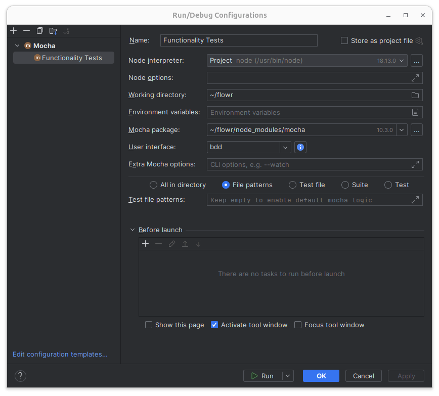

For the latest code-coverage information, see [codecov.io](https://app.codecov.io/gh/Code-Inspect/flowr), for the latest benchmark results, see the [benchmark results](https://code-inspect.github.io/flowr/wiki/stats/benchmark) wiki page.

- [Testing Suites](#testing-suites)
  - [Functionality Tests](#functionality-tests)
    - [Test Structure](#test-structure)
    - [Writing a Test](#writing-a-test)
    - [Running Only Some Tests](#running-only-some-tests)
  - [Performance Tests](#performance-tests)
  - [Oh no, the tests are slow](#oh-no-the-tests-are-slow)
  - [Testing Within Your IDE](#testing-within-your-ide)
    - [Using Visual Studio Code](#using-visual-studio-code)
    - [Using WebStorm](#using-webstorm)
- [CI Pipeline](#ci-pipeline)
- [Linting](#linting)
  - [Oh no, the linter fails](#oh-no-the-linter-fails)
  - [License Checker](#license-checker)

## Testing Suites

Currently, flowR contains two testing suites: one for [functionality](#functionality-tests) and one for [performance](#performance-tests). We explain each of them in the following.

### Functionality Tests

The functionality tests represent conventional unit (and depending on your terminology component/api) tests.
We use [mocha](https://mochajs.org/) as our testing framework and [chai](https://www.chaijs.com/) as our assertion library.
To run these tests, simply issue:

```shell
npm run test
```

What may be counter-intuitive is that this does not run *all* tests by default but only those that do not try R's package installation (as this can require more time). To run all tests, installation tests included, use:

```shell
npm run test-full
```

However, depending on your local R version, your network connection and potentially other factors, some tests may be skipped automatically as they do not apply to your current system setup (or can't be tested with the current prerequisites). Each test can specify such requirements as part of the `TestConfiguration`, which is then enforced by the [`ensureConfig`](https://github.com/Code-Inspect/flowr/blob/main/test/functionality/_helper/shell.ts) function.
It is up to the [ci](#ci-pipeline) to run the tests on different systems to ensure that those tests are ensured to run.

#### Test Structure

All functionality tests are to be located under [test/functionality](https://github.com/Code-Inspect/flowr/tree/main/test/functionality).

This folder contains two special elements:

- `main.spec.ts` which is the entry point if *all* tests are run. It should automatically disable logging statements and configure global variables (e.g., if installation tests should run).
- `_helper` which contains helper functions to be used by other tests.

Besides folders can (theoretically) arbitrarily structure their tests. We use the following convention:

- `*.spec.ts` denotes a test file which is to be collected when all tests are run, it may require other files to avoid big testing files and improve structure, but those should never end in `*.spec.ts`.
. `-tests.ts` denotes test files which are required by `*.spec.ts` files. To require them, there is also the helper function `requireAllTestsInFolder` which performs sanity checks to avoid forgotten tests.

#### Writing a Test

Currently this is heavily dependent on what you want to test (normalization, dataflow, quad-export, ...) and it is probably best to have a look at existing tests in that area to get an idea of what comfort functionality is available.

#### Running Only Some Tests

To run only some of the tests, the mocha test runner allows several options.
You can specify so [in the code](https://mochajs.org/#exclusive-tests) or [via the command line](https://mochajs.org/#-grep-regexp-g-regexp). If you modify the code, please make sure to remove the changes before committing!

### Performance Tests

The performance test suite of *flowR* uses several suites to check for variations in the required times for certain steps.
Although we measure wall time in the CI (which is subject to rather large variations), it should give a rough idea of the performance of *flowR*.
Furthermore, the respective scripts can be used locally as well.
To run them, issue:

```shell
npm run performance-test
```

See [test/performance](https://github.com/Code-Inspect/flowr/tree/main/test/performance) for more information on the suites, how to run them, and their results. If you are interested in the results of the benchmarks, see [here](https://code-inspect.github.io/flowr/wiki/stats/benchmark).

### Oh no, the tests are slow
If the tests are too slow for your taste, you may want to check out how to [run only some of the tests](#running-only-some-tests).

### Testing Within Your IDE

From your IDE of choice, you can also run all or some of the functionality tests that flowR provides.

#### Using Visual Studio Code

With Visual Studio Code (or Codium), you also require the Mocha Test Explorer add-on. To run functionality tests, follow these steps:

1. Install and enable the [Mocha Test Explorer](https://marketplace.visualstudio.com/items?itemName=hbenl.vscode-mocha-test-adapter).
2. In your copy of the flowR repository, open the Testing menu. You should see all functionality tests available for execution, like this:


3. To run the full test suite, press the Play button (▶️) above.
   - To only run a single, or some of the tests, navigate to it, and press the Play button, too.
   - You can cancel running tests by clicking on the Stop button (⏹️).
   - Successful tests are marked with a checkmark (✅), while failing tests are marked with a cross (❌).
4. To debug a failing test, navigate to it, and then press the Debug (🪲) button. This will automatically open the Run and Debug menu of VS Code.

#### Using WebStorm

With WebStorm, you can set up Run and Debug configurations from the IDE to run tests without additional add-ons.

1. If you only want to run those tests from a single test file, navigate to that file in the Project view, and then right-click on it. Then select `Run (file)`, or `Debug (file)`.
   You can also open the test file directly, to run a single test from it.
2. If you want to run the whole test suite, you need to set-up a new Run/Debug configuration:
   1. In the Run/Debug Configurations part of WebStorm, click the Drop-Down menu, and then `Edit Configurations`.
   2. Click on `+` to add a new configuration, and then select `Mocha`.
   3. Set the name of this new configuration, and select `File patterns` to run all specified functionality tests, like in the example above.


   4. Press `OK` to save the test run configuration.

   Afterwards, you can run or debug the flowR functionality test suite from the Run/Debug configurations part, by clicking on the Play and Debug buttons (▶️/🪲), respectively.

## CI Pipeline

We have several workflows defined in [.github/workflows](../.github/workflows/) (with the core setup of node and R being outsourced to [.github/actions/setup](../.github/actions/setup)).
We explain the most important workflows in the following:

- [run.yaml](../.github/workflows/run.yaml) is a [reusable workflow](https://docs.github.com/en/actions/using-workflows/reusing-workflows) that we use *whenever* we want to run a *flowR* npm script in the pipeline (furthermore, this hides necessary extra steps for coverage, documentation, and benchmarks).
- [qa.yaml](../.github/workflows/qa.yaml) is the main workflow which will run different steps depending on several factors. It is responsible for:
  - running the [functionality](#functionality-tests) and [performance tests](#performance-tests)
    - uploading the results to the [benchmark page](https://code-inspect.github.io/flowr/wiki/stats/benchmark) for releases
    - running the [functionality tests](#functionality-tests) on different operating systems (Windows, macOS, Linux) and with different versions of R
    - reporting code coverage
  - running the [linter](#linting) and reporting its results
  - deploying the documentation to [GitHub Pages](https://code-inspect.github.io/flowr/doc/)
- [release.yaml](../.github/workflows/release.yaml) is responsible for creating a new release, only to be run by repository owners. Furthermore, it adds the new docker image to [docker hub](https://hub.docker.com/r/eagleoutice/flowr).
- [broken-links-and-wiki.yaml](../.github/workflows/broken-links-and-wiki.yaml) repeatedly tests that all links are not dead!

## Linting

There are two linting scripts.
The main one:

```shell
npm run lint
```

And a weaker version of the first (allowing for *todo* comments) which is run automatically in the [pre-push githook](../.githooks/pre-push) as explained in the [CONTRIBUTING.md](../.github/CONTRIBUTING.md):

```shell
npm run lint-local
```

Besides checking coding style (as defined in the [package.json](../package.json)), the *full* linter runs the [license checker](#license-checker).

If you are unaware, several linting problems can be automatically fixed by [eslint](https://eslint.org/docs/latest/use/command-line-interface#fix-problems). So you may be fine by just running:

```shell
npm run lint-local -- --fix
```

### Oh no, the linter fails

By now, the rules should be rather stable and so, if the linter fails it is usually best if you (if necessary) read the respective description and fix the respective problem.
Rules in this project cover general JavaScript issues [using regular ESLint](https://eslint.org/docs/latest/rules), TypeScript-specific issues [using typescript-eslint](https://typescript-eslint.io/rules/), and code formatting [with ESLint Stylistic](https://eslint.style/packages/default#rules).

However, in case you think that the linter is wrong, please do not hesitate to open a [new issue](https://github.com/Code-Inspect/flowr/issues/new/choose).

### License Checker

*flowR* is licensed under the [GPLv3 License](https://github.com/Code-Inspect/flowr/blob/main/LICENSE) requiring us to only rely on [compatible licenses](https://www.gnu.org/licenses/license-list.en.html). For now, this list is hardcoded as part of the npm [`license-compat`](../package.json) script so it can very well be that a new dependency you add causes the checker to fail &mdash; *even though it is compatible*. In that case, please either open a [new issue](https://github.com/Code-Inspect/flowr/issues/new/choose) or directly add the license to the list (including a reference to why it is compatible).
