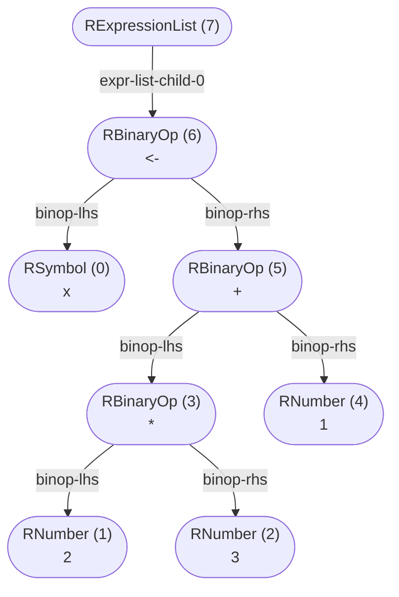

Type: RNode<Info = NoInfo>
  Extends: RExpressionList<Info>, RFunctions<Info>, ROther<Info>, RConstructs<Info>, RNamedAccess<Info>, RIndexAccess<Info>, RUnaryOp<Info>, RBinaryOp<Info>, RSingleNode<Info>, RPipe<Info>
_This document was generated from 'src/documentation/print-normalized-ast-wiki.ts' on 2024-09-29, 20:47:47 UTC presenting an overview of flowR's normalized ast (v2.0.25, using R v4.4.1)._

_flowR_ produces a normalized version of R's abstract syntax tree (AST), 
offering the following benefits. It...
 
1. abstracts away from intricacies of the R parser
2. provides a version-independent representation of the program
3. decorates the AST with additional information, e.g., parent relations and nesting information

In general, the mapping should be rather intuitive and focused primarily on the
syntactic structure of the program.
Consider the following example which shows the normalized AST of the code


```r
x <- 2 * 3 + 1
```



	
<details>

<summary style="color:gray">R Code of the Normalized AST</summary>

The analysis required _9.06 ms_ (including parsing) within the generation environment.

```r
x <- 2 * 3 + 1
```

<details>

<summary style="color:gray">Mermaid Code</summary>

```
flowchart TD
    n7(["RExpressionList (7)
 "])
    n6(["RBinaryOp (6)
#60;#45;"])
    n7 -->|"expr-list-child-0"| n6
    n0(["RSymbol (0)
x"])
    n6 -->|"binop-lhs"| n0
    n5(["RBinaryOp (5)
#43;"])
    n6 -->|"binop-rhs"| n5
    n3(["RBinaryOp (3)
#42;"])
    n5 -->|"binop-lhs"| n3
    n1(["RNumber (1)
2"])
    n3 -->|"binop-lhs"| n1
    n2(["RNumber (2)
3"])
    n3 -->|"binop-rhs"| n2
    n4(["RNumber (4)
1"])
    n5 -->|"binop-rhs"| n4

```

</details>

</details>


Indicative is the root expression list node, which is present in every normalized AST.
In general, we provide node types for:

1. literals (e.g., numbers and strings)
2. references (e.g., symbols, parameters and function calls)
3. constructs (e.g., loops and function definitions)
4. branches (e.g., `next` and `break`)
5. operators (e.g. `+`, `-`, and `*`)

The entry type into the structure is the  


