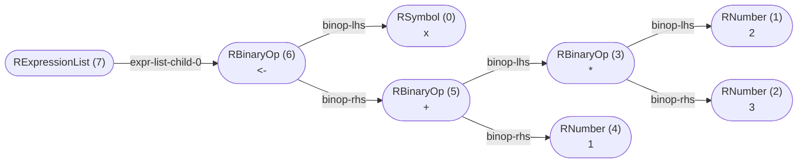

_This document was generated from '[src/documentation/print-normalized-ast-wiki.ts](https://github.com/flowr-analysis/flowr/tree/main//src/documentation/print-normalized-ast-wiki.ts)' on 2025-10-24, 09:17:05 UTC presenting an overview of flowR's normalized ast (v2.6.1, using R v4.5.0). Please do not edit this file/wiki page directly._

_flowR_ produces a normalized version of R's abstract syntax tree (AST),
offering the following benefits:

1. abstract away from intricacies of the R parser
2. provide a version-independent representation of the program
3. decorate the AST with additional information, e.g., parent relations and nesting information

In general, the mapping should be rather intuitive and focused primarily on the
syntactic structure of the program.
Consider the following example which shows the normalized AST of the code


```r
x <- 2 * 3 + 1
```


Each node in the AST contains the type, the id, and the lexeme (if applicable).
Each edge is labeled with the type of the parent-child relationship (the "role").



	
(The analysis required _9.5 ms_ (including parsing with the [r-shell](https://github.com/flowr-analysis/flowr/wiki/Engines) engine) within the generation environment.)


> [!TIP]
> If you want to investigate the normalized AST, 
> you can either use the [Visual Studio Code extension](https://github.com/flowr-analysis/vscode-flowr) or the <span title="Description (Repl Command, starred version): Returns the URL to mermaid.live; Base Command: Get mermaid code for the normalized AST of R code, start with 'file://' to indicate a file (aliases: :n*)">`:normalize*`</span> 
> command in the REPL (see the [Interface wiki page](https://github.com/flowr-analysis/flowr/wiki/Interface) for more information).

Indicative of the normalization is the root expression list node, which is present in every normalized AST.
In general, we provide node types for:

1. literals (e.g., numbers and strings)
2. references (e.g., symbols, parameters and function calls)
3. constructs (e.g., loops and function definitions)
4. branches (e.g., `next` and `break`)
5. operators (e.g. `+`, `-`, and `*`)

<details>

<summary style="color:gray">Complete Class Diagram</summary>

Every node is a link, which directly refers to the implementation in the source code.
Grayed-out parts are used for structuring the AST, grouping together related nodes.


```mermaid
classDiagram
direction RL
class RNode~Info = NoInfo~
    <<type>> RNode
style RNode opacity:.35,fill:#FAFAFA
click RNode href "https://github.com/flowr-analysis/flowr/tree/main//src/r-bridge/lang-4.x/ast/model/model.ts#L164" "The #96;RNode#96; type is the union of all possible nodes in the R#45;ast. It should be used whenever you either not care what kind of node you are dealing with or if you want to handle all possible nodes. #60;p#62;  All other subtypes (like; #60;code#62;RLoopConstructs#60;/code#62;; ) listed above can be used to restrict the kind of node. They do not have to be exclusive, some nodes can appear in multiple subtypes."
class RExpressionList~Info = NoInfo~
    <<interface>> RExpressionList
    RExpressionList : type#58; RType.ExpressionList
    RExpressionList : grouping#58; #91;start#58; RSymbol#60;Info, string#62;, end#58; RSymbol#60;Info, string#62;#93;
click RExpressionList href "https://github.com/flowr-analysis/flowr/tree/main//src/r-bridge/lang-4.x/ast/model/nodes/r-expression-list.ts#L9" "Holds a list of expressions (and hence may be the root of an AST, summarizing all expressions in a file). The #96;grouping#96; property holds information on if the expression list is structural or created by a wrapper like #96;#123;#125;#96; or #96;()#96;."
    RExpressionList : children#58; readonly Children#91;#93; [from WithChildren]
    RExpressionList : type#58; RType [from Base]
    RExpressionList : lexeme#58; LexemeType [from Base]
    RExpressionList : info#58; Info #38; Source [from Base]
class Info
    <<enum>> Info
click Info href "https://github.com/flowr-analysis/flowr/tree/main//src/util/log.ts#L55" ""
class LogLevel
    <<enum>> LogLevel
    LogLevel : Silly#58; LogLevel.Silly
    LogLevel : Trace#58; LogLevel.Trace
    LogLevel : Debug#58; LogLevel.Debug
    LogLevel : Info#58; LogLevel.Info
    LogLevel : Warn#58; LogLevel.Warn
    LogLevel : Error#58; LogLevel.Error
    LogLevel : Fatal#58; LogLevel.Fatal
click LogLevel href "https://github.com/flowr-analysis/flowr/tree/main//src/util/log.ts#L51" ""
class RFunctions~Info~
    <<type>> RFunctions
style RFunctions opacity:.35,fill:#FAFAFA
click RFunctions href "https://github.com/flowr-analysis/flowr/tree/main//src/r-bridge/lang-4.x/ast/model/model.ts#L144" "This subtype of; #60;code#62;RNode#60;/code#62;; represents all types related to functions (calls and definitions) in the normalized AST."
class RFunctionDefinition~Info = NoInfo~
    <<interface>> RFunctionDefinition
    RFunctionDefinition : type#58; RType.FunctionDefinition
    RFunctionDefinition : parameters#58; RParameter#60;Info#62;#91;#93;
    RFunctionDefinition : body#58; RNode#60;Info#62;
click RFunctionDefinition href "https://github.com/flowr-analysis/flowr/tree/main//src/r-bridge/lang-4.x/ast/model/nodes/r-function-definition.ts#L14" "#96;#96;#96;r function(#60;parameters#62;) #60;body#62; #96;#96;#96; or#58; #96;#96;#96;r #92;(#60;parameters#62;) #60;body#62; #96;#96;#96;"
    RFunctionDefinition : type#58; RType [from Base]
    RFunctionDefinition : lexeme#58; LexemeType [from Base]
    RFunctionDefinition : info#58; Info #38; Source [from Base]
    RFunctionDefinition : location#58; SourceRange [from Location]
class RFunctionCall~Info = NoInfo~
    <<type>> RFunctionCall
style RFunctionCall opacity:.35,fill:#FAFAFA
click RFunctionCall href "https://github.com/flowr-analysis/flowr/tree/main//src/r-bridge/lang-4.x/ast/model/nodes/r-function-call.ts#L39" ""
class RNamedFunctionCall~Info = NoInfo~
    <<interface>> RNamedFunctionCall
    RNamedFunctionCall : type#58; RType.FunctionCall
    RNamedFunctionCall : named#58; true
    RNamedFunctionCall : functionName#58; RSymbol#60;Info, string#62;
    RNamedFunctionCall : arguments#58; readonly RFunctionArgument#60;Info#62;#91;#93;
click RNamedFunctionCall href "https://github.com/flowr-analysis/flowr/tree/main//src/r-bridge/lang-4.x/ast/model/nodes/r-function-call.ts#L15" "Calls of functions like #96;a()#96; and #96;foo(42, #34;hello#34;)#96;."
    RNamedFunctionCall : type#58; RType [from Base]
    RNamedFunctionCall : lexeme#58; LexemeType [from Base]
    RNamedFunctionCall : info#58; Info #38; Source [from Base]
    RNamedFunctionCall : location#58; SourceRange [from Location]
class RUnnamedFunctionCall~Info = NoInfo~
    <<interface>> RUnnamedFunctionCall
    RUnnamedFunctionCall : type#58; RType.FunctionCall
    RUnnamedFunctionCall : named#58; false
    RUnnamedFunctionCall : calledFunction#58; RNode#60;Info#62;
    RUnnamedFunctionCall : infixSpecial#58; boolean
    RUnnamedFunctionCall : arguments#58; readonly RFunctionArgument#60;Info#62;#91;#93;
click RUnnamedFunctionCall href "https://github.com/flowr-analysis/flowr/tree/main//src/r-bridge/lang-4.x/ast/model/nodes/r-function-call.ts#L29" "Direct calls of functions like #96;(function(x) #123; x #125;)(3)#96;."
    RUnnamedFunctionCall : type#58; RType [from Base]
    RUnnamedFunctionCall : lexeme#58; LexemeType [from Base]
    RUnnamedFunctionCall : info#58; Info #38; Source [from Base]
    RUnnamedFunctionCall : location#58; SourceRange [from Location]
class RParameter~Info = NoInfo~
    <<interface>> RParameter
    RParameter : type#58; RType.Parameter
    RParameter : name#58; RSymbol#60;Info, string#62;
    RParameter : special#58; boolean
    RParameter : defaultValue#58; RNode#60;Info#62;
click RParameter href "https://github.com/flowr-analysis/flowr/tree/main//src/r-bridge/lang-4.x/ast/model/nodes/r-parameter.ts#L8" "Represents a parameter of a function definition in R."
    RParameter : type#58; RType [from Base]
    RParameter : lexeme#58; LexemeType [from Base]
    RParameter : info#58; Info #38; Source [from Base]
    RParameter : location#58; SourceRange [from Location]
class RArgument~Info = NoInfo~
    <<interface>> RArgument
    RArgument : type#58; RType.Argument
    RArgument : name#58; RSymbol#60;Info, string#62;
    RArgument : value#58; RNode#60;Info#62;
click RArgument href "https://github.com/flowr-analysis/flowr/tree/main//src/r-bridge/lang-4.x/ast/model/nodes/r-argument.ts#L8" "Represents a named or unnamed argument of a function definition in R."
    RArgument : type#58; RType [from Base]
    RArgument : lexeme#58; LexemeType [from Base]
    RArgument : info#58; Info #38; Source [from Base]
    RArgument : location#58; SourceRange [from Location]
class ROther~Info~
    <<type>> ROther
style ROther opacity:.35,fill:#FAFAFA
click ROther href "https://github.com/flowr-analysis/flowr/tree/main//src/r-bridge/lang-4.x/ast/model/model.ts#L149" "This subtype of; #60;code#62;RNode#60;/code#62;; represents all types of otherwise hard to categorize nodes in the normalized AST. At the moment these are the comment#45;like nodes."
class RComment~Info = NoInfo~
    <<interface>> RComment
    RComment : type#58; RType.Comment
    RComment : content#58; string
click RComment href "https://github.com/flowr-analysis/flowr/tree/main//src/r-bridge/lang-4.x/ast/model/nodes/r-comment.ts#L9" "#96;#96;#96;r # I am a line comment #96;#96;#96;"
    RComment : location#58; SourceRange [from Location]
class RLineDirective~Info = NoInfo~
    <<interface>> RLineDirective
    RLineDirective : type#58; RType.LineDirective
    RLineDirective : line#58; number
    RLineDirective : file#58; string
click RLineDirective href "https://github.com/flowr-analysis/flowr/tree/main//src/r-bridge/lang-4.x/ast/model/nodes/r-line-directive.ts#L7" "Special comment to signal line mappings (e.g., in generated code) to the interpreter."
    RLineDirective : location#58; SourceRange [from Location]
class RConstructs~Info~
    <<type>> RConstructs
style RConstructs opacity:.35,fill:#FAFAFA
click RConstructs href "https://github.com/flowr-analysis/flowr/tree/main//src/r-bridge/lang-4.x/ast/model/model.ts#L139" "As an extension to; #60;code#62;RLoopConstructs#60;/code#62;; , this subtype of; #60;code#62;RNode#60;/code#62;; includes the; #60;code#62;RIfThenElse#60;/code#62;; construct as well."
class RLoopConstructs~Info~
    <<type>> RLoopConstructs
style RLoopConstructs opacity:.35,fill:#FAFAFA
click RLoopConstructs href "https://github.com/flowr-analysis/flowr/tree/main//src/r-bridge/lang-4.x/ast/model/model.ts#L134" "This subtype of; #60;code#62;RNode#60;/code#62;; represents all looping constructs in the normalized AST."
class RForLoop~Info = NoInfo~
    <<interface>> RForLoop
    RForLoop : type#58; RType.ForLoop
    RForLoop : variable#58; RSymbol#60;Info, string#62;
    RForLoop : vector#58; RNode#60;Info#62;
    RForLoop : body#58; RExpressionList#60;Info#62;
click RForLoop href "https://github.com/flowr-analysis/flowr/tree/main//src/r-bridge/lang-4.x/ast/model/nodes/r-for-loop.ts#L11" "#96;#96;#96;r for(#60;variable#62; in #60;vector#62;) #60;body#62; #96;#96;#96;"
    RForLoop : type#58; RType [from Base]
    RForLoop : lexeme#58; LexemeType [from Base]
    RForLoop : info#58; Info #38; Source [from Base]
    RForLoop : location#58; SourceRange [from Location]
class RRepeatLoop~Info = NoInfo~
    <<interface>> RRepeatLoop
    RRepeatLoop : type#58; RType.RepeatLoop
    RRepeatLoop : body#58; RExpressionList#60;Info#62;
click RRepeatLoop href "https://github.com/flowr-analysis/flowr/tree/main//src/r-bridge/lang-4.x/ast/model/nodes/r-repeat-loop.ts#L10" "#96;#96;#96;r repeat #60;body#62; #96;#96;#96;"
    RRepeatLoop : type#58; RType [from Base]
    RRepeatLoop : lexeme#58; LexemeType [from Base]
    RRepeatLoop : info#58; Info #38; Source [from Base]
    RRepeatLoop : location#58; SourceRange [from Location]
class RWhileLoop~Info = NoInfo~
    <<interface>> RWhileLoop
    RWhileLoop : type#58; RType.WhileLoop
    RWhileLoop : condition#58; RNode#60;Info#62;
    RWhileLoop : body#58; RExpressionList#60;Info#62;
click RWhileLoop href "https://github.com/flowr-analysis/flowr/tree/main//src/r-bridge/lang-4.x/ast/model/nodes/r-while-loop.ts#L10" "#96;#96;#96;r while(#60;condition#62;) #60;body#62; #96;#96;#96;"
    RWhileLoop : type#58; RType [from Base]
    RWhileLoop : lexeme#58; LexemeType [from Base]
    RWhileLoop : info#58; Info #38; Source [from Base]
    RWhileLoop : location#58; SourceRange [from Location]
class RIfThenElse~Info = NoInfo~
    <<interface>> RIfThenElse
    RIfThenElse : type#58; RType.IfThenElse
    RIfThenElse : condition#58; RNode#60;Info#62;
    RIfThenElse : then#58; RExpressionList#60;Info#62;
    RIfThenElse : otherwise#58; RExpressionList#60;Info#62;
click RIfThenElse href "https://github.com/flowr-analysis/flowr/tree/main//src/r-bridge/lang-4.x/ast/model/nodes/r-if-then-else.ts#L10" "#96;#96;#96;r if(#60;condition#62;) #60;then#62; #91;else #60;otherwise#62;#93; #96;#96;#96;"
    RIfThenElse : type#58; RType [from Base]
    RIfThenElse : lexeme#58; LexemeType [from Base]
    RIfThenElse : info#58; Info #38; Source [from Base]
    RIfThenElse : location#58; SourceRange [from Location]
class RNamedAccess~Info = NoInfo~
    <<interface>> RNamedAccess
    RNamedAccess : operator#58; #34;$#34; | #34;@#34;
    RNamedAccess : access#58; #91;RUnnamedArgument#60;Info#62;#93;
click RNamedAccess href "https://github.com/flowr-analysis/flowr/tree/main//src/r-bridge/lang-4.x/ast/model/nodes/r-access.ts#L19" "Represents an R named access operation with #96;$#96; or #96;@#96;, the field is a string."
    RNamedAccess : type#58; RType.Access [from RAccessBase]
    RNamedAccess : accessed#58; RNode#60;Info#62; [from RAccessBase]
    RNamedAccess : operator#58; #34;$#34; | #34;@#34; | #34;#91;#34; | #34;#91;#91;#34; [from RAccessBase]
class RIndexAccess~Info = NoInfo~
    <<interface>> RIndexAccess
    RIndexAccess : operator#58; #34;#91;#34; | #34;#91;#91;#34;
    RIndexAccess : access#58; readonly (#34;#60;#62;#34; | RArgument#60;Info#62;)#91;#93;
click RIndexAccess href "https://github.com/flowr-analysis/flowr/tree/main//src/r-bridge/lang-4.x/ast/model/nodes/r-access.ts#L25" "access can be a number, a variable or an expression that resolves to one, a filter etc."
    RIndexAccess : type#58; RType.Access [from RAccessBase]
    RIndexAccess : accessed#58; RNode#60;Info#62; [from RAccessBase]
    RIndexAccess : operator#58; #34;$#34; | #34;@#34; | #34;#91;#34; | #34;#91;#91;#34; [from RAccessBase]
class RUnaryOp~Info = NoInfo~
    <<interface>> RUnaryOp
    RUnaryOp : type#58; RType.UnaryOp
    RUnaryOp : operator#58; string
    RUnaryOp : operand#58; RNode#60;Info#62;
click RUnaryOp href "https://github.com/flowr-analysis/flowr/tree/main//src/r-bridge/lang-4.x/ast/model/nodes/r-unary-op.ts#L7" "Unary operations like #96;#43;#96; and #96;#45;#96;"
    RUnaryOp : type#58; RType [from Base]
    RUnaryOp : lexeme#58; LexemeType [from Base]
    RUnaryOp : info#58; Info #38; Source [from Base]
    RUnaryOp : location#58; SourceRange [from Location]
class RBinaryOp~Info = NoInfo~
    <<interface>> RBinaryOp
    RBinaryOp : type#58; RType.BinaryOp
    RBinaryOp : operator#58; string
    RBinaryOp : lhs#58; RNode#60;Info#62;
    RBinaryOp : rhs#58; RNode#60;Info#62;
click RBinaryOp href "https://github.com/flowr-analysis/flowr/tree/main//src/r-bridge/lang-4.x/ast/model/nodes/r-binary-op.ts#L7" "Operators like #96;#43;#96;, #96;==#96;, #96;#38;#38;#96;, etc."
    RBinaryOp : type#58; RType [from Base]
    RBinaryOp : lexeme#58; LexemeType [from Base]
    RBinaryOp : info#58; Info #38; Source [from Base]
    RBinaryOp : location#58; SourceRange [from Location]
class RSingleNode~Info~
    <<type>> RSingleNode
style RSingleNode opacity:.35,fill:#FAFAFA
click RSingleNode href "https://github.com/flowr-analysis/flowr/tree/main//src/r-bridge/lang-4.x/ast/model/model.ts#L130" "This subtype of; #60;code#62;RNode#60;/code#62;; represents all types of; #60;code#62;Leaf#60;/code#62;; nodes in the normalized AST."
class RSymbol~Info = NoInfo, T extends string = string~
    <<interface>> RSymbol
    RSymbol : type#58; RType.Symbol
    RSymbol : content#58; T
click RSymbol href "https://github.com/flowr-analysis/flowr/tree/main//src/r-bridge/lang-4.x/ast/model/nodes/r-symbol.ts#L12" "Represents identifiers (variables)."
    RSymbol : location#58; SourceRange [from Location]
class RConstant~Info~
    <<type>> RConstant
style RConstant opacity:.35,fill:#FAFAFA
click RConstant href "https://github.com/flowr-analysis/flowr/tree/main//src/r-bridge/lang-4.x/ast/model/model.ts#L125" "This subtype of; #60;code#62;RNode#60;/code#62;; represents all types of constants represented in the normalized AST."
class RNumber~Info = NoInfo~
    <<interface>> RNumber
    RNumber : type#58; RType.Number
    RNumber : content#58; RNumberValue
click RNumber href "https://github.com/flowr-analysis/flowr/tree/main//src/r-bridge/lang-4.x/ast/model/nodes/r-number.ts#L10" "A number like #96;3#96;, #96;#45;2.14#96;, #96;1L#96;, or #96;2i#96;. Includes numeric, integer, and complex. See; #60;code#62;RNumberValue#60;/code#62;; for more information."
    RNumber : location#58; SourceRange [from Location]
class RString~Info = NoInfo~
    <<interface>> RString
    RString : type#58; RType.String
    RString : content#58; RStringValue
click RString href "https://github.com/flowr-analysis/flowr/tree/main//src/r-bridge/lang-4.x/ast/model/nodes/r-string.ts#L8" "Represents a string like #96;#34;hello#34;#96;, including raw strings like #96;r#34;(hello)#34;#96;."
    RString : location#58; SourceRange [from Location]
class RLogical~Info = NoInfo~
    <<interface>> RLogical
    RLogical : type#58; RType.Logical
    RLogical : content#58; boolean
click RLogical href "https://github.com/flowr-analysis/flowr/tree/main//src/r-bridge/lang-4.x/ast/model/nodes/r-logical.ts#L9" "Represents logical values (#96;TRUE#96; or #96;FALSE#96;)."
    RLogical : location#58; SourceRange [from Location]
class RBreak~Info = NoInfo~
    <<interface>> RBreak
    RBreak : type#58; RType.Break
click RBreak href "https://github.com/flowr-analysis/flowr/tree/main//src/r-bridge/lang-4.x/ast/model/nodes/r-break.ts#L7" "A #96;break#96; statement."
    RBreak : location#58; SourceRange [from Location]
class RNext~Info = NoInfo~
    <<interface>> RNext
    RNext : type#58; RType.Next
click RNext href "https://github.com/flowr-analysis/flowr/tree/main//src/r-bridge/lang-4.x/ast/model/nodes/r-next.ts#L7" "A #96;next#96; statement."
    RNext : location#58; SourceRange [from Location]
class RPipe~Info = NoInfo~
    <<interface>> RPipe
    RPipe : type#58; RType.Pipe
    RPipe : lhs#58; RNode#60;Info#62;
    RPipe : rhs#58; RNode#60;Info#62;
click RPipe href "https://github.com/flowr-analysis/flowr/tree/main//src/r-bridge/lang-4.x/ast/model/nodes/r-pipe.ts#L7" "Variant of the binary operator, specifically for the new, built#45;in pipe operator."
    RPipe : type#58; RType [from Base]
    RPipe : lexeme#58; LexemeType [from Base]
    RPipe : info#58; Info #38; Source [from Base]
    RPipe : location#58; SourceRange [from Location]
RExpressionList .. RNode
Info .. RNode
LogLevel <|-- Info
RFunctions .. RNode
RFunctionDefinition .. RFunctions
Info .. RFunctions
RFunctionCall .. RFunctions
RNamedFunctionCall .. RFunctionCall
Info .. RFunctionCall
RUnnamedFunctionCall .. RFunctionCall
Info .. RFunctionCall
Info .. RFunctions
RParameter .. RFunctions
Info .. RFunctions
RArgument .. RFunctions
Info .. RFunctions
Info .. RNode
ROther .. RNode
RComment .. ROther
Info .. ROther
RLineDirective .. ROther
Info .. ROther
Info .. RNode
RConstructs .. RNode
RLoopConstructs .. RConstructs
RForLoop .. RLoopConstructs
Info .. RLoopConstructs
RRepeatLoop .. RLoopConstructs
Info .. RLoopConstructs
RWhileLoop .. RLoopConstructs
Info .. RLoopConstructs
Info .. RConstructs
RIfThenElse .. RConstructs
Info .. RConstructs
Info .. RNode
RNamedAccess .. RNode
Info .. RNode
RIndexAccess .. RNode
Info .. RNode
RUnaryOp .. RNode
Info .. RNode
RBinaryOp .. RNode
Info .. RNode
RSingleNode .. RNode
RComment .. RSingleNode
Info .. RSingleNode
RSymbol .. RSingleNode
Info .. RSingleNode
RConstant .. RSingleNode
RNumber .. RConstant
Info .. RConstant
RString .. RConstant
Info .. RConstant
RLogical .. RConstant
Info .. RConstant
Info .. RSingleNode
RBreak .. RSingleNode
Info .. RSingleNode
RNext .. RSingleNode
Info .. RSingleNode
RLineDirective .. RSingleNode
Info .. RSingleNode
Info .. RNode
RPipe .. RNode
Info .. RNode
```


_The generation of the class diagram required 2216.0 ms._
</details>

Node types are controlled by the <a href="https://github.com/flowr-analysis/flowr/tree/main//src/r-bridge/lang-4.x/ast/model/type.ts#L159"><code><span title="Types as we use them for our normalized AST. See RNode for a union type of all normalized AST nodes in-use. For each enum member, the respective normalized AST node should be referenced in the corresponding comment.">RType</span></code></a> enum (see [`./src/r-bridge/lang-4.x/ast/model/type.ts`](https://github.com/flowr-analysis/flowr/tree/main/./src/r-bridge/lang-4.x/ast/model/type.ts)), 
which is used to distinguish between different types of nodes.
Additionally, every AST node is generic with respect to the `Info` type which allows for arbitrary decorations (e.g., parent inforamtion or dataflow constraints).
Most notably, the `info` field holds the `id` of the node, which is used to reference the node in the [dataflow graph](https://github.com/flowr-analysis/flowr/wiki/Dataflow%20Graph).

In summary, we have the following types:


<details><summary>Normalized AST Node Types</summary>

 * [RNode](https://github.com/flowr-analysis/flowr/tree/main//src/r-bridge/lang-4.x/ast/model/model.ts#L164)   
   The `RNode` type is the union of all possible nodes in the R-ast.
   It should be used whenever you either not care what kind of
   node you are dealing with or if you want to handle all possible nodes.
   <p>
    All other subtypes (like
   <code>RLoopConstructs</code>
   ) listed above
   can be used to restrict the kind of node. They do not have to be
   exclusive, some nodes can appear in multiple subtypes.
   <details><summary style="color:gray">Defined at <a href="https://github.com/flowr-analysis/flowr/tree/main//src/r-bridge/lang-4.x/ast/model/model.ts#L164">./src/r-bridge/lang-4.x/ast/model/model.ts#L164</a></summary>
   
   
   ```ts
   /**
    * The `RNode` type is the union of all possible nodes in the R-ast.
    * It should be used whenever you either not care what kind of
    * node you are dealing with or if you want to handle all possible nodes.
    * <p>
    *
    * All other subtypes (like {@link RLoopConstructs}) listed above
    * can be used to restrict the kind of node. They do not have to be
    * exclusive, some nodes can appear in multiple subtypes.
    *
    * @see {@link recoverName} - to receive the name/lexeme from such a node
    * @see {@link recoverContent} - for a more rigorous approach to get the content of a node within a {@link DataflowGraph|dataflow graph}
    */
   export type RNode<Info = NoInfo>  = RExpressionList<Info> | RFunctions<Info>
       | ROther<Info> | RConstructs<Info> | RNamedAccess<Info> | RIndexAccess<Info>
       | RUnaryOp<Info> | RBinaryOp<Info> | RSingleNode<Info>  | RPipe<Info>
   ```
   
   
   </details>
   
   * **[RExpressionList](https://github.com/flowr-analysis/flowr/tree/main//src/r-bridge/lang-4.x/ast/model/nodes/r-expression-list.ts#L9)**   
     Holds a list of expressions (and hence may be the root of an AST, summarizing all expressions in a file).
     The `grouping` property holds information on if the expression list is structural or created by a wrapper like `{}` or `()`.
     <details><summary style="color:gray">Defined at <a href="https://github.com/flowr-analysis/flowr/tree/main//src/r-bridge/lang-4.x/ast/model/nodes/r-expression-list.ts#L9">./src/r-bridge/lang-4.x/ast/model/nodes/r-expression-list.ts#L9</a></summary>
     
     
     ```ts
     /**
      * Holds a list of expressions (and hence may be the root of an AST, summarizing all expressions in a file).
      * The `grouping` property holds information on if the expression list is structural or created by a wrapper like `{}` or `()`.
      */
     export interface RExpressionList<Info = NoInfo> extends WithChildren<Info, RNode<Info>>, Base<Info, string | undefined>, Partial<Location> {
         readonly type:     RType.ExpressionList;
         /** encodes wrappers like `{}` or `()` */
         readonly grouping: undefined | [start: RSymbol<Info>, end: RSymbol<Info>]
     }
     ```
     
     
     </details>
     
   * **[Info](https://github.com/flowr-analysis/flowr/tree/main//src/util/log.ts#L55)**   
   
     <details><summary style="color:gray">Defined at <a href="https://github.com/flowr-analysis/flowr/tree/main//src/util/log.ts#L55">./src/util/log.ts#L55</a></summary>
     
     
     ```ts
     Info = 3
     ```
     
     
     </details>
     
     * **[LogLevel](https://github.com/flowr-analysis/flowr/tree/main//src/util/log.ts#L51)**   
     
       <details><summary style="color:gray">Defined at <a href="https://github.com/flowr-analysis/flowr/tree/main//src/util/log.ts#L51">./src/util/log.ts#L51</a></summary>
       
       
       ```ts
       // based on https://tslog.js.org/#/?id=minlevel
       // noinspection JSUnusedGlobalSymbols
       export const enum LogLevel {
           Silly = 0,
           Trace = 1,
           Debug = 2,
           Info = 3,
           Warn = 4,
           Error = 5,
           Fatal = 6
       }
       ```
       
       
       </details>
       
   * [RFunctions](https://github.com/flowr-analysis/flowr/tree/main//src/r-bridge/lang-4.x/ast/model/model.ts#L144)   
     This subtype of
     <code>RNode</code>
     represents all types related to functions
     (calls and definitions) in the normalized AST.
     <details><summary style="color:gray">Defined at <a href="https://github.com/flowr-analysis/flowr/tree/main//src/r-bridge/lang-4.x/ast/model/model.ts#L144">./src/r-bridge/lang-4.x/ast/model/model.ts#L144</a></summary>
     
     
     ```ts
     /**
      * This subtype of {@link RNode} represents all types related to functions
      * (calls and definitions) in the normalized AST.
      */
     export type RFunctions<Info>      = RFunctionDefinition<Info> | RFunctionCall<Info> | RParameter<Info> | RArgument<Info>
     ```
     
     
     </details>
     
     * **[RFunctionDefinition](https://github.com/flowr-analysis/flowr/tree/main//src/r-bridge/lang-4.x/ast/model/nodes/r-function-definition.ts#L14)**   
       ```r
       function(<parameters>) <body>
       ```
       or:
       ```r
       \(<parameters>) <body>
       ```
       <details><summary style="color:gray">Defined at <a href="https://github.com/flowr-analysis/flowr/tree/main//src/r-bridge/lang-4.x/ast/model/nodes/r-function-definition.ts#L14">./src/r-bridge/lang-4.x/ast/model/nodes/r-function-definition.ts#L14</a></summary>
       
       
       ```ts
       /**
        * ```r
        * function(<parameters>) <body>
        * ```
        * or:
        * ```r
        * \(<parameters>) <body>
        * ```
        */
       export interface RFunctionDefinition<Info = NoInfo> extends Base<Info>, Location {
           readonly type: RType.FunctionDefinition;
           /** the R formals, to our knowledge, they must be unique */
           parameters:    RParameter<Info>[];
           body:          RNode<Info>;
       }
       ```
       
       
       </details>
       
     * **[Info](https://github.com/flowr-analysis/flowr/tree/main//src/util/log.ts#L55)**   
     
       <details><summary style="color:gray">Defined at <a href="https://github.com/flowr-analysis/flowr/tree/main//src/util/log.ts#L55">./src/util/log.ts#L55</a></summary>
       
       
       ```ts
       Info = 3
       ```
       
       
       </details>
       
       * **[LogLevel](https://github.com/flowr-analysis/flowr/tree/main//src/util/log.ts#L51)**   
       
         <details><summary style="color:gray">Defined at <a href="https://github.com/flowr-analysis/flowr/tree/main//src/util/log.ts#L51">./src/util/log.ts#L51</a></summary>
         
         
         ```ts
         // based on https://tslog.js.org/#/?id=minlevel
         // noinspection JSUnusedGlobalSymbols
         export const enum LogLevel {
             Silly = 0,
             Trace = 1,
             Debug = 2,
             Info = 3,
             Warn = 4,
             Error = 5,
             Fatal = 6
         }
         ```
         
         
         </details>
         
     * [RFunctionCall](https://github.com/flowr-analysis/flowr/tree/main//src/r-bridge/lang-4.x/ast/model/nodes/r-function-call.ts#L39)   
     
       <details><summary style="color:gray">Defined at <a href="https://github.com/flowr-analysis/flowr/tree/main//src/r-bridge/lang-4.x/ast/model/nodes/r-function-call.ts#L39">./src/r-bridge/lang-4.x/ast/model/nodes/r-function-call.ts#L39</a></summary>
       
       
       ```ts
       export type RFunctionCall<Info = NoInfo> = RNamedFunctionCall<Info> | RUnnamedFunctionCall<Info>;
       ```
       
       
       </details>
       
       * **[RNamedFunctionCall](https://github.com/flowr-analysis/flowr/tree/main//src/r-bridge/lang-4.x/ast/model/nodes/r-function-call.ts#L15)**   
         Calls of functions like `a()` and `foo(42, "hello")`.
         <details><summary style="color:gray">Defined at <a href="https://github.com/flowr-analysis/flowr/tree/main//src/r-bridge/lang-4.x/ast/model/nodes/r-function-call.ts#L15">./src/r-bridge/lang-4.x/ast/model/nodes/r-function-call.ts#L15</a></summary>
         
         
         ```ts
         /**
          * Calls of functions like `a()` and `foo(42, "hello")`.
          *
          * @see RUnnamedFunctionCall
          */
         export interface RNamedFunctionCall<Info = NoInfo> extends Base<Info>, Location {
             readonly type:      RType.FunctionCall;
             readonly named:     true;
             functionName:       RSymbol<Info>;
             /** arguments can be empty, for example when calling as `a(1, ,3)` */
             readonly arguments: readonly RFunctionArgument<Info>[];
         }
         ```
         
         
         </details>
         
       * **[Info](https://github.com/flowr-analysis/flowr/tree/main//src/util/log.ts#L55)**   
       
         <details><summary style="color:gray">Defined at <a href="https://github.com/flowr-analysis/flowr/tree/main//src/util/log.ts#L55">./src/util/log.ts#L55</a></summary>
         
         
         ```ts
         Info = 3
         ```
         
         
         </details>
         
         * **[LogLevel](https://github.com/flowr-analysis/flowr/tree/main//src/util/log.ts#L51)**   
         
           <details><summary style="color:gray">Defined at <a href="https://github.com/flowr-analysis/flowr/tree/main//src/util/log.ts#L51">./src/util/log.ts#L51</a></summary>
           
           
           ```ts
           // based on https://tslog.js.org/#/?id=minlevel
           // noinspection JSUnusedGlobalSymbols
           export const enum LogLevel {
               Silly = 0,
               Trace = 1,
               Debug = 2,
               Info = 3,
               Warn = 4,
               Error = 5,
               Fatal = 6
           }
           ```
           
           
           </details>
           
       * **[RUnnamedFunctionCall](https://github.com/flowr-analysis/flowr/tree/main//src/r-bridge/lang-4.x/ast/model/nodes/r-function-call.ts#L29)**   
         Direct calls of functions like `(function(x) { x })(3)`.
         <details><summary style="color:gray">Defined at <a href="https://github.com/flowr-analysis/flowr/tree/main//src/r-bridge/lang-4.x/ast/model/nodes/r-function-call.ts#L29">./src/r-bridge/lang-4.x/ast/model/nodes/r-function-call.ts#L29</a></summary>
         
         
         ```ts
         /**
          * Direct calls of functions like `(function(x) { x })(3)`.
          *
          * @see RNamedFunctionCall
          */
         export interface RUnnamedFunctionCall<Info = NoInfo> extends Base<Info>, Location {
             readonly type:      RType.FunctionCall;
             readonly named:     false | undefined;
             calledFunction:     RNode<Info>; /* can be either a function definition or another call that returns a function etc. */
             /** marks function calls like `3 %xx% 4` which have been written in special infix notation; deprecated in v2 */
             infixSpecial?:      boolean;
             /** arguments can be undefined, for example when calling as `a(1, ,3)` */
             readonly arguments: readonly RFunctionArgument<Info>[];
         }
         ```
         
         
         </details>
         
       * **[Info](https://github.com/flowr-analysis/flowr/tree/main//src/util/log.ts#L55)**   
       
         <details><summary style="color:gray">Defined at <a href="https://github.com/flowr-analysis/flowr/tree/main//src/util/log.ts#L55">./src/util/log.ts#L55</a></summary>
         
         
         ```ts
         Info = 3
         ```
         
         
         </details>
         
         * **[LogLevel](https://github.com/flowr-analysis/flowr/tree/main//src/util/log.ts#L51)**   
         
           <details><summary style="color:gray">Defined at <a href="https://github.com/flowr-analysis/flowr/tree/main//src/util/log.ts#L51">./src/util/log.ts#L51</a></summary>
           
           
           ```ts
           // based on https://tslog.js.org/#/?id=minlevel
           // noinspection JSUnusedGlobalSymbols
           export const enum LogLevel {
               Silly = 0,
               Trace = 1,
               Debug = 2,
               Info = 3,
               Warn = 4,
               Error = 5,
               Fatal = 6
           }
           ```
           
           
           </details>
           
     * **[Info](https://github.com/flowr-analysis/flowr/tree/main//src/util/log.ts#L55)**   
     
       <details><summary style="color:gray">Defined at <a href="https://github.com/flowr-analysis/flowr/tree/main//src/util/log.ts#L55">./src/util/log.ts#L55</a></summary>
       
       
       ```ts
       Info = 3
       ```
       
       
       </details>
       
       * **[LogLevel](https://github.com/flowr-analysis/flowr/tree/main//src/util/log.ts#L51)**   
       
         <details><summary style="color:gray">Defined at <a href="https://github.com/flowr-analysis/flowr/tree/main//src/util/log.ts#L51">./src/util/log.ts#L51</a></summary>
         
         
         ```ts
         // based on https://tslog.js.org/#/?id=minlevel
         // noinspection JSUnusedGlobalSymbols
         export const enum LogLevel {
             Silly = 0,
             Trace = 1,
             Debug = 2,
             Info = 3,
             Warn = 4,
             Error = 5,
             Fatal = 6
         }
         ```
         
         
         </details>
         
     * **[RParameter](https://github.com/flowr-analysis/flowr/tree/main//src/r-bridge/lang-4.x/ast/model/nodes/r-parameter.ts#L8)**   
       Represents a parameter of a function definition in R.
       <details><summary style="color:gray">Defined at <a href="https://github.com/flowr-analysis/flowr/tree/main//src/r-bridge/lang-4.x/ast/model/nodes/r-parameter.ts#L8">./src/r-bridge/lang-4.x/ast/model/nodes/r-parameter.ts#L8</a></summary>
       
       
       ```ts
       /**
        * Represents a parameter of a function definition in R.
        */
       export interface RParameter<Info = NoInfo> extends Base<Info>, Location {
           readonly type: RType.Parameter;
           /* the name is represented as a symbol to additionally get location information */
           name:          RSymbol<Info>;
           /** is it the special ... parameter? */
           special:       boolean;
           defaultValue:  RNode<Info> | undefined;
       }
       ```
       
       
       </details>
       
     * **[Info](https://github.com/flowr-analysis/flowr/tree/main//src/util/log.ts#L55)**   
     
       <details><summary style="color:gray">Defined at <a href="https://github.com/flowr-analysis/flowr/tree/main//src/util/log.ts#L55">./src/util/log.ts#L55</a></summary>
       
       
       ```ts
       Info = 3
       ```
       
       
       </details>
       
       * **[LogLevel](https://github.com/flowr-analysis/flowr/tree/main//src/util/log.ts#L51)**   
       
         <details><summary style="color:gray">Defined at <a href="https://github.com/flowr-analysis/flowr/tree/main//src/util/log.ts#L51">./src/util/log.ts#L51</a></summary>
         
         
         ```ts
         // based on https://tslog.js.org/#/?id=minlevel
         // noinspection JSUnusedGlobalSymbols
         export const enum LogLevel {
             Silly = 0,
             Trace = 1,
             Debug = 2,
             Info = 3,
             Warn = 4,
             Error = 5,
             Fatal = 6
         }
         ```
         
         
         </details>
         
     * **[RArgument](https://github.com/flowr-analysis/flowr/tree/main//src/r-bridge/lang-4.x/ast/model/nodes/r-argument.ts#L8)**   
       Represents a named or unnamed argument of a function definition in R.
       <details><summary style="color:gray">Defined at <a href="https://github.com/flowr-analysis/flowr/tree/main//src/r-bridge/lang-4.x/ast/model/nodes/r-argument.ts#L8">./src/r-bridge/lang-4.x/ast/model/nodes/r-argument.ts#L8</a></summary>
       
       
       ```ts
       /**
        * Represents a named or unnamed argument of a function definition in R.
        */
       export interface RArgument<Info = NoInfo> extends Base<Info>, Location {
           readonly type: RType.Argument;
           /* the name is represented as a symbol to additionally get location information */
           name:          RSymbol<Info> | undefined;
           value:         RNode<Info> | undefined;
       }
       ```
       
       
       </details>
       
     * **[Info](https://github.com/flowr-analysis/flowr/tree/main//src/util/log.ts#L55)**   
     
       <details><summary style="color:gray">Defined at <a href="https://github.com/flowr-analysis/flowr/tree/main//src/util/log.ts#L55">./src/util/log.ts#L55</a></summary>
       
       
       ```ts
       Info = 3
       ```
       
       
       </details>
       
       * **[LogLevel](https://github.com/flowr-analysis/flowr/tree/main//src/util/log.ts#L51)**   
       
         <details><summary style="color:gray">Defined at <a href="https://github.com/flowr-analysis/flowr/tree/main//src/util/log.ts#L51">./src/util/log.ts#L51</a></summary>
         
         
         ```ts
         // based on https://tslog.js.org/#/?id=minlevel
         // noinspection JSUnusedGlobalSymbols
         export const enum LogLevel {
             Silly = 0,
             Trace = 1,
             Debug = 2,
             Info = 3,
             Warn = 4,
             Error = 5,
             Fatal = 6
         }
         ```
         
         
         </details>
         
   * **[Info](https://github.com/flowr-analysis/flowr/tree/main//src/util/log.ts#L55)**   
   
     <details><summary style="color:gray">Defined at <a href="https://github.com/flowr-analysis/flowr/tree/main//src/util/log.ts#L55">./src/util/log.ts#L55</a></summary>
     
     
     ```ts
     Info = 3
     ```
     
     
     </details>
     
     * **[LogLevel](https://github.com/flowr-analysis/flowr/tree/main//src/util/log.ts#L51)**   
     
       <details><summary style="color:gray">Defined at <a href="https://github.com/flowr-analysis/flowr/tree/main//src/util/log.ts#L51">./src/util/log.ts#L51</a></summary>
       
       
       ```ts
       // based on https://tslog.js.org/#/?id=minlevel
       // noinspection JSUnusedGlobalSymbols
       export const enum LogLevel {
           Silly = 0,
           Trace = 1,
           Debug = 2,
           Info = 3,
           Warn = 4,
           Error = 5,
           Fatal = 6
       }
       ```
       
       
       </details>
       
   * [ROther](https://github.com/flowr-analysis/flowr/tree/main//src/r-bridge/lang-4.x/ast/model/model.ts#L149)   
     This subtype of
     <code>RNode</code>
     represents all types of otherwise hard to categorize
     nodes in the normalized AST. At the moment these are the comment-like nodes.
     <details><summary style="color:gray">Defined at <a href="https://github.com/flowr-analysis/flowr/tree/main//src/r-bridge/lang-4.x/ast/model/model.ts#L149">./src/r-bridge/lang-4.x/ast/model/model.ts#L149</a></summary>
     
     
     ```ts
     /**
      * This subtype of {@link RNode} represents all types of otherwise hard to categorize
      * nodes in the normalized AST. At the moment these are the comment-like nodes.
      */
     export type ROther<Info>          = RComment<Info> | RLineDirective<Info>
     ```
     
     
     </details>
     
     * **[RComment](https://github.com/flowr-analysis/flowr/tree/main//src/r-bridge/lang-4.x/ast/model/nodes/r-comment.ts#L9)**   
       ```r
       # I am a line comment
       ```
       <details><summary style="color:gray">Defined at <a href="https://github.com/flowr-analysis/flowr/tree/main//src/r-bridge/lang-4.x/ast/model/nodes/r-comment.ts#L9">./src/r-bridge/lang-4.x/ast/model/nodes/r-comment.ts#L9</a></summary>
       
       
       ```ts
       /**
        * ```r
        * # I am a line comment
        * ```
        */
       export interface RComment<Info = NoInfo> extends Location, Leaf<Info> {
           readonly type: RType.Comment;
           content:       string;
       }
       ```
       
       
       </details>
       
     * **[Info](https://github.com/flowr-analysis/flowr/tree/main//src/util/log.ts#L55)**   
     
       <details><summary style="color:gray">Defined at <a href="https://github.com/flowr-analysis/flowr/tree/main//src/util/log.ts#L55">./src/util/log.ts#L55</a></summary>
       
       
       ```ts
       Info = 3
       ```
       
       
       </details>
       
       * **[LogLevel](https://github.com/flowr-analysis/flowr/tree/main//src/util/log.ts#L51)**   
       
         <details><summary style="color:gray">Defined at <a href="https://github.com/flowr-analysis/flowr/tree/main//src/util/log.ts#L51">./src/util/log.ts#L51</a></summary>
         
         
         ```ts
         // based on https://tslog.js.org/#/?id=minlevel
         // noinspection JSUnusedGlobalSymbols
         export const enum LogLevel {
             Silly = 0,
             Trace = 1,
             Debug = 2,
             Info = 3,
             Warn = 4,
             Error = 5,
             Fatal = 6
         }
         ```
         
         
         </details>
         
     * **[RLineDirective](https://github.com/flowr-analysis/flowr/tree/main//src/r-bridge/lang-4.x/ast/model/nodes/r-line-directive.ts#L7)**   
       Special comment to signal line mappings (e.g., in generated code) to the interpreter.
       <details><summary style="color:gray">Defined at <a href="https://github.com/flowr-analysis/flowr/tree/main//src/r-bridge/lang-4.x/ast/model/nodes/r-line-directive.ts#L7">./src/r-bridge/lang-4.x/ast/model/nodes/r-line-directive.ts#L7</a></summary>
       
       
       ```ts
       /**
        * Special comment to signal line mappings (e.g., in generated code) to the interpreter.
        */
       export interface RLineDirective<Info = NoInfo> extends Location, Leaf<Info> {
           readonly type: RType.LineDirective;
           line:          number;
           file:          string;
       }
       ```
       
       
       </details>
       
     * **[Info](https://github.com/flowr-analysis/flowr/tree/main//src/util/log.ts#L55)**   
     
       <details><summary style="color:gray">Defined at <a href="https://github.com/flowr-analysis/flowr/tree/main//src/util/log.ts#L55">./src/util/log.ts#L55</a></summary>
       
       
       ```ts
       Info = 3
       ```
       
       
       </details>
       
       * **[LogLevel](https://github.com/flowr-analysis/flowr/tree/main//src/util/log.ts#L51)**   
       
         <details><summary style="color:gray">Defined at <a href="https://github.com/flowr-analysis/flowr/tree/main//src/util/log.ts#L51">./src/util/log.ts#L51</a></summary>
         
         
         ```ts
         // based on https://tslog.js.org/#/?id=minlevel
         // noinspection JSUnusedGlobalSymbols
         export const enum LogLevel {
             Silly = 0,
             Trace = 1,
             Debug = 2,
             Info = 3,
             Warn = 4,
             Error = 5,
             Fatal = 6
         }
         ```
         
         
         </details>
         
   * **[Info](https://github.com/flowr-analysis/flowr/tree/main//src/util/log.ts#L55)**   
   
     <details><summary style="color:gray">Defined at <a href="https://github.com/flowr-analysis/flowr/tree/main//src/util/log.ts#L55">./src/util/log.ts#L55</a></summary>
     
     
     ```ts
     Info = 3
     ```
     
     
     </details>
     
     * **[LogLevel](https://github.com/flowr-analysis/flowr/tree/main//src/util/log.ts#L51)**   
     
       <details><summary style="color:gray">Defined at <a href="https://github.com/flowr-analysis/flowr/tree/main//src/util/log.ts#L51">./src/util/log.ts#L51</a></summary>
       
       
       ```ts
       // based on https://tslog.js.org/#/?id=minlevel
       // noinspection JSUnusedGlobalSymbols
       export const enum LogLevel {
           Silly = 0,
           Trace = 1,
           Debug = 2,
           Info = 3,
           Warn = 4,
           Error = 5,
           Fatal = 6
       }
       ```
       
       
       </details>
       
   * [RConstructs](https://github.com/flowr-analysis/flowr/tree/main//src/r-bridge/lang-4.x/ast/model/model.ts#L139)   
     As an extension to
     <code>RLoopConstructs</code>
     , this subtype of
     <code>RNode</code>
     includes
     the
     <code>RIfThenElse</code>
     construct as well.
     <details><summary style="color:gray">Defined at <a href="https://github.com/flowr-analysis/flowr/tree/main//src/r-bridge/lang-4.x/ast/model/model.ts#L139">./src/r-bridge/lang-4.x/ast/model/model.ts#L139</a></summary>
     
     
     ```ts
     /**
      * As an extension to {@link RLoopConstructs}, this subtype of {@link RNode} includes
      * the {@link RIfThenElse} construct as well.
      */
     export type RConstructs<Info>     = RLoopConstructs<Info> | RIfThenElse<Info>
     ```
     
     
     </details>
     
     * [RLoopConstructs](https://github.com/flowr-analysis/flowr/tree/main//src/r-bridge/lang-4.x/ast/model/model.ts#L134)   
       This subtype of
       <code>RNode</code>
       represents all looping constructs in the normalized AST.
       <details><summary style="color:gray">Defined at <a href="https://github.com/flowr-analysis/flowr/tree/main//src/r-bridge/lang-4.x/ast/model/model.ts#L134">./src/r-bridge/lang-4.x/ast/model/model.ts#L134</a></summary>
       
       
       ```ts
       /**
        * This subtype of {@link RNode} represents all looping constructs in the normalized AST.
        */
       export type RLoopConstructs<Info> = RForLoop<Info> | RRepeatLoop<Info> | RWhileLoop<Info>
       ```
       
       
       </details>
       
       * **[RForLoop](https://github.com/flowr-analysis/flowr/tree/main//src/r-bridge/lang-4.x/ast/model/nodes/r-for-loop.ts#L11)**   
         ```r
         for(<variable> in <vector>) <body>
         ```
         <details><summary style="color:gray">Defined at <a href="https://github.com/flowr-analysis/flowr/tree/main//src/r-bridge/lang-4.x/ast/model/nodes/r-for-loop.ts#L11">./src/r-bridge/lang-4.x/ast/model/nodes/r-for-loop.ts#L11</a></summary>
         
         
         ```ts
         /**
          * ```r
          * for(<variable> in <vector>) <body>
          * ```
          */
         export interface RForLoop<Info = NoInfo> extends Base<Info>, Location {
             readonly type: RType.ForLoop
             /** variable used in for-loop: <p> `for(<variable> in ...) ...`*/
             variable:      RSymbol<Info>
             /** vector used in for-loop: <p> `for(... in <vector>) ...`*/
             vector:        RNode<Info>
             /** body used in for-loop: <p> `for(... in ...) <body>`*/
             body:          RExpressionList<Info>
         }
         ```
         
         
         </details>
         
       * **[Info](https://github.com/flowr-analysis/flowr/tree/main//src/util/log.ts#L55)**   
       
         <details><summary style="color:gray">Defined at <a href="https://github.com/flowr-analysis/flowr/tree/main//src/util/log.ts#L55">./src/util/log.ts#L55</a></summary>
         
         
         ```ts
         Info = 3
         ```
         
         
         </details>
         
         * **[LogLevel](https://github.com/flowr-analysis/flowr/tree/main//src/util/log.ts#L51)**   
         
           <details><summary style="color:gray">Defined at <a href="https://github.com/flowr-analysis/flowr/tree/main//src/util/log.ts#L51">./src/util/log.ts#L51</a></summary>
           
           
           ```ts
           // based on https://tslog.js.org/#/?id=minlevel
           // noinspection JSUnusedGlobalSymbols
           export const enum LogLevel {
               Silly = 0,
               Trace = 1,
               Debug = 2,
               Info = 3,
               Warn = 4,
               Error = 5,
               Fatal = 6
           }
           ```
           
           
           </details>
           
       * **[RRepeatLoop](https://github.com/flowr-analysis/flowr/tree/main//src/r-bridge/lang-4.x/ast/model/nodes/r-repeat-loop.ts#L10)**   
         ```r
         repeat <body>
         ```
         <details><summary style="color:gray">Defined at <a href="https://github.com/flowr-analysis/flowr/tree/main//src/r-bridge/lang-4.x/ast/model/nodes/r-repeat-loop.ts#L10">./src/r-bridge/lang-4.x/ast/model/nodes/r-repeat-loop.ts#L10</a></summary>
         
         
         ```ts
         /**
          * ```r
          * repeat <body>
          * ```
          */
         export interface RRepeatLoop<Info = NoInfo> extends Base<Info>, Location {
             readonly type: RType.RepeatLoop
             body:          RExpressionList<Info>
         }
         ```
         
         
         </details>
         
       * **[Info](https://github.com/flowr-analysis/flowr/tree/main//src/util/log.ts#L55)**   
       
         <details><summary style="color:gray">Defined at <a href="https://github.com/flowr-analysis/flowr/tree/main//src/util/log.ts#L55">./src/util/log.ts#L55</a></summary>
         
         
         ```ts
         Info = 3
         ```
         
         
         </details>
         
         * **[LogLevel](https://github.com/flowr-analysis/flowr/tree/main//src/util/log.ts#L51)**   
         
           <details><summary style="color:gray">Defined at <a href="https://github.com/flowr-analysis/flowr/tree/main//src/util/log.ts#L51">./src/util/log.ts#L51</a></summary>
           
           
           ```ts
           // based on https://tslog.js.org/#/?id=minlevel
           // noinspection JSUnusedGlobalSymbols
           export const enum LogLevel {
               Silly = 0,
               Trace = 1,
               Debug = 2,
               Info = 3,
               Warn = 4,
               Error = 5,
               Fatal = 6
           }
           ```
           
           
           </details>
           
       * **[RWhileLoop](https://github.com/flowr-analysis/flowr/tree/main//src/r-bridge/lang-4.x/ast/model/nodes/r-while-loop.ts#L10)**   
         ```r
         while(<condition>) <body>
         ```
         <details><summary style="color:gray">Defined at <a href="https://github.com/flowr-analysis/flowr/tree/main//src/r-bridge/lang-4.x/ast/model/nodes/r-while-loop.ts#L10">./src/r-bridge/lang-4.x/ast/model/nodes/r-while-loop.ts#L10</a></summary>
         
         
         ```ts
         /**
          * ```r
          * while(<condition>) <body>
          * ```
          */
         export interface RWhileLoop<Info = NoInfo> extends Base<Info>, Location {
             readonly type: RType.WhileLoop
             condition:     RNode<Info>
             body:          RExpressionList<Info>
         }
         ```
         
         
         </details>
         
       * **[Info](https://github.com/flowr-analysis/flowr/tree/main//src/util/log.ts#L55)**   
       
         <details><summary style="color:gray">Defined at <a href="https://github.com/flowr-analysis/flowr/tree/main//src/util/log.ts#L55">./src/util/log.ts#L55</a></summary>
         
         
         ```ts
         Info = 3
         ```
         
         
         </details>
         
         * **[LogLevel](https://github.com/flowr-analysis/flowr/tree/main//src/util/log.ts#L51)**   
         
           <details><summary style="color:gray">Defined at <a href="https://github.com/flowr-analysis/flowr/tree/main//src/util/log.ts#L51">./src/util/log.ts#L51</a></summary>
           
           
           ```ts
           // based on https://tslog.js.org/#/?id=minlevel
           // noinspection JSUnusedGlobalSymbols
           export const enum LogLevel {
               Silly = 0,
               Trace = 1,
               Debug = 2,
               Info = 3,
               Warn = 4,
               Error = 5,
               Fatal = 6
           }
           ```
           
           
           </details>
           
     * **[Info](https://github.com/flowr-analysis/flowr/tree/main//src/util/log.ts#L55)**   
     
       <details><summary style="color:gray">Defined at <a href="https://github.com/flowr-analysis/flowr/tree/main//src/util/log.ts#L55">./src/util/log.ts#L55</a></summary>
       
       
       ```ts
       Info = 3
       ```
       
       
       </details>
       
       * **[LogLevel](https://github.com/flowr-analysis/flowr/tree/main//src/util/log.ts#L51)**   
       
         <details><summary style="color:gray">Defined at <a href="https://github.com/flowr-analysis/flowr/tree/main//src/util/log.ts#L51">./src/util/log.ts#L51</a></summary>
         
         
         ```ts
         // based on https://tslog.js.org/#/?id=minlevel
         // noinspection JSUnusedGlobalSymbols
         export const enum LogLevel {
             Silly = 0,
             Trace = 1,
             Debug = 2,
             Info = 3,
             Warn = 4,
             Error = 5,
             Fatal = 6
         }
         ```
         
         
         </details>
         
     * **[RIfThenElse](https://github.com/flowr-analysis/flowr/tree/main//src/r-bridge/lang-4.x/ast/model/nodes/r-if-then-else.ts#L10)**   
       ```r
       if(<condition>) <then> [else <otherwise>]
       ```
       <details><summary style="color:gray">Defined at <a href="https://github.com/flowr-analysis/flowr/tree/main//src/r-bridge/lang-4.x/ast/model/nodes/r-if-then-else.ts#L10">./src/r-bridge/lang-4.x/ast/model/nodes/r-if-then-else.ts#L10</a></summary>
       
       
       ```ts
       /**
        * ```r
        * if(<condition>) <then> [else <otherwise>]
        * ```
        */
       export interface RIfThenElse<Info = NoInfo> extends Base<Info>, Location {
           readonly type: RType.IfThenElse;
           condition:     RNode<Info>;
           then:          RExpressionList<Info>;
           otherwise?:    RExpressionList<Info>;
       }
       ```
       
       
       </details>
       
     * **[Info](https://github.com/flowr-analysis/flowr/tree/main//src/util/log.ts#L55)**   
     
       <details><summary style="color:gray">Defined at <a href="https://github.com/flowr-analysis/flowr/tree/main//src/util/log.ts#L55">./src/util/log.ts#L55</a></summary>
       
       
       ```ts
       Info = 3
       ```
       
       
       </details>
       
       * **[LogLevel](https://github.com/flowr-analysis/flowr/tree/main//src/util/log.ts#L51)**   
       
         <details><summary style="color:gray">Defined at <a href="https://github.com/flowr-analysis/flowr/tree/main//src/util/log.ts#L51">./src/util/log.ts#L51</a></summary>
         
         
         ```ts
         // based on https://tslog.js.org/#/?id=minlevel
         // noinspection JSUnusedGlobalSymbols
         export const enum LogLevel {
             Silly = 0,
             Trace = 1,
             Debug = 2,
             Info = 3,
             Warn = 4,
             Error = 5,
             Fatal = 6
         }
         ```
         
         
         </details>
         
   * **[Info](https://github.com/flowr-analysis/flowr/tree/main//src/util/log.ts#L55)**   
   
     <details><summary style="color:gray">Defined at <a href="https://github.com/flowr-analysis/flowr/tree/main//src/util/log.ts#L55">./src/util/log.ts#L55</a></summary>
     
     
     ```ts
     Info = 3
     ```
     
     
     </details>
     
     * **[LogLevel](https://github.com/flowr-analysis/flowr/tree/main//src/util/log.ts#L51)**   
     
       <details><summary style="color:gray">Defined at <a href="https://github.com/flowr-analysis/flowr/tree/main//src/util/log.ts#L51">./src/util/log.ts#L51</a></summary>
       
       
       ```ts
       // based on https://tslog.js.org/#/?id=minlevel
       // noinspection JSUnusedGlobalSymbols
       export const enum LogLevel {
           Silly = 0,
           Trace = 1,
           Debug = 2,
           Info = 3,
           Warn = 4,
           Error = 5,
           Fatal = 6
       }
       ```
       
       
       </details>
       
   * **[RNamedAccess](https://github.com/flowr-analysis/flowr/tree/main//src/r-bridge/lang-4.x/ast/model/nodes/r-access.ts#L19)**   
     Represents an R named access operation with `$` or `@`, the field is a string.
     <details><summary style="color:gray">Defined at <a href="https://github.com/flowr-analysis/flowr/tree/main//src/r-bridge/lang-4.x/ast/model/nodes/r-access.ts#L19">./src/r-bridge/lang-4.x/ast/model/nodes/r-access.ts#L19</a></summary>
     
     
     ```ts
     /**
      * Represents an R named access operation with `$` or `@`, the field is a string.
      */
     export interface RNamedAccess<Info = NoInfo> extends RAccessBase<Info> {
         operator: '$' | '@';
         access:   [RUnnamedArgument<Info>];
     }
     ```
     
     
     </details>
     
   * **[Info](https://github.com/flowr-analysis/flowr/tree/main//src/util/log.ts#L55)**   
   
     <details><summary style="color:gray">Defined at <a href="https://github.com/flowr-analysis/flowr/tree/main//src/util/log.ts#L55">./src/util/log.ts#L55</a></summary>
     
     
     ```ts
     Info = 3
     ```
     
     
     </details>
     
     * **[LogLevel](https://github.com/flowr-analysis/flowr/tree/main//src/util/log.ts#L51)**   
     
       <details><summary style="color:gray">Defined at <a href="https://github.com/flowr-analysis/flowr/tree/main//src/util/log.ts#L51">./src/util/log.ts#L51</a></summary>
       
       
       ```ts
       // based on https://tslog.js.org/#/?id=minlevel
       // noinspection JSUnusedGlobalSymbols
       export const enum LogLevel {
           Silly = 0,
           Trace = 1,
           Debug = 2,
           Info = 3,
           Warn = 4,
           Error = 5,
           Fatal = 6
       }
       ```
       
       
       </details>
       
   * **[RIndexAccess](https://github.com/flowr-analysis/flowr/tree/main//src/r-bridge/lang-4.x/ast/model/nodes/r-access.ts#L25)**   
     access can be a number, a variable or an expression that resolves to one, a filter etc.
     <details><summary style="color:gray">Defined at <a href="https://github.com/flowr-analysis/flowr/tree/main//src/r-bridge/lang-4.x/ast/model/nodes/r-access.ts#L25">./src/r-bridge/lang-4.x/ast/model/nodes/r-access.ts#L25</a></summary>
     
     
     ```ts
     /** access can be a number, a variable or an expression that resolves to one, a filter etc. */
     export interface RIndexAccess<Info = NoInfo> extends RAccessBase<Info> {
         operator: '[' | '[[';
         /** is null if the access is empty, e.g. `a[,3]` */
         access:   readonly (RArgument<Info> | typeof EmptyArgument)[]
     }
     ```
     
     
     </details>
     
   * **[Info](https://github.com/flowr-analysis/flowr/tree/main//src/util/log.ts#L55)**   
   
     <details><summary style="color:gray">Defined at <a href="https://github.com/flowr-analysis/flowr/tree/main//src/util/log.ts#L55">./src/util/log.ts#L55</a></summary>
     
     
     ```ts
     Info = 3
     ```
     
     
     </details>
     
     * **[LogLevel](https://github.com/flowr-analysis/flowr/tree/main//src/util/log.ts#L51)**   
     
       <details><summary style="color:gray">Defined at <a href="https://github.com/flowr-analysis/flowr/tree/main//src/util/log.ts#L51">./src/util/log.ts#L51</a></summary>
       
       
       ```ts
       // based on https://tslog.js.org/#/?id=minlevel
       // noinspection JSUnusedGlobalSymbols
       export const enum LogLevel {
           Silly = 0,
           Trace = 1,
           Debug = 2,
           Info = 3,
           Warn = 4,
           Error = 5,
           Fatal = 6
       }
       ```
       
       
       </details>
       
   * **[RUnaryOp](https://github.com/flowr-analysis/flowr/tree/main//src/r-bridge/lang-4.x/ast/model/nodes/r-unary-op.ts#L7)**   
     Unary operations like `+` and `-`
     <details><summary style="color:gray">Defined at <a href="https://github.com/flowr-analysis/flowr/tree/main//src/r-bridge/lang-4.x/ast/model/nodes/r-unary-op.ts#L7">./src/r-bridge/lang-4.x/ast/model/nodes/r-unary-op.ts#L7</a></summary>
     
     
     ```ts
     /**
      * Unary operations like `+` and `-`
      */
     export interface RUnaryOp<Info = NoInfo> extends Base<Info>, Location {
         readonly type: RType.UnaryOp;
         operator:      string;
         operand:       RNode<Info>;
     }
     ```
     
     
     </details>
     
   * **[Info](https://github.com/flowr-analysis/flowr/tree/main//src/util/log.ts#L55)**   
   
     <details><summary style="color:gray">Defined at <a href="https://github.com/flowr-analysis/flowr/tree/main//src/util/log.ts#L55">./src/util/log.ts#L55</a></summary>
     
     
     ```ts
     Info = 3
     ```
     
     
     </details>
     
     * **[LogLevel](https://github.com/flowr-analysis/flowr/tree/main//src/util/log.ts#L51)**   
     
       <details><summary style="color:gray">Defined at <a href="https://github.com/flowr-analysis/flowr/tree/main//src/util/log.ts#L51">./src/util/log.ts#L51</a></summary>
       
       
       ```ts
       // based on https://tslog.js.org/#/?id=minlevel
       // noinspection JSUnusedGlobalSymbols
       export const enum LogLevel {
           Silly = 0,
           Trace = 1,
           Debug = 2,
           Info = 3,
           Warn = 4,
           Error = 5,
           Fatal = 6
       }
       ```
       
       
       </details>
       
   * **[RBinaryOp](https://github.com/flowr-analysis/flowr/tree/main//src/r-bridge/lang-4.x/ast/model/nodes/r-binary-op.ts#L7)**   
     Operators like `+`, `==`, `&&`, etc.
     <details><summary style="color:gray">Defined at <a href="https://github.com/flowr-analysis/flowr/tree/main//src/r-bridge/lang-4.x/ast/model/nodes/r-binary-op.ts#L7">./src/r-bridge/lang-4.x/ast/model/nodes/r-binary-op.ts#L7</a></summary>
     
     
     ```ts
     /**
      * Operators like `+`, `==`, `&&`, etc.
      */
     export interface RBinaryOp<Info = NoInfo> extends Base<Info>, Location {
         readonly type: RType.BinaryOp;
         operator:      string;
         lhs:           RNode<Info>;
         rhs:           RNode<Info>;
     }
     ```
     
     
     </details>
     
   * **[Info](https://github.com/flowr-analysis/flowr/tree/main//src/util/log.ts#L55)**   
   
     <details><summary style="color:gray">Defined at <a href="https://github.com/flowr-analysis/flowr/tree/main//src/util/log.ts#L55">./src/util/log.ts#L55</a></summary>
     
     
     ```ts
     Info = 3
     ```
     
     
     </details>
     
     * **[LogLevel](https://github.com/flowr-analysis/flowr/tree/main//src/util/log.ts#L51)**   
     
       <details><summary style="color:gray">Defined at <a href="https://github.com/flowr-analysis/flowr/tree/main//src/util/log.ts#L51">./src/util/log.ts#L51</a></summary>
       
       
       ```ts
       // based on https://tslog.js.org/#/?id=minlevel
       // noinspection JSUnusedGlobalSymbols
       export const enum LogLevel {
           Silly = 0,
           Trace = 1,
           Debug = 2,
           Info = 3,
           Warn = 4,
           Error = 5,
           Fatal = 6
       }
       ```
       
       
       </details>
       
   * [RSingleNode](https://github.com/flowr-analysis/flowr/tree/main//src/r-bridge/lang-4.x/ast/model/model.ts#L130)   
     This subtype of
     <code>RNode</code>
     represents all types of
     <code>Leaf</code>
     nodes in the
     normalized AST.
     <details><summary style="color:gray">Defined at <a href="https://github.com/flowr-analysis/flowr/tree/main//src/r-bridge/lang-4.x/ast/model/model.ts#L130">./src/r-bridge/lang-4.x/ast/model/model.ts#L130</a></summary>
     
     
     ```ts
     /**
      * This subtype of {@link RNode} represents all types of {@link Leaf} nodes in the
      * normalized AST.
      */
     export type RSingleNode<Info>     = RComment<Info> | RSymbol<Info> | RConstant<Info> | RBreak<Info> | RNext<Info> | RLineDirective<Info>
     ```
     
     
     </details>
     
     * **[RComment](https://github.com/flowr-analysis/flowr/tree/main//src/r-bridge/lang-4.x/ast/model/nodes/r-comment.ts#L9)**   
       ```r
       # I am a line comment
       ```
       <details><summary style="color:gray">Defined at <a href="https://github.com/flowr-analysis/flowr/tree/main//src/r-bridge/lang-4.x/ast/model/nodes/r-comment.ts#L9">./src/r-bridge/lang-4.x/ast/model/nodes/r-comment.ts#L9</a></summary>
       
       
       ```ts
       /**
        * ```r
        * # I am a line comment
        * ```
        */
       export interface RComment<Info = NoInfo> extends Location, Leaf<Info> {
           readonly type: RType.Comment;
           content:       string;
       }
       ```
       
       
       </details>
       
     * **[Info](https://github.com/flowr-analysis/flowr/tree/main//src/util/log.ts#L55)**   
     
       <details><summary style="color:gray">Defined at <a href="https://github.com/flowr-analysis/flowr/tree/main//src/util/log.ts#L55">./src/util/log.ts#L55</a></summary>
       
       
       ```ts
       Info = 3
       ```
       
       
       </details>
       
       * **[LogLevel](https://github.com/flowr-analysis/flowr/tree/main//src/util/log.ts#L51)**   
       
         <details><summary style="color:gray">Defined at <a href="https://github.com/flowr-analysis/flowr/tree/main//src/util/log.ts#L51">./src/util/log.ts#L51</a></summary>
         
         
         ```ts
         // based on https://tslog.js.org/#/?id=minlevel
         // noinspection JSUnusedGlobalSymbols
         export const enum LogLevel {
             Silly = 0,
             Trace = 1,
             Debug = 2,
             Info = 3,
             Warn = 4,
             Error = 5,
             Fatal = 6
         }
         ```
         
         
         </details>
         
     * **[RSymbol](https://github.com/flowr-analysis/flowr/tree/main//src/r-bridge/lang-4.x/ast/model/nodes/r-symbol.ts#L12)**   
       Represents identifiers (variables).
       <details><summary style="color:gray">Defined at <a href="https://github.com/flowr-analysis/flowr/tree/main//src/r-bridge/lang-4.x/ast/model/nodes/r-symbol.ts#L12">./src/r-bridge/lang-4.x/ast/model/nodes/r-symbol.ts#L12</a></summary>
       
       
       ```ts
       /**
        * Represents identifiers (variables).
        */
       export interface RSymbol<Info = NoInfo, T extends string = string> extends Leaf<Info>, Namespace, Location {
           readonly type: RType.Symbol;
           content:       T;
       }
       ```
       
       
       </details>
       
     * **[Info](https://github.com/flowr-analysis/flowr/tree/main//src/util/log.ts#L55)**   
     
       <details><summary style="color:gray">Defined at <a href="https://github.com/flowr-analysis/flowr/tree/main//src/util/log.ts#L55">./src/util/log.ts#L55</a></summary>
       
       
       ```ts
       Info = 3
       ```
       
       
       </details>
       
       * **[LogLevel](https://github.com/flowr-analysis/flowr/tree/main//src/util/log.ts#L51)**   
       
         <details><summary style="color:gray">Defined at <a href="https://github.com/flowr-analysis/flowr/tree/main//src/util/log.ts#L51">./src/util/log.ts#L51</a></summary>
         
         
         ```ts
         // based on https://tslog.js.org/#/?id=minlevel
         // noinspection JSUnusedGlobalSymbols
         export const enum LogLevel {
             Silly = 0,
             Trace = 1,
             Debug = 2,
             Info = 3,
             Warn = 4,
             Error = 5,
             Fatal = 6
         }
         ```
         
         
         </details>
         
     * [RConstant](https://github.com/flowr-analysis/flowr/tree/main//src/r-bridge/lang-4.x/ast/model/model.ts#L125)   
       This subtype of
       <code>RNode</code>
       represents all types of constants
       represented in the normalized AST.
       <details><summary style="color:gray">Defined at <a href="https://github.com/flowr-analysis/flowr/tree/main//src/r-bridge/lang-4.x/ast/model/model.ts#L125">./src/r-bridge/lang-4.x/ast/model/model.ts#L125</a></summary>
       
       
       ```ts
       /**
        * This subtype of {@link RNode} represents all types of constants
        * represented in the normalized AST.
        */
       export type RConstant<Info>       = RNumber<Info> | RString<Info> | RLogical<Info>
       ```
       
       
       </details>
       
       * **[RNumber](https://github.com/flowr-analysis/flowr/tree/main//src/r-bridge/lang-4.x/ast/model/nodes/r-number.ts#L10)**   
         A number like `3`, `-2.14`, `1L`, or `2i`.
         Includes numeric, integer, and complex.
         See
         <code>RNumberValue</code>
         for more information.
         <details><summary style="color:gray">Defined at <a href="https://github.com/flowr-analysis/flowr/tree/main//src/r-bridge/lang-4.x/ast/model/nodes/r-number.ts#L10">./src/r-bridge/lang-4.x/ast/model/nodes/r-number.ts#L10</a></summary>
         
         
         ```ts
         /**
          * A number like `3`, `-2.14`, `1L`, or `2i`.
          * Includes numeric, integer, and complex.
          * See {@link RNumberValue} for more information.
          */
         export interface RNumber<Info = NoInfo> extends Leaf<Info>, Location {
             readonly type: RType.Number
             content:       RNumberValue
         }
         ```
         
         
         </details>
         
       * **[Info](https://github.com/flowr-analysis/flowr/tree/main//src/util/log.ts#L55)**   
       
         <details><summary style="color:gray">Defined at <a href="https://github.com/flowr-analysis/flowr/tree/main//src/util/log.ts#L55">./src/util/log.ts#L55</a></summary>
         
         
         ```ts
         Info = 3
         ```
         
         
         </details>
         
         * **[LogLevel](https://github.com/flowr-analysis/flowr/tree/main//src/util/log.ts#L51)**   
         
           <details><summary style="color:gray">Defined at <a href="https://github.com/flowr-analysis/flowr/tree/main//src/util/log.ts#L51">./src/util/log.ts#L51</a></summary>
           
           
           ```ts
           // based on https://tslog.js.org/#/?id=minlevel
           // noinspection JSUnusedGlobalSymbols
           export const enum LogLevel {
               Silly = 0,
               Trace = 1,
               Debug = 2,
               Info = 3,
               Warn = 4,
               Error = 5,
               Fatal = 6
           }
           ```
           
           
           </details>
           
       * **[RString](https://github.com/flowr-analysis/flowr/tree/main//src/r-bridge/lang-4.x/ast/model/nodes/r-string.ts#L8)**   
         Represents a string like `"hello"`, including raw strings like `r"(hello)"`.
         <details><summary style="color:gray">Defined at <a href="https://github.com/flowr-analysis/flowr/tree/main//src/r-bridge/lang-4.x/ast/model/nodes/r-string.ts#L8">./src/r-bridge/lang-4.x/ast/model/nodes/r-string.ts#L8</a></summary>
         
         
         ```ts
         /**
          * Represents a string like `"hello"`, including raw strings like `r"(hello)"`.
          */
         export interface RString<Info = NoInfo> extends Leaf<Info>, Location {
             readonly type: RType.String;
             content:       RStringValue;
         }
         ```
         
         
         </details>
         
       * **[Info](https://github.com/flowr-analysis/flowr/tree/main//src/util/log.ts#L55)**   
       
         <details><summary style="color:gray">Defined at <a href="https://github.com/flowr-analysis/flowr/tree/main//src/util/log.ts#L55">./src/util/log.ts#L55</a></summary>
         
         
         ```ts
         Info = 3
         ```
         
         
         </details>
         
         * **[LogLevel](https://github.com/flowr-analysis/flowr/tree/main//src/util/log.ts#L51)**   
         
           <details><summary style="color:gray">Defined at <a href="https://github.com/flowr-analysis/flowr/tree/main//src/util/log.ts#L51">./src/util/log.ts#L51</a></summary>
           
           
           ```ts
           // based on https://tslog.js.org/#/?id=minlevel
           // noinspection JSUnusedGlobalSymbols
           export const enum LogLevel {
               Silly = 0,
               Trace = 1,
               Debug = 2,
               Info = 3,
               Warn = 4,
               Error = 5,
               Fatal = 6
           }
           ```
           
           
           </details>
           
       * **[RLogical](https://github.com/flowr-analysis/flowr/tree/main//src/r-bridge/lang-4.x/ast/model/nodes/r-logical.ts#L9)**   
         Represents logical values (`TRUE` or `FALSE`).
         <details><summary style="color:gray">Defined at <a href="https://github.com/flowr-analysis/flowr/tree/main//src/r-bridge/lang-4.x/ast/model/nodes/r-logical.ts#L9">./src/r-bridge/lang-4.x/ast/model/nodes/r-logical.ts#L9</a></summary>
         
         
         ```ts
         /**
          * Represents logical values (`TRUE` or `FALSE`).
          */
         export interface RLogical<Info = NoInfo> extends Leaf<Info>, Location {
             readonly type: RType.Logical
             content:       RLogicalValue
         }
         ```
         
         
         </details>
         
       * **[Info](https://github.com/flowr-analysis/flowr/tree/main//src/util/log.ts#L55)**   
       
         <details><summary style="color:gray">Defined at <a href="https://github.com/flowr-analysis/flowr/tree/main//src/util/log.ts#L55">./src/util/log.ts#L55</a></summary>
         
         
         ```ts
         Info = 3
         ```
         
         
         </details>
         
         * **[LogLevel](https://github.com/flowr-analysis/flowr/tree/main//src/util/log.ts#L51)**   
         
           <details><summary style="color:gray">Defined at <a href="https://github.com/flowr-analysis/flowr/tree/main//src/util/log.ts#L51">./src/util/log.ts#L51</a></summary>
           
           
           ```ts
           // based on https://tslog.js.org/#/?id=minlevel
           // noinspection JSUnusedGlobalSymbols
           export const enum LogLevel {
               Silly = 0,
               Trace = 1,
               Debug = 2,
               Info = 3,
               Warn = 4,
               Error = 5,
               Fatal = 6
           }
           ```
           
           
           </details>
           
     * **[Info](https://github.com/flowr-analysis/flowr/tree/main//src/util/log.ts#L55)**   
     
       <details><summary style="color:gray">Defined at <a href="https://github.com/flowr-analysis/flowr/tree/main//src/util/log.ts#L55">./src/util/log.ts#L55</a></summary>
       
       
       ```ts
       Info = 3
       ```
       
       
       </details>
       
       * **[LogLevel](https://github.com/flowr-analysis/flowr/tree/main//src/util/log.ts#L51)**   
       
         <details><summary style="color:gray">Defined at <a href="https://github.com/flowr-analysis/flowr/tree/main//src/util/log.ts#L51">./src/util/log.ts#L51</a></summary>
         
         
         ```ts
         // based on https://tslog.js.org/#/?id=minlevel
         // noinspection JSUnusedGlobalSymbols
         export const enum LogLevel {
             Silly = 0,
             Trace = 1,
             Debug = 2,
             Info = 3,
             Warn = 4,
             Error = 5,
             Fatal = 6
         }
         ```
         
         
         </details>
         
     * **[RBreak](https://github.com/flowr-analysis/flowr/tree/main//src/r-bridge/lang-4.x/ast/model/nodes/r-break.ts#L7)**   
       A `break` statement.
       <details><summary style="color:gray">Defined at <a href="https://github.com/flowr-analysis/flowr/tree/main//src/r-bridge/lang-4.x/ast/model/nodes/r-break.ts#L7">./src/r-bridge/lang-4.x/ast/model/nodes/r-break.ts#L7</a></summary>
       
       
       ```ts
       /**
        * A `break` statement.
        */
       export interface RBreak<Info = NoInfo> extends Location, Leaf<Info> {
           readonly type: RType.Break;
       }
       ```
       
       
       </details>
       
     * **[Info](https://github.com/flowr-analysis/flowr/tree/main//src/util/log.ts#L55)**   
     
       <details><summary style="color:gray">Defined at <a href="https://github.com/flowr-analysis/flowr/tree/main//src/util/log.ts#L55">./src/util/log.ts#L55</a></summary>
       
       
       ```ts
       Info = 3
       ```
       
       
       </details>
       
       * **[LogLevel](https://github.com/flowr-analysis/flowr/tree/main//src/util/log.ts#L51)**   
       
         <details><summary style="color:gray">Defined at <a href="https://github.com/flowr-analysis/flowr/tree/main//src/util/log.ts#L51">./src/util/log.ts#L51</a></summary>
         
         
         ```ts
         // based on https://tslog.js.org/#/?id=minlevel
         // noinspection JSUnusedGlobalSymbols
         export const enum LogLevel {
             Silly = 0,
             Trace = 1,
             Debug = 2,
             Info = 3,
             Warn = 4,
             Error = 5,
             Fatal = 6
         }
         ```
         
         
         </details>
         
     * **[RNext](https://github.com/flowr-analysis/flowr/tree/main//src/r-bridge/lang-4.x/ast/model/nodes/r-next.ts#L7)**   
       A `next` statement.
       <details><summary style="color:gray">Defined at <a href="https://github.com/flowr-analysis/flowr/tree/main//src/r-bridge/lang-4.x/ast/model/nodes/r-next.ts#L7">./src/r-bridge/lang-4.x/ast/model/nodes/r-next.ts#L7</a></summary>
       
       
       ```ts
       /**
        * A `next` statement.
        */
       export interface RNext<Info = NoInfo> extends Location, Leaf<Info> {
           readonly type: RType.Next;
       }
       ```
       
       
       </details>
       
     * **[Info](https://github.com/flowr-analysis/flowr/tree/main//src/util/log.ts#L55)**   
     
       <details><summary style="color:gray">Defined at <a href="https://github.com/flowr-analysis/flowr/tree/main//src/util/log.ts#L55">./src/util/log.ts#L55</a></summary>
       
       
       ```ts
       Info = 3
       ```
       
       
       </details>
       
       * **[LogLevel](https://github.com/flowr-analysis/flowr/tree/main//src/util/log.ts#L51)**   
       
         <details><summary style="color:gray">Defined at <a href="https://github.com/flowr-analysis/flowr/tree/main//src/util/log.ts#L51">./src/util/log.ts#L51</a></summary>
         
         
         ```ts
         // based on https://tslog.js.org/#/?id=minlevel
         // noinspection JSUnusedGlobalSymbols
         export const enum LogLevel {
             Silly = 0,
             Trace = 1,
             Debug = 2,
             Info = 3,
             Warn = 4,
             Error = 5,
             Fatal = 6
         }
         ```
         
         
         </details>
         
     * **[RLineDirective](https://github.com/flowr-analysis/flowr/tree/main//src/r-bridge/lang-4.x/ast/model/nodes/r-line-directive.ts#L7)**   
       Special comment to signal line mappings (e.g., in generated code) to the interpreter.
       <details><summary style="color:gray">Defined at <a href="https://github.com/flowr-analysis/flowr/tree/main//src/r-bridge/lang-4.x/ast/model/nodes/r-line-directive.ts#L7">./src/r-bridge/lang-4.x/ast/model/nodes/r-line-directive.ts#L7</a></summary>
       
       
       ```ts
       /**
        * Special comment to signal line mappings (e.g., in generated code) to the interpreter.
        */
       export interface RLineDirective<Info = NoInfo> extends Location, Leaf<Info> {
           readonly type: RType.LineDirective;
           line:          number;
           file:          string;
       }
       ```
       
       
       </details>
       
     * **[Info](https://github.com/flowr-analysis/flowr/tree/main//src/util/log.ts#L55)**   
     
       <details><summary style="color:gray">Defined at <a href="https://github.com/flowr-analysis/flowr/tree/main//src/util/log.ts#L55">./src/util/log.ts#L55</a></summary>
       
       
       ```ts
       Info = 3
       ```
       
       
       </details>
       
       * **[LogLevel](https://github.com/flowr-analysis/flowr/tree/main//src/util/log.ts#L51)**   
       
         <details><summary style="color:gray">Defined at <a href="https://github.com/flowr-analysis/flowr/tree/main//src/util/log.ts#L51">./src/util/log.ts#L51</a></summary>
         
         
         ```ts
         // based on https://tslog.js.org/#/?id=minlevel
         // noinspection JSUnusedGlobalSymbols
         export const enum LogLevel {
             Silly = 0,
             Trace = 1,
             Debug = 2,
             Info = 3,
             Warn = 4,
             Error = 5,
             Fatal = 6
         }
         ```
         
         
         </details>
         
   * **[Info](https://github.com/flowr-analysis/flowr/tree/main//src/util/log.ts#L55)**   
   
     <details><summary style="color:gray">Defined at <a href="https://github.com/flowr-analysis/flowr/tree/main//src/util/log.ts#L55">./src/util/log.ts#L55</a></summary>
     
     
     ```ts
     Info = 3
     ```
     
     
     </details>
     
     * **[LogLevel](https://github.com/flowr-analysis/flowr/tree/main//src/util/log.ts#L51)**   
     
       <details><summary style="color:gray">Defined at <a href="https://github.com/flowr-analysis/flowr/tree/main//src/util/log.ts#L51">./src/util/log.ts#L51</a></summary>
       
       
       ```ts
       // based on https://tslog.js.org/#/?id=minlevel
       // noinspection JSUnusedGlobalSymbols
       export const enum LogLevel {
           Silly = 0,
           Trace = 1,
           Debug = 2,
           Info = 3,
           Warn = 4,
           Error = 5,
           Fatal = 6
       }
       ```
       
       
       </details>
       
   * **[RPipe](https://github.com/flowr-analysis/flowr/tree/main//src/r-bridge/lang-4.x/ast/model/nodes/r-pipe.ts#L7)**   
     Variant of the binary operator, specifically for the new, built-in pipe operator.
     <details><summary style="color:gray">Defined at <a href="https://github.com/flowr-analysis/flowr/tree/main//src/r-bridge/lang-4.x/ast/model/nodes/r-pipe.ts#L7">./src/r-bridge/lang-4.x/ast/model/nodes/r-pipe.ts#L7</a></summary>
     
     
     ```ts
     /**
      * Variant of the binary operator, specifically for the new, built-in pipe operator.
      */
     export interface RPipe<Info = NoInfo> extends Base<Info>, Location {
         readonly type: RType.Pipe;
         readonly lhs:  RNode<Info>;
         readonly rhs:  RNode<Info>;
     }
     ```
     
     
     </details>
     
   * **[Info](https://github.com/flowr-analysis/flowr/tree/main//src/util/log.ts#L55)**   
   
     <details><summary style="color:gray">Defined at <a href="https://github.com/flowr-analysis/flowr/tree/main//src/util/log.ts#L55">./src/util/log.ts#L55</a></summary>
     
     
     ```ts
     Info = 3
     ```
     
     
     </details>
     
     * **[LogLevel](https://github.com/flowr-analysis/flowr/tree/main//src/util/log.ts#L51)**   
     
       <details><summary style="color:gray">Defined at <a href="https://github.com/flowr-analysis/flowr/tree/main//src/util/log.ts#L51">./src/util/log.ts#L51</a></summary>
       
       
       ```ts
       // based on https://tslog.js.org/#/?id=minlevel
       // noinspection JSUnusedGlobalSymbols
       export const enum LogLevel {
           Silly = 0,
           Trace = 1,
           Debug = 2,
           Info = 3,
           Warn = 4,
           Error = 5,
           Fatal = 6
       }
       ```
       
       
       </details>
       

</details>
    

The following segments intend to give you an overview of how to work with the normalized AST:

* [How to get a Normalized AST](#how-to-get-a-normalized-ast)
* [Visitors and Folds](#visitors-and-folds)

## How to Get a Normalized AST

As explained alongside the [Interface](https://github.com/flowr-analysis/flowr/wiki/Interface#creating-flowr-analyses) wiki page, you can use an instance of
<a href="https://github.com/flowr-analysis/flowr/tree/main//src/project/flowr-analyzer.ts#L101"><code><span title="Central class for conducting analyses with FlowR. Use the FlowrAnalyzerBuilder to create a new instance.  If you want the original pattern of creating a pipeline and running all steps, you can still do this with FlowrAnalyzer#runFull .  To inspect the context of the analyzer, use FlowrAnalyzer#inspectContext (if you are a plugin and need to modify it, use FlowrAnalyzer#context instead).">FlowrAnalyzer</span></code></a> to get the <a href="https://github.com/flowr-analysis/flowr/tree/main//src/r-bridge/lang-4.x/ast/model/processing/decorate.ts#L119"><code><span title="Contains the normalized AST as a doubly linked tree and a map from ids to nodes so that parent links can be chased easily.">NormalizedAst</span></code></a>:


```ts
async function getAst(code: string): Promise<RNode> {
    const analyzer = await new FlowrAnalyzerBuilder(requestFromInput(code.trim())).build();
    const result = analyzer.normalizedAst();
    return result.ast;
}
```


From the REPL, you can use the <span title="Description (Repl Command): Get mermaid code for the normalized AST of R code, start with 'file://' to indicate a file (aliases: :n)">`:normalize`</span> command.

## Traversing the Normalized AST

We provide two ways to traverse the normalized AST: [Visitors](#visitors) and [Folds](#folds).

### Visitors

If you want a simple visitor which traverses the AST, the <a href="https://github.com/flowr-analysis/flowr/tree/main//src/r-bridge/lang-4.x/ast/model/processing/visitor.ts#L120"><code><span title="Visits all node ids within a tree given by a respective root node using a depth-first search with prefix order.">visitAst</span></code></a> function is a good starting point.
You may specify functions to be called whenever you enter and exit a node during the traversal, and any
computation is to be done by side effects.
For example, if you want to collect all the `id`s present within a normalized (sub-)AST,
as it is done by the <a href="https://github.com/flowr-analysis/flowr/tree/main//src/r-bridge/lang-4.x/ast/model/collect.ts#L12"><code><span title="Collects all node ids within a tree given by a respective root node">collectAllIds</span></code></a> function, you can use the following visitor:


```ts
const ids = new Set<NodeId>();
visitAst(nodes, node => {
    ids.add(node.info.id);
});
return ids;
```
 

### Folds

We formulate a fold with the base class <a href="https://github.com/flowr-analysis/flowr/tree/main//src/abstract-interpretation/normalized-ast-fold.ts#L82"><code><span title="Default implementation of a fold over the normalized AST (using the classic fold traversal). To modify the behavior, please extend this class and overwrite the methods of interest. You can control the value passing (Returns generic) by providing sensible Monoid behavior overwriting the concat method and supplying the empty value in the constructor.">DefaultNormalizedAstFold</span></code></a> in [`./src/abstract-interpretation/normalized-ast-fold.ts`](https://github.com/flowr-analysis/flowr/tree/main/./src/abstract-interpretation/normalized-ast-fold.ts).
Using this class, you can create your own fold behavior by overwriting the default methods.
By default, the class provides a monoid abstraction using the _empty_ from the constructor and the _concat_ method.

 
 * [DefaultNormalizedAstFold](https://github.com/flowr-analysis/flowr/tree/main//src/abstract-interpretation/normalized-ast-fold.ts#L82)   
   Default implementation of a fold over the normalized AST (using the classic fold traversal).
   To modify the behavior, please extend this class and overwrite the methods of interest.
   You can control the value passing (`Returns` generic)
   by providing sensible Monoid behavior overwriting the
   <code>concat</code>
   method
   and supplying the empty value in the constructor.
   <details><summary style="color:gray">Defined at <a href="https://github.com/flowr-analysis/flowr/tree/main//src/abstract-interpretation/normalized-ast-fold.ts#L82">./src/abstract-interpretation/normalized-ast-fold.ts#L82</a></summary>
   
   
   ```ts
   /**
    * Default implementation of a fold over the normalized AST (using the classic fold traversal).
    * To modify the behavior, please extend this class and overwrite the methods of interest.
    * You can control the value passing (`Returns` generic)
    * by providing sensible Monoid behavior overwriting the {@link DefaultNormalizedAstFold#concat|concat} method
    * and supplying the empty value in the constructor.
    *
    * @note By providing `entry` and `exit` you can use this as an extension to the simpler {@link visitAst} function but without
    *       the early termination within the visitors (for this, you can overwrite the respective `fold*` methods).
    *
    * @example First you want to create your own fold:
    *
    * ```ts
    * let marker = false;
    * class MyNumberFold<Info> extends DefaultNormalizedAstFold<void, Info> {
    *     override foldRNumber(node: RNumber<Info>) {
    *         super.foldRNumber(node);
    *         marker = true;
    *     }
    * }
    * ```
    * This one does explicitly not use the return functionality (and hence acts more as a conventional visitor).
    * Now let us suppose we have a normalized AST as an {@link RNode} in the variable `ast`
    * and want to check if the AST contains a number:
    *
    * ```ts
    * const result = new MyNumberFold().fold(ast);
    * ```
    *
    * Please take a look at the corresponding tests or the wiki pages for more information on how to use this fold.
    */
   export class DefaultNormalizedAstFold<Returns = void, Info = NoInfo> implements NormalizedAstFold<Returns, Info> {
       protected readonly enter: EntryExitVisitor<Info>;
       protected readonly exit:  EntryExitVisitor<Info>;
       protected readonly empty: Returns;
   
       /**
        * Empty must provide a sensible default whenever you want to have `Returns` as non-`void`
        * (e.g., whenever you want your visitors to be able to return a value).
        */
       constructor(empty: Returns, enter?: EntryExitVisitor<Info>, exit?: EntryExitVisitor<Info>) {
           this.empty = empty;
           this.enter = enter;
           this.exit = exit;
       }
   
       /**
        * Monoid::concat
        *
        *
        * @see {@link https://en.wikipedia.org/wiki/Monoid}
        * @see {@link DefaultNormalizedAstFold#concatAll|concatAll}
        */
       protected concat(_a: Returns, _b: Returns): Returns {
           return this.empty;
       }
   
       /**
        * overwrite this method, if you have a faster way to concat multiple nodes
        *
        * @see {@link DefaultNormalizedAstFold#concatAll|concatAll}
        */
       protected concatAll(nodes: readonly Returns[]): Returns {
           return nodes.reduce((acc, n) => this.concat(acc, n), this.empty);
       }
   
       public fold(nodes: SingleOrArrayOrNothing<RNode<Info> | typeof EmptyArgument>): Returns {
           if(Array.isArray(nodes)) {
               const n = nodes as readonly (RNode<Info> | null | undefined | typeof EmptyArgument)[];
               return this.concatAll(n.filter(n => n && n !== EmptyArgument).map(node => this.foldSingle(node as RNode<Info>)));
           } else if(nodes) {
               return this.foldSingle(nodes as RNode<Info>);
           }
           return this.empty;
       }
   
       protected foldSingle(node: RNode<Info>): Returns {
           this.enter?.(node);
           const type = node.type;
           // @ts-expect-error -- ts may be unable to infer that the type is correct
           const result = this.folds[type]?.(node);
           this.exit?.(node);
           return result;
       }
   
       foldRAccess(access: RAccess<Info>) {
           let accessed = this.foldSingle(access.accessed);
           if(access.operator === '[' || access.operator === '[[') {
               accessed = this.concat(accessed, this.fold(access.access));
           }
           return accessed;
       }
       foldRArgument(argument: RArgument<Info>) {
           return this.concat(this.fold(argument.name), this.fold(argument.value));
       }
       foldRBinaryOp(binaryOp: RBinaryOp<Info>) {
           return this.concat(this.foldSingle(binaryOp.lhs), this.foldSingle(binaryOp.rhs));
       }
       foldRExpressionList(exprList: RExpressionList<Info>) {
           return this.concat(this.fold(exprList.grouping), this.fold(exprList.children));
       }
       foldRForLoop(loop: RForLoop<Info>) {
           return this.concatAll([this.foldSingle(loop.variable), this.foldSingle(loop.vector), this.foldSingle(loop.body)]);
       }
       foldRFunctionCall(call: RFunctionCall<Info>) {
           return this.concat(this.foldSingle(call.named ? call.functionName : call.calledFunction), this.fold(call.arguments));
       }
       foldRFunctionDefinition(definition: RFunctionDefinition<Info>) {
           return this.concat(this.fold(definition.parameters), this.foldSingle(definition.body));
       }
       foldRIfThenElse(ite: RIfThenElse<Info>) {
           return this.concatAll([this.foldSingle(ite.condition), this.foldSingle(ite.then), this.fold(ite.otherwise)]);
       }
       foldRParameter(parameter: RParameter<Info>) {
           return this.concat(this.foldSingle(parameter.name), this.fold(parameter.defaultValue));
       }
       foldRPipe(pipe: RPipe<Info>) {
           return this.concat(this.foldSingle(pipe.lhs), this.foldSingle(pipe.rhs));
       }
       foldRRepeatLoop(loop: RRepeatLoop<Info>) {
           return this.foldSingle(loop.body);
       }
       foldRUnaryOp(unaryOp: RUnaryOp<Info>) {
           return this.foldSingle(unaryOp.operand);
       }
       foldRWhileLoop(loop: RWhileLoop<Info>) {
           return this.concat(this.foldSingle(loop.condition), this.foldSingle(loop.body));
       }
       foldRBreak(_node: RBreak<Info>) {
           return this.empty;
       }
       foldRComment(_node: RComment<Info>) {
           return this.empty;
       }
       foldRLineDirective(_node: RLineDirective<Info>) {
           return this.empty;
       }
       foldRLogical(_node: RLogical<Info>) {
           return this.empty;
       }
       foldRNext(_node: RNext<Info>) {
           return this.empty;
       }
       foldRNumber(_node: RNumber<Info>) {
           return this.empty;
       }
       foldRString(_node: RString<Info>) {
           return this.empty;
       }
       foldRSymbol(_node: RSymbol<Info>) {
           return this.empty;
       }
   
       protected readonly folds: FittingNormalizedAstFold<Returns, Info> = {
           [RType.Access]:             n => this.foldRAccess(n),
           [RType.Argument]:           n => this.foldRArgument(n),
           [RType.BinaryOp]:           n => this.foldRBinaryOp(n),
           [RType.Break]:              n => this.foldRBreak(n),
           [RType.Comment]:            n => this.foldRComment(n),
           [RType.ExpressionList]:     n => this.foldRExpressionList(n),
           [RType.ForLoop]:            n => this.foldRForLoop(n),
           [RType.FunctionCall]:       n => this.foldRFunctionCall(n),
           [RType.FunctionDefinition]: n => this.foldRFunctionDefinition(n),
           [RType.IfThenElse]:         n => this.foldRIfThenElse(n),
           [RType.LineDirective]:      n => this.foldRLineDirective(n),
           [RType.Logical]:            n => this.foldRLogical(n),
           [RType.Next]:               n => this.foldRNext(n),
           [RType.Number]:             n => this.foldRNumber(n),
           [RType.Parameter]:          n => this.foldRParameter(n),
           [RType.Pipe]:               n => this.foldRPipe(n),
           [RType.RepeatLoop]:         n => this.foldRRepeatLoop(n),
           [RType.String]:             n => this.foldRString(n),
           [RType.Symbol]:             n => this.foldRSymbol(n),
           [RType.UnaryOp]:            n => this.foldRUnaryOp(n),
           [RType.WhileLoop]:          n => this.foldRWhileLoop(n),
       };
   }
   ```
   
   
   </details>
   
    <details><summary>View more (NormalizedAstFold)</summary>

   * [NormalizedAstFold](https://github.com/flowr-analysis/flowr/tree/main//src/abstract-interpretation/normalized-ast-fold.ts#L35)   
     Describes the fold functions for each node type.
     <details><summary style="color:gray">Defined at <a href="https://github.com/flowr-analysis/flowr/tree/main//src/abstract-interpretation/normalized-ast-fold.ts#L35">./src/abstract-interpretation/normalized-ast-fold.ts#L35</a></summary>
     
     
     ```ts
     /**
      * Describes the fold functions for each node type.
      */
     export type NormalizedAstFold<Returns = void, Info = NoInfo> = {
         [K in FoldableRType as `fold${Capitalize<K>}`]: FoldOfType<K, Returns, Info>;
     }
     ```
     
     
     </details>
     

</details>
    

Now, of course, we could provide hundreds of examples here, but we use tests to verify that the fold behaves as expected
and happily point to them at [`./test/functionality/r-bridge/normalize-ast-fold.test.ts`](https://github.com/flowr-analysis/flowr/tree/main/./test/functionality/r-bridge/normalize-ast-fold.test.ts).

As a simple showcase, we want to use the fold to evaluate numeric expressions containing numbers, `+`, and `*` operators.


```ts
class MyMathFold<Info> extends DefaultNormalizedAstFold<number, Info> {
    constructor() {
    	/* use `0` as a placeholder empty for the monoid */
        super(0);
    }

    protected override concat(a: number, b: number): number {
    	/* for this example, we ignore cases that we cannot handle */ 
        return b;
    }

    override foldRNumber(node: RNumber<Info>) {
    	/* return the value of the number */ 
        return node.content.num;
    }

    override foldRBinaryOp(node: RBinaryOp<Info>) {
        if(node.operator === '+') {
            return this.fold(node.lhs) + this.fold(node.rhs);
        } else if(node.operator === '*') {
            return this.fold(node.lhs) * this.fold(node.rhs);
        } else {
        	/* in case we cannot handle the operator we could throw an error, or just use the default behavior: */
            return super.foldRBinaryOp(node);
        }
    }
}
```


Now, we can use the <a href="https://github.com/flowr-analysis/flowr/tree/main//src/core/pipeline-executor.ts#L101"><code><span title="*Please note:** The PipelineExecutor is now considered to be a rather low-level API for flowR. While it still works and is the basis for all other layers, we strongly recommend using the FlowrAnalyzer and its builder to create and use an analyzer instance that is pre-configured for your use-case.  The pipeline executor allows to execute arbitrary pipelines in a step-by-step fashion. If you are not...">PipelineExecutor</span></code></a> to get the normalized AST and apply the fold:
 

```ts
const shell = new RShell();
const ast = (await new PipelineExecutor(DEFAULT_NORMALIZE_PIPELINE, {
	shell, request: retrieveNormalizedAst(RShell, '1 + 3 * 2')
}).allRemainingSteps()).normalize.ast;

const result = new MyMathFold().fold(ast);
console.log(result); // -> 7
```


> [!NOTE]
> 
> If you want to retrieve the normalized AST with the [Tree-Sitter Engine](https://github.com/flowr-analysis/flowr/wiki/Engines),
> you may use the <a href="https://github.com/flowr-analysis/flowr/tree/main//src/core/steps/pipeline/default-pipelines.ts#L36"><code>TREE_SITTER_NORMALIZE_PIPELINE</code></a> or directly rely on one of the
> helper functions like <a href="https://github.com/flowr-analysis/flowr/tree/main//src/core/steps/pipeline/default-pipelines.ts#L78"><code>createNormalizePipeline</code></a>.
> 		


