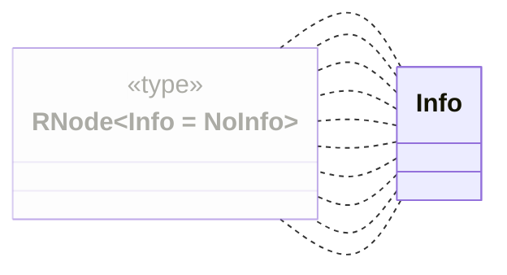
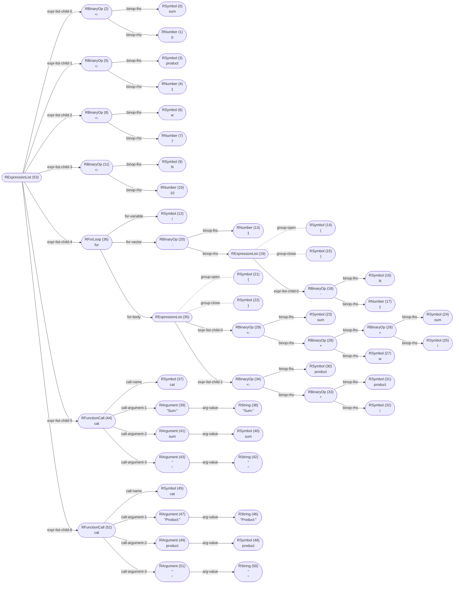

_This document was generated from 'src/documentation/print-normalized-ast-wiki.ts' on 2024-10-03, 20:47:15 UTC presenting an overview of flowR's normalized ast (v2.0.25, using R v4.4.0)._

_flowR_ produces a normalized version of R's abstract syntax tree (AST), 
offering the following benefits:
 
1. abstract away from intricacies of the R parser
2. provide a version-independent representation of the program
3. decorate the AST with additional information, e.g., parent relations and nesting information

In general, the mapping should be rather intuitive and focused primarily on the
syntactic structure of the program.
Consider the following example which shows the normalized AST of the code


```r
x <- 2 * 3 + 1
```


Each node in the AST contains the type, the id, and the lexeme (if applicable).
Each edge is labeled with the type of the parent-child relationship (the "role").


	
<details>

<summary style="color:gray">R Code of the Normalized AST</summary>

The analysis required _8.13 ms_ (including parsing) within the generation environment.

```r
x <- 2 * 3 + 1
```

<details>

<summary style="color:gray">Mermaid Code</summary>

```
flowchart TD
    n7(["RExpressionList (7)
 "])
    n6(["RBinaryOp (6)
#60;#45;"])
    n7 -->|"expr-list-child-0"| n6
    n0(["RSymbol (0)
x"])
    n6 -->|"binop-lhs"| n0
    n5(["RBinaryOp (5)
#43;"])
    n6 -->|"binop-rhs"| n5
    n3(["RBinaryOp (3)
#42;"])
    n5 -->|"binop-lhs"| n3
    n1(["RNumber (1)
2"])
    n3 -->|"binop-lhs"| n1
    n2(["RNumber (2)
3"])
    n3 -->|"binop-rhs"| n2
    n4(["RNumber (4)
1"])
    n5 -->|"binop-rhs"| n4

```

</details>

</details>


&nbsp;

> [!TIP]
> If you want to investigate the normalized AST, 
> you can either use the [Visual Studio Code extension](https://github.com/flowr-analysis/vscode-flowr) or the <span title="Description (Repl Command, starred version): Returns the URL to mermaid.live; Base Command: Get mermaid code for the normalized AST of R code, start with 'file://' to indicate a file (aliases: :n*)">`:normalize*`</span> 
> command in the REPL (see the [Interface wiki page](https://github.com/flowr-analysis/flowr/wiki//Interface) for more information). 

Indicative is the root expression list node, which is present in every normalized AST.
In general, we provide node types for:

1. literals (e.g., numbers and strings)
2. references (e.g., symbols, parameters and function calls)
3. constructs (e.g., loops and function definitions)
4. branches (e.g., `next` and `break`)
5. operators (e.g. `+`, `-`, and `*`)

<details>

<summary style="color:gray">Complete Class Diagram</summary>

Every node is a link, which directly refers to the implementation in the source code.
Grayed-out parts are used for structuring the AST, grouping together related nodes.





_The generation of the class diagram required 684.88 ms._
</details>

Node types are controlled by the `RType` enum (see [`./src/r-bridge/lang-4.x/ast/model/type.ts`](https://github.com/flowr-analysis/flowr/tree/main/./src/r-bridge/lang-4.x/ast/model/type.ts)), 
which is used to distinguish between different types of nodes.
Additionally, every AST node is generic with respect to the `Info` type which allows for arbitrary decorations (e.g., parent inforamtion or dataflow constraints).
Most notably, the `info` field holds the `id` of the node, which is used to reference the node in the [dataflow graph](https://github.com/flowr-analysis/flowr/wiki//Dataflow%20Graph).

In summary, we have the following types:

 * [RNode](https://github.com/flowr-analysis/flowr/tree/main//src/r-bridge/lang-4.x/ast/model/model.ts#L159)   
   The `RNode` type is the union of all possible nodes in the R-ast.
    * It should be used whenever you either not care what kind of
    * node you are dealing with or if you want to handle all possible nodes.
    * <p>
    *
    * All other subtypes (like
   {@link RLoopConstructs}
   ) listed above
    * can be used to restrict the kind of node. They do not have to be
    * exclusive, some nodes can appear in multiple subtypes.
   <details><summary style="color:gray">Defined at <a href="https://github.com/flowr-analysis/flowr/tree/main//src/r-bridge/lang-4.x/ast/model/model.ts#L159">./src/r-bridge/lang-4.x/ast/model/model.ts#L159</a></summary>
   
   
   ```ts
   export type RNode<Info = NoInfo>  = RExpressionList<Info> | RFunctions<Info>
       | ROther<Info> | RConstructs<Info> | RNamedAccess<Info> | RIndexAccess<Info>
       | RUnaryOp<Info> | RBinaryOp<Info> | RSingleNode<Info>  | RPipe<Info>
   ```
   
   
   </details>
   


With this, the example file produced the following AST (shown from left to right for space reasons):



	
<details>

<summary style="color:gray">R Code of the Normalized AST</summary>

The analysis required _6.39 ms_ (including parsing) within the generation environment.

```r
sum <- 0
product <- 1
w <- 7
N <- 10

for (i in 1:(N-1)) {
  sum <- sum + i + w
  product <- product * i
}

cat("Sum:", sum, "\n")
cat("Product:", product, "\n")

```

<details>

<summary style="color:gray">Mermaid Code</summary>

```
flowchart LR
    n53(["RExpressionList (53)
 "])
    n2(["RBinaryOp (2)
#60;#45;"])
    n53 -->|"expr-list-child-0"| n2
    n0(["RSymbol (0)
sum"])
    n2 -->|"binop-lhs"| n0
    n1(["RNumber (1)
0"])
    n2 -->|"binop-rhs"| n1
    n5(["RBinaryOp (5)
#60;#45;"])
    n53 -->|"expr-list-child-1"| n5
    n3(["RSymbol (3)
product"])
    n5 -->|"binop-lhs"| n3
    n4(["RNumber (4)
1"])
    n5 -->|"binop-rhs"| n4
    n8(["RBinaryOp (8)
#60;#45;"])
    n53 -->|"expr-list-child-2"| n8
    n6(["RSymbol (6)
w"])
    n8 -->|"binop-lhs"| n6
    n7(["RNumber (7)
7"])
    n8 -->|"binop-rhs"| n7
    n11(["RBinaryOp (11)
#60;#45;"])
    n53 -->|"expr-list-child-3"| n11
    n9(["RSymbol (9)
N"])
    n11 -->|"binop-lhs"| n9
    n10(["RNumber (10)
10"])
    n11 -->|"binop-rhs"| n10
    n36(["RForLoop (36)
for"])
    n53 -->|"expr-list-child-4"| n36
    n12(["RSymbol (12)
i"])
    n36 -->|"for-variable"| n12
    n20(["RBinaryOp (20)
#58;"])
    n36 -->|"for-vector"| n20
    n13(["RNumber (13)
1"])
    n20 -->|"binop-lhs"| n13
    n19(["RExpressionList (19)
 "])
    n20 -->|"binop-rhs"| n19
    n19 -.-|"group-open"| n14
    n19 -.-|"group-close"| n15
    n14(["RSymbol (14)
("])
    n15(["RSymbol (15)
)"])
    n18(["RBinaryOp (18)
#45;"])
    n19 -->|"expr-list-child-0"| n18
    n16(["RSymbol (16)
N"])
    n18 -->|"binop-lhs"| n16
    n17(["RNumber (17)
1"])
    n18 -->|"binop-rhs"| n17
    n35(["RExpressionList (35)
 "])
    n36 -->|"for-body"| n35
    n35 -.-|"group-open"| n21
    n35 -.-|"group-close"| n22
    n21(["RSymbol (21)
#123;"])
    n22(["RSymbol (22)
#125;"])
    n29(["RBinaryOp (29)
#60;#45;"])
    n35 -->|"expr-list-child-0"| n29
    n23(["RSymbol (23)
sum"])
    n29 -->|"binop-lhs"| n23
    n28(["RBinaryOp (28)
#43;"])
    n29 -->|"binop-rhs"| n28
    n26(["RBinaryOp (26)
#43;"])
    n28 -->|"binop-lhs"| n26
    n24(["RSymbol (24)
sum"])
    n26 -->|"binop-lhs"| n24
    n25(["RSymbol (25)
i"])
    n26 -->|"binop-rhs"| n25
    n27(["RSymbol (27)
w"])
    n28 -->|"binop-rhs"| n27
    n34(["RBinaryOp (34)
#60;#45;"])
    n35 -->|"expr-list-child-1"| n34
    n30(["RSymbol (30)
product"])
    n34 -->|"binop-lhs"| n30
    n33(["RBinaryOp (33)
#42;"])
    n34 -->|"binop-rhs"| n33
    n31(["RSymbol (31)
product"])
    n33 -->|"binop-lhs"| n31
    n32(["RSymbol (32)
i"])
    n33 -->|"binop-rhs"| n32
    n44(["RFunctionCall (44)
cat"])
    n53 -->|"expr-list-child-5"| n44
    n37(["RSymbol (37)
cat"])
    n44 -->|"call-name"| n37
    n39(["RArgument (39)
#34;Sum#58;#34;"])
    n44 -->|"call-argument-1"| n39
    n38(["RString (38)
#34;Sum#58;#34;"])
    n39 -->|"arg-value"| n38
    n41(["RArgument (41)
sum"])
    n44 -->|"call-argument-2"| n41
    n40(["RSymbol (40)
sum"])
    n41 -->|"arg-value"| n40
    n43(["RArgument (43)
#34;
#34;"])
    n44 -->|"call-argument-3"| n43
    n42(["RString (42)
#34;
#34;"])
    n43 -->|"arg-value"| n42
    n52(["RFunctionCall (52)
cat"])
    n53 -->|"expr-list-child-6"| n52
    n45(["RSymbol (45)
cat"])
    n52 -->|"call-name"| n45
    n47(["RArgument (47)
#34;Product#58;#34;"])
    n52 -->|"call-argument-1"| n47
    n46(["RString (46)
#34;Product#58;#34;"])
    n47 -->|"arg-value"| n46
    n49(["RArgument (49)
product"])
    n52 -->|"call-argument-2"| n49
    n48(["RSymbol (48)
product"])
    n49 -->|"arg-value"| n48
    n51(["RArgument (51)
#34;
#34;"])
    n52 -->|"call-argument-3"| n51
    n50(["RString (50)
#34;
#34;"])
    n51 -->|"arg-value"| n50

```

</details>

</details>


