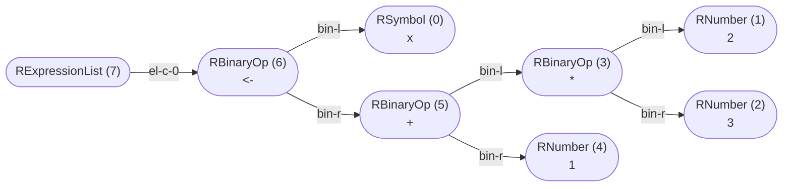

_This document was generated from '[src/documentation/wiki-normalized-ast.ts](https://github.com/flowr-analysis/flowr/tree/main//src/documentation/wiki-normalized-ast.ts)' on 2026-02-18, 19:36:26 UTC presenting an overview of flowR's normalized ast (v2.9.10, using R v4.5.2). Please do not edit this file/wiki page directly._

_flowR_ produces a normalized version of R's abstract syntax tree (AST),
offering the following benefits:

1. abstract away from intricacies of the R parser
2. provide a version-independent representation of the program
3. decorate the AST with additional information, e.g., parent relations and nesting information

In general, the mapping should be rather intuitive and focused primarily on the
syntactic structure of the program. As with other types in flowR, you get corresponding helper objects.
So if you want to work with an `RBinaryOp` node, you can use the <a href="https://github.com/flowr-analysis/flowr/tree/main//src/r-bridge/lang-4.x/ast/model/nodes/r-binary-op.ts#L9"><code><span title="Operators like +, ==, &&, etc.">RBinaryOp</span></code></a> object to check whether a node is an `RBinaryOp` and to access its fields
(e.g., with <a href="https://github.com/flowr-analysis/flowr/tree/main//src/r-bridge/lang-4.x/ast/model/nodes/r-binary-op.ts#L24"><code><span title="Type guard for RBinaryOp nodes.">RBinaryOp::<b>is</b></span></code></a>).
Consider the following example which shows the normalized AST of the code


```r
x <- 2 * 3 + 1
```


Each node in the AST contains the type, the id, and the lexeme (if applicable).
Each edge is labeled with the type of the parent-child relationship (the "role").



	
(The analysis required _5.0 ms_ (including parsing with the [tree-sitter](https://github.com/flowr-analysis/flowr/wiki/Engines) engine) within the generation environment.)


> [!TIP]
> If you want to investigate the normalized AST, 
> you can either use the [Visual Studio Code extension](https://github.com/flowr-analysis/vscode-flowr) or the <span title="Description (Repl Command, starred version): Returns the URL to mermaid.live; Base Command: Get mermaid code for the normalized AST of R code, start with 'file://' to indicate a file (aliases: :n*)">`:normalize*`</span> 
> command in the REPL (see the [Interface wiki page](https://github.com/flowr-analysis/flowr/wiki/Interface) for more information).

Indicative of the normalization is the root <a href="https://github.com/flowr-analysis/flowr/tree/main//src/r-bridge/lang-4.x/ast/model/nodes/r-project.ts#L24"><code><span title="Holds a collection of files (started with the expression list)">RProject</span></code></a> node, which is present in every normalized AST
and provides the <a href="https://github.com/flowr-analysis/flowr/tree/main//src/r-bridge/lang-4.x/ast/model/nodes/r-expression-list.ts#L9"><code><span title="Holds a list of expressions (and hence may be the root of an AST, summarizing all expressions in a file). The grouping property holds information on if the expression list is structural or created by a wrapper like {} or ().">RExpressionList</span></code></a> nodes for each file in the project.
In general, we provide node types for:

1. literals (e.g., numbers and strings)
2. references (e.g., symbols, parameters and function calls)
3. constructs (e.g., loops and function definitions)
4. branches (e.g., `next` and `break`)
5. operators (e.g. `+`, `-`, and `*`)

<details>

<summary style="color:gray">Complete Class Diagram</summary>

Every node is a link, which directly refers to the implementation in the source code.
Grayed-out parts are used for structuring the AST, grouping together related nodes.


```mermaid

---
  config:
    class:
      hideEmptyMembersBox: true
---
classDiagram
direction RL
class RNode~Info = NoInfo~{
    <<type>>
}
style RNode opacity:.35,fill:#FAFAFA
click RNode href "https://github.com/flowr-analysis/flowr/tree/main//src/r-bridge/lang-4.x/ast/model/model.ts#L266" "The #96;RNode#96; type is the union of all possible nodes in the R#45;ast. It should be used whenever you either not care what kind of node you are dealing with or if you want to handle all possible nodes. #60;p#62; All other subtypes (like; #60;code#62;RLoopConstructs#60;/code#62;; ) listed above can be used to restrict the kind of node. They do not have to be exclusive, some nodes can appear in multiple subtypes."
class RExpressionList~Info = NoInfo~{
    <<interface>>
    type#58; RType.ExpressionList
    grouping#58; #91;start#58; RSymbol#60;Info, Identifier#62;, end#58; RSymbol#60;Info, Identifier#62;#93;
}
click RExpressionList href "https://github.com/flowr-analysis/flowr/tree/main//src/r-bridge/lang-4.x/ast/model/nodes/r-expression-list.ts#L9" "Holds a list of expressions (and hence may be the root of an AST, summarizing all expressions in a file). The #96;grouping#96; property holds information on if the expression list is structural or created by a wrapper like #96;#123;#125;#96; or #96;()#96;."
class WithChildren~Info, Children extends RAstNodeBase<Info, string | undefined>~{
    <<interface>>
    children#58; #123;#125;
}
click WithChildren href "https://github.com/flowr-analysis/flowr/tree/main//src/r-bridge/lang-4.x/ast/model/model.ts#L79" ""
class RAstNodeBase~Info, LexemeType = string~{
    <<interface>>
    type#58; RType
    lexeme#58; LexemeType
    info#58; Info #38; Source
}
click RAstNodeBase href "https://github.com/flowr-analysis/flowr/tree/main//src/r-bridge/lang-4.x/ast/model/model.ts#L71" "Provides the common base of all; #60;code#62;RNodes#60;/code#62;; ."
class MergeableRecord{
    <<type>>
}
style MergeableRecord opacity:.35,fill:#FAFAFA
click MergeableRecord href "https://github.com/flowr-analysis/flowr/tree/main//src/util/objects.ts#L11" ""
class string{
    <<variable>>
}
click string href "https://github.com/flowr-analysis/flowr/tree/main//src/abstract-interpretation/domains/bounded-set-domain.ts#L164" ""
class unknown{
    <<variable>>
}
click unknown href "https://github.com/flowr-analysis/flowr/tree/main//src/dataflow/graph/graph.ts#L455" ""
class Info{
    <<enum>>
}
click Info href "https://github.com/flowr-analysis/flowr/tree/main//src/util/log.ts#L55" ""
class LogLevel{
    <<enum>>
    Silly#58; LogLevel.Silly
    Trace#58; LogLevel.Trace
    Debug#58; LogLevel.Debug
    Info#58; LogLevel.Info
    Warn#58; LogLevel.Warn
    Error#58; LogLevel.Error
    Fatal#58; LogLevel.Fatal
}
click LogLevel href "https://github.com/flowr-analysis/flowr/tree/main//src/util/log.ts#L51" ""
class RFunctions~Info~{
    <<type>>
}
style RFunctions opacity:.35,fill:#FAFAFA
click RFunctions href "https://github.com/flowr-analysis/flowr/tree/main//src/r-bridge/lang-4.x/ast/model/model.ts#L214" "This subtype of; #60;code#62;RNode#60;/code#62;; represents all types related to functions (calls and definitions) in the normalized AST."
class RFunctionDefinition~Info = NoInfo~{
    <<interface>>
    type#58; RType.FunctionDefinition
    parameters#58; #123;#125;
    body#58; RNode#60;Info#62;
}
click RFunctionDefinition href "https://github.com/flowr-analysis/flowr/tree/main//src/r-bridge/lang-4.x/ast/model/nodes/r-function-definition.ts#L14" "#96;#96;#96;r function(#60;parameters#62;) #60;body#62; #96;#96;#96; or#58; #96;#96;#96;r #92;(#60;parameters#62;) #60;body#62; #96;#96;#96;"
class Location{
    <<interface>>
    location#58; SourceRange
}
click Location href "https://github.com/flowr-analysis/flowr/tree/main//src/r-bridge/lang-4.x/ast/model/model.ts#L97" "Indicates, that the respective; #60;code#62;RAstNodeBase#60;/code#62;; node has known source code location information."
class RFunctionCall~Info = NoInfo~{
    <<type>>
}
style RFunctionCall opacity:.35,fill:#FAFAFA
click RFunctionCall href "https://github.com/flowr-analysis/flowr/tree/main//src/r-bridge/lang-4.x/ast/model/nodes/r-function-call.ts#L37" ""
class RNamedFunctionCall~Info = NoInfo~{
    <<interface>>
    type#58; RType.FunctionCall
    named#58; true
    functionName#58; RSymbol#60;Info, Identifier#62;
    arguments#58; #123;#125;
}
click RNamedFunctionCall href "https://github.com/flowr-analysis/flowr/tree/main//src/r-bridge/lang-4.x/ast/model/nodes/r-function-call.ts#L14" "Calls of functions like #96;a()#96; and #96;foo(42, #34;hello#34;)#96;."
class RUnnamedFunctionCall~Info = NoInfo~{
    <<interface>>
    type#58; RType.FunctionCall
    named#58; false
    calledFunction#58; RNode#60;Info#62;
    infixSpecial#58; boolean
    arguments#58; #123;#125;
}
click RUnnamedFunctionCall href "https://github.com/flowr-analysis/flowr/tree/main//src/r-bridge/lang-4.x/ast/model/nodes/r-function-call.ts#L27" "Direct calls of functions like #96;(function(x) #123; x #125;)(3)#96;."
class RParameter~Info = NoInfo~{
    <<interface>>
    type#58; RType.Parameter
    name#58; RSymbol#60;Info, BrandedIdentifier#62;
    special#58; boolean
    defaultValue#58; RNode#60;Info#62;
}
click RParameter href "https://github.com/flowr-analysis/flowr/tree/main//src/r-bridge/lang-4.x/ast/model/nodes/r-parameter.ts#L9" "Represents a parameter of a function definition in R."
class RArgument~Info = NoInfo~{
    <<interface>>
    type#58; RType.Argument
    name#58; RSymbol#60;Info, BrandedIdentifier#62;
    value#58; RNode#60;Info#62;
}
click RArgument href "https://github.com/flowr-analysis/flowr/tree/main//src/r-bridge/lang-4.x/ast/model/nodes/r-argument.ts#L13" "Represents a named or unnamed argument of a function definition in R."
class ROther~Info~{
    <<type>>
}
style ROther opacity:.35,fill:#FAFAFA
click ROther href "https://github.com/flowr-analysis/flowr/tree/main//src/r-bridge/lang-4.x/ast/model/model.ts#L237" "This subtype of; #60;code#62;RNode#60;/code#62;; represents all types of otherwise hard to categorize nodes in the normalized AST. At the moment these are the comment#45;like nodes."
class RComment~Info = NoInfo~{
    <<interface>>
    type#58; RType.Comment
}
click RComment href "https://github.com/flowr-analysis/flowr/tree/main//src/r-bridge/lang-4.x/ast/model/nodes/r-comment.ts#L9" "#96;#96;#96;r # I am a line comment #96;#96;#96;"
class Leaf{
    <<type>>
}
style Leaf opacity:.35,fill:#FAFAFA
click Leaf href "https://github.com/flowr-analysis/flowr/tree/main//src/search/flowr-search-filters.ts#L115" ""
class LeafRType{
    <<type>>
}
style LeafRType opacity:.35,fill:#FAFAFA
click LeafRType href "https://github.com/flowr-analysis/flowr/tree/main//src/search/flowr-search-filters.ts#L111" ""
class LeafVertexType{
    <<type>>
}
style LeafVertexType opacity:.35,fill:#FAFAFA
click LeafVertexType href "https://github.com/flowr-analysis/flowr/tree/main//src/search/flowr-search-filters.ts#L112" ""
class LeafSpecial{
    <<type>>
}
style LeafSpecial opacity:.35,fill:#FAFAFA
click LeafSpecial href "https://github.com/flowr-analysis/flowr/tree/main//src/search/flowr-search-filters.ts#L113" ""
class RLineDirective~Info = NoInfo~{
    <<interface>>
    type#58; RType.LineDirective
    line#58; number
    file#58; string
}
click RLineDirective href "https://github.com/flowr-analysis/flowr/tree/main//src/r-bridge/lang-4.x/ast/model/nodes/r-line-directive.ts#L7" "Special comment to signal line mappings (e.g., in generated code) to the interpreter."
class RConstructs~Info~{
    <<type>>
}
style RConstructs opacity:.35,fill:#FAFAFA
click RConstructs href "https://github.com/flowr-analysis/flowr/tree/main//src/r-bridge/lang-4.x/ast/model/model.ts#L191" "As an extension to; #60;code#62;RLoopConstructs#60;/code#62;; , this subtype of; #60;code#62;RNode#60;/code#62;; includes the; #60;code#62;RIfThenElse#60;/code#62;; construct as well."
class RLoopConstructs~Info~{
    <<type>>
}
style RLoopConstructs opacity:.35,fill:#FAFAFA
click RLoopConstructs href "https://github.com/flowr-analysis/flowr/tree/main//src/r-bridge/lang-4.x/ast/model/model.ts#L168" "This subtype of; #60;code#62;RNode#60;/code#62;; represents all looping constructs in the normalized AST."
class RForLoop~Info = NoInfo~{
    <<interface>>
    type#58; RType.ForLoop
    variable#58; RSymbol#60;Info, Identifier#62;
    vector#58; RNode#60;Info#62;
    body#58; RExpressionList#60;Info#62;
}
click RForLoop href "https://github.com/flowr-analysis/flowr/tree/main//src/r-bridge/lang-4.x/ast/model/nodes/r-for-loop.ts#L11" "#96;#96;#96;r for(#60;variable#62; in #60;vector#62;) #60;body#62; #96;#96;#96;"
class RRepeatLoop~Info = NoInfo~{
    <<interface>>
    type#58; RType.RepeatLoop
    body#58; RExpressionList#60;Info#62;
}
click RRepeatLoop href "https://github.com/flowr-analysis/flowr/tree/main//src/r-bridge/lang-4.x/ast/model/nodes/r-repeat-loop.ts#L10" "#96;#96;#96;r repeat #60;body#62; #96;#96;#96;"
class RWhileLoop~Info = NoInfo~{
    <<interface>>
    type#58; RType.WhileLoop
    condition#58; RNode#60;Info#62;
    body#58; RExpressionList#60;Info#62;
}
click RWhileLoop href "https://github.com/flowr-analysis/flowr/tree/main//src/r-bridge/lang-4.x/ast/model/nodes/r-while-loop.ts#L10" "#96;#96;#96;r while(#60;condition#62;) #60;body#62; #96;#96;#96;"
class RIfThenElse~Info = NoInfo~{
    <<interface>>
    type#58; RType.IfThenElse
    condition#58; RNode#60;Info#62;
    then#58; RExpressionList#60;Info#62;
    otherwise#58; RExpressionList#60;Info#62;
}
click RIfThenElse href "https://github.com/flowr-analysis/flowr/tree/main//src/r-bridge/lang-4.x/ast/model/nodes/r-if-then-else.ts#L10" "#96;#96;#96;r if(#60;condition#62;) #60;then#62; #91;else #60;otherwise#62;#93; #96;#96;#96;"
class RNamedAccess~Info = NoInfo~{
    <<interface>>
    operator#58; #34;$#34; | #34;@#34;
    access#58; #91;RUnnamedArgument#60;Info#62;#93;
}
click RNamedAccess href "https://github.com/flowr-analysis/flowr/tree/main//src/r-bridge/lang-4.x/ast/model/nodes/r-access.ts#L19" "Represents an R named access operation with #96;$#96; or #96;@#96;, the field is a string."
class RAccessBase~Info = NoInfo~{
    <<interface>>
    type#58; RType.Access
    accessed#58; RNode#60;Info#62;
    operator#58; #34;$#34; | #34;@#34; | #34;#91;#34; | #34;#91;#91;#34;
}
click RAccessBase href "https://github.com/flowr-analysis/flowr/tree/main//src/r-bridge/lang-4.x/ast/model/nodes/r-access.ts#L9" "Represents an R Indexing operation with #96;$#96;, #96;@#96;, #96;#91;#91;#96;, or #96;#91;#96;."
class RIndexAccess~Info = NoInfo~{
    <<interface>>
    operator#58; #34;#91;#34; | #34;#91;#91;#34;
    access#58; #123;#125;
}
click RIndexAccess href "https://github.com/flowr-analysis/flowr/tree/main//src/r-bridge/lang-4.x/ast/model/nodes/r-access.ts#L25" "access can be a number, a variable or an expression that resolves to one, a filter etc."
class RUnaryOp~Info = NoInfo~{
    <<interface>>
    type#58; RType.UnaryOp
    operator#58; string
    operand#58; RNode#60;Info#62;
}
click RUnaryOp href "https://github.com/flowr-analysis/flowr/tree/main//src/r-bridge/lang-4.x/ast/model/nodes/r-unary-op.ts#L9" "Unary operations like #96;#43;#96; and #96;#45;#96;"
class RBinaryOp~Info = NoInfo~{
    <<interface>>
    type#58; RType.BinaryOp
    operator#58; string
    lhs#58; RNode#60;Info#62;
    rhs#58; RNode#60;Info#62;
}
click RBinaryOp href "https://github.com/flowr-analysis/flowr/tree/main//src/r-bridge/lang-4.x/ast/model/nodes/r-binary-op.ts#L9" "Operators like #96;#43;#96;, #96;==#96;, #96;#38;#38;#96;, etc."
class RSingleNode~Info~{
    <<type>>
}
style RSingleNode opacity:.35,fill:#FAFAFA
click RSingleNode href "https://github.com/flowr-analysis/flowr/tree/main//src/r-bridge/lang-4.x/ast/model/model.ts#L143" "This subtype of; #60;code#62;RNode#60;/code#62;; represents all types of; #60;code#62;Leaf#60;/code#62;; nodes in the normalized AST."
class RSymbol~Info = NoInfo, T extends Identifier = Identifier~{
    <<interface>>
    type#58; RType.Symbol
    content#58; T
}
click RSymbol href "https://github.com/flowr-analysis/flowr/tree/main//src/r-bridge/lang-4.x/ast/model/nodes/r-symbol.ts#L12" "Represents identifiers (variables) such as #96;x#96; in #96;x #60;#45; 42#96; or #96;a#58;#58;foo#96; in #96;a#58;#58;foo()#96;. See; #60;code#62;Identifier#60;/code#62;; for more information about how identifiers are represented."
class RConstant~Info~{
    <<type>>
}
style RConstant opacity:.35,fill:#FAFAFA
click RConstant href "https://github.com/flowr-analysis/flowr/tree/main//src/r-bridge/lang-4.x/ast/model/model.ts#L116" "This subtype of; #60;code#62;RNode#60;/code#62;; represents all types of constants represented in the normalized AST."
class RNumber~Info = NoInfo~{
    <<interface>>
    type#58; RType.Number
    content#58; RNumberValue
}
click RNumber href "https://github.com/flowr-analysis/flowr/tree/main//src/r-bridge/lang-4.x/ast/model/nodes/r-number.ts#L10" "A number like #96;3#96;, #96;#45;2.14#96;, #96;1L#96;, or #96;2i#96;. Includes numeric, integer, and complex. See; #60;code#62;RNumberValue#60;/code#62;; for more information."
class RString~Info = NoInfo~{
    <<interface>>
    type#58; RType.String
    content#58; RStringValue
}
click RString href "https://github.com/flowr-analysis/flowr/tree/main//src/r-bridge/lang-4.x/ast/model/nodes/r-string.ts#L11" "Represents a string like #96;#34;hello#34;#96;, including raw strings like #96;r#34;(hello)#34;#96;."
class RLogical~Info = NoInfo~{
    <<interface>>
    type#58; RType.Logical
    content#58; boolean
}
click RLogical href "https://github.com/flowr-analysis/flowr/tree/main//src/r-bridge/lang-4.x/ast/model/nodes/r-logical.ts#L9" "Represents logical values (#96;TRUE#96; or #96;FALSE#96;)."
class RBreak~Info = NoInfo~{
    <<interface>>
    type#58; RType.Break
}
click RBreak href "https://github.com/flowr-analysis/flowr/tree/main//src/r-bridge/lang-4.x/ast/model/nodes/r-break.ts#L7" "A #96;break#96; statement."
class RNext~Info = NoInfo~{
    <<interface>>
    type#58; RType.Next
}
click RNext href "https://github.com/flowr-analysis/flowr/tree/main//src/r-bridge/lang-4.x/ast/model/nodes/r-next.ts#L7" "A #96;next#96; statement."
class RPipe~Info = NoInfo~{
    <<interface>>
    type#58; RType.Pipe
    lhs#58; RNode#60;Info#62;
    rhs#58; RNode#60;Info#62;
}
click RPipe href "https://github.com/flowr-analysis/flowr/tree/main//src/r-bridge/lang-4.x/ast/model/nodes/r-pipe.ts#L9" "Variant of the binary operator, specifically for the new, built#45;in pipe operator."
RExpressionList .. RNode
WithChildren <|-- RExpressionList
RAstNodeBase <|-- RExpressionList
MergeableRecord .. RAstNodeBase
Record .. MergeableRecord
string .. MergeableRecord
unknown .. MergeableRecord
Info .. RNode
LogLevel <|-- Info
RFunctions .. RNode
RFunctionDefinition .. RFunctions
RAstNodeBase <|-- RFunctionDefinition
Location <|-- RFunctionDefinition
Info .. RFunctions
RFunctionCall .. RFunctions
RNamedFunctionCall .. RFunctionCall
RAstNodeBase <|-- RNamedFunctionCall
Location <|-- RNamedFunctionCall
Info .. RFunctionCall
RUnnamedFunctionCall .. RFunctionCall
RAstNodeBase <|-- RUnnamedFunctionCall
Location <|-- RUnnamedFunctionCall
Info .. RFunctionCall
Info .. RFunctions
RParameter .. RFunctions
RAstNodeBase <|-- RParameter
Location <|-- RParameter
Info .. RFunctions
RArgument .. RFunctions
RAstNodeBase <|-- RArgument
Location <|-- RArgument
Info .. RFunctions
Info .. RNode
ROther .. RNode
RComment .. ROther
Location <|-- RComment
Leaf .. RComment
LeafRType .. Leaf
LeafVertexType .. Leaf
LeafSpecial .. Leaf
Info .. ROther
RLineDirective .. ROther
Location <|-- RLineDirective
Leaf .. RLineDirective
Info .. ROther
Info .. RNode
RConstructs .. RNode
RLoopConstructs .. RConstructs
RForLoop .. RLoopConstructs
RAstNodeBase <|-- RForLoop
Location <|-- RForLoop
Info .. RLoopConstructs
RRepeatLoop .. RLoopConstructs
RAstNodeBase <|-- RRepeatLoop
Location <|-- RRepeatLoop
Info .. RLoopConstructs
RWhileLoop .. RLoopConstructs
RAstNodeBase <|-- RWhileLoop
Location <|-- RWhileLoop
Info .. RLoopConstructs
Info .. RConstructs
RIfThenElse .. RConstructs
RAstNodeBase <|-- RIfThenElse
Location <|-- RIfThenElse
Info .. RConstructs
Info .. RNode
RNamedAccess .. RNode
RAccessBase <|-- RNamedAccess
RAstNodeBase <|-- RAccessBase
Location <|-- RAccessBase
Info .. RNode
RIndexAccess .. RNode
RAccessBase <|-- RIndexAccess
Info .. RNode
RUnaryOp .. RNode
RAstNodeBase <|-- RUnaryOp
Location <|-- RUnaryOp
Info .. RNode
RBinaryOp .. RNode
RAstNodeBase <|-- RBinaryOp
Location <|-- RBinaryOp
Info .. RNode
RSingleNode .. RNode
RComment .. RSingleNode
Info .. RSingleNode
RSymbol .. RSingleNode
Leaf .. RSymbol
Location <|-- RSymbol
Info .. RSingleNode
RConstant .. RSingleNode
RNumber .. RConstant
Leaf .. RNumber
Location <|-- RNumber
Info .. RConstant
RString .. RConstant
Leaf .. RString
Location <|-- RString
Info .. RConstant
RLogical .. RConstant
Leaf .. RLogical
Location <|-- RLogical
Info .. RConstant
Info .. RSingleNode
RBreak .. RSingleNode
Location <|-- RBreak
Leaf .. RBreak
Info .. RSingleNode
RNext .. RSingleNode
Location <|-- RNext
Leaf .. RNext
Info .. RSingleNode
RLineDirective .. RSingleNode
Info .. RSingleNode
Info .. RNode
RPipe .. RNode
RAstNodeBase <|-- RPipe
Location <|-- RPipe
Info .. RNode
```


</details>

Node types are controlled by the <a href="https://github.com/flowr-analysis/flowr/tree/main//src/r-bridge/lang-4.x/ast/model/type.ts#L158"><code><span title="Types as we use them for our normalized AST. See RNode for a union type of all normalized AST nodes in-use. For each enum member, the respective normalized AST node should be referenced in the corresponding comment.">RType</span></code></a> enum (see [`./src/r-bridge/lang-4.x/ast/model/type.ts`](https://github.com/flowr-analysis/flowr/tree/main/./src/r-bridge/lang-4.x/ast/model/type.ts)), 
which is used to distinguish between different types of nodes.
Additionally, every AST node is generic with respect to the `Info` type which allows for arbitrary decorations (e.g., parent inforamtion or dataflow constraints).
Most notably, the `info` field holds the `id` of the node, which is used to reference the node in the [dataflow graph](https://github.com/flowr-analysis/flowr/wiki/Dataflow%20Graph).

In summary, we have the following types:


<details><summary>Normalized AST Node Types</summary>

 * [RNode](https://github.com/flowr-analysis/flowr/tree/main//src/r-bridge/lang-4.x/ast/model/model.ts#L266)   
   The `RNode` type is the union of all possible nodes in the R-ast.
   It should be used whenever you either not care what kind of
   node you are dealing with or if you want to handle all possible nodes.
   <p>
   All other subtypes (like
   <code>RLoopConstructs</code>
   ) listed above
   can be used to restrict the kind of node. They do not have to be
   exclusive, some nodes can appear in multiple subtypes.
   <details><summary style="color:gray">Defined at <a href="https://github.com/flowr-analysis/flowr/tree/main//src/r-bridge/lang-4.x/ast/model/model.ts#L266">./src/r-bridge/lang-4.x/ast/model/model.ts#L266</a></summary>
   
   
   ```ts
   
   
   /**
    * The `RNode` type is the union of all possible nodes in the R-ast.
    * It should be used whenever you either not care what kind of
    * node you are dealing with or if you want to handle all possible nodes.
    * <p>
    *
    * All other subtypes (like {@link RLoopConstructs}) listed above
    * can be used to restrict the kind of node. They do not have to be
    * exclusive, some nodes can appear in multiple subtypes.
    * @see {@link recoverName} - to receive the name/lexeme from such a node
    * @see {@link recoverContent} - for a more rigorous approach to get the content of a node within a {@link DataflowGraph|dataflow graph}
    * @see {@link RNode.getLocation} - to get the location of a node and other helpful functions provided by the {@link RNode} helper object
    */
   export type RNode<Info = NoInfo>  = RExpressionList<Info> | RFunctions<Info>
       | ROther<Info> | RConstructs<Info> | RNamedAccess<Info> | RIndexAccess<Info>
       | RUnaryOp<Info> | RBinaryOp<Info> | RSingleNode<Info>  | RPipe<Info>;
   ```
   
   
   </details>
   
   * **[RExpressionList](https://github.com/flowr-analysis/flowr/tree/main//src/r-bridge/lang-4.x/ast/model/nodes/r-expression-list.ts#L9)**   
     Holds a list of expressions (and hence may be the root of an AST, summarizing all expressions in a file).
     The `grouping` property holds information on if the expression list is structural or created by a wrapper like `{}` or `()`.
     <details><summary style="color:gray">Defined at <a href="https://github.com/flowr-analysis/flowr/tree/main//src/r-bridge/lang-4.x/ast/model/nodes/r-expression-list.ts#L9">./src/r-bridge/lang-4.x/ast/model/nodes/r-expression-list.ts#L9</a></summary>
     
     
     ```ts
     
     
     /**
      * Holds a list of expressions (and hence may be the root of an AST, summarizing all expressions in a file).
      * The `grouping` property holds information on if the expression list is structural or created by a wrapper like `{}` or `()`.
      */
     export interface RExpressionList<Info = NoInfo> extends WithChildren<Info, RNode<Info>>, RAstNodeBase<Info, string | undefined>, Partial<Location> {
         readonly type:     RType.ExpressionList;
         /** encodes wrappers like `{}` or `()` */
         readonly grouping: undefined | [start: RSymbol<Info>, end: RSymbol<Info>]
     }
     ```
     
     
     </details>
     
     * **[RAstNodeBase](https://github.com/flowr-analysis/flowr/tree/main//src/r-bridge/lang-4.x/ast/model/model.ts#L71)**   
       Provides the common base of all
       <code>RNodes</code>
       .
       <details><summary style="color:gray">Defined at <a href="https://github.com/flowr-analysis/flowr/tree/main//src/r-bridge/lang-4.x/ast/model/model.ts#L71">./src/r-bridge/lang-4.x/ast/model/model.ts#L71</a></summary>
       
       
       ```ts
       
       
       /**
        * Provides the common base of all {@link RNode|RNodes}.
        * @typeParam Info       - can be used to store additional information about the node
        * @typeParam LexemeType - the type of the lexeme, probably always a `string` or `string | undefined`
        */
       export interface RAstNodeBase<Info, LexemeType = string> extends MergeableRecord {
           type:   RType
           /** the original string retrieved from R, can be used for further identification */
           lexeme: LexemeType
           /** allows to attach additional information to the node */
           info:   Info & Source
       }
       ```
       
       
       </details>
       
   * [RFunctions](https://github.com/flowr-analysis/flowr/tree/main//src/r-bridge/lang-4.x/ast/model/model.ts#L214)   
     This subtype of
     <code>RNode</code>
     represents all types related to functions
     (calls and definitions) in the normalized AST.
     <details><summary style="color:gray">Defined at <a href="https://github.com/flowr-analysis/flowr/tree/main//src/r-bridge/lang-4.x/ast/model/model.ts#L214">./src/r-bridge/lang-4.x/ast/model/model.ts#L214</a></summary>
     
     
     ```ts
     
     /**
      * This subtype of {@link RNode} represents all types related to functions
      * (calls and definitions) in the normalized AST.
      */
     export type RFunctions<Info>      = RFunctionDefinition<Info> | RFunctionCall<Info> | RParameter<Info> | RArgument<Info>;
     ```
     
     
     </details>
     
     * **[RFunctionDefinition](https://github.com/flowr-analysis/flowr/tree/main//src/r-bridge/lang-4.x/ast/model/nodes/r-function-definition.ts#L14)**   
       ```r
       function(<parameters>) <body>
       ```
       or:
       ```r
       \(<parameters>) <body>
       ```
       <details><summary style="color:gray">Defined at <a href="https://github.com/flowr-analysis/flowr/tree/main//src/r-bridge/lang-4.x/ast/model/nodes/r-function-definition.ts#L14">./src/r-bridge/lang-4.x/ast/model/nodes/r-function-definition.ts#L14</a></summary>
       
       
       ```ts
       
       
       /**
        * ```r
        * function(<parameters>) <body>
        * ```
        * or:
        * ```r
        * \(<parameters>) <body>
        * ```
        */
       export interface RFunctionDefinition<Info = NoInfo> extends RAstNodeBase<Info>, Location {
           readonly type: RType.FunctionDefinition;
           /** the R formals, to our knowledge, they must be unique */
           parameters:    RParameter<Info>[];
           body:          RNode<Info>;
       }
       ```
       
       
       </details>
       
       * **[RAstNodeBase](https://github.com/flowr-analysis/flowr/tree/main//src/r-bridge/lang-4.x/ast/model/model.ts#L71)**   
         Provides the common base of all
         <code>RNodes</code>
         .
         <details><summary style="color:gray">Defined at <a href="https://github.com/flowr-analysis/flowr/tree/main//src/r-bridge/lang-4.x/ast/model/model.ts#L71">./src/r-bridge/lang-4.x/ast/model/model.ts#L71</a></summary>
         
         
         ```ts
         
         
         /**
          * Provides the common base of all {@link RNode|RNodes}.
          * @typeParam Info       - can be used to store additional information about the node
          * @typeParam LexemeType - the type of the lexeme, probably always a `string` or `string | undefined`
          */
         export interface RAstNodeBase<Info, LexemeType = string> extends MergeableRecord {
             type:   RType
             /** the original string retrieved from R, can be used for further identification */
             lexeme: LexemeType
             /** allows to attach additional information to the node */
             info:   Info & Source
         }
         ```
         
         
         </details>
         
     * [RFunctionCall](https://github.com/flowr-analysis/flowr/tree/main//src/r-bridge/lang-4.x/ast/model/nodes/r-function-call.ts#L37)   
     
       <details><summary style="color:gray">Defined at <a href="https://github.com/flowr-analysis/flowr/tree/main//src/r-bridge/lang-4.x/ast/model/nodes/r-function-call.ts#L37">./src/r-bridge/lang-4.x/ast/model/nodes/r-function-call.ts#L37</a></summary>
       
       
       ```ts
       
       
       export type RFunctionCall<Info = NoInfo> = RNamedFunctionCall<Info> | RUnnamedFunctionCall<Info>;
       ```
       
       
       </details>
       
       * **[RNamedFunctionCall](https://github.com/flowr-analysis/flowr/tree/main//src/r-bridge/lang-4.x/ast/model/nodes/r-function-call.ts#L14)**   
         Calls of functions like `a()` and `foo(42, "hello")`.
         <details><summary style="color:gray">Defined at <a href="https://github.com/flowr-analysis/flowr/tree/main//src/r-bridge/lang-4.x/ast/model/nodes/r-function-call.ts#L14">./src/r-bridge/lang-4.x/ast/model/nodes/r-function-call.ts#L14</a></summary>
         
         
         ```ts
         
         
         /**
          * Calls of functions like `a()` and `foo(42, "hello")`.
          * @see RUnnamedFunctionCall
          */
         export interface RNamedFunctionCall<Info = NoInfo> extends RAstNodeBase<Info>, Location {
             readonly type:      RType.FunctionCall;
             readonly named:     true;
             functionName:       RSymbol<Info>;
             /** arguments can be empty, for example when calling as `a(1, ,3)` */
             readonly arguments: readonly RFunctionArgument<Info>[];
         }
         ```
         
         
         </details>
         
         * **[RAstNodeBase](https://github.com/flowr-analysis/flowr/tree/main//src/r-bridge/lang-4.x/ast/model/model.ts#L71)**   
           Provides the common base of all
           <code>RNodes</code>
           .
           <details><summary style="color:gray">Defined at <a href="https://github.com/flowr-analysis/flowr/tree/main//src/r-bridge/lang-4.x/ast/model/model.ts#L71">./src/r-bridge/lang-4.x/ast/model/model.ts#L71</a></summary>
           
           
           ```ts
           
           
           /**
            * Provides the common base of all {@link RNode|RNodes}.
            * @typeParam Info       - can be used to store additional information about the node
            * @typeParam LexemeType - the type of the lexeme, probably always a `string` or `string | undefined`
            */
           export interface RAstNodeBase<Info, LexemeType = string> extends MergeableRecord {
               type:   RType
               /** the original string retrieved from R, can be used for further identification */
               lexeme: LexemeType
               /** allows to attach additional information to the node */
               info:   Info & Source
           }
           ```
           
           
           </details>
           
       * **[RUnnamedFunctionCall](https://github.com/flowr-analysis/flowr/tree/main//src/r-bridge/lang-4.x/ast/model/nodes/r-function-call.ts#L27)**   
         Direct calls of functions like `(function(x) { x })(3)`.
         <details><summary style="color:gray">Defined at <a href="https://github.com/flowr-analysis/flowr/tree/main//src/r-bridge/lang-4.x/ast/model/nodes/r-function-call.ts#L27">./src/r-bridge/lang-4.x/ast/model/nodes/r-function-call.ts#L27</a></summary>
         
         
         ```ts
         
         
         
         /**
          * Direct calls of functions like `(function(x) { x })(3)`.
          * @see RNamedFunctionCall
          */
         export interface RUnnamedFunctionCall<Info = NoInfo> extends RAstNodeBase<Info>, Location {
             readonly type:      RType.FunctionCall;
             readonly named:     false | undefined;
             calledFunction:     RNode<Info>; /* can be either a function definition or another call that returns a function etc. */
             /** marks function calls like `3 %xx% 4` which have been written in special infix notation; deprecated in v2 */
             infixSpecial?:      boolean;
             /** arguments can be undefined, for example when calling as `a(1, ,3)` */
             readonly arguments: readonly RFunctionArgument<Info>[];
         }
         ```
         
         
         </details>
         
         * **[RAstNodeBase](https://github.com/flowr-analysis/flowr/tree/main//src/r-bridge/lang-4.x/ast/model/model.ts#L71)**   
           Provides the common base of all
           <code>RNodes</code>
           .
           <details><summary style="color:gray">Defined at <a href="https://github.com/flowr-analysis/flowr/tree/main//src/r-bridge/lang-4.x/ast/model/model.ts#L71">./src/r-bridge/lang-4.x/ast/model/model.ts#L71</a></summary>
           
           
           ```ts
           
           
           /**
            * Provides the common base of all {@link RNode|RNodes}.
            * @typeParam Info       - can be used to store additional information about the node
            * @typeParam LexemeType - the type of the lexeme, probably always a `string` or `string | undefined`
            */
           export interface RAstNodeBase<Info, LexemeType = string> extends MergeableRecord {
               type:   RType
               /** the original string retrieved from R, can be used for further identification */
               lexeme: LexemeType
               /** allows to attach additional information to the node */
               info:   Info & Source
           }
           ```
           
           
           </details>
           
     * **[RParameter](https://github.com/flowr-analysis/flowr/tree/main//src/r-bridge/lang-4.x/ast/model/nodes/r-parameter.ts#L9)**   
       Represents a parameter of a function definition in R.
       <details><summary style="color:gray">Defined at <a href="https://github.com/flowr-analysis/flowr/tree/main//src/r-bridge/lang-4.x/ast/model/nodes/r-parameter.ts#L9">./src/r-bridge/lang-4.x/ast/model/nodes/r-parameter.ts#L9</a></summary>
       
       
       ```ts
       
       
       /**
        * Represents a parameter of a function definition in R.
        */
       export interface RParameter<Info = NoInfo> extends RAstNodeBase<Info>, Location {
           readonly type: RType.Parameter;
           /* the name is represented as a symbol to additionally get location information */
           name:          RSymbol<Info, BrandedIdentifier>;
           /** is it the special ... parameter? */
           special:       boolean;
           defaultValue:  RNode<Info> | undefined;
       }
       ```
       
       
       </details>
       
       * **[RAstNodeBase](https://github.com/flowr-analysis/flowr/tree/main//src/r-bridge/lang-4.x/ast/model/model.ts#L71)**   
         Provides the common base of all
         <code>RNodes</code>
         .
         <details><summary style="color:gray">Defined at <a href="https://github.com/flowr-analysis/flowr/tree/main//src/r-bridge/lang-4.x/ast/model/model.ts#L71">./src/r-bridge/lang-4.x/ast/model/model.ts#L71</a></summary>
         
         
         ```ts
         
         
         /**
          * Provides the common base of all {@link RNode|RNodes}.
          * @typeParam Info       - can be used to store additional information about the node
          * @typeParam LexemeType - the type of the lexeme, probably always a `string` or `string | undefined`
          */
         export interface RAstNodeBase<Info, LexemeType = string> extends MergeableRecord {
             type:   RType
             /** the original string retrieved from R, can be used for further identification */
             lexeme: LexemeType
             /** allows to attach additional information to the node */
             info:   Info & Source
         }
         ```
         
         
         </details>
         
     * **[RArgument](https://github.com/flowr-analysis/flowr/tree/main//src/r-bridge/lang-4.x/ast/model/nodes/r-argument.ts#L13)**   
       Represents a named or unnamed argument of a function definition in R.
       <details><summary style="color:gray">Defined at <a href="https://github.com/flowr-analysis/flowr/tree/main//src/r-bridge/lang-4.x/ast/model/nodes/r-argument.ts#L13">./src/r-bridge/lang-4.x/ast/model/nodes/r-argument.ts#L13</a></summary>
       
       
       ```ts
       
       
       /**
        * Represents a named or unnamed argument of a function definition in R.
        */
       export interface RArgument<Info = NoInfo> extends RAstNodeBase<Info>, Location {
           readonly type: RType.Argument;
           /* the name is represented as a symbol to additionally get location information */
           name:          RSymbol<Info, BrandedIdentifier> | undefined;
           value:         RNode<Info> | undefined;
       }
       ```
       
       
       </details>
       
       * **[RAstNodeBase](https://github.com/flowr-analysis/flowr/tree/main//src/r-bridge/lang-4.x/ast/model/model.ts#L71)**   
         Provides the common base of all
         <code>RNodes</code>
         .
         <details><summary style="color:gray">Defined at <a href="https://github.com/flowr-analysis/flowr/tree/main//src/r-bridge/lang-4.x/ast/model/model.ts#L71">./src/r-bridge/lang-4.x/ast/model/model.ts#L71</a></summary>
         
         
         ```ts
         
         
         /**
          * Provides the common base of all {@link RNode|RNodes}.
          * @typeParam Info       - can be used to store additional information about the node
          * @typeParam LexemeType - the type of the lexeme, probably always a `string` or `string | undefined`
          */
         export interface RAstNodeBase<Info, LexemeType = string> extends MergeableRecord {
             type:   RType
             /** the original string retrieved from R, can be used for further identification */
             lexeme: LexemeType
             /** allows to attach additional information to the node */
             info:   Info & Source
         }
         ```
         
         
         </details>
         
   * [ROther](https://github.com/flowr-analysis/flowr/tree/main//src/r-bridge/lang-4.x/ast/model/model.ts#L237)   
     This subtype of
     <code>RNode</code>
     represents all types of otherwise hard to categorize
     nodes in the normalized AST. At the moment these are the comment-like nodes.
     <details><summary style="color:gray">Defined at <a href="https://github.com/flowr-analysis/flowr/tree/main//src/r-bridge/lang-4.x/ast/model/model.ts#L237">./src/r-bridge/lang-4.x/ast/model/model.ts#L237</a></summary>
     
     
     ```ts
     
     /**
      * This subtype of {@link RNode} represents all types of otherwise hard to categorize
      * nodes in the normalized AST. At the moment these are the comment-like nodes.
      */
     export type ROther<Info>          = RComment<Info> | RLineDirective<Info>;
     ```
     
     
     </details>
     
     * **[RComment](https://github.com/flowr-analysis/flowr/tree/main//src/r-bridge/lang-4.x/ast/model/nodes/r-comment.ts#L9)**   
       ```r
       # I am a line comment
       ```
       <details><summary style="color:gray">Defined at <a href="https://github.com/flowr-analysis/flowr/tree/main//src/r-bridge/lang-4.x/ast/model/nodes/r-comment.ts#L9">./src/r-bridge/lang-4.x/ast/model/nodes/r-comment.ts#L9</a></summary>
       
       
       ```ts
       
       
       /**
        * ```r
        * # I am a line comment
        * ```
        */
       export interface RComment<Info = NoInfo> extends Location, Leaf<Info> {
           readonly type: RType.Comment;
       }
       ```
       
       
       </details>
       
     * **[RLineDirective](https://github.com/flowr-analysis/flowr/tree/main//src/r-bridge/lang-4.x/ast/model/nodes/r-line-directive.ts#L7)**   
       Special comment to signal line mappings (e.g., in generated code) to the interpreter.
       <details><summary style="color:gray">Defined at <a href="https://github.com/flowr-analysis/flowr/tree/main//src/r-bridge/lang-4.x/ast/model/nodes/r-line-directive.ts#L7">./src/r-bridge/lang-4.x/ast/model/nodes/r-line-directive.ts#L7</a></summary>
       
       
       ```ts
       
       
       /**
        * Special comment to signal line mappings (e.g., in generated code) to the interpreter.
        */
       export interface RLineDirective<Info = NoInfo> extends Location, Leaf<Info> {
           readonly type: RType.LineDirective;
           line:          number;
           file:          string;
       }
       ```
       
       
       </details>
       
   * [RConstructs](https://github.com/flowr-analysis/flowr/tree/main//src/r-bridge/lang-4.x/ast/model/model.ts#L191)   
     As an extension to
     <code>RLoopConstructs</code>
     , this subtype of
     <code>RNode</code>
     includes
     the
     <code>RIfThenElse</code>
     construct as well.
     <details><summary style="color:gray">Defined at <a href="https://github.com/flowr-analysis/flowr/tree/main//src/r-bridge/lang-4.x/ast/model/model.ts#L191">./src/r-bridge/lang-4.x/ast/model/model.ts#L191</a></summary>
     
     
     ```ts
     
     /**
      * As an extension to {@link RLoopConstructs}, this subtype of {@link RNode} includes
      * the {@link RIfThenElse} construct as well.
      */
     export type RConstructs<Info>     = RLoopConstructs<Info> | RIfThenElse<Info>;
     ```
     
     
     </details>
     
     * [RLoopConstructs](https://github.com/flowr-analysis/flowr/tree/main//src/r-bridge/lang-4.x/ast/model/model.ts#L168)   
       This subtype of
       <code>RNode</code>
       represents all looping constructs in the normalized AST.
       <details><summary style="color:gray">Defined at <a href="https://github.com/flowr-analysis/flowr/tree/main//src/r-bridge/lang-4.x/ast/model/model.ts#L168">./src/r-bridge/lang-4.x/ast/model/model.ts#L168</a></summary>
       
       
       ```ts
       
       /**
        * This subtype of {@link RNode} represents all looping constructs in the normalized AST.
        */
       export type RLoopConstructs<Info> = RForLoop<Info> | RRepeatLoop<Info> | RWhileLoop<Info>;
       ```
       
       
       </details>
       
       * **[RForLoop](https://github.com/flowr-analysis/flowr/tree/main//src/r-bridge/lang-4.x/ast/model/nodes/r-for-loop.ts#L11)**   
         ```r
         for(<variable> in <vector>) <body>
         ```
         <details><summary style="color:gray">Defined at <a href="https://github.com/flowr-analysis/flowr/tree/main//src/r-bridge/lang-4.x/ast/model/nodes/r-for-loop.ts#L11">./src/r-bridge/lang-4.x/ast/model/nodes/r-for-loop.ts#L11</a></summary>
         
         
         ```ts
         
         
         /**
          * ```r
          * for(<variable> in <vector>) <body>
          * ```
          */
         export interface RForLoop<Info = NoInfo> extends RAstNodeBase<Info>, Location {
             readonly type: RType.ForLoop
             /** variable used in for-loop: <p> `for(<variable> in ...) ...`*/
             variable:      RSymbol<Info>
             /** vector used in for-loop: <p> `for(... in <vector>) ...`*/
             vector:        RNode<Info>
             /** body used in for-loop: <p> `for(... in ...) <body>`*/
             body:          RExpressionList<Info>
         }
         ```
         
         
         </details>
         
         * **[RAstNodeBase](https://github.com/flowr-analysis/flowr/tree/main//src/r-bridge/lang-4.x/ast/model/model.ts#L71)**   
           Provides the common base of all
           <code>RNodes</code>
           .
           <details><summary style="color:gray">Defined at <a href="https://github.com/flowr-analysis/flowr/tree/main//src/r-bridge/lang-4.x/ast/model/model.ts#L71">./src/r-bridge/lang-4.x/ast/model/model.ts#L71</a></summary>
           
           
           ```ts
           
           
           /**
            * Provides the common base of all {@link RNode|RNodes}.
            * @typeParam Info       - can be used to store additional information about the node
            * @typeParam LexemeType - the type of the lexeme, probably always a `string` or `string | undefined`
            */
           export interface RAstNodeBase<Info, LexemeType = string> extends MergeableRecord {
               type:   RType
               /** the original string retrieved from R, can be used for further identification */
               lexeme: LexemeType
               /** allows to attach additional information to the node */
               info:   Info & Source
           }
           ```
           
           
           </details>
           
       * **[RRepeatLoop](https://github.com/flowr-analysis/flowr/tree/main//src/r-bridge/lang-4.x/ast/model/nodes/r-repeat-loop.ts#L10)**   
         ```r
         repeat <body>
         ```
         <details><summary style="color:gray">Defined at <a href="https://github.com/flowr-analysis/flowr/tree/main//src/r-bridge/lang-4.x/ast/model/nodes/r-repeat-loop.ts#L10">./src/r-bridge/lang-4.x/ast/model/nodes/r-repeat-loop.ts#L10</a></summary>
         
         
         ```ts
         
         
         /**
          * ```r
          * repeat <body>
          * ```
          */
         export interface RRepeatLoop<Info = NoInfo> extends RAstNodeBase<Info>, Location {
             readonly type: RType.RepeatLoop
             body:          RExpressionList<Info>
         }
         ```
         
         
         </details>
         
         * **[RAstNodeBase](https://github.com/flowr-analysis/flowr/tree/main//src/r-bridge/lang-4.x/ast/model/model.ts#L71)**   
           Provides the common base of all
           <code>RNodes</code>
           .
           <details><summary style="color:gray">Defined at <a href="https://github.com/flowr-analysis/flowr/tree/main//src/r-bridge/lang-4.x/ast/model/model.ts#L71">./src/r-bridge/lang-4.x/ast/model/model.ts#L71</a></summary>
           
           
           ```ts
           
           
           /**
            * Provides the common base of all {@link RNode|RNodes}.
            * @typeParam Info       - can be used to store additional information about the node
            * @typeParam LexemeType - the type of the lexeme, probably always a `string` or `string | undefined`
            */
           export interface RAstNodeBase<Info, LexemeType = string> extends MergeableRecord {
               type:   RType
               /** the original string retrieved from R, can be used for further identification */
               lexeme: LexemeType
               /** allows to attach additional information to the node */
               info:   Info & Source
           }
           ```
           
           
           </details>
           
       * **[RWhileLoop](https://github.com/flowr-analysis/flowr/tree/main//src/r-bridge/lang-4.x/ast/model/nodes/r-while-loop.ts#L10)**   
         ```r
         while(<condition>) <body>
         ```
         <details><summary style="color:gray">Defined at <a href="https://github.com/flowr-analysis/flowr/tree/main//src/r-bridge/lang-4.x/ast/model/nodes/r-while-loop.ts#L10">./src/r-bridge/lang-4.x/ast/model/nodes/r-while-loop.ts#L10</a></summary>
         
         
         ```ts
         
         
         /**
          * ```r
          * while(<condition>) <body>
          * ```
          */
         export interface RWhileLoop<Info = NoInfo> extends RAstNodeBase<Info>, Location {
             readonly type: RType.WhileLoop
             condition:     RNode<Info>
             body:          RExpressionList<Info>
         }
         ```
         
         
         </details>
         
         * **[RAstNodeBase](https://github.com/flowr-analysis/flowr/tree/main//src/r-bridge/lang-4.x/ast/model/model.ts#L71)**   
           Provides the common base of all
           <code>RNodes</code>
           .
           <details><summary style="color:gray">Defined at <a href="https://github.com/flowr-analysis/flowr/tree/main//src/r-bridge/lang-4.x/ast/model/model.ts#L71">./src/r-bridge/lang-4.x/ast/model/model.ts#L71</a></summary>
           
           
           ```ts
           
           
           /**
            * Provides the common base of all {@link RNode|RNodes}.
            * @typeParam Info       - can be used to store additional information about the node
            * @typeParam LexemeType - the type of the lexeme, probably always a `string` or `string | undefined`
            */
           export interface RAstNodeBase<Info, LexemeType = string> extends MergeableRecord {
               type:   RType
               /** the original string retrieved from R, can be used for further identification */
               lexeme: LexemeType
               /** allows to attach additional information to the node */
               info:   Info & Source
           }
           ```
           
           
           </details>
           
     * **[RIfThenElse](https://github.com/flowr-analysis/flowr/tree/main//src/r-bridge/lang-4.x/ast/model/nodes/r-if-then-else.ts#L10)**   
       ```r
       if(<condition>) <then> [else <otherwise>]
       ```
       <details><summary style="color:gray">Defined at <a href="https://github.com/flowr-analysis/flowr/tree/main//src/r-bridge/lang-4.x/ast/model/nodes/r-if-then-else.ts#L10">./src/r-bridge/lang-4.x/ast/model/nodes/r-if-then-else.ts#L10</a></summary>
       
       
       ```ts
       
       
       /**
        * ```r
        * if(<condition>) <then> [else <otherwise>]
        * ```
        */
       export interface RIfThenElse<Info = NoInfo> extends RAstNodeBase<Info>, Location {
           readonly type: RType.IfThenElse;
           condition:     RNode<Info>;
           then:          RExpressionList<Info>;
           otherwise?:    RExpressionList<Info>;
       }
       ```
       
       
       </details>
       
       * **[RAstNodeBase](https://github.com/flowr-analysis/flowr/tree/main//src/r-bridge/lang-4.x/ast/model/model.ts#L71)**   
         Provides the common base of all
         <code>RNodes</code>
         .
         <details><summary style="color:gray">Defined at <a href="https://github.com/flowr-analysis/flowr/tree/main//src/r-bridge/lang-4.x/ast/model/model.ts#L71">./src/r-bridge/lang-4.x/ast/model/model.ts#L71</a></summary>
         
         
         ```ts
         
         
         /**
          * Provides the common base of all {@link RNode|RNodes}.
          * @typeParam Info       - can be used to store additional information about the node
          * @typeParam LexemeType - the type of the lexeme, probably always a `string` or `string | undefined`
          */
         export interface RAstNodeBase<Info, LexemeType = string> extends MergeableRecord {
             type:   RType
             /** the original string retrieved from R, can be used for further identification */
             lexeme: LexemeType
             /** allows to attach additional information to the node */
             info:   Info & Source
         }
         ```
         
         
         </details>
         
   * **[RNamedAccess](https://github.com/flowr-analysis/flowr/tree/main//src/r-bridge/lang-4.x/ast/model/nodes/r-access.ts#L19)**   
     Represents an R named access operation with `$` or `@`, the field is a string.
     <details><summary style="color:gray">Defined at <a href="https://github.com/flowr-analysis/flowr/tree/main//src/r-bridge/lang-4.x/ast/model/nodes/r-access.ts#L19">./src/r-bridge/lang-4.x/ast/model/nodes/r-access.ts#L19</a></summary>
     
     
     ```ts
     
     
     /**
      * Represents an R named access operation with `$` or `@`, the field is a string.
      */
     export interface RNamedAccess<Info = NoInfo> extends RAccessBase<Info> {
         operator: '$' | '@';
         access:   [RUnnamedArgument<Info>];
     }
     ```
     
     
     </details>
     
   * **[RIndexAccess](https://github.com/flowr-analysis/flowr/tree/main//src/r-bridge/lang-4.x/ast/model/nodes/r-access.ts#L25)**   
     access can be a number, a variable or an expression that resolves to one, a filter etc.
     <details><summary style="color:gray">Defined at <a href="https://github.com/flowr-analysis/flowr/tree/main//src/r-bridge/lang-4.x/ast/model/nodes/r-access.ts#L25">./src/r-bridge/lang-4.x/ast/model/nodes/r-access.ts#L25</a></summary>
     
     
     ```ts
     
     
     /** access can be a number, a variable or an expression that resolves to one, a filter etc. */
     export interface RIndexAccess<Info = NoInfo> extends RAccessBase<Info> {
         operator: '[' | '[[';
         /** is null if the access is empty, e.g. `a[,3]` */
         access:   readonly (RArgument<Info> | typeof EmptyArgument)[]
     }
     ```
     
     
     </details>
     
   * **[RUnaryOp](https://github.com/flowr-analysis/flowr/tree/main//src/r-bridge/lang-4.x/ast/model/nodes/r-unary-op.ts#L9)**   
     Unary operations like `+` and `-`
     <details><summary style="color:gray">Defined at <a href="https://github.com/flowr-analysis/flowr/tree/main//src/r-bridge/lang-4.x/ast/model/nodes/r-unary-op.ts#L9">./src/r-bridge/lang-4.x/ast/model/nodes/r-unary-op.ts#L9</a></summary>
     
     
     ```ts
     
     
     /**
      * Unary operations like `+` and `-`
      */
     export interface RUnaryOp<Info = NoInfo> extends RAstNodeBase<Info>, Location {
         readonly type: RType.UnaryOp;
         operator:      string;
         operand:       RNode<Info>;
     }
     ```
     
     
     </details>
     
     * **[RAstNodeBase](https://github.com/flowr-analysis/flowr/tree/main//src/r-bridge/lang-4.x/ast/model/model.ts#L71)**   
       Provides the common base of all
       <code>RNodes</code>
       .
       <details><summary style="color:gray">Defined at <a href="https://github.com/flowr-analysis/flowr/tree/main//src/r-bridge/lang-4.x/ast/model/model.ts#L71">./src/r-bridge/lang-4.x/ast/model/model.ts#L71</a></summary>
       
       
       ```ts
       
       
       /**
        * Provides the common base of all {@link RNode|RNodes}.
        * @typeParam Info       - can be used to store additional information about the node
        * @typeParam LexemeType - the type of the lexeme, probably always a `string` or `string | undefined`
        */
       export interface RAstNodeBase<Info, LexemeType = string> extends MergeableRecord {
           type:   RType
           /** the original string retrieved from R, can be used for further identification */
           lexeme: LexemeType
           /** allows to attach additional information to the node */
           info:   Info & Source
       }
       ```
       
       
       </details>
       
   * **[RBinaryOp](https://github.com/flowr-analysis/flowr/tree/main//src/r-bridge/lang-4.x/ast/model/nodes/r-binary-op.ts#L9)**   
     Operators like `+`, `==`, `&&`, etc.
     <details><summary style="color:gray">Defined at <a href="https://github.com/flowr-analysis/flowr/tree/main//src/r-bridge/lang-4.x/ast/model/nodes/r-binary-op.ts#L9">./src/r-bridge/lang-4.x/ast/model/nodes/r-binary-op.ts#L9</a></summary>
     
     
     ```ts
     
     
     /**
      * Operators like `+`, `==`, `&&`, etc.
      */
     export interface RBinaryOp<Info = NoInfo> extends RAstNodeBase<Info>, Location {
         readonly type: RType.BinaryOp;
         operator:      string;
         lhs:           RNode<Info>;
         rhs:           RNode<Info>;
     }
     ```
     
     
     </details>
     
     * **[RAstNodeBase](https://github.com/flowr-analysis/flowr/tree/main//src/r-bridge/lang-4.x/ast/model/model.ts#L71)**   
       Provides the common base of all
       <code>RNodes</code>
       .
       <details><summary style="color:gray">Defined at <a href="https://github.com/flowr-analysis/flowr/tree/main//src/r-bridge/lang-4.x/ast/model/model.ts#L71">./src/r-bridge/lang-4.x/ast/model/model.ts#L71</a></summary>
       
       
       ```ts
       
       
       /**
        * Provides the common base of all {@link RNode|RNodes}.
        * @typeParam Info       - can be used to store additional information about the node
        * @typeParam LexemeType - the type of the lexeme, probably always a `string` or `string | undefined`
        */
       export interface RAstNodeBase<Info, LexemeType = string> extends MergeableRecord {
           type:   RType
           /** the original string retrieved from R, can be used for further identification */
           lexeme: LexemeType
           /** allows to attach additional information to the node */
           info:   Info & Source
       }
       ```
       
       
       </details>
       
   * [RSingleNode](https://github.com/flowr-analysis/flowr/tree/main//src/r-bridge/lang-4.x/ast/model/model.ts#L143)   
     This subtype of
     <code>RNode</code>
     represents all types of
     <code>Leaf</code>
     nodes in the
     normalized AST.
     <details><summary style="color:gray">Defined at <a href="https://github.com/flowr-analysis/flowr/tree/main//src/r-bridge/lang-4.x/ast/model/model.ts#L143">./src/r-bridge/lang-4.x/ast/model/model.ts#L143</a></summary>
     
     
     ```ts
     
     /**
      * This subtype of {@link RNode} represents all types of {@link Leaf} nodes in the
      * normalized AST.
      */
     export type RSingleNode<Info>     = RComment<Info> | RSymbol<Info> | RConstant<Info> | RBreak<Info> | RNext<Info> | RLineDirective<Info>;
     ```
     
     
     </details>
     
     * **[RComment](https://github.com/flowr-analysis/flowr/tree/main//src/r-bridge/lang-4.x/ast/model/nodes/r-comment.ts#L9)**   
       ```r
       # I am a line comment
       ```
       <details><summary style="color:gray">Defined at <a href="https://github.com/flowr-analysis/flowr/tree/main//src/r-bridge/lang-4.x/ast/model/nodes/r-comment.ts#L9">./src/r-bridge/lang-4.x/ast/model/nodes/r-comment.ts#L9</a></summary>
       
       
       ```ts
       
       
       /**
        * ```r
        * # I am a line comment
        * ```
        */
       export interface RComment<Info = NoInfo> extends Location, Leaf<Info> {
           readonly type: RType.Comment;
       }
       ```
       
       
       </details>
       
     * **[RSymbol](https://github.com/flowr-analysis/flowr/tree/main//src/r-bridge/lang-4.x/ast/model/nodes/r-symbol.ts#L12)**   
       Represents identifiers (variables) such as `x` in `x <- 42` or `a::foo` in `a::foo()`.
       See
       <code>Identifier</code>
       for more information about how identifiers are represented.
       <details><summary style="color:gray">Defined at <a href="https://github.com/flowr-analysis/flowr/tree/main//src/r-bridge/lang-4.x/ast/model/nodes/r-symbol.ts#L12">./src/r-bridge/lang-4.x/ast/model/nodes/r-symbol.ts#L12</a></summary>
       
       
       ```ts
       
       
       /**
        * Represents identifiers (variables) such as `x` in `x <- 42` or `a::foo` in `a::foo()`.
        * See {@link Identifier} for more information about how identifiers are represented.
        * @typeParam Info - can be used to store additional information about the node
        * @typeParam T    - the type used to represent the identifier, by default {@link Identifier}
        */
       export interface RSymbol<Info = NoInfo, T extends Identifier = Identifier> extends Leaf<Info>, Location {
           readonly type: RType.Symbol;
           content:       T;
       }
       ```
       
       
       </details>
       
     * [RConstant](https://github.com/flowr-analysis/flowr/tree/main//src/r-bridge/lang-4.x/ast/model/model.ts#L116)   
       This subtype of
       <code>RNode</code>
       represents all types of constants
       represented in the normalized AST.
       <details><summary style="color:gray">Defined at <a href="https://github.com/flowr-analysis/flowr/tree/main//src/r-bridge/lang-4.x/ast/model/model.ts#L116">./src/r-bridge/lang-4.x/ast/model/model.ts#L116</a></summary>
       
       
       ```ts
       
       
       /**
        * This subtype of {@link RNode} represents all types of constants
        * represented in the normalized AST.
        */
       export type RConstant<Info>       = RNumber<Info> | RString<Info> | RLogical<Info>;
       ```
       
       
       </details>
       
       * **[RNumber](https://github.com/flowr-analysis/flowr/tree/main//src/r-bridge/lang-4.x/ast/model/nodes/r-number.ts#L10)**   
         A number like `3`, `-2.14`, `1L`, or `2i`.
         Includes numeric, integer, and complex.
         See
         <code>RNumberValue</code>
         for more information.
         <details><summary style="color:gray">Defined at <a href="https://github.com/flowr-analysis/flowr/tree/main//src/r-bridge/lang-4.x/ast/model/nodes/r-number.ts#L10">./src/r-bridge/lang-4.x/ast/model/nodes/r-number.ts#L10</a></summary>
         
         
         ```ts
         
         
         /**
          * A number like `3`, `-2.14`, `1L`, or `2i`.
          * Includes numeric, integer, and complex.
          * See {@link RNumberValue} for more information.
          */
         export interface RNumber<Info = NoInfo> extends Leaf<Info>, Location {
             readonly type: RType.Number
             content:       RNumberValue
         }
         ```
         
         
         </details>
         
       * **[RString](https://github.com/flowr-analysis/flowr/tree/main//src/r-bridge/lang-4.x/ast/model/nodes/r-string.ts#L11)**   
         Represents a string like `"hello"`, including raw strings like `r"(hello)"`.
         <details><summary style="color:gray">Defined at <a href="https://github.com/flowr-analysis/flowr/tree/main//src/r-bridge/lang-4.x/ast/model/nodes/r-string.ts#L11">./src/r-bridge/lang-4.x/ast/model/nodes/r-string.ts#L11</a></summary>
         
         
         ```ts
         
         
         /**
          * Represents a string like `"hello"`, including raw strings like `r"(hello)"`.
          * @see {@link isRString} - to check whether a node is an R string
          */
         export interface RString<Info = NoInfo> extends Leaf<Info>, Location {
             readonly type: RType.String;
             content:       RStringValue;
         }
         ```
         
         
         </details>
         
       * **[RLogical](https://github.com/flowr-analysis/flowr/tree/main//src/r-bridge/lang-4.x/ast/model/nodes/r-logical.ts#L9)**   
         Represents logical values (`TRUE` or `FALSE`).
         <details><summary style="color:gray">Defined at <a href="https://github.com/flowr-analysis/flowr/tree/main//src/r-bridge/lang-4.x/ast/model/nodes/r-logical.ts#L9">./src/r-bridge/lang-4.x/ast/model/nodes/r-logical.ts#L9</a></summary>
         
         
         ```ts
         
         
         /**
          * Represents logical values (`TRUE` or `FALSE`).
          */
         export interface RLogical<Info = NoInfo> extends Leaf<Info>, Location {
             readonly type: RType.Logical
             content:       RLogicalValue
         }
         ```
         
         
         </details>
         
     * **[RBreak](https://github.com/flowr-analysis/flowr/tree/main//src/r-bridge/lang-4.x/ast/model/nodes/r-break.ts#L7)**   
       A `break` statement.
       <details><summary style="color:gray">Defined at <a href="https://github.com/flowr-analysis/flowr/tree/main//src/r-bridge/lang-4.x/ast/model/nodes/r-break.ts#L7">./src/r-bridge/lang-4.x/ast/model/nodes/r-break.ts#L7</a></summary>
       
       
       ```ts
       
       
       /**
        * A `break` statement.
        */
       export interface RBreak<Info = NoInfo> extends Location, Leaf<Info> {
           readonly type: RType.Break;
       }
       ```
       
       
       </details>
       
     * **[RNext](https://github.com/flowr-analysis/flowr/tree/main//src/r-bridge/lang-4.x/ast/model/nodes/r-next.ts#L7)**   
       A `next` statement.
       <details><summary style="color:gray">Defined at <a href="https://github.com/flowr-analysis/flowr/tree/main//src/r-bridge/lang-4.x/ast/model/nodes/r-next.ts#L7">./src/r-bridge/lang-4.x/ast/model/nodes/r-next.ts#L7</a></summary>
       
       
       ```ts
       
       
       /**
        * A `next` statement.
        */
       export interface RNext<Info = NoInfo> extends Location, Leaf<Info> {
           readonly type: RType.Next;
       }
       ```
       
       
       </details>
       
     * **[RLineDirective](https://github.com/flowr-analysis/flowr/tree/main//src/r-bridge/lang-4.x/ast/model/nodes/r-line-directive.ts#L7)**   
       Special comment to signal line mappings (e.g., in generated code) to the interpreter.
       <details><summary style="color:gray">Defined at <a href="https://github.com/flowr-analysis/flowr/tree/main//src/r-bridge/lang-4.x/ast/model/nodes/r-line-directive.ts#L7">./src/r-bridge/lang-4.x/ast/model/nodes/r-line-directive.ts#L7</a></summary>
       
       
       ```ts
       
       
       /**
        * Special comment to signal line mappings (e.g., in generated code) to the interpreter.
        */
       export interface RLineDirective<Info = NoInfo> extends Location, Leaf<Info> {
           readonly type: RType.LineDirective;
           line:          number;
           file:          string;
       }
       ```
       
       
       </details>
       
   * **[RPipe](https://github.com/flowr-analysis/flowr/tree/main//src/r-bridge/lang-4.x/ast/model/nodes/r-pipe.ts#L9)**   
     Variant of the binary operator, specifically for the new, built-in pipe operator.
     <details><summary style="color:gray">Defined at <a href="https://github.com/flowr-analysis/flowr/tree/main//src/r-bridge/lang-4.x/ast/model/nodes/r-pipe.ts#L9">./src/r-bridge/lang-4.x/ast/model/nodes/r-pipe.ts#L9</a></summary>
     
     
     ```ts
     
     
     /**
      * Variant of the binary operator, specifically for the new, built-in pipe operator.
      */
     export interface RPipe<Info = NoInfo> extends RAstNodeBase<Info>, Location {
         readonly type: RType.Pipe;
         readonly lhs:  RNode<Info>;
         readonly rhs:  RNode<Info>;
     }
     ```
     
     
     </details>
     
     * **[RAstNodeBase](https://github.com/flowr-analysis/flowr/tree/main//src/r-bridge/lang-4.x/ast/model/model.ts#L71)**   
       Provides the common base of all
       <code>RNodes</code>
       .
       <details><summary style="color:gray">Defined at <a href="https://github.com/flowr-analysis/flowr/tree/main//src/r-bridge/lang-4.x/ast/model/model.ts#L71">./src/r-bridge/lang-4.x/ast/model/model.ts#L71</a></summary>
       
       
       ```ts
       
       
       /**
        * Provides the common base of all {@link RNode|RNodes}.
        * @typeParam Info       - can be used to store additional information about the node
        * @typeParam LexemeType - the type of the lexeme, probably always a `string` or `string | undefined`
        */
       export interface RAstNodeBase<Info, LexemeType = string> extends MergeableRecord {
           type:   RType
           /** the original string retrieved from R, can be used for further identification */
           lexeme: LexemeType
           /** allows to attach additional information to the node */
           info:   Info & Source
       }
       ```
       
       
       </details>
       

</details>
    

The following segments intend to give you an overview of how to work with the normalized AST:

* [How to get a Normalized AST](#how-to-get-a-normalized-ast)
* [Visitors and Folds](#visitors-and-folds)

> [!TIP]
> If you want to get more information on roxygen comments attached to AST nodes,
> check out <a href="https://github.com/flowr-analysis/flowr/tree/main//src/r-bridge/roxygen2/roxygen-parse.ts#L33"><code><span title="Parses the roxygen comments attached to a node into a RoxygenBlock AST node. Will return undefined if there are no valid roxygen comments attached to the node. Please note that this does *not* do any clever mapping of parameters or requests. For a higher-level function that also traverses up the AST to find comments attached to parent nodes, see getDocumentationOf .">parseRoxygenCommentsOfNode</span></code></a>.


## How to Get a Normalized AST

As explained alongside the [Interface](https://github.com/flowr-analysis/flowr/wiki/Interface#creating-flowr-analyses) wiki page, you can use an instance of
<a href="https://github.com/flowr-analysis/flowr/tree/main//src/project/flowr-analyzer.ts#L162"><code><span title="Central class for conducting analyses with FlowR. Use the FlowrAnalyzerBuilder to create a new instance. If you want the original pattern of creating a pipeline and running all steps, you can still do this with FlowrAnalyzer#runFull . To inspect the context of the analyzer, use FlowrAnalyzer#inspectContext (if you are a plugin and need to modify it, use FlowrAnalyzer#context instead).">FlowrAnalyzer</span></code></a> to get the <a href="https://github.com/flowr-analysis/flowr/tree/main//src/r-bridge/lang-4.x/ast/model/processing/decorate.ts#L127"><code><span title="Contains the normalized AST as a doubly linked tree and a map from ids to nodes so that parent links can be chased easily.">NormalizedAst</span></code></a>:


```ts

async function getAst(code: string): Promise<RNode> {
    const analyzer = await new FlowrAnalyzerBuilder(requestFromInput(code.trim())).build();
    const result = analyzer.normalizedAst();
    return result.ast;
}
```


From the REPL, you can use the <span title="Description (Repl Command): Get mermaid code for the normalized AST of R code, start with 'file://' to indicate a file (aliases: :n)">`:normalize`</span> command.

### Multi-File Projects

With the <a href="https://github.com/flowr-analysis/flowr/tree/main//src/project/flowr-analyzer.ts#L162"><code><span title="Central class for conducting analyses with FlowR. Use the FlowrAnalyzerBuilder to create a new instance. If you want the original pattern of creating a pipeline and running all steps, you can still do this with FlowrAnalyzer#runFull . To inspect the context of the analyzer, use FlowrAnalyzer#inspectContext (if you are a plugin and need to modify it, use FlowrAnalyzer#context instead).">FlowrAnalyzer</span></code></a>, you can analyze multiple files at once:


```ts
const analyzer = await new FlowrAnalyzerBuilder()
    .setEngine('tree-sitter')
    .build();
analyzer.addFile(new FlowrInlineTextFile('foo.R', 'x <- 12; source("a.R")'));
analyzer.addFile(new FlowrInlineTextFile('a.R', 'y <- x + 3'));
analyzer.addFile(new FlowrInlineTextFile('b.R', 'print(x, y)'));
analyzer.addRequest(
    { request: 'file', content: 'a.R' },
    { request: 'file', content: 'b.R' },
    { request: 'file', content: 'foo.R' }
);
const n = await analyzer.normalize();
```


Visualizing the resulting AST yields the following.

<details>

<summary style="color:gray">Mermaid Diagram</summary>


```mermaid
flowchart LR
    subgraph "File: a.R" direction LR
    n5(["RExpressionList (5)
 "])
    n4(["RBinaryOp (4)
#60;#45;"])
    n5 -->|"el-c-0"| n4
    n0(["RSymbol (0)
y"])
    n4 -->|"bin-l"| n0
    n3(["RBinaryOp (3)
#43;"])
    n4 -->|"bin-r"| n3
    n1(["RSymbol (1)
x"])
    n3 -->|"bin-l"| n1
    n2(["RNumber (2)
3"])
    n3 -->|"bin-r"| n2
    end
    subgraph "File: b.R" direction LR
    n12(["RExpressionList (12)
 "])
    n11(["RFunctionCall (11)
print"])
    n12 -->|"el-c-0"| n11
    n6(["RSymbol (6)
print"])
    n11 -->|"call-name"| n6
    n8(["RArgument (8)
x"])
    n11 -->|"call-arg-1"| n8
    n7(["RSymbol (7)
x"])
    n8 -->|"arg-v"| n7
    n10(["RArgument (10)
y"])
    n11 -->|"call-arg-2"| n10
    n9(["RSymbol (9)
y"])
    n10 -->|"arg-v"| n9
    end
    subgraph "File: foo.R" direction LR
    n20(["RExpressionList (20)
 "])
    n15(["RBinaryOp (15)
#60;#45;"])
    n20 -->|"el-c-0"| n15
    n13(["RSymbol (13)
x"])
    n15 -->|"bin-l"| n13
    n14(["RNumber (14)
12"])
    n15 -->|"bin-r"| n14
    n19(["RFunctionCall (19)
source"])
    n20 -->|"el-c-1"| n19
    n16(["RSymbol (16)
source"])
    n19 -->|"call-name"| n16
    n18(["RArgument (18)
#34;a.R#34;"])
    n19 -->|"call-arg-1"| n18
    n17(["RString (17)
#34;a.R#34;"])
    n18 -->|"arg-v"| n17
    end

```
	

</details>


## Traversing the Normalized AST

We provide two ways to traverse the normalized AST: [Visitors](#visitors) and [Folds](#folds).
Please note, that they usually operate on the <a href="https://github.com/flowr-analysis/flowr/tree/main//src/r-bridge/lang-4.x/ast/model/nodes/r-expression-list.ts#L9"><code><span title="Holds a list of expressions (and hence may be the root of an AST, summarizing all expressions in a file). The grouping property holds information on if the expression list is structural or created by a wrapper like {} or ().">RExpressionList</span></code></a> level, and it is up to
you to decide how you want to traverse multiple files with a <a href="https://github.com/flowr-analysis/flowr/tree/main//src/r-bridge/lang-4.x/ast/model/nodes/r-project.ts#L24"><code><span title="Holds a collection of files (started with the expression list)">RProject</span></code></a> in the AST (you can, for example, simplify flat-map over the files).
The <a href="https://github.com/flowr-analysis/flowr/tree/main//src/r-bridge/lang-4.x/ast/model/nodes/r-project.ts#L24"><code><span title="Holds a collection of files (started with the expression list)">RProject</span></code></a> node cannot appear nested within other nodes, so you can safely assume that any child of a node is not an <a href="https://github.com/flowr-analysis/flowr/tree/main//src/r-bridge/lang-4.x/ast/model/nodes/r-project.ts#L24"><code><span title="Holds a collection of files (started with the expression list)">RProject</span></code></a>.


> [!TIP]
> When working with names and identifiers, consider using the utilities provided with the <a href="https://github.com/flowr-analysis/flowr/tree/main//src/dataflow/environments/identifier.ts#L37"><code><span title="Helper functions to work with identifiers . Use Identifier.matches to check if two identifiers match according to R's scoping rules!">Identifier</span></code></a> object.


### Visitors

If you want a simple visitor which traverses the AST, the <a href="https://github.com/flowr-analysis/flowr/tree/main//src/r-bridge/lang-4.x/ast/model/model.ts#L302"><code><span title="Visits all node ids within a tree given by a respective root node using a depth-first search with prefix order.">RNode::<b>visitAst</b></span></code></a> function is a good starting point.
You may specify functions to be called whenever you enter and exit a node during the traversal, and any
computation is to be done by side effects.
For example, if you want to collect all the `id`s present within a normalized (sub-)AST,
as it is done by the <a href="https://github.com/flowr-analysis/flowr/tree/main//src/r-bridge/lang-4.x/ast/model/model.ts#L311"><code><span title="Collects all node ids within a tree given by a respective root node">RNode::<b>collectAllIds</b></span></code></a> (and corresponding <a href="https://github.com/flowr-analysis/flowr/tree/main//src/r-bridge/lang-4.x/ast/model/model.ts#L377"><code><span title="Collects all node ids within a tree given by a respective root node, but stops collecting at nodes where the given stop function returns true.   This can be used to exclude certain subtrees from the collection, for example to exclude function bodies when collecting ids on the root level.">RNode::<b>collectAllIdsWithStop</b></span></code></a>, <a href="https://github.com/flowr-analysis/flowr/tree/main//src/r-bridge/lang-4.x/ast/model/nodes/r-project.ts#L53"><code><span title="Collects all node ids within a project">RProject::<b>collectAllIds</b></span></code></a>, ...) function, you can use the following visitor:


```ts

const ids = new Set<NodeId>();
visitAst(nodes, node => {
    ids.add(node.info.id);
});
return ids;
```
 

### Folds

We formulate a fold with the base class <a href="https://github.com/flowr-analysis/flowr/tree/main//src/abstract-interpretation/normalized-ast-fold.ts#L79"><code><span title="Default implementation of a fold over the normalized AST (using the classic fold traversal). To modify the behavior, please extend this class and overwrite the methods of interest. You can control the value passing (Returns generic) by providing sensible Monoid behavior overwriting the concat method and supplying the empty value in the constructor.">DefaultNormalizedAstFold</span></code></a> in [`./src/abstract-interpretation/normalized-ast-fold.ts`](https://github.com/flowr-analysis/flowr/tree/main/./src/abstract-interpretation/normalized-ast-fold.ts).
Using this class, you can create your own fold behavior by overwriting the default methods.
By default, the class provides a monoid abstraction using the _empty_ from the constructor and the _concat_ method.

 
 * [DefaultNormalizedAstFold](https://github.com/flowr-analysis/flowr/tree/main//src/abstract-interpretation/normalized-ast-fold.ts#L79)   
   Default implementation of a fold over the normalized AST (using the classic fold traversal).
   To modify the behavior, please extend this class and overwrite the methods of interest.
   You can control the value passing (`Returns` generic)
   by providing sensible Monoid behavior overwriting the
   <code>concat</code>
   method
   and supplying the empty value in the constructor.
   <details><summary style="color:gray">Defined at <a href="https://github.com/flowr-analysis/flowr/tree/main//src/abstract-interpretation/normalized-ast-fold.ts#L79">./src/abstract-interpretation/normalized-ast-fold.ts#L79</a></summary>
   
   
   ```ts
   
   
   /**
    * Default implementation of a fold over the normalized AST (using the classic fold traversal).
    * To modify the behavior, please extend this class and overwrite the methods of interest.
    * You can control the value passing (`Returns` generic)
    * by providing sensible Monoid behavior overwriting the {@link DefaultNormalizedAstFold#concat|concat} method
    * and supplying the empty value in the constructor.
    * @note By providing `entry` and `exit` you can use this as an extension to the simpler {@link visitAst} function but without
    *       the early termination within the visitors (for this, you can overwrite the respective `fold*` methods).
    * @example First you want to create your own fold:
    *
    * ```ts
    * let marker = false;
    * class MyNumberFold<Info> extends DefaultNormalizedAstFold<void, Info> {
    *     override foldRNumber(node: RNumber<Info>) {
    *         super.foldRNumber(node);
    *         marker = true;
    *     }
    * }
    * ```
    * This one does explicitly not use the return functionality (and hence acts more as a conventional visitor).
    * Now let us suppose we have a normalized AST as an {@link RNode} in the variable `ast`
    * and want to check if the AST contains a number:
    *
    * ```ts
    * const result = new MyNumberFold().fold(ast);
    * ```
    *
    * Please take a look at the corresponding tests or the wiki pages for more information on how to use this fold.
    */
   export class DefaultNormalizedAstFold<Returns = void, Info = NoInfo> implements NormalizedAstFold<Returns, Info> {
       protected readonly enter: EntryExitVisitor<Info>;
       protected readonly exit:  EntryExitVisitor<Info>;
       protected readonly empty: Returns;
   
       /**
        * Empty must provide a sensible default whenever you want to have `Returns` as non-`void`
        * (e.g., whenever you want your visitors to be able to return a value).
        */
       constructor(empty: Returns, enter?: EntryExitVisitor<Info>, exit?: EntryExitVisitor<Info>) {
           this.empty = empty;
           this.enter = enter;
           this.exit = exit;
       }
   
       /**
        * Monoid::concat
        * @see {@link https://en.wikipedia.org/wiki/Monoid}
        * @see {@link DefaultNormalizedAstFold#concatAll|concatAll}
        */
       protected concat(_a: Returns, _b: Returns): Returns {
           return this.empty;
       }
   
       /**
        * overwrite this method, if you have a faster way to concat multiple nodes
        * @see {@link DefaultNormalizedAstFold#concatAll|concatAll}
        */
       protected concatAll(nodes: readonly Returns[]): Returns {
           return nodes.reduce((acc, n) => this.concat(acc, n), this.empty);
       }
   
       public fold(nodes: SingleOrArrayOrNothing<RNode<Info> | typeof EmptyArgument | RProject<Info>>): Returns {
           if(Array.isArray(nodes)) {
               const n = nodes as readonly (RNode<Info> | null | undefined | typeof EmptyArgument | RProject<Info>)[];
               return this.concatAll(
                   n.filter(n => n && n !== EmptyArgument)
                       .map(node => RProject.is<Info>(node) ?
                           this.concatAll(node.files.map(f => this.foldSingle(f.root))) :
                           this.foldSingle(node as RNode<Info>)
                       )
               );
           } else if(nodes) {
               if(RProject.is<Info>(nodes)) {
                   return this.concatAll(nodes.files.map(f => this.foldSingle(f.root)));
               }
               return this.foldSingle(nodes as RNode<Info>);
           }
           return this.empty;
       }
   
       protected foldSingle(node: RNode<Info>): Returns {
           this.enter?.(node);
           const type = node.type;
           // @ts-expect-error -- ts may be unable to infer that the type is correct
           const result = this.folds[type]?.(node);
           this.exit?.(node);
           return result;
       }
   
       foldRAccess(access: RAccess<Info>) {
           let accessed = this.foldSingle(access.accessed);
           if(RAccess.isIndex(access)) {
               accessed = this.concat(accessed, this.fold(access.access));
           }
           return accessed;
       }
       foldRArgument(argument: RArgument<Info>) {
           return this.concat(this.fold(argument.name), this.fold(argument.value));
       }
       foldRBinaryOp(binaryOp: RBinaryOp<Info>) {
           return this.concat(this.foldSingle(binaryOp.lhs), this.foldSingle(binaryOp.rhs));
       }
       foldRExpressionList(exprList: RExpressionList<Info>) {
           return this.concat(this.fold(exprList.grouping), this.fold(exprList.children));
       }
       foldRForLoop(loop: RForLoop<Info>) {
           return this.concatAll([this.foldSingle(loop.variable), this.foldSingle(loop.vector), this.foldSingle(loop.body)]);
       }
       foldRFunctionCall(call: RFunctionCall<Info>) {
           return this.concat(this.foldSingle(call.named ? call.functionName : call.calledFunction), this.fold(call.arguments));
       }
       foldRFunctionDefinition(definition: RFunctionDefinition<Info>) {
           return this.concat(this.fold(definition.parameters), this.foldSingle(definition.body));
       }
       foldRIfThenElse(ite: RIfThenElse<Info>) {
           return this.concatAll([this.foldSingle(ite.condition), this.foldSingle(ite.then), this.fold(ite.otherwise)]);
       }
       foldRParameter(parameter: RParameter<Info>) {
           return this.concat(this.foldSingle(parameter.name), this.fold(parameter.defaultValue));
       }
       foldRPipe(pipe: RPipe<Info>) {
           return this.concat(this.foldSingle(pipe.lhs), this.foldSingle(pipe.rhs));
       }
       foldRRepeatLoop(loop: RRepeatLoop<Info>) {
           return this.foldSingle(loop.body);
       }
       foldRUnaryOp(unaryOp: RUnaryOp<Info>) {
           return this.foldSingle(unaryOp.operand);
       }
       foldRWhileLoop(loop: RWhileLoop<Info>) {
           return this.concat(this.foldSingle(loop.condition), this.foldSingle(loop.body));
       }
       foldRBreak(_node: RBreak<Info>) {
           return this.empty;
       }
       foldRComment(_node: RComment<Info>) {
           return this.empty;
       }
       foldRLineDirective(_node: RLineDirective<Info>) {
           return this.empty;
       }
       foldRLogical(_node: RLogical<Info>) {
           return this.empty;
       }
       foldRNext(_node: RNext<Info>) {
           return this.empty;
       }
       foldRNumber(_node: RNumber<Info>) {
           return this.empty;
       }
       foldRString(_node: RString<Info>) {
           return this.empty;
       }
       foldRSymbol(_node: RSymbol<Info>) {
           return this.empty;
       }
   
       protected readonly folds: FittingNormalizedAstFold<Returns, Info> = {
           [RType.Access]:             n => this.foldRAccess(n),
           [RType.Argument]:           n => this.foldRArgument(n),
           [RType.BinaryOp]:           n => this.foldRBinaryOp(n),
           [RType.Break]:              n => this.foldRBreak(n),
           [RType.Comment]:            n => this.foldRComment(n),
           [RType.ExpressionList]:     n => this.foldRExpressionList(n),
           [RType.ForLoop]:            n => this.foldRForLoop(n),
           [RType.FunctionCall]:       n => this.foldRFunctionCall(n),
           [RType.FunctionDefinition]: n => this.foldRFunctionDefinition(n),
           [RType.IfThenElse]:         n => this.foldRIfThenElse(n),
           [RType.LineDirective]:      n => this.foldRLineDirective(n),
           [RType.Logical]:            n => this.foldRLogical(n),
           [RType.Next]:               n => this.foldRNext(n),
           [RType.Number]:             n => this.foldRNumber(n),
           [RType.Parameter]:          n => this.foldRParameter(n),
           [RType.Pipe]:               n => this.foldRPipe(n),
           [RType.RepeatLoop]:         n => this.foldRRepeatLoop(n),
           [RType.String]:             n => this.foldRString(n),
           [RType.Symbol]:             n => this.foldRSymbol(n),
           [RType.UnaryOp]:            n => this.foldRUnaryOp(n),
           [RType.WhileLoop]:          n => this.foldRWhileLoop(n),
       };
   }
   ```
   
   
   </details>
   
    <details><summary>View more (NormalizedAstFold)</summary>

   * [NormalizedAstFold](https://github.com/flowr-analysis/flowr/tree/main//src/abstract-interpretation/normalized-ast-fold.ts#L34)   
     Describes the fold functions for each node type.
     <details><summary style="color:gray">Defined at <a href="https://github.com/flowr-analysis/flowr/tree/main//src/abstract-interpretation/normalized-ast-fold.ts#L34">./src/abstract-interpretation/normalized-ast-fold.ts#L34</a></summary>
     
     
     ```ts
     
     
     /**
      * Describes the fold functions for each node type.
      */
     export type NormalizedAstFold<Returns = void, Info = NoInfo> = {
         [K in FoldableRType as `fold${Capitalize<K>}`]: FoldOfType<K, Returns, Info>;
     };
     ```
     
     
     </details>
     

    </details>
    

Now, of course, we could provide hundreds of examples here, but we use tests to verify that the fold behaves as expected
and happily point to them at [`./test/functionality/r-bridge/normalize-ast-fold.test.ts`](https://github.com/flowr-analysis/flowr/tree/main/./test/functionality/r-bridge/normalize-ast-fold.test.ts).

As a simple showcase, we want to use the fold to evaluate numeric expressions containing numbers, `+`, and `*` operators.


```ts
class MyMathFold<Info> extends DefaultNormalizedAstFold<number, Info> {
	constructor() {
		/* use \`0\` as a placeholder empty for the monoid */
		super(0);
	}

	protected override concat(a: number, b: number): number {
		/* for this example, we ignore cases that we cannot handle */
		return b;
	}

	override foldRNumber(node: RNumber<Info>) {
	/* return the value of the number */
		return node.content.num;
	}

	override foldRBinaryOp(node: RBinaryOp<Info>) {
		if(node.operator === '+') {
			return this.fold(node.lhs) + this.fold(node.rhs);
		} else if(node.operator === '*') {
			return this.fold(node.lhs) * this.fold(node.rhs);
		} else {
		/* in case we cannot handle the operator we could throw an error, or just use the default behavior: */
			return super.foldRBinaryOp(node);
		}
	}
}
```

<i>Defined at <a href="https://github.com/flowr-analysis/flowr/tree/main//src/documentation/wiki-normalized-ast.ts#L35">./src/documentation/wiki-normalized-ast.ts#L35</a></i>


Now, we can use the <a href="https://github.com/flowr-analysis/flowr/tree/main//src/project/flowr-analyzer.ts#L162"><code><span title="Central class for conducting analyses with FlowR. Use the FlowrAnalyzerBuilder to create a new instance. If you want the original pattern of creating a pipeline and running all steps, you can still do this with FlowrAnalyzer#runFull . To inspect the context of the analyzer, use FlowrAnalyzer#inspectContext (if you are a plugin and need to modify it, use FlowrAnalyzer#context instead).">FlowrAnalyzer</span></code></a> (see the [Analyzer](https://github.com/flowr-analysis/flowr/wiki/wiki/analyzer) wiki page) to get the [normalized AST](https://github.com/flowr-analysis/flowr/wiki/wiki/normalized-ast) and apply the fold:
 

```ts
const analyzer = await new FlowrAnalyzerBuilder().build();
analyzer.addRequest('1 + 3 * 2');
const normalize = await analyzer.normalize();
const result = new MyMathFold().fold(normalize.ast);
```


Running the code, we retrieve the result: <code>7</code>.
