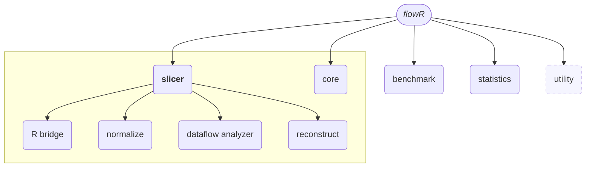

This page focuses on the features presented by *flowR* and how to use them.
If you have never used *flowR* before, please refer to the [setup](https://github.com/Code-Inspect/flowr/wiki/Setup) wiki page first, for instructions on how to install *flowR*.

<!-- TOC -->
- [FlowR's Modules](#flowrs-modules)
- [Using *flowR*](#using-flowr)
  - [The Read-Eval-Print Loop (REPL)](#the-read-eval-print-loop-repl)
  - [The Server](#the-server)
- [Calling the Scripts Directly](#calling-the-scripts-directly)
  - [Generate Static Slices](#generate-static-slices)
  - [Benchmark the Slicer](#benchmark-the-slicer)
    - [Summarizing the Benchmark Results](#summarizing-the-benchmark-results)
  - [Generate Usage Statistics of R Code](#generate-usage-statistics-of-r-code)
  - [Export RDF N-Quads](#export-rdf-n-quads)
<!-- TOC -->

## FlowR's Modules



The [mermaid](https://mermaid.js.org/) diagram above presents the architecture of *flowR*, with the important components directly related to the actual slicing highlighted accordingly (all boxes should be hyperlinks to the corresponding implementation *if* you are interested - depending on your browser you may have to specifically open them in a new tab).

Primarily, *flowR* provides a backward [program slicer](https://en.wikipedia.org/wiki/Program_slicing) for the [*R*](https://www.r-project.org/) programming language, which is available with the corresponding [slicer](https://github.com/Code-Inspect/flowr/tree/main/src/slicing) module and exposed by the [`slicer`](#generate-static-slices) script.
Its subcomponents (like the custom [R bridge](https://github.com/Code-Inspect/flowr/tree/main/src/r-bridge) or the static [dataflow analysis]("https://github.com/Code-Inspect/flowr/tree/main/src/dataflow)) are not important if you simply wish to use *flowR*.

The [benchmarker](https://github.com/Code-Inspect/flowr/tree/main/src/benchmark) module is only of interest if you want to benchmark/measure the runtime performance and reduction of the slicer. It is available with the [`benchmark`](#benchmark-the-slicer) script.

The [statistics](https://github.com/Code-Inspect/flowr/tree/main/src/statistics) module is mostly independent of the slicer and can be used to analyze R files regarding their use of function definitions, assignments, and more.  It is used to identify common patterns in R code and is available with the [`statistics`](#generate-usage-statistics-of-r-code) script.

The [core](https://github.com/Code-Inspect/flowr/tree/main/src/core) module contains *flowR*'s read-eval-print loop (REPL) and *flowR*'s server. Furthermore, it contains the root definitions of how *flowR* slices (see the [interface](https://github.com/Code-Inspect/flowr/wiki/Interface) wiki page for more information).

The [utility](https://github.com/Code-Inspect/flowr/tree/main/src/util) module is of no further interest for the usage of *flowR*

The following sections explain how to use these features.

## Using *flowR*

*flowR* has two main ways to operate:

- as a server which processes analysis and slicing requests (`--server` option)
- as a read-eval-print loop (REPL) that can be accessed directly from the command line (default option)

🐳️ If you use the docker-version, simply starting the docker container in interactive mode drops you right into the REPL (`docker run -it --rm eagleoutice/flowr:latest`), while launching with the `--server` argument starts the server (`docker run -it --rm eagleoutice/flowr:latest --server`).\
⚒️ If you compile the *flowR* sources yourself, you can access *flowR* by first building the sources (`npm run build`) and executing then the root script (`node dist/src/flowr.js`).

Independent of your way of launching *flowr*, we will write simply `flowr` for either (🐳️)&nbsp;`docker run -it --rm eagleoutice/flowr:latest` or (⚒️)&nbsp;`node dist/src/flowr.js`. See the [setup](https://github.com/Code-Inspect/flowr/wiki/Setup) wiki page for more information on how to get *flowR* running.

### The Read-Eval-Print Loop (REPL)

Once you launched *flowR*, you should see a small&nbsp;`R>` prompt. Use `:help` to receive instructions on how to use the REPL and what features are available (most prominently, you can access all [scripts](#calling-the-scripts-directly) simply by adding a colon before them).
In general, all commands start with a colon (`:`), everything else is interpreted as a&nbsp;R expression which is directly evaluated by the underlying R shell. The following GIF showcases a simple example session:


### The Server

Instead of the REPL, you can start *flowR* in "([TCP](https://de.wikipedia.org/wiki/Transmission_Control_Protocol)) server-mode" using `flowr --server` (write `flowr --help` to find out more). Together with the server option, you can configure the port with `--port`.
The supported requests are documented alongside the internal documentation, see the [Interface](https://github.com/Code-Inspect/flowr/wiki/Interface) wiki page for more information.

<details>
    <summary>Small demonstration using netcat</summary>


<details>
  <summary>Used <a href="https://github.com/charmbracelet/vhs">vhs</a> code</summary>

```vhs
Output demo.gif

Set FontSize 40
Set Width 1800
Set Height 750
Set WindowBar Colorful
Set TypingSpeed 0.05s
Set CursorBlink true

Type "netcat 127.0.0.1 1042"
Sleep 200ms
Enter
Sleep 600ms

Type '{"type":"request-file-analysis","filetoken":"x","filename":"example-input","content":"2 - x"}'
Sleep 200ms
Enter
Sleep 2s

Type '{"type":"request-slice","filetoken":"x","criterion":["1@x"]}'
Sleep 200ms
Enter
Sleep 8s

Ctrl+C
Sleep 200ms
```

</details>
</details>

The server allows to access the REPL as well (see the [interface](https://github.com/Code-Inspect/flowr/wiki/Interface) wiki page for more information).

## Calling the Scripts Directly

This describes the old way of using *flowR* by creating and calling the respective scripts directly. Although this is no longer necessary, the scripts still remain, fully integrated into the REPL of *flowR* (you can access them simply by adding a colon `:` before the name).

### Generate Static Slices

To generate a slice you need to provide two things:

1. A [slicing criterion](https://github.com/Code-Inspect/flowr/wiki/Terminology#slicing-criterion): the location of a single variable or several variables of interest to slice for, like "`12@product`"
2. The path to an R&nbsp;file that should be sliced.

For example, you can run

```shell
npm run slicer -- --criterion "12@product" "test/testfiles/example.R"
```

This slices for the first use of the variable `product` in line&nbsp;12 of the source file at `test/testfiles/example.R` (see the [slicing criterion](https://github.com/Code-Inspect/flowr/wiki/Terminology#slicing-criterion) definition for more information).
By default, the resulting slice is output to the standard output.

For more options see,

```shell
npm run slicer -- --help
```

Now, the following alternative is to be preferred:

```shell
flowr -e ":slicer --help"
```

### Benchmark the Slicer

Within the original [thesis](https://github.com/Code-Inspect/flowr/wiki/Thesis), I conducted a benchmark of the slicer, measuring:

1. The required time of each step of the slicing process, and
2. The achieved reductions in the size of the slice.

The corresponding *benchmark* script ultimately allows to do the same thing as the *slicing* script, but 1) parallel for many files and 2) for a wider selection of slicing points.
By default, it starts by collecting all variables in a script, producing a slice for each of them.

For example, to run the benchmark on 500 randomly picked files of the folder `<folder>` using 8 threads and writing the output to `<output.json>`, you can use:

```shell
npm run benchmark -- --limit 500 --parallel 8 --output "<output.json>" "<folder>"
```

For more options see,

```shell
npm run benchmark -- --help
```

#### Summarizing the Benchmark Results

The resulting JSON file can be rather larger (starting off with a couple of hundred megabytes). Therefore, you probably want to summarize the results of the benchmark.
For this, you can make use of the *summarizer* script like this:

```shell
npm run summarizer -- "<output.json>"
```

Please note that the summarizer may require a long time as it parses, normalizes, and analyzes *each* slice produced, to calculate the reduction numbers. Therefore, it actually executes two steps:

1. For each file, it calculates the reduction, required time, and other information, written to `<output-summary.json>`
2. Calculates the "ultimate" summary by aggregating the intermediate results for each file

As the ultimate summary is much quicker, you can re-run it by specifically adding the `--ultimate-only` flag (although this is only really of use if you modify what should be summarized within the source code of *flowR*).

For more options see,

```shell
npm run summarizer -- --help
```

### Generate Usage Statistics of R Code

If you want to reproduce the statistics as presented in my [master's thesis](http://dx.doi.org/10.18725/OPARU-50107), see the corresponding [wiki page](https://github.com/Code-Inspect/flowr/wiki/Thesis#how-to-reproduce-the-statistics-from-the-masters-thesis).

See

```shell
npm run stats -- --help
```

### Export RDF N-Quads

If you know what the RDF N-Quads refer to, then you are good to go! If not, you do not have to worry - you probably do not need them (they are for a graph search that is based on *flowR*). See the following for more information:

```shell
npm run export-quads -- --help
```
