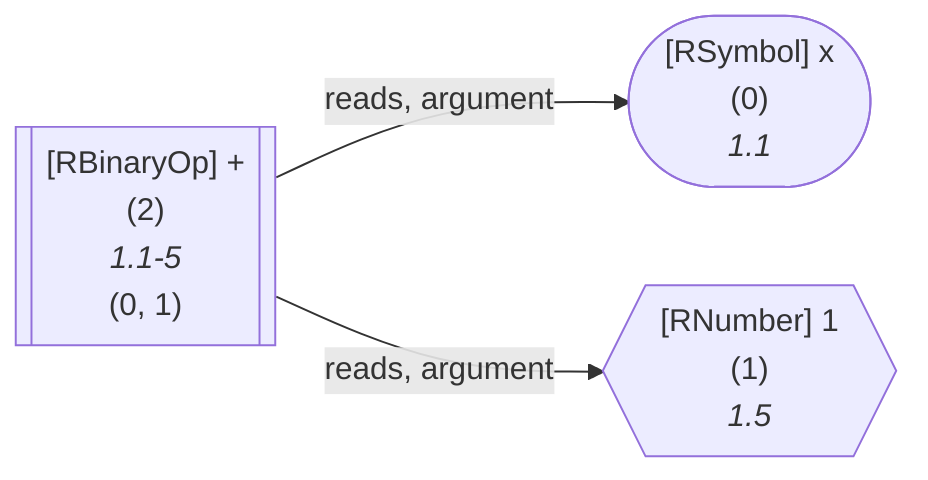

_This document was generated from 'src/documentation/print-query-wiki.ts' on 2024-10-12, 19:13:06 UTC presenting an overview of flowR's query API (v2.1.1, using R v4.4.0)._

This page briefly summarizes flowR's query API, represented by the executeQueries function in [`./src/queries/query.ts`](https://github.com/flowr-analysis/flowr/tree/main/./src/queries/query.ts).
Please see the [Interface](https://github.com/flowr-analysis/flowr/wiki//Interface) wiki page for more information on how to access this API.

## The Query Format

Queries are JSON arrays of query objects, each of which uses a `type` property to specify the query type.
In general, we separate two types of queries:

1. **Active Queries**: Are exactly what you would expect from a query (e.g., the [Call-Context Query](#call-context-query)). They fetch information from the dataflow graph.
2. **Virtual Queries**: Are used to structure your queries (e.g., the [Compound Query](#compound-query)). 

We separate these from a concept perspective. 
For now, we support the following **active** queries (which we will refer to simply as a `query`):

1. [Call-Context Query](#call-context-query) (`call-context`):\
    Finds all calls in a set of files that matches specified criteria.
1. [Dataflow Cluster Query](#dataflow-cluster-query) (`dataflow-cluster`):\
    Calculates and returns all the clusters present in the dataflow graph.
1. [Dataflow Query](#dataflow-query) (`dataflow`):\
    Returns the dataflow graph of the given code.
1. [Id-Map Query](#id-map-query) (`id-map`):\
    Returns the id-map of the normalized AST of the given code.
1. [Normalized AST Query](#normalized-ast-query) (`normalized-ast`):\
    Returns the normalized AST of the given code.
1. [Static Slice Query](#static-slice-query) (`static-slice`):\
    Slice the dataflow graph reducing the code to just the parts relevant for the given criteria.

Similarly, we support the following **virtual** queries: 

1. [Compound Query](#compound-query) (`compound`):\
    Combines multiple queries of the same type into one, specifying common arguments.

<details>


<summary>Detailed Query Format (Automatically Generated)</summary>

Although it is probably better to consult the detailed explanations below, if you want to have a look at the scehma, here is its description:

- **.** array 
    _Queries to run on the file analysis information (in the form of an array)_
Valid item types:
    - **.** alternatives 
        _Any query_
        - **.** alternatives 
            _Supported queries_
            - **.** object 
                _Call context query used to find calls in the dataflow graph_
                - **type** string [required]
                    _The type of the query._
                    Allows only the values: 'call-context'
                - **callName** string [required]
                    _Regex regarding the function name!_
                - **callNameExact** boolean [optional]
                    _Should we automatically add the `^` and `$` anchors to the regex to make it an exact match?_
                - **kind** string [optional]
                    _The kind of the call, this can be used to group calls together (e.g., linking `plot` to `visualize`). Defaults to `.`_
                - **subkind** string [optional]
                    _The subkind of the call, this can be used to uniquely identify the respective call type when grouping the output (e.g., the normalized name, linking `ggplot` to `plot`). Defaults to `.`_
                - **callTargets** string [optional]
                    _Call targets the function may have. This defaults to `any`. Request this specifically to gain all call targets we can resolve._
                    Allows only the values: 'global', 'must-include-global', 'local', 'must-include-local', 'any'
                - **includeAliases** boolean [optional]
                    _Consider a case like `f <- function_of_interest`, do you want uses of `f` to be included in the results?_
                - **linkTo** object [optional]
                    _Links the current call to the last call of the given kind. This way, you can link a call like `points` to the latest graphics plot etc._
                    - **type** string [required]
                        _The type of the linkTo sub-query._
                        Allows only the values: 'link-to-last-call'
                    - **callName** string [required]
                        _Regex regarding the function name of the last call. Similar to `callName`, strings are interpreted as a regular expression._
            - **.** object 
                _The dataflow query simply returns the dataflow graph, there is no need to pass it multiple times!_
                - **type** string [required]
                    _The type of the query._
                    Allows only the values: 'dataflow'
            - **.** object 
                _The id map query retrieves the id map from the normalized AST._
                - **type** string [required]
                    _The type of the query._
                    Allows only the values: 'id-map'
            - **.** object 
                _The normalized AST query simply returns the normalized AST, there is no need to pass it multiple times!_
                - **type** string [required]
                    _The type of the query._
                    Allows only the values: 'normalized-ast'
            - **.** object 
                _The cluster query calculates and returns all clusters in the dataflow graph._
                - **type** string [required]
                    _The type of the query._
                    Allows only the values: 'dataflow-cluster'
            - **.** object 
                _Slice query used to slice the dataflow graph_
                - **type** string [required]
                    _The type of the query._
                    Allows only the values: 'static-slice'
                - **criteria** array [required]
                    _The slicing criteria to use._
                Valid item types:
                    - **.** string 
                - **noReconstruction** boolean [optional]
                    _Do not reconstruct the slice into readable code._
                - **noMagicComments** boolean [optional]
                    _Should the magic comments (force-including lines within the slice) be ignored?_
        - **.** alternatives 
            _Virtual queries (used for structure)_
            - **.** object 
                _Compound query used to combine queries of the same type_
                - **type** string [required]
                    _The type of the query._
                    Allows only the values: 'compound'
                - **query** string [required]
                    _The query to run on the file analysis information._
                - **commonArguments** object [required]
                    _Common arguments for all queries._
                - **arguments** array [required]
                    _Arguments for each query._
                Valid item types:
                    - **.** object 

</details>

### Why Queries?

First, consider that you have a file like the following (of course, this is just a simple and artificial example):

```r
library(ggplot)
library(dplyr)
library(readr)

# read data with read_csv
data <- read_csv('data.csv')
data2 <- read_csv('data2.csv')

m <- mean(data$x) 
print(m)

data %>%
	ggplot(aes(x = x, y = y)) +
	geom_point()
	
plot(data2$x, data2$y)
points(data2$x, data2$y)
	
print(mean(data2$k))
```

<details> <summary>Dataflow Graph of the Example</summary>


	
(The analysis required _20.15 ms_ (incl. parse and normalize) within the generation environment.)


</details>

&nbsp;

Additionally, consider that you are interested in all function calls which loads data with `read_csv`.
A simple `regex`-based query could look like this: `^read_csv$`.
However, this fails to incorporate
 
1. Syntax-based information (comments, strings, used as a variable, called as a higher-order function, ...)
2. Semantic information (e.g., `read_csv` is overwritten by a function with the same name)
3. Context information (e.g., calls like `points` may link to the current plot)

To solve this, flowR provides a query API which allows you to specify queries on the dataflow graph.
For the specific use-case stated, you could use the [Call-Context Query](#call-context-query) to find all calls to `read_csv` which refer functions that are not overwritten.

Just as an example, the following [Call-Context Query](#call-context-query) finds all calls to `read_csv` that are not overwritten:


```json
[
  {
    "type": "call-context",
    "callName": "^read_csv$",
    "callTargets": "global",
    "kind": "input",
    "subkind": "csv-file"
  }
]
```


_Results (prettified and summarized):_

Query: **call-context** (1 ms)\
&nbsp;&nbsp;&nbsp;╰ **input**\
&nbsp;&nbsp;&nbsp;&nbsp;&nbsp;╰ **csv-file**: _`read_csv`_ (L.6), _`read_csv`_ (L.7)\
_All queries together required ≈1 ms (1ms accuracy, total 9 ms)_

<details> <summary style="color:gray">Show Detailed Results as Json</summary>

The analysis required _8.52 ms_ (including parsing and normalization and the query) within the generation environment.	

In general, the JSON contains the Ids of the nodes in question as they are present in the normalized AST or the dataflow graph of flowR.
Please consult the [Interface](https://github.com/flowr-analysis/flowr/wiki//Interface) wiki page for more information on how to get those.


```json
{
  "call-context": {
    ".meta": {
      "timing": 1
    },
    "kinds": {
      "input": {
        "subkinds": {
          "csv-file": [
            {
              "id": 16,
              "calls": []
            },
            {
              "id": 22,
              "calls": []
            }
          ]
        }
      }
    }
  },
  ".meta": {
    "timing": 1
  }
}
```


</details>


	


### Call-Context Query


Call context queries can be used to identify calls to specific functions that match criteria of your interest.
For now, we support two criteria:

1. **Function Name** (`callName`): The function name is specified by a regular expression. This allows you to find all calls to functions that match a specific pattern. Please note, that if you do not use Regex-Anchors, the query will match any function name that contains the given pattern (you can set the `callNameExact` property to `true` to automatically add the `^...$` anchors).
2. **Call Targets**  (`callTargets`): This specifies to what the function call targets. For example, you may want to find all calls to a function that is not defined locally.

Besides this, we provide the following ways to automatically categorize and link identified invocations:

1. **Kind**         (`kind`): This is a general category that can be used to group calls together. For example, you may want to link all calls to `plot` to `visualize`.
2. **Subkind**      (`subkind`): This is used to uniquely identify the respective call type when grouping the output. For example, you may want to link all calls to `ggplot` to `plot`.
3. **Linked Calls** (`linkTo`): This links the current call to the last call of the given kind. This way, you can link a call like `points` to the latest graphics plot etc.
   For now, we _only_ offer support for linking to the last call, as the current flow dependency over-approximation is not stable.
4. **Aliases**      (`includeAliases`): Consider a case like `f <- function_of_interest`, do you want calls to `f` to be included in the results? There is probably no need to combine this with a global call target!

Re-using the example code from above, the following query attaches all calls to `mean` to the kind `visualize` and the subkind `text`,
all calls that start with `read_` to the kind `input` but only if they are not locally overwritten, and the subkind `csv-file`, and links all calls to `points` to the last call to `plot`:


```json
[
  {
    "type": "call-context",
    "callName": "^mean$",
    "kind": "visualize",
    "subkind": "text"
  },
  {
    "type": "call-context",
    "callName": "^read_",
    "kind": "input",
    "subkind": "csv-file",
    "callTargets": "global"
  },
  {
    "type": "call-context",
    "callName": "^points$",
    "kind": "visualize",
    "subkind": "plot",
    "linkTo": {
      "type": "link-to-last-call",
      "callName": "^plot$"
    }
  }
]
```


_Results (prettified and summarized):_

Query: **call-context** (2 ms)\
&nbsp;&nbsp;&nbsp;╰ **input**\
&nbsp;&nbsp;&nbsp;&nbsp;&nbsp;╰ **csv-file**: _`read_csv`_ (L.6), _`read_csv`_ (L.7)\
&nbsp;&nbsp;&nbsp;╰ **visualize**\
&nbsp;&nbsp;&nbsp;&nbsp;&nbsp;╰ **text**: _`mean`_ (L.9), _`mean`_ (L.19)\
&nbsp;&nbsp;&nbsp;&nbsp;&nbsp;╰ **plot**: _`points`_ (L.17) with 1 link (_`plot`_ (L.16))\
_All queries together required ≈3 ms (1ms accuracy, total 13 ms)_

<details> <summary style="color:gray">Show Detailed Results as Json</summary>

The analysis required _12.75 ms_ (including parsing and normalization and the query) within the generation environment.	

In general, the JSON contains the Ids of the nodes in question as they are present in the normalized AST or the dataflow graph of flowR.
Please consult the [Interface](https://github.com/flowr-analysis/flowr/wiki//Interface) wiki page for more information on how to get those.


```json
{
  "call-context": {
    ".meta": {
      "timing": 2
    },
    "kinds": {
      "input": {
        "subkinds": {
          "csv-file": [
            {
              "id": 16,
              "calls": []
            },
            {
              "id": 22,
              "calls": []
            }
          ]
        }
      },
      "visualize": {
        "subkinds": {
          "text": [
            {
              "id": 31
            },
            {
              "id": 87
            }
          ],
          "plot": [
            {
              "id": 79,
              "linkedIds": [
                67
              ]
            }
          ]
        }
      }
    }
  },
  ".meta": {
    "timing": 3
  }
}
```


</details>


	

As you can see, all kinds and subkinds with the same name are grouped together.
Yet, re-stating common arguments and kinds may be cumbersome (although you can already use clever regex patterns).
See the [Compound Query](#compound-query) for a way to structure your queries more compactly if you think it gets too verbose. 


<details><summary style="color:black">Alias Example</summary>

Consider the following code: 
```r
foo <- my_test_function
foo()
if(u) bar <- foo
bar()
my_test_function()
```

Now let's say we want to query _all_ uses of the `my_test_function`:

```json
[
  {
    "type": "call-context",
    "callName": "^my_test_function",
    "includeAliases": true
  }
]
```


_Results (prettified and summarized):_

Query: **call-context** (0 ms)\
&nbsp;&nbsp;&nbsp;╰ **.**\
&nbsp;&nbsp;&nbsp;&nbsp;&nbsp;╰ **.**: _`foo`_ (L.2) with 1 alias root (_`my_test_function`_ (L.1)), _`bar`_ (L.4) with 1 alias root (_`my_test_function`_ (L.1)), _`my_test_function`_ (L.5)\
_All queries together required ≈0 ms (1ms accuracy, total 6 ms)_

<details> <summary style="color:gray">Show Detailed Results as Json</summary>

The analysis required _6.49 ms_ (including parsing and normalization and the query) within the generation environment.	

In general, the JSON contains the Ids of the nodes in question as they are present in the normalized AST or the dataflow graph of flowR.
Please consult the [Interface](https://github.com/flowr-analysis/flowr/wiki//Interface) wiki page for more information on how to get those.


```json
{
  "call-context": {
    ".meta": {
      "timing": 0
    },
    "kinds": {
      ".": {
        "subkinds": {
          ".": [
            {
              "id": 4,
              "aliasRoots": [
                1
              ]
            },
            {
              "id": 12,
              "aliasRoots": [
                1
              ]
            },
            {
              "id": 14
            }
          ]
        }
      }
    }
  },
  ".meta": {
    "timing": 0
  }
}
```


</details>


	

</details>
    
		

<details> 

<summary style="color:gray">Implementation Details</summary>

Responsible for the execution of the Call-Context Query query is `executeCallContextQueries` in [`./src/queries/catalog/call-context-query/call-context-query-executor.ts`](https://github.com/flowr-analysis/flowr/tree/main/./src/queries/catalog/call-context-query/call-context-query-executor.ts).

</details>	


### Dataflow Query


Maybe you want to handle only the result of the query execution, or you just need the [dataflow graph](https://github.com/flowr-analysis/flowr/wiki//Dataflow%20Graph) again.
This query type does exactly that!

Using the example code `x + 1`, the following query returns the dataflow graph of the code:


```json
[
  {
    "type": "dataflow"
  }
]
```


_Results (prettified and summarized):_

Query: **dataflow** (0 ms)\
&nbsp;&nbsp;&nbsp;╰ [Dataflow Graph](https://mermaid.live/view#base64:eyJjb2RlIjoiZmxvd2NoYXJ0IFREXG4gICAgMChbXCJgIzkxO1JTeW1ib2wjOTM7IHhcbiAgICAgICgwKVxuICAgICAgKjEuMSpgXCJdKVxuICAgIDF7e1wiYCM5MTtSTnVtYmVyIzkzOyAxXG4gICAgICAoMSlcbiAgICAgICoxLjUqYFwifX1cbiAgICAyW1tcImAjOTE7UkJpbmFyeU9wIzkzOyAjNDM7XG4gICAgICAoMilcbiAgICAgICoxLjEtNSpcbiAgICAoMCwgMSlgXCJdXVxuICAgIDIgLS0+fFwicmVhZHMsIGFyZ3VtZW50XCJ8IDBcbiAgICAyIC0tPnxcInJlYWRzLCBhcmd1bWVudFwifCAxIiwibWVybWFpZCI6eyJhdXRvU3luYyI6dHJ1ZX19)\
_All queries together required ≈1 ms (1ms accuracy, total 2 ms)_

<details> <summary style="color:gray">Show Detailed Results as Json</summary>

The analysis required _1.83 ms_ (including parsing and normalization and the query) within the generation environment.	

In general, the JSON contains the Ids of the nodes in question as they are present in the normalized AST or the dataflow graph of flowR.
Please consult the [Interface](https://github.com/flowr-analysis/flowr/wiki//Interface) wiki page for more information on how to get those.


_As the code is pretty long, we inhibit pretty printing and syntax highlighting (JSON):_

```text
{"dataflow":{".meta":{"timing":0},"graph":{"_idMap":{"size":7,"k2v":[[0,{"type":"RSymbol","location":[1,1,1,1],"content":"x","lexeme":"x","info":{"fullRange":[1,1,1,1],"additionalTokens":[],"fullLexeme":"x","id":0,"parent":2,"role":"binop-lhs","index":0,"nesting":0}}],[1,{"location":[1,5,1,5],"lexeme":"1","info":{"fullRange":[1,5,1,5],"additionalTokens":[],"fullLexeme":"1","id":1,"parent":2,"role":"binop-rhs","index":1,"nesting":0},"type":"RNumber","content":{"num":1,"complexNumber":false,"markedAsInt":false}}],[2,{"type":"RBinaryOp","location":[1,3,1,3],"lhs":{"type":"RSymbol","location":[1,1,1,1],"content":"x","lexeme":"x","info":{"fullRange":[1,1,1,1],"additionalTokens":[],"fullLexeme":"x","id":0,"parent":2,"role":"binop-lhs","index":0,"nesting":0}},"rhs":{"location":[1,5,1,5],"lexeme":"1","info":{"fullRange":[1,5,1,5],"additionalTokens":[],"fullLexeme":"1","id":1,"parent":2,"role":"binop-rhs","index":1,"nesting":0},"type":"RNumber","content":{"num":1,"complexNumber":false,"markedAsInt":false}},"operator":"+","lexeme":"+","info":{"fullRange":[1,1,1,5],"additionalTokens":[],"fullLexeme":"x + 1","id":2,"parent":3,"nesting":0,"index":0,"role":"expr-list-child"}}],[3,{"type":"RExpressionList","children":[{"type":"RBinaryOp","location":[1,3,1,3],"lhs":{"type":"RSymbol","location":[1,1,1,1],"content":"x","lexeme":"x","info":{"fullRange":[1,1,1,1],"additionalTokens":[],"fullLexeme":"x","id":0,"parent":2,"role":"binop-lhs","index":0,"nesting":0}},"rhs":{"location":[1,5,1,5],"lexeme":"1","info":{"fullRange":[1,5,1,5],"additionalTokens":[],"fullLexeme":"1","id":1,"parent":2,"role":"binop-rhs","index":1,"nesting":0},"type":"RNumber","content":{"num":1,"complexNumber":false,"markedAsInt":false}},"operator":"+","lexeme":"+","info":{"fullRange":[1,1,1,5],"additionalTokens":[],"fullLexeme":"x + 1","id":2,"parent":3,"nesting":0,"index":0,"role":"expr-list-child"}}],"info":{"additionalTokens":[],"id":3,"nesting":0,"role":"root","index":0}}],["2-arg",{"type":"RBinaryOp","location":[1,3,1,3],"lhs":{"type":"RSymbol","location":[1,1,1,1],"content":"x","lexeme":"x","info":{"fullRange":[1,1,1,1],"additionalTokens":[],"fullLexeme":"x","id":0,"parent":2,"role":"binop-lhs","index":0,"nesting":0}},"rhs":{"location":[1,5,1,5],"lexeme":"1","info":{"fullRange":[1,5,1,5],"additionalTokens":[],"fullLexeme":"1","id":1,"parent":2,"role":"binop-rhs","index":1,"nesting":0},"type":"RNumber","content":{"num":1,"complexNumber":false,"markedAsInt":false}},"operator":"+","lexeme":"+","info":{"fullRange":[1,1,1,5],"additionalTokens":[],"fullLexeme":"x + 1","id":2,"parent":3,"nesting":0,"index":0,"role":"expr-list-child"}}],["0-arg",{"type":"RSymbol","location":[1,1,1,1],"content":"x","lexeme":"x","info":{"fullRange":[1,1,1,1],"additionalTokens":[],"fullLexeme":"x","id":0,"parent":2,"role":"binop-lhs","index":0,"nesting":0}}],["1-arg",{"location":[1,5,1,5],"lexeme":"1","info":{"fullRange":[1,5,1,5],"additionalTokens":[],"fullLexeme":"1","id":1,"parent":2,"role":"binop-rhs","index":1,"nesting":0},"type":"RNumber","content":{"num":1,"complexNumber":false,"markedAsInt":false}}]],"v2k":{}},"_unknownSideEffects":[],"rootVertices":[0,1,2],"vertexInformation":[[0,{"tag":"use","id":0}],[1,{"tag":"value","id":1}],[2,{"tag":"function-call","id":2,"name":"+","onlyBuiltin":true,"args":[{"nodeId":0,"type":32},{"nodeId":1,"type":32}]}]],"edgeInformation":[[2,[[0,{"types":65}],[1,{"types":65}]]]]}},".meta":{"timing":1}}
```


</details>


<details> <summary style="color:gray">Original Code</summary>


```r
x + 1
```
<details>

<summary style="color:gray">Dataflow Graph of the R Code</summary>

The analysis required _1.29 ms_ (incl. parse and normalize) within the generation environment. 
We encountered no unknown side effects during the analysis.


	

<details>

<summary style="color:gray">Mermaid Code </summary>

```
flowchart LR
    0(["`#91;RSymbol#93; x
      (0)
      *1.1*`"])
    1{{"`#91;RNumber#93; 1
      (1)
      *1.5*`"}}
    2[["`#91;RBinaryOp#93; #43;
      (2)
      *1.1-5*
    (0, 1)`"]]
    2 -->|"reads, argument"| 0
    2 -->|"reads, argument"| 1
```

</details>

</details>


</details>
	


	
		

<details> 

<summary style="color:gray">Implementation Details</summary>

Responsible for the execution of the Dataflow Query query is `executeDataflowQuery` in [`./src/queries/catalog/dataflow-query/dataflow-query-executor.ts`](https://github.com/flowr-analysis/flowr/tree/main/./src/queries/catalog/dataflow-query/dataflow-query-executor.ts).

</details>	


### Normalized AST Query


Maybe you want to handle only the result of the query execution, or you just need the [normalized AST](https://github.com/flowr-analysis/flowr/wiki//Normalized%20AST) again.
This query type does exactly that!

Using the example code `x + 1`, the following query returns the normalized AST of the code:


```json
[
  {
    "type": "normalized-ast"
  }
]
```


_Results (prettified and summarized):_

Query: **normalized-ast** (0 ms)\
&nbsp;&nbsp;&nbsp;╰ [Normalized AST](https://mermaid.live/view#base64:eyJjb2RlIjoiZmxvd2NoYXJ0IFREXG4gICAgbjMoW1wiUkV4cHJlc3Npb25MaXN0ICgzKVxuIFwiXSlcbiAgICBuMihbXCJSQmluYXJ5T3AgKDIpXG4jNDM7XCJdKVxuICAgIG4zIC0tPnxcImV4cHItbGlzdC1jaGlsZC0wXCJ8IG4yXG4gICAgbjAoW1wiUlN5bWJvbCAoMClcbnhcIl0pXG4gICAgbjIgLS0+fFwiYmlub3AtbGhzXCJ8IG4wXG4gICAgbjEoW1wiUk51bWJlciAoMSlcbjFcIl0pXG4gICAgbjIgLS0+fFwiYmlub3AtcmhzXCJ8IG4xXG4iLCJtZXJtYWlkIjp7ImF1dG9TeW5jIjp0cnVlfX0=)\
_All queries together required ≈0 ms (1ms accuracy, total 1 ms)_

<details> <summary style="color:gray">Show Detailed Results as Json</summary>

The analysis required _1.38 ms_ (including parsing and normalization and the query) within the generation environment.	

In general, the JSON contains the Ids of the nodes in question as they are present in the normalized AST or the dataflow graph of flowR.
Please consult the [Interface](https://github.com/flowr-analysis/flowr/wiki//Interface) wiki page for more information on how to get those.


_As the code is pretty long, we inhibit pretty printing and syntax highlighting (JSON):_

```text
{"normalized-ast":{".meta":{"timing":0},"normalized":{"ast":{"type":"RExpressionList","children":[{"type":"RBinaryOp","location":[1,3,1,3],"lhs":{"type":"RSymbol","location":[1,1,1,1],"content":"x","lexeme":"x","info":{"fullRange":[1,1,1,1],"additionalTokens":[],"fullLexeme":"x","id":0,"parent":2,"role":"binop-lhs","index":0,"nesting":0}},"rhs":{"location":[1,5,1,5],"lexeme":"1","info":{"fullRange":[1,5,1,5],"additionalTokens":[],"fullLexeme":"1","id":1,"parent":2,"role":"binop-rhs","index":1,"nesting":0},"type":"RNumber","content":{"num":1,"complexNumber":false,"markedAsInt":false}},"operator":"+","lexeme":"+","info":{"fullRange":[1,1,1,5],"additionalTokens":[],"fullLexeme":"x + 1","id":2,"parent":3,"nesting":0,"index":0,"role":"expr-list-child"}}],"info":{"additionalTokens":[],"id":3,"nesting":0,"role":"root","index":0}},"idMap":{"size":7,"k2v":[[0,{"type":"RSymbol","location":[1,1,1,1],"content":"x","lexeme":"x","info":{"fullRange":[1,1,1,1],"additionalTokens":[],"fullLexeme":"x","id":0,"parent":2,"role":"binop-lhs","index":0,"nesting":0}}],[1,{"location":[1,5,1,5],"lexeme":"1","info":{"fullRange":[1,5,1,5],"additionalTokens":[],"fullLexeme":"1","id":1,"parent":2,"role":"binop-rhs","index":1,"nesting":0},"type":"RNumber","content":{"num":1,"complexNumber":false,"markedAsInt":false}}],[2,{"type":"RBinaryOp","location":[1,3,1,3],"lhs":{"type":"RSymbol","location":[1,1,1,1],"content":"x","lexeme":"x","info":{"fullRange":[1,1,1,1],"additionalTokens":[],"fullLexeme":"x","id":0,"parent":2,"role":"binop-lhs","index":0,"nesting":0}},"rhs":{"location":[1,5,1,5],"lexeme":"1","info":{"fullRange":[1,5,1,5],"additionalTokens":[],"fullLexeme":"1","id":1,"parent":2,"role":"binop-rhs","index":1,"nesting":0},"type":"RNumber","content":{"num":1,"complexNumber":false,"markedAsInt":false}},"operator":"+","lexeme":"+","info":{"fullRange":[1,1,1,5],"additionalTokens":[],"fullLexeme":"x + 1","id":2,"parent":3,"nesting":0,"index":0,"role":"expr-list-child"}}],[3,{"type":"RExpressionList","children":[{"type":"RBinaryOp","location":[1,3,1,3],"lhs":{"type":"RSymbol","location":[1,1,1,1],"content":"x","lexeme":"x","info":{"fullRange":[1,1,1,1],"additionalTokens":[],"fullLexeme":"x","id":0,"parent":2,"role":"binop-lhs","index":0,"nesting":0}},"rhs":{"location":[1,5,1,5],"lexeme":"1","info":{"fullRange":[1,5,1,5],"additionalTokens":[],"fullLexeme":"1","id":1,"parent":2,"role":"binop-rhs","index":1,"nesting":0},"type":"RNumber","content":{"num":1,"complexNumber":false,"markedAsInt":false}},"operator":"+","lexeme":"+","info":{"fullRange":[1,1,1,5],"additionalTokens":[],"fullLexeme":"x + 1","id":2,"parent":3,"nesting":0,"index":0,"role":"expr-list-child"}}],"info":{"additionalTokens":[],"id":3,"nesting":0,"role":"root","index":0}}],["2-arg",{"type":"RBinaryOp","location":[1,3,1,3],"lhs":{"type":"RSymbol","location":[1,1,1,1],"content":"x","lexeme":"x","info":{"fullRange":[1,1,1,1],"additionalTokens":[],"fullLexeme":"x","id":0,"parent":2,"role":"binop-lhs","index":0,"nesting":0}},"rhs":{"location":[1,5,1,5],"lexeme":"1","info":{"fullRange":[1,5,1,5],"additionalTokens":[],"fullLexeme":"1","id":1,"parent":2,"role":"binop-rhs","index":1,"nesting":0},"type":"RNumber","content":{"num":1,"complexNumber":false,"markedAsInt":false}},"operator":"+","lexeme":"+","info":{"fullRange":[1,1,1,5],"additionalTokens":[],"fullLexeme":"x + 1","id":2,"parent":3,"nesting":0,"index":0,"role":"expr-list-child"}}],["0-arg",{"type":"RSymbol","location":[1,1,1,1],"content":"x","lexeme":"x","info":{"fullRange":[1,1,1,1],"additionalTokens":[],"fullLexeme":"x","id":0,"parent":2,"role":"binop-lhs","index":0,"nesting":0}}],["1-arg",{"location":[1,5,1,5],"lexeme":"1","info":{"fullRange":[1,5,1,5],"additionalTokens":[],"fullLexeme":"1","id":1,"parent":2,"role":"binop-rhs","index":1,"nesting":0},"type":"RNumber","content":{"num":1,"complexNumber":false,"markedAsInt":false}}]],"v2k":{}}}},".meta":{"timing":0}}
```


</details>


<details> <summary style="color:gray">Original Code</summary>


```r
x + 1
```
<details>

<summary style="color:gray">Dataflow Graph of the R Code</summary>

The analysis required _1.41 ms_ (incl. parse and normalize) within the generation environment. 
We encountered no unknown side effects during the analysis.



	

<details>

<summary style="color:gray">Mermaid Code </summary>

```
flowchart LR
    0(["`#91;RSymbol#93; x
      (0)
      *1.1*`"])
    1{{"`#91;RNumber#93; 1
      (1)
      *1.5*`"}}
    2[["`#91;RBinaryOp#93; #43;
      (2)
      *1.1-5*
    (0, 1)`"]]
    2 -->|"reads, argument"| 0
    2 -->|"reads, argument"| 1
```

</details>

</details>


</details>
	


	
		

<details> 

<summary style="color:gray">Implementation Details</summary>

Responsible for the execution of the Normalized AST Query query is `executeNormalizedAstQuery` in [`./src/queries/catalog/normalized-ast-query/normalized-ast-query-executor.ts`](https://github.com/flowr-analysis/flowr/tree/main/./src/queries/catalog/normalized-ast-query/normalized-ast-query-executor.ts).

</details>	


### Dataflow Cluster Query


This query automatically calculates clusters in flowR's dataflow graph 
and returns a list of all clusters found. 
Clusters are to be interpreted as literal clusters on the graph traversing
edges in both directions. From this perspective, 
the code `x <- 1; x` has one cluster (given that all code is related), 
while the code `x <- 1; y` has two clusters (given that the `y` has no relation to the previous definition).


<details><summary style="color:black">Example <code>x <- 1; x</code></summary>


```json
[
  {
    "type": "dataflow-cluster"
  }
]
```


_Results (prettified and summarized):_

Query: **dataflow-cluster** (0ms)\
&nbsp;&nbsp;&nbsp;╰ Found 1 cluster\
&nbsp;&nbsp;&nbsp;&nbsp;&nbsp;&nbsp;╰  {3, 0, 1, 2} ([marked](https://mermaid.live/view#base64:eyJjb2RlIjoiZmxvd2NoYXJ0IFREXG4gICAgMXt7XCJgIzkxO1JOdW1iZXIjOTM7IDFcbiAgICAgICgxKVxuICAgICAgKjEuNipgXCJ9fVxuICAgIHN0eWxlIDEgc3Ryb2tlOnRlYWwsc3Ryb2tlLXdpZHRoOjdweCxzdHJva2Utb3BhY2l0eTouODsgXG4gICAgMFtcImAjOTE7UlN5bWJvbCM5MzsgeFxuICAgICAgKDApXG4gICAgICAqMS4xKmBcIl1cbiAgICBzdHlsZSAwIHN0cm9rZTp0ZWFsLHN0cm9rZS13aWR0aDo3cHgsc3Ryb2tlLW9wYWNpdHk6Ljg7IFxuICAgIDJbW1wiYCM5MTtSQmluYXJ5T3AjOTM7ICM2MDsjNDU7XG4gICAgICAoMilcbiAgICAgICoxLjEtNipcbiAgICAoMCwgMSlgXCJdXVxuICAgIHN0eWxlIDIgc3Ryb2tlOnRlYWwsc3Ryb2tlLXdpZHRoOjdweCxzdHJva2Utb3BhY2l0eTouODsgXG4gICAgMyhbXCJgIzkxO1JTeW1ib2wjOTM7IHhcbiAgICAgICgzKVxuICAgICAgKjEuOSpgXCJdKVxuICAgIHN0eWxlIDMgc3Ryb2tlOnRlYWwsc3Ryb2tlLXdpZHRoOjdweCxzdHJva2Utb3BhY2l0eTouODsgXG4gICAgMCAtLT58XCJkZWZpbmVkLWJ5XCJ8IDFcbiAgICAwIC0tPnxcImRlZmluZWQtYnlcInwgMlxuICAgIDIgLS0+fFwiYXJndW1lbnRcInwgMVxuICAgIDIgLS0+fFwicmV0dXJucywgYXJndW1lbnRcInwgMFxuICAgIDMgLS0+fFwicmVhZHNcInwgMCIsIm1lcm1haWQiOnsiYXV0b1N5bmMiOnRydWV9fQ==))\
_All queries together required ≈0 ms (1ms accuracy, total 2 ms)_

<details> <summary style="color:gray">Show Detailed Results as Json</summary>

The analysis required _2.10 ms_ (including parsing and normalization and the query) within the generation environment.	

In general, the JSON contains the Ids of the nodes in question as they are present in the normalized AST or the dataflow graph of flowR.
Please consult the [Interface](https://github.com/flowr-analysis/flowr/wiki//Interface) wiki page for more information on how to get those.


```json
{
  "dataflow-cluster": {
    ".meta": {
      "timing": 0
    },
    "clusters": [
      {
        "startNode": 3,
        "members": [
          3,
          0,
          1,
          2
        ],
        "hasUnknownSideEffects": false
      }
    ]
  },
  ".meta": {
    "timing": 0
  }
}
```


</details>


	

</details>
    

<details><summary style="color:black">Example <code>x <- 1; y</code></summary>


```json
[
  {
    "type": "dataflow-cluster"
  }
]
```


_Results (prettified and summarized):_

Query: **dataflow-cluster** (0ms)\
&nbsp;&nbsp;&nbsp;╰ Found 2 clusters\
&nbsp;&nbsp;&nbsp;&nbsp;&nbsp;&nbsp;╰  {3} ([marked](https://mermaid.live/view#base64:eyJjb2RlIjoiZmxvd2NoYXJ0IFREXG4gICAgMXt7XCJgIzkxO1JOdW1iZXIjOTM7IDFcbiAgICAgICgxKVxuICAgICAgKjEuNipgXCJ9fVxuICAgIDBbXCJgIzkxO1JTeW1ib2wjOTM7IHhcbiAgICAgICgwKVxuICAgICAgKjEuMSpgXCJdXG4gICAgMltbXCJgIzkxO1JCaW5hcnlPcCM5MzsgIzYwOyM0NTtcbiAgICAgICgyKVxuICAgICAgKjEuMS02KlxuICAgICgwLCAxKWBcIl1dXG4gICAgMyhbXCJgIzkxO1JTeW1ib2wjOTM7IHlcbiAgICAgICgzKVxuICAgICAgKjEuOSpgXCJdKVxuICAgIHN0eWxlIDMgc3Ryb2tlOnRlYWwsc3Ryb2tlLXdpZHRoOjdweCxzdHJva2Utb3BhY2l0eTouODsgXG4gICAgMCAtLT58XCJkZWZpbmVkLWJ5XCJ8IDFcbiAgICAwIC0tPnxcImRlZmluZWQtYnlcInwgMlxuICAgIDIgLS0+fFwiYXJndW1lbnRcInwgMVxuICAgIDIgLS0+fFwicmV0dXJucywgYXJndW1lbnRcInwgMCIsIm1lcm1haWQiOnsiYXV0b1N5bmMiOnRydWV9fQ==))\
&nbsp;&nbsp;&nbsp;&nbsp;&nbsp;&nbsp;╰  {2, 1, 0} ([marked](https://mermaid.live/view#base64:eyJjb2RlIjoiZmxvd2NoYXJ0IFREXG4gICAgMXt7XCJgIzkxO1JOdW1iZXIjOTM7IDFcbiAgICAgICgxKVxuICAgICAgKjEuNipgXCJ9fVxuICAgIHN0eWxlIDEgc3Ryb2tlOnRlYWwsc3Ryb2tlLXdpZHRoOjdweCxzdHJva2Utb3BhY2l0eTouODsgXG4gICAgMFtcImAjOTE7UlN5bWJvbCM5MzsgeFxuICAgICAgKDApXG4gICAgICAqMS4xKmBcIl1cbiAgICBzdHlsZSAwIHN0cm9rZTp0ZWFsLHN0cm9rZS13aWR0aDo3cHgsc3Ryb2tlLW9wYWNpdHk6Ljg7IFxuICAgIDJbW1wiYCM5MTtSQmluYXJ5T3AjOTM7ICM2MDsjNDU7XG4gICAgICAoMilcbiAgICAgICoxLjEtNipcbiAgICAoMCwgMSlgXCJdXVxuICAgIHN0eWxlIDIgc3Ryb2tlOnRlYWwsc3Ryb2tlLXdpZHRoOjdweCxzdHJva2Utb3BhY2l0eTouODsgXG4gICAgMyhbXCJgIzkxO1JTeW1ib2wjOTM7IHlcbiAgICAgICgzKVxuICAgICAgKjEuOSpgXCJdKVxuICAgIDAgLS0+fFwiZGVmaW5lZC1ieVwifCAxXG4gICAgMCAtLT58XCJkZWZpbmVkLWJ5XCJ8IDJcbiAgICAyIC0tPnxcImFyZ3VtZW50XCJ8IDFcbiAgICAyIC0tPnxcInJldHVybnMsIGFyZ3VtZW50XCJ8IDAiLCJtZXJtYWlkIjp7ImF1dG9TeW5jIjp0cnVlfX0=))\
_All queries together required ≈0 ms (1ms accuracy, total 2 ms)_

<details> <summary style="color:gray">Show Detailed Results as Json</summary>

The analysis required _1.59 ms_ (including parsing and normalization and the query) within the generation environment.	

In general, the JSON contains the Ids of the nodes in question as they are present in the normalized AST or the dataflow graph of flowR.
Please consult the [Interface](https://github.com/flowr-analysis/flowr/wiki//Interface) wiki page for more information on how to get those.


```json
{
  "dataflow-cluster": {
    ".meta": {
      "timing": 0
    },
    "clusters": [
      {
        "startNode": 3,
        "members": [
          3
        ],
        "hasUnknownSideEffects": false
      },
      {
        "startNode": 2,
        "members": [
          2,
          1,
          0
        ],
        "hasUnknownSideEffects": false
      }
    ]
  },
  ".meta": {
    "timing": 0
  }
}
```


</details>


	

</details>
    

Using the example code from above, the following query returns all clusters:


```json
[
  {
    "type": "dataflow-cluster"
  }
]
```


_Results (prettified and summarized):_

Query: **dataflow-cluster** (0ms)\
&nbsp;&nbsp;&nbsp;╰ Found 5 clusters\
&nbsp;&nbsp;&nbsp;&nbsp;&nbsp;&nbsp;╰  {<span title="[89,87,85,82,18,22,20,23,57,60,58,67,65,62,63,69,72,70,79,77,74,75,83]">89, 87, 85, 82, 18, 22, ... (see JSON below)</span>} ([marked](https://mermaid.live/view#base64:eyJjb2RlIjoiZmxvd2NoYXJ0IFREXG4gICAgMXt7XCJgIzkxO1JTeW1ib2wjOTM7IGdncGxvdFxuICAgICAgKDEpXG4gICAgICAqMS45LTE0KmBcIn19XG4gICAgM1tbXCJgIzkxO1JGdW5jdGlvbkNhbGwjOTM7IGxpYnJhcnlcbiAgICAgICgzKVxuICAgICAgKjEuMS0xNSpcbiAgICAoMSlgXCJdXVxuICAgIHN0eWxlIDMgc3Ryb2tlOnJlZCxzdHJva2Utd2lkdGg6NXB4OyBcbiAgICA1e3tcImAjOTE7UlN5bWJvbCM5MzsgZHBseXJcbiAgICAgICg1KVxuICAgICAgKjIuOS0xMypgXCJ9fVxuICAgIDdbW1wiYCM5MTtSRnVuY3Rpb25DYWxsIzkzOyBsaWJyYXJ5XG4gICAgICAoNylcbiAgICAgICoyLjEtMTQqXG4gICAgKDUpYFwiXV1cbiAgICBzdHlsZSA3IHN0cm9rZTpyZWQsc3Ryb2tlLXdpZHRoOjVweDsgXG4gICAgOXt7XCJgIzkxO1JTeW1ib2wjOTM7IHJlYWRyXG4gICAgICAoOSlcbiAgICAgICozLjktMTMqYFwifX1cbiAgICAxMVtbXCJgIzkxO1JGdW5jdGlvbkNhbGwjOTM7IGxpYnJhcnlcbiAgICAgICgxMSlcbiAgICAgICozLjEtMTQqXG4gICAgKDkpYFwiXV1cbiAgICBzdHlsZSAxMSBzdHJva2U6cmVkLHN0cm9rZS13aWR0aDo1cHg7IFxuICAgIDE0e3tcImAjOTE7UlN0cmluZyM5MzsgIzM5O2RhdGEuY3N2IzM5O1xuICAgICAgKDE0KVxuICAgICAgKjYuMTgtMjcqYFwifX1cbiAgICAxNltbXCJgIzkxO1JGdW5jdGlvbkNhbGwjOTM7IHJlYWQjOTU7Y3N2XG4gICAgICAoMTYpXG4gICAgICAqNi45LTI4KlxuICAgICgxNClgXCJdXVxuICAgIDEyW1wiYCM5MTtSU3ltYm9sIzkzOyBkYXRhXG4gICAgICAoMTIpXG4gICAgICAqNi4xLTQqYFwiXVxuICAgIDE3W1tcImAjOTE7UkJpbmFyeU9wIzkzOyAjNjA7IzQ1O1xuICAgICAgKDE3KVxuICAgICAgKjYuMS0yOCpcbiAgICAoMTIsIDE2KWBcIl1dXG4gICAgMjB7e1wiYCM5MTtSU3RyaW5nIzkzOyAjMzk7ZGF0YTIuY3N2IzM5O1xuICAgICAgKDIwKVxuICAgICAgKjcuMTktMjkqYFwifX1cbiAgICBzdHlsZSAyMCBzdHJva2U6dGVhbCxzdHJva2Utd2lkdGg6N3B4LHN0cm9rZS1vcGFjaXR5Oi44OyBcbiAgICAyMltbXCJgIzkxO1JGdW5jdGlvbkNhbGwjOTM7IHJlYWQjOTU7Y3N2XG4gICAgICAoMjIpXG4gICAgICAqNy4xMC0zMCpcbiAgICAoMjApYFwiXV1cbiAgICBzdHlsZSAyMiBzdHJva2U6dGVhbCxzdHJva2Utd2lkdGg6N3B4LHN0cm9rZS1vcGFjaXR5Oi44OyBcbiAgICAxOFtcImAjOTE7UlN5bWJvbCM5MzsgZGF0YTJcbiAgICAgICgxOClcbiAgICAgICo3LjEtNSpgXCJdXG4gICAgc3R5bGUgMTggc3Ryb2tlOnRlYWwsc3Ryb2tlLXdpZHRoOjdweCxzdHJva2Utb3BhY2l0eTouODsgXG4gICAgMjNbW1wiYCM5MTtSQmluYXJ5T3AjOTM7ICM2MDsjNDU7XG4gICAgICAoMjMpXG4gICAgICAqNy4xLTMwKlxuICAgICgxOCwgMjIpYFwiXV1cbiAgICBzdHlsZSAyMyBzdHJva2U6dGVhbCxzdHJva2Utd2lkdGg6N3B4LHN0cm9rZS1vcGFjaXR5Oi44OyBcbiAgICAyNihbXCJgIzkxO1JTeW1ib2wjOTM7IGRhdGFcbiAgICAgICgyNilcbiAgICAgICo5LjExLTE0KmBcIl0pXG4gICAgMjd7e1wiYCM5MTtSU3ltYm9sIzkzOyB4XG4gICAgICAoMjcpXG4gICAgICAqOS4xMS0xNipgXCJ9fVxuICAgIDI5W1tcImAjOTE7UkFjY2VzcyM5MzsgJFxuICAgICAgKDI5KVxuICAgICAgKjkuMTEtMTYqXG4gICAgKDI2LCAyNylgXCJdXVxuICAgIDMxW1tcImAjOTE7UkZ1bmN0aW9uQ2FsbCM5MzsgbWVhblxuICAgICAgKDMxKVxuICAgICAgKjkuNi0xNypcbiAgICAoMjkpYFwiXV1cbiAgICAyNFtcImAjOTE7UlN5bWJvbCM5MzsgbVxuICAgICAgKDI0KVxuICAgICAgKjkuMSpgXCJdXG4gICAgMzJbW1wiYCM5MTtSQmluYXJ5T3AjOTM7ICM2MDsjNDU7XG4gICAgICAoMzIpXG4gICAgICAqOS4xLTE3KlxuICAgICgyNCwgMzEpYFwiXV1cbiAgICAzNChbXCJgIzkxO1JTeW1ib2wjOTM7IG1cbiAgICAgICgzNClcbiAgICAgICoxMC43KmBcIl0pXG4gICAgMzZbW1wiYCM5MTtSRnVuY3Rpb25DYWxsIzkzOyBwcmludFxuICAgICAgKDM2KVxuICAgICAgKjEwLjEtOCpcbiAgICAoMzQpYFwiXV1cbiAgICAzOChbXCJgIzkxO1JTeW1ib2wjOTM7IGRhdGFcbiAgICAgICgzOClcbiAgICAgICoxMi4xLTQqYFwiXSlcbiAgICA0MyhbXCJgIzkxO1JTeW1ib2wjOTM7IHhcbiAgICAgICg0MylcbiAgICAgICoxMy4yNCpgXCJdKVxuICAgIDQ0KFtcImAjOTE7UkFyZ3VtZW50IzkzOyB4XG4gICAgICAoNDQpXG4gICAgICAqMTMuMjAqYFwiXSlcbiAgICA0NihbXCJgIzkxO1JTeW1ib2wjOTM7IHlcbiAgICAgICg0NilcbiAgICAgICoxMy4zMSpgXCJdKVxuICAgIDQ3KFtcImAjOTE7UkFyZ3VtZW50IzkzOyB5XG4gICAgICAoNDcpXG4gICAgICAqMTMuMjcqYFwiXSlcbiAgICA0OFtbXCJgIzkxO1JGdW5jdGlvbkNhbGwjOTM7IGFlc1xuICAgICAgKDQ4KVxuICAgICAgKjEzLjE2LTMyKlxuICAgICh4ICg0NCksIHkgKDQ3KSlgXCJdXVxuICAgIDUwW1tcImAjOTE7UkZ1bmN0aW9uQ2FsbCM5MzsgZ2dwbG90XG4gICAgICAoNTApXG4gICAgICAqMTMuOS0zMypcbiAgICAoMzgsIDQ4KWBcIl1dXG4gICAgNTJbW1wiYCM5MTtSRnVuY3Rpb25DYWxsIzkzOyBkYXRhICUjNjI7JVxuXHRnZ3Bsb3QoYWVzKHggPSB4LCB5ID0geSkpXG4gICAgICAoNTIpXG4gICAgICAqMTIuNi04KlxuICAgICgzOCwgNTApYFwiXV1cbiAgICA1NFtbXCJgIzkxO1JGdW5jdGlvbkNhbGwjOTM7IGdlb20jOTU7cG9pbnRcbiAgICAgICg1NClcbiAgICAgICoxNC45LTIwKmBcIl1dXG4gICAgNTVbW1wiYCM5MTtSQmluYXJ5T3AjOTM7ICM0MztcbiAgICAgICg1NSlcbiAgICAgICoxMi4xLTE0LjIwKlxuICAgICg1MiwgNTQpYFwiXV1cbiAgICA1NyhbXCJgIzkxO1JTeW1ib2wjOTM7IGRhdGEyXG4gICAgICAoNTcpXG4gICAgICAqMTYuNi0xMCpgXCJdKVxuICAgIHN0eWxlIDU3IHN0cm9rZTp0ZWFsLHN0cm9rZS13aWR0aDo3cHgsc3Ryb2tlLW9wYWNpdHk6Ljg7IFxuICAgIDU4e3tcImAjOTE7UlN5bWJvbCM5MzsgeFxuICAgICAgKDU4KVxuICAgICAgKjE2LjYtMTIqYFwifX1cbiAgICBzdHlsZSA1OCBzdHJva2U6dGVhbCxzdHJva2Utd2lkdGg6N3B4LHN0cm9rZS1vcGFjaXR5Oi44OyBcbiAgICA2MFtbXCJgIzkxO1JBY2Nlc3MjOTM7ICRcbiAgICAgICg2MClcbiAgICAgICoxNi42LTEyKlxuICAgICg1NywgNTgpYFwiXV1cbiAgICBzdHlsZSA2MCBzdHJva2U6dGVhbCxzdHJva2Utd2lkdGg6N3B4LHN0cm9rZS1vcGFjaXR5Oi44OyBcbiAgICA2MihbXCJgIzkxO1JTeW1ib2wjOTM7IGRhdGEyXG4gICAgICAoNjIpXG4gICAgICAqMTYuMTUtMTkqYFwiXSlcbiAgICBzdHlsZSA2MiBzdHJva2U6dGVhbCxzdHJva2Utd2lkdGg6N3B4LHN0cm9rZS1vcGFjaXR5Oi44OyBcbiAgICA2M3t7XCJgIzkxO1JTeW1ib2wjOTM7IHlcbiAgICAgICg2MylcbiAgICAgICoxNi4xNS0yMSpgXCJ9fVxuICAgIHN0eWxlIDYzIHN0cm9rZTp0ZWFsLHN0cm9rZS13aWR0aDo3cHgsc3Ryb2tlLW9wYWNpdHk6Ljg7IFxuICAgIDY1W1tcImAjOTE7UkFjY2VzcyM5MzsgJFxuICAgICAgKDY1KVxuICAgICAgKjE2LjE1LTIxKlxuICAgICg2MiwgNjMpYFwiXV1cbiAgICBzdHlsZSA2NSBzdHJva2U6dGVhbCxzdHJva2Utd2lkdGg6N3B4LHN0cm9rZS1vcGFjaXR5Oi44OyBcbiAgICA2N1tbXCJgIzkxO1JGdW5jdGlvbkNhbGwjOTM7IHBsb3RcbiAgICAgICg2NylcbiAgICAgICoxNi4xLTIyKlxuICAgICg2MCwgNjUpYFwiXV1cbiAgICBzdHlsZSA2NyBzdHJva2U6dGVhbCxzdHJva2Utd2lkdGg6N3B4LHN0cm9rZS1vcGFjaXR5Oi44OyBcbiAgICA2OShbXCJgIzkxO1JTeW1ib2wjOTM7IGRhdGEyXG4gICAgICAoNjkpXG4gICAgICAqMTcuOC0xMipgXCJdKVxuICAgIHN0eWxlIDY5IHN0cm9rZTp0ZWFsLHN0cm9rZS13aWR0aDo3cHgsc3Ryb2tlLW9wYWNpdHk6Ljg7IFxuICAgIDcwe3tcImAjOTE7UlN5bWJvbCM5MzsgeFxuICAgICAgKDcwKVxuICAgICAgKjE3LjgtMTQqYFwifX1cbiAgICBzdHlsZSA3MCBzdHJva2U6dGVhbCxzdHJva2Utd2lkdGg6N3B4LHN0cm9rZS1vcGFjaXR5Oi44OyBcbiAgICA3MltbXCJgIzkxO1JBY2Nlc3MjOTM7ICRcbiAgICAgICg3MilcbiAgICAgICoxNy44LTE0KlxuICAgICg2OSwgNzApYFwiXV1cbiAgICBzdHlsZSA3MiBzdHJva2U6dGVhbCxzdHJva2Utd2lkdGg6N3B4LHN0cm9rZS1vcGFjaXR5Oi44OyBcbiAgICA3NChbXCJgIzkxO1JTeW1ib2wjOTM7IGRhdGEyXG4gICAgICAoNzQpXG4gICAgICAqMTcuMTctMjEqYFwiXSlcbiAgICBzdHlsZSA3NCBzdHJva2U6dGVhbCxzdHJva2Utd2lkdGg6N3B4LHN0cm9rZS1vcGFjaXR5Oi44OyBcbiAgICA3NXt7XCJgIzkxO1JTeW1ib2wjOTM7IHlcbiAgICAgICg3NSlcbiAgICAgICoxNy4xNy0yMypgXCJ9fVxuICAgIHN0eWxlIDc1IHN0cm9rZTp0ZWFsLHN0cm9rZS13aWR0aDo3cHgsc3Ryb2tlLW9wYWNpdHk6Ljg7IFxuICAgIDc3W1tcImAjOTE7UkFjY2VzcyM5MzsgJFxuICAgICAgKDc3KVxuICAgICAgKjE3LjE3LTIzKlxuICAgICg3NCwgNzUpYFwiXV1cbiAgICBzdHlsZSA3NyBzdHJva2U6dGVhbCxzdHJva2Utd2lkdGg6N3B4LHN0cm9rZS1vcGFjaXR5Oi44OyBcbiAgICA3OVtbXCJgIzkxO1JGdW5jdGlvbkNhbGwjOTM7IHBvaW50c1xuICAgICAgKDc5KVxuICAgICAgKjE3LjEtMjQqXG4gICAgKDcyLCA3NylgXCJdXVxuICAgIHN0eWxlIDc5IHN0cm9rZTp0ZWFsLHN0cm9rZS13aWR0aDo3cHgsc3Ryb2tlLW9wYWNpdHk6Ljg7IFxuICAgIDgyKFtcImAjOTE7UlN5bWJvbCM5MzsgZGF0YTJcbiAgICAgICg4MilcbiAgICAgICoxOS4xMi0xNipgXCJdKVxuICAgIHN0eWxlIDgyIHN0cm9rZTp0ZWFsLHN0cm9rZS13aWR0aDo3cHgsc3Ryb2tlLW9wYWNpdHk6Ljg7IFxuICAgIDgze3tcImAjOTE7UlN5bWJvbCM5Mzsga1xuICAgICAgKDgzKVxuICAgICAgKjE5LjEyLTE4KmBcIn19XG4gICAgc3R5bGUgODMgc3Ryb2tlOnRlYWwsc3Ryb2tlLXdpZHRoOjdweCxzdHJva2Utb3BhY2l0eTouODsgXG4gICAgODVbW1wiYCM5MTtSQWNjZXNzIzkzOyAkXG4gICAgICAoODUpXG4gICAgICAqMTkuMTItMTgqXG4gICAgKDgyLCA4MylgXCJdXVxuICAgIHN0eWxlIDg1IHN0cm9rZTp0ZWFsLHN0cm9rZS13aWR0aDo3cHgsc3Ryb2tlLW9wYWNpdHk6Ljg7IFxuICAgIDg3W1tcImAjOTE7UkZ1bmN0aW9uQ2FsbCM5MzsgbWVhblxuICAgICAgKDg3KVxuICAgICAgKjE5LjctMTkqXG4gICAgKDg1KWBcIl1dXG4gICAgc3R5bGUgODcgc3Ryb2tlOnRlYWwsc3Ryb2tlLXdpZHRoOjdweCxzdHJva2Utb3BhY2l0eTouODsgXG4gICAgODlbW1wiYCM5MTtSRnVuY3Rpb25DYWxsIzkzOyBwcmludFxuICAgICAgKDg5KVxuICAgICAgKjE5LjEtMjAqXG4gICAgKDg3KWBcIl1dXG4gICAgc3R5bGUgODkgc3Ryb2tlOnRlYWwsc3Ryb2tlLXdpZHRoOjdweCxzdHJva2Utb3BhY2l0eTouODsgXG4gICAgMyAtLT58XCJhcmd1bWVudFwifCAxXG4gICAgNyAtLT58XCJhcmd1bWVudFwifCA1XG4gICAgMTEgLS0+fFwiYXJndW1lbnRcInwgOVxuICAgIDE2IC0tPnxcImFyZ3VtZW50XCJ8IDE0XG4gICAgMTIgLS0+fFwiZGVmaW5lZC1ieVwifCAxNlxuICAgIDEyIC0tPnxcImRlZmluZWQtYnlcInwgMTdcbiAgICAxNyAtLT58XCJhcmd1bWVudFwifCAxNlxuICAgIDE3IC0tPnxcInJldHVybnMsIGFyZ3VtZW50XCJ8IDEyXG4gICAgMjIgLS0+fFwiYXJndW1lbnRcInwgMjBcbiAgICAxOCAtLT58XCJkZWZpbmVkLWJ5XCJ8IDIyXG4gICAgMTggLS0+fFwiZGVmaW5lZC1ieVwifCAyM1xuICAgIDIzIC0tPnxcImFyZ3VtZW50XCJ8IDIyXG4gICAgMjMgLS0+fFwicmV0dXJucywgYXJndW1lbnRcInwgMThcbiAgICAyNiAtLT58XCJyZWFkc1wifCAxMlxuICAgIDI5IC0tPnxcInJlYWRzLCByZXR1cm5zLCBhcmd1bWVudFwifCAyNlxuICAgIDI5IC0tPnxcInJlYWRzLCBhcmd1bWVudFwifCAyN1xuICAgIDMxIC0tPnxcInJlYWRzLCBhcmd1bWVudFwifCAyOVxuICAgIDI0IC0tPnxcImRlZmluZWQtYnlcInwgMzFcbiAgICAyNCAtLT58XCJkZWZpbmVkLWJ5XCJ8IDMyXG4gICAgMzIgLS0+fFwiYXJndW1lbnRcInwgMzFcbiAgICAzMiAtLT58XCJyZXR1cm5zLCBhcmd1bWVudFwifCAyNFxuICAgIDM0IC0tPnxcInJlYWRzXCJ8IDI0XG4gICAgMzYgLS0+fFwicmVhZHMsIHJldHVybnMsIGFyZ3VtZW50XCJ8IDM0XG4gICAgMzggLS0+fFwicmVhZHNcInwgMTJcbiAgICA0NCAtLT58XCJyZWFkc1wifCA0M1xuICAgIDQ3IC0tPnxcInJlYWRzXCJ8IDQ2XG4gICAgNDggLS0+fFwicmVhZHNcInwgNDNcbiAgICA0OCAtLT58XCJhcmd1bWVudFwifCA0NFxuICAgIDQ4IC0tPnxcInJlYWRzXCJ8IDQ2XG4gICAgNDggLS0+fFwiYXJndW1lbnRcInwgNDdcbiAgICA1MCAtLT58XCJyZWFkcywgYXJndW1lbnRcInwgNDhcbiAgICA1MCAtLT58XCJhcmd1bWVudFwifCAzOFxuICAgIDUyIC0tPnxcImFyZ3VtZW50XCJ8IDM4XG4gICAgNTIgLS0+fFwiYXJndW1lbnRcInwgNTBcbiAgICA1NSAtLT58XCJyZWFkcywgYXJndW1lbnRcInwgNTJcbiAgICA1NSAtLT58XCJyZWFkcywgYXJndW1lbnRcInwgNTRcbiAgICA1NyAtLT58XCJyZWFkc1wifCAxOFxuICAgIDYwIC0tPnxcInJlYWRzLCByZXR1cm5zLCBhcmd1bWVudFwifCA1N1xuICAgIDYwIC0tPnxcInJlYWRzLCBhcmd1bWVudFwifCA1OFxuICAgIDYyIC0tPnxcInJlYWRzXCJ8IDE4XG4gICAgNjUgLS0+fFwicmVhZHMsIHJldHVybnMsIGFyZ3VtZW50XCJ8IDYyXG4gICAgNjUgLS0+fFwicmVhZHMsIGFyZ3VtZW50XCJ8IDYzXG4gICAgNjcgLS0+fFwicmVhZHMsIGFyZ3VtZW50XCJ8IDYwXG4gICAgNjcgLS0+fFwicmVhZHMsIGFyZ3VtZW50XCJ8IDY1XG4gICAgNjkgLS0+fFwicmVhZHNcInwgMThcbiAgICA3MiAtLT58XCJyZWFkcywgcmV0dXJucywgYXJndW1lbnRcInwgNjlcbiAgICA3MiAtLT58XCJyZWFkcywgYXJndW1lbnRcInwgNzBcbiAgICA3NCAtLT58XCJyZWFkc1wifCAxOFxuICAgIDc3IC0tPnxcInJlYWRzLCByZXR1cm5zLCBhcmd1bWVudFwifCA3NFxuICAgIDc3IC0tPnxcInJlYWRzLCBhcmd1bWVudFwifCA3NVxuICAgIDc5IC0tPnxcInJlYWRzLCBhcmd1bWVudFwifCA3MlxuICAgIDc5IC0tPnxcInJlYWRzLCBhcmd1bWVudFwifCA3N1xuICAgIDgyIC0tPnxcInJlYWRzXCJ8IDE4XG4gICAgODUgLS0+fFwicmVhZHMsIHJldHVybnMsIGFyZ3VtZW50XCJ8IDgyXG4gICAgODUgLS0+fFwicmVhZHMsIGFyZ3VtZW50XCJ8IDgzXG4gICAgODcgLS0+fFwicmVhZHMsIGFyZ3VtZW50XCJ8IDg1XG4gICAgODkgLS0+fFwicmVhZHMsIHJldHVybnMsIGFyZ3VtZW50XCJ8IDg3IiwibWVybWFpZCI6eyJhdXRvU3luYyI6dHJ1ZX19))\
&nbsp;&nbsp;&nbsp;&nbsp;&nbsp;&nbsp;╰  {<span title="[55,52,38,12,16,14,17,26,29,27,31,32,24,34,36,50,48,43,44,46,47,54]">55, 52, 38, 12, 16, 14, ... (see JSON below)</span>} ([marked](https://mermaid.live/view#base64:eyJjb2RlIjoiZmxvd2NoYXJ0IFREXG4gICAgMXt7XCJgIzkxO1JTeW1ib2wjOTM7IGdncGxvdFxuICAgICAgKDEpXG4gICAgICAqMS45LTE0KmBcIn19XG4gICAgM1tbXCJgIzkxO1JGdW5jdGlvbkNhbGwjOTM7IGxpYnJhcnlcbiAgICAgICgzKVxuICAgICAgKjEuMS0xNSpcbiAgICAoMSlgXCJdXVxuICAgIHN0eWxlIDMgc3Ryb2tlOnJlZCxzdHJva2Utd2lkdGg6NXB4OyBcbiAgICA1e3tcImAjOTE7UlN5bWJvbCM5MzsgZHBseXJcbiAgICAgICg1KVxuICAgICAgKjIuOS0xMypgXCJ9fVxuICAgIDdbW1wiYCM5MTtSRnVuY3Rpb25DYWxsIzkzOyBsaWJyYXJ5XG4gICAgICAoNylcbiAgICAgICoyLjEtMTQqXG4gICAgKDUpYFwiXV1cbiAgICBzdHlsZSA3IHN0cm9rZTpyZWQsc3Ryb2tlLXdpZHRoOjVweDsgXG4gICAgOXt7XCJgIzkxO1JTeW1ib2wjOTM7IHJlYWRyXG4gICAgICAoOSlcbiAgICAgICozLjktMTMqYFwifX1cbiAgICAxMVtbXCJgIzkxO1JGdW5jdGlvbkNhbGwjOTM7IGxpYnJhcnlcbiAgICAgICgxMSlcbiAgICAgICozLjEtMTQqXG4gICAgKDkpYFwiXV1cbiAgICBzdHlsZSAxMSBzdHJva2U6cmVkLHN0cm9rZS13aWR0aDo1cHg7IFxuICAgIDE0e3tcImAjOTE7UlN0cmluZyM5MzsgIzM5O2RhdGEuY3N2IzM5O1xuICAgICAgKDE0KVxuICAgICAgKjYuMTgtMjcqYFwifX1cbiAgICBzdHlsZSAxNCBzdHJva2U6dGVhbCxzdHJva2Utd2lkdGg6N3B4LHN0cm9rZS1vcGFjaXR5Oi44OyBcbiAgICAxNltbXCJgIzkxO1JGdW5jdGlvbkNhbGwjOTM7IHJlYWQjOTU7Y3N2XG4gICAgICAoMTYpXG4gICAgICAqNi45LTI4KlxuICAgICgxNClgXCJdXVxuICAgIHN0eWxlIDE2IHN0cm9rZTp0ZWFsLHN0cm9rZS13aWR0aDo3cHgsc3Ryb2tlLW9wYWNpdHk6Ljg7IFxuICAgIDEyW1wiYCM5MTtSU3ltYm9sIzkzOyBkYXRhXG4gICAgICAoMTIpXG4gICAgICAqNi4xLTQqYFwiXVxuICAgIHN0eWxlIDEyIHN0cm9rZTp0ZWFsLHN0cm9rZS13aWR0aDo3cHgsc3Ryb2tlLW9wYWNpdHk6Ljg7IFxuICAgIDE3W1tcImAjOTE7UkJpbmFyeU9wIzkzOyAjNjA7IzQ1O1xuICAgICAgKDE3KVxuICAgICAgKjYuMS0yOCpcbiAgICAoMTIsIDE2KWBcIl1dXG4gICAgc3R5bGUgMTcgc3Ryb2tlOnRlYWwsc3Ryb2tlLXdpZHRoOjdweCxzdHJva2Utb3BhY2l0eTouODsgXG4gICAgMjB7e1wiYCM5MTtSU3RyaW5nIzkzOyAjMzk7ZGF0YTIuY3N2IzM5O1xuICAgICAgKDIwKVxuICAgICAgKjcuMTktMjkqYFwifX1cbiAgICAyMltbXCJgIzkxO1JGdW5jdGlvbkNhbGwjOTM7IHJlYWQjOTU7Y3N2XG4gICAgICAoMjIpXG4gICAgICAqNy4xMC0zMCpcbiAgICAoMjApYFwiXV1cbiAgICAxOFtcImAjOTE7UlN5bWJvbCM5MzsgZGF0YTJcbiAgICAgICgxOClcbiAgICAgICo3LjEtNSpgXCJdXG4gICAgMjNbW1wiYCM5MTtSQmluYXJ5T3AjOTM7ICM2MDsjNDU7XG4gICAgICAoMjMpXG4gICAgICAqNy4xLTMwKlxuICAgICgxOCwgMjIpYFwiXV1cbiAgICAyNihbXCJgIzkxO1JTeW1ib2wjOTM7IGRhdGFcbiAgICAgICgyNilcbiAgICAgICo5LjExLTE0KmBcIl0pXG4gICAgc3R5bGUgMjYgc3Ryb2tlOnRlYWwsc3Ryb2tlLXdpZHRoOjdweCxzdHJva2Utb3BhY2l0eTouODsgXG4gICAgMjd7e1wiYCM5MTtSU3ltYm9sIzkzOyB4XG4gICAgICAoMjcpXG4gICAgICAqOS4xMS0xNipgXCJ9fVxuICAgIHN0eWxlIDI3IHN0cm9rZTp0ZWFsLHN0cm9rZS13aWR0aDo3cHgsc3Ryb2tlLW9wYWNpdHk6Ljg7IFxuICAgIDI5W1tcImAjOTE7UkFjY2VzcyM5MzsgJFxuICAgICAgKDI5KVxuICAgICAgKjkuMTEtMTYqXG4gICAgKDI2LCAyNylgXCJdXVxuICAgIHN0eWxlIDI5IHN0cm9rZTp0ZWFsLHN0cm9rZS13aWR0aDo3cHgsc3Ryb2tlLW9wYWNpdHk6Ljg7IFxuICAgIDMxW1tcImAjOTE7UkZ1bmN0aW9uQ2FsbCM5MzsgbWVhblxuICAgICAgKDMxKVxuICAgICAgKjkuNi0xNypcbiAgICAoMjkpYFwiXV1cbiAgICBzdHlsZSAzMSBzdHJva2U6dGVhbCxzdHJva2Utd2lkdGg6N3B4LHN0cm9rZS1vcGFjaXR5Oi44OyBcbiAgICAyNFtcImAjOTE7UlN5bWJvbCM5MzsgbVxuICAgICAgKDI0KVxuICAgICAgKjkuMSpgXCJdXG4gICAgc3R5bGUgMjQgc3Ryb2tlOnRlYWwsc3Ryb2tlLXdpZHRoOjdweCxzdHJva2Utb3BhY2l0eTouODsgXG4gICAgMzJbW1wiYCM5MTtSQmluYXJ5T3AjOTM7ICM2MDsjNDU7XG4gICAgICAoMzIpXG4gICAgICAqOS4xLTE3KlxuICAgICgyNCwgMzEpYFwiXV1cbiAgICBzdHlsZSAzMiBzdHJva2U6dGVhbCxzdHJva2Utd2lkdGg6N3B4LHN0cm9rZS1vcGFjaXR5Oi44OyBcbiAgICAzNChbXCJgIzkxO1JTeW1ib2wjOTM7IG1cbiAgICAgICgzNClcbiAgICAgICoxMC43KmBcIl0pXG4gICAgc3R5bGUgMzQgc3Ryb2tlOnRlYWwsc3Ryb2tlLXdpZHRoOjdweCxzdHJva2Utb3BhY2l0eTouODsgXG4gICAgMzZbW1wiYCM5MTtSRnVuY3Rpb25DYWxsIzkzOyBwcmludFxuICAgICAgKDM2KVxuICAgICAgKjEwLjEtOCpcbiAgICAoMzQpYFwiXV1cbiAgICBzdHlsZSAzNiBzdHJva2U6dGVhbCxzdHJva2Utd2lkdGg6N3B4LHN0cm9rZS1vcGFjaXR5Oi44OyBcbiAgICAzOChbXCJgIzkxO1JTeW1ib2wjOTM7IGRhdGFcbiAgICAgICgzOClcbiAgICAgICoxMi4xLTQqYFwiXSlcbiAgICBzdHlsZSAzOCBzdHJva2U6dGVhbCxzdHJva2Utd2lkdGg6N3B4LHN0cm9rZS1vcGFjaXR5Oi44OyBcbiAgICA0MyhbXCJgIzkxO1JTeW1ib2wjOTM7IHhcbiAgICAgICg0MylcbiAgICAgICoxMy4yNCpgXCJdKVxuICAgIHN0eWxlIDQzIHN0cm9rZTp0ZWFsLHN0cm9rZS13aWR0aDo3cHgsc3Ryb2tlLW9wYWNpdHk6Ljg7IFxuICAgIDQ0KFtcImAjOTE7UkFyZ3VtZW50IzkzOyB4XG4gICAgICAoNDQpXG4gICAgICAqMTMuMjAqYFwiXSlcbiAgICBzdHlsZSA0NCBzdHJva2U6dGVhbCxzdHJva2Utd2lkdGg6N3B4LHN0cm9rZS1vcGFjaXR5Oi44OyBcbiAgICA0NihbXCJgIzkxO1JTeW1ib2wjOTM7IHlcbiAgICAgICg0NilcbiAgICAgICoxMy4zMSpgXCJdKVxuICAgIHN0eWxlIDQ2IHN0cm9rZTp0ZWFsLHN0cm9rZS13aWR0aDo3cHgsc3Ryb2tlLW9wYWNpdHk6Ljg7IFxuICAgIDQ3KFtcImAjOTE7UkFyZ3VtZW50IzkzOyB5XG4gICAgICAoNDcpXG4gICAgICAqMTMuMjcqYFwiXSlcbiAgICBzdHlsZSA0NyBzdHJva2U6dGVhbCxzdHJva2Utd2lkdGg6N3B4LHN0cm9rZS1vcGFjaXR5Oi44OyBcbiAgICA0OFtbXCJgIzkxO1JGdW5jdGlvbkNhbGwjOTM7IGFlc1xuICAgICAgKDQ4KVxuICAgICAgKjEzLjE2LTMyKlxuICAgICh4ICg0NCksIHkgKDQ3KSlgXCJdXVxuICAgIHN0eWxlIDQ4IHN0cm9rZTp0ZWFsLHN0cm9rZS13aWR0aDo3cHgsc3Ryb2tlLW9wYWNpdHk6Ljg7IFxuICAgIDUwW1tcImAjOTE7UkZ1bmN0aW9uQ2FsbCM5MzsgZ2dwbG90XG4gICAgICAoNTApXG4gICAgICAqMTMuOS0zMypcbiAgICAoMzgsIDQ4KWBcIl1dXG4gICAgc3R5bGUgNTAgc3Ryb2tlOnRlYWwsc3Ryb2tlLXdpZHRoOjdweCxzdHJva2Utb3BhY2l0eTouODsgXG4gICAgNTJbW1wiYCM5MTtSRnVuY3Rpb25DYWxsIzkzOyBkYXRhICUjNjI7JVxuXHRnZ3Bsb3QoYWVzKHggPSB4LCB5ID0geSkpXG4gICAgICAoNTIpXG4gICAgICAqMTIuNi04KlxuICAgICgzOCwgNTApYFwiXV1cbiAgICBzdHlsZSA1MiBzdHJva2U6dGVhbCxzdHJva2Utd2lkdGg6N3B4LHN0cm9rZS1vcGFjaXR5Oi44OyBcbiAgICA1NFtbXCJgIzkxO1JGdW5jdGlvbkNhbGwjOTM7IGdlb20jOTU7cG9pbnRcbiAgICAgICg1NClcbiAgICAgICoxNC45LTIwKmBcIl1dXG4gICAgc3R5bGUgNTQgc3Ryb2tlOnRlYWwsc3Ryb2tlLXdpZHRoOjdweCxzdHJva2Utb3BhY2l0eTouODsgXG4gICAgNTVbW1wiYCM5MTtSQmluYXJ5T3AjOTM7ICM0MztcbiAgICAgICg1NSlcbiAgICAgICoxMi4xLTE0LjIwKlxuICAgICg1MiwgNTQpYFwiXV1cbiAgICBzdHlsZSA1NSBzdHJva2U6dGVhbCxzdHJva2Utd2lkdGg6N3B4LHN0cm9rZS1vcGFjaXR5Oi44OyBcbiAgICA1NyhbXCJgIzkxO1JTeW1ib2wjOTM7IGRhdGEyXG4gICAgICAoNTcpXG4gICAgICAqMTYuNi0xMCpgXCJdKVxuICAgIDU4e3tcImAjOTE7UlN5bWJvbCM5MzsgeFxuICAgICAgKDU4KVxuICAgICAgKjE2LjYtMTIqYFwifX1cbiAgICA2MFtbXCJgIzkxO1JBY2Nlc3MjOTM7ICRcbiAgICAgICg2MClcbiAgICAgICoxNi42LTEyKlxuICAgICg1NywgNTgpYFwiXV1cbiAgICA2MihbXCJgIzkxO1JTeW1ib2wjOTM7IGRhdGEyXG4gICAgICAoNjIpXG4gICAgICAqMTYuMTUtMTkqYFwiXSlcbiAgICA2M3t7XCJgIzkxO1JTeW1ib2wjOTM7IHlcbiAgICAgICg2MylcbiAgICAgICoxNi4xNS0yMSpgXCJ9fVxuICAgIDY1W1tcImAjOTE7UkFjY2VzcyM5MzsgJFxuICAgICAgKDY1KVxuICAgICAgKjE2LjE1LTIxKlxuICAgICg2MiwgNjMpYFwiXV1cbiAgICA2N1tbXCJgIzkxO1JGdW5jdGlvbkNhbGwjOTM7IHBsb3RcbiAgICAgICg2NylcbiAgICAgICoxNi4xLTIyKlxuICAgICg2MCwgNjUpYFwiXV1cbiAgICA2OShbXCJgIzkxO1JTeW1ib2wjOTM7IGRhdGEyXG4gICAgICAoNjkpXG4gICAgICAqMTcuOC0xMipgXCJdKVxuICAgIDcwe3tcImAjOTE7UlN5bWJvbCM5MzsgeFxuICAgICAgKDcwKVxuICAgICAgKjE3LjgtMTQqYFwifX1cbiAgICA3MltbXCJgIzkxO1JBY2Nlc3MjOTM7ICRcbiAgICAgICg3MilcbiAgICAgICoxNy44LTE0KlxuICAgICg2OSwgNzApYFwiXV1cbiAgICA3NChbXCJgIzkxO1JTeW1ib2wjOTM7IGRhdGEyXG4gICAgICAoNzQpXG4gICAgICAqMTcuMTctMjEqYFwiXSlcbiAgICA3NXt7XCJgIzkxO1JTeW1ib2wjOTM7IHlcbiAgICAgICg3NSlcbiAgICAgICoxNy4xNy0yMypgXCJ9fVxuICAgIDc3W1tcImAjOTE7UkFjY2VzcyM5MzsgJFxuICAgICAgKDc3KVxuICAgICAgKjE3LjE3LTIzKlxuICAgICg3NCwgNzUpYFwiXV1cbiAgICA3OVtbXCJgIzkxO1JGdW5jdGlvbkNhbGwjOTM7IHBvaW50c1xuICAgICAgKDc5KVxuICAgICAgKjE3LjEtMjQqXG4gICAgKDcyLCA3NylgXCJdXVxuICAgIDgyKFtcImAjOTE7UlN5bWJvbCM5MzsgZGF0YTJcbiAgICAgICg4MilcbiAgICAgICoxOS4xMi0xNipgXCJdKVxuICAgIDgze3tcImAjOTE7UlN5bWJvbCM5Mzsga1xuICAgICAgKDgzKVxuICAgICAgKjE5LjEyLTE4KmBcIn19XG4gICAgODVbW1wiYCM5MTtSQWNjZXNzIzkzOyAkXG4gICAgICAoODUpXG4gICAgICAqMTkuMTItMTgqXG4gICAgKDgyLCA4MylgXCJdXVxuICAgIDg3W1tcImAjOTE7UkZ1bmN0aW9uQ2FsbCM5MzsgbWVhblxuICAgICAgKDg3KVxuICAgICAgKjE5LjctMTkqXG4gICAgKDg1KWBcIl1dXG4gICAgODlbW1wiYCM5MTtSRnVuY3Rpb25DYWxsIzkzOyBwcmludFxuICAgICAgKDg5KVxuICAgICAgKjE5LjEtMjAqXG4gICAgKDg3KWBcIl1dXG4gICAgMyAtLT58XCJhcmd1bWVudFwifCAxXG4gICAgNyAtLT58XCJhcmd1bWVudFwifCA1XG4gICAgMTEgLS0+fFwiYXJndW1lbnRcInwgOVxuICAgIDE2IC0tPnxcImFyZ3VtZW50XCJ8IDE0XG4gICAgMTIgLS0+fFwiZGVmaW5lZC1ieVwifCAxNlxuICAgIDEyIC0tPnxcImRlZmluZWQtYnlcInwgMTdcbiAgICAxNyAtLT58XCJhcmd1bWVudFwifCAxNlxuICAgIDE3IC0tPnxcInJldHVybnMsIGFyZ3VtZW50XCJ8IDEyXG4gICAgMjIgLS0+fFwiYXJndW1lbnRcInwgMjBcbiAgICAxOCAtLT58XCJkZWZpbmVkLWJ5XCJ8IDIyXG4gICAgMTggLS0+fFwiZGVmaW5lZC1ieVwifCAyM1xuICAgIDIzIC0tPnxcImFyZ3VtZW50XCJ8IDIyXG4gICAgMjMgLS0+fFwicmV0dXJucywgYXJndW1lbnRcInwgMThcbiAgICAyNiAtLT58XCJyZWFkc1wifCAxMlxuICAgIDI5IC0tPnxcInJlYWRzLCByZXR1cm5zLCBhcmd1bWVudFwifCAyNlxuICAgIDI5IC0tPnxcInJlYWRzLCBhcmd1bWVudFwifCAyN1xuICAgIDMxIC0tPnxcInJlYWRzLCBhcmd1bWVudFwifCAyOVxuICAgIDI0IC0tPnxcImRlZmluZWQtYnlcInwgMzFcbiAgICAyNCAtLT58XCJkZWZpbmVkLWJ5XCJ8IDMyXG4gICAgMzIgLS0+fFwiYXJndW1lbnRcInwgMzFcbiAgICAzMiAtLT58XCJyZXR1cm5zLCBhcmd1bWVudFwifCAyNFxuICAgIDM0IC0tPnxcInJlYWRzXCJ8IDI0XG4gICAgMzYgLS0+fFwicmVhZHMsIHJldHVybnMsIGFyZ3VtZW50XCJ8IDM0XG4gICAgMzggLS0+fFwicmVhZHNcInwgMTJcbiAgICA0NCAtLT58XCJyZWFkc1wifCA0M1xuICAgIDQ3IC0tPnxcInJlYWRzXCJ8IDQ2XG4gICAgNDggLS0+fFwicmVhZHNcInwgNDNcbiAgICA0OCAtLT58XCJhcmd1bWVudFwifCA0NFxuICAgIDQ4IC0tPnxcInJlYWRzXCJ8IDQ2XG4gICAgNDggLS0+fFwiYXJndW1lbnRcInwgNDdcbiAgICA1MCAtLT58XCJyZWFkcywgYXJndW1lbnRcInwgNDhcbiAgICA1MCAtLT58XCJhcmd1bWVudFwifCAzOFxuICAgIDUyIC0tPnxcImFyZ3VtZW50XCJ8IDM4XG4gICAgNTIgLS0+fFwiYXJndW1lbnRcInwgNTBcbiAgICA1NSAtLT58XCJyZWFkcywgYXJndW1lbnRcInwgNTJcbiAgICA1NSAtLT58XCJyZWFkcywgYXJndW1lbnRcInwgNTRcbiAgICA1NyAtLT58XCJyZWFkc1wifCAxOFxuICAgIDYwIC0tPnxcInJlYWRzLCByZXR1cm5zLCBhcmd1bWVudFwifCA1N1xuICAgIDYwIC0tPnxcInJlYWRzLCBhcmd1bWVudFwifCA1OFxuICAgIDYyIC0tPnxcInJlYWRzXCJ8IDE4XG4gICAgNjUgLS0+fFwicmVhZHMsIHJldHVybnMsIGFyZ3VtZW50XCJ8IDYyXG4gICAgNjUgLS0+fFwicmVhZHMsIGFyZ3VtZW50XCJ8IDYzXG4gICAgNjcgLS0+fFwicmVhZHMsIGFyZ3VtZW50XCJ8IDYwXG4gICAgNjcgLS0+fFwicmVhZHMsIGFyZ3VtZW50XCJ8IDY1XG4gICAgNjkgLS0+fFwicmVhZHNcInwgMThcbiAgICA3MiAtLT58XCJyZWFkcywgcmV0dXJucywgYXJndW1lbnRcInwgNjlcbiAgICA3MiAtLT58XCJyZWFkcywgYXJndW1lbnRcInwgNzBcbiAgICA3NCAtLT58XCJyZWFkc1wifCAxOFxuICAgIDc3IC0tPnxcInJlYWRzLCByZXR1cm5zLCBhcmd1bWVudFwifCA3NFxuICAgIDc3IC0tPnxcInJlYWRzLCBhcmd1bWVudFwifCA3NVxuICAgIDc5IC0tPnxcInJlYWRzLCBhcmd1bWVudFwifCA3MlxuICAgIDc5IC0tPnxcInJlYWRzLCBhcmd1bWVudFwifCA3N1xuICAgIDgyIC0tPnxcInJlYWRzXCJ8IDE4XG4gICAgODUgLS0+fFwicmVhZHMsIHJldHVybnMsIGFyZ3VtZW50XCJ8IDgyXG4gICAgODUgLS0+fFwicmVhZHMsIGFyZ3VtZW50XCJ8IDgzXG4gICAgODcgLS0+fFwicmVhZHMsIGFyZ3VtZW50XCJ8IDg1XG4gICAgODkgLS0+fFwicmVhZHMsIHJldHVybnMsIGFyZ3VtZW50XCJ8IDg3IiwibWVybWFpZCI6eyJhdXRvU3luYyI6dHJ1ZX19))\
&nbsp;&nbsp;&nbsp;&nbsp;&nbsp;&nbsp;╰ (has unknown side effect) {11, 9} ([marked](https://mermaid.live/view#base64:eyJjb2RlIjoiZmxvd2NoYXJ0IFREXG4gICAgMXt7XCJgIzkxO1JTeW1ib2wjOTM7IGdncGxvdFxuICAgICAgKDEpXG4gICAgICAqMS45LTE0KmBcIn19XG4gICAgM1tbXCJgIzkxO1JGdW5jdGlvbkNhbGwjOTM7IGxpYnJhcnlcbiAgICAgICgzKVxuICAgICAgKjEuMS0xNSpcbiAgICAoMSlgXCJdXVxuICAgIHN0eWxlIDMgc3Ryb2tlOnJlZCxzdHJva2Utd2lkdGg6NXB4OyBcbiAgICA1e3tcImAjOTE7UlN5bWJvbCM5MzsgZHBseXJcbiAgICAgICg1KVxuICAgICAgKjIuOS0xMypgXCJ9fVxuICAgIDdbW1wiYCM5MTtSRnVuY3Rpb25DYWxsIzkzOyBsaWJyYXJ5XG4gICAgICAoNylcbiAgICAgICoyLjEtMTQqXG4gICAgKDUpYFwiXV1cbiAgICBzdHlsZSA3IHN0cm9rZTpyZWQsc3Ryb2tlLXdpZHRoOjVweDsgXG4gICAgOXt7XCJgIzkxO1JTeW1ib2wjOTM7IHJlYWRyXG4gICAgICAoOSlcbiAgICAgICozLjktMTMqYFwifX1cbiAgICBzdHlsZSA5IHN0cm9rZTp0ZWFsLHN0cm9rZS13aWR0aDo3cHgsc3Ryb2tlLW9wYWNpdHk6Ljg7IFxuICAgIDExW1tcImAjOTE7UkZ1bmN0aW9uQ2FsbCM5MzsgbGlicmFyeVxuICAgICAgKDExKVxuICAgICAgKjMuMS0xNCpcbiAgICAoOSlgXCJdXVxuICAgIHN0eWxlIDExIHN0cm9rZTp0ZWFsLHN0cm9rZS13aWR0aDo3cHgsc3Ryb2tlLW9wYWNpdHk6Ljg7IFxuICAgIHN0eWxlIDExIHN0cm9rZTpyZWQsc3Ryb2tlLXdpZHRoOjVweDsgXG4gICAgMTR7e1wiYCM5MTtSU3RyaW5nIzkzOyAjMzk7ZGF0YS5jc3YjMzk7XG4gICAgICAoMTQpXG4gICAgICAqNi4xOC0yNypgXCJ9fVxuICAgIDE2W1tcImAjOTE7UkZ1bmN0aW9uQ2FsbCM5MzsgcmVhZCM5NTtjc3ZcbiAgICAgICgxNilcbiAgICAgICo2LjktMjgqXG4gICAgKDE0KWBcIl1dXG4gICAgMTJbXCJgIzkxO1JTeW1ib2wjOTM7IGRhdGFcbiAgICAgICgxMilcbiAgICAgICo2LjEtNCpgXCJdXG4gICAgMTdbW1wiYCM5MTtSQmluYXJ5T3AjOTM7ICM2MDsjNDU7XG4gICAgICAoMTcpXG4gICAgICAqNi4xLTI4KlxuICAgICgxMiwgMTYpYFwiXV1cbiAgICAyMHt7XCJgIzkxO1JTdHJpbmcjOTM7ICMzOTtkYXRhMi5jc3YjMzk7XG4gICAgICAoMjApXG4gICAgICAqNy4xOS0yOSpgXCJ9fVxuICAgIDIyW1tcImAjOTE7UkZ1bmN0aW9uQ2FsbCM5MzsgcmVhZCM5NTtjc3ZcbiAgICAgICgyMilcbiAgICAgICo3LjEwLTMwKlxuICAgICgyMClgXCJdXVxuICAgIDE4W1wiYCM5MTtSU3ltYm9sIzkzOyBkYXRhMlxuICAgICAgKDE4KVxuICAgICAgKjcuMS01KmBcIl1cbiAgICAyM1tbXCJgIzkxO1JCaW5hcnlPcCM5MzsgIzYwOyM0NTtcbiAgICAgICgyMylcbiAgICAgICo3LjEtMzAqXG4gICAgKDE4LCAyMilgXCJdXVxuICAgIDI2KFtcImAjOTE7UlN5bWJvbCM5MzsgZGF0YVxuICAgICAgKDI2KVxuICAgICAgKjkuMTEtMTQqYFwiXSlcbiAgICAyN3t7XCJgIzkxO1JTeW1ib2wjOTM7IHhcbiAgICAgICgyNylcbiAgICAgICo5LjExLTE2KmBcIn19XG4gICAgMjlbW1wiYCM5MTtSQWNjZXNzIzkzOyAkXG4gICAgICAoMjkpXG4gICAgICAqOS4xMS0xNipcbiAgICAoMjYsIDI3KWBcIl1dXG4gICAgMzFbW1wiYCM5MTtSRnVuY3Rpb25DYWxsIzkzOyBtZWFuXG4gICAgICAoMzEpXG4gICAgICAqOS42LTE3KlxuICAgICgyOSlgXCJdXVxuICAgIDI0W1wiYCM5MTtSU3ltYm9sIzkzOyBtXG4gICAgICAoMjQpXG4gICAgICAqOS4xKmBcIl1cbiAgICAzMltbXCJgIzkxO1JCaW5hcnlPcCM5MzsgIzYwOyM0NTtcbiAgICAgICgzMilcbiAgICAgICo5LjEtMTcqXG4gICAgKDI0LCAzMSlgXCJdXVxuICAgIDM0KFtcImAjOTE7UlN5bWJvbCM5MzsgbVxuICAgICAgKDM0KVxuICAgICAgKjEwLjcqYFwiXSlcbiAgICAzNltbXCJgIzkxO1JGdW5jdGlvbkNhbGwjOTM7IHByaW50XG4gICAgICAoMzYpXG4gICAgICAqMTAuMS04KlxuICAgICgzNClgXCJdXVxuICAgIDM4KFtcImAjOTE7UlN5bWJvbCM5MzsgZGF0YVxuICAgICAgKDM4KVxuICAgICAgKjEyLjEtNCpgXCJdKVxuICAgIDQzKFtcImAjOTE7UlN5bWJvbCM5MzsgeFxuICAgICAgKDQzKVxuICAgICAgKjEzLjI0KmBcIl0pXG4gICAgNDQoW1wiYCM5MTtSQXJndW1lbnQjOTM7IHhcbiAgICAgICg0NClcbiAgICAgICoxMy4yMCpgXCJdKVxuICAgIDQ2KFtcImAjOTE7UlN5bWJvbCM5MzsgeVxuICAgICAgKDQ2KVxuICAgICAgKjEzLjMxKmBcIl0pXG4gICAgNDcoW1wiYCM5MTtSQXJndW1lbnQjOTM7IHlcbiAgICAgICg0NylcbiAgICAgICoxMy4yNypgXCJdKVxuICAgIDQ4W1tcImAjOTE7UkZ1bmN0aW9uQ2FsbCM5MzsgYWVzXG4gICAgICAoNDgpXG4gICAgICAqMTMuMTYtMzIqXG4gICAgKHggKDQ0KSwgeSAoNDcpKWBcIl1dXG4gICAgNTBbW1wiYCM5MTtSRnVuY3Rpb25DYWxsIzkzOyBnZ3Bsb3RcbiAgICAgICg1MClcbiAgICAgICoxMy45LTMzKlxuICAgICgzOCwgNDgpYFwiXV1cbiAgICA1MltbXCJgIzkxO1JGdW5jdGlvbkNhbGwjOTM7IGRhdGEgJSM2MjslXG5cdGdncGxvdChhZXMoeCA9IHgsIHkgPSB5KSlcbiAgICAgICg1MilcbiAgICAgICoxMi42LTgqXG4gICAgKDM4LCA1MClgXCJdXVxuICAgIDU0W1tcImAjOTE7UkZ1bmN0aW9uQ2FsbCM5MzsgZ2VvbSM5NTtwb2ludFxuICAgICAgKDU0KVxuICAgICAgKjE0LjktMjAqYFwiXV1cbiAgICA1NVtbXCJgIzkxO1JCaW5hcnlPcCM5MzsgIzQzO1xuICAgICAgKDU1KVxuICAgICAgKjEyLjEtMTQuMjAqXG4gICAgKDUyLCA1NClgXCJdXVxuICAgIDU3KFtcImAjOTE7UlN5bWJvbCM5MzsgZGF0YTJcbiAgICAgICg1NylcbiAgICAgICoxNi42LTEwKmBcIl0pXG4gICAgNTh7e1wiYCM5MTtSU3ltYm9sIzkzOyB4XG4gICAgICAoNTgpXG4gICAgICAqMTYuNi0xMipgXCJ9fVxuICAgIDYwW1tcImAjOTE7UkFjY2VzcyM5MzsgJFxuICAgICAgKDYwKVxuICAgICAgKjE2LjYtMTIqXG4gICAgKDU3LCA1OClgXCJdXVxuICAgIDYyKFtcImAjOTE7UlN5bWJvbCM5MzsgZGF0YTJcbiAgICAgICg2MilcbiAgICAgICoxNi4xNS0xOSpgXCJdKVxuICAgIDYze3tcImAjOTE7UlN5bWJvbCM5MzsgeVxuICAgICAgKDYzKVxuICAgICAgKjE2LjE1LTIxKmBcIn19XG4gICAgNjVbW1wiYCM5MTtSQWNjZXNzIzkzOyAkXG4gICAgICAoNjUpXG4gICAgICAqMTYuMTUtMjEqXG4gICAgKDYyLCA2MylgXCJdXVxuICAgIDY3W1tcImAjOTE7UkZ1bmN0aW9uQ2FsbCM5MzsgcGxvdFxuICAgICAgKDY3KVxuICAgICAgKjE2LjEtMjIqXG4gICAgKDYwLCA2NSlgXCJdXVxuICAgIDY5KFtcImAjOTE7UlN5bWJvbCM5MzsgZGF0YTJcbiAgICAgICg2OSlcbiAgICAgICoxNy44LTEyKmBcIl0pXG4gICAgNzB7e1wiYCM5MTtSU3ltYm9sIzkzOyB4XG4gICAgICAoNzApXG4gICAgICAqMTcuOC0xNCpgXCJ9fVxuICAgIDcyW1tcImAjOTE7UkFjY2VzcyM5MzsgJFxuICAgICAgKDcyKVxuICAgICAgKjE3LjgtMTQqXG4gICAgKDY5LCA3MClgXCJdXVxuICAgIDc0KFtcImAjOTE7UlN5bWJvbCM5MzsgZGF0YTJcbiAgICAgICg3NClcbiAgICAgICoxNy4xNy0yMSpgXCJdKVxuICAgIDc1e3tcImAjOTE7UlN5bWJvbCM5MzsgeVxuICAgICAgKDc1KVxuICAgICAgKjE3LjE3LTIzKmBcIn19XG4gICAgNzdbW1wiYCM5MTtSQWNjZXNzIzkzOyAkXG4gICAgICAoNzcpXG4gICAgICAqMTcuMTctMjMqXG4gICAgKDc0LCA3NSlgXCJdXVxuICAgIDc5W1tcImAjOTE7UkZ1bmN0aW9uQ2FsbCM5MzsgcG9pbnRzXG4gICAgICAoNzkpXG4gICAgICAqMTcuMS0yNCpcbiAgICAoNzIsIDc3KWBcIl1dXG4gICAgODIoW1wiYCM5MTtSU3ltYm9sIzkzOyBkYXRhMlxuICAgICAgKDgyKVxuICAgICAgKjE5LjEyLTE2KmBcIl0pXG4gICAgODN7e1wiYCM5MTtSU3ltYm9sIzkzOyBrXG4gICAgICAoODMpXG4gICAgICAqMTkuMTItMTgqYFwifX1cbiAgICA4NVtbXCJgIzkxO1JBY2Nlc3MjOTM7ICRcbiAgICAgICg4NSlcbiAgICAgICoxOS4xMi0xOCpcbiAgICAoODIsIDgzKWBcIl1dXG4gICAgODdbW1wiYCM5MTtSRnVuY3Rpb25DYWxsIzkzOyBtZWFuXG4gICAgICAoODcpXG4gICAgICAqMTkuNy0xOSpcbiAgICAoODUpYFwiXV1cbiAgICA4OVtbXCJgIzkxO1JGdW5jdGlvbkNhbGwjOTM7IHByaW50XG4gICAgICAoODkpXG4gICAgICAqMTkuMS0yMCpcbiAgICAoODcpYFwiXV1cbiAgICAzIC0tPnxcImFyZ3VtZW50XCJ8IDFcbiAgICA3IC0tPnxcImFyZ3VtZW50XCJ8IDVcbiAgICAxMSAtLT58XCJhcmd1bWVudFwifCA5XG4gICAgMTYgLS0+fFwiYXJndW1lbnRcInwgMTRcbiAgICAxMiAtLT58XCJkZWZpbmVkLWJ5XCJ8IDE2XG4gICAgMTIgLS0+fFwiZGVmaW5lZC1ieVwifCAxN1xuICAgIDE3IC0tPnxcImFyZ3VtZW50XCJ8IDE2XG4gICAgMTcgLS0+fFwicmV0dXJucywgYXJndW1lbnRcInwgMTJcbiAgICAyMiAtLT58XCJhcmd1bWVudFwifCAyMFxuICAgIDE4IC0tPnxcImRlZmluZWQtYnlcInwgMjJcbiAgICAxOCAtLT58XCJkZWZpbmVkLWJ5XCJ8IDIzXG4gICAgMjMgLS0+fFwiYXJndW1lbnRcInwgMjJcbiAgICAyMyAtLT58XCJyZXR1cm5zLCBhcmd1bWVudFwifCAxOFxuICAgIDI2IC0tPnxcInJlYWRzXCJ8IDEyXG4gICAgMjkgLS0+fFwicmVhZHMsIHJldHVybnMsIGFyZ3VtZW50XCJ8IDI2XG4gICAgMjkgLS0+fFwicmVhZHMsIGFyZ3VtZW50XCJ8IDI3XG4gICAgMzEgLS0+fFwicmVhZHMsIGFyZ3VtZW50XCJ8IDI5XG4gICAgMjQgLS0+fFwiZGVmaW5lZC1ieVwifCAzMVxuICAgIDI0IC0tPnxcImRlZmluZWQtYnlcInwgMzJcbiAgICAzMiAtLT58XCJhcmd1bWVudFwifCAzMVxuICAgIDMyIC0tPnxcInJldHVybnMsIGFyZ3VtZW50XCJ8IDI0XG4gICAgMzQgLS0+fFwicmVhZHNcInwgMjRcbiAgICAzNiAtLT58XCJyZWFkcywgcmV0dXJucywgYXJndW1lbnRcInwgMzRcbiAgICAzOCAtLT58XCJyZWFkc1wifCAxMlxuICAgIDQ0IC0tPnxcInJlYWRzXCJ8IDQzXG4gICAgNDcgLS0+fFwicmVhZHNcInwgNDZcbiAgICA0OCAtLT58XCJyZWFkc1wifCA0M1xuICAgIDQ4IC0tPnxcImFyZ3VtZW50XCJ8IDQ0XG4gICAgNDggLS0+fFwicmVhZHNcInwgNDZcbiAgICA0OCAtLT58XCJhcmd1bWVudFwifCA0N1xuICAgIDUwIC0tPnxcInJlYWRzLCBhcmd1bWVudFwifCA0OFxuICAgIDUwIC0tPnxcImFyZ3VtZW50XCJ8IDM4XG4gICAgNTIgLS0+fFwiYXJndW1lbnRcInwgMzhcbiAgICA1MiAtLT58XCJhcmd1bWVudFwifCA1MFxuICAgIDU1IC0tPnxcInJlYWRzLCBhcmd1bWVudFwifCA1MlxuICAgIDU1IC0tPnxcInJlYWRzLCBhcmd1bWVudFwifCA1NFxuICAgIDU3IC0tPnxcInJlYWRzXCJ8IDE4XG4gICAgNjAgLS0+fFwicmVhZHMsIHJldHVybnMsIGFyZ3VtZW50XCJ8IDU3XG4gICAgNjAgLS0+fFwicmVhZHMsIGFyZ3VtZW50XCJ8IDU4XG4gICAgNjIgLS0+fFwicmVhZHNcInwgMThcbiAgICA2NSAtLT58XCJyZWFkcywgcmV0dXJucywgYXJndW1lbnRcInwgNjJcbiAgICA2NSAtLT58XCJyZWFkcywgYXJndW1lbnRcInwgNjNcbiAgICA2NyAtLT58XCJyZWFkcywgYXJndW1lbnRcInwgNjBcbiAgICA2NyAtLT58XCJyZWFkcywgYXJndW1lbnRcInwgNjVcbiAgICA2OSAtLT58XCJyZWFkc1wifCAxOFxuICAgIDcyIC0tPnxcInJlYWRzLCByZXR1cm5zLCBhcmd1bWVudFwifCA2OVxuICAgIDcyIC0tPnxcInJlYWRzLCBhcmd1bWVudFwifCA3MFxuICAgIDc0IC0tPnxcInJlYWRzXCJ8IDE4XG4gICAgNzcgLS0+fFwicmVhZHMsIHJldHVybnMsIGFyZ3VtZW50XCJ8IDc0XG4gICAgNzcgLS0+fFwicmVhZHMsIGFyZ3VtZW50XCJ8IDc1XG4gICAgNzkgLS0+fFwicmVhZHMsIGFyZ3VtZW50XCJ8IDcyXG4gICAgNzkgLS0+fFwicmVhZHMsIGFyZ3VtZW50XCJ8IDc3XG4gICAgODIgLS0+fFwicmVhZHNcInwgMThcbiAgICA4NSAtLT58XCJyZWFkcywgcmV0dXJucywgYXJndW1lbnRcInwgODJcbiAgICA4NSAtLT58XCJyZWFkcywgYXJndW1lbnRcInwgODNcbiAgICA4NyAtLT58XCJyZWFkcywgYXJndW1lbnRcInwgODVcbiAgICA4OSAtLT58XCJyZWFkcywgcmV0dXJucywgYXJndW1lbnRcInwgODciLCJtZXJtYWlkIjp7ImF1dG9TeW5jIjp0cnVlfX0=))\
&nbsp;&nbsp;&nbsp;&nbsp;&nbsp;&nbsp;╰ (has unknown side effect) {7, 5} ([marked](https://mermaid.live/view#base64:eyJjb2RlIjoiZmxvd2NoYXJ0IFREXG4gICAgMXt7XCJgIzkxO1JTeW1ib2wjOTM7IGdncGxvdFxuICAgICAgKDEpXG4gICAgICAqMS45LTE0KmBcIn19XG4gICAgM1tbXCJgIzkxO1JGdW5jdGlvbkNhbGwjOTM7IGxpYnJhcnlcbiAgICAgICgzKVxuICAgICAgKjEuMS0xNSpcbiAgICAoMSlgXCJdXVxuICAgIHN0eWxlIDMgc3Ryb2tlOnJlZCxzdHJva2Utd2lkdGg6NXB4OyBcbiAgICA1e3tcImAjOTE7UlN5bWJvbCM5MzsgZHBseXJcbiAgICAgICg1KVxuICAgICAgKjIuOS0xMypgXCJ9fVxuICAgIHN0eWxlIDUgc3Ryb2tlOnRlYWwsc3Ryb2tlLXdpZHRoOjdweCxzdHJva2Utb3BhY2l0eTouODsgXG4gICAgN1tbXCJgIzkxO1JGdW5jdGlvbkNhbGwjOTM7IGxpYnJhcnlcbiAgICAgICg3KVxuICAgICAgKjIuMS0xNCpcbiAgICAoNSlgXCJdXVxuICAgIHN0eWxlIDcgc3Ryb2tlOnRlYWwsc3Ryb2tlLXdpZHRoOjdweCxzdHJva2Utb3BhY2l0eTouODsgXG4gICAgc3R5bGUgNyBzdHJva2U6cmVkLHN0cm9rZS13aWR0aDo1cHg7IFxuICAgIDl7e1wiYCM5MTtSU3ltYm9sIzkzOyByZWFkclxuICAgICAgKDkpXG4gICAgICAqMy45LTEzKmBcIn19XG4gICAgMTFbW1wiYCM5MTtSRnVuY3Rpb25DYWxsIzkzOyBsaWJyYXJ5XG4gICAgICAoMTEpXG4gICAgICAqMy4xLTE0KlxuICAgICg5KWBcIl1dXG4gICAgc3R5bGUgMTEgc3Ryb2tlOnJlZCxzdHJva2Utd2lkdGg6NXB4OyBcbiAgICAxNHt7XCJgIzkxO1JTdHJpbmcjOTM7ICMzOTtkYXRhLmNzdiMzOTtcbiAgICAgICgxNClcbiAgICAgICo2LjE4LTI3KmBcIn19XG4gICAgMTZbW1wiYCM5MTtSRnVuY3Rpb25DYWxsIzkzOyByZWFkIzk1O2NzdlxuICAgICAgKDE2KVxuICAgICAgKjYuOS0yOCpcbiAgICAoMTQpYFwiXV1cbiAgICAxMltcImAjOTE7UlN5bWJvbCM5MzsgZGF0YVxuICAgICAgKDEyKVxuICAgICAgKjYuMS00KmBcIl1cbiAgICAxN1tbXCJgIzkxO1JCaW5hcnlPcCM5MzsgIzYwOyM0NTtcbiAgICAgICgxNylcbiAgICAgICo2LjEtMjgqXG4gICAgKDEyLCAxNilgXCJdXVxuICAgIDIwe3tcImAjOTE7UlN0cmluZyM5MzsgIzM5O2RhdGEyLmNzdiMzOTtcbiAgICAgICgyMClcbiAgICAgICo3LjE5LTI5KmBcIn19XG4gICAgMjJbW1wiYCM5MTtSRnVuY3Rpb25DYWxsIzkzOyByZWFkIzk1O2NzdlxuICAgICAgKDIyKVxuICAgICAgKjcuMTAtMzAqXG4gICAgKDIwKWBcIl1dXG4gICAgMThbXCJgIzkxO1JTeW1ib2wjOTM7IGRhdGEyXG4gICAgICAoMTgpXG4gICAgICAqNy4xLTUqYFwiXVxuICAgIDIzW1tcImAjOTE7UkJpbmFyeU9wIzkzOyAjNjA7IzQ1O1xuICAgICAgKDIzKVxuICAgICAgKjcuMS0zMCpcbiAgICAoMTgsIDIyKWBcIl1dXG4gICAgMjYoW1wiYCM5MTtSU3ltYm9sIzkzOyBkYXRhXG4gICAgICAoMjYpXG4gICAgICAqOS4xMS0xNCpgXCJdKVxuICAgIDI3e3tcImAjOTE7UlN5bWJvbCM5MzsgeFxuICAgICAgKDI3KVxuICAgICAgKjkuMTEtMTYqYFwifX1cbiAgICAyOVtbXCJgIzkxO1JBY2Nlc3MjOTM7ICRcbiAgICAgICgyOSlcbiAgICAgICo5LjExLTE2KlxuICAgICgyNiwgMjcpYFwiXV1cbiAgICAzMVtbXCJgIzkxO1JGdW5jdGlvbkNhbGwjOTM7IG1lYW5cbiAgICAgICgzMSlcbiAgICAgICo5LjYtMTcqXG4gICAgKDI5KWBcIl1dXG4gICAgMjRbXCJgIzkxO1JTeW1ib2wjOTM7IG1cbiAgICAgICgyNClcbiAgICAgICo5LjEqYFwiXVxuICAgIDMyW1tcImAjOTE7UkJpbmFyeU9wIzkzOyAjNjA7IzQ1O1xuICAgICAgKDMyKVxuICAgICAgKjkuMS0xNypcbiAgICAoMjQsIDMxKWBcIl1dXG4gICAgMzQoW1wiYCM5MTtSU3ltYm9sIzkzOyBtXG4gICAgICAoMzQpXG4gICAgICAqMTAuNypgXCJdKVxuICAgIDM2W1tcImAjOTE7UkZ1bmN0aW9uQ2FsbCM5MzsgcHJpbnRcbiAgICAgICgzNilcbiAgICAgICoxMC4xLTgqXG4gICAgKDM0KWBcIl1dXG4gICAgMzgoW1wiYCM5MTtSU3ltYm9sIzkzOyBkYXRhXG4gICAgICAoMzgpXG4gICAgICAqMTIuMS00KmBcIl0pXG4gICAgNDMoW1wiYCM5MTtSU3ltYm9sIzkzOyB4XG4gICAgICAoNDMpXG4gICAgICAqMTMuMjQqYFwiXSlcbiAgICA0NChbXCJgIzkxO1JBcmd1bWVudCM5MzsgeFxuICAgICAgKDQ0KVxuICAgICAgKjEzLjIwKmBcIl0pXG4gICAgNDYoW1wiYCM5MTtSU3ltYm9sIzkzOyB5XG4gICAgICAoNDYpXG4gICAgICAqMTMuMzEqYFwiXSlcbiAgICA0NyhbXCJgIzkxO1JBcmd1bWVudCM5MzsgeVxuICAgICAgKDQ3KVxuICAgICAgKjEzLjI3KmBcIl0pXG4gICAgNDhbW1wiYCM5MTtSRnVuY3Rpb25DYWxsIzkzOyBhZXNcbiAgICAgICg0OClcbiAgICAgICoxMy4xNi0zMipcbiAgICAoeCAoNDQpLCB5ICg0NykpYFwiXV1cbiAgICA1MFtbXCJgIzkxO1JGdW5jdGlvbkNhbGwjOTM7IGdncGxvdFxuICAgICAgKDUwKVxuICAgICAgKjEzLjktMzMqXG4gICAgKDM4LCA0OClgXCJdXVxuICAgIDUyW1tcImAjOTE7UkZ1bmN0aW9uQ2FsbCM5MzsgZGF0YSAlIzYyOyVcblx0Z2dwbG90KGFlcyh4ID0geCwgeSA9IHkpKVxuICAgICAgKDUyKVxuICAgICAgKjEyLjYtOCpcbiAgICAoMzgsIDUwKWBcIl1dXG4gICAgNTRbW1wiYCM5MTtSRnVuY3Rpb25DYWxsIzkzOyBnZW9tIzk1O3BvaW50XG4gICAgICAoNTQpXG4gICAgICAqMTQuOS0yMCpgXCJdXVxuICAgIDU1W1tcImAjOTE7UkJpbmFyeU9wIzkzOyAjNDM7XG4gICAgICAoNTUpXG4gICAgICAqMTIuMS0xNC4yMCpcbiAgICAoNTIsIDU0KWBcIl1dXG4gICAgNTcoW1wiYCM5MTtSU3ltYm9sIzkzOyBkYXRhMlxuICAgICAgKDU3KVxuICAgICAgKjE2LjYtMTAqYFwiXSlcbiAgICA1OHt7XCJgIzkxO1JTeW1ib2wjOTM7IHhcbiAgICAgICg1OClcbiAgICAgICoxNi42LTEyKmBcIn19XG4gICAgNjBbW1wiYCM5MTtSQWNjZXNzIzkzOyAkXG4gICAgICAoNjApXG4gICAgICAqMTYuNi0xMipcbiAgICAoNTcsIDU4KWBcIl1dXG4gICAgNjIoW1wiYCM5MTtSU3ltYm9sIzkzOyBkYXRhMlxuICAgICAgKDYyKVxuICAgICAgKjE2LjE1LTE5KmBcIl0pXG4gICAgNjN7e1wiYCM5MTtSU3ltYm9sIzkzOyB5XG4gICAgICAoNjMpXG4gICAgICAqMTYuMTUtMjEqYFwifX1cbiAgICA2NVtbXCJgIzkxO1JBY2Nlc3MjOTM7ICRcbiAgICAgICg2NSlcbiAgICAgICoxNi4xNS0yMSpcbiAgICAoNjIsIDYzKWBcIl1dXG4gICAgNjdbW1wiYCM5MTtSRnVuY3Rpb25DYWxsIzkzOyBwbG90XG4gICAgICAoNjcpXG4gICAgICAqMTYuMS0yMipcbiAgICAoNjAsIDY1KWBcIl1dXG4gICAgNjkoW1wiYCM5MTtSU3ltYm9sIzkzOyBkYXRhMlxuICAgICAgKDY5KVxuICAgICAgKjE3LjgtMTIqYFwiXSlcbiAgICA3MHt7XCJgIzkxO1JTeW1ib2wjOTM7IHhcbiAgICAgICg3MClcbiAgICAgICoxNy44LTE0KmBcIn19XG4gICAgNzJbW1wiYCM5MTtSQWNjZXNzIzkzOyAkXG4gICAgICAoNzIpXG4gICAgICAqMTcuOC0xNCpcbiAgICAoNjksIDcwKWBcIl1dXG4gICAgNzQoW1wiYCM5MTtSU3ltYm9sIzkzOyBkYXRhMlxuICAgICAgKDc0KVxuICAgICAgKjE3LjE3LTIxKmBcIl0pXG4gICAgNzV7e1wiYCM5MTtSU3ltYm9sIzkzOyB5XG4gICAgICAoNzUpXG4gICAgICAqMTcuMTctMjMqYFwifX1cbiAgICA3N1tbXCJgIzkxO1JBY2Nlc3MjOTM7ICRcbiAgICAgICg3NylcbiAgICAgICoxNy4xNy0yMypcbiAgICAoNzQsIDc1KWBcIl1dXG4gICAgNzlbW1wiYCM5MTtSRnVuY3Rpb25DYWxsIzkzOyBwb2ludHNcbiAgICAgICg3OSlcbiAgICAgICoxNy4xLTI0KlxuICAgICg3MiwgNzcpYFwiXV1cbiAgICA4MihbXCJgIzkxO1JTeW1ib2wjOTM7IGRhdGEyXG4gICAgICAoODIpXG4gICAgICAqMTkuMTItMTYqYFwiXSlcbiAgICA4M3t7XCJgIzkxO1JTeW1ib2wjOTM7IGtcbiAgICAgICg4MylcbiAgICAgICoxOS4xMi0xOCpgXCJ9fVxuICAgIDg1W1tcImAjOTE7UkFjY2VzcyM5MzsgJFxuICAgICAgKDg1KVxuICAgICAgKjE5LjEyLTE4KlxuICAgICg4MiwgODMpYFwiXV1cbiAgICA4N1tbXCJgIzkxO1JGdW5jdGlvbkNhbGwjOTM7IG1lYW5cbiAgICAgICg4NylcbiAgICAgICoxOS43LTE5KlxuICAgICg4NSlgXCJdXVxuICAgIDg5W1tcImAjOTE7UkZ1bmN0aW9uQ2FsbCM5MzsgcHJpbnRcbiAgICAgICg4OSlcbiAgICAgICoxOS4xLTIwKlxuICAgICg4NylgXCJdXVxuICAgIDMgLS0+fFwiYXJndW1lbnRcInwgMVxuICAgIDcgLS0+fFwiYXJndW1lbnRcInwgNVxuICAgIDExIC0tPnxcImFyZ3VtZW50XCJ8IDlcbiAgICAxNiAtLT58XCJhcmd1bWVudFwifCAxNFxuICAgIDEyIC0tPnxcImRlZmluZWQtYnlcInwgMTZcbiAgICAxMiAtLT58XCJkZWZpbmVkLWJ5XCJ8IDE3XG4gICAgMTcgLS0+fFwiYXJndW1lbnRcInwgMTZcbiAgICAxNyAtLT58XCJyZXR1cm5zLCBhcmd1bWVudFwifCAxMlxuICAgIDIyIC0tPnxcImFyZ3VtZW50XCJ8IDIwXG4gICAgMTggLS0+fFwiZGVmaW5lZC1ieVwifCAyMlxuICAgIDE4IC0tPnxcImRlZmluZWQtYnlcInwgMjNcbiAgICAyMyAtLT58XCJhcmd1bWVudFwifCAyMlxuICAgIDIzIC0tPnxcInJldHVybnMsIGFyZ3VtZW50XCJ8IDE4XG4gICAgMjYgLS0+fFwicmVhZHNcInwgMTJcbiAgICAyOSAtLT58XCJyZWFkcywgcmV0dXJucywgYXJndW1lbnRcInwgMjZcbiAgICAyOSAtLT58XCJyZWFkcywgYXJndW1lbnRcInwgMjdcbiAgICAzMSAtLT58XCJyZWFkcywgYXJndW1lbnRcInwgMjlcbiAgICAyNCAtLT58XCJkZWZpbmVkLWJ5XCJ8IDMxXG4gICAgMjQgLS0+fFwiZGVmaW5lZC1ieVwifCAzMlxuICAgIDMyIC0tPnxcImFyZ3VtZW50XCJ8IDMxXG4gICAgMzIgLS0+fFwicmV0dXJucywgYXJndW1lbnRcInwgMjRcbiAgICAzNCAtLT58XCJyZWFkc1wifCAyNFxuICAgIDM2IC0tPnxcInJlYWRzLCByZXR1cm5zLCBhcmd1bWVudFwifCAzNFxuICAgIDM4IC0tPnxcInJlYWRzXCJ8IDEyXG4gICAgNDQgLS0+fFwicmVhZHNcInwgNDNcbiAgICA0NyAtLT58XCJyZWFkc1wifCA0NlxuICAgIDQ4IC0tPnxcInJlYWRzXCJ8IDQzXG4gICAgNDggLS0+fFwiYXJndW1lbnRcInwgNDRcbiAgICA0OCAtLT58XCJyZWFkc1wifCA0NlxuICAgIDQ4IC0tPnxcImFyZ3VtZW50XCJ8IDQ3XG4gICAgNTAgLS0+fFwicmVhZHMsIGFyZ3VtZW50XCJ8IDQ4XG4gICAgNTAgLS0+fFwiYXJndW1lbnRcInwgMzhcbiAgICA1MiAtLT58XCJhcmd1bWVudFwifCAzOFxuICAgIDUyIC0tPnxcImFyZ3VtZW50XCJ8IDUwXG4gICAgNTUgLS0+fFwicmVhZHMsIGFyZ3VtZW50XCJ8IDUyXG4gICAgNTUgLS0+fFwicmVhZHMsIGFyZ3VtZW50XCJ8IDU0XG4gICAgNTcgLS0+fFwicmVhZHNcInwgMThcbiAgICA2MCAtLT58XCJyZWFkcywgcmV0dXJucywgYXJndW1lbnRcInwgNTdcbiAgICA2MCAtLT58XCJyZWFkcywgYXJndW1lbnRcInwgNThcbiAgICA2MiAtLT58XCJyZWFkc1wifCAxOFxuICAgIDY1IC0tPnxcInJlYWRzLCByZXR1cm5zLCBhcmd1bWVudFwifCA2MlxuICAgIDY1IC0tPnxcInJlYWRzLCBhcmd1bWVudFwifCA2M1xuICAgIDY3IC0tPnxcInJlYWRzLCBhcmd1bWVudFwifCA2MFxuICAgIDY3IC0tPnxcInJlYWRzLCBhcmd1bWVudFwifCA2NVxuICAgIDY5IC0tPnxcInJlYWRzXCJ8IDE4XG4gICAgNzIgLS0+fFwicmVhZHMsIHJldHVybnMsIGFyZ3VtZW50XCJ8IDY5XG4gICAgNzIgLS0+fFwicmVhZHMsIGFyZ3VtZW50XCJ8IDcwXG4gICAgNzQgLS0+fFwicmVhZHNcInwgMThcbiAgICA3NyAtLT58XCJyZWFkcywgcmV0dXJucywgYXJndW1lbnRcInwgNzRcbiAgICA3NyAtLT58XCJyZWFkcywgYXJndW1lbnRcInwgNzVcbiAgICA3OSAtLT58XCJyZWFkcywgYXJndW1lbnRcInwgNzJcbiAgICA3OSAtLT58XCJyZWFkcywgYXJndW1lbnRcInwgNzdcbiAgICA4MiAtLT58XCJyZWFkc1wifCAxOFxuICAgIDg1IC0tPnxcInJlYWRzLCByZXR1cm5zLCBhcmd1bWVudFwifCA4MlxuICAgIDg1IC0tPnxcInJlYWRzLCBhcmd1bWVudFwifCA4M1xuICAgIDg3IC0tPnxcInJlYWRzLCBhcmd1bWVudFwifCA4NVxuICAgIDg5IC0tPnxcInJlYWRzLCByZXR1cm5zLCBhcmd1bWVudFwifCA4NyIsIm1lcm1haWQiOnsiYXV0b1N5bmMiOnRydWV9fQ==))\
&nbsp;&nbsp;&nbsp;&nbsp;&nbsp;&nbsp;╰ (has unknown side effect) {3, 1} ([marked](https://mermaid.live/view#base64:eyJjb2RlIjoiZmxvd2NoYXJ0IFREXG4gICAgMXt7XCJgIzkxO1JTeW1ib2wjOTM7IGdncGxvdFxuICAgICAgKDEpXG4gICAgICAqMS45LTE0KmBcIn19XG4gICAgc3R5bGUgMSBzdHJva2U6dGVhbCxzdHJva2Utd2lkdGg6N3B4LHN0cm9rZS1vcGFjaXR5Oi44OyBcbiAgICAzW1tcImAjOTE7UkZ1bmN0aW9uQ2FsbCM5MzsgbGlicmFyeVxuICAgICAgKDMpXG4gICAgICAqMS4xLTE1KlxuICAgICgxKWBcIl1dXG4gICAgc3R5bGUgMyBzdHJva2U6dGVhbCxzdHJva2Utd2lkdGg6N3B4LHN0cm9rZS1vcGFjaXR5Oi44OyBcbiAgICBzdHlsZSAzIHN0cm9rZTpyZWQsc3Ryb2tlLXdpZHRoOjVweDsgXG4gICAgNXt7XCJgIzkxO1JTeW1ib2wjOTM7IGRwbHlyXG4gICAgICAoNSlcbiAgICAgICoyLjktMTMqYFwifX1cbiAgICA3W1tcImAjOTE7UkZ1bmN0aW9uQ2FsbCM5MzsgbGlicmFyeVxuICAgICAgKDcpXG4gICAgICAqMi4xLTE0KlxuICAgICg1KWBcIl1dXG4gICAgc3R5bGUgNyBzdHJva2U6cmVkLHN0cm9rZS13aWR0aDo1cHg7IFxuICAgIDl7e1wiYCM5MTtSU3ltYm9sIzkzOyByZWFkclxuICAgICAgKDkpXG4gICAgICAqMy45LTEzKmBcIn19XG4gICAgMTFbW1wiYCM5MTtSRnVuY3Rpb25DYWxsIzkzOyBsaWJyYXJ5XG4gICAgICAoMTEpXG4gICAgICAqMy4xLTE0KlxuICAgICg5KWBcIl1dXG4gICAgc3R5bGUgMTEgc3Ryb2tlOnJlZCxzdHJva2Utd2lkdGg6NXB4OyBcbiAgICAxNHt7XCJgIzkxO1JTdHJpbmcjOTM7ICMzOTtkYXRhLmNzdiMzOTtcbiAgICAgICgxNClcbiAgICAgICo2LjE4LTI3KmBcIn19XG4gICAgMTZbW1wiYCM5MTtSRnVuY3Rpb25DYWxsIzkzOyByZWFkIzk1O2NzdlxuICAgICAgKDE2KVxuICAgICAgKjYuOS0yOCpcbiAgICAoMTQpYFwiXV1cbiAgICAxMltcImAjOTE7UlN5bWJvbCM5MzsgZGF0YVxuICAgICAgKDEyKVxuICAgICAgKjYuMS00KmBcIl1cbiAgICAxN1tbXCJgIzkxO1JCaW5hcnlPcCM5MzsgIzYwOyM0NTtcbiAgICAgICgxNylcbiAgICAgICo2LjEtMjgqXG4gICAgKDEyLCAxNilgXCJdXVxuICAgIDIwe3tcImAjOTE7UlN0cmluZyM5MzsgIzM5O2RhdGEyLmNzdiMzOTtcbiAgICAgICgyMClcbiAgICAgICo3LjE5LTI5KmBcIn19XG4gICAgMjJbW1wiYCM5MTtSRnVuY3Rpb25DYWxsIzkzOyByZWFkIzk1O2NzdlxuICAgICAgKDIyKVxuICAgICAgKjcuMTAtMzAqXG4gICAgKDIwKWBcIl1dXG4gICAgMThbXCJgIzkxO1JTeW1ib2wjOTM7IGRhdGEyXG4gICAgICAoMTgpXG4gICAgICAqNy4xLTUqYFwiXVxuICAgIDIzW1tcImAjOTE7UkJpbmFyeU9wIzkzOyAjNjA7IzQ1O1xuICAgICAgKDIzKVxuICAgICAgKjcuMS0zMCpcbiAgICAoMTgsIDIyKWBcIl1dXG4gICAgMjYoW1wiYCM5MTtSU3ltYm9sIzkzOyBkYXRhXG4gICAgICAoMjYpXG4gICAgICAqOS4xMS0xNCpgXCJdKVxuICAgIDI3e3tcImAjOTE7UlN5bWJvbCM5MzsgeFxuICAgICAgKDI3KVxuICAgICAgKjkuMTEtMTYqYFwifX1cbiAgICAyOVtbXCJgIzkxO1JBY2Nlc3MjOTM7ICRcbiAgICAgICgyOSlcbiAgICAgICo5LjExLTE2KlxuICAgICgyNiwgMjcpYFwiXV1cbiAgICAzMVtbXCJgIzkxO1JGdW5jdGlvbkNhbGwjOTM7IG1lYW5cbiAgICAgICgzMSlcbiAgICAgICo5LjYtMTcqXG4gICAgKDI5KWBcIl1dXG4gICAgMjRbXCJgIzkxO1JTeW1ib2wjOTM7IG1cbiAgICAgICgyNClcbiAgICAgICo5LjEqYFwiXVxuICAgIDMyW1tcImAjOTE7UkJpbmFyeU9wIzkzOyAjNjA7IzQ1O1xuICAgICAgKDMyKVxuICAgICAgKjkuMS0xNypcbiAgICAoMjQsIDMxKWBcIl1dXG4gICAgMzQoW1wiYCM5MTtSU3ltYm9sIzkzOyBtXG4gICAgICAoMzQpXG4gICAgICAqMTAuNypgXCJdKVxuICAgIDM2W1tcImAjOTE7UkZ1bmN0aW9uQ2FsbCM5MzsgcHJpbnRcbiAgICAgICgzNilcbiAgICAgICoxMC4xLTgqXG4gICAgKDM0KWBcIl1dXG4gICAgMzgoW1wiYCM5MTtSU3ltYm9sIzkzOyBkYXRhXG4gICAgICAoMzgpXG4gICAgICAqMTIuMS00KmBcIl0pXG4gICAgNDMoW1wiYCM5MTtSU3ltYm9sIzkzOyB4XG4gICAgICAoNDMpXG4gICAgICAqMTMuMjQqYFwiXSlcbiAgICA0NChbXCJgIzkxO1JBcmd1bWVudCM5MzsgeFxuICAgICAgKDQ0KVxuICAgICAgKjEzLjIwKmBcIl0pXG4gICAgNDYoW1wiYCM5MTtSU3ltYm9sIzkzOyB5XG4gICAgICAoNDYpXG4gICAgICAqMTMuMzEqYFwiXSlcbiAgICA0NyhbXCJgIzkxO1JBcmd1bWVudCM5MzsgeVxuICAgICAgKDQ3KVxuICAgICAgKjEzLjI3KmBcIl0pXG4gICAgNDhbW1wiYCM5MTtSRnVuY3Rpb25DYWxsIzkzOyBhZXNcbiAgICAgICg0OClcbiAgICAgICoxMy4xNi0zMipcbiAgICAoeCAoNDQpLCB5ICg0NykpYFwiXV1cbiAgICA1MFtbXCJgIzkxO1JGdW5jdGlvbkNhbGwjOTM7IGdncGxvdFxuICAgICAgKDUwKVxuICAgICAgKjEzLjktMzMqXG4gICAgKDM4LCA0OClgXCJdXVxuICAgIDUyW1tcImAjOTE7UkZ1bmN0aW9uQ2FsbCM5MzsgZGF0YSAlIzYyOyVcblx0Z2dwbG90KGFlcyh4ID0geCwgeSA9IHkpKVxuICAgICAgKDUyKVxuICAgICAgKjEyLjYtOCpcbiAgICAoMzgsIDUwKWBcIl1dXG4gICAgNTRbW1wiYCM5MTtSRnVuY3Rpb25DYWxsIzkzOyBnZW9tIzk1O3BvaW50XG4gICAgICAoNTQpXG4gICAgICAqMTQuOS0yMCpgXCJdXVxuICAgIDU1W1tcImAjOTE7UkJpbmFyeU9wIzkzOyAjNDM7XG4gICAgICAoNTUpXG4gICAgICAqMTIuMS0xNC4yMCpcbiAgICAoNTIsIDU0KWBcIl1dXG4gICAgNTcoW1wiYCM5MTtSU3ltYm9sIzkzOyBkYXRhMlxuICAgICAgKDU3KVxuICAgICAgKjE2LjYtMTAqYFwiXSlcbiAgICA1OHt7XCJgIzkxO1JTeW1ib2wjOTM7IHhcbiAgICAgICg1OClcbiAgICAgICoxNi42LTEyKmBcIn19XG4gICAgNjBbW1wiYCM5MTtSQWNjZXNzIzkzOyAkXG4gICAgICAoNjApXG4gICAgICAqMTYuNi0xMipcbiAgICAoNTcsIDU4KWBcIl1dXG4gICAgNjIoW1wiYCM5MTtSU3ltYm9sIzkzOyBkYXRhMlxuICAgICAgKDYyKVxuICAgICAgKjE2LjE1LTE5KmBcIl0pXG4gICAgNjN7e1wiYCM5MTtSU3ltYm9sIzkzOyB5XG4gICAgICAoNjMpXG4gICAgICAqMTYuMTUtMjEqYFwifX1cbiAgICA2NVtbXCJgIzkxO1JBY2Nlc3MjOTM7ICRcbiAgICAgICg2NSlcbiAgICAgICoxNi4xNS0yMSpcbiAgICAoNjIsIDYzKWBcIl1dXG4gICAgNjdbW1wiYCM5MTtSRnVuY3Rpb25DYWxsIzkzOyBwbG90XG4gICAgICAoNjcpXG4gICAgICAqMTYuMS0yMipcbiAgICAoNjAsIDY1KWBcIl1dXG4gICAgNjkoW1wiYCM5MTtSU3ltYm9sIzkzOyBkYXRhMlxuICAgICAgKDY5KVxuICAgICAgKjE3LjgtMTIqYFwiXSlcbiAgICA3MHt7XCJgIzkxO1JTeW1ib2wjOTM7IHhcbiAgICAgICg3MClcbiAgICAgICoxNy44LTE0KmBcIn19XG4gICAgNzJbW1wiYCM5MTtSQWNjZXNzIzkzOyAkXG4gICAgICAoNzIpXG4gICAgICAqMTcuOC0xNCpcbiAgICAoNjksIDcwKWBcIl1dXG4gICAgNzQoW1wiYCM5MTtSU3ltYm9sIzkzOyBkYXRhMlxuICAgICAgKDc0KVxuICAgICAgKjE3LjE3LTIxKmBcIl0pXG4gICAgNzV7e1wiYCM5MTtSU3ltYm9sIzkzOyB5XG4gICAgICAoNzUpXG4gICAgICAqMTcuMTctMjMqYFwifX1cbiAgICA3N1tbXCJgIzkxO1JBY2Nlc3MjOTM7ICRcbiAgICAgICg3NylcbiAgICAgICoxNy4xNy0yMypcbiAgICAoNzQsIDc1KWBcIl1dXG4gICAgNzlbW1wiYCM5MTtSRnVuY3Rpb25DYWxsIzkzOyBwb2ludHNcbiAgICAgICg3OSlcbiAgICAgICoxNy4xLTI0KlxuICAgICg3MiwgNzcpYFwiXV1cbiAgICA4MihbXCJgIzkxO1JTeW1ib2wjOTM7IGRhdGEyXG4gICAgICAoODIpXG4gICAgICAqMTkuMTItMTYqYFwiXSlcbiAgICA4M3t7XCJgIzkxO1JTeW1ib2wjOTM7IGtcbiAgICAgICg4MylcbiAgICAgICoxOS4xMi0xOCpgXCJ9fVxuICAgIDg1W1tcImAjOTE7UkFjY2VzcyM5MzsgJFxuICAgICAgKDg1KVxuICAgICAgKjE5LjEyLTE4KlxuICAgICg4MiwgODMpYFwiXV1cbiAgICA4N1tbXCJgIzkxO1JGdW5jdGlvbkNhbGwjOTM7IG1lYW5cbiAgICAgICg4NylcbiAgICAgICoxOS43LTE5KlxuICAgICg4NSlgXCJdXVxuICAgIDg5W1tcImAjOTE7UkZ1bmN0aW9uQ2FsbCM5MzsgcHJpbnRcbiAgICAgICg4OSlcbiAgICAgICoxOS4xLTIwKlxuICAgICg4NylgXCJdXVxuICAgIDMgLS0+fFwiYXJndW1lbnRcInwgMVxuICAgIDcgLS0+fFwiYXJndW1lbnRcInwgNVxuICAgIDExIC0tPnxcImFyZ3VtZW50XCJ8IDlcbiAgICAxNiAtLT58XCJhcmd1bWVudFwifCAxNFxuICAgIDEyIC0tPnxcImRlZmluZWQtYnlcInwgMTZcbiAgICAxMiAtLT58XCJkZWZpbmVkLWJ5XCJ8IDE3XG4gICAgMTcgLS0+fFwiYXJndW1lbnRcInwgMTZcbiAgICAxNyAtLT58XCJyZXR1cm5zLCBhcmd1bWVudFwifCAxMlxuICAgIDIyIC0tPnxcImFyZ3VtZW50XCJ8IDIwXG4gICAgMTggLS0+fFwiZGVmaW5lZC1ieVwifCAyMlxuICAgIDE4IC0tPnxcImRlZmluZWQtYnlcInwgMjNcbiAgICAyMyAtLT58XCJhcmd1bWVudFwifCAyMlxuICAgIDIzIC0tPnxcInJldHVybnMsIGFyZ3VtZW50XCJ8IDE4XG4gICAgMjYgLS0+fFwicmVhZHNcInwgMTJcbiAgICAyOSAtLT58XCJyZWFkcywgcmV0dXJucywgYXJndW1lbnRcInwgMjZcbiAgICAyOSAtLT58XCJyZWFkcywgYXJndW1lbnRcInwgMjdcbiAgICAzMSAtLT58XCJyZWFkcywgYXJndW1lbnRcInwgMjlcbiAgICAyNCAtLT58XCJkZWZpbmVkLWJ5XCJ8IDMxXG4gICAgMjQgLS0+fFwiZGVmaW5lZC1ieVwifCAzMlxuICAgIDMyIC0tPnxcImFyZ3VtZW50XCJ8IDMxXG4gICAgMzIgLS0+fFwicmV0dXJucywgYXJndW1lbnRcInwgMjRcbiAgICAzNCAtLT58XCJyZWFkc1wifCAyNFxuICAgIDM2IC0tPnxcInJlYWRzLCByZXR1cm5zLCBhcmd1bWVudFwifCAzNFxuICAgIDM4IC0tPnxcInJlYWRzXCJ8IDEyXG4gICAgNDQgLS0+fFwicmVhZHNcInwgNDNcbiAgICA0NyAtLT58XCJyZWFkc1wifCA0NlxuICAgIDQ4IC0tPnxcInJlYWRzXCJ8IDQzXG4gICAgNDggLS0+fFwiYXJndW1lbnRcInwgNDRcbiAgICA0OCAtLT58XCJyZWFkc1wifCA0NlxuICAgIDQ4IC0tPnxcImFyZ3VtZW50XCJ8IDQ3XG4gICAgNTAgLS0+fFwicmVhZHMsIGFyZ3VtZW50XCJ8IDQ4XG4gICAgNTAgLS0+fFwiYXJndW1lbnRcInwgMzhcbiAgICA1MiAtLT58XCJhcmd1bWVudFwifCAzOFxuICAgIDUyIC0tPnxcImFyZ3VtZW50XCJ8IDUwXG4gICAgNTUgLS0+fFwicmVhZHMsIGFyZ3VtZW50XCJ8IDUyXG4gICAgNTUgLS0+fFwicmVhZHMsIGFyZ3VtZW50XCJ8IDU0XG4gICAgNTcgLS0+fFwicmVhZHNcInwgMThcbiAgICA2MCAtLT58XCJyZWFkcywgcmV0dXJucywgYXJndW1lbnRcInwgNTdcbiAgICA2MCAtLT58XCJyZWFkcywgYXJndW1lbnRcInwgNThcbiAgICA2MiAtLT58XCJyZWFkc1wifCAxOFxuICAgIDY1IC0tPnxcInJlYWRzLCByZXR1cm5zLCBhcmd1bWVudFwifCA2MlxuICAgIDY1IC0tPnxcInJlYWRzLCBhcmd1bWVudFwifCA2M1xuICAgIDY3IC0tPnxcInJlYWRzLCBhcmd1bWVudFwifCA2MFxuICAgIDY3IC0tPnxcInJlYWRzLCBhcmd1bWVudFwifCA2NVxuICAgIDY5IC0tPnxcInJlYWRzXCJ8IDE4XG4gICAgNzIgLS0+fFwicmVhZHMsIHJldHVybnMsIGFyZ3VtZW50XCJ8IDY5XG4gICAgNzIgLS0+fFwicmVhZHMsIGFyZ3VtZW50XCJ8IDcwXG4gICAgNzQgLS0+fFwicmVhZHNcInwgMThcbiAgICA3NyAtLT58XCJyZWFkcywgcmV0dXJucywgYXJndW1lbnRcInwgNzRcbiAgICA3NyAtLT58XCJyZWFkcywgYXJndW1lbnRcInwgNzVcbiAgICA3OSAtLT58XCJyZWFkcywgYXJndW1lbnRcInwgNzJcbiAgICA3OSAtLT58XCJyZWFkcywgYXJndW1lbnRcInwgNzdcbiAgICA4MiAtLT58XCJyZWFkc1wifCAxOFxuICAgIDg1IC0tPnxcInJlYWRzLCByZXR1cm5zLCBhcmd1bWVudFwifCA4MlxuICAgIDg1IC0tPnxcInJlYWRzLCBhcmd1bWVudFwifCA4M1xuICAgIDg3IC0tPnxcInJlYWRzLCBhcmd1bWVudFwifCA4NVxuICAgIDg5IC0tPnxcInJlYWRzLCByZXR1cm5zLCBhcmd1bWVudFwifCA4NyIsIm1lcm1haWQiOnsiYXV0b1N5bmMiOnRydWV9fQ==))\
_All queries together required ≈0 ms (1ms accuracy, total 5 ms)_

<details> <summary style="color:gray">Show Detailed Results as Json</summary>

The analysis required _5.27 ms_ (including parsing and normalization and the query) within the generation environment.	

In general, the JSON contains the Ids of the nodes in question as they are present in the normalized AST or the dataflow graph of flowR.
Please consult the [Interface](https://github.com/flowr-analysis/flowr/wiki//Interface) wiki page for more information on how to get those.


```json
{
  "dataflow-cluster": {
    ".meta": {
      "timing": 0
    },
    "clusters": [
      {
        "startNode": 89,
        "members": [
          89,
          87,
          85,
          82,
          18,
          22,
          20,
          23,
          57,
          60,
          58,
          67,
          65,
          62,
          63,
          69,
          72,
          70,
          79,
          77,
          74,
          75,
          83
        ],
        "hasUnknownSideEffects": false
      },
      {
        "startNode": 55,
        "members": [
          55,
          52,
          38,
          12,
          16,
          14,
          17,
          26,
          29,
          27,
          31,
          32,
          24,
          34,
          36,
          50,
          48,
          43,
          44,
          46,
          47,
          54
        ],
        "hasUnknownSideEffects": false
      },
      {
        "startNode": 11,
        "members": [
          11,
          9
        ],
        "hasUnknownSideEffects": true
      },
      {
        "startNode": 7,
        "members": [
          7,
          5
        ],
        "hasUnknownSideEffects": true
      },
      {
        "startNode": 3,
        "members": [
          3,
          1
        ],
        "hasUnknownSideEffects": true
      }
    ]
  },
  ".meta": {
    "timing": 0
  }
}
```


</details>


	
		

<details> 

<summary style="color:gray">Implementation Details</summary>

Responsible for the execution of the Dataflow Cluster Query query is `executeDataflowClusterQuery` in [`./src/queries/catalog/cluster-query/cluster-query-executor.ts`](https://github.com/flowr-analysis/flowr/tree/main/./src/queries/catalog/cluster-query/cluster-query-executor.ts).

</details>	


### Id-Map Query


This query provides access to all nodes in the [normalized AST](https://github.com/flowr-analysis/flowr/wiki//Normalized%20AST) as a mapping from their id to the node itself. 

Using the example code `x + 1`, the following query returns all nodes from the code:


```json
[
  {
    "type": "id-map"
  }
]
```


_Results (prettified and summarized):_

Query: **id-map** (0 ms)\
&nbsp;&nbsp;&nbsp;╰ Id List: {<span title="[0,1,2,3,'2-arg','0-arg','1-arg']">0, 1, 2, 3, 2-arg, 0-arg, ... (see JSON below)</span>}\
_All queries together required ≈0 ms (1ms accuracy, total 1 ms)_

<details> <summary style="color:gray">Show Detailed Results as Json</summary>

The analysis required _1.48 ms_ (including parsing and normalization and the query) within the generation environment.	

In general, the JSON contains the Ids of the nodes in question as they are present in the normalized AST or the dataflow graph of flowR.
Please consult the [Interface](https://github.com/flowr-analysis/flowr/wiki//Interface) wiki page for more information on how to get those.


_As the code is pretty long, we inhibit pretty printing and syntax highlighting (JSON):_

```text
{"id-map":{".meta":{"timing":0},"idMap":{"size":7,"k2v":[[0,{"type":"RSymbol","location":[1,1,1,1],"content":"x","lexeme":"x","info":{"fullRange":[1,1,1,1],"additionalTokens":[],"fullLexeme":"x","id":0,"parent":2,"role":"binop-lhs","index":0,"nesting":0}}],[1,{"location":[1,5,1,5],"lexeme":"1","info":{"fullRange":[1,5,1,5],"additionalTokens":[],"fullLexeme":"1","id":1,"parent":2,"role":"binop-rhs","index":1,"nesting":0},"type":"RNumber","content":{"num":1,"complexNumber":false,"markedAsInt":false}}],[2,{"type":"RBinaryOp","location":[1,3,1,3],"lhs":{"type":"RSymbol","location":[1,1,1,1],"content":"x","lexeme":"x","info":{"fullRange":[1,1,1,1],"additionalTokens":[],"fullLexeme":"x","id":0,"parent":2,"role":"binop-lhs","index":0,"nesting":0}},"rhs":{"location":[1,5,1,5],"lexeme":"1","info":{"fullRange":[1,5,1,5],"additionalTokens":[],"fullLexeme":"1","id":1,"parent":2,"role":"binop-rhs","index":1,"nesting":0},"type":"RNumber","content":{"num":1,"complexNumber":false,"markedAsInt":false}},"operator":"+","lexeme":"+","info":{"fullRange":[1,1,1,5],"additionalTokens":[],"fullLexeme":"x + 1","id":2,"parent":3,"nesting":0,"index":0,"role":"expr-list-child"}}],[3,{"type":"RExpressionList","children":[{"type":"RBinaryOp","location":[1,3,1,3],"lhs":{"type":"RSymbol","location":[1,1,1,1],"content":"x","lexeme":"x","info":{"fullRange":[1,1,1,1],"additionalTokens":[],"fullLexeme":"x","id":0,"parent":2,"role":"binop-lhs","index":0,"nesting":0}},"rhs":{"location":[1,5,1,5],"lexeme":"1","info":{"fullRange":[1,5,1,5],"additionalTokens":[],"fullLexeme":"1","id":1,"parent":2,"role":"binop-rhs","index":1,"nesting":0},"type":"RNumber","content":{"num":1,"complexNumber":false,"markedAsInt":false}},"operator":"+","lexeme":"+","info":{"fullRange":[1,1,1,5],"additionalTokens":[],"fullLexeme":"x + 1","id":2,"parent":3,"nesting":0,"index":0,"role":"expr-list-child"}}],"info":{"additionalTokens":[],"id":3,"nesting":0,"role":"root","index":0}}],["2-arg",{"type":"RBinaryOp","location":[1,3,1,3],"lhs":{"type":"RSymbol","location":[1,1,1,1],"content":"x","lexeme":"x","info":{"fullRange":[1,1,1,1],"additionalTokens":[],"fullLexeme":"x","id":0,"parent":2,"role":"binop-lhs","index":0,"nesting":0}},"rhs":{"location":[1,5,1,5],"lexeme":"1","info":{"fullRange":[1,5,1,5],"additionalTokens":[],"fullLexeme":"1","id":1,"parent":2,"role":"binop-rhs","index":1,"nesting":0},"type":"RNumber","content":{"num":1,"complexNumber":false,"markedAsInt":false}},"operator":"+","lexeme":"+","info":{"fullRange":[1,1,1,5],"additionalTokens":[],"fullLexeme":"x + 1","id":2,"parent":3,"nesting":0,"index":0,"role":"expr-list-child"}}],["0-arg",{"type":"RSymbol","location":[1,1,1,1],"content":"x","lexeme":"x","info":{"fullRange":[1,1,1,1],"additionalTokens":[],"fullLexeme":"x","id":0,"parent":2,"role":"binop-lhs","index":0,"nesting":0}}],["1-arg",{"location":[1,5,1,5],"lexeme":"1","info":{"fullRange":[1,5,1,5],"additionalTokens":[],"fullLexeme":"1","id":1,"parent":2,"role":"binop-rhs","index":1,"nesting":0},"type":"RNumber","content":{"num":1,"complexNumber":false,"markedAsInt":false}}]],"v2k":{}}},".meta":{"timing":0}}
```


</details>


<details> <summary style="color:gray">Original Code</summary>


```r
x + 1
```
<details>

<summary style="color:gray">Dataflow Graph of the R Code</summary>

The analysis required _1.21 ms_ (incl. parse and normalize) within the generation environment. 
We encountered no unknown side effects during the analysis.


	

<details>

<summary style="color:gray">Mermaid Code </summary>

```
flowchart LR
    0(["`#91;RSymbol#93; x
      (0)
      *1.1*`"])
    1{{"`#91;RNumber#93; 1
      (1)
      *1.5*`"}}
    2[["`#91;RBinaryOp#93; #43;
      (2)
      *1.1-5*
    (0, 1)`"]]
    2 -->|"reads, argument"| 0
    2 -->|"reads, argument"| 1
```

</details>

</details>


</details>
	


	
		

<details> 

<summary style="color:gray">Implementation Details</summary>

Responsible for the execution of the Id-Map Query query is `executeIdMapQuery` in [`./src/queries/catalog/id-map-query/id-map-query-executor.ts`](https://github.com/flowr-analysis/flowr/tree/main/./src/queries/catalog/id-map-query/id-map-query-executor.ts).

</details>	


### Static Slice Query


To slice, _flowR_ needs one thing from you: a variable or a list of variables (function calls are supported to, referring to the anonymous
return of the call) that you want to slice the dataflow graph for. 
Given this, the slice is essentially the subpart of the program that may influence the value of the variables you are interested in.
To specify a variable of interest, you have to present flowR with a [slicing criterion](https://github.com/flowr-analysis/flowr/wiki//Terminology#slicing-criterion) (or, respectively, an array of them).

To exemplify the capabilities, consider the following code:

```r
x <- 1
y <- 2
x
```

If you are interested in the parts required for the use of `x` in the last line, you can use the following query:


```json
[
  {
    "type": "static-slice",
    "criteria": [
      "3@x"
    ]
  }
]
```


_Results (prettified and summarized):_

Query: **static-slice** (2 ms)\
&nbsp;&nbsp;&nbsp;╰ Slice for {3@x} \
&nbsp;&nbsp;&nbsp;&nbsp;&nbsp;╰ Code (newline as <code>&#92;n</code>): <code>x <- 1\\nx</code>\
_All queries together required ≈3 ms (1ms accuracy, total 4 ms)_

<details> <summary style="color:gray">Show Detailed Results as Json</summary>

The analysis required _3.73 ms_ (including parsing and normalization and the query) within the generation environment.	

In general, the JSON contains the Ids of the nodes in question as they are present in the normalized AST or the dataflow graph of flowR.
Please consult the [Interface](https://github.com/flowr-analysis/flowr/wiki//Interface) wiki page for more information on how to get those.


```json
{
  "static-slice": {
    ".meta": {
      "timing": 2
    },
    "results": {
      "{\"type\":\"static-slice\",\"criteria\":[\"3@x\"]}": {
        "slice": {
          "timesHitThreshold": 0,
          "result": [
            6,
            0,
            1,
            2
          ],
          "decodedCriteria": [
            {
              "criterion": "3@x",
              "id": 6
            }
          ]
        },
        "reconstruct": {
          "code": "x <- 1\nx",
          "linesWithAutoSelected": 0
        }
      }
    }
  },
  ".meta": {
    "timing": 3
  }
}
```


</details>


	

In general you may be uninterested in seeing the reconstructed version and want to save some computation time, for this,
you can use the `noReconstruction` flag.


<details><summary style="color:black">No Reconstruction Example</summary>


```json
[
  {
    "type": "static-slice",
    "criteria": [
      "3@x"
    ],
    "noReconstruction": true
  }
]
```


_Results (prettified and summarized):_

Query: **static-slice** (1 ms)\
&nbsp;&nbsp;&nbsp;╰ Slice for {3@x} no reconstruction\
&nbsp;&nbsp;&nbsp;&nbsp;&nbsp;╰ Id List: {6, 0, 1, 2}\
_All queries together required ≈1 ms (1ms accuracy, total 2 ms)_

<details> <summary style="color:gray">Show Detailed Results as Json</summary>

The analysis required _2.40 ms_ (including parsing and normalization and the query) within the generation environment.	

In general, the JSON contains the Ids of the nodes in question as they are present in the normalized AST or the dataflow graph of flowR.
Please consult the [Interface](https://github.com/flowr-analysis/flowr/wiki//Interface) wiki page for more information on how to get those.


```json
{
  "static-slice": {
    ".meta": {
      "timing": 1
    },
    "results": {
      "{\"type\":\"static-slice\",\"criteria\":[\"3@x\"],\"noReconstruction\":true}": {
        "slice": {
          "timesHitThreshold": 0,
          "result": [
            6,
            0,
            1,
            2
          ],
          "decodedCriteria": [
            {
              "criterion": "3@x",
              "id": 6
            }
          ]
        }
      }
    }
  },
  ".meta": {
    "timing": 1
  }
}
```


</details>


	

</details>
    

You can disable [magic comments](https://github.com/flowr-analysis/flowr/wiki//Interface#slice-magic-comments) using the `noMagicComments` flag.
This query replaces the old [`request-slice`](https://github.com/flowr-analysis/flowr/wiki//Interface#message-request-slice) message.
		

<details> 

<summary style="color:gray">Implementation Details</summary>

Responsible for the execution of the Static Slice Query query is `executeStaticSliceClusterQuery` in [`./src/queries/catalog/static-slice-query/static-slice-query-executor.ts`](https://github.com/flowr-analysis/flowr/tree/main/./src/queries/catalog/static-slice-query/static-slice-query-executor.ts).

</details>	


### Compound Query


A compound query comes in use, whenever we want to state multiple queries of the same type with a set of common arguments.
It offers the following properties of interest:

1. **Query** (`query`): the type of the query that is to be combined.
2. **Common Arguments** (`commonArguments`): The arguments that are to be used as defaults for all queries (i.e., any argument the query may have).
3. **Arguments** (`arguments`): The other arguments for the individual queries that are to be combined.

For example, consider the following compound query that combines two call-context queries for `mean` and `print`, both of which are to be
assigned to the kind `visualize` and the subkind `text` (using the example code from above):


```json
[
  {
    "type": "compound",
    "query": "call-context",
    "commonArguments": {
      "kind": "visualize",
      "subkind": "text"
    },
    "arguments": [
      {
        "callName": "^mean$"
      },
      {
        "callName": "^print$"
      }
    ]
  }
]
```


_Results (prettified and summarized):_

Query: **call-context** (0 ms)\
&nbsp;&nbsp;&nbsp;╰ **visualize**\
&nbsp;&nbsp;&nbsp;&nbsp;&nbsp;╰ **text**: _`mean`_ (L.9), _`print`_ (L.10), _`mean`_ (L.19), _`print`_ (L.19)\
_All queries together required ≈0 ms (1ms accuracy, total 5 ms)_

<details> <summary style="color:gray">Show Detailed Results as Json</summary>

The analysis required _4.98 ms_ (including parsing and normalization and the query) within the generation environment.	

In general, the JSON contains the Ids of the nodes in question as they are present in the normalized AST or the dataflow graph of flowR.
Please consult the [Interface](https://github.com/flowr-analysis/flowr/wiki//Interface) wiki page for more information on how to get those.


```json
{
  "call-context": {
    ".meta": {
      "timing": 0
    },
    "kinds": {
      "visualize": {
        "subkinds": {
          "text": [
            {
              "id": 31
            },
            {
              "id": 36
            },
            {
              "id": 87
            },
            {
              "id": 89
            }
          ]
        }
      }
    }
  },
  ".meta": {
    "timing": 0
  }
}
```


</details>


	

Of course, in this specific scenario, the following query would be equivalent:


```json
[
  {
    "type": "call-context",
    "callName": "^(mean|print)$",
    "kind": "visualize",
    "subkind": "text"
  }
]
```

 <details> <summary style="color:gray">Show Results</summary>

_Results (prettified and summarized):_

Query: **call-context** (0 ms)\
&nbsp;&nbsp;&nbsp;╰ **visualize**\
&nbsp;&nbsp;&nbsp;&nbsp;&nbsp;╰ **text**: _`mean`_ (L.9), _`print`_ (L.10), _`mean`_ (L.19), _`print`_ (L.19)\
_All queries together required ≈0 ms (1ms accuracy, total 5 ms)_

<details> <summary style="color:gray">Show Detailed Results as Json</summary>

The analysis required _4.80 ms_ (including parsing and normalization and the query) within the generation environment.	

In general, the JSON contains the Ids of the nodes in question as they are present in the normalized AST or the dataflow graph of flowR.
Please consult the [Interface](https://github.com/flowr-analysis/flowr/wiki//Interface) wiki page for more information on how to get those.


```json
{
  "call-context": {
    ".meta": {
      "timing": 0
    },
    "kinds": {
      "visualize": {
        "subkinds": {
          "text": [
            {
              "id": 31
            },
            {
              "id": 36
            },
            {
              "id": 87
            },
            {
              "id": 89
            }
          ]
        }
      }
    }
  },
  ".meta": {
    "timing": 0
  }
}
```


</details>


</details>

	

However, compound queries become more useful whenever common arguments can not be expressed as a union in one of their properties.
Additionally, you can still overwrite default arguments.
In the following, we (by default) want all calls to not resolve to a local definition, except for those to `print` for which we explicitly
want to resolve to a local definition:


```json
[
  {
    "type": "compound",
    "query": "call-context",
    "commonArguments": {
      "kind": "visualize",
      "subkind": "text",
      "callTargets": "global"
    },
    "arguments": [
      {
        "callName": "^mean$"
      },
      {
        "callName": "^print$",
        "callTargets": "local"
      }
    ]
  }
]
```


_Results (prettified and summarized):_

Query: **call-context** (0 ms)\
&nbsp;&nbsp;&nbsp;╰ **visualize**\
&nbsp;&nbsp;&nbsp;&nbsp;&nbsp;╰ **text**: _`mean`_ (L.9) with 1 call (_built-in_), _`mean`_ (L.19) with 1 call (_built-in_)\
_All queries together required ≈1 ms (1ms accuracy, total 5 ms)_

<details> <summary style="color:gray">Show Detailed Results as Json</summary>

The analysis required _5.17 ms_ (including parsing and normalization and the query) within the generation environment.	

In general, the JSON contains the Ids of the nodes in question as they are present in the normalized AST or the dataflow graph of flowR.
Please consult the [Interface](https://github.com/flowr-analysis/flowr/wiki//Interface) wiki page for more information on how to get those.


```json
{
  "call-context": {
    ".meta": {
      "timing": 0
    },
    "kinds": {
      "visualize": {
        "subkinds": {
          "text": [
            {
              "id": 31,
              "calls": [
                "built-in"
              ]
            },
            {
              "id": 87,
              "calls": [
                "built-in"
              ]
            }
          ]
        }
      }
    }
  },
  ".meta": {
    "timing": 1
  }
}
```


</details>


	

Now, the results no longer contain calls to `plot` that are not defined locally.

		

<details> 

<summary style="color:gray">Implementation Details</summary>

Responsible for the execution of the Compound Query query is `executeCompoundQueries` in [`./src/queries/virtual-query/compound-query.ts`](https://github.com/flowr-analysis/flowr/tree/main/./src/queries/virtual-query/compound-query.ts).

</details>	


