_This document was generated automatically from '/home/runner/work/flowr/flowr/src/documentation/print-query-wiki.ts' on 2024-09-27, 11:53:37 UTC presenting an overview of flowR's query API (version: 2.0.25, using R version 4.4.0)._

This page briefly summarizes flowR's query API, represented by the executeQueries function in [`./src/queries/query.ts`](https://github.com/flowr-analysis/flowr/tree/main/./src/queries/query.ts).
Please see the [Interface](https://github.com/flowr-analysis/flowr/wiki//Interface) wiki page for more information on how to access this API.

First, consider that you have a file like the following (of course, this is just a simple and artificial example):

```r
library(ggplot)
library(dplyr)
library(readr)

# read data with read_csv
data <- read_csv('data.csv')
data2 <- read_csv('data2.csv')

m <- mean(data$x) 
print(m)

data %>%
	ggplot(aes(x = x, y = y)) +
	geom_point()
	
plot(data2$x, data2$y)
points(data2$x, data2$y)
	
print(mean(data2$k))
```

<details> <summary>Dataflow Graph of the Example</summary>



	
```mermaid
flowchart LR
    1{{"`#91;RSymbol#93; ggplot
      (1)
      *1.9-14*`"}}
    3[["`#91;RFunctionCall#93; library
      (3)
      *1.1-15*
    (1)`"]]
    style 3 stroke:red,stroke-width:5px; 
    5{{"`#91;RSymbol#93; dplyr
      (5)
      *2.9-13*`"}}
    7[["`#91;RFunctionCall#93; library
      (7)
      *2.1-14*
    (5)`"]]
    style 7 stroke:red,stroke-width:5px; 
    9{{"`#91;RSymbol#93; readr
      (9)
      *3.9-13*`"}}
    11[["`#91;RFunctionCall#93; library
      (11)
      *3.1-14*
    (9)`"]]
    style 11 stroke:red,stroke-width:5px; 
    14{{"`#91;RString#93; 'data.csv'
      (14)
      *6.18-27*`"}}
    16[["`#91;RFunctionCall#93; read#95;csv
      (16)
      *6.9-28*
    (14)`"]]
    12["`#91;RSymbol#93; data
      (12)
      *6.1-4*`"]
    17[["`#91;RBinaryOp#93; #60;#45;
      (17)
      *6.1-28*
    (12, 16)`"]]
    20{{"`#91;RString#93; 'data2.csv'
      (20)
      *7.19-29*`"}}
    %% Environment of 22 [level: 0]:
    %% Built-in
    %% 24----------------------------------------
    %%   data: {data (12, 1, def. @17)}
    22[["`#91;RFunctionCall#93; read#95;csv
      (22)
      *7.10-30*
    (20)`"]]
    18["`#91;RSymbol#93; data2
      (18)
      *7.1-5*`"]
    23[["`#91;RBinaryOp#93; #60;#45;
      (23)
      *7.1-30*
    (18, 22)`"]]
    26(["`#91;RSymbol#93; data
      (26)
      *9.11-14*`"])
    27{{"`#91;RSymbol#93; x
      (27)
      *9.11-16*`"}}
    29[["`#91;RAccess#93; $
      (29)
      *9.11-16*
    (26, 27)`"]]
    31[["`#91;RFunctionCall#93; mean
      (31)
      *9.6-17*
    (29)`"]]
    24["`#91;RSymbol#93; m
      (24)
      *9.1*`"]
    32[["`#91;RBinaryOp#93; #60;#45;
      (32)
      *9.1-17*
    (24, 31)`"]]
    34(["`#91;RSymbol#93; m
      (34)
      *10.7*`"])
    36[["`#91;RFunctionCall#93; print
      (36)
      *10.1-8*
    (34)`"]]
    38(["`#91;RSymbol#93; data
      (38)
      *12.1-4*`"])
    43(["`#91;RSymbol#93; x
      (43)
      *13.24*`"])
    44(["`#91;RArgument#93; x
      (44)
      *13.20*`"])
    46(["`#91;RSymbol#93; y
      (46)
      *13.31*`"])
    47(["`#91;RArgument#93; y
      (47)
      *13.27*`"])
    %% Environment of 48 [level: 0]:
    %% Built-in
    %% 56----------------------------------------
    %%   data:  {data (12, 1, def. @17)}
    %%   data2: {data2 (18, 1, def. @23)}
    %%   m:     {m (24, 1, def. @32)}
    48[["`#91;RFunctionCall#93; aes
      (48)
      *13.16-32*
    (x (44), y (47))`"]]
    %% Environment of 50 [level: 0]:
    %% Built-in
    %% 59----------------------------------------
    %%   data:  {data (12, 1, def. @17)}
    %%   data2: {data2 (18, 1, def. @23)}
    %%   m:     {m (24, 1, def. @32)}
    50[["`#91;RFunctionCall#93; ggplot
      (50)
      *13.9-33*
    (38, 48)`"]]
    52[["`#91;RFunctionCall#93; data %#62;%
	ggplot(aes(x = x, y = y))
      (52)
      *12.6-8*
    (38, 50)`"]]
    %% Environment of 54 [level: 0]:
    %% Built-in
    %% 65----------------------------------------
    %%   data:  {data (12, 1, def. @17)}
    %%   data2: {data2 (18, 1, def. @23)}
    %%   m:     {m (24, 1, def. @32)}
    54[["`#91;RFunctionCall#93; geom#95;point
      (54)
      *14.9-20*`"]]
    55[["`#91;RBinaryOp#93; #43;
      (55)
      *12.1-14.20*
    (52, 54)`"]]
    57(["`#91;RSymbol#93; data2
      (57)
      *16.6-10*`"])
    58{{"`#91;RSymbol#93; x
      (58)
      *16.6-12*`"}}
    60[["`#91;RAccess#93; $
      (60)
      *16.6-12*
    (57, 58)`"]]
    62(["`#91;RSymbol#93; data2
      (62)
      *16.15-19*`"])
    63{{"`#91;RSymbol#93; y
      (63)
      *16.15-21*`"}}
    65[["`#91;RAccess#93; $
      (65)
      *16.15-21*
    (62, 63)`"]]
    67[["`#91;RFunctionCall#93; plot
      (67)
      *16.1-22*
    (60, 65)`"]]
    69(["`#91;RSymbol#93; data2
      (69)
      *17.8-12*`"])
    70{{"`#91;RSymbol#93; x
      (70)
      *17.8-14*`"}}
    72[["`#91;RAccess#93; $
      (72)
      *17.8-14*
    (69, 70)`"]]
    74(["`#91;RSymbol#93; data2
      (74)
      *17.17-21*`"])
    75{{"`#91;RSymbol#93; y
      (75)
      *17.17-23*`"}}
    77[["`#91;RAccess#93; $
      (77)
      *17.17-23*
    (74, 75)`"]]
    %% Environment of 79 [level: 0]:
    %% Built-in
    %% 98----------------------------------------
    %%   data:  {data (12, 1, def. @17)}
    %%   data2: {data2 (18, 1, def. @23)}
    %%   m:     {m (24, 1, def. @32)}
    79[["`#91;RFunctionCall#93; points
      (79)
      *17.1-24*
    (72, 77)`"]]
    82(["`#91;RSymbol#93; data2
      (82)
      *19.12-16*`"])
    83{{"`#91;RSymbol#93; k
      (83)
      *19.12-18*`"}}
    85[["`#91;RAccess#93; $
      (85)
      *19.12-18*
    (82, 83)`"]]
    87[["`#91;RFunctionCall#93; mean
      (87)
      *19.7-19*
    (85)`"]]
    89[["`#91;RFunctionCall#93; print
      (89)
      *19.1-20*
    (87)`"]]
    3 -->|"argument"| 1
    7 -->|"argument"| 5
    11 -->|"argument"| 9
    16 -->|"argument"| 14
    12 -->|"defined-by"| 16
    12 -->|"defined-by"| 17
    17 -->|"argument"| 16
    17 -->|"returns, argument"| 12
    22 -->|"argument"| 20
    18 -->|"defined-by"| 22
    18 -->|"defined-by"| 23
    23 -->|"argument"| 22
    23 -->|"returns, argument"| 18
    26 -->|"reads"| 12
    29 -->|"reads, returns, argument"| 26
    29 -->|"reads, argument"| 27
    31 -->|"reads, argument"| 29
    24 -->|"defined-by"| 31
    24 -->|"defined-by"| 32
    32 -->|"argument"| 31
    32 -->|"returns, argument"| 24
    34 -->|"reads"| 24
    36 -->|"reads, returns, argument"| 34
    38 -->|"reads"| 12
    44 -->|"reads"| 43
    47 -->|"reads"| 46
    48 -->|"reads"| 43
    48 -->|"argument"| 44
    48 -->|"reads"| 46
    48 -->|"argument"| 47
    50 -->|"reads, argument"| 48
    50 -->|"argument"| 38
    52 -->|"argument"| 38
    52 -->|"argument"| 50
    55 -->|"reads, argument"| 52
    55 -->|"reads, argument"| 54
    57 -->|"reads"| 18
    60 -->|"reads, returns, argument"| 57
    60 -->|"reads, argument"| 58
    62 -->|"reads"| 18
    65 -->|"reads, returns, argument"| 62
    65 -->|"reads, argument"| 63
    67 -->|"reads, argument"| 60
    67 -->|"reads, argument"| 65
    69 -->|"reads"| 18
    72 -->|"reads, returns, argument"| 69
    72 -->|"reads, argument"| 70
    74 -->|"reads"| 18
    77 -->|"reads, returns, argument"| 74
    77 -->|"reads, argument"| 75
    79 -->|"reads, argument"| 72
    79 -->|"reads, argument"| 77
    82 -->|"reads"| 18
    85 -->|"reads, returns, argument"| 82
    85 -->|"reads, argument"| 83
    87 -->|"reads, argument"| 85
    89 -->|"reads, returns, argument"| 87
```

(The analysis required _24.17 ms_ (including parsing and normalization) within the generation environment.)


</details>

&nbsp;

Additionally, consider that you are interested in all function calls which loads data with `read_csv`.
A simple `regex`-based query could look like this: `^read_csv$`.
However, this fails to incorporate
 
1. Syntax-based information (comments, strings, used as a variable, called as a higher-order function, ...)
2. Semantic information (e.g., `read_csv` is overwritten by a function with the same name)
3. Context information (e.g., calls like `points` may link to the current plot)

To solve this, flowR provides a query API which allows you to specify queries on the dataflow graph.
For the specific use-case stated, you could use the [Call-Context Query](#call-context-query) to find all calls to `read_csv` which refer functions that are not overwritten.

Just as an example, the following [Call-Context Query](#call-context-query) finds all calls to `read_csv` that are not overwritten:


```json
[
  {
    "type": "call-context",
    "callName": "^read_csv$",
    "callTargets": "global",
    "kind": "input",
    "subkind": "csv-file"
  }
]
```


_Results (prettified and summarized):_

Query:&nbsp;**call-context**&nbsp;(1ms)\
&nbsp;&nbsp;&nbsp;╰&nbsp;**input**\
&nbsp;&nbsp;&nbsp;&nbsp;&nbsp;╰&nbsp;**csv-file**:&nbsp;_`read_csv`_&nbsp;(L.6),&nbsp;_`read_csv`_&nbsp;(L.7)\
_All&nbsp;queries&nbsp;together&nbsp;required&nbsp;≈1ms&nbsp;(1ms&nbsp;accuracy,&nbsp;total&nbsp;11ms)_

<details> <summary style="color:gray">Show Detailed Results as Json</summary>

The analysis required _11.05 ms_ (including parsing and normalization and the query) within the generation environment.	

In general, the JSON contains the Ids of the nodes in question as they are present in the normalized AST or the dataflow graph of flowR.
Please consult the [Interface](https://github.com/flowr-analysis/flowr/wiki//Interface) wiki page for more information on how to get those.

```json
{
  "call-context": {
    ".meta": {
      "timing": 1
    },
    "kinds": {
      "input": {
        "subkinds": {
          "csv-file": [
            {
              "id": 16,
              "calls": []
            },
            {
              "id": 22,
              "calls": []
            }
          ]
        }
      }
    }
  },
  ".meta": {
    "timing": 1
  }
}
```


</details>


	

## The Query Format

Queries are JSON arrays of query objects, each of which uses a `type` property to specify the query type.
In general, we separate two types of queries:

1. **Active Queries**: Are exactly what you would expect from a query (e.g., the [Call-Context Query](#call-context-query)). They fetch information from the dataflow graph.
2. **Virtual Queries**: Are used to structure your queries (e.g., the [Compound Query](#compound-query)). 

We separate these from a concept perspective. 
For now, we support the following **active** queries (which we will refer to simply as a `query`):

1. [Call-Context Query](#call-context-query) (`call-context`):\
    Finds all calls in a set of files that matches specified criteria.

Similarly, we support the following **virtual** queries: 

1. [Compound Query](#compound-query) (`compound`):\
    Combines multiple queries of the same type into one, specifying common arguments.

<details>


<summary>Detailed Query Format (Automatically Generated)</summary>

Although it is probably better to consult the detailed explanations below, if you want to have a look at the scehma, here is its description:

- **.** array 
Valid item types:
    - **.** alternatives 
        _Any&nbsp;query_
        - **.** alternatives 
            _Supported&nbsp;queries_
            - **.** object 
                _Call&nbsp;context&nbsp;query&nbsp;used&nbsp;to&nbsp;find&nbsp;calls&nbsp;in&nbsp;the&nbsp;dataflow&nbsp;graph_
                - **type** string [required]
                    _The&nbsp;type&nbsp;of&nbsp;the&nbsp;query._
                    Allows only the values: 'call-context'
                - **callName** string [required]
                    _Regex&nbsp;regarding&nbsp;the&nbsp;function&nbsp;name!_
                - **kind** string [optional]
                    _The&nbsp;kind&nbsp;of&nbsp;the&nbsp;call,&nbsp;this&nbsp;can&nbsp;be&nbsp;used&nbsp;to&nbsp;group&nbsp;calls&nbsp;together&nbsp;(e.g.,&nbsp;linking&nbsp;`plot`&nbsp;to&nbsp;`visualize`).&nbsp;Defaults&nbsp;to&nbsp;`.`_
                - **subkind** string [optional]
                    _The&nbsp;subkind&nbsp;of&nbsp;the&nbsp;call,&nbsp;this&nbsp;can&nbsp;be&nbsp;used&nbsp;to&nbsp;uniquely&nbsp;identify&nbsp;the&nbsp;respective&nbsp;call&nbsp;type&nbsp;when&nbsp;grouping&nbsp;the&nbsp;output&nbsp;(e.g.,&nbsp;the&nbsp;normalized&nbsp;name,&nbsp;linking&nbsp;`ggplot`&nbsp;to&nbsp;`plot`).&nbsp;Defaults&nbsp;to&nbsp;`.`_
                - **callTargets** string [optional]
                    _Call&nbsp;targets&nbsp;the&nbsp;function&nbsp;may&nbsp;have.&nbsp;This&nbsp;defaults&nbsp;to&nbsp;`any`.&nbsp;Request&nbsp;this&nbsp;specifically&nbsp;to&nbsp;gain&nbsp;all&nbsp;call&nbsp;targets&nbsp;we&nbsp;can&nbsp;resolve._
                    Allows only the values: 'global', 'must-include-global', 'local', 'must-include-local', 'any'
                - **linkTo** object [optional]
                    _Links&nbsp;the&nbsp;current&nbsp;call&nbsp;to&nbsp;the&nbsp;last&nbsp;call&nbsp;of&nbsp;the&nbsp;given&nbsp;kind.&nbsp;This&nbsp;way,&nbsp;you&nbsp;can&nbsp;link&nbsp;a&nbsp;call&nbsp;like&nbsp;`points`&nbsp;to&nbsp;the&nbsp;latest&nbsp;graphics&nbsp;plot&nbsp;etc._
                    - **type** string [required]
                        _The&nbsp;type&nbsp;of&nbsp;the&nbsp;linkTo&nbsp;sub-query._
                        Allows only the values: 'link-to-last-call'
                    - **callName** string [required]
                        _Regex&nbsp;regarding&nbsp;the&nbsp;function&nbsp;name&nbsp;of&nbsp;the&nbsp;last&nbsp;call.&nbsp;Similar&nbsp;to&nbsp;`callName`,&nbsp;strings&nbsp;are&nbsp;interpreted&nbsp;as&nbsp;a&nbsp;regular&nbsp;expression._
        - **.** alternatives 
            _Virtual&nbsp;queries&nbsp;(used&nbsp;for&nbsp;structure)_
            - **.** object 
                _Compound&nbsp;query&nbsp;used&nbsp;to&nbsp;combine&nbsp;queries&nbsp;of&nbsp;the&nbsp;same&nbsp;type_
                - **type** string [required]
                    _The&nbsp;type&nbsp;of&nbsp;the&nbsp;query._
                    Allows only the values: 'compound'
                - **query** string [required]
                    _The&nbsp;query&nbsp;to&nbsp;run&nbsp;on&nbsp;the&nbsp;file&nbsp;analysis&nbsp;information._
                - **commonArguments** object [required]
                    _Common&nbsp;arguments&nbsp;for&nbsp;all&nbsp;queries._
                - **arguments** array [required]
                    _Arguments&nbsp;for&nbsp;each&nbsp;query._
                Valid item types:
                    - **.** alternatives 
                        _Supported&nbsp;queries_
                        - **.** object 
                            _Call&nbsp;context&nbsp;query&nbsp;used&nbsp;to&nbsp;find&nbsp;calls&nbsp;in&nbsp;the&nbsp;dataflow&nbsp;graph_
                            - **type** string [required]
                                _The&nbsp;type&nbsp;of&nbsp;the&nbsp;query._
                                Allows only the values: 'call-context'
                            - **callName** string [required]
                                _Regex&nbsp;regarding&nbsp;the&nbsp;function&nbsp;name!_
                            - **kind** string [optional]
                                _The&nbsp;kind&nbsp;of&nbsp;the&nbsp;call,&nbsp;this&nbsp;can&nbsp;be&nbsp;used&nbsp;to&nbsp;group&nbsp;calls&nbsp;together&nbsp;(e.g.,&nbsp;linking&nbsp;`plot`&nbsp;to&nbsp;`visualize`).&nbsp;Defaults&nbsp;to&nbsp;`.`_
                            - **subkind** string [optional]
                                _The&nbsp;subkind&nbsp;of&nbsp;the&nbsp;call,&nbsp;this&nbsp;can&nbsp;be&nbsp;used&nbsp;to&nbsp;uniquely&nbsp;identify&nbsp;the&nbsp;respective&nbsp;call&nbsp;type&nbsp;when&nbsp;grouping&nbsp;the&nbsp;output&nbsp;(e.g.,&nbsp;the&nbsp;normalized&nbsp;name,&nbsp;linking&nbsp;`ggplot`&nbsp;to&nbsp;`plot`).&nbsp;Defaults&nbsp;to&nbsp;`.`_
                            - **callTargets** string [optional]
                                _Call&nbsp;targets&nbsp;the&nbsp;function&nbsp;may&nbsp;have.&nbsp;This&nbsp;defaults&nbsp;to&nbsp;`any`.&nbsp;Request&nbsp;this&nbsp;specifically&nbsp;to&nbsp;gain&nbsp;all&nbsp;call&nbsp;targets&nbsp;we&nbsp;can&nbsp;resolve._
                                Allows only the values: 'global', 'must-include-global', 'local', 'must-include-local', 'any'
                            - **linkTo** object [optional]
                                _Links&nbsp;the&nbsp;current&nbsp;call&nbsp;to&nbsp;the&nbsp;last&nbsp;call&nbsp;of&nbsp;the&nbsp;given&nbsp;kind.&nbsp;This&nbsp;way,&nbsp;you&nbsp;can&nbsp;link&nbsp;a&nbsp;call&nbsp;like&nbsp;`points`&nbsp;to&nbsp;the&nbsp;latest&nbsp;graphics&nbsp;plot&nbsp;etc._
                                - **type** string [required]
                                    _The&nbsp;type&nbsp;of&nbsp;the&nbsp;linkTo&nbsp;sub-query._
                                    Allows only the values: 'link-to-last-call'
                                - **callName** string [required]
                                    _Regex&nbsp;regarding&nbsp;the&nbsp;function&nbsp;name&nbsp;of&nbsp;the&nbsp;last&nbsp;call.&nbsp;Similar&nbsp;to&nbsp;`callName`,&nbsp;strings&nbsp;are&nbsp;interpreted&nbsp;as&nbsp;a&nbsp;regular&nbsp;expression._

</details>


### Call-Context Query


Call context queries may be used to identify calls to specific functions that match criteria of your interest.
For now, we support two criteria:

1. **Function Name** (`callName`): The function name is specified by a regular expression. This allows you to find all calls to functions that match a specific pattern.
2. **Call Targets**  (`callTargets`): This specifies to what the function call targets. For example, you may want to find all calls to a function that is not defined locally.

Besides this we provide three ways to automatically categorize and link identified invocations:

1. **Kind**         (`kind`): This is a general category that can be used to group calls together. For example, you may want to link all calls to `plot` to `visualize`.
2. **Subkind**      (`subkind`): This is used to uniquely identify the respective call type when grouping the output. For example, you may want to link all calls to `ggplot` to `plot`.
3. **Linked Calls** (`linkTo`): This links the current call to the last call of the given kind. This way, you can link a call like `points` to the latest graphics plot etc.
   For now, we _only_offer support for linking to the last call_ as the current flow dependency over-approximation is not stable.

Re-using the example code from above, the following query attaches all calls to `mean` to the kind `visualize` and the subkind `text`,
all calls that start with `read_` to the kind `input` but only if they are not locally overwritten, and the subkind `csv-file`, and links all calls to `points` to the last call to `plot`:


```json
[
  {
    "type": "call-context",
    "callName": "^mean$",
    "kind": "visualize",
    "subkind": "text"
  },
  {
    "type": "call-context",
    "callName": "^read_",
    "kind": "input",
    "subkind": "csv-file",
    "callTargets": "global"
  },
  {
    "type": "call-context",
    "callName": "^points$",
    "kind": "visualize",
    "subkind": "plot",
    "linkTo": {
      "type": "link-to-last-call",
      "callName": "^plot$"
    }
  }
]
```


_Results (prettified and summarized):_

Query:&nbsp;**call-context**&nbsp;(3ms)\
&nbsp;&nbsp;&nbsp;╰&nbsp;**input**\
&nbsp;&nbsp;&nbsp;&nbsp;&nbsp;╰&nbsp;**csv-file**:&nbsp;_`read_csv`_&nbsp;(L.6),&nbsp;_`read_csv`_&nbsp;(L.7)\
&nbsp;&nbsp;&nbsp;╰&nbsp;**visualize**\
&nbsp;&nbsp;&nbsp;&nbsp;&nbsp;╰&nbsp;**text**:&nbsp;_`mean`_&nbsp;(L.9),&nbsp;_`mean`_&nbsp;(L.19)\
&nbsp;&nbsp;&nbsp;&nbsp;&nbsp;╰&nbsp;**plot**:&nbsp;_`points`_&nbsp;(L.17)&nbsp;with&nbsp;1&nbsp;link&nbsp;(_`plot`_&nbsp;(L.16))\
_All&nbsp;queries&nbsp;together&nbsp;required&nbsp;≈3ms&nbsp;(1ms&nbsp;accuracy,&nbsp;total&nbsp;16ms)_

<details> <summary style="color:gray">Show Detailed Results as Json</summary>

The analysis required _16.49 ms_ (including parsing and normalization and the query) within the generation environment.	

In general, the JSON contains the Ids of the nodes in question as they are present in the normalized AST or the dataflow graph of flowR.
Please consult the [Interface](https://github.com/flowr-analysis/flowr/wiki//Interface) wiki page for more information on how to get those.

```json
{
  "call-context": {
    ".meta": {
      "timing": 3
    },
    "kinds": {
      "input": {
        "subkinds": {
          "csv-file": [
            {
              "id": 16,
              "calls": []
            },
            {
              "id": 22,
              "calls": []
            }
          ]
        }
      },
      "visualize": {
        "subkinds": {
          "text": [
            {
              "id": 31
            },
            {
              "id": 87
            }
          ],
          "plot": [
            {
              "id": 79,
              "linkedIds": [
                67
              ]
            }
          ]
        }
      }
    }
  },
  ".meta": {
    "timing": 3
  }
}
```


</details>


	

As you can see, all kinds and subkinds with the same name are grouped together.
Yet, re-stating common arguments and kinds may be cumbersome (although you can already use clever regex patterns).
See the [Compound Query](#compound-query) for a way to structure your queries more compactly if you think it gets too verbose. 

		

<details> 

<summary style="color:gray">Implementation Details</summary>

Responsible for the execution of the Call-Context Query query is `executeCallContextQueries` in [`./src/queries/call-context-query/call-context-query-executor.ts`](https://github.com/flowr-analysis/flowr/tree/main/./src/queries/call-context-query/call-context-query-executor.ts).

</details>	


### Compound Query


A compound query comes in use, whenever we want to state multiple queries of the same type with a set of common arguments.
It offers the following properties of interest:

1. **Query** (`query`): the type of the query that is to be combined.
2. **Common Arguments** (`commonArguments`): The arguments that are to be used as defaults for all queries (i.e., any argument the query may have).
3. **Arguments** (`arguments`): The other arguments for the individual queries that are to be combined.

For example, consider the following compound query that combines two call-context queries for `mean` and `print`, both of which are to be
assigned to the kind `visualize` and the subkind `text` (using the example code from above):


```json
[
  {
    "type": "compound",
    "query": "call-context",
    "commonArguments": {
      "kind": "visualize",
      "subkind": "text"
    },
    "arguments": [
      {
        "callName": "^mean$"
      },
      {
        "callName": "^print$"
      }
    ]
  }
]
```


_Results (prettified and summarized):_

Query:&nbsp;**call-context**&nbsp;(0ms)\
&nbsp;&nbsp;&nbsp;╰&nbsp;**visualize**\
&nbsp;&nbsp;&nbsp;&nbsp;&nbsp;╰&nbsp;**text**:&nbsp;_`mean`_&nbsp;(L.9),&nbsp;_`print`_&nbsp;(L.10),&nbsp;_`mean`_&nbsp;(L.19),&nbsp;_`print`_&nbsp;(L.19)\
_All&nbsp;queries&nbsp;together&nbsp;required&nbsp;≈1ms&nbsp;(1ms&nbsp;accuracy,&nbsp;total&nbsp;7ms)_

<details> <summary style="color:gray">Show Detailed Results as Json</summary>

The analysis required _7.07 ms_ (including parsing and normalization and the query) within the generation environment.	

In general, the JSON contains the Ids of the nodes in question as they are present in the normalized AST or the dataflow graph of flowR.
Please consult the [Interface](https://github.com/flowr-analysis/flowr/wiki//Interface) wiki page for more information on how to get those.

```json
{
  "call-context": {
    ".meta": {
      "timing": 0
    },
    "kinds": {
      "visualize": {
        "subkinds": {
          "text": [
            {
              "id": 31
            },
            {
              "id": 36
            },
            {
              "id": 87
            },
            {
              "id": 89
            }
          ]
        }
      }
    }
  },
  ".meta": {
    "timing": 1
  }
}
```


</details>


	

Of course, in this specific scenario, the following query would be equivalent:


```json
[
  {
    "type": "call-context",
    "callName": "^(mean|print)$",
    "kind": "visualize",
    "subkind": "text"
  }
]
```

 <details> <summary style="color:gray">Show Results</summary>

_Results (prettified and summarized):_

Query:&nbsp;**call-context**&nbsp;(0ms)\
&nbsp;&nbsp;&nbsp;╰&nbsp;**visualize**\
&nbsp;&nbsp;&nbsp;&nbsp;&nbsp;╰&nbsp;**text**:&nbsp;_`mean`_&nbsp;(L.9),&nbsp;_`print`_&nbsp;(L.10),&nbsp;_`mean`_&nbsp;(L.19),&nbsp;_`print`_&nbsp;(L.19)\
_All&nbsp;queries&nbsp;together&nbsp;required&nbsp;≈0ms&nbsp;(1ms&nbsp;accuracy,&nbsp;total&nbsp;7ms)_

<details> <summary style="color:gray">Show Detailed Results as Json</summary>

The analysis required _6.87 ms_ (including parsing and normalization and the query) within the generation environment.	

In general, the JSON contains the Ids of the nodes in question as they are present in the normalized AST or the dataflow graph of flowR.
Please consult the [Interface](https://github.com/flowr-analysis/flowr/wiki//Interface) wiki page for more information on how to get those.

```json
{
  "call-context": {
    ".meta": {
      "timing": 0
    },
    "kinds": {
      "visualize": {
        "subkinds": {
          "text": [
            {
              "id": 31
            },
            {
              "id": 36
            },
            {
              "id": 87
            },
            {
              "id": 89
            }
          ]
        }
      }
    }
  },
  ".meta": {
    "timing": 0
  }
}
```


</details>

</details>

	

However, compound queries become more useful whenever common arguments can not be expressed as a union in one of their properties.
Additionally, you can still overwrite default arguments. 
In the following, we (by default) want all calls to not resolve to a local definition, except for those to `print` for which we explicitly
want to resolve to a local definition:


```json
[
  {
    "type": "compound",
    "query": "call-context",
    "commonArguments": {
      "kind": "visualize",
      "subkind": "text",
      "callTargets": "global"
    },
    "arguments": [
      {
        "callName": "^mean$"
      },
      {
        "callName": "^print$",
        "callTargets": "local"
      }
    ]
  }
]
```


_Results (prettified and summarized):_

Query:&nbsp;**call-context**&nbsp;(0ms)\
&nbsp;&nbsp;&nbsp;╰&nbsp;**visualize**\
&nbsp;&nbsp;&nbsp;&nbsp;&nbsp;╰&nbsp;**text**:&nbsp;_`mean`_&nbsp;(L.9)&nbsp;with&nbsp;1&nbsp;call&nbsp;(_built-in_),&nbsp;_`mean`_&nbsp;(L.19)&nbsp;with&nbsp;1&nbsp;call&nbsp;(_built-in_)\
_All&nbsp;queries&nbsp;together&nbsp;required&nbsp;≈1ms&nbsp;(1ms&nbsp;accuracy,&nbsp;total&nbsp;7ms)_

<details> <summary style="color:gray">Show Detailed Results as Json</summary>

The analysis required _7.39 ms_ (including parsing and normalization and the query) within the generation environment.	

In general, the JSON contains the Ids of the nodes in question as they are present in the normalized AST or the dataflow graph of flowR.
Please consult the [Interface](https://github.com/flowr-analysis/flowr/wiki//Interface) wiki page for more information on how to get those.

```json
{
  "call-context": {
    ".meta": {
      "timing": 0
    },
    "kinds": {
      "visualize": {
        "subkinds": {
          "text": [
            {
              "id": 31,
              "calls": [
                "built-in"
              ]
            },
            {
              "id": 87,
              "calls": [
                "built-in"
              ]
            }
          ]
        }
      }
    }
  },
  ".meta": {
    "timing": 1
  }
}
```


</details>


	

Now, the results no longer contain calls to `plot` that are not defined locally. 

		

<details> 

<summary style="color:gray">Implementation Details</summary>

Responsible for the execution of the Compound Query query is `executeCompoundQueries` in [`./src/queries/virtual-query/compound-query.ts`](https://github.com/flowr-analysis/flowr/tree/main/./src/queries/virtual-query/compound-query.ts).

</details>	


