_This document was generated automatically from '/home/limerent/GitHub/phd/flowr/src/documentation/print-query-wiki.ts' on 2024-09-22, 12:50:06 UTC presenting an overview of flowR's dataflow graph (version: 2.0.25, samples generated with R version 4.4.1)._

This page briefly summarizes flowR's query API, represented by the executeQueries function in [`./src/queries/query.ts`](https://github.com/flowr-analysis/flowr/tree/main/./src/queries/query.ts).
Please see the [Interface](https://github.com/flowr-analysis/flowr/wiki//Interface) wiki page for more information on how to access this API (TODO TODO TODO).

First, consider that you have a file like the following (of course, this is just a simple and artificial example):

```r
library(ggplot)
library(dplyr)
library(readr)

# read data with read_csv
data <- read_csv('data.csv')
data2 <- read_csv('data2.csv')

mean <- mean(data$x) 
print(mean)

data %>%
	ggplot(aes(x = x, y = y)) +
	geom_point()
	
print(mean(data2$k))
```

<details> <summary>Dataflow Graph of the Example</summary>


------------------------------------------


	
```mermaid
flowchart LR
    1{{"`#91;RSymbol#93; ggplot
      (1)
      *1.9-14*`"}}
    3[["`#91;RFunctionCall#93; library
      (3)
      *1.1-15*
    (1)`"]]
    5{{"`#91;RSymbol#93; dplyr
      (5)
      *2.9-13*`"}}
    7[["`#91;RFunctionCall#93; library
      (7)
      *2.1-14*
    (5)`"]]
    9{{"`#91;RSymbol#93; readr
      (9)
      *3.9-13*`"}}
    11[["`#91;RFunctionCall#93; library
      (11)
      *3.1-14*
    (9)`"]]
    14{{"`#91;RString#93; 'data.csv'
      (14)
      *6.18-27*`"}}
    16[["`#91;RFunctionCall#93; read#95;csv
      (16)
      *6.9-28*
    (14)`"]]
    12["`#91;RSymbol#93; data
      (12)
      *6.1-4*`"]
    17[["`#91;RBinaryOp#93; #60;#45;
      (17)
      *6.1-28*
    (12, 16)`"]]
    20{{"`#91;RString#93; 'data2.csv'
      (20)
      *7.19-29*`"}}
    %% Environment of 22 [level: 0]:
    %% Built-in
    %% 15----------------------------------------
    %%   data: {data (12, variable, def. @17)}
    22[["`#91;RFunctionCall#93; read#95;csv
      (22)
      *7.10-30*
    (20)`"]]
    18["`#91;RSymbol#93; data2
      (18)
      *7.1-5*`"]
    23[["`#91;RBinaryOp#93; #60;#45;
      (23)
      *7.1-30*
    (18, 22)`"]]
    26(["`#91;RSymbol#93; data
      (26)
      *9.14-17*`"])
    27{{"`#91;RSymbol#93; x
      (27)
      *9.14-19*`"}}
    29[["`#91;RAccess#93; $
      (29)
      *9.14-19*
    (26, 27)`"]]
    31[["`#91;RFunctionCall#93; mean
      (31)
      *9.9-20*
    (29)`"]]
    24["`#91;RSymbol#93; mean
      (24)
      *9.1-4*`"]
    32[["`#91;RBinaryOp#93; #60;#45;
      (32)
      *9.1-20*
    (24, 31)`"]]
    34(["`#91;RSymbol#93; mean
      (34)
      *10.7-10*`"])
    36[["`#91;RFunctionCall#93; print
      (36)
      *10.1-11*
    (34)`"]]
    38(["`#91;RSymbol#93; data
      (38)
      *12.1-4*`"])
    43(["`#91;RSymbol#93; x
      (43)
      *13.24*`"])
    44(["`#91;RArgument#93; x
      (44)
      *13.20*`"])
    46(["`#91;RSymbol#93; y
      (46)
      *13.31*`"])
    47(["`#91;RArgument#93; y
      (47)
      *13.27*`"])
    %% Environment of 48 [level: 0]:
    %% Built-in
    %% 37----------------------------------------
    %%   data:  {data (12, variable, def. @17)}
    %%   data2: {data2 (18, variable, def. @23)}
    %%   mean:  {mean (24, variable, def. @32)}
    48[["`#91;RFunctionCall#93; aes
      (48)
      *13.16-32*
    (x (44), y (47))`"]]
    %% Environment of 50 [level: 0]:
    %% Built-in
    %% 37----------------------------------------
    %%   data:  {data (12, variable, def. @17)}
    %%   data2: {data2 (18, variable, def. @23)}
    %%   mean:  {mean (24, variable, def. @32)}
    50[["`#91;RFunctionCall#93; ggplot
      (50)
      *13.9-33*
    (38, 48)`"]]
    52[["`#91;RFunctionCall#93; data %#62;%
	ggplot(aes(x = x, y = y))
      (52)
      *12.6-8*
    (38, 50)`"]]
    %% Environment of 54 [level: 0]:
    %% Built-in
    %% 47----------------------------------------
    %%   data:  {data (12, variable, def. @17)}
    %%   data2: {data2 (18, variable, def. @23)}
    %%   mean:  {mean (24, variable, def. @32)}
    54[["`#91;RFunctionCall#93; geom#95;point
      (54)
      *14.9-20*`"]]
    55[["`#91;RBinaryOp#93; #43;
      (55)
      *12.1-14.20*
    (52, 54)`"]]
    58(["`#91;RSymbol#93; data2
      (58)
      *16.12-16*`"])
    59{{"`#91;RSymbol#93; k
      (59)
      *16.12-18*`"}}
    61[["`#91;RAccess#93; $
      (61)
      *16.12-18*
    (58, 59)`"]]
    %% Environment of 63 [level: 0]:
    %% Built-in
    %% 48----------------------------------------
    %%   data:  {data (12, variable, def. @17)}
    %%   data2: {data2 (18, variable, def. @23)}
    %%   mean:  {mean (24, variable, def. @32)}
    63[["`#91;RFunctionCall#93; mean
      (63)
      *16.7-19*
    (61)`"]]
    65[["`#91;RFunctionCall#93; print
      (65)
      *16.1-20*
    (63)`"]]
    3 -->|"argument"| 1
    7 -->|"argument"| 5
    11 -->|"argument"| 9
    16 -->|"argument"| 14
    12 -->|"defined-by"| 16
    12 -->|"defined-by"| 17
    17 -->|"argument"| 16
    17 -->|"returns, argument"| 12
    22 -->|"argument"| 20
    18 -->|"defined-by"| 22
    18 -->|"defined-by"| 23
    23 -->|"argument"| 22
    23 -->|"returns, argument"| 18
    26 -->|"reads"| 12
    29 -->|"reads, returns, argument"| 26
    29 -->|"reads, argument"| 27
    31 -->|"reads, argument"| 29
    24 -->|"defined-by"| 31
    24 -->|"defined-by"| 32
    32 -->|"argument"| 31
    32 -->|"returns, argument"| 24
    34 -->|"reads"| 24
    36 -->|"reads, returns, argument"| 34
    38 -->|"reads"| 12
    44 -->|"reads"| 43
    47 -->|"reads"| 46
    48 -->|"reads"| 43
    48 -->|"argument"| 44
    48 -->|"reads"| 46
    48 -->|"argument"| 47
    50 -->|"reads, argument"| 48
    50 -->|"argument"| 38
    52 -->|"argument"| 38
    52 -->|"argument"| 50
    55 -->|"reads, argument"| 52
    55 -->|"reads, argument"| 54
    58 -->|"reads"| 18
    61 -->|"reads, returns, argument"| 58
    61 -->|"reads, argument"| 59
    63 -->|"reads"| 24
    63 -->|"argument"| 61
    65 -->|"reads, returns, argument"| 63
```

(The analysis required _16.82 ms_ (including parsing and normalization) within the generation environment.)

------------------------------------------

</details>

&nbsp;

Additionally, consider that you are interested in all function calls which loads data with `read_csv`.
A simple `regex`-based query could look like this: `^read_csv$`.
However, this fails to incorporate
 
1. Syntax-based information (comments, strings, used as a variable, called as a higher-order function, ...)
2. Semantic information (e.g., `read_csv` is overwritten by a function with the same name)
3. Context information (e.g., calls like `points` may link to the current plot)

To solve this, flowR provides a query API which allows you to specify queries on the dataflow graph.
For the specific use-case stated, you could use the [Call-Context Query](#call-context-query) to find all calls to `read_csv` which refer functions that are not overwritten.

Just as an example, the following [Call-Context Query](#call-context-query) finds all calls to `read_csv` that are not overwritten:


```json
[
  {
    "type": "call-context",
    "callName": "^read_csv$",
    "callTargets": "global",
    "kind": "input",
    "subkind": "csv-file"
  }
]
```

Results (prettified and summarized):

Query:&nbsp;**call-context**&nbsp;(0ms)\
&nbsp;&nbsp;&nbsp;╰&nbsp;**input**\
&nbsp;&nbsp;&nbsp;&nbsp;&nbsp;╰&nbsp;**csv-file**:&nbsp;**read_csv**&nbsp;(L.6),&nbsp;**read_csv**&nbsp;(L.7)\
_All&nbsp;queries&nbsp;together&nbsp;required&nbsp;≈1ms&nbsp;(total&nbsp;7ms)_


<details> <summary>Show Detailed Results as Json</summary>

The analysis required _6.96 ms_ (including parsing and normalization and the query) within the generation environment.	

In general, the JSON contains the Ids of the nodes in question as they are present in the normalized AST or the dataflow graph of flowR.
Please consult the [Interface](https://github.com/flowr-analysis/flowr/wiki//Interface) wiki page for more information on how to get those.

```json
{
  "call-context": {
    ".meta": {
      "timing": 0
    },
    "kinds": {
      "input": {
        "subkinds": {
          "csv-file": [
            {
              "id": 16,
              "calls": []
            },
            {
              "id": 22,
              "calls": []
            }
          ]
        }
      }
    }
  },
  ".meta": {
    "timing": 1
  }
}
```


</details>

	

## The Query Format

Queries are JSON arrays of query objects, each of which uses a `type` property to specify the query type.
	
The following query types are currently supported:


1. [Call-Context Query](#call-context-query)	
2. [Compound Query (virtual)](#compound-query)

TODO TOOD TODO get thef format to work


<details>


<summary>Detailed Query Format</summary>

- **.** array 

</details>

### Supported Queries

#### Call-Context Query

### Supported Virtual Queries

#### Compound Query


