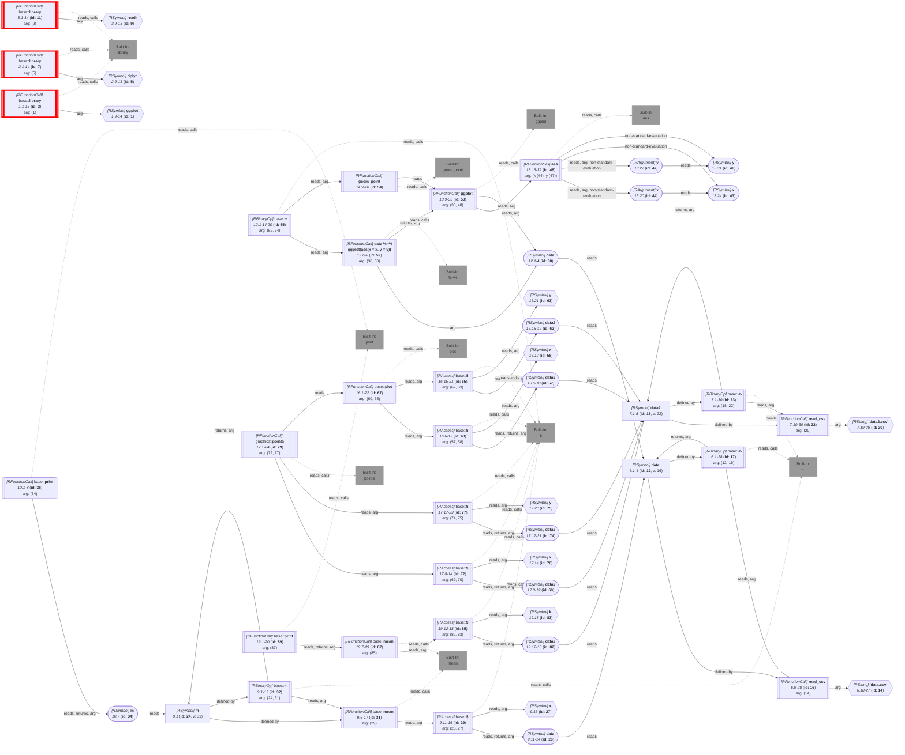

_This document was generated from '[src/documentation/wiki-query.ts](https://github.com/flowr-analysis/flowr/tree/main//src/documentation/wiki-query.ts)' on 2026-07-23, 21:48:54 UTC presenting an overview of flowR's query API (v2.13.1, using R v4.5.0). Please do not edit this file/wiki page directly._

This page briefly summarizes flowR's query API, represented by the executeQueries function in [`./src/queries/query.ts`](https://github.com/flowr-analysis/flowr/tree/main/./src/queries/query.ts).
Please see the [Interface](https://github.com/flowr-analysis/flowr/wiki/interface) wiki page for more information on how to access this API.


> [!NOTE]
> There are many ways to query a dataflow graph created by flowR.
> For example, you can use the [`request-query`](https://github.com/flowr-analysis/flowr/wiki/interface#message-request-query) message
> with a running flowR server, or the <span title="Description (Repl Command): Query the given R code (use 'help' for more information)">`:query`</span> command in the flowR [REPL](https://github.com/flowr-analysis/flowr/wiki/interface#repl).
> 
> Also, check out the [flowr-analysis/sample-analyzer-project-query](https://github.com/flowr-analysis/sample-analyzer-project-query) repository for a complete example project using the query API.


## The Query Format

Queries are JSON arrays of query objects, each of which uses a `type` property to specify the query type.
In general, we separate two types of queries:

1. **Active Queries**: Are exactly what you would expect from a query (e.g., the [Call-Context Query](https://github.com/flowr-analysis/flowr/wiki/%5BQuery%5D-Call-Context)). They fetch information from the dataflow graph.
2. **Virtual Queries**: Are used to structure your queries (e.g., the [Compound Query](https://github.com/flowr-analysis/flowr/wiki/%5BQuery%5D-Compound)).

We separate these from a concept perspective. 
For now, we support the following **active** queries (which we will refer to simply as a `query`):

1. [Abstract Interpretation Query](https://github.com/flowr-analysis/flowr/wiki/%5BQuery%5D-Abstract-Interpretation) (`absint`):\
    Returns the abstract values inferred for every expression or at specific locations.
1. [Call-Context Query](https://github.com/flowr-analysis/flowr/wiki/%5BQuery%5D-Call-Context) (`call-context`):\
    Finds all calls in a set of files that matches specified criteria.
1. [Call-Graph Query](https://github.com/flowr-analysis/flowr/wiki/%5BQuery%5D-Call-Graph) (`call-graph`):\
    Returns the call graph of the given code.
1. [Config Query](https://github.com/flowr-analysis/flowr/wiki/%5BQuery%5D-Config) (`config`):\
    Returns the current configuration of flowR.
1. [Control-Flow Query](https://github.com/flowr-analysis/flowr/wiki/%5BQuery%5D-Control-Flow) (`control-flow`):\
    Provides the control-flow of the program.
1. [Dataflow Cluster Query](https://github.com/flowr-analysis/flowr/wiki/%5BQuery%5D-Dataflow-Cluster) (`dataflow-cluster`):\
    Calculates and returns all the clusters present in the dataflow graph.
1. [Dataflow Lens Query](https://github.com/flowr-analysis/flowr/wiki/%5BQuery%5D-Dataflow-Lens) (`dataflow-lens`):\
    Returns a simplified view on the dataflow graph, reduced to definitions, uses, and calls.
1. [Dataflow Query](https://github.com/flowr-analysis/flowr/wiki/%5BQuery%5D-Dataflow) (`dataflow`):\
    Returns the dataflow graph of the given code.
1. [Dependencies Query](https://github.com/flowr-analysis/flowr/wiki/%5BQuery%5D-Dependencies) (`dependencies`):\
    Returns all direct dependencies (in- and outputs) of a given R script
1. [Dice Query](https://github.com/flowr-analysis/flowr/wiki/%5BQuery%5D-Dice) (`dice`):\
    Reduces the code to the parts that carry information from a given start point to a given end point.
1. [Does-Call Query](https://github.com/flowr-analysis/flowr/wiki/%5BQuery%5D-Does-Call) (`does-call`):\
    Checks whether a function calls another function matching given constraints.
1. [Files Query](https://github.com/flowr-analysis/flowr/wiki/%5BQuery%5D-Files) (`files`):\
    Returns the files matching the given criteria.
1. [Guess Dependency Versions Query](https://github.com/flowr-analysis/flowr/wiki/%5BQuery%5D-Guess-Dependency-Versions) (`guess-dep-versions`):\
    Guesses the version range each dependency must have, from declared constraints and actual code usage.
1. [Happens-Before Query](https://github.com/flowr-analysis/flowr/wiki/%5BQuery%5D-Happens-Before) (`happens-before`):\
    Check whether one normalized AST node happens before another in the CFG.
1. [Id-Map Query](https://github.com/flowr-analysis/flowr/wiki/%5BQuery%5D-Id-Map) (`id-map`):\
    Returns the id-map of the normalized AST of the given code.
1. [Input Sources Query](https://github.com/flowr-analysis/flowr/wiki/%5BQuery%5D-Input-Sources) (`input-sources`):\
    Classify the input sources of function calls
1. [Inspect Exceptions of Functions Query](https://github.com/flowr-analysis/flowr/wiki/%5BQuery%5D-Inspect-Exceptions-of-Functions) (`inspect-exception`):\
    Determine whether functions throw exceptions (known to flowR)
1. [Inspect Higher-Order Functions Query](https://github.com/flowr-analysis/flowr/wiki/%5BQuery%5D-Inspect-Higher-Order-Functions) (`inspect-higher-order`):\
    Determine whether functions are higher-order functions
1. [Inspect Recursive Functions Query](https://github.com/flowr-analysis/flowr/wiki/%5BQuery%5D-Inspect-Recursive-Functions) (`inspect-recursion`):\
    Determine whether functions are recursive
1. [Linter Query](https://github.com/flowr-analysis/flowr/wiki/%5BQuery%5D-Linter) (`linter`):\
    Lints a given R script for common issues.
1. [Location Map Query](https://github.com/flowr-analysis/flowr/wiki/%5BQuery%5D-Location-Map) (`location-map`):\
    Returns a simple mapping of ids to their location in the source file
1. [Normalized AST Query](https://github.com/flowr-analysis/flowr/wiki/%5BQuery%5D-Normalized-AST) (`normalized-ast`):\
    Returns the normalized AST of the given code.
1. [Origin Query](https://github.com/flowr-analysis/flowr/wiki/%5BQuery%5D-Origin) (`origin`):\
    Retrieve the origin of a variable, function call, ...
1. [Project Query](https://github.com/flowr-analysis/flowr/wiki/%5BQuery%5D-Project) (`project`):\
    Returns information about the analyzed project
1. [Provenance Query](https://github.com/flowr-analysis/flowr/wiki/%5BQuery%5D-Provenance) (`provenance`):\
    Calculate the provenance of a given variable, optionally restricted to its enveloping fdef
1. [Resolve Value Query](https://github.com/flowr-analysis/flowr/wiki/%5BQuery%5D-Resolve-Value) (`resolve-value`):\
    Provides access to flowR's value tracking (which is configurable)
1. [Search Query](https://github.com/flowr-analysis/flowr/wiki/%5BQuery%5D-Search) (`search`):\
    Provides access to flowR's search API
1. [Signature Query](https://github.com/flowr-analysis/flowr/wiki/%5BQuery%5D-Signature) (`signature`):\
    Inspects the signature database: packages, function signatures, source and documentation links.
1. [Static Slice Query](https://github.com/flowr-analysis/flowr/wiki/%5BQuery%5D-Static-Slice) (`static-slice`):\
    Slice the dataflow graph reducing the code to just the parts relevant for the given criteria (backward and forward).

Similarly, we support the following **virtual** queries: 

1. [Compound Query](https://github.com/flowr-analysis/flowr/wiki/%5BQuery%5D-Compound) (`compound`):\
    Combines multiple queries of the same type into one, specifying common arguments.

<details>


<summary>Detailed Query Format (Automatically Generated)</summary>

Although it is probably better to consult the detailed explanations, if you want to have a look at the schema, here is its description:

- _Queries to run on the file analysis information (in the form of an array)_ (array)
Valid item types:
    - _A virtual or an active query!_ (alternatives)
        - _Supported queries_ (alternatives)
            - _Call context query used to find calls in the dataflow graph_ (object)
                - **type** [required] _The type of the query._ (string)
                    Only allows: 'call-context'
                - **callName** [required] _Regex regarding the function name!_ (string)
                - **callNameExact** [optional] _Should we automatically add the `^` and `$` anchors to the regex to make it an exact match?_ (boolean)
                - **kind** [optional] _The kind of the call, this can be used to group calls together (e.g., linking `plot` to `visualize`). Defaults to `.`_ (string)
                - **subkind** [optional] _The subkind of the call, this can be used to uniquely identify the respective call type when grouping the output (e.g., the normalized name, linking `ggplot` to `plot`). Defaults to `.`_ (string)
                - **callTargets** [optional] _Call targets the function may have. This defaults to `any`. Request this specifically to gain all call targets we can resolve._ (string)
                    Only allows: 'global', 'must-include-global', 'local', 'must-include-local', 'any'
                - **callTargetNamespace** [optional] _Only keep calls that resolve to (or are explicitly qualified with) this package (e.g. `bar` to find `bar::foo`)._ (string)
                - **ignoreParameterValues** [optional] _Should we ignore default values for parameters in the results?_ (boolean)
                - **includeAliases** [optional] _Consider a case like `f <- function_of_interest`, do you want uses of `f` to be included in the results?_ (boolean)
                - **fileFilter** [optional] _Filter that, when set, a node's file attribute must match to be considered_ (object)
                    - **fileFilter** [required] _Regex that a node's file attribute must match to be considered_ (string)
                    - **includeUndefinedFiles** [optional] _If `fileFilter` is set, but a nodes `file` attribute is `undefined`, should we include it in the results? Defaults to `true`._ (boolean)
                - **linkTo** [optional] _Links the current call to the last call of the given kind. This way, you can link a call like `points` to the latest graphics plot etc._ (alternatives)
                    - (alternatives)
                        - _Links the current call to the last call of the given kind. This way, you can link a call like `points` to the latest graphics plot etc._ (object)
                            - **type** [required] _The type of the linkTo sub-query._ (string)
                                Only allows: 'link-to-last-call'
                            - **callName** [required] _Test regarding the function name of the last call. Similar to `callName`, strings are interpreted as a regular expression, and string arrays are checked for containment._ (alternatives)
                                - (string)
                                - (array)
                                Valid item types:
                                    - (string)
                            - **ignoreIf** [optional] _Should we ignore this (source) call? Currently, there is no well working serialization for this._ (function)
                            - **cascadeIf** [optional] _Should we continue searching after the link was created? Currently, there is no well working serialization for this._ (function)
                            - **attachLinkInfo** [optional] _Additional information to attach to the link._ (object)
                        - _Allows to link nested calls to their parent calls. This way, you can link an `assert_equal` call to the parent `test_that` call etc._ (object)
                            - **type** [required] _The type of the linkTo sub-query._ (string)
                                Only allows: 'link-to-nested-call'
                            - **callName** [required] _Test regarding the function name of the last call. Similar to `callName`, strings are interpreted as a regular expression, and string arrays are checked for containment._ (alternatives)
                                - (string)
                                - (array)
                                Valid item types:
                                    - (string)
                            - **ignoreIf** [optional] _Should we ignore this (source) call? Currently, there is no well working serialization for this._ (function)
                            - **attachLinkInfo** [optional] _Additional information to attach to the link._ (object)
                    - (array)
                    Valid item types:
                        - (alternatives)
                            - _Links the current call to the last call of the given kind. This way, you can link a call like `points` to the latest graphics plot etc._ (object)
                                - **type** [required] _The type of the linkTo sub-query._ (string)
                                    Only allows: 'link-to-last-call'
                                - **callName** [required] _Test regarding the function name of the last call. Similar to `callName`, strings are interpreted as a regular expression, and string arrays are checked for containment._ (alternatives)
                                    - (string)
                                    - (array)
                                    Valid item types:
                                        - (string)
                                - **ignoreIf** [optional] _Should we ignore this (source) call? Currently, there is no well working serialization for this._ (function)
                                - **cascadeIf** [optional] _Should we continue searching after the link was created? Currently, there is no well working serialization for this._ (function)
                                - **attachLinkInfo** [optional] _Additional information to attach to the link._ (object)
                            - _Allows to link nested calls to their parent calls. This way, you can link an `assert_equal` call to the parent `test_that` call etc._ (object)
                                - **type** [required] _The type of the linkTo sub-query._ (string)
                                    Only allows: 'link-to-nested-call'
                                - **callName** [required] _Test regarding the function name of the last call. Similar to `callName`, strings are interpreted as a regular expression, and string arrays are checked for containment._ (alternatives)
                                    - (string)
                                    - (array)
                                    Valid item types:
                                        - (string)
                                - **ignoreIf** [optional] _Should we ignore this (source) call? Currently, there is no well working serialization for this._ (function)
                                - **attachLinkInfo** [optional] _Additional information to attach to the link._ (object)
            - _The config query retrieves the current configuration of the flowR instance and optionally also updates it._ (object)
                - **type** [required] _The type of the query._ (string)
                    Only allows: 'config'
                - **update** [optional] _An optional partial configuration to update the current configuration with before returning it. Only the provided fields will be updated, all other fields will remain unchanged._ (object)
                - **inspect** [optional] _An optional `.`-separated path (as a string array) to read a single configuration value instead of returning the whole configuration._ (array)
                Valid item types:
                    - (string)
                - **reset** [optional] _If true, discard every prior update and revert to the config the analyzer was created with, before returning it._ (boolean)
            - _The control flow query provides the control flow graph of the analysis, optionally simplified._ (object)
                - **type** [required] _The type of the query._ (string)
                    Only allows: 'control-flow'
                - **config** [optional] _Optional configuration for the control flow query._ (object)
                    - **simplificationPasses** _The simplification passes to apply to the control flow graph. If unset, the default simplification order will be used._ (array)
                    Valid item types:
                        - (string)
                            Only allows: 'unique-cf-sets', 'analyze-dead-code', 'remove-dead-code', 'to-basic-blocks'
            - _A query to compute the Call Graph of the analyzed project._ (object)
                - **type** [required] _The type of the query._ (string)
                    Only allows: 'call-graph'
                - **expandLibraryInternals** [optional] _Expand library/built-in leaf calls into their internal callees via the signature database (default false)._ (boolean)
            - _The dataflow query simply returns the dataflow graph, there is no need to pass it multiple times!_ (object)
                - **type** [required] _The type of the query._ (string)
                    Only allows: 'dataflow'
            - _Either returns all function definitions alongside whether they are recursive, or just those matching the filters._ (object)
                - **type** [required] _The type of the query._ (string)
                    Only allows: 'does-call'
                - **queryId** [optional] _An optional unique identifier for this query, to identify it in the output._ (string)
                - **call** _The function from which calls are being made. This is a slicing criterion that resolves to a function definition node._ (string)
                - **calls** [required] _The constraints on which functions are being called. This can be a combination of name-based or id-based constraints, combined with logical operators (and, or, one-of)._ (object)
                - **expandLibraryInternals** [optional] _Expand a reached library/built-in leaf call into its internal callees via the signature database and match constraints against those too (default false)._ (boolean)
            - _The dataflow-lens query returns a simplified view on the dataflow graph_ (object)
                - **type** [required] _The type of the query._ (string)
                    Only allows: 'dataflow-lens'
            - _The abstract interpretation query retrieves inferred abstract values_ (object)
                - **type** [required] _The type of the query._ (string)
                    Only allows: 'absint'
                - **inference** [required] _The type of abstract interpretation inference._ (string)
                    Only allows: 'df-shape'
                - **criteria** [optional] _The slicing criteria of the nodes to get the inferred abstract values for._ (array)
                Valid item types:
                    - (string)
            - _The file query finds files in the project based on their roles and path patterns._ (object)
                - **type** [required] _The type of the query._ (string)
                    Only allows: 'files'
                - **roles** [optional] _Optional roles of the files to query. If not provided, all roles are considered._ (array)
                Valid item types:
                    - (string)
                        Only allows: 'description', 'namespace', 'news', 'vignette', 'test', 'install', 'data', 'license', 'virtual-env', 'manifest', 'startup', 'environment', 'source', 'other'
                - **matchesPathRegex** [optional] _An optional regular expression to match the file paths against._ (string)
            - _The id map query retrieves the id map from the normalized AST._ (object)
                - **type** [required] _The type of the query._ (string)
                    Only allows: 'id-map'
            - _The normalized AST query simply returns the normalized AST, there is no need to pass it multiple times!_ (object)
                - **type** [required] _The type of the query._ (string)
                    Only allows: 'normalized-ast'
            - _The cluster query calculates and returns all clusters in the dataflow graph._ (object)
                - **type** [required] _The type of the query._ (string)
                    Only allows: 'dataflow-cluster'
            - _Slice query used to slice the dataflow graph_ (object)
                - **type** [required] _The type of the query._ (string)
                    Only allows: 'static-slice'
                - **criteria** [required] _The slicing criteria to use._ (array)
                Valid item types:
                    - (string)
                - **direction** [optional] _The direction to slice in. Defaults to backward slicing if unset._ (string)
                    Only allows: 'backward', 'forward'
                - **noReconstruction** [optional] _Do not reconstruct the slice into readable code._ (boolean)
                - **noMagicComments** [optional] _Should the magic comments (force-including lines within the slice) be ignored?_ (boolean)
                - **inlineSources** [optional] _Inline resolvable source() calls into the reconstruction so the result is a single self-contained R text._ (boolean)
                - **inlineFull** [optional] _Inline all files into the reconstruction, in flowR's loading order and independent of whether they are sourced explicitly; "banner" precedes every file with a banner comment naming it._ (alternatives)
                    - (boolean)
                    - (string)
                        Only allows: 'banner'
                - **includeCallees** [optional] _If set (and slicing backward), continue the slice past a function-definition boundary, also including the definition's binding and call sites._ (boolean)
            - _Provenance query definition_ (object)
                - **type** [required] _The type of the query._ (string)
                    Only allows: 'provenance'
                - **criterion** [required] _The slicing criterion to use._ (string)
                - **restrictFdef** [required] _Whether to stop on fdef boundaries._ (boolean)
            - _Input Sources query definition_ (object)
                - **type** [required] _The type of the query._ (string)
                    Only allows: 'input-sources'
                - **criterion** [required] _The slicing criterion or array of criteria to use._ (alternatives)
                    - (string)
                    - (array)
                    Valid item types:
                        - (string)
                - **config** [optional] (object)
                    - **pure** [optional] _Deterministic/pure functions: functions that preserve constantness of their inputs (e.g., arithmetic, parse)._ (array)
                    Valid item types:
                        - (string)
                    - **file** [optional] _Functions that read from the filesystem and produce data (e.g., read.csv, readRDS)._ (array)
                    Valid item types:
                        - (string)
                    - **tempfile** [optional] _Functions that produce temporary file paths (sub-type of File; e.g., tempfile, tempdir)._ (array)
                    Valid item types:
                        - (string)
                    - **net** [optional] _Functions that fetch data from the network (e.g., download.file, url connections)._ (array)
                    Valid item types:
                        - (string)
                    - **rand** [optional] _Functions that produce randomness (e.g., runif, rnorm)._ (array)
                    Valid item types:
                        - (string)
                    - **system** [optional] _Functions that execute system commands (e.g., system, system2, shell, pipe)._ (array)
                    Valid item types:
                        - (string)
                    - **ffi** [optional] _Functions that call native code via the R FFI (.C, .Call, .Fortran, .External, dyn.load)._ (array)
                    Valid item types:
                        - (string)
                    - **lang** [optional] _Functions that produce language objects (e.g., substitute, quote, bquote, expression)._ (array)
                    Valid item types:
                        - (string)
                    - **options** [optional] _Functions that access or set global options (e.g., options, getOption)._ (array)
                    Valid item types:
                        - (string)
                    - **user** [optional] _Functions that read interactive user input (e.g., file.choose, readline, menu, askYesNo)._ (array)
                    Valid item types:
                        - (string)
            - _The dependencies query retrieves and returns the set of all dependencies in the dataflow graph, which includes libraries, sourced files, read data, and written data._ (object)
                - **type** [required] _The type of the query._ (string)
                    Only allows: 'dependencies'
                - **ignoreDefaultFunctions** [optional] _Should the set of functions that are detected by default be ignored/skipped? Defaults to false._ (boolean)
                - **libraryFunctions** [optional] _The set of library functions to search for._ (array)
                Valid item types:
                    - (object)
                        - **name** [required] _The name of the library function._ (string)
                        - **package** [optional] _The package name of the library function_ (string)
                        - **argIdx** [optional] _The index of the argument that contains the library name._ (number)
                        - **argName** [optional] _The name of the argument that contains the library name._ (string)
                - **sourceFunctions** [optional] _The set of source functions to search for._ (array)
                Valid item types:
                    - (object)
                        - **name** [required] _The name of the library function._ (string)
                        - **package** [optional] _The package name of the library function_ (string)
                        - **argIdx** [optional] _The index of the argument that contains the library name._ (number)
                        - **argName** [optional] _The name of the argument that contains the library name._ (string)
                - **readFunctions** [optional] _The set of read functions to search for._ (array)
                Valid item types:
                    - (object)
                        - **name** [required] _The name of the library function._ (string)
                        - **package** [optional] _The package name of the library function_ (string)
                        - **argIdx** [optional] _The index of the argument that contains the library name._ (number)
                        - **argName** [optional] _The name of the argument that contains the library name._ (string)
                - **writeFunctions** [optional] _The set of write functions to search for._ (array)
                Valid item types:
                    - (object)
                        - **name** [required] _The name of the library function._ (string)
                        - **package** [optional] _The package name of the library function_ (string)
                        - **argIdx** [optional] _The index of the argument that contains the library name._ (number)
                        - **argName** [optional] _The name of the argument that contains the library name._ (string)
                - **visualizeFunctions** [optional] _The set of visualize functions to search for._ (array)
                Valid item types:
                    - (object)
                        - **name** [required] _The name of the library function._ (string)
                        - **package** [optional] _The package name of the library function_ (string)
                        - **argIdx** [optional] _The index of the argument that contains the library name._ (number)
                        - **argName** [optional] _The name of the argument that contains the library name._ (string)
                - **testFunctions** [optional] _The set of test functions to search for._ (array)
                Valid item types:
                    - (object)
                        - **name** [required] _The name of the library function._ (string)
                        - **package** [optional] _The package name of the library function_ (string)
                        - **argIdx** [optional] _The index of the argument that contains the library name._ (number)
                        - **argName** [optional] _The name of the argument that contains the library name._ (string)
                - **enabledCategories** [optional] _A set of flags that determines what types of dependencies are searched for. If unset, all dependency types are searched for._ (array)
                Valid item types:
                    - (string)
                - **additionalCategories** [optional] _A set of additional, user-supplied dependency categories, whose results will be included in the query return value._ (object)
                    Only allows: '[object Object]'
            - _The location map query retrieves the location of every id in the ast._ (object)
                - **type** [required] _The type of the query._ (string)
                    Only allows: 'location-map'
                - **ids** [optional] _Optional list of ids to filter the results by._ (array)
                Valid item types:
                    - (string)
            - _The search query searches the normalized AST and dataflow graph for nodes that match the given search query._ (object)
                - **type** [required] _The type of the query._ (string)
                    Only allows: 'search'
                - **search** [required] _The search query to execute._ (object)
            - _Happens-Before tracks whether a always happens before b._ (object)
                - **type** [required] _The type of the query._ (string)
                    Only allows: 'happens-before'
                - **a** [required] _The first slicing criterion._ (string)
                - **b** [required] _The second slicing criterion._ (string)
            - _Query to inspect which functions throw exceptions._ (object)
                - **type** [required] _The type of the query._ (string)
                    Only allows: 'inspect-exception'
                - **filter** [optional] _If given, only function definitions that match one of the given slicing criteria are considered. Each criterion can be either `line:column`, `line@variable-name`, or `$id`, where the latter directly specifies the node id of the function definition to be considered._ (array)
                Valid item types:
                    - [required] (string)
            - _Either returns all function definitions alongside whether they are higher-order functions, or just those matching the filters._ (object)
                - **type** [required] _The type of the query._ (string)
                    Only allows: 'inspect-higher-order'
                - **filter** [optional] _If given, only function definitions that match one of the given slicing criteria are considered. Each criterion can be either `line:column`, `line@variable-name`, or `$id`, where the latter directly specifies the node id of the function definition to be considered._ (array)
                Valid item types:
                    - [required] (string)
            - _Either returns all function definitions alongside whether they are recursive, or just those matching the filters._ (object)
                - **type** [required] _The type of the query._ (string)
                    Only allows: 'inspect-recursion'
                - **filter** [optional] _If given, only function definitions that match one of the given slicing criteria are considered. Each criterion can be either `line:column`, `line@variable-name`, or `$id`, where the latter directly specifies the node id of the function definition to be considered._ (array)
                Valid item types:
                    - [required] (string)
            - _The resolve value query used to get definitions of an identifier_ (object)
                - **type** [required] _The type of the query._ (string)
                    Only allows: 'resolve-value'
                - **criteria** [required] _The slicing criteria to use._ (array)
                Valid item types:
                    - (string)
            - _The project query provides information on the analyzed project._ (object)
                - **type** [required] _The type of the query._ (string)
                    Only allows: 'project'
                - **withDf** [optional] _Whether to include Dataflow information in the result._ (boolean)
            - _Inspects the loaded signature database(s): loaded databases, a package, a function, or wildcard matches (optionally filtered by parameter name or required-parameter count)._ (object)
                - **type** [required] _The type of the query._ (string)
                    Only allows: 'signature'
                - **package** [optional] _The package to inspect (glob wildcards allowed); omit for a summary of the loaded databases._ (string)
                - **function** [optional] _A function/symbol to inspect (glob wildcards allowed)._ (string)
                - **version** [optional] _A version spec: an exact version, a glob (3.*), a semver range (>=3.0.0, 3.x), or a release-date bound (<=2026, >=2021.05 in YYYY.MM.DD)._ (string)
                - **parameters** [optional] _Keep only functions that have a parameter matching every one of these names (glob wildcards allowed, position-independent)._ (array)
                Valid item types:
                    - (string)
                - **requiredParameters** [optional] _Keep only functions with exactly this many required (no-default) parameters, excluding `...`._ (number)
                - **callGraph** [optional] _For a single function, also render its transitive call graph as a mermaid.live link (`--cg`)._ (boolean)
            - _The resolve value query used to get definitions of an identifier_ (object)
                - **type** [required] _The type of the query._ (string)
                    Only allows: 'origin'
                - **criterion** [required] _The slicing criteria to use_ (string)
            - _The linter query lints for the given set of rules and returns the result._ (object)
                - **type** [required] _The type of the query._ (string)
                    Only allows: 'linter'
                - **format** [optional] _Print the findings in a machine-readable format instead of the human-readable summary._ (string)
                    Only allows: 'text', 'sarif', 'github'
                - **rules** _The rules to lint for. If unset, all rules will be included._ (array)
                Valid item types:
                    - (string)
                        Only allows: 'deprecated-functions', 'file-path-validity', 'seeded-randomness', 'absolute-file-paths', 'unused-definitions', 'naming-convention', 'network-functions', 'dataframe-access-validation', 'dead-code', 'useless-loop', 'problematic-inputs', 'stop-call', 'roxygen-arguments', 'software-has-license', 'software-has-tests', 'no-leaked-credentials', 'undefined-symbol', 'syntactically-valid'
                    - (object)
                        - **name** [required] (string)
                            Only allows: 'deprecated-functions', 'file-path-validity', 'seeded-randomness', 'absolute-file-paths', 'unused-definitions', 'naming-convention', 'network-functions', 'dataframe-access-validation', 'dead-code', 'useless-loop', 'problematic-inputs', 'stop-call', 'roxygen-arguments', 'software-has-license', 'software-has-tests', 'no-leaked-credentials', 'undefined-symbol', 'syntactically-valid'
                        - **config** (object)
            - _Dice query: selects only paths from the given start nodes that reach the given end nodes._ (object)
                - **type** [required] _The type of the query._ (string)
                    Only allows: 'dice'
                - **from** [required] _Slicing criteria for the start of the dice (forward slice seeds)._ (array)
                Valid item types:
                    - (string)
                - **to** [required] _Slicing criteria for the end of the dice (backward slice seeds)._ (array)
                Valid item types:
                    - (string)
                - **noReconstruction** [optional] _Do not reconstruct the slice into readable code._ (boolean)
                - **noMagicComments** [optional] _Should the magic comments (force-including lines within the slice) be ignored?_ (boolean)
                - **inlineSources** [optional] _Inline resolvable source() calls into the reconstruction so the result is a single self-contained R text._ (boolean)
                - **inlineFull** [optional] _Inline all files into the reconstruction, in flowR's loading order and independent of whether they are sourced explicitly; "banner" precedes every file with a banner comment naming it._ (alternatives)
                    - (boolean)
                    - (string)
                        Only allows: 'banner'
                - **includeCallees** [optional] _If set (and slicing backward), continue the slice past a function-definition boundary, also including the definition's binding and call sites._ (boolean)
            - _Guesses the possible version range of every dependency from declared constraints and signature-database usage._ (object)
                - **type** [required] _The type of the query._ (string)
                    Only allows: 'guess-dep-versions'
                - **packages** [optional] _Restrict the guess to these packages; omit to guess for every declared and used dependency._ (array)
                Valid item types:
                    - (string)
                - **date** [optional] _Only consider versions released on or before this day, written YYYY.MM.DD (also YYYY or YYYY.MM)._ (string)
                - **maxCandidates** [optional] _Cap the number of candidate versions listed per dependency._ (number)
                - **maxIterations** [optional] _Bound both fixpoint loops (mutual transitive refinement and arc consistency)._ (number)
                - **clean** [optional] _Ignore the project declared constraints (DESCRIPTION/lockfile/transitive); guess purely from code usage and the date/R bounds._ (boolean)
                - **disabled** [optional] _Exclude these evidence sources from consideration entirely (repl: --disabled followed by their one-letter codes, e.g. --disabled ds for declared+signature)._ (array)
                Valid item types:
                    - (string)
                        Only allows: 'declared', 'transitive', 'signature', 'date', 'base-r', 'available', 'indirect'
                - **explode** [optional] _Also explode the guessed space into concrete per-dependency version assignments._ (object)
                    - **order** [optional] _Iterate each dependency newest-first (default) or oldest-first._ (string)
                        Only allows: 'newest', 'oldest'
                    - **prefer** [optional] _A version to prefer per dependency when it survives the constraints._ (object)
                    - **limit** [optional] _Cap the number of concrete assignments produced._ (number)
        - _Virtual queries (used for structure)_ (alternatives)
            - _Compound query used to combine queries of the same type_ (object)
                - **type** [required] _The type of the query._ (string)
                    Only allows: 'compound'
                - **query** [required] _The query to run on the file analysis information._ (string)
                - **commonArguments** [required] _Common arguments for all queries._ (object)
                - **arguments** [required] _Arguments for each query._ (array)
                Valid item types:
                    - (object)

</details>

### Why Queries?

First, consider that you have a file like the following (of course, this is just a simple and artificial example):

```r
library(ggplot)
library(dplyr)
library(readr)

# read data with read_csv
data <- read_csv('data.csv')
data2 <- read_csv('data2.csv')

m <- mean(data$x) 
print(m)

data %>%
	ggplot(aes(x = x, y = y)) +
	geom_point()
	
plot(data2$x, data2$y)
points(data2$x, data2$y)
	
print(mean(data2$k))
```

<details> <summary>Dataflow Graph of the Example</summary>



```mermaid
flowchart LR
    1{{"`*#91;RSymbol#93;* **ggplot**
      *1.9-14* (**id: 1**)`"}}
   %% No edges found for 1
    3[["`*#91;RFunctionCall#93;* base#58;#58;**library**
      *1.1-15* (**id: 3**)
    arg: (1)`"]]
    style 3 stroke:red,stroke-width:5px; 
    built-in:library["`Built-In:
library`"]
    style built-in:library stroke:gray,fill:gray,stroke-width:2px,opacity:.8;
    5{{"`*#91;RSymbol#93;* **dplyr**
      *2.9-13* (**id: 5**)`"}}
   %% No edges found for 5
    7[["`*#91;RFunctionCall#93;* base#58;#58;**library**
      *2.1-14* (**id: 7**)
    arg: (5)`"]]
    style 7 stroke:red,stroke-width:5px; 
    9{{"`*#91;RSymbol#93;* **readr**
      *3.9-13* (**id: 9**)`"}}
   %% No edges found for 9
    11[["`*#91;RFunctionCall#93;* base#58;#58;**library**
      *3.1-14* (**id: 11**)
    arg: (9)`"]]
    style 11 stroke:red,stroke-width:5px; 
    14{{"`*#91;RString#93;* **#39;data.csv#39;**
      *6.18-27* (**id: 14**)`"}}
   %% No edges found for 14
    16[["`*#91;RFunctionCall#93;* **read#95;csv**
      *6.9-28* (**id: 16**)
    arg: (14)`"]]
    12["`*#91;RSymbol#93;* **data**
      *6.1-4* (**id: 12**, v: 16)`"]
    17[["`*#91;RBinaryOp#93;* base#58;#58;**#60;#45;**
      *6.1-28* (**id: 17**)
    arg: (12, 16)`"]]
    built-in:_-["`Built-In:
#60;#45;`"]
    style built-in:_- stroke:gray,fill:gray,stroke-width:2px,opacity:.8;
    20{{"`*#91;RString#93;* **#39;data2.csv#39;**
      *7.19-29* (**id: 20**)`"}}
   %% No edges found for 20
    %% Environment of 22 [level: 0]:
    %% Built-in
    %% 1----------------------------------------
    %%    library-load: {**ggplot:: library-load** (id: 3, type: Function, def. @3)}
    %% 2----------------------------------------
    %%    library-load: {**dplyr:: library-load** (id: 7, type: Function, def. @7)}
    %% 3----------------------------------------
    %%    library-load: {**readr:: library-load** (id: 11, type: Function, def. @11)}
    %% 4----------------------------------------
    %%   data: {**data** (id: 12, type: Unknown, def. @17)}
    22[["`*#91;RFunctionCall#93;* **read#95;csv**
      *7.10-30* (**id: 22**)
    arg: (20)`"]]
    18["`*#91;RSymbol#93;* **data2**
      *7.1-5* (**id: 18**, v: 22)`"]
    23[["`*#91;RBinaryOp#93;* base#58;#58;**#60;#45;**
      *7.1-30* (**id: 23**)
    arg: (18, 22)`"]]
    26(["`*#91;RSymbol#93;* **data**
      *9.11-14* (**id: 26**)`"])
    27{{"`*#91;RSymbol#93;* **x**
      *9.16* (**id: 27**)`"}}
   %% No edges found for 27
    29[["`*#91;RAccess#93;* base#58;#58;**$**
      *9.11-16* (**id: 29**)
    arg: (26, 27)`"]]
    built-in:_["`Built-In:
$`"]
    style built-in:_ stroke:gray,fill:gray,stroke-width:2px,opacity:.8;
    31[["`*#91;RFunctionCall#93;* base#58;#58;**mean**
      *9.6-17* (**id: 31**)
    arg: (29)`"]]
    built-in:mean["`Built-In:
mean`"]
    style built-in:mean stroke:gray,fill:gray,stroke-width:2px,opacity:.8;
    24["`*#91;RSymbol#93;* **m**
      *9.1* (**id: 24**, v: 31)`"]
    32[["`*#91;RBinaryOp#93;* base#58;#58;**#60;#45;**
      *9.1-17* (**id: 32**)
    arg: (24, 31)`"]]
    34(["`*#91;RSymbol#93;* **m**
      *10.7* (**id: 34**)`"])
    36[["`*#91;RFunctionCall#93;* base#58;#58;**print**
      *10.1-8* (**id: 36**)
    arg: (34)`"]]
    built-in:print["`Built-In:
print`"]
    style built-in:print stroke:gray,fill:gray,stroke-width:2px,opacity:.8;
    38(["`*#91;RSymbol#93;* **data**
      *12.1-4* (**id: 38**)`"])
    43(["`*#91;RSymbol#93;* **x**
      *13.24* (**id: 43**)`"])
   %% No edges found for 43
    44(["`*#91;RArgument#93;* **x**
      *13.20* (**id: 44**)`"])
    46(["`*#91;RSymbol#93;* **y**
      *13.31* (**id: 46**)`"])
   %% No edges found for 46
    47(["`*#91;RArgument#93;* **y**
      *13.27* (**id: 47**)`"])
    48[["`*#91;RFunctionCall#93;* **aes**
      *13.16-32* (**id: 48**)
    arg: (x (44), y (47))`"]]
    built-in:aes["`Built-In:
aes`"]
    style built-in:aes stroke:gray,fill:gray,stroke-width:2px,opacity:.8;
    50[["`*#91;RFunctionCall#93;* **ggplot**
      *13.9-33* (**id: 50**)
    arg: (38, 48)`"]]
    built-in:ggplot["`Built-In:
ggplot`"]
    style built-in:ggplot stroke:gray,fill:gray,stroke-width:2px,opacity:.8;
    52[["`*#91;RFunctionCall#93;* **data %#62;%
	ggplot(aes(x = x, y = y))**
      *12.6-8* (**id: 52**)
    arg: (38, 50)`"]]
    built-in:___["`Built-In:
%#62;%`"]
    style built-in:___ stroke:gray,fill:gray,stroke-width:2px,opacity:.8;
    54[["`*#91;RFunctionCall#93;* **geom#95;point**
      *14.9-20* (**id: 54**)`"]]
    built-in:geom_point["`Built-In:
geom#95;point`"]
    style built-in:geom_point stroke:gray,fill:gray,stroke-width:2px,opacity:.8;
    55[["`*#91;RBinaryOp#93;* base#58;#58;**#43;**
      *12.1-14.20* (**id: 55**)
    arg: (52, 54)`"]]
    57(["`*#91;RSymbol#93;* **data2**
      *16.6-10* (**id: 57**)`"])
    58{{"`*#91;RSymbol#93;* **x**
      *16.12* (**id: 58**)`"}}
   %% No edges found for 58
    60[["`*#91;RAccess#93;* base#58;#58;**$**
      *16.6-12* (**id: 60**)
    arg: (57, 58)`"]]
    62(["`*#91;RSymbol#93;* **data2**
      *16.15-19* (**id: 62**)`"])
    63{{"`*#91;RSymbol#93;* **y**
      *16.21* (**id: 63**)`"}}
   %% No edges found for 63
    65[["`*#91;RAccess#93;* base#58;#58;**$**
      *16.15-21* (**id: 65**)
    arg: (62, 63)`"]]
    67[["`*#91;RFunctionCall#93;* base#58;#58;**plot**
      *16.1-22* (**id: 67**)
    arg: (60, 65)`"]]
    built-in:plot["`Built-In:
plot`"]
    style built-in:plot stroke:gray,fill:gray,stroke-width:2px,opacity:.8;
    69(["`*#91;RSymbol#93;* **data2**
      *17.8-12* (**id: 69**)`"])
    70{{"`*#91;RSymbol#93;* **x**
      *17.14* (**id: 70**)`"}}
   %% No edges found for 70
    72[["`*#91;RAccess#93;* base#58;#58;**$**
      *17.8-14* (**id: 72**)
    arg: (69, 70)`"]]
    74(["`*#91;RSymbol#93;* **data2**
      *17.17-21* (**id: 74**)`"])
    75{{"`*#91;RSymbol#93;* **y**
      *17.23* (**id: 75**)`"}}
   %% No edges found for 75
    77[["`*#91;RAccess#93;* base#58;#58;**$**
      *17.17-23* (**id: 77**)
    arg: (74, 75)`"]]
    79[["`*#91;RFunctionCall#93;* graphics#58;#58;**points**
      *17.1-24* (**id: 79**)
    arg: (72, 77)`"]]
    built-in:points["`Built-In:
points`"]
    style built-in:points stroke:gray,fill:gray,stroke-width:2px,opacity:.8;
    82(["`*#91;RSymbol#93;* **data2**
      *19.12-16* (**id: 82**)`"])
    83{{"`*#91;RSymbol#93;* **k**
      *19.18* (**id: 83**)`"}}
   %% No edges found for 83
    85[["`*#91;RAccess#93;* base#58;#58;**$**
      *19.12-18* (**id: 85**)
    arg: (82, 83)`"]]
    87[["`*#91;RFunctionCall#93;* base#58;#58;**mean**
      *19.7-19* (**id: 87**)
    arg: (85)`"]]
    89[["`*#91;RFunctionCall#93;* base#58;#58;**print**
      *19.1-20* (**id: 89**)
    arg: (87)`"]]
    3 -->|"arg"| 1
    3 -.->|"reads, calls"| built-in:library
    linkStyle 1 stroke:gray;
    7 -->|"arg"| 5
    7 -.->|"reads, calls"| built-in:library
    linkStyle 3 stroke:gray;
    11 -->|"arg"| 9
    11 -.->|"reads, calls"| built-in:library
    linkStyle 5 stroke:gray;
    16 -->|"arg"| 14
    12 -->|"defined-by"| 16
    12 -->|"defined-by"| 17
    17 -->|"reads, arg"| 16
    17 -->|"returns, arg"| 12
    17 -.->|"reads, calls"| built-in:_-
    linkStyle 11 stroke:gray;
    22 -->|"arg"| 20
    18 -->|"defined-by"| 22
    18 -->|"defined-by"| 23
    23 -->|"reads, arg"| 22
    23 -->|"returns, arg"| 18
    23 -.->|"reads, calls"| built-in:_-
    linkStyle 17 stroke:gray;
    26 -->|"reads"| 12
    29 -->|"reads, returns, arg"| 26
    29 -->|"reads, arg"| 27
    29 -.->|"reads, calls"| built-in:_
    linkStyle 21 stroke:gray;
    31 -->|"reads, arg"| 29
    31 -.->|"reads, calls"| built-in:mean
    linkStyle 23 stroke:gray;
    24 -->|"defined-by"| 31
    24 -->|"defined-by"| 32
    32 -->|"reads, arg"| 31
    32 -->|"returns, arg"| 24
    32 -.->|"reads, calls"| built-in:_-
    linkStyle 28 stroke:gray;
    34 -->|"reads"| 24
    36 -->|"reads, returns, arg"| 34
    36 -.->|"reads, calls"| built-in:print
    linkStyle 31 stroke:gray;
    38 -->|"reads"| 12
    44 -->|"reads"| 43
    47 -->|"reads"| 46
    48 -->|"reads, arg, non-standard-evaluation"| 44
    48 -->|"reads, arg, non-standard-evaluation"| 47
    48 -->|"non-standard-evaluation"| 43
    48 -->|"non-standard-evaluation"| 46
    48 -.->|"reads, calls"| built-in:aes
    linkStyle 39 stroke:gray;
    50 -->|"reads, arg"| 48
    50 -->|"reads, arg"| 38
    50 -.->|"reads, calls"| built-in:ggplot
    linkStyle 42 stroke:gray;
    52 -->|"arg"| 38
    52 -->|"returns, arg"| 50
    52 -.->|"reads, calls"| built-in:___
    linkStyle 45 stroke:gray;
    54 -.->|"reads, calls"| built-in:geom_point
    linkStyle 46 stroke:gray;
    54 -->|"reads"| 50
    55 -->|"reads, arg"| 52
    55 -->|"reads, arg"| 54
    55 -.->|"reads, calls"| built-in:_
    linkStyle 50 stroke:gray;
    57 -->|"reads"| 18
    60 -->|"reads, returns, arg"| 57
    60 -->|"reads, arg"| 58
    60 -.->|"reads, calls"| built-in:_
    linkStyle 54 stroke:gray;
    62 -->|"reads"| 18
    65 -->|"reads, returns, arg"| 62
    65 -->|"reads, arg"| 63
    65 -.->|"reads, calls"| built-in:_
    linkStyle 58 stroke:gray;
    67 -->|"reads, arg"| 60
    67 -->|"reads, arg"| 65
    67 -.->|"reads, calls"| built-in:plot
    linkStyle 61 stroke:gray;
    69 -->|"reads"| 18
    72 -->|"reads, returns, arg"| 69
    72 -->|"reads, arg"| 70
    72 -.->|"reads, calls"| built-in:_
    linkStyle 65 stroke:gray;
    74 -->|"reads"| 18
    77 -->|"reads, returns, arg"| 74
    77 -->|"reads, arg"| 75
    77 -.->|"reads, calls"| built-in:_
    linkStyle 69 stroke:gray;
    79 -->|"reads, arg"| 72
    79 -->|"reads, arg"| 77
    79 -.->|"reads, calls"| built-in:points
    linkStyle 72 stroke:gray;
    79 -->|"reads"| 67
    82 -->|"reads"| 18
    85 -->|"reads, returns, arg"| 82
    85 -->|"reads, arg"| 83
    85 -.->|"reads, calls"| built-in:_
    linkStyle 77 stroke:gray;
    87 -->|"reads, arg"| 85
    87 -.->|"reads, calls"| built-in:mean
    linkStyle 79 stroke:gray;
    89 -->|"reads, returns, arg"| 87
    89 -.->|"reads, calls"| built-in:print
    linkStyle 81 stroke:gray;
```

	
(The analysis required _6.5 ms_ (including parse and normalize, using the [r-shell](https://github.com/flowr-analysis/flowr/wiki/engines) engine) within the generation environment. No [signature database](https://github.com/flowr-analysis/flowr/wiki/signature-database) is mounted for these generated graphs, so `library()` calls attach no package exports; base-R names are still qualified via the generated base-package store (e.g. `acf` as `stats::acf`).)


</details>

&nbsp;

Additionally, consider that you are interested in all function calls which loads data with `read_csv`.
A simple `regex`-based query could look like this: `^read_csv$`.
However, this fails to incorporate
 
1. Syntax-based information (comments, strings, used as a variable, called as a higher-order function, ...)
2. Semantic information (e.g., `read_csv` is overwritten by a function with the same name)
3. Context information (e.g., calls like `points` may link to the current plot)

To solve this, flowR provides a query API which allows you to specify queries on the dataflow graph.
For the specific use-case stated, you could use the [Call-Context Query](https://github.com/flowr-analysis/flowr/wiki/%5BQuery%5D-Call-Context) to find all calls to `read_csv` which refer functions that are not overwritten.

Just as an example, the following [Call-Context Query](https://github.com/flowr-analysis/flowr/wiki/%5BQuery%5D-Call-Context) finds all calls to `read_csv` that are not overwritten:


```json
[
  {
    "type": "call-context",
    "callName": "^read_csv$",
    "callTargets": "global",
    "kind": "input",
    "subkind": "csv-file"
  }
]
```


_Results (prettified and summarized):_

Query: **call-context** (0 ms)\
&nbsp;&nbsp;&nbsp;╰ **input** (2 hits):\
&nbsp;&nbsp;&nbsp;&nbsp;&nbsp;╰ **csv-file** (2 hits): _`read_csv('data.csv')`_ (L.6), _`read_csv('data2.csv')`_ (L.7)\
_All queries together required ≈6 ms (1ms accuracy, total 7 ms)_

<details> <summary style="color:gray">Show Detailed Results as Json</summary>

The analysis required _7.1 ms_ (including parsing and normalization and the query) within the generation environment.

In general, the JSON contains the Ids of the nodes in question as they are present in the normalized AST or the dataflow graph of flowR.
Please consult the [Interface](https://github.com/flowr-analysis/flowr/wiki/interface) wiki page for more information on how to get those.


```json
{
  "call-context": {
    ".meta": {
      "timing": 0
    },
    "kinds": {
      "input": {
        "subkinds": {
          "csv-file": [
            {
              "id": 16,
              "name": "read_csv",
              "calls": []
            },
            {
              "id": 22,
              "name": "read_csv",
              "calls": []
            }
          ]
        }
      }
    }
  },
  ".meta": {
    "timing": 6
  }
}
```


</details>


	

Every query is explained in detail on its own wiki page, linked from the overviews above.
