_This document was generated from '[src/documentation/wiki-query.ts](https://github.com/flowr-analysis/flowr/tree/main//src/documentation/wiki-query.ts)' on 2026-02-13, 23:02:10 UTC presenting an overview of flowR's query API (v2.9.9, using R v4.5.0). Please do not edit this file/wiki page directly._

This page briefly summarizes flowR's query API, represented by the executeQueries function in [`./src/queries/query.ts`](https://github.com/flowr-analysis/flowr/tree/main/./src/queries/query.ts).
Please see the [Interface](https://github.com/flowr-analysis/flowr/wiki/wiki/interface) wiki page for more information on how to access this API.


> [!NOTE]
> There are many ways to query a dataflow graph created by flowR.
> For example, you can use the [`request-query`](https://github.com/flowr-analysis/flowr/wiki/Interface#message-request-query) message
> with a running flowR server, or the <span title="Description (Repl Command): Query the given R code, start with 'file://' to indicate a file. The query is to be a valid query in json format (use 'help' to get more information).">`:query`</span> command in the flowR [REPL](https://github.com/flowr-analysis/flowr/wiki/Interface#repl).
> 
> Also, check out the [flowr-analysis/sample-analyzer-project-query](https://github.com/flowr-analysis/sample-analyzer-project-query) repository for a complete example project using the query API.


## The Query Format

Queries are JSON arrays of query objects, each of which uses a `type` property to specify the query type.
In general, we separate two types of queries:

1. **Active Queries**: Are exactly what you would expect from a query (e.g., the [Call-Context Query](#call-context-query)). They fetch information from the dataflow graph.
2. **Virtual Queries**: Are used to structure your queries (e.g., the [Compound Query](#compound-query)).

We separate these from a concept perspective. 
For now, we support the following **active** queries (which we will refer to simply as a `query`):

1. [Call-Context Query](#call-context-query) (`call-context`):\
    Finds all calls in a set of files that matches specified criteria.
1. [Call-Graph Query](#call-graph-query) (`call-graph`):\
    Returns the call graph of the given code.
1. [Config Query](#config-query) (`config`):\
    Returns the current configuration of flowR.
1. [Control-Flow Query](#control-flow-query) (`control-flow`):\
    Provides the control-flow of the program.
1. [Dataflow Cluster Query](#dataflow-cluster-query) (`dataflow-cluster`):\
    Calculates and returns all the clusters present in the dataflow graph.
1. [Dataflow Query](#dataflow-query) (`dataflow`):\
    Returns the dataflow graph of the given code.
1. [Dataframe Shape Inference Query](#dataframe-shape-inference-query) (`df-shape`):\
    Returns the shapes inferred for all dataframes in the code.
1. [Dependencies Query](#dependencies-query) (`dependencies`):\
    Returns all direct dependencies (in- and outputs) of a given R script
1. [Does-Call Query](#does-call-query) (`does-call`):\
    Checks whether a function calls another function matching given constraints.
1. [Files Query](#files-query) (`files`):\
    Returns the files matching the given criteria.
1. [Happens-Before Query](#happens-before-query) (`happens-before`):\
    Check whether one normalized AST node happens before another in the CFG.
1. [Id-Map Query](#id-map-query) (`id-map`):\
    Returns the id-map of the normalized AST of the given code.
1. [Inspect Exceptions of Functions Query](#inspect-exceptions-of-functions-query) (`inspect-exception`):\
    Determine whether functions throw exceptions (known to flowR)
1. [Inspect Higher-Order Functions Query](#inspect-higher-order-functions-query) (`inspect-higher-order`):\
    Determine whether functions are higher-order functions
1. [Inspect Recursive Functions Query](#inspect-recursive-functions-query) (`inspect-recursion`):\
    Determine whether functions are recursive
1. [Linter Query](#linter-query) (`linter`):\
    Lints a given R script for common issues.
1. [Location Map Query](#location-map-query) (`location-map`):\
    Returns a simple mapping of ids to their location in the source file
1. [Normalized AST Query](#normalized-ast-query) (`normalized-ast`):\
    Returns the normalized AST of the given code.
1. [Origin Query](#origin-query) (`origin`):\
    Retrieve the origin of a variable, function call, ...
1. [Project Query](#project-query) (`project`):\
    Returns information about the analyzed project
1. [Resolve Value Query](#resolve-value-query) (`resolve-value`):\
    Provides access to flowR's value tracking (which is configurable)
1. [Search Query](#search-query) (`search`):\
    Provides access to flowR's search API
1. [Static Slice Query](#static-slice-query) (`static-slice`):\
    Slice the dataflow graph reducing the code to just the parts relevant for the given criteria (backward and forward).

Similarly, we support the following **virtual** queries: 

1. [Compound Query](#compound-query) (`compound`):\
    Combines multiple queries of the same type into one, specifying common arguments.

<details>


<summary>Detailed Query Format (Automatically Generated)</summary>

Although it is probably better to consult the detailed explanations, if you want to have a look at the schema, here is its description:

- _Queries to run on the file analysis information (in the form of an array)_ (array)
Valid item types:
    - _A virtual or an active query!_ (alternatives)
        - _Supported queries_ (alternatives)
            - _Call context query used to find calls in the dataflow graph_ (object)
                - **type** [required] _The type of the query._ (string)
                    Only allows: 'call-context'
                - **callName** [required] _Regex regarding the function name!_ (string)
                - **callNameExact** [optional] _Should we automatically add the `^` and `$` anchors to the regex to make it an exact match?_ (boolean)
                - **kind** [optional] _The kind of the call, this can be used to group calls together (e.g., linking `plot` to `visualize`). Defaults to `.`_ (string)
                - **subkind** [optional] _The subkind of the call, this can be used to uniquely identify the respective call type when grouping the output (e.g., the normalized name, linking `ggplot` to `plot`). Defaults to `.`_ (string)
                - **callTargets** [optional] _Call targets the function may have. This defaults to `any`. Request this specifically to gain all call targets we can resolve._ (string)
                    Only allows: 'global', 'must-include-global', 'local', 'must-include-local', 'any'
                - **ignoreParameterValues** [optional] _Should we ignore default values for parameters in the results?_ (boolean)
                - **includeAliases** [optional] _Consider a case like `f <- function_of_interest`, do you want uses of `f` to be included in the results?_ (boolean)
                - **fileFilter** [optional] _Filter that, when set, a node's file attribute must match to be considered_ (object)
                    - **fileFilter** [required] _Regex that a node's file attribute must match to be considered_ (string)
                    - **includeUndefinedFiles** [optional] _If `fileFilter` is set, but a nodes `file` attribute is `undefined`, should we include it in the results? Defaults to `true`._ (boolean)
                - **linkTo** [optional] _Links the current call to the last call of the given kind. This way, you can link a call like `points` to the latest graphics plot etc._ (alternatives)
                    - (alternatives)
                        - _Links the current call to the last call of the given kind. This way, you can link a call like `points` to the latest graphics plot etc._ (object)
                            - **type** [required] _The type of the linkTo sub-query._ (string)
                                Only allows: 'link-to-last-call'
                            - **callName** [required] _Test regarding the function name of the last call. Similar to `callName`, strings are interpreted as a regular expression, and string arrays are checked for containment._ (alternatives)
                                - (string)
                                - (array)
                                Valid item types:
                                    - (string)
                            - **ignoreIf** [optional] _Should we ignore this (source) call? Currently, there is no well working serialization for this._ (function)
                            - **cascadeIf** [optional] _Should we continue searching after the link was created? Currently, there is no well working serialization for this._ (function)
                            - **attachLinkInfo** [optional] _Additional information to attach to the link._ (object)
                        - _Allows to link nested calls to their parent calls. This way, you can link an `assert_equal` call to the parent `test_that` call etc._ (object)
                            - **type** [required] _The type of the linkTo sub-query._ (string)
                                Only allows: 'link-to-nested-call'
                            - **callName** [required] _Test regarding the function name of the last call. Similar to `callName`, strings are interpreted as a regular expression, and string arrays are checked for containment._ (alternatives)
                                - (string)
                                - (array)
                                Valid item types:
                                    - (string)
                            - **ignoreIf** [optional] _Should we ignore this (source) call? Currently, there is no well working serialization for this._ (function)
                            - **attachLinkInfo** [optional] _Additional information to attach to the link._ (object)
                    - (array)
                    Valid item types:
                        - (alternatives)
                            - _Links the current call to the last call of the given kind. This way, you can link a call like `points` to the latest graphics plot etc._ (object)
                                - **type** [required] _The type of the linkTo sub-query._ (string)
                                    Only allows: 'link-to-last-call'
                                - **callName** [required] _Test regarding the function name of the last call. Similar to `callName`, strings are interpreted as a regular expression, and string arrays are checked for containment._ (alternatives)
                                    - (string)
                                    - (array)
                                    Valid item types:
                                        - (string)
                                - **ignoreIf** [optional] _Should we ignore this (source) call? Currently, there is no well working serialization for this._ (function)
                                - **cascadeIf** [optional] _Should we continue searching after the link was created? Currently, there is no well working serialization for this._ (function)
                                - **attachLinkInfo** [optional] _Additional information to attach to the link._ (object)
                            - _Allows to link nested calls to their parent calls. This way, you can link an `assert_equal` call to the parent `test_that` call etc._ (object)
                                - **type** [required] _The type of the linkTo sub-query._ (string)
                                    Only allows: 'link-to-nested-call'
                                - **callName** [required] _Test regarding the function name of the last call. Similar to `callName`, strings are interpreted as a regular expression, and string arrays are checked for containment._ (alternatives)
                                    - (string)
                                    - (array)
                                    Valid item types:
                                        - (string)
                                - **ignoreIf** [optional] _Should we ignore this (source) call? Currently, there is no well working serialization for this._ (function)
                                - **attachLinkInfo** [optional] _Additional information to attach to the link._ (object)
            - _The config query retrieves the current configuration of the flowR instance and optionally also updates it._ (object)
                - **type** [required] _The type of the query._ (string)
                    Only allows: 'config'
                - **update** [optional] _An optional partial configuration to update the current configuration with before returning it. Only the provided fields will be updated, all other fields will remain unchanged._ (object)
            - _The control flow query provides the control flow graph of the analysis, optionally simplified._ (object)
                - **type** [required] _The type of the query._ (string)
                    Only allows: 'control-flow'
                - **config** [optional] _Optional configuration for the control flow query._ (object)
                    - **simplificationPasses** _The simplification passes to apply to the control flow graph. If unset, the default simplification order will be used._ (array)
                    Valid item types:
                        - (string)
                            Only allows: 'unique-cf-sets', 'analyze-dead-code', 'remove-dead-code', 'to-basic-blocks'
            - _A query to compute the Call Graph of the analyzed project._ (object)
                - **type** [required] _The type of the query._ (string)
                    Only allows: 'call-graph'
            - _The dataflow query simply returns the dataflow graph, there is no need to pass it multiple times!_ (object)
                - **type** [required] _The type of the query._ (string)
                    Only allows: 'dataflow'
            - _Either returns all function definitions alongside whether they are recursive, or just those matching the filters._ (object)
                - **type** [required] _The type of the query._ (string)
                    Only allows: 'does-call'
                - **queryId** [optional] _An optional unique identifier for this query, to identify it in the output._ (string)
                - **call** _The function from which calls are being made. This is a slicing criterion that resolves to a function definition node._ (string)
                - **calls** [required] _The constraints on which functions are being called. This can be a combination of name-based or id-based constraints, combined with logical operators (and, or, one-of)._ (object)
            - _The dataflow-lens query returns a simplified view on the dataflow graph_ (object)
                - **type** [required] _The type of the query._ (string)
                    Only allows: 'dataflow-lens'
            - _The df-shape query retrieves information on the shape of dataframes_ (object)
                - **type** [required] _The type of the query._ (string)
                    Only allows: 'df-shape'
                - **criterion** [optional] _The slicing criterion of the node to get the dataframe shape for._ (string)
            - _The file query finds files in the project based on their roles and path patterns._ (object)
                - **type** [required] _The type of the query._ (string)
                    Only allows: 'files'
                - **roles** [optional] _Optional roles of the files to query. If not provided, all roles are considered._ (array)
                Valid item types:
                    - (string)
                        Only allows: 'description', 'namespace', 'news', 'vignette', 'test', 'data', 'license', 'source', 'other'
                - **matchesPathRegex** [optional] _An optional regular expression to match the file paths against._ (string)
            - _The id map query retrieves the id map from the normalized AST._ (object)
                - **type** [required] _The type of the query._ (string)
                    Only allows: 'id-map'
            - _The normalized AST query simply returns the normalized AST, there is no need to pass it multiple times!_ (object)
                - **type** [required] _The type of the query._ (string)
                    Only allows: 'normalized-ast'
            - _The cluster query calculates and returns all clusters in the dataflow graph._ (object)
                - **type** [required] _The type of the query._ (string)
                    Only allows: 'dataflow-cluster'
            - _Slice query used to slice the dataflow graph_ (object)
                - **type** [required] _The type of the query._ (string)
                    Only allows: 'static-slice'
                - **criteria** [required] _The slicing criteria to use._ (array)
                Valid item types:
                    - (string)
                - **noReconstruction** [optional] _Do not reconstruct the slice into readable code._ (boolean)
                - **noMagicComments** [optional] _Should the magic comments (force-including lines within the slice) be ignored?_ (boolean)
                - **direction** [optional] _The direction to slice in. Defaults to backward slicing if unset._ (string)
                    Only allows: 'backward', 'forward'
            - _The dependencies query retrieves and returns the set of all dependencies in the dataflow graph, which includes libraries, sourced files, read data, and written data._ (object)
                - **type** [required] _The type of the query._ (string)
                    Only allows: 'dependencies'
                - **ignoreDefaultFunctions** [optional] _Should the set of functions that are detected by default be ignored/skipped? Defaults to false._ (boolean)
                - **libraryFunctions** [optional] _The set of library functions to search for._ (array)
                Valid item types:
                    - (object)
                        - **name** [required] _The name of the library function._ (string)
                        - **package** [optional] _The package name of the library function_ (string)
                        - **argIdx** [optional] _The index of the argument that contains the library name._ (number)
                        - **argName** [optional] _The name of the argument that contains the library name._ (string)
                - **sourceFunctions** [optional] _The set of source functions to search for._ (array)
                Valid item types:
                    - (object)
                        - **name** [required] _The name of the library function._ (string)
                        - **package** [optional] _The package name of the library function_ (string)
                        - **argIdx** [optional] _The index of the argument that contains the library name._ (number)
                        - **argName** [optional] _The name of the argument that contains the library name._ (string)
                - **readFunctions** [optional] _The set of read functions to search for._ (array)
                Valid item types:
                    - (object)
                        - **name** [required] _The name of the library function._ (string)
                        - **package** [optional] _The package name of the library function_ (string)
                        - **argIdx** [optional] _The index of the argument that contains the library name._ (number)
                        - **argName** [optional] _The name of the argument that contains the library name._ (string)
                - **writeFunctions** [optional] _The set of write functions to search for._ (array)
                Valid item types:
                    - (object)
                        - **name** [required] _The name of the library function._ (string)
                        - **package** [optional] _The package name of the library function_ (string)
                        - **argIdx** [optional] _The index of the argument that contains the library name._ (number)
                        - **argName** [optional] _The name of the argument that contains the library name._ (string)
                - **visualizeFunctions** [optional] _The set of visualize functions to search for._ (array)
                Valid item types:
                    - (object)
                        - **name** [required] _The name of the library function._ (string)
                        - **package** [optional] _The package name of the library function_ (string)
                        - **argIdx** [optional] _The index of the argument that contains the library name._ (number)
                        - **argName** [optional] _The name of the argument that contains the library name._ (string)
                - **testFunctions** [optional] _The set of test functions to search for._ (array)
                Valid item types:
                    - (object)
                        - **name** [required] _The name of the library function._ (string)
                        - **package** [optional] _The package name of the library function_ (string)
                        - **argIdx** [optional] _The index of the argument that contains the library name._ (number)
                        - **argName** [optional] _The name of the argument that contains the library name._ (string)
                - **enabledCategories** [optional] _A set of flags that determines what types of dependencies are searched for. If unset, all dependency types are searched for._ (array)
                Valid item types:
                    - (string)
                - **additionalCategories** [optional] _A set of additional, user-supplied dependency categories, whose results will be included in the query return value._ (object)
                    Only allows: '[object Object]'
            - _The location map query retrieves the location of every id in the ast._ (object)
                - **type** [required] _The type of the query._ (string)
                    Only allows: 'location-map'
                - **ids** [optional] _Optional list of ids to filter the results by._ (array)
                Valid item types:
                    - (string)
            - _The search query searches the normalized AST and dataflow graph for nodes that match the given search query._ (object)
                - **type** [required] _The type of the query._ (string)
                    Only allows: 'search'
                - **search** [required] _The search query to execute._ (object)
            - _Happens-Before tracks whether a always happens before b._ (object)
                - **type** [required] _The type of the query._ (string)
                    Only allows: 'happens-before'
                - **a** [required] _The first slicing criterion._ (string)
                - **b** [required] _The second slicing criterion._ (string)
            - _Query to inspect which functions throw exceptions._ (object)
                - **type** [required] _The type of the query._ (string)
                    Only allows: 'inspect-exception'
                - **filter** [optional] _If given, only function definitions that match one of the given slicing criteria are considered. Each criterion can be either `line:column`, `line@variable-name`, or `$id`, where the latter directly specifies the node id of the function definition to be considered._ (array)
                Valid item types:
                    - [required] (string)
            - _Either returns all function definitions alongside whether they are higher-order functions, or just those matching the filters._ (object)
                - **type** [required] _The type of the query._ (string)
                    Only allows: 'inspect-higher-order'
                - **filter** [optional] _If given, only function definitions that match one of the given slicing criteria are considered. Each criterion can be either `line:column`, `line@variable-name`, or `$id`, where the latter directly specifies the node id of the function definition to be considered._ (array)
                Valid item types:
                    - [required] (string)
            - _Either returns all function definitions alongside whether they are recursive, or just those matching the filters._ (object)
                - **type** [required] _The type of the query._ (string)
                    Only allows: 'inspect-recursion'
                - **filter** [optional] _If given, only function definitions that match one of the given slicing criteria are considered. Each criterion can be either `line:column`, `line@variable-name`, or `$id`, where the latter directly specifies the node id of the function definition to be considered._ (array)
                Valid item types:
                    - [required] (string)
            - _The resolve value query used to get definitions of an identifier_ (object)
                - **type** [required] _The type of the query._ (string)
                    Only allows: 'resolve-value'
                - **criteria** [required] _The slicing criteria to use._ (array)
                Valid item types:
                    - (string)
            - _The project query provides information on the analyzed project._ (object)
                - **type** [required] _The type of the query._ (string)
                    Only allows: 'project'
                - **withDf** [optional] _Whether to include Dataflow information in the result._ (boolean)
            - _The resolve value query used to get definitions of an identifier_ (object)
                - **type** [required] _The type of the query._ (string)
                    Only allows: 'origin'
                - **criterion** [required] _The slicing criteria to use_ (string)
            - _The linter query lints for the given set of rules and returns the result._ (object)
                - **type** [required] _The type of the query._ (string)
                    Only allows: 'linter'
                - **rules** _The rules to lint for. If unset, all rules will be included._ (array)
                Valid item types:
                    - (string)
                        Only allows: 'deprecated-functions', 'file-path-validity', 'seeded-randomness', 'absolute-file-paths', 'unused-definitions', 'naming-convention', 'network-functions', 'dataframe-access-validation', 'dead-code', 'useless-loop'
                    - (object)
                        - **name** [required] (string)
                            Only allows: 'deprecated-functions', 'file-path-validity', 'seeded-randomness', 'absolute-file-paths', 'unused-definitions', 'naming-convention', 'network-functions', 'dataframe-access-validation', 'dead-code', 'useless-loop'
                        - **config** (object)
        - _Virtual queries (used for structure)_ (alternatives)
            - _Compound query used to combine queries of the same type_ (object)
                - **type** [required] _The type of the query._ (string)
                    Only allows: 'compound'
                - **query** [required] _The query to run on the file analysis information._ (string)
                - **commonArguments** [required] _Common arguments for all queries._ (object)
                - **arguments** [required] _Arguments for each query._ (array)
                Valid item types:
                    - (object)

</details>

### Why Queries?

First, consider that you have a file like the following (of course, this is just a simple and artificial example):

```r
library(ggplot)
library(dplyr)
library(readr)

# read data with read_csv
data <- read_csv('data.csv')
data2 <- read_csv('data2.csv')

m <- mean(data$x) 
print(m)

data %>%
	ggplot(aes(x = x, y = y)) +
	geom_point()
	
plot(data2$x, data2$y)
points(data2$x, data2$y)
	
print(mean(data2$k))
```

<details> <summary>Dataflow Graph of the Example</summary>


```mermaid
flowchart LR
    1{{"`#91;RSymbol#93; ggplot
      (1)
      *1.9-14*`"}}
   %% No edges found for 1
    3[["`#91;RFunctionCall#93; library
      (3)
      *1.1-15*
    (1)`"]]
    style 3 stroke:red,stroke-width:5px; 
    built-in:library["`Built-In:
library`"]
    style built-in:library stroke:gray,fill:gray,stroke-width:2px,opacity:.8;
    5{{"`#91;RSymbol#93; dplyr
      (5)
      *2.9-13*`"}}
   %% No edges found for 5
    7[["`#91;RFunctionCall#93; library
      (7)
      *2.1-14*
    (5)`"]]
    style 7 stroke:red,stroke-width:5px; 
    9{{"`#91;RSymbol#93; readr
      (9)
      *3.9-13*`"}}
   %% No edges found for 9
    11[["`#91;RFunctionCall#93; library
      (11)
      *3.1-14*
    (9)`"]]
    style 11 stroke:red,stroke-width:5px; 
    14{{"`#91;RString#93; #39;data.csv#39;
      (14)
      *6.18-27*`"}}
   %% No edges found for 14
    16[["`#91;RFunctionCall#93; read#95;csv
      (16)
      *6.9-28*
    (14)`"]]
    12["`#91;RSymbol#93; data
      (12)
      *6.1-4*`"]
    17[["`#91;RBinaryOp#93; #60;#45;
      (17)
      *6.1-28*
    (12, 16)`"]]
    built-in:_-["`Built-In:
#60;#45;`"]
    style built-in:_- stroke:gray,fill:gray,stroke-width:2px,opacity:.8;
    20{{"`#91;RString#93; #39;data2.csv#39;
      (20)
      *7.19-29*`"}}
   %% No edges found for 20
    %% Environment of 22 [level: 0]:
    %% Built-in
    %% 120----------------------------------------
    %%   data: {**data** (id: 12, type: Unknown, def. @17)}
    22[["`#91;RFunctionCall#93; read#95;csv
      (22)
      *7.10-30*
    (20)`"]]
    18["`#91;RSymbol#93; data2
      (18)
      *7.1-5*`"]
    23[["`#91;RBinaryOp#93; #60;#45;
      (23)
      *7.1-30*
    (18, 22)`"]]
    26(["`#91;RSymbol#93; data
      (26)
      *9.11-14*`"])
    27{{"`#91;RSymbol#93; x
      (27)
      *9.11-16*`"}}
   %% No edges found for 27
    29[["`#91;RAccess#93; $
      (29)
      *9.11-16*
    (26, 27)`"]]
    built-in:_["`Built-In:
$`"]
    style built-in:_ stroke:gray,fill:gray,stroke-width:2px,opacity:.8;
    31[["`#91;RFunctionCall#93; mean
      (31)
      *9.6-17*
    (29)`"]]
    built-in:mean["`Built-In:
mean`"]
    style built-in:mean stroke:gray,fill:gray,stroke-width:2px,opacity:.8;
    24["`#91;RSymbol#93; m
      (24)
      *9.1*`"]
    32[["`#91;RBinaryOp#93; #60;#45;
      (32)
      *9.1-17*
    (24, 31)`"]]
    34(["`#91;RSymbol#93; m
      (34)
      *10.7*`"])
    36[["`#91;RFunctionCall#93; print
      (36)
      *10.1-8*
    (34)`"]]
    built-in:print["`Built-In:
print`"]
    style built-in:print stroke:gray,fill:gray,stroke-width:2px,opacity:.8;
    38(["`#91;RSymbol#93; data
      (38)
      *12.1-4*`"])
    43(["`#91;RSymbol#93; x
      (43)
      *13.24*`"])
   %% No edges found for 43
    44(["`#91;RArgument#93; x
      (44)
      *13.20*`"])
    46(["`#91;RSymbol#93; y
      (46)
      *13.31*`"])
   %% No edges found for 46
    47(["`#91;RArgument#93; y
      (47)
      *13.27*`"])
    %% Environment of 48 [level: 0]:
    %% Built-in
    %% 153----------------------------------------
    %%   data:  {**data** (id: 12, type: Unknown, def. @17)}
    %%   data2: {**data2** (id: 18, type: Unknown, def. @23)}
    %%   m:     {**m** (id: 24, type: Unknown, def. @32)}
    48[["`#91;RFunctionCall#93; aes
      (48)
      *13.16-32*
    (x (44), y (47))`"]]
    50[["`#91;RFunctionCall#93; ggplot
      (50)
      *13.9-33*
    (38, 48)`"]]
    built-in:ggplot["`Built-In:
ggplot`"]
    style built-in:ggplot stroke:gray,fill:gray,stroke-width:2px,opacity:.8;
    52[["`#91;RFunctionCall#93; data %#62;%
	ggplot(aes(x = x, y = y))
      (52)
      *12.6-8*
    (38, 50)`"]]
    built-in:___["`Built-In:
%#62;%`"]
    style built-in:___ stroke:gray,fill:gray,stroke-width:2px,opacity:.8;
    54[["`#91;RFunctionCall#93; geom#95;point
      (54)
      *14.9-20*`"]]
    built-in:geom_point["`Built-In:
geom#95;point`"]
    style built-in:geom_point stroke:gray,fill:gray,stroke-width:2px,opacity:.8;
    55[["`#91;RBinaryOp#93; #43;
      (55)
      *12.1-14.20*
    (52, 54)`"]]
    57(["`#91;RSymbol#93; data2
      (57)
      *16.6-10*`"])
    58{{"`#91;RSymbol#93; x
      (58)
      *16.6-12*`"}}
   %% No edges found for 58
    60[["`#91;RAccess#93; $
      (60)
      *16.6-12*
    (57, 58)`"]]
    62(["`#91;RSymbol#93; data2
      (62)
      *16.15-19*`"])
    63{{"`#91;RSymbol#93; y
      (63)
      *16.15-21*`"}}
   %% No edges found for 63
    65[["`#91;RAccess#93; $
      (65)
      *16.15-21*
    (62, 63)`"]]
    67[["`#91;RFunctionCall#93; plot
      (67)
      *16.1-22*
    (60, 65)`"]]
    built-in:plot["`Built-In:
plot`"]
    style built-in:plot stroke:gray,fill:gray,stroke-width:2px,opacity:.8;
    69(["`#91;RSymbol#93; data2
      (69)
      *17.8-12*`"])
    70{{"`#91;RSymbol#93; x
      (70)
      *17.8-14*`"}}
   %% No edges found for 70
    72[["`#91;RAccess#93; $
      (72)
      *17.8-14*
    (69, 70)`"]]
    74(["`#91;RSymbol#93; data2
      (74)
      *17.17-21*`"])
    75{{"`#91;RSymbol#93; y
      (75)
      *17.17-23*`"}}
   %% No edges found for 75
    77[["`#91;RAccess#93; $
      (77)
      *17.17-23*
    (74, 75)`"]]
    79[["`#91;RFunctionCall#93; points
      (79)
      *17.1-24*
    (72, 77)`"]]
    built-in:points["`Built-In:
points`"]
    style built-in:points stroke:gray,fill:gray,stroke-width:2px,opacity:.8;
    82(["`#91;RSymbol#93; data2
      (82)
      *19.12-16*`"])
    83{{"`#91;RSymbol#93; k
      (83)
      *19.12-18*`"}}
   %% No edges found for 83
    85[["`#91;RAccess#93; $
      (85)
      *19.12-18*
    (82, 83)`"]]
    87[["`#91;RFunctionCall#93; mean
      (87)
      *19.7-19*
    (85)`"]]
    89[["`#91;RFunctionCall#93; print
      (89)
      *19.1-20*
    (87)`"]]
    3 -->|"argument"| 1
    3 -.->|"reads, calls"| built-in:library
    linkStyle 1 stroke:gray;
    7 -->|"argument"| 5
    7 -.->|"reads, calls"| built-in:library
    linkStyle 3 stroke:gray;
    11 -->|"argument"| 9
    11 -.->|"reads, calls"| built-in:library
    linkStyle 5 stroke:gray;
    16 -->|"argument"| 14
    12 -->|"defined-by"| 16
    12 -->|"defined-by"| 17
    17 -->|"reads, argument"| 16
    17 -->|"returns, argument"| 12
    17 -.->|"reads, calls"| built-in:_-
    linkStyle 11 stroke:gray;
    22 -->|"argument"| 20
    18 -->|"defined-by"| 22
    18 -->|"defined-by"| 23
    23 -->|"reads, argument"| 22
    23 -->|"returns, argument"| 18
    23 -.->|"reads, calls"| built-in:_-
    linkStyle 17 stroke:gray;
    26 -->|"reads"| 12
    29 -->|"reads, returns, argument"| 26
    29 -->|"reads, argument"| 27
    29 -.->|"reads, calls"| built-in:_
    linkStyle 21 stroke:gray;
    31 -->|"reads, argument"| 29
    31 -.->|"reads, calls"| built-in:mean
    linkStyle 23 stroke:gray;
    24 -->|"defined-by"| 31
    24 -->|"defined-by"| 32
    32 -->|"reads, argument"| 31
    32 -->|"returns, argument"| 24
    32 -.->|"reads, calls"| built-in:_-
    linkStyle 28 stroke:gray;
    34 -->|"reads"| 24
    36 -->|"reads, returns, argument"| 34
    36 -.->|"reads, calls"| built-in:print
    linkStyle 31 stroke:gray;
    38 -->|"reads"| 12
    44 -->|"reads"| 43
    47 -->|"reads"| 46
    48 -->|"reads"| 43
    48 -->|"argument"| 44
    48 -->|"reads"| 46
    48 -->|"argument"| 47
    50 -->|"reads, argument"| 48
    50 -.->|"reads, calls"| built-in:ggplot
    linkStyle 40 stroke:gray;
    50 -->|"reads, argument"| 38
    52 -->|"argument"| 38
    52 -->|"argument"| 50
    52 -.->|"reads, calls"| built-in:___
    linkStyle 44 stroke:gray;
    54 -.->|"reads, calls"| built-in:geom_point
    linkStyle 45 stroke:gray;
    54 -->|"reads"| 50
    55 -->|"reads, argument"| 52
    55 -->|"reads, argument"| 54
    55 -.->|"reads, calls"| built-in:_
    linkStyle 49 stroke:gray;
    57 -->|"reads"| 18
    60 -->|"reads, returns, argument"| 57
    60 -->|"reads, argument"| 58
    60 -.->|"reads, calls"| built-in:_
    linkStyle 53 stroke:gray;
    62 -->|"reads"| 18
    65 -->|"reads, returns, argument"| 62
    65 -->|"reads, argument"| 63
    65 -.->|"reads, calls"| built-in:_
    linkStyle 57 stroke:gray;
    67 -->|"reads, argument"| 60
    67 -->|"reads, argument"| 65
    67 -.->|"reads, calls"| built-in:plot
    linkStyle 60 stroke:gray;
    69 -->|"reads"| 18
    72 -->|"reads, returns, argument"| 69
    72 -->|"reads, argument"| 70
    72 -.->|"reads, calls"| built-in:_
    linkStyle 64 stroke:gray;
    74 -->|"reads"| 18
    77 -->|"reads, returns, argument"| 74
    77 -->|"reads, argument"| 75
    77 -.->|"reads, calls"| built-in:_
    linkStyle 68 stroke:gray;
    79 -->|"reads, argument"| 72
    79 -->|"reads, argument"| 77
    79 -.->|"reads, calls"| built-in:points
    linkStyle 71 stroke:gray;
    79 -->|"reads"| 67
    82 -->|"reads"| 18
    85 -->|"reads, returns, argument"| 82
    85 -->|"reads, argument"| 83
    85 -.->|"reads, calls"| built-in:_
    linkStyle 76 stroke:gray;
    87 -->|"reads, argument"| 85
    87 -.->|"reads, calls"| built-in:mean
    linkStyle 78 stroke:gray;
    89 -->|"reads, returns, argument"| 87
    89 -.->|"reads, calls"| built-in:print
    linkStyle 80 stroke:gray;
```

	
(The analysis required _18.0 ms_ (including parse and normalize, using the [r-shell](https://github.com/flowr-analysis/flowr/wiki/Engines) engine) within the generation environment.)


</details>

&nbsp;

Additionally, consider that you are interested in all function calls which loads data with `read_csv`.
A simple `regex`-based query could look like this: `^read_csv$`.
However, this fails to incorporate
 
1. Syntax-based information (comments, strings, used as a variable, called as a higher-order function, ...)
2. Semantic information (e.g., `read_csv` is overwritten by a function with the same name)
3. Context information (e.g., calls like `points` may link to the current plot)

To solve this, flowR provides a query API which allows you to specify queries on the dataflow graph.
For the specific use-case stated, you could use the [Call-Context Query](#call-context-query) to find all calls to `read_csv` which refer functions that are not overwritten.

Just as an example, the following [Call-Context Query](#call-context-query) finds all calls to `read_csv` that are not overwritten:


```json
[
  {
    "type": "call-context",
    "callName": "^read_csv$",
    "callTargets": "global",
    "kind": "input",
    "subkind": "csv-file"
  }
]
```


_Results (prettified and summarized):_

Query: **call-context** (0 ms)\
&nbsp;&nbsp;&nbsp;╰ **input** (2 hits):\
&nbsp;&nbsp;&nbsp;&nbsp;&nbsp;╰ **csv-file** (2 hits): _`read_csv`_ (L.6), _`read_csv`_ (L.7)\
_All queries together required ≈8 ms (1ms accuracy, total 8 ms)_

<details> <summary style="color:gray">Show Detailed Results as Json</summary>

The analysis required _8.3 ms_ (including parsing and normalization and the query) within the generation environment.

In general, the JSON contains the Ids of the nodes in question as they are present in the normalized AST or the dataflow graph of flowR.
Please consult the [Interface](https://github.com/flowr-analysis/flowr/wiki/Interface) wiki page for more information on how to get those.


```json
{
  "call-context": {
    ".meta": {
      "timing": 0
    },
    "kinds": {
      "input": {
        "subkinds": {
          "csv-file": [
            {
              "id": 16,
              "name": "read_csv",
              "calls": []
            },
            {
              "id": 22,
              "name": "read_csv",
              "calls": []
            }
          ]
        }
      }
    }
  },
  ".meta": {
    "timing": 8
  }
}
```


</details>


	


### Call-Context Query


Call context queries can be used to identify calls to specific functions that match criteria of your interest.
For now, we support two criteria:

1. **Function Name** (`callName`): The function name is specified by a regular expression. This allows you to find all calls to functions that match a specific pattern. Please note, that if you do not use Regex-Anchors, the query will match any function name that contains the given pattern (you can set the `callNameExact` property to `true` to automatically add the `^...$` anchors).
2. **Call Targets**  (`callTargets`): This specifies to what the function call targets. For example, you may want to find all calls to a function that is not defined locally.

Besides this, we provide the following ways to automatically categorize and link identified invocations:

1. **Kind**         (`kind`): This is a general category that can be used to group calls together. For example, you may want to link all calls to `plot` to `visualize`.
2. **Subkind**      (`subkind`): This is used to uniquely identify the respective call type when grouping the output. For example, you may want to link all calls to `ggplot` to `plot`.
3. **Linked Calls** (`linkTo`): This links the current call to the last/nested/.. call of the given kind. This way, you can link a call like `points` to the latest graphics plot etc.
4. **Aliases**      (`includeAliases`): Consider a case like `f <- function_of_interest`, do you want calls to `f` to be included in the results? There is probably no need to combine this with a global call target!

It's also possible to filter the results based on the following properties:

1. **File** (`fileFilter`): This allows you to filter the results based on the file in which the call is located. This can be useful if you are only interested in calls in, e.g., specific folders.
   The `fileFilter` property is an object made up of two properties:
     - **Filter** (`filter`): A regular expression that a node's file attribute must match to be considered.
     - **Include Undefined Files** (`includeUndefinedFiles`): If `fileFilter` is set, but a node's file attribute is not present, should we include it in the results? Defaults to `true`.
2. **Ignore Parameter Values** (`ignoreParameterValues`): Should we ignore default values for parameters in the results?

Re-using the example code from above, the following query attaches all calls to `mean` to the kind `visualize` and the subkind `text`,
all calls that start with `read_` to the kind `input` but only if they are not locally overwritten, and the subkind `csv-file`, and links all calls to `points` to the last call to `plot`:


```json
[
  {
    "type": "call-context",
    "callName": "^mean$",
    "kind": "visualize",
    "subkind": "text"
  },
  {
    "type": "call-context",
    "callName": "^read_",
    "kind": "input",
    "subkind": "csv-file",
    "callTargets": "global"
  },
  {
    "type": "call-context",
    "callName": "^points$",
    "kind": "visualize",
    "subkind": "plot",
    "linkTo": {
      "type": "link-to-last-call",
      "callName": "^plot$"
    }
  }
]
```


_Results (prettified and summarized):_

Query: **call-context** (1 ms)\
&nbsp;&nbsp;&nbsp;╰ **input** (2 hits):\
&nbsp;&nbsp;&nbsp;&nbsp;&nbsp;╰ **csv-file** (2 hits): _`read_csv`_ (L.6), _`read_csv`_ (L.7)\
&nbsp;&nbsp;&nbsp;╰ **visualize** (3 hits):\
&nbsp;&nbsp;&nbsp;&nbsp;&nbsp;╰ **text** (2 hits): _`mean`_ (L.9), _`mean`_ (L.19)\
&nbsp;&nbsp;&nbsp;&nbsp;&nbsp;╰ **plot** (1 hit): _`points`_ (L.17) with 1 link (_`plot`_ (L.16))\
_All queries together required ≈7 ms (1ms accuracy, total 8 ms)_

<details> <summary style="color:gray">Show Detailed Results as Json</summary>

The analysis required _8.2 ms_ (including parsing and normalization and the query) within the generation environment.

In general, the JSON contains the Ids of the nodes in question as they are present in the normalized AST or the dataflow graph of flowR.
Please consult the [Interface](https://github.com/flowr-analysis/flowr/wiki/Interface) wiki page for more information on how to get those.


```json
{
  "call-context": {
    ".meta": {
      "timing": 1
    },
    "kinds": {
      "input": {
        "subkinds": {
          "csv-file": [
            {
              "id": 16,
              "name": "read_csv",
              "calls": []
            },
            {
              "id": 22,
              "name": "read_csv",
              "calls": []
            }
          ]
        }
      },
      "visualize": {
        "subkinds": {
          "text": [
            {
              "id": 31,
              "name": "mean"
            },
            {
              "id": 87,
              "name": "mean"
            }
          ],
          "plot": [
            {
              "id": 79,
              "name": "points",
              "linkedIds": [
                67
              ]
            }
          ]
        }
      }
    }
  },
  ".meta": {
    "timing": 7
  }
}
```


</details>


	

As you can see, all kinds and subkinds with the same name are grouped together.
Yet, re-stating common arguments and kinds may be cumbersome (although you can already use clever regex patterns).
See the [Compound Query](#compound-query) for a way to structure your queries more compactly if you think it gets too verbose. 


<details><summary>Alias Example</summary>

Consider the following code: 
```r
foo <- my_test_function
foo()
if(u) bar <- foo
bar()
my_test_function()
```

Now let's say we want to query _all_ uses of the `my_test_function`:


```json
[
  {
    "type": "call-context",
    "callName": "^my_test_function",
    "includeAliases": true
  }
]
```


_Results (prettified and summarized):_

Query: **call-context** (0 ms)\
&nbsp;&nbsp;&nbsp;╰ **.** (2 hits):\
&nbsp;&nbsp;&nbsp;&nbsp;&nbsp;╰ **.** (2 hits): _`foo`_ (L.2) with 1 alias root (_`my_test_function`_ (L.1)), _`bar`_ (L.4) with 1 alias root (_`my_test_function`_ (L.1))\
_All queries together required ≈4 ms (1ms accuracy, total 5 ms)_

<details> <summary style="color:gray">Show Detailed Results as Json</summary>

The analysis required _4.7 ms_ (including parsing and normalization and the query) within the generation environment.

In general, the JSON contains the Ids of the nodes in question as they are present in the normalized AST or the dataflow graph of flowR.
Please consult the [Interface](https://github.com/flowr-analysis/flowr/wiki/Interface) wiki page for more information on how to get those.


```json
{
  "call-context": {
    ".meta": {
      "timing": 0
    },
    "kinds": {
      ".": {
        "subkinds": {
          ".": [
            {
              "id": 4,
              "name": "foo",
              "aliasRoots": [
                1
              ]
            },
            {
              "id": 12,
              "name": "bar",
              "aliasRoots": [
                1
              ]
            }
          ]
        }
      }
    }
  },
  ".meta": {
    "timing": 4
  }
}
```


</details>


	

</details>
    
		

<details> 

<summary style="color:gray">Implementation Details</summary>

Responsible for the execution of the Call-Context Query query is `executeCallContextQueries` in [`./src/queries/catalog/call-context-query/call-context-query-executor.ts`](https://github.com/flowr-analysis/flowr/tree/main/./src/queries/catalog/call-context-query/call-context-query-executor.ts).

</details>


-----


### Call-Graph Query


This query calculates and returns the [call graph](https://github.com/flowr-analysis/flowr/wiki/wiki/dataflow-graph#perspectives-cg) of the given code.

Using the example code `x + 1`, the following query returns the dataflow graph of the code:


```json
[ { "type": "call-graph" } ]
```


(This can be shortened to `@call-graph` when used with the REPL command <span title="Description (Repl Command): Query the given R code, start with 'file://' to indicate a file. The query is to be a valid query in json format (use 'help' to get more information).">`:query`</span>).


_Results (prettified and summarized):_

Query: **call-graph** (1 ms)\
&nbsp;&nbsp;&nbsp;╰ [Call Graph](https://mermaid.live/view#base64:eyJjb2RlIjoiZmxvd2NoYXJ0IEJUXG4gICAgMltbXCJgIzkxO1JCaW5hcnlPcCM5MzsgIzQzO1xuICAgICAgKDIpXG4gICAgICAqMS4xLTUqXG4gICAgKDAsIDEpYFwiXV1cbiAgICBidWlsdC1pbjpkZWZhdWx0W1wiYEJ1aWx0LUluOlxuZGVmYXVsdGBcIl1cbiAgICBzdHlsZSBidWlsdC1pbjpkZWZhdWx0IHN0cm9rZTpncmF5LGZpbGw6Z3JheSxzdHJva2Utd2lkdGg6MnB4LG9wYWNpdHk6Ljg7XG4gICAgMiAtLi0+fFwiY2FsbHNcInwgYnVpbHQtaW46ZGVmYXVsdFxuICAgIGxpbmtTdHlsZSAwIHN0cm9rZTpncmF5OyIsIm1lcm1haWQiOnsiYXV0b1N5bmMiOnRydWV9fQ==)\
_All queries together required ≈2 ms (1ms accuracy, total 3 ms)_

<details> <summary style="color:gray">Show Detailed Results as Json</summary>

The analysis required _2.6 ms_ (including parsing and normalization and the query) within the generation environment.

In general, the JSON contains the Ids of the nodes in question as they are present in the normalized AST or the dataflow graph of flowR.
Please consult the [Interface](https://github.com/flowr-analysis/flowr/wiki/Interface) wiki page for more information on how to get those.


```json
{
  "call-graph": {
    ".meta": {
      "timing": 1
    },
    "graph": {
      "rootVertices": [
        2
      ],
      "vertexInformation": [
        [
          2,
          {
            "tag": "fcall",
            "id": 2,
            "name": "+",
            "onlyBuiltin": true,
            "args": [
              {
                "nodeId": 0,
                "type": 32
              },
              {
                "nodeId": 1,
                "type": 32
              }
            ],
            "origin": [
              "builtin:default"
            ]
          }
        ]
      ],
      "edgeInformation": [
        [
          2,
          [
            [
              "built-in:default",
              {
                "types": 4
              }
            ]
          ]
        ]
      ],
      "_unknownSideEffects": []
    }
  },
  ".meta": {
    "timing": 2
  }
}
```


</details>


<details> <summary style="color:gray">Original Code</summary>


```r
x + 1
```

<details>

<summary style="color:gray">Dataflow Graph of the R Code</summary>

The analysis required _1.6 ms_ (including parse and normalize, using the [r-shell](https://github.com/flowr-analysis/flowr/wiki/Engines) engine) within the generation environment. 
We encountered no unknown side effects during the analysis.


	


</details>


</details>
	


	
		

<details> 

<summary style="color:gray">Implementation Details</summary>

Responsible for the execution of the Call-Graph Query query is `executeCallGraphQuery` in [`./src/queries/catalog/call-graph-query/call-graph-query-executor.ts`](https://github.com/flowr-analysis/flowr/tree/main/./src/queries/catalog/call-graph-query/call-graph-query-executor.ts).

</details>


-----


### Config Query


This query provides access to the current configuration of the flowR instance. See the [Interface](https://github.com/flowr-analysis/flowr/wiki/Interface) wiki page for more information on what the configuration represents.
Additionally, you can use this query to update the configuration of flowR on-the-fly (please do not rely on this mechanism it is mostly of interest for demonstrations).


```json
[ { "type": "config",   "update": { "ignoreSourceCalls": true } } ]
```


 <details> <summary style="color:gray">Show Results</summary>

_Results (prettified and summarized):_

Query: **config** (0 ms)\
&nbsp;&nbsp;&nbsp;╰ Updated configuration:\
&nbsp;&nbsp;&nbsp;&nbsp;&nbsp;&nbsp;&nbsp;- ignoreSourceCalls: true\
_All queries together required ≈0 ms (1ms accuracy, total 0 ms)_

<details> <summary style="color:gray">Show Detailed Results as Json</summary>

The analysis required _0.4 ms_ (including parsing and normalization and the query) within the generation environment.

In general, the JSON contains the Ids of the nodes in question as they are present in the normalized AST or the dataflow graph of flowR.
Please consult the [Interface](https://github.com/flowr-analysis/flowr/wiki/Interface) wiki page for more information on how to get those.


```json
{
  "config": {
    ".meta": {
      "timing": 0
    },
    "config": {
      "ignoreSourceCalls": true,
      "semantics": {
        "environment": {
          "overwriteBuiltIns": {
            "loadDefaults": true,
            "definitions": []
          }
        }
      },
      "repl": {
        "quickStats": false,
        "dfProcessorHeat": false
      },
      "project": {
        "resolveUnknownPathsOnDisk": true
      },
      "engines": [],
      "defaultEngine": "tree-sitter",
      "solver": {
        "variables": "alias",
        "evalStrings": true,
        "resolveSource": {
          "dropPaths": "no",
          "ignoreCapitalization": true,
          "inferWorkingDirectory": "active-script",
          "searchPath": [],
          "repeatedSourceLimit": 2
        },
        "instrument": {},
        "slicer": {
          "threshold": 50
        }
      },
      "abstractInterpretation": {
        "wideningThreshold": 4,
        "dataFrame": {
          "maxColNames": 50,
          "readLoadedData": {
            "readExternalFiles": true,
            "maxReadLines": 1000000
          }
        }
      }
    }
  },
  ".meta": {
    "timing": 0
  }
}
```


</details>


</details>

	

Please note that, in the REPL, a special syntax starting with `+` (which should be autocompleted) can be used to update the configuration on the fly:


```shell
$ docker run -it --rm eagleoutice/flowr # or npm run flowr 
flowR repl using flowR v2.9.9, R v4.5.0 (r-shell engine)
R> :query @config +solver.slicer.threshold=10000
```

<details>
<summary style='color:gray'>Output</summary>


```text
Query: config (0 ms)
   ╰ Updated configuration:
       - solver.slicer.threshold: 10000
All queries together required ≈0 ms (1ms accuracy, total 0 ms)
```


Set the slicing threshold to 10,000.

</details>


One of the most useful options to change on-the-fly are probably those under `repl`. For example, setting `repl.quickStats=true`
enables quick statistics after each REPL command. Likewise, setting `repl.dfProcessorHeat=true` enables the dataflow processor heatmap after each REPL command.


<details> 

<summary style="color:gray">Implementation Details</summary>

Responsible for the execution of the Config Query query is `executeConfigQuery` in [`./src/queries/catalog/config-query/config-query-format.ts`](https://github.com/flowr-analysis/flowr/tree/main/./src/queries/catalog/config-query/config-query-format.ts).

</details>


-----


### Control-Flow Query


This control-flow query provides you access to the control flow graph.

In other words, if you have a script simply reading: `if(TRUE) 1 else 2`, the following query returns the CFG:


```json
[ { "type": "control-flow" } ]
```


(This can be shortened to `@control-flow` when used with the REPL command <span title="Description (Repl Command): Query the given R code, start with 'file://' to indicate a file. The query is to be a valid query in json format (use 'help' to get more information).">`:query`</span>).

 <details> <summary style="color:gray">Show Results</summary>

_Results (prettified and summarized):_

Query: **control-flow** (3ms)\
&nbsp;&nbsp;&nbsp;╰ CFG: https://mermaid.live/view#base64:eyJjb2RlIjoiZmxvd2NoYXJ0IEJUXG4gICAgbjYoW1wiYFJFeHByZXNzaW9uTGlzdCAoNilgXCJdKVxuICAgIG41W1wiYFJJZlRoZW5FbHNlICg1KVxuIzM0O2lmKFRSVUUpIDEgZWxzZSAyIzM0O2BcIl1cbiAgICBuNS1lW1s1LWVdXVxuICAgIG4wKFtcImBSTG9naWNhbCAoMClcbiMzNDtUUlVFIzM0O2BcIl0pXG4gICAgbjIoW1wiYFJFeHByZXNzaW9uTGlzdCAoMilcbiMzNDsxIzM0O2BcIl0pXG4gICAgbjEoW1wiYFJOdW1iZXIgKDEpXG4jMzQ7MSMzNDtgXCJdKVxuICAgIG4yLWVbWzItZV1dXG4gICAgbjQoW1wiYFJFeHByZXNzaW9uTGlzdCAoNClcbiMzNDsyIzM0O2BcIl0pXG4gICAgbjMoW1wiYFJOdW1iZXIgKDMpXG4jMzQ7MiMzNDtgXCJdKVxuICAgIG40LWVbWzQtZV1dXG4gICAgbjYtZVtbNi1lXV1cbiAgICBuNSAtLi0+fFwiRkRcInwgbjZcbiAgICBuMSAtLi0+fFwiRkRcInwgbjJcbiAgICBuMi1lIC0uLT58XCJGRFwifCBuMVxuICAgIG4zIC0uLT58XCJGRFwifCBuNFxuICAgIG40LWUgLS4tPnxcIkZEXCJ8IG4zXG4gICAgbjIgLS0+fFwiQ0QgKFRSVUUpXCJ8IG4wXG4gICAgbjQgLS0+fFwiQ0QgKEZBTFNFKVwifCBuMFxuICAgIG4wIC0uLT58XCJGRFwifCBuNVxuICAgIG41LWUgLS4tPnxcIkZEXCJ8IG4yLWVcbiAgICBuNS1lIC0uLT58XCJGRFwifCBuNC1lXG4gICAgbjYtZSAtLi0+fFwiRkRcInwgbjUtZVxuICAgIHN0eWxlIG42IHN0cm9rZTpjeWFuLHN0cm9rZS13aWR0aDo2LjVweDsgICAgc3R5bGUgbjYtZSBzdHJva2U6Z3JlZW4sc3Ryb2tlLXdpZHRoOjYuNXB4OyIsIm1lcm1haWQiOnsiYXV0b1N5bmMiOnRydWV9fQ==\
_All queries together required ≈3 ms (1ms accuracy, total 3 ms)_

<details> <summary style="color:gray">Show Detailed Results as Json</summary>

The analysis required _3.4 ms_ (including parsing and normalization and the query) within the generation environment.

In general, the JSON contains the Ids of the nodes in question as they are present in the normalized AST or the dataflow graph of flowR.
Please consult the [Interface](https://github.com/flowr-analysis/flowr/wiki/Interface) wiki page for more information on how to get those.


_As the code is pretty long, we inhibit pretty printing and syntax highlighting (JSON, hiding built-in):_

```text
{"control-flow":{".meta":{"timing":3},"controlFlow":{"returns":[],"entryPoints":[6],"exitPoints":["6-e"],"breaks":[],"nexts":[],"graph":{"roots":[6,5,"5-e",0,2,1,"2-e",4,3,"4-e","6-e"],"vtxInfos":[[6,[2,6,null,["6-e"]]],[5,[1,5,[0],["5-e"]]],["5-e","5-e"],[0,[2,0]],[2,[2,2,null,["2-e"]]],[1,[2,1]],["2-e","2-e"],[4,[2,4,null,["4-e"]]],[3,[2,3]],["4-e","4-e"],["6-e","6-e"]],"bbChildren":[],"edgeInfos":[[5,[[6,0]]],[1,[[2,0]]],["2-e",[[1,0]]],[3,[[4,0]]],["4-e",[[3,0]]],[2,[[0,[5,"TRUE"]]]],[4,[[0,[5,"FALSE"]]]],[0,[[5,0]]],["5-e",[["2-e",0],["4-e",0]]],["6-e",[["5-e",0]]]],"revEdgeInfos":[[6,[[5,0]]],[2,[[1,0]]],[1,[["2-e",0]]],[4,[[3,0]]],[3,[["4-e",0]]],[0,[[2,[5,"TRUE"]],[4,[5,"FALSE"]]]],[5,[[0,0]]],["2-e",[["5-e",0]]],["4-e",[["5-e",0]]],["5-e",[["6-e",0]]]],"_mayBB":false}}},".meta":{"timing":3}}
```


</details>


</details>

	

You can also overwrite the simplification passes to tune the perspective. for example, if you want to have basic blocks:


```json
[
  {
    "type": "control-flow",
    "config": {
      "simplificationPasses": [
        "unique-cf-sets",
        "to-basic-blocks"
      ]
    }
  }
]
```


 <details> <summary style="color:gray">Show Results</summary>

_Results (prettified and summarized):_

Query: **control-flow** (2ms)\
&nbsp;&nbsp;&nbsp;╰ CFG: https://mermaid.live/view#base64:eyJjb2RlIjoiZmxvd2NoYXJ0IEJUXG4gICAgc3ViZ3JhcGggbmJiLTAgW0Jsb2NrIGJiLTBdXG4gICAgICAgIGRpcmVjdGlvbiBCVFxuICAgIG4wW1wiYFJMb2dpY2FsICgwKVxuIzM0O1RSVUUjMzQ7YFwiXVxuICAgIG41W1wiYFJJZlRoZW5FbHNlICg1KVxuIzM0O2lmKFRSVUUpIDEgZWxzZSAyIzM0O2BcIl1cbiAgICBuMCAtLi0+IG41XG4gICAgbjZbXCJgUkV4cHJlc3Npb25MaXN0ICg2KWBcIl1cbiAgICBuNSAtLi0+IG42XG4gICAgZW5kXG4gICAgc3ViZ3JhcGggbmJiLTItZSBbQmxvY2sgYmItMi1lXVxuICAgICAgICBkaXJlY3Rpb24gQlRcbiAgICBuMi1lW1syLWVdXVxuICAgIG4xW1wiYFJOdW1iZXIgKDEpXG4jMzQ7MSMzNDtgXCJdXG4gICAgbjItZSAtLi0+IG4xXG4gICAgbjJbXCJgUkV4cHJlc3Npb25MaXN0ICgyKVxuIzM0OzEjMzQ7YFwiXVxuICAgIG4xIC0uLT4gbjJcbiAgICBlbmRcbiAgICBzdWJncmFwaCBuYmItNC1lIFtCbG9jayBiYi00LWVdXG4gICAgICAgIGRpcmVjdGlvbiBCVFxuICAgIG40LWVbWzQtZV1dXG4gICAgbjNbXCJgUk51bWJlciAoMylcbiMzNDsyIzM0O2BcIl1cbiAgICBuNC1lIC0uLT4gbjNcbiAgICBuNFtcImBSRXhwcmVzc2lvbkxpc3QgKDQpXG4jMzQ7MiMzNDtgXCJdXG4gICAgbjMgLS4tPiBuNFxuICAgIGVuZFxuICAgIHN1YmdyYXBoIG5iYi02LWUgW0Jsb2NrIGJiLTYtZV1cbiAgICAgICAgZGlyZWN0aW9uIEJUXG4gICAgbjYtZVtbNi1lXV1cbiAgICBuNS1lW1s1LWVdXVxuICAgIG42LWUgLS4tPiBuNS1lXG4gICAgZW5kXG4gICAgbmJiLTYtZSAtLi0+fFwiRkRcInwgbmJiLTItZVxuICAgIG5iYi02LWUgLS4tPnxcIkZEXCJ8IG5iYi00LWVcbiAgICBuYmItMi1lIC0tPnxcIkNEIChUUlVFKVwifCBuYmItMFxuICAgIG5iYi00LWUgLS0+fFwiQ0QgKEZBTFNFKVwifCBuYmItMFxuICAgIHN0eWxlIG5iYi0wIHN0cm9rZTpjeWFuLHN0cm9rZS13aWR0aDo2LjVweDsgICAgc3R5bGUgbmJiLTYtZSBzdHJva2U6Z3JlZW4sc3Ryb2tlLXdpZHRoOjYuNXB4OyIsIm1lcm1haWQiOnsiYXV0b1N5bmMiOnRydWV9fQ==\
_All queries together required ≈2 ms (1ms accuracy, total 3 ms)_

<details> <summary style="color:gray">Show Detailed Results as Json</summary>

The analysis required _2.7 ms_ (including parsing and normalization and the query) within the generation environment.

In general, the JSON contains the Ids of the nodes in question as they are present in the normalized AST or the dataflow graph of flowR.
Please consult the [Interface](https://github.com/flowr-analysis/flowr/wiki/Interface) wiki page for more information on how to get those.


```json
{
  "control-flow": {
    ".meta": {
      "timing": 2
    },
    "controlFlow": {
      "returns": [],
      "entryPoints": [
        "bb-0"
      ],
      "exitPoints": [
        "bb-6-e"
      ],
      "breaks": [],
      "nexts": [],
      "graph": {
        "roots": [
          "bb-0",
          "bb-2-e",
          "bb-4-e",
          "bb-6-e"
        ],
        "vtxInfos": [
          [
            "bb-0",
            [
              3,
              "bb-0",
              [
                [
                  2,
                  0
                ],
                [
                  1,
                  5,
                  [
                    0
                  ],
                  [
                    "5-e"
                  ]
                ],
                [
                  2,
                  6,
                  null,
                  [
                    "6-e"
                  ]
                ]
              ]
            ]
          ],
          [
            "bb-2-e",
            [
              3,
              "bb-2-e",
              [
                "2-e",
                [
                  2,
                  1
                ],
                [
                  2,
                  2,
                  null,
                  [
                    "2-e"
                  ]
                ]
              ]
            ]
          ],
          [
            "bb-4-e",
            [
              3,
              "bb-4-e",
              [
                "4-e",
                [
                  2,
                  3
                ],
                [
                  2,
                  4,
                  null,
                  [
                    "4-e"
                  ]
                ]
              ]
            ]
          ],
          [
            "bb-6-e",
            [
              3,
              "bb-6-e",
              [
                "6-e",
                "5-e"
              ]
            ]
          ]
        ],
        "bbChildren": [
          [
            6,
            "bb-0"
          ],
          [
            5,
            "bb-0"
          ],
          [
            "5-e",
            "bb-6-e"
          ],
          [
            0,
            "bb-0"
          ],
          [
            2,
            "bb-2-e"
          ],
          [
            1,
            "bb-2-e"
          ],
          [
            "2-e",
            "bb-2-e"
          ],
          [
            4,
            "bb-4-e"
          ],
          [
            3,
            "bb-4-e"
          ],
          [
            "4-e",
            "bb-4-e"
          ],
          [
            "6-e",
            "bb-6-e"
          ]
        ],
        "edgeInfos": [
          [
            "bb-6-e",
            [
              [
                "bb-2-e",
                0
              ],
              [
                "bb-4-e",
                0
              ]
            ]
          ],
          [
            "bb-2-e",
            [
              [
                "bb-0",
                [
                  5,
                  "TRUE"
                ]
              ]
            ]
          ],
          [
            "bb-4-e",
            [
              [
                "bb-0",
                [
                  5,
                  "FALSE"
                ]
              ]
            ]
          ]
        ],
        "revEdgeInfos": [
          [
            "bb-0",
            [
              [
                "bb-2-e",
                [
                  5,
                  "TRUE"
                ]
              ],
              [
                "bb-4-e",
                [
                  5,
                  "FALSE"
                ]
              ]
            ]
          ],
          [
            "bb-2-e",
            [
              [
                "bb-6-e",
                0
              ]
            ]
          ],
          [
            "bb-4-e",
            [
              [
                "bb-6-e",
                0
              ]
            ]
          ]
        ],
        "_mayBB": true
      }
    }
  },
  ".meta": {
    "timing": 2
  }
}
```


</details>


</details>

	

this produces: 


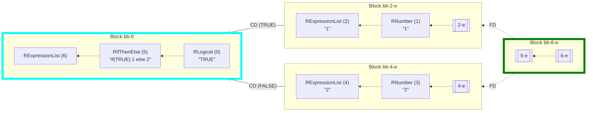

	
_(The analysis required _1.9 ms_ (including the dataflow analysis,  normalization,  and parsing with the [r-shell](https://github.com/flowr-analysis/flowr/wiki/Engines) engine) within the generation environment.
We used the following simplifications: `unique-cf-sets`, `to-basic-blocks` .
	)_


If, on the other hand, you want to prune dead code edges:


```json
[
  {
    "type": "control-flow",
    "config": {
      "simplificationPasses": [
        "unique-cf-sets",
        "analyze-dead-code"
      ]
    }
  }
]
```


 <details> <summary style="color:gray">Show Results</summary>

_Results (prettified and summarized):_

Query: **control-flow** (2ms)\
&nbsp;&nbsp;&nbsp;╰ CFG: https://mermaid.live/view#base64:eyJjb2RlIjoiZmxvd2NoYXJ0IEJUXG4gICAgbjYoW1wiYFJFeHByZXNzaW9uTGlzdCAoNilgXCJdKVxuICAgIG41W1wiYFJJZlRoZW5FbHNlICg1KVxuIzM0O2lmKFRSVUUpIDEgZWxzZSAyIzM0O2BcIl1cbiAgICBuNS1lW1s1LWVdXVxuICAgIG4wKFtcImBSTG9naWNhbCAoMClcbiMzNDtUUlVFIzM0O2BcIl0pXG4gICAgbjIoW1wiYFJFeHByZXNzaW9uTGlzdCAoMilcbiMzNDsxIzM0O2BcIl0pXG4gICAgbjEoW1wiYFJOdW1iZXIgKDEpXG4jMzQ7MSMzNDtgXCJdKVxuICAgIG4yLWVbWzItZV1dXG4gICAgbjQoW1wiYFJFeHByZXNzaW9uTGlzdCAoNClcbiMzNDsyIzM0O2BcIl0pXG4gICAgbjMoW1wiYFJOdW1iZXIgKDMpXG4jMzQ7MiMzNDtgXCJdKVxuICAgIG40LWVbWzQtZV1dXG4gICAgbjYtZVtbNi1lXV1cbiAgICBuNSAtLi0+fFwiRkRcInwgbjZcbiAgICBuMSAtLi0+fFwiRkRcInwgbjJcbiAgICBuMi1lIC0uLT58XCJGRFwifCBuMVxuICAgIG4zIC0uLT58XCJGRFwifCBuNFxuICAgIG40LWUgLS4tPnxcIkZEXCJ8IG4zXG4gICAgbjIgLS0+fFwiQ0QgKFRSVUUpXCJ8IG4wXG4gICAgbjAgLS4tPnxcIkZEXCJ8IG41XG4gICAgbjUtZSAtLi0+fFwiRkRcInwgbjItZVxuICAgIG41LWUgLS4tPnxcIkZEXCJ8IG40LWVcbiAgICBuNi1lIC0uLT58XCJGRFwifCBuNS1lXG4gICAgc3R5bGUgbjYgc3Ryb2tlOmN5YW4sc3Ryb2tlLXdpZHRoOjYuNXB4OyAgICBzdHlsZSBuNi1lIHN0cm9rZTpncmVlbixzdHJva2Utd2lkdGg6Ni41cHg7IiwibWVybWFpZCI6eyJhdXRvU3luYyI6dHJ1ZX19\
_All queries together required ≈2 ms (1ms accuracy, total 3 ms)_

<details> <summary style="color:gray">Show Detailed Results as Json</summary>

The analysis required _2.8 ms_ (including parsing and normalization and the query) within the generation environment.

In general, the JSON contains the Ids of the nodes in question as they are present in the normalized AST or the dataflow graph of flowR.
Please consult the [Interface](https://github.com/flowr-analysis/flowr/wiki/Interface) wiki page for more information on how to get those.


```json
{
  "control-flow": {
    ".meta": {
      "timing": 2
    },
    "controlFlow": {
      "returns": [],
      "entryPoints": [
        6
      ],
      "exitPoints": [
        "6-e"
      ],
      "breaks": [],
      "nexts": [],
      "graph": {
        "roots": [
          6,
          5,
          "5-e",
          0,
          2,
          1,
          "2-e",
          4,
          3,
          "4-e",
          "6-e"
        ],
        "vtxInfos": [
          [
            6,
            [
              2,
              6,
              null,
              [
                "6-e"
              ]
            ]
          ],
          [
            5,
            [
              1,
              5,
              [
                0
              ],
              [
                "5-e"
              ]
            ]
          ],
          [
            "5-e",
            "5-e"
          ],
          [
            0,
            [
              2,
              0
            ]
          ],
          [
            2,
            [
              2,
              2,
              null,
              [
                "2-e"
              ]
            ]
          ],
          [
            1,
            [
              2,
              1
            ]
          ],
          [
            "2-e",
            "2-e"
          ],
          [
            4,
            [
              2,
              4,
              null,
              [
                "4-e"
              ]
            ]
          ],
          [
            3,
            [
              2,
              3
            ]
          ],
          [
            "4-e",
            "4-e"
          ],
          [
            "6-e",
            "6-e"
          ]
        ],
        "bbChildren": [],
        "edgeInfos": [
          [
            5,
            [
              [
                6,
                0
              ]
            ]
          ],
          [
            1,
            [
              [
                2,
                0
              ]
            ]
          ],
          [
            "2-e",
            [
              [
                1,
                0
              ]
            ]
          ],
          [
            3,
            [
              [
                4,
                0
              ]
            ]
          ],
          [
            "4-e",
            [
              [
                3,
                0
              ]
            ]
          ],
          [
            2,
            [
              [
                0,
                [
                  5,
                  "TRUE"
                ]
              ]
            ]
          ],
          [
            0,
            [
              [
                5,
                0
              ]
            ]
          ],
          [
            "5-e",
            [
              [
                "2-e",
                0
              ],
              [
                "4-e",
                0
              ]
            ]
          ],
          [
            "6-e",
            [
              [
                "5-e",
                0
              ]
            ]
          ]
        ],
        "revEdgeInfos": [
          [
            6,
            [
              [
                5,
                0
              ]
            ]
          ],
          [
            2,
            [
              [
                1,
                0
              ]
            ]
          ],
          [
            1,
            [
              [
                "2-e",
                0
              ]
            ]
          ],
          [
            4,
            [
              [
                3,
                0
              ]
            ]
          ],
          [
            3,
            [
              [
                "4-e",
                0
              ]
            ]
          ],
          [
            0,
            [
              [
                2,
                [
                  5,
                  "TRUE"
                ]
              ]
            ]
          ],
          [
            5,
            [
              [
                0,
                0
              ]
            ]
          ],
          [
            "2-e",
            [
              [
                "5-e",
                0
              ]
            ]
          ],
          [
            "4-e",
            [
              [
                "5-e",
                0
              ]
            ]
          ],
          [
            "5-e",
            [
              [
                "6-e",
                0
              ]
            ]
          ]
        ],
        "_mayBB": false
      }
    }
  },
  ".meta": {
    "timing": 2
  }
}
```


</details>


</details>

	

this produces:


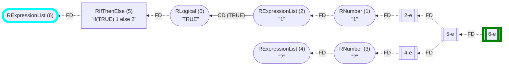

	
_(The analysis required _1.8 ms_ (including the dataflow analysis,  normalization,  and parsing with the [r-shell](https://github.com/flowr-analysis/flowr/wiki/Engines) engine) within the generation environment.
We used the following simplifications: `unique-cf-sets`, `analyze-dead-code` .
	)_


Or, completely remove dead code:


```json
[
  {
    "type": "control-flow",
    "config": {
      "simplificationPasses": [
        "unique-cf-sets",
        "analyze-dead-code",
        "remove-dead-code"
      ]
    }
  }
]
```


 <details> <summary style="color:gray">Show Results</summary>

_Results (prettified and summarized):_

Query: **control-flow** (2ms)\
&nbsp;&nbsp;&nbsp;╰ CFG: https://mermaid.live/view#base64:eyJjb2RlIjoiZmxvd2NoYXJ0IEJUXG4gICAgbjYoW1wiYFJFeHByZXNzaW9uTGlzdCAoNilgXCJdKVxuICAgIG41W1wiYFJJZlRoZW5FbHNlICg1KVxuIzM0O2lmKFRSVUUpIDEgZWxzZSAyIzM0O2BcIl1cbiAgICBuNS1lW1s1LWVdXVxuICAgIG4wKFtcImBSTG9naWNhbCAoMClcbiMzNDtUUlVFIzM0O2BcIl0pXG4gICAgbjIoW1wiYFJFeHByZXNzaW9uTGlzdCAoMilcbiMzNDsxIzM0O2BcIl0pXG4gICAgbjEoW1wiYFJOdW1iZXIgKDEpXG4jMzQ7MSMzNDtgXCJdKVxuICAgIG4yLWVbWzItZV1dXG4gICAgbjYtZVtbNi1lXV1cbiAgICBuNSAtLi0+fFwiRkRcInwgbjZcbiAgICBuMSAtLi0+fFwiRkRcInwgbjJcbiAgICBuMi1lIC0uLT58XCJGRFwifCBuMVxuICAgIG4yIC0tPnxcIkNEIChUUlVFKVwifCBuMFxuICAgIG4wIC0uLT58XCJGRFwifCBuNVxuICAgIG41LWUgLS4tPnxcIkZEXCJ8IG4yLWVcbiAgICBuNi1lIC0uLT58XCJGRFwifCBuNS1lXG4gICAgc3R5bGUgbjYgc3Ryb2tlOmN5YW4sc3Ryb2tlLXdpZHRoOjYuNXB4OyAgICBzdHlsZSBuNi1lIHN0cm9rZTpncmVlbixzdHJva2Utd2lkdGg6Ni41cHg7IiwibWVybWFpZCI6eyJhdXRvU3luYyI6dHJ1ZX19\
_All queries together required ≈2 ms (1ms accuracy, total 2 ms)_

<details> <summary style="color:gray">Show Detailed Results as Json</summary>

The analysis required _2.1 ms_ (including parsing and normalization and the query) within the generation environment.

In general, the JSON contains the Ids of the nodes in question as they are present in the normalized AST or the dataflow graph of flowR.
Please consult the [Interface](https://github.com/flowr-analysis/flowr/wiki/Interface) wiki page for more information on how to get those.


```json
{
  "control-flow": {
    ".meta": {
      "timing": 2
    },
    "controlFlow": {
      "returns": [],
      "entryPoints": [
        6
      ],
      "exitPoints": [
        "6-e"
      ],
      "breaks": [],
      "nexts": [],
      "graph": {
        "roots": [
          6,
          5,
          "5-e",
          0,
          2,
          1,
          "2-e",
          "6-e"
        ],
        "vtxInfos": [
          [
            6,
            [
              2,
              6,
              null,
              [
                "6-e"
              ]
            ]
          ],
          [
            5,
            [
              1,
              5,
              [
                0
              ],
              [
                "5-e"
              ]
            ]
          ],
          [
            "5-e",
            "5-e"
          ],
          [
            0,
            [
              2,
              0
            ]
          ],
          [
            2,
            [
              2,
              2,
              null,
              [
                "2-e"
              ]
            ]
          ],
          [
            1,
            [
              2,
              1
            ]
          ],
          [
            "2-e",
            "2-e"
          ],
          [
            "6-e",
            "6-e"
          ]
        ],
        "bbChildren": [],
        "edgeInfos": [
          [
            5,
            [
              [
                6,
                0
              ]
            ]
          ],
          [
            1,
            [
              [
                2,
                0
              ]
            ]
          ],
          [
            "2-e",
            [
              [
                1,
                0
              ]
            ]
          ],
          [
            2,
            [
              [
                0,
                [
                  5,
                  "TRUE"
                ]
              ]
            ]
          ],
          [
            0,
            [
              [
                5,
                0
              ]
            ]
          ],
          [
            "5-e",
            [
              [
                "2-e",
                0
              ]
            ]
          ],
          [
            "6-e",
            [
              [
                "5-e",
                0
              ]
            ]
          ]
        ],
        "revEdgeInfos": [
          [
            6,
            [
              [
                5,
                0
              ]
            ]
          ],
          [
            2,
            [
              [
                1,
                0
              ]
            ]
          ],
          [
            1,
            [
              [
                "2-e",
                0
              ]
            ]
          ],
          [
            0,
            [
              [
                2,
                [
                  5,
                  "TRUE"
                ]
              ]
            ]
          ],
          [
            5,
            [
              [
                0,
                0
              ]
            ]
          ],
          [
            "2-e",
            [
              [
                "5-e",
                0
              ]
            ]
          ],
          [
            "5-e",
            [
              [
                "6-e",
                0
              ]
            ]
          ]
        ],
        "_mayBB": false
      }
    }
  },
  ".meta": {
    "timing": 2
  }
}
```


</details>


</details>

	

this produces:


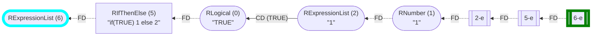

	
_(The analysis required _1.9 ms_ (including the dataflow analysis,  normalization,  and parsing with the [r-shell](https://github.com/flowr-analysis/flowr/wiki/Engines) engine) within the generation environment.
We used the following simplifications: `unique-cf-sets`, `analyze-dead-code`, `remove-dead-code` .
	)_


		

<details> 

<summary style="color:gray">Implementation Details</summary>

Responsible for the execution of the Control-Flow Query query is `executeControlFlowQuery` in [`./src/queries/catalog/control-flow-query/control-flow-query-executor.ts`](https://github.com/flowr-analysis/flowr/tree/main/./src/queries/catalog/control-flow-query/control-flow-query-executor.ts).

</details>


-----


### Dataflow Cluster Query


This query automatically calculates clusters in flowR's dataflow graph 
and returns a list of all clusters found. 
Clusters are to be interpreted as literal clusters on the graph traversing
edges in both directions. From this perspective, 
the code `x <- 1; x` has one cluster (given that all code is related), 
while the code `x <- 1; y` has two clusters (given that the `y` has no relation to the previous definition).


<details><summary>Example <code>x <- 1; x</code></summary>


```json
[
  {
    "type": "dataflow-cluster"
  }
]
```


(This can be shortened to `@dataflow-cluster` when used with the REPL command <span title="Description (Repl Command): Query the given R code, start with 'file://' to indicate a file. The query is to be a valid query in json format (use 'help' to get more information).">`:query`</span>).


_Results (prettified and summarized):_

Query: **dataflow-cluster** (1ms)\
&nbsp;&nbsp;&nbsp;╰ Found 1 cluster\
&nbsp;&nbsp;&nbsp;&nbsp;&nbsp;&nbsp;╰  {3, 0, 1, 2} ([marked](https://mermaid.live/view#base64:eyJjb2RlIjoiZmxvd2NoYXJ0IEJUXG4gICAgMXt7XCJgIzkxO1JOdW1iZXIjOTM7IDFcbiAgICAgICgxKVxuICAgICAgKjEuNipgXCJ9fVxuICAgJSUgTm8gZWRnZXMgZm91bmQgZm9yIDFcbiAgICAwW1wiYCM5MTtSU3ltYm9sIzkzOyB4XG4gICAgICAoMClcbiAgICAgICoxLjEqYFwiXVxuICAgIDJbW1wiYCM5MTtSQmluYXJ5T3AjOTM7ICM2MDsjNDU7XG4gICAgICAoMilcbiAgICAgICoxLjEtNipcbiAgICAoMCwgMSlgXCJdXVxuICAgIGJ1aWx0LWluOl8tW1wiYEJ1aWx0LUluOlxuIzYwOyM0NTtgXCJdXG4gICAgc3R5bGUgYnVpbHQtaW46Xy0gc3Ryb2tlOmdyYXksZmlsbDpncmF5LHN0cm9rZS13aWR0aDoycHgsb3BhY2l0eTouODtcbiAgICAzKFtcImAjOTE7UlN5bWJvbCM5MzsgeFxuICAgICAgKDMpXG4gICAgICAqMS45KmBcIl0pXG4gICAgMCAtLT58XCJkZWZpbmVkLWJ5XCJ8IDFcbiAgICAwIC0tPnxcImRlZmluZWQtYnlcInwgMlxuICAgIDIgLS0+fFwicmVhZHMsIGFyZ3VtZW50XCJ8IDFcbiAgICAyIC0tPnxcInJldHVybnMsIGFyZ3VtZW50XCJ8IDBcbiAgICAyIC0uLT58XCJyZWFkcywgY2FsbHNcInwgYnVpbHQtaW46Xy1cbiAgICBsaW5rU3R5bGUgNCBzdHJva2U6Z3JheTtcbiAgICAzIC0tPnxcInJlYWRzXCJ8IDAiLCJtZXJtYWlkIjp7ImF1dG9TeW5jIjp0cnVlfX0=))\
_All queries together required ≈2 ms (1ms accuracy, total 2 ms)_

<details> <summary style="color:gray">Show Detailed Results as Json</summary>

The analysis required _1.9 ms_ (including parsing and normalization and the query) within the generation environment.

In general, the JSON contains the Ids of the nodes in question as they are present in the normalized AST or the dataflow graph of flowR.
Please consult the [Interface](https://github.com/flowr-analysis/flowr/wiki/Interface) wiki page for more information on how to get those.


```json
{
  "dataflow-cluster": {
    ".meta": {
      "timing": 1
    },
    "clusters": [
      {
        "startNode": 3,
        "members": [
          3,
          0,
          1,
          2
        ],
        "hasUnknownSideEffects": false
      }
    ]
  },
  ".meta": {
    "timing": 2
  }
}
```


</details>


	

</details>
    

<details><summary>Example <code>x <- 1; y</code></summary>


```json
[
  {
    "type": "dataflow-cluster"
  }
]
```


(This can be shortened to `@dataflow-cluster` when used with the REPL command <span title="Description (Repl Command): Query the given R code, start with 'file://' to indicate a file. The query is to be a valid query in json format (use 'help' to get more information).">`:query`</span>).


_Results (prettified and summarized):_

Query: **dataflow-cluster** (1ms)\
&nbsp;&nbsp;&nbsp;╰ Found 2 clusters\
&nbsp;&nbsp;&nbsp;&nbsp;&nbsp;&nbsp;╰  {3} ([marked](https://mermaid.live/view#base64:eyJjb2RlIjoiZmxvd2NoYXJ0IEJUXG4gICAgMXt7XCJgIzkxO1JOdW1iZXIjOTM7IDFcbiAgICAgICgxKVxuICAgICAgKjEuNipgXCJ9fVxuICAgJSUgTm8gZWRnZXMgZm91bmQgZm9yIDFcbiAgICAwW1wiYCM5MTtSU3ltYm9sIzkzOyB4XG4gICAgICAoMClcbiAgICAgICoxLjEqYFwiXVxuICAgIDJbW1wiYCM5MTtSQmluYXJ5T3AjOTM7ICM2MDsjNDU7XG4gICAgICAoMilcbiAgICAgICoxLjEtNipcbiAgICAoMCwgMSlgXCJdXVxuICAgIGJ1aWx0LWluOl8tW1wiYEJ1aWx0LUluOlxuIzYwOyM0NTtgXCJdXG4gICAgc3R5bGUgYnVpbHQtaW46Xy0gc3Ryb2tlOmdyYXksZmlsbDpncmF5LHN0cm9rZS13aWR0aDoycHgsb3BhY2l0eTouODtcbiAgICAzKFtcImAjOTE7UlN5bWJvbCM5MzsgeVxuICAgICAgKDMpXG4gICAgICAqMS45KmBcIl0pXG4gICAlJSBObyBlZGdlcyBmb3VuZCBmb3IgM1xuICAgIDAgLS0+fFwiZGVmaW5lZC1ieVwifCAxXG4gICAgMCAtLT58XCJkZWZpbmVkLWJ5XCJ8IDJcbiAgICAyIC0tPnxcInJlYWRzLCBhcmd1bWVudFwifCAxXG4gICAgMiAtLT58XCJyZXR1cm5zLCBhcmd1bWVudFwifCAwXG4gICAgMiAtLi0+fFwicmVhZHMsIGNhbGxzXCJ8IGJ1aWx0LWluOl8tXG4gICAgbGlua1N0eWxlIDQgc3Ryb2tlOmdyYXk7IiwibWVybWFpZCI6eyJhdXRvU3luYyI6dHJ1ZX19))\
&nbsp;&nbsp;&nbsp;&nbsp;&nbsp;&nbsp;╰  {2, 1, 0} ([marked](https://mermaid.live/view#base64:eyJjb2RlIjoiZmxvd2NoYXJ0IEJUXG4gICAgMXt7XCJgIzkxO1JOdW1iZXIjOTM7IDFcbiAgICAgICgxKVxuICAgICAgKjEuNipgXCJ9fVxuICAgJSUgTm8gZWRnZXMgZm91bmQgZm9yIDFcbiAgICAwW1wiYCM5MTtSU3ltYm9sIzkzOyB4XG4gICAgICAoMClcbiAgICAgICoxLjEqYFwiXVxuICAgIDJbW1wiYCM5MTtSQmluYXJ5T3AjOTM7ICM2MDsjNDU7XG4gICAgICAoMilcbiAgICAgICoxLjEtNipcbiAgICAoMCwgMSlgXCJdXVxuICAgIGJ1aWx0LWluOl8tW1wiYEJ1aWx0LUluOlxuIzYwOyM0NTtgXCJdXG4gICAgc3R5bGUgYnVpbHQtaW46Xy0gc3Ryb2tlOmdyYXksZmlsbDpncmF5LHN0cm9rZS13aWR0aDoycHgsb3BhY2l0eTouODtcbiAgICAzKFtcImAjOTE7UlN5bWJvbCM5MzsgeVxuICAgICAgKDMpXG4gICAgICAqMS45KmBcIl0pXG4gICAlJSBObyBlZGdlcyBmb3VuZCBmb3IgM1xuICAgIDAgLS0+fFwiZGVmaW5lZC1ieVwifCAxXG4gICAgMCAtLT58XCJkZWZpbmVkLWJ5XCJ8IDJcbiAgICAyIC0tPnxcInJlYWRzLCBhcmd1bWVudFwifCAxXG4gICAgMiAtLT58XCJyZXR1cm5zLCBhcmd1bWVudFwifCAwXG4gICAgMiAtLi0+fFwicmVhZHMsIGNhbGxzXCJ8IGJ1aWx0LWluOl8tXG4gICAgbGlua1N0eWxlIDQgc3Ryb2tlOmdyYXk7IiwibWVybWFpZCI6eyJhdXRvU3luYyI6dHJ1ZX19))\
_All queries together required ≈1 ms (1ms accuracy, total 2 ms)_

<details> <summary style="color:gray">Show Detailed Results as Json</summary>

The analysis required _1.6 ms_ (including parsing and normalization and the query) within the generation environment.

In general, the JSON contains the Ids of the nodes in question as they are present in the normalized AST or the dataflow graph of flowR.
Please consult the [Interface](https://github.com/flowr-analysis/flowr/wiki/Interface) wiki page for more information on how to get those.


```json
{
  "dataflow-cluster": {
    ".meta": {
      "timing": 1
    },
    "clusters": [
      {
        "startNode": 3,
        "members": [
          3
        ],
        "hasUnknownSideEffects": false
      },
      {
        "startNode": 2,
        "members": [
          2,
          1,
          0
        ],
        "hasUnknownSideEffects": false
      }
    ]
  },
  ".meta": {
    "timing": 1
  }
}
```


</details>


	

</details>
    

Using the example code from above, the following query returns all clusters:


```json
[ { "type": "dataflow-cluster" } ]
```


(This can be shortened to `@dataflow-cluster` when used with the REPL command <span title="Description (Repl Command): Query the given R code, start with 'file://' to indicate a file. The query is to be a valid query in json format (use 'help' to get more information).">`:query`</span>).


_Results (prettified and summarized):_

Query: **dataflow-cluster** (6ms)\
&nbsp;&nbsp;&nbsp;╰ Found 5 clusters\
&nbsp;&nbsp;&nbsp;&nbsp;&nbsp;&nbsp;╰  {<span title="[89,87,85,82,18,22,20,23,57,60,58,67,65,62,63,79,72,69,70,77,74,75,83]">89, 87, 85, 82, 18, 22, ... (see JSON)</span>} ([marked](https://mermaid.live/view#base64:eyJjb2RlIjoiZmxvd2NoYXJ0IEJUXG4gICAgMXt7XCJgIzkxO1JTeW1ib2wjOTM7IGdncGxvdFxuICAgICAgKDEpXG4gICAgICAqMS45LTE0KmBcIn19XG4gICAlJSBObyBlZGdlcyBmb3VuZCBmb3IgMVxuICAgIDNbW1wiYCM5MTtSRnVuY3Rpb25DYWxsIzkzOyBsaWJyYXJ5XG4gICAgICAoMylcbiAgICAgICoxLjEtMTUqXG4gICAgKDEpYFwiXV1cbiAgICBzdHlsZSAzIHN0cm9rZTpyZWQsc3Ryb2tlLXdpZHRoOjVweDsgXG4gICAgYnVpbHQtaW46bGlicmFyeVtcImBCdWlsdC1JbjpcbmxpYnJhcnlgXCJdXG4gICAgc3R5bGUgYnVpbHQtaW46bGlicmFyeSBzdHJva2U6Z3JheSxmaWxsOmdyYXksc3Ryb2tlLXdpZHRoOjJweCxvcGFjaXR5Oi44O1xuICAgIDV7e1wiYCM5MTtSU3ltYm9sIzkzOyBkcGx5clxuICAgICAgKDUpXG4gICAgICAqMi45LTEzKmBcIn19XG4gICAlJSBObyBlZGdlcyBmb3VuZCBmb3IgNVxuICAgIDdbW1wiYCM5MTtSRnVuY3Rpb25DYWxsIzkzOyBsaWJyYXJ5XG4gICAgICAoNylcbiAgICAgICoyLjEtMTQqXG4gICAgKDUpYFwiXV1cbiAgICBzdHlsZSA3IHN0cm9rZTpyZWQsc3Ryb2tlLXdpZHRoOjVweDsgXG4gICAgOXt7XCJgIzkxO1JTeW1ib2wjOTM7IHJlYWRyXG4gICAgICAoOSlcbiAgICAgICozLjktMTMqYFwifX1cbiAgICUlIE5vIGVkZ2VzIGZvdW5kIGZvciA5XG4gICAgMTFbW1wiYCM5MTtSRnVuY3Rpb25DYWxsIzkzOyBsaWJyYXJ5XG4gICAgICAoMTEpXG4gICAgICAqMy4xLTE0KlxuICAgICg5KWBcIl1dXG4gICAgc3R5bGUgMTEgc3Ryb2tlOnJlZCxzdHJva2Utd2lkdGg6NXB4OyBcbiAgICAxNHt7XCJgIzkxO1JTdHJpbmcjOTM7ICMzOTtkYXRhLmNzdiMzOTtcbiAgICAgICgxNClcbiAgICAgICo2LjE4LTI3KmBcIn19XG4gICAlJSBObyBlZGdlcyBmb3VuZCBmb3IgMTRcbiAgICAxNltbXCJgIzkxO1JGdW5jdGlvbkNhbGwjOTM7IHJlYWQjOTU7Y3N2XG4gICAgICAoMTYpXG4gICAgICAqNi45LTI4KlxuICAgICgxNClgXCJdXVxuICAgIDEyW1wiYCM5MTtSU3ltYm9sIzkzOyBkYXRhXG4gICAgICAoMTIpXG4gICAgICAqNi4xLTQqYFwiXVxuICAgIDE3W1tcImAjOTE7UkJpbmFyeU9wIzkzOyAjNjA7IzQ1O1xuICAgICAgKDE3KVxuICAgICAgKjYuMS0yOCpcbiAgICAoMTIsIDE2KWBcIl1dXG4gICAgYnVpbHQtaW46Xy1bXCJgQnVpbHQtSW46XG4jNjA7IzQ1O2BcIl1cbiAgICBzdHlsZSBidWlsdC1pbjpfLSBzdHJva2U6Z3JheSxmaWxsOmdyYXksc3Ryb2tlLXdpZHRoOjJweCxvcGFjaXR5Oi44O1xuICAgIDIwe3tcImAjOTE7UlN0cmluZyM5MzsgIzM5O2RhdGEyLmNzdiMzOTtcbiAgICAgICgyMClcbiAgICAgICo3LjE5LTI5KmBcIn19XG4gICAlJSBObyBlZGdlcyBmb3VuZCBmb3IgMjBcbiAgICAyMltbXCJgIzkxO1JGdW5jdGlvbkNhbGwjOTM7IHJlYWQjOTU7Y3N2XG4gICAgICAoMjIpXG4gICAgICAqNy4xMC0zMCpcbiAgICAoMjApYFwiXV1cbiAgICAxOFtcImAjOTE7UlN5bWJvbCM5MzsgZGF0YTJcbiAgICAgICgxOClcbiAgICAgICo3LjEtNSpgXCJdXG4gICAgMjNbW1wiYCM5MTtSQmluYXJ5T3AjOTM7ICM2MDsjNDU7XG4gICAgICAoMjMpXG4gICAgICAqNy4xLTMwKlxuICAgICgxOCwgMjIpYFwiXV1cbiAgICAyNihbXCJgIzkxO1JTeW1ib2wjOTM7IGRhdGFcbiAgICAgICgyNilcbiAgICAgICo5LjExLTE0KmBcIl0pXG4gICAgMjd7e1wiYCM5MTtSU3ltYm9sIzkzOyB4XG4gICAgICAoMjcpXG4gICAgICAqOS4xMS0xNipgXCJ9fVxuICAgJSUgTm8gZWRnZXMgZm91bmQgZm9yIDI3XG4gICAgMjlbW1wiYCM5MTtSQWNjZXNzIzkzOyAkXG4gICAgICAoMjkpXG4gICAgICAqOS4xMS0xNipcbiAgICAoMjYsIDI3KWBcIl1dXG4gICAgYnVpbHQtaW46X1tcImBCdWlsdC1JbjpcbiRgXCJdXG4gICAgc3R5bGUgYnVpbHQtaW46XyBzdHJva2U6Z3JheSxmaWxsOmdyYXksc3Ryb2tlLXdpZHRoOjJweCxvcGFjaXR5Oi44O1xuICAgIDMxW1tcImAjOTE7UkZ1bmN0aW9uQ2FsbCM5MzsgbWVhblxuICAgICAgKDMxKVxuICAgICAgKjkuNi0xNypcbiAgICAoMjkpYFwiXV1cbiAgICBidWlsdC1pbjptZWFuW1wiYEJ1aWx0LUluOlxubWVhbmBcIl1cbiAgICBzdHlsZSBidWlsdC1pbjptZWFuIHN0cm9rZTpncmF5LGZpbGw6Z3JheSxzdHJva2Utd2lkdGg6MnB4LG9wYWNpdHk6Ljg7XG4gICAgMjRbXCJgIzkxO1JTeW1ib2wjOTM7IG1cbiAgICAgICgyNClcbiAgICAgICo5LjEqYFwiXVxuICAgIDMyW1tcImAjOTE7UkJpbmFyeU9wIzkzOyAjNjA7IzQ1O1xuICAgICAgKDMyKVxuICAgICAgKjkuMS0xNypcbiAgICAoMjQsIDMxKWBcIl1dXG4gICAgMzQoW1wiYCM5MTtSU3ltYm9sIzkzOyBtXG4gICAgICAoMzQpXG4gICAgICAqMTAuNypgXCJdKVxuICAgIDM2W1tcImAjOTE7UkZ1bmN0aW9uQ2FsbCM5MzsgcHJpbnRcbiAgICAgICgzNilcbiAgICAgICoxMC4xLTgqXG4gICAgKDM0KWBcIl1dXG4gICAgYnVpbHQtaW46cHJpbnRbXCJgQnVpbHQtSW46XG5wcmludGBcIl1cbiAgICBzdHlsZSBidWlsdC1pbjpwcmludCBzdHJva2U6Z3JheSxmaWxsOmdyYXksc3Ryb2tlLXdpZHRoOjJweCxvcGFjaXR5Oi44O1xuICAgIDM4KFtcImAjOTE7UlN5bWJvbCM5MzsgZGF0YVxuICAgICAgKDM4KVxuICAgICAgKjEyLjEtNCpgXCJdKVxuICAgIDQzKFtcImAjOTE7UlN5bWJvbCM5MzsgeFxuICAgICAgKDQzKVxuICAgICAgKjEzLjI0KmBcIl0pXG4gICAlJSBObyBlZGdlcyBmb3VuZCBmb3IgNDNcbiAgICA0NChbXCJgIzkxO1JBcmd1bWVudCM5MzsgeFxuICAgICAgKDQ0KVxuICAgICAgKjEzLjIwKmBcIl0pXG4gICAgNDYoW1wiYCM5MTtSU3ltYm9sIzkzOyB5XG4gICAgICAoNDYpXG4gICAgICAqMTMuMzEqYFwiXSlcbiAgICUlIE5vIGVkZ2VzIGZvdW5kIGZvciA0NlxuICAgIDQ3KFtcImAjOTE7UkFyZ3VtZW50IzkzOyB5XG4gICAgICAoNDcpXG4gICAgICAqMTMuMjcqYFwiXSlcbiAgICA0OFtbXCJgIzkxO1JGdW5jdGlvbkNhbGwjOTM7IGFlc1xuICAgICAgKDQ4KVxuICAgICAgKjEzLjE2LTMyKlxuICAgICh4ICg0NCksIHkgKDQ3KSlgXCJdXVxuICAgIDUwW1tcImAjOTE7UkZ1bmN0aW9uQ2FsbCM5MzsgZ2dwbG90XG4gICAgICAoNTApXG4gICAgICAqMTMuOS0zMypcbiAgICAoMzgsIDQ4KWBcIl1dXG4gICAgYnVpbHQtaW46Z2dwbG90W1wiYEJ1aWx0LUluOlxuZ2dwbG90YFwiXVxuICAgIHN0eWxlIGJ1aWx0LWluOmdncGxvdCBzdHJva2U6Z3JheSxmaWxsOmdyYXksc3Ryb2tlLXdpZHRoOjJweCxvcGFjaXR5Oi44O1xuICAgIDUyW1tcImAjOTE7UkZ1bmN0aW9uQ2FsbCM5MzsgZGF0YSAlIzYyOyVcblx0Z2dwbG90KGFlcyh4ID0geCwgeSA9IHkpKVxuICAgICAgKDUyKVxuICAgICAgKjEyLjYtOCpcbiAgICAoMzgsIDUwKWBcIl1dXG4gICAgYnVpbHQtaW46X19fW1wiYEJ1aWx0LUluOlxuJSM2MjslYFwiXVxuICAgIHN0eWxlIGJ1aWx0LWluOl9fXyBzdHJva2U6Z3JheSxmaWxsOmdyYXksc3Ryb2tlLXdpZHRoOjJweCxvcGFjaXR5Oi44O1xuICAgIDU0W1tcImAjOTE7UkZ1bmN0aW9uQ2FsbCM5MzsgZ2VvbSM5NTtwb2ludFxuICAgICAgKDU0KVxuICAgICAgKjE0LjktMjAqYFwiXV1cbiAgICBidWlsdC1pbjpnZW9tX3BvaW50W1wiYEJ1aWx0LUluOlxuZ2VvbSM5NTtwb2ludGBcIl1cbiAgICBzdHlsZSBidWlsdC1pbjpnZW9tX3BvaW50IHN0cm9rZTpncmF5LGZpbGw6Z3JheSxzdHJva2Utd2lkdGg6MnB4LG9wYWNpdHk6Ljg7XG4gICAgNTVbW1wiYCM5MTtSQmluYXJ5T3AjOTM7ICM0MztcbiAgICAgICg1NSlcbiAgICAgICoxMi4xLTE0LjIwKlxuICAgICg1MiwgNTQpYFwiXV1cbiAgICA1NyhbXCJgIzkxO1JTeW1ib2wjOTM7IGRhdGEyXG4gICAgICAoNTcpXG4gICAgICAqMTYuNi0xMCpgXCJdKVxuICAgIDU4e3tcImAjOTE7UlN5bWJvbCM5MzsgeFxuICAgICAgKDU4KVxuICAgICAgKjE2LjYtMTIqYFwifX1cbiAgICUlIE5vIGVkZ2VzIGZvdW5kIGZvciA1OFxuICAgIDYwW1tcImAjOTE7UkFjY2VzcyM5MzsgJFxuICAgICAgKDYwKVxuICAgICAgKjE2LjYtMTIqXG4gICAgKDU3LCA1OClgXCJdXVxuICAgIDYyKFtcImAjOTE7UlN5bWJvbCM5MzsgZGF0YTJcbiAgICAgICg2MilcbiAgICAgICoxNi4xNS0xOSpgXCJdKVxuICAgIDYze3tcImAjOTE7UlN5bWJvbCM5MzsgeVxuICAgICAgKDYzKVxuICAgICAgKjE2LjE1LTIxKmBcIn19XG4gICAlJSBObyBlZGdlcyBmb3VuZCBmb3IgNjNcbiAgICA2NVtbXCJgIzkxO1JBY2Nlc3MjOTM7ICRcbiAgICAgICg2NSlcbiAgICAgICoxNi4xNS0yMSpcbiAgICAoNjIsIDYzKWBcIl1dXG4gICAgNjdbW1wiYCM5MTtSRnVuY3Rpb25DYWxsIzkzOyBwbG90XG4gICAgICAoNjcpXG4gICAgICAqMTYuMS0yMipcbiAgICAoNjAsIDY1KWBcIl1dXG4gICAgYnVpbHQtaW46cGxvdFtcImBCdWlsdC1JbjpcbnBsb3RgXCJdXG4gICAgc3R5bGUgYnVpbHQtaW46cGxvdCBzdHJva2U6Z3JheSxmaWxsOmdyYXksc3Ryb2tlLXdpZHRoOjJweCxvcGFjaXR5Oi44O1xuICAgIDY5KFtcImAjOTE7UlN5bWJvbCM5MzsgZGF0YTJcbiAgICAgICg2OSlcbiAgICAgICoxNy44LTEyKmBcIl0pXG4gICAgNzB7e1wiYCM5MTtSU3ltYm9sIzkzOyB4XG4gICAgICAoNzApXG4gICAgICAqMTcuOC0xNCpgXCJ9fVxuICAgJSUgTm8gZWRnZXMgZm91bmQgZm9yIDcwXG4gICAgNzJbW1wiYCM5MTtSQWNjZXNzIzkzOyAkXG4gICAgICAoNzIpXG4gICAgICAqMTcuOC0xNCpcbiAgICAoNjksIDcwKWBcIl1dXG4gICAgNzQoW1wiYCM5MTtSU3ltYm9sIzkzOyBkYXRhMlxuICAgICAgKDc0KVxuICAgICAgKjE3LjE3LTIxKmBcIl0pXG4gICAgNzV7e1wiYCM5MTtSU3ltYm9sIzkzOyB5XG4gICAgICAoNzUpXG4gICAgICAqMTcuMTctMjMqYFwifX1cbiAgICUlIE5vIGVkZ2VzIGZvdW5kIGZvciA3NVxuICAgIDc3W1tcImAjOTE7UkFjY2VzcyM5MzsgJFxuICAgICAgKDc3KVxuICAgICAgKjE3LjE3LTIzKlxuICAgICg3NCwgNzUpYFwiXV1cbiAgICA3OVtbXCJgIzkxO1JGdW5jdGlvbkNhbGwjOTM7IHBvaW50c1xuICAgICAgKDc5KVxuICAgICAgKjE3LjEtMjQqXG4gICAgKDcyLCA3NylgXCJdXVxuICAgIGJ1aWx0LWluOnBvaW50c1tcImBCdWlsdC1JbjpcbnBvaW50c2BcIl1cbiAgICBzdHlsZSBidWlsdC1pbjpwb2ludHMgc3Ryb2tlOmdyYXksZmlsbDpncmF5LHN0cm9rZS13aWR0aDoycHgsb3BhY2l0eTouODtcbiAgICA4MihbXCJgIzkxO1JTeW1ib2wjOTM7IGRhdGEyXG4gICAgICAoODIpXG4gICAgICAqMTkuMTItMTYqYFwiXSlcbiAgICA4M3t7XCJgIzkxO1JTeW1ib2wjOTM7IGtcbiAgICAgICg4MylcbiAgICAgICoxOS4xMi0xOCpgXCJ9fVxuICAgJSUgTm8gZWRnZXMgZm91bmQgZm9yIDgzXG4gICAgODVbW1wiYCM5MTtSQWNjZXNzIzkzOyAkXG4gICAgICAoODUpXG4gICAgICAqMTkuMTItMTgqXG4gICAgKDgyLCA4MylgXCJdXVxuICAgIDg3W1tcImAjOTE7UkZ1bmN0aW9uQ2FsbCM5MzsgbWVhblxuICAgICAgKDg3KVxuICAgICAgKjE5LjctMTkqXG4gICAgKDg1KWBcIl1dXG4gICAgODlbW1wiYCM5MTtSRnVuY3Rpb25DYWxsIzkzOyBwcmludFxuICAgICAgKDg5KVxuICAgICAgKjE5LjEtMjAqXG4gICAgKDg3KWBcIl1dXG4gICAgMyAtLT58XCJhcmd1bWVudFwifCAxXG4gICAgMyAtLi0+fFwicmVhZHMsIGNhbGxzXCJ8IGJ1aWx0LWluOmxpYnJhcnlcbiAgICBsaW5rU3R5bGUgMSBzdHJva2U6Z3JheTtcbiAgICA3IC0tPnxcImFyZ3VtZW50XCJ8IDVcbiAgICA3IC0uLT58XCJyZWFkcywgY2FsbHNcInwgYnVpbHQtaW46bGlicmFyeVxuICAgIGxpbmtTdHlsZSAzIHN0cm9rZTpncmF5O1xuICAgIDExIC0tPnxcImFyZ3VtZW50XCJ8IDlcbiAgICAxMSAtLi0+fFwicmVhZHMsIGNhbGxzXCJ8IGJ1aWx0LWluOmxpYnJhcnlcbiAgICBsaW5rU3R5bGUgNSBzdHJva2U6Z3JheTtcbiAgICAxNiAtLT58XCJhcmd1bWVudFwifCAxNFxuICAgIDEyIC0tPnxcImRlZmluZWQtYnlcInwgMTZcbiAgICAxMiAtLT58XCJkZWZpbmVkLWJ5XCJ8IDE3XG4gICAgMTcgLS0+fFwicmVhZHMsIGFyZ3VtZW50XCJ8IDE2XG4gICAgMTcgLS0+fFwicmV0dXJucywgYXJndW1lbnRcInwgMTJcbiAgICAxNyAtLi0+fFwicmVhZHMsIGNhbGxzXCJ8IGJ1aWx0LWluOl8tXG4gICAgbGlua1N0eWxlIDExIHN0cm9rZTpncmF5O1xuICAgIDIyIC0tPnxcImFyZ3VtZW50XCJ8IDIwXG4gICAgMTggLS0+fFwiZGVmaW5lZC1ieVwifCAyMlxuICAgIDE4IC0tPnxcImRlZmluZWQtYnlcInwgMjNcbiAgICAyMyAtLT58XCJyZWFkcywgYXJndW1lbnRcInwgMjJcbiAgICAyMyAtLT58XCJyZXR1cm5zLCBhcmd1bWVudFwifCAxOFxuICAgIDIzIC0uLT58XCJyZWFkcywgY2FsbHNcInwgYnVpbHQtaW46Xy1cbiAgICBsaW5rU3R5bGUgMTcgc3Ryb2tlOmdyYXk7XG4gICAgMjYgLS0+fFwicmVhZHNcInwgMTJcbiAgICAyOSAtLT58XCJyZWFkcywgcmV0dXJucywgYXJndW1lbnRcInwgMjZcbiAgICAyOSAtLT58XCJyZWFkcywgYXJndW1lbnRcInwgMjdcbiAgICAyOSAtLi0+fFwicmVhZHMsIGNhbGxzXCJ8IGJ1aWx0LWluOl9cbiAgICBsaW5rU3R5bGUgMjEgc3Ryb2tlOmdyYXk7XG4gICAgMzEgLS0+fFwicmVhZHMsIGFyZ3VtZW50XCJ8IDI5XG4gICAgMzEgLS4tPnxcInJlYWRzLCBjYWxsc1wifCBidWlsdC1pbjptZWFuXG4gICAgbGlua1N0eWxlIDIzIHN0cm9rZTpncmF5O1xuICAgIDI0IC0tPnxcImRlZmluZWQtYnlcInwgMzFcbiAgICAyNCAtLT58XCJkZWZpbmVkLWJ5XCJ8IDMyXG4gICAgMzIgLS0+fFwicmVhZHMsIGFyZ3VtZW50XCJ8IDMxXG4gICAgMzIgLS0+fFwicmV0dXJucywgYXJndW1lbnRcInwgMjRcbiAgICAzMiAtLi0+fFwicmVhZHMsIGNhbGxzXCJ8IGJ1aWx0LWluOl8tXG4gICAgbGlua1N0eWxlIDI4IHN0cm9rZTpncmF5O1xuICAgIDM0IC0tPnxcInJlYWRzXCJ8IDI0XG4gICAgMzYgLS0+fFwicmVhZHMsIHJldHVybnMsIGFyZ3VtZW50XCJ8IDM0XG4gICAgMzYgLS4tPnxcInJlYWRzLCBjYWxsc1wifCBidWlsdC1pbjpwcmludFxuICAgIGxpbmtTdHlsZSAzMSBzdHJva2U6Z3JheTtcbiAgICAzOCAtLT58XCJyZWFkc1wifCAxMlxuICAgIDQ0IC0tPnxcInJlYWRzXCJ8IDQzXG4gICAgNDcgLS0+fFwicmVhZHNcInwgNDZcbiAgICA0OCAtLT58XCJyZWFkc1wifCA0M1xuICAgIDQ4IC0tPnxcImFyZ3VtZW50XCJ8IDQ0XG4gICAgNDggLS0+fFwicmVhZHNcInwgNDZcbiAgICA0OCAtLT58XCJhcmd1bWVudFwifCA0N1xuICAgIDUwIC0tPnxcInJlYWRzLCBhcmd1bWVudFwifCA0OFxuICAgIDUwIC0uLT58XCJyZWFkcywgY2FsbHNcInwgYnVpbHQtaW46Z2dwbG90XG4gICAgbGlua1N0eWxlIDQwIHN0cm9rZTpncmF5O1xuICAgIDUwIC0tPnxcInJlYWRzLCBhcmd1bWVudFwifCAzOFxuICAgIDUyIC0tPnxcImFyZ3VtZW50XCJ8IDM4XG4gICAgNTIgLS0+fFwiYXJndW1lbnRcInwgNTBcbiAgICA1MiAtLi0+fFwicmVhZHMsIGNhbGxzXCJ8IGJ1aWx0LWluOl9fX1xuICAgIGxpbmtTdHlsZSA0NCBzdHJva2U6Z3JheTtcbiAgICA1NCAtLi0+fFwicmVhZHMsIGNhbGxzXCJ8IGJ1aWx0LWluOmdlb21fcG9pbnRcbiAgICBsaW5rU3R5bGUgNDUgc3Ryb2tlOmdyYXk7XG4gICAgNTQgLS0+fFwicmVhZHNcInwgNTBcbiAgICA1NSAtLT58XCJyZWFkcywgYXJndW1lbnRcInwgNTJcbiAgICA1NSAtLT58XCJyZWFkcywgYXJndW1lbnRcInwgNTRcbiAgICA1NSAtLi0+fFwicmVhZHMsIGNhbGxzXCJ8IGJ1aWx0LWluOl9cbiAgICBsaW5rU3R5bGUgNDkgc3Ryb2tlOmdyYXk7XG4gICAgNTcgLS0+fFwicmVhZHNcInwgMThcbiAgICA2MCAtLT58XCJyZWFkcywgcmV0dXJucywgYXJndW1lbnRcInwgNTdcbiAgICA2MCAtLT58XCJyZWFkcywgYXJndW1lbnRcInwgNThcbiAgICA2MCAtLi0+fFwicmVhZHMsIGNhbGxzXCJ8IGJ1aWx0LWluOl9cbiAgICBsaW5rU3R5bGUgNTMgc3Ryb2tlOmdyYXk7XG4gICAgNjIgLS0+fFwicmVhZHNcInwgMThcbiAgICA2NSAtLT58XCJyZWFkcywgcmV0dXJucywgYXJndW1lbnRcInwgNjJcbiAgICA2NSAtLT58XCJyZWFkcywgYXJndW1lbnRcInwgNjNcbiAgICA2NSAtLi0+fFwicmVhZHMsIGNhbGxzXCJ8IGJ1aWx0LWluOl9cbiAgICBsaW5rU3R5bGUgNTcgc3Ryb2tlOmdyYXk7XG4gICAgNjcgLS0+fFwicmVhZHMsIGFyZ3VtZW50XCJ8IDYwXG4gICAgNjcgLS0+fFwicmVhZHMsIGFyZ3VtZW50XCJ8IDY1XG4gICAgNjcgLS4tPnxcInJlYWRzLCBjYWxsc1wifCBidWlsdC1pbjpwbG90XG4gICAgbGlua1N0eWxlIDYwIHN0cm9rZTpncmF5O1xuICAgIDY5IC0tPnxcInJlYWRzXCJ8IDE4XG4gICAgNzIgLS0+fFwicmVhZHMsIHJldHVybnMsIGFyZ3VtZW50XCJ8IDY5XG4gICAgNzIgLS0+fFwicmVhZHMsIGFyZ3VtZW50XCJ8IDcwXG4gICAgNzIgLS4tPnxcInJlYWRzLCBjYWxsc1wifCBidWlsdC1pbjpfXG4gICAgbGlua1N0eWxlIDY0IHN0cm9rZTpncmF5O1xuICAgIDc0IC0tPnxcInJlYWRzXCJ8IDE4XG4gICAgNzcgLS0+fFwicmVhZHMsIHJldHVybnMsIGFyZ3VtZW50XCJ8IDc0XG4gICAgNzcgLS0+fFwicmVhZHMsIGFyZ3VtZW50XCJ8IDc1XG4gICAgNzcgLS4tPnxcInJlYWRzLCBjYWxsc1wifCBidWlsdC1pbjpfXG4gICAgbGlua1N0eWxlIDY4IHN0cm9rZTpncmF5O1xuICAgIDc5IC0tPnxcInJlYWRzLCBhcmd1bWVudFwifCA3MlxuICAgIDc5IC0tPnxcInJlYWRzLCBhcmd1bWVudFwifCA3N1xuICAgIDc5IC0uLT58XCJyZWFkcywgY2FsbHNcInwgYnVpbHQtaW46cG9pbnRzXG4gICAgbGlua1N0eWxlIDcxIHN0cm9rZTpncmF5O1xuICAgIDc5IC0tPnxcInJlYWRzXCJ8IDY3XG4gICAgODIgLS0+fFwicmVhZHNcInwgMThcbiAgICA4NSAtLT58XCJyZWFkcywgcmV0dXJucywgYXJndW1lbnRcInwgODJcbiAgICA4NSAtLT58XCJyZWFkcywgYXJndW1lbnRcInwgODNcbiAgICA4NSAtLi0+fFwicmVhZHMsIGNhbGxzXCJ8IGJ1aWx0LWluOl9cbiAgICBsaW5rU3R5bGUgNzYgc3Ryb2tlOmdyYXk7XG4gICAgODcgLS0+fFwicmVhZHMsIGFyZ3VtZW50XCJ8IDg1XG4gICAgODcgLS4tPnxcInJlYWRzLCBjYWxsc1wifCBidWlsdC1pbjptZWFuXG4gICAgbGlua1N0eWxlIDc4IHN0cm9rZTpncmF5O1xuICAgIDg5IC0tPnxcInJlYWRzLCByZXR1cm5zLCBhcmd1bWVudFwifCA4N1xuICAgIDg5IC0uLT58XCJyZWFkcywgY2FsbHNcInwgYnVpbHQtaW46cHJpbnRcbiAgICBsaW5rU3R5bGUgODAgc3Ryb2tlOmdyYXk7IiwibWVybWFpZCI6eyJhdXRvU3luYyI6dHJ1ZX19))\
&nbsp;&nbsp;&nbsp;&nbsp;&nbsp;&nbsp;╰  {<span title="[55,52,38,12,16,14,17,26,29,27,31,32,24,34,36,50,48,43,44,46,47,54]">55, 52, 38, 12, 16, 14, ... (see JSON)</span>} ([marked](https://mermaid.live/view#base64:eyJjb2RlIjoiZmxvd2NoYXJ0IEJUXG4gICAgMXt7XCJgIzkxO1JTeW1ib2wjOTM7IGdncGxvdFxuICAgICAgKDEpXG4gICAgICAqMS45LTE0KmBcIn19XG4gICAlJSBObyBlZGdlcyBmb3VuZCBmb3IgMVxuICAgIDNbW1wiYCM5MTtSRnVuY3Rpb25DYWxsIzkzOyBsaWJyYXJ5XG4gICAgICAoMylcbiAgICAgICoxLjEtMTUqXG4gICAgKDEpYFwiXV1cbiAgICBzdHlsZSAzIHN0cm9rZTpyZWQsc3Ryb2tlLXdpZHRoOjVweDsgXG4gICAgYnVpbHQtaW46bGlicmFyeVtcImBCdWlsdC1JbjpcbmxpYnJhcnlgXCJdXG4gICAgc3R5bGUgYnVpbHQtaW46bGlicmFyeSBzdHJva2U6Z3JheSxmaWxsOmdyYXksc3Ryb2tlLXdpZHRoOjJweCxvcGFjaXR5Oi44O1xuICAgIDV7e1wiYCM5MTtSU3ltYm9sIzkzOyBkcGx5clxuICAgICAgKDUpXG4gICAgICAqMi45LTEzKmBcIn19XG4gICAlJSBObyBlZGdlcyBmb3VuZCBmb3IgNVxuICAgIDdbW1wiYCM5MTtSRnVuY3Rpb25DYWxsIzkzOyBsaWJyYXJ5XG4gICAgICAoNylcbiAgICAgICoyLjEtMTQqXG4gICAgKDUpYFwiXV1cbiAgICBzdHlsZSA3IHN0cm9rZTpyZWQsc3Ryb2tlLXdpZHRoOjVweDsgXG4gICAgOXt7XCJgIzkxO1JTeW1ib2wjOTM7IHJlYWRyXG4gICAgICAoOSlcbiAgICAgICozLjktMTMqYFwifX1cbiAgICUlIE5vIGVkZ2VzIGZvdW5kIGZvciA5XG4gICAgMTFbW1wiYCM5MTtSRnVuY3Rpb25DYWxsIzkzOyBsaWJyYXJ5XG4gICAgICAoMTEpXG4gICAgICAqMy4xLTE0KlxuICAgICg5KWBcIl1dXG4gICAgc3R5bGUgMTEgc3Ryb2tlOnJlZCxzdHJva2Utd2lkdGg6NXB4OyBcbiAgICAxNHt7XCJgIzkxO1JTdHJpbmcjOTM7ICMzOTtkYXRhLmNzdiMzOTtcbiAgICAgICgxNClcbiAgICAgICo2LjE4LTI3KmBcIn19XG4gICAlJSBObyBlZGdlcyBmb3VuZCBmb3IgMTRcbiAgICAxNltbXCJgIzkxO1JGdW5jdGlvbkNhbGwjOTM7IHJlYWQjOTU7Y3N2XG4gICAgICAoMTYpXG4gICAgICAqNi45LTI4KlxuICAgICgxNClgXCJdXVxuICAgIDEyW1wiYCM5MTtSU3ltYm9sIzkzOyBkYXRhXG4gICAgICAoMTIpXG4gICAgICAqNi4xLTQqYFwiXVxuICAgIDE3W1tcImAjOTE7UkJpbmFyeU9wIzkzOyAjNjA7IzQ1O1xuICAgICAgKDE3KVxuICAgICAgKjYuMS0yOCpcbiAgICAoMTIsIDE2KWBcIl1dXG4gICAgYnVpbHQtaW46Xy1bXCJgQnVpbHQtSW46XG4jNjA7IzQ1O2BcIl1cbiAgICBzdHlsZSBidWlsdC1pbjpfLSBzdHJva2U6Z3JheSxmaWxsOmdyYXksc3Ryb2tlLXdpZHRoOjJweCxvcGFjaXR5Oi44O1xuICAgIDIwe3tcImAjOTE7UlN0cmluZyM5MzsgIzM5O2RhdGEyLmNzdiMzOTtcbiAgICAgICgyMClcbiAgICAgICo3LjE5LTI5KmBcIn19XG4gICAlJSBObyBlZGdlcyBmb3VuZCBmb3IgMjBcbiAgICAyMltbXCJgIzkxO1JGdW5jdGlvbkNhbGwjOTM7IHJlYWQjOTU7Y3N2XG4gICAgICAoMjIpXG4gICAgICAqNy4xMC0zMCpcbiAgICAoMjApYFwiXV1cbiAgICAxOFtcImAjOTE7UlN5bWJvbCM5MzsgZGF0YTJcbiAgICAgICgxOClcbiAgICAgICo3LjEtNSpgXCJdXG4gICAgMjNbW1wiYCM5MTtSQmluYXJ5T3AjOTM7ICM2MDsjNDU7XG4gICAgICAoMjMpXG4gICAgICAqNy4xLTMwKlxuICAgICgxOCwgMjIpYFwiXV1cbiAgICAyNihbXCJgIzkxO1JTeW1ib2wjOTM7IGRhdGFcbiAgICAgICgyNilcbiAgICAgICo5LjExLTE0KmBcIl0pXG4gICAgMjd7e1wiYCM5MTtSU3ltYm9sIzkzOyB4XG4gICAgICAoMjcpXG4gICAgICAqOS4xMS0xNipgXCJ9fVxuICAgJSUgTm8gZWRnZXMgZm91bmQgZm9yIDI3XG4gICAgMjlbW1wiYCM5MTtSQWNjZXNzIzkzOyAkXG4gICAgICAoMjkpXG4gICAgICAqOS4xMS0xNipcbiAgICAoMjYsIDI3KWBcIl1dXG4gICAgYnVpbHQtaW46X1tcImBCdWlsdC1JbjpcbiRgXCJdXG4gICAgc3R5bGUgYnVpbHQtaW46XyBzdHJva2U6Z3JheSxmaWxsOmdyYXksc3Ryb2tlLXdpZHRoOjJweCxvcGFjaXR5Oi44O1xuICAgIDMxW1tcImAjOTE7UkZ1bmN0aW9uQ2FsbCM5MzsgbWVhblxuICAgICAgKDMxKVxuICAgICAgKjkuNi0xNypcbiAgICAoMjkpYFwiXV1cbiAgICBidWlsdC1pbjptZWFuW1wiYEJ1aWx0LUluOlxubWVhbmBcIl1cbiAgICBzdHlsZSBidWlsdC1pbjptZWFuIHN0cm9rZTpncmF5LGZpbGw6Z3JheSxzdHJva2Utd2lkdGg6MnB4LG9wYWNpdHk6Ljg7XG4gICAgMjRbXCJgIzkxO1JTeW1ib2wjOTM7IG1cbiAgICAgICgyNClcbiAgICAgICo5LjEqYFwiXVxuICAgIDMyW1tcImAjOTE7UkJpbmFyeU9wIzkzOyAjNjA7IzQ1O1xuICAgICAgKDMyKVxuICAgICAgKjkuMS0xNypcbiAgICAoMjQsIDMxKWBcIl1dXG4gICAgMzQoW1wiYCM5MTtSU3ltYm9sIzkzOyBtXG4gICAgICAoMzQpXG4gICAgICAqMTAuNypgXCJdKVxuICAgIDM2W1tcImAjOTE7UkZ1bmN0aW9uQ2FsbCM5MzsgcHJpbnRcbiAgICAgICgzNilcbiAgICAgICoxMC4xLTgqXG4gICAgKDM0KWBcIl1dXG4gICAgYnVpbHQtaW46cHJpbnRbXCJgQnVpbHQtSW46XG5wcmludGBcIl1cbiAgICBzdHlsZSBidWlsdC1pbjpwcmludCBzdHJva2U6Z3JheSxmaWxsOmdyYXksc3Ryb2tlLXdpZHRoOjJweCxvcGFjaXR5Oi44O1xuICAgIDM4KFtcImAjOTE7UlN5bWJvbCM5MzsgZGF0YVxuICAgICAgKDM4KVxuICAgICAgKjEyLjEtNCpgXCJdKVxuICAgIDQzKFtcImAjOTE7UlN5bWJvbCM5MzsgeFxuICAgICAgKDQzKVxuICAgICAgKjEzLjI0KmBcIl0pXG4gICAlJSBObyBlZGdlcyBmb3VuZCBmb3IgNDNcbiAgICA0NChbXCJgIzkxO1JBcmd1bWVudCM5MzsgeFxuICAgICAgKDQ0KVxuICAgICAgKjEzLjIwKmBcIl0pXG4gICAgNDYoW1wiYCM5MTtSU3ltYm9sIzkzOyB5XG4gICAgICAoNDYpXG4gICAgICAqMTMuMzEqYFwiXSlcbiAgICUlIE5vIGVkZ2VzIGZvdW5kIGZvciA0NlxuICAgIDQ3KFtcImAjOTE7UkFyZ3VtZW50IzkzOyB5XG4gICAgICAoNDcpXG4gICAgICAqMTMuMjcqYFwiXSlcbiAgICA0OFtbXCJgIzkxO1JGdW5jdGlvbkNhbGwjOTM7IGFlc1xuICAgICAgKDQ4KVxuICAgICAgKjEzLjE2LTMyKlxuICAgICh4ICg0NCksIHkgKDQ3KSlgXCJdXVxuICAgIDUwW1tcImAjOTE7UkZ1bmN0aW9uQ2FsbCM5MzsgZ2dwbG90XG4gICAgICAoNTApXG4gICAgICAqMTMuOS0zMypcbiAgICAoMzgsIDQ4KWBcIl1dXG4gICAgYnVpbHQtaW46Z2dwbG90W1wiYEJ1aWx0LUluOlxuZ2dwbG90YFwiXVxuICAgIHN0eWxlIGJ1aWx0LWluOmdncGxvdCBzdHJva2U6Z3JheSxmaWxsOmdyYXksc3Ryb2tlLXdpZHRoOjJweCxvcGFjaXR5Oi44O1xuICAgIDUyW1tcImAjOTE7UkZ1bmN0aW9uQ2FsbCM5MzsgZGF0YSAlIzYyOyVcblx0Z2dwbG90KGFlcyh4ID0geCwgeSA9IHkpKVxuICAgICAgKDUyKVxuICAgICAgKjEyLjYtOCpcbiAgICAoMzgsIDUwKWBcIl1dXG4gICAgYnVpbHQtaW46X19fW1wiYEJ1aWx0LUluOlxuJSM2MjslYFwiXVxuICAgIHN0eWxlIGJ1aWx0LWluOl9fXyBzdHJva2U6Z3JheSxmaWxsOmdyYXksc3Ryb2tlLXdpZHRoOjJweCxvcGFjaXR5Oi44O1xuICAgIDU0W1tcImAjOTE7UkZ1bmN0aW9uQ2FsbCM5MzsgZ2VvbSM5NTtwb2ludFxuICAgICAgKDU0KVxuICAgICAgKjE0LjktMjAqYFwiXV1cbiAgICBidWlsdC1pbjpnZW9tX3BvaW50W1wiYEJ1aWx0LUluOlxuZ2VvbSM5NTtwb2ludGBcIl1cbiAgICBzdHlsZSBidWlsdC1pbjpnZW9tX3BvaW50IHN0cm9rZTpncmF5LGZpbGw6Z3JheSxzdHJva2Utd2lkdGg6MnB4LG9wYWNpdHk6Ljg7XG4gICAgNTVbW1wiYCM5MTtSQmluYXJ5T3AjOTM7ICM0MztcbiAgICAgICg1NSlcbiAgICAgICoxMi4xLTE0LjIwKlxuICAgICg1MiwgNTQpYFwiXV1cbiAgICA1NyhbXCJgIzkxO1JTeW1ib2wjOTM7IGRhdGEyXG4gICAgICAoNTcpXG4gICAgICAqMTYuNi0xMCpgXCJdKVxuICAgIDU4e3tcImAjOTE7UlN5bWJvbCM5MzsgeFxuICAgICAgKDU4KVxuICAgICAgKjE2LjYtMTIqYFwifX1cbiAgICUlIE5vIGVkZ2VzIGZvdW5kIGZvciA1OFxuICAgIDYwW1tcImAjOTE7UkFjY2VzcyM5MzsgJFxuICAgICAgKDYwKVxuICAgICAgKjE2LjYtMTIqXG4gICAgKDU3LCA1OClgXCJdXVxuICAgIDYyKFtcImAjOTE7UlN5bWJvbCM5MzsgZGF0YTJcbiAgICAgICg2MilcbiAgICAgICoxNi4xNS0xOSpgXCJdKVxuICAgIDYze3tcImAjOTE7UlN5bWJvbCM5MzsgeVxuICAgICAgKDYzKVxuICAgICAgKjE2LjE1LTIxKmBcIn19XG4gICAlJSBObyBlZGdlcyBmb3VuZCBmb3IgNjNcbiAgICA2NVtbXCJgIzkxO1JBY2Nlc3MjOTM7ICRcbiAgICAgICg2NSlcbiAgICAgICoxNi4xNS0yMSpcbiAgICAoNjIsIDYzKWBcIl1dXG4gICAgNjdbW1wiYCM5MTtSRnVuY3Rpb25DYWxsIzkzOyBwbG90XG4gICAgICAoNjcpXG4gICAgICAqMTYuMS0yMipcbiAgICAoNjAsIDY1KWBcIl1dXG4gICAgYnVpbHQtaW46cGxvdFtcImBCdWlsdC1JbjpcbnBsb3RgXCJdXG4gICAgc3R5bGUgYnVpbHQtaW46cGxvdCBzdHJva2U6Z3JheSxmaWxsOmdyYXksc3Ryb2tlLXdpZHRoOjJweCxvcGFjaXR5Oi44O1xuICAgIDY5KFtcImAjOTE7UlN5bWJvbCM5MzsgZGF0YTJcbiAgICAgICg2OSlcbiAgICAgICoxNy44LTEyKmBcIl0pXG4gICAgNzB7e1wiYCM5MTtSU3ltYm9sIzkzOyB4XG4gICAgICAoNzApXG4gICAgICAqMTcuOC0xNCpgXCJ9fVxuICAgJSUgTm8gZWRnZXMgZm91bmQgZm9yIDcwXG4gICAgNzJbW1wiYCM5MTtSQWNjZXNzIzkzOyAkXG4gICAgICAoNzIpXG4gICAgICAqMTcuOC0xNCpcbiAgICAoNjksIDcwKWBcIl1dXG4gICAgNzQoW1wiYCM5MTtSU3ltYm9sIzkzOyBkYXRhMlxuICAgICAgKDc0KVxuICAgICAgKjE3LjE3LTIxKmBcIl0pXG4gICAgNzV7e1wiYCM5MTtSU3ltYm9sIzkzOyB5XG4gICAgICAoNzUpXG4gICAgICAqMTcuMTctMjMqYFwifX1cbiAgICUlIE5vIGVkZ2VzIGZvdW5kIGZvciA3NVxuICAgIDc3W1tcImAjOTE7UkFjY2VzcyM5MzsgJFxuICAgICAgKDc3KVxuICAgICAgKjE3LjE3LTIzKlxuICAgICg3NCwgNzUpYFwiXV1cbiAgICA3OVtbXCJgIzkxO1JGdW5jdGlvbkNhbGwjOTM7IHBvaW50c1xuICAgICAgKDc5KVxuICAgICAgKjE3LjEtMjQqXG4gICAgKDcyLCA3NylgXCJdXVxuICAgIGJ1aWx0LWluOnBvaW50c1tcImBCdWlsdC1JbjpcbnBvaW50c2BcIl1cbiAgICBzdHlsZSBidWlsdC1pbjpwb2ludHMgc3Ryb2tlOmdyYXksZmlsbDpncmF5LHN0cm9rZS13aWR0aDoycHgsb3BhY2l0eTouODtcbiAgICA4MihbXCJgIzkxO1JTeW1ib2wjOTM7IGRhdGEyXG4gICAgICAoODIpXG4gICAgICAqMTkuMTItMTYqYFwiXSlcbiAgICA4M3t7XCJgIzkxO1JTeW1ib2wjOTM7IGtcbiAgICAgICg4MylcbiAgICAgICoxOS4xMi0xOCpgXCJ9fVxuICAgJSUgTm8gZWRnZXMgZm91bmQgZm9yIDgzXG4gICAgODVbW1wiYCM5MTtSQWNjZXNzIzkzOyAkXG4gICAgICAoODUpXG4gICAgICAqMTkuMTItMTgqXG4gICAgKDgyLCA4MylgXCJdXVxuICAgIDg3W1tcImAjOTE7UkZ1bmN0aW9uQ2FsbCM5MzsgbWVhblxuICAgICAgKDg3KVxuICAgICAgKjE5LjctMTkqXG4gICAgKDg1KWBcIl1dXG4gICAgODlbW1wiYCM5MTtSRnVuY3Rpb25DYWxsIzkzOyBwcmludFxuICAgICAgKDg5KVxuICAgICAgKjE5LjEtMjAqXG4gICAgKDg3KWBcIl1dXG4gICAgMyAtLT58XCJhcmd1bWVudFwifCAxXG4gICAgMyAtLi0+fFwicmVhZHMsIGNhbGxzXCJ8IGJ1aWx0LWluOmxpYnJhcnlcbiAgICBsaW5rU3R5bGUgMSBzdHJva2U6Z3JheTtcbiAgICA3IC0tPnxcImFyZ3VtZW50XCJ8IDVcbiAgICA3IC0uLT58XCJyZWFkcywgY2FsbHNcInwgYnVpbHQtaW46bGlicmFyeVxuICAgIGxpbmtTdHlsZSAzIHN0cm9rZTpncmF5O1xuICAgIDExIC0tPnxcImFyZ3VtZW50XCJ8IDlcbiAgICAxMSAtLi0+fFwicmVhZHMsIGNhbGxzXCJ8IGJ1aWx0LWluOmxpYnJhcnlcbiAgICBsaW5rU3R5bGUgNSBzdHJva2U6Z3JheTtcbiAgICAxNiAtLT58XCJhcmd1bWVudFwifCAxNFxuICAgIDEyIC0tPnxcImRlZmluZWQtYnlcInwgMTZcbiAgICAxMiAtLT58XCJkZWZpbmVkLWJ5XCJ8IDE3XG4gICAgMTcgLS0+fFwicmVhZHMsIGFyZ3VtZW50XCJ8IDE2XG4gICAgMTcgLS0+fFwicmV0dXJucywgYXJndW1lbnRcInwgMTJcbiAgICAxNyAtLi0+fFwicmVhZHMsIGNhbGxzXCJ8IGJ1aWx0LWluOl8tXG4gICAgbGlua1N0eWxlIDExIHN0cm9rZTpncmF5O1xuICAgIDIyIC0tPnxcImFyZ3VtZW50XCJ8IDIwXG4gICAgMTggLS0+fFwiZGVmaW5lZC1ieVwifCAyMlxuICAgIDE4IC0tPnxcImRlZmluZWQtYnlcInwgMjNcbiAgICAyMyAtLT58XCJyZWFkcywgYXJndW1lbnRcInwgMjJcbiAgICAyMyAtLT58XCJyZXR1cm5zLCBhcmd1bWVudFwifCAxOFxuICAgIDIzIC0uLT58XCJyZWFkcywgY2FsbHNcInwgYnVpbHQtaW46Xy1cbiAgICBsaW5rU3R5bGUgMTcgc3Ryb2tlOmdyYXk7XG4gICAgMjYgLS0+fFwicmVhZHNcInwgMTJcbiAgICAyOSAtLT58XCJyZWFkcywgcmV0dXJucywgYXJndW1lbnRcInwgMjZcbiAgICAyOSAtLT58XCJyZWFkcywgYXJndW1lbnRcInwgMjdcbiAgICAyOSAtLi0+fFwicmVhZHMsIGNhbGxzXCJ8IGJ1aWx0LWluOl9cbiAgICBsaW5rU3R5bGUgMjEgc3Ryb2tlOmdyYXk7XG4gICAgMzEgLS0+fFwicmVhZHMsIGFyZ3VtZW50XCJ8IDI5XG4gICAgMzEgLS4tPnxcInJlYWRzLCBjYWxsc1wifCBidWlsdC1pbjptZWFuXG4gICAgbGlua1N0eWxlIDIzIHN0cm9rZTpncmF5O1xuICAgIDI0IC0tPnxcImRlZmluZWQtYnlcInwgMzFcbiAgICAyNCAtLT58XCJkZWZpbmVkLWJ5XCJ8IDMyXG4gICAgMzIgLS0+fFwicmVhZHMsIGFyZ3VtZW50XCJ8IDMxXG4gICAgMzIgLS0+fFwicmV0dXJucywgYXJndW1lbnRcInwgMjRcbiAgICAzMiAtLi0+fFwicmVhZHMsIGNhbGxzXCJ8IGJ1aWx0LWluOl8tXG4gICAgbGlua1N0eWxlIDI4IHN0cm9rZTpncmF5O1xuICAgIDM0IC0tPnxcInJlYWRzXCJ8IDI0XG4gICAgMzYgLS0+fFwicmVhZHMsIHJldHVybnMsIGFyZ3VtZW50XCJ8IDM0XG4gICAgMzYgLS4tPnxcInJlYWRzLCBjYWxsc1wifCBidWlsdC1pbjpwcmludFxuICAgIGxpbmtTdHlsZSAzMSBzdHJva2U6Z3JheTtcbiAgICAzOCAtLT58XCJyZWFkc1wifCAxMlxuICAgIDQ0IC0tPnxcInJlYWRzXCJ8IDQzXG4gICAgNDcgLS0+fFwicmVhZHNcInwgNDZcbiAgICA0OCAtLT58XCJyZWFkc1wifCA0M1xuICAgIDQ4IC0tPnxcImFyZ3VtZW50XCJ8IDQ0XG4gICAgNDggLS0+fFwicmVhZHNcInwgNDZcbiAgICA0OCAtLT58XCJhcmd1bWVudFwifCA0N1xuICAgIDUwIC0tPnxcInJlYWRzLCBhcmd1bWVudFwifCA0OFxuICAgIDUwIC0uLT58XCJyZWFkcywgY2FsbHNcInwgYnVpbHQtaW46Z2dwbG90XG4gICAgbGlua1N0eWxlIDQwIHN0cm9rZTpncmF5O1xuICAgIDUwIC0tPnxcInJlYWRzLCBhcmd1bWVudFwifCAzOFxuICAgIDUyIC0tPnxcImFyZ3VtZW50XCJ8IDM4XG4gICAgNTIgLS0+fFwiYXJndW1lbnRcInwgNTBcbiAgICA1MiAtLi0+fFwicmVhZHMsIGNhbGxzXCJ8IGJ1aWx0LWluOl9fX1xuICAgIGxpbmtTdHlsZSA0NCBzdHJva2U6Z3JheTtcbiAgICA1NCAtLi0+fFwicmVhZHMsIGNhbGxzXCJ8IGJ1aWx0LWluOmdlb21fcG9pbnRcbiAgICBsaW5rU3R5bGUgNDUgc3Ryb2tlOmdyYXk7XG4gICAgNTQgLS0+fFwicmVhZHNcInwgNTBcbiAgICA1NSAtLT58XCJyZWFkcywgYXJndW1lbnRcInwgNTJcbiAgICA1NSAtLT58XCJyZWFkcywgYXJndW1lbnRcInwgNTRcbiAgICA1NSAtLi0+fFwicmVhZHMsIGNhbGxzXCJ8IGJ1aWx0LWluOl9cbiAgICBsaW5rU3R5bGUgNDkgc3Ryb2tlOmdyYXk7XG4gICAgNTcgLS0+fFwicmVhZHNcInwgMThcbiAgICA2MCAtLT58XCJyZWFkcywgcmV0dXJucywgYXJndW1lbnRcInwgNTdcbiAgICA2MCAtLT58XCJyZWFkcywgYXJndW1lbnRcInwgNThcbiAgICA2MCAtLi0+fFwicmVhZHMsIGNhbGxzXCJ8IGJ1aWx0LWluOl9cbiAgICBsaW5rU3R5bGUgNTMgc3Ryb2tlOmdyYXk7XG4gICAgNjIgLS0+fFwicmVhZHNcInwgMThcbiAgICA2NSAtLT58XCJyZWFkcywgcmV0dXJucywgYXJndW1lbnRcInwgNjJcbiAgICA2NSAtLT58XCJyZWFkcywgYXJndW1lbnRcInwgNjNcbiAgICA2NSAtLi0+fFwicmVhZHMsIGNhbGxzXCJ8IGJ1aWx0LWluOl9cbiAgICBsaW5rU3R5bGUgNTcgc3Ryb2tlOmdyYXk7XG4gICAgNjcgLS0+fFwicmVhZHMsIGFyZ3VtZW50XCJ8IDYwXG4gICAgNjcgLS0+fFwicmVhZHMsIGFyZ3VtZW50XCJ8IDY1XG4gICAgNjcgLS4tPnxcInJlYWRzLCBjYWxsc1wifCBidWlsdC1pbjpwbG90XG4gICAgbGlua1N0eWxlIDYwIHN0cm9rZTpncmF5O1xuICAgIDY5IC0tPnxcInJlYWRzXCJ8IDE4XG4gICAgNzIgLS0+fFwicmVhZHMsIHJldHVybnMsIGFyZ3VtZW50XCJ8IDY5XG4gICAgNzIgLS0+fFwicmVhZHMsIGFyZ3VtZW50XCJ8IDcwXG4gICAgNzIgLS4tPnxcInJlYWRzLCBjYWxsc1wifCBidWlsdC1pbjpfXG4gICAgbGlua1N0eWxlIDY0IHN0cm9rZTpncmF5O1xuICAgIDc0IC0tPnxcInJlYWRzXCJ8IDE4XG4gICAgNzcgLS0+fFwicmVhZHMsIHJldHVybnMsIGFyZ3VtZW50XCJ8IDc0XG4gICAgNzcgLS0+fFwicmVhZHMsIGFyZ3VtZW50XCJ8IDc1XG4gICAgNzcgLS4tPnxcInJlYWRzLCBjYWxsc1wifCBidWlsdC1pbjpfXG4gICAgbGlua1N0eWxlIDY4IHN0cm9rZTpncmF5O1xuICAgIDc5IC0tPnxcInJlYWRzLCBhcmd1bWVudFwifCA3MlxuICAgIDc5IC0tPnxcInJlYWRzLCBhcmd1bWVudFwifCA3N1xuICAgIDc5IC0uLT58XCJyZWFkcywgY2FsbHNcInwgYnVpbHQtaW46cG9pbnRzXG4gICAgbGlua1N0eWxlIDcxIHN0cm9rZTpncmF5O1xuICAgIDc5IC0tPnxcInJlYWRzXCJ8IDY3XG4gICAgODIgLS0+fFwicmVhZHNcInwgMThcbiAgICA4NSAtLT58XCJyZWFkcywgcmV0dXJucywgYXJndW1lbnRcInwgODJcbiAgICA4NSAtLT58XCJyZWFkcywgYXJndW1lbnRcInwgODNcbiAgICA4NSAtLi0+fFwicmVhZHMsIGNhbGxzXCJ8IGJ1aWx0LWluOl9cbiAgICBsaW5rU3R5bGUgNzYgc3Ryb2tlOmdyYXk7XG4gICAgODcgLS0+fFwicmVhZHMsIGFyZ3VtZW50XCJ8IDg1XG4gICAgODcgLS4tPnxcInJlYWRzLCBjYWxsc1wifCBidWlsdC1pbjptZWFuXG4gICAgbGlua1N0eWxlIDc4IHN0cm9rZTpncmF5O1xuICAgIDg5IC0tPnxcInJlYWRzLCByZXR1cm5zLCBhcmd1bWVudFwifCA4N1xuICAgIDg5IC0uLT58XCJyZWFkcywgY2FsbHNcInwgYnVpbHQtaW46cHJpbnRcbiAgICBsaW5rU3R5bGUgODAgc3Ryb2tlOmdyYXk7IiwibWVybWFpZCI6eyJhdXRvU3luYyI6dHJ1ZX19))\
&nbsp;&nbsp;&nbsp;&nbsp;&nbsp;&nbsp;╰ (has unknown side effect) {11, 9} ([marked](https://mermaid.live/view#base64:eyJjb2RlIjoiZmxvd2NoYXJ0IEJUXG4gICAgMXt7XCJgIzkxO1JTeW1ib2wjOTM7IGdncGxvdFxuICAgICAgKDEpXG4gICAgICAqMS45LTE0KmBcIn19XG4gICAlJSBObyBlZGdlcyBmb3VuZCBmb3IgMVxuICAgIDNbW1wiYCM5MTtSRnVuY3Rpb25DYWxsIzkzOyBsaWJyYXJ5XG4gICAgICAoMylcbiAgICAgICoxLjEtMTUqXG4gICAgKDEpYFwiXV1cbiAgICBzdHlsZSAzIHN0cm9rZTpyZWQsc3Ryb2tlLXdpZHRoOjVweDsgXG4gICAgYnVpbHQtaW46bGlicmFyeVtcImBCdWlsdC1JbjpcbmxpYnJhcnlgXCJdXG4gICAgc3R5bGUgYnVpbHQtaW46bGlicmFyeSBzdHJva2U6Z3JheSxmaWxsOmdyYXksc3Ryb2tlLXdpZHRoOjJweCxvcGFjaXR5Oi44O1xuICAgIDV7e1wiYCM5MTtSU3ltYm9sIzkzOyBkcGx5clxuICAgICAgKDUpXG4gICAgICAqMi45LTEzKmBcIn19XG4gICAlJSBObyBlZGdlcyBmb3VuZCBmb3IgNVxuICAgIDdbW1wiYCM5MTtSRnVuY3Rpb25DYWxsIzkzOyBsaWJyYXJ5XG4gICAgICAoNylcbiAgICAgICoyLjEtMTQqXG4gICAgKDUpYFwiXV1cbiAgICBzdHlsZSA3IHN0cm9rZTpyZWQsc3Ryb2tlLXdpZHRoOjVweDsgXG4gICAgOXt7XCJgIzkxO1JTeW1ib2wjOTM7IHJlYWRyXG4gICAgICAoOSlcbiAgICAgICozLjktMTMqYFwifX1cbiAgICUlIE5vIGVkZ2VzIGZvdW5kIGZvciA5XG4gICAgMTFbW1wiYCM5MTtSRnVuY3Rpb25DYWxsIzkzOyBsaWJyYXJ5XG4gICAgICAoMTEpXG4gICAgICAqMy4xLTE0KlxuICAgICg5KWBcIl1dXG4gICAgc3R5bGUgMTEgc3Ryb2tlOnJlZCxzdHJva2Utd2lkdGg6NXB4OyBcbiAgICAxNHt7XCJgIzkxO1JTdHJpbmcjOTM7ICMzOTtkYXRhLmNzdiMzOTtcbiAgICAgICgxNClcbiAgICAgICo2LjE4LTI3KmBcIn19XG4gICAlJSBObyBlZGdlcyBmb3VuZCBmb3IgMTRcbiAgICAxNltbXCJgIzkxO1JGdW5jdGlvbkNhbGwjOTM7IHJlYWQjOTU7Y3N2XG4gICAgICAoMTYpXG4gICAgICAqNi45LTI4KlxuICAgICgxNClgXCJdXVxuICAgIDEyW1wiYCM5MTtSU3ltYm9sIzkzOyBkYXRhXG4gICAgICAoMTIpXG4gICAgICAqNi4xLTQqYFwiXVxuICAgIDE3W1tcImAjOTE7UkJpbmFyeU9wIzkzOyAjNjA7IzQ1O1xuICAgICAgKDE3KVxuICAgICAgKjYuMS0yOCpcbiAgICAoMTIsIDE2KWBcIl1dXG4gICAgYnVpbHQtaW46Xy1bXCJgQnVpbHQtSW46XG4jNjA7IzQ1O2BcIl1cbiAgICBzdHlsZSBidWlsdC1pbjpfLSBzdHJva2U6Z3JheSxmaWxsOmdyYXksc3Ryb2tlLXdpZHRoOjJweCxvcGFjaXR5Oi44O1xuICAgIDIwe3tcImAjOTE7UlN0cmluZyM5MzsgIzM5O2RhdGEyLmNzdiMzOTtcbiAgICAgICgyMClcbiAgICAgICo3LjE5LTI5KmBcIn19XG4gICAlJSBObyBlZGdlcyBmb3VuZCBmb3IgMjBcbiAgICAyMltbXCJgIzkxO1JGdW5jdGlvbkNhbGwjOTM7IHJlYWQjOTU7Y3N2XG4gICAgICAoMjIpXG4gICAgICAqNy4xMC0zMCpcbiAgICAoMjApYFwiXV1cbiAgICAxOFtcImAjOTE7UlN5bWJvbCM5MzsgZGF0YTJcbiAgICAgICgxOClcbiAgICAgICo3LjEtNSpgXCJdXG4gICAgMjNbW1wiYCM5MTtSQmluYXJ5T3AjOTM7ICM2MDsjNDU7XG4gICAgICAoMjMpXG4gICAgICAqNy4xLTMwKlxuICAgICgxOCwgMjIpYFwiXV1cbiAgICAyNihbXCJgIzkxO1JTeW1ib2wjOTM7IGRhdGFcbiAgICAgICgyNilcbiAgICAgICo5LjExLTE0KmBcIl0pXG4gICAgMjd7e1wiYCM5MTtSU3ltYm9sIzkzOyB4XG4gICAgICAoMjcpXG4gICAgICAqOS4xMS0xNipgXCJ9fVxuICAgJSUgTm8gZWRnZXMgZm91bmQgZm9yIDI3XG4gICAgMjlbW1wiYCM5MTtSQWNjZXNzIzkzOyAkXG4gICAgICAoMjkpXG4gICAgICAqOS4xMS0xNipcbiAgICAoMjYsIDI3KWBcIl1dXG4gICAgYnVpbHQtaW46X1tcImBCdWlsdC1JbjpcbiRgXCJdXG4gICAgc3R5bGUgYnVpbHQtaW46XyBzdHJva2U6Z3JheSxmaWxsOmdyYXksc3Ryb2tlLXdpZHRoOjJweCxvcGFjaXR5Oi44O1xuICAgIDMxW1tcImAjOTE7UkZ1bmN0aW9uQ2FsbCM5MzsgbWVhblxuICAgICAgKDMxKVxuICAgICAgKjkuNi0xNypcbiAgICAoMjkpYFwiXV1cbiAgICBidWlsdC1pbjptZWFuW1wiYEJ1aWx0LUluOlxubWVhbmBcIl1cbiAgICBzdHlsZSBidWlsdC1pbjptZWFuIHN0cm9rZTpncmF5LGZpbGw6Z3JheSxzdHJva2Utd2lkdGg6MnB4LG9wYWNpdHk6Ljg7XG4gICAgMjRbXCJgIzkxO1JTeW1ib2wjOTM7IG1cbiAgICAgICgyNClcbiAgICAgICo5LjEqYFwiXVxuICAgIDMyW1tcImAjOTE7UkJpbmFyeU9wIzkzOyAjNjA7IzQ1O1xuICAgICAgKDMyKVxuICAgICAgKjkuMS0xNypcbiAgICAoMjQsIDMxKWBcIl1dXG4gICAgMzQoW1wiYCM5MTtSU3ltYm9sIzkzOyBtXG4gICAgICAoMzQpXG4gICAgICAqMTAuNypgXCJdKVxuICAgIDM2W1tcImAjOTE7UkZ1bmN0aW9uQ2FsbCM5MzsgcHJpbnRcbiAgICAgICgzNilcbiAgICAgICoxMC4xLTgqXG4gICAgKDM0KWBcIl1dXG4gICAgYnVpbHQtaW46cHJpbnRbXCJgQnVpbHQtSW46XG5wcmludGBcIl1cbiAgICBzdHlsZSBidWlsdC1pbjpwcmludCBzdHJva2U6Z3JheSxmaWxsOmdyYXksc3Ryb2tlLXdpZHRoOjJweCxvcGFjaXR5Oi44O1xuICAgIDM4KFtcImAjOTE7UlN5bWJvbCM5MzsgZGF0YVxuICAgICAgKDM4KVxuICAgICAgKjEyLjEtNCpgXCJdKVxuICAgIDQzKFtcImAjOTE7UlN5bWJvbCM5MzsgeFxuICAgICAgKDQzKVxuICAgICAgKjEzLjI0KmBcIl0pXG4gICAlJSBObyBlZGdlcyBmb3VuZCBmb3IgNDNcbiAgICA0NChbXCJgIzkxO1JBcmd1bWVudCM5MzsgeFxuICAgICAgKDQ0KVxuICAgICAgKjEzLjIwKmBcIl0pXG4gICAgNDYoW1wiYCM5MTtSU3ltYm9sIzkzOyB5XG4gICAgICAoNDYpXG4gICAgICAqMTMuMzEqYFwiXSlcbiAgICUlIE5vIGVkZ2VzIGZvdW5kIGZvciA0NlxuICAgIDQ3KFtcImAjOTE7UkFyZ3VtZW50IzkzOyB5XG4gICAgICAoNDcpXG4gICAgICAqMTMuMjcqYFwiXSlcbiAgICA0OFtbXCJgIzkxO1JGdW5jdGlvbkNhbGwjOTM7IGFlc1xuICAgICAgKDQ4KVxuICAgICAgKjEzLjE2LTMyKlxuICAgICh4ICg0NCksIHkgKDQ3KSlgXCJdXVxuICAgIDUwW1tcImAjOTE7UkZ1bmN0aW9uQ2FsbCM5MzsgZ2dwbG90XG4gICAgICAoNTApXG4gICAgICAqMTMuOS0zMypcbiAgICAoMzgsIDQ4KWBcIl1dXG4gICAgYnVpbHQtaW46Z2dwbG90W1wiYEJ1aWx0LUluOlxuZ2dwbG90YFwiXVxuICAgIHN0eWxlIGJ1aWx0LWluOmdncGxvdCBzdHJva2U6Z3JheSxmaWxsOmdyYXksc3Ryb2tlLXdpZHRoOjJweCxvcGFjaXR5Oi44O1xuICAgIDUyW1tcImAjOTE7UkZ1bmN0aW9uQ2FsbCM5MzsgZGF0YSAlIzYyOyVcblx0Z2dwbG90KGFlcyh4ID0geCwgeSA9IHkpKVxuICAgICAgKDUyKVxuICAgICAgKjEyLjYtOCpcbiAgICAoMzgsIDUwKWBcIl1dXG4gICAgYnVpbHQtaW46X19fW1wiYEJ1aWx0LUluOlxuJSM2MjslYFwiXVxuICAgIHN0eWxlIGJ1aWx0LWluOl9fXyBzdHJva2U6Z3JheSxmaWxsOmdyYXksc3Ryb2tlLXdpZHRoOjJweCxvcGFjaXR5Oi44O1xuICAgIDU0W1tcImAjOTE7UkZ1bmN0aW9uQ2FsbCM5MzsgZ2VvbSM5NTtwb2ludFxuICAgICAgKDU0KVxuICAgICAgKjE0LjktMjAqYFwiXV1cbiAgICBidWlsdC1pbjpnZW9tX3BvaW50W1wiYEJ1aWx0LUluOlxuZ2VvbSM5NTtwb2ludGBcIl1cbiAgICBzdHlsZSBidWlsdC1pbjpnZW9tX3BvaW50IHN0cm9rZTpncmF5LGZpbGw6Z3JheSxzdHJva2Utd2lkdGg6MnB4LG9wYWNpdHk6Ljg7XG4gICAgNTVbW1wiYCM5MTtSQmluYXJ5T3AjOTM7ICM0MztcbiAgICAgICg1NSlcbiAgICAgICoxMi4xLTE0LjIwKlxuICAgICg1MiwgNTQpYFwiXV1cbiAgICA1NyhbXCJgIzkxO1JTeW1ib2wjOTM7IGRhdGEyXG4gICAgICAoNTcpXG4gICAgICAqMTYuNi0xMCpgXCJdKVxuICAgIDU4e3tcImAjOTE7UlN5bWJvbCM5MzsgeFxuICAgICAgKDU4KVxuICAgICAgKjE2LjYtMTIqYFwifX1cbiAgICUlIE5vIGVkZ2VzIGZvdW5kIGZvciA1OFxuICAgIDYwW1tcImAjOTE7UkFjY2VzcyM5MzsgJFxuICAgICAgKDYwKVxuICAgICAgKjE2LjYtMTIqXG4gICAgKDU3LCA1OClgXCJdXVxuICAgIDYyKFtcImAjOTE7UlN5bWJvbCM5MzsgZGF0YTJcbiAgICAgICg2MilcbiAgICAgICoxNi4xNS0xOSpgXCJdKVxuICAgIDYze3tcImAjOTE7UlN5bWJvbCM5MzsgeVxuICAgICAgKDYzKVxuICAgICAgKjE2LjE1LTIxKmBcIn19XG4gICAlJSBObyBlZGdlcyBmb3VuZCBmb3IgNjNcbiAgICA2NVtbXCJgIzkxO1JBY2Nlc3MjOTM7ICRcbiAgICAgICg2NSlcbiAgICAgICoxNi4xNS0yMSpcbiAgICAoNjIsIDYzKWBcIl1dXG4gICAgNjdbW1wiYCM5MTtSRnVuY3Rpb25DYWxsIzkzOyBwbG90XG4gICAgICAoNjcpXG4gICAgICAqMTYuMS0yMipcbiAgICAoNjAsIDY1KWBcIl1dXG4gICAgYnVpbHQtaW46cGxvdFtcImBCdWlsdC1JbjpcbnBsb3RgXCJdXG4gICAgc3R5bGUgYnVpbHQtaW46cGxvdCBzdHJva2U6Z3JheSxmaWxsOmdyYXksc3Ryb2tlLXdpZHRoOjJweCxvcGFjaXR5Oi44O1xuICAgIDY5KFtcImAjOTE7UlN5bWJvbCM5MzsgZGF0YTJcbiAgICAgICg2OSlcbiAgICAgICoxNy44LTEyKmBcIl0pXG4gICAgNzB7e1wiYCM5MTtSU3ltYm9sIzkzOyB4XG4gICAgICAoNzApXG4gICAgICAqMTcuOC0xNCpgXCJ9fVxuICAgJSUgTm8gZWRnZXMgZm91bmQgZm9yIDcwXG4gICAgNzJbW1wiYCM5MTtSQWNjZXNzIzkzOyAkXG4gICAgICAoNzIpXG4gICAgICAqMTcuOC0xNCpcbiAgICAoNjksIDcwKWBcIl1dXG4gICAgNzQoW1wiYCM5MTtSU3ltYm9sIzkzOyBkYXRhMlxuICAgICAgKDc0KVxuICAgICAgKjE3LjE3LTIxKmBcIl0pXG4gICAgNzV7e1wiYCM5MTtSU3ltYm9sIzkzOyB5XG4gICAgICAoNzUpXG4gICAgICAqMTcuMTctMjMqYFwifX1cbiAgICUlIE5vIGVkZ2VzIGZvdW5kIGZvciA3NVxuICAgIDc3W1tcImAjOTE7UkFjY2VzcyM5MzsgJFxuICAgICAgKDc3KVxuICAgICAgKjE3LjE3LTIzKlxuICAgICg3NCwgNzUpYFwiXV1cbiAgICA3OVtbXCJgIzkxO1JGdW5jdGlvbkNhbGwjOTM7IHBvaW50c1xuICAgICAgKDc5KVxuICAgICAgKjE3LjEtMjQqXG4gICAgKDcyLCA3NylgXCJdXVxuICAgIGJ1aWx0LWluOnBvaW50c1tcImBCdWlsdC1JbjpcbnBvaW50c2BcIl1cbiAgICBzdHlsZSBidWlsdC1pbjpwb2ludHMgc3Ryb2tlOmdyYXksZmlsbDpncmF5LHN0cm9rZS13aWR0aDoycHgsb3BhY2l0eTouODtcbiAgICA4MihbXCJgIzkxO1JTeW1ib2wjOTM7IGRhdGEyXG4gICAgICAoODIpXG4gICAgICAqMTkuMTItMTYqYFwiXSlcbiAgICA4M3t7XCJgIzkxO1JTeW1ib2wjOTM7IGtcbiAgICAgICg4MylcbiAgICAgICoxOS4xMi0xOCpgXCJ9fVxuICAgJSUgTm8gZWRnZXMgZm91bmQgZm9yIDgzXG4gICAgODVbW1wiYCM5MTtSQWNjZXNzIzkzOyAkXG4gICAgICAoODUpXG4gICAgICAqMTkuMTItMTgqXG4gICAgKDgyLCA4MylgXCJdXVxuICAgIDg3W1tcImAjOTE7UkZ1bmN0aW9uQ2FsbCM5MzsgbWVhblxuICAgICAgKDg3KVxuICAgICAgKjE5LjctMTkqXG4gICAgKDg1KWBcIl1dXG4gICAgODlbW1wiYCM5MTtSRnVuY3Rpb25DYWxsIzkzOyBwcmludFxuICAgICAgKDg5KVxuICAgICAgKjE5LjEtMjAqXG4gICAgKDg3KWBcIl1dXG4gICAgMyAtLT58XCJhcmd1bWVudFwifCAxXG4gICAgMyAtLi0+fFwicmVhZHMsIGNhbGxzXCJ8IGJ1aWx0LWluOmxpYnJhcnlcbiAgICBsaW5rU3R5bGUgMSBzdHJva2U6Z3JheTtcbiAgICA3IC0tPnxcImFyZ3VtZW50XCJ8IDVcbiAgICA3IC0uLT58XCJyZWFkcywgY2FsbHNcInwgYnVpbHQtaW46bGlicmFyeVxuICAgIGxpbmtTdHlsZSAzIHN0cm9rZTpncmF5O1xuICAgIDExIC0tPnxcImFyZ3VtZW50XCJ8IDlcbiAgICAxMSAtLi0+fFwicmVhZHMsIGNhbGxzXCJ8IGJ1aWx0LWluOmxpYnJhcnlcbiAgICBsaW5rU3R5bGUgNSBzdHJva2U6Z3JheTtcbiAgICAxNiAtLT58XCJhcmd1bWVudFwifCAxNFxuICAgIDEyIC0tPnxcImRlZmluZWQtYnlcInwgMTZcbiAgICAxMiAtLT58XCJkZWZpbmVkLWJ5XCJ8IDE3XG4gICAgMTcgLS0+fFwicmVhZHMsIGFyZ3VtZW50XCJ8IDE2XG4gICAgMTcgLS0+fFwicmV0dXJucywgYXJndW1lbnRcInwgMTJcbiAgICAxNyAtLi0+fFwicmVhZHMsIGNhbGxzXCJ8IGJ1aWx0LWluOl8tXG4gICAgbGlua1N0eWxlIDExIHN0cm9rZTpncmF5O1xuICAgIDIyIC0tPnxcImFyZ3VtZW50XCJ8IDIwXG4gICAgMTggLS0+fFwiZGVmaW5lZC1ieVwifCAyMlxuICAgIDE4IC0tPnxcImRlZmluZWQtYnlcInwgMjNcbiAgICAyMyAtLT58XCJyZWFkcywgYXJndW1lbnRcInwgMjJcbiAgICAyMyAtLT58XCJyZXR1cm5zLCBhcmd1bWVudFwifCAxOFxuICAgIDIzIC0uLT58XCJyZWFkcywgY2FsbHNcInwgYnVpbHQtaW46Xy1cbiAgICBsaW5rU3R5bGUgMTcgc3Ryb2tlOmdyYXk7XG4gICAgMjYgLS0+fFwicmVhZHNcInwgMTJcbiAgICAyOSAtLT58XCJyZWFkcywgcmV0dXJucywgYXJndW1lbnRcInwgMjZcbiAgICAyOSAtLT58XCJyZWFkcywgYXJndW1lbnRcInwgMjdcbiAgICAyOSAtLi0+fFwicmVhZHMsIGNhbGxzXCJ8IGJ1aWx0LWluOl9cbiAgICBsaW5rU3R5bGUgMjEgc3Ryb2tlOmdyYXk7XG4gICAgMzEgLS0+fFwicmVhZHMsIGFyZ3VtZW50XCJ8IDI5XG4gICAgMzEgLS4tPnxcInJlYWRzLCBjYWxsc1wifCBidWlsdC1pbjptZWFuXG4gICAgbGlua1N0eWxlIDIzIHN0cm9rZTpncmF5O1xuICAgIDI0IC0tPnxcImRlZmluZWQtYnlcInwgMzFcbiAgICAyNCAtLT58XCJkZWZpbmVkLWJ5XCJ8IDMyXG4gICAgMzIgLS0+fFwicmVhZHMsIGFyZ3VtZW50XCJ8IDMxXG4gICAgMzIgLS0+fFwicmV0dXJucywgYXJndW1lbnRcInwgMjRcbiAgICAzMiAtLi0+fFwicmVhZHMsIGNhbGxzXCJ8IGJ1aWx0LWluOl8tXG4gICAgbGlua1N0eWxlIDI4IHN0cm9rZTpncmF5O1xuICAgIDM0IC0tPnxcInJlYWRzXCJ8IDI0XG4gICAgMzYgLS0+fFwicmVhZHMsIHJldHVybnMsIGFyZ3VtZW50XCJ8IDM0XG4gICAgMzYgLS4tPnxcInJlYWRzLCBjYWxsc1wifCBidWlsdC1pbjpwcmludFxuICAgIGxpbmtTdHlsZSAzMSBzdHJva2U6Z3JheTtcbiAgICAzOCAtLT58XCJyZWFkc1wifCAxMlxuICAgIDQ0IC0tPnxcInJlYWRzXCJ8IDQzXG4gICAgNDcgLS0+fFwicmVhZHNcInwgNDZcbiAgICA0OCAtLT58XCJyZWFkc1wifCA0M1xuICAgIDQ4IC0tPnxcImFyZ3VtZW50XCJ8IDQ0XG4gICAgNDggLS0+fFwicmVhZHNcInwgNDZcbiAgICA0OCAtLT58XCJhcmd1bWVudFwifCA0N1xuICAgIDUwIC0tPnxcInJlYWRzLCBhcmd1bWVudFwifCA0OFxuICAgIDUwIC0uLT58XCJyZWFkcywgY2FsbHNcInwgYnVpbHQtaW46Z2dwbG90XG4gICAgbGlua1N0eWxlIDQwIHN0cm9rZTpncmF5O1xuICAgIDUwIC0tPnxcInJlYWRzLCBhcmd1bWVudFwifCAzOFxuICAgIDUyIC0tPnxcImFyZ3VtZW50XCJ8IDM4XG4gICAgNTIgLS0+fFwiYXJndW1lbnRcInwgNTBcbiAgICA1MiAtLi0+fFwicmVhZHMsIGNhbGxzXCJ8IGJ1aWx0LWluOl9fX1xuICAgIGxpbmtTdHlsZSA0NCBzdHJva2U6Z3JheTtcbiAgICA1NCAtLi0+fFwicmVhZHMsIGNhbGxzXCJ8IGJ1aWx0LWluOmdlb21fcG9pbnRcbiAgICBsaW5rU3R5bGUgNDUgc3Ryb2tlOmdyYXk7XG4gICAgNTQgLS0+fFwicmVhZHNcInwgNTBcbiAgICA1NSAtLT58XCJyZWFkcywgYXJndW1lbnRcInwgNTJcbiAgICA1NSAtLT58XCJyZWFkcywgYXJndW1lbnRcInwgNTRcbiAgICA1NSAtLi0+fFwicmVhZHMsIGNhbGxzXCJ8IGJ1aWx0LWluOl9cbiAgICBsaW5rU3R5bGUgNDkgc3Ryb2tlOmdyYXk7XG4gICAgNTcgLS0+fFwicmVhZHNcInwgMThcbiAgICA2MCAtLT58XCJyZWFkcywgcmV0dXJucywgYXJndW1lbnRcInwgNTdcbiAgICA2MCAtLT58XCJyZWFkcywgYXJndW1lbnRcInwgNThcbiAgICA2MCAtLi0+fFwicmVhZHMsIGNhbGxzXCJ8IGJ1aWx0LWluOl9cbiAgICBsaW5rU3R5bGUgNTMgc3Ryb2tlOmdyYXk7XG4gICAgNjIgLS0+fFwicmVhZHNcInwgMThcbiAgICA2NSAtLT58XCJyZWFkcywgcmV0dXJucywgYXJndW1lbnRcInwgNjJcbiAgICA2NSAtLT58XCJyZWFkcywgYXJndW1lbnRcInwgNjNcbiAgICA2NSAtLi0+fFwicmVhZHMsIGNhbGxzXCJ8IGJ1aWx0LWluOl9cbiAgICBsaW5rU3R5bGUgNTcgc3Ryb2tlOmdyYXk7XG4gICAgNjcgLS0+fFwicmVhZHMsIGFyZ3VtZW50XCJ8IDYwXG4gICAgNjcgLS0+fFwicmVhZHMsIGFyZ3VtZW50XCJ8IDY1XG4gICAgNjcgLS4tPnxcInJlYWRzLCBjYWxsc1wifCBidWlsdC1pbjpwbG90XG4gICAgbGlua1N0eWxlIDYwIHN0cm9rZTpncmF5O1xuICAgIDY5IC0tPnxcInJlYWRzXCJ8IDE4XG4gICAgNzIgLS0+fFwicmVhZHMsIHJldHVybnMsIGFyZ3VtZW50XCJ8IDY5XG4gICAgNzIgLS0+fFwicmVhZHMsIGFyZ3VtZW50XCJ8IDcwXG4gICAgNzIgLS4tPnxcInJlYWRzLCBjYWxsc1wifCBidWlsdC1pbjpfXG4gICAgbGlua1N0eWxlIDY0IHN0cm9rZTpncmF5O1xuICAgIDc0IC0tPnxcInJlYWRzXCJ8IDE4XG4gICAgNzcgLS0+fFwicmVhZHMsIHJldHVybnMsIGFyZ3VtZW50XCJ8IDc0XG4gICAgNzcgLS0+fFwicmVhZHMsIGFyZ3VtZW50XCJ8IDc1XG4gICAgNzcgLS4tPnxcInJlYWRzLCBjYWxsc1wifCBidWlsdC1pbjpfXG4gICAgbGlua1N0eWxlIDY4IHN0cm9rZTpncmF5O1xuICAgIDc5IC0tPnxcInJlYWRzLCBhcmd1bWVudFwifCA3MlxuICAgIDc5IC0tPnxcInJlYWRzLCBhcmd1bWVudFwifCA3N1xuICAgIDc5IC0uLT58XCJyZWFkcywgY2FsbHNcInwgYnVpbHQtaW46cG9pbnRzXG4gICAgbGlua1N0eWxlIDcxIHN0cm9rZTpncmF5O1xuICAgIDc5IC0tPnxcInJlYWRzXCJ8IDY3XG4gICAgODIgLS0+fFwicmVhZHNcInwgMThcbiAgICA4NSAtLT58XCJyZWFkcywgcmV0dXJucywgYXJndW1lbnRcInwgODJcbiAgICA4NSAtLT58XCJyZWFkcywgYXJndW1lbnRcInwgODNcbiAgICA4NSAtLi0+fFwicmVhZHMsIGNhbGxzXCJ8IGJ1aWx0LWluOl9cbiAgICBsaW5rU3R5bGUgNzYgc3Ryb2tlOmdyYXk7XG4gICAgODcgLS0+fFwicmVhZHMsIGFyZ3VtZW50XCJ8IDg1XG4gICAgODcgLS4tPnxcInJlYWRzLCBjYWxsc1wifCBidWlsdC1pbjptZWFuXG4gICAgbGlua1N0eWxlIDc4IHN0cm9rZTpncmF5O1xuICAgIDg5IC0tPnxcInJlYWRzLCByZXR1cm5zLCBhcmd1bWVudFwifCA4N1xuICAgIDg5IC0uLT58XCJyZWFkcywgY2FsbHNcInwgYnVpbHQtaW46cHJpbnRcbiAgICBsaW5rU3R5bGUgODAgc3Ryb2tlOmdyYXk7IiwibWVybWFpZCI6eyJhdXRvU3luYyI6dHJ1ZX19))\
&nbsp;&nbsp;&nbsp;&nbsp;&nbsp;&nbsp;╰ (has unknown side effect) {7, 5} ([marked](https://mermaid.live/view#base64:eyJjb2RlIjoiZmxvd2NoYXJ0IEJUXG4gICAgMXt7XCJgIzkxO1JTeW1ib2wjOTM7IGdncGxvdFxuICAgICAgKDEpXG4gICAgICAqMS45LTE0KmBcIn19XG4gICAlJSBObyBlZGdlcyBmb3VuZCBmb3IgMVxuICAgIDNbW1wiYCM5MTtSRnVuY3Rpb25DYWxsIzkzOyBsaWJyYXJ5XG4gICAgICAoMylcbiAgICAgICoxLjEtMTUqXG4gICAgKDEpYFwiXV1cbiAgICBzdHlsZSAzIHN0cm9rZTpyZWQsc3Ryb2tlLXdpZHRoOjVweDsgXG4gICAgYnVpbHQtaW46bGlicmFyeVtcImBCdWlsdC1JbjpcbmxpYnJhcnlgXCJdXG4gICAgc3R5bGUgYnVpbHQtaW46bGlicmFyeSBzdHJva2U6Z3JheSxmaWxsOmdyYXksc3Ryb2tlLXdpZHRoOjJweCxvcGFjaXR5Oi44O1xuICAgIDV7e1wiYCM5MTtSU3ltYm9sIzkzOyBkcGx5clxuICAgICAgKDUpXG4gICAgICAqMi45LTEzKmBcIn19XG4gICAlJSBObyBlZGdlcyBmb3VuZCBmb3IgNVxuICAgIDdbW1wiYCM5MTtSRnVuY3Rpb25DYWxsIzkzOyBsaWJyYXJ5XG4gICAgICAoNylcbiAgICAgICoyLjEtMTQqXG4gICAgKDUpYFwiXV1cbiAgICBzdHlsZSA3IHN0cm9rZTpyZWQsc3Ryb2tlLXdpZHRoOjVweDsgXG4gICAgOXt7XCJgIzkxO1JTeW1ib2wjOTM7IHJlYWRyXG4gICAgICAoOSlcbiAgICAgICozLjktMTMqYFwifX1cbiAgICUlIE5vIGVkZ2VzIGZvdW5kIGZvciA5XG4gICAgMTFbW1wiYCM5MTtSRnVuY3Rpb25DYWxsIzkzOyBsaWJyYXJ5XG4gICAgICAoMTEpXG4gICAgICAqMy4xLTE0KlxuICAgICg5KWBcIl1dXG4gICAgc3R5bGUgMTEgc3Ryb2tlOnJlZCxzdHJva2Utd2lkdGg6NXB4OyBcbiAgICAxNHt7XCJgIzkxO1JTdHJpbmcjOTM7ICMzOTtkYXRhLmNzdiMzOTtcbiAgICAgICgxNClcbiAgICAgICo2LjE4LTI3KmBcIn19XG4gICAlJSBObyBlZGdlcyBmb3VuZCBmb3IgMTRcbiAgICAxNltbXCJgIzkxO1JGdW5jdGlvbkNhbGwjOTM7IHJlYWQjOTU7Y3N2XG4gICAgICAoMTYpXG4gICAgICAqNi45LTI4KlxuICAgICgxNClgXCJdXVxuICAgIDEyW1wiYCM5MTtSU3ltYm9sIzkzOyBkYXRhXG4gICAgICAoMTIpXG4gICAgICAqNi4xLTQqYFwiXVxuICAgIDE3W1tcImAjOTE7UkJpbmFyeU9wIzkzOyAjNjA7IzQ1O1xuICAgICAgKDE3KVxuICAgICAgKjYuMS0yOCpcbiAgICAoMTIsIDE2KWBcIl1dXG4gICAgYnVpbHQtaW46Xy1bXCJgQnVpbHQtSW46XG4jNjA7IzQ1O2BcIl1cbiAgICBzdHlsZSBidWlsdC1pbjpfLSBzdHJva2U6Z3JheSxmaWxsOmdyYXksc3Ryb2tlLXdpZHRoOjJweCxvcGFjaXR5Oi44O1xuICAgIDIwe3tcImAjOTE7UlN0cmluZyM5MzsgIzM5O2RhdGEyLmNzdiMzOTtcbiAgICAgICgyMClcbiAgICAgICo3LjE5LTI5KmBcIn19XG4gICAlJSBObyBlZGdlcyBmb3VuZCBmb3IgMjBcbiAgICAyMltbXCJgIzkxO1JGdW5jdGlvbkNhbGwjOTM7IHJlYWQjOTU7Y3N2XG4gICAgICAoMjIpXG4gICAgICAqNy4xMC0zMCpcbiAgICAoMjApYFwiXV1cbiAgICAxOFtcImAjOTE7UlN5bWJvbCM5MzsgZGF0YTJcbiAgICAgICgxOClcbiAgICAgICo3LjEtNSpgXCJdXG4gICAgMjNbW1wiYCM5MTtSQmluYXJ5T3AjOTM7ICM2MDsjNDU7XG4gICAgICAoMjMpXG4gICAgICAqNy4xLTMwKlxuICAgICgxOCwgMjIpYFwiXV1cbiAgICAyNihbXCJgIzkxO1JTeW1ib2wjOTM7IGRhdGFcbiAgICAgICgyNilcbiAgICAgICo5LjExLTE0KmBcIl0pXG4gICAgMjd7e1wiYCM5MTtSU3ltYm9sIzkzOyB4XG4gICAgICAoMjcpXG4gICAgICAqOS4xMS0xNipgXCJ9fVxuICAgJSUgTm8gZWRnZXMgZm91bmQgZm9yIDI3XG4gICAgMjlbW1wiYCM5MTtSQWNjZXNzIzkzOyAkXG4gICAgICAoMjkpXG4gICAgICAqOS4xMS0xNipcbiAgICAoMjYsIDI3KWBcIl1dXG4gICAgYnVpbHQtaW46X1tcImBCdWlsdC1JbjpcbiRgXCJdXG4gICAgc3R5bGUgYnVpbHQtaW46XyBzdHJva2U6Z3JheSxmaWxsOmdyYXksc3Ryb2tlLXdpZHRoOjJweCxvcGFjaXR5Oi44O1xuICAgIDMxW1tcImAjOTE7UkZ1bmN0aW9uQ2FsbCM5MzsgbWVhblxuICAgICAgKDMxKVxuICAgICAgKjkuNi0xNypcbiAgICAoMjkpYFwiXV1cbiAgICBidWlsdC1pbjptZWFuW1wiYEJ1aWx0LUluOlxubWVhbmBcIl1cbiAgICBzdHlsZSBidWlsdC1pbjptZWFuIHN0cm9rZTpncmF5LGZpbGw6Z3JheSxzdHJva2Utd2lkdGg6MnB4LG9wYWNpdHk6Ljg7XG4gICAgMjRbXCJgIzkxO1JTeW1ib2wjOTM7IG1cbiAgICAgICgyNClcbiAgICAgICo5LjEqYFwiXVxuICAgIDMyW1tcImAjOTE7UkJpbmFyeU9wIzkzOyAjNjA7IzQ1O1xuICAgICAgKDMyKVxuICAgICAgKjkuMS0xNypcbiAgICAoMjQsIDMxKWBcIl1dXG4gICAgMzQoW1wiYCM5MTtSU3ltYm9sIzkzOyBtXG4gICAgICAoMzQpXG4gICAgICAqMTAuNypgXCJdKVxuICAgIDM2W1tcImAjOTE7UkZ1bmN0aW9uQ2FsbCM5MzsgcHJpbnRcbiAgICAgICgzNilcbiAgICAgICoxMC4xLTgqXG4gICAgKDM0KWBcIl1dXG4gICAgYnVpbHQtaW46cHJpbnRbXCJgQnVpbHQtSW46XG5wcmludGBcIl1cbiAgICBzdHlsZSBidWlsdC1pbjpwcmludCBzdHJva2U6Z3JheSxmaWxsOmdyYXksc3Ryb2tlLXdpZHRoOjJweCxvcGFjaXR5Oi44O1xuICAgIDM4KFtcImAjOTE7UlN5bWJvbCM5MzsgZGF0YVxuICAgICAgKDM4KVxuICAgICAgKjEyLjEtNCpgXCJdKVxuICAgIDQzKFtcImAjOTE7UlN5bWJvbCM5MzsgeFxuICAgICAgKDQzKVxuICAgICAgKjEzLjI0KmBcIl0pXG4gICAlJSBObyBlZGdlcyBmb3VuZCBmb3IgNDNcbiAgICA0NChbXCJgIzkxO1JBcmd1bWVudCM5MzsgeFxuICAgICAgKDQ0KVxuICAgICAgKjEzLjIwKmBcIl0pXG4gICAgNDYoW1wiYCM5MTtSU3ltYm9sIzkzOyB5XG4gICAgICAoNDYpXG4gICAgICAqMTMuMzEqYFwiXSlcbiAgICUlIE5vIGVkZ2VzIGZvdW5kIGZvciA0NlxuICAgIDQ3KFtcImAjOTE7UkFyZ3VtZW50IzkzOyB5XG4gICAgICAoNDcpXG4gICAgICAqMTMuMjcqYFwiXSlcbiAgICA0OFtbXCJgIzkxO1JGdW5jdGlvbkNhbGwjOTM7IGFlc1xuICAgICAgKDQ4KVxuICAgICAgKjEzLjE2LTMyKlxuICAgICh4ICg0NCksIHkgKDQ3KSlgXCJdXVxuICAgIDUwW1tcImAjOTE7UkZ1bmN0aW9uQ2FsbCM5MzsgZ2dwbG90XG4gICAgICAoNTApXG4gICAgICAqMTMuOS0zMypcbiAgICAoMzgsIDQ4KWBcIl1dXG4gICAgYnVpbHQtaW46Z2dwbG90W1wiYEJ1aWx0LUluOlxuZ2dwbG90YFwiXVxuICAgIHN0eWxlIGJ1aWx0LWluOmdncGxvdCBzdHJva2U6Z3JheSxmaWxsOmdyYXksc3Ryb2tlLXdpZHRoOjJweCxvcGFjaXR5Oi44O1xuICAgIDUyW1tcImAjOTE7UkZ1bmN0aW9uQ2FsbCM5MzsgZGF0YSAlIzYyOyVcblx0Z2dwbG90KGFlcyh4ID0geCwgeSA9IHkpKVxuICAgICAgKDUyKVxuICAgICAgKjEyLjYtOCpcbiAgICAoMzgsIDUwKWBcIl1dXG4gICAgYnVpbHQtaW46X19fW1wiYEJ1aWx0LUluOlxuJSM2MjslYFwiXVxuICAgIHN0eWxlIGJ1aWx0LWluOl9fXyBzdHJva2U6Z3JheSxmaWxsOmdyYXksc3Ryb2tlLXdpZHRoOjJweCxvcGFjaXR5Oi44O1xuICAgIDU0W1tcImAjOTE7UkZ1bmN0aW9uQ2FsbCM5MzsgZ2VvbSM5NTtwb2ludFxuICAgICAgKDU0KVxuICAgICAgKjE0LjktMjAqYFwiXV1cbiAgICBidWlsdC1pbjpnZW9tX3BvaW50W1wiYEJ1aWx0LUluOlxuZ2VvbSM5NTtwb2ludGBcIl1cbiAgICBzdHlsZSBidWlsdC1pbjpnZW9tX3BvaW50IHN0cm9rZTpncmF5LGZpbGw6Z3JheSxzdHJva2Utd2lkdGg6MnB4LG9wYWNpdHk6Ljg7XG4gICAgNTVbW1wiYCM5MTtSQmluYXJ5T3AjOTM7ICM0MztcbiAgICAgICg1NSlcbiAgICAgICoxMi4xLTE0LjIwKlxuICAgICg1MiwgNTQpYFwiXV1cbiAgICA1NyhbXCJgIzkxO1JTeW1ib2wjOTM7IGRhdGEyXG4gICAgICAoNTcpXG4gICAgICAqMTYuNi0xMCpgXCJdKVxuICAgIDU4e3tcImAjOTE7UlN5bWJvbCM5MzsgeFxuICAgICAgKDU4KVxuICAgICAgKjE2LjYtMTIqYFwifX1cbiAgICUlIE5vIGVkZ2VzIGZvdW5kIGZvciA1OFxuICAgIDYwW1tcImAjOTE7UkFjY2VzcyM5MzsgJFxuICAgICAgKDYwKVxuICAgICAgKjE2LjYtMTIqXG4gICAgKDU3LCA1OClgXCJdXVxuICAgIDYyKFtcImAjOTE7UlN5bWJvbCM5MzsgZGF0YTJcbiAgICAgICg2MilcbiAgICAgICoxNi4xNS0xOSpgXCJdKVxuICAgIDYze3tcImAjOTE7UlN5bWJvbCM5MzsgeVxuICAgICAgKDYzKVxuICAgICAgKjE2LjE1LTIxKmBcIn19XG4gICAlJSBObyBlZGdlcyBmb3VuZCBmb3IgNjNcbiAgICA2NVtbXCJgIzkxO1JBY2Nlc3MjOTM7ICRcbiAgICAgICg2NSlcbiAgICAgICoxNi4xNS0yMSpcbiAgICAoNjIsIDYzKWBcIl1dXG4gICAgNjdbW1wiYCM5MTtSRnVuY3Rpb25DYWxsIzkzOyBwbG90XG4gICAgICAoNjcpXG4gICAgICAqMTYuMS0yMipcbiAgICAoNjAsIDY1KWBcIl1dXG4gICAgYnVpbHQtaW46cGxvdFtcImBCdWlsdC1JbjpcbnBsb3RgXCJdXG4gICAgc3R5bGUgYnVpbHQtaW46cGxvdCBzdHJva2U6Z3JheSxmaWxsOmdyYXksc3Ryb2tlLXdpZHRoOjJweCxvcGFjaXR5Oi44O1xuICAgIDY5KFtcImAjOTE7UlN5bWJvbCM5MzsgZGF0YTJcbiAgICAgICg2OSlcbiAgICAgICoxNy44LTEyKmBcIl0pXG4gICAgNzB7e1wiYCM5MTtSU3ltYm9sIzkzOyB4XG4gICAgICAoNzApXG4gICAgICAqMTcuOC0xNCpgXCJ9fVxuICAgJSUgTm8gZWRnZXMgZm91bmQgZm9yIDcwXG4gICAgNzJbW1wiYCM5MTtSQWNjZXNzIzkzOyAkXG4gICAgICAoNzIpXG4gICAgICAqMTcuOC0xNCpcbiAgICAoNjksIDcwKWBcIl1dXG4gICAgNzQoW1wiYCM5MTtSU3ltYm9sIzkzOyBkYXRhMlxuICAgICAgKDc0KVxuICAgICAgKjE3LjE3LTIxKmBcIl0pXG4gICAgNzV7e1wiYCM5MTtSU3ltYm9sIzkzOyB5XG4gICAgICAoNzUpXG4gICAgICAqMTcuMTctMjMqYFwifX1cbiAgICUlIE5vIGVkZ2VzIGZvdW5kIGZvciA3NVxuICAgIDc3W1tcImAjOTE7UkFjY2VzcyM5MzsgJFxuICAgICAgKDc3KVxuICAgICAgKjE3LjE3LTIzKlxuICAgICg3NCwgNzUpYFwiXV1cbiAgICA3OVtbXCJgIzkxO1JGdW5jdGlvbkNhbGwjOTM7IHBvaW50c1xuICAgICAgKDc5KVxuICAgICAgKjE3LjEtMjQqXG4gICAgKDcyLCA3NylgXCJdXVxuICAgIGJ1aWx0LWluOnBvaW50c1tcImBCdWlsdC1JbjpcbnBvaW50c2BcIl1cbiAgICBzdHlsZSBidWlsdC1pbjpwb2ludHMgc3Ryb2tlOmdyYXksZmlsbDpncmF5LHN0cm9rZS13aWR0aDoycHgsb3BhY2l0eTouODtcbiAgICA4MihbXCJgIzkxO1JTeW1ib2wjOTM7IGRhdGEyXG4gICAgICAoODIpXG4gICAgICAqMTkuMTItMTYqYFwiXSlcbiAgICA4M3t7XCJgIzkxO1JTeW1ib2wjOTM7IGtcbiAgICAgICg4MylcbiAgICAgICoxOS4xMi0xOCpgXCJ9fVxuICAgJSUgTm8gZWRnZXMgZm91bmQgZm9yIDgzXG4gICAgODVbW1wiYCM5MTtSQWNjZXNzIzkzOyAkXG4gICAgICAoODUpXG4gICAgICAqMTkuMTItMTgqXG4gICAgKDgyLCA4MylgXCJdXVxuICAgIDg3W1tcImAjOTE7UkZ1bmN0aW9uQ2FsbCM5MzsgbWVhblxuICAgICAgKDg3KVxuICAgICAgKjE5LjctMTkqXG4gICAgKDg1KWBcIl1dXG4gICAgODlbW1wiYCM5MTtSRnVuY3Rpb25DYWxsIzkzOyBwcmludFxuICAgICAgKDg5KVxuICAgICAgKjE5LjEtMjAqXG4gICAgKDg3KWBcIl1dXG4gICAgMyAtLT58XCJhcmd1bWVudFwifCAxXG4gICAgMyAtLi0+fFwicmVhZHMsIGNhbGxzXCJ8IGJ1aWx0LWluOmxpYnJhcnlcbiAgICBsaW5rU3R5bGUgMSBzdHJva2U6Z3JheTtcbiAgICA3IC0tPnxcImFyZ3VtZW50XCJ8IDVcbiAgICA3IC0uLT58XCJyZWFkcywgY2FsbHNcInwgYnVpbHQtaW46bGlicmFyeVxuICAgIGxpbmtTdHlsZSAzIHN0cm9rZTpncmF5O1xuICAgIDExIC0tPnxcImFyZ3VtZW50XCJ8IDlcbiAgICAxMSAtLi0+fFwicmVhZHMsIGNhbGxzXCJ8IGJ1aWx0LWluOmxpYnJhcnlcbiAgICBsaW5rU3R5bGUgNSBzdHJva2U6Z3JheTtcbiAgICAxNiAtLT58XCJhcmd1bWVudFwifCAxNFxuICAgIDEyIC0tPnxcImRlZmluZWQtYnlcInwgMTZcbiAgICAxMiAtLT58XCJkZWZpbmVkLWJ5XCJ8IDE3XG4gICAgMTcgLS0+fFwicmVhZHMsIGFyZ3VtZW50XCJ8IDE2XG4gICAgMTcgLS0+fFwicmV0dXJucywgYXJndW1lbnRcInwgMTJcbiAgICAxNyAtLi0+fFwicmVhZHMsIGNhbGxzXCJ8IGJ1aWx0LWluOl8tXG4gICAgbGlua1N0eWxlIDExIHN0cm9rZTpncmF5O1xuICAgIDIyIC0tPnxcImFyZ3VtZW50XCJ8IDIwXG4gICAgMTggLS0+fFwiZGVmaW5lZC1ieVwifCAyMlxuICAgIDE4IC0tPnxcImRlZmluZWQtYnlcInwgMjNcbiAgICAyMyAtLT58XCJyZWFkcywgYXJndW1lbnRcInwgMjJcbiAgICAyMyAtLT58XCJyZXR1cm5zLCBhcmd1bWVudFwifCAxOFxuICAgIDIzIC0uLT58XCJyZWFkcywgY2FsbHNcInwgYnVpbHQtaW46Xy1cbiAgICBsaW5rU3R5bGUgMTcgc3Ryb2tlOmdyYXk7XG4gICAgMjYgLS0+fFwicmVhZHNcInwgMTJcbiAgICAyOSAtLT58XCJyZWFkcywgcmV0dXJucywgYXJndW1lbnRcInwgMjZcbiAgICAyOSAtLT58XCJyZWFkcywgYXJndW1lbnRcInwgMjdcbiAgICAyOSAtLi0+fFwicmVhZHMsIGNhbGxzXCJ8IGJ1aWx0LWluOl9cbiAgICBsaW5rU3R5bGUgMjEgc3Ryb2tlOmdyYXk7XG4gICAgMzEgLS0+fFwicmVhZHMsIGFyZ3VtZW50XCJ8IDI5XG4gICAgMzEgLS4tPnxcInJlYWRzLCBjYWxsc1wifCBidWlsdC1pbjptZWFuXG4gICAgbGlua1N0eWxlIDIzIHN0cm9rZTpncmF5O1xuICAgIDI0IC0tPnxcImRlZmluZWQtYnlcInwgMzFcbiAgICAyNCAtLT58XCJkZWZpbmVkLWJ5XCJ8IDMyXG4gICAgMzIgLS0+fFwicmVhZHMsIGFyZ3VtZW50XCJ8IDMxXG4gICAgMzIgLS0+fFwicmV0dXJucywgYXJndW1lbnRcInwgMjRcbiAgICAzMiAtLi0+fFwicmVhZHMsIGNhbGxzXCJ8IGJ1aWx0LWluOl8tXG4gICAgbGlua1N0eWxlIDI4IHN0cm9rZTpncmF5O1xuICAgIDM0IC0tPnxcInJlYWRzXCJ8IDI0XG4gICAgMzYgLS0+fFwicmVhZHMsIHJldHVybnMsIGFyZ3VtZW50XCJ8IDM0XG4gICAgMzYgLS4tPnxcInJlYWRzLCBjYWxsc1wifCBidWlsdC1pbjpwcmludFxuICAgIGxpbmtTdHlsZSAzMSBzdHJva2U6Z3JheTtcbiAgICAzOCAtLT58XCJyZWFkc1wifCAxMlxuICAgIDQ0IC0tPnxcInJlYWRzXCJ8IDQzXG4gICAgNDcgLS0+fFwicmVhZHNcInwgNDZcbiAgICA0OCAtLT58XCJyZWFkc1wifCA0M1xuICAgIDQ4IC0tPnxcImFyZ3VtZW50XCJ8IDQ0XG4gICAgNDggLS0+fFwicmVhZHNcInwgNDZcbiAgICA0OCAtLT58XCJhcmd1bWVudFwifCA0N1xuICAgIDUwIC0tPnxcInJlYWRzLCBhcmd1bWVudFwifCA0OFxuICAgIDUwIC0uLT58XCJyZWFkcywgY2FsbHNcInwgYnVpbHQtaW46Z2dwbG90XG4gICAgbGlua1N0eWxlIDQwIHN0cm9rZTpncmF5O1xuICAgIDUwIC0tPnxcInJlYWRzLCBhcmd1bWVudFwifCAzOFxuICAgIDUyIC0tPnxcImFyZ3VtZW50XCJ8IDM4XG4gICAgNTIgLS0+fFwiYXJndW1lbnRcInwgNTBcbiAgICA1MiAtLi0+fFwicmVhZHMsIGNhbGxzXCJ8IGJ1aWx0LWluOl9fX1xuICAgIGxpbmtTdHlsZSA0NCBzdHJva2U6Z3JheTtcbiAgICA1NCAtLi0+fFwicmVhZHMsIGNhbGxzXCJ8IGJ1aWx0LWluOmdlb21fcG9pbnRcbiAgICBsaW5rU3R5bGUgNDUgc3Ryb2tlOmdyYXk7XG4gICAgNTQgLS0+fFwicmVhZHNcInwgNTBcbiAgICA1NSAtLT58XCJyZWFkcywgYXJndW1lbnRcInwgNTJcbiAgICA1NSAtLT58XCJyZWFkcywgYXJndW1lbnRcInwgNTRcbiAgICA1NSAtLi0+fFwicmVhZHMsIGNhbGxzXCJ8IGJ1aWx0LWluOl9cbiAgICBsaW5rU3R5bGUgNDkgc3Ryb2tlOmdyYXk7XG4gICAgNTcgLS0+fFwicmVhZHNcInwgMThcbiAgICA2MCAtLT58XCJyZWFkcywgcmV0dXJucywgYXJndW1lbnRcInwgNTdcbiAgICA2MCAtLT58XCJyZWFkcywgYXJndW1lbnRcInwgNThcbiAgICA2MCAtLi0+fFwicmVhZHMsIGNhbGxzXCJ8IGJ1aWx0LWluOl9cbiAgICBsaW5rU3R5bGUgNTMgc3Ryb2tlOmdyYXk7XG4gICAgNjIgLS0+fFwicmVhZHNcInwgMThcbiAgICA2NSAtLT58XCJyZWFkcywgcmV0dXJucywgYXJndW1lbnRcInwgNjJcbiAgICA2NSAtLT58XCJyZWFkcywgYXJndW1lbnRcInwgNjNcbiAgICA2NSAtLi0+fFwicmVhZHMsIGNhbGxzXCJ8IGJ1aWx0LWluOl9cbiAgICBsaW5rU3R5bGUgNTcgc3Ryb2tlOmdyYXk7XG4gICAgNjcgLS0+fFwicmVhZHMsIGFyZ3VtZW50XCJ8IDYwXG4gICAgNjcgLS0+fFwicmVhZHMsIGFyZ3VtZW50XCJ8IDY1XG4gICAgNjcgLS4tPnxcInJlYWRzLCBjYWxsc1wifCBidWlsdC1pbjpwbG90XG4gICAgbGlua1N0eWxlIDYwIHN0cm9rZTpncmF5O1xuICAgIDY5IC0tPnxcInJlYWRzXCJ8IDE4XG4gICAgNzIgLS0+fFwicmVhZHMsIHJldHVybnMsIGFyZ3VtZW50XCJ8IDY5XG4gICAgNzIgLS0+fFwicmVhZHMsIGFyZ3VtZW50XCJ8IDcwXG4gICAgNzIgLS4tPnxcInJlYWRzLCBjYWxsc1wifCBidWlsdC1pbjpfXG4gICAgbGlua1N0eWxlIDY0IHN0cm9rZTpncmF5O1xuICAgIDc0IC0tPnxcInJlYWRzXCJ8IDE4XG4gICAgNzcgLS0+fFwicmVhZHMsIHJldHVybnMsIGFyZ3VtZW50XCJ8IDc0XG4gICAgNzcgLS0+fFwicmVhZHMsIGFyZ3VtZW50XCJ8IDc1XG4gICAgNzcgLS4tPnxcInJlYWRzLCBjYWxsc1wifCBidWlsdC1pbjpfXG4gICAgbGlua1N0eWxlIDY4IHN0cm9rZTpncmF5O1xuICAgIDc5IC0tPnxcInJlYWRzLCBhcmd1bWVudFwifCA3MlxuICAgIDc5IC0tPnxcInJlYWRzLCBhcmd1bWVudFwifCA3N1xuICAgIDc5IC0uLT58XCJyZWFkcywgY2FsbHNcInwgYnVpbHQtaW46cG9pbnRzXG4gICAgbGlua1N0eWxlIDcxIHN0cm9rZTpncmF5O1xuICAgIDc5IC0tPnxcInJlYWRzXCJ8IDY3XG4gICAgODIgLS0+fFwicmVhZHNcInwgMThcbiAgICA4NSAtLT58XCJyZWFkcywgcmV0dXJucywgYXJndW1lbnRcInwgODJcbiAgICA4NSAtLT58XCJyZWFkcywgYXJndW1lbnRcInwgODNcbiAgICA4NSAtLi0+fFwicmVhZHMsIGNhbGxzXCJ8IGJ1aWx0LWluOl9cbiAgICBsaW5rU3R5bGUgNzYgc3Ryb2tlOmdyYXk7XG4gICAgODcgLS0+fFwicmVhZHMsIGFyZ3VtZW50XCJ8IDg1XG4gICAgODcgLS4tPnxcInJlYWRzLCBjYWxsc1wifCBidWlsdC1pbjptZWFuXG4gICAgbGlua1N0eWxlIDc4IHN0cm9rZTpncmF5O1xuICAgIDg5IC0tPnxcInJlYWRzLCByZXR1cm5zLCBhcmd1bWVudFwifCA4N1xuICAgIDg5IC0uLT58XCJyZWFkcywgY2FsbHNcInwgYnVpbHQtaW46cHJpbnRcbiAgICBsaW5rU3R5bGUgODAgc3Ryb2tlOmdyYXk7IiwibWVybWFpZCI6eyJhdXRvU3luYyI6dHJ1ZX19))\
&nbsp;&nbsp;&nbsp;&nbsp;&nbsp;&nbsp;╰ (has unknown side effect) {3, 1} ([marked](https://mermaid.live/view#base64:eyJjb2RlIjoiZmxvd2NoYXJ0IEJUXG4gICAgMXt7XCJgIzkxO1JTeW1ib2wjOTM7IGdncGxvdFxuICAgICAgKDEpXG4gICAgICAqMS45LTE0KmBcIn19XG4gICAlJSBObyBlZGdlcyBmb3VuZCBmb3IgMVxuICAgIDNbW1wiYCM5MTtSRnVuY3Rpb25DYWxsIzkzOyBsaWJyYXJ5XG4gICAgICAoMylcbiAgICAgICoxLjEtMTUqXG4gICAgKDEpYFwiXV1cbiAgICBzdHlsZSAzIHN0cm9rZTpyZWQsc3Ryb2tlLXdpZHRoOjVweDsgXG4gICAgYnVpbHQtaW46bGlicmFyeVtcImBCdWlsdC1JbjpcbmxpYnJhcnlgXCJdXG4gICAgc3R5bGUgYnVpbHQtaW46bGlicmFyeSBzdHJva2U6Z3JheSxmaWxsOmdyYXksc3Ryb2tlLXdpZHRoOjJweCxvcGFjaXR5Oi44O1xuICAgIDV7e1wiYCM5MTtSU3ltYm9sIzkzOyBkcGx5clxuICAgICAgKDUpXG4gICAgICAqMi45LTEzKmBcIn19XG4gICAlJSBObyBlZGdlcyBmb3VuZCBmb3IgNVxuICAgIDdbW1wiYCM5MTtSRnVuY3Rpb25DYWxsIzkzOyBsaWJyYXJ5XG4gICAgICAoNylcbiAgICAgICoyLjEtMTQqXG4gICAgKDUpYFwiXV1cbiAgICBzdHlsZSA3IHN0cm9rZTpyZWQsc3Ryb2tlLXdpZHRoOjVweDsgXG4gICAgOXt7XCJgIzkxO1JTeW1ib2wjOTM7IHJlYWRyXG4gICAgICAoOSlcbiAgICAgICozLjktMTMqYFwifX1cbiAgICUlIE5vIGVkZ2VzIGZvdW5kIGZvciA5XG4gICAgMTFbW1wiYCM5MTtSRnVuY3Rpb25DYWxsIzkzOyBsaWJyYXJ5XG4gICAgICAoMTEpXG4gICAgICAqMy4xLTE0KlxuICAgICg5KWBcIl1dXG4gICAgc3R5bGUgMTEgc3Ryb2tlOnJlZCxzdHJva2Utd2lkdGg6NXB4OyBcbiAgICAxNHt7XCJgIzkxO1JTdHJpbmcjOTM7ICMzOTtkYXRhLmNzdiMzOTtcbiAgICAgICgxNClcbiAgICAgICo2LjE4LTI3KmBcIn19XG4gICAlJSBObyBlZGdlcyBmb3VuZCBmb3IgMTRcbiAgICAxNltbXCJgIzkxO1JGdW5jdGlvbkNhbGwjOTM7IHJlYWQjOTU7Y3N2XG4gICAgICAoMTYpXG4gICAgICAqNi45LTI4KlxuICAgICgxNClgXCJdXVxuICAgIDEyW1wiYCM5MTtSU3ltYm9sIzkzOyBkYXRhXG4gICAgICAoMTIpXG4gICAgICAqNi4xLTQqYFwiXVxuICAgIDE3W1tcImAjOTE7UkJpbmFyeU9wIzkzOyAjNjA7IzQ1O1xuICAgICAgKDE3KVxuICAgICAgKjYuMS0yOCpcbiAgICAoMTIsIDE2KWBcIl1dXG4gICAgYnVpbHQtaW46Xy1bXCJgQnVpbHQtSW46XG4jNjA7IzQ1O2BcIl1cbiAgICBzdHlsZSBidWlsdC1pbjpfLSBzdHJva2U6Z3JheSxmaWxsOmdyYXksc3Ryb2tlLXdpZHRoOjJweCxvcGFjaXR5Oi44O1xuICAgIDIwe3tcImAjOTE7UlN0cmluZyM5MzsgIzM5O2RhdGEyLmNzdiMzOTtcbiAgICAgICgyMClcbiAgICAgICo3LjE5LTI5KmBcIn19XG4gICAlJSBObyBlZGdlcyBmb3VuZCBmb3IgMjBcbiAgICAyMltbXCJgIzkxO1JGdW5jdGlvbkNhbGwjOTM7IHJlYWQjOTU7Y3N2XG4gICAgICAoMjIpXG4gICAgICAqNy4xMC0zMCpcbiAgICAoMjApYFwiXV1cbiAgICAxOFtcImAjOTE7UlN5bWJvbCM5MzsgZGF0YTJcbiAgICAgICgxOClcbiAgICAgICo3LjEtNSpgXCJdXG4gICAgMjNbW1wiYCM5MTtSQmluYXJ5T3AjOTM7ICM2MDsjNDU7XG4gICAgICAoMjMpXG4gICAgICAqNy4xLTMwKlxuICAgICgxOCwgMjIpYFwiXV1cbiAgICAyNihbXCJgIzkxO1JTeW1ib2wjOTM7IGRhdGFcbiAgICAgICgyNilcbiAgICAgICo5LjExLTE0KmBcIl0pXG4gICAgMjd7e1wiYCM5MTtSU3ltYm9sIzkzOyB4XG4gICAgICAoMjcpXG4gICAgICAqOS4xMS0xNipgXCJ9fVxuICAgJSUgTm8gZWRnZXMgZm91bmQgZm9yIDI3XG4gICAgMjlbW1wiYCM5MTtSQWNjZXNzIzkzOyAkXG4gICAgICAoMjkpXG4gICAgICAqOS4xMS0xNipcbiAgICAoMjYsIDI3KWBcIl1dXG4gICAgYnVpbHQtaW46X1tcImBCdWlsdC1JbjpcbiRgXCJdXG4gICAgc3R5bGUgYnVpbHQtaW46XyBzdHJva2U6Z3JheSxmaWxsOmdyYXksc3Ryb2tlLXdpZHRoOjJweCxvcGFjaXR5Oi44O1xuICAgIDMxW1tcImAjOTE7UkZ1bmN0aW9uQ2FsbCM5MzsgbWVhblxuICAgICAgKDMxKVxuICAgICAgKjkuNi0xNypcbiAgICAoMjkpYFwiXV1cbiAgICBidWlsdC1pbjptZWFuW1wiYEJ1aWx0LUluOlxubWVhbmBcIl1cbiAgICBzdHlsZSBidWlsdC1pbjptZWFuIHN0cm9rZTpncmF5LGZpbGw6Z3JheSxzdHJva2Utd2lkdGg6MnB4LG9wYWNpdHk6Ljg7XG4gICAgMjRbXCJgIzkxO1JTeW1ib2wjOTM7IG1cbiAgICAgICgyNClcbiAgICAgICo5LjEqYFwiXVxuICAgIDMyW1tcImAjOTE7UkJpbmFyeU9wIzkzOyAjNjA7IzQ1O1xuICAgICAgKDMyKVxuICAgICAgKjkuMS0xNypcbiAgICAoMjQsIDMxKWBcIl1dXG4gICAgMzQoW1wiYCM5MTtSU3ltYm9sIzkzOyBtXG4gICAgICAoMzQpXG4gICAgICAqMTAuNypgXCJdKVxuICAgIDM2W1tcImAjOTE7UkZ1bmN0aW9uQ2FsbCM5MzsgcHJpbnRcbiAgICAgICgzNilcbiAgICAgICoxMC4xLTgqXG4gICAgKDM0KWBcIl1dXG4gICAgYnVpbHQtaW46cHJpbnRbXCJgQnVpbHQtSW46XG5wcmludGBcIl1cbiAgICBzdHlsZSBidWlsdC1pbjpwcmludCBzdHJva2U6Z3JheSxmaWxsOmdyYXksc3Ryb2tlLXdpZHRoOjJweCxvcGFjaXR5Oi44O1xuICAgIDM4KFtcImAjOTE7UlN5bWJvbCM5MzsgZGF0YVxuICAgICAgKDM4KVxuICAgICAgKjEyLjEtNCpgXCJdKVxuICAgIDQzKFtcImAjOTE7UlN5bWJvbCM5MzsgeFxuICAgICAgKDQzKVxuICAgICAgKjEzLjI0KmBcIl0pXG4gICAlJSBObyBlZGdlcyBmb3VuZCBmb3IgNDNcbiAgICA0NChbXCJgIzkxO1JBcmd1bWVudCM5MzsgeFxuICAgICAgKDQ0KVxuICAgICAgKjEzLjIwKmBcIl0pXG4gICAgNDYoW1wiYCM5MTtSU3ltYm9sIzkzOyB5XG4gICAgICAoNDYpXG4gICAgICAqMTMuMzEqYFwiXSlcbiAgICUlIE5vIGVkZ2VzIGZvdW5kIGZvciA0NlxuICAgIDQ3KFtcImAjOTE7UkFyZ3VtZW50IzkzOyB5XG4gICAgICAoNDcpXG4gICAgICAqMTMuMjcqYFwiXSlcbiAgICA0OFtbXCJgIzkxO1JGdW5jdGlvbkNhbGwjOTM7IGFlc1xuICAgICAgKDQ4KVxuICAgICAgKjEzLjE2LTMyKlxuICAgICh4ICg0NCksIHkgKDQ3KSlgXCJdXVxuICAgIDUwW1tcImAjOTE7UkZ1bmN0aW9uQ2FsbCM5MzsgZ2dwbG90XG4gICAgICAoNTApXG4gICAgICAqMTMuOS0zMypcbiAgICAoMzgsIDQ4KWBcIl1dXG4gICAgYnVpbHQtaW46Z2dwbG90W1wiYEJ1aWx0LUluOlxuZ2dwbG90YFwiXVxuICAgIHN0eWxlIGJ1aWx0LWluOmdncGxvdCBzdHJva2U6Z3JheSxmaWxsOmdyYXksc3Ryb2tlLXdpZHRoOjJweCxvcGFjaXR5Oi44O1xuICAgIDUyW1tcImAjOTE7UkZ1bmN0aW9uQ2FsbCM5MzsgZGF0YSAlIzYyOyVcblx0Z2dwbG90KGFlcyh4ID0geCwgeSA9IHkpKVxuICAgICAgKDUyKVxuICAgICAgKjEyLjYtOCpcbiAgICAoMzgsIDUwKWBcIl1dXG4gICAgYnVpbHQtaW46X19fW1wiYEJ1aWx0LUluOlxuJSM2MjslYFwiXVxuICAgIHN0eWxlIGJ1aWx0LWluOl9fXyBzdHJva2U6Z3JheSxmaWxsOmdyYXksc3Ryb2tlLXdpZHRoOjJweCxvcGFjaXR5Oi44O1xuICAgIDU0W1tcImAjOTE7UkZ1bmN0aW9uQ2FsbCM5MzsgZ2VvbSM5NTtwb2ludFxuICAgICAgKDU0KVxuICAgICAgKjE0LjktMjAqYFwiXV1cbiAgICBidWlsdC1pbjpnZW9tX3BvaW50W1wiYEJ1aWx0LUluOlxuZ2VvbSM5NTtwb2ludGBcIl1cbiAgICBzdHlsZSBidWlsdC1pbjpnZW9tX3BvaW50IHN0cm9rZTpncmF5LGZpbGw6Z3JheSxzdHJva2Utd2lkdGg6MnB4LG9wYWNpdHk6Ljg7XG4gICAgNTVbW1wiYCM5MTtSQmluYXJ5T3AjOTM7ICM0MztcbiAgICAgICg1NSlcbiAgICAgICoxMi4xLTE0LjIwKlxuICAgICg1MiwgNTQpYFwiXV1cbiAgICA1NyhbXCJgIzkxO1JTeW1ib2wjOTM7IGRhdGEyXG4gICAgICAoNTcpXG4gICAgICAqMTYuNi0xMCpgXCJdKVxuICAgIDU4e3tcImAjOTE7UlN5bWJvbCM5MzsgeFxuICAgICAgKDU4KVxuICAgICAgKjE2LjYtMTIqYFwifX1cbiAgICUlIE5vIGVkZ2VzIGZvdW5kIGZvciA1OFxuICAgIDYwW1tcImAjOTE7UkFjY2VzcyM5MzsgJFxuICAgICAgKDYwKVxuICAgICAgKjE2LjYtMTIqXG4gICAgKDU3LCA1OClgXCJdXVxuICAgIDYyKFtcImAjOTE7UlN5bWJvbCM5MzsgZGF0YTJcbiAgICAgICg2MilcbiAgICAgICoxNi4xNS0xOSpgXCJdKVxuICAgIDYze3tcImAjOTE7UlN5bWJvbCM5MzsgeVxuICAgICAgKDYzKVxuICAgICAgKjE2LjE1LTIxKmBcIn19XG4gICAlJSBObyBlZGdlcyBmb3VuZCBmb3IgNjNcbiAgICA2NVtbXCJgIzkxO1JBY2Nlc3MjOTM7ICRcbiAgICAgICg2NSlcbiAgICAgICoxNi4xNS0yMSpcbiAgICAoNjIsIDYzKWBcIl1dXG4gICAgNjdbW1wiYCM5MTtSRnVuY3Rpb25DYWxsIzkzOyBwbG90XG4gICAgICAoNjcpXG4gICAgICAqMTYuMS0yMipcbiAgICAoNjAsIDY1KWBcIl1dXG4gICAgYnVpbHQtaW46cGxvdFtcImBCdWlsdC1JbjpcbnBsb3RgXCJdXG4gICAgc3R5bGUgYnVpbHQtaW46cGxvdCBzdHJva2U6Z3JheSxmaWxsOmdyYXksc3Ryb2tlLXdpZHRoOjJweCxvcGFjaXR5Oi44O1xuICAgIDY5KFtcImAjOTE7UlN5bWJvbCM5MzsgZGF0YTJcbiAgICAgICg2OSlcbiAgICAgICoxNy44LTEyKmBcIl0pXG4gICAgNzB7e1wiYCM5MTtSU3ltYm9sIzkzOyB4XG4gICAgICAoNzApXG4gICAgICAqMTcuOC0xNCpgXCJ9fVxuICAgJSUgTm8gZWRnZXMgZm91bmQgZm9yIDcwXG4gICAgNzJbW1wiYCM5MTtSQWNjZXNzIzkzOyAkXG4gICAgICAoNzIpXG4gICAgICAqMTcuOC0xNCpcbiAgICAoNjksIDcwKWBcIl1dXG4gICAgNzQoW1wiYCM5MTtSU3ltYm9sIzkzOyBkYXRhMlxuICAgICAgKDc0KVxuICAgICAgKjE3LjE3LTIxKmBcIl0pXG4gICAgNzV7e1wiYCM5MTtSU3ltYm9sIzkzOyB5XG4gICAgICAoNzUpXG4gICAgICAqMTcuMTctMjMqYFwifX1cbiAgICUlIE5vIGVkZ2VzIGZvdW5kIGZvciA3NVxuICAgIDc3W1tcImAjOTE7UkFjY2VzcyM5MzsgJFxuICAgICAgKDc3KVxuICAgICAgKjE3LjE3LTIzKlxuICAgICg3NCwgNzUpYFwiXV1cbiAgICA3OVtbXCJgIzkxO1JGdW5jdGlvbkNhbGwjOTM7IHBvaW50c1xuICAgICAgKDc5KVxuICAgICAgKjE3LjEtMjQqXG4gICAgKDcyLCA3NylgXCJdXVxuICAgIGJ1aWx0LWluOnBvaW50c1tcImBCdWlsdC1JbjpcbnBvaW50c2BcIl1cbiAgICBzdHlsZSBidWlsdC1pbjpwb2ludHMgc3Ryb2tlOmdyYXksZmlsbDpncmF5LHN0cm9rZS13aWR0aDoycHgsb3BhY2l0eTouODtcbiAgICA4MihbXCJgIzkxO1JTeW1ib2wjOTM7IGRhdGEyXG4gICAgICAoODIpXG4gICAgICAqMTkuMTItMTYqYFwiXSlcbiAgICA4M3t7XCJgIzkxO1JTeW1ib2wjOTM7IGtcbiAgICAgICg4MylcbiAgICAgICoxOS4xMi0xOCpgXCJ9fVxuICAgJSUgTm8gZWRnZXMgZm91bmQgZm9yIDgzXG4gICAgODVbW1wiYCM5MTtSQWNjZXNzIzkzOyAkXG4gICAgICAoODUpXG4gICAgICAqMTkuMTItMTgqXG4gICAgKDgyLCA4MylgXCJdXVxuICAgIDg3W1tcImAjOTE7UkZ1bmN0aW9uQ2FsbCM5MzsgbWVhblxuICAgICAgKDg3KVxuICAgICAgKjE5LjctMTkqXG4gICAgKDg1KWBcIl1dXG4gICAgODlbW1wiYCM5MTtSRnVuY3Rpb25DYWxsIzkzOyBwcmludFxuICAgICAgKDg5KVxuICAgICAgKjE5LjEtMjAqXG4gICAgKDg3KWBcIl1dXG4gICAgMyAtLT58XCJhcmd1bWVudFwifCAxXG4gICAgMyAtLi0+fFwicmVhZHMsIGNhbGxzXCJ8IGJ1aWx0LWluOmxpYnJhcnlcbiAgICBsaW5rU3R5bGUgMSBzdHJva2U6Z3JheTtcbiAgICA3IC0tPnxcImFyZ3VtZW50XCJ8IDVcbiAgICA3IC0uLT58XCJyZWFkcywgY2FsbHNcInwgYnVpbHQtaW46bGlicmFyeVxuICAgIGxpbmtTdHlsZSAzIHN0cm9rZTpncmF5O1xuICAgIDExIC0tPnxcImFyZ3VtZW50XCJ8IDlcbiAgICAxMSAtLi0+fFwicmVhZHMsIGNhbGxzXCJ8IGJ1aWx0LWluOmxpYnJhcnlcbiAgICBsaW5rU3R5bGUgNSBzdHJva2U6Z3JheTtcbiAgICAxNiAtLT58XCJhcmd1bWVudFwifCAxNFxuICAgIDEyIC0tPnxcImRlZmluZWQtYnlcInwgMTZcbiAgICAxMiAtLT58XCJkZWZpbmVkLWJ5XCJ8IDE3XG4gICAgMTcgLS0+fFwicmVhZHMsIGFyZ3VtZW50XCJ8IDE2XG4gICAgMTcgLS0+fFwicmV0dXJucywgYXJndW1lbnRcInwgMTJcbiAgICAxNyAtLi0+fFwicmVhZHMsIGNhbGxzXCJ8IGJ1aWx0LWluOl8tXG4gICAgbGlua1N0eWxlIDExIHN0cm9rZTpncmF5O1xuICAgIDIyIC0tPnxcImFyZ3VtZW50XCJ8IDIwXG4gICAgMTggLS0+fFwiZGVmaW5lZC1ieVwifCAyMlxuICAgIDE4IC0tPnxcImRlZmluZWQtYnlcInwgMjNcbiAgICAyMyAtLT58XCJyZWFkcywgYXJndW1lbnRcInwgMjJcbiAgICAyMyAtLT58XCJyZXR1cm5zLCBhcmd1bWVudFwifCAxOFxuICAgIDIzIC0uLT58XCJyZWFkcywgY2FsbHNcInwgYnVpbHQtaW46Xy1cbiAgICBsaW5rU3R5bGUgMTcgc3Ryb2tlOmdyYXk7XG4gICAgMjYgLS0+fFwicmVhZHNcInwgMTJcbiAgICAyOSAtLT58XCJyZWFkcywgcmV0dXJucywgYXJndW1lbnRcInwgMjZcbiAgICAyOSAtLT58XCJyZWFkcywgYXJndW1lbnRcInwgMjdcbiAgICAyOSAtLi0+fFwicmVhZHMsIGNhbGxzXCJ8IGJ1aWx0LWluOl9cbiAgICBsaW5rU3R5bGUgMjEgc3Ryb2tlOmdyYXk7XG4gICAgMzEgLS0+fFwicmVhZHMsIGFyZ3VtZW50XCJ8IDI5XG4gICAgMzEgLS4tPnxcInJlYWRzLCBjYWxsc1wifCBidWlsdC1pbjptZWFuXG4gICAgbGlua1N0eWxlIDIzIHN0cm9rZTpncmF5O1xuICAgIDI0IC0tPnxcImRlZmluZWQtYnlcInwgMzFcbiAgICAyNCAtLT58XCJkZWZpbmVkLWJ5XCJ8IDMyXG4gICAgMzIgLS0+fFwicmVhZHMsIGFyZ3VtZW50XCJ8IDMxXG4gICAgMzIgLS0+fFwicmV0dXJucywgYXJndW1lbnRcInwgMjRcbiAgICAzMiAtLi0+fFwicmVhZHMsIGNhbGxzXCJ8IGJ1aWx0LWluOl8tXG4gICAgbGlua1N0eWxlIDI4IHN0cm9rZTpncmF5O1xuICAgIDM0IC0tPnxcInJlYWRzXCJ8IDI0XG4gICAgMzYgLS0+fFwicmVhZHMsIHJldHVybnMsIGFyZ3VtZW50XCJ8IDM0XG4gICAgMzYgLS4tPnxcInJlYWRzLCBjYWxsc1wifCBidWlsdC1pbjpwcmludFxuICAgIGxpbmtTdHlsZSAzMSBzdHJva2U6Z3JheTtcbiAgICAzOCAtLT58XCJyZWFkc1wifCAxMlxuICAgIDQ0IC0tPnxcInJlYWRzXCJ8IDQzXG4gICAgNDcgLS0+fFwicmVhZHNcInwgNDZcbiAgICA0OCAtLT58XCJyZWFkc1wifCA0M1xuICAgIDQ4IC0tPnxcImFyZ3VtZW50XCJ8IDQ0XG4gICAgNDggLS0+fFwicmVhZHNcInwgNDZcbiAgICA0OCAtLT58XCJhcmd1bWVudFwifCA0N1xuICAgIDUwIC0tPnxcInJlYWRzLCBhcmd1bWVudFwifCA0OFxuICAgIDUwIC0uLT58XCJyZWFkcywgY2FsbHNcInwgYnVpbHQtaW46Z2dwbG90XG4gICAgbGlua1N0eWxlIDQwIHN0cm9rZTpncmF5O1xuICAgIDUwIC0tPnxcInJlYWRzLCBhcmd1bWVudFwifCAzOFxuICAgIDUyIC0tPnxcImFyZ3VtZW50XCJ8IDM4XG4gICAgNTIgLS0+fFwiYXJndW1lbnRcInwgNTBcbiAgICA1MiAtLi0+fFwicmVhZHMsIGNhbGxzXCJ8IGJ1aWx0LWluOl9fX1xuICAgIGxpbmtTdHlsZSA0NCBzdHJva2U6Z3JheTtcbiAgICA1NCAtLi0+fFwicmVhZHMsIGNhbGxzXCJ8IGJ1aWx0LWluOmdlb21fcG9pbnRcbiAgICBsaW5rU3R5bGUgNDUgc3Ryb2tlOmdyYXk7XG4gICAgNTQgLS0+fFwicmVhZHNcInwgNTBcbiAgICA1NSAtLT58XCJyZWFkcywgYXJndW1lbnRcInwgNTJcbiAgICA1NSAtLT58XCJyZWFkcywgYXJndW1lbnRcInwgNTRcbiAgICA1NSAtLi0+fFwicmVhZHMsIGNhbGxzXCJ8IGJ1aWx0LWluOl9cbiAgICBsaW5rU3R5bGUgNDkgc3Ryb2tlOmdyYXk7XG4gICAgNTcgLS0+fFwicmVhZHNcInwgMThcbiAgICA2MCAtLT58XCJyZWFkcywgcmV0dXJucywgYXJndW1lbnRcInwgNTdcbiAgICA2MCAtLT58XCJyZWFkcywgYXJndW1lbnRcInwgNThcbiAgICA2MCAtLi0+fFwicmVhZHMsIGNhbGxzXCJ8IGJ1aWx0LWluOl9cbiAgICBsaW5rU3R5bGUgNTMgc3Ryb2tlOmdyYXk7XG4gICAgNjIgLS0+fFwicmVhZHNcInwgMThcbiAgICA2NSAtLT58XCJyZWFkcywgcmV0dXJucywgYXJndW1lbnRcInwgNjJcbiAgICA2NSAtLT58XCJyZWFkcywgYXJndW1lbnRcInwgNjNcbiAgICA2NSAtLi0+fFwicmVhZHMsIGNhbGxzXCJ8IGJ1aWx0LWluOl9cbiAgICBsaW5rU3R5bGUgNTcgc3Ryb2tlOmdyYXk7XG4gICAgNjcgLS0+fFwicmVhZHMsIGFyZ3VtZW50XCJ8IDYwXG4gICAgNjcgLS0+fFwicmVhZHMsIGFyZ3VtZW50XCJ8IDY1XG4gICAgNjcgLS4tPnxcInJlYWRzLCBjYWxsc1wifCBidWlsdC1pbjpwbG90XG4gICAgbGlua1N0eWxlIDYwIHN0cm9rZTpncmF5O1xuICAgIDY5IC0tPnxcInJlYWRzXCJ8IDE4XG4gICAgNzIgLS0+fFwicmVhZHMsIHJldHVybnMsIGFyZ3VtZW50XCJ8IDY5XG4gICAgNzIgLS0+fFwicmVhZHMsIGFyZ3VtZW50XCJ8IDcwXG4gICAgNzIgLS4tPnxcInJlYWRzLCBjYWxsc1wifCBidWlsdC1pbjpfXG4gICAgbGlua1N0eWxlIDY0IHN0cm9rZTpncmF5O1xuICAgIDc0IC0tPnxcInJlYWRzXCJ8IDE4XG4gICAgNzcgLS0+fFwicmVhZHMsIHJldHVybnMsIGFyZ3VtZW50XCJ8IDc0XG4gICAgNzcgLS0+fFwicmVhZHMsIGFyZ3VtZW50XCJ8IDc1XG4gICAgNzcgLS4tPnxcInJlYWRzLCBjYWxsc1wifCBidWlsdC1pbjpfXG4gICAgbGlua1N0eWxlIDY4IHN0cm9rZTpncmF5O1xuICAgIDc5IC0tPnxcInJlYWRzLCBhcmd1bWVudFwifCA3MlxuICAgIDc5IC0tPnxcInJlYWRzLCBhcmd1bWVudFwifCA3N1xuICAgIDc5IC0uLT58XCJyZWFkcywgY2FsbHNcInwgYnVpbHQtaW46cG9pbnRzXG4gICAgbGlua1N0eWxlIDcxIHN0cm9rZTpncmF5O1xuICAgIDc5IC0tPnxcInJlYWRzXCJ8IDY3XG4gICAgODIgLS0+fFwicmVhZHNcInwgMThcbiAgICA4NSAtLT58XCJyZWFkcywgcmV0dXJucywgYXJndW1lbnRcInwgODJcbiAgICA4NSAtLT58XCJyZWFkcywgYXJndW1lbnRcInwgODNcbiAgICA4NSAtLi0+fFwicmVhZHMsIGNhbGxzXCJ8IGJ1aWx0LWluOl9cbiAgICBsaW5rU3R5bGUgNzYgc3Ryb2tlOmdyYXk7XG4gICAgODcgLS0+fFwicmVhZHMsIGFyZ3VtZW50XCJ8IDg1XG4gICAgODcgLS4tPnxcInJlYWRzLCBjYWxsc1wifCBidWlsdC1pbjptZWFuXG4gICAgbGlua1N0eWxlIDc4IHN0cm9rZTpncmF5O1xuICAgIDg5IC0tPnxcInJlYWRzLCByZXR1cm5zLCBhcmd1bWVudFwifCA4N1xuICAgIDg5IC0uLT58XCJyZWFkcywgY2FsbHNcInwgYnVpbHQtaW46cHJpbnRcbiAgICBsaW5rU3R5bGUgODAgc3Ryb2tlOmdyYXk7IiwibWVybWFpZCI6eyJhdXRvU3luYyI6dHJ1ZX19))\
_All queries together required ≈6 ms (1ms accuracy, total 7 ms)_

<details> <summary style="color:gray">Show Detailed Results as Json</summary>

The analysis required _6.8 ms_ (including parsing and normalization and the query) within the generation environment.

In general, the JSON contains the Ids of the nodes in question as they are present in the normalized AST or the dataflow graph of flowR.
Please consult the [Interface](https://github.com/flowr-analysis/flowr/wiki/Interface) wiki page for more information on how to get those.


```json
{
  "dataflow-cluster": {
    ".meta": {
      "timing": 6
    },
    "clusters": [
      {
        "startNode": 89,
        "members": [
          89,
          87,
          85,
          82,
          18,
          22,
          20,
          23,
          57,
          60,
          58,
          67,
          65,
          62,
          63,
          79,
          72,
          69,
          70,
          77,
          74,
          75,
          83
        ],
        "hasUnknownSideEffects": false
      },
      {
        "startNode": 55,
        "members": [
          55,
          52,
          38,
          12,
          16,
          14,
          17,
          26,
          29,
          27,
          31,
          32,
          24,
          34,
          36,
          50,
          48,
          43,
          44,
          46,
          47,
          54
        ],
        "hasUnknownSideEffects": false
      },
      {
        "startNode": 11,
        "members": [
          11,
          9
        ],
        "hasUnknownSideEffects": true
      },
      {
        "startNode": 7,
        "members": [
          7,
          5
        ],
        "hasUnknownSideEffects": true
      },
      {
        "startNode": 3,
        "members": [
          3,
          1
        ],
        "hasUnknownSideEffects": true
      }
    ]
  },
  ".meta": {
    "timing": 6
  }
}
```


</details>


	
		

<details> 

<summary style="color:gray">Implementation Details</summary>

Responsible for the execution of the Dataflow Cluster Query query is `executeDataflowClusterQuery` in [`./src/queries/catalog/cluster-query/cluster-query-executor.ts`](https://github.com/flowr-analysis/flowr/tree/main/./src/queries/catalog/cluster-query/cluster-query-executor.ts).

</details>


-----


### Dataflow Query


Maybe you want to handle only the result of the query execution, or you just need the [dataflow graph](https://github.com/flowr-analysis/flowr/wiki/Dataflow%20Graph) again.
This query type does exactly that!

Using the example code `x + 1`, the following query returns the dataflow graph of the code:


```json
[ { "type": "dataflow" } ]
```


(This can be shortened to `@dataflow` when used with the REPL command <span title="Description (Repl Command): Query the given R code, start with 'file://' to indicate a file. The query is to be a valid query in json format (use 'help' to get more information).">`:query`</span>).


_Results (prettified and summarized):_

Query: **dataflow** (2 ms)\
&nbsp;&nbsp;&nbsp;╰ [Dataflow Graph](https://mermaid.live/view#base64:eyJjb2RlIjoiZmxvd2NoYXJ0IEJUXG4gICAgMChbXCJgIzkxO1JTeW1ib2wjOTM7IHhcbiAgICAgICgwKVxuICAgICAgKjEuMSpgXCJdKVxuICAgJSUgTm8gZWRnZXMgZm91bmQgZm9yIDBcbiAgICAxe3tcImAjOTE7Uk51bWJlciM5MzsgMVxuICAgICAgKDEpXG4gICAgICAqMS41KmBcIn19XG4gICAlJSBObyBlZGdlcyBmb3VuZCBmb3IgMVxuICAgIDJbW1wiYCM5MTtSQmluYXJ5T3AjOTM7ICM0MztcbiAgICAgICgyKVxuICAgICAgKjEuMS01KlxuICAgICgwLCAxKWBcIl1dXG4gICAgYnVpbHQtaW46X1tcImBCdWlsdC1JbjpcbiM0MztgXCJdXG4gICAgc3R5bGUgYnVpbHQtaW46XyBzdHJva2U6Z3JheSxmaWxsOmdyYXksc3Ryb2tlLXdpZHRoOjJweCxvcGFjaXR5Oi44O1xuICAgIDIgLS0+fFwicmVhZHMsIGFyZ3VtZW50XCJ8IDBcbiAgICAyIC0tPnxcInJlYWRzLCBhcmd1bWVudFwifCAxXG4gICAgMiAtLi0+fFwicmVhZHMsIGNhbGxzXCJ8IGJ1aWx0LWluOl9cbiAgICBsaW5rU3R5bGUgMiBzdHJva2U6Z3JheTsiLCJtZXJtYWlkIjp7ImF1dG9TeW5jIjp0cnVlfX0=)\
_All queries together required ≈2 ms (1ms accuracy, total 2 ms)_

<details> <summary style="color:gray">Show Detailed Results as Json</summary>

The analysis required _2.3 ms_ (including parsing and normalization and the query) within the generation environment.

In general, the JSON contains the Ids of the nodes in question as they are present in the normalized AST or the dataflow graph of flowR.
Please consult the [Interface](https://github.com/flowr-analysis/flowr/wiki/Interface) wiki page for more information on how to get those.


```json
{
  "dataflow": {
    ".meta": {
      "timing": 2
    },
    "graph": {
      "rootVertices": [
        0,
        1,
        2
      ],
      "vertexInformation": [
        [
          0,
          {
            "tag": "use",
            "id": 0
          }
        ],
        [
          1,
          {
            "tag": "value",
            "id": 1
          }
        ],
        [
          2,
          {
            "tag": "fcall",
            "id": 2,
            "name": "+",
            "onlyBuiltin": true,
            "args": [
              {
                "nodeId": 0,
                "type": 32
              },
              {
                "nodeId": 1,
                "type": 32
              }
            ],
            "origin": [
              "builtin:default"
            ]
          }
        ]
      ],
      "edgeInformation": [
        [
          2,
          [
            [
              0,
              {
                "types": 65
              }
            ],
            [
              1,
              {
                "types": 65
              }
            ],
            [
              "built-in:+",
              {
                "types": 5
              }
            ]
          ]
        ]
      ],
      "_unknownSideEffects": []
    }
  },
  ".meta": {
    "timing": 2
  }
}
```


</details>


<details> <summary style="color:gray">Original Code</summary>


```r
x + 1
```

<details>

<summary style="color:gray">Dataflow Graph of the R Code</summary>

The analysis required _1.3 ms_ (including parse and normalize, using the [r-shell](https://github.com/flowr-analysis/flowr/wiki/Engines) engine) within the generation environment. 
We encountered no unknown side effects during the analysis.


	


</details>


</details>
	


	
		

<details> 

<summary style="color:gray">Implementation Details</summary>

Responsible for the execution of the Dataflow Query query is `executeDataflowQuery` in [`./src/queries/catalog/dataflow-query/dataflow-query-executor.ts`](https://github.com/flowr-analysis/flowr/tree/main/./src/queries/catalog/dataflow-query/dataflow-query-executor.ts).

</details>


-----


### Dataframe Shape Inference Query


This query infers all shapes of dataframes within the code. For example, you can use:


```json
[ { "type": "df-shape" } ]
```


(This can be shortened to `@df-shape` when used with the REPL command <span title="Description (Repl Command): Query the given R code, start with 'file://' to indicate a file. The query is to be a valid query in json format (use 'help' to get more information).">`:query`</span>).


_Results (prettified and summarized):_

Query: **df-shape** (4 ms)\
&nbsp;&nbsp;&nbsp;╰ 7: (colnames: [{"a"}, {}], cols: [1, 1], rows: [3, 3])\
&nbsp;&nbsp;&nbsp;╰ 0: (colnames: [{"a"}, {}], cols: [1, 1], rows: [3, 3])\
&nbsp;&nbsp;&nbsp;╰ 14: (colnames: [{"a"}, {}], cols: [1, 1], rows: [0, 0])\
_All queries together required ≈6 ms (1ms accuracy, total 6 ms)_

<details> <summary style="color:gray">Show Detailed Results as Json</summary>

The analysis required _6.1 ms_ (including parsing and normalization and the query) within the generation environment.

In general, the JSON contains the Ids of the nodes in question as they are present in the normalized AST or the dataflow graph of flowR.
Please consult the [Interface](https://github.com/flowr-analysis/flowr/wiki/Interface) wiki page for more information on how to get those.


```json
{
  "df-shape": {
    ".meta": {
      "timing": 4
    },
    "domains": {
      "_value": [
        [
          7,
          {
            "_value": {
              "colnames": {
                "_value": {
                  "min": [
                    "a"
                  ],
                  "range": []
                },
                "limit": {
                  "min": 50,
                  "range": 50
                }
              },
              "cols": {
                "_value": [
                  1,
                  1
                ]
              },
              "rows": {
                "_value": [
                  3,
                  3
                ]
              }
            }
          }
        ],
        [
          0,
          {
            "_value": {
              "colnames": {
                "_value": {
                  "min": [
                    "a"
                  ],
                  "range": []
                },
                "limit": {
                  "min": 50,
                  "range": 50
                }
              },
              "cols": {
                "_value": [
                  1,
                  1
                ]
              },
              "rows": {
                "_value": [
                  3,
                  3
                ]
              }
            }
          }
        ],
        [
          14,
          {
            "_value": {
              "colnames": {
                "_value": {
                  "min": [
                    "a"
                  ],
                  "range": []
                },
                "limit": {
                  "min": 50,
                  "range": 50
                }
              },
              "cols": {
                "_value": [
                  1,
                  1
                ]
              },
              "rows": {
                "_value": [
                  0,
                  0
                ]
              }
            }
          }
        ]
      ]
    }
  },
  ".meta": {
    "timing": 6
  }
}
```


</details>


<details> <summary style="color:gray">Original Code</summary>


```r
x <- data.frame(a=1:3)
filter(x, FALSE)
```

<details>

<summary style="color:gray">Dataflow Graph of the R Code</summary>

The analysis required _1.9 ms_ (including parse and normalize, using the [r-shell](https://github.com/flowr-analysis/flowr/wiki/Engines) engine) within the generation environment. 
We encountered no unknown side effects during the analysis.


	


</details>


</details>
	


	

The query also accepts an optional slice criterion to narrow the results to a specific node. For example:


```json
[ { "type": "df-shape",   "criterion": "2@x" } ]
```


(This can be shortened to `@df-shape (2@x) "x <- data.frame(a=1:3)\nfilter(x, FALSE)"` when used with the REPL command <span title="Description (Repl Command): Query the given R code, start with 'file://' to indicate a file. The query is to be a valid query in json format (use 'help' to get more information).">`:query`</span>).


_Results (prettified and summarized):_

Query: **df-shape** (1 ms)\
&nbsp;&nbsp;&nbsp;╰ 2@x: (colnames: [{"a"}, {}], cols: [1, 1], rows: [3, 3])\
_All queries together required ≈3 ms (1ms accuracy, total 3 ms)_

<details> <summary style="color:gray">Show Detailed Results as Json</summary>

The analysis required _3.1 ms_ (including parsing and normalization and the query) within the generation environment.

In general, the JSON contains the Ids of the nodes in question as they are present in the normalized AST or the dataflow graph of flowR.
Please consult the [Interface](https://github.com/flowr-analysis/flowr/wiki/Interface) wiki page for more information on how to get those.


```json
{
  "df-shape": {
    ".meta": {
      "timing": 1
    },
    "domains": [
      [
        "2@x",
        {
          "_value": {
            "colnames": {
              "_value": {
                "min": [
                  "a"
                ],
                "range": []
              },
              "limit": {
                "min": 50,
                "range": 50
              }
            },
            "cols": {
              "_value": [
                1,
                1
              ]
            },
            "rows": {
              "_value": [
                3,
                3
              ]
            }
          }
        }
      ]
    ]
  },
  ".meta": {
    "timing": 3
  }
}
```


</details>


<details> <summary style="color:gray">Original Code</summary>


```r
x <- data.frame(a=1:3)
filter(x, FALSE)
```

<details>

<summary style="color:gray">Dataflow Graph of the R Code</summary>

The analysis required _1.8 ms_ (including parse and normalize, using the [r-shell](https://github.com/flowr-analysis/flowr/wiki/Engines) engine) within the generation environment. 
We encountered no unknown side effects during the analysis.


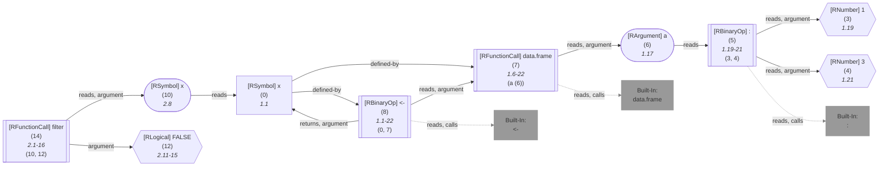

	


</details>


</details>
	


	


<details> 

<summary style="color:gray">Implementation Details</summary>

Responsible for the execution of the Dataframe Shape Inference Query query is `executeDfShapeQuery` in [`./src/queries/catalog/df-shape-query/df-shape-query-format.ts`](https://github.com/flowr-analysis/flowr/tree/main/./src/queries/catalog/df-shape-query/df-shape-query-format.ts).

</details>


-----


### Dependencies Query


This query extracts all dependencies from an R script, using a combination of a [Call-Context Query](#call-context-query)
and more advanced tracking in the [Dataflow Graph](https://github.com/flowr-analysis/flowr/wiki/Dataflow%20Graph).

In other words, if you have a script simply reading: `library(x)`, the following query returns the loaded library:


```json
[ { "type": "dependencies" } ]
```


(This can be shortened to `@dependencies` when used with the REPL command <span title="Description (Repl Command): Query the given R code, start with 'file://' to indicate a file. The query is to be a valid query in json format (use 'help' to get more information).">`:query`</span>).


_Results (prettified and summarized):_

Query: **dependencies** (3 ms)\
&nbsp;&nbsp;&nbsp;╰ Libraries\
&nbsp;&nbsp;&nbsp;&nbsp;&nbsp;&nbsp;&nbsp;╰ `library`\
&nbsp;&nbsp;&nbsp;&nbsp;&nbsp;&nbsp;&nbsp;&nbsp;&nbsp;&nbsp;&nbsp;╰ Node Id: 3, `x`\
_All queries together required ≈5 ms (1ms accuracy, total 4 ms)_

<details> <summary style="color:gray">Show Detailed Results as Json</summary>

The analysis required _4.5 ms_ (including parsing and normalization and the query) within the generation environment.

In general, the JSON contains the Ids of the nodes in question as they are present in the normalized AST or the dataflow graph of flowR.
Please consult the [Interface](https://github.com/flowr-analysis/flowr/wiki/Interface) wiki page for more information on how to get those.


```json
{
  "dependencies": {
    ".meta": {
      "timing": 3
    },
    "library": [
      {
        "nodeId": 3,
        "functionName": "library",
        "value": "x"
      }
    ],
    "source": [],
    "read": [],
    "write": [],
    "visualize": [],
    "test": []
  },
  ".meta": {
    "timing": 5
  }
}
```


</details>


	

Of course, this works for more complicated scripts too. The query offers information on the loaded _libraries_, _sourced_ files, data which is _read_ and data which is _written_.
For example, consider the following script:

```r

source("sample.R")
foo <- loadNamespace("bar")

data <- read.csv("data.csv")

#' @importFrom ggplot2 ggplot geom_point aes
ggplot(data, aes(x=x, y=y)) + geom_point()

better::write.csv(data, "data2.csv")
print("hello world!")
```

The following query returns the dependencies of the script.


```json
[ { "type": "dependencies" } ]
```


(This can be shortened to `@dependencies` when used with the REPL command <span title="Description (Repl Command): Query the given R code, start with 'file://' to indicate a file. The query is to be a valid query in json format (use 'help' to get more information).">`:query`</span>).

 <details> <summary style="color:gray">Show Results</summary>

_Results (prettified and summarized):_

Query: **dependencies** (3 ms)\
&nbsp;&nbsp;&nbsp;╰ Libraries\
&nbsp;&nbsp;&nbsp;&nbsp;&nbsp;&nbsp;&nbsp;╰ `loadNamespace`\
&nbsp;&nbsp;&nbsp;&nbsp;&nbsp;&nbsp;&nbsp;&nbsp;&nbsp;&nbsp;&nbsp;╰ Node Id: 8, `bar`\
&nbsp;&nbsp;&nbsp;&nbsp;&nbsp;&nbsp;&nbsp;╰ `::`\
&nbsp;&nbsp;&nbsp;&nbsp;&nbsp;&nbsp;&nbsp;&nbsp;&nbsp;&nbsp;&nbsp;╰ Node Id: 32, `better`\
&nbsp;&nbsp;&nbsp;╰ Sourced Files\
&nbsp;&nbsp;&nbsp;&nbsp;&nbsp;&nbsp;&nbsp;╰ `source`\
&nbsp;&nbsp;&nbsp;&nbsp;&nbsp;&nbsp;&nbsp;&nbsp;&nbsp;&nbsp;&nbsp;╰ Node Id: 3, `sample.R`\
&nbsp;&nbsp;&nbsp;╰ Read Data\
&nbsp;&nbsp;&nbsp;&nbsp;&nbsp;&nbsp;&nbsp;╰ `read.csv`\
&nbsp;&nbsp;&nbsp;&nbsp;&nbsp;&nbsp;&nbsp;&nbsp;&nbsp;&nbsp;&nbsp;╰ Node Id: 14, `data.csv`\
&nbsp;&nbsp;&nbsp;╰ Written Data\
&nbsp;&nbsp;&nbsp;&nbsp;&nbsp;&nbsp;&nbsp;╰ `write.csv,better,false`\
&nbsp;&nbsp;&nbsp;&nbsp;&nbsp;&nbsp;&nbsp;&nbsp;&nbsp;&nbsp;&nbsp;╰ Node Id: 37, `data2.csv`\
&nbsp;&nbsp;&nbsp;&nbsp;&nbsp;&nbsp;&nbsp;╰ `print`\
&nbsp;&nbsp;&nbsp;&nbsp;&nbsp;&nbsp;&nbsp;&nbsp;&nbsp;&nbsp;&nbsp;╰ Node Id: 41, `stdout`\
&nbsp;&nbsp;&nbsp;╰ Visualizations\
&nbsp;&nbsp;&nbsp;&nbsp;&nbsp;&nbsp;&nbsp;╰ `ggplot`\
&nbsp;&nbsp;&nbsp;&nbsp;&nbsp;&nbsp;&nbsp;&nbsp;&nbsp;&nbsp;&nbsp;╰ Node Id: 28\
&nbsp;&nbsp;&nbsp;&nbsp;&nbsp;&nbsp;&nbsp;╰ `geom_point`\
&nbsp;&nbsp;&nbsp;&nbsp;&nbsp;&nbsp;&nbsp;&nbsp;&nbsp;&nbsp;&nbsp;╰ Node Id: 30, linked: [28]\
_All queries together required ≈7 ms (1ms accuracy, total 7 ms)_

<details> <summary style="color:gray">Show Detailed Results as Json</summary>

The analysis required _7.4 ms_ (including parsing and normalization and the query) within the generation environment.

In general, the JSON contains the Ids of the nodes in question as they are present in the normalized AST or the dataflow graph of flowR.
Please consult the [Interface](https://github.com/flowr-analysis/flowr/wiki/Interface) wiki page for more information on how to get those.


```json
{
  "dependencies": {
    ".meta": {
      "timing": 3
    },
    "library": [
      {
        "nodeId": 8,
        "functionName": "loadNamespace",
        "value": "bar"
      },
      {
        "nodeId": 32,
        "functionName": "::",
        "value": "better"
      }
    ],
    "source": [
      {
        "nodeId": 3,
        "functionName": "source",
        "value": "sample.R"
      }
    ],
    "read": [
      {
        "nodeId": 14,
        "functionName": "read.csv",
        "value": "data.csv"
      }
    ],
    "write": [
      {
        "nodeId": 37,
        "functionName": [
          "write.csv",
          "better",
          false
        ],
        "value": "data2.csv"
      },
      {
        "nodeId": 41,
        "functionName": "print",
        "value": "stdout"
      }
    ],
    "visualize": [
      {
        "nodeId": 28,
        "functionName": "ggplot"
      },
      {
        "nodeId": 30,
        "functionName": "geom_point",
        "linkedIds": [
          28
        ]
      }
    ],
    "test": []
  },
  ".meta": {
    "timing": 7
  }
}
```


</details>


</details>

	

Currently, the dependency extraction may fail as it is essentially a set of heuristics guessing the dependencies.
We welcome any feedback on this (consider opening a [new issue](https://github.com/flowr-analysis/flowr/issues/new/choose)).

In the meantime we offer several properties to overwrite the default behavior (e.g., function names that should be collected)


```json
[
  {
    "type": "dependencies",
    "ignoreDefaultFunctions": true,
    "enabledCategories": [
      "library"
    ],
    "libraryFunctions": [
      {
        "package": "base",
        "name": "print",
        "argIdx": 0,
        "argName": "library",
        "resolveValue": true
      }
    ]
  }
]
```


 <details> <summary style="color:gray">Show Results</summary>

_Results (prettified and summarized):_

Query: **dependencies** (1 ms)\
&nbsp;&nbsp;&nbsp;╰ Libraries\
&nbsp;&nbsp;&nbsp;&nbsp;&nbsp;&nbsp;&nbsp;╰ `print`\
&nbsp;&nbsp;&nbsp;&nbsp;&nbsp;&nbsp;&nbsp;&nbsp;&nbsp;&nbsp;&nbsp;╰ Node Id: 41, `hello world!`\
_All queries together required ≈4 ms (1ms accuracy, total 4 ms)_

<details> <summary style="color:gray">Show Detailed Results as Json</summary>

The analysis required _3.9 ms_ (including parsing and normalization and the query) within the generation environment.

In general, the JSON contains the Ids of the nodes in question as they are present in the normalized AST or the dataflow graph of flowR.
Please consult the [Interface](https://github.com/flowr-analysis/flowr/wiki/Interface) wiki page for more information on how to get those.


```json
{
  "dependencies": {
    ".meta": {
      "timing": 1
    },
    "library": [
      {
        "nodeId": 41,
        "functionName": "print",
        "value": "hello world!"
      }
    ],
    "source": [],
    "read": [],
    "write": [],
    "visualize": [],
    "test": []
  },
  ".meta": {
    "timing": 4
  }
}
```


</details>


</details>

	

Here, `resolveValue` tells the dependency query to resolve the value of this argument in case it is not a constant.
		

<details> 

<summary style="color:gray">Implementation Details</summary>

Responsible for the execution of the Dependencies Query query is `executeDependenciesQuery` in [`./src/queries/catalog/dependencies-query/dependencies-query-executor.ts`](https://github.com/flowr-analysis/flowr/tree/main/./src/queries/catalog/dependencies-query/dependencies-query-executor.ts).

</details>


-----


### Does-Call Query


This query checks whether a function calls another function matching given constraints.

Using the example code:

```r
f <- function(x) { eval(x) };
f("1 + 1")
```

the following query checks whether the call to `f` calls `eval`:


```json
[
  {
    "type": "does-call",
    "queryId": "calls-eval",
    "call": "2@f",
    "calls": {
      "type": "name",
      "name": "eval",
      "nameExact": true
    }
  }
]
```


(This can be shortened to `@does-call (2@f:"eval")` when used with the REPL command <span title="Description (Repl Command): Query the given R code, start with 'file://' to indicate a file. The query is to be a valid query in json format (use 'help' to get more information).">`:query`</span>).


_Results (prettified and summarized):_

Query: **does-call** (5ms)\
&nbsp;&nbsp;- **calls-eval** found:\
&nbsp;&nbsp;&nbsp;&nbsp;- Call with id **15** (2.1)\
_All queries together required ≈5 ms (1ms accuracy, total 6 ms)_

<details> <summary style="color:gray">Show Detailed Results as Json</summary>

The analysis required _5.5 ms_ (including parsing and normalization and the query) within the generation environment.

In general, the JSON contains the Ids of the nodes in question as they are present in the normalized AST or the dataflow graph of flowR.
Please consult the [Interface](https://github.com/flowr-analysis/flowr/wiki/Interface) wiki page for more information on how to get those.


```json
{
  "does-call": {
    ".meta": {
      "timing": 5
    },
    "results": {
      "calls-eval": {
        "call": 15
      }
    }
  },
  ".meta": {
    "timing": 5
  }
}
```


</details>


<details> <summary style="color:gray">Original Code</summary>


```r
f <- function(x) { eval(x) };
f("1 + 1")
```

<details>

<summary style="color:gray">Dataflow Graph of the R Code</summary>

The analysis required _2.3 ms_ (including parse and normalize, using the [r-shell](https://github.com/flowr-analysis/flowr/wiki/Engines) engine) within the generation environment. 
We encountered unknown side effects (with ids: 8) during the analysis.


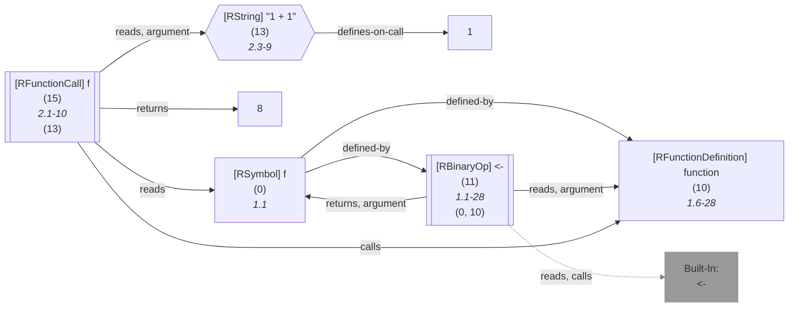

	


</details>


</details>
	


	
		

<details> 

<summary style="color:gray">Implementation Details</summary>

Responsible for the execution of the Does-Call Query query is `executeDoesCallQuery` in [`./src/queries/catalog/does-call-query/does-call-query-executor.ts`](https://github.com/flowr-analysis/flowr/tree/main/./src/queries/catalog/does-call-query/does-call-query-executor.ts).

</details>


-----


### Files Query


This query returns the files that match the given criteria.


```json
[ { "type": "files" } ]
```


(This can be shortened to `@files` when used with the REPL command <span title="Description (Repl Command): Query the given R code, start with 'file://' to indicate a file. The query is to be a valid query in json format (use 'help' to get more information).">`:query`</span>).


_Results (prettified and summarized):_

Query: **files** (0ms)\
&nbsp;&nbsp;&nbsp;╰ Found 0 files\
_All queries together required ≈0 ms (1ms accuracy, total 0 ms)_

<details> <summary style="color:gray">Show Detailed Results as Json</summary>

The analysis required _0.4 ms_ (including parsing and normalization and the query) within the generation environment.

In general, the JSON contains the Ids of the nodes in question as they are present in the normalized AST or the dataflow graph of flowR.
Please consult the [Interface](https://github.com/flowr-analysis/flowr/wiki/Interface) wiki page for more information on how to get those.


```json
{
  "files": {
    ".meta": {
      "timing": 0
    },
    "files": []
  },
  ".meta": {
    "timing": 0
  }
}
```


</details>


<details> <summary style="color:gray">Original Code</summary>


```r

```

<details>

<summary style="color:gray">Dataflow Graph of the R Code</summary>

The analysis required _0.2 ms_ (including parse and normalize, using the [r-shell](https://github.com/flowr-analysis/flowr/wiki/Engines) engine) within the generation environment. 
We encountered no unknown side effects during the analysis.


```mermaid
flowchart LR
```

	


</details>


</details>
	


	
		

<details> 

<summary style="color:gray">Implementation Details</summary>

Responsible for the execution of the Files Query query is `executeFileQuery` in [`./src/queries/catalog/files-query/files-query-executor.ts`](https://github.com/flowr-analysis/flowr/tree/main/./src/queries/catalog/files-query/files-query-executor.ts).

</details>


-----


### Happens-Before Query


With this query you can analyze the control flow graph:

Using the example code:


```r
x <- 1
y <- 2
```


the following query returns that the first assignment happens always before the other:


```json
[
  {
    "type": "happens-before",
    "a": "1@x",
    "b": "2@y"
  }
]
```


_Results (prettified and summarized):_

Query: **happens-before** (2 ms)\
&nbsp;&nbsp;&nbsp;╰ 1@x<2@y: always\
_All queries together required ≈2 ms (1ms accuracy, total 2 ms)_

<details> <summary style="color:gray">Show Detailed Results as Json</summary>

The analysis required _1.8 ms_ (including parsing and normalization and the query) within the generation environment.

In general, the JSON contains the Ids of the nodes in question as they are present in the normalized AST or the dataflow graph of flowR.
Please consult the [Interface](https://github.com/flowr-analysis/flowr/wiki/Interface) wiki page for more information on how to get those.


```json
{
  "happens-before": {
    ".meta": {
      "timing": 2
    },
    "results": {
      "1@x<2@y": "always"
    }
  },
  ".meta": {
    "timing": 2
  }
}
```


</details>


<details> <summary style="color:gray">Original Code</summary>


```r
x <- 1
y <- 2
```

<details>

<summary style="color:gray">Dataflow Graph of the R Code</summary>

The analysis required _1.6 ms_ (including parse and normalize, using the [r-shell](https://github.com/flowr-analysis/flowr/wiki/Engines) engine) within the generation environment. 
We encountered no unknown side effects during the analysis.


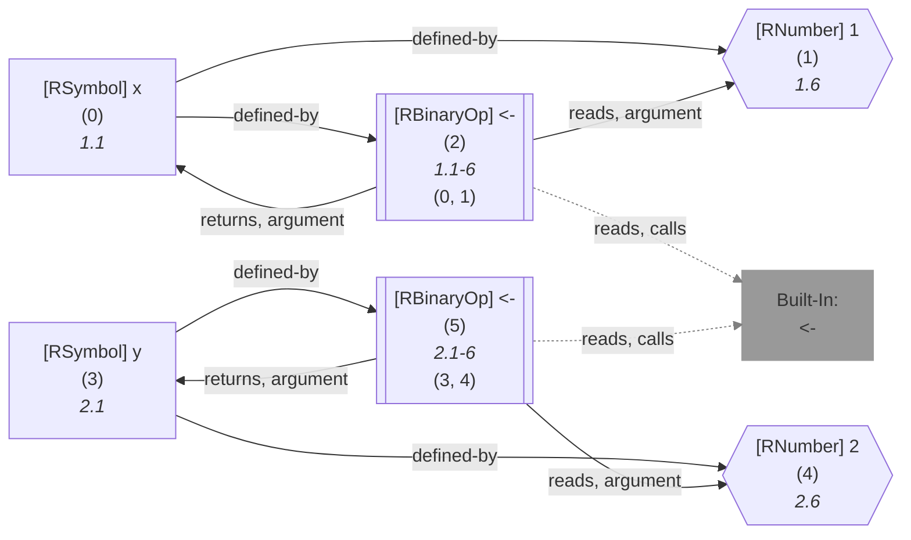

	


</details>


</details>
	


	
		

<details> 

<summary style="color:gray">Implementation Details</summary>

Responsible for the execution of the Happens-Before Query query is `executeSearch` in [`./src/queries/catalog/happens-before-query/happens-before-query-executor.ts`](https://github.com/flowr-analysis/flowr/tree/main/./src/queries/catalog/happens-before-query/happens-before-query-executor.ts).

</details>


-----


### Id-Map Query


This query provides access to all nodes in the [normalized AST](https://github.com/flowr-analysis/flowr/wiki/Normalized%20AST) as a mapping from their id to the node itself. 

Using the example code `x + 1`, the following query returns all nodes from the code:


```json
[ { "type": "id-map" } ]
```


(This can be shortened to `@id-map` when used with the REPL command <span title="Description (Repl Command): Query the given R code, start with 'file://' to indicate a file. The query is to be a valid query in json format (use 'help' to get more information).">`:query`</span>).


_Results (prettified and summarized):_

Query: **id-map** (3 ms)\
&nbsp;&nbsp;&nbsp;╰ Id List: {0, 1, 2, 3}\
_All queries together required ≈3 ms (1ms accuracy, total 3 ms)_

<details> <summary style="color:gray">Show Detailed Results as Json</summary>

The analysis required _2.9 ms_ (including parsing and normalization and the query) within the generation environment.

In general, the JSON contains the Ids of the nodes in question as they are present in the normalized AST or the dataflow graph of flowR.
Please consult the [Interface](https://github.com/flowr-analysis/flowr/wiki/Interface) wiki page for more information on how to get those.


_As the code is pretty long, we inhibit pretty printing and syntax highlighting (JSON, hiding built-in):_

```text
{"id-map":{".meta":{"timing":3},"idMap":{"size":4,"k2v":[[0,{"type":"RSymbol","location":[1,1,1,1],"content":"x","lexeme":"x","info":{"fullRange":[1,1,1,1],"adToks":[],"id":0,"parent":2,"role":"bin-l","index":0,"nesting":0}}],[1,{"location":[1,5,1,5],"lexeme":"1","info":{"fullRange":[1,5,1,5],"adToks":[],"id":1,"parent":2,"role":"bin-r","index":1,"nesting":0},"type":"RNumber","content":{"num":1,"complexNumber":false,"markedAsInt":false}}],[2,{"type":"RBinaryOp","location":[1,3,1,3],"lhs":{"type":"RSymbol","location":[1,1,1,1],"content":"x","lexeme":"x","info":{"fullRange":[1,1,1,1],"adToks":[],"id":0,"parent":2,"role":"bin-l","index":0,"nesting":0}},"rhs":{"location":[1,5,1,5],"lexeme":"1","info":{"fullRange":[1,5,1,5],"adToks":[],"id":1,"parent":2,"role":"bin-r","index":1,"nesting":0},"type":"RNumber","content":{"num":1,"complexNumber":false,"markedAsInt":false}},"operator":"+","lexeme":"+","info":{"fullRange":[1,1,1,5],"adToks":[],"id":2,"parent":3,"nesting":0,"index":0,"role":"el-c"}}],[3,{"type":"RExpressionList","children":[{"type":"RBinaryOp","location":[1,3,1,3],"lhs":{"type":"RSymbol","location":[1,1,1,1],"content":"x","lexeme":"x","info":{"fullRange":[1,1,1,1],"adToks":[],"id":0,"parent":2,"role":"bin-l","index":0,"nesting":0}},"rhs":{"location":[1,5,1,5],"lexeme":"1","info":{"fullRange":[1,5,1,5],"adToks":[],"id":1,"parent":2,"role":"bin-r","index":1,"nesting":0},"type":"RNumber","content":{"num":1,"complexNumber":false,"markedAsInt":false}},"operator":"+","lexeme":"+","info":{"fullRange":[1,1,1,5],"adToks":[],"id":2,"parent":3,"nesting":0,"index":0,"role":"el-c"}}],"info":{"adToks":[],"id":3,"nesting":0,"role":"root","index":0}}]],"v2k":{}}},".meta":{"timing":3}}
```


</details>


<details> <summary style="color:gray">Original Code</summary>


```r
x + 1
```

<details>

<summary style="color:gray">Dataflow Graph of the R Code</summary>

The analysis required _1.3 ms_ (including parse and normalize, using the [r-shell](https://github.com/flowr-analysis/flowr/wiki/Engines) engine) within the generation environment. 
We encountered no unknown side effects during the analysis.


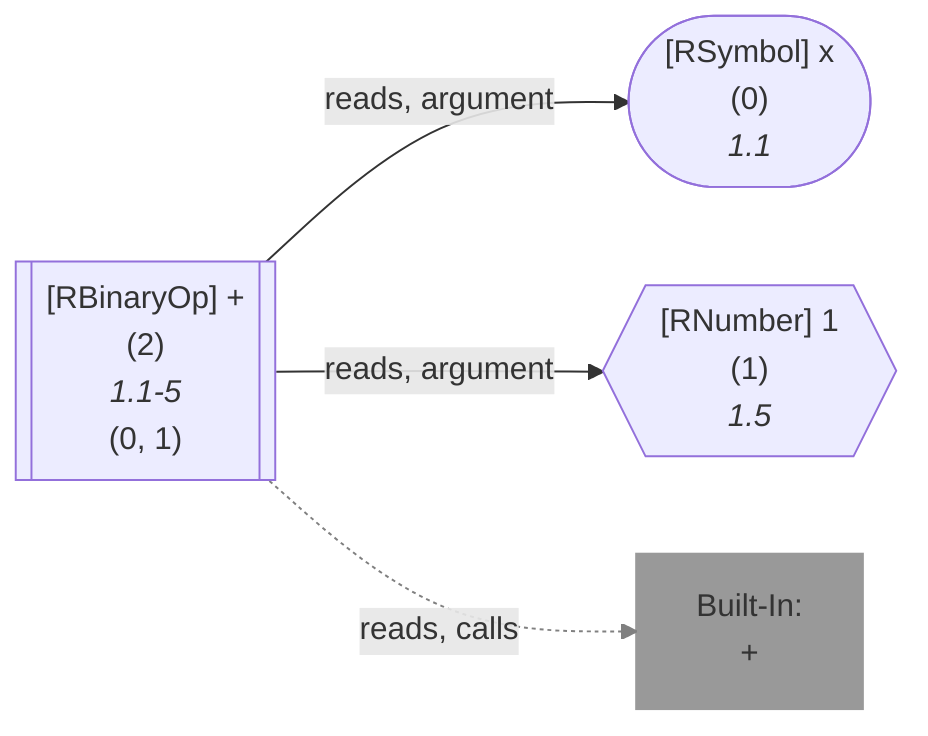

	


</details>


</details>
	


	
		

<details> 

<summary style="color:gray">Implementation Details</summary>

Responsible for the execution of the Id-Map Query query is `executeIdMapQuery` in [`./src/queries/catalog/id-map-query/id-map-query-executor.ts`](https://github.com/flowr-analysis/flowr/tree/main/./src/queries/catalog/id-map-query/id-map-query-executor.ts).

</details>


-----


### Inspect Exceptions of Functions Query


With this query you can identify which functions in the code throw exceptions (known to flowR).

Using the following example code:

```r
mayFail <- function(x) {
  if(x < 0) stop("Negative value!")
  else sqrt(x)
}
safeFail <- function(x) {
  tryCatch(
    mayFail(x),
    error = function(e) { NA }
  )
}
```

the following query returns the information for all identified function definitions whether they throw exceptions:


```json
[ { "type": "inspect-exception" } ]
```


(This can be shortened to `@inspect-exception` when used with the REPL command <span title="Description (Repl Command): Query the given R code, start with 'file://' to indicate a file. The query is to be a valid query in json format (use 'help' to get more information).">`:query`</span>).


_Results (prettified and summarized):_

Query: **inspect-exception** (5ms)\
&nbsp;&nbsp;- Function **20** (1.12-4.1) throws exceptions:\
&nbsp;&nbsp;&nbsp;&nbsp;&nbsp;&nbsp;- Exception maybe thrown at id **11** "stop" (2.13-35, cds: true:2.3-3.14)\
&nbsp;&nbsp;- Function **40** (8.13-30) does not throw exceptions.\
&nbsp;&nbsp;- Function **44** (5.13-10.1) throws exceptions:\
&nbsp;&nbsp;&nbsp;&nbsp;&nbsp;&nbsp;- Exception maybe thrown at id **11** "stop" (2.13-35, cds: true:2.3-3.14)\
_All queries together required ≈5 ms (1ms accuracy, total 6 ms)_

<details> <summary style="color:gray">Show Detailed Results as Json</summary>

The analysis required _5.7 ms_ (including parsing and normalization and the query) within the generation environment.

In general, the JSON contains the Ids of the nodes in question as they are present in the normalized AST or the dataflow graph of flowR.
Please consult the [Interface](https://github.com/flowr-analysis/flowr/wiki/Interface) wiki page for more information on how to get those.


```json
{
  "inspect-exception": {
    ".meta": {
      "timing": 5
    },
    "exceptions": {
      "20": [
        {
          "id": 11,
          "cds": [
            {
              "id": 18,
              "when": true
            }
          ]
        }
      ],
      "40": [],
      "44": [
        {
          "id": 11,
          "cds": [
            {
              "id": 18,
              "when": true
            }
          ]
        }
      ]
    }
  },
  ".meta": {
    "timing": 5
  }
}
```


</details>


<details> <summary style="color:gray">Original Code</summary>


```r
mayFail <- function(x) {
  if(x < 0) stop("Negative value!")
  else sqrt(x)
}
safeFail <- function(x) {
  tryCatch(
    mayFail(x),
    error = function(e) { NA }
  )
}
```

<details>

<summary style="color:gray">Dataflow Graph of the R Code</summary>

The analysis required _3.9 ms_ (including parse and normalize, using the [r-shell](https://github.com/flowr-analysis/flowr/wiki/Engines) engine) within the generation environment. 
We encountered no unknown side effects during the analysis.


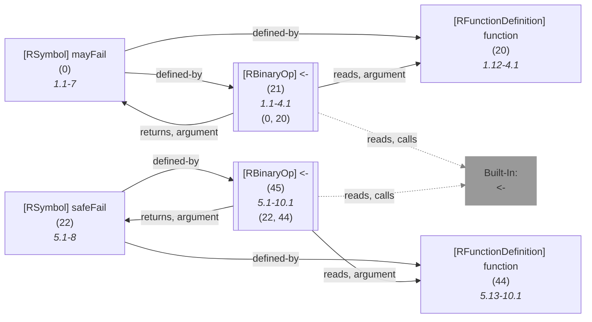

	


</details>


</details>
	


	
		

<details> 

<summary style="color:gray">Implementation Details</summary>

Responsible for the execution of the Inspect Exceptions of Functions Query query is `executeExceptionQuery` in [`./src/queries/catalog/inspect-exceptions-query/inspect-exception-query-executor.ts`](https://github.com/flowr-analysis/flowr/tree/main/./src/queries/catalog/inspect-exceptions-query/inspect-exception-query-executor.ts).

</details>


-----


### Inspect Higher-Order Functions Query


With this query you can identify which functions in the code are higher-order functions, i.e., either take a function as an argument or return a function.
Please note, that functions that are just identities (e.g., `function(x) x`) are not considered higher-order if they do not take a function as an argument.

Using the example code `f <- function() function(x) x; f()` the following query returns the information for all identified function definitions whether they are higher-order functions:


```json
[ { "type": "inspect-higher-order" } ]
```


(This can be shortened to `@inspect-higher-order` when used with the REPL command <span title="Description (Repl Command): Query the given R code, start with 'file://' to indicate a file. The query is to be a valid query in json format (use 'help' to get more information).">`:query`</span>).


_Results (prettified and summarized):_

Query: **inspect-higher-order** (2ms)\
&nbsp;&nbsp;- Function **5** (1.17-29) is not a higher-order function\
&nbsp;&nbsp;- Function **7** (1.6-29) is a higher-order function\
_All queries together required ≈2 ms (1ms accuracy, total 3 ms)_

<details> <summary style="color:gray">Show Detailed Results as Json</summary>

The analysis required _2.6 ms_ (including parsing and normalization and the query) within the generation environment.

In general, the JSON contains the Ids of the nodes in question as they are present in the normalized AST or the dataflow graph of flowR.
Please consult the [Interface](https://github.com/flowr-analysis/flowr/wiki/Interface) wiki page for more information on how to get those.


```json
{
  "inspect-higher-order": {
    ".meta": {
      "timing": 2
    },
    "higherOrder": {
      "5": false,
      "7": true
    }
  },
  ".meta": {
    "timing": 2
  }
}
```


</details>


<details> <summary style="color:gray">Original Code</summary>


```r
f <- function() function(x) x; f()
```

<details>

<summary style="color:gray">Dataflow Graph of the R Code</summary>

The analysis required _1.9 ms_ (including parse and normalize, using the [r-shell](https://github.com/flowr-analysis/flowr/wiki/Engines) engine) within the generation environment. 
We encountered no unknown side effects during the analysis.


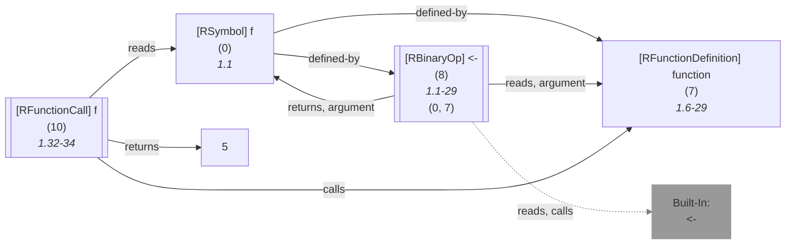

	


</details>


</details>
	


	

This query also supports a slicing criterion based query mode that only returns information for functions matching the given criteria:


```json
[
  {
    "type": "inspect-higher-order",
    "filter": [
      "1@function"
    ]
  }
]
```


(This can be shortened to `@inspect-higher-order (1@function) "f <- function() function(x) x; f()"` when used with the REPL command <span title="Description (Repl Command): Query the given R code, start with 'file://' to indicate a file. The query is to be a valid query in json format (use 'help' to get more information).">`:query`</span>).


_Results (prettified and summarized):_

Query: **inspect-higher-order** (1ms)\
&nbsp;&nbsp;- Function **5** (1.17-29) is not a higher-order function\
_All queries together required ≈1 ms (1ms accuracy, total 2 ms)_

<details> <summary style="color:gray">Show Detailed Results as Json</summary>

The analysis required _1.9 ms_ (including parsing and normalization and the query) within the generation environment.

In general, the JSON contains the Ids of the nodes in question as they are present in the normalized AST or the dataflow graph of flowR.
Please consult the [Interface](https://github.com/flowr-analysis/flowr/wiki/Interface) wiki page for more information on how to get those.


```json
{
  "inspect-higher-order": {
    ".meta": {
      "timing": 1
    },
    "higherOrder": {
      "5": false
    }
  },
  ".meta": {
    "timing": 1
  }
}
```


</details>


	
		

<details> 

<summary style="color:gray">Implementation Details</summary>

Responsible for the execution of the Inspect Higher-Order Functions Query query is `executeHigherOrderQuery` in [`./src/queries/catalog/inspect-higher-order-query/inspect-higher-order-query-executor.ts`](https://github.com/flowr-analysis/flowr/tree/main/./src/queries/catalog/inspect-higher-order-query/inspect-higher-order-query-executor.ts).

</details>


-----


### Inspect Recursive Functions Query


With this query you can identify which functions in the code are recursive.
Please note, that functions that *may* be recursive due to indirect calls are also considered recursive.

Using the example code `fact <- function(n) { if(n <= 1) 1 else n * fact(n - 1) }` the following query returns the information for all identified function definitions whether they are recursive:


```json
[ { "type": "inspect-recursion" } ]
```


(This can be shortened to `@inspect-recursion` when used with the REPL command <span title="Description (Repl Command): Query the given R code, start with 'file://' to indicate a file. The query is to be a valid query in json format (use 'help' to get more information).">`:query`</span>).


_Results (prettified and summarized):_

Query: **inspect-recursion** (2ms)\
&nbsp;&nbsp;- Function **21** (1.9-57) is recursive\
_All queries together required ≈2 ms (1ms accuracy, total 3 ms)_

<details> <summary style="color:gray">Show Detailed Results as Json</summary>

The analysis required _3.0 ms_ (including parsing and normalization and the query) within the generation environment.

In general, the JSON contains the Ids of the nodes in question as they are present in the normalized AST or the dataflow graph of flowR.
Please consult the [Interface](https://github.com/flowr-analysis/flowr/wiki/Interface) wiki page for more information on how to get those.


```json
{
  "inspect-recursion": {
    ".meta": {
      "timing": 2
    },
    "recursive": {
      "21": true
    }
  },
  ".meta": {
    "timing": 2
  }
}
```


</details>


<details> <summary style="color:gray">Original Code</summary>


```r
fact <- function(n) { if(n <= 1) 1 else n * fact(n - 1) }
```

<details>

<summary style="color:gray">Dataflow Graph of the R Code</summary>

The analysis required _2.9 ms_ (including parse and normalize, using the [r-shell](https://github.com/flowr-analysis/flowr/wiki/Engines) engine) within the generation environment. 
We encountered no unknown side effects during the analysis.


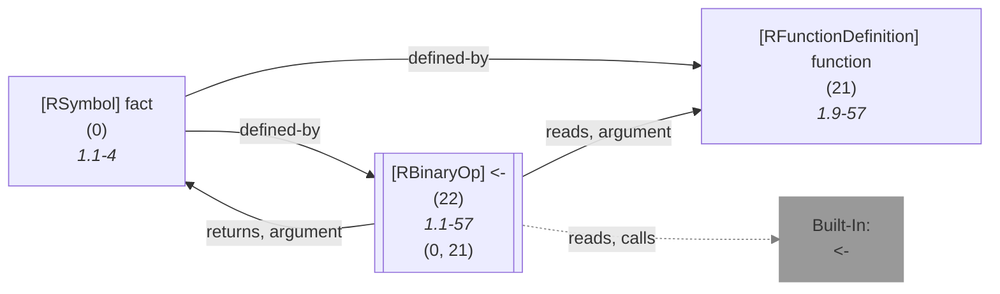

	


</details>


</details>
	


	

This query also supports a slicing criterion based query mode that only returns information for functions matching the given criteria:


```json
[
  {
    "type": "inspect-recursion",
    "filter": [
      "1@function"
    ]
  }
]
```


(This can be shortened to `@inspect-recursion (1@function) "fact <- function(n) { if(n <= 1) 1 else n * fact(n - 1) }"` when used with the REPL command <span title="Description (Repl Command): Query the given R code, start with 'file://' to indicate a file. The query is to be a valid query in json format (use 'help' to get more information).">`:query`</span>).


_Results (prettified and summarized):_

Query: **inspect-recursion** (3ms)\
&nbsp;&nbsp;- Function **21** (1.9-57) is recursive\
_All queries together required ≈3 ms (1ms accuracy, total 3 ms)_

<details> <summary style="color:gray">Show Detailed Results as Json</summary>

The analysis required _2.9 ms_ (including parsing and normalization and the query) within the generation environment.

In general, the JSON contains the Ids of the nodes in question as they are present in the normalized AST or the dataflow graph of flowR.
Please consult the [Interface](https://github.com/flowr-analysis/flowr/wiki/Interface) wiki page for more information on how to get those.


```json
{
  "inspect-recursion": {
    ".meta": {
      "timing": 3
    },
    "recursive": {
      "21": true
    }
  },
  ".meta": {
    "timing": 3
  }
}
```


</details>


<details> <summary style="color:gray">Original Code</summary>


```r
fact <- function(n) { if(n <= 1) 1 else n * fact(n - 1) }
```

<details>

<summary style="color:gray">Dataflow Graph of the R Code</summary>

The analysis required _2.3 ms_ (including parse and normalize, using the [r-shell](https://github.com/flowr-analysis/flowr/wiki/Engines) engine) within the generation environment. 
We encountered no unknown side effects during the analysis.


	


</details>


</details>
	


	
		

<details> 

<summary style="color:gray">Implementation Details</summary>

Responsible for the execution of the Inspect Recursive Functions Query query is `executeRecursionQuery` in [`./src/queries/catalog/inspect-recursion-query/inspect-recursion-query-executor.ts`](https://github.com/flowr-analysis/flowr/tree/main/./src/queries/catalog/inspect-recursion-query/inspect-recursion-query-executor.ts).

</details>


-----


### Linter Query


This query lints a given R script for common issues, such as missing files, unused variables, and more.

In other words, if you have a script simply reading: `read.csv("i_do_not_exist.csv")`, the following query returns all smells detected:


```json
[ { "type": "linter" } ]
```


(This can be shortened to `@linter` when used with the REPL command <span title="Description (Repl Command): Query the given R code, start with 'file://' to indicate a file. The query is to be a valid query in json format (use 'help' to get more information).">`:query`</span>).


_Results (prettified and summarized):_

Query: **linter** (7 ms)\
&nbsp;&nbsp;&nbsp;╰ **Deprecated Functions** (deprecated-functions):\
&nbsp;&nbsp;&nbsp;&nbsp;&nbsp;&nbsp;&nbsp;╰ _Metadata_: <code>totalCalls: 0, totalFunctionDefinitions: 0, searchTimeMs: 2, processTimeMs: 0</code>\
&nbsp;&nbsp;&nbsp;╰ **File Path Validity** (file-path-validity):\
&nbsp;&nbsp;&nbsp;&nbsp;&nbsp;&nbsp;&nbsp;╰ certain:\
&nbsp;&nbsp;&nbsp;&nbsp;&nbsp;&nbsp;&nbsp;&nbsp;&nbsp;&nbsp;&nbsp;╰ Path `i_do_not_exist.csv` at 1.1-30\
&nbsp;&nbsp;&nbsp;&nbsp;&nbsp;&nbsp;&nbsp;╰ _Metadata_: <code>totalReads: 1, totalUnknown: 0, totalWritesBeforeAlways: 0, totalValid: 0, searchTimeMs: 1, processTimeMs: 0</code>\
&nbsp;&nbsp;&nbsp;╰ **Seeded Randomness** (seeded-randomness):\
&nbsp;&nbsp;&nbsp;&nbsp;&nbsp;&nbsp;&nbsp;╰ _Metadata_: <code>consumerCalls: 0, callsWithFunctionProducers: 0, callsWithAssignmentProducers: 0, callsWithNonConstantProducers: 0, callsWithOtherBranchProducers: 0, searchTimeMs: 1, processTimeMs: 0</code>\
&nbsp;&nbsp;&nbsp;╰ **Absolute Paths** (absolute-file-paths):\
&nbsp;&nbsp;&nbsp;&nbsp;&nbsp;&nbsp;&nbsp;╰ _Metadata_: <code>totalConsidered: 1, totalUnknown: 0, searchTimeMs: 0, processTimeMs: 1</code>\
&nbsp;&nbsp;&nbsp;╰ **Unused Definitions** (unused-definitions):\
&nbsp;&nbsp;&nbsp;&nbsp;&nbsp;&nbsp;&nbsp;╰ _Metadata_: <code>totalConsidered: 0, searchTimeMs: 0, processTimeMs: 0</code>\
&nbsp;&nbsp;&nbsp;╰ **Naming Convention** (naming-convention):\
&nbsp;&nbsp;&nbsp;&nbsp;&nbsp;&nbsp;&nbsp;╰ _Metadata_: <code>numMatches: 0, numBreak: 0, searchTimeMs: 0, processTimeMs: 0</code>\
&nbsp;&nbsp;&nbsp;╰ **Network Functions** (network-functions):\
&nbsp;&nbsp;&nbsp;&nbsp;&nbsp;&nbsp;&nbsp;╰ _Metadata_: <code>totalCalls: 0, totalFunctionDefinitions: 0, searchTimeMs: 0, processTimeMs: 1</code>\
&nbsp;&nbsp;&nbsp;╰ **Dataframe Access Validation** (dataframe-access-validation):\
&nbsp;&nbsp;&nbsp;&nbsp;&nbsp;&nbsp;&nbsp;╰ _Metadata_: <code>numOperations: 0, numAccesses: 0, totalAccessed: 0, searchTimeMs: 0, processTimeMs: 1</code>\
&nbsp;&nbsp;&nbsp;╰ **Dead Code** (dead-code):\
&nbsp;&nbsp;&nbsp;&nbsp;&nbsp;&nbsp;&nbsp;╰ _Metadata_: <code>consideredNodes: 5, searchTimeMs: 0, processTimeMs: 0</code>\
&nbsp;&nbsp;&nbsp;╰ **Useless Loops** (useless-loop):\
&nbsp;&nbsp;&nbsp;&nbsp;&nbsp;&nbsp;&nbsp;╰ _Metadata_: <code>numOfUselessLoops: 0, searchTimeMs: 0, processTimeMs: 0</code>\
_All queries together required ≈8 ms (1ms accuracy, total 8 ms)_

<details> <summary style="color:gray">Show Detailed Results as Json</summary>

The analysis required _8.1 ms_ (including parsing and normalization and the query) within the generation environment.

In general, the JSON contains the Ids of the nodes in question as they are present in the normalized AST or the dataflow graph of flowR.
Please consult the [Interface](https://github.com/flowr-analysis/flowr/wiki/Interface) wiki page for more information on how to get those.


```json
{
  "linter": {
    "results": {
      "deprecated-functions": {
        "results": [],
        ".meta": {
          "totalCalls": 0,
          "totalFunctionDefinitions": 0,
          "searchTimeMs": 2,
          "processTimeMs": 0
        }
      },
      "file-path-validity": {
        "results": [
          {
            "involvedId": 3,
            "loc": [
              1,
              1,
              1,
              30
            ],
            "filePath": "i_do_not_exist.csv",
            "certainty": "certain"
          }
        ],
        ".meta": {
          "totalReads": 1,
          "totalUnknown": 0,
          "totalWritesBeforeAlways": 0,
          "totalValid": 0,
          "searchTimeMs": 1,
          "processTimeMs": 0
        }
      },
      "seeded-randomness": {
        "results": [],
        ".meta": {
          "consumerCalls": 0,
          "callsWithFunctionProducers": 0,
          "callsWithAssignmentProducers": 0,
          "callsWithNonConstantProducers": 0,
          "callsWithOtherBranchProducers": 0,
          "searchTimeMs": 1,
          "processTimeMs": 0
        }
      },
      "absolute-file-paths": {
        "results": [],
        ".meta": {
          "totalConsidered": 1,
          "totalUnknown": 0,
          "searchTimeMs": 0,
          "processTimeMs": 1
        }
      },
      "unused-definitions": {
        "results": [],
        ".meta": {
          "totalConsidered": 0,
          "searchTimeMs": 0,
          "processTimeMs": 0
        }
      },
      "naming-convention": {
        "results": [],
        ".meta": {
          "numMatches": 0,
          "numBreak": 0,
          "searchTimeMs": 0,
          "processTimeMs": 0
        }
      },
      "network-functions": {
        "results": [],
        ".meta": {
          "totalCalls": 0,
          "totalFunctionDefinitions": 0,
          "searchTimeMs": 0,
          "processTimeMs": 1
        }
      },
      "dataframe-access-validation": {
        "results": [],
        ".meta": {
          "numOperations": 0,
          "numAccesses": 0,
          "totalAccessed": 0,
          "searchTimeMs": 0,
          "processTimeMs": 1
        }
      },
      "dead-code": {
        "results": [],
        ".meta": {
          "consideredNodes": 5,
          "searchTimeMs": 0,
          "processTimeMs": 0
        }
      },
      "useless-loop": {
        "results": [],
        ".meta": {
          "numOfUselessLoops": 0,
          "searchTimeMs": 0,
          "processTimeMs": 0
        }
      }
    },
    ".meta": {
      "timing": 7
    }
  },
  ".meta": {
    "timing": 8
  }
}
```


</details>


	

You can also configure which rules to apply and what settings to use for these rules:


```json
[ { "type": "linter",   "rules": [ "file-path-validity" ] } ]
```


(This can be shortened to `@linter rules:file-path-validity "read.csv("i_do_not_exist.csv")"` when used with the REPL command <span title="Description (Repl Command): Query the given R code, start with 'file://' to indicate a file. The query is to be a valid query in json format (use 'help' to get more information).">`:query`</span>).


_Results (prettified and summarized):_

Query: **linter** (3 ms)\
&nbsp;&nbsp;&nbsp;╰ **File Path Validity** (file-path-validity):\
&nbsp;&nbsp;&nbsp;&nbsp;&nbsp;&nbsp;&nbsp;╰ certain:\
&nbsp;&nbsp;&nbsp;&nbsp;&nbsp;&nbsp;&nbsp;&nbsp;&nbsp;&nbsp;&nbsp;╰ Path `i_do_not_exist.csv` at 1.1-30\
&nbsp;&nbsp;&nbsp;&nbsp;&nbsp;&nbsp;&nbsp;╰ _Metadata_: <code>totalReads: 1, totalUnknown: 0, totalWritesBeforeAlways: 0, totalValid: 0, searchTimeMs: 3, processTimeMs: 0</code>\
_All queries together required ≈3 ms (1ms accuracy, total 3 ms)_

<details> <summary style="color:gray">Show Detailed Results as Json</summary>

The analysis required _3.2 ms_ (including parsing and normalization and the query) within the generation environment.

In general, the JSON contains the Ids of the nodes in question as they are present in the normalized AST or the dataflow graph of flowR.
Please consult the [Interface](https://github.com/flowr-analysis/flowr/wiki/Interface) wiki page for more information on how to get those.


```json
{
  "linter": {
    "results": {
      "file-path-validity": {
        "results": [
          {
            "involvedId": 3,
            "loc": [
              1,
              1,
              1,
              30
            ],
            "filePath": "i_do_not_exist.csv",
            "certainty": "certain"
          }
        ],
        ".meta": {
          "totalReads": 1,
          "totalUnknown": 0,
          "totalWritesBeforeAlways": 0,
          "totalValid": 0,
          "searchTimeMs": 3,
          "processTimeMs": 0
        }
      }
    },
    ".meta": {
      "timing": 3
    }
  },
  ".meta": {
    "timing": 3
  }
}
```


</details>


	

We welcome any feedback and suggestions for new rules on this (consider opening a [new issue](https://github.com/flowr-analysis/flowr/issues/new/choose)).
		

<details> 

<summary style="color:gray">Implementation Details</summary>

Responsible for the execution of the Linter Query query is `executeDependenciesQuery` in [`./src/queries/catalog/linter-query/linter-query-executor.ts`](https://github.com/flowr-analysis/flowr/tree/main/./src/queries/catalog/linter-query/linter-query-executor.ts).

</details>


-----


### Location Map Query


A query like the [Id-Map Query](#id-map-query) query can return a huge result, especially for larger scripts.
If you are not interested in all of the information contained within the full map, you can use the location map query to get a simple mapping of ids to their location in the source file.   

Consider you have the following code:


```r
x + 1
x * 2
```


The following query then gives you the aforementioned mapping:


```json
[ { "type": "location-map" } ]
```


(This can be shortened to `@location-map` when used with the REPL command <span title="Description (Repl Command): Query the given R code, start with 'file://' to indicate a file. The query is to be a valid query in json format (use 'help' to get more information).">`:query`</span>).


_Results (prettified and summarized):_

Query: **location-map** (1 ms)\
&nbsp;&nbsp;&nbsp;╰ File List:\
&nbsp;&nbsp;&nbsp;&nbsp;&nbsp;&nbsp;╰ 0: `@inline`\
&nbsp;&nbsp;&nbsp;╰ Id List: {<span title="['0','1','2','3','4','5','2-arg','5-arg','0-arg','1-arg','3-arg','4-arg']">0, 1, 2, 3, 4, 5, 2-arg, ... (see JSON)</span>}\
_All queries together required ≈2 ms (1ms accuracy, total 2 ms)_

<details> <summary style="color:gray">Show Detailed Results as Json</summary>

The analysis required _2.3 ms_ (including parsing and normalization and the query) within the generation environment.

In general, the JSON contains the Ids of the nodes in question as they are present in the normalized AST or the dataflow graph of flowR.
Please consult the [Interface](https://github.com/flowr-analysis/flowr/wiki/Interface) wiki page for more information on how to get those.


```json
{
  "location-map": {
    ".meta": {
      "timing": 1
    },
    "map": {
      "files": {
        "0": "@inline"
      },
      "ids": {
        "0": [
          0,
          [
            1,
            1,
            1,
            1
          ]
        ],
        "1": [
          0,
          [
            1,
            5,
            1,
            5
          ]
        ],
        "2": [
          0,
          [
            1,
            3,
            1,
            3
          ]
        ],
        "3": [
          0,
          [
            2,
            1,
            2,
            1
          ]
        ],
        "4": [
          0,
          [
            2,
            5,
            2,
            5
          ]
        ],
        "5": [
          0,
          [
            2,
            3,
            2,
            3
          ]
        ],
        "2-arg": [
          0,
          [
            1,
            3,
            1,
            3
          ]
        ],
        "5-arg": [
          0,
          [
            2,
            3,
            2,
            3
          ]
        ],
        "0-arg": [
          0,
          [
            1,
            1,
            1,
            1
          ]
        ],
        "1-arg": [
          0,
          [
            1,
            5,
            1,
            5
          ]
        ],
        "3-arg": [
          0,
          [
            2,
            1,
            2,
            1
          ]
        ],
        "4-arg": [
          0,
          [
            2,
            5,
            2,
            5
          ]
        ]
      }
    }
  },
  ".meta": {
    "timing": 2
  }
}
```


</details>


	

The query also accepts a list of slice criteria to filter the results to only include the locations of specific nodes. For example:


```json
[ { "type": "location-map",   "ids": [ "1@x",    "2@x" ] } ]
```


(This can be shortened to `@location-map (1@x;2@x) "x + 1\nx * 2"` when used with the REPL command <span title="Description (Repl Command): Query the given R code, start with 'file://' to indicate a file. The query is to be a valid query in json format (use 'help' to get more information).">`:query`</span>).


_Results (prettified and summarized):_

Query: **location-map** (0 ms)\
&nbsp;&nbsp;&nbsp;╰ File List:\
&nbsp;&nbsp;&nbsp;&nbsp;&nbsp;&nbsp;╰ 0: `@inline`\
&nbsp;&nbsp;&nbsp;╰ Id List: {0, 3}\
_All queries together required ≈2 ms (1ms accuracy, total 2 ms)_

<details> <summary style="color:gray">Show Detailed Results as Json</summary>

The analysis required _2.0 ms_ (including parsing and normalization and the query) within the generation environment.

In general, the JSON contains the Ids of the nodes in question as they are present in the normalized AST or the dataflow graph of flowR.
Please consult the [Interface](https://github.com/flowr-analysis/flowr/wiki/Interface) wiki page for more information on how to get those.


```json
{
  "location-map": {
    ".meta": {
      "timing": 0
    },
    "map": {
      "files": {
        "0": "@inline"
      },
      "ids": {
        "0": [
          0,
          [
            1,
            1,
            1,
            1
          ]
        ],
        "3": [
          0,
          [
            2,
            1,
            2,
            1
          ]
        ]
      }
    }
  },
  ".meta": {
    "timing": 2
  }
}
```


</details>


	

All locations are given as a <a href="https://github.com/flowr-analysis/flowr/tree/main//src/util/range.ts#L53"><code><span title="**Please note** that for multi-file projects we also have a source location type that includes the file name. Describe the start and end source position of an element.">SourceRange</span></code></a> paired with the file id in the format `[file-id, [start-line, start-column, end-line, end-column]]`.

		

<details> 

<summary style="color:gray">Implementation Details</summary>

Responsible for the execution of the Location Map Query query is `executeLocationMapQuery` in [`./src/queries/catalog/location-map-query/location-map-query-executor.ts`](https://github.com/flowr-analysis/flowr/tree/main/./src/queries/catalog/location-map-query/location-map-query-executor.ts).

</details>


-----


### Normalized AST Query


Maybe you want to handle only the result of the query execution, or you just need the [normalized AST](https://github.com/flowr-analysis/flowr/wiki/Normalized%20AST) again.
This query type does exactly that!

Using the example code `x + 1`, the following query returns the normalized AST of the code:


```json
[ { "type": "normalized-ast" } ]
```


(This can be shortened to `@normalized-ast` when used with the REPL command <span title="Description (Repl Command): Query the given R code, start with 'file://' to indicate a file. The query is to be a valid query in json format (use 'help' to get more information).">`:query`</span>).


_Results (prettified and summarized):_

Query: **normalized-ast** (1 ms)\
&nbsp;&nbsp;&nbsp;╰ [Normalized AST](https://mermaid.live/view#base64:eyJjb2RlIjoiZmxvd2NoYXJ0IFREXG4gICAgbjMoW1wiUkV4cHJlc3Npb25MaXN0ICgzKVxuIFwiXSlcbiAgICBuMihbXCJSQmluYXJ5T3AgKDIpXG4jNDM7XCJdKVxuICAgIG4zIC0tPnxcImVsLWMtMFwifCBuMlxuICAgIG4wKFtcIlJTeW1ib2wgKDApXG54XCJdKVxuICAgIG4yIC0tPnxcImJpbi1sXCJ8IG4wXG4gICAgbjEoW1wiUk51bWJlciAoMSlcbjFcIl0pXG4gICAgbjIgLS0+fFwiYmluLXJcInwgbjFcbiIsIm1lcm1haWQiOnsiYXV0b1N5bmMiOnRydWV9fQ==)\
_All queries together required ≈1 ms (1ms accuracy, total 2 ms)_

<details> <summary style="color:gray">Show Detailed Results as Json</summary>

The analysis required _1.6 ms_ (including parsing and normalization and the query) within the generation environment.

In general, the JSON contains the Ids of the nodes in question as they are present in the normalized AST or the dataflow graph of flowR.
Please consult the [Interface](https://github.com/flowr-analysis/flowr/wiki/Interface) wiki page for more information on how to get those.


_As the code is pretty long, we inhibit pretty printing and syntax highlighting (JSON, hiding built-in):_

```text
{"normalized-ast":{".meta":{"timing":1},"normalized":{"ast":{"type":"RProject","files":[{"root":{"type":"RExpressionList","children":[{"type":"RBinaryOp","location":[1,3,1,3],"lhs":{"type":"RSymbol","location":[1,1,1,1],"content":"x","lexeme":"x","info":{"fullRange":[1,1,1,1],"adToks":[],"id":0,"parent":2,"role":"bin-l","index":0,"nesting":0}},"rhs":{"location":[1,5,1,5],"lexeme":"1","info":{"fullRange":[1,5,1,5],"adToks":[],"id":1,"parent":2,"role":"bin-r","index":1,"nesting":0},"type":"RNumber","content":{"num":1,"complexNumber":false,"markedAsInt":false}},"operator":"+","lexeme":"+","info":{"fullRange":[1,1,1,5],"adToks":[],"id":2,"parent":3,"nesting":0,"index":0,"role":"el-c"}}],"info":{"adToks":[],"id":3,"nesting":0,"role":"root","index":0}}}],"info":{"id":4}},"idMap":{"size":4,"k2v":[[0,{"type":"RSymbol","location":[1,1,1,1],"content":"x","lexeme":"x","info":{"fullRange":[1,1,1,1],"adToks":[],"id":0,"parent":2,"role":"bin-l","index":0,"nesting":0}}],[1,{"location":[1,5,1,5],"lexeme":"1","info":{"fullRange":[1,5,1,5],"adToks":[],"id":1,"parent":2,"role":"bin-r","index":1,"nesting":0},"type":"RNumber","content":{"num":1,"complexNumber":false,"markedAsInt":false}}],[2,{"type":"RBinaryOp","location":[1,3,1,3],"lhs":{"type":"RSymbol","location":[1,1,1,1],"content":"x","lexeme":"x","info":{"fullRange":[1,1,1,1],"adToks":[],"id":0,"parent":2,"role":"bin-l","index":0,"nesting":0}},"rhs":{"location":[1,5,1,5],"lexeme":"1","info":{"fullRange":[1,5,1,5],"adToks":[],"id":1,"parent":2,"role":"bin-r","index":1,"nesting":0},"type":"RNumber","content":{"num":1,"complexNumber":false,"markedAsInt":false}},"operator":"+","lexeme":"+","info":{"fullRange":[1,1,1,5],"adToks":[],"id":2,"parent":3,"nesting":0,"index":0,"role":"el-c"}}],[3,{"type":"RExpressionList","children":[{"type":"RBinaryOp","location":[1,3,1,3],"lhs":{"type":"RSymbol","location":[1,1,1,1],"content":"x","lexeme":"x","info":{"fullRange":[1,1,1,1],"adToks":[],"id":0,"parent":2,"role":"bin-l","index":0,"nesting":0}},"rhs":{"location":[1,5,1,5],"lexeme":"1","info":{"fullRange":[1,5,1,5],"adToks":[],"id":1,"parent":2,"role":"bin-r","index":1,"nesting":0},"type":"RNumber","content":{"num":1,"complexNumber":false,"markedAsInt":false}},"operator":"+","lexeme":"+","info":{"fullRange":[1,1,1,5],"adToks":[],"id":2,"parent":3,"nesting":0,"index":0,"role":"el-c"}}],"info":{"adToks":[],"id":3,"nesting":0,"role":"root","index":0}}]],"v2k":{}},".meta":{"timing":0}}},".meta":{"timing":1}}
```


</details>


<details> <summary style="color:gray">Original Code</summary>


```r
x + 1
```

<details>

<summary style="color:gray">Dataflow Graph of the R Code</summary>

The analysis required _1.2 ms_ (including parse and normalize, using the [r-shell](https://github.com/flowr-analysis/flowr/wiki/Engines) engine) within the generation environment. 
We encountered no unknown side effects during the analysis.


	


</details>


</details>
	


	
		

<details> 

<summary style="color:gray">Implementation Details</summary>

Responsible for the execution of the Normalized AST Query query is `executeNormalizedAstQuery` in [`./src/queries/catalog/normalized-ast-query/normalized-ast-query-executor.ts`](https://github.com/flowr-analysis/flowr/tree/main/./src/queries/catalog/normalized-ast-query/normalized-ast-query-executor.ts).

</details>


-----


### Origin Query


With this query you can use flowR's origin tracking to find out the read origins of a variable,
the functions called by a call, and more.

Using the example code `x <- 1
print(x)` (with the `print(x)` in the second line), the following query returns the origins of `x` in the code:


```json
[
  {
    "type": "origin",
    "criterion": "2@x"
  }
]
```


(This can be shortened to `@origin (2@x) "x <- 1\nprint(x)"` when used with the REPL command <span title="Description (Repl Command): Query the given R code, start with 'file://' to indicate a file. The query is to be a valid query in json format (use 'help' to get more information).">`:query`</span>).


_Results (prettified and summarized):_

Query: **origin** (2 ms)\
&nbsp;&nbsp;&nbsp;╰ Origins for {2@x}\
&nbsp;&nbsp;&nbsp;&nbsp;&nbsp;╰ {"type":0,"id":0}\
_All queries together required ≈2 ms (1ms accuracy, total 2 ms)_

<details> <summary style="color:gray">Show Detailed Results as Json</summary>

The analysis required _1.8 ms_ (including parsing and normalization and the query) within the generation environment.

In general, the JSON contains the Ids of the nodes in question as they are present in the normalized AST or the dataflow graph of flowR.
Please consult the [Interface](https://github.com/flowr-analysis/flowr/wiki/Interface) wiki page for more information on how to get those.


```json
{
  "origin": {
    ".meta": {
      "timing": 2
    },
    "results": {
      "2@x": [
        {
          "type": 0,
          "id": 0
        }
      ]
    }
  },
  ".meta": {
    "timing": 2
  }
}
```


</details>


<details> <summary style="color:gray">Original Code</summary>


```r
x <- 1
print(x)
```

<details>

<summary style="color:gray">Dataflow Graph of the R Code</summary>

The analysis required _1.5 ms_ (including parse and normalize, using the [r-shell](https://github.com/flowr-analysis/flowr/wiki/Engines) engine) within the generation environment. 
We encountered unknown side effects (with ids: 6 (linked)) during the analysis.


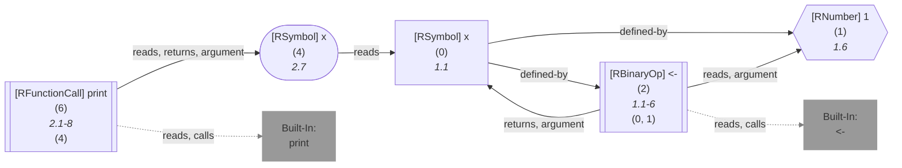

	


</details>


</details>
	


	
		

<details> 

<summary style="color:gray">Implementation Details</summary>

Responsible for the execution of the Origin Query query is `executeSearch` in [`./src/queries/catalog/origin-query/origin-query-executor.ts`](https://github.com/flowr-analysis/flowr/tree/main/./src/queries/catalog/origin-query/origin-query-executor.ts).

</details>


-----


### Project Query


This query returns the information about the analyzed project.
If present, it will incorporate plugins to, e.g., extract author and license information from R package DESCRIPTION files.


```json
[ { "type": "project" } ]
```


(This can be shortened to `@project` when used with the REPL command <span title="Description (Repl Command): Query the given R code, start with 'file://' to indicate a file. The query is to be a valid query in json format (use 'help' to get more information).">`:query`</span>).


_Results (prettified and summarized):_

Query: **project** (0 ms)\
&nbsp;&nbsp;&nbsp;╰ Dataflow Analysis not performed\
_All queries together required ≈0 ms (1ms accuracy, total 0 ms)_

<details> <summary style="color:gray">Show Detailed Results as Json</summary>

The analysis required _0.4 ms_ (including parsing and normalization and the query) within the generation environment.

In general, the JSON contains the Ids of the nodes in question as they are present in the normalized AST or the dataflow graph of flowR.
Please consult the [Interface](https://github.com/flowr-analysis/flowr/wiki/Interface) wiki page for more information on how to get those.


```json
{
  "project": {
    ".meta": {
      "timing": 0
    },
    "files": [],
    "roleCounts": {
      "description": 0,
      "namespace": 0,
      "news": 0,
      "vignette": 0,
      "test": 0,
      "data": 0,
      "license": 0,
      "source": 0,
      "other": 0
    }
  },
  ".meta": {
    "timing": 0
  }
}
```


</details>


<details> <summary style="color:gray">Original Code</summary>


```r
x + 1
```

<details>

<summary style="color:gray">Dataflow Graph of the R Code</summary>

The analysis required _1.3 ms_ (including parse and normalize, using the [r-shell](https://github.com/flowr-analysis/flowr/wiki/Engines) engine) within the generation environment. 
We encountered no unknown side effects during the analysis.


	


</details>


</details>
	


	
		

<details> 

<summary style="color:gray">Implementation Details</summary>

Responsible for the execution of the Project Query query is `executeDataflowQuery` in [`./src/queries/catalog/project-query/project-query-executor.ts`](https://github.com/flowr-analysis/flowr/tree/main/./src/queries/catalog/project-query/project-query-executor.ts).

</details>


-----


### Resolve Value Query


With this query you can use flowR's value-tracking capabilities to resolve identifiers to all potential values they may have at runtime (if possible).
The extent to which flowR traces values (e.g., built-ins vs. constants) can be configured in flowR's Configuration file (see the [Interface](https://github.com/flowr-analysis/flowr/wiki/Interface) wiki page for more information).

Using the example code `x <- 1
y <-2
print(x)
print(y)` (with newlines), the following query returns all values of `x` in the code:


```json
[
  {
    "type": "resolve-value",
    "criteria": [
      "3@x",
      "4@y"
    ]
  }
]
```


(This can be shortened to `@resolve-value (3@x;4@y) "x <- 1\ny <-2\nprint(x)\nprint(y)"` when used with the REPL command <span title="Description (Repl Command): Query the given R code, start with 'file://' to indicate a file. The query is to be a valid query in json format (use 'help' to get more information).">`:query`</span>).


_Results (prettified and summarized):_

Query: **resolve-value** (3 ms)\
&nbsp;&nbsp;&nbsp;╰ Values for {3@x, 4@y}\
&nbsp;&nbsp;&nbsp;&nbsp;&nbsp;╰ [1L, 1L], [2L, 2L]\
_All queries together required ≈3 ms (1ms accuracy, total 4 ms)_

<details> <summary style="color:gray">Show Detailed Results as Json</summary>

The analysis required _3.7 ms_ (including parsing and normalization and the query) within the generation environment.

In general, the JSON contains the Ids of the nodes in question as they are present in the normalized AST or the dataflow graph of flowR.
Please consult the [Interface](https://github.com/flowr-analysis/flowr/wiki/Interface) wiki page for more information on how to get those.


```json
{
  "resolve-value": {
    ".meta": {
      "timing": 3
    },
    "results": {
      "{\"type\":\"resolve-value\",\"criteria\":[\"3@x\",\"4@y\"]}": {
        "values": [
          {
            "type": "set",
            "elements": [
              {
                "type": "interval",
                "start": {
                  "type": "number",
                  "value": {
                    "markedAsInt": true,
                    "num": 1,
                    "complexNumber": false
                  }
                },
                "end": {
                  "type": "number",
                  "value": {
                    "markedAsInt": true,
                    "num": 1,
                    "complexNumber": false
                  }
                },
                "startInclusive": true,
                "endInclusive": true
              }
            ]
          },
          {
            "type": "set",
            "elements": [
              {
                "type": "interval",
                "start": {
                  "type": "number",
                  "value": {
                    "markedAsInt": true,
                    "num": 2,
                    "complexNumber": false
                  }
                },
                "end": {
                  "type": "number",
                  "value": {
                    "markedAsInt": true,
                    "num": 2,
                    "complexNumber": false
                  }
                },
                "startInclusive": true,
                "endInclusive": true
              }
            ]
          }
        ]
      }
    }
  },
  ".meta": {
    "timing": 3
  }
}
```


</details>


<details> <summary style="color:gray">Original Code</summary>


```r
x <- 1
y <-2
print(x)
print(y)
```

<details>

<summary style="color:gray">Dataflow Graph of the R Code</summary>

The analysis required _2.0 ms_ (including parse and normalize, using the [r-shell](https://github.com/flowr-analysis/flowr/wiki/Engines) engine) within the generation environment. 
We encountered unknown side effects (with ids: 9 (linked), 13 (linked)) during the analysis.


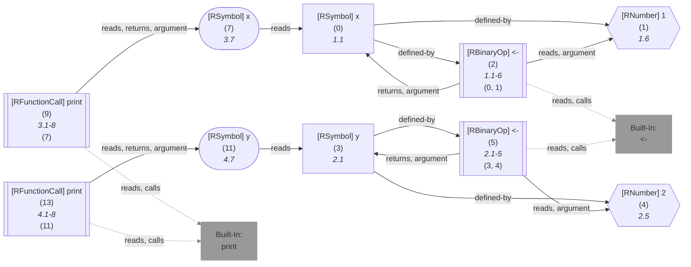

	


</details>


</details>
	


	
		

<details> 

<summary style="color:gray">Implementation Details</summary>

Responsible for the execution of the Resolve Value Query query is `executeSearch` in [`./src/queries/catalog/resolve-value-query/resolve-value-query-executor.ts`](https://github.com/flowr-analysis/flowr/tree/main/./src/queries/catalog/resolve-value-query/resolve-value-query-executor.ts).

</details>


-----


### Search Query


With this query you can use the [Search API](https://github.com/flowr-analysis/flowr/wiki/Search%20API) to conduct searches on the flowR analysis result. 

Using the example code `x + 1`, the following query returns all uses of 'x' in the code:


```json
[
  {
    "type": "search",
    "search": {
      "generator": {
        "type": "generator",
        "name": "get",
        "args": {
          "filter": {
            "name": "x"
          }
        }
      },
      "search": [
        {
          "type": "transformer",
          "name": "filter",
          "args": {
            "filter": "use"
          }
        }
      ]
    }
  }
]
```


_Results (prettified and summarized):_

Query: **search** (1 ms)\
&nbsp;&nbsp;&nbsp;╰ [query](https://mermaid.live/view#base64:eyJjb2RlIjoiZmxvd2NoYXJ0IExSXG4wKFwiPGI+Z2V0PC9iPihmaWx0ZXI6ICMxMjM7IzM0O25hbWUjMzQ7IzU4OyMzNDt4IzM0OyMxMjU7KTxici8+X2dlbmVyYXRvcl9cIikgLS0+IDFbXCI8Yj5maWx0ZXI8L2I+KGZpbHRlcjogIzM0O3VzZSMzNDspPGJyLz5fdHJhbnNmb3JtZXJfXCJdIiwibWVybWFpZCI6eyJhdXRvU3luYyI6dHJ1ZX19): {0}\
_All queries together required ≈1 ms (1ms accuracy, total 1 ms)_

<details> <summary style="color:gray">Show Detailed Results as Json</summary>

The analysis required _1.4 ms_ (including parsing and normalization and the query) within the generation environment.

In general, the JSON contains the Ids of the nodes in question as they are present in the normalized AST or the dataflow graph of flowR.
Please consult the [Interface](https://github.com/flowr-analysis/flowr/wiki/Interface) wiki page for more information on how to get those.


```json
{
  "search": {
    ".meta": {
      "timing": 1
    },
    "results": [
      {
        "ids": [
          0
        ],
        "search": {
          "generator": {
            "type": "generator",
            "name": "get",
            "args": {
              "filter": {
                "name": "x"
              }
            }
          },
          "search": [
            {
              "type": "transformer",
              "name": "filter",
              "args": {
                "filter": "use"
              }
            }
          ]
        }
      }
    ]
  },
  ".meta": {
    "timing": 1
  }
}
```


</details>


<details> <summary style="color:gray">Original Code</summary>


```r
x + 1
```

<details>

<summary style="color:gray">Dataflow Graph of the R Code</summary>

The analysis required _1.2 ms_ (including parse and normalize, using the [r-shell](https://github.com/flowr-analysis/flowr/wiki/Engines) engine) within the generation environment. 
We encountered no unknown side effects during the analysis.


```mermaid
flowchart LR
    0(["`#91;RSymbol#93; x
      (0)
      *1.1*`"])
   %% No edges found for 0
    1{{"`#91;RNumber#93; 1
      (1)
      *1.5*`"}}
   %% No edges found for 1
    2[["`#91;RBinaryOp#93; #43;
      (2)
      *1.1-5*
    (0, 1)`"]]
    built-in:_["`Built-In:
#43;`"]
    style built-in:_ stroke:gray,fill:gray,stroke-width:2px,opacity:.8;
    2 -->|"reads, argument"| 0
    2 -->|"reads, argument"| 1
    2 -.->|"reads, calls"| built-in:_
    linkStyle 2 stroke:gray;
```

	


</details>


</details>
	


	
		

<details> 

<summary style="color:gray">Implementation Details</summary>

Responsible for the execution of the Search Query query is `executeSearch` in [`./src/queries/catalog/search-query/search-query-executor.ts`](https://github.com/flowr-analysis/flowr/tree/main/./src/queries/catalog/search-query/search-query-executor.ts).

</details>


-----


### Static Slice Query


To slice, _flowR_ needs one thing from you: a variable or a list of variables (function calls are supported to, referring to the anonymous
return of the call) that you want to slice the dataflow graph for (additionally, you have to tell flowR if you want to have a forward slice). 
Given this, the backward slice is essentially the subpart of the program that may influence the value of the variables you are interested in.
To specify a variable of interest, you have to present flowR with a [slicing criterion](https://github.com/flowr-analysis/flowr/wiki/Terminology#slicing-criterion) (or, respectively, an array of them).

To exemplify the capabilities, consider the following code:

```r
x <- 1
y <- 2
z <- 3
x
```

If you are interested in the parts required for the use of `x` in the last line, you can use the following query:


```json
[
  {
    "type": "static-slice",
    "criteria": [
      "3@z",
      "4@x"
    ]
  }
]
```


(This can be shortened to `@static-slice (3@z;4@x) "x <- 1\ny <- 2\nz <- 3\nx"` when used with the REPL command <span title="Description (Repl Command): Query the given R code, start with 'file://' to indicate a file. The query is to be a valid query in json format (use 'help' to get more information).">`:query`</span>).


_Results (prettified and summarized):_

x <- 1\
z <- 3\
x\
_All queries together required ≈3 ms (1ms accuracy, total 3 ms)_

<details> <summary style="color:gray">Show Detailed Results as Json</summary>

The analysis required _3.4 ms_ (including parsing and normalization and the query) within the generation environment.

In general, the JSON contains the Ids of the nodes in question as they are present in the normalized AST or the dataflow graph of flowR.
Please consult the [Interface](https://github.com/flowr-analysis/flowr/wiki/Interface) wiki page for more information on how to get those.


```json
{
  "static-slice": {
    ".meta": {
      "timing": 3
    },
    "results": {
      "{\"type\":\"static-slice\",\"criteria\":[\"3@z\",\"4@x\"]}": {
        "slice": {
          "timesHitThreshold": 0,
          "result": [
            6,
            9,
            0,
            1,
            2,
            "built-in:<-",
            7,
            8
          ],
          "decodedCriteria": [
            {
              "criterion": "3@z",
              "id": 6
            },
            {
              "criterion": "4@x",
              "id": 9
            }
          ],
          ".meta": {
            "timing": 3
          }
        },
        "reconstruct": {
          "code": "x <- 1\nz <- 3\nx",
          "linesWithAutoSelected": 0,
          ".meta": {
            "timing": 0
          }
        }
      }
    }
  },
  ".meta": {
    "timing": 3
  }
}
```


</details>


	

In general, you may be uninterested in seeing the reconstructed version and want to save some computation time, for this,
you can use the `noReconstruction` flag.


<details><summary>No Reconstruction Example</summary>


```json
[
  {
    "type": "static-slice",
    "criteria": [
      "4@x"
    ],
    "noReconstruction": true
  }
]
```


_Results (prettified and summarized):_

Query: **static-slice** (2 ms)\
&nbsp;&nbsp;&nbsp;╰ Slice for {4@x} no reconstruction\
&nbsp;&nbsp;&nbsp;&nbsp;&nbsp;╰ Id List: {<span title="[9,0,1,2,'built-in:<-']">9, 0, 1, 2, built-in:<-, </span>}\
_All queries together required ≈2 ms (1ms accuracy, total 2 ms)_

<details> <summary style="color:gray">Show Detailed Results as Json</summary>

The analysis required _2.1 ms_ (including parsing and normalization and the query) within the generation environment.

In general, the JSON contains the Ids of the nodes in question as they are present in the normalized AST or the dataflow graph of flowR.
Please consult the [Interface](https://github.com/flowr-analysis/flowr/wiki/Interface) wiki page for more information on how to get those.


```json
{
  "static-slice": {
    ".meta": {
      "timing": 2
    },
    "results": {
      "{\"type\":\"static-slice\",\"criteria\":[\"4@x\"],\"noReconstruction\":true}": {
        "slice": {
          "timesHitThreshold": 0,
          "result": [
            9,
            0,
            1,
            2,
            "built-in:<-"
          ],
          "decodedCriteria": [
            {
              "criterion": "4@x",
              "id": 9
            }
          ],
          ".meta": {
            "timing": 2
          }
        }
      }
    }
  },
  ".meta": {
    "timing": 2
  }
}
```


</details>


	

</details>
    

Likewise, if you want the forward slice for the first use of `x`, you can do it like this:


```json
[
  {
    "type": "static-slice",
    "criteria": [
      "1@x"
    ],
    "direction": "forward"
  }
]
```


(This can be shortened to `@static-slice (1@x)f "x <- 1\ny <- 2\nz <- 3\nx"` when used with the REPL command <span title="Description (Repl Command): Query the given R code, start with 'file://' to indicate a file. The query is to be a valid query in json format (use 'help' to get more information).">`:query`</span>).


_Results (prettified and summarized):_

x <- 1\
x\
_All queries together required ≈2 ms (1ms accuracy, total 2 ms)_

<details> <summary style="color:gray">Show Detailed Results as Json</summary>

The analysis required _2.1 ms_ (including parsing and normalization and the query) within the generation environment.

In general, the JSON contains the Ids of the nodes in question as they are present in the normalized AST or the dataflow graph of flowR.
Please consult the [Interface](https://github.com/flowr-analysis/flowr/wiki/Interface) wiki page for more information on how to get those.


```json
{
  "static-slice": {
    ".meta": {
      "timing": 2
    },
    "results": {
      "{\"type\":\"static-slice\",\"criteria\":[\"1@x\"],\"direction\":\"forward\"}": {
        "slice": {
          "timesHitThreshold": 0,
          "result": [
            0,
            2,
            9
          ],
          "decodedCriteria": [
            {
              "criterion": "1@x",
              "id": 0
            }
          ],
          ".meta": {
            "timing": 2
          }
        },
        "reconstruct": {
          "code": "x <- 1\nx",
          "linesWithAutoSelected": 0,
          ".meta": {
            "timing": 0
          }
        }
      }
    }
  },
  ".meta": {
    "timing": 2
  }
}
```


</details>


	

You can disable [magic comments](https://github.com/flowr-analysis/flowr/wiki/Interface#slice-magic-comments) using the `noMagicComments` flag.
This query replaces the old [`request-slice`](https://github.com/flowr-analysis/flowr/wiki/Interface#message-request-slice) message.
		

<details> 

<summary style="color:gray">Implementation Details</summary>

Responsible for the execution of the Static Slice Query query is `executeStaticSliceQuery` in [`./src/queries/catalog/static-slice-query/static-slice-query-executor.ts`](https://github.com/flowr-analysis/flowr/tree/main/./src/queries/catalog/static-slice-query/static-slice-query-executor.ts).

</details>


### Compound Query


A compound query comes in use, whenever we want to state multiple queries of the same type with a set of common arguments.
It offers the following properties of interest:

1. **Query** (`query`): the type of the query that is to be combined.
2. **Common Arguments** (`commonArguments`): The arguments that are to be used as defaults for all queries (i.e., any argument the query may have).
3. **Arguments** (`arguments`): The other arguments for the individual queries that are to be combined.

For example, consider the following compound query that combines two call-context queries for `mean` and `print`, both of which are to be
assigned to the kind `visualize` and the subkind `text` (using the example code from above):


```json
[
  {
    "type": "compound",
    "query": "call-context",
    "commonArguments": {
      "kind": "visualize",
      "subkind": "text"
    },
    "arguments": [
      {
        "callName": "^mean$"
      },
      {
        "callName": "^print$"
      }
    ]
  }
]
```


_Results (prettified and summarized):_

Query: **call-context** (1 ms)\
&nbsp;&nbsp;&nbsp;╰ **visualize** (4 hits):\
&nbsp;&nbsp;&nbsp;&nbsp;&nbsp;╰ **text** (4 hits): _`mean`_ (L.9), _`print`_ (L.10), _`mean`_ (L.19), _`print`_ (L.19)\
_All queries together required ≈6 ms (1ms accuracy, total 6 ms)_

<details> <summary style="color:gray">Show Detailed Results as Json</summary>

The analysis required _6.1 ms_ (including parsing and normalization and the query) within the generation environment.

In general, the JSON contains the Ids of the nodes in question as they are present in the normalized AST or the dataflow graph of flowR.
Please consult the [Interface](https://github.com/flowr-analysis/flowr/wiki/Interface) wiki page for more information on how to get those.


```json
{
  "call-context": {
    ".meta": {
      "timing": 1
    },
    "kinds": {
      "visualize": {
        "subkinds": {
          "text": [
            {
              "id": 31,
              "name": "mean"
            },
            {
              "id": 36,
              "name": "print"
            },
            {
              "id": 87,
              "name": "mean"
            },
            {
              "id": 89,
              "name": "print"
            }
          ]
        }
      }
    }
  },
  ".meta": {
    "timing": 6
  }
}
```


</details>


	

Of course, in this specific scenario, the following query would be equivalent:


```json
[
  {
    "type": "call-context",
    "callName": "^(mean|print)$",
    "kind": "visualize",
    "subkind": "text"
  }
]
```


 <details> <summary style="color:gray">Show Results</summary>

_Results (prettified and summarized):_

Query: **call-context** (0 ms)\
&nbsp;&nbsp;&nbsp;╰ **visualize** (4 hits):\
&nbsp;&nbsp;&nbsp;&nbsp;&nbsp;╰ **text** (4 hits): _`mean`_ (L.9), _`print`_ (L.10), _`mean`_ (L.19), _`print`_ (L.19)\
_All queries together required ≈6 ms (1ms accuracy, total 6 ms)_

<details> <summary style="color:gray">Show Detailed Results as Json</summary>

The analysis required _5.8 ms_ (including parsing and normalization and the query) within the generation environment.

In general, the JSON contains the Ids of the nodes in question as they are present in the normalized AST or the dataflow graph of flowR.
Please consult the [Interface](https://github.com/flowr-analysis/flowr/wiki/Interface) wiki page for more information on how to get those.


```json
{
  "call-context": {
    ".meta": {
      "timing": 0
    },
    "kinds": {
      "visualize": {
        "subkinds": {
          "text": [
            {
              "id": 31,
              "name": "mean"
            },
            {
              "id": 36,
              "name": "print"
            },
            {
              "id": 87,
              "name": "mean"
            },
            {
              "id": 89,
              "name": "print"
            }
          ]
        }
      }
    }
  },
  ".meta": {
    "timing": 6
  }
}
```


</details>


</details>

	

However, compound queries become more useful whenever common arguments can not be expressed as a union in one of their properties.
Additionally, you can still overwrite default arguments.
In the following, we (by default) want all calls to not resolve to a local definition, except for those to `print` for which we explicitly
want to resolve to a local definition:


```json
[
  {
    "type": "compound",
    "query": "call-context",
    "commonArguments": {
      "kind": "visualize",
      "subkind": "text",
      "callTargets": "global"
    },
    "arguments": [
      {
        "callName": "^mean$"
      },
      {
        "callName": "^print$",
        "callTargets": "local"
      }
    ]
  }
]
```


_Results (prettified and summarized):_

Query: **call-context** (0 ms)\
&nbsp;&nbsp;&nbsp;╰ **visualize** (2 hits):\
&nbsp;&nbsp;&nbsp;&nbsp;&nbsp;╰ **text** (2 hits): _`mean`_ (L.9) with 1 call (UNKNOWN: built-in (info: undefined)), _`mean`_ (L.19) with 1 call (UNKNOWN: built-in (info: undefined))\
_All queries together required ≈7 ms (1ms accuracy, total 8 ms)_

<details> <summary style="color:gray">Show Detailed Results as Json</summary>

The analysis required _7.8 ms_ (including parsing and normalization and the query) within the generation environment.

In general, the JSON contains the Ids of the nodes in question as they are present in the normalized AST or the dataflow graph of flowR.
Please consult the [Interface](https://github.com/flowr-analysis/flowr/wiki/Interface) wiki page for more information on how to get those.


```json
{
  "call-context": {
    ".meta": {
      "timing": 0
    },
    "kinds": {
      "visualize": {
        "subkinds": {
          "text": [
            {
              "id": 31,
              "name": "mean",
              "calls": [
                "built-in"
              ]
            },
            {
              "id": 87,
              "name": "mean",
              "calls": [
                "built-in"
              ]
            }
          ]
        }
      }
    }
  },
  ".meta": {
    "timing": 7
  }
}
```


</details>


	

Now, the results no longer contain calls to `plot` that are not defined locally.

		

<details> 

<summary style="color:gray">Implementation Details</summary>

Responsible for the execution of the Compound Query query is `executeCompoundQueries` in [`./src/queries/virtual-query/compound-query.ts`](https://github.com/flowr-analysis/flowr/tree/main/./src/queries/virtual-query/compound-query.ts).

</details>


