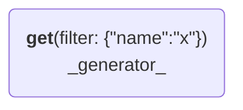
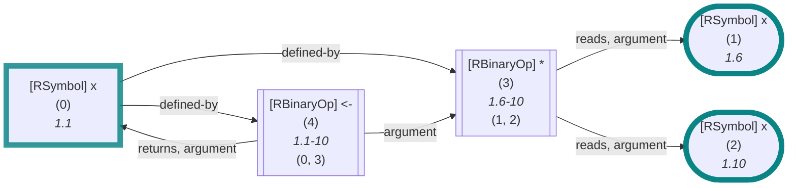
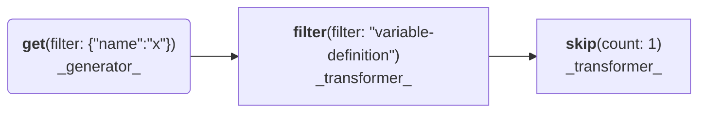
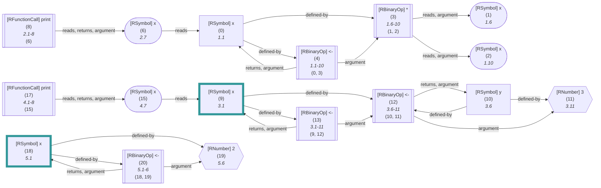

_This document was generated from 'src/documentation/print-search-wiki.ts' on 2025-01-10, 20:09:54 UTC presenting an overview of flowR's search API (v2.1.11, using R v4.4.2)._

This page briefly summarizes flowR's search API which provides a set of functions to search for nodes in the [Dataflow Graph](https://github.com/flowr-analysis/flowr/wiki//Dataflow%20Graph) and the 
[Normalized AST](https://github.com/flowr-analysis/flowr/wiki//Normalized%20AST) of a given R code.
Please see the [Interface](https://github.com/flowr-analysis/flowr/wiki//Interface) wiki page for more information on how to access this API.
Within code, you can execute a search using the [<code><span title="Run a search with the given search query and data.">runSearch</span></code>](https://github.com/flowr-analysis/flowr/tree/main//src/search/flowr-search-executor.ts#L19) function.

For an initial motivation, let's have a look at the following example:


```ts
Q.var("x")
```


<details style="color:gray"> <summary>Search Visualization</summary>





In the code:


```r
x <- x * x
```


<details style="color:gray"> <summary>JSON Representation</summary>


```json
{
  "generator": {
    "type": "generator",
    "name": "get",
    "args": {
      "filter": {
        "name": "x"
      }
    }
  },
  "search": []
}
```


</details>

</details>


 <details> <summary style="color:gray">Show Results</summary>

The query returns the following vetices (all references to `x` in the code):
<b>0 ('x')</b> at L1.1, <b>1 ('x')</b> at L1.6, <b>2 ('x')</b> at L1.10

The search required _41.88 ms_ (including parsing and normalization and the query) within the generation environment.	

The returned results are highlighted thick and blue within the dataflow graph:



	
(The analysis required _6.49 ms_ (including parse and normalize) within the generation environment.)


</details>

	

This returns all references to the variable `x` in the code.
However, the search API is not limited to simple variable references and can do much more.

For example, let's have every definition of `x` in the code but the first one:


```ts
Q.var("x").filter(VertexType.VariableDefinition).skip(1)
```


<details style="color:gray"> <summary>Search Visualization</summary>





In the code:


```r
x <- x * x
print(x)
x <- y <- 3
print(x)
x <- 2
```


<details style="color:gray"> <summary>JSON Representation</summary>


```json
{
  "generator": {
    "type": "generator",
    "name": "get",
    "args": {
      "filter": {
        "name": "x"
      }
    }
  },
  "search": [
    {
      "type": "transformer",
      "name": "filter",
      "args": {
        "filter": "variable-definition"
      }
    },
    {
      "type": "transformer",
      "name": "skip",
      "args": {
        "count": 1
      }
    }
  ]
}
```


</details>

</details>


 <details> <summary style="color:gray">Show Results</summary>

The query returns the following vetices (all references to `x` in the code):
<b>9 ('x')</b> at L3.1, <b>18 ('x')</b> at L5.1

The search required _17.65 ms_ (including parsing and normalization and the query) within the generation environment.	

The returned results are highlighted thick and blue within the dataflow graph:



	
(The analysis required _5.35 ms_ (including parse and normalize) within the generation environment.)


</details>

	

In summary, every search has two parts. It is initialized with a _generator_ (such as `Q.var('x')`)
and can be further refined with _transformers_ or _modifiers_.
Such queries can be constructed starting from the [<code><span title="This is the root object to use for creating searches. See the FlowrSearchGenerator for the available methods. After the query is generated, you can use what is provided by the FlowrSearchBuilder to further refine the search.">Q</span></code>](https://github.com/flowr-analysis/flowr/tree/main//src/search/flowr-search-builder.ts#L96) object (backed by [<code><span title="This object holds all the methods to generate search queries. For compatibility, please use the Q identifier object to access these methods.">FlowrSearchGenerator</span></code>](https://github.com/flowr-analysis/flowr/tree/main//src/search/flowr-search-builder.ts#L23)) and
are fully serializable so you can use them when communicating with the [Query API](https://github.com/flowr-analysis/flowr/wiki//Query%20API).

We offer the following generators:

- [<code><span title="Returns all elements (nodes/dataflow vertices) from the given data.">FlowrSearchGenerator::<b>all</b></span></code>](https://github.com/flowr-analysis/flowr/tree/main//src/search/flowr-search-builder.ts#L35)\
Returns all elements (nodes/dataflow vertices) from the given data.
- [<code><span title="Returns all elements that match the given criteria (e.g., #96;criterion(#39;2@x#39;, #39;3@#60;#45;#39;)#96;, to retrieve the first use of #96;x#96; in the second line and the first #96;#60;#45;#96; assignment in the third line). This will throw an error, if any criteria cannot be resolved to an id.">FlowrSearchGenerator::<b>criterion</b></span></code>](https://github.com/flowr-analysis/flowr/tree/main//src/search/flowr-search-builder.ts#L55)\
Returns all elements that match the given
<code>criteria</code>
(e.g., `criterion('2@x', '3@<-')`,
to retrieve the first use of `x` in the second line and the first `<-` assignment in the third line).
This will throw an error, if any criteria cannot be resolved to an id.
- [<code><span title="Initialize a search query with the given elements. #60;b#62;This is not intended to serialize well#60;/b#62; wrt. the nodes, see FlowrSearchGenerator.criterion for a serializable alternative (passing the ids with #96;$id#96;).">FlowrSearchGenerator::<b>from</b></span></code>](https://github.com/flowr-analysis/flowr/tree/main//src/search/flowr-search-builder.ts#L29)\
Initialize a search query with the given elements.
<b>This is not intended to serialize well</b> wrt. the nodes,
see
<code>FlowrSearchGenerator.criterion</code>
for a serializable alternative (passing the ids with `$id`).
- [<code><span title="Returns all elements that match the given filters . You may pass a negative line number to count from the back. Please note that this is currently only working for single files, it approximates over the nodes, and it is not to be used for #34;production#34;.">FlowrSearchGenerator::<b>get</b></span></code>](https://github.com/flowr-analysis/flowr/tree/main//src/search/flowr-search-builder.ts#L43)\
Returns all elements that match the given
<code>filters</code>
.
You may pass a negative line number to count from the back.
Please note that this is currently only working for single files, it approximates over the nodes, and it is not to be used for "production".
- [<code><span title="Short form of get with only the id filter#58; #96;get(#123;id#125;)#96;.">FlowrSearchGenerator::<b>id</b></span></code>](https://github.com/flowr-analysis/flowr/tree/main//src/search/flowr-search-builder.ts#L85)\
Short form of
<code>get</code>
with only the
<code>id</code>
filter:
`get({id})`.
- [<code><span title="Short form of get with only the line and column filters#58; #96;get(#123;line, column#125;)#96;.">FlowrSearchGenerator::<b>loc</b></span></code>](https://github.com/flowr-analysis/flowr/tree/main//src/search/flowr-search-builder.ts#L64)\
Short form of
<code>get</code>
with only the
<code>line</code>
and
<code>column</code>
filters:
`get({line, column})`.
- [<code><span title="Short form of get with only the name filter#58; #96;get(#123;name#125;)#96;.">FlowrSearchGenerator::<b>var</b></span></code>](https://github.com/flowr-analysis/flowr/tree/main//src/search/flowr-search-builder.ts#L78)\
Short form of
<code>get</code>
with only the
<code>name</code>
filter:
`get({name})`.
- [<code><span title="Short form of get with only the name and line filters#58; #96;get(#123;name, line#125;)#96;.">FlowrSearchGenerator::<b>varInLine</b></span></code>](https://github.com/flowr-analysis/flowr/tree/main//src/search/flowr-search-builder.ts#L71)\
Short form of
<code>get</code>
with only the
<code>name</code>
and
<code>line</code>
filters:
`get({name, line})`.

Likewise, we have a palette of _transformers_ and _modifiers_:

- [<code><span title="Construct the final search (this may happen automatically with most search handlers).">FlowrSearchBuilder::<b>build</b></span></code>](https://github.com/flowr-analysis/flowr/tree/main//src/search/flowr-search-builder.ts#L228)\
Construct the final search (this may happen automatically with most search handlers).
- [<code><span title="only returns the elements that match the given filter.">FlowrSearchBuilder::<b>filter</b></span></code>](https://github.com/flowr-analysis/flowr/tree/main//src/search/flowr-search-builder.ts#L146)\
only returns the elements that match the given filter.
- [<code><span title="first either returns the first element of the search or nothing, if no elements are present.">FlowrSearchBuilder::<b>first</b></span></code>](https://github.com/flowr-analysis/flowr/tree/main//src/search/flowr-search-builder.ts#L154)\
first either returns the first element of the search or nothing, if no elements are present.
- [<code><span title="index returns the element at the given index if it exists">FlowrSearchBuilder::<b>index</b></span></code>](https://github.com/flowr-analysis/flowr/tree/main//src/search/flowr-search-builder.ts#L169)\
index returns the element at the given index if it exists
- [<code><span title="last either returns the last element of the search or nothing, if no elements are present.">FlowrSearchBuilder::<b>last</b></span></code>](https://github.com/flowr-analysis/flowr/tree/main//src/search/flowr-search-builder.ts#L162)\
last either returns the last element of the search or nothing, if no elements are present.
- [<code><span title="merge combines the search results with those of another search.">FlowrSearchBuilder::<b>merge</b></span></code>](https://github.com/flowr-analysis/flowr/tree/main//src/search/flowr-search-builder.ts#L215)\
merge combines the search results with those of another search.
- [<code><span title="select returns only the elements at the given indices.">FlowrSearchBuilder::<b>select</b></span></code>](https://github.com/flowr-analysis/flowr/tree/main//src/search/flowr-search-builder.ts#L204)\
select returns only the elements at the given indices.
- [<code><span title="skip returns all elements of the search except the first #96;count#96; ones.">FlowrSearchBuilder::<b>skip</b></span></code>](https://github.com/flowr-analysis/flowr/tree/main//src/search/flowr-search-builder.ts#L195)\
skip returns all elements of the search except the first `count` ones.
- [<code><span title="tail returns all elements of the search except the first one.">FlowrSearchBuilder::<b>tail</b></span></code>](https://github.com/flowr-analysis/flowr/tree/main//src/search/flowr-search-builder.ts#L178)\
tail returns all elements of the search except the first one.
- [<code><span title="take returns the first #96;count#96; elements of the search.">FlowrSearchBuilder::<b>take</b></span></code>](https://github.com/flowr-analysis/flowr/tree/main//src/search/flowr-search-builder.ts#L186)\
take returns the first `count` elements of the search.

Every search (and consequently the search pipeline) works with an array of [<code><span title="Yes, for now we do technically not need a wrapper around the RNode, but this allows us to attach caches etc. just for the respective search.">FlowrSearchElement</span></code>](https://github.com/flowr-analysis/flowr/tree/main//src/search/flowr-search.ts#L11) (neatly wrapped in [<code><span title="Intentionally, we abstract away from an array to avoid the use of conventional typescript operations">FlowrSearchElements</span></code>](https://github.com/flowr-analysis/flowr/tree/main//src/search/flowr-search.ts#L62)).
Hence, even operations such as `.first` or `.last` return an array of elements (albeit with a single or no element).
The search API does its best to stay typesafe wrt. to the return type and the transformers in use. 
In addition, it offers optimizer passes to optimize the search pipeline before execution.
They are executed with `.build` which may happen automatically, whenever you want to run a search using [<code><span title="Run a search with the given search query and data.">runSearch</span></code>](https://github.com/flowr-analysis/flowr/tree/main//src/search/flowr-search-executor.ts#L19).


