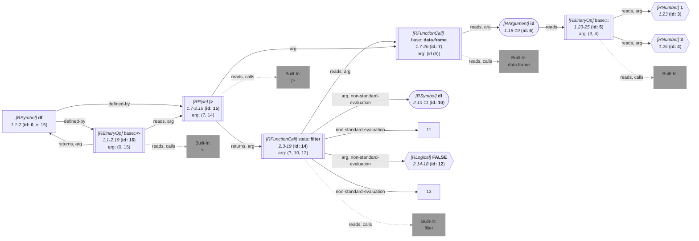

_This document was generated from '[src/documentation/wiki-query.ts](https://github.com/flowr-analysis/flowr/tree/main//src/documentation/wiki-query.ts)' on 2026-07-20, 17:48:26 UTC presenting an overview of flowR's query API (v2.12.3). Please do not edit this file/wiki page directly._
<h2 id="Abstract Interpretation Query">Abstract Interpretation Query&emsp;<sup>[<a href="https://github.com/flowr-analysis/flowr/wiki/Query-API">overview</a>]</sup></h2>

Returns the abstract values inferred for every expression or at specific locations.\
_This query is requested with the type `absint`._\
Run in the REPL: `:query @absint <inference-type> [(<criteria>)] <code | file://path>`


This query infers all shapes of dataframes within the code using abstract interpretaion. For example, you can use:


```json
[ { "type": "absint",   "inference": "df-shape" } ]
```


_Results (prettified and summarized):_

Query: **absint** (5 ms)\
&nbsp;&nbsp;&nbsp;╰ $7: (colnames: [{"id"}, {}], cols: [1, 1], rows: [3, 3])\
&nbsp;&nbsp;&nbsp;╰ $14: (colnames: [{"id"}, {}], cols: [1, 1], rows: [0, 3])\
&nbsp;&nbsp;&nbsp;╰ $0: (colnames: [{"id"}, {}], cols: [1, 1], rows: [0, 3])\
_All queries together required ≈11 ms (1ms accuracy, total 11 ms)_

<details> <summary style="color:gray">Show Detailed Results as Json</summary>

The analysis required _11.4 ms_ (including parsing and normalization and the query) within the generation environment.

In general, the JSON contains the Ids of the nodes in question as they are present in the normalized AST or the dataflow graph of flowR.
Please consult the [Interface](https://github.com/flowr-analysis/flowr/wiki/interface) wiki page for more information on how to get those.


```json
{
  "absint": {
    ".meta": {
      "timing": 5
    },
    "result": {
      "0": {
        "colnames": {
          "must": [
            "id"
          ],
          "may": []
        },
        "cols": [
          1,
          1
        ],
        "rows": [
          0,
          3
        ]
      },
      "7": {
        "colnames": {
          "must": [
            "id"
          ],
          "may": []
        },
        "cols": [
          1,
          1
        ],
        "rows": [
          3,
          3
        ]
      },
      "14": {
        "colnames": {
          "must": [
            "id"
          ],
          "may": []
        },
        "cols": [
          1,
          1
        ],
        "rows": [
          0,
          3
        ]
      }
    }
  },
  ".meta": {
    "timing": 11
  }
}
```


</details>


<details> <summary style="color:gray">Original Code</summary>


```r
df <- data.frame(id = 1:3) |>
  filter(df, FALSE)
```

<details>

<summary style="color:gray">Dataflow Graph of the R Code</summary>

The analysis required _3.8 ms_ (including parse and normalize, using the [r-shell](https://github.com/flowr-analysis/flowr/wiki/Engines) engine) within the generation environment. No [signature database](https://github.com/flowr-analysis/flowr/wiki/Signature-Database) is mounted for these generated graphs, so `library()` calls attach no package exports; base-R names are still qualified via the generated base-package store (e.g. `acf` as `stats::acf`). 
We encountered no unknown side effects during the analysis.


	


</details>


</details>
	


	

The query optionally also accepts slice criteria to narrow the results to specific nodes. For example:


```json
[ { "type": "absint",   "inference": "df-shape",   "criteria": [ "1@df",    "1@data.frame" ] } ]
```


(This can be shortened to `@absint (1@df;1@data.frame) "df <- data.frame(id = 1:3) |>\n  filter(df, FALSE)"` when used with the REPL command <span title="Description (Repl Command): Query the given R code (use 'help' for more information)">`:query`</span>).


_Results (prettified and summarized):_

Query: **absint** (2 ms)\
&nbsp;&nbsp;&nbsp;╰ 1@df: (colnames: [{"id"}, {}], cols: [1, 1], rows: [0, 3])\
&nbsp;&nbsp;&nbsp;╰ 1@data.frame: (colnames: [{"id"}, {}], cols: [1, 1], rows: [3, 3])\
_All queries together required ≈7 ms (1ms accuracy, total 7 ms)_

<details> <summary style="color:gray">Show Detailed Results as Json</summary>

The analysis required _7.4 ms_ (including parsing and normalization and the query) within the generation environment.

In general, the JSON contains the Ids of the nodes in question as they are present in the normalized AST or the dataflow graph of flowR.
Please consult the [Interface](https://github.com/flowr-analysis/flowr/wiki/interface) wiki page for more information on how to get those.


```json
{
  "absint": {
    ".meta": {
      "timing": 2
    },
    "result": [
      [
        "1@df",
        {
          "colnames": {
            "must": [
              "id"
            ],
            "may": []
          },
          "cols": [
            1,
            1
          ],
          "rows": [
            0,
            3
          ]
        }
      ],
      [
        "1@data.frame",
        {
          "colnames": {
            "must": [
              "id"
            ],
            "may": []
          },
          "cols": [
            1,
            1
          ],
          "rows": [
            3,
            3
          ]
        }
      ]
    ]
  },
  ".meta": {
    "timing": 7
  }
}
```


</details>


<details> <summary style="color:gray">Original Code</summary>


```r
df <- data.frame(id = 1:3) |>
  filter(df, FALSE)
```

<details>

<summary style="color:gray">Dataflow Graph of the R Code</summary>

The analysis required _6.4 ms_ (including parse and normalize, using the [r-shell](https://github.com/flowr-analysis/flowr/wiki/Engines) engine) within the generation environment. No [signature database](https://github.com/flowr-analysis/flowr/wiki/Signature-Database) is mounted for these generated graphs, so `library()` calls attach no package exports; base-R names are still qualified via the generated base-package store (e.g. `acf` as `stats::acf`). 
We encountered no unknown side effects during the analysis.




	


</details>


</details>
	


	


<details>

<summary style="color:gray">Implementation Details</summary>

Responsible for the execution of the Abstract Interpretation Query query is `executeAbsintQuery` in [`./src/queries/catalog/absint-query/absint-query-format.ts`](https://github.com/flowr-analysis/flowr/tree/main/./src/queries/catalog/absint-query/absint-query-format.ts).

</details>