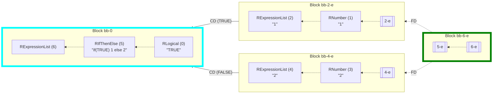
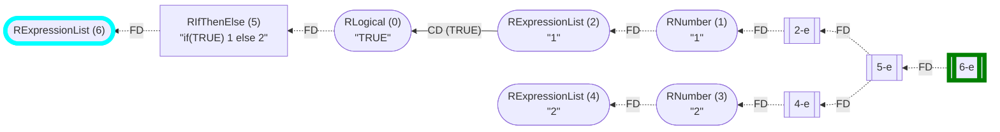
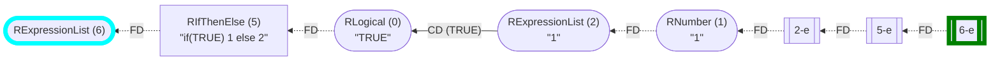

_This document was generated from '[src/documentation/wiki-query.ts](https://github.com/flowr-analysis/flowr/tree/main//src/documentation/wiki-query.ts)' on 2026-07-20, 13:05:03 UTC presenting an overview of flowR's query API (v2.12.3). Please do not edit this file/wiki page directly._
<h2 id="Control-Flow Query">Control-Flow Query&emsp;<sup>[<a href="https://github.com/flowr-analysis/flowr/wiki/Query-API">overview</a>]</sup></h2>

Provides the control-flow of the program.\
_This query is requested with the type `control-flow`._


This control-flow query provides you access to the control flow graph.

In other words, if you have a script simply reading: `if(TRUE) 1 else 2`, the following query returns the CFG:


```json
[ { "type": "control-flow" } ]
```


(This can be shortened to `@control-flow` when used with the REPL command <span title="Description (Repl Command): Query the given R code (use 'help' for more information)">`:query`</span>).

 <details> <summary style="color:gray">Show Results</summary>

_Results (prettified and summarized):_

Query: **control-flow** (3ms)\
&nbsp;&nbsp;&nbsp;╰ CFG: https://mermaid.live/view#base64:eyJjb2RlIjoiZmxvd2NoYXJ0IEJUXG4gICAgbjYoW1wiYFJFeHByZXNzaW9uTGlzdCAoNilgXCJdKVxuICAgIG41W1wiYFJJZlRoZW5FbHNlICg1KVxuIzM0O2lmKFRSVUUpIDEgZWxzZSAyIzM0O2BcIl1cbiAgICBuNS1lW1s1LWVdXVxuICAgIG4wKFtcImBSTG9naWNhbCAoMClcbiMzNDtUUlVFIzM0O2BcIl0pXG4gICAgbjIoW1wiYFJFeHByZXNzaW9uTGlzdCAoMilcbiMzNDsxIzM0O2BcIl0pXG4gICAgbjEoW1wiYFJOdW1iZXIgKDEpXG4jMzQ7MSMzNDtgXCJdKVxuICAgIG4yLWVbWzItZV1dXG4gICAgbjQoW1wiYFJFeHByZXNzaW9uTGlzdCAoNClcbiMzNDsyIzM0O2BcIl0pXG4gICAgbjMoW1wiYFJOdW1iZXIgKDMpXG4jMzQ7MiMzNDtgXCJdKVxuICAgIG40LWVbWzQtZV1dXG4gICAgbjYtZVtbNi1lXV1cbiAgICBuNSAtLi0+fFwiRkRcInwgbjZcbiAgICBuMSAtLi0+fFwiRkRcInwgbjJcbiAgICBuMi1lIC0uLT58XCJGRFwifCBuMVxuICAgIG4zIC0uLT58XCJGRFwifCBuNFxuICAgIG40LWUgLS4tPnxcIkZEXCJ8IG4zXG4gICAgbjIgLS0+fFwiQ0QgKFRSVUUpXCJ8IG4wXG4gICAgbjQgLS0+fFwiQ0QgKEZBTFNFKVwifCBuMFxuICAgIG4wIC0uLT58XCJGRFwifCBuNVxuICAgIG41LWUgLS4tPnxcIkZEXCJ8IG4yLWVcbiAgICBuNS1lIC0uLT58XCJGRFwifCBuNC1lXG4gICAgbjYtZSAtLi0+fFwiRkRcInwgbjUtZVxuICAgIHN0eWxlIG42IHN0cm9rZTpjeWFuLHN0cm9rZS13aWR0aDo2LjVweDsgICAgc3R5bGUgbjYtZSBzdHJva2U6Z3JlZW4sc3Ryb2tlLXdpZHRoOjYuNXB4OyIsIm1lcm1haWQiOnsiYXV0b1N5bmMiOnRydWV9fQ==\
_All queries together required ≈3 ms (1ms accuracy, total 3 ms)_

<details> <summary style="color:gray">Show Detailed Results as Json</summary>

The analysis required _3.3 ms_ (including parsing and normalization and the query) within the generation environment.

In general, the JSON contains the Ids of the nodes in question as they are present in the normalized AST or the dataflow graph of flowR.
Please consult the [Interface](https://github.com/flowr-analysis/flowr/wiki/interface) wiki page for more information on how to get those.


```json
{
  "control-flow": {
    ".meta": {
      "timing": 3
    },
    "controlFlow": {
      "returns": [],
      "entryPoints": [
        6
      ],
      "exitPoints": [
        "6-e"
      ],
      "breaks": [],
      "nexts": [],
      "graph": {
        "roots": [
          6,
          5,
          "5-e",
          0,
          2,
          1,
          "2-e",
          4,
          3,
          "4-e",
          "6-e"
        ],
        "vtxInfos": [
          [
            6,
            [
              2,
              6,
              null,
              [
                "6-e"
              ]
            ]
          ],
          [
            5,
            [
              1,
              5,
              [
                0
              ],
              [
                "5-e"
              ]
            ]
          ],
          [
            "5-e",
            "5-e"
          ],
          [
            0,
            [
              2,
              0
            ]
          ],
          [
            2,
            [
              2,
              2,
              null,
              [
                "2-e"
              ]
            ]
          ],
          [
            1,
            [
              2,
              1
            ]
          ],
          [
            "2-e",
            "2-e"
          ],
          [
            4,
            [
              2,
              4,
              null,
              [
                "4-e"
              ]
            ]
          ],
          [
            3,
            [
              2,
              3
            ]
          ],
          [
            "4-e",
            "4-e"
          ],
          [
            "6-e",
            "6-e"
          ]
        ],
        "bbChildren": [],
        "edgeInfos": [
          [
            5,
            [
              [
                6,
                0
              ]
            ]
          ],
          [
            1,
            [
              [
                2,
                0
              ]
            ]
          ],
          [
            "2-e",
            [
              [
                1,
                0
              ]
            ]
          ],
          [
            3,
            [
              [
                4,
                0
              ]
            ]
          ],
          [
            "4-e",
            [
              [
                3,
                0
              ]
            ]
          ],
          [
            2,
            [
              [
                0,
                [
                  5,
                  "TRUE"
                ]
              ]
            ]
          ],
          [
            4,
            [
              [
                0,
                [
                  5,
                  "FALSE"
                ]
              ]
            ]
          ],
          [
            0,
            [
              [
                5,
                0
              ]
            ]
          ],
          [
            "5-e",
            [
              [
                "2-e",
                0
              ],
              [
                "4-e",
                0
              ]
            ]
          ],
          [
            "6-e",
            [
              [
                "5-e",
                0
              ]
            ]
          ]
        ],
        "_mayBB": false
      }
    }
  },
  ".meta": {
    "timing": 3
  }
}
```


</details>


</details>

	

You can also overwrite the simplification passes to tune the perspective. for example, if you want to have basic blocks:


```json
[
  {
    "type": "control-flow",
    "config": {
      "simplificationPasses": [
        "unique-cf-sets",
        "to-basic-blocks"
      ]
    }
  }
]
```


 <details> <summary style="color:gray">Show Results</summary>

_Results (prettified and summarized):_

Query: **control-flow** (3ms)\
&nbsp;&nbsp;&nbsp;╰ CFG: https://mermaid.live/view#base64:eyJjb2RlIjoiZmxvd2NoYXJ0IEJUXG4gICAgc3ViZ3JhcGggbmJiLTAgW0Jsb2NrIGJiLTBdXG4gICAgICAgIGRpcmVjdGlvbiBCVFxuICAgIG4wW1wiYFJMb2dpY2FsICgwKVxuIzM0O1RSVUUjMzQ7YFwiXVxuICAgIG41W1wiYFJJZlRoZW5FbHNlICg1KVxuIzM0O2lmKFRSVUUpIDEgZWxzZSAyIzM0O2BcIl1cbiAgICBuMCAtLi0+IG41XG4gICAgbjZbXCJgUkV4cHJlc3Npb25MaXN0ICg2KWBcIl1cbiAgICBuNSAtLi0+IG42XG4gICAgZW5kXG4gICAgc3ViZ3JhcGggbmJiLTItZSBbQmxvY2sgYmItMi1lXVxuICAgICAgICBkaXJlY3Rpb24gQlRcbiAgICBuMi1lW1syLWVdXVxuICAgIG4xW1wiYFJOdW1iZXIgKDEpXG4jMzQ7MSMzNDtgXCJdXG4gICAgbjItZSAtLi0+IG4xXG4gICAgbjJbXCJgUkV4cHJlc3Npb25MaXN0ICgyKVxuIzM0OzEjMzQ7YFwiXVxuICAgIG4xIC0uLT4gbjJcbiAgICBlbmRcbiAgICBzdWJncmFwaCBuYmItNC1lIFtCbG9jayBiYi00LWVdXG4gICAgICAgIGRpcmVjdGlvbiBCVFxuICAgIG40LWVbWzQtZV1dXG4gICAgbjNbXCJgUk51bWJlciAoMylcbiMzNDsyIzM0O2BcIl1cbiAgICBuNC1lIC0uLT4gbjNcbiAgICBuNFtcImBSRXhwcmVzc2lvbkxpc3QgKDQpXG4jMzQ7MiMzNDtgXCJdXG4gICAgbjMgLS4tPiBuNFxuICAgIGVuZFxuICAgIHN1YmdyYXBoIG5iYi02LWUgW0Jsb2NrIGJiLTYtZV1cbiAgICAgICAgZGlyZWN0aW9uIEJUXG4gICAgbjYtZVtbNi1lXV1cbiAgICBuNS1lW1s1LWVdXVxuICAgIG42LWUgLS4tPiBuNS1lXG4gICAgZW5kXG4gICAgbmJiLTYtZSAtLi0+fFwiRkRcInwgbmJiLTItZVxuICAgIG5iYi02LWUgLS4tPnxcIkZEXCJ8IG5iYi00LWVcbiAgICBuYmItMi1lIC0tPnxcIkNEIChUUlVFKVwifCBuYmItMFxuICAgIG5iYi00LWUgLS0+fFwiQ0QgKEZBTFNFKVwifCBuYmItMFxuICAgIHN0eWxlIG5iYi0wIHN0cm9rZTpjeWFuLHN0cm9rZS13aWR0aDo2LjVweDsgICAgc3R5bGUgbmJiLTYtZSBzdHJva2U6Z3JlZW4sc3Ryb2tlLXdpZHRoOjYuNXB4OyIsIm1lcm1haWQiOnsiYXV0b1N5bmMiOnRydWV9fQ==\
_All queries together required ≈3 ms (1ms accuracy, total 4 ms)_

<details> <summary style="color:gray">Show Detailed Results as Json</summary>

The analysis required _3.6 ms_ (including parsing and normalization and the query) within the generation environment.

In general, the JSON contains the Ids of the nodes in question as they are present in the normalized AST or the dataflow graph of flowR.
Please consult the [Interface](https://github.com/flowr-analysis/flowr/wiki/interface) wiki page for more information on how to get those.


```json
{
  "control-flow": {
    ".meta": {
      "timing": 3
    },
    "controlFlow": {
      "returns": [],
      "entryPoints": [
        "bb-0"
      ],
      "exitPoints": [
        "bb-6-e"
      ],
      "breaks": [],
      "nexts": [],
      "graph": {
        "roots": [
          "bb-0",
          "bb-2-e",
          "bb-4-e",
          "bb-6-e"
        ],
        "vtxInfos": [
          [
            "bb-0",
            [
              3,
              "bb-0",
              [
                [
                  2,
                  0
                ],
                [
                  1,
                  5,
                  [
                    0
                  ],
                  [
                    "5-e"
                  ]
                ],
                [
                  2,
                  6,
                  null,
                  [
                    "6-e"
                  ]
                ]
              ]
            ]
          ],
          [
            "bb-2-e",
            [
              3,
              "bb-2-e",
              [
                "2-e",
                [
                  2,
                  1
                ],
                [
                  2,
                  2,
                  null,
                  [
                    "2-e"
                  ]
                ]
              ]
            ]
          ],
          [
            "bb-4-e",
            [
              3,
              "bb-4-e",
              [
                "4-e",
                [
                  2,
                  3
                ],
                [
                  2,
                  4,
                  null,
                  [
                    "4-e"
                  ]
                ]
              ]
            ]
          ],
          [
            "bb-6-e",
            [
              3,
              "bb-6-e",
              [
                "6-e",
                "5-e"
              ]
            ]
          ]
        ],
        "bbChildren": [
          [
            6,
            "bb-0"
          ],
          [
            5,
            "bb-0"
          ],
          [
            "5-e",
            "bb-6-e"
          ],
          [
            0,
            "bb-0"
          ],
          [
            2,
            "bb-2-e"
          ],
          [
            1,
            "bb-2-e"
          ],
          [
            "2-e",
            "bb-2-e"
          ],
          [
            4,
            "bb-4-e"
          ],
          [
            3,
            "bb-4-e"
          ],
          [
            "4-e",
            "bb-4-e"
          ],
          [
            "6-e",
            "bb-6-e"
          ]
        ],
        "edgeInfos": [
          [
            "bb-6-e",
            [
              [
                "bb-2-e",
                0
              ],
              [
                "bb-4-e",
                0
              ]
            ]
          ],
          [
            "bb-2-e",
            [
              [
                "bb-0",
                [
                  5,
                  "TRUE"
                ]
              ]
            ]
          ],
          [
            "bb-4-e",
            [
              [
                "bb-0",
                [
                  5,
                  "FALSE"
                ]
              ]
            ]
          ]
        ],
        "revEdgeInfos": [
          [
            "bb-0",
            [
              [
                "bb-2-e",
                [
                  5,
                  "TRUE"
                ]
              ],
              [
                "bb-4-e",
                [
                  5,
                  "FALSE"
                ]
              ]
            ]
          ],
          [
            "bb-2-e",
            [
              [
                "bb-6-e",
                0
              ]
            ]
          ],
          [
            "bb-4-e",
            [
              [
                "bb-6-e",
                0
              ]
            ]
          ]
        ],
        "_mayBB": true
      }
    }
  },
  ".meta": {
    "timing": 3
  }
}
```


</details>


</details>

	

this produces: 




	
_(The analysis required _2.1 ms_ (including the dataflow analysis,  normalization,  and parsing with the [r-shell](https://github.com/flowr-analysis/flowr/wiki/engines) engine) within the generation environment.
We used the following simplifications: `unique-cf-sets`, `to-basic-blocks` .
	)_


If, on the other hand, you want to prune dead code edges:


```json
[
  {
    "type": "control-flow",
    "config": {
      "simplificationPasses": [
        "unique-cf-sets",
        "analyze-dead-code"
      ]
    }
  }
]
```


 <details> <summary style="color:gray">Show Results</summary>

_Results (prettified and summarized):_

Query: **control-flow** (7ms)\
&nbsp;&nbsp;&nbsp;╰ CFG: https://mermaid.live/view#base64:eyJjb2RlIjoiZmxvd2NoYXJ0IEJUXG4gICAgbjYoW1wiYFJFeHByZXNzaW9uTGlzdCAoNilgXCJdKVxuICAgIG41W1wiYFJJZlRoZW5FbHNlICg1KVxuIzM0O2lmKFRSVUUpIDEgZWxzZSAyIzM0O2BcIl1cbiAgICBuNS1lW1s1LWVdXVxuICAgIG4wKFtcImBSTG9naWNhbCAoMClcbiMzNDtUUlVFIzM0O2BcIl0pXG4gICAgbjIoW1wiYFJFeHByZXNzaW9uTGlzdCAoMilcbiMzNDsxIzM0O2BcIl0pXG4gICAgbjEoW1wiYFJOdW1iZXIgKDEpXG4jMzQ7MSMzNDtgXCJdKVxuICAgIG4yLWVbWzItZV1dXG4gICAgbjQoW1wiYFJFeHByZXNzaW9uTGlzdCAoNClcbiMzNDsyIzM0O2BcIl0pXG4gICAgbjMoW1wiYFJOdW1iZXIgKDMpXG4jMzQ7MiMzNDtgXCJdKVxuICAgIG40LWVbWzQtZV1dXG4gICAgbjYtZVtbNi1lXV1cbiAgICBuNSAtLi0+fFwiRkRcInwgbjZcbiAgICBuMSAtLi0+fFwiRkRcInwgbjJcbiAgICBuMi1lIC0uLT58XCJGRFwifCBuMVxuICAgIG4zIC0uLT58XCJGRFwifCBuNFxuICAgIG40LWUgLS4tPnxcIkZEXCJ8IG4zXG4gICAgbjIgLS0+fFwiQ0QgKFRSVUUpXCJ8IG4wXG4gICAgbjAgLS4tPnxcIkZEXCJ8IG41XG4gICAgbjUtZSAtLi0+fFwiRkRcInwgbjItZVxuICAgIG41LWUgLS4tPnxcIkZEXCJ8IG40LWVcbiAgICBuNi1lIC0uLT58XCJGRFwifCBuNS1lXG4gICAgc3R5bGUgbjYgc3Ryb2tlOmN5YW4sc3Ryb2tlLXdpZHRoOjYuNXB4OyAgICBzdHlsZSBuNi1lIHN0cm9rZTpncmVlbixzdHJva2Utd2lkdGg6Ni41cHg7IiwibWVybWFpZCI6eyJhdXRvU3luYyI6dHJ1ZX19\
_All queries together required ≈7 ms (1ms accuracy, total 7 ms)_

<details> <summary style="color:gray">Show Detailed Results as Json</summary>

The analysis required _7.4 ms_ (including parsing and normalization and the query) within the generation environment.

In general, the JSON contains the Ids of the nodes in question as they are present in the normalized AST or the dataflow graph of flowR.
Please consult the [Interface](https://github.com/flowr-analysis/flowr/wiki/interface) wiki page for more information on how to get those.


```json
{
  "control-flow": {
    ".meta": {
      "timing": 7
    },
    "controlFlow": {
      "returns": [],
      "entryPoints": [
        6
      ],
      "exitPoints": [
        "6-e"
      ],
      "breaks": [],
      "nexts": [],
      "graph": {
        "roots": [
          6,
          5,
          "5-e",
          0,
          2,
          1,
          "2-e",
          4,
          3,
          "4-e",
          "6-e"
        ],
        "vtxInfos": [
          [
            6,
            [
              2,
              6,
              null,
              [
                "6-e"
              ]
            ]
          ],
          [
            5,
            [
              1,
              5,
              [
                0
              ],
              [
                "5-e"
              ]
            ]
          ],
          [
            "5-e",
            "5-e"
          ],
          [
            0,
            [
              2,
              0
            ]
          ],
          [
            2,
            [
              2,
              2,
              null,
              [
                "2-e"
              ]
            ]
          ],
          [
            1,
            [
              2,
              1
            ]
          ],
          [
            "2-e",
            "2-e"
          ],
          [
            4,
            [
              2,
              4,
              null,
              [
                "4-e"
              ]
            ]
          ],
          [
            3,
            [
              2,
              3
            ]
          ],
          [
            "4-e",
            "4-e"
          ],
          [
            "6-e",
            "6-e"
          ]
        ],
        "bbChildren": [],
        "edgeInfos": [
          [
            5,
            [
              [
                6,
                0
              ]
            ]
          ],
          [
            1,
            [
              [
                2,
                0
              ]
            ]
          ],
          [
            "2-e",
            [
              [
                1,
                0
              ]
            ]
          ],
          [
            3,
            [
              [
                4,
                0
              ]
            ]
          ],
          [
            "4-e",
            [
              [
                3,
                0
              ]
            ]
          ],
          [
            2,
            [
              [
                0,
                [
                  5,
                  "TRUE"
                ]
              ]
            ]
          ],
          [
            0,
            [
              [
                5,
                0
              ]
            ]
          ],
          [
            "5-e",
            [
              [
                "2-e",
                0
              ],
              [
                "4-e",
                0
              ]
            ]
          ],
          [
            "6-e",
            [
              [
                "5-e",
                0
              ]
            ]
          ]
        ],
        "_mayBB": false
      }
    }
  },
  ".meta": {
    "timing": 7
  }
}
```


</details>


</details>

	

this produces:




	
_(The analysis required _2.5 ms_ (including the dataflow analysis,  normalization,  and parsing with the [r-shell](https://github.com/flowr-analysis/flowr/wiki/engines) engine) within the generation environment.
We used the following simplifications: `unique-cf-sets`, `analyze-dead-code` .
	)_


Or, completely remove dead code:


```json
[
  {
    "type": "control-flow",
    "config": {
      "simplificationPasses": [
        "unique-cf-sets",
        "analyze-dead-code",
        "remove-dead-code"
      ]
    }
  }
]
```


 <details> <summary style="color:gray">Show Results</summary>

_Results (prettified and summarized):_

Query: **control-flow** (4ms)\
&nbsp;&nbsp;&nbsp;╰ CFG: https://mermaid.live/view#base64:eyJjb2RlIjoiZmxvd2NoYXJ0IEJUXG4gICAgbjYoW1wiYFJFeHByZXNzaW9uTGlzdCAoNilgXCJdKVxuICAgIG41W1wiYFJJZlRoZW5FbHNlICg1KVxuIzM0O2lmKFRSVUUpIDEgZWxzZSAyIzM0O2BcIl1cbiAgICBuNS1lW1s1LWVdXVxuICAgIG4wKFtcImBSTG9naWNhbCAoMClcbiMzNDtUUlVFIzM0O2BcIl0pXG4gICAgbjIoW1wiYFJFeHByZXNzaW9uTGlzdCAoMilcbiMzNDsxIzM0O2BcIl0pXG4gICAgbjEoW1wiYFJOdW1iZXIgKDEpXG4jMzQ7MSMzNDtgXCJdKVxuICAgIG4yLWVbWzItZV1dXG4gICAgbjYtZVtbNi1lXV1cbiAgICBuNSAtLi0+fFwiRkRcInwgbjZcbiAgICBuMSAtLi0+fFwiRkRcInwgbjJcbiAgICBuMi1lIC0uLT58XCJGRFwifCBuMVxuICAgIG4yIC0tPnxcIkNEIChUUlVFKVwifCBuMFxuICAgIG4wIC0uLT58XCJGRFwifCBuNVxuICAgIG41LWUgLS4tPnxcIkZEXCJ8IG4yLWVcbiAgICBuNi1lIC0uLT58XCJGRFwifCBuNS1lXG4gICAgc3R5bGUgbjYgc3Ryb2tlOmN5YW4sc3Ryb2tlLXdpZHRoOjYuNXB4OyAgICBzdHlsZSBuNi1lIHN0cm9rZTpncmVlbixzdHJva2Utd2lkdGg6Ni41cHg7IiwibWVybWFpZCI6eyJhdXRvU3luYyI6dHJ1ZX19\
_All queries together required ≈4 ms (1ms accuracy, total 4 ms)_

<details> <summary style="color:gray">Show Detailed Results as Json</summary>

The analysis required _4.2 ms_ (including parsing and normalization and the query) within the generation environment.

In general, the JSON contains the Ids of the nodes in question as they are present in the normalized AST or the dataflow graph of flowR.
Please consult the [Interface](https://github.com/flowr-analysis/flowr/wiki/interface) wiki page for more information on how to get those.


```json
{
  "control-flow": {
    ".meta": {
      "timing": 4
    },
    "controlFlow": {
      "returns": [],
      "entryPoints": [
        6
      ],
      "exitPoints": [
        "6-e"
      ],
      "breaks": [],
      "nexts": [],
      "graph": {
        "roots": [
          6,
          5,
          "5-e",
          0,
          2,
          1,
          "2-e",
          "6-e"
        ],
        "vtxInfos": [
          [
            6,
            [
              2,
              6,
              null,
              [
                "6-e"
              ]
            ]
          ],
          [
            5,
            [
              1,
              5,
              [
                0
              ],
              [
                "5-e"
              ]
            ]
          ],
          [
            "5-e",
            "5-e"
          ],
          [
            0,
            [
              2,
              0
            ]
          ],
          [
            2,
            [
              2,
              2,
              null,
              [
                "2-e"
              ]
            ]
          ],
          [
            1,
            [
              2,
              1
            ]
          ],
          [
            "2-e",
            "2-e"
          ],
          [
            "6-e",
            "6-e"
          ]
        ],
        "bbChildren": [],
        "edgeInfos": [
          [
            5,
            [
              [
                6,
                0
              ]
            ]
          ],
          [
            1,
            [
              [
                2,
                0
              ]
            ]
          ],
          [
            "2-e",
            [
              [
                1,
                0
              ]
            ]
          ],
          [
            2,
            [
              [
                0,
                [
                  5,
                  "TRUE"
                ]
              ]
            ]
          ],
          [
            0,
            [
              [
                5,
                0
              ]
            ]
          ],
          [
            "5-e",
            [
              [
                "2-e",
                0
              ]
            ]
          ],
          [
            "6-e",
            [
              [
                "5-e",
                0
              ]
            ]
          ]
        ],
        "revEdgeInfos": [
          [
            6,
            [
              [
                5,
                0
              ]
            ]
          ],
          [
            2,
            [
              [
                1,
                0
              ]
            ]
          ],
          [
            1,
            [
              [
                "2-e",
                0
              ]
            ]
          ],
          [
            0,
            [
              [
                2,
                [
                  5,
                  "TRUE"
                ]
              ]
            ]
          ],
          [
            5,
            [
              [
                0,
                0
              ]
            ]
          ],
          [
            "2-e",
            [
              [
                "5-e",
                0
              ]
            ]
          ],
          [
            "5-e",
            [
              [
                "6-e",
                0
              ]
            ]
          ]
        ],
        "_mayBB": false
      }
    }
  },
  ".meta": {
    "timing": 4
  }
}
```


</details>


</details>

	

this produces:




	
_(The analysis required _2.2 ms_ (including the dataflow analysis,  normalization,  and parsing with the [r-shell](https://github.com/flowr-analysis/flowr/wiki/engines) engine) within the generation environment.
We used the following simplifications: `unique-cf-sets`, `analyze-dead-code`, `remove-dead-code` .
	)_


		

<details>

<summary style="color:gray">Implementation Details</summary>

Responsible for the execution of the Control-Flow Query query is `executeControlFlowQuery` in [`./src/queries/catalog/control-flow-query/control-flow-query-executor.ts`](https://github.com/flowr-analysis/flowr/tree/main/./src/queries/catalog/control-flow-query/control-flow-query-executor.ts).

</details>