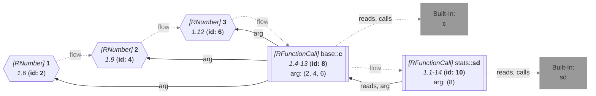

_<span title="an overview of flowR's query API">Generated</span> from '[wiki-query.ts](https://github.com/flowr-analysis/flowr/tree/main/src/documentation/wiki-query.ts "src/documentation/wiki-query.ts")' on 2026-09-10, 07:04:46 UTC (v2.15.8), do not edit directly._
<h2 id="Dependencies Query">Dependencies Query&emsp;<sup>[<a href="https://github.com/flowr-analysis/flowr/wiki/Query-API">overview</a>]</sup></h2>

Returns all direct dependencies (in- and outputs) of a given R script\
_This query is requested with the type `dependencies`._

This query extracts all dependencies from an R script, using a combination of a [Call-Context Query](https://github.com/flowr-analysis/flowr/wiki/%5BQuery%5D-Call-Context)
and more advanced tracking in the [Dataflow Graph](https://github.com/flowr-analysis/flowr/wiki/Dataflow-Graph).
Loaded libraries are resolved against the [signature database](https://github.com/flowr-analysis/flowr/wiki/Signature-Database).

In other words, if you have a script simply reading: `library(x)`, the following query returns the loaded library:

```json
[ { "type": "dependencies" } ]
```

(This can be shortened to `@dependencies` when used with the REPL command <span title="Description (Repl Command): Query the given R code (use 'help' for more information)">`:query`</span>).

_Results (prettified and summarized):_

Query: **dependencies** (3 ms)\
&nbsp;&nbsp;&nbsp;**Libraries** _(1)_\
&nbsp;&nbsp;&nbsp;&nbsp;&nbsp;**x** _via library (node 3)_\

<details> <summary style="color:gray">Show Detailed Results as Json</summary>

The analysis ran (including parsing and normalization and the query) within the generation environment.

In general, the JSON contains the Ids of the nodes in question as they are present in the normalized AST or the dataflow graph of flowR.
Please consult the [Interface](https://github.com/flowr-analysis/flowr/wiki/Interface) wiki page for more information on how to get those.

```json
{
  "dependencies": {
    ".meta": {},
    "library": [{"nodeId":3,"functionName":"library","value":"x"}],
    "remote": [],
    "source": [],
    "read": [],
    "write": [],
    "visualize": [],
    "test": [],
    "statistics": []
  },
  ".meta": {}
}
```

</details>

Of course, this works for more complicated scripts too. The query offers information on the loaded _libraries_, _sourced_ files, data which is _read_ and data which is _written_.
For example, consider the following script:

```r

source("sample.R")
foo <- loadNamespace("bar")

data <- read.csv("data.csv")

#' @importFrom ggplot2 ggplot geom_point aes
ggplot(data, aes(x=x, y=y)) + geom_point()

better::write.csv(data, "data2.csv")
print("hello world!")
```

The following query returns the dependencies of the script.

```json
[ { "type": "dependencies" } ]
```

(This can be shortened to `@dependencies` when used with the REPL command <span title="Description (Repl Command): Query the given R code (use 'help' for more information)">`:query`</span>).

 <details> <summary style="color:gray">Show Results</summary>

_Results (prettified and summarized):_

Query: **dependencies** (3 ms)\
&nbsp;&nbsp;&nbsp;**Libraries** _(2)_\
&nbsp;&nbsp;&nbsp;&nbsp;&nbsp;**bar** _via loadNamespace (node 8)_\
&nbsp;&nbsp;&nbsp;&nbsp;&nbsp;**better** _via :: (node 32)_\
&nbsp;&nbsp;&nbsp;**Sourced Files** _(1)_\
&nbsp;&nbsp;&nbsp;&nbsp;&nbsp;**sample.R** _via source (node 3)_\
&nbsp;&nbsp;&nbsp;**Read Data** _(1)_\
&nbsp;&nbsp;&nbsp;&nbsp;&nbsp;**data.csv** _via read.csv (node 14)_\
&nbsp;&nbsp;&nbsp;**Outputs** _(2)_\
&nbsp;&nbsp;&nbsp;&nbsp;&nbsp;**stdout** _via print (node 41)_\
&nbsp;&nbsp;&nbsp;&nbsp;&nbsp;**stdout** _auto-printed by + (node 31)_\
&nbsp;&nbsp;&nbsp;**Visualizations** _(2)_\
&nbsp;&nbsp;&nbsp;&nbsp;&nbsp;_<unresolved>_ _via ggplot (node 28)_\
&nbsp;&nbsp;&nbsp;&nbsp;&nbsp;_<unresolved>_ _via geom_point (node 30, linked 28)_\

<details> <summary style="color:gray">Show Detailed Results as Json</summary>

The analysis ran (including parsing and normalization and the query) within the generation environment.

In general, the JSON contains the Ids of the nodes in question as they are present in the normalized AST or the dataflow graph of flowR.
Please consult the [Interface](https://github.com/flowr-analysis/flowr/wiki/Interface) wiki page for more information on how to get those.

```json
{
  "dependencies": {
    ".meta": {},
    "library": [{"nodeId":8,"functionName":"loadNamespace","value":"bar"},{"nodeId":32,"functionName":"::","value":"better"}],
    "remote": [],
    "source": [{"nodeId":3,"functionName":"source","value":"sample.R"}],
    "read": [{"nodeId":14,"functionName":"read.csv","value":"data.csv"}],
    "write": [{"nodeId":41,"functionName":"print","value":"stdout"},{"nodeId":31,"functionName":"+","value":"stdout","implicit":true}],
    "visualize": [{"nodeId":28,"functionName":"ggplot","parts":[30]},{"nodeId":30,"functionName":"geom_point","linkedIds":[28]}],
    "test": [],
    "statistics": []
  },
  ".meta": {}
}
```

</details>

</details>

Currently, the dependency extraction may fail as it is essentially a set of heuristics guessing the dependencies.
We welcome any feedback on this (consider opening a [new issue](https://github.com/flowr-analysis/flowr/issues/new/choose)).

In the meantime we offer several properties to overwrite the default behavior (e.g., function names that should be collected)

```json
[
  {
    "type": "dependencies",
    "ignoreDefaultFunctions": true,
    "enabledCategories": [
      "library"
    ],
    "libraryFunctions": [
      {
        "package": "base",
        "name": "print",
        "argIdx": 0,
        "argName": "library",
        "resolveValue": true
      }
    ]
  }
]
```

 <details> <summary style="color:gray">Show Results</summary>

_Results (prettified and summarized):_

Query: **dependencies** (1 ms)\
&nbsp;&nbsp;&nbsp;**Libraries** _(1)_\
&nbsp;&nbsp;&nbsp;&nbsp;&nbsp;**hello world!** _via print (node 41)_\

<details> <summary style="color:gray">Show Detailed Results as Json</summary>

The analysis ran (including parsing and normalization and the query) within the generation environment.

In general, the JSON contains the Ids of the nodes in question as they are present in the normalized AST or the dataflow graph of flowR.
Please consult the [Interface](https://github.com/flowr-analysis/flowr/wiki/Interface) wiki page for more information on how to get those.

```json
{
  "dependencies": {
    ".meta": {},
    "library": [{"nodeId":41,"functionName":"print","value":"hello world!"}],
    "remote": [],
    "source": [],
    "read": [],
    "write": [],
    "visualize": [],
    "test": [],
    "statistics": []
  },
  ".meta": {}
}
```

</details>

</details>

Here, `resolveValue` tells the dependency query to resolve the value of this argument in case it is not a constant.

By default the query reports only the dependencies the code names itself. Yet R attaches a handful of base packages
to the search path on startup, so a bare `sd(x)` genuinely depends on `stats` without any `library` call saying so.
Set `assumedPackages` to have those reported as well, as `library` entries marked `implicit` and carrying no
`nodeId` (no single call stands for "R attached this"), with the calls that pulled the package in listed as
`linkedIds`:

```json
[
  {
    "type": "dependencies",
    "assumedPackages": true,
    "enabledCategories": [
      "library"
    ]
  }
]
```

_Results (prettified and summarized):_

Query: **dependencies** (1 ms)\
&nbsp;&nbsp;&nbsp;**Libraries** _(2)_\
&nbsp;&nbsp;&nbsp;&nbsp;&nbsp;**base** _always attached by R, used at 8_\
&nbsp;&nbsp;&nbsp;&nbsp;&nbsp;**stats** _attached by R at startup, used at 10_\

<details> <summary style="color:gray">Show Detailed Results as Json</summary>

The analysis ran (including parsing and normalization and the query) within the generation environment.

In general, the JSON contains the Ids of the nodes in question as they are present in the normalized AST or the dataflow graph of flowR.
Please consult the [Interface](https://github.com/flowr-analysis/flowr/wiki/Interface) wiki page for more information on how to get those.

```json
{
  "dependencies": {
    ".meta": {},
    "library": [
      {"functionName":"<attached>","value":"base","implicit":true,"alwaysAttached":true,"linkedIds":[8]},
      {"functionName":"<attached>","value":"stats","implicit":true,"linkedIds":[10]}
    ],
    "remote": [],
    "source": [],
    "read": [],
    "write": [],
    "visualize": [],
    "test": [],
    "statistics": []
  },
  ".meta": {}
}
```

</details>

<details> <summary style="color:gray">Original Code</summary>

```r
sd(c(1, 2, 3))
```

<details>

<summary style="color:gray">Dataflow Graph of the R Code</summary>

The analysis ran (including parse and normalize, using the [r-shell](https://github.com/flowr-analysis/flowr/wiki/Engines) engine) within the generation environment. No [signature database](https://github.com/flowr-analysis/flowr/wiki/Signature-Database) is mounted for these generated graphs, so `library()` calls attach no package exports; base-R names are still qualified via the generated base-package store (e.g. `acf` as `stats::acf`). 
We encountered no unknown side effects during the analysis.



</details>

</details>
	
`base` is reported alongside the others but additionally marked `alwaysAttached`. The other six are attached by
convention and `R_DEFAULT_PACKAGES` (or `options(defaultPackages=)`) can drop any of them, whereas `base` is always
there and cannot be detached -- so it is never something the script could have asked for, and never something to
suggest a `library` call for.
		
<details>

<summary style="color:gray">Implementation Details</summary>

Responsible for the execution of the Dependencies Query query is `executeDependenciesQuery` in [`./src/queries/catalog/dependencies-query/dependencies-query-executor.ts`](https://github.com/flowr-analysis/flowr/tree/main/src/queries/catalog/dependencies-query/dependencies-query-executor.ts).

</details>