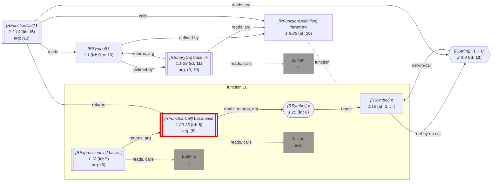

_This document was generated from '[src/documentation/wiki-query.ts](https://github.com/flowr-analysis/flowr/tree/main//src/documentation/wiki-query.ts)' on 2026-07-20, 13:05:03 UTC presenting an overview of flowR's query API (v2.12.3). Please do not edit this file/wiki page directly._
<h2 id="Does-Call Query">Does-Call Query&emsp;<sup>[<a href="https://github.com/flowr-analysis/flowr/wiki/Query-API">overview</a>]</sup></h2>

Checks whether a function calls another function matching given constraints.\
_This query is requested with the type `does-call`._


This query checks whether a function calls another function matching given constraints.

Using the example code:

```r
f <- function(x) { eval(x) };
f("1 + 1")
```

the following query checks whether the call to `f` calls `eval`:


```json
[
  {
    "type": "does-call",
    "queryId": "calls-eval",
    "call": "2@f",
    "calls": {
      "type": "name",
      "name": "eval",
      "nameExact": true
    }
  }
]
```


(This can be shortened to `@does-call (2@f:"eval")` when used with the REPL command <span title="Description (Repl Command): Query the given R code (use 'help' for more information)">`:query`</span>).


_Results (prettified and summarized):_

Query: **does-call** (6ms)\
&nbsp;&nbsp;- **calls-eval** found:\
&nbsp;&nbsp;&nbsp;&nbsp;- Call with id **15** (2.1)\
_All queries together required ≈6 ms (1ms accuracy, total 7 ms)_

<details> <summary style="color:gray">Show Detailed Results as Json</summary>

The analysis required _7.0 ms_ (including parsing and normalization and the query) within the generation environment.

In general, the JSON contains the Ids of the nodes in question as they are present in the normalized AST or the dataflow graph of flowR.
Please consult the [Interface](https://github.com/flowr-analysis/flowr/wiki/interface) wiki page for more information on how to get those.


```json
{
  "does-call": {
    ".meta": {
      "timing": 6
    },
    "results": {
      "calls-eval": {
        "call": 15
      }
    }
  },
  ".meta": {
    "timing": 6
  }
}
```


</details>


<details> <summary style="color:gray">Original Code</summary>


```r
f <- function(x) { eval(x) };
f("1 + 1")
```

<details>

<summary style="color:gray">Dataflow Graph of the R Code</summary>

The analysis required _4.0 ms_ (including parse and normalize, using the [r-shell](https://github.com/flowr-analysis/flowr/wiki/Engines) engine) within the generation environment. No [signature database](https://github.com/flowr-analysis/flowr/wiki/Signature-Database) is mounted for these generated graphs, so `library()` calls attach no package exports; base-R names are still qualified via the generated base-package store (e.g. `acf` as `stats::acf`). 
We encountered unknown side effects (with ids: 8) during the analysis.




	


</details>


</details>
	


	
		

<details>

<summary style="color:gray">Implementation Details</summary>

Responsible for the execution of the Does-Call Query query is `executeDoesCallQuery` in [`./src/queries/catalog/does-call-query/does-call-query-executor.ts`](https://github.com/flowr-analysis/flowr/tree/main/./src/queries/catalog/does-call-query/does-call-query-executor.ts).

</details>