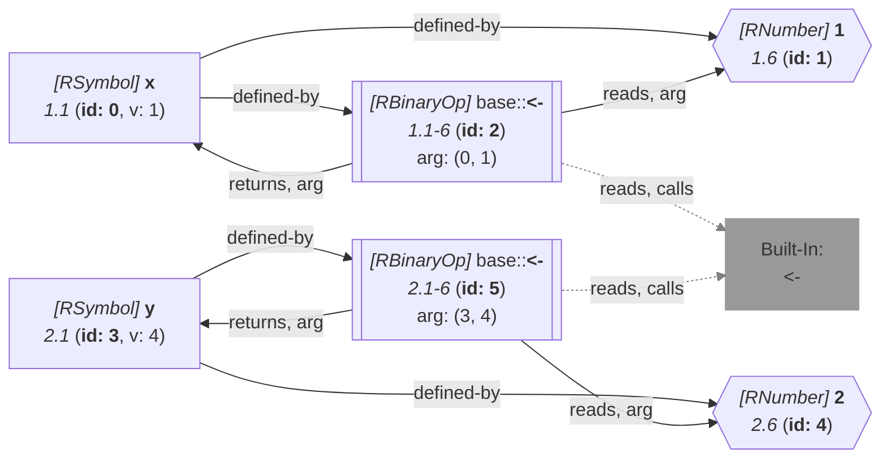

_This document was generated from '[src/documentation/wiki-query.ts](https://github.com/flowr-analysis/flowr/tree/main//src/documentation/wiki-query.ts)' on 2026-07-20, 13:05:03 UTC presenting an overview of flowR's query API (v2.12.3). Please do not edit this file/wiki page directly._
<h2 id="Happens-Before Query">Happens-Before Query&emsp;<sup>[<a href="https://github.com/flowr-analysis/flowr/wiki/Query-API">overview</a>]</sup></h2>

Check whether one normalized AST node happens before another in the CFG.\
_This query is requested with the type `happens-before`._


With this query you can analyze the control flow graph:

Using the example code:


```r
x <- 1
y <- 2
```


the following query returns that the first assignment happens always before the other:


```json
[
  {
    "type": "happens-before",
    "a": "1@x",
    "b": "2@y"
  }
]
```


_Results (prettified and summarized):_

Query: **happens-before** (1 ms)\
&nbsp;&nbsp;&nbsp;╰ 1@x<2@y: always\
_All queries together required ≈1 ms (1ms accuracy, total 2 ms)_

<details> <summary style="color:gray">Show Detailed Results as Json</summary>

The analysis required _1.9 ms_ (including parsing and normalization and the query) within the generation environment.

In general, the JSON contains the Ids of the nodes in question as they are present in the normalized AST or the dataflow graph of flowR.
Please consult the [Interface](https://github.com/flowr-analysis/flowr/wiki/interface) wiki page for more information on how to get those.


```json
{
  "happens-before": {
    ".meta": {
      "timing": 1
    },
    "results": {
      "1@x<2@y": "always"
    }
  },
  ".meta": {
    "timing": 1
  }
}
```


</details>


<details> <summary style="color:gray">Original Code</summary>


```r
x <- 1
y <- 2
```

<details>

<summary style="color:gray">Dataflow Graph of the R Code</summary>

The analysis required _1.4 ms_ (including parse and normalize, using the [r-shell](https://github.com/flowr-analysis/flowr/wiki/Engines) engine) within the generation environment. No [signature database](https://github.com/flowr-analysis/flowr/wiki/Signature-Database) is mounted for these generated graphs, so `library()` calls attach no package exports; base-R names are still qualified via the generated base-package store (e.g. `acf` as `stats::acf`). 
We encountered no unknown side effects during the analysis.




	


</details>


</details>
	


	
		

<details>

<summary style="color:gray">Implementation Details</summary>

Responsible for the execution of the Happens-Before Query query is `executeSearch` in [`./src/queries/catalog/happens-before-query/happens-before-query-executor.ts`](https://github.com/flowr-analysis/flowr/tree/main/./src/queries/catalog/happens-before-query/happens-before-query-executor.ts).

</details>