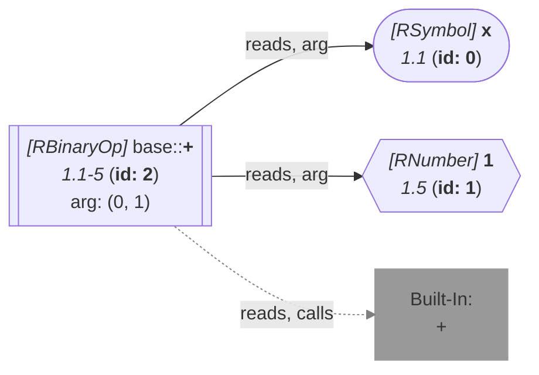

_This document was generated from '[src/documentation/wiki-query.ts](https://github.com/flowr-analysis/flowr/tree/main//src/documentation/wiki-query.ts)' on 2026-07-20, 13:05:03 UTC presenting an overview of flowR's query API (v2.12.3). Please do not edit this file/wiki page directly._
<h2 id="Id-Map Query">Id-Map Query&emsp;<sup>[<a href="https://github.com/flowr-analysis/flowr/wiki/Query-API">overview</a>]</sup></h2>

Returns the id-map of the normalized AST of the given code.\
_This query is requested with the type `id-map`._


This query provides access to all nodes in the [normalized AST](https://github.com/flowr-analysis/flowr/wiki/normalized-ast) as a mapping from their id to the node itself.

Using the example code `x + 1`, the following query returns all nodes from the code:


```json
[ { "type": "id-map" } ]
```


(This can be shortened to `@id-map` when used with the REPL command <span title="Description (Repl Command): Query the given R code (use 'help' for more information)">`:query`</span>).


_Results (prettified and summarized):_

Query: **id-map** (1 ms)\
&nbsp;&nbsp;&nbsp;╰ Id List: {0, 1, 2, 3}\
_All queries together required ≈1 ms (1ms accuracy, total 1 ms)_

<details> <summary style="color:gray">Show Detailed Results as Json</summary>

The analysis required _1.3 ms_ (including parsing and normalization and the query) within the generation environment.

In general, the JSON contains the Ids of the nodes in question as they are present in the normalized AST or the dataflow graph of flowR.
Please consult the [Interface](https://github.com/flowr-analysis/flowr/wiki/interface) wiki page for more information on how to get those.


_As the code is pretty long, we inhibit pretty printing and syntax highlighting (JSON, hiding built-in):_

```text
{"id-map":{".meta":{"timing":1},"idMap":{"size":4,"k2v":[[0,{"type":"RSymbol","location":[1,1,1,1],"content":"x","lexeme":"x","info":{"fullRange":[1,1,1,1],"adToks":[],"id":0,"parent":2,"role":"bin-l","index":0,"nest":0}}],[1,{"location":[1,5,1,5],"lexeme":"1","info":{"fullRange":[1,5,1,5],"adToks":[],"id":1,"parent":2,"role":"bin-r","index":1,"nest":0},"type":"RNumber","content":{"num":1,"complexNumber":false,"markedAsInt":false}}],[2,{"type":"RBinaryOp","location":[1,3,1,3],"lhs":{"type":"RSymbol","location":[1,1,1,1],"content":"x","lexeme":"x","info":{"fullRange":[1,1,1,1],"adToks":[],"id":0,"parent":2,"role":"bin-l","index":0,"nest":0}},"rhs":{"location":[1,5,1,5],"lexeme":"1","info":{"fullRange":[1,5,1,5],"adToks":[],"id":1,"parent":2,"role":"bin-r","index":1,"nest":0},"type":"RNumber","content":{"num":1,"complexNumber":false,"markedAsInt":false}},"operator":"+","lexeme":"+","info":{"fullRange":[1,1,1,5],"adToks":[],"id":2,"parent":3,"nest":0,"index":0,"role":"el-c"}}],[3,{"type":"RExpressionList","children":[{"type":"RBinaryOp","location":[1,3,1,3],"lhs":{"type":"RSymbol","location":[1,1,1,1],"content":"x","lexeme":"x","info":{"fullRange":[1,1,1,1],"adToks":[],"id":0,"parent":2,"role":"bin-l","index":0,"nest":0}},"rhs":{"location":[1,5,1,5],"lexeme":"1","info":{"fullRange":[1,5,1,5],"adToks":[],"id":1,"parent":2,"role":"bin-r","index":1,"nest":0},"type":"RNumber","content":{"num":1,"complexNumber":false,"markedAsInt":false}},"operator":"+","lexeme":"+","info":{"fullRange":[1,1,1,5],"adToks":[],"id":2,"parent":3,"nest":0,"index":0,"role":"el-c"}}],"info":{"adToks":[],"id":3,"nest":0,"role":"root","index":0}}]],"v2k":{}}},".meta":{"timing":1}}
```


</details>


<details> <summary style="color:gray">Original Code</summary>


```r
x + 1
```

<details>

<summary style="color:gray">Dataflow Graph of the R Code</summary>

The analysis required _1.3 ms_ (including parse and normalize, using the [r-shell](https://github.com/flowr-analysis/flowr/wiki/Engines) engine) within the generation environment. No [signature database](https://github.com/flowr-analysis/flowr/wiki/Signature-Database) is mounted for these generated graphs, so `library()` calls attach no package exports; base-R names are still qualified via the generated base-package store (e.g. `acf` as `stats::acf`). 
We encountered no unknown side effects during the analysis.




	


</details>


</details>
	


	
		

<details>

<summary style="color:gray">Implementation Details</summary>

Responsible for the execution of the Id-Map Query query is `executeIdMapQuery` in [`./src/queries/catalog/id-map-query/id-map-query-executor.ts`](https://github.com/flowr-analysis/flowr/tree/main/./src/queries/catalog/id-map-query/id-map-query-executor.ts).

</details>