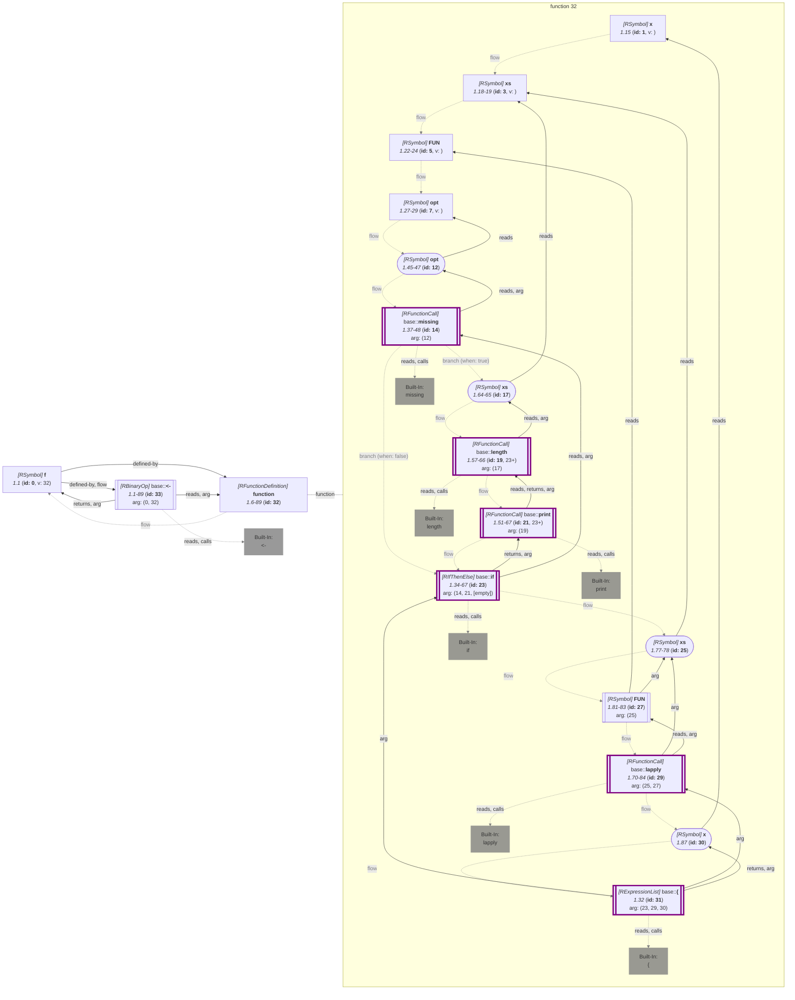

_<span title="an overview of flowR's query API">Generated</span> from '[wiki-query.ts](https://github.com/flowr-analysis/flowr/tree/main/src/documentation/wiki-query.ts "src/documentation/wiki-query.ts")' on 2026-08-23, 13:40:42 UTC (v2.14.3), please do not edit directly._
<h2 id="Inspect Argument Roles Query">Inspect Argument Roles Query&emsp;<sup>[<a href="https://github.com/flowr-analysis/flowr/wiki/Query-API">overview</a>]</sup></h2>

Determine what functions and their formals do\
_This query is requested with the type `inspect-fn-props`._\
Run in the REPL: `:query @inspect-fn-props [(<crit>;...)] <code | file://path>`


Per function definition this states what each formal is used for, as <a href="https://github.com/flowr-analysis/flowr/tree/main/src/dataflow/environments/built-in-props.ts#L8"><code><span title="What a single argument of a call is used for, as a bitmask. The signature database stores its parameters with the very same bits, so ArgProp.Forced and ArgProp.NoDefault lead, being the two it can state.">ArgProp</span></code></a> bits, and what the
function itself does, as <a href="https://github.com/flowr-analysis/flowr/tree/main/src/dataflow/environments/built-in-props.ts#L56"><code><span title="What the call as a whole does, as a bitmask. The resource bits ( CallProp.File and its neighbors) say where the call gets its data from, which is what InputProps collects.">CallProp</span></code></a> bits: the very scheme flowR states its built-ins and the
signature database stores its parameters with.

R hands arguments over as promises, so whether a parameter is evaluated at all is part of the answer:
<a href="https://github.com/flowr-analysis/flowr/tree/main/src/dataflow/environments/built-in-props.ts#L10"><code><span title="evaluated whenever the call happens, even if the result goes unused, like x in force(x)">ArgProp::<b>Forced</b></span></code></a> says every call forces it,
<a href="https://github.com/flowr-analysis/flowr/tree/main/src/dataflow/environments/built-in-props.ts#L48"><code><span title="never evaluated, the definite counterpart of ArgProp.Forced : no path of the body reads it">ArgProp::<b>Lazy</b></span></code></a> that none can, and neither of the two that it depends on the
path taken, on the caller, or on a function flowR could not resolve. A function forcing every one of its
parameters is <a href="https://github.com/flowr-analysis/flowr/tree/main/src/dataflow/environments/built-in-props.ts#L131"><code><span title="calling it forces every parameter, so nothing it is handed stays a promise (see strictnessOfFunction )">CallProp::<b>Strict</b></span></code></a> in turn. A read that only hands the parameter
on is decided by the function receiving it, resolved through the call graph, while a read in a nested
definition, in a loop, or under a condition leaves it open.

A formal is an alias only if the function *always* returns it (`return(x)` under an `if` does not count),
every other bit is the one the calls in the body state for what they are handed, and a formal carrying none at
all is left out. A body reading its own call or frame (`match.call()`, `nargs()`,
`as.list(environment())`) reaches every formal without naming one, so they all carry `nse`.
What the function itself does is read off its body: what its calls do it does too, a dispatching body is a
generic, and one whose result always comes from a call returning invisibly returns invisibly in turn.

With `only` the query infers just one half (`arguments` or `function`, skipping the other walk
entirely), `formals` keeps the parameters written as one of the given names, and `props` keeps the
properties named as the `ArgProp`/`CallProp` members they are.

Using the example code `f <- function(x, xs, FUN, opt) { if(missing(opt)) print(length(xs)); lapply(xs, FUN); x }` the following query returns what every identified function and formal does:


```json
[ { "type": "inspect-fn-props" } ]
```


(This can be shortened to `@inspect-fn-props` when used with the REPL command <span title="Description (Repl Command): Query the given R code (use 'help' for more information)">`:query`</span>).


_Results (prettified and summarized):_

Query: **inspect-fn-props** (6ms)\
&nbsp;&nbsp;- Function **32** (1.6-89) x: forced, alias, xs: forced, value, shape, FUN: forced, callee, opt: presence, lazy [prints]\
_All queries together required ≈6 ms (1ms accuracy, total 8 ms)_

<details> <summary style="color:gray">Show Detailed Results as Json</summary>

The analysis required _7.5 ms_ (including parsing and normalization and the query) within the generation environment.

In general, the JSON contains the Ids of the nodes in question as they are present in the normalized AST or the dataflow graph of flowR.
Please consult the [Interface](https://github.com/flowr-analysis/flowr/wiki/Interface) wiki page for more information on how to get those.


```json
{
  "inspect-fn-props": {
    ".meta": {
      "timing": 6
    },
    "roles": {
      "32": {
        "1": 5,
        "3": 25,
        "5": 513,
        "7": 17408
      }
    },
    "props": {
      "32": 2097152
    }
  },
  ".meta": {
    "timing": 6
  }
}
```


</details>


<details> <summary style="color:gray">Original Code</summary>


```r
f <- function(x, xs, FUN, opt) { if(missing(opt)) print(length(xs)); lapply(xs, FUN); x }
```

<details>

<summary style="color:gray">Dataflow Graph of the R Code</summary>

The analysis required _3.9 ms_ (including parse and normalize, using the [r-shell](https://github.com/flowr-analysis/flowr/wiki/Engines) engine) within the generation environment. No [signature database](https://github.com/flowr-analysis/flowr/wiki/Signature-Database) is mounted for these generated graphs, so `library()` calls attach no package exports; base-R names are still qualified via the generated base-package store (e.g. `acf` as `stats::acf`). 
We encountered unknown side effects (with ids: 21 (linked)) during the analysis.




	


</details>


</details>
	


	

This query also supports a slicing criterion based query mode that only returns information for functions matching the given criteria:


```json
[
  {
    "type": "inspect-fn-props",
    "filter": [
      "1@function"
    ]
  }
]
```


(This can be shortened to `@inspect-fn-props (1@function) "f <- function(x, xs, FUN, opt) { if(missing(opt)) print(length(xs)); lapply(xs, FUN); x }"` when used with the REPL command <span title="Description (Repl Command): Query the given R code (use 'help' for more information)">`:query`</span>).


_Results (prettified and summarized):_

Query: **inspect-fn-props** (5ms)\
&nbsp;&nbsp;- Function **32** (1.6-89) x: forced, alias, xs: forced, value, shape, FUN: forced, callee, opt: presence, lazy [prints]\
_All queries together required ≈5 ms (1ms accuracy, total 7 ms)_

<details> <summary style="color:gray">Show Detailed Results as Json</summary>

The analysis required _7.4 ms_ (including parsing and normalization and the query) within the generation environment.

In general, the JSON contains the Ids of the nodes in question as they are present in the normalized AST or the dataflow graph of flowR.
Please consult the [Interface](https://github.com/flowr-analysis/flowr/wiki/Interface) wiki page for more information on how to get those.


```json
{
  "inspect-fn-props": {
    ".meta": {
      "timing": 5
    },
    "roles": {
      "32": {
        "1": 5,
        "3": 25,
        "5": 513,
        "7": 17408
      }
    },
    "props": {
      "32": 2097152
    }
  },
  ".meta": {
    "timing": 5
  }
}
```


</details>


<details> <summary style="color:gray">Original Code</summary>


```r
f <- function(x, xs, FUN, opt) { if(missing(opt)) print(length(xs)); lapply(xs, FUN); x }
```

<details>

<summary style="color:gray">Dataflow Graph of the R Code</summary>

The analysis required _3.7 ms_ (including parse and normalize, using the [r-shell](https://github.com/flowr-analysis/flowr/wiki/Engines) engine) within the generation environment. No [signature database](https://github.com/flowr-analysis/flowr/wiki/Signature-Database) is mounted for these generated graphs, so `library()` calls attach no package exports; base-R names are still qualified via the generated base-package store (e.g. `acf` as `stats::acf`). 
We encountered unknown side effects (with ids: 21 (linked)) during the analysis.


	


</details>


</details>
	


	
		

<details>

<summary style="color:gray">Implementation Details</summary>

Responsible for the execution of the Inspect Argument Roles Query query is `executeFnPropsQuery` in [`./src/queries/catalog/inspect-fn-props-query/inspect-fn-props-query-executor.ts`](https://github.com/flowr-analysis/flowr/tree/main/src/queries/catalog/inspect-fn-props-query/inspect-fn-props-query-executor.ts).

</details>