_This document was generated from '[src/documentation/wiki-query.ts](https://github.com/flowr-analysis/flowr/tree/main//src/documentation/wiki-query.ts)' on 2026-07-20, 13:05:03 UTC presenting an overview of flowR's query API (v2.12.3). Please do not edit this file/wiki page directly._
<h2 id="Inspect Exceptions of Functions Query">Inspect Exceptions of Functions Query&emsp;<sup>[<a href="https://github.com/flowr-analysis/flowr/wiki/Query-API">overview</a>]</sup></h2>

Determine whether functions throw exceptions (known to flowR)\
_This query is requested with the type `inspect-exception`._


With this query you can identify which functions in the code throw exceptions (known to flowR).

Using the following example code:

```r
mayFail <- function(x) {
  if(x < 0) stop("Negative value!")
  else sqrt(x)
}
safeFail <- function(x) {
  tryCatch(
    mayFail(x),
    error = function(e) { NA }
  )
}
```

the following query returns the information for all identified function definitions whether they throw exceptions:


```json
[ { "type": "inspect-exception" } ]
```


(This can be shortened to `@inspect-exception` when used with the REPL command <span title="Description (Repl Command): Query the given R code (use 'help' for more information)">`:query`</span>).


_Results (prettified and summarized):_

Query: **inspect-exception** (6ms)\
&nbsp;&nbsp;- Function **20** (1.12-4.1) throws exceptions:\
&nbsp;&nbsp;&nbsp;&nbsp;&nbsp;&nbsp;- Exception maybe thrown at id **11** "stop" (2.13-35, cds: true:2.3-3.14)\
&nbsp;&nbsp;- Function **40** (8.13-30) does not throw exceptions.\
&nbsp;&nbsp;- Function **44** (5.13-10.1) throws exceptions:\
&nbsp;&nbsp;&nbsp;&nbsp;&nbsp;&nbsp;- Exception maybe thrown at id **11** "stop" (2.13-35, cds: true:2.3-3.14)\
_All queries together required ≈6 ms (1ms accuracy, total 7 ms)_

<details> <summary style="color:gray">Show Detailed Results as Json</summary>

The analysis required _6.9 ms_ (including parsing and normalization and the query) within the generation environment.

In general, the JSON contains the Ids of the nodes in question as they are present in the normalized AST or the dataflow graph of flowR.
Please consult the [Interface](https://github.com/flowr-analysis/flowr/wiki/interface) wiki page for more information on how to get those.


```json
{
  "inspect-exception": {
    ".meta": {
      "timing": 6
    },
    "exceptions": {
      "20": [
        {
          "id": 11,
          "cds": [
            {
              "id": 18,
              "when": true
            }
          ]
        }
      ],
      "40": [],
      "44": [
        {
          "id": 11,
          "cds": [
            {
              "id": 18,
              "when": true
            }
          ]
        }
      ]
    }
  },
  ".meta": {
    "timing": 6
  }
}
```


</details>


<details> <summary style="color:gray">Original Code</summary>


```r
mayFail <- function(x) {
  if(x < 0) stop("Negative value!")
  else sqrt(x)
}
safeFail <- function(x) {
  tryCatch(
    mayFail(x),
    error = function(e) { NA }
  )
}
```

<details>

<summary style="color:gray">Dataflow Graph of the R Code</summary>

The analysis required _4.6 ms_ (including parse and normalize, using the [r-shell](https://github.com/flowr-analysis/flowr/wiki/Engines) engine) within the generation environment. No [signature database](https://github.com/flowr-analysis/flowr/wiki/Signature-Database) is mounted for these generated graphs, so `library()` calls attach no package exports; base-R names are still qualified via the generated base-package store (e.g. `acf` as `stats::acf`). 
We encountered no unknown side effects during the analysis.

```mermaid
flowchart LR
    20["`*#91;RFunctionDefinition#93;* **function**
      *1.12-4.1* (**id: 20**)`"]

subgraph "flow-20" [function 20]
    1["`*#91;RSymbol#93;* **x**
      *1.21* (**id: 1**, v: )`"]
    5(["`*#91;RSymbol#93;* **x**
      *2.6* (**id: 5**)`"])
    6{{"`*#91;RNumber#93;* **0**
      *2.10* (**id: 6**)`"}}
   %% No edges found for 6
    7[["`*#91;RBinaryOp#93;* base#58;#58;**#60;**
      *2.6-10* (**id: 7**)
    arg: (5, 6)`"]]
    built-in:_["`Built-In:
#60;`"]
    style built-in:_ stroke:gray,fill:gray,stroke-width:2px,opacity:.8;
    9{{"`*#91;RString#93;* **#34;Negative value!#34;**
      *2.18-34* (**id: 9**)`"}}
   %% No edges found for 9
    11[["`*#91;RFunctionCall#93;* base#58;#58;**stop**
      *2.13-35* (**id: 11**, 18+)
    arg: (9)`"]]
    built-in:stop["`Built-In:
stop`"]
    style built-in:stop stroke:gray,fill:gray,stroke-width:2px,opacity:.8;
    14(["`*#91;RSymbol#93;* **x**
      *3.13* (**id: 14**)`"])
    16[["`*#91;RFunctionCall#93;* base#58;#58;**sqrt**
      *3.8-14* (**id: 16**, 18-)
    arg: (14)`"]]
    built-in:sqrt["`Built-In:
sqrt`"]
    style built-in:sqrt stroke:gray,fill:gray,stroke-width:2px,opacity:.8;
    18[["`*#91;RIfThenElse#93;* base#58;#58;**if**
      *2.3-3.14* (**id: 18**)
    arg: (7, 11, 16)`"]]
    built-in:if["`Built-In:
if`"]
    style built-in:if stroke:gray,fill:gray,stroke-width:2px,opacity:.8;
    19[["`*#91;RExpressionList#93;* base#58;#58;**#123;**
      *1.24* (**id: 19**)
    arg: (18)`"]]
end
   %% No edges found for 20
    0["`*#91;RSymbol#93;* **mayFail**
      *1.1-7* (**id: 0**, v: 20)`"]
    21[["`*#91;RBinaryOp#93;* base#58;#58;**#60;#45;**
      *1.1-4.1* (**id: 21**)
    arg: (0, 20)`"]]
    built-in:_-["`Built-In:
#60;#45;`"]
    style built-in:_- stroke:gray,fill:gray,stroke-width:2px,opacity:.8;
    44["`*#91;RFunctionDefinition#93;* **function**
      *5.13-10.1* (**id: 44**)`"]

subgraph "flow-44" [function 44]
    23["`*#91;RSymbol#93;* **x**
      *5.22* (**id: 23**, v: )`"]
   %% No edges found for 23
    29(["`*#91;RSymbol#93;* **x**
      *7.13* (**id: 29**)`"])
    %% Environment of 31 [level: 1]:
    %% Built-in
    %% 1----------------------------------------
    %% 2----------------------------------------
    %%   x: {**x** (id: 23, type: Parameter, def. @24)}
    31[["`*#91;RFunctionCall#93;* **mayFail**
      *7.5-14* (**id: 31**)
    arg: (29)`"]]
    %% Environment of 40 [level: 1]:
    %% Built-in
    %% 1----------------------------------------
    %% 2----------------------------------------
    40["`*#91;RFunctionDefinition#93;* **function**
      *8.13-30* (**id: 40**)`"]

subgraph "flow-40" [function 40]
    34["`*#91;RSymbol#93;* **e**
      *8.22* (**id: 34**, v: )`"]
   %% No edges found for 34
    38{{"`*#91;RSymbol#93;* **NA**
      *8.27-28* (**id: 38**)`"}}
   %% No edges found for 38
    39[["`*#91;RExpressionList#93;* base#58;#58;**#123;**
      *8.25* (**id: 39**)
    arg: (38)`"]]
    built-in:_["`Built-In:
#123;`"]
    style built-in:_ stroke:gray,fill:gray,stroke-width:2px,opacity:.8;
    style 38 stroke:purple,stroke-width:4px; 
    style 39 stroke:purple,stroke-width:4px; 
end
   %% No edges found for 40
    41(["`*#91;RArgument#93;* **error**
      *8.5-9* (**id: 41**)`"])
    42[["`*#91;RFunctionCall#93;* base#58;#58;**tryCatch**
      *6.3-9.3* (**id: 42**)
    arg: (31, error (41))`"]]
    built-in:tryCatch["`Built-In:
tryCatch`"]
    style built-in:tryCatch stroke:gray,fill:gray,stroke-width:2px,opacity:.8;
    43[["`*#91;RExpressionList#93;* base#58;#58;**#123;**
      *5.25* (**id: 43**)
    arg: (42)`"]]
    built-in:_["`Built-In:
#123;`"]
    style built-in:_ stroke:gray,fill:gray,stroke-width:2px,opacity:.8;
    style 31 stroke:purple,stroke-width:4px; 
    style 42 stroke:purple,stroke-width:4px; 
    style 43 stroke:purple,stroke-width:4px; 
end
   %% No edges found for 44
    22["`*#91;RSymbol#93;* **safeFail**
      *5.1-8* (**id: 22**, v: 44)`"]
    45[["`*#91;RBinaryOp#93;* base#58;#58;**#60;#45;**
      *5.1-10.1* (**id: 45**)
    arg: (22, 44)`"]]
    1 -->|"def-by-on-call"| 29
    5 -->|"reads"| 1
    7 -->|"reads, arg"| 5
    7 -->|"reads, arg"| 6
    7 -.->|"reads, calls"| built-in:_
    linkStyle 4 stroke:gray;
    11 -->|"arg"| 9
    11 -.->|"reads, calls"| built-in:stop
    linkStyle 6 stroke:gray;
    11 -->|"CD-True"| 18
    linkStyle 7 stroke:gray,color:gray;
    14 -->|"reads"| 1
    16 -->|"reads, arg"| 14
    16 -.->|"reads, calls"| built-in:sqrt
    linkStyle 10 stroke:gray;
    16 -->|"CD-False"| 18
    linkStyle 11 stroke:gray,color:gray;
    18 -->|"returns, arg"| 11
    18 -->|"returns, arg"| 16
    18 -->|"reads, arg"| 7
    18 -.->|"reads, calls"| built-in:if
    linkStyle 15 stroke:gray;
    19 -->|"returns, arg"| 18
    19 -.->|"reads, calls"| built-in:_
    linkStyle 17 stroke:gray;
20 -.-|function| flow-20

    0 -->|"defined-by"| 20
    0 -->|"defined-by"| 21
    21 -->|"reads, arg"| 20
    21 -->|"returns, arg"| 0
    21 -.->|"reads, calls"| built-in:_-
    linkStyle 23 stroke:gray;
    29 -->|"reads"| 23
    29 -->|"def-on-call"| 1
    31 -->|"reads, arg"| 29
    31 -->|"calls"| 20
    31 -->|"returns"| 11
    31 -->|"returns"| 18
    39 -->|"returns, arg"| 38
    39 -.->|"reads, calls"| built-in:_
    linkStyle 1 stroke:gray;
40 -.-|function| flow-40

    41 -->|"reads, calls"| 40
    42 -->|"returns, arg"| 31
    42 -->|"reads, calls, arg"| 41
    42 -->|"returns"| 38
    42 -.->|"reads, calls"| built-in:tryCatch
    linkStyle 13 stroke:gray;
    43 -->|"returns, arg"| 42
    43 -.->|"reads, calls"| built-in:_
    linkStyle 15 stroke:gray;
44 -.-|function| flow-44

    22 -->|"defined-by"| 44
    22 -->|"defined-by"| 45
    45 -->|"reads, arg"| 44
    45 -->|"returns, arg"| 22
    45 -.->|"reads, calls"| built-in:_-
    linkStyle 45 stroke:gray;
```




	


</details>


</details>
	


	
		

<details>

<summary style="color:gray">Implementation Details</summary>

Responsible for the execution of the Inspect Exceptions of Functions Query query is `executeExceptionQuery` in [`./src/queries/catalog/inspect-exceptions-query/inspect-exception-query-executor.ts`](https://github.com/flowr-analysis/flowr/tree/main/./src/queries/catalog/inspect-exceptions-query/inspect-exception-query-executor.ts).

</details>