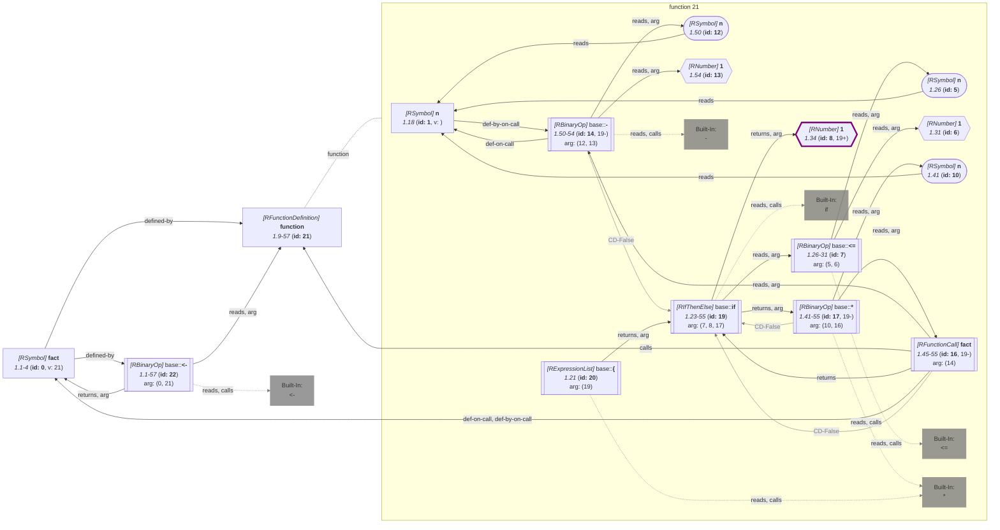

_This document was generated from '[src/documentation/wiki-query.ts](https://github.com/flowr-analysis/flowr/tree/main//src/documentation/wiki-query.ts)' on 2026-07-20, 17:48:26 UTC presenting an overview of flowR's query API (v2.12.3). Please do not edit this file/wiki page directly._
<h2 id="Inspect Recursive Functions Query">Inspect Recursive Functions Query&emsp;<sup>[<a href="https://github.com/flowr-analysis/flowr/wiki/Query-API">overview</a>]</sup></h2>

Determine whether functions are recursive\
_This query is requested with the type `inspect-recursion`._\
Run in the REPL: `:query @inspect-recursion [(<crit>;...)] <code | file://path>`


With this query you can identify which functions in the code are recursive.
Please note, that functions that *may* be recursive due to indirect calls are also considered recursive.

Using the example code `fact <- function(n) { if(n <= 1) 1 else n * fact(n - 1) }` the following query returns the information for all identified function definitions whether they are recursive:


```json
[ { "type": "inspect-recursion" } ]
```


(This can be shortened to `@inspect-recursion` when used with the REPL command <span title="Description (Repl Command): Query the given R code (use 'help' for more information)">`:query`</span>).


_Results (prettified and summarized):_

Query: **inspect-recursion** (7ms)\
&nbsp;&nbsp;- Function **21** (1.9-57) is recursive\
_All queries together required ≈7 ms (1ms accuracy, total 8 ms)_

<details> <summary style="color:gray">Show Detailed Results as Json</summary>

The analysis required _8.1 ms_ (including parsing and normalization and the query) within the generation environment.

In general, the JSON contains the Ids of the nodes in question as they are present in the normalized AST or the dataflow graph of flowR.
Please consult the [Interface](https://github.com/flowr-analysis/flowr/wiki/interface) wiki page for more information on how to get those.


```json
{
  "inspect-recursion": {
    ".meta": {
      "timing": 7
    },
    "recursive": {
      "21": true
    }
  },
  ".meta": {
    "timing": 7
  }
}
```


</details>


<details> <summary style="color:gray">Original Code</summary>


```r
fact <- function(n) { if(n <= 1) 1 else n * fact(n - 1) }
```

<details>

<summary style="color:gray">Dataflow Graph of the R Code</summary>

The analysis required _4.8 ms_ (including parse and normalize, using the [r-shell](https://github.com/flowr-analysis/flowr/wiki/Engines) engine) within the generation environment. No [signature database](https://github.com/flowr-analysis/flowr/wiki/Signature-Database) is mounted for these generated graphs, so `library()` calls attach no package exports; base-R names are still qualified via the generated base-package store (e.g. `acf` as `stats::acf`). 
We encountered no unknown side effects during the analysis.


	


</details>


</details>
	


	

This query also supports a slicing criterion based query mode that only returns information for functions matching the given criteria:


```json
[
  {
    "type": "inspect-recursion",
    "filter": [
      "1@function"
    ]
  }
]
```


(This can be shortened to `@inspect-recursion (1@function) "fact <- function(n) { if(n <= 1) 1 else n * fact(n - 1) }"` when used with the REPL command <span title="Description (Repl Command): Query the given R code (use 'help' for more information)">`:query`</span>).


_Results (prettified and summarized):_

Query: **inspect-recursion** (8ms)\
&nbsp;&nbsp;- Function **21** (1.9-57) is recursive\
_All queries together required ≈8 ms (1ms accuracy, total 10 ms)_

<details> <summary style="color:gray">Show Detailed Results as Json</summary>

The analysis required _9.6 ms_ (including parsing and normalization and the query) within the generation environment.

In general, the JSON contains the Ids of the nodes in question as they are present in the normalized AST or the dataflow graph of flowR.
Please consult the [Interface](https://github.com/flowr-analysis/flowr/wiki/interface) wiki page for more information on how to get those.


```json
{
  "inspect-recursion": {
    ".meta": {
      "timing": 8
    },
    "recursive": {
      "21": true
    }
  },
  ".meta": {
    "timing": 8
  }
}
```


</details>


<details> <summary style="color:gray">Original Code</summary>


```r
fact <- function(n) { if(n <= 1) 1 else n * fact(n - 1) }
```

<details>

<summary style="color:gray">Dataflow Graph of the R Code</summary>

The analysis required _5.1 ms_ (including parse and normalize, using the [r-shell](https://github.com/flowr-analysis/flowr/wiki/Engines) engine) within the generation environment. No [signature database](https://github.com/flowr-analysis/flowr/wiki/Signature-Database) is mounted for these generated graphs, so `library()` calls attach no package exports; base-R names are still qualified via the generated base-package store (e.g. `acf` as `stats::acf`). 
We encountered no unknown side effects during the analysis.




	


</details>


</details>
	


	
		

<details>

<summary style="color:gray">Implementation Details</summary>

Responsible for the execution of the Inspect Recursive Functions Query query is `executeRecursionQuery` in [`./src/queries/catalog/inspect-recursion-query/inspect-recursion-query-executor.ts`](https://github.com/flowr-analysis/flowr/tree/main/./src/queries/catalog/inspect-recursion-query/inspect-recursion-query-executor.ts).

</details>