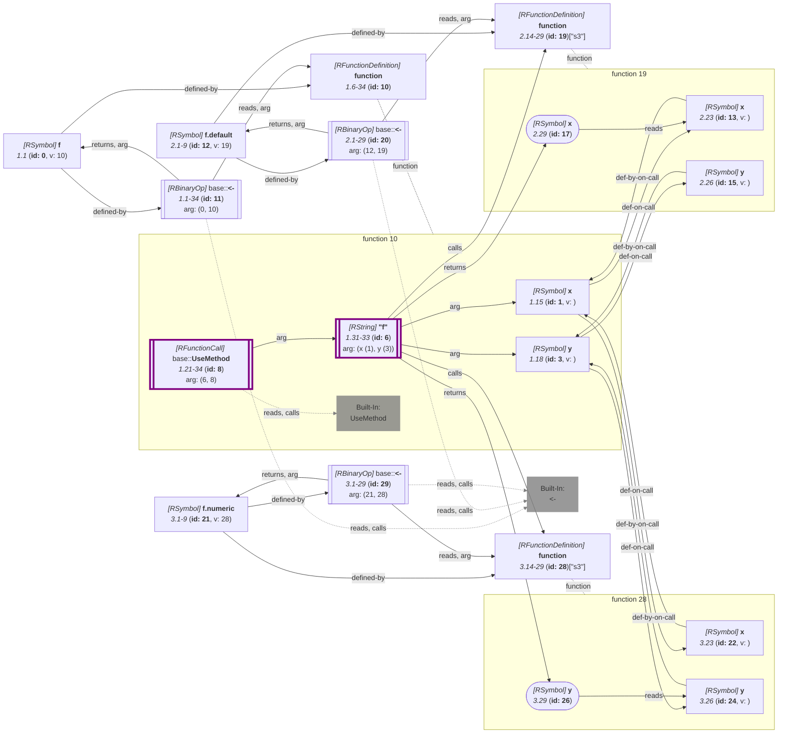

_<span title="an overview of flowR's query API">Generated</span> from '[wiki-query.ts](https://github.com/flowr-analysis/flowr/tree/main/src/documentation/wiki-query.ts "src/documentation/wiki-query.ts")' on 2026-08-18, 14:51:36 UTC (v2.14.0), please do not edit directly._
<h2 id="Inspect Strict Functions Query">Inspect Strict Functions Query&emsp;<sup>[<a href="https://github.com/flowr-analysis/flowr/wiki/Query-API">overview</a>]</sup></h2>

Determine whether functions force their arguments\
_This query is requested with the type `inspect-strictness`._\
Run in the REPL: `:query @inspect-strictness [(<crit>;...)] <code | file://path>`


R hands arguments over as promises, so a parameter is only evaluated once something reads it.
With this query you can find out which functions rely on that: a function is `always` strict if every call
forces every one of its parameters, `never` strict if no call forces all of them, and `conditionally`
strict if it depends on the path taken, on the caller, or on a function flowR could not resolve.
The result carries the same verdict per parameter, keyed by the id of the parameter's name.

Please note that a read that only hands the parameter to another function does not force it by itself.
Whether it is forced then depends on the function receiving it, which is resolved through the call graph.
A read within a nested function definition, within a loop, or under a condition leaves the parameter
`conditionally` strict, as does a call whose target flowR does not know.

What a built-in does with an argument is taken from what flowR states about it rather than from its name: an
argument declared as quoted or as one whose presence alone matters (`quote(expr)`, `missing(x)`) is never
evaluated, one declared as forced (`force(x)`) always is, and the calls that reach an argument only on the
way the run happens to take are the ones flowR hands to the processor saying so (`switch` picking a branch,
`tryCatch` reaching a handler, `on.exit` running at exit, and the short-circuiting `&&`/`||`).
A definition of your own shadowing such a name is judged by its own body instead, as R would.
A parameter read only in the default of another parameter is `conditionally` strict, as that default is
evaluated only when the argument is left out.

A generic mentions none of its arguments, so its verdict comes from the methods that S3 dispatch reaches: if
they agree the answer is theirs, otherwise the parameter is `conditionally` strict. The object the dispatch
is on is forced by the dispatch itself, which also covers `standardGeneric`. A `NextMethod` carries the
question on to the methods it reaches, matched by the position the parameter is written in, and an argument
travelling in `...` is followed to the parameter it binds to. The method of an object flowR cannot resolve,
such as `obj$m(x)`, leaves the parameter `conditionally` strict:


```json
[ { "type": "inspect-strictness" } ]
```


(This can be shortened to `@inspect-strictness` when used with the REPL command <span title="Description (Repl Command): Query the given R code (use 'help' for more information)">`:query`</span>).


_Results (prettified and summarized):_

Query: **inspect-strictness** (5ms)\
&nbsp;&nbsp;- Function **10** (1.6-34) is conditionally strict (x: always, y: conditionally)\
&nbsp;&nbsp;- Function **19** (2.14-29) is never strict (x: always, y: never)\
&nbsp;&nbsp;- Function **28** (3.14-29) is never strict (x: never, y: always)\
_All queries together required ≈6 ms (1ms accuracy, total 7 ms)_

<details> <summary style="color:gray">Show Detailed Results as Json</summary>

The analysis required _6.8 ms_ (including parsing and normalization and the query) within the generation environment.

In general, the JSON contains the Ids of the nodes in question as they are present in the normalized AST or the dataflow graph of flowR.
Please consult the [Interface](https://github.com/flowr-analysis/flowr/wiki/Interface) wiki page for more information on how to get those.


```json
{
  "inspect-strictness": {
    ".meta": {
      "timing": 5
    },
    "strictness": {
      "10": {
        "strict": "maybe",
        "parameters": {
          "1": "always",
          "3": "maybe"
        }
      },
      "19": {
        "strict": "never",
        "parameters": {
          "13": "always",
          "15": "never"
        }
      },
      "28": {
        "strict": "never",
        "parameters": {
          "22": "never",
          "24": "always"
        }
      }
    }
  },
  ".meta": {
    "timing": 6
  }
}
```


</details>


<details> <summary style="color:gray">Original Code</summary>


```r
f <- function(x, y) UseMethod("f")
f.default <- function(x, y) x
f.numeric <- function(x, y) y
```

<details>

<summary style="color:gray">Dataflow Graph of the R Code</summary>

The analysis required _4.6 ms_ (including parse and normalize, using the [r-shell](https://github.com/flowr-analysis/flowr/wiki/Engines) engine) within the generation environment. No [signature database](https://github.com/flowr-analysis/flowr/wiki/Signature-Database) is mounted for these generated graphs, so `library()` calls attach no package exports; base-R names are still qualified via the generated base-package store (e.g. `acf` as `stats::acf`). 
We encountered no unknown side effects during the analysis.




	


</details>


</details>
	


	

Using the example code `f <- function(a, b, c) { print(a); if(runif(1) > .5) print(b); 42 }` the following query returns the information for all identified
function definitions whether they are strict:


```json
[ { "type": "inspect-strictness" } ]
```


(This can be shortened to `@inspect-strictness` when used with the REPL command <span title="Description (Repl Command): Query the given R code (use 'help' for more information)">`:query`</span>).


_Results (prettified and summarized):_

Query: **inspect-strictness** (5ms)\
&nbsp;&nbsp;- Function **27** (1.6-67) is never strict (a: always, b: conditionally, c: never)\
_All queries together required ≈5 ms (1ms accuracy, total 6 ms)_

<details> <summary style="color:gray">Show Detailed Results as Json</summary>

The analysis required _6.3 ms_ (including parsing and normalization and the query) within the generation environment.

In general, the JSON contains the Ids of the nodes in question as they are present in the normalized AST or the dataflow graph of flowR.
Please consult the [Interface](https://github.com/flowr-analysis/flowr/wiki/Interface) wiki page for more information on how to get those.


```json
{
  "inspect-strictness": {
    ".meta": {
      "timing": 5
    },
    "strictness": {
      "27": {
        "strict": "never",
        "parameters": {
          "1": "always",
          "3": "maybe",
          "5": "never"
        }
      }
    }
  },
  ".meta": {
    "timing": 5
  }
}
```


</details>


<details> <summary style="color:gray">Original Code</summary>


```r
f <- function(a, b, c) { print(a); if(runif(1) > .5) print(b); 42 }
```

<details>

<summary style="color:gray">Dataflow Graph of the R Code</summary>

The analysis required _3.0 ms_ (including parse and normalize, using the [r-shell](https://github.com/flowr-analysis/flowr/wiki/Engines) engine) within the generation environment. No [signature database](https://github.com/flowr-analysis/flowr/wiki/Signature-Database) is mounted for these generated graphs, so `library()` calls attach no package exports; base-R names are still qualified via the generated base-package store (e.g. `acf` as `stats::acf`). 
We encountered unknown side effects (with ids: 12 (linked), 22 (linked)) during the analysis.


	


</details>


</details>
	


	

This query also supports a slicing criterion based query mode that only returns information for functions matching the given criteria:


```json
[
  {
    "type": "inspect-strictness",
    "filter": [
      "1@function"
    ]
  }
]
```


(This can be shortened to `@inspect-strictness (1@function) "f <- function(a, b, c) { print(a); if(runif(1) > .5) print(b); 42 }"` when used with the REPL command <span title="Description (Repl Command): Query the given R code (use 'help' for more information)">`:query`</span>).


_Results (prettified and summarized):_

Query: **inspect-strictness** (5ms)\
&nbsp;&nbsp;- Function **27** (1.6-67) is never strict (a: always, b: conditionally, c: never)\
_All queries together required ≈5 ms (1ms accuracy, total 5 ms)_

<details> <summary style="color:gray">Show Detailed Results as Json</summary>

The analysis required _4.8 ms_ (including parsing and normalization and the query) within the generation environment.

In general, the JSON contains the Ids of the nodes in question as they are present in the normalized AST or the dataflow graph of flowR.
Please consult the [Interface](https://github.com/flowr-analysis/flowr/wiki/Interface) wiki page for more information on how to get those.


```json
{
  "inspect-strictness": {
    ".meta": {
      "timing": 5
    },
    "strictness": {
      "27": {
        "strict": "never",
        "parameters": {
          "1": "always",
          "3": "maybe",
          "5": "never"
        }
      }
    }
  },
  ".meta": {
    "timing": 5
  }
}
```


</details>


<details> <summary style="color:gray">Original Code</summary>


```r
f <- function(a, b, c) { print(a); if(runif(1) > .5) print(b); 42 }
```

<details>

<summary style="color:gray">Dataflow Graph of the R Code</summary>

The analysis required _3.8 ms_ (including parse and normalize, using the [r-shell](https://github.com/flowr-analysis/flowr/wiki/Engines) engine) within the generation environment. No [signature database](https://github.com/flowr-analysis/flowr/wiki/Signature-Database) is mounted for these generated graphs, so `library()` calls attach no package exports; base-R names are still qualified via the generated base-package store (e.g. `acf` as `stats::acf`). 
We encountered unknown side effects (with ids: 12 (linked), 22 (linked)) during the analysis.




	


</details>


</details>
	


	
		

<details>

<summary style="color:gray">Implementation Details</summary>

```mermaid
flowchart LR
    27["`*#91;RFunctionDefinition#93;* **function**
      *1.6-67* (**id: 27**)`"]

subgraph "flow-27" [function 27]
    1["`*#91;RSymbol#93;* **a**
      *1.15* (**id: 1**, v: )`"]
   %% No edges found for 1
    3["`*#91;RSymbol#93;* **b**
      *1.18* (**id: 3**, v: )`"]
   %% No edges found for 3
    5["`*#91;RSymbol#93;* **c**
      *1.21* (**id: 5**, v: )`"]
   %% No edges found for 5
    10(["`*#91;RSymbol#93;* **a**
      *1.32* (**id: 10**)`"])
    12[["`*#91;RFunctionCall#93;* base#58;#58;**print**
      *1.26-33* (**id: 12**)
    arg: (10)`"]]
    built-in:print["`Built-In:
print`"]
    style built-in:print stroke:gray,fill:gray,stroke-width:2px,opacity:.8;
    14{{"`*#91;RNumber#93;* **1**
      *1.45* (**id: 14**)`"}}
   %% No edges found for 14
    16[["`*#91;RFunctionCall#93;* stats#58;#58;**runif**
      *1.39-46* (**id: 16**)
    arg: (14)`"]]
    built-in:runif["`Built-In:
runif`"]
    style built-in:runif stroke:gray,fill:gray,stroke-width:2px,opacity:.8;
    17{{"`*#91;RNumber#93;* **.5**
      *1.50-51* (**id: 17**)`"}}
   %% No edges found for 17
    18[["`*#91;RBinaryOp#93;* base#58;#58;**#62;**
      *1.39-51* (**id: 18**)
    arg: (16, 17)`"]]
    built-in:_["`Built-In:
#62;`"]
    style built-in:_ stroke:gray,fill:gray,stroke-width:2px,opacity:.8;
    20(["`*#91;RSymbol#93;* **b**
      *1.60* (**id: 20**)`"])
    22[["`*#91;RFunctionCall#93;* base#58;#58;**print**
      *1.54-61* (**id: 22**, 24+)
    arg: (20)`"]]
    24[["`*#91;RIfThenElse#93;* base#58;#58;**if**
      *1.36-61* (**id: 24**)
    arg: (18, 22, #91;empty#93;)`"]]
    built-in:if["`Built-In:
if`"]
    style built-in:if stroke:gray,fill:gray,stroke-width:2px,opacity:.8;
    25{{"`*#91;RNumber#93;* **42**
      *1.64-65* (**id: 25**)`"}}
   %% No edges found for 25
    26[["`*#91;RExpressionList#93;* base#58;#58;**#123;**
      *1.24* (**id: 26**)
    arg: (12, 24, 25)`"]]
    style 12 stroke:purple,stroke-width:4px; 
    style 22 stroke:purple,stroke-width:4px; 
    style 24 stroke:purple,stroke-width:4px; 
    style 16 stroke:purple,stroke-width:4px; 
    style 18 stroke:purple,stroke-width:4px; 
    style 25 stroke:purple,stroke-width:4px; 
    style 26 stroke:purple,stroke-width:4px; 
end
   %% No edges found for 27
    0["`*#91;RSymbol#93;* **f**
      *1.1* (**id: 0**, v: 27)`"]
    28[["`*#91;RBinaryOp#93;* base#58;#58;**#60;#45;**
      *1.1-67* (**id: 28**)
    arg: (0, 27)`"]]
    built-in:_-["`Built-In:
#60;#45;`"]
    style built-in:_- stroke:gray,fill:gray,stroke-width:2px,opacity:.8;
    10 -->|"reads"| 1
    12 -->|"reads, returns, arg"| 10
    12 -.->|"reads, calls"| built-in:print
    linkStyle 2 stroke:gray;
    16 -->|"reads, arg"| 14
    16 -.->|"reads, calls"| built-in:runif
    linkStyle 4 stroke:gray;
    18 -->|"reads, arg"| 16
    18 -->|"reads, arg"| 17
    18 -.->|"reads, calls"| built-in:_
    linkStyle 7 stroke:gray;
    20 -->|"reads"| 3
    22 -->|"reads, returns, arg"| 20
    22 -.->|"reads, calls"| built-in:print
    linkStyle 10 stroke:gray;
    22 -->|"CD-True"| 24
    linkStyle 11 stroke:gray,color:gray;
    24 -->|"returns, arg"| 22
    24 -->|"reads, arg"| 18
    24 -.->|"reads, calls"| built-in:if
    linkStyle 14 stroke:gray;
    26 -->|"arg"| 12
    26 -->|"arg"| 24
    26 -->|"returns, arg"| 25
    26 -.->|"reads, calls"| built-in:_
    linkStyle 18 stroke:gray;
27 -.-|function| flow-27

    0 -->|"defined-by"| 27
    0 -->|"defined-by"| 28
    28 -->|"reads, arg"| 27
    28 -->|"returns, arg"| 0
    28 -.->|"reads, calls"| built-in:_-
    linkStyle 24 stroke:gray;
```

Responsible for the execution of the Inspect Strict Functions Query query is `executeStrictnessQuery` in [`./src/queries/catalog/inspect-strictness-query/inspect-strictness-query-executor.ts`](https://github.com/flowr-analysis/flowr/tree/main/src/queries/catalog/inspect-strictness-query/inspect-strictness-query-executor.ts).

</details>