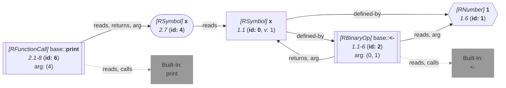

_This document was generated from '[src/documentation/wiki-query.ts](https://github.com/flowr-analysis/flowr/tree/main//src/documentation/wiki-query.ts)' on 2026-07-20, 13:05:03 UTC presenting an overview of flowR's query API (v2.12.3). Please do not edit this file/wiki page directly._
<h2 id="Origin Query">Origin Query&emsp;<sup>[<a href="https://github.com/flowr-analysis/flowr/wiki/Query-API">overview</a>]</sup></h2>

Retrieve the origin of a variable, function call, ...\
_This query is requested with the type `origin`._


With this query you can use flowR's origin tracking to find out the read origins of a variable,
the functions called by a call, and more.

Using the example code `x <- 1
print(x)` (with the `print(x)` in the second line), the following query returns the origins of `x` in the code:


```json
[
  {
    "type": "origin",
    "criterion": "2@x"
  }
]
```


(This can be shortened to `@origin (2@x) "x <- 1\nprint(x)"` when used with the REPL command <span title="Description (Repl Command): Query the given R code (use 'help' for more information)">`:query`</span>).


_Results (prettified and summarized):_

Query: **origin** (4 ms)\
&nbsp;&nbsp;&nbsp;╰ Origins for {2@x}\
&nbsp;&nbsp;&nbsp;&nbsp;&nbsp;╰ {"type":0,"id":0}\
_All queries together required ≈4 ms (1ms accuracy, total 5 ms)_

<details> <summary style="color:gray">Show Detailed Results as Json</summary>

The analysis required _5.2 ms_ (including parsing and normalization and the query) within the generation environment.

In general, the JSON contains the Ids of the nodes in question as they are present in the normalized AST or the dataflow graph of flowR.
Please consult the [Interface](https://github.com/flowr-analysis/flowr/wiki/interface) wiki page for more information on how to get those.


```json
{
  "origin": {
    ".meta": {
      "timing": 4
    },
    "results": {
      "2@x": [
        {
          "type": 0,
          "id": 0
        }
      ]
    }
  },
  ".meta": {
    "timing": 4
  }
}
```


</details>


<details> <summary style="color:gray">Original Code</summary>


```r
x <- 1
print(x)
```

<details>

<summary style="color:gray">Dataflow Graph of the R Code</summary>

The analysis required _2.5 ms_ (including parse and normalize, using the [r-shell](https://github.com/flowr-analysis/flowr/wiki/Engines) engine) within the generation environment. No [signature database](https://github.com/flowr-analysis/flowr/wiki/Signature-Database) is mounted for these generated graphs, so `library()` calls attach no package exports; base-R names are still qualified via the generated base-package store (e.g. `acf` as `stats::acf`). 
We encountered unknown side effects (with ids: 6 (linked)) during the analysis.




	


</details>


</details>
	


	
		

<details>

<summary style="color:gray">Implementation Details</summary>

Responsible for the execution of the Origin Query query is `executeSearch` in [`./src/queries/catalog/origin-query/origin-query-executor.ts`](https://github.com/flowr-analysis/flowr/tree/main/./src/queries/catalog/origin-query/origin-query-executor.ts).

</details>