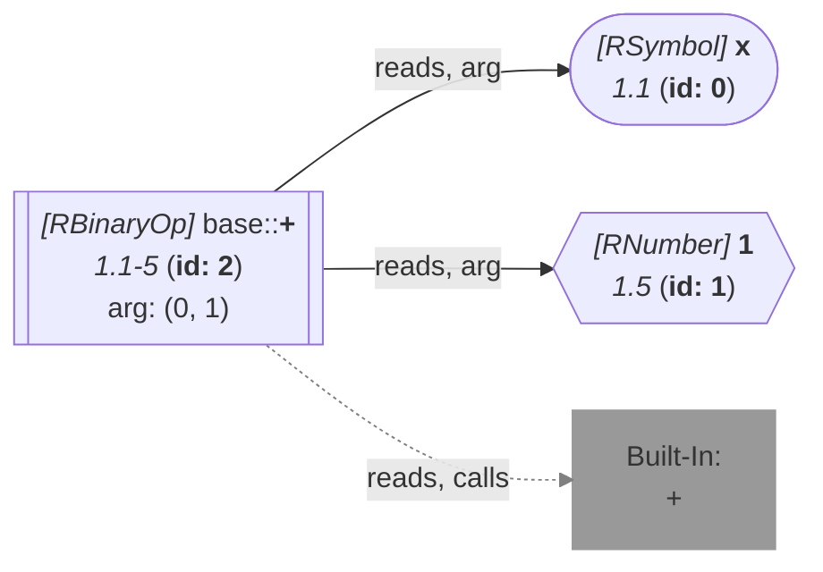

_This document was generated from '[src/documentation/wiki-query.ts](https://github.com/flowr-analysis/flowr/tree/main//src/documentation/wiki-query.ts)' on 2026-07-20, 13:05:03 UTC presenting an overview of flowR's query API (v2.12.3). Please do not edit this file/wiki page directly._
<h2 id="Project Query">Project Query&emsp;<sup>[<a href="https://github.com/flowr-analysis/flowr/wiki/Query-API">overview</a>]</sup></h2>

Returns information about the analyzed project\
_This query is requested with the type `project`._


This query returns the information about the analyzed project.
If present, it will incorporate plugins to, e.g., extract author and license information from R package DESCRIPTION files.


```json
[ { "type": "project" } ]
```


(This can be shortened to `@project` when used with the REPL command <span title="Description (Repl Command): Query the given R code (use 'help' for more information)">`:query`</span>).


_Results (prettified and summarized):_

Query: **project** (0 ms)\
&nbsp;&nbsp;&nbsp;╰ Kind: unknown\
&nbsp;&nbsp;&nbsp;╰ Dataflow not performed (run `:df#`, then re-run this query, or pass "withDf": true)\
_All queries together required ≈0 ms (1ms accuracy, total 0 ms)_

<details> <summary style="color:gray">Show Detailed Results as Json</summary>

The analysis required _0.5 ms_ (including parsing and normalization and the query) within the generation environment.

In general, the JSON contains the Ids of the nodes in question as they are present in the normalized AST or the dataflow graph of flowR.
Please consult the [Interface](https://github.com/flowr-analysis/flowr/wiki/interface) wiki page for more information on how to get those.


```json
{
  "project": {
    ".meta": {
      "timing": 0
    },
    "files": [],
    "roleCounts": {
      "description": 0,
      "namespace": 0,
      "news": 0,
      "vignette": 0,
      "test": 0,
      "install": 0,
      "data": 0,
      "license": 0,
      "virtual-env": 0,
      "manifest": 0,
      "startup": 0,
      "source": 0,
      "other": 0
    },
    "kind": "unknown"
  },
  ".meta": {
    "timing": 0
  }
}
```


</details>


<details> <summary style="color:gray">Original Code</summary>


```r
x + 1
```

<details>

<summary style="color:gray">Dataflow Graph of the R Code</summary>

The analysis required _1.5 ms_ (including parse and normalize, using the [r-shell](https://github.com/flowr-analysis/flowr/wiki/Engines) engine) within the generation environment. No [signature database](https://github.com/flowr-analysis/flowr/wiki/Signature-Database) is mounted for these generated graphs, so `library()` calls attach no package exports; base-R names are still qualified via the generated base-package store (e.g. `acf` as `stats::acf`). 
We encountered no unknown side effects during the analysis.




	


</details>


</details>
	


	
		

<details>

<summary style="color:gray">Implementation Details</summary>

Responsible for the execution of the Project Query query is `executeDataflowQuery` in [`./src/queries/catalog/project-query/project-query-executor.ts`](https://github.com/flowr-analysis/flowr/tree/main/./src/queries/catalog/project-query/project-query-executor.ts).

</details>