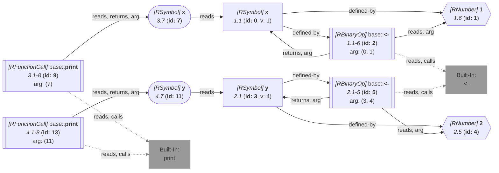

_This document was generated from '[src/documentation/wiki-query.ts](https://github.com/flowr-analysis/flowr/tree/main//src/documentation/wiki-query.ts)' on 2026-07-20, 17:48:26 UTC presenting an overview of flowR's query API (v2.12.3). Please do not edit this file/wiki page directly._
<h2 id="Resolve Value Query">Resolve Value Query&emsp;<sup>[<a href="https://github.com/flowr-analysis/flowr/wiki/Query-API">overview</a>]</sup></h2>

Provides access to flowR's value tracking (which is configurable)\
_This query is requested with the type `resolve-value`._\
Run in the REPL: `:query @resolve-value (<crit>;...) <code | file://path>`


With this query you can use flowR's value-tracking capabilities to resolve identifiers to all potential values they may have at runtime (if possible).
The extent to which flowR traces values (e.g., built-ins vs. constants) can be configured in flowR's Configuration file (see the [Interface](https://github.com/flowr-analysis/flowr/wiki/interface) wiki page for more information).

Using the example code `x <- 1
y <-2
print(x)
print(y)` (with newlines), the following query returns all values of `x` in the code:


```json
[
  {
    "type": "resolve-value",
    "criteria": [
      "3@x",
      "4@y"
    ]
  }
]
```


(This can be shortened to `@resolve-value (3@x;4@y) "x <- 1\ny <-2\nprint(x)\nprint(y)"` when used with the REPL command <span title="Description (Repl Command): Query the given R code (use 'help' for more information)">`:query`</span>).


_Results (prettified and summarized):_

Query: **resolve-value** (6 ms)\
&nbsp;&nbsp;&nbsp;╰ Values for {3@x, 4@y}\
&nbsp;&nbsp;&nbsp;&nbsp;&nbsp;╰ [1L, 1L], [2L, 2L]\
_All queries together required ≈6 ms (1ms accuracy, total 6 ms)_

<details> <summary style="color:gray">Show Detailed Results as Json</summary>

The analysis required _6.0 ms_ (including parsing and normalization and the query) within the generation environment.

In general, the JSON contains the Ids of the nodes in question as they are present in the normalized AST or the dataflow graph of flowR.
Please consult the [Interface](https://github.com/flowr-analysis/flowr/wiki/interface) wiki page for more information on how to get those.


```json
{
  "resolve-value": {
    ".meta": {
      "timing": 6
    },
    "results": {
      "{\"type\":\"resolve-value\",\"criteria\":[\"3@x\",\"4@y\"]}": {
        "values": [
          {
            "type": "set",
            "elements": [
              {
                "type": "interval",
                "start": {
                  "type": "number",
                  "value": {
                    "markedAsInt": true,
                    "num": 1,
                    "complexNumber": false
                  }
                },
                "end": {
                  "type": "number",
                  "value": {
                    "markedAsInt": true,
                    "num": 1,
                    "complexNumber": false
                  }
                },
                "startInclusive": true,
                "endInclusive": true
              }
            ]
          },
          {
            "type": "set",
            "elements": [
              {
                "type": "interval",
                "start": {
                  "type": "number",
                  "value": {
                    "markedAsInt": true,
                    "num": 2,
                    "complexNumber": false
                  }
                },
                "end": {
                  "type": "number",
                  "value": {
                    "markedAsInt": true,
                    "num": 2,
                    "complexNumber": false
                  }
                },
                "startInclusive": true,
                "endInclusive": true
              }
            ]
          }
        ]
      }
    }
  },
  ".meta": {
    "timing": 6
  }
}
```


</details>


<details> <summary style="color:gray">Original Code</summary>


```r
x <- 1
y <-2
print(x)
print(y)
```

<details>

<summary style="color:gray">Dataflow Graph of the R Code</summary>

The analysis required _2.6 ms_ (including parse and normalize, using the [r-shell](https://github.com/flowr-analysis/flowr/wiki/Engines) engine) within the generation environment. No [signature database](https://github.com/flowr-analysis/flowr/wiki/Signature-Database) is mounted for these generated graphs, so `library()` calls attach no package exports; base-R names are still qualified via the generated base-package store (e.g. `acf` as `stats::acf`). 
We encountered unknown side effects (with ids: 9 (linked), 13 (linked)) during the analysis.




	


</details>


</details>
	


	
		

<details>

<summary style="color:gray">Implementation Details</summary>

Responsible for the execution of the Resolve Value Query query is `executeSearch` in [`./src/queries/catalog/resolve-value-query/resolve-value-query-executor.ts`](https://github.com/flowr-analysis/flowr/tree/main/./src/queries/catalog/resolve-value-query/resolve-value-query-executor.ts).

</details>